1------------------------------------------------

[S2016

A circular blue ink stamp. The outer ring contains the text "UNIVERSITY OF CALIFORNIA" at the top and "DAVIS" at the bottom. In the center, there is a crest featuring a grizzly bear. Below the crest, the words "DEPARTMENT OF ENTOMOLOGY" are written in a circular arrangement.

2------------------------------------------------

This image is a scan of a blank page. The paper has a light beige or cream-colored tint. There are a few very small, dark specks scattered across the surface, which appear to be scanning artifacts or dust particles. No text, lines, or other markings are present on the page.

3------------------------------------------------

This image is a scan of a blank page. The paper has a light beige or cream-colored tint. There are a few very small, faint dark spots scattered across the surface, which appear to be scanning artifacts or minor imperfections in the paper. No text, lines, or other markings are present.

4------------------------------------------------

COMMENCED IN 1881.

top after step the ladder is ascended."—George Herbert, *Jacula Prudentum*.

# THE TROPICAL AGRICULTURIST:

A MONTHLY RECORD OF INFORMATION FOR PLANTERS

OF

TEA, CACAO, COFFEE, PALMS, RUBBER, CINCHONA, SUGAR,  
COTTON, TOBACCO, SPICES, CAMPHOR, RICE,  
AND OTHER PRODUCTS SUITED FOR CULTIVATION IN THE TROPICS.

EDITED BY

J. FERGUSON,

of the "Ceylon Observer," "Ceylon Handbook and Directory," &c.

"It is both the duty and interest of every owner and cultivator of the soil to study the best means of rendering that soil subservient to his own and the general wants of the community; and he who introduces, beneficially, a new and useful *Seed, Plant* or *Shrub* into his district, is a blessing and an honour to his country."—SIR J. SINCLAIR.

## VOL. XVI.

[Containing Numbers I. to XII.: July 1896 to June 1897.]

Colombo, Ceylon:

A. M. & J. FERGUSON.

LONDON:

JOHN HADDON & Co.; KEGAN PAUL, TRENCH, TRÜBNER & Co., LTD.; LUZAC & Co.; &c.

MADRAS: HIGGINBOTHAM & Co.—CALCUTTA: THACKER, SPINK & Co.;

BOMBAY: THACKER & Co., LTD.—AUSTRALIAN COLONIES: GORDON & GOTCH,

WEST INDIES AND CENTRAL AMERICA: C. H. CALDERON, ST. THOMAS.

STRAITS SETTLEMENTS AND EASTERN ARCHIPELAGO: JOHN LITTLE & Co., SINGAPORE.

JAVA: MESSRS. JOHN PRYCE & Co.; G. KOLFF & Co., BATAVIA.

MDCCCXCVII.

5------------------------------------------------

<!-- stage4: FAINT old-images-only -->

[Faint page: no legible print of its own could be verified; text withheld (stage 4 review list)]

6------------------------------------------------

## TO OUR READERS.

---

In closing the Sixteenth Volume of the "Tropical Agriculturist," we would as usual direct attention to the large amount of useful information afforded and to the great variety of topics treated in the several numbers. From month to month, we have endeavoured to embody in these pages the latest results of practical experience and scientific teaching in all that concerns tropical agriculture; and our ambition has been to make our periodical not only indispensable to the planter, but of service to business men and capitalists, never forgetting that agriculture trenches upon every department of human knowledge, besides being the basis of personal and communal wealth.

While directing our attention chiefly to the products prominently mentioned on our title-page, we have always taken care to notice minor industries likely to fit in with sub-tropical conditions: and our readers have an ample guarantee in the index pages before them, that, in the future, no pains will be spared to bring together all available information both from the West and East, the same being examined in the light of the teachings of common sense as well as of prolonged tropical experience in this, the leading Crown and Planting Colony of the British Empire.

Special attention has, during the past year, been given to the extension of the fibre industry (rhea, sisal, &c.); rubber; cacao in Guiana and the West Indies as in Ceylon; coffee and other products in Nyassaland, British Central Africa; Liberian coffee and other products in Sumatra, Java, the Straits Settlements; and to other new developments in coffee, coconuts and tobacco planting, &c., in the Malayan Peninsula and North Borneo.

The Tea-planting Industry has sprung into so much importance in India (South as well as North) and Ceylon, as also in Java, that a considerable amount of space is naturally given to this great staple; and we think it will be admitted by impartial judges that the *Tropical Agriculturist* should be filled, for the convenience of planters, in every Tea Factory in this Island, in India and in Java.

A full and accurate Index affords the means of ready reference to every subject treated in this, the sixteenth volume, which we now place in our subscribers' hands, in the full confidence that it will be received with an amount of approval, at least equal to that which has been so kindly extended to its predecessors.

To show how fully other Products besides Tea are treated in this volume we may mention the number of entries under several headings as follows:—Coffee (including Liberian) 86; Cacao 16; Indiarubber 26; Coconuts and other Palms 20; and Miscellaneous Products nearly 1,000. In the 16 Volumes, the references to Coffee, Rubber, and Cacao number many thousands, as also to Coconuts and other Palms.

We are convinced that no more suitable or useful gift can be made to the tropical planter or agriculturist, whether he be about to enter on his career, or with many years of experience behind him, than the sixteen volumes of our periodical which we have now made available. They are full of information bearing on every department and relating to nearly every product within the scope of sub-tropical industries.

In conclusion, we have to tender our thanks to readers and contributors, and our wish that all friends may continue to write instructively and to read with approval; for then, indeed, must the "Tropical Agriculturist" continue to do well.

J. FERGUSON.

COLOMBO, CEYLON; 1ST JULY 1897.

7------------------------------------------------

<!-- stage4: FAINT old-images-only -->

[Faint page: no legible print of its own could be verified; text withheld (stage 4 review list)]

This image is a scan of a blank page. The paper has a light beige or cream-colored tint. There are a few very small, faint dark spots scattered across the surface, which appear to be scanning artifacts or dust particles. No text, lines, or other markings are present on the page.

8------------------------------------------------

# INDEX.

## A.

<table style="width: 100%; border-collapse: collapse;">
<thead>
<tr>
<th style="text-align: left;"></th>
<th style="text-align: right;">PAGE.</th>
</tr>
</thead>
<tbody>
<tr>
<td>Acme Package Co., Ltd. ...</td>
<td style="text-align: right;">192, 194</td>
</tr>
<tr>
<td>    Tea Chests ...</td>
<td style="text-align: right;">[See Tea.]</td>
</tr>
<tr>
<td>Adulteration of Produce ...</td>
<td style="text-align: right;">437, 716</td>
</tr>
<tr>
<td>    "Advances" to Coolies and "Tundu"         System in Ceylon ...</td>
<td style="text-align: right;">[See Labour Supply.]</td>
</tr>
<tr>
<td>Africa, British Central, Coconut Planting in</td>
<td style="text-align: right;">329</td>
</tr>
<tr>
<td>    Coffee Cultivation in</td>
<td style="text-align: right;">133, 191, 348, 419, 423, 452, 481, 530, 610, 611, 741, 42</td>
</tr>
<tr>
<td>    Planting and Progress in</td>
<td style="text-align: right;">29, 271, 309, 318, 394, 414, 524, 526, 612, 618, 753, 761, 829, 850</td>
</tr>
<tr>
<td>    East, Planting in ...</td>
<td style="text-align: right;">346</td>
</tr>
<tr>
<td>    Central, Dinner of the Planters of</td>
<td style="text-align: right;">466</td>
</tr>
<tr>
<td>    Coffee in ...</td>
<td style="text-align: right;">[See Coffee.]</td>
</tr>
<tr>
<td>    German East, Coffee in ...</td>
<td style="text-align: right;">412</td>
</tr>
<tr>
<td>    Produce in ...</td>
<td style="text-align: right;">759</td>
</tr>
<tr>
<td>    Kola in ...</td>
<td style="text-align: right;">[See Kola.]</td>
</tr>
<tr>
<td>    Middle, Climate of ...</td>
<td style="text-align: right;">88</td>
</tr>
<tr>
<td>    Roads and Railways in</td>
<td style="text-align: right;">451</td>
</tr>
<tr>
<td>    South, A Ceylon Planter on</td>
<td style="text-align: right;">433</td>
</tr>
<tr>
<td>    Farming in</td>
<td style="text-align: right;">248</td>
</tr>
<tr>
<td>    Tea Cultivation in</td>
<td style="text-align: right;">[See Tea.]</td>
</tr>
<tr>
<td>    West, Coffee in</td>
<td style="text-align: right;">423, 448</td>
</tr>
<tr>
<td>    India rubber in</td>
<td style="text-align: right;">531</td>
</tr>
<tr>
<td>    Planting in</td>
<td style="text-align: right;">447, 518</td>
</tr>
<tr>
<td>Agra Oavah Estates Co., Ltd.</td>
<td style="text-align: right;">177, 409, 624</td>
</tr>
<tr>
<td>Agriculture in Western India</td>
<td style="text-align: right;">140</td>
</tr>
<tr>
<td>    and Modern Science ...</td>
<td style="text-align: right;">730</td>
</tr>
<tr>
<td>    in Australia</td>
<td style="text-align: right;">414</td>
</tr>
<tr>
<td>    in the Alpes Maritimes</td>
<td style="text-align: right;">593</td>
</tr>
<tr>
<td>    A Department of, for Ceylon</td>
<td style="text-align: right;">869</td>
</tr>
<tr>
<td>    in Zanzibar ...</td>
<td style="text-align: right;">627, 793</td>
</tr>
<tr>
<td>    in Ceylon ...</td>
<td style="text-align: right;">749</td>
</tr>
<tr>
<td>Agricultural College, Madras</td>
<td style="text-align: right;">617</td>
</tr>
<tr>
<td>    College, Queensland ...</td>
<td style="text-align: right;">831</td>
</tr>
<tr>
<td>    Department of Queensland</td>
<td style="text-align: right;">889</td>
</tr>
<tr>
<td>    of United States</td>
<td style="text-align: right;">379</td>
</tr>
<tr>
<td>    Education in Ceylon ...</td>
<td style="text-align: right;">888</td>
</tr>
<tr>
<td>    in India ...</td>
<td style="text-align: right;">868, 889</td>
</tr>
<tr>
<td>    Implements</td>
<td style="text-align: right;">360</td>
</tr>
<tr>
<td>    Literature ...</td>
<td style="text-align: right;">[See Literature.]</td>
</tr>
<tr>
<td>    Notes, 71, 139, 143, 210, 286, 294, 360,     368, 498, 578, 586, 652, 726, 734, 808,</td>
<td style="text-align: right;">815</td>
</tr>
<tr>
<td>    Pests... 404, 441, 515, 591, 664, 739, 821</td>
<td></td>
</tr>
<tr>
<td>    Returns of Great Britain</td>
<td style="text-align: right;">273</td>
</tr>
<tr>
<td>    School, Colombo ...</td>
<td style="text-align: right;">292, 367</td>
</tr>
<tr>
<td>    Rainfall taken at     the ...</td>
<td style="text-align: right;">[See Rainfall.]</td>
</tr>
<tr>
<td>Agri-Horticultural Society, Nilgiris</td>
<td style="text-align: right;">395</td>
</tr>
<tr>
<td>    Show, Nuwara Eliya</td>
<td style="text-align: right;">749, 754, 809</td>
</tr>
<tr>
<td>Alagalla, Planting in ...</td>
<td style="text-align: right;">11</td>
</tr>
<tr>
<td>Albizza Moluccana ...</td>
<td style="text-align: right;">765</td>
</tr>
<tr>
<td>Alliance Tea Co. of Ceylon, Ltd. ...</td>
<td style="text-align: right;">865</td>
</tr>
<tr>
<td>Alpes Maritimes, Agriculture in the ...</td>
<td style="text-align: right;">593</td>
</tr>
<tr>
<td>Amalgamated Tea Estates Co., Ltd. ...</td>
<td style="text-align: right;">255</td>
</tr>
<tr>
<td>Amboina Islands, Cacao and Cinnamon in</td>
<td style="text-align: right;">648</td>
</tr>
</tbody>
</table>

<table style="width: 100%; border-collapse: collapse;">
<thead>
<tr>
<th style="text-align: left;"></th>
<th style="text-align: right;">PAGE.</th>
</tr>
</thead>
<tbody>
<tr>
<td>America, Advertising Tea in ...</td>
<td style="text-align: right;">[See Tea.]</td>
</tr>
<tr>
<td>    Bananas in ...</td>
<td style="text-align: right;">236</td>
</tr>
<tr>
<td>    Cacao in ...</td>
<td style="text-align: right;">[See Cacao.]</td>
</tr>
<tr>
<td>    Ceylon Tea in ...</td>
<td style="text-align: right;">[See Tea.]</td>
</tr>
<tr>
<td>    Cocoa Imports into ...</td>
<td style="text-align: right;">850</td>
</tr>
<tr>
<td>    Coffee in ...</td>
<td style="text-align: right;">[See Coffee.]</td>
</tr>
<tr>
<td>    Indian Tea in ...</td>
<td style="text-align: right;">[See Tea.]</td>
</tr>
<tr>
<td>    Vegetable Products of ...</td>
<td style="text-align: right;">351</td>
</tr>
<tr>
<td>    What the People Drink in ...</td>
<td style="text-align: right;">830</td>
</tr>
<tr>
<td>American <i>Grocer</i> and Tea and Coffee...</td>
<td style="text-align: right;">20</td>
</tr>
<tr>
<td>    Tea Campaign ...</td>
<td style="text-align: right;">[See Tea.]</td>
</tr>
<tr>
<td>Amsterdam Market ...</td>
<td style="text-align: right;">22</td>
</tr>
<tr>
<td>    Cinchona Auctions</td>
<td style="text-align: right;">[See Cinchona.]</td>
</tr>
<tr>
<td>    Drug Market 104, 344, 384, 393, 470</td>
<td></td>
</tr>
<tr>
<td>Ankanda Estate Co., of Ceylon, Ltd.</td>
<td style="text-align: right;">691</td>
</tr>
<tr>
<td>Ants and Orchids...</td>
<td style="text-align: right;">134</td>
</tr>
<tr>
<td>    on Tea Estates ...</td>
<td style="text-align: right;">144</td>
</tr>
<tr>
<td>    White, to Protect Plants from ...</td>
<td style="text-align: right;">586</td>
</tr>
<tr>
<td>    White, Dr. Watt's Report on</td>
<td style="text-align: right;">29</td>
</tr>
<tr>
<td>Anuradhapura Botanic Gardens</td>
<td style="text-align: right;">[See Botanic Gardens, Ceylon.]</td>
</tr>
<tr>
<td>Apiculture ...</td>
<td style="text-align: right;">[See Bee Culture.]</td>
</tr>
<tr>
<td>Apple-tainted Tea ...</td>
<td style="text-align: right;">79</td>
</tr>
<tr>
<td>Arabic-Liberian Grafts, Seed from ...</td>
<td style="text-align: right;">155</td>
</tr>
<tr>
<td>Arbitration and Brokers ...</td>
<td style="text-align: right;">28</td>
</tr>
<tr>
<td>Arboriculture, Roadside, Protection of Trees in</td>
<td style="text-align: right;">585</td>
</tr>
<tr>
<td>Arcanut Cultivation in Ceylon ...</td>
<td style="text-align: right;">660</td>
</tr>
<tr>
<td>    in India ...</td>
<td style="text-align: right;">659, 729</td>
</tr>
<tr>
<td>Arcanuts. Market for ...</td>
<td style="text-align: right;">18, 355</td>
</tr>
<tr>
<td>Arnotto Market ...</td>
<td style="text-align: right;">18, 111</td>
</tr>
<tr>
<td>Arntully Estate, Jamaica ...</td>
<td style="text-align: right;">751</td>
</tr>
<tr>
<td>Asia, Central Russian, Trade of ...</td>
<td style="text-align: right;">320</td>
</tr>
<tr>
<td>Assam Tea Cultivation in ...</td>
<td style="text-align: right;">293, 260, 752</td>
</tr>
<tr>
<td>    Gardens, Sale of ...</td>
<td style="text-align: right;">470</td>
</tr>
<tr>
<td>Associated Tea Estates of Ceylon, Ltd.</td>
<td style="text-align: right;">169, 180, 454</td>
</tr>
<tr>
<td>Augusta Tea Estate Co., Ltd. ...</td>
<td style="text-align: right;">477</td>
</tr>
<tr>
<td>Australia, Agriculture in ...</td>
<td style="text-align: right;">414</td>
</tr>
<tr>
<td>    Mr. E. M. Hay's Visit to ..</td>
<td style="text-align: right;">56</td>
</tr>
<tr>
<td>    Tea in ..</td>
<td style="text-align: right;">[See Tea.]</td>
</tr>
<tr>
<td>Australian New Hebrides Co., Ltd. ...</td>
<td style="text-align: right;">717</td>
</tr>
</tbody>
</table>

## B.

<table style="width: 100%; border-collapse: collapse;">
<tbody>
<tr>
<td>Bahamas, Sisal Industry of the</td>
<td style="text-align: right;">[See Sisal.]</td>
</tr>
<tr>
<td>Balata Concessions in Guiana ...</td>
<td style="text-align: right;">200</td>
</tr>
<tr>
<td>Bamber, Mr. Kelway ...</td>
<td style="text-align: right;">792</td>
</tr>
<tr>
<td>Bamboo Dogcarts ...</td>
<td style="text-align: right;">201</td>
</tr>
<tr>
<td>Banana Culivation in Madeira ...</td>
<td style="text-align: right;">538</td>
</tr>
<tr>
<td>    in the West Indies ...</td>
<td style="text-align: right;">20</td>
</tr>
<tr>
<td>    Flour ...</td>
<td style="text-align: right;">46</td>
</tr>
<tr>
<td>    Meal ...</td>
<td style="text-align: right;">368</td>
</tr>
<tr>
<td>    Trade of Fiji ...</td>
<td style="text-align: right;">280</td>
</tr>
<tr>
<td>Bananaland, A Winter Trip to ...</td>
<td style="text-align: right;">406</td>
</tr>
<tr>
<td>Bananas in England ...</td>
<td style="text-align: right;">199</td>
</tr>
<tr>
<td>    in Mexico... ...</td>
<td style="text-align: right;">236</td>
</tr>
<tr>
<td>    the Fruit of Paradise ...</td>
<td style="text-align: right;">245</td>
</tr>
<tr>
<td>Bandarapola Ceylon Co., Ltd. 310, 343, 825, 859</td>
<td></td>
</tr>
<tr>
<td>Basic Slag as Manure ...</td>
<td style="text-align: right;">539</td>
</tr>
<tr>
<td>Batoum, Tea Cultivation near</td>
<td style="text-align: right;">[See Tea Culti- vation in Russia.]</td>
</tr>
<tr>
<td>Buttagalla Estate Co., Ltd. ...</td>
<td style="text-align: right;">852</td>
</tr>
<tr>
<td>Beaumont Tea Co. of Ceylon, Ltd. ...</td>
<td style="text-align: right;">6</td>
</tr>
</tbody>
</table>

9------------------------------------------------

## INDEX.

<table border="0">
<thead>
<tr>
<th></th>
<th style="text-align: right;">PAGE.</th>
<th></th>
<th style="text-align: right;">PAGE.</th>
</tr>
</thead>
<tbody>
<tr>
<td>Beehnanaland and its Planting Possibilities</td>
<td style="text-align: right;">44</td>
<td>Caledonian (Ceylon) Tea Plantations, Ltd.</td>
<td style="text-align: right;">433</td>
</tr>
<tr>
<td>Bee-culture in Ceylon</td>
<td style="text-align: right;">210, 213</td>
<td>Calves, Scour on</td>
<td style="text-align: right;">815</td>
</tr>
<tr>
<td>Bee-hives</td>
<td style="text-align: right;">289</td>
<td>—, Tapeworm in, How to Expel</td>
<td style="text-align: right;">143</td>
</tr>
<tr>
<td>Beling, Mr. H. P., and the Ceylon Importing Company, Iowa</td>
<td style="text-align: right;">17</td>
<td>Camphor</td>
<td style="text-align: right;">197</td>
</tr>
<tr>
<td>Bengal, Coffee in</td>
<td style="text-align: right;">249</td>
<td>—, Cultivation in India</td>
<td style="text-align: right;">268</td>
</tr>
<tr>
<td>Betel Blight</td>
<td style="text-align: right;">267</td>
<td>—, Florida</td>
<td style="text-align: right;">79</td>
</tr>
<tr>
<td>Bhang as a Febrifuge</td>
<td style="text-align: right;">873</td>
<td>—, Leaf Oil</td>
<td style="text-align: right;">172</td>
</tr>
<tr>
<td>Bibliography of Cacao</td>
<td style="text-align: right;">[See Cacao.]</td>
<td>—, Market</td>
<td style="text-align: right;">202</td>
</tr>
<tr>
<td>— of Coffee</td>
<td style="text-align: right;">[See Coffee.]</td>
<td>—, Seeds</td>
<td style="text-align: right;">56</td>
</tr>
<tr>
<td>— of Tea</td>
<td style="text-align: right;">[See Tea.]</td>
<td>Canada, Advertising Ceylon Tea in America.</td>
<td style="text-align: right;">[See Tea in America.]</td>
</tr>
<tr>
<td>Blackstone Estate Co., Ltd.</td>
<td style="text-align: right;">476</td>
<td>—, British Empire Exposition</td>
<td style="text-align: right;">16</td>
</tr>
<tr>
<td>Blackwood Coffee Company, Ltd.</td>
<td style="text-align: right;">524</td>
<td>Cape Botanic Gardens</td>
<td style="text-align: right;">[See Botanic Gardens.]</td>
</tr>
<tr>
<td>Blechyniden, Mr., Tea Advertising by, in America</td>
<td style="text-align: right;">[See Tea, Indian.]</td>
<td>—, Fruit</td>
<td style="text-align: right;">668</td>
</tr>
<tr>
<td>Board of Trade Returns and Produce</td>
<td style="text-align: right;">312, 745</td>
<td>Capsicum in India</td>
<td style="text-align: right;">373, 444</td>
</tr>
<tr>
<td>Bogawantalawa District Tea Co., Ltd.</td>
<td style="text-align: right;">676</td>
<td>Carbide of Calcium as an Insecticide</td>
<td style="text-align: right;">176</td>
</tr>
<tr>
<td>Bohmeria Nivea</td>
<td style="text-align: right;">[See Rhea.]</td>
<td>Carbolic Cure for Leaf Disease</td>
<td style="text-align: right;">28</td>
</tr>
<tr>
<td>Borer in Cacao</td>
<td style="text-align: right;">802</td>
<td>Cardamom Cultivation in Coorg</td>
<td style="text-align: right;">300</td>
</tr>
<tr>
<td>Borneo Coffee Co., Ltd.</td>
<td style="text-align: right;">461</td>
<td>—, Exports from Ceylon 63, 135, 207, 283, 357, 439, 495, 575, 649, 723, 805, 879</td>
<td style="text-align: right;"></td>
</tr>
<tr>
<td>—, in</td>
<td style="text-align: right;">[See Coffee.]</td>
<td>Cardamoms</td>
<td style="text-align: right;">469</td>
</tr>
<tr>
<td>—, North British</td>
<td style="text-align: right;">186, 844, 849</td>
<td>—, Market for</td>
<td style="text-align: right;">355, 494</td>
</tr>
<tr>
<td>—, Planting in</td>
<td style="text-align: right;">530, 690, 640, 746</td>
<td>Carolina, South, Tea Cultivation in</td>
<td style="text-align: right;">383</td>
</tr>
<tr>
<td>Borholla Assam Tea Co.,</td>
<td style="text-align: right;">12</td>
<td>Carrot Seed</td>
<td style="text-align: right;">347</td>
</tr>
<tr>
<td>Botanic Gardens, Calcutta</td>
<td style="text-align: right;">155, 197, 200</td>
<td>Cashmeres, Black, To Clean</td>
<td style="text-align: right;">69</td>
</tr>
<tr>
<td>—, Cape</td>
<td style="text-align: right;">168</td>
<td>Cassava, Preparations from</td>
<td style="text-align: right;">883</td>
</tr>
<tr>
<td>—, Ceylon</td>
<td style="text-align: right;">46</td>
<td>Cassia, Farnesian</td>
<td style="text-align: right;">80</td>
</tr>
<tr>
<td>—, Granada</td>
<td style="text-align: right;">121</td>
<td>Castilica Rubber</td>
<td style="text-align: right;">426</td>
</tr>
<tr>
<td>—, Kew</td>
<td style="text-align: right;">334</td>
<td>Castlereagh Tea Company of Ceylon, Ltd.</td>
<td style="text-align: right;">171, 675</td>
</tr>
<tr>
<td>—, Nilgiris</td>
<td style="text-align: right;">237</td>
<td>Catepillars and Tea</td>
<td style="text-align: right;">754</td>
</tr>
<tr>
<td>—, Saharanpur and Mussooree</td>
<td style="text-align: right;">337</td>
<td>Cattle, Abortion in</td>
<td style="text-align: right;">734</td>
</tr>
<tr>
<td>—, Trinidad</td>
<td style="text-align: right;">48</td>
<td>—, Dips for</td>
<td style="text-align: right;">71</td>
</tr>
<tr>
<td>Botanical Survey of India</td>
<td style="text-align: right;">387</td>
<td>—, Diseases, Salt as a Preventative of</td>
<td style="text-align: right;">144</td>
</tr>
<tr>
<td>—, Stall, Ceylon</td>
<td style="text-align: right;">261, 526</td>
<td>—, in the United Kingdom</td>
<td style="text-align: right;">368</td>
</tr>
<tr>
<td>Brazil, Agriculture and Planting in</td>
<td style="text-align: right;">878</td>
<td>—, Murain</td>
<td style="text-align: right;">[See Rinderpest.]</td>
</tr>
<tr>
<td>—, as a Tea-growing Country</td>
<td style="text-align: right;">309, 538</td>
<td>—, Notes on</td>
<td style="text-align: right;">580</td>
</tr>
<tr>
<td>—, Forest Wealth of</td>
<td style="text-align: right;">234</td>
<td>—, Poisoning of, by Jowari Plant</td>
<td style="text-align: right;">144</td>
</tr>
<tr>
<td>Breeders' Table</td>
<td style="text-align: right;">507</td>
<td>—, Remedy for Sore Eyes in</td>
<td style="text-align: right;">368</td>
</tr>
<tr>
<td>British Dependencies, Coffee Production in</td>
<td style="text-align: right;">[See Coffee.]</td>
<td>—, —, Warts in</td>
<td style="text-align: right;">368</td>
</tr>
<tr>
<td>—, Tea Production in</td>
<td style="text-align: right;">[See Tea.]</td>
<td>—, Slaughter of</td>
<td style="text-align: right;">882</td>
</tr>
<tr>
<td>—, Capital, Openings for</td>
<td style="text-align: right;">2</td>
<td>—, Ticks in</td>
<td style="text-align: right;">51</td>
</tr>
<tr>
<td>—, Ceylon Tea Estates Co., Ltd.</td>
<td style="text-align: right;">308</td>
<td>—, To Ascertain the Weight of</td>
<td style="text-align: right;">660</td>
</tr>
<tr>
<td>—, Colonics, Cooly Labour in</td>
<td style="text-align: right;">309</td>
<td>Caucasus, Tea Cultivation in the</td>
<td style="text-align: right;">[See Tea Cultivation in Russia.]</td>
</tr>
<tr>
<td>—, Empire Exposition, Canada</td>
<td style="text-align: right;">16</td>
<td>Cawnpore Experimental Farm</td>
<td style="text-align: right;">743</td>
</tr>
<tr>
<td>—, Honduras, Agriculture in</td>
<td style="text-align: right;">615</td>
<td>Cedars, Destruction of</td>
<td style="text-align: right;">782</td>
</tr>
<tr>
<td>—, North Borneo Co.</td>
<td style="text-align: right;">164</td>
<td>Cement Floors</td>
<td style="text-align: right;">766</td>
</tr>
<tr>
<td>—, Trade, Early</td>
<td style="text-align: right;">182</td>
<td>Central Province of Ceylon Tea Company Ltd.</td>
<td style="text-align: right;">641, 646</td>
</tr>
<tr>
<td>—, with Central Russian Asia</td>
<td style="text-align: right;">320</td>
<td>—, Tea Co. of Ceylon, Ltd.</td>
<td style="text-align: right;">405, 427</td>
</tr>
<tr>
<td>Brown, The Late Mr. John (Pioneer)</td>
<td style="text-align: right;">735</td>
<td>Ceylon, A Flower and Fruit Experiment in</td>
<td style="text-align: right;">56</td>
</tr>
<tr>
<td>Buchlandia, Planting of, among Tea</td>
<td style="text-align: right;">183</td>
<td>—, Association in London</td>
<td style="text-align: right;">1, 408</td>
</tr>
<tr>
<td>Bugs and Their Economic Destruction</td>
<td style="text-align: right;">101</td>
<td>—, and Oriental Estates Co., Ltd.</td>
<td style="text-align: right;">9, 42, 163</td>
</tr>
<tr>
<td>Burnside Tea Co. of Ceylon, Ltd.</td>
<td style="text-align: right;">187, 188, 251</td>
<td>—, at the Imperial Institute</td>
<td style="text-align: right;">2</td>
</tr>
<tr>
<td>Byrde, Lieut. Col. Henry C. (Pioneer)</td>
<td style="text-align: right;">587</td>
<td>—, Botanic Gardens</td>
<td style="text-align: right;">[See Botanic Gardens.]</td>
</tr>
<tr>
<td>Brokers and Arbitration</td>
<td style="text-align: right;">28</td>
<td>—, Cacao Cultivation in</td>
<td style="text-align: right;">[See Cacao.]</td>
</tr>
<tr>
<td>—, Cocoa</td>
<td style="text-align: right;">877</td>
<td>—, Cinchona Association, Ltd.</td>
<td style="text-align: right;">488</td>
</tr>
<tr>
<td>Burma Rice Crops</td>
<td style="text-align: right;">764</td>
<td>—, Cinnamon in</td>
<td style="text-align: right;">[See Cinnamon.]</td>
</tr>
<tr>
<td>Butter, How to Make</td>
<td style="text-align: right;">71</td>
<td>—, Coccidae of</td>
<td style="text-align: right;">165, 647</td>
</tr>
<tr>
<td>—, A Pound of, Quantity of Milk required to Make</td>
<td style="text-align: right;">140</td>
<td>—, Coconut Cultivation in</td>
<td style="text-align: right;">[See Coconut.]</td>
</tr>
<tr>
<td style="text-align: center;"><b>C.</b></td>
<td></td>
<td>—, Coffee Cultivation in</td>
<td style="text-align: right;">[See Coffee.]</td>
</tr>
<tr>
<td>Cacao, Bibliography of</td>
<td style="text-align: right;">443, 517</td>
<td>—, Estates Investment Association, Ltd.</td>
<td style="text-align: right;">112</td>
</tr>
<tr>
<td>—, Cultivation in Mexico</td>
<td style="text-align: right;">124</td>
<td>—, Fibres in</td>
<td style="text-align: right;">[See Fibre.]</td>
</tr>
<tr>
<td>—, in Venezuela</td>
<td style="text-align: right;">221</td>
<td>—, Flora of</td>
<td style="text-align: right;">683</td>
</tr>
<tr>
<td>—, Disease in Ceylon</td>
<td style="text-align: right;">719, 764, 795, 801, 856</td>
<td>—, Forest Laws of</td>
<td style="text-align: right;">139</td>
</tr>
<tr>
<td>—, Enemies of</td>
<td style="text-align: right;">748, 793, 802, 873</td>
<td>—, Gardening in</td>
<td style="text-align: right;">415, 670</td>
</tr>
<tr>
<td>—, Production and Prices</td>
<td style="text-align: right;">200</td>
<td>—, Hills Tea Estates Co., Ltd.</td>
<td style="text-align: right;">455, 616</td>
</tr>
<tr>
<td>—, [See also under Cocoa.]</td>
<td></td>
<td>—, Import Tea Duty</td>
<td style="text-align: right;">[See Tea Duty.]</td>
</tr>
<tr>
<td>Caffeine, Market</td>
<td style="text-align: right;">56</td>
<td>—, Indiarrubber Cultivation in</td>
<td style="text-align: right;">[See Indiarrubber.]</td>
</tr>
<tr>
<td>Calcutta Botanic Gardens</td>
<td style="text-align: right;">[See Botanic Gardens.]</td>
<td>—, Indiarrubber in</td>
<td style="text-align: right;">[See Indiarrubber.]</td>
</tr>
<tr>
<td>Caledonia, New, Coffee in</td>
<td style="text-align: right;">[See Coffee.]</td>
<td>—, Land and Produce Co., Ltd.</td>
<td style="text-align: right;">163, 522, 539</td>
</tr>
<tr>
<td>California, Notes from</td>
<td style="text-align: right;">15</td>
<td>—, Limited Companies in</td>
<td style="text-align: right;">401</td>
</tr>
<tr>
<td>—, Oranges in</td>
<td style="text-align: right;">[See Oranges.]</td>
<td>—, Minor Products in</td>
<td style="text-align: right;">758</td>
</tr>
<tr>
<td></td>
<td></td>
<td>—, New Industries for</td>
<td style="text-align: right;">507</td>
</tr>
</tbody>
</table>

10------------------------------------------------

## INDEX.

<table border="0" style="width: 100%; border-collapse: collapse;">
<thead>
<tr>
<th style="text-align: left;"></th>
<th style="text-align: right;">PAGE.</th>
<th style="text-align: left;"></th>
<th style="text-align: right;">PAGE.</th>
</tr>
</thead>
<tbody>
<tr>
<td>Ceylon Patents ... [See Patents.]</td>
<td></td>
<td>Cocoa and Cocaine ...</td>
<td style="text-align: right;">845</td>
</tr>
<tr>
<td>— Planter, A. on his Journeys in Europe and South Africa ...</td>
<td style="text-align: right;">433</td>
<td>— and Coffee ...</td>
<td style="text-align: right;">48</td>
</tr>
<tr>
<td>— Planters' Association ...</td>
<td style="text-align: right;">633</td>
<td>— Consumption in America ...</td>
<td style="text-align: right;">850</td>
</tr>
<tr>
<td>— Plantations and Labour Supply [See Labour Supply.]</td>
<td></td>
<td>— during 1896 ...</td>
<td style="text-align: right;">596</td>
</tr>
<tr>
<td>— Sold in 1896 ...</td>
<td style="text-align: right;">489</td>
<td>— Exports from Ceylon 63, 135, 207, 283, 357, 439, 495, 575, 649, 723, 805, 879</td>
<td></td>
</tr>
<tr>
<td>— Planting Enterprise ... 1, 53 633, 693</td>
<td></td>
<td>— Shells or Husks ...</td>
<td style="text-align: right;">457</td>
</tr>
<tr>
<td>— Pioneers of the 513, 587, 735, 817</td>
<td></td>
<td>— Trade ...</td>
<td style="text-align: right;">256, 753</td>
</tr>
<tr>
<td>— in ... 395, 399</td>
<td></td>
<td colspan="2" style="text-align: center;">[See also under Cacao.]</td>
</tr>
<tr>
<td>— Produce, Exports of 63, 135, 207, 283, 357, 439, 495, 575, 649, 723, 805, 879</td>
<td></td>
<td>Coconut Butter ...</td>
<td style="text-align: right;">829</td>
</tr>
<tr>
<td>— Local Market Rates for 63, 135</td>
<td></td>
<td>— Duty on ...</td>
<td style="text-align: right;">171, 190, 202</td>
</tr>
<tr>
<td>— Proprietary Tea Estates Co., Ltd. 641, 679, 687</td>
<td></td>
<td>— Cultivation ... 50, 66, 102, 654, 827</td>
<td></td>
</tr>
<tr>
<td>— Provincial Estates Co., Ltd. ... 252, 669</td>
<td></td>
<td>— in Africa ...</td>
<td style="text-align: right;">329</td>
</tr>
<tr>
<td>— Royal Botanic Gardens [See Botanic Gardens.]</td>
<td></td>
<td>— in Ceylon 201, 275, 751, 827</td>
<td></td>
</tr>
<tr>
<td>— Season Reports 65, 137, 209, 285, 359, 497, 577, 651, 725, 807, 881</td>
<td></td>
<td>— in India 360, 361, 507, 580, 874</td>
<td></td>
</tr>
<tr>
<td>— Silk in ... [See Silk.]</td>
<td></td>
<td>— in Samoa ...</td>
<td style="text-align: right;">866</td>
</tr>
<tr>
<td>— Staple Exports ... 535</td>
<td></td>
<td>— in the Straits Settlements 765</td>
<td></td>
</tr>
<tr>
<td>— Tea ... [See Tea.]</td>
<td></td>
<td>— Estates, Ploughs for ...</td>
<td style="text-align: right;">211</td>
</tr>
<tr>
<td>— and Coconut Estates Co., Ltd. 404</td>
<td></td>
<td>— Living on ...</td>
<td style="text-align: right;">745</td>
</tr>
<tr>
<td>— Co., Ltd. ... 61, 334</td>
<td></td>
<td>— Mills at Kurunegala ...</td>
<td style="text-align: right;">693</td>
</tr>
<tr>
<td>— Cultivation in ... [See Tea.]</td>
<td></td>
<td>— Palm and the Sensitive Plant ...</td>
<td style="text-align: right;">627</td>
</tr>
<tr>
<td>— Plantations Co., Ltd. ... 879</td>
<td></td>
<td>— Enemies of, in Malabar 484</td>
<td></td>
</tr>
<tr>
<td>— Planting Companies [See Tea.]</td>
<td></td>
<td>— Products, Exports from Ceylon of 595</td>
<td></td>
</tr>
<tr>
<td>— Trade of, in 1896 ... 535</td>
<td></td>
<td>— Oil ...</td>
<td style="text-align: right;">112</td>
</tr>
<tr>
<td>Charcoal Thread for Incandescent Lamps 872</td>
<td></td>
<td>— Ceylon Prices for ...</td>
<td style="text-align: right;">846</td>
</tr>
<tr>
<td>Chestnuts ... 756</td>
<td></td>
<td>— Exports from Ceylon 63, 135, 207, 283, 357, 439, 495, 575, 649, 723, 805, 879</td>
<td></td>
</tr>
<tr>
<td>Chicago Exposition Medals and Certificates ... 396</td>
<td></td>
<td>— in America ... 751, 756</td>
<td></td>
</tr>
<tr>
<td>Chicory in Coffee, How to Detect ... 460</td>
<td></td>
<td>Coconuts in Perak ...</td>
<td style="text-align: right;">666</td>
</tr>
<tr>
<td>China as a Possible Competitor with Machine-made Teas ... 473</td>
<td></td>
<td>— Yield of ... 143</td>
<td></td>
</tr>
<tr>
<td>— Grass ... 603</td>
<td></td>
<td>Coffea Stenophylla ... 470, 548</td>
<td></td>
</tr>
<tr>
<td>— Tea Exports from ... [See Tea.]</td>
<td></td>
<td>Coffee, A Good Cup of, How to Prepare ... 157</td>
<td></td>
</tr>
<tr>
<td>— Transit Pass System in ... 422</td>
<td></td>
<td>— Adulteration of ... 376, 552</td>
<td></td>
</tr>
<tr>
<td>Chocho in India ... 536</td>
<td></td>
<td>— and American Grocer ... 20</td>
<td></td>
</tr>
<tr>
<td>Cigar Trade and Ceylon Tobacco ... 378, 534</td>
<td></td>
<td>— and Cocoa ... 48</td>
<td></td>
</tr>
<tr>
<td>Cinchona Alkaloids, Test Solution for ... 868</td>
<td></td>
<td>— and Tea ... 482</td>
<td></td>
</tr>
<tr>
<td>— Auctions, Amsterdam 18, 22, 120, 386, 866</td>
<td></td>
<td>— and Trading in "Options and Futures" 27</td>
<td></td>
</tr>
<tr>
<td>— Cultivation in India ... 275, 527</td>
<td></td>
<td>— in America ... 756</td>
<td></td>
</tr>
<tr>
<td>— Exports from Ceylon 63, 135, 207, 283, 357, 439, 495, 575, 649, 723, 805, 879</td>
<td></td>
<td>— in Australia ... 851</td>
<td></td>
</tr>
<tr>
<td>— Market ... 80, 111, 716, 763</td>
<td></td>
<td>— in French Colonies ... 8</td>
<td></td>
</tr>
<tr>
<td>— Plantations, Indian Government 47, 55, 104, 263, 321</td>
<td></td>
<td>— in Porto Rico ... 738</td>
<td></td>
</tr>
<tr>
<td>— Prospects ... 750</td>
<td></td>
<td>— in 1896 ... 596</td>
<td></td>
</tr>
<tr>
<td>— Statistics ... 390</td>
<td></td>
<td>— Beans, Spurious ... 376, 552</td>
<td></td>
</tr>
<tr>
<td>Cinchonidia ... 43</td>
<td></td>
<td>— Bibliography of ... 74, 148, 223, 298, 372</td>
<td></td>
</tr>
<tr>
<td>Cinnamon Exports from Ceylon 63, 135, 207, 283, 357, 439, 495, 575, 649, 723, 805, 879</td>
<td></td>
<td>— Brazilian ... 596</td>
<td></td>
</tr>
<tr>
<td>— Gardens in Ceylon ... 132</td>
<td></td>
<td>— Bug and Ladybird Beetles [See Ladybirds.]</td>
<td></td>
</tr>
<tr>
<td>— Market ... 46</td>
<td></td>
<td>— Chicory in, How to Detect ... 460</td>
<td></td>
</tr>
<tr>
<td>— Prices for ... 132</td>
<td></td>
<td>— Cleaning Patent ... 51</td>
<td></td>
</tr>
<tr>
<td>— Sales in London ... 86, 303, 524, 744</td>
<td></td>
<td>— Consumption ... 312</td>
<td></td>
</tr>
<tr>
<td>Citronella Grass Cultivation ... 189, 269</td>
<td></td>
<td>— in America ... 830, 849</td>
<td></td>
</tr>
<tr>
<td>— Oil Cases in Court 18, 33, 46, 53, 57</td>
<td></td>
<td>— Cultivation ... 199</td>
<td></td>
</tr>
<tr>
<td>— Trade ... 102</td>
<td></td>
<td>— in Africa 40, 77, 133, 191, 225, 348, 412, 415, 419, 423, 428, 481, 492, 525, 530, 610, 611, 764</td>
<td></td>
</tr>
<tr>
<td>Citrous Fruits, Disease of ... 131</td>
<td></td>
<td>— in Australia ... 764, 872</td>
<td></td>
</tr>
<tr>
<td>Citrus Tribe in Sicily, Products of the ... 823</td>
<td></td>
<td>— in Borneo 41, 533, 629</td>
<td></td>
</tr>
<tr>
<td>Cloves, Zanzibar ... 353, 457</td>
<td></td>
<td>— in Brazil 256, 400, 550, 751, 831</td>
<td></td>
</tr>
<tr>
<td>Clunes Estates Co., Ltd. ... 172, 177, 605</td>
<td></td>
<td>— in Ceylon 40, 167, 314</td>
<td></td>
</tr>
<tr>
<td>Clyde Tea Estate Co., Ltd. ... 614</td>
<td></td>
<td>— in Colombia ... 165, 598</td>
<td></td>
</tr>
<tr>
<td>Coea Leaves, Market for ... 30</td>
<td></td>
<td>— in Costa Rica ... 189, 403</td>
<td></td>
</tr>
<tr>
<td>Cocaine Habit ... 640</td>
<td></td>
<td>— in Guatemala ... 716</td>
<td></td>
</tr>
<tr>
<td>Coccidae of Ceylon ... 165, 647</td>
<td></td>
<td>— in Hawaii 386, 397, 401</td>
<td></td>
</tr>
<tr>
<td>Cocoa, Adulteration of ... 510</td>
<td></td>
<td>— in Honduras ... 699</td>
<td></td>
</tr>
<tr>
<td>— Advertizing of ... 829</td>
<td></td>
<td>— in India 244, 249, 275, 276, 425, 574, 752</td>
<td></td>
</tr>
<tr>
<td>— and Brokers ... 877</td>
<td></td>
<td>— in Lagos ... 389</td>
<td></td>
</tr>
<tr>
<td></td>
<td></td>
<td>— in Malaya, Father of ... 471</td>
<td></td>
</tr>
<tr>
<td></td>
<td></td>
<td>— in Mexico 53, 108, 145, 274, 538, 629</td>
<td></td>
</tr>
<tr>
<td></td>
<td></td>
<td>— in New Caledonia ... 170</td>
<td></td>
</tr>
<tr>
<td></td>
<td></td>
<td>— in Netherlands India 544, 877</td>
<td></td>
</tr>
<tr>
<td></td>
<td></td>
<td>— in New Hebrides ... 640</td>
<td></td>
</tr>
<tr>
<td></td>
<td></td>
<td>— in Peru ... 295</td>
<td></td>
</tr>
</tbody>
</table>

11------------------------------------------------

## INDEX.

<table border="0" style="width: 100%; border-collapse: collapse;">
<thead>
<tr>
<th style="text-align: left;"></th>
<th style="text-align: right;">PAGE.</th>
<th style="text-align: left;"></th>
<th style="text-align: right;">PAGE.</th>
</tr>
</thead>
<tbody>
<tr>
<td>Coffee Cultivation in Straits Settlements</td>
<td style="text-align: right;">83, 174, 334, 387, 600, 668, 803</td>
<td>Cream, How to Keep Sweet ...</td>
<td style="text-align: right;">71</td>
</tr>
<tr>
<td>----- in Venezuela ...</td>
<td style="text-align: right;">221</td>
<td>Crete and Its Products ...</td>
<td style="text-align: right;">742</td>
</tr>
<tr>
<td>----- in the West Indies ...</td>
<td style="text-align: right;">536</td>
<td>Crole, Mr. David, on Chemistry of Tea</td>
<td style="text-align: right;">678, 679, 680, 686</td>
</tr>
<tr>
<td>Coffee, Decline of... ..</td>
<td style="text-align: right;">239</td>
<td>Croton Seed Market ... 18, 111, 763,</td>
<td style="text-align: right;">855</td>
</tr>
<tr>
<td>----- Drinking, Effects of ... ..</td>
<td style="text-align: right;">256</td>
<td>Crown Colonies of the Empire ...</td>
<td style="text-align: right;">31</td>
</tr>
<tr>
<td>----- Drunkenness ... ..</td>
<td style="text-align: right;">167</td>
<td>Crows Pulling up Newly-sown Corn, To Prevent</td>
<td style="text-align: right;">294</td>
</tr>
<tr>
<td>----- Duty on ... ..</td>
<td style="text-align: right;">488</td>
<td>Cuban Planters and Their Troubles ...</td>
<td style="text-align: right;">423</td>
</tr>
<tr>
<td>----- Enemies of ... ..</td>
<td style="text-align: right;">48</td>
<td>Cubeb, Market for ... ..</td>
<td style="text-align: right;">134, 356</td>
</tr>
<tr>
<td>----- Exports from Ceylon 63, 135, 207, 283, 357, 439, 495, 575, 649, 723, 805, 879</td>
<td></td>
<td>Curios, Economie ... ..</td>
<td style="text-align: right;">844</td>
</tr>
<tr>
<td>----- Highland, of Sierra Leone ...</td>
<td style="text-align: right;">470</td>
<td>Cutch Company and Mangroves in Ceylon</td>
<td style="text-align: right;">170</td>
</tr>
<tr>
<td>----- Husks ... ..</td>
<td style="text-align: right;">457</td>
<td>----- Forests of Upper Burma ...</td>
<td style="text-align: right;">265</td>
</tr>
<tr>
<td>----- Hybrid ... ..</td>
<td style="text-align: right;">276</td>
<td>Cuttlefish, Market for ... ..</td>
<td style="text-align: right;">30, 134</td>
</tr>
<tr>
<td>----- Imports into America... ..</td>
<td style="text-align: right;">832</td>
<td></td>
<td></td>
</tr>
<tr>
<td>----- Java ... ..</td>
<td style="text-align: right;">757</td>
<td style="text-align: center;"><b>E.</b></td>
<td></td>
</tr>
<tr>
<td>----- Jeddah ... ..</td>
<td style="text-align: right;">460</td>
<td>Dakota, North, Tea Growing in ...</td>
<td style="text-align: right;">199</td>
</tr>
<tr>
<td>----- Leaf Disease and Tea Seed ...</td>
<td style="text-align: right;">134</td>
<td>Dalnikola Tea Co., Ltd. ... ..</td>
<td style="text-align: right;">778</td>
</tr>
<tr>
<td>----- in Mexico ... ..</td>
<td style="text-align: right;">549, 629</td>
<td>Darjiling, Tea Cultivation in 20, 37, 39, 89,</td>
<td style="text-align: right;">113</td>
</tr>
<tr>
<td>----- Liberian ... [See Liberian Coffee.]</td>
<td></td>
<td>Date Palm Cultivation ... ..</td>
<td style="text-align: right;">766</td>
</tr>
<tr>
<td>----- Maragogipe ... ..</td>
<td style="text-align: right;">242</td>
<td>----- in Ceylon ... ..</td>
<td style="text-align: right;">436</td>
</tr>
<tr>
<td>----- Market ... ..</td>
<td style="text-align: right;">355, 862</td>
<td>Dehra Dun, Tea Cultivation in ...</td>
<td style="text-align: right;">163</td>
</tr>
<tr>
<td>----- Merchants, Litigation among ...</td>
<td style="text-align: right;">832</td>
<td>Delgolla Estate Co., Ltd. ... ..</td>
<td style="text-align: right;">830</td>
</tr>
<tr>
<td>----- Overproduction of, and Mr. Thos. Christy</td>
<td style="text-align: right;">128</td>
<td>Demarara, Population of ... ..</td>
<td style="text-align: right;">603</td>
</tr>
<tr>
<td>----- Planter. The ... ..</td>
<td style="text-align: right;">226</td>
<td>Denmark, Tea Duty in ... ..</td>
<td style="text-align: right;">683</td>
</tr>
<tr>
<td>----- Plants raised from Guatemala Seed</td>
<td style="text-align: right;">765</td>
<td>Diet and Complexion ... ..</td>
<td style="text-align: right;">70</td>
</tr>
<tr>
<td>----- Pot, The ... ..</td>
<td style="text-align: right;">238</td>
<td>Digalla Ceylon Tea Estates Co., Ltd. ...</td>
<td style="text-align: right;">398</td>
</tr>
<tr>
<td>----- Prices ... ..</td>
<td style="text-align: right;">493</td>
<td>Diubnla, Planting in ... ..</td>
<td style="text-align: right;">862</td>
</tr>
<tr>
<td>----- Production in British Dependencies 85, 128, 133</td>
<td></td>
<td>----- Upper: Its Vegetation and Scenic Beauty... ..</td>
<td style="text-align: right;">747</td>
</tr>
<tr>
<td>----- and Consumption ... ..</td>
<td style="text-align: right;">274</td>
<td>----- Valley Estates and Sir John Muir</td>
<td style="text-align: right;">41</td>
</tr>
<tr>
<td>----- Prospects ... ..</td>
<td style="text-align: right;">355, 459, 460</td>
<td>----- (Ceylon) Tea Co., Ltd. 21, 51, 53, 81, 334</td>
<td></td>
</tr>
<tr>
<td>----- Pulp as Manure ... ..</td>
<td style="text-align: right;">697</td>
<td>Dock Dues on Produce ... ..</td>
<td style="text-align: right;">320, 347, 387</td>
</tr>
<tr>
<td>----- Pure ... ..</td>
<td style="text-align: right;">77</td>
<td>Dogs and Jackals... ..</td>
<td style="text-align: right;">750</td>
</tr>
<tr>
<td>----- Roasting ... ..</td>
<td style="text-align: right;">28, 33</td>
<td>Dominica, Planting in [See Leeward Islands]</td>
<td></td>
</tr>
<tr>
<td>----- Firms in America, A Quarrel between ... ..</td>
<td style="text-align: right;">644</td>
<td>Dooars, Roads in ... ..</td>
<td style="text-align: right;">32</td>
</tr>
<tr>
<td>----- San Domingo ... ..</td>
<td style="text-align: right;">13</td>
<td>Doomoo Tea Estates Co., Ltd. ..</td>
<td style="text-align: right;">195</td>
</tr>
<tr>
<td>----- Seed from Arabica-Liberian Grafts</td>
<td style="text-align: right;">157</td>
<td>Drayton (Ceylon) Estates Co., Ltd. ..</td>
<td style="text-align: right;">691</td>
</tr>
<tr>
<td>----- Standard Quality of ... ..</td>
<td style="text-align: right;">243</td>
<td>Drug Industry in India ... ..</td>
<td style="text-align: right;">242</td>
</tr>
<tr>
<td>----- Statistics ... ..</td>
<td style="text-align: right;">82</td>
<td>----- Market Reports 18, 30, 43, 56, 111, 134, 202, 355, 470, 494</td>
<td></td>
</tr>
<tr>
<td>----- Strains, The Only Way to Improve our</td>
<td style="text-align: right;">555</td>
<td>Drugs, Indian Indigenous ... ..</td>
<td style="text-align: right;">172</td>
</tr>
<tr>
<td>----- Trade ... ..</td>
<td style="text-align: right;">387</td>
<td>----- Native, in Veterinary Practice ...</td>
<td style="text-align: right;">810</td>
</tr>
<tr>
<td>----- of America ... ..</td>
<td style="text-align: right;">610</td>
<td>Duckwari (Ceylon) Tea Plantation Co., Ltd.</td>
<td style="text-align: right;">380</td>
</tr>
<tr>
<td>----- Brazilian ... ..</td>
<td style="text-align: right;">313</td>
<td>Duff, George Smyttan (Pioneer) ...</td>
<td style="text-align: right;">661</td>
</tr>
<tr>
<td>----- Wild Orange as a Substitute for</td>
<td style="text-align: right;">47</td>
<td>Dumont Coffee Co., Ltd. 310, 403, 408, 420, 492, 493, 541, 743</td>
<td></td>
</tr>
<tr>
<td>Colombo Commercial Co., Ltd. ...</td>
<td style="text-align: right;">714</td>
<td>Dunkeld Estate Co., Ltd. ... ..</td>
<td style="text-align: right;">177, 602</td>
</tr>
<tr>
<td>----- Harbour and the Proposed Indo-Cey- lon Railway ... ..</td>
<td style="text-align: right;">783, 92</td>
<td>Dunsinane Tea Co., Ltd. ... ..</td>
<td style="text-align: right;">308</td>
</tr>
<tr>
<td>----- Price Current [See Price Current.]</td>
<td></td>
<td>Dutiable Goods, Import of, in Packages of Tea</td>
<td style="text-align: right;">684</td>
</tr>
<tr>
<td>Commercial Federation of the Empire ...</td>
<td style="text-align: right;">228</td>
<td></td>
<td></td>
</tr>
<tr>
<td>Companies, Ltd., Ceylon ... ..</td>
<td style="text-align: right;">401</td>
<td style="text-align: center;"><b>F.</b></td>
<td></td>
</tr>
<tr>
<td>----- , and Land ... ..</td>
<td style="text-align: right;">334</td>
<td>Fadella Estates Co., Ltd. ... ..</td>
<td style="text-align: right;">54</td>
</tr>
<tr>
<td>Companies' Address, Change of ...</td>
<td style="text-align: right;">855</td>
<td>Earl's Court Exhibition ... ..</td>
<td style="text-align: right;">416</td>
</tr>
<tr>
<td>Complexion and Diet ... ..</td>
<td style="text-align: right;">70</td>
<td>East India and Ceylon Tea Co., Ltd. 9, 22, 25, 38, 163</td>
<td></td>
</tr>
<tr>
<td>Congo, Coffee in ... ..</td>
<td style="text-align: right;">415, 423, 492</td>
<td>----- Company and Early British Trade</td>
<td style="text-align: right;">182</td>
</tr>
<tr>
<td>Consolidated Tea and Lands Co., Ltd. 116, 129, 180, 199</td>
<td></td>
<td>Edarapolla Tea Co. of Ceylon, Ltd. 344, 825, 858</td>
<td></td>
</tr>
<tr>
<td>----- Estates Co., Ltd. 54, 83, 381</td>
<td></td>
<td>Eggs, Method for Preserving ... ..</td>
<td style="text-align: right;">734, 889</td>
</tr>
<tr>
<td>Consumption, Peanuts for ... ..</td>
<td style="text-align: right;">69</td>
<td>Egypt, Cotton Cultivation in ... ..</td>
<td style="text-align: right;">46</td>
</tr>
<tr>
<td>Coolies... .. [See Labour Supply.]</td>
<td></td>
<td>Eila Tea Co., Ltd. ... ..</td>
<td style="text-align: right;">240, 677</td>
</tr>
<tr>
<td>Cooly Sanitation ... ..</td>
<td style="text-align: right;">795</td>
<td>Empire and Teapot : in an Indian Tea Garden</td>
<td style="text-align: right;">855</td>
</tr>
<tr>
<td>Coorg, Cardamoms in ... ..</td>
<td style="text-align: right;">300</td>
<td>----- Crown Colonies of the ...</td>
<td style="text-align: right;">30</td>
</tr>
<tr>
<td>----- Coffee in ... ..</td>
<td style="text-align: right;">244</td>
<td>----- of India and Ceylon Tea Co., Ltd.</td>
<td style="text-align: right;">463</td>
</tr>
<tr>
<td>----- Planting in ... ..</td>
<td style="text-align: right;">62, 134</td>
<td>Entomological Work in Ceylon ... ..</td>
<td style="text-align: right;">211</td>
</tr>
<tr>
<td>Coral, Italian ... ..</td>
<td style="text-align: right;">878</td>
<td>Erythroxylon Coca ... ..</td>
<td style="text-align: right;">[See Coca]</td>
</tr>
<tr>
<td>Corn, Newly-sown, To Prevent Crows pulling up</td>
<td style="text-align: right;">294</td>
<td>Estate Co. of Uva, Ltd. ... ..</td>
<td style="text-align: right;">743</td>
</tr>
<tr>
<td>Cotton Cultivation in Egypt ... ..</td>
<td style="text-align: right;">46</td>
<td>----- Sunday Schools ... ..</td>
<td style="text-align: right;">800</td>
</tr>
<tr>
<td>----- in Ceylon ... ..</td>
<td style="text-align: right;">765</td>
<td>Estates, Sanitation on ... ..</td>
<td style="text-align: right;">795</td>
</tr>
<tr>
<td>----- Goods, To Remove Paint Stains from</td>
<td style="text-align: right;">70</td>
<td>Essential Oils ... ..</td>
<td style="text-align: right;">34</td>
</tr>
<tr>
<td>----- Seed Oil, Export of, from United States</td>
<td style="text-align: right;">80</td>
<td>----- Market for 18, 30, 43, 56, 134, 202, 356</td>
<td></td>
</tr>
<tr>
<td>Cottons, Classification of ... ..</td>
<td style="text-align: right;">5, 6</td>
<td>Eucalypts ... ..</td>
<td style="text-align: right;">45</td>
</tr>
<tr>
<td>Cows, How to Treat Inflamed Udders in</td>
<td style="text-align: right;">143</td>
<td>Europe, A Ceylon Planter on His Journey- ings in ... ..</td>
<td style="text-align: right;">433</td>
</tr>
<tr>
<td>Crawford Cutch Co., Ltd. ... ..</td>
<td style="text-align: right;">170</td>
<td></td>
<td></td>
</tr>
</tbody>
</table>

12------------------------------------------------

## INDEX.

<table border="0" style="width: 100%; border-collapse: collapse;">
<thead>
<tr>
<th style="text-align: left;"></th>
<th style="text-align: right;">PAGE.</th>
<th style="text-align: left;"></th>
<th style="text-align: right;">PAGE.</th>
</tr>
</thead>
<tbody>
<tr>
<td>Exhibition, India and Ceylon ...</td>
<td style="text-align: right;">416</td>
<td>Godsal, Mr. F. W. (A Former Ceylon Coffee Planter) ..</td>
<td style="text-align: right;">30</td>
</tr>
<tr>
<td>Exports and Distribution of Ceylon Products 63, 135, 207, 283, 357, 439, 495, 575, 649, 723, 805, 879, <i>Sup.</i></td>
<td></td>
<td>Gold Coast Colony, Produce from the ...</td>
<td style="text-align: right;">746, 766</td>
</tr>
<tr>
<td>Eyes, Sore, in Cattle, Remedy for ...</td>
<td style="text-align: right;">368</td>
<td>Goomera Tea Estates Co., Ltd. ..</td>
<td style="text-align: right;">425</td>
</tr>
<tr>
<td style="text-align: center;"><b>F.</b></td>
<td></td>
<td>Grafts, Arabica-Liberian, Seed from ...</td>
<td style="text-align: right;">157</td>
</tr>
<tr>
<td>Famine and the Labour Question ...</td>
<td style="text-align: right;">605</td>
<td>Grain, Seed, Selection of ..</td>
<td style="text-align: right;">219</td>
</tr>
<tr>
<td>— and the Tea Industry of India ...</td>
<td style="text-align: right;">548, 605</td>
<td>Grape, Black and White, to Grow on the same Vine ...</td>
<td style="text-align: right;">756</td>
</tr>
<tr>
<td>Farnesian Cassia ...</td>
<td style="text-align: right;">80</td>
<td>— Cultivation in Ceylon 66, 257, 292, 578</td>
<td></td>
</tr>
<tr>
<td>Fernlands Tea Co., Ltd. ...</td>
<td style="text-align: right;">455</td>
<td>Grape Fruit ..</td>
<td style="text-align: right;">168, 371</td>
</tr>
<tr>
<td>Fertilizers ... [See Manures.]</td>
<td></td>
<td>Grapes, Thinning of ..</td>
<td style="text-align: right;">215</td>
</tr>
<tr>
<td>Fibre, Jadoo 272, 501, 578, 628, 638, 653, 671, 800</td>
<td></td>
<td>Grass, Fodder ..</td>
<td style="text-align: right;">143</td>
</tr>
<tr>
<td>— Machinery ... [See Rhea.]</td>
<td></td>
<td>Great Western Tea Co. of Ceylon, Ltd. 13</td>
<td></td>
</tr>
<tr>
<td>—, Rhea ... [See Rhea.]</td>
<td></td>
<td>Grenada Botanic Gardens [See Botanic Gardens.]</td>
<td></td>
</tr>
<tr>
<td>—, Sansevieria... ..</td>
<td style="text-align: right;">437</td>
<td>Guatemala, Planting in ..</td>
<td style="text-align: right;">402</td>
</tr>
<tr>
<td>Fibres, Commercial ...</td>
<td style="text-align: right;">476</td>
<td>Gniana, Balata Concessions in ...</td>
<td style="text-align: right;">200</td>
</tr>
<tr>
<td>—, Natal ...</td>
<td style="text-align: right;">855</td>
<td>Guttapercha .. [See Indianrubber.]</td>
<td></td>
</tr>
<tr>
<td>Fiji and its Future ...</td>
<td style="text-align: right;">863</td>
<td style="text-align: center;"><b>G.</b></td>
<td></td>
</tr>
<tr>
<td>—, Planting in ...</td>
<td style="text-align: right;">350</td>
<td>Haldumnulla, Tea Clearings in ...</td>
<td style="text-align: right;">10</td>
</tr>
<tr>
<td>—, Tea Cultivation in ... [See Tea.]</td>
<td></td>
<td>Hankow Tea Season (Poetry) ...</td>
<td style="text-align: right;">155</td>
</tr>
<tr>
<td>“Flora of Ceylon,” Dr. Trimen’s ...</td>
<td style="text-align: right;">683</td>
<td>Hantane, Old and New ..</td>
<td style="text-align: right;">87</td>
</tr>
<tr>
<td>Florida, Cold Wave in ...</td>
<td style="text-align: right;">86</td>
<td>Haputale West, Planting in ...</td>
<td style="text-align: right;">305, 399</td>
</tr>
<tr>
<td>Flower and Fruit Experiment in Ceylon, A 56</td>
<td></td>
<td>Hassan Jak Fruit ...</td>
<td style="text-align: right;">667</td>
</tr>
<tr>
<td>Flowers, Cut, How to Keep Fresh ...</td>
<td style="text-align: right;">69</td>
<td>Hatton, Planting in ...</td>
<td style="text-align: right;">22</td>
</tr>
<tr>
<td>Flowering Plants and Ferns ...</td>
<td style="text-align: right;">693</td>
<td>Hay, Mr. E. M., Visit of, to Australia 56</td>
<td></td>
</tr>
<tr>
<td>Flush-worm in Ceylon ...</td>
<td style="text-align: right;">328</td>
<td>Hemp, Indian, A New Constituent of... 746</td>
<td></td>
</tr>
<tr>
<td>Fodder Grass ..</td>
<td style="text-align: right;">143, 574</td>
<td>—, Bowstring ...</td>
<td style="text-align: right;">721</td>
</tr>
<tr>
<td>— Plants ..</td>
<td style="text-align: right;">878</td>
<td>Hepatitis in Cattle .. [See Liver Disease.]</td>
<td></td>
</tr>
<tr>
<td>Fodders, Artificial ...</td>
<td style="text-align: right;">852</td>
<td>Hill Tramways for Ceylon ...</td>
<td style="text-align: right;">796-99, 848</td>
</tr>
<tr>
<td>Forage .. [See Fodder.]</td>
<td></td>
<td>High Forests Estate Co., Ltd. 714</td>
<td></td>
</tr>
<tr>
<td>Forest Denudation in Trinidad ...</td>
<td style="text-align: right;">761</td>
<td>Highlands Tea Co. of Ceylon, Ltd. ...</td>
<td style="text-align: right;">861</td>
</tr>
<tr>
<td>— Laws of Ceylon ... 139, 286, 498, 578</td>
<td></td>
<td>Hogg, Dr. Robert ...</td>
<td style="text-align: right;">781</td>
</tr>
<tr>
<td>Forests in Brazil ...</td>
<td style="text-align: right;">243</td>
<td>Homeo Manure ..</td>
<td style="text-align: right;">142, 210, 360</td>
</tr>
<tr>
<td>— in India ...</td>
<td style="text-align: right;">242, 510</td>
<td>Horniman’s Tea Company ..</td>
<td style="text-align: right;">128</td>
</tr>
<tr>
<td>— and Soils ...</td>
<td style="text-align: right;">310</td>
<td>Hornsey Tea Estates Co., Ltd. ...</td>
<td style="text-align: right;">192, 252</td>
</tr>
<tr>
<td>Forestry Students at the School of Agriculture, Ceylon ..</td>
<td style="text-align: right;">361</td>
<td>Honduras, Coffee Cultivation in ...</td>
<td style="text-align: right;">699</td>
</tr>
<tr>
<td>French Colonial Coffee ...</td>
<td style="text-align: right;">8</td>
<td>Horticultural Gardens, Lucknow ...</td>
<td style="text-align: right;">231</td>
</tr>
<tr>
<td>— colonies, Sugar Industries in ...</td>
<td style="text-align: right;">100</td>
<td>Horse Shoes, Nail-less ...</td>
<td style="text-align: right;">586</td>
</tr>
<tr>
<td>Fruit Bottling and Canning ...</td>
<td style="text-align: right;">656</td>
<td>Horses, Gall Bladder of ...</td>
<td style="text-align: right;">71</td>
</tr>
<tr>
<td>— Culture ...</td>
<td style="text-align: right;">887</td>
<td>—, Shoeing of ...</td>
<td style="text-align: right;">889</td>
</tr>
<tr>
<td>— in India ...</td>
<td style="text-align: right;">217, 377</td>
<td>Horrekelly Estate Co., Ltd. ...</td>
<td style="text-align: right;">607</td>
</tr>
<tr>
<td>— from the Cape ...</td>
<td style="text-align: right;">668, 824</td>
<td>Household Hints ...</td>
<td style="text-align: right;">69</td>
</tr>
<tr>
<td>— from Queensland ...</td>
<td style="text-align: right;">856</td>
<td>Hunasgeriya Tea Co., Ltd. 21, 22, 84</td>
<td></td>
</tr>
<tr>
<td>—, Jamaica, in London ...</td>
<td style="text-align: right;">555</td>
<td>Hughes, Mr. John, on Burnt Lime ...</td>
<td style="text-align: right;">144</td>
</tr>
<tr>
<td>— Packing ...</td>
<td style="text-align: right;">132</td>
<td>—, —, on “High-class Teas” 189</td>
<td></td>
</tr>
<tr>
<td>—, Preserving of ...</td>
<td style="text-align: right;">67</td>
<td>Hunupitiya Mills, Negombo, Sale of ..</td>
<td style="text-align: right;">853</td>
</tr>
<tr>
<td>—, Thinning of ...</td>
<td style="text-align: right;">210</td>
<td style="text-align: center;"><b>H.</b></td>
<td></td>
</tr>
<tr>
<td>— Trees ...</td>
<td style="text-align: right;">287, 501</td>
<td>Imperial Ceylon Tea Estates Co., Ltd. 42, 865</td>
<td></td>
</tr>
<tr>
<td>Fruits and Vegetables and Longevity 69</td>
<td></td>
<td>— Institute, Ceylon at the ...</td>
<td style="text-align: right;">2</td>
</tr>
<tr>
<td>— in Ceylon ...</td>
<td style="text-align: right;">717</td>
<td>Implement, Agricultural ...</td>
<td style="text-align: right;">360</td>
</tr>
<tr>
<td>—, Remedial Values of ...</td>
<td style="text-align: right;">733</td>
<td>Incubators ...</td>
<td style="text-align: right;">143</td>
</tr>
<tr>
<td>—, Splitting of the Skins of ...</td>
<td style="text-align: right;">294</td>
<td>Incandescent Lamps, Charcoal Thread for 872</td>
<td></td>
</tr>
<tr>
<td>—, Tropical, in Madeira ...</td>
<td style="text-align: right;">485</td>
<td>India, Agriculture in ...</td>
<td style="text-align: right;">815</td>
</tr>
<tr>
<td>“Futures” in Produce ...</td>
<td style="text-align: right;">320, 347</td>
<td>— and Ceylon Tea Co., Ltd. ...</td>
<td style="text-align: right;">180, 188</td>
</tr>
<tr>
<td style="text-align: center;"><b>G.</b></td>
<td></td>
<td>— and its Produce ...</td>
<td style="text-align: right;">346</td>
</tr>
<tr>
<td>Gallaha Ceylon Tea Estates and Agency Co., Ltd. 117, 126, 153, 167, 427</td>
<td></td>
<td>— as a Field for Investment ...</td>
<td style="text-align: right;">175</td>
</tr>
<tr>
<td>Gall-bladder of Horses ..</td>
<td style="text-align: right;">71</td>
<td>—, Botanical Survey of ...</td>
<td style="text-align: right;">387</td>
</tr>
<tr>
<td>Gall-nuts ...</td>
<td style="text-align: right;">752</td>
<td>—, Capsicum Potatoes and Some other Economic Solanaceae of ...</td>
<td style="text-align: right;">373, 444</td>
</tr>
<tr>
<td>Gambier, Depression in ..</td>
<td style="text-align: right;">354</td>
<td>—, Fruit Culture in ...</td>
<td style="text-align: right;">217, 377</td>
</tr>
<tr>
<td>Gammie, Mr. James A ...</td>
<td style="text-align: right;">877</td>
<td>—, North Planting in ...</td>
<td style="text-align: right;">556</td>
</tr>
<tr>
<td>Gangwarily Estates Co. of Ceylon, Ltd. 174</td>
<td></td>
<td>—, Rhea Fibre and Drug Industry for 242</td>
<td></td>
</tr>
<tr>
<td>Gardening (Vegetable) in Ceylon ..</td>
<td style="text-align: right;">415, 670</td>
<td>—, Southern, Tea Planting in ...</td>
<td style="text-align: right;">845</td>
</tr>
<tr>
<td>Gartmore Tea Plantations ..</td>
<td style="text-align: right;">409, 415</td>
<td>—, Steam Ploughing in ...</td>
<td style="text-align: right;">762</td>
</tr>
<tr>
<td>Germ Life of the Soil ..</td>
<td style="text-align: right;">475</td>
<td>—, Tea in ... [See Tea.]</td>
<td></td>
</tr>
<tr>
<td>Germans as a Nation of Tea-drinkers 158</td>
<td></td>
<td>—, Tobacco in ... [See Tobacco.]</td>
<td></td>
</tr>
<tr>
<td>Ginger ..</td>
<td style="text-align: right;">73</td>
<td>Indian and Ceylon Exhibition ...</td>
<td style="text-align: right;">22</td>
</tr>
<tr>
<td>Glasgow Tea Chests Industry 853</td>
<td></td>
<td>— Drugs, Indigenous ...</td>
<td style="text-align: right;">172</td>
</tr>
<tr>
<td>— Estate Co., Ltd. .. 177, 616, 716</td>
<td></td>
<td>— Forest Department ...</td>
<td style="text-align: right;">199</td>
</tr>
<tr>
<td>Glass, To Remove Paint from ..</td>
<td style="text-align: right;">69</td>
<td>— Forests and their Revenue ...</td>
<td style="text-align: right;">242</td>
</tr>
<tr>
<td></td>
<td></td>
<td>— Patents ... [See Patents.]</td>
<td></td>
</tr>
<tr>
<td></td>
<td></td>
<td>— Tea Association ... [See Tea.]</td>
<td></td>
</tr>
<tr>
<td></td>
<td></td>
<td>— Association in London ... [See Tea.]</td>
<td></td>
</tr>
</tbody>
</table>

13------------------------------------------------

INDEX.

<table border="0">
<thead>
<tr>
<th></th>
<th style="text-align: right;">PAGE.</th>
</tr>
</thead>
<tbody>
<tr>
<td>Indian Tea Companies ... .. [See Tea.]</td>
<td></td>
</tr>
<tr>
<td>-----, Duty on ... .. [See Tea.]</td>
<td></td>
</tr>
<tr>
<td>----- Trade with Central Russian Asia</td>
<td style="text-align: right;">320</td>
</tr>
<tr>
<td>India-rubber ... ..</td>
<td style="text-align: right;">455</td>
</tr>
<tr>
<td>----- and Guttapercha, Substitutes for</td>
<td style="text-align: right;">110</td>
</tr>
<tr>
<td>----- and West India Islands..</td>
<td style="text-align: right;">531</td>
</tr>
<tr>
<td>----- as a Shade for Liberian Coffee</td>
<td style="text-align: right;">49</td>
</tr>
<tr>
<td>-----, Castilloa .. ..</td>
<td style="text-align: right;">426, 764</td>
</tr>
<tr>
<td>----- Cultivation in Brazil .. ..</td>
<td style="text-align: right;">400</td>
</tr>
<tr>
<td>----- Cultivation in Ceylon</td>
<td style="text-align: right;">48, 314, 639</td>
</tr>
<tr>
<td>-----, Deterioration of .. ..</td>
<td style="text-align: right;">182</td>
</tr>
<tr>
<td>----- Forests in Hukong Valley</td>
<td style="text-align: right;">844</td>
</tr>
<tr>
<td>----- of Upper Burma..</td>
<td style="text-align: right;">753</td>
</tr>
<tr>
<td>----- from Leaves .. ..</td>
<td style="text-align: right;">8</td>
</tr>
<tr>
<td>----- Industry .. .. 246, 605, 782, 814</td>
<td></td>
</tr>
<tr>
<td>----- at Lagos</td>
<td style="text-align: right;">312, 605, 751</td>
</tr>
<tr>
<td>----- in Assam .. ..</td>
<td style="text-align: right;">688</td>
</tr>
<tr>
<td>----- in Dutch Guiana .. ..</td>
<td style="text-align: right;">698</td>
</tr>
<tr>
<td>----- in German Africa .. ..</td>
<td style="text-align: right;">760</td>
</tr>
<tr>
<td>----- in Madagascar .. ..</td>
<td style="text-align: right;">85</td>
</tr>
<tr>
<td>----- in Mexico .. .. 236, 426</td>
<td></td>
</tr>
<tr>
<td>----- in Sierra Leone .. ..</td>
<td style="text-align: right;">760</td>
</tr>
<tr>
<td>----- in West Africa .. ..</td>
<td style="text-align: right;">531</td>
</tr>
<tr>
<td>----- (Mexico) Limited .. ..</td>
<td style="text-align: right;">792</td>
</tr>
<tr>
<td>----- Plants and Cycle Trade...</td>
<td style="text-align: right;">532</td>
</tr>
<tr>
<td>-----, Prices for .. ..</td>
<td style="text-align: right;">102</td>
</tr>
<tr>
<td>----- Regulations in Niearagna</td>
<td style="text-align: right;">344</td>
</tr>
<tr>
<td>-----, Supply of .. ..</td>
<td style="text-align: right;">314</td>
</tr>
<tr>
<td>----- <i>versus</i> Guttapercha .. ..</td>
<td style="text-align: right;">749</td>
</tr>
<tr>
<td>Indo-Ceylon Railway (Proposed) and Colombo Harbour .. ..</td>
<td style="text-align: right;">783-92</td>
</tr>
<tr>
<td>Insect Pests .. .. 315, 732, 885</td>
<td></td>
</tr>
<tr>
<td>-----, Useful Plants against .. .. 573, 628</td>
<td></td>
</tr>
<tr>
<td>----- and Their Enemies .. ..</td>
<td style="text-align: right;">607</td>
</tr>
<tr>
<td>----- Police .. ..</td>
<td style="text-align: right;">824</td>
</tr>
<tr>
<td>Insects, Indian, of Economic Importance</td>
<td style="text-align: right;">55</td>
</tr>
<tr>
<td>Insecticides .. .. 57, 69, 71, 176</td>
<td></td>
</tr>
<tr>
<td>Inventions and Paten's .. .. [See Patents.]</td>
<td></td>
</tr>
<tr>
<td>Ipecacuanha as a Remedy for Plague...</td>
<td style="text-align: right;">642</td>
</tr>
<tr>
<td colspan="2" style="text-align: center;"><b>J.</b></td>
</tr>
<tr>
<td>Jackals and Dogs .. ..</td>
<td style="text-align: right;">759</td>
</tr>
<tr>
<td>Jaffna, Coconut Planting in .. ..</td>
<td style="text-align: right;">751</td>
</tr>
<tr>
<td>-----, New Products for .. ..</td>
<td style="text-align: right;">761</td>
</tr>
<tr>
<td>-----, Tobacco Cultivation in .. ..</td>
<td style="text-align: right;">870</td>
</tr>
<tr>
<td>Jak Fruit, Hassan .. ..</td>
<td style="text-align: right;">667</td>
</tr>
<tr>
<td>--- Trees, Manure for .. ..</td>
<td style="text-align: right;">132</td>
</tr>
<tr>
<td>Jakwood, Dyeing Properties of .. ..</td>
<td style="text-align: right;">315</td>
</tr>
<tr>
<td>Jamaica Arundinly Estate .. ..</td>
<td style="text-align: right;">751</td>
</tr>
<tr>
<td>-----, Bananas in .. ..</td>
<td style="text-align: right;">20</td>
</tr>
<tr>
<td>----- Fruit in Loudon .. ..</td>
<td style="text-align: right;">556</td>
</tr>
<tr>
<td>-----, Planting in .. ..</td>
<td style="text-align: right;">781</td>
</tr>
<tr>
<td>"Japan, A Gentleman of" .. ..</td>
<td style="text-align: right;">856</td>
</tr>
<tr>
<td>Japan, Tea Drinking Ceremony in .. ..</td>
<td style="text-align: right;">391</td>
</tr>
<tr>
<td>-----, Tea Trade .. ..</td>
<td style="text-align: right;">20</td>
</tr>
<tr>
<td>Japanese Enterprize .. ..</td>
<td style="text-align: right;">792</td>
</tr>
<tr>
<td>----- Planting Enterprize in Mexico</td>
<td style="text-align: right;">13</td>
</tr>
<tr>
<td>-----, Tea Visitor, A .. ..</td>
<td style="text-align: right;">521</td>
</tr>
<tr>
<td>Java, Planting in .. ..</td>
<td style="text-align: right;">615</td>
</tr>
<tr>
<td>-----, Private Estates in .. ..</td>
<td style="text-align: right;">856</td>
</tr>
<tr>
<td>-----, Trade of .. ..</td>
<td style="text-align: right;">7</td>
</tr>
<tr>
<td>Joint Stock Enterprize .. ..</td>
<td style="text-align: right;">716</td>
</tr>
<tr>
<td>Jowari Plant .. .. [See Sorghum Vulgare.]</td>
<td></td>
</tr>
</tbody>
</table>

**K.**

<table border="0">
<tbody>
<tr>
<td>Kaffir Corn .. ..</td>
<td style="text-align: right;">807, 882</td>
</tr>
<tr>
<td>Kadugammawa, Planting in .. ..</td>
<td style="text-align: right;">11</td>
</tr>
<tr>
<td>Kalutara Company, Ld. .. ..</td>
<td style="text-align: right;">720</td>
</tr>
<tr>
<td>Kanapediwatte Tea Co., Ld. .. ..</td>
<td style="text-align: right;">457, 603</td>
</tr>
<tr>
<td>Kandapola Tea Co., Ld. .. ..</td>
<td style="text-align: right;">604</td>
</tr>
<tr>
<td>Kandyan Hills Co., Ld. .. ..</td>
<td style="text-align: right;">549, 713</td>
</tr>
<tr>
<td>Kapok .. ..</td>
<td style="text-align: right;">764</td>
</tr>
<tr>
<td>Kelani Tea Gardens Co., Ld. .. ..</td>
<td style="text-align: right;">696</td>
</tr>
<tr>
<td>----- Valley, Coffee in the...</td>
<td style="text-align: right;">167</td>
</tr>
</tbody>
</table>

<table border="0">
<thead>
<tr>
<th></th>
<th style="text-align: right;">PAGE.</th>
</tr>
</thead>
<tbody>
<tr>
<td>Kelani Valley Tea Association, Ld.</td>
<td style="text-align: right;">758, 761, 804, 861</td>
</tr>
<tr>
<td>Kickzia Africana .. ..</td>
<td style="text-align: right;">826</td>
</tr>
<tr>
<td>Kino, Market for .. ..</td>
<td style="text-align: right;">111, 356</td>
</tr>
<tr>
<td>Kintyre Tea Estates Co., Ld. .. ..</td>
<td style="text-align: right;">188</td>
</tr>
<tr>
<td>Kirkices Estate Co., Ld. .. ..</td>
<td style="text-align: right;">692</td>
</tr>
<tr>
<td>Klang Planting and Estate Syndicate, Ld.</td>
<td style="text-align: right;">267</td>
</tr>
<tr>
<td>Knavesmire Estates Co., Ld. .. ..</td>
<td style="text-align: right;">692</td>
</tr>
<tr>
<td>Kola Cultivation .. ..</td>
<td style="text-align: right;">589</td>
</tr>
<tr>
<td>-----, in Africa .. ..</td>
<td style="text-align: right;">48</td>
</tr>
<tr>
<td>Kola Nut .. ..</td>
<td style="text-align: right;">712</td>
</tr>
<tr>
<td>----- Nuts, Market for .. .. 111, 356,</td>
<td style="text-align: right;">763</td>
</tr>
<tr>
<td>Kotmale Valley Estates Co., of Ceylon, Ld.</td>
<td style="text-align: right;">168</td>
</tr>
<tr>
<td>Kurunegala District, Coconut Industry in</td>
<td style="text-align: right;">693</td>
</tr>
</tbody>
</table>

**L.**

<table border="0">
<tbody>
<tr>
<td>Labour Districts in Northern Madras .. ..</td>
<td style="text-align: right;">782</td>
</tr>
<tr>
<td>----- from Northern India .. .. 780,</td>
<td style="text-align: right;">795</td>
</tr>
<tr>
<td>----- in British Colonies .. ..</td>
<td style="text-align: right;">309</td>
</tr>
<tr>
<td>----- in Natal .. ..</td>
<td style="text-align: right;">382</td>
</tr>
<tr>
<td>----- in the Tropics .. ..</td>
<td style="text-align: right;">528</td>
</tr>
<tr>
<td>----- in the West Indies .. ..</td>
<td style="text-align: right;">745</td>
</tr>
<tr>
<td>----- Saving Machines .. ..</td>
<td style="text-align: right;">368</td>
</tr>
<tr>
<td>----- Supply and Tamil Coolies .. ..</td>
<td style="text-align: right;">746</td>
</tr>
<tr>
<td>----- in Ceylon</td>
<td style="text-align: right;">533, 750, 762, 856, 876</td>
</tr>
<tr>
<td>----- in Java .. ..</td>
<td style="text-align: right;">109</td>
</tr>
<tr>
<td>----- in Straits Settlements .. ..</td>
<td style="text-align: right;">666</td>
</tr>
<tr>
<td>----- in the West Indies .. ..</td>
<td style="text-align: right;">423</td>
</tr>
<tr>
<td>----- Question .. .. 249, 405,</td>
<td style="text-align: right;">686</td>
</tr>
<tr>
<td>----- and Indian Famine .. ..</td>
<td style="text-align: right;">605</td>
</tr>
<tr>
<td>Lac .. ..</td>
<td style="text-align: right;">655</td>
</tr>
<tr>
<td>Lactometer, Use of .. ..</td>
<td style="text-align: right;">652</td>
</tr>
<tr>
<td>Ladybirds .. .. 46, 266, 317, 377, 404, 449,</td>
<td style="text-align: right;">607</td>
</tr>
<tr>
<td>----- and Green Bug .. .. 247, 266,</td>
<td style="text-align: right;">690</td>
</tr>
<tr>
<td>Lagos, A New Rubber Industry at .. ..</td>
<td style="text-align: right;">312</td>
</tr>
<tr>
<td>-----, Coffee Cultivation in .. ..</td>
<td style="text-align: right;">448</td>
</tr>
<tr>
<td>-----, Planting in .. .. 447,</td>
<td style="text-align: right;">518</td>
</tr>
<tr>
<td>Land Mortgage Bank .. ..</td>
<td style="text-align: right;">179</td>
</tr>
<tr>
<td>Lands, Native .. ..</td>
<td style="text-align: right;">504</td>
</tr>
<tr>
<td>Lanka Plantations Co., Ld .. ..</td>
<td style="text-align: right;">404, 453</td>
</tr>
<tr>
<td>Lantana .. ..</td>
<td style="text-align: right;">336, 350</td>
</tr>
<tr>
<td>Larch, Longevity of the .. ..</td>
<td style="text-align: right;">824</td>
</tr>
<tr>
<td>Lawson, W. R., on "Empire and Teapot— in an Indian Tea Garden" .. ..</td>
<td style="text-align: right;">854</td>
</tr>
<tr>
<td>Leaf Disease, Carbolic Cure for .. ..</td>
<td style="text-align: right;">28</td>
</tr>
<tr>
<td>Lebong Tea Co.'s Estates, Rainfall on .. ..</td>
<td style="text-align: right;">100</td>
</tr>
<tr>
<td>Ledger, Mr. Charles, and Dutch Government</td>
<td style="text-align: right;">17</td>
</tr>
<tr>
<td>Leguminous Crops, "Nitragin" for</td>
<td style="text-align: right;">212, 257, 291,</td>
</tr>
<tr>
<td>----- 362, 502, 581, 638,</td>
<td style="text-align: right;">658</td>
</tr>
<tr>
<td>----- Plants as Manure .. ..</td>
<td style="text-align: right;">554</td>
</tr>
<tr>
<td>-----, Nitro-Collecting Habit of .. ..</td>
<td style="text-align: right;">72</td>
</tr>
<tr>
<td>Leeward Island, Planting in .. ..</td>
<td style="text-align: right;">5</td>
</tr>
<tr>
<td>Li Hung Chung and the China Tea Trade</td>
<td style="text-align: right;">243</td>
</tr>
<tr>
<td>Liberian Coffee, A New Pulper for .. ..</td>
<td style="text-align: right;">493</td>
</tr>
<tr>
<td>Liberia, Coffee Crop of .. ..</td>
<td style="text-align: right;">878</td>
</tr>
<tr>
<td>Liberian Coffee Cultivation .. ..</td>
<td style="text-align: right;">6</td>
</tr>
<tr>
<td>----- in Sumatra .. .. 49, 51, 493,</td>
<td style="text-align: right;">749</td>
</tr>
<tr>
<td>-----, Prices of .. ..</td>
<td style="text-align: right;">718</td>
</tr>
<tr>
<td>-----, Rubber as a Shade for .. ..</td>
<td style="text-align: right;">49</td>
</tr>
<tr>
<td>-----, Swamp Lands for .. ..</td>
<td style="text-align: right;">46</td>
</tr>
<tr>
<td>Lightning and Trees .. ..</td>
<td style="text-align: right;">46</td>
</tr>
<tr>
<td>Lime as a Manure .. ..</td>
<td style="text-align: right;">144</td>
</tr>
<tr>
<td>Linen, To Take Mildew from .. ..</td>
<td style="text-align: right;">70</td>
</tr>
<tr>
<td>Lipton, Mr. T. J., and His Business .. ..</td>
<td style="text-align: right;">431</td>
</tr>
<tr>
<td>Liver Disease in Cattle .. ..</td>
<td style="text-align: right;">653</td>
</tr>
<tr>
<td>Literature, Agricultural :—</td>
<td></td>
</tr>
<tr>
<td>----- Agricultural Ledger .. ..</td>
<td style="text-align: right;">154</td>
</tr>
<tr>
<td>----- Magazine, Colombo .. ..</td>
<td style="text-align: right;">65</td>
</tr>
<tr>
<td>----- Indian Forester .. ..</td>
<td style="text-align: right;">618</td>
</tr>
<tr>
<td>Bulletin of the Botanic Department of Jamaica .. ..</td>
<td style="text-align: right;">618</td>
</tr>
<tr>
<td>Kew Bulletin .. .. 610, 618,</td>
<td style="text-align: right;">642</td>
</tr>
<tr>
<td>"Timchri" .. .. 862,</td>
<td style="text-align: right;">864</td>
</tr>
<tr>
<td>Lombardy Poplar .. ..</td>
<td style="text-align: right;">80</td>
</tr>
<tr>
<td>Lucknow Horticultural Gardens .. ..</td>
<td style="text-align: right;">231</td>
</tr>
</tbody>
</table>

14------------------------------------------------

# INDEX.

PAGE.

PAGE.

## M.

<table border="0">
<tr>
<td>Machinery, Fibre</td>
<td>...</td>
<td>[See Fibre.]</td>
</tr>
<tr>
<td>—, Tea</td>
<td>...</td>
<td>[See Tea.]</td>
</tr>
<tr>
<td>Madeira, Banana in</td>
<td>...</td>
<td>538</td>
</tr>
<tr>
<td>—, Tropical Fruits in</td>
<td>...</td>
<td>485</td>
</tr>
<tr>
<td>Madras, Agri-Horticultural Society</td>
<td>...</td>
<td>778</td>
</tr>
<tr>
<td>— Government Cinchona Plantations</td>
<td>...</td>
<td>263</td>
</tr>
<tr>
<td>Madagascar</td>
<td>...</td>
<td>310</td>
</tr>
<tr>
<td>Maekenzie, Mr. William</td>
<td>...</td>
<td>25, 35, 54</td>
</tr>
<tr>
<td>Maha Uva Estate Co., Ltd.</td>
<td>...</td>
<td>177, 690</td>
</tr>
<tr>
<td>Malaria, Useful Plants against</td>
<td>...</td>
<td>573, 628</td>
</tr>
<tr>
<td>Malaya, Father of Coffee Planting in</td>
<td>...</td>
<td>471</td>
</tr>
<tr>
<td>Mango, Indian, for the British Market</td>
<td>...</td>
<td>466, 472</td>
</tr>
<tr>
<td>— as a Medicine</td>
<td>...</td>
<td>494</td>
</tr>
<tr>
<td>Mangoes in England</td>
<td>...</td>
<td>865</td>
</tr>
<tr>
<td>Manioc</td>
<td>...</td>
<td>[See Cassava.]</td>
</tr>
<tr>
<td>Manna</td>
<td>...</td>
<td>826</td>
</tr>
<tr>
<td>Manure, Lime as a</td>
<td>...</td>
<td>144</td>
</tr>
<tr>
<td>—, Homeo</td>
<td>...</td>
<td>142</td>
</tr>
<tr>
<td>—, Leguminous Plants as</td>
<td>...</td>
<td>554</td>
</tr>
<tr>
<td>—, Products of Trees as</td>
<td>...</td>
<td>697</td>
</tr>
<tr>
<td>—, Seaweed as a</td>
<td>...</td>
<td>72</td>
</tr>
<tr>
<td>Manures, Adulterated</td>
<td>...</td>
<td>449</td>
</tr>
<tr>
<td>—, Chemical</td>
<td>...</td>
<td>809</td>
</tr>
<tr>
<td>— for Special Crops</td>
<td>...</td>
<td>152</td>
</tr>
<tr>
<td>—, Potash</td>
<td>...</td>
<td>886</td>
</tr>
<tr>
<td>—, Mixed</td>
<td>...</td>
<td>511</td>
</tr>
<tr>
<td>Manning and the Need of a Fertilisers Act for Ceylon</td>
<td>...</td>
<td>533, 632</td>
</tr>
<tr>
<td>—, Green, and Mixed Cropping</td>
<td>...</td>
<td>725</td>
</tr>
<tr>
<td>— of Crops</td>
<td>...</td>
<td>586</td>
</tr>
<tr>
<td>— Tea</td>
<td>...</td>
<td>[See Tea.]</td>
</tr>
<tr>
<td>— Turnips and Coffee</td>
<td>...</td>
<td>492</td>
</tr>
<tr>
<td>Mariawatte Tea Plantation</td>
<td>...</td>
<td>536, 537</td>
</tr>
<tr>
<td>Matrimony and Tea Planting</td>
<td>...</td>
<td>686</td>
</tr>
<tr>
<td>Maturata District</td>
<td>...</td>
<td>780</td>
</tr>
<tr>
<td>Mauritius Grass</td>
<td>...</td>
<td>574</td>
</tr>
<tr>
<td>Market Rates for Old and New Products</td>
<td>64, 136, 208, 284, 358, 440, 496, 576, 650, 724, 806, 880</td>
<td></td>
</tr>
<tr>
<td>Matale, Tea in</td>
<td>...</td>
<td>574</td>
</tr>
<tr>
<td>Mayfield (Dimbula) Company of Ceylon, Ltd.</td>
<td>...</td>
<td>825, 855</td>
</tr>
<tr>
<td>Mauritius, Tea in</td>
<td>...</td>
<td>[See Tea.]</td>
</tr>
<tr>
<td>—, Planting in</td>
<td>...</td>
<td>793</td>
</tr>
<tr>
<td>“Mazawatte Tea”</td>
<td>...</td>
<td>35</td>
</tr>
<tr>
<td>Mazawatte Tea Co., Ltd.</td>
<td>52, 54, 261, 641</td>
<td></td>
</tr>
<tr>
<td>Meat, Inspection of</td>
<td>138, 211, 288</td>
<td></td>
</tr>
<tr>
<td>Methylated Spirit in India</td>
<td>...</td>
<td>778</td>
</tr>
<tr>
<td>Mildew, To Remove from Linen</td>
<td>...</td>
<td>70</td>
</tr>
<tr>
<td>Merinos, To Clean</td>
<td>...</td>
<td>69</td>
</tr>
<tr>
<td>Mexico, Japanese Planting Enterprise in</td>
<td>...</td>
<td>13</td>
</tr>
<tr>
<td>—, Bananas in</td>
<td>...</td>
<td>236</td>
</tr>
<tr>
<td>—, Cacao Cultivation in</td>
<td>...</td>
<td>[See Cacao]</td>
</tr>
<tr>
<td>—, Coffee Cultivation in</td>
<td>...</td>
<td>[See Coffee.]</td>
</tr>
<tr>
<td>—, Indianrubber in</td>
<td>...</td>
<td>236, 426</td>
</tr>
<tr>
<td>—, Oil Production in</td>
<td>...</td>
<td>[See Oil.]</td>
</tr>
<tr>
<td>—, Vanilla Cultivation</td>
<td>...</td>
<td>[See Vanilla.]</td>
</tr>
<tr>
<td>Mica Manufacturing Co., Ltd.</td>
<td>...</td>
<td>764</td>
</tr>
<tr>
<td>Midlands Tea Plantation Co., Ltd.</td>
<td>...</td>
<td>4, 8</td>
</tr>
<tr>
<td>Milk, Adulterated, A Case of</td>
<td>...</td>
<td>139</td>
</tr>
<tr>
<td>— and Milk Products</td>
<td>142, 290, 362, 505, 583, 656</td>
<td></td>
</tr>
<tr>
<td>—, Aeration of</td>
<td>...</td>
<td>734</td>
</tr>
<tr>
<td>Mlanji, Planting in</td>
<td>...</td>
<td>525</td>
</tr>
<tr>
<td>Mooha Tea Co. of Ceylon, Ltd.</td>
<td>177, 396, 491</td>
<td></td>
</tr>
<tr>
<td>Morris, Dr. D., C.M.G., on Crown Colonies of the Empire</td>
<td>...</td>
<td>31</td>
</tr>
<tr>
<td>Muir, Sir John</td>
<td>...</td>
<td>10, 41</td>
</tr>
<tr>
<td>Mulch</td>
<td>...</td>
<td>368</td>
</tr>
<tr>
<td>Mushrooms, Cultivation of</td>
<td>...</td>
<td>808</td>
</tr>
<tr>
<td>Mustard, White, as Forage for Cattle</td>
<td>...</td>
<td>826</td>
</tr>
<tr>
<td>Mysore, Planting in</td>
<td>...</td>
<td>757</td>
</tr>
</table>

## N.

<table border="0">
<tr>
<td>Nahalma Tea Estate Co., Ltd.</td>
<td>...</td>
<td>859</td>
</tr>
<tr>
<td>Nahavilla Estates Co., Ltd.</td>
<td>...</td>
<td>477, 527</td>
</tr>
<tr>
<td>Natal Timber, Duty on</td>
<td>...</td>
<td>866</td>
</tr>
<tr>
<td>— Growers' Views on Sugar and Tea</td>
<td>...</td>
<td>452</td>
</tr>
<tr>
<td>—, Tea in</td>
<td>...</td>
<td>[See Tea.]</td>
</tr>
<tr>
<td>Nawalapitiya to Yatiantota, Impressions of a Ramble from, and on Tea</td>
<td>...</td>
<td>831</td>
</tr>
<tr>
<td>Negombo Hunnupitiya Mills, Sale of</td>
<td>...</td>
<td>853</td>
</tr>
<tr>
<td>Netherlands India, Coffee Cultivation in</td>
<td>...</td>
<td>[See Coffee]</td>
</tr>
<tr>
<td>—, Planting in</td>
<td>...</td>
<td>49, 850</td>
</tr>
<tr>
<td>New Dimbula Co., Ltd.</td>
<td>163, 383, 398, 408</td>
<td></td>
</tr>
<tr>
<td>— London Tea Market, Ltd.</td>
<td>...</td>
<td>316</td>
</tr>
<tr>
<td>— Sylhet Tea Estates Co., Ltd.</td>
<td>...</td>
<td>602</td>
</tr>
<tr>
<td>Nilgiri Agri-Horticultural Society</td>
<td>...</td>
<td>395</td>
</tr>
<tr>
<td>— Planters and Lady Bird Beetles</td>
<td>...</td>
<td>46</td>
</tr>
<tr>
<td>Nilgiris Botanic Gardens</td>
<td>...</td>
<td>[See Botanic Gardens.]</td>
</tr>
<tr>
<td>— Cinchona Plantations</td>
<td>...</td>
<td>[See Cinchona Plantations, Indian Government.]</td>
</tr>
<tr>
<td>—, Tea on the</td>
<td>...</td>
<td>239</td>
</tr>
<tr>
<td>Nilu</td>
<td>...</td>
<td>[See Strobilanthes.]</td>
</tr>
<tr>
<td>“Nitragin”</td>
<td>212, 257, 291, 362, 502, 581, 638, 658</td>
<td></td>
</tr>
<tr>
<td>Nitrification, Mystery of</td>
<td>...</td>
<td>72</td>
</tr>
<tr>
<td>Nutmeg Cultivation in the West Indies</td>
<td>...</td>
<td>492</td>
</tr>
<tr>
<td>— Trees, Disease of</td>
<td>...</td>
<td>763</td>
</tr>
<tr>
<td>Nuwara Eliya Agri-Horticultural Show</td>
<td>749, 754, 809</td>
<td></td>
</tr>
<tr>
<td>— Tea Estates Co., Ltd.</td>
<td>...</td>
<td>872</td>
</tr>
<tr>
<td>Nux Vomica, Market for</td>
<td>...</td>
<td>356</td>
</tr>
<tr>
<td>Nyassaland, A Coffee Planter on</td>
<td>...</td>
<td>225</td>
</tr>
<tr>
<td>— Coffee Co., Ltd.</td>
<td>...</td>
<td>182</td>
</tr>
<tr>
<td>—, Coffee in</td>
<td>...</td>
<td>428, 481</td>
</tr>
<tr>
<td>—, Climate of</td>
<td>...</td>
<td>526</td>
</tr>
<tr>
<td>—, Planting in</td>
<td>332, 610, 611, 722, 753</td>
<td></td>
</tr>
</table>

## O.

<table border="0">
<tr>
<td>Oalm Islands, Coffee Cultivation in</td>
<td>...</td>
<td>386</td>
</tr>
<tr>
<td>Oat Seed, Treatment of, by Immersion in Hot Water</td>
<td>...</td>
<td>660</td>
</tr>
<tr>
<td>Oil Production in Mexico</td>
<td>...</td>
<td>118</td>
</tr>
<tr>
<td>—, Tea Seed</td>
<td>...</td>
<td>414</td>
</tr>
<tr>
<td>Oils, Essential</td>
<td>...</td>
<td>[See Essential Oils.]</td>
</tr>
<tr>
<td>Oodmarie Tea Co., Ltd. (Assam)</td>
<td>...</td>
<td>167</td>
</tr>
<tr>
<td>Oodlowere Estates Co. of Ceylon, Ltd.</td>
<td>...</td>
<td>763, 765</td>
</tr>
<tr>
<td>Opium Trade in China</td>
<td>...</td>
<td>255</td>
</tr>
<tr>
<td>Orange Beetle Tea Pest</td>
<td>...</td>
<td>199</td>
</tr>
<tr>
<td>— Cultivation from Seed</td>
<td>...</td>
<td>151</td>
</tr>
<tr>
<td>Oranges in Jamaica</td>
<td>...</td>
<td>30</td>
</tr>
<tr>
<td>—, Bitter</td>
<td>...</td>
<td>47</td>
</tr>
<tr>
<td>— in California</td>
<td>...</td>
<td>29</td>
</tr>
<tr>
<td>—, Wild, as a Substitute for Coffee</td>
<td>...</td>
<td>47</td>
</tr>
<tr>
<td>Orehid, Poisons</td>
<td>...</td>
<td>112</td>
</tr>
<tr>
<td>Orehids and Ants</td>
<td>...</td>
<td>134</td>
</tr>
<tr>
<td>Oriental Bank Estates Co., Ltd.</td>
<td>...</td>
<td>457</td>
</tr>
<tr>
<td>— Estates Co., Ltd.</td>
<td>117, 127, 194, 546</td>
<td></td>
</tr>
<tr>
<td>Oryctes Rhinoceros</td>
<td>...</td>
<td>548</td>
</tr>
<tr>
<td>Ostieh Farm in South California, Famons</td>
<td>...</td>
<td>16</td>
</tr>
<tr>
<td>Ottery Tea Co. of Ceylon, Ltd.</td>
<td>...</td>
<td>458</td>
</tr>
<tr>
<td>Ouvah Coffee Co., Ltd.</td>
<td>46, 62, 82, 84, 309</td>
<td></td>
</tr>
</table>

## P.

<table border="0">
<tr>
<td>Paddy, Experiments with</td>
<td>...</td>
<td>510</td>
</tr>
<tr>
<td>Paint, To Remove from Cotton Goods</td>
<td>...</td>
<td>70</td>
</tr>
<tr>
<td>—, — Glass</td>
<td>...</td>
<td>69</td>
</tr>
<tr>
<td>Pallakelle Estate</td>
<td>...</td>
<td>494</td>
</tr>
<tr>
<td>Pallegana Grant Association of Ceylon, Ltd.</td>
<td>...</td>
<td>262</td>
</tr>
<tr>
<td>Pallekelle Ceylon Estates, Ltd.</td>
<td>...</td>
<td>477</td>
</tr>
<tr>
<td>Palm, A Valuable</td>
<td>...</td>
<td>47</td>
</tr>
<tr>
<td>— Cultivation</td>
<td>...</td>
<td>123</td>
</tr>
<tr>
<td>Palmerston Tea Co. of Ceylon, Ltd.</td>
<td>...</td>
<td>713</td>
</tr>
<tr>
<td>Palmyra, Sap of the</td>
<td>...</td>
<td>826</td>
</tr>
<tr>
<td>Panaw 1 Tea Co., Ltd.</td>
<td>...</td>
<td>847</td>
</tr>
<tr>
<td>Papaine, Preparation of</td>
<td>...</td>
<td>400</td>
</tr>
<tr>
<td>Paste, How to Make</td>
<td>...</td>
<td>70</td>
</tr>
</table>

15------------------------------------------------

## INDEX.

<table border="0" style="width: 100%; border-collapse: collapse;">
<thead>
<tr>
<th style="text-align: left;"></th>
<th style="text-align: right;">PAGE.</th>
<th style="text-align: left;"></th>
<th style="text-align: right;">PAGE.</th>
</tr>
</thead>
<tbody>
<tr>
<td>Patents .. 27, 40, 85, 112, 155, 158, 173, 184, 206, 267, 273, 347, 610, 612, 614, 647, 698, 720</td>
<td></td>
<td>Queensland Agricultural College .. 831</td>
<td></td>
</tr>
<tr>
<td>Patiagama Plantation Co., Ltd. ... 852</td>
<td></td>
<td>-----, A Trip to .. 406</td>
<td></td>
</tr>
<tr>
<td>Peanuts for Consumption ... 69</td>
<td></td>
<td>-----, Department of Agriculture .. 889</td>
<td></td>
</tr>
<tr>
<td>Pearls, Supply of... .. 267</td>
<td></td>
<td>Quinine Market .. 80, 356</td>
<td></td>
</tr>
<tr>
<td>Peurhos Estate Co., Ltd. ... 55</td>
<td></td>
<td>-----, Prospects of .. 319, 342, 345</td>
<td></td>
</tr>
<tr>
<td>Perak, Climate of ... 627</td>
<td></td>
<td>-----, Sale of .. 390</td>
<td></td>
</tr>
<tr>
<td>-----, Coconuts in ... 666</td>
<td></td>
<td></td>
<td></td>
</tr>
<tr>
<td>-----, Labour in ... 666</td>
<td></td>
<td style="text-align: center;"><b>R.</b></td>
<td></td>
</tr>
<tr>
<td>-----, Liberian Coffee in ... 666</td>
<td></td>
<td>Ragalla Tea Estates, Ltd. .. 117, 537, 556</td>
<td></td>
</tr>
<tr>
<td>-----, Planting in 23, 38, 334, 665, 763</td>
<td></td>
<td>Railways in Brazil.. .. 427</td>
<td></td>
</tr>
<tr>
<td>-----, Prices of Coffee and Gutta in... 678</td>
<td></td>
<td>Rainfall at the School of Agriculture, Ceylon 66, 137, 209, 359, 498, 577, 651, 725, 807, 881</td>
<td></td>
</tr>
<tr>
<td>-----, Railways in ... 665</td>
<td></td>
<td>----- on the Lebung Tea Co.'s Estates 100</td>
<td></td>
</tr>
<tr>
<td>-----, Roads in ... 665</td>
<td></td>
<td>Ramie .. [See Rhea]</td>
<td></td>
</tr>
<tr>
<td>Persian "White Tea"-- .. 465</td>
<td></td>
<td>Rangala Tea Co. of Ceylon, Ltd. .. 860</td>
<td></td>
</tr>
<tr>
<td>Pests, Agricultural [See Agricultural Pests.]</td>
<td></td>
<td>Rape Cultivation ... 366, 510</td>
<td></td>
</tr>
<tr>
<td>-----, Insect ... [See Insect ests.]</td>
<td></td>
<td>----- Seed .. 269</td>
<td></td>
</tr>
<tr>
<td>-----, Tea [See Tea, Enemies of.]</td>
<td></td>
<td>Ratwatta Cocoa Co., Ltd. .. 527, 677</td>
<td></td>
</tr>
<tr>
<td>Pianos and Packet Tea ... 400</td>
<td></td>
<td>Rayigam Company, Ltd. .. 674</td>
<td></td>
</tr>
<tr>
<td>Pine Hill Estates Co., Ltd.... 196, 307, 335</td>
<td></td>
<td>Red Spider, Sulphur as a Cure for ... 553</td>
<td></td>
</tr>
<tr>
<td>Pioneers of the Planting Enterprize in Ceylon :—</td>
<td></td>
<td>Research, Original, among Planters ... 303</td>
<td></td>
</tr>
<tr>
<td>    Alex. Campbell White ... 513</td>
<td></td>
<td>Rhea and Silkworms ... 201</td>
<td></td>
</tr>
<tr>
<td>    George Smyttan Duff ... 661</td>
<td></td>
<td>----- Cultivation ... 262, 364, 672, 754, 826, 864</td>
<td></td>
</tr>
<tr>
<td>    John Brown ... 735</td>
<td></td>
<td>----- in Ceylon... .. 843</td>
<td></td>
</tr>
<tr>
<td>    John Tyndall ... 817</td>
<td></td>
<td>----- in China .. 877</td>
<td></td>
</tr>
<tr>
<td>    Lieut.-Col. Henry C. Byrde ... 587</td>
<td></td>
<td>----- Factory for Lancashire ... 166</td>
<td></td>
</tr>
<tr>
<td>Plague, Ipecacuanha as a Remedy for 642</td>
<td></td>
<td>----- Fibre, Industry in India ... 242, 548</td>
<td></td>
</tr>
<tr>
<td>Plants and Seeds for Native Cultivators 285</td>
<td></td>
<td>----- Machinery for 166, 170, 369, 573, 599</td>
<td></td>
</tr>
<tr>
<td>-----, Leguminous, Nitro Collecting Habit of 72</td>
<td></td>
<td>----- Plant ... 202</td>
<td></td>
</tr>
<tr>
<td>-----, Nutritive Process in 70, 218, 365, 5-9</td>
<td></td>
<td>----- Syndicate, Ceylon ... 426, 843</td>
<td></td>
</tr>
<tr>
<td>-----, Potash in ... 813</td>
<td></td>
<td>----- Treatment Co., Ltd. ... 877</td>
<td></td>
</tr>
<tr>
<td>-----, Protection of, from White Ants 586</td>
<td></td>
<td>----- Industry ... 14, 87</td>
<td></td>
</tr>
<tr>
<td>-----, Roots of ... 583</td>
<td></td>
<td>----- Prolits ... 198</td>
<td></td>
</tr>
<tr>
<td>-----, Useful, against Malaria and Insect     Pests ... 573, 628</td>
<td></td>
<td>----- Seed, Raising Plants from ... 571, 628</td>
<td></td>
</tr>
<tr>
<td>"Planter, The Cultured" ... 863</td>
<td></td>
<td>----- Syndicate .. 413</td>
<td></td>
</tr>
<tr>
<td>Planter's Note Book, Leaves from a 385</td>
<td></td>
<td>Rhodes, Mr., as a Coffee Planter ... 871</td>
<td></td>
</tr>
<tr>
<td>Planters, Original Research amongst 303</td>
<td></td>
<td>Rice Crops, Indian, for 1896 ... 397</td>
<td></td>
</tr>
<tr>
<td>Planters' Association of Ceylon ... 633</td>
<td></td>
<td>-----, Burma ... 764</td>
<td></td>
</tr>
<tr>
<td>-----, Passellawa ... 478</td>
<td></td>
<td>-----, Java ... 757</td>
<td></td>
</tr>
<tr>
<td>-----, Selangor ... 353, 457</td>
<td></td>
<td>-----, Wild ... 398</td>
<td></td>
</tr>
<tr>
<td>-----, Wynaad 389, 438, 477, 721</td>
<td></td>
<td>Rinderpest, Alleged Cure for ... 584</td>
<td></td>
</tr>
<tr>
<td>Ploughs for Coconut Estates ... 211</td>
<td></td>
<td>-----, Causes of ... 889</td>
<td></td>
</tr>
<tr>
<td>-----, Iron ... 815</td>
<td></td>
<td>-----, Dr. Koch's Cure for ... 888</td>
<td></td>
</tr>
<tr>
<td>Ploughing in India by Steam ... 762</td>
<td></td>
<td>----- Investigations into 726, 811</td>
<td></td>
</tr>
<tr>
<td>Plunge, Dr. P. C. ... 855</td>
<td></td>
<td>----- in Ceylon ... 585, 657</td>
<td></td>
</tr>
<tr>
<td>Plumbago Exports from Ceylon 63, 135, 207, 283, 357, 439, 495, 575, 649, 723, 805, 879, Sup.</td>
<td></td>
<td>-----, Preventive Measures for ... 582</td>
<td></td>
</tr>
<tr>
<td>Poisoning of Cattle by Jowari Plant... 144</td>
<td></td>
<td>Read-ile Arboriculture, Protection of Trees in 585</td>
<td></td>
</tr>
<tr>
<td>Poonagalla Valley Ceylon Co., Ltd. .. 869</td>
<td></td>
<td>Roeberry Tea Company of Ceylon, Ltd. 713</td>
<td></td>
</tr>
<tr>
<td>Poplar, Lombardy.. .. 80</td>
<td></td>
<td>Rogivne, M., and His Work in Russia 84, 125</td>
<td></td>
</tr>
<tr>
<td>Portmore Tea Company of Ceylon, Ltd. .. 622</td>
<td></td>
<td>Rondura Valley Tea Co., Ltd. ... 241, 642</td>
<td></td>
</tr>
<tr>
<td>Potash in Plants .. 813</td>
<td></td>
<td>Roots of Plants.. .. 583</td>
<td></td>
</tr>
<tr>
<td>----- Manures .. 886</td>
<td></td>
<td>Roses, Cultivation of ... 875</td>
<td></td>
</tr>
<tr>
<td>Potatoes in Ceylon .. 808</td>
<td></td>
<td>Royal Horticultural Society and Tea Planting 52</td>
<td></td>
</tr>
<tr>
<td>----- in India .. 373, 444</td>
<td></td>
<td>Ruanwella Tea Estates Co., Ltd. ... 678</td>
<td></td>
</tr>
<tr>
<td>Poultry Notes .. 660</td>
<td></td>
<td>Rubber... .. [See Indiarubber.]</td>
<td></td>
</tr>
<tr>
<td>Precious Stones .. 277</td>
<td></td>
<td>Russia and the Chinese Tea Trade ... [See Tea.]</td>
<td></td>
</tr>
<tr>
<td>Price Current, Colombo 63, 135, 207, 283, 357, 439, 495, 575, 649, 723, 805, 878</td>
<td></td>
<td>-----, Ceylon Tea for ... [See Tea.]</td>
<td></td>
</tr>
<tr>
<td>Produce, Adulteration of .. 437, 716</td>
<td></td>
<td>-----, Tea Cultivation in... .. [See Tea.]</td>
<td></td>
</tr>
<tr>
<td>----- and Board of Trade Returns .. 312, 745</td>
<td></td>
<td></td>
<td></td>
</tr>
<tr>
<td>----- Clearing House, London .. 617</td>
<td></td>
<td style="text-align: center;"><b>S.</b></td>
<td></td>
</tr>
<tr>
<td>-----, Dock Dues on .. 320, 347, 387</td>
<td></td>
<td>St. Heliers Tea Co., Ltd. ... 184</td>
<td></td>
</tr>
<tr>
<td>-----, "Futures" in .. 320, 347</td>
<td></td>
<td>Salt and Teeth ... 70</td>
<td></td>
</tr>
<tr>
<td>Products, Old and New, Market Rates for 64, 136, 208, 284, 358, 440, 496, 576, 650, 721, 806, 884</td>
<td></td>
<td>----- as a Preventive of Diseases in Men and     Cattle ... 144</td>
<td></td>
</tr>
<tr>
<td>Pruning .. 68, 213</td>
<td></td>
<td>Samoa, Coconut Cultivation in ... 866</td>
<td></td>
</tr>
<tr>
<td>Punnelo ... 168, 371</td>
<td></td>
<td>-----, Woods of ... 666</td>
<td></td>
</tr>
<tr>
<td>Pundaluooya Tea Co. of Ceylon, Ltd. .. 478</td>
<td></td>
<td>Sandalwood Oil, German ... 265</td>
<td></td>
</tr>
<tr>
<td>Pussellawa Planters' Association .. 478</td>
<td></td>
<td>San Domingo Coffee ... 13</td>
<td></td>
</tr>
<tr>
<td>Putupaula Tea Estates Co., d. .. 382</td>
<td></td>
<td>Sand Dunes, Formation of ... 611</td>
<td></td>
</tr>
<tr>
<td></td>
<td></td>
<td>----- Tarts ... 69</td>
<td></td>
</tr>
<tr>
<td></td>
<td></td>
<td>Sanseviera Fibre ... 437</td>
<td></td>
</tr>
<tr>
<td></td>
<td></td>
<td>Sarapiqui Estates Co., Ltd. ... 308, 404, 618</td>
<td></td>
</tr>
<tr>
<td></td>
<td></td>
<td>Science, Modern, and Agriculture ... 739</td>
<td></td>
</tr>
</tbody>
</table>

16------------------------------------------------

## INDEX.

<table style="width: 100%; border-collapse: collapse;">
<thead>
<tr>
<th style="text-align: left;"></th>
<th style="text-align: right;">PAGE.</th>
</tr>
</thead>
<tbody>
<tr>
<td>Science and Tea Planting ...</td>
<td style="text-align: right;">553</td>
</tr>
<tr>
<td>Scientific Expert for Tea Industry 250, 311, 313</td>
<td></td>
</tr>
<tr>
<td>Scottish Ceylon Tea Co., Ltd. 12, 22, 35, 36, 37, 344</td>
<td></td>
</tr>
<tr>
<td>Trust and Loan Co. of Ceylon, Ltd. 398, 403</td>
<td></td>
</tr>
<tr>
<td>Scour on Calves ...</td>
<td style="text-align: right;">815</td>
</tr>
<tr>
<td>Scrubs Estate, Nuwara Eliya, Yield of Tea in 594</td>
<td></td>
</tr>
<tr>
<td>Season Reports, Ceylon .. [See Ceylon]</td>
<td></td>
</tr>
<tr>
<td>Seaweed as a Manure ..</td>
<td style="text-align: right;">72</td>
</tr>
<tr>
<td>Seed, Cereal, To Clean ..</td>
<td style="text-align: right;">294</td>
</tr>
<tr>
<td>Seeds and Plants for Native Cultivators 287</td>
<td></td>
</tr>
<tr>
<td>Latent Life in ..</td>
<td style="text-align: right;">460</td>
</tr>
<tr>
<td>Market for ..</td>
<td style="text-align: right;">43, 202</td>
</tr>
<tr>
<td>Passing through the Digestive Canal of Birds ..</td>
<td style="text-align: right;">890</td>
</tr>
<tr>
<td>Selection of ..</td>
<td style="text-align: right;">660</td>
</tr>
<tr>
<td>Selangor, Coffee Planting in .. 174, 387, 668</td>
<td></td>
</tr>
<tr>
<td>Planters' Association .. 353, 457</td>
<td></td>
</tr>
<tr>
<td>Senna Market ..</td>
<td style="text-align: right;">356</td>
</tr>
<tr>
<td>Sensitive Plant and the Cocoanut Palm .. 627</td>
<td></td>
</tr>
<tr>
<td>Serendib Tea Estates Co., Ltd. .. 61</td>
<td></td>
</tr>
<tr>
<td>Sericulture .. [See Silk.]</td>
<td></td>
</tr>
<tr>
<td>Shade for Liberian Coffee [See Liberian Coffee.]</td>
<td></td>
</tr>
<tr>
<td>for Tea .. [See Tea.]</td>
<td></td>
</tr>
<tr>
<td>Trees in Ceylon ..</td>
<td style="text-align: right;">230</td>
</tr>
<tr>
<td>Shand, Mr. J. L. on Ceylon and its Resources 1</td>
<td></td>
</tr>
<tr>
<td>Shan Tea Seed .. [See Tea.]</td>
<td></td>
</tr>
<tr>
<td>Sheep in the United Kingdom .. 368</td>
<td></td>
</tr>
<tr>
<td>Shire Highlands, Map of Sup.</td>
<td></td>
</tr>
<tr>
<td>Silky, Life in ..</td>
<td style="text-align: right;">862</td>
</tr>
<tr>
<td>Products of the Citrus Tribe in .. 823</td>
<td></td>
</tr>
<tr>
<td>Sierra Leone, Highland Coffee of .. 470, 548</td>
<td></td>
</tr>
<tr>
<td>Silk Culture .. 141, 216, 238</td>
<td></td>
</tr>
<tr>
<td>Fibre, Artificial, Manufacture of .. 48</td>
<td></td>
</tr>
<tr>
<td>from Timber ..</td>
<td style="text-align: right;">302</td>
</tr>
<tr>
<td>in Ceylon .. 49, 51, 201, 344, 572</td>
<td></td>
</tr>
<tr>
<td>in India ..</td>
<td style="text-align: right;">626</td>
</tr>
<tr>
<td>Tusser, Cultivation of ..</td>
<td style="text-align: right;">627</td>
</tr>
<tr>
<td>Worms and Rhea or Ramie .. 201</td>
<td></td>
</tr>
<tr>
<td>Sinclair, Mr. Arthur, "In Tropical Lands" by 415</td>
<td></td>
</tr>
<tr>
<td>Sisal Industry of Bahamas .. 53</td>
<td></td>
</tr>
<tr>
<td>Soil Inoculation ..</td>
<td style="text-align: right;">245</td>
</tr>
<tr>
<td>Germ Life of the ..</td>
<td style="text-align: right;">475</td>
</tr>
<tr>
<td>Soils and Forests ..</td>
<td style="text-align: right;">310</td>
</tr>
<tr>
<td>Fertility of ..</td>
<td style="text-align: right;">417</td>
</tr>
<tr>
<td>Solonaceæ of India .. 373, 444</td>
<td></td>
</tr>
<tr>
<td>Sorghum Plant .. 144, 520</td>
<td></td>
</tr>
<tr>
<td>South Wanarajah Tea Estates, Ltd. .. 685</td>
<td></td>
</tr>
<tr>
<td>Sowing Machines .. 210</td>
<td></td>
</tr>
<tr>
<td>Spices, Java ..</td>
<td style="text-align: right;">757</td>
</tr>
<tr>
<td>Market for ..</td>
<td style="text-align: right;">56</td>
</tr>
<tr>
<td>Spider, Red, Remedy Against .. 71</td>
<td></td>
</tr>
<tr>
<td>Spring Valley Coffee Co., Ltd. 45, 62, 81, 84, 436</td>
<td></td>
</tr>
<tr>
<td>Standard Tea Co. of Ceylon, Ltd. 9, 804, 857</td>
<td></td>
</tr>
<tr>
<td>Stinsford Tea Co., Ltd. .. 616</td>
<td></td>
</tr>
<tr>
<td>Straits Settlements Ramie Fibre Co., Ltd. 244</td>
<td></td>
</tr>
<tr>
<td>Lands for Europeans in 617</td>
<td></td>
</tr>
<tr>
<td>Coffee Cultivation in [See Coffee]</td>
<td></td>
</tr>
<tr>
<td>Liberian Coffee [See Liberian Coffee]</td>
<td></td>
</tr>
<tr>
<td>Planting in 23, 38, 716, 829, 843, 862</td>
<td></td>
</tr>
<tr>
<td>Strobilanthes, Flowering of .. 182</td>
<td></td>
</tr>
<tr>
<td>Sugar and Tea, Views of Natal Growers on 452</td>
<td></td>
</tr>
<tr>
<td>Duty on ..</td>
<td style="text-align: right;">488</td>
</tr>
<tr>
<td>Industries in French Colonies .. 100</td>
<td></td>
</tr>
<tr>
<td>Industry of British Guiana .. 460</td>
<td></td>
</tr>
<tr>
<td>West Indian 422, 532, 538, 688, 693</td>
<td></td>
</tr>
<tr>
<td>Mauritius ..</td>
<td style="text-align: right;">606</td>
</tr>
<tr>
<td>Medicinal Value of ..</td>
<td style="text-align: right;">192</td>
</tr>
<tr>
<td>Sumatra Coffee Cultivation .. 544, 877</td>
<td></td>
</tr>
<tr>
<td>Planting in .. 49, 850</td>
<td></td>
</tr>
<tr>
<td>Tobacco in [See Tobacco].</td>
<td></td>
</tr>
<tr>
<td>Sunnygama (Ceylon) Tea Estates Co., Ltd. 782</td>
<td></td>
</tr>
<tr>
<td>Sylhet, South, Coffee in ..</td>
<td style="text-align: right;">425</td>
</tr>
</tbody>
</table>

<table style="width: 100%; border-collapse: collapse;">
<thead>
<tr>
<th style="text-align: left;"></th>
<th style="text-align: right;">PAGE.</th>
</tr>
</thead>
<tbody>
<tr>
<td>Talgaswela Tea Co., Ltd. ...</td>
<td style="text-align: right;">670</td>
</tr>
<tr>
<td>Tamarind Plant, Wild, A New Use for... 347</td>
<td></td>
</tr>
<tr>
<td>Tamarinds, Market for ...</td>
<td style="text-align: right;">855</td>
</tr>
<tr>
<td>Tannin Extracts and Indian Forests .. 104</td>
<td></td>
</tr>
<tr>
<td>Tapeworm in Calves, How to Expel ... 143</td>
<td></td>
</tr>
<tr>
<td>"Tea, A Cup of" (Lecture) ... 387</td>
<td></td>
</tr>
<tr>
<td>Tea Advertising in Russia ... 84, 480</td>
<td></td>
</tr>
<tr>
<td>in America ... 23, 48, 57</td>
<td></td>
</tr>
<tr>
<td>American Standard of ... 766</td>
<td></td>
</tr>
<tr>
<td>An Annnsing Paper concerning ... 558</td>
<td></td>
</tr>
<tr>
<td>An Auxiliary to ... 458</td>
<td></td>
</tr>
<tr>
<td>and American <i>Grocer</i> .. 20</td>
<td></td>
</tr>
<tr>
<td>and Brokers ... 436</td>
<td></td>
</tr>
<tr>
<td>and Caterpillars ... 547</td>
<td></td>
</tr>
<tr>
<td>and Coffee ... 482</td>
<td></td>
</tr>
<tr>
<td>and Sugar, Views of Natal Growers on 452</td>
<td></td>
</tr>
<tr>
<td>Apple-tainted .. 79, 154</td>
<td></td>
</tr>
<tr>
<td>Association, Indian .. 21, 57, 109, 250, 329</td>
<td></td>
</tr>
<tr>
<td>in London, Indian .. 715</td>
<td></td>
</tr>
<tr>
<td>Boxes, Ceylon's Sources of Supply of 108</td>
<td></td>
</tr>
<tr>
<td>Bucklandia among .. 183</td>
<td></td>
</tr>
<tr>
<td>Black .. 54</td>
<td></td>
</tr>
<tr>
<td>Broken .. 863</td>
<td></td>
</tr>
<tr>
<td>Brewing .. 33</td>
<td></td>
</tr>
<tr>
<td>Bibliography of .. 3</td>
<td></td>
</tr>
<tr>
<td>Blending .. 745, 826</td>
<td></td>
</tr>
<tr>
<td>Blights [See Tea Pests].</td>
<td></td>
</tr>
<tr>
<td>Breaks of .. 79, 108, 269</td>
<td></td>
</tr>
<tr>
<td>British-grown, Area of .. 99</td>
<td></td>
</tr>
<tr>
<td>Bulking of .. 846, 847</td>
<td></td>
</tr>
<tr>
<td>Caucasian .. 629</td>
<td></td>
</tr>
<tr>
<td>Ceylon .. 154, 320, 408, 523</td>
<td></td>
</tr>
<tr>
<td>Ceylon and Indian <i>versus</i> Japan .. 184</td>
<td></td>
</tr>
<tr>
<td>Ceylon and Natal .. 421</td>
<td></td>
</tr>
<tr>
<td>Ceylon High-grown .. 755</td>
<td></td>
</tr>
<tr>
<td>Advertising .. 686, 875</td>
<td></td>
</tr>
<tr>
<td>and Indian .. 106, 187, 827</td>
<td></td>
</tr>
<tr>
<td>and the "Thirty Committee" [See "Thirty Committee."]</td>
<td></td>
</tr>
<tr>
<td>Tea, Breaks of .. 53</td>
<td></td>
</tr>
<tr>
<td>in Africa .. 404</td>
<td></td>
</tr>
<tr>
<td>in America 10, 16, 42, 49, 54, 119, 226, 309, 328, 343, 387, 403, 424, 468, 527, 543, 544, 545, 572, 613, 644, 717, 756</td>
<td></td>
</tr>
<tr>
<td>in Canada .. 132, 614</td>
<td></td>
</tr>
<tr>
<td>in London .. 765</td>
<td></td>
</tr>
<tr>
<td>in New Zealand .. 793</td>
<td></td>
</tr>
<tr>
<td>in Russia .. 84, 125, 229, 253, 267, 270, 343, 424, 468, 571, 600, 693, 796</td>
<td></td>
</tr>
<tr>
<td>in 1896 .. 597</td>
<td></td>
</tr>
<tr>
<td>Keeping (qualities of) .. 275</td>
<td></td>
</tr>
<tr>
<td>Priees of .. 397</td>
<td></td>
</tr>
<tr>
<td>Pure .. 133</td>
<td></td>
</tr>
<tr>
<td>Quality of .. 129</td>
<td></td>
</tr>
<tr>
<td>Chemistry of .. 678, 679, 680, 686</td>
<td></td>
</tr>
<tr>
<td>Chests .. 132, 720, 847</td>
<td></td>
</tr>
<tr>
<td>Aeme .. 158</td>
<td></td>
</tr>
<tr>
<td>Industry in Glasgow .. 853</td>
<td></td>
</tr>
<tr>
<td>Supply of .. 335</td>
<td></td>
</tr>
<tr>
<td>Venesta .. 631</td>
<td></td>
</tr>
<tr>
<td>China .. 255, 312, 523, 826, 870, 872</td>
<td></td>
</tr>
<tr>
<td>A Ceylon Tea Proprietor on 624</td>
<td></td>
</tr>
<tr>
<td>and Indian Methods .. 481, 538</td>
<td></td>
</tr>
<tr>
<td>and Likin Duties .. 243</td>
<td></td>
</tr>
<tr>
<td>Gradual Displacement of, Table Showing 99</td>
<td></td>
</tr>
<tr>
<td>Machine-made .. 282</td>
<td></td>
</tr>
<tr>
<td>Preparation of .. 131</td>
<td></td>
</tr>
<tr>
<td>Tax on .. 551</td>
<td></td>
</tr>
<tr>
<td>Commissioner of Ceylon in America 25, 351</td>
<td></td>
</tr>
<tr>
<td>Companies .. 173, 188, 398</td>
<td></td>
</tr>
</tbody>
</table>

17------------------------------------------------

## INDEX.

<table border="0" style="width: 100%; border-collapse: collapse;">
<thead>
<tr>
<th style="text-align: left;"></th>
<th style="text-align: right;">PAGE.</th>
<th style="text-align: left;"></th>
<th style="text-align: right;">PAGE.</th>
</tr>
</thead>
<tbody>
<tr>
<td>Tea Companies and Shares ...</td>
<td style="text-align: right;">125, 127</td>
<td>Tea in Norway ...</td>
<td style="text-align: right;">309</td>
</tr>
<tr>
<td>-----, Average of..</td>
<td style="text-align: right;">20</td>
<td>----- in Portugal ...</td>
<td style="text-align: right;">400</td>
</tr>
<tr>
<td>-----, Ceylon, Shares of</td>
<td style="text-align: right;">613</td>
<td>----- in Russia ...</td>
<td style="text-align: right;">486</td>
</tr>
<tr>
<td>-----, Ceylon 9, 13, 21, 22, 159, 171,</td>
<td style="text-align: right;"></td>
<td>-----, Indian ...</td>
<td style="text-align: right;">320</td>
</tr>
<tr>
<td>-----, 403, 417, 469, 537,</td>
<td style="text-align: right;"></td>
<td>-----, Advertising of ...</td>
<td style="text-align: right;">312, 687</td>
</tr>
<tr>
<td>-----, 803, 847</td>
<td style="text-align: right;"></td>
<td>-----, and Ceylon ..</td>
<td style="text-align: right;">106, 187, 321, 328</td>
</tr>
<tr>
<td>-----, Indian 12, 22, 130, 167, 189,</td>
<td style="text-align: right;"></td>
<td>Tea, -----, in America</td>
<td style="text-align: right;">57, 119, 309, 328,</td>
</tr>
<tr>
<td>-----, 253, 400, 611, 833, 847, 848,</td>
<td style="text-align: right;"></td>
<td>-----, -----, in Persia ...</td>
<td style="text-align: right;">527, 6441</td>
</tr>
<tr>
<td>-----, Meetings of, Exclusion of</td>
<td style="text-align: right;"></td>
<td>-----, -----, in Russia ...</td>
<td style="text-align: right;">58</td>
</tr>
<tr>
<td>-----, Reporters from ..</td>
<td style="text-align: right;">20, 33</td>
<td>-----, -----, Outlook for ...</td>
<td style="text-align: right;">765</td>
</tr>
<tr>
<td>-----, Reserve Funds of ..</td>
<td style="text-align: right;">606</td>
<td>-----, ----- Overproduction of, and Mr. Thos.</td>
<td style="text-align: right;">304</td>
</tr>
<tr>
<td>----- Company, Horniman's ..</td>
<td style="text-align: right;">128</td>
<td>-----, -----, Christy</td>
<td style="text-align: right;">128</td>
</tr>
<tr>
<td>----- Consumption ..</td>
<td style="text-align: right;">52, 99</td>
<td>-----, -----, Prospects of ...</td>
<td style="text-align: right;">530</td>
</tr>
<tr>
<td>-----, ----- in America ..</td>
<td style="text-align: right;">830, 849</td>
<td>-----, Industry, ...</td>
<td style="text-align: right;">613</td>
</tr>
<tr>
<td>----- Crop, Ceylon, for 1897 ..</td>
<td style="text-align: right;">484, 488, 493, 533,</td>
<td>-----, -----, Ceylon ..</td>
<td style="text-align: right;">614</td>
</tr>
<tr>
<td>-----, 543, 547, 629, 639,</td>
<td style="text-align: right;"></td>
<td>-----, -----, Indian ..</td>
<td style="text-align: right;">307, 548, 605, 778</td>
</tr>
<tr>
<td>-----, 764, 851, 867</td>
<td style="text-align: right;"></td>
<td>-----, -----, Scientific Expert for</td>
<td style="text-align: right;">250, 311, 313</td>
</tr>
<tr>
<td>----- Estimates ..</td>
<td style="text-align: right;">480</td>
<td>-----, Japan ..</td>
<td style="text-align: right;">460, 793, 872</td>
</tr>
<tr>
<td>-----, Indian ..</td>
<td style="text-align: right;">241, 629, 639, 676, 862</td>
<td>-----, Java ..</td>
<td style="text-align: right;">757, 793</td>
</tr>
<tr>
<td>----- Cultivation and Science ..</td>
<td style="text-align: right;">553</td>
<td>-----, "Letpet" ..</td>
<td style="text-align: right;">260</td>
</tr>
<tr>
<td>----- and Troublesome Weeds</td>
<td style="text-align: right;">626</td>
<td>-----, Low-country Unprofitable ..</td>
<td style="text-align: right;">719</td>
</tr>
<tr>
<td>-----, Experimental ..</td>
<td style="text-align: right;">827</td>
<td>-----, Machine-made ..</td>
<td style="text-align: right;">185, 781</td>
</tr>
<tr>
<td>-----, in America..</td>
<td style="text-align: right;">181, 199, 383</td>
<td>-----, -----, China as a Possible Competitor with</td>
<td style="text-align: right;">473, 474</td>
</tr>
<tr>
<td>-----, Increase of..</td>
<td style="text-align: right;">524</td>
<td>----- Machinery ..</td>
<td style="text-align: right;">464</td>
</tr>
<tr>
<td>-----, in Central Africa ..</td>
<td style="text-align: right;">525</td>
<td>-----, -----: Davidson's Patent Sirocco</td>
<td style="text-align: right;">479</td>
</tr>
<tr>
<td>-----, in Ceylon 181, 341, 487, 521,</td>
<td style="text-align: right;"></td>
<td>-----, -----, Exemption of, from Duty</td>
<td style="text-align: right;">57</td>
</tr>
<tr>
<td>-----, 547, 574, 764</td>
<td style="text-align: right;"></td>
<td>-----, -----, for China ..</td>
<td style="text-align: right;">387, 408, 523</td>
</tr>
<tr>
<td>-----, in China ..</td>
<td style="text-align: right;">487</td>
<td>-----, Making and Water, Facts about</td>
<td style="text-align: right;">234</td>
</tr>
<tr>
<td>-----, in India ..</td>
<td style="text-align: right;">20, 37, 39, 62, 89, 103,</td>
<td>-----, Manuring of 487, 533, 553, 561-70, 619-24,</td>
<td style="text-align: right;"></td>
</tr>
<tr>
<td>-----, 113, 175, 181, 203, 230,</td>
<td style="text-align: right;"></td>
<td>-----, -----, 643, 673, 720, 777, 873</td>
<td style="text-align: right;"></td>
</tr>
<tr>
<td>-----, 260, 275, 487, 519, 574,</td>
<td style="text-align: right;"></td>
<td>----- Market ..</td>
<td style="text-align: right;">12, 22, 478</td>
</tr>
<tr>
<td>-----, 752, 845</td>
<td style="text-align: right;"></td>
<td>-----, -----, Colombo ..</td>
<td style="text-align: right;">473</td>
</tr>
<tr>
<td>-----, in Mauritius ..</td>
<td style="text-align: right;">778, 793</td>
<td>-----, -----, London ..</td>
<td style="text-align: right;">437, 438, 481, 526, 608</td>
</tr>
<tr>
<td>-----, in Natal ..</td>
<td style="text-align: right;">129, 132, 267, 481</td>
<td>-----, Mr. Otani on ..</td>
<td style="text-align: right;">44</td>
</tr>
<tr>
<td>-----, in Java ..</td>
<td style="text-align: right;">109</td>
<td>-----, Natal ..</td>
<td style="text-align: right;">826, 843, 868</td>
</tr>
<tr>
<td>-----, in Japan ..</td>
<td style="text-align: right;">209</td>
<td>-----, New Markets for ..</td>
<td style="text-align: right;">635</td>
</tr>
<tr>
<td>-----, in Russia 110, 179, 273, 459, 480,</td>
<td style="text-align: right;"></td>
<td>-----, Notes on ..</td>
<td style="text-align: right;">463</td>
</tr>
<tr>
<td>-----, 530, 603</td>
<td style="text-align: right;"></td>
<td>-----, Output of Ceylon ..</td>
<td style="text-align: right;">533, 534</td>
</tr>
<tr>
<td>-----, in South Africa ..</td>
<td style="text-align: right;">268</td>
<td>-----, Overcropping of ..</td>
<td style="text-align: right;">553</td>
</tr>
<tr>
<td>-----, Land in Ceylon Suitable for</td>
<td style="text-align: right;">543</td>
<td>-----, Oxidation of ..</td>
<td style="text-align: right;">462</td>
</tr>
<tr>
<td>-----, Thirty-five Years Ago</td>
<td style="text-align: right;">445</td>
<td>-----, "Oxidiser" ..</td>
<td style="text-align: right;">691</td>
</tr>
<tr>
<td>----- Drinkers, Germans as a Nation of</td>
<td style="text-align: right;">158</td>
<td>-----, Packet ..</td>
<td style="text-align: right;">613</td>
</tr>
<tr>
<td>----- Drinking ..</td>
<td style="text-align: right;">613</td>
<td>-----, Packing ..</td>
<td style="text-align: right;">196, 689, 792</td>
</tr>
<tr>
<td>----- Ceremony in Japan ..</td>
<td style="text-align: right;">391</td>
<td>-----, Pests ..</td>
<td style="text-align: right;">199, 553</td>
</tr>
<tr>
<td>-----, Crusade against ..</td>
<td style="text-align: right;">715</td>
<td>-----, Planters and their Work ..</td>
<td style="text-align: right;">525</td>
</tr>
<tr>
<td>-----, Duty on 35, 43, 52, 166, 183, 268, 488,</td>
<td style="text-align: right;"></td>
<td>-----, Planting and Matrimony ..</td>
<td style="text-align: right;">686</td>
</tr>
<tr>
<td>-----, 685, 752, 766</td>
<td style="text-align: right;"></td>
<td>-----, ----- as a Profession ..</td>
<td style="text-align: right;">684, 686, 745</td>
</tr>
<tr>
<td>-----, in Denmark ..</td>
<td style="text-align: right;">683</td>
<td>-----, ----- and Cooly Labour in Ceylon</td>
<td style="text-align: right;">875</td>
</tr>
<tr>
<td>-----, -----, and Warehouse Abuses ..</td>
<td style="text-align: right;">641</td>
<td>-----, Popularising of ..</td>
<td style="text-align: right;">12</td>
</tr>
<tr>
<td>-----, Enemies of, and Remedies 48, 202, 343, 719,</td>
<td style="text-align: right;"></td>
<td>-----, Prospects ..</td>
<td style="text-align: right;">316, 523, 690</td>
</tr>
<tr>
<td>-----, 794</td>
<td style="text-align: right;"></td>
<td>-----, ----- in London ..</td>
<td style="text-align: right;">692</td>
</tr>
<tr>
<td>----- Estates, White-ants on ..</td>
<td style="text-align: right;">144</td>
<td>-----, ----- in India ..</td>
<td style="text-align: right;">316</td>
</tr>
<tr>
<td>----- Exports from Ceylon 37, 42, 63, 135, 207, 283,</td>
<td style="text-align: right;"></td>
<td>-----, Pure Ceylon, How to Secure it being sold</td>
<td style="text-align: right;"></td>
</tr>
<tr>
<td>-----, 357, 439, 495, 575, 649,</td>
<td style="text-align: right;"></td>
<td>-----, in England ..</td>
<td style="text-align: right;">15</td>
</tr>
<tr>
<td>-----, 723, 751, 806, 879, <i>up.</i></td>
<td style="text-align: right;"></td>
<td>-----, Packages, Import of Dutiable Goods in</td>
<td style="text-align: right;">684</td>
</tr>
<tr>
<td>-----, from China ..</td>
<td style="text-align: right;">355, 549</td>
<td>-----, Packet, and Pianos ..</td>
<td style="text-align: right;">400</td>
</tr>
<tr>
<td>-----, from Japan ..</td>
<td style="text-align: right;">405, 549</td>
<td>-----, Paraguayan ..</td>
<td style="text-align: right;">437</td>
</tr>
<tr>
<td>----- Factories, Destruction of, by Fire</td>
<td style="text-align: right;">384</td>
<td>-----, Plant in India, Discovery of ..</td>
<td style="text-align: right;">336</td>
</tr>
<tr>
<td>----- Freight in China ..</td>
<td style="text-align: right;">422</td>
<td>-----, Plucking ..</td>
<td style="text-align: right;">385, 719</td>
</tr>
<tr>
<td>----- Gardens, Assam, Sale of ..</td>
<td style="text-align: right;">470</td>
<td>-----, ----- Machines ..</td>
<td style="text-align: right;">110</td>
</tr>
<tr>
<td>-----, Green ..</td>
<td style="text-align: right;">24, 54</td>
<td>-----, ----- and Teamaking ..</td>
<td style="text-align: right;">494</td>
</tr>
<tr>
<td>-----, -----, and India ..</td>
<td style="text-align: right;">233</td>
<td>-----, -----, Pruning and Preparation</td>
<td style="text-align: right;">701-711,</td>
</tr>
<tr>
<td>-----, Humour in ..</td>
<td style="text-align: right;">551</td>
<td>-----, -----, 718, 767-76, 782, 833-42,</td>
<td style="text-align: right;"></td>
</tr>
<tr>
<td>----- Industry and Tea Shares, Financial Press</td>
<td style="text-align: right;"></td>
<td>-----, -----, 855, 867, 873, 878</td>
<td style="text-align: right;"></td>
</tr>
<tr>
<td>----- on the ..</td>
<td style="text-align: right;">597</td>
<td>----- Preparation in China ..</td>
<td style="text-align: right;">425</td>
</tr>
<tr>
<td>----- in America 13, 54, 171, 328, 397, 410, 438, 468,</td>
<td style="text-align: right;"></td>
<td>-----, -----, Rivalry in ..</td>
<td style="text-align: right;">605</td>
</tr>
<tr>
<td>-----, 477, 532, 545, 596, 610, 867</td>
<td style="text-align: right;"></td>
<td>-----, Price of, and the Chancellor of the</td>
<td style="text-align: right;"></td>
</tr>
<tr>
<td>----- in Australia ..</td>
<td style="text-align: right;">13, 23, 259, 313, 401, 469</td>
<td>-----, Exchequer ..</td>
<td style="text-align: right;">178</td>
</tr>
<tr>
<td>----- in Carolina South, U.S.A. 471, 478, 492</td>
<td style="text-align: right;"></td>
<td>-----, Production in British Dependencies</td>
<td style="text-align: right;">85, 128,</td>
</tr>
<tr>
<td>----- in China ..</td>
<td style="text-align: right;">47, 52</td>
<td>-----, -----, 133</td>
<td style="text-align: right;"></td>
</tr>
<tr>
<td>----- in England ..</td>
<td style="text-align: right;">48</td>
<td>-----, Queries about ..</td>
<td style="text-align: right;">718</td>
</tr>
<tr>
<td>----- in Java ..</td>
<td style="text-align: right;">408</td>
<td>-----, Reports ..</td>
<td style="text-align: right;">389, 779, <i>Sup.</i></td>
</tr>
<tr>
<td>----- in Mauritius ..</td>
<td style="text-align: right;">53</td>
<td>-----, Roll-breaker, A New Patent ..</td>
<td style="text-align: right;">62</td>
</tr>
<tr>
<td>----- in Natal ..</td>
<td style="text-align: right;">84, 178, 428, 483</td>
<td></td>
<td></td>
</tr>
<tr>
<td>----- in New England ..</td>
<td style="text-align: right;">173</td>
<td></td>
<td></td>
</tr>
</tbody>
</table>

18------------------------------------------------

## INDEX.

<table border="0" style="width: 100%; border-collapse: collapse;">
<thead>
<tr>
<th style="text-align: left;"></th>
<th style="text-align: right;">PAGE.</th>
<th style="text-align: left;"></th>
<th style="text-align: right;">PAGE.</th>
</tr>
</thead>
<tbody>
<tr>
<td>Tea Routes from China and India to Russia</td>
<td style="text-align: right;">605</td>
<td>Turnips, Manuring of ..</td>
<td style="text-align: right;">492</td>
</tr>
<tr>
<td>— Sales in Australia ..</td>
<td style="text-align: right;">396</td>
<td>Tyndall, Mr. John (Pioneer) ..</td>
<td style="text-align: right;">817</td>
</tr>
<tr>
<td>— in Calcutta 134, 206, 282, 356, 438, 494, 574, 648</td>
<td></td>
<td style="text-align: center;"><b>U.</b></td>
<td></td>
</tr>
<tr>
<td>— in London ..</td>
<td style="text-align: right;">14, 540</td>
<td>Udabage Company, Ld. ..</td>
<td style="text-align: right;">696</td>
</tr>
<tr>
<td>— Season, Hankow (Poetry) ..</td>
<td style="text-align: right;">155</td>
<td>Udugama Tea and Timber Co., Ld.</td>
<td style="text-align: right;">673</td>
</tr>
<tr>
<td>—, Indian ..</td>
<td style="text-align: right;">606</td>
<td>Uganda, Planting in ..</td>
<td style="text-align: right;">766</td>
</tr>
<tr>
<td>— Seed carrying Coffee Leaf-disease</td>
<td style="text-align: right;">134</td>
<td>Union Estates Co. of Ceylon, Ld. ..</td>
<td style="text-align: right;">722</td>
</tr>
<tr>
<td>— Oil ..</td>
<td style="text-align: right;">414</td>
<td>United Panters' Co. of Ceylon, Ld. ..</td>
<td style="text-align: right;">111</td>
</tr>
<tr>
<td>—, Shan ..</td>
<td style="text-align: right;">40</td>
<td>— States Agricultural Department</td>
<td style="text-align: right;">379</td>
</tr>
<tr>
<td>—, Wild ..</td>
<td style="text-align: right;">244</td>
<td>—, Teas in : Report by a Com- mission of Experts ..</td>
<td style="text-align: right;">867</td>
</tr>
<tr>
<td>—, Shade for ..</td>
<td style="text-align: right;">42</td>
<td>Upper Maskeliya Estates Co., Ld. 177, 342,</td>
<td style="text-align: right;">677</td>
</tr>
<tr>
<td>— Shares, Indian ..</td>
<td style="text-align: right;">240, 557</td>
<td>Uvakellie Tea Co. of Ceylon, Ld. ..</td>
<td style="text-align: right;">675</td>
</tr>
<tr>
<td>—, Market for 12, 22, 178, 192, 380, 382, 390, 395, 404, 417, 436, 460, 477, 523, 526, 551, 557</td>
<td></td>
<td style="text-align: center;"><b>V.</b></td>
<td></td>
</tr>
<tr>
<td>—, — Report, Gow, Wilson &amp; Stanton's</td>
<td style="text-align: right;">722</td>
<td>Vanilla, Ceylon, Record Price for ..</td>
<td style="text-align: right;">30</td>
</tr>
<tr>
<td>— Shooks ..</td>
<td style="text-align: right;">251</td>
<td>— Cultivation in Mexico ..</td>
<td style="text-align: right;">179</td>
</tr>
<tr>
<td>— Sorting Machine and Self-acting Mesh Cleaner, Collom's Patent "Acme"</td>
<td style="text-align: right;">715</td>
<td>— in West Indies ..</td>
<td style="text-align: right;">400</td>
</tr>
<tr>
<td>—, Supply of ..</td>
<td style="text-align: right;">436</td>
<td>—, Curing of ..</td>
<td style="text-align: right;">400</td>
</tr>
<tr>
<td>— Trade ..</td>
<td style="text-align: right;">259, 354, 409</td>
<td>—, Market for 18, 56, 111, 202,</td>
<td style="text-align: right;">356</td>
</tr>
<tr>
<td>— in Russia ..</td>
<td style="text-align: right;">468, 524</td>
<td>— Pods, New Method of Treating</td>
<td style="text-align: right;">759</td>
</tr>
<tr>
<td>—, China 13, 243, 320, 330, 346, 354, 411, 459, 465, 757</td>
<td></td>
<td>— Trade ..</td>
<td style="text-align: right;">6</td>
</tr>
<tr>
<td>—, Japan ..</td>
<td style="text-align: right;">20, 551</td>
<td>Vegetable Gardening in Ceylon ..</td>
<td style="text-align: right;">415</td>
</tr>
<tr>
<td>— of Central Asia ..</td>
<td style="text-align: right;">382</td>
<td>— Products of America ..</td>
<td style="text-align: right;">351</td>
</tr>
<tr>
<td>— with Chinese Turkistan ..</td>
<td style="text-align: right;">383</td>
<td>Vegetables and Fruits in Ceylon ..</td>
<td style="text-align: right;">717</td>
</tr>
<tr>
<td>"—, White," Persian ..</td>
<td style="text-align: right;">465, 644</td>
<td>— Remedial Values of</td>
<td style="text-align: right;">733</td>
</tr>
<tr>
<td>—, Wynaad ..</td>
<td style="text-align: right;">131</td>
<td>— as a means of Prolonging Life</td>
<td style="text-align: right;">69</td>
</tr>
<tr>
<td>—, Yield of ..</td>
<td style="text-align: right;">574</td>
<td>Venezuela, Planting in ..</td>
<td style="text-align: right;">221</td>
</tr>
<tr>
<td>Teapot and Empire: in an Indian Tea Garden "</td>
<td style="text-align: right;">854</td>
<td>Veterinary Dispensaries in Bombay ..</td>
<td style="text-align: right;">144</td>
</tr>
<tr>
<td>Teas, High-class ..</td>
<td style="text-align: right;">189</td>
<td>— Notes ..</td>
<td style="text-align: right;">503</td>
</tr>
<tr>
<td>Teeth and Salt ..</td>
<td style="text-align: right;">70</td>
<td>— Practice, Merits of Native Drugs in</td>
<td style="text-align: right;">810</td>
</tr>
<tr>
<td>Theine, Manufacture of ..</td>
<td style="text-align: right;">57</td>
<td>Victoria Regia, Strength of ..</td>
<td style="text-align: right;">890</td>
</tr>
<tr>
<td>"Thirty Committee" ..</td>
<td style="text-align: right;">193, 474 695</td>
<td>Vine-growing in Ceylon .. [See Grape]</td>
<td></td>
</tr>
<tr>
<td>Ticks on Cattle ..</td>
<td style="text-align: right;">51, 60, 219, 294, 734</td>
<td>Vogan Tea Company of Ceylon, Ld. 457, 488,</td>
<td style="text-align: right;">669</td>
</tr>
<tr>
<td>Timber, Natal, Duty on ..</td>
<td style="text-align: right;">866</td>
<td>Von Mueller, Baron Ferdinand ..</td>
<td style="text-align: right;">547</td>
</tr>
<tr>
<td>Tobacco, Adulteration of ..</td>
<td style="text-align: right;">552</td>
<td style="text-align: center;"><b>W.</b></td>
<td></td>
</tr>
<tr>
<td>—, Ceylon, and Cigar Trade ..</td>
<td style="text-align: right;">378, 534</td>
<td>Wanarajah Tea Co. of Ceylon, Ld. 235, 265</td>
<td></td>
</tr>
<tr>
<td>—, Confected ..</td>
<td style="text-align: right;">236</td>
<td>Warts in Cattle, Remedy for ..</td>
<td style="text-align: right;">368</td>
</tr>
<tr>
<td>—, Consumption of ..</td>
<td style="text-align: right;">268</td>
<td>Water and Teamaking ..</td>
<td style="text-align: right;">234</td>
</tr>
<tr>
<td>— Cultivation ..</td>
<td style="text-align: right;">697, 888</td>
<td>— Lifts ..</td>
<td style="text-align: right;">210</td>
</tr>
<tr>
<td>—, Duty on ..</td>
<td style="text-align: right;">53</td>
<td>Weeds... ..</td>
<td style="text-align: right;">626</td>
</tr>
<tr>
<td>— in Ceylon 26, 521, 645, 717, 853, 870</td>
<td></td>
<td>Weoya Tea Co., Ld. 154, 177, 410,</td>
<td style="text-align: right;">457</td>
</tr>
<tr>
<td>— in India ..</td>
<td style="text-align: right;">19</td>
<td>West India Islands and Indiarubber...</td>
<td style="text-align: right;">531</td>
</tr>
<tr>
<td>— in Sumatra ..</td>
<td style="text-align: right;">13</td>
<td>— Sugar Industry of</td>
<td style="text-align: right;">532</td>
</tr>
<tr>
<td>— Leaf Sales of the Ceylon Tobacco Co.</td>
<td style="text-align: right;">716, 718</td>
<td>Wheat in India and America ..</td>
<td style="text-align: right;">529</td>
</tr>
<tr>
<td>—, Russian... ..</td>
<td style="text-align: right;">273</td>
<td>White, Alexander Campbell (Pioneer)..</td>
<td style="text-align: right;">513</td>
</tr>
<tr>
<td>—, Varieties of ..</td>
<td style="text-align: right;">80</td>
<td>Woods of Samoa ..</td>
<td style="text-align: right;">666</td>
</tr>
<tr>
<td>Tomato ..</td>
<td style="text-align: right;">282</td>
<td>Wynaad Planters' Association 389, 438, 477,</td>
<td style="text-align: right;">721</td>
</tr>
<tr>
<td>Tonacombe Estates Co. of Ceylon, Ld.</td>
<td style="text-align: right;">647</td>
<td>—, Planting in ..</td>
<td style="text-align: right;">11, 749, 764</td>
</tr>
<tr>
<td>Trade and Produce Returns ..</td>
<td style="text-align: right;">312</td>
<td>—, Tea Cultivation in... ..</td>
<td style="text-align: right;">318</td>
</tr>
<tr>
<td>Tramways for the Hill Country of Ceylon 796-99,</td>
<td style="text-align: right;">848</td>
<td style="text-align: center;"><b>Y.</b></td>
<td></td>
</tr>
<tr>
<td>Transit Pass System in China ..</td>
<td style="text-align: right;">422</td>
<td>Yataderia Tea Co. of Ceylon, Ld. 184, 486,</td>
<td style="text-align: right;">676</td>
</tr>
<tr>
<td>Travancore, Planting in ..</td>
<td style="text-align: right;">259</td>
<td>Yatawatta Cocoa Plantation ..</td>
<td style="text-align: right;">765</td>
</tr>
<tr>
<td>—, South, Tea Co., Ld. ..</td>
<td style="text-align: right;">194</td>
<td>Yatiyantota, Tea Company, Ld. 154, 177,</td>
<td style="text-align: right;">412,</td>
</tr>
<tr>
<td>— Tea Estate Co., Ld. ..</td>
<td style="text-align: right;">670</td>
<td style="text-align: right;">457, 552</td>
<td></td>
</tr>
<tr>
<td>Tree Planting, A New Method of ..</td>
<td style="text-align: right;">889</td>
<td>— to Nawalapitiya, Impression of</td>
<td></td>
</tr>
<tr>
<td>Trees and Lightning ..</td>
<td style="text-align: right;">46</td>
<td>a Ramble from ; and on Tea</td>
<td style="text-align: right;">831</td>
</tr>
<tr>
<td>—, Dimensions of ..</td>
<td style="text-align: right;">610</td>
<td>Yeast from Banana Flour ...</td>
<td style="text-align: right;">46</td>
</tr>
<tr>
<td>— in Roadside Arboriculture, Protection of 585</td>
<td></td>
<td style="text-align: center;"><b>Z.</b></td>
<td></td>
</tr>
<tr>
<td>—, Judging the Age of ..</td>
<td style="text-align: right;">66</td>
<td>Zanzibar, Agriculture in ..</td>
<td style="text-align: right;">627, 793</td>
</tr>
<tr>
<td>—, Shade, in Ceylon ..</td>
<td style="text-align: right;">230</td>
<td>Zanzibar Cloves ..</td>
<td style="text-align: right;">353</td>
</tr>
<tr>
<td>Trimen, Dr. H. 105, 362, 396, 398, 404,</td>
<td style="text-align: right;">410</td>
<td></td>
<td></td>
</tr>
<tr>
<td>"Tropical Lands, In" (Mr. Sinclair's Book) 415</td>
<td></td>
<td></td>
<td></td>
</tr>
<tr>
<td>Turnips, Finger-and-Toe in... ..</td>
<td style="text-align: right;">492</td>
<td></td>
<td></td>
</tr>
</tbody>
</table>

## ERRATUM AND CORRIGENDUM.

On page 120 of this volume is a stupid paragraph which we inadvertently took over from the *Fruit Grower* entitled "The Pumeloe in England: the Ignorance of Kew Gardens." This was shortly after corrected, justifying the Kew Gardens authorities, in an article which is given on page 371.

19------------------------------------------------

# THE TROPICAL AGRICULTURIST, (MONTHLY.)

*Rates of Subscription, including postages, in advance.*

<table style="width: 100%; border-collapse: collapse;">
<tr>
<td rowspan="2" style="vertical-align: middle; padding-right: 10px;">For Ceylon &amp; India.</td>
<td style="border-left: 1px solid black; padding: 0 10px;">Yearly</td>
<td style="border-left: 1px solid black; padding: 0 10px;">R12</td>
<td rowspan="2" style="vertical-align: middle; padding-left: 10px;">For Europe &amp;c.</td>
<td rowspan="2" style="vertical-align: middle; padding-left: 10px;">} Yearly £1, less 4/ discount for pay- ment in advance</td>
</tr>
<tr>
<td style="border-left: 1px solid black; padding: 0 10px;">Half-Yearly</td>
<td style="border-left: 1px solid black; padding: 0 10px;">R7</td>
<td style="border-left: 1px solid black; padding: 0 10px;">Half-yearly 11s. Discount 2s.</td>
</tr>
</table>

N.B.—Subscribers to the *Ceylon Observer* or *Overland Ceylon Observer* R4 (5s) LESS per annum.

*Single copies R1, back copies R1½.*

Per Volume, R16; cash R15; or £1 1s. and £1.

### Rates for Advertisements.

<table style="width: 100%; border-collapse: collapse;">
<tr>
<td>12 Lines and under per line ...</td>
<td>9d [9 words to line]</td>
</tr>
<tr>
<td>Above twelve .. ..</td>
<td>8d</td>
</tr>
<tr>
<td>Above twenty-four .. ..</td>
<td>7d</td>
</tr>
<tr>
<td>Quarter Page (once) .. 17s</td>
<td rowspan="3" style="vertical-align: middle; padding-left: 10px;">} 5 per cent off for each additional insertion.</td>
</tr>
<tr>
<td>Half .. .. £1 8s</td>
</tr>
<tr>
<td>Whole .. .. £2</td>
</tr>
</table>

☞ For long contracts, special reductions.

The "TROPICAL AGRICULTURIST" can be obtained from, or advertisements sent to, the following Agents:—

*London*:—Messrs. JOHN HADDON & Co., Bouverie House, Salisbury Square, Fleet St.; KEGAN PAUL & Co., Ltd., Paternoster House, Charing Cross Road, W.C.; W. H. SMITH & Co., Strand; *Madras*: ADDISON & Co.—*Calcutta*: THACKER, SPINK & Co.—*Bombay*: THACKER & Co.; *LD.*—*Rangoon*: WATSON & SKEEN.—*Singapore*: J. LITTLE & Co. and the SINGAPORE & STRAITS PRINTING OFFICE—*Batavia*: JOHN PRYCE & Co. and G. KOLFF & Co.—*Surabaya*: THOS. C. WILSON & Co.—*Samarang*: MANUAL & Co.—*Saigon*: FLEITH & LAPLACE. *Hongkong*: KELLY & Co.—*Shanghai*: CHINA and JAPAN TRADING Co.—*Natal*: ROBINSON & VAUSE, Durban.—*Mauritius*: C. W. HALL Port Louis.—*Melbourne, Sydney and Brisbane*: GORDON & GOTCH.—*Sydney*: WM. MADDOCK.—*Adelaide*: CAWTHORN & Co.; DRUMMOND BROS., Gawler Place—*Northern Queensland*: W. HOPKINS, Rockhampton.—*Perth, W. Australia*: STIRLING & SONS.—*New South Wales and Queensland*: JAMES INGLIS & Co.—*New Zealand*: COLONIAL NEWS AGENCY, Napier.—*West Indies* C. H. CALDERON, St. Thomas.—*British Guiana*: "ROYAL GAZETTE OFFICE, - *Brazil*, Rio de Janeiro; LOMBAERTS & Co., 7, Rua dos Ourives; A. J. LAMOURoux, "Rio News" Office.—*Central America*: JAMES BOYD, Panama.

A. M. & J. FERGUSON.

20------------------------------------------------

All Planters of New Products or Pioneers in new lands should not fail to order this periodical as their best instructor.—Every Tea Factory ought to have a file of the TROPICAL AGRICULTURIST, which contains a vast amount of information about Tea, and a Record of the Tea and other Produce Sales.

Among the PLANTING PIONEERS whose portraits with biographical notices are likely to appear in this new Volume are, besides, Mr. S. BUTLER in July, Messrs. R. BEAUCHAMP DOWNALL, W. MARTIN LEAKE, ALEXANDER HARPER, Messrs. F and C. S. HADDEN, WM. WALKER, F. R. and W. SABONADIERE, &c.

---

## ORDER FOR THE “TROPICAL AGRICULTURIST.”

Sirs,

.....1897.

*Please forward the above publication from the beginning of  
Vol. **VXII**, 1st July 1897.*

*Please send also (lettered as for.....Estate)  
Vols. I, II, III, IV, V, VI, VII, VIII, IX, X, XI, XII,  
XIII, XIV, XV, ANDOR XVI, for 1881-2, 1882-3, 1883-4, 1884-5, 1885-6,  
1886-7, 1887-8, 1888-9, 1889-90, 1890-91, 1891-2, 1892-3, 1893-4,  
1894-5, 1895-6 ANDOR 1896-7.*

*I am, Sirs,*

*Yours faithfully,*

To Messrs A. M. & J. FERGUSON,

“CEYLON OBSERVER” OFFICE,

COLOMBO, CEYLON.

21------------------------------------------------

## SUBSCRIBERS TO THE

# ✻ "TROPICAL ✻ AGRICULTURIST" ✻

are reminded that with the June Number, already received by them, and the Index and Title-page now issued, the SIXTEENTH VOLUME (1896-97) is closed.

SUBSCRIPTIONS are due payable in advance for 1896-97, at the following rates:—

<table><tr><td>For Ceylon } Yearly ... R12</td><td rowspan="2">For Europe, &amp;c. { Yearly £1, less 4/ discount</td></tr><tr><td>and India { Half-yearly ... R7</td><td>for payment in advance.</td></tr><tr><td></td><td>Half-yearly 11s. Discount 2s.</td></tr></table>

N.B.—Subscribers to the *Ceylon Observer* or *Overland Ceylon Observer* R4 (5s.) LESS per annum.

Single copies, R1; back copies, R1½.

Per Volume, R16; cash R15; or £1 1s. and £1.

Those who have not settled for past subscriptions are requested to do so by return of Post, and to send Cheque, Post Office Order, or Bank Draft, in favour of A. M. & J. FERGUSON, Colombo.

Covers for binding the Sixteenth Volume, July 1896 to June 1897 (890) pages can be obtained for R1.50. Cost of binding and cover R2.50.

## WHAT IS THOUGHT OF THE "TROPICAL AGRICULTURIST."

A gentleman resident in the Central Province, who has as good opportunities of knowing what is of benefit to Planters as anyone we know, sent us the following explicit testimony to the value of the "T.A."—

"Since its commencement, I have regularly seen and perused the *Tropical Agriculturist*. There can be but one opinion that its scope and object are highly important, and that it supplies a distinct desideratum, which it is to the interest of every estate proprietor to have available in the bungalow for the use of his *locum tenens*, or superintendent. As a magazine it provides varied and instructive fresh literature at intervals; deprived, as most in Ceylon are, of easy access to libraries; and as years go by it will growingly become 'The Ceylon Encyclopædia' with reference to agricultural operations. Viewing estate property as practically a permanent investment to any proprietor, the trifling charge of R12 per annum—a rupee a month—is certainly of no account, provided the separate numbers are kept, and bound together yearly as a book of reference, for the benefit of the manager and his successors. In that light, as the property of an estate to be handed over just as much as its office furniture, few proprietors would probably refuse to authorise its being taken and filed regularly (if the periodical was brought under their notice), more especially as on looking over the most recent volume one cannot fail to see how much valuable information on 'Tea' has been collated. In the belief that 'Tea' has restored prosperity to Ceylon, and that plantation property is a good investment for capitalists, such should not omit the office and connected equipment so advisable on all 'pucka' estates, a part of which should be the *Tropical Agriculturist*. I find I have gone on writing, but, as I am getting the numbers for the past year ready to be bound, the volume is before me."

Mr. W. T. Thistleton Dyer, F.L.S., C.M.G., of Kew Gardens:—"Sir Joseph Hooker and myself always look out for the successive numbers of the *T.A.* with eagerness, and I keep a file in my office for reference. It is impossible to speak too highly of the utility of such a publication and of the way it is managed."

Dr. King, of the Calcutta Government Museum:—"I know your *Tropical Agriculturist* well, having carefully secured every number since the beginning. You have succeeded in making it a wonderfully useful magazine of information for planters."

Surgeon-Major Bidie, F.L.S., of the Government Central Museum, Madras:—"I find the *Tropical Agriculturist* a most interesting and useful publication. It finds a place on the table of our Public Library, and is much prized."

THE VALUE OF THE "T.A." to CEYLON ESTATE OWNERS.—A planting correspondent wrote some time ago:—"I think proprietors should supply every tea estate with the *T.A.*. The information in it with regard to everything in connection with tea &c. is invaluable: it would pay its value over and over again. Owners of estates should not leave it to hard-up superintendents to take it in."

A Correspondent writes:—"I venture to say the volumes of the *Tropical Agriculturist* will be at a premium a few years hence: it is a book which is bound to rise in value as time rolls on, and subscribers will probably, if they so choose, be able to sell at a handsome profit, besides having had the benefit of using the information in the meantime!"

From a Proprietor:—"I wonder how many planters know what they lose in not subscribing to your wonderful publication? The cost is absolutely nothing, compared to the convenience of having in a bound book all that is interesting and necessary in the literature of their calling. Information culled from a thousand sources, price lists of all produce sold locally, and home advertisements not seen elsewhere, and a hundred other things necessary for them to see and to know. The *T.A.* is, in fact, a convenient file of useful information daily arising and permanently preserved."

22------------------------------------------------

# \* The TROPICAL AGRICULTURIST \*

## ◇ MONTHLY. ◇

Vol. XVI.]

COLOMBO, JULY 1ST, 1896.

[No. 1.

### CEYLON AND ITS RESOURCES.

THE COLONY'S CENTENARY.  
INTERVIEW WITH MR. J. L. SHAND.

[By Our Special Commissioner.]

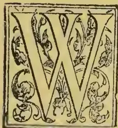

WHO that has read up the history of the British Empire or has travelled round the world has not fallen in love with Ceylon—the "pendent jewel of India"—the "gem of the Indian Ocean," with its varied climate, its luxurious vegetation, its tropical products, its grand scenery, and its interesting native population? Its very antiquity makes it exceptionally interesting to the student of literature. The great Indian epic, "The Rāmayana," has a chapter describing Ceylon at least ten centuries before the Christian era, but the authentic history of the island begins at the fifth century B.C., when an Aryan invasion from the valley of the Ganges established the Sinhalese dynasty. Visited in the early days by the Greeks, Romans, and Venetians, the Portuguese formed settlements on the west and south of the island in 1505, but in the next century they were dispossessed by the Dutch. A hundred years ago last Monday—February 17—Ceylon passed under the authority and protection of the British Crown, and no doubt the centenary of this interesting colony was suitably celebrated in Colombo under the ægis of its new Governor, Sir West Ridgeway, K. C. B., K. C. S. I., who left London last month to take up his gubernatorial duties. Prior to his departure he was entertained at a banquet by the Ceylon Association in London, and but for this recent dinner the planting, mercantile, and shipping interest connected with the colony would have celebrated the centenary in the customary manner by meeting together round the festive board.

#### HOW STANDS CEYLON TO-DAY?

This was the question that occurred to me on Monday, and I felt that I could not do better than call upon Mr. John Loudoun Shand, late Member

of the Legislative Council, who has lived in the colony for twenty years. He has been a tea-planter, has had the management of large estates, and was the chairman of the local Planters' Association. On his return to England to take up his residence here he helped to found the Ceylon Association in London, and is now the senior partner of the firm of Shand, Haldane & Co., of Rood-lane.

I was fortunate in finding both partners in. Having explained the object of my visit, Mr. Haldane said, "Ah, tea is now our great staple in Ceylon. Twenty-one years ago I exported 20 lb., which was a tenth of the whole production of the colony. Last year the total exports amounted to 97,000,000 lb."

"Yes, I know tea has made wonderful strides. But first let me know something about

#### THE CEYLON ASSOCIATION IN LONDON."

"Well," replied Mr. Shand, "that is an association without a constitution. We felt that some organisation was needed on this side to watch over the interests of the colony, and to advance the same in this country. The association has for its president Lord Stanmore, better known, perhaps, as Sir Arthur Gordon, a former Governor of Ceylon, and is composed of merchants and shippers who are interested in the colony, exofficials of the Colonial Government, and planters. The members of the Chamber of Commerce in Colombo and of the Planters' Association are also members of an association while at home."

"And you watch over the interests of the colony generally?"

"Yes, the general body has interested itself lately in the question of the military expenditure, and then we have a special tea committee, which comes together pretty often. Before we started we had no separate days of sale for Ceylon teas; they were sold as Indian teas, and we had to break down several trade barriers. Everything is now overshadowed by tea, as it formerly was by coffee."

23------------------------------------------------

2THE TROPICAL AGRICULTURIST.[JULY 1, 1896.OPENINGS FOR BRITISH CAPITAL.

"The one great object of these interviews, Mr. Shand—and I should explain that this is only one of a series—is to make City people acquainted with the vast resources of our colonies, and the opportunities they offer for the introduction and profitable employment of British capital."

"There has been a great deal of capital sent into Ceylon during the last ten years, and up to the present it has all been most advantageously invested. But the area of land suitable for tea-planting—and bear in mind that this is now our chief industry—is limited. We have over 300,000 acres planted now, giving employment to nearly 2,000 British managers and superintendents, and about half a million British subjects from India and Ceylon, and the probabilities are, that this acreage will not be very much increased. Of course, the tendency of things in Ceylon, as it was in India, has been very much to turn estates into companies. When coffee cultivation was at its height there were only two or three London companies, but in the case of tea it has been found desirable to join two or three estates together and form them into public companies."

"And I see by an article in the *Financial News* of to-day, quoted from the *Times of Ceylon*, that they are all doing well, and that the price of the shares has risen in value during the past year from 18 per cent. up to 86 per cent."

"Yes they are all doing well, as you say; in fact, there has been an all-round rise. And yet, when we started to grow tea, every conceivable difficulty was raised. 'The soil is not good enough.' 'You may grow tea, but you will never make it in sufficient quantity to make it pay.' 'You may get quantity but you will never get quality.' 'It may go on for years, but it won't last.' These were but a few of the expressions of doubt hurled freely and without foundation at tea-planting in Ceylon, but it has lived them down. The yield from many of the older gardens has far exceeded the most sanguine expectations, the average price obtained has exceeded that of other tea-producing countries; the older tea fields—and it must be remembered that they were formed on land not selected for its suitability for tea but for its unsuitability for coffee, some of which are now thirty-years old—are giving a steadily increasing yield, maintaining quality and showing no signs of exhaustion. But wait, while I just copy down for you a few figures showing the

TOTAL EXPORTS OF CEYLON TEA  
during the past twelve years:—

<table>
<tbody>
<tr>
<td>Year ending December,</td>
<td>'85,</td>
<td>4,400,000</td>
<td>lb.</td>
</tr>
<tr>
<td>" "</td>
<td>'86,</td>
<td>8,100,000</td>
<td>"</td>
</tr>
<tr>
<td>" "</td>
<td>'87,</td>
<td>13,800,000</td>
<td>"</td>
</tr>
<tr>
<td>" "</td>
<td>'88,</td>
<td>24,300,000</td>
<td>"</td>
</tr>
<tr>
<td>Year ending December,</td>
<td>'89,</td>
<td>34,000,000</td>
<td>"</td>
</tr>
<tr>
<td>" "</td>
<td>'90,</td>
<td>46,900,000</td>
<td>"</td>
</tr>
<tr>
<td>" "</td>
<td>'91,</td>
<td>68,200,000</td>
<td>"</td>
</tr>
<tr>
<td>" "</td>
<td>'92,</td>
<td>71,100,000</td>
<td>"</td>
</tr>
<tr>
<td>" "</td>
<td>'93,</td>
<td>84,400,000</td>
<td>"</td>
</tr>
<tr>
<td>" "</td>
<td>'94,</td>
<td>84,500,000</td>
<td>"</td>
</tr>
<tr>
<td>" "</td>
<td>'95,</td>
<td>97,800,000</td>
<td>"</td>
</tr>
<tr>
<td>" Estimate</td>
<td>'96,</td>
<td>101,000,000</td>
<td>"</td>
</tr>
</tbody>
</table>

"Certainly a most remarkable and wonderful progress, Mr. Shand?"

"I think so, too. In a paper I read before the Royal Colonial Institute in 1888 I stated that the probable export of tea in 1890 would be 40,000,000 lb. It exceeded that by over 6,000,000 lb., and the late Sir John Coode, in the course of the discussion that followed, ventured to predict that it would reach 100,000,000 lb. by the end of the century. It has topped that already."

"And as regards the price?"

"Well, here is a table which my partner, Mr. Haldane, has drawn up, showing the average value of Ceylon tea sold in London from 1889 to 1895. In the first place there has been a steady increase in the quantity sold from 440,161 packages in 1889 to 970,269 lb. last year. In 1889, you will observe, the average price per lb. was 11d.; in 1890, 10¾d.; in 1891, 10d.; in 1892, 9¾d.; in 1893, 9d., in 1894,

8¾d.; and in 1895, 8¼d.; so that there has been a steady decline until last year, when there was a slight rise. But you must remember that whereas the average value of the rupee in 1889 was 1s. 4½d.; last year it was only 1s. 1¾d.; so that the planters are quite as well off with the lower price as with the higher, so long as they and theirs remain in the land of rupees, and do not require to convert rupee into sovereigns.

"But there must be a price, of course, at which it would not pay to grow tea?"

"Undoubtedly. But we have two good things in our favour, good labour and good transport, and most of the Indian tea-growing districts would have to give way first. Our labour on the estates is almost entirely imported from Southern India. We give them a small advance, which we recover from them."

"Over and beyond tea there are

OTHER PRODUCTS.

What can I say about these?"

"When coffee failed us we ransacked the world of tropical agriculture for substitutes, and among other things we grew cinchona so successfully as to bring the price of quinine down to about a tenth of what it had been. Ceylon is capable of producing an almost unlimited quantity of cinchona bark, but at present prices it cannot be grown profitably. All the same, it was the sheet anchor which enabled us to ride out the financial storm, and to regain prosperity."

"And what about coffee?"

"I think we may see a good deal of Liberian coffee coming from Ceylon in the near future. As you know, our coffee failed through a fungus. Then we introduced Liberian coffee, and cultivated it on a considerable scale. Since those days the trade has come to appreciate this Liberian coffee, and if we had known as much about it in the old days as we know now we should have seen a much larger area under cultivation."

"And as to cocoa?"

"We have been exporting a great deal of cocoa, and have got for many years an excellent price for it, but there has been a heavy fall in values during the past two years, on account of the enormous supplies coming forward from South America, and as the area of cocoa land is limited—it requires a very good soil and exemption from wind, two things which do not go well together in Ceylon—I do not expect to see a very great increase in the production."

"What about sugar?"

"Sugar cultivation was tried many years ago, but our rainfall is the great drawback to the growth of the cane. There is never a certainty of dry weather, and as sugar-growing was not a success when it had not Continental bounties to compete against, it is not likely to be a success now."

"Then there are your coconuts?"

"Yes, a very large area is under coconut cultivation. Hitherto the industry has been almost entirely in the hands of the natives, but recently European planters have taken it up. New markets are opening up constantly, and the demand increases. In addition to coconuts we have spices of various kinds—cinnamon, pepper, cardamoms, and such like, but they are all minor industries."

"And how stands

THE FINANCIAL POSITION OF THE COLONY

to-day?"

"The financial position is very strong indeed. The only debt we have are sums that have been borrowed for public works, which will prove remunerative, and that debt is very small—only 2½ millions in fact. Our revenue is bounding up tremendously. It is now about 20 million rupees, and the expenditure, including interest on debt and sinking fund, is about the same. The Government is pursuing a spirited public works policy, and we have a network of railways all over the island."

CEYLON AT THE IMPERIAL INSTITUTE.

"By the way, Ceylon has a court at the Imperial Institute, has it not?"

24------------------------------------------------

JULY 1, 1896.]THE TROPICAL AGRICULTURIST.3

"Yos; but I do not know that it is of any use. The building is out of the way, and it seems difficult to combine business with pleasure. Then all the information one wants about the colony can be obtained without going to South Kensington for it. I have only been in the Institute twice in my life, and as far as serving any useful purpose it is, I fear, a failure."

"Then, generally, I may say that Ceylon is in a flourishing condition."

"It has never been so flourishing as it is today, and its prosperity—thanks to the tea industry—was never based on a firmer footing. Even in the good old days there was never the same division of prosperity as now—everybody, from the public bodies downwards, being distinctly better off."

"And there are still openings for the introduction of capital?"

"I am not quite sure Ceylon is the place I should invest money in. You must remember that the island is not like Australia or Canada, with a large territory to fall back upon. It is quite possible to attempt too much in Ceylon. We have had an enormous number of young men go out, younger sons of well-to-do people with a little capital. Some have done well, but the present is rather a time for big companies than small estate proprietors."

"What about the climate?"

"Of course we have got variable climates. You have it uncomfortably hot in the lowlands, but we have nothing like the African fevers, being on the high road to India and Australia. Ceylon is of course largely resorted to by visitors, who are very often so enchanted with the colony as to break their journey at Colombo and stay in the island until the arrival of the next steamer. There is a sort of open hospitality. Anyone taking out a letter of introduction to a well-known colonist or official is franked on and on, and in this way he makes a number of good acquaintances. There are something like 2,000 planters, largely recruited from England, Scotland, and Ireland, and their friends are often visiting them. Then it must be remembered that the conveniences of life on the island are vastly different to what they were thirty years ago. Yes, sir, Ceylon is flourishing, and long may it flourish."

—Citizen.

## BIBLIOGRAPHY OF TEA

(Concluded from Vol. XV., page 812.)

*Talmage, Thos. de Witt.* Around the Tea Table. Wakefield. [1875.] 80. [Also London. 1875. 80. and London, Guildford, 1879. 80.]

*Taschenbuch.* Taschenbuch für Theetrinker, herausgegeben von F. Marquis and für den deutschen Geschmack zugerichtet, &c. Weimar. 1836. 80.

*Tate, Nahum.* Panacea: A Poem upon Tea: in two Cantos. London. 1700. 80. [120. also 1702. 80.]

*Taylor, E.* Medical Remarks on Tea, Coffee, Tobacco and Snuff, &c. Huddersfield. 1799. 80.

*Taylor, Wm. Fred.* Pussy's Tea Party. Song [begins: "One evening."] Written by J. S. Lyons. [Music.] London. [1876.] fol.

*Tea.* When first I went to Tea, &c. [Songs.] [London. 1850?] s. sh. 40.

*Tea.* Tea and Sugar, Accounts relating to the condition of, in the United Kingdom. 1857. fol.

*Tea.* Tea and Coffee...why their use is unhealthful. [Health tract. No. 6.] Battle Creek, Michigan. 18—, 120.

*Tea.* Tea. A Poem, in three Cantos. London. 1743. 40.

*Tea.* Take Tea in the Arbor, &c. [Songs.] [London. 1840?] s. sh. 40.

*Tea.* Tea and Tea Blending. Eden Fisher & Co. London. 1886. 80.

*Tea.* Tea and other planting industries in Ceylon in 1885. Colombo. 1885.

*Tea.* Tea, Cardamoms and Areca Cultivation and Preparation in Ceylon. Colombo. 1885.

*Tea Cultivation.* T. C. [in India.] [Calcutta. 1865.] 80.

*Tea Cultivation.* Tea Cultivation and Preparation in Ceylon. [Reprinted from the *Ceylon Observer.*] A. M. & J. Ferguson. Colombo. 1890. 80.

*Tea Cultivation.* Tea grown at high elevation in Ceylon. [Pamphlet on Naseby Tea.] Colombo 18—, 120.

*Tea Cultivation.* Tea Cultivation in India. Copy of Papers received from India...for introducing the Cultivation of the Tea Plant into India. Blue Book. 1839. fol.

*Tea Cyclopædia.* The Tea Cyclopædia...a volume of selections...concerning Tea...collated from the Indian Tea Gazette, &c. Calcutta. 1881 80. [also 1882.]

*Tea Dealer.* Tsiology: a discourse on Tea. Being an account of that exotic...By a Tea Dealer [—Smith]. London. 1826. 120.

*Tea Drinking.* Tea: a fragment [in verse]. Dublin. 1752. 80.

*Tea Garden.* The Tea Garden Manager's Memorandum Book. London. 1890.

*Tea Plant.* The Tea Plant: its History and Uses. London. 1860. 160.

*Tea Plant.* The Tea Plant of Assam. 1839.

*Tea Planter.* The Tea Planter's Vade Mecum. 1886.

*Tea Plucking.* Tea Plucking Illustrated.

*Tea-Pot.* A Silver Tea Pot, by C. E. M. See M., C. E. 1890. 80.

*Tea Pot pseud.* A Tale of Tea, by a Teapot. [Illustrated, with descriptive verses.] [London. 1881.] obl. 160.

*Tea Purchaser.* The T. P.'s Guide...in the...choice of Teas. To which is added, the art of mixing one quality of tea with another. By a friend to the public. London. 1785. 80.

*Tea Table.* Evenings at the Tea Table. London. 1871. 120.

*Tea Trade.* The Tea Trade: a full account and report of the extraordinary proceedings at the East India House on the Commencement of the March Sale. London. 1834. 80.

*Techn, Theoph.* Vier Gesundheitsmittel, Thee, Coffee, Chocolate und Taback. Augsburg. 1699.

*Tectgen, Alvar J.* A Mistress and her Servant. [Dialogues on trade in tea and sugar, &c.] London. [1870.] 80.

*Thacher, Jas., M. D.* Traits of the Tea Party: a memoir of G. K. T. Hewes. By a Bostonian. New York. 1835. 160.

*Thea.* Thea. Elegia. [By Bp. D. P. Huet.] [Paris? 1674?] 80.

*Thea.* Theae Novissima. [Der Thec Bagräßnisz und Glücklicher wieder Auferstehung.] Latin & German. 1680. 40.

*Thea.* Wett Streit der Chinesischen Thea mit dem warmen Wasser Calida, &c. [In verse.] Berlin. 1686. 80.

*Thea.* The true qualities and effects of Thea [contra Masonem]. London. 1746. 80.

*Thee.* Thee, Amalie, Immergrün. Eine Auswahl Märchen und Erzählungen für Kinder in Alten von 7-10 Jahren. Hannover. 1877-82. 80.

*Thee-Bezork.* Het Hedendaagse T. B. der Meyde en Knechts, &c. [Amsterdam. 1780?] 80.

*Thee-Kultuur.* Theekultuur en Theerechten met Betrekking tot Nederlandsch-Indie. Batavia. 1876. 80.

*Thee-Pflanze.* Die Theopflanze, Eine Abhandlung über die Cultur und Fabrikation des Thees, &c. Bremen. 1841-6. 80.

*Thee-Praatje.* Theepraatje over het placet. Amsterdam. 1847. 80.

*Thee-Praatje.* Theepraatje over het Amst. congres. Een vlugtige schets ter waardeering van den geest destijds. Amsterdam. 1864. 80.

*Thee-Tafel.* Die Kleine medicinische Thee-tafel bericht von dem siebenfachen bewährten Kräuter-Thee. Hamburg. 1732. 80.

*Thesendorff, Carol. Theod.* Disputatio circularis Medica, de Tribus Impositoribus, Potu Theae et Coffe, &c. Præs. Geo. Detharding. 1731.

*Thevart, Abr. [et Cressé, P.]* Ergo confert curandæ arthritidi The sinensium. Parisiis. 1657. 40.

*Thezieke.* De Thezieke Juffers. Amsterdam. 1701.

*Thile, Joannes.* See Kirchmayer, C. C. Theologia medica, &c. 1687. 40. [Also Wittenbergae. 1690. 40.]

25------------------------------------------------

6THE TROPICAL AGRICULTURIST.[JULY 1, 1896.THE TRADE IN VANILLA.

In the number of the *Journal* for March 27th, see *ante* p. 453, some facts were given on the condition of the quinine market and an incidental reference made to vanilla. In this connection it will probably be in the memory of many readers that the history and botany of the plants furnishing this useful product have recently been fully dealt with in the *Kew Bulletin*, and to the matter to be found therein the following extracts from the same number of the *Chemist and Druggist*, which contains the foregoing remarks on quinine, will be supplemental, and of value as completing the commercial side of the question. In consequence of the high price that vanilla always commands in the market, the crystalline principle has been imitated by a substance generally known as vanillin.

"When this substance was first introduced as a commercial article, now a good many years ago, the planters and others interested in the vanilla trade were much sacred at the new competition, but events have shown that their fears were unfounded, for although the use of vanillin may have prevented the consumption of vanilla from assuming such large proportions as it would otherwise have done, it has not in the least proved an obstacle to the profitable culture of the vanilla plant, and it is notorious that the employment of vanilla has greatly increased of late years. It is also noteworthy that vanillin is now lower in price than it has ever been, while fine vanilla realises higher figures than it has done for years. It seems, in fact, that in many instances the commercial preparation of a synthetic product, after creating a temporary depression in the market of the natural drug which it is intended to replace, finds a place side by side with the sale of that product, and remain thereafter comparatively powerless to affect the commercial position of the natural article. Cumin and artificial musk are cases in point, in addition to vanillin.

"The future course of the vanilla market will be largely influenced by the receipts of Réunion (Bourbon) and Seychelles vanilla in the course of the next three months. When the first arrivals of the new vanilla crop came to hand in October, the stocks had fallen to a very low point everywhere; since then there has been but little chance of accumulation, owing to the strong demand, but at present the bulk of the crop is coming in, and it remains to be seen whether buyers will be able to absorb it with a rapidity approaching that with which it arrives. The principal stock of vanilla in Europe is usually kept in France, especially at Paris and Bordeaux, where the bulk of the Bourbon crop is received in consignment, and whence considerable quantities are habitually sent to London for sale. In September, just before the arrival of the new crop, a stock of from 15,000 to 20,000 kilos, in Bordeaux, and as big a one in Paris and Marseilles combined, used to be a fair average, but during the year the supplies in France did not by any means reach the lowest of these figures, while the London stock was below rather than above its usual scanty figure of about 2,000 lb. The crops of vanilla in Réunion, Mauritius, and the Seychelles have been unusually small, and it is said that the crop which is now beginning to arrive will again be a very poor one, while reports of total failure have come from Mexico for many weeks. As the United States require from 130,000 to 150,000 lb. of vanilla every year, they have been obliged for some time to purchase vanilla in Europe, and their orders have helped not a little to increase the competition and advance the market price of the drug. The American requirements are probably larger than those of the rest of the world together, and we do not estimate the total consumption of vanilla at much over 250,000 lb. a year, setting aside the Mexican production, and that from the smaller sources of supply. We cannot count upon an average output of about 160,000 lb. a year in Réunion, and of about 60,000 lb. a year in Mauritius and Seychelles. With an average crop, therefore, the present production of vanilla is ample, and if the exceptionally high prices of this year should lead to an extension of cultivation, we may be confronted with a large

over-production within a very few years. For, although vanilla is very sensitive of climatic influences, the plant is easy of propagation, and yields a rapid return, as the vines begin to bear in their fifth year, and may continue to yield fruit until their fortieth.

"Fortunately for those who sell the article, it seems that comparatively few planters can grow it successfully. In Java, where vanilla was introduced in 1819, the culture was at one time of great importance, but at present the island scarcely counts as a producer. In Mauritius also, vanilla-growing seems to be dying out. The exports from that island fell from 37,600 lb. in 1892 to 15,400 lb. in 1893, and 9,100 lb. in 1894. Réunion exported her first vanilla to Europe in 1849. That shipment was only 7 lb. but in 1870 the exports had grown to over 20,000 lb. Since then the largest Réunion crops have been 190,000 lb. in 1891, 207,000 lb. in 1892, and 175,000 lb. in 1893, but last year there was a great decrease. The production of Seychelles has been exceedingly erratic lately. These islands first sent their produce to Europe in 1885. In the succeeding years they quickly rose to an output of about 80,000 lb., but equally thickly dropped off again to about 17,500 lb. a year. According to the latest reports, however, the output next year is likely to show a great increase. The Seychelles and Mauritius vanilla is generally shorter, paler, and fainter in odour than that from Réunion, and realises lower prices."—*Journal of the Society of Arts*.

LIBERIAN COFFEE.

In the *Selangor Journal* of 6th March there appears, reprinted from the *Journal of the American Colonization Society*, a very interesting article by a Mr. Johnson on Liberian Coffee. The information it gives is extremely valuable and will be found well worth studying by all interested in this product; but it is not so much what Mr. Johnson says that I wish to comment upon here, as the notes on the paper written by a Selangor planter.

To judge from these notes it would seem that coffee planters in Selangor have arrived—not without good reason no doubt—at conclusions directly opposite to those we have reached in North Borneo; we are quite with the writer when he states "nothing suits coffee over here better than a strong moisture-retaining soil," but when he goes on "for this reason amongst others that land is most sought after and I imagine few planters would care to plant up hills from choice," he makes it clear that the conditions in Selangor must be quite different from those in North Borneo, where we never plant on the flat and always ask for undulating land, not so hilly that much wash of soil is entailed but sufficiently so to let the rain run off with little or no cost for drainage. This is the lay of land we like best, but it cannot of course always be got in perfection.

The next statement of the writer's is, to say the least of it, rather appalling. "There are few estates here on which cannot be found sturdy well-grown trees flourishing and cropping freely in places where water may be found a foot or 18 inches down." And this on the flat too? All I can say is that in North Borneo ninety per cent of the trees would go out from root rot in a couple of years under similar conditions. Are our Selangor friends quite sure they are right?

A good deal of discussion has been proceeding in the Singapore papers as to some of the coffee lands in the Straits, not necessarily of course any of those referred to in the *Selangor Journal's* notes; during this discussion reference is made to the heavy percentage of "struck" plants (what is a "struck" plant?) while as to soil we are cheerfully given a choice of all peat, half peat, land with water 18 inches below, blue clay, or sand. For myself I should decline to have anything to do with experiments as to whether coffee did too well on "blue clay" or "peat."

On the question of topping, the *Selangor Journal* writer has a fairly open mind. I give his remarks in full.

26------------------------------------------------

JULY 1, 1896.]THE TROPICAL AGRICULTURIST.7

"The process of topping is restored to in Liberia though we are not told at what height, the objects being cheap gathering (the crop being brought within the coolies' reach) and additional spread, which of course means a larger plucking surface, whilst the other advantage claimed for wide-spreading trees is that they keep the grass down more than those which are allowed to run up. We, however, weed our estates so regularly over here that though the greater the spread the coffee acquires the less is the cost of weeding, this fact even combined with cheap harvesting would not be considered a sufficient reason for topping our coffee. There are many of us, however, who believe that by cutting the heads off our trees, we not only drive the strength of the tree outwards into the primary and secondary crop-bearing branches instead of letting it run off into "top," but by this process also secure a sturdier, healthier and equally heavily cropping tree. As nevertheless opinions are divided on this subject, some planters claiming that trees allowed to run up give larger returns, it is important to note that nowhere does Mr. Johnson, who would scarcely be likely to lose sight of such a material point, make any allusion to this whatever. By inference therefore the Liberian coffee tree in the habitat to which it is indigenous yields no less when its growth is artificially cut short and directed in an unnatural direction. It appears to me perfectly clear, then, that we can gain nothing in the way of increased returns by letting our coffee run up, whilst the disadvantages of this system, some of which have been already noticed, are innumerable. The question we now have to solve, is at what height to top."

This question of topping is a most important one, I have lately seen a lot of trees on two estates in North Borneo which were undoubtedly much damaged by being topped too low, but there was still one point not clear: whether they had not been allowed too great a growth before being topped; however this may have been in a great many cases the trees almost died, and had not fully recovered their cropping power at the end of two years, while others, topped growing close by were clothed with a luxuriant foliage and were heavy with fruit. Speaking for myself 7 feet is (now) the lowest height at which I would top while I am sure that trees should not be topped too far down when they have once grown up, always keeping in mind on the other hand that to top green wood stems is to kill the tree bark for a foot or 18 inches lower than the cut top.

In Mr. Lyall's half-yearly report on coffee in the Straits we read "coffee 2½ to 4½ years has parted hands at from \$300 to \$600 per acre, and it is reported that \$700 has been refused for some 5½ years old coffee." These figures are worthy of the utmost consideration by all interested in North Borneo.

MYNAIL.

—*British North Borneo Herald.*

---

## THE TRADE OF JAVA.

BY M. QUILLET ST. ANGE.

Java's commercial situation did not improve appreciably during the last nine months of 1894. But the crisis became a little less acute on account of the gradual diminishing by sale of the stocks of sugar which had been lying in warehouse for over six months. The planters at last resigned themselves to selling part of their stock at cost price—about 7 fl. 50c. the picul in warehouse—as some of the banks were refusing further credit, and others were asking exorbitant rates of interest. On the other hand, the rainy season, which usually comes to an end in May, lasted in 1894 till July. The plantations suffered severely in consequence. On large areas of land, situated at some distance from the factories, the crops had to be totally abandoned, as the buffalo waggons could not be used, owing to the softness of the water-soaked earth. As the net result, the embarrassment caused by the plethora of 1893 will be succeeded by trouble due to the failure of the 1894 harvest. "Java" coffee production has

rapidly decreased, having fallen, in a few years, from 1,100,000 to 370,000 piculs, and the situation is becoming worse and worse owing to the ravages caused by the *hemilecia vastatrix*. The Government, which has been deeply affected thereby, is energetically pushing the cultivation of "Liberia" coffee, which has hitherto appeared proof against the disease, but it takes not less than five years for a plantation to produce a satisfactory crop.

Among the smaller traders, the recoil of the misfortunes of the two great industries is necessarily felt, bankruptcies being pretty numerous. But the importance of these must not be exaggerated. The bankrupts are mostly Chinese and other Asiatics, whose commercial methods—due to excessive toleration—are so well-known to European merchants that not even the most confiding of them allows himself to be dragged into the smash which is the frequent epilogue of the Asiatics' adventurous speculations. Europeans are chiefly affected by the stagnation of trade which causes them material losses. Certain articles—and they are fairly numerous—must be sold quickly in this warm, damp climate. Such are provisions, preserves, silk stuffs, &c.; if kept in stock too long they are injured and have to be sold by auction. To make up for losses of this description, the retailer tries to make a profit of 70 to 100 per cent. on what he sells. French merchants, I am glad to say, have suffered less comparatively than those of any other nationality, through the crisis which has now lasted for over a year.

Perhaps their business would, however, be more prosperous, their orders placed in France better understood and executed, if there existed among them that union which assures everywhere the success of the Germans. French merchants, lacking information themselves, send incomplete instructions to their agents at home, consequently the orders are often badly executed, and the result is disputes, refusals of payment, etc., things which are all hurtful to credit, and to the progress of business. It is to be regretted that the French Colony is not large enough to study the possibility of creating a Chamber of Commerce. I think, however, that such an institution would be a precious guarantee of success for the increase of French trade in the Netherlands Indies, if it included in its membership a few men capable of properly directing its efforts. I took the initiative some time back in bringing together the French merchants on the first and third Sunday of each month. My object was to place before them the commercial publications which I received, to show them correspondence which had arrived, and to submit to them offers from French producers. The merchants came regularly at first, then came more seldom, and finally, either through indifference, or because they did not like to lose their Sundays, they ceased coming altogether. I see, in reading the reports of my colleagues of the French Consular service, that the same errors are repeated by French merchants in nearly the same form in all exotic countries.

As regards everyday articles of domestic consumption, cheapness is the first quality looked for, and to this, French exporters do not seem to be able to resign themselves. Apart from alimentary produce the inhabitants of the colonies are inapt to distinguish good manufacture from bad, and if, by experience, they discover the distinction, their improvidence prevents them from taking advantage of the knowledge. Fully understanding this appears to me to be the true cause of the success of German industries in many centres where French industries fail. But if colonial consumers accord little favour to French produce on account of its high price, they know how to appreciate French workmanship, executed under their eyes. It is a Frenchman, M. Roussel, boot and shoe manufacturer at Batavia, who has secured the contract, over the heads of five Dutch competitors, to supply footgear to the army for ten years, the minimum supply being 2,000 pairs a month. The native soldiers of the colonial army formerly went barefooted, but during the Lombok expedition a great number died

27------------------------------------------------

10THE TROPICAL AGRICULTURIST.[JULY 1, 1896.

pany's option at par. The above conversation will, on the amount issued, effect an annual saving of £975 in interest, a result which cannot be regarded as other than highly satisfactory.

The paid-up Capital of the Company now stands as under—

<table>
<tr>
<td>9,000 Preference Shares of £5, fully paid ..</td>
<td>£45,000</td>
</tr>
<tr>
<td>1,000 Ordinary " " £5, £1 paid ..</td>
<td>1,000</td>
</tr>
<tr>
<td>800 Ordinary " " £5, fully paid ..</td>
<td>4,000</td>
</tr>
<tr>
<td>17,088 " " £5, £3 paid ..</td>
<td>51,264</td>
</tr>
<tr>
<td>Calls paid in advance on Preference Shares ..</td>
<td>320</td>
</tr>
<tr>
<td>4½ per cent. First Mortgaged Debenture Stock ..</td>
<td>65,000</td>
</tr>
<tr>
<td></td>
<td>£166,584</td>
</tr>
</table>

The amount at credit of profit and loss account after paying Debenture Interest and all charges, and providing for depreciation of buildings and machinery is £9,342 2s. 5d., and after deducting the Interim Dividend paid upon the Preference Shares in November last, there remains a balance of £8,800 16s. 4d. which the Directors recommend be apportioned as follows:—

<table>
<tr>
<td>To reduction of Debenture Issue Expenses</td>
<td>£3,500 0 0</td>
</tr>
<tr>
<td>Account .. .. .</td>
<td>..</td>
</tr>
<tr>
<td>„ payment of the Preference Dividend for the 6 months ending 31st December last (making 6 per cent. for the year), less tax .. .. .</td>
<td>649 18 6</td>
</tr>
<tr>
<td>„ payment of an Ordinary Dividend at the rate of 8 per cent. per annum (free of tax) .. .. .</td>
<td>4,421 2 6</td>
</tr>
<tr>
<td>„ carry forward to next account .. .. .</td>
<td>229 15 4</td>
</tr>
</table>

The Directors have much pleasure in again recording their satisfaction with Mr. Denison's management in Ceylon, and the work done by the Superintendents. The retiring Directors are Mr. T. J. Lawrence and Mr. Thomas Mearns, who being eligible, offer themselves for re-election. The 6 per cent. Debentures having been paid off, the appointment of Auditor rests with the Shareholders, and Mr. A. N. Fiewer, Chartered Accountant, offers himself for election.

HUGH C. SMITH, Chairman.

J. HUNTLEY THRING, Managing Director.

HUGH CHAPMAN, Secretary. London, April 27, 1896.

SCHEDULE OF ESTATES.

<table>
<thead>
<tr>
<th>Names of Estate.</th>
<th>Acreage Tea.</th>
<th>Acreage Cocoa and Coffee.</th>
<th>Acreage Cocoa and Tea.</th>
<th>Forest Waste &amp; Cheena (approximate).</th>
<th>Total Acreage (approximate).</th>
</tr>
</thead>
<tbody>
<tr>
<td>Bogahawattee ..</td>
<td>541</td>
<td>..</td>
<td>..</td>
<td>77</td>
<td>618</td>
</tr>
<tr>
<td>Le Vallon and Rajatalawa* ..</td>
<td>1,216</td>
<td>..</td>
<td>..</td>
<td>2,358</td>
<td>3,579</td>
</tr>
<tr>
<td>Denegama (one-half) ..</td>
<td>155</td>
<td>..</td>
<td>..</td>
<td>69</td>
<td>224</td>
</tr>
<tr>
<td>Peacock Hill ..</td>
<td>300</td>
<td>..</td>
<td>..</td>
<td>192</td>
<td>492</td>
</tr>
<tr>
<td>Keenakelle (including Serendib and Keenagashena)† ..</td>
<td>500</td>
<td>..</td>
<td>40</td>
<td>810</td>
<td>1,570</td>
</tr>
<tr>
<td>Peradenia ..</td>
<td>424</td>
<td>..</td>
<td>..</td>
<td>747</td>
<td>1,171</td>
</tr>
<tr>
<td>Oodewelle ..</td>
<td>417</td>
<td>..</td>
<td>..</td>
<td>978</td>
<td>1,395</td>
</tr>
<tr>
<td>Ooragalla ..</td>
<td>320</td>
<td>..</td>
<td>..</td>
<td>129</td>
<td>449</td>
</tr>
<tr>
<td>Wiltshire and Hampshire† ..</td>
<td>269</td>
<td>..</td>
<td>..</td>
<td>517</td>
<td>844</td>
</tr>
<tr>
<td>Wangie Oya ..</td>
<td>445</td>
<td>..</td>
<td>..</td>
<td>122</td>
<td>567</td>
</tr>
<tr>
<td>Moralioya and Wilton ..</td>
<td>188</td>
<td>..</td>
<td>..</td>
<td>267</td>
<td>455</td>
</tr>
<tr>
<td>Pathragalla ..</td>
<td>100</td>
<td>276</td>
<td>30</td>
<td>319</td>
<td>725</td>
</tr>
<tr>
<td></td>
<td>4,875</td>
<td>276</td>
<td>70</td>
<td>6,585</td>
<td>12,089</td>
</tr>
</tbody>
</table>

The above may be considered an exceedingly satisfactory report, and I may deal editorially with one or two *special features*.

CEYLON TEA IN AMERICA.

Everybody in Ceylon knows how cautious is the Planters' American Commissioner. One is always safe in adding something to Mr. Wm.

\* Also 5 acres cardamoms.

† Also 120 acres coffee, and 100 acres cocoa.

‡ Also 55 acres cocoa and 3 acres cardamoms.

Mackenzie's anticipations, because they are nearly always sure to err on the safe side, just as in the case of some other authorities, one is inclined to allow for over-sanguineness. Well, from Mr. Mackenzie I have had a very interesting and satisfactory account of the continued progress made by his own and Mr. Blechynden's mission, on behalf of our and Indian teas. That these are gradually getting a firm hold of the American market is the great fact, the large dealers being forced by the badness of the Chinese "black" teas, to take ours instead. The campaign against the adulterated "green" teas has not developed yet, but will come later. Lipton has now commenced tea dealing in America on a very large scale and so has the Mazawattie Co., as well as the Messrs. Tetley. Mr. Mackenzie does not expect a great increase in the consumption of Ceylon-Indian teas this year over 1895—the great rise has been in 1894—for it is every alternate year that indicates special progress, it requiring at present a second year to work off the teas poured in, say in 1895. But I cannot see why an accelerated rate of progress should not shortly be expected; for the trade now being built on a sound basis is bound to develop widely. Indeed, one firm of dealers in our teas already spends in advertising in its own way as big a sum annually as the "Thirty Committee of Ceylon" allot to America! Mr. Mackenzie has certainly surprised me as to the cost of advertising in the leading papers and periodicals of the States, and I question if in England, so large a price was ever paid, as £750 for one page on the back cover of a leading monthly—just for the one insertion, but that I am assured is the rate demanded!

Mr. Mackenzie, who looks very well, would like Mr. Melville White (now on his way home) to take his place for the summer or autumn tour of two months across the Atlantic; but the ex-chairman indicates he is coming home for a holiday rather than to attend to business.—The dispute between

SIR JOHN MUIR AND MR. JAMES SINCLAIR over Belgravia and Elgin estates is, of course, much talked of in Ceylon circles in the City. There is a general feeling that there is bound to be a settlement, if not a compromise, satisfactory to the shareholders. Mr. Sinclair, I hear, is personally in exceedingly strong legal hands who have been very careful about his position; while the opinion of the Solicitor-General for Scotland has been taken on the dispute and is very clearly against Sir John Muir. Still, for aught I know, there may be strong legal opinions the other way. The question has been asked why the statutory meeting is delayed: well, the due date is not yet fully up, I hear; and it would obviously be unwise to make a statement while negotiations are pending, which it is generally hoped will obviate a case in the courts.

NEW TEA LAND CLEARINGS IN HALDUMULLA.

There are several new clearings and extensions for tea cultivation in progress. Mr. Anderson, of Trompe estate, Talawakella, proprietor of Ohiya estate, in the Kalupahana Valley, adjoining Meriatenne estate is clearing nearly 200 acres for tea land. Ohiya estate adjoins Udaveria on one side, and at the last sale in the London Market Udaveria tea fetched a very good price. The tea bushes in the latter estates are worth looking at, they are a fine sample of the best tea grown in the island.

Mr. W. Hermon, the Superintendent of Golconda no bo half of the proprietors, Capt. Farquharson

28------------------------------------------------

JULY 1, 1896.]THE TROPICAL AGRICULTURIST.11

and Mr. Buckworth, is busily engaged in felling and clearing an old estate called Talapottenne, close to Nikapotu, and expects to open and plant nearly 100 acres of tea this year.

Mr. B. J. Wyllie, Superintendent of Kalupahana estate, on behalf of Messrs. Hope and Bailey, is opening a new estate called Horagonne, close to aldummulla, and intends planting 200 acres of tea shortly.

Mr. A. Orchard, who bought some plots of land between Beauvais estate and Blackwood at the recent Government sale, has made a bargain by selling them to Mr. Hudson, who will open the land for tea and reside on it.

The estate called Bandara Eliya is a new one adjoining Dambattenne, and opened only three years ago. The property belongs to Mr. Lipton, and is under the management of Mr. Maitland. It was the tea from this estate which was purchased for Her Majesty the Queen at the recent sale reported in your paper of the 13th inst.—*Cor.*, local "Times."

### KADUGANNAWA AND ALAGALLA.

Taking a leisurely stroll through Kadugannawa and Alagalla last week, I was struck with the slow progress much of the tea is making in this very fair soil and not unkindly climate.

Tea is not a particularly fastidious plant but where the surface soil has been scraped and washed away, it is apt to sulk for a few years till at length the roots make a desperate plunge into the subsoil and the tree becomes established, not quite so firmly or vigorously as in the clays of some of the upper regions but flushes more in proportion to its size and appearance. There are splendid exceptions even in this locality and these exceptions chiefly lie at the opposite ends of the district where the plants come away in a manner so magical as to astonish nobody so much as the lucky proprietors who sometimes remark that when they tried tea they knew as much about it as they did of the apple which Eve ate.

So much for sheer luck—or call it by any other name that pleases you, and I am equally satisfied; but it rather amuses an onlooker to see London correspondents falling down to worship the "far-seeing intellects" who created those estates and knew to a dead certainty, before planting them the number of lb. leaf each acre would produce—the men who can now by a wave of their magic hand decide the fate of investors.

KADUGANNAWA has quite a unique history. Its planting record dates back for fully 70 years—even to the first initiation of practical planting in the island. Alas! how much has been lost and won, learned and forgotten, during these three-score-and-ten years! Some have accidentally as it were, stumbled upon fortune and had honours thrust upon them, while many capable, careful, plodding men have died in the vain attempt to acquire a competence. Some there are who never touch a thing but it turns into gold, while others.

"Never loved a tree or plant but 'twas the first to fade away."

To ascribe all success to one's own superior intelligence is to mock an inscrutable Providence.

Take first the extreme South end of this district. Everybody knows *Mariawatta* but everybody does not know the history of *Wellangawatte*. We can imagine with what eager hopes poor George Bird began his experiment there; now 72 years ago, how he loved to look upon the beautiful young coffee plants; with what delight he gathered the bumper maiden crops; and then as years rolled on with what anxiety he watched the gradual decay of the once promising plants. Then came the wise-acres who said "coffee growing is all a fraud let us turn to Dairy farming," and now see the plough at work, followed by the grass planting the luxuriant meadows, the browsing cattle. All in turn to be abandoned, and then *there is a lull*.

Again arose the wise-acre saying "the old fogeys didn't know how to plant coffee, let us plant it properly and no fears." Again history repeated itself, again there was rejoicing over the bumper

maiden crop but again—sooner than before,—came the day when all was leafless Shillelahs

And now came the strangest epoch in the history of this wonderful *Watte*. Despised and abandoned once more, hope seemed to fly and sigh farewell, In the midst of the desolation stood the empty bungalow, now gladly lent to shelter a sub-contractor on the railway extension.

This sub-contractor by the way was once on a time a leading V.A. an M.L.C. and a planter of long and varied experience. His dictum with regard to poor *Weyangawatte* was that he had never seen a more hopeless subject; the roots of the coffee tree as he pointed out would take no hold of the soil but running along the surface soon exhausted all the suitable food and died of what R.B.T. called '*insidious defunction*.' Ultimately the place was sold for a few hundred pounds to the Railway Contractors who though giants in railway engineering were as yet infants in agriculture, and as such were chosen to teach the proud V.A. and conservative planter that there were other paying products beside coffees.

"A tree of deeper root was found  
Less willingly to quit the ground."

Of the present condition of *Mariawatte* and *Sinnapittiya* it is needless to say more than that the appearance could scarcely be improved upon. Yet some of the adjoining places are backward to a degree, while over the ridge the comparatively rich Valleys of *Godadessa* still hang fire, but it can only be a question of time. On the opposite side of the *Oya* lies *Franklands* where in the fifties we found *Forest Harper* busy taking in a first rate crop, shortly after which he went home for some years and when he came back the *Watte* was gone! Coffee did well here for many years, but when it made up its mind to die it didn't hesitate about it or wait for leaf disease. *Forest Harper* was a favourite spouter at the P. A. meetings and immediately on his return we saw him at the big yearly gathering listening eagerly to the appointment of district members, but *Kadugannawa* was never mentioned. Indignantly the old member rose and demanded to know who struck out *Kadugannawa*. "*It went out*" was the laconic reply. All along the eight miles leading to *Bellongalla* the district is still in a semi-abandoned state, but the land after 30 years rest ought to do very well in tea if it gets a fair chance. *Bellongalla* itself is now looking very promising, but has taken a somewhat unconscionably long time about it. On the other side of the line "*The Farm*" has made a good start and will in time become an excellent estate. Further north, on the *Nanuoya* there are some scattered patches of fairish tea, but at the extreme end of the district near to *Bollagalla*. There is an estate 400 acres, than which there is no better tea in the island.

There is plenty of room for extension, both in North and South *Kadugannawa* and the marvel is,—considering its proximity to road and rail that it has been left so long uncultivated. The longer rest the better perhaps, but better still would it have been for this district had the fine old shade trees never been cut down. A writer in the *Observer* 40 years ago remarked "In 1840 we found Mr. Northway busy girding and taking down the trees which had originally been left for shade, the idea of the benefit being about that time finally exploded." But alas! to this idea we were indebted more than to anything else for the rapid ruin of *Kadugannawa* as a coffee producing district.—*Cor.*

THE WYNAAD.—A correspondent of the *Madras Mail* writes:—"Tea planting, in the opinion of many, is superseding coffee in the Wynaad and is fast attaining the position of the staple industry. Mr. W. B. Liddle, Managing Proprietor of the Liddlesdale Tea and Cinchona Company, has just brought out from England a 40 horse power engine to drive the machinery in the tea houses on the Pilly-Mullay estate. This fine property is 7 miles from Gudalur in the Nadahgny direction."

29------------------------------------------------

12THE TROPICAL AGRICULTURIST.[JULY 1, 1896]SCOTTISH CEYLON TEA COMPANY,  
LIMITED.HALF-YEARLY REPORT.

The Directors have now the pleasure to submit to the shareholders the accounts and balance-sheet for the year ending 31st December 1895.

The net profits for the year amount to £8,801 9s 8d, which, with £669 10s 9d brought forward from previous year, gives a total sum available for distribution of

£ s. d.  
9,471 0 5

An interim dividend on the ordinary shares of 5 per cent (free of Income Tax) was paid in September 1895, absorbing

2,050 0 0

Dividends on the 7 per cent preference shares have also been paid, amounting to

630 0 0

It is now proposed to pay a final dividend on the ordinary shares of 10 per cent (free of Income Tax), making 15 per cent for the year, absorbing

4,100 0 0

To add to Reserve Fund (raising it to £6,000)

1,000 0 0

And to write off for depreciation on buildings and machinery

838 6 8

8,618 6 8

Leaving a balance to carry forward to next account of

£852 13 9

Although all the buildings and machinery on the Company's estates continue to be in efficient order, it has been thought advisable to continue writing down their cost, and the amount which it is now proposed to write off represents 10 per cent on their value as it stands in the Company's books at 31st December.

The estimate of made tea from the Company's estates for the year was 661,000 lb., and the actual out-turn was 668,049 lb., showing an excess over estimate of 7,049 lb., which the Directors consider very satisfactory.

In addition to the foregoing, a total of 220,743 lb. Tea was manufactured for others, the tea actually turned out by the Company's factories during the year thus amounting to 888,792 lb.

The average yield per acre was 433 lb., which shows a steady advance on the figures given in last report.

The average price realized in the London market was a fraction lower than previous year, being 8.904d against 9.233d in 1894, and 9.190d per lb. in 1893.

The Ceylon Manager, Mr. Kerr, who is now on his way home on short furlough, reports that all the Company's estates are in good condition, and his estimates for the current year, which have been framed with his usual care, foreshadow another satisfactory year's working of the properties.

The acreage of the Company's estate remains unaltered at 1,963 acres, and no extensions have been made to the area under tea cultivation, which stands at 1,707 acres, of which 1,544 acres are in full bearing.

The Directors again take the opportunity of expressing their appreciation of the services of both the Ceylon and London staffs.

In accordance with the articles of Association Mr. Donald Andrew retires from the Board, and, being eligible, offers himself for re-election.

Mr. J. B. Laurie, C.A., also offers himself for re-election as Auditor.

H. L. FORBES, Chairman.

London, 1st May 1896.

THE TEA MARKET

has further developed in buoyant tone. China Tea is in better demand; and no wonder, seeing the heavy drop in prices for the first crop leaf still held by importers. Indian growth shows the most marked advance, the lower grades as much as 1d. per lb. from the lowest point. Supplies are becoming much reduced as deliveries are on a large scale.—*L. and C. Express*, May 1.

MARKET FOR TEA SHARES.

Thursday Evening, April 30, 1896.

There has been further strong buying, at advancing prices, of most of the better known tea shares, and again the "Official List" quoted advances in no less than five of the leading shares—Jorehaut shares having been twice advanced within the week. Even unquoted shares show in many cases advances in price since a few weeks ago.

Mincing Lane is again firmer, with an all round advance in prices, consequent on the shortness of the supply of Indian still left out of the 1895 crop to come to the hammer.

QUOTED SHARES.—East India and Ceylon, both Ordinary and Preference are asking for a price.

UNQUOTED SHARES.—CEYLON SHARES.—C. T. P. Co. Ordinary have again been taken at 30½, but some shares are now offering ex div. The Prefs. are wanted, but ask £18 or so.

Eastern Produce and Estates Co.—A large business has been done in the shares of this company at prices rising to 5½ x.d., and also in the new 4½ per cent debentures at 105. We now quote the company in our table, as it is the largest single tea company in existence, having over 11,000 acres under cultivation (tea, coffee, &c.).—*H. and C. Mail*.

PLANTING AND PRODUCE

A NEW INDIAN TEA COMPANY.—The Borholla Assam Tea Company, Limited, has been formed, with a capital of £50,000, to purchase as from January 1, 1896, the well-known Borholla Tea Estate, situate in the Golaghat district of Assam. The estate comprises an area of about 2,932 acres, 1,538 of which are held in fee simple, and 1,394 are held under leases, all of which are direct from the Government of India, and the greater part renewable in perpetuity under the Government regulations. There is therefore ample room for large extensions, which will be made as circumstances permit. The cultivated area is 520 acres, ten of which are in their first year, leaving 510 in full bearing. The directors of the company are Lord Kingsale, managing director of the Moran Tea Company, Limited, East India Avenue, E.C., late of Assam, and Charles Lionel Prescott White, Esq. Kniphill, Cobham, Surrey, proprietor of Lungsoong Tea Estate, late of Assam. Frederick William Jamieson, Esq. (Messrs. F. W. Jamieson and Co.), 9, Mincing Lane, E.C., merchant, late of Assam, will join the board after allotment. The offices of the company are at 9, Mincing Lane, E.C.

POPULARISING TEA.—If the British public does not increase its knowledge of tea and learn the reason why Indian and Ceylon teas have displaced China it will be due to indifference on the subject. In various towns lectures on tea are given, and in some instances representatives of the tea trade are the lecturers. Mr. Allen Cooper, the Southampton representative of Messrs. Appleton, Machin, and Smiles, recently entertained about fifty ladies and gentlemen at that firm's sample and tasting rooms, 126, High Street, Southampton. Mr. Cooper gave a short address on the different growths of tea, and in the course of his remarks said the displacement of China teas by the growths of India and Ceylon was due not only to the superiority of the Assam plant itself, but also to the better mode of preparation employed. The use of machinery, introduced by British skill and energy, had reached such a pitch that in some gardens tea was fully manufactured within eight hours

30------------------------------------------------

JULY 1, 1896.]THE TROPICAL AGRICULTURIST.13

from plucking the leaves. In China the grower had sometimes to transport the plucked leaves many days' journey before they could be manufactured into properly prepared tea, and this preparation was done by the slower and less wholesome process of hand labour. The public should, as far as possible, buy small young leaf tea of high quality. Such tea always fetched a higher price on the market, and he impressed upon his hearers the desirability of procuring high-priced teas from their grocers.

**THE DECLINE OF THE CHINA TEA TRADE.**—The Customs returns for 1894 show that in 1890 our imports from China were £4,830,850, but that in 1894 they had fallen to £3,543,362. This decrease of £1,287,488 is entirely due to our having imported less tea, the difference in value between that imported in the above years being £1,285,802.

**JAPANESE PLANTING ENTERPRISE IN MEXICO.**—It is stated that a Japanese Company has purchased a large tract of fertile land in the State of Chiapas, Mexico, and that tea, coffee, tobacco, and any tropical cultivation likely to prove profitable will be grown there. Japanese labour is to be employed.

**SAN DOMINGO COFFEE.**—The cultivation of coffee as well as sugar is making rapid progress in San Domingo, and the next crop promises well.

**THE SUMATRA TOBACCO INDUSTRY.**—A monograph upon this profitable industry, prepared for his Government by Mr. E. Spencer Pratt, the United States Consul at Singapore, gives the profits for each year of its existence of the Deli Maatschappy, a Dutch company formed at the close of 1869 for the purpose of introducing the growth of tobacco on the east coast of Sumatra. In the first year, 1870, the profits of the company were at the rate of 20 per cent. on the capital invested. In each succeeding year there was a steady and important increase, until in 1876 the earnings reached 113 per cent. The company then enlarged its capital, and in 1877 only about 22 per cent. was realised. The previous high degree of prosperity soon returned, however, and in 1882 the profits slightly exceeded 100 per cent. Down to 1886 the average returns continued for four years at very nearly the same rate, falling in 1887 to 45 per cent. In 1888 the capital was doubled, amounting then to £335,000, but even upon this increased sum the earnings exceeded 25 per cent. In 1889 they were nearly 80 per cent., but 1890 was a disastrous season, showing a loss of about 9 per cent. This was soon recovered, however, and in 1891 profits were realised of 30 per cent., in 1892 of 50 per cent., and in 1893 of 100 per cent. The great success of this enterprise is due primarily to the excellent quality of the leaf produced by it, which is extensively used, particularly in the United States, for the outer "wrappers" of cigars. There are now twenty-six companies and about twenty-five private planters engaged in this industry in Eastern Sumatra. The total production of the district in 1893 was 160,000 bales, of which the Deli Maatschappy grew nearly 53,000 bales. With much difficulty Mr. Pratt has obtained a supply of seed of this tobacco, which he has forwarded to a Florida planter and to the Department of Agriculture at Washington, with a view to its cultivation in the United States.—*Il. and C. Mail*, May 1.

## TEA IN AMERICA.

NEW YORK, April 16.

Not a ray of light to brighten the situation, unchanged from a week ago. When brokers issue circulars for China once every three or four months, there is little to be said by newspaper reports from week to week. Low-grade Japan firm; high grades steady; fine Formosa wanted at full figures; low grades weak. Greens dull and easy. Ceylon and India well supported and in fair demand.

Last week the Montgomery Auction and Commission Company sold 11,084 packages teas as follows: Moyne—400 Hyson, 5 to 6½c; 1,327 Young Hyson, 6 to 24c.; 582 Imperial 5½ to 17c.; 643 Gunpowder, 6 to 30½c. Pingsuey—1,821 Gunpowder, 6½ to 21½c. Japan—147 pan-fired, 15 to 16c; 185 basket-fired, 6½ to 8½c 120 sun-dried capers, 15c; 917 Congou 7½ to 23½c; 121 India and orange pekoe, 10½ to 20½c. Oolong—890 Foochow, 8½ to 17c; 302 Amoy, 8 to 9½c; 3,746 Formosa 12½ to 31c.

Today at noon the Montgomery Auction and Commission Company will sell 6,503 packages, viz: 1,506 half-chests Moyne, including attractive chops; 1,419 half-chests and boxes Pingsuey, new season's; 1091 half-chests and boxes Congou, comprising all grades; 20 boxes Foochow pekoe; 97 packages India Java and Ceylon pekoe; 100 half-chests Foochow; 2,270 half-chests and boxes Formosa, all new season's and comprising a large offering of high grades.—*American Grocer*, April 15.

## TEA IN AUSTRALIA.

Friday Evening, May 1.

TEA.—A moderate business has been done in China tea, sales being reported of 120 half-chests common congou at 4½d, 450 half-chests panyong at 5d to 5½d, 170 half-chests panyong at up to 6½d, 550 half-chests kooloo at 4½d to 7½d, 350 quarter-chests buds at 5d, and 100 half-chests buds at 4½d. Of Ceylon teas, 300 packages have been sold at 7d to 8d, and 20 chests at 11d. At the auction sale on Tuesday 184 chests and 166 half-chests Ceylon were offered. The prices realised and bid showed no change in the market, late rates being maintained, but the sales made amounted only to 42 chests and 78 half-chests at 8d to 9½d for broken and orange pekoe, 7d per pekoe, 6½d for pekoe souehong, and 4½d for souchong.—*Australasian*.

## GREAT WESTERN TEA COMPANY OF CEYLON, LTD.

A general meeting of the Great Western Tea Company of Ceylon, Ltd., was held at noon today in the office of Messrs. J. M. Robertson & Co., the Agents and Secretaries. Mr. John Tilly presided and present were Messrs. F. W. Bois (also representing Mr. H. Bois and Messrs. J. M. Robertson & Co.), Charles Cantlay (also representing Mrs. Thomas Mackie), Thomas Mackie, E. Vanderspar (representing Mr. George Vanderspar), W. Moir, and C. Ryan (also representing Mrs. Margaret Ryan.)

Notice calling the meeting having been read and minutes of previous meeting read and confirmed the Chairman submitted

### THE REPORT.

It is in the following terms:—

The Directors submit their annual Report and accounts for the season ending 31st March, 1896, which may be considered satisfactory:—

The yield of tea during this period has been 438,425 lb, which is 66,192 lb. over the amount secured for the previous season; and 38,425 lb. in excess of the estimate. The cost f. o. b. in Colombo is 29.78 cents per lb. including 3.27 cents per lb. on manuring. There has also been unusually large expenditure for additional line accommodation as foreshadowed in the original prospectus of the Company.

After estimating the unsold tea at a safe valuation, the amount realized for this product is R246,664.13, which is equal to 56.26 cents per lb., shewing a nett profit on the cultivation of about 26½ cents per lb.

An interim dividend of 8 per cent for the half-year ending 30th September, was paid in November, 1895; and after providing for this, and writing off the usual amount for depreciation, the sum still available is R68,517.89. Your Directors propose to place R10,000 to Reserve Fund, to pay a final dividend of 10 per cent, making 18 per cent for the year, and carry forward R117.89 to next account.

The prospects for the season 1896-97, are favourable and the crop is estimated at 140,000 lb.

Mr. Dunbar and Mr. Henry Bois having left the island and resigned their seats on the Board of Directors, Mr. John Tilly and Mr. F. W. Bois were appointed to fill the vacancies.

In terms of the articles of Association, Mr. Thomas Mackie retires by rotation: but, being eligible, offers himself for re-election.

It will also be necessary to appoint an Auditor for the new year.

The CHAIRMAN said:—The reports and the accounts have been in your hands since 1st May so that you have had time to peruse them, and I suppose we will follow the rule of taking them

31------------------------------------------------

14THE TROPICAL AGRICULTURIST.[JULY 1, 1896.

as read. Since the accounts were issued we have had telegraphic advices of several other sales, and there is only one sale of which we have not had a report from home. This gives us a satisfactory addition to the amount received during last season—I should scarcely during the season—and it will give us an extra R4,000 which has not appeared in this year's account, but it will be added to the amount carried forward—R117.89. The Directors propose as you will see by the account to allow for depreciation, the payment of an interim dividend of 8 per cent, the transfer to the Reserve of R10,000 and a final dividend of 10 per cent. The crop has been very satisfactory—450 lbs. to the acre. I don't think there is any other information I can give beyond what is given in the report unless any shareholders wish to ask any question.

Mr. RYAN:—I understand that the R4,000 is over and above what you estimated as the crop.

The CHAIRMAN:—Over and above R117.89 carried to next account. If you look the profit and loss account for 1895-6 you will see the sum of R4,047.16 which was the surplus proceeds of the previous year. This R4,000 will be carried forward in a similar way this year.

After a pause.

The CHAIRMAN said:—At the request of one of the shareholders we have worked out the gross average price of the tea in London from all the sales of our knowledge—there is only one which we had had to estimate. The gross average in London has been 9.31d, the charges coming to a little over 1d leaving a net average of 8.30d.

Mr. VANDERSPAAR:—Is that the London charge.

Mr. BOIS:—The London charge is 1.01d.

The CHAIRMAN:—Exchange has been against us this year a little making a difference of nearly four cents.

Mr. BOIS:—Mention the rate.

The CHAIRMAN:—The average rate has been 1s 1d 15-16. I propose that the report be now adopted.

Mr. RYAN:—There is one question regarding an item I do not understand "Directors Travelling Expenses R350."

Mr. BOIS:—The expenses are those of one country Directors coming down to meetings.

Mr. VANDERSPAAR:—They are in excess of the Directors' fees?

Mr. BOIS:—Yes. You will find the item in the previous accounts.

Mr. RYAN:—I think it quite right and a proper thing. I have not noticed it in the accounts before.

Mr. BOIS:—Last year they were R804.

Mr. MOIR:—I suppose the Directors' fees remain at R2,000.

Mr. BOIS replied in the affirmative.

Mr. VANDERSPAAR:—Is there any limit to the travelling expenses?

Mr. BOIS replied that the expenses were kept within reasonable limits.

Mr. VANDERSPAAR:—Last year you say it was R804.

Mr. BOIS:—It depends on the meetings that are held. The Directors are not called for meetings unless it is necessary.

Mr. MACKIE:—They do not come for amusement.

Mr. MOIR:—I have pleasure in seconding the adoption of the report and accounts.

Mr. RYAN said:—There is one question I should like to ask. On what principle is the rate for depreciation fixed?

Mr. BOIS:—It is fixed at 15 per cent on the machinery and other movable property, and at 10 per cent on immovable property.

The report and accounts were then unanimously carried.

#### THE DIVIDEND.

On the motion of Mr. RYAN, seconded by Mr. VANDERSPAAR, a dividend of 10 per cent making 18 per cent for the year was declared, to be paid forthwith.

#### ELECTION OF A DIRECTOR.

The CHAIRMAN:—In terms of the Articles of Association, Mr. Mackie now retires from the Directorate, but is eligible for re-election and offers his services.

Mr. MOIR moved the re-election of Mr. Mackie as a Director.

Mr. VANDERSPAAR seconded, and the motion was carried unanimously.

#### THE AUDITOR.

Mr. RYAN proposed, Mr. MOIR seconded, and it was unanimously agreed to appoint Mr. John Guthrie, Auditor for the current year.

This was all the business, and the meeting terminated with a vote of thanks to the Chairman.

---

#### "GUP" FROM MINCING LANE.

May. 1.

There was active bidding at Tuesday's Ceylon sale which comprised the heavy total of 26,000 packages. Prices in most instances were 1/4 to 3/4 higher, quality going for something. The deliveries for April were large and the orders for Russia go on increasing. According to common report the Russians have sent greatly diminished orders for the new season's tea to Hankow intending to buy in this market, as it has for some years been much cheaper than buying direct. We may therefore perhaps look for higher prices for China tea at the opening of the market in July than has been the case for some years, and this cannot fail to divert some of the Russian orders to Ceylon Tea.

---

#### THE RHEA INDUSTRY.

Sometime ago an effort was made in Ceylon by a well known resident to secure a concession from Government for the purpose of planting rhea, and although His Excellency Sir Arthur Havelock did all in his power to promote the scheme the negotiations unfortunately fell through. Since then, however, we hear that one or two planters have been experimenting in the rearing of the plant, and hopes are entertained of a successful issue. From London we hear that the operations of the Rhea Fibre Treatment Company are being attended with a large measure of success, orders having been received from leading houses in Manchester and Nottingham, and the Drury Lane and Empire Theatres for silk garments which require to be of special strength and take on the dye well. We have seen a sample of the lace curtains manufactured at the Castleton mills belonging to the Company and it is of very fine quality and strength. Further we hear that Mr. Lane Fox, who has taken a very great interest in the matter is now in America establishing the industry and his efforts are being attended with much success. The patent has already been purchased in India and other countries are negotiating for it. The Rhea Fibre Treatment Company, as its name indicates, deals entirely with the treatment of the bark and all the planters have to do is to decorticate and dry and bale the bark.

32------------------------------------------------

JULY 1, 1896.]THE TROPICAL AGRICULTURIST.15HOW TO SECURE "PURE CEYLON TEA" BEING SOLD IN ENGLAND.

It has struck a gentleman largely interested in the home tea trade, as well as in the prosperity of Ceylon as an old planter, to suggest a novel check on the sale of our tea in the big towns of the old country. It seems that packets labelled "Pure Ceylon Tea" are now very common and very popular; but our friend maintains that the said packets contain a good deal other than "Ceylon" tea. It is to cheek, expose, and stop this blending system that the proposal is offered and this is how it has been laid before us:—

"Messrs Cadbury Bros., the chocolate and cocoa manufacturers, have a system of annually sampling the whole of Glasgow and other large towns in Scotland and England. This is done in the interests of their cocoa trade and to let people see what like their pure cocoa essence is. I am under the impression that a similar procedure with small packets of pure Ceylon tea would do a lot of good. Even now there are thousands upon thousands of our people who do not know what it is to have a cup of pure Ceylon tea. The packets must be put up in lead—and  $\frac{1}{4}$  oz. packets would be large enough, or even less. Something after the following style printed on the packet might be adopted:—'*Pure Ceylon tea—ask your grocer for it and see that you get it.*'

"If the Planters' Association will take it up, I will supervise it in Glasgow only. I can't do it outside of Glasgow. The system of sampling is done as follows: A map of Glasgow is purchased and a given number of strong young men with samples 600 each, proceeds to sample a given street, which at end of every day's work is marked in red. And so on, day by day and street by street, until the whole of the city has been gone over. This system has been going on now for years and Messrs. Cadbury find that their sales increase year by year. It will take six strong active young men four months to go over Glasgow. It is undoubtedly hard work as the stairs are very trying and six hours a day is all that a man can stand. The probable cost would run as follows:—

<table>
<tbody>
<tr>
<td>6 men for 16 weeks at £1 per week</td>
<td>£96 0 0</td>
</tr>
<tr>
<td>Cost of 5,400 lb. of tea landed in Glasgow at 1s per lb..</td>
<td>270 0 0</td>
</tr>
<tr>
<td>Prime cost say 8d per lb. packing in lead and printing in Colombo, say 2<math>\frac{1}{2}</math>d per lb. duty on 5,400 lb. at 4d per lb.</td>
<td>90 0 0</td>
</tr>
<tr>
<td>Clerk for 5 months £24; stamps and stationery, storage &amp;c. £19 say</td>
<td>44 0 0</td>
</tr>
<tr>
<td></td>
<td>£500 0 0</td>
</tr>
</tbody>
</table>

If you think the above plan or sketch would be worth submitting to the Planters' Association, please do so. I believe myself that a great deal of good can be done by such sampling. As you are aware, our trade does not lie in this direction, so that directly we shall drive no benefit although indirectly we may do a little. My experience is that there is still a fairly large quantity of cheap Indian tea mixed with Ceylon, and the whole sold as pure Ceylon. The population of Glasgow is 800,000.

We doubt if the same system of sampling can be applied to tea—as to cocoa—and this seems borne out by the information gathered in "the Lane" as to the difficulty experienced even by "experts" sometimes, in identifying different teas. Buying to blend, being also so great a part of the business done in Mincing Lane, it is doubtful if earnest support could be looked for from experts in that quarter. At the same time, if "Pure Ceylon Tea" is advertised, only Ceylon tea in common honesty should be supplied and it ought not to be impossible to ensure this; for there is some point in the further remarks of the writer quoted above when he says:—

"If all the tea sold as *pure Ceylon* was really

Ceylon tea, the price in the London market would be pence per lb. more than what it is. The sooner steps are taken to ensure this the better. Why do we see advertised freely *pure Ceylon tea* and very seldom *pure Indian tea*? Why was it India was not able to oust China tea. Because Ceylon and China teas are self-drinking teas and Ceylon by far the best of the three—Ceylon tea improves many of Indian teas, but it is doubtful if India improves Ceylon. In fact they don't. The consequence is that heaps of Indian tea is sold as pure Ceylon. In most cases the difference is as great as margarine is from *pure butter*. Nothing ought to be left undone to let the public know what is pure Ceylon and what is Indian, and I venture to predict that the Ceylon planter and proprietor will largely benefit thereby. Now that China is out of the running this is really a serious matter for Ceylon, and the sooner it is tackled the better."

We leave the Planters' Association and Chamber of Commerce to say if any—and what—steps should be taken on the above suggestion.

INTERESTING NOTES FROM CALIFORNIA.

San Francisco, California, U.S.A.,

10th April 1896.

MY DEAR "OBSERVER."—Your lately received issues have continued many

COMPANY REPORTS

the perusal of which must have been most gratifying to the lucky shareholders, and some of my friends, who have requested the loan of your "Overland" from me, think that "Ceylon Tea" must be a veritable gold mine, and certainly the number of concerns paying from 12 per cent up to 50 per cent justifies them in forming such an opinion. I notice a healthy sign in many Companies, is the desire to build up gradually a good reserve fund, and this is but right after their big crops and low exchange. I wrote privately, many months ago, that silver was going to increase greatly in value, and you must all be prepared for this. I regret to see however, that in conjunction with the rise in silver, there is no improvement in the price of tea in London. I hope this will come about ere long.

I was much interested in reading the paper on "National Defence," by Lieut.-Colonel Sir George S. Clarke R.E., K.C.M.G. read by him at the Royal Colonial Institute on 11th February, the "Journal" of which Society was sent me by our good friend John Ferguson. In the discussion which followed the reading of this interesting paper, Admiral the Hon. Sir Edmund Fremantle, K.C.B., C.M.G. referred to Colombo, Kandy, Trincomalee and Ceylon generally, and what I may term the "local or narrow" way in which the so called

"MILITARY CONTRIBUTION"

is looked at in the Colony. The security enjoyed by every British vessel on every sea in any part of the world, the safety of our immense commerce, as also that of our outlying and scattered possessions, is entirely due to the size and the high state of efficiency of the British Navy. In times of trouble it is the Navy that will be called upon to defend our scattered possessions, and there can be no strong and effective Navy without naval harbours, where supplies, coal, and refits are maintained and can be had in time of war. Our "endless chain," forged by the masterly minds of former times, to enable us to hold our supremacy at sea, and, beginning at Gibraltar encircles this globe by way of Malta, Cyprus, Egypt, Perim, Aden, Trincomalee, Hongkong, Esquimalt, Halifax, Bermudas, with branches to the Cape, and Australia, via St. Helena, &c.—this grand line *must* be for ever defended, or else we will cease to be the "Mistress of the Seas," our commerce dwindle to nothing, and starvation stare tho "bright little, tight little Island" in the face. The time will come when closer federation of the Great Empire will necessitate the "pooling" of the immense sum required annually for defence, and when, with a larger and juster understanding of the matter, each colony and community will cheerfully

33------------------------------------------------

16THE TROPICAL AGRICULTURIST.[JULY 1, 1896.

and willingly contribute its share towards the safety of the magnificent Empire of which it is privileged to form a part. With great pleasure I read yesterday the letter from our worthy member in Council, the Hon'ble Giles F. Walker, on the subject of the "Military Contribution," and he takes a fairminded and statesman-like view as opposed to a narrow and selfish one, of the question. Ceylon's responsibility does not end with the "3 mile radius" outside Colombo, Galle and Trincomalee: our produce has to reach London, Australia, and now America and Canada are to be large consumers also, and we *must* contribute some share of the cost of the protection afforded our produce by the British Fleet, on this long journey.

The extracts given from time to time from Major Wilson's report on

#### THE CEYLON GOVERNMENT RAILWAY

are most interesting reading, but what will be the result? Will there be any improvement? Will the report be pigeon-holed with so many others? Rates are high, consequently working expenses must be high, if they absorb about the same proportion of revenue as in other lines, where rates are very much lower. This is a point that is often lost sight of.

My meeting and conversation with Mr. T. Fairhurst of China and Ceylon, the well-known proprietor of Ferham and St. Andrews estates, gave me great pleasure.

It is about 19 years since I first met him in Bogawantalawa, I think it was his first visit to Ceylon, when he was on the lookout for an investment. He accompanied Mr. G. Rollo (of whose death I was sorry to hear), and I recalled this fact to him. I was told at the hotel office, Mr. Fairhurst was in his room, and was going towards the Elevator. When he came down by it, (this may sound rather strange), I stepped forward, and knew him at once. This is most flattering to his youthful appearance, and as luck would have it, the day was his birthday, which fact he had forgotten. We had a long reminiscence chat, and interesting facts were given me about.

#### THE "AMERICAN CAMPAIGN"

for Mr. Fairhurst had been all over the States and Canada, where he had met your worthy delegate and Mr. Blechynden, Mr. Fairhurst spoke of the difficulty he experienced in reposing orders for Ceylons to come up to standards, and the broken and dusty character of many grades of Ceylons that should not have these characteristics at all, and compared them very disadvantageously with the fine bold clean teas from India. I lay stress on this point, so that it may be remedied by Ceylon men. I saw Mr. Fairhurst off on the China steamer on the 8th, meeting a number of the leading tea importers and brokers. He was glad to have the loan of your latest *Overland* issue, which I had received on the 7th inst.

I have heard some rather distressing rumours about

MR. JOS. H. STILES,

Director-General of the British Empire Exposition, Montreal, Canada. I have heard that the proposed Exposition has been abandoned, and that there is some difficulty in Mr. Stiles meeting the heavy obligations he is under as Director-General, for a large sum already expended in furtherance of the now abandoned undertaking. I hope he will eventually succeed in making satisfactory arrangements and meeting all his obligations, as he was well-liked here and most honourable in all his dealings.

I am sorry my approaching departure for Southern California, (during the 1st week of May) will deprive me of the pleasure of meeting once more

MR. H. V. WEBSTER,

as he is not expected to reach here until about the 15th prox. I hope he will have a more than ever successful and pleasant trip this time. Several brokers and business houses wish to meet him, and I will leave the necessary "introductions," and hope some beneficial trade will result.

Another

EASTER SUNDAY

has come and gone. Here we had a very wet

day, much to the disappointment of the ladies no doubt. I braved the elements in the evening and went to Grace Church, Episcopal. The music was of a very high order. It was a "festival" service, no sermon, prayers and singing, male voices, solo and quartettes. I have assisted at many church decorations, both in the old country and Ceylon, but I have never seen anything so pure, chaste refined, and artistic, as were the decorations on this occasion. Nothing but white flowers was used, with maiden hairs firms, and smilax; the effect was very beautiful and elevating. I found myself in the Stanford pew; the late Senator and Millionaire Stanford having built and endowed the magnificent University in memory of his lamented young son Stanford junr. after whom the famous seat of learning is named. Nothing but white lilies of all kinds were used, from the beautiful and fragrant lily of the valley to the large Calla lily, some white pinks or carnations, and camellas were also used, and the perfume was almost overpowering.

I notice many of the papers, with circulation of from 40,000 to 90,000 persist in calling them Eucharist lilies; and in talking of the French prince who has been somewhat prominent lately, they write of his relationship to the "Duc De Chartreuse" (presumably Duc De Chartres.) Probably a large number of Americans will imagine he makes the liqueur of that name, as the Benedictine monks make the liqueur named after them! In writing of the advance of the Egyptian forces up the Nile mention was made of the arrival of the British Expedition at Wadi-Alfalfa. Wadi Halfa was meant I suppose, but where ignorance is bliss, "tis folly to be blistered," I understand Alfalfa is the clover food stuff, I think called in Ceylon, Luceru.

I was the means of securing from my friend Mr. Cawston, the proprietor of

#### THE FAMOUS OSTRICH FARM IN SOUTHERN CALIFORNIA

a fine donation of Ostrich feathers, eggs, and photographs, for the Park Museum here. The curator, a Mr. Wilcomb, a most intelligent gentleman informed me they would soon be in a position to effect "exchanges," and when talking of our fine Museum at Colombo, he asked me if I thought anything could be procured from there. Now I am sure Mr. Haly must have many things he could exchange profitably. He must have dozens of duplicates of such things as the famous cobra de capello (skins) also tic polonga and other deadly snakes, cheetah, boar, jackal, &c., &c., also some of the prettier birds and insects. I will be very glad if you can inform me as to the likelihood of obtaining any of these as exchanges. It will do Ceylon no harm, as, during the first year of its existence, this Museum was visited by over 500,000 people, a much larger number than attended the world-famous Smithsonian Institute! From the Planters' Association samples of all the different grades of teas, both fancy and commercial, would be acceptable, and of benefit to Ceylon I am convinced. I would respectfully direct the attention of A. W. Stopford Sackville, Esq., to this, and the expense to the "Thirty Committee" would be very little.

The annual meeting of

#### "THE ASSOCIATION"

was most successful, and the hearty vote of thanks to Mr. A. Melville White, the retiring Chairman, thoroughly well-deserved. I consider that, during the last decade, with Walker, Kelly, White, and now with Sackville, the Association has been most fortunate and its usefulness and prestige well maintained.

SIR WEST RIDGEWAY

appears to have made very favourable impression on his arrival amongst you, and I sincerely trust there will be more common sense and less red-tape and obstruction evinced in the matter of roads and other requirements for the good of the country, than has lately been the case. You have a good man, and although he is already famous in many ways, his appointment to Ceylon may be considered "the tide in his affairs," which will I hope "lead on to fortune." May he "take it at the flood," and so carry Ceylon along with himself to fortune.

34------------------------------------------------

JULY 1, 1896.]THE TROPICAL AGRICULTURIST.17

The short accounts published in reference to the burning of

KINAGODDE TEA FACTORY

near Lunnagalla, lead one to think there has been some foul play in the matter, and I hope the rascals may be punished severely. The difficulty will be in getting good reliable evidence. It must be very annoying to the proprietor and Superintendent, just as the busy flushing months are coming on.

My attention has been called to a communication in your "Overland" some time ago, from a

MR. BELING

in reference to his brother here. I have not time to look it up now, but he, I believe, stated I had forwarded to you some information that was wrong, or *too previous* was it? Nothing of the kind, everything was correct. Mr. Beling of America *had nothing to do with* the Ceylon Importing Coy. of Davenport, Iowa, and New York at the time I wrote. By the way this Coy. has now nothing to do with New York.—They have closed up there some considerable time ago, and I believe W. Beling of America, is at work with a W. Bottomby of "Assam," selling Indian tea.

I corresponded with the Ceylon Importing Company of Davenport, Iowa, and furnished all the information I could for them as requested. I have written to Ceylon praising them for their efforts in introducing our teas, and cannot understand what prompted your correspondent's somewhat unfriendly remarks. I am surely not to blame that Mr. Beling, of America, neglected to inform his friends as promptly as he might have done, of his movements, or change of address. I merely mentioned the matter casually, as an item of news, or gossip. I have never belittled Mr. Beling or his company or their efforts to push "Ceylons" here, and my criticisms of our worthy Delegate have been fair and open. I take it he holds a public position, drawing his salary from the Planting Community, and is therefore open to criticism, and where that is honest, and based upon three years' experience in close touch with the trade here, it can do no harm. Our Delegate is all right, and not so thin-skinned as is "Mr. Beling of Ceylon." However I will endeavour to make my letters more interesting in future, by leaving out all mention of Mr. Beling or his movements.

TIMES MUST BE IMPROVING

in the old country, for the figures published by the Board of Trade for the 1st quarter of the year, to 31st March last, show a tremendous increase both in imports and exports, compared with 1895. I trust this improvement will continue throughout the year.

I was glad to learn

THE IMPORTS OF "CEYLONS" TO CANADA AND AMERICA

were increasing so largely, and I hope America will soon take 10,000,000 lb. I forgot to mention the strong point Mr. T. Fairhurst made by the Russian Campaign. He says our teas are well known and are being pushed in Canada *by the trade*; less money must be spent here, and every effort put forth in Russia. Here I may note that the Hon. Giles F. Walker has never lost sight of this point, and has ever been a strong advocate of Russia receiving a share of available funds, this is as it should be.

THE "BELLIKOSE" SENATE

are still making a laughing-stock of themselves to the world in general, and the better class of the people and press here. They want to "lick" somebody, not much matter who, but as the good papers point out (those not written for the rabble) the Senate had better give them something wherewith to fight, as they have no guns, few ships and fewer sailors and marines. This is the fact, and after all the bullying bluster of the last few months, the great Naval appropriations, which were to enable America to wipe everything off the face of the earth except America, have dwindled down to a paltry sum for three battleships and 12 torpedo boats; the former taking from three to five years to finish! I will arrange to send you regularly the leading "weekly"

3

which I am sure will prove very interesting to Ceylon readers. The opinions of the "Argonaut" are always quoted respectfully in London and elsewhere. This publication is intensely American in the best sense of the word, and thoroughly patriotic, not written for the rabble and the lower classes of peculating politicians. It is strong for decency in all things, the Press in particular and is "down" on the national traits, vulgarity and display, which culminate in appraising everything at its dollar cost, irrespective of artistic merit or true value. A case in point was the recent Vanderbilt-Marlborough wedding, with its rehearsals in church, like some theatrical or circus performance!

My next will be written from the Sunny South, probably describing some of the beautiful "Floral Fiestas" that take place in the early summer all over the state. The elections of beautiful young ladies as queens, to preside in state, with court ladies and attendants, &c. &c., are now going on.

And now Mr. Editor, with Salaams to yourself and your readers, I am, yours truly, T.A.C.

MR. CHAS. LEDGER AND THE DUTCH GOVERNMENT.

In our issue of March 21st we printed the letter in which the Dutch Minister of the Colonies refused to entertain Mr. Ledger's application for additional remuneration in respect of services rendered by him thirty years ago in supplying the Dutch Government with South American cinchona-seed. Mr. Ledger has addressed to the Dutch Government a spirited reply to their refusal of assistance. He says:—

When in 1865 I sent the cinchona-seed (the origin of the now famed "Ledgeriana" variety to my brother in London, the then Consul for Holland, was introduced to him by the late Mr. J. E. Howard, who, among other statements, said: "In Java they are scientifically cultivating and propagating the cinchona more successfully than our own Government are doing in India. We are working, too, in the greatest harmony." With the understanding that, after consultation with his Government, a fair price would be paid for it, half of the seed (about 20lb.) was handed over to the Consul. No price was demanded. Some twenty days after 400 florins (about 36l.) was sent to my brother. Now, I would respectfully ask the Hon. Minister who were the experts that, without trial of assay, took upon themselves the responsibility of valuing what was more than standard gold at the price of copper? That the valuation was not fair was admitted when, sixteen years later, a further and quite inadequate 100/ was paid to me by your Hon. Government.

In all my appeals for justice or return of moneys actually expended by me in adding so materially to the wealth of your country and people I have only once asked for a "reward," and to that I was impelled by despair on finding myself destitute through unforeseen misfortune in my old age.

For every pound paid to me your Hon. Government has gained hundreds—nay, thousands—of pounds, without taking into account future revenues. I respectfully apologise for trespassing on your time and attention. I am desirous that in due time the public may be informed as to the true "character of the commercial transaction" the Hon. Minister quotes as reason for refusing the respectful appeal for reimbursement of moneys expended by me, and so enormously adding to the wealth of your hon. country and people.—Your humble servant,

(Signed) C. LEDGER

Mr. Ledger has a good case, and he cannot be blamed for stating it with vigour. But we fear that Ministerial skin is too thick to be penetrated by any representations on Mr. Ledger's part or on our own. It would have been a gracious and, we think, a wise act of the Dutch Government to have given a small pension to an old gentleman whose efforts have admittedly been a source of great wealth to Holland and her

35------------------------------------------------

18THE TROPICAL AGRICULTURIST.[JULY 1, 1896.

Colonies and who never asked for generosity so long as he was able to work for his living. Mr. Ledger is now 75, but even at the eleventh hour there is time for repentance for His Excellency at the Hague. Does Holland really wish to be just as mean to the cinchona pioneers that have added to its wealth as Britain has been to hers!—*Chemist and Druggist*, May 2.

### DRUG REPORT.

(From *Chemist and Druggist*.)

London, April 30.

**ARECA-NUTS.**—Small sales have been made privately lately at 12s 6d per cwt. At auction 12s per cwt. was accepted for 10 bags of fair quality.

**CROTON-SEED.**—Slightly easier. Five 1-cwt. bags of good bright quality sold today at 65s per cwt., the same price at which a much darker lot found a buyer at the last auctions.

**OIL (Essential).**—Citronella oil continues to decline. A few days ago, 15 tons in drums, were sold at 1s 2½d per lb., c. i. f. terms, for steamer shipment to London until end of June, and 1s 2d, c. i. f. for ditto until end of August. Both sales were for oil standing Schimmel's test.

**VANILLA.**—In fair supply and good demand, an advance of 2s per lb. being paid for Maurits and Seychelles beans, which realised the following prices:—Good to fine chocolate, partly crystallised, ¾ inches to 8 inches, 22s 6d to 38s 6d; medina, good, 3½ inches to 5 inches, 21s to 24s; brownish, ¾ inches to 7½ inches, 23s 6d to 26s 6d; common, 6s to 16s 6d per lb. A parcel of fine dried Ceylon beans realised the highest price ever paid for this variety, viz., 19s 6d per lb.

**SEEDS (various).**—Anatto seed rather firmly held for good quality. Fifty six packages Madras were bought in today, 4½d per lb. being realised for a fine bright lot. Nine packages low West Indian sold, without reserve, at ¼d to 1¼d per lb.

### THE AMSTERDAM CINCHONA AUCTIONS.

Our Amsterdam correspondent telegraphs on Thursday evening:—At today's public auctions of Java cinchona-bark 5,558 packages were offered. Nearly the whole of this—viz, 5,237 packages—sold, with fair competition, at firm prices, the average unit being 2s 5½c per ¼-kilo, an advance of 0.05c on the March sales. The principal buyers were the English and American manufacturers, who bought 6,373 kilos sulphate of quina; the Auerbach factory 5,402 kilos; Brunswick factory, 3,251 kilos; Mannheim and Amsterdam factories, 5,342 kilos; Frankfurt-on-Maine and Stuttgart factories, 3,417 kilos; and various buyers, 3,682 kilos. The range of prices was as follows:—Manufacturing barks, from 7½c to 40½c (equal to 1½d to 7¼d per lb.); Druggists' bark, from 11½c to 155c (equal to 2d to 2s 4d per lb.).—*Chemist and Druggist*, May 2nd.

### THE CITRONELLA-OIL CASE IN COURT.

Few persons in the drug-trade knew that the citronella-oil case was to be brought before Baron Pollock and Mr. Justice Day in the Court of Queen's Bench on Wednesday, and that circumstance, no doubt, accounts for the absence from the court, with one or two exceptions, of the Mincing Lane produce brokers and merchants, whose interests are touched so closely by the general features and the broad principle of the case. It would have done good to some of the gentlemen who appear so much attached to the principle (said to have been held by the late Mr. John Bright) that adulteration is only a form of competition had they been present to hear what the Judges thought about that view. The case, of which a report appears in our Legal section, was decided in the manner which from the beginning has been argued in this journal as the only reasonable one: it was remitted to the arbitrators for reconsideration, with a judicial order that they must take into account the question of description as well as that of equality to sample; and Mr. Justice Day, while expressing his general concurrence with Baron Pollock's judgment of that effect, significantly added that, personally, he would have felt inclined to set the award aside altogether. Mr. Treatt, the defendant, has to pay the costs of the proceedings.

The parcel which was the subject of judicial inquiry on Wednesday was the third one purchased by Messrs. Domeier & Co. from Mr. Treatt. It had been treated in a manner resembling the first, only more so, and a touch of artistic blending had been added to the mixture by the addition of 10 per cent of oil of lemon to the 55 per cent of kerosene and 35 per cent of citronella oil composing the remainder. Mr. Chitty, who appeared on Mr. Treatt's side, tried hard to bring in the question of the first parcel, on which the arbitrator's award, given against Messrs. Domeier & Co., had been accepted by that firm but it was rightly held that that lot was to be considered as a "dead-and-gone" transaction. Some pleasantries, not unnatural under the circumstances, were made at the expense of Mr. Domeier's "thirty-five-year-old nose," for that gentleman, in an affidavit read in court, deposed that he had been identified with the trade for thirty-five years, was considered one of the best judges of essential oils in the world, so far as his sense of smell was concerned, and had failed to detect, by olfactory examination, any impurity in the citronella oil now in dispute. This only shows the necessity of applying tests more scientific than those which the nasal organ affords to the examination of essential oils. A little cloud of dust was also raised by Mr. Treatt's counsel on the question of price. Pure citronella oil, that gentleman contended, was selling in the market at from 1s. 8½. to 5s. per lb. at the time when Mr. Domeier paid 1s. 10d. per lb. for the parcel in dispute. The higher price quoted could have only referred to a special brand, and was certainly not an indication of the market price of oil such as that contracted for. The question of price will not confuse the arbitrators.

When we first commented upon the citronella-oil case, in our issue of February 29 last, we called attention to the applicability to the dispute of a clause in the Sale of Goods Act of 1893, providing that if a sale be by description as well as by sample the bulk of the goods must correspond with the description as well as with the sample. We commended this section to the consideration of the arbitrators, and were laughed at for our pains by those luminaries. Now that the Judge, have remitted the case, partly upon the strength of that very same clause, the arbitrators, may possibly begin to grasp the fact that the customs and prejudices of Mincing Lane are not the alpha and omega of commercial law. They are now ordered among other things to say whether a mixture composed according to the formula—take of citronella oil 3½ parts by weight, add 5½ parts of kerosene, mix (*secundum artem*), and flavour with 1 part of oil of lemon—constitutes fair merchantable oil of citronella. If they answer in the affirmative, the case may again be carried into court by Mr. Domeier; in fact, the law seems to put no limit upon the process of remission. A mistake in accepting or rejecting evidence, however, is a mistake of law, and may bring about the setting aside of the award; and it has also been decided that, when arbitrators obstinately or recklessly reject evidence which they are bound to consider according to the contract adjudicated upon, the award may be set aside.

We have commented repeatedly upon this case for the past two months, simply because the Mincing Lane brokers award appeared to us to strike at the root of honest trading. After the practical admission that the parcel of citronella oil now in dispute contained oil of lemon as well as kerosene it cannot be seriously maintained that the oil was imported in an adulterated state from the producing country, for the natives of Ceylon or India would hardly have had resort to oil of lemon. Hitherto, in the face of vigorous and duly-conducted competition from abroad, English essential-oil merchants and distillers have held their own mainly on account of the reputation of their oils for excellence of quality, and we think it of vital importance that anything which might diminish the reputation of this country in that respect should be guarded against.—*Chemist and Druggist*, April 23.

36------------------------------------------------

JULY 1, 1896.]THE TROPICAL AGRICULTURIST.19TOBACCO IN INDIA.

Notwithstanding all that has been written against the use of tobacco, from the day that King James the First of England penned his famous "counter-blaste" down to these times of later day saints, the solaceful herb has so recommended itself to the human race that it now ranks as the most widely distributed luxury on the face of the globe. When first introduced into Europe, the virtues of the plant were extolled with the wildest exaggeration, and it was supposed to cure almost every imaginable malady. Practical experience, however, soon proved the fallacy of this opinion, and when the inevitable reaction set in, every effort was made by kings, popes and emperors to stamp out a habit that was now denounced as morally and physically degrading. Laws were promulgated forbidding the consumption of tobacco in any shape or form under the penalty of severe and sometimes cruel punishments. In Turkey, in ignorance of the value of this gift of nature which so well suits the contemplative and some what taciturn character of its people, persons convicted of smoking were made a terrible example of by having their lips cut off, while others found addicted to snuff-taking were deprived of their nose. Even drastic measures such as these, however, proved as ineffectual as the remedy tried by King James of raising the tax on tobacco at once from 2d per lb. (the duty primarily levied on imports of the article from Virginia) to 6s 10d per lb. The fashion introduced by Sir Walter Raleigh spread from country to country with the rapidity and irresistibility of a prairie fire. The world's consumption of tobacco must be now something enormous; a French statistician about ten years ago estimated it at 4,480 million lb. annually.

Tobacco was introduced into India about 1605, the last year of Akbar's reign, by the Portuguese, whose influence in the East was then in its zenith. Here as in Europe its use was interdicted by those in power, and it is related that in Lahore, during Jehangir's rule, smokers had their lips cut off as in Turkey, although a milder penalty was sometimes imposed, viz., that of being forced to ride through the town on a donkey with face blackened and turned tailwards. Even to the present day the luxury of tobacco is denied to Sikhs, Wahabis and certain Hindu sects by their religious guides, although indulgence in hemp and opium is permitted *ad lib.* Measures of repression, however, were no more successful in the East than in the West, and long ago the use of the fragrant weed became practically universal all over India. In 1888-89 the annual value of the sales and of the local consumption was estimated by Dr. George Watt at not far short of 25 millions sterling. The most important producing districts are Coimbatore, Godaver and Kistna in the Madras Presidency Rangpur and Tirhoot in Bengal, and Kaira in Bombay, but there is hardly an out-of-the-way village where the familiar patch of tobacco, grown as a garden crop, is not to be seen. In fact it is looked upon really as more among the necessities of life than a luxury, and there is a Behar proverb which may be taken as applying with equal force to the greater portion of India: *Khaine khac, na tamaka pie, Se nar batawa kaise jie, i. e.*, "show me the man who can live without either chewing or smoking tobacco." In Madras the area under cultivation, 125,000 acres according to the latest statistics has extended by about 50 per cent within the last ten years, owing doubtless chiefly to the growth of the cigar industry. The Kistna and Madura districts produce the famous *Lanka* leaf, used for making Trichinopoly cheroots. In Bengal, the crop which in 1893-94 covered an area of 730,500 acres, is grown more or less extensive in every district, but somewhat restrictedly for trade and export. From Rangpur it is despatched in some quantity to Chittagong for transport to Burma. In Behar, where cultivators have been said to derive the handsome profit of from Rs60, to as much as Rs80 per bigha for the crop, the produce is partly exported in carts to Nepal, to Hajeeipur and other river ports in the district; partly bought up by travelling merchants who transport it by rail and river to the Upper Provinces and Bengal, and partly sold to purchasers from

Gorakhpur—sometimes before the crop has been cut. Cultivation in Bombay fluctuates much; in 1887-88 about 87,000 acres were under the crop; in the following year a contraction of about 30,000 acres took place; while in 1893-94 the area had expanded again to 98,498 acres. In the Punjab the crop also fluctuates considerably, in 1883-84, 1886-87 and 1893-94, the acreage was respectively 85,400, 46,437 and 68,153. In the Jhang district, however, at all events, tobacco is regarded as most profitable of all crops. Neither the soil nor the climate of the North-Western Provinces and Oudh are favourable for the production of good leaf—at least above Ghazipur—still cultivation has been steadily increasing, and in 1893-94 the area was recorded as close on 86,000 acres. In Lower Burma, where all the inhabitants, men, women and children, smoke, nearly the whole of the tobacco produced is consumed locally, in addition to large quantities imported from Bengal and Madras. Very fine leaf has been grown in Northern Arrakan—pronounced by many people equal to the best imported from Turkey and Persia—whence derived it is not known, but the suggestion has been made that it was raised originally from Manila and other foreign seed. By certain manufacturers at home, it has been supposed to have been produced from the seed of Havannah or St. Domingo tobacco; and according to their verdict both as regards colour and leaf it possesses excellent qualification for cigar-making.

But, generally speaking, English opinion on Indian tobacco has all along been unfavourable. The truth of the matter is that the great bulk grown in the country is consumed by the native population, whose taste and mode of using it require a leaf possessing strength rather than delicacy of flavour and aroma, while in order to produce what Europeans look upon as good standard, the crop demands more attention than the ryot, as a rule, can spare, and especially as regards the troublesome operation of curing. This accounts for the fact of our export trade in unmanufactured tobacco, valued in 1894-95 at about 10½ lakhs, showing instead of progression a considerable decline. It is unquestionable that the quality of Indian tobacco is capable of much improvement and within the past 12 years the limited efforts made in this direction have been fairly successful, especially in Madras, both in respect of the raw product and the manufacture; but unfortunately cultivators cling to the theory that it pays them better to produce a large growth of inferior leaf, which suits the native consumer, rather than a smaller quantity of superior leaf, for which in time they might expect to realise what would be to them a fancy price. Probably in order to extend appreciably the production of tobacco suitable for the consumption of Europeans and the classes of well-to-do natives who have learned to prefer it to the compound used in the hookah, the leaf would require to be cured and prepared by European agency, the mere cultivation being left in native hands. Following this principle and with due attention paid to the processes of curing, sorting, and packing; all points of great importance in striving for commercial success India might be expected, in time, to take up the supply of a far larger share of the world's demand for tobacco than falls to her at present. Undoubtedly there are powerful rivals in the field who have already secured the markets best worth having, but what has been done elsewhere may be done, here, and India is said to be situated more favourably for tobacco-growing than those European States where foreign varieties of seed have been successfully acclimatised. With this advantage, perfect freedom from excise duties and regulations and capabilities of improvement in market value, it seems to say little for enterprise in India that not only has our export trade in the raw article fallen away, but also that the trade in the manufactured article remains practically what it was 20 years ago, i.e., confined to insignificant dealings with the Maldives, the Straits Settlements, Ceylon and Arabia, &c., the total value of which in 1894-95 was Rs4,382. On the other hand, imports of manufactured tobacco (other than cigars), valued in 1893-94 and 1894-95 at 17½ and 11½ lakhs respectively, have about trebled in value during the above men-

37------------------------------------------------

20THE TROPICAL AGRICULTURIST.[JULY 1, 1896.

tioned period. The only satisfactory feature is the rapid progress made in the export trade in cigars, which during the past 10 years has increased from 230,921 lb., valued at R1,53,892, to 593,539 lb., valued at R6,08,914 (in 1891-95), the United Kingdom being the chief market. And yet it is notable that in spite of this great increase in the Indian export of cigars, of which we hear so much in connection with Earl's Court Exhibitions and the like, our imports of foreign cigars have nevertheless increased in value during the past decade from about 2½ lakhs to 4 lakhs. The Indian cigar is not therefore sole king in his own country; and if we were to take pipe and cigarette tobacco into the reckoning also, we should find that the value of the tobacco that comes into India is far greater than that of the tobacco that goes out. Altogether then our trade in tobacco cannot be said to be in a satisfactory position. State aid has been suggested, but Government has decided against it, and probably with wisdom. Such assistance has not been found necessary with indigo or coffee, and it was withdrawn in the case of tea at a stage when that industry had made much less progress than tobacco has done.—*Pioneer*, May 16.

### PLANTING AND PRODUCE.

AN OLD COMPLAINT.—We publish elsewhere a letter from "Shareholder" complaining of the exclusion of reporters from certain meetings of tea companies. Attention has been called to this matter several times in these columns, but, with few exceptions, those companies which sinned in this respect at the time we wrote, continue to follow the same course. The shareholders in these concerns for the most part accept the situation. The directors therefore having become so accustomed to these private gatherings resent the idea of publicity, feeling perhaps that the public have no concern with their business, and that in graciously declaring a dividend when there is one to declare, and saying as little about it as possible when there is not, they are doing all that is required of them. Shareholders, we know, ought to receive dividends with all humility, and they should behave with due decorum when there are none, but for all that a domestic and family reading of the Companies Acts is not in harmony with the spirit of the age. Moreover, it is in the interests of investors and the tea industry generally that publicity should be given to the proceedings at these meetings. If a company or garden has not had a good year the fact is sure to leak out if adverse comments are made, and it is better that the reason why should be known and explained at the proper time and place. If, on the other hand, there is good news to give the shareholders, why suppress the account of the proceedings when they receive it?

GOOD ADVICE.—The American *Grocer* is impartial in its advice. It encourages the drinking of Indian and Ceylon tea, and it also tenders useful information on the subject of coffee. In a note which is "most sarcastic," it informs its readers that the true way to kill a coffee trade is "Keep package substitutes! Keep stale roasted coffee! Keep low grade coffee! Work everybody else's brand or blend but your own, and you will soon do very little business in coffee. On the other hand, make drinking quality the first consideration; style, the second. Have coffee fresh roasted at least every day, and, if the trade will warrant, 'fresh every hour.' Urge your trade to buy the highest grade. Grind coffee to order, but, better yet, induce customers to buy the whole bean, and to grind coffee as required. The coffee department ought to be one of the most profitable in the store. It attracts trade and serves to hold customers. There is more of pleasure for the palate in a cup of fragrant, good-bodied, well-made coffee than in anything which goes on the American breakfast-table. Good coffee covers a multitude of sins; exhilarates, gives tone to the system; fits one to enjoy life, for Bacon said: "It comforteth the heart and aideth digestion."

JAPAN AND ITS TEA TRADE.—Japan will probably soon subsidise a line to the Australian ports, chiefly

with a view to the greater development of her tea trade. The first steamer of the new monthly service to Europe by the Japanese Company, Nippon Yusen Kaisha, is the "Tosa Maru," of 5,789 tons gross. The vessel was due to leave Bombay about the middle of April.

LECTURE AT THE SOCIETY OF ARTS ON TEA PLANTING IN DARJEELING.—Mr. Christison will read his paper on "Tea Planting in Darjeeling" before the Society of Arts on Thursday, the 14th instant. The chair will be taken at half-past four o'clock by the Right Hon. Sir Richard Temple, Bart, G.C.S.I., C.I.E.

### "PRIVATE AND CONFIDENTIAL."

To the Editor of *The Home and Colonial Mail*.

SIR,—As a shareholder in several tea companies I protest against the policy pursued by some of these companies in endeavouring to keep their affairs dark.

I know that you have commented on this strongly, and I quite agree with your comments. Unfortunately the shareholders on some tea concerns are so weak in the knees that they submit without protest to a custom which is not only out of date in these days, but is distinctly detrimental to their interest.—I am, sir, yours, &c., SHAREHOLDER.

### ACREAGE OF TEA COMPANIES.

To the Editor of *The Home and Colonial Mail*.

SIR,—Under the heading of "Market for Tea Shares" in your valuable paper of yesterday, I notice a paragraph stating that the Eastern Produce and Estates Tea Company is the largest single tea company in existence. Now, I beg to point out that this is incorrect, as both the North Sylhet Tea Company, Limited, and the South Sylhet Tea Company Limited have much more than 11,000 acres each under cultivation. I should feel obliged by your kindly giving this fact publicity in your next issue for the information of all interested.—I enclose my card, and remain, yours faithfully,

London, May 2, 1896.

J. HUTCHINSON.

### ABOUT BANANAS.

The following account of Captain Baker, the Banana King, will be interesting to many people in the colonies:—

About twenty years ago a Yankee skipper knocking about with his schooner, called at some of the ports on the easterly side of the island. Bananas were plentifully offered him, and knowing the taste Americans were fast acquiring for the fruit, which was then scarce in their market, he began to study out a plan to convey the fruit in a sound condition to the United States. As soon as his arrangements were completed the shipment of bananas to America became one of the leading industries of the island, and is yearly growing in magnitude.

The name of this skipper is Captain Lorenzo D. Baker, of Boston, the president and tropical manager of the Boston Fruit Company. He is known as the Banana King, and resides at Bowden, a grand plantation on the south side of the island. The steamer "Bowden" was named after the captain's home. The Beckman Fruit Company, of Baltimore, is largely connected with the Boston firm.

Captain Baker's company owns the largest banana plantations in Jamaica, and controls the Wentworth coconut plantation at Port Maria. The company owns and charts twelve steamers, which run on schedule time between Jamaica and Boston, Baltimore and Philadelphia, carrying passengers and mails. In 1877 this great enterprise rolled up its sleeves and went to work to make, a new Jamaica. It owns 30,000 acres of land and has about 16,000 acres leased. Nearly 1,000,000 bunches of bananas are the annual shipments, besides 5,000,000 coconuts and vast quantities of allspice, oranges, coffee, cocoa and valuable woods.

The labour performed on the Company's plantations requires over 400 coolies and as many more negroes. Six hundred mules are always in service carrying

38------------------------------------------------

JULY 1, 1896.]THE TROPICAL AGRICULTURIST.21

the fruit from the plantations to the shipping points along the coast. Eight hundred head of oxen have been employed at one time preparing ground for planting bananas cultivating the fruit already in the ground.

The company has 32 plantations under cultivation. Each has an overseer, and a superintendent is over all. President Baker's office and all the administrative departments are at Port Antonio. Telephone connection is had from the main office to every plantation, by which orders are sent to what point on the coast to deliver fruit and in what quantity. An electric plant light the wharves, offices and stables of the company at Port Antonio. Another enterprise which has been a blessing in an artificial ice factory. West Indian and Commercial Advertiser.—*Fiji Times*, April 4.

### HUNASGERIA TEA COMPANY, LIMITED.

#### DIRECTORS REPORT.

The following accounts are now presented to shareholders, viz:—Balance Sheet shewing the financial position of the Company on 31st December, 1895.—Profits and Loss Account, for crop 1895.

It will be seen from the Profits and Loss Account that the weight of Tea sold in London during the year amounted to 316,808 lb.; this included about 2,000 lb. of tea made from bought leaf. The average selling price was 6.57d per lb., and the proceeds amounted to £8,720 19s. 8d., including that sold in Ceylon.

The crop of Cardamoms and sundry produce realized £48 15s 9d.

The total receipts from sales of produce thus amounted to £8,769 15s 5d.

The total expenditure for the year in Ceylon and London was £7,148 3s 5d., so that a profit is shewn on crop 1895 of £1,621 12s 0d.

It is proposed to deal with the above Profit as follows:—

<table>
<tr>
<td>To the payment of a Dividend</td>
<td></td>
<td></td>
</tr>
<tr>
<td>of 4% for the year .. ..</td>
<td>£909</td>
<td>2 5</td>
</tr>
<tr>
<td>To the reduction of Suspense Account</td>
<td>650</td>
<td>18 0</td>
</tr>
<tr>
<td>To be carried forward .. ..</td>
<td>61</td>
<td>11 7</td>
</tr>
<tr>
<td></td>
<td>£1,621</td>
<td>12 0</td>
</tr>
</table>

By the above appropriation the Suspense Account will be extinguished, and profits will not therefore be again subject to reduction on this account.

The crop of Tea secured is satisfactory, the yield having been 100 pounds per acre against 347 pounds in 1894.

The season was favorable, but the increased crop is in most part due to more liberal cultivation, and it is believed that a continuance of the same system will still further improve the yield.

The Tea Market during 1895 ruled low, more especially for the class of Tea grown on Hunasgeria. The average selling price of 6.57d. compares with 7.36d. obtained for the crop of the previous year.

The larger crops now being dealt with necessitate increased factory accommodation; this is now being provided, and half the cost is included in the expenditure as given above.

A small Tea nursery has also been laid down, and the cost debited to the past year's expenditure; this is to provide plants for any extension of the Tea area that may be decided upon.

The cultivated area remains as under:—

<table>
<tr>
<td>Tea</td>
<td>789 acres</td>
</tr>
<tr>
<td>Cocoa</td>
<td>30 "</td>
</tr>
<tr>
<td></td>
<td>819 acres</td>
</tr>
</table>

The Directors regret to announce the retirement of Mr. H. H. Potts from the Board owing to ill-health. Mr. P. C. Oswald has been selected to fill the vacancy.

Mr. Norman Stewart, a member of the Board, retires from office on this occasion, and, being eligible, offers himself for re-election.

Mr. John Sawyer, the Company's Auditor, also offers himself for re-election.—By order,

J. ALEC ROBERTS, Secretary.

29th April 1896.

### THE DIMBULA VALLEY (CEYLON)

#### TEA CO., LIMITED.

#### THE TRANSFER OF ELGIN AND BELGRAVIA ESTATES.

IN view of the confirmed and detailed information which the present mail brings of Sir John Munn's withdrawal from an untenable position in reference to the contract for the sale of the Elgin and Belgravia estates, the question may well be asked as to whether some change in our Island legislation is not required to prevent any such misunderstanding in the future. It is of the utmost importance that London and British capitalists generally should have no uncomfortable feeling that a bargain, and even contract, for the purchase of property, entered into in good faith in London, Manchester, or Glasgow, may be liable to repudiation in Ceylon. We think that all men of business will agree that what is good enough in respect of a sale contract for landed property in the city of London is good enough for the first of Crown Colonies; and the sooner, therefore, our local law is made to recognise the full force of such home contracts as we refer to, the better for every local enterprise which is dependent on British capital or the London market. If the law advisers of the Government are not prepared to go so far as to make English or Scotch Agreements, under the circumstances we speak of, binding legally in Ceylon, at any rate we may well ask that the value of stamps required on preliminary Agreements (according to the existing Ceylon law) should be credited when the actual transfer takes place. As our law now stands, a preliminary Agreement for the sale of landed property has to carry the same value in stamps as the Conveyance itself—so that payment has to be made twice over for stamps to ensure the contract being carried out. Now we understand that in the Straits Settlements—and Chief Justice Sir W. Bonser, who was Attorney-General and lawmaker there, will be able to advise the Government as to this—the stamps on preliminary Agreements are credited in afterwards stamping the Conveyance. There can be no question that had certain precautions (beyond the mere Agreement) not been taken in the recent Dimbula-Sylhet case, there would have been a serious and prolonged controversy, and, no doubt, an expensive "case in Court" to the great detriment of the credit of Ceylon (among other things) in the estimation of business-men in the Metropolis and other large British cities; and surely it is to the express interest of planters and merchants (European and native) as of the Colony and its Government, that any cause for misconception of this kind in the future should be removed, as we trust it may be, by order of H. E. Sir West Ridgeway at an early date.

J. F.

THE INDIAN TEA ASSOCIATION.—The annual general meeting of the Indian Tea Association was held on the 27th ultimo at the Bengal Chamber of Commerce, Mr. G. A. Ormiston, Chairman, presiding. There was a large attendance of members, and Mr. H. C. Williams and Professor Haffkine were present by invitation. Speeches of considerable interest to the tea industry were made by the Chairman, the Hon. Mr. P. Playfair, C. I. E., Mr. H. C. Begg, Mr. A. Tocher, Mr. H. C. Williams, and others, the labour question being one of the principal subjects touched upon. Professor Haffkine also gave an interesting account of the results of his inoculations against cholera.

39------------------------------------------------

22THE TROPICAL AGRICULTURIST.[JULY 1, 1896.NOTES FROM OUR LONDON LETTER.

LONDON, May 8.

CEYLON TEA COMPANIES.

With this letter there is posted to you the reports of the Scottish Ceylon Tea Company [see page 12], and of the Hanasgeriya Tea Company [see page 21]. The first of these two bodies proposes a final dividend of 10 per cent, making with the interim one paid, a total of 15 per cent for the year, free of income tax. In addition to this division 7 per cent has been paid on the preference shares, but £838 is set aside for depreciation on the Buildings and Machinery item, and £852 13s' 9d remains to be carried forward. The tea crop of last year was 667,049 lb. being 7,049 lb. in excess of the estimate. The Hanasgeriya report proposes a dividend of only 4 per cent for the year, but a sum equal to about another 2½ per cent is devoted to the extinguishment of the Suspense Account. The average selling price of this Company's tea had been 6.57d per lb., and the yield per acre 400 pounds as against 347 pounds in the year previous. 789 acres are reported as under tea, and 39 only under cacao.

In the report of the recent meeting of the Eastern Produce and Estates Company you will note the satisfactory statement contained in the speech of the Chairman that since this Company was formed to take over the business of the defunct Ceylon Company it has paid off £73,000 of the £195,000 of debentures. Perhaps few of the tea companies connected with your Island have had to struggle against similar conditions of difficulty as this one has had to surmount. The division of profits was hemmed in by restrictions of a most stringent character, and there were those who at its inception deemed that it would prove impossible to succeed against these. However, this has been achieved already to a very large extent, and ere long, thanks both to good management and to some degree of good luck, the shareholders may expect to reap the full benefit of their long waiting.

INDIAN TEA COMPANIES.

Reports of several of the Indian tea companies have appeared this week, and may be contrasted with those of the Ceylon companies already sent you as to the results narrated. The Mungledye Company can only pay its dividend on its preference shares, carrying forward the small balance of £380. The Chardwar Company will pay 10 per cent dividend for the year. The Timgri Company pays a dividend of a similar amount and carries forward £161. The Borelli Company cannot go beyond a 4 per cent dividend, but carries forward £3,003. The Southern India Estates Company is more lucky, being able to pay a dividend of 10 per cent.

Tomorrow will witness the opening of

THE INDIA AND CEYLON EXHIBITION

at Earl's Court. Before next writing it will probably be possible to record the impression of a personal visit to this. From all we outsiders hear, Ceylon is not likely to make a show adequate to her proper representation by the side of India. If this should prove to be the case, we must regret that any attempt was made to include the name of Ceylon in that given to the Show. Invitations to attend tomorrow's ceremony have been freely distributed among press representatives, and the *Ceylon Observer* will not be unrepresented at it.

PLANTING NOTES FROM HATTON.

DEAR "OBSERVER,"—Monsoon come down here on Sunday pretty well—rain 2.66, and yesterday 1.20. This brings our rain up to last year's quantity.

Those were rather interesting notes in your paper a few days ago from some old "fossil" on old Kadugannawa; but he might have given us his opinion why the old district went out so suddenly. Mamoty weeding and want of brains, I fear, was the cause. Your correspondent seems to think there is still a kick in the old "oss"; if so, I would not mind having a shy at something with him if he is not "kelaveno poteli," which, I fear, he is when he can go back to Mariawatte being in coffee and a "nundi" A.L.C. being a contractor on the railway to Nawalapitiya. That must have been about the time Adam was a boy, and the writer of this in "swaddling clothes."

This has been a good year for leaf, but the auld cry "No labour" has been in every planter's mouth. Now the true will change to "No work for those poor coolies."—*Cor.*

MARKET FOR TEA SHARES.

Thursday evening, May 7.

Though the official list does not, this week, show quite so many advances in quotations, the buying of nearly all the shares named in the list, as well as those not so quoted, continues on an increasing scale.

MINING LANE continues very firm, and both Indians (of which the supply continues rapidly to diminish) and Ceylons have hardened in value.

CEYLON SHARES: C. T. P. Co.—There is nothing fresh to report excepting a small transaction in the 7 per cent. Pref. at £18.

EASTERN PRODUCE AND ESTATES.—Business in the Ordinary £5 shares of this company is a particular feature in the Ceylon share market, and a large number of shares have changed hands at 5½ ex div.; they now ask 5¼.—*H. & C. Mail*, May 8.

THE AMSTERDAM MARKET.

Our Amsterdam correspondent writes on May 5th that 60 tons of Van Houten's best cocoa-butter were sold that day by auction with good competition at extremely firm rates, price averaging 70.58s per half-kilo. Details concerning 1st week's Amsterdam cinchona-auctions show that the richest parcel of bark offered in sale was one of 11 bales crushed *Ledgeriana*, analysing 10.83 per cent of sulphate of quinine. It realised 40½s per half-kilo. The principal feature of the sales was the excellent demand for fine druggists' quills, for which higher rates were readily bid than have been known for a long time. Good broken quills and root were also well completed for ordinary and medium quality, on the other hand, was quite neglected. The Java cinchona-shipments during April have been as follows:

<table border="1">
<thead>
<tr>
<th></th>
<th>1896</th>
<th>1895</th>
<th>1894</th>
<th>1893</th>
</tr>
<tr>
<th>Amsterdam</th>
<th>lb.</th>
<th>lb.</th>
<th>lb.</th>
<th>lb.</th>
</tr>
</thead>
<tbody>
<tr>
<td>April</td>
<td>419,000</td>
<td>615,000</td>
<td>515,000</td>
<td>649,300</td>
</tr>
<tr>
<td>January 1 to April 30</td>
<td>2,420,000</td>
<td>2,477,000</td>
<td>2,388,000</td>
<td>2,530,000</td>
</tr>
</tbody>
</table>

—*Chemist and Druggist*, May 9.

THE TEA MARKET

continues to rule very firm, imports (chiefly Ceylon) being on a small scale. The Clearing House transactions, backed by cheap money, point to present prices being maintained well into the summer months. The remnants of first crop China passing out of importers' hands sell at disastrous rates, but it is a misnomer to describe these teas as fine, whereas standard quality of strength, quality, and aroma would yet command remunerative prices. Deliveries continue on the most satisfactory scale for Indian and Ceylon, but not of China. Java Tea now comes in for a fair share of attention, especially where quality is conspicuous.—*L. & C. Express*, May 8.

40------------------------------------------------

JULY 1, 1896.]THE TROPICAL AGRICULTURIST.23PLANTING IN PERAK.

From the Matang monthly report for March, printed in the *Perak Government Gazette* of May 8th we take the following:—

On the evening of the 21st I went to Kumpong Dew and went all round the Yun Sang coffee estate with Mr. Boyd, the Manager. It has been very well drained. Nothing is planted as yet, but there are some very fine nurseries of coffee plants which Mr. Boyd hopes to commence to plant out within the next fortnight.

On the 23rd, Mr. Boyd, who had come back with me on the 22nd, left for Sungei Tinggi to select a block of 640 acres of land for coffee cultivation for himself and Mr. Aylesbury.

On the 27th the Assistant Magistrate and Mr. Hamilton returned from Sungei Tinggi in the launch, bringing Mr. Boyd with them. The latter gentleman came to see me about the land which he has selected, and with which he seemed to be well pleased.

The opening of these estates at Sungei Tinggi will be a very good thing for the place and will, no doubt, give employment to many of the natives there, who are very poor.

TEA IN AUSTRALIA.

A moderate business has been done in China tea, sales being reported of 350 half-chests common at 4½d to 4¾d, a small line of fine panyong at 8½d, 150 half-chests common kooloo, 100 half-chests kooloo at 7½d, 350 quarter-chests buds at 5d to 5¼d (besides a large parcel of buds) and 850 quarter-chests S.O. pekoe at 5¾d to 6¾d Ceylon teas have been moderately active, sales covering over 700 packages at prices ranging from 6½d to 11d. At auction on Tuesday a catalogue of 282 half-chests and 829 quarter-chests China tea was offered, and sales were made of 282 half-chests common congou at 3¾d to 4d, and 655 quarter-chests common buds at 4½d to 7¾d. At the auction sale on Thursday Indian teas met with keen competition. Some of the better grades realised an advance, while other grades realised full late rates. The quantity offered was 2,576 chests and 571 half-chests, all of which were sold as follows:—Orange pekoe, 591 chests and 173 half-chests at 6¾d to 9¾d; pekoe, 1,638 chests and 229 half-chests, at 5¾d to 10¾d; pekoe souehong, 347 chests and 169 half-chests, at 5¾d to 7¾d. Of Ceylon teas, 590 chests and 104 half-chests were offered, but the bidding for these was dull, and prices were slightly easier, especially on common grades and dustily broken pekoes. Sales amounted to 303 chests and 104 quarter-chests as follows:—Broken orange pekoe, 11 chests and 42 half-chests, at 9d to 11¾d; broken pekoe, 183 chests and 62 half-chests, at 6½d to 9¾d; pekoe, at 6½d; and pekoe souehong, at 5¾d to 6¾d.—*Australasian*, May 9.

THE AMERICAN TEA CAMPAIGN.

The London correspondent of the local "Times" writing by the last mail says:—

This week I have had the opportunity in several directions of learning something about the chances of successfully pushing Ceylon and Indian teas in the American market. My conversation have included those in the Indian as well as the Ceylon tea interest. More than one gentleman who has discussed the position of our staple with Mr. Mackenzie has given me all that could be remembered, and I have myself met your delegate more than once in Northumberland Avenue just as he was going into the Metropole and elsewhere. The dwellers in the States do not seem, unfortunately, to be the teadrinkers we Britishers are. The first-rate coffee to be procured generally in the States is as palatable as ever it was, from their infancy up, to a large portion of the cosmopolitan mixture that makes up the full total of the population of the United States. There are 10,000,000 Germans, 5,000,000 Scandinavians, Danes, and Poles,

3,000,000 Cubans, and 7,000,000 Negroes who don't drink tea; add the Red Indians and you get about half of the population non-tea-drinkers. Next we come to the green tea drinkers. There is a consumption of fifty million pounds of green tea in the States, and upon that consumption we are making no impression whatever. It stands before us a huge impenetrable wall, massive and unsurmountable. We have been more successful in the attack upon the fifteen or twenty million pounds of black tea consumed, and also upon the partly fermented teas. But it seems from what I hear, that Mr. Mackenzie leans more towards an endeavour to supply the American dealers and the American public with what they do want than by advertisements, expenditure and strong effort to make them take what they do not want. One of the grievances of the Uitlanders in the Transvaal is the quality of the dynamite they are forced to use. President Kruger has given a monopoly of the article to Dutchmen and Germans, and he grimly tells those complaining, and others whom it may concern, "Your dynamite requirements must be bent to the sort of dynamite my friends supply." Ceylon tea manufacture to obtain an outlet in America must be bent to the sort of tea the Americans require. Doubtless whilst such excellent profits are being seen from a certain manufacture, i.e., of black tea, the planters of Ceylon will require some leverage before they will give time to opening up a green tea trade with America. The stimulus of necessity is not bearing heavily upon them at present. Sufficient to the day, perhaps, is the evil thereof. But if it is good enough for the Ceylon Tea Plantations Co., Limited, to look well ahead to a day that, perchance, may come when tea is down in the depths and coconut property jogs placidly along at a slow but steady pace, it ought to be good enough for the planting body to look ahead during the years of plenty and perfect itself in tea manufacture in every form that the markets of the world demand. There are a good many men here who can remember some few years spent in the endeavour to get Ceylon tea pure drunk by the masses. Examine the packed teas on the shelves and the loose tea in the canisters of the grocers of the United Kingdom today, and see how much of it is not "blended" tea. That endeavour was swimming against the tide. It was slow. Swimming with the tide is easier and quicker. I am told the difficulty of introducing Ceylon green tea would be far less than the task of getting our black teas into consumption.

THE UNCERTAIN QUALITY OF BRITISH-GROWN TEA.

The next difficulty is the objection the big buyers have to the breaks and uncertain quality of British-grown teas. You can quite understand that dealers who have been accustomed to place an order for next year's requirements, even up to 2,000 half-chests at an order, to closely follow what they are supplying to their connection, and to get it, view with dismay the idea of embarking in a Ceylon and Indian trade, and will not, unless forced to do so by the strongest pressure, raise a hand to taste the numberless samples of tea requisite to produce a regular and even blend.

GETTING TOO MUCH FOR THEIR MONEY.

One more trouble is the dealer's objection to pay something approaching 3d per lb. all round extra by adopting British-grown tea and yet get no better profit, for the retail price must not be altered. Unless forced by the strongest pressure he will not forsake the tea he gets the

41------------------------------------------------

24THE TROPICAL AGRICULTURIST.[JULY 1, 1896.

best profit on. Naturally. And there is no blinking the fact that the old difficulty the pioneers here had to contend with, viz., the strength of the tea, at present militates considerably against the popularizing of British-grown teas. It was not until one of our Chancellors of the Exchequer, Mr. Goschen, I think it was, mentioned in his Budget speech the greater strength of British-grown tea and the loss to the Revenue by less being required for the tea-pot than China tea that people really comprehended extensively that less India or Ceylon tea would produce the same result in strength of liquor as the full quantity of China. The Americans have not got as far as this in their tea education, and there are still complaining of getting too much for money.

#### SHALL WE MAKE GREEN TEA?

If green tea were taken energetically in hand in Ceylon and India it is possible we jointly might displace ten millions out of the fifty millions at present consumed in the United States. That would help. Then the trade would not stop at America; there are other places that still require this class of tea, although it is dead in the British Isles. It may be said there are ten chiefs who control a large proportion of Ceylon tea estates—Messrs. Whittall, Rutherford, Storey and others. It is to them we must look to initiate a commencement in green tea manufacture. In the field of green tea in the States there is a chance, but there seems no hope of displacing the article otherwise than as I have indicated.

#### SMALL BREAKS AND UNEVEN SAMPLES.

Regarding small breaks and uneven samples the Americans simply will not now buy Ceylon teas on sample, because the bulk, they have decided, is never the same as sample. Small breaks they will not touch if they can help it. Messrs. P. R. Buchanan & Co., who are shipping increased quantities, are doing what the Americans require, viz, selling from bulk. Mr. Larkin their Canadian representative, is now staying at the Metropole, London, and I hope to see him. He, I hear, will say that in Canada it is always Ceylon tea that is asked for; but what is supplied is three-fourths Indian. Why? Because there is no firm like Mr. Larkin's firm devoting itself to Ceylon tea interests. Larkin's hold mostly stocks of Indian tea, and there is no chance of buying Ceylon teas from bulk there. I have heard that a dealer in Canada stated lately he could have sold 3,000 chests more Ceylon had he had it. Why hadn't he got it. Well, "small breaks and uneven samples" stand in the way. The possible cure for this will be contained in some remarks on Indian tea below.

#### MR. BLECHYNDEN'S SUGGESTION.

Touching on over-production after discussing the above points, I was told that Mr. Mackenzie's conviction is that it is India, with its immense forest reserve, towards which we shon'd turn our eyes in this connection. Unless the Ceylon Government throws open the reserve of forest in Safiragam there is, he thinks, no great surplus over our present figures to be dreaded. He thinks this will not be a year of much increase in our shipments outside the United Kingdom. In 1891 there was a jump in the figures, 1892 almost stationary, 1893 jump, 1894 almost stationary 1895 jump, 1896, he thinks, will prove like 1892 and 1894. His idea is that 105,000,000 pounds will be reached for 1896.

I learn that the Indian Tea delegate is thoroughly alive to the disadvantages under which Indian and Ceylon teas labor, and is anxious that the obstacles which at present stand in the way of

a better state of things shall be removed. The same facilities which American traders handling long lines of China and Japan teas enjoy, he is anxious shall be provided, at any rate in the teas he represents. He also has to complain of small breaks and of the impossibility of matching, without delay, any sample that may be sold out. It is the want of these facilities that is the greatest obstacle to large firms touching British India teas. Mr. Blechynden firmly believes that the enterprise and energy which have built up this great tea industry, will in time handle these obstacles and sweep them away. These large firms are accustomed to give orders on last year's samples. Each mark has its recognised standard and varies very little each season. Orders are booked upon prices quoted subject to market fluctuations, the importer taking the risk of the goods differing widely from standard. One traveller can thus book orders for hundreds of thousands of pounds. The trade thus in a great degree is in the hands of a few large firms. Disputes as to quality are by no means unknown, and many firms have retired from the business, out of heart with the wiles of the Chinaman and the Jap. But still the business is a great one and is conducted on large lines. This is impossible in Ceylon and India teas. "small breaks and uneven samples" keeping the business on a petty basis. To get over this obstacle to Indian tea being handled on great lines, I understand Mr. Blechynden is most anxious that an agency be organised in India to take the place of the packing houses of China and Japan, buying teas in Calcutta, blending and packing them to certain fixed standards, and thus opening out business upon the lines demanded. Factory blending on a small scale is useless. The confidence of the big dealers can only be secured by reliable standards and large supplies. Mr. Blechynden recommends a guarantee being provided that *the teas ordered would be forthcoming*, and is anxious that the Association should guarantee a certain sum, placed in the hands of a firm in New York to increase confidence which would be close at hand should the agency fail to carry out what it had undertaken and become liable to forfeit of the guarantee. Brands, as in Japan and China, would thus become well known, and the owners of the brands would only have to thank their own failure in matching teas to keep their brands level, if their reputation went down and claims were made. It is proposed that the I. T. Association should give a grant for meeting the first cost of the requisite plant and outfit.

#### A GIGANTIC BLEND.

Mr. Mackenzie, I understand thinks that the limited quantity of tea put up to auction in the Colombo market would not allow of such a plan being worked in Colombo. But it is very certain that what India does Ceylon will not long be behind in doing, and if India, by imitating the packing houses of China and Japan, begins to get long lines taken and repeat orders sent, Ceylon will find a means to do the same, even if it necessitated the throwing-open of Colombo free to the world to blend and pack in. "Keep up the quality" is a phrase that has become a too well-known cry here. I question whether it is fifteen years old and whether in the old days the grocer ever had to bother himself much upon such a matter at all. It may be that the millenium is at hand, that the lion and the lamb, the strong and flavoury, the poor and wishy-washy teas will lie peacefully side by side leavened up by the art of the selecting broker, and the discerning blender, into one regular and satisfactory whole in the mix-

42------------------------------------------------

JULY 1, 1896.]THE TROPICAL AGRICULTURIST.25

ing machines and packing roans of Calcutta and Colombo.

MR. W. MACKENZIE AS THE SUNBURNT MAN.

The Brooklyn *Citizen*, in three columns, gives a capital account of sport and life in Ceylon and India, with illustrations, the object being all the while to deftly draw the attention of readers to the merits of our teas. The article is jointly the work of Messrs. Mackenzie and Blechynden. It is headed "Oriental Sport: the Sunburnt Man gives some Incidents of Elephant Hunts; Thrilling Charge of the Enormous Beasts." This is the sort of thing to catch the eye and make people read, especially with an enormous "King of the Jungles" taking up a good portion of the second and third columns. The Sunburnt Man" tells a lot of his experiences in shikar in Ceylon, but the main object is well held in view, and every reader having been beguiled by the heading and the illustrations into reading has absorbed a lot about British-grown tea before he has finished.—London *Cor.*, local "Times."

#### EASTERN PRODUCE AND ESTATES COMPANY, LIMITED.

The ninth ordinary general meeting of the shareholders of this company was held at Winchester-house, Old Broad-street, E.C., on Wednesday, April 19, Mr C. J. Lindsay Nicholson (the chairman) presiding.

The Secretary (Mr. Douglas R. Smith) having read the notice convening the meeting,

The Chairman said: Gentlemen, assuming that you will take the report, which has been in your hands for some time, as read, I will now proceed to make a few remarks upon the position of the company. I think I may say with confidence that the directors feel to-day that they come before you with a report which shows continuously improving features. We have had a year of some anxiety. Of course, naturally with all agricultural pursuits, we have had the anxiety in Ceylon of weather, and on this side we have had the anxiety which a large crop necessarily gives as to market; but I am glad to say we had had a bumper harvest in Ceylon, and at the same time, thanks to the intelligence of our superintendents, to whom you and we invariably, I am glad to say, are able to give a word of thanks, we have found a good crop, accompanied in Mincing-lane by a favourable appreciation of our marks. With a price of tea a fraction under 8d. it requires good marks. As I have often said to you from this chair, our instructions to our superintendents are, let us have quality and quantity if you like, but above all things give us quality. You, gentlemen, who take an interest, perhaps, in what the Chancellor of the Exchequer says may have been interested in the debate on the Budget by seeing what Sir Michael Hicks-Beach said as to Ceylon tea, that it appears to the Exchequer a matter of some anxiety whether Ceylon tea is not put rather on the more favoured nation clause, seeing that it is stronger than China tea, and therefore a cup of tea made out of it pays less duty than a cup of tea made out of China tea. That is an interesting compliment to our product. While on that subject, you may also have observed that he drew attention to the fact that the great speculation in gold mines during last year had caused a consumption of something like one million bottles of champagne. He added to that another curious statistic that the consumption of tea had increased by 10,000,000 lb., so it is evidently the case that for every excess bottle of champagne we may congratulate ourselves that ten pounds extra tea are consumed. Well, gentlemen, those are little matters which are somewhat interesting. We believe you are served in Ceylon by a contented and happy staff, and our experience is that we have always application from men of good position and in every way eligible for appointments in the service. I attribute a great deal of the contentment of our staff abroad to the

care and assiduity in the framing of the furlough rules, by my friend, Mr. Cameron, the managing director, and to Mr. Starrey for his exertions in Ceylon. The progress of this company, as you will notice, has been almost unprecedented in the few years we have been connected with it. It has increased tenfold, and at the present moment I am happy to say our shares are at a premium. (Applause.) I saw in a paper the other day that this is the centenary of the occupation of Ceylon. Bombay and Madras were well known and inhabited by settlers some years before 1796. I think that in the past century Ceylon has well developed herself, and we may be very proud of the little island both in a commercial and planting sense. You will see, if you refer to the report, that the acreage of our tea is 10,317 all in good cultivation. The estimated yield for 1896 is 3,153,000 lb., against 3,276,000 lb. last year. There is no doubt that the secret of success lies in the fact that we must not go to sleep. With the increase in the production of tea there is the necessity to look out for markets, such as Russia, the colonies, and America. (Hear, hear.) India is not a competitor; she should be with Ceylon a sister, and together they should endeavour by friendly rivalry to let the established value of Eastern tea be well known. Wherever it is known we may be sure it will make a successful home. Our accounts are so clear that anyone who runs may read. On our capital we have earned £46,000; we have paid interest, £7,500; we have paid debentures £7,900; we have put to reserve £5,000; we pay in dividends £15,000; and we carry over £10,000 in round figures. Since the commencement we have paid off £73,000 of the £195,000 debentures, and we have reduced the rate of interest on the remainder from 6 to 4½ per cent., and to-day, after paying you gradually increasing dividends, we pay you 5 per cent. At the same time the board are convinced of the propriety of continuing the prudent course of speedily paying off the debentures. (Applause.) We commenced with that determination, and we have continued it. While continuing to discharge the debentures freely as circumstances will allow, we look forward with confidence, unless something unforeseen happens, to being able to give you increasing dividends. (Hear, hear.) There may be many matters on which I have not spoken and on which you may desire to ask questions. These I shall be happy to answer to the best of my ability. I beg now formally to move—"That the report of the directors, dated April 16, 1895, be received and adopted, and that a final dividend at the rate of 2½ per cent. on the capital paid up on the preferred shares, and at the rate of 3½ per cent. on the ordinary shares, for the year ending December 31, 1895, be declared and made payable on the 1st May, 1896." (Applause.)

Mr. Ralph A. Cameron (managing director): In the remarks I propose to make is seconded the resolution I shall necessarily be going over more less familiar ground, but there are a few matters which I always like to bring before you in comparing one year with another. The increase of crop in 1895 was about 500,000 lbs., or nearly 20 per cent. over that for 1894. The yield per acre on tea in bearing was 355 lbs., as against 303 lbs. the year before; although 1894 was somewhat short, still apart from that the increase is very satisfactory. The net price per lb. was rather over 3d. less than in 1894, but this is more than compensated for by the increased yield and the lower cost per lb. for production consequent on that increase. So far as we can judge, we have no reason to fear or expect any further considerable fall this year. As regards extensions, you will observe that we continue to add about 200 to 300 acres a year to our cultivated area. No doubt there is more land that could be planted, but we are obliged to regulate it to a considerable extent so as not to interfere with the labour force on our estates. I still think, however, that we might do more in this direction, and when we see our way to do it we shall no doubt take it in hand. We have about 2,000 acres of available land which I think is more or less fit for tea cultivation. Taking into account

4

43------------------------------------------------

26THE TROPICAL AGRICULTURIST.JULY 1, 1896.

a part of the 9,072 acres now in being, but not at maturity, and the continuous yearly additions to which I have referred. I think we may look forward to steadily increasing yield for many years to come. The general features of the trade are decidedly satisfactory. There has been a further considerable increase in 1895 in the quantity of tea from Ceylon exported direct or re-exported here to other countries, the amount being 20,000,000 lbs., as against 14,700,000 lbs. the year before, and there is every indication that this diversion to new markets will go on and increase. The workshops which we told you last year we were about to establish have been started, and we have reason to believe that they will develop satisfactorily. The increase in the agency business has continued to answer our expectations this year, no less than 12,000,000 lbs. of tea having been shipped by the company, including that from our own properties. I do not think there is any other point of detail that I need touch upon, but with regard to our general position I can only say that the large reduction of the debenture debt, and the favourable arrangement made in regard to the balance remaining, coupled with the increased profit earned, have fully justified the removal of some of the restrictions as to the disposal of the profits, which in the earlier stages of the company's existence were both desirable and necessary. It must not, however, be overlooked that our present sound position is largely due to the observance of those restrictions, and whilst it is now right that there should be more freedom in dealing with the profits, it is equally, as heretofore, for the interests of the shareholders, that liberal provision should be made for extinguishing the debenture debt, and providing for all contingencies by substantial additions to the reserve fund. In conclusion, I will ask you to join the board in expressing our thanks to the managers of the estates and the staff in Colombo and London for their zealous and efficient services during the past year.

(Applause.)

The resolution was when put and carried unanimously,

Mr. David Reid proposed the re-election of Mr. C. J. Lindsay Nicholson and Mr. Ralph A. Cameron as directors. He said the remarkable progress of the company was more eloquent than anything he could say in support of the resolution.

Mr. Christopher B. Smith seconded the motion, which was unanimously agreed to.

Mr. Broad said there was one resolution he wished to move which he thought would command its assent to all the shareholders present. It was, "That the remuneration of the directors, other than that of the managing director, be increased by the sum of £250, dating from 1st Jan. last." Those who had been in the company as he had been from the commencement would endorse everything that had fallen from previous speakers as to the management of the company. The successful conduct of the company's affairs was due to the managers abroad and the directors here, and it gave him very great pleasure to come and move this resolution.

Mr. Wm. Gaviller, in seconding the resolution, remarked that the directors not only deserved great credit, but something more substantial for having put the company on a sound and prosperous footing.

The resolution was carried unanimously.

The Chairman returned thanks, and stated that what the directors appreciated most was that the proposer of the resolution was one who had done more for the company than perhaps the board themselves. The advice he had given them had much to do with the present success of the company.

(Applause.)

On the motion of Mr. Barnshaw, seconded by Mr. Rich, Messrs. Welton, Jones, and Co. were reappointed auditors of the company for the ensuing year.

Mr. Ferguson proposed a vote of thanks to the chairman, directors, and staff of the company both at home and abroad. He said he had lately returned from Ceylon, where a great deal of interest was

taken in the company and in its steady prosperity. No company could have a better manager than Mr. Stacey, nor a better staff than those who worked under him. He fully endorsed the policy announced by the chairman and the managing director of paying off the debentures.

Mr. Welton seconded the motion, which was cordially adopted.

The Chairman briefly acknowledged the compliment, and the proceedings then terminated.—*Money Market Review.*

## TOBACCO IN CEYLON.

A correspondent who has had a long practical experience of the cultivation and manufacture of tobacco in India, and who was recently in Ceylon on one of several visits he has paid to our Island, sends us the following remarks on the cultivation of the tobacco plant in Ceylon:—

Much has in recent years been said for and against tobacco cultivation in Ceylon. In 1887 and 1888 tobacco was the great topic. It was then demonstrated that the plant could be cultivated profitably, and sufficiently so, to induce a number of local men to join in a venture for this purpose. Land was purchased, buildings were erected; and everything looked bright and well for the future. Unfortunately, however, the liquidator completed the management of the Company.

It is difficult, without sufficient data to go upon, to venture an opinion as to the reason of the Company's failure to become a profitable concern, but it seems that the main cause was excessive expenditure brought about by excessive expectations that unfortunately were not realized.

Man must walk before he can run; and the fact of the Ceylon Tobacco Company's not being the success its promoters anticipated does not in any way prove that Ceylon cannot produce good leaf. On the contrary, the history of the Company and previous ventures clearly shows that good and excellent leaf has been and can be produced, and that large profits can be derived.

Some of the leaf from Ceylon has fetched as much as 3s 10d per lb.; and if the Island could do this in 1888 it can do it again in 1896. 3s 10d per lb. would give the Ceylon planter a larger profit than 4s 10d per lb. to the Sumatra planter: the expenses of the latter are quite out of comparison with similar outlays in Ceylon. It costs the Sumatra planter somewhere about 1s 6d per lb. to produce his leaf; it should not cost the Ceylon planter more than 3 as.

1s 4½d. per lb. It therefore follows that the Ceylon man can afford to be satisfied with a much smaller profit for his outturn and still make a very satisfactory return upon his money, though he may not be able to produce Sumatra leaf.

The essentials to successful planting are suitable land, climate and labour. Ceylon certainly has the first two, if not all three essentials; the question of labour in any case as far as Ceylon is concerned, is no great factor: if local labour is not obtainable, imported Indian agricultural labour is, and the difference of cooly cannot be very much more than paid in India.

The soil required is a good friable volcanic loam, the climate a moist warm temperature with reliable and regular seasons of rain and sunshine. Gentle undulating land capable of perfect drainage to enable rapid filtration through the roots is the most suitable.

Given all this, and Ceylon does give it, intelligence, commonsense and practical knowledge do the rest to make tobacco one of, if not the most profitable product in the Island.

It may take a season or two to determine the best jât of seed suitable for the country; but in any case a fair crop of whatever seed should cover its own expenses, always provided, that such are within reasonable limits and the acreage opened sufficiently large, coupled with judicious and practical management.

In a private letter our correspondent says:—  
"Personally I have the greatest faith in Ceylon as a tobacco-producing country; and it were a

44------------------------------------------------

JULY 1, 1896.]THE TROPICAL AGRICULTURIST.27

pity if an industry of such great possibilities of tobacco were allowed to drop out of sight and mind for the want of enterprise (and Ceylon men do not lack this as a rule) and practical knowledge." In the Planting Review prefixed to our Handbook we have summarized the information available to the end of 1895 on the subject of tobacco in Ceylon. In his latest report on the Ceylon Botanical Gardens Dr. Trimen does not refer to tobacco; and the Blue Book for 1895 has not yet reached us: so that we are unable to say whether the cultivation of the plant is still advancing in Ceylon. Perhaps some correspondent can inform us on this point. There is no question that tobacco is a paying product; but it is also terribly exhaustive of the soil, which needs to be a rich one to stand the strain on it.

### INDIAN PATENTS.

Applications in respect of the undermentioned inventions have been filed, during the week ending 9th May 1896, under the provisions of Act V of 1888.

Extract from Rhea bark.—No. 150 of 1896.—Harry Stafford Beys, merchant and commission agent, residing at 97, Elphinstone Circle, Bombay, for an extract from *Rhea* bark.

The fees prescribed have been paid for the continuance of exclusive privilege in respect of the undermentioned inventions for the periods shown against each:—

For improvements in machinery for obtaining fibrous material from ramie and other plants.—No. 193, of 1891.—Mr. E. C. Marc's invention for improvements in machinery for obtaining fibrous material from ramie and other plants. (Specification filed 8th February 1892.)—*Indian & Eastern Engineer*, May 23.

### COFFEE AND TRADING IN "OPTIONS AND FUTURES."

LORD STANLEY OF ALDERLEY rose to call the attention of the House to the alleged depreciation in the prices of wheat, cotton, wool, silver, coffee, and other agricultural products, owing to an international system of trading in "options and futures," representing fictitious or non-existing produce. He said that some 25 condemnatory resolutions had been passed in the last two years by our leading agricultural and other societies. Further, owing to the reports of the special commissions held in the United States, Germany, and Belgium, a Bill for suppressing these systems was twice read in the United States House of Representatives last December, and a similar Bill passed the same House in 1894, while a committee of the German Reichstag reported last month in favour of total prohibition of them; also in Belgium a Bill to deal with this subject had been framed. He asked her Majesty's Government why Mr. Charles W. Smith's evidence, prepared in 1893 and 1894 at the request of the Royal Commission on Agriculture on this subject, had been suppressed after having been printed, and whether it would be laid upon the table of the House; also a translation of the articles published on the same subject in the *Journal de l'Agriculture*, by M. Alfred Paisant, President of the Civil Tribunal of Versailles; and he further 50 asked her Majesty's Government how it was that, after hundreds of failures due to these systems hardly one had been brought before the Bankruptcy Court for fear of exposing the system; and whether her Majesty's Government would appoint a Select Committee to take evidence on the subject. 5:30 The noble lord formally moved for papers on the subject.

THE EARL OF DUDLEY.—I do not think that the matter which has been brought forward by the noble lord is one which calls for any action by Parliament at the present time. It has been discussed pretty freely by many commercial bodies throughout the country, and, although it is perfectly true, as the noble lord says, that some of those commercial bodies have passed resolutions in favour

of legislative action, still, on the other hand, the Associated Chambers of Commerce, at both their last two conferences, have refused to bind themselves in any way to such an expression of opinion. Moreover, the matter has been brought forward by Mr. Smith, a gentleman who has taken a leading part in this question, before the Central Chamber of Agriculture on more than one occasion, but that chamber has not seen fit to make any representation to the Board of Agriculture. The Agricultural Commission have had before them evidence bearing on this question, and they will no doubt deal with it in their report. Under these circumstances I feel sure that your lordships will not feel inclined to adopt the suggestion of the noble lord and appoint a Select Committee to inquire into this subject. The noble lord has drawn the attention of the House to the alleged depreciation in the price of certain products owing to the system of what is called dealing in "futures" or "options." Of course, there can be no doubt that there has been a very large fall in the price of some of the products to which the noble lord has referred, but I venture to think that it is by no means, proved, even after the speech of the noble lord, that that fall in price is in any way due to the system of which he complains. To say that price is governed by the laws of supply and demand is merely to use a truism, but it is, I believe, a fact that that law holds good even in the speculative market, and that the unanimous opinion of the best experts is that the price in those markets follows and does not lead the price dictated by the laws of supply and demand. In fact, they are of opinion that this system of dealing in "futures," instead of deteriorating prices, rather tends to equalize them and to counteract the fluctuations that always must exist. The noble lord refers, in his question, to coffee as one of the products the price of which has been depreciated by this particular system. My information, however, is totally at variance on that point with that of the noble lord. Although I understand that it is perfectly true that this system enters very largely into the coffee trade, and that, in fact, the coffee trade is to a great extent carried on in that way, yet coffee happens to be a product the price of which does not fluctuate and which has not depreciated of recent years. The circumstances of coffee in particular, therefore, point to a totally different conclusion from that drawn by the noble lord. But, even if the arguments of the noble lord were sound, and even if one had reason to believe that this system of gambling had depreciated prices, I very much doubt whether it would be possible to check it by legislative action. The noble lord has referred to the many attempts that have been made chiefly by Mr. Smith and others, to distinguish between purely legitimate speculation and gambling enterprise, but all those attempts to differentiate have failed, and I doubt very much whether it would be possible to draw any distinguishing line of that kind in an Act of Parliament, without running very grave risk of hampering trade and checking legitimate enterprise. The noble lord also referred to several attempts which had been made by foreign Governments in this direction, but in no single instance have those attempts been successful and no Bill drawn with this object has as yet passed into law, and I understand that only last month an anti-option Bill was thrown out of the Agricultural Committee in the House of Representatives at Washington. With regard to Mr. Smith's printed evidence, which the noble lord seems to think has been suppressed, I believe what really took place was that Mr. Smith prepared a *précis* of the evidence which he intended to give before the Agricultural Commission, and he was cross-examined upon that *précis*, and that it was not published for the very good reason that it is not usual to publish a *précis* of intended evidence. With regard to the last point referred to by the noble lord, the Government have no information that the proceedings in bankruptcy do not include as large a proportion of failures by gambling in "futures" as by any other cause, and the reason that they are not more frequently heard of is probably because few of such failures in proportion take place. The translation which the noble lord asks for does not seem to the Government to be one which can rightly be put on the table of this House.

45------------------------------------------------

28THE TROPICAL AGRICULTURIST.[JULY 1, 1896.

LORD STANLEY OF ALDERLEY said he did not wish to be understood as showing any want of courtesy or respect to the noble earl who had just replied, but he did object to have an answer on a matter of agriculture by the Board of Trade.

THE MARQUIS OF SALISBURY.—On the question of the distribution of duties, I would like to point out to my noble friend that undoubtedly a question of buying and selling is a matter for the Board of Trade and not a matter of agriculture. The buying and selling of corn is not an agricultural act.

The motion was by leave withdrawn.—*London Times*, May 2.

## THE ROASTING OF COFFEE.

TO THE EDITOR OF THE "STANDARD."

Sir,—With reference to the statement made by the Chancellor of the Exchequer in his recent Budget, to the effect that the annual decrease in the consumption of coffee, and its increasing disfavour with the public, arises more or less from the inability of an ordinary Englishwoman to make a decent cup thereof, it may be well to note that professional observation (and bitter personal experience), extending over half a century, has led me to the conclusion that the true cause of the relatively increased preference for tea, with its deleterious constituent, tannin, will ultimately be found to depend, not on the incompetence of the English housewife to properly make coffee, but on the over-roasting of the berry by the trade coffee roasters, with a view to impart a deep colour, and apparent, but factitious, strength to the infusion when made.

During the process an empyreumatic product is generated, which causes such highly-roasted coffee to disagree with the stomach, and renders dyspeptic persons unable to indulge in it, in consequence of the heart-burn and flatulence it produces. If the public were candidly given to understand that highly-roasted coffees, though imparting a deeper colour to the decoction or infusion, are *de facto* less strong, with a corresponding loss of the true aroma, than the lightly-roasted berry, coffee would ere long resume its place as one of the national beverages, and the public and the Exchequer be alike benefited.

I am, sir, your obedient servant,  
May 1. PHYSICIAN.

## THE CARBOLIC CURE FOR LEAF DISEASE.

Sir,—I notice in your issue of 9th May, in a letter from a Queensland correspondent, an account of the carbolic cure for leaf disease. This so-called remedy was started as long ago as 1881 by a Mr. Storch of Fiji and attracted some attention in Ceylon, but did not meet with all the success that was claimed for it. That there is something in it, I am inclined to believe. It would be interesting to know to what extent it has been tried in India. In theory the vapour arising from the acid is supposed to kill the spores, and prevent their germinating. I will give you my experience of it in 1893-94. The first year I experimented with an acre of coffee, lightly shaded, that had in previous years come in for a strong dose of the disease yearly. I started the process in July and charged 35 tins placed 6 trees apart, with a solution containing 10 per cent. of Calvert's No. 5 Carbolic Acid, charging them about every 10 days with a 5 per cent. solution. The tins holding about  $\frac{1}{2}$  a pint each were protected from the rain by an umbrella-like cover soldered on about 2 inches above the tin. I kept this up till February and conducted this first experiment personally. During this time most other parts of the estate had leaf disease during some months of the year badly, the experimental acre alone keeping remarkably clear though not entirely so from it, but the very slight attack it did have quickly disappeared with the result that that acre gave about 15 cwt of crop the following year. I was so pleased with the result of the experiment that the following year I tried it over 25 acres, but whether from the trees bearing heavily this year (averaging 8 cwt. per acre) or for other reason the

result was disappointing and certainly did not keep off the disease except from trees under shade. I then gave up the treatment. The cost for about 8 months including the outlay on tins was under £10 per acre.

As I stated in my letter of the 8th January, if a cure in cure could be obtained for leaf disease, it would make coffee cultivation comparatively easy, and ensure crops without such a lavish expenditure in manure as is now necessary, and I understand it has been combatted successfully in certain instances by other methods.—PLANTER OF 20 YEARS' EXPERIENCE.—*Planting Opinion*, May 23.

## BROKERS AND ARBITRATION.

The recent judicial decision in the case of *Domier & Co. Treats* has caused much searching of heart among the members of the General Produce Brokers' Association of London. At present all drugs changing hands in Mincing Lane are bought and sold subject to certain stringent conditions framed by the Brokers' Association in the interest of its members. Theoretically, it is, of course, open to a buyer and seller to make a contract subject to any conditions upon which they may be able to agree, but in practice there is no escape from the one official contract-form. It is fair to say that, upon the whole, the system works well, except for a single, but most important clause, which refers to the settlement of disputes. Under that clause all disputes must be referred to arbitration in accordance with the rules of the Association, each party appointing an arbitrator, who must be a broker and a member of the Association. If the arbitrators disagree, they select another broker as umpire. There is an appeal from this first set of arbitrators to the committee of the Association; but in no case is it possible, under the rules to appoint as an arbitrator a non-broker, however impartial and experienced. It has hitherto been quietly assumed that this Mincing Lane Court of Arbitrators constitutes a kind of legal *Imperium in Imperio*, equal to any regular court of justice. Baron Pollock and Mr. Justice Day have somewhat rudely dispelled this delusion, and the brokers now desire to re-cast their contract-rules so as to prevent future reversals at law of their decisions. With that object in view the Association has issued the following circular-letter to its members:—

GENERAL PRODUCE BROKERS' ASSOCIATION OF LONDON.

Established 1876.

B Staircase,  
Commercial Sale Rooms,  
Monday, 27th April 1896.

DEAR SIRS,

It having become necessary to alter Rule VII. (the rule governing the arbitration-clause in the contracts) on the back of the Contract Forms issued by this Association, so as to conform with present requirements, on behalf of the Committee I beg to hand you proof copy, showing the alterations which are proposed, and I shall be glad if you will give the same your careful attention and perusal.

Should you have any suggestion to make, please let me have it within seven days as the Committee propose to call a General Meeting to confirm the new form.

(Signed) R. J. HOSACK,  
Secretary.

So far as we can make, out the only important alteration which it is proposed to make in the rules is to substitute words to the effect that the decision of the arbitrators "shall be irrevocable, and it, and the award to be made in pursuance thereof, shall be enforceable under the provisions of the Arbitration Act, 1889," for the present wording, "Any award . . . shall be absolutely final and binding on both parties, and this submission and such reference shall be subject to the provisions of the Arbitration Act, 1889." What the produce brokers can hope to gain by substituting a declaration of irrevocability for one of absolute finality we fail to understand. The law remains, no matter what solemnity of a severance the brokers may resort to, and the law, as was shown in the citronella oil case, is by no means favourable to the occult influence that notoriously pervade the air of Mincing Lane arbitration rooms. The proposed

46------------------------------------------------

JULY 1, 1896.]THE TROPICAL AGRICULTURIST.29

substitution of tweedledum for tweedledee is only another instance of the reactionary tendencies of the Brokers' Association. For years it has been a grievance with the vast majority of the Mincing Lane drug merchants that only brokers are eligible as arbitrators. It is notorious that disputes constantly arise in which the presence of a merchant, a manufacturer, a lawyer, or an analyst upon the Arbitration Board would be of great advantage; and we hope we shall not be thought wanting in respect for an eminent fraternity if we hint that brokers are not always possessed of a reasonable elementary knowledge of the articles upon which they are called to arbitrate. Furthermore, the Mincing Lane organism is complex. There are wheels within wheels, and it is whispered that there have been cases in which disputants were merely "men of straw" the brokers whom they appointed to attribute on their behalf, *errice versa*. For these and many other reasons there is a widespread distrust of the present arbitration system, and the sooner the oligarchy that controls it opens its doors to some of the Mincing Lane "Uitlanders" who do the bulk of the business, but are now without voice in the settlement of their "undoubted grievances," the better. We are, therefore, glad to hear that the London Chamber of Commerce propose to call a meeting of members connected with the drug-trade to discuss the arbitration question, and we urge all those who desire a fairer way of settling disputes to be present at that meeting.—*Chemist and Druggist*, May 9.

### ORANGES IN CALIFORNIA.

The Los Angeles *Saturday Express* of California had in a recent issue a report of a visit to, an interview with, a well-known Californian orange grower, at his orchard in Daarte. Mr. Thomson is the originator of the 'improved, or Thomson, navel orange—a fruit that is fast supplanting the old navel. It has all the good qualities of the Washington navel, the Mediterranean sweet, the St. Michael and the Malta blood. It has a delicious flavour, a thin skin, a delicate colour and the best shipping quality. The question of how this new variety was produced brought out an illustration by Mr. Thomson. Whipping out a pruning knife, he cut two buds and a branch from a tree. He cut the buds in half, united the two halves and placed them under a slit in the bark.

'There you have it,' said he. 'I took the buds from two varieties and made them grow; did the same thing with two other varieties, and they grew. Then I took the buds from these new products and did the same thing with them. The result was a combination of all the four varieties of oranges.'

'Orange trees are as peculiar as people,' said Thomson; 'they have habits and moods and dispositions the same as individuals.'

As an illustration he pointed out one tree that always bore fruit more abundantly than those right around it, though it did not differ from the others in appearance and the soil was the same. Another three bore fruit of a richer colour than its neighbours, yet the conditions seemed no different. The orchardist told how fast the trees developed, and he pointed out trees loaded with fruit that had been budded less than two years. The branches were weighed down with the golden spheres, and the oranges were bright and clean as though polished at a dago fruit stand.

'Will there be much development in the orange in the future?' was asked.

'Just as much in the next twenty years as in the past twenty' was Thomson's reply. While he confessed he had gained some experience in his work, he freely admitted that others who came after him would add to the quality and character of the citrus fruit.

All this time Thomson picked specimens and loaded up his visitors. Everybody was weighed down with the best in the orchard. The Ohio girl, who just a month ago begged for the privilege of picking just one orange from a tree, that she might bring back East of the exploit, was asking to be relieved of her load—that is, she expressed herself as well as she could between mouthfuls of the delicious fruit.

'How much did you make last year?' the Monrovia editor asked Thomson.

'From seven acres I sold 4,000 dols. worth of fruit and prices were just half what they were any previous year.'

Last year Thomson sold grafts of his new navel at 2.50 dols. each, and the previous year they were in demand at 5 dols.

'Some people say my new variety is no better than the old; but why do they pay me ten times as much for the grafts if that is the case?'

Nobody tried to answer, for it was not necessary.

### B. C. AFRICA: CURRENT CHAT.

It is calculated that there are 1,750,000 plants in the Cholo District alone.

Mr. Bradshaw's crop is estimated at about 20 tons parchment.

Mr. White (Cholo) has planted out 100 acres this season.

Mr. Livingstone at Magonero has planted out about 70,000 plants this season. Pride of India has been planted thirty by thirty as a shade tree.

Mr. Mitchell at Namiwawa has planted up about 60 acres. Now that his assistant—Mr. Greenshields,—has arrived, Mr. Mitchell will proceed with the opening up of his Palm Stream Estate.

Mr. Israel has about 150 acres planted out at Chipande, Chiradzlo. He has partly removed his maiden crop.

We hear that Mr. Keiller has also partly stripped off his maiden crop as he was afraid of his bushes overbearing.—*Central African Planter*, April.

### DR. WATT'S REPORT ON WHITE ANTS.

(COMMUNICATED.)

If the remainder of Dr. Watt's notes on pests that infest the tea bush are of as little value as those on white ants, the tea planting community will have derived very little benefit from his visit to the tea districts, and it is high time that an expert should be appointed to be controlled by the tea industry itself alone. Your *Hare Street* contemporary, no doubt, holds a brief from Dr. Watt to echo his trumpet on subjects, regarding which its partly proprietor can know but little, if anything, beyond the destruction of a few office almirahs! I doubt exceedingly if he ever saw a tea bush growing, except, perhaps, in the glass case in the Crystal Palace. Some time ago I ventured to say, that all those supposed scientific reports amounted to very little in the long run, beyond affixing an unpronounceable name to the particular pest enquired about, and this chapter on white ants bears out all I wrote. There are very few planters, one would think, who could not have answered the question he puts, 'Whether they will attack "living as well as dead wood"?' At any rate, there is seldom a day but evidence is put before them, and it is their own fault if they don't grasp what the eye sees. With regard to remedies, one of them, that the bushes should be pruned up the stem for a space of three or four inches, carries absurdity on its face, as every planter aims at getting a large number of stems instead of one, so that the sap may flow freely. The tendency of the indigenous tea is to run up into a tree, and in order to stop this as much as possible a bush has to be pruned in its infancy, and if the bush still persists in attempting to become a tree, the recourse is to what is known as "collar" pruning, of which a great deal more is done in Assam proper than in Cachar, Sylhet or the Doors. The reason of this is, most probably, that the indigenous variety was first favourite in planting out new gardens in Assam, many years before it became the rage in the other districts. Here then, we have a remedy recommended against all laws of nature, and without any consideration as to after results to the plantation. Many practical planters will, no doubt, have observed that if an indigenous bush has been nursed in collar pruning and has only the single stem recommended in the report, that if allowed to go on for a year or so with ordinary light pruning, strong

47------------------------------------------------

30THE TROPICAL AGRICULTURIST.[JULY 1, 1896.

young shoots will of their own accord spring up from the present single stem an inch or two beyond ground level, nature clearly pointing out that the natural flow of sap was stopped in some way and the old stump or stem, unable to perform its functions, had thrown out below the surface, when the bark was soft, a young generation, strong and vigorous and able to do the appointed work. With regard to using the red paint, which he says is so effective in the Gondul State, how is this to be applied when white ants will eat their way right up the stem of bush, and there is no outward sign that any damage is done at all, the first indication being the drooping of the leaves, and a very few days after this appears, the bush will topple over and disclose the stem as nothing but a shell? I have known many experiments made to prevent this, and hitherto without doing any good. Kerosine oil has been suggested and tried, but without efficacy, though the soil all round the roots stank of the oil months afterwards. With regard to the different kinds, there is little doubt but that two distinct *jāts* (to use a Hindustani word) work, and there is no doubt that one of these is much more destructive than the other, but this is no new discovery and we are not much "forrarder" than we were. The large *tumuli*, mounds which one *jāt* raises, makes excellent material for top-dressing, when judiciously mixed with lime. As regards the question, how far stakes in a young plantation attract white ants, there was never any question in the mind of a careful planter as to this, and one of the *hookums* of such an one, always is to keep the stakes some distance away from the young plant, so that if the white ant attacked the stake it would leave the plant alone, and a careful Manager leaves the stakes in longer than can be helped, but to remove the stakes at so early a period as Dr. Watt suggests would be suicidal, for the coolie looks as keenly for the stakes to direct his hoeing or weeding, as a Babu does after his garden *dustoori*, and it would be as difficult to prevent the hoeing out of plants without stakes as to prevent the Hooghly running past Calcutta, always provided they are of course not grown to a height of a foot or eighteen inches. In planting out a garden with 6 months seedlings, it is usual to remove the stakes during the following cold weather say in November and December, and as the stakes are made of all sorts and conditions of jungle produce, according to what predominates in the estate, no opinion could possibly be given as to its being an attraction or not; on many estates bamboos are largely used and the skin of this is quite impervious to white ants for a much longer period than the stake is used in planting out. In *bhel* gardens, where there is water between the *bhels* and consequently the white ant cannot expend its peregrinations beyond one *bhel*, its ravages are simply appalling and there seems no remedy, as it attacks everything living or dead within that bed, and the planter can simply stand and fold his hands and watch in grief and dismay the destruction of whole rows of strong, vigorous plant.—*Indian Planting Gazette*, May 16.

#### DRUG REPORT.

(From the *Chemist and Druggist*.)

May 7th.

COCA-LEAVES have been offering somewhat more feebly; fine green Truxillo may be had at 1s 2d per lb. on the spot.

CATTLE-FISH BONE is quoted at higher rates. Several of the parcels recently offering have been taken out of the market, and the demand has been fairly good.

OIL (Essential).—Citronella oil easier at 1s 2d per lb. on the spot, perhaps less.

CEYLON VANILLA: A RECORD PRICE. It will be seen from the extract given in our commercial column that at the latest drug sales in London 19s 6d per lb. was paid for a pale red reflexoid Ceylon vanilla, being the highest price ever paid for this variety. We should like to know where it was grown.

#### A FORMER CEYLON PLANTER IN CANADA.

Mr. F. W. Godsal writes to us, from South Ford Ranche, Pincher Creek, Alberta, Canada, respecting books on coffee cultivation, and adds:—"Some 15 or 16 years ago, I was coffee planting in Ceylon. I lately paid a visit to the Hawaiian Islands, and was much struck by the prospects of the coffee there. Thanks to the introduction of the ladybird bug, it has quite recovered from the blight, which covered coffee, oranges, guavas etc. I found a few old Ceylon planters there. I hope the *Observer* is flourishing: I hope much, some day, to visit Ceylon again."

#### THE FUTURE OF JAMAICA ORANGES.

Despite the gloomy forebodings of those who croak and cry that Jamaica has passed from the land of the present to the land of the past there are those who consider that her prosperity is just beginning, arguing that the prosperity of the past was an insipid and uncertain thing as compared with the prospects of the future. No doubt the failure of the sugar plantations to compete successfully with their rivals in northern regions has to a great extent induced this view; but Jamaica, as we have always maintained, is not a country of one achievement of one attainment or of one purpose; the resources, the possibilities of Jamaica are boundless; the fertility of the soil has never been thoroughly tested—indeed it may well be said, Jamaica is the land of the future.\* And were impelled to this statement by the event which is chronicled in another column—The immigration of orange planters from Florida to Jamaica. Florida has long claimed the proud distinction of providing the American market with that fruit, but a succession of adverse seasons has been sufficient to humble the vain-glorious vaunters, who scoffed at Jamaica and put their trust in Florida. As our readers are aware planters in Florida have for some considerable time been considering the advisability of emigrating to Jamaica and when it was mooted some time ago that the project was on the *tapis* the wire-pullers of Florida indignantly denied the rumour, asserting that so long as a single orange could be exported from Florida, so long would Jamaica remain in the background. But it must now be apparent that these assertions were not the result of conviction but rather an expression of the paroxysm of rage which possessed the defenders of Florida at the bare thought that Jamaica might yet supplant "the garden of America" in the production of oranges. A change has come over these spouters. Planters, not to be hood-winked by the statements made regarding the impossibility of Jamaica as an orange producing country, have left Florida, and at present a large number of planters who were successful in Florida so long as a measure of success was attainable, are in Jamaica, on the outlook for plantations to raise oranges. Comment on the significance of this immigration is needless. The Jamaica orange has never been properly tested; its qualities are practically unknown to the outside public, and therefore it has been allowed to remain in the background. But now that men of experience and intelligence have arrived with the purpose of giving the orange a fair trial it may be confidently expected that the result, instead of justifying the sarcastic remarks of Florida's favourites, will satisfy even the anticipations of Jamaican growers, and prove once more that monopolies were never recognised by Nature. It is argued that the Jamaica orange is too sweet for the northern palate; but it must be remembered that the average Florida orange contained too much acidity until by the use of chemicals a greater degree of sweetness and a more highly flavoured orange was produced. The same means for reducing the excessive sweetness is within reach of Jamaica planters, and who dare contend that a new era in the history of Jamaica has not begun?—*Gleaner*.

\* This may be said of the whole W. I., the "New" West Indies.

48------------------------------------------------

JULY 1, 1896.]THE TROPICAL AGRICULTURIST.31

THE CROWN COLONIES OF THE EMPIRE.  
A CHAT WITH DR. D. MORRIS, C.M.G.

BY OUR SPECIAL COMMISSIONER.

Having interviewed most of the official representatives of the self-governing Colonies, I have been on the look-out for some one who could give me authoritative information with regard to the Crown Colonies of the Empire. I met my man at the anniversary banquet of the Royal Colonial Institute on Friday evening. After an introduction to the Marquis of Lorne, who presided over the brilliant gathering, and a brief chat with Sir Frederick Young, another of the Vice-Presidents, whose name will ever be associated with this remarkably successful institution, I found myself rubbing shoulders with Dr. Morris, the Sub-Director of Kew Gardens, Congratulating him upon his healthy appearance on his return from the Bahamas, I remarked, "You are just the man I have been looking for. I know of no one who has a more intimate acquaintance with the Crown Colonies of the Empire than yourself, and I should like to have a chat with you for publication in "The Citizen." The doctor smiled at the compliment, said he would be delighted to do anything in his power to bring the Crown Colonies, in whose material welfare he had ever taken the deepest interest, to the front, and fixed Monday evening, at the Savile Club in Piccadilly, for the interview.

The Savile—delightfully situated, overlooking the Green Park—is a social club patronised by leading men in the literary and scientific world. We chatted over the soup, the fish, the entrées, and the joint, and continued the conversation in the smoking room, for Dr. Morris is a veritable encyclopædia, upon all that concerns the Crown Colonies, and he gave me sufficient information about their industries, their progress and development to fill a small volume.

But I fancy I hear some of your City readers say, "And who is Dr. Morris?" And as one of the main objects of these interviews is to influence the introduction of capital into the Queen's possessions beyond the seas for the benefit of the Empire at large, it will be of interest and importance to briefly sketch the career of this genial Government official, who has done so much to promote the prosperity and foster the best interests of our tropical colonies.

A native of the Principality, Dr. Morris graduated in honours at Trinity College, Dublin, where he took his B.A. in 1876, and subsequently M.A. and D.Sc. A pupil of the late Professor Huxley, he made botany his special study, and was successful in obtaining early in life the Assistant Directorship of the Botanic Gardens in Ceylon. During his two years' residence at Colombo he made investigations into the coffee leaf disease, and in 1879, when it was decided to establish a botanical department in Jamaica, he was offered and accepted, the post of director. During his seven years' residence in that island he did much towards making known the resources and capabilities of the West Indies. At that time sugar was the great staple of Jamaica, the crop amounting to 35,000, and even 38,000, hogsheads a year of the value of something like £400,000; but he foresaw the effect of the Continental bounties on the same industry, and warned the planters not to continue "to put all their eggs in one basket." He recommended the cultivation of fruit and other "minor industries," as they were then called, with the result that of late years fruit has really been the salvation of the colony in which he spent some of the happiest years of his life. In the famous year of the "Colinderies" Dr. Morris was appointed Assistant-Director of the Royal Gardens, Kew. Since he has occupied his present position he has ever taken the warmest interest in the fortunes of our tropical colonies, and in 1891, at the request of the several local Governments, he revisited the West Indies with the object of reporting upon the botanic federation which he was successful in bringing into existence. Last December he paid a visit to the Bahamas to report upon the sisal industry. For scientific services rendered

to Her Majesty's possessions Dr. Morris in 1893 received the distinction of C.M.G. In addition to being a fellow of the Royal Colonial Institute, he is a Fellow of the Linnean Society, and a Fellow and late Treasurer of the Royal Horticultural Society. He is married to a daughter of the late Captain Aitken, J. P., President of the Manchester Geological Society, and lives in Cumberland Road, Kew.

Said Mr. Morris: "I quite agree with you that the resources and capabilities of the Crown Colonies ought to be more widely known and appreciated than they are. These Colonies constitute a most important part of the British Empire, Look at their vast area."

"What is it?"

"Oh, only about four million square miles, equal to the total area of the continent of Europe—half-a-million square miles more than the whole of the United States of America, and more than the whole of Australia, New Zealand, Tasmania, Fiji, and New Guinea put together. They are scattered all over the world's surface. Of course, they are chiefly tropical, and that accounts for the large native element. The total population is about ten millions."

"And which is the largest of the Crown Colonies?"

"British Guiana, which is half the size of France. The smallest is Hong Kong—one-fifth of the Isle of Wight. Size alone, however, does not give the relative value of these colonies, for the trade of Hong Kong is of the annual value of about £3,000,000, while that of British Guiana is only about £4,000,000. By the way, the present Governor of Hong Kong, Sir William Robinson, was one of the most enterprising governors the West Indies ever had. He was at Barbados, the Windward Islands, and Trinidad, and was deservedly popular."

"And what about the trade of these Crown Colonies?"

"Well, according to Sir Montagu O'Manney, who as you know is chief of the Crown Agents here, the trade is gradually but steadily improving. The total trade in 1894 was over £112,000,000, as compared with £104,000,000 in 1884, showing an increase of over £3,000,000 in ten years. The trade of the self-governing colonies in 1894 was £190,000,000, so that it is evident that the trade of the Crown Colonies is not unimportant."

"An increase of £3,000,000 in ten years is very good, I should say."

"Yes; but at the same time the great competition in regard to the staple industries renders the further development of the Crown Colonies a matter of the most serious concern. Take sugar, for instance. See how the cane-growing industry is handicapped by beet. The Crown Colonies produce over 7,000,000 tons of sugar a year, of which only 2,000,000 tons come into the United Kingdom."

"Why?"

"Because of the increased production of beet sugar. Owing to the over-production of wheat in America and Australia it does not pay to grow wheat either in this country or on the Continent of Europe. Both Germany and France have gone more extensively in for the cultivation of beet because it gives a better return than wheat, and the consequence is that the market is over-stocked with sugar. About 1,800,000 tons were produced last year in Germany. Of this only 600,000 tons were required for home consumption, leaving 1,200,000 tons for export. The result is that there is little room for our cane sugar in the English market; in point of fact, the failure of wheat in Europe is causing indirectly the failure of sugar in the Crown Colonies. Then again, in addition to sugar, France and Germany are extending their colonial industries. Look at Madagascar. The French will develop that country and its various products will, of course, come into competition with those of our own colonies. Cocoa is already apparently going like sugar. The consumption, it is true, is increasing, but so also is the production, and at a far greater ratio. The stocks in hand are enormous, with the result that prices continue to be depressed. At the end of 1893 the amount in bond was roughly 12,000,000 lb., in 1894 21,000,000 lb., while at the end of last year it was no less than 23,000,000 lb.

49------------------------------------------------

32THE TROPICAL AGRICULTURIST.[JULY 1, 1896.

What is the result? Prices are only two-thirds of what they were six years ago."

"And you think the pressure is likely to be severer than ever?"

"Yes, and that there is urgent need for systematic action."

"And what do you suggest?"

"Well, in view of the gradual shifting of the position of the old staples, attention must be directed to the development of new ones. Tea has completely taken the place of coffee in Ceylon, and the export this year is expected to reach 100,000,000 lbs. Fruit in the West Indies is worth £1,000,000 annually. In Lagos, Sir Gilbert Carter, the Governor, has had the proud privilege of developing a trade in rubber, which is the most remarkable of any now existing. It is only about fifteen months old, and yet the shipments in 1895 were of the total value of £270,000. Take mahogany, again; a few years ago only about 200,000 ft. of this timber came from West Africa. In 1893 the total receipts in Liverpool alone were 3,200,000 ft. It is true that this trade has injured the old mahogany trade of British Honduras, which has fallen away from 5,000,000 ft. to 200,000 ft.; but that colony has other resources which can be developed."

"Then your argument is —"

"That it is the duty of England to prepare the Crown Colonies for keen competition in the future by laying the foundation of sound and flourishing industries. What I would suggest is the immediate extension of the system of botanical and experimental gardens under skilled persons throughout the whole of the Crown Colonies; the organisation of efforts to promote new industries and revive old. Scientific and practical organisation should go hand-in-hand, with due regard to the requirements of the nearest markets. Then there should be a change of educational effort. Instead of fitting the natives for clerkships in stores or offices, we should seek rather to make them skilful cultivators. At present the system of education is such as to give them a distaste for manual labour and a dislike for taking up the cultivation of the soil. During my last visit to the West Indies an old native came to me and said he had educated his son in an English school, where he had developed very expensive tastes. He lived upon the money supplied him by his father, and when his father got old and infirm would not dream of taking to the land; in fact, such sons get positively ashamed of their fathers. That has been, unfortunately, the case in the West Indies; but I would mention that Sir Henry Blake has taken steps to apprentice a number of boys to the Botanical Gardens of Jamaica for the purpose of having them trained in the cultivation of economic plants, so that they might become afterwards agricultural instructors amongst the peasant proprietors in the island. That is a step in the right direction, and one which might with advantage be followed in the other islands. In many of our Crown Colonies people are entirely without knowledge with regard to the cultivation of industrial plants. They are anxious to learn, but there are in some of the Colonies no Agencies, and that is why I recommend the establishment of experimental gardens. We are, however, improving in this respect. In 1830 there were only three botanical gardens in the West Indies; now there are eleven botanical institutions—experimental and trial stations for new industries."

"Well, it is to be hoped, Dr. Morris, that your suggestions will have weight in the right quarters."

"It is clear that something will have to be done. Strange as it may seem, probably the most flourishing colony in any part of the world today is Java. There they have extensive botanical gardens and experimental or proof stations, of great value and utility, under the charge of a large staff of highly-skilled scientific men maintained by the Government of Holland. Then Germany is following the example of Holland, and doing all it can to develop tropical industries in Africa. Similarly, France is aiding also by means of differential duties and grants-in-aid."

"But Mr. Chamberlain seems to be fully alive to the situation. His circular to the Colonial Governors eliciting their views on the development and extension of British trade with the colonies ought to be productive of good."

"Mr. Chamberlain's sympathy with the colonies is well known, and his desire to develop colonial trade is regarded as most encouraging. His influence is already felt in the various colonies. He has infused new life into many of them, and what is more has induced a greater interest to be taken in the colonies in this country."

"Speaking of Mr. Chamberlain, he is, I understand, largely interested in the sisal industry of the Bahamas, from which you recently returned."

"Yes. By the way, the history of this industry is interesting. The sisal plant had been in the colony for the last 50 years, and had really become a hindrance to agriculture. People did not know what to do with it. Several Governors took the matter up. The first of these was Mr. Bailey, in 1857; then Sir William Robinson, then Sir Henry Blake, who, just as he was on the point of developing the industry, was transferred to Newfoundland. It was then taken up with great energy and enterprise by Sir Ambrose Shea, who really deserves the credit of having placed it on a commercial basis. Well there are about 12,000 acres already planted. It is estimated that this year they will export about 6,000 tons of prepared fibre. There were fears that the market had fallen so low as to render the industry unremunerative. The price of the fibre last year was £15 per ton, but today it is worth £17 10s., and as the fibre can be marketed for about £10, there is at the present moment a good margin of profit."

"The market, of course, is the United States?"

"Yes; which is really the natural market of the West Indies. The orange cultivation in the United States having been practically destroyed, there is now an opportunity for the Bahamas, Jamaica, and other islands in the West Indies to supply the States with tropical fruit on a larger scale than ever. Owing to the failure of the Florida crops it is expected that the trade in oranges between Jamaica and the United States alone this season will be worth £120,000. When I was in Jamaica in 1880 the fruit trade of that island only amounted to £10,000 a year, in 1886 it had grown to £400,000, and today, as I have said, it is worth probably over a million sterling. Where originally there was one steamer employed under a subsidy, there now seven steamers regularly engaged in the fruit trade, and running without any subsidy at all."

"But is it not possible to develop a trade in fruit between Jamaica and this country?"

"I think so. At any rate, the Government of Jamaica seem determined to find out whether there is or is not an opening here for tropical fruits. They intend to specially charter a steamer fitted with cool chambers to run direct from Kingston to the docks here. She will bring oranges, bananas, mangoes, and indeed all kinds of tropical fruits. The experiment, I need hardly say, will be watched with great interest."

"Well, Dr. Morris, I am very pleased to have had this chat with you. Evidently, there is money to be made out of our Crown Colonies today."

"Yes, I certainly think so. Look at Dominica. There is no other West India island so rich in natural resources. It is capable of producing all the richest treasures of the tropics, and yet it is languishing for want of the necessary capital and energy to work them. As showing what small industries can do, Bermuda is almost entirely prosperous because it grows onions and new potatoes. St. Helena sends new potatoes to the Cape. Guadalupe is noted for its cocoa, nutmegs, and cloves, while Montserrat is known all over the world for its lime-juice. Yes, the 'minor industries' are not to be despised. There is money in them, and, indeed, for small capitalists, the Crown Colonies offer perhaps just now better opportunities than any other part of the Empire."—*Citizen*, May 2.

THE GOVERNMENT OF BENGAL has informed the Indian Tea Association that the question of improved road communication in the Darjeeling is receiving the attention of Government, and that a scheme for the construction of new roads, and the efficient maintenance of existing ones, is being prepared.—*U. Mail*, May 23.

50------------------------------------------------

JULY 1, 1896.]THE TROPICAL AGRICULTURIST.33PLANTING AND PRODUCE.

**THE BREWING OF TEA.**—We have frequently called attention to the ignorance displayed in brewing tea and the indifference shown by the public on the subject. Judging by the concoctions served at the average restaurant and railway station bar it is surprising that tea is so popular, for it is no rash assertion to state that a large number of people who drink so-called tea have not the smallest idea what a really good cup of tea properly made is like. Owing to the rapidity with which the tea is made and served in refreshment rooms all the ordinary rules for brewing tea are set at defiance, and as a result some liquid resembling diluted snuff is taken into the system under the name of tea. It is therefore remarkable that the demand for tea has increased so much under such unfavourable conditions. An honest endeavour has been made by some refreshment room proprietors to improve the methods of tea brewing, but owing to the indifference of the public and the trouble entailed they soon fall back on the old system. The tea trade does not appear to suffer much in consequence, although who can say what the demand would be like if the delicate flavour of the tea were preserved in making the tea? Perhaps, following the example of the old lady who liked her gin when it tasted like turpentine, the palate used to stewed tea would despise anything less pungent.

**WITH COFFEE IT IS DIFFERENT.**—It is not so with coffee. The demand for coffee has no doubt fallen during the past, owing to the difficulty of making it on this side of the Channel. On this subject the *Grocer* points out that the serious decline in the demand for coffee has been realised by all members of the trade, and in a severe degree by those gentlemen whose dealings are mainly in this commodity. But up to the present the efforts of the deputation of merchants and others interested to induce the Chancellor of the Exchequer to remove or reduce the duty and to facilitate operations in bond have not been rewarded by any marked degree of success. On the contrary, the pessimistic dealer persists in taking an even gloomier view of the situation. It is worth while, perhaps, to ask if there be not some reason for the change in the public taste. The Chancellor of the Exchequer put it down to the inability of the ordinary Englishwoman to make a decent cup of coffee. There may also be something in the theory of a professional gentleman who writes to a daily contemporary. This gentleman's observations and "bitter personal experience," extending over half a century, have led him to the conclusion that the true cause of the relatively increased preference for tea, with its deleterious constituent tannin, will ultimately be found to depend, not on the incompetence of the English housewife in making coffee, but on the over-roasting of the berry by the trade coffee roasters, with a view to impart a deep colour and apparent, but factitious, strength to the infusion when made. During his process, he says, an empyreumatic product is generated, which causes such highly roasted coffee to disagree with the stomach, and renders dyspeptic persons unable to indulge in it, in consequence of the heartburn and flatulence it produces. He argues that if public were candidly given to understand that highly roasted coffees, though imparting a deeper colour to the decoction or infusion, are *de facto* less strong, with a corresponding loss of the true aroma, than the lightly roasted berry, coffee would ere long resume its place as one of the national beverages. The consumption is one devoutly to be wished. But the Chancellor of the Exchequer was near the just apportionment of blame when he saddled it upon the shoulders of the consumers—the people who try to "make a cup of coffee," and only succeed in spoiling one. If the public would but exercise the care and skill which are essential in making a cup of really good, fragrant coffee, the results achieved would amply repay them, and we should probably soon see a revived demand. The best way to achieve this end is to educate the public in the right method of preparing coffee for the table.—*H. and C. Mail*, May 15.

5PUBLIC MEETINGS HELD IN PRIVATE.

To the Editor of the *Home and Colonial Mail*.

Sir,—The tea investing public is greatly indebted to you for calling attention to the exclusion of reporters from the meetings of some companies. It is to be hoped that the new measure now before Parliament dealing with joint stock companies provides for the admission of reporters to all shareholders' meetings.

I can instance my contention that the accounts of shareholders' meetings are inadequate from your own columns. In the report of one of the tea companies you published last week, a company which does not admit reporters, there was so much of the proceedings omitted that you might as well have contented yourself with reprinting the report of the directors.

While your report, which I presume was contributed, gives the chairman's platitudes in extenuation of poor results, and a eulogy of colleagues, some trenchant critical remarks of one or two shareholders do not appear. The observations of one speaker, as reported, convey a wrong impression, moreover, for when the speaker criticised the management on the subject of the salary and commission paid, and intimated that the holding of appointments by the managing director of a similar kind in other concerns might be detrimental to the particular company to which the speaker referred, your report left the pith and gist of the speaker's remark in doubt. Another speaker also mentioned that if he attempted any review of the direction, the difficulty would be where to begin and where to stop. He also said if he were to attempt such a task he would not compare the results with those of agricultural holdings at home, but would ask how it was that neighbouring gardens with inferior natural advantages gave a profit of £8 per acre, while the company under criticism only showed half as much. A neighbouring concern gave a profit of 5d to 6d per lb., while the other company gave but 3d to 3½d. All this seems to me fair and useful comment, and should, with other kindred observations of a critical nature, be duly reported.

If shareholders took more real interest in the welfare of the concern in which their money is invested, they would agitate for more publicity.—I am, sir,

ANOTHER SHAREHOLDER.

[Our correspondent, we fear, expects too much. When our own reporters are refused admission to meetings we have to rely upon accounts of the proceedings kindly supplied by friends who, like our correspondent, believe that publicity is beneficial to all concerned. We cannot under the circumstances complain if these reports are not as full and complete as they otherwise would be. They do not emanate from official sources, and they are intended to be impartial, and to convey a correct account of the proceedings. Even if our own reporters were admitted in each case it does not follow that we could give a report of every word said. Life is short, our space is limited, and some shareholders are very inquisitive and sometimes long-winded. We agree with our correspondent that publicity on all vital points is desirable. Were we permitted to report the proceedings of all tea companies we trust that "Another Shareholder" would have no cause for complaint that justifiable criticism is not duly chronicled.—*Ed. H. & C. M.*]—*H. & C. Mail*, May 15.

THE CITRONELLA-OIL AWARD.

Messrs. Green and Frouch, the two brokers to whom the citronella-oil dispute was referred back by the judges, in order that they might take the question of quality into consideration, have given their award to the effect that the oil (which, it will be remembered, consisted of 55 per cent. of kerosene, 35 per cent. of citronella oil, and 10 per cent. of oil of lemon) is citronella oil, and that the buyer is bound to accept and pay for it according to contract. They tendered their award to Mr. Domeier, together with a claim for 34 guineas for fees. We understand that Mr. Domeier has refused to accept the award or to pay the fees, and also declined to

51------------------------------------------------

34THE TROPICAL AGRICULTURIST.[JULY 1, 1896.

take up or to pay for the oil. He declares that he will wait until he is sued by Mr. Treatt, and then bring the case into court.—*Chemist and Druggist*, May 16.

### ESSENTIAL OILS.

From the Semi-Annual Report of Schimmel & Co., (Fritzsche Brothers), Leipzig & New-York, for April 1896, we extract the following:—

**CINNAMON OIL, CEYLON.**—The demand for this oil almost surpassed the supply. Offers of oil of fine quality were scarce last fall; to all appearances considerable quantities were retained in Ceylon in order to cause a rise in prices; this reached 2½ per lb., last September. Quotations have never been so high since years, but have remained unchanged.

In glaring contrast to these prices stand the export figures for both bark (tubular) and chips; the total amount shipped from Ceylon (Colombo and Galle) has been:

<table>
<thead>
<tr>
<th></th>
<th>Bark:</th>
<th>Chips:</th>
</tr>
</thead>
<tbody>
<tr>
<td>1895 .. ..</td>
<td>2,169,527 lb.</td>
<td>920,136 lb.</td>
</tr>
<tr>
<td>1894 .. ..</td>
<td>1,959,905 "</td>
<td>657,725 "</td>
</tr>
<tr>
<td>1893 .. ..</td>
<td>1,995,257 "</td>
<td>667,113 "</td>
</tr>
<tr>
<td>1892 .. ..</td>
<td>1,947,538 "</td>
<td>615,155 "</td>
</tr>
</tbody>
</table>

In London, the principal market for both grades, the stock of cinnamon was not larger than when prices are normal. Under such circumstances it is difficult to foretell the changes for the rates of cinnamon oil in the near future. The fact is that the demand during recent years has been unusually large, and that the quantity of cinnamon chips consumed in our distilleries amounted to about the ninth part of the total shipments during the year 1895. These figures, however, when compared with the export figures of former years, do not justify a conclusion as to the rise of values, but other factors must have exercised an influence upon the cinnamon market. From an economic stand-point the rise of prices should not cause surprise, since those of the raw material and of the oil were abnormal ones.

**CITRONELLA OIL.**—The prices of this oil, one of the most important ones in the soap-making industry, have increased within the last six months from 1s 3d per lb., or marks 3.20 per kilo, to 2s, or marks 4.60 per kilo. As there has been no failure in or decrease of the crops a real cause for the rise of prices cannot be well ascertained.

The only explanation can be found in the increased use of the oil, since the American and English custom of perfuming not only toilet, but also common grades of domestic and even of soft soaps with flavors containing citronella oil seems to find general favor. If this inference is a correct one, as indicated by the following figures, the present market condition of this commodity may be considered a normal and, it may be hoped, a permanent one.

Recent shipments show a considerable increase; they amounted to:—

<table>
<tbody>
<tr>
<td>1895..</td>
<td>1,182,760 pounds Engl.</td>
</tr>
<tr>
<td>a quantity never before attained</td>
<td></td>
</tr>
<tr>
<td>1894 ..</td>
<td>938,471 "</td>
</tr>
<tr>
<td>1893 ..</td>
<td>668,550 "</td>
</tr>
</tbody>
</table>

These figures are copied from the official report of the German Consulate at Colombo (Deutsches Handels-Archiv, March 1896, Heft 108). We notice with gratification that the figures in the statistical compilations of these reports are now stated by the pound and not any more by the ounce.

With so brisk a demand for, and so large transactions in, citronella oil, sophistication has to be looked for and constant care has to be exercised in the control of this subtle oil.

The coarse sophistication of citronella oil by the admixture of petroleum or fatty oils, so common in former years, has been much lessened since the publication of our "solubility test." There can nevertheless be no doubt that the quality of the commercial citronella oils has recently experienced a retrograde tendency, as is evident from their be-

haviour with 80 per cent alcohol. According to our statement published in our Report of 1889, citronella oil should give a clear mixture with 2 to 3 parts of alcohol containing 80 per cent by volume of anhydrous alcohol; and this mixture should remain clear upon the addition of 7 to 8 parts of alcohol of the same strength. A turbidity would indicate a sophistication; upon allowing the mixture to stand in a closed vial for some time, fatty oil will settle at the bottom, while kerosene will separate at the top of the alcoholic fluid.

Not all commercial citronella oils seem to stand this simple test at present; they may render a perfectly clear solution during the first part of the test, but upon the further addition of alcohol an opacities or a turbidity occurs without, however, giving rise to the formation of any deposit, either at the bottom or at the top of the liquid, even when left standing for 24 hours. We could not but allow on several occasions such oils to pass, because a sophistication could not be proved and better oils could not be obtained in the market.

J. C. Umney in a recently published paper (*Chem. and Drugg.* 48 [1896] 356) also calls attention to this discrepancy between different commercial citronella oils in their deportment with alcohol. He is inclined to believe that a kind of gurjunbalsam oil may be used as an adulterant. For this purpose, however, the common commercial gurjun oil can hardly be used, nor can the amount of any such addition be considerable, since an experimental admixture of but 10 per cent of gurjunbalsam oil not only much impaired the solubility of the oil in alcohol, but also gave rise to the separation of drops of the balsam oil at the bottom of the liquid, after it had stood for 24 hours. Umney suggests the acetylation process for the estimation of the amount of geraniol, and that a minimum amount of 60 per cent of geraniol be required.

We have also been about since some time to apply this test to citronella oil, have, however, not yet succeeded in obtaining sufficient material to form a definite conclusion. In all such examinations and final statements too much discrimination and care cannot be exercised so as not wantonly to disturb the confidence of the market.

Just before closing this report we were called upon to certify to the quality of a suspicious citronella oil in the London market; on examination it proved to be largely adulterated with petroleum hydrocarbons (kerosene, paraffine oil). The quantity of this adulteration amounted to about 66 per cent and the sophistication seems to have been committed after the arrival of the oil in England.

**LEMONGRASS OIL.**—Sp. gr. 0.895. Opt. rot.—0° S' at 16° C. The general characteristics of the Brazilian oil are identical with those of the Ceylon oil, with the exception of its solubility in alcohol; while the latter oil forms a clear solution with 2 to 3 parts of 70 per cent. alcohol, the Brazilian oil does not, even with 98 per cent. alcohol. The oil was distilled from cultivated plants. In years with a rainy summer season as much as four crops can be cut, in a dry summer only three cuts of the grass can be harvested. The oil in the plants seems to undergo considerable changes; the quicker the grass grows, the lighter is the color of the oil obtained; dried grass yields a more or less dark oil; the same is the case when the grass is exposed to cold nights during the winter. The yield from fresh grass ranges, according to the season, between 0.24 and 0.4 per cent.

**GERANIOL FROM CITRONELLA OIL.**—The introduction of this fine substance into perfumery advances slowly. We have applied for a patent in Germany on pure geraniol as main-body for the odor of roses and of mignonette.

The remarks in our last Report on an inferior geraniol, made from oil of citronella, which was offered in the American market have caused the disappearance of this article from the price lists of the firm in question, but "geraniol chemically pure, soluble in 12-15 parts of 50 per cent alcohol" has been put into its place. We, however, have doubts about the wisdom of quoting immediately below this article "Geraniol with Roses, see Rose Reuniol."

52------------------------------------------------

JULY 1, 1896.]THE TROPICAL AGRICULTURIST.35.A PROSPEROUS CEYLON TEA COMPANY.

We need add very little to the full report, which the *Financial News* of May 14th affords, of the proceedings at the annual meeting of the Scottish Ceylon Tea Company's shareholders. This is one of the older as well as of the most prosperons of Ceylon Companies, rising one year in dividends to 18 per cent, but latterly wisely resolving to adhere to the 15 per cent which distinguishes our premier Company, while gradually forming a satisfactory reserve fund, and allowing fully for depreciation of buildings, machinery, &c. No one, we think, can read the remarks of the Chairman and of the Ceylon Manager, Mr. Kerr, without feeling that judicious management in respect of cultivation and preparation as well as in the conduct of all business detail, account for the marked success of this Company. The steady increase in the average yield of the estates is noteworthy, as also the fact that the Directors are not ambitions that this average yield should rise above 450 lb. an acre—a fact which ought to enlighten many Indian tea critics who argue that Ceylon gardens are being overcropped, and must, within a limited time, collapse! The remarks of Mr. David Kerr in this case—and of Mr. Talbot in respect of his Company—as to the policy which guides the management of these Ceylon tea estates, should go far to dispose of such criticism. Most careful are such Managers not to force their tea-bushes,—not to over-pluck them, nor to stimulate them by artificial manures; but rather to help them to maintain their usual vigour and to do justice to the fields in every possible way indicated by sound wise systems of cultivation. The only thing we need add to the report of proceedings is an extract from the letter of a well-known Ceylon planter, read by the Chairman at the meeting, but apparently not given in the *Financial News*. It ran as follows:—"I regret I will be unable to attend the meeting of the Scottish Ceylon Tea Co., Ltd., to be held tomorrow, but as a shareholder and knowing the estates and the Ceylon Manager, Mr. David Kerr, I have much pleasure in expressing my satisfaction with the Ceylon management. In Mr. Kerr the Company has a Manager keenly alive to their interests, and I hope he may long continue to act as their Manager there. I visited Strathdon, Abergeldie and Lonach with Mr. Kerr in February last, and I can testify to their being in first-rate order, and the bushes remarkably healthy in appearance."—We heartily congratulate all connected with the Scottish Ceylon Tea Company. J.F.

NOTES FROM OUR LONDON LETTER.

LONDON, May 15.

Among other matters that engaged the attention of the Tea Committee of your Association on Wednesday last was consideration of a latter addressed to it by your

TEA COMMISSIONER FOR AMERICA.

Nothing certain as to this letter has transpired, but it is believed that it contains some novel remarks upon the course of the tea trade in the United States. It is also mentioned that Mr. Mackenzie states one great obstacle to progress to be the distinct preference of the Yankees for green teas. We remember the late Mr. Whittall remarking that he did not think any amount of expenditure in America would have a successful result for you until this preference could either be successfully combatted or provided for by a change in preparation by your planters.

He remarked to the writer that he was himself devoting much attention to making such a change on his own estates, but we have never heard whether he did this successfully. It would seem, if what is said about Mr. Mackenzie's letter may be relied upon as correct, that that gentleman has come to acknowledge the diligent prestated to exist by the late Mr. Whittall. It is not known what the views of the Tea Committee of the London Ceylon Association may be with reference to this particular of Mr. Mackenzie's letter. At all events it is said that that body has decided to have the letter printed and circulated among the members of the Association. It has been suggested that Ceylon must undertake a missionary tea enterprise in the States to convert the popular taste from green to black tea. As yet, what has been done does not seem to have gone far in the direction of accomplishing this change.

It seems probable that the report of the abovenamed Tea Committee that was to have consideration at last Wednesday's meeting may have to be somewhat deferred in order to the dealing with the two subjects mentioned above being included. It is hardly likely, however, that progress could be made before the Annual General Meeting of the Association sufficient to warrant any delay to insure inclusion in the report. We have not yet heard if Lord Stanmore has fixed a day for that meeting.

All admit that

"MAZAWATTEE TEA"

has been a great success, inasmuch as it has obtained an enormous popularity and corresponding consumption. The more educated palates do not relish the article, and it is not much met with in the better circles of society. But the fact remains that there must be millions who do appreciate and who use it exclusively. Its sale is said to have procured large fortunes for its present proprietors, and it creates no surprise therefore that the concern is soon to be converted into a limited liability company. With the enormous amount of capital now seeking investment, a perfect rush for the shares in this may be predicted. Mazawatee tea is a fresh and striking instance of what can be achieved by persistent and bold, if somewhat unscrupulous, advertisement. Without this it may safely be said that Mazawatee tea would have remained unknown to fame.

THE TEA DUTY.

A somewhat cool proposition was made by Mr. Lloyd George, the well-known Radical member for Carnarvon, in the House of Commons this week. During the Committee on the Finance Bill this gentleman rose to move an amendment, which was, to insert after the words providing that the tea duties should be continued the words "except with respect to tea grown in any part of Her Majesty's dominions." Mr. J. H. Lewis, another Welsh member, seconded this motion and urged the desirability of encouraging Indian tea. He advocated the abolition, he said, not only in the interest of the poorer consuming classes but of an industry in the island of Ceylon, which deserved encouragement. The present condition of India, he went on to say, did not justify the House in retaining any duty which might be prejudicial to our Indian Empire. That such a measure of protection such as this should be advocated by professed Radicals has naturally given rise to astonishment, they having been always looked upon in the light of bigoted free traders. Sir Howard Vincent

53------------------------------------------------

36THE TROPICAL AGRICULTURIST.[JULY 1, 1896.]

must have been delighted to note such a defection from among the ranks of the strongest opponents of his persistent advocacy. But the Chancellor of the Exchequer soon disposed of the matter. His chief argument was one it was impossible to controvert. He pointed out that the adoption of the amendment would destroy the duty on tea in a year when we could not afford so large a loss to the revenue. He also alluded to the effect the abolition would have in putting an end to the payment of indirect taxation by a very large number of the population. He followed up these remarks by the very natural observation that "this was a proposal which, coming from the other side of the House, was of a very remarkable character, because it indicated the adoption by hon. gentlemen opposite of what they had hitherto denounced as a policy of protection, or at any rate, of a reactionary character." Evidently the minister was so taken by surprise that, as he said, had he known what was intended he would not have attempted to proceed with the Bill, or rather he would have postponed the consideration of the clause and taken up the succeeding clauses which were non-contentious. As the subject had now been raised, he said he would not ask the Committee to proceed with the discussion that night, but would move to report progress, which was then done. What the Cobden Club must think of this matter is not known to us. But since it has so complacently accepted the protectionist principle in Ceylon in regard to grain taxation, it may perhaps be able to swallow this new move. But undoubtedly the Government is taken aback by the circumstance, that *sub rosa*, many of its members entertain protectionist views, to which they would gladly give expression but for the fear of losing freetraders' support. Now they find the tables being turned upon them in a most unexpected manner. If this sort of thing extends, it is impossible to say what limit, if any, may be assigned to future *volte face* movements. The affair may be found to possibly colour the proposals of future Budgets.

#### SCOTTISH CEYLON TEA CO., LTD.

##### A SATISFACTORY YEAR'S WORK—STATEMENT BY THE CEYLON MANAGER.

The seventh annual ordinary meeting of the Scottish Ceylon Tea Company, Limited, was held yesterday, at the offices, 16, Philpot-lane, E.C., under the presidency of Mr. H. L. Forbes (the chairman of the company.)

Mr. J. F. Anderson (Lyall, Anderson and Co., secretaries) having read the notice convening the meeting,

The Chairman said: On this occasion, on behalf of the board of directors, I think I have very little indeed to say to you, and as we are about to declare a good dividend, I daresay you will have very little to say to us. I think we have embodied in our report all that we have to say with reference to the working of the company during last year, and I am sure you will agree with us that the report we present to you is satisfactory. It varies but little from those of former years, and I think that is a matter for congratulation. The net profits for the year amounted to £8,801, and, with the balance brought forward from the previous year (£669), we are left with a sum available for distribution of £9,471. An interim dividend at the rate of 5 per cent, free of income-tax, was paid in September last, absorbing £2,050, and dividends on the seven per cent, preference shares have also been paid, amounting to £630. It is now proposed to pay a final dividend on the ordinary shares of 10 per cent, free of income-tax, making 15 per cent for the year, which will absorb £1,101. We then propose to add £1,000 to the reserve fund, raising it to £6,000, and

to write off for depreciation on buildings and machinery £838, which is about 10 per cent of the valuation of the buildings and machinery belonging to the company, as valued by our Ceylon manager, Mr. Kerr. The total tea realised during last year exceeds the estimate by 7,049 lb., which is very satisfactory. Then, in addition to our own teas, you will note that we have made a large amount of teas for other people, which is a very paying business. We have manufactured 220,743 lb. for others. Then, as regards the result of the yield per acre, during last year the average was 433 lb., which shows a steady advance over the previous year. In 1892 the average yield per acre was 336 lb.; in 1893, 381 lb.; in 1894 407 lb.; and now, as I told you, it is 433 lb. I told you on a previous occasion that the average would probably go up to 450 lb. per acre, and I think very likely it will; but we do not think it would be desirable to look to exceeding that, for I think that is quite as much as the bush can carry. The average price realised in London was a fraction lower than in 1894; but, still, taking the prices of Ceylon tea generally, I think our company stands as well as any other in this respect. On this occasion we have again to welcome our Ceylon manager, Mr. Kerr, who will be very happy to give you any information you may care to ask of him. The acreage of the company's estates remains the same. You will be asked by and by to record your appreciation of the services of both the London and Ceylon staffs, re-elect a director, and also our auditor. The resolution I have to propose is: "That the report and accounts, as now submitted, be adopted, and that a dividend of 10 per cent, (free of income-tax) be paid on and after this date." (Applause.)

Mr. Donald Andrew seconded the motion, and congratulated the shareholders on the continued good position of the company.

Replying to Captain Grant, the Chairman said all the buildings and machinery had been revalued and reinsured. Whenever any additions were made the board was careful to have them insured. The income from the reserve fund was included in the item for interest in the profit and loss account. There was still some labour trouble in Ceylon, but things were no worse in that respect than they were last year. He thought they ought to thank the Ceylon press for the manner in which they directed attention to the question of labour supply. The securities which were purchased with the reserve fund cost the company £4,992, and they were to-day valued at rather over £5,277.

The motion was then unanimously carried.

Mr. R. W. Forbes proposed the re-election of Mr. Donald Andrew to his seat on the board, which was seconded by the Chairman, and carried, and, on the motion of Mr. Sanderson, seconded by Mr. Mennell, Mr. James B. Laurie was re-elected the auditor.

The Chairman moved a vote of thanks to the Ceylon and London staffs, and spoke in high terms of Mr. Kerr's management. He read a letter from a shareholder of the company residing at Ceylon, and who, he said, was well-known out there, referring in warm terms of praise to the management of the estates under Mr. Kerr, and their general condition. The Chairman also alluded to the excellent management at the London office.

Mr. R. W. Forbes seconded the motion, which was carried unanimously.

Mr. David Kerr, in acknowledging the compliment on his own behalf and that of the superintendents in Ceylon, said he could confidently say that all who were working for the company in Ceylon had the interests of the company very much at heart, and were very proud to see it well to the front. They all did everything they possibly could to get the best results out of the estates, and it was very gratifying to them to find that their efforts met with approbation on this side. While in this thankful frame of mind he felt he should like to refer to two debts of gratitude which he entertained. The first was to their directors for the very kindly and thoughtful manner in which they had treated them all in Ceylon, and also for the strong support and encouragement which they had given him personally, as manager, in all the years they had been working. The second debt of gratitude was to their

54------------------------------------------------

JULY 1, 1896.]THE TROPICAL AGRICULTURIST.37

worthy secretaries for the courteous way in which they conducted all the correspondence. He was proud to say that during the whole existence of the company, there had never been one hitch between the London office and the company's representatives in Ceylon, and he hoped such a state of things might long continue. (Applause). He attributed this very much to the fact that they had as their managing director a gentleman who had a thorough knowledge of planting and of planters themselves, which was a very great point indeed. Shareholders would wish to hear a few remarks from him about the estates. All he could say was in corroboration of what the managing director had already stated, and they had a tangible proof today of the high value of those estates. As regarded order and condition, they were certainly second to none in Ceylon, and he thought there were very few estates which, on the whole, came up to them. The bushes were in perfect health, the estates were free from weeds, and the general cultivation was well up to date. They had machinery which was quite up to the present time, and capable of manufacturing not only their own leaf, but also of taking in a considerable quantity of leaf beyond what they were likely to produce on their own estate. Another point of satisfaction in connection with the machinery, was the splendid motive power they had. As a rule, in their factories they were fortunate in having powerful motors—turbines mostly—driven by water, and anyone who knew anything about such machinery would understand what a boon this was in keeping down expenditure. No money had been spared in putting the estates into a condition of thorough efficiency. With regard to cultivation by manuring, their object all along had been to help the trees, and not overdrive them by putting more manure into the ground than they thought sufficient for the health of the trees. Had they put more no doubt they could have given a larger return of leaf than they had; but they had thought it unadvisable to do so. Referring to the progress that the company had made in acreage since it started seven years ago, he stated that although they had increased somewhat, he regretted they had not done so to a larger extent. He found that in 1889 they had a total acreage of 1,531 acres, which at the present moment had been increased by over 400 acres, bringing the total up to 1,931 acres. When they "topped" that and came well into thousands he should be better pleased. As regarded tea, they started with an acreage of 1,401 acres, which he was glad to say had been brought up to 1,722 acres, including the new clearing which was now being planted. Of the tea planted in the last few years, one of the clearings, amounting to 83 acres, had come into bearing this year, and the remaining young tea would come into partial bearing next year. As to the crops in 1889 they started with an average per acre of about 228 lb. They had gone on increasing until at the close of last year they had a crop of 668,000 lb. of made tea, or 433 lb. per acre, being about 7,000 lb. over the estimate. That increase, he felt sure, was not only due to manuring, but also to the new clearings coming into bearing. The average would be increased during the year on which they had now entered, and would go on improving for the next few years. (Applause.)

Mr. J. Ferguson moved:—"That a cordial vote of thanks be given to Mr. H. L. Forbes, Chairman and managing director, and to his co-directors, for their able conduct of the Company's business." He had known their Chairman from his first day in Ceylon, and his career as a hard-working, intelligent, straightforward planter—first as superintendent, and afterwards as managing proprietor, of his family's plantations—afforded an example which it would be well to keep before succeeding generations of young planters. Mr. Forbes was well-known as an ardent cricketer and golfer; but he never allowed recreation to interfere with estate duties. Then, in the dark days of coffee depression in Ceylon Mr. Forbes never lost heart; but even invested fresh capital at a time when most men were clearing out of the island. On the plantations thus formed, after being turned into tea, rose the Scottish Ceylon Company, and he need

not tell the shareholders how well its affairs had been looked after by their managing director and his colleagues, and how well they deserved this cordial vote of thanks. (Applause.)

Mr. George Todd seconded the motion, which was carried unanimously, and the proceedings then closed. —*Financial News*, May 14.

## NOTES FROM THE METROPOLIS.

OUTH KENSINGTON, May 15.

I need say little here about the Society of Arts meeting on

### "TEA IN DARJEELING"—

having so fully dealt with the paper, separately. But I may say that amongst 70 or 80 presents, I only saw one Ceylon man, Mr. J. Macintosh-Smith of Caledonia, Dumbala (he left early, if I am right); but there was a number of Darjiling and North India planters besides Mr. Hancock, Mr. Ernest Tye and other "tea" men. Sir Richard Temple—looking uglier than ever!—proved a genial Chairman; the paper deserved all the credit given to it, but was badly delivered, Mr. Christian being nervous and hurried. The slide illustrations were, however, very good—of the scenery, tea gardens, buildings, machinery, coolies, bazaar, railway line, &c. The full discussion will follow in the Society's journal; but I may mention that Sir Stuart Bayley—tall and grey—and Sir Chas. Elliott—shorter, broader and almost white-haired, but very alert—both spoke well and appreciatively. Mr. Christian had one Ceylon slide of tea withering and an old Darjiling planter made some fun by calling on the lecturer to disavow the starved-looking creature shown on the floor being a Darjiling coolie—he could only belong to Ceylon. (He was in reality, as I told the sceptic, only a Tamil boy and not a man; for he ought to come and see what sleek, well-formed coolies Ceylon had to show!)

### THE SCOTTISH CEYLON TEA COMPANY'S

annual meeting is fully reported in the financial papers, and both the Managing Director (Mr. H. L. Forbes) and Ceylon Manager (Mr. David Kerr) met with a cordial welcome from the shareholders present, who included Messrs. Jas. Grant, Dod, Sanderson, Keith, Arbuthnot, Anderson, Geo. Todd, formerly of the Royal College, Colombo. Mr. Todd retains his position in connection with the Scottish Educational Department at Whitehall, and though older-looking like all of us, is still hale and hearty, with a warm corner for Ceylon.

I was glad to learn during a visit to the office of Messrs. Gow, Wilson & Stanton that they are not at all afraid of the increased

### TEA SHIPMENTS

from Ceylon, inasmuch as there is no Indian tea to compete at this time of year. They are only selling on two days in the week now. They showed me evidence of the tea making season so far being unfavourable in Northern India, e.g., a card circulated in the City as follow:—

### THE BRITISH ASSAM TEA COMPANY, LIMITED.

Summary of Telegram received today from Messrs. McLeod & Co., Calcutta.

<table>
<tbody>
<tr>
<td>Tea Manufactured to 30th ult. (1896) ..</td>
<td>82 Maunds.</td>
</tr>
<tr>
<td>„ „ to same period of last year (1895) ..</td>
<td>252 „</td>
</tr>
<tr>
<td>Decrease (in 1895) ..</td>
<td>170 „</td>
</tr>
<tr>
<td>Decrease on 1894 ..</td>
<td>209 „</td>
</tr>
</tbody>
</table>

D. M. STEWART, Secretary, 3, East India Avenue, E.C. London 6th May 1896.

55------------------------------------------------

38THE TROPICAL AGRICULTURIST.[JULY 1, 1896.

If this continues, and the Indian tea estimate has to be cut down, Ceylon must have another prosperous year; but it is too early yet to say much.

An ex-Ceylon colonist interested in tea at home, remarking on a statement in your columns about the need of promoting the demand in Britain as well as in new markets, writes:—

"The enclosed cutting, and the last part of it, from *Overland Observer* of April 17th, page 392, hits off exactly what I have held for years, and the best way that I can think of to do this is to make a fresh crusade against our teas being sold with Indian. Little use trying to stop the sale of tea 'Indian and Ceylon.' The thing to do is to let the public know what is a pure Ceylon. All very well to peg away at new fields, but the U.K. must be our great outlet for years to come. And even in the U.K. you can have no idea how few people still know what a pure Ceylon tea is. Grocers and others won't give it them."

Messrs. Gow, Wilson & Stanton mentioned among other flourishing Ceylon Companies, the strong position taken up by the

#### EASTERN PRODUCE AND ESTATES CO.

whose £5 shares were now sold for £5 15s, and which was the subject of commendatory notices in *The Statist* the other day for its good management:—

A PROMISING INDUSTRIAL.—An industrial company that we consider has an excellent position, and which investors content with a comparatively low yield, in the reliance on better times in the not far off future, should give attention to the Eastern Produce and Estates Company, Limited, a tea company with estates in Ceylon. In respect of its area under cultivation it is first on the list of tea companies either in India or Ceylon. The issued share capital is £299,888, consequently it is of respectable size, and commands a free market, and there are Debentures in issue for £122,500. Only recently the Company, owing to its steady progress, was able to replace old Six per Cent Debentures, of which there were about £150,000 a few months ago, with Four-and-a-Half per Cents. The estates owned by the Company cover an area of 16,630 acres; 10,337 acres are under tea cultivation, and on 9,000 acres the plants are four years old. The yield of tea in 1895 was 3,276,000 lb., and the estimated yield for 1896 is 3,458,000 lb. Then, there is not far short of 1,000 acres under cocoa, coffee, and cardamoms, and the balance of land is uncultivated or forest grass at present.

For 1895, after covering Debenture interest, retiring £7,500 nominal of new issue of Debentures by drawings, and setting aside £5,000 addition to the reserve fund, already existent, the dividend on the Ordinary was at the rate of 5 per cent for the year, leaving the substantial balance of £10,182 to be carried forward, equal to 3½ per cent upon the Ordinary capital. The shares are quoted about 5½—¾, giving a yield of nearly 4½ per cent on the dividend actually paid for 1895; and now the area of land under tea is thoroughly established the outlook is for larger results year by year.

I was wrong, too, by the way, the other day in supposing that "the Ceylon and Oriental" was the only one with debentures at 4½ per cent. The Eastern Produce and Estates Co. is in the same happy position of having 4½ per cent debentures.

#### PLANTING IN PERAK.

From the annual report on the Kuala Kangsar District for 1895, published in the *Perak Government Gazette* of May 22, we quote the following extracts:—

There are now 13,107 acres in the district leased out for coffee and pepper planting. Of this area about 1,200 acres have been already opened in coffee and 60 acres in pepper,

To really open up this district as it should be both in the direction of the Bruas, on the south, Lasah, on the north and east, and Piah Lintah, on the west, at least two more European Assistants are necessary. I have every hope in seeing, in the next year or so, several more estates opened in coffee. Sir Graeme Elphinstone is desirous of selecting four more estates of 500 acres each, and I have little doubt that several more blocks will be applied for. An experiment that has been tried on Waterloo estates has answered very well. Here you will find 150 Chinese working at weeding the soil, handling the trees and picking the berries better, according to Sir Graeme, than any Tamil. These men are a very poor stamp of coolie, being those that cannot work in the mines, and are as a rule old gaol birds and pauper patients from the State hospitals. If really good men, of whom I am informed there are plenty ready and willing to come, were got down from China, it would certainly pay planters to give them equal pay with the ragamuffin set now doing such excellent work on Waterloo. Kuala Kangsar is not in a tin district; although there is tin in it, it is very pocketly. I would earnestly beg the Government by everything in its power to push on planting in every form. There are acres and acres of padi land that only want levels to be taken for the natives to make the requisite *tali ayers* and *ampangs*, with slight help, in most cases, from Government; the enhanced quit-rent for which would repay the Government within three years. There are thousands of acres of land, the soil of which is quite equal to Kamuning or Waterloo estates, from the road level up to 1,200 feet, covered with splendid timber, easy of access, only waiting to be taken up. The roads are first class and with the railway at Chumur by the middle of 1896 the cartage from Kuala Kangsar itself by road will only be 22 miles, and from Kamuning and the land in its vicinity, only 10 miles. Putting down \$200 per acre as the cost of opening up the first 150, and \$80 per acre for every subsequent 100 acres, per annum, until 500 is planted up with coffee coming into full bearing within four years and yielding only five pikuls per acre at \$40 per pikul, it does not take much calculating to prove that, with average luck, after the sixth year the owner of an estate of 500 acres would be drawing a very fine income, on an outlay of £6,000.

From the Bataung Padang annual report for 1895, printed in the same paper, we extract as follows:—

One hundred and seventy-eight applications for new land in small areas, chiefly for coffee planting, were dealt with during the year.

Applications were also registered for 1,435 acres in large blocks for coffee and coconut planting.

The coffee in the district is generally looking and bearing well and I am certain that if we could only get a few planters to begin here there would be a great future before the district. Even in the short time that I have been here I have seen some magnificent land. Of course it is out of the way at present and wants opening up and if Government would undertake to make a cart-road, or even a bridle-path to begin with, provided a certain number of acres in any particular locality were taken up, I feel sure that planters would come in. If a bridle-path were made in the first instance and it was found necessary afterwards to turn it into a cart-road to deal with the traffic I see no reason why the Ceylon system of grant-in-aid roads should not be instituted. This, as far as I understand it, means that Government and the planters benefited pay half the cost of the upkeep each.

I cannot say that I am altogether in favour of giving out small areas to Malays for coffee, they will not work it properly, they allow weeds to grow up all over the land to the detriment of any neighbouring estate and if any disease appears the weakened coffee is a nursery for it, whence it spreads all over the State. Land has been given out near the railway station, which will, I hope, have the effect, when it is planted, of lessening the fever which is so prevalent in that part of the district.

56------------------------------------------------

JULY 1, 1896.]THE TROPICAL AGRICULTURIST.39

TEA IN DARJILING—AND THE SCOPE FOR  
PRODUCING THE FINEST TEAS IN  
INDIA AND CEYLON.

The special object with which we made it our business to be present at a meeting of the Indian Section of the Society of Arts on May 14th, to hear Mr. S. W. Christison's paper on "Tea Planting in Darjiling," was to learn how far an increased production of fine teas might be anticipated in that quarter. The result was, we think, eminently satisfactory. The paper itself was a very full, instructive one, and exceedingly well-illustrated by lime-light views. But there was a great deal, of course, with no special bearing on the important question of future development. Mr. Christison, however, showed a map of the Darjiling district, with the tea gardens dotted over it; also of the adjacent district of Daling, in which only three plantations had been opened, and which he (the lecturer)—a plain, practical Scot of very long experience—pronounced unfit for tea; and thirdly of "the Dooars" at the foot of the hills, which are now being freely entered on and largely opened up, but which cannot be deemed a "fine tea district." In the course of his paper—an early copy of which is sent you for republication—Mr. Christison mentioned that the Government returns show 329 square miles in Darjiling as "grants for tea cultivation," or one-fourth of the whole district; but one-thirteenth, or  $7\frac{1}{2}$  per cent, is actually bearing tea so far. In the Daling hill district (which properly may be coupled with the Dooars) only 1,200 acres have been opened in tea, so unsuitable are the soil and country generally. In Darjiling proper, there are now 180 gardens with about 55,000 acres planted and giving employment to 70,000 natives, "excluding children and other non-workers." The 1895 crop from this acreage equalled 10,771,117 lb. Among other novel experiences mentioned by the lecturer were the fact that often the steeper—extremely steep—ground grows the better tea, due to natives having frequently used the gentle slopes; and also that their sturdy hillmen capable of carrying a box of tea over 120 lb. weight up 2,000 and sometimes 3,500 feet of their climbing from garden to railway, gave in, fatigued after half-a-mile of *flat* walking! From childhood in that steep broken country, the muscles for climbing up and down alone are developed. Mr. Christison does not consider the question of manuring a pressing one in Darjiling; for, there, not more than 12 cwt. of green leaf per acre is taken from the soil annually on an average (or 336 lb. made tea per acre)—rather different from nearly 40 cwt. of leaf sometimes gathered on Mariawatte for instance. But the lecturer said very truly that the Darjiling tea crop is neither heavy nor exhausting, and nitrogen is freely returned to the soil in the rain in tropical and sub-tropical lands. All this is equally true as to crop (and rains, &c.) in the higher districts of Ceylon with their fine tea production.

Mr. Christison had a good deal to say about transport, and also on buildings and machinery—several allusions being made to Ceylon—and again on tea preparation, especially the fermentation or "oxidation" in which he evidently thinks, as in regard to preparation generally, there is room for experiments and improvement. The fine quality of Darjiling teas, he considered to depend on the soil, vigour of the bushes, variety of plant, elevation, and season or weather; but also on unremitting care in pre-

paration. He considers "the chemistry of tea,"—notwithstanding the valuable efforts of Mr. Kelway Bamber and others—to be "practically an unexplored field of investigation." He considers pure Assam or a high-class Hybrid as not suited to give the true Darjiling flavour in the tea—a blend from China and Hybrid plants has proved best at that high elevation. Mr. Christison had much to say about "labour"—a growing difficulty in Darjiling as elsewhere. He spoke in the highest way of the Nepalese as workmen; but the supply of men is falling off, owing to recruiting for Police and Government transport purposes. The wages are  $5\frac{1}{2}$  to  $6\frac{1}{2}$  rupees a month for men,  $4\frac{1}{2}$  to 5 for women, and 3 rupees for boys, and on this—particularly with helps from extra tasks—money is saved and the coolies live with great comfort.

In the discussion that followed—three past Lieut.-Governors of Bengal—Sir R. Temple (Chairman), Sir Stuart Bayley and Sir Charles Elliott—all bore testimony to the great importance of the Darjiling Tea Industry in developing the country, benefiting the natives and aiding the Government; and in respect of "labour," it was shown that, officially, great pains were taken not to interfere with the planters. But the Nepalese immigrants were naturally growing more enterprising, and found that even better wages could be got by going further into India. Above all, the officials congratulated the Darjiling employers on not being hampered by a Labour Law, and warned them not to ask for it! The curse of the Assam Labour system were "the middlemen" who took care that each cooly sent there cost R100 a head, whereas the Emigration Agents for the Colonies got the same coolies to Calcutta, ready to ship at an outlay of about 15 rupees a head! The difference did not benefit the cooly or the Assam planter; but went into the pockets of the middlemen. In respect of tea extension, Sir Charles Elliott gave it as his opinion that not much could be added to the area under tea in Darjiling, although individual planters might add 50 to 100 acres now and then. It was on this point we specially wanted to get information; and so, on being called on by the Chairman during the discussion, we ventured to point out that the 55,000 acres now cultivated (giving 10 million odd lb. per annum) only represented a small proportion of the land actually in private hands; for, Mr. Christison had said the grants to gardens equalled 329 square miles or say 210,000 acres. True, Sir Charles Elliott had indicated that planters might add 50 to 100 acres to their tea gardens; but if this were done at an average by 100 (out of 180) gardens and averaging 50 acres each, we should get 5,000 acres a year. There was also the question as to whether among large forest reserves mentioned by Mr. Christison, there was not good land suited for tea which might yet be granted for gardens. In reply, Mr. Christison gave it as his opinion that the present output of Darjiling tea—10 millions—was not likely, at any rate for some years, to be materially increased. And in private conversation with him after the lecture, we gathered that "labour" was really one great difficulty in the way of extension, while, also, as a matter of fact, all the best land in the grants had already been utilised. But, Mr. Christison was equally frank in saying that there was some very fine land in the Government reserves and neighbourhood of Darjiling, which, with a little official trouble, might readily be made available for tea; and, if so, would be quickly taken up and opened. For the present, however, we

57------------------------------------------------

40THE TROPICAL AGRICULTURIST.[JULY 1, 1896.]

gathered that there is no prospect of Darjiling increasing its fine supply of fine teas to the London market.

Talking after the Scottish Ceylon meeting with Mr. Donald Andrew—who has had a prolonged experience in Southern India—we found he quite agreed that the area in the Nilgiris district for fine teas could not well be largely extended nor could much be looked for in the higher portions of the Wynad, Onchterlony Valley, etc., although in the rest of these districts, no doubt, there is scope for a very considerable development of tea cultivation. Contrary, therefore, to the opinion recently expressed by Sir John Grinton, we have arrived at the conclusion that there is not much fear of any special increase in India of the production of *fine teas* calculated to compete with the fine high-grown teas in Ceylon, which distinguish a great part of Dimbula, Dikoya, Maskeliya, Maturata, Ramboda, Udapussellawa, New Galway, Haputale West, and the region still higher up. This is an important matter; but at the same time planters, in the region specified, quite understand that if they are to keep up the reputation and prices of their teas, special care and attention must be given to cultivation, plucking and preparation, and they must aim at “quality” rather than “quantity,” as Mr. Hancock (of the well-known Mincing Lane Broking House) well reminded us at the Society of Arts meeting. J.F.

COFFEE IN CEYLON AND AFRICA.—In the *Bombay Gazette Budget* we read :—However well coffee planters in Ceylon may have succeeded in the last year or two in overcoming the leaf-disease that so completely changed the economic conditions prevailing in the Island twenty years ago, there is no likelihood whatever of coffee taking its old place as the chief economic product. Ceylon tea has so well established itself in the European markets, and its cultivation is so free from the uncertainties attending coffee planting, that the colonists are not likely to return to the old love that played them so falsely in the past. The fragrant berry seems to have a much better chance before it in British Central Africa, where its production is increasing by leaps and bounds. The single plant which was taken out to Nyassaland a few years ago by a Scottish gardener is now the parent of many millions of trees, and it is estimated that this year no less than three hundred and twenty tons of coffee will be available for export. This estimate is contained in a report addressed to Sir H. H. Johnston by Mr. M. Master, the sub-commissioner in charge of the Blantyre district. It remains to be seen whether the industry will prove as profitable to those who have invested money and labour thereon, as was the case with the pioneers of coffee planting in Ceylon. At present, great difficulties stand in the way of the planters, foremost amongst them being the decrease in the available supply of local labour and the consequent rise in wages. The planter now has to pay no less than five shillings a month—or its equivalent—to his native “boy,” as against the two shillings a month which about a year ago was the local rate of wages in coffee plantations in Central Africa. Land, too, in the township of Blantyre has doubled or trebled in value during the past twelve months, and other economic changes are taking place which, so far as the immediate future is concerned do not augur well for the planters.

## INDIAN PATENTS.

Applications in respect of the undermentioned inventions have been filed, during the week ending 16th May 1896, under the provisions of Act V of 1888.

AN IMPROVEMENT IN THE METHOD OF PACKING TEA.—No. 169 of 1896.—Henry Sabow, engineer, of Kuresong, in the district of Darjeeling, Bengal, for an improvement in the method of packing tea, to be called “H. Sabow’s patent vending tea packer.”

IMPROVEMENTS IN TEA LEAF-ROLLING MACHINES.—No. 172 of 1896.—Samuel Cleland Davidson, merchant of Sirocco Engineering Works, Belfast, Ireland, for improvements in tea leaf-rolling machines.

Specifications of the undermentioned inventions have been filed under the provisions of Act V of 1888.

IMPROVEMENTS IN OR CONNECTED WITH MACHINERY OR APPARATUS FOR DRYING TEA LEAF OR THE LIKE.—No. 108 of 1896.—William Jackson, engineer, of Thorn Grove, Mannofield, Aberdeen, North Britain, for improvements in or connected with machinery or apparatus for drying tea leaf or the like. (Filed 11th May 1896).—*Indian and Eastern Engineer*, May 30.

## SHAN TEA SEED.

Whether the promising outlook that Indian tea has assumed since Easter will be sustained or not remains to be seen, but certainly there appears every prospect that for this year, at any rate, tea will maintain the profitable position it has occupied for the past two seasons. This will doubtless beget a fresh insistence on further extensions and consequently a corresponding demand for seed, and as no one in a position to plant will look at other than the best kind, there is likely to be a dearth of the favourite (so-called) Munipuri seed. True, many of the new gardens planted during the past decade have been put down with this, but, as we pointed out three years since, it by no means follows that the seed from these will produce seedlings of the same standard, for wherever thrown up plantations of the old kind of hybrids exist in the neighbourhood, hybridising must to a greater or less extent, take place, though, perhaps, for the next two or three years the deterioration may not be very apparent; still it is going on and in the natural order of things, will increase each successive season. It would be as well therefore if arrangements were made to ensure future supplies of seed as uncontaminated as possible.

Munipuri, itself, the Hukong Valley and the eastern ravines of the Naga Hills, in and around Swemi abutting on the valley of the Maglung, are capable of furnishing a large amount of pure seed, but cannot be expected to meet the whole demand, hence it would be as well if measures were taken during the rains to ascertain what quantity may be procurable from the Shan States, of which we heard so much a few weeks back. The Nagas of north-western Burma, unacquainted with the value of the tea plant, have destroyed whole tracts by their pernicious method of clearing by *plumming*, or there would have been an unlimited supply derivable from the Hukong and its neighbourhood. But the Shans, though not actually cultivating tea, conserve it, though pruning pretty severely should still have no inconsiderable stocks in their valleys, and as the country is not an unhealthy one to travel in (even during the rains), there should be little difficulty in securing the whole crop. We could certainly depend upon the purity of this supply, and plantations established in Travancore, or, still better, the Andamans and Tenasserim, would furnish sufficiently isolated spots, to guard against contamination.

Much, of course, could be done to preserve from hybridisation, the recent additions to the Assam gardens if sufficient labour were available to pick off the blossom from the thrown up plantations in the autumn, or severely cut back the plants below the flowering point; but, on the whole, we incline to the opinion that the better plan would be the adoption of the isolated seed gardens we recommend.—*Indian Planters’ Gazette*, May 23.

58------------------------------------------------

JULY 1, 1896.]THE TROPICAL AGRICULTURIST.41COFFEE IN NORTH BORNEO.

Mr. Henry Walker writes to us:—I visited Mr. Edward Walker's estate in Mondu Bay on the 4th May. I was staying at Toritipan coffee estate belonging to the Borneo Coffee Company, when Mr. Walker came over to visit the manager, Mr. Schuck, and I was glad to have the opportunity of visiting a coffee estate opened by a Ceylon planter. We left Toritipan early in the morning and were accompanied to the estate landing place by the Messrs. Schuck who had supplied us with a good sailing boat (and four coolies) in which we dropped down the small creek which runs about a mile and a half to the sea, at the entrance into which stands the Toritipan village. We had a fair wind, and putting up the nipa-leaf sail we soon passed the police station at Tanjong Batu, where the contract steamer "Normanhurst," calls four times a month on her coasting trips, and by twelve o'clock we arrived at the mouth of the Menpakad river, which runs through Mr. Walker's estate. We landed at the Campong of Bajows, who are the fishermen of Borneo, and proceeded along a bridle track, and up the rising land on which the estate stands, and reached the bungalow in twenty minutes. I went down to the stream at once and found a pool in the shade of the jungle where I got a lovely bath, and then came back to breakfast. In the evening Mr. Walker took me through a part of the clearing to see the country at the back, low rolling hills with easy slopes, mostly covered with second growth, but within about a mile of the sea there is big jungle. The soil appeared to be similar to Toritipan, but not so rocky: indeed, I saw no rock except in the river. The soil is of a rich dark red or chocolate colour with a greasy feel when wet, but when dry it pulverizes and granulates in a most curious way, and, when a heavy rain comes on, it sinks into the ground at once, and there is little or no wash. A most suitable soil for coffee, as is now proved by the splendid trees at Toritipan. Mr. Walker has felled about 50 acres of small jungle and the ground is very clean, although the weeding has not yet been fairly taken in hand. A little clearing up and burning remains to be done. Holing has been commenced, ten feet apart, and the coffee nurseries are coming on nicely. Planting will probably be finished in July: indeed, a few plants are already out and look healthy. Mr. Walker finds it best to use small shingles for shade as done at Toritipan, and as the coolies can cut them at 70 cents a thousand the expense of shading is not great, especially as the shingles can be used again. So far Mr. Walker has had no trouble about getting labour. The Dusun villagers near the estate number about 500, and at Pingan Pingan, two and a half miles distant, the village contains 1,000 Dusuns who are willing to work at prices which give them about 16 cents a day. Mr. Walker tries to do everything by contract, which does away with the necessity of keeping hours to which the ordinary native objects. They work well but like to go to work and knock off at their own time. Mr. Walker tells me he expects to bring the coffee into bearing for 10 pounds sterling per acre. He pays \$2.25 per acre for felling, and for the clearing up, burning, holing and one weeding he gave out a small contract at \$5 the acre. Clearing up and burning depends on the kind of jungle; for holing the price is one cent for four holes and the weeding will be done for under one dollar per acre per month. At Toritipan the bungalow field is now weeded for 80 cents and there appears to be no reason to pay more after the weeding is well in hand. Mr. Walker's bungalow is 28' x 32', plank floor, kadjan walls and atap roof; it is well raised from the ground and later on a dining-room will be made below the present floor. The cost, so far, has been, including kitchens, under \$150. As regards food Mr. Walker tells me the chief, Serif Duya, kills cattle several times a month and always sends some meat for which Mr. Walker invariably pays. Fowls and ducks can always be bought, besides which there is already a capital poultry yard at the bungalow. I saw a good many villagers passing the bungalow on the path to the fishing village laden with vegetables, which include melons, sweet potatoes, yams, and beans. Fish is plentiful at three cents a pound. We called in at

one house and asked for water, which was presented in a glass and the woman who filled it wore a dirty jacket trimmed with a sort of lace. The house was little better than a birdcage, but as it was only intended to last for one padi crop, or at most two years, little trouble was expended on it, and the number of people living in it was astonishingly large for the space available. The people seemed well nourished and the children I saw were fat. The padi in the house was particularly good, and judging by the length of the straw I should say the crop must have been large, which one would expect from the richness of the soil.

Mr. Walker says he finds the place healthy. He has had fever, but he is looking very fit and has put on weight since last September when he came from Ceylon. Medicines are obtainable at the hospital in Kudat but at very high prices, and it is better to import supplies. Dr. Hoare of the London Borneo Tobacco Estates proposes to establish a convalescent hospital at Tanjong Batu which would serve for the estates generally, and such a scheme would doubtless be supported by this estate and by Toritipan as well as by the Lang Rom Tobacco estate.

Kudat is about fifteen miles distant across Morudu Bay, and the path to Pitas Tobacco Estate, where there is a doctor and four planters, is some ten miles (unmeasured) distant. I suppose, in Morudu Bay, and at Pitas, the number of Europeans is now about forty. Tobacco planting is, however, a close and engrossing pursuit, and except on pay days, which occur on the 1st and 16th of the month, the tobacco planter knows little cessation from work. I should mention, however, that they get a good deal of sport, as I know two who have killed over eighty deer in Moduru Bay, and one who killed many rhinoceros on the Kinabatangan. Of course, on the coffee estates Sunday is observed as a day of rest. Since he began to open here, Mr. Walker has killed eleven sambur deer and two kijangs, and along the coast there are lots of curlew. On the estate itself, and in the padi clearings round about, pigeons of several kinds are plentiful, and the Bay affords variety in boating. The path from Menpakad to Toritipan is fourteen miles long. Mr. Schuck has ridden it, but it was difficult work. As it passes through good soil for coffee. I expect to see more estates along the sides of the Bay, and the opportunities for social intercourse will then increase.

Having suffered severely from the strong winds which mark the monsoon in Ceylon, in days now long gone by, I should like to say that so far I have never seen any damage done to coffee by wind in North Borneo, nor do I think there is any part of the territory wind-blown, as is the case in Ceylon.

NOTES FROM THE METROPOLIS.

SOUTH KENSINGTON, May 8.

SIR JOHN MUIR AND DIMBULA VALLEY ESTATES.

The great news before the little Ceylon planting world in London during the past few days is that Sir John Muir, Bart.—in the matter of the Elgin and Belgravia estates transfer—has given way, as Mr. James Sinclair and his co-directors always said he would, supported by everybody on this side, who were at all cognisant with the facts of the case. No doubt, Sir John was not aware in Ceylon of all that had transpired here, and he was also, perhaps, the recipient of bad advice—at any rate, our contemporary was in stating so prominently and persistently that the sale was broken—that the transfer could not take place, and so on. You have had the answer to this before you are now, for on Wednesday, May 6th, the Secretaries of the Sylhet Company wired to their attorney in Colombo to transfer Elgin and Belgravia on the terms agreed upon originally—so now everything must be smooth sailing. There can be no

6

59------------------------------------------------

42THE TROPICAL AGRICULTURIST.[JULY 1, 1896.

question the Dimbula Valley Tea Company acquired those properties at a bargain, but that that should be a reason for repudiating the sale was a ridiculous idea, to say the very least. There is not an acre of poor soil on the whole group of this company—the properties are all high class and as one old Ceylon planter who owns shares put it,—“when the Dimbula Valley Company ceases to give handsome dividends, God help the Tea Enterprise in Ceylon!” In any case, the Company’s first sale of tea a few days ago at over 1s average is a good augury; and clearly

MR. JAMES SINCLAIR

has every faith in it, as his not having taken a penny out of the sale of his plaees shows. Not only so, but I hear that his three sons are large shareholders and many personal friends besides. Mr. Sinclair’s “bread and butter” must depend on the success of the Company; and if he had no other incentive than this the shareholders might rely on his leaving no stone unturned to make the Company a success.

CEYLON AND ORIENTAL ESTATES CO., LD.

The satisfactory report, which I sent you by last mail, was duly passed by the shareholders at the meeting yesterday of “The Ceylon and Oriental Estates Co., Ltd.” I was not able to be present; but a friend who was there sends me the following notes:—

“The chairman (Mr. H. C. Smith) had practically nothing to add, beyond what the report contains, except that the current year had begun well, and that the crops (tea) secured for January, February and March showed an increase over the like months in 1895 of about 25 per cent. After a few ordinary questions had been asked and answered the report and accounts were adopted; then followed the passing of the dividends, re-election of directors, and election of auditors, and the proceedings terminated with a vote of thanks to the superintendents and directors.”

TEA SHIPMENTS FROM CEYLON FOR MAY.

The heavy shipments of tea telegraphed as likely to be made from Colombo during May (10½ million lb.) may temporarily affect the market here; but the prospect for the year as a whole continues good, even in the face of the increased crops estimated for India and Ceylon.

MR. WELTON.

The gentleman who amended and seconded my proposal of thanks to the directors and officers of the Eastern Produce and Estates Co. was I find Mr. Welton, undoubtedly the well-known liquidator of the Oriental Bank, and it would be interesting if the opportunity presented itself to ask him when the long expected dividend is to be paid in which so many people are interested.

AT a meeting in the city yesterday of the

IMPERIAL CEYLON TEA ESTATES CO.

—at which the decision was taken to complete the purchase of the Binoya estate—I had the pleasure of meeting Messrs. R. A. Bosanquet and G. E. Worthington, both looking very well, especially Mr. Bosanquet, who reported that he had so thoroughly recovered the use of his broken limb as to be able to ride a bicycle with comfort and advantage. I had afterwards just time to shake hands with the veteran Mr. John Tyndall who looked both hale and hearty and reported that that still older veteran, Mr. John Capper continued to be able to move about with ease. In the office of Messrs. Darley & Butler besides Mr. Theodore Stretch, a former merchant of Colombo, I met Mr. MacMartin and Mr. J. Mait-

land-Kirwan, and the latter is as hopeful as the promoters of the Acme Tea Chest, that his patent for tea packing boxes will yet become popular and freely used in Ceylon; it is making its way gradually in the meantime.

CEYLON TEA FOR AMERICA: COMPLAINTS AS TO QUALITY.

I was sorry to hear from more than one quarter that certain shipments of very poor Ceylon tea have been made to America, so indifferent indeed that in one case an American tea-dealer said that he felt inclined to throw it into the street rather than serve it to his customers. Whatever may be said about the custom of sending poor Ceylon teas to England or Australia, in the case of America to do so at the present time when we are trying to conquer the country for our teas is absolutely suicidal, if not wicked; and the Ceylon Planters’ Association ought to offer a reward for the discovery of the shipper, who is doing his best in this way to undo the work of the Ceylon Tea Fund and discredit the colony. It is difficult enough to force on our good teas in America, but if the attempt is made to send trashy stuff across the Atlantic on account of cheapness, farewell to the hope that a striking advance can be made during the next few years. In this connection I have had confirmation of the extraordinary rates charged for advertising in the United States—far above anything known in England, and as a consequence, showing the much greater importance attached to, and the competition existing for, advertising among the commercial and trading folk over there. Mr. Mackenzie told me that the back cover of a popular magazine published in New York was let as high as £75 for one insertion of a page, advertisement. Well, now in England I do not think that half this amount is obtainable for the most popular of our periodicals. Cooper, Cooper & Co., the great tea-dealers, filled a whole page of the London *Times* the other day, equal in size, of course, to many periodical pages, but I do not suppose the cost was one-half that of the rate mentioned above.

MR. J. L. SHAND.

Mr. J. L. Shand is starting tomorrow, I hear, for Costa Rica on a mission which will occupy a couple of months, in connection with coffee-planting development, supported by a City Syndicate.

Some time ago I learned that there was a similar project in connection with the States of Colombia, for which Mr. A. H. Duncan might possibly be engaged to report on forestland, &c.: but this was a mistake, and Mr. Shand’s is, I believe, the only mission.

DISADVANTAGES OF SAW SHADE.—A correspondent reminds us that shade of any kind is bad for tea, as the effect on flushing, as Bamber states, is decidedly prejudicial. The writer states that this is his own experience also both in Ceylon and South India for the last 15 years. Of course, where blight is so bad that tea won’t flush at all, then the half loaf under shade is better than no bread in the open. He further states that he has found shade in tea draw a weak, spindly flush, which does not liquor well. This is of course absolutely true, but we are not aware that we ever recommended the planting of *Albizia stipulata*, or any other tree as shade for tea. What we advocate is the choice of this special tree when shelter-belts in or near tea are planted in lieu of either bluegums or grevellias. The litter, when cut down for fuel or thinning purposes, will greatly enrich the soil even without counting the beneficial effects of the root tubercles.—*Planting Opinion*, May 23.

60------------------------------------------------

JULY 1, 1896.]THE TROPICAL AGRICULTURIST.43THE HOME DUTIES ON TEA.

Evidently there is a strong party in the House of Commons that might be expected to support protectionist measures. The proposal, that while the present duty on tea should be retained against China and other foreign growths it should be annulled in the case of all British productions, is about as strong an instance of protectionist tendencies as could well be imagined. It can create no surprise that the Government refused to consider this proposition; but so long as it permits the present anomalous position here in Ceylon with regard to the inland grain taxation and the import duty on rice, so long must we regard it as content to strain at the gnat while swallowing the camel. For as regards the suggestion as to tea, its adoption would at least have favoured British subjects at the expense of the foreigner. As respects our rice and paddy taxes the injustice that exists is felt only by British subjects. But general opinion will be, we think, on the side of ministers in their refusal to consent to what was asked in the case of our staple. The planters of Ceylon and India are quite able to hold their own in the competition to which they are now exposed, without seeking for advantages which would be in opposition to the principle of Free Trade. As matters are as regards the import duties on tea, they have not only held their own, but have fairly beaten China out of the field. Whether the day may yet come that may, in the interests of British planters, demand a differential treatment in their favour, we cannot pretend to foresee. But, until it should arrive—if it ever do so—we conceive that there exists no desire to seek the advantage suggested. It is very certain, that, were once the door opened in the case of tea, there would be claims made of a similar nature for the protection of almost every other form of British production. We are by no means obstinately conservative as regards the principles of Free Trade. We cannot shut our eyes to the fact that Great Britain is severely handicapped by the refusal of foreign countries to grant reciprocity, and it is further open to argument at least as to whether some measure of protection might not be justifiably accorded in the interest of some of the agricultural industries of the mother country. But as regards tea it seems to us that we can afford to let well alone. It is very certain that, with present and prospective demands upon the Imperial revenue, the abolition of the duties upon British-grown tea must create a position of the gravest difficulty. And we agree too with the rebutting argument employed by the Minister who spoke against the proposal. The poorer classes in England are relieved altogether from any payment of direct taxation. But it is only fair that, in a degree and according to their capacity, these should contribute towards the expenditure by which they secure peace at home and protection abroad. It is only by taxation of some portion of the necessaries of life consumed by such classes that this contribution can be obtained. The duty on tea—in itself not an absolute “necessary” of life—must be as little felt as any import upon these could be. If it were abolished in preference to the taxation upon other articles of import, it would probably be compulsory to tax some other article which would be more a “necessary” than tea is. We do not think the proposition made has been wisely considered. And what is more, we doubt if it has been put forward chiefly in the interest of the tea grower. There are numerous intermedi-

aries engaged in the tea trade who, we expect, would be the chief beneficiaries had such a proposition been adopted.

DRUG REPORT.(From the *Chemist and Druggist*.)

London, May 14.

SEEDS (VARIOUS).—Of 33 packages Ammatto-seed, none sold. For good bright Madras 5d per lb. would be accepted; West Indian was bought in at 5d per lb.

VARIOUS DRUGS.—Coca-leaves: No fine qualities were offered, although 60 bales were shown today. Brown Hnanoco were bought in at 1s 6d, and 1 bale of ordinary dull greyish leaves sold at 1s per lb. Twenty-one cases very dark broken East Indian cuttlefish-bone sold cheaply at 3d to 1½d per lb. Twenty-eight bags dark Cubeb, without stalk, were bought in at 35s per cwt.

OILS (ESSENTIAL).—Citronella oil is still declining; sales of tins near at hand are said to have taken place at 1s 2d per lb., c. i. f. terms, while about eight tons in drums sold at the end of last week at 1s 3d per lb., c. i. f. London shipment, till end of September. Twelve drums Citronella oil (Schimmel's test) were bought in at 1s 4d per lb., while for 2 cases of Winter's brand 3d per oz. is asked.

THE PASSING OF CINCHONIDIA.

The sudden demand during the past two weeks, which called for many thousand ounces of cinchonidia, revealed the fact, which was, without doubt, patent to close observers, that there was practically no stock on hand, and the question naturally arises, what is to be the outcome of the situation which has somewhat suddenly become manifest. There appears to be but one answer, and that is, the end of cinchonidia is at hand. It has seen its best days, and will soon be classed with the “has beens.” The salt cannot be said to have lost caste with the profession and the trade, but, on the contrary, it has doubtless steadily grown in favor ever since its usefulness was discovered, and so long as a supply was obtainable its cheapness, as compared with quinine, made a steady, although not very extensive demand for cinchonidia. The Peruvian and Ceylon barks contained it in sufficient quantities to make it worth the while of manufacturers to market it, but since the quinine makers became obliged to confine themselves to the use of the Java barks, the days of cinchonidia have been numbered. In the selection of varieties of barks for cultivation in Java, particular attention was paid to those which yielded the greatest proportion of quinine, owing to the natural preference and ready sale for it in quantities greatly in excess of any of the other alkaloids found in the cinchona barks of commerce. This preference for quinine was doubtless in great measure traceable to the fact that it was the first of the alkaloids discovered, hence appealed more strongly to the manufacturing chemist as a means of profit, providing it proved to be of therapeutic value. Its value having many years ago been satisfactorily proven, little attention was paid to its associate alkaloids until about the year 1874, when Howard & Son of London became convinced, from a series of experiments made by the English Government in India, that it possessed properties which made it almost as valuable as quinine, if not equal to it in some respects. They also learned that the first in value, of the cinchona alkaloids, was quinia: then came quinine, cinchonidia and cinchonina, in this order. As the first-named was obtained in such small quantities, little attention was paid to it, but cinchonidia promised a profitable return on the slight expense attendant on the methods employed for isolating it and preparing it for the market. Within a very short time after the announcement of its therapeutic value, Powers & Weightman determined to begin a campaign of education with a view to making an outlet for their accumulation of stock, which had been going on for years. Like every other judicious manufacturing chemist, they had saved everything in their manufacturing processes, that might some day prove of value, with the result in this case that they had a stock of many

61------------------------------------------------

44THE TROPICAL AGRICULTURIST.[JULY 1, 1896.

hundred thousand ounces. They realized that the only way to reach the desired end was through the medical profession. They, therefore, sent out travellers to call upon physicians, they published and distributed a large quantity of literature on the therapeutic value of the alkaloid, and spent thousands of dollars in postage, distributing at least 100,000 ounces, if not more, to the profession. In due season came their reward, and cinchonidia assumed its place in the ranks of the drugs of known value. With quinine selling at \$2.50 per ounce, they were very glad to dispose of cinchonidia at \$1.30 per ounce. With comparatively little use for it in Germany, the makers there were only too glad to dispose of their product to the United States, and thousands of ounces per annum were imported into this country.

In a few short years, or in 1877, quinine commenced to decline in price, owing partly to improved processes of manufacture, and naturally cinchonidia began to be affected. It had been sold at one-half the value of quinine. When it had reached twenty-five cents an ounce, the manufacturers thought it was unprofitable to them, nevertheless they continued to save it, and marketed many hundred thousand ounces at two and one-half cents per ounce in bulk. The lowest price it ever reached being, so far as we know, one and five-eighths cents per ounce.

With cheaper quinine came a decrease in the demand for cinchonidia from the profession, but a demand had sprung up from makers of patent medicines, which steadily increased and prevented an accumulation of stocks for any length of time. A certain prejudice had arisen in the minds of many persons against quinine, which presented an opportunity to many vendors of proprietary medicines that they were not slow to take advantage of, and many nostrums made their appearance as chill remedies "containing no quinine," and obtained a wide sale. It is these remedies which will be hard hit by the changed conditions, and doubtless the demand for quinine will be correspondingly increased.

Cinchonidia has to some extent been used to adulterate quinine, but probably not to the extent that is popularly supposed. The manufacturers of pills cannot be accused of using it, as each one keeps such a close watch on the products of the other as to preclude the possibility of any chances being taken. Cinchonidia pills are sold, however, being oftentimes prescribed. Indeed, some physicians prefer them, believing this alkaloid to be equal to quinine as an antiperiodic. Possibly it might have ranked with quinine in many other respects had not the impression been prevalent that a much larger dose than that of quinine was necessary in every case in order to produce the same effect. For years there has been a growing prejudice against large doses, and in favor of administering drugs in the most concentrated forms possible. Many physicians prefer cinchonidia. It has been found to produce a more perfect cinchonism hence a better lasting effect, but the large dose necessary to produce the desired effect has precluded the possibility of its extended use.

With the relegation of cinchonidia to the ranks of past favorites will go quinia and cinchonidia, for the same reason, leaving the field to quinine.—*Oil Paint and Drug Reporter*, New York, May 4.

#### BECHUANALAND AND ITS PLANTING POSSIBILITIES.

Mr. Prior Palmer, of *Hotel Oya*, Aranayaka, writes to a contemporary:—

"The best proof of whether there is anything in what Mr. Macleod says, is that when our expedition was nearly over, Government offered any of us 10,000 acres of land free for ever; provisions, rifle, and ammunition for two years, also a horse, on condition that we would be liable to be called out for service at any time. Now, to my knowledge, not one took up the grant. I saw a good deal of the country, and, with the exception of a few cases, where there

was some heavy timber, chiefly mimosa trees, there was nothing but poor sandy soil that would take 20 acres to feed a cow, and the only means of watering cattle would be by making huge dams, which are filled by means of artesian wells, worked by wind-mills. These are generally near large stores, where everything can be brought from a needle to an anchor. What rivers and streams we saw, were quite dry to the naked eye; but by scraping down a foot or so you got good water, and at long distances there were deep pools, where we used to catch large fish. As to growing coffee, I saw no land for that, and where is the rain? There winter is a hot sun in the middle of the day, with hard frost at night. I have often seen six men lying together, so as to get them six blankets to help for warmth, and in the morning their moustaches and whiskers were stiff with hoar frost.

That is a fine place for coffee! I was shewn one coffee tree near a Boer's house, and it looked very well, and had a good crop; but it was watered every day. I should think that, if Mr. Macleod happens to take any of my countrymen out to farm there, he will get a dose of mercury for his trouble; and I would strongly advise any Ceylon man to be very careful to give it a wide berth, as far as I saw of the country. There was good shooting in parts of Bechuanaland, and that is pretty well played out since I was there, I hear. One of the great things they grow there is 'water melons' which, as you know, require a very dry climate and soil."

#### MR. OTANI ON TEA.

The *Oriental Economist* prints an interview that a representative had with Mr. Otani, the leading tea merchant of Yokohama, on the subject of the tea industry. Tea manufacture, Mr. Otani confesses, is still very imperfect, owing to the ignorance of Japanese manufacturers of foreign taste. Manufacturers in Japan have left the firing and packing of tea to resident merchants from the very outset, until, it has come about that tea, no matter how excellent in quality, has to undergo re-firing at Yokohama or Kobe. Japanese tea before it reaches the latter ports is in a half-manufactured state. There is no question that Japanese tea must be improved in quality, and that before long. A law issued by the United States Government in 1883 against the import of deteriorated tea, was a signal to teamen in Japan that urgent step must be taken to improve the quality of their output. In that year the principal tea manufacturers and merchants of Japan held an extraordinary general meeting at Kobe to discuss the best way of lifting the industry from its low level. The result of that meeting appeared next year in the form of the Tea-Guild Regulations. In 1887, a Government notification dealing with the matter in a comprehensive form was issued. These efforts of the tea men and the Government have acted more or less beneficially in Shiznoka, where marked improvement has been achieved. Points in which improvement is now needed are as follows:—(1) Drying; (2) preserving from impregnation with smoke; (3) steaming; (4) storage; (5) adulteration of new tea with old; (6) discontinuance of the practice of picking leaves grown after the 3rd picking; (7) discontinuing the manufacture of inferior kinds of tea. Inferior teas mentioned in the 7th clause are mostly manufactured in Mino and northern Ise, and are sold for mixing with tea of a superior

62------------------------------------------------

JULY 1, 1896.]THE TROPICAL AGRICULTURIST.45

quality. This mixing impairs the reputation of Japanese tea, and should be positively discontinued. Mr. Otani is not sanguine that Japanese merchants can for some time to come fire and pack teas for foreign export, seeing how much improvement is needed in the earlier stages. Nor could they hope to obtain the credit that is given to foreigners by their clients in the West, to which difficulty must be added the fact that they are very indifferent judges of Western taste.—*Japan Weekly Mail*, May 2.

### EUCALYPTUS.

The uses to which eucalyptus may be applied are many, some of which are but little known. It is a genus of trees of the natural order of Myrtaceae, and nearly all are indigenous to Australia, where they are called "gum trees" or "stringy bark trees," from their gummy or resinous products. But the tree mostly favored is eucalyptus globulus, and is now very familiar in Europe, having been of late years extensively cultivated, especially in the Mediterranean region. But it was not introduced there until the year 1856, when seeds were sent to Paris. Now it may be met with in various parts of England, as visitors to Cornwall can testify, for it is only in such a locality that it is able to grow without shelter. This tree has a specially high reputation as a hygienic agent in damp, unhealthy and malarious situations, and has, therefore, been planted in many parts of Europe. Its value has been alternately ascribed to the antiseptic action of its camphorlike odors and to its rapid growth, which sometimes exceeds ten feet per annum, and the consequent drainage of the soil through the enormous transpiration from the leaf surfaces.

Since the year 1870, when the tree was planted in its cloisters, the Monastery of St. Paolo a la tre Fontana has become habitable throughout the year, although situated in one of the most fever-stricken districts of the Roman Campagna. This property of destroying the miasma of marshy localities might be made use of in many districts to advantage and deserves the attention of those connected therewith, as it will thrive in any situation having a mean annual temperature not below 60 degrees F., and it will not endure a temperature of less than 27 degrees F. The leaves are the part mostly used in medicine, although they are not official in the British Pharmacopoeia.

The principal constituent of the leaves is a volatile oil, which may be readily obtained by distillation with water. When used for medicinal purposes the narrow leaves should be used, which are obtained from the full-grown tree, these being more efficacious than the broader ones, which are common to the younger plants. The fresh leaves are also more active than those that are dried. When fresh, they possess a bitter, pungent, camphoraceous taste, and the oil has a similar flavor and peculiar odour, more so than the leaves. When fresh, it has a yellow color, but it becomes brown and resembles resin by exposure to air; this appearance should serve as a test when purchasing. Oils obtained from other species are largely used in perfumery and for the making of varnishes, and for such purposes the color is not so much an object. As these essential oils are of daily increasing importance, their various characteristics should be observed and noted. The features of the chief are as follows:

The oil of *E. amygdalina*, is thin, pale yellow, pungent, lemon-like odour, specific gravity 0.881 at 15 degrees (59 degrees F.), becomes resinous in air. This oil is used in medicine, disinfecting and perfumery.

*E. oleosa* is thin fluid, pale yellow, mild, and has a turpentine flavor, mint-like odor; specific gravity 0.911.

*E. goniocalyx*, pale yellow color, pungent, penetrating, disagreeable odor, very unpleasant flavor; specific gravity 0.818. *E. globulus* already noted; this is the kind more frequently used medicinally.

*E. citriodora*.—This kind forms a good cosmetic. *E. dumosa* is an excellent kind for oil and spirit varnishes. The exudation from the bark and leaves

of this species is often gathered by the natives from the ground beneath the trees, on which it lies like hoar frost; this is used by them as food. *E. mannifera* is also a sweet exudation from the bark and leaves, and comes into commerce as eucalyptus manna and resembles genuine manna, which is non-purgative and is sold as a sweetmeat in many parts of Southern Europe, especially in Sicily and Calabria.

There are many other kinds of eucalyptus which find their way into the market, but those named are the more important.

The properties of the leaves depend upon the volatile oil, some one or other of the alkaloids of cinchona barks, but experiments have gone to show that no such quality exists to any appreciable degree. The leaves have been largely used in the treatment of intermittent fever, especially in Australia, where they have long had a popular reputation. They have also been used as a stimulant and anti-spasmodic. The tincture and other preparations of the leaves have been found useful in bronchitis; and in the form of cigarettes the leaves have been smoked with good results, in cases of asthma, whooping cough and such like complaints. The leaves have also been used as a new method of dressing wounds in the place of lint. They are simply laid on the wounds, and it is said that their balsamic nature not only cures, but removes all unpleasant odor. An excellent disinfectant may be made from 1 to 4 ounces of oil to a bushel of deal sawdust. The oil is also useful in rheumatism, and can be employed for inhalation in bronchial and throat affection, one-half to one teaspoonful being added to half a pint of water. The bark is said to have similar properties to the leaves for many medicinal purposes. It is also useful for tanning and dyeing, and may be used for the manufacture of paper.

The timber of the eucalyptus generally is in demand, owing to its durability and the great power it possesses in resisting the attacks of insects and the influence of moisture. When first worked it is soft, but soon hardens, hence its great value. In Italy a liquor is made, and is in great request, while eucalyptus honey is said to contain the valuable characteristic of the tree.

It is, however, with the oil that we have the most to do, and care should be exercised in the purchase, as it is subject to adulteration, which is difficult to detect.

As a general characteristic it should be noted that the genuine article is either colorless or of a pale straw yellow, becoming darker on exposure, aromatic odor, a pungent, spicy taste, leaving a sensation of coldness in the mouth, neutral to litmus paper, sp. gr. averages nearly .900, and it is soluble in an equal weight of alcohol, but the oils of commerce vary somewhat as to their specific gravity, according to their botanical source; with this exception, the other characteristics may be relied upon.—*British and Colonial Druggist*.

### SPRING VALLEY COFFEE CO., LD.

We call attention to the annual Report of the Directors of this good old "Coffee" Company, —one of the late Mr. John Brown's creations as a Limited Company for the leading Uva plantation some thirty-three years ago and which long had a career of great prosperity. Then came the dark days of "coffee" and the "Spring Valley," like so many "coffee" Companies, fell to a rate below par that made them like a drug in the market. But it is pleasant to find that the wave of prosperity which "tea" has brought, is bringing nearly every old Ceylon Company once more to the front. The shares of the Eastern Estates and Produce Company, those of the Uva "Coffee" Company, and now those of the Spring Valley "Coffee" Company are all considerably above par, and the report in the present case shows that the last mentioned not only earned a 5 per cent dividend last year but carries forward £2,595 (or the equivalent of nearly 2 per cent) to enable tea planting exten-

63------------------------------------------------

46THE TROPICAL AGRICULTURIST.[JULY 1, 1896.

sions to be carried out. The Company has now 1,361 acres under tea, and 538 acres still under coffee, besides 354 under fuel, forest patana, and waste. Mr. Alfred Brown has succeeded his father as the efficient Managing Director, Mr. Norman Stewart (one of Mr. John Brown's original partners in Glenalpine) being still on the board; and besides Mr. Leon Fannin, we have now Mr. P. C. Oswald, so well-known and esteemed in Ceylon as Banker, but now of Messrs. Oswald and Nevett, London, merchants. Mr. J. Alec Roberts has long been the trusted Secretary of this Company and that of "Uva" and both have entered on a new era of prosperity—long may it continue. J. F.

#### THE OUVAH COFFEE COMPANY.

We also publish today the report of the directors of this Company which shows an excess of coffee secured over the estimate, and an average sale of 93/5 per cwt. against 99/8. The tea yield was slightly below the estimate, but it fetched 9/8d per lb. against 8/6d in 1894. Cocoa, however, sold at 48/9 against 60/4 for the preceding year. Net profits are returned as £11,068. A final dividend of 5 per cent is recommended, making 8 per cent for the year. Two sums of £1,000 each are to be written off cost of estate purchased and of the Badulla Tea Factory.

#### VARIOUS PLANTING NOTES.

THE CITRONELLA CASE.—We understand that the citronella-oil arbitration-case, which has been referred back by the Queen's Bench division to the two drug-brokers under, circumstances already reported, will be reconsidered by those gentlemen on Tuesday morning next.—*Chemist and Druggist*, May 9.

THE CULTIVATION OF COTTON IN EGYPT.—M. de Vilmorin, the well-known French seedsman, who has been travelling in Egypt the last two winters, has submitted a very interesting report on the cultivation of cotton in that country to the French Société Nationale d'Agriculture. The regular cultivation of it does not date beyond the first half of this century, and a great impulse was given to it by Mehmet Ali when the various inland canals were cut to regulate and equalise the annual overflow of the Nile. In order to show his colleagues how rapidly the growth of cotton had increased, M. de Vilmorin included in his report a table showing that the quantities exported to Liverpool had risen from 15,000 bales (of about 64 cwt each) to 79,000 bales in 1850, to 109,000 in 1860, to 220,000 in 1870, and to 240,000 in 1880. The cotton crop is, M. de Vilmorin adds, of an average annual value of about 10,000,000, and it extends over an area of more than 1,000,000 acres, with a tendency to extend each year. Nearly all the cotton grown in Egypt is cultivated as an annual plant, being sown in March and gathered in from September to December. M. de Vilmorin goes on to point out that careful studies as to the best methods of cultivation, the most desirable varieties to grow, and the most effectual means of destroying the enemies of the cotton plant are being conducted, and that the more enlightened growers are beginning to use plenty of artificial manure. The Egyptian cottons are, in M. de Vilmorin's opinion, merchandise *sui generis*, without any precise equivalent in the world, and likely to be in great request among the manufacturers of cotton goods. He points out, by way of conclusion, that although the development of cotton cultivation in Central Asia may deprive Egypt of a portion of its trade with Russia, there is little chance of the Turkestan cotton competing with that of Egypt in the markets of Western Europe.—*O. Mail*.

DR. TRIMEN'S RECENT REPORT.—A Bombay contemporary speaks in terms of praise of the annual report of the "Botanical Gardens under the Government of Ceylon" as dealing with questions of prime importance to the mercantile community of the island. Reference is then made to the figures dealing with the tea and coffee crops for the year.

CINNAMON.—The demand for cinnamon, says the *Home and Colonial Mail*, has ontstripped the supply within the last four months, and the position of the article is a healthy one with price 1d to 2d per lb. higher than they were in May, 1895. Cinnamon chips are likewise proportionately dearer, in spite of enlarged receipts and accumulating stocks.

LIGHTNING AND TREES.—Investigations made by Dr. Carl Müller, and reported in *Himmel und Erde*, show that lightning prefers to strike certain kinds of trees. Under the direction of the Lippe-Detmold Department of Forestry, statistics were gathered showing that in eleven years lightning struck fifty-six oaks, three or four pines, twenty firs, but not a single beech tree, although seven-tenths of the trees were beech. It would seem, then, that one is safer in a storm under a beech tree than under any other kind.

"BANANA FLOUR has been lately adopted in the manufacture of yeast. From its richness in starch and good flavour it is to be particularly suitable for such a purpose. The yeast is of a good colour, and has the requisite properties for keeping well." So writes a trade paper on this wholesome product. With regard to the banana being rich in starch, this is an error. As a matter of fact its freedom from starch renders it the most wholesome, easily digested, and nutritious fruit grown. Banana flour forms a splendid food product, and cannot be praised too highly.—*The Fruit Grower*, May 13.

NILGIRI PLANTERS AND THE LADYBIRD BEETLE.—At a meeting of the Nilgiri Planters' Association held on the 16th inst., at Ootacamund, it was decided to ask Government for assistance in procuring the lady-bird beetle from Australia or the Sandwich Islands, in which latter place it has been found very effective in destroying the scale bug on plantations. Mr. H. O. Newport, a member of the Lower Pulneys Association, laid a paper on the subject before the Nilgiri Planters' Association, and Mr. Stanes gave a very interesting account from personal experience of the good effected by these beetles in the Sandwich Islands.

SWAMP LAND FOR LIBERIAN.—The, to outsiders apparently inevitable collapse of the Klang boom in Selangor has brought some curious facts to notice in the local papers. One is, as far as we can understand, that even 20 or 30 feet bogs will in time form excellent plantations for Liberian coffee. Messrs. Christie and Forsythe are bitterly blamed by the local planters for throwing up their land when they learned it was practically useless to think of planting it up until the place had been thoroughly drained, but how many years this latter operation would take no one could tell them. Mr. Carey, one of the Selangor spokesmen and Honorary Secretary to the local P.A., says, in other words, the whole fiasco is due to the wretched conceit of Ceylon planters pretending to know the true value of Klang land better than even the resident planters. It may be also deplorable ignorance on our part, but we cannot for the life of us understand what else Messrs. Christie and Forsythe could well have done. The usual custom for plantors in districts outside Selangor is, we understand, to avoid wasting even ten years, if possible, before beginning to plant out in fresh forest land. *Autres pays, autres mœurs.*—*Planting Opinion*, May 23.

64------------------------------------------------

JULY 1, 1896.]THE TROPICAL AGRICULTURIST.47

TEA IN CHINA.—The *Poochow Echo* says:—It is estimated that the value of the funds sent up-country for the purchase of the new season's tea is twenty lakhs of dollars. Included in this estimate is the value of the opium, lead, and piece-goods taken up by the teamen. The total is about the same as last year. We believe that the teamen have gone away well advised as to prospects, and with the depressing accounts of markets in London, Australia, North America, and Canada it certainly behoves them to be cautious about the prices they pay. They must be prepared for a lower scale to rule here, for assuredly foreign buyers cannot afford to run the risk of repeating their purchases at last season's rates.

THE WILD ORANGE AS A SUBSTITUTE FOR COFFEE.—It has been discovered that the fruit of the wild orange that grows on the Island of Beniuon has the aroma of the coffee berry. At it costs less to raise the wild orange than regular coffee, naturally the planters are substituting the former for the latter, and the Government even has ordered that a great part of the highlands on the island be reserved for the cultivation of the new bogus coffee. One bright gleam on the coffee horizon is in the fact that the new berry will be so cheap that it will, if its culture succeeds, drive out chicory, and as an adulterant it is said to be much less vile than that staple coffee cheapener.—*Fruit Grower*, May 13.

A VALUABLE PALM, SO-CALLED.—It is stated on the authority of *Modern Society*, that Miss Helen Gould, the gentle maiden-millionaire, who takes a great pride in her conservatories, "has just committed a little piece of personal extravagance in the purchase of a very rare palm, for which she paid the sum of £7,000. This palm is a magnificent specimen of "Ravanola madagascariensis" (*Ravenala madagascariensis*), "and stands a little over 32 feet high, while it is nearly 100 years old." This species will be known to some under the name of *Urania speciosa*. It may not be generally known that the French term this palm "the travellers' tree," probably on account of the water which is stored up in the large cup-like sheaths of the leaf-stalks, and with which travellers are said to allay their thirst. The leaves are of gigantic size somewhat like those of *Musa Ensete*, but arranged in two rows on opposite sides of the arboreous stem. [The plant is nearer to *Musa* than to palms. Ed.]—*Gardeners' Chronicle*, May, 9th.

GOVERNMENT CINCHONA PLANTATIONS.—In the U.P.A. papers published in this issue will be found the answer of Government to the Association's letter of September last regarding the contemplated extensions of the Government Cinchona Estates. Sir Arthur Havelock has not been fortunately advised in his treatment of the question. Putting Sir M. E. Grant Duff's promises on one side, it is surely the height of absurdity to maintain that because an industry is languishing, therefore it should receive no help. It is just because cinchona cultivation is in a bad way that it would be extremely grateful for help of the kind advocated. The price of the quinine now sold to the public allows of Government paying a substantial, though reasonable, rate to private growers, which would do a vast deal to keep them from abandoning their estates altogether. There is more than sufficient cinchona under cultivation in Travancore, Wynad, and the Nilgiris to provide all bark required for many years to come, but without full and accurate statistics, it is of course hopeless to get Government to believe this. We should advise the U.P.A. to first obtain the necessary information as to the Government requirements for the next few years, and the amount that could be supplied by private plantations, before making another protest.—*Planting Opinion*, May 23.

BITTER ORANGES.—The naturalist Gallesio was the first to trace the history of the orange, and the result of his careful researches he published in 1811 at Paris. According to this author the Arabs penetrating further into the interior of India than any foreign

nation had done before, discovered the orange family flourishing there, and held in high esteem by the natives. From this point the Arabs conveyed the sweet orange into Persia and Syria, and the bitter orange, now called the Seville, found its way into Arabia, Egypt, the North of Africa and Spain. From these points the orange travelled into other countries, notably China, and in this latter empire it so flourished and spread, that by-and-by it came to be a fiction, believed in by Europeans, that the orange was indigenous to China. Gallesio shows, however that the so-called 'China Orange' is by no means a spontaneous production of that country, and his statement is further corroborated by the absence of all mention of this fruit in the exceedingly minute and circumstantial account given by Marco Polo of the productions of China. The sweet orange which the Arabs carried to Spain spread thence into Portugal, Sicily, St. Michael, the Mediterranean Islands, and the West Indies. In each and all of these various places has the difference in climate and soil produced varieties and changes in the characteristics of the original common stock. On the banks of the Rio Cedeno, in the midst of a great forest. Humboldt, to his amazement, came upon a broad belt of wild orange-trees laden with large, sweet, and most delicious fruit. "Surely, these must then be indigenous to the soil," he thought; but subsequent inquiry led to the discovery that these grand old trees had once formed a portion of extensive groves planted by the Indians from seeds obtained from their early Spanish visitors and conquerors. And to this same source does Florida owe her beautiful groves; only there, whether by the accident of soil or seed, the wild fruit is sour, not sweet. I am indebted for the above information to *Florida Fruits*, published in Louisville, U.S.A. *W. Roupell, Harvey, Lodge, Roupell, Park, S.W.—Gardeners' Chronicle*, May 9th.

THE GOVERNMENT OF SOUTH INDIA AND CINCHONA PLANTING:—The Indian mail has brought us to day a copy of a Government Order, in reply to a letter from the United Planters' Association of Southern India in September, 1895, submitting a resolution in which it was represented that the Government should obtain its bark from private owners instead of re-planting the existing plantations or purchasing new estates. It was incidentally stated that a promise that such a course should be followed was given by Sir M. E. Grant Duff. The order proceeds:—The Government has not been informed to what oral or written communication of Sir Mountstuart the Association refers, but presumes that reference is made to his reply to the Address presented in January 1882 by the members of the Nilgiri Planting and Mining Association. If this presumption is correct, the Government is unable to find in Sir Mountstuart Duff's utterance any distinct pledge or promise of the nature indicated by the Association. In any case, the Association over looks the fact that circumstances have materially altered since 1882. The Cinchona industry has languished for a considerable period and so far as the Government is aware no large areas have been planted up of late years by private owners. On the other hand it has been decided in the interest of the general population that Government should itself take active steps to secure the production of quinine at a cost sufficiently low to admit of its being widely disseminated in a suitable form amongst the poorer classes throughout the Presidency, and more especially in malarious tracts. Such dissemination would be impracticable if the Government merely purchased cinchona bark from private owners or bought quinine in the open market. In these circumstances, His Excellency in Council does not consider that the United Planters' Association has any reasonable ground for complaint and is able to accede to the request which it makes.

65------------------------------------------------

48THE TROPICAL AGRICULTURIST.[JULY 1, 1896.

TRINIDAD ROYAL BOTANIC GARDENS.—The Bulletin of Miscellaneous Information for April has the following contents:—Water-Cress, Artichokes, Roses (Extract), Sisal Hemp, Notes on Manuring (Extract), Introduction of *Lodoicea Sechellarum*, Robbery and Murder, Circular Notes: No. 30—Sguar Cane Seeds, Water Measures and Rainfall (Extract), Jamaica Drift Fruit, Gordon's Coffee Machines, Chrysanthemums, Natural History Notes: No. 25—Corbeau in Error, No. 26—New Coccids, No. 27—Snake Bites (Extract), "Tabasheer."

INDIA AND CEYLON'S TEA CAMPAIGN.—The *Bombay Gazette*, referring to the prospect of Ceylon's losing India's help in lightening a common cause in America in consequence of the difficulty of finding the funds necessary for keeping a Commissioner in America, says that surely the best way of meeting that difficulty will be for the India and Ceylon Association to amalgamate as was proposed from Calcutta in the first instance.

INSECT ENEMIES OF TEA AND COFFEE.—We have received from the Indian Government No. 6 of Vol. III of "Indian Museum Notes," containing Miscellaneous Notes from the Entomological Section, by E. C. Cotes, Deputy Superintendent, Indian Museum. Figures are given of various insects of economic importance in India, among them being two enemies of coffee, *Sericea pruinosa*, Burm., and *Agrotis segetum*, Schiff.; a troublesome pest on cinchona and coffee bushes in Ceylon, *Cremastogaster dohrni*, Meyr.; and the green bug (*Lecanium viride*, Green) of Mr. E. E. Green.

COFFEE IN BRITISH NORTH BORNEO.—In sending us the interesting letter which appears in another column Mr. Henry Walker writes in a private note:—

I may honestly say that the difficulty I had experienced in advising young men to come here is passing away. We are proving at Taritipan that labour can be obtained locally, and Edward Walker is proving it here, and I feel that I can now conscientiously advise people to come here. Good soil, good coffee, good food, and good health with a fair chance of profit is what can be obtained; and I shall be glad to give information about our territory to anyone who is inclined to come here. I intend to make a short trip to the Native States, and then leave for Europe.

We are glad to hear of the brighter prospects of "New Ceylon."

RUBBER CULTIVATION IN CEYLON.—The *India Rubber World* of May 10, in quoting the letter addressed to us some months ago by Mr. C. Purcell Taylor, says:—The following communication in the *Tropical Agriculturist* (Colombo) may possibly serve to throw some light upon the slow progress made in rubber-culture generally. It will be remembered that Mr. Clements R. Markham, who was so largely instrumental in introducing rubber-culture into India, in an article contributed some time ago to the *India Rubber World*, mentioned more than once the "official apathy and indifference" shown toward the plantations even after they had been started, he evidently feeling that under more favorable management the Indian rubber experiment would have resulted more satisfactorily.

TEA IN MANCHESTER.—A London correspondent writes to us (*Manchester Guardian*, 2nd May):—"The position of the tea trade is deserving of notice at the present moment. Indian and Ceylon descriptions continue in request, as shown by the returns of duty payments, while the re-exports also continue on a satisfactory scale. The duty payments on Indian for the first ten months of the present season were on 101,076,652 lb., as compared with 91,333,861 lb., during the corresponding period of 1894-5, and on Ceylon tea 63,559,900 lb., as against 58,538,795 lb. As regards the re-exports from June 1st 1895, to March 31st, the total of Indian was 3,221,183 lb. and Ceylon 6,150,797 lb., or an increase of 221,286 lb. and

1,629,978 lb. respectively. Heavy sales have taken place this week and with the absence of supplies and a good demand the lots were cleared off rapidly under keen competition. The better qualities of Ceylon are scarce, and the lower qualities were bought at a further advance of  $\frac{1}{4}$ d to  $\frac{1}{2}$ d per pound above the prices obtained last week; while the rise in Indian teas is  $\frac{1}{2}$ d to 1d per pound. There is every appearance of values being well maintained."

COCOA AND COFFEE.—For some years past successive Chancellors of the Exchequer have told us that the demand for cocoa is increasing, and that tea is driving coffee out of the market. Yet in face of a growing demand cocoa has cheapened, while the relatively high price of coffee is maintained, notwithstanding the decreased consumption. How is this to be accounted for? Our Consul at Quayaquil, Ecuador, supplies a partial explanation. Cocoa, he writes, has cheapened materially during the last few years owing to its extensive cultivation, and likewise to the fact that, although the demand has increased, it has not increased proportionately to the supply. The maximum selling price in 1892 was £5 5s per cwt, and the minimum in 1895 was only £2 18s. On the other hand, fair prices have ruled for coffee, and the consequence has been that "new plantations may be said to spring daily into existence." There is a good deal of mystery about the maintenance of the price of coffee in spite of a decreased demand and an increased output. We can only suppose that in the case of this commodity gold has depreciated considerably, and is still depreciating.—*Newcastle Chronicle*, May 8.

THE SILKWORM SUPERSEDED.—We notice that arrangements have been concluded for establishing a factory near Manchester at a cost of £30,000 for the manufacture of artificial silk fibre from wood pulp according to a process invented by Count Hilaire de Chardonnet and which has been in operation for two or three years at Besançon. Already, we read, dressfabrics made of wood silk are being sold in London as French novelties of the season, though their appearance differs from that of old-fashioned silks so little that ladies, it seems, have been buying them, and even shopkeepers selling them, without realising that they are artificial imitations, or that they could trace their lineage to the carpenter's shop instead of to the cocon. The wood pulp is taken in the condition already familiar to the paper-maker. The silk-maker treats his share of the pulp with a mixture of nitric and sulphuric acids. The acids are squeezed out by hydraulic presses, and the condensed pulp cleansed in vats of water. Then it is treated with alcohol and ether. The practical effect is to convert the whole mass into something resembling a thick gum, which is then conducted into cylinders from which it is forced by pneumatic pressure into pipes from the sides of which project a great number of small glass tubes the apertures of which are so fine that a human hair could not be passed through them. These tubes are the Besançon silkworms, and it is from their fine orifices that the gum is pressed out in the shape of delicate filaments which have all the characteristics of silk. Eight to twelve such filaments are spun together to make a silk thread. When this has been produced it is woven like any other silk. Before it goes to the loom it passes through some processes that gives it an extraordinary degree of lustre. It will take dye even more readily than natural silk. "Now," says the *Times*, "that industrial ingenuity has shown that the silkworm can be supplanted by any sort of timber, there is a good prospect of distributing a good deal of this money among our own workers instead of sending it abroad."

66------------------------------------------------

JULY 1, 1896.]THE TROPICAL AGRICULTURIST.49Correspondence.

To the Editor.

ADVERTIZING CEYLON TEA IN AMERICA.

Kandy, 16th May 1896.

SIR,—From a large quantity of American advertisements of Ceylon tea which have arrived this week I forward one or two. You will notice that trade customs as well as orthography in Buffalo, N. Y. vary from those of Colombo!!

The advertisements of 'Salada' tea appear in every paper in North America in various forms, and the three large firms originally enlisted by Mr. Maekenzie continue their efforts. As he says, "their work has been the lever which enabled us to bring the American houses in."

Mr. Lipton is also bringing his energy and capital to bear in the U. S. A. Meanwhile, other countries are not being neglected; Mr. Rogivue has been placed in funds, in reply to his application for a special purpose; and a beginning has been made in Norway.—I am, &c.,

A. W. S. SACKVILLE.

(Exact Copy.)

John Ledger, Buffalo N.Y., April 2d, 1896.

B. Fischer & Co.

Dear Sirs,—I have paid C. D. Petrie in full for last shipment. Now on this other 4 chests I have ordered—try and do as well as you can on all of them—of cora the 2 chests of green tea—I have *oneidrebel trubbl with it on account of sor much fine dust in it*. My customers don't detect it when I mix with black but when they get it clear—that is the time they com for me—I am a cash man and aught to have preference over long time men—Now some of your New York houses has sent me some very fine samples of tea—with which proves out better than any I have got from you—and *they garentee to duplicate there samples by the chest*—but I do not want to change with you, if you will do as well—my partner has drawn out from me and I will have to run it on my own account. I am giving a pound of tea with every ton of coal I sell, 2 pounds on every livery that goes out, if they use the horse well and not brak the buggy they got the tea and if used hard get out be put if the Police Station and fined this is my scam and I think it will work well when I get through with the stock I have on hand—I think it will want considerable tea—my tea is all high price and I am mixer with yours. Send me good samples this time. Of coars I know nothing about tea but I may know or my pocket may know before I get through—but that will not be you funeral—that will be my look out, do what is right with me—and no more of my partner—tea I will have or he was my partner but is not now.—Yours respectfully,

CAPT. JOHN LEDGER.

THE KOLA IN AFRICA.

London, April 28.

SIR,—I think it will interest some of your readers to know that in certain parts of Africa the Kola grows with considerable luxuriance, but in place of the variety (which yields the bean) which divides into two equal parts, or, in other words, has only one division across the fruit, the variety found growing in this district and especially the Portuguese possessions, divides up into 5 or 6 divisions when the bean is bruised or when it is dried. This variety of Kola yields a sweet powder, and it is not appreciated by the natives in anything like the proportion of the Kola with the "equal divisions." So much is this the case, that the Europeans now settling in Portuguese Africa find that they are obliged to get seed of the true Kola (*Sterculia Acuminata*) and take it down to their estates. It is their intention to destroy all trees that they cau

find of the Kola not yielding the true variety. The Kola that breaks up when dried into several sections has been sent to the London market, and after being held in stock as dried Kola Nut for some length of time, has been sold at ruinous prices. This very much militates against the market price of Kola, because people are careless in stating the different sorts of varieties.

By this explanation I want to make it quite clear, that there are also other varieties of Kola which are much worse even than these sweet Kolas, which are known under the name of the "bitter kola" and have been fully described in my No. 8 "New Commercial Plants & Drugs."—Yours truly,

THO. CHRISTY.

SILK IN CEYLON.

DEAR SIR,—With reference to my letter of 13th inst., perhaps the following notes, pending publication of a small pamphlet which I hope to complete shortly, will be of interest to intending cultivators.

The castor-oil silkworm is easily reared, as the worms are of a hardy nature and spin their cocoons within a month. The eggs laid by the moths hatch out in a week or twelve days: the period depends on the temperature in which they are kept. The young worms should be fed at first on the smallest and most succulent leaves of the castor-oil plant, freshly gathered, and on larger and more mature leaves as they grow older. In 3 or 4 days they stop feeding and change their skins for the first time (this is called 'moulting'), and during these periods they should never be disturbed.

The worms as they continue to grow 'moult' 4 times, and after the 4th moult their appetite increases at an astonishing rate, so that the leaves must be given to them very frequently during the day, and enough given them late in the evening for food during the night. At the end of 18 days, or less, they will be ready to spin their cocoons, and should be put into inverted baskets. The cocoons are finished in 3 or 4 days, and the moths emerge within a week and, after pairing, lay their eggs, each female laying from 100 to 200.

The temperature in which my worms are being reared ranges between 80 and 90 degrees: the hotter the climate the more rapidly will the brood be completed.

Lizards, bats, birds, rats and spiders have to be guarded against, and for this reason the worms must be kept indoors, but they should have as much fresh air as possible and be kept clean, the withered leaves and stalks and *excreta* being removed from the tats daily.

This silkworm should be a decided success at any elevation below Nawalapitiya: in fact wherever the castor oil plant grows rapidly: it comes up as a weed in most Kurakkan chenas.

I shall be glad to send you fuller details later on: in the meantime any information will be gladly given to intending sericulturists.—Yours faithfully, B.

P.S.—Early application for cocoons or eggs is necessary, as the moths emerge and eggs hatch so quickly, and the worms cannot easily be sent by post.

PLANTING IN SUMATRA: LIBERIAN COFFEE; RUBBER AS SHADE; CUSCUS.

Soengei Kare Estate, Lobo Pekam, Sumatra,

May 7, 1896.

DEAR SIR,—Some few months ago, a correspondent in your columns recommended a certain rubber tree as shade for Liberian coffee. I have mislaid the paper, and should be obliged if you would tell me the species of rubber, and where I could get the seed.

7

67------------------------------------------------

50THE TROPICAL AGRICULTURIST.[JULY 1, 1896.

*Cuscus Tats.*—Can any of your correspondents inform me where I can get these delicious aromatic tats for hanging round a verandah, and the probable cost of a tat say 9ft. by 10ft.?

The planting of Liberian coffee is going briskly ahead here; and during the last few weeks many hundreds of thousands of plants have been put out in this district (Serdang), while our old Ceylon friend Mr. Inch is going big licks in Deli.

There can be no doubt Serdang will hold its own in prices. A few months ago one estate sent a shipment to Singapore, which was so highly thought of, that it fetched one dollar per picul above the day's market rate. Another estate recently shipped to Havre a parcel which created such a *furor* that it was sold at \$61 per picul. "Such Liberian coffee had never been seen before," it was said.—Yours faithfully,  
W. TURING MACKENZIE.

[The rubber referred to by "W. T. M." in his letter of Oct. 25, 1895, as suitable for shade for Liberian coffee, was the Castilloa variety. We believe that cuscus tats can be purchased in Colombo, or they can be procured from India, where they are largely used in the hot season.—ED. T. L.]

### COCONUT CULTIVATION.

DEAR SIR,—“Your Planter” is I see exercised by what “they say”—that “grubs, worms and insects” bred in the cattle-manure applied to lagging coconut plants will destroy them. He may make his mind perfectly easy on the subject and go on with his manuring operations, as the only insect known to destroy coconut trees in Ceylon is the red beetle, and it is not bred in manure heaps. As to the age beyond which it is not safe to transplant coconut plants, he will find on page 6 of the book he has quoted, that in Jaffna a plantation was opened with plants 3 years in the nursery. I myself have put out as supplies, plants 3 and 4 years old. The nursery for these was made in a well drained swamp, the plants were taken up with a large ball of earth and placed in coconut leaf baskets to prevent the ball breaking up, and transported to their destination in carts. The advantages of putting out plants of this age as supplies are many and obvious. The veteran planter and authority on coconut cultivation Mr. Wright could say that he put out plants older than 3 and 4 years old and that they grew successfully.

Now as to the method of applying manure. Experience has satisfied me that it is more economical and effective to spread manure round the tree at some distance from the stem and dig it in, than to pack it in a trench cut round the tree. By the one system the manure is mixed up with the soil and becomes available to a large number of root points; by the other, the manure is in a mass and the ground occupied by it in a short while becomes a dense network of rootlets. The system of applying manure in a small area immediately round the stem of a tree is peculiarly native and cannot be too strongly condemned.

Agriculturists must understand that trees take up nutriment by the points of their roots or rather rootlets. By increasing the area in which manure is applied, we increase the root surface and the number of points that feed on the manure. This is of paramount importance in the case of products with a limited lease of life, as it involves the greatest benefit to the greatest number in the shortest time. But it is not of such importance in the case of perennials, as the feeding on the manure wherever applied becomes a matter of time, and the only question involved is one of good or bad husbandry. If you increase the area manured, you increase the area dug up and cultivated and permanently benefited, you increase the number and vigor of the roots, and as a consequence the vigor of the tree, and the last though not the least consideration is that you prevent the rootlets getting matted round the tree, which has such a pernicious after-effect on it. A matter of allied importance is the fineness of the particles of manure.

In my last communication, I dwelt on the importance of salt in coconut cultivation, and was a great deal disappointed that the subject was not pressed on the attention of Government editorially. I have been a consistent advocate of the use of salt in coconut cultivation for a long while, and was the means of its being pressed on the attention of Government directly. On that occasion the Government as a reply inquired what the probable quantity of salt was that was likely to be used in coconut cultivation, before it could decide the question as to its issue for this purpose at wholesale rates. The question was puerile, and the Government must have known as much when putting it. Who could say the probable present consumption of salt for the purpose of experiment, or the probable development of its use once it had passed that stage?

In my agitation for the issue of salt for agricultural purposes I was supported by Mr. Hoole of the School of Agriculture, whom I must take this opportunity of congratulating on his success at Bombay in Veterinary Surgery. He supported me with a few modern authorities on its use. I have since come across the authority of Johnson, who says:—“A mixture of salt and lime was recommended as a manure by the German chemist, Glauber, more than two centuries since. The mixture was most fit for dunging trees, and to be used instead of common beasts' dung.” It is also described as “the cheapest of all mixtures for the enrichment of poor and barren soil.” As here, so in England, “the considerable duties so long imposed on it, naturally prevented any extensive use of this fertilizer.” The Essex farmers are said to steep seed-wheat in water mixed with salt and of sufficient gravity to float an egg and then roll the salted seed in lime, both to prevent smut and to increase the vigour of the resulting plants. Mr. Hollingshead wrote in 1800: “Lime prepared for manure should be slacked with salt water, lime so slacked will have a double effect.” In 1804, of twenty-five manures used experimentally for potatoes, lime and salt was found superior to nineteen others.

The history of the use of salt as a manure is traced to biblical time. “If the salt has lost its savour, it is neither fit for the land nor fit for the dunghill.” An explanation is given of the puzzling expression of salt losing its savour. “There is found in Syria a peculiar kind of fossil or rock-salt, which in progress of time, by exposure to the air, loses almost entirely its taste, except in the very centre of the lumps.” “Cato 150 B. C. recommends it for cattle, hay, straw, &c., as does Virgil. The early German farmers knew of its value for sheep. In 1570 Conrad Herebadius recommends it as a certain prevention of murrain or rot.” Salt promotes the decomposition of animal and vegetable matter. 2. It destroys vermin and weeds which are converted into manure. 3. It is a plant food. 4. It is a stimulant. 5. It renders the soil more capable of absorbing the moisture of the atmosphere, of great importance in dry situations or seasons. The result of various experiments with salt in combination with other manure is given and uniformly points to better results.

“Now I come to treat of the mother of all manures, namely, salt. Take six bushels of salt, six bushels of lime and six bushels of dry ashes, mix them together, this is sufficient for an English acre.” “Take 32 bushels of lime and slack it with sea water, this quantity is sufficient for an acre of ground, and may be thrown over the land with a shovel or made into compost with forty loads of moss or earth. Its component parts are muriate and sulphate of lime, mineral alkali in an uncombined state, also muriate and carbonate of soda. There is one instance in which it was tried in comparison with 72 cart loads of soaper's waste and dung; and although this was an extraordinary dressing, yet that with the salt and lime manure was fully above the average of the field.”

We are advised to make a mixture of 2 of lime and one of salt and cover up the heap with sods for 2 or 3 months. The muriate of lime formed by the decomposition of the mixture is said to be one of the most moisture-loving substances known, and as such, it is said when applied to the land to help vegetation to overcome drought.—Yours &c. B.

68------------------------------------------------

JULY 1, 1896.]THE TROPICAL AGRICULTURIST.51THE DIMBULA VALLEY COMPANY'S ESTATES PURCHASES.

High Wycombe, May 8.

DEAR SIR,—I have noticed that the Ceylon papers have expressed somewhat free criticisms upon the "Dimbula Valley" Company's estates purchases, even down to the remarkable action of the Chairman of S. Sylhet Company, in retarding the completion of that Company, to sell Elgin and Belgravia on the terms agreed upon. For the information of the public, I may say that the sale is now completed upon the terms originally determined, and that the "Dimbula Valley" Company is in possession of all the estates contracted for when the Company was brought out. These are all exceptionally good and promising, and I believe the first sale resulted in a 1s average for Lippakelly tea. With good management and care, and with the high average price their produce obtains in the market, they possess a margin between cost of production and sale price, probably higher than any other large Tea Estates Company holding property in Ceylon.

WM. FORBES LAURIE.

THE WILD SILKS OF CEYLON.

Kandy, May 22.

DEAR SIR,—Considering how largely the uses of Tusser silk has extended of recent years, it is to be regretted that nothing has been done to develop the industry in this article in Ceylon. It is probably due in a great measure to the ignorance of the natives generally of the habits of the insects, the Sinhalese in this respect presenting a remarkable contrast to the natives in many parts of India.

There, in some districts the cocoons are regularly gathered from the jungle trees each season: in others the people have partially domesticated the worms, and their method of cultivation is briefly this. As soon as the eggs are hatched, the young worms are placed in little baskets of leaves and carried to such trees as they naturally feed on. The rearers camp at the edge of the jungle, and boys are employed to scare away birds. The rent of a silk 'field' in some districts is R3 for each full-grown man employed, and 3 men, on an average, take up and look after 10 acres. There are 2 broods, or more, in a year, according to the climate: the worms spin in about six weeks after they are hatched.

I am not sufficiently acquainted with the low-country to say whether we have in Ceylon any large tracts of jungle land where the Tusser is to be found in very large quantities: many of our Foresters should be able to afford information on this point. The insect is widely distributed at all elevations below 3,500 feet, but in the more populous districts chena and patena fires destroy large numbers of the worms and cocoons.

In the dyeing of Tusser silk, the varying shades of drab and brown have been found to present serious difficulties. The natives in India collect the cocoons from, or grow them on different species of trees, and by this system silk of uniform colour and quality cannot be produced. I believe it is possible, by feeding the worms on certain trees with which I propose to experiment, to obtain a silk not only of improved texture, but of a lighter colour, a point of special importance, and I shall be very glad to receive cocoons from anyone disposed to assist me in this way. Cocoons should be sent with a small branch of the tree on which they are found, and whenever pos-

sible the native name of the tree should be given. The trees on which the cocoons are most commonly met with are the kahata or 'patana oak,' the weralu, cashew, and cinnamon; but they may be found occasionally on many others. Pierced cocoons, from which the moths have emerged, will be of use for comparison, if sent with the leaves. The moth lays its eggs on the under side of the leaf. The worms are bright green, covered with tubercles, and grow to a length of 5 inches or more.

To show what can be done by careful management of silkworms, I am sending you specimens of cocoons of the castor-oil worm bred in Assam and a cocoon of the same species bred here.—Yours truly,  
B.

COFFEE IN SUMATRA: A CORRECTION.—BAMBOO DOGCARTS.

O. K. Sumatra, May 23.

SIR,—I was in error in my last when I stated that the \$61 p. picul coffee was sold in Havre. I have just been told by the vendor that it was sold privately in Switzerland.

Can any of your correspondents give me the name of the firm or firms in India who make a remarkably light dogcart, with male-bamboo shafts, and a net underneath, suitable to hold "sâman" of any description?

I saw such a one in Singapore some years ago, but cannot find the name of the maker. I should be grateful for information through your column. The cart I allude to is an ideal planter's buggy, and runs light as the wind.

W. TURING MACKENZIE.

TICKS IN CATTLE.

June 13.

DEAR SIR,—Re ticks in cattle.—I have always found a double handful of common salt dissolved in a bottle of coconut oil—well rubbed in—to free cattle from ticks. I have not tried phenyle, but feel sure it would answer well, as it does in the case of most kinds of vermin.—Yours truly,  
F. W. GRAY.

A COFFEE CLEANING PATENT.—In the *Illustrated Official Journal* there is the following:—24,079. December 11, 1894. COFFEE. Lake, H. H., 45, Southampton Buildings, Middlesex. (Fraser, D. B.; 234, Central Park West, New York.) *Cleaning and sorting grain*, such as coffee, is carried out by feeding the coffee from a hopper on to the top sieve of a series of sieves mounted in a reciprocating frame actuated by cams on the shaft. The sieves are arranged across the frame in inclined planes alternating in the direction of their inclination and having a guide tray under each, so that whatever passes through one sieve is delivered to the top of the next. The shute leads away any refuse which does not pass through the first sieve, and shutes carry off whatever fails to pass through each particular sieve. The sorted coffee beans are received from these shutes, whilst any husks or light bodies are drawn upwards through the channels and deposited in the bins by the action of the exhaust fan. There are shutters for regulating the draught produced by the fan in each channel. The frame carrying the sieves is supported by elastic pieces and also is provided with rubber balls mounted on levers which are caused to strike the sieves whenever the rods strike the stops.

69------------------------------------------------

52THE TROPICAL AGRICULTURIST.[JULY 1, 1896.PLANTING AND PRODUCE.

**THE ROYAL HORTICULTURAL SOCIETY AND TEA PLANTING.**—The Royal Horticultural Society claims to have played a leading part in the establishment of the tea planting industry in India. In 1842 Mr. Fortune went out on a mission to China, and while there, observed and reported on the growth and cultivation of tea. He subsequently visited India with a view to the introduction of the plant into that country. The East India Company took great interest in the matter, and experiments were made which laid the foundation of the present industry of tea-growing in India and Ceylon. The Royal Horticultural Society was originally due to a suggestion from Mr. John Wedgewood, whose father's name is immortalised by the celebrated Wedgewood ware. In 1809 a royal charter was granted to it by George III., and since that time it has existed as a corporate body. A year later than this it commenced the issue of that series of "Transactions" which has made it famous among the learned and scientific societies of Europe. The cost of their publication exceeded £30,000. It has also established experimental gardens for testing the value of new and possibly valuable plants. At the same time it also commenced that system of the importation of foreign plants which has conferred such inestimable benefits upon this country.

**THE NEW SEASON'S CHINA TEAS.**—The season for China teas "opens," we are told, "more auspiciously" this year "than for some time past." Certainly the tea trade of China, so far as this market is concerned, has been in a very bad way for so long that anything auspicious connected with it will be very welcome to Chinese growers and importers, and will not seriously distress Indian and Ceylon planters. The reason given for the brighter outlook, according to the *Grocer*, is owing mainly to the fact that the first crop of Monings is likely to fall 9,000,000lb short of that of 1895. What is worse for buyers to know is that the quality is said to be "weathered," if not irretrievably spoiled, by excessive rains. And these two circumstances of a heavy deficiency in the supply, together with an inferiority of outturn, are calculated to stir up a better feeling for the article amongst a large section of the trade, though at the moment symptoms of a revival of demand are only faintly visible. But it is early enough yet for the dealers and others to arouse themselves to speedier action in the matter of buying, seeing that shipments from Hankow to this port will not commence directly, and even when they do, it will probably be another month or six weeks before the new black leaf arrives here, as the Ping Suey with the first entire cargo in 1895 did not pass Woosung until after June 2nd, and was not in Thames water until July 9th following. As usual, relatively high prices were paid for the earlier arrivals, but their novelty soon wore off, and not long afterwards importers, as well as the wholesale dealers, burned with large stocks of unsold teas, were seen pressing them on the market unreservedly for sale, at a reduction of several pence per pound from the original prime cost. Thus it is quotations have been brought down to so low a point as they are now.

**THE RUSSIAN DEMAND.**—The low figures asked for these teas appear more strikingly evident, according to the authority we have quoted, when comparison is made with the enhanced prices at present current for the commoner grades of India and Ceylon descriptions, through the diminution of supplies and lack of any certain prospect of the former cheapness returning until the amount of useful tea available is more abundant generally. The truth of this statement, says our contemporary, will soon be discovered by the Russian buyers at Hankow, if they muster there in great force as is their wont on the opening of the new season for China teas. As Ningehows are their favourite kinds when purchasing for their home wants, it is not unlikely that they may have to pay much higher rates for what they require in the ensuing months—perhaps 1d to 6d per lb. above the rates at which similar qualities of old season's teas have been re-

cently obtained in our market. If so, the position of the article will be greatly strengthened in the near future, and some stimulus will be thus imparted to a business which, once flourishing, has for a long while past been seriously on the wane. In 1895 the direct shipments of tea from Hankow to London were equal to only 3,283,440 lb., against 6,876,180lb. in the preceding year, 8,918,960lb. in 1893, and 9,971,840lb. in 1892—showing a rapid and progressive decrease; whilst those to Russia, on the contrary, rose from 15,423,700lb. in 1892 to 20,504,470lb. in the following year, to 22,233,620lb. in 1894, and to the swollen amount of 26,642,730lb. last season. The *Grocer* thinks that it is too much to expect a complete reversal of this movement in China tea, whereby a larger proportion would be diverted to the English market for distribution, but it expresses the hope that the decadence in this important branch of the trade will henceforth be arrested.

**A LARGE TEA BUSINESS.**—The latest conversion to the joint-stock company form, is the Mazawattee Tea Company, limited (Densham and Sons and the Mazawattee Ceylon Tea Company), which has been formed with a capital of £550,000, divided into 40,000 5 per cent. cumulative preference shares of £5 each, and 350,000 ordinary shares of £1 each, for the purpose of acquiring, carrying on, and developing the business of the Mazawattee Ceylon Tea Company and the business of Densham and Sons, wholesale tea dealers, now carried on by Messrs. Edward Densham, Alfred Densham, Benjamin Densham, and John Lane Densham, who are the vendors to this company. The price to be paid by the company for the businesses, leases plant, fixtures, book debts trade marks, &c., has been fixed at £460,000, with an option to the company of taking certain assets and chattels at £90,000, which option has been exercised, making the total amount to be paid £550,000, which is payable as to £188,331 by the allotment of 13,333 fully paid-up preference shares of £5 each, and 116,666 fully paid-up ordinary shares of £1 each, and the balance in cash. Applications are now invited for 26,667 preference and 233,331 ordinary shares.

**TRY TURKEY.**—It was announced last week from Constantinople that the British Ambassador took tea with the Sultan. Unless this was a mere conventional phrase, meaning that the Sultan partook of coffee in the afternoon, it indicates that Western customs are finding favour in Constantinople, and that there is a prospect of a new market on the shores of the Bosphorus for the cup that cheers and the leaf that grows in India and Ceylon.

**THE CONSUMPTION OF TEA AND THE DUTY QUESTION.**—In a memorandum just issued explaining in detail some of the figures which the Chancellor of the Exchequer used in his recent Budget speech there are some interesting figures about tea. In the year 1885-6, the produce of tea duty, at 6d per pound, was £4,187,000. In 1890-1 the duty was reduced to 4d per pound, with an estimated loss to revenue of £1,072,000. If, therefore, in 1895-6 the consumption of tea had been the same as it was ten years before the revenue the duty would have been £3,115,000. The actual produce was £3,745,000, and the difference between the two sums is taken as representing the elasticity of duty in the decennial period. It appears from another table that, prior to the reduction of the duty, the consumption of tea per head of population had increased. In 1875-6, with the duty at 6d per pound, the consumption per head of population had been 4.51 lb. In 1885-6, with the same duty, it had risen to 4.65 lb. In 1895-6, with duty reduced to 4d, it rose to 5.74 per head. We are not, however, to assume that it has been the reduction of duty alone that has served to stimulate consumption. More considerable, and probably more effective, has been the reduction in the import price of tea. In 1875-6 the import price was 16.73d per pound, in 1885-6 it was 12.14d, and in 1895-6 it had come down further to 9.55d. So, too, with sugar. The consumption per head of population has increased from 60.78lb in 1875-6 to 89.16lb in 1895-6, while the import price per pound has gone down from 2.37d to 1.24d.

70------------------------------------------------

JULY 1, 1896.]THE TROPICAL AGRICULTURIST.53

**TOBACCO AND THE DUTY.**—In the memorandum referred to the returns on tobacco show more clearly the effect of an increase or decrease in duty. In 1875-6 the duty on tobacco was 3s 14-5d per pound, the revenue from it was £7,745,000, and the consumption per head of population 1.47lb. In 1885-6 the duty was 3s 6d per pound, the revenue from it was £9,299,000, but the consumption per head had fallen to 1.44 lb. In 1895-6 the duty was 3s 2d per pound the revenue from it at this lower rate was £10,745,000, and the consumption per head 1.69 lb.

**COFFEE PLANTING IN MEXICO.**—Mexico bids fair to occupy a prominent position as a coffee-producing country. The fall in silver and the reduction in the price of labour and of land have furnished conditions favourable to the development of the new industry. A useful report on the coffee plantations of Mexico has been prepared by Mr. Francis Stronge, Secretary of the British Legation and issued by the Foreign Office. Mr. Stronge tells us that 250 acres of suitable land can be had for £300, and that whilst the cost of cultivating the plantation during the first five years is £30 per acre, the yield amounts to £59 per acre. The coffee plant reaches its full power of production in its fifth year, and in the sixth and subsequent years the expenses of working amount to £11 17s per acre, and the receipts to £27 6s. The advice given to intending settlers is that in purchasing and estate they should negotiate with a trustworthy foreign agency, and that they should spend some time in the country before making the purchase, with the view of acquiring some knowledge of the coffee-planting business. A capital of £1,500 is said to be amply sufficient for the requirements of any ordinary planter.

**THE BAHAMA SISAL INDUSTRY.**—Dr. Morris, assistant director of the Royal Gardens, Kew, has prepared for the Colonial Office an interesting report on the sisal industry in the Bahamas, which has assumed such large proportions of late. The actual area planted in the islands is about 25,000 acres, and it is estimated that the yield will shortly reach about six thousand tons. Last month good fair sisal sold in London for £17 10s per ton. Dr. Morris estimates that even if the lowest price ever obtained—viz., £13 per ton—be accepted, the margin for profit will amount to £4 10s per acre, the yield of which varies from one-half to three-quarters of a ton.—*H and C. Mail*, May 22.

#### SIZE OF THE BREAKS OF CEYLON TEA.

There is some talk in the market of raising the limit for public sale sampling to the same figures as prevails in Indian tea—nearly, 20 chests, 30 half-chests and 50 boxes. Buyers have felt the strain severely of late in having to taste so many samples, and they complain also of the extra expense of sampling and sending out a number of small breaks instead of one large one. It is to be hoped that the Ceylon tea planters will fall into line with their Indian confrères as soon as possible. Justice cannot be done to so many samples in the busy season, and the seller invariably suffers if the buyer has not been able to satisfy himself thoroughly as to the top value of what he is bidding for. Something might be done to meet the legitimate wishes of buyers if planters were to curtail the number of grades into which they sorted their produce. The tendency of the tea trade being so much in the direction of large blending businesses, there is not now the necessity for more than three sorts, and planters would save themselves expense and trouble, and in the long run get as good a return if they were to endeavour to work in the direction now indicated.—*H & C Mail*, May 22.

#### THE DIMBULA VALLEY TEA COMPANY.

It may be said that all is well that ends well, and the dispute between the Directors of this Company and Sir John Muir having been closed, it is not needful to go into it at any length.

But some very curious information has transpired as to the difference in the law of England and Ceylon and also of England and Scotland bearing on the sale of estate (Belgravia and Elgin) property in this case. When Sir John Muir disputed the sale and the Directors had to take the best available legal advice, it turned out that the Agreement undoubtedly entered into with the Sylhet Company at home was,—

1. (1) Not binding in law in Ceylon.
2. (2) Was binding in England, but the estates being in Ceylon no action could be raised in an English Court; or if damages were claimed as they might be up to £25,000, and obtained, no specific recovery could take place against any one here! and
3. (3) The Agreement with homologation (that is the subsequent proceedings of making part payment of price and sending out Power of Attorney to transfer) was binding under the law of Scotland.

This last fact no doubt influenced Sir John Muir in withdrawing opposition to the transfer of the Sylhet Company estates; but surely the anomalous condition of affairs revealed by the above in reference to the law affecting Agreements for Sale of Landed Property within the same Empire should lead to some reform. At any rate, our Government must see to it that a legal Agreement entered into and duly stamped in London—the centre of capital, trade, and business generally,—should be made valid in Ceylon. For, undoubtedly, had there been a continuance of the dispute, and a law suit had resulted in the Dimbula Valley case, a great shock would have been given to the reputation if not credit of Ceylon, in metropolitan business circles. We trust, therefore, to see some amendment of the present system shortly carried.

#### THE CITRONELLA-OIL DISPUTE.

We understand that Messrs. Domeier & Co. have been approached this week by Mr. W. W. Green (Brookes and Green), who was one of the arbitrators in the Citronella-oil case, on the subject of the dispute between themselves and Mr. R. C. Treatt. Mr. Green, on behalf of Mr. Treatt, suggested settlement of the questions at issue, and Messrs. Domeier & Co. have agreed to close the matter upon Mr. Treatt paying the entire costs of the arbitration and analyses and the legal expenses, taking back the adulterated citronella oil, and replacing it by guaranteed pure oil. These conditions having been agreed to, no further law proceedings will be taken.—*Chemist and Druggist*, May 23.

#### VARIOUS PLANTING NOTES.

**THE PRODUCTION OF COFFEE AND TEA IN BRITISH DEPENDENCIES.**—The *Home & Colonial Mail* in noticing the communication which we reproduced on Saturday says:—Mr. J. Ferguson of Ceylon, who is always eager to keep our statesmen and the public generally well informed as to the facts in connection with the planting industries of British dependencies, writes a letter to the *Times* to correct some current misapprehension about Ceylon coffee production and price.

**MAURITIUS TEA.**—We have received some samples of Mauritius tea, which we submitted to an expert, who informs us that the curing is not quite satisfactory, but that, allowing for the improvement which it is perfectly possible to make in that direction, there would seem to be no doubt that a regular market for this production could be found in London, the quality of the leaf, strength, and aroma being good, the principal defect being in firing. To suit English taste these teas would have to be blended with other teas; but we understand they are at present mostly consumed in the island itself in the form in which we saw and tested them.—*The Sugar Cane*.

71------------------------------------------------

54THE TROPICAL AGRICULTURIST.JULY 1, 1896.NOTES FROM METROPOLIS.

HERTFORD, May 22.

MR. WM. MACKENZIE

is not idle about our tea in America, though on this side at present. He has frequent interviews with houses on this side who are exporting tea to the States and is only now waiting for the co-operation of India, and perhaps to meet Mr. Blechynden in London, before starting again for New York. A remittance of £3,000 from Ceylon has come to hand. Here is a specimen of the latest advertisement inserted by our Commissioner in the American Press:—

INDIAN AND CEYLON TEAS.

The Chancellor of the Exchequer, in presenting the Budget to the British House of Commons on Thursday, said:

"A great feature had been in the increase of the revenue from tobacco, wine and tea, the latter having steadily driven coffee out of the market, \* \* \* and the popular taste for rum was greatly lessening. Tea had yielded £120,000 over the estimate, implying an increased consumption of 10,000,000 pounds of that commodity. There was a large and welcome transfer of the tea trade from China to INDIA and CEYLON."

The increase in the consumption of these teas in America during 1895 was at even a greater ratio, being equivalent to an advance of 72 per cent over that of 1894,

<table>
<tr>
<td>Imports in 1894</td>
<td>..</td>
<td>..</td>
<td>5,379,542</td>
</tr>
<tr>
<td>Imports in 1895</td>
<td>..</td>
<td>..</td>
<td>9,283,144</td>
</tr>
</table>

The three estates purchased (or to be purchased) by the

CONSOLIDATED ESTATES COMPANY

of Ceylon from Messrs. Arbnthnot & Co., are Knutsford, £5,000; Rutland, £15,600; and Warriagalla, £14,400—total £35,000; and fresh debentures and shares are to be issued to cover the amount.—Another extract from yesterday's *Pall Mall*, of tea interest, runs:—

MAZAWATTEE TEA COMPANY: FULL DETAILS OF THE COMING USE.

We are able to state that the capital of the Mazawatee Tea Company which is on the point of being offered to the public, will be £550,000 in 40,000 five per cent cumulative preference shares of five pounds each and 350,000 ordinary shares of one pound each. The prospectus will state that in addition to the tea trade the vendors also carry on a large business as wholesale coffee dealers, that they supply some of their customers with printed matter from their own printing plant, and that it is believed that, besides meeting their own requirements, they will be able to carry on an export and general trade in tea-packing lead. The new company takes over the stock-in-trade valued at £71,418, cash at bankers, bills receivable and book debts, less liabilities, at £71,771, and leases, plant, fixtures and effects at £24,322. The total purchase price for the whole business will be £550,000, of which one-third will be taken in preference and ordinary shares, to be retained for at least twelve months, and not to be sold for five years without the consent of the directors. A statement of profits certified by Messrs. Whinney, Smith, and Whinney will appear in the prospectus, showing that they amounted to £41,050 in 1893, £44,229 in 1894, and £52,118 in 1895. The business is being converted for family reasons, and in order to enable customers, the trade, and the staff to obtain a direct interest.

GREEN VS. BLACK TEAS IN AMERICA.

Until Mr. Mackenzie's letter is available for reference, we cannot know the degree at which he estimates the difficulties that the preference shown for green teas in America offer to his full success on our behalf. From what our London Correspondent has been able to learn as to this, however, it seems natural to conclude that he

does not regard these lightly. Whether he has been able to offer any practical suggestion for overcoming them we are at present unaware. We conclude from the fact that the Tea Committee of our London Association had determined to print his letter for circulation among its members, that that body deems Mr. Mackenzie's communication on the subject to be of an important character. In the meantime our readers may well be reminded that this is by no means the first occasion on which this cause of hindrance has been brought under notice. Some three or four years back the matter was so strongly represented, that some of our estate proprietors prepared a considerable quantity of green tea and sent it home. This first shipment met with such a ready sale, that the preparation of this tea was undertaken by others in the colony. It was soon made evident, however, that this further supply was in excess of demand, the shipments made remaining for a long time unsold. But no sooner had the stock become slowly exhausted than fresh demands were made for it for America, which, of course, the London trade was not then in a position to supply. We discussed the situation at the time, coming to the conclusion that the demand for green tea was too fluctuating and uncertain for it to be worth the while of our planters to undertake its manufacture after any regular fashion or to any considerable amount. The late Mr. James Whittall, as our London Correspondent has reminded us, was very strong in his views as to our attacking the American market with this description of tea, and he had a large quantity prepared upon his own estates. But we have never heard that the result his doing so inclined him to persevere in that course. We shall be curious to hear if Mr. Mackenzie recommends that it should be continued by our planters. Two alternatives, it would seem, must then be before us. Either we must await such a change in taste as has now come about in England, or we must endeavour to meet that yet prevalent among the people of the United States. As to these alternatives Mr. Mackenzie will no doubt advise us wisely. The local experience he has now obtained in America must render him the fittest person to decide our future course for us.

THE EADELLA ESTATES CO., LD.

The following is a fuller report of the ordinary general meeting of shareholders in the Eadella Estates Co., Ltd., held at Kandy on Saturday, June 13, than we were able to give in our issue of that day:—

*Present*:—Messrs. W. D. Gibbon in the chair, E. M. Laurie, E. S. Fox, H. S. Rix, Gordon Pyper, Edward Kynaston, and there were also represented Messrs. Wm. Forbes Laurie and Buxton Laurie.

After the usual formalities the Directors' Report for the past season was presented.

The CHAIRMAN said that he thought the report, which the Directors now submitted to the shareholders, was pretty well exhaustive, and that they had entered fully into all that had been done; and though they had met them with a proposal for a slightly less dividend than that of last year, he would like them to consider that this Company's season ending in April put the results on a different footing to those companies which had closed their season on 31st December last, as we had to include some 4 months of poor prices and high exchange. The teas had netted about 8 cents less than in the previous years. He

72------------------------------------------------

JULY 1, 1896.]THE TROPICAL AGRICULTURIST.55

would certainly like to see them getting higher prices, but still they should not lose sight of the circumstances he had mentioned. The Company was in a good position. The preliminary expenditure had been written off in 3 instead of 5 years as originally contemplated, and they had also carried forward a good sum. He desired specially to accentuate the fact of the new clearings being so good, and the shareholders ought to bear in mind that they have now an additional area of 102 acres of Liberian coffee and cacao, planted also with coconuts, and that not in the used-up soil of a resuscitated coffee estate, but as their visiting agent could affirm some of the very finest soil in the district.

Mr. FOX said that the clearings of cacao and Liberian were most satisfactory, and the soil exceptionally fine and all that could be desired. He mentioned the fine coconut plants also. Alluding to the very fine crops of Liberian coffee that were originally yielded from the older and much poorer soil in the portions of "Liberia" that adjoin the railway line, he remarked that much more could be expected from the new fields of rich soil than was got from the older and poor land which cannot be compared for a moment to the clearings, though they had yielded handsomely in former years as regards quantity, when unfortunately the real value of Liberian had not been recognised and prices were very low compared to present values.

Mr. GORDON PYPER asked regarding the shade of the new clearings, and whether it was detrimental to Liberian coffee, and an interesting discussion arose as to the methods of topping Liberian, and general working and labour and the season of tea pruning; and after suggesting, that consideration should be given to the opening of 30 or 40 acres more land next year, Mr. Pyper proposed the adoption of the Directors' report and accounts, and, seconded by Mr. H. S. RIX, it was carried.

DIVIDEND.—It was moved that 6 per cent be now paid making the complement of 11 per cent for the year.

DIRECTORS.—Messrs. Fox and F. M. Laurie were proposed to be re-elected by Mr. PYPER, seconded by Mr. RIX.

AUDITOR.—Mr. John Guthrie's re-election was moved from the CHAIR and carried.

SUPERINTENDENT.—Mr. E. S. FOX considered that Mr. Kynaston's efforts and management of estates merited the thanks of the shareholders; and this being seconded by Mr. LAURIE, the resolution conveying the same was carried.

With a vote of thanks to the chair the meeting terminated.

#### ANOTHER NEW TEA COMPANY.

##### THE PENRHOS ESTATE COMPANY, LIMITED.

The last new tea estate company is the Penrhos Estate Company, which is to be formed to purchase the Penrhos and Hentleys and Dehainaike estates in Ambagamuwa. Penrhos and Hentleys belong to Mr. W. B. Kingsbury, and the whole group is to be formed into one Company. The purchase amount is said to be about £11,000, and Messrs. Lee, Hedges & Co. are the agents. A contemporary is told that the capital is already subscribed more than twice over.

#### MADRAS CINCHONA PLANTATIONS.

The *Fort St. George Gazette* recently contained an announcement of the appointment of Mr. W. M. Standen as Director of the Government Cinchona Plantations in Madras, and that of Mr. D.

Hooper as Government Botanist, subject to the approval of the Secretary of State. The Government of India has, on the recommendation of the Government of Madras, sanctioned Mr. Standen's appointment on a salary of R450, rising to R750 with free quarters. Mr. Standen, as a cinchona planter of experience, is considered the best person to conduct the working of the plantation and its produce. He will be given one year's time to qualify in the processes involving the manufacture of cinchona products, when he will be placed in charge of the quinine factory.—*Pioneer*, June 10.

#### INDIAN INSECTS OF ECONOMIC IMPORTANCE.

Number 6. Vol. III. of the Indian Museum *Notes* contains a very large number of figures prepared from time to time in the Entomological Section of the Indian Museum in illustration of insects of economic importance in India. Most of the species concerned have already been more or less completely discussed in the pages of previous issues of these interesting pamphlets, and in publishing these figures the Trustees do so, merely with a view to facilitate their identification, and they have thereby rendered the public a great service. The illustrations are very well executed by native artists, to whom due acknowledgment is given for their services, while the writer of the *Notes* does not forget to express his thanks for the great assistance rendered by Colonel J. Waterhouse and Messrs. Dean and Ross. Among the illustrations which have the greatest interest for those in this Presidency we find one of the Buprestid *Psiloptera fastuosa*, referred to in previous *Notes* in connection with injury to teak trees. It resembles the jumping beetles, that description which if placed on their backs will recover their proper position by a series of jumps, sometimes leaping two or three inches into the air. The Hesperid *Gangara thysis* is notable as a defoliator of young coconut palms in Malabar. The caterpillar of these species *Alope ricini*, a sort of woolly bear, occurs throughout India, and is a general defoliator. Another illustration shows that *Aeridium aerruginosum*, referred to in various places in the *Notes* in connection with so-called "locust-invasions" in this Presidency, taken from specimens received from Madras. We are told that considerable individual variation is exhibited in the arrangement of the wing markings, even in specimens forwarded together from the same locality. In the absence of colouring, we are unable to say whether these are the same species of locusts that invaded the Island several years ago, but they look rather like them. The ones we refer to, attacked the croton bushes at the further end of the Island, near the Buckingham canal, and were notable for their beautiful colouring, in which a bright blue was conspicuous. But we find an illustration of another locust, the palaearctic, which may be the one we refer to. Specimens of the latter were sent to the Indian Museum in connection both with the Madras locust invasion of 1878 and also with more localised injury to standing crops in Gan-jam in 1890. The variety appears to be a far less serious enemy to standing crops in India than such species as *Aeridium peregrinum* and *Aeridium succinctum*. Of coffee pests there are several illustrations, including one of an ant, which also attacks cinchona bushes, in Ceylon, and is known as *Cremastogaster dolorni*, a very long name for a very little insect; the imago of the cosmopolitan species *Agrotis segetum*, which attacks young coffee plants; the scale insect, *Lecanium viride*, with a plate illustrating its life history. Among other interesting figures is that of an Asilid fly which mimics the bee *Trigona ridua* so closely in size and colouration as to be almost indistinguishable when upon the wing, in spite of its great structural diversity. The Asilid figured was taken in the act of devouring the bee. The last illustration which we can refer to, shows the remains of a beam of wood, from the neighbourhood of

73------------------------------------------------

56THE TROPICAL AGRICULTURIST.[JULY 1, 1896.

Calcutta, which had been attacked by white ants. The supports left by the ants to bear the weight of the earth and rubbish that lay above the beam, consist mostly of a knob in the centre strengthened by a little of the surrounding wood-tissue, exhibiting the wonderful wisdom of the termite in his depredations.—*M. Mail*, June 3.

---

### DRUG REPORT.

(From the *Chemist and Druggist*.)

London, May 21.

**CAFFEINE.**—Unaltered in price, at from 18s to 19 per lb., according to quality. There has been a good deal of dissatisfaction lately among wholesale druggists and shippers at the practice of caffeine-manufacturers to book one-cwt. orders at the minimum price and to allow the quantity to be taken out as required. This practice is said to be spoiling the wholesale trade, and it has been arranged to make a combined representation to the manufacturers asking them not to sell below the list prices and to insist upon the entire contract being taken up at once.

**ESSENTIA OILS.**—It is expected that the quotations for Croton oil will shortly be further advanced, on account of the extreme scarcity of croton-seed. Clove oil remains quite neglected; the demand has fallen off considerably lately.

**VANILLA** is extremely firmly held, and according to the importers, there is every prospect that prices may still advance by several shillings for fine qualities.

**SPICES.**—White pepper is very flat with sales at auction of middling. Penang at 3d, brown Ceylon at 3½d, and fine ditto at 4½d per lb. For June-August delivery 3½d per lb. has been paid privately.

---

### MR. E. M. HAY'S VISIT TO AUSTRALIA.

#### A FLOWER AND FRUIT EXPERIMENT IN CEYLON.

Mr. E. M. Hay of Goorook-oya, we are glad to learn, has returned from a visit to New Zealand greatly benefited in health from his visit to the Britain of the south. Auckland, Mr. Hay confided to an *Observer* representative, was his headquarters, and at the famous Rotorwa Springs, a district, the climate of which has for him many charms, he has laid in a store of health and strength. In Australia, he doubtless, would have had an enjoyable time but for an attack of fever. All the same, Mr. Hay has not been idle in the course of his travels, and as a result he is about to make an experiment in orange and lemon culture, a subject with which he is *au fait* and an enthusiast to boot. In the steamer "Orient," by which he came from Australia, Mr. Hay has brought several cases of orange and lemon grafts. Despite the long sea voyage, the grafts are in excellent heart and appear full of vitality. The orange and lemon plants with which he is to experiment, grown at Sydney, originally came from Florida, and they are the results of high and very careful cultivation. The orange contains a very limited number of seeds, has a very thin skin, and is of exquisite flavour. The lemons are of the very finest grown in Florida. Mr. Hay intends to send some of the grafts to the Royal Botanic Gardens at Peradeniya and with the others he is to experiment on his estate of Denmark, Ulapane. The elevation of the estate is about 1,700 feet, and it is well suited for the cultivation of oranges, though he does not think that lemons will grow so well on it. Mr. Hay proposes to graft the oranges on to pumelo trees of which there are a good many on the place, and he may, by way of experiment, probably send some of them to an estate in Uva, the premier fruit district of Ceylon. The method of planting, Mr. Hay explained, was pretty much like that employed with coffee. Holes were cut and the plant set up in good,

soil. In Australia, he remarked incidentally they did not take very much trouble in the matter of planting though they were very particular with regard to securing efficient draining. A most important thing he said in orange growing was to see that the land was thoroughly drained. There was nothing more impatient of wet feet or stagnant water than the orange. Mr. Hay has also imported a quantity of prize chrysanthemums. While at Auckland he was very much struck with the appearance of the chrysanthemums. Some of them were of the most exquisite colours, and in several instances a single bloom measured quite 8 inches across. The prices asked for such were very stiff, but he succeeded in getting cuttings as well as a few choice dahlia blooms. Mr. Hay considers that the chrysanthemum, if properly looked after, would do very well in Ceylon, and if they do not thrive in Ulapane or Nawalapitiya, he purposes sending them to Nuwara Eliya. Returning to the subject of New Zealand, Mr. Hay expresses unqualified admiration for the timber of that country—twenty or thirty of the woods being most beautiful.

---

### THE CITRONELLA OIL DISPUTE.

As some of the parties connected with this (now happily settled) dispute have endeavoured to throw doubt upon the correctness of our announcement of last week relating to the terms upon which the incident was closed, we may state that Messrs. Domeier & Co. confirm the accuracy of our statement in every respect, and that they have shown us the memorandum, dated May 20, and signed "Wm. W. Green," in which Mr. Green confirms the terms of settlement verbally agreed upon between himself, on behalf of Mr. Treatt, and Mr. Domeier, earlier on the same day. This document states that Mr. Treatt agrees to give to Messrs. Domeier & Co. "approved commercial citronella oil of direct import from Ceylon" against two of the contracts in dispute, while, with regard to the third, Mr. Treatt agrees to refund the money and take back the oil. Mr. R. C. Treatt further undertakes to pay the arbitrators' fees and the analysts' fees, and it is agreed between the parties that "no other questions are to be raised."

But, although the Domeier-Treatt case has thus been settled, we understand that more is likely to be heard with regard to yet another parcel of citronella oil, purchased from Mr. Treatt by the London representatives of one of the largest German essential-oil firms.—*Chemist and Druggist*, May 30.

---

### "CAMPHOR-SEEDS."

At today's auctions 5 1-cwt. bags described as "seeds," imported from Rangoon, were offered for sale. In appearance the drug very much resembled decorticated cardamoms, but it was distinguished from the seed of *Elettaria cardamomum* by its strong camphoraceous odour and taste. The older druggists recognised the article (which has not been seen on the open market for many years) as "camphor-seed" at one time a regular article of trade. The seeds are those of *Almonium cardamomum*, Willd., the "round cardamom" formerly not unfamiliar on our market, and are closely allied to the official cardamom in medicinal properties. In the south of Europe, in fact, we believe that they are (or were when available in trade) often used as a substitute for the true cardamom. The habitat of the parent plant is Sumatra, Java, and the other Malaysian islands, which accounts for the importation of the parcel via Rangoon instead of from Ceylon or Southern India. The fruit has sometimes been imported in the cluster form in which it grows, and which has earned for it the French name of "*Almonc en grappes*."—*Chemist and Druggist*, May 30.

74------------------------------------------------

JULY 1, 1896.]THE TROPICAL AGRICULTURIST.57INDIAN TEA ASSOCIATION.GENERAL COMMITTEE'S REPORT.

The following are extracts from the Report of the General Committee of the Indian Tea Association for the year ending 29th February 1896:—

INDIAN TEA IN AMERICA.

Mr. Blechynden has continued to carry on his campaign in the United States, in the interests of Indian tea, with unabated vigour during the year, and has been working lately in conjunction with Mr. Mackenzie, the Commissioner from Ceylon. Mr. Blechynden has displayed great versatility and resource in the schemes he has adopted for bringing Indian tea before the American public, and at a meeting of the General Committee of the Association in London, held on the 17th of March last, a resolution was passed, expressing their appreciation of the valuable services he had rendered to the tea industry. Reference was made at considerable length in the last report to the details of his plan of operations, which consisted mainly in giving demonstrations in both large and small stores in New York, Brooklyn, and Chicago, assisted by his staff of five Native servants who proved a considerable source of attraction. During the past year he has however, been working on somewhat different lines, and has dispensed with the services of the Natives, who appeared to be no longer required, after a certain stage in his operations had been reached, although they were extremely useful in drawing attention to his enterprise in the first instance. Mr. Blechynden has furnished from time to time interesting reports of his proceedings, which have been communicated to the newspapers for the information of all those interested in the extension of the Indian tea trade. He is now engaged in calling the attention of the American public, in conjunction with Mr. Mackenzie, to Indian and Ceylon teas by means of advertisements, paragraphs in newspapers, lectures, demonstrations, and by supplying tea as a beverage in places of public resort. He has also—and this is, perhaps, one of the most important branches of the work at present—arranged to co-operate with private firms and others engaged in selling British-grown teas, by granting them subsidies for advertisement on such firms undertaking to spend an equal amount in advertising Indian and Ceylon teas. The London Committee have found by experience that they have been able to obtain a much larger field for advertising and making known the good qualities of Indian tea by working in conjunction with Ceylon, and have good reason to hope that the vigorous efforts, which have been made by the representatives of both countries, are now beginning to bear fruit.

Statistics recently published by Messrs. Gow, Wilson and Stanton show very clearly the result of the efforts which have been made to obtain a footing in the markets of America. There has been a steady increase in the consumption of British grown tea in the United States and Canada during the last six years, and the advance in consumption which has taken place in 1895, the figures for which are 9,283,144 lb. as compared with 5,379,542 lb. for 1894 furnishes, in the opinion of the Committee, striking evidence of the success of the vigorous exertions made by both the Indian and Ceylon Associations to push the trade, and should act as a powerful incentive to still greater efforts, when it is remembered that the American markets annually consume over 100,000,000 lb. of tea.

In their last annual report the General Committee recorded their opinion that a slow but steady increase in the imports of Indian tea into America was taking place, and the figures which are referred to above show that their forecast was fully justified.

The American and Foreign Tea Committee of the Indian tea Association, London, who have the control and direction of Mr. Blechynden's work in the United States, recently published an interim report, in which they expressed the opinion, that having regard to the very large extensions which are coming into bearing both in India and Ceylon, it would be a grave error to leave at present entirely unaided the extension of

consumption in the United States, and stated that it was essential that there should be a levy for the season 1896 on the same basis as in the last year. On the above report being presented to the General Committee in London, on the 17th March last, a resolution was unanimously passed in favour of making an effort to carry on for at least another year the work of pushing Indian tea in America, and a further levy on the same terms as in 1895 was decided upon for this purpose. The General Committee here are fully in accord with the views of the London Committee on this matter, and they have accordingly issued an appeal for support not only on the grounds of the success achieved in exploiting the American markets, but also in view of the vital necessity which exists for finding new outlets for the annually increasing crops of Indian tea. The estimate of the Indian tea crop for 1896 amounts to over 144 million lb., or nearly 9 million lb. over the actual outturn of the crop of 1895, and this, of itself is a proof of the necessity for opening up new markets wherever possible. In response to the Committee's Circular of 20th July, 1895, the sum of £92,545 was contributed. This represented a production of nearly 80 million lb. of tea, and included liberal contribution from the two Planters' Associations in Travancore, which have all along taken great interest in the American campaign. The General Committee trust that in view of the increasing necessity for finding outlets for tea, a much larger sum will be raised during the present year. If the ratio of increase of consumption of British-grown tea in America can be maintained for a year or two more, the trade will probably be in a position to take care of itself, without the aid of special efforts, such as the present, and the Association will then be able to turn their attention to the opening up of new markets in Russia, South Africa, and other parts of the world.

MITIGATION AND PREVENTION OF INSECT BLIGHTS.

This important matter formed the subject of a somewhat lengthy paragraph in the last report closing with a reference to the deputation of Dr. Geo. Watt, C.I.E., Reporter on Economic Products to the Government of India, to Assam, to make special enquiries as to the value of the *Adhatoda lasica* plant as an insecticide, and also to prosecute any further investigations on points lying within his sphere of work, which might be suggested to him, and might be of service to the tea industry. Dr. Watt remained in Assam some three months, the time allotted to him by Government, and his report, which is shortly expected, will no doubt, prove of the greatest interest to all connected with tea, although it is to be regretted that he was not able to devote more time to his investigations while in Assam, and the Government have not since seen their way to allow him to return.

EXEMPTION OF TEA MACHINERY FROM DUTY.

In consequence of representations received from members of the Association, the General Committee addressed the Committee of the Bengal Chambers of Commerce on the 26th March 1895, with papers in support of a representation the Committee of the Chamber were making to Government in favour of exempting all machinery used in connection with the manufacture of tea from duty, and were subsequently favoured with a copy of the letter addressed to the Board of Revenue by the Secretary of the Chamber on the subject. The result of the Chamber's action was, that orders were issued by the Government of India, exempting all tea machinery from duty, and the General Committee tendered their best thanks to the Committee of the Chamber for the part they had taken in bringing about this desirable result.

MANUFACTURE OF THEINE FROM REFUSE INDIAN TEA LEAVES.

The Committee have had some interesting official papers placed at their disposal by the Government of India, containing correspondence between Messrs. Thomas Christy & Co., London, and Her Majesty's Board of Customs on this subject, and they are

8

75------------------------------------------------

58THE TROPICAL AGRICULTURIST.[JULY 1, 1896.

printed in the Appendix for general information. Messrs. Thomas Christy & Co., will no doubt have conferred a great benefit on the tea industry and also on the general public, if they had solved the problem of converting refuse tea into a useful and beneficial drug. In October last the Committee received from Messrs. Thomas Christy & Co., through the Indian Tea Association, London, a couple of sample boxes of Theinc tablets especially recommended in cases of fatigue and headache which it was thought, would meet with a large demand among the natives of India. The quantity sent was too small to experiment upon, but it is understood that Messrs. Christy & Co. are taking steps to have these tablets widely disseminated among tea estates in different parts of India.

#### INDIAN TEA IN PERSIA.

In September last the attention of the General Committee was drawn to an article in the "Home and Colonial Mail" of 16th August on the subject of tea in Persia, commenting on the report for 1894-95 on the trade of Khorassan by H. B. M. Vice-Consul Mr. Ringler Thomson. The Consul stated in his report that there was no doubt a very large quantity of cheap bad tea come from the Indian markets, and that brought to Meshed was of the vilest description, and probably damaged stuff; which had been subjected to firing a second time. The Committee were of opinion that this was a statement which should not remain unchallenged, and required careful investigation in the interests of the Indian tea trade, and they accordingly addressed the Vice-Consul at Meshed, asking by what route the tea arrived in the country, and how it was packed, and a request was also made for samples if they could be supplied, in order to enable the Committee to trace its origin. Mr. Thomson replied on the 2nd of October, forwarding four samples of tea with his letter in support of his previous official statement. Three of these on being valued were found to be absolutely worthless, the value of the fourth being estimated at not more than 7 annas per lb., although selling in Persia at Re. 1-40, this being the only one of the four samples sent, which was fit for consumption. The Committee have been using their best efforts to discover where and by whom this worthless tea is shipped to Persia. It is quite clear it does not come from Calcutta, and they have received a letter from a leading firm of brokers here stating that although a very considerable quantity of sound high-class tea had been shipped from this market to Persia, for some seasons past, they desired to place on record their statement as brokers for the largest buyers for the Persian market, that so far as they knew, no unsound tea had ever been shipped from this port. A reference in the letter from the British Vice-Consul at Meshed to Kangra led the Committee to place themselves in communication with the Kangra Valley Planters' Association, who supplied them with some interesting information as to the mode of manufacture and adulteration resorted to by Native planters in that district, and it appeared likely that this tea was sent to Bombay for shipment to Persia together with inferior and adulterated tea from other districts with possibly a good admixture of low-class China tea. The Committee have since been in correspondence with the Secretary of the Chamber of Commerce, Bombay, who has very kindly done all in his power to assist in the investigation; but so far as the enquiries have gone, has not been able to find any trace of shipment of such tea having been made from Bombay, though he is hoping to collect further information. The matter, although an extremely important one to the tea industry, in view of Persia becoming an important outlet for Indian tea, is admittedly a very difficult one to deal with. The exports of Indian tea from Bombay to ports in the Persian Gulf amount now to about 2,000,000 lb. annually.

#### THEFTS OF TEA IN TRANSIT.

In October last attention began to be directed to the serious loss caused by the frequent shortages found on opening tea chests in London, evidently the result of the chests being tampered with and

pilfered somewhere in the course of transit. The General Committee immediately took action in the matter by asking for the co-operation of members in trying to localize the thefts and bring the offenders to justice. They also issued a circular letter to different firms of brokers, enquiring whether they had discovered any shortages of tea sold by auction in Calcutta, and asked what precautions they took against thefts being committed when tea was in their godowns. The Tea Traders' Association were also addressed with a request for any help they could give in investigating the matter. The general opinion was that the chests were tampered with somewhere in the port before shipment. The Committee then placed themselves in communication with Sir John Lambert, the Commissioner of Police, who immediately took active measures to discover and suppress the thefts if they were being committed within the limits of the port. As a result of the energy and vigilance of Mr. Superintendent Hogg, an important arrest of the manjees and dandees of two cargo boats was made on the 17th of December, the issue of which was that seven boatmen were sentenced to six months' imprisonment and one receiver to one year's imprisonment. Superintendent Hogg and his staff followed up this successfull beginning very vigorously, and between the 17th of December and the 15th of January, twenty-three persons were arrested by the River Police in connection with nine cases of theft, of whom eighteen were convicted. The Committee showed their appreciation of the good work done by the police by placing at the disposal of the Commissioners the sum of R500 for distribution as rewards. Sir John Lambert has called special attention to the temptations to dishonest boatmen owing to absence of proper safeguards on the part of shippers while their tea is lying in lighters on the river, and he has suggested that no cargo boat should be sent off without a responsible sircar or peon in charge. The manjees and their crews who ply in this port are very nearly allied to the criminal classes, and consequently reasonable supervision by owners and agents is imperative. Sir John Lambert stated that all that could be done by the police force would be done, but it was impossible for a small body of police, who have to perform multifarious duties, to exercise complete control over the movements of dishonest boatmen, or to prevent their tampering on board their boats with goods entrusted to them. The Committee are glad to state that owing to the vigorous action of the police a stop has apparently been put to thefts on the river, but they fear that a considerable amount of robbery takes place on the way down from the gardens, and the detailed statements they have received from different members show that a very large quantity of tea has been pilfered from time to time. Some important papers in connection with this matter will be found printed in the Appendix.

#### FINANCES.

The total planted area represented by the Association during the year has been 265,138 acres against 243,278 acres, a fairly satisfactory, but still not in the opinion of the Committee, a sufficient increase, considering that the total area under cultivation in Assam, Cachar, Darjiling, the Duars, the Terai, Chittagong and Chota Nagpur is at the present moment 389,407 acres, and they trust at no distant date to see the whole of the tea industry of Northern India represented by the Association. The year's subscriptions at the rate of one anna per acre amount of R16,571-2-0, and the Committee have realized this year a further sum of R240-3-2 from the sale of Mr. Bamber's text-book on the "Chemistry and Agriculture of Tea" for which there is still a demand. The Revenue Account published shows a surplus of R3,947-11-3, and from the balance sheet it will be seen that the Committee had a balance in hand on the 29th of February, 1896, of R14,842-1-0. The Committee remitted to the London Association on account of the expenses of the London Office the sum of £200, the equivalent of which R3,498-13-9 is debited to Revenue Account, and has been provided

76------------------------------------------------

JULY 1, 1896.]THE TROPICAL AGRICULTURIST.59

out of ordinary income. The balance of ordinary income over ordinary expenditure is generally about R4,000; but in the year which is now commencing, the General Committee will be called upon to meet an additional monthly expenditure of R200 as the Committee of Bengal Chamber of Commerce have suggested that, in view of the increased work connected with the Association, the monthly contribution to the funds of the Chamber should be raised from R400 to R600. The General Committee realizing that the work of the Association has largely developed in late years, in several directions have decided to recommend at the annual meeting that the request of the Committee of the Chambers should be complied with, and trust the recommendation will receive the support of members generally.

#### ANNUAL GENERAL MEETING.

Proceedings of the fifteenth annual general meeting of members of the Association, held at the Bengal Chamber of Commerce, on the 27th of May, 1896.

The Chairman said:—The report fully treats with labour and markets for our tea, but without labour we cannot get the produce, and yet it seems beyond reason that with the teeming million of people we should find any difficulty in securing labour. Markets also are not without difficulties, as it is easy to take a horse to the water, but it is quite another matter to make him drink, although a little coaxing might be resorted to, and this is being done.

The first estimate of the Indian crop issued in the middle of April anticipated an outturn of 144 million lbs., but the unfavourable weather prevailing in some districts at the beginning of the season made this estimate drawn up some time previous, to be considered a full one, and it cannot be said from the general information received to date that the situation has in any way improved, but you can understand the difficulty in gauging the future when there are so many causes—climatic and otherwise—to contend with, which may materially affect the crop before it is gathered.

Out of the 144 millions, 16 millions are estimated for shipment to the Colonies and other ports and for local consumption, leaving 128 million lb. for Great Britain.

Ceylon has been annually showing considerable expansion in exports, and it is expected that they will reach over 100 million lbs. this year of which 15 millions will likely be taken by the Colonies and other foreign countries, but the eventual results will much depend on the weather.

The annual increasing production from India and Ceylon has caused some uneasiness, but with the increased consumption at home, and improving demand from other countries as well as the displacement of China and Japan teas, we have no reason to view the near future with alarm, on the contrary, the present statistical position points to the season's supply not being in excess of requirements.

I noticed from a Hong-Kong Circular the other day that the total exports of tea from all China for the past season was 140 million lbs. or 5 $\frac{1}{4}$  millions more than in 1894-95.

It is indeed worthy of note to place these three countries' figures side by side and compare—

<table>
<tbody>
<tr>
<td>In 1875</td>
<td>China</td>
<td>imported</td>
<td>into</td>
<td>U.K.</td>
<td>122</td>
<td>millions</td>
</tr>
<tr>
<td>" 1895</td>
<td>"</td>
<td>"</td>
<td>"</td>
<td>"</td>
<td>31<math>\frac{1}{2}</math></td>
<td>"</td>
</tr>
<tr>
<td>" 1875</td>
<td>India &amp; Ceylon</td>
<td>"</td>
<td>"</td>
<td>"</td>
<td>23<math>\frac{1}{2}</math></td>
<td>"</td>
</tr>
<tr>
<td>" 1895</td>
<td>"</td>
<td>"</td>
<td>"</td>
<td>"</td>
<td>190<math>\frac{1}{2}</math></td>
<td>"</td>
</tr>
</tbody>
</table>

thus showing the rapid strides British-grown tea has made in 20 years.

The Budget shows a surplus of over six millions, and the outcry is that sufficient consideration has not been paid to the "breakfast table." As tea takes a very prominent position in that daily meal, doubtless the industry which we are representing, before long will claim some attention from the Chancellor of the Exchequer, and he may see his way to making a further reduction of duty on tea.

The statistics available go to show that America imported during 1894, 102, against 98 million pounds in 1895, of which India and Ceylon contributed over nine millions last year, being an increase of four

millions over 1894, the remainder being China and Japan. This will show the field we have yet to conquer in that direction, but a beginning has been made, and the efforts of the Associations with their able representative, Mr. Blechynden, will doubtless show greater results at the end of the current season. Americans do not appear to take very kindly to tea, judging from the fact that during 15 years the consumption only increased some 30 million lb., and now it is put down at 1.34 in pounds per head of population. So that there is in addition to the ousting of China and Japan, a great field for us to induce the Americans to transfer their fancy from iced drinks to the cup that cheers.

There is no saying also to what extent the ladies of America will go in the use of tea to supplant tobacco, because I have seen notice taken of the rage for cigarettes made of tea, and we hope the "weed" will grow largely in favour although we would not like them to jeopardise their constitutions in so doing.

That there is a wide opening for Indian tea in America and Canada is quite evident, and it appears that Indian in time will not only oust out a large influx of China and Japan manufacture into that country, but will also bring our teas into favour with those who now use beer or coffee at almost every meal. The taste of the American tea drinkers has been educated to green teas, and it will therefore take time to divert their liking to ours, but success is bound to attend our energetic efforts. Gardens have tried over and over again to make green teas, but abandoned them chiefly on account of the high cost of manufacturing, but this important matter deserves every consideration.

It is therefore incumbent on me to emphasize the grave error we would make, if we were to allow the position we have gained to relax in the slightest degree, in trying to win this promising market, which is so important to retain, in face of the large area of tea coming into bearing, during the next few years. Let those who have not yet made up their minds to contribute towards the American Fund, hesitate no longer to contribute their share of what is justly due by all with no exception. The appeal of the London and Calcutta Committees, it is therefore hoped, will receive that hearty support it so justly deserves.

We cannot, however, be expected to carry every market before us without opposition, and this recalls to my memory a recent article which I read bearing on adulterated teas being imported into America. It went on to say that the plan adopted to restrict or prevent the duty of inferior teas into America has so far proved futile, and stated that this refers particularly to the "bogus" teas which are not grown but manufactured from spurious leaves, tea dust, and colouring material. The mixture is made to look quite handsome to the inexperienced eye, and its sale returns good profits to unprincipled retailers. A chromo thrown in with every purchase makes the ignorant consumer apparently satisfied. There is no question about the legitimate trade being injured, and Mr. Bunn proposes to regain lost ground by needed legislation. Certain suggestions have been made by this gentleman which, it is acknowledged, would be a vast improvement over the present system, but the House of Representatives appear indifferent. It would therefore be well for the tea trade to agitate the necessary reforms in admitting tea into America, and it is to be hoped that a matter so detrimental to our interests, will claim the earnest attention of all concerned in the welfare of our industry.

It is said by some that tea causes many local diseases, and you sometimes see articles running in this strain, but much, I am afraid, is due to the manner in which it is infused or rather "stewed" and, the adoption of "Chinese rubbish," which it is often termed, in place of using our pure Indian tea manufactured entirely by machinery and not by hand as in China. It is to be hoped that consumers will soon learn to infuse tea for three to four minutes only, with fresh boiling water, and to bear in mind that Indian possesses more body and finer flavour and at less relative cost to the consumer than China.

77------------------------------------------------

60THE TROPICAL AGRICULTURIST.[JULY 1, 1896.

There are other markets which have still to be captured and they are deserving of the earliest attention.

South Africa seems a likely market for our teas, and with an ever-increasing population it is to be hoped that our manufacture will soon find its way in large quantities to that market. It is said that the people there drink inferior China and Natal teas when they can get it, and we should lose no time in entering that market with vigour. There is a large mining population in Johannesburg, and there are other rapidly growing places, and as the miner prefers tea to liquor, which is excessively dear, in all reasonable likelihood, he would take to tea, if he can get it good, and will no doubt pay well for it.

The Negro population of New Orleans, Alabama and other places in the States buy largely, but the coloured people living in the south, although not of the same liking, should not be forgotten, while Russia, consuming 70 million pounds of tea, and Persia should claim a large share of our attention, where our teas are gaining favour as against China.

We do not appear to make much headway in the Colonies in competition with China and Ceylon, the proportions being put down at six millions Indian, nine millions Ceylon and 11 millions China, making the consumption per head of about 7 lb., as against the United Kingdom of 5 $\frac{1}{2}$  to 5 $\frac{1}{4}$  lb.

The India, Burma and Ceylon Exhibition was opened at Earl's Court on the 9th instant and it is reported that the Indian exhibits exceed those of last year three times over. We all realize the importance of having our manufacture brought prominently before the British public, and influential visitors to London and the Exhibition, who it may be expected will take back to their own countries, not only a liking themselves for a real good cup of tea, but initiate its use among their friends and in turn the thousands.

It is not too late to send samples, as it is most desirable to make a creditable appearance alongside of Ceylon, and no doubt the cleanly method of manufacturing by machinery and other demonstrations will be shown, as it is well that people should know that no foreign colouring substances are used, and that our teas are manipulated entirely by machinery.

We are much indebted to Dr. Watt for his valuable hints on tea blights, and we trust that Government will see their way to allowing him to prosecute his researches in the districts for a few months, and thus enable him to further investigate the terrible pest of the tea bush and thereby assist in suggesting certain remedies whereby its ravages may be allayed.

In regard to the appointment of a Scientific Officer for the tea districts for a term of years it seems reasonable to expect, and it may be said to be beyond doubt, that such a specialist would be invaluable to the industry at large, as he would be able to thoroughly investigate the many points which must arise in the chemistry of the tea plant and the cultivation and manufacture of it. Much has yet to be learnt on the subject of proper cultivation of the plant, and remedy for blights and the investigations would contemplate certain inquiries into the physiology and chemistry of the tea plant, the manufacture of tea, and especially the eradication or treatment of diseases, pests and blights. It is hardly to be expected that an officer can efficiently investigate all these points, but an expert in chemistry would be able to make such observations and collections in both botany and entomology as to ensure assistance from the Economic Department of Government, and we have every reason to believe that Government would render valuable assistance in this and other ways.

It is estimated that to secure a really good man R1,500 per month would have to be offered and guaranteed for five years, and the question now arises in what way the necessary funds would be best raised. Mr. Buckingham suggests a voluntary subscription of one anna per acre under cultivation, and this probably would be the best means of securing the necessary funds, but the Committee are anxious to have the views of all interested in such an important matter, and proprietors, agents and managers will be circularized to obtain their opinions.

The Committee have to express regret that, owing to the non-receipt of one of the statements of account, they are unable to place the accounts of the American Market Fund before this meeting, but they will be issued as soon as the necessary information is received which has been written for.

The Hon. P. Playfair, C. I. E., said:—The expansion of markets is a feature full of encouragement in the future prospects of Indian tea. The results anticipated by the Association when it decided to make an effort to introduce Indian tea to the American consumer appear likely to be fulfilled. Much credit is due to Mr. Blechynden, and the resource and energy he has displayed are both instructive and commendable.

You have alluded, Sir to remarks made by the chancellor of the Exchequer on the introduction of the Budget, and you may have observed that he congratulated those who desire to promote trade within the limits of the Empire, that the trade in tea was being rapidly transferred from China to India and Ceylon; and that the duty with an increased consumption of 10 million lbs. had risen to £3,745,000. To produce this, Indian and Ceylon teas were taxed to the extent of £3,200,000, or Rs. 5 $\frac{1}{2}$  crores, and of this amount Indian teas contributed about Rs. 3 $\frac{1}{4}$  crores, or I might add in passing, Rs. 2 $\frac{1}{2}$  crores more than is the estimated income in the Indian Budget for the current year from import duties on cotton goods, over which so much indignation has been expressed at Home. It is a noticeable fact that although tea is one of the few products of India that finds a market from its intrinsic merit, *i. e.*, superior quality, consumption is very dependent upon price. Deliveries decrease with a rise in values, and *vice versa*, and I believe the free breakfast table is a future fiscal achievement in which India and Ceylon, as the suppliers of 85 per cent. of the tea consumed in the United Kingdom, is much interested. This is a matter to which I think this Association should not be indifferent.—*Englishman*, June 2.

#### TICK IN CATTLE

[The following information may be of help to "R. W." who wrote us recently on this subject.—ED. T. A.]

Dr. M. Francis, veterinarian to the Texas Experiment Farm, has been investigating the methods of destroying ticks in cattle, and has communicated his results to the *Texas Farm and Ranch* of March 14. After several unsuccessful attempts to destroy the pest by various means, the dipping-process has been adopted at Texas with very gratifying results.

A large vat of 5,000-gallons capacity is used, and the cattle are forced to swim through it. Various carbolic and arsenical sheep-dips were employed as solutions in the vat, but the results were not satisfactory; either the cattle had to be kept in the dips for too long a time in order to kill all the ticks or they were irritated by the solutions. This led Dr. Francis to try the effect of oil. It is well known that grease or oil of almost any kind is fatal to insects, lice &c. and known facts as to the life history and structure of ticks gave presumptive evidence that oil might be successfully substituted for the various commercial dips which had been employed. A layer, from three-quarters to one inch in thickness, of crude cotton seed oil on the water in the vat, was first used, the cattle being forced to swim through the vat so that when they emerged they were covered perfectly with oil. This had no apparent effect on the cattle, but was found to be exceedingly fatal to the tick, and was very much superior to any other treatment tried. Dips of different natures were experimented with, but none as yet used have given such satisfactory results as the cotton-seed-oil. Kerosene emulsion was found to have no practical value; crude petroleum irritates the skin, and emulsifies with

78------------------------------------------------

JULY 1, 1896.]THE TROPICAL AGRICULTURIST.61

water; resin oil is useless for the purpose; corrosive sublimate is too dangerous, and is not very fatal to ticks even in solution 1 to 250 of water; and tobacco sheep-dips have no practical value. Dr Francis is at present studying the effects of other oils the most promising being West Virginia black, a mineral oil.—*Chemist and Druggist*, May 23.

### SERENDIB TEA ESTATES COMPANY, LTD., CEYLON.

The mail has brought us a copy of the prospectus of this Company formed with a capital of £150,000 in 30,000 shares of £5 each (whereof 18,000 are 6 per cent cumulative preference shares preferred as to capital as well as to dividend), and 12,000 are ordinary shares), for the purpose of acquiring five estates in the districts of Pussellawa, Ramboda and Badulla, aggregating a total area of 1,898 acres, of which about 942 are in tea, and the balance is described as chena, forest, and grass land, a large portion of which is available for tea planting. The officials are:—Directors.—William Stephenson Bennett, Director of the New Dimbula Co., Ltd., Tower House, Chalvey Park, Slough, who will join the board after allotment; Herbert Wilford Brett, Halliford-on-Thames; John London Shand (Messrs. Shand, Haldane & Co.), 24, Rood Lane, E.C.; Patrick Gordon Spence, (Messrs. Spence, Wallis & Co.), Chairman Duckwari Tea Plantation Company, Ltd., 17, Philpot Lane, E.C. Bankers.—Chartered Bank of India, Australia and China, Hatton Court, Threadneedle Street, E.C. Brokers.—Messrs. Roger Mortimer & Co., 57, Old Broad Street, E.C., and the Stock Exchange. Solicitor.—H. B. Wade, 8, Old Jewry, E.C. Secretary and Offices.—H. Wallis, 71, Philpot Lane, E.C. The following are particulars of the estates, showing the acreage under tea and in reserve:—

<table border="1">
<thead>
<tr>
<th></th>
<th>Tea in full bearing.</th>
<th>3 4 years old.</th>
<th>3 year old and under.</th>
<th>Fuel and Timber.</th>
<th>Chena, Patna, &amp;c.</th>
<th>Total Acreage.</th>
</tr>
</thead>
<tbody>
<tr>
<td>"Riverside" ..</td>
<td>268</td>
<td>53</td>
<td>19</td>
<td>12</td>
<td>83</td>
<td>390</td>
</tr>
<tr>
<td>"Glenloch" ..</td>
<td>135</td>
<td>—</td>
<td>40</td>
<td>58</td>
<td>82</td>
<td>316</td>
</tr>
<tr>
<td>"Karagastalawa" ..</td>
<td>120</td>
<td>—</td>
<td>—</td>
<td>72</td>
<td>200</td>
<td>392</td>
</tr>
<tr>
<td>"Wewesse" and "Debedde" ..</td>
<td>245</td>
<td>50</td>
<td>61</td>
<td>120</td>
<td>324</td>
<td>800</td>
</tr>
<tr>
<td></td>
<td>768</td>
<td>53</td>
<td>120</td>
<td>262</td>
<td>694</td>
<td>1898</td>
</tr>
</tbody>
</table>

In the present issue provision is made for a working capital of £7,000, which in the opinion of the Directors is ample, as the estates taken over are all going concerns. The production for the current year of these estates, is estimated at 330,000 lb. of tea from 821 acres in full bearing, the profit upon which calculated at only 3d per lb. is equal to £4,125, which is ample to provide for the preference dividend upon the capital allocated, and leave a good return upon the paid-up ordinary share capital involved in the purchase, and as the balance of say 121 acres now in young tea comes into full bearing, the production should be increased to at least 375,000 lb. of tea, and larger profits be in consequence realized.

**DEAFNESS.** An essay describing a really genuine Cure for Deafness, Ringing in Ears, &c., no matter how severe or long-standing, will be sent post free. Artificial Ear-drums and similar appliances entirely superseded. Address THOMAS KEMPE, VICTORIA CHAMBERS, 19, SOUTHAMPTON BUILDINGS, HOLBORN; LONDON.

The Vendor Company will pay all expenses up to the first allotment of shares except those incidental to the registration of the Company, and have fixed the purchase price (which includes their profit) at £56,000, payable as to £30,000 in cash, £13,000 in fully paid-up preference shares, or partly in cash and partly in preference shares at the option of the directors, and £13,000, in fully paid-up ordinary shares.

### CEYLON TEA COMPANY, LIMITED.

At the Fifth Ordinary General Meeting of shareholders in the Ceylon Tea Company, Limited, held at Kandy on Monday, the 15th June 1896, there were present Messrs. W. D. Gibbon, J. Munton, A. Philip, Mr. A. E. Wright by his attorney W. D. Gibbon. Mr. Gibbon held a proxy from Mr. A. M. Forbes, Mr. Munton held a proxy from Mr. Harry Whitham, and Mr. Philip held proxies from the following shareholders:—Capt. E. de Frisch, Messrs. James Westland, A. E. Holsinger, J. H. Renton, J. C. S. Armstrong, C. J. Pattenson, F. T. Hawke, Reginald Collinson, H. V. Masefield, Edward Hamlin, R. Bartrum, C. A. Kalenberg, J. A. Spence, P. Japheth, Wm. A. Wijesekera, W. Hasman, A. J. B. Unwin, J. H. Cobban, Lea, Sinnattamby Wellupilley, and R. Burke, Mrs. E. A. Carey.

The Annexed Report was adopted and Messrs. W. D. Gibbon and C. S. Armstrong were elected Directors, while Mr. J. Guthrie was reappointed auditor.

#### REPORT OF THE DIRECTORS.

The Directors submit to the Shareholders the Fifth Annual Report together with the usual statements of accounts.

The Directors have steadily kept in view the advertising of pure Ceylon Tea, and their endeavours have met with a satisfactory response in this respect, orders having been received and repeated from Home and the Continent as well as the Colonies. A list is appended at the foot of this report.

The gross sales of Tea show an increase on the previous year, and the quality has been much appreciated by visitors to Ceylon and others.

In continuation of the policy initiated by the present Directors to reduce liabilities incurred in advertising and introducing Ceylon Tea on the Continent and in America, the Board has decided to write off a portion of the amount. The working of the Company for the past year may be considered satisfactory, and under ordinary circumstances a dividend has been earned.

While, however, the comparatively large amount of Capital—R3,654.74—remains locked up in the New Oriental Bank Corporation, Limited, in Liquidation none can be paid for the present.

#### MEMO. OF PLACES TO WHICH CEYLON TEA HAS BEEN SENT IN 1895-96.

Australia.—Adelaide, Albany, Melbourne, Sydney.  
Austria.—Fume Gratz.  
Aden.—Aden.  
China.—Hongkong, Shanghai, Tientsin.  
Egypt.—Port Said, Suez, Cairo.  
France.—Castres, Giron es

Great Britain.—Bristol, Brighton, Barchurch, Berkeley, Beverley, Buzzard, Colchester, Covan, Canterbury, Cowes, Chatham, Croyden, Dloore, Dublin, Dulwich, Dunmore, Donegal, Danedin, Edinburgh, Erlington, Glasgow, Halifax, Havant, Inverkip, Ipswich, Kingston, Letterkenny, Kell, Liverpool, London, Leicester, Loughborough, Leeds, Lettes, Lurgan, Leighton, Malo haum, Maynalty, Macclesfield, Man, Nottingham, Praignton, Plymouth, Ridgsrove, Southampton, Srewsbury, Spilsby, South Sea, Tillicoultry, Western Super-mare, Weltingboro', Alloa, Aberdeen, Abbotbury, Basingstake, Cork, Cheltenham, Dumbarton, Devon-

79------------------------------------------------

62THE TROPICAL AGRICULTURIST.[JULY 1, 1896.

port, Forfar, Lydd, Maerhip, Northback, Penzance, Preston, Teddington, Whittesford, Winchfield, Weymouth, Wolverhampton.

Germany.—Insel-Leipzig, Reigen, Weimar.

Hungary.—Buda-Pesth.

Holland.—Amsterdam.

India.—Calcutta, Rawal Pindi, Umballa, Karachi.

Japan.—Yokohama.

Mauritius.—Mauritius.

Singapore.—Singapore.

United States of America.—Detroit.

*Note.*—A. Tea is delivered at any port in the world, and B. At any address in Great Britain, freight, duty and all charges paid, either before shipment or on delivery at destination. Rates on application.

The quality of the teas is always maintained regardless of cost, the X Blend Tea being a Blend of the choicest Ceylon Teas obtainable.

Remittance by P. O. Order or Bank Draft, which should accompany Order, to be made payable to the Ceylon Tea Company, Limited.

### OUVAH AND SPRING VALLEY COMPANIES.

The annual meetings took place at the London office of the Companies on 27th May, Mr. Alfred Brown presiding, supported by his brother Directors, including Mr. Oswald, while some half-dozen City shareholders made up the meeting—the only old Ceylon resident besides, I noticed, being Mr. Geo. Smyttan Duff, the former respected Manager of the old Oriental Bank, whom I was glad to see looking exceedingly well considering his years.

I sent you the Spring Valley Report last mail—that of the Ouvah Company may have reached you also, but in case not, I send it now. [Duly received and published.—ED. C.O.] The fact emphasized by the Chairman most in both cases, was the better price paid for their teas last year than in 1894; the good yield of crop and the first-class factories provided. In the case of SPRING VALLEY, a good coffee crop had helped in 1895; but this was not to be repeated in 1896—when the crop would be poor, and although tea was increasing, yet with the area of young tea to keep up and that to be planted—15 acres in '96 and '97, till 1,650 acres in all were reached—the Chairman could not say how the dividend for the present year might be, though the prospects thereafter should be good. He considered the Company should stop planting at 1,650 acres, or at any rate add to this slowly if at all. The purchase of Kotagodde estate had been a good one, strengthening the Company, and he congratulated the shareholders on the increased value of their property as a whole—shares which were at £2 not long ago, being now at £6.

A SHAREHOLDER wanted to know, in the case of Kotagoda, how the purchase money (£6,300) was provided.

ANOTHER SHAREHOLDER—if the 5 per cent dividend would be kept up for 1896.

A THIRD SHAREHOLDER—how much of the area in tea on Spring Valley was on old coffee land, and how much, if any, on virgin land.

### SMOKERS SHOULD USE CALVERT'S DENTO-PHENOLENE, A FRAGRANT LIQUID DENTIFRICE AND MOUTH-WASH.

Editor of *Health* says:—"The most effective preparation for ridding the mouth of the aroma of tobacco, and leaving a pleasant taste."  
Sold in 1s. 6d., 2s. 6d., and 1 lb. 7s. 6d. bottles,  
by Chemists, & c.

F. C. CALVERT & CO., MANCHESTER.

The CHAIRMAN replied that the Directors were inclined, if approved by shareholders, to pay for Kotagodde out of profits taking £1,000 a year or so. Next, that it was impossible at present to say how the dividend might be—much would depend in the coffee prospects for '97; for if the Directors felt assured that a good sum was to come in for coffee next year, they might feel more justified in recommending a good dividend for 1896.—As to area planted, most of Spring Valley tea was on coffee land, very little on patna or scrub, and there was this to remember that the worst coffee on the estate was first superseded by tea, so that there was further reason to expect better crops from the younger tea.

The Reports of both Companies were duly carried.

The CHAIRMAN in proposing that Mr. Oswald take the place permanently of Mr. Potts as Director, spoke in high terms of the aid he had already rendered, and of the large stake in the Companies' shares he represented.—The election was duly carried.

In moving a vote of thanks to the Chairman, Directors and officers of the Company, Mr. J. FERGUSON congratulated the shareholders on securing one so well-qualified to succeed the late Mr. Brown as Chairman, and on adding to the Board a gentleman with the business capacity and Ceylon experience possessed by Mr. Oswald, whom he knew to be highly esteemed; while in their Secretary, and Ceylon Managers they had all good men and true.—Carried with applause, Mr. Brown and Mr. Oswald duly returning thanks.

### A NEW PATENT ROLL-BREAKER.

Apparatus for breaking up balls of rolled tea, giving the leaves a final roll, and separating the finer and coarse portions while freely exposed to the air. The leaves are fed by a hopper between a fixed corrugated plate and a rotary corrugated disc which is driven by a shaft adjustably mounted in a footstep bearing. The leaves fall from the edge of the disc upon a screen, which is oscillated by a cam on the shaft, and the larger leaves fall from the end of the sieve, while smaller ones pass through it. The upper plate may be fitted with a steam jacket, when it is desired to heat the leaves under treatment, and it may be hinged at one side in order to give access to the corrugated surfaces. A modified form of the apparatus is described in which the discs are arranged vertically.—*Illustrated Official Journal (Patents)*. May 20.

COORG: A NEW TEA DISTRICT.—There is no end to the faith that is held in tea. The latest district to point out the desirability of opening out in tea is Coorg, where the Western Ghauts are considered peculiarly favourable. The rainfall is certainly ample enough and the forest land good and abundant. Certainly West Coorg is a district to prospect for men who are still sanguine of tea paying for the next twenty years or so. We believe we are correct in stating that the two failures in experimental tea cultivation—both in or very near Mercara—were due to the extreme shortness of yield owing to the rainfall at this station not being sufficiently distributed, coupled with the wretched "grass" land chosen for the sites. Further west, down the ghaut, conditions are far more favourable. The only drawback is the fact that during the S.W. monsoon no produce can be shipped from the Coast. Were, however, the contemplated pier at Tilliecherry constructed, as it undoubtedly should be, this objection would be removed.—*Planting Opinion*, June 20.

80------------------------------------------------

JULY 1, 1896.]

THE TROPICAL AGRICULTURIST.

63

COLOMBO PRICE CURRENT.

(Furnished by the Chamber of Commerce).

Colombo, June 23rd, 1896.

EXCHANGE ON LONDON: CLOSING RATES, Bank Selling Rates:—On demand 1/2s to 5-32; 4 months' sight 1/2 5-32 to 3-16; 6 months' sight 1/2 3-16 to 7-32. Bank Buying Rates:—Credits 3 months' sight 1/2 9-32 to 5-16; 6 months' sight 1/2 5-16 to 11-32. Docts. 3 months' sight 1/2 5-16 to 11-32; 6 months' sight 1/2 11-32 to 2.

COFFEE.—Plantation Estate Parchment on the spot per bus., R17.00 to 17.75.—Very scarce. Estate Crops in Parchment, delivery, per bushel, no quot. Plantation Estate Coffee, f.o.b. on the spot per cwt, R87.50 to 90.00.—very searee. Liberian parchment on the spot per bushel, 12.00. Native Coffee f.o.b. per cwt. R71.

TEA.—Average Prices ruling during the week: Broken Pekoe, per lb 53c. Pekoe per lb 40c. Pekoe Souehong, per lb 31c. Broken mixed and Dust, per lb 28c.—Averages of Wednesday's sale.

CINCHONA BARK.—Per unit of Sulphate of Quinine, per lb 1 1/2c. to 3 1/2c. 1 to 3 %. Twigs and branch no quotation.

CARDAMOMS.—per lb R2.25 to 3.00.

COCONUT OIL.—Mill oil per cwt. R14.75. to 15.00. Dealer's oil per cwt. R14.12. Coconut oil in ordinary packages f.o.b. per ton. R320.—Buyers at R315.

COPRA.—Per candy of 560 lb R32.00 to 38.00

COCONUT CAKE: (Poonae) f.o.b. per ton, R55 to 65. Cocoa.—Unpicked and undried, per cwt. R30 to 38.

COIR YARN.—Nos. 1 to 8 { Kogalla per cwt. ... ..  
 { Colombo side ... ..

CINNAMON.—Nos. 1 & 2 only f.o.b. 67c.—Nominal. Ordinary Assortment, per lb 63c.—Nominal.

EBONY: per ton.—No sales.

PLUMBAGO: Firm and searee.—Large Lumps per ton, R150 to 330. Ordinary Lumps per ton, R130 to 290. Chips per ton, R80 to 140. Dust per ton, R30 to 90.

RICE.—Soolye per bag, R7.63 to R8.80. Pegu and Caleutta Calunda per bag R8.15 to R8.50, Coast Calunda per bushel, R3.00 to R3.30. Mattusamba per bushel, R3.12 to R3.65. Kadappa and Kuruwe per bushel—No quotations. Rangoon Raw 3 bushel, bag. R9.00.

FREIGHTS.

<table border="1">
<thead>
<tr>
<th rowspan="2">Cargo.</th>
<th colspan="2">Per ton</th>
<th colspan="2">Per str.</th>
<th colspan="2">Per str.</th>
<th colspan="2">Per str.</th>
<th colspan="2">Per str.</th>
<th colspan="2">Per str.</th>
</tr>
<tr>
<th>s.</th>
<th>d.</th>
<th>s.</th>
<th>d.</th>
<th>s.</th>
<th>d.</th>
<th>s.</th>
<th>d.</th>
<th>s.</th>
<th>d.</th>
<th>s.</th>
<th>d.</th>
</tr>
</thead>
<tbody>
<tr>
<td>Tea</td>
<td>25/</td>
<td></td>
<td></td>
<td></td>
<td>25/</td>
<td></td>
<td>25/</td>
<td></td>
<td>15/</td>
<td></td>
<td></td>
<td></td>
</tr>
<tr>
<td>Coconut Oil</td>
<td>20/</td>
<td></td>
<td></td>
<td></td>
<td>20/</td>
<td></td>
<td>25/</td>
<td></td>
<td>15/</td>
<td></td>
<td></td>
<td></td>
</tr>
<tr>
<td>Plumbago</td>
<td>17/6</td>
<td></td>
<td></td>
<td></td>
<td>20/</td>
<td></td>
<td>25/</td>
<td></td>
<td>15/</td>
<td></td>
<td></td>
<td></td>
</tr>
<tr>
<td>Coconuts in bags</td>
<td>17/6</td>
<td></td>
<td></td>
<td></td>
<td>20/</td>
<td></td>
<td>25/</td>
<td></td>
<td>15/</td>
<td></td>
<td></td>
<td></td>
</tr>
<tr>
<td>Other Cargo</td>
<td>20/</td>
<td></td>
<td></td>
<td></td>
<td>20/</td>
<td></td>
<td>25/</td>
<td></td>
<td>15/</td>
<td></td>
<td></td>
<td></td>
</tr>
<tr>
<td>Broken Stowage</td>
<td>12/6</td>
<td></td>
<td></td>
<td></td>
<td></td>
<td></td>
<td></td>
<td></td>
<td></td>
<td></td>
<td></td>
<td></td>
</tr>
<tr>
<td colspan="13">SAILERS.</td>
</tr>
<tr>
<td>Coconut Oil</td>
<td>..</td>
<td></td>
<td>28/9</td>
<td></td>
<td>..</td>
<td></td>
<td>..</td>
<td></td>
<td>..</td>
<td></td>
<td>..</td>
<td></td>
</tr>
<tr>
<td>Plumbago</td>
<td>..</td>
<td></td>
<td>..</td>
<td></td>
<td>..</td>
<td></td>
<td>..</td>
<td></td>
<td>..</td>
<td></td>
<td>..</td>
<td></td>
</tr>
<tr>
<td colspan="13">New York rates per steamer with transhipment 12/6 @ 15/ above London rates.</td>
</tr>
</tbody>
</table>

LOCAL MARKET.

By Mr. A. M. Chittambalam, 7, Baillie St., Fort Colombo, June 23rd, 1896.

<table border="1">
<tbody>
<tr>
<td>Garden Parchment :—</td>
<td>R14.50 to 15.25</td>
<td>per bushel</td>
</tr>
<tr>
<td>Chetty do :—</td>
<td>15.50 to 16.50</td>
<td>do</td>
</tr>
<tr>
<td>Native Coffee :—</td>
<td>62.00 to 63.00</td>
<td>per cwt</td>
</tr>
<tr>
<td>do f.o.b. :—</td>
<td>63.00 to 70.00</td>
<td>do</td>
</tr>
<tr>
<td>Liberian Parchment, do Coffee,</td>
<td>12.00 per bushel (nominal)</td>
<td></td>
</tr>
<tr>
<td>CARDAMOMS.—</td>
<td>60.00 to 62.00</td>
<td>per cwt</td>
</tr>
<tr>
<td>COCOA.—(nominal)</td>
<td>0.70 to 1.75</td>
<td>per lb (nominal)</td>
</tr>
<tr>
<td>RICE.—Market Steady:—</td>
<td>32.00 to 40.00</td>
<td>per cwt do</td>
</tr>
</tbody>
</table>

<table border="1">
<tbody>
<tr>
<td>Kazla</td>
<td>R6.75 to 7.25</td>
<td>per bag</td>
</tr>
<tr>
<td>Soolye</td>
<td>7.50 to 8.00</td>
<td>do</td>
</tr>
<tr>
<td>Callunda</td>
<td>8.00 to 8.25</td>
<td></td>
</tr>
<tr>
<td>Coast Callunda</td>
<td>3.00 to 3.25</td>
<td>per bushel</td>
</tr>
<tr>
<td>Kruve (Scarce)</td>
<td></td>
<td></td>
</tr>
<tr>
<td>Mattusamba</td>
<td>3.25 to 3.50</td>
<td>do</td>
</tr>
</tbody>
</table>

CINNAMON.—Quoted Nos. 1 to 4, at 63c and Nos. 1 and 2 at 66 cents per lb (nominal)

CHIPS.—R75.00 per candy (nominal)

<table border="1">
<tbody>
<tr>
<td>COCONUTS.—Ordinary</td>
<td>R40.00 to 43.00</td>
<td>per 1,000 (nominal)</td>
</tr>
<tr>
<td>do Selected</td>
<td>44.00 to 47.00</td>
<td>do do</td>
</tr>
<tr>
<td>COCONUT OIL.—</td>
<td>15.00 to 15.12</td>
<td>per cwt do</td>
</tr>
<tr>
<td colspan="3">COPRA.—Marke steady:—</td>
</tr>
<tr>
<td>Kalpiiya</td>
<td>R48.00 to 48.75</td>
<td>per candy</td>
</tr>
<tr>
<td>Marawila</td>
<td>47.00 to 47.50</td>
<td>do</td>
</tr>
<tr>
<td>Cart Copra</td>
<td>43.00 to 45.00</td>
<td>do</td>
</tr>
<tr>
<td>POONAC.—Gingelly</td>
<td>77.50 to 85.00</td>
<td>per ton</td>
</tr>
<tr>
<td>Chekku</td>
<td>95.00 to 100.00</td>
<td>do</td>
</tr>
<tr>
<td>Mill (retail)</td>
<td>70.00 to 75.00</td>
<td>do</td>
</tr>
<tr>
<td>EBONY.—quotations at</td>
<td>R100 to R185</td>
<td>(nominal)</td>
</tr>
<tr>
<td>SATINWOOD.—cubic feet</td>
<td>1.50 to 2.12</td>
<td>do</td>
</tr>
<tr>
<td>HALMILLA.— do</td>
<td>1.25 to 1.50</td>
<td>do</td>
</tr>
<tr>
<td colspan="3">KITUL FIBRE.—Quoted at R30.00 per cwt (nominal)</td>
</tr>
<tr>
<td colspan="3">PALMYRA FIBRE.—Quoted nominally:—</td>
</tr>
<tr>
<td colspan="3">Jaffna Black.—Cleaned (Scarce)</td>
</tr>
<tr>
<td>do Mixed</td>
<td>R18.00 to 18.50</td>
<td>per cwt.</td>
</tr>
<tr>
<td>Indian do</td>
<td>R7.00 to 9.00</td>
<td>do</td>
</tr>
<tr>
<td>Do Cleaned</td>
<td>10.00 to 14.00</td>
<td></td>
</tr>
<tr>
<td>SAPAN WOOD.—Quoted</td>
<td>55.00 to 60.00</td>
<td>per ton</td>
</tr>
<tr>
<td>KEROSINE OIL.—American</td>
<td>7.50 to 7.60</td>
<td>per case</td>
</tr>
<tr>
<td>do Russian</td>
<td>3.49 to 3.44</td>
<td>per tin</td>
</tr>
<tr>
<td colspan="3">KAPOK.—Cleaned f.o.b.:— (Scarce)</td>
</tr>
<tr>
<td>do Uncleaned (new)</td>
<td>4.50 to 5.00</td>
<td>per cwt</td>
</tr>
<tr>
<td>Croton Seed</td>
<td>13.00 to 17.00</td>
<td>do</td>
</tr>
<tr>
<td>Nux. Vnomica</td>
<td>2.50 to 3.00</td>
<td>per cwt</td>
</tr>
</tbody>
</table>

CEYLON EXPORTS AND DISTRIBUTION 1895-1896.

<table border="1">
<thead>
<tr>
<th rowspan="2">P' bgo.</th>
<th colspan="2">1896</th>
<th colspan="2">1895</th>
<th colspan="2">1896</th>
<th colspan="2">1895</th>
<th colspan="2">1896</th>
<th colspan="2">1895</th>
<th colspan="2">1896</th>
<th colspan="2">1895</th>
<th colspan="2">1896</th>
<th colspan="2">1895</th>
<th colspan="2">1896</th>
</tr>
<tr>
<th>cwt.</th>
<th>lb.</th>
<th>cwt.</th>
<th>lb.</th>
<th>cwt.</th>
<th>lb.</th>
<th>cwt.</th>
<th>lb.</th>
<th>cwt.</th>
<th>lb.</th>
<th>cwt.</th>
<th>lb.</th>
<th>cwt.</th>
<th>lb.</th>
<th>cwt.</th>
<th>lb.</th>
<th>cwt.</th>
<th>lb.</th>
<th>cwt.</th>
<th>lb.</th>
<th>cwt.</th>
<th>lb.</th>
</tr>
</thead>
<tbody>
<tr>
<td rowspan="2">Coconut Oil</td>
<td>58322</td>
<td></td>
<td>59685</td>
<td></td>
<td>31407</td>
<td></td>
<td>148826</td>
<td></td>
<td>63426</td>
<td></td>
<td>17924</td>
<td></td>
<td>41732599</td>
<td></td>
<td>456404</td>
<td></td>
<td>5150</td>
<td></td>
<td>5475</td>
<td></td>
<td>9881</td>
<td></td>
</tr>
<tr>
<td>4830</td>
<td></td>
<td>7655</td>
<td></td>
<td>14101</td>
<td></td>
<td>5300</td>
<td></td>
<td>2060</td>
<td></td>
<td>32</td>
<td></td>
<td>1970</td>
<td></td>
<td>..</td>
<td></td>
<td>456</td>
<td></td>
<td>486</td>
<td></td>
<td>1896</td>
<td></td>
</tr>
<tr>
<td rowspan="2">Cinnamon.</td>
<td>2005</td>
<td></td>
<td>2709</td>
<td></td>
<td>1408</td>
<td></td>
<td>66188</td>
<td></td>
<td>16200</td>
<td></td>
<td>82</td>
<td></td>
<td>4206</td>
<td></td>
<td>..</td>
<td></td>
<td>2</td>
<td></td>
<td>2</td>
<td></td>
<td>1896</td>
<td></td>
</tr>
<tr>
<td>11629</td>
<td></td>
<td>9408</td>
<td></td>
<td>3451</td>
<td></td>
<td>3500</td>
<td></td>
<td>26400</td>
<td></td>
<td>355</td>
<td></td>
<td>24036</td>
<td></td>
<td>..</td>
<td></td>
<td>455</td>
<td></td>
<td>455</td>
<td></td>
<td>1895</td>
<td></td>
</tr>
<tr>
<td rowspan="2">Cocoa C'moms</td>
<td>501</td>
<td></td>
<td>401</td>
<td></td>
<td>400</td>
<td></td>
<td>69902</td>
<td></td>
<td>151009</td>
<td></td>
<td>858</td>
<td></td>
<td>125243</td>
<td></td>
<td>..</td>
<td></td>
<td>559</td>
<td></td>
<td>553</td>
<td></td>
<td>1896</td>
<td></td>
</tr>
<tr>
<td>264</td>
<td></td>
<td>..</td>
<td></td>
<td>506</td>
<td></td>
<td>26208</td>
<td></td>
<td>36100</td>
<td></td>
<td>..</td>
<td></td>
<td>6735</td>
<td></td>
<td>..</td>
<td></td>
<td>6</td>
<td></td>
<td>6</td>
<td></td>
<td>1895</td>
<td></td>
</tr>
<tr>
<td rowspan="2">Tea</td>
<td>21</td>
<td></td>
<td>..</td>
<td></td>
<td>26</td>
<td></td>
<td>2520</td>
<td></td>
<td>102330</td>
<td></td>
<td>..</td>
<td></td>
<td>136196</td>
<td></td>
<td>..</td>
<td></td>
<td>59</td>
<td></td>
<td>59</td>
<td></td>
<td>1896</td>
<td></td>
</tr>
<tr>
<td>..</td>
<td></td>
<td>..</td>
<td></td>
<td>208</td>
<td></td>
<td>112</td>
<td></td>
<td>299</td>
<td></td>
<td>..</td>
<td></td>
<td>15725</td>
<td></td>
<td>..</td>
<td></td>
<td>..</td>
<td></td>
<td>..</td>
<td></td>
<td>1895</td>
<td></td>
</tr>
<tr>
<td rowspan="2">Cinchona.</td>
<td>199</td>
<td></td>
<td>1636</td>
<td></td>
<td>25255</td>
<td></td>
<td>..</td>
<td></td>
<td>..</td>
<td></td>
<td>..</td>
<td></td>
<td>5517</td>
<td></td>
<td>..</td>
<td></td>
<td>52</td>
<td></td>
<td>52</td>
<td></td>
<td>1896</td>
<td></td>
</tr>
<tr>
<td>3234</td>
<td></td>
<td>1196</td>
<td></td>
<td>1709</td>
<td></td>
<td>6329</td>
<td></td>
<td>6508</td>
<td></td>
<td>2</td>
<td></td>
<td>392348</td>
<td></td>
<td>..</td>
<td></td>
<td>..</td>
<td></td>
<td>..</td>
<td></td>
<td>1895</td>
<td></td>
</tr>
<tr>
<td rowspan="2">Coffee</td>
<td>66326</td>
<td></td>
<td>55506</td>
<td></td>
<td>13062</td>
<td></td>
<td>..</td>
<td></td>
<td>86000</td>
<td></td>
<td>30</td>
<td></td>
<td>4474519</td>
<td></td>
<td>..</td>
<td></td>
<td>290</td>
<td></td>
<td>291</td>
<td></td>
<td>1896</td>
<td></td>
</tr>
<tr>
<td>502</td>
<td></td>
<td>..</td>
<td></td>
<td>4</td>
<td></td>
<td>..</td>
<td></td>
<td>..</td>
<td></td>
<td>211</td>
<td></td>
<td>197019</td>
<td></td>
<td>..</td>
<td></td>
<td>..</td>
<td></td>
<td>..</td>
<td></td>
<td>1895</td>
<td></td>
</tr>
<tr>
<td rowspan="2">Countr.</td>
<td>..</td>
<td></td>
<td>..</td>
<td></td>
<td>2493</td>
<td></td>
<td>..</td>
<td></td>
<td>14400</td>
<td></td>
<td>..</td>
<td></td>
<td>58968</td>
<td></td>
<td>..</td>
<td></td>
<td>..</td>
<td></td>
<td>..</td>
<td></td>
<td>1896</td>
<td></td>
</tr>
<tr>
<td>..</td>
<td></td>
<td>..</td>
<td></td>
<td>21828</td>
<td></td>
<td>..</td>
<td></td>
<td>..</td>
<td></td>
<td>..</td>
<td></td>
<td>123907</td>
<td></td>
<td>..</td>
<td></td>
<td>..</td>
<td></td>
<td>..</td>
<td></td>
<td>1895</td>
<td></td>
</tr>
<tr>
<td rowspan="2">Total exports from 1st Jan. to 23rd June</td>
<td>..</td>
<td></td>
<td>..</td>
<td></td>
<td>..</td>
<td></td>
<td>..</td>
<td></td>
<td>..</td>
<td></td>
<td>..</td>
<td></td>
<td>14754</td>
<td></td>
<td>..</td>
<td></td>
<td>..</td>
<td></td>
<td>..</td>
<td></td>
<td>1896</td>
<td></td>
</tr>
<tr>
<td>..</td>
<td></td>
<td>..</td>
<td></td>
<td>..</td>
<td></td>
<td>..</td>
<td></td>
<td>..</td>
<td></td>
<td>..</td>
<td></td>
<td>71799</td>
<td></td>
<td>..</td>
<td></td>
<td>..</td>
<td></td>
<td>..</td>
<td></td>
<td>1895</td>
<td></td>
</tr>
<tr>
<td rowspan="2">Total exports from 1st Jan. to 23rd June</td>
<td>147833</td>
<td></td>
<td>142743</td>
<td></td>
<td>115992</td>
<td></td>
<td>403884</td>
<td></td>
<td>795099</td>
<td></td>
<td>19801</td>
<td></td>
<td>55284327</td>
<td></td>
<td>570361</td>
<td></td>
<td>10522</td>
<td></td>
<td>341</td>
<td></td>
<td>1896</td>
<td></td>
</tr>
<tr>
<td>126934</td>
<td></td>
<td>121690</td>
<td></td>
<td>136450</td>
<td></td>
<td>391284</td>
<td></td>
<td>654891</td>
<td></td>
<td>18202</td>
<td></td>
<td>47412209</td>
<td></td>
<td>471236</td>
<td></td>
<td>25411</td>
<td></td>
<td>2935</td>
<td></td>
<td>1895</td>
<td></td>
</tr>
<tr>
<td rowspan="2">Total exports from 1st Jan. to 23rd June</td>
<td>192737</td>
<td></td>
<td>192737</td>
<td></td>
<td>186450</td>
<td></td>
<td>265293</td>
<td></td>
<td>557920</td>
<td></td>
<td>10150</td>
<td></td>
<td>42547104</td>
<td></td>
<td>1001846</td>
<td></td>
<td>12122</td>
<td></td>
<td>426</td>
<td></td>
<td>1894</td>
<td></td>
</tr>
<tr>
<td>..</td>
<td></td>
<td>..</td>
<td></td>
<td>..</td>
<td></td>
<td>275732</td>
<td></td>
<td>596496</td>
<td></td>
<td>20293</td>
<td></td>
<td>41621543</td>
<td></td>
<td>2371623</td>
<td></td>
<td>31710</td>
<td></td>
<td>1626</td>
<td></td>
<td>1893</td>
<td></td>
</tr>
</tbody>
</table>

81------------------------------------------------

64

THE TROPICAL AGRICULTURIST.

[JULY 1, 1896.

MARKET RATES FOR OLD AND NEW PRODUCTS

(From Lewis & Peat's Fortnightly Prices Current, London, June 3rd, 1896.)

<table border="1">
<thead>
<tr>
<th colspan="2"></th>
<th>QUALITY.</th>
<th>QUOTATIONS.</th>
<th colspan="2"></th>
<th>QUALITY.</th>
<th>QUOTATIONS.</th>
</tr>
</thead>
<tbody>
<tr>
<td>ALORS, Socotrine</td>
<td>...</td>
<td>Fair to fine dry</td>
<td>44s a 100s</td>
<td>INDIARUBBER, (Contd).</td>
<td></td>
<td></td>
<td></td>
</tr>
<tr>
<td>Zanzibar &amp; Hepatic</td>
<td>...</td>
<td>Common to good</td>
<td>11s a 76s</td>
<td>Java, Sing. &amp; Penang</td>
<td>Foul to good clean</td>
<td>1s 6d a 1s 2d</td>
<td></td>
</tr>
<tr>
<td>BEE'S WAX,</td>
<td></td>
<td></td>
<td></td>
<td></td>
<td>Good to fine Ball</td>
<td>2s 2d a 2s 5d</td>
<td></td>
</tr>
<tr>
<td>Zanzibar &amp; { White</td>
<td>...</td>
<td>Good to fine</td>
<td>£7 a £8</td>
<td></td>
<td>Ordinary to fair Ball</td>
<td>1s 2d a 2s 1½d</td>
<td></td>
</tr>
<tr>
<td>Bombay { Yellow...</td>
<td>...</td>
<td>Fair</td>
<td>£6 5s a £7</td>
<td>Mozambique</td>
<td>Low sandy Ball</td>
<td>1s 3½d a 2s 2½d</td>
<td></td>
</tr>
<tr>
<td>Mauritius &amp; Madagascar</td>
<td>...</td>
<td>Dark to good palish</td>
<td>97s 6d</td>
<td></td>
<td>Sausage, fair to good</td>
<td>1s 4d a 2s 5½d</td>
<td></td>
</tr>
<tr>
<td>CAMPHOR, China</td>
<td>...</td>
<td>Fair average quality</td>
<td>120s</td>
<td></td>
<td>Liver and livery Ball</td>
<td>1s 3½d a 2s 2½d</td>
<td></td>
</tr>
<tr>
<td>Japan</td>
<td>...</td>
<td></td>
<td></td>
<td>Madagascar</td>
<td>Fr. to fine pinky &amp; white</td>
<td>1s 11½d a 2s 5d</td>
<td></td>
</tr>
<tr>
<td>CARDAMOMS, Madabar</td>
<td>...</td>
<td>Clipped, bold, bright fine</td>
<td>1s 1d a 2s 8d</td>
<td></td>
<td>Fair to good black</td>
<td>1s 3d a 1s 10d</td>
<td></td>
</tr>
<tr>
<td>Ceylon.—Mysore</td>
<td>...</td>
<td>Middling, stalky &amp; lean</td>
<td>1s 5d a 1s 9d</td>
<td></td>
<td>Niggers, low to good...</td>
<td>10½d a 1s 7½d</td>
<td></td>
</tr>
<tr>
<td>" Tellicherry...</td>
<td>...</td>
<td>Fair to fine phump</td>
<td>1s 8d a 3s 7d</td>
<td>INDIGO, E.I.</td>
<td>Bengal—</td>
<td></td>
<td></td>
</tr>
<tr>
<td>"</td>
<td>...</td>
<td>See 1s</td>
<td>2s 9d a 3s 2d</td>
<td></td>
<td>Shipping mid to gd violet</td>
<td>4s 6d a 5s 2d</td>
<td></td>
</tr>
<tr>
<td>" Long</td>
<td>...</td>
<td>Good to fine</td>
<td>1s 8d a 2s</td>
<td></td>
<td>onstoming mid. to gd.</td>
<td>3s 9d a 4s 4d</td>
<td></td>
</tr>
<tr>
<td>Mangalore</td>
<td>...</td>
<td>Brownish</td>
<td>1s 3d a 1s 8½</td>
<td></td>
<td>Ordinary to mid. good</td>
<td>2s 10d a 3s 8d</td>
<td></td>
</tr>
<tr>
<td>CASTOR OIL, Calcutta</td>
<td>...</td>
<td>Shelly to good</td>
<td>1s 6d a 3s</td>
<td></td>
<td>Mid. to good Karpah...</td>
<td>2s 6d a 3s 3d</td>
<td></td>
</tr>
<tr>
<td>Madras</td>
<td>...</td>
<td>Med brown to good bold</td>
<td>2s 2d a 3s 9d</td>
<td>MACE, Bombay, &amp; Penang</td>
<td>Low to ordinary</td>
<td>1s a 1s 6d</td>
<td></td>
</tr>
<tr>
<td>CHILLIES, Zanzibar</td>
<td>...</td>
<td>1sts and 2nds</td>
<td>2½d a 3½d</td>
<td></td>
<td>Mid. to good Madras</td>
<td>1s 4d a 2s 10d</td>
<td></td>
</tr>
<tr>
<td>CINCHONA BARK.—</td>
<td></td>
<td>1sts and 2nds</td>
<td>2½d a 3½d</td>
<td></td>
<td>Pale reddish to fine</td>
<td>1s 8d a 1s 10d</td>
<td></td>
</tr>
<tr>
<td>Ceylon</td>
<td>...</td>
<td>Dull to fine bright</td>
<td>28s a 37s 6d</td>
<td></td>
<td>Ordinary to fair</td>
<td>1s 3d a 1s 6d</td>
<td></td>
</tr>
<tr>
<td>Ledgeriana Chips</td>
<td>...</td>
<td></td>
<td>1d a 3½d</td>
<td>MYRABOLANES, Madras</td>
<td>Chips and dark</td>
<td>1s</td>
<td></td>
</tr>
<tr>
<td>Crown, Renewed</td>
<td>...</td>
<td></td>
<td>2d a 4½d</td>
<td></td>
<td>Dark to fine pale UG</td>
<td>2s 6d a 4s 6d</td>
<td></td>
</tr>
<tr>
<td>Org. Stem</td>
<td>...</td>
<td></td>
<td>1½d a 3d</td>
<td>Bombay</td>
<td>Fair Coast</td>
<td>4s 3d</td>
<td></td>
</tr>
<tr>
<td>Hybrid</td>
<td>...</td>
<td></td>
<td>2½d a 2½d</td>
<td></td>
<td>Jubblapore</td>
<td>3s 9d a 6s</td>
<td></td>
</tr>
<tr>
<td>Chip</td>
<td>...</td>
<td></td>
<td>1½d a 2d</td>
<td></td>
<td>Bhimies</td>
<td>3s 9d a 7s</td>
<td></td>
</tr>
<tr>
<td>CINNAMON, Ceylon</td>
<td>1sts</td>
<td>Ordinary to fine quill</td>
<td>10½d a 1s 1d</td>
<td></td>
<td>Rhajpore &amp;c.</td>
<td>3s 6d a 5s 6d</td>
<td></td>
</tr>
<tr>
<td>2nds</td>
<td>...</td>
<td>"</td>
<td>9½d a 1s</td>
<td></td>
<td>Calcutta</td>
<td>3s 6d a 5s 6d</td>
<td></td>
</tr>
<tr>
<td>3cs</td>
<td>...</td>
<td>"</td>
<td>9d a 11½d</td>
<td>NUTMEGS—</td>
<td>64's to 57's</td>
<td>2s 11d a 3s 2d</td>
<td></td>
</tr>
<tr>
<td>4ths and 5ths</td>
<td>...</td>
<td>Woody and hard</td>
<td>8½d a 9½d</td>
<td>Bombay &amp; Penang</td>
<td>110's to 80's</td>
<td>1s 2d a 1s 10d</td>
<td></td>
</tr>
<tr>
<td>Chips</td>
<td>...</td>
<td>Fair to good</td>
<td>3d a 3½d</td>
<td></td>
<td>160's to 130's</td>
<td>9d a 1s</td>
<td></td>
</tr>
<tr>
<td>CLOVES, Penang</td>
<td>...</td>
<td>Dull to fine bright bold</td>
<td>7d a 11d</td>
<td>NUTS, ARECA</td>
<td>Ordinary to fair fresh</td>
<td>8s 6d a 12s 6d</td>
<td></td>
</tr>
<tr>
<td>Amboyna</td>
<td>...</td>
<td>Dull to fine</td>
<td>3½d a 4½d</td>
<td>NUX VOMICA, Bombay</td>
<td>Ordinary to middling</td>
<td>4s 6d a 6s</td>
<td></td>
</tr>
<tr>
<td>Zanzibar</td>
<td>...</td>
<td>Good and fine bright</td>
<td>2½d a 2½d</td>
<td>Madras</td>
<td>Fair to good bold fresh</td>
<td>6s a 7s 6d</td>
<td></td>
</tr>
<tr>
<td>and Pemba</td>
<td>...</td>
<td>Common dull to fair</td>
<td>1½d a 2½d</td>
<td></td>
<td>Small ordinary and fair</td>
<td>4s 6d a 7s</td>
<td></td>
</tr>
<tr>
<td>Stems</td>
<td>...</td>
<td>Fair</td>
<td>1s 16d</td>
<td>OIL OF ANISEED</td>
<td>Fair merchantable</td>
<td>8s a 8s 3d</td>
<td></td>
</tr>
<tr>
<td>COCULUS INDICUS</td>
<td>...</td>
<td>Fair</td>
<td>7s 6d a 8s</td>
<td>CASSIA</td>
<td>According to analysis</td>
<td>4s 8d a 6s</td>
<td></td>
</tr>
<tr>
<td>COFFEE</td>
<td></td>
<td></td>
<td></td>
<td>LEMONGRASS</td>
<td>Good flavour &amp; colour</td>
<td>2½d</td>
<td></td>
</tr>
<tr>
<td>Ceylon Plantation</td>
<td></td>
<td>Bold to fine bold c lory</td>
<td>110s a 118s</td>
<td>NUTMEG</td>
<td>Dingy to white</td>
<td>3½d a 4d</td>
<td></td>
</tr>
<tr>
<td></td>
<td></td>
<td>Middling to fine mid</td>
<td>100s a 108s</td>
<td>CINNAMON</td>
<td>Ordinary to fair sweet</td>
<td>4d a 1s 3d</td>
<td></td>
</tr>
<tr>
<td></td>
<td></td>
<td>Low mid. and low grown</td>
<td>95s a 100s</td>
<td>CITRONELLE</td>
<td>Bright &amp; good flavour</td>
<td>1s 6d</td>
<td></td>
</tr>
<tr>
<td></td>
<td></td>
<td>Smalls</td>
<td>88s a 92s</td>
<td>ORCHELLA WEED—</td>
<td></td>
<td></td>
<td></td>
</tr>
<tr>
<td>Native</td>
<td>...</td>
<td>Good ordinary</td>
<td>78s a 82s</td>
<td>Ceylon</td>
<td>Mid. to fine not woody</td>
<td>11s a 15s</td>
<td></td>
</tr>
<tr>
<td>Liberian</td>
<td>...</td>
<td>Small to old</td>
<td>75s a 83s</td>
<td>Zanzibar.</td>
<td>Picked clean flat leaf</td>
<td>10s a 20s</td>
<td></td>
</tr>
<tr>
<td>COCOA, Ceylon</td>
<td>...</td>
<td>Bold to fine bold</td>
<td>58s a 70s 6d</td>
<td></td>
<td>" wiry Mozambique</td>
<td>15s a 17s 6d</td>
<td></td>
</tr>
<tr>
<td></td>
<td>...</td>
<td>Medium and fair</td>
<td>50s a 56s</td>
<td>PEPPER (Black)—</td>
<td></td>
<td></td>
<td></td>
</tr>
<tr>
<td></td>
<td>...</td>
<td>Triage to ordinary</td>
<td>20s a 50s</td>
<td>Alleppe &amp; Tellicherry</td>
<td>Fair to bold heavy</td>
<td>2½d a 2½d</td>
<td></td>
</tr>
<tr>
<td></td>
<td>...</td>
<td>Fair to good</td>
<td>12s a 14s</td>
<td>Singapore</td>
<td>Fair</td>
<td>2 7-16d</td>
<td></td>
</tr>
<tr>
<td>COLUMBO ROOT...</td>
<td>...</td>
<td>Ord. &amp; middling wormy</td>
<td>9s a 11s</td>
<td>Acheen &amp; W. C. Penang</td>
<td>Dull to fine</td>
<td>2d a 2½d</td>
<td></td>
</tr>
<tr>
<td></td>
<td></td>
<td></td>
<td>nominal</td>
<td></td>
<td>Fair to fine bright bold</td>
<td>15s a 17s 6d</td>
<td></td>
</tr>
<tr>
<td>COIR ROPE, Ceylon</td>
<td>...</td>
<td>Ordinary to fair</td>
<td>£10 a £15</td>
<td>PLUMBAGO, hump</td>
<td>Middling to good small</td>
<td>3s 6d a 13s</td>
<td></td>
</tr>
<tr>
<td>Cochin</td>
<td>...</td>
<td>Ord. to fine long straight</td>
<td>£10 a £24</td>
<td></td>
<td>Dull to fine bright</td>
<td>1s 6d a 8s 9d</td>
<td></td>
</tr>
<tr>
<td>FIBRE, Brush</td>
<td>...</td>
<td>Ordinary to good clean</td>
<td>£12 a £14</td>
<td>chips</td>
<td>Ordinary to fine bright</td>
<td>2s a 6s</td>
<td></td>
</tr>
<tr>
<td>Cochin</td>
<td>...</td>
<td>Common to fine</td>
<td>£5 a £6 10s</td>
<td>dust</td>
<td>Good to fine pinky</td>
<td>85s a 90s</td>
<td></td>
</tr>
<tr>
<td>COIR YARN, ceylon</td>
<td>...</td>
<td>Common to superior</td>
<td>£12 a £26 10s</td>
<td>SAFFLOWER</td>
<td>Middling to fair</td>
<td>80s</td>
<td></td>
</tr>
<tr>
<td>Cochin</td>
<td>...</td>
<td>" very fine</td>
<td>£12 a £34</td>
<td></td>
<td>Inferior and pickings</td>
<td>60s a 65s</td>
<td></td>
</tr>
<tr>
<td>do.</td>
<td>...</td>
<td>Roping, fair to good</td>
<td>£11 10s a £15</td>
<td>SANDAL WOOD—</td>
<td></td>
<td></td>
<td></td>
</tr>
<tr>
<td>CROTON SEEDS, sifted...</td>
<td>...</td>
<td>Fair to good</td>
<td>65s</td>
<td>Bombay, Logs</td>
<td>Fair to fine flavour</td>
<td>£30 a £50</td>
<td></td>
</tr>
<tr>
<td>CUICH</td>
<td>...</td>
<td>Fair to fine dry</td>
<td>17s a 32s 6d</td>
<td>Chips</td>
<td>...</td>
<td>5s a £3</td>
<td></td>
</tr>
<tr>
<td>CHINGEE, Bengal, rough</td>
<td>...</td>
<td>Fair</td>
<td>16s</td>
<td>Madras, Logs</td>
<td>Fair to good flavour</td>
<td>£30 a £50</td>
<td></td>
</tr>
<tr>
<td>Calicut, Cat A</td>
<td>...</td>
<td>Good to fine bold</td>
<td>60s a 70s</td>
<td>Chips</td>
<td>Inferior to fine</td>
<td>£4 a £8</td>
<td></td>
</tr>
<tr>
<td>B &amp; C</td>
<td>...</td>
<td>Small and medium</td>
<td>42s a 56s 6d</td>
<td>SAPAN WOOD, Bombay</td>
<td>Lean to good</td>
<td>£4 a £6 5s</td>
<td></td>
</tr>
<tr>
<td>Cochin Rough...</td>
<td>...</td>
<td>Common to fine bold</td>
<td>32s 6d a 37s</td>
<td>Madras</td>
<td>Good average</td>
<td>£4 a £6 nom.</td>
<td></td>
</tr>
<tr>
<td></td>
<td>...</td>
<td>Small and D's</td>
<td>28s a 30s</td>
<td>Manila</td>
<td>Rough &amp; rooty to good</td>
<td>£4 10s a £5 15s</td>
<td></td>
</tr>
<tr>
<td>Japan</td>
<td>...</td>
<td>Unsolit</td>
<td>22s a 23s</td>
<td>Siam</td>
<td>bold smooth</td>
<td>£6 a £7</td>
<td></td>
</tr>
<tr>
<td>GUAIAMONIACHUM</td>
<td>...</td>
<td>Sm. blocky to fine clean</td>
<td>17s a 36s 6d</td>
<td>SEEDLAC</td>
<td>Ord. dusty to gd. soluble</td>
<td>70s a 95s</td>
<td></td>
</tr>
<tr>
<td>ANIGI, Zanzibar...</td>
<td>...</td>
<td>Picked fine pale in sorts</td>
<td>£10 7s 6d a £13</td>
<td>SENNA, Timnevelly</td>
<td>Good to fine bold green</td>
<td>6d a 8d</td>
<td></td>
</tr>
<tr>
<td></td>
<td>...</td>
<td>Part yellow and mixed</td>
<td>£7 17/6 a £10 10s</td>
<td></td>
<td>Fair middling medium</td>
<td>2½d a 5½d</td>
<td></td>
</tr>
<tr>
<td></td>
<td>...</td>
<td>Bean and Pea size ditto</td>
<td>70s a £7 12/6</td>
<td>SHELLS, M. o'PEARL—</td>
<td>Common dark and small</td>
<td>½d a 2d</td>
<td></td>
</tr>
<tr>
<td></td>
<td>...</td>
<td>Amber and dk. red bold</td>
<td>£1 5s a £9</td>
<td>Bombay</td>
<td>Bold and A's</td>
<td>£4 2s 6d a £4 5s</td>
<td></td>
</tr>
<tr>
<td></td>
<td>...</td>
<td>Med. &amp; bold glassy sorts</td>
<td>90s a 120s</td>
<td></td>
<td>D's and B's</td>
<td>£3 15s a £4 10s</td>
<td></td>
</tr>
<tr>
<td>Madagascar</td>
<td>...</td>
<td>Fair to good palish</td>
<td>£4 8s a £6 15s</td>
<td></td>
<td>Small</td>
<td>72s 6d a 80s</td>
<td></td>
</tr>
<tr>
<td></td>
<td>...</td>
<td>" red</td>
<td>£5 a £7 5s</td>
<td></td>
<td>Mussel</td>
<td>10s a 50s</td>
<td></td>
</tr>
<tr>
<td>ABALICE E.I. &amp; Aden</td>
<td>...</td>
<td>Ordinary to good pale</td>
<td>50s a 70s</td>
<td>TAMARINDS, Calcutta</td>
<td>Mid. to fine bl'k not stony</td>
<td>9s</td>
<td></td>
</tr>
<tr>
<td>Ghatti</td>
<td>...</td>
<td>Pickings to fine pale</td>
<td>25s a 75s</td>
<td>Madras</td>
<td>Stony and inferior</td>
<td>6s a 7s</td>
<td></td>
</tr>
<tr>
<td>Kurrawhee</td>
<td>...</td>
<td>Good and fine pale</td>
<td>65s a 75s</td>
<td>TORTOISESHELL—</td>
<td>Selected</td>
<td>55s</td>
<td></td>
</tr>
<tr>
<td></td>
<td>...</td>
<td>Reddish to pale selected</td>
<td>55s a 55s</td>
<td>Zanzibar and Bombay</td>
<td>Small to bold dark</td>
<td>...</td>
<td></td>
</tr>
<tr>
<td>Madras</td>
<td>...</td>
<td>Dark to fine pale</td>
<td>15s a 65s</td>
<td></td>
<td>mottle part heavy</td>
<td>19s a 25s 6d</td>
<td></td>
</tr>
<tr>
<td>ASSAFCELLA</td>
<td>...</td>
<td>Clean fr. to gd. almonds</td>
<td>10s a 10s</td>
<td>TURMERIC, Bengal</td>
<td>Fair</td>
<td>7s 3d</td>
<td></td>
</tr>
<tr>
<td></td>
<td>...</td>
<td>Ord. stony and blocky</td>
<td>15s a 35s</td>
<td>Madras</td>
<td>Finger fair to fine bold</td>
<td>3s a 9s 6d</td>
<td></td>
</tr>
<tr>
<td>KINO</td>
<td>...</td>
<td>Fine bright</td>
<td>£20 a £25</td>
<td>Do.</td>
<td>Mixed midlug. [bright</td>
<td>7s a 8s</td>
<td></td>
</tr>
<tr>
<td>MYRRH, picked</td>
<td>...</td>
<td>Fair to fine pale</td>
<td>80s a 90s</td>
<td>Do.</td>
<td>Bulbs</td>
<td>6s 6d a 7s 6d</td>
<td></td>
</tr>
<tr>
<td>Aden sorts</td>
<td>...</td>
<td>Middling to good</td>
<td>45s a 65s</td>
<td>Do.</td>
<td>Finger</td>
<td>7s a 7s 6d</td>
<td></td>
</tr>
<tr>
<td>OLIBANUM, drop</td>
<td>...</td>
<td>Good to fine white</td>
<td>35s a 60s</td>
<td>Cochin</td>
<td>Bulbs</td>
<td>5s 6d a 7s 6d</td>
<td></td>
</tr>
<tr>
<td></td>
<td>...</td>
<td>Middling to fair</td>
<td>20s a 31s</td>
<td>VANILLOES—</td>
<td></td>
<td></td>
<td></td>
</tr>
<tr>
<td></td>
<td>...</td>
<td>Low to good pale</td>
<td>7s a 15s</td>
<td>Mauritius and } 1sts</td>
<td>Gd. crystallized 4 a 9 in.</td>
<td>17s a 32s</td>
<td></td>
</tr>
<tr>
<td></td>
<td>...</td>
<td>Slightly foul to fine</td>
<td>9s 6d a 14s</td>
<td>Boarhon ... } 2nds</td>
<td>Foxy &amp; reddish 1½ a 8</td>
<td>11s a 15s</td>
<td></td>
</tr>
<tr>
<td>INDIARUBBER, Assam</td>
<td>...</td>
<td>Good to fine</td>
<td>1s 10d a 2s 3½d</td>
<td></td>
<td>Lean and inferior</td>
<td>7s a 10s</td>
<td></td>
</tr>
<tr>
<td></td>
<td>...</td>
<td>Common to foul &amp; mxd.</td>
<td>3d a 1s 6d</td>
<td></td>
<td>Inferior to fine crys-</td>
<td>8s a 31s</td>
<td></td>
</tr>
<tr>
<td></td>
<td>...</td>
<td>Fair to good clean</td>
<td>1s 4d a 1s 11½d</td>
<td></td>
<td>tallized 3½ a 9 in.</td>
<td></td>
<td></td>
</tr>
<tr>
<td>Rangoon</td>
<td>...</td>
<td>Common to fine</td>
<td>1s a 1s 8d</td>
<td>SEYCHELLES</td>
<td></td>
<td></td>
<td></td>
</tr>
<tr>
<td>Borneo</td>
<td>...</td>
<td></td>
<td></td>
<td>VERMILION</td>
<td>Fine, pure, bright</td>
<td>2s 8d a 2s 9d</td>
<td></td>
</tr>
</tbody>
</table>

82------------------------------------------------

# THE AGRICULTURAL MAGAZINE, COLOMBO.

*Added as a Supplement Monthly to the "TROPICAL AGRICULTURIST."*

The following pages include the Contents of the *Agricultural Magazine* for July :—

Vol. VIII.]

JULY, 1896.

[No. 1.

## OURSELVES.

HE present issue opens the VIIIth volume of our Magazine, the first number of which was issued at the beginning of July 1889, from which date the Agricultural Magazine has continued to appear monthly before the public without intermission. Since then also changes both as regards the quantity and quality of the contents have taken place, and we trust that such changes have always been improvements. The interests which the conductors of the Journal have at heart are embodied in the announcement which usually accompanies the advertisement of the Magazine, viz., "the development of Eastern Agriculture; the introduction of improved methods of culture, seeds, plants, implements of husbandry and dairy apparatus; while we also make it a point to record information of local interest, referring to crops and stock."

Indeed, we have even gone further and treated of other subjects in our endeavour to make the Magazine as interesting and entertaining as well as useful to our readers. We take this opportunity of thanking our contributors and subscribers for their help in maintaining the Magazine, and the Press for its patronage.

## SEASON REPORTS.

WESTERN PROVINCE.—Yala cultivation nearly completed. Fruit and vegetables plentiful, except in the Negombo district where it is reported to be scarce.

CENTRAL PROVINCE.—Maha harvesting nearly over and Yala cultivation proceeding. Supply of vegetables good. *Stock.*—Foot and mouth disease prevailing in Walapane.

NORTHERN PROVINCE.—Paddy lands being manured and ploughed, outturn of dry grain not satisfactory for want of rain. Tobacco crop harvested and a failure in quality reported. *Stock.*—Cattle plagues reported in Vavonia and Mullaitivu districts.

SOUTHERN PROVINCE.—Maha crops reaped and thrashed in Hambantota district, yala cultivation proceeding. Vegetables and fruits abundant. There is scarcity in East Giruwa Pattu, where the usual food supply has failed, villagers eking out an existence on jak fruit.

EASTERN PROVINCE.—Paddy fair, but is likely to be damaged by blight. Vegetable products getting rare for want of rain.

NORTH-WESTERN PROVINCE.—*Puttalam.* Yala cultivation has been retarded owing to want of rain. Fine grain crops too have failed. *Chilaw.*—Yala sowing has failed in some places for want of rain.

NORTH-CENTRAL PROVINCE.—Maha crops reaped, yala cultivation proceeding. *Stock.*—Cattle plague still prevailing.

UVA.—Paddy crops thriving and prospects good. Fruits and vegetables scarce. *Stock.*—Foot and mouth disease prevalent among cattle in Gampola.

SABARAGAMUWA.—Yala cultivation in progress, prospects generally good. *Stock.*—Cattle plague

83------------------------------------------------

66Supplement to the "Tropical Agriculturist."[JULY 1, 1896.

and foot and mouth disease reported from Kegal district.

**N.-W. PROVINCE.—Kurunegala District.** Paddy—ploughing and sowing. Want of rain retarding operations in Wanni Hatpattu, and this cause is interfering with crop prospects in many places. **Stock.**—Health fair, except in Katugampola and Dambadeni, where cases of murrain are reported.

RAINFALL TAKEN AT THE SCHOOL OF AGRICULTURE DURING THE MONTH OF JUNE, 1896.

<table>
<tbody>
<tr>
<td>1</td>
<td>Monday</td>
<td>.. Nil</td>
<td>19</td>
<td>Friday</td>
<td>.. Nil</td>
</tr>
<tr>
<td>2</td>
<td>Tuesday</td>
<td>.. .45</td>
<td>20</td>
<td>Saturday</td>
<td>.. Nil</td>
</tr>
<tr>
<td>3</td>
<td>Wednesday</td>
<td>.. .17</td>
<td>21</td>
<td>Sunday</td>
<td>.. Nil</td>
</tr>
<tr>
<td>4</td>
<td>Thursday</td>
<td>.. .35</td>
<td>22</td>
<td>Monday</td>
<td>.. .11</td>
</tr>
<tr>
<td>5</td>
<td>Friday</td>
<td>.. 1.77</td>
<td>23</td>
<td>Tuesday</td>
<td>.. 1.89</td>
</tr>
<tr>
<td>6</td>
<td>Saturday</td>
<td>.. 1.01</td>
<td>24</td>
<td>Wednesday</td>
<td>.. .38</td>
</tr>
<tr>
<td>7</td>
<td>Sunday</td>
<td>.. Nil</td>
<td>25</td>
<td>Thursday</td>
<td>.. Nil</td>
</tr>
<tr>
<td>8</td>
<td>Monday</td>
<td>.. .05</td>
<td>26</td>
<td>Friday</td>
<td>.. .18</td>
</tr>
<tr>
<td>9</td>
<td>Tuesday</td>
<td>.. Nil</td>
<td>27</td>
<td>Saturday</td>
<td>.. Nil</td>
</tr>
<tr>
<td>10</td>
<td>Wednesday</td>
<td>.. Nil</td>
<td>28</td>
<td>Sunday</td>
<td>.. Nil</td>
</tr>
<tr>
<td>11</td>
<td>Thursday</td>
<td>.. Nil</td>
<td>29</td>
<td>Monday</td>
<td>.. .03</td>
</tr>
<tr>
<td>12</td>
<td>Friday</td>
<td>.. .10</td>
<td>30</td>
<td>Tuesday</td>
<td>.. Nil</td>
</tr>
<tr>
<td>13</td>
<td>Saturday</td>
<td>.. 3.22</td>
<td>1</td>
<td>Wednesday</td>
<td>.. .02</td>
</tr>
<tr>
<td>14</td>
<td>Sunday</td>
<td>.. 1.08</td>
<td></td>
<td></td>
<td></td>
</tr>
<tr>
<td>15</td>
<td>Monday</td>
<td>.. .13</td>
<td></td>
<td>Total..</td>
<td>11.32</td>
</tr>
<tr>
<td>16</td>
<td>Tuesday</td>
<td>.. .25</td>
<td></td>
<td>Mean..</td>
<td>.37</td>
</tr>
<tr>
<td>17</td>
<td>Wednesday</td>
<td>.. .13</td>
<td></td>
<td></td>
<td></td>
</tr>
<tr>
<td>18</td>
<td>Thursday</td>
<td>.. Nil</td>
<td></td>
<td></td>
<td></td>
</tr>
</tbody>
</table>

Greatest amount of rainfall in any 24 hours on the 13th June, 3.22 inches.

Recorded by M. W. K. BANDARA.

OCCASIONAL NOTES.

In our next issue an interesting paper by Mr. G. W. Sturgess, Colonial Veterinary Surgeon will be commenced; the articles on Fruit Culture by M. Zanetti, and on Forest Law by the Law Lecturer in the Forestry School will be continued; while we also hope to publish a communication from Professor Wallace.

We would draw special attention to "Facts and Figures *re* Coconut Cultivation," containing interesting and reliable information on the subject of coconuts and the products of the palm generally. When we published the letter of "Cocopalmist" we anticipated that there would be some discussion over his contribution, and if our correspondent's estimates were rather wide, he will have done good service to the cause of coconut cultivation if his letter leads to the question of estimates in connection therewith being fully threshed out, by calling forth more valuable, because more accurate, information with reference to coconut planting, which is beginning to be looked up—to judge from the present tendency in planting affairs—as our safest and most stable agricultural enterprise.

The uncertain weather which characterised the advent of the S.W. Monsoon rather interfered with calculations for the pruning of the grape vines at the School of Agriculture, as it no doubt also put out the calculations of most

persons engaged in agricultural pursuits. After mature consideration, however, M. Zanetti decided on doing the pruning on the 31st April, on which date the vineyard was operated on, and the whole area pruned within half a day with the help of some of the students, to whom the work has proved a valuable lesson.

M. Zanetti's contribution on pruning will, we anticipate, be much appreciated by many, who for want of a proper knowledge of the principles which guide this important process—the value of which is practically unknown to the native cultivator—have carried on their fruit culture at a great disadvantage. We trust M. Zanetti will continue to favour us with further contributions with reference to what is a much neglected industry in Ceylon, and about which, from his long practical experience with cultivation of fruit trees, our correspondent is ably qualified to write.

Mr. D. Chinniah, a successful student of the School of Agriculture, has been awarded the Ceylon Government Scholarship for the study of veterinary science in India, and left for Bombay, to join the Veterinary College there on the 20th May. Mr. Chinniah showed special aptitude for veterinary work, and we shall expect, as we hope, that he will go through his course of veterinary studies with much credit. The policy of Government in training up natives to the veterinary profession, so as to reach the masses in Ceylon through their own countrymen, is a most commendable one.

A correspondent desires to be informed whether there is any known and reliable method of judging of the age of trees, "such as ordinary timber trees or coconut trees." He refers to the method of fixing the age of trees in England by the annual rings in the wood of the stem, and asks if this is a reliable way, and whether there are any analogous indications of age in forest-trees in the East. The question is one which is for the Forester to deal with, and rather than reply to our correspondent ourselves, we would bespeak the aid of some one versed in the Science of Forestry, and therefore more qualified than ourselves to supply the information asked for.

We have been applied to for some definite information regarding the quantity of milk required to make a pound of butter. We hope to be able to deal fully with the subject in our next issue.

FACTS AND FIGURES *RE* COCONUT CULTIVATION.

A correspondent writes to us with reference to "Cocopalmist's" facts and figures regarding coconut cultivation: "I note on pages 111 and 112 of your current number, figures concerning the weight of coconut products. The information is not valuable, because it only deals in outside estimates, and the range quoted is almost ridiculously great. If your informant will quote average yields and weights, his figures will be of value to us." Our correspondent who states that he himself has collected much valuable information on the same subject from time to time, refers us to pages 44-46 of Sessional Paper XII. 1895. This official document is the second report of the Commissioners

84------------------------------------------------

JULY 1, 1896.]

Supplement to the "Tropical Agriculturist."

67

(Messrs. Allanson Bailey, W. E. Davidson, A. C. Kingsford, and H. V. Lushington) appointed by the Governor to report on the proposal to extend the railway into the Kelani Valley. Among the Appendices we find much useful information on the subject of coconuts. We quote as follows: "As regards the yield a table is inserted here collating the leading authorities in Ceylon on this point. From it may be deduced the fact that the scientifically cultivated estates in Siyane Korale would yield not less than an average of 40 nuts per tree or 3,000 nuts per acre." There are some no doubt who will object to the authorities mentioned in the annexed table being called "leading authorities" when the names of such well-known planters as Messrs. Wright, Jardine, de Mell, Schrader &c. are left out; but the value of the figures is by no means diminished on that account. The information which follows is culled both from the Sessional Paper referred to, and also from the notes of the correspondent who was kind enough to draw our attention to the official publication.

<table border="1">
<thead>
<tr>
<th>AUTHORITY.</th>
<th>Ares under Coconuts.</th>
<th>Trees in millions.</th>
<th>Nuts in millions.</th>
<th>Trees per acre.</th>
<th>Nuts per acre.</th>
<th>Nuts per tree.</th>
</tr>
</thead>
<tbody>
<tr>
<td>1. Over the whole Island:—</td>
<td></td>
<td></td>
<td></td>
<td></td>
<td></td>
<td></td>
</tr>
<tr>
<td>(a) Blue Book 1892 ..</td>
<td>766,000</td>
<td>61</td>
<td>1890</td>
<td>80</td>
<td>1820</td>
<td>22.8</td>
</tr>
<tr>
<td>(b) Ferguson's Directory 1893 ..</td>
<td>650,000</td>
<td>50</td>
<td>1490</td>
<td>77</td>
<td>2300</td>
<td>29.8</td>
</tr>
<tr>
<td>2. In the Western Province:—</td>
<td></td>
<td></td>
<td></td>
<td></td>
<td></td>
<td></td>
</tr>
<tr>
<td>Blue Book 1892 ..</td>
<td>354,970</td>
<td>26½</td>
<td>589</td>
<td>75</td>
<td>1688</td>
<td>22.5</td>
</tr>
<tr>
<td>3. In the Kegalie district ..</td>
<td>19,539</td>
<td>1½</td>
<td>454</td>
<td>75</td>
<td>2361</td>
<td>31.5</td>
</tr>
<tr>
<td>4. Ferguson's estimate of yield:—</td>
<td></td>
<td></td>
<td></td>
<td></td>
<td></td>
<td></td>
</tr>
<tr>
<td>(a) On highly cultivated plantations ..</td>
<td>...</td>
<td>...</td>
<td>...</td>
<td>80</td>
<td>3200</td>
<td>40</td>
</tr>
<tr>
<td>(b) On native gardens ..</td>
<td>...</td>
<td>...</td>
<td>...</td>
<td>70</td>
<td>1400</td>
<td>20</td>
</tr>
<tr>
<td>5. The Hon. P. Coomaraswamy on his properties in Negombo and Chilaw districts ..</td>
<td>...</td>
<td>...</td>
<td>...</td>
<td>75</td>
<td>4500</td>
<td>60</td>
</tr>
<tr>
<td>6. A. de Rowel Mudaliyar in Pitigal Korale, South ..</td>
<td>...</td>
<td>...</td>
<td>...</td>
<td>80</td>
<td>2000</td>
<td>25</td>
</tr>
<tr>
<td>(a) For plantations ..</td>
<td>...</td>
<td>...</td>
<td>...</td>
<td>80</td>
<td>2400</td>
<td>30</td>
</tr>
<tr>
<td>(b) " native gardens ..</td>
<td>...</td>
<td>...</td>
<td>...</td>
<td>75</td>
<td>2250</td>
<td>30</td>
</tr>
<tr>
<td>7. Meedemiya R. M.'s. estimate for three Korales ..</td>
<td>...</td>
<td>...</td>
<td>...</td>
<td>80</td>
<td>3200</td>
<td>37.5</td>
</tr>
<tr>
<td>Mr. F. Beven's estimate:—</td>
<td></td>
<td></td>
<td></td>
<td>80</td>
<td>2000</td>
<td>25</td>
</tr>
<tr>
<td>(a) Average for well cultivated properties ..</td>
<td></td>
<td></td>
<td></td>
<td></td>
<td></td>
<td></td>
</tr>
<tr>
<td>(b) All round average for the whole Island ..</td>
<td></td>
<td></td>
<td></td>
<td></td>
<td></td>
<td></td>
</tr>
</tbody>
</table>

The following notes compiled from various sources and specially checked by Mr. F. Beven, of Franklands, Veyangoda, give full particulars as to the weight of the various products:—

(1) Oil.—40 nuts yield 1 gall. of oil, value R1 to R1.25.

500 ,, or 12½ ,, = 1 cwt. value R15 to R16.50.

One acre at 3,000 nuts given 6 cwt. oil, value R99.

Note.—The number of nuts per gall. of oil varies in different districts from 30 to 45. Mr. Beven quotes 36 nuts as a fair average.

(2) Poonac.—The oil ought to be  $\frac{2}{3}$  of the original weight; poonac  $\frac{1}{3}$ . If an acre yields 6 cwt. oil, it ought to yield also 3 cwt. poonac.

Poonac varies immensely in price according to its quality. Perhaps R2.50 per cwt. is a fair price. Thus an acre which yields 6 cwt. of oil for R99 and 3 cwt. poonac at R2.50, gives a gross return of R106.50 exclusive of the value of husks.

(3) Copra is sold by the candy or param which = 5 cwt. or 560 lb. It is generally reckoned that 1000 nuts yield a candy of copra. (It varies from 900 in the Chilaw district to as much as 1500 elsewhere). The usual calculation is that 2 nuts = 1 lb. copra. A fairly good estate with a yield of 300 nuts per acre would give 15 cwt. of copra, or at R46 per candy, a gross return per acre of R138.

(4) Coconuts.—A green coconut with husk on weighs 4 lb.; if dried it weighs 2½ to 3 lb.; if dried and husked 2 lb. The yield by weight of an estate gives 3000 nuts per acre is over 2½ tons. Mr. H. L. Daniel, who is said to be the first coconut planter who kept statistical records of the yield of coconut properties gives the following:—

Estimates:

<table border="1">
<thead>
<tr>
<th>Coconuts:</th>
<th>Nuts per tree.</th>
</tr>
</thead>
<tbody>
<tr>
<td>Chilaw district</td>
<td>60, 70, 80</td>
</tr>
<tr>
<td>Negombo "</td>
<td>50, 60</td>
</tr>
<tr>
<td>Maha-oya "</td>
<td>50, 60</td>
</tr>
<tr>
<td>Siyane Korale East</td>
<td>35</td>
</tr>
<tr>
<td>Hewagam, Salpiti and Rayigam Korale</td>
<td>25 to 30</td>
</tr>
</tbody>
</table>

[N.B.—Good cultivation will yield even in Hewagam Korale 45 to 50.]

Copra:

900 nuts for a candy is the best result.  
 1000 " " " is a high return.  
 1200 " " " is a fair average.  
 1500 " " " is the result with heavy bearing trees.

Nuts yield in chekku mills  $\frac{2}{3}$  oil to  $\frac{1}{3}$  poonac. Theoretically, coconut trees are planted 25' x 25', or 75 trees to the acre, but 70 is a high average. Native gardens may be more thickly planted, but the yield is more than correspondingly less. A fair average for old estates is 60 trees. New estates, without vacancies average 70 trees.

The average weight of copra of an average acre in Siyane Korale would be not less than 1½ cwt.

THE PRESERVING OF FRUIT.  
 (Continued.)

Fruit preserved in the manner already described will keep for years. In cans the fruit will keep in almost any position and regardless of temperature, but in glass jars the case is somewhat different. Light promotes chemical action, and hence fruit in glass jars must either be stored in a cool underground room, or a cheap substitute and safe receptacle may be easily made by sinking a common box, of sufficient size in some out of the way corner under the house. Absence of light and a uniform, if not very low, temperature will keep all canned goods safe. To be sure, however, the glass jars should be wrapped with paper to exclude the light.

85------------------------------------------------

68Supplement to the "Tropical Agriculturist."[JULY 1, 1896]

There is another way of preserving fruit which might be referred to in closing this paper, viz., by drying. The practice of preserving fruit by drying in the sun is very old. Of late in America, and to some extent in Europe, this primitive practice has given place to canning and the better method of drying; but even yet in parts of Europe and the East the sun drying of fruits is a common employment. Figs, dates, raisins, currants and prunes are to a very large extent dried by this original method. Not long ago in Australia apples, peaches, pears &c., were pared and dried on house-tops or upon elevated platforms on crates or racks. In thus drying apples, for instance, the fruits were pared, cored and quartered and then placed on tables and drying boards tilted up so as to get the greatest sun exposure. Often the fruits were strung on strings, and hung on festoons near the ceiling over the kitchen fire—a practice not to be commended for obvious reasons. Later on, fruits came to be dried over stoves variously designed. A common but really efficient form of these primitive driers is thus described by an American writer: "It was composed of three things, viz., a hogshead, a tin box and a small stove. The hogshead stood on end and half a door sawed out of the side to admit the stove; a hole 18 inches square was sawed in the head of the hogshead to let the heat of the stove up, and a six or seven foot box, having the lower end knocked out, stood on end in the top of the hogshead, and was carefully fitted over the hole in the head of the hogshead. The heat ascended from the stove through the top of the hogshead and on through the box. A pipe hole was made in the hogshead opposite the door to let the smoke out, so that none ascended through the box. The lid of the box was fitted with hinges, and cleats or supports were put in on which to rest the open shelves or crates which held the fruit. The stove was heated by wood or coal. Some such simple contrivance as the above might be made by any one capable of using a saw and hammer, and enable him to dispose of fruit when available in a convenient and palatable form.

Practically all fruits are suitable for canning, and more, may be preserved by drying, and a large variety of vegetables, such as potatoes, pumpkins, tomatoes, carrots, beans, peas, Indian corn, &c. Fruits that are generally peeled before cooking must be pared before evaporating, and all must be sufficiently divided to make rapid and thorough drying possible. The point to be arrived at in evaporating is to secure thorough and not too rapid drying. If too great or too dry heat is employed the fruit is partly cooked, or else evaporated so rapidly that the fruit cells are ruptured and a flavourless insipid article is the result. The temperature of the air nearest the source of heat must not be above 200° F., but for drying the more delicate fruits and vegetables this temperature is somewhat too high. To modify the influence of heated dry air it is the practice to introduce into the evaporator shallow vessels filled with water, placing them where the heat is greatest and driest, near the stove or other heater employed.

## PRUNING.

[I send you a few notes on pruning, which I shall be very thankful if you will publish, my object being to try and remove some prejudices against the operation and acquaint fruit growers with some of the mistakes made by them in their system of fruit growing in the Island. A little personal experience following upon the lessons of illustrious authors on agricultural science, such as Boussingault, Liebig, Ville, Wagner and others has aided me in this attempt, so that if your readers find my notes of any value at all, let them render their thanks to those high authorities and be thankful only to them.]

The pruning of fruit trees is the most important part of fruit culture when we want to obtain a proper and well-matured crop. I have seen very little done in this line in Ceylon by a few amateur growers, and nothing at all by the natives who, on the contrary, dare not cut a single sucker off a tree fearing they might injure it. Plenty of wood, little fruit, and that sour, are the results of this treatment. If oranges are cultivated properly, there is nothing in this island to prevent the trees giving us fruit as good as is obtained in other countries. I am not blaming the poor villager for leaving his fruit trees to grow wild, and so lose the chance that nature, assisted by a little care and labor, offers him. If he does not know any better, is he to be left in his ignorance for ever? And is it not the duty of somebody to begin to show him his errors, and so encourage him towards earning an honest and remunerative livelihood, and thus render his life more useful and happier than it is today?

I will not say that by pruning old trees we will obtain at once good fruit (as no grafting has ever been attempted but all trees grown from seedlings, generation after generation, a good fruit cannot easily be obtained) but by taking one of these trees thoroughly in hand and letting it undergo rational pruning, the improvement in crop and quality must follow. By suppressing a useless branch the sap which went to support it will go to the benefit of those remaining, and their buds being well nourished will soon bring forth the healthy shoot which in time will carry blossom and fruit.

I consider the very last days of drought the best time for pruning here; at this period there being practically a cessation of growth, the plant will be saved from the shock of heavy pruning.

The tree must be trained from the very first to a single stem, and preference always given to the healthiest and straightest. This attention paid to a young tree will make it grow fast and vigorously, and there will be no harm in allowing it its own way till it reaches its third year of existence, when we will have to prune it so as to give it a uniform appearance. The vigour of a tree depends mostly on the equal distribution of sap to all its branches. If a branch does not receive a full and regular flow of sap, it becomes weak and bears but poor fruit which will never attain proper maturity. It is hence necessary if we want to secure for our trees both symmetrical form and vigorous health to prune so as to maintain an equally distributed flow of sap through all primary branches. The way to bring about this equalized flow consists in cutting little or nothing off the weak branch but shortening the strong branch

86------------------------------------------------

JULY 1, 1896.]Supplement to the "Tropical Agriculturist."69

to the height of the weak, taking care to cut short at laterals.

The durability and vigour of a tree depends a good deal on the relation of the branch system to the root system—the growth above ground to the growth below ground. This is why in transplanting any sort of tree we must cut its branches proportionally to the roots, the same as when a tree is affected by root disease or when very old.

The sap is always inclined to run from the roots to the branches as vertically as possible, so that it is found to be more copious in vertical than in lateral branches, and this is the reason why long vertical branches should be shortened to the height of the rest.

It would break the heart of a native to see about ten feet of a fine long branch ruthlessly cut off while endeavouring to emulate the neighbouring coconut tree (not seldom too neighbourly). In view of the native's prejudice to pruning I might give this advice: when a branch of an orange tree is too vigorous in growth, and therefore little productive of fruit, in order to stop its growth, it can be arched or bent. Again, a bent and feeble branch can be rendered vigorous if straightened. The sap in a short-cut branch, or in one that has been bent, will bring forth healthier buds than it would if the branch when cut is still fairly long or is left straight. This fact is easy of comprehension—the sap having to nourish a few buds only will be more abundant and the few buds will bring forth shoots much stronger than those produced by fifty or sixty.

We should never prune for fruit only, but try and prepare our wood for the next year also. Practice only will teach the pruner to distinguish between a branch carrying shoots with buds for fruit, and another for wood, the principal rule to follow being that the same shoot which has given us fruit this year will not do so next year unless a secondary one is formed during the fruiting season.

If a tree has been exhausted by a heavy crop it is advisable to prune it very short for two years, not for fruit but for wood. By this means it will obtain a sufficient quantity of new wood to revive the circulation of sap and so re-establish the needed equilibrium for the production of fruit. The sap being always inclined to ascend to the extremities of the branches will develop the upper buds with greater vigour than those in the middle or at the bottom. This should always be taken note of when we are pruning young trees and want to obtain elongation of the other branches. In cutting a long branch short, the cut should always be made about half an inch above the healthiest bud or shoot.

There is a good deal to be said yet, but I do not wish to take up too much of your valuable space at once, and will leave it for another issue whenever space should be available.

C. ZANETTI.

---

## HOUSEHOLD HINTS.

PEANUTS FOR CONSUMPTION.—Dr. Brewer in the *Journal of Hygiene* has a new idea concerning oil for consumptives. His treatment consists in inhaling the fumes of vinegar and eating of

peanuts or groundnuts. He gives his patients as many peanuts as they can eat without injuring their digestive organs. Two young ladies who had been the rounds of the doctors and had taken cod liver oil and tonics till they were nearly dead, were put on his treatment and recovered. Concerning these cases Dr. Brewer says: I now recommend feeding (do not laugh) peanuts. One would think this a very indigestible diet, but they craved them, and it has always been my policy to find out what my patients desire to eat, and unless it is too unreasonable I humor them. Both young women have become quite plump, and after a year's inhalation have ceased coughing and I pronounced them well. The peanut was long known as an excellent fat producer, and much more agreeable than cod liver oil. While not all can digest peanuts, a great many even with feeble digestion eat them without discomfort. It beats the Koch lymph and it is the most satisfactory treatment I have ever tried for these diseases.

Science to-day tells us that we may live under the most beautiful conditions; we may feast on bread, meat, eggs, rice, cocoa, oatmeal and such like foods for a short time, but unless we take fruits or fresh vegetables—fruits being the best—we shall get listless, with leaden face, etc., until we die in a few months at the longest; and it follows that if we would keep ourselves and our children with clear skin, bright intellects, good digestion, rich-colored healthy blood and strength for work, we must regularly take fruit and vegetables, and look upon them as actually more necessary for the support of good health than any other article of diet.

To clean black cashmeres and merinos, first well brush and remove all dust, wash very quickly in warm water in which soap has been lathered. A good quantity of ammonia should be put into the water; there should be as little rubbing as possible; the rinsing should be done in blued water, containing a handful of salt. Soap should never be rubbed on.

To destroy insects and vermin dissolve 2 lb. of alum in three quarts of water; let it remain till the alum is dissolved, then with a brush apply boiling hot to every joint and crevice in the place where bugs, earwigs or other insects infest; brush all the joints and crevices of bedsteads; keep it boiling whilst using; a strong boiling-hot tea of cayenne, used with a brush, is also a capital remedy.

Cut flowers will keep fresh if a small pinch of saltpetre is put in the water. The ends of the stems should be cut off a little every day to keep open the absorbing pores.

Paint can be removed from glass by rubbing it with hot strong vinegar. Stains on hands can be removed by acetic acid or salts of lemon, and ink-marks will soon yield to pumicestone.

SAND TARTS.—A cup of sugar, half a cup of butter, a cup and a half of flour and an egg. Roll out thin. Cut in rounds. Spread the top with the white of an egg, sprinkle with cinnamon and sugar. Bake in a quick oven.

87------------------------------------------------

70Supplement to the "Tropical Agriculturist."[JULY 1, 1896.

A good complexion never goes with a bad diet. Strong coffee, hot bread and butter, heated grease, highly spiced soups, meats or game, hot drinks, alcoholic liquors, fat meats, are all damaging to its beauty.

Salt preserves the teeth, keeping them white, the gums healthy, and the breath sweet. Put some in an iron shovel, place it over the fire and when quite hot pour into a thin bag. Apply to any part affected with neuralgia or intense pain.

To remove mildew from linen: First of all, take some soap and rub it well into the linen, then scrape some chalk very finely and rub that in also, lay the linen on the grass, and as it dries wet it again. This done twice or thrice should remove the mildew stains. Another way is to mix soft soap and powdered starch with half the quantity of salt and juice of a lemon. Lay this mixture on with a brush, and let the linen lie out on the grass for a few nights and the stains will disappear.

Paint stains may be eradicated from white or coloured cotton or woollen goods by rubbing with oil of turpentine, or benzine, followed by soapsuds. For stains of paint on silk, apply benzine or ether, but avoid hard rubbing. Equal parts of ammonia and turpentine well mixed, and the spots saturated with it, is also an excellent way of taking out paint stains. Wherever possible afterwards wash the mark with soap and water.

Dissolve a teaspoonful of alum in a quart of water. When cold, stir in as much flour as will give it the consistency of thick cream, being particular to beat up all the lumps; stir in as much powdered resin as will lie on a sixpence, and throw in half-a-dozen cloves to give it a pleasant odour. Have on the fire a teacup of boiling water, and pour the flour mixture into it, stirring well at the time. In a very few minutes it will be of the consistency of mush; let it cool; lay on a cover and put in a cool place. When needed for use take out a portion and soften it with warm water. Paste thus made will last 12 months. It is better than gum, as it does not gloss the paper and can be written on.

## THE NUTRITIVE PROCESS IN PLANTS.

*Prof. J. Reynolds Green, D.Sc., F.R.S.*

(Continued.)

We find specially occurring in the cell, when it is at the height of its activity, representatives of two great classes of bodies, carbohydrates and proteids, the former consisting only of carbon, hydrogen, and oxygen; the latter containing nitrogen as well, with sulphur and possibly phosphorus. The former seem to be found independently; in the construction of the latter possibly carbohydrates are involved.

The absorption of carbon-dioxide by the cells of the leaf during sunlight is associated at once with the coincident liberation of oxygen. The amount of the latter given off is the same in quantity as that of the former taken in. The

first application of the energy of absorbed light is thus to the decomposition of the carbon dioxide. It is considered that this splitting up of the latter very intractable body is responsible for half the oxygen evolved, carbon monoxide and oxygen being formed according to the equation

$$2 \text{CO}_2 = 2 \text{CO} + \text{O}_2$$

Side by side with this decomposition there is the splitting up of some of the water in the cell thus:

$$2 \text{H}_2\text{O} = 2 \text{H}_2 + \text{O}_2$$

The two molecules of oxygen are given off and the two residues, the carbonic monoxide and the hydrogen combine to produce a body known as formaldehyde, &c. Further complex processes supervene, the formaldehyde being very speedily replaced by a sugar.

At this stage we have reached a material which is directly serviceable as a food-stuff both to animal and vegetable protoplasm. Whatever be the form of sugar thus formed—whether cane sugar as now appears probable, or some other kind—we have the construction, from simple inorganic substances, carbon dioxide and water, by a series of very intricate chemical processes, carried out by the protoplasm under the conditions above noted, of such complex organic material as will serve for the nourishment of the plant.

Similarly we may trace with more or less success the formation of proteid material. It takes place probably in the same cells under the same influences, though from different materials, and by very different steps. Chlorophyll does not seem to be directly necessary for the process, but most likely carbohydrate matter takes a part in the construction, possibly being combined with peculiar nitrogenous crystalline bodies known as amides, which are in their turn constructed from the simpler compounds of nitrogen taken in from the soil. Chlorophyll is thus concerned, though indirectly, in the production of proteids in the green plant.

Both sugar and proteid material are available for the nutrition of the cells in which they are formed, and if constructive ability is not very great, as when light is dull or temperature low, probably they are at once used up. But it is different when the plant is well illuminated; then construction is active, and a large quantity of both classes of material is made, far indeed beyond immediate requirements. The form of the leaf and the peculiarity of behaviour both of stem and leaf, go to show that construction beyond such requirements is distinctly advantageous. The substances of the leaf is very small in comparison with its surface; its cells are so arranged as to secure the greatest possible amount of light; and its position is definitely taken up so as to place its upper surface at right angles to the incident rays.

The first sign of this excess of activity over consumption is to be found in the appearance of small grains of starch in the cells of the leaves. It is important to note that the stable body, starch is not the form of carbohydrate on which protoplasm can feed. Whenever starch is to be used for nutritive purposes, whether by animal or by plant, it has to undergo a conversion into sugar. The starch thus appearing in the leaf is then the first indication of the process of storage of reserve materials. True it does not persist long in the leaf. Formed during the day, it is removed

88------------------------------------------------

JULY 1, 1896.]Supplement to the "Tropical Agriculturist."71

during the night, and stored again elsewhere. We may wonder, perhaps, that the plant should turn its carbohydrates into starch for such a short space of time; possibly the excess of sugar tends to render the protoplasm incapable of discharging its functions, and so the surplus is withdrawn from the active life of the cell, being laid down in insoluble form. Its deposition in quantity can readily be seen by a very simple experiment. If a leaf be taken from a tree during the hours of bright sunshine, killed and bleached by warming in strong alcohol, and then immersed in an alcoholic solution of iodine, it turns a deep blue colour wherever the light has had access to it, owing to the formation of the blue iodide of starch.

The disappearance of starch during darkness can be similarly demonstrated, another similar leaf being selected from the same plant, and gathered in the early morning, or after a period of imprisonment in a dark room. The iodine treatment does not then colour the leaf blue, indicating the absence, or rather removal, of the starch which the first experiment has shown to be present in the leaves during and after immediately their illumination.

The starch is manufactured at the expense of the sugar, as we have seen. It is in the form of grains of definite shape, which are built up by the chloroplastid, and occupy a definite place in relation to the latter. The shape it takes being that of a very small granule, its position is in the interior of the chloroplastid. Often two or three are formed inside the same plastid. They can be detected by a high power of the microscope, after bleaching the leaf and staining it with iodine.

They never attain a large size, and never have the complex structure which starch grains attain in reservoirs which retain them for a long time, such as the cells of the potato tuber.

The formation of the starch granule in the interior of plastid is due, then, not to the chlorophyll but to the protoplasm of the chlorophyll grain. The latter converts the sugar which has been formed into starch, by a process closely resembling, if not identical with, true secretion such as we find taking place in an animal's gland.

---

#### GENERAL ITEMS.

---

The Colonial Veterinary Surgeon of Cape Colony replies to a correspondent who asks where the gall-bladder of the horse is situated, that the horse, like the ostrich and some antelopes, has not got one. The idea that a horse's gall-bladder is somewhere in the region of his head arises from the fact that it is not to be found about the liver, and also that when a horse is dying from the pulmonary form of horse-sickness a quantity of a pale yellowlooking fluid, resembling frothy beer, flows freely from his nostrils, the origin of which many people attribute to the gall-bladder having burst in his head.

A successful remedy against red spider is to syringe the trees thoroughly with sulphur and soapy water. This is to be left on for about four days and then syringed off with clear water.

The Sydney Stock and Station says that the Chief Inspector, Mr. Gordon, "has under consi-

deration the matter of constructing dips at certain points in the proclaimed southern line of quarantine. These dips will be constructed on the American principle and will be 10 ft. deep and cemented. The cattle will be driven into them through a narrow lane and will come out into a cement-floored draining yard, where the dip will drain back off the beast into the tank.

"With reference to the dip to be used in the troughs, Mr. Gordon states that only two have been found to be efficacious and then only at great strength. Common sulphate of iron has been found very efficacious, however, at a strength of about half-a-pound to the gallon of water. If the ticks which this solution does not actually kill drop any eggs after the immersion the eggs are found to be infertile.

"Mr. D. Miller has been successfully treating the bullocks in his paddock that were infested with ticks. The cattle, eighteen in number, were dressed with a preparation consisting of eight gallons of tallow, five gallons of oil, half gallon of Stockholm tar, and half gallon of paraffine. These ingredients were mixed and heated to boiling point, and the mixture was applied while warm. The cattle were put through a crush; the liquid being applied with tar brushes and two brooms. There were a number of interested people present, including Mr. A. Brook, stock inspector. The solution proved most deadly to the insects, as several of them were taken from the cattle and a drop poured on them, and in all cases they did not live three minutes afterwards. After the cattle had been thoroughly saturated they were turned back into the paddock, and on examination four days later were found to be perfectly free from ticks."

A correspondent of the *Australasian* writes:—"On stations and farms in many parts of the colonies and more particularly in the hot back country it is difficult to keep cream sweet or to make good butter, where it is required for home use in small quantities through the summer. Being confronted with this difficulty many years ago it occurred to me that the method so common of keeping water cool in canvas water-bags by hanging them in a draught, and securing the cooling effect of rapid evaporation, might be applied to cream and to the making of butter. After some experiments I found that by taking a piece of common sheeting calico, putting it over a bucket and pouring the cream into it each morning, then taking up the ends and tying a string round it and hanging under a verandah, the cream is kept cool and sweet, and after hanging so for twenty-four hours it can be taken out, and by stirring a few minutes with a spoon it may be converted into the best butter. The cream does not pass through the calico, but the water does, and produces the same cooling effect as is produced by the canvas water-bags so commonly used; and as in the course of 24 hours nearly all the water which the cream contains is filtered out, with some of the buttermilk, there is never any difficulty about getting the butter, and the flavour is perfect. One of the principal advantages is that even a pound of cream can be kept, and easily converted into butter without any labour and with no failures. I have had this method in use now for a great many years, where only a few cows are milked for home use, and as

89------------------------------------------------

72Supplement to the "Tropical Agriculturist."[JULY 1, 1896.

I think it may prove a boon to many of your readers in the warm parts of all the colonies I send it for your columns. It may be capable of application on a larger scale, but I have only used it with small quantities of cream. The principle is so easily understood by anyone who has used the canvas water-bag (and who has not), that there is not much likelihood of mistakes being made."

Referring to the above method of preserving cream, the *Agricultural Journal* of the Cape observes that it is on much the same principle as that for making so-called "fairy butter," which is done by tying up cream in a cloth and burying it in the ground. Though this way of butter-making was an Old World trick, yet a few years ago a patent was taken out in America, and it was proposed to adopt the plan on a large scale.

A potash manure largely used in agricultural districts is seaweed. In a fresh condition this manure may be described as containing about 3 per cent. of potash, and about half that amount of nitrogen, with a fraction of a per cent. of phosphates. Its manurial action and value are generally reckoned as similar to that of farmyard manure; but this is perhaps hardly correct. It, however, is a valuable manure.—*Australasian*.

It had been admitted for a long time past that the researches and conclusions of Lawes, Gilbert, and Pugh into the nitro-collecting habit of leguminous plants were fully borne out by experience, but it remained for the German scientists to show that the bacteria affecting the nodules on the roots of clovers, peas, &c., may with beneficial results be introduced into a field of leguminous plants where they are comparatively deficient. It is something like adding yeast to liquor—the fermentation is promoted. In any field where legumes have not been grown for some years it may be presumed that the bacteria

are not very abundant, but this defect may be remedied by sprinkling the field with some soil taken from a field where legumes have recently been grown, and the result will be that a large quantity of nitrogenous matter will be produced by the roots of the plants grown—or, rather, by the bacteria which are associated with the roots of the plants. In some cases, the farmers have sown some kind of leguminous plant along with a cereal crop, and then sprinkled the field with about a ton to the acre of soil taken from a field in which a leguminous crop had been grown. The result showed that the field was very much richer in nitrogen than before, and crops requiring nitrogen, and sown afterwards, were much benefited. Indian farmers grow Black Medick (*Medicago lupulina*) amongst their wheat crops, and it is said they never have occasion to apply nitrogenous manures to their fields. It is also said that the Medick does not depreciate the yield of wheat. These are matters that are worthy of further enquiry.—*Melbourne Leader*.

The mystery of nitrification is now so well known that any farmer can understand it. Plants thrive on nitrogenous food but apparently have no power to take it either from the air or the soil. Here the nitrogen-bacteria get in their work. These microbes, like atomic sponges, take in the nitrogen from the soil and the air, and transform it into nitric acid, in which form the plant can consume it. A soil may be destitute of nitrogen and need both that and the microbes, or it may lack only the microbes, in which case a supply of them renders the field immediately fertile. Stable manure has little nitrogen but swarms with the germs of microbes. Add to a field where clover seed won't "catch," a light dressing of soil from a plot where clover thrives to perfection, and a catch of clover seed is almost sure to result. Why? Because the soil added is full of the germs or microbes that enable the young clover plant to avail itself of the nitrogen in ground or air.—*American Agriculturist*.

90------------------------------------------------

# \* The TROPICAL AGRICULTURIST \*

## ◇ MONTHLY. ◇

Vol. XVI.]

COLOMBO. AUGUST 1ST, 1896.

[No. 2.

### GINGER.

BY J. CH. SAWER, F.L.S.

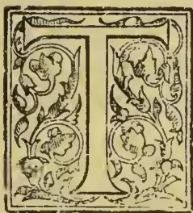

HIS very widely-used aromatic is furnished by the roots of the *Zingiber officinale* (Roscoe), an Indian herbaceous plant, with creeping jointed, woody root-stocks, from which are sent up every year stems surrounded by sheathing leaves arranged in two ranks. Its cone-shaped spikes of flowers are thrown up from the root-stock. The plant is largely cultivated both in the East and the West Indies; also in Africa (Sierra Leone) and in Queensland (Australia). The so-called Chinese and Siamese gingers are identical, but both of them are the produce of another plant, viz. the *Alpinia Galanga* (Willd). Yet, considering the wide distribution of *Zingiber officinale*, it is quite possible that the true ginger may also be cultivated in some parts of China.

The quality and commercial value of the dried rhizome from different localities varies considerably, being influenced very much by the method of cultivation, collection, and preparation.

Ginger is largely produced in all the warm and moist parts of India, up to an elevation of 4000 to 5000 feet. The best pieces of the previous year's harvest are selected and sheltered in a corner of an outhouse; the heap is then covered over with cowdung to keep the roots from drying up. The land is prepared by ploughing it up two or three times, and then dividing off into beds, with a little raised edge round each bed, care being taken to make openings to allow superfluous water to run off; for if water stands on the crop the roots will rot. Pieces of the roots one or two inches long are then buried three or four inches deep in the soil at intervals of nine inches, and the field is next covered over with the leaves of trees, which keep the soil moist; over the leaves is spread to a depth of half an inch; when rains, the water, impregnated with manure, filters readily through the leaves to the

roots. Artificial irrigation is not employed during the rainy season, but after that period it is necessary. During the first three months of the dry season the field is weeded three times. At the end of that time the plants will be about two feet high, having eight fibrous tubers to each shoot; these are dug out and buried in another place for a month. They are then taken up, and if intended for use as "green ginger," are simply exposed to the sun for one day. If intended for dry ginger, the fresh roots are put into a basket, which is suspended by a rope, and two men, one on each side, pull it to and fro between them by a rope attached, and thus shake the roots in the basket; this process is carried on for two hours each day for three or four days. After this the roots are dried in the sun for eight days, and again shaken in the basket. A two days' further drying completes the process.

In Jamaica (where the finest ginger is produced) it has been ascertained that the soil which yields the very highest quality known in the market is the deep, black soil of the virgin forest; but to grow ginger under this condition involves the destruction of large areas of forest. Magnificent trees six feet in diameter may be seen in some districts lying rotting on the ground, while the ginger cultivators have gone further to the centre of the island. The plan adopted for clearing a forest is for a cultivator to invite a few of his friends to a "cutting-match"; he provides food, etc., and the laborious work of felling trees is carried on merrily, and without much expense. Afterwards fire is applied, and the place is burnt over. This burning is considered very important; probably because the resulting deposit of the mineral matters or ash returns to the soil those inorganic constituents which had been abstracted therefrom by the trees. Besides undoubtedly, the fire also sweetens the ground, corrects sourness, and, moreover, it destroys insect pests. Some cultivators will grow ginger only in freshly-cleared woodlands, and the next year they move on to a new clearing; but although they get in this way very fine ginger, it is at the expense of forest land. Albert Town was not so long ago a centre

91------------------------------------------------

74THE TROPICAL AGRICULTURIST.[AUG. 1, 1896.]

for the cultivation, but it seems that growers have already got as far as fourteen miles further inland. Although ginger is an exhausting crop, and growers have been advised not to plant it on the same ground two consecutive years, it can be and is grown in many places year after on the same ground, but in this case it runs wild—or, as it is called "ratoons." The "plant ginger" (the produce of planting) is of better quality than the ratoons, which, become inferior in each succeeding year. When the ground is too poor to grow white ginger, then the inferior blue variety can be grown.

As regards the application of manure, there is a prejudice against it in the West Indies, some growers maintaining that it breeds worms, and that there is a difficulty in getting it in any quantity. It is probable that those who have not succeeded with manure have used it improperly by applying it fresh or not sufficiently mixed with soil. As to obtaining it in quantity, example should be taken from the Chinese labourer, who preserves every particle of matter that can in any way be utilized as manure—not only cattle manure, but decaying matter of any kind, night-soil, etc.; even soapy water left after washing is very useful. To imitate the formation of forest soil, a pit might be filled with alternate layers of bush and manure; everything in the nature of manure or decaying matter should be thrown in, and a layer of soil directly over the manure would be useful. The pit ought to be lined with clay, to prevent the very valuable part of the liquid of the manure from escaping, and a cover of some kind should be placed over the pit to keep out rain. Such a compost, when quite decayed, would be found very useful for fertilizing the soil.

In some part of Jamaica a soil of well-drained clayey loam is selected. The method of planting out is the same as in India (above described). The small pieces of root are set in March or April. The flowers appear in September. When the stalks wither in the following January or February, it is time to dig up the roots. At this period these are fibrous and fit for drying; but if required for preserving in syrup, or candying, they should be dug up before the period, whilst they are still succulent. The mature rhizomes for drying are separately picked, washed, and scraped; they are then dried in the sun and the open air. Occasionally, owing to a very wet season, the people cannot dry the ginger in the sun; it then mildews, and the badly cured ginger sometimes found in the market is more frequently the result of this cause than of want of care in curing it.

Dried ginger is called by the dealers "races" or "hands." It is in flattish, jointed, branched or lobed, palmate pieces, which rarely exceed four inches in length. The Barbadoes, Bengal, and African gingers are covered by a dry, shrivelled epidermis commonly called the "coat"; hence these sorts are usually said to be "coated" or "unscraped," whereas the Jamaica ginger and some of the sorts brought from Malabar and Bengal have been deprived of their epidermis, and are, therefore, called "uncoated" or "scraped." The external colour varies in different sorts of pale or bright yellow to dark or brown; the palest sort is the fine Jamaica, and this realizes the highest price. Cochin ginger resembles it, but is of a pale brownish tint externally. According to some authorities, the chalky-white appearance of the so-called "bleached ginger" is produced by submitting the root to the action of the fumes of burning sulphur or by washing it in a solution of chloride of lime; but it is also likely that this appearance results sometimes from a simple application of chalk or plaster of Paris.

The interior of the dried root varies like the exterior in colour; the best is that which cuts pale but bright. The consistence of ginger, as ascertained by cutting, varies from soft to hard, or, as it is termed in trade, "flirty," the soft being preferred.

The Chinese ginger (above referred to as *alpinia galanga*) is cultivated in nearly all parts of the province of Kwang-tung. The districts of Nan-hai, which belongs to the city of Canton, produces greater quantities and a better quality than other neighbouring districts. The independent tribe of the

Misotsu, in the mountains at the north-western border of the same province are also said to produce large quantities of ginger. In the district of Hsin-hsing, about thirty miles south of the city of Chao-ching, on the Western River, three-tenths of the flat land and seven-tenths of the cultivated soil in the hills are planted with ginger. A distinction is made between the flat land ginger (called in the Canton dialect *Ten-Keung*), which is generally soft and tender, and mountain ginger (*Shan-Keung*), which is brittle and very pungent. This is generally used for home consumption; the Chinese pickle it in vinegar. The expensive *Ten-Keung*—syrup ginger—is almost exclusively consumed by foreigners or exported.

The marked difference between the Chinese preserved ginger and that from the West Indies has been carefully investigated at Kew, with the result that they are now considered to be produced from the West Indies has been carefully investigated at Kew, with the result that they are now considered to be produced from distinct plants, as above explained.

The plant furnishing "Siamese ginger" is reared in a desultory manner in almost every village, but so little care is bestowed upon the culture and drying that it markets at a very low price in the local bazaars. The best quality is procurable from the bazaars frequented by hill tribes.

The yield of essential oil from various dry gingers ranges from 1.9 to 2.7 per cent. The oil is yellow in colour. Its odour is intensely that of the root—the oil of Jamaica root being the most fragrant—but no variety yields an oil possessing the pungent burning taste of ginger; this taste is due to *gingerol*, the active principle of the root, and exists to the extent of from 0.6 to 1.45 per cent. It can be eliminated in the form of a viscid fluid of a pale straw colour, entirely devoid of odour, and of an extremely pungent and slightly bitter taste. It is very soluble in alcohol, even when highly diluted.

The total imports of ginger into the United Kingdom during 1894 were as follow:—

<table>
<thead>
<tr>
<th></th>
<th style="text-align: right;">cwt.</th>
</tr>
</thead>
<tbody>
<tr>
<td>From India, the Straits, and Ceylon</td>
<td style="text-align: right;">.. 57,922</td>
</tr>
<tr>
<td>British West Indies</td>
<td style="text-align: right;">.. 6,848</td>
</tr>
<tr>
<td>Hongkong and other British Possession</td>
<td style="text-align: right;">.. 1,360</td>
</tr>
<tr>
<td>Sierra Leone</td>
<td style="text-align: right;">.. 14,933</td>
</tr>
<tr>
<td>Various foreign countries</td>
<td style="text-align: right;">.. 4,401</td>
</tr>
<tr>
<td></td>
<td style="text-align: right; border-top: 1px solid black;">85,464</td>
</tr>
</tbody>
</table>

Powdered Ginger is sometimes adulterated with rice flour, but this is readily detected by the microscope. A more serious adulterant has lately come into use namely the addition of from 10 to 30 per cent of exhausted ginger, which is practically valueless. This can only be detected by a careful chemical examination.—*Planter's Gazette*.

## BIBLIOGRAPHY OF COFFEE.

*Abbey, Richd. (Revd.).* On *Hemileia vastatrix*, the so-called Coffee-leaf Disease. [*Linn. Socy.*] London. 1878. 80.

*Abels, A. P. G.* Het Kunstmatig Droogen van Koffij en Cacao, &c. Batavia. 1866. 80.

*Abendroth, W. F.* De Coffea. pp. 42. Lipsiae. 1825. 40.

*Academies—Salerno.* [See under TRA.]

*Achard, Franz Carl.* Die europäische Zuckerfabrikation aus Runkelrüben, in Verbindung mit der Bereitung des Brandweins, &c. Leipzig. 1809. 40.

*Adema, W. R.* De plantwijzen van de djagoeng-en koffijkultuur. [*Pas dans le commerce.*] 's Gravenhage. 1887. 80.

*Adema, W. R.* Nadere beschouwingen....de plantwijze in de ruit en in het vierkant ten behoeve van do koffiekultuur. [*Pas dans le commerce.*] Cheribon. 1886. 80.

*Adulteration.* Adulteration of Coffee. A verbatim report of the proceedings of a public meeting held 1851, &c. London. 1851. 80.

*Adulteration.* Adulteration of Coffee by mixture of Vegetable substances. Report. Board of Inland Revenue. London. 1852. 80.

92------------------------------------------------

AUG. 1, 1896.]THE TROPICAL AGRICULTURIST.75

*Advertisements.* A collection of curios, &c. [See under TEA.]

*Aignan, François.* Le Prestre Médecin. [See under TEA.]

*Alberti, Michael.* Praes. Abhandlung vom Schaden des Coffee. Resp. J. H. Grimmann. 1758. &c. 80.

*Albrecht, J. P.* Klar-entdeckte, &c. [See under TEA.]

*Alcott, Wm. Alex.* Tea and Coffee. [See under TEA.]

*Aliquis.* [Capt. Stewart Jolly.] Coffee-planting in Ceylon. [In verse.] London. 1861. 80.

*Ament.* Cultuur en Behandeling der West Indien Koffij en Indigo. Kampen. 1836.

*Andalorius, Andreas.* Il Caffè descritto ed esaminato. Messan. 1703. 120.

*Anderson, Graham.* Jottings on Coffee and its Culturo in Mysore. Bangalore. 1879.

*Andronieus* [i.e., M. Alberti]. Tractatus &c. [See under TEA.]

*Armstrong, Chas. Spearman.* Tea and Coffee. [See under TEA.]

*Arnold, Edwin Lester Linden.* On the Indian Hills; or, Coffee-planting in Southern India. 2 vols. London. 1881. 80. [A new edn. 1893.]

*Arnold, Edwin Lester Linden.* Coffee: its cultivation and profit. London. 1886. 80.

*Arouet de Voltaire, François Marie.* [Le Cafe', ou L'Écossaise.] See *Colman, G.* the Elder. The English Merchant, A Comedy [imitated from Le Cafe' of Voltaire.] 1767. 80.

*Arouet de Voltaire, François Marie.* Il Caffè. o la Scozzesa [trans. from the Fr. of Voltaire.] See *Diodati, O.* Biblioteca Teatrale, &c. Tom. I. 1762. &c. 80.

*Arouet de Voltaire, François Marie.* [Le Cafe', ou L'Écossaise.] See *Home, John Res.* Le Caffè, Comédie par Mr. Hume, &c. 1760. 120. Also. 1761. 80.

*Arouet de Voltaire, François Marie.* See *Kaffeehaus.* Das Caffeehaus, oder die Schottländerin. Ein Lustspiel. [By Voltaire.] 1766. 160. Also 1761. 80.: 1764. 80.

*Arouet de Voltaire, François Marie.* See *Scotch woman.* Comedia nueva La Escocesa. [From the Fr. of Voltaire.] 18—. 40.

*Arouet de Voltaire, François Marie.* The Coffee-House; or, fair fugitive: a comedy...written by Mr. Voltaire [and entitled Le Cafe']. London. 1760. 80.

*Arrests.* Arrests du Conseil d'Etat. Declarations du Roy, &c. relatifs au Cafe'. 1723-1767. 40.

*Aubry-le-Comte, Ch. E.* Culture et production du Cafe' dans les Colonies. 1865. 80.

*Aude, Joseph.* See *Tissot, C. L.* Cadet Roussel, ou la Cafe' des Aveugles. 1802. 80.

*Aude, Joseph.* Le Cafe' d'une Petite Ville: comédie. Paris. 1801. 80.

*Aude, Joseph.* Le Cafe' politique: comédie...à l'occasion de la paix avec l'Autriche. Paris. 1809. 80.

*B., C.* See *Naironus, A. F.* A Discourse on Coffee, &c. [Translated by C. B.] 1701. 80.

*B., C.* Het Koffij-stelsel van Sumatrâs Westkust, door C. B. (overgedrukt uit de Sumatra-Courant) I'adang. 1863. 80.

*B., F. A.* Die Caffé-Schale: ein Lust-spiel...von F. A. B. 1748. 80.

*Bailou, Louis dc.* See *Periodical Publications, Brescia.* Il Caffè, &c. 1765. 40. [1766. 80.]

*Ballardie, J. de Caynoth.* Buildings in connection with Coffee Cultivation. London. 1879. 80.

*Banesius, F.* [Same as *Naironus, A. F.*] De potu Cafe'. [Latine et Italice.] Romae. 1671. 120. [English translation. London. 1710.]

*Bannister, Richd.* Cantor Lectures on Sugar, Tea, Coffee and Cocoa. [See under TEA.]

*Barotti, Lorenzo.* Il Caffo'. [A poem.] Parma. 1781. 40.

*Bazot, Etienne François.* Les Cafés de Paris, ou revue politique, critique et littéraire des mœurs du siècle. Paris. 1819. 180.

*Beccaria Bonesana, Cesare, Marquis.* See *Period. Publie., Brescia.* Il Caffè'. 1765. 40. [1766. 80. 1804. 40.]

*Bell, Frank.* The Coffee-shop at Pimlico...Song. [Arranged by F. Hoffman.] London. [1864.] fol.

*Belli, Barthol.* Kurtze Beschreibung, &c. [See under TEA.]

*Bergier, Antoine.* Quaestio medica, Litteratissime salubris cafe' usus? Praes. J. de Jussieu. [Paris.] 1741. 40.

*Berries, Juniper.* Histoire naturelle, &c. [See under TEA.]

*Bertherand.* Noyau de dattes, dans la falsification du cafe'. 1882.

*Beschouwingen.* Beschouwingen over art. I. der koffij-veilcondtien van der Nederlandsch-Handelmaatschappij. Amsterdam. 1868. 80.

*Bibra, F. E. von.* Der Kaffee und seine Surrogate. München. 1858. 80.

*Bidie, George.* Report [to the Government of Madras] on the Ravages of tho Borer in Coffee Estates; with a review of the existing systems of coffee culture, &c. Madras. 1869. 80.

*Biet, Leonard.* Le bon usage du Caffè' volatile. 120.

*Bizio, G.* Il Caffè'. Lezioni date dal prof. G. B. alla R. Scuola superiore di Commercio. Venezia. 1870. 80.

*Blacklaw, A. Scott.* See *Crüwell, G. A.* Brazil as a Coffee-growing country...described in a series of letters, &c. Colombo. 1878. 80.

*Blankaart, Stephanus.* Haustus Polychresti, &c. [See under TEA.]

*Bleqny, N. de.* Le Bon Usage, &c. [See under TEA.]

*Blom, F. W. C.* De Koffij-veilingen der Nederlandsch-Handelmaatschappij. [Amsterdam. 1866.] 80.

*Blondeau.* Empire du cafe'. 1824.

*Bode, Johann Jouchim Christoph.* See *Kaffeehaus.* Das Caffee-haus, &c. [Translated by J. J. C. B.] 1761. 80. [also 1766. 160.]

*Boehnke-Reich, Heinrich, Dr.* Der Kaffee in seinen Beziehungen zum Leben. Leipzig. 1885. 80.

*Boehmer, Georg Rudolf.* Programma in essentian Coffeae inquirens. Wittenbergae. 1782. 40.

*Boer.* See *Heer.* Rotterdams Coffyhuis-Gesprek, tusschen een Heer, een Burger, en een Boer, &c. [1783.] 80.

*Bona, Giovanni dalla.* L'uso e l'abuso del Caffè', dissertazione storico-fisico-medica. Verona. 1751. 80. [also Verona. 1760. 40. and Livorno. 1762. 40.]

*Bontekoe, Cornelis.* Tractat van het, &c. [See under TEA.]

*Bonynge, Francis.* The Future Wealth of America ... [See under TEA.]

*Book-keeping.* Book-keeping by Double Entry, &c. [See under TEA.]

*Boreur.* Anweisung vermittelst eines neuen Verfahrens Chocolade und Kaffee zu bereiten. Leipzig. 1805. 80.

*Bourgoin d'Oeli, P. H. P.* Guide pratique de la culture du caféier et du cacoyer, &c. Paris. 1867. 120.

*Boyd, Wm.* Autobiography of a Periya Durai [i.e., of a Coffee Estate]. 120.

*Bradley, Richd.* The virtue and use of Coffee with regard to the plague. London. 1721. 80.

*Braemninger, J. M.* De potus caffee usu et abusu. Efordiae. [1725.] 40.

*Braun, G.* Bericht über meinem zweiten Versuch mit dem Anbau das *Astragalus balticus* oder Neukaffees, als der besten Stellvertreter des Indischen Kaffees, &c. Nürnberg. [1822.] 1824. 80.

*Brazil.* La question du Cafe'. Le Cafe' du Brésil au Palais de l'Industrie—Janvier 1883, par l'auteur du livre: Le Pays du Cafe' [— Durand?] Paris. 1883. 80.

*Breret.* Essai sur la culture du Cafe' avec l'histoire naturelle de cette plante. 1768. 80.

*Brill, Wilhelm.* Das Kaffein in chemischer, physiologischer und therapeutischer Hinsicht. Marburg. 1862. 80.

*Broadbent, Humphrey.* The domestic Coffee Man, &c. [See under TEA.]

*Broadside.* A Broadside against Coffee, or the Marriage of the Turk. [In verse.] London. 1672. s. sh. fol.

*Brougier, Adolf.* Der Kaffee. Dessen Kultur und Handel, &c. München. 18—. 80.

*Brown, Alex.* The Coffee Planter's Manual. Colombo. 1872. 80. [A New Edition. A. M. & J. Ferguson. Colombo. 1880. 80.]

*Brown, Joseph, M.D.* An Account of the wonderful cures, &c. [See under TEA.]

93------------------------------------------------

76THE TROPICAL AGRICULTURIST.[AUG. 1, 1896.]

*Buchoz, Pierre Joseph.* Dissertation sur le Cofee, ses différentes préparations et propriéte's. Paris. 1785. fol.

*Buchoz, Pierre Joseph.* Dissertations sur l'utilité, &c. [See under TEA.]

*Burek, W.* Koffiebladziekte en de middelen om haar te bestrijden. Batavia. 1887. 80.

*Burn, Jacob Henry.* A descriptive Catalogue of the London Traders, Tavern and Coffee House Tokens current in the seventeenth century, &c. London. 1853. 80. [Second edn. 1855. 80.]

*C., J. L. M.* Naturgemässe Beschreibung, &c. [See under TEA.]

*C., W.* Coffo Phillo, or the Coffyhouse Dialogue between Phillomax Britaniens a Englishman...a German...a Hollander...and a French Captn. [Hamburg?] 1672. 80.

*Cadet de Gassicourt, Charles Louis Felix.* Mémoire sur le Cafe'. See *Cadet de Vaux, A. A.* Dissertation sur le Cafe', &c. 1806. 120. [Paris. 1807.]

*Cadet de Vaux, Antoine Alexis.* Dissortation sur le Cafe': sou historique, ses propriétes, &c. Paris. 1806. 120.

*Café.* Le Cafe' des Artistes, vaudeville, &c. par ...C. G. Etienne, E. Gosse and Morel. Paris. an VIII. (1500). 80.

*Café.* Le Cafe' des Halles, comédie, par C. J. Guillemain, &c. London, Paris. 1781. 80.

*Café.* Saynete estát nuevo intitulado El Cafe'. Valencia. 1816. 40.

*Café.* Le Comedia Nueva, o el Cafe', &c. [By L. Fernandez de Moratin.] See *Comedia.* [1800?] 40.

*Café.* Le Cafe' Borgne. [? by N. Carmontelle.]

*Café.* Le Cafe' de Ronen. Comédie: un acte.

*Café.* Le Cafe' du Printemps. Comédie: un acte.

*Café.* Le Cafe' d'une Petite Ville. Comédie: un acte. See *Aude, Jos.* 1801.

*Café.* Le grand Cafe' parisien, le plus grand Cafe' du Monde, une des curiosite's de Paris, &c. Paris. 1856. 80.

*Café.* Le Cafe', journal littéraire, artistique et commercial. Redacteur en chef, Chas. Woinez. Paris. 1858. fol.

*Café.* Le Cafe', Étude historique et commerciale. Tournai. 1886.

*Café-Chantant.* Cafe'-Chantant-Album....Comische gezelschapsliedern...uit de Salons des Variétés, &c. 1882. 80.

*Café-Concert.* Cafe'-Concert, 1e-4e Soirée. Met muz. imp. Rotterdam. 1871.

*Café-Jocoso.* Cafe'-Jocoso, modernamente aberto junto de um campo que pertence a illma. Sra. D. Ociosidade, &c. Lisboa. 80.

*Caffehaus.* Das Schottische Caffeehaus. Lustspiel. Giessen. 1786. 120.

*Café-Surrogat.* Neuestes Caffé-Surrogat, oder Anweisung zur Bereitung eines äusserst billigen Substanz, welche im Geschmack vom Mokka-Caffé nicht zu unterschieden ist. Leipzig. [1836.] 1837.

*Café.* Il Caffé, o la Scozzeze. Commedia [transld. fr. the Fr. of Voltaire.] See *Diodati, O.* Biblioteca Teatrale &c. tom. 1. 1762. &c. 80.

*Cahin-Caha.* Yvette Guimbarde. Les Coulisses du Cafe'-Concert. Paris. 1893. 120.

*Calkins, Alonzo.* Opium and the Opium Appetite, &c. [See under TEA.]

*Calvert, Esprit Claude François.* An potus Cafe, quotidianus valetudini tuendae vitaeque producendae noxius? Avignon. 1762. 40.

*Campbell, H. F.* On Caffeino as an antidote in the poisonous Narcoticism of Opium. [From Southern Med. Jl.] Augusta, U.S. 1860. 80.

*Caracas, Province of.* Memoria de los abonos, cultivo y beneficios que necesitan les diversos valles de la Provincea de Caracas para la plantação de Cafe, &c. Caracens. 1833. 40.

*Cardelli, M.* Handbuch für Kaffee wirthe...um Kaffee, Chocolade, Punsch, Eis, &c. zu verfertigen....Aus der Französisch übersetzt. Frankfurt. 1824. 80.

*Cardelli, M.* Handbuch für Zuckerbäcker, ...Gastwirthe und Kaffeties, oder Anweisung der besten Arten, den Kaffee, die Chocolade .... zu verfertigen. Nach den Franz. von H. C. Hebra. Ulm. 1836. 120.

*Cardelli, P.* Preparation of Coffee, Chocolate, &c. Manual. P. Cardelli, Lionnet and others. New edn. [French.] Paris. 1851. 180.

*Carrière-Doisin, Mlle.* Le Cafe' littéraire, ou la folie du jour, comédie-prologue sans préface, &c. Paris. 1785. 80.

*Cassoni, Girolamo.* Il Caffé considerato in rapporto alla sua storia, alla botanica, alla chimica, alla medica, dissertazione, &c. Pavia. 1830. 80.

*Catalogues, Subdiv. II.* Saltero, Don. A catalogue of the rarities to be seen at Don Saltero's Coffee House in Chelsea, &c. London. 1729. 80. [And 47 other editions!]

*Chamberlayne, John.* The Manner of making Coffee, &c. [See under TEA.]

*Character.* The Character of a Coffee-House....As also the Admirable Virtues of Coffee. [In verse.] By an Eye and Ear Witness. 1665. 40.

*Character.* The Character of a Coffee-House, with the symptoms of a Town-wit. London. 1673. fol. [Another edn. See Harleian Miscellany. Vol. 6. 1808, &c. 40.]

*Character.* Coffee-Houses vindicated: in answer to the late published Character of a Coffee-House. See Harleian Miscellany. Vol. 6. 1808, &c. 40.

*Character.* A Character of Coffee and Coffee-Houses, by W. P. 1661. 40.

*Charpentier-Cossigny, J. S.* Letter à M. Le Monnaie de l'Académie des Sciences...sur la culture du Cafe'. Amsterdam. 1773. 120.

*Chantard, A. M.* Nouveau manuel complet du Limonadier, Glacier, Cafetier, &c....Par Mess. Chantard et Julia de Fontenelle. Nour, édition par F. Malepeyre. 1862. See Roret. Libr. Eneyel. Roret, &c. 1827. 180.

*Chervillier, Jean Baptiste Alphonse.* Du Cafe', son historique, son usage, &c. Paris. 1862. 80. [1861.]

*Chevallier, Jean Baptiste Alphonse.* Sur la falsification de la Chicorée, dite Cafe'-Chicorée. [Ext. from the Anales d'Hygiène Publique, &c.] Paris. [1849.] 80.

*Chicon, Théodore.* Thèse...Du Cafe' en hygiène et en thérapeutique. See Aeads.—Paris.—Ecole de Médecine, &c. Collection des thèses, &c. an 1895. tom. 3. 1839. &c. 40.

*Christ, Johann Ludwig.* Der neueste und beste deutsche Stellvertretes des Indischen Coffee, oder der Coffee von Erdmandeln. Zweyte Auflage. Frankfurt am Mayn. 1801. 80.

*City.* The City, or Physiology of London Business, with sketches on 'Change and at the Coffee Houses. London. 1845. 80.

*City.* City Men and City Manners, with Sketches on 'Change and at Coffee Houses. London. 1852. 80.

*Civini, Giov. Domenico.* Della storia e natura del Caffé'. Firenze, 1731. 40.

*Clere, L.* Manuel de l'amateur de Cafe', on l'art de cultiver le cafe', de la multiplier, &c. Paris. 1828. 180.

*Coffee.* [See under TEA.]

*Coffee.* Coffee. A Tale. *H. Curll.* 2/- 1727. 80.

*Coffee Cultivation.* On the Cultivation and Preparation of Coffee. [Contributed to the Ceylon Agricultural Socy. in Angt. 1845.] Colombo? 1845? 120.

*Coffee Cultivation.* Coffee Cultivation in Ceylon. Pruning and Manuring. From the Proceedings of the Dimbula Planters' Association. Colombo. 18—.

*Coffee Cultivation.* Report on Coffee Culture in America, Asia and Africa. Plates, &c. 1885. 80.

*Coffee Enterprise.* The Coffee Enterprise of Ceylon, and the necessity for Railway Extension in the Coffee Districts, &c. Colombo. 18—.

*Coffee-House.* The Coffee-House, a dramatic piece [written by J. Miller: the songs set by H. Carey & H. Burgess, Junr.] London. 1734. 80: [Also 1737. 80. Dublin. 1743. 120.]

*Coffee-House.* The Coffee-House: or, Nows-Monger's Hall... A poem. London. 1672. 2. sh. fol.

*Coffee-House.* The Coffee House: or the Fair Fugitive: a Comedy: translated. London. 1760. 80.

*Coffee-House.* George's Coffee-House. A Satire. 1763. 40.

*Coffee-House.* The British Coffee-House A Poem. 1764. 40.

94------------------------------------------------

AUG. 1, 1896.]

THE TROPICAL AGRICULTURIST.

77

*Coffee-House. Chit-Chat.* Coffee-House Chit-Chat, or, Strictures on a Strange paper dated Mary's Chapel. Aug. 26. 1777. & signed C—r J—n L—y. See *Edinburgh* and *L....y.* [1777.] 40.

*Coffee-House Dialogue.* See *Y., Captu.* A Coffee-House Dialogue, &c. [1679.] fol.

*Coffee-House Dialogue.* See *Y., Captu.* A Continuation of the Coffee-House Dialogue, &c. [1680?] s. sh. fol.

*Coffee-House Jests.* Coffee-House Jests. By the Author of the Oxford-Jests. London. 1677. 120. [Fourth edn. 1686. 120. Fifth edn. 1688. 120. Another edn. 1760. 120.]

*Coffee-Houses.* Coffee-Houses vindicated: in answer to the late published character of a Coffee House. See *Harleian Miscellany.* Vol. 6. 1808. &c. 40.

*Coffee Leaf Disease.* Mededeeling betr. d. Koffij-boomen in Ceylon. Amsterdam. 1859. 80.

*Coffee-Man.* The Case of tho Coffee-mcu of London & Westminster, &c. By a Coffee-man. London. [1729.] 80.

*Coffee Planter.* A System of Accounts (by Double Entry) adapted to the requirements of Coffee Planters, &c. By a Ceylon Coffee Planter. A. M. & J. Ferguson. Colombo. 1873. obl. 80.

*Coffee Planter.* [Do.] New Edition. Bookkeeping for Planters, &c. Colombo. 18—.

*Coffee Planter.* The Private Life of a Coffee Planter, by Himself. Colombo. 1880. 80.

*Coffee Planting.* Coffec Plantiug in Ceylon, past and present. Printed at the Examiner Press. Colombo. 1855. 80.

*Coffee-Public-House.* The Coffee Public-House, how to establish and manage it. London. 1878. 80.

*Coffee-Scuffle.* The Coffee Scuffle, occasioned by a contest between a learned Knight & a pitiful Pedagogue with the Character of a Coffee House, &c. London. 1662. 40.

*Coffee Tavern.* Coffee Tavern Guide: new edition. Partridge & Co. London. 1884. 160.

*Collegium.* Collegii Med. Kungorelse, &c. [See under TEA.]

*Colman, George, the Elder.* The English Merchant A Comedy. [Imitated from "L'Ecossaise" of Voltaire.] (also called Le Cafe'). London. 1767. 80.

*Colmenero de Ledesma, Antonio De* l'usage, &c. [See under TEA.]

*Comedia.* La Comedia nueoz ó el Cafe'. Comedia. [by L. F. de Moratin.] [1790?] 40. [Another edn. (Madrid. 1800?) 40.] See *hernandez de Moratin, L.*

*Comerarius, Elias (Rudolphus).* Dissertationes tres, &c. [See under TEA.]

*Coniers, Claude de.* Le bon usage, &c. [See under TEA.]

*Conquérant, P. L. N.* Dissertation sur l'abus des liqueurs alcooliques, suivie de quelques réflexions sur les effets du Cafe'. Paris. 1810. 40.

*Consilium.* Consilium de usu, &c. [See under TEA.]

*Constantin, Marc.* See *Viveur.* Histoire des Cafés de Paris...Révue et augmentée par M. Constantin. 1857. 120.

*Constantin, Marc.* Histoire des cafés-concerts et des Cafés de Paris. Nouvelle édition. Paris. 1872. 120.

*Constantini, F. G.* See *La Roque, J. de.* Abhandlung vom Caffee...übersetzt...Nebst einer Nachricht von der Cichorien-wurzel, von F. G. C. 1771. 80

*Cooke, Mordecai Cubitt.* The Coffee Disease in South America. [Linn. Socy.] London. 1881. 80.

*Cooke, Mordecai Cubitt.* Two Coffee Diseases. [Linn. Socy.] London. 1876. 80.

*Cooly.* Cooly Medical Aid Legislation in Ceylon [for Coffee Estates]. Reprinted from the "Ceylon Observer." Colombo. 1882. 40. demy.

*Corrie, Edgar.* Letters on the subject of the duties on Coffee...Third edn. London. 1808. 80.

*Cosmius, Henricus.* Magnao naturae oconomia, &c. [See under TEA.]

*Cosnier, Ludovicus Hieronymus. Praes.* See *Munier, J. C.* Quaestio...An omni sexui...salubris Caffee', potus? 1743. 40. [see also *Sigwaert, G. F.* Quaest. Med. Paris. &c. Fose. 2. 1759. &c. 40.

*Costa Santos, Horacio Alexandrino da.* Broves considerações sobre o nosso Cafe'. Rio de Janeiro. 1881. 80.

*Cotton, Elizab. Reid (afterwards Lady Hope).* Our Coffee-Room, with a preface by... Sir A. Cotton. 3rd edn. London, Edinburgh. 1876. 80.

*Cotton, Elizab. Reid (afterwards Lady Hope).* e about our Coffee Room... with preface by the rl of Shaftesbury. London, 1878. 80.

*Cotton, Sir Arthur Thomas.* See *Cotton, E. R. Miss.* Our Coffec-Room, &c. 1876. 80.

*Coubard d'Aulnay, G. E.* Mouographie du Cafe', ou manuel de l'amateur du Cafe', &c. Paris. 1832. 40. [80.]

*Courcy, Charles de.* Les Histoires du Cafe' de Paris. Paris. 1861. 120. Part of the "Bibliothèque Contemporane."

*Cousin, J.* Les Cafés de Paris en 1772. [Extrait de la Revne de Poche]. Paris. 1867. 120.

*Couthier, Joannes Franciscus.* See *Garnier, A.* Dissertatio, &c. [See under TEA.]

*Crisafulli, Henri.* See *Multatuli, pseud.* Max Have-laar, &c. 1876. 80.

*Cross, Andrew L.* First Year's Work on a Coffee Plantation, by A. L. Cross, Glasgow Estate, Lindula. [Being the Essay which received the first prize from the Ceylon P. A. in 1877.] Colombo. 1877. 80.

*Crüwell, G. A.* Brazil as a Coffee-growing Country... described in a series of letters from... G. A. C. and A. S. Blacklaw to the "Ceylon Observer," &c. A. M. & J. Ferguson. Colombo. 1878. 80.

*Crüwell, G. A.* Liberian Coffee: its history, description & cultivation. (A series of letters on Liberia... Compiled from the "Ceylon Observer.") See *Liberian Coffee.* 1878. 120.

*Cup.* A Cup of Coffee. 1883. See *Cup that Cheers Series.* No. 1. 1883. &c. 80.

*Cup.* A Cup of Coffee: or, Coffee in its Colours. [In verse.] London. 1663. s. sh. fol.

*Cup that Cheers Series.* No. 1. A Cup of Coffee. London. 1883. &c. 80.

*Cursehmaan, Heinrich.* Therapeutische Wirkungen des Coffeins. 1855.

(To be continued.)

## COFFEE PLANTING IN BRITISH CENTRAL AFRICA.

A despatch has been received at the Foreign Office from Sir H. H. Johnston, Her Majesty's Commissioner and Consul-General in British Central Africa with regard to coffee planting in these parts.

Sir H. H. Johnston states that coffee flourishes in almost any part of the British Central Africa Protectorate. At one time it was thought that its cultivation must be confined to the highlands above 2,000 ft in altitude, but it has since been found that coffee grows equally well in quite low-lying parts. The Liberian coffee, of course, actually grows better in the tropical plains, but as this kind does not fetch such high prices as the Mocha variety, which is the kind chiefly planted in British Central Africa, it rather the facilities for growing the last-named variety which must be taken first into consideration. It is not that the Mocha coffee will grow quite as well in the plains not many feet above the level of the sea as it will in the hills, but it may be stated positively that it grows as well at an altitude of 900 ft. above the sea as at 3,000 ft. Above 3,500 ft. the coffee is liable to be nipped by frost in the cool season.

Throughout British Central Africa the soil is nearly every-where very fertile—too fertile in some places—as it is absolutely virgin soil, and this excessive richness is doubtless the cause of much of the malarial fever which prevails. Not only is the soil rich, but it is everywhere well watered by perennial streams which render irrigation during the dry season practicable.

The average rainfall in British Central Africa is 50 ins. per annum, but in most of the districts it is about 45. The least rainfall in many districts is probably 36 ins. The highest rainfall is in parts of the Mlauje district, where it attains in some years over 100 inches. The rain falls principally in the months of December, January, February, March, and April. There are heavy rains at the latter end of November, and occasional showers in May and June. It often occurs also that rain falls in the hills during August. In the hill-country—and most of British Central Africa may be described as such—it may be said that

95------------------------------------------------

78THE TROPICAL AGRICULTURIST.[AUG. 1, 1896.]

no month passes without a shower of rain. Nevertheless, it should be broadly stated that five months of the year are very wet and seven months of the year are very dry. This want of a more general distribution of the rainfall is not such a favourable feature as would be the more regularly distributed rain which occurs in Ceylon.

The climate in most parts of the Protectorate is agreeable, but it cannot be described as healthy. Neither can it be described as very unhealthy. The chief condition of health is comfort. Europeans who make themselves thoroughly comfortable and do not expose themselves too much to the sun, and who lead a thoroughly temperate life, seldom have occasion to complain of their health. Almost the only disease which causes any anxiety is malarial fever. There is very little dysentery, and it is of a mild type. Dysentery is hardly ever met with except in the plains. The climate is on the whole beneficial to persons of a consumptive or asthmatic tendency—very beneficial in fact to the latter, who often maintain better health in British Central Africa than in other parts of the world.

The whole of the Protectorate is now absolutely safe for European settlers, the entirety of it being under the direct control of the Administration. The natives are very well disposed towards the Europeans. There is a native population of about 1,200,000, but this is rapidly increasing by immigration from the countries outside the Protectorate into the more settled districts. Labour is very cheap and fairly abundant. It is the great cheapness of labour, however, which the principal attraction that British Central Africa can offer to coffee planters, and which atones for its inferiority of climate and rainfall as compared to Ceylon. Adult labourers receive wages to the extent of about 3s. a month. At some periods of the year food is given in addition, making the cost of adult labour about 4s. 6d. a month. The labour of women and children is paid for at lesser rates.

The price of land ranges at present from 5s. down to 2s. 6d. an acre, but, owing to the considerable demand for estates, it is possible this up-set price may increase. Land in Blantyre or in the vicinity of that township fetches rather high prices—from 100*l.* to 120*l.* an acre. Except within the settled and civilised shire districts, the price of land is hardly likely to exceed 2s. 6d. an acre for some time to come. As regards the sale of Government land, however, no estates exceeding 4,000 acres in one spot are permitted to be sold, and, as a rule, 1,000 to 2,000 acres is the area chosen. About one-eighth of the land in the Protectorate belongs to the British South Africa Company, the African Lakes Corporation, and some 200 European settlers. About three-eighths of the land is permanently secured to the natives, and about half of the total land area of the Protectorate is now at the disposal of the Government, though, with a view to native expansion, it is intended to alienate more than about a quarter of the total land area.

Although the bulk of the settlers are of British nationality, there are other nationalities represented, viz, Dutch, Austrians, Germans, French, and Italians. The nationalities are given in the order of their majority as regards number of representatives.

A constantly extending transport service is now carried on throughout the Protectorate by the African Lake Corporation, Messrs. Sharrer, Zambesi Traffic Company, the African International Flotilla Company, and the Oceana Company. At present the cost of transporting goods from British Central Africa to London may be roughly estimated at an average of 15*l.* a ton—ranging from 20*l.* a ton from the north end of Lake Nyasa to 4*l.* a ton from the Lower Shire. From the Shire province, which is the most settled district, the average cost of transport is perhaps 10*l.* or 11*l.* a ton (7*l.* from Blantyre). The cost of transport from England to British Central Africa is about 1*l.* a ton more than the figures given, the difference arising from the greater facilities for sending goods down stream compared to the hauling of them up stream.—*Board of Trade Journal*, May 1896.

## PURE COFFEE.

The paper that was lately read at the Chamber of Commerce on the subject of agriculture took a view of how oppressed this department is by rates and taxes. The medical profession decided that if milk could be obtained in a pure form it was extremely valuable as a food, and, further, that its consumption would be very largely increased. All this has taken place, and even now the analytical chemist is continually on the watch to attack either the farmer for sending milk of too poor a quality to market, or else the retailer because his milk is not up to the standard.

Lately, at the Annual Meeting of the Chemical Trade Section of the Chamber of Commerce, I put it to some of the analytical chemists who belong to our branch whether they were not now pretty well satisfied with the quality of the milk; they admitted they were. I then asked them another question, viz., were they not aware that, at the present time, if they went into almost any hotel, restaurant, coffee-house, and many private houses, they could not obtain pure coffee, and that at many railway stations the beverage called "coffee" was nothing but an adulterated mixture? They admitted this to be the case, but said they had not been instructed by the Government to proceed against this vile system of the adulteration of coffee.

I took the opportunity of explaining to the Committee that the adulteration consisted of beans, bad dried fruit ground up, and as a fact the very best and richest coffees yielding the best flavours were all sold at a high price to people who used them, because they would flavour the largest amount of adulterating matter.

After the deputation waited upon the Chancellor of the Exchequer, at the end of February, to appeal against the duty on coffee, I wrote to the Chancellor of the Exchequer telling him that I entirely agreed with some of the members of the deputation, that the reason of the falling off in revenue from coffee was attributable to the filthy adulterating matter that was employed when people required and purchased ground coffee.

I am glad to say that the Chancellor of the Exchequer took the same view that I did upon the matter, and agreed with some of the members of the deputation that waited upon him; and it was pointed out that the department responsible for allowing this adulteration, and, in fact, robbery of the Exercise, is conducted by Sir Michael Hicks Beach. If these facts are admitted, we may conclude that the poor English farmer, who has delivered to the hotel or restaurant pure milk, has been most unfairly treated by the Government authorities, for he has been forced to abide by most stringent conditions; and now he finds that the vendor of "coffee," so called, may sell and admixture in a shop, and other vendors may sell any adulterated article under the name of "coffee" direct to the public.

The coffee dealers in Mincing-lane, who have an immense stake in this business, subscribed together and formed a committee, and they gave pure coffee to certain people as long as they would agree to sell it to anyone who asked for a cup of coffee at their establishment, and there are very few establishments left now where the sale of this pure coffee has been continued.

Would it not be fairer to trade in general if the Government administered justice in this branch? because I maintain that, now we have such excellent quality of milk, good coffee would be greatly appreciated, and very soon coffee drinkers would be able to discriminate between the different sorts of coffees that were supplied to them.

While discussing this question from an English point of view, I should like to further remark that in France, now, it is most difficult to get a cup of pure coffee; so much so is this the case, that if you ask at a good restaurant for a cup of their best coffee after breakfast or after dinner, they charge you an extra price for it.

In Germany the so-called "coffee" which is supplied contains really less of the pure berry than it does in either England or France, and immense quantities of figs and dates are sold to adulterate the

96------------------------------------------------

AUG. 1, 1896.]THE TROPICAL AGRICULTURIST.79

coffee—in fact, I am informed that the adulterating material is present in a larger proportion than the pure coffee. Yet in both France and Germany it is most important that the trade of their colonies should be fostered! In conclusion I would like to remark that so many people ask for coffee, and if they only had pure coffee given to them, the demand for genuine coffee would be so great that it would cause a rise in the market price, and at once tend to improve the revenues of our dependencies.

THOS. CHRISTY.

—*Journal of the Society of Arts.*

## THE APPLE-TAINTED TEA QUESTION

LONDON, July 3rd.

The Tea and Produce Committee mention Monday afternoon to discuss the apple-tainted tea matter. There were present Messrs. Rutherford, Chairman, W. Martin Leake, Dickson, Cameron, Stanton, C. Scott, G. White, A. L. Hutchison, Brooke, Thompson, J. Hamilton, (who is now no longer with Messrs. S. Rucker & Co., but has an office in the same building), Corbert, who was made a partner in Messrs. Whittall & Co., just before Mr. Whittall's death and who has no Ceylon experience whatever), and Keith (of Messrs. Arbuthnot, Latham & Co., the largest importers of Ceylon tea on this side). It appears the position Messrs. Anderson, Anderson & Co., have taken up is one that does not leave much hope that they will accede to the demands of the twenty-one firms claiming about one thousand pounds (£1,000 sterling), although I am told that the market loss is a good deal more than that sum. There is precedent to back the demands of the claimants, for the Orient Line allowed a certain amount upon a small shipment of tea which was affected by oranges taken in at Malta. There seems to be a good deal of difference, however, between the taint produced by oranges versus apples. It was said that the oranges flavoured tea found considerable favor amongst buyers, and actually fetched 1d. or 2d. per lb. more than it was expected to realise under ordinary circumstances. That term "orange pekoe" is still a delusion and a snare to many a tea retailer and consumer. It was only this week I was asked for a tea "flavoured with orange blossoms." Possibly it was for a wedding! To see what the ordinary tea man would say if asked for such an article I went into one of the large city retailers and asked for it. It was promptly produced a China pekoe "made with orange flowers, and whence the term orange pekoe was derived;" the man said. The price was 3s. per lb. But, however favourable may be the sales of orange flavoured pekoe and other grades, there is not much doubt that the smell of a ripe strong apple is not a desirable addition to your staple. If it is necessary, as it is I hear, to charter special steamers from Jamaica to carry bananas, it seems advisable that those engaged in the apple-carrying trade from Australia should go and do likewise. Rum and sugar as an instance, has always to be kept entirely separate from coffee, except when a certain well-known Ceylon merchant sent them all off together during the "diggins" time to Australia and scored the best deal there he ever did in his life. The season for the Australian apples covers a period of about two and a half months, and unless some special arrangements are made by the Orient and P. & O. people they will find themselves particularly short of freights from Colombo in the future during that time. I have heard it stated here, and on good authority, that any tea that comes home in an apple ship is under a disadvantage whether it is tainted or no. Certain people make it their business to ferret this information out and take advantage of it to lower the price by reports that the tea is tainted. We all know these methods on the Stock Exchange. Why should the tea market be free from such modern highwaymen? Short of freights these liners will be, and their troubles will not cease at the apple season point. Several chiefs here have wired out instructions to Colombo not to ship tea at all by either line without a guarantee

That guarantee has, I am informed, been refused, and the business is passing into other hands. And certainly unless these lines put the whole matter on a more satisfactory footing than it at present is, these firms will adhere to their decision and doubtless others will follow. The Indian bill of landing for tea is worded differently to those in use from Colombo. A clause is stamped on that hides, turmeric, and several other evil-smelling articles will not be carried on the same deck as tea. But not one of those articles enumerated on the Indian tea bill of landing is in the same street with apples, especially if they are a little more ripe than they are usually carried. The Tea and Produce Committee decided that the Chairman and Messrs. Cameron, Dickson, and Keith be formed into a sub-committee to reply to Messrs. Anderson Anderson & Co.'s letter, and to draw up a tea clause to be stamped on all tea bills of landing similar to that in use on tea from Calcutta. That clause they will endeavour to get the Shipping Companies here to agree to, and if they succeed the tea per "Cuzco" and "Austral" will not have been spoilt in vain, although even such a clause will not dispose of the reports which are put about, and it is also the opinion of many here that the bad results from apple taint are not to be got rid of by carriage on a separate deck.

### SMALL BREAKS.

For the past eight years the question of small breaks has been forced upon the attention of brokers and others here, and the Tea and Produce Committee has from time to time discussed the matter. The big men, who will not even look at anything below a certain size of break, leaving the smaller fish to the smaller fry, have objected to being kept idly chewing their quills, whilst smallest lots are being sold. The Brokers' Association has approached the Tea and Produce Committee to increase the Ceylon limits to 18 chests, 24 half-chests and 40 boxes. This will doubtless be carried through, and anything under these limits will be relegated to the small lot sale. Of course, the object really is to induce the planter to increase the size of his breaks, the enormous quantity of different teas to be gone through being a great tax. Even one half-chest of dust sent separately must be liquored and valued, and there are a great number of little "dabs" in the Ceylon sales that are perhaps unavoidable, but none the less difficult to deal with. Various days and times have been suggested for the small lot sale. Wednesday has been spoken of as a good day. It has been said that Thursday might be devoted to it, or that the "minor canons" might be disposed of at 2 o'clock on Tuesday, at the same time the "big guns" are buying in the big sale. If the result of the above increase of limit is that the small lot sale becomes more important, perhaps the division of the sale of tea that the abortive Thursday's sale was to effect will be better carried out by the sale of the "gros" lots, and the little "dabs" in separate rooms. The Ceylon Planter whose shipments are small is better off than the Indian Planter, the limit for the teas of the latter being 20 chests, 30 half-chests, and 50 boxes. As Ceylon properties become more and more absorbed into limited Companies, however, the small lots will perhaps show a tendency to become fewer and fewer. But there is no doubt there are plenty of buyers here who took as carefully after the small breaks as the big men do after the large, and it would be instructive if some one who knows all the buyers would inform the Tea and Produce Committee how many of the usual bidders are unrepresented at the small break sale. Very few, I fancy, although possibly the bidding is done by a less important representative of the firm than at the big sale.—Local "Times."

FLORIDA CAMPHOR.—The Florida camphor-forest is looking up. We mentioned sometime ago that many camphor trees had been planted there. Now it is reported that a small quantity of an excellent quality of camphor has already been made, and a sample lot has been sent to Washington for analysis. Experiments will be undertaken to ascertain which produces the more camphor, the trunk or leaves of the tree.—*Chemist and Druggist*, June 27.

97------------------------------------------------

80THE TROPICAL AGRICULTURIST.[AUG. 1, 1896.]

### THE MIGRATIONS OF THE TOBACCO PLANT, THE FARNESIAN CASSIA, AND THE LOMBARDY POPLAR.

I would solicit a brief space to record in the *Journal of the Society of Arts* some criticisms I have received from a scientist of the highest authority, in correction of statements made by me in the course of my remarks on Mr. Tripp's recent paper on "The Tobacco Industry of India and the Far East."

1. My correspondent writes:—"It is by no means certain that the Old World owes the Farnesian Acacia to the New. It appears to be indigenous to Australia, and not impossibly to Asia."

I was aware that the *Acacia Farnesiana* had been identified by Fraas with the "white Acacia" of Theophrastus, and the "Acacia in Cappadocia," &c., of Dioscorides; but I know of no solid ground for this identification; while, on the other hand, it is described as a native Chilian plant by Molina, in the 16th century, from which date it is gradually trace through a succession of writers onward, in Italy, the Morea and Greek Islands, in the gardens of Egypt and Arabia, and in Western India. From Buenos Ayres, it was carried by Europeans into Louisiana, and as far north as Charleston, and again by Europeans it was carried from America westward to Tahiti and the Philippines, to Timor and Java, and apparently to Burma and the Coromandel coast of India. It has now overspread all India. Everywhere its name seems to be derived from its exquisite "aroma," and as the Greek writers do not refer to this, its overwhelming characteristic, I accepted it as a plant of exclusively American origin, and one of the most delightful gifts of the old world to the new. It is first botanically described by Hyacinthus Ambrosinus A.D. 1605 72.

2. My correspondent writes:—"The 'Lombardy Poplar' is only a fastigiate variety of our *Populus nigra*, and is certainly not American." And again:—"The 'Lombardy Poplar' is European, but the 'Black Italian' is American."

I am not entitled to gainsay this dictum, but I reasoned thus. The Greeks and Romans knew only the three following poplars —

*Populus alba*, Linn.: the *cheroides* [i.e., "of Acheron"] of *Iliad* xiii. 389 and xvi. 482, the "lenke" of Theophrastus and others, and the "populus alba" of Pliny xvi. 35 (23);

*P. nigra*, Linn.: the "aigeiros" of *Iliad* iv. 482, *Odyssey* ix. 141 and x. 510, and of Theophrastus, and Hippocrates, and the "populus nigra" of Pliny, *loco cit.*

*P. tremula*, Linn.: the "aigeiros makednos" of *Odyssey* vii. 106, and "populus Lybica" of Pliny in *loco cit.*

These three *P.* (*canescens* being regarded as a variety of *P. alba*, and *P. græca* of *P. tremula*) would seem to be the only poplars truly indigenous to Europe; the rest being nearly all American species. But to-day there is to be seen everywhere throughout Europe the pyramidal "Lombardy Poplar," *populus fastigiata*, said to be a variety, but if so a powerfully differentiated variety of *P. nigra*. Some regard it as a native of Central Asia others of North America, i.e., of Carolina and the valley of the Mississippi. It is the *P. italica-carolonensis* of Brugsdorf; and inasmuch as it was not introduced into Lombardy, between Milan and Pavia, before the 17th century, nor into France and Great Britain before the 18th century I concluded that it came into Europe rather from the Mississippi than from Persia. Had this "Kensp. kle" poplar been a native of Austerior Asia it seems to me that Homer would certainly have known of it, and given it a discriminating epithet, "paramidikos" or the like.

3. My correspondent writes:—"There are only two tobaccos used, the pink flowered *Nicotiana Tabacum*, and the yellow *N. rustica*. I doubt if the latter is much grown, except in the Levant, for cigarettes. I do not believe it furnishes Brazilian, Germany and Hungarian tobacco. You perpetuate a very old error about Persian or Shiraz tobacco.

*N. persica* is not a variety, but a species. It is the same as *N. alata* and white flowered. It does not yield tobacco. The blunder is due to Lindley; and Shiraz tobacco is only the ordinary *N. tabacum*."

I relied on Lindley and Pereira, but on referring to the "Kew Bulletin," No. 59, for April, 1891, for having overlooked which until to-day I am most blameworthy. I find that Mr. Thistlethwaite Dyer has there conclusively demonstrated my critic's contention on this point. I erred through writing "in a castle (of indolence)—cock-sure."

GEORGE BINDWOOD.

—*Journal of the Society of Arts.*

### THE PROSPECTS OF THE CINCHONA AND QUININE MARKETS.

It is not a little remarkable that one of the most valuable and best-known drugs, namely, quinine and one of the most valuable and best-known flavouring agents, namely, vanilla, should quite recently have been occupying a considerable amount of commercial attention; the first in consequence of the opening of a new quinine factory in London, and the second in consequence of the extraordinary advance in the price of vanilla, which has been going on for some time. In reference to the first, the *Chemist and Druggist* makes some remarks on the commercial prospects of the company, and on the cinchona-bark produce generally. In the first place, it expresses an opinion that the establishment of a new factory is not likely to have any serious effect upon the market position of the drug, though the entire output of the factory for November was said to have been sold before the month was half through. "The chief point of interest in the situation," it is said, "is that the new factory is the only one in Europe not bound by the 'agreement,' 'convention,' or 'understanding' which has existed for more than a year among the older makers, and has given a healthy tone to the quinine markets." It is further pointed out that the product of the new company is an unknown brand, and that it will take some time to convince the average consumer, especially a British one, who is proverbially loth to leave his time-honoured sources of supply, that the article has all the excellence of the old brands. The possibility of the new makers under-selling their rivals is also discussed, and should the older makers declare war upon the new comers, it is considered possible that we may return again to the price-cutting days of 1892, when quinine was purchasable below 10d. per oz. "The new factory starts at a time when the older manufacturers were believed to be contemplating an all-round advance in their quotations early in the coming year. From the quinine-maker's point of view, the market has been mending for some time, notwithstanding the fact that there has been no improvement worth speaking of in the second-hand quotations, and that the maker's prices have remained unaltered for months. The second-hand stock of quinine in London has been reduced to manageable proportions; the cinchona-bark supply in this country is too small to place any serious impediment in the way of a rise, and at least one of the large German quinine works has been deliberately kept closed all through the summer months. Only the Java producers remain hopelessly disunited. Their exports of cinchona-bark in October reached the enormous total of over 1,200,000 lb. (1,100,000 Amsterdam lb.), and in their present disorganised condition they are almost at the mercy of the quinine makers so far as the price of their produce is concerned. At the present time, the quinine manufacturers pay for the quinine in the bark only about one-fourth of the price at which they quote their finished product, and if only the second-hand stock of quinine were smaller than it is they would not be at all badly off. The facts here stated show to what lengths and variations the traffic in cinchona bark has extended in the space of time within the memory of many, when the bark was drawn from its native South American forests, and when the manufactured article, quinine, was sold at a guinea an ounce.—*Journal of the Society of Arts.*

98------------------------------------------------

AUG. 1, 1896.]THE TROPICAL AGRICULTURIST.81

E DIMBULA VALLEY (CEYLON) TEA  
COMPANY, LD.

STATUTORY MEETING.

The Statutory Meeting of this Company drew quite a number of shareholders together at the Company's Office (Messrs. Rowe & White), 16 Philpot Lane, E.C. Mr. James Sinclair occupied the chair and was supported by his co-Directors Messrs. Rowe, Forbes Lauric, Macdonald, and T. C. Owen and the Solicitor to the Company, Mr. Templeton (of Messrs. Templeton and Cox). Among shareholders present were:—Messrs. Donald Andrew, Leslie, Sanderson, E. T. Delmege, F. D. Mitchell, J. R. Grant, Russell D. Reid, G. E. Worthington, &c. The notice of the meeting having been read, the Chairman explained the position of the Company, and though it was understood this meeting was not one for press reports; yet no harm can occur from letting Ceylon readers understand what passed. It was mentioned that a telegram had come to hand just before the meeting, from Colombo, announcing that all was clear now for the transfer of the estates and that so soon as this was effected, a further and general meeting of shareholders should be called together. Meantime, Mr. Sinclair referred to the high-class and valuable properties owned by the Company and noticing certain press criticisms he would say it was not correct that he was taking a large amount of cash out of the estates—in fact his own interests and those of his family were bound up with the Company on which they would be dependent for their salt, and if this Company did not pay, and long continue to pay good dividends to its shareholders, then all he could say was "God help Ceylon tea plantation owners." (Hear, hear.)

It was then intimated that any questions might be asked and a SHAREHOLDER said that he had come to the meeting prepared to make certain remarks; but after what he had heard, he would not make them.

Mr. F. D. MITCHELL wished to get information on a number of points—(1) as to the application to the Stock Exchange for a quotation and whether the Agreement with the Vendor as well as the Articles of Association had been formally submitted to the Committee. The SOLICITOR gave assurance this had been done and certain alterations were suggested, which had received attention and they expected approval from the Stock Exchange Committee shortly.—The Mousa Ella mortgage was then discussed and the arrangement entered into about it which was done under legal advice. It transposed also that while the prices of Elgin (£20,000) and Belgravia (£15,500) equalled £35,500; those of Bearvelland Mousa Ella amounted to £55,000.—The Lawsuit about a right to water-course on Mousa Ella would be prosecuted on behalf of the Company. Mr. WORTHINGTON following Mr. Mitchell referred to the Mousa Ella transfer as to whether it secured a clear title from the Vendor and it came out that the Colombo Solicitors had given their opinion that the title was a good one. Some discussion followed as to whether the Vendor, rather than the Company, should not bear the risk of any future action and after some discussion with the Solicitor, Mr. J. FERGUSON said that all in the room who knew the Messrs. de Saram of Colombo would place great confidence in their opinion; while he wished to know whether, as a matter of fact, there had been any notice or suggestion of an action.—None whatever was the response. The Solicitors would be happy to give any further information to shareholders at

their offices and the whole could be discussed at next meeting.

A SHAREHOLDER wished to have some information about crops.

The CHAIRMAN stated that the first sale of Lippakelle realized 1s 1½d and the next 11¾d; while part of an Elgin shipment averaged 8½d, but part was withdrawn, owing to Ceylon teas having been unfavourably affected—the market at last sales disorganised—through a large shipment of Ceylon teas in coming over getting tainted to some extent by contiguity with a cargo of apples. Such was the report. He felt no doubt that stand-out prices would be secured for all the teas from the Company's estates.

The meeting closed, with the understanding that the next would be called together as early as possible.

SPRING VALLEY COFFEE COMPANY,  
LIMITED.

REPORT.—To be presented to the Thirty-first Ordinary General Meeting of the Company to be held at No. 5, Dowgate Hill, London, on Wednesday, the 27th day of May, 1896, at 1 o'clock p.m.

The following Annual Accounts are now presented to Shareholders, viz:—Profit and Loss Account for Crop 1894-5. Balance Sheet made up to 31st March, 1896.

Crop 1894-5.—In last year's Report Shareholders were informed that the coffee crop of the above season was estimated at 1,400 cwt., and it will be seen that the actual weight sold amounted to 1,658 cwt. 0 qr. 3 lb. exclusive of clean and refuse coffee sold in Ceylon. This crop realised £7,890 9s 9d, the average selling price in London being 91s 10d, as compared with 98s 5d per cwt. obtained for crop 1893-4.

The yield of tea amounted to 219,180 lb., the estimate in last Report being 215,000 lb., and this, together with 55,160 lb., bought from neighbouring estates and manufactured at Spring Valley, sold for £10,685 8s 1d., or an average of 9¾d. per lb., the average selling price last year being 9½d. per lb.

Sales of Cinchona Bark realised £43.

The total proceeds from the sale of produce amounted to £18,618 17s. 10d., and deducting from this £12,056 12s. 5d., the total expenditure in Ceylon and London, there remains a profit of £6,562 5s. 5d. on the year's working.

To this has been added the sum of £32 11s. 9d. brought forward from last year, making a total of £6,594 17s. 2d. at the credit of profit and loss.

On the 7th November last an interim dividend of 2 per cent. was paid on the capital of the Company, and the Directors recommend that a further dividend of 3 per cent. be now declared, making 5 per cent. for the year, and leaving £2,594 17s 2d. to be carried forward to next account.

The Directors cannot recommend a larger distribution of profits, as they consider it advisable to carry forward a sufficient sum to ensure the rapid extension of our tea area.

The comparatively large crop of coffee secured last year appears to have greatly weakened the coffee trees, and, though everything is being done to retain the coffee area, it is feared that much of it will have to be planted with tea this year. In any case the crop will be a very small one.

Tea continues to do well, and during 1895-6 it is expected that a crop of 280,000 lbs. made tea will be secured. During the past year the quality of our tea has been well maintained. It will be seen that the crop realized 9¾d. against 9½d. for the 1893-4 crop.

The acquisition of Kotagodde Estate sanctioned at the Extraordinary Meetings held last year has been duly completed, and the Directors are well pleased with the purchase.

11

99------------------------------------------------

82

THE TROPICAL AGRICULTURIST.

[AUG. 1, 1896]

The area under Tea is as follows:—

<table border="0">
<thead>
<tr>
<th colspan="5">TEA.</th>
</tr>
</thead>
<tbody>
<tr>
<td>Over 5 years old</td>
<td>..</td>
<td>..</td>
<td>..</td>
<td>741 acres.</td>
</tr>
<tr>
<td>Planted Nov./Dec.</td>
<td>..</td>
<td>..</td>
<td>..</td>
<td>1892 53 "</td>
</tr>
<tr>
<td>"</td>
<td>..</td>
<td>..</td>
<td>..</td>
<td>1893 243 "</td>
</tr>
<tr>
<td>"</td>
<td>..</td>
<td>..</td>
<td>..</td>
<td>1894 179 "</td>
</tr>
<tr>
<td>"</td>
<td>..</td>
<td>..</td>
<td>..</td>
<td>1895 145 "</td>
</tr>
<tr>
<td colspan="4">Area under Tea</td>
<td>1,361 "</td>
</tr>
<tr>
<td colspan="4">Area under Coffee</td>
<td>538 "</td>
</tr>
<tr>
<td colspan="4">Area under Fuel</td>
<td>57 "</td>
</tr>
<tr>
<td colspan="4">Forest Patna and Waste</td>
<td>297 "</td>
</tr>
<tr>
<td colspan="4">Total Area</td>
<td>2,253 acres.</td>
</tr>
</tbody>
</table>

The Directors regret to announce the retirement of Mr. H. H. Potts from the Board, owing to ill-health. Mr. P. C. Oswald has been selected to fill the vacancy. Mr. Oswald retires on this occasion, and, being eligible, offers himself for re-election.

J. ALEC ROBERTS, Secretary.

18th May, 1896.

OUVAH COFFEE COMPANY, LIMITED

REPORT.—To be presented to the Thirty-third Ordinary General Meeting of the Company, to be held at No. 5, Dowgate Hill, London, on Wednesday, the 27th day of May 1896, at 12.30 o'clock p.m.

The following Annual Accounts are now presented to Shareholders, viz:—Profit and Loss Accounts for Crop 1894-5, Balance-sheet made up to 31st March 1896.

CROP 1894-5.—In the Directors' last Report the Coffee Crop of the above season was estimated at about 1,000 cwt., and it will be seen that the actual weight sold in London amounted to 1,208 cwt. 2 qrs. 14 lbs.

The proceeds amounted to £5,646 14s. 10d., giving an average of 93s. 5d. per cwt., against an average of 99s. 8d. obtained for the previous crop. Coffee sold in Ceylon realized £149 8s. 1d.

The crop of Tea was estimated at 575,000 lb., and the actual weight sold from the Company's own estates was 564,000 lbs. Besides this, 349,483 lbs. of Tea manufactured from leaf bought from neighbouring estates were sold.

The value of all tea sold was £34,587 6s. 11d, or an average of 9.08d per lb. as compared with 8.68d for the previous season.

Cocoa, weighing 270 cwt. 0 qrs. 3 lb. realized £657 19s 7d, the average selling price being 48s 9d per cwt, against 60s 4d for the former year's crop.

It will thus be seen that the total value of all produce sold amounted to £41,090 12s 7d.

The total Expenditure for the year in Ceylon and London amounted to £30,022 11s 9d, and deducting this from the value of the Produce, a profit is shewn on the season's working of £11,068 0s 10d. To this has to be added the sum of £83 0s 11d brought forward from last year, giving a total of £11,151 1s 9d at the credit of Profit and Loss Account.

An Interim dividend of 3 per cent on the capital of the Company was paid on the 7th November last, which absorbed £3,000 of the above-named sum, and the Directors now recommend that £5,000 be applied to the payment of a further dividend of 5 per cent, making 8 per cent for the year, and that the balance of £3,151 1s 9d be dealt with as follows:—

<table border="0">
<tbody>
<tr>
<td>To write off the balance of the cost of Ledgerwatte</td>
<td>..</td>
<td>..</td>
<td>..</td>
<td>£1,000 0 0</td>
</tr>
<tr>
<td>To be credited towards Cost of Badulla Tea Factory</td>
<td>..</td>
<td>..</td>
<td>..</td>
<td>1,000 0 0</td>
</tr>
<tr>
<td>To be carried forward to next Account</td>
<td>..</td>
<td>..</td>
<td>..</td>
<td>1,151 1 9</td>
</tr>
<tr>
<td></td>
<td></td>
<td></td>
<td></td>
<td>£3,151 1 9</td>
</tr>
</tbody>
</table>

The result shewn above cannot but be satisfactory

Owing to unfavourable weather during the part of the season the Tea Crop did not quite up to estimate. The satisfactory yield of made tea per acre was, however, obtained, and price shews an improvement compared with the previous year.

The whole area under tea is reported to be in first-rate order, and it is hoped that by the end of the present year we shall have 2,000 acres under that cultivation. Every care is being taken to select the most suitable land at our disposal for planting, and to put in only the very best seed.

The four factories belonging to the Company are in full operation, and heavy outlay on this account may be considered to be at an end. As further improvements of our tea come into bearing, increased working space and additions to our machinery will be required, but no large expenditure will be necessary in any one year.

It is exceedingly difficult to estimate what the yield of Coffee will be secured this year. Black beetle and other pests have been very virulent, and the yield will in any case be small.

The estimated Tea Crop is 606,000 lb., and as is gathered and present prices are maintained, the result of the 1895-96 working should be satisfactory.

The area now under Tea is as follows:—

<table border="0">
<thead>
<tr>
<th colspan="5">TEA.</th>
</tr>
</thead>
<tbody>
<tr>
<td>Over 5 years old</td>
<td>..</td>
<td>..</td>
<td>..</td>
<td>1,271 acres.</td>
</tr>
<tr>
<td>Planted November/December</td>
<td>..</td>
<td>..</td>
<td>..</td>
<td>1891 10 "</td>
</tr>
<tr>
<td>"</td>
<td>..</td>
<td>..</td>
<td>..</td>
<td>1892 1 "</td>
</tr>
<tr>
<td>"</td>
<td>..</td>
<td>..</td>
<td>..</td>
<td>1893 13 "</td>
</tr>
<tr>
<td>"</td>
<td>..</td>
<td>..</td>
<td>..</td>
<td>1894 14 "</td>
</tr>
<tr>
<td>"</td>
<td>..</td>
<td>..</td>
<td>..</td>
<td>1895 14 "</td>
</tr>
<tr>
<td colspan="4">Area under Tea</td>
<td>1,841 "</td>
</tr>
<tr>
<td colspan="4">Area under Coffee</td>
<td>60 "</td>
</tr>
<tr>
<td colspan="4">Area under Fuel</td>
<td>3 "</td>
</tr>
<tr>
<td colspan="4">Forest Patna and Waste</td>
<td>48 "</td>
</tr>
<tr>
<td colspan="4">Total Area</td>
<td>3,201 "</td>
</tr>
</tbody>
</table>

The Directors regret to announce the retirement of Mr. H. H. Potts, from the Board owing to ill-health. Mr. P. C. Oswald has been selected to fill the vacancy.

Mr. N. Stewart, a Member of the Board, retires on this occasion, and, being eligible, offers himself for re-election.

Messrs. Deloitte, Deyver, Griffiths, & Co., Auditors, also offer themselves for re-election.

By order, J. ALEC ROBERTS, Secretary.

COFFEE NOTES.

It is estimated that the coffee crop of Liberia will be 50,000 piculs this year, against 30,000 piculs last year.

The state legislature of Espirito Santo is about to adopt the plan adopted in the agreement signed at Paris by the representatives of four coffee producing countries, increasing the consumption of coffee.

Francisco Schmidt, a planter residing near the city of Preto, has sent two coffee trees to Germany for the purpose of figuring at an exhibition in that city. Each tree together with the earth at its root frame in which it is packed is said to weigh 100 lbs.

According to a recent official statement the coffee crop in 1894 in the Mexican state of Oaxaca alone produced 1,000,000 coffee trees. In 1889 the exports of coffee from Mexico amounted to 9,243,091 kilograms, and in 1893 had increased to 11,514,949 kilograms. Plantations are being constantly created.

Messrs. W. H. Crossman & Co., of New York, estimate that the Brazil coffee crop of 1895 will be about 10,000,000 bags, of which about 55 per cent. will be marketed. Brazil has lately increased the production of coffee by 55 per cent. of the coffee production of the world. Other countries for some years past have produced an average of 4,889,041 bags per annum. If this average be maintained the total supply for 1896 will be 13,889,000 bags. The consumption is calculated to be 11,250,000 bags, from which it appears that the surplus will be 2,639,000 bags.

100------------------------------------------------

AUG. 1, 1896.]THE TROPICAL AGRICULTURIST.83CONSOLIDATED ESTATES CO. LTD.,

(OF CEYLON).

An extraordinary general meeting of this Company was held at the London Offices of the General Managers, Messrs. Arbuthnot, Latham & Co. on 27th May, to consider and approve of an agreement issued to shareholders by the above firm from which the following are extracts:—

An agreement dated the 14th day of May, 1896, which has been entered into with ourselves as General Managers, for the purchase from us of the Knutsford Estate of 205 acres in the Kalutara district, the Rutland Estate of 582 acres in the Hewaheta district, and the Wariagalla Estate of 1,261 acres in the Nilambe district of Ceylon. These three estates are in our opinion conveniently situated for the business of the Company, and in anticipation of the Company consenting to the purchase, we have actually purchased and paid for the Knutsford Estate, and we have had the same transferred into the name of the Company, and we have entered into arrangements to purchase the other two on the 1st July next.

Full particulars regarding the prices we are paying for the three estates are given in the agreement, the amounts being approximately as follows:—

<table>
<tr>
<td>Knutsford</td>
<td>.. £ 5,000</td>
<td rowspan="3">} Total .. £35,000</td>
</tr>
<tr>
<td>Rutland</td>
<td>.. £15,600</td>
</tr>
<tr>
<td>Wariagalla</td>
<td>.. £14,400</td>
</tr>
</table>

We accordingly propose to resell to the Company for the above amount (£35,000), or such less sum as will cover our actual disbursements, with interest thereon, and we propose to charge a commission—as our remuneration for negotiating the purchase and other matter connected therewith—of 2½ per cent on £20,600, being the purchase money of the first two estates. We do not propose to make any charge of commission in respect of the Wariagalla Estate, inasmuch as we are to receive a commission of 2½ per cent from the Vendors.

With reference to the Wariagalla Estate, we beg to call our attention to the fact that a member of our firm, Mr. Herbert R. Arbuthnot, is interested in the sale to the Company, he being one of the executors and one of the Residuary Legatees of the late Mr. George Arbuthnot, his father, who owned an undivided three-fourth share of the Estate.

It is proposed that the Company should issue, for the purpose of putting itself in funds to pay for the property, £10,000 in 6 per cent. Debentures at 5 per cent premium; £13,000 in 8 per cent Preferred Shares at 10 per cent premium; and £13,000 in Ordinary Shares at par, and that these issues should be offered to the Shareholders. Should the Shareholders not take the whole, we will ourselves take or place the balance not taken by the Shareholders, but in such case the premium on the Debentures payable by us would be 3 per cent. and the premium on the Preferred Shares would be 5 per cent. The Ordinary Shares we will in such case take at par.

It is estimated that the par value of the above will cover the cost of the three estates and expenses of transfer, as well as our commission, and that there will be a small surplus, which we propose to place, together with the premium, to the credit of the "Factory and Extension Account" to provide for the opening up of the Company's Estates and for factories and machinery as may be found necessary or desirable from time to time.

The Debentures now offered will bear interest from 1st July, 1896. They rank in all respects *pari passu* with the Company's outstanding Debentures, except that their final due date is 1st July, 1931. They can be redeemed earlier by annual drawings on and after 1st January, 1898, and whenever redeemed are payable at 103.

The Shares now offered will not participate in the profits of the Company in respect of the current year.

partner, but no Agreement has yet been formally entered into authorising him, as a member of our firm, to act as one of the General Managers of the Company. A draft Agreement whereby this is to be done has been prepared, and will be submitted for consideration at the General Meeting, with the view of its being approved and sealed.

Mr. ARBUTHNOT, head of the firm, supported by his partners and co-Directors, presided and made an admirable Chairman. Several city men represented the shareholders with the addition of Mr. Arthur Davidson, formerly of Wariagalla, now of Dorsetshire, who his Ceylon friends will be glad to know is well and vigorous, albeit the whitening effect of years is apparent.

The CHAIRMAN explained the circumstances under which the three estates were to be added to the Company: how Messrs. E. S. Grigson and Ballardie had given careful reports and valuations above the prices to be paid; how Knutsford with its 205 acres of tea could be economically worked with one of the Company's places adjacent in the Kalutara district and was a bargain at £5,000; how Rutland (582 acres—446 in tea, grevilleas 51, patana, &c. 99, costing £15,600) was the splendid estate of Mr. C. S. Armstrong who was loath to sell and was valued at £16,100; how Wariagalla (to cost £14,400) had for long been owned by Mr. Geo. Arbuthnot and Mr. A. Davidson and was also not too dear with its 1,261 acres in all; 429 in tea, 70 coconuts, 40 caeao, and rest patana, scrub, &c.

About the prospects of the Company, the Chairman had a good account to give: the crops of tea being in every case likely to be in excess of estimates, while the temporary rise in exchange had not affected them much.

The Resolutions were duly seconded and unanimously carried and also thanks to the chair, mention being made of the good bargains made for the Company in the three estates purchased.—The Visiting Agent's reports on the three estates referred to were laid on the table by the Secretary Mr. Keith, formerly of Coimbatore.—The Chairman referred to their Colombo agents Messrs. Geo. Stenart & Co. fully approving.

PRESERVATION OF COCONUT TREES AT THE STRAITS.—The *British North Borneo Herald* of June 1st says:—Regarding the preservation of coconut trees, the Assistant Superintendents of Forests, Singapore, in his report for 1895 say:—The inspector, with the assistance of one notice-server and one climber, has been employed alternate months in Penang and Province Wellesley. One thousand four hundred and twenty five notices have been served on persons having on their premises trees, stumps, or rubbish—suitable breeding places for the beetle; and as the result, 3,698 dead trees, 3,856 stumps, and 209 heaps of rubbish have been destroyed. Seventy-nine persons were prosecuted for non-compliance with the notices served on them, and fines inflicted amounting to 170 dollars. Apropos of this it may be well to state that the beetle plague appears to be practically unknown in B. Borneo. Two species, a very large weevil, and a sort of *elephas*, have been brought to the Museum as found in coconut trees. But curiously enough no work obtainable appears to mention the actual scientific name or names of the pest. Perhaps the Curator of the Singapore and Perak Museums

101------------------------------------------------

84THE TROPICAL AGRICULTURIST.[AUG. 1, 1896.

THE OUVAH SPRING VALLEY, AND  
HUNASGIRIYA COMPANIES.

The circle of Limited Companies indissolubly connected with the name of the late Mr. John Brown were among the earliest started in connection with the Coffee Enterprise of Ceylon. They were also for many years among the most prosperous, and redounded greatly to the credit of the Colony. "Glenalpine" estate—long identified with the names of Stewart, Brown and Macintyre—recognised as one of the best opened, cultivated and equipped plantations in the island, formed the nucleus of the "Ouvah Coffee Co." Spring Valley took its name from the magnificent plantation of the same name selected and first opened by Sir Wm. Reid on what was about the finest area of forest soil even in Uva, and was purchased by Mr. John Brown from Mr. Bannatyne of Glasgow on behalf of the Company. The Hunasgiriya Company connected with the well-known property North of Kandy was of more recent formation; but all three Companies suffered with the decline and fall of our staple, until their shares so long held above par, at last became almost unsaleable. How great the change now! For, although the shares of the Spring Valley and Hunasgiriya Companies have not yet fully recovered; yet they are in request and offer good prospects, while those of the parent Company are already much above par. The good done by tea is clearly indicated in this experience; for, although, coffee has continued to some extent to bridge over a time of difficulty; yet now and in the future it is on our new staple that the hopes of Directors and shareholders, are built. The late worthy and ingenious Managing Director saw as well as any one, what was coming, and he lived long enough to make sure there would be a resuscitation of his old Companies, although we could have wished, he had lived on to see the full fruition. Still more to the credit of the late Mr. John Brown, was the energy and invention he displayed in the "tea" era as in the early "coffee" days in setting to work to devise better means of preparation; and in "Brown's Desiccator" and "Roller" we have tea (as well as coconut) drying and tea rolling machines, high in favour with the planting community.

These thoughts are suggested by the annual meetings of the Companies in London, briefly reported in our last issue. It was made a proper matter of congratulation by the only Ceylon resident present that as Managing Director in succession to his father, the Companies were able to have one so well-equipped for the post as Mr. Alfred Brown, while the Board was strengthened by another esteemed business-man of Ceylon experience in Mr. P. C. Oswald. For the careful management which has always distinguished the Companies, much is due to the able clear-headed Secretary, Mr. J. A. Roberts; while what the Ouvah and Spring Valley Companies are doing in "tea" under the local direction of the Messrs. Rettie, is well shown by the fact that the average price realised for the teas in 1895 is in considerable excess of that got for 1894. All this promises well for the future; and we may hope with the present Chairman that the day is not far distant when like those of "Ouvah," the shares of the sister Companies will be quoted at, or above par. We heartily congratulate all concerned on the results already sustained. J.F.

MR. ROGIVUE'S WORK IN RUSSIA.

From Mr. A. Philip, Secretary of the "Thirty Committee," we have received the following copy of a letter received from Mr. Rogivue regarding his work in Russia:—

Moscow, May 8/20, 1896.

A. Philip, Esq., Secretary to the Thirty Committee, Kandy.

Dear Sir,—I now beg to confirm my telegram of 27th April (o.s.) and to acknowledge receipt of your reply, also to thank you for your favour of 25th April advising me of the resolution passed upon the reading of my report.

I am very much gratified by the favourable opinion expressed by the Thirty Committee, and hope, by making a wise use of the money granted, to do all that they could wish to further the interests of those they represent and trust that now I have made the start and got over the first difficulties, Ceylon tea will meet with a more rapidly increasing demand in Russia in answer to my continued efforts. With regard to details of expenditure under the £1,000 grant, all the accounts for expenses incurred up to the end of March have now come in and if it were not that Mr. Rogivue is kept so busy at Nijni Novgorod you should have all particulars by this time, but as soon as all is arranged there you shall have the detailed amounts.

Mr. Rogivue is at present occupied at Nijni looking after the arrangements for advertising Ceylon tea at the forthcoming Exhibition and Fair, where he has obtained an excellent position for the erection of a "Pavilion" not inside the Exhibition, where he found it absolutely forbidden except for Russian produce, but immediately outside the principal entrance. As the ground obtained forms the entrance to the large central garden of the biggest hotel in Nijni and is on the main road, the building had to be made up to a certain standard which together with carrying out my previous schemes for advertising Ceylon tea there, in an adequate manner, necessitated the additional outlay for which I wired for sanction on 27th April. As this Exhibition is generally expected to be such a gigantic affair and will be visited by such immense numbers of people from all parts of Russia, it seemed good policy in the interests of Ceylon to make the most of this excellent opportunity for bringing Ceylon tea prominently before the Russian public, and I telegraphed to you accordingly. I may mention briefly that among other things, arrangements have been made to supply Ceylon tea in various hotels during the time of the Exhibition and to place placards in the rooms and windows (one hotel which contains 800 rooms will have an advertisement of Ceylon Tea in each room.) I have also secured large spaces for advertisements both inside and outside of the electric trains which are to run all round the inside of the Exhibition, when all is completed, photographs (where possible) and full particulars shall be sent to you.

To the Thirty Committee I must tender my sincere thanks for their prompt and favourable reply to my request. The additional outlay sanctioned will enable me to carry out a scheme which will represent Ceylon Tea in a thoroughly worthy manner at this exhibition.

Thanking you also as secretary for the trouble you must have taken in the matter,—I remain, dear sir, yours faithfully,

p.p. M. ROGIVUE.  
(Signed) HUGH C. DOWLING.

NATAL TEA SEASON, 1895-96.

The following has been contributed to the *Star*:—the present tea season in Natal will probably close on or about the last week in June. The one before, 1894-95, ended on the 22nd of the same month, the seasons lasting from about the first week of Sept. to the third week of June, or ten months out of the 12. The picking goes on the whole time with but few stoppages, of which, however, there ought not to be any at all. The remaining two months

102------------------------------------------------

AUG. 1, 1896.]THE TROPICAL AGRICULTURIST.85

of the year are devoted to general outdoor work, such as pruning, deephoeing, manuring, draining, &c. The principal tea district of Natal is, of course, that on the north coast, about six miles from Stanger. The nearest railway station is Verulam, about 30 to 40 miles away, but the line will probably pass through Stanger to the Zululand frontier on the River Tugela within three years from date, a result greatly desired by the Victoria County planters—tea and sugar. On the South Coast there are also two tea estates, Barrow Green and Ifafa, both good properties. These, too, will soon be connected by rail with Durban. At present there is not a single working tea estate in Natal on the line. The total outturn of tea for the whole Colony was estimated last September at 960,000 lb. for the present season, or about 100,000 lb. more than season before. The crop, however, will probably not reach over 700,000 lb., on account of the great fire last December, which totally destroyed the Kearsney Estate Central Factory. This estate, which manufactures not only its own leaf, but buys and manufactures the leaf of eleven small out-gardens, under the circumstances is not expected to reach its estimate of 560,000 lb. as it was given out that 100,600 lb. of tea alone were destroyed in the fire. If they have succeeded in making 300,000 lb. more at Kearsney only, they will have done remarkably well. Space does not allow of detail, but the conclusion comes to is that by deducting at least 260,000 lb. (including 100,000 lb. destroyed) from the Kearsney estimate, and therefore the same amount from the total estimate for the Colony, the result will be 700,000 lb. total out-turn of tea for Natal season 1895-96. Besides the drought, locusts have been a source of loss and vexation of spirit to the tea-planters. Fortunately, locusts do not touch tea, at least not the young tender shoots used for picking, though they have been known to nibble at the older and coarser leaves. It is a good thing that there is so much else eatable that strikes their fancy more in Natal, as, if they did take a liking to the tea-leaf in general, then good-by to the industry as long as locusts were about. The danger exists, nevertheless. It is to be hoped that no fire, or drought, or hailstorm, or other evil will interfere with the welfare of the very promising tea industry of Natal during the coming season 1896-7, and that the planters will reap fully the benefit from their labour, especially the smaller ones, who without capital, have worked hard and pluckily for some years, and certainly deserve all the success they can get. With favourable weather, such as the Stanger district was blessed with in 1891-5, and on ill luck or accident, the turn-out of the whole of Natal should easily top the very respectable figure of one million pounds of tea for season 1896-7. Let us hope then that increased quantity with improved quality will be the result next June year.—*Natal Mercury*, May 15.

#### INDIAN PATENTS.

Specifications of the undermentioned inventions have been filed under the provisions of Act V of 1888.

Improvements in the trays or carriers of apparatus for exposing tea, coffee, &c., to the drying or other action of air, vapour or gases.—No. 66 of 1896.—Samuel Cleland Davidson, merchant, of Sirocco Engineering works, Belfast, Ireland for improvements in the trays or carriers of apparatus for exposing tea, coffee, &c., cocoa, grain and other substances to the drying or other action of air, vapour or gases. (Filed 22nd May 1896.—*Indian and Eastern Engineer*, June 13.)

#### THE PRODUCTION OF COFFEE AND TEA IN BRITISH DEPENDENCIES.

TO THE EDITOR OF THE TIMES.

Sir,—There is a great deal of misapprehension current in reference to our old Ceylon staple, coffee, its production and price—which, with your permission, I should like to correct. The other day Lord Stanley of Alderly, addressing the House of Lords,

included "coffee" in his list of products suffering from depreciation of price, although for the past eight years at least coffee has been pre-eminently the tropical product which, contrary to the theory of bimetalists, has not only maintained but increased its gold value in the markets of the world. Thus, in 1889 the lowest and highest quotations for middling plantation coffee in London were 91s to 102s, and they have not since fallen below that figure, while for 1895 the range was 100s to 107s, and there is little difference this year. This is due to the fact that production has not kept pace with the demand for the Continent of Europe and North America; and yet here again a curious misapprehension prevails as to there being an immediate risk of the over-production of coffee as of tea. Thus, at the recent reading of a paper before the Royal Colonial Institute on "The Development of Tropical Africa," by Sir George Baden-Powell, in the discussion that followed, Dr. Morris, of Kew, stated that "in the regular cultivation of coffee, cacao, cotton, kola, and fruit, West Africa has a great future before it." And in describing the coffee industry in the Nyasa hill country (British Central Africa) I made the remark:—"The chief staple, coffee, is one of which there is no fear of over-production at present." Nevertheless, the chairman (Sir R. W. Herbert) in summing up and referring to tropical products, said:—"It is desirable as far as possible to seek for new staples rather than to crowd the markets with ordinary produce like tea and coffee, which seem in danger of being over produced."

Sir Robert Herbert is correct as regards tea, but he has overlooked the great falling off in the production of coffee within British dependencies during the past 16 years. This has been mainly due to the terrible effects of a fungus enemy on the coffee of Ceylon, a great part of Southern India (and even of Java). Without going into details, let me venture to give approximate and contrasting estimates of coffee exports from British dependencies:—

<table>
<thead>
<tr>
<th></th>
<th>Maximum annual export 16 to 18 years ago.</th>
<th>Estimate for 1896.</th>
</tr>
<tr>
<th></th>
<th>Cwt.</th>
<th>Cwt.</th>
</tr>
</thead>
<tbody>
<tr>
<td>Ceylon ..</td>
<td>1,100,000</td>
<td>50,000</td>
</tr>
<tr>
<td>South India ..</td>
<td>450,000</td>
<td>240,000</td>
</tr>
<tr>
<td>West Indies ..</td>
<td>150,000*</td>
<td>80,000</td>
</tr>
<tr>
<td>Straits and North Borneo ..</td>
<td>—</td>
<td>30,000</td>
</tr>
<tr>
<td></td>
<td>1,700,000</td>
<td>400,000</td>
</tr>
</tbody>
</table>

This indicates a woful deficiency, and I see no prospect of more than a very limited increase for many years in the above dependencies. I am free to confess that at the same time Brazil has maintained and even increased its large production of coffee; but this has been counterbalanced by the notable falling off in the crops of Java and Netherlands India generally; and were it not that American and European capitalists have been developing coffee plantations in Mexico and Central America (Guatemala, Costa Rica, &c.), the consuming markets would have been barely supplied. The continued high price has, indeed, encouraged Ceylon tea planters to invest surplus capital in a new coffee district in East Java; while I am aware that City capitalists are looking to foreign States in South and Central America for coffee investments.

Surely, then, experiments in coffee cultivation may well be encouraged in the British divisions of Africa (as well as in the Malayan Peninsula, North Borneo, &c.), and more especially in British Central Africa under Sir Herbert Johnston's enlightened administration. The first limited company for coffee cultivation in Nyasaland was formed a year ago in Ceylon by planters and merchants, whose manager, now

\* The West Indies attained their maximum early in this century, Dr. Morris telling me that Jamaica alone exported 260,000 cwt. of coffee in 1805, while other islands—Barbados, Antigua, Dominica, Montserrat, St. Kitt's, and the Virgin Islands—made up as much more, or, say, from 500,000 cwt. to 600,000 cwt., at the maximum about 90 years ago.

103------------------------------------------------

86THE TROPICAL AGRICULTURIST.[AUG. 1, 1896.

hard at work opening up a plantation, gives an encouraging report of his prospects in labour supply, crop, &c.

It will be a long time, however, before such enterprise, or any other enterprise at present within British territory, can seriously affect the coffee market; and I see no early prospect, in any other quarter, of an over-production of coffee. The case is rather different with tea, in view of the large areas planted and still being opened in India and Ceylon. The export of tea from India has steadily risen, year by year, from 2½ million pounds in 1861-62, until the estimate for 1896-97 is 141 million pounds. In the case of Ceylon we began with 23lb. export (23 years ago) in 1873, and for 1896 the official estimate of total export is 102 million pounds.—I am, sir, yours truly,

J. FERGUSON, of the *Ceylon Observer* and  
*Tropical Agriculturist*.

Royal Colonial Institute, Northumberland avenue,  
London, W. C., May.

### UNFORTUNATE FLORIDA.

It is only after a visit to Florida that one appreciates the disastrous efforts of the freeze of last year. It is the constantly-recurring topic among residents. It left behind it ruin, misery, and blasted hopes. Many persons had invested the savings of a lifetime, all the money they could borrow or scrape together in groves and plantations of one kind or another. Some had even mortgaged the growing crop to tide them over, expecting to find themselves on the road to fortune when it was harvested. Then the labor, expenditures and efforts of years were literally wiped out in a night by the cold wave which killed off the growing things and left the land as unproductive as it was before cultivation began. It was a blow from which many settlers cannot recover, to say nothing of the pecuniary loss to the State at large. The extent of it has not really been measured yet, for it is possible that time may show that the injured orange and coconut groves and other plantations must all be planted over again, and the process of cultivation begun again from the start, a matter involving years of toil and expenditure. People in Florida talk hopefully of the prospects, but there are many estates for sale and many settlers are eager to sell at any price that would enable them to set North again. A shrewd, hard-headed Vermont farmer came, through a complicated real estate trade, into possession of a plantation in the orange belt upon which the owner had spent \$6,000. He offers the property at \$1,000, and says privately that he would gladly accept \$500 cash for it. He even regrets the cost of the coat of paint which he put upon the house to make it more attractive to possible purchasers. Property, of course, will rise in value in time; but this farmer's experience is said to be a fair illustration of the condition of real estate in Florida.—*New York Sun*.

### THE LONDON CINNAMON SALES.

The last mail from London has brought fairly cheering accounts of the quarterly sale of cinnamon, which should have been held on the last Monday in May, but which came off on the 1st June as the 25th May was included among the Whitsuntide holidays. The sale was in most respects a satisfactory one. The quantity offered was not unusually large, but, like the offerings at the previous sale in February, was a fair average quantity. In all, 1,743 bales were put up for competition, being a little less than the quantity

offered in February, when 1,792 bales were catalogued, and the better part found purchasers. The quantity, however, was in excess of that offered at the corresponding sale last year, when only 1,065 bales were down in the catalogues and the whole found purchasers. But from the table of exports one might have expected even a larger quantity yet, as the current year shows far heavier exports than the four preceding ones—perhaps than any previous year. Of the 1,743 bales offered, more than two-thirds, viz. 1,292, were disposed of under the hammer. The competition left little to be desired; for although the fine qualities sold at a decline of half a penny to one penny, the bulk which consisted of ordinary cinnamon, commanded fair competition and even advanced to a slight extent. Thus, whereas, at the February sales, A S G P (Golna Pokuna) fetched up to 1s 5d per lb., at the sales on the 1st inst., this well-known mark did not command a higher price for its firsts than 1s 4d. The next highest prices realized were for spice from W.S. and K. from the wellknown F. S. Kadirane group; and these fetched up to 13d; but the ordinary cinnamon advanced a penny.

In commenting on the February sales, we drew attention to the fair competition which "unworked" cinnamon commanded. Even a couple of years ago such cinnamon would scarcely be looked at, because it had failed to pay the exorbitant charges imposed by the dock companies for the wholly needless operation—at least as regards the well-known marks—of having every single bale cut open and restoring after the removal of broken quills. As in the February sales, so at the last, a very considerable quantity of "unworked" found buyers. Among the most prominent were the C. H. de S. (de Soysa) marks, which sold according to the grades, from 8½d to 10½d. It is not a small advantage that unworked cinnamon is now fairly competed for; but there is special ground for satisfaction in the keener competition which ordinary cinnamon commands. We interpret this as evidence that new uses have been found for our spice through which the disadvantages under which cinnamon so long laboured, of overproduction, are being overcome. Another hopeful future is that broken quills and clippings fetched as high as 9½d a lb.—an advance of about 50 per cent. over usual prices. Altogether therefore the sales must be regarded as satisfactory, and promising well for Estate Proprietors. The following is the Report on the last sale from one of the leading firms in the spice trade:—

London, 2nd June, 1896.

CINNAMON.—At the quarterly sales held yesterday, 1,743 bales Ceylon were offered, against 1,792 bales in the February auctions, and 1,065 bales at this period last year. There was a steady demand, and 1,292 bales were cleared under the hammer; ordinary and medium quill realising full to occasionally dearer rate, while fine quality sold rather irregularly, but mostly at ¾d to 1d per lb. decline on the prices ruling in February. About 400 bales worked sold; firsts sold, good to fine from 11d to 1s 1d; seconds, good to fine 10d to 1s 2d; thirds, 10d to 1s 1d, and fourths, 8½d to 10d per lb. The unworked quill—about 900 bales—brought, firsts, 10d to 11d; seconds, 9d to 10½d; thirds, 9d to 9½d, and fourths, 8d to 8½d per lb. Chips sold at 3d and clippings up to 9½d per lb.

The London Warehouse Stock is 3,173 bales against

<table>
<thead>
<tr>
<th>in 1895</th>
<th>1894</th>
<th>1893</th>
</tr>
<tr>
<th>Bales.</th>
<th>Bales.</th>
<th>Bales.</th>
</tr>
</thead>
<tbody>
<tr>
<td>3,306</td>
<td>3,218</td>
<td>3,699</td>
</tr>
</tbody>
</table>

The next auctions are fixed for the 31st August.

104------------------------------------------------

AUG. 1, 1896.]THE TROPICAL AGRICULTURIST.87HANTANE, OLD AND NEW.

The district of Hantane, though not the oldest, largest, nor most important of planting districts, must always have a peculiar interest attached to it. It contains the beautiful capital of the Central Province, and every estate has its history and associations more or less interesting to all old Ceylon men. Apart from this it is one of the healthiest of localities, and what is more was on the whole ever a paying district in coffee as it promises to be in tea. Things are not always what they seem, and Hantane is better than it looks, which is more than we can say of most places or some men. Looking up from Kandy the cursory observer, seeing the sparsely covered ridges, would not be prepared to hear that the returns per acre have ever been fully equal to those of the more sheltered upland valleys. Yet such is the case, while the proximity to Kandy adds a certain value to all the landed property in the vicinity. Even supposing there was no tea there are other strings which one could stretch—if need be—for a livelihood.

Walking down the Wiudmill brac of Aberdeen one day with a well-known proprietor whose estates lay within easy access of the mountain capital, I observed him lifting his hat to a poor old woman who was chopping up firewood for sale. "Who's your lady friend?" I asked. "Don't know," was the reply, "but we are both in the same line of business"! It was during the dark days of coffee when this means of tiding over the bad time suggested itself, and brought him in a few hundreds a year. And there are many other items which could here be turned to account though not necessary to enumerate while tea is tea.

It would be difficult perhaps to find another estate in the Island that has given better returns in its day than old Hantane itself. Opened in 1838 by Messrs. Atchison and Jefferson it was the first systematically cultivated and clean weeded of coffee estates, and for many years this estate well repaid all the care bestowed upon it. The collapse of coffee came upon the just and unjust, but even then Hantane was not worked at a loss, while now again its prospects are of the very brightest.

After the retirement of good old Jamie Martin from the management of this estate in 1858, a strange series of disasters befel its superintendents—one was supposed to have been poisoned, another was certainly shot dead, while a third went stark mad. Since then matters seem to have got into a smooth groove again, and tea is doing very well.

A better known estate was perhaps Odewelle adjoining. This fine property may be said to have been the Lippekelle of old, realizing in 1845 the record price of the day (£15,000),—a fact which led to the mad rush and ultimate collapse No. 1. When first we passed through Odewelle, good old 'Know best'—really then at his best—was superintendent glorying in his fine herd of cattle—all of which he knew by hip and horn, and all knew and loved him. A hospitable host was Willie, and many a good Willie waucht did the thirsty traveller enjoy at his bungalow. After him came a Willie of a different jât, but the estate went on prospering and giving good returns till Collapse No. 2 of the early 80s. In tea Odewelle has not yet quite come up to the position it held in coffee. Tea takes time to accommodate itself to the best of old coffee land, but it promises well.

Let us now once more pass through the gap to Kitoolmoola where first we met that typical

planter of the middle ages A. C. Mortimer, the trusted and eminently trustworthy manager for Sir John Cheape. Kitoolmoola and Gallaha were model estates carefully cultivated and gave splendid returns to the lucky proprietor at home; but alas the days of even careful A. C. Mortimer drew to an end. He stayed the year too long on the much loved totum, and died at Sonthampton while *en route* for the dear auld home. He was succeeded, however, by a most capable man, whose hard and shaggy head contained, and still contains I am glad to say, brains enough to accomplish anything he cared to undertake. Under his management the properties continued to improve till sold to the present proprietors. The tea here is now giving most satisfactory returns, and the splendidly equipped and well managed factory on Gallaha is one of the sights of the island.

Fain would I push further down to where I first called upon T. Gray, now of Bunyan fame, or round the corner to Nilambe where the far-seeing "eye-glass" received me so well, and on to Warriagalle where the hospitable Henderson reigned, or down where I was wont to spend the evenings with the most congenial of Davidsons; but this must suffice for today. And we must now return northward passing over the ridge from Odewelle into Hopewell, of which it used to be remarked in 31 Craven St. that it formed "the most comfortable of accounts"—always on the right side. It now belongs to Mr. S. Agar, its former superintendent, but as yet only a small portion has been planted in tea. Mount Pleasant, adjoining, still belongs to the old owner, and though the best portions are still to plant tea is doing remarkably well. It will however take a long time to come up to the splendid returns of old coffee days, when £8,000 sterling was netted from 400 acres! And be it remembered had the rupee been then at 1s 2d the profits would have been nearer £14,000 per annum. Tea has indeed a big margin to make up before it beats the old king.

I shall now only notice, on the way down to Peradeniya, the quondam and favourite abode of clever, capable, Sandy Brown, Bellevue, as he delighted to call it, but now known by the less appropriate name of Augusta. Would that Sandy was here today to witness the change! The neighbourhood presents few more satisfactory transformations than this. As a coffee estate it was one of the very poorest and least remunerative in the district, its quartzry ridges eating up all the manure that Kandy or Getambe could supply, with the result of only a few additional leaves. Now see it closely clothed in luxuriant tea of the best jât, while that grandest of exoties, the Grevillea, adds yearly to the improving soil. Truly tea is a hardy though eccentric plant, often growing best where least expected and sometimes—as we will see in my next—refusing to take root in the richest soil.

Yes: I could wish Sandy had lived to share in the prosperity of this now very profitable property. I have always thought his fate one of the saddest in Ceylon. Worried and bled by relatives at home, distrusted by his old friends in Ceylon, many of whom he had helped to make—he passed away neglected, crushed, and starved, when, as usual, the friends came forward, and gave him a stone.—Cor.

CULTIVATION OF RHEA.—The Government of India, it is stated, is likely to take steps to investigate the cultivation of the rheaplant. An enormous demand for the fibre has sprung up in England. By a new process of manufacture, excellent fabrics can be woven from rhea and the industry seems to have a great future before it.

105------------------------------------------------

88THE TROPICAL AGRICULTURIST.[AUG. 1, 1896.

## THE RUBBER SITUATION IN MADAGASCAR.

Madagascar as a source of India-rubber is destined no doubt to become largely more important. The exports of rubber from that island have fluctuated from year to year, sometimes declining so far as to induce fears of the early extinction of the yield, which were strengthened by reports of the destructive methods of the rubber-gatherers. But again the output has increased, while each successive traveler returning from Madagascar has thrown new light upon the extent of the rubber forests. Some facts of interest in this connection have been supplied to The India Rubber World by Mr. John L. Waller, some time United States consul at Tamatave, who has lately returned to America after his release from a French military prison, his troubles having grown primarily out of a concession to him of valuable rubber lands by the Malagasy government without consultation with the French authorities.

This large island is covered, for the greater part, by virgin forests throughout which, so far as foreigners have made their way, India-rubber vines and trees abound. By the way, most authorities have attributed the Madagascar rubber to vines of the genus *rubea* (similar to if not identical with the *Landolphia* vines of continental Africa), but, according to Mr. Waller, a more important source of rubber is a large tree which he has not been able to identify botanically. This tree often grows to a diameter of twelve to eighteen inches and in such numbers as to make the ground seem almost bare after the reckless rubber gatherers have gone over a strip of forest with their axes. A peculiarity of the tree which Mr. Waller reports to have seen personally is that the roots are not killed by the felling of the trunks, but that new shoots invariably spring up, becoming large enough in a few years to yield rubber. Thus the extinction of the supply is provided against by nature, which is not true of the Pará rubbers or the *Landolphia* climbers. The tree likewise grows readily from the seed.

The usual practice of the native rubber-gatherers is to proceed to the forest in gangs, armed with axes for felling trees and galvanized iron buckets for catching the sap. The fallen trunks are chopped or sawn into lengths of three or four feet and supported over the buckets until all the rubber sap has drained from the bark. Mr. Waller reports having seen two quarts or more of sap yielded by a single stick of wood. Coagulation is effected by stirring a few drops of acid into a bucketful of sap and allowing it to stand in the sun for several hours. There is as yet practically no proprietorship in the lands, and the rubber-gatherers have been free to wander at will in the forests. But the governor of the province in which Mr. Waller's concession is located has orders from Antananarivo to prohibit trespassing upon it after the limits shall have been surveyed, and the next step will be to put an end to the destruction of the trees.

The concession covers 144,000 acres of forest lands, to be located in the best rubber district in Madagascar, which is in the southeastern portion, including the old French station, Fort Dauphin. This has been the chief place for working rubber on the island, and, as it is distant from any consulate, and, as the English and French traders are secretive about the extent of their business, doubtless not a little rubber has been exported to which no record ever reached the various consulates stationed at Tamatave. Rubber near the coast began to be scarce several years ago, but the natives asserted that more was to be found farther inland, and now the seat of the industry has been removed to a district about three days distant from Fort Dauphin. Twenty-two dollars are paid there for a hundred-weight of rubber. Fort Dauphin has been styled a halfway house between Europe and the Orient, and it is now a port of call for the Castle mail Packets Co., Limited, and another line of steamers. There are from two to four ships and sometimes more per month in the harbour. The

climatic conditions at this point are good, the lands are fertile, the cost of living is low, and a consideration which induced the Hovas to grant this concession was that it might lead to immigration from Mauritius and elsewhere and the development of various industries at Fort Dauphin.

It is the belief of the *concessionnaire* that the district would be well fitted for colonization by Afro-Americans, who would find there better advantages for trading than they enjoy in the United States. The Hovas are an educated race, and foreigners from several countries have made fortunes in trading with them. Mr. Waller will attempt to find means in this country for developing his concession, the status of which, he claims, has not been changed by his troubles with the French authorities. In what light it will be viewed by the latter, however, remains to be seen. He believes that a field exists for a much wider direct trade between the United States and Madagascar. While the foreign traders have been mainly English and French, the American house of Ropes, Emmerton & Co., of Salem, Mass, long and had a successful career at Tamatave, retiring from the trade during the troubles growing out of the late French war. The house of George Ropes, of Boston, entering the trade later, is now established at Tamatave, Vatromandry, Antananarivo (the capital of the island), and Finaarosa. A large business is done in the selling of American cotton goods to the natives.

The British and American imports of Madagascar rubber, which presumably include almost the entire output of the island, have been of late years as follows:—

<table border="1">
<thead>
<tr>
<th colspan="2">UNITED STATES.</th>
<th colspan="2">GREAT BRITAIN.</th>
</tr>
<tr>
<th></th>
<th>Pounds.</th>
<th></th>
<th>Pounds.</th>
</tr>
</thead>
<tbody>
<tr>
<td>1891-92</td>
<td>.. 174,919</td>
<td>1890</td>
<td>.. 624,848</td>
</tr>
<tr>
<td>1892-93</td>
<td>.. 275,331</td>
<td>1891</td>
<td>.. 729,232</td>
</tr>
<tr>
<td>1893-94</td>
<td>.. 265,411</td>
<td>1892</td>
<td>.. 996,240</td>
</tr>
<tr>
<td>1894-95</td>
<td>.. 31,003</td>
<td>1893</td>
<td>.. 1,040,920</td>
</tr>
<tr>
<td></td>
<td></td>
<td>1894</td>
<td>.. 984,816</td>
</tr>
</tbody>
</table>

There must also be taken into account the British imports of rubber from Mauritius which are mainly derived from Madagascar, and which amounted in 1894 to 163,336 pounds. Altogether, the official figures available point to an average annual output of Madagascar rubber in recent years of 1,162,000 pounds. If it be true that the supply is practically unlimited, the ever-growing commercial spirit of the age, the increasing means of transportation, and the utilitarian spirit which must inevitably stop the waste of trees, will without doubt combine in largely and permanently increasing the yield.

Madagascar rubber is classed in the markets as "pinky" and "black," the former being the more valuable. When asked whether one kind was probably yielded by trees, and the other by vines, Mr. Waller replied that he could not say.—*India Rubber World*, May 10.

## THE CLIMATE OF MID-AFRICA.

Mr. Scott-Elliott, in his account of his journeys in Mid-Africa, says of the Ruwenzori range that the highest peaks are almost perpetually hidden from view by mist, which in the morning covers the lower slopes, and appears to rise at the rate of about 1,000ft an hour. The upper limit of forest is given at 9,000ft, bamboos at 11,000ft, whilst heather reaches 15,500ft, at which snow begins. The climate is divided into four zones of altitude—the coconut or oil-palm zone below 3,000ft, the coffee zone between this and 5,000ft, the colony zone from 5,000ft to 7,000ft, and the cloud belt above 7,000ft. The Ruwenzori region is stated to be a more promising coffee and tea region than even the Shiré highlands. For colonies the Masai uplands and the Stevenson Road plateau are the most recommended.—*H. and C. Mail*, June 12.

106------------------------------------------------

AUG. 1, 1896.]THE TROPICAL AGRICULTURIST.89TEA PLANTING IN DARJEELING.

PAPER TO BE READ BEFORE THE INDIAN SECTION  
OF THE SOCIETY OF ARTS ON THURSDAY,  
MAY 14TH, 1896.

BY GEO. W. CHRISTISON.

My first duty—which is a pleasing one—is to thank the committee of the Indian Section of the Society of Arts, for having done me the honour of inviting me to read a practical paper on tea. As the history, progress, commercial aspects, and complete statistics of the industry have been exhaustively dealt with by others, I shall best employ the time allotted to me this afternoon by giving a brief outline of the culture and manufacture of tea in Darjeeling, with some suggestions on a few points of vital importance, referring to that district in particular and the industry generally, drawn from my own observation and experience.

The annexation of Darjeeling (strictly British Sikkim, and British Bhutan, exclusive of the Dooars) is but a comparatively recent chapter in the history of the extension of British rule in the East. Until 1815, when the country was brought into notice by the Goorkhas invading the territory of the Raja of Sikkim, that district was practically a *terra incognita*. This led the East India Company in 1816, at the close of our war with Nepal, to espouse the cause of the Raja, and enter into a friendly treaty which constituted Sikkim an independent state under British protection. In 1835, 138 miles of Sikkim were ceded to the East India Company for a sanitarium for Bengal, in lieu of which an annual allowance of £300 was granted. In 1850, after the Sikkim war, some more hill territory and also the Terai were added, the subsidy, however, at the same time being enhanced very materially. And in 1865 the hill district of Daling was annexed from Bhutan as the outcome of the expedition of 1864, and the war with that state just then terminated.

The district is mainly situated on the lower and outer ranges of the Himalayan mountains, but as stated, includes the Terai which is an unhealthy level sub-montane tract of forest, or what was up till 30 years ago almost uninterrupted forest. It is bounded on the east by Bhutan, west by Nepal, north by independent Sikkim with Tibet beyond, and on the south-east and south by the Dooars tea district and Purneah in Bihar, and extends from about 26deg. 30' to 27deg. 13' N. latitude. Though in area it hardly exceeds that of a second-rate English county, it ranges in elevation from about 350 feet to altitudes of over 12,000 feet above sea level. The town, or as it is called the "station" of Darjeeling, which is the administrative headquarters of the district, as well as the health resort for the Government and residents of Bengal, is charmingly situated on a ridge at an elevation of 7,167 feet, commanding a magnificent view of the "snowy range" (about 40 miles distant and rising to over 28,000 feet), and to the north of Calcutta 379 miles by rail, but somewhat less in a direct line. Any attempt to describe the magnificent and sublime scenery is, fortunately, outside my province, as it is altogether beyond my powers. It is impossible for me in words to convey even any adequate idea of the steepness and irregular configuration of this mountain territory to those who have not visited it, though this feature must not be lost sight of in our consideration of the main subject of this paper. The mountains do not rise by any series of inclined planes or uniform undulations to their summits. The main trend of the ranges is towards the "snows"—generally from south to north—and of the torrents and rivers in the opposite direction from the snows towards the plains, but there are also side branches of importance running east and west (one of those, the Little Runghoot river, actually flowing north-east, and the adjacent mountain ranges ascending south-west), and many minor spurs and streams are in the very opposite direction to the main ones. On this account, the interior of the hill district generally presents a somewhat confused labyrinth of ridges and valleys. A con-

siderable proportion of the hill area is so precipitous as to grow nothing but scrub or an occasional tree in the crevices of the rocks, and much is unfit for tea or cultivation of any description; but the soil on the gentler and some of even extremely steep slopes is good and of surprising depth, considering the situation. As a rule, the best soil on the hills is found from 2,500 to 5,000 feet; that below 3,000 feet is generally dry, and the tea thereon more subject to blights. Elevations over 5,500 feet are rather cold for tea—certainly for its rapid growth—though it is to be found thriving and doing fairly well from 6,000 to even 7,000 feet. Owing to the extreme steepness and irregularity of the ground, the roads have to be laid off in zigzags of greater or less length, when, as is the rule, an ascent or descent has to be made, or in sharp curves where contouring more levelly round ridges and into the indentations. This renders the length of roads from place to place out of all proportion to—not unfrequently over twice, and occasionally almost three times as great as—the distance as the crow flies. The district government roads are, as a rule, at gradients of 1 in 9 to 1 in 7, and are from 10 to 7 feet wide.

As stated, owing to the zig-zag and winding nature of the roads, and the wide intervening spaces of forest and jungle, the length of the roads is very great, in proportion to the cultivable and rateable area, especially as the Forest Department does not pay road or public works' cess, and the vast tracts of native cultivation nothing directly and next to nothing indirectly. In my time, the local railway was also exempted. For these reasons, as well as on account of the district being a frontier one, containing a military station and sanitarium, it has special claims for "grants-in-aid" towards its roads and bridges, in regard to which, it must be admitted, Government has, on the whole, been liberal, sometimes especially so. Yet I hold that, in justice, as well as viewed as a fair and legitimate matter of account between the Government departments, a great landlord like the Forest Department of India, claiming a large clear revenue annually, ought to be charged both land revenue and road cess. Incalculably valuable as this department undoubtedly is to India, profit should not be its chief aim; and such a step would cause the department all the more adequately to realise its immense responsibilities in holding such vast territories.

But, in addition to locomotion and soil, this rapid and great variation in elevation affects the climate, health, and working capabilities of the inhabitants, native and European, vegetation, humidity, and, to some extent, the quality of the tea, to which allusion may be made hereafter.

The rainfall varies greatly throughout the district. At the "station" the average is about 120 inches, and on the tea-gardens (at lower elevations) it ranges from 75 to 135 inches and even over annually. The defect for tea in regard to rainfall is that it is not sufficiently distributed—the dry season being too long, but worst of all too little rain falls in spring and too much during three to four months from June to September, when it is too frequently accompanied by dense mists often obscuring the sun for a week, sometimes more, at a stretch. There are also not unfrequently sudden heavy downpours which have been known to amount to ten inches and more in a single night. These downpours as well as considerably heavier annual rainfalls than have been named are more characteristic of the outer ranges. The mean temperature of the "station" of Darjeeling is only a couple of degrees above that of London, but that of the tea gardens is of course much higher. In the Terai and confined valleys under 2,000 feet on the hills it is quite tropical and often stifling. At elevations of 4,500 feet the temperature seldom exceeds 85°, the mean maximum about 80°, and at elevations of 3,000 feet it occasionally turns 90°, with a mean maximum of about 85° in the shade during the hot months. The mean maximum in the shade in winter is about 60° at 4,500 feet, and 67° at 3,000 feet. The difference between the mean maximum and the mean minimum varies from 15° to 20° and more in winter than summer, and at high than low

12

107------------------------------------------------

90THE TROPICAL AGRICULTURIST.[AUG. 1, 1895.

elevations. As registers have been kept since 1866 for the company I served in Darjeeling for thirty years, and for the last eight or ten years at no less than eleven stations, at various elevations from 1,400 to 6,300 feet, the statements in the appendix are given to avoid further details here.

The latest complete Government returns that I have been able to obtain give the entire area of the Darjeeling district as 1,234 square miles, about equal to that of the county of Stafford. The old hill territory, containing the well-known tea gardens, is put at 477 square miles, the Terai at 271, and the Daling-hill district at 485 square miles. Of the whole, 438 square miles were returned in the possession of the Forest Department, 397 miles as held by native cultivators for cereal crops inalienable for tea as far as the hills is concerned, 70 miles had been allotted to the Government Cinchona Department, and 329 square miles as grants for tea cultivation. It will, therefore, appear that but one-fourth of the whole has been allotted for tea, and that certainly not more than one-thirteenth or about seven and a-half per cent of the entire district is actually bearing tea at the present time. From information kindly furnished by the India Office I find the area of the district is now stated to be 1,164 square miles, and the difference may be due to the portion marked off and include in the Dooars district some years ago. I am also of opinion that for tea, transfer of some of the land returned as above for native cultivation may have taken place in the Terai. Yet if this be so, the proportion of the tea grants would not be greater than stated. Seeing the Census of India Report, published in 1893, gives 212 square miles as the area held for tea estates, I cannot be charged with any desire to understate the proportion allotted for tea. Hardly any land on the hills suitable and available for tea remains unplanted.

The more recently acquired district of Daling may be taken as about equal in extent to that of the entire original Darjeeling hill territory, and generally comprises much gentler slopes. Of this 250 square miles are returned as made over to the Forest Department, 30 as retained by Government for cinchona, and 141 consisting of beautiful slopes, most desirable as a place of residence for Europeans, and as suitable a district for European colonisation as can be found anywhere in the East, has been reserved by Government for natives, and is now largely in the possession of Nepalis who are aliens, and a smaller proportion of aborigines and semiaborigines. About 65 square miles of this subdivision was reserved for tea, but so unsuitable was it that, notwithstanding the eagerness for tea grants, especially in the hills, only about eight or nine square miles had been taken up when I left India in 1893, and hardly more than about 1,200 acres altogether have been opened out. These new gardens adjoin the Dooars, and may be said to belong to that district rather than to Darjeeling.

The late Dr. Archibald Campbell, who was an active and enthusiastic member of the Indian Section of this Society, was the first resident Government official at Darjeeling, and did much for the district in its early years. He was removed from the residency at Nepal to be superintendent of Darjeeling in 1840, and in 1841-42 he made the first trial of growing tea in the district. He continued his experiments, and in 1847 had the plants raised, reported on by a gentleman from Assam, which fully confirmed him, in the opinion that tea could be grown successfully on the hills. Seed was distributed by Government to several residents most likely to do justice to it, and experimental plots of a few acres were planted out in different localities, about 1856; and in 1857—or it may have been a year earlier as asserted by some—the first tea garden, on an extended scale or commercial footing, was started at Allobaree by Major Samler. In the Terai, though experimental plots were planted earlier, the first garden (now known as Chumpta, near Kaprail) was opened out by Mr. James White, one of Darjeeling's pioneer planters, than a most energetic man, who had previously planted, in the course of two seasons, very

successfully, Singel, near Kurseing, still one of the largest, if not the very largest, of our single hill gardens. Darjeeling has since grown gradually in importance as a tea-producing district and in other respects. At present there are about 180 tea gardens in the district, extending to about 55,000 acres under plant, giving employment to not less than 70,000 natives, excluding children and other non-workers.

According to the last census returns, the rapidly-increasing population of the district was 94,712 in 1872, and 223,314 in 1891. Of the latter, 88,021 were stated to be residents who were actually born in Nepal. This being so, the Nepali population of Darjeeling who have immigrated at one time or another or been born in the district, can hardly be less than 160,000.

Tea is certainly the staple, if it may not claim to be the only, Darjeeling industry, and to say the least, has done much for the district. The 1895 crop amounted to 10,771,117 lb. of which most went home, contributing considerably to the exchequer, benefiting trade in many directions, and supplying nearly all the return traffic to the local railway, at highly remunerative rates, considering it is conveyed downhill mainly by gravitation. Very little produce of any kind is exported, or even supplied to the district, from the native holdings.

In regard to my main subject, the first point requiring attention naturally should be the selection of a site for a garden. This is a matter of vital importance, and calls for the exercise of much judgment and experience, and often exhaustive labour in exploiting. The soil may be looked upon as the constitution, so to speak, of a garden upon which its prosperity and staying power mainly depend, and its selection, especially as the subsoil, to a great depth, is of importance with a deep-rooted plant like tea, involves no light responsibility. Besides a wholesome water supply, forest, water-power, and, in the plains, immunity from flooding should all if possible, be secured. But as this can no longer concern Darjeeling hills, it need not here be dwelt upon at length. Though I have been concerned with the opening-out of gardens of considerable extent on Darjeeling hills, I have never had the responsibility of the selection of the grants for them, but have merely had to endeavour to make the most of the ground at my disposal. The original Darjeeling gardens were, as a rule, selected and opened out in a creditable manner, considering the experience of the time. During the mania of 1863-64 extensions were pushed on upon risky and unsuitable soil, beyond the labour and experience available, the land was very imperfectly prepared and planted; there were difficulties about seed; seedlings had often to be carried long distances, necessarily resulting in failure and consequent abandonment for a time. A proportion of the land then abandoned has gradually been re-opened successfully under more favourable conditions. If a grant of land has still to be selected on the hills, the most important consideration would doubtless be to secure a soil that would yield quality, and varying in elevation from 3,500 to 5,000 feet. All aspects grow tea almost equally well; and though the southern and south-eastern are drier and more difficult to plant successfully, they are, upon the whole, preferable when opened out. The northern aspects require less care and less skill, and are not risky for vacancies, but have comparatively more in their favour at low, dry altitudes than high. Though gentle slopes are undoubtedly preferable, they have generally, on that very account, been much more under native cultivation; and, contrary to the expectations of many, the steeper—often extremely steep—ground grows the better tea bushes. It should here be noted, in regard to these hill-sides, that it is very difficult to get tea to thrive upon the sites of homesteads, and that for many years those parts generally remain bald, comparatively bare looking, and an eyesore upon an otherwise successful garden. But I can bear testimony to the fact that such patches, after having been trenched to an unusual depth, kept fallow, and sulphured annually for three years, have afterwards been planted quite successfully the tea bushes flourishing and keeping pace with the body of the garden

108------------------------------------------------

AUG. 1, 1896.]THE TROPICAL AGRICULTURIST.91

from the onset. Further, all land long under native cultivation should be allowed to lapse into jungle, or, as it wore, lie fallow for three or more years, and, of course, the longer the better before planting.

The first operation in tea planting is the clearance of the land; it may be from forest, but often upon partially cleared and cultivated or grazing land. In the case of forest too and a few other very valuable trees, the drip and shade of which are least injurious, should be marked for preservation at considerable intervals. The felling of trees is a work the Nepali is expert at, and delights in, his bump of destruction being highly developed. The trees are sometimes prepared so that the fall of one carries others over with it, and so on continuously down the slope like ninepins, with a crash that resounds through the solitude of the hill sides like muffled thunder. After the storage of useful timber, the next step is the burning, over which there is considerable excitement. This is carried through as soon as the clearance has been duly prepared and become sufficiently dry, advantage being taken of a safe and suitable wind. A great number of coolies have to be in attendance to guard the fire from spreading to property beyond. In addition to wood and other growth there is often numerous bamboos upon the clearance which, when being burnt, crackle and give forth reports resembling the roll of musketry, while the figures of the natives flitting athwart the raging flames, and by times being taxed to their utmost to keep the "burn" within safe bounds, renders the scene a lively one, though not always free from anxiety to those responsible. The burning stumps and heavier bamboos often smoulder for days.

After the fire has died out the ground ought to be trenched and thoroughly cultivated to the depth of 18 inches throughout the gentler slopes, but effectively though carefully and to a lesser depth on the steeper slopes, and in accordance with the degree of steepness—extracting stones and all roots of trees, bamboos, jungle and weeds at whatever cost. On such steep and irregular ground much judgment and ingenuity have to be exercised in order to direct the surface drainage into safe channels to prevent "wash." All except the gentler slopes ought to be carefully terraced. These terraces should not be formed too elaborately, with a deep wall behind, and built up sharp angular edges in front or containing two rows of bushes along side as they sometimes do, but merely so as to modify the slopes no more than necessary for the stability of the soil and prevention of wash. This is more simply accomplished if attended to at the proper time and place than it would appear to be. A shallower formation of terrace will interfere less with the capillarity and natural circulation in the soil than the more elaborate. The deeper and more acute angular terraces greatly intensify the defects of the Darjeeling climate. The terraces should also be aligned as far as practicable to direct the surface drainage into safe channels. It stands to reason that the wash should be diverted near its source, and as it begins to accumulate. Paradoxical though it may seem it is not generally the steepest parts that suffer most, but the gentlest slopes even where they assume almost the form of a plateau. This arises from the surrounding slopes having acted as a filter, so to speak, concentrating a rush of water upon such after sudden downpours. The object of surface drainage is to check this accumulation, and the drains should be laid off with a gentle run. The excessively steep portions should be laid off in "spot" terraces, formed in the most advantageous places, to contain one or more plants. The laying off of the estate roads so as to traverse all parts of the gardens, without involving waste of locomotive power, is important, and their alignment should also be such as to aid in the safe drainage—the reverse being easy. This somewhat difficult task, with the skill and experience available in the early times, was not so invariably successful in attaining the perfection and easy uniform gradients as desirable. The prevailing gradients of garden roads, except where crossing the slopes or rounding ridges, are from 1 in 7 to 1 in 5, width

5 or 6 feet; but paths are to be found not more than 1 foot wide, and so steep as to ascend or descend 1 in 3. A sure-footed pony—which the Bhooteah ponies generally are—is indispensable; and passing across precipices with a sheer drop of hundreds of feet upon such roads is trying to the nerves of most unaccustomed to mountain travelling. As has been remarked, the length of road is great in proportion to area. By careful survey, I have ascertained that on a garden of 500 acres, benefiting by the service of a district road zigzagging through its entire length for  $4\frac{1}{2}$  miles from top to bottom, the inadequate system of estate roads measured 18 miles, leaving fields of tea very arduous to reach from any of the roads. The Ceylon "road tracer," a simple and inexpensive, but admirable, instrument, is a most valuable aid, to the inexperience especially, for the alignment of roads, but, in my experience, even more so in the laying off of terraces. Roads generally, like terraces, should have the outward, not inward, slope, but may also have a drain along the inner or hill side when required. The removal of stones, as referred to, might possibly be carried to excess in rare instances, but of this the risk is not great. I have often had this done to an enormous extent, and with an unfailing corresponding advantage on extensions. The stones may be disposed of for buildings, or in forming embankments, culverts, and fords for roads. Besides, when a road passes through good land the rich soil may be removed and spread upon the poorer parts of the garden, and replaced with stones. The remainder of the stones can be built up in heaps upon spots of convenient waste land. The cultivated area has to be lined and "staked" off for planting, and no little ingenuity and care are required to get the points for the plants arranged in perfectly straight lines up and down a steep, irregular hill side, "over hill and dale," and, at the same time, getting them to fall into contouring lines along the terraces, without loss of space or overcrowding. Opinion has always varied, and from time vacillated, as to the distance the bushes should be planted apart, and though there is a guiding principal in regard to this, it may not be well to dogmatise. For the hills, I would venture to recommend 5 feet by 4 feet,  $1\frac{1}{2}$  by  $1\frac{1}{2}$ , and at the closest  $4\frac{1}{2}$  feet by 4 feet on the buse, but for the Terai greater distance, especially between the rows, to admit of ploughing or horsehoeing if found necessary.

There are two modes of planting, the one from nurseries by transplanting, the other by putting down the seed germinated or fresh in *situ*, or, as it is termed, "at stake." Each has its own advocates and advantages, but in the climate of Darjeeling the former is preferable; besides, two paramount advantages may be claimed for it anywhere—namely, five or six months more are available for the thorough preparation of the ground, and it admits of the perfect selection of the most vigorous seedlings of the best and of uniform variety. Moreover, from my own observation, I have often been disposed to doubt whether the quality of the produce is not improved by the transplanting. This may not be so, but I have been at a loss otherwise to account for the different quality of tea in adjoining gardens on similar soil, and under varying management. This is a matter I would recommend to practical men, as worthy of being determined by systematic experiment. If the transplanting is to be adopted, an extensive and elaborate system of nurseries is essential. For nurseries, the most advanced garden cultivation, constant care and attention is indispensable—watering in most instances, and shading in hot-exposed situations being needful. The nurseries should be numerous, and practical, in or near all parts of the proposed extensions, for economy in the carriage of the seedlings. The seed beds must be thoroughly freed from stones, and the seed should be sown rather wide apart especially when machine planting is to be adopted. Though 4 inches by 4 inches may seem too close, judging from what is generally written, that in practice will be found to work out satisfactorily, the early and first season's operations thinning out, and giving space for the young plants that remain.

109------------------------------------------------

92THE TROPICAL AGRICULTURIST.[AUG. 1, 1896.

The seedling are generally removed from the nurseries at the age of from six to eight months. They should be transplanted with balls of their own earth attached to their roots, and this can be accomplished to great perfection by Jabeu's patent transplanter, an ingenious Cachar invention, simple in operation, handy, costing a mere trifle. All risky dry aspects should be planted by this means, and also during the most seasonable and favourable season and weather. Most northern aspects, unless during unfavourable weather or towards the close of the season, may be planted very successfully by hand with a lighter quantity and less perfect ball of earth attached, at a saving of labour. By this method the seedlings receive no check to their growth, while those put out in the old ordinary defective way, without earth attached, with difficulty exist during the ensuing dry season at the best five months in duration—some years, even eight months, from October to May inclusive. With land thoroughly prepared and planted out as referred to, though much more costly the first year, this will be more than compensated for in the saving upon the cultivation in subsequent years; while, it may be safely asserted, that as good growth has been obtained in three years in this way as was common during five years under the ordinary method.

It must readily be perceived that the judicious cultivation of such excessively steep ground must be a matter of vital importance. The utmost foresight, ingenuity, and care are necessary to prevent the soil from being carried downhill, not so much in the process of hoeing itself, as by the action of the heavy rainfall, especially the sudden down-pours early in the rainy season. Forking is much less dangerous for injuring the roots of the tea, and is much safer for hill cultivation than hoeing with the country *kodalie*. Moreover, the straight digging fork admits of the labourer standing upon the unturnd ground, and turning or tossing the soil up hill; while in hoeing he reverses the process, by trampling the ground he has just cultivated, and dragging the soil down the declivity. Cultivation by means of the straight digging fork was first advocated and experimented with in Darjeeling by the late Mr. John Stalkart. Forking was resorted to on a large scale by me 23 years ago, and is now pretty general, the hoe (*kodalie*) being only used in the preparation of extensions, road-making, and the like. It is, however, decidedly, more costly than hoeing, which is a consideration, when labour is scarce, and many hundreds of acres are entirely under spade industry, so to speak. The deepest and most important cultivation of the year is the cold-weather digging. This is but too commonly done, by turning the ground up rough, and leaving the whole in large clods. Such a process is highly objectionable, in a climate like Darjeeling, with a long, trying, dry season, and too subject to droughts in spring. It is, of course, quite different in Britain, where the soil exposed in a similar way is pulverised by the action of frost, and there is in general an excess, rather than otherwise, of moisture in winter. But this rough cultivation aggravates the defects of the Darjeeling climate, and intensifies the drought; while the clods, by the scorching action of the sun, get dried and baked like so many bricks especially in the southern and dry aspects. In all countries subject to droughts, especially in the tropics and sub-tropics, a thorough cultivation and pulverisation of the soil throughout, but especially at the surface, in autumn and the dry season, is by far the best for attracting and retaining moisture and obtaining healthy crop growth. Thorough cultivation admits of ample aeration of the soil. This is a subject which I have given much thought and attention to for 30 years. Shortly after I went to Darjeeling, I experimented with rough and thorough cultivation, on equal plots alongside, noting the result as to benefit derived from dew and retention of moisture, and can entertain no doubt as to the immenso advantage of the latter system over the former. While making my farewell tours through the district in the spring of 1893, field after field, in different localities, came under my observation, lying exposed to the scorching

sun in clods, in some instances almost half the size of a man's body, and I could not but sympathise with the proprietors. For the second and succeeding cultivation at the close of spring and the early part of the tea season, hand weeding is the most suitable and stimulating culture of all; and as an accompaniment the weeds or grass can readily be disposed of in layers or bands across the slopes, and (drainage having been attended to as referred to) check the "wash" in a wonderfully effectual way, even where there are no terraces. Hand-weeding may be carried on most advantageously, especially where extensions have been thoroughly prepared. In the rains, when hand-weeding has become impracticable and a turf has formed, the soil may be forked over less deeply and left rough, there being no longer fear of drought, and less from "wash." After an extra wet time, or on unsafe parts during the rains, nothing more should be attempted than close sickling, supplemented by hand-weeding, of spots around the collar of the roots of the plant.

The great difficulty attending the perfect cultivation of a tea garden during the rains is, the crop must be gathered at the same time, and there is often pressure to get the leaf off at the most perfect stage. The time, nature, and amount of cultivation has, therefore, but too often to be regulated by the labour available for it. Forking ought to be avoided in excessively wet times, and done in favourable weather, but for the reason just stated, it is impossible always to choose the best time, unless the labour force be unusually strong—stronger perhaps than might prove profitable where coolies must be retained all the year round, as is the rule, and cannot be engaged for a pressure of work, and their services be dispensed with when it is completed. Extensions and building upon an old garden are also liable to retard garden operations, and add to a manager's difficulties and anxieties. Unfortunately, the real question is not to know what ought to be done in regard to cultivation, but too frequently what is practicable with the available labour. What has, in many instances, become a most vital matter on the hills, is how best to rectify the results of reckless or defective cultivation on old gardens during the past. This is sufficient to tax to the uttermost the skill and resource of the most ingenious, and in some parts, not to speak of impaired cropping capabilities, so grave has the evil become that the only effective remedy would be to carry back the soil from the valleys and hollows where it has in process of time been wasted. Terracing an old garden originally lined up and down hill, and often laid out in hedges without any such object in view, has its drawbacks. The plants that fall in the backs of the terraces get their roots bared too much and injured, and those in the edges are unduly buried.

Ploughing is impracticable anywhere on the Darjeeling hills, but in the plains districts might with advantage be restored to, and I daresay has been for the preparation of extensions, but whether steam ploughing has been resorted to or not, I cannot say. About 25 years ago I tested light ploughs by Ransome and of native pattern on a mature garden in the Terai, but the work was not fine or the result satisfactory. For the plough the distance between the rows would require to be wide, but in spite of this the lateral roots of the tea get damaged, and the cleaning close to the stems must be done by hand. The injury to the roots should to some extent be obviated by trenching all over as recommended on opening out, but ploughing on a planted garden is never likely to prove so advantageous as hand labour when procurable at moderate cost.

The manuring of the tea plant is for many reasons difficult, but fortunately the matter is not yet a pressing one generally, the tea crop being neither heavy nor exhaustive, and more nitrogen is undoubtedly returned in the rain than in more temperate climates. The average crop of green leaves taken from the soil annually does not exceed 12 cwt. per acre (say half-a-pound per bush) which is very trifling compared with the weight of agricultural crops in this country exclusive of the portions thereof returned to the soil. Some attendant drawbacks to tea

110------------------------------------------------

AUG. 1, 1896.]THE TROPICAL AGRICULTURIST.93

manuring are want of an adequate supply, costliness of transit, liability to evaporation and waste, and tea being a deep-rooted plant the difficulty of applying the manure so as not to increase the growth of the weeds rather than leaf in the first instance. It has not been proved even how manure may affect quality, which is an important consideration and must depend upon the nature of the manure used. By all means let every available manure, solid and liquid, be preserved from waste through exposure—the danger of which is very great in a tropical climate—and be applied to the best possible advantage. But of all that is practicable in this line, I attach most importance to “green manuring” by means of turning into and burying in the soil in autumn the greatest possible amount of fresh and decaying growth. Let this work be pushed forward with the utmost vigour with all available labour. Nothing else in the way of manuring I know of can give so good a return. Top-dressing with leaf mould or other rich mould is also of immense benefit, and even when soil of only the poorest quality is procurable a thick dressing with that on thin dry parts has shown markedly good results. Manuring, and more so top-dressing, is comparatively unavailing—simply outlay and labour in vain—unless the application be a liberal one—three to five inches deep in the case of the latter according to quality of mould.

Transport by means of wheeled vehicles, in the ordinary sense of the term, is quite impracticable on any Darjeeling hill road, except the main military one, where cart traffic has been superseded by the wonderful Darjeeling Himalayan Railway, and on one or two other pieces in or near the station. There are no lakes or navigable rivers as in Kashmir, and previous to the torrents being permanently bridged ferries even were not practicable except at one or two points in or near the Terai and they were always attended with some danger.

All carriages including that of ordinary building materials, fuel, provisions, is performed upon men's backs, and journeys are performed by pony, on foot, or, in the case of ladies, children, and invalids, in chairs or a form of hammock called a “Dandy,” suspended on poles and carried by coolies. Heavy loads, such as boilers, tea, lead, and sometimes lighter packages, are conveyed from the nearest station to the gardens by trucks or trolleys mounted on low broadrimmed wheels. The bringing down of a 20 or even 10 horse-power boiler of several tons weight is one of those little incidents that break the monotony of garden labour. Some skilful steering is needed in turning the acute corners of the zigzags, and in guiding the passage safely over many precipitous parts of those steep, narrow mountain paths. As many as 100 of the strongest men may be employed with a truck so freighted, chiefly strung upon ropes—some pulling before and others behind as occasion requires, the latter to prevent the truck getting beyond control by acquiring too much down hill velocity; others using crowbars, planks, or other appliances as need arises. In Assam and other plains districts of India and Ceylon, elephants are employed for the dragging of boilers, presenting scenes hardly if at all less picturesque.

In regard to buildings, time will not admit of my entering into detail. In the past the planter has been his own architect and clerk of works, planning, estimating for, and vigilantly superintending every operation from the sawing of the timber in the forest, the making and burning of the bricks, to the completion and full equipment of the edifice. The more modern and doubtless the most extensive buildings are in the plains districts of India and Ceylon, where extensions on an enlarged scale have been more recent; there in addition to the most modern mechanical appliances electric lighting has been introduced. In Darjeeling there has not been the same scope, the buildings had generally to be designed to suit the sites after costly excavation on the steep hill sides, and in the case of amalgamation of factories, for instance, ingenuity had to be exercised in the erection of a main central building to connect two others at different elevations,

the ground floor of the one being near, but not on the identical level with the first floor of the other. The whole had to be designed for convenience, to deal with increased crops, and meet modern requirements. The managers' bungalows are generally charmingly situated, little being required, in the shape of landscape gardening, to make the surroundings altogether beautiful. These buildings, with their white-washed walls and shining roofs, studded over the hillsides surrounded by the green tea gardens, present to the traveller at all points a striking and pleasant feature of the landscape. Many of the dwellings of the garden labourers are substantially built with brick walls, corrugated iron roofs at the higher, and thatch for coolness at the lower elevations, and verandahs in front. The floors are well raised, and space, convenience, comfort, and sanitation are provided up to and in most instances in advance of the tastes and wishes of the occupants. Few of them would tolerate fire-places, or the exit of the smoke by chimneys in the walls; but on account of warmth, or other reasons best known to themselves, prefer it finding its way from the centre of the floor through the ventilators in the roof, as in Scotland, within my own recollection, and I daresay in other civilised countries. Many darken or block up entirely the windows provided for them. However the modern coolie dwellings are a very great improvement upon the huts once universal, and in most cases all is being done for the coolies' comfort that is practicable or, at present wise. In the centre of the village there is generally a level plot reserved, though difficult to obtain, as a recreation-ground.

The view now presented includes a group of buildings comprising sub-manager's bungalow, factory with coolie lines in the background, to all of which pure water is conveyed from a stream on the opposite spur of the mountain two miles distant, by means of galvanised iron pipes passing through a deep ravine, where there is a pressure of 1,175 feet head of water at the lowest point. The company to which this small estate belongs has water laid on in pipes to all their coolie lines, where needful, factories and bungalows, having in operation for this purpose, as near as may be, seven miles of galvanised pipes of various bores, fed from filtering beds and fountain head tanks, and discharged into numerous large cisterns, from which and from “standpipes” convenient to all, including the coolies, are constantly supplied. Besides, this company has a supply of fire-hose fitted to discharge water with force at the highest point of the factories, and, in one case, at least out of three, with pressure sufficient to eject it over the roof of a three and a half storey house, the hose meanwhile being held in the hand on the ground. And, to convey some idea of the extent corrugated iron is in use on tea gardens, I may mention that the company referred to, though by no means the largest in the district, has in all imported 4½ acres to that material for roofing its own buildings.

The operations of tea manufacture are now performed by machinery in all factories of any importance. Steam is the commonest motor, but water-power (mainly by turbine) is also in use. In the case of the Tukvar Company, the turbine is situated in a ravine about two-thirds of a mile from and 1,500 feet below the level of the factory, the power being transmitted to the machinery there by means of wire rope, travelling upon pulleys supported on standards placed at suitable distances apart. The district owes the conception and accomplishment of this bold and arduous undertaking to the ingenious, indefatigable, and praiseworthy efforts of the late Mr. Thomas B. Curtis, of Tukvar, a well-known and most able tea planter. On another hill garden electricity has for some time been employed, the turbine and generating apparatus being similarly placed beside the torrent far below and distant from the factory and machinery to be driven. For this laudable pioneer object lesson in regard to the motor, which I believe to be specially suited and destined to be the power of the future for Darjeeling, we are much indebted to the late, much-lamented Mr. Wm. Lloyd, who has besides rendered many public services to the district in the promotion of her mar-

111------------------------------------------------

94THE TROPICAL AGRICULTURIST.[AUG. 1, 1896.

vellous little railway, botanic garden, public park, Municipal affairs, volunteering, local banking, and the like, fully appreciated by few, and which never have been adequately acknowledged. Through his enterprise Darjeeling has been for 30 years conspicuous as the only tea district as such as far as I am aware, possessing a European bank.

To return to the field operations, a few remarks are called for concerning the pruning, which has to be attended to as early as the young plants betray a tendency to run up too much and assume the habit of a tree rather than retain the form of a bush, in the case of vigorous seedlings at as early an age as two years, and even younger where individual specimens show exceptional growth; that is, if the planter believes, as I do, in training the bushes when young, but opinion used to vary on this point as on much else connected with the industry. After the plants have attained three years of age they are all pruned according to their form and condition annually. The object of the operation is to get rid of the knotted unproductive wool, thin out slightly to admit air and light, leaving the young vigorous leaf-producing branches and shoots, to train the bushes to width—to give flushing surface, the leaf being gathered mainly from the top—and to keep them at a height convenient for the coolies to pluck the leaf from. Great caution is necessary in regard to heavy cutting in Darjeeling. The pruning is a work requiring a great deal of labour annually, and as many untrained coolies have to be employed, it demands close and constant supervision. The pruning season, as a rule, lasts from the end November till the beginning of March, but the more that is done from Christmas till early in February, the better.

Need I say, that tea is not made from the old, matured, or even hardening leaf, but only from the undeveloped bud and the young and most succulent leaves at the point of the growing shoots. In early times three, sometimes four, if not occasionally even more leaves were gathered, but more recently quality has become more and more the aim annually; and now it is the common practice to take only two leaves and the bud, but in some instances plucking is so select as only to embrace one leaf. The bud yields the finest tea of all, *i.e.*, the "golden tip" or "silver tip," the top leaf forming the next quality "orange pekoe," or when large "pekoe," and the second or lower leaf generally yielding pekoe, but "pekoe-souchong" when the leaf is large. Commonly the first shoots of the new growth of the season bearing, four, five, or six leaves go to make up what is termed the "first flush." The two top leaves of this, or in some instances only one leaf with the bud are plucked—that is cut off with the incipient tender stalk between the finger and thumb—for tea; the remaining leaves and stalk being too far developed for quality and necessary for the health of the bush, and the giving out of subsequent "flushes" are left. After the first flush, less fresh growth requires to be left, and after three or four months of discriminate, sparing cropping, the bushes having become sufficiently made up and fortified for the season, all the fresh growth that will make tea of prime quality may be gathered without risk of injury to the plants. The pluckers have to go round the gardens at intervals of from five to eight days, extended from nine to eleven days towards the close of the season, according to elevation. It is the pluckers' duty to avoid gathering too coarse leaves or unripe shoots, to miss no good, suitable leaf, and prevent the heating in the baskets of all that has been gathered. In plucking, much discrimination as well as dexterity is necessary, and though perfection may not always be attainable with many hundreds, including often a proportion of untrained pluckers, employed, the operations over the scattered fields on those steep rugged hill sides requires all the more unremitting attention and arduous supervision to obtain the most satisfactory results practicable. It is well when the leaf can be delivered at the factory twice during the day, but this is not always advantageous when the

range of elevation is great. On plain gardens this is comparatively easy, light runways being occasionally in use for the purpose. The cropping season generally lasts from the end of March till the middle of November. The crop varieties from eight to fifteen cwt. of green leaf per acre annually, which yields barely one-fourth its weight, say from 200 lb. to rarely so much in the present day as 400 lb. of prepared tea per acre.

The first operation at the factory is the weighing of the leaf. Here it is necessary finally to examine the quality and condition of the leaf brought in from the field. The pluckers are occasionally paid extra for what is gathered in excess of the allotted task, and if a shrewd inspection of the contents of the baskets were not made, in addition to leaves of inferior quality, a stone or other foreign substance might occasionally be concealed among the leaf to increase its weight. The leaf should be delivered green and fresh, but it is often wet, in fact this may be said to be its normal condition in the rains.

Thence the leaf is conveyed to the withering rooms or sheds which are fitted up with tiers of broad shelves of wire mesh, Hessian cloth, or bamboo netting, at heights and distance convenient for handling the leaf. The leaf should be spread out thinly, and the more extended the surface provided the better, up to say eight superficial feet per lb. of leaf. It is most desirable to have a free current of air to pass over and through the spread leaf, and to cause the air propellers known as "Blackman" fans, or others of similar description, are extensively used. Natural air is most desirable, but when the leaf is wet, the weather misty, and the atmosphere saturated with moisture, as is often the case, air slightly heated, and as far as practicable dried artificially, has to be applied instead, and it is under such conditions that the fans do much to facilitate and quicken, and prevent loss and injury to quality from unduly protracted operations, especially in the case of high-class hybrid leaf. The function of the fans should be to distribute the dry hot air and give ventilation over a wide area. The withering process is a very important one, it should not be done too quickly, and the great aim with it is to obtain fragrance, to avoid heating or discolouration of the leaf. By it the leaf should be brought into a flaccid state. This prevents its breaking up in rolling. Withered leaf to the feel resembles that of a fine kid glove. The process generally lasts from eight to ten hours in all. Wet leaf should be the more slowly withered, but ought not to occupy more than fourteen hours unless the weather be very unfavorable, and artificial heat be not restored to. The leaf leaves the withering stage of manufacture limp and flaccid, still green, but of slightly duller hue, and ought to be fragrant.

The next process is rolling, which is performed by machinery. There are several rolling machines by different patentees, each having their own advocates. The best known and most generally used are the Jackson machines, especially the "Rapid," which performs the work of about 70 men and does it to great perfection. By an ingenious arrangement of cranks, &c., an eccentric motion with elastic pressure (resembling that of the old hand rolling) is produced between a table and a box above which usually contains as much as 300 lb. of withered leaf at a time. This upper plate or rolling box is generally of metal lined with wool, but also of granite or marble for greater coolness. The lower rolling surface or table is usually of wood, but is sometimes granite or marble faced. This machine is beautiful though simple in movement, and as a roller as near perfection as can well be conceived. The leaf is usually rolled from 25 to 35 minutes according to quality of leaf and the views of the manager, then sifted on wire mesh sieves to separate the fine from the coarser which at the same time aerates it and breaks up the balls. The fine and coarser leaf are after this rolled again separately for from 10 to 15, and from 25 to 35 minutes according to quality, and under such pressure as desirable for each. Machines are also

112------------------------------------------------

AUG. 1, 1896.]THE TROPICAL AGRICULTURIST.95

designed and supplied specially for sifting, disentangling the balls, and aerating the rolled leaf. The withered leaf is fed into the hopper of the roller from the loft above by means of a canvas shoot, and the rolled leaf is discharged through a trap underneath into a trolley which conveys it to and from the sifter, and finally to the fermenting room. It must here be noted that the leaf on leaving the rolling machine has had its cellular tissues broken, has received a twist or "roll," and is a wet pulpy mass but still green.

Now follows the "oxidation," commonly termed "fermentation," without exception the most important process of manufacture. The rolled leaf having been sifted as referred to admits of the fine and coarser being oxidised separately, thus securing a greater uniformity of result. The fermenting room should be in the most shaded situation, and might in fact be partially—in some instances entirely—underground in the hills. The leaf is spread upon tables, or it may be on tiers, of ledged shelves resembling shallow empty bunks in a passenger steamer but at convenient height, in layers 3 to  $4\frac{1}{2}$  inches in thickness according to the temperature of the day and other conditions. Every means should be used to keep the leaf cool. It is kept covered with wet cloths, and surrounded by screens kept wet by constant syringing. The floors and surroundings are also syringed with water. I am unable to say how far refrigerating apparatus might be adopted in the fermenting rooms with good results. This has been thought of by a Darjeeling manager, long a fellow-worker with me. I am, however, enabled to testify as to the best quality having been obtained at the coldest season, and when the oxidation occupied an unusually long time. The great secret is to be able to check the "oxidation," or incipient fermentation at exactly the right stage, as quality will be unfavourably affected by under doing it or over doing it. The time occupied varies generally from  $3\frac{1}{2}$  to 5 hours, but 5 or even 6 hours towards the close of the season and at high elevations is nothing unusual. A great test of the result is when a bright salmon colour resembling that of a new penny is obtained in the mass. It is important here to observe that the leaf entered upon the "oxidation" process, green and wet, but leaves it for the next, which is drying, a bright salmon-colour and slightly less moist.

In former times the leaf at this stage underwent a process called "panning," which for many years has been entirely dispensed with. In this the leaf was turned over and tossed about in highly-heated iron pans by the operators' hands, aided by a forked stick. This was the most trying process of all for the "teamen," and unless it had some advantages in regard to the keeping or other properties of the tea—and it would seem impossible for any one positively to assert that it had not—it is well it has been abandoned, as it was a dirty, troublesome, risky process, calling for the consumption of no little fuel. After the panning (which occupied the position of the sifting referred to) the leaf received a second and final rolling.

There are several tea-drying machines. The best known are those patented by Jackson and by Davidson. But each machine finds its own ardent advocates among producers and their managers. Jackson's "paragons," his latest inventions in this line, are like some of his others automatic in their action, and, as their name indicates, work to very considerable perfection. By these machines the leaf is passed through a chamber filled—by means of a fan—with a current of air heated to a temperature of  $210^{\circ}$  deg. to  $250^{\circ}$  deg. (reduced to, say  $200^{\circ}$  deg. for finishing), on a travelling endless web of perforated zinc sheets or "flappers," which convey the leaf backwards and forwards through the drying chamber, turning it over at either end, in all, seven times through its entire journey. The wet leaf is fed in at the top, and there is a continuous discharge of the dried tea at one of the lower ends of the machine. Davidson's dryers are worked by means of wire mesh tray drawers, containing the leaf, which are pulled out to have the

leaf turned over, and are pushed back again into the heated chamber, and this process repeated by hand, to meet requirements and the views of the manufacture, his "down-draft sirocco" being worked with the "up-draft sirocco" with a fan. The mode of desiccation just superseded by machines, and which has all but disappeared, was that over charcoal fires in brick-work furnaces, with wire mesh trays worked by hand. The original method of drying, as practised by the Chinese, and for years in India, was still more primitive. It was by bamboo mesh trays, placed on the top of light wicker-work cylinders of the same material, encircling small charcoal fires placed in holes in the floor. These cylinders stood about three feet high, and were narrower in the middle than at top or bottom, resembling in shape some wooden egg-cups of the olden time. The leaf goes into the dryers a salmon colour, but in the process of drying it changes colour, and is discharged from the machine (or other process) dry, crisp, and black, and its twist has become more perfect and wiry; in fact, it is now practically the tea of commerce; "unassorted," only requiring to be sifted into "classes."

The classification of the tea is performed by machines, by means of wire mesh of different gauges, receiving the unassorted tea above, and discharging it as "broken pekoe," "orange pekoe," and "pekoe-souchong" from shoots into their respective compartments below, in which boxes or other receptacles may be placed to receive the different classes. The long reciprocating sieves, though cumbersome, have no other fault I know of, and are simplicity itself, consisting merely of a succession of webs of the required mesh placed end to end, discharging the various classes into receptacles placed underneath, the large leaf being dropped over the end.

From some of the classes thus obtained, especially the lower grades, a few coarse leaves, stalks, or stray foreign substances may have to be picked out—the operation being impracticable by machinery. But a few bright, tidy Nepali girls soon give those light finishing touches, which hardly amount to handling in any degree. For this the tea is placed upon bamboo trays by an expert jerk, of which the contents are turned over from time to time for examination, and the required sorting out very deftly performed with delicate pliers, simply formed of two slim springy splints of bamboo ingeniously joined together.

The final process is packing. To do this daily as the tea is made has but little to recommend it, but if it were otherwise, it is not always practicable. The insuperable objection to this arrangement however is, that one day's manufacture, even when the same in appearance, differs unaccountably in quality and character from that of another, and the contents of one chest, must, as a rule, be different from that of another in the same break, entailing bulking at home with its consequent damage to the tea, and extra expense. All tea, I hold, ought to be bulked at the factories, where alone the operations can be performed to perfection. For this purpose each class, on being assorted as just referred to, should be put away in a separate "bin" daily, and retained there till thirty, forty, sixty, or more chestfuls, according to the size of the factory, accumulate. These bins, of course, must be in a dry situation, zinc lined, with closely-fitting hatches above and doors below, and perfectly airtight all over. The bins should also be all carefully cleaned and dried for the reception of the tea to be poured in through the hatches. It may be accepted as an axiom that well-cured tea, perfectly stored, will improve by keeping, and the larger the quantity the greater the improvement. Poured in and kept as referred to, the tea will not only get well mixed, but one day's make will get blended with the others, without which no bulking can be complete. For factory bulking uniformity of tares is imperative. To secure this the chests must be made from evenly sawn, clean, and perfectly seasoned boards; and to more perfectly equalise the tares,

113------------------------------------------------

96THE TROPICAL AGRICULTURIST.[AUG. 1, 1896.

the chests should all be carefully classified by weight, those of (say) 23 lb. being laid aside for the "broken pekoe," those of 22½ lb. for "orange pekoe," those of 22 lb. for "pekoe," 21½ for "pekoe souchong," and so on. Providing the sawing has been done with reasonable uniformity, by this means and the interchange of lids, the tares will be found practically even. But, at any rate, this difficulty can surely be surmounted by the use of machine made boxes, patent "vener" or metal chests, or some similar device. When sufficient tea has been collected in the bins to complete "breaks" of the desired size, it is drawn from the lower doors, of which it may be found advantageous to have more than one or even two to a bin. This alone goes far to mix the whole. The tea is then slowly dried at a comparatively low temperature to ward off the slightest trace of moisture, thoroughly mixed in a large heap in a dry apartment, on a canvas sheet on a clean and perfect floor, to complete the bulking. It is then packed hot in the lead-lined cases. The packing can now be done by the "Davidson-McGuire patent packer," which ingeniously imparts a rapid, short vibratory motion to the chest being filled, obviating trampling, unequal pressure, breakage, and discoloration. This machine is coming into use on the gardens, and the sooner it is also universally adopted in the London warehouses the better, not only for the above reasons, but to compass the only missing link in the entire circle of machine manufacture. This machine claims to pack so as "to preserve the even grade of the perfectly bulked tea," through-out its passage to market, which would be an immenso boon to the industry. It may be an aid, however; when packing by machine—as it certainly was without—to place a thin scale inside the box (better one at either end), graduated to, say, eight, or some other convenient number of equal, parts of its depth to be filled, so that exactly the proportion of the weight to be packed shall occupy the corresponding space, neither more nor less, and thus secure an uniform compression of the tea throughout. This will prevent the tea having to be crunched up or pressed too much to get the required contents all into the box at the finish, or, on the other hand, having it too loose, in the case of too much pressure having been applied and the tea caused to occupy too little space at the early stage of filling. As soon as the chest has received its exact quantity, the top of the lid lining is closely soldered down, hermetically sealing the contents. Finally the chests are marked with stencil plates, and secured by looping or otherwise for the perils of a trying journey by land, which, as regards strain upon the boxes, do not even end at the port of export.

Darjeeling tea is all carried by the hardy hill-men up the steep mountain roads to the nearest railway station on the way to market. It is no unusual day's work for a coolie to carry a tea chest weighing 110 to 130 lb. a distance of five or six miles, making at the same time an ascent of from 2,500 to 3,500 feet, in sheer vertical elevation. There can be no deception about a task like that, and we cannot but have an admiration for the powers of endurance of those who perform such a feat. Of course, these people are trained to load carrying and mountain climbing from their very infancy, and hence the peculiar set of muscles required for it are fully developed, if not actually called into existence at the cost of others, so much so, that walking on the level, after a few miles, becomes positively painful to them. In the prosecution of their own trade, or on domestic affairs, they frequently undertake, long, arduous journeys over ridges and along and across hot valleys, varying many thousands of feet in elevation, occupying many days on end, carrying heavy loads of from 150 lb. to 200 lb., and over and in addition their own food and bedding, most cheerfully lighting a fire, cooking and eating their scanty meal, and going to sleep by the way-side. There is a story still current of a Bhooteah in old times having carried a grand piano up the hill to Darjeeling, a distance of 50 miles forward, and involving a rise of over 7,000 feet in elevation by the old road. These hill tribes

are a hardy people capable of performing marvellous journeys without partaking of food, or on the most meagre fare. They have no surplus flesh about them. In this they have at least the advantage of the majority of Europeans.

Green tea has never been manufactured in Darjeeling beyond an experiment. The process is less varied than that just described for black, but here I cannot speak from experience. Mr. Fortune, who travelled in China from 1848 to 1851, was the first to place beyond doubt that both kinds of tea are made from the same shrub. The Indian planters were not, I believe, successful in producing tea of so deep or uniform a green as the Chinese, because they did not resort to artificial colouring with Prussian blue, gypsum, &c.

Brick tea claims to be mentioned. It is largely used in Tibet and the adjacent countries, on the direct route to which Darjeeling is situated, but the trade has so far been exclusively with China. The possibilities of trade in this direction have never altogether been lost sight of. A few bricks have occasionally been prepared by way of experiment. At present all that can possibly be done is to ascertain the requirements of the market, as by our recent treaty with China British grown tea cannot be imported into Tibet before 1st May, 1899, and then "at a rate of duty not exceeding that at which Chinese tea is imported into England."

Much might be said on the all important subject of quality. In Darjeeling that depends mainly (1) upon soil, on (2) the vigour of the bushes, (3) variety of plant, (4) elevation, and last though perhaps not least (5) the season (and mysteriously so often), the weather. Apart from these natural advantages or disadvantages as the case may be, much is due to skill and unremitting vigilance and care throughout all the operations; and an ample supply of machinery factory accommodation and equipment, to enable any rush of leaf to be coped with advantageously. As explained cultivation must tell in the long run, but for immediate results fine plucking is the main point, to secure which an ample supply of labour is indispensable. Indeed, I have always believed that half the battle is outside the factory entirely. It is quite easy I admit to make bad tea out of good leaf, but it is on the other hand beyond the power of the most skilled to obtain quality from coarse badly-conditioned leaf. The spring teas are now inferior to what they could be, because the plucking is then for the benefit of the bushes not for quality. Better teas could very easily be made at the outset, as had often been done, at the cost of the bushes, and though not of the quantity in the same year certainly at the expense of the quality of the after flushes. Contrary to general belief, I am fully convinced that the maximum crop the bushes can safely yield, is quite compatible with the best quality. This is merely a question of labour.

From the illustrations already shown, it must be evident that one of the great advantages of British grown tea is the cleanliness of its preparation compared with the unsavoury methods of hand and feet manipulation still common in China, and not pleasant to think of considering the climate and the habits of Oriental labourers. The contrasts, as described and illustrated by Mr. Fortune, furnish matter for a separate paper.

The important subject of the chemistry of tea I am not able to deal with, even though time permitted. In spite of the able and valuable efforts of Mr. Kelway Bamber and others, I fear practice has as yet benefited little, and this remains practically an unexplored field of investigation.

Some of the earliest Darjeeling gardens were planted in part with a good variety of hybrid, which still influences the quality of their produce. Afterwards, for a time, there seemed a reaction in favour of the China plant, but for the last 15 years extensions generally have been with hybrid. It would not be well to plant pure Assam or a high class hybrid solely, as that would fail to yield the true Darjeeling flavour. The Assam indigenous has also a tendency to become deciduous on the hills, if not upon the choicest sites. A blend from China and hybrid plants is, I believe, best of all, and I

114------------------------------------------------

AUG. 1, 1896.]THE TROPICAL AGRICULTURIST.97

may say that all Darjeeling gardens, famous for quality, have this. I have experimented with small fields of Assam and Manipuri indigenous, and have always recommended extensions with hybrid of variety to suit the different elevations and other conditions, and would do so still, because in addition to other advantages, leaf is gathered from such more economically. There are, however, many slightly different shades of variety of the China plant. During the struggling days of tea, 30 years ago, it used to strike me that much alone would have been gained by planting only a careful selection of the best strains, capable of still further improvement by cultivation; and I am fully convinced that—especially on high elevations—the best varieties of the now too-much-despised China plant, or a hybrid nearly allied to it, will yield tea of the choicest quality. In Darjeeling plants grown from high-class hybrid, or pure indigenous seed, in course of years revert towards—or, more correctly, assimilate—the China type; and further plants which, when young, appeared perfectly uniform in variety, size, and shade of leaf, as they get older become mixed and unequal in these respects. This, as well as the fact that tea has never been found indigenous anywhere in China, would go to show that India is the original home of the tea plant; that there is but one variety, the Indian; and that the comparatively dwarfed growth and diminished leaves of the China variety are due to the unfavourable conditions of soil, climate, and treatment for centuries.

It is unnecessary to state that a tea garden is not repeated and re-planted annually; on the contrary, a tea estate is an investment from which a proprietor, after the expenditure of much capital, has to wait long and patiently for any return from its working. Even under a combination of favourable conditions one would be sanguine to expect tea to be self-supporting within six years on the hills, or from four on the Terai. But there are many contingencies, such as scarcity of labour, sickness, unfavourable weather, pests, and last, though not least, depressed markets, to upset what would seem the most moderate and reasonable expectations. Any one opening out a new garden gradually—which, in most circumstances, is the only way to do so efficiently—might certainly be considered over sanguine if he calculated upon a clear profit on its working within seven years on the hills or five in the plains there is, however, his set-off that with judicious and skilful treatment, the same bushes, with partial renewals, where vacancies arise, should go on yielding full crops for a period to which it would be difficult to assign any limit—possibly not less than 100 years on good soil on the higher elevations on the Darjeeling hills. With injudicious cultivation and treatment, and upon poor, dry soil, it is, of course, different. It is, therefore, difficult indeed for proprietors and auditors to determine what to write off annually for the ageing and depreciation of the bushes. But investors in well-equipped concerns have, in these days of general agricultural depression, landed security of really the very safest class, from the fact of the tea harvest being spread over eight months annually. This secures the crop against the vicissitudes of seasons, in the form of a month or even two of adverse weather at any stage, which is certainly not the case in this country where the whole crop comes to maturity or ripens in a few days or even weeks.

On the hills labour may be said to be solely Nepalese, and in the Terai, Nepalese and Nagpuri. It is "free," that it is, not subject to the regulation of any special legislative enactment. The Nagpuri immigrate freely, and very many are born and bred on the tea gardens. They belong to the same race as the Gorkha soldier, the flower of our active Indian army, are a capable, cheerful people, of whom much can be made. Those bred on high elevations are stronger and more capable than those reared at low, hot elevations, but the former generally prefer to remain in similar zones to those they have been born in. No class can perform so much work at low as at high

elevations. The rates of wages in Darjeeling, as in all the large tea districts, is high compared with that elsewhere in India, except in connection with European enterprises. But in addition to money wages, houses, fuel, water, medical attendance and medicine, and a covering for protection from the rain when at work or on a journey are provided at the expense of the garden, and most of the coolies keep geats, fowls, pigs, and the head men even have one or more cows, and occasionally a pony. In some instances land is also allowed for cultivation, which has always attractions, but this, as a rule, benefits but little the labourer for whom it is intended, and is carried out at a cost to the concern in land occupied and impoverished, and destruction of forest that would seem rarely realised or even thought of. Though the wages may not seem high, generally 5 rupees 8 annas to 6 rupees 8 annas a month for men, 4 rupees 8 annas to 5 rupees for women and strong boys, and 3 rupees for children, for the reasons just mentioned—necessaries being cheap, and several members of the same household working; those coolies who work full time or nearly—which very many will not do—contrive to save a considerable proportion of their earnings. At market and on holidays the garden labourers dress brightly, and their savings are conspicuous in the form of strings of rupees or other coins around their necks, and the costly gold and silver ornaments worn. Native assistants, contractors, overseers, artisans, engine-drivers, machine attendants, teamen, and petty gangers earn very high wages for the East, and the coolie class have often the opportunity of adding to their monthly wages by extra tasks performed—contracts, works undertaken, and the like. Within the last 25 years much has been done for the coolies' comfort and welfare, and as their tastes expand more will be done. From a somewhat intimate knowledge of both classes I, without hesitation, assert that, considering the nature of the work and climate, those coolies in their own sphere are at least as comfortable as the agricultural labourer at home was thirty years ago, and certainly more contented than he is now. The natives have many excellent opportunities of improving their position on tea gardens they otherwise could not possibly have had. As an instance, one Nepali from infancy known to me, whose father was a garden coolie on the ordinary pay, and who himself worked as a boy at 3 rupees for a time, and is self-educated in English, was gradually, but most deservedly, promoted, till for years he has been in receipt of 110 rupees a month, and in addition bonuses on the profits as a reward for valuable services rendered, amounting to from one-third to three-fifths of his salary annually. Numberless other instances could be given of the betterment of natives on tea gardens, to which there is no parallel in native farming or other pursuits. No one could be 30 years in Darjeeling without becoming strongly attached to the place, but I also parted from the natives with no little regret. And this much I feel in justice bound to say, that whatever little I may have been enabled to achieve in the way of modern tea extensions, under some considerable natural disadvantages, was in no small measure due to the loyal aid I have had from natives, and that among the more intelligent of those who worked with me for long periods of years I have found some absolutely truthful and honest, and not only competent but as conscientious and diligent workers as could be wished.

In regard to tea nothing is of greater importance than labour. In this respect Darjeeling is comparatively fortunately, though many gardens—especially those at low elevations or without special attractions to offer—are as a rule short of requirements not only for high but fair cultivation during the manufacturing season. One serious drawback, however, is the small and steadily diminishing proportion of men coolies upon the gardens. In the case of one concern employing not less than 1,400 coolies daily the proportion of men has fallen within the last twenty years (not to go further back) from 42.5 per cent, to 17.5 per cent last year. This I have ascertained from the records,

13

115------------------------------------------------

98THE TROPICAL AGRICULTURIST.[AUG. 1, 1896.]

but before leaving Darjeeling, in 1893, I was assured by several managers, on whose authority I could fully rely, that the men upon their gardens did not average more than 5 to 10 per cent of the labour force. This may be due in some slight measure—but only to an inappreciable extent—to the growing wants of the station and the spread of education. The evil, now most serious, may be to put down as entirely chargeable to the Government recruiting at Darjeeling for military police, and in the past for various military expeditions, public works, and other departments, and for the native army. I do not charge the Government officials with willingly doing this great injustice, because on the contrary, I feel perfectly assured they would be delighted to benefit the industry and district, as, I am glad to acknowledge, we have often had proof. But yet the recruiting is not put an end to, notwithstanding the repeated appeals of local representatives of the industry. This is doubtless due to the change of governors, and the administrative head of the district only holding his appointment for two years. It simply arises in this way—the men are wanted at short notice and must be got, but all the same the injustice is very great. The gardens have collected their coolies at considerable outlay, and are relying upon them for efficient working. Of those who leave on military service, many never return, and most who do are broken in health, so the injury inflicted is permanent, as statistics prove. The system is most unjust: it inflicts heavy loss on proprietors, and untold annoyance to managers, and has the worst possible effect on the coolie morally. The remedy is very simple. Let Government lay its plans sufficiently ahead; decline to enter. Gain garden labour under any pretence; make advances and recruit from Nepal, as the planters do, or from the plains of India or their own native colonies at Kalimpong and elsewhere in the district, which, as stated, is much more than twice the area of the tea grants, and which must be pronounced a great failure in every way if unable to meet such a demand. I hear that Government have recently proposed to restrict recruiting in the Darjeeling district. But this is not sufficient now that the evil has become so acute, the gardens having been so depleted of men. The recruiting at markets or other centres frequented by, and the entertaining of garden coolies obtained directly or indirectly should I submit, be entirely discountenanced and put an end to by Government. I most respectfully but earnestly appeal to the executive of the Society of Arts to use their influence with those in power to aid the Darjeeling tea industry in this matter.

Another important subject, that can only be briefly mentioned, is forests. Their conservation, in the majority of cases, has been too little attended to, and proprietors must soon discover, if they have not already done so, that they have, to their own irreparable disadvantage, been playing into the hands of the Government Forest Department, the fuel-economising boiler inventor, and the electric engineer.

Neither can blights be dealt with. These are sure in time to follow large tracts of cultivation of whatever kind, and those concerned must make the best of the situation. "Red spider" commenced its ravages in the district in 1876. It was first most severe in what seemed a special zone of its own—the dry, hot valley of the little Runsheet river; now it is pretty general in the Terai and all over the hills. Nowhere has the pest been entirely eradicated, but a very effectual remedy is sulphur, which on many soils acts as a manure. The "mosquito blight" though noticeable 25 years ago, was nowhere severe till about eleven years ago. It has long done serious damage in the Terai and Mahanuddy Valley, and seems to have increased in severity in other parts of the hills during the last few years. Owing to this pest being winged and migratory, and its attacks worst when quality should be at its best, it is less amenable to any application than red spider; but so far as my experience goes, injures the health of the bush less. Numerous other pests are known, but none of them are, as a rule, really very hurtful. "Green fly" does not injure the constitution of the plants, improves quality, and plants, improves quality,

and proves helpful rather than otherwise. And there is this consolation, that pests on the whole, if they do not become more serious than they have yet been, may not be looked upon as altogether an unmitigated evil in these days of threatened over-production, from extensions recently and now being made, as well as in view of the cropping potentialities of the present bearing areas.

The Terai was opened out with inordinately sanguine expectations of proving much more remunerative than the hills; and at present I cannot but believe it has become unduly depreciated in public estimation. This is the rule with tea. The greatest drawback is undoubtedly its unhealthiness. In this respect there has been less improvement than might have been expected from the clearances. As has been remarked, it has also suffered severely from blights. The soil is generally good, though not equal to the best of the Dooars, with which, however, it compares much less favourably in regard to spring rainfall. The Terai has suffered from its labour having been attracted to the Dooars, and when attacked by blights, and requiring all the more liberal cultivation, I cannot but think that for some years before 1893 (when I last visited it) the shortsighted policy has been but too often that of restriction and starvation. If this continues, the gardens cannot fail to fall more and more into the hands of native managers and owners. Under an improved water supply and sanitation this district should become more salubrious, and, with liberal and suitable cultivation, and efficient, but economical management, the Terai should yet compete, not unsuccessfully, with most other districts.

Interesting though it be, the subject of a tea planter's life, duties, qualifications—which are multifarious—and prospects cannot be entered upon here. One observation I may be permitted to make. On tea gardens all Europeans, in relation to age and social standing, have the welfare, happiness, and comfort of numerous fellow-creatures in their hands, to an extent unparalleled in this country. Hence their responsibility and influence are proportionately great. Those, therefore, who are unswervingly just in their dealings with, and have a kindly fellow-feeling for, the natives—a knowledge, not only of their language, but of the little idiosyncracies of mind and thought, and are most considerate in regard to their customs and habits—will best discharge their duty to a subject-race, and cannot fail to prove most successful planters. Very much depends, of course, upon the European staff. Their lives, as a rule, are retired and solitary, often wanting in plain comforts. Their duties are exhaustive, and frequently depressing, and, when faithfully discharged, they should meet with the support, encouragement and sympathy of the proprietors and directors.

What has, more than anything, enabled the industry to cope with the greatly diminished sterling price of tea during the last twenty years has been the introduction of labour-saving machinery and the fall in exchange.

The most encouraging out-look for the future of the British-grown tea industry is that 38,428,157 lb. were taken by markets outside the United Kingdom during 1895, being an increase of 9,000,000 over 1894, as against 19,300,000 in 1893, and nearly three times as much as that of 1890, which was 13,400,000 lb. There is, therefore, every reason to hope that under energetic and well-directed efforts to develop them the foreign markets will absorb—or go very far to absorb—the greatly increased crops to be expected from the large extensions recently made, and still being made. The expected shortfall of imports from China for 1896 is also encouraging.

But the fact must not be overlooked, that not for nearly twenty years have we found the consumption of Chinese tea increase and that of Indian fall off in the same year, as has been the case during 1895. Though there are some, directly in touch with the consumer, who assert that there is a reaction setting in favour of Chinese tea, I believe the slight relapse is quite satisfactorily explained otherwise, and may be ascribed to medium Indian teas having been comparatively dear for a few months early in the

116------------------------------------------------

AUG. 1, 1896.]

THE TROPICAL AGRICULTURIST.

99

year. Still the public taste in tea cannot, more than in anything else, be entirely exempt from the law of the pendulum. We are apt enough to console ourselves that the home market has been won. Be it so, we have got to hold it. It therefore behoves all concerned to see well to the weak points in our methods, and leave nothing undone that is needful to insure the supremacy of British grown in the public estimation at home and abroad.

On no matter I feel in duty called upon to allude to in this connection. I refer to the handling of our tea in the London warehouses. This is perhaps not the place for free criticism or full discussion. I shall not, therefore, enlarge upon the cruel manner in which the lids of the chests are removed, and the lead linings opened; or the exposure of the tea for a greater time than it ought to be in bulking; the condition in which the linings are replaced, especially those which have accidentally been in contact with a nail; the refilling under the heel of the dock labourer; and, worst of all, the boxes being left unsoldered till they reach the consumer in the country, or it may be America. I have every sympathy with the warehouses in regard to the pressure upon them through the work being crowded into so short a time. But no one can say the teas are treated as they ought to be. No natural atmosphere is absolutely dry, and that of London is often very damp, and tea is extremely absorbent of moisture of any taint in the air. The papers carefully placed under the diminished and tattered lead linings are necessary to prevent the contents from pouring out in transit, but is altogether inadequate for the exclusion of moisture from a substance so attractive of moisture and so volatile of its aroma as tea. The tea cannot fail greatly to deteriorate under the treatment the Indian produce generally undergoes. The system also of dealing with the fractions of pounds in weighing the gross and tares, tolling in both directions against the producer, is manifestly unfair. The difficulty of interfering with long-established trade customs must be admitted, and I am saying nothing here against the 1 lb. draft, which is a known quantity, and surely ought alone to be a liberal trade allowance. Though the loss in taring may be averaged and allowed for over large operations by the buyer, it must partake of the nature of a lottery, and is most unsatisfactory and objectionable to the producer, especially the smaller of them, who feel it keenly to be an injustice. Though the Customs by general order provide for tea being weighed net, which would mitigate the hardship, and as far as I can see, also overcome the difficulty of uneven tares, strange to say the concessions remains a dead letter. The remedy for the evils complained of seem simple:—(1) Bulk at the factories, with tares equalised for each break; (2) repack dry at once, with the packing machine, the small proportion of chests it would then be compulsory to open on this side, repairing the linings with lead, resoldering or otherwise hermetically sealing the contents as may obviate the use of fires it need be; and (3) weigh gross and net (not the tares) under the general order referred to, amended if necessary to meet all reasonable requirements. It is satisfactory that at least one warehouse (St. Olave's) have fitted up packing machines to supersede the trampling process, and this laudable arrangement merits recognition and encouragement by importers.

In this great metropolis it might be expected that the methods of dealing with such an important article of food would be intelligent, cleanly, and even scientific. The prevailing practice is but too much the reverse of all this. The usages, to put it mildly, are antiquated and unworthy of a great industry. It is indeed amazing that they have been tolerated so long. They are productive of most serious loss to the producer and consumer as well as to the national exchequer; must be an annoyance to the brokers and dealers, and disadvantageous to even the warehouses in the long run. More than this, they are grievously fettering and handicapping the British tea industry. The time is certainly ripe for combined action to secure the urgently needed reforms, which if delayed cannot fail, sooner or latter, to injure this great distributing tea centre.

APPENDIX I.

AREA OF BRITISH-GROWN TEA, ACCORDING TO GOVERNMENT RETURNS FOR 1894.

<table border="1">
<thead>
<tr>
<th>India—</th>
<th>Acres.</th>
</tr>
</thead>
<tbody>
<tr><td>Assam .. .. .</td><td>154,284</td></tr>
<tr><td>Cachar .. .. .</td><td>59,586</td></tr>
<tr><td>Sylhet .. .. .</td><td>54,926</td></tr>
<tr><td>Darjeeling.. ..</td><td>*70,038</td></tr>
<tr><td>Julpaiguri (Dooars) .. ..</td><td>*43,133</td></tr>
<tr><td>Chittagong .. .. .</td><td>4,501</td></tr>
<tr><td>Hazaribagh and Lohardaga.. ..</td><td>3,394</td></tr>
<tr><td>Knmaon .. .. .</td><td>3,140</td></tr>
<tr><td>Dehra Dun .. .. .</td><td>4,512</td></tr>
<tr><td>Kangra Valley .. .. .</td><td>8,826</td></tr>
<tr><td>Madras (Neilgherries, &amp;c.) ..</td><td>6,102</td></tr>
<tr><td>Travancore and Cochin .. ..</td><td>9,079</td></tr>
<tr><td>Burma .. .. .</td><td>880</td></tr>
<tr><td>Andaman Islands .. .. .</td><td>650</td></tr>
<tr><td></td><td>423,006</td></tr>
<tr><td>Ceylon (for 1895) .. .. .</td><td>301,843</td></tr>
<tr><td>Natal.. .. .</td><td>2,297</td></tr>
<tr><td>Fiji .. .. .</td><td>110</td></tr>
<tr><td colspan="2">Straits Settlements (area not known at Colonial-office "believed to be inconsiderable") retained under cultivation, say..</td><td>200</td></tr>
<tr><td colspan="2">Total..</td><td>730,756</td></tr>
</tbody>
</table>

APPENDIX II.

TABLE COMPILED BY MR. A. G. STANTON, SHOWING GRADUAL DISPLACEMENT OF CHINA TEA SINCE 1866. WITH PER-CENTAGE OF EACH KIND USED, AND QUALITY OF ALL TEA PER HEAD OF POPULATION.

<table border="1">
<thead>
<tr>
<th>Year.</th>
<th>China, &amp;c.</th>
<th>Per cent.</th>
<th>Indian.</th>
<th>Per cent.</th>
<th>Ceylon.</th>
<th>Per cent.</th>
<th>Total.</th>
<th>Quantity per head of population in lb.</th>
</tr>
</thead>
<tbody>
<tr><td>'66</td><td>97,681,000</td><td>96</td><td>4,584,000</td><td>4</td><td>—</td><td>—</td><td>102,265,070</td><td>3.42</td></tr>
<tr><td>'67</td><td>104,682,000</td><td>94</td><td>6,360,000</td><td>6</td><td>—</td><td>—</td><td>110,988,000</td><td>3.68</td></tr>
<tr><td>'68</td><td>99,339,000</td><td>93</td><td>7,746,000</td><td>7</td><td>—</td><td>—</td><td>106,815,000</td><td>3.52</td></tr>
<tr><td>'69</td><td>101,080,000</td><td>90</td><td>10,716,000</td><td>10</td><td>—</td><td>—</td><td>111,796,000</td><td>3.63</td></tr>
<tr><td>'70</td><td>104,051,000</td><td>89</td><td>13,500,000</td><td>11</td><td>—</td><td>—</td><td>117,551,000</td><td>3.81</td></tr>
<tr><td>'71</td><td>109,445,000</td><td>89</td><td>13,956,000</td><td>11</td><td>—</td><td>—</td><td>123,401,000</td><td>3.92</td></tr>
<tr><td>'72</td><td>111,003,000</td><td>87</td><td>16,656,000</td><td>13</td><td>—</td><td>—</td><td>127,661,000</td><td>4.01</td></tr>
<tr><td>'73</td><td>111,665,000</td><td>85</td><td>24,216,000</td><td>15</td><td>—</td><td>—</td><td>131,881,000</td><td>4.11</td></tr>
<tr><td>'74</td><td>118,751,000</td><td>87</td><td>18,523,000</td><td>13</td><td>—</td><td>—</td><td>137,279,000</td><td>4.22</td></tr>
<tr><td>'75</td><td>122,107,000</td><td>81</td><td>23,220,000</td><td>16</td><td>—</td><td>—</td><td>145,327,000</td><td>4.43</td></tr>
<tr><td>'76</td><td>123,364,000</td><td>83</td><td>25,740,000</td><td>17</td><td>—</td><td>—</td><td>149,104,000</td><td>4.49</td></tr>
<tr><td>'77</td><td>123,300,000</td><td>82</td><td>27,814,000</td><td>18</td><td>—</td><td>—</td><td>151,114,000</td><td>4.50</td></tr>
<tr><td>'78</td><td>120,652,000</td><td>77</td><td>36,714,000</td><td>23</td><td>—</td><td>—</td><td>157,366,000</td><td>4.61</td></tr>
<tr><td>'79</td><td>126,340,000</td><td>78</td><td>34,092,000</td><td>22</td><td>—</td><td>—</td><td>160,432,000</td><td>4.68</td></tr>
<tr><td>'80</td><td>114,485,000</td><td>72</td><td>43,836,000</td><td>28</td><td>—</td><td>—</td><td>158,321,000</td><td>4.57</td></tr>
<tr><td>'81</td><td>111,715,000</td><td>70</td><td>48,836,000</td><td>30</td><td>—</td><td>—</td><td>160,051,000</td><td>4.58</td></tr>
<tr><td>'82</td><td>114,462,000</td><td>69</td><td>50,496,000</td><td>31</td><td>—</td><td>—</td><td>164,958,000</td><td>4.69</td></tr>
<tr><td>'83</td><td>111,780,000</td><td>66</td><td>58,000,000</td><td>33</td><td>1,000,000</td><td>1</td><td>170,780,000</td><td>4.82</td></tr>
<tr><td>'84</td><td>110,843,000</td><td>63</td><td>62,217,000</td><td>36</td><td>2,000,000</td><td>1</td><td>175,060,000</td><td>4.90</td></tr>
<tr><td>'85</td><td>113,514,000</td><td>62</td><td>65,678,000</td><td>37</td><td>3,217,000</td><td>1</td><td>182,409,000</td><td>5.06</td></tr>
<tr><td>'86</td><td>104,226,000</td><td>59</td><td>68,420,000</td><td>38</td><td>6,245,000</td><td>3</td><td>178,891,000</td><td>4.92</td></tr>
<tr><td>'87</td><td>90,508,000</td><td>49</td><td>83,112,000</td><td>45</td><td>9,941,000</td><td>6</td><td>183,561,000</td><td>5.02</td></tr>
<tr><td>'88</td><td>80,653,000</td><td>43</td><td>86,210,000</td><td>47</td><td>18,553,000</td><td>10</td><td>185,416,000</td><td>5.03</td></tr>
<tr><td>'89</td><td>61,100,000</td><td>33</td><td>93,000,000</td><td>52</td><td>28,500,000</td><td>15</td><td>185,600,000</td><td>4.99</td></tr>
<tr><td>'90</td><td>57,530,337</td><td>30</td><td>101,961,686</td><td>52</td><td>34,516,469</td><td>18</td><td>194,008,492</td><td>5.17</td></tr>
<tr><td>'91</td><td>52,287,304</td><td>26</td><td>93,491,931</td><td>49</td><td>51,227,602</td><td>25</td><td>202,456,837</td><td>5.39</td></tr>
<tr><td>'92</td><td>34,483,408</td><td>17</td><td>109,523,169</td><td>53</td><td>63,102,127</td><td>30</td><td>207,113,704</td><td>5.43</td></tr>
<tr><td>'93</td><td>35,735,722</td><td>17</td><td>108,143,602</td><td>52</td><td>64,218,061</td><td>31</td><td>208,097,385</td><td>5.41</td></tr>
<tr><td>'94</td><td>25,805,313</td><td>12</td><td>116,965,653</td><td>55</td><td>71,570,078</td><td>33</td><td>214,341,041</td><td>5.53</td></tr>
<tr><td>'95</td><td>31,433,014</td><td>14</td><td>116,343,316</td><td>53</td><td>71,023,810</td><td>33</td><td>221,800,140</td><td>5.57</td></tr>
</tbody>
</table>

\* These figures show increases from 1893 and previous years that seem much too great for Darjeeling and too little for Julpaiguri.

117------------------------------------------------

100

THE TROPICAL AGRICULTURIST.

[Aug. 1, 1896.

APPENDIX III.

FRENCH COLONIES.

THE SUGAR INDUSTRIES.

RAINFALL ON THE LEBONG TEA COMPANY'S ESTATES,

<table border="1">
<thead>
<tr>
<th rowspan="3">Years.</th>
<th colspan="8">DARJEELING, FOR 21 YEARS, (1872 TO 1892.)</th>
</tr>
<tr>
<th colspan="2">Badamtam Factory.</th>
<th colspan="2">Barnesleg Factory.</th>
<th colspan="2">Munfiek, Tukvar.</th>
<th colspan="2">Vah, Tukvar.</th>
</tr>
<tr>
<th>Elevation, 3,330 feet.</th>
<th>Days with rain.</th>
<th>Elevation, 3,200 feet.</th>
<th>Days with rain.</th>
<th>Elevation, 5,200 feet.</th>
<th>Days with rain.</th>
<th>Elevation, 3,700 feet.</th>
<th>Days with rain.</th>
</tr>
<tr>
<th></th>
<th>Days with rain.</th>
<th>Inches.</th>
<th>Days with rain.</th>
<th>Inches.</th>
<th>Days with rain.</th>
<th>Inches.</th>
<th>Days with rain.</th>
<th>Inches.</th>
</tr>
</thead>
<tbody>
<tr><td>1872</td><td>129</td><td>85.46</td><td></td><td></td><td>159</td><td>90.62</td><td>125</td><td>91.81</td></tr>
<tr><td>1873</td><td>121</td><td>56.53</td><td></td><td></td><td>125</td><td>76.16</td><td>126</td><td>71.29</td></tr>
<tr><td>1874</td><td>139</td><td>86.62</td><td></td><td></td><td>167</td><td>122.26</td><td>160</td><td>97.05</td></tr>
<tr><td>1875</td><td>117</td><td>66.02</td><td></td><td></td><td>149</td><td>96.02</td><td>141</td><td>70.05</td></tr>
<tr><td>1876</td><td>129</td><td>63.37</td><td></td><td></td><td>159</td><td>90.38</td><td>140</td><td>75.24</td></tr>
<tr><td>1877</td><td>151</td><td>59.00</td><td></td><td></td><td>171</td><td>94.92</td><td>146</td><td>76.27</td></tr>
<tr><td>1878</td><td>143</td><td>67.56</td><td></td><td></td><td>173</td><td>101.20</td><td>150</td><td>79.75</td></tr>
<tr><td>1879</td><td>148</td><td>92.44</td><td>141</td><td>95.48</td><td>145</td><td>132.76</td><td>152</td><td>104.51</td></tr>
<tr><td>1880</td><td>165</td><td>85.04</td><td>148</td><td>81.10</td><td>172</td><td>128.68</td><td>182</td><td>91.93</td></tr>
<tr><td>1881</td><td>146</td><td>76.45</td><td>151</td><td>75.21</td><td>163</td><td>110.37</td><td>168</td><td>84.73</td></tr>
<tr><td>1882</td><td>155</td><td>83.84</td><td>144</td><td>87.98</td><td>152</td><td>117.35</td><td>166</td><td>101.60</td></tr>
<tr><td>1883</td><td>125</td><td>74.81</td><td>114</td><td>78.89</td><td>133</td><td>106.22</td><td>141</td><td>99.31</td></tr>
<tr><td>1884</td><td>134</td><td>55.12</td><td>133</td><td>57.33</td><td>135</td><td>84.75</td><td>152</td><td>70.70</td></tr>
<tr><td>1885</td><td>155</td><td>75.21</td><td>138</td><td>81.72</td><td>152</td><td>110.60</td><td>156</td><td>90.74</td></tr>
<tr><td>1886</td><td>136</td><td>65.12</td><td>127</td><td>75.04</td><td>151</td><td>108.45</td><td>143</td><td>83.67</td></tr>
<tr><td>1887</td><td>151</td><td>81.39</td><td>140</td><td>81.15</td><td>166</td><td>109.29</td><td>158</td><td>90.38</td></tr>
<tr><td>1888</td><td>145</td><td>55.31</td><td>119</td><td>61.59</td><td>156</td><td>82.93</td><td>156</td><td>69.19</td></tr>
<tr><td>1889</td><td>147</td><td>84.64</td><td>138</td><td>91.18</td><td>158</td><td>110.91</td><td>151</td><td>102.62</td></tr>
<tr><td>1890</td><td>139</td><td>111.91</td><td>144</td><td>109.92</td><td>156</td><td>138.29</td><td>151</td><td>124.67</td></tr>
<tr><td>1891</td><td>123</td><td>53.06</td><td>133</td><td>61.96</td><td>144</td><td>85.22</td><td>127</td><td>71.72</td></tr>
<tr><td>1892</td><td>129</td><td>83.83</td><td>154</td><td>86.05</td><td>154</td><td>107.67</td><td>151</td><td>93.77</td></tr>
</tbody>
</table>

APPENDIX IV

RAINFALL AT TUKVAR, LEBONG TEA COMPANY, DARJEELING, ELEVATION 4,500 FEET, FOR THE FIVE WETTEST AND FIVE DRIEST DRY SEASONS DURING THE 27 YEARS FROM 1866 TO 1892.

<table border="1">
<thead>
<tr>
<th rowspan="2">Months on which rain fell.</th>
<th colspan="12">WETTEST.</th>
<th colspan="12">DRIEST.</th>
</tr>
<tr>
<th>1870-71.</th>
<th>1874-75.</th>
<th>1876-77.</th>
<th>1866-67.</th>
<th>1882-83.</th>
<th>1875-76.</th>
<th>1873-74.</th>
<th>1883-84.</th>
<th>1878-79.</th>
<th>1877-78.</th>
<th>Days.</th>
<th>Inches.</th>
<th>Days.</th>
<th>Inches.</th>
<th>Days.</th>
<th>Inches.</th>
<th>Days.</th>
<th>Inches.</th>
<th>Days.</th>
<th>Inches.</th>
<th>Days.</th>
<th>Inches.</th>
</tr>
</thead>
<tbody>
<tr><td>October</td><td>15</td><td>13</td><td>13</td><td>11</td><td>11</td><td>11</td><td>11</td><td>11</td><td>11</td><td>11</td><td>7</td><td>10.44</td><td>13</td><td>11.29</td><td>5</td><td>0.40</td><td>—</td><td>—</td><td>2</td><td>0.22</td><td>6</td><td>3.11</td></tr>
<tr><td>November</td><td>5</td><td>2.49</td><td>2.49</td><td>2.49</td><td>2.49</td><td>2.49</td><td>2.49</td><td>2.49</td><td>2.49</td><td>2.49</td><td>1</td><td>0.04</td><td>3</td><td>0.38</td><td>—</td><td>—</td><td>—</td><td>—</td><td>1</td><td>0.02</td><td>1</td><td>0.03</td></tr>
<tr><td>December</td><td>1</td><td>0.07</td><td>0.07</td><td>0.07</td><td>0.07</td><td>0.07</td><td>0.07</td><td>0.07</td><td>0.07</td><td>0.07</td><td>1</td><td>0.21</td><td>1</td><td>0.03</td><td>1</td><td>0.22</td><td>—</td><td>—</td><td>1</td><td>0.08</td><td>—</td><td>—</td></tr>
<tr><td>January</td><td>1</td><td>0.30</td><td>0.30</td><td>0.30</td><td>0.30</td><td>0.30</td><td>0.30</td><td>0.30</td><td>0.30</td><td>0.30</td><td>1</td><td>0.20</td><td>3</td><td>2.99</td><td>5</td><td>0.53</td><td>2</td><td>0.32</td><td>3</td><td>0.09</td><td>1</td><td>0.01</td></tr>
<tr><td>February</td><td>10</td><td>1.16</td><td>1.16</td><td>1.16</td><td>1.16</td><td>1.16</td><td>1.16</td><td>1.16</td><td>1.16</td><td>1.16</td><td>3</td><td>1.42</td><td>2</td><td>0.38</td><td>—</td><td>—</td><td>5</td><td>0.75</td><td>8</td><td>1.32</td><td>2</td><td>0.23</td></tr>
<tr><td>March</td><td>9</td><td>0.27</td><td>0.27</td><td>0.27</td><td>0.27</td><td>0.27</td><td>0.27</td><td>0.27</td><td>0.27</td><td>0.27</td><td>15</td><td>1.61</td><td>1</td><td>0.15</td><td>3</td><td>0.38</td><td>7</td><td>0.63</td><td>4</td><td>0.49</td><td>1</td><td>0.13</td></tr>
<tr><td>April</td><td>14</td><td>1.12</td><td>1.12</td><td>1.12</td><td>1.12</td><td>1.12</td><td>1.12</td><td>1.12</td><td>1.12</td><td>1.12</td><td>17</td><td>8.56</td><td>7</td><td>1.00</td><td>6</td><td>2.02</td><td>10</td><td>1.76</td><td>12</td><td>2.22</td><td>4</td><td>1.06</td></tr>
<tr><td>Total</td><td>55</td><td>19.63</td><td>19.63</td><td>19.63</td><td>19.63</td><td>19.63</td><td>19.63</td><td>19.63</td><td>19.63</td><td>19.63</td><td>15</td><td>17.48</td><td>30</td><td>16.82</td><td>20</td><td>3.45</td><td>24</td><td>3.46</td><td>31</td><td>4.44</td><td>15</td><td>4.57</td></tr>
</tbody>
</table>

A circular letter on the position of the French Colonies has lately been addressed to the French Government and the members of both Chambers, and is drawn up and signed by Mons. E. Souques, President of the Syndicate of Sugar Manufacturers, and delegate of Guadeloupe; Mons. F. Bougenot, a landed proprietor and manufacturer of Martinique; and Mons. Micard, President of the Administrative Council of the Pointe-Simon Sugar Association of Martinique. The letter has appeared in full in the *Journal des Fabricants de Sucre*, and, although interesting and well reasoned out, is too long for reproduction. The following table sums up the results of working in Guadeloupe, during five years, and is given by the writers in justification of the statement that the position of the industry has been declining during the last two years. With some notably exceptions, such, for instance, as Queensland, Java, Louisiana, the Hawaiian Islands, and Natal, the same might be said more or less of nearly every cane-sugar producing country, and the reasons are too well known to need especial mention, and it is to be feared that even the elaborate *exposé* now before us will not soften the hearts of the French Legislature to the extent of inducing them to grant the relief asked for viz., the *détaxe de distance* referred to in our issue for October, 1895, page 506.

Resumé of the Acreage Working of the 17 Largest Factories in Guadeloupe, 1889 to 1893.

<table border="1">
<tbody>
<tr><td>Average of cane supplied:—</td><td>Tons.</td></tr>
<tr><td>By the estates belonging to the factories</td><td>288,987</td></tr>
<tr><td>By planters interested in factories</td><td>73,656</td></tr>
<tr><td>By independent planters</td><td>31,347</td></tr>
<tr><td>By small cultivators</td><td>41,788</td></tr>
<tr><td>Average total production of cane</td><td>435,778</td></tr>
<tr><td>Average cost price of cane per ton</td><td>20.79 fr.</td></tr>
<tr><td>Average cost of manufacture per ton</td><td>14.30</td></tr>
<tr><td>Deduct for the spirit (tafia)</td><td>35.09 2.00</td></tr>
<tr><td>Cost per ton of cane</td><td>33.09</td></tr>
<tr><td>Cost per 100 kilos of sugar, yield 9.69 per cent..</td><td>34.15</td></tr>
<tr><td>Export duty</td><td>1.50</td></tr>
<tr><td>Sundry expenses, freight, loading, &amp;c.</td><td>7.42</td></tr>
<tr><td>Cost per 100 kilos, delivered in France..</td><td>43.07</td></tr>
<tr><td>Deduct the average <i>détaxe</i> for the last 5 years</td><td>6.78</td></tr>
<tr><td>Average cost per 100 kilos</td><td>36.29</td></tr>
<tr><td>Interest and sinking fund on borrowed capital are not reckoned in the above, but may be taken as about 3 fr. per 100 kilos produced</td><td>3.00</td></tr>
</tbody>
</table>

RESULTS OF 1893, 1894, AND 1895.

<table border="1">
<thead>
<tr>
<th></th>
<th>1893.</th>
<th>1894.</th>
<th>1895.</th>
</tr>
<tr>
<th></th>
<th>Tons.</th>
<th>Tons.</th>
<th>Tons.</th>
</tr>
</thead>
<tbody>
<tr>
<td>Production</td>
<td>41,158</td>
<td>43,732</td>
<td>50,000</td>
</tr>
</tbody>
</table>

In 1894, in consequence of the low prices, the crop fetched 14,659,778fr., against 19,993,626fr. in 1893, being a reduction of 27 per cent. In 1895, the amount was 7,500,000fr., a reduction of 62 per cent on 1893.

Some paragraphs, however, headed "Impossibilité d'une substitution de cultures," will have special interest for our West Indian friends, and we, therefore, supply a translation of them, remarking that the picture is painted in the darkest colours, this being of course the cue of the writers. Perhaps a little less of calling on Hercules, and a little more of putting the shoulder to the wheel, as is being done in our own similarly situated colonies, would commend itself more to the British mind.

118------------------------------------------------

AUG. 1, 1896.]THE TROPICAL AGRICULTURIST.101

"IMPOSSIBILITY OF REPLACING SUGAR BY OTHER PRODUCTS.—Now, what do they say to these unfortunate planters? Change your products; grow coffee, cacao, vanilla. Abandon 120,000,000 francs worth of industrial plant and material. Root up your canes.

They forget that it is not in the height of a crisis that such advice can be given to a country crushed under the effects of a series of bad years, and the high interest charged on the capital borrowed for their industrial plant and machinery. They forget that the only establishment which makes advances on mortgage charges 10 per cent interest, and that at the present moment it is of no use dreaming of finding cheaper money for the colonies, while the taxation of the planters is excessive in proportion to their production.

They forget that in the case of coffee five years, and in that of cacao eight years, must elapse before they begin to give a return, and that from 5 to 7,000 francs per hectare (£80 to £112 per acre), inclusive of the interest on the capital during the respective periods, must be expended on either of them.

And they overlook the fact that in the colonies the soil is not everywhere adapted for the cultivation of these products. Numerous experiments have been made, even at a height of 250 metres, which have demonstrated the impossibility of success in many of the districts in which it was thought that they might have been cultivated, not to speak of the diseases which destroyed the greater part of the former coffee and cacao estates, and the cyclones which periodically ravage these countries.

The substitution of coffee or cacao for cane cannot be effected except in those parts of the island bordering on the mountains.

It will be seen, then, that in the case of by far the larger proportion of the land it is almost a material and financial impossibility to effect the transformation in cultivation which is recommended to the planters, but it should be added that if the colonies were in a position to grow coffee and cacao instead of sugar, the home budget would have to sacrifice a larger amount than that now demanded from it for sugar, and there would be no possibility of employing all the hands now occupied in cultivation and manufacture, not to mention the decrease in the tonnage employed in the trade with the mother country."—*Sugar Cane.*

## BUGS AND THEIR ECONOMIC DESTRUCTION.

Singular as it may seem in face of the fact that the fumigation of fruit trees with hydrocyanic acid gas has been long and successfully before the fruit growing public, there are, however, a number of firms now in the field recommending other devices and materials for overcoming scale insects on fruit and tree. The arguments advanced by these traveling dispensaries of "cure all" remedies are at times suggestive of humor, were it not for the fact that they do succeed in palming off their goods to innocent purchasers. Again, it has come to us that a cheap cyanide of potassium has been offered with the assurance that it "is just as good as the 98 or 99 per cent pure." Like the effects in using inferior Paris green for spraying apple and pear trees for codlin moth, growers of citrus fruits using this cheap grade of cyanide will experience similar unsatisfactory results. You cannot wear a number seven shoe on a number nine foot; neither can you expect maximum results in any endeavor when using inferior materials. Verily, the best is always the cheapest.

The importance of using the gas remedy or fumigating for scale insects is forcibly brought to mind in the failure to introduce effective parasitical insects to feed on the red and black scale affecting citrus trees. After four years trial the ladybug business has proved abortive, unsatisfactory and detrimental to the fruit business in so far as it applies to these two scales. Fumigation is now the recognized remedy for these pests of the orange and lemon and

is preferred to all other methods—indeed, it is no exaggeration to say that it is the only means affording absolute relief. But its uses are in some respects more important in the eradication of these insects on young nursery trees. When fumigated under the direction of experts, trees so treated are practically free from pests, and hence the planters can feel reasonably certain of clean orchards in after years. Viewed purely from a commercial point of view the use of hydrocyanic acid gas on citrus fruit trees subject to injurious insects is a money making proposition. Scaly fruit is at best a drug on the market and always brings a low price. Washing is often practiced to render such fruit marketable. In cases where it is resorted to the fruit is thereby more or less injured; besides, it costs more to clean it than it would to have fumigated the trees and thereby freed them and the fruit from scale insects.

During the period following its successful introduction some difficulty was experienced in securing cyanide of uniform strength and purity to generate a reliable gas. This invariably resulted in either damaging the fruit and tree by either too strong an application, or it was of insufficient strength to kill the insects. In either case the fruit growers sustained a loss. This difficulty, however, is removed by the introduction into this market of the celebrated and reliable cyanide manufactured by the Roessler & Hasslacher Chemical Company of New York City. This is guaranteed to be 98 to 99 per cent and is sold at a lower rate than any other make of the same quality. In view of these facts the fruit growers should avoid the cheaper grades at any price. The matter or reliability is not alone in that the percentages of the lower grades contain foreign substances that absolutely interfere with the cyanide of potassium they really do contain (no matter for what purpose used) in developing hydrocyanic acid gas. The question of price will at once be obvious by dividing the price of the lower grade by its supposed percentage and multiply the result by 98 (the percentage of the chemically pure) the price equivalent in chemically pure for the lower grade is found.

The history of insect life is too minute to be entertained in a short skit dealing principally with its destruction. There are a few salient points, however, that should be considered as having a direct bearing upon the destruction of scale insects. Nearly all, or at least the great majority of insects, are hatched from eggs in the form maggots, caterpillars or grubs usually designated as larva. To fight injurious insects, successfully the best results are to be gained by destroying them in the first stages of their existence. Especially is this true of all scale insects, as before they become "settled" on limb and fruit and commence their "sneaking" career and become encrusted with an impenetrable shell they are easily killed. It is right here where hydrocyanic acid gas fumigation by means of tents covering the trees serves its great efficiency. Its poisonous and destructive properties when discharged envelop the whole tree. Each and every part, the upper and underside of the foliage, every twig, limb and each individual fruit is enveloped in its deadly fumes and every bit of insect life is killed. Nothing could be more thoroughly, more destructive and farther reaching in its effects. Fumigation should therefore be practiced in every orchard in which there is any trace of infection, to the end that the coming season may witness a great reduction in the enemies of our fruit trees. The proverb says that "cleanliness is next to godliness," and as applied to trees and plants it can be said that "cleanliness is the price of success" in fruit culture. Avoid a scale infected or diseased tree or plant as you would a pestilence, and profitable production of fruit, and vigorous growth of plant or tree will be your reward.

Too little attention has been given to the eradication and suppression of injurious insects by orchardists in the past. The result has been that the warfare against them has become as essential a feature of successful fruit culture as cultivation fertilizing and pruning. The man who neglects it invariably has an inferior crop of inferior fruit, and as a consequence finds that "fruit farming does not pay."

119------------------------------------------------

102THE TROPICAL AGRICULTURIST.[AUG. 1, 1896.

With the advent of keener competition and larger yields, the time is close at hand when only gilt-edge fruit will sell at all—and this cannot be produced in scale infected orchards.—*Rural Californian*.

### THE CITRONELLA OIL SPECULATION.

It seldom happens that an entire trade is deceived on the position of an article. As a rule, a speculation cannot be under way very long before some one in the trade discovers the nature of the movement, and is guided accordingly in making his purchases. In the case of citronella oil, however, one of the cleverest manipulations recorded in any article in recent years was started a little over a year ago and carried to a successful conclusion, without the character of the movement having been discovered until manipulators had accomplished their purpose if the real character of the moment is now understood, the entire trade was deceived as to the real position of the article. The decline in price which commenced a few weeks ago not only excited comment, but on investigation brought to light a story which will be read with interest at this particular time. For several years previous to the Spring of 1895 citronella oil had ruled at a trifle over twenty cents per pound in large lots, and the consumption in this country had more than doubled from 1893 to 1895. The latter part of April, last year, the market commenced to advance, the price at that time being twenty-two and one-half cents per pound in large lots. It moved gradually upward until some dealers have paid as high as fifty cents per pound in January of this year for January-March or January-July shipment from Ceylon, sellers' option. At first excessive rains and later drought were given as reasons for the short crop which was reported, and light stocks were said to exist in Ceylon, London, New York and in other important markets. Undoubtedly the stock here was light, unusually large imports having gone into consumption. But it now appears that the advance was really "worked" by a London house with a Ceylon connection. This concern began buying oil at twenty-two and one-half cents per pound, and continued buying as the price advanced, reports being circulated at the proper time to account for the sudden change in the situation. They purchased the entire Ceylon stock, and so manipulated the market that the impression speedily gained currency that there had been a short crop, hence that there was a scarcity in the primary market. To keep up the delusion bids were made here by the above mentioned concern at intervals for lots to be exported to London, where the supply was said to be insufficient for the demand. When the price had been advanced to thirty-two cents the speculators quietly sold the large consumers in this country and presumably in England, without the knowledge of the dealers, some of whom, as already stated, continued to buy oil until it reached fifty cents. In their eagerness to obtain a quantity sufficient for what they considered their requirements, some even bought back contracts at twenty-nine cents, paying for them more than forty cents. In course of time, when consumers failed to make their usual purchases, it began to dawn on the mind of the trade that something more than the business depression was responsible for the stagnation which had prevailed for so long a time. The discovery was made by the dealers that they had been cleverly hoodwinked, but it was too late to enable them to recoup themselves. The market had already commenced to decline, owing to few offers from Ceylon of unlimited quantities and at low prices. Within two weeks prime oil, standing a well-known test, has been sold in London for steamer shipment from Ceylon, early delivery, at twenty-seven cents, cost, insurance and freight. Other sales are reported in the London market at thirty cents, steamer shipment until the end of June, and at twenty-nine cents steamer shipment until the end of August. Since these sales were made the market has stiffened considerably, the latest sales reported by cable Friday having been at thirty-three cents, cost, insurance and freight, for shipment from Ceylon.

Opinions differ as to the situation today. By some dealers it is thought the position of oil warranted an upward movement, although perhaps not to the full extent which the manipulators forced, while still others are of the opinion that an attempt is being made to again work the market. If the latter conclusion be the correct one, it is hardly probable that the dealers will be readily included in a second scheme of this character.—*Oil, Paint and Drug Reporter*, May 18.

### THE BOOM IN RUBBER.

The boom in rubber goes on merrily. The price of best Para has gone up within the past few weeks from about 2s 9d to 3s 9d per lb., and it is thought by the trade that 4s or so may be reached. Owing to the limited sources of supply, the article, of course, easily lends itself to the manipulation of speculators and cornerers. But neither speculation nor demand for tyres is altogether answerable for the present high quotation. It seems that, owing to the recent dry season in the Brazils, traders have not been able to get their rubber down from the upper reaches of the Amazon, though this state of affairs may be remedied any day, when it is believed prices will give away.—*Home and Colonial Mail*, June 5.

### AGRICULTURE.

#### COCONUT CULTIVATION.

It was but recently I enjoyed the advantage of reading in the "Agricultural Magazine" the article on the nitrogen question and of meeting and conversing with the gentleman whose observations on the influence of the sensitive plant on coconut cultivation are referred to. The problem of utilizing for agricultural purposes the vast stores of free nitrogen in the atmosphere had exercised the minds of agricultural chemists for a long while, as also the well-known fact that soil in which legumes and in particular clover was grown was found richer in nitrogen after than before these crops were grown. The researches of Hellriegel pointed to wart-like excrescences on the roots of these plants in which were bacilli which worked this all-important change. The benefit of this discovery to the European agriculturist was not great, for without being able to account for it, observation and experience taught him that clover as a rotation crop improved his land and gave him better crops. To us who grow perennials, the discovery of other plants as well, with these root tubercles which from analogy we infer are capable of converting the free nitrogen of the atmosphere into combined nitrogen for the use of vegetation, is of great practical value. But there is one thing which must be decided beyond doubt, that the bacilli in the tubercles on the roots of plants other than legumes perform the same functions as the bacilli found in the roots of legumes. So far, I do not think this has been done. Cultivated products are observed to thrive or grow better than otherwise, in the neighbourhood of certain plants or trees. The roots of these are examined and tubercles are discovered on them; the conclusion is that the bacilli in these tubercles perform the same function as those found on the roots of legumes.

It is interesting and profitable to know that the sensitive and other plants which grow wild on our lands as weeds have these tubercles on their roots. But has not the question yet to be decided that these plants exert a beneficial influence on the soil? That coconut trees thrive where the soil on which they grow is covered with the sensitive plant, is to my mind no conclusive proof that the improved appearance of the tree is due to the presence of this weed. The opposite conclusion is equally sound, that the presence of this weed is due to good soil. This weed is always found to grow on roadsides, which receiving the wash of the road

120------------------------------------------------

AUG. 1, 1896.]THE TROPICAL AGRICULTURIST.103

with animal deposits and crushed gneiss and gravel have necessarily rich soil. On an estate I had charge of, there was a rank growth of this weed on a flat at the foot of a hill which received much wash. Cinnamon grew luxuriantly here. Is the conclusion sound that the luxuriant growth of the cinnamon was due to the presence of this weed? One thing is beyond question, that this weed deposits large quantities of leaves, easily decayed, which improves the soil.

I must not be understood to state that the sensitive plant does not improve the soil or that the improved appearance of coconut trees where this weed covers the ground, is not due to it. All that I say is that proof of this is wanted. I was told by the same observer an experienced gentleman who discovered that the sensitive plant improves the soil, that the "pilla" performs the same functions. Previously I had not known this shrub by name, but observed that it grew round mannred coconut trees chiefly. Here again there is the possibility that where coconut trees thrive when this shrub covered the ground, the cause could be attributed as reasonably to good soil as to the growth of "pilla." I am no botanist, but the examination of the flower of this shrub showed a resemblance to the flower of the pea tribe. So that this, equally with the different varieties of "thora" which have similar shaped flowers, must be a legume, must have tubercular growth on the roots infected with nitrogen-assimilating bacilli, and must improve the soil it grows on. Anyone with observation will have remarked that wherever stiff soils have been manured by the tethering of cattle, a luxuriant crop of the different varieties of "thora" springs up. So that if it be the case that the soil in which these shrubs grow is improved, it is equally true that good soil is necessary for their growth. I examined the roots of the shrubs I have mentioned, but my inexperienced eye failed to detect the presence of tubercles.

If heaps of rubbish are burnt on sandy soils, the little organic matter they contain is burnt off and they are impoverished. This is testified to by the absence of all vegetation on such portions. If rubbish be burnt on heavy soils, increased porosity follows and of necessity increased fertility. This is evidenced by a rank growth of weeds chiefly the "balanakuta." I think it may be safely accepted as a rule that the presence in luxuriance of the different varieties of "thora" and of "balanakuta" on a soil is indicative of its fertility.

To revert to the sensitive plant. I do not think that even if it be established beyond all doubt that its growth improves the soil, many land owners will be found, even amongst the ordinary natives, who will foster its growth. It is a very troublesome weed and very difficult of extermination. If it be manotied up and burnt, a more luxuriant growth follows. The great drawback with it is that it is so thorny. The periodical cutting down suggested in the "Agricultural Magazine" cannot be carried on but with shod feet. Picking and gathering of nuts on coconut plantations will become well nigh impossible. People can be found to grow "pilla," "thora" and other similar shrubs, but I do not think many people can be induced to grow the sensitive weed to improve lands. One way of keeping down this troublesome weed is with goats, but then of course the benefits of its growth will not be the same as when it is mowed down or dug into the ground. If any kind friend will send me a packet of the seeds of this weed, I will give it a test which I think will be conclusive, by growing it on a poor, sandy soil where the condition of the trees is not good. B.

#### TEA IN DEHRA DUN.

The general aspect of the Dun, from the fact that it is overlooked from one of our favourite sanitariums, the road to which passes through it, must be well known to a large number of Anglo-Indians. The narrow, hazy, hot-looking strip stretching away far below Mussoorie, East and West, with the dark little Siwalik hills fencing it; in and then the misty expanse out and beyond. Within this tract—like to a variegated river-bed—

have found a place and being nearly a score of tea plantations; and after many vicissitudes and change of hands, here they appear now to be fairly establishing their roots; they are living and doing more—in some notable instances they are fairly flourishing.

The Dun is one of the cradles of tea industry; and may from that evoke some interest; albeit it has always been—as it now is—quite a minor tea district.

It may be hazarded—the prediction—that it always will remain so; as will be, we think, seen further on.

And yet at first sight the newcomer; even if an experienced hand in tea, might not understand why this should be. For, coming at some seasons of the year certainly, everything would seem to him very much like anywhere else in the tea districts—would seem very much indeed at the first view like Assam. Fine stretches of tea would he see—beautifully grown large bushes, of China jāt though they be. And all things would be very familiar: the Himalayas on the one hand although somewhat barer would still be the friends and brothers of the high hills so well-known elsewhere: likewise the littletree topped range away on the other side. He would see the rice—the *dhan* (the same old name) growing in the *khets* just in the *pothars*: he would meet his well-known clumps of bamboos, although less abundantly; and if he came at the right time would hear the old familiar bird with its re-iterated injunction to 'make more pekoe'!

Nor would he find much difference inside the tea buildings. Everything pretty much the same; except that more *pucka* work, i.e., masonry, would meet the eye, both within and without and not quite so much the land of cane and bamboos: and he would recognise acquaintances of the latest date in the way of tea machinery. And the planter he would find very comfortably housed. 'Not much of the jungle here,' would probably be his expression.

Were he to come round when leaf plucking and tea making are in full swing it would appear just tea 'all over'; and were it in the bright and lovely cold weather, he would probably term the Dun 'simply glorious'!

Yet were our experienced friend to see the district in the heart of the high *hot* weather, he would, if there had been previous drought, have an increase to his experience: and might wonder if the dried and 'burnt' patches of plant would ever be green and vigorous again. On the whole, however, he could see that the bushes stood the alien conditions remarkably well; and were mostly green and healthy, though there were no flush.

A growing feature is the increasing abundance of shade. The shisham tree is a great favourite. The tea seems to like it and to do well—certainly to increase in thick bulk—wherever, near it as under it; and the shisham is fine-wooded tree—one of the most valuable.

Well, to come to the tea itself—the manufactured article infused. That would not meet with eulogy. It's but poor stuff, the Dun tea. Otherwise there would be fortunes to be made in the place; as labour is abundant and cheap; and the yield is very good, going up to 700 lb. per acre.

And why is the tea so poor there?

Well, in one word, 'climate.' The tea is poor; and it is likely to remain so. It has neither strength nor has it flavour, as these characteristics are understood by professional judges.

And yet it can be every nice tea to use, or fairly good certainly; especially if kept to season. A cup of good Dun tea is very nice. But its comparative inferiority often excites astonishment and incredulity in strangers. However, there it is; and that after many years' working; after the introduction of the best appliances; and with planters here who have worked in the districts where first class tea is made. A man who had been all over Assam told the writer up in these parts that the Dun was ten degrees too cold. But Kangra is probably colder; and also the tea localities about Darjiling. However, as compared with Assam the Dun seems not 'aromatic' enough. Assam is a richer, milder, moister climate; and one might well expect more

121------------------------------------------------

104THE TROPICAL AGRICULTURIST.[AUG. 1, 1896.

from the sap and the quickly grown parts of a plant there. In Ceylon it must be much the same. Before Indian tea had grown to its present great dimensions as a mercantile commodity—in the days when it was comparatively small; and when Ceylon tea was unknown—the Dun tea, black and green, sold very well. The black tea brought twenty years ago three times its present price. And green tea was a new thing in its day. It used to fetch high prices in Calcutta and London, for the finer kinds, certainly; while all classes of it used to sell well at the factory to Native dealers, for the Central Asian market. It was sold usually without any picking whatever—filled into the dealers' own bags; and as much would be got for low-class variety, so given them, rough and loose, as would be obtained for the best kind of black tea now-a-days in the Calcutta market, packed in good lead-lined cases, and sent there at the grower's expense, of course. This is correct. Yes! for 'Hysen skin,' unpacked, from five to six annas a pound would be given; and a Dun Orange Pekoe will not bring more now in Calcutta. In those time Dun Orange Pekoe would have brought its rupee a pound in Calcutta.

Considering that the Dun has always had, speaking generally, but, on the whole, we think correctly, a full and a free supply of labour; and that its prices used once to be very good, the disadvantage of climate might reasonably not have been held as a disqualification, although admitted as a drawback.

But the days of high prices have passed. The green tea market both of Central Asia and of England ceased long ago (well for philanthropic reason that in England, any how, it did; as the article was too intensely acrid to be possibly beneficial); and as to black, one might wonder if the Dun *did* ever stand on an eminence, so poor has been its place for long.

But the tea does go into use, nevertheless—all of it: and lately it has been well inquired for, and taken; from the Bombay side—a new quarter.

In the next paper I propose to treat of the position and prospects of Dehra Dun as a tea district—*Englishman, Cor.*

## INDIAN FORESTS AND TANNIN EXTRACTS.

Our Indian Forests already yield a handsome income to the State, but no one knows better than the officers who work them that their full wealth is far from being developed. Mr. Ribbentrop, Inspector-General, has just issued to all Conservators a short letter covering an interesting paper by Mr. Fernandez on the preparation of tannin extracts, an industry which he recently studied during a visit to Europe. It appears that the export of myrabolans from India has hitherto only been limited by the supply and that an extraordinary development of the trade in euche in Burma has taken place. Though euche is very expensive it is, we are told, largely used as a tanning substance, its colour being extracted to fit it for this purpose. Experiments to obtain other extracts of an equal or approximate value from sal and assiana barks have not been successful, and so great is the trade demand that spurious substances are put on the Burma market. Mr. Ribbentrop remarks: "At the same time we know that tannin is largely contained in the fruits, leaves, bark and wood of many of our Indian trees and bushes, and that a forest industry of great potential value is only waiting for rational development." But the cost of freight comes in, as the raw material can only be exported in the compact shape of galls and fruits. Even in this form the tannic properties deteriorate, and it has become clear that if the trade is to assume its proper dimensions extract of tannin must be prepared in the forests themselves. Six years ago Dr.

Watt recommended that experiments should be made in this direction, but no practical methods of carrying the suggestion into effect were made. This is the case as put by the Inspector-General, and he asks Conservators and the officers under them to take up the matter, and thus open out a new industry and new source of forest revenue. Mr. Fernandez' paper is of course, somewhat technical in character, but he shows that it is possible to utilise the enormous quantities of bark and wood which at present go to waste in our Indian forests and to convert them into tannin extracts for export to Europe, and even for use in this country. He describes the various methods in vogue on the Continent and gives the palm to that known as "Villon's process." This is explained in detail, with a drawing of the necessary apparatus, which could be made of wood, bamboos and stout cotton drill, if metal and wire gauze were not available. He adds that as no chemicals are required and as the entire process is within the comprehension of the lowest intelligence, the method is specially adapted for employment in our forests, however remote. It has the further advantage that it would admirably suit euche manufacture. Mr. Fernandez sees a great opening for private enterprise if the Forest Department lead the way with experiments, and he holds that one of the functions of the Dehra School should be to analyse for tannin the bark and wood of all the likely species of Indian trees. His memorandum is one of great value, and copies of it might well be circulated to all our Chambers of Commerce. There is a fortune apparently for anyone who takes up the practical suggestions he has made for the manufacture in India of tannic extracts.—*Pioneer*, June 21.

## THE AMSTERDAM MARKET.

Our Amsterdam correspondent writes on June 2nd:—The shipments of cinchona-bark from Java in the month ending May 31st, as declared by cablegram, prove to have been fairly heavy. The following are the figures for the past four years:—

<table border="1">
<thead>
<tr>
<th></th>
<th>1896 Amster- dam. lb.</th>
<th>1895 Amster- dam. lb.</th>
<th>1894 Amster- dam. lb.</th>
<th>1893 Amster- dam. lb.</th>
</tr>
</thead>
<tbody>
<tr>
<td>Month of May</td>
<td>763,000</td>
<td>402,700</td>
<td>400,000</td>
<td>711,000</td>
</tr>
<tr>
<td>January 1-May 31</td>
<td>3,269,000</td>
<td>2,879,700</td>
<td>3,258,000</td>
<td>3,241,000</td>
</tr>
</tbody>
</table>

The bark to be offered on June 11th amounts to 517,229 kilos, containing a total equivalent of 25,617 kilos sulphate of quinine, or an average of 5.05 per cent.—*Chemist and Druggist*, June 6.

## THE MADRAS GOVERNMENT CINCHONA PLANTATIONS.—*Planting Opinion* of June 20th says:—

We are glad to note that Mr. W. M. Standen's appointment as Director of the Madras Cinchona Plantations has been finally gazetted. Our readers will remember our prediction to that effect some months ago. Mr. D. Hooper has been appointed as Government Botanist, a post which, unluckily, is only a temporary one, otherwise much real benefit might have been derived by the Planting Industry during Mr. Hooper's tenure of office. His well-known sympathy with all lines of practical agricultural research, and his unquestioned attainments as a Chemical Analyst, fitted him pre-eminently for his post. The so-called experimental gardens at Burlar and Gudalur will, we trust, be worked with some little show of trying to attain the objects for which they were started. But as long as they remain under the direct control of the Superintendent of the Botanical Gardens, we much fear that his multifarious duties of keeping up a good show of flowers and maintaining the grass plots round Government House in a healthy green condition will effectually prevent any serious work in these gardens.

122------------------------------------------------

AUG. 1, 1896.]THE TROPICAL AGRICULTURIST.105

DR. TRIMEN'S WORK IN CEYLON  
AND LOCAL CRITICISM.

On the eve of the final departure of the Director of the Botanic Gardens, it may seem a little unkind and invidious to enter on a controversy as to the merit and usefulness of his administrative, economic, and scientific services to the community. But to compare Dr. Trimen's work with that of Mr. Hart of Trinidad—useful officer as the latter is in his own sphere—as was recently done by a planting correspondent of the *Observer*, is simply absurd. Take Dr. Trimen's latest work: "THE FLORA OF CEYLON" in three volumes—why, it is impossible to overestimate the value of this work for practical, educational, and scientific purposes in the Colony. For thirty years, we had been accustomed to listen to, and read, the late Mr. A. M. Ferguson's earnest desire that such a work should be prepared for the benefit of all who took an intelligent interest in the vegetation of the island. Dr. Thwaites's great work on Ceylon plants might well be complained of by any "practical planter" as above his head—being essentially a scientific botanist's book. But Dr. Trimen, while taking care to serve the purposes of science, and to be as full and correct as any reasonable botanist could desire, has added a series of most useful economic notes which simply make his work a treasure-house to the ordinary intelligent readers,—to all in fact who wish to know what can be said about each of our plants (useful and ornamental) and especially about the timber trees and economic products of the island. That the highly accomplished and worthy Director should have persisted in this important undertaking to the sacrifice of his health, if not of all that makes life worth living, speaks highly for his conscientious devotion to duty and deserves the grateful acknowledgment, not only of the Government, but of every right-thinking man in the community. So much for the most important single work, perhaps, which has marked Dr. Trimen's Administration. But we are equally clear that never before in the history of the island has more attention been given in our Botanic Gardens to every question bearing on the economic as well as scientific side of planting, and tropical agriculture generally, than during the past fifteen years. We speak of that we do know; for as editor both of daily and monthly issues, we have continuously been made the medium of requests for information, of puzzling questions, of plants forwarded for identification by planters—not to speak of our own many editorial queries—and we have never failed to receive the most prompt and satisfactory attention from Dr. Trimen.

But we are prepared to meet the planting criticism referred to at closer quarters; for, in reality, it must have been written with entire forgetfulness of the policy which has guided both the official and planting world in India, and Ceylon, for many years back. The critic is perhaps unaware that in recommending the Government Gardens, or any portion of them, to be devoted for the growth for *market* purposes of cacao or any other product, for which planting attention is given, he is contravening the principle, so stoutly fought for in India even in the present day, of non-interference by Government with private enterprise. Merchants and planters in India, for instance, have protested on this ground against even the Government Cinchona

Gardens—although nearly all the bark is now manufactured on the spot into alkaloids for distribution under official auspices, and little or none sent into the open market. The Ceylon authorities long ago learned the lesson not to interfere with private enterprise in any planting direction: and we feel sure that the vast majority of our planters, as of intelligent natives, desire the same policy continued, by which while all new products are carefully tried and cultivated and a stock of seed or plants maintained for sale and distribution of new and certain old products or plants, no attempt is made to rival the tea, coffee, cacao, cinchona, rubber, &c. planter, even in a small way by establishing a permanent garden of any one of such products.

We can only smile at the idea of bringing the West Indies into comparison in such a connection. The West Indian planters—as Messrs. Arthur Sinclair and H. Ross told us long ago—are many years behind those of Ceylon. Dr. Morris bewailed to us not long ago that there was not even one enterprising, intelligent editor in the West, to stir up and lead the planters in respect of new staples and industries; and very few planters who would take the trouble to try or plant anything new. No wonder, therefore, though Mr. Hart, and other superintendents of gardens have had to turn to work as planters and tropical editors in a small way. But how different the case in Ceylon: is there a new product mentioned in our *Tropical Agriculturist*, or the local daily press, or the Peradeniya annual report, that is not at once indented for, planted and tried in several districts in Ceylon? Be it kola, coca, rubber in new species, cacao in fresh varieties,—are there not planters ever ready to save the Government officials, whether at Peradeniya or Hakgala, from doing more than give them a lead with all the information and instructions available, in order to find the fullest and amplest trials given and that too in the most practical fashion? As to the Trinidad monthly or quarterly bulletins being offered as an example worthy of copying at Peradeniya or Hakgala, we not only protest as editors and publishers in the name of common-sense and private enterprise; but we take it as unkind (only it was from want of thought) on the part of the planting correspondent, to offer such criticism or suggestions, forgetful of how completely the *Tropical Agriculturist* covers the ground. This monthly periodical has been *officially* recognised not only in Ceylon and India, but by many of the West Indian Governments, in New South Wales, Fiji, South Africa &c., and is carefully filed by the Agricultural Department at Washington, United States. Dr. Trimen, and his subordinate officers, especially Mr. Nock, have ever been among our readiest supporters in supplying information and suggestions for the improvement of this almost unique tropical periodical which is so widely distributed and generally prized not only by planters but by garden and scientific authorities. We feel sure that, on reflection, the planting critic of Many will see that the points of complaint he puts forward against the administration of our Royal Botanic Gardens are, in reality, pointless—and indeed, tend rather, to justify the soundness of the policy pursued; while we are absolutely clear that no more valuable Reports—both from an economic and scientific point of view—reach us from any Botanic or Government Gardens the wide world over, than those that bear the imprint of Peradeniya.

14

123------------------------------------------------

106THE TROPICAL AGRICULTURIST.[AUG. 1, 1896.INDIAN AND CEYLON TEA.

Messrs. Thompson's Annual Review,

38, Mincing Lane, June, 1896.

The completion of the year ending 31st May brings an opportunity for reviewing the characteristic features of the season, and summing up its results.

For the kindred industries of India and Ceylon, the year has been one of expansion. Production has continued to increase; consumption at home has been larger than ever before; and trade with other countries has made a marked advance.

To growers the season has brought substantial, though not uniform, remuneration—not, indeed, to the full extent of last year taking the actual sale price of the product as the measure of success, but so considerable in comparison with the general earning-power of capital as to make this Industry conspicuous by contrast with others, and to enhance the value of all good properties.

For individual producers, however, and specially for managers abroad, interest centres upon the result of their own year's work; and those who have been less successful than others will desire to know the reason. To find it we must look back to its position as it was a year ago, and trace the unseen influences affecting the market and causing fluctuations in value—in doing so we may find some light thrown upon the future.

At that time a fine and rather short crop had been closed at prices, if not inflated, yet so high as to check consumption and let in cheaper kinds from China and Java—leaving all holders of stock with dear tea, and inconvenienced by the loss entailed by the process of pushing it into use. Then came from abroad estimates of heavy crops, not indeed destined to be realized—as they rarely are—but put forth with sufficient authority to make buyers anxious. With the arrival of the new Indian teas came a foreshadow of a poor crop, with signs that planters, influenced by high rates for common tea were plucking course. The heavy supplies received in the Autumn, and exaggerated reports circulated about shipments, deepened impressions already formed, when values in London moved in the directions they usually take if crops are large and not of good quality—and remained there.

A few who had foreseen this state of things, and were in a position to do it, made the best tea possible—to their great advantage, as it proved. Others relied upon a large yield and a low cost: they, as a rule, have done well; while some who took a middle course, and had neither a fine crop nor a sensational yield to help them, have only done moderately.

Such, in broad outline, is the history of a season offering many points of contrast to that of 1894, but resembling that of 1893 in the higher price of fine tea; the lower price of common; great and growing consumption, and a wider demand for our teas from abroad.

That this is a sound position for the Industry, as a whole, is not open to question—though it does not suit all equally well; for it will encourage the production of the good tea required for home use, and will facilitate trade with Asia, Australia, and America which for the present turn upon the teas used there being procurable at low rates.

Writing a year ago about this foreign trade, upon which so much will depend a few years hence, we said "The development will be seen when there is plenty to spare from the home market, and quotations are not maintained at a level which checks it"—events have proved this to be true; lower rates have been followed by a great expansion of trade with other market; which must be taken as a partial set off for the disadvantage of low prices to those who produce an inferior class of tea.

Were it not for evidence of the gradually widening world's demand for Indian and Ceylon tea, many producers—and especially those who are contemplating further extensions—would need seriously to weigh these questions—1. Has the limit to

which cost can be reduced been reached? 2. Is there *any* limit to the possible fall in value of common tea?

The influence of foreign orders upon the Calcutta and Colombo markets has been considerable; it has often made values there, for the sorts taken, independent prices ruling here. This has not been sufficiently recognized by those who send, or by some who execute, orders from London:—for the future it will be necessary to be more circumspect, and to adjust buying prices to those current in the place of destination, remembering that if operations in the limited markets of India are attempted on the scale of China business in olden days the result will be disappointing.

Another result of orders from new markets has been to accentuate the preferential value of leafy as compared with broken teas, for broken are not saleable abroad, and here fewer buyers seem to bid for them every year, bringing their value below that of leafy tea. One reason for the disfavour in which small broken teas are held is to be found in the tendency of business to pass into the hands of those selling "blended" tea who habitually give the preference to whole leaf.

The development of this branch of trade continues to make progress, and it is an element of importance in the market—for the Blenders are teaching the retail distributor to do without holding stock, and their system saves both themselves and their customers the loss on tea that has depreciated by keeping, and on remnants of old stock, which has always been such a drawback. The shrinkage of old stocks in grocers' shops cannot be measured, but it must be considerable, and combined with the comparatively light stocks now held in bond it has strengthened the position, and accounts for the fact—exceptional in produce markets—that, apart from the slack time in the summer, wholesale buyers are always operating, and are ready to do so heavily at favourable opportunities.

The buying-power is, indeed, stronger now than it has ever been, partly, perhaps, because by force of circumstances the tea-trade has become closely allied with the provision-dealing trade of the country; partly from the strength that comes with the increased capital attracted by Joint-Stock enterprise; partly from the greater *usefulness* of capital in the hands of strong Co-operative combinations intergrading on a cash basis. This is a matter of no little importance; for it is impossible to avoid placing excessive supplies upon the market at certain times; to absorb them, wholesale buyers with ample means and the will to use them are required.

The *ideal* policy for an Indian producer is to offer an equal quantity of his brand at regular intervals from August to April, giving the market a rest in the summer and buyers a chance of turning over their stocks. By degrees this is being followed, but it cannot be worked symmetrically or by all and Calcutta-bought teas cannot generally be handled on these lines.

Importers of Ceylon Tea have from the outset seen the wisdom of regular Sales at the rate of importation, arrivals being sold, as a rule, within three weeks, and the first step taken to pass them quickly into use. The result is seen in a large trade worked upon a small stock, and the desired increase of consumption attained.

Much interest attaches to the progress of the Ceylon Industry, and it is being closely watched by competitors elsewhere for signs of the deterioration that some were led to expect; but upon the whole we consider that the average *quality* of Ceylon Tea is being maintained: its average *value* has declined somewhat, it is true; but other growths have been subject to this and the fall this year is due to the policy of those who have found it profitable to make heavy crops instead of smaller and finer ones: they have brought to market tea of lower grade than used to be or need be made, and in doing so have widened the margin between the value of common and fine. Should they revert to making lighter crops, the average *value* would quickly rise, but it does not follow that a larger *profit* would be secured.

124------------------------------------------------

AUG. 1, 1896.]THE TROPICAL AGRICULTURIST.107

Will this movement in prices, common to India and Ceylon alike, be further accentuated in the future? It will depend upon the amount and the quality of the coming crops:—should they fall short of the world's requirement, we may see it reversed; but if ample, producers should be prepared for low rates for all inferior kinds.

As regards the home trade, we anticipate a growing appreciation for the fine-flavoured varieties, whether grown in Assam or on the hills of Darjeeling and Ceylon; and for this reason—the competition to sell "cheap" tea seems to be wearing itself out; the public has had enough of the "shilling canister," and the vendors find they do no good by selling it; consequently, their aim is now to make trade by selling good tea at a reasonable price. This will probably determine the course of the market such time as a short supply, or a specially fine crop, lifts the value of the lower grades.

Respecting the prospect of receiving more fine tea from India, a high authority in Calcutta writes to us, "In late years the policy throughout Cachar and Sylhet has been to plant on flat lands; this means quantity not quality. The larger proportion of extensions in recent years has been made in these districts and in the Dooars, the most fertile land and prolific jats being selected. It is, then, apparent that the proportion of land calculated to produce fine tea diminishes as we progress; and we are of opinion that the gardens in Assam and Darjeeling which can produce fine quality are in a strong and possibly improving position." As in Darjeeling, so too, we believe in the districts of Ceylon which give the finer qualities, the land remaining available for plantations is limited to a small area. There remain Travancore and the new territories being opened in the South Wynad; both of these districts seem capable of producing fairly good crops at a comparatively low cost, but they have not yet proved their capacity to yield tea equal to the finer grows of India or Ceylon.

WM. JAS. & HY. THOMPSON.

## CAMPHOR.

Camphor is not the exclusive product of any one natural order, genus, or species; but what is more remarkable, of closely allied species of camphor-yielding genera—one species possesses the secretion, while no trace of it is found in another. Although several kinds of camphor are articles of commerce, little, if any, reaches this country, save that obtained from *Cinnamomum camphora* (*Camphora officinarum*), a member of the laurel family, and of the same genus as the tree whose bark furnishes the spice called cinnamon. Like many other natural products of which scientific research has multiplied the applications, camphor is becoming dearer and scarcer, and the question has arisen, How is the supply to be maintained equal to the demand? The bulk of the camphor imported into Europe comes from Japan and Formosa, and comparatively little from China. This is the product of *Cinnamomum camphora*, and Dr. E. Grasmann has published\* an interesting account of this tree, both from a scientific and commercial standpoint. He has rather overweighted his article with second-hand information respecting laurels generally and those of Japan in particular, which, as might be expected, is inaccurate in some details. Disregarding these, we find much that is interesting concerning the camphor-tree itself, which is one of the noblest objects in the forests of eastern sub-tropical Asia. It attains gigantic dimensions, surpassing all other trees of the Japanese forests, at least in girth of trunk if not in total height. Dr. Grasmann gives the recorded dimensions of various notable trees, but what is more to the point, he also gives measurements made by himself. A tree in the neighbourhood of the town of Miyazaki, Oyodomura, measured in

1891, was 14.80 metres in circumference at 1.30 m. from the ground, or 4.48 m. in diameter, and it was 35 m. high. There is an illustration of this giant reproduced from a photograph. Concerning the distribution of the camphor-tree in Japan, the author states that it grows naturally in Kinshin up to about 34 deg. lat., and scattered in favourable situations some 2 deg. farther north, the extreme limit being 36 deg. 24'. It is abundant in the island of Formosa, and also occurs in the Tsushima and Luchu groups. On the mainland of China, according to Dr. Grasmann, it inhabits the coast region from Cochin-China to the mouth of the Yangtze-kiang, and it may be added that it is now known to extend westwards at least as far as Ichang in the central province of Hupeh. From Dr. A. Henry's notes accompanying his specimens in the Kew Herbarium, it appears that the wood is in great request, but no camphor is extracted; and Consul Playfair reported the same from Pakhoi, Kwangtung, in 1883. Indeed the camphor industry would seem to be at present very limited in China, although the tree is common and widely spread. The little that is exported is mostly from the province of Fokien, but the amount is increasing in the same measure as the production is decreasing in Japan. In the latter country something has been done to maintain the supply, but Dr. Grasmann holds that the present rate of planting is wholly inadequate. He urges the importance of increasing the plantation to the greatest possible extent, inasmuch as every part of the tree is useful, from the roots to the young shoots and leaves. Even the fruit is employed in the preparation of tallow. In Formosa camphor distilling has been carried on in the most recklessly extravagant manner imaginable. It is suggested that Japanese rule in the island may put a stop to such disastrous waste.

With regard to the increasing price of camphor, it has been stated in various publications that this is due to its being used in the manufacture of smokeless powder. In reply to inquiries on this point, Sir Frederick Abel wrote to the Director of Kew in November last as follows:—

"Any increase of demand, involving a rise in the price of camphor, is not due to its application as a constituent of smokeless powder. That material was used in the earliest days of the manufacture of a successful smokeless powder for artillery and small arms; but its employment was soon demonstrated to be attended with serious practical disadvantages, and its application for the purpose can therefore not be said to have been other than experimental, and of no great importance, even at that time, as affecting the market value of camphor. This substance has, however, been used extensively for many years past, and no doubt in continually-increasing quantities, for the conversion of collodion cotton into the material known as celluloid, which is applied to the manufacture of imitation ivory, tortoiseshell, horn, and a great variety of purposes."

As Dr. Grasmann observes, the greatest enemy of the camphor-tree is man, and in Japan large trees are eventually killed through the felonious nocturnal grubbing of their roots. Some birds are fond of the fruit and seed, and the caterpillar of *Papilio sarpedon* feeds on the leaves; but, except to young plants, they cause comparatively little damage. Apart from the wanton destruction of trees, the probability of the supply of camphor being maintained is seriously diminished by the fact that the tree grows but slowly in its early years. At the same time it colonises freely, and is now naturalised in several countries, notably in Madagascar, where, according to Dr. Meller, in a note accompanying a specimen in the Kew Herbarium, it was abundant as long ago as 1862, and much used for building purposes.

Next in point of importance in producing camphor is *Dryobalanops aromatica*, a tree belonging to the Dipterocarpaceæ, and inhabiting Borneo and Sumatra. The formula of ordinary camphor is  $C_{10}H_{16}O$ ; of Borneo camphor,  $C_{10}H_{18}O$ ; and the latter can be artificially prepared from the former. Borneo camphor is deposited in clefts and hollows of the wood, and has simply to be taken out; but it is comparatively rare, and exceedingly dear bring-

\* "Der Kampferbaum. Mittheilungen der deutschen Gesellschaft für Natur- und Völkerkunde Ostasiens in Tokio," vi. pp. 277-315, with illustrations. 1895.

125------------------------------------------------

108THE TROPICAL AGRICULTURIST.[AUG. 1, 1896.

ing eighty times more, according to Grasmann, than ordinary camphor. Nearly the whole production is imported into China, where it is esteemed beyond the ordinary camphor, and used as incense.

*Blumea balsamifera* (Compositæ), a shrubby plant exceedingly common in tropical Asia, yields a kind of camphor by distillation. Hainan is the principal seat of the industry, but the crude article is refined at Canton, whence there is an annual export of about 10,000 pounds. No doubt this source of camphor could be much more extensively utilised.

Members of various other natural orders, notably the Labiæ, yield essential oils of the same composition, and having the same properties, as camphor. Menthol is an example. W. B. H.

—*Nature*, June 4.

### THE SIZE OF THE BREAKS OF CEYLON TEA.

The following memorial has been drawn up and signed by fully forty of the largest buyers in the tea market:—

To the BROKERS' ASSOCIATION.

GENTLEMEN,—We, the undersigned, buyers in the Ceylon tea market, beg to call the attention of your committee to the urgent necessity of taking steps to increase the size of the sampling breaks for public sale to at least the same limit as now prevails for Indian tea on the following grounds:

I. The increasing difficulty, if not impossibility, of accurately valuing so many samples for one day's sale.

II. The saving of time to be effected in the auction room, which would be invaluable to all concerned, and would admit of buyers being able to have their purchases sampled and sent out on the same evening.

III. The extra expense and labour involved in sampling so many small lots after purchase, and in furnishing samples of them all to our agents.

We desire also to take this opportunity of expressing an opinion that the number of grades into which Ceylon tea is sorted might advantageously be curtailed, more especially as regards the produce of the smaller gardens. We also think that the smaller gardens might be advised not to dispatch their produce more frequently than once a fortnight instead of weekly. And we also deprecate the practice adopted by some, even of the larger gardens, of offering duplicate invoices on the same day.

Begging the favour of your early consideration of the foregoing suggestions.—We are, &c.

[Here follow signatures.]

Our readers will remember that we foreshadowed some such action before the holidays, and the above is the outcome of the rumours then current. It is to be hoped that due consideration will be given to the arguments adduced, as with quantities on sale such as last Tuesday, when 27,462 packages were offered in 916 lots, there seems to be urgent need for some alteration in the direction indicated if the trade is to be got through in any sort of reasonable time. In the old days of China tea one sample frequently represented 300 chests, sometimes 600 chests, and whilst it is not suggested that Ceylon planters should all at once adopt a similar limit, there is no reason why the present average should not be largely increased.—*H. and C. Mail*, June 12.

### COFFEE IN MEXICO.

Our Legation at Mexico have sent home a special report upon the cultivation of coffee in Mexico, prepared by Mr. Francis Stronge, in which he points out in detail the advantages and difficulties attending the profitable employment of capital on a limited scale in the country. In purchasing an estate in Mexico a new comer should, as a rule, have recourse to a reliable foreign agency. Direct negotiations with the owners of the soil are often extremely tedious, and they should not be undertaken by anyone who does not possess a thorough knowledge of the country. Care must, of course, be taken to obtain a good title to the land

purchased, and in most cases this can now be done without much difficulty or expense. In some districts the Indian villagers lay claim to certain rights over adjoining lands, and however unfounded such claims may be, they are sometimes a source of great annoyance to the foreign planter. It will almost always be found, however, that these difficulties may be overcome by a little tact and liberality. The intending planter will generally do well to spend some little time in the country before making a purchase, and should, if possible, acquire some practical knowledge of his business at an existing plantation. He will be apt to think that by waiting he is letting slip many a golden opportunity; but such opportunities will probably recur later, and the experience he will have gained will save him much loss and disappointment. A considerable number of small foreign capitalists in Mexico would probably admit that for a year or two after their arrival experience was their only profit, and that it had been gained at a needlessly high price.—*Financial Post*, 9th June.

### THE ISLAND'S SOURCES OF SUPPLY OF TEA BOXES.

There being short supplies of tea shooks and consequently higher prices, our contemporary has been gathering information on the subject, which is stated as follows:—

Our representative first waited upon probably

THE LARGEST IMPORTER, who, owing to his direct connection, has heard from a large Japanese house the causes of the present condition of affairs. This gentleman kindly informed us that he understood that the shortage of supply was owing to the demands of the Japan Government for this particular Momi timber for putting up huts in Formosa. At this time of year also—lasting from July to December—there were the important requirements of Calcutta, while he also believed by this time the trees in Japan most easily available had been cut down, and now the exporters had possibly to go further inland and greater distances from river banks for the timber. These various causes had combined to seriously diminish the supply, and send up the cost 20 per cent. There was still a small demand here for cedar wood—which might be the original *Cryptomeria Japonica*, he was not sure. That wood was dearer than Momi, which was not a botanical name, and did not mean "pine," although a Japan pine supplied the wood. The difficulty to meet requirements—or at any rate the higher prices—would last, the speaker thought, until next December, after which, for six months, the Indian demand would cease. As to whether prices had reached the point at which European supplies—particularly Swedish and Austrian—could be imported the difficulty had always been the position of exchange, and there was not more prospect of a 1s. 3d. exchange now than in previous years.

THE LARGEST SINGLE CONSUMERS were next interviewed. Last year when there was an anticipated rise in price they had imported from Europe; but had not taken steps to do so this year not caring for the business. Owing to the scarcity of boxes, however, they had commenced to refuse outside orders, confining themselves to the supply of their own estates, and those for whom they were recognised agents. Former customers had written urgently for supplies, as some of their tea was having to be stored in the absence of boxes; but these could not be sent. It was not anticipated that there would be much actual loss of tea, because it would keep in the factories allright for a long time; but inconvenience was being caused in some quarters.

A LARGE AGENCY FIRM, who are their own importers, not being sellers to others, could only say that although they were paying more in Japan, they were not handicapped in supplies; and a further consignment for them was actually on its way to Ceylon.

126------------------------------------------------

AUG. 1, 1896.]THE TROPICAL AGRICULTURIST.109ANOTHER IMPORTING FIRM'S EXPERIENCES

were that just now it was of little use to send forward orders, the European house in Japan with whom they dealt having so writing, at the same time appending the following explanation:—"The (Japanese) Government have taken all the available cut supply for Formosa." This firm had not made arrangements for the importation of shooks from Sweden, but they understood another firm had placed large orders for Austrian pinewood chests. Regarding locally made tea chests orders had been placed with the Udagama Tea and Timber Company at Galle, but their output was limited to about 400 chests a day. They were cheap, but the wood, of course, was not so good.

AN IMPORTER FROM EUROPE.

Our representative finally waited upon the importer of Austrian pinewood, who at present is the only importer of shooks from Europe. He stated that he had placed immediate orders for 20,000 chests, and he had booked a number of orders for delivery during the remainder of the year. He had not imported since 1893, until he sent home telegraphic orders three weeks ago. The non-resinous pinewood shooks which he was selling were also of even tare, and this question was a very important one. Locally made boxes did not ensure even tare by any means, and even Momi boxes were sometimes defective from this point of view. Uneven tare meant loss to the planter, and gave dissatisfaction to the London importer.

TEA IN JAVA.

From a pamphlet entitled "Cultures in Nederlandsch Oost-Indië," compiled from the Dutch Colonial Report for 1895, and issued by the *Indische Mercuur*, we translate the following regarding tea in Java:—

ESTATES ENTIRELY DEPENDENT ON CONTRACTS WITH THE NATIVES.

The tea plantations opened by the natives on their own lands, in the vicinity of some of the tea plantations established on emphyteutic lands in the Preanger Regencies, namely in the districts of Tjitjoeroeg and Djampang Tengah in the Soekabocmi division, which according to the previous report at the end of 1893 covered a collective area of 430 bouws,\* are gradually becoming of more importance to them, since in 1894 299 bouws more or less were in bearing, against 168 bouws in 1893. In 1894 in the case of four emphyteutic plantations the gathered wet leaf was bought at 3½ to 5 cents per ½ kg.† namely, on Parakansalak, Tendjo-Aijoe, Sindangsari and Pasir Telaga Warna the produce of respectively 120, 89, 74 and 6 bouws. In this manner the plantations referred to obtained respectively 179,032, 73,708, 72,625 and 5,250, or in all 330,615 kg. of tea, whilst in 1893 under the outturn of the three first named plantations was included under the category of tea thus bought 186,709 kg. of tea, obtained from the aforesaid 168 bouws. When one considers that the gardens are laid out on lands which are unsuitable for *sawahs*,‡ and that with good management they will yield crops for at least 25 years, the profits from rice cultivation in the Soekabocmi division, which every year requires so much labour, cannot by far be compared with the results already obtained by the natives from their tea cultivation; it is therefore considered very probable that in the near future in the Preanger Regencies the voluntary planting of tea by the natives will gain in importance. It is calculated that a bouw of planted tea yields the owner a gross return of about £75 per annum.

In the Limbangan division of the district mentioned the preparation of tea finds a place—solely for the inland market—on the native plantations of Tjigraang, Pasir Tjitjoeroeg and Tjigedoe, which consist respectively of 1½, 2½ and 4 bouws of land

\* The *bouw* (Malay *bahu*) = about 1¼ acre.—Ed. C.O.

† The half-kilogram = 1.102 lb.—Ed. C.O.

‡ Irrigated rice-fields.—Ed. C.O.

possessed individually by inheritance. In 1891 there were prepared on these plantations 2,657 kg. of tea, against 2,501 kg. in 1893, which product was sold in the bazaars by hawkers at a fixed price of £0.40 per kg.

LANDS GRANTED BY THE GOVERNMENT IN EMPHYTEUSIS OR ON LEASE.

If, out of the 96 emphyteutic plantations, where at the end of 1894 cinchona plants were still found, 67 were in the Preanger Regencies alone, that district, so far as tea plantations are concerned, aspired even higher to the front rank, since 47 of the 50 plantations where tea cultivation is carried on on emphyteutic lands were found there. The crop from the newly opened plantations of Assam tea in the higher lying Preanger Regencies go on increasing; this increase counterbalances the decline in the production of Java tea in the lower lying regions, where the plants of Java tea are becoming more and more replaced by Liberian coffee trees. In consequence of this the tea crop of 1894 remained almost stationary. The crop amounted in 1892 to 3,794,932 kg. from 34 plantations, in 1893 to 3,405,042 kg. from 35 plantations, in 1894 to 3,421,013 kg. from 32 plantations. As regards the extent of emphyteutic lands planted with tea, so far as relates to 7 plantations (all in the Preanger Regencies) no figures are available (none also for 1893). The remaining 43 had at the end of 1894 10,263 bouws of tea plants, the total at the end of 1893, for 40 plantations, being 9,907 bouws. In these totals the Preanger Regencies residency shared at the end of 1894 (for 40 plantations) to the extent of 9,130 bouws, and at the end of 1893 (for 37 plantations) to the extent of 8,798 bouws. Some of the last-mentioned 40 and 37 plantations consisted at the time of only small fields (½ to 10 bouws).

LANDS GRANTED IN POSSESSION TO PRIVATE PERSONS

The tea production of the lands granted in possession to private persons amounted in 1894 to 675,850 kg. (for Tjikandi-Oedik in Bantam with 93 bouws of tea, Tjikoj in the above-mentioned division of Tangerang, where 125 bouws more or less are planted with tea, and 18 lands in Buitenzorg with about 3,700 bouws of tea gardens).

On single Buitenzorg lands steps were being taken to replace the tea plants by Liberian coffee.

INDIAN TEA ASSOCIATION.

From the Abstract of Proceedings of a Meeting of the General Committee held in Calcutta on 29th May we extract the following:—

With reference to the Chapter on "White Ants" written by Dr. George Watt, C.I.E., for his Report of his investigations in Assam with proof copies of which he had favoured the Association, letters had been received by Messrs. Shaw, Wallace & Co., from Mr. John Alston, Superintendent of the Assam Frontier Tea Co., Ltd., and by Messrs. Finlay, Mnir & Co., from Mr. James Hall, South Sylhet Tea Co., Ltd. It was decided to pass these letters on to Dr. Watt for his information.

Mr. Wallace suggested that the question of appointing a Scientific Officer for the Tea Districts should be referred to the various Boards of Directors of tea companies in London before the Committee arrived at any decision here, and it was decided that the correspondence and papers on the matter should be summarised and sent to the Secretary, Indian Tea Association, London, for this purpose.

Considered letters of 17th and 21st April, and 1st and 8th May, with enclosures, from the Secretary, Indian Tea Association, London, all more or less in connection with the American Market Fund.

Letter of 1st May, enclosed copy of an important letter from Mr. Blechynden, dated 20th April, making suggestions in detail with the view of bringing the trade in Indian tea in America on to the same lines as followed for China and Japan teas. Mr. Blechynden pointed out, that the trade in China and Japan teas was based mainly on the samples of the previous year, each mark having its recognised standard, and that large orders were booked months ahead on prices quoted, subject to market fluctuations, the importer taking only ordinary commercial risks. Mr. Blechynden's proposals, stated

127------------------------------------------------

110THE TROPICAL AGRICULTURIST.[AUG. 1, 1896.

briefly, were to organise in India an Agency which would take the place of the packing houses in China and Japan, and he suggested the formation of a trading company or syndicate which would undertakes to buy teas in Calcutta and to blend and pack them, to certain fixed standards, shipping them against orders from America, the main points to be aimed at being the minimum of cost and thorough efficiency. The difficulty of matching any particular sample of tea which had attracted the popular taste was one of the chief difficulties in pushing the trade in Indian tea in the United States, and in order to get over this Mr. Blechynden suggested forming a number of standards of different commercial grades and of the style and liquor found by experience to suit the American markets. Such standards would cover practically all the kinds required and range in prices from the lowest to the highest grades, and a sufficient number of teas should be used in each blend to admit of their being followed whether the same gardens or district teas were available in the next season or not. In this way he considered it possible that large firms, who are not at present handling Indian tea, could go into the trade and sell large quantities.

These proposals had been considered at a meeting of the American and Foreign Tea Committee, held in London on the 5th May, but after due consideration the Committee came with regret to the conclusion that the scheme submitted was beyond their scope to deal with, but they concurred in the view expressed by Mr. Blechynden in a later letter that some effect might possibly be given to his proposals by private enterprise.

After careful consideration, both in circulation, and in the course of discussion, the General Committee arrived at the conclusion that Mr. Blechynden's proposals were not practicable, the main obstacle for carrying them out in this country being the unsuitability of the climate for blending purposes. The Committee, however, suggested that arrangements might be made for blending Indian teas on a large scale in America, which might meet the difficulty, and this was to be passed on to the London Committee. The General Committee noted the views with which Mr. Mackenzie had favoured the American and Foreign Tea Committee in London as detailed in Mr. Tye's letter of 8th May.

In his letter of 21st April, Mr. Tye called attention to the prejudicial effect on the trade of the North-West frontier of the unwise fiscal policy of the Amir of Afghanistan and the consequent falling off in the exports of Indian tea as shown in the official statement of the trade of British India for 1894-95, and stated that the London Committee were of opinion that a representation should be made to the Government of India on the subject, with a view to a removal of the restrictions referred to. The Committee having given very careful consideration to the matter were of opinion, looking at the very full and clear statement given by the Director-General of Statistics to the Government of India in his "Review of the Trade of India for 1894-95" in connection with the decline of the trans frontier trade, that a representation to the Government of India would not be of much practical benefit, at any rate with regard to the transit trade which appeared to have been practically destroyed by Russian policy and fiscal arrangements. It had been decided, however, as a preliminary step to address Mr. J. E. O'Connor, C.I.E., Director-General of Statistics, asking him for particulars of the duties and charges levied by the Amir on different classes of goods imported into Afghanistan from India, and on receipt of this information the Committee would then decide what further action should be taken.

TEA-CULTURE IN RUSSIA.—Reports from Batoum, on the Black Sea, state that on March 15th a large number of Japanese labourers arrived there with 300 cases of young tea-plants and 200 cases of other Japanese plants. They proceeded to the Government lands at Tchavka, near Batoum, where experiments in the cultivation of tea and other economic products are to be started.—*Chemist and Druggist*, June 6.

## NOTHING LIKE RUBBER.

We recently referred to the approaching scarcity of india-rubber, in view of the increasing demand for the article, particularly by the cycle and kindred industries; and we opined that a fortune awaited the man who would invent a substitute for rubber. Whereupon it was pointed out by a correspondent that there is already one substitute on the market, under the title of New Rubber. Since then a rubber trade expert has been talking to us. While admitting the use of the substitute referred to, he maintains that there is nothing like rubber. In other words, the substitute may be used as an admixture, and, indeed, commonly is, to the proportion of, perhaps, twenty-five per cent in, for instance, waterproofing and similar processes; but it is, by itself, of too greasy a nature, and lacks the requisite consistency, to serve for vehicle tyres, and the like. However, as an admixture, and as an adjunct to the ordinary india-rubber of commerce, the expert admitted that the substitute was valuable. And he went on to dilate upon the growing demands upon the present supply of india-rubber, especially when vulcanized. Not only are combs, pipe stems, and numerous other articles being made, in increasing quantities, from rubber which has been vulcanized—or, so to speak, annealed—but even nuts and bolts. The latter are being found particularly useful for rivetting drain pipes and similar work, as, unlike iron, vulcanized rubber will not corrode. And as to the proximate supply of india-rubber. Well, the expert admitted that there was a danger of demand exceeding production. No doubt there were immense forests of rubber trees, but then thousands of the latter had been destroyed by immature tapping through the cupidity of natives and traders. But would not systematic planting of new trees retrieve the position? "Ah!" responded the rubber man, "if we could only get people to be so philanthropic as to have an eye for posterity. Why, it takes a century to bring a caoutchouc, or 'syringe' tree, to maturity!" So it would seem that if the supply is to keep pace with the growing demand for india-rubber, more attention must be given to the opening up of new forests, while all immature tapping of trees must be tabooed.—*Pall Mall Gazette*.

## TEA PLUCKING MACHINES.

Though much may be anticipated from the opening of the Assam Railway, in the way of reducing rates of labor by promoting free immigration, there is no doubt that planters must look to improved machinery in the future as the mainstay of the enterprise. Certainly, when glancing back at the history of the industry there is much cause for congratulation, but still it must be considered that substitution of steam, or other motor in lieu of hand power, has not been sufficiently attained nor will be until some means are devised of substituting mechanical contrivances for leaf plucking. There has, we think, been ample time for one or other of the three inventions, spoken of so highly last year, for their merits to have been submitted to the public, but for months past we have heard nothing of them. If either has been successful there is no necessity for the designers to hide their light under a bushel while, at the same time, no ultimate good can be derived from concealing the fact of failure. The man who can place on the market a really effective machine for gathering leaf is certain of a competency, if not fortune, and the different tea concerns, both private and companies, might be canvassed on the subject of subscribing to a handsome reward for the successful inventor. We do not assume that first efforts will be successful, for every day witnesses some improvements in all mechanics, but even could a reaper be made that would do half the work, a great step would be gained in economising labor in what is now the most expensive branch of manufacture. While confessing ourselves unable to offer any practical suggestion in adopting plucking machinery for use on unterraced teelands, we think that on the gentle undulation afforded by terracing and on hheel gardens, the

128------------------------------------------------

AUG. 1, 1896.]THE TROPICAL AGRICULTURIST.III

solution of the problem lies more in the careful training of the bushes in pruning so as to ensure as far as possible a uniform surface, but to arrive at this desideratum would entail the employment of trained intelligent men, and garden coolies can hardly be said to come under such a denomination. However, once a tolerably level surface was obtained, it seems to us that a modification of the common grain reaper could be brought into play, and though a good deal of coarse leaf would be cut off, for the fine shoots would most probably bend before and slip through the teeth of the, reaper rendering it necessary to cut low down to the more rigid stem, sifting, after a few minutes rolling would remove the greater portion of this. The difficulty lies in dealing with the sides and centres of the bush for table pruning (as it used to be called) has its drawbacks which increase as the season progresses, and by the end of July or thereabouts it would probably be found necessary to resort to the knife to thin out interlacing stems. The nut no doubt is a hard one to crack, and as few planters have time, or possess the necessary aptitude for experimenting with intricate mechanics, it would be better to offer the reward we suggest, taking care that our requirements are brought to the notice of machinists in all civilised countries. Though not without hopes that India or Ceylon may secure the honor of introducing an efficient plucker, it is more than probable that America or some of our semi-tropical colonies may be first in the field with one, for though tea-planting is now being attempted in various parts of the world, the high rates ruling for labor outside India, preclude the possibility of successful competition with us; unless the cost of out-turn can be brought down to our standard. This can only be accomplished by the aid of machinery and necessity being the mother of invention, the ingenuity of the colonists will compel them to pay the closest attention to the subject. This was the case in America some sixty years since, the paucity and consequent high price of hand labor eventually giving us all those admirable inventions that have tended so greatly to lessen the cost of production of the necessaries and luxuries of life. It would matter but little to the Indian planter whence the machine came, for he would eventually obtain it, and as there must still remain the necessity for employment of hand labor to a considerable extent on all tea-plantations, we should still remain masters of the position on account of cheap labor. It is certainly too Utopian to reckon upon dispensing with the coolie altogether.—*Indian Planters' Gazette*, June 20.

## THE UNITED PLANTERS' COMPANY OF CEYLON, LIMITED.

The Directors now present to the Shareholders their Fifth Annual Report, with the accompanying Accounts to the 31st December, 1895, and are glad to be able to show continued satisfactory progress, the yield again showing a slight increase and prices having been well maintained.

During the year 163 acres of land have been planted in tea, and are reported upon satisfactorily.

The accounts now presented show a Balance of profit of £7,670 0s. 10d., after paying an interim dividend at the rate of 5 per cent per annum, all current expenses and upkeep of machinery and buildings, and after writing £2,000 off the Factories and Machinery account, £1,500 off the new clearings account, and making further provision for the Superintendents' fund.

The Directors now propose to add £2,000 to Reserve Account, bringing the amount of that account up to £7,000, to pay a final dividend of 3½ per cent, free of income tax, making, 6 per cent for the year, and to carry forward a balance of £791 0s. 10d.

The Directors have again to express their satisfaction with the hearty co-operation received from the Superintendents in the management of the estates.

## DRUG REPORT.

(From the *Chemist and Druggist*.)

London, June 11.

CINCHONA.—The monthly cinchona auctions were held on Tuesday, when a fair quantity of bark was offered. A moderately animated tone prevailed throughout the sale, and, with scarcely an exception, the bulk offered was sold at firm rates, higher prices in some instances being paid for Druggists' varieties, notably West African bark. The unit average 3d per lb.

The eight catalogues comprised 2,411 packages, which were divided as follows:—

<table>
<thead>
<tr>
<th></th>
<th>Packages.</th>
<th>Packages.</th>
</tr>
</thead>
<tbody>
<tr>
<td>East Indian cinchona</td>
<td>1,465 of which 1,358 were sold</td>
<td></td>
</tr>
<tr>
<td>Ceylon cinchona</td>
<td>532</td>
<td>510</td>
</tr>
<tr>
<td>African cinchona</td>
<td>212</td>
<td>212</td>
</tr>
<tr>
<td>South American cinchona</td>
<td>7</td>
<td>7</td>
</tr>
<tr>
<td>Java cinchona</td>
<td>195</td>
<td>195</td>
</tr>
<tr>
<td></td>
<td>2,411</td>
<td>2,282</td>
</tr>
</tbody>
</table>

The following figures represent the approximate quantities of bark purchased by the principal buyers:—

<table>
<thead>
<tr>
<th></th>
<th>Lbs.</th>
</tr>
</thead>
<tbody>
<tr>
<td>Agents for the Anerbach factory</td>
<td>123,784</td>
</tr>
<tr>
<td>Agents for the Brunswick Quinine-works</td>
<td>116,706</td>
</tr>
<tr>
<td>Agents for the Mannheim and Amsterdam works</td>
<td>111,075</td>
</tr>
<tr>
<td>Agents for the Frankfurt and Stuttgart works</td>
<td>49,397</td>
</tr>
<tr>
<td>Agents for the American and Italian works</td>
<td>36,255</td>
</tr>
<tr>
<td>Messrs. Howards &amp; Sons</td>
<td>33,465</td>
</tr>
<tr>
<td>Agents for the Paris works</td>
<td>22,730</td>
</tr>
<tr>
<td>Agents for the Imperial Quinine Company</td>
<td>4,800</td>
</tr>
<tr>
<td>Various buyers</td>
<td>42,437</td>
</tr>
<tr>
<td>Total quantity sold</td>
<td>540,649</td>
</tr>
<tr>
<td>Bought in or withdrawn</td>
<td>28,140</td>
</tr>
<tr>
<td>Total quantity of bark offered</td>
<td>568,789</td>
</tr>
</tbody>
</table>

Ceylon and East Indian barks realised, according to quality, from 1d to 3½d per lb. for Ledger, 1½d to 3½d for Officialis, 3d to 2d for Hybrids, and 1d to 2½d for Succirubra. For Java Ledger 2½d to 2¾d was paid, and for Hybrid from 4½ to 4¾d per lb. African succirubra quills realised 2d to 3d per lb. At today's drug-sales 20 serons of Gayaquil Loxa sold readily at from 7½d to 10d per lb. for fair, partly bright, partly broken, mossy quill, and from 4d down to 1d for ordinary dull quality. Of 131 packages cultivated Bolivian-Calisaya 61, in quill, fair, but damaged, realised from 2½d to 3d per lb. Three packages South American red bark were bought in at 3s 6d per lb. The exports of cinchona from Puerto Cabello (Venezuela) in 1895 were 14,005 kilos. In 1894 they were 2,265 kilos.

CROTON-SEED is again dearer, and imports of good quality would no doubt realise high rates. At auction 8 packages (about 7 cwt.) of rather dark mixed Ceylon seed brought 66s per cwt. The last price paid at auction on May 2nd for a better-looking parcel was 65s.

KINO.—A new shipment of about 300 lb. of East African kino, upon which we have recently commented has been received. No definite price is stated, but it is said that the holders are not disposed to sacrifice it. The offerings of auction included 2 packages of dark astringent East Indian gum, one of which was bought in at 10s per lb., and three packages of a bright red and woody mixed gum from Bombay, for which no price was mentioned.

KOLA-NUTS are being pressed for sale owing to heavy arrivals. Fair bright West African are offering privately at 3½d to 4d per lb. while for fresh kolas very low figures are mentioned. At auction 29 bags of dried nuts were bought in at 6½d to 9d per lb., and 20 baskets of fresh at 6d per lb.

VANILLA.—At today's auctions the demand was only moderate, and holders accepted a general decline of 1s to 2s per lb. Fine Mauritian, slightly crystallised, 6 to 8½ inches, realised from 28s to 35s; fresh Phnup, 4½ to 8 inches, 21s 6d to 27s 6d; 8 to 8½ inches, 31s; ordinary pale to common from 18s 6d to 2s 6d per lb. Good Fiji vanilla realised 1s per lb.

VARIOUS DRUGS.—Good qualities of Cuttle-fish bone are scarce, and are firmly held. At auction 19 packages of low to ordinary dark mixed quality from Bombay sold readily at 3d to 2½d per lb. Twenty-seven bales Coca leaves, Huancoco character were bought in at from 1s 2d to 1s 2d per lb., and 20 bags Cocculus Indicus at 8s per lb. Five cases dark-brown Patchouly leaves from Penang sold at 11 per lb.

ANNATTO.—Good bright seed is now in very large supply, but difficult of sale. About 60 packages East Indian were offered today, but only 8 sold, at 5d per lb. for fine bright, and 1¾d for ordinary damaged. A parcel of West Indian annatto-paste, imported via New York, was also offered. It consisted of 10 cases, and was bought in at 2s per lb.

129------------------------------------------------

112THE TROPICAL AGRICULTURIST.[Aug. 1, 1896.

## THE CEYLON ESTATES INVESTMENT ASSOCIATION, LIMITED.

### REPORT

to the twelfth Ordinary General Meeting, held in Glasgow on the 16th June:—

The Directors have pleasure in submitting herewith the accounts for the year ending 31st March, 1896.

The Directors are pleased to be able to again show a satisfactory result of the year's working.

The balance at the credit of Profit and Loss account, including £481 18s 10d brought forward from last year, is £4,708 11 10

The Directors propose that this should be applied.—In payment of a dividend of 12½ per cent free of Income

<table border="0">
<tr>
<td>Tax</td>
<td>£3,875 0 0</td>
</tr>
<tr>
<td>In writing down Tea Machinery and Factories</td>
<td>300 0 0</td>
</tr>
</table>

4,175 0 0

£533 11 10

and that the balance of be carried forward to next year.

The directors who retire at this time in conformity with the Articles of Association are Mr. Robert King and the Reverend Peter Grant, D.D. They are eligible and offer themselves for re-election.

The Auditor, Mr. Alexander Moore, C.A., also retires, but is eligible to be re-appointed.

### INDIAN PATENTS.

Specification of the undermentioned inventions have been filed under the provisions of Act V. of 1888.

IMPROVEMENTS IN OR CONNECTED WITH WEBS, TRAYS, FLAPS OR CARRIERS FOR CARRYING TEA LEAF IN DRYING MACHINES.—No. 143 of 1896.—William Jackson, engineer of Thorogrove, Mannofield, Aberdeen, North Britain, for improvements in or connected with webs, trays, flaps or carriers for carrying tea leaf or other substances in drying machines. (Filed 8th June 1896.)—*Eastern Engineer*, June 27.

### COCONUT OIL.

BY DR. HIRSCH.

There appears to be a good deal of irregularity in the classification of the various qualities of this important raw material for the manufacture of toilet soaps, and it would perhaps be better to replace the names at present in general use, viz., Cochin, Ceylon and coprah oil, by the terms "white," "prime," and "yellow, since "coprah" only means the material from which the oil is obtained, and the others (which may be called territorial designations) are somewhat misleading, it being possible to obtain "Ceylon" oil of first-class quality, or "Cochin" oil that is merely "prime."

The white or first-quality oil is used in the manufacture of white soaps, and must, equally with the latter, contain no coloring matter—a prohibition which particularly applies to gray, yellow or blue shades. The very soft bloom of the fine almond soaps is due to the complete emulsion produced by the incorporation of the oil with the colorless soda lye. For this reason the coconut oil should contain no free fatty acids, or, at any rate, not more than 1 per cent at the outside. The oil should exhibit the characteristic pure nutty taste and odor of its class.

For colored soaps, either filled or unfilled, the "prime" oil is used, a small proportion of coloring matter being therefore allowable in the oil and in "white" soaps made therefrom, but this should be very slight as compared with that contained in "colored" soaps. As a rule, the soaps from this grade are not required to exhibit the same bloom and transparency as the almond soaps. The presence of over 4 per cent. of free fatty acids produces lumpiness when the oil and lye are stirred up together, on account of the extra rapid reaction of the free acid with the alkali, and the mass easily becomes thick, the finished soap showing flakes due to the

irregular distribution of the fat, alkali, color or scent. When filled soaps are in question the free fatty acids should not exceed 3 per cent., or the work will be attended with difficulty. In odour the oil is not expected to be so fine as the "white" quality, but must on no account be disagreeable or irritating.

The chief use of the yellow oil is in the manufacture of filled soaps by the warm process, especially those yielding upward of 250 per cent. Its color may be deep compared with the finer qualities, but not to such an extent as to discolor the soaps. Free fatty acids are no detriment, good results being often obtained where as much as 12 or 14 per cent. is present. The odor may be slightly rancid, but not so as to make the soap disagreeable.

The barrels for packing coconut oils must be perfectly clean, those having previously contained fusel oil or inferior spirits requiring to be steamed until the characteristic smell has disappeared. On account of the solubility of palm oil in coconut oil, and the consequent coloration thereby imparted to the latter and the soaps prepared from it, every trace of the palm oil should be removed from barrels having previously served to contain the same, before they can be used for coconut oil. Tar barrels must on no account be used, and the cleaning of casks by burning out is to be deprecated (unless all carbonized spots therein are subsequently scraped clean) on account of the contamination of the oil by particles of carbon, which ultimately make the soap look gray.

The estimation of the free fatty acids may be effected in the following manner: One hundred c.c. of pure alcohol (95 to 96 per cent.) are placed in a 250 c.c. flask, and a few drops of alcoholic phenolphthalein solution added thereto. To this mixture normal soda lye is added, one drop at a time, until a decided rose coloration is produced, a little more than one drop being needed to neutralize the carbon dioxide absorbed from the air by the alcohol. The liquid is then heated to a boiling, and ten c.c. of melted coconut oil are added from a pipette (which must be rinsed out afterward with alcohol twice). The oil dissolves completely (or nearly so), and may be titrated with normal soda until the initial rose-coloration reappears. One c.c. of the soda corresponds to 2.2 per cent. of free fatty acid.

There is another grade of coconut oil known as "imported" oil, which is said to be superior to the "white" quality, but the author has not had any opportunity of testing it. As with other imported oils, the buyer is supposed to accept what is tendered, without any guarantee as to color, purity or any other characteristic, and the weight is reckoned on the basis of 11 per cent. tare—which, however, is usually a few points higher.—*Der Seifenfabrikant. Oil Paint and Drug Reporter*, June 8.

A POISONOUS ORCHID.—A comparatively common orchid, the *Cypripedium spectabile*, one of the oldest of cultivated species, has been discovered by Mr. D. E. MacDougal, according to the *Revue Scientifique*, to possess decided poisonous properties. "These properties," says the *Revue*, "are localised in the leaves and stems; they manifest themselves by a special cutaneous irritation in those who are so imprudent as to handle the orchid in question. This irritation recalls that which appears in persons who have handled *Rhus* [poison ivy]. The substance that causes the effects consists of an oily matter secreted by the glandular hairs. This matter is found, as in the Chinese primrose, deposited between the cellular wall and the cuticle of the terminal cellule of the hair; it is set free by the rupture of the cuticle. This poisonous substance seems to perform the function of protecting the reproductive portion of the plant, for the virulence of the poison and the quantity secreted increase as the plant develops and attains a maximum during the formation of the seeds."

130------------------------------------------------

AUG. 1, 1896.]THE TROPICAL AGRICULTURIST.113TEA PLANTING IN DARJEELING.

(Continued from page 100.)

DISCUSSION.

The Chairman said they had heard about as good a paper as could possibly be given on this important subject, a paper abounding not only in very accurate description and practical knowledge, but also illustrated in a very elaborate manner. The important part of the address—apart from the labour question—lay, not so much in the preparation of the ground for the tea plants as in the preparation of the tea. Of course, all that had been said as to forests, buildings, and the like, was very interesting, but that one could imagine; and, no doubt, in these respects their rivals in China could show quite as good a case as India. He ventured to suggest to the British public that the real hope was in the preparation of the tea. In that respect they had the advantage, and that was the reason why they were rapidly gaining ground over China. Many could, no doubt, remember when the tea industry in India was in a very low state; but now, owing to the adoption of scientific processes, that condition of things had been considerably altered. It was the possession of superior machinery which had given India the advantage over China. He should be glad to know the exact number of acres under cultivation in the Darjeeling district, and what quantity was still available for the purpose. It had been said that tea planting was almost the only industry in Darjeeling; but he could recollect the time when the cultivation of cinchona was an important industry.

Sir Stuart Colvin Bayley, K.C.S.I., thought they owed a debt of gratitude to Mr. Christison for his very interesting and instructive paper. The paper dealt with the tea-planting industry, as a whole, in Darjeeling, and there was much in it, particularly in the technical portions, as to which tea planters whose experience had been in other provinces would have something to say. He had hoped to hear from the reader of the paper a little more upon the subject of labour—for instance, tea method of recruitment, the average duration of contract—that was to say, whether the labourers who come from a distance stayed any time in one garden; whether they took an annual holiday to visit their homes; or whether they stayed there for years? No one could have told us better about the Nepali labourer than Mr. Christison, for no one knew them better or did more for them. Perhaps there were many who had attended the annual gathering at Tukvar, which was organised by Mr. Christison, and to which many coloured crowds of cheerful, well-looking labourers from all the neighbouring gardens used to flock for the contest in athletic games and other amusements promoted by their guide, philosopher, and friend, Mr. Christison. The Nepalese labourer had probably more intelligence and industry than those of any other part of India; and among the advantages which the Darjeeling tea planters had over their neighbours in Assam—and there were many—was the fact that they drew their labourers from the neighbouring country. There was a grievance even in regard to those labourers—that they were taken away from the work in the tea gardens and recruited for military police in other parts of India. This question was just beginning to crop up when he was in India. He fancied it had become more burning; but as he knew nothing of its recent developments, he would leave others to say what there was to be said about it. His advice to the Darjeeling tea planters would be that, whatever pressure they might put upon the Government to get their grievances redressed, they should not fall into the snare of asking for a labour law. If they did, they would no doubt find their labour protected against Government or other competition, but they would find the price which they would have to pay a very heavy one. The great advantage which the Darjeeling and the Doons gardens enjoyed over their Eastern rivals was the fact that they had no labour law. In Assam there was no indigenous labour to speak of, in Upper Assam none at all. If the

tea industry was to live labourers had to be imported at very great expense from Bengal. But having gone to this expense the planters required, in the fierce competition that existed, to be protected from desertion and from the allurements of other employers of labour. Hence the contracts were maintained by severe communal penalties, but if the law did this on one side it did a great deal also on the other. It took under its protection the general well-being of the labourer, his wages, his food, his clothing, his housing, his sanitary arrangements, his medical attendance, &c. These were looked after by means of inspection and minute regulation, two methods which inevitable as they were for the purpose, tended no less inevitably to a considerable amount of friction. A worse result was that the labourer when thus hedged in was such a valuable asset that the planter was willing to give a very large price in Upper Assam, over a hundred rupees for each. But the difference between this sum and the actual cost of conveying the labourers to the district was so great as to leave a very large margin, and inevitably there was a fierce struggle set up for this margin. "Where the carcase is there are the eagles gathered together," a whole hordo of middlemen, contractors and their agents, licensed recruiters, unlicensed recruiters, garden sirdars, and what not, all connected for the *corpus vile* which was to yield this profit, and systematic recourse to fraudulent recruiting and even to kidnapping, become common, sufficiently common to be felt as a discredit to the administration, and one not easily to be put down. This point had received very great attention from his successor (Sir Charles Elliott); and one of the last of his public acts had been to appoint a committee, which, representing all interests, would try to regulate and co-ordinate the various conflicting and antagonistic systems by which labour for the eastern gardens was collected, recruited, and sent up. Any arrangement by which these conflicting and ill-regulated interest could be brought into a decent system, under responsible management, so that they would work not antagonistically, but for the benefit of the tea planters, would be an advantage not only to the planter but to the labourer and to the public. He should be glad to hear about the genesis of the committee and what its results were likely to be.

Sir Charles Elliott, K.C.S.I., said the information given by the reader of the paper was not only interesting to those present, but would add a good deal to the interest taken throughout England by those who were concerned in the tea industry—not only with regard to the cultivation of the land and the preparation of the tea, but in the very important question of the way in which the tea was treated when it came to London. In reply to the Chairman's inquiry as to how far the extension of the Darjeeling district was possible for tea cultivation, he might say that there was not much more room for extension. Almost all the land capable of being planted with tea had been taken up. The only extension possible, with a few exceptions, especially in the Daling district, where the area reserved for tea had not all been taken up, was the gradual slow extension which went on from year to year within the areas of the different plantations whenever labour was available for clearing and planting an additional 25 or 50 acres. But there was an enormous area capable of tea cultivation in the Doons. The land in that district was much more suitable for tea cultivation, as it produced a vastly larger crop, the result being that the influx of capital necessarily went into the Doons instead of into the Darjeeling district. The Chairman had also referred to cinchona, and he might say that the Government plantation near Darjeeling was the source of the quinine supply from Upper India, but the price of bark had fallen so low that the cultivation of cinchona had been abandoned in all the gardens. He wished to express his strong agreement in what had been said by Mr. Christison as to the relations between the tea planters and the population of the district, and the great utility the tea planters were in the administration of the country.

15

131------------------------------------------------

114THE TROPICAL AGRICULTURIST.[AUG. 1, 1896.]

He, as well as his predecessors, had always set a high value on the assistance given by the tea planters to the administration in various forms. They were the backbone of the British Government in that district; and were the chief members of the District Board, corresponding to the county councils in England, through whom were carried out the making and repairs of roads, the establishment of schools, the improvement of sanitation—in fact, every description of work. The question of labour was a difficult one in Darjeeling, though it was not nearly so difficult there as in other parts of India. Reference had been made in the paper to the depletion of tea gardens through competition by the Government in recruiting labour for military purposes in Burma and Bengal. This recruiting had been complained of by the tea planters as drawing upon their supply of labour. But the Government had taken the greatest possible pains to prevent any such grievance arising. A transport officer had been appointed at Darjeeling with a depot there, and he had strict injunctions to see that none of the recruiters went to the tea gardens or took anyone employed there. The recruits were kept at the depot for some considerable time; so that any planter who had suspicion that his labourers had been carried off might go to the depot and see the recruits, and in case he identified any of his coolies the authorities would not retain them. He had heard the same story about the want of male labourers on some of the gardens, but well-managed gardens in a favourable situation did not suffer in this way. The two Tinkvar gardens, including the one over which Mr. Christison presided, were instances of what could be done by good management. They did not recruit labour; they bred more labour than they could employ. The labourers lived upon these estates permanently; children grew up there and multiplied to such an extent that one of the chief difficulties was to find employment in the gardens for the children bred on the estates. In other gardens which were not so near civilisation, and perhaps not so well managed, the difficulty of finding labour was no doubt greater. The grievance was not, as might be supposed, that Government recruited coolies employed upon the gardens, but that Government went into the same market as the tea planters, and employed men whom the planters might have employed. The immigration from Nepal referred to by Mr. Christison was employed in three different ways—part went on to the gardens as they were extended, the greatest part went on to the land, especially in independent Sikkim, where agricultural extension had been very large; and a small portion was recruited by the Government for military and transport service. All that could be done was to try and arrange that the competition should not be an unfair one. The Government required very severe work from the men it recruited for the military police and for transport work. They were sent long distances, and to unhealthy districts; on the other hand, they were seldom required for a long period, whereas tea planters employed them for life. As the men had to undergo great privations while in the employ of the Government they received a larger wage than they got from the tea planter, and do doubt to the more adventurous spirits a higher wage with a short period of service was more attractive in spite of the distance and risk to life. On the other hand, the wages earned on the tea gardens were certainly large, and thrifty and diligent families were able to save a considerable sum. His own belief was that all had been done which could be done to secure fairness in the tea planter's interest. He need not say that if any well-considered complaint were made, and some grievances established, there would be the greatest readiness on the part of the Government to listen to the complaint and to remove the grievance. With regard to the wider question, which had been touched on by Sir Stenart Bayley, he might mention that the Commission which had been sitting to discuss this particular question, and the remedy to be applied, had suggested that the work of recruiting labourers for tea gardens in Assam should be concentrated into a single hand. The great evil which had arisen with regard to the

competition of labourers had arisen from the immense number of different persons who were competing against each other—deceiving each other, stealing each others coolies, kidnapping women and children, or enticing them by false pretences, and even using force and wrongful confinement so that they constantly figured in the police courts. A great contrast was presented by colonial emigration, which was conducted by well-paid agents established in Calcutta, who recruit from 10,000 to 15,000 men and women every year for the colonies. These recruits were brought down to Calcutta and embarked at Calcutta at 15 rupees per head. An exactly similar class were brought down from the same parts of the country, and taken to Assam, but instead of costing 15 rupees they cost the tea planter 150 rupees. And the tea industry had to pay annually a fine of 50 lakhs of rupees on the 50,000 to 60,000 people who immigrate into Assam. This large sum, or most of it, went into the hands of the middlemen. The only remedy which could be suggested was to sweep the middleman away; and he trusted this would be the result of the commission that was now sitting to report upon the subject.

Mr. Shillington said that, having been a tea-taster in Mincing-lane for the last 30 years, he should like to refer to one point to which Mr. Christison had alluded, namely, that of bulking. It had been suggested that the dock companies did not act fairly in the matter. He wish to say that, although the treatment that tea received at the docks was rather rough, still it was a necessity that every parcel should be turned out and packed again. It was said the remedy was to bulk the tea at the gardens, but, unless they could have perfectly even quality, it was hopeless to rely on this. With regard to the question of tarces, it had been said that in India they could not get wood which did not dry upon its way home. But the difficulty had been avoided in China, where they sawed their wood five years before it was wanted. The Indian tea industry was getting to be a large affair; and it was a terrible thing to tasters to have to deal with such a large number of samples. He recollected the time when one sample of Chinese tea would represent 600 chests; in India a sample represented an average of 28 chests, the consequence being that the tea tasters had to taste some 50,000 samples each year. He suggested that in futuro the number of packages in each break should be increased to 100 chests at least.

Mr. Ernest Tyo said the paper was a most able one, and he had no doubt it would give great pleasure to many when it appeared in the columns of the *Journal*. The most important question referred to in the discussion was the labour question; but as this had been so exhaustively dealt with by previous speakers, there was little left for him to say. He hoped that upon some future occasion this question would be dealt with by itself in a paper.

Mr. George Williamson said he could not agree with everything that had been said upon the labour question. Great progress had been made in the cultivation of tea in India, as was apparent from the fact that an enormous quantity was now exported, while in 1818 (the year he entered the field) the export amounted to only 250,000 lbs. There were large areas still suitable for tea cultivation in India, but in his opinion the widening of the field of consumption was a more important factor in the problem of the future prosperity of the industry than increasing the area of production. He was very pleased to see Ceylon take the lead as an educational agency, but to his mind the Ceylon tea had not the grit or body of Indian tea.

Mr. John Ferguson said that they (in Ceylon) acknowledged that the Darjeeling district produced the very finest tea, and were anxious to know what increase might be looked for in Northern or Southern India of finest teas. He thought the reader of the paper had not quite made clear whether the 10,000,000 lb. of tea now produced in Darjeeling from the 56,000 acres were all of the fine tea which sold at the highest price, and whether this acreage could be added to materially. Mr. Christi-

132------------------------------------------------

AUG. 1, 1896.]THE TROPICAL AGRICULTURIST.115

son had stated that the grants of land in private hands equalled 329 square miles, and he should like to know what further portion of this could be used for tea cultivation. In Ceylon, and in the Nilgiris, the area available for fine teas was limited.

Dr. J. A. Voelcker thought the gist of the paper was to be found in the concluding remarks. What they wanted to know was what had brought Indian tea to the front greatly to the exclusion of that from China? It had been suggested that this was in a great measure owing to the advance of knowledge of scientific processes and the use of improved machinery. This might be true with regard to machinery, but upon the other point he ventured to differ. His belief was that from beginning to end both the cultivation and the manufacture of tea were carried out more by "rule of thumb" than according to any scientific method. There appeared to be a want of thorough knowledge of what actually did take place in the different processes. He felt that the question for the future was not so much whether here or there one could produce a fine quality of tea, or whether the area of cultivation could be extended, but it was how large a number would in future be able to produce the finest quality and in a scientific manner. There appeared to be an absence of knowledge upon points of cultivation, for example, as to what manure should be used and what should be avoided in order to produce the best tea. With regard to the manufacture, though there might be excellent machinery, there was very little known of the processes which were denoted by the use of such chemical terms as "oxidation" and "fermentation." These terms were used in a loose way without any clear idea of what they meant. Until more was known on such points that progress would not be made which was necessary to keep English industries in India to the front. In Germany, the Government encouraged greatly the development of industries and the spread of knowledge concerning them, but little was done in this direction either in England or in India. Not very long ago a Tea Planters' Association in Assam decided to call in the aid of science to their industry, and engaged the services of a chemist from England. But he was only given a year and a half in which to find out all about tea cultivation and tea manufacture, and soon afterwards the association said they had no more funds, and his services were dispensed with. It was not in such a way at this that scientific investigation should be carried out, and what was really needed was a patient working out of all the details, alike of cultivation and of manufacture, until the whole was put upon a thoroughly scientific and practical basis.

Mr. Christison, in reply, said he could not contribute much to the vital question of labour for Assam, but he fully appreciated Sir Stuart Bayley's advice to those districts which had no labour Act to do without one. He frankly acknowledged, and felt thankful for it, that her labour advantages were among the strong points in favour of the Darjeeling district, and though the grievance referred to did exist, they really had no labour question to compare with that of Assam. Upon that wide and perplexing subject he would not venture. If, however, he might be permitted one remark, it would be, let Assam concerns recruit through a common agency, and avoid undue competition with each other; and he would implore all districts to believe that what was for the common weal in this matter was for the best interests of individual concerns in the long run. Therefore, let all pay their coolies fairly, but at stated accepted rates with other conditions for their locality, and avoid stealing a march upon each other, or entertaining, much less enticing away, a neighbour's labour under any temptation or pretence whatever. The question of Darjeeling labour he considered of too local a nature to be dealt with more fully than it had been in his paper. Still, it was a wide and very intricate, as well as a most important, question, sufficiently studied by but few, and would alone require a series of papers to deal with it in all its phases. There were some Nepalis who had been employed for 20 and 30 years

in the gardens with which he was long connected. Many lived and died upon the tea gardens, but they were not a long-lived people more than Europeans on Darjeeling gardens, he grieved to say. Though, as he had said, coolies were not really under contracts to the gardens, and were free to leave at least at the close of any season, the majority—especially women—settled down for years. There was a considerable proportion—greater or less on different gardens—more or less shifting, who came in from Nepal (a few also from Sikkim and the Government farms) and returned thither in a year or two, or were induced within shorter time to leave—and these were chiefly men—for Government service as stated, contract work, and a few from the hills (more from the Terai) for the Dooars and even more remote tea districts. It was not unusual for coolies, but more particularly headmen, to take leave to visit Nepal, returning to their duties on the gardens, and many visited their homes to recruit coolies at the same time. He hoped Sir Charles Elliott would pardon his differing from him in regard to some minor details. He was the more reluctant to do so knowing Sir Charles Elliott's great ability, and that there never was a more conscientious and painstaking Governor, or one more desirous to be fair to every industry and enterprise. He had said, with reference to Darjeeling, that Government recruited in the same market as the tea planter did, but he (Mr. Christison) begged most respectfully to submit that that was just what was not done. The planter recruited his labour, at some expense and risk, from Nepal; Government within the districts in the bazaars and markets frequented by the garden coolies. He had suggested that Government ought to recruit for the military police and expeditions direct from Nepal, as was done now for the Goorkha Regiments, as he presumed under treaty with that State, or, failing that, elsewhere in India, or from the vast native Government colonies within the district. He was fully satisfied of the anxiety of the Lieutenant-Governors and the districts officials not to take garden labour, and to return any that had been taken; but it was difficult for them to obtain accurate information on all points, and recruiters, and especially petty recruiters, had their own reputation for zeal to maintain. He could give many instances of how the well-intentioned rules for the return of coolies were frustrated, by coolies being returned at the depot at Darjeeling, merely to rejoin the recruits a station or two down the railway line and the like, only fully understood by those possessing a perfect knowledge of these adventurous hill-tribes. The experience of the two concerns mentioned by Sir Charles Elliott really proved the depletion of men referred to. In one instance the proportion of men fell from 42.6 per cent. to 17½ per cent., and in the other so straightened was the Tukvar Co. for men coolies, that it was actually forced to increase their wages by twenty per cent. He was in accord with the views expressed by Dr. Voelcker, as to there being as yet little known of the chemistry of tea manufacture. For instance, what was really known as to the action of light in withering? or the chemical changes that took place in the various stages of the so-called "oxidation" and other processes described? It was regrettable that Mr. Bamber's services were not continued. That gentleman displayed much industry, and no ordinary powers of observation, and accomplished a great deal in a short time. Mr. Bamber had only time to visit two out of the many Indian tea districts. Still, he made a valuable and most comprehensive contribution to the literature of tea, which, as far as he was aware, was the standard work on the chemistry of manufacture, if not of the entire subject at the present time. It was difficult often to get science and practice to go hand in hand. The Indian Tea Association, aided by Government, ought, as recommended by Dr. Voelcker, to employ a competent agriculturist as chemist to continue the investigations in conjunction with practical planters, and not for one or two years only, but for 20 years. In reply to Mr. Ferguson, the proportions of the Darjeeling tea crop from the hills was a little short of eight millions, and the majority of that

133------------------------------------------------

116THE TROPICAL AGRICULTURIST.[Aug. 1, 1896.

was of true Darjeeling flavour. As stated in his paper he (Mr. Christison) agreed with Sir Charles Elliott that Darjeeling might be looked upon as a closed district for tea, there being practically but little more land available. He had no hesitation in saying that the land allotted for tea grants in the Daling district was, taken all in all, the most precipitous and barren of any hill land he had seen. Of course in the district there was land of gentle slopes, which afforded scope for as much tea as was on the original hill district, and in this original hill district there was also much land suitable for tea likewise in the possession of the natives. Could this have been thrown open for tea it would have been applied for on account of the more healthy situation, even more eagerly than the Doors, but it was not desirable nor would it be fair to grant land there for tea now that it had been settled upon natives, besides the land had been tortured, impoverished, and bereft of forest, and would require to be allowed to lie fallow for many years before it would be suitable for growing tea.—*Journal of the Society of Arts.*

## NOTES FROM THE METROPOLIS.

### CRITICISM ON TEA COMPANIES

is not likely to stand in the way of new proposals. The big one of the week has been Sir John Muir's union of the North and South Sylhet with

THE CONSOLIDATED TEA AND LANDS COMPANY with a capital of £2,000,000. I quote from the prospectus as follows:—

THE CONSOLIDATED TEA AND LANDS Co., LTD.

Capital, £2,000,000, divided into 100,000 five per cent cumulative 1st preference shares of £10 each; 40,000 seven per cent cumulative 2nd preference shares of £10 each; 60,000 ordinary shares of £10 each.

Present Issue—100,000 five per cent cumulative 1st preference shares of £10 each; 40,000 seven per cent cumulative 2nd preference share of £10 each; 40,000 ordinary shares of £10 each.

#### DIRECTORS.

Sir John Muir, Bart., of Deanston, and of Messrs. James Finlay & Co., 22 West Nile Street, Glasgow, and 34 Leadenhall Street, London, and of Messrs. Finlay, Muir, & Co., Calcutta and Colombo.—Chairman.

Field-Marshall the Right Honourable Lord Roberts, of Kandahar and Waterford, G.C.B., G.C.S.I., G.C.I.E., V.C., D.C.L., LL.D., &c., Royal Hospital, Dublin.

Sir Robert Drummond Moncreiffe, Bart., of Moncreiffe, Bridge of Earn, Perthshire.

P. R. Buchanan, Esq., of Messrs. P. R. Buchanan & Co., 45 Leadenhall Street, London.

William Allan Coats, Esq., Director of Messrs. J. & P. Coats, Limited, Thread Manufacturers, Paisley.

A. B. Murray, Esq., 33 Renfield Street, Glasgow; and Rosebank, Patrick.

A. M. Brown, Esq., of Messrs. James Finlay & Co., 22 West Nile Street, Glasgow.

William Walker, Esq., of Messrs. James Finlay & Co., 22 West Nile Street, Glasgow.

Robert Scott, Esq., of Messrs. Morgan & Scott, 12 Paternoster Buildings, London.

This Company is formed to take over as going concerns, and to amalgamate, the estates in India and Ceylon particularized in the statement accompanying this prospectus, and known as The Estates of the North Sylhet Tea Company, Limited, The Estates of the South Sylhet Tea Company, Limited, in which are included the Estates of the North Travancore Land Planting and Agricultural Society, Limited.

These Companies have, since their formation in 1882, been worked under the same proprietary, as private Companies, and they are now amalgamated, and formed into a Public Company with a view of securing a quotation on the London and Glasgow Stock Exchanges.

The estates comprise an area estimated at 180,000 acres of land, situated in Assam, Sylhet, the Doors, Darjeeling, the North Travancore Hills, and Ceylon, of which, on 30th November, 1895, there were planted

21,310 acres with tea in bearing, and 5,439 acres with young tea, coffee, cocoa, and coconuts. Since that date 1,371 acres have been cleared and are in course of planting, so that the whole area at present under cultivation is 31,120 acres.

As will be seen about 150,000 acres are still uncultivated. This land has been very carefully selected, and a large proportion of it is pronounced by the Superintendents and the Managers of the Companies to be as fine land for the cultivation of tea, coffee and cocoa as can be found in India and Ceylon. The large tract of land estimated to contain 90,000 acres in the North Travancore Hills, of which about 60,000 are computed to be at an elevation of 4,000 to 6,500 feet, is an exceptionally attractive feature. This land is generally very rich, and capable of yielding large crops of tea or coffee of the highest quality, and its acquisition renders the prospects of the Company unusually promising, as either by the formation of subsidiary companies, or by opening up the land on the Company's own account, large profits should be secured therefrom. It is the Directors' intention to put a considerable area under coffee, the cultivation of this product having proved successful and remunerative in Southern India. The unplanted lands in Ceylon about 8,000 acres, and in Assam about 11,000 acres, will be rapidly developed and brought under cultivation.

All the estates are well equipped in every respect, having a staff of 127 experienced managers and assistants, an excellent labour force of about 34,000 labourers, an ample supply of good machinery, fine roads and trainways, and substantial brick factories, bungalows, godowns, good wells, &c.

Compared with other good dividend-paying Indian Tea Companies the record of the North and South Sylhet Tea Companies, Limited, is one of the highest. From 1882 to 1886 inclusive, while the plants were young and yielding little or no leaf, no profits were made from the newly-planted gardens, but out of the profits of the seasons 1887 and 1888 the Companies paid to their Shareholders compound interest at the rate of 5 per cent. per annum, for the whole period of about five years, during which the estates were practically non-productive, besides placing £16,000 to reserve account for depreciation. For the past seven years—from 1889 to 1896—sufficient profits have been earned to pay an average dividend of 10 per cent. per annum on the capital paid up, and to put aside £21,000 to reserve account for depreciation.

The crop, which in 1888 was 5,678,379 lb., had increased in 1895 to 9,583,734 lb. of tea. The estimated crop for the current season is 10,070,000 lb. of tea, and the present planted area as it matures is expected to give an annual yield of 11,000,000 lb. of tea. This large increase of crop should reduce the average cost of production per pound.

Although a large area of the cultivated land was either too young to yield crop or only in partial bearing, the average profits for the last four years amounted £93,976, as will be seen from the Auditor's certificate set forth below, or sufficient to pay a dividend of 5 per cent. on the Cumulative 1st Preference Shares; 7 per cent. on the Cumulative 2nd Preference Shares in the new Company; and to leave a balance available for the payment of a substantial dividend on the amounts paid up on the Ordinary Shares. As the young estates come into bearing the amounts available for dividends on the Ordinary Shares should be materially increased.

The properties are taken over as from 30th November, 1895. The Vendors will receive interest at the rate of 5 per cent. per annum upon their purchase-money from that date until the same is paid. The accounts will be closed on 30th November in each year.

Messrs. Finlay, Muir, and Co., of Calcutta, who have managed the Estates since their formation, have agreed to continue to hold the Managing Agency in India and Ceylon, in which Island they have a branch firm, and they have undertaken, during their tenure of the Agency, to hold shares to the nominal value of £200,000 in the Company, which will include Ordinary Shares to the nominal value of at least £100,000.

134------------------------------------------------

AUG. 1, 1896.]THE TROPICAL AGRICULTURIST.117

Sir John Muir, the Chairman of both the Vendor Companies, has also agreed to act as Chairman of the Company for at least five years, and to give the Company his active support.

The cost price of the Estates in the books of the North and South Sylhet Tea Companies, Limited, on 30th November, 1895, was £1,446,342. The purchase price has been fixed by the Vendors, who are the promoters of the Company, at £1,450,000 for the planted Estates, and £150,000 for the uncultivated land—in all, £1,600,000.

The Company will repay to the Vendors all advances made by them on account of the current season; and will also take over, at a price to be fixed between them, all stores purchased by the Vendors for future use and in hand, as at 30th November, 1895.

The balance of this issue, together with the £200,000 yet to be issued, will, it is intended, be expended (subject to the payment of the preliminary expenses) upon the development of the land and of the young Estates.

The legal expenses, brokerage, and other charges attending the issue of the Prospectus and allotment, will be paid by the Company.

SCHEDULE REFERRED TO IN THE ACCOMPANYING PROSPECTUS.

THE SYLHET ESTATES consist of the Deanston, Balisera, Rajghat, Amrail, Jagcherra, Goombira Dukigolc, Sagurnal, Holicherra-Degaicherra, Baitakhah, Lullecherra, Lallakhah and Jafalong Divisions, comprising an area of 50,707 acres as follows:—

<table>
<thead>
<tr>
<th></th>
<th style="text-align: right;">Acres.</th>
</tr>
</thead>
<tbody>
<tr>
<td>Tea in bearing .. .. .</td>
<td style="text-align: right;">14,456</td>
</tr>
<tr>
<td>„ Non-bearing .. .. .</td>
<td style="text-align: right;">916</td>
</tr>
<tr>
<td>Cleared and in course of Planting .. .. .</td>
<td style="text-align: right;">315</td>
</tr>
<tr>
<td>Uncultivated .. .. .</td>
<td style="text-align: right;">35,020</td>
</tr>
<tr>
<td></td>
<td style="text-align: right; border-top: 1px solid black;">50,707</td>
</tr>
</tbody>
</table>

THE ASSAM ESTATES consist of the Hattigor Powai, Sagmootea and Borpani Divisions, comprising an area of 14,059 acres, as follows:—

<table>
<thead>
<tr>
<th></th>
<th style="text-align: right;">Acres.</th>
</tr>
</thead>
<tbody>
<tr>
<td>Tea in bearing .. .. .</td>
<td style="text-align: right;">1,192</td>
</tr>
<tr>
<td>„ Non-bearing .. .. .</td>
<td style="text-align: right;">771</td>
</tr>
<tr>
<td>Cleared and in course of Planting .. .. .</td>
<td style="text-align: right;">975</td>
</tr>
<tr>
<td>Uncultivated .. .. .</td>
<td style="text-align: right;">11,382</td>
</tr>
<tr>
<td></td>
<td style="text-align: right; border-top: 1px solid black;">14,320</td>
</tr>
</tbody>
</table>

THE DOOARS ESTATES consist of the Rungamuttee, Dam-Dim, Nakhati, Bytagool and Nowera Nuddy Divisions, having a total area of 10,899 acres as follows:—

<table>
<thead>
<tr>
<th></th>
<th style="text-align: right;">Acres.</th>
</tr>
</thead>
<tbody>
<tr>
<td>Tea in bearing .. .. .</td>
<td style="text-align: right;">4,542</td>
</tr>
<tr>
<td>„ Non-bearing .. .. .</td>
<td style="text-align: right;">34</td>
</tr>
<tr>
<td>Cleared and in course of Planting .. .. .</td>
<td style="text-align: right;">20</td>
</tr>
<tr>
<td>Uncultivated .. .. .</td>
<td style="text-align: right;">6,303</td>
</tr>
<tr>
<td></td>
<td style="text-align: right; border-top: 1px solid black;">10,899</td>
</tr>
</tbody>
</table>

THE DARJEELING PROPERTIES consist of the Bloomfield and Orange Valley Estates, with an area of 1,007 acres as follows:—

<table>
<thead>
<tr>
<th></th>
<th style="text-align: right;">Acres.</th>
</tr>
</thead>
<tbody>
<tr>
<td>Tea in bearing .. .. .</td>
<td style="text-align: right;">650</td>
</tr>
<tr>
<td>Uncultivated .. .. .</td>
<td style="text-align: right;">357</td>
</tr>
<tr>
<td></td>
<td style="text-align: right; border-top: 1px solid black;">1,007</td>
</tr>
</tbody>
</table>

THE CEYLON ESTATES consist of the Warwick, Gonakellie-Mandara-Newera, Hopewell, Meddekande, Halgolle-Wewetalawa, Halwatura, Delwita and Katngastota Divisions, and comprise 14,000 acres of land, as follows:—

<table>
<thead>
<tr>
<th></th>
<th style="text-align: right;">Acres.</th>
</tr>
</thead>
<tbody>
<tr>
<td>Tea in bearing .. .. .</td>
<td style="text-align: right;">470</td>
</tr>
<tr>
<td>„ Non-bearing .. .. .</td>
<td style="text-align: right;">2,044</td>
</tr>
<tr>
<td>Cleared and in course of Planting .. .. .</td>
<td style="text-align: right;">1,306</td>
</tr>
<tr>
<td>Coffee, Cocoa, and Coconuts non-bearing..</td>
<td style="text-align: right;">1,075</td>
</tr>
<tr>
<td>Cleared and in course of Planting .. .. .</td>
<td style="text-align: right;">730</td>
</tr>
<tr>
<td>Uncultivated .. .. .</td>
<td style="text-align: right;">8,375</td>
</tr>
<tr>
<td></td>
<td style="text-align: right; border-top: 1px solid black;">14,000</td>
</tr>
</tbody>
</table>

THE NORTH TRAVANCORE ESTATES AND LAND consist of an estimated area of about 90,000 acres as follows:—

<table>
<tbody>
<tr>
<td>Tea in bearing .. .. .</td>
<td style="text-align: right;">Nil.</td>
</tr>
<tr>
<td>„ Non-bearing .. .. .</td>
<td style="text-align: right;">405</td>
</tr>
<tr>
<td>Cleared and in course of Planting .. .. .</td>
<td style="text-align: right;">1,000</td>
</tr>
<tr>
<td>Coffee Non-bearing .. .. .</td>
<td style="text-align: right;">194</td>
</tr>
<tr>
<td>Cleared and in course of Planting .. .. .</td>
<td style="text-align: right;">25</td>
</tr>
<tr>
<td>Uncultivated .. .. .</td>
<td style="text-align: right;">88,376</td>
</tr>
<tr>
<td></td>
<td style="text-align: right; border-top: 1px solid black;">90,000</td>
</tr>
</tbody>
</table>

About 99,555 acres of land are freehold, subject, in the case of the North Travancore Property, to a small tax, and estimated area of 74,539, acres are held under ordinary Government Leases, and the balance 6,839 acres is private leasehold land.

Although the areas and other particulars above mentioned are believed to be correct, or approximately correct, the Vendors are not to be held as guaranteeing their correctness.

Glasgow, June 1896.

I hear that apart from the fact of the old shareholders taking the greater part, there is likely to be no hesitation in the part of the general public in offering for more than is available.

The same is likely to be true of Mr. C. E. Strachan's Company—

‘ THE GALLAHA CEYLON TEA ESTATES AND AGENCY COMPANY LIMITED’

—which is likely to come out very shortly with a capital of £165,000, and all that may be offered to the public are likely to be applied for several times over. The Company are to have 2,397 acres of tea including what is planted this year, 107 acres cardamoms, 276 acres planted for fuel, 2,094 acres forest, patana, etc. After paying working expenses, interest on Debentures and Preference shares, it is estimated there ought to be 7½ rising to 10 per cent for the ordinary shareholders,—perhaps more as there will be 762 acres young tea coming on. Such, I believe, are some of the anticipations.

SHARES OF EXISTING COMPANIES.

Notwithstanding the eagerness about such new Companies as the above, there can be no doubt of some slackness in respect of the shares of existing Companies, mainly due to the large number of shares offering from Ceylon, showing that caution must be used in the Colony with reference to locking up capital. Nevertheless, there is great confidence felt in Ceylon and its tea enterprise—a recent visitor speaks of all “as in a most flourishing and prosperous condition and men were commencing to talk of £130 an acre as the value of good tea.”

This, I submit, is too sanguine, and it can scarcely be wise to go above the price recently paid in Dimbula and its neighbourhood.

THE RAGALLA TEA ESTATES, LIMITED, is to declare an *ad interim* dividend on 1st July of 4 per cent.

NOTES FROM OUR LONDON LETTERS.

(From Our Own Correspondent.)

LONDON, June 19.

The last letter sent you gave copies of correspondence dealing with the proposed re-construction of the capital of the

ORIENTAL ESTATES COMPANY.

We were not then in possession of information enabling us to offer any comment upon the subject of these letters, but the Chairman's speech at an extraordinary general meeting of the Oriental Estates Company held this week enables us now to do this. The object of this

135------------------------------------------------

118THE TROPICAL AGRICULTURIST.[AUG. 1, 1896.

meeting was to consider resolutions for re-arranging the capital account with the view of bringing it into close correspondence with the present value of the assets. Mr. Quintin Hogg presided on the occasion of this meeting. He said he thought some scheme of re-construction would be desirable, because, if the assets were not sufficient to meet the liabilities they must either reduce the value at which those assets stood in the Company's books or accumulate a cash reserve to balance the deficiency and as a set-off against depreciation on the estates. He preferred, he said, a live and negotiable security in place of the present preference shares. In fact the ordinary shareholders could prevent any money being paid to the preference shareholders as long as their assets did not represent the value at which they stood in the books. He estimated the annual income from their estates at £20,000. If the meeting adopted the scheme proposed, £10,000 of this would be taken for debenture interest, and £5,000 would be required for the payment on new preference shares. Of the balance, £2,500 would go to reserve, and of the other £2,500 one-third would go to the preference and two-thirds to the ordinary shareholders. The board were inclined to favour this scheme as a fair basis of negotiation, and they were in duty bound to submit it to the shareholders. Mr. Welton, the official liquidator of the late New Oriental Bank, and in that capacity, of course, largely concerned with this proposal condemned the scheme as so unfair that he did not believe any judge would sanction it if it were opposed. Some of the shareholders moved and seconded the appointment of a committee to investigate the affairs of the Company and to protect the interest of the preference shareholders. Mr. Slaughter, who had framed the proposal remarked as to this that he and his friends held 60,000 preference shares, and it was their object to increase the value of these. Another shareholder stated that at present their ordinary shares represented no value and were held by a syndicate. The idea at the back of the scheme, he said, was to increase the value of these. The final course adopted was the appointment of four gentlemen to confer with the directors on the scheme, to negotiate with the ordinary shareholders, and report to a subsequent meeting. To us outsiders the condition of things existing with respect to this company is exceedingly difficult of comprehension. If things be as stated, the position of the company is not favourable, and one is inclined to wonder how it was that the late large sale of the company's debentures resulted so well. And if this sale was made with the facts mentioned kept back from the public, that transaction should seem to have been made under false pretences. Surely the public would not have purchased these debentures had it been aware, for instance, that the valuation of the assets in the company's books was a fictitious value! That is the first point that must strike the uninitiated. Then why should Mr. Welton have so strongly condemned the proposal to right this difference? It seems to us that the ordinary shareholders may be threatening to refuse payment of the interest on the preference shares on the ground that that difference exists. If so, those who lately purchased debentures ought to have a voice in the matter. But we don't pretend to wholly understand either the scheme propounded or the intentions or desires of those who oppose it. Only one thing seems certain, and that is that no appeal should be made to

public investors so long as the value of the assets in the books is not correspondent with their *actual* value. It is to be feared that the position is not a satisfactory one, and that the revelations made at this meeting may act injuriously on the credit of Ceylon tea companies generally. For the general public will be no more able to discriminate as to the bearing those revelations have than we are ourselves able to do.

### MEXICO AS AN OIL PRODUCING COUNTRY.

According to the last available statistics, Mexico produced the following quantities and values of oil seeds in 1891:

<table border="1">
<thead>
<tr>
<th></th>
<th>Hecto-liters.</th>
<th>Value.</th>
</tr>
</thead>
<tbody>
<tr>
<td>Sesamum ..</td>
<td>17,263</td>
<td>$37,000</td>
</tr>
<tr>
<td>Earthnut ..</td>
<td>70,510</td>
<td>110,000</td>
</tr>
<tr>
<td>Chia ..</td>
<td>721</td>
<td>5,500</td>
</tr>
<tr>
<td>Coquito ..</td>
<td>9,862</td>
<td>26,500</td>
</tr>
<tr>
<td>Cocoanut ..</td>
<td>346,500</td>
<td>1,165,000</td>
</tr>
<tr>
<td>Castor ..</td>
<td>18,740</td>
<td>22,000</td>
</tr>
<tr>
<td>Linseed ..</td>
<td>15,578</td>
<td>45,000</td>
</tr>
<tr>
<td>Rapeseed ..</td>
<td>77,711</td>
<td>132,500</td>
</tr>
</tbody>
</table>

The Indian sesamum, called in Spanish ajonjoli or aljonjoli, is sown in February or March, and is reaped in April or May, and in Mexico it yields 500 per cent. Notwithstanding this, and although there is no lack of proper soil for it, the amount grown is comparatively small. This is owing to the want of field labour and the small local demand. The difficulty of transportation to the seaboard has caused the idea of shipping it to be abandoned, although it would find a ready market in Europe. In the producing districts it can be bought at from \$2.75 to \$3.50 the charge of 138 kilos, but the heavy cost of mule transport to the nearest railway station, and the fact that the market is cornered, makes the price at Mexico City about \$8.50 for the same quantity. The sesamum is treated nowadays by hot processes, and yields 45 per cent its weight of oil, and the oil cake is a good food for cows in milk. The sesamum oil, with a liberal admixture of olive oil, produced in the environs of the city, is used almost exclusively for alimentary purposes. The mixture is called aceite de comer (eating oil), and sells retail at about a shilling the liter. Under the names of rose oil and green oil it is also used in pharmacy to colour ointments and in making the empirical medicines of the country.

Rapeseed grows on the central plateau, and costs in Mexico City from \$4 to \$5 the charge. It yields about 35 to 40 per cent of its oil, and many oil manufacturers in the country use the oilcakes as fuel for their engines.

Flax up to now has hardly been cultivated in Mexico for the sake of the seed, although many trials have been made to grow it for textile uses in the neighbourhood of one or two of the larger towns. Linseed, therefore, comes from a restricted area, and costs about \$3.50 the load at Mexico City. The European oil could be imported into the country but for the duty on it.

The culture of the olive was forbidden in colonial days, Spain wishing to preserve the monopoly of the supply of olive oil. Moreover, the climate of Mexico does not seem to agree perfectly with the olive, which prefers the dry soils of temperate climes and exposure to the sea breezes. It is cultivated only in a few villages near the capital. The fruit is small, disagreeable in taste and very bitter, but the oil is good, with not too pronounced a flavor.

The castor oil plant grows in abundance all over the country, and in the warmest soils it reaches twenty feet in height and looks like a tree. About 60 per cent. of oil could be extracted, but with the primitive methods in use the actual yield is 35 to 40 per cent. A few small factories are installed in the producing districts, but they do their work badly and relatively expensively, the cleaning of the seed

136------------------------------------------------

AUG. 1, 1896.]THE TROPICAL AGRICULTURIST.119

being done by hand. The oil is used for soap making and for lighting purposes. As for the medicinal article, it is still imported from Europe. The expenso and difficulties of transport have always been in the way of attempts to export the seed, but it is asserted that a German firm at Vera Cruz has begun to send regular shipments of it to Hamburg. The load in Mexico City is worth \$8.50.

Cotton grows well all over Mexico, and especially well in certain parts; but the want of field labour has restricted its culture, and it is chiefly grown as textile material. For the last five or six years cottonseed oil has been imported from Texas for soap making. The Mexican producers cannot compete with the price of this product, and have lost the sale of the article to the soap makers. The Government tried to help them by raising the duty on cottonseed oil, and since this increase came into force on Jan. 31 last two important oil factories have started at Torreon.

The chia is cultivated on the central plateau. Its seed resembles that of the colza, and the oil extracted from it is used as a substitute for linseed oil. It is very siccative, and could be used for art painting.

The cacahoanantzin is the name of a tree of which the seed gives 30 per cent of excellent oil. It is suitable for the manufacture of the finest soaps, but it seems to be very little used.

The chicalote is a thorny plant like a cardoon, which spreads so rapidly that it is a veritable agricultural scourge. Nevertheless, its seed gives from 25 to 30 per cent. of a limpid oil, which is said to be one of the best possible for paint. The Indians of Urusapan use it for their famous paintings on wood and on calabashes, which resist boiling water, and are as fresh after twenty years as on the first day.

The mamme (American mammetree) has a nut which yields 40 per cent of fine oil suitable for perfumery and soap making. The work of extraction, however, is rendered dangerous by the amount of prussic acid it contains, and, for want of a market, the oil is hardly produced.

The earthnut, called here cacahuat, produces from 30 to 50 per cent. of an oil which is used for the hair and for making fine soaps. In general the nut is only cultivated for eating in Mexico, and for other purposes is imported.

The coquito de aceite, or small oil coco, is the almond of a Sylvester pine which grows in abundance in several States. It is found in groves on the banks of some of the rivers, but the crop has been a good deal neglected so far, although the nut gives 65 per cent of an oil in high esteem for lubricating machinery and for soaps. A few factories extracting this oil are in the country, but the greater part of the nut crop is sent to San Francisco. The oil-cake is used as fuel.

The coconut is used only as a table delicacy, and fetches a relatively high price. It grows in abundance in several States, but the Mexicans do not yet seem to have hit on the idea of utilizing it for its oil. In Mexico City there are seven oil factories, the most important of which can treat thirty charges or loads a day. All of these factories use steam, and one or two of them have hydraulic presses and modern appliances. The capital engaged in the business may be put down at \$300,000, and gives a return of from 30 to 40 per cent. The seeds treated here as a general rule are sesamum, rape, linseed and castor. Small quantities of coquitos, mammeys and olives are also sometimes treated. The industry of oil seeds may possibly have a great future before it, not because of local trade, which is of necessity restricted, but in view of the export business. Unfortunately, fate is against any great immediate growth of the industry; there is a want of field labor, a difficulty of transportation, and a heavy charge for freight to be overcome. The ships calling at Mexican ports cannot expect a full cargo, and, consequently, double their prices, or, in preference, pick their return cargo at Buenos Ayres or in Brazil.—French Consular Report.—*Oil, Paint and Drug Reporter*, June 1.

## CEYLON AND INDIAN TEA IN AMERICA.

The following is an extract from a letter, dated New York, 19th May, 1896, from Mr. R. Blechynden:—

Since the date of my last Report Mr. Mackenzie, the Ceylon Commissioner, has paid another visit to this country, leaving during the first week in April. During his stay he confirmed and extended the arrangements made during his previous visit, for the joint demonstration and advertisement of India and Ceylon teas. A considerable sum has been expended by Ceylon in advertising in magazines and journals. For some issues these advertisements were for Ceylon teas alone, but Mr. Mackenzie recognising that Ceylon was getting the full benefit of all work of every kind we did, met us in a fair and liberal spirit, and thenceforth the advertisements have been for Ceylon and Indian teas. I have sent specimens of the advertisements as they appeared for Ceylon tea alone and for Ceylon and Indian teas. The space taken by Mr. Mackenzie in the magazines was doubled on his return to the States, and is still for the teas of both countries. I will enclose specimens of the advertisement as it now appears in 23 different journals and magazines circulating throughout States; many of these are admittedly the best mediums for advertising of their kind existing. Some efforts have been made by the Advertising Agents to have notices of "machine-made tea" inserted in these journals, and in a few instances with success. Most of the magazines are however, not of a character to be able to introduce such "write ups," having no columns set apart for general notes.

In addition to the magazine advertising arranged for by Mr. Mackenzie, the columns of the regular daily press have been extensively used, and also certain commercial journals. Copies of the advertisements have been sent to you as they came out. In the commercial journals the publication of certain facts not creditable to China and Japan teas was first taken hold of, and the language used by the importers of these teas themselves condemning them in their efforts to impose an import duty on teas, were quoted and the advantages of Ceylon and Indian teas set forth. These advertisements were also used at first in the daily press. When the figures showing the remarkable increase in the use of our teas were published by Messrs. Gow, Wilson and Stanton, great use was made by us of them. More recently the remarks of the Chancellor of the Exchequer relative to the increased use of tea in Britain and his reference to India and Ceylon teas were made the text of the advertisements. These advertisements have been published in New York, Philadelphia, and Boston, in the dailies, and the New York commercial papers have a wide circulation in the States and Canada. In addition to these papers Mr. Mackenzie has had regular advertisements (whole page) in the leading grocers' paper in Canada.

The system agreed upon was to use the New York evening papers every week, and as for financial reasons it was impossible to take sufficient space to set forth what we had to say in any striking manner as an ordinary advertisement, we struck upon the plan of using rhyme with a small wood cut, trusting to the novelty of the method to attract attention. Specimens of these have been sent to you as they appeared. These rhymes are parodies upon popular airs, and sing the virtues of India and Ceylon teas. The types selected, the cuts used, and the form in which they appear make these advertisements "stand out" as they can be seen at a glance at the page on which they appear. Among advertisers we are given a good deal of credit for these advertisements and technical Advertisers' paper "The Newspaper Maker" commends them. I have also heard from several private sources that although they have been appearing for only a few weeks the advertisements are well known. The plan is to change the parody each week, and to keep the head line, and the cuts the same as a means of drawing attention to the article and identifying it as on the same subject. I am assured that scores of people who do not ordinarily read advertising matter read and "hum" the lines we publish.

137------------------------------------------------

120THE TROPICAL AGRICULTURIST.[AUG. 1, 1896.

A large number of leaflets with cuts, printed on "faced" or "coated" paper in two colours, were ordered by Mr. Mackenzie during his previous stay here. These were to be for Ceylon tea alone, but as we had agreed that all work would be more advantageous if done for the teas of both countries the requisite changes were made, and the leaflet appeared in the form of which I send specimens. Some 350,000 of these have been distributed through the different firms we have given grants to, and also through other channels, some through jobbers and from them to grocers, and others to grocers direct. The large number of applications we have received for copies made us determine to get out a fresh edition, which is now in the Press, and we have added this figures of the importations of tea into America. This edition will be one of 200,000, and, will be divided into batches of varying sizes, and on each batch the name of the firm through whom they will be distributed will appear. We find this a better plan than giving out plain copies, as the people who use them for distribution stamp their own names on them with rubber stamps, &c. and do not make as neat a job as we can have done by the printer. It is immaterial to us that individual firms benefit by this, as we have saved the immense (really prohibitory) cost of distributing them ourselves, and we are saying the same thing through numerous different mouth-pieces.

I may mention here that a large number of leaflets on Ceylon tea, printed in London, were brought over here by Mr. Mackenzie on the previous occasion, and these, too, have been sent out through the same channels.

The matter of giving subsidies to certain firms on reasonable conditions has been the subject of separate letters, and as our relations with the firms in question are confidential, I will not do more than make this general reference to the subject here. I believe that the firms in question are loyally adhering to the points agreed upon, and are not shirking the responsibilities they undertook. One of the objects aimed at has certainly been gained, and that is our teas are being distributed not only in the large cities, but in many towns and villages as well, and we can hope, therefore, to get much of the advantage, which we would otherwise lose, out of the general advertising we are doing.

During February, arrangements were completed to introduce the system of giving away tea between the acts at other theatres, and finally we had the following theatres all at work at the same time:—Casino, Garrick, Herald, Square, Star, all in New York, and the Amphion, and Park theatres in Brooklyn. I have explained the plan in previous reports, and have only to say that while the cool weather lasted they were an excellent form of making the tea known and popular. The theatres are all closing now, and we have at the present time but two places in work, the Casino and the Garrick. I am only keeping these up on the present lines until I know more infinitely what the plans are for the future, as I think that iced tea might be used with advantage, but do not wish to undertake new plans at present.

At the 100th performance of the "Lady Slavey" at the Casino, we arranged that the souvenir given away on that occasion should be a silvered tea caddy of a very neat pattern, having a suitable inscription on one side, and the words "India, Ceylon tea" on the top. These were filled with tea, and nine hundred were given away to the ladies attending that evening. By the urgent representation of the manager, I agreed to share the cost of an additional 100 caddies, for distribution among the other theatrical managers, Press representatives, &c. The souvenir is said to be the best ever given away in a theatre in New York. The arrangement, made was that the cost of the caddies should be shared between the management and ourselves, we paying for the tea used. The management undertook to do all the puffing requisite, and gave out that the tea cost \$10 per pound, and other stuff of that nature. The advertisement was a good one, not only because each recipient of the caddy is sure to remember the tea, but because the country papers all over the country must have had paras, re-

garding it, which we cannot trace. I will send sample of the caddies in duplicate as usual with all I send.

During one week we tried an advertising scheme, very clever in itself, but expensive. In the "Lady Slavey" there is a scene in which the American millionaire, the leading man character, is being entertained by a rich country grocer. The scene is laid in the Grocer's house, Snipe Manor, and he draws attention to some portraits on the wall. The American remarks that he supposes they are those of ancestors. The reply is "No, those of best customers," and at the same time, while both the audience and the people on the stage are looking at the portraits, they are brightly lighted up by means of a strong steroptic, or some similar arrangement, and one reads, "Pure Ceylon and India tea." The effect lasted only a short time, and as we could not make terms for the American to make some suitable remarks about the tea, we left off after a couple of weeks' trial.

I have given several lectures at schools, &c., and recently gave one before the Women's Press Club, New York, at Carnegie Hall. Although the Meeting did not happen to be well attended this was the best one I have had from an advertising point of view, as it was mentioned by a number of papers (as usual it is difficult to trace them), and the report in one of them alone would, if measured and paid for at the usual rate, cost nearly \$240, (*viz.*, 166 lines the aggregate measure, at \$1.50 a line). In this case the lady reporter of the paper in question—*The Recorder*—happened to be there, and agreed to use notes of the lecture if I could send them in time, the lecture being on Saturday. I wrote them and sent them off at once, and she used them bodily, no doubt glad to get so much copy done without trouble. Still the advantage is ours.

I was not permitted to lecture at the Professional Women's League, as no man has the privilege of appearing there. Mrs. Tipton accordingly got up the lecture, which she has heard me give very often now, and was, I have no doubt, a very efficient substitute. At any rate, the notices we got from that lecture would, if measured up and paid for, cost two or three hundred dollars.—*M. Mail*, July 3.

## THE AMSTERDAM CINCHONA MARKET.

Our Amsterdam correspondent, writing on Friday last, observes that the Java cinchona-auctions on June 11th were chiefly remarkable for the fact that for rich manufacturing barks (which were in good supply) prices were paid altogether exceeding the regular unit figure. The auctions included 1,150 kilos. of bark analysing from 8 to 9d per cent of sulphate of quinine, and 1,010 kilos. analysing from 10 to 11 per cent. The richest parcel at auction was one of 10 bales crushed ledger-bark from the Gumboeng plantation, which fetched 37½s per ½ kilo., equal to a unit of 3.40s, whereas the average unit for fair-quality barks was only 2.90s. Our correspondent adds that there must have been some special reason why these barks realised such high rates. Pharmaceutical barks of fine quality also fetched high prices; medium and ordinary grades were neglected, and mostly bought in. The bark stock in Amsterdam is now very light.—*Chemist and Druggist*, June 20.

## THE PUMELO IN ENGLAND: THE IGNORANCE OF KEW GARDENS.—The Fruit-Grower of July 1 says:—

Another astounding statement comes from Kew Gardens which will probably become a standing joke in fruit trade circles. Mr. Morris writes us: "I have been asked more than once lately whether there is no fruit yet unknown to most English palates which might be introduced into this country, and form a pleasant article of food," and then he goes on to refer to the pummelo, or pomelo, as it is spelt in the trade, or shaddock, as being such a one. Considering the shaddock has been imported for years, and that in spite of the futile attempts that have been made to popularise it with buyers, it is amusing to find anyone writing so late in the day, and from Kew too, in such a strain. The shaddock, if it is a rival of any other fruit, is a rival of the lemon, and as the public prefer the latter to the former, there is not much likelihood of it ever becoming "a pleasant article of food" in this country.

138------------------------------------------------

AUG. 1, 1896.]THE TROPICAL AGRICULTURIST.121BOTANIC GARDENS, GRENADA.

From the annual report for 1895, by W. E. Broadway, Curator, we make the following extracts:—

GENERAL REMARKS.

1. The Garden was founded in 1836 (Annual Report for 1891) during the administration of Sir Walter Sendall, K.C.M.G., then Governor of the Island, and since its existence has made on the whole considerable progress. If remarks from disinterested persons are worthy of notice, similar ones to the following are not uncommon—"a crab hole a few years ago, a respectable garden at the present time."

Though one becomes accustomed to the rapid growth of plants in tropical countries, yet it is often hard to realize that plants and trees could assume such proportions in the short space of time since their first being planted, and trees which were at first intended for shade purposes have had to be thinned out as they cramped one another, Eucalyptus, Samans, Ficus, and various Palms, have many of them grown into large trees.

From the main entrance one cannot but notice the healthy *Oreodoxa* palms on each side, which form a very pretty avenue. Passing the nurserie on the left, one continues along a straight road until the notice board to the office is reached.

From the office one gets a fine view of St. George's shipping in the Carenage, the wharf, Government buildings, the Fort and its flagstaff. From the second entrance to the garden, one walks up an avenue of small palms and a selection of different varieties of *Crotons*. This, again, leads on to the coffee plantation on the right and to the orchard on the left.

INSECT PESTS.

2. Two large *Cassia florida* trees have been done away with, as every plant growing under their shade, or near them, have been continually covered by a soot-like substance. On examination, the *cassia* leaves proved to be the abode of numberless scale insects which we take to be the source of all the mischief. Specimens of these have been sent to Mr. F. W. Urich, F.E.S. of Trinidad, for determination, with other kinds of plant pests.

Another plant for a like attack is the Governor Plum. Trees of this, which form both a screen and wind brake in front of the office, are covered with a black coating. On the under side of the leaf several scale insects resembling the *cassia* one alluded to above may be observed. Scale insects, mealy bugs, and black stinging ants are a scourge to the Garden, each and all exist in unlimited numbers.

Grubs in fruit on the other hand are unknown, and caterpillars scarce, owing probably to the quantity of birds and lizards in the Garden.

A Ceylon tree (a species of *Cinnamomum*) has during the past eighteen months been a disfigurement to the Garden, due to its dirty black appearance. It stands in a prominent section near the rose beds, and its proximity to other plants affects those nearest to it with the same blight. We are trying to remedy this by removing the old soil from the surface, four feet from the base of the tree trunk outwards, and to a depth of a few inches, and by digging a trench around the outer extremity. Manure and rotted vegetable refuse replaces the old soil removed, and it is to be hoped this may in time have the desired effect in ridding the tree of its unnatural coating by inducing a more vigorous root growth.

In the determination of the *Coccids*, we beg to thank Mr. Urich for ready assistance already given in this direction.

PROFESSOR J. B. HARRISON'S VISIT.

3. The services of Professor Harrison, the Government Analyst of British Guiana, having been obtained by the Government, he visited the colony during the month of January for the purpose of selecting sample soils from different districts of the colony, and in so doing to enable by reporting on them to advise planters as to the deficiencies in their soils and the best manures to apply to them. As Curator of the Botanic Garden, the Government permitted me to accompany the Professor throughout his tour of Grenada and Carriacou, which gave

me a splendid opportunity of meeting planters and proprietors and to note the agricultural position of the colony. As there has been no fitting opportunity hitherto, I make use of my present report to thank the following gentlemen for their kind hospitality and cordiality shown me when undertaking the tour in question:—

Mr. George Whitefield Smith, Bell Vue; Mr. A. J. Best, Carriere; Mr. G. Seton Browne, Dunfermline; Mr. F. Harford, L'Esterre; Hon. William H. Lascelles, Annandale; Mr. R. J. Graves, Minorca; Hon. F. Gurney, Mount Felix; Mr. Wm. Copland, Tafton Hall, (since dead I am sorry to say); Mr. G. DeFreitas, Corinth; Hon. D. S. DeFreitas, Dougaldston; Dr. Latour, Gouyave; Mr. Henry LaMothe, Grand Bacolet; Hon. James Paterson, Carriacou.

When visiting Carriacou the Hon. James Paterson most kindly went to the trouble of showing us over so much of the island as we could see during the hours at our disposal. Professor Harrison's report has recently appeared in the Official Gazette, January 13th, 1896. He remarks on the Botanic Garden:—"This soil is deficient in phosphates, potash, and available lime. Its retension power for water is low, I would recommend that the soil ought to be dressed with "mild" lime, i.e., slake lime exposed to dry air until it has ceased to be Caustic, in quantities of about  $\frac{1}{2}$  ton to the acre. It requires the addition of large quantities of farm yard or pen manure. Its deficiency in potash will be best met by the use of Ohlendorff's early cane manure or similar preparations."

FORESTRY.

4. The rapidity with which Grenada is being denuded of its forest trees has assumed alarming proportions.

A circular referring directly to this subject was published by the Hon. Edward Drayton when administering the Government of the colony last June.

The Governor, Sir Charles Bruce, K.C.M.G., is giving this subject serious attention and in the near future we hope to have plants prepared for the replanting of forest trees in a systematic manner. In December we planted on the Morne Rouge estate, which has recently been escheated to the Government, sixty small teak plants which may be regarded as the beginning to the forestry scheme.

The valley at the back of the dwelling house at Morne Rouge ought to prove suitable as an orange cultivation, as suggested by the Governor, the soil appearing fertile judging from the vegetables ("provisions"), bananas, and plantains reaped from it, and also on account of its being screened from high winds. The estate of Morne Rouge is accessible from town by either sea or land, and distant only some two miles.

Subsequent to the teak planting at Morne Rouge, the Spout Lands have undergone a partial cleaning, and logwood planted there. Eventually, the whole of these lands will be planted in logwood. The Spout Lands are under the control of the Curator of the Botanic Garden.

CARRIACOU.

6. Six hundred Liberian Coffee Plants have been given to Mr. J. McNeilly on the Dumfries Estate for trial purposes in the Island of Carriacou.

At present the main products of that Island appear to be cotton, ground nuts, and ground provisions (vegetables).

It is also used for rearing sheep, cattle, and horses, for sale. Should this venture prove a success and coffee and cacao become established at Carriacou, it will be of immense advantage to the island, and Mr. McNeilly will be deserving of the thanks and gratitude of the Carriacou residents.

The Hon. J. Paterson, of Carriacou, is making efforts in a similar way. During the dry weather Carriacou looks as though a fire had swept over it, the grass becomes parched or dries up altogether owing in a great measure to the hills having been denuded of their tree growths, and as fast as saplings spring up, the continued destruction of these for fuel. In trying to establish permanent cultivations of coffee and cacao in a place like Carriacou, it would appear most essential to have ready before-

.6

139------------------------------------------------

122THE TROPICAL AGRICULTURIST.[AUG. 1, 1896.

hand sufficient temporary shade, until the young trees get well rooted and have grown large enough to form their own shade by the extension of their branches in close contact with each other.

For this purpose, bananas and plantains might be thickly planted together the preceding season, so that there would be an abundance of shade for the young coffee and cacao when they are ready for their permanent places, and thereby protected for the dry season.

When the primary shade is established the young plants—the larger the better—should be planted out at the beginning of the planting season, so that every advantage be taken of favourable weather and the chances of failure reduced to the lowest possible degree.

The Government are willing to encourage the introduction of cacao and coffee into Carriacou and would allot plants for this purpose gratuitously, providing that the initial expenses of freight and packing be borne by those desirous of making the experiment, and also that suitable shade plants had been established the previous season. Forking the ground before planting is recommended, and during the dry season, independent of shade plants, the chances of success would possibly be greater if the ground was thickly covered on the surface by trash formed of dried fig leaves cut into convenient lengths: stable manure, if available, would be better still, or in fact any kind of partially decayed rubbish laid on the surface would be better than none. The reason for applying a covering or coating on the surface of the soil between and round the plants is to prevent the soil from becoming too dry. This process keeps the soil "cool" under normal circumstances. By loosening the ground during the growing season, and covering the soil over as advised during the dry season, it would be nothing extraordinary to expect success with coffee and cacao at Carriacou. Unfortunately, Parasol Ants exist there, though absent from Grenada.

Appearances suggest that pine apple cultivation would succeed at Carriacou. These might be grown in large quantities for export.

#### MINOR AGRICULTURAL PRODUCTS.

7. By direction of the Government, a report was written by the Curator on the Minor Agricultural Products of Grenada, for the Government of British Guiana, during the month of August. In connection with this matter, I beg to thank the Hon. James Paterson, Hon. D. S. DeFreitas, and Mr. George Whitfield Smith for ready and willing assistance in replying to questions I addressed to them on the subject.

#### PLANT SALES.

8. We have this year only realized about half as much in cash as what we did the year previous, the sales amounting to fifty pounds (£50). But we have on the other hand more than trebled in value exchanges to that of 1893, for while in the latter year a sum of thirty four pounds sixteen shillings and eleven pence (£34. 16. 11.) stood to the credit of exchanges, we this year can show for a similar purpose one hundred and fifteen pounds ten shillings and five pence (£115. 10. 5).

Charges for coffee, cacao, kola, and nutmeg plants have been reduced by consent of the Government, and this, considered in conjunction with the general depression existing, accounts in no small degree for the smaller sale of plants. To show that plants are not grown on any principle of remuneration at the Garden, it might be necessary only to mention that coffee and cacao, irrespective of size, are disposed of at the rate of forty cents (1s) per hundred plants—if in boxes, eight cents (4d.) extra. Boxes are only sold at cost price. Making money is not so much the object in view by selling plants, etc., at the Garden, as by increasing the distribution of good qualities of agricultural and horticultural plants, by exchange.

#### PROPOSED AGRICULTURAL SCHOOL.

11. This scheme initiated by the Governor has fallen through, for the present at all events, for want of support and encouragement. It was His Excellency's wish to attach boys to the Botanic Garden

where they might be taught practical subjects in relation to agriculture and horticulture, which could not fail to be of benefit to them as future planters or small peasant proprietors. It was proposed to pay them at the rate of seven pence (7d.) per day.

#### UNCARIA CAMBIER.

13. The Director of the Royal Gardens, Kew, has sent us on different occasions seeds of this tanning plant, but up to the present time we have not succeeded in getting a single seed to germinate, although we have tried it under different conditions, as well as following out the Kew circular instructions as to how to grow it from seeds. It is however, on record that seeds germinated once in this Garden, but died off when only an inch or two in height. It would be interesting to learn of the successful fruiting of the Dominica and Trinidad plants which were reported to be doing well sometime ago. The chances are, if these fruited, plants could be raised, as the seeds would then be obtained and sown immediately with the further advantage of being acclimatized.

#### COFFEE.

11. The Arabian and Liberian have continued to do well. From the Arabian trees which were grown from seeds of the true Blue Mountain coffee of Jamaica that were received direct from the colony in the first instance, an excellent crop of cherries was picked during the latter part of the year, and the seeds sown for propagating purposes.

This is another year's proof that the Arabian varieties do well at or near sea level in Grenada. Upon the Waltham Estate in the parish of St. John's, one of the properties of the Hon. Macaulay Browne, it is reported upon good authority that it does there remarkably well, although close to the sea. Some of the Liberian at the end of the year had cherries upon them which were advancing to the stage of maturity. These are now but slightly shaded with young sanan trees, and banana plants. It is evident from observations made at the Garden, very little shade indeed is required for coffee plants that have attained the age of three or four years.

Were it not for the dry season, shade could be entirely dispensed with. Shade trees often harbour insect pests which attack the coffee, and from the frequent dropping of branches injury is also done to the coffee trees by breaking and splitting off the living branches. A vigorous growing coffee tree bearing large very dark green leaves, and a crop of large cherries in the Liberian coffee plantation, answers well, in my opinion, to the description given in "New Commercial Plants and Drugs," No. 7, Christy, London, 1881, for the Maragogipe Coffee of Brazil. The seeds will be sown when ready, so that we may be enabled at a later date to offer plants for distribution to planters. The three *Coffea stenophylla* plants are at a standstill. A fourth kind of coffee growing at the Garden was presented to us during the year by Mr. John McPhail, St. John's, under the name of "Mendua." Mr. McPhail obtain this variety from the Trinidad Gardens during Mr. Prestoe's time.

A Coffee Commission composed of the Hon. D. S. De Freitas (chairman), Mr. A. Ross, Mr. G. E. St. George, Mr. H. LaMothe, Mr. G. Whitfield Smith, with Mr. Septimus Wells as Secretary, was instituted by the Governor during the year, in the interests of agriculture. Sittings were held in each of the parishes to collect information from planters, and their deliberations are to appear, it is understood, in a voluminous report early in the ensuing year. Without anticipating the Commissioners' report, it is worthy of notice that persons have become aroused over the coffee question, and, in consequence, the supply of young plants has fallen short of the demands. We are making strenuous efforts at the Garden in preparing ourselves to meet a reasonable demand for plants when next planting season comes round.

#### SICILY LEMON.

15. At the request of His Excellency the Governor, seeds and plants of this commercial lemon were procured with the view of propagating it in quantity. None of the seeds germinated.

140------------------------------------------------

AUG. 1, 1896.]THE TROPICAL AGRICULTURIST.123

Of the small plants received we have a dozen now growing, but at a very slow rate. The order for seeds has been repeated, and it is hoped that when received better results will be obtained.

PINE APPLE.

16. A small patch of land at the base of Richmond Hill has been planted with pine apple suckers. During the past year the fruit obtained from the usual pine section were small in size, inferior in flavour, and on the whole, very disappointing. As the section taken up by pine culture is considerable and runs into a few thousand plants, much time and labour are absorbed in their cultivation and maintaining in anything like cleanly order. The only reason of failure which suggests itself is that the ground had become "worn out" and requires a change of cultivation.

There are always numbers of willing purchasers during the pine season, some taking as many as a barrelful at a time. There is evidently an opening for private enterprise in this direction and would give satisfactory returns. In the cultivation of pines, sandy well drained soil is considered necessary for the development of good size and well flavoured fruit, providing desirable sorts of suckers have in the first instance been procured. We can supply these at certain times of the year in limited quantities.

BANANAS AND PLANTAINS.

17. Mr. Jenman, of the Botanical Department, Demerara, sent us, last May, suckers of a medley of bananas and plantains. These together with additional plantain suckers of the "giant" kind obtained in the colony, have been planted to enable us subsequently to have suckers available for distribution.

We have experienced difficulty in procuring even a dozen or two of the giant plantain suckers locally. In Grenada there are two sorts of plantain the "giant" and "common." Good sized bunches of plantains sell in St. George's for as high as two shillings and sixpence (2/6) the bunch as cut from the plant. Mr. Jenman writes me in reference to the plantains grown in Demerara:—

"Here, where they are grown on a large scale, often several hundreds of acres in a continuous stretch, the farmers say, without thieving or disease, it would pay them to sell medium size bunches for twelve cents (6d) on the fields."

"AGAVE RIGIDA SISALANA."

18. Towards the latter part of the year, large asparagus looking heads began to appear above the leaves, showing that their flowering period had arrived. No machine with all the desired requirements having been brought to our notice, a trial was made at decorticating the sisal hemp leaves by hand labour, on the principle adopted in the Bahamas by the peasantry there. The results of our experiment were not encouraging.

GARCINIA MANGOSTANA.

19. A small plant brought from the Trinidad Botanic Garden, in July 1891, has made such slow progress since it was planted that it is now scarcely any bigger than what it was at that time. Yet it looks healthy. It is a fact well known to people on this side of the West Indies, how notoriously stubborn young plants of the mangosteen are to grow at all. Our plant is placed on the section which is chiefly reserved for nutmegs. We should be gratified to any correspondent who would be generous enough to add a young Durian plant to our collection.

PASSIFLORA SP.

20. The seeds of this passion-flower came from Mr. J. C. Lewis, Trinidad, and were sown when received. From them we have procured a few plants which are now under trial. A memorandum which accompanied the seeds stated it came from Brazil, and from its fruit a good preserve is made. So far the plants have not flowered.

NIPA FRUTICOSA.

21. On November 20th we planted at the Grand Etang, thirteen plants on either side of the jetty, and close to the margin of the lake. This palm is a native of tropical Asia and Australia where it abounds

in the estuaries of rivers. Its leaves are used by the people of those parts for roofing their houses. These plants were raised from seeds received from Mr. Jenman, of Demerara, and had out-grown the space allotted them in the Garden tanks. Two remain in the permanent collection, one of which flowered for the first time this year. A saline element is considered a necessity to the Nipa in its natural home, yet it has flowered well in the aquatic tanks which are supplied with fresh water from one of the St. George's reservoirs. Their growth has been rapid and vigorous. It will be interesting to note how these plants thrive at the Grand Etang, where the water of the lake is very fresh and is situated amidst the highest mountains and most central part of the island, with an almost cold atmosphere.

BERTHOLLETIA EXCELSA.

22. Plants of the Brazil Nut have made no progress. These came from the Trinidad Gardens in July 1891.

PALM CULTIVATION.

There are innumerable sites on our tea plantations at present unutilised, such as in and around the coolie lines and factory buildings, sides of roads and tanks, etc., where palms might with advantage be put down. The *Phoenix dactylifera* or date palm, some dozen or so of which were successfully grown at Cocochela in Hylakandy in the later sixties, succeeded well. If any of our planters would care to essay the cultivation of this plant, it would be advisable to go to the expense of obtaining the seed from Rio Janeiro, Pernambuco or other semi-tropical South American port, as the trees of these places frequently yield 3,000 fruits in one bunch. As a general rule the date palm lasts for twenty years, commencing to yield in the fourth, if grown for the fruit alone and not tapped; though responding to cultivation and generous manuring it will flourish pretty well if left to itself, merely guarded from cattle and goats by the usual bamboo fence, until the crown is high enough to be beyond the reach of these animals. Much may be done in the way of care and attention to improve the *dactylifera* indigenous to Lower Bengal, but fresh stock would be preferable. The date palm is not likely to thrive, or, rather, mature its fruit, within the influence of the rain belt so that the drier localities only should be selected for its propagation, and there is ample land and to spare in South Sylhet, Cachar, and other places in Assam, where the date would prove no mean addition to the income of the factory, besides affording an inducement to the labour force to remain on the place.

The area palm, commonly called the beetle nut tree, is too well-known to need any detailed description, and is so familiar that its gracefulness excites but little admiration except among new comers. The area can be raised even on the banks of garden roads, for the shade given is so infinitesimal, that it would but affect the tea out-turn in a very slight degree, and this "arrow shot from Heaven," as Sir J. D. Hooker once described it, would add greatly to the appearance of the factory. The best nuts for planting are to be had at Shella, Terriah Chat, Lakat and as far as Jaintapur on the north side of Sylhet, as they are all grown on the limestone formation and are free from the canker worm which effects the palms grown away from the hills. An acre would contain in round numbers 1,600 plants, the usual income from which is reckoned at 4 annas each, so that the area is worth attention from a commercial standpoint. The fibrous envelope can be removed by passing the fruit, after being well dried in the sun, between wooden rollers studded with nails, after the pattern of the country cotton gins. If estate owners who care to take up palm cultivation on an extensive scale, will go to the expense of importing economic palms from other countries, there are many, the cultivation of which would pay handsomely. The sage, which is abundant in the jungles, is hardly worth attention for Assam, nor any part of India, can compete with the West Indies in this and similar stretches, high as is the price of labour there. *Elais purpurea* and *E.*

141------------------------------------------------

124THE TROPICAL AGRICULTURIST.[AUG. 1, 1896.

*melanacca* furnish the celebrated African palm oil, the ripe fruit being crushed and boiled, the oil skimmed and strained. Coconuts we may pass over, for though the palm will grow, the fruit seldom attains maturity when removed far inland; the heart wood is, however, of value, so that if land is available a few hundred nuts may be put down in out-of-the-way places. A kind of wax oozes from the lower surface of the leaves of the *Copernicia cerifera*, also from the trunk and between the leaves of *Ceroxylon andicola*. The fruits of *Caryota saquerna* when soaked in lime water lose their acridity and can then be made into a very palatable preserve. *Areca orellana* is the Indian cabbage palm, the buds being steamed (not boiled), forming a pleasant substitute for the vegetable whence it derives its name. This plant is indigenous along the hills overlooking the Sylhet plains and may readily be distinguished in the jungle by the silvery appearance of the underside of the leaf. *Borassus flabelliformis* gives the handsome Palmyra wood. Coquilla nuts much in request among wood turners, are the produce of *Attalea junifera* and vegetable ivory is yielded by the *Phytalephas macrocarpa*. *Calamus draco* is a plant from which dragons blood is obtained. Space will not admit of our going *seriatim* through the whole list of palms, so we have contented ourselves with indicating those suitable for cultivation in Assam, and of the greatest commercial importance, giving the botanical names, so that importers of exotics in England may know what is required. The majority, however, of these palms are obtainable within the country, some indigenous in the unjammed jungles, others are probably to be had from one or other of the botanical gardens. If the Agricultural Department was kept up to the collar, an economic plantation, similar to those which all civilised Governments possess, would be established, from which plants and seeds could be distributed much to the benefit of all agriculturists in the country, ultimately enhancing the revenue.—*Indian Planters' Gazette*, June 27.

#### CULTIVATION OF CACAO IN MEXICO.

An interesting report has been issued by the Foreign-office on the cultivation of cacao, vanilla, india-rubber, indigo, and bananas, in Mexico, all of these crops flourishing in the warmer lands of the republic. Mr. (now Sir Henry Nevill) Dering, Her Majesty's Minister at Mexico, who supplies this report—which is based on articles published from time to time by the Mexican Information Bureau states that he has been induced to forward it as he is of opinion that the information respecting the cost of cultivation, the district in which each crop may be advantageously raised, as well as a statement of the pecuniary results to be obtained with proper care, may be valuable to many persons with small capital—say £1,000 to £2,000—who may be desirous of investing the same in a country offering exceptional advantages. He also adds that the necessary dwelling-houses, or simple ranche, for personal occupation on a plot of ground purchased for the growth of any of the above crops, may be set up at an expense considerably less than the cost of an ordinary labourer's cottage in England. The cacao tree is a native of Mexico, and, long before the conquest, the Aztecs and other ancient Mexican tribes used the fruit as one of their alimentary beverages. They prepared a drink called "chocolatl" by mixing the seeds, after having crushed them together, with fine corn meal, vanilla ("tlilxochitl") and a species of spice called "mecaxochitl," and those who drank it were a picture of health. All nations subjugated under the Aztec Eagle had to bring among other valuables a certain number of bags of cacao to the palace in the great Tenochtitla as an annual tribute to the Emperor. It was so highly prized amongst the ancient natives that in trade it was utilised as currency among the lower classes. The varieties cultivated were the "guanhehuatl," "mecacahuatl," "zochicucahuatl," and "tlacacahuatl." The bean of the last one was very small, and indigenous to the kind found at present at Soconusco, Chiapas. The tree is

found growing wild and in cultivation in the States of Colima, Michoacan, Guerrero, Oaxaca, Chiapas, Tabasco, and central and southern Vera Cruz, where the elevation is from 100 to 1,200 feet above sea level, but Chiapas and Tabasco are noted as being its home, the climate and soil there being more particularly adapted to its culture and development than any other portion of the globe. The species of cacao tree most cultivated in Mexico are—Cacao or *Theobroma ovalifolium* *T. bicolor*, *T. augustifolia*. There are other kinds known, generally found growing wild, which come under the head of the Guazuma or guacina, Guazuma polybotrya being the principal species. A warm, moist climate, having a mean temperature between 76° and 77° Fahrenheit is necessary for the cultivation of cacao if large crops are expected, but when the soil is suitable the tree will grow and yield fair returns on a moderately dry or well drained place. The best elevation is from 300 to 500 feet, and in sheltered situations near the seashore good crops are to be obtained, but the tree will not thrive if exposed to the direct influence of the sea breeze. Cacao will not bear much exposure, hence sheltered lands and valleys should be selected, and on the Gulf side of Chiapas, Tabasco, and Vera Cruz northern and eastern aspects should be avoided. Cacao plants are obtained from the seed, which germinates readily and quickly, and the seed, when sown, is covered with vegetable mould or loose loam mixed with horse manure, and over that banana leaves. The bed is sprinkled every day for 12 or 15 days when seedlings appear. Then the banana leaves are removed, and sheds made of palm leaves and sticks so fixed that they can be raised as the seedling grows, should be placed over the nursery as shade and shelter. A year after sowing, seedlings are about 20 inches high, and ready for transplanting. Returns from a cacao plantation cannot be expected until five years from transplanting. At two years old the tree, on rich soil, stands 5 or 6 feet high; when 7 or 8 feet high it begins to bear, but it is not in full bearing until it is between 10 and 12 feet high. The average yield of dry cacao from each tree varies very much; the limits may be said to be from 1½ to 8 lb. per tree. Some trees in the plantation of "La Carolina," district of Macuspana, in Tabasco produce 220 pods and plantations in Alvarez, Colima, and in Apalzingan, Michoacan yield on an average 5 lb. to the tree. The pods having been gathered, are placed in heaps under the trees; they are then taken to a place, called quebradero, where they may be broken at once or left for a day. The kernels or nibs are then taken out of the pods which either opened with a machete, or a knife made from a wood called Jahnate. As the seeds are extracted from the pods, the former are thrown into wooden troughs called "tollas," half filled with water, to wash them, and the beans are then carried away to the coco house for the sweating or fermentation process. When the beans have been properly sweated, they are dried ready for shipment, and this drying process is complete as soon as they produce a crackling sensation when pressed between the thumb and forefinger or when the parchment (outer skin) breaks off easily. As to cost and expense, generally, cacao planters in Chiapas and Tabasco make contracts, paying 90 to 100 dollars (Mexican dollar may be taken as equivalent to 2s 2d.) per 1,000 trees, to be delivered in a state of production in four years, the plantation to be in good condition and with proper shade. The contractor keeps the products and first crop of the plantation. If the planter has his own labourers, he pays them from five to eight dollars per month and rations, then the cost will be from 70 to 80 dollars per 1,000 trees. When the labour is not done by contract but by "jornales" or tasks, the cost for six years per hectare (2.47 acres) is 191 dollars for 750 trees. The expense of collecting, drying, and sacking the seed is from three to five dollars per cargo of 60 lb. Thus 750 trees will produce the planter 75 cargoes (1,500 lb.), the price of which is from 20 to 22 dollars per cargo at the plantation. Deducting the cost of curing, he will have a net annual profit of more than 1,225 dollars, besides the produce obtained, from side crops.—*Journal of the Society of Arts*, June 19,

142------------------------------------------------

AUG. 1, 1896.]THE TROPICAL AGRICULTURIST.125MR. ROGIVUE'S WORK IN RUSSIA.

From Mr. A. Philip, Secretary of the Thirty Committee, we have received the following copy of a letter received from Mr. Rogivue regarding his work in Russia:—

Moscow, May 31st/June 12th, 1896.

A. Philip, Esq., Secretary to the Thirty Committee, Kandy.

Dear Sir,—Confirming my last respects of the 8/20 May and acknowledging receipt of your valued favour dated 15th May, I now beg to hand you enclosed account of expenditure under the grant of £1,000 stg. voted on the 20th July 1895.

From my statement you will see that the total amount I have expended is considerably more than the £1,000 granted to me, but the results I think justify this, for not only do I notice an increase in my sales and a general extension of the business all over Russia, but also that the export from Colombo to Russia direct from 1st January to 20th April, 1896, is more than double what it was for the corresponding period of 1895, the "Times of Ceylon" giving the following figures in its list of export distribution 1895-96.

<table border="0">
<tr>
<td>1st January, 20th April</td>
<td>1896</td>
<td>1895</td>
</tr>
<tr>
<td>Tea to Russia .. ..</td>
<td>159,597 lb.</td>
<td>70,528 lb.</td>
</tr>
</table>

Again the figures quoted in the tea report of Messrs. Gow Wilson and Stanton for 13th March, 1896 show how largely the re-export of Ceylon tea from the United Kingdom to foreign markets is increasing, special mention being made about Russia and attention drawn to the fact that the bulk of the tea shipped to Germany is for Russia. The numerous and frequent advertisements in the newspapers of every part of this Empire have been a great success as evidenced by the many new enquiries I have received about Ceylon tea from all quarters of Russia. By means of numerous free samples and by giving bonuses over and above the usual trade discounts and supplying tea in the first instance frequently at cost price I have induced many new people to give Ceylon tea a fair trial which generally means a continuation in its use, so I think it would be by all means advisable to continue the above methods for another year.

NIJNI EXHIBITION.—As I wrote to you in a previous letter I was not permitted to build a pavilion within the Exhibition grounds, but have arranged to have on two of the cars of the electric tramway which runs right round the inside of the exhibition, a large advertisement (8ft by 2ft) setting forth the advantage of Ceylon Tea, the latter words being in very large letters and the most prominent feature also, inside all the cars. I am having my placards fixed as well as in all the rooms of the largest hotel of (and nearest to) the exhibition, on the grounds of which between two wings of the building and forming the main entrance to the hotel, on the high road close to the principal gate of the exhibition, two pavilions will be erected in the Hindoo style (each 15 feet square) joined by a large arch 36 feet span by 6 feet bearing the words "Ceylon Tea" prominently painted thereon in huge letters, the whole being nicely decorated and lighted outside by three large electric arc lamps and inside by incandescent. One of these pavilions will be for the sale and distribution of tea in packets, the other for the testing and free distribution of tea in cup.

These Pavilions for the building of which I have made a contract with a competent architect, are to be finished by the 15th June (Russian style and though the exhibition was officially opened on 28th May (Russian) it is so far from completion that it will not be ready until about 20th June and no large attendance is expected before that date. During the time of the exhibition I am having a special announcement published in 5 Moscow and 2 Nijni papers, inviting people to come and try the famous Ceylon tea at the Ceylon Tea Pavilion at Nijni.

I am also having new brochures and leaflets printed specially for the occasion. I experienced great difficulties in obtaining a position to erect a

building on and could get no assistance, but rather the contrary from the authorities of the exhibition and town.

Finally I obtained the present place by private arrangement with this hotel "Frantzia."

I will keep you informed as to how matters progress at the exhibition, and all that concerns Ceylon tea in Russia.—I am, dear sir, yours faithfully,  
(Sgd.) M. ROGIVUE.

TEA COMPANIES AND SHARES.

On the one hand, we hear nothing but good of the condition of Ceylon tea plantations and the prospects of the enterprise; and yet, on the other, we find an unusual and decided depression in the Ceylon tea share market. Possibly, this may be partly due to the comparatively large receipts of tea and a consequent weakening in price; but the more direct and immediate cause is, undoubtedly, the report of depression in the Colombo market and the transfer of a considerable number of tea company shares thence to London to be disposed of. So far, again, as this check is due to action on the part of Colombo bankers to check speculation, it must be regarded with favour rather than censure, by all prudent colonists and *bona fide* investors. The danger of a crisis arising through banks making advances on the security of tea scrip, such advances being used to buy up further shares in new companies, was a very real one; and a cessation of the practice—if, as we hear such has prevailed and has now been stopped,—has not come a day too soon. There can be little doubt that, after a temporary check, the share market will recover itself and become stronger than ever probably, in view of the sounder basis on which the business will then rest. There is nothing to indicate a permanent fall in prices, or other than a good crop season in Ceylon, with the usual dividends and in proportion to these, it cannot be said that the value of shares rose too high. But it is well that individual capitalists or investors should understand that the less bowed money is introduced into the purchase of tea or any other shares the better.

The fact that there is no abatement of public confidence in the Metropolis, in tea cultivation in Ceylon and India, as an investment, is shown by the favour extended to new companies, even though they appear at a time when the share market is said to be depressed. Sir John Muir's gigantic company—being mainly a consolidation of two existing companies—may be said to be somewhat exceptional; but though criticised a little sharply in one or two City papers, the demand for shares among even hard-headed men of business, on the chance of getting some of the surplus portion, is specially keen. But still more to the point, is the fact that Messrs. Chas. Strachan & Co.'s Gallaher Company should be in so much favour that all the capital available for the public is, practically, over-subscribed before the prospectus has appeared. True, the ordinary shares in this company are retained by Mr. Strachan in his own hands—only debentures and preference shares being made available. But, all the same, confidence in the Ceylon tea enterprise must be indicated by the facts above stated, and by the encouraging offers we have heard made of late to individual proprietors with plantations for sale.

A good deal of the criticism extended to Sir John Muir's company must be deemed personal and indeed puerile. Of this type is a paragraph in the editorial columns of the *Daily Chronicle*, condemnatory of Field Marshal Lord Roberts lending his name to a tea company directorate, forgetful of the fact that Lord Roberts had long

143------------------------------------------------

126THE TROPICAL AGRICULTURIST.[AUG. 1, 1896.

been connected with the Sylhet Companies and that a lifetime spent in India might well give even a military man a warm interest in, and special acquaintance with, the working of tea cultivation companies. But in this direction the *City Leader* excels in a leader now sent you,—entitled “A ‘Swagger’ Prospectus”—the theme of Lord Roberts being again prominent, as well as some childish remarks on the title of the company. Far more businesslike is the analysis offered by the *Financial News* in an editorial (also forwarded) on “Indian Tea Companies” with the “Consolidated” and some other companies for the main theme; but dwelling generally on tea investments deserving more attention than they have hitherto received—in, we suppose, the regions of high finances. This is due to the absence of public quotations for the large majority of companies. Out of 75 of these undertakings known to our contemporary, only 13 are quoted in the official list; but a study of many more shows they offer very desirable investments. *Fairplay* of the 18th instant is also very favourable to the big company as may be seen from the following:—

*The Consolidated Tea and Land Company* is about the strongest thing in the shape of Companies that has come out for some time. The total capital, as will be seen from the advertisement, is £2,000,000. The board of directors is exceptionally strong, with Sir John Muir, Bart., at the head, and comprising some of the best known names in the commercial world. The Company is formed to take over, as going concerns, a number of tea estates in India and Ceylon, and is sure to be regarded as a safe and good investment.

But it is more interesting to read what the *Exchange* of yesterday's date has to say on the tea trade and on tea-growers in a brief editorial:—

So much attention has lately been given by the investing public to the Indian and Ceylon tea trade that the review of the year up to May 31 will arouse interest. The various firms that issue these reviews evidently prepare them with care; and while they are perhaps a little technical and difficult to understand on the part of the mere investor, it must be admitted that, so long as the information is given, it is all that can be fairly expected. For India and Ceylon the twelve months show expansion, the production continues to increase, the consumption at home was larger than ever, and trade with other countries marks a substantial advance. To tea-growers the season brought substantial remuneration, said to be “so considerable in comparison with the general earning power of capital as to make this industry conspicuous when contrasted with others.” The history of the season offers many points of contrast to that of 1894, but resembles the season of 1893 in the higher price of fine tea and the lower price of common, a great and growing consumption, and a wider demand for the teas from abroad. The influence of foreign orders upon the Calcutta and Colombo markets has been considerable, and for the future it is pointed out that it will be necessary to be more circumspect about fixing buying prices in this country in face of the growing competition among Indian producers. Importers of Ceylon teas, which have lately been attracting some notice, have seen the wisdom of regular sales at the date of importation, arrivals being sold, as a rule, within three weeks, the result being that a large trade is worked upon a small stock, and the desired increase of consumption attained. There is quite an active market now in Indian and Ceylon tea shares; and it is evident, from the condition of the industry, that this is likely to go on expanding.

There is no indication here of depression even in the share market, and, indeed, the check in the case of the Ceylon portion may be regarded as merely temporary and due to a cause—the application of principles of sound financing in Colombo—which is likely to place the market on a sounder basis than ever before. J.F.

### THE GALAHU CEYLON TEA ESTATES AND AGENCY COMPANY, LIMITED.

<table>
<tr>
<td colspan="3">Share Capital, divided into 6,000 Cumulative Six per cent preference shares of £10 each</td>
<td>..</td>
<td>£60,000</td>
</tr>
<tr>
<td colspan="3">5,000 Ordinary Shares of £10 each</td>
<td>..</td>
<td>50,000</td>
</tr>
<tr>
<td colspan="4"></td>
<td>£110,000</td>
</tr>
<tr>
<td colspan="3">Debenture Capital 550 Five per cent Mortgage Debentures of £100 each</td>
<td>..</td>
<td>55,000</td>
</tr>
<tr>
<td colspan="4"></td>
<td>£165,000</td>
</tr>
</table>

The debentures have been subscribed for privately, the ordinary shares are reserved for allotment to the vendor in part payment of the purchase-money, and applications are invited for the 6000 cumulative six per cent preference shares of £10 each at par, payable as follows:—

<table>
<tr>
<td>On application</td>
<td>..</td>
<td>10 0</td>
<td>per share.</td>
</tr>
<tr>
<td>On allotment</td>
<td>..</td>
<td>2 10 0</td>
<td>..</td>
</tr>
<tr>
<td>On 1st Aug. 1896</td>
<td>..</td>
<td>7 0 0</td>
<td>..</td>
</tr>
</table>

£10 0 0 per share fully paid up.

The preference shares confer the right to a fixed cumulative preferential dividend at the rate of six per cent per annum and the right to repayment of capital in preference to all other shares.

Directors.—Charles E. Strachan, Esq., Colombo, and 6 Balfour Place, Mayfair W. (Chairman); M. P. Evans, Esq., 17, Airlie Gardens, Kensington, W.; William Harwood, Esq., 29, Palace Gato Kensington, W.; W. L. Strachan, Esq., Kelvin, Ceylon and 35a, South Street, Mayfair, W.

Solicitors.—Messrs. Harwood & Stephenson, 31, Lombard Street, E.C.; Messrs. F. J. & R. F. De Saram, Colombo, Ceylon.

Bankers.—The National Bank of Scotland, Limited, 37, Nicholas Lane, E.C., Head Office in Edinburgh, and Branches in Scotland; the National Bank of India, Limited, Colombo.

Brokers.—Messrs. W. I. Carr, Sons & Todd, 2, Royal Exchange Buildings, E.C.

Auditor.—A. N. Frewer, Esq., A.C.A., 31, Nicholas Lane, E.C.

Secretary (*pro tem.*) and Officers.—P. E. Horvey, Esq., 39, Lime Street, E.C.

This Company has been formed for the purpose of acquiring, carrying on, and developing—

1. The group of Freehold Tea Estates, Galahu, Goorookelle, Goddawella, Kirrawana, Kitoolmoola, Dunally, Monsakelle and New Maddegama, and East, West, and North Vedechettes, situate in the Nilambe and adjacent districts of Ceylon, containing 4,871 acres, of which 2,397 acres are now under tea, and 107 acres are under cardamoms.

2. The freehold property, with the Central Tea Factory thereon, known as the Galahu Factory, situate on the Government Cart Road, 10 miles from Peradeniya Station, on the main line of railway to Colombo.

3. The freehold property in Colombo, containing nearly 3 acres, known as the Union Mills, consisting of coffee mills, Cinchona presses, warehouses with ample accommodation for storing tea prior to shipment, manager's bungalow and offices.

4. The general and agency business of Messrs Charles Strachan & Co. in Colombo, now carried on by Mr. Charles E. Strachan, the Vendor.

The estate comprise approximately—

1,635 acres tea in full and partial bearing, upwards of three years old.

516 acres tea, one to three years old.

216 acres tea in course of planting.

107 acres cardamoms.

276 acres cleared and forested for fuel purposes.

2091 acres forest patna, &c., of which a large portion is considered available for tea cultivation.

In the season 1894-95 the crop was 549,357 lb. tea, which was sold for 7/2d per lb. net. The crop of season 1895-96 is estimated at 757,000 lb. of tea, of which already 613,920 lb. have been received in London, and of this quantity 510,510 lb. have been sold at a net average of 7/2d per lb.

144------------------------------------------------

AUG. 1, 1896.]THE TROPICAL AGRICULTURIST.127

The estimate of cardamoms for the latter season was 16,500 lb., of which 7260 lb have been sold at a net average of 1s 11½d per lb.

The whole of the leaf is manufactured at the Galaha Factory, which is most conveniently situated almost in the centre of the estates.

The vendor's estimates of crop from the estates for the present season, from 1st July, 1896, to 30th June, 1897, are as follows, viz:—

<table>
<tr>
<td>850,000 lb. tea at 7d net .. ..</td>
<td>£25,655 13 4</td>
</tr>
<tr>
<td>20,500 lb. cardamoms at 1s 6d net ..</td>
<td>1,537 10 0</td>
</tr>
<tr>
<td></td>
<td>£27,201 3 4</td>
</tr>
</table>

The profits on the Galaha Factory and Colombo business during that period are estimated by the Vendor as follows:—

<table>
<tr>
<td>Galaha Factory .. ..</td>
<td>957 5 5</td>
</tr>
<tr>
<td>Colombo Mill and business ..</td>
<td>1,036 5 7</td>
</tr>
<tr>
<td></td>
<td>£29,257 14 4</td>
</tr>
</table>

The working expenditure for the same period is estimated by the Vendor at .. ..

15,711 11 11

Taking the year's profit on this basis at .. ..

£13,546 2 5

After paying interest on Mortgage Debentures £55,000 at 5 per cent ..

£2,750 0 0

And a Dividend of 6 per cent on 6,000 six per cent Cumulative Preference Shares .. ..

3,600 0 0

6,350 0 0

There should remain a balance for the first year available for the Reserve Fund and the Dividend on the Ordinary Shares of £7196 2 5

The Directors anticipate a considerable yearly increase of profits, not only from the Tea Estates themselves, by reason of the larger yield per acre from the Tea now in bearing, and from the 762 acres of young Tea coming into bearing during the next three years, but also from the consequent extension of the business in Colombo.

The Estates are well equipped with substantial Bungalows and Buildings, and with permanent Coolie Lines. The Galaha Factory, erected at a cost of about £13,000, is a substantial stone building, fitted with all necessary modern machinery for Tea manufacture, and will be capable of turning out 2,000,000 lb. of made Tea per annum, when the extensions now in course of construction are complete. The purchase includes all the Live and Dead Stock, Machinery, Tools, Furniture, and Fixtures on the Estates, and the Machinery and Office Furniture in Colombo, but the Company will take over at a valuation all stores purchased by the Vendor for future use and in hand on the 1st July, 1896.

A Tramway of 2½ miles in length has recently been constructed at the cost of £4375, to bring the leaf to the Factory, resulting in a considerable saving of labour and expense.

The Coolie labour force on the Estates is ample. Messrs. M. P. Evans & Co. have hitherto acted as Consignees and Agents of the Estates in London, and have agreed to continue to do so, and the businesses in Ceylon will be carried on without interruption by the present staff.

Mr. CHARLES E. STRACHAN, the Vendor, who has managed these Estates and business for many years, has agreed to act as Managing Director for a term of five years, without any remuneration beyond the ordinary Director's fees.

The price to be paid by the Company for the purchase of the estates, properties and businesses, free from incumbrances, has been fixed by the Vendor at £155,000, payable as to £50,000 by the allotment of 6000 Ordinary Shares, and the balance in cash. Taking the prices of the Galaha Factory at the above sum of £13,000, and of the Colombo Mills and Agency business at only £12,000, and the price of the uncultivated and reforested land at £5 per acre, the price per acre of the land under Tea and Cardamoms is under £47 5s per acre.

The Vendor will discharge all outgoings and liabilities belonging to season 1895-96, in respect of the Estates, Mills, and business up to the 1st July, 1896, from which date the Company will take possession, and be entitled to the profits, but the Company will repay the Vendor all advances made by him before that date, on account of the season 1896-97.

The Vendor will pay all the expenses of and incidental to the formation and registration of the Company up to the first general allotment.

The Directors propose to appropriate £10,000, the proceeds of 1,000 Preference Shares of the present issue, for working Capital and the further development of the estates.

The following Contracts have been entered into, viz:—

A Contract dated 27 June, 1896, between Charles Edward Strachan and this Company, being the Contract for the acquisition by the Company of the above-mentioned properties, and a Contract dated 27th June, 1896, between this Company and Matthew Pennefather Evans, Willian Dunn, and John Pennefather Evans, trading as M. P. Evans & Co., being the Contract under which the latter are to act as Consignees and Agents of the estates in London.

The current contracts entered into by the vendor in the ordinary course of business, and, as to the debentures, may, however, constitute contracts under Section 38 of the Companies Act of 1876, and applicants for shares must be deemed to have waived further specification of any such contracts.

Nothing has been or will be paid in respect of promotion or underwriting.

It is intended to apply to the Committee of the London Stock Exchange for an official quotation of the Preference Shares.

Copies of the memorandum and articles of Association and contracts can be inspected at the offices of the Solicitors to the Company.

Applications for Preference Shares should be made on the form accompanying the Prospectus and be sent to the Company's Bankers with the amount payable on application. If no Allotment is made the deposit will be returned in full, and where the number of shares allotted is less than the number applied for, the balance will be applied towards the payment on allotment.

Prospectuses with Forms of Application for the Preference Shares can be obtained at the Offices of the Company, or from its Bankers, Brokers or Solicitors.

27th June, 1896.

## METROPOLITAN NOTES.

LONDON, June 26.

I omitted in my last to refer to one significant remark made by Mr Quinton Hogg as Chairman of the

### ORIENTAL ESTATES CO.,

and which I do not think has been recorded in any of the reports. It was when he referred to his own experience as a sugar plantation proprietor both in British Guiana—a gold currency colony—and in Mauritius with its Indian rupee currency; and to the immense advantage which the use of silver in payment of labour, etc., gave to the latter over Guiana with its gold payments. The Committee appointed to confer with the Directors was to have its first joint sitting on Monday last; and I have no doubt by this time a thoroughly good understanding has been effected: for, it became perfectly clear at the meeting that the Chairman and his fellow directors had acted with the utmost good faith, however strongly "preference" shareholders might object to the course pursued.

### TEA, TEA SHARES, AND TEA COMPANIES

have been a good deal before the press and the public during the past week, mainly owing to Sir John Muir's big Company affording the text for a good many articles, some of them rather far-fetched. It was interesting to learn from Mr. C. E. Strachan, during a brief chat, that all the capital required for his

145------------------------------------------------

128THE TROPICAL AGRICULTURIST.[AUG. 1, 1896.]"GALLAHA COMPANY"

from the public is already over-subscribed—mainly by personal and business friends—before the prospectus has been issued. Mr. Strachan is full of confidence in the future of our tea enterprise; and he has, of course, a very large interest, not only through the Company about to be floated, but in the Ragalla Company, with its high rich plantation, and in valuable tea properties in the Agrapatana, Bogawantalawa, etc. Mr. Strachan, who much enjoyed his recent winter visit to the colony, is looking very well and may go out again during the coming winter. The "tea" acreage in the Gallaha prospectus, I may mention, is valued so moderately as £42 per acre. The Company will hold the Colombo business (with Mr. Hathorn as Manager) and this will probably be much extended.

My letter on

"COFFEE," ETC.

in the London *Times* has been attracting a good deal of attention, mainly through a reprint circulated among Ceylon men and merchants at home. One planting colonist writes:—

"I am much obliged for the reprint of your extremely interesting letter to the *Times* which had escaped my notice. I have felt for some time that coffee is the thing to go in for now, and am myself taking up land in the Selangor District with a view of having another try at the good old staple. I am hoping to go out to Ceylon and the Straits towards the end of this year to have a look round."

It is evident from recent experience that one has to be careful to discriminate among the States and soils of the Malayan peninsula, so far as "coffee" is concerned; but I do trust that some investors—Sir Graeme Elphinstone, for instance—may reap the fruit of their enterprise. On the other hand, the Shire Highlands in British Central Africa may yet prove the coming Eldorado for coffee: we shall hear more of it shortly, no doubt, when Sir Herbert Johnston arrives home.

MR. THOS. CHRISTY AND THE OVERPRODUCTION OF COFFEE AND INDIAN TEA..

I have also received the following suggestive and interesting letter from Mr. Thos. Christy of Lime Street:—

London, E.C., June 19, 1896.

DEAR SIR,—In your letter to the *Times* of June 1st, you speak of the question of over-production of coffee. The price of coffee appear to be ruled very much by Brazil for quantity and Java for quality. In my opinion, in the future the great coffee-producing country will be Africa, and the reason I think so is this: there are so many indigenous varieties found growing wild in Africa, and crops which would surpass the imagination of those who had seen it, points to the fact that that land is suitable of coffee-growing.

In the same copy of the *Times* was a leaderette on Indian affairs, and speaking about the labour that India can furnish for making railways, I am quite convinced that it will not only be a question of the Indian assisting to make the railways and doing them thoroughly well, and at a low price; but I shall be very much surprised if the Indian once leaves Africa. There is a class of Indians, if I may be allowed to use such a name, who have thoroughly studied in Europe, and also in the schools of India, and some of whom, I believe, you have in Ceylon; these men, in many cases, they are excellent telegraph clerks, excellent post office clerks, who thoroughly understand the routine according to the English system; they are accustomed to hot weather and, from the information I have obtained, are thoroughly reliable. Although we may be sending English ladies out to India as doctors, there is a large number of native gentlemen who have qualified in this country who would be very suitable to send to Africa, especially to the Soudan, and it will not be long

before the attention of merchants in Bombay and Calcutta and also in Ceylon will be turned to the splendid districts which England is reconquering in Africa. It is well-known that the English have no wish to fight; they are merely endeavouring to establish peaceable occupation for the Egyptian and also for their Indian subjects who are now commencing to trade with Africa; so much so is this the case that produce is being sent from the east coast of Africa to Bombay, where it is transshipped to England. Once the Indian leaves the rule of India he will feel that he will have the full protection of the British Government in Egypt and in a very short time you will be able to chronicle the fact of the introduction of Indian houses along the east coast of Africa. Already some of the East Indians are going to France to study French; some are also settling in Germany to thoroughly gain the language and the customs of Germany and German trade, with the object of settling in German colonies. They know that they can purchase goods; they know also what the natives require and will very quickly learn the native languages and dialects. Although entirely agreeing with the writer in the *Times* of the 1st June in regard to the labour, still we must not ignore the upper classes in India who have qualified to assist the English in developing our colonies and possessions, especially in hot climates.—I remain, yours truly, THOS. CHRISTY.

That my correspondence is widespread and varied may be judged from the following from the editor of the *Friend*:—

DEAR SIR,—I was glad to meet you at the breakfast meeting of the Aborigines Protection Society at Cannon St. Hotel, but had no opportunity to ask you a question on which I want information. Friends want to establish an Industrial Christian Mission on Pemba and we think the best way of helping the coloured people when Mr. Curzon abolishes the legal status of slavery will be to purchase an estate on Pemba and run it with freedmen. This will require a competent business man at the head of it to run it, and we have no such man at present; but I want to know how copra is prepared in Ceylon for the Marseilles market. Can you kindly tell me where I can get the information that would practically guide us in placing copra from Pemba in best condition for the market? I understand that at present Ceylon does this the best, and that you have studied the subject. Kindly excuse me for thus troubling you.—Yours very truly,

HENRY STANLEY NEWMAN.

A copy of our "All about Coconuts" gave Mr. Newman, I trust, all the information he required.

HORNIMAN'S TEA COMPANY.

Talking of Sir Graeme Elphinstone reminds me that I learned from Mr. Horniman, M.P., the other day, that neither "Logie" nor Mr. Powell Jones now holds seats on the Directorate of his great Tea Selling and Distributing Company. Competition in this business must be very keen owing to the multiplication of agencies; and yet I was surprised to learn the other day that a well-known City Firm could allow a grocer-agent in a West of England town as much profit as fourpence a pound off a good tea supplied by them and which was being freely sold and appreciated at the said watering place.—Mr. Horniman evidently thinks it very important a good hold should be got of the American and Russian tea markets to meet the further production of tea. I forget if I told you in a previous letter of a surprising fact learned through a young English lady's letter from

BERLIN,

namely, that she has never seen so much tea drunk as in German families there: as in Australia, the rule seems to be to have tea at every meal. I recently heard of the death at 93 in England of one who had been a great tea drinker all his life—a good evidence of its use!

The question as to whether the pristine

146------------------------------------------------

AUG. 1, 1896.]THE TROPICAL AGRICULTURIST.129QUALITY OF CEYLON TEA

grown on virgin soil can be maintained again on the *tapis*. A well-known V. A. of wide experience now at home, is of opinion, such a quality can with proper care and attention be kept up; but he is opposed by the actual experience of several proprietors of first-class properties—notably in Bogawantalawa—who declare that, with no possible falling-off in attention, their teas of the 3rd to 6th years have never been equalled in flavour since, though a good average has been maintained.

NATAL TEA INDUSTRY.A GREAT FUTURE.IF PROPERLY WORKED.

Mr. G. W. Drummond, at present at Johannesburg, writes to the *Diggers' News*: The following remarks on the tea industry of Natal may be of some interest to many in Johannesburg who are engaged in the trade, and also to others who may like to know how this particular industry is progressing in the Garden Colony at present. Compared with India, and even with Ceylon, tea growing in Natal may fairly be said to be only in its infancy. The industry dates practically from 1882. Since then, however, it has made great bounds, and particularly so from 1891. There are barely 3,000 acres under plant in the whole Colony—quite small—equal only to the extent of many single estates in British India. Still, there is not a doubt but that the industry has a bright future in South Africa. The bulk, the very great bulk, of the yearly out-turn is consumed in Natal itself. Fields further ahead to the south and inland are yet practically untouched, and it now undoubtedly rests with the planters themselves to make prompt use or not of their present golden opportunity. For Johannesburg, for instance, which is a splendid opening for Natal tea, the growers of Natal are even now, rather late in the field. They do not appear to have tackled the subject properly, so far. Certainly they had difficulties to contend with in not being directly connected by rail until lately; but more could have been done. Another mistake they make, too, is misnaming their teas. Natal golden pekoe, for instance, though a very excellent tea, is not a pekoe (or leafy tea) at all. The same with their flowery pekoe, which is simply a broken pekoe. Teas here are bought for price or by their name, and naturally a grocer or the public accustomed to China and Indian teas looks for something leafy in pekoes of any kind. It would be a very good thing if more tasting before purchase was done in Johannesburg, such as obtains in England. There, every little village grocer will get samples from different houses first, and then buy his tea according to quality. How much Natal tea is consumed in Cape Colony or the Free State? No quantity worth mentioning. But the trade only requires adequate and intelligent pushing to find markets there. Planters must be prepared to spend money if they wish to open up the interior. Indian and Ceylon teas are getting very firmly established in all parts of South Africa, and so are cheap China teas. If Natal wants to compete with the two former, her most dangerous rivals, she must meet them more on the level. She must pick finer. Natal planters say they cannot, couldn't pay, labour too expensive, and so on; but the real fact is, they have never seriously tried. It would have been better for them if, with an estimate of 200,000 lb., they had been content with 150,000 lb. better quality; and in the long run quantity before quality will not do, and will not pay. This has been proved in India over and over again. More friendly competition, too, among the Natal planters would be good for the industry. There are only five estates, altogether which use machinery to make their own teas (i.e., counting the Sprowston estate one with Kearsney), out of which only two are in any large way, and these two, instead of working hand in hand for the

benefit of the industry, are perpetually cutting each other's throats by jealous rivalry, for which one is not a whit less to blame than the other. If the industry had received more substantial aid from the Government of Natal at its very commencement, such as the Ceylon planters got, it would probably have been three or four times as large by now, and it would have undoubtedly been so much the better for the Colony. The cost of coolie labour now-a-days is too expensive altogether. But this is a subject which cannot be gone into here. The "whys" and "wherefores" would take too long. It would be another good thing for the industry if some of the leading growers would take a trip to, say, Ceylon, and see how they do things there. It is almost quite safe to say that, at present, not a single man engaged in tea planting in Natal has more than the mere local knowledge of his business—no outside experience—and it certainly is to his credit that he has done so well so far. The real tea districts of Natal lies within six miles of Stanger, amid exceedingly pretty scenery and commands a fine view of the sea. As regards the total output of tea from the Colony for the current season, the result will be below that of last year. In December, 1895, the large central factory at Kearsney was totally destroyed by fire, the with it, at the same time, 100,000 lb. tea. Now and estimate for Kearsney alone was 560,000 lb., and for the whole Colony 960,000 lb., so that it can be seen that the bulk of Natal tea is made at the Kearsney central factory. This estate buys the leaf of 11 small gardens (belonging to separate interests), and manufactures it into tea along with its own leaf. It cannot, after the fire, in which the machinery was lost also, make more than 300,000 lb. for the season 1895-96, so that the total crop of Natal tea this season will probably not reach over 700,000 lb., or something over 100,000 lb. less than last year. Next month, June, will see the close of the present season. Outdoor work will then be the order of the day until September comes round. As Kearsney has got to work again, partially, and will probably be ready for the new season, the output of the colony for 1896-7 ought easily to exceed 1,000,000 lb. of tea. That would be a gratifying result, and all the friends of Natal will be glad to see the Garden Colony going ahead successfully.

A "SWAGGER" PROSPECTUS.

We cannot congratulate the promoters of the Consolidated Tea and Lands Company, Limited, on the felicity of the title they have selected. What does it mean? Are they going to sell consolidated tea in one department, and deal in land in the other? Or are they going to sell a blend of tea and land with calm disregard of the Adulteration Act? Neither, we understand is the actual object—which is described in the prospectus as follows:—"To take over as going concerns and to amalgamate the estates in India and Ceylon. . . . known as the estates of the North Sylhet Tea Company, Limited, and the South Sylhet Tea Company, Limited. . . . These companies have since their formation in 1882 when worked under the same proprietary as private Companies, and they are now amalgamated and formed into a public company with a view of securing a quotation on the London and Glasgow Stock Exchanges." This is a very frank admission which does credit to the pretentious board of directors who are going to assume the management of the amalgamated undertakings. It is, however, to be regretted that the same spirit of candour was not extended to giving a statement of the amount of capital of the companies to be acquired. It seems to be a respectable enough promotion, and possibly it may not be intended to let outsiders have much of the capital—all events until the coveted Stock Exchange quotations are obtained.

What strikes us most in the prospectus is the appearance on it, as a director, of Lord Roberts, the Commander-in-Chief of the Forces in Ireland. We beg his lordship's pardon. We ought to have said of;—

17

147------------------------------------------------

130THE TROPICAL AGRICULTURIST.[AUG. 1, 1896.

Field-Marshal the Right Honourable Lord Roberts of Kandahar and Waterford, G.C.B.; G.C.S.I.; G.C.I.E.; V.C.; D.C.L.; L.L.D.; etc.; Royal Hospital, Dublin.

It is a pity that Lord Roberts had not a few more initials to append to his name and chief title. We were under the impression that it was not good form for a fully-pay officer occupying such a distinguished position to let his name appear as a director of a public company. There is, perhaps, no special reason why he should not, provided that the official duties are not thereby prejudiced any more than that he should devote his leisure time to the management of his private affairs at Kandahar, Waterford, Sylhet, The Royal Hospital, Dublin, or elsewhere. Still, it does strike us as strange, in view of the stringent regulations of Government departments in analogous matters to find Lord Roberts' name in this connection and with his official address. We have not forgotten the outcry there was when a Lord Mayor of London allowed his name to appear on a prospectus and with his official description appended. And surely it is more appropriate for the Lord Mayor of the greatest financial centre in the world to be a director of a public company than for a General, even if he be also a Doctor of Laws and an "etc."

Should there be any warlike operations against the properties of the Consolidated Tea and Lands Company the services of Lord Roberts will be invaluable. In the absence of these we presume that on the other directors will fall, the bulk of the work of conducting the business. By the way, they express their intention of putting a considerable area of the land to be acquired "under coffee" which suggests to us that it would have been a happy idea to call the company the tea, coffee and Land Corporation, Limited. Undoubtedly all concerned with the company are of high business standing from the directors downwards. The firm of Finlay Muir and Company of Calcutta who have managed the business since its formation have agreed to continue to do so, though the period of the agreement is not stated, and during its tenure to hold shares to the round value of £200,000, of which at least one-half shall be in Ordinary shares. What chiefly perplexes us about this prospectus is whether it is really intended as an invitation to the public or not. The reference to the object of obtaining Stock Exchange quotations, the short time allowed for the offer of capital, and the general family-party appearance of the document, suggest that the public offer is more or less *pro forma*; though, perhaps, some of the ordinary capital—the proceeds of which are to be devoted to the purchase and development of land, and is to be called up over a period of five years—may be given to outsiders.—*City Leader*, June 20.

### INDIAN TEA COMPANIES.

The appearance of the Consolidated Tea and Lands Company brings into prominence once more a class of investment which scarcely receives the attention it deserves. Taken all round, Indian tea companies show results with which shareholders have no reason to be dissatisfied, and their success is evidenced by the number of new companies registered in London during recent years. It is a little surprising, therefore, that out of a list of 75 of these under-takings which we have before us only 13 are quoted in the Official List, while the prices of the remainder, being unknown to the tape, can only be discovered by special inquiries. A partial explanation is to be found, no doubt, in the fact that the capital of many of these companies was privately subscribed, and that the proprietors have been content to hold their shares as an investment, without caring for the advantages of public quotations. It is obvious, however, in cases where realisation is necessary, that a free market ensures not only the fiding of a purchaser, but also the certainty of obtaining a fair price, and it is apparently with the object of securing a quotation on the London and Glasgow Stock Exchanges that the North and South Sylhet Tea Companies are being converted and amalgamated into

the Consolidated Tea and Lands Company. At first sight the capital of the new company appears rather large, since, as far as can be ascertained, the paid-up capital of the two amalgamating concerns is only £462,000, while the purchase price to be now paid is £1,600,000! We imagine, however, that there must be loans of a large amount in addition, because the prospectus states that the cost price of the estates stands in the companies' books at £1,446,000. While it is not our purpose to discuss the merits of the new undertaking, it may be of interest to take the North and South Sylhet Companies as a starting point, and how to show the rapid progress which has been made, especially as they are even now by far the largest producers of Indian tea.

Their estates cover an area of 170,000 acres in Assam, Sylhet, the Dooars, Darjeeling, and North Travancore Hills, besides about 10,000 acres in Ceylon. On November 30, 1895, there were 21,310 acres with tea in bearing and 5,439 acres planted with young tea, coffee, and cocoa; while since then another 4,371 acres have been cleared and are in course of planting; so that the whole area under cultivation is now 31,120 acres. How greatly in excess these figures are of the acreage of any other limited company will be evident when we mention that next in order comes the Assam Company, which has about 10,000 acres under cultivation, while the Land Mortgage Bank of India has 8,000 acres, the Jokai (Assam) Company 7,300 acres, and the Dooars Tea Company 6,120 acres. After these we drop to 5,000 acres on the Jorehaut property and then we find a number of companies such as the Assam Frontier, Chargola, Lungla, Singlo, and Brahmapootra, where the cultivated area varies from 3,000 to 4,000 acres. As regards production, the combined North and South Sylhet Companies raised 9,583,734 lb. in 1895, against 5,678,379 lb. in 1888, and the 1896 crop is estimated at 10,070,000 lb. of tea. Boaring in mind that they have 150,000 acres of land still uncultivated, of which 90,000 acres are in the North Travancore Hills, from which exceptionally good results are expected, there cannot be two opinions of the great possibilities that lie before the amalgamated undertaking. At present the largest crops for 1895, of the other companies that have so far been actually reported are 3,108,671 lb. on the Jokai (Assam) estates and 3,017,000 lb. on the Dooars property. These amounts will probably be exceeded by the Assam Company, where the crop is estimated at about 3,300,000 lb., and then there is a drop to 2,400,000 lb. on the Assam Frontier Company's estates, and an estimated outturn of 2,143,000 lb. by the Brahmapootra Company.

We need hardly say that the amount of the crop is not necessarily an indication of a company's prosperity, nor of the desirability of its shares as an investment. The relation which the outturn bears to the acreage under cultivation must be considered, as also the quality of the leaf, and, above all, there is the important question of capitalisation. For instances the Brahmapootra yield of 2,143,000 lb. from 3,390 acres is better than 2,423,000 lb. from 4,085 acres on the Assam Frontier property; while, as the capital of the former is only £114,500 in 55 shares, against the £330,000 (including debentures) of the latter, there is clearly much larger scope for dividends on Brahmapootra shares. In fact, the average dividend on these shares for the six years from 1889 to 1894 inclusive, has been 17½ per cent., against 6 per cent. on the Ordinary shares of the Assam Frontier Company. For 1895 the final dividend has not yet been declared by the Brahmapootra Company; but the interim dividend was 8 per cent., as in the previous year, and there seems every likelihood of the total distribution coming to 20 per cent., as in 1894. The directors of the Assam Frontier Company have already declared 6 per cent., for the past year, which we may observe, is just double what the Ordinary shares received in 1891. Among the other companies that have announced their dividends may be mentioned the British Indian Tea Company with 5 per cent., as against 6 per cent. a year ago, Darjeeling 5½ per cent.

148------------------------------------------------

AUG. 1, 1896.]THE TROPICAL AGRICULTURIST.131

Dooars 12½ per cent., Jhanzio 10 per cent., Jokai (Assam) 10 per cent., Moabund 15 per cent., Noakharee 5 per cent., all of which are the same as in 1894; while the Doom Dooma dividend of 10 per cent. is 1¾ per cent. less, and the Lcbong and Majuli distributions of 13 per cent. and 5 per cent. are 2 per cent. smaller in each case. The two Sylhet companies have paid an average dividend of 10 per cent. for the last seven years, and for the same period the average dividend on Doom Dooma shares has been over 11½ per cent., on Dooars 11 per cent., Jhauzie 9¾ per cent., and on Jokai 10 per cent. The shares of the last-named company are quoted at £18 for the £10 share; so that they yield £5 11s per cent., which is not a bad return for a sound undertaking which has paid 10 per cent. every year since 1885, and has a reserve of £43,808. The yield on Dooars shares at the current price of 20 is just 6¼ per cent., and this company also has a satisfactory reserve of £40,000. At 18½ Doom Dooma returns £5 8s per cent., and, on the basis of last year, Jorehaut and Assam shares can be bought to pay 6¼ per cent., both the two latter having also substantial reserve funds, while the Lungla and Singlo Companies, which have only recently been established, can be purchased on still more advantageous terms. There are many other companies with equally good prospects—we have merely taken at haphazard a few of those which are best known over here—but we have said enough to show readers who have time to study the position of Indian tea companies that they may be able to find not a few desirable investments among them.—*Financial News*, June 20.

## THE PRINCIPAL DISEASES OF CITROUS FRUITS.

We have been favoured with a copy of Bulletin No 8 from the U. S. Department of Agriculture, which contains a very interesting treatise on the principal diseases of citrous fruits in Florida, beautifully illustrated with coloured plates showing the various blights and their effects, such as "Die-back" or *Evanthema*, "Scale," *Ferrucosis*, "Foot-rot," "Sooty mould" &c: the last following the mealy wing or white fly, *Aleyrodes citri*, from all of which it appears that frost is by no means the only enemy Florida has to fight.

The writers would seem to make a mistake in supposing that the "die-back" is peculiar to Florida or that it is "not known in any other part of the world." In Ceylon we are not strangers to the "die-back" disease on orange trees with all its accompanying characteristics,—first the unusually large foliage, followed by the dead tips, the scaly eruptions which seems invariably present, the sickly yellow colour of fruit and reddish-brown stains thereon. The results are disastrous enough to the fruit-bearing capabilities of the trees; but inasmuch as we, in Ceylon, place very little commercial value upon our orange its enemies have received less of our attention. There are however a few grains of comfort in these admirably written pages which will commend themselves to all interested in the culture of this most refreshingly wholesome and delicious of fruits. Not content—like too many scientific men—with elaborately and minutely describing the life-history of the enemies of the citrous family, they carefully trace the causes, suggest preventive measures, and in plain terms prescribe effectual treatment. It is, we believe, generally felt that scientists are rather too apt—like Dr. Watt on white-ants—to treat us to learned and laboured dissertations on the life of such enemies of the husbandman as if there was any doubt about their existence! omitting altogether what we stand most in need of, viz., some suggestions as to their effectual and speedy destruction. A man half poisoned with strychnine cares little to be told to what ancient family *nux vomica* belongs. It's an *antidote* he wants. Life is short, and few farmers or planters in this work-a-day world have time to follow the philosopher in all his leisurely researches. They may be learned, they may be interesting, and still the practical result be nil. In this respect the

writers—Messrs. Swingle and Webber—on vegetable physiology in the United States Department of Agriculture show an excellent example. The information is brief and to the point, they diagnose the diseases of trees as a doctor does that of a patient, and prescribe accordingly.

We need only quote one sample. The treatment of "die-back"—after concisely stating the causes and various symptoms—is thus recommended:—"When die-back is due to excessive use of highly nitrogenous organic fertilizers, an effective remedy consists in simply ceasing to cultivate. In fertilizing omit entirely all highly nitrogenous organic manures but use about the normal quantity of potash and phosphoric acid. As the tree recovers a small amount of nitrogen should be given, preferably in the form of nitrate of soda or sulphate of ammonia, until the tree is brought up to its normal condition. If the disease is produced by the close proximity of privies, chicken houses, &c. removing these will usually result in the recovery of the affected trees. When the malady is caused by planting on die-back lands treatments vary according to the character of the soil. Thorough drainage will usually be found an effective remedy without any other treatment. If the soil is underlaid with hard pan, mulching the trees with pine straw-oak leaves or something of this nature will allow the feeding roots to develop near the surface and usually bring about a cure. The latter has been found effective in many instances. Similar instructions are given with regard to "foot rot," "melanose" and "scoty mold." In the case of each disease discussed we have not only preventive measures suggested but the most practical means of combating it when it does appear.

The orange industry in Florida and the West Indian islands is of prime importance. In Florida alone no less than \$50,000,000 has been invested in the business, while fully 20,000 people are dependent upon it for support. Here in Ceylon it has hitherto been of little commercial value. Growers complain that there is no real market for such produce, notwithstanding the number of calling ships and the eagerness with which passengers appreciate good fruit. The dubashes somehow contrive to supply such rubbish that a very bad impression is given of the capabilities of our fruitful isle.

## VARIOUS PLANTING NOTES.

THE PRICE OF WYNAAD TEA continues to rule high, says a Madras contemporary. The latest sale, 27 half-chests from the Kanambyle estate in the Cherambady District, realised an average of 10½d, being on an average about 2d above Ceylon marks sold that week. We have still to learn what is the annual yield per acre of these young tea clearings, but if it is anything like the amount anticipated, the success of the Wynaad as a tea country will be assured. But then we shall probably be told it is too wet for tea—a planter cannot wither properly with 18 inches of rain a day, an argument that would have all the merits of those adduced to prove the district was too malarious for the cultivation.

THE PREPARATION OF CHINA TEA: ANOTHER COMMISSION TO INDIA PROPOSED.—In the *North-China Herald* of June 12 is printed the following note from the June number of the *Messenger*:—

Tea Culture.—The Board of Revenue has been addressed by a eunuch Lieu and by Chen, a senior secretary, on the importance of sending a commission to India to examine the methods of preparing tea for the European market there in use. They also propose the establishment of a technical school of instruction in tea manipulation. Workmen would here be informed what to aim at and what to avoid. It is to be hoped that China will soon become fully awake to the need of close attention to tea culture. We do not expect that the proposals will be acted upon, seeing that the outcome of the former commission appears to have been nil.

149------------------------------------------------

132THE TROPICAL AGRICULTURIST.[AUG. 1, 1896.]

## Correspondence.

To the Editor.

### MANURE FOR JAK TREES.

Carambogam Estate, Pallai, N.P., June 17.

DEAR SIR,—Could you kindly find out for me through your valuable paper a good manure for jak trees.—Yours truly,  
H. J. M. T.

### CEYLON TEA IN CANADA.

25, Front St. East, Toronto, June 22.

DEAR SIR,—In your issue of May 16th, you publish, amongst the interesting list of contents, "Ten Thousand Pounds of Tea for Canada," and in your news column, page 491, are the particulars of this export, as a portion of the cargo shipped per steamship "City of Agra," namely "For Montreal, Tea, 10,669 lb." We presume, since you gave prominence to this fact by the headlines above quoted, that it was intended that your readers interested in the export of Ceylon Tea should read with gratification, that such a large amount as 10,000 lb. has been exported on one steamer to Canada direct; but surely instances of several times this quantity being shipped to Canada direct are taking place with almost every opportunity, of vessels leaving for London.

In proof of this, we shall draw your attention to the figures published in a circular issued by Messrs. Gow. Wilson & Stanton, of London, dated February 21st, in which they report "Re-exports of Ceylon Tea, United Kingdom to Canada, 1,113,165 lb. for 1895; as against 613,817 lb. for 1892, and Trans-shipments United Kingdom to Canada as 255,408 lb. for 1895, as against 13,330 lb. for 1892."

The direct exports Ceylon to North America are given as 714,958 lb. in 1895, as against 204,891 lb. in 1892, and as Canada takes a considerable portion (about half) of such direct exports to North America, and as Canada is now more than ever importing its supply of Ceylon Teas direct from Ceylon, and as the business, under judicious advertising, is rapidly increasing, as the figures above quoted indicate,—it must be so, that large quantities of tea are being shipped every week from Ceylon to Canada.

We ourselves are constantly receiving direct from Ceylon, in much larger quantities, and it would be interesting to know, if you have the means of looking up, the quantity of Ceylon Tea shipped direct to Toronto on through bills of lading. Having taken a very active part in the development of the sale of Ceylon Tea in Canada, we are naturally desirous that people in your country who take any interest in this matter should not arrive at the wrong conclusion that 10,000 tea exported to Canada can be looked upon as an item of interest, when, as a matter of fact, we should think, from the figures above quoted, and from our knowledge of the trend of business in Ceylon teas, that a low estimate of the present direct exports to Canada would be at the rate of half a million pounds per year, because it must be borne in mind that the 255,000 pounds quoted as trans-shipments United Kingdom to Canada are to all intents and purposes, and as a matter of fact, direct purchases in Ceylon, for Canada account; teas being shipped to London, to be trans-shipped there to destination in Canada.—Yours respectfully,

SALADA CEYLON TEA COMPANY,  
P. C. LARKIN & Co.

### NATAL TEA.

London, E.C. June 25.

SIR,—My old friend Mr. Peter France who has done so much towards the advancement of South Africa has been moved from Port Elizabeth to the Cape Town office of the African R. Mail Steamship Company. He sends me a cutting from the

*S. African Telegraph* respecting Natal tea. I have tested this tea and it contains a good amount of theine or caffeine, showing it is far better to drink than the mixtures that used to be shipped from Hamburg to South Africa.—Yours truly,  
THOS. CHRISTY.

[The cutting appears on page 126 —ED. T.A.]

### THE FASTENING OF TEA CHESTS.

26 Mincing Lane, London, June 26.

SIR,—I think it will interest you to learn that I have now perfected a nail or clamp for securing lids to tea chests so that the lids can be lifted off without damage to the package and thus leave it a usable and saleable article for repacking or otherwise. As at present the packages from Ceylon are very little used, after inspection it is always necessary to open them for the brokers, and sometimes they are again opened for sampling whilst a large proportion are exported with landed teas in them to foreign markets, thus it is an evident advantage to make the opening and closing of the tea packages as simple as practicable. My chests are made of inodorous white wood, dovetailed, grooved and tongued, are rather lighter than the momi packages and about the same price. I am making occasional shipments to Ceylon and India, and find that the trade buys readily, as the grocer here has a sale for a package which can easily be converted into a flour bin, or other useful and domestic furniture, while he finds the iron and hard wood packages are only in his way.—Yours truly,  
ED. AMES.

### THE PRICE OF CINNAMON.

Magdalene House, Negombo, June 26.

DEAR SIR,—In your paper of 24th instant writing about the last cinnamon sales, you say:—"A.S. G.P. (Golua Pokuna) at the sale on the 1st instant, did not command a higher price for its firsts than 1s 4d." *Quite correct.* "The next highest prices realized were for spice from W.S. and K. from the well-known F.S. Kadirane group, and these fetched up to 13d."

This, I beg to point out, is not correct, as my 1st quality cinnamon, under two different marks, was also so'd at 13d and more, one small lot of Hora Hena Estate being sold even at 14d, and these too, in the same catalogue of the brokers Messrs. James Cook & Co. in which the sales of "Golua Pokuna," W.S. and K. appear.—Yours faithfully,

J. DE S. RAJAPAKSE.

### FRUIT PACKING.

DEAR SIR,—I see that it has been discovered by a California fruit-grower that when fruit is packed in powdered borax it resists decay for months. I should wish to know, if this system of packing has been tried by anyone, and if it has been really successful.—Yours truly,  
GARDENER.

### EXTENT OF CINNAMON GARDENS IN CEYLON.

DEAR SIR,—Amongst the "General Gatherings" (a most interesting column) in the *Weekly Budget* it is stated:—"The cinnamon gardens of Ceylon are said to have an area of 12,000 acres." But I always thought that it was a great deal more. Who can give the correct extent?—Yours truly,

CINNAMON PLANTER.

150------------------------------------------------

AUG. 1, 1896.]THE TROPICAL AGRICULTURIST.133

[According to the Ceylon Blue Book for 1894 (the latest published) the area under cinnamon is 39,816 acres; but this is only approximate.—Ed. T. d.]

### PURE CEYLON TEA.

Billiter House, London, July 1.

DEAR SIR,—“How to secure pure Ceylon Tea being sold in England” is the text of “a gentleman interested in the Home tea trade” whose incubations are given, if not in full, at all events in sufficient length, in the *Overland Observer*, under date May 21 of this year.

The first thing that strikes one is, that though “England” is the country to be converted from a belief in “delicious Mazawatee” and Lipton’s “best tea in the world for 1/7” and such like blends of “Far Cathay” with Lanka’s sole, Scotland is the division to be first operated upon, and Glasgow the first city in which the proposed experiment is to be tested by some lusty youths, presumably in hilts as they will have to mount many stairs, and will need all the freedom of limb possible to overcome the much climbing to be encountered in the four months’ siege of the denizens of St. Mnngo.

The next thing that occurs is, if “pure Ceylon” in the City of Lipton, the great producer of the article, has to be sought for with such care and forebodings that salvation for England cannot be expected from these, why not try the great cosmopolitan Metropolis, and perhaps a virtuous few might be found amongst the adulterating many of the modern Sodom, who, if separated from the wicked, by the imprimatur of the Ceylon Association of London, might eventually so commend the pure article as to leaven the whole lump, more or less—but rather less it is to be feared.

It is only to be expected that Ceylon Tea, like all other articles in great demand, and capable of adulteration, will be adulterated, and nothing that can be suggested outside a stringent penal act of Parliament, will prevent Ceylon Tea being used to fortify and work off cheap Chinas, and other tea rubbish of many lands.

Old planters and others interested in the genuine article being sold in its purity may speculate as much as they like on measures to prevent adulteration, and palming off spurious and inferior mixtures in place of pure Ceylon teas, but the best prevention is for the dealers in only the real leaf of the Spicy Isle to combine and advertise themselves as under the guarantee of the Ceylon Association of London to sell only the teas imported direct from Ceylon.

Whatever might be done in Glasgow under the direction of the “gentleman interested in the home tea trade” by the use of a map and the services of a dozen kilted lads, spurred on to storm the many winding stairs by the quickening strains of Scotia’s martial pipes, it is certain that other and milder means must be found for the conversion of the brutal Saxon to take his tea, as it is hoped he takes his beer pure and unadulterated.

If the correspondent of the *Observer* believes earnestly in his plan of campaign I feel sure the Planters’ Association would be only too glad to see him put it in operation—of course at his own expense—and surely one largely interested in the home trade and perhaps in Glasgow as well—can hardly expect the Planters’ Association to do more than give him their best wishes and a blessing into the bargain.

Much of the Indian tea may be all that the “gentleman interested in the home trade” says it is, but we have only his word for it that the sale of “Ceylon” is being injured by the blending that may be going on with “Indian.” So long as it is blended with Indian only, there is probably no damage done,

but the contrary, for if much of the Indian tea can be put on the retail market only after being fortified by Ceylon tea, it is a testimonial to the latter, and a guarantee that its virtue will be rewarded by a constant demand from its great neighbour for the further support of the increasing millions that will be sent from it to the world’s great market in London.

When we consider the annual increase in the consumption of tea, that Ceylon will probably never go much beyond the hundred millions, and that China is going down as India is going up, why should we, as suggested, initiate a crusade against the Indian with which we are now in mutual advantage, in America, running in double harness, and should be doing the same in Russia, and other countries yet to be conquered?

The last thing I should hope the Planters’ Association of Ceylon, or Chamber of Commerce of Colombo, will do, will be to countenance anything to disparage Indian teas: they may not be as good as Ceylon, but that does not affect the latter, so long as it finds a market. If the Indian is not so good, so much the better for Ceylon, and why therefore go out of our way to proclaim what—if it is a truth—will show itself soon enough for Ceylon, and much too soon for India.

It may be true that Ceylon had a great share in ousting China, but she could not have done it, however good the quality, without India, neither can the balance left of the production of the celestials be wiped out without India. Together have they conquered, and only together can they advance to greater victories.

China is not dead yet, nor Li-Hung Chang either, and we cannot tell what effort may be made in the immediate future to resuscitate the production and trade in tea from the Flowery Land. Before going to war with India let us first drive out what remains of China, and, when that is done, we shall in all probability find there will be less cry of adulteration, and less need of measures to prevent what can only be a blending of varying qualities of the same leaf, similarly prepared in the two countries.  
—Yours faithfully, JOHN TYNDALL.

MR JOHN FERGUSON, of the *Ceylon Observer and Tropical Agriculturist*, has an interesting article in the *Times* of June 1st on the subject of “The Production of Tea and Coffee in British Dependencies.” Few men know as much on this subject as Mr. Ferguson, and we regret that want of space forbids us from quoting at length from his letter. He points out, among other things, that the export of tea from India has steadily risen, year by year, from 2½ million pounds in 1861-62, until the estimate for 1896-97 is 144 million pounds. In Ceylon the export of tea 23 years ago was 23 lb. only, while for 1896 the official estimate of the total export is 102 million pounds. Very tea has done much for Ceylon’s lovely Isle.—*Colonies and India*, June 6.

COFFEE IN B. C. AFRICA.—Says the *Central African Planter* for June:—

We have at last been favoured with the statistics of last season’s export of coffee and it is gratifying to find that the figures completely bear out the estimate published in these pages some nine months ago, viz. 150 tons. The actual quantity exported was 146 tons exactly double the export of the previous year. In addition to the actual quantity exported we have to consider the amount obtained in this country for home consumption and the amount used as seed. As 1 cwt. is by no means a large amount for seed purposes and as the number of separate plantations exceeds 100 the amount used for seed alone would be considerably in excess of 5 tons that it is certain that the actual crop exceeded 150 tons. Taking the usual calculation of £100 per ton the report shows a gross value of £41,600, the most of which goes to the benefit of this country. It however represents only a small fraction of the amount annually expended by planters in this country as of course most of the recent clearings do not come into bearing till 1897. It is to be hoped that the forecast for this year’s out-put, viz., 300 tons will be abundantly verified and thus continue the geometrical progression of the last five years.

**DEAFNESS.** An essay describing a really genuine Cure for Deafness, Ringing in Ears, &c., no matter how severe or long-standing, will be sent post free.—Artificial Ear-drums and similar appliances entirely superseded. Address THOMAS KEMPE, VICTORIA CHAMBERS, 19, SOUTHAMPTON BUILDINGS, HOLBORN; LONDON.

151------------------------------------------------

134THE TROPICAL AGRICULTURIST.[Aug. 1, 1896.]VARIOUS PLANTING NOTES.

**ORCHIDS AND ANTS.**—It has been observed, says *Public Opinion*, that orchids derive some benefit from the numerous ants which overrun them in the tropics, but the precise nature of the service has remained a mystery. According to a naturalist of the Botanic Gardens in Trinidad, the ants appear to foster the growth of a fungus on the roots of the orchid, and this fungus acts as an additional source of nourishment to the plant. Certain South American ants are known to cultivate fungi for their own use, and these may unconsciously sow the seed of the fungi in crawling over the roots of the orchid. Quite recently, we may add, a variety of these fungus farming ants was found in the neighbourhood of Washington, United States.

**THE PLANTING INDUSTRY IN COORG.**—In the course of an editorial on this subject the *Madras Mail* says:—The little Province of Coorg may be likened in many ways to the Colony of Ceylon. Not only are its interests identified with the planting industry, but the planters are themselves most enterprising; and nowhere else in Southern India is there such a large continuous area of European cultivation as in South Coorg, where it is possible for a man to ride for more than twenty miles with coffee on either hand. In Ceylon of course nowadays the cultivation is almost all tea. It is no wonder that Mr. Lee Warner wrote strongly in favour of Local Self-Government in Coorg. There is so much wisdom in this recommendation that we trust it will not be lost sight of. Coffee has been doing remarkably well in Coorg during the past few years, and it is largely to this fact that there has been such a great expansion in revenue. This surplus revenue at the end of 1894-95 was the largest ever collected in the Province viz., R3,53,496-9 5, and the total revenue the highest, viz., R9,62,935-9-7. The increase in revenue from coffee is 21-21 per cent., partly due to the vigilance of the Land Record Department. These figures are in themselves an eloquent appeal for a more generous mode of administration. What are chiefly needed are new roads, increased allotments to the P.W.D., an Assistant Superintendent of Police, and railway extension, or, omitting the policeman, the urgent wants of the Province are confined to one thing—improved communications. It has been remarked that it seems “as if the interests of the Indian Government are so vast and varied that it is unable to give the same attention to European interests that is given by smaller and more self-centred Governments, such as that of Ceylon.” In the little Province of Coorg, at any rate, it might reasonably be expected to be otherwise, for there is no mistaking the great benefits which European enterprise has conferred, or which it might still further confer, if only it were given a reasonable chance of development. It must, however, be observed that though the coffee industry in Coorg has been built up by European enterprise, at this time there are not a few Coorg gentlemen engaged in it, and it is a source of wealth to the whole population.

**CLOSETS, Urinals, Night Commodes, Stables, Kennels, &c.** should be lightly dredged (after cleansing) with CALVERT'S 15 per cent. CARBOLIC POWDER, to destroy bad odours and to kill or keep away insects.—The most effective preparation.—In  $\frac{1}{2}$  lb., 1 lb. and 2 lb. dredgers, at 6d., 1s., & 1s. 6d. each, from Chemists and Stores.  
F. C. CALVERT & Co., Manchester.

INDIAN TEA SALES.(From *William Moran & Co.'s Market Report*.)

CALCUTTA, July 12th, 1896.

**TEA.**—Since our last, auctions on the 9th and 16th instants, have comprised 32,395 packages, of which 31,961 were sold. The quality offered has shown some improvement, especially on Assam growths: Darjeelings, however, are still wanting in flavour. Prices for the common grades have been a shade easier, but for other descriptions the market has been fairly steady.

Total quantity of Tea passed through Calcutta from 1st April to 18th July.

<table border="1">
<thead>
<tr>
<th></th>
<th>1896.</th>
<th>1895.</th>
<th>1894.</th>
</tr>
</thead>
<tbody>
<tr>
<td>Great Britain ..</td>
<td>19,951,958</td>
<td>21,744,482</td>
<td>18,142,367</td>
</tr>
<tr>
<td>Foreign Europe ..</td>
<td>87,749</td>
<td>71,033</td>
<td>38,720</td>
</tr>
<tr>
<td>America ..</td>
<td>53,045</td>
<td>55,940</td>
<td>43,170</td>
</tr>
<tr>
<td>Asia ..</td>
<td>488,136</td>
<td>581,412</td>
<td>348,271</td>
</tr>
<tr>
<td>Australia and New Zealand ..</td>
<td>905,291</td>
<td>988,846</td>
<td>845,124</td>
</tr>
<tr>
<td></td>
<td>21,486,179</td>
<td>23,441,713</td>
<td>19,418,102</td>
</tr>
</tbody>
</table>

DRUG REPORT.(From the *Chemist and Druggist*.)

London, July 9th.

**CUBERS.**—Quite neglected and easier. A parcel of fair quality was cleared some time ago at 32s 6d per cwt., and since then importers have been asking from 37s 6d to 40s for fine shifted Si gypore. At that price, however, they have found it impossible to make progress. At today's auctions 31 packages fair brown berries, not stalky, from Bombay were bought in at 35s, a bit of 32s being refused. Another lot of 65 bags very small and dusty ordinary berries from Singapore sold without reserve, at from 19s 6d, rising to 22nd for sound, and 20s 6d for damaged quality.

**CUTTLE-FISH.**—A parcel of fair pale, slightly discoloured, mixed medium to bold quality sold cheaply at from 2 $\frac{1}{2}$ d to 3 $\frac{1}{2}$ d per lb. Another lot of 50 bags broken cuttle-fish bone from Penang was bought in.

**OILS (Essential).**—Lemongrass oil quiet, at 2 $\frac{1}{2}$ d per oz. on the spot, and 1 15-16d. per oz. c. i. f. At auction 27 cases Coch n oil were bought in at 2 $\frac{1}{2}$ d per oz. Citronella oil is tending easier still: on the spot the quotation is 1s 6d per lb. in drums, and 1s 4d per lb. in tins; for arrival it is 1s 2d per lb. c. i. f. in drums.

**VARIOUS DRUGS.**—A parcel was bought in at 1s 1d per lb. today. 100 bags *Cocculus indicus* were bought in at 8s 6d per cwt. Of Coca-leaves, a large supply of 150 bales recently arrived was shown. Good Huanoco were bought in at 1s 1d per lb.; for good Truxillo character at from 7d to 1s per lb.

**TEA SEED CARRYING COFFEE LEAF DISEASE!**—The *Central African Planter* for May has the following alarmist note:—

We are informed by a Mlanje correspondent that the Nyasaland Coffee Company, Ltd., is importing tea-seed from Ceylon and it is stated that a permit has been obtained allowing the seed to enter B.C.A. at Chiromo. From what our correspondent says it is probable that, by this time, the consignment has already passed Chiromo. The Mlanje planters—Messrs. Moir, Bradshaw, Brown, Simpson, C x and Austen have, with commendable promptitude, already protested to H. M. Commissioner against the importation and we sincerely hope that C. M. Commissioner will rigidly enforce the present Regulations for preventing the introduction of Coffee-leaf disease into B. A. C. Ceylon already has the notoriety of introducing leaf-disease into Fiji and German East Africa but it is to be hoped that our connection with the spicy Isle will not result in settling the dreaded fungus amongst us. If such a catastrophe is to be averted we will have to be doubly cautious in all importations from Ceylon the more so in the case of tea-seed as Coffee and tea are grown in the closest proximity there. We should think this is a question for the Chamber of Agriculture and Commerce to notice and it would be gratifying to hear that the standing Committee are moving in the matter. We are fain to hope that the importation has not reached the stage our correspondent suggests because were it so it would be a grave breach of faith on the part of the Administration towards the planting Community.

152------------------------------------------------

AUG. 1, 1896.]

THE TROPICAL AGRICULTURIST.

135

COLOMBO PRICE CURRENT.

(Furnished by the Chamber of Commerce).  
Colombo, Aug. 4th, 1896.

EXCHANGE ON LONDON: CLOSING RATES, Bank Selling Rates:—On demand 1/2 7-32; 4 months' sight 1/2 1/4; 6 months' sight 1/2 9-32.  
Bank Buying Rates:—Credits 3 months' sight 1/23 6 months' sight 1/2 13-32. Docts. 3 months' sight 1/2 13-32; 6 months' sight 1/2 7-16.

COFFEE.—Plantation Estate Parchment on the spot per bus., R17.50 to 18.00 Scarce. Estate Crops in Parchment, delivery no quot. Plantation Estate Coffee, f.o.b. on the spot per cwt, R86.50 to 92.00 Scarce. Liberian parchment on the spot per bushel R12.50 Scarce. Native Coffee f.o.b. per cwt. R76.00 to 78.00 Scarce.

TEA.—Average Prices ruling during the week: Broken Pekoe, per lb 50c. Pekoe per lb 45c. Pekoe Souchong, per lb 34c Broken mixed and Dust, per lb 27c.—Averages of Wednesday's sale.

CINCHONA BARK.—Per unit of Sulphate of Quinine, per lb 01 1/2c. to 03 1/2c. 1 to 3 %.

CARDAMOMS.—per lb R1.50 to 2.00.

COCONUT OIL.—Mill oil per cwt. R14.50.

Dealer's oil per cwt. R14.00 to 14.12 1/2. Coconut oil in ordinary packages f.o.b. per ton. R310\*.00 to 320†.00.  
\*October delivery. †Ready in hlds.

COPRA.—Per candy of 560 lb R38.00 to 47.00

COCONUT CAKE: (Poonac) f.o.b. per ton, R55 to 65.

Cocoa.—Unpicked and undried, per cwt. R29 to 37.

COIR YARN.—Nos. 1 to 8 { Kogalla per cwt. R9 to 18.  
Colombo ,, R7 to 14.

CINNAMON.—Nos. 1 & 2 only f.o.b. 66c. to 66c.

Ordinary Assortment, per lb 62c. to 62c.

EBONY: per ton.—Govt. sales on Aug. 13th.

PLUMBAGO.—Large Lumps per ton, R159 to 330.

Ordinary Lumps per ton, R130 to 290.

Chips per ton, R80 to 140. Dust per ton, R30 to 90 Better demand for fine qualities.

RICE.—Soolye per bag, R7.35 to R8.65.

Pegu and Calcutta Calunda per bag R8.25 to R8.50.

Costa Calunda per bushel, R3.03 to R3.25.

Muttusamba per bushel, R3.10 to R3.65.

Kadappa and Kuruwe per bushel—No quotations.

Rangoon: Raw 3 bushel bag R9.00.

FREIGHTS.

Cargo.

Table with 4 columns: Cargo, Per ton London s. d., N. York per str. s. d., Trieste per str. s. d., Mar'les per str. s. d., Hamb. Bremen &c. s. d.

SAILERS.

Coconut Oil 28/9 .. .. .  
Plumbago 27/6 .. .. .  
New York rates per steamer with transhipment 12/6 @ 15/ above London rates:—10/ Hamburg; 7/6 Antwerp; 12/6 Genoa.

LOCAL MARKET.

By Mr. A. M. Chittambalam, 7, Baillie St., Fort. Colombo, Aug. 5th, 1896.

Garden Parchment:— Scarce per bushel  
Chetty do:— do do  
Native Coffee:— 71.00 to 72.00 per cwt  
do f.o.b.:— 76.00 to 77.00 do  
Liberian Parchment, 12.50 per bushel (nominal)  
do Coffee, 63.00 to 64.00 per cwt  
CARDAMOMS.— 2.00 to 2.75 per lb (nominal)  
COCOA.—(nominal) 32.00 to 40.00 per cwt do  
RICE.—Market Steady:—  
Kazla R6.75 to 7.25 per bag  
Soolye 7.50 to 8.50 do  
Callunda Scarce 8.25 to 8.50  
Coast Callunda 3.00 to 3.25 per bushel  
Kuruve (Scarce)  
Muttusamba 3.25 to 3.50 do  
CINNAMON.—Quoted Nos. 1 to 4, at 63c and Nos. 1 and 2 a 66 cents per lb (nominal)

CHIPS.—R75.00 per candy (nominal)  
COCONUTS.—Ordinary K38.00 to 42.00 per 1,000 (nominal)  
do Selected 43.00 to 45.00 do do  
COCONUT OIL.— 14.00 to 14.25 per cwt do  
COPRA.—Mark Steady:—  
Kalpiiya R45.50 to 46.00 per candy  
Marawila 44.00 to 45.00 do  
Cart Copra 39.00 to 42.00 do  
POONAC.—Gingelly 77.50 to 85.00 per ton  
Chekku 75.00 to 80.00 do  
Mill (retail) 65.00 to 75.00 do  
EBONY.—quotations at R100 to R185 (nominal)  
SATINWOOD. | cubic feet 2.00 to 2.25 do  
HALMILLA.— do 1.25 to 1.50 do  
KITUL FIBRE.—Quoted at R25.00 per cwt (nominal)  
PALMYRA FIBRE.—Quoted nominally:—  
Jaffna Black.—Cleaned (Scarce)  
do Mixed R18.50 to 19.00 per cwt.  
Indian do R7.00 to 9.00 do  
do Cleaned 10.00 to 14.00  
SAPAN WOOD.—Quoted 55.00 to 60.00 per ton  
KEROSENE OIL.—American 7.50 to 7.55 per case  
do Russian 3.30 to 3.44 per tin  
KAPOK.—Cleaned f.o.b.:— R26.00 to 28.00  
do Uncleaned (new) 5.50 to 5.75 per cwt  
Croton Seed 13.00 to 17.00 do  
Nux. Vnomica 2.50 to 3.00 per cwt

CEYLON EXPORTS AND DISTRIBUTION

Table with 10 columns: Item (1895-1896), 1896, 1895, 1896, 1895, Cinnamon, Bales, Chips, Cocoa, Tea, Cinchona, Coffee, Countries, Total export from 1st to Aug. 4th.

153------------------------------------------------

136

THE TROPICAL AGRICULTURIST.

[AUG. 1, 1896.

MARKET RATES FOR OLD AND NEW PRODUCTS.

(From Lewis & Peat's Fortnightly Prices Current, London, July 15th, 1896.)

<table border="1">
<thead>
<tr>
<th colspan="2"></th>
<th>QUALITY.</th>
<th>QUOTATIONS.</th>
<th colspan="2"></th>
<th>QUALITY.</th>
<th>QUOTATIONS</th>
</tr>
</thead>
<tbody>
<tr>
<td colspan="2">ALOES, Socotrine</td>
<td>Fair to fine dry</td>
<td>44s a 100s</td>
<td colspan="2">INDIARUBBER, (Contd).</td>
<td>Foul to good clean</td>
<td>1s 3d a 2s 3d</td>
</tr>
<tr>
<td colspan="2">Zanzibar &amp; Hepatic</td>
<td>Common to good</td>
<td>11s a 76s</td>
<td colspan="2">Java, Sing. &amp; Penang</td>
<td>Good to fine Ball</td>
<td>2s 2d a 2s 5d</td>
</tr>
<tr>
<td colspan="2">BEES' WAX,</td>
<td></td>
<td></td>
<td colspan="2">Mozambique</td>
<td>Ordinary to fair Ball</td>
<td>1s 2d a 2s 1½d</td>
</tr>
<tr>
<td colspan="2">Zanzibar &amp; { White</td>
<td>Good to fine</td>
<td>£7 a £8</td>
<td colspan="2">Madagascar</td>
<td>Low sandy Ball</td>
<td>10d a 1s 1d</td>
</tr>
<tr>
<td colspan="2">Bombay { Yellow</td>
<td>Fair</td>
<td>£6 a £7</td>
<td colspan="2">Shipping mid to gd violet</td>
<td>Sausage, fair to good</td>
<td>1s 4d a 2s 5½d</td>
</tr>
<tr>
<td colspan="2">Mauritius &amp; Madagascar</td>
<td>Dark to good palish</td>
<td>£6 5s a £7</td>
<td colspan="2">consuming mid. to gd.</td>
<td>Liver and livery Ball</td>
<td>1s 3½d a 2s 2½d</td>
</tr>
<tr>
<td colspan="2">CAMPHOR, China</td>
<td>Fair average quality</td>
<td>120s</td>
<td colspan="2">Ordinary to mid. good</td>
<td>Fr to fine pinky &amp; white</td>
<td>1s 11½d a 2s 5d</td>
</tr>
<tr>
<td colspan="2">Japan</td>
<td></td>
<td>127s 6d</td>
<td colspan="2">Mid. to good Kurpah</td>
<td>Fair to good black</td>
<td>1s 3d a 1s 10d</td>
</tr>
<tr>
<td colspan="2">CARDAMOMS, Malabar</td>
<td>Clipped, bold, bright fine</td>
<td>1s 1d a 2s 8d</td>
<td colspan="2">Low to ordinary</td>
<td>Niggers, low to good</td>
<td>10½d a 1s 6½d</td>
</tr>
<tr>
<td colspan="2">Ceylon.—Mysore</td>
<td>Middling, stalky &amp; lean</td>
<td>1s 5d a 1s 9d</td>
<td colspan="2">Mid. to good Madras</td>
<td>Bengal—</td>
<td></td>
</tr>
<tr>
<td colspan="2">" Tellicherry</td>
<td>Fair to fine plump</td>
<td>1s 8d a 3s 7d</td>
<td colspan="2">Pale reddish to fine</td>
<td>Shipping mid to gd violet</td>
<td>4s 6d a 5s 2d</td>
</tr>
<tr>
<td colspan="2">" Long</td>
<td>See ls</td>
<td>2s 9d a 3s 2d</td>
<td colspan="2">Chips and dark</td>
<td>consuming mid. to gd.</td>
<td>3s 9d a 4s 4d</td>
</tr>
<tr>
<td colspan="2">" Mangalore</td>
<td>Shelly to good</td>
<td>1s 3d a 1s 8½</td>
<td colspan="2">Ordinary to fair</td>
<td>Ordinary to mid. good</td>
<td>2s 10d a 3s 8d</td>
</tr>
<tr>
<td colspan="2">CASTOR OIL, Calcutta</td>
<td>Med brown to good bold</td>
<td>1s 6d a 3s</td>
<td colspan="2">Dark to fine pale UG</td>
<td>Mid. to good Kurpah</td>
<td>2s 6d a 3s 3d</td>
</tr>
<tr>
<td colspan="2">Madras</td>
<td>1sts and 2nds</td>
<td>2s 4d a 3s 6d</td>
<td colspan="2">Fair Coast</td>
<td>Low to ordinary</td>
<td>1s a 1s 6d</td>
</tr>
<tr>
<td colspan="2">CHILLIES, Zanzibar</td>
<td>1sts and 2nds</td>
<td>2½d a 3½d</td>
<td colspan="2">Jubblepore</td>
<td>Mid. to good Madras</td>
<td>1s 4d a 2s 10d</td>
</tr>
<tr>
<td colspan="2">CINCHONA BARK.—</td>
<td>Dull to fine bright</td>
<td>2½d a 2½d</td>
<td colspan="2">Bhimlies</td>
<td>Pale reddish to fine</td>
<td>1s 3d a 2s 2d</td>
</tr>
<tr>
<td colspan="2">Ceylon</td>
<td>Ledgeriana Chips</td>
<td>28s a 35s</td>
<td colspan="2">Rhajpore, &amp;c.</td>
<td>Ordinary to fair</td>
<td>1s 2d a 1s 6d</td>
</tr>
<tr>
<td colspan="2">" Crown, Renewed</td>
<td>2d a 4½d</td>
<td></td>
<td colspan="2">Calcutta</td>
<td>Chips and dark</td>
<td>1s</td>
</tr>
<tr>
<td colspan="2">" Org. Stem</td>
<td>1½d a 3d</td>
<td></td>
<td colspan="2">64's to 57's</td>
<td>Dark to fine pale UG</td>
<td>2s 6d a 4s 6d</td>
</tr>
<tr>
<td colspan="2">" Root</td>
<td>2½d a 2½d</td>
<td></td>
<td colspan="2">110's to 80's</td>
<td>Fair Coast</td>
<td>4s 3d</td>
</tr>
<tr>
<td colspan="2">" Chip</td>
<td>1½d a 2d</td>
<td></td>
<td colspan="2">160's to 130's</td>
<td>Jubblepore</td>
<td>3s 9d a 6s</td>
</tr>
<tr>
<td colspan="2">CINNAMON, Ceylon 1sts</td>
<td>Ordinary to fine quill</td>
<td>10½d a 1s 1d</td>
<td colspan="2">Ordinary to fair fresh</td>
<td>Bhimlies</td>
<td>3s 9d a 7s</td>
</tr>
<tr>
<td colspan="2">2nds</td>
<td>" "</td>
<td>9½d a 1s</td>
<td colspan="2">Fair to good bold fresh</td>
<td>Rhajpore, &amp;c.</td>
<td>3s 6d a 5s 6d</td>
</tr>
<tr>
<td colspan="2">3½s</td>
<td>" "</td>
<td>9½d a 11½d</td>
<td colspan="2">Small ordinary and fair</td>
<td>Calcutta</td>
<td>3s 6d a 5s 6d</td>
</tr>
<tr>
<td colspan="2">4ths and 5ths</td>
<td>Woody and hard</td>
<td>8½d a 9½d</td>
<td colspan="2">Fair merchantable</td>
<td>2s 11d a 3s 2d</td>
<td>1s 2d a 2s 10d</td>
</tr>
<tr>
<td colspan="2">Chips</td>
<td>Fair to good</td>
<td>3d a 3½d</td>
<td colspan="2">According to analysis</td>
<td>1s 2d a 2s 10d</td>
<td>9d a 1s</td>
</tr>
<tr>
<td colspan="2">CLOVES, Penang</td>
<td>Dull to fine bright bold</td>
<td>3d a 4d</td>
<td colspan="2">Good flavour &amp; colour</td>
<td>Ordinary to fair fresh</td>
<td>8s 6d a 12s 6d</td>
</tr>
<tr>
<td colspan="2">Amboyna</td>
<td>Dull to fine</td>
<td>3d a 4d</td>
<td colspan="2">Dingy to white</td>
<td>Ordinary to middling</td>
<td>4s 6d a 6s</td>
</tr>
<tr>
<td colspan="2">Zanzibar</td>
<td>Good and fine bright</td>
<td>2 1-16d a 2½d</td>
<td colspan="2">Bright &amp; good flavour</td>
<td>Fair to good bold fresh</td>
<td>6s a 7s 6d</td>
</tr>
<tr>
<td colspan="2">and Pemba</td>
<td>Common dull to fair</td>
<td>1½d a 2½d</td>
<td colspan="2">OR HELLA WEED—</td>
<td>Small ordinary and fair</td>
<td>4s 6d a 7s</td>
</tr>
<tr>
<td colspan="2">Stems</td>
<td>Fair</td>
<td>3d</td>
<td colspan="2">Ceylon</td>
<td>Fair merchantable</td>
<td>7s 3d a 7s 6d</td>
</tr>
<tr>
<td colspan="2">COCULUS INDICUS</td>
<td>Fair</td>
<td>7s 6d a 8s</td>
<td colspan="2">Zanzibar.</td>
<td>According to analysis</td>
<td>4s 8d a 6s</td>
</tr>
<tr>
<td colspan="2">COFFEE</td>
<td></td>
<td></td>
<td colspan="2">Mid. to fine not woody</td>
<td>Good flavour &amp; colour</td>
<td>2½d</td>
</tr>
<tr>
<td colspan="2">Ceylon Plantation</td>
<td>Bold to fine bold colory</td>
<td>110s a 118s</td>
<td colspan="2">Picked clean flat leaf</td>
<td>Ordinary to fair sweet</td>
<td>4d a 1s 3d</td>
</tr>
<tr>
<td colspan="2">Native</td>
<td>Middling to fine mid</td>
<td>100s a 103s</td>
<td colspan="2">" wiry Mozambique</td>
<td>Bright &amp; good flavour</td>
<td>1s 6d</td>
</tr>
<tr>
<td colspan="2">Liberian</td>
<td>Low mid. and low grown</td>
<td>95s a 100s</td>
<td colspan="2">Fair to bold heavy</td>
<td></td>
<td>11s a 15s</td>
</tr>
<tr>
<td colspan="2">COCO, Ceylon</td>
<td>Smalls</td>
<td>90s a 94s</td>
<td colspan="2">Fair</td>
<td></td>
<td>10s a 20s</td>
</tr>
<tr>
<td colspan="2">" Good ordinary</td>
<td>70s a 80s</td>
<td></td>
<td colspan="2">Dull to fine</td>
<td></td>
<td>15s a 17s 6d</td>
</tr>
<tr>
<td colspan="2">" Small to bold</td>
<td>72s a 80s</td>
<td></td>
<td colspan="2">Fair to fine bright bold</td>
<td></td>
<td>2½d a 2½d</td>
</tr>
<tr>
<td colspan="2">" Bold to fine bold</td>
<td>53s a 71s</td>
<td></td>
<td colspan="2">Middling to good small</td>
<td></td>
<td>2 5-16d</td>
</tr>
<tr>
<td colspan="2">" Medium and fair</td>
<td>50s a 56s</td>
<td></td>
<td colspan="2">Dull to fine bright</td>
<td></td>
<td>2d a 2½d</td>
</tr>
<tr>
<td colspan="2">" Triage to ordinary</td>
<td>20s a 50s</td>
<td></td>
<td colspan="2">Ordinary to fine bright</td>
<td></td>
<td>15s a 17s 6d</td>
</tr>
<tr>
<td colspan="2">" Fair to good</td>
<td>12s a 14s</td>
<td></td>
<td colspan="2">Good to fine pinky</td>
<td></td>
<td>3s 6d a 13s</td>
</tr>
<tr>
<td colspan="2">COLOMBO ROOT...</td>
<td>Ord. &amp; middling worny</td>
<td>9s a 11s</td>
<td colspan="2">Middling to fair</td>
<td></td>
<td>1s 6d a 8s 9d</td>
</tr>
<tr>
<td colspan="2">COIR ROPE, Ceylon</td>
<td>nominal</td>
<td></td>
<td colspan="2">Inferior and pickings</td>
<td></td>
<td>2s a 6s</td>
</tr>
<tr>
<td colspan="2">Cochin</td>
<td>Ordinary to fair</td>
<td>£10 a £15</td>
<td colspan="2">SANDAL WOOD—</td>
<td></td>
<td>85s a 90s</td>
</tr>
<tr>
<td colspan="2">FIBRE, Brush</td>
<td>Ord. to fine long straight</td>
<td>£10 a £24</td>
<td colspan="2">Bombay, Logs</td>
<td></td>
<td>50s</td>
</tr>
<tr>
<td colspan="2">Cochin</td>
<td>Ordinary to good clean</td>
<td>£12 a £17</td>
<td colspan="2">Chips</td>
<td></td>
<td>60s a 65s</td>
</tr>
<tr>
<td colspan="2">Stuffing</td>
<td>Common to fine</td>
<td>£5 a £6 10s</td>
<td colspan="2">Madras, Logs</td>
<td></td>
<td>£30 a £50</td>
</tr>
<tr>
<td colspan="2">COIR YARN, Ceylon</td>
<td>Common to superior</td>
<td>£12 a £26 10s</td>
<td colspan="2">Chips</td>
<td></td>
<td>£5 a £3</td>
</tr>
<tr>
<td colspan="2">Cochin</td>
<td>" very fine</td>
<td>£12 a £34</td>
<td colspan="2">Madras, Logs</td>
<td></td>
<td>£30 a £50</td>
</tr>
<tr>
<td colspan="2">do.</td>
<td>Roping, fair to good</td>
<td>£11 10s a £15</td>
<td colspan="2">Chips</td>
<td></td>
<td>£4 a £8</td>
</tr>
<tr>
<td colspan="2">CROTON SEEDS, sifted</td>
<td>Fair to good</td>
<td>66s</td>
<td colspan="2">SAPAN WOOD, Bombay</td>
<td></td>
<td>£4 a £6 5s</td>
</tr>
<tr>
<td colspan="2">CUTCH</td>
<td>Fair to fine dry</td>
<td>17s a 32s 6d</td>
<td colspan="2">Madras</td>
<td></td>
<td>Good average</td>
</tr>
<tr>
<td colspan="2">GINGER, Bengal, rough</td>
<td>Fair</td>
<td>16s</td>
<td colspan="2">Manila</td>
<td></td>
<td>Rough &amp; rooty to good</td>
</tr>
<tr>
<td colspan="2">Calicut, Cut A</td>
<td>Good to fine bold</td>
<td>60s a 73s 6d</td>
<td colspan="2">Siam</td>
<td></td>
<td>bold smooth</td>
</tr>
<tr>
<td colspan="2">B &amp; C</td>
<td>Small and medium</td>
<td>42s a 56s 6d</td>
<td colspan="2">SEEDLAC</td>
<td></td>
<td>Ord. dusty to gd. soluble</td>
</tr>
<tr>
<td colspan="2">Cochin Rough</td>
<td>Common to fine bold</td>
<td>32s 6d a 35s</td>
<td colspan="2">SENNA, Tinnevelly</td>
<td></td>
<td>Good to fine bold green</td>
</tr>
<tr>
<td colspan="2">Japan</td>
<td>Small and D's</td>
<td>28s a 30s</td>
<td colspan="2">SHELLS, M. o'PEARL—</td>
<td></td>
<td>Fair middling medium</td>
</tr>
<tr>
<td colspan="2">GUM AMMONIACUM</td>
<td>Unsolit</td>
<td>14s a 17s</td>
<td colspan="2">Bombay</td>
<td></td>
<td>Common dark and small</td>
</tr>
<tr>
<td colspan="2">ANIMI, Zanzibar</td>
<td>Sm. blocky to fine clean</td>
<td>17s a 36s 6d</td>
<td colspan="2">Mussel</td>
<td></td>
<td>Bold and A's</td>
</tr>
<tr>
<td colspan="2">" " " "</td>
<td>Picked fine pale in sorts</td>
<td>£10 7s 6d a £13</td>
<td colspan="2">TAMARINDS, Calcutta</td>
<td></td>
<td>B's and B's</td>
</tr>
<tr>
<td colspan="2">" " " "</td>
<td>Part yellow and mixed</td>
<td>£7 17/6 a £10 10s</td>
<td colspan="2">Madras</td>
<td></td>
<td>Small</td>
</tr>
<tr>
<td colspan="2">" " " "</td>
<td>Bean and Pea size ditto</td>
<td>70s a £7 12/6</td>
<td colspan="2">TORTOISESHELL—</td>
<td></td>
<td>Small to bold</td>
</tr>
<tr>
<td colspan="2">" " " "</td>
<td>Amber and dk. red bold</td>
<td>£4 5s a £9</td>
<td colspan="2">Zanzibar and Bombay</td>
<td></td>
<td>Mid. to fine bl'k not stony</td>
</tr>
<tr>
<td colspan="2">" " " "</td>
<td>Med. &amp; bold glassy sorts</td>
<td>90s a 137s 6d</td>
<td colspan="2">Fair</td>
<td></td>
<td>Stony and inferior</td>
</tr>
<tr>
<td colspan="2">" " " "</td>
<td>Fair to good palish</td>
<td>£4 8s a £6 15s</td>
<td colspan="2">Finger fair to fine bold</td>
<td></td>
<td>Selected</td>
</tr>
<tr>
<td colspan="2">" " " "</td>
<td>" " red</td>
<td>£5 a £7 5s</td>
<td colspan="2">Mixed midlug. [bright</td>
<td></td>
<td>Bulbs</td>
</tr>
<tr>
<td colspan="2">ARABIC E. I. &amp; Aden</td>
<td>Ordinary to good pale</td>
<td>50s a 70s</td>
<td colspan="2">Bulbs</td>
<td></td>
<td>Finger</td>
</tr>
<tr>
<td colspan="2">Gha'ti</td>
<td>Pickings to fine pale</td>
<td>25s a 75s</td>
<td colspan="2">Bulbs</td>
<td></td>
<td>Bulbs</td>
</tr>
<tr>
<td colspan="2">Kurrachee</td>
<td>Good and fine pale</td>
<td>65s a 75s</td>
<td colspan="2">VANILLOES—</td>
<td></td>
<td>Mauritius and</td>
</tr>
<tr>
<td colspan="2">" " " "</td>
<td>Reddish to pale selected</td>
<td>35s a 55s</td>
<td colspan="2">Bourbon</td>
<td></td>
<td>Bourbon</td>
</tr>
<tr>
<td colspan="2">Madras</td>
<td>Mark to fine pale</td>
<td>45s a 65s</td>
<td colspan="2">1sts</td>
<td></td>
<td>Gd. crystallized 4 a 9 in.</td>
</tr>
<tr>
<td colspan="2">ASSAFETIDA</td>
<td>Clean fr to gd. almonds</td>
<td>40s a 70s</td>
<td colspan="2">2nds</td>
<td></td>
<td>Foxy &amp; reddish 4½ a 8</td>
</tr>
<tr>
<td colspan="2">" " " "</td>
<td>Ord. stony and blocky</td>
<td>15s a 35s</td>
<td colspan="2">3rds</td>
<td></td>
<td>Lean and inferior</td>
</tr>
<tr>
<td colspan="2">KINO</td>
<td>Fine bright</td>
<td>£20 a £25</td>
<td colspan="2">Seychelles</td>
<td></td>
<td>Inferior to fine crys-</td>
</tr>
<tr>
<td colspan="2">MYRRH, picked</td>
<td>Fair to fine pale</td>
<td>80s a 90s</td>
<td colspan="2">" " " "</td>
<td></td>
<td>tallized 3½ a 9 in.</td>
</tr>
<tr>
<td colspan="2">Aden sorts</td>
<td>Middling to good</td>
<td>33s a 65s</td>
<td colspan="2">VERMILION</td>
<td></td>
<td>Fine, pure, bright</td>
</tr>
<tr>
<td colspan="2">OLIBANUM, drop</td>
<td>Good to fine white</td>
<td>35s a 60s</td>
<td colspan="2">" " " "</td>
<td></td>
<td></td>
</tr>
<tr>
<td colspan="2">pickings</td>
<td>Middling to fair</td>
<td>20s a 31s</td>
<td colspan="2">" " " "</td>
<td></td>
<td></td>
</tr>
<tr>
<td colspan="2">siftings</td>
<td>Low to good pale</td>
<td>7s a 15s</td>
<td colspan="2">" " " "</td>
<td></td>
<td></td>
</tr>
<tr>
<td colspan="2">INDIARUBBER, Assam</td>
<td>Slightly foul to fine</td>
<td>9s 6d a 14s</td>
<td colspan="2">" " " "</td>
<td></td>
<td></td>
</tr>
<tr>
<td colspan="2">" " " "</td>
<td>Good to fine</td>
<td>1s 10d a 2s 3½d</td>
<td colspan="2">" " " "</td>
<td></td>
<td></td>
</tr>
<tr>
<td colspan="2">" " " "</td>
<td>Common to foul &amp; mxd.</td>
<td>3d a 1s 6d</td>
<td colspan="2">" " " "</td>
<td></td>
<td></td>
</tr>
<tr>
<td colspan="2">Rangoon</td>
<td>Fair to good clean</td>
<td>1s 4d a 1s 11½d</td>
<td colspan="2">" " " "</td>
<td></td>
<td></td>
</tr>
<tr>
<td colspan="2">Borneo</td>
<td>Common to fine</td>
<td>1s a 1s 7d</td>
<td colspan="2">" " " "</td>
<td></td>
<td></td>
</tr>
</tbody>
</table>

154------------------------------------------------

# THE AGRICULTURAL MAGAZINE, COLOMBO.

*Added as a Supplement Monthly to the "TROPICAL AGRICULTURIST."*

The following pages include the Contents of the *Agricultural Magazine* for August:—

Vol. VIII.]

AUGUST, 1896.

[No. 2.

## SEASON NOTES FOR JUNE.

**W**ESTERN PROVINCE.—A fairly good *yala* paddy harvest is expected; in some places crops have been slightly damaged by floods. The supply of fruit and vegetables reported good except in the Negombo district where they are scarce.

CENTRAL PROVINCE.—Paddy fields are being ploughed for maha sowing. Vegetables reported deficient in Nuwara Eliya.

NORTHERN PROVINCE.—Paddy lands are being manured and ploughed. There is a fall in the price of tobacco compared with last year. *Stock.* Cattle plague still prevailing in some parts of the Mullaitivu district.

SOUTHERN PROVINCE.—The area under paddy crop in the Galle district smaller than in the corresponding season last year. Condition of crop satisfactory. Fruit and vegetables plentiful, but jack and breadfruit are scarce. In Giruwa pattu of the Hambantota district, paddy sown on irrigated land promises well, but that on unirrigated land, though fair at present, will require rain. The food supply of the pattu at present is reported to be somewhat scanty.

NORTHERN PROVINCE.—Paddy harvest has commenced and is fair except in certain tracts of the Batticaloa district reported to be damaged by blight. Tobacco prices at Trincomalee reported to be better than last year.

NORTH-WESTERN PROVINCE *Puttalam District.*—Crop prospects fair except in the Puttalam Pattu, where nothing has been done for want of timely rain; prospects of fine grain crops moderate. Chilaw district *yala* crops are thriving.

NORTH-CENTRAL PROVINCE.—Paddy Crops being reaped in certain places and at others in various stages of growth. Gingelly crop been also being reaped. *Stock.*—Cattle plague still prevailing.

UVA.—Paddy in various stages, crops reported good. Fruit and vegetables scarce throughout the district. *Stock.*—Cattle plague in Wiyaluwa.

## RAINFALL TAKEN AT THE SCHOOL OF AGRICULTURE DURING THE MONTH OF JULY, 1896.

<table style="width: 100%; border-collapse: collapse;">
<tbody>
<tr>
<td>1</td><td>Wednesday ..</td><td>·02</td>
<td>19</td><td>Sunday ..</td><td>·09</td>
</tr>
<tr>
<td>2</td><td>Thursday ..</td><td>Nil</td>
<td>20</td><td>Monday ..</td><td>·07</td>
</tr>
<tr>
<td>3</td><td>Friday ..</td><td>·03</td>
<td>21</td><td>Tuesday ..</td><td>Nil</td>
</tr>
<tr>
<td>4</td><td>Saturday ..</td><td>Nil</td>
<td>22</td><td>Wednesday ..</td><td>Nil</td>
</tr>
<tr>
<td>5</td><td>Sunday ..</td><td>Nil</td>
<td>23</td><td>Thursday ..</td><td>Nil</td>
</tr>
<tr>
<td>6</td><td>Monday ..</td><td>Nil</td>
<td>24</td><td>Friday ..</td><td>·30</td>
</tr>
<tr>
<td>7</td><td>Tuesday ..</td><td>Nil</td>
<td>25</td><td>Saturday ..</td><td>·70</td>
</tr>
<tr>
<td>8</td><td>Wednesday ..</td><td>Nil</td>
<td>26</td><td>Sunday ..</td><td>5·7</td>
</tr>
<tr>
<td>9</td><td>Thursday ..</td><td>Nil</td>
<td>27</td><td>Monday ..</td><td>Nil</td>
</tr>
<tr>
<td>10</td><td>Friday ..</td><td>Nil</td>
<td>28</td><td>Tuesday ..</td><td>·44</td>
</tr>
<tr>
<td>11</td><td>Saturday ..</td><td>Nil</td>
<td>29</td><td>Wednesday ..</td><td>Nil</td>
</tr>
<tr>
<td>12</td><td>Sunday ..</td><td>Nil</td>
<td>30</td><td>Thursday ..</td><td>Nil</td>
</tr>
<tr>
<td>13</td><td>Monday ..</td><td>Nil</td>
<td>31</td><td>Friday ..</td><td>·12</td>
</tr>
<tr>
<td>14</td><td>Tuesday ..</td><td>Nil</td>
<td>1</td><td>Saturday ..</td><td>·21</td>
</tr>
<tr>
<td>15</td><td>Wednesday ..</td><td>Nil</td>
<td></td><td></td><td></td>
</tr>
<tr>
<td>16</td><td>Thursday ..</td><td>Nil</td>
<td></td><td>Total..</td><td>2·55</td>
</tr>
<tr>
<td>17</td><td>Friday ..</td><td>Nil</td>
<td></td><td>Mean..</td><td>·08</td>
</tr>
<tr>
<td>18</td><td>Saturday ..</td><td>·02</td>
<td></td><td></td><td></td>
</tr>
</tbody>
</table>

Greatest amount of rainfall in any 24 hours on the 25th Saturday, 70 inches.

Recorded by M. W. K. BANDARA.

155------------------------------------------------

138Supplement to the "Tropical Agriculturist."[AUG. 1, 1896.]THE INSPECTION OF MEAT.

By G. W. STURGESS, M.R.C.V.S., &c., Government Veterinary Surgeon.

1.

From the close relationship existing between the diseases of human beings and animals—and from the fact that certain diseases can undoubtedly be communicated to man from animals—the question of the proper supervision of the animals intended for slaughter, and the thorough inspection of the flesh after death becomes of paramount importance. This can only be effectually carried out by killing the animals in public abattoirs or slaughter-houses. Here the animals can be inspected before slaughter, and the meat afterwards, before being passed over to the butchers and sold to the public.

With the private slaughter-house system it is practically impossible to carry this out however vigilant the inspector may be, as the animals are often slaughtered, cut up, and removed under cover of darkness.

PRIVATE SLAUGHTER-HOUSES.

Before granting a license to private persons to slaughter, the following rules should influence the decision of the sanitary authorities upon each application for a license, as regards the site and structure of the premises to be erected:—

1.—The site selected should not be within 100 feet of any dwelling-house, and should admit of free ventilation by direct communication with the external air.

2.—The places reserved for the confinement of the cattle should not be within 100 feet of a dwelling house.

3.—The slaughter-house should not be below the surface of any adjoining ground.

4.—No room or loft should be constructed over a slaughter-house.

5.—A good water supply must be provided.

6.—The slaughter-house should be well paved with asphalt or concrete, and laid with a proper slope or channel towards the drain, which should be properly trapped and covered with a grating, the bars of which should not be more than  $\frac{3}{4}$ ths of an inch apart.

7.—Provision for the effectual drainage of the slaughter-house should be made.

8.—No water-closet, privy, or cesspool should be constructed with the slaughter-house, neither should there be any direct communication between the slaughter-house and any stable, water-closet, privy or cesspool.

9.—Every lair for cattle in communication with the slaughter-house should be properly paved, drained and ventilated.

*Distinguishing Characteristics of Flesh.*THE FLESH OF THE OX.

When freshly killed it should always be of a slightly florid hue on section, and of a firm and somewhat elastic consistency. It is moist when first cut, but rapidly dries on exposure, the colour at the same time brightens a little, consequently a fresh section should always be made each time it is examined.

To the hand the cut section should afford no evidence of soapiness or adhesiveness, neither should it be very cold or clammy. In beef there

is no odour of any importance when healthy, the causes of odours we shall notice by and by. In certain parts of the body the flesh presents what is known as a "marbled" appearance, that is due to the presence of fat, intermingled with the muscular tissue.

The carcase should set firmly, and become fairly dry in a few hours after death. This applies more to temperate countries where the meat is kept several days; in the tropics for obvious reasons it is necessary to consume the flesh very soon after death.

In animals a few months old the flesh is pale and tender; as age advances it becomes darker, firmer, and has a greater tendency to dry.

Healthy fat should be of a pale yellow colour and moderately firm. It is sometimes quite white or may be of a deep yellow tinge depending largely upon the food. It is usually very pale in cattle that have been fed upon corn and hay and generally very firm, also it is sometimes white in young bulls and American cattle.

YELLOWNESS.

The fat of some breeds of cattle is naturally yellow, particularly Jersey cattle. If the colour is exaggerated it is due to rich feeding on oilcakes or to jaundice. If due to jaundice the flesh will also be dark and soapy.

*Distinguishing Characteristics of the Flesh of Various Animals.*

Only a brief glance can be given to this part of the subject, as various technicalities are unavoidable and only capable of being applied when examining whole carcasses, and which would be unintelligible to non-professional readers.

THE BULL.

The neck is thick and well developed and comparatively short. The fat on the breast-bone is coarse, hard, and in large quantities. The arms are well developed, and the tissues generally are coarse. There is a slight odour sometimes in very old bulls.

THE COW.

The udder if present marks the carcase of the cow; it is generally removed, but the line of section is nearly always distinct; the surrounding fat is thin and in small quantities. The bones of the pelvis are finer, but the diameter of the pelvic cavity is greater than either the bull or bullock.

THE SHEEP.

Mutton is much paler than beef and not so firm in consistence. The fat is in all cases firmer and whiter in colour, and it is distributed widely over the body. The bones are the same shape as of the larger ruminant but smaller in size. Mutton has a slight peculiar odour.

The flesh of the lamb is very pale and tender, that of the ram is red in colour, almost as red as beef, and it has often a pronounced disagreeable odour.

THE PIG.

The flesh is paler and less firm than that of the ox, especially in young pigs; it sometimes becomes dark in old pigs, especially boars. The fat is more lardy and softer than that of any other animal. The skin is a distinguishing feature, and there is always a peculiar odour, especially marked in the boar which is considerably modified by castration a few months before slaughter.

156------------------------------------------------

AUG. 1, 1896.]Supplement to the "Tropical Agriculturist."139THE GOAT.

Goat's flesh more closely resembles that of the sheep; it is usually darker, drier and firmer in consistency. The fat is rather scarce, and there is always a distinguishing odour.

(To be continued.)

IMPORTANT LOCAL DECISION RE  
ADULTERATED MILK.

The following reports are taken over from the *Ceylon Observer* :—

A CASE OF ADULTERATED MILK.—The case instituted by Color-Sergt. Arnold Hill, against a Sinhalese milk vendor, for selling adulterated milk containing 72 per cent. water, was taken up for hearing before the Police Court yesterday afternoon. Amongst the witnesses examined for the prosecution was Col. Tidy of the Lancashire Regiment. The further hearing was postponed till Monday next, when the Public Analyst, Dr. H. M. Fernando, will be examined for the prosecution.

The further hearing of the case instituted by Col.-Sergt. Hill against his milkman, for supplying adulterated milk, was taken up this afternoon before the Police Court. Dr. H. M. Fernando, the public analyst, on being examined stated that he analysed a bottle of milk sent to him by Col. Tidy on the 27th June last. The bottle contained 70 per cent of milk and 30 per cent of water. This milk was not injurious to health. It did not contain added sugar or other foreign matter. In cross-examination he stated that pure milk contained 87 per cent of watery matter, and other parts consisted of saccharine, nitrogenous, and inorganic substance. The complainant on being recalled stated that he paid the milkman the value of this milk at the end of the mouth, long after he was aware that the milk was adulterate. The Magistrate found that no criminal charge could be framed against the accused, as the milk was not injurious to health, and as the value of the milk had been paid long after the complainant became aware that the milk was adulterated. The accused was then acquitted and discharged.

OCCASIONAL NOTES.

We would draw attention to another letter on the subject of Coconuts by the well-known agricultural correspondent "B," and regret that it reached us too late for insertion in our last issue.

We note with pleasure that it has been decided to hold an Agri-Horticultural Show at Nuwara Eliya next year, and that a similar project is talked of in connection with the town of Matale. The more the better, say we. Why not a Show in Colombo also?

H.E. the Governor paid a visit to the School of Agriculture on the 15th July, and inspected the various branches of the institution.

A nice crop of fruit is just now maturing in the vineyard attached to the School of Agriculture. The present month will complete the first year of the experiment in Viticulture, which has been an

important one for the colony. We learn that three gentlemen (Messrs. J. H. Barber, H. L. Daniel, and R. Pieris) are cultivating improved varieties of grapes on the "Extensive System." With better conditions as regards soil-moisture than obtain at the School of Agriculture premises, we shall expect to hear of good results.

The present issue contains the first part of Mr. Sturgess's contribution on "The Inspection of Meat," which, when complete, should form an instructive paper.

A new interest has sprung up in Apiculture and Sericulture, and a few enterprising spirits are working at these interesting if not very remunerative industries. We note that special prizes are offered for exhibits in illustrating both bee-keeping and silk-worm rearing at the forthcoming Agri-Horticultural Show, and trust that by that time the experiments referred to will have shown that the natives could profitably work at these home industries.

We have received a copy of "The Life of Ehelapola" by Mr. T. B. Pohath Kehelpannala, late a student of the Colombo School of Agriculture. The pamphlet forms an interesting character sketch of a striking personage who flourished in the last days of the Kandy dynasty.

FOREST LAWS OF OF CEYLON.—II.

The next Ordinance which principally affected the Forest Laws of Ceylon was the Ordinance No. 6 of 1878, which was necessitated owing to decisions of the Supreme Court, which had shown that the law as it existed in 1878 was quite inadequate for the protection of timber trees grown in Crown forests. There were two processes by which Crown forests had been denuded of the best part of their valuable timber. The one was the illicit felling of timber for the purposes of sale and removal; the other was the illicit cultivation of Crown forests for the purpose of temporary crop, during the process of which cultivation valuable trees were burnt and destroyed. Illicit felling for the purpose of sale or removal was punishable under the existing law; but the Supreme Court held that where the timber was destroyed as part of the process of cultivating land, such destruction was not punishable under the then existing Timber Ordinance No. 24 of 1848. [P.C., Anuradhapura 8,830. Ram. (1877) 23; P.C., Kegalla, 41,512. Ram. (1877) 69.] Consequently it became necessary in order to protect Crown forests, to make provision that the unlawful destruction of timber should be punishable for whatever purpose it might have been destroyed. The principal object of the Ordinance No. 8 of 1878 was the enactment of such a provision. Besides the object just mentioned there were one or two important alterations in the law. One was that the definite expression "valuable timber" be no longer used, the precise trees to which the Ordinance applied being specified in the Schedule. Another important alteration made the law applicable to the destruction of saplings as well as timber trees. This Ordinance also limited the punishment by fine and imprisonment for offences against the Ordinance.

157------------------------------------------------

140Supplement to the "Tropical Agriculturist."[AUG. 1, 1896.

A period of seven years elapsed when the Ordinance No. 10 of 1885 was passed, the principal Ordinance under which our forests are regulated. It is intitled "An Ordinance relating to Forests and Waste Lands and to the felling and transport of timber." This Ordinance is based chiefly on the Burmah Forest Act. An expert from the Indian Forest Department was sent out to Ceylon—a Mr. Vincent—who after spending several months in examining the Forests of Ceylon made a very exhaustive report upon the subject. The result of that report was the Ordinance No. 10 of 1885.

The Ordinance comprises a vast number of details, some relating to the whole Island, and some relating in different ways to different parts of the Island. In order that the question may be properly dealt with, the Ordinance provides that the special circumstances should be dealt with by means of rules to be made to suit the varying circumstances of each district.

(To be continued.)

### THE QUANTITY OF MILK REQUIRED TO MAKE A LB. OF BUTTER.

Mr. Huxton in his article on Dairy Husbandry in the Agricultural Cyclopædia refers to the churning of 100 gallons of milk from Fife-shire cows in mid-summer and obtaining  $27\frac{1}{2}$  lb. of butter, which is at the low rate of 1 lb. butter to every 29 pints of milk. Mr. Aiton who has written on the Dairy Husbandry of Ayrshire reports the milk of Ayrshire cows as ordinarily yielding 1 lb. of butter to 20 pints milk. The following are other instances: Mr. Telfer's ordinary yield from Ayrshire cows was 1 lb. for  $20\frac{1}{2}$  pints, when the milk was richest it gave 1 lb. per 18 pints, and when poorest 1 lb. per 24 pints.

Mr. Williams, Cork Co., in one of the most fully detailed accounts that exists of dairy experience stated that from well-fed and well-bred Irish cows he got 1 lb. butter from  $22\frac{1}{2}$  pints of milk in summer, and 1 lb. from  $19\frac{1}{2}$  pints in the winter, for the whole year he got 1 lb. from  $21\frac{1}{2}$  pints.

The late Mr. Horsfall of Burly Hall near Otley found he got 1 lb. from 21 to  $18\frac{2}{3}$  pints milk. The average yield of Mr. T. Scott's English dairies, quoted some years ago before the Royal Agricultural Society, was at the rate of 1 lb. butter to nearly 25 pints. These differences in the butter yield are of course traceable to original differences in the quality of the milk, due to differences of breed and of individual character; on differences of the period after calving and the age of the animals: and on differences of feeding.

Prof. Long referring to this matter writes: "We have of late been startled by extraordinary records of butter produce from America, where Jersey cows have been cultivated and stimulated to an almost incredible productiveness. We fear agricultural maxima have little influence on agricultural averages; and while we do not refuse our belief to even the marvellous stories told of Eurotas and other extraordinary American Jerseys, we fear them in ordinary experience of the larger breeds of dairy cows in this country, 1 lb. of butter from 20 to 21 pints of milk (about  $2\frac{1}{2}$  gallons) is more nearly the average.

In his interesting paper on Milk and Milk Products in India, Mr. James Mollison, Superintendent of Farms in the Bombay Presidency, states as the

result of his observations at the Poona Farm during the years 1891-93, that with cows  $13\frac{3}{4}$  pints and with buffaloes  $8\frac{3}{4}$  pints of milk were required respectively for producing one pound of butter. These results were no doubt obtained with the use of the cream separator.

The following tables are taken from a report by the Director of the Bombay Agricultural Departments on the dairy experiments which were conducted in that Presidency. The experiments were initiated by Mr. Howman of the London Dairy Supply Company, and show the results in butter production (1) by the native method of butter-making and (2) by the use of the cream separator:—

Table showing quantities of cow milk in pints and ounces required to produce 1 lb. of butter.

<table border="1">
<thead>
<tr>
<th rowspan="3">Place.</th>
<th colspan="2">By Native Method.</th>
<th colspan="2">With Separator.</th>
</tr>
<tr>
<th colspan="2">Quantity of Milk.</th>
<th colspan="2">Quantity of Milk.</th>
</tr>
<tr>
<th>Pints.</th>
<th>Ounces.</th>
<th>Pints.</th>
<th>Ounces.</th>
</tr>
</thead>
<tbody>
<tr>
<td>Calcutta</td>
<td>.. 22</td>
<td>.. <math>13\frac{2}{3}</math></td>
<td>.. 17</td>
<td>.. <math>21\frac{2}{3}</math></td>
</tr>
<tr>
<td>"</td>
<td>.. —</td>
<td>.. —</td>
<td>.. 13</td>
<td>.. 12</td>
</tr>
<tr>
<td>Bankipore</td>
<td>.. —</td>
<td>.. —</td>
<td>.. 16</td>
<td>.. <math>19\frac{1}{2}</math></td>
</tr>
<tr>
<td>Nadiad</td>
<td>.. 14</td>
<td>.. <math>14\frac{2}{3}</math></td>
<td>.. 16</td>
<td>.. <math>7\frac{1}{2}</math></td>
</tr>
<tr>
<td>Etawah</td>
<td>.. 22</td>
<td>.. 8</td>
<td>.. 19</td>
<td>.. 12</td>
</tr>
</tbody>
</table>

Table showing quantities of buffalo milk required to produce 1 lb. of butter.

<table border="1">
<thead>
<tr>
<th rowspan="3">Place.</th>
<th colspan="2">By Native Method.</th>
<th colspan="2">With Separator.</th>
</tr>
<tr>
<th colspan="2">Quantity of Milk.</th>
<th colspan="2">Quantity of Milk.</th>
</tr>
<tr>
<th>Pints.</th>
<th>Ounces.</th>
<th>Pints.</th>
<th>Ounces.</th>
</tr>
</thead>
<tbody>
<tr>
<td>Poona</td>
<td>.. 16</td>
<td>.. —</td>
<td>.. 9</td>
<td>.. 2</td>
</tr>
<tr>
<td>Bellary</td>
<td>.. 9</td>
<td>.. <math>9\frac{1}{2}</math></td>
<td>.. 8</td>
<td>.. <math>19\frac{1}{2}</math></td>
</tr>
<tr>
<td>Bankipore</td>
<td>.. —</td>
<td>.. —</td>
<td>.. 10</td>
<td>.. <math>7\frac{3}{4}</math></td>
</tr>
<tr>
<td>Nadiad</td>
<td>.. 8</td>
<td>.. <math>6\frac{1}{2}</math></td>
<td>.. 8</td>
<td>.. 6</td>
</tr>
<tr>
<td>Etawah</td>
<td>.. 8</td>
<td>.. —</td>
<td>.. 10</td>
<td>.. —</td>
</tr>
<tr>
<td>Saharanpur</td>
<td>.. —</td>
<td>.. —</td>
<td>.. 11</td>
<td>.. <math>10\frac{1}{2}</math></td>
</tr>
<tr>
<td>..</td>
<td>.. —</td>
<td>.. —</td>
<td>.. 11</td>
<td>.. 12</td>
</tr>
<tr>
<td>..</td>
<td>.. —</td>
<td>.. —</td>
<td>.. 12</td>
<td>.. 8</td>
</tr>
</tbody>
</table>

Mr. Mollison's average of  $13\frac{3}{4}$  pints per lb. of butter is a high one, but it must be remembered that the milk came from cattle well fed and housed, and treated according to the most approved methods of dairy management. It would hardly be fair to take this as the average for an Indian cattle. The cows kept on the Poona farm are also well selected animals of the best milking breeds, such as Sind, Gir, and Aden. In the article on Milk and Milk Products by Mr. Mollison—the first part of which appears in this issue—will be found a comparative analyses of the milk of the Indian cow, the English cow, and the buffalo, which show in the percentages of fat how it is that while the average quantity of cows' milk required for 1 lb. of butter is in England about 20 pints, in India it is about 14, and the quantity of buffalo milk is about 9 pints.

### NOTES FROM WESTERN INDIA.

The land available for cultivation in and near the city of Bombay is very limited, but the little that is available is made very good use of. A small field or garden in the vicinity of the city is looked upon as a very paying concern, for the produce finds a ready market. The crops grown in this neighbourhood are paddy, Indian corn, pulses, vegetables such as knolkhol, radish, turnips and bringals, fruits such as mangoes, oranges and custard apples, and fodder crops including lucerne and ramnah grass.

158------------------------------------------------

AUG. 1, 1896.]Supplement to the "Tropical Agriculturist."141

The paddy cultivated is very little, as the staple food is wheat which is grown at higher altitudes far away in the interior. Wherever paddy is grown, it is always first sown in nurseries and then planted out when the seedlings are about three or four weeks old.

Indian corn is sown on dry lands early in June, so that the plants may grow during the rains and the cobs mature in fairly dry weather. The cobs are gathered before the seeds are fully ripe and are eaten roasted or boiled, some of the best plants being allowed to run to seed.

The rotation of crops practised here is worthy of notice. In a field of maize, for instance, and leguminous crop such as beans or gram is first grown, and after it is gathered, the land is tilled and manured, and then the maize is sown which, in turn, is followed by a leaf crop. Then the round begins again with the leguminous crop, and the land is not allowed to lie fallow except for a few weeks just before the maize is sown. In this way while the fertility of the land is preserved, the greatest possible profit is obtained from it. The maize crop which succeeds the bean or gram is also benefited by the nitrogenous matter left in the soil by the latter.

Allied to rotation of crops is the system of growing mixed crops by which is meant raising crops of two or more kinds simultaneously on the same land. The Indian ryot fully recognizes the benefit of this method of culture and makes up for the deficiency in manuring by adopting it. At the Poona Farm I noticed that Mr. Mollison had given his sanction to this method by growing a mixed crop of bajiri and dhall in a few plots. The dhall was planted in lines 4 feet apart, and 3 rows of bajiri sown one foot apart were grown between every two rows of dhall. The special benefit of growing a papilionaceous plant such as dhall side by side with a cereal will be manifest to every one who is aware of the fact that the former class of plants can assimilate the free nitrogen of the air by means of bacteroids contained in the tubercles attached to their roots.

Cattle and horse droppings are used as manure in the form of dry cakes or "bratties" which are often spread on the land and burnt before the rains, the ashes being ploughed in soon after the burning. This practice, although it has the advantage of destroying the grubs and maggots which breed in the dung, has the serious drawback of being attended with the loss of the organic portion, especially the nitrogenous part which the farmer can ill afford to lose.

Bratties are often used as fuel, and where this is the case the ashes from the kitchen ought to form a valuable manure as it contains the potash, phosphates, and certain nitrates and other mineral ingredients of the dung.

Wool refuse is a favourite manure especially for maize.

India can boast of a greater variety of native agricultural implements than Ceylon. The ryots carry on cultivation on an extensive scale, especially on dry land. With them necessity has been the mother of invention as regards their implements. They cannot afford to loiter over about with unsuitable tools when they have vast tracts of land to be operated upon in a short space of time, and by the mere handful of labourers at their disposal. Driven to their wits' end by the force of circumstances they have invented a

variety of implements specially suited for different operations. While some of these bespeak a rather high degree of inventive skill and ingenuity, others are of a primitive kind. I shall only select a few of these for consideration here.

The Indian plough is very like the native plough used in Ceylon, but the share is thicker and stronger and goes a little deeper.

As an example of the implements of the primitive type may be mentioned the huge log of wood drawn by bullocks and used as a sort of harrow or clod-crusher and leveller after dry-ploughing.

Others, however, are of an improved or better type such as the bullock rake, bullock hoe and the seed drill. The bullock rake and the bullock hoe as their names imply are drawn by bullocks. The former is used like an ordinary spiked harrow, and the latter is used for weeding between rows of plants when they are sufficiently wide apart to admit of the bullocks walking between them without trampling the plants.

The seed-drill called *pamal* or *thiffen* by the ryots is a really useful implement and is well worth introducing into Ceylon. It is said that it answers almost as well as the English seed drill. Its price is only about five rupees.

But since of late a cheap and very convenient sowing box or machine has been invented in England, which it would be more advantageous to introduce to Ceylon. Sowing is so irregularly done in our Island at present, and so large a quantity of seed is wasted, that a cheap but efficient seed drill or sowing machine is a great desideratum and would prove a great boon.

E. T. HOOLE.

---

## SERICULTURE.

---

It must be admitted that we have very few industries in the Island which are capable of giving employment to the native agriculturist and especially to the members of his family during the time they have little work in the paddy-fields. The Sinhalese cultivator is frequently accused of apathy and gross laziness, but the average tiller of the soil cannot be expected to possess the knowledge and resources necessary for experiments in connection with new industries with a view to their adoption. No one will, however deny, that when he is instructed in the details of an industry that is likely to bring him an income and will not interfere either with the cultivation of his field or with his liberty as a proprietor, he is not only ready to adopt them, but is capable of carrying on the work with success. Under these circumstances it surely behoves those who have the welfare of the country at heart to experiment in connection with and popularise such industries as will give employment to and draw forth the latent energies and capacity of a large number of the rural population. The improvement of the villager's condition cannot be effected by the introduction of any industries which require large capital and which will necessarily involve factory work and cooly labour. These will benefit the larger capitalists but the material and moral welfare of the agricultural masses can only be improved by providing them with work that will not necessitate the sacri-

159------------------------------------------------

142Supplement to the "Tropical Agriculturist."[AUG. 1, 1896.]

fice of either their independence or the neglect of their holdings, however insignificant these may be. They must be encouraged to depend on themselves and work for themselves and not to work for others to the neglect of their land; and they must not be encouraged to congregate in manufacturing centres, where with busy surroundings, keen competition and undesirable associations they begin to feel discontented, a condition which generally leads to much trouble. Under these circumstances the importance of home industries cannot be over-valued. Sericulture or the rearing of silkworms may prove to be one of the industries adapted to the peculiar circumstance of the villagers. We say "may," because there are industries which though they appear likely to be suitable, will eventually be found to contain some element which makes it impossible for the people to carry it on with success. This point can only be satisfactorily settled by one or more experiments, and there is no reason why such trials should not be undertaken in Ceylon.

Broadly speaking there are two kinds of silkworms, the domesticated or the mulberry silkworm, and the wild or the uncultivated silk-worm. The domesticated silk-worm feeds only on the leaves of the mulberry tree and hence for its rearing the cultivation of the mulberry plant is necessary to give the insects a proper supply of food. The mulberry grows well even in the lowcountry here, but it is doubtful whether it would thrive well when grown on a large scale. Hence, in any experiment in sericulture it might be as well to first find out what amount of success can be obtained with the wild silk-worms.

We find in Ceylon a few species of moths that produce cocoons of a more or less coarse texture, but so far none of these have been found to be of much practical use. In India, out of a large number of species of wild silk worms, three have come to prominent notice as being more or less successful producers of cocoons. These, as will be seen, are likely to prove successful in Ceylon, especially as the leaves on which they feed, or on which they could be fed, are derived from plants and trees that we commonly meet with in the Island. The three important varieties of wild silks are known as the Tusser, the Muga and the Eri Silke.

It may be mentioned here in passing that the life of a silk-producing moth has four stages. The egg, otherwise called the "seed" by silk raisers is the first stage. An ounce of eggs will contain from 30 to 50 thousand. A single female moth produces from three to five hundred eggs on an average.

The second stage is that of the larva or the worm. The worm goes through generally about four stages of moult, or it may be said in its growth to cast its skin at four periods. The first moult generally takes place in five to six days, the second four to five days from the first, the third and the fourth each about four to five days; after the final moult the worm turns into the chrysalis stage in about nine days. As a matter of course these periods vary greatly according to climate and species, but the above will furnish some idea of the life history of the insect. Before each moult the worm generally fasts for a day or two, but in the interval it eats voraciously, and especially during the last period of its existence, and hence a silk raiser must be prepared to supply the necessary food to the insects at these stages. The spinning of the

cocoon usually occupies from three to five days, and finally the insect turns into the chrysalis. During the chrysalis stage there is a suspension of animation. The chrysalis bursts in from two to three weeks and the moth emerges. The last stage is that of the moth. The male moth has broader antennae or feelers and is more active than the female. Some hours after emerging out of the cocoon the female moth begins to deposit its eggs. The life of a moth usually extends to four or five days, but frequently to a fortnight or even longer.

W. A. D. S.

(To be continued.)

#### HOMCO MANURE.

We have been favoured with samples of this manure prepared by the Hull Oil Manufacturing Co., Ltd. The two samples sent us are guaranteed to contain  $6\frac{3}{4}$  to 7% ammonia, for which the present quotation is £3 5s. per ton in double bags f.o.b. London, for either the rough or finely-ground quality. To quote from the booklet which accompanied the samples: Homco is a vegetable manure meal manufactured from rape and other oil seeds by a patent process whereby the oil is thoroughly extracted leaving a soluble meal rich in ammonia. It is manufactured in three qualities, containing  $5\frac{3}{4}$ %,  $6\frac{1}{2}$ % and  $7\frac{1}{2}$ % of ammonia respectively; these percentages being always guaranteed. Among other advantages, it is claimed that it does not force the growth of plants to an undue and harmful extent, that it opens and lightens stiff lands and increases the retentive properties of sandy soils for manures and water, while at the same time it is not washed out by rain. As rape seed is one of its ingredients, it is said to be a preventive against wire worm and possibly of other ground pests. The analyses given of the manure have been made by Dr. Bernard Dyer, who remarks on one of the samples: "This is an excellent rape meal for manurial purposes. It is exceptionally rich in nitrogen (equal to over  $7\frac{1}{2}$  of ammonia) and has the manurial advantage of having had nearly all its oil extracted, so that it will the more readily decompose in the soil."

#### MILK AND MILK PRODUCTS.

(By MR. JAMES MOLLISON, Superintendent,  
Government Farms, Bombay.)

The milk of neat cattle varies considerably in composition. Certain breeds yield richer milk than others. Excepting Channel Island cattle, all milk breeds of Europe yield milk which is poor in quality than the average of Indian cows. The average yield of selected Indian cows is much less than that of good specimens of any imported milch breed. Choice specimens of Jersey or Guernsey cows yield 30 lb. or more per day of rich milk, whilst Holstein and Shorthorn cows have each a record of over 70 lb. per day, though in quality the milk is poor. The yield of Indian cows surely exceeds 20 to 25 lb. per day.\* Twelve to 16 lb.

\* In reckoning quantity from weight of milk, the weight of one imperial quart (40 oz.) is taken as  $2\frac{1}{2}$  lb., thus 20 lb., 25 lb. and 16 lb. will respectively correspond with 8, 10 and  $6\frac{2}{3}$  quarts or again with  $12\frac{1}{3}$ ,  $15\frac{1}{3}$  and  $9\frac{1}{3}$  Ceylon bottles of 26 oz. respectively.—ED. A.M.

160------------------------------------------------

AUG. 1, 1896.]Supplement to the "Tropical Agriculturist."143

more nearly, however, approximate to the average of good cows in full profit. Buffaloes on an average give considerably more than cows in India, and their milk is also richer. Under skilful management there is no reason why the milk breeds in India should not be very much improved. It is quite within the bounds of possibility to breed up Indian buffaloes to become one of the best butter-producing breeds in the world. The best results respectively from a buffalo and a cow during the years 1891-93 on the Poona Government Farm are tabulated below:—

<table border="1">
<thead>
<tr>
<th></th>
<th>Number of days in milk.</th>
<th>Total yield of milk.</th>
<th>Number of days dry.</th>
<th>Value of milk at current market rates.</th>
</tr>
</thead>
<tbody>
<tr>
<td>Buffalo...</td>
<td>459</td>
<td>6,669 lb.</td>
<td>127</td>
<td>R417</td>
</tr>
<tr>
<td>Cow ..</td>
<td>471</td>
<td>5,024 ,,</td>
<td>44</td>
<td>335</td>
</tr>
</tbody>
</table>

*N.B.*—Giving 1 lb. butter for 11 lb. and 17 lb. milk respectively for buffalo and cow.

The comparative richness of milk may be gauged by the following analyses:—

<table border="1">
<thead>
<tr>
<th colspan="2"></th>
<th colspan="3">Average composition of milk.</th>
</tr>
<tr>
<th colspan="2"></th>
<th>Indian cow.</th>
<th>Indian buffalo.</th>
<th>English cow.</th>
</tr>
</thead>
<tbody>
<tr>
<td></td>
<td>Water</td>
<td>86.13</td>
<td>82.05</td>
<td>87.20</td>
</tr>
<tr>
<td rowspan="4">Solids.</td>
<td>Butterfat</td>
<td>4.80</td>
<td>7.98</td>
<td>3.70</td>
</tr>
<tr>
<td>Casein &amp; Albumen</td>
<td>3.03</td>
<td>4.00</td>
<td>4.00</td>
</tr>
<tr>
<td>Milk Sugar</td>
<td>5.34</td>
<td>5.18</td>
<td>4.40</td>
</tr>
<tr>
<td>Ash</td>
<td>.70</td>
<td>.79</td>
<td>.70</td>
</tr>
</tbody>
</table>

(To be continued.)

### Correspondence.

(To the Editor, "Agricultural Magazine.")

30th June, 1896.

DEAR SIR,—How frightfully behind the times I am. I have only just read the letter of "Cocopalmist" dated the 18th March! It is cheering to find my old friend as assiduous an agriculturist as he is of Tamil Literature.

He writes enquiring whether a statement which appears in pp. 72-73 of "All About the Coconut Palm" which he quotes at length is true. My experience confirms it. If he will call over to see me I will shew him the hollow cylindrical tree, the tree with the whole stem less a small portion of it destroyed, the barkless tree and the tree with almost the whole bole devoid of roots, growing and bearing well. The writer of the letter he quotes from says that as coconut trees have no bark (is this so, and what is the outer covering of the stem which peels off in disease?) planters cannot force them into bearing by ringing the bark. To force a barren or badly bearing tree into fruitfulness, burn rubbish round the stem. The bark will in time peel off and the tree will be exceedingly fruitful. Another "dodge" is to set fire to the top of a coconut tree, the result is the same.

I wish very much to see the plantation with 40 trees to the acre which causes amusement to neighbours and yields from 200 to 800 nuts per tree per annum. The amusement and the field must both be very gratifying to its proprietor. In answer to my friend's concluding query, I must honestly confess myself a sceptic.

That individual trees bear at the rate of 200 to 300 (not 800) one can believe; but to be asked to believe that the trees of a whole plantation bear at this rate is an over-draft on one's credulity.

Now as to the number of branches on a full-bearing coconut tree. Some authorities in "All About the Coconut Palm" say the tree throws at a spathe once a month, others every fortnight. There are certainly more than 12 bunches on a heavily-bearing tree, and they correspond with the branches from 24 to 36, but how is it that at every bi-monthly picking two bunches from each tree is the rule and three the exception? If a twelve-month elapses between the bursting of the flower spathe and the picking of the ripe fruit, a tree must either have 12 bunches or nuts must ripen in 6 months! "Cocopalmist" says the plantation he writes of bears 36 bunches per tree. Do the trees yield six bunches at each bi-monthly picking?—Truly yours

B.

### GENERAL ITEMS.

Tape-worm in calves is a common and troublesome experience with stock-owners. Veterinary Surgeon D. Hutcheon of the Cape referring to it says:—"There are several medicines which destroy or expel tape-worms. Turpentine, a tablespoonful mixed with a teacupful of raw linseed oil. Powdered sulphate of copper, 40 grains (half a teaspoonful) mixed with ten ounces or a breakfast-cupful of water. Cooper's powder, one teaspoonful, flowers of sulphur seven teaspoonfuls, mix thoroughly and give a teaspoonful of the mixture. The liquid extract of male fern, a teaspoonful, mixed in a little oil. These doses are for calves about 3 months old; older calves may get a little more, and younger ones a little less. The dose should be given in an empty stomach after a 12 hours' fast at least, and a longer fast is better if the calves are not too weak.

A correspondent of the *Cultivator* and *Country Gentleman* advises anyone having a cow with the habit of holding up her milk to give a sufficient quantity of grain usually fed to keep her busy for the time required to milk.

A cow suffering from inflamed udder should be milked thoroughly three or four times per day; under no circumstances should the udder be full and distended any length of time. For an inflamed and swollen udder foment frequently with hot water and apply vaseline or lard. Another remedy, highly recommended, is a mixture of sufficient cow's milk with as much salt as will make a thin paste; this should be used to anoint the udder four or five times per day.

There is now on view, at Bombay, a poultry farm—started apparently with the object of popularizing a certain make of incubators—in which some 6,000 eggs are being hatched.

The fodder grass cultivated last year at the Seebore Experimental Farm were *sorghum*, *reana*, and guinea grass. *Sorghum* and *reana* have been grown for many years on the Farm, and found to yield a profitable outturn. Last year *sorghum* was grown on a small area (15 cottahs), and the yield of grass in two cuttings amounted to 16,893 lb. per acre. *Reana* was raised on 10½ cottahs of land; it yielded three cuttings, the outturn

161------------------------------------------------

144Supplement to the "Tropical Agriculturist."[AUG. 1, 1896.

amounting to 19,621 lb. per acre. An area of 12½ cottahs was newly planted during the year with guinea grass. The crop shows a vigorous growth, and promises to yield a heavy outturn for several years. The whole of the fodder raised on the Farm was fed to farm cattle.

Mr. John Hughes, the well-known analytical chemist, referring to his tour in Ceylon, says:— I was very much astonished at the small value apparently attached to the use of burnt lime from coral or from some of the numerous local deposits of magnesium lime stone, which very frequently occur in irregular masses interspersed among the prevailing granitic formations of the Island. At home the value of lime upon all arable soils is so fully recognised by practical agriculturists, that it would be unnecessary to enter at any length into a discussion of its merits . . . . . Lime is a necessary constituent of all permanently fertile soils, for it is a requisite element of the ashes of plants. It assists in rendering both the organic and inorganic portions of soils available as plant food. On all flat land rich in organic vegetable remains, lime will be found especially valuable for improving the physical as well as chemical condition of the soil."

Dr. Watt writing about tea-blights refers to the part played by white ants in spoiling the tea plant. He believes that no tree is absolutely proof against this destructive pest, and that it is certain that if it does not attack trees while they are living, it often so does as soon as they are dead. Excessive pruning, as a common cause of the white ant pest, is dwelt upon with proper emphasis.

A late member of the Indian Civil Service writing on the Salt monopoly says:—"The masses consume far too little salt owing to its dearness, and give none to their cattle; hence, most doctors agree, the great liability to zymotic and other diseases among men, and to murrain among cattle . . . . Salt is the basis of most important chemical manufactures, which cannot be carried on in the Empire under the present system with success."

It is proposed to confer additional powers on District Boards in Bengal, the necessary expenditure of enforcing which is to be drawn from the Road Cess. These Boards will thus be empowered to establish and maintain Veterinary Dispensaries for the reception and treatment of horses, cattle and other animals, to appoint and pay qualified persons to prevent and treat diseases of horses, cattle and other animals and to provide for the improvement of the breed of horses, cattle, &c. The *Indian Agriculturist* of May last is not greatly in favour of the new measures proposed, believing that the amount of good that will be ensured will be disproportionate to the expenditure incurred.

We hear of Ramie fibre being largely cultivated in Java for export to Singapore, and that European merchants are said to favour its extension by freely giving advances to growers, several of whom have also been provided with working capital.

Veterinary Captain Pease of India has discovered the fact that the death of cattle due to eating Jowari (*Sorghum vulgare*) at certain seasons, especially during droughts when the plants become stunted, is due to large deposits of crystalline nitrate of potash found in the stalks.

162------------------------------------------------

# \* The TROPICAL AGRICULTURIST \*

## ◇ MONTHLY. ◇

Vol. XVI.]

COLOMBO, SEPTEMBER 1ST, 1896.

[No. 3.

### REPORT ON THE CULTIVATION OF COFFEE IN MEXICO.

(By Mr F. Stronge, Secretary of Legation.)

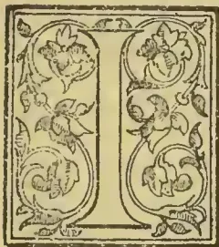A decorative initial letter 'I' in a square frame with floral patterns.

NTRODUCTORY.—The cultivation of coffee in Mexico dates from the commencement of the present century, and it has long been known that many districts in various parts of the country are probably as well suited to the growth of the plant as any in

the world. The unsettled state of the Republic, however, retarded progress in this as in many other respects, and it is only of late years that the capabilities of the country as a coffee producer have attracted the attention which they undoubtedly deserve.

The almost total failure of the coffee plantations in Ceylon and all Eastern countries, and the recent bad coffee harvests in Brazil, together with the fall in silver and the consequent reduction in the price of land and labour in this country have encouraged planting in Mexico, and the profits which have already been obtained seem to justify a further extension of the industry. Under these circumstances, and in view of the fact that before long a considerable amount of British and American capital will probably be invested in coffee plantations in Mexico, some information on the subject which has been obtained from good sources may perhaps prove of interest.

A considerable area in various States in Mexico is suited to the growth of coffee, but as many conditions are required to ensure its profitable cultivation, great care should be taken in selecting the site of the proposed plantation.

PRE-REQUISITES FOR SUCCESS.—The following are the principal points to which attention should be paid:—1. Soil; 2. Climate; 3. Communications; 4. Labour.

1. *Soil*.—The coffee plant can be cultivated on various descriptions of soil, but it thrives best on light, porous loam of considerable depth, which has not before been brought under cultivation. Clay land should generally be avoided as unsuitable.

In Mexico the best land is generally covered with virgin forest, and clearing it is the first operation the planter has to undertake. A rolling surface is to be preferred as it affords greater facilities for drainage, but very steep slopes are not as a rule to be recommended.

2. *Climate*.—The best temperature is one varying between 65° and 85° Fahr., which can be obtained in nearly all of the States in the Mexican Tierra Caliente. Frost kills the plant, and the fierce rays of the tropical sun if untempered by abundant moisture are almost equally injurious. Most authorities on the subject agree that coffee thrives best where the rainfall is at least 100 inches per annum, and where it is pretty evenly distributed throughout the year. It should be noted, however, that coffee has been and is cultivated with some success in districts (such as Cordova, in the State of Vera Cruz) where the rainfall is far less. Immunity, or at least protection, from high winds is very desirable. An eastern exposure is to be preferred where the weather is generally cloudy, and a western in a sunny climate. Some writers attach great importance to the height of the plantation above the sea, and assign limits of altitude for the choice of a site. It has, however, been shown by experience that suitable climatic conditions are to be found at a wide range of elevation, and that coffee of the highest quality can be grown almost at the sea level.\* In selecting a site for a plantation too much attention cannot be paid to soil and climate, and it has always been found to be good policy to give even a comparatively high price for land where these were thoroughly satisfactory.

3. Facilities of communication are also of great importance. Railways have been much developed of late years, and their extension is being carried on rapidly. Still, some districts which would otherwise be very suitable for coffee planting will probably for some time to come be too inaccessible to be recommended.

\* Notably in Liberia

163------------------------------------------------

146THE TROPICAL AGRICULTURIST.[SEPT. 1, 1896.]

As freight is generally cheaper by water than by land, a navigable river in the neighbourhood of the plantation is to be preferred even to a railway. In many parts of the country roads can scarcely be said to exist, and the necessity for railway or water communication to within a moderate distance of the plantation is even greater than it would be in more advanced countries. It must also be borne in mind that the cultivation of coffee is almost always combined with that of other crops, some of which are very bulky and cannot easily be disposed of without facilities of transport.

4. It is very desirable to settle in a district where labour is easily obtained, and although some authorities maintain that imported labourers are more easily controlled, the expense of introducing them is considerable, and many practical difficulties have to be overcome.

**WAGES.**—The wages paid vary in different districts, but the average rate for the whole country was officially estimated in 1892 at 37c. Mexican currency (or 9½d.) per diem. Since that date prices have certainly risen and the daily wage is now generally placed at about 50c. (1s. 1d.). Both employers and employed frequently prefer piecework to a daily wage, particularly for such work as clearing land before planting the coffee.

**LABOUR.**—The Mexican labourer requires careful handling if the most is to be made of him. A rich soil and a tropical climate supply nearly all his requirements, with little effort on his part, and he will not easily submit to harsh or unfair treatment from his employer.

Many planters find it advantageous to give their labourers small allotments, which they can cultivate themselves, in addition to their wages. They maintain that the labourers themselves appreciate this system, and that where it is in force they become more disposed to remain working on the same estate.

In some districts the Labour Question is the planter's chief difficulty. The coffee plants must be kept clean, and the berries must be picked at the proper time. These operations cannot be postponed, and it is useless to undertake coffee cultivation without a sufficient supply of hands.

**THE PLANTATION.**—As the best coffee lands are almost invariably covered with forest or jungle, the planter's first task is to clear this away. The brushwood is cut out with the "machete," a species of cutlass; and the heavy timber is afterwards felled with an axe. Such timber as can be used on the estate or can be disposed of is then removed, and the remainder is afterwards fired. On most plantations in Mexico it is usual to preserve the large trees for shade; but in districts where the best climatic conditions exist this is unnecessary. Much shade is in itself detrimental to the fullgrown coffee plant, and localities where it is required owing to great sun heat and lack of proper moisture should be avoided.\*

\* Although there can be little doubt that where the climate is most suited to the growth of the coffee plant shade is unnecessary and even injurious, the practice of leaving most of the larger trees of the natural forest as shade for the coffee trees is so general in Mexico that it cannot be passed by without fuller notice. Many persons possessing considerable experience of coffee planting in Mexico will even be found to maintain that shade is absolutely essential, and it is quite possible that in the districts with which they are best acquainted such may be the case. On the other hand, in countries where coffee has been extensively cultivated for a longer time than in Mexico, the plant certainly succeeds better without shade. Further experiment is perhaps required before a definite conclusion can be arrived at as regards this country, but it will scarcely be denied by the most enthusiastic supporter of the Mexican system that the tendency has been to make the shade too thick. The truth seems to be that coffee can be cultivated profitably in districts which are not naturally suited for it, and that in some of these shade is really necessary

**NURSERIES.\***—When the clearing of the land is commenced, a suitable spot is selected for sowing the coffee-bean, in order to establish a nursery, to be made use of in the following year. Trees required for the first planting are generally purchased from existing coffee plantations. The spot selected for the nursery should be thoroughly cleared of trees, should be easily irrigated, and of average fertility. In Mexico it is usual to leave some of the trees as shade, but in other places it has been found that the drip is injurious to the young plants, and that it is far better to arrange a shade of cut brushwood. Long ridges are formed with a width of from 4 to 6 feet, with walks between, in order that the workmen may later on reach the plants when it is necessary to clean them. In forming the ridges the earth should be well broken with hoes to a depth of at least 6 inches, the stones picked out, and the surface smoothed down. The ground is then ready for the coffeebean. The beans are dispulped and allowed to foment, so as to admit of the saccharine matter being washed off. When this is done the beans that float on the top of the water are taken away as being unsuitable, and those which sink to the bottom are placed to dry for one day in the sun, and for two additional days in the shade. They are then ready to be sown.

The sowers make small furrows in the earth with a pointed staff across the ridges, at a distance of 5 inches apart, and 2½ inches deep. Another labourer follows, placing the coffee-beans in the furrows 4 inches apart, until the ridge is finished. The beans are then lightly covered with well-sifted earth, without being pressed down, and are afterwards watered with a sprinkler. Subsequently the ground is watered every two or three days, and in from forty to sixty days the plant begins to grow. Care must afterwards be taken to keep the ridges free from weeds, and in about eight months the plant is ready for transplanting.

Slightly different methods are sometimes adopted, and sometimes the young plants found growing underneath the coffee trees are planted direct in the plantations, but this system is no longer considered a good one, and has been generally abandoned.

The time for sowing varies in different States, and in some of them sowing is carried on at all times of the year. It is desirable, however, to time the sowing of the seed in the nurseries in such a way that the plants may be from 8 to 9 inches high in the planting season. It may be noted that in Mexico the plants are often kept much longer in the nurseries, but this plan has not been found to answer in other countries, where the scientific study of coffee cultivation is much more general than is the case here.

In transplanting the trees to their final destination, the labourers should be given a base line, from which a rope should be stretched at right-angles, with marks at the required distances, say 6 feet apart. An acre of ground holds about 950 trees, planted 6 feet apart, with 7 feet between the rows. This opening is very generally adopted, though some planters in this country prefer to plant at greater distances. Special care should be taken in planting the trees that the tap root is not twisted or bent. Nipping off the tender portion, if done in the right way, does not materially affect the growth of the tree, and obviates the danger of its being turned up, which in a year or two kills the plant. The other precautions to be taken in planting do not require special mention, as they are such as would commend themselves to anyone having even a slight knowledge of arboriculture. The best time for planting is the early part of the rainy season.

to protect the plant from the excessive heat of the sun. Owners of land in comparatively hot and dry districts may find it necessary to shade their plants with forest trees or, in extreme cases, even with bananas, but such localities should be avoided by persons who have a free hand in the selection of a site for their plantation.

\* The following description is mainly taken from a work by Mr. Taylor.

164------------------------------------------------

SEPT. 1, 1896.]

THE TROPICAL AGRICULTURIST.

147

**IRRIGATION AND MANURING.**—Irrigation and also manuring are sometimes resorted to in Mexico, but if a suitable site has been selected, neither will be necessary on a new plantation. It may be added that the practice of manuring the nursery ground is not a good one, as it unfits the young plants for their ultimate destination.

**CLEANING.**—It is very necessary that the young trees should be kept clear of weeds, a matter to which in Mexico insufficient attention is generally paid. Weeding should be carried out every month, and though it is an expensive operation, the cost of the labour will be amply rapid by the yield of coffee. Hand weeding is to be preferred as being both cheaper and more effectual.

**TOPPING AND PRUNING.**—In Mexico, where empiric methods have hitherto largely prevailed, there is some divergence of opinion on this subject. In other coffee-growing countries, however, no doubt is entertained that the plant should be topped at from 3 to 5 feet from the ground, the object being to confine the sap, so that not only primary branches but secondaries and tertiaries may also bear their crop from 9 inches from the ground upwards. On rich soils the trees may be allowed to grow taller than on poor lands. Topping should be done with a knife, and only on the matured wood, otherwise the wound will bleed and the tree will be ruined. The trees are generally pruned between the second and third year, after the crop has been gathered. The operation is repeated in subsequent years, and the plant is kept as far as possible in the shape of a low symmetrical bush, without straggling or unproductive branches. On badly managed plantations, and particularly where the shade is too thick, the plants become drawn up, poorly furnished, and comparatively unproductive.

**HARVESTING.**—The coffee berry ripens at different seasons in different places, but in most localities the principal picking takes place in the late autumn, and in the winter. The berries are picked off as soon as they become bright red in colour, and either the same evening or the following day the pulp is removed by means of a machine called a pulper.\*

The berries fall from the machine into a receptacle of stone or wood, in which they remain from 12 to 24 hours. They are then passed into a lower receptacle, into which water is poured, and are stamped or trampled upon until the sticky glutinous substance disappears. The beans which float on the top, being of inferior quality, are collected and dried separately, and the remainder are spread out in the yards or on mats to dry. This requires 4 or 5 days' exposure to the sun. The parchment-like skin is loosened by rubbing the berries between the palms of the hands. The coffee when dried is stored in granaries, and afterwards beaten, winnowed, sorted, and packed for export. All these operations, though somewhat complicated to describe, are really of a very simple character, and the whole art of treating the coffee after it is gathered, though requiring some care and attention, may be acquired with very slight experience. Machinery, which is comparatively inexpensive, is gradually taking the place of hand labour, and is, no doubt, more economical, particularly on large plantations, but the older methods are still very generally employed. It has been estimated that a complete set of machinery for a large plantation would cost from 600*l.* to 1,100*l.* On small plantations, however, a hand pulper costing some 12*l.*, or rather more, will probably be found sufficient machinery with which to commence operations, more being added as occasion requires.

**AMOUNT OF CAPITAL REQUIRED AND PRICE OF LAND.**—The intending planter will find a capital of 1,500*l.* amply sufficient for his requirements. It is far better to begin planting on a comparatively small scale, and to gain thorough experience of the country and the business before embarking on an unnecessarily large undertaking. Some 250 acres is as much as a beginner should attempt to deal with, and even

of this only 200 acres should be planted with coffee, the remaining 50 acres being left under timber, or applied to other purposes.

Good lands for planting can be obtained at from 18*s.* to 1*l.* 10*s.* per acre, and sometimes even cheaper. If then we take the mean between these two prices, 250 acres would cost 300*l.*, and the planter with 1,500*l.* capital would still have 1,200*l.* in hand with which to meet initial expenses and to maintain himself until his plantation came into full bearing. At first sight this sum will appear unnecessarily large, but in a country where credit is not easily obtained, and where the interest on borrowed money is very high, it is well to hold a reserve of capital as an insurance against unforeseen accidents. The failure of a large number of foreigners in this country may be attributed to neglect of this precaution.

**COST AND PROFIT.**—This is a subject on which there exists an extraordinary diversity of opinion, and many estimates, though quite honestly put forward, are, in fact, far too favourable. Calculations based (as is frequently the case) on the ascertained produce of a single plant are especially misleading, for, however favourable the conditions may be, the different plants vary both in the quantity and quality of their yield, and some are altogether unproductive. Perhaps the best plan is to take the average cost of cultivating an acre, and then to give an estimate of the value of the crop for the first 5 years. The following figure will be found to be pretty near the mark, but if anything they show a smaller return than may be expected if all the conditions are favourable:—

COST OF CULTIVATION PER ACRE DURING FIRST FIVE YEARS.

<table border="0">
<thead>
<tr>
<th></th>
<th>Amount.</th>
</tr>
<tr>
<th></th>
<th>£ s. d.</th>
</tr>
</thead>
<tbody>
<tr>
<td>Clearing land .. ..</td>
<td>1 4 0</td>
</tr>
<tr>
<td>Staking and digging holes for 1,000 trees .. ..</td>
<td>0 14 0</td>
</tr>
<tr>
<td>Purchase of 1,000 young coffee trees .. ..</td>
<td>0 10 0</td>
</tr>
<tr>
<td>Planting 1,000 trees .. ..</td>
<td>0 6 0</td>
</tr>
<tr>
<td>Replacing loss of coffee trees .. ..</td>
<td>0 3 0</td>
</tr>
<tr>
<td>Monthly cleaning for five years .. ..</td>
<td>6 0 0</td>
</tr>
<tr>
<td>Cost of harvesting 2,600 lb. of coffee including freight, taxes, &amp;c., at 8 Mexican cents per lb. .. ..</td>
<td>21 10 8</td>
</tr>
<tr>
<td><b>Total</b> .. ..</td>
<td><b>30 7 8</b></td>
</tr>
</tbody>
</table>

PRODUCE AND RECEIPTS PER ACRE.

<table border="0">
<thead>
<tr>
<th></th>
<th>Amount.</th>
</tr>
<tr>
<th></th>
<th>£ s. d.</th>
</tr>
</thead>
<tbody>
<tr>
<td>First year .. ..</td>
<td>Nil</td>
</tr>
<tr>
<td>Second year, 200 lb., sold at 21 Mexican cents .. ..</td>
<td>4 11 0</td>
</tr>
<tr>
<td>Third year, 400 lb. .. ..</td>
<td>9 2 0</td>
</tr>
<tr>
<td>Fourth year, 800 lb. .. ..</td>
<td>18 4 0</td>
</tr>
<tr>
<td>Fifth year, 1,200 lb. .. ..</td>
<td>27 6 0</td>
</tr>
<tr>
<td><b>Total</b> .. ..</td>
<td><b>59 3 0</b></td>
</tr>
</tbody>
</table>

In making these calculations it has been assumed that a good site has been chosen, and that the land and its produce have been properly treated. On the other hand, the price obtained for the bean—a matter which is not entirely in the planter's control—has been estimated at a low figure. It may be mentioned, however, that scientific cultivation of the plant and careful treatment of the bean after picking will often raise the value of the produce by improving its quality as much as 25 per cent.

The cost of making the nursery and the necessary roads or tracks has not been included in the above estimate, but these expenses are not heavy, and appear altogether inconsiderable when calculated per acre. Moreover, as this work is of a permanent character, it may fairly be charged to capital account. The same may be said of buildings, tools, &c., the cost of which has been estimated as low as 50*l.* for a moderate-sized plantation. It seems unlikely,

\* Small native cultivators do not, as a rule, use a pulper. They first dry the berry and then tread out the grain from the dry husks with the feet.

165------------------------------------------------

148THE TROPICAL AGRICULTURIST.[SEPT. 1, 1896.]

however, that anyone accustomed to live either in Europe or the United States would be satisfied with so low a standard of comfort as is implied by these figures. The cost of the house must, of course, largely depend on the habits and inclinations of the planter, but if he be a person of moderate requirements some 100*l.* to 200*l.* should cover his expenditure on this head.

In treating of the expense of starting a plantation it should be mentioned that the cultivation of other crops is frequently combined with that of coffee. For instance, maize may be advantageously planted between the rows of coffee plants on newly cleared land. The shade is most beneficial to the trees at this stage of their growth, and the profit on the crop may be reckoned at about 25 per cent. on the cost of clearing the land.

In its fifth year of growth the coffee plant attains its full power of production, and the estimated yield for that year may be accounted the normal crop. By that time, too, the initial expenses in connection with that part of the plantation will naturally have ceased. The account for the sixth year should, therefore, stand approximately as follows:—

<table border="1">
<thead>
<tr>
<th colspan="2">EXPENSES PER ACRE IN SIXTH AND SUBSEQUENT YEARS.</th>
<th>Amount.</th>
</tr>
<tr>
<th></th>
<th></th>
<th>£ s. d.</th>
</tr>
</thead>
<tbody>
<tr>
<td>Clearing or weeding ..</td>
<td>..</td>
<td>1 4 0</td>
</tr>
<tr>
<td>Pruning, &amp;c. ..</td>
<td>..</td>
<td>0 5 0</td>
</tr>
<tr>
<td>Harvesting, &amp;c., 1,200 lb. coffee ..</td>
<td>..</td>
<td>10 8 0</td>
</tr>
<tr>
<td colspan="2">Total</td>
<td>11 17 0</td>
</tr>
</tbody>
</table>

RECEIPTS PER ACRE IN SIXTH AND SUBSEQUENT YEARS.

<table border="1">
<thead>
<tr>
<th></th>
<th>Amount.</th>
</tr>
<tr>
<th></th>
<th>£. s. d.</th>
</tr>
</thead>
<tbody>
<tr>
<td>1,200 lb. coffee at 21 Mexican cents ..</td>
<td>.. 27 6 0</td>
</tr>
</tbody>
</table>

It will be seen that these figures would admit of liberal allowances for interest on capital and for personal expenditure, and would still leave a substantial balance in the planter's favour.

**GENERAL REMARKS.**—In purchasing an estate in Mexico, a new comer should as a rule have recourse to a reliable foreign agency. Direct negotiations with the owners of the soil are often extremely tedious, and they should not be undertaken by any one who does not possess a thorough knowledge of the country. Care must of course be taken to obtain a good title to the land purchased, and in most cases this can now be done without much difficulty or expense. In some districts the Indian villagers lay claim to certain rights over adjoining lands, and however unfounded such claims may be, they are sometimes a source of great irritation and consequent annoyance to the foreign planter. It will almost always be found, however, that these difficulties may be overcome by a little tact and liberality.

A foreigner buying real estate should, if he desire to preserve his nationality, take the proper legal steps to do so.

The intending planter will generally do well to spend some little time in the country before making a purchase, and should if possible acquire some practical knowledge of his business at an existing plantation. He will be apt to think that by waiting he is letting slip many a golden opportunity, but such opportunities will probably recur later, and the experience he will have gained will save him much loss and disappointment. A considerable number of small foreign capitalists in this country would probably admit that for a year or two after their arrival, experience was their only profit, and that it had been gained at a needlessly high price.

In order that this report may be comprehensible to English readers all values have been given in sterling, calculated at 26*l.* to the Mexican dollar. Mexico, however, uses the silver standard, and though the silver price of labour, &c., has not altered very much the equivalent price in gold has fallen considerably of late years and remains an ever-varying quantity. It is obviously to the advantage of the

English capitalist settling in Mexico that the price of silver should remain low as compared with gold; first, he receives more silver dollars in exchange for his sterling capital, and secondly, whilst most of his outgoings are in the cheaper currency, any produce exported is ultimately paid for at gold rates.

In conclusion it may be mentioned that there is probably no country in the world where the settler must more exclusively depend for success on his own energy and ability, and that it is far more difficult than in eastern countries to secure the proper conduct of a business without the constant supervision of the person directly interested in it. Moreover different problems have to be faced in different parts of the country, and in some localities coffee cultivation has scarcely yet passed the experimental stage. It is impossible to make exact calculations of the profits of an undertaking under such conditions.

The total exports of coffee from Mexico for the past 5 years are stated in the Mexican official returns to have been as follows:—

<table border="1">
<thead>
<tr>
<th>Year.</th>
<th>Quantity.</th>
</tr>
<tr>
<th></th>
<th>Kilos.</th>
</tr>
</thead>
<tbody>
<tr>
<td>1890-91 ..</td>
<td>14,656,777</td>
</tr>
<tr>
<td>1891-92 ..</td>
<td>11,058,279</td>
</tr>
<tr>
<td>1892-93 ..</td>
<td>14,514,949</td>
</tr>
<tr>
<td>1893-94 ..</td>
<td>18,866,590</td>
</tr>
<tr>
<td>1894-95 ..</td>
<td>16,512,648</td>
</tr>
</tbody>
</table>

The principal coffee-producing States are Vera Cruz and Oaxaca to which may be added Michoacan. Colima coffee is also well-known in the market though the quantity produced there is much smaller than in even the last of the above-named States.

Mexican coffee is exported almost exclusively to the United States.

The price of coffee in the United States in the fiscal year 1893-94 ranged from 16 to 18½ c. gold (8d to 9¼d) per 1 lb. for Rio standard (vide United States Return of Commerce and Navigation). Mexican coffee always commanded a somewhat higher price.

BIBLIOGRAPHY OF COFFEE.

(Continued from page 77.)

D., N. The Virtues of Coffee... collected [by N. D.] and published for the satisfaction of the drinkers thereof. London. 1663. 40.

Dabry. [et Thiersant.] Production et consommation du café. 1882.

Damme, O. Koffie, thee, &c. [See under TEA.]

Daupley, Cyr Edouard. Etude sur le café, ses applications à la médecine. See Academies.—Paris—École de Médecine—Collection des thèses, an 1867. tom. 4. 1839. &c. 40.

Dausse. Manuel de l'amateur du Café ou l'art de torréfier les cafés convenablement, &c. Paris. 1846. 80.

Davidson, Alexander. Days of Old in Ceylon, or Life on a Coffee Plantation.

Davidson, Alexander. Reminiscences of a Travelled Scot, and Sketches of Life in Ceylon and Jamaica. Peterhead. 1887. 160. [Largely about Coffee.]

Debay, Auguste. Les Influences, &c. [See under TEA.]

Déffès, Pierre Louis. Le Café du Roi, opéra comique en un acte... Paroles de M. H. Meilhac. Paris. 1861. 80. [1862. 120.]

De foe, Daniel. The Coffee house Preachers: or, High Church Divinity Corrected. London. 1706.

Dehio, H. U ter-uchungen, &c. [See under TEA.]

Déjeanner. Le Lait. Le Café. Éexamen critique et approfondi par M. F. &c. Paris. 1845. 80.

Delalande. Maladie des Caféiers à la Réunion. 1883.

Deltel, Emile. Du Café. See Academies—Paris—École de Médecine—Collection des thèses, &c. an. 1851. tom. 4. 1839. &c. 40.

Delvaux, Alfred. Histoire anecdotique des Cafés et Cabarets de Paris, avec dessins et eaux fortes de G. Courbet, L. Flameng et F. Rops. Paris. 1862. 120.

De Méry, C. Le Café, poëme. A la suite: Table philosophique... des établissements de café en Europe, on Asia et en Afrique. Nomenclature des ouvrages sur le café. Paris. 1837. 120.

Description. Description, figure et qualité du Café: avec la manière de le cultiver, &c. 1710. fol.

166------------------------------------------------

SEPT. 1, 1896.]THE TROPICAL AGRICULTURIST.149

*Detharding, Georg.* Dissertatio, &c. [See under TEA.]

*Dickman, Henry.* Medical Hints. Practical instructions to Superintendents (i.e. of Coffee Estates)... for the treatment of diseases. See *Elliott, C.* Colombo. 1832. 80. [New edn. 1885.]

*Dillenius, Jo. Jac.* Hortus Elthamensis, &c. [Contains two coloured drawings of the Coffee & Cinnamon trees, by R. Bradley.] Londini. 1732. fol.

*Diodati, Ottaviano.* Biblioteca Teatrale Italiana, &c. 12 tom. [Tom. I. II Caffe'.] Lucca. 1762-63. 80.

*Discours.* Discours familier sur le danger de l'usage habituel du Cafe'. Paris. 1774. 120.

*Disdier, F. M.* Beschreibung, &c. [See under TEA.]

*Doellinger.* Dissertatio au potus Coffee annumerandus sit stomachicis, concoctionem adjuvautibus. Bamberg. 1794.

*Douglas, James, M.D.* Lilium Sarniense: or a description of the Guernsey-Lilly: to which is added the botanical dissection of the coffee berry. London. 1725. fol. [Second edn. 1737.]

*Douglas, James, M.D.* Arbor Yemensis fructum Cofe' fereus; or, a description and history of the Coffee tree. London. 1727. fol. [A supplement to the...Coffee tree. London. 1727. fol.]

*Duchansy. Resp.* See *Gevigland, N. M. de.* Praes. Dissertatio on Tabaco per nares sunto substitui possit Coffee pulveratum. Paris. 1772. 40.

*Ducis.* A mon cafe'; poésie. (Extr.) 1809.

*Ducoux, F.* De la Caféine. [See under TEA.]

*Duncan, Dan.* Avis salutaire &c. [See under TEA.]

*Dupin, Jean Henri.* Le Cafe' des Varie'tes: Comédie vaudeville.

*Durante, Castore.* Herbario nuovo &c. [See under TEA.]

*Dutch Coffee Market.* De Toekomst der Nederlantsche Koffijmarkt: eene stem uit den handel. Amsterdam. 1865. 80.

*Duval.* Le re'ge'n'ateur du gout. 1ère partie. Du Cafe'.

*Eclogae.* Eclogae recentium aliquot praestantiores. In fine additum est G. Massiei carmen elegantissimum Caffæum. Erfordiae. 1783. 80. See Massieu G.

*Edinburgh: Incorporations.* Coffee-House Chit-Chat, &c. [See *Coffee-House Chit-Chat.*]

*Eggerth, J.* De Coffea, Budae. 1833. 30.

*Ehrenborg, Anna Frederika.* Om Kaffe af korn, hvete och rag till vinst för helsa och kessa. Lund. 1845. 160.

*Elixir.* Le véritable Elixir du Caffé'e. Breslau. 1754. 80.

*Elliott, Robert H.* Gold, Sport, and Coffee Planting in Mysore, &c. Westminster. 1891. 80.

*Elliott, Robert H.* The Experience of a [Coffee] Planter in the Jungles of Mysore, &c. 2 vol. London. 1871. 80.

*Elliott, Christopher, M.D.* Medical Hints. Practical instructions to Superintendents (i.e. of Coffee Estates)... for the treatment of diseases, &c. See *Dickman, H.* Colombo. 1862. 80. [2nd. edn. 1885.]

*Ellis, John. F.R.S.* An historical account of Coffee, with... botanical description of the tree, &c. London. 1774. 40. [See also under TEA.]

*Eloy, Nicolas Fran. Jos.* Si l'usage du Cafe' est avantageux à la santé? &c. Montpellier. 1781. 80.

*Elst, S. L. W. van der.* Stoats-Koffie cultuur op Java. 's Gravenhage. 1874. 80.

*Emerich, G. W. B.* De Coffæe facultatibus et effectibus. Berlin. 1839. 80.

*Ernst, Adolf, of Carácas.* El cafe' de Liberia en Venezuela. Al honorable gromio de agricultores de esta republica. Carácas. 1878. 80.

*Etienne.* Traité des glacas, &c. [See under TEA.]

*Etienne, Chas. Guillaume.* See Cafe'. Le Cafe des Artistes. [1800.] 80.

*Etrennes.* Etrennes à tous les amateurs de Cafe'... ou manuel de l'amateur de cafe'... ou y a joint... un poème... de l'abbé Massieu... sur le Cafe'. Paris. 1790. 120.

*Ettorre, Giul.* Notizie istorico-fisiche sul Caffé'. Roma. 1791. 80.

*Eustratiades, D. S.* Etude experimentale sur les proprie'tes physiologiques de la cafe'ine et du cafe'. See Academies—Paris—École de Médecine—Colln. des the'ses—Tom. IV. an 1870. 1839. &c. 40.

*Evans, Schoolmaster.* See *Coffee Scuffle.* The Coffee Scuffle, &c. [Satirical Verses on Evans, &c.] 1862. 40.

*Exposicao.* Segunda exposicao de Cafe' 1883.

*Faber, J. G. A.* De potu Coffeae. Riateln. 1761. 40.

*Fagon, Gui Crescent.* Litteratisne salubris Cafe' usus? Paris. 1716. 40.

*Falske, Carl Philipp.* See *Brill, W.* Das Kaffeein... nebst Vorrede von... C. P. F. 1862. 80.

*Fauchon, J. L.* Dissertation sur le Cafe'. Paris. 1815. 40.

*Favier, Jean.* Etudes me'dicales sur le cafe'. Thèse, &c. Montpellier. 1856. 40.

*Faye, Franz Christian.* Nogle Bemærkninger angaaende den overdrevne Brug af Kaffe og om ders skadelighed: Barnealdereu. Christiana. 1863. 80.

*Fellon, Thos. Bernard.* Faba Arabica: Carmen, &c. See *Pelmata Didascalica.* tom. 1. 1749. 120.

*Ferguson, A. M., C.M.G.* Liberian Coffee in Ceylon, the History of the Introduction and the Progress of the Cultivation, &c. Colombo. 1878. 80.

*Ferguson, A. M., C.M.G.* Photographs. Illustrative of the leading products of Ceylon, viz.:—Coffee—Arabian and Liberian; Tea, &c. [See under TEA.]

*Ferguson, A. M., C.M.G.* Mountain Cultivation in Ceylon, &c. [See under TEA.]

*Ferguson, John.* The Coffee Enterprise of Ceylon and the necessity for Railway Extension in the Coffee Districts, &c. Colombo. 1873. 80.

*Fermellhuis, Jean Baptiste.* Praes. See *Lagrive, J. de.* Quaestio medica... Au à potu Caffé' frequentior Apoplexia? [1718.] 40.

*Fernandez de Moratin, Leandro.* El Cafe' ó La comedia nueva. Comedia &c. See *Spanish Theatre.* El Teatro Español, &c. tom. 4. 1817. &c. 80.

*Fernandez Matienzo, Isidro.* Discurso medico y fisico... contra el medicamento Caphe'. Madrid. 1693. 40.

*Fielding, Henry.* The Coffee House Politician [Rape upon Rape] or the Justice caught in his own trap, &c. London. 1730. 80.

*Flugier, Louis.* Les Industries, &c. [See under TEA.]

*Fischer, Johann Andreas.* Dissertatio de potu Caffee, &c. Erfordiae. 1725. 40.

*Floyer, Sir John.* [See under TEA.]

*Foerster, Christian Gottlieb von.* Geschichte von der Erfindung und Einführung des Cichorien—Caffee. Bremen. 1773. 80.

*Fouqué.* Questions de médecine proposées par MM. Castillon et Fouqué à M. Colomb, &c. [De Quinquina et de Coffea.] Marseille. 1679.

*Francotte.* De la Cafféine. 1883.

*Fransyskan, Ifrån.* Kaffehuset. [Ordsprok, Förestälte uti Comedier. No. 2] Orig. Le Café boryne, af N. Carmontelle. Elpsala. 1772. 80.

*Fraudes.* Les Fraudes du Cafe' dévoilées par un amateur (poème). Paris. 80.

*French People.* Les Français peiut par eux-mêmes. [Physiologie du Cafétier et du Cafe'.] 1841.

*Friedels, David.* Medicinische Bedencken &c. [See under TEA.]

*Fromberg, P. F. H.* De uitsterving van Koffieboomen in de residentie Kadoe. Batavia. 1852. 80.

*Fromberg, P. F. H.* Over het watergehalte in verschillende luchtdrooge koffie-soorten. Batavia. 1852. 80.

*Fuchs, Max.* Die geographische Verbreitung des Kaffee baumes. Eine pflanzen geographische studie. Leipzig. 1886. 80.

*Galeano, Giuseppe.* Il Cafe', &c. Palermo. 1674. 40.

*Galland, Antoine.* De l'origine et du progres du Cafe', &c. Caen. 1699. 120.

*Garani.* Dejeuner, le lait, le cafe', le the'. 1pl. 2 fl.

*Gardner, George, F.L.S.* Over de bruine schulzilkte of boomlaas in de koffijplantsoenen op Ceylon. Amsterdam. 1859. 80.

*Gardner, George, F.L.S.* Report on the Coffee-Bug of Ceylon. 1818. [Reprinted 1885.]

*Garnier, J. [et Conthier, J. F.]* An Parisinis &c. [See under TEA.]

*Gastinel.* Mémoire sur l'Arséniate de Cafféine et l'Acide tanno-arsénieux considérés comme agents fe'briuges. [Ex. Mém. de Inst. Egyptien. Vol. I.] Paris. 1863. 40.

167------------------------------------------------

150THE TROPICAL AGRICULTURIST.[SEPT. 1, 1896.]

*Gayant, Ludovicus.* Au a frequentiori Coffeae potu vita, brevior? Paris. 1715. 40.

*Gentil, A. A.* Dissertation sur le cafe'. Paris. 1787. 80.

*Georgii, Joannes Christophorus Samson.* Resp. Dissertatio inauguratis medica de Coffee. Praes. J. G. Gmelin. Tubingae. [1752.] 40.

*Geschichte.* Geschichte und Beschreibung, &c. [See under TEA.]

*Gespraech.* Gespraech zwischen dermahl im Krieg 7 verwickelten Nationen....in einer Caffe Stuben. Germ. & Fr. [Augsburg. 1760? s. sh. fol.]

*Gerigland, Natalis Maria de.* Dissertatio au Tabaco per nares sumto substitui possit Coffee pulvratum. Resp. Duchanoy. Paris. 1772. 40.

*Geyer, Ernest Elirenfried.* Au po'us Cafe' dicti vestigia in hebrea, scriptura, &c. Wittenbergae. 1740. 40.

*Ghemmenich, Paulus a.* Carmen jocos'orum. [Coffee. p. 210-219.] 1746.

*Girardin.* Sur le cafe' avarie'. 1834.

*Giraud, A. C.* Le Cafe' perfectionne' par M. Giraud. Ouvrage entierement inedit. Paris. 1846. 80.

*Giraud, A. C.* Cafe's de Paris proce'de's unique pour la pre'paratiou du cafe', &c. [Cet ouvrage...ne se trouve chez aucun libraire.] Paris. 1853. 80.

*Gleditsch, Johann Gottlieb.* Resp. D potus Cafe' abusu, cataguae morborum angente. Praes. A. G. Plaz. Lipsiae. [1733.] 40.

*Gmelin, J. G.* Praes. See above. *Georgii, J. C. S.*

*Geoldi, Emil.* Relatorio sobre a molestia do cafeeiro na provincia do Rio de Janeiro. 1887.

*Goldberg, J.* Dissertatio inauguralis medico-pharmacologica de coffea. Vindobonae. 1830. 80.

*Goldgrube.* Goldgrube Deutschlands, &c. [See under TEA.]

*Goldoni, Carlo.* Das Kaffeehaus. [Sämutliche Lustspich des Herren C. G. gr. Band.] Leipzig. 1767-74.

*Goldoni, Carlo.* Bottega del Cafe'. Comédie 3 acts. [En prose Italienne.] Représentée à Mantoue. 1750.

*Göring-Schmidt.* Ausländische &c. [See under TEA.]

*Gorkom, K. W. van.* Voortbrengelen &c. [See under TEA.]

*Gosse, 'Etienne,* See *Café.* Le Cafe' des Artistes. &c. [1800.] 80.

*Gowreuff, Olivier de.* Le Cafe', épître attribuée à Senece' publiée sur le manuscrit inédit avec uu avantpropos par O. de G. Nantes. 1883. 80.

*Grafstrom, C. J.* Kaffee och Chokolad, &c. Stockholm. 1855. 160.

*Grangé, Eugène pseud. [et Moinaux, Jules].* Le Cafe' de la Rue de la Lune: folic-vaudeville, &c. See Bibliothèque dramatique. tom. 97. 1847. &c. 80. [1862. 120.]

*Green, E. Ernest.* Observations on the Green-Scale Bug in connection with the cultivation of Coffee. [Colombo? 1886.] fol.

*Grenroth.* Resp. Dissertatio. Enfaldige tankar om Cafe' och inhemska Wörter som plåge banker i des ställe. Praes. P. Kalm. Abo. 1755. 40.

*Griyson, Edw'd. S.* Coffee Culture in Ceylon: on the Manuring of Estates. Colombo. 1877. 80 [Second edn. 1878.]

*Grimm, Heur. Nic.* Beschreibung &c. [See under TEA.]

*Grimmann, Joannes Nicolaus.* Abhandlung vom Schaden des Coffee. Praes. M. Alberti. 1758. &c. 80.

*Grindel, D. H.* Chino-Surrogat, oder ein neues Arzneimittel. Zweite Auflage. [Advocates an extract of unroasted coffee as a substitute for cinchona.] Leipzig. 1809. 80.

*Grol, Alois.* Der Kaffee klatsch. Komische intermezzo für zwei Frauenstimmen. Leipzig. [1884.] fol.

*Groot.* Groot misbruik &c. [See under TEA.]

*Gubian, J. M. A.* Dissertation sur le Cafe'. Paris. 1814. 40.

*Guérin-Méneville, Félix Edouard.* Sur un insecto qui ravage les Cafe'iers aux Antilles. 1842.

*Guillemain, Chas. Jacob.* Le Cafe' des Halles: comédie. See *Café.* 1781. 80.

*Gumaraes.* De l'usage et de l'abus du Cafe'. 1883.

*Hahnemann, Samuel Christian Friedrich.* Der Kaffee in seinen Wirkungen. Leipzig. 1803. 80.

*Halberstaedter.* Blätter—, Geschichte der Kaffee. 1799.

*Haldane, R. C.* See *Prins, H. J.* De Oeretplaag in de koffietuinen op Java. [Containing the Dutch translation of some extracts of R. C. H.'s "All about Grub."] 1885. 80.

*Haldane, R. C.* All about Grub...Being the result of observations on the cockchafer and their larvae, in connection with Coffee Planting, &c. A. M. & J. Ferguson. Colombo. 1881. 80.

*Halem, A. von.* Des Kaffeehaus, oder des neue Schauspiel. Lustspiel von Don L. Fernandez de Moratin. &c. Bremen. 1835. 80.

*Hammond, H.* Afhandling om Ragdrik til Caffe. Kjobuhavu. 1770. 80.

*Handleiding.* Handleiding voor de Gouvernements-koffiecultuur. Batavia. 1873. 80.

*Hanson, Reginald.* Tea, Coffee, &c. [See under TEA.]

*Harman, F. E.* Coffee Leaf Disease. 1880.

*Hawes, Chas. Wm.* Hawes' Handbook to Temperance Hotels and Coffee Taverns. Uxbridge. 1886. 120.

*Heer.* Rotterdams Coffyhuis Gesprek, &c. See *Boer.*

*Heerlein.* Das Coffein und das Kaffeedistillat. Illustr. 1892.

*Henry, Jas. M. D.* A Letter, &c. [See under TEA.]

*Hensler, Christian Friedrich.* Das Caffeehaus. Opera. Wien. 1804. 80.

*Herold, David Gottlob.* Resp. Dissertatio inauguralis medica de fabis Coffee, earumque sub infuso usu et abusu. Praes. H. Ludolf. Erfordiac. [1724.] 40.

*Herwerden, J. D. van.* Desorganisatie en toekomst der gouvernements-koffij cultuur. 's Gravenhage. 1876. 80.

*Herwerden, J. D. van.* Beschrijving van de Koffij—en suiker-cultuur in het plat Maleisch en Javaansch. &c. 's Gravenhage. 1856. 80.

*Herz, Sam.* Dissertatio de usu et abusu potus Coffee. Duisb. 1747. 40.

*Hewitt, Robt.* Coffee: its history, cultivation, and uses...and a Map of the world showing the several places where coffee is, or may be produced, &c. New York. 1872. 80.

*Heyl.* Klinische Beobachtungen über den Coffein, sulfosaeure Natrium als Diureticum. 1874.

*Heyrenbach, Johann Caspar.* Medicus sui ipsius &c. [See under TEA.]

*Hierm, Wm. Philip.* On the African species of the Genus Coffea. [Linn. Trans.] 1876. 40.

*Hilseher, Simon Paulus.* Proempticon inaugurale de abusu potus Caffee in sexu sequiori. Jenoe. [1727.] 40.

*Hindley, Chas.* Tavern Anecdotes and Sayings, including the origin of signs.

*Hints.* Practical Hints on Coffee Stall Management, and other temperance work for the laity. London. 1886. 80.

*Hofer, Franz Jos.* Abhandlung vom Kaffee, &c. Frankfurt und Leipzig. 1781. 80.

*Holle, K. F.* Proef-handleiding voor de kultuur en gewone inlandische bereiding von Koffij. [Batavia. 1863.] 80.

*Horne, John.* [Author of "Douglas."] Le Cafe' ou l'Ecossaise, comédie...par Mr. Hume...traduite en François [or rather written by F. M. Aronet de Voltaire]. Londres. 1760. 120. & 80 [New edn. 1761. 80.]

*Hoshea, Daniel.* A Planter's Parlance on Coffee Cultivation. [In Tamil.] Manippay. 1872. 120.

*Hoyer, A.* Den nyttige &c. [See under TEA.]

*Huchard, F. E. V. Henri.* Clinique médicale. De la Cafée. 1888.

*Hughes, John.* Ceylon Coffee Soils and Manures. A Report to the Ceylon Coffee Planters' Association. London. 1819. 80.

*Hull, Edmund C. P.* Coffee: its physiology, history, and cultivation; adapted as a work of reference for Ceylon...and the Neigherries. Madras. 1865. 80.

*Hull, Edmund C. P.* Coffee Planting in Southern India and Ceylon. Being a second edition...enlarged of "Coffee, its physiology, &c." London. 1877. 80.

*Humours.* The Humours of whist. A dramatic satire, as acted every day at White's and other coffee houses and assemblies. London. 1743. 80.

*Huss, Magnus.* Om Kaffee, dos bruk och missbruk: en folkskrift. Stockholm. 1865. 80.

*Husson, C.* Le Cafe' la bière et le tabac, étude physiologique et chimique. Paris. 1879. 120.

168------------------------------------------------

SEPT. 1, 1896.]THE TROPICAL AGRICULTURIST.151

*Irenicus [or Irenian]* Beweis dass der Missbranych des Coffeetranckes ad mortos exantheumaticos....disponiere. Altdorf. 1762. 80. [1st. edn. Nürnberg 1761. 80.]

*Italian Poems.* Poemetti Italiani. [Edited by Count Vincenzo Mareneo.] 12 vol. [Vol. 3. Il Caffè.] Torino. 1797. 120.

*Ittner, Franciscus Georgius Ignotius.* Prues. See *Weidenbusch, N.* Dissertatio...de noxis ex abusu potus Caffee in corpore humano. &c. [1769.] 40.

*Jacobson, Joseph.* Het Koffij-veiling-stelsel in Nederland ontwonwd. Rotterdam. 1869. 80.

*James, P.* A Parable of the Coffee Estate, intended chiefly for the coolies engaged in the Coffee Plantations in Ceylon. [In Tamil.] Palameottah. 1880. 80.

*James, Robert.* A Treatise, &c. [See under TEA.]

*Java.* Hoe wordt de Koffij-kultuur in de Soenda-Landan of Java productiever gemaakt voor het Gouvernement? &c. Utrecht. 1865. 80.

*Javanese Coffee Sales.* Eenige opmerkingen betrekkelijk de Java Koffij-Veilingen. 's Hertogenbosch. 1858. 80.

*Johannsen, O.* Ueber die Wirkungen des Kaffeein. [Dorpat.] 1869. 80.

*Jolly, Stewart. Captn.* See *Aliquis.* Coffee Planting in Ceylon. A Poem. London. 1861. 80.

*Jomand, Jules.* Du Café. See Academies—Paris—Ecole de médecine—Collection des thèses, &c. an 1860. tom. 5. 1839. &c. 40.

*Jones, Captain. Duellist.* Saturday, Nov. 6. A full...account of the...duel that was fought last night between Capt. Jones and Mr. N. Nugent...at Lucas's Coffee House on Cork Hill. Dublin. 1725. s. sh. fol.

*Jones, Captain. Duellist.* The tryal...of Capt. Jones...24th of Nov. 1725...for the murder of N. Nugent at Lucas's Coffee House on Cork Hill, the 5th inst. &c. Dublin. 1724. [or rather 1725.] s. sh. fol.

*Joosten, J. A. & Co.* Bedenkingen over de Koffij-veilingen der Nederlandsche Handel-maatshappij. Amsterdam. 1860. 80.

*Joosten, J. A. & Co.* Het nieuwe systeem van Koffijveilingen der Nederlandsche Handelmaatschappij. [Amsterdam. 1866.] 80.

*Joosten, J. A. & Co.* De Koffieveilingen der Nederlandsche Handelmaatschappij. 's Gravenhage. 1866. 80.

*Jorgenson, P.* Opfordering til alle Caffee-elskere, af J. C. Christ oversat. Odense. 1804, 1807. 80.

*Joseph, A. Munshi.* Knuckles Coffee Poem, with English Translation. [In Tamil.] 18—. 80.

*Julia de Fontenelle, Jean Sebastien Eugène.* Manuel du Limonadier, &c. See *Malpeyre, F.* 1862. 180.

*Juniper Lecturer.* The Juniper Lecturer corrected, and his Latin...nonsense paraphrased; also, the coffee-senffler euffed and kicked, &c. [In verse, Latin.] London. 1662. 40.

*Jussieu, Antonius de.* Description et icon Coffeae prima et bona. 1713.

*Jussieu, Antonius de.* Cereus spinosus cum flore: and de Coffea Borboniensi spontanea. 1716.

*Jussieu, Antonius de.* Thesis. Ergo literatis salubris Coffeae usus. Paris. 1741. 40. [Ascribed also to J. de Jussieu.]

*Jussieu, Bernard de.* [et Munier.] Ergo omni tempore et aetate salubris potus Coffeae. Paris. 1743. 40. (To be continued.)

## THE REPRODUCTION OF THE ORANGE FROM SEED.

In your issue of April 25, 1896 (p. 527), I notice Mr. C. Wolley Dod suggests that it is generally believed by gardeners that Orange trees raised from the seed of a sweet Orange produce bitter fruit unless grafted on to the sweet Orange tree. As I am somewhat familiar with Orange-growing in Florida, having spent several years here in studying the industry, it may not be out of place for me to give some notes regarding this.

### SWEET ORANGE (CITRUS AURANTIUM).

The seed from the fruit of the sweet Orange, I think, we may safely conclude, invariably produces

sweet Oranges unless they are the results of hybridisation with some other species or variety. The evidence, however, is somewhat conflicting. The experiments of Gallesio, published in 1811, seem to show conclusively that the belief that they produce bitter fruit, which Mr. Dod suggests is quite generally held by gardeners, is erroneous. In his *Traite du Citrus*, Gallesio says, "I have during a long series of years sown pipes of sweet Oranges, taken sometimes from the natural tree and sometimes from Oranges grafted on bitter Orange trees or Lemon trees. The result has always been trees bearing sweet fruit, and the same has been observed for more than sixty years by all gardeners of Finale. There is no instance of a bitter Orange tree from seed of sweet Oranges, nor of a sweet Orange from the seed of bitter Oranges. . . . In 1709, the Orange trees of Finale, having been killed by frost, the practice of raising sweet Orange trees from seed was introduced, and every one of these plants produced the sweet-juiced fruit."

Maefadyen's statement regarding the experience in Jamaica is, however, in opposition to Gallesio. Maefadyen says, "It is a well-established fact familiar to everyone who has been any length of time in this island, that the seed of the sweet Orange very frequently grows up into a tree bearing the bitter fruit, numerous well-attested instances of which have come to my own knowledge. I am not aware, however, that the seed of the bitter Orange has ever grown up into the sweet-fruited variety." Duchassaing says that in Guadeloupe the sweet Oranges often yield bitter fruit, while according to Dr. Ernst, at Caracas they sometimes yield sour but not bitter fruit. Brandis, who is considered one of the highest authorities on this subject, relates that at Khasia, in India, so far as he can verify the fact, the extensive plantation of sweet Oranges are from the seed.

It is difficult to harmonise these conflicting statements. The very extensive experience of Orange growers in Florida, California, and Louisiana entirely corroborates Gallesio's statement. In Florida for many years the policy has been extensively followed of growing trees from seeds of sweet Oranges, and in all cases known to the writer, sweet Oranges, usually of a very fair quality, have been produced. Indeed, the fruit of the sweet seedling Orange tree in Florida is of superior quality to the fruit commonly imported into the United States, and is well-known in the markets of New York, Philadelphia, &c. Probably one-forth of the Florida Orange groves, which in the season of 1894-95 yielded over one billion Oranges, are sweet seedling trees. It is so thoroughly understood that seeds from sweet fruit produce sweet Oranges of a fair quality, that no grower has any hesitation to rear extensive groves from sweet seed trees. Since the severe freezes of the winter of 1894-95, which killed to the ground almost all of the trees in the State, many groves which were originally budded on sweet stock are being re-grown by allowing sprouts, which have been thrown up by the sweet seedling stock, to grow into trees without budding. This illustrates how well it is known by Florida growers that sweet seedling Orange trees produce good sweet fruit. In Louisiana and California sweet seedling trees have also been grown to considerable extent, and always, so far as I can learn, with the same results that from seeds of sweet Oranges sweet fruit is produced.

Mr. William Fawcett, director of the Jamaica public gardens, states that, "The evidence goes to show that Maefadyen's experience was exceptional in finding that the seeds of the sweet Orange sometimes produced trees with bitter fruit. . . . The danger in planting seedlings of the sweet Orange appears to be small." Mr. Syme also says, "The popular opinion in Jamaica that the majority of the seeds of a sweet Orange will produce sour Orange plants is not quite well founded, though there need be little surprise felt if a goodly proportion of the trees are productive of sour fruits. It may be safely asserted that there are few good sweet Orange trees in this island (Jamaica)

\* *Bull. Bot. Department of Jamaica*, No. 4, Nov., 1887.

† *Bull. Bot. Department of Jamaica*, No. 42, April, 1893.

169------------------------------------------------

152THE TROPICAL AGRICULTURIST.[SEPT. 1, 1896.

so isolated from inferior varieties, sour-fruited Shaddock, Grape-fruit, Citron, Lemon, or Lime trees as to be beyond the influence of the fecundating pollen of the latter. It is inferentially chiefly to this influence, rather than to an inherent tendency in the tissue, that many seedlings, raised from sweet Orange seed, exhibit what may be termed degenerate or unmarketable fruits."

In the Reports from the Consuls of the United States on fruit culture in their several districts, in answer to a circular from the Department of State, sweet Oranges are reported to be grown wholly or largely from seeds in the following places: Morocco, Guerrero (Mexico), Ecuador, Jamaica, Guadeloupe, Porto Rico, Syria, Sidon, Philippine Islands, Naples, Azores Islands, Spain, &c.\*

Far the greater portion of the evidence, it will be seen from the above discussion, supports the belief that seeds from sweet Oranges commonly produce sweet fruits. When bitter or sour fruits result from planting sweet Orange seed, it is probable that other seeds have been accidentally mixed with them or that they are the results of accidental hybridisation. Sweet Oranges are almost invariably grown near sour Oranges, Lemons, Limes, Pomeles, &c., and it is not greatly to be wondered at that from seeds formed under such conditions a hybrid occasionally arises. Both Fawcett and Syme think this is what misled Macfadyen. Stubbs and Morgan † also mention this as one of the main causes of the variation in the quantity of seedling Oranges. That perfectly fertile seeds may be obtained by hybridising the different species of Citrus I have incidentally proven in the course of pollination experiments which I have been conducting under the direction of the U.S. Department of Agriculture. The following instances may be cited—

Parson Navel Orange (a local variety of the common sweet Orange, *Citrus aurantium*), which is commonly seedless, crossed with pollen from the acid Lime (*Citrus limetta*), produce three full seeds, which were planted, and gave four seedlings, two embryos of one seed developing.

St. Michael Blood Orange (*Citrus aurantium*), crossed with pollen of Grape-fruit or Pomele (*Citrus decumana*) formed fifteen well-developed seeds, which were planted, and gave twenty-two seedlings. If seeds thus artificially hybridised are fertile, there is no reason to doubt that seeds accidentally hybridised may be fertile.

In each of the above cases the number of seedlings resulting is in excess of the number of seeds planted. This introduces an interesting feature into experiments of nature. It is a well-known fact that most species of citrous fruits produce several embryos, some seeds producing as many as twenty-five; only from one to three of these, however, commonly develop. Crüger, Schacht, Hofmeister, Strasburger and others have carefully studied this interesting polyembryonic development; and it appears, so far as we yet know, that only one of the embryos in each seed is formed by the act of fecundation, the others being what are termed adventive embryos, developing from the side of the embryo sac. It is thus probable that only the sexually-developed embryo will be influenced by the hybridisation. As two to three embryos frequently develop from a seed, even in cases of hybridisation some of the seedlings, those from adventive embryos, will probably produce true to the parent bearing the fruit.

While seedlings of the sweet Orange produce sweet fruit similar to those produced by the parent, there is yet much variation in the fruit from such seedlings. Commonly it can hardly be distinguished from the parent, but many are of much inferior quality, and occasionally one producing fruit superior to that of the parent tree may be found. This uncertainty in the quality of the fruit is what renders budding or grafting desirable in this industry as in others. There is, however, by no means so great a difference between the fruit of the common seedling and that

of the best budded varieties as occurs in certain other fruits, such as the Pear and Apple. If sweet seedlings are to be grown, the seed should be taken from selected seedling trees, known to produce good fruit, which are isolated from trees of other varieties and species. By such selection one would avoid the probability of obtaining seeds affected by crossing or hybridising with other varieties, and may be quite sure that the trees from such seeds will produce good fruit.

The various improved varieties of the sweet Orange, such as the Hart's Late (Tardive), Jaffa, Majorca, Ruby, &c., cannot be depended upon to produce true through the seed. The policy of budding the trees to selected varieties cannot be too strongly recommended.

#### BITTER OR SOUR ORANGE (*CITRUS BIGARADIA*.)

Whether the bitter or sour Orange be classed specifically with the sweet Orange, or is considered as a distinct species, the fact remains that the varieties in cultivation are totally distinct in foliage, fruits and character of branching, from the sweet Orange, and that both are reproduced true through the seed. The seed of sour Oranges invariably produce sour fruit of the same general character. It is true the fruit of seedlings vary slightly in shape, size, taste, thickness of rind, &c., as in the case of sweet Oranges, but they are nevertheless distinctly sour Oranges. Gallesio says, "The sour Orange produces many seeds which always reproduce sour Oranges."

The sour Orange was introduced into Florida very early, probably by the Spanish, and escaping from cultivation, spread over the central and southern portions of the State. When comparatively recently—about 1870—interest was awakened here in the Orange industry, extensive wild sour Orange groves were found in many places. One of these, at Citra, Florida, contained some 500 acres. These wild groves have mostly been cut off and budded, so that now but few of the original trees can be found. I have examined a number of these old original trees, and have always found them to produce comparatively the same fruit. The fruit from these old wild trees, furthermore, does not noticeably differ so far as I have been able to determine, from the fruit of numerous cultivated sour Orange seedlings, one or two of which are found in almost every grove in the State. As these seedlings scattered through the groves of the State are unquestionably descendants from seeds of the wild sour Oranges found here, the identity of the fruit is significant in this connection. I have made some enquiry of pioneer Orange growers who cut off and budded many of the wild sour Orange trees, and have been unable to learn of any marked difference having been observed in the character of the fruit on different wild trees. Orange growers here invariably feel sure of obtaining sour Oranges when sour Orange-seed is planted. *Herbert J. Webber, Special Agent, United States Department of Agriculture, Subtropical Laboratory, Eustis, Florida.—Gardeners' Chronicle.*

#### FERTILIZERS FOR SPECIAL CROPS.

We are frequently asked to recommend fertilizers for particular crops, and in doing so advise for one a fertilizer rich in phosphates, for another a fertilizer rich in potash, and for another one rich in nitrogen. Our friends frequently tell us that they find a difficulty in getting the special ingredient they need for the particular crop in the ordinary brands of fertilizers on the market, and especially is this so in the matter of potash. To secure the quantity of potash needed, they have to buy much more phosphato than the crop requires. As a rule this is so. The average fertilizer does not contain usually more than from six to ten per cent. of potash. Often, in order to get 100 pounds of potash to the acre, it will be necessary to buy nearly a ton and a half of superphosphate, which will contain something near 250 pounds of available phosphoric acid, which is about 200 pounds more than most crops need, and will cost from \$14 to \$16. The same amount of potash as is contained in this ton and a half can be had by purchasing 200 pounds of muriate of potash, at a cost of from \$4 to \$5. If a soil is deficient in potash, or if the crop to be raised needs a large amount, the cheapest and best way to supply the need is to buy muriate of potash or kainit. Grasses, clover, corn, and vegetables of all kinds need potash.—*Southern Planter.*

\* *Fruit Culture in Foreign Countries.* Special Consular Reports, Washington, 1899.

† Stubbs and Morgan, *The Orange and other Citrous Fruits, from Seed to Market.* Special Bulletin, Louisiana State Experiment Station, 1883, p. 12.

170------------------------------------------------

SEPT. 1, 1896.]THE TROPICAL AGRICULTURIST.153PUBLIC COMPANIES AND THEIR REPORTS.

We recently listened to a discussion relative to the respective merits of the reports issued by the tea companies connected with Ceylon. This discussion assumed the form mainly of argument for and against the directors issuing such reports either giving or withholding the fullest information. Each course found its supporters: one side holding the view that it was not desirable to make the reports exhaustive of information for the reason that the outside public became possessed of knowledge that the shareholders alone could claim, and that the last could obtain fuller detail when they desired it on application at the offices of the companies. Those who did not coincide with this view urged that the affairs of companies should be to a very large extent public property. They argued that the general public, as investors in shares, were quite as much entitled to know the conditions under which they might purchase as were the actual holders of those who desired to sell them. We must say that we agree in the last-stated opinion. All companies are from their very nature public, not private affairs. Directly a registered company claiming limited liability submits either to public quotation or makes appeal by circular or by advertisement to general investors, it can no longer, in our opinion claim to keep back any material facts from public knowledge. Let us consider in this connection the position of any person who may be desirous of purchasing shares in a company. He sees in the lists published daily the quotation of such shares. What has he to guide his judgment as to whether that quotation is or is not to be justified? He can only rely upon the judgment of others who have been willing to pay the price quoted. In fact, he has to rely entirely and solely upon the public confidence as expressed by the published quotations. But he must certainly be entitled to such information as might enable him to form his own independent judgment; and this—not already being a shareholder and unable to claim detailed information at headquarters—he can only obtain from the directors' reports. He therefore naturally, if exercising due caution before investing, turns to these. Now these reports as issued are of strongly divergent character. Some directors, as we think rightly and wisely, issue reports affording the fullest possible detail. Others, on the contrary, seem to seek to make them as bare of information as they possibly can do. They aim, as it seems to us, not at brevity only, but at making them as bald and colourless as is possible. Surely the latter course cannot be fair towards the public interests concerned. And we hold even a stronger view than this. We say that directors cannot be justified in their adoption of such reticence as to the affairs they direct. There is given to them a very great, and, in some respects, a dangerous privilege. They may incur indebtedness to any amount they may see fit, while they are relieved as to responsibility for it beyond a certain limitation, that of their available capital as represented by individual investment. Surely the exercise of this privilege demands a *quid pro quo* for the public who may trust them; who may, on the faith of the directors holding nothing back, supply them on credit with goods or cash. It is not therefore the shareholders alone that should receive full confidence. Other interests outside of that body demand it, but these have not the power of examining into details. When, therefore, we see a report that evidently aims at withholding that full confidence, we feel our

pursestrings tighten as regards the company issuing it. It is not for the directors to urge that full revelations might affect the value of their shares. They claim and possess a privilege which can only be due to them so long as everyone is enlightened as to their position. Limited companies can in no sense be private. Publicity is the condition of their being.

MORE CEYLON TEA COMPANIES:GREAT SUCCESS IN THE FLOATING OF THE GALLAHA ESTATES AND AGENCY CO.

The financial papers by this mail announce the registration of the "Midland (Ceylon) Tea Plantations Co., Ltd.," with a capital of £60,000 to acquire and work the well-known properties of Gneiss Rock and Strathellie; but this will be regarded as old news in Ceylon as it was in "the Lane," on being referred to. The Company is evidently a private one chiefly, and the provision of the full amount of capital required a foregone conclusion before registration.

More important, with reference to the credit of the Colony, is the very successful way in which "The Gallaha Ceylon Tea Estates and Agency Co., Limited," with a capital of £165,000, has been floated. True, the vendor Mr. Charles Strachan, reserved to himself the whole of the *Ordinary* shares (£50,000) as part of the purchase money—a fact which must have given special confidence to applicants for the Mortgage Debentures and Preference Shares. But, in reality, no applications for debentures were required, the whole (£55,000) having been subscribed for privately—indeed many times over, we believe—before the issue of the prospectus, although the interest was placed at 5 per cent. All, therefore, that was offered to the public, with less than two days allowed for application, were the £60,000 of six per cent preference shares; and considering the circumstances, it is perhaps not surprising, though very satisfactory, that the amount required was at once subscribed fourfold. This, certainly, betokens full confidence in our Tea Enterprise and the continued prosperity of Ceylon. It will have been noted from the prospectus that the area under tea and cardamoms has been priced at the comparatively moderate rate of £47 5s per acre; and with so extensive and well-equipped a Factory as that on Gallaha and the Colombo business, centrally situated, under a Manager so well-known for his experience and sound judgment, a prosperous career for the Company may well be anticipated.

Both the Midland and Gallaha Tea Companies have our best wishes for their success.

J.F.

CACAO IN MEXICO.

In the interesting report by Sir Henry Dering on the "Cultivation of Cacao in Mexico," reproduced in the *Journal of the Society of Arts* for June 19, p. 659 it is stated "The species of cacao tree most cultivated in Mexico are—Cacao, or *Theobroma ovalifolia*, *T. bicolor*, *T. augustifolia*. There are other kinds known, generally found growing wild, which come under the head of the *Guazuma* or *guacima*, *Guazuma polypterya* being the principal species." The latter part of this extract puzzled us a good deal, and we addressed a letter on the subject to the Foreign-office, and asked for specimens. These having arrived we found that they belonged entirely to *Theobroma bicolor*, and had no relation whatever

20

171------------------------------------------------

154THE TROPICAL AGRICULTURIST.[SEPT. 1, 1896.

to the genus *Guazuma*, as stated in the report. The point is, that there are no other kinds of cacao growing wild which come under *Guazuma polybotrya*, or any species allied to it. As information of this kind ultimately finds its way into text-books, and becomes incorporated into the literature of cacao, the Director thought it desirable to draw your attention to it, in order that the readers of the *Journal* may be placed in possession of the further facts recently obtained from Mexico.

D. MORRIS, Assistant Director.

Kew, 20th June, 1896.

—*Journal of the Society of Arts*, June 26.

## THE YATIYANTOTA AND WE OYA TEA COMPANIES.

### PROPOSED AMALGAMATION.

At present negotiations are in progress for the amalgamation of the two well-known Ceylon Tea Companies—the Yatiyantota and We Oya. The subject is under the consideration of the Directors of the respective Companies, and in due course any scheme of amalgamation which may be approved by them will be submitted to the shareholders. Of course, until this is done, nothing can be decided, but we learn, that it is proposed that the amalgamation should take place as from 1st January next, which is the end of the financial year of both the Companies concerned.

## THE APPLE-TAINTED TEA QUESTION.

The London correspondent of our contemporary says:—

The Tea and Produce Committee of the Ceylon Association in London will meet on Monday next to go into the matter of the claims for tea tainted by apples that I recently made mention of, and to consider a letter from Messrs. Anderson Anderson & Co. Already warning has been sent to Ceylon to avoid ships laden with the pippins we so greatly appreciate here, and the attitude that Messrs. Anderson Anderson & Co., take up make this the more advisable. I hear they state that it is a mistake to think that the tea entered for wharves was delivered from the ship over-side direct into barges. They say it was landed and lay for a time in the shed with the rest. That exactly the same precautions were taken by the "Cuzco" and the "Austral" to protect the tea from damage as have been taken always both before and since the complaint of cargo. And they claim that except in the case of the two above-named ships no suggestion of damage has been made. They say that on every occasion up to now the tea and apples have been stowed in special holds with watertight bulks between them. They make the admission that one of the passengers per the "Austral" sent to the ship with her baggage a box containing about a dozen apples. This was placed in one of the holds with the rest of the passenger's baggage, not being recognised as containing apples. They say it is impossible for a dozen apples to have tainted several thousand packages of tea. But if one passenger sent a dozen apples which were not recognised, might not fifty passengers have wished to bring home as presents more or less of the fruit and their cases also have been passed into the passengers' baggage hold? But whether one or fifty passengers had fruit on board Messrs. Anderson Anderson & Co., consider that having regard to the terms of their bill of lading the ship would not be liable. The matter is, of course, in the hands of their lawyers, and it remains to be seen what stand they will take when the matter has been handled by the Tea and Produce Committee.

## IMPROVED CEYLON TEA.

[FROM AN OCCASIONAL CHICAGO CORRESPONDENT.]

We have been favored with something entirely new and different in the tea line. While it is a Ceylon tea, it is so entirely unlike all other Ceylon teas that no comparison should be made. Lovers of good teas are indebted to Messrs. Franklin MacVeagh & Co., Chicago, for this article. The way they became possessed of it was in the following manner:

For years they realized that Ceylon grew a very grand tea, and beginning with the close of the World's Fair they commenced corresponding with leading growers of teas in the island of Ceylon, with the aim of getting them to prepare or cure a tea that would be suitable to the American trade.

In the past, Ceylon's trade had been from the British Isles and Australia. These countries use five times the quantity of tea per person that is used by the American people—in fact, these countries use tea the same as we use coffee, and their aim has always been to get a tea to take the place of coffee; consequently, they prepare a fermented tea, and the greater the fermentation the better they like it, as it makes a tea very heavy and malty; but this very taste, we found, was disliked by all American tea-drinkers. We are very partial to a light, flavor, delicate tea.

Samples were sent to Ceylon of the very higher grade of Formosa Oolongs, China, Greens and Japans, to show what kinds of teas were liked in America. This was back in the fall of 1894. The Ceylon factors commenced and made a great many experiments, but not until two years afterwards were they able to cure a tea that had all the fine aroma left in it, and did not possess that malty, bitter taste that goes with a tea prepared for the English market. To get the beautiful bouquet that this tea has, it must be grown in the mountain district, as a high altitude is absolutely necessary to grow this kind of a tea.

There is something very different in this tea from all other teas. Some people, the first time they drink it, do not like it on account of its being so unlike the tea they have been using for years; the second time they drink it they do not dislike it, but the third time is the charm. It has a delicious bouquet and mellowness that no other tea possesses, and after it is drunk a few times, one becomes a lover of it in a greater degree than of any tea that has ever been before the public.

It is a wonderfully economical tea also, as not over one-half the usual quantity is necessary; if you use a teaspoonful to a cup of other teas only use a half tea spoonful of this tea.

To briefly summarize: This wonderful tea is grown and specially prepared for the American trade. It is the only unfermented Ceylon tea on the market. It steeps a beautiful bright-colored liquor, and has great fragrance. It is not malty and bitter, as all Ceylon and India teas are. BRUNO.

[We publish the above as a matter of trade news. Many believe that the tea of the future is to come from Ceylon and India. We have tested the above tea and find it of fine flavor, light liquor and nearly free from the pronounced sweetish taste characteristic of most of the Ceylon and India tea. It is claimed, and upon a sound basis, that frequent use of these teas will overcome that prejudice which first comes to the user of Ceylon and India tea, and that the user will become wedded to it and never go back to his old favorite. We are not yet a convert from the use of fancy Formosa, but we know others that are. Investigators can probably secure a sample of the tea described by "Bruno," by addressing Franklin MacVeagh & Co., Chicago, and mentioning this article.—ED.]—*American Grocer*, June 10.

"THE AGRICULTURAL LEDGER."—From the Government of India we have received Nos. 18 and 20 of 1895 and Nos. 5, 6 and 7 of 1896 of this valuable publication. No. 5 of 1896 contains a reprint of Mr. David Hooper's note on camphor leaf oil (which we printed some time ago), and an introduction by the editor, Dr. George Watt, which we give elsewhere.

172------------------------------------------------

SEPT. 1, 1896.]THE TROPICAL AGRICULTURIST.155THE HANKOW TEA SEASON

"Wet weather has seriously affected the first crop teas, as regards both quality and quantity."

CHESTNUT.

From distant Hankow goes the groan

That the first crop is damaged by rain :

So well may the poor chaasze moan,

As grows dimmer his castle in Spain,

As he traverses Yangtze's fair vale

A voice that is small, still and low

Gently whispers "No longer bewail :

Solve the question of weather or no"—

Then into his tea room he dives,

Infuses his musters with care,

And hopefully, manfully strives

To discover the pekoe that's there—

In vain for the flavour of old

He searches, but finds it's no go :

An aroma of graveyard and mould

Leaves no question of weather or no—

Yet he makes the tea strong in the cup,

Free from dust, and well twisted the leaf,

The discovery quite bucks him up

As he throws off a sigh of relief—

His orders, he finds, "bid him pause ;"

Distinctly they say "Sure and slow ;"

Yet in them is no saving clause

On the question of weather or no.

But the ice now once broken, he goes

Imbued with the spirit of fun,

Overboard his clear orders he throws,

And settles a *daisy* Keemnn.

Then follow some tarry Lylings,

And Oonans of a quality low :

He smiles as he gleefully sings

Regardless of weather or no.

Then he ships a nice *froisy* Ningchow,

And some slightly *Oopacky* Oopacks,

Follows suit with a *rosy* Hohow,

Which consignees' pockets may tax :

He works just a bit with the view

That the dearer lots back he may throw,

So that when his inspecting is through

He's prepared to face weather or no.

Furious and fast is the race,

The speed's far too hot to last long,

The export goes creeping apace

And still he is *going it strong*.

The oof bird which lays eggs of gold,

We are killing as fast as we know,

Our shipments are bound to be sold,

In spite of the weather or no.

But in London the *stuff* is received

By our friends with a look of despair ;

"How could you thus us have deceived

With cables and promises fair?

Your teas the Trade scarce deign to taste,

But despite your loud, jubilant crow,

We shall quit them with leporine haste,

And *whether* you like it or no ! !"

—*N. C. Herald*, June 26.

INDIAN PATENTS.

Whereas the inventors of the undermentioned inventions have respectively failed to pay the prescribed fees, it is notified that the exclusive privilege of making, selling, and using the said inventions in British India and of authorising others so to do has ceased :—

IMPROVEMENTS IN AND CONNECTED WITH THE PROCESS OF EXTRACTING COCOA.—No. 343 of 1891.—Messrs. E. O. Moser & Co.'s invention for improvements in and connected with the process of extracting cocoa or rendering it soluble for the preparation of soluble cocoa or the manufacture of cocoa powder, chocolate and the like preparations. (Specification filed 31st March 1892.)—*Indian and Eastern Engineer*, July 18.

ANNUAL REPORT OF THE ROYAL BOTANIC GARDEN, CALCUTTA, FOR THE YEAR 1895-96.

No. 16G, dated Royal Botanic Garden, Sibpur, the 12th May 1896.

From—Brigade-Surgeon-Lieutenant-Colonel George King, M.B., LL.D., F.L.S., F.R.S., C.I.E., Superintendent, Royal Botanic Garden, Calcutta,

To—The Secretary to the Government of Bengal, Financial Department.

I have the honour herewith to submit the 109th Annual Report of the Royal Botanic Garden, Calcutta.

The weather of the official year 1895-96, was remarkable for the great dryness of the months from October to March. Not only did the rainy season end prematurely, but the showers which are not unusual about the beginning of January entirely failed this year, and there was not a single storm from the north-west. The result of this excessive dryness on the plants growing out of doors has been disastrous. In spite of all efforts in the way of artificial watering, many small plants have died ; and many trees, even of large size, will be disfigured by the loss of branches which have withered. The excessive dryness of the air during the few weeks when the majority of the orchids came into bloom had the double effect of reducing the size of these beautiful flowers, and of hastening their withering. The flowering-trees out of doors were also stimulated into putting out unusually large numbers of blossoms of smaller size than usual. The solitary benefit derived from the drought was that the water in the Garden lakes fell so low that it was possible, by cutting some of them off from the supply of water lifted from the river by the steam-pump, to run them quite dry, and thus to obtain from their beds a quantity of earth which will be of great use in raising the levels of numerous roads which are much in want of being heightened. Chief amongst such roads is the avenue leading from the river entrance to the Banyan trec. This, which is more than a third of a mile long, is one of the most prominent in the Garden. Towards the middle of it the level sinks, so that the roadway is below the surrounding ground. This depression not only produces an unpleasant effect, but it forms a cup in which water freely collects during the rains. By means of the earth recovered from the lakes near the road, I hope, during the year now entered upon, greatly to improve this avenue, as well as the ground on each side of it. During the year the Dyer and Falconer Avenues had their levels raised and were repaired, the soling bricks and burnt-brick metal required for the purpose having as usual been made within the Garden. With the relaying of the two avenues just mentioned, the eastern half of the Garden has now been well supplied with good roads. Much, however, still remains to be done in the western half. The Banyan avenue will probably be taken in hand during the current year, but it will not be possible to do more. The Roxburgh Avenue which is in very bad condition during the greater part of its length; the Thomson [Avenue, which is almost unfit for wheeled traffic ; and various shorter roads will have to lie over for future occasions when special grants of money can be spared. During the cold weather the new road running from the Shalimar Point to the garden was opened for traffic by the Public Works Department ; and, with its opening, people coming to the Garden by land began to enter it by a gate which was previously but little used. Anticipating this change, I had for some years back been improving the Garden in the neighbourhood of that gate. During the current year the final touches were put upon that part of the Garden, and it is now one of the prettiest spots within its boundaries. The gate itself is however rather mean and small, and a larger one ought to be provided as soon as funds permit. A year or two ago the platform on which Kyd's Monument stands was paved with marble, Sir Charles Elliott having made a special grant of money for the purpose. Last year, by a similar grant, marble steps to the platform were provided in supersession of the forme cemented ones. No buildings were erected in the Garden during the year. I had hoped to have been able to build a new plant-house in the Nursery, but funds were not sufficient. Such a house ought to be put in hand as soon as possible. A glass-roofed house for the display of ferns is still also one of the desiderata of the Garden. Few ferns thrive well in the grass-roofed conservatories which have proved so perfectly suitable for orchids, palms, and other plants,

173------------------------------------------------

156THE TROPICAL AGRICULTURIST.[SEPT. 1, 1896.

In consequence of there not being a glazed conservatory, the public never see the Garden fern collection, which has to be kept in nursery houses near the Curator's quarters. Towards the end of the official year much was done towards thinning the large area planted with trees to the south-west of the great Banyan. During the year an interesting addition to the Garden trees was made in the shape of a rooted cutting of the sacred *Bo* tree of the temple at Budha Gaya, under a predecessor of which Sakra Muni, the founder of the Buddhistic faith, lived and taught. This interesting historic and religious relic was presented by Mr. G. A. Grierson, P.H.D., lately Magistrate of Howrah. It has been planted on an island in the large lake near the big Banyan, from which, when it grows up, it will be well seen, and at the same time it will not be easily accessible.

2. **ECONOMIC PLANTS.**—At the request of the Reporter on Economic Products to the Government of India, patches of two species of *Sida* were cultivated in the Garden, with the view of testing the value of their fibres for weaving and cordage. The crops grown on these patches were made over to the officer just mentioned. At his request also quantities of young plants of *Adhatoda Vasica* were prepared in the nurseries for issue to tea-planters, a decoction of the leaves of this plant having a popular reputation as a powerful insecticide. A few experiments were made in the nurseries by the Curator, Mr. R. L. Proudlock, with the view of testing the merits of this decoction. The results, however, were of a somewhat doubtful nature. The demands for *rheea* plants were less numerous than in former years, and the distribution during the year was proportionately small. Many hundreds of fruit and timber trees were issued to public officers in all parts of the Province. The Director of Land Records and Agriculture, having been for some time desirous of obtaining a botanical report on the various races of wheat grown in Bengal, and being unable to supply adequate materials for a study of the subject, it was suggested that a portion of the Sibpur Experimental Farm should be devoted during the cold weather of 1895-96 to raising wheat from samples of seed supplied from the various wheat-growing districts. This suggestion was accepted to by Mr. Macpherson, and Dr. Prain has during the cold season made observations on the samples of wheat grown in the plot of ground thus placed at his disposal. His report on the races grown, and on their relationship to the names they bear in the different districts, will be in the hands of the Director of Land Records and Agriculture at an early date.

2. **HERBARIUM.**—Work in the Herbarium was carried on with vigour; and during the year 17,403 specimens were received, while 11,093 carefully-named specimens of Indian plants were issued to various scientific institutions all over the world. The chief donors to the Herbarium were the Director of the Royal Garden, Kew, who contributed 1,974 specimens, and the Keeper of the Botanical Department of the Natural History Museum, London, who transmitted 1,129 duplicate specimens not required by that institution. From Dr. Engler, Conservator of the Royal Herbarium, Berlin, were received 512 specimens, and from the authorities of the Botanical Museum of the University of Vienna 1,000. Dr. Hans Schinz, Director of the Botanic Garden at Zurich, contributed 558; and the veteran Baron Von Müeller, Government Botanist in Melbourne, augmented his former munificent donations by 106 specimens during the past year. From American botanists large contributions were received; the Smithsonian Institution at Washington having sent 1,134 specimens, while Messrs. Pringle contributed 431 Mexican specimens, Mr. Heller 344, and Mr. Nash (of Columbia College, New York) 703 specimens. The Government of the Straits Settlements contributed 850 specimens, collected chiefly in Malacca; and Mr. E. H. Man, to whom for many previous years the Aerbarium has been greatly beholden, sent 257 from the Andaman Islands. Among officers of the Indian Forest Department who made presentations, there have to be mentioned Mr. J. Sykes Gamble,

an old and valued contributor, who last year sent 456 specimens from Dehra Dun; Mr. W. A. Talhot, who sent 29 from Canara; Mr. R. L. Heinig, who sent 8 from the Sundarbans; and Mr. J. H. Lace, who sent 180 from the extreme North-West Himalaya. From Mr. J. A. Gammie, of the Government Cinchona Plantation, 172 specimens were received; while his son, Mr. G. A. Gammie, having made a tour in the Sundarbans with the Forest Officer of that Division, brought back 509 specimens jointly collected by Mr. Heinig and himself. To the Director of the Botanical Survey of Northern India (Mr. J. F. Duthie) the Herbarium is indebted for 669 specimens contributed during the year; while the late Mr. M. A. Lawson, Director of the Botanical Survey of Madras, sent 300 species from Travancore; and Mr. Marshall Woodrow, Director of the Bombay Botanical Survey, sent 34 species collected in the Deccan. A large number of specimens numbering 3,068 were brought in by native collectors working under the supervision of Mr. R. Pantling, of the Cinchona Plantation; while 578 were got from Abdul Kholil, a native collector working in the Shan Hills. The chief recipients of the named plants issued from the Herbarium during the year were the Director of the Herbarium at Kew; the Keeper of the Botanical Department at the British Museum; the Directors of the University Herbaria at Edinburgh, Aberdeen, Cambridge, Berlin, Zurich, Florence, Vienna, Utrecht, Leiden, Upsala, and Melbourne; the Directors of the Botanic Gardens at Buitenzorg (in Java), Singapore, Peradeniya (Ceylon); M. C. De Candolle, Geneva; the Director of the Museum of the Jardin des Plantes, Paris; the Committee of the Smithsonian Institution, Washington; the Directors of the Botanical Survey of Northern India and of the Government Museum at Perak, of the College of Science, Poona, and of the Museum at Madras. Full lists of both receipts and issues will be found in Appendices V and VI of this report.

4. **Botanical publications.**—During the year the first part of the fifth volume of the *Annals of the Garden* was published. This part is occupied by detailed descriptions and figures of a hundred species of new and little known Indian orchids by the illustrious and veteran botanist, Sir Joseph D. Hooker. Sir Joseph has been engaged, as Government are aware, for the past five and twenty years on the preparation of a *Flora of British India*. In the course of his elaboration of the family of *Orchidaceæ* for that monumental work, he had at his disposal the whole of the materials of the Calcutta Herbarium, including the coloured drawings made by the Garden artists. These drawings, which have been accumulating since nearly the beginning of the century, were found by Sir Joseph so useful that he recommended the publication of a selection of them, and generously undertook to supply the descriptions himself. The result is his *Century of Indian Orchids*, which forms the first part of the fifth volume of our *Annals*. Towards the end of the year there was also published the first part of the sixth volume of these *Annals*. This part is occupied by an account of a very important research in vegetable physiology by Dr. D. D. Cunningham, Professor of Physiology in the Medical College, Calcutta. Dr. Cunningham devoted much of his leisure time during a period of several years to making observations of, and experiments connected with, the phenomena popularly known as *sleep* and *sensitivity* in plants. The results of these researches go to prove that the great majority, if not all, of the transient spontaneous movements of the higher vegetable organisms are dependent on purely physical processes. The memoir is a most exhaustive one and is illustrated by drawings from Dr. Cunningham's own pencil. In the same part of the *Annals* is also included an account, by the same author, of a destructive vegetable blight. Dr. Prain, Curator of the Herbarium, contributed the following papers to various scientific journals:—*On Milula, a new genus of Liliaceæ from the Eastern Himalaya* (in *Scientific Memoirs by Medical Officers of the Army of India*); *An account of the genus Argemone* (in the *Journal of Botany*); *A Revision of the genus Chelidonium* (in the

174------------------------------------------------

SEPT. 1, 1896.]THE TROPICAL AGRICULTURIST.157

*Bulletin de l'Herbier Boissier*); *Le genre Microtoena* (in the *Bulletin de la Société Botanique de France*); *Norcice Indica*, IX and X. some additional *Papaveraceæ* and some additional *Fumariaceæ* (in the *Journal of the Asiatic Society of Bengal*); as well as some minor teratological and morphological communications to the same Society. Finally, in the *Journal of the Asiatic Society of Bengal*, I published the eighth portion of my *Materials for a Flora of the Malay Peninsula*; and in the same journal appeared descriptions of thirty-three new species of Sikkim orchids, by Mr. R. Pantling, of the Cinchona Plantation, and myself.

5. LIBRARY.—A few books were added to the library, both by purchase and in exchange for copies of the *Garden Annals*.

6. INTERCHANGE OF PLANTS AND SEEDS.—Full details of the issues and receipts of these will be found in Appendices, I, II, III, and IV; the total issues having been 30,898 plants and 2,384 packets of seeds, and the receipts 14,342 plants and 1,177 packets of seeds. Amongst the collections of living plants received during the year the most interesting, from a botanical point of view, was that made in Assam by Dr. G. Watt, C.I.E., during a tour which he made in that province in connection with his researches into tea blights. Dr. Watt's collection consisted of no less than 1,215 plants, many of them of much interest.

7. *Lloyd Botanic Garden, Darjeeling*.—This Garden was worked during the whole year by the Curator, Mr. W. A. Kennedy, who, besides his duties in the Garden, has charge of the Shrubbery grounds and of the trees planted in various parts of the station. During the year Mr. Kennedy carried out various improvements on the roads and conservatories within the Garden. A very remarkable plant was added to the Darjeeling garden during the year, namely, a gigantic specimen of the beautiful Australian fern, *Todea barbara*. This plant was the personal gift of the distinguished botanist, Baron Ferdinand Von Müller, K.C.M.G., F.R.S., who for many years has been the highest authority on the botany of the Australian Colonies. Baron Von Müller has in past times presented many valuable plants to the Calcutta Garden, but this, his latest gift, outstrips all his previous contributions. The *Todea* which now adorns the Darjeeling Garden was removed by the Baron, at his own expense, from a lonely valley far distant from his residence in Melbourne. It weighs upwards of half a ton, and ought, when it has had sufficient time to explain its leaves, to form a magnificent object.

8. The budget allotments of funds, both for the Calcutta and Darjeeling Gardens, were spent in full. The proceeds of the sale of surplus plants and seeds, amounting to R1,107-1-6 for the Calcutta Garden and to R1,014-8 for the Darjeeling Garden, were paid into the Government treasuries as usual.

9. Dr. Prain (who had been on furlough to Europe) returned to duty in June, and since then he has been in charge of the Herbarium. On 1st July Dr. Prain was appointed Professor of Botany in the Calcutta Medical College in place of myself, Government having allowed me to retire from that appointment. During Dr. Prain's absence the Herbarium work was carried on by Mr. G. A. Gammie (of the Cinchona Plantation), who on Dr. Prain's return reverted to his own appointment at Mungpoo. For the first eleven months of the year Mr. R. L. Proudlock held the appointment of Curator of the Calcutta Garden. Towards the end of January he was transferred to the Curatorship of the Government Garden at Ootacamund, and his place here was filled by Mr. Lane (the Assistant Curator), who returned during the year from Allahabad, where he had held an acting appointment. Mr. Lane's place on the staff of this Garden was in turn filled by Mr. Davies, who had previously been a probationer under the new scheme for providing a corps of gardeners for India. Mr. Proudlock's advancement to the Ootacamund Garden thus gave the means of giving well-merited promotion to Messrs. Lane and Davies, whose work during the year has been very satisfactory. The offices both of the Botanic Garden and of the Cinchona

Plantation have, during the year, been in charge of Babu Gopal Chandra Datta, who has worked with his usual assiduity.

10. The usual appendices (six in number) which accompany this report give full details as to the distribution of plants, seeds, and Herbarium specimens.

#### SEED FROM ARABICA-LIBERIAN GRAFTS.

Some few years ago a considerable amount of interest was taken in the subject of grafting the delicate but valuable Arabica on to the robust stock of the hardier Liberian. From an account of some interesting and possibly very valuable experiments in this direction carried out on a plantation in Coorg, we learn the cherries gathered from the grafted plants show marked differences to the ordinary Arabica. They are large, heavy, with a thin covering of skin and pulp, the very desirable result of enlarging the bean and reducing its covering being the first decided score for the grafts. Some of this seed has been planted, and the habits of these are being watched with care. The results will be extremely interesting to learn. The theory of grafting, as far as we understand it, does not, it is true, promise very much, early and heavy cropping being the general results of the practice, with the added constitutional strength of the usually hardier stock. Usually the scion in this case the Arabica, would be true to the plant from which it was taken; but the above instance is a decided exception. If the seedlings follow in the same footsteps, there is no telling what discoveries may yet be in store for us. Some experiments in Arab liberian hybrids are also being carried on by the same enterprising gentleman. By the way, how is it that we have heard nothing of late of Mr. Brooke-Mockett's Mysore hybrids the accounts of which created such a stir a short two years ago?—*Planting Opinion*, July 18.

#### A GOOD CUP OF COFFEE.

The cultivated coffee tree or shrub, writes Anna G. Murray, in the *Topeka Capitol*, is an evergreen growing from four to five feet high; its jasmine-like flowers forming in clusters at the root of shiny leaves, give forth a delicious odor. The fruit, like a purple cherry, consists of a sweetish pulp and two seeds, that lie in this pulp, face to face. The crop averages one pound of beans to each tree, though in the prolific West Indies and Brazil, where shrubs can be forced to bloom eight months in the year, three crops is not unusual. Coffee is not native to Central America or the Indies, the first plants having been brought to Martinique in 1720, from a layer originally imported from Mocha, and propagated by the *Jardin des Plantes* of Paris. It is native to Abyssinia and Ethiopia, where leaves as well as the bean have been used from time unknown. It has never been cultivated to any extent in North America, though there is an indigenous tree, dubbed "Kentucky coffee tree," because the seeds were formerly much used by Kentuckians instead of the imported coffee. A recent experiment in Iowa with Rio grains has proved, however, that it is possible to raise an excellent grade of the genus in the United States.

A German physician was the first to land coffee as a beverage to the people of Europe, in 1573, and it is to another German traveler that Europe owes the original coffee plants transplanted from the East. The first cargo of coffee was landed in 1809. Coffee delights in a moist atmosphere, and in dry climates profuse irrigation is necessary to the plant. After picking, the ripe cherries are soaked in cisterns, then dried by sun flooding floors specially adapted to the purpose.

The dried pulp is then separated from the seeds by a process of sifting, shovelled into sacks and conveyed to the coast towns, where it is roasted and shipped. The universal use of coffee owes itself to the public coffee houses, the first in Europe being that of Constantinople in 1551. In Turkey coffee is so much a necessity that refusal to supply it

175------------------------------------------------

158THE TROPICAL AGRICULTURIST.[SEPT. 1, 1896.

constitutes a cause for divorce. Writing in 1624 Francis Bacon says: "They have in Turkey a drink called coffee and this drink comforteth the brain and heart and helpeth digestion." Still London did not have a public coffee house until 1652 and Paris 1672. Immediately coffee houses arose in every European city. According to Macaulay, writing in the early years of this century: "Coffee houses were the chief organs through which public opinion vented itself and every man of the upper or middle classes went daily to his coffee house to learn the news and discuss it." About the same time Sydney Smith was also proclaiming "If you want to improve your understanding, drink coffee." The fact remains that coffee is better prepared, as well as copiously used instead of other stimulants in continental cities than in Great Britain. In 1809 an extensive cultivation of the coffee plant was begun in England under the advocacy of Bishop Compton. Another Englishman, George Bird, was the pioneer coffee planter in Ceylon (1820).

Because of its stimulative properties the use of coffee is prohibited generally in fevers. It is an excellent disinfectant. Place a couple of red-hot coals on a fire shovel, then sprinkle two or three spoonfuls of coffee over them and the aroma will not only sweeten the room, but prevent the spread of disease. In the French colonies, where coffee is greatly used, gout is said to be unknown. Arctic explorers, men accompanying caravans, as well as soldiers, claim they can endure more fatigue under the stimulus of coffee than fermented liquors.

Unfortunately, there are coffee drunkards just as there are kerosene, paraffin, castor oil and cod-liver oil drunkards. Coffee was forbidden as a drink by the Koran. Intemperate creatures have been known to drink from fifteen to twenty-five cups of coffee per day. Not unnaturally tapering off has occasioned much the same mental and physical derangement as the alcohol habit. Recently a Nebraska woman had an acute attack of delirium tremens, when forced to forego her accustomed twenty cups per day.

The adulterants of coffee are ground wheat, rye, dandelion root and chicory. Perhaps because it has been deemed harmless and deepens the color, the use of chicory has been legalized. There is another substitute, called Swedish coffee, but we do not find much of it in this country. The French favor the essence of coffee. In Sumatra natives use the coffee leaves the same as we use tea leaves. Coffee is a most economical food, for it will support life on a less additional quantity of solid food than would otherwise be required.

It has been computed that each person in the United States consumes in the year nine and one-half pounds of coffee.

To make a good cup of coffee is not so simple as it reads. A mixture of two kinds of beans—two-thirds Java and one-third Mocha—produces most satisfying results. Apropos, only a small quantity of Mocha finds its way past Constantinople. Miss Parlow claims the best coffee comes from Guatemala.

Beans should be freshly roasted when feasible. At least, heat the beans before grinding and do not grind too fine. Do not be afraid—use a full cup of beans to a quart of water. Mix the egg well with the dry coffee and above all be sure that the coffee is clean.—*Interstate Grocer*.

#### "ACME" TEA CHESTS.

In these days when a scarcity of moni tea chests threatens to become a serious evil, the advantages of the "Acme" steel chests, made in three sizes by the Acme Package Co., Ltd., of Glasgow, have been brought to our notice. That these chests are coming into favour is evidenced not only by the testimonials in their favour, but by the fact that 1,750,000 lb. of the Indian season's tea of 1894 was carried in Acme chests. Chests for 10,000,000 lb. of 1895 season's tea have been supplied, and the orders which are

now being placed indicate that the quantity in 1896 will be three times as much. It is claimed for the Acme chests that they show an advantage over wooden chests of from 1s 4d to 3s 5d per 100 lb. of tea. Messrs. Finlay, Muir & Co., who are the agents for Ceylon, have a supply in stock; and, to meet a growing demand, a large quantity has been indented for.

#### CEYLON PATENTS.

The following Grants of Exclusive Privilege have been granted under the Inventions Ordinance during the half-year ended June 30, 1896:—

No. 481.—To Samuel Cleland Davidson, of Sirocco Engineering Works, Belfast, Ireland, merchant, for improvements in apparatus for packing tea or other substances into chests, boxes, or other receptacles.—January 21, 1896.

No. 486.—To Edwin Rice Wiggin, of Lindula, and John Grieve, of Hatton, for improvements in machinery for rolling tea leaf.—January 24, 1896.

No. 491.—To Oilliam Jackson, of Thorngrove, Maunofield, Aberdeen, North Britain, engineer, for improvements in apparatus for rolling tea leaf and the like.—February 23, 1896.

No. 489.—To Samuel Cleland Davidson, of Sirocco Engineering Works, Belfast, Ireland, merchant, for improvements in multitubular air-heating apparatus.—February 28, 1896.

No. 495.—Jules Lemichel, of 52, Rue Lourmel, Paris, in the Republic of France, engineer, for improvements in or connected with apparatus for raising liquids.—March 12, 1896.

No. 487.—To William Jackson, of Thorngrove, Maunofield, Aberdeen, North Britain, engineer, for improvements in apparatus for subjecting materials to the action of hot air, more especially intended for use in drying tea leaves and other produce only in so far as the action of an iron bar for spreading the tea leaves on their descent from the upper to the lower tray is concerned.—April 23, 1896.

No. 491.—To Samuel Cleland Davidson, of Sirocco Engineering Works, Belfast, Ireland, merchant, for improvements in apparatus for limping or withering tea leaf or for drying vegetable or other substances. May 16, 1896.

No. 490.—To Samuel Cleland Davidson, of Sirocco Engineering Works, Belfast, Ireland, merchant, for improvements in stoves or apparatus for heating air.—May 16, 1896.

No. 502.—To Taylor Burrows, of 88, Upper Kensington Lane, London, England, engineer, and Horace St. John Kelly Donisthorpe, of 73, West Cromwell road, London, England, gentleman, for improvements in apparatus for removing the fleshy or pulpy or non-fibrous material from leaves, stems, or plants to extracts the fibre therefrom.—June 16, 1896.

No. 506.—To John Melville Boustead, merchant, Colombo, Ceylon, for an improved apparatus for desiccating.—June 30, 1896.

No. 498.—To Robert Jamieson Browne, electrical engineer, at present electrician to the British India Steam Navigation Company, Limited, of 16, Strand road, Calcutta, in the Province of Bengal, East India, for punkah pulling or causing any such similar oscillating motion.—June 30, 1896.

#### THE GERMANS BECOMING A NATION OF TEA DRINKERS.—The *Chemist and Druggist* of June 13 says:—

There are signs that the Germans will gradually abandon their old habit of taking coffee, and become a nation of tea-drinkers. Tea is already the fashionable refreshment of the upper classes, and is gradually obtaining favour in more plebeian circles. This is partly due to the deterioration in the quality of coffee and partly to the increase of coffee substitutes such as "malt-coffee," consisting of slightly malted and lightly roasted barley, sometimes sweetened, and retailed at twopence a pound. Few articles, it would seem, have a better future in Germany than tea.

176------------------------------------------------

SEPT. 1, 1896.]THE TROPICAL AGRICULTURIST.159CEYLON TEA COMPANIES--UNDER CRITICISM.

"CEYLON Tea Companies" is the title of an article in the July issue of the *Investors' Review*, (see below) which has of late sprung to the front rank of independent financial and critical authorities in the Metropolis, through energy, keen intelligence, and the fearlessness of its editor, Mr. A. J. Wilson—himself a hard-headed Aberdonian. Apart from the general article—supplying useful statistical information and discriminating criticism as well as practical suggestions—we have, under "Company Notes," separate treatment of the affairs of no fewer than four of our leading plantation Companies in "The New Dimbula," "The Ceylon and Oriental Estates," "The Ceylon Land and Produce," and "The Eastern Produce and Estates." We copy elsewhere all that is said under these headings as well as the main article, save the four years' table of export and distribution of Ceylon tea to different countries already familiar to our readers. It is of special interest to see what a trained, first-class metropolitan critic has to say about our tea industry from the financial point of view, and of the position of certain leading, if not representative, company-constituents in that industry. Remembering that the *Investors' Review* and its editor are "nothing if not critical"—"that 'tis his vocation" to pick holes,—that directors, managers and shareholders coming under its or his ken may be assured in the words of Burns,—

"If there's a hole in a' your coats  
I rede, ye tent it!"

—it is satisfactory to find that on the whole the critic is fairly well-pleased, and offers, at least, more praise than censure in his remarks. The one element we find wanting in his comparisons and criticism is the relation of planted and bearing area in tea to the total capital outlay—in other words the price per acre of the tea gardens in each Company's books. Seeing that the writer must have had before him our Directory, which is very freely quoted, it is a pity he did not enter on the consideration of this part of his subject; for, although it is by no means an infallible test—tea in the low-country of Ceylon, being, as a rule, far less valuable than in the higher districts—yet it is a very fair guide—*ceteris paribus*—to the position and future stability of the Tea Companies. Next to this point, we should say that the chief defect in the writings under review, is the absence of reference to the available forest-land or other reserve owned by each Company. This again may be a very important consideration. Take, for instance, the New Dimbula Company: the fact that, besides holding 2,200 acres planted with tea on its one compact, rich, Diyagama property, this company has in the same block, very nearly 1,000 acres more of fine reserve, half of which, at least, could be put into tea if required, strengthens its exceptionally advantageous position, its tea area scarcely standing more than £40 per acre on its books. And so, with several other leading Ceylon Companies noticed, which have both a good, if not large reserve, together with a low valuation of its acreage under tea.

But now turning to the article in its several paragraphs, we may first notice that rather too much credit is given to the Ceylon Government for studying the wants of the tea industry in railways and roads. The fact is rather that the railways were sanctioned and made mainly with reference to "coffee" and "cinchona," and that "tea" has entered into the inheritance of such railway extension. Sir Arthur Gordon secured the sanction of railway extension to Haputale

and to Galle so far back as March 1888; total export of tea, for 1887 being under 14 million lb. All that Sir Arthur Havelock secured for "tea" between 1890 and 1895 in the shape of railways, was the extension from Galle to Matara—scarcely serving tea at all—and the short piece of line from Haputale to Bandarawela, a doubtful advantage, seeing how our late Governor dilly-dallied and bungled in the matter of the indispensable feeding roads which were to lead up to, and make the Uva railway all it might be, in the service of the Planting industry. How, again, the same ruler left the Kelani Railway line—a specially tea planting railway—need not be recapitulated.

"Out of the teeming millions in the Madras Presidency, the Ceylon tea planters obtain a plentiful supply of labour," the critic says, and truly enough, in a general way. But, nevertheless, it is a fact that our tea planters could do with a good many more coolies, and that if the time now lost—a fortnight or more per head—on the journey from village to plantation could be saved, as it best could be done by an Indo-Ceylon Railway, the advantage to the Ceylon tea industry would be very great. It is quite true, as is urged, that the area under young or newly planted tea in Ceylon is comparatively limited, by no means threatening "overproduction"; but then, in this matter our Indian brethren have more than made amends—making hay while the sun shines—eagerly planting up because Ceylon planters have been holding back, so that the result is very much the same as it would be if we in Ceylon had added 50,000 more acres to our tea area during the past four or five years.

We must leave the financial comparisons made in the *Review*: here the editor stands on surer ground, especially in comparing different Companies, and we feel sure the Directors of certain Companies singled out for invidious illustration, will lay to heart the need or advantage of changing "methods," so as to secure the solidity and high credit appertaining to some of their neighbours.

It is gratifying to note the praise given to the financial and general management of the New Dimbula Company, as in a more qualified way—on one or two points—to the Ceylon and Oriental Estates Board. The Directors of the Ceylon Land and Produce Company have rather more criticism and suggestions meted out to them, though no more fault than "a lopsided way of doing business," is found; but for the Eastern Produce and Estates management of recent years there is only praise extended, while surprise is expressed at an actual reduction of working expenses between 1893 and 1895 though gross income had increased. No doubt, part of the explanation is due to the successful way in which this Company's staff do a large Agency business in Ceylon for other proprietors, so reducing the outlay on its own office account?

The development of the tea industry of Ceylon has been even faster than that of India, although the start was not made at a very rapid pace. In the year 1867 the first tea garden was planted in Ceylon with seed from Assam; but it was not until 1884 that the tea exports of Ceylon exceeded 2,000,000 lb. Since then the exports have increased at an amazing pace, so that in the eleven succeeding years their total has risen almost continuously, until the present figure of 98,000,000 lbs has been reached. There is little doubt that the island is peculiarly suited for the growth of tea, as its mild climate permits plucking almost the whole year round, and the hill slopes afford that combination of conditions which are most needed by the tea-grower. The progress of planting, too, has doubtless been rendered more rapid, from

177------------------------------------------------

160THE TROPICAL AGRICULTURIST[SEPT. 1, 1896.]

the fact that the ruin of the coffee industry had left a number of coffee-planters and coffee-growing companies with large areas of developed land upon their hands. For these experienced planters to turn to tea-growing was an easy matter, as there were not that feeling of forests and other initial stages of development which the planters has usually to go through. Then Ceylon is a dependency by itself, and the tea-growing industry has become the most important in the island. The consequence is that its needs are studied, railways are built to serve its requirements, the coolie question is treated in a manner favourable to the companies, and in many ways the industry is assisted by the Government. This is very different treatment to that meted out to Indian growers by the Government there, which, having a huge area to govern, naturally studies the tea-planter but slightly. A good example of the paternal manner in which the Ceylon Government watches over the leading industry, is seen in the arrangement of the export duty upon tea. The rapid increase in the outturn has for some time been a source of anxiety to Ceylon growers, and their chief aim for years past has been to widen the market for their produce. The British market, large consumer of tea as it is, could only take a certain quantity, and to extend the area of consumption meant a fair amount of expenditure of a missionary character. For some time the requisite funds were provided by a voluntary cess levied upon tea exported, but as a matter of practice this did not work well. Some growers paid the cess, while others did not, so that friction and irritation were caused. About this time the Government came to the conclusion that it would be politic to reduce the freight charges on the railways to tea-growers by about 20 per cent., and it certainly would have done this had not leading men in the industry represented that this proposal afforded an opportunity to create a fund for trade-extension purposes. Accordingly the railway rates were retained at their former figures; but the 20 per cent., or so, of the rates that would have been reduced was set aside as a fund for the spread of a wholesome knowledge of the qualities of Ceylon tea in foreign countries. This fund, in itself, did not provide enough for the purpose, so a tiny export duty of 10 cents per cwt. was levied upon all tea exported. The proceeds from this impost, combined with the share of the railway revenue, amounts to some £7,000 to £8,000 per annum; and while this is drawn from the industry in the least objectionable form, the expenditure of this money year by year has had a most favourable effect upon the consumption of Ceylon tea abroad. There is a great affinity between the teas of Ceylon and those of China, and in this respect the consumers of tea in Australasia, Canada, and the United States and Russia which represents the communities using tea most freely outside the United Kingdom, have already commenced to take Ceylon tea rather freely. The result of these efforts is shown in the following table:—

[Exports of tea from Ceylon to various countries, already given in our columns.—*Ed. T.L.*]

These figures show the direct exports from the island, but the quantity sent to the United Kingdom contains a fair proportion of tea which is re-exported to foreign countries. We only have the totals of such re-exports for each year, and if these be deducted from the figures for the United Kingdom, we get the following result:—

<table>
<thead>
<tr>
<th></th>
<th>lb.</th>
<th>lb.</th>
</tr>
<tr>
<th></th>
<th>1895.</th>
<th>1894.</th>
</tr>
</thead>
<tbody>
<tr>
<td>Retained in United Kingdom ..</td>
<td>78,659,898</td>
<td>70,224,782</td>
</tr>
<tr>
<td>Re-exported from United Kingdom to foreign countries ..</td>
<td>7,093,441</td>
<td>5,123,862</td>
</tr>
<tr>
<td>Exports direct from Ceylon to foreign countries ..</td>
<td>12,186,532</td>
<td>9,243,070</td>
</tr>
<tr>
<td>Total exports ..</td>
<td>97,939,871</td>
<td>84,591,714</td>
</tr>
<tr>
<td></td>
<td>1893.</td>
<td>1892.</td>
</tr>
<tr>
<td>Retained in United Kingdom ..</td>
<td>71,434,368</td>
<td>61,367,017</td>
</tr>
<tr>
<td>Re-exported from United Kingdom to foreign countries ..</td>
<td>4,065,709</td>
<td>3,448,058</td>
</tr>
<tr>
<td>Exports direct from Ceylon to foreign countries ..</td>
<td>8,905,987</td>
<td>6,838,582</td>
</tr>
<tr>
<td>Total exports ..</td>
<td>84,406,061</td>
<td>71,153,657</td>
</tr>
</tbody>
</table>

It appears, therefore, that while in the four years under review the exports of Ceylon tea increased by 26,000,000 lb. the increased quantity which came upon the British market was only 17,000,000 lb. the difference having been absorbed by the greater demand of other customers. In all the leading tea-consuming countries abroad, there is still ample room for a further absorption of Ceylon tea in place of Chinese, and at the present time the greatest attention is being turned to the United States and Canada, where it is claimed a great impression is being made in turning the public taste from China to Ceylon tea. Most of the exports to those two countries would be included in the re-exports, so that the progress shown in the direct exports to those countries only tells part of the tale. From the success attained in Australasia, America, and in Russia, those best able to judge are strong in the belief that there is no immediate chance of the tea market at home being glutted through the expansion of tea-growing in India and Ceylon.

These various considerations have all tended to encourage tea-planting in Ceylon, and, as we have said, the progress of the industry has been simply marvellous. Prior to 1889 the production of the Island was not of general importance, so that in the following table we only give the figures for 1889 and succeeding years:—

<table>
<thead>
<tr>
<th rowspan="2">Year.</th>
<th rowspan="2">Exports. lbs.</th>
<th rowspan="2">Average price per lb. d.</th>
<th>Planted Area.</th>
<th>Immature Area.</th>
<th rowspan="2">Estimated number of Coolies employed.</th>
</tr>
<tr>
<th>Acres.</th>
<th>Acers.</th>
</tr>
</thead>
<tbody>
<tr>
<td>1889 ..</td>
<td>31,315,852</td>
<td>11½</td>
<td>205,000</td>
<td>135,000</td>
<td>220,000</td>
</tr>
<tr>
<td>1890 ..</td>
<td>45,799,519</td>
<td>10¾</td>
<td>220,000</td>
<td>118,000</td>
<td>250,000</td>
</tr>
<tr>
<td>1891 ..</td>
<td>67,718,372</td>
<td>10¾</td>
<td>250,000</td>
<td>100,000</td>
<td>250,000</td>
</tr>
<tr>
<td>1892 ..</td>
<td>72,279,985</td>
<td>9¾</td>
<td>262,000</td>
<td>92,000</td>
<td>280,000</td>
</tr>
<tr>
<td>1893 ..</td>
<td>82,269,353</td>
<td>9</td>
<td>273,000</td>
<td>90,000</td>
<td>280,000</td>
</tr>
<tr>
<td>1894 ..</td>
<td>85,376,322</td>
<td>8½</td>
<td>288,000</td>
<td>83,000</td>
<td>290,000</td>
</tr>
<tr>
<td>1895 ..</td>
<td>97,939,871</td>
<td>8¼</td>
<td>305,000</td>
<td>85,000</td>
<td>290,000</td>
</tr>
</tbody>
</table>

It will be noted that during this period the immature area—that is, the acreage of plants under five years old, and therefore not in full bearing—has steadily diminished. Consequently the increase in production must be more moderate in the future than in the past, as the new acreage coming into full bearing will steadily diminish. Indeed, the plantings of the last two or three years have been upon a very moderate scale, and there does not seem to be that danger of over-production in Ceylon which at one time was feared. The land most suitable for tea-growing has been absorbed, and what little forest land remains on the hills the Government refuses to sell, as it is needed for other purposes. Planting has commenced in the low country, and some exceedingly abundant crops have been obtained, but the quality was very low; and it is doubtful whether any extended cultivation in this direction would prove a wise investment, for the public taste in tea tends rather to improve than to deteriorate. The companies and growers, too, unlike those of India, have little reserve land, so that their operations are restricted in this respect. Still, the 85,000 acres of immature land now under plants must bring a considerable increase in the outturn for some years to come, while the more extended use of manures will easily increase the yield per acre, which is low, if the increased number of pluckings is taken into account, when compared with gardens in Assam. The growth of tea-planting in India has also to be taken into account; and the great development in that quarter certainly raises unpleasant thought as to the future. But even in case of difficulty from this cause, Ceylon, with its low initial cost of production, should be in a fair

178------------------------------------------------

SEPT. 1, 1896.]

THE TROPICAL AGRICULTURIST.

161

position to meet the inevitable competition that would follow over-production. So far as experience goes, there does not seem to be any danger of exhaustion coming over the tea plants in spite of the more frequent pluckings. The Loolecondura tea garden in Kandy was the first area in the island planted with tea, this being done by Mr. Martin Leake in 1867 with seed obtained from Assam. The first produce from this garden was sold in 1871-72, and since then reports have been continuously received as to the condition of the fields which were earliest planted. These show that there is no sign of decay, and that in 1893 the 20 acres yielded 471 lb. per acre; while last year, when the trees were feeling the effect of recent pruning, the return was 382 lb. per acre.

So far as one can see, the industry seems to be a solid one, and is not likely to be demoralised by over-production, while it is claimed that tea-growing is even more profitable in Ceylon than in India. Besides the fostering care of the Government, the mere fact that Ceylon is so admirably situated at the converging point of Eastern trade, gives it a splendid position for shipping produce, for there is not the hundreds of miles of carriage upon the Brahmaputra River, with the subsequent trans-shipment and carriage across land to Calcutta, which most Indian teas have to undergo. So strongly does this freight matter influence the drift of trade, that it accounts mainly for the fact that all the tea drunk in the Bombay Presidency comes from Ceylon, its conveyance costing so little compared with transit from Calcutta. Then a more important advantage even than cheap carriage and freight is the lightness of the charge for labour. Ceylon is almost attached to the southern point of the Indian peninsula, and out of the teeming millions in the Madras Presidency the Ceylon tea-planters obtain a plentiful supply of labour. There is no question of sending sirdars and paying costly premiums in order to obtain labourers. The only inducement offered is that sometimes the cost of travel will be advanced to them, but in this case it is treated as an advance, and is afterwards deducted from the monthly wage. As a consequence, the wage of the Ceylon labourer, which was always lower than that of the Indian tea coolie, has remained the same, while the Indian planter has gradually seen the premium for his coolies rise until it amounts to a sum that virtually doubles the wage of the old days. This rise in the Indian cost of labour has been little noticed, but it goes far to neutralise the much-talked-about benefit from the depreciation of the rupee. Speaking generally, it may be said that it costs about 4d. to 5d. per lb. to produce Ceylon tea by the larger companies which are at work in that island, while the still larger undertakings in Assam find that 6d. to 8d. per lb. is nearer the figure. The Ceylon grower, however, does not obtain the full advantage of this difference, as the average price of Ceylon teas is about 1d. to 1½d. lower than that of India.

Turning now to the companies which work in the island, it should be at once stated that far less is known about them than about those of India. The usual form they take is small plantations of perhaps under 1500 acres, worked by people in practically a private manner. Those companies, too, that do publish reports accessible to the public are very chary of furnishing information. Few, indeed, give the actual amount of tea turned out, while not one furnishes the interesting table of cost of production, and other details which are to be found in the reports of the Indian companies represented by Mr. Earnshaw. There is, therefore, less basis for analysis in their case, and more dependence upon the rule-of-thumb measurement obtained through mere statements of net profits and dividends paid in the past. With this view we have studied the recent reports of a number of the companies, and find that the companies are usually small, and that considerable use of debentures has been made in obtaining money for their development. At the same time there appears to be a due regard for reserves, while many of the companies have redeemed a proportion of their debentures out of revenue. The following table gives the capital and other details of the balance sheets of some of the leading companies:—

<table border="1">
<thead>
<tr>
<th>Companies.</th>
<th>Ordinary Capital paid up. £</th>
<th>Preference Capital paid up. £</th>
<th>Debentures and Loans. £</th>
<th>Reserve Fund. £</th>
<th>Investments £</th>
<th>Last Divid. on Ordin. %</th>
</tr>
</thead>
<tbody>
<tr>
<td>Bandarapola ..</td>
<td>15,100</td>
<td>..</td>
<td>9,000</td>
<td>..</td>
<td>..</td>
<td>6</td>
</tr>
<tr>
<td>Ceylon and Oriental Estates..</td>
<td>55,264</td>
<td>46,320</td>
<td>65,000</td>
<td>..</td>
<td>..</td>
<td>8</td>
</tr>
<tr>
<td>Ceylon Land and Produce ..</td>
<td>47,950</td>
<td>26,450</td>
<td>33,790</td>
<td>2,000</td>
<td>..</td>
<td>20</td>
</tr>
<tr>
<td>Ceylon Tea Plantations ..</td>
<td>167,380</td>
<td>81,080</td>
<td>..</td>
<td>70,000</td>
<td>71,106</td>
<td>15</td>
</tr>
<tr>
<td>Eastern Produce and Estates ..</td>
<td>298,250</td>
<td>753</td>
<td>122,500</td>
<td>15,000</td>
<td>23,171</td>
<td>5</td>
</tr>
<tr>
<td>Kelani Association 16,265</td>
<td>..</td>
<td>..</td>
<td>12,900</td>
<td>3,000</td>
<td>3,000</td>
<td>17½</td>
</tr>
<tr>
<td>Nahalma Estate. 14,000</td>
<td>..</td>
<td>..</td>
<td>10,000</td>
<td>1,267</td>
<td>..</td>
<td>8</td>
</tr>
<tr>
<td>New Dimbula ..</td>
<td>86,200</td>
<td>..</td>
<td>..</td>
<td>3,000</td>
<td>..</td>
<td>10</td>
</tr>
<tr>
<td>Panawal ..</td>
<td>17,000</td>
<td>5,300</td>
<td>800</td>
<td>230</td>
<td>230</td>
<td>10</td>
</tr>
<tr>
<td>Scottish Ceylon Trust and Loan ..</td>
<td>41,000</td>
<td>9,000</td>
<td>..</td>
<td>6,000</td>
<td>4,992</td>
<td>15</td>
</tr>
<tr>
<td>Standard Tea ..</td>
<td>56,000</td>
<td>..</td>
<td>7,000</td>
<td>7,500</td>
<td>..</td>
<td>15</td>
</tr>
<tr>
<td>Sunnygama ..</td>
<td>50,000</td>
<td>5,000</td>
<td>10,000</td>
<td>..</td>
<td>..</td>
<td>10</td>
</tr>
</tbody>
</table>

Those companies which show small reserves are usually of recent formation; but it does not say much for their Boards that they pay such high dividends and set aside little or nothing for a windy day. On the other hand, there are some striking examples amongst them of prudence and foresight, and the desire on the part of the well-managed concerns to write down their assets, and so place them in a strong position, was never better exhibited than in the reports just issued. Last year was a distinctly favourable one for Ceylon tea-growers, and the opportunity was therefore taken by the better-managed companies to lay by for the future. To show what this means, we have drawn up the next set of figures, which gives the profit earned by each company after paying working charges, office and directorial fees, debenture interest, etc., and the manner in which this profit has been distributed. As the reports differ in their rendering of the accounts, this task has proved a more difficult one than appears at first sight, but we have endeavoured to make the comparison as complete as possible.

DISTRIBUTION OF NET PROFITS.

<table border="1">
<thead>
<tr>
<th>Companies.</th>
<th>Profit before deduction of depreciation. £</th>
<th>Depreciation written off. £</th>
<th>Debentures redeemed, amounts placed to Reserve, etc. £</th>
<th>Preference interest. £</th>
<th>Dividend on ordinary £</th>
<th>Increase or Decrease on amount carried forward. £</th>
</tr>
</thead>
<tbody>
<tr>
<td>Bandarapola ..</td>
<td>851</td>
<td>..</td>
<td>..</td>
<td>..</td>
<td>883</td>
<td>- 32</td>
</tr>
<tr>
<td>Ceylon and Oriental Estates..</td>
<td>9,464</td>
<td>500</td>
<td>3,500</td>
<td>1,191</td>
<td>4,421</td>
<td>- 148</td>
</tr>
<tr>
<td>Ceylon Land and Produce ..</td>
<td>8,836</td>
<td>..</td>
<td>2,000</td>
<td>1,587</td>
<td>4,300</td>
<td>x 949</td>
</tr>
<tr>
<td>Ceylon Tea Plantations ..</td>
<td>51,927</td>
<td>2,000</td>
<td>19,291</td>
<td>5,486</td>
<td>25,107</td>
<td>x 14</td>
</tr>
<tr>
<td>Eastern Produce and Estates..</td>
<td>44,221</td>
<td>4,301</td>
<td>15,189</td>
<td>37</td>
<td>14,956</td>
<td>+ 9,727</td>
</tr>
<tr>
<td>Kelani Tea Association ..</td>
<td>5,063</td>
<td>678</td>
<td>2,000</td>
<td>..</td>
<td>2,846</td>
<td>- 459</td>
</tr>
<tr>
<td>Nahalma Estate ..</td>
<td>1,696</td>
<td>..</td>
<td>793</td>
<td>..</td>
<td>1,120</td>
<td>- 217</td>
</tr>
<tr>
<td>New Dimbula ..</td>
<td>17,482</td>
<td>1,750</td>
<td>3,000</td>
<td>..</td>
<td>12,806</td>
<td>- 74</td>
</tr>
<tr>
<td>Panawal Tea ..</td>
<td>2,833</td>
<td>..</td>
<td>796</td>
<td>371</td>
<td>1,700</td>
<td>- 34</td>
</tr>
<tr>
<td>Scottish Ceylon Trust and Loan ..</td>
<td>8,801</td>
<td>838</td>
<td>1,090</td>
<td>630</td>
<td>6,150</td>
<td>x 183</td>
</tr>
<tr>
<td>Standard Tea ..</td>
<td>12,296</td>
<td>1,500</td>
<td>2,500</td>
<td>..</td>
<td>8,400</td>
<td>- 103</td>
</tr>
<tr>
<td>Sunnygama..</td>
<td>5,868</td>
<td>240</td>
<td>179</td>
<td>150</td>
<td>5,000</td>
<td>+ 298</td>
</tr>
</tbody>
</table>

21

179------------------------------------------------

162THE TROPICAL AGRICULTURIST.[SEPT. 1, 1896.

A brief study of this table soon enables one to distinguish between the two classes of Boards. A glance at the amount spent on ordinary dividend, and its relation to the profit obtained, generally settles the matter. And it is an astonishing fact that if one looks back to the preceding table it will be found to be precisely those Companies which possess the best reserves that still continue to add thereto. Companies like the Panawal, Bandarapola, and Sunnygama may pay high dividends, but they will never reach the solidity of the Ceylon Tea Plantations or the Standard Tea Company unless they change their methods. To pay dividends is, of course, good, but to pay dividends and provide for the contingencies of the future is far better. And in this respect we should like to point out a rather unique feature amongst Ceylon Tea Companies. Our tables contain the names of the Ceylon and Oriental Estates, Eastern Produce and Estates, New Dimbula, and Scottish Trust and Loan Companies which represent the revivification of a group of coffee and cinchona growing companies. When coffee and cinchona growing were ruined in Ceylon, these companies fell into difficulties, and only by resort to tea-growing have they got into a better financial condition. The change from one class of produce to another was costly, and took a long time, so that for years the majority of these companies paid little or no dividends, any profits that were obtained being required for interest upon and redemption of debentures, or to pay cumulative interest upon Preference Shares. Patient work in this direction has at last effected its object, and all of these companies have, within the last year or two, worked their way into a financial position of ease. To demonstrate their methods all the more clearly, we give a *rsum* of the working of four companies of this type in the Company Notes included in this number. Now that these old companies have cast off the burden of former troubles, their revenue will be all the more available for dividend-paying purposes, and consequently their shares offer a fair medium for investment, especially as they often stand at moderate prices. As will be seen in the following table, the yield in their cases, under present conditions, is not high; but without taking too sanguine a view, it may easily be assumed that dividends in the future will certainly be higher, unless the Ceylon tea industry suffers one of those calamities which now and then befall a planting industry. Of such an event there is, however, no sign at present. We append a table of dividends for the past five years, with the price of the shares, and the return on an investment based upon the distribution for the 'last twelve months' working of each Company:—

<table border="1">
<thead>
<tr>
<th rowspan="2">Companies.</th>
<th colspan="5">Dividends.</th>
<th rowspan="2">Amount Paid per Share.</th>
<th rowspan="2">Price June 15th.</th>
<th colspan="3">Yield based upon last Yearly Dividend.</th>
</tr>
<tr>
<th>1891.</th>
<th>1892.</th>
<th>1893.</th>
<th>1894.</th>
<th>1895.</th>
<th></th>
<th></th>
<th></th>
<th>s.</th>
<th>d.</th>
</tr>
</thead>
<tbody>
<tr>
<td>Bandarapola</td>
<td>%</td>
<td>%</td>
<td>%</td>
<td>%</td>
<td>%</td>
<td></td>
<td></td>
<td></td>
<td></td>
<td></td>
</tr>
<tr>
<td>Ceylon and Oriental Estates</td>
<td>..</td>
<td>..</td>
<td>6</td>
<td>10</td>
<td>6</td>
<td>10</td>
<td>11</td>
<td>4</td>
<td>5</td>
<td>8</td>
</tr>
<tr>
<td>Ceylon Land and Produce</td>
<td>..</td>
<td>4</td>
<td>30</td>
<td>5</td>
<td>8</td>
<td>5</td>
<td>7</td>
<td>5</td>
<td>4</td>
<td>0</td>
</tr>
<tr>
<td>Ceylon Tea Plantations</td>
<td>10</td>
<td>15</td>
<td>20</td>
<td>15</td>
<td>20</td>
<td>5</td>
<td>14</td>
<td>7</td>
<td>2</td>
<td>10</td>
</tr>
<tr>
<td>Eastern Produce and Estates</td>
<td>15</td>
<td>15</td>
<td>15</td>
<td>15</td>
<td>15</td>
<td>10</td>
<td>30</td>
<td>5</td>
<td>0</td>
<td>0</td>
</tr>
<tr>
<td>Kelani Association</td>
<td>1</td>
<td>2</td>
<td>3</td>
<td>3</td>
<td>5</td>
<td>5</td>
<td>6</td>
<td>4</td>
<td>1</td>
<td>7</td>
</tr>
<tr>
<td>Nahalma Estate.</td>
<td>20</td>
<td>15</td>
<td>15</td>
<td>15</td>
<td>17</td>
<td>10</td>
<td>25</td>
<td>6</td>
<td>0</td>
<td>0</td>
</tr>
<tr>
<td>New Dimbula</td>
<td>..</td>
<td>..</td>
<td>8</td>
<td>8</td>
<td>8</td>
<td>1</td>
<td>1</td>
<td>6</td>
<td>8</td>
<td>0</td>
</tr>
<tr>
<td>Panawal</td>
<td>8</td>
<td>8</td>
<td>8</td>
<td>8</td>
<td>10</td>
<td>10</td>
<td>21</td>
<td>4</td>
<td>15</td>
<td>3</td>
</tr>
<tr>
<td>Scottish Ceylon and Loan</td>
<td>6</td>
<td>12</td>
<td>11</td>
<td>22</td>
<td>18</td>
<td>10</td>
<td>22</td>
<td>9</td>
<td>0</td>
<td>0</td>
</tr>
<tr>
<td>Standard Tea</td>
<td>..</td>
<td>6</td>
<td>8</td>
<td>8</td>
<td>10</td>
<td>10</td>
<td>14</td>
<td>6</td>
<td>17</td>
<td>7</td>
</tr>
<tr>
<td></td>
<td>15</td>
<td>15</td>
<td>18</td>
<td>15</td>
<td>15</td>
<td>10</td>
<td>21</td>
<td>6</td>
<td>5</td>
<td>0</td>
</tr>
<tr>
<td></td>
<td>10</td>
<td>10</td>
<td>10</td>
<td>5</td>
<td>10</td>
<td>3</td>
<td>4</td>
<td>7</td>
<td>10</td>
<td>0</td>
</tr>
<tr>
<td></td>
<td>10</td>
<td>10</td>
<td>10</td>
<td>12</td>
<td>15</td>
<td>10</td>
<td>26</td>
<td>5</td>
<td>15</td>
<td>0</td>
</tr>
</tbody>
</table>

THE NEW DIMBULA COMPANY.—Originally a coffee and cinchona growing concern, this Company was forced to resort to tea-planting, and after a hard struggle seems to have reached smoother water. Fortunately it had no debentures, or it is hard to say what fate would have befallen it; but the cumulative dividend upon the "B" Shares at one time was as much as £22,281 in arrears. Five years ago some efforts were made to revive the coffee and cinchona business, but matters went from bad to worse, so that the cinchona trees have died off, while all hope of revenue from coffee has been given up. The Company has therefore become a tea-planting concern pure and simple, and seems to have pretty well attained its full development. Of the total area of 2193 acres planted with tea, 1921 acres were in full bearing last season, and the remaining 272 acres come to maturity in 1895-96. The change from one form of industry to another naturally led to some outlay, and this was provided out of revenue. Two accounts—the factory and machinery and the tea extension accounts—were established, and these, during the period of earlier planting, increased, although deductions were made from revenue each year; but as the planted acreage came more and more into bearing, the deductions from revenue became larger, and last year both accounts were extinguished. During the past five years the amounts written off revenue were £5,069 for "tea extension," and £8,531 for factory and machinery. At the same time, the increasing profits permitted the paying off of the dividend arrears upon the "B" Shares, and the whole £22,281 due upon those shares has been wiped out. The record of the Company in these five years is given in the following table:—

<table border="1">
<thead>
<tr>
<th>Year ending June 30th.</th>
<th>Revenue.</th>
<th>Working Expenses</th>
<th>Written off Tea Extension.</th>
<th>Written off Factory &amp; Machinery</th>
<th>Nett Profit.</th>
<th>Arrears of Dividend on "B" Shares</th>
</tr>
<tr>
<th></th>
<th></th>
<th></th>
<th></th>
<th></th>
<th></th>
<th></th>
</tr>
</thead>
<tbody>
<tr>
<td>1891..</td>
<td>19,869</td>
<td>12,067</td>
<td>1,000</td>
<td>1,900</td>
<td>4,901</td>
<td>21,169</td>
</tr>
<tr>
<td>'92.</td>
<td>24,641</td>
<td>11,657</td>
<td>2,000</td>
<td>2,157</td>
<td>8,824</td>
<td>22,213</td>
</tr>
<tr>
<td>'93.</td>
<td>24,410</td>
<td>11,851</td>
<td>1,500</td>
<td>1,224</td>
<td>9,834</td>
<td>20,055</td>
</tr>
<tr>
<td>'94.</td>
<td>29,932</td>
<td>12,129</td>
<td>500</td>
<td>1,500</td>
<td>15,802</td>
<td>14,484</td>
</tr>
<tr>
<td>'95.</td>
<td>29,842</td>
<td>11,490</td>
<td>69</td>
<td>1,750</td>
<td>15,731</td>
<td>6,685</td>
</tr>
</tbody>
</table>

In addition to finally wiping out the factory and tea extension accounts, last year a reserve fund was commenced with the setting aside of £3000. If the price of tea does not fall, and the rupee exchange keeps steady, the Company should see some further increase in its profits, but no new planting seems to be in progress. Its financial position is an easy one, for the last balance-sheet showed £18,552 of cash, and £6875 of produce in hand, with creditors to the amount of only £8515. The share capital paid up is £22,080 of "A" Shares, £55,710 of "B" Shares, and £8110 of "C" Shares. The "A" and "B" Shares receive 8 per cent dividend before the "C" obtain anything, the distributions upon the "B" being cumulative. After the "A" and "B" have received 8 per cent the "C" receives 6 per cent and then an additional distribution is made at the same rate upon each class of shares, so that when profits are good the "C" Shares will always receive 2 per cent less than the others. Last year, although 8 per cent of arrears had to be paid off the "B" Shares, the Company distributed an additional dividend of 2 per cent upon the whole capital, so that the "A" Shares received 10 per cent the "B" 18 per cent (including the 8 per cent of arrears), and the "C" 10 per cent. Now that the old legacies are written off, and supposing profits for this year were equal to those of last, it would be possible for the Company to pay 12 per cent on the "A" and "B" Shares, and 10 per cent on the "C" Shares, and then place £5000 to reserve, which fund, by the bye, ought to be invested outside the business.

180------------------------------------------------

SEPT. 1, 1896.]

THE TROPICAL AGRICULTURIST.

163

THE CEYLON AND ORIENTAL ESTATES COMPANY.—This is the successor of the Investment Corporation, and the reorganisation, which was effected in 1892, left traces of the old troubles in the balance-sheet. With £63,229 of paid-up capital, there were no less than £100,000 of six per cent Debentures out, which debentures had been issued at £15,000 discount. The expenses of the reorganisation were £3,509, while a deposit of £3556 with the New Oriental Bank had been locked up by the failure of that institution. Meantime heavy expenditure had to be faced in the way of outlay upon new buildings, machinery, and extension of tea, coffee, and cocoa cultivation. The estates held formed one of the most extensive areas, under single control in Ceylon being 11,378 acres of which 4,309 was under tea, and about 2,000 acres under coffee and cocoa, much of the tea being immature. The Board, however, has steadily pursued a course of paying moderate dividends and writing down the unsatisfactory assets, while each year £3,500 of debentures have been redeemed. By dint of this, the debentures in the last balance sheet were reduced to £89,500, the debenture issue expenses, &c. account has fallen to £6,500, and the Oriental Bank deposit account stands at £716. The progress of the Company in this respect is shown in the following table:—

<table border="1">
<thead>
<tr>
<th>Year ending Dec. 30th.</th>
<th>Revenue.</th>
<th>Working Expenses and Debenture Interest.</th>
<th>Nett Profit.</th>
<th>Written off Debenture Expenses, etc.</th>
<th>Debenture Issues and Expenses Account.</th>
<th>Debentures.</th>
<th>Dividend.</th>
</tr>
<tr>
<th>£</th>
<th>£</th>
<th>£</th>
<th>£</th>
<th>£</th>
<th>£</th>
<th>£</th>
<th>%</th>
</tr>
</thead>
<tbody>
<tr>
<td>1892..</td>
<td>36,576</td>
<td>31,453</td>
<td>5,122</td>
<td>4,378</td>
<td>15,770</td>
<td>100,000</td>
<td>4</td>
</tr>
<tr>
<td>1893..</td>
<td>36,631</td>
<td>32,622</td>
<td>4,196</td>
<td>1,740</td>
<td>13,542</td>
<td>96,000</td>
<td>3</td>
</tr>
<tr>
<td>1894..</td>
<td>39,645</td>
<td>31,654</td>
<td>7,668</td>
<td>4,042</td>
<td>10,000</td>
<td>93,000</td>
<td>5</td>
</tr>
<tr>
<td>1895..</td>
<td>44,160</td>
<td>34,697</td>
<td>9,342</td>
<td>4,000</td>
<td>6,500</td>
<td>89,500</td>
<td>8</td>
</tr>
</tbody>
</table>

It is not clear from the reports whether the redemption of the debentures was effected out of profits or not, as there was an increase of £27,000 in the share capital, chiefly Preference Shares; but some £20,000, was expended upon new extensions, buildings, and machinery, while sales and purchases of estates have led to a nett increase of 710 acres to the area of land held. Out of the 12,089 acres now owned, 5,714 are under cultivation, 5,085 of these under tea. Some 650 acres of this last total have yet to come into bearing, and a fair share of the portion now being cropped is immature, and should give increased returns in the future. The reduction in the debenture issues enabled the directors to reorganise the capital of the Company this year, and by issuing more Preference Shares it has been possible to still further reduce the amount of debentures, and, at the same time, lower their rate of interest from 6 to 4½ per cent. Under this arrangement the debenture issue will amount to £65,000, the Preference Shares to £46,320, and the Ordinary Shares to £55,264. The debenture stock is irredeemable for ten years. This arrangement will reduce the charges upon revenue considerably, and, at the same time, profits ought to show improvement, owing to the large acreage still under mature plants. It should not be forgotten, however, that the Company has no reserve, while the £20,000 spent upon buildings, machinery, and extensions would have been written off out of revenue by a stronger company, instead of being placed to capital. Accordingly, it will be prudent to increase the amount for depreciation each year, so as to bring the valuation of the block account back to a normal condition. No doubt, however, the Board, which must have a keen remembrance of management "under poverty-stricken conditions, will see that this necessary task is undertaken. Even then, a moderate increase in dividends seems possible, if events continue to favour the Ceylon tea industry.

THE CEYLON LAND AND PRODUCE COMPANY.—This Company was formed in 1885 when the old Oriental Bank had its first misfortune. Ceylon properties at that time were not favourably looked upon, and no doubt the purchase was effected at a moderate

price. A mistake, however, was made in purchasing and developing cocoa-growing properties, but latterly the Company has turned the major part of its attention to tea. Dividends were small and uncertain for some years, but 10 per cent was paid for 1890 and 1891. An exceptionally good profit in the latter year enabled the Board to take in hand the writing down of the cocoa properties. By that time they had recognised that these were not worth the money they had paid for them, and, like wise men, they proceeded to write £8038 off the book value of the estates out of profits. Not content with that they have further paid off a mortgage of £15,000 out of revenue. This was completed in 1895. These necessary deductions have been a considerable drain upon profits, so that special allocations for the depreciation of buildings and machinery have ceased. The dividend for 1892 also had to be reduced to 7½ per cent, but since then 20 per cent has been paid for 1893, 15 per cent for 1894, and 20 per cent for 1895. The profits of last year were free from any deductions to repay the mortgages, and the Board took the opportunity to commence a reserve fund with a sum of £2,000. It would be judicious, however, to return to the custom of writing off a stated sum each year for the depreciation of buildings and machinery, and this measure would be rendered more instructive if it were accompanied by a division in the balance-sheet of the value of the buildings and machinery from that of estates and nurseries. The Company's progress during the past six years is set forth in the following table:—

<table border="1">
<thead>
<tr>
<th>Year ending June 30.</th>
<th>Revenue.</th>
<th>Working Expenses,</th>
<th>Interest on Debts and Loans.</th>
<th>Depreciation, etc., written off.</th>
<th>Nett Profit.</th>
<th>Amount of Mort. and Debs.</th>
<th>Dividend.</th>
</tr>
<tr>
<th>£</th>
<th>£</th>
<th>£</th>
<th>£</th>
<th>£</th>
<th>£</th>
<th>£</th>
<th>%</th>
</tr>
</thead>
<tbody>
<tr>
<td>1890</td>
<td>29,380</td>
<td>19,925</td>
<td>3,201</td>
<td>555</td>
<td>5,697</td>
<td>42,997</td>
<td>10</td>
</tr>
<tr>
<td>1891</td>
<td>41,25</td>
<td>21,012</td>
<td>2,811</td>
<td>9,233</td>
<td>3,069</td>
<td>39,327</td>
<td>10</td>
</tr>
<tr>
<td>1892</td>
<td>33,847</td>
<td>23,215</td>
<td>2,451</td>
<td>4,513</td>
<td>6,119</td>
<td>39,672</td>
<td>7½</td>
</tr>
<tr>
<td>1893</td>
<td>38,890</td>
<td>23,587</td>
<td>2,518</td>
<td>1,592</td>
<td>11,192</td>
<td>36,247</td>
<td>20</td>
</tr>
<tr>
<td>1894</td>
<td>28,771</td>
<td>21,332</td>
<td>2,194</td>
<td>1,039</td>
<td>4,196</td>
<td>30,810</td>
<td>15</td>
</tr>
<tr>
<td>1895</td>
<td>35,838</td>
<td>24,735</td>
<td>2,202</td>
<td>2,063*</td>
<td>8,836</td>
<td>28,760</td>
<td>20</td>
</tr>
</tbody>
</table>

\* Includes £2,000 set aside to commence a reserve fund.

The reduction in the interest paid upon debentures is partly the result of a reduced rate. Tea forms the staple resource of the Company, 1555 acres being under bearing; while 286 acres of young tea are in process of development. Some 1553 acres are also under cocoa and coffee, but the revenue from this source is not relied upon for dividends. It is calculated that the properties have been written down £20,000 by deductions from revenue in the last six years, and it is probable that less will be devoted to this matter in the future. The reserve ought, however, to be further increased, and this should give the Company the opportunity to improve its financial methods. At present, in common with many other Ceylon companies, its practice is to bring the value of produce in course of realisation and unsold into the profit and loss account and treat it as revenue. Like "accrued" interest taken as revenue by a trust company, it is a device which opens the way to abuse, and should be discontinued by strong companies. As corollary to this, we find that deposits, sundry creditors, bills payable, and balances due to superintendents in Ceylon, totalled over £28,000 in the last balance-sheet; while cash, debtors, and advances came to only £8,200. This is rather a lopsided way of doing business and when revenue is anticipated up to the hilt, an unforeseen contingency might prove awkward. A stronger reserve should provide funds to remove this danger, and the Board having acted so vigorously before, will doubtless treat this matter with becoming energy.

THE EASTERN PRODUCE AND ESTATES COMPANY.—Apparently this Company succeeded to a poor heritage when it took over the properties and estates of the old coffee-growing concern known as the

181------------------------------------------------

164THE TROPICAL AGRICULTURIST.[SEPT. 1, 1896.

Ceylon Company. The debenture issues amounted to £195,200, and the interest upon them at 6 per cent in 1890—the first year of the new Company's working—exceeded the nett balance left after its payment. A large area of the estates had then been planted with tea, half of which was immature, and as this gradually came into full bearing the revenue of the Company improved to a moderate extent. The greatest gain to the Company, however, has been from the prudent financial policy adopted by the Board. Seeing that the debentures were a heavy drag, they devoted all their efforts to reduce the total. Each year a certain sum was set aside from revenue, and realisations of a part of the estates also took place each year for a time. So far did this determination to reduce the charges go, that it was set down in the articles of association that no dividend above 3 per cent should be paid upon the shares until the debentures had been reduced to £50,000. This clause, excellent in motive, proved in practice rather Quixotic, and has been since rescinded. The realisations of property in the past five years amounted to £68,500, and, together with the sums spent out of profits, enabled the debentures to be reduced to £122,500. A great improvement took place last year when the outstanding Six per Cents were replaced by a Four-and-a-Half per Cent issue, which will be paid off by annual redemptions of £7,500. The working of the Company in the past six years is shown in the following table:—

<table border="1">
<thead>
<tr>
<th>Year ending Dec. 31.</th>
<th>£ Revenue.</th>
<th>£ Working Expenses.</th>
<th>£ Debenture Interest.</th>
<th>£ Nett Profit.</th>
<th>£ Debentures Redeemed, Depreciation and other Sums written off Revenue.</th>
<th>£ Amount of Debentures.</th>
<th>Dividend. %</th>
</tr>
</thead>
<tbody>
<tr>
<td>1890 ..</td>
<td>93,879</td>
<td>71,756</td>
<td>11,712</td>
<td>10,410</td>
<td>6,677</td>
<td>195,200</td>
<td>nil</td>
</tr>
<tr>
<td>1891 ..</td>
<td>83,449</td>
<td>71,412</td>
<td>11,393</td>
<td>15,215</td>
<td>6,156</td>
<td>185,190</td>
<td>1½</td>
</tr>
<tr>
<td>1892 ..</td>
<td>86,206</td>
<td>64,903</td>
<td>10,903</td>
<td>11,090</td>
<td>7,187</td>
<td>175,410</td>
<td>2½</td>
</tr>
<tr>
<td>1893 ..</td>
<td>102,124</td>
<td>71,716</td>
<td>10,364</td>
<td>20,045</td>
<td>8,719</td>
<td>170,880</td>
<td>3</td>
</tr>
<tr>
<td>1894 ..</td>
<td>100,923</td>
<td>64,569</td>
<td>9,920</td>
<td>26,466</td>
<td>7,837</td>
<td>149,880</td>
<td>3</td>
</tr>
<tr>
<td>1895 ..</td>
<td>116,429</td>
<td>68,940</td>
<td>7,577</td>
<td>40,365</td>
<td>19,115</td>
<td>122,500</td>
<td>5</td>
</tr>
</tbody>
</table>

The chief factors in the wonderful fourfold multiplying of the nett profits in the period have been the reduction of the interest upon debentures and the economical working of the estates. Thus, while the outturn of tea doubled in the time, and gross revenue rose by about 28 per cent., the working expenses actually diminished by nearly £3000. This may be partly accounted for by the sales of portions of the estates, as doubtless the least remunerative properties would be disposed of. The sums spent on tea extensions and machinery and buildings have been carried to capital, but heavy reductions took place each year in the latter item on account of depreciation, so that, with considerable additions each year, the item of machinery and buildings stood on the last balance-sheet at £7221, as against £9938 in 1890. Doubtless this item will be written off cutely in a year or two. The tea extension account is mixed up with the sums spent on fresh land purchased, and this combined asset figured last December for £44,604, as compared with £26,419 in 1890. It would be wise policy to divide up the item, and then the expenditure upon tea extension could be written down, if the practice of strong tea companies is to be followed. The reserve of the Company now amounts to £15,000 and it holds £23,171 of investments, about the composition of which it would be interesting to have a little information. The recent reduction in the interest upon debentures will further diminish the annual charge by about £2,000, and the cash balances are very good. So careful is the Board of this Company about the chances of the future, that out of its nett profit last year of £40,365, only £14,944 was distributed in the dividend of 5 per cent. Of the balance of £25,421, some £10,189 was taken to pay off de-

bentures and meet the expense of issuing new debentures, £5,000 was placed to reserve, and £10,182 carried forward as a provision for retirement of debentures in the current year. The area owned by the Company is one of the largest under one management in Ceylon, and as the Company furnishes more information than Ceylon companies usually do as to the yield and price obtained for its tea, we are able to give the following table:—

<table border="1">
<thead>
<tr>
<th rowspan="2">Year.</th>
<th rowspan="2">Total Area.</th>
<th colspan="3">Tea over</th>
<th rowspan="2">Average Gross Sale Price per lb. d.</th>
</tr>
<tr>
<th>Under Tea.</th>
<th>Four Years old.</th>
<th>Yield. lb.</th>
</tr>
</thead>
<tbody>
<tr>
<td>1890..</td>
<td>17,764</td>
<td>9,266</td>
<td>5,400</td>
<td>1,518,000</td>
<td>11½</td>
</tr>
<tr>
<td>1891..</td>
<td>16,791</td>
<td>9,236</td>
<td>6,700</td>
<td>2,008,000</td>
<td>9½</td>
</tr>
<tr>
<td>1892..</td>
<td>16,756</td>
<td>9,552</td>
<td>8,000</td>
<td>2,020,780</td>
<td>9½</td>
</tr>
<tr>
<td>1893..</td>
<td>17,273</td>
<td>9,750</td>
<td>8,740</td>
<td>2,638,000</td>
<td>8½</td>
</tr>
<tr>
<td>1894..</td>
<td>17,323</td>
<td>10,048</td>
<td>8,970</td>
<td>2,742,000</td>
<td>8½</td>
</tr>
<tr>
<td>1895..</td>
<td>16,630</td>
<td>10,347</td>
<td>9,192</td>
<td>3,276,009</td>
<td>7½</td>
</tr>
</tbody>
</table>

There is thus a fair quantity of plantings to come into bearing, and as maturity is not reached until after the sixth year of planting, the outturn of tea should increase considerably in the next few years if seasons continue favourable. The price, however, has fallen rather sharply, so that the larger output may not mean very much increased profit. But without this the Company ought to be in a position to distribute larger dividends at no distant date.

## METROPOLITAN NOTES.

LONDON, July 2.

The following are from a London daily's "City article":—

### IMPORTANT COMPANIES.

#### THE BRITISH NORTH BORNEO COMPANY.

While the Chartered Company of British South Africa has been forcing the pace and attracting the attention of almost every man, woman, and child in the United Kingdom (we know many enthusiasts who bought shares in the names of their children, and who paid £7 or £8 for them), the Chartered Company of British North Borneo has fallen out of notice to such an extent that the transfer fees for the whole of 1895 amounted to £18 12s 6d, showing that only 149 deeds were lodged during twelve months, or barely more than ten each Stock Exchange Settlement.

In presenting their reports and balance-sheet from 1st January to 31st December, 1895, the directors of the British North Borneo Company have but a modest tale to tell. The total receipts on revenue account amount to £40,240, while the expenditure reaches £33,260 in Borneo and £4,300 in London. Needless to say, no dividend is declared upon the called-up capital of £497,000.

We are inclined to think, however, that the Borneo Company has a future before it, and that the steady and withal quiet management of the country promises good results later on. British North Borneo consists of some 30,000 acres of land, so is slightly larger in extent than the Crown Colony of Ceylon, which lies in more or less the same latitude, and grows more or less the same tropical products.

During the early days of Ceylon, or, indeed, during the two centuries when the island nominally belonged to the Portuguese and the Dutch, the jungle-clad hills of the Central Province were untouched, and even unexplored. Yet now the greater part of the revenue is derived from the Central Province. In Borneo the coast lands have alone been made use of, and the planters of tea, coffee, and cocoa have yet to be attracted.

The directors are to be commended for the full table which they give of the imports and exports of the years 1894 and 1895. From the subjoined examples a good deal can be gleaned of the actual development of the country, the figures speaking for themselves, and requiring no comment:—

182------------------------------------------------

SEPT. 1, 1896.]THE TROPICAL AGRICULTURIST.165

<table border="1">
<thead>
<tr>
<th>Exports.</th>
<th>1895.</th>
<th>1894.</th>
</tr>
</thead>
<tbody>
<tr>
<td>Camphor ..</td>
<td>$33,900</td>
<td>25,300</td>
</tr>
<tr>
<td>Coffee ..</td>
<td>14,800</td>
<td>1,500</td>
</tr>
<tr>
<td>Gutts ..</td>
<td>114,000</td>
<td>96,000</td>
</tr>
<tr>
<td>Gutta ..</td>
<td>46,800</td>
<td>30,700</td>
</tr>
<tr>
<td>India Rubber ..</td>
<td>49,000</td>
<td>35,300</td>
</tr>
<tr>
<td>Sago flour ..</td>
<td>121,300</td>
<td>122,000</td>
</tr>
<tr>
<td>Tobacco ..</td>
<td>1,176,000</td>
<td>875,000</td>
</tr>
</tbody>
</table>

For 1894 the total exports amounted to \$1,698,000 ; for 1895 they reach a total of \$2,130,000.

In the House of Commons, there has been a discussion on

“COCOA BUTTER,”

(not to be confounded with “coconut butter,” of which we have also heard). This is most fully reported in the *Morning Post* as follows :—

COCOA BUTTER.

The House then went into Committee of Ways and Means, Mr. J. W. Lowther in the chair.

The Chancellor of the Exchequer moved the following resolution :—“That the duty of Customs now payable on cocoa or chocolate ground, prepared, or in any way manufactured, under the provisions of the Act 42 and 43 Vic., cap. 21, sec. 3, shall be payable on that product of the cocoa bean which is generally known as cocoa butter.” The right hon. gentleman said the matter was a very small one, and could be easily explained. At the present moment cocoa, raw or manufactured, was liable to duty, and it had been discovered that cocoa butter, though manufactured from cocoa, could not properly be included as a manufactured article because the process of manufacture had not come within the scope of existing provisions. This article was largely used in the manufacture of chocolate. Out of every hundred-weight of raw cocoa 86 lb. of cocoa butter was manufactured. As the law stood the manufacturers of cocoa butter in this country were liable to a duty of 11-3d on every pound of cocoa butter, whereas the manufacturer abroad could send the article over here without paying any duty. This was protection for the foreigner against the Englishman—(hear, hear)—and therefore he asked that the Committee would pass this resolution.

Mr. Kearley protested that no notice had been sent to the great manufacturing firms of the country.

The Chancellor of the Exchequer said he had received communications from Messrs. Cadbury, Taylor, Epps, Lipton, and Thorn, all of whom desired this alteration in the law. (Cheers.)

Mr. Kearley noticed one serious omission in that list, and that was a firm which flourished in the district represented by the right hon. gentleman, namely, Messrs. Fry, of Bristol. He understood that they strongly objected to this, and appeared to be quite in ignorance of it.

The Chancellor of the Exchequer said he had received a communication from Messrs. Fry, who, he thought, had not understood the purport of the resolution.

Mr. Kearley asked that the resolution should be postponed for at least a week in order that Messrs. Fry and other firms should be able to obtain a hearing. He maintained that if a duty were imposed on cocoa-butter the foreign trade of certain manufacturers would pass away.

The Chancellor of the Exchequer pointed out that a clause embodying the views of those on whose behalf the hon. member spoke could be placed on the paper and discussed on the Finance Bill. That would give ample time for the matter to be fully considered in the interval by the manufacturers and others interested. (Hear, hear.)

Sir W. Harcourt observed that this was purely a preliminary stage, and he advised his hon. friend to be satisfied with the assurance of the Chancellor of the Exchequer.

The resolution was agreed to, and the House resumed. But *The Times* gives some additional figures ; for instance, mentioning that apart from English firms paying duty on the raw product to make this butter, Dutch and German houses that paid less duty on the beans actually got a drawback on the “butter” they exported to England !

MR. ERNEST E. GREEN

writes to me on 1st July as follows, and it is as well his note should be published to prevent any misconception :—

“I have been much gratified by the way the district associations have been coming forward in support of my book on the Coccidæ of Ceylon ; but, judging by remarks made in the course of the discussion at the meetings, I fear that there is some misconception as to the scope of the work in question. There seems to be an impression that the term ‘Coccidæ’ is synonymous with ‘insect pests.’ This is not so. The family Coccidæ covers only one group—namely, the ‘scale bugs’ ; and although the greater number of our pests *do* belong to this family, there are others—and important ones—that do not. ‘*Helopeltis*’ is one of the exceptions, as I have previously explained you. I shall be much obliged if you will mention this in writing to Ceylon. As I should be very sorry to take advantage of such a misconception and cause disappointment, I hope that anyone who has been led to subscribe solely under the wrong impression will withdraw his subscription.”

For my part, I cannot see how there can be any disappointment, for Mr. Green’s book is sure to be very useful.

LONDON, July 10.

MR. J. L. SHAND

is back from his mission to Central America—Costa Rica—chiefly to report on valuable coffee property in a new district of that rising coffee state, which the owner wishes to develop by means of English capital and probably a Limited Company. I have not seen Mr. Shand yet, but learn his Report is favourable. In this connection it is of interest to read what is said about “coffee” in the adjacent state of Columbia (South America) in the course of a recent Consular Report quoted by *Commerce* :—

COLOMBIAN COFFEE.

Columbia possesses a large expanse of territory, with the favourable (or unfavourable) circumstance that, though geographically situate in the tropics, the climate is diversified in all grades, from that of everlasting snow that covers many summits of the Andes, down to continual heat and burning sunshine. The country, says Mr. Consul Mallet, may be said to be practically uninhabited. The whole number of inhabitants is supposed to be 4,000,000 souls, but as no census has ever been taken, any idea as to the number of inhabitants must necessarily be speculative. The whole country is divided into departments, and each department is subject to the Central Government which has its seat in Bogotá. The machinery of the Government is managed entirely in that city.

The chief agricultural product is coffee. The belt of land lying about 3,000 feet above the level of the sea is where the greater part of this berry is produced, though the part grown at 4,000 feet elevation is of a quality superior to that grown further down. Were there sufficient population, there is no reason why the annual crop should not be much increased. It seems easy enough to remedy this want by merely promoting immigration from other lands, but there are many practical difficulties in the matter. The first difficulty is to get together a certain number of people suitable for the work. When got they have to be brought over to these burning shores ; after arriving they have to be conducted up rivers, and over primitive roads until they arrive at the section of the country to which they have been destined. Next comes the housing, clothing, and feeding of them, and all the care that must be taken of their health ; next the building of the village where they and their families are to dwell. Add to all these the isolated position in which these immigrants find themselves among people of different race, language, religion, and customs, and it is easy to understand the causes of utter failure and individual suffering in so many immigration schemes.

183------------------------------------------------

166THE TROPICAL AGRICULTURIST.[SEPT. 1, 1896.

As a general rule Colombians do not migrate through their country. The warm country man rarely goes to the temperate zone, and those of the latter seldom descend to the warm climates. Thus the coffee growers depend entirely on their own hands, and the result is that no more coffee can be cultivated and harvested than what the actual inhabitants of those regions can accomplish. At present the departments in which the cultivation of coffee is carried on are as follows:—Santander, Antioquia, Tolima, and Cundinamarca. In consequence, however, of the scarcity of labourers, comparatively few large coffee estates are carried on. The very great proportion of the yearly crop is produced on small holdings, which are worked by the holder and his family.

Last night we had the following:—

“COCOA BUTTER.

“The CHANCELLOR OF THE EXCHEQUER moved a new clause imposing a duty of 1d per pound on cocoa butter.

“Mr. T. LOUGH contended that the principle of the tax was wrong. This was a subtle attack upon the whole policy of free trade, (Hear, hear.)

“The clause was added to the Bill.”

At length our old friend

“RHEA”

seems to have fallen into energetic hands and Capt. Whitley’s Company is looking up: here is its advertisement in financial papers:—

“RHEA FIBRE TREATMENT.

The owners of the Gomess Patents and Rights for the following countries are prepared to receive applications from foreign and colonial companies or financial houses for dealing with such of these Patents and Rights as remain unsold, either in the form of working under licence or purchase outright.

<table>
<tbody>
<tr>
<td>*Austria</td>
<td>Fiji</td>
<td>Portugal</td>
</tr>
<tr>
<td>Argentine Republic</td>
<td>Finland</td>
<td>Portuguese Colonies</td>
</tr>
<tr>
<td>Barbadoes</td>
<td>*Germany</td>
<td>Queensland</td>
</tr>
<tr>
<td>*Bulgaria</td>
<td>Guatemala</td>
<td>*Russia</td>
</tr>
<tr>
<td>*Belgium</td>
<td>Greece</td>
<td>*Roumania</td>
</tr>
<tr>
<td>Brazil</td>
<td>Hawaii</td>
<td>Spain</td>
</tr>
<tr>
<td>British Guiana</td>
<td>Holland</td>
<td>*South Africa</td>
</tr>
<tr>
<td>British Honduras</td>
<td>Hong Kong</td>
<td>South America</td>
</tr>
<tr>
<td>Bahamas</td>
<td>*Hungary</td>
<td>*Straits Settlements</td>
</tr>
<tr>
<td>Bolivia</td>
<td>*India</td>
<td>South Australia</td>
</tr>
<tr>
<td>Buenos Ayres</td>
<td>Italy</td>
<td>Sweden</td>
</tr>
<tr>
<td>Burma</td>
<td>Jamaica</td>
<td>*Servia</td>
</tr>
<tr>
<td>British Columbia</td>
<td>Japan</td>
<td>Switzerland</td>
</tr>
<tr>
<td>Borneo</td>
<td>Leeward Islands</td>
<td>Tasmania</td>
</tr>
<tr>
<td>*Ceylon</td>
<td>Luxembourg</td>
<td>*Transvaal</td>
</tr>
<tr>
<td>Canada</td>
<td>Mauritius</td>
<td>Trinidad</td>
</tr>
<tr>
<td>*Cape of Good Hope</td>
<td>Mexico</td>
<td>Tunis</td>
</tr>
<tr>
<td>Congo Free State</td>
<td>Madagascar</td>
<td>*Turkey</td>
</tr>
<tr>
<td>China</td>
<td>Newfoundland</td>
<td>*United States of America</td>
</tr>
<tr>
<td>Chili</td>
<td>New Zealand</td>
<td>Venezuela</td>
</tr>
<tr>
<td>Cuba</td>
<td>Norway</td>
<td>Victoria</td>
</tr>
<tr>
<td>Denmark</td>
<td>New South Wales</td>
<td>West Australia</td>
</tr>
<tr>
<td>*France</td>
<td>*Natal</td>
<td></td>
</tr>
<tr>
<td></td>
<td>Orange Free State</td>
<td></td>
</tr>
<tr>
<td></td>
<td>Peru</td>
<td></td>
</tr>
</tbody>
</table>

“The Patents and Rights for countries marked \* in the above list are either already sold or negotiations are proceeding with respect to them.

“Applications to be made as below, where information can be obtained and samples seen.

“The Foreign and Colonial Rhea Fibre Treatment Syndicate, Limited.

“17, Shaftesbury-Avenue, London, W.”

And two London evening papers discuss the subject as follows:—

“A RHEA FACTORY FOR LANCASHIRE.

Our old friend rhea has turned up once again, this time in Lancashire. It is to be manufactured by a company which has taken over the Castleton Mills, Rochdale, for the express purpose. The process, which will be employed, is that known as the Gomess process. Lancashire spinners appear to be taking favourably to the new fibres which have been recently exploited or perfected. More than one mill in the vicinity of Manchester is occupied with the preparation and production of the particular fibre, and from all we hear they cannot turn out enough yarn to meet the demand. Moreover, we hear of other companies projected in addition to the one

just formed at Rochdale. The capital for this venture, by the way, has all been subscribed privately. There is certainly a big demand for the commodity, and it looks as though it may have come to stay at last.”

MORE ABOUT RHEA.

How far rhea fibre is likely to realise all the great things that its admirers have prophesied for it is open to question. But evidently there is no intention of allowing financial enterprise in that direction to be confined to the flotation of the large Rhea Fibre Company that was offered to the public some months ago. A company has just been registered to acquire a private concern hitherto known as the Rhea Fibre Treatment Company, Limited, and the name of the new enterprise is the Rochdale Rhea Fibre Spinning Company, Limited. The capital is £75,000 in 25,000 preferred and 50,000 ordinary shares. Another interesting registration at Somerset House is that of James Nisbet & Co., which has been formed to take over the well-known publishing business in Berners-street. It is gratifying to see that the directors’ qualification is fixed at £1,200. It is not often that directors are forced to take so sensible and substantial an interest in a Company from which they drew their fees.

PLANTING AND PRODUCE.

TALK ABOUT THE TEA DUTY.—The discussion in Parliament on the tea duty, a report of which appears elsewhere, although it came to nothing from a practical point of view, gave the question airing, and brought out a few points in connection with Mr. Chamberlain’s Zollverein scheme and its application to British grown tea. In discussing the Finance Bill, Mr. Lloyd-George on the last occasion had moved an amendment to exempt tea grown in any part of Her Majesty’s dominions from the tea duty. Since this amendment was moved Mr. Chamberlain has propounded his scheme for an Imperial Zollverein. The amendment gave an excellent opportunity for discussing it. The Radicals, in the interest of progress, were willing to forego the chance, but Mr. Lowther—the champion Protectionist—would not let it slip. He has been organising Protectionist meetings up and down the country, and was back in the House full of encouragement and enthusiasm. There were many demands for the “author,” but Mr. Chamberlain carefully kept out of the House, although he was on the premises. On the withdrawal of Mr. Lloyd-George’s amendment, Mr. Lough moved that Ireland should be exempted from the payment of the tea duty, a suggestion which, as the Chancellor of the Exchequer pointed out, would involve the restoration of custom houses between Great Britain and Ireland and a reversal of our settled policy of fiscal unity. This amendment was withdrawn, and then Mr. H. Lewis moved an amendment to the effect that the duties on higher-priced teas should be raised and the duties upon lower-priced teas lowered. This also was withdrawn. Mr. Lloyd-George moved to reduce the tea duty from fourpence to twopence per pound, but the proposal was defeated by 263 votes to 96, and the clause was agreed to by 228 votes to 87. During the discussion Mr. Labouchere was afforded an opportunity of saying that it gave him great pleasure to vote in favour of a reduction of the tea duties, and Mr. Lough, who is in the tea trade, was permitted to express a trade view on the question of duty as it affects the price of tea. The funniest thing in the debate came from that mad wag, Mr. T. G. Bowles, who delivering himself on the accident wheeze about the terrible effects of tea drinking in Ireland, mentioned in his playful way that “the more tea was drunk in Ireland the more the Irish population diminished.” The debate on the whole was conducted in a rollicking spirit, and was not at all a bad advertisement for the tea trade. As for the rights and wrongs of the tea duty, all the advocates of a “free breakfast table” protested against the maintenance of this tax in a year of an overflowing Exchequer, and an unprecedented surplus. That the money raised by a 50 per cent tax on the poor widow’s cup of tea had been squan-

184------------------------------------------------

SEPT. 1, 1896.]THE TROPICAL AGRICULTURIST.167

dered in "bloated armaments" and doles to rich landowners gave the Radicals an excellent text, and they did not fail to improve upon it.

**NEW INDIAN TEA COMPANY.**—The Oodmarie Tea Company, Limited, Assam, has been formed with a capital of £40,000 for the purpose of acquiring as from January 1, 1896, and working as one concern, the three tea estates known as Oodmarie, Balijuri, and Lung Soong, situate in the district of Nowgong and province of Assam, India, together with all buildings, machinery, stock, coolies under contract, &c.

**GROCERS AND PACKET TEAS.**—Some correspondents have recently called attention to the evils, from the grocer's point of view, of the packet tea trade. But the *Grocer* gives its readers some advice on the subject, which they must of necessity ponder on. It says: "There will be agents, and there will be packet teas: query, is it practicable for a grocer to refuse to sell all such goods? However desirable the own-blend system may be, you do not get rid of a danger by ignoring it. The feature of these packet teas is that they are so easily handled that no special skill is required in those who sell them. If grocers generally refused to sell them, the wholesale merchants would easily enough obtain the services of confectioners, chemists, or even perhaps tobacconists (who have already somewhat too much experience of packet goods for their comfort) as their agents, and although nobody else could be half so efficient in that capacity as the grocer, the latter would probably lose a little of his trade, and see other people gradually extending their encroachments upon it. Quite so!

**COFFEE DRUNKENNESS.**—Medical men are delightfully impartial in their attacks on tea and coffee drinking. When they have finished for a time the operation of jumping on tea drinkers, they give the coffee imbibers a turn. There is an outcry in America and on the European continent against coffee drunkenness, which is said to be one of the latest dangers. A New York doctor, who has made a special study of the subject, says his observation has shown beyond question that chronic coffee poisoning is much more common than is generally supposed. "The symptoms are usually confounded with alcoholic disturbance, because coffee dyspepsia bears a striking resemblance to alcoholic dyspepsia. There is the same disgust for food, morning expectoration of mucus, and marked anorexia. This disgust for food increases in severe cases until the patient can only take coffee or bread soaked in coffee. Nausea follows, and many of the other ills that flesh is heir to. Concerning the same evil Dr. Mendel of Berlin has published a clinical study which is the most thorough yet made, as he had a community of coffee drinkers under his constant observation, the working women in and about Essen. He found many of these women consumed over a pound of coffee a week. The leading symptoms of the ills that afflict them were profound depression of spirits and frequent headaches, with insomnia. A strong dose of coffee would relieve them for a time, then the ailment would return. The muscles became weak and trembling, and the hands trembled when at rest. The victims suffered so seriously they dared not abandon the drinking of coffee for fear of death." All this worked up into the shilling shocker form would be thrilling.—*Il. and C. Mail*, July 10.

Tea, as a beverage, has been steadily growing in public favour despite the occasional onslaughts of various members of the medical profession directed against its effects on the nervous system. Consequently, it is not surprising that tea-growing is a remunerative industry, and many of the Indian and Ceylon companies are very prosperous concerns, and offer good opportunities for investment to those who want more than 2½ per cent or so for their money. It must not be supposed, however, that every tea estate pays, and the public must exercise caution and discretion in selecting those in which to invest. The Galaha Ceylon Tea Estates and Agency Company (Limited) does not impress us as one we can recommend. It is formed with a capital of £110,000, divided into £60,000 cumulative 6 per cent preference shares of £10 each and £50,000 ordinary shares of £10 each. There is also a debenture capital of £55,000 paying 5 per cent. The objects of the company are to acquire certain freehold tea estates, with tea factories, &c., in Ceylon, and the general agency of Messrs. Strachan & Co., in Colombo. The estates, business, &c., are to be purchased for the sum of £155,000 and the vendor takes the £50,000 of ordinary shares and the balance £105,000, in cash, so that his total interest in the concern will be comparatively small. We do not notice any independent valuation of the properties, &c., taken over. Another point calling for remark is that although the businesses have been carried on some time, no statement of the profits earned in past years is put forward. Instead thereof we have the vendor's estimate of sales, working expenses, &c., from July 1, 1896, to June 30, 1897, showing, of course, a satisfactory profit. We cannot say that this estimate will not be realised, but the intending investor will bear in mind that estimates of future profits are vastly inferior to statements of past profits as a basis on which to value a business. The concern may be perfectly good and sound—we know nothing to the contrary—but if so, the prospectus certainly does nothing to demonstrate the fact.—*Commerce*, July 1.

#### COFFEE IN THE KELANI VALLEY.

Mr. R. M. Dawkin, who to a certain extent, at least, is the pioneer of coffee planting in the Kelani Valley, has kindly furnished our representative with particulars regarding an experiment he has made on his estate of Kanangama. A year past in April a few bushes were planted, from a nursery, close to the conductor's quarters. These were carefully nurtured, precautions being taken to ensure that they were properly shaded, manured and watered. These bushes have thriven wonderfully, some of them being between 4 and 5 feet high. Quite recently there was a fair crop of blossom on them, which "for the good of the bush" was plucked off and not allowed to mature. In September last year Mr. Dawkin planted 100 acres in liberian coffee. The bushes, like those first experimented with, have a strong and healthy appearance and some of them have grown to a height of between two and three feet. It is Mr. Dawkin's intention to plant another 50 acres in liberian coffee shaded with dadup trees 20 feet apart. The "Laird of Kanangama" is well satisfied with the results of the experiment so far as it has gone, and he is hopeful that his acreage of coffee will have come into bearing in the course of two and a half years. At all events, he is determined to give the experiment a five years trial, holding as he does, that previous coffee growing trials in the K.V. did not get fair play owing to owners preferring to go in for tea which, at the time the experiments were made, was realising long prices. The Hon. T. N. Christie, we learn, takes an interest in the departure inaugurated by Mr. Dawkin and some day intends to have a look at the Kanangama coffee. We wish it and its owner the best of luck.

#### THE GALAHA CEYLON TEA ESTATES AND AGENCY CO., LTD.

This company is formed to acquire carry on, and develop a group of freehold tea estates, two freehold factories, and the general and agency business of Messrs. Chas. Strachan & Co., in Colombo. The vendor tells us in the prospectus that he estimates the profits for the next twelve months at £13,546. Why not give the actual net profits for last year or the year before, as he has managed the estates and business for many years? Investors could then see the increase of profits as the plantations come into full bearing. Under present conditions we cannot see anything in the prospectus to recommend investors to subscribe to this issue.—*Financial Bulletin*, July 4.

185------------------------------------------------

168THE TROPICAL AGRICULTURIST.[SEPT. 1, 1896.

### THE KOTMALE VALLEY ESTATES COMPANY OF CEYLON, LD.

The mail has brought us intelligence of the formation of this Company with a capital of £50,000 divided into 2,000 five per cent cumulative preference shares of £10 each and 3,000 ordinary shares of £10 each. The Company has been formed for acquiring from the Queensberry Estates Coy., Ltd., the estates called Queensberry and Strathlonach situated at Kotmale Valley in extent 1,072 acres. The consideration for the purchase is £4,129.

### THE POMELO—COMMONLY CALLED GRAPE FRUIT.

This wonderful citrus fruit was introduced into Florida about 1839 from Jamaica and Pernambuco. It was planted more as a curiosity and not thought much of, only being eaten by the old Floridians as a Spring tonic and to drive away malaria, until the live Yankee got hold of it about 1881, and began to introduce it into the larger eastern cities. As it has great medicinal qualities the doctors of the east soon began to recommend it for indigestion, and as a tonic to tone up the system in the Spring; also as an appetizer.

The majority of people who eat this fruit do not like it at first, and many have not tried to like it on account of the extreme bitterness of the rind and membrane, or lining between the pulp. The correct way to eat this peculiar fruit is to separate, or take away all this lining, and eat only the pulp; or better still, cut the fruit open through the center, dig out the seeds and core, then sprinkle a little sugar over the pulp (working it in a little with a spoon or knife), let stand several hours or overnight; eat just before meals. This way one soon learns to like and even crave for it. Unlike strong drink or stimulants that create a craving appetite, the pomelo is not only harmless but beneficial, and will, I understand, even alleviate the rum appetite and if persistently used cure drunkenness.

There is nothing in the fruit line yet discovered that has the medicinal qualities of the pomelo. Hence, the demand will increase from year to year and take all the fruit that will be grown in the United States for the next twenty years.

The product of Florida was about wiped out by the great freeze in that state in 1894-95, and this past season, what few pomelos the east obtained from the extreme southern border of Florida and South America, brought fabulous prices. A few boxes sent from California sold at from \$10 to \$20 per box in Boston and other eastern cities. Very common and poor fruit from Jamaica sold in Buffalo at from \$12 to \$15 per barrel. Of course these high prices will not continue when the live California planters get trees in bearing. There is not, however, any doubt but the demand has come to stay, and that it will increase as the fruit becomes known.

Now about varieties. Most people think there is but one variety. This is a mistake, as all fruits have different kinds. I travelled over all parts of Florida during the winters of 1890 and 1892 looking up the best varieties, and bought trees of what I considered the four best, and planted them at South Riverside. I found the Seedless a large fine fruit, having all the medicinal qualities desired with only an occasional seed; is a very luscious fruit. The one I considered next best was the Arantium, or Sweet Rind, a cross between the pomelo and orange. It has none of the bitter about the rind or lining, and only a trace of it in the pulp, and still much of the flavor of the pomelo as well as that of the orange, and will suit the taste of all. I do not think, however, that it has the medicinal qualities of the bitter rind. I also found a very fine fruit in St. Petersburg on the Gulf coast called Leonardy's Grape Fruit. This has as thin a rind as the orange, is juicy, fine flavored, with all the medicinal qualities. I also found the Walters. The original tree was on the place of a Mr. Walters at Bellevue, Florida, and the fruit is the largest of the bitter rind I ever saw. The tree was over twenty years old and had some 5,000 pomelos on it weighing from two to

three pounds each. I secured trees budded from all four of these varieties, and have them all in bearing but the Arantium or Sweet Rind, which will probably bear some fruit this season. I consider these varieties the best yet discovered. The more common varieties of seedlings are about all called Triumph, and will stand in comparison to these varieties as the seedling orange does to the budded varieties.

The Seedless will undoubtedly take the lead over all others. The California growers who get the first orchards into bearing will undoubtedly have a gold mine in the shape of gold-producing fruit that will outdo all other fruits in this respect. It is no fad, but the demand has come to stay and will increase for years to come. It will take at least ten years of active planting for California to make up Florida's loss in this line. I have given this fruit my especial attention for at least five years, and if I were to do any more citrus planting it would be nothing but the pomelo.

The tree is the finest of all the citrus family, is a thrifty grower, has large glossy leaves, and a tough wood that will bear its enormous weight of fruit without propping. I have seen as many as 6,000 pomelos on a single tree that would average 32 ounces each, or 12,000 pounds of fruit on a tree 22 inches through, the trunk three feet from the ground, and the tree over 49 feet in height, and 30 feet across its widest branches. This tree was 34 years old. The fruit from this tree sold for such a fabulous price that I will not mention it here for fear of being set down for a combined Florida and California liar.

C. B. HEWITT.

Pasadena, Cal.—*Rural Californian*, June.

### BOTANIC GARDENS AT THE CAPE.—Nature of June 25 says:—

The *Agricultural Gazette* of Cape Colony publishes a letter sent by Sir Ferdinand von Mueller to Sir Hercules Robinson, the Governor of the Colony, and appealing for a reserve-ground for the preservation of rare Cape plants. As the veteran botanist of Victoria points out, the vegetation of South Africa is the richest in the world, not only as to number of species, but also as containing an astounding variety of plants of special and peculiar type, aggregated chiefly in the south-western provinces and occurring nowhere else. Hundreds of these are quite local and restricted to very circumscribed areas. They are sure to be swept out of existence altogether, unless special provision is made for their preservation; and it is on that account that the appeal is made for a wild-garden or reserve for the conservation of Cape plants in areas where they can be maintained for the knowledge of generations to come. It may be said that botanic gardens exist already in several parts of the colony, but in a report upon Baron von Mueller's proposal, Prof. Mac Owan remarks: "These places can only exist by making themselves into a lounge or pleasnance of idle hours for the population living close by. I speak as one who knows, for it was my lot to run one of these for fourteen of the hardest and most unsatisfactory years of my working life. The conditions of support compel the place to grovel down into a nursery-garden in commercial lines, in order to get money enough to keep it presentable for the daily stroller. Nor did I ever dare to plant up any single portion of it with typical representatives of our Flora. The public would have taken the alarm at once. They care nothing for the special prehistoric flora of the land they live in, compared with the newest hideous abortion in chrysanthemums. . . . So that some of the gardens which we complaisantly call botanic, have it in them to stand between the living and the dead, and stop the slow and sure extinction of the most ancient and interesting part of our Cape Flora. This state of things, brought home to me yearly as I traverse the same solitudes each season, and note the increasing scarcity of rare plants, has been much in mind; but I do not see any other way of dealing with the matter, than by the reserve, now recommended, of chosen localities for all time and inalienable." But much as this is to be desired Prof. Mac Owan has to confess that the idea is not likely of even approximate fulfilment.

186------------------------------------------------

SEPT. 1, 1896.]

THE TROPICAL AGRICULTURIST.

169

THE ASSOCIATED TEA ESTATES OF CEYLON, LIMITED.

The mail has brought us a copy of the prospectus of this Company which has just been brought out by Mr. W. H. Davies of Colombo with a capital £150,000, divided into 8,000 six per cent Cumulative Preference Shares of £10 each and 7,000 Ordinary Shares of £10 each. The Preference Shares are entitled to a Cumulative Preferential Dividend of 6 per cent per annum, and are also preferential as to capital. Mr. Davies' firm in Colombo have heard by wire from him that the capital offered for subscription was over applied for. Mr. Davies is forming another Company of the prospectus of which we are promised a copy shortly. Of the present company the officials are :—

**DIRECTORS.**—Sir Alexander Wilson (Chairman of the Mercantile Bank of India, Limited), London.

\*S. R. Earle, Esq. (Director of Alsing & Company, Limited), 7, Oxford Court, London E.C.

John McEwan, Esq. (of the Allynugger Tea Company, Limited), 5 Billiter Avenue, E.C.

\*Mr. Earle being a Director of the Malabar Company (Limited), who are the Vendors, will not act as a Director until after allotment.

**BANKERS.**—The Bank of Scotland, 18, Bishopsgate Street, London, E.C.

The National Bank of India (Limited), London and Colombo.

**SOLICITORS.**—Messrs. Sanderson, Holland, Adkin & Co., 46 Queen Victoria Street, London, E.C.

**AUDITOR.**—J. M. Henderson, Esq., F.C.A., 2, Moorgate Street Buildings, E.C.

**BROKERS.**—Messrs. Milln & Robinson, 2, Austin Friars, and Stock Exchange, London, E.C. Messrs. Hart & Watson, 63, St. Vincent Street, Glasgow. Messrs. Higgins N Paton, 21, Dale Street, Liverpool.

**AGENTS IN CEYLON.**—Messrs. Finlay, Muir & Co., Colombo.

**SECRETARIES AND MANAGING AGENTS.**—Messrs. McMeekin & Co., 5, Billiter Avenue, London, E.C.

**OFFICE.**—31, Billiter Buildings, London, E.C.  
The Company is formed to take over as going concerns, and to amalgamate under one management, the following carefully selected tea estates in Ceylon, and to purchase further estates as opportunity offers :—

<table border="1">
<thead>
<tr>
<th rowspan="2">Name of Estate.</th>
<th rowspan="2">Districts.</th>
<th colspan="3">Tea in acres.</th>
<th rowspan="2">Forest, Chena, &amp;c.</th>
<th rowspan="2">Total.</th>
</tr>
<tr>
<th>Full bearing.</th>
<th>1 years.</th>
<th>Under 1 years.</th>
</tr>
</thead>
<tbody>
<tr>
<td>Chesterford</td>
<td>.. Kelani Valley ..</td>
<td>278</td>
<td>15</td>
<td>266</td>
<td>250</td>
<td>809</td>
</tr>
<tr>
<td>† Dukinfield</td>
<td>.. Uda Pussellawa ..</td>
<td>210</td>
<td>—</td>
<td>20</td>
<td>54</td>
<td>284</td>
</tr>
<tr>
<td>Doragalla</td>
<td>.. Pussellawa ..</td>
<td>620</td>
<td>—</td>
<td>—</td>
<td>371</td>
<td>991</td>
</tr>
<tr>
<td>Horagoda</td>
<td>.. Kalutara ..</td>
<td>150</td>
<td>—</td>
<td>20</td>
<td>218</td>
<td>418</td>
</tr>
<tr>
<td>Madultenne</td>
<td>.. Kelani Valley ..</td>
<td>150</td>
<td>—</td>
<td>52</td>
<td>85</td>
<td>287</td>
</tr>
<tr>
<td></td>
<td></td>
<td>1,408</td>
<td>15</td>
<td>358</td>
<td>1,008</td>
<td>2,789</td>
</tr>
</tbody>
</table>

† Commonly known as "Silver Kandy."

The two principal estates to be taken over by the Company have been carefully investigated and reported upon by experts in Ceylon, and their reports, which are in great detail, may be seen at the Company's Offices. As regards the other estates, the figures have been taken from the Proprietors' Statements.

The following is a Summary :—  
There is a total area of about 2,789 acres, of which  
1,408 acres are in full bearing.  
15 " 4 years old.  
358 " 3 " and younger.  
1,008 " Forest, Chena, &c.

2,789  
The crop for 1895 was 663,628 lbs., yielding a net profit of.. .. £9,172  
The crop for 1896, taken on the usual basis of calculation for new tea coming into bearing, is estimated at 700,000 lbs., to yield a net profit of .. .. £9,461 } at Exchange of 1/2 per Rupee.

Of the increase estimated for 1896, so far as the year has gone, the actual result fully justifies the figures given. The reports referred to have been submitted to Mr. W. Forsythe, a well-known Ceylon planter, who is now in London, and he has expressed his satisfaction with the same, and has estimated that, when all the young tea comes into full bearing, there should be a considerable increase in the crop. The original report of Mr. Forsythe may be seen at the Company's office. At the price agreed to be paid for the estates, taking the Forest Chena, &c., at £5 per acre, the land under Tea works out at an average cost of the Company of £55 8s per acre, which, considering the high character of the Dukinfield Estate, is very reasonable. The present average output of the 1,408 acres of Tea in full bearing is at the rate of about 450 lb. per acre, and, when the 373 acres of young Tea come in, there should be a proportionate increase of revenue to the Company; besides which there would be the natural increase upon the Estates generally.

A feature in the selection of the Estates is the distribution over high and low-country, the properties ranging from Udapussellawa, at an elevation of 5,500 feet, to the Kelani Valley with an elevation of 450 feet above sea level. This should lead to a more uniform aggregate result than by having a series of properties all in one locality. There is ample Factory accommodation for present requirements upon the Estates, and there is an experienced staff of officials and employees, which will be taken over by the Company, so that the business will be carried on without any break in its continuity. The price to be paid for the five Estates above-mentioned has been fixed by the Vendors at £103,720, leaving a balance of £6,280 out of the present issue available for working capital, the Vendors agreeing to pay all the expenses in connection with the formation of the Company down to allotment. The purchase price is payable in Cash owing to the difficulty of adjusting, on the basis of a payment partly in Cash and partly in Shares, the interests of the several individual owners from whom the Estates were in the first instance acquired. The Vendors and their friends will, however, apply for a substantial number of Shares. The Vendors have agreed to make out a good title to the Estates to be acquired by the Company to the satisfaction of the legal advisers of the Company in Ceylon. The following Certificate has been given by Mr. J. M. Henderson, F.C.A., to whom the original Reports have been submitted for investigation :—

2, MOORGATE STREET BUILDINGS,  
LONDON, E.C., 30th June, 1896.

To the Directors, the Associated Tea Estates of Ceylon, Limited.

Gentlemen,—I have compared the tables which you have prepared and submitted to me, as under, with the original Reports from Ceylon referring to the first two estates, respectively, and in the other three estates with the figures given by the proprietors, and Mr. W. H. Davies of Colombo, and I hereby certify that the figures showing the crops in 1895 and the estimated crops for 1896 are correctly extracted therefrom. I also find that the profits in 1895 and the estimated profits for 1896, as given in the said tables, are fairly deduced from the said Reports and statements, and the estimates given therein.

In the estates marked (\*) the profits for 1896 are taken on the basis of 1895.

22

187------------------------------------------------

170THE TROPICAL AGRICULTURIST.[SEPT. 1, 1896.

No provision, however, has been made for depreciation on buildings, plant, or machinery.

<table border="1">
<thead>
<tr>
<th>No.</th>
<th>Estate.</th>
<th>1895 Crop. lb.</th>
<th>1896 Crop (estimated). lb.</th>
</tr>
</thead>
<tbody>
<tr>
<td>1.</td>
<td>Chesterford ..</td>
<td>172,000</td>
<td>190,000</td>
</tr>
<tr>
<td>2.</td>
<td>Dukinfield ..</td>
<td>99,640</td>
<td>105,000</td>
</tr>
<tr>
<td>3.</td>
<td>Doragalla ..</td>
<td>233,988</td>
<td>*220,000</td>
</tr>
<tr>
<td>4.</td>
<td>Horagoda ..</td>
<td>67,000</td>
<td>*85,000</td>
</tr>
<tr>
<td>5.</td>
<td>Madultenne ..</td>
<td>91,000</td>
<td>*100,000</td>
</tr>
<tr>
<td></td>
<td>Total crop ..</td>
<td>663,628</td>
<td>700,000</td>
</tr>
<tr>
<td></td>
<td>Profit ..</td>
<td>£9,172 0 0</td>
<td>£9,461 0 0</td>
</tr>
</tbody>
</table>

Yours faithfully, J. M. HENDERSON.

Taking the profits for the year 1896 as £9,461 it will be seen that the Dividend upon the Preference Shares is amply covered, 6 per cent. on £60,000 absorbing .. .. 3,600

leaving for Dividend on Ordinary Shares (£50,000), London Expenses, &c., the sum of £5,861 besides which there may be reckoned the increase of yield and revenue from the young Tea, which forms a reserve against contingencies.

The following contract has been entered into, viz.:—An agreement between the Malabar Company (Limited) and William Henry Davies of the one part, and the Company of the other part, dated 16th July, 1896, being a contract for the sale and purchase of the five estates above-mentioned.

No underwriting of the Company's capital has been effected, and the Shares will be allotted as far as possible *pro rata* on the application. It is intended to apply in due course for a Stock Exchange settlement and quotation.

#### THE CRAWFORD CUTCH CO.

We are glad to know that this Company's business at Trincomalee has now been thoroughly established by Mr. G. R. Murray, Secretary of the Company, who left by the last P. & O. mail steamer after a three months' stay in the island. The works, which are turning out at the rate of 6 tons per week, are in charge of Mr. Gillespie.

#### COFFEE IN NEW CALEDONIA.

Writing to a friend in Colombo, a gentleman well-known in Ceylon says:—

wrote you from Sydney, since which I was asked by a firm to come and report on some coffee plantations in this island. I have been here a month visiting a number of places. Coffee grows like a weed here, and it is grand to see old King Coffee looking so healthy with deep dark green foliage, and really good crops. It is wonderful how it does, seeing the careless cultivation and on land we would not dream of planting. Just fancy, it grows in the low land; the soil is rich chocolate 4 or 5 feet deep, but all grass land like our patanas. It is first scythed down, then ploughed 18 inch deep with a team of 4 bullocks (English); then the grass roots removed, harrowed, and coffee planted, and with it the blackwood tree for shade under which the coffee thrives most beautifully. "Bois Noir" or blackwood seems to kill the grass and weeds once the shade is established. Plants are put in about 8' by 6' and 9' by 5' and until the shade is established, ploughing is done between the coffee, the leaf mould formed from the leaves and seed pods of the Bois Noir are very great, and in fact in the 5 years no weeding is needed. Trees (coffee) are topped at 8 feet and no pruning ever done which is a pity as they are far too thickly knotted in the centres. I saw one field last week at Thio and St. Paul's about 25 acres carrying 12 cwt. an acre, and this on grass land that was. Government are getting out young men as planting emigrants giving them 15 acres each on forest land, and insist on the coffee being planted under shade, so that only the undergrowth is cleared, no burning, and coffee planted. Plants all shapes

and sizes are put in by these men and in a few years this island will ship crops as large as Ceylon did. At present most of the coffee is dried in cherry. Some have pulpers but do not know how to set them. One place I saw pulp and cherry and parchment all coming through together and in some going into the pulp pit. I set this pulper for them, a Gordon's Disc, worked by a 16 foot water wheel. This wheel also works a set of stampers for clearing the parchment, a very slow process. The cisterns are about 4 feet square and high and in this they also wash or try to wash the parchment next day. After setting the pulper and surprising them with the clean way the pulper could work, I also made them make a washing cistern of planks and one day washed the parchment, bringing it to them snow white and no pulp or cherry as they did and put it to dry, and then picked the parchment out. Coffee is selling at 12½d per lb. here, and such rubbish, about equal to our native. The extent of this property is 13,000 acres, of which 500 acres are under coffee and the rest grazing, and about 2,000 acres good for coffee viz. forest and river flats. The climate at sea level equal to about Kandy or Gampola. Very healthy, no fever, in fact no sickness, and strange to say no animal or reptile lives on the island and very few birds. Locusts are bad at times. You can go through grass and jungle and no fear of any snakes. The owner of this land died 6 months ago and they want to realize coffee crop, 60 tons off 320 acres bearing and from cattle which gives about £3,000 profit yearly which pays for coffee cultivation. Last year they netted £6,800. The grazing land for stock I am going to try and get a company up to take it. Rice and cotton grow well but no labour, and the French men are too lazy and the kanaka coolies are good for nothing brutes, get Rs a month and fed with rice, meat and tea and don't pick half a bushel of cherry a day where our Tamils would bring in 1½ to 2 bushels or a box to a box and a half. There is a fortune here in rice and cotton and I wish I had some one with capital to take it up; there is a big fortune here. The island is full of minerals. On the tops of the mountains they get Nickel, Chrome, Cobalt, Copper, and Coal. Nickel chiefly; there is about 200,000 tons lying here waiting shipment, in fact a small mountain of it; owing to low prices the Company will not ship. Convicts are hired out by Government at 16s a month and their feed. Hoping to hear from you in Sydney, where I go tomorrow per "Armand Béhic."

THE RHEA FIBRE QUESTION.—Our Allahabad contemporary, dealing with this subject, warns Indian planters and merchants against lending their capital to machine-rushing companies and adds:—It is only fair to warn them that before the machine is tried the cultivation of the plant should be tried. Rhea is not like jute, which only occupies the ground for a few weeks. Once down it has to stay for years, and its value, as grown in any part of India, can only be tested by experiments extending over a considerable period. We are by no means prepared to say that rhea cannot be raised profitably in any part of India; or that with cheap labour one or two crops a year could not compete against the three or four crops in Java and similar regions where labour is comparatively dear. But it is none the less certain that accurate knowledge of the workable outturn of the plant and the cost of raising it should be obtained in any given locality before capital is sunk there in extensive plantations. If the Forest Departments in those Provinces where conditions are most favourable will consent to carry out experiments which will satisfy capitalists that rhea wands fit for their machine can be grown at reasonable cost and in sufficient quantity year after year, then, and then only, will they be justified in inviting the public to embark in the speculation.

188------------------------------------------------

SEPT. 1, 1896.]THE TROPICAL AGRICULTURIST.171

## CEYLON TEA COMPANIES AND THEIR DEBENTURES.

Vicissitudes have, writes a London correspondent, been experienced of late by Ceylon tea companies at home in the disposal of some of the debenture stock recently issued by them. It is not easy to realize what has been the cause for this. It seems only natural to expect that an assured interest of six per cent would, with the present value of money as low as it is, prove tempting to investors. It does not seem, however, that these are very ready to subscribe for the debentures of newly-started companies. Those companies that have established their position do not seem to find the least difficulty in placing the whole of such stock that they may desire to issue. But in their case it is the shareholders who readily subscribe for them, and they rarely have occasion to resort to the general public. It is a curious fact, that while new tea companies have little or no difficulty in disposing of their ordinary shares, the same facility is not experienced as regards those on which a fixed rate of interest is guaranteed. The explanation of this, our correspondent supposes, lies in the desire for a gamble. The public will venture freely when a chance lies before it of high, if risky, profits while it holds back from the more moderate, though more assured, profit to be secured from debenture stock investment. In a sense this tendency of the present day—one that is nearly all-pervading—is greatly to be regretted, but there seems little chance, at all events for the present, of its being superseded by a sounder and, as it seems to us, wiser one. And the subject invites us to consider another feature in the case of companies formed or in contemplation for the acquirement of tea properties in Ceylon. Every month almost sees more and more disposition to transfer estate property in this island into the hands of joint stock limited enterprise. We hear the question frequently asked whether this be a healthy sign, or if it bodes well for the future of our tea industry? Those who hold that it does not, rely greatly on the argument that there is going on a steady withdrawal of personal interest in the cultivation of estates that sooner or later will be found to produce ill-effects. Certainly that direct personal interest is becoming greatly limited. The proportion of acreage that is now cultivated by resident proprietors is narrowing in a ratio that seems to threaten such direction with almost entire extinction ere very long. Our correspondent calculates that at the present time quite two-thirds of this acreage is directed by paid superintendence that has no personal proprietary interest in the land dealt with. There are many who hold that this fact must produce results that may have a sensible effect on the future of our chief industry. It is asserted by these that in the past all the pioneering was done and the most favourable results secured by men who cultivated their own land. That these loved it with almost a fatherly affection had much to do, it is contended, with the energy that has time after time pulled the island through successive crises. Will, it is asked, that stimulus be as fully present should we again have to go through such hard times as have been again and again experienced in our planting history? It is difficult to avoid acknowledgments that there may be much force in the apprehension contained in such a question. Time alone can insure it. Meanwhile it is undoubted that the freedom as to working

capital and the widespread interest in the island produced by joint stock endeavour is a stimulant not to be despised; and perhaps this advantage may in the long run fully counterpoise that which it is urged we are abandoning.

## TEA IN AMERICA.

New York, July 15.

New crop Formosas have been here about a week. They are flavoury but thin in the cup and not regarded as very desirable quality for teas. An invoice of 900 half-chests sold at 29c, which is regarded a very high average. Other Blacks generally are very dull and steady. Greens are doing little better. Congous steady. There is a great deal of activity in the campaign in favour of machine-made teas. The commissioners here advertise in the daily papers very liberally and are fostering a demand in this and neighbouring cities.

Today at noon the Montgomery Auction and Commission Company will sell 5,003 packages, viz: 693 half-chests Moyune; 444 half-chests and boxes Pingsuey; 136 half-chests Japan, basket-fired and sun-dried; 763 chests Congou; 35 boxes Capers; 161 packages India, Java and Ceylon Pekoe, including all grades; 789 half-chests and boxes Amoy, an attractive assortment of desirable clean leaf-teas; 342 half-chests Foochow; 1,640 half-chests and boxes Formosa, including the celebrated "Black Bear" mark.—*American Grocer*, July 15.

## THE CASTLEREAGH TEA COMPANY.

On 3rd August the interim dividend warrants of 7 per cent payable on 1st August were sent out by this Company in respect of the half year ended the 30th June last. To the 30th June there had been secured 99,230 lb. tea against the original estimate of 180,000 lb. for the year, and this has been sold at the nett average price of 46.39 cents per lb. Although the total amount obtained, owing to better prices, is almost the same as last year, the crop secured to the 30th June was less than that at the same date in 1895, but on the other hand 195 acres have been pruned, whereas in 1895 all the pruning remained to be done; and a crop of 200,000 lb. is now looked forward to. As this is also allowing for 35 acres of tea to be left alone, as it was over-plucked when young, the prospect appears to be exceptionally good, while we hear that the estate is in excellent order.—*Local "Times"*.

## THE NEW DUTY ON COCOA-BUTTER.

Sir,—Referring to your article on "Cocoa-butter" in the current issue of the *Chemist and Druggist*, we beg to point out that, although in our letter of July 8th we stated that cocoa-butter formed 50 per cent of the whole cocoa-bean, we named this as the exact percentage possible of extraction, and we regret that we led you thereby into supposing that it was usual to extract all this quantity in the preparation of cocoa powder, which is not the case. The actual amount varies with different makers of pure cocoa, from 23 per cent to 30 per cent of the whole material.

We also further stated that the husk of cocoa, which is subject to a duty of 2s per cwt., formed 16 per cent of the whole bean. We would point out that this is not the only loss in manufacture, and that 22 per cent to 23 per cent more exactly represents the whole waste.

If you will compare these figures with the others you quote you will easily understand the cause of variation in the percentage of final product obtained by various makers.—Yours truly,

July 15. C. BARRY & Co.  
—*Chemist and Druggist*, July 18.

189------------------------------------------------

172THE TROPICAL AGRICULTURIST.[SEPT. 1, 1896.

### “THE INDIGENOUS DRUGS OF INDIA.”

We have received from Messrs. Thacker, Spink & Co. of Calcutta a copy of the second edition, revised and entirely re-written, of “The Indigenous Drugs of India,” by Kanny Lall Dey, Rai Bahadur, C.I.E., F.C.S., &c. The first edition of this work was published in 1867; and as the author still survives, and continues to actively engage in scientific pursuits, with the assistance of Mr. Wm. Mair, A.P.S., he has here brought together the results of nearly thirty years’ additional investigations and discoveries, and has embodied them in this new edition of a book which is of great practical value for all engaged in planting as well as for medical men. Among other plants succinctly dealt with we may mention tea, coffee, cinchona, coconut, palmyra, areca, cinnamon, coca, ginger, cardamom, plantain, pepper, &c. As a specimen of the style of the work we quote the following on tea:—

CAMELLIA THEIFERA.

THE TEA PLANT.

Vern.—Ind.—Chhá, Chai.

A native of China (natural order *Ternstramiaceæ*). The tea plant, as grown in the hill districts of India, constitutes a very large proportion of the tea supply of the world. It is of little interest medicinally except that the dried leaves (as well as the seeds of *Coffea arabica*, q. v.) are the source of the crystalline principle—*Caffeine*, also called *Theine* and *Guaranine*, obtained by sublimation of an extract made by aqueous infusion and evaporation, astringent and colouring matters having been previously removed. It might be very profitably manufactured in India from tea dust. The average yield is 3 to 4 per cent. An infusion of tea seeds was lately suggested by Hooper as a remedy for insect blights.

The seeds contain about 30 per cent. of fixed oil, somewhat resembling olive oil.

Medicinal uses.—Tea is seldom used medicinally *per se*, except as a stimulant in strong infusion or as an astringent lotion on account of the tannin it contains. *Caffeine* and *Caffeine Citrate* are extensively used in modern practice and are of great value in migraine, hemicrania, neuralgia and similar nervous affections. Like a strong infusion of tea *caffeine* is stimulant, causing wakefulness. It has also diuretic properties. Physiologically the infusion of tea or coffee arrests the molecular change thereby instituting nervous force.

The book contains a portrait of the author, a memoir of whom is given by Mr. Mair. Dr. George Watt contributes a preface.

### THE CLUNES ESTATES CO. OF CEYLON, LIMITED.

#### REPORT OF THE DIRECTORS.

The directors now have pleasure in submitting to the shareholders a duly audited statement of the accounts of the Company for the year ending 30th June, 1896.

The result of the year’s work, after making ample provision for depreciation of buildings and machinery, shows a nett profit amounting to R50,811.69. An interim dividend of 7 per cent having been paid on 25th February last, absorbing R23,100.00, the balance now available for distribution is R27,711.69. The directors recommend the payment of a final dividend of 8 per cent making 15 per cent for the year, and that the balance of R1,311.69 be carried forward.

The crop secured amounted to 345,670 lb. of tea, being 53,427 lb. in excess of last year. The nett average sale price was 40.13 cents per lb., whilst the cost laid down in Colombo was 23.37 cents per lb. The difference in average price realized this year, as compared with last, about six cents per lb., is mainly attributable to a lower level of sterling values and a higher range of exchange.

The Directors have considered it advisable to make a more liberal allowance for Depreciation

this year—it will be noted that the sum set aside under this head is R4,525.73, against R1,380.94 last year.

During the year under review Mr. Dove, the Superintendent, was forced to leave the Island on account of his health, and the Directors, in consideration of past services, paid his passage to Europe and also allowed him six months’ half pay, amounting in all to R2,190. The Estates are now in charge of Mr. R. O. Steward on Clunes and Mr. R. I. Mackenzie on Erracht division. The Directors are pleased to be able to report that all the work is being carried out to the entire satisfaction of Mr. S. L. Harries, the Visting Agent.

The Estimated crop for the 1896-97 season is 375,000 lb. tea on an expenditure of R78,210.00. The Capital outlay not included in the above is estimated at R9,960 for additions to Buildings and Machinery and for the planting next season of another 50 acres of Erracht Estate.

Mr. Donald Cameron having left the Island, on the invitation of the remaining Directors Mr. S. L. Harries consented to fill the vacancy. In terms of the Articles of Association, Mr. Wm. Forsythe now retires from the Board, but is eligible for re-election.

The appointment of an Auditor for the current year will rest with the meeting.

### CAMPHOR LEAF OIL.

The demand for a catch crop to be raised by Tea, Coffee and Indigo Planters is of so frequent recurrence that it may be of interest to republish a paper recently written by Mr. David Hooper of Madras on the subject of the Camphor Laurel Tree. The chief interest in Mr. Hooper’s chemical investigations doubtless centres on the fact that he has shown that a fairly large supply of camphor may be obtained from an oil distilled from the leaves. Hitherto it has been supposed that in order that India might participate in the world’s supply of Camphor, it was necessary to plant extensive avenues or forests and to leave the trees for 50 or 100 years before looking for any return. Obviously an enterprise on a large scale of that nature could alone be seriously entertained by Government, and little progress has accordingly been made, though it has been demonstrated that the plant can grow almost anywhere in India. The tree is an exceedingly elegant one, and where avenues are required might with advantage be planted more frequently than has been the case hitherto. The magnitude of the Indian import traffic in camphor should, however, in itself be sufficient inducement to justify the occupation of useless land by such trees even were half a century necessary before they could be expected to give any return. But if Mr. Hooper’s discoveries be regarded as manifesting a possible new direction, returns might be looked for within so short a period as to give the Camphor Laurel Tree a position in the planting world it has not hitherto enjoyed. Mr. Hooper, it will be seen, has been able to obtain Camphor in fairly large abundance from the oil distilled from the leaves.

It may be as well to here briefly indicate the botanical sources of the chief forms of Camphor met with in commerce in order to point out more clearly the particular plant to which reference is made in Mr. Hooper’s paper. There are at least three plants known to afford camphor:—

1st.—CHINESE (FORMOSA) and JAPAN CAMPHOR.—This is obtained from *Cinnamomum Camphora*—the Camphor Laurel Tree.

It is the Common Camphor of modern commerce though not the article of historic fame. The tree is a very slow grower and for perhaps half a century would not very possibly attain greater dimensions than that of an elegant large bush.

The Japan Camphor is generally preferred to the Chinese as it is, as a rule, purer. It is prepared by boiling chips of the wood similar to the method pursued in India in the manufacture of Gutch. It comes into India in its crudo state and a fairly large industry exists in refining it, chiefly at Bombay,

190------------------------------------------------

SEPT. 1, 1896.]THE TROPICAL AGRICULTURIST.173

Delhi, etc. The refiner sells the purified article at nearly the same price as he purchased it, the profit being made on its mechanical absorption and retention of a large amount of water.

2nd.—**BARUS CAMPHOR** (Bhimsini Camphor) obtained from a tree found in Borneo and Sumatra, etc., namely, *Dryobalanops Camphora*. This belongs to the same family as the Indian *Sal* tree. It is a large and handsome tree. To obtain the camphor the trees are felled and cut up into small splinters and the crystals of the naturally formed camphor picked out from the tissue of the wood. The crystals are chiefly found in the interior of the stem often existing as concrete masses which occupy longitudinal cavities, more especially near the knots and swellings formed where branches issue from the stem. The old trees are generally the most productive and a good tree, it is said, will yield about 11 lb. In searching for good trees the natives are reported to pierce the trees to the heartwood, but it is stated, that, if left for seven or eight years after having been pierced, they may then be found to yield a good supply. Only about one-tenth of the trees thus ruthlessly destroyed are remunerative.

This is the Camphor of the ancient writers, and naturally from the small amount obtained and the labour that has to be expended on its collection it is very much more expensive than the "Common" or "Chinese Camphor."

3rd.—**NGAI CAMPHOR OF BURMA AND CHINA**.—This is obtained from a species of *Blumea* and is manufactured very largely at Canton. The plant is a herbaceous or bushy member of the family of the COMPOSITÆ. It seems probable that several species are employed, that most commonly being *Blumea Balsamifera*—a species frequent in various parts of India as, for example, on the Eastern Himalaya between altitudes of 1,000 and 4,000 feet; on the Khasia hills, in Chittagong; Pegu and Tenasserim to China.

Ngai Camphor is chemically more nearly allied to Barus than to "China Camphor," and it is in point of price intermediate between these two forms. Good Barus Camphor may fetch R80 a lb., whereas the Common Camphor is little more than half that sum per cwt.—*Agricultural Ledger*, No. 5, 1896.

#### INDIAN PATENTS.

Applications in respect of the undermentioned inventions have been filed, during the week ending 18th July 1896, under the provisions of Act V of 1888.

Improving the machine known as Jackson's standard cross action rolling machines.—No. 247 of 1896.—Donald John Macrae, tea planter, of Harmutty tea estate, North Luckimpore, Assam, for improving the machine known as Jackson's standard cross action rolling machines.

For Treating Vegetable Fibres.—No. 108 of 1890.—Kenneth Thomas Sutherland's invention for treating vegetable fibres. (Specification filed 4th April 1892.)—*Indian and Eastern Engineer*, Aug. 1.

#### TEA IN NEW ENGLAND.

A letter written in England in 1740 says: "Tea is now become the darling of our women. Almost every little tradesman's wife must sit sipping tea for an hour or more in a morning, and it may be again in the afternoon, if they can get it, and nothing will please them to sip it out of but china-ware, if they can get it. They talk of bestowing thirty or forty shillings upon a tea equipage, as they call it. There is the silver spoons, silver tongs and many other trinkets that I cannot name." (Coffin, Newbury, p. 191).

Tea parties gradually became the fashion in New England about this period. In 1750 an excise was granted the King of 12d. per pound on tea. New Hampshire laid an excise of 2s. 6d. per pound on green and "Bohea" tea. In 1763 about a million and a half of pounds were consumed in this country, only one-tenth of which came from England (Bancroft, iii., p. 59). Tea was a favorite return

cargo with ships in the China trade. In 1793 three vessels carried 2,532 chests Bohea tea into New York and Providence, R. I.

Tea and coffee supplanted the use of alcoholic spirits in New England between 1713 and 1745. Weeden, in his "Economic and Social History of New England," says "that in this little Chinese leaf was folded the germ which enlarged into American independence." In 1714 Edward Mill advertised tea in the Boston *News Letter*: "Very fine Green Tea, the best for colour and taste." In 1718 it was not much used at Lynn, Mass., and when the ladies went visiting each carried a small teacup, saucer and spoon. In 1740 it was a "fad" among the women of Boston.

In 1666 tea was sold in New England at 68s per pound; in 1719, at 34s per pound; in 1721 and 1723, at 25s per pound for Bohea and Green; 1729, 45s per pound; 1730, 30s per pound; 1735, Bohea, 26s per pound; Congou, 34s; Pekoe, 59s; Green tea, 30s; 1737, Bohea, 16s & 26s per pound; 1745, 35s per pound 1756, £3, O. T., per pound; 1771, 3s per pound; 1773, Hyson, 18s, O. T., per pound; 1774, Bohea, £2 5s, O. T., per pound; 1780, 3s 9d per pound; 1782, 9s 9d per pound; 1783, 5s 10d per pound; 1784, 3s 11d per pound; 1785, 3s 2d, L. M., per pound; 1788, Bohea, 3s per pound.

The history of the tax on tea in 1767 and the subsequent attempts to have it removed is too familiar for repetition. A few items, however, will be new to many. In 1770 there were societies formed to discourage the use of tea. The women of Boston signed the following pledge:

We, the daughters of those patriots who have, and do now appear for the public interest, and in that principally regard their posterity, as such do with pleasure engage with them in denying ourselves the drinking of foreign tea, in hopes to frustrate a plan that tends to deprive a whole community of all that is valuable in life.

Then it was the leaves of the raspberry plant, thyme and other substitutes came into use. The users of China tea were forced to drink the beverage in secret places.

A memorial tablet has been placed by the "Sons of the Revolution" on the site made famous by the tea party. It measures 5 feet by 3, and is a bas-relief, representing a full rigged ship, from which men are tossing overboard chests of tea. Tea chests and tea leaves form the border of the tablet. The following is the inscription:

Here formerly stood Griffen's wharf, at which lay moored on December 15th, 1773, three British ships with cargoes of tea. To defeat King George's trifling but tyrannical tax of three pence a pound, about ninety citizens of Boston, partly disguised as Indians, poured the three ships' cargoes, three hundred and forty chests in all, into the sea, and made the world ring with the patriotic exploit of the Boston Tea Party.

No! ne'er was mingled such a draught.

In palace, hall or harbor,

A freeman brewed and tyrants quaffed,

That night in Boston harbor!

#### TEA IN OLD ENGLAND.

In 1746, John Wesley, after twenty-seven years' use of tea, abandoned its drinking in order to discredit its use among his followers and resumed the practice twelve years after by order of his physician. For a time he waged a war against tea drinking, but this, his biographer, Rev. L. Tyerman, says was "an amusing episode in Wesley's laborious life." Josiah Wedgwood, the famous potter, made and presented to Mr. Wesley a teapot which held four quarts. On Sunday mornings his preachers used to meet at five o'clock and take tea together.—*American Grocer*, June 24.

#### NOTES FROM OUR LONDON LETTER. LONDON, July 24.

##### NEW TEA COMPANIES

are being largely advertised. During the week Messrs. Gow, Wilson & Stanton have announced that the Gartmore group of estates in Maskeliya, comprising about 632

191------------------------------------------------

174THE TROPICAL AGRICULTURIST.[SEPT. 1, 1896.

acres and belonging to Mr. T. C. Anderson, have been placed in their hands for sale. Such an opportunity for floating a further new company is not likely to be neglected. The two new ventures announced during the week have been the India and Ceylon Tea Company and the Associated Tea Estates of Ceylon. Enclosed are the advertisements made by both of these. That first mentioned you will observe includes in its direction the name of Mr. Thomas Dickson. His association with this company must certainly prove a tower of strength to it. The capital will total £500,000, of which the present issue is limited to £430,000. The Dooars Tea Company is the prime mover in this fresh enterprise. Very little doubt is felt as to the subscription asked for being fully met, though we find many who dislike the association of Ceylon with external interest. A clergyman devoted to Ceylon tea remarked to the writer yesterday that as a consumer of that tea only he thought its reputation would suffer by the union of interest. "Ceylon tea," he remarked, "should stand alone. It is *sui generis*, and to my mind Indian tea, such as we can obtain in London, does not compare at all favourably with it. The reputation of the Ceylon growth will suffer whenever the line of distinction between the two products becomes weakened. The public will always dread the amalgamation of these." This remark is of the character of others that one hears very widely expressed. It is certain that at the very outset this India and Ceylon Tea Company is experiencing a certain difficulty. The *Times* of this morning informed us that the subscription list for London was closed yesterday, and that for the country will close at noon today. But the same issue of the *Times* included the following letter:—

THE EAST INDIA AND CEYLON TEA COMPANY (LIMITED).  
To the Editor of the "Times."

Sir,—With reference to the advertisement which appeared yesterday, we beg to inform you that on representation being made by us to the Registrar of Joint Stock Companies of the unfairness to this company's shareholders in allowing the name of the India and Ceylon Tea Company, he has informed us that the company has not, and will not be, registered under that name.

We need hardly express our surprise at the directors of that company advertising before registration was granted, or wishing to do so with a name so closely resembling that of this company.

We are yours faithfully, for the  
EAST INDIA AND CEYLON TEA COMPANY (Limited),  
P. R. BUCHANAN AND Co., Secretaries and Managing Agents.

45, Leadenhall-street, London July 23.

How far the facts thus disclosed may affect the position of this new company it is not for outsiders to say. Yet it would seem that the issue of its shares has been notified before even it had obtained registration, and of course to those who are not "in the know" this has a strange appearance. Can such a course have been legal? Or whether or not this may be so, is it one that in the interests of the public is to be justified?

The second company above referred to is the Associated Tea Estates of Ceylon. Of this venture the public advertisement is also sent you with this. In its case, again, Indian men are taking the lead—the Chairman of the Mercantile Bank of India, Sir Alexander Wilson, who is one of the directors, holds, in a sense, a cosmopolitan position, his bank having large interests in Ceylon. But the other two directors are both associated with Indian tea planting. The estates to be purchased in Ceylon are well-known ones of much reputation, and embrace 2,789 acres in Kelani Valley, Udapussellawa,

and Kalntara. The capital in full is £150,000, and the present issue is 8,000 preference 6 per cent shares and 5,000 ordinary shares, £130,000 in all. The purchase price of the estates is to be £103,720, payable in cash. It is notified that letters of allotment and regret have already been posted, so perhaps it may be inferred that practically the subscription lists, which closed on Wednesday, have been filled up, though for reasons given in a previous letter it is by no means sure that this conclusion is to be fully accepted.

#### GANGWARILY ESTATES COMPANY OF CEYLON, LIMITED.

Registered July 4, by Harries, Wilkinson and Raikes, 38, Nicholas-lane, E.C., with a capital of £100,000 in £10 shares. Object, to adopt and carry into effect two agreements expressed to be made, as to the first, between John Drummond of the one part and this company of the other part, and as to the second between W. W. Nutshell, of the one part and this company of the other part; and, generally, to carry on, in all or any of their respective branches, the business of planters, growers, manufacturers of and dealers in tea, coffee, cocoa, cinchona, coconuts, spices, rubber, grain, fruit, cotton, rice, and other natural products of any kind; as shipowners, bankers, engineers, merchants, &c., in all or any of their respective branches, and any other businesses which can conveniently be carried on in connection with such businesses, or any of them, including the buying and selling of timber and the manufacture and sale of tea boxes, caddies, and other articles; to acquire and turn to account tea plantations in India, Ceylon, or elsewhere; as miners and smelters, restaurant proprietors, &c. The signatories are:—

<table>
<thead>
<tr>
<th></th>
<th>Shares.</th>
</tr>
</thead>
<tbody>
<tr>
<td>J. J. G. Knight, M.L.C., Rose-hill, Stockbridge, Hants .. .. .</td>
<td>1</td>
</tr>
<tr>
<td>W. H. Anderson, Rupert Lodge, Burnham, Bucks .. .. .</td>
<td>1</td>
</tr>
<tr>
<td>T. Stretch, Billiter-square-buildings, E.C.</td>
<td>1</td>
</tr>
<tr>
<td>J. F. Hendrick, Billiter-square-buildings, E.C.</td>
<td>1</td>
</tr>
<tr>
<td>P. Somerville, Billiter-square-buildings, E.C.</td>
<td>1</td>
</tr>
<tr>
<td>E. G. Parish, Billiter-square-buildings, E.C.</td>
<td>1</td>
</tr>
<tr>
<td>W. T. Wilson, 13, Rood-lane, E.C. .. ..</td>
<td>1</td>
</tr>
</tbody>
</table>

The first directors—of whom there shall be not less than three nor more than five—are to be elected by the signatories. Qualification, £250. Remuneration to be fixed by the company. Registered office: Billiter-square-buildings, Billiter-square, E.C.

#### COFFEE PLANTING IN SELANGOR.

The following notes on Selangor Coffee planting may be of interest to your readers. The holes are usually placed ten feet apart and are cut eighteen inches in diameter and the same in depth. The cost is about half a cent per hole. Filling in costs nearly as much. The coffee is topped in the brown wood and generally at six feet. High trees are not liked owing to the difficulty experienced in picking the crop. Flat land is preferred to hill land, but that may be owing to the laterite coming to the surface on the hill while on flat land the laterite is more or less covered with alluvial deposits; also coffee on flat land is more easily worked. The estates are manured at an early age with mineral manures mixed with bones and poonac, etc., etc. Some of the planters have tried the system of leaving two and even three stems but the general feeling is in favor of one stem. Advances are not heavy and the coolies generally have no debt; if a coolie bolt to Penang, Malacca or Singapore the planter cannot sue him in the criminal court but may proceed against him for debt in the civil court at Penang, etc. Felling costs seven or eight dollars an acre, weeding about seventy cents. This is done by Javanese on contract and in return for a contract they supply coolies to the estate. Klings under indenture are not liked and the planters obtain free coolies either in Selangor

192------------------------------------------------

SEPT. 1, 1896.]THE TROPICAL AGRICULTURIST.175

or send a mandore to India to collect coolies. For the purpose no advance is given except for expenses and any small advance which the cooly has to repay is placed on the check roll and the mandore has nothing to collect from and has no claim over the cooly. I omitted to ask what inducement the mandore receives to collect coolies. The natives of Selangor are of little use to the planter. Chinese take holing contracts and Javanese cut the deep drains on the flat lands at about 12 cents a cubic yard, the drains are cut before the jungle is felled, say generally in 10 chain squares and three and four feet deep. Transport is good but expensive.—*British North Borneo Herald*, July 1.

### INDIA AS A FIELD FOR INVESTMENT.—TEA.

In our pages some seventeen months ago,\* we gave an account of this plant based on a paper read at the Society of Arts by Mr. Stanton, and we again turn to that venerable Institution for further information on the same subject, especially as regards the development of tea planting in the Dooars. The paper read on 4th May last by Mr. Geo. W. Christison, before Sir Richard Temple and others, was good itself and was the cause of eloquence in its hearers; eloquence to which we cannot hope to aspire, nor can we pretend to treat the subject in any way exhaustively, seeing that it takes up six pages in Balfour's *Cyclopædia* (who quotes 23 authorities) while Dr. Watt devotes eighty-two pages of his *Dictionary to the Camellia Theifera*, of which his authorities or references take up no less than three whole pages. By the way it is envious [*sic*, for "curious"?—Ed. T.A.] to note that both these great authorities give the German for tea as *Thi* whereas it should be *Thee*. And further some three months ago we ventured to give a little advice to the planters, a thing we had seldom done before, and will be chary of doing too often. Our purpose is now, however, not so much to give a history of the plant or a faithful record of work—but to show to those fortunate individuals who have more money than they know what to do with, that they might invest in worse speculations than in tea. In fact, that tea-planting has got well beyond the speculative region and that, given certain well known conditions, there is nothing pays better and is a more permanent source of steady income than a good tea-garden.

Sir Richard Temple only did them bare justice when he described the Himalayan tea planters as the pioneers of British influence and Western civilisation in regions adjacent to Tibet and the Chinese Empire. "When I look at him," said Sir Richard, referring to Mr. Christison, "I recall the memories of the glorious views, the mighty peaks piercing the sky, and the snowy summits and the picturesque spur on which the Tukvar plantation was situated right over one of the affluents of the river, the glorious panorama with which it is surrounded, the magnificence of the vegetable kingdom, the trees, ferns, and flowering shrubs." The best soil on these hills is found, as a rule, from 2,500 to 5,000 feet, though the plant does fairly well from 6,000 to even 7,000 feet; owing to the broken nature of the ground the roads are very winding and can only be used by pack animals and coolies, still their up-keep is very expensive in proportion to the area they serve,  $4\frac{1}{2}$  miles of road to 500 acres of ground! They are used by the Forest Department and serve vast tracts of native cultivation which in neither case contribute materially to their maintenance. Valuable as the Forest Department unquestionably is "profit should not be its chief aim" and if it were charged both land revenue and road cess it would realise all the more adequately "its immense responsibilities in holding such vast territories." Of the 1,231 square miles composing the entire area of the Darjeeling district the Department holds 438; the Government

Cinchona Department, 70; and native cultivators have an un-alienable right to 397, leaving only 329 square miles as grants to tea cultivators. Although hardly any land on the hills suitable and available for tea remains unplanted in the old hill District only "about  $7\frac{1}{2}$  per cent. of the entire district is actually bearing tea at the present time." Of the 486 square miles forming the new Daling Hill District no less than 421 square miles have been reserved by Government for Forest, Cinchona and natives; of the remaining 65 reserved for tea grants only 8 or 9 square miles have been taken up for the purpose and of this only 1,200 acres, and these close to the Dooars, have been opened out in spite of the eagerness for these grants. The 141 square miles reserved for natives and now largely in possession of Nepalis, who are aliens, and of aborigines and semi-aborigines in smaller proportion, consists of beautiful slopes, most desirable as a place of residence for Europeans and is as suitable a district for European colonisation as can be found anywhere in the East. The pity of it! *Now* the land has been "tortured, impoverished and bared of forest and would require to be allowed to lie fallow for many years before it would be suitable for growing tea."

The Terai, measuring 271 square miles, was opened out with "inordinately sanguine expectations" and at present "has become unduly depreciated in public estimation." The climate is undoubtedly unhealthy, but "under an improved water supply and sanitation this district should become more salubrious and with liberal and suitable cultivation, and efficient, but economical management, the Terai should yet compete, not unsuccessfully, with most other districts."

It would appear, therefore, that the only extension possible on a large scale is towards the South-East, where in the Dooars, there is enormous areas capable of tea cultivation, where the land is much more suitable for this purpose than in the Daling Hills as it produces a vastly larger crop. Here the planter would have the same advantage with regard to labour as his neighbours. To quote Sir Stewart Bayley, "The Napalese labourer had probably more intelligence and industry than those of any other part of India; and among the advantages which the Darjeeling tea-planters had over their neighbours in Assam—and there were many—was the fact that they drew their labourers from the neighbouring country. "As pointed out by Sir Charles Elliott," the two Tukvar gardens, including the one over which Mr. Christison presided, were instances of what could be done by good management. They did not recruit labour; they bred more labour than they could employ. The labourers lived upon these estates permanently; children grew up there and magnified to such an extent that one of the chief difficulties was to find employment in the garden for the children bred on the estates." The only rift in the lute is that Government, according to the planters' story, compete with them in the same recruiting ground and take the pick of the men for the army and the police, whereas there are plenty of other places whence recruits could be had and where planters or their agents come not. Sir Charles gave the official view of the question. "The immigration from Nepal referred to by Mr. Christison," he said, "was employed in three different ways—part went on to the gardens as they were extended, the greatest part went on to the land, especially independent Sikkim, where agricultural extension had been very large; and a small portion was recruited by the Government for military and transport service. All that could be done was to try and arrange that the competition should not be an unfair one." In the Dooars then we have climate suitable to Europeans and to the growing of tea, we have good soil and plenty of it, and cheap, abundant, excellent labour, and, further, every new tea-garden laid out creates a fresh demand for machinery. For it is by the use of machinery alone that India and Ceylon has ousted the Chinese products, and if only this fact should be driven into the heads of the vast host of tea-drinkers, the sales of Chinese teas to Europeans at any rate would dwindle down to zero—that is, as long as

\* March 2nd, 1895, p. 127. Vol. XXIV.

193------------------------------------------------

176THE TROPICAL AGRICULTURIST.[SEPT. 1, 1896.]

they continue to manufacture the article in the crude and filthy way to which they are wedded with characteristic obstinacy.

And here we would venture to make a suggestion, promising that our Indian planters will join heartily in the Australian and American crusade, so pluckily carried on by their *confrères* in Ceylon. The continent of Europe is practically untouched, and yet there are many little colonies of Englishmen dotted all over it, which should be moved to help in the enterprise by precept and example. Tea is so easily brewed as compared to coffee, and, if it were made up into sealed packets containing quantities according to the weights and measures of the country, these would sell like "hot cakes," especially if in each packet there were enclosed a little tract with coloured illustrations of the difference between the Chinese manufacture by hands and feet, and the Indian manufacture by machinery alone.

The use of machines begins with the tree felling and conversion into logs for buildings, battens for chests or mere firewood. Then comes Jobens's Transplanter for moving seedlings with balls of their own earth from the nurseries to the field. A straight digging fork is preferable to the hoe or *Kadli* for cultivating. Mr. Christison mentions the case of an estate rejoicing in a head of water of 1,175 feet at the lowest point, which is only used for watering, drinking and fire extinguishing purposes, with a great length of pipes and hose, and there must be many such places. The plucking is all done by hand, but the "operations of tea manufacture are now performed by machinery in all factories of any importance. Steam is the commonest motor, but water-power (mainly by turbine) is also in use. In the case of the Tukvar Company, the turbine is situated in the ravine about two-thirds of a mile from and 1,500 feet below the level of the factory, the power being transmitted to the machinery there by means of wire rope, travelling upon pulleys supported on standards placed at suitable distances apart. The district owes the conception and accomplishment of this bold and arduous undertaking to the ingenious, indefatigable, and praise-worthy efforts of the late Mr. Thomas B. Curtis, of Tukvar, a well-known and most able tea planter. On another hill garden, electricity has for some time been employed, the turbine and generating apparatus being similarly placed beside the torrent far below and distant from the factory and machinery to be driven. For this laudable pioneer object-lesson in regard to the motor, which I believe to be specially suited and destined to be the power of the future for Darjeeling, we are indebted to the late much-lamented Mr. William Lloyd." And again we say there must be many such places where water power could be utilised to advantage.

After the leaf has been weighed it is withered on broad shelves of wire mesh, Hessian cloth or bamboo netting, over which a current of dried air is sent by means of ventilating fans. Then comes rolling by machinery of which there is an infinite variety. Mr. Christison swears by Jackson's "Rapid," which, he says, does the work of 70 men to great perfection. "By an ingenious arrangement of cranks, &c., an eccentric motion with elastic pressure (resembling that of the old hand rolling) is produced between a table and a box above which usually contains as much as 300 lb. of withered leaf at time. This upper plate or rolling box is generally of metal lined with wood, but also of granite or marble for greater coolness. The lower rolling surface or table is usually of wood, but is sometimes granite or marble-faced. This machine is beautiful though simple in movement, and is a roller as near perfection as can well be conceived." For sifting, dis-entangling the balls and aerating the rolled leaf, machines are also specially designed, "the withered leaf is fed into the hopper of the roller from the loft above by means of a canvas shoot, and the rolled leaf is discharged through a trap underneath into a trolley which conveys it to and from the sifter, and finally to the fermenting room." In this room a refrigerating apparatus

would be useful, as the best quality of tea is made in the cold season when the oxidation occupies an unusually long time. Then come into action the drying-machines; of these also there are a great number of different kinds. We gave the essentials of a good machine, not long ago, in describing Gibb's.\*

The important process of classification is also done by machinery aided by some "light finishing touches, hardly amounting to handling in any degree" given by "a few bright, tidy Nepali girls. Then, after a certain number of chests full have accumulated, comes the packing. Machine-made boxes are most uniform in taro and the machine-packing of tea obviates "trampling, unequal pressure, breakage and discoloration." The Davidson-Maguire patent packing machine is coming into use on the garden "and the sooner it is also universally adopted in the London warehouses, the better, not only for the above reason, but to supply the only missing link in the entire circle of machine manufacture." Wooden chests, although the material of which they are made has been well seasoned, will lose in weight during a long journey and voyage, thus causing confusion at its destination, but, if the chests were haskinised or vulcanised this would not happen, or if they were made of tin there would be no danger of leakage or damage by water.

The tea now falls into human hands again, for of necessity it has to be carried by coolies to the Railway Station or steamer. "Darjeeling tea is all carried by the hardy hill-men up the steep mountain roads to the nearest railway station on the way to market. It is no unusual day's work for a coolie to carry a tea chest weighing 110 to 130 lb. a distance of five or six miles, making, at the same time an ascent of from 2,500 to 3,500 feet in sheer vertical elevation."

We have all heard the tradition of the Bhooteah who carried a grand piano along 50 miles and up 7,000 feet to Darjeeling. We know that "in the prosecution of their own trade, or on domestic affairs, they frequently undertake long, arduous journeys over ridges and along and across hot valleys, varying many thousands of feet in elevation, occupying many days on end, carrying heavy loads of from 150 lb. to 200 lb. and over, and in addition their own food and bedding most cheerfully lighting a fire, cooking and eating their scanty meal, and going to sleep by the wayside."

We have, we hope, shown sufficiently clearly that tea-cultivation if carried on with ordinary common sense, in the right place and with the right men to work it, cannot fail of success, and as Mr. Christison truly concludes "investors in well-equipped concerns have, in these days of general agricultural depression, landed security of really the very safest class, from the fact of the tea harvest being over eight months annually. This secures the crop against the vicissitudes of season, in the form of a month or even two of adverse weather at any stage. We have lately given an abstract of the dividends made by tea-companies,\* and we hope to revert to this subject again shortly.—*Indian and Eastern Engineer*, Aug. 1.

#### A NEW INSECTICIDE.

The highly poisonous nature of acetylene has suggested to M. Chuard the possibility of employing carbide of calcium as an insecticide for agricultural purposes. M. Chuard proposes to try thoroughly mixing the carbide with earth, so that under the influence of moisture acetylene would be slowly given off at the roots of plants, thus preserving them from attack. At the same time, the bye-products, consisting of chalk and a little ammonia, would have a beneficial effect on the soil. It is proposed to try this method against phylloxera. Whether this would succeed equally well in all weathers, wet or dry, is quite another question.—*Nature*.

\* January 1896, p. 24.

194------------------------------------------------

SEPT. 1, 1896.]THE TROPICAL AGRICULTURIST.177TEA COMPANY MEETINGS IN COLOMBO.

The following meetings of tea companies took place on Saturday, 8th August, in the office of Messrs. Whittall & Co., the agents and secretaries of the respective companies:—

THE MAHA UVA ESTATE CO., LTD.

An extraordinary general meeting of the shareholders was held at 11 a.m. Present:—Mr. C. A. Leechman (in the chair), and Mr. A. Thomson, directors; and Messrs. E. S. Anderson, and G. C. Walker, and James Forbes, by his attorney.

An interim dividend of 4 per cent for the year was declared and made payable forthwith.

THE GLASGOW ESTATE CO., LTD.

An extraordinary general meeting of the shareholders was held at 11-15 a.m. Present:—Mr. C. A. Leechman (in the chair), and Mr. A. Thomson, directors; Messrs. G. C. Walker, E. John, W. H. Figg, and Mr. G. W. Carlyon; and Mr. W. H. G. Duncan, Mr. A. E. Wright, Mr. E. C. Baillie by their attorneys.

An interim dividend of 8 per cent for 1896 was declared and made payable forthwith.

THE AGRA-OUVAH ESTATE CO., LTD.

An extraordinary general meeting of the shareholders was held at 11-30 a.m. Present:—Mr. A. Thomson (in the chair) and Mr. C. A. Leechman, Mr. W. H. Figg, directors; and Messrs. C. J. Donald, G. C. Walker, H. S. Rix, E. John, and H. Tarrant, and Mr. A. E. Wright, Mr. James Forbes by their attorneys, and Mr. G. H. Alston by his proxy.

An interim dividend of 8 per cent for 1896 was declared and made payable forthwith.

THE DUNKELD ESTATE CO., LTD.

An extraordinary general meeting of shareholders was held at 11-45. Present:—Mr. A. Thomson (in the chair) and Mr. C. A. Leechman, directors; Messrs. E. S. Anderson, H. S. Rix, and C. J. Donald; and W. H. G. Duncan and Donald Cameron, by their attorneys.

An interim dividend of 8 per cent was declared and made payable forthwith.

THE CLUNES ESTATES COMPANY OF CEYLON, LTD.

The fourth annual ordinary general meeting of shareholders was held at noon, when the following were present:—Mr. W. H. Figg, in the chair, Mr. S. L. Harries, directors; Messrs. H. S. Rix, E. John, and A. Thomson; and Jas. Forbes and G. W. Carlyon, by their attorneys.

The minutes of the 3rd annual ordinary general meeting of shareholders held on 16th August 1895, and the minutes of the extraordinary general meeting of shareholders held 25th February, 1896, were read and confirmed.

The report and accounts were then taken as read.

Proposed by the CHAIRMAN and seconded by Mr. E. JOHN, that the report and accounts as published be adopted.

Proposed by the CHAIRMAN and seconded by Mr. JAS. FORBES, by his attorney Mr. Walker, that a dividend of 8 per cent be declared and made payable forthwith.

Proposed by Mr. H. S. RIX and seconded by Mr. A. THOMSON, that Mr. W. Forsyth be re-elected a director.

Proposed by Mr. JAS. FORBES, by his attorney, and seconded by Mr. JOHN, that Mr. Hercules J. Scott be appointed auditor on the same fee as last year.

23THE YATIYANTOTA TEA COMPANY, LIMITED.

An extraordinary general meeting of the above company was held at 12-45 p.m. Present:—Mr. W. D. Gibben (in the chair), Mr. A. Thomson, Mr. E. S. Anderson, directors; Mr. H. S. Rix; and Messrs. W. H. G. Duncan, G. W. Carlyon, A. E. Wright, and R. Webster, and Mrs. Carlyon, by their attorneys.

The notice conveying the meeting having been read, an interim dividend of 10 per cent for 1896 was declared and made payable forthwith.

THE WE-OYA TEA COMPANY, LIMITED.

An extraordinary general meeting of shareholders was held at 1 o'clock. Present:—Mr. E. S. Anderson (in the chair), Mr. W. J. Smith, directors; Messrs. A. Thomson, W. D. Gibben, J. A. Martin, G. C. Walker, H. S. Rix, and E. H. Vanderspar; and Mr. Geo. Vanderspar, Mrs. E. C. Baillie, Major Gwatkin, and Mr. W. Cookes, by their attorneys.

An interim dividend of 10 per cent for 1896 was declared, and made payable forthwith.

THE UPPER MASKELIYA ESTATES COMPANY, LIMITED.

An extraordinary general meeting of the above company was held on the 8th August at 1-15 p.m. when the following were present:—Mr. W. D. Gibben (in the chair), Mr. A. Thomson, Mr. C. A. Leechman, directors; and Messrs. G. W. Carlyon, W. H. G. Duncan, A. E. Wright, R. Webster, Cookes, Jas. Forbes, and J. Gibbs, and Mrs. A. N. Wright, by their attorneys; and by proxy, Messrs. G. H. Alston and T. K. Wright.

The notice convening the meeting having been read, an interim dividend of 6 per cent for 1896 was declared and made payable forthwith.

THE MOCHA TEA COMPANY OF CEYLON, LIMITED.

The ordinary general meeting of the shareholders of this company was held at noon on the 8th August at the office of the agents and secretaries (Messrs. J. M. Robertson & Co.), when Mr. F. W. Bois occupied the chair, the others present being:—Messrs. Edgar Vanderspar, W. E. Mitchell, W. Moir, E. John and H. Gordon Bois (Secretary).

The usual formalities over,

The CHAIRMAN brought up the Report of the Directors for the season ending 30th June 1896, which, he thought, taking all things into consideration, might be considered a fairly satisfactory report, the only unsatisfactory feature in it being the fall in the average price of tea. This, as they would, was almost 54 cents per lb., as compared with nearly 58 of last season's; but compared with the season before last it was not so very unsatisfactory. The crop had been in excess of the estimate and of that of last year. The Directors were endeavouring, if possible, to improve the value of their tea, and for that purpose they had before them a scheme for the erection of a turbine. With these new remarks he proposed the adoption of the Report and Accounts.

Mr. VANDERSPAR seconded. — Carried.

The report of the Directors was as follows:—

Your Directors beg to submit their report and accounts for the season ending the 30th of June last, which they trust will be considered satisfactory. The total quantity of made tea is 314,119 lb. which is 33,519 lb. in excess of the previous year. This yield is equal to 110 lb. per acre in bearing, and after deducting capital expenditure, the cost per pound delivered in Colombo was 25½ cents, whilst the nett

195------------------------------------------------

178THE TROPICAL AGRICULTURIST.[SEPT. 1, 1896.

average price realised was 53.61 cents as compared with 57.49 cents last season. The nett profit for the year is R100,131.73, which is equal to 24.78 per cent on the capital of the Company, and adding R1,563.71 the balance brought forward, there is R101,695.44 to be dealt with. Out of this, the Directors have already paid an interim dividend of 8 per cent, absorbing R32,320; a bonus has been paid to the Superintendent of the Mocha and Glentilt Estates of R2,000; there has been transferred to Depreciation account R7,924.33; there has been transferred to Reserve Fund R10,000; leaving a balance of R49,451.11—Total R101,695.44. It is proposed to pay a further dividend of 12 per cent. (making 20 per cent. for the year) R48,480, and to carry forward a balance of R971.11.

The Company's properties now consist approximately of:—840 acres tea in bearing; 15 acres under two years; 56 acres grass land; 123 acres forest and fuel trees; 21 acres buildings, roads, &c. Total 1,055 acres.

The estimates for season 1896-97 will be drawn up on a safe basis of crop and expenditure. Mr. Henry Bois, having left the island, resigned his seat on the Board of Directors, and Mr. F. W. Bois was invited to take his place. Mr. J. N. Campbell retires in accordance with the articles of Association, but being eligible, offers himself for re-election. The meeting has also to elect an Auditor for 1896-97.

#### DECLARATION OF DIVIDEND.

Mr. JOHN proposed the payment of a dividend of 12 per cent for the half-year, making, with the interim dividend of 8 per cent, 20 per cent for the year.

This was seconded by Mr. MITCHELL and carried unanimously.

#### DIRECTOR AND AUDITOR.

On the motion of Mr. MITCHELL, seconded by Mr. JOHN, Mr. J. N. Campbell was re-elected a Director; and Mr. H. J. Scott was re-elected Auditor for the season 1896-97, on the motion of Mr. VANDERSPAR, seconded by Mr. JOHN MOIR.

### MARKET FOR TEA SHARES.

Thursday Evening, July 23.

Business in most of the older and better known shares has been rather neglected the past week in favour of the rush for new issues, which are being freely offered to the public; some good, others less desirable, so far as intrinsic merit is concerned. The generality of the best shares, however, keep firm in price, the lack of business resulting more from the firmness of holders than from any weakening in the demand.

#### CEYLON SHARES.

C. T. P. Co. Ordinary.—Nothing further done; but the Prefs. have been done at 18.

C. and Oriental £3 paid shares came on a little cheaper at 3½, but have since been taken at 3¾. Some fully-paid shares might be had at £7.

Ceylon Land shares are being asked for.

Dimbula Valley Ordinary have been done at 5½, and are firmer, and the Prefs. have touched 6½ and 6 3-16.

Eastern Produce shares have touched 6½.

Ceylon properties are being freely mixed with Indian ones in many of the new issues.—*Home and Colonial Mail*, July 21.

### PLANTING AND PRODUCE.

THE CHANCELLOR OF THE EXCHEQUER AND THE PRICE OF TEA.—The statement about the price of tea recently made by the Chancellor of the Exchequer in the House of Commons, and reported in our issue of July 10th, has called forth remonstrances from the tea trade. Messrs. Morris and Jones, of Liverpool, say on this subject: "It was a pity that when the Chancellor of the Exchequer made the misleading statement in the House of Commons about teas some

members who understood the matter did not explain how the average was made. There is a lot of rubbish imported into this country and sold in public sale at about 3d per lb; common sorts of better grades fetch 5d to 6d; medium sorts 8d to 10; and so on up to about 2s per lb, and some really fine kinds fetch 3s to 4s and even more. To take one public sale, say—3,000 chests at 3s per lb (in bond duty 4d); 8,000 chests at 6d per lb; 12,000 chests at 9d per lb; 4,000 chests at 1s per lb; 3,000 chests at 1s 6d per lb; 2,000 chests at 2s per lb. This will work out the average price given by the Chancellor, 9d to 10d. Unfortunately the tendency to cheapness in everything induces the public to purchase low-priced teas, but those sold at 1s and 1s 4d have none of the flavour and aroma and invigorating properties of the better sorts, and those who love good teas would never think of using them."

TEA IN NATAL.—Tea planting on the coast in Natal succeeds well, and there is a considerable amount of capital invested in the industry from which important results are expected. Natal tea for South Africa is the idea. A correspondent of the *Globe* writing on the subject says: "Tho labour is a very grave consideration. It has to be imported; and then it must be trained. It is infinitely more difficult to find a market for tea than for sugar. Tea is not a commodity which improves with keeping, although a certain time is necessary for it to mature its flavour. The estates, which are situated on the coast beyond Verulam, suffer considerably for want of a railway. The actual freight may be higher than the cost of the present waggon transport to Verulam; but in wet weather the risk to so delicate a product as tea is very great. Besides, there is the commercial inconvenience of the delay in delivery, owing to the flooding of rivers. Waggons have been stationary on the banks of the Unvoti River for two months at a time. Some years ago a great effort was made by Mr. W. R. Hindson, of Nonoti, to induce the Government to extend the railway into the tea district. His firm undertook to provide the capital necessary for laying down the new line; and it is to be regretted that the then Government did not see the great discouragement which would have been given to this young industry by such an enterprise. At that time, however, responsible government had not been granted to Natal, and the Governor, Sir Charles Mitchell, did not approve of railways being made in the colony by private enterprise. Quite recently—partly owing to the harbour developments at Durban and the desirability of tapping the coal supplies near the Tugela—the matter has been pushed forward, and a concession was granted to a syndicate for the construction of this line at the close of last year. At Mr. Hindson's estate at Nonoti there are 500 acres laid down in tea. The business has only been in existence twelve years; and, considering that it takes five years before tea plants will show a profit on their cost, it must be owned that a great deal has been accomplished in the twelve years. A new industry of the kind must be experimental at the outset, and proportionately costly. The best kind of tea, both from the consumer's and the grower's point of view, has to be found. Both soil and climate are distinct factors in tea-growing. In fact, the influence of soil and climate appears as marked in tea as in wine—either prejudicing or improving the flavour. The tea at Nonoti is known as the Assam Hybrid, but there is great inequality in the leaf. Mr. Hindson is trying the introduction of a new Indian tea, which he hopes will be an improvement. Perfection has not been reached, but there is such a steady improvement shown that it is confidently hoped that Natal teas may equal those of India and Ceylon. Three things are evident: firstly, that the natural produce of the tea-plant itself is far more abundant in Natal than in India; secondly, that, owing to the climate, coolie labourers can undertake twice the amount of land in Natal that they can in India; and, thirdly, that an increasing local market already exists, which is scarcely the case in India. Mr. Hindson grows all the green leaf which he requires for his own factory, but the large mill at Thearsnoy, belonging to Messrs. Hulett,

196------------------------------------------------

SEPT. 1, 1896.]THE TROPICAL AGRICULTURIST.179

though supplied with a very large acreage, also works up considerable quantities of green leaf from small growers. As much as 500,000 lb. were manufactured in one year at Thearsney. The mill has since been destroyed by fire, and is at present undergoing repairs.

IS THE CAUCASIAN PLAYED OUT?—Whether the Caucasian is “played out” or not his operations in tea cultivation are likely to achieve that proud position. According to news from Odessa the great expectations formed as to tea cultivation in the Caucasus are not likely to be realised. A report from Batoum states that the Minister of Domains does not feel inclined to continue the Government subsidies to the planters along the Caucasian coast, as the results of their efforts have hitherto not been satisfactory enough to warrant any further expenditure on their behalf. Neither the quality nor flavour of the tea grown in this region is satisfactory, and this notwithstanding the fact that one or two planters have imported skilled Chinese growers to take the oversight of the harvesting and drying operations. As the Chinese methods of drying are, to say the least, antiquated, it is not surprising that they have failed to teach the Caucasian planters much.—*H. and C. Mail*, July 24.

#### CULTIVATION OF VANILLA IN MEXICO.

The following information on Vanilla is taken from Sir Henry Dering's report on the productions of Mexico, already referred to:—Vanilla is found growing wild in many districts of Mexico, and it is cultivated in Michoacan, Puebla, Oaxaca, Tabasco, Vera Cruz, and other places. There are six varieties of vanilla known in Mexico, namely the “mansa,” the “cimarrona,” the “mestiza,” the “pompona,” the “pnerco,” and the “mono.” Of these the mansa and the pompona are cultivated. A rich vegetable soil, such as is found in the dense forests of the Tierra Caliente, is best for vanilla cultivation and growth, and in such localities the vine grows luxuriantly, and gives a large pod. The months of June and July are considered in Vera Cruz and Tabasco as most appropriate for planting, and the plants will commence to flower in the second year after planting, and full crops may be expected between the third and fourth year. The flowers appear in March, April, or May in clusters of 20 to 50. The fruits go on growing for a month, but it will take at least eight months longer to ripen sufficiently for harvesting. The proper time for the ripening of the vanilla in the districts of Tuxpan, Misantla, and Papantla is in the month of January, February, and March. The bean, if allowed the necessary time to ripen properly, is black and juicy, and, when well prepared, will keep good for many years, but, if gathered before maturity, is bound to be defective. After the beans are gathered, they are plunged for half a minute into hot water that is almost boiling. They are then put on mats to drain dry, and afterwards are spread out on blankets and exposed to the sun, and in the evening they are shut up in tight boxes to ferment. The box in which the vanilla is to be sweated must be put in the sun during the day to warm it and it must be big enough to hold all the vanilla that has been spread out. The sunning process is continued for a week, or until the pods become brown and pliable, when they are squeezed between the fingers, to straighten them, and to cause the seeds and oily substance inside to be evenly distributed. After the operator is satisfied with his work of sweating, the vanilla beans are then separated into sizes of length, thickness, colour, and appearance. The Mexican vanilla dealers have established five grades, namely:—First, vanilla “fina” or “legal,” the beans or pods from 6½ inches long or upwards, short in the neck, sound and black; the beans which become split, or open, provided they have the foregoing qualities, and the split does not extend more than a third of the pod. This class is again subdivided into “terciada,” which is composed of the shortest pods; “primera chica,” “primera grande,” “marca menor,” and “marca mayor,” the largest of all.

Second, vanilla “chica,” those pods which differ only from the terciada, in being shorter, two of them counting as one of the first-class. Third, vanilla “zacate,” the pods of all sizes, which are off colour through being gathered before becoming ripe or being over cured, “pescozuda,” “vuna,” “cuerala,” and “apocoyonada,” names for pods in a more or less damaged condition. Fourth, vanilla “cimarrona,” the wild vanilla, in good or fair condition, three pods counting as one of the first-class. Fifth, the “rezacate,” composed of the very short pods, of those split clear up to the stalk, of the badly damaged, of the very immature, and of the very much over-cured. After the sizing and classification is finished, the pods are tied up in bunches of 100 to 150, so as to weigh one pound, and wrapped up in paper and tinfoil. Statistics show that there is more vanilla exported from the port of Tuxpan than from any other port in the world, thus establishing the fact that the Tuxpan valley is the natural home of this valuable orchid. As much as 300 per cent. profit has been made in good years by those engaged in the vanilla industry in Mexico.—*Journal of the Society of Arts*, July 17.

#### LONDON TEA LETTER.

(FROM OUR OWN CORRESPONDENT.)

10th July, 1896.

L. M. B.

In regard to the Land Mortgage Bank a special meeting of the shareholders was held last week to consider the offer of £366,000 odd made by Sir John Muir, Bart., and Mr. P. R. Buchanan for the properties of the Bank. This offer the Board of Directors had recommended the acceptance of by, or rather had actually accepted subject to the approval of, the shareholders. The Chairman, Mr. R. J. Boyson, informed the meeting that the offer he confidently believed would enable the Company to liquidate, pay off all liabilities, and distribute £1 per share (or at the least not less than 19s 6d) to the shareholders. Some discussion followed, in which it was as a matter of course made doubly plain that the £1 or thereabouts per share would be all the shareholders would receive, that though shares had been bought at a premium, as they had been by many, the £2 paid, or no portion of it, would be refunded in addition to the £1 estimated; and it was also extracted that under the conditions of the offer made by Sir John Muir, the present shareholders of the Bank would have the privilege or option of an allotment of an equal amount in any company formed with the gardens of the Bank, or in any company of whose holding these estates might go to form part. The resolution approving of the sale of the estates was passed without any opposition or dissent, and now only remains to be confirmed at another special meeting (to be called for on the 21st instant), as will doubtless be done. There was some grumbling among those in the meeting who had purchased their shares at a premium. But upon the whole the arrangement is a very satisfactory one for the shareholders. The Company, though called a Bank, has long been nothing more or less than a large and unwieldy tea company with a Debenture Debt (though judiciously reduced within the last twenty years) still much larger than is paid up capital. There also remained the heavy liability on the shares, £18 being unpaid and liable to be called up. About twenty-five years ago, or even less, there was a considerable section of the shareholders who wished to see the Company wound up and they themselves freed from this liability. Had this been done then, doubtless there would have been a considerable call per share to enable the liquidation to be carried through, instead of any return of capital afterwards. Through good report and bad report Mr. Boyson continued sanguine, and he has to be congratulated, and the shareholders are greatly indebted to him for his persistency and courage. Of course Mr. Boyson has been a lucky man. The mainstay of the Bank was tea, and the fall in exchange and the present boom in tea investments has brought about a revolution, that the most

197------------------------------------------------

180THE TROPICAL AGRICULTURIST.[SEPT. 1, 1896.

sanguine had no reason to hope for and perhaps never dreamt of twenty-five years ago or even much more recently. Mr. Boyson has laboured for thirty years for the Bank, and is not a young man. He, more even than the shareholders, has every reason to be highly gratified with the result. May he enjoy his well-earned repose. It is quite true he has not a single shareholder in the company (certainly excepting Mr. Boyson himself, the promoters were not present), can have much idea of what is the fair value of the Bank's gardens. But many know what the result of working them in the past has been, and in the future there will be ups and downs in exchange, markets, and all the other risks that have hitherto had to be encountered in regard to management, labour, blights, etc., &c. The chances are the gardens would be no better managed *for them* than they have been in the past, and, though it is to be hoped times may be better the chances are, I think pretty certain they shall be worse. It is not unlikely that the practical advisers of the purchasers know the advantages and capabilities of the widely scattered gardens all over a great deal better than anyone else. Be it so. It cannot, however, be denied they are paying a very fair, what would seem even a very full, price for them, and everyone, including the L.M.B. shareholders, may cordially wish the purchasers every success in their investment, that can be achieved by more skilful and efficient working of its gardens.

#### CONSOLIDATED TEA AND LANDS CO.

Little more has transpired regarding Sir John Muir's monster company. I have heard it said by those who should be best informed *outside*, that the two millions of capital was subscribed several times over! I saw in the money column of one of our daily papers, that "the first batch of letters of allotment and regrets" had been posted. Though that is some time ago, I have noticed or learned of no other intimation in the Press. It is also rumoured that several large applicants have been allotted two or three shares each, and I have seen it quoted that each class of shares, 1st and 2nd Preference and Ordinary are already quoted at £1½ to £1, premiums each! So much evidently for the increasing eagerness of the sanguine investing public for tea shares.

#### FURTHER SALES AND NEW COMPANIES.

Nothing seems to transpire as to who are to be the bidders for the Dooterah concern to be exposed at auction in a few days. Messrs. Duncan Ibis were the highest bidders formerly. It can do no harm for me to hazard a few remarks, as long before this can reach you the matter must be finally settled. Nothing has been mooted in regard to Sir John Muir in this connection, but if the present owners do not consider it too good a thing to let slip from them, or even if they do I should be inclined to back the chances of Sir John Muir, who up to date has the record as a purchaser in Darjeeling since the 1863 days, to the advantage of one of the most deservedly respected citizens Darjeeling ever knew. But I do not speculate so much on that, as I rely upon the universal truth of the saying of a shrewd friend in one of the tea countries that "when a man once gets fairly smitten with the land fever (in connection with tea especially), there is no satisfying him till he gets laid in it himself." Of course there is this in favour of the present partners, that they will only have the half of the purchase money to find; and as the bidding progresses, they must know better than others when the point has been turned that makes it safer for them to be sellers than buyers. I, however, back the honorable Baronet (if he really cares for the property) and his friends. With the "L.M.B.," "D.F.B.," "K.L.B.," and "L.P.B.," and Bloomfield combined in one monster Darjeeling Company, it would amount almost to a monopoly, and the Darjeeling Company, and its time honored Managing Director, Mr. Roberts, would be nowhere. Of course men of capital and enterprise like Sir John Muir do an immense deal of good to the natives of India and the country, and in the long run even to the tea industry, which the weak, timid and narrow-minded fear he is about to swamp through the magnitude of his undertakings.

The prospectus of the Darjeeling Consolidated Tea Company, Limited, that has been formed, as I before mentioned, to take over your Calcutta, Balasun, Gyabacce, Singbulli and Mumah and Ting Ling Companies of Darjeeling, is expected to be issued daily. The capital is to be £120,000 half in 5 per cent. cumulative preference shares, half in ordinary shares.

Another new company is reported as being formed to purchase the splendid estates of the Borjuli Tea Company and the Dapoota Tea Company in Assam, and certainly extraordinary general meetings of the shareholders of these two companies have been summoned to take into consideration the proposals to purchase the properties of these two companies as going concerns from 1st January 1896. The prices named are £183,945 for the former and £63,000 for the latter, the respective capitals for which the concerns were floated for about two years ago being £120,000 and £41,000 respectively.

What is to be the next surprise? Or is tea company-promotion destined soon to have some little respite? May all end well for the confiding investing public. Up till a very few years ago it could be ascerted that almost as much had been lost as ever was made in Indian tea, and that the larger proportion of the gains had been through company-promotion and the "turn-over" of companies and shares. May the same not have to be said four or five years hence?—*Indian Planters' Gazette*, Aug. 1.

#### THE ASSOCIATED TEA ESTATES OF CEYLON, LIMITED.

With a capital of £150,000, divided into 8,000 six per cent cumulative preference shares of £10 each and 7,000 ordinary shares of £10 each, the Associated Tea Estates of Ceylon, Limited, has been formed to take over as going concerns, and to amalgamate under one management, the following tea estates in Ceylon, and to purchase further estates as opportunity offers: Chesterford, Kelani Valley; Dukinfield, Uda Pussellawa; Dorgalla, Pussellawa; Horagoda, Kalutara; and Madultenne, Kelani Valley. The prospectus states that a feature in the selection of the estates is the distribution over high and low country, the properties ranging from Uda Pussellawa, at an elevation of 5,500 feet, to the Kelani Valley with an elevation of 450 feet above sea level. This should lead to a more uniform aggregate result than by having a series of properties all in one locality. There is ample factory accommodation for present requirements upon the estates, and there is an experienced staff of officials and employees, which will be taken over by the company, so that the business will be carried on without any break in its continuity. The price to be paid for the five estates above mentioned has been fixed by the vendors at £103,720, leaving a balance of £6,280 out of the present issue available for working capital, the vendors agreeing to pay all the expenses in connection with the formation of the company down to allotment. The directors of the company are: Sir Alexander Wilson (chairman of the Mercantile Bank of India, Limited), London, S. R. Earle, Esq. (director of Alsing and Co., Limited), and John McEwan, Esq. (of the Allynugger Tea Company, Limited.)—*H. & C. Mail*, July 24.

#### INDIA AND CEYLON TEA COMPANY, LIMITED.

With a capital of £600,000 in 300,000 preference and 30,000 ordinary shares of £10 each, the India and Ceylon Tea Company, Limited, has been formed to acquire, and combine under one management, the following going tea concerns, which, excepting the Ceylon properties, are taken over from January 1 last:—(1) In Assam: The properties of the Borjuli and Dapoota Tea Companies. (2) In the Dooms: The properties of the Good Hope and Kumali Tea Companies and the Haila Patha and Dangra Jhar Estates. (3) In Ceylon: The Lebanon group of tea gardens and the Kinckles group. The total area of

198------------------------------------------------

SEPT. 1, 1896.]THE TROPICAL AGRICULTURIST.181

these properties is nearly 18,000 acres. The purchase price is £418,000, of which £346,280 is payable in cash, £4,000 in fully-paid preference shares, and £67,720 in fully-paid ordinary shares of this company. The present issue is of 21,900 preference and 21,900 ordinary shares. The directors of the company are W. H. Verner, Esq. (chairman), Sir W. W. Hunter, K.C.S.I., C. A. Verner, Esq., W. S. Wells, Esq. (chairman and directors of the Dooars Tea Company, Limited, and the Singlo Tea Company), W. K. Darley (managing partner of Haiha Patha Estate), Thomas Dickson, Esq. (director of the Scottish Trust and Loan Company of Ceylon, Limited), and H. N. Gladstone, Esq., director, Singlo Tea Company, Ltd. —*H. and C. Mail*, July 24.

## TEA IN THE INDIES.

### HOW THE PLANT IS GROWN AND THE LEAVES CURED.

CONSUMPTION OF THE BEVERAGE IS INCREASING—MODES OF CULTIVATION AND CURING ALWAYS IMPROVING.

Only a comparatively few years ago the people of the United States knew little of the teas that have of late years made such wonderful strides in displacing China and Japan teas in British markets, and which have recently shown such a large increase in consumption in this country. Notwithstanding that tea is a household beverage, not many know much of its cultivation, either in India and Ceylon or in Japan and China, or that for years, through governmental instrumentality, experiments have been going on in this country, principally in North Carolina, Florida, and California, looking to the propagation of tea in the United States. Regarding the latter, the cost of labor and unfavourable climatic conditions are hard nuts for the experimentalists to crack, and it cannot be said that the work so far has been at all satisfactory, although tea of good quality has been grown, but not for commercial purposes.

To those who know little of the actual work of tea raising or the various processes the leaf must go through before it is ready for use on the table, a short history of the tea plant from its inception will be both interesting and instructive.

As a matter of fact, tea is indigenous to India and was transplanted to China and Japan, as well as to Ceylon, the latter place having been a large coffee producing country, and would probably have so continued had not the leaf been attacked by a scourge which sapped the energies of the plant. The growers seeing starvation staring them in the face, then turned their attention to the cultivation of tea as a means of livelihood, although at first it must be confessed with not great hopes of success, although tea was being cultivated in India, a climate very much similar to that of the island of Ceylon.

#### TEA SUCCEEDS COFFEE.

The tea seed was first planted in the fields upon which the coffee trees were growing (dying, perhaps, would be the better word), although the plantation owners still had hopes that the disease would be checked. As the tea bushes approached maturity, and the chances of success improved, the coffee trees were uprooted and the tea plants were left in full possession of the field. Three or four years are required before a tea plant becomes productive, the plant in those climates requiring no moisture other than that provided by nature. After a growth of fifteen months, the first important work must be done, and this is called "topping," the object being to keep the plant (it would grow to a tree) at an average height of four feet. All the surplus branches are taken off except the stem and short ones, the surface of the plant being flattened. The work is done by coolies, and that the task is a hard one is shown by the fact that a field of fifty acres will have between 175,000 and 200,000 bushes. After the plants have matured, the leaves are plucked, and this is a task that requires deftness, as well as care and judgment. The early growth of the leaf makes it firm, and it

is in the selection of leaves for the different varieties that the judgment must be shown. If fine qualities are wanted, only a small number of leaves from each shoot will be taken, while if quantity is the principal thing wanted extra leaves will be taken from every shoot.

So expert do the native work people become that it is only necessary to tell them the special grades and they will quickly pass over the bush, selecting only such as are needed. Great care must be taken that the eye or bud shall be left unbroken on the branch.

#### FAR ABOVE SEA LEVEL.

In Ceylon the tea plant flourishes from 100 to 7,000 feet above the level of the sea, if the soil is rich and the climate favourable, but most of the gardens are laid out on the slopes of hills and mountains. The higher the altitude the less the yield, but the greater the fullness and flavor.

In picking the coolies carry baskets hung from their heads by ropes, the leaves, as picked, being thrown over the shoulder. Each picker's basket has a capacity of about fourteen pounds, which, when full, is emptied into a larger receptacle set at the end of each row. Every plantation of any size has its own factory, a two-storey building with heavy roof, run either by steam or water power, so that the tea in all its processes is handled exclusively by machinery. This use of machinery is one of the real reasons for the enormous increase in the consumption of British-grown teas, as it entirely obviates the use of the hands and feet employed by the Celestials in the rolling processes.

Withering is the first process the leaves undergo upon reaching the factory. Long shelves, covered with Hessian jute, are arranged about the room, and the green leaves are spread upon them and then subjected to a current of dry air. Next comes the rolling, which twists the leaves, breaks their cells and facilitates the process of oxidation. When green tea is required, of which there is comparatively little shipped from either India or Ceylon, the process employed is different.

The rolling being completed, the leaf is distributed in trays to undergo the entire oxidation process by exposure to the air. Then come the firing and drying, and this work is accomplished through the medium of machines, which dries and extracts all the moisture. The sifting and sorting into different grades are next in order, and then the packers take hold and the tea is ready for shipment to any and all parts of the world.

In India the various processes are similar, Ceylon having followed the lead of the former country in the use of machinery, tea having been a commercial product there long before it was thought of in Ceylon.

European capital has developed these countries, and the push and energy of the Anglo-Saxon is gradually leading the world in the production of tea. The fight will indeed be an interesting one for supremacy, if it can be demonstrated that tea may be successfully and profitably grown in this country and the English colonies will have to look to their laurels.

#### TEA GROWN IN AMERICA.

In this country the introduction of tea received its first real impetus at the Chicago World's Fair, although some desultory work had been done prior to that. Enterprising planters sent commissioners here, and a vast outlay of money was made, and the result attained was so satisfactory that the work has been carried on systematically since, and each year has shown an increase, the last report showing the stupendous gain of 72 per cent.

The English producer claims for his tea first that it is absolutely pure, and secondly that it is all machine cured.

The large importers of these teas into this country have been against the proposed legislation, which makes a standard that allows adulteration. They claim that the use of Prussian blue and other substances is detrimental to public health and should be stopped. Absolute purity is their aim, and it seems that they have the best of the argument when the records of every port of entry in the United

199------------------------------------------------

:82THE TROPICAL AGRICULTURIST.[SEPT. 1, 1896.

tates fail to show that a single pound was ever ejected for any cause, while it is a common occurrence for teas from other countries to be refused admission.—*Mail and Express*, July 11.

## DETERIORATION OF INDIARUBBER BY KEEPING.

We are asked to publish the following copy of a letter dated the 11th May 1896, from the Reporter on Economic Products to the Government of India, to the Inspector-General of Forest, Simla:—

“Replying to your demi-official dated 24th ultimo on the subject of the Assam rubbers, I am glad to find that you underestimated them. That gives a better token of the future, than if you had gone to the other side. As to the want of uniformity in Carritt and Co.’s valuation, so much depends in the eyes of brokers on external characters, that the sample that had got a little more oxidised through more direct exposure to air than another would at once get a lower price assigned to it. It is wonderful how rapidly indiarubber in its crude state suffers. Some of our samples in the Museum have become liquids, devoid of all elasticity. This, I think, should give the practical suggestion that the sooner rubber leaves the producer’s hands and is taken over by the purchaser the better. No consignments should be delayed in India.”

“But besides oxidation there are many other ways by which one parcel drawn from identical trees and prepared by the self-same process will fetch a lower price. But I think the Assam Conservator told us that the samples were obtained from several recognised races of the rubber tree. So that there may be a botanical reason for the variation in the valuation. I am promised botanical samples of each form, and will, I hope, soon be in a position to express an opinion upon this feature. I hope Assam may be able to furnish us with larger samples. We could easily find willing buyers, as there is a distinct demand for Assam rubber.”—*Indian Forester*.

## FLOWERING OF STROBILANTHES [NILU] IN BOMBAY.

*Strobilanthes callosis* flowered along the Western Ghauts in the Belgaum District in 1887 and in 1895, showing an interval of 8 years. The flowers appear in the month of August but the seeds do not ripen till the following May.

*Strobilanthes scissilis* is very common along the Western Ghauts at an altitude of about 2,800 ft., and flowered in 1888 and in 1895, showing an interval of 7 years.

## THE NYASSALAND COFFEE COMPANY, LTD.

An adjourned meeting of the Nyassaland Coffee Company, Ltd., was held at noon today in the office of the agents and secretaries (Messrs. Carson & Co.). Mr. Macindoe presided, and present were Mr. E. R. Waldock, G. J. Jameson (by his attorney Mr. Macindoe), Messrs. Carson & Company (represented by Mr. Macindoe), Mr. W. Shakespeare, and (by proxy) Mr. G. K. Deaker.

On the motion of the CHAIRMAN seconded by Mr. WALDOCK the report and accounts as appended were taken as read.

**SUPERINTENDENCE.**—The Directors have to report that Mr. G. Mortimer Crabbe was appointed Manager and proceeded last year to Nyassaland to take charge of the Company’s land. In order to develop the Company’s land it was considered advisable that two European assistants should also be sent, and

Messrs. L. T. Moggridge and S. Robins were appointed. They arrived at Chinde on 15th May, 1896.

**PROGRESS OF WORK.**—The latest advices dated 8th May, 1896, report that 55 acres had been felled, 15 burnt and 12 holed, in addition to the 10 acres planted December, 1895. At the time of writing, Mr. Crabbe had 210 people working, and if labor continued plentiful he hoped to have about 200 acres opened this year.

**SEED.**—So far the Directors have been unable to procure any from Brazil but efforts are still being made to get some. At present the plants and seed have to be bought from neighbouring estates in Nyassaland.

**PURCHASE OF LAND.**—Only the 1,500 acres block has up to date been transferred to the Company. For the other block of 2,000 acres referred to in the Prospectus and the circular dated 7th June, 1895, a proper title has not yet been received, but it is hoped will arrive shortly.

It has been suggested to the Directors that an Estate, part of which is in bearing and which adjoins the Company’s land, should be acquired. Negotiations are in progress, and if it can be bought at a reasonable figure might prove a valuable addition and enable the Company to give the Shareholders an immediate return upon their investment.

It will be necessary to elect an Auditor.

Mr. SHAKESPEARE proposed and Mr. WALDOCK seconded the adoption of the report. Agreed.

On the motion of the CHAIRMAN seconded by Mr. SHAKESPEARE, Mr. E. R. Waldock was appointed auditor for the ensuing year at a remuneration of £50 for each audit.

Meeting adjourned.

## JOHN COMPANY.

Whatever may be thought of the policy of governing vast expanses of barbarism by the agency of private trading corporations, there can be no doubt this empire owes its present commercial pre-eminence in a large measure to the enterprise of the chartered companies who first settled most of the Greater Britain of today and exploited the natural riches of our colonial soil. The reign of the great East India Company, the largest corporate body the earth has ever seen, was the Golden Age of “Mincing Lane,” and the rise of our Eastern drug and spice trade is directly due to the pioneering enterprise of the East India, the Turkey, the Russia, and the Cathay Companies. Indeed, it is a commonplace that it was largely for the sake of securing this trade that we first ventured in the Indian seas and fought the Dutch and the ‘Portingales.’

It seems to us that more might have been made of this very interesting branch of trade in Mr. Geo. Cawston and Professor Kean’s ‘Early Chartered Companies,’ which has just been published; but perhaps the authors required all the space at their disposal to deal with the political and economic aspects of the chartered companies from Henry III, to Charles II., and were thus compelled to restrict themselves to the smallest compass in referring to actual trading operations.

How many people are aware that there was a ‘Made in India’ agitation two centuries before anyone had heard of ‘Made in Germany’? That is a fact nevertheless. In 1681 the Turkey Company, a rival concern of the East India Company, brought a charge before Parliament through a Mr. Polexfen—who appears to have been the Sir Howard Vincent of his generation—accusing the India Company of ‘exporting immense quantities of gold and silver with but little cloth, bringing back calicoes, pepper, wrought silks, and a deceitful sort of raw silk,’ the importation of manufactured goods from abroad being ‘an evident damage to the poor of England.’ The East India Company were further accused of encouraging manufacturing industry in India, and the same dire consequences were predicted to our home industries that are now prognosticated from German rivalry. Nobody, however, seems to have been one penny the worse in the end.

This great East India Company, which for several generations stood for the name of Britain in the East, which brought millions upon millions of money into this country, and founded an empire in Hindostan, was established by a Royal Charter of Elizabeth in 1599 with a capital of only 72,000*l.* Four years later the first

200------------------------------------------------

SEPT. 1, 1896.]THE TROPICAL AGRICULTURIST.183

cargo of pepper and other spices was imported into London by the adventurers 'after a prosperous voyage of two years and seven months,' and sold, no doubt, to their own exceeding profit. What gains were made on imported produce in those days is shown by Malyns in his 'Centre of the Circle of Commerce,' a contemporary work, from which it appears that the difference between the cost and the sale price of some of the Company's chief imports in 1623 was as follows:—

<table border="1">
<thead>
<tr>
<th rowspan="2"></th>
<th rowspan="2"></th>
<th colspan="2">Cost in India</th>
<th colspan="2">Sold in England at</th>
</tr>
<tr>
<th>s</th>
<th>d</th>
<th>s</th>
<th>d</th>
</tr>
</thead>
<tbody>
<tr>
<td>Pepper</td>
<td>.</td>
<td>0</td>
<td>2½</td>
<td>1</td>
<td>8</td>
</tr>
<tr>
<td>Cloves</td>
<td>.</td>
<td>0</td>
<td>9</td>
<td>5</td>
<td>0</td>
</tr>
<tr>
<td>Nutmegs</td>
<td>.</td>
<td>0</td>
<td>4</td>
<td></td>
<td>0</td>
</tr>
<tr>
<td>Mace</td>
<td>.</td>
<td>0</td>
<td>8</td>
<td>6</td>
<td>0</td>
</tr>
<tr>
<td>Indigo</td>
<td>.</td>
<td>1</td>
<td>2</td>
<td></td>
<td>0</td>
</tr>
<tr>
<td>Raw silk</td>
<td>.</td>
<td>8</td>
<td>0</td>
<td></td>
<td>0</td>
</tr>
</tbody>
</table>

What the City middlemen made in those days one can only conjecture. The mere enumeration of the figures is enough to make a modern Mincing Lane man's mouth water.

In a book dealing with the early British trade with India we naturally expect to find a reference to the now discredited poison-antidote bezoar. Mr. Cawston gives, as the derivation of that word, the Persian *pad-zahr* (lit., 'poison-expelling'), meaning "antidote." The Persians employed the name specially for the balls of silicious matter occasionally found secreted in the intestinal canal of the Persian wild goat, but the East Indian bezoar, as we now know, was mostly derived from monkeys. The popular delusion of the efficacy of the drug in the mental, as well as in physical, affections is shown in the line from a contemporary author, where 'the healing bezoartical virtue of grace' is mentioned.

Less accurate is Mr. Cawston's reference to 'worm-seeds,' which were among the first articles imported from India, as 'short for wormwood-seeds, the seeds of *Artemisia maritima*, still used in India as a stomachic tonic.' The seeds brought over by the early Indian traders under this name were probably the Indian variety of *Semen Cincæ*, the worm-seed which is now chiefly imported from Russian Central Asia for santolin-manufacture. The seeds of the wormwood, or absinthe plant, have no connection with them except that both plants are *Artemisiaæ*. The spice-trade of the Company received a heavy blow in the early years of that corporation's activity by the expulsion of the British from the Moluccas, or Spice Islands, by the Dutch; and from that time may be reckoned the definite establishment of a competing spice and drug market at Amsterdam, which is today a serious rival to London as it has ever been before.

The long duration of the lucrativeness of the Indian trade of the East India Company is shown by the fact that in 1726 it was computed that of the Company's annual imports, representing an aggregate value of 22,000,000*l.*, not less than 8,000,000*l.* was clear profit.

Then became a trading article of the East India Company about the year 1645. It was first introduced into this country by the Dutch, and sold then at from 120s to 200s a pound. In 1660 the Company presented Charles II. with 2 lb. 2 oz. of the herb—a liberality which was probably well calculated, for shortly afterwards 'tay' became a fashionable beverage with the Upper Ten. A four-shilling duty did not prevent the spread of that popularity, and in 1745 Parliament passed an Act threatening the Company with the forfeiture of the charter if they should fail 'at any time to keep the London market supplied with a sufficient quantity of tea at reasonable prices, to answer the consumption thereof in Great Britain.'

The East India Company's monopoly of the Indian trade was abolished in 1833; but the Corporation itself survived until the Mutiny in 1857, after which it was taken over by the State—a fate that has recently also overtaken its East African successor.

It is interesting in the present day to note that the first real trading company which received a Royal charter in England was not a British, but a German, one. It was composed of traders of the Hanseatic League, who established a kind of depot in the City of London, at the place where Cannon Street Station stands now. For nearly three centuries the 'Germans of the Steelyard' were one of the most powerful corporations in England, and it was partly apprehension of their growing influence that caused Elizabeth, in 1597, to revoke their privilege and turn them out.—*Chemist and Druggist*, July 25.

### THE TEA DUTY.

Some of the statements which were hazarded in the discussion on the tea duty, when in the ordinary course of business the Finance Bill came to be considered in the House of Commons on Tuesday last, are calculated to fill the mind of those engaged in the tea trade with wondering amazement; and we

are not surprised that the varying accounts of what the Chancellor of the Exchequer said or did not say on that occasion caused such bewilderment that it is thought expedient for the Grocers' Federation to take the matter up and find out the real truth of the case. If Sir Michael Hicks-Beach has been rightly reported, it will be seen, on referring to another part of this Journal, that he stated in the House that ninety-five per cent. of the duty on tea was derived from leaf sold wholesale at less than a shilling a pound! To put the same fact in another way, the tea which commands a wholesale price of over a shilling is, according to the Chancellor's statement, only 1-7 per cent. of the whole; while the wholesale price of the bulk of the tea sold in 1895, varied from 7½d. to 9¼d. per pound. Unless Sir Michael's observations are capable of some other explanation they certainly form a serious indictment against the trade, who might obviously be accused of making enormous and unfair profits on their higher-priced teas; so that in their own interests and for the satisfaction of the public such insinuations should at once be repudiated. Fortunately there need be no difficulty in removing any false impression which may have been caused by so strange an assertion. According to official figures now before us, it is plain that in 1895 the wholesale price of tea in London ranged from 5d to 2s 6d per pound, and choice parcels brought even more money than the latter quotation. It seems evident that Sir Michael was speaking on Tuesday without his book, or he meant to say something different to what he is reported to have said. Anyhow, the trade will not be content until the matter has been fully explained. As to the various propositions which were forthcoming why the tea duty should be lessened, differentiated, or altogether abolished, we leave it to our readers to consider them at their leisure. They are all so manifestly impracticable at the present time that it seems little better than childish to have wasted many hours of the precious time at the disposal of the House in bringing them forward. With the heavy expenditure sanctioned by the Legislature to ensure the safety of this country and her vast dependencies, there is no prospect whatever of any remission of existing taxation, and the tea duty cannot be said to press heavily on any class of the community. The trade themselves are in no way desirous of a change which would cause an immense amount of trouble and anxiety with no probable adequate return. "Let well alone" is a safe motto in this instance, and one which all parties concerned will be disposed to adopt.—*Grocers' Journal*, July 11.

### PLANTING OF BUCKLANDIA AMONG TEA.

DEAR SIR,—Will you be so good as to inform me through your columns as to the suitability of planting the *Bucklandia* tree for shade, timber and firewood on a Ceylon tea estate, elevation about 3,000 feet, in a dry climate, that is to say, planted in the tea at intervals and along the roads, also for timber clearing alone, on the estate. Also as to the planting out of the seed in nurseries: whether it requires any special soil or preparation of the soil for rearing plants in the nurseries.

I have never seen the seed, so have no idea what quantity (weight) to order to raise, say, 10,000 plants. Can you inform me?

Will you also kindly insert advertisement—

Wanted—*Bucklandia* seed, suitably packed, for transmission to Ceylon. State price for large and small quantity.

Some trees have a marked injurious effect on the tea, whereas *Grevillea robusta* does no injury but rather the reverse.

I should like to know what you think would be the effect on tea if interplanted with *Bucklandia*.

Rothschild;  
Pussellawa,  
Ceylon.

W. H. HANNAM.

201------------------------------------------------

184THE TROPICAL AGRICULTURIST[SEPT. 1, 1896.

*Note.*—Perhaps some of our Darjeeting subscribers could kindly forward the required information. The *Bucklandia* seed, so far as we know it, is very small. We think it would have much too heavy a foliage and be too shady for planting in tea.—Hon. Ed.—*Indian Forester*.

#### THE YATADERIA TEA COMPANY OF CEYLON, LTD.

An extraordinary general meeting was held on the 15th Aug. at 12-30. Present:—Messrs. H. V. Masefield (in the chair), John H. Starey, D. Fairweather (Directors), B. G. L. Bremner, Secretary; C. M. Gawtkin and J. A. Martin, and by attorney O. H. Warren, W. W. Church and A. H. Dingwall.

The Secretary read the notice convening the meeting. It was proposed by the Chairman and seconded by Mr. J. A. Martin:—"That an interim dividend of 12½ per cent for the half-year ended 30th June 1896 as recommended by the directors be declared and made payable forthwith."

The Managing Director, speaking to the resolution, said that first of all he had to point out a misprint in the last annual report where the cost of the tea for 1895, including everything, was stated at 25.9 cents instead of 20.51 cents per lb. This error did not affect the accounts or results in any way. Up to 30th June last about 46 per cent of the crop estimate for the year had been secured, while pruning was rather in advance of last year. He had visited the estate this week and had found it in good order, and managed with the usual good care. Rather finer plucking is being tried.

After a few questions had been answered the Resolution was put and carried unanimously.

#### ST. HELIER'S TEA COMPANY, LTD.

A meeting of the shareholders of this Company was held in the office of the agents and secretaries (Messrs. Bois Bros. & Co.) on the 15th Aug. The Directors' report, which is appended, was adopted and its recommendations given effect to:—

The Directors herewith have the pleasure to submit their Fourth Annual Report, which, they trust, will be considered satisfactory by the Shareholders, shewing, as it does, a nett profit of about 26 per cent on the year's working.

The crop, which was estimated to be 95,000 lb. of made tea to 30th June, has turned out 98,371 lb., and has realised an average price of 45.88 cents per lb.

The cost of the tea in Colombo, exclusive of the sum of £952.22 expended on a new clearing of 29 acres, works out at 21.01 cents, shewing a margin of profit of 21.84 cents per lb., which may be looked upon as very satisfactory.

The total acreage under tea is now 226 acres in bearing, 21 acres 1 year old, and 29 acres being planted.

The Directors make the following recommendations:—

That a final dividend of 15 per cent should be declared, which, with an interim dividend of 10 per cent already paid, makes a total for the year of 25 per cent leaving the sum of £887.57 to be carried forward to next account.

Mr. Stanley Bois retires from the board by rotation; but, being eligible, offers himself for re-election.

The shareholders will also have to elect an Auditor for season 1896-97.

#### INDIAN PATENTS.

Applications in respect of the undementioned inventions have been filed, during the week ending 25th July 1896, under the provisions of Act V of 1888.

Improvements in apparatus for packing tea or other substances. No 255 of 1896.—Samuel Cleland

Davidson, merchant, of Sirocco works, Belfast, Ireland, for improvements in apparatus for packing tea or other substances.

Improvements in the manufacture of tea chests.—No. 256 of 1896.—John Coryton Roberts, planter, of 16, Cromwell Grove, West Kensington, in the county of London, for improvements in the manufacture of tea chests and other packing cases or boxes.—*Indian and Eastern Engineer*, Aug. 8.

#### INDIA AND CEYLON OUSTING JAPAN TEA.

As already mentioned in these columns, the depression in the tea market has resulted in many tea-growers resolving to abandon this year the picking of second crop leaves. Such a resolution on the part of manufacturers is said to be inevitable, for present quotations really entail loss. A report forwarded from a district in Shizuoka in the middle of last month to the Central Guild in Tokyo, puts the situation thus:—

<table border="1">
<thead>
<tr>
<th colspan="3">ESTIMATED COST OF MANUFACTURE PER KWAMME.</th>
</tr>
<tr>
<th></th>
<th></th>
<th>Scn.</th>
</tr>
</thead>
<tbody>
<tr>
<td>Raw leaves, 4 <i>Kwamme</i></td>
<td>..</td>
<td>792</td>
</tr>
<tr>
<td>Pickings expenses ..</td>
<td>..</td>
<td>372</td>
</tr>
<tr>
<td>Cost of curing ..</td>
<td>..</td>
<td>680</td>
</tr>
<tr>
<td colspan="2" style="text-align: right;">Total</td>
<td>yen.. 1821</td>
</tr>
</tbody>
</table>

Tea of a given quality is now quoted at 1.50 yen or so, hence in manufacturing one *kwamme* of this tea, manufacturers are actually losing 321 yen.

In a previous issue we noted how markedly the quantity of tea exported has fallen this year compared with last season. The *Kokumin* says that the attention of the authorities has been drawn to the matter, and they have caused inquiries to be made into the subject. According to their investigations, one of the causes that has resulted in the diminution of export is believed to be the over-abundant stock held in New York and Chicago. Another is the gradual encroachment in the American market of the Indian teas. British tea-merchants in India are sparing no pains to push their product in America. In the press, in social conversation, and in almost every conceivable way, the British-Indian merchants are speaking ill of Japanese tea, and are doing their utmost to expel it from the markets of America. Japanese tea-men are entirely indifferent to, or ignorant of, these things. The moment they deliver goods to resident merchants in Yokohama or Kobo, they consider their interest closes, and they do not even take the trouble to ascertain the destination of their goods, or whether they are favourably received or not in foreign countries. Under the circumstances, the gradual ousting of Japanese tea by Indian in the markets of America is not strange. Another point which Japanese tea merchants and manufacturers ought to bear in mind, is this. They must distinctly understand that cheapness is the only quality that recommends Japanese tea to American consumers. Therefore, when Formosan or Indian tea, which generally command higher prices in the American market, can be sold as cheaply as Japanese tea, the middle and lower classes of America, the principal buyers of Japanese leaf, at once transfer their patronage to the products of India or Formosa. In this respect, Japanese tea-growers are placed in a very painful situation this year, for while the cost of production has risen considerably, market values have moved in a contrary direction. Any temptation towards deterioration in quality must be resolutely faced, otherwise Japanese tea will be speedily driven from America by its Indian and Formosan rivals, and then its fate will be sealed. The prospect of the election of Mr. McKinley, as President of the United States, must place Japanese tea-growers more on the alert, for, with his election and the imposition of a higher protective tariff, the inspection of imported tea will become more stringent.—*Japan Weekly Mail*, July 11

202------------------------------------------------

SEPT. 1, 1896.]THE TROPICAL AGRICULTURIST.185PURE MACHINE-MADE TEAS.INTERVIEW WITH MR. R. V. WEBSTER.

There sailed from this port on Saturday last a representative planter of Ceylon, Mr. R. Valentine Webster, of the Ceylon Tea Gardens Company, of Colombo, Ceylon (formerly known as Ceylon Co-operative Tea Gardens Company), and through whose courtesy we are permitted to present some facts of general interest about Ceylon and its greatest and most prosperous industry. Mr. Webster, called by many the "Prince of India," on account of his travelling all over the globe in the interest of British grown tea, states as the result of his six years' experience that Ceylon and India teas are steadily gaining favor with consumers in all tea using countries.

"Within six years," said Mr. Webster, "India and Ceylon teas have come into general use in Australasia, New Zealand, South Africa, the West Indies, Egypt and Canada, while there is an increasing interest manifested in Ceylon and India teas in France, Spain, Italy and in Russia, which takes the higher grades. Australasia takes the cheaper grades and thereby makes a great mistake. It is folly to attempt to bring Ceylon and India teas into permanent favor unless it is by cultivating a demand for the high grades of tea.

"Four years ago, during my visit to the United States, I could get nobody to listen with patience to my advocacy of Ceylon tea, either in bulk or packets. Your dealers claimed that the United States was a user of green tea, and therefore would never take kindly to machine-made teas. I explained that other countries which had been partial to green teas had made the change and that I could see no reason why the United States should be an exception. This, they claimed, was because other countries had been using Oolong tea and not Japan and China greens, as was the case in this country. I maintained, however, that the United States was the only exception in the world, and that within three years the United States would be importing large quantities of Ceylon tea; that Ceylon could manufacture underfermented tea in obedience to the demand of the American market quite as readily as it could change the character of tea to meet the requirements of London. My prediction has come about and in short time. Why, last year the sales showed an increase of 72 per cent. over 1894, while up to date this year my company alone has sold four times the amount of tea that it did last year, and the general demand is steadily enlarging.

"I would remind my American friends that in Ceylon and India two distinct varieties of tea are made, the one, "mild flavored," is grown on the higher elevations, and where tea is produced better suited to the American market than the stronger, more pungent teas grown on the lower elevations, which are better adapted to the English, Irish, Australasian and Canadian markets. But I would remind you that America is not the only country which goes in for these light-liquored teas, for in Italy, France, Egypt and Germany they are preferred to the heavier bodied teas so popular in the United Kingdom.

"I have been frequently asked by people in the States whether I can send samples of first crop of Ceylon teas. Now, there is no such thing as first crop of Ceylon tea. Ceylon is only four degrees—or, strictly speaking, three and a half degrees—north of the equator, where we have perpetual summer, and pick tea all the year round. In Assam, in the northern part of India, the tea plants do not 'flush' (tea planter's term for sprouting) during the winter. There they begin to pick tea about May 1st and keep it up till about January 1st. The 1896 crop of India tea will be on the English market this month."

In reply to the query if it were possible for Indian planters to manufacture a grade of tea similar in character to that now largely used by American people, and to maintain uniform grades year after year with tea from the same gardens, he said

"Yes, it is possible, and we can so manufacture it that it will keep good and in sound condition. If

any of your tea jobbers in the United States would like to secure any particular style of tea, I would be very much pleased if they would send a sample to the Ceylon Tea Gardens Company, Colombo, Ceylon, and if it is not possible to procure it from tea grown on its estates, I will advise them where it can be procured.

"There are teas grown and cured on certain estates that vary very much from season to season. This is partly due to the manager changing the make of his teas to suit the demand of the London market. There are certain companies that only go in for standard teas, and do not study carefully the peculiarities of the various markets of the world. I unhesitatingly state that dealers can procure a standard grade of tea in Ceylon and India, if they will take the trouble to find the parties. The variation in rainfall, or changes in the soil, have very little effect on the products in any garden. Whatever variations occur are chiefly due to changes in the process of curing and attempts to meet instructions from London factors.

"During my present visit to New York I came across a sample of tea from my own estate, in a one-pound packet, which had been two years in this country, and the flavor of which was fully as good as when it was packed, thus demonstrating that Ceylon teas, when properly fired, will keep. The underfired teas of Ceylon are like the underfired teas of Japan and China, and will not keep their flavor for any considerable length of time.

"I feel satisfied that when American consumers become adepts in the use of straight Ceylon and India teas, they will use no other. They have yet to learn that it is three times the strength of China and Japan leaf. Our greatest trouble has been to teach consumers to use much less in making an infusion than they have been accustomed to of other sorts. When they become convinced of the great saving to be made by using machine-made teas, I feel certain that these will take precedence over China and Japan sorts, and challenge the supremacy of coffee as the favorite beverage. It is at present a campaign of education, and it is making gratifying progress, and is destined to make rapid and wonderful strides in popular favor.

"At the present time Ceylon is enjoying a period of marked prosperity, chiefly through its tea industry, which has made its way into all parts of the world. The coconut industry is a large and profitable interest. A large business has grown up in desiccated coconut. The present export of tea from Ceylon is 103,000,000 pounds, and I look for an increase to 140,000 pounds, which may prove the limit. In India there is a large area suitable for tea cultivation, but want of labour will restrict the very rapid extension of the tea industry in that country. In Ceylon labourers on the plantations receive 8 cents per day, and on this they subsist, getting all that they need in the way of food and clothing, with something to spare for trinkets, of which the natives are very fond, particularly the young women. Those working on the estates live principally on rice, which they cook with curry and herbs, and are quite content."

We made bold to refer to Ceylon's having the silver standard, and asked Mr. Webster as to its bearing upon its position. He said:

"Yes, we have a silver standard and I would dislike to have it changed. It enables Ceylon to compete for the markets of the world. The rupee has fallen in value, so that measured by gold it is only about half its former value, but the rupee buys just as much in Ceylon as ever. There has been an advance in labour, but this is due to an increasing demand. Many of the natives are averse to working on the estates, preferring life in the towns. If rice has advanced the rise is due to other conditions than any change in the value of the rupee. Were the value of the rupee to rise to its par, we could not raise our products and get them into the markets of the world. I believe the silver standard is best for Ceylon, just as a protective tariff is for the best interest of the United States, or a tariff for revenue is best for the United Kingdom."

24

203------------------------------------------------

186THE TROPICAL AGRICULTURIST.[SEPT. 1, 1896.]

Mr. Webster is also the pioneer coffee planter of Australia, where he started the first coffee plantation in Queensland, in 1895, where climatic conditions are favourable to the growth of Coffee Arabica and where his experiments for the past four years have been very promising.—*American Grocer*, July 15.

[The above article is accompanied by an excellent portrait of Mr. Webster seated in a drawing-room and enjoying a cup of tea.—ED. T.A.]

### OUR NEW CEYLON.

It is most satisfactory to note that the Ceylon papers seem satisfied that British North Borneo will, before long, become a coffee-growing country, and are now willing to give it the advertisement of favourable notice in this respect. This is no doubt owing to the fact that two of our coffee growers, Messrs. Henry and E. R. Walker—unconnected by relationship, but having the common bond being ex-Ceylon planters—have both been successful. Their reports have so thoroughly confirmed the reality of the results obtained on the Development Company's estates that any lingering doubts seem to have disappeared; and the wise policy of the Court in the matter of free grants for experimental purposes—if indeed 500 acres can be termed only an experiment—will, it may be confidently anticipated, produce before long most satisfactory results.

Mr. H. Walker drew the attention of his Ceylon friends to one important point—the absence of those high winds in British North Borneo which prevail during the monsoon in the Spicy Island. But he might have alluded to another matter of not inferior importance—the non-appearance of any fatal form of blight. Here and there, at the Byte for instance, an occasional tree will be found with a few of the lower leaves showing something like the black spotted appearance so dreaded by coffee planters. But, oddly enough, these appear not only to have had no effect upon the bearing of the individual trees but have never spread. The general opinion therefore is that this is not the blight which has occasionally proved so disastrous elsewhere. Such trees, moreover, have to be looked for and do not catch the eye of the casual observer. After some years' experience, therefore, the manager of the estate in question considers himself justified in stating that blight is unknown.

Considering the success that has been achieved by the adoption of hand-pulping only, the introduction of proper machinery will probably give a vigorous spur to the industry. Mr. Walker does not, we observe, allude to this. He lays much stress upon the necessity of roads to and through the coffee-growing districts, and with this opinion everyone will concur. But it would be impossible, with the small staff at the disposal of the Government, for it to undertake such work in isolated localities. The solution of the local question—the Government making and up-keeping the trunk roads—will probably lie in some form of assistance being given to planters whose selections are outside the main routes, either by additional grants of land or otherwise. Mr. Walker states that Dusun labour can be obtained in Membakad district at about 16 cents a day—a boon for which Sandakanites would be devoutly thankful! At this figure, at all events, road-making would not be a very expensive undertaking. The Dusun is undoubtedly impatient of fixed hours for labour. He likes to go to work and leave off at his own time, but will work

well enough when disposed to accept employment. The best way is to contract with responsible head men, taking care never to let the contract be broken without the exaction of an ample penalty. The bane of the labour market hitherto—especially amongst wood-cutters—has been the payment of large advances to the labourers. This can be avoided when they are recruited upon the spot, and have not to be induced to leave a settlement for the jungle. One reason for the success of the Byte, for instance, has been the fact that the employees are free settlers on the ground around the plantation.

Mr. Walker's estimate for bringing coffee into bearing is ten pounds sterling (say \$90 roughly) per acre and the estate seems a fair one if it includes all expenses of management. Mr. Pryer's estimate for 400 acres up to 36 months (when a fair crop may be expected), was \$35,965 which also gives between \$89 and \$90 (these figures appeared in the *Herald* of 1st Dec., 1894) so that the estimate is probably as near the mark as estimates are likely to be. But the latter gentleman is most careful to explain that this result can only be looked for if a supply of cheap labour can be relied on. Weather, too, has an important effect on the preliminary expenses of cleaning and burning. A wet season costs much more than a dry season; but, taking one year with another, his figures seem fairly correct. It would be interesting to know how these compare with the Ceylon expenses.

One other point may be referred to—the saleable price of the parchment berry as delivered in Sandakan, compared with its actual cost of production. In the *Herald* above quoted Mr. Pryer puts the figures for estates in this neighbourhood as \$5 and over \$25, or *five hundred per cent* profit. Such figures could not of course be taken to represent probabilities as regards estates in the interior, or even near the sea where transit facilities are less available. But they may serve to indicate to our Ceylon friends the fact that "there is money" in judicious Borneo estate investments. We have an object lesson in Klang as regards too hurriedly considered enterprise, and it is not likely to be ignored by any sensible prospect. But given suitable soil and the existence of a fairly cheap labour supply, there is no reason why numerous coffee growing centres should not be established in the Territory.—*British North Borneo Herald*, July 16.

### PLANTING AND PRODUCE.

THE "BOOM."—In financial circles the "boom" in new tea companies is attracting considerable attention, and pious wishes are expressed that tea company promoting will not be overdone. It is usually safe to be pessimistic and to be wisely critical about popular tendencies. So long, however, as there is a plethora of money and an absence of "gilt edged" securities except at prohibitive quotations the public will seek an outlet for their spare capital. Joint stock enterprise therefore is rampant, and we wish that one half of the projects now seeking capital offered as reasonable a prospect of remuneration to the investor as tea companies. We do not say that every new tea project offered to the public is likely to prove a source of profit. Investors must use their judgment in the selection and endeavour to gauge the position for themselves. The tea industry is a genuine British enterprise which was up to a year or two ago suffering neglect at the hands of the investor. It is now in a fair way to loom large in the financial world, and some of the promises made on its behalf may not pan out, but for all that the industry is in a healthy state, and there is no need

204------------------------------------------------

SEPT. 1, 1896.]THE TROPICAL AGRICULTURIST.187

to drop teas over it yet. If the demand for tea falls off and the supply increases, it does not require a sage to tell us that the outlook will be less pleasant. All industries are subject to vicissitudes and the prophet will always find plenty of wilderness to cry in. There is at this stage no special occasion to decry tea, or to lament that wisdom has gone from us, because the public are making up for lost time by showing a disposition to rush in where they formerly feared to tread. There is a limit, however, to the development of tea enterprise unless new markets are opened up, and it is but natural that some of the proprietors in the older concerns should view with apprehension the increase of new ventures. Certainly the activity in the bringing out of new companies should lend aid to the work of finding an outlet for the increasing output of tea which will sooner or later result.

**AN OLD STORY RE-TOLD.**—It is historically useful to learn from the official "Statement exhibiting the Moral and Material Progress and Condition of India during the year 1894-95"—the year, that is, ending on March 31, 1895, that the tea exports were increased by Rs 970,000 in value, and most of them came to the United Kingdom. It is noteworthy that while we took 93 per cent of our tea from China in 1865, and only 2 per cent from India, and not so much as 1 per cent from Ceylon, in 1895 we took 46 per cent from India 32 per cent from Ceylon, and only 16 per cent from China. The importations from China have steadily dwindled.—*H. and C. Mail*, July 31.

### INDIA AND CEYLON TEAS.

From the well-known "T. A. C." we have received a profusely illustrated copy of the Sunday edition of the *New York Herald* containing the following parody in the shape of an appeal to buy India and Ceylon Teas :—

*Portia* :—The quality of those teas is not strained,  
They are pure as gentle dew from heaven,  
They are twice blest; both blessing him  
who sells,  
And her who buys;  
Bring bliss to her who pours and him who  
quaffs,  
They're purest of the pure.

The advertisement is accompanied by an illustration of *Portia* in gown and trencher sipping the fragrant beverage.

### BURNSIDE TEA COMPANY OF CEYLON, LIMITED.

The mail has brought us a copy of the prospectus of this Company which has just been formed with a capital of £50,000, in 5,000 shares of £10 each :—

Issue of 1,400 Shares of £10 each—£14,000; and 5 per cent Debentures—£7,000 :—£21,000.

Besides the above-mentioned amounts, 600 fully-paid Shares will be issued to the Vendors of Burnside and Midlothian Estates on account of purchase-money. The total issue at present, therefore, will be 2,000 Shares out of 5,000, and £7,000 Debentures.

It is not intended to call up more than £5 per Share. The remaining £5 per Share, total £7,000, will be specifically charged to secure the Debentures, the amount of which is limited not to exceed the uncalled Capital of the Company for the time being, and which will be further secured by a floating charge upon the other property of the Company. The Debentures carry Interest at 5 per cent. per annum, and are payable on 31st December, 1901.

Subscriptions for the £7,000 Debentures are payable :—10 per cent. on Application and the balance on Allotment.

They will be issued for sums of £50 or multiples of £50 each. The Interest upon the Debentures will commence from the date of Allotment, and the first payment will be due on the 1st of January, 1897.

**DIRECTORS.**—George William Paine, Cotswold Lodge, Upper Norwood (Chairman). Sir George Augustus Pilkington, Belle Vue, Southport. Robert Porter (Midlothian Estate, Ceylon), 37 Chalmers Street, Edinburgh. George Gray Anderson (Lyall, Anderson & Co.), 16 Philpot Lane, London, E.C.

**BANKERS.**—The National Bank of India, Limited, 47 Threadneedle Street, E.C.

**SOLICITORS.**—Murray, Hutchins, Stirling & Murray, 11 Birchin Lane, E.C.

**AUDITORS.**—Cape & Dalgleish, 8 Old Jewry, E.C.

**CEYLON AGENTS.**—Whittall & Co., Colombo.

**SECRETARIES AND OFFICE.**—Lyall, Anderson & Co., 16 Philpot Lane, E.C.

This Company has been formed primarily to purchase the following Estates :—

Burnside, situated in the District of Rangalla, Ceylon, from Messrs. Robert and George Porter and the Rev. A. R. Cavalier.

Heeloya also situated in Rangalla District, from Messrs. Matheson & Co.

Midlothian, situated in the District of Maskeliya, from Mr. Robert Porter.

Burnside and Heeloya Estates have been secured at prices approved by Mr. Joseph Fraser, of the Pitakande Group, and Midlothian Estate has been purchased at the figure placed upon it by the Vendor, Mr. R. Porter.

The following statement is based upon information received from the Vendors :—

Burnside Estate consists of 178 acres in all, and the elevation is 4,000 to 4,500 feet. According to the Ceylon Directory it contains :—

100 acres Tea in full bearing.  
24 " young Tea.  
54 " Forest.

178 acres.

There is a permanent Factory with a Water Wheel and sufficient supply of water, and a Simplex Roller and Sirocco Drier.

There is a small Bungalow with several sets of lines. A new permanent set has just been built.

Heeloya Estate.—The acreage is as follows :—

380 acres Tea in full bearing.  
10 " Planted in Timber.  
30 " Grass.  
40 " Waste Land, &c.

460 acres.

The Factory is very complete, with two Rollers, two Driers, Tea Sifters, &c., and there is a Water Wheel with abundant Water-power.

The yield of Tea on Heeloya is not so satisfactory as it might be, but the soil is good; the bushes taken as a whole are well grown, and in Mr. Fraser's opinion the Tea would respond to cultivation as well as it has done on the Pitakande Group, and it is the Directors' intention to follow the system so satisfactorily adopted by Mr. Fraser on the Estates named.

Midlothian Estate lies between the well-known Ormidale and Mocha Estates, at an elevation of about 4,500 feet.

It is about two miles from the Cart Road, and can be easily manured.

The acreage is :—

170 acres Tea in bearing.  
40 " " 3 years old (coming into bearing.)  
30 " " 2 years old.

240

Say 4 " Planted in Timber.

244 acres.

There is at present no plan of the Estate, and these acreages are therefore approximate.

The young tea is fine Jât from Mount Vernon and Brunswick seed chiefly, but some of the old tea is not very good Jât, and the worst bushes are being replaced with fine Jât plants.

There is a permanent Factory with a 30-ft. Iron Water Wheel, 3 Rollers, a Double Desiccator, a Tea

205------------------------------------------------

188THE TROPICAL AGRICULTURIST.[SEPT. 1, 1896.

Sifter, and a Roll Breaker and Sifter, and the accommodation and Machinery are fit to turn out 100,000 lb. of made tea per annum.

The Bungalow and several sets of Lines are permanent.

CROP.—The estimates for the current year are:—

Burnside .. 36,000 lb. made tea.

Heeloya .. 80,000 " " "

and 80 maunds of tea seed.

Midlothian .. 60,000 " " "

The Estates will be taken over as from 1st July, 1896, and the prices agreed upon for the properties are:—

<table>
<tbody>
<tr>
<td>Burnside</td>
<td>..</td>
<td>..</td>
<td>£2,000</td>
</tr>
<tr>
<td>Heeloya</td>
<td>..</td>
<td>..</td>
<td>5,250</td>
</tr>
<tr>
<td>Midlothian</td>
<td>..</td>
<td>..</td>
<td>10,000</td>
</tr>
</tbody>
</table>

£17,250

The Vendors of Heeloya are to be paid in cash, but those of Burnside and Midlothian accept payment half in fully-paid Shares of the Company and half in cash; and Mr. R. Porter, the Vendor of Midlothian, guarantees a return on that Estate for the first 18 months at the rate of 10 per cent per annum.

### THE KINTYRE TEA ESTATES COMPANY.

DIRECTORS.—G. A. Talbot, Esq., 21, Mincing Lane, E.C. (Director Ceylon Tea Plantation Company, Limited); A. A. Baumann, Esq., 109, Queen's Gate, S.W. (Chairman, Consolidated Trust, Limited, and Oceana Minerals Company); William Nevett, Esq. (Messrs. Nevett, Oswald & Co., 130, Fenchurch Street, E.C.).

SECRETARIES AND AGENTS.—Messrs. Nevett, Oswald & Co., London; Messrs. George Stewart & Co., Colombo.

VISITING AGENT IN CEYLON.—E. S. Grigson.

#### PROSPECTUS.

This Company has been formed to acquire as going concerns, three Tea Estates, situate in Ceylon, and known as the Kintyre Estate, the Eltofts Estate, and the Ayr Estate.

The three estates will be acquired by the Company as going concerns, as and from the 1st day of July, 1896, and will include all live and dead stock thereon as of that date.

It will be seen by reference to the enclosed reports that the crop for the current year is estimated at 400,000 lb. of made tea, showing a probable surplus on the season's operations of £5,800 sterling.

After providing therefore for interest on the Preference Shares and Directors' fees the balance should be sufficient for a handsome return on the ordinary shares and in view of the fact that there is another 90 acres of young tea coming into bearing it may be hoped that the profits of the Company will improve.

Mr. Grigson considers that the Kintyre and Eltofts Estates rank among the best estates in Ceylon, as being producers of fine quality teas; he reports that the Ayr Estate is a first-class low country property.

The terms upon which the Company acquires the three tea estates from the vendors, are incorporated in three contracts, bearing date respectively the day of , 1896, one made between Horace Drummond Deane of the one part, and this Company of the other part, another made between John Geoffrey Fort of the one part, and this Company of the other part, and the other made between Emily Isabella Gibson of the one part, and this Company of the other part. These contracts provide for the purchase price being £62,000, payable £2,000 in Preference Shares, £22,000 in Ordinary Shares, and the balance of £38,000 in cash.

After payment of purchase money this issue will provide £3,000 available as Working Capital, and for further purchase of land as opportunity offers.

The Preference Shares will be entitled to a Cumulative Dividend of five per cent per annum, which will take priority, both as regards Dividend and Capital, over the Ordinary Shares.

It has been arranged that Messrs. Nevett, Oswald & Co., shall act as the London agents of the Company, receiving the usual mercantile commission of

2½ per cent on sales, and which commission covers office room in London, and the necessary clerical staff to do the work of the Company in England. The agents in Ceylon will be Messrs. George Stewart & Co.

No promotion money has been or will be paid.

There are numerous Trade Contracts in existence, and the subscribers will be held to have notice of such contracts, and to have agreed with the Company as Trustee for the Directors, and other persons liable, to waive any claims against them for not more fully complying with the requirements of Section 38 of the Companies Act, 1862.

### NOTES FROM OUR LONDON LETTER.

LONDON, July 13.

We had hoped that for some time at least there would be an interval of rest from fresh application to the public on behalf of

#### NEW TEA COMPANIES.

There is a very general feeling here that the thing is being overdone. Not only every week, but nearly every day, the daily and other papers contain advertisements of fresh companies prepared either for India, Ceylon or for both countries combined. The *Saturday Review* and several other leading papers have been of late giving expression to the tired feeling—one might almost say the "bored" feeling—with which these oft-repeated advertisements are regarded. There is a very generally expressed opinion that ere very long these applications for public subscription will fall very flat on the market, and that the fact will have an injurious effect upon the public confidence in the future of the tea enterprise. And the conclusion will certainly be drawn that there must be something hollow in it when such a large proportion of private proprietors are hastening to disburden themselves of their holdings. But apparently the end is not yet. We have just received the prospectus of

"THE BURNSIDE TEA COMPANY OF CEYLON," the subscription lists for which were to close yesterday. Of this prospectus a copy is sent you with this. You will see that it proposes a capital of £50,000, of which £21,000 is to be first issued in ordinary shares and debentures, the interest payable on the last being experimentally reduced to five per cent. The ruling rate of these with other tea companies has been six per cent, and even that rate has not proved in all cases to be sufficiently attractive. The board of direction embraces names that will be well-known to you in Ceylon, Messrs. Whittall & Co. being the Ceylon agents, and Messrs. Lyall, Anderson & Co. the secretaries. The estates to be acquired are "Burnside" in Kanganala, "Heeloya" in the same district, and "Midlothian" in Maskeliya. £2,000 is to be paid for the first of these, £5,250 for the second, and £10,000 for the third. It yet remains to be seen if the Burnside Company will be the first to illustrate the feeling referred to above that these tea companies are being overdone. We are by no means confident that it would not be better for Ceylon in the long run if some check were experienced in the floating of these innumerable tea companies.

Recent letters of this series have mentioned the dispute as to the title of

#### THE INDIA AND CEYLON TEA COMPANY.

The following letter addressed to the *Times* explains the nature of the error committed with respect to this. We do not quite understand, however, how a title could be provisionally

206------------------------------------------------

SEPT. 1, 1896.]THE TROPICAL AGRICULTURIST.189

accepted for the registration of a company. If it be legal to do this, there must manifestly be some degree of uncertainty as to the permanence of the name of any of the many companies that are daily floated. Anyway it seems a very extraordinary circumstance that a name should in this case have been selected which was manifestly open to the objections raised by the older company.

INDIA AND CEYLON TEA COMPANY (LIMITED.)  
TO THE EDITOR OF THE TIMES.

Sir,—The above name was selected by my company as indicating the position of the company's properties, and was provisionally accepted by the Registrar of Joint Stock Companies at Somerset-house. As soon as it was known that objection was taken to the name on behalf of the East India and Ceylon Tea Company (Limited), we instructed our solicitors to arrange for an alteration of the name, and, with the approval of the Registrar, we have now altered the original name to—

Empire of India and Ceylon Tea Company (Limited)  
Yours faithfully,

H. F. TURNER, Secretary, Empire of  
India and Ceylon Tea Company (Limited), 60, Grace  
church-street, London, E.C.

July 24.

---

#### “HIGH-CLASS TEAS.”

The following letter, addressed to our “senior” at home, will be read with much interest by all concerned in the prosperity of our tea enterprise:—

Analytical Laboratory, 79 Mark Lane,  
London, E.C., July 29th, 1896.

I was very much pleased with your interesting editorial on High-class Tea and think the practical remarks which it contained should be highly appreciated by planters, as well as by all holders of shares in tea companies.

I fully appreciate the kind reference to the numerous letters which, since my first official visit in 1877, I have contributed to the pages of the *Ceylon Observer*.

It is a satisfaction to myself to see that my suggestions respecting the importance of chemical investigation into the various operations involved in the manufacture of tea, are at last authoritatively recognised.

If the various processes which the leaf undergoes from the time of picking to the time of packing are to be carefully and scientifically investigated, the inquiry must be *locally* carried on at the tea factory.

No great expense need be incurred: a junior assistant well qualified in general Organic Chemistry should be attached to each factory, and a careful inquiry instituted into the original composition of the fresh leaf as received from the pickers, and subsequent analyses should be made of the leaf during the various stages of manufacture.

The making of good tea is no doubt an art, but the various processes through which the leaf passes are controlled by chemical principles, and it is most important to ascertain on the spot to what extent the several processes may be varied with advantage.

Of course soil, season, and elevation will materially affect the general character and quality of the tea, in the same way that wine varies according to the locality and season.

It is, however, most important that the manufacture should be aided by chemical knowledge, and the future success in manufacture will doubtless largely depend upon the ability and practical skill with which chemical knowledge is applied.

As regards manning I think that Dr. Voeleker, in his remarks following Mr. Christison's lecture,

was misinformed in stating that “there appeared to be an absence of knowledge upon points of cultivation, for example, as to what manure should be used and what should be avoided in order to produce the best tea.”

I believe *experienced* planters do know something definite about manuring tea by this time.

At all events I have letters by me giving very satisfactory reports of certain manures of definite composition which have been used on soils of known composition, with such favourable results that fresh consignments have been sent out at regular periods.

You are aware what a number of samples of soil from Ceylon estates were submitted to me for analysis during my official visit in 1877, and since then numerous other samples have been sent year by year.

Having carefully analysed the soil, and with a knowledge of the requirements of tea derived from numerous analyses, it is *possible* to compound a manure that shall under favourable seasons yield a satisfactory and economical result.

Planters are in this respect already availing themselves of the aid that Chemistry can afford in the preparation of fertilisers suitable for tea, and will doubtless do so more fully in the future.  
—Yours faithfully, JOHN HUGHES.

---

#### CITRONELLA GRASS CULTIVATION.

Since the late boom in the price of citronella oil the Sinhalese in the Galle District have gone in extensively for the cultivation of this grass. Plantations are springing up daily in Gangebodde Pattu, Akminane and Talpe Pattu. The area under cultivation last year in Galle was according to Mr. Elliott's Administration Report about 1,500 acres, which will no doubt be materially increased by the operations of the current year.—*Cor.*

---

#### COFFEE IN COSTA RICA.

COSTA RICA has long been noted as an important coffee-growing country. In our latest summing-up of the Coffee Production of the World, Costa Rica is put down for a total export of 325,000 cwt., and the crop has ranged between 300,000 and 400,000 cwt. for some time. It is evident that there is room in this State, as in other Central and South American States, for a large expansion of the area under coffee, but two, if not three, factors operate in delaying this process:—(1) the limited and uncertain labour supply, (2) the difficulties and costliness of transport, and (3) in some cases the want of settled government. As regards the last it is of interest to learn from Mr. J. L. Shand—who has been over to report on Costa Rica coffee lands—that there is no prospect of trouble in the State under review; while he considers the two other obstacles may also be overcome in respect of the large enterprise which has been the subject of his inspection and report. In the first place it is worth noting some respects in which Costa Rica and the Ceylon hill-country may be compared. They do not differ much in latitude, both on the north side of the Equator—Ceylon about seven and Costa Rica ten degrees north. The hilly country may be said to lie between two seas or oceans, and rises in both cases to 7,000 or 8,000 feet at the highest; and although full and reliable meteorological returns are wanting for Costa Rica, the seasons seem wonderfully to agree in both countries: the dry season in both being from January or February till May, the rest of the year wet with occa-

207------------------------------------------------

190THE TROPICAL AGRICULTURIST.[SEPT. 1, 1896.]

sional dry intervals in August or September. In some parts the rainfall, must be more abundant in the far West State, for Mr. Shand speaks of one extensive forest-covered plain in the Concession he went to report on, which he compares to the Dunbara Valley—a thousand feet above sea level—but with 150 inches of rainfall. And this brings us to the one great factor on which the two countries differ: the far richer soil and consequently bigger forest, larger and stronger coffee bushes or trees and immensely superior coffee crops per acre, gathered in Costa Rica. On this point there can be no mistake; all evidence goes to show such returns up to a ton or two tons of coffee per acre (from limited areas) as fully justifies an estimate of 15 cwt. per acre average over no less than 1,500 acres, which it is proposed to open and plant on the Concession Mr. Shand has inspected. For ourselves, who have never seen Costa Rica—and with the question of sufficient labour to be considered—we should have been ready to put the estimate down at 10 to 12 cwt.; but the return, as estimated, shows so large a margin of profit—the estimates being by mercantile men who have another independent report besides Mr. Shand's to guide them—that, even if half were taken off, there would still be ample justification for going on. Then, as regards the mode of planting, cultivation, harvesting and especially of preparation, it is interesting to learn that Mr. Shand does not really think there is much to be taught the Costa Ricans. The Ceylon system of clean weeding is quite inapplicable. The soil is so rich as to bear any strain put on it. From 300 to 400 coffee trees per acre are enough to yield the crops spoken of: and to clear and help up the earth for a limited space round each tree seem quite enough. In preparing coffee, especially, the people with the aid of "Gordon Pulpers" chiefly—the late John Gordon at one time had a factory in Kandy,—extensive stores and barbecues (all called "beneficios") excel, Costa Rican coffee selling up to 107s. per cwt. The great difficulty is in the "harvesting"—since, owing to the scarcity of labour, there is only, as a rule, one "plucking" when ripe and unripe cherries are all pulled off together, so making the outcome often very unequal. In this direction there is room for reform if only the needful number of "hands" can be got. It is surprising to learn that the native Indians do no work on the plantations, only the Costa Ricans who pride themselves on being pure Spaniards; and the President and his Government are very anxious to have more Europeans—poor Spaniards or Italians—introduced and settled in the country, to develope coffee lands while supplied with huts or cottages and gardens for their own use.

So far, the part of the country chiefly planted with coffee has been that called "The Interior" surrounding the capital, San José, and alongside the railway. In many places such gardens or fields have been used up so far as coffee is concerned; and then the trees are pulled up, grass or jungle encouraged for a few years, and then sometimes coffee planted again. But Mr. Shand found also a good deal of the old coffee country yielding such poor results, that it is thought very likely the people working on it would be glad to be transferred to the Sarapiqui Concession, where they could earn more and be better off.

Pending the publication of the reports referred to, and the Prospectus of the Sarapiqui Estates Company—which is likely to be supported by several Ceylon men in London—we need not

enter more into detail. The Company is to have a capital of £120,000 and deals altogether with a Concession exceeding 22,000 acres, most of it magnificent forest-land for coffee, and running from 1,000 to 7,000 feet above sea-level. Cacao, sugar, bananas and tobacco are spoken of as subsidiary products; but it is possible subsidiary separate companies may be formed for these. In respect of saving of labour, "spouting" (or "flumes" as locally known) is likely to be largely used in Sarapiqui; and no less important may be the utilisation of river carriage to bring the crops to the sea, boats already plying for a considerable distance.

We have said enough, however, to show that the Sarapiqui Company, established in London, to develope coffee in Costa Rica, is likely to be an important, and we trust, for the sake of enterprising countrymen taking it up, a very successful undertaking. Ceylon can have no jealousy in respect of "coffee-growing"; while there is no chance of "tea" being entered on (profitably) in any part of the Americas.

#### THE NEW DUTY ON COCOA-BUTTER.

On Thursday last the House of Commons, after a short debate, but without a division, adopted the following Government motion:—"That the duty of Customs now payable on cocoa or chocolate, ground, prepared, or in any way manufactured, under the provisions of the Act 42 and 43 Vict., c. 21, s. 3, shall be payable on that product of the cocoa-bean which is generally known as cocoa-butter." As the House of Lords no longer interferes with questions of Ways and Means, the adopted motion has now the force of law, and accordingly a duty of 2d per lb., equal to about 15 per cent *ad valorem*, is now levied on cocoa-butter, as it has long been on imported ground, prepared or manufactured cocoa, while the raw cocoa-beans used by British cocoa manufacturers pay, as heretofore, a duty of 1d per lb.

At first sight the contention that cocoa-butter, which is the fatty oil extracted from the cocoa-bean in the preparation of the commercial product known as pure cocoa, and therefore essentially a product falling under the denomination of "cocoa, in any way manufactured," should pay the same duty as foreign prepared cocoa appears entirely reasonable. That was the view of the Chancellor of the Exchequer and of the House of Commons. It would appear, in fact, that cocoa-butter has hitherto been admitted duty free by a pure misapprehension on the part of the Customs officers, who have looked upon it as a vegetable fat or wax. In all probability its duty-free importation might have continued to the Greek Kalends but for the action of the German Government who have recently extended to the cocoa manufacturers of the Fatherland a drawback bounty on exported cocoa-butter equal to that which they have already been in the habit of allowing those gentlemen upon exported cocoa. This step has called forth remonstrances on the part of certain British cocoa manufacturers, who contend that the German bounty-fed cocoa butter competes unfairly on the British market with their own product, and the Chancellor of the Exchequer's motion is the result of the British makers' complaint.

If this were the whole of the matter there would scarcely be room for doubt that the action of the Government was justified and no one, we fancy, would have objected to it. But the question is much more complicated, and the British cocoa manufacturers, it seems, are not quite unanimous in welcoming the duty. The great firm of Fry & Sons of Bristol, for instance, are understood to be hostile to it, and their opposition was voiced in the House of Commons by Mr. J. Hudson Kearley, the Liberal member of Devonport, who, as a partner in the wholesale tea and coffee firm of Kearley & Touge, may be expected to know something about cocoa. Another Liberal, Mr. Thos. Lough, the member for West

208------------------------------------------------

SEPT. 1, 1896.]THE TROPICAL AGRICULTURIST.191

Islington, who happens to be chairman of the Tower Tea Company, also took part in the debate, though on which side is not clear from his remarks. We have been at some pains this week to collect the views of the leading British and foreign cocoa manufacturers on the matter, and find, as we expected that the first-named with the single exception of Messrs. Fry, are strongly in favour of the duty. Not all of our informants care for the publication of their names in connection with the expression of their opinion, but their arguments for and against the duty may be summed up as follows:—

The two principal cocoa-manufacturing countries are England and Holland. Germany, in spite of the bounty-allowance to which we have referred, takes quite a back seat. Now there are, both in England and in Holland, manufacturers whose output of cocoa-butter as a by-product in the manufacture of "pure cocoa" is larger than their requirements of cocoa-butter as an ingredient in confectionary (which is the purpose to which the article is mainly put, the pharmaceutical use suppositories and the like being comparatively small), and who are therefore compelled to throw their excess on the market. This is mainly done by public auctions, held once a month in London and Amsterdam. About 400 tons of Cadbury's cocoa-butter alone are disposed of in this way in London every year, and a rather larger quantity of Van Houten's cocoa butter is similarly sold at Amsterdam. The Chancellor of the Exchequer gave certain figures showing the percentage proportion of cocoa-powder, cocoa-butter, and manufacturing waste yielded by the roasted beans. His figures are considerably at variance with those supplied us by Messrs. C. Barry & Co. of Finsbury, and by Messrs. C. J. van Houten & Zoon, the leading Dutch cocoa manufacturers, and we hope, for the sake of the British cocoa makers, that the Chancellor was misinformed, and that more cocoa-powder can be made out of a given quantity of beans than he seems to think. Here are the figures:—

<table border="1">
<thead>
<tr>
<th></th>
<th>Cocoa-powder Per cent.</th>
<th>Cocoa-butter Per cent.</th>
<th>Waste Per cent.</th>
<th>Beans</th>
</tr>
</thead>
<tbody>
<tr>
<td>Sir M. Hicks-Beach</td>
<td>44.5</td>
<td>32.5</td>
<td>23 =</td>
<td>100</td>
</tr>
<tr>
<td>Messrs. van Houten</td>
<td>55</td>
<td>23</td>
<td>22 =</td>
<td>100</td>
</tr>
<tr>
<td>" C. Barry &amp; Co.</td>
<td>34</td>
<td>50</td>
<td>16 =</td>
<td>100</td>
</tr>
</tbody>
</table>

Now, raw cocoa-beans are admitted into Holland duty free, while the British manufacturer has to pay a duty of 1d per lb., or say, about 18 per cent. *ad valorem* on the raw beans, which is equal to a duty of 1½d per lb. on the roasted article. To that extent, therefore, the Britisher is already initially handicapped in competing with the Hollander in neutral markets, and it therefore, speaks volumes for the excellence of Messrs. Cadbury's manufacturing arrangements that they should still be able largely to increase their export trade year by year, as they assure us they do. In addition to this initial vantage ground, the Hollander has hitherto been able to send his cocoa-butter into the British market duty free, while the British maker (who is allowed no drawback or bounty) really pays from one-third to one-fourth of the whole duty on that percentage of cocoa-butter contained in the bean. In other words if, say Messrs. Cadbury Brothers were to establish a branch of their cocoa works in Holland, they would, under the old arrangement, have been able to import that portion of their cocoa butter made across the Channel into Britain duty free, while on that made in Birmingham they would have paid an equivalent of about 1½d per lb. in duty.

The chief argument of those who oppose the duty is that cocoa-butter is employed in very large quantities in the preparation of confectionery, and that it is therefore in the interest of that industry to obtain it as cheaply as possible. The first effect of the new duty will be to diminish, if not to stop, the importation of foreign cocoa-butter in this country; the next, to increase the price of the English product sold by such firms as Cadbury Brothers, Epps & Co., Taylor Brothers, and others. The total quantity of cocoa-butter now produced in England is believed to be barely sufficient to meet the requirements; but the output is probably increased somewhat faster than the demand. The new duty will, it is argued,

come out of the pockets of the British users of cocoa-butter, who will thus be handicapped in their competition with those British confectionery manufacturers who themselves produce cocoa butter. It is further argued that foreign "pure cocoa" or "cocoa-powder" already pays 2d per lb. duty, against 1d per lb. paid by the British cocoa maker for his beans, and that this difference more than countervails any advantage the foreigner may have reaped from the free importation of cocoa butter, inasmuch as the English maker only pays 9s 4d duty per cwt of beans, while the foreigner, at the rate of 61½ lb. of cocoa powder yielded by 1 cwt. of beans, pays 10s 3d per cwt. and that therefore, so long as the foreign manufacturer does not send more than 23 lb. of cocoa butter to every 45 lb. of cocoa powder, the Britisher has nothing to complain of. But the advocates of the duty contend that only about 20 per cent of the cocoa powder made in Holland is imported into England, while the proportion of Dutch cocoa-butter which has been sent hither is much greater. This the foreign makers deny. They say that the proportion of foreign cocoa butter to cocoa powder imported into England is much less than 45:100, and they maintain that while benefiting only at most half-a-dozen British cocoa manufacturers, the new duty will not interfere with their trade to any large extent.—*Chemist and Druggist*, July 11.

#### COFFEE IN BRITISH CENTRAL AFRICA.

"It never rains but it pours" may be the thought of our readers when, after hearing of a great coffee planting undertaking proposed for Costa Rica, they are asked to consider what is being done in British Central Africa. But in reality, the Nyassaland State—under the wise, energetic administration of Sir Herbert Johnston—has a nearer and dearer interest for Ceylon planters and merchants. First of all, it is British territory under a permanently peaceful and stable as well as liberal Government; and seeing how lamentably "coffee" growing has decayed within the British Empire—as we made plain in our recent letter to the *London Times*, which has attracted much attention in "the City" and indeed all over the planting world—it is of peculiar interest to find one new Dependency with a fair prospect of redeeming the balance. For, if only the transport question be solved, by a railway being made from the coast to near the coffee region within a reasonable time as Sir Herbert Johnston remarked, we can see no reason why the history of Nyassaland, or the Shiré Highlands, should not in the next twenty to thirty years, parallel that of the Kandyan country of Ceylon in the "forties," "fifties" and "sixties" of this century. Already a fair beginning has been made: there are several scores of European coffee planters (some of them ex-Ceylon men) at work; the area planted must equal 2,000 acres chiefly young, and the year's export of the fragrant bean is already over 6,000 cwt. There is a vast extent of suitable forest-land untouched, purchaseable at public auction at from 2s 6d to 5s upset price. Of the labour supply being sufficient and at wonderfully cheap rates, Sir Herbert Johnston has no fear, and the climate—though there is always a certain amount of risk in pioneering—is really no such bugbear as many parts of the Ceylon hill-country were fifty and forty years ago when fever and dysentery so often laid low Dumbara and Matale and Yakkessa planters. Here there is a field for "the younger son" trained in a good school as a hard-working, self-reliant planter with the proper amount of patience and tact to work native labour, kindly and considerably but firmly; and with the requisite amount of backing in "capital"—say from £1,000, or better

209------------------------------------------------

192THE TROPICAL AGRICULTURIST.[SEPT. 1, 1896.

£2,000 upwards. Already, as we have hinted, Ceylon has a direct interest in Nyassaland separated only by the Indian Ocean—in the fact that the first “Nyassaland Coffee Estates Co.” was founded and supported in Colombo, and is worked by Ceylon men as well as capital. Moreover, we have given surveyors, draftsmen, botanists as well as planters to the new Dependency; only given the Railway, we may well expect to see a veritable El Dorado for coffee speedily developed within easy reach of the coast and of the European markets. No “leaf” or other disease has as yet appeared in Nyassaland. The greatest care has been taken about the seed, and Sir Herbert Johnston has a theory that the fungus is not likely to penetrate so far into the interior. Be that as it may, we are clear that Lord Salisbury may well—with the facts before him—give his best support to his able lieutenant, the High Commissioner, who is so bent on making the road easy to his rich, healthful, highland country. For our part, we think it a great pity, from a planting and commercial as well as social point of view, that the railway from the coast into British Central Africa is not to take precedence of that very long, costly and uncertain line through “British East Africa” to Uganda. But as a Company has been formed for the former, let us hope that no time will be lost in starting and constructing this indispensable line, which is certain to prove more and more useful, and profitable, as years roll on.

#### THE ACME PACKAGE CO., LTD.

Report by the Directors to the second ordinary general meeting of the Acme Package Company, Limited, to be held within the registered office of the Company, No. 82, West Regent Street, Glasgow, on Tuesday, the 28th day of July, 1896, twelve o'clock, noon. The directors beg to submit herewith the balance sheet of the Company's affairs as at 30th June, 1896.

As will be seen from the balance sheet, the profit, together with £107 13s. 11d. brought forward from last year, is £3,533 10s. 9d. Out of this sum the directors propose to pay a dividend of  $12\frac{1}{2}$  per cent. on the capital of the Company as called up, including the interim dividend paid in April—carrying forward a balance to meet bonus to Manager and Directors' fees.

The Directors are pleased to state that the prospects of the Company are exceedingly gratifying, and, to cope with the increased output, they have acquired the Glasgow Steel Works at Polmadie on favourable terms.

#### MARKET FOR TEA SHARES.

Thursday Evening, July 30.

A quiet tone has prevailed during the past week, the tendency being to curtail commitments for the present, in view of the near approach of holiday time. Attention has also been rather diverted to dealings in the new issues, announced in our last week's report. There have been some exceptions, notably in the case of Lungla Ordinary and Chargola Ordinary, which have touched  $12\frac{1}{2}$  up and part respectively.

Mincing Lane has again been characterised by a firm tone. There are indications of the season being one more for quality than quantity of produce.

#### FRESH ISSUES.

Consolidated Tea and Lands Co.—This company has made formal application to the Stock Exchange for an official quotation and a special settlement for all three classes of its shares. Business has been rather more curtailed, but the Second Pref. are still asked for at  $2\frac{1}{2}$  premium and the Ordinary at  $1\frac{1}{2}$  premium. The Firsts are “a shade” easier at about  $1\frac{1}{2}$  premium.

Empire of India and Ceylon.—This is the name of the new Company whose flotation we announced last week as the India and Ceylon

Company. The name had to be altered so as to avoid clashing with the existing company called the East India and Ceylon Company. Quotations for the shares are:—

<table>
<tr>
<td>Preference</td>
<td>..</td>
<td><math>3\frac{1}{2}</math></td>
<td>prem.</td>
</tr>
<tr>
<td>Ordinary</td>
<td>..</td>
<td><math>1\frac{1}{2}</math></td>
<td><math>1\frac{1}{2}</math> prem.</td>
</tr>
</table>

Associated Tea Estates of Ceylon and British Ceylon Tea Company.—We do not hear of many dealings in the shares of these two recent issues.

#### REPORTS.

Bor'uli and Dapoota Companies now issue their reports, which have a special interest owing to the fact of these two properties now forming the *pièce de résistance* of the Empire of India and Ceylon Company's Estates.

#### CEYLON SHARES.

C. T. P. Co. Prefs. have again been taken at 18. Nothing in the ordinary.

Ceylon and Oriental £3-paid shares are wanted at  $3\frac{3}{4}$ , but ask  $3\frac{7}{8}$  up to £4.

Dimbula Valley Prefs. have changed hands first at 6 1/16, and then successively at  $6\frac{1}{8}$  and  $6\frac{1}{4}$ , while the Ordinary have been done at  $5\frac{1}{2}$  up to  $5\frac{3}{4}$ .

Lanka Plant. Ordinary have been taken at £7, and the Prefs. at  $10\frac{1}{2}$  or thereabouts.

Standard Tea Co. £6 changed hands early ending week at  $15\frac{1}{2}$ , but are now wanted without finding any more shares.—*H. and C. Ma l*, July 31.

#### MEDICINAL VALUE OF SUGAR.

The grocer who has a good candy trade, but who is told several times a day by anxious parents that children would be healthy if there was no confectionery on this earth, might find it to his advantage to cut out a part of this article and paste it on the side of the “candy case.” The language as well as the ideas are borrowed from *The Helper*, which takes the ground that “the general public has a wrong impression as to the actual advantages of sugar in the preservation of the human frame. Harm may be done by eating sugar in excess, just as the excess of anything else is pernicious to health. In the stomach it is in part changed to lactic acid; and the latter acts upon calcic phosphate and permits their assimilation. How frequently a mild case of indigestion could be relieved, if not cured, by an occasional drink of sugar and water.

“Do our readers realize the importance of a few bonbons after a healthy meal? The fatty substances that might otherwise overload the stomach then become harmless. Those who enjoy coffee and tea at night, yet hesitate drinking these beverages, can partake of the same in moderation without fear of sleepless night, by the liberal use of sugar. The recent experiments previously mentioned in these pages, showing that sugar increases the muscular power possible to develop during a given period, are only a scientific determination of what is already known. One need only visit a sugar cane plantation in the West Indies to appreciate that the “nigger” can develop more work in a given time, if allowed to eat the cane freely than during any other period of the year. Sugar has its advantages for stout people, a fact known to both of us, but the advantage to be derived from a moderate introduction of sugar as a means of retaining health is too frequently overlooked.”—*Interstate Grocer*.

#### HORNSEY TEA ESTATES CO., LTD.

The share capital of this Company is £50,000 divided into 4,000 cumulative six per cent preference shares of £5 each and 6,000 ordinary shares of £5 each. Debentures £20,000 in 400 five per cent mortgage debentures of £50 each. First issue £30,000 1,600 cumulative 6 per cent preference shares of £5 each, 2,400 ordinary shares of £5 each, and 200 5 per cent mortgage debentures of £50 each. The Company is acquiring Hornsey and Abercaincy estates in Dikoya, and the price for both estates is £30,000. The London agents are Messrs. L. Reiss Bros., and the London solicitors Messrs. Harwood & Stephenson, and Messrs. De Saram act as legal advisers in Ceylon.

210------------------------------------------------

SEPT. 1, 1896.]THE TROPICAL AGRICULTURIST.193THE "THIRTY COMMITTEE."

Minutes of proceedings of a meeting of the "Thirty Committee" held at Colombo on Saturday, the 15th August 1895, at 12 o'clock noon.

Present:—Messrs. A. W. S. Sackville, Chairman; A. Philip, Secretary; F. G. A. Lane, R. A. Galton, Gordon Fraser, E. Rosling, F. M. Mackwood, John H. Starey, H. V. Masfield, R. S. Duff Tytler, J. N. Campbell. C. W. Horsfall, H. J. Vollar and F. F. Street, visitor.

The notice calling the meeting was read.

The minutes of proceedings of a meeting of the Committee held at Kandy on Saturday, the 11th July 1896, were submitted for confirmation. Resolved:—"That they be and they are hereby confirmed."

Submitted letters, &c., from the Manager, National Bank of India, Limited.

Submitted letters from the Treasurer of the Colony.

Read letters from the Manager, National Bank of India, Limited, with statement showing the letters of credit issued by the Bank in favour of Mr. Wm. Mackenzie, and the amounts drawn against these credits which have been debited to the Ceylon Tea (New Markets) Fund.

REPRESENTATIVE IN AMERICA.

Read letter from Government confirmatory of previous communication as to the Governor in Executive Council having been pleased, with the advice of the Executive Council, to sanction the expenditure of a second sum of £3,000 sterling in the United States of America in advertising Ceylon tea.

Read letter from Government acknowledging receipt of copy of minutes of proceedings of a meeting of the "Thirty Committee" held at Kandy on Saturday, the 13th June 1896, which were confirmed at a meeting held on the 11th July 1896.

Read letters from Mr. Mackenzie to Mr. Sackville dated London, 25th and 26th June, and New York, 11th July 1896.

Read letter from Mr. D. B. Wallace dated Chicago, June 6th, 1896. Resolved:—"That the matter be left in Mr. Mackenzie's hands."

Read letter from Mr. S. Elwood May dated New York City, 8th July 1896.

Read letters from Mr. Mackenzie to the Secretary dated London, 26th June 1896, and New York, 13th July 1896, the former asking that six sets of photographs illustrating tea garden, factory, plucking, manufacturing, new clearing, &c., &c., might be sent him.

The CHAIRMAN intimated that he had personally made a selection, and hoped that the photographer would have them ready for forwarding without further delay.

Submitted and laid on the table for the inspection of the Committee the Statements of Accounts as received from Mr. Mackenzie.

Submitted and laid on the table for the inspection of the Committee Abstract of the Ceylon Tea (New Markets) Fund as from 1st January to 30th June 1896.

GREEN TEAS FOR THE UNITED STATES OF AMERICA.

Considered Report of the sub-Committee of the "Thirty Committee" appointed to report on the question of the export of Green Teas to America.

Considered letter from Messrs. Whittall & Co., Agents and Secretaries of the Upper Maskeliya Estates Company, Limited, submitting copy of Resolutions passed on the subject. Resolved:—"That the following report of the Sub-Committee as amended be and the same is hereby adopted."

REPORT.

The Sub-Committee have the honour to submit the following scheme for the approbation of the "Thirty Committee":—That the "Thirty Committee" be recommended to offer encouragement to Producers and Shippers of Green Teas, and Oolongs to be consigned direct from Ceylon to the United States or Canada, by granting the value of presentable samples for distribution at destination of the shipment, quantity not exceeding 5 per cent of invoice of same; provided that the results of such shipments as receive assistance from the "Thirty Committee" be placed at the disposal either of the Ceylon Commissioner or the "Thirty Committee" and provided that the "Thirty Committee" restrict the outlay necessary for such a scheme to a sum not exceeding £1000 sterling in the first year out of the funds derivable from the Tea Cess. The Sub-Committee further recommends that the "Thirty Committee" be represented at the place of export by an Agent, who will be relied upon to draw and to pack the proposed samples affixing such label as may be approved, the cost being chargeable upon the Funds of the "Thirty Committee."

CEYLON TEA AT THE INTERNATIONAL EXHIBITION AT GENEVA.

Read letter from the Secretary, the Ceylon Association in London, stating that Messrs. J. Tetley & Co. in acknowledging receipt of £200 being the vote allowed them for the Geneva Exhibition, write that after a visit to Geneva they will furnish full particulars of what they are doing there to push Ceylon tea for the information of the Committee.

CEYLON TEA IN RUSSIA.

Read letter from Mr. Rogivue dated Moscow June 6/18, 1896, enclosing a list of the newspapers and illustrated periodicals in all of which he has had advertisements of Ceylon tea regularly inserted for the last six months as per his last accounts.

CEYLON TEA IN BELGIUM.

Read letter from Mr. E. R. Templer making an application for a grant of Ceylon tea, and of a sum of money to enable him to push and advertise pure Ceylon tea in Belgium and Holland.

Read letter from Mr. R. D. Ormsby commending Mr. Templer's application to favourable consideration. Resolved:—"That Mr. Templer's offer be accepted, and that a grant of 1,000 lb. of suitable Ceylon tea be made together with a sum of £25 sterling for advertising Ceylon tea in Belgium and Holland."

CEYLON TEA IN AUSTRIA AND HUNGARY.

Read letter from Cooper, Cooper & Co., Ltd., London, asking for a grant on behalf of two gentlemen who would use it solely to push pure Ceylon tea in Austria and Hungary. Resolved:—"That the letter be acknowledged, and that Messrs. Cooper, Cooper & Co., Limited, be informed that the matter will have consideration."

CEYLON TEA IN NORWAY.

Considered letter from Mr. C. Palliser. Resolved:—"That 250 lb. of suitable Ceylon tea, at from 50 to 60 cents per lb., duty paid, be granted in such quantities as may be desired by Mr. Palliser for free distribution, and that Mr. Palliser be requested to furnish particulars of the towns and districts in which the samples have been distributed."

The "Thirty Committee" then adjourned.

A. PHILIP,  
Secretary to the "Thirty Committee."

25

211------------------------------------------------

194THE TROPICAL AGRICULTURIST.[SEPT. 1, 1896.ORIENTAL ESTATES COMPANY.

London, July 31.

At the meeting yesterday of the above Company, the report and accounts were received but not adopted. A general committee of five, viz., three representing the preference shareholders and two representing the ordinary shareholders, was appointed to draw up a scheme of reconstruction, in conjunction with the Directors, to be presented to the shareholders as soon as possible, access to all books and documents being provided for, and if found necessary the committee was authorised to appoint competent valuers to value the assets. The three gentlemen appointed to represent the preference shareholders are Mr. Claude Bishop, Managing Director of the Consolidated Trust Limited, Mr. McCaskie, Q.C., and Mr T. J. Lawrance, the two for the ordinary shareholders being Mr. Slaughter and Mr. Touch.

From the *Times* of the 1st inst. we take the following:—The tenth annual general meeting was held on Thursday at Winchester-house. Mr. Quintin Hogg, who presided, remarked that the year's working had been fairly favourable. A profit had been made both in Mauritius and Ceylon, while the cost of production had been lower in both places. At a recent meeting of preference shareholders a committee was appointed to consider the question of reducing the capital and to confer with the directors, and, if necessary, with the ordinary shareholders. The directors had had one meeting of the committee, who had met them in a very friendly spirit, and had proposed an alternative scheme. It had, however, been thought that it was only fair that the ordinary shareholders should have a voice in the matter, and it was therefore proposed that two ordinary shareholders should be appointed with three preference shareholders, so that both sides should be represented. The committee would then go fully into matters and report to another meeting which would be held as soon as possible. He did not intend to ask them at that meeting to adopt the report, as they would no doubt prefer to receive the committee's report first. He would therefore propose that the directors' report be received, but that its further consideration should be postponed until the shareholders had had the committee's report. The directors wanted to see the company's interests in Mauritius considerably reduced, and steps had been taken in that direction. They contemplated putting some land under coffee cultivation in the Malay Peninsula, but they would not do so if it were not the general wish of the proprietors. They thought, however, that it would be wise to add a further string to the company's bow. Sugar was a very speculative article, and tea depended very much on exchange, whereas coffee was much more profitable. Mr. A. W. Crichton seconded the motion. A discussion followed, at the close of which a committee was appointed, formed as had been proposed.

THE SOUTH TRAVANCORE TEA COMPANY, LIMITED.

Share Capital £50,000, in 5,000 Shares of £10 each.

DIRECTORS.—T. C. Owen, Esq. (Messrs. Rowe, White & Co.), 16, Philpot Lane. A. V. Holland, Esq., 13, Highlands Gardens, St. Leonard's-on-Sea. Neill Graeme Campbell, Esq. (Messrs. Campbell Brothers & Co.), 36, Eastcheap, E.C. \*H. M. Knight, Esq., Venture Estate, Travancore, Southern India. \* Will join the Board after allotment.

AGENTS.—Messrs. Rowe, White & Co., 16, Philpot Lane.

PROSPECTUS.

This Company has been formed for the purpose of taking over, as a going concern, the "Venture" group of estates in South Travancore, Southern India, comprising "Venture," "Arnichardi," and "Neddumpara," consisting of a total acreage of about 801 acres, of which about 500 acres are in Tea, averaging 5 years of age; about 125 acres in Liberian and Arabian coffee; about 6 acres in Nutmegs; about 100 acres in Virgin Forest; and a few acres in grass.

The estates are in a very efficient state of cultivation and lie at an average elevation of about 1,100 feet. The factory, which is well built and fitted with machinery worked by steam power, is within three miles of a Government road, to which it is connected by a good cart road. Fuel is abundant on the property. Tea can be manufactured and put f.o.b. at Tuticorin for 26 cents per lb., the equivalent for which, at 1s 2d, is 3½d. The total cost in London, after payment of all charges, is about 4½d per lb.

Judging by past results, the tea may be expected to realize an average of 7½d gross, after making allowance for lower markets than are current at present. The tea crop for the current year, the Vendor, Mr. H. M. Knight, estimates at 200,000 lb., and therefore, the net profit from tea alone should be about £2,500 per annum.

The coffee is mostly young and should give regular and substantial returns, which should increase as the trees mature. For this year, the Vendor estimates the profit will be £700. The tea is now in full bearing. The profits for 1881 and 1895, the last two completed financial years, average over £2,500 per annum. The Vendor estimates that the profits for the current year will largely exceed those of 1891 and 1895. The rainfall on the estates is about 100 inches, and is fairly distributed.

Arnichardi and Neddumpara are freehold, direct from the Government. Venture is held under a lease at a nominal quit-rent from the Government, and is renewable at the option of the Company.

No Debentures will be issued against the property except with the assent of a majority of two-thirds of the Preference Shareholders. The estates will be taken over as from July 1st.

The amount required to meet the yearly interest on the Preference Shares is £825. After making an ample allowance for London expenses, and basing the calculations on the average results of the last two years, there should remain sufficient to pay more than ten per cent. on the Ordinary Shares. In this calculation no account is taken of the fact that the coffee, being mostly young, should give much better results in the future than it has in the past. Mr. Knight has expressed his willingness to undertake the general management of the Company's estates in Travancore. The purchase price of the estates has been fixed at £26,000, payable as to £10,000 in 1,000 Ordinary Shares of £10 each, and £3,250 in 325 Preference Shares of £10 each, and the balance, viz., £12,750 in cash. The present issue of capital amounts to £27,500, which will allow a sufficient margin for working expenses.

THE ACME PACKAGE CO.

The *Glasgow Herald* of the 29th ult. says:—The Acme Package Company (Limited) have declared a dividend of 7½ per cent, which, with the interim dividend of 5 per cent, makes 12½ per cent for the year. A planter in forwarding the extract says:—I enclose a para to hand by today's mail which shows that the Acme tea chests must be more generally used than Ceylon planters are aware of. A company declaring a dividend 12½ per cent must be doing a good business, and in these days of scarcity of Mouli chests, the Acme package might be worth more attention from Ceylon growers. Cannot you find out the opinion of the London buyers on these packages?

212------------------------------------------------

SEPT. 1, 1896.]

THE TROPICAL AGRICULTURIST.

195

THE DICTIONARY OF ECONOMIC PRODUCTS OF INDIA.

This magnificent work, by Dr. George Watt, C.I.E., &c., and numerous contributors, was intended, when the first volume was issued in 1889, to consist of six volumes; but Vol. VI had to be expanded to four parts, the last of which was published in 1893; and now we have received from the Government of India an additional volume, containing an index to the work. This has been prepared by Mr. Edgar Thurston, Superintendent of the Government Museum, Madras; assisted by Mr. T. N. Mukerji, F.L.S., Assistant Curator, Indian Museum, Calcutta. The index is a polyglot one. First we have an English list, including classical or foreign names in familiar use. Next comes a list of Sanskrit, Arabic, and Persian names. Then comes a lengthy list of names in all the "Aryan" (or "Gaudian") dialects of India, including the transfrontier districts. Next we have lists in the languages or dialects of the hill-tribes, the Dravidians, the Mongolians, Burmese, Andamanese, and lastly "Cinghalese." (Why *will* Mr. Thurston adhere to this atrocity?) The spelling of the Sinhalese names is in many cases pretty correct; but in very many by no means so. For instance, we have such fearful and wonderful forms as *calukeale*, *corallia*, *dungazha* (!), *hamarago*, *kawhy-ya*, *kokabá-larz* (!), *kokubulurz* (!), *maha-erraminza*, *maha-maram* (!), *penquin* (!), and, to end up with, *ziniagaha*! Of course the compilers of the index have simply copied the forms given in the body of the work; but surely Dr. Watt might with very little trouble have obtained the correct spellings of the Sinhalese words. This "Cinghalese" list is a blot on an otherwise excellent work. The *Dictionary of Economic Products* is a perfect treasurehouse of useful information; and under the title of *The Agricultural Ledger* the Government of India continues from time to time to issue pamphlets furnishing information supplemental to that given in the *Dictionary*.

THE DOOMOO TEA COMPANY OF CEYLON LIMITED.

The first ordinary general meeting of the shareholders of this Company was held in the office of the Agents and Secretaries (Messrs. J. M. Robertson & Co.) today at noon. Mr. F. W. Bois presided, and present were Messrs. W. D. Gibbon, W. B. Kingsbury, E. John, C. Minto Gwatkin, Moir, Gordon Frazer, and J. B. Mason (Superintendent) and Gordon Bois (Secretary.)

THE REPORT.

The report of the Directors, submitted by the Chairman, was taken as read. It is in the following terms:—

The Directors have now the pleasure to submit their Report and Accounts for the year ending 30th June, 1896.

The quantity of Tea received from the two Estates was 150,692 lb. against 150,000 estimated, and the price realized for that sold locally was 50  $\frac{23}{50}$  cts per lb. The Tea shipped to London amounting to 35,660 lb. has been estimated to realize a sum which the Directors consider safe.

During the year about 120 acres of Coffee on Verellapatna have been planted up with Tea, and the acreages of the Estates now stand as follows:

<table border="0">
<tr>
<td>Doomoo ..</td>
<td>160 acres</td>
<td>tea</td>
<td>5 years old and upwards.</td>
</tr>
<tr>
<td>30</td>
<td>"</td>
<td>4</td>
<td>" "</td>
</tr>
<tr>
<td>20</td>
<td>"</td>
<td>3</td>
<td>" "</td>
</tr>
<tr>
<td>3</td>
<td>"</td>
<td colspan="2">planted amongst coffee</td>
</tr>
<tr>
<td>23</td>
<td>"</td>
<td colspan="2">Timber</td>
</tr>
<tr>
<td>63</td>
<td>"</td>
<td colspan="2">Grassland</td>
</tr>
</table>

299

<table border="0">
<tr>
<td>Verellapatna</td>
<td>180 acres</td>
<td>Tea</td>
<td>5 years old and upwar</td>
</tr>
<tr>
<td></td>
<td>130</td>
<td>"</td>
<td>4 } "</td>
</tr>
<tr>
<td></td>
<td></td>
<td>"</td>
<td>3 } "</td>
</tr>
<tr>
<td></td>
<td>35</td>
<td>"</td>
<td>2 } "</td>
</tr>
<tr>
<td></td>
<td>120</td>
<td>"</td>
<td>Tea and Coffee "</td>
</tr>
<tr>
<td></td>
<td>10</td>
<td>"</td>
<td>Grass</td>
</tr>
<tr>
<td></td>
<td>213</td>
<td>"</td>
<td>Waste and Chena</td>
</tr>
<tr>
<td></td>
<td>688</td>
<td></td>
<td></td>
</tr>
</table>

The result of the year's working, after writing off R5,941.23 for interest due to the vendors of the properties, show a profit of R26,751.49, and the Directors recommend that a dividend of 6% on the capital of the Company-R100,000-be paid absorbing .. .. R24,000 00

<table border="0">
<tr>
<td>That a sum be transferred to depreciation account of</td>
<td>..</td>
<td>R2,500 00</td>
</tr>
<tr>
<td>and that a balance be carried forward of</td>
<td>..</td>
<td>R251 49</td>
</tr>
</table>

R26,751 49

It should be noticed that the profit shown is really the result for 9 months only, as the share capital was not finally called up until the end of Sept. 1895.

In accordance with the articles of association all the Directors retire, but being eligible offer themselves for re-election.

It will also be necessary to appoint an auditor for season 1896-97.—By order of the Board of Directors, J. M. ROBERTSON & Co., Agents and Secretaries. Colombo, 15th August, 1895.

The CHAIRMAN said he regretted that the accounts were not quite so good as they expected them to be, arising from the fact that the coffee crop had fallen short of the estimate—it was not much more than half—and this made a difference of  $1\frac{1}{2}$  per cent on the dividend. Then again interest on the purchase money made another  $1\frac{1}{2}$  per cent on the dividend, so that the two together would have made a nine per cent dividend for the year independent of the fact that the shareholders did not pay the value of their shares until the end of September, and, therefore, so far as they were concerned, the working was for nine months only, the dividend of 6 per cent being for that period. Shareholders would notice that there was a very large quantity of young tea. The tea which was higher up did not mature so quickly as that at a lower elevation, and the yield from the four-year-old tea was not much more than sufficient to pay expenses, but as it got older it would show a larger profit. In addition to that there was a large quantity of young tea which gave no yield at all. He did not know that he had anything further to say, but he himself considered that the future of the Company was satisfactory. The estimate for the present year which would be shortly before the directors (it had only just been received) showed a rather larger tea crop and a rather larger coffee crop than they had realized during the present year; but he thought the latter must be considered as very doubtful as coffee was evidently on its last legs in Madalsima. They must not depend on that in future, and the Company must be entirely a tea company. He should be glad to answer any questions that might be asked by shareholders.

MR. GORDON FRAZER:—What was the rate of interest paid to the vendors of the estates?

The CHAIRMAN:—Eight per cent.

MR. GORDON FRAZER asked, with reference to an item in the accounts, at what rate the company had taken over the stock of tea.

The CHAIRMAN replied, at a value of 48 cents. The average for the year was something like 50 cents. They had heard of a sale in the home market before the recent rise which fully bore out their valuation.

213------------------------------------------------

196THE TROPICAL AGRICULTURIST.[SEPT. 1, 1896.

Mr. GORDON BOIS said the sale they had heard of was 4 cents per lb. over the rate they had taken.

Mr. GWATKIN asked for an explanation of the item "Rents collected in Colombo R300."

The CHAIRMAN said they collected in Colombo the rent of the post office on the estate. He then proposed the adoption of the report, a motion which was unanimously agreed to.

Mr. JOHN proposed and Mr. MOIR seconded:—"That a dividend of 6 per cent on the capital of the Company be paid."

The CHAIRMAN said they now had to appoint directors. According to the articles of association the three directors, Messrs. F. W. Bois, W. D. Gibbon, and W. B. Kingsbury, retired, but they were eligible and offered themselves for re-election.

Mr. MOIR said he had much pleasure in proposing that the retiring directors be re-elected for the present year.

Mr. GWATKIN seconded, and the motion was unanimously adopted.

The CHAIRMAN said they had to appoint an auditor to audit the accounts for the year 1896-97. The directors had appointed Mr. John Guthrie.

Mr. GWATKIN proposed and Mr. MASON seconded the election of Mr. John Guthrie, as auditor for the year 1896-97 at a fee of R50. Agreed.

Mr. MOIR:—Could you tell me what the estimates are?

The CHAIRMAN replied that the directors were rather against giving estimates because they were disappointing unless realized. As a matter of fact, the estimates only came down yesterday, and they had not gone into them.

Mr. GORDON FRAZER asked how much of the 130 acres bracketed together in the report was three years old and how much four years old tea.

The CHAIRMAN replied that they were sorry they were obliged to bracket them together. It was quite impossible to tell the difference in age. Mr. Mason, whom he had consulted, told him it was very difficult to tell the proportions, and for that reason they were bound to bracket them. Mr. Mason would confirm what he had said.

Mr. MASON remarked that the land was opened in little pieces, and that if he could have told the proportion of three year to four year old tea he would have put it in.

The CHAIRMAN:—Mr. Mason says the four year old tea is giving from 200 to 220 lb. an acre. Although the yield at that rate did not pay expenses it was the yield above that that would pay the profit. I may mention as of interest that all the young tea coming on is superior to the old—it is a better jât.

Mr. MASON:—It is a better jât and in very much better soil.

Mr. GWATKIN asked what was about the elevation.

Mr. MASON replied that the elevation of Verellapatna was from 4,200 to 4,500 feet and of Doomoo from 3,500 to 4,200 the average was about 4,300 feet.

On the motion of Mr. Gordon Frazer, a vote of thanks was accorded to the chairman, and this closed the proceedings.

#### PINE HILL ESTATE COMPANY.

(By Telegraph.)

KANDY, Aug. 22.

A meeting of this Company was held in the office of Messrs. Borrett & Fisher this afternoon at 12.30. Present:—Messrs. Mackwood, Bowle Evans, Prance, Trimen, Wright, Borrett, and by proxy Mr. Waddilove. The first resolution re selling Nahakettia estate was passed, the purchaser

being Mr. Lipton for the amount set down in the resolution. Regarding the second resolution it was decided that R40 per share be used for reducing the capital, utilizing part of the money received by selling Nahakettia, the balance to be placed in the suspense account till the directors decide what should be done with the same. No other business was transacted. The directors' meeting immediately followed the Company meeting, when the accounts were examined.

The resolution referred to is as follows:—To authorize the Directors to sell Nahakettia estate, situated in the district of Haputale, belonging to the Company, at or for the price or sum of one hundred and ninety thousand rupees (R190,000) as from the 1st day of July 1896, as per powers conferred under clause No. 100 of the Articles of Association; and to decide on the best mode of dealing with the money received by sale of the Nahakettia estate.

#### THE PACKING OF TEA.

A friend writes asking us if the present system under which tea is packed for shipment can be considered altogether satisfactory. In his opinion it seems to be capable of improvement, and he suggests certain directions in which he thinks it possible that this might be effected. We are not prepared to ourselves offer any opinion upon the suggestion he has made. But we feel, that, however crude, however impracticable they may be, any contributions upon the subject might set more practical minds thinking with advantage, and we, therefore, while declining any responsibility for them, proceed to recite briefly what has been written to us on the topic. The argument used as the basis for the discussion is that, practically, under the present system, tea is packed in two cases, one metallic, one wooden. The objection, it is pointed out, to metallic casings of all kinds is their liability to injury by rough handling. The casing of tea lead is open to this liability, hence it has to be protected by wood. The present operation is therefore a dual one, and necessarily therefrom costly. In theory the perfect system would be a single metallic case. But if this is cubical there must be straight edges, and it is these that are the most open to injury. The solution to this difficulty would be to make such metallic cases circular in form. But to this our friend acknowledges a fatal objection. It would add, he thinks, fully 25 per cent to the space required for ship stowage, and this would mean an addition in a corresponding ratio to freight charges. But if the present dual casing is to be abandoned, it involves for the protection of so perishable an article as tea a single metallic case of some sort or other. We are asked whether it would not be possible to use two forms of such cases, the one having concave facings, the other convex facings. In stowing the form of the one would fit into the form of the other and so effect solid stowage. It is suggested that plates of some suitable metal, ready stamped with the concavities and convexities and with tail and top ends included in the form of the sheets, could be readily and economically shipped to us. All that would have to be done here would be to solder the single edge and the cut portions of the ends. The meaning of our correspondent seems to be that the sheets should be corrugated in such a form as when bent into cubical, or nearly cubical shape, there should not be any defined

214------------------------------------------------

SEPT. 1, 1896.]THE TROPICAL AGRICULTURIST.197

angle that would be liable to injury. We offer the suggestion without expressing any opinion as to whether the idea could be practically worked out.

THE ROYAL BOTANIC GARDENS,  
CALCUTTA.  
BY WM. MAIR.

Calcutta's Botanic Garden would gladden the heart of Examiner-Professor Patrick Geddes, foremost in the Renaissance of Botany, the growing school of bionomics or plant-life study, "Pflanzenleben," as they call it in the botanical atmosphere of Strasburg. The "mercurial professor"—to quote an apt epithet which the versatile Zangwill lately applied to the founder of the newer Renaissance of Celtic culture, would find that for once the canons of taste in gardening he admires so ill, that find expression in crewel-work patterns and in schemes of colour that might as effectually be wrought out by the judicious use of pots of paint in primary colours, had been quite departed from. There are picturesque groups of closely-allied families of plants, clumps of bamboos and other genera of tropical monocotyledons, mostly evergreens of vivid hue; green lawns interspersed with sheets of ornamental water, gorgeous with *Victoria regia* or the white-flowered Padma water-lily (*Nelumbium speciosum*) beloved of the gods; splendid avenues of palms, "their tilted heads like draggled plumes against the sky"; and stately Indian trees and elegant shrubs affording necessary shade in a land where it is summer every day, for more delicate members of the great floral community. There also pretty borders of annuals which blossom gaily in our cold weather months, happy remainder of home gardens. But there is no attempt at arrangement in the natural orders of the books: it would be impracticable with such a profusion of variety; the giant teak and the slender verbenas, for instance, would hardly make graceful consorts. The attempt was once actually made by a young superintendent of the garden, whose botanical zeal exceeded his good judgment, to convert the garden into a botanical class-book. Sir Joseph Hooker, K.C.S.I., records (Himalayan journals) that when he visited the place in 1848 "nothing was to be seen of its former beauty and grandeur but a few noble trees or graceful palms rearing their heads over a low ragged jungle or spreading their broad leaves or naked limbs over the forlorn hope of a botanical garden, that consisted of open clay beds, disposed into concentric circles, and baking into brick under the fervid heat of a Bengal sun." The general scheme of the garden has always been economic as much as purely botanical and ornamental, but in its present highly efficient condition, to which it has been brought by its present superintendent, Dr. George King, C.I.E., F.R.S., although only a suggestion of what it will become it is one of the brightest spots in the East.

The garden is quite modern. It was founded over a hundred years ago by the Honourable John Company, but the cyclones of 1864 and 1867 made a clean sweep of everything in it except the great banyan tree to be described hereafter, some sacred peepuls, and a few mahogany trees. It is 272 acres in extent, just about as large as Kew now is, and has exactly a mile of frontage to the river Hooghly. It is four miles out of town, and is a favourite rendezvous with people of the "City of Palaces"—which are mostly sinccos, by the way—on the numerous holidays bestowed by the Hindu and Christian calendars upon Anglo-Indians, pharmacists, of course, excepted.

It is classic ground to the botanist. Roxburgh, father of Indian botany (the Indian Linnaeus), was superintendent here, and Wallich, Falconer, Jack, Grilith, and Royle are among the many great names that are perpetuated in its memorial monuments or its avenues; while one or two of the latter are name in honour living botanists, the Hooker Avenue after the distinguished author of the "Flora of British India," grand old veteran still at 80; and the Dyer Avenue, in some measure of acknowledgment of the good friendship of Kew and its learned director.

Although the range of cultivation is naturally very extensive, and the utility of the garden botanically, horticulturally, and agriculturally correspondingly great, amongst its greatest triumphs may be considered the introduction of tea to Assam and the Lower Himalaya from China, and acclimatisation of cinchona in British Sikkim, it is remarkable that the climate of Lower Bengal is quite unsuited to the growth of very many, even tropical, species. One of the greatest benefits bestowed on India by the garden in its early years was the demonstration by practical experiment that many desirable economic products and exotic plants of economic interest cannot be grown in that portion of the Gangetic delta represented by its soil. Thus, one of the things the honourable merchantmen had in view at its foundation was that the spices, the pepper-vines, the nutmegs, and the cloves, which had once made the trade of the company with the Moluccas so valuable, might be cultivated in Bengal as an additional source of wealth to that resourceful province, but this was soon proved to be impossible. Similarly, the teak tree (*Tectona grandis*) proved a disappointment. In later years an anticipated scarcity of ipecacuanha, so indispensable in dysentery in India, led to the attempt to establish that humble creeper in the garden and in India. The "Pharmacographia" records that up to 1879 success was still "problematical," and it cannot be said even now to have passed out of the experimental stage in which it has been for thirty years. Coca and one or two species of *strophanthus* are at present under trial; one of the latter, *S. dichotomus*, a climbing-plant, has curious, long, ringlet-like tassels hanging down from the edges of the corollas.

The materia-medieist finds much that is intensely interesting and much that is complementary to the text-books in a visit to such a garden as this. Here are *Cassia fistula*, the Indian laburnum, uncommonly beautiful in its long pendulous racemes of large bright-yellow flowers or with its familiar legumes a yard long; the gurjun tree (*Dipterocarpus alatus*), straight as a ship's mast and branchless for 60 feet, and a small specimen at that; the sacred bael (*Eugenia Marmelos*); the nux-vomica tree, with its lozenge-like seeds embedded in the pulp of its beautiful orange-coloured fruit which contains strychnine, but is nevertheless eaten with avidity by the hornbills and the monkeys; the handsome evergreen, *Tamarindus indica*; *Butea frondosa*, the Bengal kino and the real kino tree of Malabar (*Pterocarpus Marsupium*), which might easily be cultivated extensively in Bengal and thereby make the drug less luxuriously expensive; and quite a museum of others. An interesting group of myrtaceous trees on one of a number of artificial mounds, for the ground naturally is as flat as a pancake, includes, besides such species of encalyptus as will grow in the, to them, uncongenial climate of Bengal, a number of healthy specimens—all are well and prominently labelled,

215------------------------------------------------

198THE TROPICAL AGRICULTURIST.[SEPT. 1, 1896.

of the cajuput tree, remarkable for the peculiar structure of its bark. It is not unlike that of birch externally, sometimes an inch thick, but formed of layer upon layer of easily-separable papery-looking tissue.

The pride and glory of the garden is the world-famous banyan tree (*Ficus bengalensis*). It resembles a small forest rather than a single tree, and throws an area of 1,000 feet in circumference into dark, cool shade, a "cloistered labyrinth," richly garlanded with creepers and orchids, planted, as was the banyan itself by the birds. Milton's picture of the "fig tree, not that kind for fruit renown'd," is realistic:—

Branching so broad and long that in the ground  
The bended twigs take root, and daughters grow  
About the mother tree, a pillar'd shade,

The three splendid conservatories have not an inch of glass in them, but are constructed of a framework of iron covered with wire netting, on which is stretched a thin layer of thatching-grass, while leafy creepers are trained round the sides—a system which has proved completely successful in the cultivation of many tropical species that would otherwise perish in a climate that can vary from between 40deg. to 110deg. F. in the shade, ensuring, as it does, a fairly equable temperature, access of rain and a gentle broken shade from the relentless sun. In the largest, known as the "Orchid House," 200 feet long, the royal family of plants makes quite an imposing show each year, in the month of March when all Calcutta and his wife go to see them. In this house may be seen fine growing specimens of vanilla, which has to be fertilised artificially, and of sarsaparilla, a pretty creeper. The Palm House is built on the same principle and is devoted to such species of equatorial palms as do not take kindly to life out of doors, and here again is a wise departure from the usual order of things for every plant is established in the ground—an obvious improvement over the plan of growing them in tubs. The Herbarium building, which embraces the Library and the Laboratory, is built on the same principle as that of Kew, with the additional feature that it is fireproof. Its *hortus siccus* is one of the most complete in existence, and includes, besides the flora of the Indian Empire and that of Asia outside India, a fair collection representative of Europe and of Australia, and in a less degree of Africa and America. No other herbarium in the world, Kew not excepted, has an equal record for distribution, so lavish in the early years that this herbarium does not possess a single specimen of the priceless collections of Roxburgh, although there are a few at Edinburgh and elsewhere. Distributions are now made each year to thirty-eight of the principal botanical establishments and notable herbaria of the world.

And now a word about the eminent custodian of this great treasure-house of botany. Brigade-Surgeon Lieut.-Col. George King, C.I.E., F.R.S., the greatest botanist in all Asia, has, during the twenty-five years of his incumbency of the superintendentship of the garden, immensely increased the plant-wealth under his care, and maintained and enhanced the reputation of the establishment as an important centre of botanical industry. During those years has been growing slowly and silently under his care, and authorship for the most part, the "Annals of the Royal Botanic Gardens, Calcutta," stately tomes, in quarto, monographs, chiefly of specially difficult Indian natural orders, every line of which represents hours, days, of patient research, authoritative contributions to botanical literature.

The plates illustrating each individual specimen enumerated in these volumes are drawn from life, lithographed, and coloured by hand by Bengali art-students with a devotion and a precision which is marvellous to those unacquainted with the faculty of imitativeness innate to the educated native of Bengal. The latest of these volumes—the seventh—has just been published by the Government of India. It treats of the *Bambusæ*—the bamboos of British India. But what has won for Dr. King the title of one of India's benefactors has been the phenomenal success of the cinchona-plantations in British Sikkim, for which he has been in great measures responsible. Their administration is still part of his duties. The Government of India has not only adopted his recommendations, but has carried them out with a liberality that has been completely justified by results. Figures are tedious, but it is sufficient to say that the considerable initial outlay incurred in the undertaking has been repaid several times over, while something like 40,000*l.* a year has been saved to India by the substitution of country-made quinine and "Government cinchona febrifuge," an unpurified "quinetum," for the imported articles, while the distribution of quinine in unheard-of numbers of 5-gr. doses, which may be purchased by the very poorest for about half a farthing, is as great a boon as has ever been conferred on India's malaria-soaked millions.—*Chemist and Druggist*, July 25.

RHEA PROFITS.—In discussing the financial aspect of rhea cultivation *Capital* argues that with anything but first-class soil the outturn would not exceed ten maunds which would not pay at all. The price which was realised for Assam rhea (dried ribbons) in small quantities was £16 per ton which paid a fair dividend. Reducing this to rupees, the price works out a fraction over R9 per maund. But we see it stated, says the *Pioneer*, that a Mr. Frederick Pincott has contracted to supply 15,000 tons of rhea ribbon at £7 per ton, or as it is put there, in rupees, R130 F.O.B., and we scarcely see how this can pay, as freight, insurance, &c., to export ports will make a big hole in it alone; R130 per ton works out R4-10 per maund, and, by the calculation made above, our readers will notice that R9 only gave a fair dividend; so the rate of R4-10 per maund from Assam would never cover. The steamer freight comes to R2 per maund, including boating to the shipping moorkh, leaving R2-10 for cultivation, cutting, and carrying, and pressing. Doubtless, with a good press, the freight might be considerably lowered, if the Inland Rivers Company could be got to go by measurement, but then these surmises are not safe to calculate upon, and all our figures are based on actuals. Supposing one could get, say R180 per acre for the produce, the result would not be by any means to be despised, but if this figure is reduced by about half, it does not read much. To cut, strip, and carry a maund costs about R1-8 to R2 of the dried ribbons, and when to this is added inland freight we fail to see where the profit comes in. It is true that by the Gomess system there is a saving of 30 per cent in weight, so that we have to add this on to profits, or deduct it from the above working expenses, but, even with all that, we fail to see where the profits can be made, and when we say profit, we mean a decent profit, such as all agricultural followings should give, *i.e.*, an average of 10 per cent over a series of years.

216------------------------------------------------

SEPT. 1, 1896.]THE TROPICAL AGRICULTURIST.199VARIOUS PLANTING NOTES.

THE INDIAN FOREST DEPARTMENT.—The Forest Administration Report for the whole of India, is, we see from Indian contemporaries, on the whole distinctly favourable, the net revenue being considerably in advance of the revenue received in 1892-93 and 1893-94. On the whole, there is a slight increase in the net profits although much new country has been opened since the publication of the last Annual Report at no inconsiderable cost to departmental funds.

TEA GROWN IN NORTH DAKOTA.—The Philadelphia *Grocery World* of May 25 says:—

When asked what products are grown from North Dakota soil, one thinks readily of wheat, rye, oats and flax, but who in the world would name tea as one of the cultivatable crops? Yet tea is grown, and grown successfully, in North Dakota. State Commissioner of Agriculture Laughlin has made the discovery that a colony consisting of twenty Russian families in Mercer County raised tea last year from seed obtained from Russia. The experiment is reported to have been a decided success, and tea culture will be tried on a much larger scale in that State this year. It is known as the Asiatic-Russian tea-plant, and the quality is said to be every way superior to the black tea sold by merchants.

THE ORANGE BEETLE TEA PEST.—Mr. S. E. Peal writes from Sibsagar to the *Englishman*:—I understand that a correspondent of the *Planter* refers to the above. I think he will find it figured and described by me in the "Tea Encyclopædia," many years ago—under the rather elaborate name of the "Dinpromorpha Melanops." It is naturally a grass feeder, and is becoming a tea shoot eater, and in some cases can cause serious damage, by eating the stem of the soft shoots, thus causing them to fall over and die. But it can be eradicated by a little perseverance, by means of a few smart little boys with butterfly nets, made of strong "Marking Kapra" a foot in diameter 20 inches deep, and handles 4 feet long. The net should have a pointed, V-shaped bottom, and each boy has a wide-mouthed bottle, half full of water. As a rule each boy can catch and drown 1500 to 2000 beetles per day, and being slow fliers, they are easily captured. It does not propagate rapidly, like "green fly" or the "mosquito" (tea bug), and is not found in forest, but where there is some grass, such as "ulu" and the small "kagra."

COFFEE PLANTING.—Thus the *Pioneer*:—Almost every year the Chancellor of the Exchequer remarks that the consumption of coffee in the United Kingdom has been either stationary or shows a decline, being supplanted in popular favour by tea and cocoa which, as popularly prepared, are more palatable and refreshing beverages. But it does not by any means follow from this that coffee-planting is an unprofitable occupation; on the contrary the enormous reduction in Ceylon, Southern India, and the West Indies of the area under coffee and of the exports of the berry owing to the devastation of the leaf disease that attacked the trees, have resulted in sending up the price and keeping it at a high level. Brazil has seized the opportunity to largely extend her plantations and is now the chief source of supply, the exports from Ceylon, once the great centre of production, having fallen from over a million to about fifty thousand hundredweight in the last eighteen years, and the smaller quantities from South India and the West Indies having diminished by about fifty per cent. In the two first named districts tea has usurped the place once occupied by coffee, but a new coffee-

growing enterprise has sprung up in Coorg, and plantations are also being opened out in Java. But the supply as yet is barely equal to the demand, and so long as that is the case prices will remain high and coffee-planting be anything but a ruinous occupation.

BANANAS IN ENGLAND.—Says the *Fruit-Grower* of July 1:—From time to time we read of the condemnation of large bunches of bananas which have been seized by the sanitary inspectors of the Local Authorities as being unfit for food. It would be interesting to have a case stated settling the point as to when a banana is in this condition. This is a peculiar fruit, and if exposed to the wind or wet will immediately become discoloured on the outside, while the interior fruit is perfectly good and eatable. Fruiterers make the mistake of hanging their bunches of bananas in prominent, exposed positions entirely unprotected. We advise them to use a semi-circular shield, which could be made of strawboard or of thin tinned iron, and which would be promptly supplied by fruiterers' and greengrocers' sundriesmen. The shield, if made of tin, should have a turned edge round, and should hang well above and below the bunch of fruit.

A MAMMOTH PLANTING CONCERN.—Our Coo-noor contemporary says:—Messrs. Finlay Muir & Co., of the North and South Sylhet Companies, had not been long in Southern India, when it was recognized that their unlimited capital and enterprise would soon be a powerful factor in the shaping of the future of our planting industry. But neither we nor any of our contemporaries, in India or in Ceylon, were prepared for the very big thing they have just floated successfully in London. The Consolidated Tea and Lands Company, Limited, is indeed a mammoth concern, but the apparent ease with which it has been floated is another case in point of the large amount of idle capital at home, idle only for want of sufficient outlet. The capital of the Company is two millions sterling and the properties proposed to be acquired consisted of 180,000 acres of land in Northern and South India and Ceylon; the cultivated area being 31,120 acres, two-thirds being in bearing under tea, coffee, cocoa and coconuts. Of the huge reserve, 90,000 acres are on the Kanan Devans, two-thirds of which are computed to be at between 4,000 to 6,500 feet, a grand elevation for the best qualities of tea and coffee. We are glad to note that coffee is to be taken in hand vigorously, if only for the fact that it will leave less to be planted up with tea. The Assam and Ceylon reserves, 19,000 acres, are to be planted up rapidly; we suppose at least two-thirds will be in tea. Of the two millions of capital, £1,600,000 are to go in the purchase of the lands to be acquired, at the rate of £48 per acre for the cultivated and £1 per acre for the reserve. We are not accustomed to large Companies in South India, and we fancy more regret than appreciation will be felt on the part of proprietors. The swallowing up of the little by the big is inevitable perhaps, but distinctly to be regretted for many reasons. On the other hand, such a large influx of capital and enterprise must do a lot to infuse prosperity in a hundred different ways into the members of our body politic. It is useless to mourn over the change that will surely take place; let it rather be our object to strive to benefit thereby as much as we can. For good or for ill, all the world over, big Companies have come to stay, and small holdings, the dream of statesmen and philanthropists of all nations, will ere long fade utterly away, despite all pious aspirations and legislation to the contrary.—*Planting Opinion*, July 18.

217------------------------------------------------

200THE TROPICAL AGRICULTURIST.[SEPT. 1, 1896.

**BALATA CONCESSIONS IN GUIANA.**—The United States consul at Cayenne, Mr. Leon Wacogne, writes in a recent report: "An interesting point for the future development of French Guiana was debated some years ago without any practical result, viz.: the working of balata gum, similar to, and even better than, the ordinary India-rubber. A scheme of regulations for grants of concessions was elaborated in 1892 by the director of the interior; but they were soon found to be defective, and a new plan, stimulated by the discussions of the council-general, is now being perfected and it is thought it will answer all the requirements of future grantees in helping forward their searches. On December 5, 1895, thirty concessions for the balata industry had been granted to people in the colony and two or three granted in Franco and Europe. A concession has just been given to the representative of an important company of New York (Franco-American Rubber Co.) under special conditions agreed upon between Mr. Joseph M. Jean and the director of the interior. Up to the present, the above company is in the 'prospecting' stage; however, it seems to be satisfied with the first results, and was able in a very short time to ship to New York about 308 kilograms of India-rubber (*gomme de balata*)."—*India Rubber World*, June 10.

**CACAO PRODUCTION AND PRICES.**—*Planting Opinion* of July 18 says:—The present prices for this product do not make its cultivation very alluring to planters, but though the profits just now are small, a cocoa plantation is a thoroughly good investment. It has few or no insect enemies, and planted in suitable soil and climate has a bearing life almost equal to that of tea. People in "the know" declare that the low prices are artificial, that is to say the manufactured article, cocoa, chocolate, etc., is priced so high that demand is much restricted. Be that as it may, it is a noteworthy fact that the demand is almost stationary, while cultivation is yearly extending. Were it not for the present small crops in South America, where a yearly increased acreage is being brought into bearing, prices would be even lower than they are. If cocoa ever establishes itself in South India, we hope that a chocolate and cocoa factory will be simultaneously started. Certain it is that, unless organized efforts are made by the growers to stimulate consumption, no rise in the market will take place.

**TEA CULTIVATION IN JAPAN.**—Mr. James H. Veitch, of the famous Chelsea firm of nursery-men, has just printed for private circulation his notes of his travels round the world in 1892; and in writing of Japan he says:—

About ten miles due south from Kyoto is the village of Uji, surrounded by tea plantations, long famous as producing the finest tea in Japan. The tea plant is cultivated in a way different from what I have seen elsewhere. In nearly all the fields the plants in the rows, ranging from  $2\frac{1}{2}$  to  $4\frac{1}{2}$  feet high, were so old and so inter-grown that each row was a thick hedge several feet through, and only once did I notice solitary specimens. Picking commences the second week in May, after which the tea is cleaned over by girls in the peasants' houses, and then subsequently rolled between the hands of coolies. There are, of course, no great drying or cleaning establishments, each peasant's house, working independently in a small way. Many fields were entirely covered with straw mats on a low scaffolding of poles, and if looked at from above, such as from a high part of the road, one looked down on several acres of mats. I assume that this is done on account of the plants having reached a picking stage, and, it being impossible owing to the cost of labour to pick all the fields at once, the owners endeavour to retard the further growth of the young shoots. Rain and sun are excluded, and almost all light, for even from the roof of mats a row is hung down all round each field, the

tops of the plants being hidden from view. One of the choicest kinds is the Gyokuro (Jewelled Dew), varying in price from 5 to  $7\frac{1}{2}$  dols., equal to 14s 3d and 21s 3d per lb. The Uji plantations are said to date from the end of the twelfth century, though it is believed tea was introduced to Japan from China by a Buddhist Abbot—Dengyo Daishi—as far back as the year 805.

**THE ROYAL BOTANIC GARDEN, CALCUTTA.**—We give elsewhere Dr. King's report on this garden for the year 1895-96, which, though not lengthy, is interesting. From it we learn that the season from October to March was abnormally dry, and many plants and trees perished or were damaged by the drought. Steady progress has, however, been made in improving the Botanic Garden, not only as a scientific centre for botanical students, but also as a pleasure resort for the public. The steps leading to Col. Kyd's monument were renovated and paved with marble; and a cutting from the sacred *Bo* tree at Buddha Gaya was presented by Mr. Grierson, late Magistrate of Howrah, and planted in the Garden. Attention was as usual given to the cultivation and distribution of plants of economic value. Among these the *sida*, a fibre-producing plant, and the *Adhatoda vasica*, a decoction of which is popularly believed to be a powerful insecticide in tea plantations, were cultivated at the instance of the Reporter on Economic Products. The decoction of *Adhatoda vasica* was submitted to a test, but the results are reported to have been of a somewhat doubtful nature. In Ceylon, says Dr. Trimen in his *Handbook of the Flora of Ceylon*, this plant is much cultivated by the natives as a fence, and is largely grown about Jaffna as a green manure for tobacco gardens. The Sinhalese names are *agaladora*, *wanepola*; and the Tamil *iditidai*, *pavettai*. A portion of the Sibpur Experimental Farm was devoted to raising wheat from samples of seed supplied from the various wheat-growing districts in Bengal, and Dr. Prain, the Curator of the Herbarium, is now preparing a report on the races grown and on their relations to the names they bear in different districts. The collection in the Herbarium was increased by more than 17,000 specimens, the chief contributors being the Director of the Royal Garden, Kew, and the Keeper of the Botanical Department of the National History Museum, London. During a portion of the year Dr. Prain was deputed to the wheat-growing districts of Upper India with the object of enquiring into the "host" or vehicle by which the blight affecting wheat and barley, commonly known as "rust," is propagated from year to year. The matter is one of the utmost importance, and it is hoped that Dr. Prain's investigations may render it possible to take effective measures for the prevention of these destructive blights. During the year two volumes were added to the interesting series of Garden Annals, containing monographs by Sir Joseph D. Hooker on Indian Orchids and by Dr. D. D. Cunningham on the obscure phenomena known as sleep and sensitivity in plant, most of which he traces to purely physical processes. Both Dr. King and Dr. Prain also contributed valuable papers on botanical subjects to various scientific journals. The Lloyd Botanic Garden at Darjeeling was in charge of Mr. Kennedy, who carried out various improvements in the roads and conservatories of the Garden. A gigantic specimen of the beautiful Australian fern, *Todea barbara*, weighing upwards of half a ton, was presented to the Garden by the distinguished botanist, Baron Von Mueller, K.C.M.G., F.R.S.

218------------------------------------------------

SEPT. 1, 1896.]THE TROPICAL AGRICULTURIST.201Correspondence.To the Editor.SILK IN CEYLON.

Kandy, July 23.

DEAR SIR,—As promised in my letter of 19th May, I now send you further particulars regarding other species of silkworms lately introduced.

The first which occupied my attention, after the castor-oil worms, was *Antheraea Assama*, the 'Muga' of Assam. This worm is only partly domesticated, the worms being reared, by the Assamese in the open air, in the same way as the Tusser in many parts of India. From the cocoons sent me a few moths emerged on the way, and laid their eggs in the box. The worms hatched six days later, but though I offered them leaves of fifteen different kinds, of such trees as seemed likely to suit them, they ate scarcely any and I was obliged to throw them away. We do not seem to have in Ceylon any of the trees on which this worm feeds in Assam, though there are many closely-allied species. The Muga worm gives five broods in a year, and if it can be domesticated will prove a very valuable acquisition. The demand for its silk in Europe is already very large, as it dyes more easily than Tusser and yields much finer fabrics.

The next species introduced was one of the many varieties of the *Bombyx mori*, the mulberry-feeding silkworm, from Bengal. This, like the castor-oil worm, is very prolific and gives eight broods in the year. The worms spin their cocoons about three weeks after hatching, and the moths emerge ten or twelve days later. I cannot say yet whether it is adapted to our higher elevations, but up to 2,000 feet it should do very well. Owing to our more equable temperature in Ceylon, the cocoons produced locally already show a very marked improvement on those reared in Bengal.

A third species, also a mulberry-feeding worm, and producing about eight broods in the year, seems more likely to be adapted to our higher districts, though often reared in the plains of India. My worms are being reared at an elevation of about 700 feet (temperature 75 deg. to 90 deg.), and the moths are very vigorous, but the worms may be found to produce larger cocoons in districts with a cooler climate.

As regards the disposal of the silk there is no difficulty. Until a silk Filature is established here the cocoons can be shipped to London or Calcutta. They should be dried, in the sun, if possible, a few days after spinning, to prevent the moths emerging, and packed in bales of 50 or 100 lb.

As I am anxious to resume experiments in domesticating the Ceylon Tusser worms, I shall be very much obliged to anyone who will send me a few live cocoons of this species. They may be found, at varying elevations, on the country almond, cashew, weralu, loquat, avocado pear, kahaata (patena oak) and other trees. The collection of wild cocoons in India, for weaving or export, has fallen off considerably, owing to the decrease of jungle through extended cultivation, and the demand is steadily increasing.

I am sending you specimens of different cocoons and a rough sketch of the Tusser cocoon, which I hope may be of use.—Yours faithfully,  
B.

SILKWORMS AND RHEA OR RAMIE.

Colombo, July 28.

DEAR SIR,—Those who are experimenting in sericulture will find an interesting paper on the subject with a history of the little that has been done in silkworm rearing in Ceylon—by Dr. J. L. Vanderstraaten in the C. B. R. A. S's Journal, No. 23 of 1881. Some extracts from it, giving the experiences of Father Palla and Mr. Alex. Geddes should prove interesting to the readers of the *Observer* if reprinted.

I see from the last *T.A.* that some Ceylon planters have begun growing Rhea, and also that the operations of the Rhea Fibre Treatment Co., have been attended with a large measure of success.

I may mention that within the last year some 2,000 Rhea enttings have been distributed by the Colombo "School of Agriculture."

By-the-bye, a good deal was at one time written about the value of Ramie leaves for feeding silk worms. Any one wishing to try the experiment can have parcels of leaves free of cost at the school.—Yours truly,  
C. D.

BAMBOO DOGCARTS.

Dindigul Club, 28th July 1896.

DEAR SIR,—Mr. W. Turing Mackenzie can obtain "Bamboo Carts" from Eduljee & Co. and Nowrojee & Co., both of Lucknow, Oudh, India.

Eduljee & Co. make them from *R160* upwards, and as they pack very well the freight upon them is little as compared to other carts.

The cheaper Bamboo Cart has no springs, the bamboo shaft acting as such, but much the better cart to have is the "Bamboo Muster" Cart, with C springs and horizontal springs. These are, of course, more expensive. I have one of the latter kind, specially built to hold one person, with lancewood shafts and springs, "Bamboo Muster"—but no bamboo about it, and it is a first-class cart and has stood no end of wear, it was built by Simpson & Co., Madras, and cost about *R450*.

For ordinary use the *£160* cart of Eduljee & Co. is very good and serviceable.—Yours faithfully,  
G. MENDEL.

THE COST OF COCONUT CULTIVATION IN CEYLON.

Northern Province, August 1896.

SIR,—I have read with interest what literature I could get hold of during the last ten years or so on the subject of coconut cultivation in Ceylon; but I have never yet come across any article which gives you some idea as to what the upkeep of an estate of say 350 acres in the Northern Province would cost per year.

I think it will be interesting and instructive if some of your numerous correspondents will give the benefit of their experience for the guidance of those who wish to keep within reasonable limits in regard to expenditure.

I give the ordinary heads of expenditure below; but the list is by no means complete:—

<table border="0">
<tbody>
<tr>
<td>1. Management.</td>
<td>10. Fences.</td>
</tr>
<tr>
<td>2. Overseers.</td>
<td>11. Hoeing say 1-5th of the total area.</td>
</tr>
<tr>
<td>3. Picking; assuming the annual crop to be say 400,000 nuts.</td>
<td>12. Ploughing say 1-5th of the total area.</td>
</tr>
<tr>
<td>4. Copra making.</td>
<td>13. Buildings.</td>
</tr>
<tr>
<td>5. Dispatch of crop; including bagging, weighing, &amp;c.</td>
<td>14. Tanks, wells and roads.</td>
</tr>
<tr>
<td>6. Collecting and carting nuts.</td>
<td>15. Weeding.</td>
</tr>
<tr>
<td>7. Stock-keepers.</td>
<td>16. Manuring.</td>
</tr>
<tr>
<td>8. Cattle food.</td>
<td>17. General transport.</td>
</tr>
<tr>
<td>9. Horsekeep.</td>
<td>18. Nurseries.</td>
</tr>
<tr>
<td></td>
<td>19. Domestic.</td>
</tr>
<tr>
<td></td>
<td>20. Tools, &amp;c.</td>
</tr>
</tbody>
</table>

26

219------------------------------------------------

202THE TROPICAL AGRICULTURIST.[SEPT. 1, 1896.]

Such a table of calculations drawn up in accordance with the present enhanced rates of payment will, I venture to think, prove eminently useful.—  
Yours faithfully,  
ROGATUS.

### AN INSECT ENEMY OF TEA.

Woodslee Estate, Wenda, Aug. 12.

SIR,—I am sending you this day a parcel containing a few worms with some tea leaves, as they were found on the bushes. These I found attacking my tea bushes and destroying them to some extent.

Therefore would you be kind enough to observe these destructive insects and suggest a remedy against *this enemy of the tea bush*, through your valuable journal or otherwise.—Yours truly,

H. D. MARTIN.

[Our entomological authority writes:—"I have examined the tea leaves you sent me yesterday. The 'poochies' rolled up in the tip of some of them are caterpillars of a minute moth. In large numbers they would do harm to the tea bushes. The upcountry friend who sent them to you must know more about it than we can by a mere examination of the injured leaves."—Ed. C.O.]

### AN INSECT ENEMY OF TEA.

Woodslee Estate, Wenda, 22nd Aug. 1896.

DEAR SIR,—I am very thankful to you for the interest you have taken in examining the poochies I sent you the other day and giving insertion, in your paper, to the opinion of your entomological authority about the same. Sorry I am unable to make any better observation of the insects, as I cannot pretend to know the natural characteristics of these, in order to suggest a favourable remedy to destroy them altogether, before they can increase in large numbers, in which case "they would do harm to the tea bushes." But as far as I can observe the insects, they don't seem to be very rapid in their propagation. Therefore, I think, this enemy will not be able to destroy the tea bush to any appreciable extent. Still, I get them picked daily off my bushes and destroy them, this being the only way I could adopt in putting an end to this *insect enemy of tea*.—Yours truly,

H. D. MARTIN.

THE COCOA-BUTTER DUTY.—There seems (says the *Chemist and Druggist* of July 18th) to be a strange confusion about the cocoa-butter duty. On July 2nd the House of Commons resolved that a duty of 2d per lb. should be levied on it. On Thursday, July 9th, after a further debate, it passed a resolution declaring that "a duty of Customs of 1d shall be charged on that product of the cocoa-bean which is generally known as cocoa-butter," the Chancellor of the Exchequer declaring that Messrs. Fry & Sons and other dissenting firms had declared their acquiescence in that modified duty. The presumption was therefore that cocoa-butter imported between July 2nd and July 9th was dutiable at the rate of 2d per lb., and that imported after July 9th at the rate of 1d per lb. But upon making inquiry at the Custom House this (Thursday) afternoon, we were informed that no official order imposing a duty had yet reached that department, and that any cocoa-butter imported at this moment would still be admitted duty-free, unless indeed an order to the contrary should be received from headquarters before the lot was cleared. How to reconcile this statement with the House of Commons' resolutions we fail to understand. Is it possible that the official order giving effect to the resolution has become lost somewhere in the Circumlocution office?

### DRUG REPORT.

(From the *Chemist and Druggist*.)

London, Aug. 6th.

CAMPHOR (CRUDE).—The London market is quiet. At the end of last week there were sellers of Formosa for August-October shipment at 95s per cwt., c. i. f. terms, but quotations vary a good deal. At auction today 149 packages of Formosa camphor, imported via Hamburg, sold at a decline of 7s 6d to 10s per cwt. compared with the last auction rates, but at about steady prices compared with the private quotations. The first 99 cases of the parcel realised 110s, and for the remainder 107s 6d per cwt. was accepted.

CAMPHOR (REFINED).—Unchanged. At auction today there were 22 packages of Japanese refined. For 1-lb. tablets a bid of 1s 4d per lb. was rejected, and  $\frac{1}{2}$  oz. squares 1s 7d would have been taken, but there were no buyers;  $\frac{1}{4}$ -oz. squares were bought in at 1st 8d per lb.

OILS (ESSENTIAL).—Clove oil, owing to a further decline in the raw material, has again been slightly lowered, the present quotation from the English manufacturers being from 1s 10d to 2s per lb., according to quality. On the other hand, there has been an advance in English Oil of cinnamon, which now stands at 7s to 7s 6d per oz. Citronella oil dull of sale, at 1s 4d to 1s 6d per lb. on the spot, according to packing. Lemon-grass oil 2 $\frac{1}{2}$ d spot, and 2 23-32d. per oz. e. i. f. Cinnamon-leaf oil is extremely scarce; bids of  $\frac{1}{2}$ d per oz. have been rejected this week. Patchouli oil extremely scarce. The English distillers ask 1s 10d per oz., and for Fisher's Singapore oil as much as 1s 8d is asked.

SEEDS (VARIOUS).—Thirty-five packages damaged dull Coriander seed from South America sold cheaply at 5s per cwt.; fair Malta cumin seed was bought in at 36s to 37s, and for fair bright. East Indian annatto, a bid of 2 $\frac{1}{2}$ d per lb. was refused.

VANILLA.—Eighty-three packages were offered today and mostly sold. Good qualities, which are scarce, realised steady prices, 24s 6d to 26s per lb. for fine six inch, Mauritius, 15s 6d to 19s for mixed sizes. A large proportion of the supply, however, consisted of very badly-cured mostly Seychelles vanilla imported via Bombay. The shipment of this has apparently been unduly hurried, and the result was that it has sold at the low price of 3s 6d to 7s 3d per lb.

VARIOUS DRUGS.—Cubeb is quite neglected. Seventy-four packages at auction were bought in; fair, partly stinky, from Singapore at 35s; ordinary, very small dusty and stinky mixed, at 25s per cwt. A case of two 45-lb. tins of very astringent Kino from Bombay was bought in at 12s per lb.

RHEA FIBRE.—*Capital* has the following remarks about rhea:—"It is a stingless nettle that will grow in almost any soil that is not inundated. It is indigenous to Assam and can be traced away, we believe, right through Burma and the Shan States into China. That it has been long known in China is beyond a doubt; but the curing of it has not received much attention at John Chinaman's hands, although rude appliances have been in use for scraping the gum from the fibre for many years, and these crude implements can be seen at the British Consulate if any one is anxious to see them. In Assam the so-called Assamese silks are largely mixed with rhea. The great value of the filasse is that it retains its lustre and shines just as the silkworm silks does, until it has been several times subjected to the treatment of the Indian dhotie; wear out though it won't but simply loses its lustre, and those who have been in the habit of wearing Assam silk suits can distinguish the rhea filasse which has been mixed by the tiny knots into which it forms after several thrashings of the Hindu washer-man.

CHAFED SKIN, PILES, SCALDS, BRUISES, CUTS, STINGS, NEURALGIC and RHEUMATIC PAINS, SORE EYES, EAR-ACHE, THROAT COLDS, and SKIN AILMENTS quickly relieved by CALVERT'S CARBOLIC OINTMENT. Large Pots 13 $\frac{1}{2}$ d. each (English rate). Sold at Chemists, Stores, &c.

F. C. CALVERT & CO., Manchester.

220------------------------------------------------

SEPT. 1, 1896.]

THE TROPICAL AGRICULTURIST.

203

TEA CULTURE IN ASSAM.

ANNUAL REPORT FOR 1895.

The following report has been issued by the Assam Administration :—

As in previous years, in the statement appended to this Report, figures are given for each sub-division separately in addition to the totals for each district. The statement has been modified in accordance with the instructions contained in circular letter No. 3070S., dated the 1st July 1895, from the Director-General of Statistics. Silchar continues to head the list in regard to the number of tea gardens and the area under tea cultivation, and the Dibrugarh sub-division still shows the largest outturn.

GARDENS OPENED AND CLOSED, EXTENSIONS, AND RELINQUISHMENTS.

The total number of gardens at the close of 1895 was 812 against 823 in 1894 showing a decrease of 11 gardens. Details are given in the following table:—

<table border="1">
<thead>
<tr>
<th rowspan="2">District.</th>
<th rowspan="2">Number of gardens newly opened.</th>
<th colspan="4">Number of gardens.</th>
<th rowspan="2">Increase or decrease.</th>
</tr>
<tr>
<th>Closed or removed.</th>
<th>Amalgamated with other gardens.</th>
<th>Abandoned.</th>
<th>Total.</th>
</tr>
</thead>
<tbody>
<tr>
<td>Cachar ..</td>
<td>1</td>
<td>5</td>
<td>3</td>
<td>—</td>
<td>8</td>
<td>7</td>
</tr>
<tr>
<td>Sylhet ..</td>
<td>6</td>
<td>—</td>
<td>—</td>
<td>—</td>
<td>—</td>
<td>6</td>
</tr>
<tr>
<td>Kamrup ..</td>
<td>4</td>
<td>6</td>
<td>1</td>
<td>—</td>
<td>7</td>
<td>3</td>
</tr>
<tr>
<td>Darrang ..</td>
<td>2</td>
<td>4</td>
<td>1</td>
<td>—</td>
<td>5</td>
<td>3</td>
</tr>
<tr>
<td>Nowgong ..</td>
<td>—</td>
<td>1</td>
<td>—</td>
<td>—</td>
<td>1</td>
<td>1</td>
</tr>
<tr>
<td>Sibsagar ..</td>
<td>2</td>
<td>—</td>
<td>3</td>
<td>—</td>
<td>3</td>
<td>1</td>
</tr>
<tr>
<td>Lakhimpur...</td>
<td>—</td>
<td>1</td>
<td>1</td>
<td>—</td>
<td>2</td>
<td>2</td>
</tr>
<tr>
<td>Total ..</td>
<td>15</td>
<td>17</td>
<td>9</td>
<td>..</td>
<td>26</td>
<td>11</td>
</tr>
</tbody>
</table>

During the year 15 gardens were newly opened against 48 in the previous year; 17 were closed against 7 in 1894, and 9 gardens were amalgamated with other gardens, against 10 in 1894.

NUMBER AND AREA OF GARDENS AND AREA OF ALL LANDS HELD BY TEA PLANTERS.

The following statement compares the number of gardens in each district and the area of lands held for purposes of tea cultivation, and also the total area of all lands held by tea-planters for the past two years :—

<table border="1">
<thead>
<tr>
<th colspan="2">Total area of tea grants, in acres.</th>
<th rowspan="2">Increase or decrease in acres.</th>
<th colspan="2">Total area of all lands held by tea-planters in 1895, in acres.</th>
</tr>
<tr>
<th>1894.</th>
<th>1895.</th>
<th>1894.</th>
<th>1895.</th>
</tr>
</thead>
<tbody>
<tr>
<td>283,097</td>
<td>283,194</td>
<td>+97</td>
<td>283,194</td>
<td></td>
</tr>
<tr>
<td>180,399</td>
<td>131,544</td>
<td>— 48,855</td>
<td>200,107</td>
<td></td>
</tr>
<tr>
<td>100</td>
<td>100</td>
<td>—</td>
<td>100</td>
<td></td>
</tr>
<tr>
<td>852</td>
<td>852</td>
<td>—</td>
<td>852</td>
<td></td>
</tr>
<tr>
<td>19,518</td>
<td>18,798</td>
<td>— 720</td>
<td>24,122</td>
<td></td>
</tr>
<tr>
<td>104,716</td>
<td>92,956</td>
<td>— 11,760</td>
<td>105,294</td>
<td></td>
</tr>
<tr>
<td>50,144*</td>
<td>50,404†</td>
<td>+ 260</td>
<td>53,592</td>
<td></td>
</tr>
<tr>
<td>228,851</td>
<td>230,350</td>
<td>— 1,499</td>
<td>241,451</td>
<td></td>
</tr>
<tr>
<td>187,315</td>
<td>187,589</td>
<td>— 274</td>
<td>187,589</td>
<td></td>
</tr>
<tr>
<td>1,054,992‡</td>
<td>995,787‡</td>
<td>— 59,205</td>
<td>1,096,301</td>
<td></td>
</tr>
</tbody>
</table>

\* Includes one unworked garden.

† Revised figures.

‡ Includes 1,286 acres of land not fit for tea cultivation and not included in column 10 of the statement appended to the Report.

<table border="1">
<thead>
<tr>
<th rowspan="2">District.</th>
<th colspan="2">Number of tea gardens.</th>
<th rowspan="2">Increase or decrease.</th>
</tr>
<tr>
<th>1894.</th>
<th>1895.</th>
</tr>
</thead>
<tbody>
<tr>
<td>Cachar ..</td>
<td>206</td>
<td>199</td>
<td>— 7</td>
</tr>
<tr>
<td>Sylhet ..</td>
<td>127</td>
<td>133</td>
<td>+ 6</td>
</tr>
<tr>
<td>Khasi and Jaintia Hills ..</td>
<td>1</td>
<td>1</td>
<td>..</td>
</tr>
<tr>
<td>Goalpara ..</td>
<td>3</td>
<td>3</td>
<td>..</td>
</tr>
<tr>
<td>Kamrup ..</td>
<td>32*</td>
<td>29*</td>
<td>— 3</td>
</tr>
<tr>
<td>Darrang ..</td>
<td>87</td>
<td>84</td>
<td>— 3</td>
</tr>
<tr>
<td>Nowgong ..</td>
<td>55†</td>
<td>54†</td>
<td>— 1</td>
</tr>
<tr>
<td>Sibsagar ..</td>
<td>175</td>
<td>174</td>
<td>— 1</td>
</tr>
<tr>
<td>Lakhimpur ..</td>
<td>143</td>
<td>141</td>
<td>— 2</td>
</tr>
<tr>
<td>Total ..</td>
<td>829</td>
<td>818</td>
<td>11</td>
</tr>
</tbody>
</table>

The large decrease in the area of tea grants is mainly due to the decrease of 48,855 acres in Sylhet. The Deputy Commissioner explains that the figures shown in column 6 of the above statement were obtained from the managers of tea estates, and are not reliable. He estimates the area of tea grants in his district at 159,959 acres. The decrease in Kamrup is due to the closure of some gardens, while in Darrang it is attributed to greater accuracy in the figures now furnished. The total area of grants is the same as the total area of all lands held by planters in the districts of Cachar the Khasia and Jaintia Hills, Goalpara and Lakhimpur. The corresponding totals in respect of the other districts differ considerably. Steps were taken during the year to ensure greater accuracy in respect of the figures contained in this statement, and the matter is still under consideration.

RETURNS AND ESTIMATES.

Some improvement has taken place in the number of gardens furnishing statistics. Out of 812 gardens statistics have been furnished in respect of 717 gardens, against 698 in the preceding year; estimates had to be framed for 95 gardens, against 125 in 1894. The Chief Commissioner's thanks are due to those managers and agents who have furnished the required information.

NUMBER OF PERSONS EMPLOYED.

The table below shows the total number of persons employed permanently and temporarily on tea gardens in each district:

<table border="1">
<thead>
<tr>
<th rowspan="3">District.</th>
<th colspan="4">Total number of persons employed during the year.</th>
</tr>
<tr>
<th colspan="2">Permanently.</th>
<th colspan="2">Temporarily.</th>
</tr>
<tr>
<th>1894.</th>
<th>1895.</th>
<th>1894.</th>
<th>1895.</th>
</tr>
</thead>
<tbody>
<tr>
<td>Cachar ..</td>
<td>64,183</td>
<td>66,229</td>
<td>10,616</td>
<td>6,320</td>
</tr>
<tr>
<td>Sylhet ..</td>
<td>72,369</td>
<td>85,094</td>
<td>34,550</td>
<td>10,951</td>
</tr>
<tr>
<td>Goalpara ..</td>
<td>275*</td>
<td>262</td>
<td>15*</td>
<td>34</td>
</tr>
<tr>
<td>Kamrup ..</td>
<td>1,151</td>
<td>2,915</td>
<td>2,671</td>
<td>372</td>
</tr>
<tr>
<td>Darrang ..</td>
<td>22,386</td>
<td>45,972</td>
<td>31,386</td>
<td>6,404</td>
</tr>
<tr>
<td>Nowgong ..</td>
<td>15,331</td>
<td>18,663</td>
<td>3,684</td>
<td>2,556</td>
</tr>
<tr>
<td>Sibsagar ..</td>
<td>65,117</td>
<td>77,343</td>
<td>11,447</td>
<td>7,597</td>
</tr>
<tr>
<td>Lakhimpur ..</td>
<td>90,602</td>
<td>96,864</td>
<td>3,554</td>
<td>5,044</td>
</tr>
<tr>
<td>Total ..</td>
<td>331,914</td>
<td>393,342</td>
<td>97,923</td>
<td>39,278</td>
</tr>
</tbody>
</table>

\* Revised figures.

The total number employed permanently shows an increase of 61,428 persons. The decrease in the number of temporary hands is attributed to the new method of calculation adopted in accordance with the instructions contained in Circular No. 53—51, dated the 14th of November, 1894, from the Government of India in the Revenue and Agricultural Department. It has not been found possible to reconcile the figures with those in the Provincial Labour Immigration Report. It may, however, be remarked, as in paragraph 5 of last year's report, that of the two sets of figures those in the Immigration Report should be accepted as the more correct.

AREA UNDER MATURE AND IMMATURE PLANTS AND TOTAL AREA OF TEA GRANTS.

The following statement gives the areas under mature and immature plants and the total area held by tea-planters during the last fifteen years :—

\* Including six unworked gardens in 1894 and five unworked gardens in 1895.

† Includes one unworked garden.

221------------------------------------------------

204

THE TROPICAL AGRICULTURIST.

[SEPT. 1, 1896.

(1) Under mature plants. (2) Under immature plants. (3) Total area of tea grants.

<table border="1">
<thead>
<tr>
<th>Year.</th>
<th>(1) Acres.</th>
<th>(2) Acres.</th>
<th>(3) Acres.</th>
</tr>
</thead>
<tbody>
<tr><td>1881..</td><td>.. 133,293</td><td>25,131</td><td>706,649</td></tr>
<tr><td>1882..</td><td>.. 155,707</td><td>22,144</td><td>783,362</td></tr>
<tr><td>1883..</td><td>.. 161,707</td><td>27,746</td><td>922,664</td></tr>
<tr><td>1884..</td><td>.. 158,158</td><td>31,694</td><td>913,476</td></tr>
<tr><td>1885..</td><td>.. 159,876</td><td>37,634</td><td>921,891</td></tr>
<tr><td>1886..</td><td>.. 170,138</td><td>33,855</td><td>934,134</td></tr>
<tr><td>1887..</td><td>.. 177,900</td><td>33,179</td><td>950,171</td></tr>
<tr><td>1888..</td><td>.. 188,329</td><td>28,347</td><td>955,499</td></tr>
<tr><td>1889..</td><td>.. 196,689</td><td>30,560</td><td>1,000,665</td></tr>
<tr><td>1890..</td><td>.. 200,658</td><td>30,380</td><td>994,497</td></tr>
<tr><td>1891..</td><td>.. 208,407</td><td>33,416</td><td>996,746</td></tr>
<tr><td>1892..</td><td>.. 213,525</td><td>33,667</td><td>1,044,984</td></tr>
<tr><td>1893..</td><td>.. 221,368</td><td>35,257</td><td>1,042,277</td></tr>
<tr><td>1894..</td><td>.. 229,316</td><td>39,480</td><td>1,054,992*</td></tr>
<tr><td>1895..</td><td>.. 234,909</td><td>41,105</td><td>994,501</td></tr>
</tbody>
</table>

\* Revised figures.

AREA UNDER TEA CULTIVATION IN EACH DISTRICT.

The following statement compares the total area under tea cultivation for the past two years, district by district:—

<table border="1">
<thead>
<tr>
<th rowspan="3">District.</th>
<th colspan="2">Total area under mature and immature plants.</th>
<th rowspan="3">Increase or decrease.</th>
</tr>
<tr>
<th>1894.</th>
<th>1895.</th>
</tr>
<tr>
<th>Acres.</th>
<th>Acres.</th>
</tr>
</thead>
<tbody>
<tr>
<td>Cachar..</td>
<td>.. 59,586</td>
<td>58,216</td>
<td>— 1,370</td>
</tr>
<tr>
<td>Sylhet ..</td>
<td>.. 54,926</td>
<td>62,979</td>
<td>plus 8,053</td>
</tr>
<tr>
<td>Khasi and Jaintia Hills..</td>
<td>.. 30</td>
<td>30</td>
<td>..</td>
</tr>
<tr>
<td>Goalpara</td>
<td>.. 380</td>
<td>400</td>
<td>plus 20</td>
</tr>
<tr>
<td>Kamrup</td>
<td>.. 4,534</td>
<td>4,953</td>
<td>.. 419</td>
</tr>
<tr>
<td>Darrang</td>
<td>.. 33,101</td>
<td>28,750</td>
<td>— 4,351</td>
</tr>
<tr>
<td>Nowgong</td>
<td>.. 11,837</td>
<td>12,239</td>
<td>plus 402</td>
</tr>
<tr>
<td>Sibsagar</td>
<td>.. 59,925</td>
<td>63,264</td>
<td>.. 3,339</td>
</tr>
<tr>
<td>Lakhimpur</td>
<td>.. 44,477</td>
<td>45,183</td>
<td>.. 706</td>
</tr>
<tr>
<td><b>Total</b></td>
<td><b>.. 268,796</b></td>
<td><b>276,014</b></td>
<td><b>.. 7,218</b></td>
</tr>
</tbody>
</table>

The total increase of 7,218 acres, as compared with 12,171 acres in 1894, is distributed among all districts, except Cachar and Darrang. In Cachar it is stated that new extensions have not kept pace with the areas of old tea abandoned, and in Darrang the decrease is said to be more apparent than real, being due to greater accuracy in the figures for certain gardens for which estimates had to be framed in previous years.

AREA TAKEN UP FOR PLANTING, BUT NOT YET PLANTED.

The following statement shows the total area of lands taken up for planting, but not yet planted:—

<table border="1">
<thead>
<tr>
<th>District</th>
<th>Acres.</th>
</tr>
</thead>
<tbody>
<tr><td>Cachar ..</td><td>.. 224,978</td></tr>
<tr><td>Sylhet ..</td><td>.. 68,566</td></tr>
<tr><td>Khasi and Jaintia Hills</td><td>.. 70</td></tr>
<tr><td>Goalpara ..</td><td>.. 452</td></tr>
<tr><td>Kamrup ..</td><td>.. 13,815</td></tr>
<tr><td>Darrang ..</td><td>.. 64,206</td></tr>
<tr><td>Nowgong ..</td><td>.. 36,876</td></tr>
<tr><td>Sibsagar ..</td><td>.. 167,086</td></tr>
<tr><td>Lakhimpur ..</td><td>.. 142,406</td></tr>
<tr>
<td><b>Total</b></td>
<td><b>.. 718,487</b></td>
</tr>
</tbody>
</table>

THE TOTAL OUTTURN OF THE PROVINCE.

The total outturn of tea during the year was 99,524,574 lb., against 94,829,059 lb. in 1894, showing an increase of 4 695,515 lb. The table given in the next column compares the figures furnished by the Indian Tea Association and the figures of the Trade Returns with those reported by the Deputy Commissioners in their annual tea reports:—

OUTTURN BY DISTRICTS.

<table border="1">
<thead>
<tr>
<th rowspan="2">Source of Information.</th>
<th colspan="3">1894.</th>
<th colspan="3">1895.</th>
</tr>
<tr>
<th>Brahma-putra Valley.</th>
<th>Surma Valley.</th>
<th>Total.</th>
<th>Brahma-putra Valley.</th>
<th>Surma Valley.</th>
<th>Total.</th>
</tr>
</thead>
<tbody>
<tr>
<td>Outturn according to Indian Tea Association</td>
<td>lb.</td>
<td>lb.</td>
<td>lb.</td>
<td>lb.</td>
<td>lb.</td>
<td>lb.</td>
</tr>
<tr>
<td></td>
<td>54,969,838</td>
<td>39,283,145</td>
<td>94,252,983</td>
<td>57,104,187</td>
<td>41,267,420</td>
<td>98,371,607</td>
</tr>
<tr>
<td>" to Trade Return</td>
<td>48,788,763</td>
<td>35,873,691</td>
<td>84,662,454</td>
<td>51,016,731</td>
<td>34,484,462</td>
<td>85,501,193</td>
</tr>
<tr>
<td>" to Annual Tea Report</td>
<td>56,532,435</td>
<td>38,294,624</td>
<td>94,829,059</td>
<td>56,640,815</td>
<td>42,883,759</td>
<td>99,524,574</td>
</tr>
<tr>
<td>Percentage Increase or of Decrease.</td>
<td></td>
<td></td>
<td></td>
<td></td>
<td></td>
<td></td>
</tr>
<tr>
<td></td>
<td>plus 13,031</td>
<td>plus 13,567</td>
<td>plus 9.93</td>
<td>plus 10.00</td>
<td>plus 9.93</td>
<td>plus 9.93</td>
</tr>
<tr>
<td></td>
<td>— 116,167</td>
<td>— 116,167</td>
<td>— 14.96</td>
<td>— 12.23</td>
<td>— 12.23</td>
<td>— 12.23</td>
</tr>
<tr>
<td></td>
<td>plus 81,539</td>
<td>plus 81,539</td>
<td>plus 2.16</td>
<td>plus 2.16</td>
<td>plus 2.16</td>
<td>plus 2.16</td>
</tr>
<tr>
<td></td>
<td>plus 403,597</td>
<td>plus 403,597</td>
<td>plus 1.85</td>
<td>plus 1.85</td>
<td>plus 1.85</td>
<td>plus 1.85</td>
</tr>
<tr>
<td></td>
<td>plus 1,264,278</td>
<td>plus 1,264,278</td>
<td>plus 7.25</td>
<td>plus 7.25</td>
<td>plus 7.25</td>
<td>plus 7.25</td>
</tr>
<tr>
<td>1894.</td>
<td>lb.</td>
<td>lb.</td>
<td>lb.</td>
<td>lb.</td>
<td>lb.</td>
<td>lb.</td>
</tr>
<tr>
<td></td>
<td>18,348,061</td>
<td>20,169,133</td>
<td>38,517,194</td>
<td>130,191</td>
<td>20,169,133</td>
<td>130,191</td>
</tr>
<tr>
<td></td>
<td>19,944,563</td>
<td>22,710,626</td>
<td>42,655,189</td>
<td>776,495</td>
<td>22,710,626</td>
<td>776,495</td>
</tr>
<tr>
<td></td>
<td>4,000</td>
<td>4,000</td>
<td>8,000</td>
<td>12,574,480</td>
<td>11,036,662</td>
<td>23,611,142</td>
</tr>
<tr>
<td></td>
<td>130,191</td>
<td>13,222</td>
<td>143,413</td>
<td>3,864,257</td>
<td>3,864,257</td>
<td>7,728,514</td>
</tr>
<tr>
<td></td>
<td>776,495</td>
<td>660,828</td>
<td>1,437,323</td>
<td>21,837,191</td>
<td>22,240,698</td>
<td>44,077,889</td>
</tr>
<tr>
<td></td>
<td>12,574,480</td>
<td>11,036,662</td>
<td>23,611,142</td>
<td>17,431,270</td>
<td>18,695,548</td>
<td>36,126,818</td>
</tr>
<tr>
<td></td>
<td>3,864,257</td>
<td>3,864,257</td>
<td>7,728,514</td>
<td></td>
<td></td>
<td></td>
</tr>
<tr>
<td></td>
<td>21,837,191</td>
<td>22,240,698</td>
<td>44,077,889</td>
<td></td>
<td></td>
<td></td>
</tr>
<tr>
<td></td>
<td>17,431,270</td>
<td>18,695,548</td>
<td>36,126,818</td>
<td></td>
<td></td>
<td></td>
</tr>
<tr>
<td></td>
<td>94,829,059</td>
<td>99,524,574</td>
<td>194,353,633</td>
<td></td>
<td></td>
<td></td>
</tr>
<tr>
<td></td>
<td></td>
<td>plus 4,695,515</td>
<td>plus 4.95</td>
<td></td>
<td></td>
<td></td>
</tr>
</tbody>
</table>

222------------------------------------------------

SEPT. 1, 1896.]

THE TROPICAL AGRICULTURIST.

205

The statement below shows the outturn of tea in each district for the past two years:—

<table border="1">
<thead>
<tr>
<th rowspan="2">District.</th>
<th colspan="2">Rate of outturn per acre.</th>
</tr>
<tr>
<th>1894. lb.</th>
<th>1895. lb.</th>
</tr>
</thead>
<tbody>
<tr>
<td>Cachar ..</td>
<td>339</td>
<td>393</td>
</tr>
<tr>
<td>Sylhet ..</td>
<td>470</td>
<td>485</td>
</tr>
<tr>
<td>Khasi and Jaintia Hills ..</td>
<td>200</td>
<td>133</td>
</tr>
<tr>
<td>Goalpara ..</td>
<td>343</td>
<td>377</td>
</tr>
<tr>
<td>Kamrup ..</td>
<td>194</td>
<td>136</td>
</tr>
<tr>
<td>Darrang ..</td>
<td>487</td>
<td>455</td>
</tr>
<tr>
<td>Nowgong ..</td>
<td>352</td>
<td>350</td>
</tr>
<tr>
<td>Sibsagar ..</td>
<td>402</td>
<td>339</td>
</tr>
<tr>
<td>Lakhimpur ..</td>
<td>465</td>
<td>480</td>
</tr>
<tr>
<td>Total ..</td>
<td>414</td>
<td>424</td>
</tr>
</tbody>
</table>

There was an increase of 4,695,515 lb., or 4.95 per cent., over the figures of the previous year. Increases occurred in Cachar, Sylhet, Goalpara, Nowgong, Sibsagar, and Lakhimpur. The districts of Kamrup and Darrang alone showed a decrease in outturn. The Deputy Commissioner of Kamrup reports that six gardens were closed during the year, and that there was no cultivation in five other gardens.

The Deputy Commissioner of Darrang attributes the decrease in his district to the unfavourable weather which prevailed during the year, and also to mosquito blight and red spider, which did much damage to some gardens in both subdivisions of the district. Floods, too, during the rainy season did some damage on certain gardens in Darrang. The increase in outturn in Sylhet and Goalpara is not explained by the Deputy Commissioners. In Cachar, the increase was ascribed to the weather having been more favourable and blights less severe than in the preceding year. In Nowgong, the increase in the outturn is attributed partly to extension of cultivation and partly to favourable weather; in Sibsagar, an increase in the outturn was obtained because a large area under tea came into full bearing; and in Lakhimpur, though there was an increase in outturn, the planters consulted by the Deputy Commissioner were generally of opinion that the year was not a prosperous one; the season was unfavourable, and most gardens were unable to work up to their estimated outturn. In this connection, it must be remembered that variations in the system of plucking of tea cause considerable difference in outturn. Planters frequently change from fine to coarse plucking, and *vice versa*, according to the prices ruling, or expected to rule, in the market for fine or coarse teas, and such changes are sometimes sufficient to cause considerable differences in outturn independently of the adverse or favourable character of the season.

YIELD PER ACRE.

The yield per acre for the Surma Valley, the Brahmaputra Valley, and for the whole province, according to the district returns, is shown below:—

<table border="1">
<thead>
<tr>
<th></th>
<th>1894. lb.</th>
<th>1895. lb.</th>
</tr>
</thead>
<tbody>
<tr>
<td>Surma Valley</td>
<td>396</td>
<td>437</td>
</tr>
<tr>
<td>Brahmaputra Valley</td>
<td>426</td>
<td>414</td>
</tr>
<tr>
<td>For the whole province</td>
<td>414</td>
<td>424</td>
</tr>
</tbody>
</table>

The yield per acre, as furnished by the Indian Tea Association, is given below:—

<table border="1">
<thead>
<tr>
<th></th>
<th>1894. lb.</th>
<th>1895. lb.</th>
</tr>
</thead>
<tbody>
<tr>
<td>Surma Valley</td>
<td>407</td>
<td>420</td>
</tr>
<tr>
<td>Brahmaputra Valley</td>
<td>414</td>
<td>418</td>
</tr>
<tr>
<td>For the whole province</td>
<td>411</td>
<td>419</td>
</tr>
</tbody>
</table>

TEA-SEED.

The following statistics relating to the import and export of tea-seed for the past two years, are reproduced from the Trade Returns:—

<table border="1">
<thead>
<tr>
<th rowspan="2"></th>
<th colspan="2">Imports.</th>
<th colspan="2">Exports.</th>
</tr>
<tr>
<th>1894. Mds.</th>
<th>1895. Mds.</th>
<th>1894. Mds.</th>
<th>1895. Mds.</th>
</tr>
</thead>
<tbody>
<tr>
<td>Surma Valley ..</td>
<td></td>
<td></td>
<td>2,227</td>
<td>3,469</td>
</tr>
<tr>
<td>Brahmaputra Valley ..</td>
<td></td>
<td></td>
<td>2,483</td>
<td>9,858</td>
</tr>
<tr>
<td>For the whole province..</td>
<td></td>
<td></td>
<td>4,910</td>
<td>13,327</td>
</tr>
</tbody>
</table>

Most of the district reports furnish no details under this head. The Deputy Commissioner, Cachar, reports that 43 maunds of tea-seed were imported

from the Lushai Hills and 877 from Manipur. The price ranged from R20 to R60 per maund.

COST OF PRODUCTION.

As in previous years, Deputy Commissioners failed to obtain any reliable information regarding the cost of production. The Indian Tea Association have also expressed regret at their inability to furnish any statistics.

PRICES.

The district reports are equally defective so far as the prices of teas are concerned. The statistics furnished by the Secretary to the Indian Tea Association for 1895 are shown below:—

<table border="1">
<thead>
<tr>
<th></th>
<th>As.</th>
<th>P.</th>
</tr>
</thead>
<tbody>
<tr>
<td>Surma Valley teas ..</td>
<td>7</td>
<td>4 per pound.</td>
</tr>
<tr>
<td>Brahmaputra Valley teas ..</td>
<td>8</td>
<td>7 "</td>
</tr>
</tbody>
</table>

These figures are considerably lower than those for 1894, which were as follows:—

<table border="1">
<thead>
<tr>
<th></th>
<th>As.</th>
<th>P.</th>
</tr>
</thead>
<tbody>
<tr>
<td>Surma Valley teas ..</td>
<td>8</td>
<td>8 per pound.</td>
</tr>
<tr>
<td>Brahmaputra Valley teas ..</td>
<td>10</td>
<td>5 "</td>
</tr>
</tbody>
</table>

It should be remembered, however, that prices ruled exceptionally high in 1884. The figures for 1892 and 1893 were—

<table border="1">
<thead>
<tr>
<th></th>
<th colspan="2">1892.</th>
<th colspan="2">1893.</th>
</tr>
<tr>
<th></th>
<th>As.</th>
<th>P.</th>
<th>As.</th>
<th>P.</th>
</tr>
</thead>
<tbody>
<tr>
<td>Surma Valley teas ..</td>
<td>8</td>
<td>1½</td>
<td>6</td>
<td>5</td>
</tr>
<tr>
<td>Brahmaputra Valley teas ..</td>
<td>9</td>
<td>9</td>
<td>8</td>
<td>0</td>
</tr>
</tbody>
</table>

DISTRIBUTION OF RAINFALL.

The rainfall at each district headquarters during the last six years is given, in inches, in the following statement:—

<table border="1">
<thead>
<tr>
<th rowspan="2">Station.</th>
<th rowspan="2">1</th>
<th rowspan="2">2</th>
<th rowspan="2">3</th>
<th rowspan="2">4</th>
<th rowspan="2">5</th>
<th rowspan="2">6</th>
<th rowspan="2">Average for the five previous years.</th>
<th>1895.</th>
</tr>
<tr>
<th>7</th>
</tr>
</thead>
<tbody>
<tr>
<td>Silchar</td>
<td></td>
<td>121.19</td>
<td>108.07</td>
<td>157.62</td>
<td>145.83</td>
<td>176.74</td>
<td>141.89</td>
<td>117.56</td>
</tr>
<tr>
<td>Sylhet</td>
<td></td>
<td>181.23</td>
<td>182.60</td>
<td>198.37</td>
<td>191.35</td>
<td>177.65</td>
<td>186.24</td>
<td>134.05</td>
</tr>
<tr>
<td>Dhubri</td>
<td></td>
<td>108.90</td>
<td>74.27</td>
<td>122.92</td>
<td>91.11</td>
<td>92.10</td>
<td>95.86</td>
<td>115.81</td>
</tr>
<tr>
<td>Ganhati</td>
<td></td>
<td>59.21</td>
<td>46.57</td>
<td>69.95</td>
<td>49.36</td>
<td>74.31</td>
<td>59.88</td>
<td>63.09</td>
</tr>
<tr>
<td>Tezpur</td>
<td></td>
<td>63.45</td>
<td>57.12</td>
<td>67.63</td>
<td>68.88</td>
<td>87.99</td>
<td>69.01</td>
<td>56.62</td>
</tr>
<tr>
<td>Nowgong</td>
<td></td>
<td>78.31</td>
<td>56.13</td>
<td>76.63</td>
<td>66.50</td>
<td>70.40</td>
<td>69.59</td>
<td>62.70</td>
</tr>
<tr>
<td>Sibsagar</td>
<td></td>
<td>92.79</td>
<td>88.39</td>
<td>103.98</td>
<td>84.30</td>
<td>97.02</td>
<td>93.30</td>
<td>114.24</td>
</tr>
<tr>
<td>Dibrugarh</td>
<td></td>
<td>125.08</td>
<td>95.58</td>
<td>138.53</td>
<td>89.22</td>
<td>131.17</td>
<td>115.91</td>
<td>114.99</td>
</tr>
</tbody>
</table>

As regards the effect of climatic influences on the crop, the Deputy Commissioners report as follows:—

Cachar.—There was one hailstorm during the year. From the 5th of June until the end of the month,

DEAFNESS.

An essay describing a really genuine Cure for Deafness, Ringing in Ears, &c., no matter how severe or long-standing, will be sent post free.—Artificial Ear-drums and similar appliances entirely superseded. Address THOMAS KEMPE, VICTORIA CHAMBERS, 19, SOUTHAMPTON BUILDINGS, HOLBORN, LONDON.

223------------------------------------------------

206THE TROPICAL AGRICULTURIST.[SEPT. 1, 1896.]

the weather was rather too dry for tea, and red spider was prevalent. In July and August the weather was variable and at times too cool, and mosquito blight was prevalent.

Sylhet.—The weather was on the whole not favourable. It was too dry at the beginning and end of the season, and too wet in the middle—from June to September. There were also in places disastrous hailstorms, and the cyclone of October did some damage.

Kamrup.—The year was noticeable for the early close of the rains, and the consequent early stoppage of tea manufacture.

Darrang.—The year was remarkable for its very short rainfall, and this seriously affected the outturn of tea. This was notably the case, on some of the finest estates in the district.

Sibsagar.—The weather was on the whole unfavourable to the crop, the rainfall being generally short and badly distributed. The early part of the season was unusually dry, while cold dull weather in July injuriously affected the flushing of leaf and manufacture, and the season closed earlier than usual in November.

Lakhimpur.—The season opened favourably. There were heavy floods in the beginning of July. Temperature was low in August and caused a check throughout the district. The rains ceased in October, and this brought the season abruptly to a close. Prices were much lower than in 1894, and the year was an unhealthy one. A leading planter in this district reports that blister blight, followed by caterpillar and mosquito blight appeared early in the season; mosquito blight attacked the gardens much earlier than usual, and lasted in some cases until the close of the season. A new blight was discovered by Dr. Watt. This blight attacks the indigenous plant only, the mites attacking the edges of the leaves and working their way gradually through the veins to the centre, the colour of the leaves so attacked, being of a pale yellow; if not checked, it would spread over the whole bush, prevent its giving any leaf, and possibly kill the plant. Dr. Watt suggested a remedy in the infusion of *Adhatoda vasica*, which he found most useful in preventing and exterminating the blight—*Englishman*, July 28.

#### INDIAN PATENTS.

No. 2136 P.—Applications in respect of the undermentioned inventions have been filed, during the week ending 1st August 1896, under the provisions of Act V. of 1888.

Improvements in or connected with machinery for rolling tea leaf.—No. 261 of 1896.—Nathan William Horatio Sharpe, engineer, of 26, Perth road, Stroudgreen, London, for improvements in or connected with and for chlorine machinery for rolling tea leaf.

Improvements in apparatus for packing tea or such like substances.—No. 262 of 1896.—Nathan William Horatio Sharpe, engineer, of 26, Perth road, Stroudgreen, London, for improvements in apparatus for packing tea or such like substances.

Improvements to tea equalising or cutting mills.—No. 266 of 1896.—Samuel Cleland Davidson, merchant, of Sirocco engineering works, Belfast, Ireland, for improvements in tea equalising or cutting mills.

Improvements in the process of, and machinery or apparatus for, decorticating, preparing, twisting, and winding, peat fibre or other fibrous material.—No. 75 of 1896.—Gustave Adolphe Cannot, merchant, of No. 20, Bucklersbury, in the city of London, for improvements in the process of, and machinery or apparatus for decorticating, preparing, twisting, and winding, peat fibre or other fibrous material. (Specification filed 14th July 1896.)

The fees prescribed in Schedule 4 of Act V of 1888 have been paid for the continuance of exclusive privilege in respect of the undermentioned inventions for the periods shown against each:—

For a machine for decorticating or extracting the fibre from the leaves of the aloe plant and other fibre bearing plants.—No. 220 of 1891.—Haribai

Khanduji, contractor, residing at No. 13, Bhandup street, Mandvi Bunder, Bombay, for a machine for decorticating or extracting the fibre from the leaves of the aloe plant and other fibre bearing plants. (From 21st April 1896 to 20th April 1897.)

Whereas the inventors of the undermentioned inventions have respectively failed to pay the fees prescribed it is notified that the exclusive privilege of making, selling, and using the said inventions in British India and of authorising others so to do has ceased:—

An improved punkah-pulling machine.—No. 129 of 1891.—Neil Douglas' invention for an improved punkah-pulling machine. (Specification filed 28th April 1892.)

Improved method for preserving India Rubber, gutta-percha and goods made therefrom.—No. 266 of 1891.—Herbert Samuel Elworthy's invention for a novel or improved method for preserving India rubber, vulcanized india rubber, gutta-percha and goods made therefrom. (Specification filed 30th April 1892.)—*Indian and Eastern Engineer*, Aug. 15.

#### INDIAN TEA SALES.

(From *William Moran & Co.'s Market Report*.)

CALCUTTA, August 18th, 1896.

TEA.—During the fortnight 40,750 packages have been offered and sold. For some of the better grades prices have been a little irregular but not notably lower. Medium sorts have been steady at previous rates, while all common tea has been well competed for and shows some slight rise in value.

This week the sales will be large, aggregating probably 30,000 chests.

Total quantity of Tea passed through Calcutta from 1st April to 15th August.

<table>
<thead>
<tr>
<th></th>
<th>1896.</th>
<th>1895.</th>
<th>1894.</th>
</tr>
</thead>
<tbody>
<tr>
<td>Great Britain ..</td>
<td>37,407,642</td>
<td>34,365,964</td>
<td>34,321,216</td>
</tr>
<tr>
<td>Foreign Europe ..</td>
<td>101,813</td>
<td>118,846</td>
<td>72,820</td>
</tr>
<tr>
<td>America ..</td>
<td>189,947</td>
<td>204,927</td>
<td>107,237</td>
</tr>
<tr>
<td>Asia ..</td>
<td>1,200,593</td>
<td>1,298,221</td>
<td>914,736</td>
</tr>
<tr>
<td>Australia ..</td>
<td>1,723,659</td>
<td>1,913,217</td>
<td>1,402,120</td>
</tr>
<tr>
<td></td>
<td>40,623,654</td>
<td>37,901,175</td>
<td>36,818,129</td>
</tr>
</tbody>
</table>

(From *Watson, Sibthorpe & Co.'s Tea Report*)

CALCUTTA, Aug. 25.

27,739 packages of tea changed hands in the sales held on the 20th inst. In sympathy with London the market was not so active as it has been lately, and prices, although very irregular, generally displayed a downward tendency. The demand for the Colonies, Bombay and other places was strong and kept the range of rates for suitable grades very steady.

The average price of the 27,739 packages sold is As. 8.0 about 8½d. per lb. as compared with 15,513 packages sold on the 22nd August 1895 at As. 7.11 or about 8¼d per lb. and 18,994 packages sold on the 23rd August 1894 at As. 9.0 or about 9¼d per lb.

The exports from 1st April to 22nd August from here to Great Britain are 41,143,365 lb. as compared with 40,073,207 lb. at the correspondent period last season and 38,473,925 lb. in 1894.

NOTE.—Last sale's average was As. 8.5 or nearly 9¼d.

TELEGRAMS.—Reuter telegraphed from London on the 17th inst.—“Type” 7 15-16d, on the 18th—“Type” 7 13-16d on the 20th.—Offered 35,000, sold 32,000 packages. Rather less request and prices irregular. Average 101. “Type” 8d, and on the 21st—“Type” 8d.

EXCHANGE.—Document bills, 6 months' sight, 1s 2¼d.

FREIGHT.—Steamer—£1.3.9 per ton of 50 c. ft.

224------------------------------------------------

SEPT. 1, 1896.]

THE TROPICAL AGRICULTURIST

207

COLOMBO PRICE CURRENT.

(Furnished by the Chamber of Commerce).

Colombo, Aug. 31st, 1896.

EXCHANGE ON LONDON: CLOSING RATES, Bank Selling Rates:—On demand 1/2 3 32 to 1-16; 4 months' sight 1/2 3 to 3-32; 6 months' sight 1/2 3 to 5-32.

Bank Buying Rates:—Credits 3 months' sight 1/2 3 1/2; 6 months' sight 1/2 9-32. Docts. 3 months' sight 1/2 9-32; 6 months' sight 1/2 5-16.

COFFEE.—Plantation Estate Parchment on the spot per bus., R16.00 to 17.00. Estate Crops in Parchment, delivery R85.00 to 87.50. Plantation Estate Coffee, f.o.b. on the spot per cwt, no quot. Liberian parchment on the spot per bushel R13.00. Garden and Chetty Coffee, f.o.b. per cwt. R73.00. Native Coffee f.o.b. per cwt.—No quotations.

TEA.—Average Prices ruling during the week: Broken Pekoe, per lb 55c. Pekoe per lb 40c. Pekoe Souchong, per lb 31c. Broken mixed and Dust, per lb 27c.—Averages of Wednesday's sale.

CINCHONA BARK.—Per unit of Sulphate of Quinine, per lb 01 1/2c. to 03 1/2c.

CARDAMOMS.—per lb R1.50 to 2.00.

COCONUT OIL.—Mill oil per cwt. No quotations. Dealers' oil per cwt. R13.87 1/2 to 13.62 1/2 Coconut oil in ordinary packages f.o.b. per ton. R315.00 to 310.000

COPRA.—Per candy of 560 lb R38.00 to 46.00

COCONUT CAKE: (Poonac) f.o.b. per ton, R55 to 65.

Cocoa.—Unpicked and undried, per cwt. R30 to 37.00

COTTON YARN.—Nos. 1 to 8 { Kogalla per cwt. R9 to 18.  
 Colombo ,, R7 to 14.

CINNAMON.—Nos. 1 & 2 only f.o.b. 64 1/2c.

Ordinary Assortment, per lb 60 1/2c.

EBONY: per ton.—R75.00 to 195.00.

PLUMBAGO:—Large Lumps per ton, R150

Ordinary Lumps per ton, R130 to 290.

Chips per ton, R80 to 140. Dust per ton, R30 to 90 continued better demand for fine qualities.

RICE.—Soolye per bag, R8.25 to R9.25.

Pegu and Calcutta Calunda per bag R8.75 to R9.25.

Coast Calunda per bushel, R3.20 to R3.40.

Muttusamba per bushel, R3.25 to R3.40.

Kadappa and Kuruve per bushel—No quotations.

Rangoon Raw 3 bushel bag R9.00.

FREIGHTS.

<table border="1">
<thead>
<tr>
<th rowspan="2">Cargo.</th>
<th colspan="2">Per ton</th>
<th colspan="2">Per str.</th>
<th colspan="2">Per str.</th>
<th colspan="2">Per str.</th>
<th colspan="2">Per str.</th>
<th colspan="2">Per str.</th>
</tr>
<tr>
<th>s.</th>
<th>d.</th>
<th>s.</th>
<th>d.</th>
<th>s.</th>
<th>d.</th>
<th>s.</th>
<th>d.</th>
<th>s.</th>
<th>d.</th>
<th>s.</th>
<th>d.</th>
</tr>
</thead>
<tbody>
<tr>
<td>Tea</td>
<td>10/</td>
<td></td>
<td>17/6</td>
<td></td>
<td>15/</td>
<td></td>
<td>25/</td>
<td></td>
<td>25/</td>
<td></td>
<td>25/</td>
<td></td>
</tr>
<tr>
<td>Coconut Oil</td>
<td>10/</td>
<td></td>
<td>...</td>
<td></td>
<td>15/</td>
<td></td>
<td>25/</td>
<td></td>
<td>25/</td>
<td></td>
<td>25/</td>
<td></td>
</tr>
<tr>
<td>Plumbago</td>
<td>7/6</td>
<td></td>
<td>...</td>
<td></td>
<td>15/</td>
<td></td>
<td>25/</td>
<td></td>
<td>25/</td>
<td></td>
<td>25/</td>
<td></td>
</tr>
<tr>
<td>Coconuts in bags</td>
<td>7/6</td>
<td></td>
<td>...</td>
<td></td>
<td>15/</td>
<td></td>
<td>25/</td>
<td></td>
<td>25/</td>
<td></td>
<td>25/</td>
<td></td>
</tr>
<tr>
<td>Other Cargo</td>
<td>7/6</td>
<td></td>
<td>...</td>
<td></td>
<td>15/</td>
<td></td>
<td>25/</td>
<td></td>
<td>25/</td>
<td></td>
<td>25/</td>
<td></td>
</tr>
<tr>
<td>Broken Stowage</td>
<td>5/</td>
<td></td>
<td>...</td>
<td></td>
<td>...</td>
<td></td>
<td>...</td>
<td></td>
<td>...</td>
<td></td>
<td>...</td>
<td></td>
</tr>
<tr>
<td colspan="13">SAILERS.</td>
</tr>
<tr>
<td>Coconut Oil</td>
<td>..</td>
<td></td>
<td>27/6</td>
<td></td>
<td>..</td>
<td></td>
<td>..</td>
<td></td>
<td>..</td>
<td></td>
<td>..</td>
<td></td>
</tr>
<tr>
<td>Plumbago</td>
<td>..</td>
<td></td>
<td>27/6</td>
<td></td>
<td>..</td>
<td></td>
<td>..</td>
<td></td>
<td>..</td>
<td></td>
<td>..</td>
<td></td>
</tr>
</tbody>
</table>

LOCAL MARKET.

By Mr A. M. Chittambalam, 7, Baillie St., Fort.

Colombo, Sept. 1st, 1896.

<table border="1">
<tbody>
<tr>
<td>Garden Parchment:—</td>
<td>Scarce</td>
<td>per bushel</td>
</tr>
<tr>
<td>Chetty do:—</td>
<td>do</td>
<td>do</td>
</tr>
<tr>
<td>Native Coffee:—</td>
<td>71.00 to 72.00</td>
<td>per cwt</td>
</tr>
<tr>
<td>do f.o.b.:—</td>
<td>76.00 to 77.00</td>
<td>do</td>
</tr>
<tr>
<td>Liberian Parchment, do Coffee</td>
<td>12.50 per bushel (nominal)</td>
<td></td>
</tr>
<tr>
<td>CARDAMOMS.—</td>
<td>63.00 to 64.00</td>
<td>per cwt</td>
</tr>
<tr>
<td>COCOA.—(nominal)</td>
<td>1.00 to 2.00</td>
<td>per lb (nominal)</td>
</tr>
<tr>
<td>RICE.—Market Steady:—</td>
<td>32.00 to 40.00</td>
<td>per cwt do</td>
</tr>
<tr>
<td>Kazla</td>
<td>R6.75 to 7.25</td>
<td>per bag</td>
</tr>
<tr>
<td>Soolye</td>
<td>7.50 to 8.50</td>
<td>do</td>
</tr>
<tr>
<td>Callunda Scarce</td>
<td>8.25 to 8.50</td>
<td>do</td>
</tr>
<tr>
<td>Coast Callunda</td>
<td>3.00 to 3.25</td>
<td>per bushel</td>
</tr>
<tr>
<td>Kuruve (Scarce)</td>
<td>...</td>
<td>...</td>
</tr>
<tr>
<td>Muttusamba</td>
<td>3.25 to 3.50</td>
<td>do</td>
</tr>
<tr>
<td>CINNAMON.—Quoted Nos. 1 to 4, at 6c and Nos. 1 and 2 a 65 cents per lb (nominal)</td>
<td></td>
<td></td>
</tr>
<tr>
<td>CHIPS.—R75.00 to 80.00</td>
<td></td>
<td></td>
</tr>
</tbody>
</table>

<table border="1">
<tbody>
<tr>
<td>COCONUTS.—Ordinary</td>
<td>R38.00 to 42.00</td>
<td>per 1,000 (nominal)</td>
</tr>
<tr>
<td>do Selected</td>
<td>43.00 to 45.00</td>
<td>do do</td>
</tr>
<tr>
<td>COCONUT OIL.—</td>
<td>13.87 to 14.12</td>
<td>per cwt do</td>
</tr>
<tr>
<td>COPRA.—Mark Steady:—</td>
<td></td>
<td></td>
</tr>
<tr>
<td>Kalpitiya</td>
<td>R46.00 to 46.50</td>
<td>per candy</td>
</tr>
<tr>
<td>Marawila</td>
<td>44.00 to 45.00</td>
<td>do</td>
</tr>
<tr>
<td>Cart Copra</td>
<td>39.00 to 42.00</td>
<td>do</td>
</tr>
<tr>
<td>POONAC.—Gingelly</td>
<td>70.00 to 80.00</td>
<td>per ton</td>
</tr>
<tr>
<td>Chekku</td>
<td>70.00 to 75.00</td>
<td>do</td>
</tr>
<tr>
<td>Mill (retail)</td>
<td>65.00 to 75.00</td>
<td>do</td>
</tr>
<tr>
<td>EBONY.—quotations at</td>
<td>R100 to R185</td>
<td>(nominal)</td>
</tr>
<tr>
<td>SATINWOOD.—cubic feet</td>
<td>2.00 to 2.25</td>
<td>do</td>
</tr>
<tr>
<td>HALMILLA.— do</td>
<td>1.25 to 1.50</td>
<td>do</td>
</tr>
<tr>
<td>KITUL FIBRE.—Quoted at R25.00</td>
<td>per cwt (nominal)</td>
<td></td>
</tr>
<tr>
<td colspan="3">PALMYRA FIBRE.—Quoted nominally:—</td>
</tr>
<tr>
<td colspan="3">Jaffna Black.—Cleaned (Scarce)</td>
</tr>
<tr>
<td>do Mixed</td>
<td>R18.50 to 19.00</td>
<td>per cwt.</td>
</tr>
<tr>
<td>Indian do</td>
<td>R7.00 to 9.00</td>
<td>do</td>
</tr>
<tr>
<td>Do Cleaned</td>
<td>10.00 to 14.00</td>
<td>do</td>
</tr>
<tr>
<td>SAPAN WOOD.—Quoted</td>
<td>55.00 to 60.00</td>
<td>per ton</td>
</tr>
<tr>
<td>KEROSENE OIL.—American</td>
<td>7.50 to 7.55</td>
<td>per case</td>
</tr>
<tr>
<td>do Russian</td>
<td>3.39 to 3.44</td>
<td>per tin</td>
</tr>
<tr>
<td>KAPOK.—Cleaned f. o. b. :—</td>
<td>R27.00 to 30.00</td>
<td></td>
</tr>
<tr>
<td>do Uncleaned (new)</td>
<td>5.75 to 6.00</td>
<td>per cwt</td>
</tr>
<tr>
<td>Croton Seed</td>
<td>13.00 to 17.00</td>
<td>do</td>
</tr>
<tr>
<td>Nux. Vnomica</td>
<td>2.50 to 3.00</td>
<td>per cwt</td>
</tr>
</tbody>
</table>

CEYLON EXPORTS AND DISTRIBUTION 1895-1896.

<table border="1">
<thead>
<tr>
<th rowspan="2">COUNTRY.</th>
<th colspan="2">Coffee cwt.</th>
<th colspan="2">Cinchona.</th>
<th colspan="2">Tea</th>
<th colspan="2">Cocoa</th>
<th colspan="2">Cinnamon.</th>
<th colspan="2">Coconut Oil</th>
<th rowspan="2">P' bgo.</th>
</tr>
<tr>
<th>Plan. tation</th>
<th>Total.</th>
<th>1896 B'inch &amp; Trunk lb</th>
<th>1895 lb.</th>
<th>1896 lb.</th>
<th>1895 lb.</th>
<th>cwt.</th>
<th>lb.</th>
<th>Chips lb.</th>
<th>1896 cwt.</th>
<th>1895 cwt.</th>
<th>1896 cwt.</th>
</tr>
</thead>
<tbody>
<tr>
<td>To United Kingdom</td>
<td>10336</td>
<td>10303</td>
<td>740098</td>
<td>6017221</td>
<td>22430</td>
<td>81086</td>
<td>490750</td>
<td>171660</td>
<td>171660</td>
<td>47462</td>
<td>77185</td>
<td>82508</td>
<td></td>
</tr>
<tr>
<td>" Austria</td>
<td>487</td>
<td>487</td>
<td>29054</td>
<td>2473</td>
<td>97</td>
<td>2000</td>
<td>5300</td>
<td>83100</td>
<td>83100</td>
<td>15517</td>
<td>12281</td>
<td>..</td>
<td></td>
</tr>
<tr>
<td>" Belgium</td>
<td>27</td>
<td>27</td>
<td>24308</td>
<td>8113</td>
<td>82</td>
<td>3000</td>
<td>63200</td>
<td>66188</td>
<td>66188</td>
<td>19119</td>
<td>3204</td>
<td>10575</td>
<td></td>
</tr>
<tr>
<td>" France</td>
<td>459</td>
<td>459</td>
<td>44147</td>
<td>30897</td>
<td>373</td>
<td>3000</td>
<td>49800</td>
<td>3500</td>
<td>3500</td>
<td>114</td>
<td>..</td>
<td>2005</td>
<td></td>
</tr>
<tr>
<td>" Germany</td>
<td>563</td>
<td>569</td>
<td>60699</td>
<td>176733</td>
<td>886</td>
<td>32216</td>
<td>267301</td>
<td>111622</td>
<td>111622</td>
<td>7188</td>
<td>10741</td>
<td>21249</td>
<td></td>
</tr>
<tr>
<td>" Holland</td>
<td>..</td>
<td>..</td>
<td>3889</td>
<td>10781</td>
<td>..</td>
<td>..</td>
<td>74700</td>
<td>54208</td>
<td>54208</td>
<td>400</td>
<td>..</td>
<td>501</td>
<td></td>
</tr>
<tr>
<td>" Italy</td>
<td>..</td>
<td>..</td>
<td>7257</td>
<td>4973</td>
<td>..</td>
<td>..</td>
<td>..</td>
<td>..</td>
<td>..</td>
<td>1207</td>
<td>..</td>
<td>264</td>
<td></td>
</tr>
<tr>
<td>" Russia</td>
<td>124</td>
<td>124</td>
<td>220332</td>
<td>179289</td>
<td>..</td>
<td>..</td>
<td>159830</td>
<td>8120</td>
<td>8120</td>
<td>208</td>
<td>..</td>
<td>21</td>
<td></td>
</tr>
<tr>
<td>" Spain</td>
<td>..</td>
<td>..</td>
<td>38010</td>
<td>38775</td>
<td>..</td>
<td>..</td>
<td>299</td>
<td>112</td>
<td>112</td>
<td>402</td>
<td>..</td>
<td>195</td>
<td></td>
</tr>
<tr>
<td>" Sweden</td>
<td>..</td>
<td>..</td>
<td>4925</td>
<td>750</td>
<td>..</td>
<td>..</td>
<td>..</td>
<td>..</td>
<td>..</td>
<td>..</td>
<td>..</td>
<td>..</td>
<td></td>
</tr>
<tr>
<td>" Turkey</td>
<td>..</td>
<td>..</td>
<td>12275</td>
<td>7367</td>
<td>..</td>
<td>..</td>
<td>..</td>
<td>..</td>
<td>..</td>
<td>..</td>
<td>..</td>
<td>..</td>
<td></td>
</tr>
<tr>
<td>" India</td>
<td>221</td>
<td>221</td>
<td>67257</td>
<td>617378</td>
<td>2</td>
<td>99361</td>
<td>..</td>
<td>..</td>
<td>..</td>
<td>46850</td>
<td>5708</td>
<td>730</td>
<td></td>
</tr>
<tr>
<td>" Australia</td>
<td>3959</td>
<td>4523</td>
<td>7449355</td>
<td>6246537</td>
<td>70</td>
<td>2187</td>
<td>7108</td>
<td>11368</td>
<td>11368</td>
<td>1830</td>
<td>1318</td>
<td>3585</td>
<td></td>
</tr>
<tr>
<td>" America</td>
<td>319</td>
<td>319</td>
<td>37329</td>
<td>41501</td>
<td>436</td>
<td>..</td>
<td>86000</td>
<td>..</td>
<td>..</td>
<td>28580</td>
<td>96445</td>
<td>103364</td>
<td></td>
</tr>
<tr>
<td>" Africa</td>
<td>..</td>
<td>..</td>
<td>51611</td>
<td>77553</td>
<td>..</td>
<td>..</td>
<td>..</td>
<td>..</td>
<td>..</td>
<td>4</td>
<td>..</td>
<td>..</td>
<td></td>
</tr>
<tr>
<td>" China</td>
<td>188</td>
<td>188</td>
<td>161456</td>
<td>185610</td>
<td>..</td>
<td>200</td>
<td>57400</td>
<td>..</td>
<td>..</td>
<td>3749</td>
<td>474</td>
<td>502</td>
<td></td>
</tr>
<tr>
<td>" Singapore</td>
<td>4</td>
<td>4</td>
<td>48211</td>
<td>21492</td>
<td>370</td>
<td>209</td>
<td>..</td>
<td>..</td>
<td>..</td>
<td>26973</td>
<td>8405</td>
<td>..</td>
<td></td>
</tr>
<tr>
<td>" Mauritius</td>
<td>75</td>
<td>103</td>
<td>91790</td>
<td>109703</td>
<td>..</td>
<td>..</td>
<td>..</td>
<td>..</td>
<td>..</td>
<td>..</td>
<td>..</td>
<td>..</td>
<td></td>
</tr>
<tr>
<td>" Malta</td>
<td>..</td>
<td>..</td>
<td>103600</td>
<td>45595</td>
<td>..</td>
<td>..</td>
<td>..</td>
<td>..</td>
<td>..</td>
<td>..</td>
<td>..</td>
<td>..</td>
<td></td>
</tr>
<tr>
<td>Total export from 1st Jan. 1896</td>
<td>16820</td>
<td>17445</td>
<td>860533</td>
<td>73701539</td>
<td>24752</td>
<td>220259</td>
<td>1255718</td>
<td>509878</td>
<td>509878</td>
<td>182429</td>
<td>225499</td>
<td>225499</td>
<td></td>
</tr>
<tr>
<td>do Aug. 31st 1895</td>
<td>49665</td>
<td>53202</td>
<td>729083</td>
<td>68122746</td>
<td>22025</td>
<td>250845</td>
<td>1196170</td>
<td>472448</td>
<td>472448</td>
<td>214162</td>
<td>190421</td>
<td>190421</td>
<td></td>
</tr>
<tr>
<td>do do 1894</td>
<td>20895</td>
<td>21482</td>
<td>2102627</td>
<td>60430505</td>
<td>15746</td>
<td>205090</td>
<td>1075001</td>
<td>350671</td>
<td>350671</td>
<td>305468</td>
<td>213962</td>
<td>213962</td>
<td></td>
</tr>
<tr>
<td>do do 1893</td>
<td>41948</td>
<td>43723</td>
<td>2867214</td>
<td>56650918</td>
<td>24561</td>
<td>244486</td>
<td>1015567</td>
<td>340478</td>
<td>340478</td>
<td>220280</td>
<td>261649</td>
<td>261649</td>
<td></td>
</tr>
</tbody>
</table>

\* Direct. Autwerp 7/6; Hamburg 10/ Genoa 12/6

225------------------------------------------------

208

THE TROPICAL AGRICULTURIST

[SEPT. 1, 1896.]

MARKET RATES FOR OLD AND NEW PRODUCTS.

(From Lewis & Peat's Fortnightly Prices Current, London, August 12th, 1896.)

<table border="1">
<thead>
<tr>
<th colspan="2"></th>
<th>QUALITY.</th>
<th>QUOTATIONS.</th>
<th colspan="2"></th>
<th>QUALITY.</th>
<th>QUOTATIONS.</th>
</tr>
</thead>
<tbody>
<tr>
<td colspan="2"><b>ALOE, Socotrine</b> ...</td>
<td>Fair to fine dry</td>
<td>44s a 100s</td>
<td colspan="2"><b>INDIARUBBER, (Contd).</b></td>
<td></td>
<td></td>
</tr>
<tr>
<td colspan="2">Zanzibar &amp; Hejatie</td>
<td>Common to good</td>
<td>11s a 76s</td>
<td colspan="2">Java, Sing. &amp; Penang</td>
<td>Foul to good clean</td>
<td>1s 3d a 2s 3d</td>
</tr>
<tr>
<td colspan="2"><b>BEES' WAX,</b></td>
<td></td>
<td></td>
<td colspan="2">Mozambique</td>
<td>Good to fine Ball</td>
<td>2s 2d a 2s 5d</td>
</tr>
<tr>
<td colspan="2">Zanzibar &amp; ( White )</td>
<td>Good to fine</td>
<td>£7 a £8</td>
<td colspan="2">Madagascar</td>
<td>Ordinary to fair Ball</td>
<td>1s 2d a 2s 1½d</td>
</tr>
<tr>
<td colspan="2">Bombay ( Yellow )</td>
<td>Fair</td>
<td>£6 a £7</td>
<td colspan="2">Bengal--</td>
<td>Low sandy Ball</td>
<td>10d a 1s 1d</td>
</tr>
<tr>
<td colspan="2">Mauritius &amp; Madagascar</td>
<td>Dark to good palish</td>
<td>£6 5s a £6 15s</td>
<td colspan="2">Shipping mid to gd violet</td>
<td>Sausage, fair to good</td>
<td>1s 4d a 2s 5½d</td>
</tr>
<tr>
<td colspan="2"><b>CAMPHOR, China</b> ..</td>
<td>Fair average quality</td>
<td>107s 6d a 110s</td>
<td colspan="2">Ordinary to mid. good</td>
<td>Liver and livery Ball</td>
<td>1s 3½d a 2s 2½d</td>
</tr>
<tr>
<td colspan="2">Japan ..</td>
<td></td>
<td>122s 6d a 125s</td>
<td colspan="2">Mid. to good Kurpah</td>
<td>Fr to fine pinky &amp; white</td>
<td>1s 1½d a 2s 5d</td>
</tr>
<tr>
<td colspan="2"><b>CARDAMOMS, Malabar</b>..</td>
<td>Clipped, bold bright fine</td>
<td>1s 1d a 2s 8d</td>
<td colspan="2">Low to ordinary</td>
<td>Fair to good black</td>
<td>1s 3d a 1s 10d</td>
</tr>
<tr>
<td colspan="2">Ceylon.—Mysore ..</td>
<td>Middling, stalky &amp; lean</td>
<td>1s 5d a 1s 9d</td>
<td colspan="2">Mid. to good Madras</td>
<td>Niggers, low to good</td>
<td>10½d a 1s 6½d</td>
</tr>
<tr>
<td colspan="2">" Tellicherry...</td>
<td>Fair to fine plump</td>
<td>1s 8d a 2s 10d</td>
<td colspan="2">Pale reddish to fine</td>
<td>Bengal--</td>
<td></td>
</tr>
<tr>
<td colspan="2">" Long ..</td>
<td>Sces</td>
<td>2s 9d a 2s 10d</td>
<td colspan="2">Ordinary to fair</td>
<td>Shipping mid to gd violet</td>
<td>4s 6d a 5s 2d</td>
</tr>
<tr>
<td colspan="2">" Mangalore ..</td>
<td>Good to fine</td>
<td>1s 8d a 2s</td>
<td colspan="2">Chips and dark</td>
<td>Ordinary to mid. good</td>
<td>3s 9d a 4s 4d</td>
</tr>
<tr>
<td colspan="2">CASTOR OIL, Calcutta..</td>
<td>Brownish</td>
<td>1s 3d a 1s 8d</td>
<td colspan="2">1s</td>
<td>Mid. to good Kurpah</td>
<td>2s 6d a 3s 3d</td>
</tr>
<tr>
<td colspan="2">Madras</td>
<td>Shelly to good</td>
<td>1s 6d a 3s</td>
<td colspan="2">Dark to fine pale UG</td>
<td>Low to ordinary</td>
<td>1s a 1s 6d</td>
</tr>
<tr>
<td colspan="2">CHILLIES, Zanzibar ..</td>
<td>Med brown to good bold</td>
<td>2s 4d a 3s 6d</td>
<td colspan="2">Fair Coast</td>
<td>Mid. to good Madras</td>
<td>1s 4d a 2s 10d</td>
</tr>
<tr>
<td colspan="2">CINCHONA BARK.—</td>
<td>1sts and 2nds</td>
<td>2½d</td>
<td colspan="2">Jubblepore</td>
<td>Ordinary to mid. good</td>
<td>2s 10d a 3s 8d</td>
</tr>
<tr>
<td colspan="2">Ceylon ..</td>
<td>Dull to fine bright</td>
<td>25s a 35s</td>
<td colspan="2">Bhimlies</td>
<td>Mid. to good Madras</td>
<td>1s a 1s 6d</td>
</tr>
<tr>
<td colspan="2">Ledgeriana Chips</td>
<td></td>
<td></td>
<td colspan="2">Rhajpore &amp;c.</td>
<td>Pale reddish to fine</td>
<td>1s 7d a 2s 2d</td>
</tr>
<tr>
<td colspan="2">Crown, Renewed</td>
<td></td>
<td>1d a 3½d</td>
<td colspan="2">Calcutta</td>
<td>Ordinary to fair</td>
<td>1s 2d a 1s 6d</td>
</tr>
<tr>
<td colspan="2">Org. Stem</td>
<td></td>
<td>2d a 4½d</td>
<td colspan="2">64's to 57's</td>
<td>Chips and dark</td>
<td>1s</td>
</tr>
<tr>
<td colspan="2">Hybrid</td>
<td></td>
<td>1½d a 3d</td>
<td colspan="2">110's to 80's</td>
<td>Dark to fine pale UG</td>
<td>2s 6d a 4s 6d</td>
</tr>
<tr>
<td colspan="2">Root</td>
<td></td>
<td>2½d a 2d</td>
<td colspan="2">160's to 130's</td>
<td>Fair Coast</td>
<td>4s</td>
</tr>
<tr>
<td colspan="2">Chip</td>
<td></td>
<td>1½d a 2d</td>
<td colspan="2">Ordinary to fair fresh</td>
<td>Jubblepore</td>
<td>3s 9d a 6s</td>
</tr>
<tr>
<td colspan="2">Ordinary to fine quill</td>
<td></td>
<td>10½d a 1s 1d</td>
<td colspan="2">Fair to good middling</td>
<td>Bhimlies</td>
<td>3s 9d a 7s</td>
</tr>
<tr>
<td colspan="2">" " "</td>
<td></td>
<td>9½d a 1s</td>
<td colspan="2">Fair to good fresh</td>
<td>Rhajpore &amp;c.</td>
<td>3s 6d a 5s 6d</td>
</tr>
<tr>
<td colspan="2">Woody and hard</td>
<td></td>
<td>9½d a 11½d</td>
<td colspan="2">Small ordinary and fair</td>
<td>Calcutta</td>
<td>3s 6d a 5s 6d</td>
</tr>
<tr>
<td colspan="2">Fair to good</td>
<td></td>
<td>8½d a 9½d</td>
<td colspan="2">Fair merchantable</td>
<td>64's to 57's</td>
<td>2s 11d a 3s 2d</td>
</tr>
<tr>
<td colspan="2">Dull to fine bright bold</td>
<td></td>
<td>3d a 3½d</td>
<td colspan="2">According to analysis</td>
<td>110's to 80's</td>
<td>1s 2d a 2s 10d</td>
</tr>
<tr>
<td colspan="2">Dull to fine</td>
<td></td>
<td>7d a 11d</td>
<td colspan="2">Good flavour &amp; colour</td>
<td>160's to 130's</td>
<td>9d a 1s</td>
</tr>
<tr>
<td colspan="2">Good and fine bright</td>
<td></td>
<td>3d a 4d</td>
<td colspan="2">Dingy to white</td>
<td>Ordinary to fair fresh</td>
<td>8s 6d a 12s 6d</td>
</tr>
<tr>
<td colspan="2">Stems</td>
<td></td>
<td>2 1-16d a 2½d</td>
<td colspan="2">Ordinary to fair sweet</td>
<td>Fair to good middling</td>
<td>4s 6d a 6s</td>
</tr>
<tr>
<td colspan="2">COCULUS INDICUS</td>
<td></td>
<td>1½d a 2½d</td>
<td colspan="2">Bright &amp; good flavour</td>
<td>Fair to good fresh</td>
<td>6s a 7s 6d</td>
</tr>
<tr>
<td colspan="2">Coffee</td>
<td></td>
<td>3d</td>
<td colspan="2">" "</td>
<td>Small ordinary and fair</td>
<td>4s 6d a 7s</td>
</tr>
<tr>
<td colspan="2">Ceylon Plantation</td>
<td>Bold to fine bold colour</td>
<td>110s a 118s</td>
<td colspan="2">" "</td>
<td>Fair merchantable</td>
<td>7s 6d</td>
</tr>
<tr>
<td colspan="2">Native</td>
<td>Middling to fine mid</td>
<td>100s a 108s</td>
<td colspan="2">" "</td>
<td>According to analysis</td>
<td>4s 8d a 7s 6d</td>
</tr>
<tr>
<td colspan="2">Liberian</td>
<td>Low mid. and low grown</td>
<td>95s a 100s</td>
<td colspan="2">" "</td>
<td>Good flavour &amp; colour</td>
<td>2½d</td>
</tr>
<tr>
<td colspan="2">Cocoa, Ceylon</td>
<td>Smalls</td>
<td>57s a 92s</td>
<td colspan="2">" "</td>
<td>Dingy to white</td>
<td>3½d a 4d</td>
</tr>
<tr>
<td colspan="2">Native</td>
<td>Good ordinary</td>
<td>70s a 78s</td>
<td colspan="2">" "</td>
<td>Ordinary to fair sweet</td>
<td>4d a 1s 3d</td>
</tr>
<tr>
<td colspan="2">Liberian</td>
<td>Small to bold</td>
<td>70s a 80s</td>
<td colspan="2">" "</td>
<td>Bright &amp; good flavour</td>
<td>1s 6d</td>
</tr>
<tr>
<td colspan="2">Cocoa, Ceylon</td>
<td>Bold to fine bold</td>
<td>55s a 71s</td>
<td colspan="2">" "</td>
<td>Ordinary to fair sweet</td>
<td>4d a 1s 3d</td>
</tr>
<tr>
<td colspan="2">Native</td>
<td>Medium and fair</td>
<td>50s a 56s</td>
<td colspan="2">" "</td>
<td>Bright &amp; good flavour</td>
<td>1s 6d</td>
</tr>
<tr>
<td colspan="2">Liberian</td>
<td>Priage to ordinary</td>
<td>20s a 50s</td>
<td colspan="2">" "</td>
<td>Ordinary to fair sweet</td>
<td>4d a 1s 3d</td>
</tr>
<tr>
<td colspan="2">CLOMBO ROOT...</td>
<td>Fair to good</td>
<td>12s a 17s</td>
<td colspan="2">" "</td>
<td>Bright &amp; good flavour</td>
<td>1s 6d</td>
</tr>
<tr>
<td colspan="2">Coyl</td>
<td>Ord. &amp; middling wormy</td>
<td>9s a 11s</td>
<td colspan="2">" "</td>
<td>Ordinary to fair sweet</td>
<td>4d a 1s 3d</td>
</tr>
<tr>
<td colspan="2">COIR ROPE, Ceylon</td>
<td></td>
<td></td>
<td colspan="2">" "</td>
<td>Small ordinary and fair</td>
<td>4s 6d a 7s</td>
</tr>
<tr>
<td colspan="2">Cochin</td>
<td>Ordinary to fair</td>
<td>£10 a £15</td>
<td colspan="2">" "</td>
<td>Fair merchantable</td>
<td>7s 6d</td>
</tr>
<tr>
<td colspan="2">Fibre, Brush</td>
<td>Ord. to fine long straight</td>
<td>£10 a £21</td>
<td colspan="2">" "</td>
<td>According to analysis</td>
<td>4s 8d a 7s 6d</td>
</tr>
<tr>
<td colspan="2">Cochin</td>
<td>Ordinary to good clean</td>
<td>£12 a £17</td>
<td colspan="2">" "</td>
<td>Good flavour &amp; colour</td>
<td>2½d</td>
</tr>
<tr>
<td colspan="2">Stuffing</td>
<td>Common to fine</td>
<td>£5 a £6 10s</td>
<td colspan="2">" "</td>
<td>Dingy to white</td>
<td>3½d a 4d</td>
</tr>
<tr>
<td colspan="2">Coyl</td>
<td>Common to superior</td>
<td>£12 a £26 10s</td>
<td colspan="2">" "</td>
<td>Ordinary to fair sweet</td>
<td>4d a 1s 3d</td>
</tr>
<tr>
<td colspan="2">Cochin</td>
<td>Very fine</td>
<td>£12 a £34</td>
<td colspan="2">" "</td>
<td>Bright &amp; good flavour</td>
<td>1s 6d</td>
</tr>
<tr>
<td colspan="2">do.</td>
<td>Roping, fair to good</td>
<td>£11 10s a £15</td>
<td colspan="2">" "</td>
<td>Ordinary to fair sweet</td>
<td>4d a 1s 3d</td>
</tr>
<tr>
<td colspan="2">Croton seeds, sifted...</td>
<td>Fair to good</td>
<td>65s</td>
<td colspan="2">" "</td>
<td>Small ordinary and fair</td>
<td>4s 6d a 7s</td>
</tr>
<tr>
<td colspan="2">Cutch</td>
<td>Fair to fine dry</td>
<td>17s a 32s 6d</td>
<td colspan="2">" "</td>
<td>Fair merchantable</td>
<td>7s 6d</td>
</tr>
<tr>
<td colspan="2">Ginger, Bengal, rough</td>
<td>Fair</td>
<td>11s</td>
<td colspan="2">" "</td>
<td>According to analysis</td>
<td>4s 8d a 7s 6d</td>
</tr>
<tr>
<td colspan="2">Calicut, Cut A</td>
<td>Good to fine bold</td>
<td>60s a 73s 6d</td>
<td colspan="2">" "</td>
<td>Good flavour &amp; colour</td>
<td>2½d</td>
</tr>
<tr>
<td colspan="2">B &amp; C</td>
<td>Small and medium</td>
<td>42s a 56s 6d</td>
<td colspan="2">" "</td>
<td>Dingy to white</td>
<td>3½d a 4d</td>
</tr>
<tr>
<td colspan="2">Cochin rough...</td>
<td>Common to fine bold</td>
<td>32s 6d a 34s</td>
<td colspan="2">" "</td>
<td>Ordinary to fair sweet</td>
<td>4d a 1s 3d</td>
</tr>
<tr>
<td colspan="2">Japan</td>
<td>Small and D's</td>
<td>23s a 35s</td>
<td colspan="2">" "</td>
<td>Bright &amp; good flavour</td>
<td>1s 6d</td>
</tr>
<tr>
<td colspan="2">Gum</td>
<td>Unsolit</td>
<td>15s a 16s</td>
<td colspan="2">" "</td>
<td>Small ordinary and fair</td>
<td>4s 6d a 7s</td>
</tr>
<tr>
<td colspan="2">AMMONIACUM</td>
<td>Sm. blocky to fine clean</td>
<td>17s a 36s 6d</td>
<td colspan="2">" "</td>
<td>Fair merchantable</td>
<td>7s 6d</td>
</tr>
<tr>
<td colspan="2">Animi, Zanzibar...</td>
<td>Picked fine pale in sorts</td>
<td>£10 7s 6d a £13</td>
<td colspan="2">" "</td>
<td>According to analysis</td>
<td>4s 8d a 7s 6d</td>
</tr>
<tr>
<td colspan="2">Madagascar</td>
<td>Part yellow and mixed</td>
<td>£7 17/6 a £10 10s</td>
<td colspan="2">" "</td>
<td>Good flavour &amp; colour</td>
<td>2½d</td>
</tr>
<tr>
<td colspan="2">Arabica E. I. &amp; A. I. n</td>
<td>Bean and Pea size ditto</td>
<td>70s a £7 12/6</td>
<td colspan="2">" "</td>
<td>Dingy to white</td>
<td>3½d a 4d</td>
</tr>
<tr>
<td colspan="2">Ghanti</td>
<td>Amber and dk. red bold</td>
<td>£4 5s a £9</td>
<td colspan="2">" "</td>
<td>Ordinary to fair sweet</td>
<td>4d a 1s 3d</td>
</tr>
<tr>
<td colspan="2">Kurrachee</td>
<td>Med. &amp; bold glassy sorts</td>
<td>90s a 137s 6d</td>
<td colspan="2">" "</td>
<td>Bright &amp; good flavour</td>
<td>1s 6d</td>
</tr>
<tr>
<td colspan="2">Madras</td>
<td>Fair to good polish</td>
<td>£4 8s a £6 15s</td>
<td colspan="2">" "</td>
<td>Small ordinary and fair</td>
<td>4s 6d a 7s</td>
</tr>
<tr>
<td colspan="2">Assawcetia</td>
<td>Red</td>
<td>£5 a £7 5s</td>
<td colspan="2">" "</td>
<td>Fair merchantable</td>
<td>7s 6d</td>
</tr>
<tr>
<td colspan="2">Kino</td>
<td>Ordinary to good pale</td>
<td>50s a 70s</td>
<td colspan="2">" "</td>
<td>According to analysis</td>
<td>4s 8d a 7s 6d</td>
</tr>
<tr>
<td colspan="2">Marrh, picked</td>
<td>Pickings to fine pale</td>
<td>25s a 75s</td>
<td colspan="2">" "</td>
<td>Good flavour &amp; colour</td>
<td>2½d</td>
</tr>
<tr>
<td colspan="2">Aden sorts</td>
<td>Good and fine pale</td>
<td>65s a 75s</td>
<td colspan="2">" "</td>
<td>Dingy to white</td>
<td>3½d a 4d</td>
</tr>
<tr>
<td colspan="2">Olibanum drop</td>
<td>Reddish to pale selected</td>
<td>35s a 55s</td>
<td colspan="2">" "</td>
<td>Ordinary to fair sweet</td>
<td>4d a 1s 3d</td>
</tr>
<tr>
<td colspan="2">pickings</td>
<td>Dark to fine pale</td>
<td>45s a 65s</td>
<td colspan="2">" "</td>
<td>Bright &amp; good flavour</td>
<td>1s 6d</td>
</tr>
<tr>
<td colspan="2">sifttings</td>
<td>Clean fr to gd. almonds</td>
<td>40s a 70s</td>
<td colspan="2">" "</td>
<td>Small ordinary and fair</td>
<td>4s 6d a 7s</td>
</tr>
<tr>
<td colspan="2">Indiarubber, Assam</td>
<td>Ord. stony and blocky</td>
<td>15s a 35s</td>
<td colspan="2">" "</td>
<td>Fair merchantable</td>
<td>7s 6d</td>
</tr>
<tr>
<td colspan="2">Rangoon</td>
<td>Fine bright</td>
<td>£20 a £25</td>
<td colspan="2">" "</td>
<td>According to analysis</td>
<td>4s 8d a 7s 6d</td>
</tr>
<tr>
<td colspan="2">Borneo</td>
<td>Fair to fine pale</td>
<td>80s a 90s</td>
<td colspan="2">" "</td>
<td>Good flavour &amp; colour</td>
<td>2½d</td>
</tr>
<tr>
<td colspan="2">Borneo</td>
<td>Middling to good</td>
<td>35s a 65s</td>
<td colspan="2">" "</td>
<td>Dingy to white</td>
<td>3½d a 4d</td>
</tr>
<tr>
<td colspan="2">Borneo</td>
<td>Good to fine white</td>
<td>35s a 65s</td>
<td colspan="2">" "</td>
<td>Ordinary to fair sweet</td>
<td>4d a 1s 3d</td>
</tr>
<tr>
<td colspan="2">Borneo</td>
<td>Middling to fair</td>
<td>20s a 31s</td>
<td colspan="2">" "</td>
<td>Bright &amp; good flavour</td>
<td>1s 6d</td>
</tr>
<tr>
<td colspan="2">Borneo</td>
<td>Low to good pale</td>
<td>7s a 15s</td>
<td colspan="2">" "</td>
<td>Small ordinary and fair</td>
<td>4s 6d a 7s</td>
</tr>
<tr>
<td colspan="2">Borneo</td>
<td>Slightly foul to fine</td>
<td>1s 6d a 11s</td>
<td colspan="2">" "</td>
<td>Fair merchantable</td>
<td>7s 6d</td>
</tr>
<tr>
<td colspan="2">Borneo</td>
<td>Good to fine</td>
<td>1s 10d a 2s 3½d</td>
<td colspan="2">" "</td>
<td>According to analysis</td>
<td>4s 8d a 7s 6d</td>
</tr>
<tr>
<td colspan="2">Borneo</td>
<td>Common to foul &amp; mixd.</td>
<td>3d a 1s 6d</td>
<td colspan="2">" "</td>
<td>Good flavour &amp; colour</td>
<td>2½d</td>
</tr>
<tr>
<td colspan="2">Borneo</td>
<td>Fair to good clean</td>
<td>1s 4d a 1s 11½d</td>
<td colspan="2">" "</td>
<td>Dingy to white</td>
<td>3½d a 4d</td>
</tr>
<tr>
<td colspan="2">Borneo</td>
<td>Common to fine</td>
<td>1s a 1s 7d</td>
<td colspan="2">" "</td>
<td>Ordinary to fair sweet</td>
<td>4d a 1s 3d</td>
</tr>
<tr>
<td colspan="2">Borneo</td>
<td></td>
<td></td>
<td colspan="2">" "</td>
<td>Bright &amp; good flavour</td>
<td>1s 6d</td>
</tr>
</tbody>
</table>

226------------------------------------------------

# THE AGRICULTURAL MAGAZINE, COLOMBO.

*Added as a Supplement Monthly to the "TROPICAL AGRICULTURIST."*

The following pages include the Contents of the *Agricultural Magazine* for September:—

Vol. VIII.]

SEPTEMBER, 1896.

[No. 3.]

## SEASON REPORTS FOR JULY.

**WESTERN PROVINCE.**—Yala paddy crops thriving well, and harvest prospects good; dry grains sown to a small extent, but good; rainfall deficient, but better towards end of month; fruits and vegetables scarce, except in Rayigam Korale.

**CENTRAL PROVINCE.**—Maha cultivation commenced in Kandy district, fair yala crop; in Matale yala cultivation very successful; in Nuwara Eliya ploughing and sowing going on; prospects of dry grains, where cultivated, good; rainfall, generally sufficient; fair supply of fruits and vegetables in Nuwara Eliya. *Stock.*—Some foot and mouth disease.

**NORTHERN PROVINCE.**—Paddy crops, good average; tobacco harvest over in Jaffna, prices low; rainfall deficient.

**SOUTHERN PROVINCE.**—Paddy fair in Galle except in Hinidum Pattu; poor in Hambantota, except under Tissa; but good in Matara; dry grains, good or fair; fruit and vegetables, fair supply; some rain in Galle, very slight in Hambantota; a few cases foot and mouth disease in Wellaboda Pattu.

**EASTERN PROVINCE.**—Paddy prospects in Trincomalee good; tobacco stock sold for good prices and exhausted; rainfall very heavy in Batticaloa; fisheries good; health of stock satisfactory.

**NORTH-WESTERN PROVINCE.**—Paddy crops and prospects good in Kurunegala, but want of rain has interfered with cultivation in Puttalam; good crops expected in the central Chilaw division, but the want of rain is felt in the southern division,

and many fields have consequently been abandoned; foot and mouth disease in some parts, murrain decreasing in Katugampola but prevailing in Dambadeni Hatpattu.

**NORTH-CENTRAL PROVINCE.**—Weather dry; yala crop being reaped in Tamankaduwa, in other parts in various stages; murrain among cattle decreasing, foot and mouth disease broken out.

**PROVINCE OF UVA.**—Maha harvest good or middling; weather dry; vegetables scarce, and fruit scarce except in Wellassa: foot and mouth disease in some districts.

**PROVINCE OF SABAGAMUWA.**—Prospects of yala paddy crop good, preparation for maha crop commenced; weather favourable for all crops; foot and mouth disease on the decrease.

## RAINFALL TAKEN AT THE SCHOOL OF AGRICULTURE DURING THE MONTH OF AUGUST, 1896.

<table style="width: 100%; border-collapse: collapse;">
<tbody>
<tr>
<td>1</td><td>Saturday</td><td>..</td><td>21</td><td>19</td><td>Wednesday</td><td>..</td><td>10</td>
</tr>
<tr>
<td>2</td><td>Sunday</td><td>..</td><td>36</td><td>20</td><td>Thursday</td><td>..</td><td>08</td>
</tr>
<tr>
<td>3</td><td>Monday</td><td>..</td><td>68</td><td>21</td><td>Friday</td><td>..</td><td>Nil</td>
</tr>
<tr>
<td>4</td><td>Tuesday</td><td>..</td><td>55</td><td>22</td><td>Saturday</td><td>..</td><td>Nil</td>
</tr>
<tr>
<td>5</td><td>Wednesday</td><td>..</td><td>Nil</td><td>23</td><td>Sunday</td><td>..</td><td>Nil</td>
</tr>
<tr>
<td>6</td><td>Thursday</td><td>..</td><td>04</td><td>24</td><td>Monday</td><td>..</td><td>Nil</td>
</tr>
<tr>
<td>7</td><td>Friday</td><td>..</td><td>03</td><td>25</td><td>Tuesday</td><td>..</td><td>15</td>
</tr>
<tr>
<td>8</td><td>Saturday</td><td>..</td><td>45</td><td>26</td><td>Wednesday</td><td>..</td><td>24</td>
</tr>
<tr>
<td>9</td><td>Sunday</td><td>..</td><td>05</td><td>27</td><td>Thursday</td><td>..</td><td>81</td>
</tr>
<tr>
<td>10</td><td>Monday</td><td>..</td><td>09</td><td>28</td><td>Friday</td><td>..</td><td>78</td>
</tr>
<tr>
<td>11</td><td>Tuesday</td><td>..</td><td>Nil</td><td>29</td><td>Saturday</td><td>..</td><td>07</td>
</tr>
<tr>
<td>12</td><td>Wednesday</td><td>..</td><td>Nil</td><td>30</td><td>Sunday</td><td>..</td><td>Nil</td>
</tr>
<tr>
<td>13</td><td>Thursday</td><td>..</td><td>Nil</td><td>31</td><td>Monday</td><td>..</td><td>Nil</td>
</tr>
<tr>
<td>14</td><td>Friday</td><td>..</td><td>Nil</td><td>1</td><td>Tuesday</td><td>..</td><td>Nil</td>
</tr>
<tr>
<td>15</td><td>Saturday</td><td>..</td><td>Nil</td><td></td><td></td><td></td><td></td>
</tr>
<tr>
<td>16</td><td>Sunday</td><td>..</td><td>Nil</td><td></td><td></td><td></td><td></td>
</tr>
<tr>
<td>17</td><td>Monday</td><td>..</td><td>Nil</td><td></td><td></td><td></td><td></td>
</tr>
<tr>
<td>18</td><td>Tuesday</td><td>..</td><td>Nil</td><td></td><td></td><td></td><td></td>
</tr>
<tr>
<td colspan="6"></td>
<td>Total..</td><td>448</td>
</tr>
<tr>
<td colspan="6"></td>
<td>Mean..</td><td>14</td>
</tr>
</tbody>
</table>

Greatest amount of rainfall in any 24 hours on the 27th, Thursday, 81 inches.

Recorded by M. W. K. BANDARA,

227------------------------------------------------

210Supplement to the "Tropical Agriculturist."[SEPT. 1, 1896.THINNING OF FRUIT.

The thinning of fruit is an important operation, particularly where the individual fruits in a bunch are, as often happens, much crowded together. One of the chief results of pruning is that the sap which is dissipated over a large number of branches is reserved for the development of a few chosen ones, with the result that the latter are rendered more robust and fruitful. A similar result follows the operation of thinning fruit, for by the removal of surplus fruit, what is left is allowed to develop more perfectly. Again, where there is overcrowding in bunches, light and air are not equally supplied to the individual fruits, some of which become totally shut out from the influence of these necessary agents, which control proper development and maturing.

Some object to thinning in vine cultivation on the score that a bunch of grapes is itself a fruit, and therefore will not suffer being interfered with. This is a fallacy, which those who are unacquainted with structural botany are apt to accept as fact. A bunch of grapes is no more a fruit than a bunch of plantains or a bunch of coconuts. A fruit is the product of a single flower, and the fruits of the grape vine are true berries. There are such things as collective fruits which result not from a single flower but from a number of flowers. Instances of these are the fruit of the fig, jack, and pineapple. Botanists are careful to warn us against the fallacy above alluded to. For instance, in the text-book of structural and physiological Botany by Thomé and Bennet, special reference is made to the fruits of the grape vine as follows:—"The product of an inflorescence such as a bunch of grapes is not a fruit but rather a group of fruits, each separate berry or grape being a distinct fruit." Those of our readers who have seen the marvellously perfect grapes to be met with in fruiterers' shops in London, and are aware of the high prices they realize will not readily condemn the process of thinning which, as a rule, the English gardener adopts. A gentleman who has had great experience in growing table fruit writes to us:—"Thinning is a very necessary and important operation in grape-growing, if handsome bunches and good-looking and well-flavoured fruit are desired." In growing for wine, the necessity for thinning does not arise.

Mr. F. M. Bailey, F.L.S., the well-known Colonial botanist, in his "Half-Century of Notes for the Guidance of Amateur Botanists" has the following note on thinning of fruits:—"If we were not aware of the fact, a glance at the bulk of fruit brought into the city of Brisbane for sale would at once show to the practical gardener or fruit-grower that little or no attention was being paid in Queensland to this most important operation. The exhaustion consequent upon the production of seed is a chief cause of the decay of plants. This explains why fruit trees are weakened or rendered temporarily unproductive, and some killed, by being allowed to ripen too large a crop of fruit, or to 'over-bear' themselves, as it is termed. It is to be sincerely hoped that amateurs, who one may hear often boasting of the breaking down of these trees from the weight of fruit, will bear this in mind. All who understand anything of the subject of fruit-growing con-

that thinning is one of the most important of operations. It should be done with a bold and fearless hand, and the perfection of that which is left on the trees will amply reward the owner at the harvest time; and his reward will not only be in the superior fruit, for the trees being kept unweakened from over-bearing will be enabled to mature their wood, and deposit their store of sap to aid in the production of the following year's crop. Allow the air and light to get round each fruit, and less harbours will be found for the lodgement of insect life."

[Since the above was written we have been favoured with a communication (which we also publish in the present issue) from Mr. W. Nock, Acting Director of the Royal Botanical Gardens, and a horticulturist of large experience, whose opinion on the subject of thinning grapes should dispel any doubts as to the efficacy of the process from the minds of local vine growers.—Ed. J.M.]

OCCASIONAL NOTES.

The article on "Ceylon Bee Culture" gives a record of what has been hitherto done in the island in the way of bee-keeping, and should prove interesting to intending apiarists. So far attempts at improved bee-keeping cannot be said to have been attended with marked success, but that is no reason why the industry, which has been established elsewhere, should not with greater care and perseverance than has hitherto marked attempts at bee-keeping in Ceylon, prove both possible and remunerative with us. In our next issue we hope to refer to the experience of another Ceylon apiarist, and also touch on the subject of hives.

We have been favoured with a copy of the Annual Report of the Sericultural Experiments for 1895-1896, undertaken at the instance of the Department of Land Records and Agriculture, Bengal, and a number of other periodical reports by Mr. N. G. Mukerji, specialist in sericulture. We hope to deal with these papers in our next issue.

By arrangement with the Hull Oil Manufacturing Company, Limited, we shall shortly undertake a series of experiments with the highly-spoken of Homco Rape Meal Manure so well reported upon by Dr. Bernard Dyer. The manure (to which reference was made in our last issue) is well suited to take the place of castor cake, and we shall be glad to have the co-operation of coconut planters and others in giving the fertilizer a fair trial.

The Patent Sultan Water-lift which we referred to and described in our issue of February, 1895, appears to be rapidly gaining popularity. A communication from the Superintendent of the Government Gardens, Bangalore, speaks in high terms of the lift, which we should greatly desire to see given a trial in Ceylon.

In our last issue, Mr. E. T. Hoole refers to the desirability of introducing some improved form of Sowing Machine to the notice of the grain cultivators of Ceylon. Some time ago we communicated with Messrs. Lankaster & Co., the well-known implement makers, with reference to their broadcast hand seed-sower. The Manager of the firm, in replying to us, wrote:—"We have no doubt that this machine would suit the needs of the rice

228------------------------------------------------

SEPT. 1, 1896.]Supplement to the "Tropical Agriculturist."211

growers of Ceylon." He informed us, further, that the machine, which costs one guinea in England, can be sent by parcel post for about 5 shillings.

That a beginning has been made of Entomological work in Ceylon is a matter to be thankful for. The co-operation of foreign entomologists is not wanting, and we ourselves have received letters from England with reference to entomological research in the island. Miss Elleanor Ormerod, writing to us a few years ago, strongly urged the necessity for noting down the habits of the most injurious insects in the island, and collecting these notes in a report with figures and correct scientific names as well as popular names; giving us the assurance "If I could, I would most gladly help you." Lately, came a request from Mr. G. F. Strawson for information as regards insect and fungoid pests, with the remark, "The request I make would probably prove of advantage to your growers, as I devote the whole of my time to these subjects, and I should like to have the fullest information as to what is going on in Ceylon."

A fresh demand would appear to have arisen for ploughs, not for use in paddy land, but on coconut estates particularly. During a late tour in the Kurunegala district we saw a number of English ploughs which are drawn by elephants on one of the many estates belonging to the De Soysa family in that district. On application for ploughs being made to the School of Agriculture, some of the larger implements which were given a trial in the early days of the school and found too heavy for work on paddy land, were sold with the sanction of Government. A coconut planter in the Kurunegala district purchased four Swedish ploughs, and another in the Mirigama district took over three turn-wrest ploughs. Since then a planter in Nuwara Eliya has taken a couple of ploughs on loan for use in the cultivation of corn as food for sheep. We have had some light ploughs made locally, weighing about 24 lbs., and costing less than R15, which have worked and worn well at the school.

#### THE INSPECTION OF MEAT.—II.

By G. W. STURGESS, M.R.C.V.S., &c., Government Veterinary Surgeon.

(Continued.)

##### HORSE FLESH

is rather coarser in texture than beef, dryer, and darker in colour. It has rather a sweet taste, and it possesses a peculiar sickly odour which becomes more pronounced in two or three days. Sometimes the bones are taken out in order to deceive people and make it resemble beef, the term "Boned Horseflesh" being then applied. The fat is a very good guide being of a deeper yellow colour and softer in consistence than the fat of the ox.

It is not unfit for food when fresh and the animal healthy previous to death. On the Continent it is largely consumed as food, and to a great extent in some of the large towns in England. It is allowed to be sold, but the person selling must put up a notice to that effect over his shop printed in letters not less than four inches long. It is illegal to sell it for any other flesh.

Regarding the age of the animal a note may not be out of place. If the carcass is whole (with the head on) of course indication of the age is afforded by the teeth, otherwise only an approximate estimate can be formed from the appearance of the bones. In rather young animals the bones are comparatively larger, the ends more expanded, and they are softer and more easily cut than in older animals. Also, they are slightly darker red in colour, especially at the ends. In the case of poultry the leg bones break more easily in young than in old, and the beak is not so hard and tough as in older birds.

##### Marketable and Unmarketable Flesh.

Flesh may be said to be unmarketable when it presents any abnormal appearance, although it may not be unfit for food. It may be used privately. For instance, a comparatively thin carcass might be consumed privately, but should not be exposed for sale to the public. In one part of the country flesh is eaten that would be refused in another. Any flesh that is likely to produce harmful results in human beings should be condemned, also the flesh of any animal that has suffered from any disease transmissible to man.

##### Flesh that should be Condemned.

The flesh of an animal that has suffered from inflammation of any important organ, especially where it has led to mortification, or from *Pyaemia*, *septicaemia*, (blood poisoning), *Erysipelas*, *uraemia*, (urine poisoning), *Anthrax*, *variola*, (cowpox or sheeppox), *Trichiniasis* (a disease caused by minute worms lodged in the muscular tissue, especially in the pig).

Flesh of animals that have suffered from *Glanders* or *Farcy*, and from *Hydatid disease* (resulting from tapeworms where little bladders containing a clear or straw-coloured fluid are found in the internal organs and tissues); *advanced stages of swine fever*, *cancerous diseases*, *tuberculosis* (or consumption); *flesh showing advanced stages of muscular disease*, or that has undergone *putrefaction*; or *flesh that gives evidence of dropsy*.

The administration of certain medicines to animals imparts an odour to the flesh and renders it unfit for sale; for example, such medicines as ether and turpentine give their characteristic odour to the flesh of an animal that died or is killed soon after a few doses.

In the examination of meat the internal organs must, if possible, always be obtained and their condition compared with that of the flesh.

There are various other organs and glands, whose examination is of the greatest importance, such for instance as the Lymphatic glands and the Haemolymph glands in certain animals. These can only be found and examined by an expert, and their enlarged, softened, discoloured or dropsical appearance determined by those conversant with the healthy or normal appearance.

The flesh should be carefully examined for dropsy, any undue moistness exciting suspicion.

Lining the inside of the cavity of the chest and the abdominal cavity a thin glistening membrane will be found. It is nearly transparent when healthy and slightly moist when the animal is freshly killed. In cases of pleurisy or tuberculosis this membrane is generally diseased.

In pleurisy it becomes thickened, opaque-red in colour, or it may be covered with coagulated

229------------------------------------------------

212Supplement to the "Tropical Agriculturist."[SEPT. 1, 1896.

lymph. In tuberculosis it is also thickened and presents a warty appearance, little growths being found all over it, sometimes in bunches.

This membrane should be looked for because a dodge called "stripping" is practised, that is, carefully peeling it off to hide indications of disease. Stripping must always be regarded with suspicion, it is either performed to hide the diseases just mentioned or to remove the green stain caused by food which has escaped from the stomach or intestines. Again, it is resorted to, to remove the green colour arising from putrefaction.

The proper "setting" of the carcase is interfered with in disease, and in warm damp weather, or when the animal has been exerted or exhausted before death.

### Abnormal Appearances of Flesh.

#### WHITE FLESH.

Very white flesh may be an evidence of bad nutrition, dropsy, anaemia or of general fatty disease. It may generally be taken as an indication of interference with the proper oxidation of the blood, probably some chronic lung disease. A localised white appearance may be the result of a muscular strain, and does not render the remainder of the flesh unfit for food.

Pallor of the flesh is also seen in animals that have died from choking, or from being over-driven prior to slaughter.

(To be continued.)

### "NITRAGIN," OR THE USE OF PURE CULTIVATION OF BACTERIA FOR LEGUMINOUS CROPS.

The last number of the "Journal of the Royal Agricultural Society of England" contains an interesting contribution by Dr. Voelcker on the above subject.

How cultivated leguminous crops obtained their supplies of nitrogenous plant food and enriched the soil in these constituents for the succeeding crop, while themselves apparently independent of nitrogenous manuring, was, until the recent discovery of Hellriegel, a question that baffled scientific investigators. While the earlier experiments of Boussingault, confirmed as they were by those of Lawes, Gilbert, and Pugh in 1857, led to the conclusion that plants could not assimilate the *free* nitrogen of the atmosphere, it remained a fact well-known to practical men that a crop such as clover, under favourable conditions, grew well without nitrogenous manuring whatever, and that nothing proved such a good preparatory crop and manuring for a cereal such as wheat—an essentially nitrogen-requiring crop—as did a leguminous crop. As long ago as 1868 the late Dr. Voelcker showed as the result of direct experiments that during the growth of clover nitrogenous organic matter was stored up in the soil; that this increase took place where root fibres were most abundant; and that the nitrogenous matter gradually decayed and formed nitrates, in which state they were ready to be taken up by the succeeding cereal crop. He further indicated his belief that in some as yet unexplained way the atmosphere contributed directly to the accumulation of nitrogen in the soil in the case of these nitrogen-supplying crops. In 1886, however, Hellriegel, with his fellow-worker Wilfarth,

supplied the true explanation, viz., that certain leguminous crops are able, by means of "nodules" which form on their roots, to fix the free nitrogen of the atmosphere. The precise nature of the nodules was further ascertained by Beyerinck, who found that the nodules of even the most widely different kinds of leguminous plants contained bacteria, which agreed so nearly with one another in their external properties, that he described them as belonging all to one species, to which he gave the name of *Bacillus radicola*.

Such a discovery as that of Hellriegel, naturally turned the thoughts of investigators to the consideration of the bearing it would have upon the practice of agriculture, and how it might be utilised. The name of Dr. Nobbe, the distinguished scientist, has been chiefly associated with this development, particularly after Hellriegel's death. If the conditions had been discovered under which leguminous crops could assimilate the free nitrogen of the atmosphere, was it not possible to ensure that these conditions should be always present, and that the atmosphere should be, as it were, laid under contribution to supply *gratis*, for the benefit of crops that nitrogen which it contains in such abundance, but which is practically sealed to all crops, save those leguminous ones which possess the power of fixing it? This was the question which Nobbe set himself to solve, with the result that as recently as February 19th of the present year, at a meeting of the German Agricultural Society held in Berlin, Dr. Theil was able to make the interesting communication that Nobbe's work had culminated in the production, on a commercial scale, of bacteria for agricultural purposes. It was further announced that arrangements had been entered into with one of the largest firms of chemical manufacturers in Germany whereby the preparation of special inoculating materials for particular leguminous crops was to be carried on at these works, and that in a short time the works would be able, as a matter of business, to supply the preparations to anyone who might apply. To the leguminous inoculating material the name "Nitragin" was given and the designation duly registered. The word should therefore not be confounded with the English word "Nitrogen," since "Nitragin" applies generally to all the inoculating materials employed for special leguminous crops.

When the news of this discovery reached England, the Royal Agricultural Society felt much interested in it, and directed Dr. J. A. Voelcker to investigate the matter on the spot, and to obtain what information he could about it. Accordingly, about the middle of April, he went to Höchst, and also subsequently visited Dr. Nobbe and others who had been at work on the subject. At the Höchst Fabrik he was given every facility for obtaining the required information, and there saw the actual preparation of the "Nitragin," and its production on a commercial scale, and in a form in which it could be put on the market and be utilised directly by agriculturists. The material had for only a week or two previously been thus prepared, but it was then obtainable for general use, and at one or two places had already been tried on ordinary agricultural soils and on a practical farming scale.

In our next issue we shall give further details with reference to the nature and preparation of "Nitragin."

230------------------------------------------------

SEPT. 1, 1896.]Supplement to the "Tropical Agriculturist."213PRUNING.

(Continued.)

When a branch is very weakly in appearance and there seems little hope of improving its condition, or if it is badly attacked by some fungoid disease, it is advisable to remove it at once instead of allowing it to die on the tree. By such interference the neighbouring branches will be benefitted, for the sap which had been appropriated by the weakly or diseased branch, and was practically wasted before will go to further nourish and help in the development of the remaining branches.

I have so far endeavoured to show how rational pruning will add greatly to the *vigour* of the tree which should have our first attention. This result obtained we are free to think about and operate for fruit. But we must first recognise the fact that an exuberance of sap in a branch tends to force its buds to produce wood. Hence it is that those branches where there is an affluence of sap produce more wood, while those which have a more moderate supply produce more fruit and less wood; therefore, when we notice a branch producing too much wood we must artificeally obstruct the too free circulation of sap in its direction by, for instance, bending the branches towards the horizontal so as to force it into fruit by this means. On the other hand if wood is desired let the branch be brought to a vertical a position as possible, and the supply of sap confined to two or three buds only. The greater the obstacles to the free circulation of sap the greater will be the production of fruit in that branch or plant. Trees begin to form buds for fruit after a certain number of years. What the fruit grower has to do in order to check the free circulation or dissipation of sap and to induce production of fruit is to prune short at laterals and long on secondary branches. He should also arch or bend the vigorous branches as much as possible, occasionally expose the roots and fearlessly mutilate the thickest and most vertical roots which go deepest into the ground.

The more we force our trees into bearing the more we weaken them, while the more we treat them for wood, the more vigorous we make them. It is hence of the first importance to the fruit grower to know how to maintain the proper mean between fruit and wood, the health and durability of a tree depending upon the treatment directed towards this end. In doubtful cases it is better to give up pruning a branch for fruit than one for wood; for what we may lose this year will be gained in increased fruitfulness in the future.

Where buds that produce wood are more numerous than those which produce fruit, naturally a larger proportion of sap will go to the former, and the crop will suffer. This is why in plants of moderate vigour we find better specimens of fruit than in very vigorous or rank-growing trees.

Trees or their branch to which light, air and heat have not free access will be found to be weak. They will only grow in stature and produce neither new wood nor fruit. This is why it is advisable to give tree a symmetrical form, so that all the component parts of the tree may

benefit by the action of light, air and heat, which are necessary agents for their health and strength.

All wood will not produce buds unless forced by the knife or by some interference with the new wood it carries. This is why orange and lemon trees, as grown here, bear good wood only from 11' to 20' from the ground, whereas if properly treated they could be made to do so at 6' with much advantage.

C. ZANETTI.

BEE-KEEPING IN CEYLON.

In his work entitled "Eight Years in Ceylon," Sir Samuel Baker refers at some length to Ceylon honey bees, of which he himself recognised four distinct varieties. He describes the Bambara as the largest and most extensive honey-maker, and refers to its comb as hanging from the bough of a tree like a Cheshire cheese, being about the same thickness but 5 or 6 inches greater in diameter. He goes on to say that the honey of this bee is not so much esteemed as that from the smaller varieties, as the flavour partakes too strongly of the particular flower which the bee has frequented, so that the honey varies in different seasons, and is sometimes so highly aperient that it must be used with much caution. So partial, he says, are these bees to particular blossoms that they migrate from place to place at different periods in quest of flowers that are then in bloom. The next honey-maker he recognises as very similar in size and appearance to the hive-bee of England. This variety, he remarks, forms its nest in hollow trees and in holes in rocks. Another bee he describes as similar in appearance but not more than half the size of the last-named, suspending a most delicate comb to the twigs of a tree. The nest he says is no larger than an orange, but the honey of the two latter is of the finest quality and quite equal in flavour to the famed "miel vert" of the Isle of Bourbon.

Referring to wax, Sir Samuel Baker states that in 1853 the export amounted to more than a ton, and he considers that a great deal more might be exported, but for the habit which the natives have of consuming the wax with the honey.

The honey bees of Ceylon are the Mi-messa (*Apis indica*), Bambara (*Apis dorsata*), Danduwel (*Apis florea*)—all belonging to the family *Apidae*—and the kana-veyiya which belongs to the family *Trigona*.

The last-named does not demand much notice as it is practically of no value as a honey gatherer. Mr. Benton\* describes them thus:—The worker of this bee is  $\frac{1}{4}$  inch long, has a large head and a small blunt abdomen, the wings being longer than the latter. They are black with one light-coloured ring on the abdomen, which is also light-coloured underneath, stingless, very active, and gather pollen and honey. The strength of the worker is very great. The queen is dark yellow, and has an immense abdomen, her wings not being strong enough to lift her body into the air when the ovaries are filled with eggs. The worker cells of this bee are about half the size and of the shape of short, plump grains of wheat, and are placed in irregular bunches with passages between; the pollen cells or honey cells are fully

\* An American apiarist who visited Ceylon,

231------------------------------------------------

214Supplement to the "Tropical Agriculturist."[SEPT. 1, 1896.]

as large as good sized peas, and each forms a group of its own. These bees are said to sometimes build a tube a foot long and  $\frac{1}{2}$  to  $\frac{3}{4}$  inches in diameter, composed of particles of wood glued together with some resinous gum. Through this tube the bees enter. The kana-veyiya, according to Jayatilleke Mudaliyar, produces a small quantity of honey which it collects in the hollows of old bees and crevices of rocks or dilapidated buildings. The combs do not yield more than a tea-cupful of honey which has rather an acid taste and is only used for medicinal purposes. The combs are generally about 4 or 5 inches in circumference. They are said to be perfectly harmless and easily handled. This is no doubt the same bee referred to by Sir Samuel Baker as little smaller than a house-fly and building in the hollow of a tree "where the entrance to his mansion is a hole no larger than would be made by a lady's stiletto." The honey, Sir Samuel describes as "thick, black, and rather pungent but highly aromatic molasses."

Of the genus Apidae, the only species that is in any way cultivated, is the mi-messa, the common honey bee of Ceylon which is too well known to need minute description. The following is the method of bee-keeping in vogue among the natives as described by Mudaliyar Jayatilleke in the paper he read before the C.B.R.A.S. some years ago:— They sweeten the pot to be used as a hive by fumigating it with resin and place it in a cool elevated position, smearing the mouth of the pot with a little honey during the swarming season. The wild bees take to them without the least trouble and begin building their combs and filling them. When the proper season comes round the pots are broken and blown into to drive out the bees and all the honey as well as the brood combs abstracted. The honey is of course retained but the combs thrown away with the result that a great waste of material and reckless destruction of bee-life is caused. When the next swarming season comes round, which is between March and April, a fresh pot is set up in the manner described and in the same position for the next supply of honey which is obtained in July or August. The largest supply obtained by the natives in this way is said to be about 3 or 4 bottles. The wild bees build in the crevices and hollows of rocks and trees, and if the combs are not abstracted by hunters at the proper season, they themselves consume the produce and abandon the empty combs, betaking themselves to the woods. It is firmly believed by the natives that when the swarming season comes round the bees return to their old haunts and set to work again.

The Danduvel (*Apis florea*) is called by Mudaliyar Jayatilleke an unprofitable bee producing very little honey. It attaches its solitary combs, 9 in. by 5 in., to the branch of a tree. The honey from this bee is esteemed by the natives as being cool and nice, but the species is not considered to be at all adapted for rearing purposes, as its produce is very scanty.

Mr. Benton mentions that he did not see this bee, but that a piece of its broad comb which he secured was half an inch thick and showed hexagonal wax cells eighty-one to the square inch of worker comb, while the drone comb had twenty-five. The workers, he concluded, must then be about the size of *Apis indica*, but much more slender, being in fact quite wasp-like in shape, although the drones are

on doubt quite as large, if not slightly larger, than those of *Apis indica*. This bee is said to build a single comb which it attaches to the branch of some tree or to the horizontal timber of a building. I think, says Mr. Benton, that under favourable circumstances it will, like other species of the same genus, build additional combs parallel to the first.

It was in 1881 that Mr. Benton visited Ceylon with the object of studying the characters of Ceylon honey bees and securing stocks of them. He declared that the Bambara (*Apis dorsata*) as "the most wonderful bee in the world," and recognised in it a splendid honey-maker. Through the help of Mudaliyar Samuel Jayatilleke of Kurunegala, Mr. Benton secured the stocks which he was in need of. He seemed to have satisfied himself that the Bambara is so much feared by the natives of Ceylon owing to its being confused with the Debara or large wasp, but that if intelligently managed in a manner which accords with its peculiar traits it will be found to be no more dangerous than the other species of the same genus.

The fate of the stocks of bees taken away by Mr. Benton from Ceylon is narrated in a letter written from Cyprus by the Apiarist to Mr. John Ferguson of the *Ceylon Observer*, where Mr. Benton states: "Upon my arrival in Beyrout the large bees, *Apis Dorsata* (Bambara) were still alive having withstood their long hot journey wonderfully well, showing great tenacity of life, so great as to surprise me. The box of little ones *Apis florea* (Danduvel-messo) were also in good order. I had fed both kinds with sugar during the journey. In Beyrout both were permitted to fly. The large bees seemed restless even when the air was cool towards night, and many came out and died, while the small ones were more prudent and only flew out when the air was warm. As a result the former dwindled away, while the latter were still in good order when arrived in Cyprus two weeks later. But an accident happened, soon after my arrival here, to the queen of my little bees, and now they are no more."

It is curious that Mr. Benton should have taken away with him a stock of *A. florea* (Danduvel), the least important of Ceylon bees, as he himself has stated, and not of *A. indica* (Me-messa) the common honey bee of Ceylon, which is the only one at all cultivated. Indeed, the Editor of the *Ceylon Observer* referring to Mr. Benton's visit writes: (1) Mr. Benton... returned to Colombo... with some colonies of Bambara (*Apis dorsata*) as well as of the small *A. indica*." And again (2) "We hope to hear of his (Mr. Benton's) safe arrival there (in Cyprus), and also of the safe arrival of his interesting charge, which will then probably be the first introduction of the *Apis Dorsata* and *A. indica* into Europe;" while in a contribution written by Mr. Benton to an American Journal he himself states: "I did not see the bee which the natives call by this name (Danduvel-messo, the name heading the paragraph). On the occasion of Mr. Benton's visit to Ceylon he introduced some Cyprian bees into the Island. These bees are reported in the *Tropical Agriculturist* of June, 1881, to be flourishing well with Mr. W. H. Wright (at the Aviary, Colombo,) and Mudaliyar Jayatilleke (Kurunegala). Mr. Wright's experiments were not attended with success. He

232------------------------------------------------

SEPT. 1, 1896.]Supplement to the "Tropical Agriculturist."215

is good enough to inform me in reply to a letter I wrote him, that he purchased hives from Mr. Benton at R50 each, and also kept several native hives, but regrets to say that he has not been successful in getting much honey. He fears the climate in Ceylon is not very favourable to apiculture. His experience is that the bees gather honey to be consumed by them during moon-lit nights, leaving only some of it for the use of their young during dark-night seasons, which is the only time the honey can be gathered, and what is secured is not very much. Mr. Wright still keeps a few hives on his Mirigama property, but gets no more from one pint to a quart at a time.

In 1882 some German bee-keepers addressed a letter to the Imperial German Consul at Madras applying for stocks of the Bambara bee to which their attention had been drawn by Mr. Benton, with the object (1) of domesticating it, and (2) of crossing it with the *Apis mellifera*. The possibility of this crossing was, however, scouted by Mr. Benton himself. There is no evidence forthcoming as to whether the required stocks were supplied.

A correspondent signing himself "Honeydew" details his experiences in his attempt to domesticate the Bambara in the *Tropical Agriculturist* of September, 1882. Though he had a hive made, as he describes it, "after the English pattern with sliding frames, glass top, &c." he did not meet with success, for while the bees fed heartily on the honey supplied to them during the dull weather, they all took wing on the first bright sunny day. "Honeydew's" way of securing a swarm is amusing enough. He advises that you should proceed at night with a servant and a pair of pyjamas:—"First, tie up the legs of the article of apparel, then gently put the top part over the bees close up against the rock, then with a stick cut away the bees as they hang and they all fall down in a mass, when by pulling the tape of the pyjamas the top is closed and there you have them." Having removed them they are let out of captivity into the hives by one of the legs.

In 1890 Mr. A. W. Jayawardene, late headmaster of the School of Agriculture and now a notary practising at Madampe in the Chilaw district, contributed some notes on Bee-culture to the *Agricultural Magazine*.

Not long after the publication of Mr. Jayawardene's notes, a letter was contributed to the *Ceylon Observer* of 18th June, 1890, by Mr. Joseph Holloway of Wattagama, who referring to the statement made by Mr. Jayawardene that the Bambara cannot be domesticated, gave his own experience as follows:—I had a swarm of Bambara in 1883 for months in a hive (latter made and sent out from Germany) kept in the verandah of my bungalow on Maria Estate. These got as tame as any bee ever will be, made their comb, deposited their honey in the upper, and had their brood in the lower part of the hive. Many visitors came and inspected them. The hive was always open, and the bees could easily have got away.....Unfortunately they swarmed during my absence from the estate, and the cooly-gardener was frightened to catch them again as I ordered him to do, and lost them.

Mr. Holloway mentions that Mr. R. Dathe of Estrup, Hanover, the largest bee-keeper in the world, came to Ceylon to secure a swarm of the

Bambara in 1883. This apiarist stayed with Mr. Holloway, and after remaining some two months left with about seven hives full. Most of the bees died on the way to Jaffa, and the balance which were fed on sugar, honey and water after leaving the hives and returning to it on two occasions abandoned it entirely on the third. "Since then," says Mr. Holloway, "Mr. Dathe of Estrup and Mr. Zamalier of Jaffa have pressed me much to send them a swarm of Bambara which they say would be worth £50 in Germany. The difficulty is to get someone who understands how to feed them and keep the hive free from insects, and would not be afraid of a sting. It is on account of the latter that I had to give up bee-keeping, though I made a good start with Egyptian bees brought over by Mr. Dathe and our own bees."

---

### THINNING GRAPES.

---

On a recent visit to the Agricultural School I was much struck with the fact that no attempt had been made to thin, either the bunches or the berries in the experimental plot of vines, and knowing from practical experience how the neglect of this work tells on young vines—or in fact on all young fruit trees—I have been led to make the following remarks which I trust may be of some use to those now experimenting with the cultivation of grapes.

In order to obtain healthy, well-developed and good-flavoured fruit for the table, it is absolutely necessary that the bunches and berries be early and carefully thinned. This operation requires patience, boldness, and a light steady hand.

The proper time to commence is as soon as possible after the flowers have set. The work when done at this time will save much wasteful expenditure of energy on the part of the vines, and will prove of great advantage in the making of large and handsome fruit.

The first thing to consider is whether the variety about to be thinned has long or short foot-stalks. If the latter, the thinning should be more liberally and evenly done. The berries of those varieties with the greatest length of foot-stalk should be left much closer together at the shoulders, as the berries will force each other upwards and outwards as they increase in size.

The tools required are a pair of grape scissors, a clean light stick and some good tying material. The inner bark of *Hibiscus tiliaceus*, the "Beli-patta" of the Sinhalese is just the right thing for the purpose. This material was brought to my notice by Mr. Charles Byrde of Ambalangoda, and through his kindness in sending me a supply I have been able to experiment with it and have proved it to be excellent in every way and a first-rate substitute for the "Cuba Bast" so much used by horticulturists in Europe. It is a common wild plant in the low-country near the coast and the fibre is easily prepared.

To commence the actual work of thinning we should begin by tying up the shoulders, bringing each up to a horizontal position and, arranging them at equal distances all round. These will require 1, 2, 3, or more ties according

233------------------------------------------------

216Supplement to the "Tropical Agriculturist."[SEPT. 1, 1896.

to their size and estimated ultimate weight. The ties should be about an inch apart so as to give full support and prevent the shoulders from being broken off (when the berries swell and gain weight) where the tying material is fastened. Should the bunches be large, the second tier of shoulders must be tied up in a line with the centres of the angles formed by those above, and so on until the bottom is nearly approached. This tying up which is only required in large bunches is the most tedious part of the work.

Commence thinning the berries from the base, gradually working up to the top, and cut away all the smaller and inner ones until the berries left are about an inch apart, which, in most cases, will be found to be about the right distance to allow for the full development of the berries. Great care must be exercised in guiding the scissors, so that the points do not prick the fruit, and the central berry of each small cluster must be carefully preserved. At the lower part of the bunch this is generally the only one necessary to leave. The thin smooth stick may be used with the one hand to steady the bunch, while the other guides the scissors in cutting out the berries. It is better not to touch the berries at all with the hand.

If the vines are weak, or if the bunches have set too thick, the bunches will also require to be thinned. If the vine is healthy about 1 lb. of fruit may be left to each foot-run of rod.

In England, where grapes are grown largely for market, the thinning of the fruit often makes the difference between a paying and non-paying crop, especially in a wet season when an extra thinning is beneficial, as it causes the air to circulate among the berries and allows water to pass off without lodging and causing decay, as it would do if the berries were pressing hard on one another.

W. NOCK.

### SERICULTURE.

Before giving a short account of some of the better wild silks in India, it would be well to mention that experiments have been carried on in Ceylon from time to time both in raising the wild silkworm as well as the domesticated varieties. But these experiments it would appear have not been followed with any appreciable success.

Dr. J. L. Vanderstraaten, in a paper contributed by him to the Journal of the Ceylon Branch of the Royal Asiatic Society in 1881, makes mention of some of these attempts. So far back as 1663 it appears from Valentyn's History of Ceylon, that "in Jaffnapatam experiments are made to nourish the silk-worm and obtain by it a source of livelihood. Mulberry trees have been planted here and in many other places, and they appear to thrive well. In January and February worms are transported from Jaffna, and other small insects can be collected here. These are occupations which are interesting and can be undertaken with little pains and at small cost."

Dr. Vanderstraaten also gives extracts from other works on Ceylon which have reference to Sericulture. In March, 1740, Governor Van Imhoff left the following memorandum on silk. "Silk has not been so successful as we anticipated when we began to grow it here." It is also mentioned that on the site of the village now known

as Sedawatte, the first experiment in Sericulture was made by the Portuguese. The name Sedawatte means silk garden. Later on in 1879 Rev. Father Palla of the Roman Catholic Mission made attempts to raise the mulberry silkworm at Galle. In November, 1879, Father Palla applied to His Excellency the Governor, Sir J. R. Longden, to use his influence in obtaining a supply of eggs from China or Japan. In December, 1880, the first supply was received from Yeddo and handed to Father Palla. They began to hatch a few days after they were exposed to the air in a ventilated room. The caterpillars were kept in little paper boxes containing tender mulberry leaves.

The late Mr. Geddes, who was the Editor of the *Catholic Messenger*, carried on experiments in raising silk-worms at his garden at Parratte in Moratuwa. It appears from a letter which is published in the Royal Asiatic Society's Journal already referred to, that he succeeded in obtaining silk from cultivated as well as wild varieties, but it is doubtful whether the undertaking was a commercial success.

I have already noted in my previous paper that the three important varieties of wild Indian silks are the Tusser, the Muga, and the Eri worms.

The Tusser silk-worm is the most important of the Indian wild silks; it occurs in the forests of the lower plains. The Tusser goes through its metamorphosis twice a year. The worms hatch out from the eggs about the ninth day. They live and feed for from thirty to forty days passing through five moults at intervals of from five to eight days. After twenty-one days from the commencement of the spinning of the cocoons the moths come out. The cocoons are very compact containing a large amount of coarse buff-coloured silk. They are often of a very large size attaining nearly  $2\frac{1}{2}$  inches in length and  $1\frac{1}{4}$  inches in diameter. Dr. Watts, in his Dictionary of Economic Products of India, gives a list of the principal trees on which this worm feeds, and among others he mentions:—

*Bassia latifolia* ver. Mahawa, a tree closely allied to the Sinhalese *Mi*.  
*Bombax malabaricum*, Sing. Katu Imbul.  
*Careya arborea*, Sing. Kahata.  
*Celastrus paniculata*, Sing. Duhudu  
*Chloroxylon swietenia*, Sing. Burnta.  
*Eugenia jambolana*, Sing. Maha-dan  
*Ficus religiosa*, Bo.  
*Lagerstroemia indica* and *L. parviflora*, Sing.  
 Muruta.

*Ricinus communis*, Sing. Endaru.  
*Shorea robusta*, Sal.  
*Tectona grandis*, Sing. Tékkka.  
*Terminalia balerica*, Sing. Bulu.  
*T. catappa*, Sing. Kottamba.  
*Zizyphus juguba*, Sing. Masan.

Mr. Geddes in a letter regarding this experience of the Tusser silk-worm at Moratuwa, mentions that the worm also feeds on Kaju (*Anacardium occidentale*), Weralu (*Eleocarpus serratus*), &c. Another plant which he mentions as *Katakaluwa* must be the Sing. Bovitya (*Melastoma malabathricum*).

W. A. D. S.

(To be continued.)

234------------------------------------------------

SEPT. 1, 1896.]Supplement to the "Tropical Agriculturist."217FRUIT CULTURE IN WESTERN INDIA.

The fruit-grower finds a ready market for his produce in Bombay. The large number of steamers that call at the harbour as well as the wealthy European and native population of the city readily purchase the large quantities of fruit that are daily brought to the city and offered for rather high prices.

Bombay is famous for its mangoes; in fact they are *par excellence* the first of the indigenous fruit of Western India. The best varieties are the *Alfonzo* or *Appus* which is classed as No. 1, and the *Piry* which is No. 2. The latter fetches from Rs 8 to Rs 12 per 100, and the former Rs 12 to Rs 15; and so a gardener who possesses a few dozen trees of these varieties can make his fortune in a few years.

A typically good mango should be sweet, fibreless, thin-skinned, fairly large but small-stoned, and have as little as possible of the turpentine-like flavour in it. All these qualities are pretty well developed in the two varieties mentioned above, especially in the *Appus*.

It is by grafting that the excellence of these two varieties is preserved, as it is too commonly found that seed-grown trees do not prove true to their kind. The method of grafting adopted by the Bombay gardeners is that by "approach," seedlings which are a year old being used as stock. They are grown in pots and hung on the branches for the purpose. The grafting is done pretty much in the same way as that adopted in Jaffna.

One should be very careful in the selection of mangoes, for neither their colour nor their smell is a test of their good qualities. Indeed, I might say that the proof of the mango, as that of the pudding, is in the eating! Some inferior kinds give out a better aroma and have a more tempting colour than the superior varieties. Strangers are often misled in this way, and new arrivals from Europe, when they once happen to be so duped, contract a prejudice against mangoes in general.

Mangoes even of the best variety must be fully matured and perfectly ripe before they are eaten. Some of the best kinds are quite sour before properly ripe, and if gathered before they have matured and kept to ripen, they do not develop their best flavours and are often insipid.

The question as to the relative excellence of the Bombay and Ceylon mangoes is rather a difficult one to decide, and some of my Bombay friends would not tolerate the idea of the latter being considered superior in quality. It may, however, be safely said that a few of the Ceylon varieties, especially certain grafted ones of the North, compare very favourably with Bombay mangoes. The real "Japana" mango, so well-known in Colombo, although it is so modest-looking and unassuming in appearance, is not a variety to be despised. The only objectionable feature in it is that it has a little too much of the turpentine-like flavour, and I have seen some fastidious persons soaking the pulp in coconut "milk" or juice before eating it, so as to get rid of this flavour.

A Ceylonese visiting Bombay will be surprised to find how much is made of the custard apple. Soon after the mango season is over in Bombay, custard apples begin to come in and take the place of the former fruit to a large extent. A custard apple tree is considered second only to

the mango as regards profit. The price of a dozen custard apples ranges from twelve annas to a rupee. The tree bears better in Western India than in Ceylon, because more care is taken about it there, and it is attended to almost as much as the orange or any other fruit tree that is usually grown in orchards. Considering the fact that this tree can be easily grown and without any great expense, it will be to the interest of the Ceylon fruit-grower to take to its cultivation; and once the general public acquire a taste for custard apples, there will be a constant demand for them. The custard apple is a much more agreeable fruit than the other two allied fruits of the Nat. Order *Anonaceae*, viz., the "sour-sop" and the "bullock's heart," the peculiar smell and sour taste of the former, and the rank, coarse flavour of the latter being objectionable to many. There is besides a common belief among the natives that the latter fruit when consumed largely brings on boils. None of these objections apply to the custard apple, and a stranger takes a liking to it very soon. But the fruit as we find it in Ceylon is small and requires much improvement which must be effected by careful selection and cultivation, and by introducing superior varieties from India or elsewhere if necessary.

Other fruits grown in and near Bombay in considerable quantities are the bananas, oranges, guavas, melons, the papaw, &c. The vine is grown at various altitudes, and the Black Ham-burgh is reputed the best variety as regards flavour and regularity of bearing. English fruits such as apples and pears are brought chiefly from upcountry.

All these fruits find a ready sale in Bombay and here, in Ceylon, there is no reason why the case should be otherwise. With the large number of steamers that now call at Colombo, and with the increase of the wealthy European and native population in the metropolis, and the large towns in the Island, there is bound to be an ever-growing demand for fruit; and the supply must keep pace with it. Superior varieties of fruit if produced in abundance, especially in those parts from which the produce can be transported to the large town markets by rail, may be counted upon to yield good returns. By a system of careful selection, suitable cultivation, manuring, pruning and thinning out overcrowded fruits, many of the indigenous varieties of fruit can undoubtedly be improved and made to fetch higher prices in the market. Some trees that fruit earlier and later than the usual fruiting season should also be grown, if possible, so as to distribute the crops all through the year as far as practicable. Superior foreign varieties should be introduced in cases where the indigenous ones are poor; and grafting and budding should be resorted to as a means of improvement.

When we note the great strides made in America and Australia in fruit-culture, we cannot but admit that there are vast possibilities for a tropical and fertile Island like Ceylon for improving and developing the cultivation of fruits. And for some time to come, at least, there is no fear of the fruit-grower overstocking the home-market. But when we are threatened by such a crisis, then it will be time to think of sending out our fruit, preserved and tinned, to the foreign markets of the world.

E. T. HOOLE.

235------------------------------------------------

218Supplement to the "Tropical Agriculturist."[SEPT. 1, 1896.]THE NUTRITIVE PROCESS IN PLANTS.

(PROF. J. REYNOLDS GREEN, D.Sc., F.R.S.)

Turning to more permanent stores than the cells of the leaf afford, how, for instance, is the structure which we know by the name of potato formed? When we cut it we find that, though bulky and solid, it is not woody but is of a succulent consistency, its firmness being largely due to distention of its substance by water. If we cut a thin section of it and look at it through the microscope we find it to be made up of nothing but cells, and that the greater number of them are gorged with grains of starch. These are much larger than the grains in the leaf and have a complicated structure, they are in shape irregularly oval, and their surfaces are marked by nearly concentric lines of striation, dividing them apparently into layers. The centre of these cells is not the geometrical centre of the grain, but lies near the smaller end, and the rings or layers are much narrower at that end than at the other. How did the starch get there? There is no chlorophyll in the part known technically as the tuber, nor has light access to it during its formation and growth.

The appearance of the starch there coincided in point of time with its removal from the leaves, which we have seen first formed it. To remove it a process of transformation was necessary, of just the opposite kind to that which led to its transitory appearance. The chloroplastid converted starch into sugar, something else must have again converted the sugar into starch. This was the first and essential step, for the solid grain of starch could not pass through the wall of the leaf cell and so travel from place to place in the plant. It has been ascertained in the last few years that this change is brought about in the leaf by the action of a so-called *enzyme*, or unorganized ferment, known as diastase, the same body as has been known for so many years to be the active agent in the saccharification of malt. The identification of enzyme in the leaf was difficult, but there is now no doubt of its presence. By its agency, particularly during the hours of darkness, when the constructive activity of the leaf was suspended, the transitory starch in the leaf-cells was converted into sugar. This sugar which is known as maltose, or malt sugar, made its way from the leaf down the stem into the tuber, which is really only an underground branch which becomes very much swollen and does not increase in length. It found a convenient path in those vascular bundles which supplied the leaf with water from the root, and which serve therefore as the channels of conduction not only for water but also for the elaborated products which the leaf has found. On reaching the cells of the tuber a conversion of the sugar into starch again took place. In these cells there are a number of small protoplasmic corpuscles, much like chlorophyll grains, only without the colouring matter. They are called *leucoplastids* because they are white or rather colourless. In their nature they resemble chloroplastids very closely, turning green when exposed for a considerable time to light. They not only resemble chloroplastids thus, but they behave very much like in relation to the stream of sugar solution which reaches them. Absorbing them, they form

in the substance of their bodies starch, which they pour out from some portion of their surface. Thus a little profusion of starch appears at one side of a leucoplastid; soon another outpouring takes place which flows round the first one; a third follows, and a fourth, and so on, the successive layers causing the striated appearance we have seen to be characteristic of the adult grain. Their activity lasts much longer than that of the chloroplastid, and the starch grain is therefore much larger. Their activity continues, indeed, till they are completely used up and disappear. It is not very easy to see these leucoplastids in the potato; they can be seen, however, more easily in other plants where they are larger and not round (*e.g.*, the cells of some orchids). In a few places, such as some pollen grains, starch grains are found in large numbers without the aid of leucoplastids so far as we know at present. They seem in this case to be constructed by the protoplasm of the cell.

GENERAL ITEMS.

The following, with reference to ticks perhaps, the most troublesome pest of cattle in the tropics, is from *Nature*. In Ceylon, the favourite remedy against ticks is coconut oil with which infested animals are smeared, generally a mixture of common salt and oil being used for the purpose:—

"Dr. M. Francis, Veterinarian of the Experiment Station, has drawn our attention to an account by him of the method of destroying ticks on the cattle of Texas. and, as the study of the tick pest is one of his principal duties, this description is of great value. After several unsuccessful attempts to destroy the pest by various means, the dipping process has been adopted in Texas with very gratifying results. A large vat of five thousand gallons capacity is used, and the cattle are forced to swim through it. Various carbolic and arsenical sheep-dips were employed as solutions in the vat, but the results were not satisfactory; either the cattle had to be kept in the dips for too long a time in order to kill all the ticks, or they were irritated by the solutions. This led Dr. Francis to try the effect of oil in destroying the ticks. It is well-known that grease or oil, of almost any kind, is fatal to insects, lice, &c., and known facts as to the life-history and structure of ticks gave presumptive evidence that oil might be successfully substituted for the various commercial dips which had been employed. A layer from three-quarters to one inch in thickness, of crude cotton-seed oil on the water in the vat was first used, the cattle being forced to swim through the vat, so that when they emerged they were covered perfectly with oil. This had no apparent effect on the cattle, but was found to be exceedingly fatal to the tick, and was very much superior to any other treatment tried. Dips of different nature were experimented with, but none as yet used has given such satisfactory results as the cotton-seed oil. Kerosene emulsion was found to have no practical value; crude petroleum irritates the skin, and emulsifies with water; resin oil is useless for the purpose; corrosive sublimate is too dangerous and is not very fatal to ticks even in solution 1:250 in water, and tobacco sheep-dips have no practical value. Dr. Francis is at present studying the effects of other oils, the most promising being West Virginia Black, a mineral oil."

236------------------------------------------------

SEPT. 1, 1896.]Supplement to the "Tropical Agriculturist."219

If wool-growers, horse-breeders and dairymen were to select their stock in the haphazard manner that many farmers select their seed grain, giving no subsequent attention towards selection and improvement, it goes without saying that several specialities for which our stock are becoming famous would deteriorate in quality with far greater rapidity than it has improved in the time spent in establishing the present standard of excellence. Careful natural selection and breeding are absolutely necessary in every branch of husbandry. By no one is the want of selection and improvement more severely felt than by the grain-grower. Every year the difficulty of obtaining good seed is increasing. Wheat-growers will bear this out. Varieties true to name are almost impossible to obtain. Good-looking seed is sometimes purchased under the impression that it is of the variety desired, but when the crop matures, the seed turns out to be a mixture of perhaps half-a-dozen different varieties. Perhaps not two of these varieties ripen at the same time. With a mixture of this kind an

average ripening is impossible, and a decreased yield the inevitable result.

Why should the farmer depend upon the retailer for his supply of seed grain? Every farmer should make it a point to grow his own seed. If he has to purchase he should endeavour to personally inspect the crop while growing, so that he can satisfy himself not only as to its purity, but also as to its yielding capabilities. A change every third or fourth year will be quite often enough. It does not take long to grow a sufficient quantity of grain for seeding purposes for the whole farm. The main thing is to begin properly. By carefully selecting the best sample of grain it is possible to obtain seed possessing a producing power of fully 50 per cent. greater than under ordinary circumstances. Experiments in this direction have borne out the truth of this statement. "Like begets like," and when we are so careful in the matter of constitution and vigour in the animal kingdom why should not similar watchfulness be displayed in the selection of seed grain?

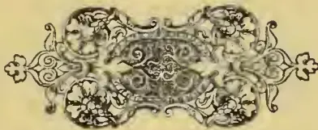A decorative floral vignette, likely a page ornament, centered on the page. It features symmetrical scrollwork and floral motifs, including what appears to be a central floral element surrounded by scrolling vines and leaves.

237------------------------------------------------

<!-- stage4: FAINT old-images-only -->

[Faint page: no legible print of its own could be verified; text withheld (stage 4 review list)]

This image shows a blank page with a light beige or cream-colored background. There are very faint, blurry horizontal lines and some indistinct shapes across the page, which appear to be the result of ink bleeding through from the other side of the paper. No legible text or clear figures are present on this side of the page.

238------------------------------------------------

# \* The TROPICAL AGRICULTURIST \*

## ◇ MONTHLY. ◇

Vol. XVI.]

COLOMBO, OCTOBER 1ST, 1896.

[No. 4.

### PLANTING IN VENEZUELA: COFFEE, COCOA, &c.

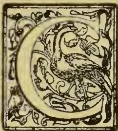

COMMERCIAL interests in Venezuela are suffering from the by no means uncommon, but none the less unpleasant, experience of reaction after a period of undue inflation, this latter resulting from large amounts of foreign capital being drawn

into the country for the construction of railways and other public works.

Commercial business is, however, on a fairly sound footing in Venezuela. Merchants who give long credits seldom do so without some solid security for the debt. As a rule when owners of coffee or cocoa plantations obtain advances it is on the condition of the crop being consigned to the merchant who makes the loan, and the principal with interest at the rate of 12 per cent. per annum, is deducted from the proceeds. Then, again, the currency is on a sound basis, gold coin being the standard of the country though the *bolivar*, equal to a franc, is the monetary unit. Moreover, the two principal banks, the Bank of Venezuela and the Bank of Caracas, are managed on sound business lines, and are in a perfectly solvent condition. It is difficult to understand why under such conditions money is so dear. The rates vary from 12 per cent. to 15 per cent annually, even when secured on easily realizable real estate or other tangible assets. The very high rate of interest undoubtedly checks the development and progress of the country, and the only plausible explanation for it is the constant fear of revolution and the want of confidence in the ability of any administration to conduct satisfactorily the internal affairs of the country. There is a lack of moral responsibility towards Venezuela amongst the Venezuelans that breeds an ever-present feeling of distrust and uncertainty amongst business men, and many years of peace and prosperity must successively occur before this feeling is eradicated, or even mitigated to any marked extent.

As regards the trade of Venezuela with the outside world, the value of English goods imported is greater than that from any other country. Next comes that of the United States, then Germany, France, and Spain in the order named. England supplies cottons, wollens, and general merchandise; the United States breadstuffs, oils, and provisions; Germany cutlery and general merchandise; France silks and fancy goods; Spain and Cuba wines and tobacco. As traders throughout Venezuela the Germans are certainly first in importance and numbers, and German merchants are found in every section of the country. Next in order come the Venezuelans in every class of business, then the French, and, lastly, the Spaniards and Italians. As merchants or traders the English and Americans are hardly existent; a few of either nationality may be established here and there, but the number is so small, and their influence so slight, as to call for no special comment.

The value of the produce exported shows the balance of trade to be slightly in favour of Venezuela. Coffee forms the principal item, the total shipped being some 51,000 tons during 1894; of this, however, about 5,000 tons, though despatched as Venezuelan, came from Colombia and must be deducted. The following is an approximate list of the exports and the values at the port of shipment:—

<table border="0">
<tbody>
<tr>
<td>Coffee</td>
<td>.. ..</td>
<td>46,000 tons.</td>
<td>£3,680,000</td>
</tr>
<tr>
<td>Cocoa</td>
<td>.. ..</td>
<td>7,000 "</td>
<td>60,000</td>
</tr>
<tr>
<td>Hides</td>
<td>.. ..</td>
<td>170,000 "</td>
<td>90,000</td>
</tr>
<tr>
<td>Gold</td>
<td>.. ..</td>
<td>50,000oz.</td>
<td>180,000</td>
</tr>
<tr>
<td>Other products</td>
<td>.. ..</td>
<td>—</td>
<td>100,000</td>
</tr>
<tr>
<td colspan="3" style="text-align: right;">Total</td>
<td>£4,110,000</td>
</tr>
</tbody>
</table>

I do not vouch for these figures being absolutely accurate, statistics being difficult to obtain in Venezuela but they are as nearly exact as careful inquiries can make them. Thanks to the initiative of Sir Vincent Barrington, a Chamber of Commerce has now been established in Caracas and at other places. A special point aimed at is to compile accurate statistical returns, and in a year or so such information will be available for public use.

The principal industries of Venezuela are the cultivation of coffee and cocoa, cattle-raising, the growth of sugar-cane and its manufacture into sugar

239------------------------------------------------

222THE TROPICAL AGRICULTURIST[Oct. 1, 1896.

and rum for local use, gold-mining, and the collection of natural products, such as vegetable ivory, ebony and other woods, dyewoods, and a variety of articles of minor importance for exportation. Coffee is the main staple of Venezuelan wealth, the cultivation extending in more or less degree to all districts of the Republic where soil and climate are suitable. The port of Maracaibo annually some 30,000 tons from the Andean States adjoining Colombia, Puerto Cabello about 7,000 tons from the country round about Valencia, and La Guayra from 12,000 to 13,000 tons from the districts within reach Caracas. Venezuelan coffee deservedly bears a high reputation, and would gain still more in favour if greater attention was paid to the method of cultivation and preparation for the market. The total area under coffee is estimated at from 180,000 to 200,000 acres, and the average yield at a little under 5 cwt. per acre. The plantations have neglected appearance generally—knee-deep with weeds and the trees unpruned and uncared for. The coffee is grown under shade trees, forming a strong protection from the hot sun. The total cost of cultivation and other charges up to the time of the delivery of the bean in a marketable state in Caracas or elsewhere is calculated at about 35s. per cwt., thus leaving a considerable profit the grower at present values. But many drawbacks exist to deter Europeans from embarking in the enterprise. A revolution breaks out, and the male labourers are requisitioned to serve as soldiers on one side or the other. Other difficulties incidental to these South American countries are always liable to crop up. In the sitting room of Mr. Middleton, Her Majesty's former Minister Resident to this country, are two large water-colours. The one represents a coffee plantation at 8 a.m., everybody smiling and happy, and the routine work in full swing, the other shows the same place at 5 p.m. with dead and wounded men on all sides, and fierce firing going on between the Government troops and the insurgents. I know of no better example of the risks to which the owner of a coffee estate is constantly liable. All these dangers are equally present to the grower of cocoa, and, indeed, to any undertaking necessitating the employment of large numbers of labourers. Under such circumstances it is not a matter for wonder that merchants or others making advances against crops should ask and obtain unusually high rates of interest. The coffee or cocoa, once ready for the market, is despatched on the backs of donkeys or mules to the nearest commercial centre, and there bought for shipment to Europe or the United States.

The sugar industry only survives in Venezuela owing to the fact that the importation of foreign sugars is absolutely prohibited. The result of this extreme form of protection is that a pound of coarse brown sugar costs from 8d. to 10d. in Caracas. Neither soil nor climate is specially adapted to the growth of sugar-cane, and without the help of protective legislation the industry would immediately be killed by foreign competition. Of other branches of agriculture the most important are the cultivation of Indian corn, beans, and the ordinary tropical fruits and vegetables for local consumption. In the western portion of the Republic a little wheat is grown, but the area is extremely limited. Tobacco is produced in some districts; the amount is however, insufficient for local needs, and none is exported. Of the remaining sources of wealth cattle-raising is the most important. Whilst it is impossible to obtain any reliable data as to the number of animals, the generally-accepted estimate of between 4,000,000 and 5,000,000 is probably not far wide of the mark. In the long civil wars and constant revolutions which have so completely devastated Venezuela during the past 70 years the cattle industry has suffered severely, both sides invariably taking prompt advantage of a supply of food so ready to hand and easy to utilize. The districts devoted to cattle-breeding are the vast plains reached after the mountain ranges near the sea coast are passed. These plains stretch away to the southwards as far as the banks of the Orinoco. The climate is hot and malarious, and offers small inducement to European settlers.

Very little has been done to improve the breed of cattle, and they are mostly long-horned, small-bodied animals of no great value except for their hides.

An approximate estimate of the number of labourers employed in the industries which I have mentioned is as follows:—

<table border="1">
<thead>
<tr>
<th>Industry.</th>
<th>Average Daily Wage.</th>
<th>Numberd Employe.</th>
<th>Total Yearly Earnings (300 days.)</th>
</tr>
</thead>
<tbody>
<tr>
<td>Coffee, ocoac, and sugar plantations</td>
<td>3s.</td>
<td>41,000</td>
<td>£1,845,000</td>
</tr>
<tr>
<td>Gold mining..</td>
<td>6s.</td>
<td>1,000</td>
<td>135,000</td>
</tr>
<tr>
<td>Cattle ranches</td>
<td>£2 10s. per month ann food.</td>
<td>8,000</td>
<td>240,000</td>
</tr>
<tr>
<td>Other farming</td>
<td>3s.</td>
<td>10,000</td>
<td>450,000</td>
</tr>
<tr>
<td>Total ..</td>
<td></td>
<td>60,500</td>
<td>£2,670,000</td>
</tr>
</tbody>
</table>

At first sight the rate of wages may appear high to Europeans, but when the cost of living is considered the value earned is by no means too great. The necessaries of life are costly to purchase on account of the high protective tariff, the duty on flour being over 10. per 100 lb. for the ordinary and additional Custom-house charges.

Of manufactures the only important ones are boots and leather work of all kinds, hats, and soap and candles. The manufacture of these articles is entirely for home use. A little cocoa is refined and made up for foreign markets, but the quantity is small.

One great hindrance to the speedy settlement and development of Venezuela lies in the physical features of the country. The great mountain ranges, beginning close to the sea shore and extending some hundreds of miles inland, make all transport a long and tedious matter, and to overcome these difficulties by extending the existing railway system is beyond the present means of Venezuela. To-day the patient and hardy donkey is the sole medium of carrying merchandise from the fringe of the cost-line tapped by the railways to supply the needs of the inhabitants in the far interior, and the produce of the interior is sent down in a similar manner to meet the railways. Roads, with few exceptions, do not exist, or only as represented by donkey tracks along the mountain sides. On the other hand, this mountainous country makes life possible for the European in these latitudes, the climate of the highlands being temperate and fairly healthy, whilst that of the plains and lowlands is quite the reverse. The Orinoco may in the future provide a more easy means of access to many portions of the interior, but it is little used at present, and hardly likely to be so for many a long year to come, unless thrown open to free navigation.

There are now 406 miles of railway open for traffic. The lines are all situated on the northern coast, the object being to provide transport over the precipitous mountain ranges immediately adjoining the cost-line. In all there are 11 separate companies, six of these being English, three native, one German, and one French. In most cases the Government subscribed a portion of the capital for construction, and to seven of the companies further guaranteed 7 per cent. annually on a capital not to exceed £10,000 per mile of railway built. The guaranteed interest is now a bone of contention between the Government and the companies, the former alleging the inability of the country to meet such heavy obligations, and the latter being unable to pay dividends to their shareholders unless the Government fulfils the terms of its contract. In the case of the La Guayra and Caracas Railway, which has no Government guarantee, good dividends have been earned in the past and should continue in the future if no unforeseen circumstances arise. The railways are all of narrow gauge, varying in width from 2ft. to 3ft. 6in.

Of other public works the labour at La Guayra is the most noteworthy. The port was constructed by an English company, the La Guayra Harbour

240------------------------------------------------

Ocr. 1, 1896.]THE TROPICAL AGRICULTURIST.223

Corporation, at a cost of £1,100,000. The wharves and warehouses at the port of Guanta are also in English hands, whilst those at Puerto Cabello belong to the Government. The national telegraph system connects all parts of the Republic with Caracas, the total extension of the wires now exceeding 4,000 miles; it does not, however, work in a very satisfactory manner, and the complaints of delay and interrupted communication are constant and numerous. In Caracas telephonic communication is established throughout the city and suburbs, and connexion is made with La Guayra and Valencia, the latter city also having a widely-extended system. The water-works for the supply of the city of Caracas have passed into the hands of the Government during the past fortnight. They were built by a Belgian company, who have now disposed of them for a sum of 8,000,000f. in bonds specially secured on the works and bearing 5 per cent. interest.

The main facts of the economic condition of Venezuela being as I have described, the natural question is, what is the future likely to be? The prospect is not a very bright one. Until the management of the country is in the hands of more responsible administrators than those who have directed the destinies of Venezuela for the past decade there can be slight hope of any permanent progress. Until such time as tranquillity in internal affairs is assured foreign capital is unlikely to embark further in enterprise tending to develop the natural resources. Small inducement is given to immigration, and, apart from the obstacles of climate and difficulty of transport to where the national lands are situate, the offer of a free grant of one hectare, equal to 2.47 acres, of land to each immigrant is clearly inadequate to compensate for the hardships of life under the conditions entailed. The evolutionary changes must rather be looked for from internal sources than external influence. Until effective measures are taken to break through the dense ignorance of the mass of the population and the people are educated to a standard far above their present one, there is small prospect of any change for the better. The advent of another Simon Bolivar might accomplish the desired end, but where is the man to be found in Venezuela? We are not living in an age of miracles, and the plain facts of the case must form the basis of any opinion about Venezuela. The plain facts now before me indicate clearly that rapid development of the country's wealth or startling advancement in the social condition of the people is, to say the least of it, very improbable.—*London Times*.

### BIBLIOGRAPHY OF COFFEE.

(Continued from page 151.)

*Kaffe.* Der Kaffee, oder Abhandlung über den Ursprung, die Geschichte und Zubereitung dieses Getränks. Ulm und Stettin. 1804. 80. [? 1814.]

*Kaffe.* Die Kunst guten Kaffe zu bereiten, &c. Nördl. 1827.

*Kaffee.* Kaffee über den deutschen, als eine höchst wichtigen Gegenstand für Deutschland, &c. Leipzig. 80.

*Kaffee.* Kaffee, Zucker und Syrup, der neue wohlfelige, oder deutliche Anweisung zur Bereitung, &c. Pirna. 1808. 80.

*Kaffee.* Kaffee und Zucker Abhandlung. 1814.

*Kaffee.* Coffee, die schönste Panacee, in einem Lobgedicht über die wunderbare Heilkraft des nectarischen Caffee-tranks. 1775. 80. See *Lobgedicht*.

*Kaffee.* Kaffee, Thee, &c. [See under TEA.]

*Kaffee-haus.* Das Caffee-Haus, oder die Schottländerin. Ein Lust-Spiel... [by *Arrouet de Voltaire*, translated by *J. J. C. Bode*.] Berlin, Stettin and Leipzig. 1761. 80. [Another edn. Berlin. 1766, 160.]

*Kaffee-kunde.* Samtale imellem Kaffee-kunden, &c. [See under TEA.]

*Kaffee-logia.* Caffee und Thee-logia, &c. [See under TEA.]

*Kaffee-Schale.* See *B., F.A.* Die Caffee-Schale; ein Lust-Spiel, &c. 1748. 80.

*Kaffetist.* Der Kaffetist. Ein Lob-Gedicht auf den Caffee. 1747. 40. See *Lobgedicht*.

*Kaffee und Thee Welt.* See *Koffie en Thee-Wereld*. *Kalm, P.* Om Caffee' och de inhemska växter, som pliga brukas i des ställe. Aboae. 1755. 40.

*Kapp, Christian Eshard.* Ueber die Wirkungen des Kaffees auf den menschlichen Körper. Nürnberg. 1814. 80.

*Kelterborn, R.* Die gestörte Kaffee-visitte. Schwank in Basler Mundart. Aarau. 18—. 160.

*Kemp, P. H. van der.* Die registrering der gereserveerde gronden ten behoeve van de Gouvernements-koffiecultuur. Amsterdam. 1881. 80.

*Kemp, P. H. van der.* De regeling der statistick bij de Gouvernements-koffiecultuur. Amsterdam. 1881. 80.

*Kihlmann, J. H.* Kaffee. Stockholm. 1828. 80.

*Knoll, Johann Christian Gerhard.* Sendschreiben von den Wirkungen des Kaffeetranks. Quedlingburg. 1752. 40.

*Koffie en Thee-Wereld.* Dic verschlemmerte, &c. [See under TEA.]

*Koffiehuis.* Het nieuwe vermaakelijke Koffiehuis, waarin verhaal worden veele aangenaame historien... Alles uit verscheidene schrijvers bijeen versameld. Amsterdam. 1748. 80.

*Koffij-huis.* Het Koffij-huis. Vruchten van den wijstok en den jenever-boom gegaard. Schetsen en verhalen. 's Hage. 1847. 80.

*Koffij-reelingen.* Iets over de koffij-veilingen der Nederlandsch-Handelmaatschappij. Rotterdam. 1847. 80.

*Koopman.* De Java koffij-veilingen der Nederlandsche Handelmaatschappij beschouwd door een koopman. Amsterdam. 1857. 80.

*Kortum, Carl Arnold.* Der Kaffee und seine Stellvertreter. Elberfeld. 1809.

*Krausse, G. C.* Traite' du Cafe', &c. Halae. 1744. 80. [Also 1746.]

*Krueger, Johann Gottlob.* Gedancken &c. [See under TEA.]

*Kuelnel. Resp.* See *Geyer, E. E. Praes.* Dissertatio an potus Coffee dicti vestigia in hebraico S.S. Codice reperiantur. Wittebergae. 1704. 40.

*Kuneman, Julius.* De Gouvernements Koffie-cultuur op Java, &c. 's Gravenhage. 1890. 80.

*L.....y, J. n C.....r Praes.* See Edinburgh Incorporations. Coffee House Chit-Chat, &c.

*Laborie, P. J.* An Abridgement of the Coffee Planter of St. Domingo... By *W. G. MacIvor*. Madras. 1863. 80. [Second edn. 1877.]

*Laërne, C. F. van Delden.* Brazil and Java. Report on Coffee-culture in America, Asia and Africa. The Hague. 1885. 80.

*Laërne, C. F. van Delden.* Le Brésil et Java. Rapport sur la culture du cafe' en Amérique, Asie et Afrique. La Haye. 1885. 80.

*Laërne, C. F. van Delden.* Brazilië en Java, Verslag over de Koffie-cultuur in America, Azië en Afrika. 's Gravenhage. 1885. roy. 80.

*Lugrive, Josephus de. Resp.* Quaestio medica. *J. B. Fermellius. Praes.* An à potu Caffee', frequentior apoplexia? [Paris. 1718.] 40.

*Lalou, jeune.* Du Cafe', son origine, le temps de sa déconversion, &c. ... Aux amis du cafe', &c. Rouen. 1844. 80.

*Lamare-Picquot, F. F.* De l'action dynamique du Cafe' et de son emploi dans les hernis étranglées. Corbeil. [1862.] 80.

*Lamare-Picquot, F. F.* Etudes experimentales... contenant des observations sur l'action dynamique du Cafe', &c. Paris. 1864. 80.

*Lampadius, Wilhelm August.* Stärkezucker und Kastanienkaffe. Zwei neue Stellvertreter des Indischen Zuckers und Kaffees. Freiberg. 1812. 80.

*Landarrabilco, Osmir.* Du Cafe' vert envisage' au point de vue de ses applications thérapeutiques &c. Montpellier. 1866. 40.

*Lange, Johann.* Naturgemässe &c. [See under TEA.]

*Langgaard, Theodor J. H.* Die Caffeeinwirkung. 1886.

*Langstedt, Fr. Lud.* Thee, Kaffee, &c. [See under TEA.]

*Lapeyrère, J.* Etudes sur les principacs culturels secondaires abandonnées aux Antilles Françaises. [Le Cafe'.] Paris. 1876. 80.

*La Roque, Jean de.* Grundliche sichere Nachricht vom Caffee und Caffee-baum... Nach dem Französischen... übersetzt. Leipzig. 1717. 40.

241------------------------------------------------

224THE TROPICAL AGRICULTURIST.[Oct. 1, 1896.]

*La Roque, Jean de.* Abhandlung vom Caffe, aus dem Französischen übersetzt... Nebst einer Nachricht von der Cichorienwurzel von *V. G. Constantini*. Hannover. 1771. 80.

*La Roque, Jean de.* Voyage de l'Arabie Heureuse... avec... un Mémoire concernant l'arbre et le fruit du cafe'... et un traité historique de cafe', &c. Paris. 1716. 120. [Amsterdam. 1716. 80.]

*La Roque, Jean de.* Voyage to Arabia the Happy... also an Account of the Coffee Tree and its Fruit: an Historical Treatise of the First Use of Coffee, &c 1726. sm. 80.

*Lascelles, Arthur R. W.* A treatise on the nature and cultivation of Coffee: with some remarks on the management and purpose of Coffee Estates. London. 1865. 80.

*Lambender.* Der Kaffee und seine bisjetzt bekannten 42 Surrogate. Nürnberg. 1806.

*Lavedan, Antonio.* Tratado de los usos &c. [See under TEA.]

*Law, William.* Coffee Merchant. See *Reid, J.* Remarks on W. Law's system of gulling the public. 1831. 120.

*Law, William.* Coffee Merchant. Hints on the cooking of Coffee. London. 1850. 120.

*Law, William.* Coffee Merchant. The history of Coffee, including a chapter on Chicory. London (reprinted). 1850. 120.

*Leblond, A., M.D.* Étude sur la Caféine. 1883.

*Le Carteron, Claude.* Des proprietez du Cafe' simple et du Cafe' compose'. Lyon. 1695. 120.

*Leclerc, Antonius, M.D.* Resp. Quæstio medica. A. de Saint You. Praes. An ab immoderato potu decocti Cafe' sterilitas? [Paris. 1695.] 40.

*Le Comte, C. E. A.* Culture et production de Cafe' dans les colonies. Paris. 1865. 80.

*Le Conte, Amédée Henri.* Emploi du Cafe' en thérapeutique, &c. Thèse. See *Acads.*—Paris—École spéciale de Méd.—Coll. générale des dissertations, &c. année 1859. 1799. &c. 40.

*Le Fevre, J. F., M.D.* Opera, &c. [See under TEA.]

*Lehmann, Carl.* Die Fabrikation des Surrogatkaffees und des Tafelenses. Wien, Pest, Leipzig. 1887. 80.

*Lentilius, Rosinnus.* De potu Coffeæ.

*Lepage, Auguste.* Les Cafés politiques et littéraires de Paris, &c. Paris. [1874.] 80.

*Le Plé, Amédée.* Le Cafe'. Histoire—Science—Hygiène. Rouen. 1877. 80.

*Leporati, Wolfgang Annibal.* De nonnullis Coffeæ noxis.

*Le Tonnellier, Petrus.* Resp. Quæstio medica. *M. Thuillier. Praes.* An potus cafe' cum lacte salubrior? [Paris. 1697.] 40.

*Lettre.* Lettres sur les arbres à épiceries, &c. et lettre sur le Cafe'. Paris. 1775. 120.

*Lettson, John Coakley.* Geschichte &c. [See under TEA.]

*Leuchs, Johann Carl.* Der Cichorien-Kaffee und die andern Kaffeesurrogate, &c. Nürnberg. 1863. 160.

*Leuchs, Johann Carl.* Der Kaffee, seine Eigenschaften und sein Gebrauch, &c. Nürnberg. 1853. 160.

*Leuchs, Johann Carl.* Darstellung der nennsten und besten Bereitungsarten des Zuckers... des Kaffees, der Chocolate, &c. Nürnberg. 1822. 80.

*Leupe, Pieter Arend.* De invoering der koffij cultuur of Java, 1700-1750, &c. 's Hage. 1859. 80.

*Leupe, Pieter Arend.* Aantekening betreffende de koffij cultuur in Suriname, in de 1ste. helft der vorige eeuw. [Amsterdam. 1863.] 80.

*Lewis, R. E.* Coffee Cultivation in Ceylon: Past and Present. Colombo. 1855.

*Leyl, Wilhelm.* Epistola &c. [See under TEA.]

*Liberian Coffee.* Liberian Coffee in Ceylon, &c. A. M. & J. Ferguson. Colombo. 1878. 80. See Ferguson, A. M.

*Link, J. Henricus.* De arbore Coffeæ Lipsiao florente. 1727.

*Linnæus, Carolus.* Potus Coffeæ. Dissertatio in qua potus Coffeæ leviter adumbratur. Resp. *H. Sparschul.* Upsaliae. 1761. 40.

*Lionnet-Clémandot, J.* Norveanu manuel complet du Limonadier, &c. See *Chantard, A. M.* 1845.

*Lobgedicht.* Lobgedicht auf den Cafe'. 1751. See *Kaffee.*

*Lochner, M. F.* Heptas Dissertationum &c. [See under TEA.]

*Lock, Chas. G. Warnford.* Coffeo: its culture and commerce in all countries. London. 1888. 80.

*London. Produce Clearing House Limited.* Regulations for Coffee future delivery business... May 1888 [London.] 1888. 80.

*Lothes, P. W.* [en *Veth, P. J.*] Bijdragen tot de keunissen van de voornaamste voortbrengselen van Nederlandsche Indië. 4 pts. 1 vol. [II. Koffij.] Amsterdam. 1860-66. 80.

*Loudon, H. Hope.* See *Suermond, G.* Een woord over... de door de Heeren G. S. en H. H. L. voor-gestelde West-Java-Koffij-Cultuur-Maatschappij. 1865. 80.

*Loudon, H. Hope.* See *Suermond, G.* West-Java Koffij-Cultuur-Maatschappij. 1865. 80.

*Lounedes, John.* The Coffee Planter: or an essay on the cultivation... of that article of West India produce, &c. London. 1807. 80.

*Ludolf, Hieron.* De fabis Coffee. Resp. *D. G. Herold.* Erfordiae. 1724. 40.

*Ludwig, Ernst. Dr.* See *Teixeira, C.* O Cafe' do Brazil... Contendo a analyse chimica feita expressamente em Cafe' Brazileiro, &c. 1883. 80.

*Lund.* Kaffekalaset. Dramatiserad skizz af Polycarpus. [Berlingska boktryckeriet. 1861. S. 96-103.] 1851. 80.

*M., D.* [See under TEA.]

*Macé, Chas.* Du Cafe'. See *Academies—Paris—École de Médecine—Collectn. des Thèses, &c.* An 1853. tom. 11. 1839. &c. 40.

*Machy, Jacques Francois de.* Preparation of Coffee. [Académie Royale des Sciences: Description des Arts et Métiers. Vol. 14. 1773.]

*Mae Ivor, Wm. Graham.* Notes on the propagation... of the medicinal Chinchonas, &c. See *Laborie, P. J.* An abridgement of the Coffee Planter of S. Domingo, &c. 1863. 80. [Another edn. Madras, 1867. 80.]

*Madriz, F. J.* Cultivo del Cafe', ó sea manual teórico practico sobre el beneficio de este fruto, &c. Paris, Meaux. 1869. 120.

*Mayri, Domenico.* Virtù del Kafe'... con alcuni osservazioni per conservar la sanita nella vecchiaia, &c. Roma. 1671. 40.

*Malepeyre, Francois.* [See under TEA.]

*Manjet, J. J.* [See under TEA.]

*Mappus, M.* [See under TEA.]

*Marah, Wm. Henry.* An Essay on the Cultivation and Manufacture of Coffec, for which the prize offered by the Royal Afric. Socy. (Jamaica) was awarded, &c. 'Observer' Press. Colombo. 1849. 120.

*Masson, l'Abbé.* Le Cafe', ses propriétes, manière nouvelle de le préparer. Epornay. 1855. 120.

*Marchand, Léon.* Recherches organographiques et organogéniques sur le Coffea Arabica, L. 1864. 80.

*Mareus, K. J.* De Coffea. Lipsiae. 1837. 40.

*Marenco, Vinezzo, Count.* See *Italian Poems.* Poemetti Italiani. [Il Caffè.] 1797. 120.

*Marsigli, Luigi Ferdinando, Count.* Bevanda Asiatica, &c. che narre l'istoria medica de (Cafe'). Vienna. 1685. 80.

*Martin, Robt. Montgomery.* [See under TEA.]

*Marvand, Angel.* Les Aliments &c. [See under TEA.]

*Maschenbauer.* Referendarius... Sur le Cafe'.

*Massieu, Guillaume.* Carmen Caffæum. See *Acads.*—Paris—Acad. Franç. Poetarum ex Acad. Gallica, qui Latine aut Graece scripserunt Carmina, &c. 1740. 80.

*Massieu, Guillaume.* Carmen Caffæum. [Another edn.] See *Poemata Didasealica, &c.* tom 1. 1749. 120.

*Massieu, Guillaume.* Carmen Caffæum. [Another edn.] See *Eclogae recontium aliquot poetarum, &c.* 1783. 80.

*Massieu, Guillaume.* Carmen Caffæum. Traduction d'un poème latin sur le Cafe'. Lat. & Fr. See *E'trônes à tous les amateurs de Cafe', &c.* 1790 &c 120.

*Massieu, Guillaume.* Carmen Caffæum. I Caffè: traduzione dal Latino di G. Massieu. See *Italian Poems.* Poemetti Italiani. Vol. 3. 1797. 120.

*Masson, J.* Le parfait Limonadier, &c. [See under TEA.]

*Masson, V. P.* De l'usage &c. [See under TEA.]

*Manduyt.* Du bon usage &c. [See under TEA.]

242------------------------------------------------

Oct. 1, 1896.]THE TROPICAL AGRICULTURIST.225

*Mededeelingen.* Eenige Mededeelingen over het koffiëveilingstelsel van der Nederlandsche Handelmaatschappij. Rotterdam. 1878. 80.

*Medical Standard.* Coffee as a nerve-tonic. [Extr. from Medical Standard.] 1887.

*Melicus, G. F.* Anacrisis medico-historico-diaetetica de Caffe et Chocolate, &c. 1720. 40.

*Méffre, Barthélemy Joseph Pierre.* Quelques recherches sur les effets du Cafe'. Montpellier. 1820. 40.

*Meiffred, J.* Le Cafe' de l'opéra. Poème didactique [en vers libres] dédié aux amateurs du jeu de dominos. Paris. 1832. 80.

*Meilhac, Henri.* Le Cafe' du Roi, opéra comique en un acte, &c. [Music by *Deffis, P. L.*] Paris. Lagny. 1882. 120.

*Meinecke, Dr.* Anweisung über die Zubereitung des Roggen-Kaffees von Dr. Meinecke. Braunschweig. 1836.

*Meinecke, Gustav.* Deutsche Kultivation in Ostafrika und der Kaffeebau. [Verm. Sonderabdr. aus Deutsche Kolonialzeitung.] 80.

*Meisner, L. F.* De Caffe', &c. [See under TEA.]

*Mémoires.* Mémoires de l'Académie des Sciences. [Extr. p. 388-399.] Sur le Cafe'. 1713.

*Ménier, E. J.* Cafe', &c. See under TEA.]

*Méplain, Firmin.* Du Cafe'. Étude de thérapeutique physiologique. See Acads. &c. Paris. École de Médecine, &c. Collection des thèses. au 1868. tom. 9. 1839. &c. 40. [Another edn. Paris. 1868. 80.]

*Mexico. Appendix.* Verslagen betreffende de cultuur en de bereiding van Koffie... in Mexico. Centraal en Zuid-Amerika en West Indië, &c. Amsterdam. 1889. 80.

*Michaelis, Ad. Alf.* Der Kaffee (Coffea arabica) also Genuss und Heilmittel, &c. Erlangen. 1894. 80.

*Middleton, W. H.* Manual of Coffee Planting. Natal. 1866.

*Millau.* Dissertation sur le caffeyeur. Montpellier. 1746. 80.

*Miller, James.* Rector. The Coffee House, a dramatic piece. See *Coffee House*. 1737. 80. [1743. 120. 1780. 80.]

*Millie, P. D.* "Thirty Years Ago": or, Reminiscences of the early days of Coffee Planting in Ceylon. [Reprinted from the *Ceylon Observer*.] A. M. & J. Ferguson. Colombo. 1878. 80.

*Minali, Alexr.* De Coffea arabica, dissertatio inauguralis, &c. Ticini Regii. [1830.] 80.

*Mitzky, J. H.* De vario coffeae potum parandi modo. Wittebergae. 1782. 40.

*Moinau, Jules.* Le Cafe' de la Rue de la Lune: comédie-vaudeville, &c. See *Grargé, E.* 1862. 120.

*Monnereau, E'lie.* Le Parfait Indigotier, ou description de l'Indigo... (et le Cafe'). Amsterdam. 1765. 120.

*Monnereau, E'lie.* O perfeito Indioeiro... (Cafe'), &c. 1798. 80.

*Monnier, le.* An frequentiori potu Caffée vita brevior? Paris. 1751.

*Moreira, Nicolao Jouquim.* Breves considerações sobre a historia e cultura de cafceiro e consumo do seu producto. Rio de Janeiro. 1873. 80.

*Moré de Chederville, E'tienne.* Le Cafe' des Artistes &c. See *Café*. [1800?] 80.

*Morin.* Présence de la chicorée dans le cafe'. 1860.

*Morris, Daniel.* Public Garden and Plantations, Jamaica. Notes on Liberian Coffee, its history and cultivation. Kingston. 1881. fol.

*Morris, Daniel.* The Campaign of 1879 against Coffee Leaf Disease (Hemileia Vastatrix)... by the Coffee Planters of Ceylon, &c. *Ceylon Observer Press*. Colombo. 1879. 80.

*Morris, Daniel.* Note on the structure and habits of Hemileia Vastatrix, the Coffee-leaf Disease of Ceylon and S. India. [Linn. Socy.] London. 1880. 80.

*Morton, Robert.* The nature, quality and most excellent virtues of Coffee. [London. 1670?] s. sh. fol.

*Moseley, Benjamin.* A Treatise concerning the properties and effects of Coffee. 2nd edn. London. 1785. 80. [Fifth edn. 1792.]

*Moseley, Benjamin.* Traité sur les propriétés et les effets du cafe', traduit de l'Anglais par Lebreton, avec des observations sur la culture du cafe' par M. Fusée-Aublet. Paris. 1786. 120.

*Multatuli, pseud.* [Edw. Douwes Dekker.] Max Havelaar, of de koffij-veilingen der Nederlandsche Handel-Maatschappij. 2de. druk. Amsterdam. 1860. 80. [8le. druk. Rotterdam. 1891. 80.]

*Multatuli, pseud.* [Edw. Douwes Dekker.] Max Havelaar: or the Coffee Auctions of the Dutch Trading Company. Translated... by Baron A. Nahuijs. Edinburgh. 1868. 80. [London.]

*Multatuli, pseud.* [Edw. Douwes Dekker.] Max Havelaar. Par Multatuli. Traduction de A. J. Nieuwenhuis et H. Crisafulli. 2 tom. Paris, Arnhem. 1876. 80. [Rotterdam.]

*Multatuli, pseud.* [Edw. Douwes Dekker.] Max Havelaar: oder die Holländer auf Java.... Deutsch von T. Stromer. Berlin, Leipzig. 1875. 80.

*Mundy, Henry.* Opera Omnia, &c. [See under TEA.]

*Munier, Joannes Claudius.* Resp. Quaesto medica. Praes. L. H. Cosnier... Au omni sexui, omni ætati et omni temperamento salubris Cafe' potus? [Paris.] 1743. 40.

*Munier, Joannes Claudius.* [Another edition] [1760.] See *Sigmaert, G. F.* Quaestiones medicae Parisinae, &c. Fascic. 2. 1759. &c. 40.

*Munnick, de.* Handleiding voor de Kultuur en de bereiding der Koffij. Batavia. 1845. 80. [1863. 80.] (To be continued.)

## A COFFEE PLANTER ON NYASSALAND

SIR,—As British Central Africa seems to interest your readers, I venture to give you a few of my experiences in this country.

On my arrival at Chinde, I was informed of the sad news of Mr. John Buchanan's death, which occurred a few days before my arrival. As one of the oldest and most respected residents in the country, it seemed to cast a gloom over the whole place. Fortunately there was a special boat leaving the next day for katungas which is the terminal station of the river journey.

Our voyage up the river I must confess was very monotonous. The scenery of the Zambesi is by no means picturesque. Beyond seeing large numbers of beautiful water-fowl there is a sameness about everything which one soon gets wearied of. The heat was intense, the thermometer standing at 100° Fahr. in the shade, and our saloon, which was something resembling a third-class rail-way carriage in Ceylon, made it almost unbearable. But one of the chief annoyances was the continual flight of sparks from the engines, which prevented us sitting outside when it grew cool, and most of our coats at the end of the journey were only fit to be given to the niggers. For the trip up the river one is charged £13, and, considering we only took five days, it seems to me to be most exorbitant, as everything on board was bad. I reached Blantyre on March 29th and the change to a higher climate was indeed most enjoyable!

Blantyre is a pretty little place, and I should say fairly healthy, although many instances have occurred to prove the reverse. Until quite recently Blantyre has been practically only a Mission Station, but commerce and the development of the country are fast making the place into a commercial town, and I think it is only a matter of time before the missionaries retire to a more savage and wilder part where their energies may be appreciated. I was sorry to hear before leaving Blantyre that the Commissioner was in the doctor's hands with Blackwater fever; this seems to be the dreaded disease out here, and from all accounts seems very prevalent and from my experience it appears to have a worse name here than on the West Coast of Africa. I left Blantyre, for Mlanji at the end of March, and stayed a short time with my friend Mr. Crabbe. The Mlanji climate although it bears a good name, evidently does not agree with him, for during my stay he had repeated attacks of fever, which he attributes to the turning over of the soil whilst cutting holes. He has already cleared 100 acres of land and is making preparations to build a brick house, as the present one is only a grass hut, and has but three small rooms. There are few comforts

243------------------------------------------------

226THE TROPICAL AGRICULTURIST.[OCT. 1, 1896.

to be had in Mlanji, and the living consists of fowls, pumpkins, and sweet potatoes with an occasional tin, which is looked upon as an extravagance and a luxury. The prospects of coffee in Mlanji are excellent, judging from what I have seen at Mr. Bradshaw's place, Mount Zion, and equals anything I have seen in Ceylon, India or Brazil. The soil, although it has an absence of rock or stone, and is of a chocolate colour, seems to be admirably adapted for coffee. In my opinion Liberian coffee would do extremely well here and would not be here so much affected by borer and insects which are the pests of the country.

Tea also would grow well, but would be greatly handicapped by the labour supply, which is always short during the wet months.

Cardamoms grow wild in abundance, but as yet I have heard of no one giving them a trial, but Mr. Crabbe tells me he has written to his firm for a shipment of seed.

Tobacco is also cultivated by Europeans out here, Messrs. Buchanan Bros. have gone in for this industry on a large scale; it is usually smoked by the residents, and has a very nice flavour. Another gloom was cast over the whole country the other day by the sudden death of Mr. Robert Buchanan from blackwater fever at Blantyre. It is indeed sad that two brothers and members of the largest firm should die within a mouth of each other. This is the third Buchanan who has met his death from fever in this country. I certainly should advise no one to come out here unless they are provided with a good consideration, and prepared to lead a lonely life, for it is an undeniable fact that fever is prevalent throughout the country, and especially where new land is being opened, and although I fully believe B. C. A. is bound to go ahead, yet I should recommend no one to come out on spec.—I am, &c,

AN INDIAN PLANTER.

Nyassaland, May 22nd, 1896.

## THE COFFEE PLANTER

BY W. W.

The life of a coffee planter in the Mysore Province has very much to recommend it, in spite of the vexatious labour question. What, after all, are the planters' cures, compared with the positive hardships of existence endured uncomplainingly by the settlers in the bush of Australia, or the sheep farmers of New Zealand?

Is the labour question here equal in importance to the rabbit pest, drought, bush fires, hurricanes, and floods with which the Colonists have to reckon? Then there are, in the Colonies, discomforts of no trifling nature to the man brought up in a good English home, to which perforce he must submit. These embrace the necessity of doing everything for oneself—where servants are but a name, and one must rough it generally with the paid hands.

Contrast this with the conditions under which the coffee planter works. In *his* case there is the comfortable bungalow, always adequately furnished, and not infrequently a luxurious residence, reared upon some commanding site, giving a panoramic view of the encircling hills with their glorious, ever-changing depths of colouring; the breezy downs, and the dense, primal forest, in clearings of which are the close ranks of the coffee plant—scenting the air with sweetness from its dainty white blossom. A home amid surroundings such as would delight the soul of the poet!

The planter is not so far removed from railway communication that he need deny himself any of the pleasures of life. His bungalow is usually well, if not liberally, supplied with creature comforts, which cost him but a trifle more than they would do in Bangalore—not a matter of much consideration to the man who sells his crop at some ninety-five shillings per hundred weight, and realizes an income of thousands of pounds annually! There

are fairly goodroads round and about the estates, enabling the planters to visit each other as often as they wish, so that no feeling of isolation need be thought of as a factor in the life, whilst there is a flourishing and commodious club at Chiekmagalur, where many a jovial evening is spent. Nor is the coffee planter's work of an incessant nature. He has all his energies exercised to the full during certain seasons of the year, and much anxiety as to crop prospects, leaf disease, and the dreaded "borer," but when the harvest is in and despatched for shipment, and the coffee has been pruned and otherwise treated for the ensuing season, the planter has his holiday and may have a run home at the most enjoyable time of the year—for England, or enjoy the term of his freedom in travelling about the country. What rest has the Australian squatter, or the New Zealand sheep farmer? The man "in indigo," on the Bengal side, has, perhaps, a pretty good all-round time of it. He, too, has his time of work and then of rest, and his cares are for the crop and market rates of the dye. He is not, we believe, distressed on the score of labour, and in this respect has the pull over the coffee planter. The Assam tea-man is a martyr! his life isn't worth living. A trip by river steamer as far as Dibrugurh, will convince anyone that the pestilent jungles of Assam, whilst contributing largely to the output of Indian tea, are accountable for a fearful deathrate amongst the planters. Certain places along the banks of the treacherous upper reaches of the Brahmapootra are pointed out to the voyaging stranger as "The white man's grave," meaning that in those particular districts no white man could live for any length of time. Then, planters who board a steamer for a day's run to some other landing place will tell the stranger that they come abroad for breath of fresh air to knock the fever out of them. Poor fellows, they look as though a puff of wind would knock the *life* out of them. With these brief comparisons before us, how much better is the lot of the Mysore coffee planter? excepting the "man in indigo," but even he works in the hot plains, and has no elevated site for his bungalow.

The labour question for the coffee planter will, apparently, soon be solved, and with the regulations which will then come into force, one of the chiefest obstacles of the industry will be removed. With labour arrangements then offering no difficulties, we would suggest that the planters might and it very distinctly to their interest, and a guard against adverse seasons with, possibly, lower rates in the near future for coffee, were they to utilize such portions as their holding which are unfitted for their staple crop, in raising some other marketable commodity. Were this suggestion carried out, the planter, could face a bad season, or a fall in prices, with comparative equanimity. A reference to the Madras Agri-Horticultural Society would elicit sufficient information for practical experiments. Why not raise the sugar-beet? The country is well adapted for its growth, and it has many claims over cane, which it has, to an enormous extent, crowded out of the market.—*Planters' Gazette*.

## CEYLON TEA IN AMERICA.

AN EXPERIENCED PLANTER AND CHINA BUYER  
ON THE SUBJECT.

SIR,—Having just returned from a trip through the Eastern States and Canada, I thought your readers might be interested in hearing the result of my observations on the subject of the demand and use of Ceylon teas there. To commence with San Francisco, I find the sale of your staple is but very slowly increasing the reasons being that the demand here runs principally on strong, common cheap teas, and teas of a finer grade having a good deal of "style" about them and *not too strong*.

In the first grade Ceylon cannot compete with China as a "good leaf for the money" goes, say

244------------------------------------------------

OCT. 1, 1896.]THE TROPICAL AGRICULTURIST.227

8 to 11 cents gold per lb., and in the finer grade your teas, though attractive (I refer to the better kinds of pekoe and broken pekoe), are too strong for they, as yet, uneducated taste of the American public, and China can, and does, send teas of the second and third crops, costing 13 to 14 cents, gold, which possess a tippy appearance, and that light smooth liquor which is liked here. Also what militates against its faster increase, is the small amount of your teas which find their way to this market on consignment. And the difficulty of working a Ceylon tea business on standard samples is very great, for it has been found that orders sent to Colombo to duplicate a previous shipment have, when executed, often failed to give satisfaction. The hotels here, it is true, offer the visitor a choice of India and Ceylon tea as well as of teas from China and Japan, but for the reasons I have given I incline to think that the increase in the consumption of the Ceylon tea on this coast will be slow.

I journeyed hence to New York *via* the "Sun-set" route of the Southern Pacific, which service certainly deserves praise. The train consists of sleeping cars, a ladies' drawing room car with library and female attendant (a "darky"), gentlemen's smoking car, with barbers shop and bath room. The scenery as far as New Orleans is mostly desert of a very tame character, but from that place becomes more interesting passing through Virginia, Georgia Kentucky, &c., and landing you at Jersey City within a ferry ride of the heart of New York.

In New York and Boston I found the Ceylon staple being pushed vigorously and with some success—one of the most conspicuously successful firms in the enterprise (through their agents) being a somewhat recent addition to your mercantile houses, whose name I will leave you to guess.

From Boston I entered Canada; but whilst on the subject of the United States I would here add that, returning from Canada to San Francisco, *via* Chicago, St. Paul, Omaha, and Denver, I found in each place that Ceylon tea was known, but not being (except in Chicago) vigorously pushed. In Chicago it is being well advertised, but mostly in "blends" of India and Ceylon.

I would here record the fact that the States are a coffee-drinking people, that in nine out of ten cases an American prefers coffee to tea, and that in the tenth case he usually prefers Japan tea, or Formosa oolong. I am also of opinion that it will take a very large expenditure of time and money in advertising Ceylon tea to materially increase its consumption, and I am sure that the same amount of time and money spent in Russia would result ten times more favourably.

In Canada, the case is very different. In the Western Provinces visited by me, that is St. John, New Brunswick, Halifax, Nova Scotia, and the country known as the Maritime Provinces, it is true that Ceylon tea is but making slow progress, because the China teas used there are those kinds which possess a strong rough flavour, and at the price obtainable, that is, from 11 to 16 cents gold per pound, are fully as cheap and as good value as Ceylon Pekoe Souchongs and the lower Pekoes. Very little tea is used costing over 18 cents gold (say 9d.). Some progress, however, is being made by the introduction from London blends of Indian and Ceylon (with doubtless some China), which are put up in metal chests, and in tasty paper packets, as well as in prettily got up canisters holding half pound to 5 pounds. It is the opinion of those in the trade that these blends will gradually give way to "straight" teas from India and Ceylon.

Leaving this part of Canada we come to Quebec and Montreal, and in these districts I found more inquiry for Ceylons, though the trade has not yet begun to use them largely.

It was in the districts comprising Tronto, Hamilton, London (Ontario), and the country around Winnipeg and the North West that I found the greatest demand for and life in your staple. Travelling as I was in the interests of China tea, I

was in an exceptionally good position to judge of the hold which your teas had taken in the districts named, and I may say that I found that three-fourths of the trade had been appropriated by Ceylon and India.

In Tronto I had the pleasure of meeting Mr. Mackenzie and his Indian *confere*, both seemingly well content with the progress of their staples.

I also had a long chat with Mr. Larken, of Messrs. C. P. Larkan & Co., who is most energetically pushing Ceylon Tea, and is making it a great success so far as his own trade is concerned and whose "live" advertisements (specimens of which, as shewn in the local papers, were mailed whilst I was present, to your city) are having a telling effect on the consumption of your teas.

Just here (as the Americans put it) I would call attention to two points on which I heard a great deal. Firstly it is a curious thing that Indian teas, notably pekoes, shew a finer-made and more tippy style than Ceylons of same grade, and yet whether from inferiority in liquor or from some other cause, they are not saleable at as high a price as the latter by quite two or three cents gold per pound. This disparity of value has led, I am told, to a reprehensible practice, and that is that in many cases the name of the Indian garden or such words as would indicate an Indian origin have been scratched off or erased in some way, and a Ceylon equivalent substituted. This passes detection amongst the retailers of the tea, as they know little of the article they sell, but it acts to the detriment of Ceylon tea. It was suggested to me that every chest of tea shipped from Ceylon should have put upon it by your Government a stamp in paint or burnt in, shewing that the chest had really been shipped from Ceylon. This could easily be done at the time of shipment, and would be of great use.

The second point I would mention is, that to cultivate an increased trade in your teas, as little *dust* as possible should be in them. I have seen samples of Broken Pekoes which, otherwise good, have been thrown aside on account of the broken condition of the leaf, and I have often been asked why it is that nearly all Indian teas are, in make and twist of leaf, superior to Ceylons. The question is one which I could not answer, but which is a *pressing one* and well worth inquiring into.

To conclude, I would again state, and in a most emphatic manner, that whilst I would not hint at a large eurtailment of the money now being spent in exploiting the United States and Canada, I would suggest that more attention be given to Russia. The United States are a coffee-drinking-people, and no matter what amount of money be spent on pushing it, Ceylon tea will be but slow in gaining ground. That it is coming into use is certain—but slowly. Canada, on the other hand, is a tea-drinking country, but I would venture the opinion that the "booming" of Ceylon tea as now carried on by private firms and companies, is of itself almost sufficient to cause a rapid increase in its use, and that some of the funds now being spent in assisting its increase might be much more advantageously applied to Russia. The latter country is essentially a tea-drinking one, and would, I am convinced, repay such expenditure sooner and more liberally than the United States.

I found in my travels that "hard-times" were noticeably present both in Canada and the United States, but especially so in the latter, and every American is impatiently awaiting the end of the reign of the present occupant of the Presidential Chair, convinced that with the advent of a "Republican" President (and a higher tariff) prosperity will once more shower its gifts on the *grandest, biggest, best and most highly-flavored* country in the world. (So say they *all*).

I trust that this short sketch of my experiences on this Continent, in *re* Ceylon tea may prove of interest and use to your readers. I can but say that from my intimate knowledge of the trade they may rely upon it as a faithful picture. F.

Occidental Hotel, San Francisco, March 25th.

245------------------------------------------------

228THE TROPICAL AGRICULTURIST.OCT. 1, 1896.

## COMMERCIAL FEDERATION OF THE EMPIRE.

Mr. J. G. Colmer's, C. M. G., prize essay on the Commercial Federation of tea Empire has been published in *The Statist*, and the following is a synopsis of the essay.

The scheme may be divided into four parts:—

1. The granting of preferential treatment to Colonial and Indian products in the United Kingdom. 2. Preferential treatment of British products in the Colonies and India. 3. The additional revenue so derived to form a fund, if the Mother Country and the Colonies and India agree, with a view to improve and supplement the defences of the Empire outside the United Kingdom. 4. The formation of a Colonial Council to give the Colonies a greater voice in Imperial affairs, and to provide for the administration of the fund.

1. It is suggested that in the United Kingdom small specific duties should be placed on certain enumerated articles, about twenty in number, when imported from foreign countries—similar imports from the Colonies and India to remain duty free, as at present. These duties, it is anticipated, would realise about £2,700,000.

The enumerated articles are live animals, meats, cheese, butter, wheat, flour, hemp, and other fibres, ivory, undressed leather, sugar, unrefined and refined, wool, tallow, seal skins, fish oil, long wood, mahogany, and nuts and kernels for oil.

It is also proposed to reduce by one-half the existing duties on imports from the Colonies and India of cocoa, coffee, and tea, the duties on the foreign imports of those articles to remain as at present. This re-arrangement of the existing traffic, with a reduction of 5 per cent. in the duties on tobacco from all countries, would mean a decrease in the revenue to the extent of about £2,000,000. It will be seen, therefore, that the scheme involves, roughly speaking, a net increase in the revenue of the United Kingdom of about £700,000.

It is urged that an increase in price is not likely to result from the placing of duties on foreign imports of the enumerated articles, at any rate to the extent of the proposed duties. In every case there would still be a considerable importation of the different commodities from the Colonies and India. As they would remain duty free, the supplies coming from within the Empire would dominate the market, and, with the foreign competition, have a tendency to prevent the increase in prices which perhaps might follow if duties were placed upon such imports from all countries.

2. As the fiscal system of the Colonies and India are so varied, and the nature of their trade exchanges so different, it has apparently been found difficult to make any proposal giving preferential treatment of a uniform character to British imports in those markets, in return for the concessions suggested on the part of the United Kingdom. It is, therefore, recommended in the essay that the Mother Country should take the initiative in the matter, inform the Colonies and India what advantages the United Kingdom is prepared to offer to the imports of the articles enumerated from within the Empire, and ask what concessions of a preferential character they would be prepared to extend to imports from the United Kingdom over imports from foreign countries. It is believed that correspondence of this nature would pave the way for an Imperial conference, at which the details of the proposals could be discussed, and definite arrangements agreed upon, by which in every part of the Empire there would be a preferential treatment, on a moderate scale, for inter-Imperial trade.

3. Assuming that the Colonies were prepared to grant preferential treatment to British trade (upon which no doubt appears to exist, in view of the resolutions of the Ottawa Conference), assuming also that India was ready to follow their example, and that they rearranged their tariffs in favour of British trade

in a manner satisfactory to the United Kingdom; and that the formation of a fund for defence purposes was agreed upon as part of the scheme, it is fair to suppose that the Colonies and India would be able to contribute, as partly or entirely the outcome of their preferential treatment of British imports, according to their local circumstances, a sum equal in the aggregate to the net amount of the additional revenue (£700,000) to be raised in the United Kingdom. In one of the appendixes of the essay a suggestion for the apportionment of the £700,000 among the Colonies and India is offered. This would provide a fund of nearly £1,500,000 per annum, the joint contribution of the Colonies and India and the United Kingdom, which it is suggested could be used to supplement and improve the existing defences, including graving docks and coaling stations, in the outlying parts of the empire. Among other things the maintenance of guard-ships in the leading ports of the empire is proposed. These vessels would be useful not only for harbour defence, but in connection with the training of naval militia, which it is believed could readily be formed in the leading maritime ports of the Empire. This force would not only be valuable locally, but would be available for drafting on Her Majesty's ships that might be operating in the neighbourhood of the Colonies in time of war.

4. In order to give the Colonies a large voice in the affairs of the Empire than they now have, and to enable them to participate in the administration of the proposed fund for defence, the formation of a Colonial Council is suggested. It would consist of the Secretaries of State for the Colonies, Foreign Affairs, India, and War, the First Lord of the Admiralty, and the Chancellor of the Exchequer, the Colonial Secretary being president. The High Commissioner for Canada and the Agents-General of the self-governing Colonies—or such persons as the Colonies might appoint—would be members of the Council. It would be, as its name implies, a Council in which the Colonies would have a voice through their representatives in regard to any matters arising out of the preferential trade arrangements, and upon all other subjects in which the Colonies they represented had the right to consult, or to be consulted by the Imperial Government.

Retaliation on the part of countries foreign is not anticipated as the result of the adoption of the scheme, because their import duties are now as high, generally speaking, as they can be made, and any increase would react on the countries themselves. Besides, with the Imperial Customs Union in existence, a policy of retaliation would hardly be lightly undertaken.

The following are some of the advantages which it is claimed would be derived by the Mother Country, on the one hand, and the Colonies and possessions on the other, from the adoption of scheme of commercial federation. It would bring the Mother Country into closer union with the Colonies. By giving preferential treatment, on a moderate scale, to British trade within the limits of the Empire, the bond of unity would be material as well as sentimental. By such preference the doctrines of free trade that prevail in the United Kingdom would not be seriously endangered, and freer trade than at present would be made possible within the Empire. On the other hand, the British manufacturer would retain the control of the rapidly increasing Colonial Council for mutual consultation on matters of general interest. Greater attention than ever would be attracted to the Colonies. Emigration would flow in larger number to their shores, and increase the demand for British goods. The investment of capital in the Colonies would be encouraged, and their powers of production be so increased that the United Kingdom would year by year depend less upon foreign sources for her food supplies.

Attached to the essay are several statistical appendixes, illustrating the commercial affairs of the Empire, and showing that, relatively speaking, the trade of the United Kingdom with the Colonies has been increasing in a greater ratio than the trade with the other parts of the world.

246------------------------------------------------

Oct. 1, 1896.]THE TROPICAL AGRICULTURIST.229CEYLON TEA IN RUSSIA.

It is of interest at a time when we may hope that Ceylon Tea has taken a real hold of the Russian market with the prospect of a steady increase, to recall the day of small things—the very beginning of the attempt to get the Russians to drink our teas. This is done in the appended letter from Mr. W. B. Steveni addressed to our senior in England. The latter first met Mr. Steveni—a Scandinavian Englishman if we may say so, and brother-in-law of the well-known English artist, Mr. T. B. Kennington—at Vichy in 1887, and there endeavoured to interest him in Ceylon tea, of which samples were provided. What followed, so far as Mr. Steveni is concerned, is best told in his own words; and there can be no doubt that he is deserving of the thanks of Ceylon producers for what he did in the early years in Russia towards the mission so energetically promoted since by M. Rogivne in a thoroughly business-like and successful way. May this enterprise, and all other attempts to extend the use of Ceylon tea in Russia, continue to prosper—and more especially the efforts of Russian tea firms to trade direct in our staple—until its good qualities become duly appreciated in every Russian household.

Meantime, the following *rsum* of the early history of the campaign is well worth putting on record, and we may hope that Mr. Steveni may yet do further service in making known Ceylon products—and especially tea—in Northern Europe, seeing his peculiar opportunities as a writer and journalist. For, it should be known that our friend, who has altogether lived twenty years in Russia, has occupied responsible positions as contributor to the *London Times*, the *Contemporary Review*, *Nineteenth Century*, *United Service*, and American periodicals. He also wrote a book about the great Russian famine, the scene of which he was the first to visit among English correspondents. All this should increase our interest in the writer, who tells the story of how he first introduced Ceylon tea to the notice of the Russian dealers and people:—

HOW I INTRODUCED CEYLON TEA INTO RUSSIA.

It is now about nine years since I first conceived the idea of introducing the fragrant teas of your island into Russia. Like many brilliant ideas that have come to us poor benighted mortals, this one came to me by a mere accident. It happened that on one wet drizzling afternoon in the City, when all nature seemed to be in mourning, that I took refuge in the office of an old City friend, Mr. Robert Heinekey of Seething Lane. Whilst waiting there until the weather had cleared up, Mr. R. Heinekey, the head of the firm of that name, asked me if I would not have “a cup of first-class tea—Ceylon tea!” Curious to know whether that beverage compared with the much-vantered Kjaichta and China teas we got in Russia, I immediately consented. The first time I drank this new kind of tea I was, to say the least, considerably astonished. It was so delightfully aromatic and refreshing that, like David Copperfield, I ventured “to ask for more.” I am glad I did; for I not only renewed the pleasure of drinking what I believe to be one of the finest teas in the world, but learnt that this new aromatic tea was grown on the island, of Ceylon, on the estate of a relative of Mr. Heinekey.

29

For about a year or more I thought no more about Ceylon tea, when, by another freak of fortune, I found myself in Moscow, one of the greatest tea marts in Europe. It then occurred to me, that it would be a grand thing to introduce Ceylon tea into Russia, and, if possible, to drive out the Chinese tea, as I found that a considerable quantity of the tea consumed in Moscow was of the most wretched quality; in short, that the good reputation the Chinese once had for their teas was no longer merited. Acting on this conviction, I immediately imported through Mr. Heinekey’s son, about half-a-dozen chests, and sold their contents to my friends, mostly members of the English Colony in Moscow. The tea, however, did not please my countrymen; as they were used to the weaker Chinese infusions. I therefore decided to try the wealthy Moscow grocers; but here I had even still worse luck. The majority of them would hardly look at the samples, and those who did gravely assured me that my tea was artificially scented, whilst others, who were more sensible, said that the tea was too strong for their customers. In fact, nobody would look at Ceylon tea; and I was on the point of throwing up the business, when I made the acquaintance of a very intelligent tea taster on the Moroseika St.—not far from the Kremlin. This Muscovite, who was well up in his profession, immediately recognised the splendid qualities of Ceylon tea, and ordered three or four boxes on trial. He, however, assured me that the tea was too aromatic for his customers in its pure state, and that it would be necessary to mix it with mild China tea. This he did with considerable success, and brought out a new blend, with some unpronounceable name, which could hardly be pronounced by Westerners. Thanks to the numerous advertisements I and my friend inserted in the Moscow papers, the name somehow caught the fancy of the public, and many, who would not look at the tea in its natural state, came and bought it under its new title. In fact, my friend made a large profit on the few chests he took off my hands, but, as Ceylon tea was only bought by the curious and unconservative, I did not grow fat on the proceedings. I therefore attempted to try the native tea merchants and imported still more tea, but all with poor success. Everywhere I went I was stopped by a wall of Muscovite suspicion, obstinacy and conservatism, which, with all my enthusiasm, I could not surmount. I also found it extremely difficult to sell Ceylon tea at a profit; firstly, because it was pure and unadulterated, and, secondly, because I could not afford to purchase it in large quantities.

In the course of my operations I, however, made a great many discoveries respecting the mysterious drugs of the Muscovite tea merchants, and became convinced that it would be *impossible* for an honest trader—without support—to compete with the crafty orthodox-church-going “koopzee,” who were my most dangerous competitors.

I, amongst other discoveries, learned that some of them mixed their tea with “Kaporka,” a kind of shrub that grows around Moscow and in appearance—but not in taste—strongly resembles the tea plant.\* Other “saints,” famous for their donations to the churches, smuggled

\* Shortly after my departure from Moscow several of these gentlemen were arrested by the police and compelled to pay heavy fines. The majority, however, principally residing in the interior, are seldom caught.

247------------------------------------------------

230THE TROPICAL AGRICULTURIST[Oct. 1, 1896.]

large quantities of tea over the Polish and Persian frontiers, thus saving a portion of the high duty, which in Russia almost amounts to 2s. per lb. This practice of smuggling leads to frequent and often bloody conflicts with the Imperial frontier Customs guards. Persians and Jews frequently get killed in these encounters.

Another dodge, formerly much practised in Moscow, was for the tea merchants, i. e. the more unscrupulous of them, to buy up all the "leavings" from the Trakters, or teasshops, to dry the same and then mix this rubbish with cheap China tea. This compound was then sold to the ignorant Monjiks for about 3s. to 3s. 6d. per lb., for which price they would in England be able to purchase genuine good unadulterated tea. The majority of the poorer classes in Russia can hardly ever afford good tea, seeing that the duty and expenses on this necessary of life is from three to four times as much as it is in England.\* In consequence of the high duty, and the want of principle among many of the tea merchants, one can safely say that the poorer classes in Russia do not even know yet what good tea means. It is also difficult for the tea merchants—even when they wish to be honest—to sell their tea cheap under the conditions at present obtaining in Russia.

In the course of my frequent journeys through that country and whilst witnessing the terrible devastation caused by Vodka amongst the peasantry, I came to the conclusion that, if the Minister of Finance would increase the duty on spirits and, in proportion, diminish the present excessive duties on tea, coffee, and cocoa, he would be the indirect means of saving thousands and perhaps hundreds of thousands from death, disease and poverty—in short all those miseries that are caused by the abuse and use of spirituous drinks.

Whilst engaged in the work of introducing Ceylon Tea in "Whitestone Moscow," I had the pleasure of making the acquaintance of Sir Graeme Elphinstone, who, hearing what I was about, came all the way from Petersburg expressly to see whether business operations might not be continued on a more hopeful footing. Sir Graeme produced on me such an agreeable impression, that I should have been glad to represent him and the other planters of Ceylon, had not fate willed it otherwise. In fact, if, I remember rightly, you, as well as Sir Graeme suggested that I should accept this post of trust. But this was not to be. My health, which had been gradually undermined by an attack of inflammation of the lungs and a severe catarrh, at last compelled me to return to London, where I remained the whole winter under medical care. During my absence from Russia the business naturally passed into other hands.

The Ceylon tea planters, apparently acting on the suggestions made by me in my early letters to the *Ceylon Observer*, decided to establish the business on a proper footing and commissioned Mr. Rogivne. Under that gentleman's able management, and with the tea planters' support, the business seems to have prospered. There are now shops engaged in selling Ceylon tea all over Russia: in Moscow, Petersburg, Vitebsk, Vilno, Odessa, Rostoff, Kharkoff and other places.

The business is, however, still in its infancy, and much hard work remains to be done. When I call to mind that about eight years ago, when I was in Moscow, the public would scarcely look at Ceylon Tea and that now several million pounds of it

are annually imported into Russia, I cannot but think that there is for the high-class teas grown on your island a great future in the vast Russian Empire. That future will not however benefit my pocket; for although I conceived and commenced this business, its completion and establishment is being left in other hands. My friends in Moscow and elsewhere, who, in 1888, amused themselves at my expense for entertaining such a mad idea as the above, will now see that I was right and that on this, as well as on other occasions, I have seen far ahead of others. I have in fact been a pioneer, and, like many pioneers, have sown that others may reap.—Yours respectfully,

WILLIAM B. STEVENI.

#### PLANTING OF SHADE TREES.

The following is a tabulated statement of the number of shade and fruit trees growing at the close of 1895. Shade is now given to the weary traveller along many of the most exposed roads of the country.

<table border="1">
<thead>
<tr>
<th rowspan="2">Province.</th>
<th colspan="2">Shade-giving Trees.</th>
<th colspan="2">Fruit Trees.</th>
</tr>
<tr>
<th>Ingasamam.</th>
<th>Margosa &amp; Suriya, &amp;c.</th>
<th>Iron Bark.</th>
<th>Various kinds.</th>
</tr>
</thead>
<tbody>
<tr>
<td>Western</td>
<td>5,525</td>
<td>432</td>
<td>..</td>
<td>697</td>
</tr>
<tr>
<td>Central</td>
<td>5,981</td>
<td>12,081</td>
<td>27,304</td>
<td>3,658</td>
</tr>
<tr>
<td>Northern</td>
<td>1,979</td>
<td>5,157</td>
<td>..</td>
<td>463</td>
</tr>
<tr>
<td>Southern</td>
<td>3,750</td>
<td>7</td>
<td>..</td>
<td>462</td>
</tr>
<tr>
<td>Eastern</td>
<td>5,966</td>
<td>110</td>
<td>..</td>
<td>718</td>
</tr>
<tr>
<td>North-Western</td>
<td>5,000</td>
<td>41</td>
<td>..</td>
<td>213</td>
</tr>
<tr>
<td>North-Central</td>
<td>3,463</td>
<td>..</td>
<td>..</td>
<td>617</td>
</tr>
<tr>
<td>Uva</td>
<td>5,585</td>
<td>174</td>
<td>..</td>
<td>354</td>
</tr>
<tr>
<td>Sabaragamuwa</td>
<td>5,150</td>
<td>4</td>
<td>..</td>
<td>1,509</td>
</tr>
</tbody>
</table>

—Public Works Administration Report.

#### COST OF PRODUCTION OF TEA ON THE NILGIRIS.

(Contributed.)

The cost of laying down our Nilgiri Teas at the Shipping Port or on the London Market is of such importance to planters that I may perhaps be excused for addressing you at some length on the subject. In doing so I hope it will be understood that my chief object is to gain information from those whose residence and experience on these hills make their opinion of special value in this respect, while at the same time the views of a planter trained in another country and a different school may be of some benefit to them.

With reference to some recent correspondence in your journal on the subject, it would appear that the fact of most, if not all of the estates in this district packing a proportion or, in some cases, nearly all their crops, in 1 lb. or  $\frac{1}{2}$  lb. packets has been overlooked, their so doing increases the cost of production per lb. considerably. This does not of course interfere with the profits, provided a corresponding enhanced price is obtained for such packet teas, but the comparative cost of production with other Tea-producing countries such as Ceylon, where with very few exceptions the tea is packed in bulk in chests or half-chests, is obviously unfair. The cost of making up tea in 1 lb. lead packets with wrappers, &c., and putting same in chest, is 1 anna 6 pie per lb. above the cost of packing in the ordinary lead-lined chests in bulk. Suppose two gardens working under equal conditions and turning out say 150,000 lb. of made tea each, one of which puts half its crop in 1 lb. packets: this means that the garden so doing would have an expenditure above its neighbour of Rs. 7,000 odd, or the equivalent cost of about 9 pies per lb. over the garden packing all its crop in bulk in chests.

All things considered the Nilgiris ought to be able to hold its own with Northern India and Ceylon as regards cost per lb. of placing its tea f.o.b. Calicut

\* This practice, I am told, is still in existence.

248------------------------------------------------

OCT. 1, 1896]THE TROPICAL AGRICULTURIST.231

which I understand is the port the greater part, if not all, of the produce is shipped from. The Wynad with a larger yield per acre and from the fact of that district being in a position to dispense with railway freight ought to be in a better position still as regards cheap production in the keen competition which all tea planters are undoubtedly entering upon. I am sorry we cannot congratulate ourselves on having cheap or even reasonable freights from our chief shipping port (Calicut) to the Continent, London or other important towns in the United Kingdom. Tea freights are excessive, if not exorbitant, and our Planters' Association might well address itself to getting them reduced, no easy task I admit when the apparent combination existing between coast agent and steamer lines is considered. The following figures will show under what a disadvantage the Nilgiri producer labours in this respect. The rates ruling for freight (via West Coast for trans-shipment at Bombay) have been for some time back and are at present as follows: to London 35/s, to Liverpool 55/s, to Continental ports 35/s per ton of 40 cubic feet, which is equivalent to about 800lb. Tea freight from Colombo to London has varied within the last six months from 12/s to 20/s per ton of 50 cubic feet, equivalent to something over 900 lb. tea, and freight from the same place to continental ports has been proportionately cheap. I cannot say what the exact rates at present from Bombay to London are, but some short time back they were as low as from Colombo; from this it will be seen that the Nilgiri producer is paying more than twice as much as his Ceylon "brother planter" for freight on tea to London and other ports. Perhaps our West Coast friends can give some explanation as to the cause of this. "Home charges," that is to say freight, landing, housing rent, fire insurance, sale expenses, brokerage, commission, interest and petty, should not exceed 1d per lb. of tea, but owing to dear freights the "Home charges" on Nilgiri tea amount to over 14d per lb., which in these days when profits are small and the strictest economy necessary means a great deal. I have dwelt longer than I intended on the subject of freights; it is one which calls for the special attention of our Planters' Association, seriously handicapping as it does the "Tea Farmer" here. In other respects, however, he has many advantages over his brother producer in the "Spicy isle," not the least of these being cheap though perhaps not so highly trained labour. I hope on a future date (with your permission Mr. Editor) to draw some comparisons between the cost of individual works on these Hills and in Ceylon; meantime I would draw attention to the benefit arising from keeping tea estate accounts on such forms as show at a glance the cost per lb. of tea of each work, which is undoubtedly the right way of looking at it, as well as the good to be derived from comparing notes on these, and mode of manufacture, which for some unaccountable reason does not appear to be in vogue here. The age of secrets is past; it should be kept in mind that Northern India manufactures some 150 millions of lbs. of tea and Ceylon about 100 millions lbs., and that these countries have the most suitable buildings and appliances for turning it out good and cheap, whereas I think I am correct in saying that with the exception of a well-known estate in the Ouchterlony Valley, most of the gardens here are far from being "up to date" as regards their factories. From some interesting statistics lately compiled by the Hon. Secy., N. P. Association, there are said to be 6,015 acres under tea on these Hills and the working expenses on this acreage is said to be R6,01,500. Presuming this to be all in bearing and yielding say 300lbs. per acre, our total crop is 180,000lbs: and it costs to lay down f.o.b. about 5 annas per lb. These figures must be looked on as approximate, as whether the amount mentioned includes Rail and Shipping charges or only actual estate expenditure I cannot say, but even if it does not, the cost per lb. is by no means out of the way for a high district such as this, more especially when it is considered that perhaps as much as 50%

of the total quantity is made up in 1 lb. packets. Facts are however what we require—doubtless in some cases managers are hampered by the estates under their control being burdened with charges which correctly speaking should not go against cost of production and which prevent them turning out their tea as cheaply as might otherwise be the case. I can hardly imagine, however, that proprietors in such instances could be so inconsiderate as not to bear this in mind. I have before me the results of carefully kept statistics (the accuracy of which I can vouch for) by a Nilgiri Manager of several years' experience on a garden of nearly 100 acres, yielding 500 lb. per acre made up for his last financial year to the 30th June, which show that the crop was placed f.o.b. (all charges on this side included) for the very reasonable figure of 4 as. 9 pie per lb, 20% of the crop in question being placed in 1 lb. packets. The garden referred to is by no means favourably situated as regards transport, but has the advantage of water power for driving its machinery. The fact of tea from a comparatively small acreage such as this being laid down at so low a figure goes conclusively to prove that tea planters on these Hills can hold their own with what are looked on as more favoured countries in point of cheap production, if not in high prices. F. T. TURPIN.

—*Planting Opinion*, Aug. 15.

## HORTICULTURAL GARDENS, LUCKNOW.

From the report on the Government Horticultural Gardens, Lucknow, for the year ending 31st March 1896, by Mr. M. Ridley, the Superintendent, we quote the following:—

### I.—FRUIT CULTURE.

The mango crop was again a light one, but pine-apples, which grow below the mango trees, yielded well. Peaches and *alubukharas* gave good crops; also loquats and lichis. The crop of jack-fruits was the worst I have known.

2. The orange and lime crops were light: in fact all the citron tribe yielded poor crops. One exception was a seedling orange tree of the Malta type: this bore a very fair crop of fruit, which, both in size and quality, was equal to any of the named kinds in the Garden.

#### A.—Improvement of indigenous or acclimatized kinds.

3. A small plot has been planted with forty plants of the garden variety of *alubukhara*, which, so far, is decidedly superior to any other variety yet tried. I hope to extend the area of this very useful fruit.

4. On a small plot of ground which was found available, 55 seedling peach trees were planted: these seedlings are from the seeds of selected fruit. Owing to injury from the flood in 1894, nearly all the seedling trees of this class which were under observation have died—several this year.

5. There is nothing requiring special record in connection with the Arabian date palms.

#### B.—Introduction of new kinds.

6. Nearly all the orange trees imported in 1887 fruited this year; with the exception of the kind named *Dulcissimo*, all yielded slightly. They were closely observed, and, when ripe, a careful comparison of the several kinds was made with each other and also with the old kinds in the Garden of the same type.

7. The following are the notes recorded:—

**DULCISSIMO.**—Fruits varied greatly in size, some large, some small; skin a little thicker than *Embargo*; flavour superior, rich and sweet; and excellent orange.

**DULCIS.**—Slightly smaller than a common Malta; skin thinner, flavour slightly more acid.

**EMBRIGO or MARVEL.**—Fruit the size of an ordinary Malta; skin medium in thickness; flavour fair.

**EXCELSIOR.**—Fruit somewhat smaller than the common Malta; slightly oblong, skin thinner than Malta; flesh orange yellow with a slightly acid flavour.

**EGG.**—Fruits variable in size, large and small; skin rather smooth and thin. Fruits have a good appearance and are also of fine flavour. This is the best orange, so far, of his batch.

**LONG ORANGE.**—Very like a common Malta, both in size and appearance, thickness of skin, flavour, &c.

249------------------------------------------------

232THE TROPICAL AGRICULTURIST.[Oct. 1, 1896.

ST. MICHAEL'S.—A good-sized fruit, a little over the common Malta in size; has a thinner skin excellent flavour; a good orange.

SILVER.—Rather a small fruit; skin a pale orange colour; hence probably the name "silver." Skin thin, flesh juicy, of moderate flavour.

8. A plant of the China bitter orange bore several fruits: they were most taking to look at, being large and well-formed. When ripe they were highly charged with juice, but too bitter in flavour to be at all palatable.

9. A Japan orange, named *si-in-kom*, also fruited. It seems to be nothing else than what has been long in the garden under the name of the Mandarin orange.

10. Ten of the strongest plants of the Malta loquats were planted out, and are, so far, doing well.

11. A few years ago a packet of loquat seeds was received from California; the trees raised from this seed fruited this year. I regret to say the fruit proved to be very small and very much inferior to varieties long grown in the garden.

12. The plants of the Mauritius Ber have not made much progress, and are still being grown in pots; so many as room can be spared for will be planted out in the coming year.

13. Plants were received of the following new kinds of mangoes from the Government Agri-Horticultural Garden, Lahore:—

1. Mango Erinnura. | 2. Mango Alphonsa.  
3. Mango Khusi.

14. There is still hope of establishing the strawberries imported in 1894, as plants of all are still existing in Mr. Reid's garden at Naini Tal, and also in the Muktesar Nursery, Naini Tal.

15. At Naini Tal they have not done well owing to having been planted in poor shaley soil; in a suitable soil they would no doubt do well enough. At Muktesar some fruit was obtained and efforts are now being made to increase the stock of plants.

#### II.—VEGETABLE AND FARM CULTURE.

20. The usual selection of country vegetables was grown for the purpose of yielding seed.

21. The hot-weather section did well, with the exception of "*kakri*" (*cucumis melo var. utilisimus*), the fruits of which suffered severely from disease, which attacked and destroyed them when at a mature stage of growth.

22. Imported vegetables were also grown as in preceding years: pears did moderately well only, the excessively dry atmosphere which prevailed all through the cold weather was most unfavourable to this crop. Carrots were to a large extent a failure, owing to the seed germinating badly. With these exceptions, the results obtained with other vegetables were satisfactory.

23. As early vegetables are usually in request by the general public, it may be stated that Sutton's earliest cabbage proved itself the earliest out of the undermentioned kinds by fully two weeks: all were sown at the same time and received identical treatment afterwards:—

<table>
<tr>
<td>Cabbage,</td>
<td>Sutton's Imperial.</td>
</tr>
<tr>
<td>"</td>
<td>Wheeler's Imperial.</td>
</tr>
<tr>
<td>"</td>
<td>Sutton's All Heart.</td>
</tr>
<tr>
<td>"</td>
<td>Sutton's Earliest.</td>
</tr>
</table>

24. Through the kind offices of Dr. Bonavia, I received a large packet of onion seed from Egypt, but I am sorry to say none of it germinated. In forwarding the seed Dr. Bonavia expressed the opinion that it was probably the same variety (silver-skin) which has been so long cultivated in this Garden. It is matter for regret that this could not be ascertained.

25. The non-success of previous years has again been repeated this, in the attempt made to raise sugarcane from seed. The repeated sowings made all ended in blank failures. The plantation made in 1893 having exhausted the soil and got into an unsatisfactory condition, a new one has been made of the same kinds.

26. The Japanese fodder plant, *Polygonum sachalinense*, has so far proved a failure, the plants got sickly in the rains and died down to the ground before the cold weather set in: growth commenced again in February, and the plants have a few weakly

stems upon them now. The appearance of the plants afford no ground for thinking that this plant will be of any use as a forage-producer in a climate like Lucknow.

27. Two consignments of Rum plant (*Strobilanthes flaccidifolius*) were received from the Assistant Director; the plants in the first consignment all died, but from the second lot eleven are alive; nine plants in the ground under lichi trees, and the other two in pots. They are only a few inches high and not vigorous, but appear healthy and afford some hope of succeeding.

28. Sufficient seed has been secured of the Italian grams mentioned in last year's report at paragraph 42 to admit of a sowing being made of each on a scale large enough to afford a fair test of the outcomes they are capable of yielding. This I hope to carry out next year.

29. The plants, or rather roots, raised last year of "canaigre" survived the hot weather and rains underground, and started into vigorous leaf growth as soon as the cold weather arrived. They were much stronger and more robust than last year, and again have seeded freely.

30. From the seed secured last year a number of young plants were raised and planted out on a plot measuring 63 square yards; this contains 259 plants; they have done well and give promise of a good yield of roots: it has been considered advisable to let them have a second year's growth before testing the yield.

31. Anyone wishing to experiment with this plant can be supplied with seed for the purpose. So far as the trial with it here has extended, there is good ground for thinking that it can be successfully grown in this climate.

32. The clover seed sent by the Assistant Director was sown in the horticultural garden on good, well-cultivated soil. The seed was sound and germinated satisfactorily, but proved to be largely mixed with "*kasni*" (*Cichorium intybus*) the proportion of clover plants in the crop appeared to be about one-fourth of the whole.

33. Both plants reached full growth early in April, when the entire crop was cut; it was weighed at once while green. The total weight was 74½ maunds, or at the rate of 95½ maunds per acre.

34. Comparing this with lucerne, which is said to yield 3¾ tons or 8,400 lb. per acre at one cutting, the yield of this clover and "*kasni*" crop is less by 589½ lb. per acre. The season was not very favourable; but, after making due allowance on that account, it may still be safely assumed that lucerne would give a higher yield, and I should certainly think lucerne vastly superior in nutritive qualities.

35. There is nothing in this experiment to justify the belief that such a crop can be usefully grown for fodder in this part of India.

36. A plot of ground partly vacant and partly planted with Eucalyptus trees has been cleared, levelled, and made available for the cold weather crops: this will give some relief, as often difficulty was experienced in finding space for crops of annuals and vegetables. The area made available is 3,133 square yards.

#### IV.—ARBORICULTURE.

53. The demand for Eucalyptus leaves was nearly the same as last year. Forty-seven maunds of leaves were sent out during the year against 37 maunds last year.

51. The effects of the flood of September 1894 are gradually disappearing: and as no damage was done by flood-water this year, the young stocks of trees have had nothing to impede their growth.

55. As shown in column 4 of the following statement, distribution during the year was very small; this is due to the want of trees of a size large enough to plant out not being available, owing to the destruction of all trees of a useful size by the flood of 1894. This year trees of several kinds are available, so that I anticipate a larger issue during the coming year.

56. The trees enumerated as missing in column 5 were chiefly overgrown trees which had become too large to transplant, so were uprooted to clear the space they occupied.

57. Attention is given to raise only such number of each kind as are likely to be required each year; on this

250------------------------------------------------

OCT. 1, 1896.]THE TROPICAL AGRICULTURIST.233

account, the increase for the year is not so large as it might easily have been. As nearly as can be estimated, there will be (barring loss by flood) sufficient for all demands in the future.

58. The total number of trees in stock at the end of the year is more than double what it was at the end of last year.

59. The ground unoccupied by nursery was cropped with oats: the grain-yield was fairly good, but the straw was short, due to the excessively dry atmosphere which prevailed all through the growing period.

#### EXOTIC PLANTATION.

63. The following additions have been made to the trees previously under trial in the Exotic Plantation: *Tecoma serratifolia*, four trees; *Manihot glaziovii*, six trees.

64. The blanks caused by the flood among those previously planted have all been filled up except in the case of *Aleurites molluccana*, of which no plants are yet available.

65. The plantation of Divi-Divi remains very much in the condition it was last year. One of two things should be done; either to reduce the plot to the three good rows on the west side where the trees are doing well under the shade of the rain trees, or to plant some quick-growing tree among the others to afford them shade. It is quite clear that they thrive best with a certain amount of shade and shelter from tall trees.

66. The rain trees are in better condition this year; the dryer state of the air and soil, which has obtained since September, appears to have benefited the trees. A small supply of seed is now obtained yearly from the largest trees.

#### DATE PLANTATION.

69. There has been a loss of 100 in the number of date trees previously planted, and as the young trees on hand were considered too small and weak to plaut out no blanks were filled up this year. The number of trees now planted out and living is 700.

70. A few look healthy and are growing slowly; but the majority are not doing well, as previously explained: this is chiefly due to the shade caused by the Eucalyptus trees among which they are planted.

71. The Eucalyptus trees are in a fairly satisfactory condition, and give promise of developing into useful building poles in time.

72. The trip of vacant ground bordering the public road on the east side was plauted up during the year. The soil in several places is heavy and hard, and on these spots the young trees have died out in large numbers. The result of this year's planting is 5,000 young trees added to the plantation.

73. There is a small blank on the west side planted some years ago, on which only a few trees survive: this has been trenched and a stock of seedlings is being raised to replant it this year. When this is done, the planting will be completed, so far as eucalyptus trees are concerned; the available area will then be filled up: all that will remain to be done will be to fill up the blanks among the date-palms.

### INDIA AND GREEN TEA.

To the question of the advisability of reviving the green tea trade in India a most interesting contribution has been made by Mr. Ringler Thomson, British Vice-Consul for Khorasan, in a report upon the trade of that region which has just been published under the auspices of the Government of India. In his report for 1894-95 Mr. Thomson touched upon the subject of Indian trade with Persia and Central Asia, and referred to the prohibitive tariffs with which it had to reckon. The present report deals with 1895-96, and the Vice-Consul takes special notice of the tea trade, showing the relative positions of India and China in this part of the world, and endeavouring to assign a reason for the change which has come over them during the last twenty years. It certainly seems strange, as Mr. Thomson remarks, that "while Indian black tea has been steadily driving the Chinese article out of most of the far-distant markets of the world, Chinese green tea, in a short space of time, and apparently without an effort, drove the Indian article clean out of its own market."

How completely this has been done is manifest from the statement that whereas twenty years ago the whole of the green tea trade with Khorasan was in the hauds of British Indian tea planters, to-day they "do not supply a leaf." It must be admitted that on this point Vice-Consul Thomson's observations are not borne out by those of the Collector of Customs, Bombay. That official describes green tea as the most important branch of the trade between Bombay and the Russian possessions in Central Asia, all Chinese tea being, of course, in the first place shipped to Bombay, and thence re-exported. Comparing the quantity thus dealt with during the last five years with that exported from India to Persia the Bombay Collector of Customs shows that the quantities of Indian tea varied considerably from year to year, but that in 1894-95 they reached a total of over two million pounds, while the Chinese article was placed upon the same markets to the extent of nearly four million pounds. In the first nine months of 1895-96 there was, according to the Collector of Customs, a large falling-off in the trade between China and Persia, and a corresponding increase in the export of Indian tea. The totals were: China tea 1,193,090 lbs.; Indian tea 3,750,685 lbs. India also did well, during the period mentioned, by the new Batum route, exporting 121,771 lbs. in 1895-96 as against nil the previous year. The Collector of Customs concludes, therefore, that Indian tea has benefited, and that China tea has suffered by the new Customs regulations enforced by the Russian authorities. Vice-Consul Thomson differs from him. He maintains that if the Collector's figures are accepted they amount to saying that India alone is now supplying Central Asia annually with more green tea than that district formerly received from India and China together. Mr. Thomson considers this highly improbable, and adduces the evidence of British planters at Kaugra and Kumaun and of Messrs. Balmer Lawrie and Co., to show that "no green tea is manufactured by Europeans in Northern India and only little by Natives." How is this discrepancy between Mr. Thomson's figures and the Collector's to be explained? Mr. Thomson has a convenient method of accounting for it. He points out that the Collector has said a great deal about green tea and about other exports to the Gulf, but that he nowhere makes mention of black tea. "Therefore I imagine," writes the Vice-Consul, "he has mixed his Indian teas, and has included black with green, which would account for the error." Large quantities of tea go to Bandar Abbas, a million and-a-half pounds being taken by Bushire alone. That is how the Vice-Consul gets rid of the difficulty. It would be interesting to hear what the Collector has to say on the subject. Going back over the history of the transfer to China from India of this important trade Mr. Thomson says that two things happened simultaneously: trade left the Afghan route and China absorbed it. The writer does not attempt to connect the two events, because, as he says, while he is able to explain the reason of the first, he is still doubtful about the causes of the second.

As to the avoidance of the Afghan route that was brought about partly by the heavy import duties levied by the present Amir, and partly by reason of the unsafe, because unsettled, condition of the country at the time of his accession. All independent merchants forsook it, of course, and it would have fallen into complete desuetude but for the compulsion put upon Afghan merchants to carry on their business along the routes of Afghanistan. These facts are sufficient to account for the diversion of the traffic to the Gulf, but obviously they throw no light on the concurrent transference of the trade in green tea from Indian to Chinese hands. Mr. Thomson suggests as a possible explanation that prices had been falling in Northern India for some time and that the European planters at last refused to go any lower, and turned their attention to black tea. About the same period, he supposes, "some enterprising China or Bombay merchant read the signs of the times and began to place the Chinese article on the Bombay market for despatch *via* Meshed." This a charming theory, the parts of which dove-

251------------------------------------------------

234THE TROPICAL AGRICULTURIST.[Oct. 1, 1896.

tail into each other with perfect ease. We wonder what the Bombay Collector of Customs thinks of it. Mr. Thomson, it is interesting to learn, finds that prices are now good again, and thinks it possible that Indian planters may come to renew their interest in the green leaf. There is, he says, a British Consul at Batum, and there are several respectable merchants of various nationalities there who would be delighted to act as agents. The country, too, is being opened up by the new railways which are in course of construction. There would be some consolation in the engineering activity of the Russian Government, if its policy of piling Pelion upon Ossa in the matter of railways should result in facilitating the development of a British Indian industry.—*Englishman*, Aug. 11.

### FOREST WEALTH OF BRAZIL.

An interesting report on the forests of Brazil has recently been presented to his Government by the French Consul at San Paulo, who calls attention to the wealth of timber in them, more particularly in the forests situated in his own consular district. M. Georges Ritt says that among the sources of natural wealth in the province of San Paulo, one of the most interesting, but unfortunately, somewhat neglected, is the timber of which the immense virgin forests are composed. The recent industrial exhibition at Rio de Janeiro, where a considerable number of samples of Brazilian wood were on view, was the means of calling attention to the value of these products and to the advantages to be derived from a regular and systematic working of the forests. The most important, as well as the most common, tree is the *pinho*, which is found in great abundance in the State of Parana also, and where it is known as the *araucaria*. In San Paulo the *pinho* has been sacrificed to coffee cultivation, and a large number of these trees have been destroyed, and the forests themselves burnt in order that the land might be prepared for the coffee plants. The *pinho* is, nevertheless, still found in great profusion in the western and southern parts of the province. The tree grows easily and rapidly, and attains a height of 45 metres. In twenty years it can supply large planks, which are used for sleepers, doors, and windows, axle-trees, etc. After the *pinho* or *araucaria*, the acacia which is known by the Indians as *curupay*, is one of the most useful woods of San Paulo. This wood is particularly hard and able to withstand the effects of the weather. It is used for carriage building, and for making drays and the rough carts of the country. The acacia is also employed in ship building and in making railway sleepers. This tree attains a height of from 12 to 15 metres, but it is of slow growth. Much interest is devoted to this tree, not only on account of the usefulness of its timber, but also because its leaves are said to have some medicinal property similar to that of the eucalyptus. Another interesting variety is the *guajavira* (*Patagonia Americana*), a tree which is found growing throughout the whole of Southern Brazil. The wood is very hard and durable. It is eminently adapted to carriage making, and also furniture and other articles; it is also used for railway sleepers; it grows to a height of about 12 metres. The *soita cavallo*, or *aconta cavallo*, is a wood of very good quality, it is hard and not easily split. It is used for yokes, sabots, and broom handles. It also serves for piano making, and is used for furniture, and one establishment on Santa Maria the *aconta-cavallo* is specially used for making chairs. In addition to the above-mentioned trees which are the most common, and the most generally used, there is a large number of other varieties which although not worked, might be so with advantage and profit. There are the following:—*Cabreuva*, *ipê humi*, *cajerana*, *tajuba*, *jacaranda*, *figueira branca* (white fig tree); *aroeira*, *sucupira*, *pereira*, *batalha*, *canella*, *passariva*, *cedra*, *carroba*, *canna frista*, *suiam*, and others. The *cachoeen* and the *pas de Brazil*, which are found in great profusion in the forests, are much appreciated by dyers for the beautiful red colour yielded by the bark. An idea may be formed, by the

above enumeration, of the abundance and variety of useful trees in the province of San Paulo. Unfortunately, as M. Georges Ritt observes, everything in Brazil is sacrificed to the coffee industry, all other productions only appearing to be of secondary interest. Sylviculture has always been neglected, and this to such an extent that in the neighbourhood of cultivated districts a large number of forests have been ruthlessly destroyed to make way for coffee plantations. The consequence of this is the increasing rareness of indigenous woods on the market, and their high price. Moreover, it necessitates, in spite of the natural resources of the country, a considerable importation of foreign timber, particularly from Sweden and Norway and California, these importations being required for building purposes. These foreign timbers, notwithstanding the distance from which they are brought are placed on the market in Brazil at a cheaper rate than the Brazilian woods themselves. One explanation of this is that the high price of Brazilian wood is caused by the difficulty and cost of transport in the interior of the province. The majority of the railway companies only serve the coffee districts; in fact, it was in view of this industry that they were originally established, and it is, therefore, perhaps only natural that at certain periods, more particularly during the coffee harvest, the companies devote all their energies to its transport, which is a lucrative one for them, and that the carriage of timber is neglected, stocks of which are allowed to accumulate and to remain for long periods exposed to the inclemency of the weather and to the risk of robbery, which is by no means infrequent. It is owing to these disadvantages, and the insufficiency of the means of transport, that the owners of the forests have been induced to destroy their property rather than to saddle themselves with heavy expenses which they could not recoup themselves for, by a rapid sale of their products. Moreover in San Paulo, although there are many streams and waterways, the advantages enjoyed in other countries in the way of floating the timber to its destination are not available, the streams in question flow towards the western part of the province (the basin of the Parana), which is the sparsely-populated district, all the towns and the centres of industry and activity being situated in the elevated regions of the interior, and at the source of the rivers. The virgin forests being found in the lower plains of the West, it is impossible to utilise the stream for floating the timber to the places where it could be delivered for consumption. In conclusion, M. Ritt says that unless the Government takes steps to put an end to the difficulties which hedge round the timber industry in Brazil, the time must soon come when an industry which could easily be made an inexhaustible source of wealth to the country will entirely cease to exist.—*Journal of the Society of Arts*, July 31.

### FACTS ABOUT TEA MAKING AND WATER.

(By a Professional Analyst.)

It used to be a common thing with our grand-mothers to put a little soda in the teapot when making the daily "brew," and the custom is still pretty widely existent. This practice of water-softening was not without its justification in the days when China teas alone were imported; but at the present time, with Indian and Ceylon teas in such preponderance, some discrimination is desirable in suiting the water to tea, or the tea to the water, as the case may be. Ordinary potable water contains small quantities of organic matter, and much larger but very variable amounts of inorganic bodies: the latter it is which determine whether a water is "hard" or "soft." Practically the "hardness" of a water is the only thing to be considered in regard to its tea-making properties; the organic matter, though of the first importance in judging of the fitness of the water for drinking, is usually altogether too minute to effect the quality of the tea infusion. With the hardness, however, the case is different. A tea suitable for soft-water infusions will give a different result when made with hard water.

252------------------------------------------------

Oct. 1, 1896.]THE TROPICAL AGRICULTURIST.235

Broadly speaking, the substances extracted from tea by the water, are—(1) the alkaloid theine, to which the chief stimulant and refreshing effects of the tea are due; (2) the oil of tea, which confers much of the characteristic fragrance and aroma; (3) the tannin, imparting astringency and bitterness and acting prejudicially on the digestive system; and (4) the residual extractive matter, including albuminoids and other compounds which help to impart "body," flavour and colour to the infusion. Physiologically the theine is the most important constituent, and either hard or soft water extracts it almost equally well if sufficient time be allowed, though soft water appears to act more readily at first. Roughly, about 50 per cent. of the total theine is obtained in the beverage as ordinarily made, or perhaps a little more. It may be asked whether much of the remaining 50 per cent. cannot be extracted. By further "drawing" this is quite possible, but the amount of tannin is also increased, so in practice we have to effect a compromise. With respect to the oil of tea, little is definitely known as regards the comparative efficacy of hard and soft waters. This is to be regretted, since much of the flavour and "bouquet" depends on the constituent in question. Appreciably more tannin is dissolved out by soft water than by hard, at all events from some kinds of tea. Many laboratory determinations made with distilled (perfectly soft) water have shown that the amount of tannin extracted depends on the time of infusion, considerably more being present after ten minutes than after five; but experiments made by Geisler indicate that with moderately hard water the increase is much less than with soft water. The proportion of residual extractive matter is also affected by the hardness of the water. A soft water will extract more albuminoids than one which is hard; and, in fact brewers, who are aware of this general property, make a point of using hard water for clear ales, but a soft one for thick porters. Which, then, should one use—a hard or a soft water? It depends upon the kind of tea. Indian teas, being of rough and pungent flavour, are better made with hard water; soft water yields a stronger but less agreeable infusion. China teas, on the other hand, are more suited to localities where the water is soft; their more delicate flavour allows of the fuller extraction given by the soft water, without the beverage becoming unpalatable. Frequently, however, as will be known to many readers of *The Grocer*, China teas are blended with Assam or Indian teas in different proportions to suit the water of a particular district; for instances, Glasgow, supplied by the very soft water of Loch Katrine, would require a large proportion of China to Assam than would, say, Birmingham, where the water is hard. Ceylons and Darjeelings are of an intermediate character, and are suited to moderately hard waters.

It is, of course, usually easier to choose the tea to suit the water than *vice versa*; but if we desire to drink, say, a delicate China tea and have only a very hard water supply, we may soften the water in a rough-and-ready manner by the old-fashioned device of putting in a little soda. On the other hand, a water that is too soft for Indian teas could be hardened by the addition of a small quantity of calcium sulphate, but practically it is better to blend the tea in this case. Waters that have a large proportion of "temporary" hardness can be considerably softened by half an hour's boiling; but it is an article of faith with tea-tasters that water, whether hard or soft, should not be thus boiled—the tea should be made immediately ebullition commences. There is a consensus of opinion on this point, though the scientific reasons are not well known. Probably the small quantity of dissolved gases still remaining in the water, but which would be expelled by continued boiling, have an aerating effect on the beverage, or possibly some constituent of the tea may be more completely oxidised. Waters naturally alkaline, or made so with a slight excess of soda, give a more nutritious infusion than ordinary water, since they extract the gluten of the tea. In Europe, where tea is only valued as a stimulant this is a matter of merely theoretical interest; but in Thibet

the fact is particularly applied in preparing a kind of food, which is said to be very nourishing. Waters containing iron in solution should be avoided. Iron and tannin together form ink, which does not improve the flavour or colour of the decoction.—*Grocer*.

#### WANARAJAH TEA COMPANY, LIMITED.

The fourth ordinary general meeting of the shareholders of the Wanarajah Tea Company of Ceylon, Limited, was held in the office of the agents and secretaries (Messrs. Baker & Hall), Queen Street, today. Mr. T. Mackie presided, and present were Messrs. A. Cantlay, J. W. Vanderstraaten, T. W. Hall, F. W. Burt, and (by proxy) H. L. Baker and E. S. Anderson.

Notice calling the meeting, which was published in the *Gazette*, was read, and minutes of the ordinary general meeting held on August 30th, 1895, were read and confirmed.

The CHAIRMAN submitted the report, which is in the following terms:—

<table border="0">
<thead>
<tr>
<th colspan="3">ACREAGE.</th>
</tr>
</thead>
<tbody>
<tr>
<td>Tea in bearing</td>
<td>..</td>
<td>acres 541</td>
</tr>
<tr>
<td>" planted 1892</td>
<td>..</td>
<td>" 300</td>
</tr>
<tr>
<td>" " 1893</td>
<td>..</td>
<td>" 124</td>
</tr>
<tr>
<td>" " 1895</td>
<td>..</td>
<td>" 72</td>
</tr>
<tr>
<td></td>
<td></td>
<td>— 1,037</td>
</tr>
<tr>
<td>Timber and Grass</td>
<td>..</td>
<td>acres 57</td>
</tr>
<tr>
<td>Jungle</td>
<td>..</td>
<td>" 40</td>
</tr>
<tr>
<td></td>
<td></td>
<td>— 1,134</td>
</tr>
</tbody>
</table>

The directors have pleasure in submitting to the shareholders their report, balance sheet, and profit and loss account for the past season. The coffee crop, as anticipated in last year's report, proved a very small one, only 99 bushels 1st parchment, 6 bushels 2nd, and 40 $\frac{1}{2}$  bushels cherry. The season has been a favourable one for tea, and the yield has reached 238,761 lb., against an estimate of 170,000 lb. The average nett price realized for the teas, sold to date, has been a little over 62 cents per lb.

In last year's account the tea in store and balances on unsold shipments were estimated at R19,006.37. These realized R11,684.85, and the surplus has been included in this year's proceeds of crop.

During the year, 205 acres were manured, with very satisfactory results; and the directors propose to continue their policy of a liberal outlay on this work. The reserve set aside to provide for manuring has been exhausted, and the additional expenditure has been charged to working expenses. This will be continued in each year.

The ordinary working of the estates shows a balance at credit of profit and loss account of R105,383.91. Of this sum an interim dividend of 8 per cent was paid in January last, and the directors now suggest that a final dividend of 12 per cent be paid, making a total of 20 per cent for the year, and that the balance of R28,271.91 be carried forward.

The estimate for season 1896-97 is 290,000 lb. Tea, and 200 or 300 bushels Coffee may be secured; but the Directors do not anticipate any material increase to the receipts from this product in the future.

The expenditure on Capital Account for the present year is estimated at some Rs. 24,000, which includes additional machinery and withering accommodation and new lines.

Special attention will be given to planting up ravines, etc., which will materially add to the appearance and value of the property. It is proposed to plant 13 acres of this land this year, and the balance next year. The Visiting Agent reports very favourably on the general condition of the estate, and his report can be seen by Shareholders at the Company's Office.

The Directors who retire by rotation, Messrs. Thomas Mackie and E. S. Anderson, being eligible, offer themselves for re-election.

Mr. Guthrie, the Auditor, also offers himself for re-election.

253------------------------------------------------

236THE TROPICAL AGRICULTURIST.[Oct. 1, 1896.

The CHAIRMAN, in moving the adoption of the report, congratulated the shareholders on the satisfactory footing of the Company. He presumed that the report might be taken as read, having been in the hands of the shareholders for some time. The outturn for the season under review confirmed the remarks made by the Chairman at the meeting held a year ago, resulting in some 68,000 lb. in excess of the estimate. As illustrating the progressive increase of yield, the following figures might be of interest to the shareholders:

<table>
<tr>
<td>Crops for 1892-3</td>
<td>..</td>
<td>..</td>
<td>53,995 lb.</td>
</tr>
<tr>
<td>" " 1893-4</td>
<td>..</td>
<td>..</td>
<td>86,657 do</td>
</tr>
<tr>
<td>" " 1894-5</td>
<td>..</td>
<td>..</td>
<td>117,697 do</td>
</tr>
<tr>
<td>" " 1895-6</td>
<td>..</td>
<td>..</td>
<td>238,761 do</td>
</tr>
</table>

and for the current season the estimate is 290,000 lb. He regretted to say that so far as coffee was concerned no material help could be expected in the future, and before long this heading would cease to exist in the books of the Company. The young fields of tea planted on forestland were most promising, and, being of a superior jât, would doubtless, when in full bearing, give most satisfactory results and add materially to the prosperity of the Company by increasing the yield as well as improving the quality. For further details the Chairman placed the visiting agent's last report on the table to be at the disposal of shareholders.

Having invited discussion, those present remarked that the full information afforded left nothing to inquire about, and the adoption of the report having been seconded by Mr. H. L. BAKER was carried unanimously.

On the motion of the CHAIRMAN, seconded by Mr. F. W. BURT, it was resolved that a dividend of 12 per cent be paid forthwith, making 20 per cent for the year.

Proposed by Mr. J. W. VANDERSTRAATEN, seconded by Mr. T. W. HALL, that Messrs. Thomas Mackie and E. S. Anderson be re-elected Directors.—Agreed.

Proposed by Mr. H. L. BAKER, seconded by Mr. F. W. BURT, that Mr. John Guthrie be re-elected Auditor at a fee of £100 per annum.—Agreed.

The CHAIRMAN having spoken in commendation of the able services of the manager and his staff in bringing about such favourable results, the meeting unanimously recorded its appreciation of their services.

A vote of thanks to the Chairman and Directors closed the proceedings.

### INDIARUBBER AND BANANAS IN MEXICO.

Sir Henry Dering, in his report on the productions of Mexico (already referred to) describes the cultivation of India-rubber and bananas. The rubber tree is indigenous to Mexico and is found growing wild along both coasts, below 22 degrees north latitude, from sea level to altitudes running from 1,200 to 1,500 feet, and principally by the river meadows. Rubber is essentially a tropical tree, hence it requires a hot and moist climate. The temperature best adapted for its vigorous growth is above 96° Fahrenheit, and the rainfall should be at least 60 to 70 inches per annum. There are eight kinds of rubber trees that grow wild in the country, but the kind known under the name of "Castilloa elastica" is the most important and the best, as it is very much sought for, for its sap and for propagation. Regarding the work of extracting the rubber one man will tap from 20 to 25 trees a day if the operation is performed carefully and methodically. In most places the tapping is done in May and sometimes again in

October, but it is not advisable to repeat the operation as often as that. The process generally consists in making two or three incisions in the lower part of the tree and collecting the sap that flows from them on clay vessels placed next to the trunk. The process can be repeated every year for 25 years or more especially if the wound is covered with wax or clay after the flow of the sap has ceased. When there is a large quantity of milk gathered it is placed in a barrel having a faucet and a solution of five ounces of chloride or sub-carbonate of sodium in sufficient water to cover the whole mass, which is agitated with a stick every now and then. After lapse of 24 to 36 hours the water is allowed to run out through the faucet; this operation of washing is carried on until the rubber becomes white. About 41 per cent of rubber remains from the original amount of milk after the water and other matters have been eliminated by evaporation. Trees planted on lands having the soil, climate, and elevation adapted for the culture will produce from 5 to 6 lb of juice on the first year that they are tapped, which amount is equivalent to 2.4 lb of pure rubber. This product will be gradually increased every year for the next four or five years, and sell 50 cents per lb on the plantation. The total expense for a rubber plantation of 100,000 trees will not exceed 25,000 dollars, and as the yield of 100,000 trees will be about 240,000 lb at the first year's harvest, this will bring the planter 120,000 dollars, besides the product obtained from the side planting. The net profit on the investment, after deducting the entire cost of the land and all expenses up to the first year of harvesting, will be 95,000 dollars, and each of the succeeding harvests for 25 or 30 years will bring a steady income of over 100,000 dollars.

The Banana grows spontaneously and in very great abundance almost everywhere on the Mexican coast region and on the lower borders of the temperate zone. The plant is cultivated in all the States, excepting in the Distrito Federal, Baja California, Sonora, Coahuila, Chihuahua, Agréas Calientes, Mexico, Tlaxcala, and Campeche. Its cultivation is easy and cheap, and when properly carried out, the first crop may be gathered in ten or twelve months from the time of planting. As to the expenses, large plantations can be made at a cost of 3½ to 5 cents per plant, if planted 1,000 to the acre. The cost of clearing the ground is from six to eight dollars per acre; the price of 1,000 suckers or shoots from 2 to 25 dollars; staking, holing, and transplanting will cost 8 dollars 25 cents per 1,000 dollars; weeding and trimming, 6 dollars 25 cents per acre; and gathering the fruit, 6 dollars 25 cents per acre. At the end of the first year, 1,000 plants will yield 1,000 bunches, which sell at the plantation at 25 cents a piece, producing 250 dollars. The following year the yield is double that amount, and the expenses less than half.—*Journal of the Society of Arts*, July 24.

CONFECTED TOBACCO.—At present a duty of £130 and £60 per caddy is imposed on dry and confectioned tobacco, respectively, imported from Tinnevelly into Travancore. The Travancore Durbar has now found that, says a Madras contemporary, this procedure is an inducement for fraud and invasion of duty, as the importers have established a confectioning factory at Panagudi, in British territory, near the frontier of the State where the dry tobacco is subjected to a show of confection and the imperfectly confectioned tobacco is brought into the Native State and passed off for purposes of duty as fully confectioned stuff by hood-winking or buying off the Customs and Bankshall authorities. This has resulted in a considerable fall in the quantity of dry tobacco imported and to a consequent loss of revenue to the State. In order to check this the Madras Government has accepted the proposal of the Travancore Durbar to impose a uniform duty of £90 per caddy on all Tinnevelly tobacco imported into that State.

254------------------------------------------------

OCT. 1, 1896.]THE TROPICAL AGRICULTURIST.237GOVERNMENT BOTANIC GARDENS,  
NILGIRIS.

From the annual Administration Report of the Government Botanical Gardens and Parks, Nilgiris, for the year ending 31st March 1896, by Mr. David Hooper, Government Quinologist, we make the following extracts:—

NOTES ON PLANTS OF ECONOMIC INTEREST—(1) *Ipecacuanha*.—The cultivation of *Ipecacuanha* does not succeed so well at Nilambur as was at first anticipated. Out of 249 plants put out in 1887, only 149 were alive last June; but they were flowering fairly well and were in a healthy condition. It seems that they require a moister climate than Nilambur, for they die down annually during the dry months between January and May, and sprout up afresh at the first burst of the monsoon. Mr. Malcolm in the Vellara Mulla Hills has discovered that a light shade under fig trees and a moist situation are more suitable for the plant than thick forest shade. Some young plants have been sent to applicants in the untried districts of Peermaad, Travancore and Coorg, and reports upon their progress have been promised.

A few flowering specimens of *Ipecacuanha* are being sent from India to London to have their botanical features investigated. A dozen plants were sent to Kew about a year ago, and reached their destination in good condition.

(2) *Jalap*.—Five hundred pounds of jalap tubers from a stock of lb. 1,200 were supplied last January to the Medical Storekeeper, Bombay, and the balance of lb. 700 will be divided between the Medical Stores of Bombay and Madras, as application has again been made for the drug this year. A large order for jalap from Calcutta could not be complied with, as the present crop is not mature enough for lifting. For some years past the whole of the jalap has been grown in the Cinchona Plantations at Dodabetta, and it is intended this month to plant it out also on the terraces above the glass houses in the gardens.

The private planters on the Nilgiris are still holding back from cultivating this useful drug, and are not able to place any of it on the market.

(3) *Dandelion* (*Taraxacum officinale*).—The crop of Dandelion near Crewe Hall has not been taken up yet, as the roots have not grown much during the dry weather, and are still very thin. After another wet season it is hoped that the plants will be sufficiently robust to yield a large quantity of matured roots.

(4) *Sweet flag* (*Acorus Calamus*).—The sample of oil distilled from the fresh plant and sent to Surgeon-Major Parker of the Medical Stores, Bombay, for experiment, was tried by him, but he reports that the results of its clinical administration were not satisfactory. The fresh root is no doubt the best part of the plant for medical purposes.

(5) *Digitalis*.—In February last the Medical Stores Department, Bombay, asked to be supplied with lb. 30 of these leaves, which were sent there and charged for at the rate of As. 4 a pound.

(6) *Nilgiri Nettle* (*Girardinia palmata*).—The Reporter on Economic Products, on behalf of the Imperial Institute, has been making enquiries regarding a fibre suitable for the manufacture of hats. A specimen of the Nilgiri Nettle fibre, prepared by Mr. McIvor in 1867, was forwarded through the Board of Revenue, and enquiry was made as to the cost at which a similar material could be supplied. A small quantity of the fibre, about half a pound, was prepared from some of the nettles in the Government gardens at the cost of Rs. The Nilgiri Nettle is not so plentiful in the neighbourhood of Ootacamund as it used to be, and the Todas, around whose mounds it is generally found, do not appear to utilise the fibre.

(7) *Litsaea Zeylanica*.—The *Litsaeas* grow in profusion on these hills, and the trees are related to the cinnamon. The Reporter on Economic Products, through the Board of Revenue, applied for some of the essential oil of the leaves for the Imperial Institute. The oil exists in the leaves in a minute proportion which made the process of distillation very tedious. The oil possesses the peculiar

fragrance of the tree, but it has the remarkable property of resinifying or drying up like a varnish when exposed for a short time to the air.

(8) *Indian Madder* (*Rubia cordifolia*).—In December 1894, some roots of this plant collected at Naduvattam were sent to the Reporter on Economic Products at Caleutta, and in March last another consignment followed of the roots taken when the plants were in their fruiting stage. The authorities at the Imperial Institute wish to determine the difference between the varieties of this plant established in the Khasa Hills, Sikkim and the Nilgiris. The botanical characters are very slight, but it is considered that the quality and quantity of the colouring matter of the root vary according to local or climatic conditions. The *Rubia cordifolia* on these hills is a straggling shrub with long wiry stems penetrating the jungle for a great distance, which makes it a difficult matter to dig out the root.

(9) *Camphor tree* (*Cinnamomum Camphora*).—A certain amount of interest was shown last year in the introduced camphor trees of Ceylon, and a discussion was raised as to the value of the leaves and twigs in affording camphor compared with the stem and root. As the question could only be settled by actual experiment, the leaves from trees grown on this plateau were examined and the results published in a paper entitled *Camphor Leaf Oil*. The leaves from trees growing in the Government gardens yielded an oil containing about 15 per cent of camphor, and some oil distilled from the leaves of trees growing at Naduvattam, at an altitude of 6,000 feet, contained 50 per cent. of camphor.

(10) *Wild coffee* (*Diplospora sphaeroearpa*).—This plant has again been sent by two planters on the Nilgiris for identification. It belongs to the same natural order as the true coffee, and bears a round fruit containing flattened seeds which at once distinguished it from its allies. Colonel Kenney-Herbert, in 1890, made an infusion of the roasted seeds prepared from this plant in the Quinologist's laboratory, and he pronounced it to be very palatable and similar to, but slightly weaker than, that made from ordinary coffee.

(11) *Sequoiu semperrirens*.—A young tree of this species was planted last July by His Excellency Lord Wenlock above the Tennis courts near Government House and is now in a thriving condition. This is a Californian plant which yields the redwood of the timber trade, and, in its native climate, attains vast dimensions. The tree has been raised from seed in the Government gardens with some other conifers from North America, but the one planted by Lord Wenlock was presented by Mr. A. Laseelles.

(12) *Alhatoda Vascia*.—In 1888 a chemical examination of this plant was made by the writer and the active principle was found to be an alkaloid named "vasicine." Experiments were made with the plant and its alkaloid, and it was proved that the lower forms of animal and vegetable life were killed when brought into contact with the solutions. At the suggestion of Dr. Lauder Brunton, F.R.S., the dried leaves of the plant were sent last year to Professor Giacosa of Turin for investigation; he found them to be rich in nitrate of potash but failed to find an alkaloid. As these results were conflicting, fresh samples of adhatoda leaves were obtained from Madras, Calcutta and Punjab, and the enquiry was renewed in the laboratory. The existence of an alkaloid in all specimens was proved, and a sample of acetate of vasicine in a crystalline condition and soluble in water, was sent for exhibition to the Indian Museum in Calcutta.

(13) *Eucalyptus species*.—A number of specimens of eucalyptus leaves were sent for identification, but it was impossible to determine the species from the leaves only. Flowering and fruiting specimens should always be sent if plants are to be satisfactorily named. A few enquiries were made with regard to the boiler fluid manufactured from blue gum leaves; but the correspondents were referred to eucalyptus oil distillers in the neighbourhood.

(14) *Datura Stramonium*.—A quantity of the roots of this poisonous plant collected on the hills was sent to Bombay for the purpose of testing the activity

30

255------------------------------------------------

238THE TROPICAL AGRICULTURIST.[Oct. 1, 1896.

and comparing it with that of the root of *Atropa Belladonna*, with which it is allied. The Medical Storekeeper of Bombay has prepared a liniment, alcoholic extract, tincture and plaster from the roots, but he is not at present able to report on their therapeutic value, as the clinical experiments are not finished.

(15) *Nongana pulloo*.—The Assistant Surgeon of Cannanore forwarded in March to this office a weed called "Nongana pulloo." It was said to be used by the people of North Malabar as a remedy for elephantiasis, and as a substitute for tobacco. It was identified as *Pinabristylis aestivatis*, a small plant belonging to the rush family (Cyperaceæ).

(16) *Polygonum Sachalinense*.—The plants of this fodder, which were raised from seed obtained by this office from Japan and mentioned in the last year's report, have nearly all died; so the results of this experiment may be said to be a failure.

(17) *Sandalwood (Santalum album)*.—Some billets of sandalwood were sent by the Forest Department for the purpose of determining the difference in the amount of essential oil yielded by two kinds known as "male" and "female" sandal. A third specimen received at the same time, afrom a tree grown in the plains, gave a most remarkable result in not yielding a trace of volatile oil and being without odour.

(18) *Indian Dock (Itamea populnea)*.—In the cinchona report of last year reference was made to the Indian Dock, and the probable presence in it of chrysophanic acid. Dr. O. Hesse of Stuttgart has kindly examined some root sent from the Nilgiris, and found in it three colouring principles—

1. Golden yellow spangles melting at 186deg., with a composition expressed by the formula  $C_{15}H_{16}O_4$ .

2. Orange red needles, melting at 136deg., with a composition of  $C_{17}H_{14}O_4$ .

3. Greenish-yellow prisms, melting at 158deg., and composed of  $C_{18}H_{16}O_4$ .

The first of these substances is an isomer of chrysophanic acid and may prove to be useful on some future occasion in medicine and the arts.

(19) *Trees suitable for introduction as an experiment on the Nilgiris*.—In paragraph 3 of G.O., No. 5046, Revenue, dated the 14th December 1895, Government desired the submission of a general list of trees which were considered most suitable for experiment with a view to acclimatization on these hills; and also called for another list of such trees as have been proved by experiment to flourish here, and would likely to be of value if introduced on a larger scale. These lists have been drawn up and submitted to Government.

### THE COFFEE POT.

The planters assembled in conclave at Bangalore have been discussing a very interesting question, namely, the why and the wherefore of the decrease of the consumption of coffee in Great Britain, and they would seem very reasonably to have found one cause of the thing in the fact that the making of coffee is an art that the *chef* of the English household seems unable to get round. The making of tea is a simple art. *Recipe*: Let the water be on the genuine boil; warm the pot; put in the tea, pour on the water, and we do the rest." The making of coffee, however, like the making of salad, is a real art, and it is not everyone, even though provided with the best coffee-pot in the world, that will turn out a good honest cup of coffee such as shall verily cheer. A cup of coffee supplied by citizen D'Angelis or by any other of the "makers" is one thing, and a muddy infusion of the berry that some of our "boys" dare to dish up as *cahfee* is altogether another; and it is assuredly this ignorance of the right way to make coffee that has a great deal to do with inducing people to prefer the homely tea. A cup of coffee in the early morning is a particularly good tonic. In the early morning it produces a highly exhilarating and refreshing effect, and the infusion of the berry is generally recommended as a more appropriate matutinal pick-me-up than an infusion of the leaf; and it was not by mere chance that the coffee-pot became the recognised appendage of the British breakfast table along with the eggs and the rolls, and that

"coffee and oppers" still hold morning sway with the Madrassi crowd. It would undoubtedly be an excellent idea for coffee planters, for the sake of their own interests, as well as for the public good, to give the public a few general hints as to the proper method of brewing the berry. Tea-planters have done it, not only in the shape of Siegel-like "directions" on pound packets, but in the *propria persona* of dainty tea-making damsels at colonial shows.

Another of the why's and wherefore's has been rightly found in the rapid decline of the price of tea. Tea and coffee started pretty fair and square in the race. Tea, indeed, is said to have been drunk in China as long ago as the 5th century; but it was not till the 16th century that it became known to Europeans. Coffee was not drunk by the Arabs themselves, as far as is known, until the fifteenth century, but, as with tea, it was first introduced to Europeans in the sixteenth. But then came the rub. Tea was for a long time regarded as a medicine, while coffee began to be used as a beverage from the beginning, and the consequence was that tea, like any other drug, remained a costly thing, while coffee became cheap. Old Samuel Pepys relates that the "pothecary" had recommended the use of tea to his wife as beneficial for cold and for feminine complaints. Locke, the philosopher, on returning from a trip to the continent, counts it worth recording that he had brought back a pound of tea, which, for the low price of seven guineas, he had purchased in Amsterdam. In the numerous coffee-houses, however, that rapidly sprang up in London and in all continental cities, cups of coffee were of small expense, and the colonial planters supplied the berry in as large quantities as were wanted; whereas it was not till the end of the seventeenth century and the beginning of the eighteenth that we find tea being indulged in as an aid to social small talk, as at that memorable tea-party in 1811 at Hampton Court, where

... thou, Great Anna, whom three realms obey,

Dost sometimes counsel take—and sometimes Tea. The price of tea in 1657 ranged as high as ten guineas per pound; in 1740, by which time the drinking of tea had become fairly common, the price ranged from 7s to 24s a pound. Exactly a century afterwards, in 1840, Indian tea offered for public sale in London fetched no more than from 2s 6d to 3s per pound. Since then things have rushed. Great advertisers like Lipton have stormed the market, missionaries have gone abroad preaching the gospel of tea, and offering it, if not without price, at least very near it, and it is small wonder that homely housewives, who can buy the refreshing beverage cheaply, can make it easily, and can use the tea-leaves afterwards for cleaning the floors of their sitting-rooms or their kitchens, have gone over from coffee to the sister drink. There is perhaps another reason that applies especially to Indian housewives, namely, that tea is ready for use, and the housewife can dole it out straight from her caddy into the pot. Coffee, however, has to be manipulated. It can be bought, to be sure, ready ground and roasted, but the fulness of the flavour in that case is liable to have gone out of it. Between buying the berries and handing them over to the servant to be roasted and ground the housewife, if she looks upon her servants as pilferers, is prone to believe that the prepared powder is not by any means the sum total of the berries.

But it is pushing and advertising that the coffee planters assuredly need. Tea planters have recognised that in this great advertising age they must wag with the rest of the world, and their campaigns have proved a success. Coffee planters have been inclined to think that they have done enough when they have grown a good article and put it on the market, and waited for customers. But the present competitive age demands something more. A coffee campaign, on lines such as might be deemed most fitting, might assuredly go a long way towards restoring coffee to its rights at the British breakfast-table, and if popular "directions" could really be given for making coffee after a duly approved

256------------------------------------------------

Oct. 1, 1896.]THE TROPICAL AGRICULTURIST.239

fashion there are no doubt very many who would be converted to preferring the juice of the berry to the juice of the leaf.—*M. Times*, Aug. 21.

## THE DECLINE OF COFFEE.

EXTRAORDINARY ACTION BY THE GOVERNMENT.

ALLEGED OFFICIAL PATRONAGE OR FRAUD.

We all know that coffee as a beverage has been declining in popularity in England for the last five and twenty years. The quantity of coffee now consumed here is less than half that which was drunk in 1873, but the price is probably twice as much now as it was then. You cannot buy a pure coffee in this country for less than 1s. 2d. a lb., and even then it is of very poor quality as a beverage. Tea, on the other hand, has fallen in price to an enormous extent. When fine coffee could be had at a shilling a pound fine tea cost four shillings; now coffee has enhanced its value, and the average price paid per pound for tea, even by the fairly well-to-do classes, is not eighteenpence. Tea is more than ever a national beverage; coffee is a receding quantity, chiefly, as the experts will tell you, because we hardly know how to make it in England. For the matter of that, we hardly know how to make a well-seeming tea, but that is another story.

Years ago, when tea was even more a luxury than now, the coffee-growers of the hot climes regarded London as their market or clearing house for the world. They mortgaged their crops to London houses in consideration of advances given, and shipped the coffee to London to their order as return for the money. In those days they would not deal with any other than a London house. But, by and by as commercial credit became established in other countries, a draft on a Dutch or a French house grew to be as acceptable as that on a London establishment, and worth just as much. Then the growers, began to dally with other traders, London lost its monopolist position, and the coffee naturally gravitated in large part to the ports nearest to the area of consumption. Holland, for instance, got the greater part of its coffee to its own ports; France did likewise; and though the coffee consumed in England naturally came to our ports, that which England used to export dwindled in quantity before the direct consignments to the Continent.

The English traders then began to find that they suffered through their own honesty—don't smile, that honesty was compulsory! The foreigners had no scruple in packing inferior samples in the casks or bags bearing the marks of much more valuable brands; and putting them on the market at vastly enhanced rates and at great profits to themselves. Their Governments made no effort to stop this fraud; in fact, I daresay, a bland official smile at the discomfiture of English is still its reward. But in England it was difficult to do this successfully in the free warehouse, and quite impossible in bond—up to a short time ago. True, even well-known firms have been suspected of palming other marks of coffee on their customers as brands of fine quality, but only when they themselves had cleared them from bond. If the customer himself went to the trouble of effecting the clearance he knew that the coffee he obtained was exactly that which had been cleared from the ship according to the warrants. To buy coffee from bond was a guarantee of true description and quality, until the Government made an order, a month or two ago, by which it practically becomes the patron of fraud, and lends its warehouses to the swindling of the public.

I ought to explain several things about the coffee trade before I go further. Coffee comes into the market from many sources. There is the Mocha coffee, the taste for which is probably, in most cases, acquired, because there is a peculiar rank flavour about the beverage, which does not commend itself to everyone. Then there is the Mysore coffee, which gives a rich, thick liquor, as though you had infused too much of it; and the Jamaica,

very thin in liquor, but very fragrant; and the Costa Rica coffees, very plentiful and fine in quality; and the Ceylon coffees, declining in quantity every year, owing to the devastations of the leaf disease or blight, from which the Costa Ricas are yet free; and the Guatemala and other Central American growths, as well as large quantities of Brazil coffees and several others. Hardly any coffee of these countries could be sold direct for consumption, except, perhaps, Costa Ricas; they have all marked characteristics, but very few indeed have, of themselves, precisely the desirable flavour or quality. It is the duty of the expert coffee blender to take a coffee with one characteristic, another with a quality lacking in the first, and another with a flavour yet lacking in the other two, and mix them all together to get the properly fragrant blend which the coffee drinker likes. The coffee blender in large houses acts upon his knowledge acquired by long study of coffees. But the grocer who sells coffee generally makes his own blend according to a more or less fixed formula; he may send out the two or three bags of each sort he buys to be ground, but probably he makes his popular blend of a portion of Plantation Ceylon coffee, so much Jamaica, and so much Costa.

Plantation Ceylon coffee comes over here in large casks weighing 10 or 12 cwts.; but it is now a scarce commodity, and the price is accordingly greatly enhanced; Jamaica is imported in barrels of about 2 cwts., is more plentiful than the other, and accordingly is cheaper—though it must not be forgotten that Jamaica is considered to be the finest coffee grown, and a choice lot will always bring a big price: the scarcity of Ceylon alone makes it dearer. Costa Rica, having complete freedom from disease, grows many fine coffees, quite as good as Jamaicas in many cases, quite as skillfully grown, and as well cured, but owing to the plentiousness of the supply, the price of Costa Ricas may be some 16s. less per cwt. than Jamaicas. These marks will suffice for illustration. There are tricks in all trades, and there are some in the coffee trade. It is a profitable trick, for instance, to sell Costa Ricas as plantation; and it has been done. Coffee has been shipped from Costa Rica to Ceylon, in its "parchment," or husky stage, cleaned in Ceylon, and prepared for market, packed in Ceylon casks, and shipped to England and sold as "Plantation" coffee. It paid to take all that trouble and cost to secure the enhanced price. Again, the Jamaica coffee berry has a very delicate bloom, which, might almost, it seems, be rubbed off by a touch of the finger; the Costa Ricans have invented a method of drying their coffee seeds which produces an exact imitation of the Jamaica bloom, so that even an expert may often be deceived by a sample of coffee thus faked, unless he is able to trace the cargo to the port of issue. This is done to get the higher price for Jamaica coffee. There are other ways of faking, such as that practised abroad, of dyeing the berries with indigo to give them the blue hue which is indicative of the "London cleaned" coffee, but we must let this pass with the explanation that the London cleaned coffee has not the same quantity of water dried out of it as coffee clean abroad, and when polished has a deeper colour consequent on the moisture left in. The point is that by trickery even experts may be deceived; and that by false marks, without any faking, the non-expert grocer may be done again and again in his purchases.

The Government was besought some time ago by the coffee merchants and exporters in London to give them concessions which would put them on a level footing with foreigners in their trickery. The Government consented, as the following order relative to the balking and mixing of coffee and cocoa, printed in the "Public Ledger" shows. The order is dated May 15 last from the Custom House, and amends the existing regulations thus:—

"Coffee or Cocoa, whether from the same or different countries, or of the same or different importations, may be bulked or mixed for home consumption, exportation, or ships' stores, on condition that

257------------------------------------------------

240THE TROPICAL AGRICULTURIST.[Oct. 1, 1896.

the original marks be obliterated. The remarking of the packages may be carried out in accordance with the wishes of the parties concerned.

"That in cases in which packages belonging to a particular consignment of Coffee or Cocoa are imported by different vessels at reasonable intervals, the original and the subsequent consignment may be operated upon together without application to the Board, under the following arrangements, viz.:-

"That, on request to the Surveyor of the station at which the Coffee or Cocoa is to be warehoused, the bringing to account of the first and subsequent consignments may be deferred until the arrival of the quantity necessary to complete the parcel, when the whole may be weighed and bulked, the weights being brought into one account in the same manner as if the whole had actually arrived by the vessel which brought the original consignment."

This is to say, the holders of coffee in bond may manipulate as they like to suit the market, under Government protection. Already, I am assured by experts, cases of good marks are worth money, for they may be taken into bonded warehouses in London—not as yet in Liverpool—filled with a mixture, or with some cheaper Costa Rican brand, and sent out as Plantation Ceylon or Jamaica. The Costa Rica substitute may, as coffee, be as good as the Jamaica it purports to be, but the regulation will permit a merchant to palm off a coffee worth 16s a cwt. less in the market, and to defraud the buyer of that sum. It is as though you had some cheap, though passable cigars in bond, and the Government permitted you to take in 1,000 boxes of a popular and dearer brand, fill them with the cheaper cigars, and send them out as a grand new consignment of Murias, say, just cleared from bond. If the faking or mixing be done in bond, the original marks must be destroyed; but any other mark may be used, and obviously, whatever the other mark be, it cannot accurately describe the contents of the package. This not only opens the way to the palming of cheaper coffees for dearer ones upon larger dealers; but it makes it quite easy to foist upon the man who buys a small parcel a very inferior coffee, deliberately prepared under lying marks to deceive him. Thus the retailer is likely to suffer, and through him the consumer—who drinks enough poor coffee as it is—that the large export houses may be in a position to manipulate, fake, and cheat as easily as their foreign rivals. The "bought from bond" phrase will be a mere deception, for Government has deliberately shut its eyes and opened its warehouse to possible fraud. It is a very disgraceful policy, it throws principle to the winds, it may involve the Government in connivance in many a swindle, and destroys the value of the security of bond.

Thus we have had a glimpse into some of the secrets of the coffee trade, which, I think, is interesting, and we have seen the great English Government, reputed for honesty at least in some things, willingly making itself a partner in a scheme to meet foreign trickery with home made trickery. Some M. P. with a desire to be useful ought to take a few moments of the time of this wearisome session to make some pointed inquiries on this matter.—*Manchester Sunday Chronicle*, July 26.

#### INDIAN TEA SHARES.

A great deal of interest is being taken just now in the shares of Indian tea companies, and it behoves us in the interests of the investing public to give some little attention to the matter, especially as there is some probability of a lot of rubbish being foisted on the market. It is no secret that whenever the investing public want a new kind of investment the promoting world is always ready to supply them, and at such times it is necessary to be very careful in making a selection. We give below a table of what may be regarded as the best companies at the present time, taking into con-

sideration the quotations of their shares. It will be found that we have excluded several well-known concerns, for no other reason than that either their shares are difficult to get, or that they have been raised to such a level as to make it impolitic to buy them. For instance, the Dooars Company may be regarded as the very doyen of the business, yet it can scarcely be denied that the shares are as high as they should be. Of course, the Ordinary shares return about 6 per cent. on the money, but these, we believe, are scarcely obtainable. If they can be got they are good enough to keep. The Preferences yield something less than 4 per cent. Among the Ceylon companies there is greater scarcity, and possibly the very best concerns are quite beyond the reach of the investing public. The following list of companies, with their capitals, may be regarded as including those concerns whose shares are not too high, and in which there is a fairly free market:

<table>
<thead>
<tr>
<th></th>
<th>Capital.</th>
</tr>
</thead>
<tbody>
<tr>
<td>Assam .. ..</td>
<td>£ 187,160</td>
</tr>
<tr>
<td>Chargola .. ..</td>
<td>.. 153,010</td>
</tr>
<tr>
<td>Darjeeling.. ..</td>
<td>.. 135,420</td>
</tr>
<tr>
<td>Doom Dooma .. ..</td>
<td>.. 149,270</td>
</tr>
<tr>
<td>Jokai .. ..</td>
<td>.. 300,000</td>
</tr>
<tr>
<td>Jorehaut .. ..</td>
<td>.. 100,000</td>
</tr>
<tr>
<td>Lebong .. ..</td>
<td>.. 65,656</td>
</tr>
<tr>
<td>Lungla .. ..</td>
<td>.. 200,000</td>
</tr>
<tr>
<td>Jhanzi .. ..</td>
<td>.. 83,500</td>
</tr>
<tr>
<td>Scottish Assam .. ..</td>
<td>.. 79,590</td>
</tr>
<tr>
<td>Ceylon Tea Plantation .. ..</td>
<td>.. 248,460</td>
</tr>
</tbody>
</table>

The following table gives a list of what may be regarded as the best and relatively cheapest Tea shares at the present time, which are for the most part preferable to those new issues which are of the nature of blind pools. The prices that are given are those which should not be exceeded by purchasers, and if the shares cannot be got at these figures, then they had better be left alone:—

<table>
<thead>
<tr>
<th></th>
<th>At not over</th>
</tr>
</thead>
<tbody>
<tr>
<td>Assam .. ..</td>
<td>59</td>
</tr>
<tr>
<td>British Indian .. ..</td>
<td>4<math>\frac{1}{2}</math></td>
</tr>
<tr>
<td>Cachar and Dooars .. ..</td>
<td>12</td>
</tr>
<tr>
<td>Doomes .. ..</td>
<td>18</td>
</tr>
<tr>
<td>Jorehaut .. ..</td>
<td>57</td>
</tr>
<tr>
<td>Lungla Ordinary .. ..</td>
<td>12</td>
</tr>
<tr>
<td>Scottish Assam .. ..</td>
<td>10<math>\frac{1}{2}</math></td>
</tr>
<tr>
<td>Chargola .. ..</td>
<td>£1</td>
</tr>
<tr>
<td>Majuli .. ..</td>
<td>8</td>
</tr>
<tr>
<td>Chargola Pref. .. ..</td>
<td>30s</td>
</tr>
<tr>
<td>Lungla Prefs. .. ..</td>
<td>13<math>\frac{1}{2}</math></td>
</tr>
<tr>
<td>Assam Mortgage Prefs. .. ..</td>
<td>13<math>\frac{1}{2}</math></td>
</tr>
<tr>
<td>Dumbula Valley Prefs. .. ..</td>
<td>6<math>\frac{1}{4}</math></td>
</tr>
</tbody>
</table>

If the investing public, with a weakness for tea shares, will confine themselves to the securities that we have mentioned, they will not go far wrong.—*Bullionist*, July 2.

#### THE EILA TEA COMPANY OF CEYLON LIMITED.

An ordinary general meeting of this Company was held on the 29th Aug. at noon in the office of Messrs. J. M. Robertson & Co., agents and secretaries. Mr. Henry Bois presided, and present were:—Messrs. W. E. Mitchell, F. Liesching, J. M. Mason, and Gordon Bois (Secretary), and Mr. A. E. Scovell (as a visitor).

The SECRETARY read notice calling the meeting and minutes of last half-yearly meeting, which latter were confirmed.

#### THE ANNUAL REPORT

is as follows:—

The Directors have the pleasure to submit their Report and Accounts for the year ending 30th June, 1896.

The crop on Eila Estate has slightly exceeded the estimate, but the Crop from Kanangama was a little under that estimated. The total crops from the two Estates amounted to 358,066 lb. against an estimate of 360,000 lb.

258------------------------------------------------

OCT. 1, 1896.]THE TROPICAL AGRICULTURIST.241

The price realized for the Tea was not altogether satisfactory and the net average of the Tea sold from the two Estates was 37.97 cts. against 42.83 cts. last year.

The Net profit for the year, after allowing R6,100.49 for depreciation, is R44,657.11 (equal to nearly 15 per cent on the Capital of the Company) to which must be added the balance brought forward (after payment of the dividend for 1894-95) of R2,095.13 together aggregating R46,752.24.

Out of this an interim dividend of 4 per cent has been paid leaving R34,752.24 available for distribution.

The Directors recommend that this be disposed of as follows, viz :

<table>
<tr>
<td>That a final dividend of 9 per cent be declared on the share Capital of R300,000, making 13 per cent for the year</td>
<td>..</td>
<td>..</td>
<td>R27,000 00</td>
</tr>
<tr>
<td>That a sum be carried to Reserve Fund of</td>
<td>..</td>
<td>..</td>
<td>6,000 00</td>
</tr>
<tr>
<td>Leaving to be carried forward to next account</td>
<td>..</td>
<td>..</td>
<td>1,752 24</td>
</tr>
<tr>
<td></td>
<td></td>
<td></td>
<td>R34,752 24</td>
</tr>
</table>

<table>
<tr>
<td colspan="4">The Estates on the 30th June, 1896, consisted of—</td>
</tr>
<tr>
<td>Eila</td>
<td>410 acres</td>
<td>Tea, 5 years old and upwards</td>
<td></td>
</tr>
<tr>
<td></td>
<td>50 "</td>
<td>" 2 "</td>
<td>" "</td>
</tr>
<tr>
<td></td>
<td>105 "</td>
<td>" 1 "</td>
<td>" "</td>
</tr>
<tr>
<td></td>
<td>62 "</td>
<td>" under 1 year</td>
<td>" "</td>
</tr>
<tr>
<td></td>
<td>330 "</td>
<td>" Forest.</td>
<td>" "</td>
</tr>
<tr>
<td></td>
<td>957</td>
<td></td>
<td></td>
</tr>
<tr>
<td>Kanangama</td>
<td>200 acres</td>
<td>Tea 5 years old and upwards</td>
<td></td>
</tr>
<tr>
<td></td>
<td>15 "</td>
<td>" 4 years old</td>
<td></td>
</tr>
<tr>
<td></td>
<td>108 "</td>
<td>" Forest</td>
<td></td>
</tr>
<tr>
<td></td>
<td>323</td>
<td></td>
<td></td>
</tr>
</table>

Mr. H. Tarrant retires in accordance with the Articles of Association, but being eligible offers himself for re-election.

The shareholders will also have to elect an Auditor for Session 1896-97

By order of the Board of Directors,  
J. M. ROBERTSON & Co., Agents & Secretaries.  
Colombo, 13th August, 1896.

The CHAIRMAN, in submitting the annual report of the Directors for the season ending 30th June, said as it had been in the hands of the shareholders for some time, he concluded it might be taken as read. The Directors regretted the falling-off in the average price of the tea, which was very considerable, and, seeing that one cent per lb. on the price of the tea made a difference of no less than one and a fifth per cent on the capital of the Company it was all-important that the average should be kept as high as possible. Up to the end of the year, that was the half year from June to December, the average was a very good one, but unfortunately a large proportion of the Company's tea came into the second period of the season from January to June, when the prices of tea were very low. The Directors had given careful attention to this and were doing all in their power to prevent such a low average in future. The Kanangama tea was of a low quality, but they were inclined to think that the Eila tea ought not to come into the ruck of low teas and they hoped, if possible in future, that they would be able to prevent it. Notwithstanding this falling-off in the average, which made a difference of nearly 6 per cent on the dividend, he thought they might consider that the Company had done fairly well. Regarding the crops they came out very nearly to the estimate. The Kanangama estimate was 150,000 lb. and, notwithstanding that a small acreage had to be cut down unexpectedly owing to helopeltis, the result was 146,000 lb.; or only 4,000 lb. below the estimate. He might mention there was very little helopeltis to be seen now and that a small amount was provided each year for catching

the insect, and he thought it had been kept down very well. Mr. Dawkin was in the office that morning and had said that there was very little indeed noticeable and that the yield for the last two months had been very satisfactory. The Eila crop was slightly over the estimate, which was 210,000 lb., and everything was going on satisfactorily on the estates. They were in good order and the estimated crop for the coming year was favourable. He moved the adoption of the report and accounts.

Unanimously adopted.

On the motion of Mr. MITCHELL, seconded by Mr. LIESCHING, a dividend of 9 per cent was declared for the half-year.

The CHAIRMAN said the next thing was to elect a Director in place of Mr. Tarrant. Mr. Tarrant retired last year, but the articles of association provided that the director longest in office should retire. This happened to be Mr. Tarrant, so that therefore he again retired.

Mr. LIESCHING proposed the re-election of Mr. Tarrant.

Mr. MASON seconded. Agreed.

The CHAIRMAN intimated that Mr. SHATTOCK, the auditor, had gone home, and in the meantime the directors had thought it advisable to elect Mr. John Guthrie, and he trusted this would have the approval of the shareholders.

On the motion of Mr. MASON, seconded by Mr. MITCHELL, Mr. Guthrie was elected auditor at the usual fee of R50.

This was all the business.

## THE RHONDURA VALLEY TEA COMPANY OF CEYLON.

An extraordinary meeting of the shareholders of this Company was held at noon on the 31st Aug. in the office of the agents and secretaries, Messrs. J. M. Robertson & Co. Mr. A. E. Scovell the Chairman presided, and present were Mr. F. W. Pois, Mr. W. Moir and Mr. Henry Bois *per* Mr. H. G. Bois. The meeting resolved to purchase 666 acres of land from Mr. Scovell, and the Directors were empowered to raise the necessary capital for this purpose. The land in question is situated above the cart-road, and practically connects the Company's estates, Broadlands and Rhondura, which abut on the cart-road. The land is in jungle and steps will be taken without delay to have it cleared and planted in tea. A wire shoot will be constructed forthwith at a point on the cart-road down to the factory on Broadlands. By it leaf plucked on Rhondura and on the extended portion of the Company's land when it comes into bearing will be sent to the factory.

## THE INDIAN TEA CROP.

The unusual dryness of the present year throughout the spring and early autumn was known to have told seriously against the tea crop all over north-eastern India, in Assam, Cachar, the Dooms and Darjeeling. The unfavourable character of the season is brought out by the figures of the export trade, for the July clearances from Calcutta only amounted to 24 million lb. as against 28.4 million lb. in 1895, and nearly 26 millions lb. in 1894. The weather, however, improved in the tea districts as the season advanced, and it is to be hoped that by the end of October it will be found that the later months have made up some of the earlier deficiency.—*Madras Mail*.

259------------------------------------------------

242THE TROPICAL AGRICULTURIST.[Oct. 1, 1896.MARAGOGIPE COFFEE: A QUERY.

A planter asks:—"Does Maragogipe coffee grow in Ceylon, and is there a market for same in London?" Perhaps some of our readers will be able to give full details. We have seen the seed advertised for sale in Ceylon.

FORESTS IN INDIA AND THEIR REVENUE.

A short time back we drew attention to the handsome surplus accruing to the State from forests in the year 1895-96, and the comparative figures may now be given in detail. The provinces under the control of the Government of India, Madras and Bombay being excluded, yielded the following surplus during the quinquennial periods mentioned:—

<table>
<tbody>
<tr>
<td>1870-71 to 1874-75</td>
<td>..</td>
<td>Rs. 11,12,000</td>
</tr>
<tr>
<td>1875-76 to 1879-80</td>
<td>..</td>
<td>" 17,18,000</td>
</tr>
<tr>
<td>1880-81 to 1884-85</td>
<td>..</td>
<td>" 23,86,000</td>
</tr>
<tr>
<td>1885-86 to 1889-90</td>
<td>..</td>
<td>" 38,42,000</td>
</tr>
<tr>
<td>1890-91 to 1894-95</td>
<td>..</td>
<td>" 53,51,000</td>
</tr>
</tbody>
</table>

In the year which has just passed the surplus was Rs. 58,41,000. Madras and Bombay may be taken as giving at least 22 lakhs, so we have a net surplus for all India and Burma of about 80 lakhs of rupees. In years to come it will doubtless rise to a crore, for Upper Burma has by no means reached its limit of production, and as the country is opened out the revenue must expand. The Forest Officers, to whose energy and ability this development is due, as a whole lead hard lives, with a good deal of exposure and a good deal of solitude, often in unhealthy climates. But even if their lines were all cast in as pleasant places as those of the lucky few, it would be no reason for meanly wriggling out of a concession that has publicly been granted and announced.

A NEW INDUSTRY FOR INDIA: RHEA FIBRE AND DRUGS.

The remarkable development of the Rhea fibre throws for the moment all tariff differences between Bombay and Manchester into the shade. The Indian Government has long been aware that in this widely spread variety of the nettle family its provinces possess a source of unused wealth. In 1869 it offered a reward of £5,000 for the invention of a machine or process which should separate the delicate fibre from the bark at a cost consistent with the requirements of commerce. An offer of Rs 50,000 was renewed in 1877. Various machines were submitted under these inducements, but they failed in regard to the essential element of cheapness, and after many trials the offers were withdrawn. The effectually attracted, however, the attention of experts in Great Britain, Europe, and America. Rhea became recognized as one of the most valuable fibres known to the ancient or modern world. Its use in Egypt, India, and China dates from before the dawn of history. Rhea cloth is unrolled from the mummies of the Nile and unearthed in the burial mounds of Assam. The nets and lines spun from it had, for strength, fineness, and durability, no rival among the fishermen of Bengal and the Malay Archipelago. As "China grass" it won its way about the beginning of this century into European commerce.

The difficulty is to separate the strong silky fibres of the bark from the outer cuticle and the tenacious gums in which they lie embedded. In

the past, when labour was of little account, the wives or daughters of the husbandmen and fishing communities scraped and washed small quantities of the bark till, by the persistent toil of many days, each family produced a few handfuls of the much-prized fibre. But the cost of this manual process proved an insuperable difficulty in the adoption of Rhea for modern textile manufactures. Dr. Royle, as industrial adviser to the India Office, showed that the Rhea fibres "are exceeded by none in fineness, excel all others in strength, and may be fitly compared to the trunk of an elephant which can pick up a needle or root up a tree." He declared that, if the difficulty of separating the fibre can be overcome, "the benefits to India and the world will be incalculable." It is this problem that the chemists and machinists of Europe and America have during the past 30 years been endeavouring to solve. France and Germany at once entered the field with factories for the extraction of the fibre. They worked it up into many forms, from ropes and sail canvas to plushes and dress-pieces resembling silk goods in appearance. They failed, however, to produce a filasse, or clean fibre, which should be at once cheap and serviceable. No machine or merely mechanical operation eliminated the resins with a perfection which yielded fine yarns, except at a cost prohibitive of their general use.

The chemists seemed for a time to be more successful. They produced by means of various reagents a filasse which was at once cheap and apparently sound. Beautiful fabrics were woven on the Continent, and the inventors laid out a large capital, in the belief that they had solved the problem. But by the time the fabrics came into the hands of the consumers, indeed often before they passed from the shops of the retail dealers, it was found that the chemicals had injured the fibre, and the goods were often returned to the makers. Process after process and machine after machine failed to extract a Rhea fibre which should be both durable and cheap.

The honour of solving the problem has fallen to an English chemist, born, we believe, in India. Mr. Gomess after many experiments elaborated a process which the Indian Government is at length able to pronounce a complete success. "The difficulties which previously existed," says the official memorandum lately issued by its Inspector-General of Forests, "in regard to the extraction of the valuable textile fibre from the bark of the Rhea plants have been entirely overcome by what is known as the Gomess process, and a large demand has sprung up for ribbons of dried bark with every probability of its increasing to enormous proportions." After referring to the operations of the Rhea Fibre Treatment Company in London and its dependent associations now being established throughout India, Europe, and America, the official memorandum proceeds to indicate how the production of the fibre may be increased in practically unlimited quantities to meet the demand. "These facts seem to point to the conclusion that we are on the dawn of an industry which even promises to rival jute cultivation." The Inspector-General then draws out a scheme for aiding the cultivators by official information as to the areas most suitable for the growth of the plant and the varieties best adapted to each locality, and by Government experiments as to the best modes of stripping, drying, and baling the bark. The subject, he insists, "becomes all the more important and urgent as reports reach us from the French colonies of considerable activity in the Rhea fibre trade, and as it would not be convenient to be outstripped by them."

260------------------------------------------------

Oct. 1, 1896.]THE TROPICAL AGRICULTURIST.243

The Gomess process adopts zincate of soda for the elimination of the resins, and effects it without the slightest injury to the fibre. After the "ribbons" or strips of bark have been freed from dirt they are placed in weak acid baths for a night. Next morning they are passed through a mild alkaline bath, and then boiled in weak solutions of caustic soda to which zinc has been added. When washed and dried by the usual mechanical means the fibres emerge as a long, silky filasse, entirely free from the enticle and resinous gums in which they were embedded; clean, white and ready for the comb of the spinner. They take the most beautiful dyes and can be worked into every variety of fabric from gorgeous velvets to cheap drills and delicate laces. The combined lightness and toughness of the fibre render it peculiarly suitable for tents and ship canvas. Three-fifths more cloth of equal strength can be made from Rhea than from the same weight of linen. That is to say, 1,000 yards of the Rhea canvas weigh only as much as 600 yards of linen. Its durability and resisting power to strain are also much greater. The Government of India is taking effectual steps for the rapid extension of the cultivation. If its forecast be correct, we may congratulate ourselves that what promises to become a great new industry has been rendered possible by the science of an English chemist and has been practically inaugurated by an English company.

Of scarcely less importance to India is the development of its indigenous drugs. If the Gomess process is the invention of a chemist honourably connected by family ties with India, the exploitation of the indigenous drugs has been chiefly the work of an Indian native chemist. Professor Kanai Lal Dey, of the Calcutta University, and formerly chemical examiner to the Government, has just issued an enlarged edition of his treatise on the medicinal products of British India. It brings to completion the researches of Ainslie in 1826, of O'Shaughnessy in 1844, and of Waring in 1868. It supplements them with a wealth of practical knowledge which could only have been accumulated by a chemist who has passed his life in the country, and who is intimately conversant with the languages, the customs, and the requirements of the people. British physicians in India are aware of the vast possibilities lying around them in the shape of native drugs. The Governor-General in Council lately issued a resolution with a view to more fully utilizing the indigenous medicines, and pointing out the difficulties in the way. What it demands are drugs of a stable character, free from adulteration, and at a price not exceeding that at which they can be imported. Professor Dey's work will form a landmark in the accomplishment of this object. Nor should the labours of Mr. T. N. Mukharji, F.L.S., lately of the Imperial Museum, Calcutta, be forgotten. His accurate work, painstaking attention to details, and admirable equipment of the international exhibitions in Great Britain and Europe have slowly but surely compelled recognition of the medicinal remedies used for ages by the East. At one time it seemed as if our Indian Universities were only to produce lawyers and literary men. They are now producing men of research, whose work takes a distinguished position in the scientific journals and libraries of Europe. They are also disclosing, in no small measure, that rarer quality by which men of science bring their labours to bear on the wants and the welfare of their own country. Rapid as has been the growth of Indian vernacular literature under British rule, the progress of India science and

technical knowledge, represented by investigators like Professor K. L. Dey and Mr. T. N. Mukharji, is perhaps even more striking.—*London Times*, Aug. 10.

#### PLANTING AND PRODUCE.

LI HUNG CHANG AND THE CHINA TEA TRADE.—In the list of presents which Li Hung Chang distributes during his Western pilgrimage chests of choice China tea are conspicuous. The Chinese Chancellor would like to see life restored to the China tea trade, and it would be very agreeable to him if he could help to give it a fillip.

CHINA TEA AND THE LIKIN DUTIES.—Indian and Ceylon tea planters are not particularly anxious that the restrictions which handicap the tea trade of China should be removed, but it is interesting to know how these restrictions affect the tea trade of China. Mr. Allen, the British Consul at Fuchau, in his last report on the trade of that port, says that "an obstacle to the development of commerce in China, less easily remedied than bad roads, is a faulty, not to say an utterly rotten and corrupt system of collecting revenue, wherein the vested interests involved are so enormous that nothing short of the reform of the whole fiscal arrangements of China can set it right. Although the evils of this system are patent everywhere in the empire, there are two places where they are seen in their most aggravated form. One is Canton, the other Fuchau. The system of farming the taxes, or at least making the official in charge of them remit a certain sum every year, while he puts the balance into his own pocket, insures the largest possible collection at the greatest possible cost and the least possible benefit to the Government. It is said that the cost of collecting likin is 70 per cent of the total sum realised. The tax farmers are not low class pariahs like the publicans of Judea. On the contrary, a tax farmer may be, and often is, a mandarin of the highest rank. In Fuchau there are four separate establishments levying taxes on merchandise, each one competing with the others, and looking on the revenue collected by them as a loss to itself. The Maritime Custom House levies duties on all goods imported or exported in foreign bottoms or in Chinese steamers. These press lightly on trade, except in the case of tea, which pays 2-50 taels a picul, which in 1858 was supposed to represent an *ad valorem* duty of 5 per cent. This, then, makes the average value of tea 50 taels per picul. It is now only 15 taels, so that the proportion of duty has risen from 5 per cent. to 16½ per cent. Indian and Ceylon teas pay no export duties, so that this impost alone is enough to handicap the China trade."

A SUGGESTION.—We publish a letter from a correspondent, who writes, apropos the Assam and the Surma Valley dinners, suggesting that an annual gathering of Indian tea planters, comprising all districts, be held in London. The Assam dinner was instituted as a gathering of planters and their friends from Assam, including Cachar and Sylhet. Whether its scope could be widened so as to take in Indian tea planters generally is a point for the committee to decide. We agree with our correspondent that a thoroughly representative Indian tea planters' annual dinner is very desirable if it can be managed. Each district could, if it wished, have a dinner on its own account, but an annual meeting of planters representing all the tea districts in India would prove impressive, lend additional importance to the tea industry generally, and also promote a feeling of good-fellowship between all districts. There may be serious difficulties in the way of carrying it out, but the suggestion is worth the consideration of those immediately concerned.

THE STANDARD OF QUALITY IN COFFEE.—Someone has suggested that "holders of coffee in bond may manipulate as they like to suit the market under Government protection." This has brought the *Grocer* on the track of the author of the statement, and leads our contemporary to say that state-

261------------------------------------------------

244THE TROPICAL AGRICULTURIST.[Oct. 1, 1896.

ment is "totally untrue." It remarks that "it is an invariable rule with the Customs authorities at the port of London not to permit the bulking or mixing of coffee excepting it is done under their own supervision, and even the privilege of 'roasting,' when it is conceded, is extended to only one individual firm, who have a special license for the same. As to "a merchant palming off a coffee worth 16s per cwt. less in the market' than the description the buyer supposes he is receiving, with the intention of 'defrauding him of that sum," it is sheer nonsense to say so. The fullest particulars of the parcels in public sales are printed in the brokers' catalogues, and when the wholesale dealers, as purchasers, are experts in judging of the value of the article, such gross frauds and deceptions are impossible. Moreover, the retailers who follow the market pretty closely know well enough that there is a vast difference between the qualities of coffee at 80s and 90s or 90s and 106s, and they could not by any kind of manipulation, even if there were attempts to practise it, be deceived in the lots they buy. A uniform standard of quality in coffee is most difficult to maintain, as the same growths do not arrive regularly all the year round, but only at certain seasons, and there are few articles of commerce so cramped in supply as coffee. Since the production in Ceylon has fallen from 1,000,000 cwt. in 1870 to a mere trifle, the imports of colony sorts suitable for home consumption have been seriously reduced and are very precarious, coming at various intervals from Central America, when not obtainable from older ports of shipment. Thus business between the wholesale dealers and the retailers is rendered extremely awkward in times of scarcity. Hence the high prices paid for desirable qualities year after year. Even the plentifulness of Brazil coffee has been of little or no avail, as it is not exactly the sort that is required for domestic use in this country; and Santos—a superior description of Brazil which has been tried as the nearest substitute for plantation coffee when the latter has not been procurable—has been given up as a failure by connoisseurs in the art of making a truly delicious cup of coffee. Experienced judges in "The Lane" have been heard to say that the rarest kind of coffee is a blend of Cannon's Mysore or other choice East India, colony plantation Ceylon, and rich old yellow Mocha; or a combination of mountain-grown Jamaica and bright blue Costa Rica. But how are these favourite descriptions to be obtained in requisite abundance to keep the trade going steadily on throughout the season? That is the question; and here begins the supreme difficulty of getting really fine coffee always unmixed, and without one distinct class being used instead of another, as the closest approach to the style and quality wanted by the fanciful consumer. In seeking to supply what is required no fraudulent practice is intended. Dealers simply endeavour to suit purchasers of coffee as nearly as they possibly can during periods of dearth."—*H. and C. Mail*, Aug. 14.

#### STRAITS SETTLEMENTS RAMIE FIBRE CO., LTD.

Registered 24th July by Grundy, Kershaw & Co., 4, New-court, Lincoln's-inn, W.C., with a capital of £50,000, in 48,250 £1 shares, and 35,000 shares of 1s each. Objects: To adopt and carry into effect two agreements, the first expressed to be made between J. M. Macdonald and H. H. Boyle of the first part, and this company of the other part; the second made between the Boyle Fibre Syndicate (European Patents). Ltd., of the first part, and J. M. Macdonald of the second part; to acquire the Macdonald-Boyle invention for the treatment of ramie or rhea fibre for the Straits Settlements and elsewhere; to carry on business as ramie planters and dealers in and planters and manufacturers of all the kinds of vegetable products; as merchants, importers, exporters, shipowners,

forwarding agents, under-writers, &c The signatories are:—

<table>
<thead>
<tr>
<th></th>
<th>Shares.</th>
</tr>
</thead>
<tbody>
<tr>
<td>B. J. Broadbent, 34, Royal Exchange Manchester .. .. .</td>
<td>1</td>
</tr>
<tr>
<td>F. C. H. Bowman, Knutsford, Cheshire..</td>
<td>1</td>
</tr>
<tr>
<td>J. Wade, Alma-terrace, Manchester ..</td>
<td>1</td>
</tr>
<tr>
<td>J. MacCallum, 11, Mosley-street, Man- chester .. .. .</td>
<td>1</td>
</tr>
<tr>
<td>T. G. Scarborough, J.P., Halifax ..</td>
<td>1</td>
</tr>
<tr>
<td>W. S. Rostron, Lyndhurst, Whitefield ..</td>
<td>1</td>
</tr>
<tr>
<td>J. S. Pixton, 12, Half Moon-street, Man- chester .. .. .</td>
<td>1</td>
</tr>
</tbody>
</table>

The first directors—of whom there shall be not less than three nor more than ten—are to be elected by the signatories. Qualifications, 500 shares. Remuneration, to be fixed by the company.—*Financial Times*.

#### VARIOUS PLANTING NOTES.

**RHEA FIBRE.**—From our leading English contemporary we also give an extract dealing with the rhea fibre industry in India. The cultivation of rhea is, we believe, being tried certain in estates in Ceylon, and we should like very much to hear the result so far.

**COFFEE IN COORG.**—From the official forecast of the coffee crop in Coorg for 1896-97 we learn that an indifferent crop estimated at 2½ cwts. an acre on European plantation is anticipated. A yield of 1 cwt. an acre is estimated for Native gardens. The total estimated crop is given as 4,211½ tons. The estimated average yield per acre of ordinarily well cultivated coffee in full bearing for 1896-97 was 3 cwt. Taking the average or rupee crop at 3,569 tons per annum, the forecast of 4,211 tons for the coming season represents a 19 annas crop, the anna equivalent being 4½1/2, or nearly 222 tons.

**WILD TEA SEED.**—The *Indian Agriculturist* of Aug. 1st says:—Those who have made forward sales of tea seed, for the next two or three years, have reason to congratulate themselves on their foresight. We learn from an authentic source that wild tea, of which the best variety covers considerable tracts in the Lushai and Chin Hills, is likely to come into the market. Our erstwhile unruly neighbours are now convinced of the futility of further resistance, and doubtless will turn their attention to the collection of this valuable forest product. In fact, a commencement was made last year, but the gathering was begun too early—in September—when the nuts had not matured. These wild tea tracts need conserving, as in some instances the men who brought in the seed admitted that they had felled the tree to obtain it. Indigenous tea in Cachar very rarely seeds after being cut down to a height from the ground which allows of the leaf being plucked. What our planters call Munnipoori indigenous seed is in reality a hybrid, and yields prolifically when planted out and kept at the desired height, like the rest of the mixed plants raised on the older gardens. No doubt, the seed from this hybrid is of superior class; but still it is not so prolific in leaf as the pure indigenous variety. We know that large tracts of wild tea exist in the Hukong Valley and the Naga Hills, subject to and north of Munnipoor, so that it is not mere speculation to surmise that the mountain ranges in the valleys of the Chindwin, Maghung, and basin of the Iravaddy may prove equally rich in this respect. The country is quiet enough now, and neither Singphoos nor Khamptis object to the European traveller, though cherishing a mortal dislike of the Marwaree.

262------------------------------------------------

Oct. 1, 1896.]THE TROPICAL AGRICULTURIST.245SOIL INOCULATION.

For very many years past medical men have practised "inoculation" against some of the ills of the flesh, but inoculation of the soil for the purpose of affording to plant life its food in a suitable form is a comparatively new idea. Agriculturists are now to have an innings, and the question is one in which, no doubt, planters and agriculturists generally will feel keen interest. Equally should it prove interesting to that useful body of men the manufacturers of manures, who may very possibly have to vary their labours of steaming and crushing bones, milling poonacs, converting fish into guano and grinding phosphates, by turning their attention to the supplying of pure cultivations of different forms of bacteria! How soon may it not be before a planter in ordering his annual requirements of, say, bones and poonac will add a request for so many bottles of a suitable culture of bacteria? *Planting Opinion* has been touching the fringe of the matter in the correspondence that has appeared in its pages about the cultivation of coffee without manure, in connection with the shade-tree *Erythrina lithosperma*; and enquiry has thereby been aroused into the question of the fertilising qualities of the loppings of the leguminous tree, and of leguminous crops. It is now well known that plant-life, with the exception of the legumes, does not avail of the free nitrogen of the air; and that the legumes can only do so by means of the bacteria in the nodules of their roots. Nitrogen is not assimilable in its free form, but the bacteria in some unknown way convert it into nitrates, in which state it can be taken up by the plant. It is suggestive that, as we understand in the case, in soils that are rich in nitrates the nodules do not appear on the roots to anything like the extent they do when the soil is poor. Of course to the coffee-planter the particular benefit of leguminous shade-trees is that the loppings return to the soil more plant-food than they have taken out of it for in their composition are nitrates that they have obtained from the nitrogen of the air that is in the soil, through the agency of these wonderful bacteria.

Now if coffee trees were legumes it would be easy to stimulate and promote their growth in soils poor in nitrates, for we read in the August number of the *Contemporary Review* in a most interesting article by Mr. C. M. Aikman entitled "Nitragin," that pure cultures of the nitrogen fixing bacteria have been prepared, by the usual bacteriological methods, suitable for the commoner leguminous crops grown, which are preserved in glass bottles containing *agar-agar*; but—and this is a point of significance to the Indian agriculturist—"they have to be kept from the influence of light, and care must be taken not to expose them to a temperature above 98° Fahrenheit." There are two ways of affecting inoculation of the soil, either by putting the seed in a watery solution of the preparation, drying and then sowing, or by wetting fine earth or sand with the solution and spreading it over the field, afterwards working it into the soil to a depth of about 3 inches. The expense of this latter method is said to be the modest sum of five shillings per acre. But coffee is not of the leguminous order, and how then, it may be asked, is the planter to be benefited. Mr. Aikman tells us on the authority of M. Pasteur that soils teem with bacteria which may be present to the number of 1,260 millions in an ounce of earth, and that these convert the complex forms of food material in the soil into simpler ones easily assimilable by plants;

thus there are bacteria that turn the nitrogen that is in the soil in the form of ammonia into nitrates. Given a soil rich in its natural state, or enriched by the addition of fertilisers, with food materials which are not assimilable by plants owing to the absence of bacteria that may be necessary to effect the conversion of such materials into proper nutrients, it will at once be seen how valuable would be the inoculation of the soil with the desired bacteria of the right type. May it not be the case that enormous quantities of manures are annually wasted owing to the soils to which they have been applied having in some way or another lost their supply of certain forms of micro-organic life?

The following passage from Mr. Aikman's article will be appreciated by those who have watched the discussion about the nodules of leguminous plants:—"The details of the process of nitrogen-fixation, as it is called, are not as yet known with any accuracy. That the organisms found in these nodules invade the roots from the soil and thus give rise to the formation of the nodules seems to be clearly proved. There they multiply with great rapidity and stimulate the growth of the plant cell. Living at first at the expense of the plant, as parasites, they gradually become passive, and the cells then become filled with bacterioids or bacterium-like bodies. It is when this period is reached that the plant absorbs the contents of the nodules, and leaves the cells, out of which they are formed in a limp condition. It seems doubtful whether there are several kinds of fixing bacteria, or whether the organism becomes so altered in its growth with the plant that it is not suited for promoting the growth of other leguminous plants. Whatever the explanation may be, it has been found that the organisms suitable for effecting the fixation of nitrogen for certain plants are not able to act in the same capacity for other plants." In addition to the primary object of the Pasteur Institute in India,—the treatment of rabies by inoculation, the programme of the Committee includes the treatment of cholera, diphtheria, anthrax, etc., and the promotion of independent bacteriological research. In connection with the health of the immigrant army of about half a lakh of coolies annually into Assam, the Indian Tea Association has not been slow to recognise the importance of the Institute, the usefulness of which will be limited only by the funds at its disposal; and the time may not be far off when the planters of Southern India through their U. P. A., may see the desirability of supporting it with the view of investigation being made into the bacteriology of their soils. —*M. Mail*, Aug. 29.

BANANAS, THE FRUIT OF PARADISE.

[BY "EL PERITARA," IN POPULAR SCIENCE.]

Bananas were little known in northern lands two decades ago. There are even now many small towns in the United States and Canada in which only a few bunches will supply the demand for a month. There has been, nevertheless, a great growth in the habit of eating this fruit. It has been truly said that the banana has made over the appetite of races who a few years ago had never tasted it, a conquest quite as remarkable and far more rapid than that formerly made by the potato.

"Why not!" exclaimed the jolly Vallejo, when I read this to him: "That is as it should be. Surely the *gueno* is the best gift to Nature to man, for does it not promote leisurely meditation and peace? Don't my people plant a few *varas* with the *matas* of the bananas, and so escape the curse which befell mankind because of Adam's transgressions?"

31

263------------------------------------------------

246THE TROPICAL AGRICULTURIST[OCT. 1, 1896.]

"So it is. Your people are lazy!" the governor retorted. "So I cannot mend the roads you complain about. Your people will not work, for they have only to plant a little today, and then for years pluck and eat. If they were hungry, perhaps they might work a little."

"They have the contented mind with the continual feast," said the consul.

"It is right," replied Vallejo, laughingly, "for was it not with the banana that the evil one tempted our mother Eve? The sly rascal knew that the ease with which she could make it ready for the eating would tempt a housewife when nothing else could. Wasn't Adam led to his downfall, to the lasting regret of all who hate work, not by the blandishments of Eve—for she was already his spouse—but by the tempting appearance, by the charming fragrance, and the bewitching flavour of this fruit?" "That the banana was the true tree of knowledge is shown by its name," the consul remarked gravely. "*Musa sapientum* can surely mean nothing else than the 'fruit of wisdom.' And that it was the tree of paradise is further proven by the name which men of science have given it; *Musa paradisatica* can mean nothing else. Less evidence than this has served well enough to burn many a heretic at the stake in the good olden times."

"If such doubters do exist," he continued, "they may satisfy themselves as to the truth by simply cutting across a ripe banana and finding in it the sign of the cross. I doubt if better evidence was ever shown to prove that it is in very truth the forbidden fruit of the tree of knowledge which has been called the 'apple of Eden.'"

In the homes of dwellers in tropical America and other tropical countries always hang bunches of bananas, some of them ripe and sweet, more of them so green as to be fit only for boiling or for baking, in which state they are to these folk what potatoes are to inhabitants of northern lands, as they may well be, indeed, for the chemical make-up of one is very like that of the other, being:

<table>
<thead>
<tr>
<th></th>
<th>Bananas.</th>
<th>Potatoes.</th>
</tr>
</thead>
<tbody>
<tr>
<td>Water .. .. .</td>
<td>75.71</td>
<td>75.77</td>
</tr>
<tr>
<td>Carbonaceous or flesh-making material .. .. .</td>
<td>20.13</td>
<td>20.70</td>
</tr>
<tr>
<td>Albuminoids or fat-making matter .. .. .</td>
<td>1.71</td>
<td>1.79</td>
</tr>
<tr>
<td>Woody fibre .. .. .</td>
<td>1.74</td>
<td>.75</td>
</tr>
<tr>
<td>Ash .. .. .</td>
<td>.71</td>
<td>.97</td>
</tr>
</tbody>
</table>

For uncounted centuries bananas have been the chief food for millions of people, as they are this day of multitudes of dwellers in India, in Asia and in Africa, in tropical isles and in the three Americas. And everything eats the banana—chickens, cows and pigs, cats, dogs and cattle, mules, horses and babies, all kinds of live stock; in short, the very birds, and beasts of the forest and the fishes in the streams, all eat the banana when they can get it. And it is good for them that this is so, for it is an exceedingly healthful food, which prevents constipation and resultant evils.

*Platinos*, which English folk misname plantains, are a kind of bananas for cooking. Most platinos are firm of flesh, thick of body, and not good to eat raw. Some of these varieties are big, yellow fellows, as thick as one's wrist and nearly as long as a man's forearm. Others are short and thick as to body and thin as to skin. When fried these taste like fried green apples; when stewed with a dash of lemon or of limejuice, their flavor is like that of stewed peaches; when roasted they are tender, juicy, slightly tart, yet sweet enough they are when baked in an oven with a dressing of butter. All these are yellow or red.

Soups, porridge and puddings, bread, cakes or biscuit may all be made of banana flour, which is said to be so easily digested that it may be safely fed to babes and invalids. Pies have been made of platinos with a slice of lemon, of lime or of pineapple, to give more tartness than the banana possesses. A syrup equal to that of the maple of the North is made of bananas,

and the fruit stewed in syrup of the sugarcane makes a conserve found on many a table in the tropics. That variety commonly seen in the North is often stewed and stirred until it becomes like a thin apple sauce. Taken before dinner it dulls the keen edge of that unscrupulous appetite which comes of a day of canoing, or of tramping through cool and pleasant forests that romancists have deceived us into believing are tangled, steaming jungles.

Those who best know the different members of the *Musa* family will have no difficulty in remembering several other uses to which they are put. The tender, unopened leaves make a soft, bland dressing for blisters of scalds or of burns, and the old leaves make fair thatching for temporary roofs. The dried leaves, torn into shreds, are used as a packing for merchandise, and the ashes of leaf and stock are used as soap for washing clothes and in many of the processes of dyeing.

The leaves of the "wax banana" are coated underneath by a white powder, which is a wax that has long been a valued commodity.

Banana leaves serve a few other useful purposes, for of them are made tough paper, from the thickness of thinnest tissue to thickest cardboard; clothing, hats and brushes, mats and hammocks. Millions of pounds of banana fibre, misnamed Manila "henip," are each year brought to the United States or taken to Europe and spun into cordage from the fineness of silk up to the size of the twine with which myriads of farmers in the States bound millions of sheaves last harvest, to the bigness of mammoth cables; and many a dainty handkerchief and bit of fine lace has been woven from the fibre of banana leaves by the dextrous fingers of the women of South America and the far East.

## THE INDIARUBBER INDUSTRY.

The United States Consul at Barmen, in a recent report to his Government, says that the world's consumption of india-rubber has been growing so enormously during the past few years, that the time does not seem to be far distant when the demand will greatly exceed the supply. Already the difficulty of getting a sufficient quantity of rubber to meet the current needs, has led consumers to fear that there will be an early famine. One of the chief causes of this heavy increase in consumption is of course the employment of the material in the bicycle trade, and long before the limit has been reached in this direction, another field is being opened up in the use of pneumatic tyres upon vehicles of all descriptions. The United States is one of the largest consumers of india-rubber at the present time, but that country is followed pretty closely by Great Britain. The other markets follow a long way behind, but the quantity imported by France and Germany is a no mean proportion of the trade done in this material. It is certain that the threatened famine in india-rubber—or, more properly speaking, caoutchouc—would not be so imminent as it is, if the owners of the plantations in West Africa and elsewhere had been a little less reckless in their methods of tapping the trees. In order to more easily get at the milky juice, it has long been the custom in West Africa, and in some of the South American States, to cut down the trees bodily, so that the collectors secured only one lot of the caoutchouc from each tree instead of a large number of periodical yields. The prevalent idea that this policy was justified by the almost unlimited range of forests producing caoutchouc, was very soon found to be groundless, and stringent regulations have been made to prevent the cutting down of the trees in many countries, and owners are going to a great deal of expense by laying out new plantations, which must take several years to come to maturity. In the meantime efforts are being made to compensate for these limited supplies by producing artificial india-rubber, and several new processes have lately been brought out in France and Germany, though without as yet producing india-rubber of a suitable quality upon a commercial scale. The most obvious way of meeting the demand for this material is to give more attention to some of the other rubber-producing trees that are to

264------------------------------------------------

Oct. 1, 1896.]THE TROPICAL AGRICULTURIST.247

be found in considerable quantities in South America and elsewhere. At the present time French capitalists are trying to make profit out of the scarcity of india-rubber by utilising the balata, which, for many years, has been employed upon a small scale for a variety of purposes. There at least two descriptions of balata, one white and one red, the latter being known as the "bullet-tree." The species being exploited in French Guiana is the *Mimusops balata*, a magnificent tree which is peculiar to all the Guianas. It attains a height of from 90 to 100 feet. The wood is very much sought after the cabinet making, on account of its beautiful colour, while it has also the property of resisting the depreciation of insects. These merits are almost fatal to the existence of the tree as a rubber producer, and in some of the South American States, forests are being cut down without any regard to the profit that can be secured by tapping them in an intelligent manner. In Venezuela the tree is also to be found in great abundance, and it grows very freely in the mountainous districts of the northern states of South America. In British Guiana immense forests are found in the low-lying districts of swampy Canje. In a report on the balatas, published recently by M. Hayes, a colonising agent, it was said that there was a sufficient expanse of forest in the Guianas to allow of the exploitation of rubber being carried on for centuries. It was however, necessary that something should be done to prevent the wholesale destruction of the *Mimusops balata*, which would very soon disappear, if allowed to be cut down indiscriminately for its wood, and one of the richest and most prolific resources of South America would thus be destroyed. In fact, both in Venezuela and the Dutch Guiana the trees are cut down with a view to collecting as much of the juice as possible, and in French Guiana the same process was for a long time employed. When the trees are thus felled, circular cuts are made every 12 inches, and receptacles are placed underneath to catch the juice. The bark is also removed from the tree and juice extracted from it by presses. In British Guiana it is only permissible to tap the trees without felling them, and a similar restriction is now imposed in the neighbouring French colony. The English method of collecting the rubber is to make horizontal incisions halfway round the tree, and connect them with a vertical channel to allow of the fluid flowing down into the receptacle, but a better method is said to consist in cutting out rectangular pieces of bark from which the juice is extracted by presses. Alternate rectangles must, of course, be left on the trunk, and these can be removed at the next tapping, when the exposed parts of the tree are sufficiently healed. To secure perfect vitality in the tree, it is preferable to tap it only over a third of its circumference every five years. If properly carried out, the collection of balata rubber is a very profitable industry. One traveller in French Guiana, who was accompanied by three men, collected 666 litres of juice in 119 days, which produced, on coagulation, 720 lb. of rubber. It is estimated that a single balata will supply 2 lb. of rubber every year without suffering to any appreciable extent from the tapping. The system usually employed for securing coagulation is to pour the liquid into large shallow pans, about 4 inches deep. A hard crust very soon forms at the surface, and this is removed to allow of another crust forming, and so on until the whole of the juice is solidified. The crusts are then hung on lines to dry. The balata rubber, though perhaps slightly inferior to caoutchouc for certain purposes, and notably as an insulating medium, is yet specially adapted for a great many uses, such as machinery, belting, mackintoshes, surgical appliances, &c., but its merits are so far recognised that a considerable trade has grown up during the past two or three years in the Guianas. While the exports of balata rubber from British Guiana in 1881 were only 41,000 lb., they were no less than 363,480 lb. in 1889, and though the total fell to 237,450 lb. in 1892-93, the value has been rapidly increasing. In Dutch Guiana the industry has not been carried on in such a systematic manner, nevertheless two American companies are exploiting the balata on a large scale, and are sending the

product to the United States. That the industry can be made a very profitable one may be seen in the price paid for the rubber, which varies in Paris from three to eight francs per kilogramme (kilogramme—2·20 lbs. avoirdupois), according to quality. It is evident that, while industrial enterprise, says Consul Meritt, is lying under a cloud in South America, it may be to the interest of capitalists to turn these balata resources to account. In this connection, a few notes are added to show the condition of German rubber companies. The new buildings of the German Rubber and Guttapercha Goods Company (formerly Volpi and Schluter) at Berlin, erected during the latter part of 1894, are now occupied. The dividend for 1894 was 4 per cent. The products are mainly supplies for railroads, and the capital is 1,400,000 marks (£70,000). At the general meeting of the Mannheim Rubber, Guttapercha, and Asbestos Factory, it was resolved to pay at once a dividend of 8 per cent. The dividend declared on the business for 1894 of the United Berlin Frankfort Rubber Goods Factory was 8 per cent., and the same for 1895. An exceptionally good showing is made by the Hanover Rubber Comb Company—a joint stock company. Their profits for 1894, after ample provision had been made for the usual reserves, permitted a dividend of 21 per cent. to be declared. The dividend for the preceding year amounted to 17 per cent. —*Journal of the Society of Arts*, Aug. 14.

---

#### THE FUTURE OF COFFEE PLANTING: LADY-BIRD BEETLES FOR COFFEE- BUG, &c.

Among the editorials in the latest file of a London leading financial paper—the *Financial Times* of August 13th—is one on "The Brazilian Outlook," giving an account of the failure of a well-known and old established Rio firm with liabilities of over £600,000! And although our contemporary does not take a gloomy view of the future, it admits that "a mild commercial crisis" is not unlikely, and we know what a disturbing influence that must have on a great planting industry, and especially on the development and extension of planting—on which the continued prosperity of the Brazilian coffee enterprise so greatly depends. Here then we have a new and strong argument for faith in the future of "coffee" as a product not likely to be over-supplied from any quarter for a long period to come. We have already given our reasons for this faith in respect of the Eastern hemisphere, and if any check should be placed on the Brazil enterprise, the encouragement to try our old staple freely not only in Africa and Java, but in the Straits and once again in Ceylon would be very great indeed. We had the other day an interview at Cambridge with Professor Marshall Ward—now permanently attached to the Scientific Staff of the Cambridge University after some eight years' work in connection with Cooper's Hill College. It will be remembered that Professor Ward (who is still in the prime of life) won his spurs as a scientist, by his careful observations and able working out of the Life History of *Hemilecia Vastatrix*, the fungus which practically destroyed the Coffee Industry in Ceylon. Professor Ward, who recalls with pleasure his stay in our midst and the many valued friends he made among the planters, was much interested in hearing of the marvellous development of our tea planting, and still more at its so entirely superseding coffee in all the Kandy and higher districts. Like every one else who recalls the old conditions, he deprecates the universal and continuous planting of "tea." "Why can't you have it broken up?" "Why, entirely abandon coffee?"—were some very natural questions; but

265------------------------------------------------

248THE TROPICAL AGRICULTURIST.[OCT. 1, 1896.

the fact that the tea plant was more healthy and profit-yielding, while coffee continued to shew the disease and to be very uncertain in profits or to yield none at all, were sufficient answers. Moreover, Mr. Ward was reassured by learning how very hardy the tea plant with its deep roots into the subsoil proves with us in Ceylon and its special suitability for our leaf-growing climate; while, so far at any rate, no dark cloud appears on our horizon. Nevertheless, no one with the welfare of tea and of the colony at heart can do otherwise than desire, with Professor Marshall Ward, to see our tea plantations or districts "broken up," that is to have something else besides a continuous expanse of the one product. We have, of course, in the high districts far more of tree belts, boundaries and groves than in the coffee days; but Mr. Ward would evidently like to see every tea estate, if possible, marked off from its neighbourhood by goodly belts or groves of fuel or timber trees—or why not, in some cases, by fields of India-rubber yielding trees or vines? This is a subject on which we have to write separately very soon; for there can be no doubt that there is a great future before "rubber"—indeed the demand for cycles alone is increasing every day and the price of the raw product is rising. Ceylon tea planters should take the hint betimes as far as possible.

But none the less may we commend the bold and enterprising few who have been of late replanting coffee in some parts of Ceylon, and we would ask if more cannot be done in this direction? In Uva, we know, planters are not so much afraid of the fungus, as of the coecus, bug-insect; and in this connection we have to introduce to special notice, a letter from Mr. E. E. Green which—to our great regret—has been delayed nearly three months in delivery, through an oversight at one of our old addresses. The letter is as follows:—

Bearsted, Maidstone, Kent, 17 May—96.

DEAR Mr. FERGUSON,—On back you will find extracts from letter from Mr. Kœbele—*re* the importation of Lady-bird beetles from Honolulu.

He seems to think we should get them direct from Australia. But here again is the difficulty that—unless very great care is exercised—the parasites of the beetles may be introduced as well; which would completely nullify the utility of the undertaking. It would require an experienced man to collect the beetles and keep them under observation for some time before liberating them. From the tenor of his letters I gather that Mr. Kœbele himself might be willing to undertake this work—for a consideration.—Yours very truly,

E. ERNEST GREEN.

(Copy of letter from Mr. Albert Kœbele to Mr. E. E. G.)

Honolulu, 21st April,—96.—It will be useless to attempt sending living specimens of Cœcineidae (Lady-bird beetles) to Ceylon from here. Of the many sent from here to California, none arrived safe. Why not get them at their home in Australia? Later I may be able to do the work for the Ceylon planters. Surely it would not cost them much if all help together. And I could guarantee that the work would be properly and successfully carried out without any mistake. All things look well here: the coffee trees are now practically clean.

The fact that the lady-beetles have cleared the coffee trees in Honolulu of bug, is a great encouragement to planters in Ceylon and India and the Straits to take steps to introduce them into their plantations; but how is this to be done? We fully agree with Mr. Green that the wise plan would be to employ Mr. Kœble himself to do the work—as indeed he offers. On the other hand, there are so few proprietors now with any appreciable area under coffee in Ceylon, that the needful contribution might come rather heavy

on their acreage in comparison with the prospective return. Why not, therefore, ask coffee estate proprietors in Coorg, the Straits and even Java to join in the mission? Mr. Kœble, on his way up from Queensland, could deliver a portion of his consignment at Batavia (or wherever fixed) and to an agent for the Straits at Singapore or Penang, before coming on to Colombo. Who will move, among the Uva planters interested, to make the necessary inquiry—or perhaps the first (or a simultaneous) move would be for Mr. Green to get an estimate of cost from Mr. Kœble—his own salary or allowance; travelling expenses and contingencies, and then to invite contributions from all coffee proprietors or intending planters in the countries or districts named. Mr. Kœble's mission might, possibly, mark a new era in the history of coffee in Ceylon—marvellously chequered and romantic—full of ups and downs—as that history has been in the past.

J. F.

#### FARMING IN SOUTH AFRICA.\*

Professor Wallace has done something to be proud of in this work. After his annual course of lectures at Edinburgh closed in March, 1895, he, at the invitation of the Government of Cape Colony, started on a four months' tour in South Africa for the purpose of investigating its agricultural condition and resources. Every facility was granted him for carrying this out effectually. The literature of the subject was placed at his disposal, introductions to the leading farmers were given him, through the fruit and wine growing districts of the west he was accompanied by a horticultural expert, as companion in the stock-rearing districts he had Dr. Hutcheon, the well-known colonial veterinary surgeon; and even nature favoured him, for he tells us that although the nights were chilly his journeys were performed in bright clear winter days. The chief danger—and we confess that it made us eye the book askance for many days as it lay on the table—was that he would compile one of these huge mountains of dry fact and arid disquisition which the agricultural mind so often builds up. But, luckily for the reader, Professor Wallace preferred to write a book. He has many sympathies outside of tillage, and he gives one the impression of an intelligent open-minded explorer keenly intent on farming, yet with an eye that seldom misses anything of human interest. The volume has also the advantage of being in the best sense of the word illustrated. For instance, you may follow the author's account of the route on an excellent series of maps produced by Mr. Bartholomew, and one is helped to realize the descriptions by excellent photographs of scenes and homesteads, of carts and markets and rivers, of all that composes African rural life. The plan, after a number of preliminary chapters devoted to the physical features and geology of the district, is to deal with the various branches of farming in succession. One of the most interesting of these is the chapter on viticulture. The Huguenots, who arrived in 1688, brought with them vine-sticks from the South of France, where the heavier classes of wine are made, and the colony soon obtained a reputation for its sweet wines—sweet Constantia, for instance, was at one time a favourite

\* "Farming Industries of Cape Colony." By Robert Wallace, F.L.S., &c. (London: P. S. King and Son.)

266------------------------------------------------

Oct. 1, 1896.]THE TROPICAL AGRICULTURIST.249

delicacy of the London season. Only recently have light wines been produced from grapes imported out of Northern France. A great deal of harm was done to the industry by the fate of the wine consigned for competition to the Paris Exhibition of 1889. Barron A. von Babo had been appointed "Colonial Viticulturist" in 1884. He did a considerable amount of good by insisting on cleanliness, but made the mistake of persisting in an attempt to make low percentage beverage wines of the stamp of *vin ordinaire*, and the consequence was they would not stand the equatorial heat of the voyage, but were spoiled by a secondary fermentation on the way. The discouraging effects of that blunder are still visible in the colony, though undoubtedly it has the means of retrieving its old reputation. The chief wine districts are situated in the divisions of the Cape, Stellenbosch, Paarl, Robertson, Worcester, Oudtshoorn, and Ladismith.

Ostrich farming is a prominent South African industry, and into a score of pages the author has compressed as brief and concise an account as we have read. But he does not recommend any one to place his chief dependence upon it. From the bi-monthly sales held in London he shows the extraordinary fluctuations in price which make ostrich keeping so much of a speculation. The results of it must always depend on the whim of fashion. The record year was 1882, when the declared value of 254,000 lb. was £1,094,000. Last year the declared value of 353,600 lb. was only £527,700. At present the tendency is for the largest and finest feathers to decline in price, while those with this, mention is made of a practice common on some farms of keeping geese for the purpose of plucking them five or six times annually—a custom repugnant to one's notions of kindness to animals.

Professor Wallace is nothing if not an authority on stock, and the practical farmer will find the chapters on sheep, cattle, and horses of the utmost value. In each case photographs of typical animals are given with the text. The two most popular breeds of European cattle are the Holstein Dutch or Friesland and the Shorthorn. A keen rivalry exists between the advocates of the two, but it simply comes to this, that the Dutch will stand hard times better, while the Shorthorn is more profitable where the soil is rich and the climate favourable. Dairying is advancing rapidly, and though, according to the last statistical returns, 1,782,464 lb. of butter was imported into the colony, Professor Wallace looks forward to the time when it will be an exporting country. South African opinion is in favour of Government offering a bounty on exportation, as was done in Victoria. We have not space in which to follow our author into his most interesting history of the various attempts made to improve the breeds of horses, or his equally thorough account of the sheep. Indeed, it has not been possible to do more than glance superficially at one or two aspects of a most complete and ever entertaining book. It promises for long enough to be the standard work on the subject.—*Pall Mall Gazette*.

COFFEE IN BENGAL.—It is mentioned that the efforts to introduce the cultivation of coffee into Bengal, in the Chittagong Hill Tracts and Hazaribagh, appear not to have been very successful, as from ten acres under cultivation in 1888 there are now only two.—*Madras Times*, Sept. 7.

LONDON TEA LETTER.

(FROM OUR OWN CORRESPONDENT.)

31st July, 1896.

LABOUR QUESTION.

Apart from the increasing momentousness of this subject, owing to the pressure for extensions everywhere, the increased requirements for fully developing the existing areas by more thorough cultivation, and finer and at the same time the closer plucking in most instances practicable, in many cases rendered a matter of life and death by over-capitalising as with new companies generally, there has recently been no lack of matter leading to its consideration. In the first place we have had the opinions expressed by Sir Charles Elliott (fresh from consultation in Calcutta) and Sir Stewart Bayley in the discussion which followed Mr. Christison's paper read before the Society of Arts on "Tea Planting in Darjeeling." Both these eminent officers have been Chief Commissioners of Assam as well as Lieutenant-Governors of Bengal. As referred to in my last, Mr. W. H. Veiner dealt with the subject in an able and exhaustive address as Chairman of the Annual General Meeting of the Singlo Tea Company; and last week at the Annual Meeting of the Indian Tea Association (London), Mr. Berry White, as Chairman, and other leading members expressed their views, all agreeing that of the many important subjects under consideration "the most important was the Labour Question." The two ex-Governors were in accord as to the evils of the present system and their causes, and their descriptions were equally graphic. As pointed out by Sir Charles Elliott, the tea industry incurs an unnecessary outlay of 50 lakhs of rupees annually on the coolies imported into Assam, owing to the suicidal competition of employers in the labour market. He contrasted the colonial emigration, which was effected at a cost of 15 rupees per head compared with £150 for Assam. The difference between the actual cost of conveying the labourer from his home to Assam and the actual cost to the employer is very great, and this difference does not go to benefit the coolie but goes into the pockets of the middlemen. And as Sir Stewart Bayley puts it, "inevitably there is a fierce struggle for this margin. Where the carcass is there are the eagles gathered together, a whole horde of middlemen, contractors and their agents, licensed recruiters, unlicensed recruiters, gardensirdars, and what not, all contending for the *corpus vile* which was to yield his profit, and systematic recourse to fraudulent recruiting and even kidnapping became common, sufficiently common to be felt as a discredit to the administration and one not easily to be put down." Sir Charles Elliott's words were:—"The great evil which had arisen with regard to the competition for labourers had arisen from the immense number of different persons which were competing with each other—deceiving each other, stealing each others coolies, kidnapping women and children, or enticing them by false pretences and even using force and wrongful confinement so that they constantly figure in the Police Courts." The remedy for all those evils now generally recommended and believed in is a central recruiting agency under Government control. It is believed that this will be recommended by the Commission recently appointed by the Government of India. Constituted as human nature is, we know from experience that it is impossible to get the majority to realise and act upon it, that what is for the common interest is for the individual good in the long run, and subordinate private needs to the good of the industry, or prevent one employer trying to steal a march upon his neighbour. Hence, all considered, this scheme of a common agency is the best practicable, though not without drawbacks, most of which were reviewed in a very fair and proper spirit by Mr. Veiner in the address referred to. He pointed out that such an Agency might lack the energy to recruit so as to meet all the requirements of the industry, and provided it did not, how were the coolies to be fairly distributed among the applicants? All but the authorised agents found recruiting are to be prosecuted as criminals and punished accordingly

267------------------------------------------------

250THE TROPICAL AGRICULTURIST.[Oct. 1, 1896.

It is understood however, that garden sirdars will be permitted to recruit for the Dooars and other districts not under the Act. It is admitted that a great deal of the evil is due to the rascally set called "Arkattis," and that they must be got rid of. But will not these Arkattis and other evil-doers endeavour to make out that they are garden sirdars? Mr. Verner did not in his last address allude to this aspect of the difficulty attending the proposed Central Agency, I suppose because the Company meeting he was presiding over was an Assam one; but on a former occasion, I think at a meeting of the Indian Tea Association, he dwelt prominently on it. It is to be presumed the garden sirdars must be under control of the Central Agency in the collection of cooies, but cannot be so in regard to their destination or distribution. With all precaution therefore the recruiting by garden sirdars, a necessity for the Dooars, may lead to misrepresentation, recrimination and serious complications. This point certainly demands careful attention.

#### SCIENTIFIC EXPERT.

At the Association Meeting referred to, there seems to have been some discussion as to the desirability or otherwise of such for tea. No doubt with the cost of pushing for new markets, it may seem beyond the power of the tea industry to pay a competent expert adequately and retain his services long enough. I am not so very sanguine of a great deal being accomplished beyond what has already been done by the so-called "rule of thumb" experiments in manufactures, because I do not believe that chemistry is calculated to do so much for tea as in many other processes of manufactures. Still it is but science should work hand in hand with practical men, and in the course of years—it might be very soon—be productive of great results even in manufactures. Neither might science soon do much for the case blights and pests, but it could hardly fail to do something, but I think it is in the analysis of soil to ascertain what manure or application is required to yield or improve quality, most that is to be expected. In regard to this vital matter practical man are entirely in the dark, and experimenting is of little avail. Of course in regard to manuring according to soil for healthy plant growth generally also, a competent agricultural chemist could not fail to be of the greatest service. The Association engaged an expert (Mr. Bamber), but did not continue his services a sufficient time to give a chance. He was only allowed time to ascertain his position and be prepared to make a fair start. He only visited two out of the many tea countries of India and never set foot in the one conspicuous above others for quality. But we must admit that he perhaps did all that was possible in the time and for that he should have full credit. His report is the only standard work upon Indian tea since Colonel Money's. He gave the various opinions held or expressed by planters on different subjects, described or referred to all the pests and blights that tea is liable to; but without aiding much as to their eradication of cure, and whatever was added to our knowledge of the chemistry of tea, nothing was contributed to improvement in the practice of manufacture. Had Mr. Bamber's services been retained for a couple of years longer, I am sure the result would have been very different. Allusion was made to some remark of Dr. Voelecker recently made before the Royal Society (?) that such a scientific enquiry should extend over a period of twenty years and that cannot be denied by anyone taking an intelligent view of the matter. But one speaker asks "how many proprietors of tea gardens could be found who were so considerate for posterity as to spend large sums of money annually from which they themselves could derive no benefit?" But with a long-lived crop like tea especially, this is just what must be done in the interests of the present proprietors quite as much as in the interests of posterity. There is often short-sighted procedure in regard to the management of tea property, that is quite as much against the interests of the present as fatuously it is rightly viewed. The same applies to the conquering of new markets, and the employment of scientific

experts. The fruits of such labours should all be duly estimated, or in the absence of them discounted in regard to the present value of tea property. Of course, as in America, Germany, etc., the Government ought to stimulate tea proprietors, and contribute liberally towards the funds for continuing the services of competent scientific experts year after year in the interest of an industry that contributes so much towards the prosperity of the Empire as the tea industry does.

To those who can realise the difficulties attending the chemical investigation of tea culture and manufacture, and the nature of scientific research in connection with agricultural chemistry in this country, so far from thinking 20 years too long would fear it more likely not to prove long enough to obtain really valuable results, not to speak of exhausting the subject. We have only to think of the conflicting opinions and results of agricultural chemists in different countries to bear this out. And still we are doubtless bound to steadfastly prosecute scientific experiment and analysis. Sir John Bennet Lawes has for over 50 years been conducting scientific experiments with manures, and in agricultural chemistry generally, aided by that eminent chemist Dr. (now Sir) J. Henry Gilbert. They do not consider the subject exhausted; so far from it, Sir John Lawes, who has all these years conducted these extensive and costly experiments and maintained a fully equipped laboratory at his own expense in 1889 set apart £100,000 under the necessary trust deed in order that the experiments may be continued after his death. Such is his idea of the time necessary for such investigations, and our duty to posterity in such a cause I have for over thirty-five years had my attention directed to Sir John Lawes' experiments and recently paid a visit to Rothamsted, and had the advantages of having the experiments and laboratory shown me and much valuable information supplied by Sir Henry Gilbert. On some other occasion I may have more to say on the subject of a scientific tea expert, the Rothamsted investigations and kindred subjects. Ceylon is not only urging the employment of a scientific expert for the island, but that tea manufacture be taught systematically in their technical schools.—*Indian Planters' Gazette*, Aug. 29.

#### INDIAN TEA ASSOCIATION.

Abstract of Proceedings of a Meeting of the General Committee, held on the 5th Aug. 1896.

Proceedings of a General Meeting of the Central Travancore Planters' Association, held on the 11th July, were submitted to the Meeting. In these proceedings the Committee noticed that the following Resolution had been carried unanimously:—

"That steps should be taken for commencing an agitation for the removal of the three months' prompt for tea sold in London, and for the substitution of a one month's prompt as in the case of coffee, and that this Resolution be sent up to the United Planters' Association."

The Committee were of opinion that this was a matter which might also be taken into consideration by this Association, and it was decided to draw the attention of the London Committee to the proceedings of the Central Travancore Planters' Association in connection with it and to enquire at the same time whether any alteration in the prompt would interfere with, or be detrimental to, the smaller buyers.

The Report of the Special Committee which had been appointed to investigate the question of the handling of tea at the Tea Warehouse and Jetties, was confirmed. The Report had been divided into two portions, one of which formed the subject of a representation to the Port Commissioners, and the other was embodied in a Circular letter addressed to all members of the association on the packing of tea at gardens.

A note made by Mr. G. B. Paris now came up for consideration. Mr. Paris suggested that all shippers of tea should issue a circular to the liners authorising ship's officers to refuse all chests they are not perfectly satisfied with, the result of which would be that shippers would be in a position to enforce their claims on the steamers.

268------------------------------------------------

OCT. 1, 1896.]THE TROPICAL AGRICULTURIST.251

Mr. Paris having explained the full purport of such action, stated that he himself had got a guarantee from one line of steamers that all claims for damage would be paid in England without any question under this arrangement.

Mr. Paris then referred to a Circular letter which had been issued by the Committee of the Tea Traders' Association to Brokers requesting them to mark in their catalogue all slack-packed and cross-cut packages. He laid on the table Brokers' catalogues for the previous week's sale, and drew attention to the very large percentage of slack-packed packages in the sale.

Mr. Paris further produced a list of invoices each of 300 chests of tea shipped to London, showing losses in weight averaging from  $1\frac{1}{2}$  to 3 per cent., and also two invoices each of 300 chests of tea shipped to Manchester, one of which showed a gain of  $\frac{1}{4}$  per cent. and the other a loss of  $\frac{1}{2}$  per cent. The Manchester shipments had been specially selected before purchase on account of their being in good strong chests and it was fair to deduce from this that with good chests, loss in weight can be reduced to a minimum.

The attention of the Committee was also called to the damage to the Indian tea industry in America and elsewhere by purchasers receiving teas in chests so markedly inferior to those of China and Ceylon. Nearly all buying instructions received from America and the Colonies now contain directions to "select only packages that will reach their destination in good condition."

Mr. Paris finally drew attention to the difference in losses in weight between Ceylon and Indian tea which was fully  $\frac{3}{4}$  per cent. in favour of the former.

The Committee having thanked Mr. Paris for the valuable information given them, proceeded to discuss the question of recommending shippers to issue a Circular to the liners such as he suggested, and it was decided that a Circular should be sent to all Members of the Association in the first instance asking for their opinion on the proposal.

Letters of 12th, 19th and 26th June from the Secretary, Indian Tea Association, London with reference to the American Market Fund, which had been previously circulated, were now brought up for final consideration. The Committee noted that Mr. Blechynden arrived in London from New York on the 7th June, and that the Committee had had the advantage of conferring with him on several matters of importance, such as the work in the United States, prospects in Canada and the Southern States, the question of Green Tea and other matters, also that Mr. Blechynden was calling on the principal representatives of the tea industry; especially those who had not hitherto supported the Fund. Mr. Blechynden left again on the 27th June for New York in company with Mr. Mackenzie, the Ceylon Commissioner.

A letter was read from Mr. J. Buckingham, C.I.E. Chairman of the Assam Branch, stating that at the Annual Meeting of the Branch a contribution of R2,000 was voted to the American Market Fund. The Committee had duly acknowledged this communication, and now placed on record their obligations to the Assam Branch for this substantial addition to the fund.

A letter was also read from the Honorary Secretary, Central Travancore Planters' Association, stating that his Association having been under the impression that the campaign in America was going to be discontinued at the close of the current year, had passed the following resolution at a general meeting:—

"That this Association is fully in accord with the Indian Tea Association in its determination to carry on the campaign for pushing Indian tea in America for another year, and, moreover, considers that the work should be carried on from year to year until such time as fully one-half the consumption of America is British-grown tea."

Copy of this resolution was to be forwarded to the London Committee, and the Committee of the Central Travancore Planters' Association were to be informed that no such decision as they referred to had been arrived at.

Statement of accounts of the American Market Fund to 31st July was submitted to the Committee from which it appeared that the total amount of contribution advised to date amounted to R68,407-10-6, and that there was a balance in Bank and in cash of R21,777-2-10.

Considered letter of the 27th June from Dr. Geo. Watt, Reporter on Economic Products to the Government of India asking to be furnished with any information on the subject of Let Pet Tea, which the Committee might happen to have and also enquiring as to the amount of Chindwin tea seed imported into Assam, and the quantity of Assam indigenous seed annually turned out from the seed gardens of the province. The Committee were unable to furnish any information with regard to Let Pet Tea, but they had ascertained from the Chairman of the Assam Branch that certainly under 10 per cent, and probably not more than 5 per cent of the extensions in the Assam Valley had been opened out with Chindwin seed. The information furnished by Mr. Buckingham had been passed on to Dr. Watt.

Considered letter of the 24th July from the Secretary Bengal Chamber of Commerce, replying to the Committee's letter asking for the opinion of the Committee of the Chamber, on a proposal to ask the Government of India to levy small export tax upon tea as is done in Ceylon, the proceeds to be disbursed in connection with the exploitation of the American and other markets. The Committee of the Chamber in this letter pointed out that there would be very great difficulty in the way of any such impost being levied in India, as all the various Governments would have to be consulted and various contingencies might be raised. The Committee of the Chamber deprecated the idea and considered that whatever had to be done in the direction of opening new markets for tea should be done voluntarily.

After consideration of this letter, the Committee were of opinion that it was not worth while pursuing the matter further in face of the difficulties in the way of carrying out the proposals.

Considered memorandum of the 25th July from Chairman with reference to the establishment of a Pasteur Institute for India and asking for the opinion of the General Committee as to the most suitable site.

The Chairman having explained that the present intention of Government was to place the Institute in Kasauli in the Simla Hills, but that both Professor Haffkine and Dr. Rankin were now in favour of its being located somewhere in Bengal, the following minute was recorded unanimously, and ordered to be sent to Professor Haffkine, who was leaving for Simla that evening:—"This Committee having considered the question of the locality to be selected for the head-quarters of the Pasteur Institute for India, and having in mind the requirements of the large labour force estimated at 50,000 annually proceeding to Assam, as well as the increasing demands of the Dooars and Darjeeling districts, are of opinion that such head-quarters should be located in Bengal, viz., as near as possible to the possibly greatest demand which may arise for assistance from the Institute."

Consideration of a memorandum prepared by the Secretary, Bengal Chamber of Commerce, with reference to the proposal recently made in the House of Commons, for the abolition of the duty on British grown tea was ordered to stand over until the next meeting.—*Indian Planters' Gazette*, Aug. 22.

#### TEA SHOOKS.

We have been favoured with an inspection of tea shooks imported from Austria for the local market by Mr. G. A. Marinitsch. The shooks are of white pine free from knots so that there should be little liability to split. There is also an entire absence of resin or of odour likely to taint tea. The shooks are dovetailed and when put together should make a very serviceable chest, which in point of lightness and cost should compare favourably with chests at present offered for sale on the local market.

269------------------------------------------------

252

THE TROPICAL AGRICULTURIST.

Oct. 1, 1896.

THE CEYLON PROVINCIAL ESTATES COMPANY, LIMITED.

GENERAL MEETING.

The first ordinary general meeting of the shareholders of the Ceylon Provincial Estates Company, Limited, was held on the 7th Sept. at the office of the Agents and Secretaries, Messrs. Geo. Stewart & Co. Mr. F. L. Clements presided and present were Hon. W. W. Mitchell, C.M.G., and Messrs. T. S. Grigson, J. Paterson, E. John, F. J. de Saram and A. Murray; also Mr. T. S. Grigson represented Mr. E. S. Grigson, Mrs. A. K. Wise, Mr. J. M. Smith, Mrs. Esther Crabbe, and Mr. J. L. Gordon; Mr. C. Gordon was represented by Mr. J. Paterson, Mr. John Anderson and Mr. A. W. S. Sackville by Mr. F. L. Clements, and Mr. H. D. Deane by Mr. F. J. de Saram.

Mr. CLEMENTS, in moving the adoption of the report, made a few preliminary remarks on the satisfactory working of the Company during the seven months ended 31st July last, up to which date their total earnings were R12,919.77 of which R32,487.53 remained for disposal after paying for expenses which were extraordinary. The profits represented an earning of 8 per cent on the seven months or 14 per cent per annum, which was very satisfactory. The crop for the year was estimated at 323,000 lb. of tea of which they had gathered 217,000 lb. up to the end of August last, leaving nearly one-third of the estimate to be yet realized. The average cost of tea per lb. was 29 cents and the sales averaged 50 cents. Out of the profits Directors recommended the payment of an *ad interim* dividend of 4 per cent which absorbed R21,120, and R1,000 to the Directors as remuneration, carrying forward R10,367.53.

Mr. E. JOHN seconded the motion, and the report was adopted.

It was unanimously agreed to pay the interim dividend of 4 per cent. after which Mr. F. J. DE SARAM proposed, and Mr. E. JOHN seconded, that R1,000 be paid to the Directors as remuneration for services rendered.

On the motion of Hon. W. W. MITCHELL, C.M.G., seconded by Mr. E. JOHN, the Directors were re-elected.

This was all the business.

The following is the

Report of the Directors for presentation to the first ordinary general meeting of the Shareholders to be held on Saturday, 5th September, 1896, at noon.

Directors:—E. S. Grigson, Esq., F. L. Clements, Esq., John Paterson, Esq.

The Directors have the pleasure to submit their report, together with a statement of accounts to 31st July, 1896.

The property of the Company consists of the Glassaugh estate in Dimbula and the Brownlow estate in Maskeliya. The former was purchased for £18,000, of which £12,000 was paid in cash and £6,000 was left on Mortgage; and the latter property was bought for £20,500, of which £10,500 was to be paid in cash and the equivalent of £10,000 in shares of the Company—the actual sum paid in cash was £8,500 an existent mortgage for £2,000 not having been paid off, and the Directors are now in correspondence with the mortgagees with a view to keeping it on for a time.

The Acreages of the Estates now stand as follows:—

<table border="1">
<thead>
<tr>
<th></th>
<th>Glassaugh. acres.</th>
<th>Brownlow. acres.</th>
<th>Total acres.</th>
</tr>
</thead>
<tbody>
<tr>
<td>Tea in bearing ..</td>
<td>270 ..</td>
<td>400 ..</td>
<td>670</td>
</tr>
<tr>
<td>" not ..</td>
<td>24 ..</td>
<td>..</td>
<td>24</td>
</tr>
<tr>
<td>" planted this year</td>
<td>13 ..</td>
<td>50 ..</td>
<td>63</td>
</tr>
<tr>
<td>Forest ..</td>
<td>24 ..</td>
<td>62 ..</td>
<td>86</td>
</tr>
<tr>
<td>Waste and Grass</td>
<td>13 ..</td>
<td>72 ..</td>
<td>85</td>
</tr>
<tr>
<td>Total.</td>
<td>344 ..</td>
<td>584 ..</td>
<td>928</td>
</tr>
</tbody>
</table>

The Company's financial year does not end until 31st December next, but to comply with the Ordinance

it is necessary to hold the first general meeting within 12 months of the incorporation of the Company.

The accounts now presented show only 7 months' working of the Estates, and the Directors are pleased to be able to say that the results obtained so far come up to their expectations.

After providing for interest on the Glassaugh and Brownlow mortgages to the 31st July a sum of R3,814.56 paid the vendors of Brownlow for interest on purchase money to date of transfer, all preliminary and miscellaneous expenses incidental to the formation of the Company, and all legal expenses in connection with the transfer of the Estate, the 7 months' working shows a net gain of R32,487.53 which the Directors propose to dispose of as under:

<table border="1">
<tbody>
<tr>
<td>To pay an interim dividend of 4 per cent</td>
<td>R21,120.00</td>
</tr>
<tr>
<td>" pay the Directors' remuneration</td>
<td>" 1,000.00</td>
</tr>
<tr>
<td>" Carry forward .. ..</td>
<td>" 10,367.53</td>
</tr>
</tbody>
</table>

R32,487.53

In accordance with the Articles of Association all the Directors retire but, being eligible, offer themselves for re-election.

By Order,  
GEORGE STEWART & Co., Agents and Secretaries.  
Colombo, 25th August, 1896.

HORNSEY TEA ESTATES COMPANY, LIMITED.

Registered, July 28, by Hurwood and Stephenson, 31, Lombard-street, E.C., with a capital of £50,000 in £5 shares—4,000 cumulative six per cent preference shares and 6,000 £5 ordinary shares. Object, primarily, to adopt and carry into effect certain agreements expressed to be made by this Company with W. S. T. Saunders and Messrs. L. Reiss Brothers & Co., to acquire, by purchase or otherwise, lands, factories, buildings, &c., in Ceylon, or elsewhere, in particular the estates known as the Hornsey Estate and the Abercainy Estate, situate in the district of Dikoya, in the Island of Ceylon; to develop and turn to account the lands, buildings, and rights for the time being of the Company in such manner as they shall see fit, by clearing, draining, planting, cultivating, farming, grazing, mining, building thereon, &c.; to construct and maintain, in Ceylon or elsewhere, roads, ways, rail and tram roads, telegraph lines, telephones, electric light, heat and power works, canals, reservoirs, waterworks, wells, aqueducts, water courses, furnaces, gasworks, piers, wharves, docks, quartz, saw and other mills, hydraulic works, factories, warehouses, &c.; as cultivators and dealers in tea, coffee, cardamoms, and other crops; also as miners and smelters, shipowners, merchants, exporters, and importers, carriers, agents, brokers, storekeepers, builders and contractors, company promoters, &c. The signatures are:—

<table border="0">
<thead>
<tr>
<th></th>
<th>Shares.</th>
</tr>
</thead>
<tbody>
<tr>
<td>H. A. Hancock, 28, Mining-lane, E.C. . . . .</td>
<td>1</td>
</tr>
<tr>
<td>A. Zimmerm, 51, Lime-street, E.C. . . . .</td>
<td>1</td>
</tr>
<tr>
<td>H. S. Hancock, 28, Mining-lane, E.C. . . . .</td>
<td>1</td>
</tr>
<tr>
<td>D. B. Crane, 4, Woodview-terrace Highgate, N. . . . .</td>
<td>1</td>
</tr>
<tr>
<td>A. B. Tomkins, Walmer House Surbiton . . . .</td>
<td>1</td>
</tr>
<tr>
<td>H. W. Hubbert, Lincoln House, Catford, S.E. . . . .</td>
<td>1</td>
</tr>
<tr>
<td>G. E. Elvish, 96, Embledon-road, Ladywell, S.E. . . . .</td>
<td>1</td>
</tr>
</tbody>
</table>

The number of directors is to be not less than three nor more than five. The first are C. A. Reiss, H. A. Hancock, W. S. T. Saunders, and W. S. Sichel. Qualification, £300. Remuneration, 100 each per annum. Registered office: 51, Fann-street, E.C.—*Financial News*, Aug. 15.

270------------------------------------------------

Oct. 1, 1896.]THE TROPICAL AGRICULTURIST.253CEYLON TEA IN RUSSIA.

Evidence has been plentiful that the efforts made by Mr. Rogivne and his partners to introduce Ceylon teas into the empire of the White Tsar have not been without result. It is difficult to say with precision, however, the exact extent of this. The returns available through Messrs. Gow, Wilson & Stanton, admirable as these are, would not seem to afford an exact indication of the quantities of our teas that find their way into Russia. It is believed that a large proportion of the re-exports from Great Britain to Germany are destined for Russia and eventually find their way there by routes that cannot be reported upon. Anyway, the latest accounts are to the effect that Mr. Rogivne feels well satisfied with the progress achieved. It is additional evidence to that available by customs returns that the Russian tea dealers now feel coerced into keeping stocks of our teas. But we are told that their doing so arises out of no friendly feeling towards Ceylon. Indeed, it is asserted that while meeting any demand for our island production, they endeavour to weaken that demand by more than insinuating comparison disadvantageous to it between their well-beloved China teas and those of Ceylon. This need not surprise us. The same thing, we know, has been experienced in America, in which country the tea vendors have also felt themselves compelled in self-defence to be ready to supply our teas to their customers. But time has apparently broken down much of their practice of dissuading these from the purchase of Ceylons. It may well be expected that the same result will ere very long be apparent among the tea fraternity in Russia. Independently of this parallelism another is to be found between the two countries mentioned. Both are vast in extent, and the areas to be fought upon are so large as severely to tax the energies of those engaged in the struggle. But Russia is even more difficult to attack on this special ground than is America. In the United States, at all events, as in a considerable degree also throughout Canada, railway communication is widely spread. In Russia this is not the case, and it may readily be understood how exceedingly difficult it must be to foster and supply the very many distant agencies established by Mr. Rogivne's efforts. He is fighting our battle even under greater disadvantages therefore than have been experienced in America. We understand that on this ground he asks for further assistance from here. We do not pretend to say how far this should be granted; but it is easy to realise how great are the difficulties he has to surmount in a country so sparsely supplied with railway facilities as is Russia.

NOTES FROM THE METROPOLIS.

LONDON, Aug. 11.

The *Financial Times* on Tuesday this week had an important article on

"INDIAN TEA COMPANIES AND PROSPECTS"—sure to attract much attention, which I send you:—

INDIAN TEA COMPANIES' PROSPECTS.

It is not surprising to find that with the present demand for sound commercial investments, the attention paid to Indian Tea Companies' shares continues to show an increase. Even now, it may be said without hesitation that people on the look-out for an industrial lock-up, yielding what, in these days of low interest upon capital, may be described as a handsome return, might with advantage devote some attention to the attractions afforded by this

market. The results certainly compare very favourably with those of other industrial investments, and as we have pointed out previously, it is possible by making a good selection to secure substantial dividends and at the same time to reduce to a minimum the amount of risk attaching necessarily commercial holdings. A purchase of Assam, Jorchaut, Chargola, or Lebong ordinary shares at present prices would show a return of fully seven per cent; Jokai, Dooars and Doom Dooma bring in six per cent. or thereabouts; while newer, and therefore more speculative, varieties offer still greater temptations in the way of interest. When in February we dealt with Indian Tea Companies' Preference shares we ventured to predict that the next few months would see a continued appreciation of prices. Although a slightly easier tendency is now apparent, our forecast has been none the less borne out—not to a sensational degree, for the very circumstances of the case render advances by leaps and bounds extremely improbable, but by steady advances that indicate healthy conditions. And the increased activity has not been confined to shares of well-known and old-established companies, but has been apparent, too, in the recent outburst of industrial promotions. During the past month or two new companies whose aggregate capitals runs well into millions have been publicly floated; and the success with which, as a rule, the issues have been made indicates not only that this field of enterprise is coming into favour, but that before long the market is bound to show a wider tendency, and that the greater popularity will in all probability tend to raise the level of prices all round.

The large amount of this class of share capital now quoted in the "Official List" will before long be swelled to five or six millions as a result of the recent promotions; and in addition there are unquoted securities, consisting largely of Ceylon descriptions, accounting for another couple of millions. Under these circumstances it is the more satisfactory to find that the present position of the industry is very satisfactory and that the prospects for the current year are decidedly favorable. In 1895, as we stated some time ago, the results were not quite so good as those of the previous twelve months, when the conditions were particularly good. The trend of prices was in the downward direction, and competition was much keener, but in spite of these adverse circumstances dividends were on the whole well maintained. The current year, according to present expectations, will probably witness a partial return to the prosperity of 1894. The early pickings of the new crop that are now coming to hand indicate that the season will be one for quality rather than quantity of produce. The anticipations of an excessive supply are therefore not likely to be realised, and the consequent improvement in prices should have an important effect on the net earnings of the companies. Not only is the outlook satisfactory in this direction, but other favourable influences are at work. Tea plantations, like Kaffir mines, have their labour difficulties, and if the reports that the rice and other crops in some of the most important agricultural districts of India are likely to prove very poor be correct, the tea plantations in Assam will find less difficulty in obtaining labour, and will secure it at less expense. Another reason for encouragement is supplied by the fact that the demand for Indian and Ceylon tea is constantly growing, owing largely to the comparatively low prices now ruling, and there is no sign of a reaction from the phenomenal advance of the past few years. The increase is not confined to this country, for planters are showing great enterprise in their efforts to open up fresh markets. Vigorous steps have been and are being taken to stimulate the trade with the United States, and the Ceylon traders are also devoting special attention to the cultivation of Russian custom.

Tea companies, like all other concerns, must have their critics, and, of course, like all other concerns, are not always invulnerable. The article itself, taken in large doses, is generally understood to promote dyspepsia, and the same effect seems to have been brought about in some quarters by

2

271------------------------------------------------

254THE TROPICAL AGRICULTURIST[Oct. 1, 1896.]

An examination of the accounts of the principal producing companies for 1895. The current number of "The Investors' Review" has some very hard things to say about the group, and though some of them are perfectly reasonable, some of them appear to us to be unnecessarily despondent, if not a trifle unfair. Our contemporary suggests that the delay in the publication of Indian tea companies' reports has been caused to some extent by "preparations for 'consolidation'—a term which appears likely to bear in the future as ill a name in the tea share market as in the Kaffir circus." We have already drawn one comparison between the Indian plantations and South African mines, but the points of resemblance are surely few in number, and in the present case we fail to see the reason for the association of the two classes of enterprise. Kaffir consolidations are "another story," but consolidations are not necessarily bad, and in many ways are productive of excellent effects. The whole question rests on the merits of individual schemes, and our contemporary, while peering into the future, when "consolidations" and their accompanying evils have done their fell work," makes no attempt to show that the various plans that have been carried through recently have, as a whole, involved unfairness to shareholders, or that they have made loopholes for plunder. Most of them indeed, have been framed on equitable lines, and have been justified by the appreciation in market values. The criticism that some of the companies show a regrettable inclination to divide their profit right up to the hilt is certainly justified in some cases; but here again there is something to be said on the other side. Many of the concerns whose financial methods are questioned in this respect have devoted large sums from revenue to betterment purposes, and although the possession of large reserves is obviously an advantage, and the equalisation of dividends an eminently desirable policy, it cannot fairly be said that the companies have been altogether indifferent to future needs.

It has brought forth the following letter and further editorial comment:—

INDIAN TEA COMPANIES.

(To the Editor of the *Financial Times*.)

Sir,—Your carefully-written article of 10th inst. is calculated to lead many investors to pay more attention than they have hitherto done to the tea industry; and as it is difficult for anyone outside the trade to get the materials for forming a sound judgment when choosing a company in which to invest, it may be useful to your clients to have a standard, the more so as all tea plantations are not equally good or safe.

The best criterion is the average price per planted acre which a company's capital shows, taking the share at its market quotation.

Let me take as an illustration two of the concerns you name in your article, namely, the old Assam Company and the Lebong Company in Darjeeling.

The Assam Company's capital of £187,000 at £59 per share equals £555,000, less £50,000 reserve fund, equals £505,000, for its 10,100 acres of tea, that is, about £50 per acre. The Lebong Company's capital of £65,660 at £18 per share equals £118,000, less £18,000 reserve fund and working capital, equals £100,000 for its 1,550 acres of tea; this is, about £65 per acre.

These two companies represent the oldest plantations in the two districts which produce the finest tea; their produce commands a high premium in the market, and they may, therefore, be safely taken as the standard by which other concerns should be valued.

The reason why these and several other old companies are now paying such high dividends, in spite of the comparatively low price of tea, is that in bygone years, instead of dividing all their profits, they have largely extended their plantations out of revenue, of which policy they are now reaping the benefit. This, of course, is not generally known.

An investor will naturally desire to know what is the prospect of the value of tea holding up; having,

no doubt, heard the foreboding reports of over-production.

At the moment it is doubtful if the supply will equal requirements, which are constantly enlarging, as the weather in India has shortened the quantity, while giving finer quality than last season; not in all districts, but in Assam to a marked degree.

The immediate effect has been to raise the price of the best growths in Mincing-lane pence per pound, as compared with last season's value; and we find the buyers, not the producers, showing some anxiety as to the future.

It is desirable when investing in tea-planting companies to discriminate between those which have their land in the districts which have proved their ability to yield fine tea during a long period of years, and those which have not; and to examine the record of each company during the last five seasons, which have included bad as well as good harvests.

The details are now compiled and published by your weekly contemporary, the "Home and Colonial Mail."

—I am, &c.,

A TEA BROKER.

11th Aug., 1896.

Investors who have turned their attention to the market in Indian Tea Companies' shares will find some good advice in our correspondence columns from "A Tea Broker." Our correspondent agrees with the views expressed in the article on the subject that appeared in Monday's issue, and points out the importance of intending purchasers studying the average price per planted acre shown by the capital of a company. The point is one that we have previously emphasized, but with the increasing popularity of the market, it is well worth repeating. Our statements concerning the probable course of prices for the Indian produce are confirmed, and our correspondent adds that it is doubtful if the supply will equal requirements, and that buyers are showing some anxiety as to the future. This fact can hardly fail to produce a cheerful effect on the quotations for shares, especially those of the better-known companies.

So that the basis on which Tea Companies are formed is likely to be carefully scanned in future. Still, the great difference in the real value per acre, of different properties in different, or even the same, districts, is what home investors can never judge, by mere figure comparisons.

Among new tea companies, or rather business, is the extension of the

"BURNSIDE COMPANY'S"

purchases and capital. No doubt you have published the original prospectus: here is the supplementary one:—

BURNSIDE TEA COMPANY OF CEYLON, LIMITED.  
Incorporated under the Companies Acts, 1862  
to 1890.

<table>
<tbody>
<tr>
<td>Capital, in 5,000 shares of £10 each</td>
<td>..</td>
<td>£50,000</td>
</tr>
<tr>
<td>Original Issue</td>
<td>..</td>
<td>20,000</td>
</tr>
<tr>
<td>Balance Unissued</td>
<td>..</td>
<td>£30,000</td>
</tr>
</tbody>
</table>

The £15,000 shares now to be issued will make with the £20,000 original issue the present issued share capital £35,000.

The £7,500 Debentures now to be issued will make with the £7,000 Debentures original issue the amount of the Debentures issued £14,500.

The 1,500 Shares now offered for public subscription are to be payable as follows:—

£1 on Application; £3 on Allotment; and the balance when called for with an interval of not less than two months between each call.

It is not intended to call up more than £5 per share.

The remaining £5 per share, total £7,500, will be specifically charged to secure the Debentures of the Company, the amount of which is limited not to exceed the uncalled Capital of the Company for the time being and which will be further secured by a floating charge upon the other property of the Company.

The Debentures carry interest at 5 per cent. per annum, and are payable on 31st December, 1901.

Subscriptions for the £7,500 Debentures are payable:—

272------------------------------------------------

Oct. 1, 1896.]THE TROPICAL AGRICULTURIST.255

10 per cent. on application, and the balance on allotment.

They will be issued for sums of £50 or multiples of £50 each. The Interest upon the Debenture will commence from the date of Allotment, and first payment will be due on the 1st of January, 1897.

#### PROSPECTUS.

Since the Burnside Tea Company of Ceylon Limited, was registered the Directors have been able to secure the firm offer of Wattagalla Estate, adjoining Heeloya, in the district of Rangalla, Ceylon, from Mr. C. Tottenham for £12,000 each; crop and expenditure to be taken over as from 1st April last.

The following particulars are taken from the Report of Mr. Joseph Fraser, dated 10th March, 1896.

#### WATTAGALA ESTATE.

Elevation from 2,000 to 4,000 ft. above sea level. The actual area cultivated in Tea is now 302 acres in full bearing, and 80 acres of young Tea.

There are 180 acres of abandoned Tea that may now be looked upon as valueless, though portions might be cleared up and planted with Grevillias.

There are 10 acres of young Cardamoms, but I put little value on those, as the area is too small to make it worth while cultivating. The land is, however, suitable for Tea. Portions of the 90 acres of patna and scrub are suitable for planting up with timber trees.

The yield of the upper division (203 acres) is very satisfactory, having given an average of 536 lb made tea per acre all round in 93/94, while the lower division, allowing for the 13,000 lb. made tea secured from the abandoned area during the season, gave an average of 270 lb. or an average all round of close on 450 lb. per acre. Finer plucking the past two seasons has reduced the yield to barely 400 lb.

The tea is looking in excellent condition, and is capable of giving 550 lb per acre all round, with cultivation in the shape of manure.

Though portions are rather steep for cultivation, a large area of the cultivated fields are quite suitable.

The facilities for transport are greater than I expected, as the upper fields almost touch the Nitre Cave Cart Road, and would therefore make manuring a simple matter.

Some arrangement could no doubt be come to for the use of the cart road.

There is a complete system of wire shoots to convey leaf to the Factory, and manure, if needed be, to lower fields.

The Sinhalese have taken to the transport of tea chests from the Factory to the cart road at Udaspattu, so that the Tamil labour is not affected—an important matter.

The Factory and Machinery is ample and complete for present requirements, no steam power necessary, water being quite sufficient during the driest weather.

The Bungalow is in good order and the lines are sufficient and permanent, a good many being iron roofed.

The following is the acreage according to Mr. Fraser's report:—

<table>
<tr>
<td>302</td>
<td>acres old tea.</td>
</tr>
<tr>
<td>80</td>
<td>young tea.</td>
</tr>
<tr>
<td>180</td>
<td>abandoned tea.</td>
</tr>
<tr>
<td>10</td>
<td>cardamoms.</td>
</tr>
<tr>
<td>90</td>
<td>patna and scrub.</td>
</tr>
</table>

662 acres total area.

The acquisition of this estate by the Burnside Tea Company of Ceylon, Limited, will give the Company 1,126 acres in tea, costing, exclusive of all the other lands, about £26 per acre.

To provide funds for the purchase of the estate and for its proper cultivation, it is proposed to make the above-mentioned further issue of 1,500 shares and £7,500 in Debentures.

The terms of offer of Wattagalla Estate are contained in a letter from Messrs. Lyall, Anderson & Co., to Mr. C. Tottenham, dated 31st July, and his reply, dated 2nd August, 1896.

Copies of the above-mentioned letters, the report of Mr. Fraser, of 10th March, 1896, the Memorandum

and Articles of Association, and the Form of Debenture may be inspected at the office of the Company.

With this circular is enclosed the original Prospectus of the Company, the First Issue of Capital which has been fully subscribed, and Applications for Shares and for Debentures of the New Issue should be made on the accompanying relative forms and forwarded to the Bankers of the Company, together with the amount payable on application.

If no allotment is made the deposit will be returned, and where the amount of Shares, or Debentures allotted is less than the amount applied for, the surplus will be credited in reduction of the amount payable on allotment of the Shares, or of the balance of the Debentures as the case may be.

10th August, 1896.

Here is good news for Ceylon and India in regard to

#### CHINA TEA,

and surely also in reference to opium too—for the sooner we are done with it the better!—

NEWS FOR TEA PLANTERS AND THE ANTI-OPIUM SOCIETY.

The Anti-Opium Society has directed its efforts in recent years more particularly against the export of opium to China. It looks as if its occupation in this respect will soon be gone. Chinese native opium last year became an article of export, and Consul Gardner of Amoy, in his annual report, says he has no doubt it will ultimately replace all foreign opium. "The heavy import and transit duty on foreign opium, which is rigorously collected, and the ease with which native opium evades the natives' dues, will and must render the latter far cheaper, and the Chinese growers will doubtless continue year by year, as they have done hitherto to improve the quality of the drug." The extinction of the import of opium into China, as of the export of tea from China, is in Mr. Gardner's opinion only a matter of time.

J. F

#### THE BIG TEA COMPANY.

A fortnight ago we announced that a big allied tea company, with a capital of £1,000,000, would shortly make its appearance, and this week the prospectus of the Amalgamated Tea Estates Company, Limited, has been published. No fewer than ten undertakings will be acquired, and these include the estates of the Land Mortgage Bank of India, an estate in Darjeeling, one in Cochin, three in Ceylon, and four in Assam. They comprise in all 43,302 acres, of which a little over 10,000 acres are under tea.

The vendors state in the prospectus that they have purchased the properties at a total price of £493,693, exclusive of certain miscellaneous assets, which will be separately realised on behalf of the Company, and they go on to declare that they will transfer the whole of the property to the Company at the actual price paid, plus 5 per cent as a commission for negotiating the purchase, which will total up to the very respectable sum of something over £24,000; but out of this they will pay all expenses incurred up to the date of the agreement for the inspection and purchasing of the estates.

We suppose that there is not much to find fault with in this way of doing things, but inasmuch as the majority of the estates which are to be included in the Amalgamated Tea Company are not known, it might have been better to have given fuller particulars as to their past doings and their present value. It is estimated, after an examination of the accounts and figures "supplied by the previous owners" (which is, perhaps, scarcely such a satisfactory state of things as might have been hoped for), that there will be yielded an annual profit from the present bearing area of the estates of £40,000, and this estimate, if realised, would, after paying the interest on the Preference shares, leave a balance

273------------------------------------------------

256THE TROPICAL AGRICULTURIST.[Oct. 1, 1896.

of £20,000 for division among the Ordinary shareholders.

The capital is, as we were enabled to anticipate, £1,000,000, divided into equal proportions of five per cent. Cumulative Preference shares and Ordinary shares of 10 each. At present it is only proposed to issue 40,000 Preferences and 40,000 Ordinary shares, while on the latter only £2 is to be called up. We are sorry that no more satisfactory figures could be given than those "supplied by the previous owners," since, however much it may be taken for granted that people who want to sell tea estates put the exact particulars before the purchasers, it has become a general rule to take independent valuations of concerns which are being bought at a large outlay of money.

The fact that over 10,000 acres of the 43,000 acres being acquired are already planted with tea is a good point, but it might have been better if some information had been given as to how much of the remaining 33,000 acres would be available for tea planting. It is always possible that little of it might be adapted for the purpose. The Company intends to go in for coffee, while it will also cultivate coconuts in Ceylon; but a period of nine years must elapse before the coconut trees now planted will yield a sufficient crop to earn dividends. Their ultimate cultivation is said to be profitable, and the cost of planting and maintenance is comparatively cheap.

The Directors are probably acting wisely in not calling up much of the Ordinary capital until it can be seen how much it will cost to increase the cultivated area; but, on the whole, it seems to us that it might have been advisable to start with a smaller capital or with limits to the power of calling it up without taking the opinion of the shareholders. The Directors and officials of the Company, however, are much the same as those of the Consolidated Tea and Lands Company, Limited; and while we are calling attention to one or two weak points of the prospectus, we do not wish it to be understood that we take anything but a hopeful view of the prospects of the undertaking.

There are some faults to be found with the prospectus, and lack of information is one of them; but as this prospectus has only been privately issued to the shareholders of the North and South Sylhet companies, the Land Mortgage Bank of India, and the Consolidated Tea and Lands Company, we suppose it is a matter which more directly concerns them than the rest of the public. But for an undertaking with so big a capital we cannot help pointing out that the particulars are not sufficiently ample.

—*Bullionist*, Aug. 15

#### PLANTING AND PRODUCE.

TERRIBLE EFFECTS OF COFFEE DRINKING.—If there should be any difficulty in finding a supply of arguments in favour of tea drinking as compared with coffee, the Paris correspondent of a daily paper supplies a few. It probably is not generally known that coffee caused the French Revolution. But French doctors have discovered—they appear to have been some time about it, by the way—that coffee caused the excitability of the generation of writers who were the precursors of the Revolution, and of advocates who accomplished it. Voltaire and Robespierre were intemperate drinkers of coffee. Michelet says that the want of coffee, consequent upon Napoleon's Continental blockade, so depressed France as to make the return of the Bourbons not only possible but welcome. There had been for some years before a coffee famine. "Those used to coffee were out of their wits with

joy when they could have it cheap again." This line of argument is perhaps a little farfetched, but that is the fault of the French doctors who have made these important discoveries. Now is the time to push the sale of tea in France.

COFFEE PLANTING IN BRAZIL.—An official report lately issued from the Foreign Office refers to the position of Brazilian coffee and the condition under which it is grown. In his report on the trade of Bahia, covering the years 1893-95, Mr. Nicolini, the British Consul, makes some interesting remarks on the decline in the Brazilian exchange. The low rate which has prevailed for the past two or three years, he tells us, has had considerable influence in inducing capitalists to invest money in coffee plantations, the producers benefiting to the extent of about 70 per cent. on the prices in Brazilian currency realised at the recent rates of exchange, as compared with those obtained when exchange ranged from 1s 11d to 2s 3d. With regard to the causes of the decline—the latest telegraphic quotation is 9 3-16d—Mr. Nicolini says that the constant disturbances occurring in most of the Northern States, coupled with the enormous cost of the civil war which for several years raged in Rio Grand do Sul and the naval revolt at Rio de Janeiro, together with the efforts of the monarchical party towards a restoration of the Empire, have greatly tended to destroy confidence; and, notwithstanding the exceptionally enormous natural resources of the country, it is the general opinion of those most interested that for years to come exchange will fluctuate between 9d and 1s. Brazilian coffee growers, by the way, are taking measures for an active propaganda, one plan being to establish cafes and permanent exhibitions in Europe in order to demonstrate the "deliciousness" of Brazil coffee when properly supplied and prepared.

THE MYSTERIES OF THE COCOA TRADE.—At Loughborough, Leicestershire, recently, Dr. Dyer, the county analyst, stated that of the twenty-seven samples of cocoa which came before him nine consisted of genuine cocoa—that was to say, of cocoa partially deprived of its fat, but containing no material addition to its bulk. The other eighteen samples all consisted of mixtures of cocoa with various proportions of sugar and starch, the starch used being generally some variety of arrowroot. In all but three cases the fact that the articles consisted of mixtures of cocoa with other ingredients was declared on labels attached to the packages or parcels in which the mixtures were supplied. In the other three cases the admixture was either not declared at all, or not declared until after the vendor had been informed of the purpose for which the sample had been purchased. Seeing that "cocoa" was the article demanded in each case, he had in his official schedule enumerated all the mixtures as "adulterated"—i.e., as not of the nature, substance, and quality demanded, although, as already said, the fact of the admixture was in most cases actually declared by label, and in such cases the sale was not to be regarded as fraudulent. The prices of the various "mixtures" in the market were very variable, and, generally speaking, might be said to correspond fairly with the proportions of cocoa present, so that the purchaser could not be said to be defrauded in purse. It appeared desirable, however, that the public should know that in purchasing mixtures, or at any rate the lower class ones, they were buying chiefly sugar and starch, with only a small quantity of real cocoa. Sugar and starch were, of course, nutritious, and the mixtures were, in most cases, intrinsically worth the prices charged for them. Cocoa, however, was an article which was not used merely for actual food purposes, but also, like tea and coffee, for the sake of the stimulating properties which it possessed; and if the consumer was to get the full stimulating benefit as well as the mere feeding value, of a cup of cocoa, he must use several times as much of the cheap mixture as he would of pure cocoa, so that he does not gain in the end, but pays for sugar that he could just as well add himself, and for starch which is not more nutritious than bread. These starchy mixtures of course,

274------------------------------------------------

Oct. 1, 1896.]THE TROPICAL AGRICULTURIST.257

produce a much thicker beverage than pure cocoa, as well as a much sweeter one, and no doubt for this reason mixtures are relished by many persons; but it appeared desirable, from a dietetic point of view, that some more precise information should be given on the labels as to the proportion of actual cocoa present than is provided by the mere statement that the cocoa is "combined with other ingredients, the purity and wholesomeness of which are guaranteed in accordance with the Act of Parliament," or similar inscriptions. The best mixtures were two samples representing a well-known make of mixed cocoa, consisting of 50 per cent of cocoa from which none of the original cocoa butter had been removed, the remainder being sugar and starch (arrowroot) in equal parts. Six more samples representing other makes contained not more than 40 per cent of cocoa partly deprived of its fat, the remaining 60 per cent being sugar and starch. One sample contained not more than 30 per cent of cocoa, and two not more than 25 per cent, while five samples contained not more than 20 per cent of cocoa or less, the remainder of the sample in every case consisting of sugar and starch in about equal proportions. With a few exceptions the cocoa present was partly deprived of its fat, though in some few cases the whole of the original cocoa-butter was present. This, however, seemed to be the exception and not the rule, although one plea put forward for the manufacturer of cocoa mixtures in preference to real cocoa was that the admixture of sugar and starch obviated the necessity of removing part of the original fat. From the foregoing remarks it would be seen that in the case of cocoa mixtures it was necessary to purchase from 2 lb. to 5 lb. of the mixture, according to quality, to obtain 1 lb. of real cocoa—a fact which should be borne in mind in comparing prices.—*H. & C. Mail*, Aug. 12.

#### GRAPE CULTIVATION AT THE AGRICULTURAL SCHOOL.

We have today seen a sample of the grapes grown at the Agricultural School and can testify that they present a very promising appearance, justifying the Government in continuing the experiment which has been carried on during the past year. They have a nice flavour and in the opinion of connoisseurs are up to the average of grapes grown in Australia. The variety shown us is what is called the "Golden Chasselas" and the crop numbers about 250 bunches. Amongst the grapes grown is a black variety, but they are not quite mature. It is hoped, however, that they may be ready for plucking within a week or ten days. The experiment so far can only be characterised as successful and it has had the effect of encouraging others to enter upon viticulture. We trust the Government will see its way to continue the experiment which promises so well.

#### "NITRAGIN: AN IMPORTANT ADVANCE IN THE SCIENCE OF AGRICULTURE."

The above is the heading of a brief but important paper in the *Contemporary Review* for August, by Mr. C. M. Aikman, D.Sc. It is of more practical interest to agriculturists in the mother country, and indeed is not applicable to planting in Ceylon (unless in some parts of the lowcountry?); but its perusal cannot but prove profitable:—

Among the many important results which have followed from the brilliant researches of Pasteur, not the least interesting has been the discovery of the highly beneficent rôle performed by micro-organic life in agriculture. We now know that in nearly every department of farming the "ubiquitous germ" plays its part; and that to the presence on his farm of

different kinds of microbes the farmer is almost as much indebted as to the presence of his larger stock. The functions discharged by bacteria in the dairy are now recognised to be of the most valuable order; while in the bacteria of milk the bacteriologist is finding an ever-widening field of investigation. The various changes which that invaluable article of food undergoes are all to be traced to the action of its microbic denizens; and it is no exaggeration to say that the knowledge thus gained, during the last few years, has done much to revolutionise the dairyman's art. With the information we at present possess on this subject, there should be no difficulty in keeping milk perfectly fresh, even in the midst of summer, for any reasonable period of time. Of course this involves the expenditure of a certain amount of care, and the application of precautionary measures; but these latter are so simple in their nature that they cannot be regarded as offering any serious obstacle to their satisfactory accomplishment. The timely application of the process of *Pasteurisation*\* is all that is required; and we may confidently look forward to the time when, in the words of another, "the purveyor will bring his supply of milk round in bottles at any hour of the day that may be convenient, exchanging the full bottles for the empty ones, as does the vendor of beer, aerated waters, and other similar comestibles; and the housewife will keep them to use as she needs, with the certainty that when the bottles are opened the milk will be as pure and as fresh as it was when it left the cow."† We need scarcely say that such a result is calculated to increase very largely the consumption of milk by the public. It would also render its use very much safer. There can be little doubt that the well-known dangers, connected with the spread of infectious diseases, associated with the use of milk, prejudice many people against it.

But a still more striking result of the application of bacteriological science to the practice of dairying has been afforded by the recent introduction of the use of "pure cultures" of bacteria in butter-making. In this respect dairying has followed the example of brewing. Many of our readers are doubtless aware of the enormous service which the introduction of the use of pure yeast cultures has effected for this latter industry; and, while the use of pure lactic cultures in butter-making can scarcely be said to have done as much for the dairying industry as pure yeast cultures have done for brewing, yet it promises to do much to improve the manufacture of butter, and to help the dairyman to secure that uniformity of quality on which the success of his business so largely depends.

The object of this paper is to bring before the readers of this *Review* the latest application, in the domain of agriculture, of the great principle of inoculation, and which, in many respects, is of a more striking nature than anything yet accomplished by this line of research. It consists of the inoculation of the soil with pure cultures of bacteria for the purpose of promoting plant-growth. Indeed, since the introduction of the practice of artificial manuring, it seems to the present writer to be the most important advance made in the art of husbandry in recent years. The full economic value of this important innovation can only be realised by those familiar with the scientific and economic problems of agriculture; but some conception of its importance may be afforded by the statement that it offers a practical solution of the great problem of how to utilise for vegetation the boundless stores in the air of one of the most important of all plant-foods—viz., nitrogen—a problem which we may add, has long

\* Pasteurisation, a process named after the distinguished French chemist, consists in the application of temperatures considerably below boiling temperature, yet sufficiently high to destroy bacterial life. Milk may be Pasteurised by heating it, for twenty minutes, to a temperature of about 150° Fahr. The flavour possessed by milk which has been boiled, so disagreeable to many people, is thus avoided by such treatment.

† Dr. Bond, in *Royal Agricultural Society's Journal*, June 30, 1896.

275------------------------------------------------

258THE TROPICAL AGRICULTURIST.[Oct. 1, 1896.

exercised the minds of the plant physiologist and agricultural chemist.

It is only a few months ago since an announcement was made to the German Agricultural Society that certain highly interesting experiments carried out by Professor Nobbe, of Tharand, in Saxony, a well-known and distinguished authority on plant physiology, had culminated in the production, on a commercial scale, of cultures of bacteria for use in agriculture; and that arrangements had been made with one of the largest chemical manufactories in Germany—the very same, indeed, which has already undertaken to supply the medical world with the antitoxic serum for use in the treatment of diphtheritic cases—to supply these cultures to any who might desire to use them. To these cultures the title *nitragin* has been given; and at the present moment many experimental trials are being either arranged for, or are in process of being carried out, with a view to test its efficacy. With the object of explaining for our readers' benefit the significance of this new development in agricultural science, a short account of the experiments which have led up to it may be given.

It is now a number of years ago since Pasteur showed that the process of the decay or putrefaction of organic matter, constantly going on on the earth's surface, was due to the action of micro-organic life. Subsequent research has demonstrated that the soil of our fields is literally teeming with bacteria, which, according to some recent experiments, may be present to the extent of *forty-five millions* per gramme (the 1-28th part of an ounce) of soil; and that these bacteria are largely instrumental in conducting to the successful growth of vegetation, by preparing, in forms suitable for assimilation by the plant, the different food substances it derives from the soil. Most of these substances are required in vegetable life in a simpler form than that in which they are originally present in the soil; and it is in converting these more or less complex forms of food material into simpler ones, that the useful *role* of the soil-microbes consists. With regard to the nature of this minute life we have but scant knowledge; but we have lately become acquainted with some bacteria which are concerned in the preparation of that highly valuable plant food, nitrogen,\* in forms suitable for assimilation by the plant. It has long been known that the plant absorbs most of its nitrogen in the form of nitric acid, or, more correctly speaking, as nitrates. It has also been long well known that nitrogen, in the form of organic compounds and ammonia, was liable, under certain conditions, to be converted into nitrates in the soil; and this knowledge was put to a practical application, in the manufacture of saltpetre, in the earlier days. In the year 1877, however, it was discovered that this process, to which the name nitrification was given, was caused by the action of micro-organic life. Since the year mentioned, further research has revealed that at least two separate forms of bacteria are implicated in this process. The result of these interesting investigations has been to show that the fertility of a soil depends, to a very large extent, on whether or not it is properly stocked with the nitrification bacteria. But a still more interesting discovery was made in the year 1886, by the late Professor Hellriegel and Dr. Wilfarth, of a class of bacteria which infest certain nodules, or fleshy excrescences, to be found on the roots of leguminous plants, and which are able to render the free nitrogen of the air available to the plant.

For many years the question,—can plants utilise the free nitrogen in the air?—was a keenly debated one. The discussion of this question dates from the beginning of the present century. Elaborate experiments by French and English chemists were supposed

to have decided it a number of years ago: and it was believed, till the startling discovery already referred to was made, that plants were unable to utilise the nitrogen in the air. In justice to the distinguished experimenters\* whose experiments seem in contradiction to the facts of the case as we now know them, it may be explained that their experiments were carried out under conditions which excluded the agency of bacterial life. It should also be added that the power of utilising the free nitrogen of the air only belongs to certain plants, such as clover, peas, beans, &c.—these generally grouped under the term of "leguminous crops." This interesting discovery serves to throw light on the power possessed by certain crops of resuscitating soils on which other crops had been grown, and which had thus become impoverished. Even at so remote a period as the time of the Romans this fact had been observed; and the adoption of the practice of the rotation of crops, a very old custom, may be said to be based, to a certain extent, on the recognition of the same principle. The existence of nodules on the roots of leguminous plants was a fact which had also been long known; although their true function had been for long little suspected.

The details of the process of nitrogen-fixation, as it is called, are not as yet known with any accuracy. That the organisms found in these nodules invade the roots from the soil and thus give rise to the formation of the nodules, seems to be clearly proved. There they multiply with great rapidity and stimulate the growth of the plant-cell. Living at first at the expense of the plant, as parasites, they gradually become passive and the cells then become filled with bacteroids or bacterium-like bodies. It is when this period is reached that the plant absorbs the contents of the nodules, and leaves the cells, out of which they are formed, in a limp condition. It seems doubtful whether there are several kinds of fixing bacteria, or whether the organism becomes so altered in its growth with the plant that it is not suited for promoting the growth of other leguminous plants. Whatever the explanation may be, it has been found that the organisms suitable for affecting the fixation of nitrogen for certain plants are not able to act in the same capacity for other plants.

We need not enumerate the experiments carried out to test the accuracy of the above theory. Those interested in the question we would refer to two interesting papers on the subject, in the lately issued *Journal* of the Royal Agricultural Society of England, by Dr. Miller and Dr. Voelcker. The early experiments on a practical scale were made by inoculating soils, on which leguminous crops had been found by practice not to do well, with soil from fields containing the nitrogen-fixing bacteria in large numbers. To effect this satisfactorily it was found that no less a quantity than 16 cwt. of soil had to be used per acre. This method, besides proving cumbersome, is not free from other objections, since organisms other than the nitrogen-fixing ones—organisms which may exert a distinctly unfavourable action on plant growth, as well as induce fungoid diseases of parasitic growths—may be present in the soil thus applied. Professor Nobbe consequently set himself to obtain pure cultures of the fixing bacteria by the usual bacteriological methods. Inasmuch as the different leguminous crops require, as we have already explained, either separate organisms or else different modifications of the same organism, Professor Nobbe has prepared a large number of pure cultivations suited for the commoner leguminous crops grown. These cultures are preserved in glass bottles containing *agra-gelatine*—a commonly used developing medium—and are of eight to ten ounces' capacity. They have to be kept from the influence of the light, and care must be taken not to expose them to a temperature above 98 deg. Fahr. Inoculation of a soil with these cultures, on a practical scale, may be effected in either of two ways. First, the seed of the crop it is desired to inoculate may be inocu-

\* Nitrogen, it may be mentioned, for the benefit of those unacquainted with the science of plant-physiology, is for many reasons one of the most important of all plants-foods. It may be described as the regulating factor of plant growth; and the question of its supply, in forms suitable for assimilation by the plant, is, for the farmer, of the highest economic importance.

\* The experimenters referred to are M. Boussingault, Sir J. B. Lawes (of Rothamsted) Sir J. Henry Gilbert, and Dr. Pugh,

276------------------------------------------------

OCT. 1, 1896.]THE TROPICAL AGRICULTURIST.259

lated before it is sown. This is effected by making a watery solution of the pure cultivation, immersing the seed in it, and subsequently drying it; or secondly, it may be effected by inoculating a quantity of fine sand, or earth, in the same way, and then spreading it over the field and subsequently working it into the soil to a depth of about three inches.

Naturally, a point of considerable interest is the economic question of the cost of such treatment. It is interesting to learn that this is extremely moderate, as the expense of inoculating a field in this way amounts to the very modest sum of five shilling per acre. This cannot be regarded as expensive, and contrasts favourably with the expense of nitrogenous fertilisers. No doubt there are many points in connection with this interesting discovery which can alone be answered by the test of experience. All that we can at present say is that it seems to promise great things for agriculture. It furnishes another example of the beneficent functions discharged by micro-organic life, which is in pleasing contrast to those performed by the disease-producing germs. Not more than a year ago the general application of the principle of soil inoculation was talked about as likely to be made in the future; now it is within measurable distance.

C. M. AIKMAN.

On reading the above we referred it to Mr. John Hughes (Consulting Analytical Chemist to the Planters' Association) for his opinion and Mr. Hughes—now as at all times ready to help Ceylon industries—has been good enough to reply as follows:—

"As regards *Nitragin* or the use of bacteria for leguminous crops I fear it will not apply to tea or coffee.

"You will understand that leguminous crops have been known for many years to have the property of assimilating free nitrogen from the atmosphere.

"In 1886 Hellriegel discovered that this was brought about by means of nodules which form on the roots of such crops. These nodules contained bacteria which could be specially cultivated and when associated with the *seed* or *soil* of a field tends to increase the growth of leguminous crops in soils which would otherwise not produce these crops in economic quantities.

"Of course as this peculiar development of bacteria would only produce an increase in leguminous crops, it cannot apply to other kinds of crops. Thus it would be *no use* applying the bacteria generated from nodules on the roots of leguminous crops for the purpose of increasing the growth of other crops. Hence I don't think planters can expect any benefit from the discovery."

It seems clear, unfortunately, therefore, that Ceylon planters cannot profit by "*Nitragin*" as at present described; but are there not leguminous crops of importance to the natives in the lowcountry, which may well be brought within the scope of the discovery? This will be a matter for the intelligent head of the School of Agriculture in Colombo to take into consideration, and we feel sure that Mr. Dricberg will not be behind in making experiments, nor in making the result known for the benefit of the community.

J.F.

#### PLANTING IN TRAVANCORE.

In the extensive area of land owned in the Kanan Devan district by Messrs. Finlay, Muir & Co. nearly 1,500 acres have been or will be planted in tea during the present (the South-West) monsoon. This looks as if labour was fairly plentiful. A small area has also been planted in Arabian coffee. The work is under the supervision of Mr. Milne, late of Warwiek estate, whose headquarters at present are in the Munaar Valley.

#### TEA IN MELBOURNE.

Sales include 300 chests of Ceylon at 9d, 200 half-chests of Pauyongs at 61 to 7½d, and 70 quarter-chests of S. O. P. at 8½d; 500 quarter-chests Kaisow buds. At the auction on the 13th August 3,153 packages of Indian were offered, of which 632 packages were sold up to the following prices:—For Darjeeling Pekoe 7d; Darjeeling souchong 6d; Darjeeling pekoe f. 5½d; Darjeeling orange pekoe 8d; Darjeeling pekoe souchong 6½d; Assam pekoe 9½d; Assam orange pekoe 10½d; Assam pekoe souchong 7½d; Cachar pekoe souchong 6½d; Cachar souchong 6d; Terai orange pekoe 11d; Terai pekoe souchong 7½d; Dooars pekoe 10½d; Dooars pekoe souchong 7d; Kumaon orange pekoe 7½d. Biddings were not brisk, and the bulk of the lots submitted were withdrawn. At the auction sales of Indian held on the 18th Aug. buyers' ideas of value were not as a rule in harmony with those of importers; hence a large proportion of offerings were withdrawn. In all 1,172 packages were submitted, and 592 packages sold, Terai pekoe up to 6½d; Dooars pekoe 6½d; Dooars orange pekoe at 8½d; Assam pekoe souchong 8d; Assam orange pekoe 11d; Assam pekoe 11½d; Cachar orange pekoe 9½d souchong 6½d; pekoe 8d; and fanning at 6½d.—*Leader*, Aug. 27.

#### TEA.

Glasgow, 15th Aug. 1896.

SIR,—Your correspondent, Mr. Jas. Barlow, seems to know very little about the tea trade, and is evidently under the impression that the grocers are making large fortunes. I will enlighten him a little on the subject. Take his last quotation for an illustration, namely, Ceylon, 6 to 6 13-16ths; that is what is called in the trade short price. Add your 4d per lb. of duty and  $\frac{1}{4}$  per cent, then the carriage from London, which amounts to a  $\frac{1}{4}$ d per lb., a total of 10¾d to 11½d. Now, he will buy that class of tea in any first-class grocers at 1s per lb. I have an old official London list before me dated 9th May 1896. The prices range from 3½d to 1s 10d per lb., duty, and  $\frac{1}{4}$  per cent over and above. If your correspondent watches the London markets, he will find quotations as high as 3s to 4s per lb., short price. I think the above is quite sufficient to set your correspondent's mind at rest. If he still thinks that there are such large profits I would advise him to start a shop, and he will find if any trade is cut keen, it is the grocery trade. To say that he can only get fair tea at 2s per lb. is absurd, as he will get a fair tea at 1s 4d per lb. from any first-class grocer.—I am, &c.,

TEA MERCHANT.

Glasgow, August 15, 1896.

SIR,—Mr. James Barlow and the public in general seem to look on the tea world as a world of mystery. As one who lives by it, and unfortunately has a great deal of tasting to do, I would like, had I the ability to write down my thoughts, to bring the question down to the level of the ordinary untrained mind. Common Congee tea is the cheapest put on the market, and can be had wholesale in Glasgow at about 4¾s, on which you have to pay 4d per lb. of duty, and carriage from London. This tea is not sold retail in Glasgow. Indian is 7½d to 8d short price (that is without duty and carriage); Ceylon 6d to 6½d s.p. From many grocers you can buy Indian, Ceylon, or Indian and Ceylon blended at 1s, duty paid, retail. This tea is fairly strong, sweet and quite palatable. At 1s 2d and 1s 4d D.P. you can get a finer grade of the same class of teas. These teas are good enough for anybody who wants strong tea with a fair flavour. In fact, it would please anyone who has a plain, ordinary palate. Teas that are sold retail from 1s 61 to 2s are on the same lines as the 1s 4d, but are finer in quality, thicker, and have more flavour. I might say in passing that teas from 1s 4d to 1s 6d are the best value in the market. The reason is that the great tea estates in India and Ceylon produce greater quantities at this than any other price, hence the wholesale buyer has a large selection to choose from. But I would like you to understand that there

277------------------------------------------------

260THE TROPICAL AGRICULTURIST.[Oct. 1, 1896.

are tea drinkers and tea drinkers—people that are pleased with cheap tea know nothing of the pleasure of a good cup of tea. If you would excuse a vulgar comparison I should compare tobacco and tea. The man that smokes a fine delicate cigar could not tolerate the flavour and strength of common twist, nor could the great mass of men, who enjoy their smoke of common twist, be bothered with the delicate cigar: they want something that will pinch the tongue. In the one case the palate is cultivated, in the other destroyed. The smoker of common twist has so destroyed his palate that if the tobacco does not bite his tongue he does not enjoy his smoke. It is the same with tea. You can take my word for it; if you give the price your grandmothers gave you will get the tea they drank. A fine tea is one full of flavour, quality, strong and juicy, and can't possibly be had anywhere under 2s 6d to 3s per lb. retail. I hope I have cleared the air for Mr. James Barlow and others.—I am, &c., *Glasgow Herald*, Aug. 8. YOUNG HYSON.

#### NOT MADE IN ASSAM.

No. 27 of the "Agricultural Ledger" is an exceptionally interesting one. It contains a review by Dr. George Watt, Reporter on Economic Products, of the recent correspondence on the Letpet tea and the tea plant of Burma. The number may be said to summarise the arguments that have been used on one side and the other with reference to the connection of the Burma plant with that grown and cultivated in Assam. Mr. C. W. A. Bruce, writing on the subject last year, stated that "all the extensions of the Assam gardens have been planted with Chindwin seed for the last ten years at least." Commenting on this Dr. Watt questioned the accuracy of the observation, unless Cachar alone was referred to by Mr. Bruce. The new tea gardens and extensions of the past ten years were, he continued mainly in the so-called "Indigenous Assam" obtained from the Assam tea-seed gardens. Dr. Watt's opinion was subsequently borne out by that of Mr. J. Buckingham, Chairman of the Assam branch of the Indian Tea Association, who wrote: "Some Chindwin seed may possibly have come in to Assam under the name of Manipur Tea-seed, but I think I am within the mark in saying that certainly under ten per cent, probably not more than five per cent, of the clearances have been opened out in the Assam valley with this seed."

The weight of opinion would, therefore, appear to be decidedly against the Assistant Conservator of Forests in Upper Chindwin on this important point, and his other statement affecting Assam, namely, that there is no indigenous (wild) tea to be found in the country west of the Irrawaddy, is also subject to criticism. This, of course, touches on the old controversy as to whether tea is indigenous to Assam. Dr. Watt sums up the matter by saying, "All writers are agreed that it is indigenous to the tract of hilly country that constitutes the border land of Assam and Burma with China." The methods of preparation employed by the natives of this country may, Dr. Watt thinks, interest as well as amuse planters on this side of the Irrawaddy. At the same time he would not be surprised if the system of steaming the leaves were found adaptable to the European method of manufacture. The following description of the Shan process is given by Mr. W. A. Graham, who, when he speaks of "Leppet" tea, probably, means "Letpet." The word by the way, is said to be a corrup-

tion of "Let-tit-pet," meaning one hand, the fanciful name given to the preparation from some legend associated with its introduction into the Shan country. Mr. Graham tells us that the "leaves, while still green, are boiled in large, narrow-necked pots made for the purpose. When thoroughly boiled the contents of the pots are turned into large pits dug in the ground. These pits are square, and about six feet deep; the sides and bottom are lined with thin walls of plantain leaves, which keep the tea pure from contact with the earth. The pit being full of boiled tea and the juices from the pots, a top made of plantain leaves is placed over it, and earth is piled above it, big stones and other heavy weights being finally placed on top." For some months the tea remains in these pits, being thus preserved. Then when the trading season comes on the pits are opened, and the tea is sold to traders who convey it by bullock caravan to the market at Mandalay. The tea loses weight in transport, but this circumstance is compensated for in a very simple way. On nearing the market the traders throw the baskets for a day or two into the nearest stream. The article regains its lost dampness, and the weight is the same as when it was originally purchased. Mr. Graham adds that in Upper Burma and the Shan States this tea is largely consumed as a drink, but that in Lower Burma it is eaten. "Leppet," he says, is a traditional food among the Burmans, playing an important part in ceremonies connected with birth, marriage and death.

Mr. J. C. Murray, Deputy Conservator of Forests, Mn Division, says the practice is to steep the leaves in boiling water for a short time only. The leaves are then taken out, and, after being rolled by hand on mats, are allowed to cool. "The next process is to ram the leaves down right into the internode of *wabo* bamboo, a wooden ramrod being used for the purpose. A stopper is then made of jack or guava leaves, and the bamboos with the *letpet* are stoppered up." Ashes are put in at the top of the bamboo in order to prevent insects getting to the *letpet*. The people in these parts are, it appears, very badly off, and cannot afford to keep the *letpet*, but sell it for what it will fetch—which no doubt accounts for the fact that *letpet* from the Shan Hills east of the Irrawaddy sells for double the price of the Maingthon *letpet*. The villagers attribute the superior price of the one article to the fact that the Shans east of the Irrawaddy steam the leaves while those on the western bank boil them. The latter have, of course, a traditional reason for employing the boiling process. About three centuries and a half ago a Shan woman who had married a native of the trans-Irrawaddy district, was about to accompany her husband to his home when some neighbours observed that she was carrying off a number of tea seeds. It was seen that if tea culture were introduced on the western side of the river the Shan industry would have to face an undesirable competition. The woman was, therefore, only allowed to take the seeds away on giving a promise that any tea made on the western side should not be steamed, but boiled. She took an oath to this effect, and called down curses upon the head of anyone who broke the undertaking. The people on the west bank, therefore, boil the leaves to this day, under the impression that if steaming is resorted to it will be the worse for them. These are only a few of the many interesting features of Dr. Watt's latest paper.—*Englishman*, Sept. 1.

278------------------------------------------------

Oct. 1, 1896.]THE TROPICAL AGRICULTURIST.261

### THE NEW DIRECTOR OF THE ROYAL BOTANIC GARDENS.

Dr. Trimen's successor will be well on his way to Ceylon before these lines come before our readers. Mr. Willis was to have left London by the Orient ss. "Orotava" on the 21st August. We have had some pleasant correspondence with Mr. Willis; but were unable to meet him in London before his departure. At Cambridge, however, where Mr. Willis is well-known and much esteemed, we learned a good deal about the new Director, and all telling in his favour as a practical as well as scientific Botanist, and one well-fitted to do justice in the responsible post he is called on to fill for the Ceylon Government and public. After a distinguished career at the University Mr. Willis went to Glasgow where he has given great satisfaction in his post as Botanical Assistant at the University and very much extended his experience and knowledge. Mr. Shipley, Science Lecturer, connected with Christ's College, Cambridge, spoke in high terms of Mr. Willis, and told us about a very useful Pocket Cyclopædia of Botany (to be published in connection with a series of which, we believe, Mr. Shipley is editor) for the compilation of which Mr. Willis is mainly responsible. Mr. Shipley, in fact, was expecting final "proofs" back from Naples. Professor Marshall Ward who knows well, from personal experience, the kind of man wanted at Peradeniya, had only good to report of Mr. Willis and his fitness to succeed Dr. Trimen. He thinks Mr. Willis's Encyclopædia will prove a very useful little work, and its value had, possibly, something to do with the appointment to Ceylon. In economic matters, there is every likelihood of Mr. Willis proving equal to the occasion; while he will certainly do all in his power to get quickly acquainted with local conditions and requirements. Finally, some one remarked to us in Cambridge:—"Do not make a mistake through Mr. Willis's apparently juvenile appearance, because he looks like 19 or 20, in place of his 28 to 30 years." Mr. Willis is in attainments and experience quite up to his years; and long may he retain his youthful appearance, say we, although we daresay Ceylon will soon effect a change. At any rate, no one in the island is likely to take objection on the above score; and we bespeak for Mr. Willis a hearty welcome on the part of the Ceylon public and especially the planters, as well as from his official superiors.

J.F.

### THE "MAZAWATTEE" TEA COMPANY.

At the present time there are tea companies with out number. Almost everyone drinks tea—in point of popularity it stands head and shoulders above every other beverage. Next to tobacco, indeed, it yields the largest customs revenue. Speaking roughly, the country makes about £5,000,000 off tea every year, spirits coming next, and wines next.

Mr. John Lane Densham is verily a King of commerce, since he shares with his brother the task of ruling over the destinies of the "Mazawatee" Tea Company. The house of Densham—started by Mr. John Densham's father thirty-three years since—is an old and respected one. For years the Denshams sold tea and coffee (wholesale) just like anyone else, but 12 years ago they were struck by the quality of the tea which came from Ceylon. They were the first of all their fellows to recognise what Ceylon might develop into as a tea-growing country.

#### THE ORIGIN OF "MAZAWATTEE."

So, selecting the yields of the best Ceylon gardens only, and allying them with the choicest teas of India and China, they obtained a blend of ex-

ceptional value, exquisite in flavour and aroma, a blend grateful to the palate, and of uniform strength and quality, which they called "Mazawatee" (pronounced "Mazawotty.") Advertised right and left, and pushed with the greatest vigour "Mazawatee" soon became the best-known tea in the three kingdoms, to say nothing of the principality of Wales.

"Mazawatee" caught on. If it had been a bad tea people wouldn't have paid the price demanded for it, no matter how much it had been advertised. The public soon distinguished between a commodity that is of real, and a commodity that is only of meretricious, value. But the Denshams' blend was good.

"Tho Ceylon tea-planters," said Mr. John Densham to the writer, "look upon us as the best friends they ever had. Our action, you see, caused a revolution in the tea trade. The China trade is now as near as possible (so far as the English tea trade is concerned) a dead letter. Some old stagers drink China teas but the rising generation hardly dreams of touching them."

Mr. Densham here got out a great ledger.

#### A FEW FIGURES.

"I want to show you a few figures," he said, "which will prove to you how wonderfully the consumption of Ceylon tea has increased since we first drew the attention of the public to it. In 1884-85 Ceylon exported 2,500,000 pounds of tea, and China 139,000,000 pounds. In 1884-95 Ceylon exported 71,000,000, and China only 46,000,000 pounds. Thus, in ten years, the consumption of Ceylon tea has increased by 72,000,000 pounds, while that of China has decreased by almost 100,000,000 pounds."

From which figures it is evident that if the Messrs. Densham went out to China as missionaries their lives would not be worth many moments' purchase.

"And where," we enquired, "does the discarded China tea find a home?"

"The best of it," was the reply, "goes to Russia, the inferior sorts to other European countries, and the commonest of all to Canada and Australia."

#### WHAT THE NAME MEANS.

"How did you come to fix upon the name 'Mazawatee'?" was our next question.

"It is a curious jumble formed from several Cingalese words," explained Mr. Densham; "it is meant to denote a standard high-class brand. I need hardly tell you that from the very commencement rival merchants have been endeavouring to copy it. We are constantly opposing names which bear too great a similarity of ours. Among imitations that we have had to squash are Myawatee, Nysowatte, Mallewatee and Gammazi. We had to stop the last-named because to the trade our tea is largely known simply as 'Maza.'"

Asked to supply the names of any famous folk whom he supplies with Mazawatee, Mr. Densham explained that in order to do this he would have to send a circular letter to his agents, "since ours is an entirely wholesale trade. But," he added, "I can tell you this, and you can take it for what it is worth. Our agent at Hawarden only sells Mazawatee. I mustn't commit myself. *Mr. Gladstone may or may not drink us.* How can I say? I can at any rate," he went on, "testify to the fact that at least one member of the Episcopal Bench drinks 'Mazawatee,' for not very long ago we received a visit from the Bishop of Gloucester who told us that when at home he invariably drinks our 'four-shilling' tea, and so, when he came up to London and found that he could not get it at his hotel, it struck him the best thing he could do would be to come and buy some himself. Of course we would not hear of his paying for any, but, later in the day, sent him a present consisting of a 6lb. tin of his favourite blend. Our 'four-shilling' tea, I should tell you, is very popular. Curiously enough, we send an enormous quantity of this tea to such wide apart places as Finland and Cape Colony."

£25 10s. PER POUND.

Mr. Densham has still got some of the tea which the company gave such a fancy price for a few years ago.

33

279------------------------------------------------

262THE TROPICAL AGRICULTURIST.[Oct. 1, 1896.

By way of satisfying our curiosity he took a square wooden box out of his desk, and opening this, displayed to our view a very fine, light, golden-brown blend of tea, with an enchanting aroma. "Only twelve pounds left now," he said. We bought fifty pounds of it at £25 10s. per pound. Most of it we sent about in small quantities to our agents for 'exhibition' purposes. After great pressure for a sample we sold half-a-pound of it to an Australian merchant for £15."

Mr. Deusham next touched on the pictorial advertisements which have done so much towards making "Mazawattee" a household word. The majority of these have been executed by well-known artists—among them Fred. Morgau, G. Sheridan Knowles, R.I., and Ambrose Dudley. Who is not familiar with the picture of the dear old lady drinking her "Mazawattee" by the side of a great-grandchild who has mischievously donned her aged relative's spectacles? Another famous Mazawattee picture is borrowed from the "Vicar of Wakefield," and represents Olivia showing her mother the love-knots in her cup. The fact that Mazawattee Tea recalls the delicious blends of thirty years ago is so well-known that Mr. Densham quite apologised for introducing the fact into his conversation.

80 TONS PER DAY.

One might ramble, during the whole of an absorbingly-interesting afternoon, through the famous Donsham warehouses on Tower Hill. The walls are of an astonishing thickness. There are eight floors to the warehouses. On one we watched the great revolving mixers, each capable of holding about a ton of tea; lower down were gigantic reservoirs into which the blended tea passes after having been thoroughly mixed above. In close proximity to the reservoirs long lines of boys ("we do not employ a single girl in the whole place," explained our guide), were filling tins and packets with a rapidity that clearly manifested that they were "paid by the piece." Still lower, the engine-room presented a wonderful sight. Three enormous gas-engines, capable of producing something like 110 horse power, are used for turning the "mixers" which are studded all over the building. When the tea-mixers are running at full loads their capacity for blending is something like seventy to eighty tons of tea per day.

A special block of the massive Tower Hill warehouses is laid out for "Mazawattee coffee." The extensive coffee "plant" is driven by electrical power.

The "Mazawattee" printing works are situated in East Smithfield, and the offices proper are in Eastcheap. The "Mazawattee" employees compose quite a formidable army, and it is hardly necessary to point out that the generals commanding it are two of the clearest-headed men in this London of ours.—*Success*, Aug. 15.

#### PALLEGAMA GRANT ASSOCIATION OF CEYLON, LIMITED.

The ordinary annual general meeting of the Pallegama Grant Association of Ceylon, Limited, was held today at noon, in the office of the Agents and Secretaries (Messrs. Buchanan, Frazer & Co.). The Hon. W. W. Mitchell, presided and present were:—Messrs. E Rosling, A. Rosling, D. R. Buchanan, W. Bowden-Smith (representing W. S. Bennett) and Mr. Gordon Frazer as a shareholder and as representing the Agents and Secretaries.

The SECRETARY (Mr. Gordon Frazer) read the notice calling the meeting, and minutes of last ordinary meeting, which latter were confirmed.

#### THE DIRECTORS' REPORT.

The CHAIRMAN submitted the report of the directors for the past year which is in the following terms:—

The Directors have pleasure in submitting the balance sheet and profit and loss account to 30th June 1896, duly audited.

During the past year 210 acres have been felled and planted, which brings the total area now under cultivation up to 503 acres.

The growth of liberian coffee and coconuts is encouraging, although depredations by wild animals still continue to give some trouble.

The Directors and the Agents and Secretaries have agreed to waive their fees for the past year.

In terms of the articles of Association all the Directors retire, but being eligible, offer themselves for re-election.

The meeting will also have to elect an Auditor in the place of Mr. J. Guthrie, who retires, but is eligible for re-election.—By order of the Directors,

BUCHANAN FRAZER & Co.,  
Agents and Secretaries.

Colombo, 15th August 1896.

In moving the adoption of the report, the CHAIRMAN said:—As the report has been in the hands of the shareholders for some time, and as it is not a very long one, I presume it may be taken as read. I cannot say I have very much to add to the information that has been given in the report, but, with your permission, I will read extracts from a report of the Superintendent of date 5th September, which brings us well up to date:—

COCONUTS.—Individual coconuts have all been fenced in and are looking well. Plants in the "98 Acre Field" are much more sturdy than those in the "North East Field." The reason for this is that they were younger plants when put out, neither had they such heavy shade in the nursery. There are, I regret to say, many vacancies, but with careful supplying and fencing in, I hope to have those clearings even by the end of the year. It is useless planting coconuts down here unless they are fenced immediately they are planted, otherwise wild animals will not give them a chance. During the drought watering has been resorted to in some parts of these clearings, principally in "The Bungalow Field."

LIBERIAN COFFEE.—I am pleased to say that "The Forty-five-acre Clearing," planted in November and December last, has stood the drought well without being watered and looks most promising. There are very few vacancies. In the best parts the plants are from 18 inches to 2 feet high. The growth is not so good in the hollows, but will greatly improve when they are drained, which work I hope to commence next week.

CACAO.—This product has not stood the drought well, but, having been constantly watered, it has pulled through. Taking the 13 acres all over, I should say there were 30 per cent. of vacancies. The "Four-acre Field" is decidedly the best, most of the vacancies being in the nine acres.

NURSERIES.— $\frac{1}{2}$  bushels of Liberian seed has been received from Wiharagama estate, and is now in the Nursery. This I expect to be ready for planting out in November. 6,181 coconuts are in the nursery to date and 6,400 more are now on the way down from Rattota. Till within the last fortnight, I have not been able to induce the Matale or the Rattota carters to cart to Leloya, and the tavalams all having had murrain the transport of these nuts has been delayed a month and the nuts that are now arriving would not be ready for planting out, at the earliest, before the end of December.

TIMBER.—A contract has been given out for the felling, squaring and transport of 100 tons of ebony delivered in Matale. About 30 tons are now ready to be transported and I am expecting the carts down daily.

I do not know I have anything else to add beyond pointing out to the shareholders the exceptional difficulties that have had to be contended with in opening new land in such a district, so inaccessible, and where the difficulties of transport are so great. We have every reason to believe that Government will render substantial assistance this year in bridging the culverts between Pallegama and Elleheira, and also we are looking forward to having a ford constructed over the Ambanganga. This is a river in flood at certain times of the year and at other times with hardly any water in it at all, and the Director of Public Works believes a ford would

280------------------------------------------------

Oct. 1, 1896.]THE TROPICAL AGRICULTURIST.263

be least expensive, and most suitable, in the meantime, at all events; and I can only hope that Government will see their way to expend some of the money that has been indicated as the cost of the ford. With these few remarks, I beg to move the adoption of the report.

Mr. W. BOWDEN SMITH:—If this is the proper time for asking questions, and I am not out of order I should like to ask one or two questions: first, as to whether the district has become more healthy now it has been opened up; and second, as to whether there is any improvement in the labour supply.

The CHAIRMAN:—I am glad to say the district has become much more healthy. All the superintendents we have had—and we have had a number before the present one—were being constantly laid down with fever and had to be removed. The Superintendent who is now there, and who has been there for a considerable time, I believe I am right in saying, has not had an attack of fever.

Mr. W. BOWDEN SMITH:—I suppose since it has become more healthy the labour supply has improved?

The CHAIRMAN:—The labour supply is fairly good and we have enough for our requirements. There have been only three deaths during the last year.

Mr. W. BOWDEN SMITH:—It is wonderful that it is so healthy. I gave it about four years before it would have become so healthy a place. I shall be happy to second the adoption of the report.

Mr. E. ROSLING:—I may mention that one of the three deaths in the labour force was due to a hospital falling down. That was hardly due to climatic causes.

By W. BOWDEN SMITH:—There is no tea planted there at all, I presume it is chiefly coconuts. The report does not show what the acreage planted in different products is. I think it would be an improvement if the report gave the acreage of each crop. It is valuable information to the shareholders to know how much there is of each product.

The CHAIRMAN:—That is a matter that will receive attention. We have had a good deal of trouble with wild animals. We have had to fence in almost everything and their depredations have become a regular pest, though, I suppose they will be got rid of in time (Continuing) the Chairman said:—Mr. E. Rosling has supplied me with the information necessary to answer the question regarding the acreage under different products. In coconuts there are, approximately, 393 acres; in coffee 94 acres; and in cocoa 13 acres.

The report was then formally adopted.

#### RE-ELECTION OF DIRECTORS.

Mr. BOWDEN SMITH:—I have much pleasure in proposing the re-election of the retiring Directors:—The Hon. W. W. Mitchell, Mr. E. Rosling, Mr. E. Gordon Reeves and Mr. A. Rosling.

Mr. GORDON FRAZER:—I second the motion. The retiring Directors were re-elected.

#### APPOINTMENT OF AN AUDITOR.

The CHAIRMAN:—The next business is the election of an auditor. Mr. John Guthrie is the only applicant for the post.

Mr. GORDON FRAZER:—I propose that Mr. Guthrie be appointed auditor for the current year at the usual fee of R100.

Mr. A. ROSLING seconded, and the motion was unanimously adopted.

A vote of thanks to the Chair, proposed by Mr. W. BOWDEN SMITH, terminated the proceedings.

### THE GOVERNMENT CINCHONA PLANTATIONS IN MADRAS.

The Administration Report of the Government Cinchona Plantations in Madras for 1895-96 is of particular interest, for in the first place it is a record of the first year when the whole output of the quinine factory was disposed of—in fact, more than disposed of, former stocks of the sulphate having to be drawn upon; and, secondly, appended to it is the Report made on these plantations by Brigade-Surgeon Lieutenant-Colonel W. G. King last year, a summary of which is given on another page. As a good deal has been written in our columns concerning the appointment of Mr. Standen to the Directorship of the Cinchona Plantations—or the Cinchona Department as it is now called—Dr. King's views in the matter are of interest. It must be remembered that they were written over twelve months ago in the prospect of the late Mr. Lawson's retirement at the end of the official year. Dr. King, having laid down that the officer selected to succeed Mr. Lawson should be an educated man, with a sufficient knowledge of agriculture and horticulture, both theoretical and practical, proceeds to say:—"It might and I dare say would be impossible to get a man with a special knowledge of cinchona cultivation;" clearly meaning that if such a man, suitable in other respects, were available, he would be the right person for the post. Knowledge of the culture of cinchona, Dr. King considered to be more necessary for the new Superintendent than a knowledge of chemistry. He further wrote:—"One qualification which the Superintendent of these plantations should most certainly possess is a capacity for estate management and for the organisation and control of labour." From these remarks it will be seen that the Madras Government, in appointing Mr. Standen to the Directorship, was only following the advice given by the Government expert specially deputed to report on the subject. Mr. Standen's qualifications tally with every one of those specified by Dr. King, who, moreover, deemed it a most important point for the future management of the plantations to secure a continuity of policy. This was also assured by the appointment of the present Director. For many years he had been a near neighbour and close friend of the late Mr. Lawson; he was acquainted with his methods of work and knew his views and opinions regarding the administration of the plantations. We remarked some weeks ago that the appointment of Mr. Standen was an admirable one, an opinion which we now find fully confirmed by Dr. King.

Some interesting information regarding the financial result of the working of these plantations is furnished by Dr. King. It appears that according to the Accountant-General's calculations, the total cost of the estates, plus annual interest at 4½ per cent., amounted to Rs. 13,04,360 at the end of the official year 1875-76. During the seven succeeding years such large quantities of bark were sold in England that the surplus of receipts over expenditure totalled in round numbers R18,39,000, so that at the end of 1882-83 there was, after fully allowing for interest, a surplus of R5,34,640. After this date a steady loss resulted. The net receipts for the next twelve years, ending 1894-95, fell short of the expenditure by R2,81,644, so that on the 31st March, 1895, the balance in favour of the Cinchona plantations was reduced to a little over 2½ lakhs. Dr. King, we notice, proposes to write off R2 lakhs of this credit balance for

281------------------------------------------------

264THE TROPICAL AGRICULTURIST.[Oct. 1, 1896.

interest during these twelve years, though by what manner of book-keeping any interest can be shown to have accrued in this period when a large sum was continuously standing to the credit of the plantations, we fail to understand. The estates should have been earning a considerable sum of interest on their unexpended balance all this time. The Madras Government has apparently accepted Dr. King's figures. Whether we write off these  $R2\frac{1}{2}$  lakhs profit as due for interest or let them stand as clear profit does not signify, for this important fact remains. On the 1st April, 1895, Government owned, free of all cost and charge, 800 acres of cinchona, a quinine factory in good working order, to say nothing of bungalows, stores, cooly lines, tools, cattle-grazing grounds, &c. "The estates," wrote Dr. King, "are in my opinion a valuable property." The property in itself, quite apart from the cultivation and factory, we may add, is very valuable. At any moment now Government can capitalise and retire from the active life of a cinchona planter and quinine manufacturer, with a comfortable little sum to its credit, gained in this very unconventional branch of administration. We do not desire Government to retire at the present time; but we do wish to most distinctly emphasise that it is in a position to retire at any time now to its pecuniary profit.

We have already mentioned that the sales of quinine during the year under review exceeded the output of the factory. The actual amount sold was 5,644 lb. sulphate and 2,666 lb. febrifuge, against 3,600 lb. and 2,284 lb. in the previous year. These figures are most satisfactory and bear eloquent testimony to the splendid way in which the late Mr. Lawson had worked up this branch of the business. We merely record these figures here; Government issues a paper annually detailing the manner in which its quinine is distributed, and when this comes to hand we shall have an opportunity of going more fully into the figures. In the Administration Report, the full value of their sales is credited in last year's accounts although the output of the factory fell short of the sales by some 2,000 lb. of sulphate and 400 lb. of febrifuge. Naturally a profit is shown, which is set down at  $R26,135-2-8$ , Government in its order, states that it "notes with satisfaction that the net result of the operations (during the year under review) was a gain of about  $R26,135$ ." This does not say much for Government's criticism of the figures. We will give exactly the net results of the operations in 1895-96. The amount of bark harvested was 229,700 lb., the amount treated in the factory was 233,800 lb. For all practical purposes we may say that the whole of the year's harvesting went through the factory. The result of this was 3,600 lb. of quinine which realised  $R53,600$ , this after making due allowance for the proportion sold to Government institutions at  $R14$  per lb. and to private parties at  $R16$  per lb. There were also manufactured 2,284 lb. of febrifuge, value  $R22,840$ ; so the total value of the year's output from field and factory was  $R76,440$ . The expenditure for the year aggregated  $R82,560$ , consequently the net result of the operations was a loss of  $R6,120$ . We are fully aware that it is possible to argue that extraneous circumstances accounted for this small deficit. At the same time, we do not believe that any explanation can be forthcoming to show how this deficit could be turned into the substantial profit, which, regarded from a commercial standpoint, should have resulted. Government occupies the dual position of cinchona planter and

quinine maker, and in both cases is situated almost favourably. As cinchona planter, it is able to dispose of the whole of its produce straight from the field. There are no transport expenses, or expenses for baling and shipping; freight, marine insurance and London charges are also saved, and Government's margin of profit is consequently far larger than the ordinary planter's. In a similar manner as quinine-maker it is spared all the expenses on the raw material between the market and the factory, and it is moreover able to dispose of as much of the manufactured article as it turns out at the same wholesale price as Messrs. Howard and Sons. We do not write with any technical knowledge of quinine making, and it may be that the utilisation of waste products and the facilities for obtaining chemicals places a European factory in a more advantageous position than one in India. But the fact remains that a concern, able to do without the middleman either in the purchase of the raw material or sale of the manufactured article, and situated close to its source of supply and in the centre of the markets it feeds, occupies a most favourable position. Presuming that Government pays no more for its bark than do the London and continental manufacturers, there should be a large profit annually on its operations.

The accounts furnished with the Administration Report are tabulated in such a manner as to supply the least information possible to the outside public. Were these plantations the property of a private Company, the accounts of cultivation and of manufacture would be kept separately, and establishment and superintendence fairly apportioned between the two. This item is and has been an exceedingly heavy one, and in the year under review out of a total expenditure of  $R82,560$ , no less than  $R34,429$  appears under "establishment including Superintendent's salary." Now that the appointment of Government Quinologist has been abolished this expense will be lightened but it will still remain heavy. The one thing we wish more particularly to know is what does the factory pay for its bark per unit? The figures we have quoted seem to point to a considerably higher price than the one ruling in the London market, or, to put our meaning in other words, there is reason to believe that Government can buy its bark cheaper in the open market than it can grow it. That this is not unlikely may be gathered from the fact that Mr. Lawson considered two-fifths of the plantations hardly worth cultivating, and Dr. King confirmed his view. Theoretically Government has no more right to cultivate cinchona and make quinine than it has to grow barley and brew malt-liquors. Practically the two cases are not on the same footing, and so long as the quinine is distributed among a fever-stricken population, who could not otherwise obtain the drug, so long, we maintain, is Government justified in its action. But at the same time the work must be carried on on strictly commercial principles, and the annual accounts ought to be drawn up in the same way as though the undertaking were in private hands. The most important work in the future will lie in the field rather than in the factory, and requires the services of a practical planter. The art of successful planting lies in obtaining the maximum crop with the minimum expenditure without any deterioration of the plant. To this end a planter continually works and it is only long experience that ensures success. Unless the very closest supervi-

282------------------------------------------------

Oct. 1, 1896.]THE TROPICAL AGRICULTURIST.265

sion is maintained over the cultivation for the next few years we shall either see the plantations kept up at a cost which entails an annual loss, which is not justifiable, or else neglected with the result that there will be a serious deterioration in their value, which would be deplorable. There is a happy mean between these two courses; we have no doubt about it; and we are equally certain that only a person experienced in the cultivation of cinchona will be able to pursue it so long as the market price of the unit of quinine remains at its present low level.—*M. Mail*, Sept. 4.

#### RHEA CULTIVATION.

According to last year's report of the Agricultural Society of India, the cultivation of rhea has been taken up extensively in Lower and Eastern Bengal, and on many tea gardens in Assam. No less than eighty-seven persons made three hundred and seventy-one references to the Society for information regarding cultivation, manufacture, and machinery, but the greatest secrecy has in all cases been maintained, both as regards localities where rhea is cultivated, and the markets to which the fibre is supplied. It is to be feared that many contemplate taking up the cultivation of the plant in very unfavorable districts. It is curious to note that the references now being made to the Society regarding cultivation of fibrous plants, etc., are identical with those submitted thirty and forty years ago. Some very fine samples of uncleaned, cleaned, and bleached ribbons and floss have been submitted. In some cases it has been mentioned that there are buyers in Europe of bleached ribbons at £45 to £50 per ton, and £30 per ton for degummed fibre.—*Indian Agriculturist*, Sept. 1.

#### GERMAN SANDALWOOD OIL.

Whatever may be the excellence of German cedar, it appears that sandalwood oil "made in Germany" does not meet with much appreciation in the East. At first, its cheapness brought it into some vogue in Western India; it seemed to be the right thing, and substantial profits accrued to its importers. But discovery was made before long that the scent had far less permanence than that of oil made from Mysore sandalwood. The latter lasts for years, and comes in very usefully to impart the peculiar perfume to other woods used in Bombay art work. There is, of course, something of fraud in that, but it is of very ancient origin, and only the guileless believe that article labelled "sandalwood" are always genuine. The enterprising Teuton, however, apparently came to the conclusion that there was room for still further sophistication, and, acting upon that appetising notion, supplied himself with inferior sandalwood from other countries. Whether he added other ingredients may be left an open question; possibly, the knowledge of applied chemistry on which he prides himself, with such good reason, may have come to his aid in this matter also. At all events, it is officially reported by the Mysore Forest Department that the introduction of this German decoction diminished, for a time, the sale of the genuine article. But the latest report from Bombay states that the spurious oil has largely gone out of favour among merchants who have had experience of its inferiority, and we may take it, therefore, that imports will grow small by degrees and very beautifully less.—*Globe*, Aug. 22.

#### THE CUTCH FORESTS OF UPPER BURMA.

The people of Upper Burma are beginning to realise what a mine of wealth lies in the cutch forests, and they run the risk of punishment by illicit traffic in the product. The last Forest Administration Report shows how cleverly the Burman works, and how lenient are the magistrates in dealing with him. He invariably sets up the plea that he has simply cut down cutch trees to make a clearing for cultivation, and, it is most difficult to obtain good evidence against him. In the Western Circle the number of offences is steadily increasing, and until forest reservation has been carried out on a large scale matters will continue in an unsatisfactory state. The Conservator points out that the cutch exports from this circle are worth eleven lakhs per annum, and that the Government are losing a large amount of revenue owing to the widespread evasion of the regulations. Moreover, it is remarked that the people are now claiming as private land large tracts over which they never dreamed of asserting their rights before, and these claims, if not upset, are likely to give much trouble hereafter. It is suggested that the only effective measure would be the absolute prohibition of cutch-boiling on private land, until it has been decided what is private land and what is not. It is not only the villager who sets the law at defiance, but the licensee also. The demand for cutch is so great, and prices rule so high, that the men who take out licenses are tempted to make illicit profits. The forfeiture of bonds of R1,000 each has followed in cases of detection, and this should have a wholesale effect. The ordinary offender usually gets off with a small fine, if he is convicted at all, and this he pays quite willingly, as his gains are large. It would seem that the magistrates err on the side of leniency, and the cutchthief is encouraged in his evil courses. The Burmans give trouble also in the matter of forest-fires, and great efforts are being made to save valuable teak forests from damage due to incendiarism or to carelessness of people in camp. In the Minbu Division the forest staff have had an unpleasant experience, as the Tichamgwa reserve was twice ravaged by fire, and in one instance the villagers refused to give any help in checking the flames. There is evidently much to be done in Upper Burma before the forests can be properly protected, and the Government have acted wisely in increasing the establishment which can make protection real and effective.—*Indian Agriculturist*, Sep. 1.

WANARAJAH TEA COMPANY.—We heartily congratulate the shareholders upon receiving a dividend of 20 per cent for the past year, and trust that the returns may long continue to be as satisfactory as those which were presented at the meeting today. The directors are justified by results in having so much confidence in managing, and it is to be hoped that the liberal outlay which they propose to continue to make on this work will prove as satisfactory as it has done in the past. The figures given by the Chairman are interesting and instructive as showing the progress that has been made in the field of crop, and the prospects for the future are very hopeful indeed, leaving out of sight, of course, the coffee yield which is diminishing at such a rate that it is expected to disappear altogether shortly. The estates are admirably managed, and the Company's affairs well looked after by the agents and secretaries.

283------------------------------------------------

266THE TROPICAL AGRICULTURIST.[Oct. 1, 1896.

COFFEE PLANTING IN SOUTHERN  
ASIA AND THE NEED OF IM-  
PORTING "LADYBIRDS" TO  
CLEAR AWAY INSECT  
ENEMIES.

It was suggested in these columns very recently, that the comparatively few coffee planters or proprietors in Ceylon now-a-days should unite with their brethren in Southern India, the Straits and Java to commission Mr. Kœbele once more to visit Queensland and bring over another consignment of "ladybirds," the enemies of all varieties of "bugs" and other evils on coffee. It was pointed out that the importance of taking care that no parasites accompanied the tiny bug-eaters, almost necessitated the employment of some one as experienced and skilful as Mr. Kœbele, and he has clearly expressed his readiness to serve planters in Southern Asia as he has already done the fruit-growers of California and the planters of Honolulu. In a letter dated 14th August from Devonshire, Mr. E. Ernest Green supports the proposal as follows:—

With respect to your remarks on Mr. Kœbele and the ladybirds, I agree with you that we should find it difficult to raise by ourselves a sufficient fee to compensate Mr. Kœbele for his trouble: but I note in last No. (July) of *T.A.* that the Nilgiri planters are moving in the matter and petitioning Government for assistance in procuring the beetles. Could we not make a joint fund—which, with some possible added assistance from the two Governments, might make it worth Mr. Kœbele's while to help us in the same way that he has already helped the Californian fruit-growers and the coffee planters of the Sandwich Islands? As you suggest, Java and the Straits planters might join too? It is all on the way.

In another column will be found a communication from a correspondent adverse to the introduction of the ladybird, but in view of all the scientific evidence we have heard in favour of it, we are still inclined to the opinion that in the interests of "coffee," the Secretary of the Ceylon Planters' Association might approach the representative body of Southern India as well as those of the Straits and Java, to sound them as to co-operation in so eminently commendable an enterprise, and if the planters do their part, we may feel safe that the authorities will not be behind in giving some aid; while we might also expect the steamer Companies concerned to be specially liberal towards an undertaking, which, if successful, is calculated to revive and extend an industry that did so much for Eastern freights in days gone by. It only remains then that a start should be made, and obviously that ought to come from the Ceylon Association if Mr. Philip, under the sanction of his Committee can find time to add to his many good deeds by sounding the sister Associations in the other coffee countries named on this subject of a proposed mission for Mr. Kœbele.

THE LADYBIRD A HUMBUG.

(By a Correspondent.)

Notwithstanding the interesting comments of the absent editor, backed by a brace of specialists, I am very much disposed to think the ladybird is a bit of a humbug, and, for any practical purpose, valueless, for Ceylon.

This I say deliberately after several years' observation in Australia, where I saw more scaly bug than ever I found elsewhere in the world. That the ladybird feeds upon bug, plant-lice and other enemies of planters and gardeners everybody knows who has taken the trouble to study

the habits of the pretty little creatures, but that their appetite is so voracious—or that they would multiply to such a degree as to clear Ceylon of green bug, seems extremely improbable. Of course the brief report of Mr. Kœbele that the few coffee trees in Honolulu are "now practically clean" looks encouraging, but we must not shunt our eyes to the fact that from elsewhere we have the best authenticated reports of her ladyship's complete failure to answer the purpose for which she was introduced at considerable expense. Take the following from the *Ontario Observer*, May 30, 1896:—

While it has been given a fair opportunity to demonstrate its worth as a scale devourer, yet its failure has been sufficiently marked in this county, as to render its efficacy a matter for serious doubt. But it would be unwise not to give it every possible show to vindicate the claims of its friends, but pending such experiments the work of fumigation should be vigorously prosecuted in all infested orchards. Then

Commissioner Van Kirk of Riverside county, in his annual report, says of the work of this ladybird in his district:—This parasite has been fostered and pushed upon the growers, with the understanding that as soon as colonized, they need have no further fear of the ravages of the black scale. Hence they have been given full sway in several sections and the results (where they have been depended upon entirely) have proved almost a failure on the orange trees. On the olive trees their work is more satisfactory, but is hardly sufficiently marked in any line to justify us in giving them any further consideration.

And finally read what the *Ojai* of July 4th saith:—When the ladybird was introduced in the valley, it was proclaimed that we had secured an ally which, alone and single handed, would speedily remove the pest from our orchards. For a time the ladybird did her work with satisfaction. But she has gone off duty, with no immediate prospect of going on again. \* \* The ladybird is not the exterminator she has been "cracked up" to be. She does n't extirpate the fungus. She devours the precise number of scale that suits her appetite, and she then ceases to devour until a strange feeling comes over her and reminds that she is again hungry. \* \* We said formerly the ladybird to be worth her weight in gold. We still give her credit for being worth her "scale" weight in silver at 1 to 2. But we have become conservative in our opinion as to her ability to totally destroy the scale. She is an enemy of the scale and consequently our friend. We want to give her full credit for all she does. Yet we feel that, after all, she does only as much in the way of freeing our orchards of the scale as does the gopher snake toward removing from the earth the gopher, the cat the mouse, and the birds the insects. \* \* It is a duty each grower in the valley owes all the other growers to send the Board of Supervisors a sample of his schiography on that petition.

After which it will probably occur to the judicious planter that it would be unwise to incur any extraordinary outlay in that direction.

With regard to coffee leaf blight and its sequel green bug, my impression is that so long as there is a coffee tree in the island there will be leaf disease. If it were possible to pass an edict to stamp out every coffee tree and keep them out for a few years, then it might be re-introduced with some hope of success, as the fungus must die as did the potato blight when deprived of its natural food. Whether it would return again is another question. The occasional return visits of the potato fungus have never however been so serious as the first infliction in 1846.

Few have a greater respect and admiration for the labours of professor Marshall Ward than I have, but the question is did he suggest anything to "ward" off the disease?

284------------------------------------------------

OCT. 1, 1896.]THE TROPICAL AGRICULTURIST.267

The life history of *Hemileia Vastatrix* is all very interesting, but it is its death we most desiderate.

The life history of influenza or smallpox would be of small account without a suggested remedy.

The poor Matabele chieftains as they struggle manfully against the British brigands might be interested to the life history of their enemies, but they naturally desire something more than this. They have their fly but that seems not sufficient to protect them. Neither will the ladybird save our coffee bushes. A poor result surely of all our boasted researches and resources if at this time of day all we can do is to simply place our implicit faith in a pretty little beetle!

### THE SUPPLY OF PEARLS.

When we speak of the profusion of jewellery at the present day we refer to diamonds. Other gems are scarcely more common than formerly, excepting those of a low class such as garnets, topazes, peridots. Fine pearls, they say, are not to be procured. Why does not Spain work that enormous bank which stretches hundreds of miles to the north east of Borneo, now that she has possessed herself of the Sulu Islands? Its wealth is beyond dispute. For ages it has been the last resource of ruined gamblers and desperate men who braved the risk of working there—upon the high road, as one may say of the pirates; and if they saved their heads they commonly retrieved their fortunes. "The pearl banks," says Sir Spencer St. John, "are perhaps more numerous there than in any part of the world, and if properly developed would no doubt be exceedingly productive." When Mr. Edwards was Governor of Labuan, he bought a pearl found there "which was pronounced by all who saw it in the East as the best that had ever been brought under their notice." Historic specimens have been traced to the spot. The terrible Labuan pirates are homeless wanderers now. The Sulus are subject of Spain. But, still, so far as we have heard, no European has visited those banks.—*Torres Straits Pilot*, Aug. 8.

### BETEL BLIGHT.

Dr. George Watt, who was deputed to enquire into the cause of the blight which attacked the betel plantation in Eastern Bengal, has completed an exhaustive Report on the subject, which will shortly pass through the press. He has ascertained that the blight is caused by a very low parasitic organism which by some specialists is considered an animal, by others a vegetable growth. No satisfactory remedy has yet been discovered.—*Madras Mail*, Sept. 7.

### NATAL TEA GARDENS.

We recently had occasion to mention the interesting fact that coffee planting was a growing industry in the Shire Highlands of South-East Central Africa. In this marvellous continent the cultivation of tea has not been neglected, and a certain measure of success has attended tea planters in Natal, which might easily have been greater had the Government extended its assistance to them, had they not been quite so jealous of each other, and had they named their teas properly and sent only the superior sorts to market. Despite these drawbacks they have managed to do fairly well, although those who are acquainted with the size of Indian and Ceylon gardens will, doubtless, smile when they learn that there are barely 3,000 acres of land under tea cultivation in the entire colony, and that the number of tea gardens is five. It is only since 1891 that tea cultivation in this part of the world

has made any perceptible progress, although a commencement was made so far back as 1882. The tea district lies within six miles of a place called Stanger, amid beautiful scenery and a fine view of the sea can be obtained from many points in the plantation. As regards the total output of tea from the colony for the present season, the Tropical Agriculturists states that the result will be below that of last year. In December, 1895, the colony experienced sad disaster in the burning of the large central factory at Kearsney, by which one hundred thousand pounds of tea was destroyed at the same time. It cannot after this loss be responsible for more than 300,000 lbs. for the season of 1895-96, and so the total crop of Natal tea this season will not be more than 700,000 lbs., but next year they hope to reach so high as one million pounds weight. The greater portion of this tea is consumed in Natal itself. Fields, further ahead, to the South and inland, are yet practically untouched; but those who would secure them must do so at once, as the industry with all its drawbacks is rapidly spreading. It must, however, be some consolation to Indian and Ceylon growers to learn that their own trade does not appear likely to suffer from this competition, for Johannesburg does not take to Natal tea, and it is mentioned that Indian and Ceylon teas are getting very firmly established in all parts of South Africa. Like other planters, those of Natal are troubled concerning their coolies. Their discomfiture does not appear due to the causes that vex and irritate planters in this part of the world, but to the cost of coolie labour which is far too expensive, and no wonder if the coolies are imported from India. It is very interesting to hear of this budding industry, but it is somewhat doubtful whether it will ever attain sufficient proportions to be included as an important factor in the tea trade of the world.—*Madras Times*, Sept. 5.

### INDIAN PATENTS.

Specifications of the undermentioned inventions have been filed under the provisions of Act V of 1888:—MACHINE FOR PLUCKING OR CUTTING THE LEAVES OF THE TEA BUSHES.—No. 349 of 1895.—Henry Fischer, manager of the Central Duars Tea Co., Ltd., in the Alipur Duar sub-division of Jalpaiguri, Bengal, for a machine for plucking or cutting the leaves of the tea bushes and for collecting the same. (Specification filed 9th June 1896.)

### THE KLANG PLANTING AND ESTATE SYNDICATE (LIMITED)

has been registered, by Timbrell and Deighton, with a capital of £6,000 in £1 shares. The object is to enter into an agreement with J. R. Rodgers, and to carry on business as tea, coffee, cocoa, tapioca, and pepper planters and growers in the Straits Settlements or elsewhere. The directors are to be elected by the signatories. Qualification, £100. Remuneration to be fixed by the company. Registered office: 25, Bochurch-lane, E.C.—*L. & C. Express*, Aug. 14.

CEYLON SETS AN EXAMPLE TO SOUTH INDIAN PLANTERS.—The *Madras Times*, after quoting remarks made by Mr. Rogivue's recently published letter regarding Ceylon tea in Russia adds:—Remarks of this kind should be of interest to South Indian planters, who are understood to have recognised the necessity of developing all available markets for their Tea and Coffee. It is to be hoped that, like their Ceylon brethren, they will provide funds sufficient to back up enterprise, and will thus find a way to improve the already large demand for their products. The example that Ceylon Tea has set in Russia and in America is a capital one, and the progress of Ceylon tea there should be closely observed by South Indian planters.

285------------------------------------------------

268THE TROPICAL AGRICULTURIST.[Oct. 1, 1896.PLANTING AND PRODUCE.

**TEA AND THE REVENUE.**—In their annual report for the year ending March 31, 1896, the Customs Commissioners take the opportunity of endeavouring to cool the ardour of those who advocate a free breakfast-table. The consumption of tea has developed still further, there being an increase of 4·4 per cent. "over the produce of this source of revenue in 1894-5," but the excess in the consumption reaches the handsome total of 9,192,066 lb. This advance, it is pointed out, is "very remarkable in the absence of any reduction in the rate of duty, especially when it is noted that in 1890-1, following the reduction of the rate from 6d to 4d per lb. the adjusted the figures, showing the estimated true increase of consumption, recorded an advance of only 11,053,000 lb. in the quantity used." The Commissioners suggest apparently that it is not worth while to reduce the duty any further when the nation goes on drinking tea at such a gratifying rate.

**THE SAME STORY.**—Consular reports from China have but one tale to tell about tea. The British Consul at Amoy says: "The tea season of 1895-6 has, owing to the unfortunate war, with Japan, been fraught with many vicissitudes, and must, on the whole, be regarded as an extremely unsatisfactory one to all engaged in it, foreigners and natives alike. The season in Tamsui opened in April—an unusually early commencement, due to the island being threatened with an attack by the Japanese. All concerned in the trade were anxious to get their teas away for fear that war and its attendant troubles might possibly prevent shipment. This naturally tended to high prices and hasty preparation. In the meantime the consuming markets failed to respond in any way to the high prices paid in the East for early teas, but rather, on the other hand, have fallen below their previous level, and were dull and dragging for the Formosan staple throughout the year, and the losses on shipments are supposed to be not inconsiderable. Chinese holders in Amoy were not willing to face the losses entailed upon them, and at the close of the year were left with a stock of 166,000 half-chests on their hands, a state of affairs unprecedented in the history of our trade. Now that Formosa is ceded to Japan, the future of the Amoy-Tamsui trade is a source of considerable anxiety to those engaged in it, and divergent opinions exist as to whether the first-mentioned port can still remain (as it has done for the last 25 years) the practical headquarters of the Formosa tea business. The Amoy tea districts, which liken and excessive export duty have thrown out of cultivation, and have almost depopulated, are amongst the finest in the world, and with the enlightened methods of cultivation adopted in India, Ceylon, and Japan, and such limited taxation as exists in these countries, need fear no rival. Now that, at our very doors almost, Japan is about to conduct tea cultivation on enlightened lines, surely the time is ripe for China to follow suit, abolish liken and export duty, and admit machinery. Twenty-five years ago 3,000,000 dols was the annual income of the Amoy tea districts; today it is not 350,000 dols. Likin has done it. The quantity of Amoy and Formosa tea for the year 1895 was:—Amoy teas 2,124,400 lb.; Formosa teas, 16,170,667; total, 18,295,067 lb."

**COCOA AND COFFEE.**—Cocoa and chocolate continue to be in increased popular favour. Ten years ago they brought in £73,593 to the Exchequer. In 1885-96 their yield was £124,745, an increase of 76·9 per cent while the estimated growth of the population during the same years has been about 8·6 per cent. Coffee has been less in favour than it was last year, and very much less than it was in the earlier years of the century. Its gross yield in 1895-96 was £170,959, or £2,301 less than in the previous year. In 1840 it yielded £921,000, so that the change in the popular taste has been very marked indeed.

**NATAL PLANTERS AND THE LABOUR QUESTION.**—Planters everywhere have their little troubles, and those in Natal are not exempt. A telegram from Cape Town says that "The Natal artisans are agitating against the continuance of protection for tea

and sugar because the sugar planters have tried to introduce Indian artisans." We presume the term artisan is a courtesy title for coolie labourers.

**THE INCREASE IN THE CONSUMPTION OF TOBACCO.**—The use of tobacco is shown to have been gaining ground. That the receipts from the duty on tobacco rose in 1894-95 by £296,810 above those for 1893-94 admitted of being explained as due to the check caused by the great coal strike in the earlier year. But in the receipts for 1895-96 there is no such allowance to be made, and they increased by no less a sum than £336,730, amounting in all to £10,933,413. The total amount of tobacco in all its forms—raw, manufactured and cigars—on which duty was paid in 1895-96 was 67,551,95 lb, as against 65,528,385 lb. in 1894-95.—*H. and C. Mail*, Aug. 28

VARIOUS PLANTING NOTES,

**TEA CULTIVATION IN SOUTH AFRICA.**—From contemporaries we see that some interesting samples of tea from Natal have reached London—entered for competition at the Pietermaritzburg Agricultural Exhibition and sent to London for adjudication. They are superior in quality and value to those hitherto seen, and resemble Indian tea of good medium grade, without the same distinctive strength or flavour, and in some respects like high-grown Ceylon tea. They come from estates situated close to the sea-coast, their elevations ranging from 100 to 500 feet above sea level; the unusual rainfall being about 48 inches at the lower level and about 40 inches at the higher. The temperatures are stated to be as follows. In winter at sunrise 50° to 56°; at 11 a.m. 80° to 84°. In summer at sunrise 64° to 70°; at 11 a.m. 92° to 96°. The estates are well wooded and watered. There is a ready sale for the produce locally, and as it is good and palatable, and has the benefit of the protective import duty levied on tea in South Africa, it may be assumed that this Native industry is a profitable one, though, in the absence of details respecting cost of cultivation and manufacture, this cannot be stated definitely. It is not considered probable that it can be exported with profit in view of the low price of tea in all the markets.

**CAMPHOR CULTIVATION IN INDIA.**—Attention was drawn the other day to the favourable prospects that seem to be before camphor cultivation in India, if it could be successfully started, owing to the increase in the value of the commodity and the exhaustion of the supply, which portends that the rise in price will continue. From an interesting extract which the *Pioneer* publishes out of an old Report of the Chinese Imperial Customs, it appears that so far back as 1869 the decline in the productiveness of the Formosa forests owing to the wasteful methods by which the camphor was obtained, had been attracting notice: and it is therefore pretty clear that the present high prices are not due to the disturbed state of the island, though this may have temporarily aggravated matters, but have a deeper foundation. In 1869 camphor was obtainable in Tamkui at 7·80 dollars per picul (133½ lb.): in the last Hongkong price currents it is quoted at 86 dollars. The destruction of the trees has now been going on for so many years that unless the Japanese come to the rescue very speedily, they will find before long that the camphor export trade which has been the great stand-by of their new possession is a thing of the past. Meanwhile, says our contemporary, this is clearly a case where the Indian Forest Department should see whether they cannot anticipate the future which seems likely to offer such a great opportunity. Experts are inclined to believe that in Sikkim especially the *cinnamomum camphora* would flourish magnificently.

286------------------------------------------------

OCT. 1, 1896.]THE TROPICAL AGRICULTURIST.269Correspondence.

To the Editor.

CITRONELLA CULTIVATION IN THE SOUTHERN PROVINCE.

DEAR SIR,—Your correspondent's note in regard to the above in a recent issue is misleading in that he quoted only a portion of Mr. Elliott's report—giving the extent in the Galle district at about 1,702 acres—and omitted the important fact that in the *Matara* district Mr. Elliott states the extent is no less than 17,352 acres, and that citronella boiling apparatus have increased in number from 290 in 1886 to 476 in 1896. The latter too are many of them of much better make and larger size than in 1886, I understand, and able therefore to turn out a much larger quantity.

It may interest your readers moreover to learn that the grass now so extensively cultivated is somewhat different from that originally used. The leaf is much narrower and the general appearance very like the mana grass found on patauas upcountry. It is said this variety is much more hardy and requires less care than the old-fashioned citronella grass. The latter is still cultivated by Messrs. Winter & Son at Baddegama, and is said to yield a superior oil and one which commands a higher price.

The cultivation as carried out by natives entails very little outlay, unless there is competition for the land, which is frequently the case, but R52 an acre is freely given if necessary. The cost of manufacture is also small; the used grass being dried and utilised as fuel and the ashes applied again to the soil. Very large sums of money have been realized during the recent boom in prices by producers, and though the price has since fallen, the production has by no means ceased, nor will it prove unremunerative as long as it brings 50 cents a bottle.—Yours faithfully,  
S. MELLIS.

THE LIMITS OF SMALL BREAKS OF CEYLON TEA.

Kandy, 21st Aug. 1896

SIR,—At the request of the Committee I enclose for publication copy of correspondence between the Ceylon Association in London and the Tea Brokers' Association of London on the subject of the increase of the limits of "small breaks" of Ceylon tea at public sale in London.—I am, sir, yours faithfully,  
A. PHILIP,  
Secretary to the Planters' Association of Ceylon.

(Copy.)

Mincing Lane, London, E.C., 3rd July 1896.

A. Philip, Esq., Secretary, Planters' Association, Kandy, Ceylon.

Dear Sir,—I have the pleasure to enclose copy of correspondence with the Tea Brokers' Association of London on the subject of the increase of the limits of "small breaks" of Ceylon tea at public sale in London.

As the proposed increase may take effect from 1st October next, the correspondence should be published without delay for the information of Ceylon shippers.—I am, &c.,  
(Signed) WM. MARTIN LEAKE.

(Copy.)

The Tea Brokers' Association of London, Dunoter House, Mincing Lane, E.C., 26th June, 1896.

34

W. Martin Leake, Esq., Secretary, the Ceylon Association in London.

Dear Sir,—I am instructed by my Committee to forward to you the enclosed copy of letter addressed to it by buyers of Ceylon Tea, and to inform you that at a meeting held today it was unanimously resolved to recommend the increase of the size of "small breaks" to 18 chests, 24 half-chests and 40 boxes to take effect from 1st October next.

My Committee considers that the large increase in the import of Ceylon tea fully justifies the proposed alteration which, in all probability, would be attended by the attainment of better prices in consequence of a longer time being available for valuation.

I am also to ask the special attention of your Association to the paragraph relating to the sale of duplicate invoices on the same day which, in the opinion of the Committee, it is very desirable to avoid.—I am, &c., (Signed) W. C. PRICE, Secretary.

(Copy.)

Ceylon Association in London,  
4, Mincing Lane, 2nd July 1896.

W. G. Price, Esq., Secretary, Tea Brokers' Association of London.

Dear Sir,—I have laid your letter of 26th ult. before my Committee. The recommendation for the increase of the limits of "small breaks" of Ceylon teas to 18 chests, 24 half chests and 40 boxes is approved provided that satisfactory arrangements can be made for the "small break" sales at some time other than immediately after the "large break" sales.—I am, &c.,

(Signed) WM. MARTIN LEAKE, Secretary.

(Copy referred to.)

12th June 1896.

To the Tea Brokers' Association.

Gentlemen,—We the undersigned, buyers on the Ceylon tea market, beg to call the attention of your Committee to the urgent necessity of taking steps to increase the size of the small breaks for public sale to at least the same limit as now prevails in Indian tea on the following grounds.

1. 1. The increasing difficulty, if not impossibility, of accurately valuing so many samples for one day's sale.
2. 2. The saving of time to be effected in the auction room, which would be invaluable to all concerned, and would admit of buyers being able to have their purchases sampled and sent out on the same evening.
3. 3. The extra expense and labour involved in sampling so many small lots after purchase, and in furnishing samples of them all to our agents.

We desire also to take this opportunity of expressing our opinion that the number of grades into which Ceylon tea is sorted might advantageously be curtailed, more especially as regards the produce of the smaller gardens. We also think that the smaller gardens might be advised not to despatch their produce more frequently than once a fortnight, instead of weekly, and we also deprecate the practice adopted by some, even of the larger gardens, of offering duplicate invoices on the same day.

(Signed by) Peak Bros. & Winch, Ltd., Appleton Machin & Co., Joseph Tetley & Co., I. J. Batten & Co., and 38 other firms.

RAPE SEED.

Sept. 4.

DEAR SIR,—Can you or any of your correspondents give me any information about rape seed and the production of rape-seed cake for manuring purposes? Would rape flourish at a high elevation, how long does it take to crop, and where can the seed be procured from?—Yours faithfully,  
PACHCHEI,

287------------------------------------------------

270THE TROPICAL AGRICULTURIST[OCT. 1, 1896.]CEYLON TEA IN RUSSIA.

PROGRESS REPORT BY MR. ROGIVUE.

From Mr. Philip, Secretary to the "Thirty Committee," we have received the following copy of a letter from Mr. M. Rogivue reporting further with reference to his work in pushing the sale of and advertising Ceylon tea in Russia:—

(Copy)

Maroseika House, Lebedieff.  
Moscow, 18/30th July 1896.

A. Philip, Esq., Secretary to the "Thirty Committee," Kandy, Ceylon.

DEAR SIR,—I beg to confirm my last respects of the 6/18th June. Everything is now in order at the Nijni Novgorod Exhibition, and I think that no one can visit that place without seeing something about Ceylon tea, and all who have been there to whom I have spoken tell me that it is so. The double pavilion, which everyone who enters the Exhibition must pass, is very handsome, and, being quite a different style from any other building in the place, is bound to catch the eye. In the grounds of the hotel, to which our pavilion forms the principal entrance, is a large museum, immediately behind our place, where a mechanical organ plays most of the day to attract people's attention, and when the passers-by look round, as almost without exception they do, they see our pavilion and archway with "Ceylon Tea" in huge letters on it; and it is quite remarkable to see how many stop to have a good look at the place and read our signboards, etc. I have already had many inquiries from dealers in the country who have visited the Exhibition and tasted our Ceylon tea there, but, until the annual fair, which opened on the 15/27th inst. is more frequented, there will not be many merchants about the place. Every day, however, numbers of the general public come to try the tea; and the man, the young lady and the boy whom I have in charge of the place are all smart enough and able to talk with would-be customers very persuasively. The man who had formerly been in a tea business, speaks well Russian, German, and French. I had him for some time, before going to Nijni, in my place here, tasting with me, learning the chief features about Ceylon tea, so that he is well qualified to look after the place when I am not there. At first owing to slovenly work in the painting and finishing of the pavilions, I had a great deal of unpleasantness with the contractor, but by sticking to it and constantly standing over the workmen I got all I wanted done and well done. I am having photos taken and will as soon as possible send you copies, but I wish some Ceylon people would visit the Exhibition and see for themselves.

In addition to the advertisement already mentioned in a previous letter, on both sides of an electric car inside the Exhibition, I was able to secure at exceptionally low terms, besides placards and transparencies inside all the cars, the whole side on two other cars where the words: "Drink pure Ceylon tea; economical; the best tea in the world," etc., in large white letters on a red ground are to be read. As these trains run continuously the whole day round and round the grounds along the principal pathways and past the chief entrances of all the different sections, people must continually see "Ceylon Tea" and these words in its praise before them.

I have had a large number of new "brochures" specially printed (exemplary enclosed) to be freely distributed by hand among those entering the Exhibition, also at the Fair and in the Pavilions.

One big poster, 7 ft. by 7 ft. bearing the word—"Tea from the Island of Ceylon. Apply to M. Rogivue, representative for Russia of the Ceylon Planters' Association, Moscow, Maroseika House, Lebedieff. Tasting and free distribution at the Nijni-Novgorod Pavilion close to the Exhibition"—I have had made on metal and placed in a splendid position in the town near the approach to the bridge on the river Ora connecting the town and Fair and where all going from one place to the other must pass.

As I told you before, I have placards in the windows on the walls of several of the chief hotels and restaurants and have arranged with some of them for the supply of Ceylon tea. In the Nijni newspapers I am having frequent advertisements inserted during these three months of the Exhibition and Fair. Thus all the plans I made for advertising Ceylon tea at Nijni this year are now in working order and as good in every way as I could, with time and personal attention, make them; but owing to the exorbitant prices for material and labour ruling there this year, which were quite unprecedented in the place, I have had to spend a great deal more than the sum granted to me by the "Thirty Committee" for the purpose. I think, however, the result should justify it, as far as the increased knowledge of and demand for Ceylon tea goes. To continue advertising and pushing pure Ceylon tea in the way I have been doing, I shall require more assistance,—not only pecuniary but also working assistance. I have read in my Ceylon paper lately several suggestions that more money should be spent in Russia, and somebody in addition to myself, be appointed to do the work. Whether the "Thirty Committee" hold this opinion or not I cannot say, but it struck me that if a man with the necessary qualifications could be found and your Committee wished to spend more money on the work, something might be done by his travelling and working in co-operation with me. If a Ceylon man so much the better, but without some knowledge of Russian and the ways of the country it would be a pure waste of money, speaking from my own hard experiences during the past six years.

Since Mr. Dowling joined me, it is true, I have been much freer to get about, but someone to visit the more distant places would certainly be an advantage.

If your Committee wish to adopt more expensive measures for pushing Ceylon Tea here I am prepared to lay my plans before you on more extensive but similar lines to those I have hitherto found successful and would include one or more special travellers.

I think you cannot deny that for the money expended through me you have got good measure, for not only has every penny been spent actually in advertisements, without any personal or management expenses, (beyond certain travelling charges specially incurred), but I have also added a considerable money of my own and I do not think anyone can say that the result has not been satisfactory as far as the demand for and import of Ceylon Tea into Russia in any criterion. I do not think anyone has better facilities or more qualifications for doing the work you require than I have now for the best advantage of Ceylon whose interest I have never placed second to my own since I was requested by the Ceylon Planters' Association to do what I could in Russia for them, with the result that a great part of the business accruing through my advertisements goes to other firms dealing in Ceylon tea, as it is *that* and not M. R.'s tea, I always make the object of my advertisements, as you know, a result, perhaps, not bad for Ceylon, but which retards what I looked to as the reward of my hard work; *i.e.* the establishment of a well-known and successful business in Ceylon tea which would also be one of the most convincing advertisementss for your produce in this country. It has been evident to me all along that the only way to introduce Ceylon tea here was to create the demand among the general public by giving them the opportunity of trying it for themselves and procuring a supply, as the established tea firms would have nothing to do with Ceylon tea and I did not wish to, but have on the contrary greatly opposed it. My plans have, however, been so far successful that many of the former detractors of Ceylon tea have been obliged to deal in with the result the figures of which you already know. I hear from all sides here that the demand for Ceylon tea, and import of it into Russia, has greatly increased this year, but unfortunately it is impossible to get any figures from the Customs, all tea being classed together, whether it be China or Ceylon, or other sorts, under the general heading of "Tea." Speaking the other day with the agent of the English Lloyd, who is also the British Consul here, he told

288------------------------------------------------

Oct. 1, 1896.]THE TROPICAL AGRICULTURIST.271

me that he was much astonished to note the large proportion of Ceylon tea imported this year by Russian firms in Moscow who insure through him.—I remain, etc., (Signed) M. ROGIVE.

#### SIR H. JOHNSTON ON CENTRAL AFRICA.

The Report by Commissioner Sir H. Johnston on the trade and general condition of the British Central Africa Protectorate, for the year ending March 31st, has been issued as a Parliamentary paper. The writer estimates the population of the Protectorate at 844,955, composed of 259 British subjects, 30 non-British Europeans, 263 Indians, 23 half castes, and 844,429 natives. The latter represents a considerable increase over former years and the Commissioner divides them among six tribes. He reports that satisfactory results have been met with in employing natives of India, as men better able to stand the climate, in minor capacities where in previous years it would have been necessary to use more highly paid Europeans; and he wishes that Indian traders who are not satisfied with their condition in the Transvaal and Natal would give British Central Africa a trial. The year 1895-6 had been exceptionally bad for health among Europeans and Indians, owing to an epidemic of malarial fever which had ranged as far as the Zambezi valley. Black-water fever was responsible for many deaths, and no other disease was so serious in its effects on the European settlers. But Sir H. Jonston thinks that when a railway is constructed from Quilimane to Blantyre they will hear very little more of the unhealthiness of British Central Africa. On this general subject he observes:—

“Undoubtedly another cause of ill-health here is the increasing consumption of alcohol, which is too obviously prevailing amongst many of the more recently arrived Europeans. The chief bane of British Central Africa is that accursed spirit whiskey. Good wholesome wine and light lager beer do no one any harm, and taken in moderation probably do good; but whiskey is always noxious, and in this climate consumed daily in considerable quantities, even though much diluted with water, is singularly prejudicial to health. I concentrate all my abuse on this one form of spiritous liquor because scarcely any other is drunk except in small medicinal doses. Brandy is imported, for use as medicine, but rum, gin, and other spirits are scarcely used at all. It is whiskey which is at the bottom of much of our ill-health; it is whiskey which is answerable for many of our deaths. I do not mean to say that a man who eschews the daily use of whiskey or any other spirit thereby enjoys immunity from malarial fever; such is not the case, as I can unfortunately assert in my own experience; but what I would like to impress on those who are studying African questions is this—that the man who does eschew the drinking of spirits in Africa is generally much better able to resist the effects of malarial poisoning, and recovers very markedly and rapidly from often severe attacks of malarial fever, whereas the individual whose system is permeated with alcohol has hardly a chance when attacked by severe fever. Paternal legislation is generally of little use, but if there is one point more than another on which I should like to act tyrannically, on behalf of the general welfare, it would be the total exclusion from tropical Africa of any form of spirit, but a little good brandy, which should only be imported by qualified medical men for the use

of their patients. I certainly would not exclude wine or beer, though I think stout and the heavier English beers are unwholesome. The moderate use of good wine of all kinds and of lager beer is distinctly beneficial to health.”

Upon the subject of trade, the Report speaks most favourably:—

“Trade in British Central Africa has markedly improved during 1895 and the first quarter of 1896. The total trade of the Protectorate during the year 1895-96, in imports, amounted to 82,760*l* in value. The imports during the preceding year (1894-95) amounted to a total of 73,667*l*., independently of the goods imported by the administration (which were about the same value as those brought into the country in the year now passed). There has thus been a slight apparent decrease in imports, though, as before explained, this is actually converted into an increase, if the approximate sum of 10,000*l*. in specie be added. The diminution of imports has been under the following heads:—Alcohol, hardware, soft goods, and machinery. The total value of the exports from the British Central Africa Protectorate during the year ended March 31, 1895, amounted to 9703*l*. Consequently, there has been an increase in exports during the year just ended of about 9965*l*. The chief increase in exports has taken place in ivory, of which nearly 9000*l*. worth more was exported in 1895-96 than in 1894-95. In coffee, the increase in export has been about 3200*l*. in value. The export of rubber, oil seeds, beans, and wax has markedly increased during the year just ended; while on the other hand, the output of strophantus drug has greatly diminished. Coffee planting is likely to be our main staple of trade. Satisfactory experiments have been made in the cultivation of cotton on some of Mr. Sharrer's estates. Mr. W. Thiselton Dyer, of Kew, reports that cotton equal in quality to the sample sent would be worth in the English market about 4½*d*. per lb., or 39*l*. to 40*l* a ton. Tobacco is being grown with increasing success by the firm of Buchanan Brothers. Tea is being introduced by some Ceylon planters into the Mlanje district. It is already grown to a small extent by Buchanan Brothers. Quite recently an English firm have given their attention to the valuable fibres produced in British Central Africa by three species of liliaceous plants of the genus *Sansevieria*, viz.:—*S. sulcata*, *S. cylindrica*, and *S. quincensis*. The *Sansevieria* grows in great quantities on all the barren, stony ground of the Protectorate, at low levels, especially on the rocky islands in Lake Nyasa. A machine has been invented which is able to turn out enormous quantities of fibre from this plant in a very short space of time, and it would seem as if the barren ground of the Protectorate would prove to be of almost equal value to the rich coffee producing tracts, since this fibre is worth nearly 40*l*. per ton. Moreover, the *Sansevieria* is of most easy propagation, requires little or no attention, and in three years from the time of planting is ready to reduce to fibre. It is a curious-looking plant, with long, narrow, thick, and fleshy leaves, which latter can be cut in pieces and easily rooted. Besides the *Sansevieria* there are numerous trees and plants which produce fibre of more or less value. Another product which I hope will be greatly developed in the future is india-rubber, which is produced from three species of *Lindophia*, one or more species of *Ficus*, and by a shrub recently discovered and named *Tabernanthe montana elegans*. Limestone of excellent quality has been found in many parts of the Protectorate where it was not previously known to exist, and the Administration has under-

289------------------------------------------------

272THE TROPICAL AGRICULTURIST.[OCT. 1, 1896.]

taken a good deal of lime-burning for its own building operations and also for sale. The native now turns out excellent bricks, which he sells with advantage to the European for building purposes. Important discoveries of gnano have been made on the island and islets belonging to Great Britain on Lake Nyasa."

The Commissioner considers that the general condition of the Protectorate is now markedly satisfactory. A sense of peace and security has settled on the natives which has never before been known. They are leaving the chilly hill-country and settling in the warm plains which they love, feeling that they have now nothing further to dread from the attacks of foreign slave-raidors, or from the more turbulent among themselves. This consummation is what the British authorities have all along striven to bring about, viz., the abandonment on the part of the natives of the crags and mountain fastnesses where they could barely grow enough food for their own subsistence, and their placing of the rich, hot, unhealthy plains under cultivation.

Three appendices to the Report are devoted to the subjects of big game, coffee planting, and missions. Upon the first subject the Commissioner says:—

"The best time for sport in British Central Africa is between the months of June and December, and all sportsmen would do well to try the Elephant Marsh, near Chiromo, before they venture farther inland, as it is possible they might make sufficient bags of game in this portion of the Rno district without going to the further expense and risk of penetrating far into the interior of Africa. Chiromo can be reached direct by river steamer from Chinde in a few days, and is therefore, within little more than a month of England. No difficulties are at present placed in the way of big game shooting, except as regards elephants, rhinoceroses, and the almost extinct giraffe, which are, to a certain extent, protected by a licence having to be taken out for killing them. This licence lasts one year, and costs 25/."

The appendix devoted to Missions gives the history of the Universities Mission, and the later settlements of other Societies, and concludes as follows:—

"No person who desires to make a truthful statement can deny the great good effected by missionary enterprise in Central Africa. There are some missions and some missionaries out here of whose work nothing but praise can be uttered, though much just criticism might be written on their mode of life, which, in some instances, is singularly and needlessly ascetic and uncomfortable. Asceticism is all very well in a wholesome part of England, or in an equally healthy North African desert; but any attempts to live carelessly, uncomfortably, and too frugally in the exceedingly unhealthy climate of central Africa must sooner or later result in the permanent disablement of the missionary's health or his death, and can serve no useful or Godly purpose whatsoever. The missionaries at one station at least eat bad food badly cooked and the rude houses in which they live are, with the exception of the quarters assigned to the ladies, unfit even for a native's occupation. It is pathetic to see highly educated men from Oxford and Cambridge hollow-eyed and fever-smitten, crouching in little huts which no native chief would deign to occupy. They are guided in so doing by a false principle that the funds of the Mission, which are not large, should be devoted entirely to mission work, and that little

or no money should be spent on 'comfort.' I wholly disagree with them. I think that if Europeans are expected to live in Central Africa, and to carry on an active work, whether it be educational, religious, commercial, or political, they should first of all be comfortably housed, and, secondly, they should eat the best of food, cooked by the best of cooks. If they will do this then they may just hope to be able to spend ten or fifteen years of their life in Central Africa without serious deterioration of their health. The next criticism which I might offer on missionary life and conduct almost ceases to have any actuality; it would be to remark that in many cases they have been too apt to throw themselves into politics, native and external, and to wield the great influence they possess over the natives so as to constitute themselves a power in the land, with a self-assumed right to interfere in all questions of administration. This phase is, however, rapidly passing away, and was a not unnatural result of the entire want of Government until its constitution as a British Protectorate. About mission work in other parts of the world I have no direct knowledge, but I can say of all mission work in British Central Africa that it has only to tell the plain truth and nothing but the truth to secure sympathy and support.—*Standard*, Aug. 29.

#### JADOO FIBRE.

An esteemed correspondent in England has drawn our attention to a new substance of extraordinary value in which plants can be grown. It is called Jadoo fibre—jadoo being presumably the Persian word for magic—and is a patent by Colonel Halford Thompson, R.A., of Teignmouth, South Devon. The foundation of the fibre is peat moss; which is exceedingly spongy and capable of absorbing into its composition any chemicals with which one may wish to impregnate it. This peat moss is boiled with those chemicals which are required for plant food, and to ensure their thorough amalgamation and decomposition the fibre is fermented in a particular way after the boiling process is completed. When the substance is ready for use, it is practically free from any smell, and being also quite clean, it has been found of great advantage in England for such pots as are wanted to be placed in-doors. In India, where ferns and plants are frequently employed in the decoration of dwelling-rooms, the fibre should be found of equal advantage. Our correspondent writes:—"I have been over Colonel Thompson's place at Teignmouth and have seen what astonishing results he has obtained with this most wonderful material, not only with followers but with sugarcane, beetroot, cucumbers and positively also with coffee and tea in his own greenhouses, I cannot help thinking that for coffee and tea nurseries it would be a tremendous success. Colonel Thompson has letters from the West Indies and South America which show that in purely 'planting' products the fibre is likely to give most surprising results. It is no quack manure but a substantial growing medium. I have seen apple-trees grown in small pots filled with it, and they are simply weighed down with the fruit, some of the apples being monsters. It looks quite uncanny to see them on the tiny trees. Amongst other wonders Colonel Thompson shows a magnificent crop of clover grown in sterile soil from the Landos District of Bordeaux which has been watered with liquid jadoo." In confirmation of our correspondent's remarks comes a report from the Agri-Horticultural Society of India on jadoo fibre as a propagating medium, the results in its Gardens in Calcutta having been most satisfactory; some plants which had hitherto defied all methods of propagation, except on a hotbed under glass,

290------------------------------------------------

Oct. 1, 1896.]THE TROPICAL AGRICULTURIST.273

having struck in this substance, and all plants on which experiments were tried having propagated much more readily in the fibre than in earth. Jadoo liquid is a fertiliser pure and simple, and apparently of high manurial value, but on its particular merits we cannot speak more definitely here. Apropos of our correspondent's remarks of the advantage of the fibre for tea and coffee nurseries, it seems to us that this fibre promises to provide a certain method for bringing on "supplies." Were our belief to prove true, planters would have good cause to bless the magic of Colonel Halford Thompson. This gentleman, whose address we have given, is only too glad to supply all information to anyone who applies to him, and some of our planting readers may think it worth their while to ask friends in England to communicate with him or to pay him a visit. Arrangements, we understand, are being made for a local Agency, and a small consignment of the fibre for experimental purposes is already on its way out.—*M. Mail*, Sept. 9.

---

#### RUSSIAN TOBACCO.

The tobacco crop in European Russia and the Caucasus for 1895, according to the *Journal de St. Petersburg*, was inferior to the preceding year's. Although the extent of ground cultivated (about 52,000 hectares) remains about the same. The most extensive plantations are found in the central and south-western provinces, but these are only for the production of the commonest tobacco consumed by the peasants. In the provinces of the south, on the other hand, only the kind known as Turkish tobacco is cultivated. In the Crimea, Bessarabia, and the Caucasus these tobaccos are excellent, and used in the manufacture of cigarettes, either pure or mixed with Macedonian tobacco. The total crop of 1895 amounted to 64,183,000 kilogs, as compared with 67,654,000 kilogs, in 1894 and 81,207,000 kilogs, in 1893. Three-fourths of the total is of the common kind. Odessa is still the great centre of the tobacco import trade, though for some years past the manufacturers of St. Petersburg and other towns of the north import their material direct from abroad. The quantity imported at Odessa diminishes every year, but it 1895 it still amounted to 321,500 kilogs.

---

#### THE AGRICULTURAL RETURNS.

The Board of Agriculture have issued their customary preliminary statement of the agricultural returns of Great Britain for 1896, compiled from the returns collected on June 4. The area under wheat was 1,693,957 acres, an increase of 19.5 per cent. upon 1895, but 12.1 per cent. below the acreage of 1894. Barley, 2,104,764 acres, a decrease of 2.8 per cent. upon last year, and a very small increase over 1894. Oats, 3,095,488 acres—decreases of 6.1 and 4.9 per cent. respectively upon the two preceding years. Potatoes, 563,741 acres, increases of 4.2 and 11.8 per cent. upon the two previous years. Clover and rotation grasses, 2,171,966 acres; and permanent pasture 4,638,722 acres, the former being a decrease of 5.7, and the latter of 2.6 upon 1895. The acreage under hops was 54,249, a decrease of about 8 per cent. of the previous two years.

The number of cows and heifers in milk or in calf is returned at 2,511,675 which is an increase upon last year of 1 per cent., and upon 1894 of 2.1 per cent. Other cattle number 3,981,907, which are a decrease of 4.6 and 10 per cent. respectively in animals of two years and upwards, and increase upon last year of 9.7 per cent. in cattle between one and two years old, and

of 5.1 per cent. in those under one year. The total number of cattle is 6,493,582. Ewes kept for breeding number 9,925,587, and other sheep 16,779,742. All these items show a progressive increase for two years, the total number of sheep, 26,705,329, being 3.5 per cent. above 1895, and 3.3 above 1894. The total of pigs is 2,878,801, which is a small number below 1895, and an increase of 29.5 upon 1894.—*Standard*, Aug. 29.

---

#### INDIAN PATENT.

Applications in respect of the undermentioned inventions have been filled, during the week ending 29th August 1896 under the provisions of Act V of 1888.

IMPROVEMENT IN TEA LEAF ROLLING MACHINES.—No. 172 of 1896.—Samuel Cleland Davidson, merchant, of Sirocco Engineering Work, Belfasts, Ireland, for improvements in tea leaf rolling machine. (Specification filed 20th August 1896.)—*Indian and Eastern Engineer*, Sept. 12.

---

#### RUSSIAN TEA PLANTATIONS IN THE CAUCASUS.

The entry of Russia into the ranks of the tea-growing countries of the Old World is a fact which has scarcely attracted here the attention it certainly merits. The Russian plantation have years ago passed the experimental stage in the Caucasian highlands where they are located, and are being rapidly extended. One firm alone, whose gardens are situated not far from Batum, employs over 600 hands, under the supervision of Chinese foremen, in the culture and preparation of the leaf, and the Government is about to engage in the industry, the Department of Crown Estates having acquired last year over 43,000 acres of land in the district of Chakva for the cultivation of the tea-shrub. And in order that this object shall be attained with the greater certainty of success, a special Commission, consisting of the Inspector of the Imperial Domains and two subordinates, spent a portion of last year in the tea regions of India, China, and Ceylon nothing the mode of preparation for market in each place and the latest processes employed there, as well as obtaining native experts to undertake the management of the extensive gardens which are to be planted in the Caucasus. The Caucasian home-grown tea is already on the market at Moscow, and finds favour with the Muscovite consumers, who have never shown a disposition to take to the imported leaf from British India and Ceylon. The Russian palate finds the Assam and Colombo growth too harsh and rough, and prefers the softer and smoother product of China. The Caucasian tea is pronounced by good judges to be equal in every respect to the average Chinese article which reaches Russia overland, *via* Kiakhta and Maimachin. Some assert that the Russian, or rather Caucasian, tea is superior in flavour to that imported. Be that as it may, the fact remains that the shrub succeeds well in the mountain-lieutenancy of the South, and the increase in the plantations and product there is now such as to lead Russian publicists, like M. Batalin, to look forward in a few years to the exclusion of Chinese tea altogether from Russian markets, in favour of the home grown article, by which means the State will save for circulation in the country over 42,000,000 roubles, which amount at the present time represents the yearly tea bill paid to the Celestial growers, dealers, and carriers. The anticipation is far from being so extravagant as at first sight might appear. Not so many years ago when wine-making was started in the Crimea, the idea of competing with the French, Spanish, and Italian wines imported into Russia was derided, not alone by foreigners, but by intelligent and liberal-minded Russians themselves. Now the Crimean product is supreme in the market, and the foreign vintages are being every day more and more expelled from the daily consumption of the middle-class Russ,

291------------------------------------------------

274THE TROPICAL AGRICULTURIST.[Oct. 1, 1896.

It is a singular fact, perhaps, and one worth nothing, that it is to Englishmen that the introduction of tea culture to the Caucasus is really due, for it was an Englishman who was the first to point out to Russians that the soil and climate and general conditions of growth in the locality near Batum exactly resembled those of the regions of China where the finer qualities of tea are produced. The early experiments of cultivators, prominent among whom was Professor Butlerov, were dead failures 30 years ago. And Butlerov's successors did not succeed where he had failed. The first success at tea growing in the Caucasus attended the efforts of Colonel Solovtsov, who commenced cultivation on an insignificant scale about 10 years ago—to be precise in the year 1885. He had, as may be anticipated in Russia, many difficulties to contend with ere he could start his experimental garden. Neither seed nor plants could be obtained in Europe, so he had to import young shrubs from China. Seed was not to be relied upon, for the Celestials generally send the outer barbarians old seed which will not germinate, and new seed when it is obtained loses a certain essential oil it contains in the course of a long tropical voyage, and consequently fails to grow when sown. In the month of July, 1885, Colonel Solovtsov succeeded in obtaining from China a few tiny plants, but these had been maltreated by the Customs authorities, who, not knowing one plant from another, took them to be vines, and accordingly disinfected them well with quicklime to prevent the importation of the phylloxera into the country. The young seedlings were at once taken to Solovtsov's garden at Chakva, near Batum, and planted out in a soil of a red clayey nature, which had been trenched two spits deep. At first all grew badly, and the larger shrubs died off, but a few of the smallest of the seedlings lived on, grew to a fair size and bore seed, and from these Colonel Solovtsov was enabled to increase and extend his plantations. The garden covered five years ago five acres of land, contained over 2,000 plants about five years old and 8,000 seedlings and over 42,000 more were to be raised by 1893. The variety grown by Colonel Solovtsov is that scientifically termed *Thea Viridis*, a more northerly species of the *Thea Sinensis*. While Colonel Solovtsov has been carrying on his experimental plantations in the Caucasus, other firms have embarked in the industry as a commercial speculation with a view to remunerative returns. Foremost among these is the house of K. and S. Popov, of Moscow, a firm engaged in the China tea trade as agents and importers. They have over 500 acres of tea plantations at Chakva, near Batum, on the shores of the Black Sea. They are managed by Chinese overseers and superintendents who have been brought from China for the purpose, and they afford occupation to over 600 native labourers. Such has been the success attending these tea-gardens that, it is reported, large extensions of the plantations are contemplated now that the peculiarities of the tea shrub are better understood, and its requirements in the strange soil of the Caucasus have become more clearly known. Some idea of the proportions which the tea industry in the Caucasus is beginning to assume may be gathered from the fact that a force of labourers 600 strong as employed on the Popov plantations is equal to the production of 10,000 lbs. of tea per week.

The plant appears to have no special care or treatment in the districts of the Caucasus where it has been acclimatised. Propagation by means of cuttings is best avoided, it is said, for the cuttings do not take in reasonable proportions, and plants raised from cuttings never make sturdy, bushy shrubs. Seedlings do best and require least attention. They are raised with certainty from the seed which, in the Caucasus, ripens in the course of a year, and are gathered in the month of October, at which time the *Thea Viridis* flowers. The seeds after being collected are mixed with dry sand, and kept in earthenware receptacles until the month of March, when they are damped with a solution of camphorspirits and water, which hastens and promotes germination. They are then replaced in the earthenware vessel, but mixed with a quantity of black soil in which they begin to grow, and as soon as the tiny seedling are large enough to handle, they are care-

fully lifted out, one by one, and planted in nursery rows. Here the soil is improved by an admixture of sea sand, and the plants are protected from the sun by mats stretched over them. In dry weather they require watering once a day, and under the system here outlined every seed without exception germinates, and every plant grows to a sturdy shrub, yielding a full supply of leaves for picking in the proper season, or as it is termed "flushing." When planted out in the permanent gardens at the end of the first year they require no attention whatever, either in shading or artificial watering, but may be safely left to nature, the only thing needful being to keep the ground clear of weeds, by hoeing well twice a year. During the dry season in the Caucasus, that is, the months of May and June, when the heat is intense, the plants do not seem to feel the effects of the drought in any way. And they stand the bitter cold of the exposed region of the Black Sea equally well. The winter of 1892-93 was an exceptionally severe one. The temperature was as low frequently as 6 deg. of Reaumur, 13.5 deg. below freezing point, and although the tea plants were covered with snow and ice up to the tips of the leaves for days together, neither the older shrubs nor the young seedlings suffered in any way. And the tea gardens in the Batum district are in a quite open and exposed situation, where every blast of cold wind sweeps the entire length and breadth of the country.

With a plant so accommodating in its nature, soil and climate adapted to it, and the plantations of one firm already equal to an output of 10,000 lb. weekly, the tea industry of the Caucasus must be pronounced to have made not merely a good start but very remarkable progress since 1885, when the first serious attempts at cultivation had their origin in Colonel Solovtsov's experimental garden. And, now that the Government is going in for the business on a large scale, the industry has every prospect of attaining big proportions. It may not realise all that patriotic Russians expect or assert, but it can hardly fail to deal a serious blow to the Chinese trade, and may indirectly, if not directly, have some effect upon our own plantations in Assam and Ceylon.—*Morning Post*, Aug. 22.

#### NOTES FROM THE METROPOLIS.

BUXTON, Aug. 29.

I have alluded above to

#### MEXICO

and its capable President Díaz; but I saw lately great complaints about increased export taxes which it is proposed to levy on produce leaving that country. This will no doubt check the extension of coffee planting, among other industries there.

Mr. Steveni writing from Sweden in answer to an inquiry, as to the prospects of

CEYLON TEA IN SCANDINAVIAN COUNTRIES, has given me some interesting information. He writes:—

"You would like to know what prospects Ceylon tea has in Sweden and Norway. As the Swedish and Norwegian people are every year becoming more attached to tea-drinking I should say your tea has a great future here."

Mr. Steveni recommends an agency in the island of Gotland, where he was on a visit; and which he says has a population of about 60,000, mostly well-to-do farmers and peasants. I have endeavoured to interest a well-known Ceylon tea-distributing firm (its partner being old Ceylon planters) in this new opening and hope something will come of it.

Only the other day was my attention drawn to some ill-considered remarks in a contemporary of yours, criticising my letter on

#### COFFEE PRODUCTION

in the *London Times*, with the snarl that I should be doing the Ceylon planters bet-

292------------------------------------------------

OCT. 1, 1896.]THE TROPICAL AGRICULTURIST.275

ter service by leaving out all mention of their coffee experience, and also of the risk of overproduction of tea, I fancy there is no sensible man in Ceylon who thinks so. For, surely any thing that may divert attention and capital from the cultivation in new countries of our present staple, tea, in favour of the old and under-produced staple, coffee, tends to be of service to Ceylon planters at the present time; while to correct a gross misunderstanding and afford correct information was ample justification for the latter. But—as an old pressman—I should really let such trifles pass without notice: to misconstrue is sometimes very natural.

I have a remarkable confirmation from "Cosmopolite" of

#### THE KEEPING QUALITIES OF CEYLON TEA.

He wrote to me lately as follows:—

"I enclose a cutting from your London letter and would remind you that about 12 years ago 'Cosmopolite' said the same as Mr. Donald Noble says now, and so positive am I in my belief that I keep one chest of tea *maturing* whilst I am drinking the other, in fact I have always a chest in hand ripening."

J.F.

#### AMONG THE COCONUTS, AND BEYOND.

(From a Planting Correspondent.)

Puttalam is quite out of the track of the pleasure-seeker or the globe-trotter either: but for all that it is not much of a place when you get there. No wonder the old Malay resthouse-keeper enquired, in a confidential way, why I had come; and when I told him just to have a look at the place, I could see that he did not believe a word of it. People no doubt sometimes go mad, but such an aggravated form of mental disease as enduring a night journey in the bullock coach, to revel at the grey dawn in the natural beauties of that salt-pan has never before been known, and you would have stamped yourself as an idiot to have believed it. So, I guess, the old fellow argued, and doubtless credited me with some saner motive.

What a night of horrors that ride was from 6 p.m., to 5 a.m.—for it was impossible to sit or lie, and what with the jerks that almost dislocated your neck, and the bumps which your head got, life was not worth the living. Then there were the mysterious stoppages, with a clatter that went on for ten or twenty minutes over the delivery of a mail bag, and "such" a bag which had to be found, and by and by another bag was received, then a shout to the cattle, and a plunge into darkness. We crossed a ferry at midnight, and before doing so, waited heaven only knows how long. A fellow who spoke English assured me that there was no unusual delay. They had to allow "the more previous coach" to get on. He was quite willing to converse, but I was not—felt more inclined to swear. The cattle in the coach did well. They went off with a wild rush, then trotted, then into a walk, and so it was kept up, doing four miles an hour easily.

It was an added horror to find the resthouse shut up; but in a little the old boy in charge shuffled around, prepared an early meal, filled the bath, flapped about a handkerchief as a pretence for dusting, went off to the bazaar for the breakfast, and seemed to bring in his purchases in instalments—a tin of jam now, beef next time, fish after—thus making the most of it. He told me that his visitors usually travelled with their own servants and supplies, and all we had to do was to collect the rest-house charges, hence his chronic melancholy.

When the breakfast was being collected I took a look round the place, and was soon satisfied. The whole population seemed Moors. There was a mosque, of course, with the rigged-up mast fluttering with flap; a big Moorish school was in full swing, the scholars grinding at Arabic; the trees were stunted and all growing the one way, and there was a strong

dry salt wind meeting you at every corner in quite a blustering way. The wind came off the Puttalam lake, and had an odour which wanted freshness, an ancient fish-like smell. I walked out to the "upupulium"—the salt pans—a whitened desolation, and saw on my way back a half-dried tank. I was struck, however, by the healthy appearance of both man and beast, especially the pariah dogs, which were the biggest and best caved for I have ever seen. Usually the pariah is "high in bone and low in flesh," a brute of furtive look and habit, ever anticipating a stone or stick: and its readiness to howl if you but move your hand, sadly evidencing the hard struggle for existence which is the sum of his life. These dogs, however, were big and well nourished, were friendly and wanted to be patted, and were not the white-toothed snarling outcasts that usually are seen. In walking through the bazaar you were not always on the watch for an unexpected rush, for they allowed you to pass on your way unheeded, and seemed wholly to have forgotten the habits of the pariah. The town seemed very clean, and if there be a Local Board it has some credit for its work. But to get back to civilisation was what bothered. To go through another night journey was a horror to anticipate, and was happily avoided by a special having been put on, and our getting under weigh at 1 p.m. Eight hours at Puttalam seemed long enough, and by starting at midday we had a chance to see the road which we missed the previous night in the darkness. As we got along towards Chilaw, the small prickly scrub gave place for bigger jungle till by and bye we touched forest, and the flourishing plantations of young coconuts was evidence enough that we had passed into the region of direct rainfall. The weather, although cloudless, was very cool, and as the cart was a really comfortable one, we were prepared to enjoy the ever-changing scenery. Tracts of green, glimpses of water and clumps of forest, and the graceful coconut, all helped to charm; and when night fell the young moon shone out, it was even more beautiful than day, and more than a reward for the weariness of travel. At 11 p.m. when Chilaw was reached, the place was all astir with lights and bustle. It was some play the Catholics had got up, but ten hours in a cart, did not predispose you for aught but bed. The Chilaw resthouse, is very comfortable, nicely situated and cool in the extreme. At the one side you look toward the sea, can watch the spray shoot up and hear the beat of the waves on the beach: at the other side, toward the town, there is a mixed mass of waving ponds, houses, a bit of road and the glitter of the back water here and there. If you want to be reminded of Ceylon life, you may be, but if your wish to be at rest then the sea view will give it and the ozone-laden air will add its virtues. I hear much of coconuts, and the value of them and very likely all is true; but meanwhile it has been a pleasure to have been among them, and with that I am content.

TEA, COFFEE, AND CINCHONA CULTIVATION IN INDIA.—From the Government of India we have received a bulky volume of "Agricultural Statistics of British India for the years 1894-95," consisting for the most part of elaborate tables, with an explanatory memorandum prefixed. Of special interest to us in Ceylon are the tables of tea, coffee, and cinchona cultivation in each district of each province and in the native states in 1893 and 1894, and the progress in each product from 1885 to 1894. In 1893 the total area under tea in India was 395,839½ acres; and in 1894 it had increased to 422,551 acres. The highest average yield per acre from mature plants was obtained in Jalpaiguri, viz. 555.9 lb. in 1893, and 541.3 lb. in 1894. The total acreage under coffee in India in 1893 was 258,984.14 acres, and in 1894 it was 277,881.94 acres. In 1893-94 there were 11,235 acres under cinchona in India; but in 1894-95 the acreage had decreased to 8,710.

293------------------------------------------------

276THE TROPICAL AGRICULTURIST.OCT. 1, 1896.HYBRID COFFEE.

We recently made some enquiries of a scientific friend regarding the interesting question of coffee hybrids. In sending us the answers that we print below, our correspondent remarks: "I hope the answers will draw a fuller discussion on this very interesting subject. No one appears to have studied the life history of the coffee flower, and without that it is impossible to say what its nature is. We know that it is hemiphradite and fugacious. But we do not know if self or cross-pollination is favoured by the sexual organs. The fact of its being a highly-scented flower seems to point to the latter alternative. Some short-lived flowers are self-fertilised while the flower (corolla) is still in bud. [This also occasionally takes place with coffee.—E.] My own opinion is that the coffee flower must be to some extent pregated with foreign pollen. The bushes swarm with bees and smaller insects directly the flowers open."

*Question.*—Will a hybrid coffee plant, if perfectly isolated, give seed true to name and properties of hybrid?

*Answer.*—A coffee hybrid may not seed at all. Some hybrids are quite sterile, while the majority are less fertile than pure-bred species. But some are as fertile as the pure-bred plants. It is not known if a coffee hybrid has ever been produced—naturally or otherwise.

*Q.*—What are the best means of effecting isolation?

*A.*—To cultivate the hybrids separately from the pure-breds and to induce flowering at a slightly different season.

*Q.*—Would not the best method to perpetuate the hybrid be to graft it on to the pure-bred stock?

*A.*—It is by careful selection of the fittest, especially in the seed, that the hybrid element in a plant is best preserved. Hybrids have usually a tendency to revert to the conditions of their ancestral stock. Mere grafting would not protect a hybrid from the fertilising influence of pure-breds.

Being convinced that our correspondent had failed to grasp the meaning of our last question, we put it again in a different form and at greater length. The following is the answer:—

"I'm afraid I misunderstood your original question in the preservation of kind by grafting. But as now put, your meaning is very clear. As the desirable qualities possessed by an individual plant are not always (indeed rarely) reproduced from seed, it is usual to propagate such an individual by the insertion of buds, cuttings, layers and grafts. By these modes of propagation the actual characteristics of the kind are reproduced and multiplied. The coffee bush can be readily propagated by the insertion of cuttings and layers, so that there is no necessity (unless for a particular purpose) to undertake the more laborious process of grafting. It is also feared that grafted bushes would get broken by the wind on most estates. But however that may be, the fact remains that special qualities in habit, growth, size or yield, may in each case be retained by divisional propagation. Where grafting is desirable, with all materials at hand, a man and boy, earning together about Rs. 12 per mensem, could easily turn out 100 grafts a day; and if a little pressure was put on, 150. But taking the smaller estimate, 3,000 grafts for 12 rupees is not a heavy matter."

A natural query arises: how about the Brooke-Mockett hybrid? From the above it would seem clear that higher cropping powers cannot be expected from hybrids. The greatest advantage to be derived would be perhaps to get a tree nearly equal to Arabica in cropping powers, with the hardier constitution of Liberian. Further, that if a good hybrid is obtained, it is beyond all question that the safest way to propagate it true to name would be by cuttings or grafts, etc.

We do not ourselves claim to be an authority in any way on this question, but we would suggest that an easier and certainly much surer way of obtaining an extra-good strain of coffee would be by the methods so successfully employed at home in obtaining "pedigree" wheat. Devote a small and isolated field to seed-bearing alone. Rigorously cut

out all poor croppers, and bestow the best and most thorough cultivation possible to the remainder. Note carefully the heaviest croppers, and among these, those freest from disease of any kind. Pick from the latter only, and plant from this seed another seed-field. The process could be developed *ad infinitum*, with a gradually better result each generation. Another way would be to mark the biggest and healthiest croppers throughout the estate, and when pruning, or at some other convenient time, make cuttings or layers and plant these in as isolated a spot as possible. The seed from the best of these should be something quite out of the common, we believe.

We have invited other scientific correspondents to give us their views on Hybrid Coffee, and we should besides be very glad to hear also from practical planters on the same subject.—*Planting Opinion*, Sept. 12.

VARIOUS PLANTING NOTES.

COFFEE AND TEA CULTIVATION IN MADRAS.—We read in the *Madras Mail* that the total number of tea plantations in the Madras Presidency, exclusive of Native States, on the 31st December, 1895, according to official returns, was 107, which employed 4,366 persons permanently throughout the year, and 604 temporarily during the busy season. The area under mature plants was 6,083 acres, and under immature plants 712 acres. 1,940 acres have been taken up for planting but have not yet been planted. The quantity of uncured leaf grown was 27,70,881 lb, and the quantity of leaf manufactured during the year was 645,658 lb. Of the 107 plantations 99 were on the Nilgiris, with a total area of 6,015 acres under cultivation and 200 acres taken up but not yet planted. The quantity of leaf cured was 579,680 lb. The number of coffee plantations in the Presidency, exclusive of Native States, was 13,033, which employed 19,902 persons permanently during the year and 15,366 persons temporarily. 54,921 acres were under mature plants and 9,032 under immature plants. 59,968 acres have been taken up but not yet cultivated. The total yield for the year was 11,005,137 lb. There were 498 plantations on the Nilgiris with a total area of 24,869 acres. In this District 53,116 acres have been newly taken up but not yet planted. The yield in this District was 7,507,280 lb.

CINCHONA CULTIVATION IN MADRAS.—The total area under cinchona cultivation in the Madras Presidency during the year 1895-96, according to official returns, was 2,595.96 acres; but this is much less than the actual area as many of the planters have failed to furnish the required information. The largest area was on the Nilgiris 1,935.50 acres (but the figures according to the village accounts are 7,226.11 acres), with 2,461,803 mature and 505,209 immature trees. The outturn for the year is given at 402,909 lb. The area cultivated in Malabar was 618.50 acres with 261,350 mature and 11,000 immature trees. The outturn of bark was 308,439 lb. In Madura the area under cinchona was 4,495 acres. The plantations in this District are left to grow wild and are not barbed, as it is not found profitable to work them. In Travancore 1,479 acres were under cultivation, with 798,674 mature and 296,000 immature trees. The outturn of bark was 506,350 lb. All the plantations in Cochin have been destroyed. The area of the Government cinchona plantations is 800.48 acres, containing 1,475,193 mature and 155,805 immature trees. The outturn of bark for the year was 229,700 lb. The quantity of bark harvested during any year in these plantations is regulated by the requirements of the factory and bears no relation to the amount which would be taken.

294------------------------------------------------

OCT. 1, 1896.]

THE TROPICAL AGRICULTURIST.

277

PRECIOUS STONES.

BY PROF. HENRY A. MIERS, M.A., F.R.S.

From the earliest times certain minerals, which are conspicuous for their beauty, have been prized for decorative purposes: the brilliant green hue of malachite, the deep blue of lapis lazuli, and the rich colour of red jasper would naturally attract early attention. But these particular minerals are not numbered among the true precious stones; they do not possess the remarkable qualities which endow the diamond, the ruby, or the topaz with their peculiar attractiveness. The two essential qualities, namely, brilliancy and hardness, are only possessed by certain rare minerals; a brilliancy which makes them unrivalled for ornamental purposes, and a hardness which protects them from wear and tear, and makes them practically indestructible.

It is difficult, in a town like London, where every jeweller's shop is ablaze with diamonds, to realize that large and good stones possessing these qualities are so rare; that thousands of natives are toiling in the river beds of India, Burmah and Ceylon, washing out from the gravel or the sand the little blue and red pebbles which are to be converted by the lapidary's art into brilliant jewels of sapphire and ruby. Even in that wonderful pit at Kimberley, where half the diamonds of the world seem to have been crowded together for the use of man, although, perhaps, ten tons of diamonds, worth more than £50,000, have been extracted in 25 years, yet those which weigh more than an ounce each may be counted on the fingers.

It is in the qualities of hardness and brilliancy that such minerals as malachite and lapis lazuli fail; owing to their comparative softness, they would not, if cut and polished, possess the sharp edges and brilliant surface of the emerald or sapphire, and would soon become dull and rounded by friction, even by the friction of ordinary dust. Again, since they are opaque, they can never flash like the sapphire or the emerald; and yet it is quite a mistake to suppose that the necessary qualities are confined to those few stones which are familiar to everyone, such as the diamond, ruby, sapphire, emerald, garnet, and amethyst. There are many others though they are not so well known I think we may fairly assert that such minerals as tourmaline, jargon, peridote, spinel and chrysoberyl, though their names may be familiar, are not stones which would be recognised by any but those who are in some sense experts; while other minerals, such as sphene, andalusite, anixinite, idocrase, and diopside are possibly almost unknown to most people even by the reputation. Yet all these minerals possess qualities of transparency, hardness, and beauty of colour which render them extraordinarily interesting and attractive as precious stones. (A number of faceted stones cut from the less known mineral were thrown upon the screen by reflected light.)

Take first the hardness. A few years ago, the hardness of stones was a very important character in the eyes of the mineralogist; it was one of the characters by which they were invariably identified, and a distinguished German mineralogist drew up a table by means of which the hardness of minerals can be compared. Any stone is said to be harder than the minerals of this scale which it can scratch, and softer than those by which it can be scratched. In the right hand column the gem-stones are arranged according to their hardness.

MOHS' SCALE OF HARDNESS.

- 1. Talc.
- 2. Gypsum.
- 3. Calcite.
- 4. Flour.
- 5. Apatite .. .. { Sphene.
- 6. Felspar .. .. { Opal.
- .. .. { Diopside.
- .. .. { Moonstone.
- .. .. { Epidote.
- .. .. { Idocrase.
- .. .. { Peridote.
- .. .. { Axinite.

- 7. Quartz .. .. { Quartz.
- .. .. { Tourmaline.
- .. .. { Cordierite.
- .. .. { Garnet.
- .. .. { Andalusite.
- .. .. { Zircon.
- .. .. { Emerald.
- .. .. { Phenacite.
- .. .. { Spinel.
- 8. Topaz .. .. { Topaz.
- .. .. { Chrysoberyl.
- 9. Corundum .. .. { Ruby.
- .. .. { Sapphire.
- 10. Diamond .. .. { Diamond.

Among precious stones diamond stands out pre-eminent as the hardest of all known substances. Ruby and sapphire are scratched by diamond alone, while chrysoberyl, topaz, and spinel scratch all the remaining stones, although they do themselves yield to the scratch of ruby and sapphire. The hardness is a character still generally utilised by the expert when he is in doubt; in experienced hands it has some value. By long practice it is possible to form a very close estimate of the hardness of a given stone, and that often, not by scratch of the other minerals in the scale, but by the feel of the stone against a file; the resistance offered by the stone to the file is taken as a measure of its hardness. It is not a character capable of any accurate measurement, neither is it to be recommended for use by inexperienced persons. I hope to show, as I go on, that we have now accurate methods of testing at our disposal which render the trial of hardness quite unnecessary. But, none the less, the character is one of great importance as investing the stone with durability; all the precious stones, except moonstone, opal sphene, have at least the hardness of quartz, and can barely be scratched by metals, even by hard steel.

Take, next, the quality of brilliancy. This depends upon two things—firstly, the manner in which rays of light are affected when they enter or leave the stone, and, secondly, the manner in which this action can be intensified by the art of the lapidary.

When light passes from one transparent substance to another it is bent or refracted as every one knows from the bent appearance of a stick plunged into water. Consider, now, a ray of light falling upon the surface of a transparent stone; a portion of the light is reflected, but a portion enters the stone. In passing from air into the stone, it is refracted inwards. When, on the other hand, it passes from a transparent stone into air, its course is reversed, and the emerging ray is refracted outwards or towards the surface. It is, however, with the emerging as with the entering light—the beam is subdivided, only a portion is refracted out, another portion of the light is reflected within the stone.

It is very clear, then that of the light travelling in different directions within a diamond, a far larger proportion is internally reflected than is the case with any other stone. We shall see presently that it is this property which gives the diamond its consummate brilliancy.

Another effect produced by refraction is, as every one knows, the separation of ordinary light into rays of different colours—it is seen in any prism of glass. This property is known as the "dispersion" of light; and a stone which possesses great dispersion will exhibit a beautiful play of spectral colours—will exhibit a high degree of what is called fire. In this respect again the diamond is pre-eminent; its dispersion is nearly twice as great as that of other stones.

All these optical properties are beautifully shown by those unworked jewels of which the smooth facets have been produced by nature; I mean the crystals of the various minerals. The beauty of natural crystals of transparent minerals is largely due to the optical effects which I have just been describing.

35

295------------------------------------------------

273THE TROPICAL AGRICULTURIST[Oct. 1, 1896.

The beautiful specimens of rock crystal, calc spar, topaz, emerald, and other stones which adorn mineral collections are sufficient evidence of these properties. But it is very certain that natural crystals, although they possess a beauty of form which is all their own, are not by a long way so brilliant as the faceted stones which are cut from them by the art of the lapidary; that a natural diamond is not so lustrous as a faceted brilliant.

In fact, many of the finest gem stones present a very mean and sordid aspect before they have passed through the hands of the lapidary; one has only, to compare the dull and unattractive appearance of a parcel of rough rubies, sapphires or diamonds, with the finished jewels displayed in the jeweller's windows to see how much these owe to the lapidary's art.

In re-cutting the Koh-i-noor it was thought advisable to spend £8,000 on the process and to reduce its weight from 186 to 106 carats. When the great Pitt diamond was cut its weight was reduced from 410 carats to 137; and the fragments and dust removed were valued at £8,000; but the extent to which the stone was improved is indicated in the fact that having been purchased for £20,000, it was after cutting sold for £135,000.

To understand how the cutting of a precious stone adds to its brilliancy, we have only to trace the course of the rays within the stone, and consider how it can best be faceted in order that the light which enters in various directions on the upper side, or crown, may be reflected internally from facet to facet on the under side of the stone with as little loss as possible, and may be finally thrown out from the front of the stone. For this purpose the facets must be so arranged that as much of the light as possible within the crystal shall meet the facets at an inclination exceeding the angle of total reflection. A brilliant with its 58 facets is one of the forms which experience has shown to be best adapted for the purpose. How little of the light gets through a stone so faceted, and, therefore, how much of it is totally reflected internally, is easily shown by holding the stone in a strong beam of light; first so that the light is reflected, and then so that the light shall, if possible, be transmitted. In the latter case, the stone merely throws a dark shadow, indicating that little light, if any, has passed through it.

A faceted stone is always cut from a single crystal, and not from an ordinary lump of the mineral, which is generally a mass of crystals. The chief reason why jewels are cut from natural crystals is that these, by virtue of their crystalline nature, are remarkably homogeneous, and therefore clear and limpid when free from cracks and flaws. A stone which is not homogeneous can never have the purity and limpid brilliancy of a single crystal, for at every point of contact of one part with another reflexion takes place. Among minerals used as precious stones which are not crystals, may be mentioned the opal. The opal probably owes its peculiar beauty to the very fact that it is filled with minute cracks or cavities, each of which contributes some tint of colour by reason of its extreme thinness, just as the colours of a soap-bubble are due to the thinness of its film.

Or take the agate. Here the stone consists of layers of different materials differently coloured. Its beauty is of a totally different nature from that of clear crystals, which it can never rival in brilliancy. Stones like the agate are generally classed apart as semi-precious stones, and their interest depends upon beauty of structure or colour, or possibly to a large extent upon their rarity. The turquoise, for example, is a very rare stone, which is apparently absolutely uncrystallised, but possesses great beauty of colour, and is therefore much prized. The same is true of carnelian. On the present occasion we are not concerned with those opaque or curiously structured minerals whose beauty resides almost solely in their colour.

Those who have had no practical acquaintance with minerals, have little idea how variable and

accidental are their colours. They may scarcely realise that the ruby and the sapphire are the same mineral, and that this mineral also occurs, and is used in jewellery, absolutely colourless when it is known as *ux sapphire*, green as the so-called Oriental emerald and yellow as the so-called Oriental topaz, that topaz itself may be yellow, brown, blue, or colourless; that zircons range from colourless through almost all conceivable shades of brown and green, and that even diamond has been found green, red and blue.

When we came to consider the properties by which precious stones are recognised, I shall say little or nothing about colour, for it is of little value as a criterion. There are, for example, certain red stones which the most skilful experts cannot by their colour alone refer with certainty to ruby, garnet or spinel. It might be expected that a noteworthy difference in chemical composition would accompany this difference of colour, or that the pigment could be ascertained by analysis. In reality, this is scarcely ever the case. It is fairly certain that the emerald owes its colour to the presence of chromium, but the variation in the analyses of precious stones cannot generally be attributed to anything indicated by the variation of colour.

The chemical composition, though of great general importance in mineralogy, is of little practical value in the discrimination of precious stones, since it is usually impossible to sacrifice a sufficient quantity for chemical analysis. If we are dealing with a faceted stone, not even the smallest portion can be utilised, for fear of injuring it.

There is, however, one remarkable optical property, which is ultimately related to the chemical composition. As is well-known, many substances possess the property of absorbing certain rays of light. When the solar spectrum produced by a admitting ordinary daylight through a slit, and transmitting it through a prism, is passed through the glowing vapour of certain substances, particular rays of light are absorbed, and their absence from the emerging light is manifested by corresponding dark bands in the spectrum. The instrument by which the observations are made is the spectroscope. It is well-known to most people that the solar spectrum itself contains certain dark bands of this sort, which are produced by vapours that can be identified by the position of the bands in the spectrum; and thus it is possible to ascertain something regarding the chemical constitution of the sun and certain of the heavenly bodies. Now, a precisely similar effect is produced by certain elements if present in a mineral, by merely transmitting the light through a piece of it. Thus, transparent minerals which contain the rare element didymium, betray the presence of that element as soon as they are viewed through a spectroscope by ordinary daylight; the spectrum is seen to be traversed by black bands in the green, which are quite characteristic.

Among gem stones there are two which possess this curious property. One is the variety of red garnet, known as almandine, and the other is the jargon. The almandine produces characteristic bands in the green, and the jargon in the red, green and blue portion of the spectrum. To see these remarkable absorption spectra, to which attention was first called, I think, by my friend, Professor Church, it is not necessary to look through the stone, it is quite sufficient to place it in a strong light, and look at it through an ordinary pocket spectroscope; the light which enters the instrument consists largely of rays which have penetrated the stone, and been reflected from the facets at the back. These rays produce the absorption spectrum. In this way we are enabled to identify a jargon or an almandine merely by looking at it. There is no test so simple or so easy of application. It is curious that the almandine, or iron-aluminium garnet, is the only garnet which presents an absorptive spectrum, and it is not yet certain to what element the bands are due. In the case of jargon, they are supposed to be caused by the presence of some uranium compound in the mineral. All the almandine garnets which I have examined, and nearly all the jargoons, show these characteristic absorption spectra.

296------------------------------------------------

OCT. 1, 1896.]THE TROPICAL AGRICULTURIST.279

By way of summary, I have thought it desirable to indicate the general characters of precious stones in a diagram, which exhibits some of their relationships and also some of their differences in a graphic manner.

Opal, which is a comparatively light mineral, has a low refractive power; zircon or jargon is a heavy mineral, and has a high refractive power. Let now the refractive power of any mineral (as measured by its refractive index for yellow light) be represented by a corresponding length set off from left to right, and let its density (as measured by its specific gravity) be represented by a corresponding length measured downwards. Fixing in this way a point corresponding to opal, and another representing the character of zircon, draw a straight line from the one to the other. It will then be found that the points which, by their position on the diagram, represent the specific gravity and refractive index of the various minerals, will be very nearly upon this line; that is to say, as the refractive index of precious stones increases, so also does their density, and the two increase together in a remarkably regular manner.

It appears that these minerals which, by their high refractive power, possess the greatest brilliancy, possess also the highest specific gravity or weightiness; that the precious stones are therefore all heavy minerals. There is also a rough general correspondence between these characters and the hardness of the stones; the brilliant heavy minerals are also generally speaking hard.

Two remarkable exceptions display themselves. Sphene lies far to the right of the position which it should occupy according to its specific gravity; it possesses an extraordinarily high refractive index, and is, therefore, an extremely brilliant gem stone. On the other hand, a glance at the scale of hardness shows that it is, unfortunately, one of the possible gem stones, and that in this respect it is not very well fitted for jewellery.

Diamond is still more remarkable; its refractive index places it at the extreme right of the diagram, with a refractive power, and therefore a brilliancy, greater than that of any other stone; at the same time its hardness exceeds that of any mineral, and this combination of qualities renders it the chief among gem stones, unequalled for brilliancy and durability, although not a heavy mineral. Moreover in dispersion, and therefore in fire, it stands alone. Minerals which are heavier than zircon, such as the metallic sulphides and iron-glanze, are unsuitable for gem stones since they are nearly opaque, but they follow the same law, and possess a refractive power still greater than that of zircon or even diamond.

There is one other stone which is exceptional but in less degree and in the other direction, namely, topaz, whose refractive index is not 1.7, as it should be by its position on the line due to the specific gravity, but 1.62; the point corresponding to topaz must therefore be placed a short distance to the left of the line. It is curious that these three exceptional stones lie on the same horizontal line, having all the same specific gravity 3.5.

In mentioning the specific gravity I have introduced a property which is not essential to win esteem for a precious stone, but one which is of great value in its identification.

We have next then to consider those properties by which precious stones may in practice be most readily recognised. The table shows very clearly that specific gravity is one such property. The meaning of specific gravity is easily explained. A piece of tourmaline of any size weighs three times as much as an equal volume of pure water at 4° C., the specific gravity of tourmaline is therefore said to be 3; a piece of almandine garnet of any size weighs four times as much as an equal volume of water under the same conditions, and the specific gravity of garnet is therefore 4.

Now any substance immersed in water loses in weight by an amount exactly equal to that of the water displaced. Hence to ascertain the specific

gravity it is only necessary to suspend the stone by a fine thread to the beam of a balance and weigh it first in air, and then immersed in water. The first weighing gives the weight of the stone itself, the difference between the first weighing and the second gives the weight of the displaced water; hence the specific gravity is found at once by dividing the weight of the stone by this difference. For very small stones, where the weights concerned are slight, it is necessary to use a refined chemical balance. But for ordinary stones a well made Westphal balance is sufficient.

The Westphal balance is constructed on the principle of the common steel yard. At one end of the beam is a counterweight, at the other end the stone is suspended; the beam is divided into ten equal parts. A weight can be suspended on the beam, and its action, of course, varies with its position on the beam; at the tenth division from the centre it has a value ten times as great as at the first division.

The specific gravity is then found as follows:—First, counterpoise the counterweight. Let this require a weight,  $A$ , on the right hand side of the beam. Next, find the weight necessary to restore equilibrium when the stone is suspended from the beam. Let this be  $B$ . Then  $A-B$  is the weight of the stone in air. Next, raise the vessel of distilled water below the stone until it is immersed. If  $C$  be the weight now required to restore equilibrium,  $C-B$  is the loss of weight in water.

and, finally, the specific gravity is 
$$\frac{A-B}{C-B}$$

This process is known as "hydrostatic weighing," and can be applied to any stone, except such as are very small. Great precautions must be taken, in order to determine the specific gravity with accuracy. Especially is it necessary to free the stone from all adhering bubbles of air. For this reason the process of hydrostatic weighing is a somewhat laborious one.

Now, in order to identify a mineral, it ought to be unnecessary to determine exactly the specific gravity, provided that means can be devised for showing that its specific gravity is the same as that of some known substance. For purposes of identification, a comparative method is often quite as efficacious, and much more easy than actual measurement. This may now be done by means of certain heavy liquids.

Wood floats in water because it is lighter than water; iron sinks because it is heavier; but a substance which possessed exactly the specific gravity of water would neither float nor sink, but would remain suspended in the water like a balloon in mid air. Take, then, a liquid which is heavy—the most convenient is methylene iodide, whose specific gravity is 3.3—a fragment of zircon will sink in this, and a fragment of tourmaline will float, but a fragment of the mineral augite, whose specific gravity is also 3.3, will exactly remain suspended.

This liquid, then enables one to say with certainty whether a given stone has a specific gravity greater or less than 3.3; in the one case it will sink, in the other it will float.

But methylene iodide further possesses the valuable property of mixing easily with benzene, which is a very light liquid. Every drop of benzene added reduces the specific gravity of the mixture, which can thus easily be made to range between that of chrysolite and that of opal. To identify any one of the stones which lie between those limits on the diagram, it is only necessary to drop it into a test tube or small vessel containing methylene iodide—the stone will float—benzene is added drop by drop, the mixture being kept well stirred until a point is reached at which the stone neither sinks nor floats. Then different fragments of mineral possessing specific gravities between 3.3 and 2.5 are taken in order of increasing density and dropped into the liquid; the stone under examination possess a specific gravity between that of the last which floated, and the first which sinks, and the limits may, if necessary, be further narrowed by comparing it with other mineral fragments of known density intermediate between those two. One great advantage of this

297------------------------------------------------

280THE TROPICAL AGRICULTURIST.[Oct. 1, 1896.

method is that the size of the fragment does not affect the result; a minute fragment only just large enough to be visible is equally convenient; in fact is more convenient than a larger one.

If a stone in the rough is under examination, a mine chip can easily be taken from it, and used for the experiment in the most satisfactory manner. The method is moreover extremely sensitive; a mere drop of benzene added to a considerable volume of the liquid is sufficient to send to the bottom a stone which was previously floating.

So much for stones whose density is less than that of chrysolite. As regards the denser minerals, it was until a short time back impossible to test them by any such method they all sank in the heaviest liquid available. But now, thanks to the fortunate discovery by Dr. Retgers of the remarkable properties of thallium-silver nitrate, all the known gem stones may be distinguished by a similar process.

This salt, which may be prepared by fusing together in equal molecular proportions nitrate of silver and nitrate of thallium, possess the remarkable property of fusing at a temperature far below that of either of its constituents, and well below that of boiling water, while at the same time the fused salt possesses a specific gravity greater than that of zircon. The salt fuses at 75° C. to a clear colourless liquid in which zircon just floats; it further possesses the useful property of being miscible in all proportions with water, so that the specific gravity can be reduced to any desired extent by adding water, just as that of methylene iodide was reduced by adding benzene. The substance can be kept liquid by maintaining it at a temperature above 75° C., and this may easily be done by immersing the vessel in which it is obtained in water heated to near the boiling point.

In these two liquids then we have the means of producing a liquid of any required density for the discrimination of gem-stones, since we can obtain from one or the other a liquid in which any precious stone will be exactly suspended.

The nitrate might be, used by itself to include the whole series, but it is more convenient to use the methylene iodide when possible, both because it can be employed at ordinary temperatures and because it is cheaper than the nitrate.

Both substances darken on exposure to light, and should be both kept and used in the dark as far as possible; they are easily freed from the liquid employed to dilute them. The benzene readily evaporates spontaneously from the methylene iodide, and the water can be driven off from the diluted thallium-silver nitrate by boiling.—*Journal of the Society of Arts*, Aug. 14.

### THE BANANA TRADE OF FIJI.

In a recent article we suggested that the future export of fruit from this colony would require to be conducted on ever improving conditions if the hold we at present possess in the Colonial markets is to be maintained. We also indicated the nature of the competition we had to encounter by reason of the superior facilities that were being offered by the Colonial governments with the intention of encouraging growers to build up a permanent fruit industry. It would be well, that, that the people of this colony—no less the commercially interested than the actual producer, for the whole fruit industry is inextricably associated with the one interest with the other—let no opportunity escape them to keep abreast with their neighbours, in assisting the producers in every way possible, by facilitating despatch and by all other conceivable means. Our largest export of bananas in any one single year was equal to 803,629 bunches in 1892, and since that year the decline in shipments has been very marked, specially to Australia. No doubt the circum-

scribed purchasing power of those colonies, consequent upon the evils left in the trail of the Banking Crisis, had much to do with the decline, but was not wholly responsible for it. We have to look nearer home for the causes which led to the great reduction of the output, and opened the door, so to speak, for our neighbours to avail themselves of our neglected opportunities. Meantime Queensland, New Hebrides, Ruritonga, Norfolk Island, and the Friendly Islands have stepped into the breach, which we through our clumsiness so obligingly left open, with the result that, now the colony is inclined to re-enter the arena with new vigor, it has a strong competition to encounter. Notwithstanding this, however, with the excellent quality of our fruit, for which it is famed, with fast and direct communication, and with the experience which we have gained in the hard school of adversity, the probability is that we shall regain our former position in the trade; while the addition competition, generally spoken of as the soul of business, which we have now to face, should lend a zest to the campaign to which before we were strangers. It is needless to recount all our previous shortcomings in connection with this trade; sufficient to say they were many and varied. The principal of these however were over-shipment, non-grading, neglect of seasons, rough handling, and the practice of shippers breaking up their shipments into various consignments, and so permitting the fruit grown on one plantation to enter into competition when it reached the open market, the one consignment with the other in the same city. All these mistakes of former years will require to be carefully guarded against or, at any rate, mitigated as much as foresight can suggest. Of times of old when fruit has been rushed into, say, the Sydney market, if such an act of vandalism could have been justified, it would have been largely to the advantage of shippers if half the fruit had been thrown overboard, and by this rough mode a glutted market would have been avoided. Producers will have to guard as much as possible that the markets are not flooded with fruit. The difficulty is not easy of solution, but from past experience we are aware that it would be preferable that the fruit should be permitted to rot on the plantation rather than that it should go forward to a market that is over-supplied. Manufactures, of course, have a large advantage over fruit producers, but they are ever on the watch to prevent their goods flooding a market—and the output of their wares is restricted accordingly. Nevertheless the same law, that of supply and demand, governs the sale of both produce and manufacture. The difficulty to be coped with, would be very much minimised were cable communication practicable, so as to admit of the early receipt of the state of the various markets. Possibly the proposed Pacific cable will be completed and at our disposal by the end of 1898; meantime it is imperative that reliable information as to the requirements of the market should reach the colony at the earliest possible moment. How this is to be obtained is a matter for consideration. To be effectual, the information requires not only despatch but it must be unimpeachable, and to secure this, it would appear to be necessary that the services of smart business men be retained on behalf of the colony at the three centres of Sydney, Auckland, and Melbourne. And if it then be deemed necessary in the interest of the industry to secure the aid of these gentlemen, their services

298------------------------------------------------

Oct. 1, 1896.]THE TROPICAL AGRICULTURIST.281

should be availed of to regulate the markets in so far as consignments from this colony are concerned in their respective circuits, by Fiji shippers consigning the whole of the fruit to their charge. It must not be forgotten that, while only a fair price is what is aimed at by these extra-precautions regulating shipments, if they are neglected there it would be better that there was no fruit trade in so far as Fiji be concerned. Make no mistake, as soon as a single bunch goes into the market more than it can consume, then the market becomes at once demoralised—hence unprofitable. And it were well in the interest of the industry that the colony is once more endeavouring to build up, without it is to be of an ephemeral character, that the producers and exporters meet together and form some kind of a co-operative combination in Suva, in order that they may regulate shipments on some business lines. We are aware, of course, that efforts in this direction have been made before, and that success has not been achieved; had it been otherwise the decline in our former fruit enterprises would not have occurred. Possibly too much has been aimed at, and hence the failure. Nevertheless, like errors may be avoided on this occasion, and the industry, as it presents itself at this time, is so much the richer in that it is fortified with those results already ascertained—and paid for. As the matter stands at present we have indicated that the trade to be reconstructed on a permanent basis requires to be regulated at the port of shipment and the port of delivery, and the sooner this is accomplished the better it will be for those more particularly interested before the volume of business attains proportions that will materially hamper the position. Now is the time, while shipments are curtailed, to formulate future proceedings, Legislative or otherwise. We mention legislative, because in the interest of the industry the suggested meeting of producers and shippers may deem it advisable to ask the Government to provide the funds necessary to the appointment of supervising agents in the colonies—and this would possibly entail a small export duty on each bunch or case of fruit. As regards the regulation of the shipments at this end, the expenses should be no more than each shipper could well afford to liquidate out of his private pocket. Were the system adopted that all fruit put on board ship—never mind by whom appraised on a general average principle according to grade of fruit which might for convenience sake be graded in the colonies) and the whole shipment dealt with as one venture, there would be little room for dissatisfaction on the part of any shipper, as the proceeds of the whole cargo would be divided according to its grade. If an exporter sent second-class fruit, he would only receive account sales for second-class fruit—and so on. Either some such plan as here suggested must be adopted or the fruit industry has a much harder experience to undergo before success is attained.

Further remarks on this subject are held over for another opportunity.—*Fiji Times*, Sept. 5.

In our last article we suggested that the rough handling of bananas had much to do in contributing to the undoing of past ventures; that where profits were wont to be looked forward to the actual result in very many instances was ruinous, alike to individual as to the industry as a whole. Rough handling yielded its part and is largely responsible for collapse that followed after the zenith year

—1892. The rough and tumble of that year brought the climax to a trade that should otherwise have been a remunerative and permanent industry; in place of which plantations were abandoned, the service of numbers of vessels and employees was dispensed with, trade restricted, and the large ocean steamers engaged in the transport were replaced by smaller ones or altogether withdrawn, the Colony's revenue suffered a shrinkage and altogether the country lost prestige. This is only a modified sketch of the past. What are the conditions to be observed in connection with this industry for the future? The same errors are surely not to be again repeated. The whole history in connection with the fruit industry the world over, instructs us that good varieties of fruit carefully grown, tenderly handled and forwarded to market in good condition, will always command a purchaser. It will be well, then, to bear this in mind in all future transactions.

As a rule the ordinary citizen has a good deal of respect for what is termed vested interests—why, we have never bothered ourselves to understand. Even the publican, when the prohibitionists, who surround him, are of opinion that the air would be purer by the closing of it, it may be The White Lion or the Honest Lawyer, is up in arms at once with "No! You don't respect my vested interests, please." And the landlord is generally pretty safe behind his barrier of vested interests. Nevertheless, we would like to know what the vested interests of the Sydney fruit merchant comprise, and by what right he insists on receiving bananas in naked bunches in place of well-protected cases. If it be because it has been the custom to so receive the fruit it must have originated in our past carelessness in having forwarded it to him in an unprotected condition. Notwithstanding this barrier of "Custom! Custom!" it is quite time that the practice was discontinued, more especially as we are aware that so soon as the Sydney dealer receives the fruit, a large portion of it is at once put up in cases for country customers. In fact the work that ought to have been performed on the plantation is done in Sydney. This is one of the anomalies in connection with the trade that requires attention. The fruit is grown in Fiji, carried perhaps a mile to the river or beach, put on board some small craft, then into the larger stream, carried to Sydney, put on the wharf there, then transferred to cart, dumped down in a store, and then—the packing process commences. And at whose cost is all this damage entailed to the fruit en route debited but to the producer—and the middle man benefits by the transaction. Had the fruit been packed on the plantation no waste or destruction would have entailed, and the interests of the producer and consumer would have been conserved. Possibly, and we have our doubts about it, it might serve the interests of a few people in Fiji to so send their produce to market, but that the practice should be longer continued as a general custom is very much to be deprecated. After all, the city of Sydney,

## DEAFNESS.

An essay describing a really genuine Cure for Deafness, Ringing in Ears, &c., no matter how severe or long-standing, will be sent post free.—Artificial Ear-drums and similar appliances entirely superseded. Address THOMAS KEMPE, VICTORIA CHAMBERS, 19, SOUTHAMPTON BUILDINGS, HOLBORN, LONDON.

299------------------------------------------------

282THE TROPICAL AGRICULTURIST.[Oct. 1, 1896.

while its consumption of bananas may be comparatively large, still its 300,000 of population is small in comparison to the large number of cities and towns which draw their supplies from the Sydney emporium. The population of Australia, leaving Queensland out of the question, amounts to close upon 3,000,000.

If this barrier of Custom which presents itself is inimical to the profitable conduct of the trade, the sooner it is broken down the better it will be for all concerned. If the middle men of Sydney will not co-operate with the shippers of this colony in their efforts to put fruit on the market on more practical economic conditions then they will only have themselves to blame if other means are taken to reach the consumer without their assistance. By last mail we are in receipt of advices from Sydney—"Don't send any bananas in cases. If you do so they will not realise charges." It would be well, then, if the exporters were to meet together and consider this matter in all its detail. The necessity, under any circumstances, of easing a large portion of the fruit is shown by it being done when it arrives in the colonies. As we are all aware in this country much of the finest fruit fall off the bunches and never reaches the consumer, without it happens to be the colonial wharf longer. Again, much of the best fruit is on the smaller bunches which are not considered of full size in the market acceptance of the term but, cut up and sent to market in cases, the fruit would be much appreciated by the consumer, and, at the same time, the waste which is at present entailed would be avoided and the extra profit that must accrue would also be much appreciated by the producer. It is the timely consideration of all these small detail in economic working conditions that make the difference between profit and loss, and as the contest for position in the market goes on apace, it were well that they be not disregarded until too late in the day.—*Fiji Times*, Aug. 8.

#### VARIOUS PLANTING NOTES.

**MACHINE-MADE TEA IN CHINA.**—A Colombo merchant in sending us an order writes:—"Certain friends in China have asked me to send them the best books on the above subject as they seem to think there is a chance of making tea in China by machinery. I can't say I share my friends views, but I must comply with their request nevertheless. The Chinese will never use machinery as long as the tea gardens are owned and managed by Chinese."

**TOMATO, A FRUIT OR VEGETABLE.**—The Tomato, from a botanical standpoint, is a fruit. It is also used as a dessert fruit by many people. In regard to exhibiting this vegetable product, it has been found convenient by most societies to include it with the vegetables or salads, and the decision of the judges in your case was by no means extraordinary. In the *Rules of Judging*, issued by the Royal Horticultural Society, which for the present should be the recognised authority for the settlement of such points, is the following:—"Tomatoes are only recognised as dessert fruits where specifically admitted by the particular schedule, thus:—"Tomatoes admissible."—*Gardener's Chronicle*, Aug. 15.

**The Best Soaps for Warm Climates are**  
**CALVERT'S TOILET SOAP** (6d. Tablets) and  
**PRICKLY-HEAT SOAP** (6d. and 1s. bars), pleasantly perfumed, for Bath or Toilet containing 10 per cent. of Pure Carbolic. Very serviceable as preventives of Prickly-heat and other skin irritation. Sold at Chemists, Stores, &c.  
**F. C. CALVERT & CO., Manchester.**

#### INDIAN TEA SALES.

From *Watson, Sibthorpe & Co.'s Tea Report*

CALCUTTA, Sept. 16th, 1896.

32,231 packages changed hands in the sales held on the 10th instant. The market was quiet and prices for all grades of tea were again lower, full rates alone being obtained for a few lots of choice tea. There was a good demand for outside markets and buyers secured about 6,000 packages.

The average price of the 32,231 packages sold is As. 7.6 or about 8½d. per lb. as compared with 24,123 packages sold on the 12th September 1895 at As. 8.4 or about 8¾d per lb. and 18,967 packages sold on the 13th September 1894 at As. 8.9 or nearly 9¾d per lb.

The exports from 1st April to 14th September from here to Great Britain are 57,079,453 lb. as compared with 55,709,797 lb. at the corresponding period last season and 54,951,184 lb. in 1894.

NOTE.—Last sale's average was As. 7.8 or nearly 8¾d.

TELEGRAMS.—Reuter telegraphed from London on the 7th instant—"Type" 7¾d, on the 8th instant—"Type" 7¾d, on the 10th—Offered 29,000, sold 25,500 packages. Generally very firm with full rates. Average 10d. "Type" 7 7-16d, and on the 4th—"Type" 7 9-16d.

EXCHANGE.—Document bills, 6 months' sight, 1s 2¾d.

FREIGHT.—Steamer—£1.3-9 per ton of 50 c. ft.

(From *William Moran & Co.'s Market Report*.)

CALCUTTA, Sept. 16th, 1896.

TEA.—The sale of the 3rd instant, comprised 19,725 chests, of which 19,494 sold. Prices generally were rather weaker, finest kinds selling about half-anna lower and medium sorts showing a similar or rather greater decline. Common descriptions were slightly easier. On the 10th a large quantity was brought forward, 32,910 chests being offered of which 32,493 found buyers. Fine teas were steady and common descriptions very firm. Medium sorts again were rather lower.

Total quantity of Tea passed through Calcutta from 1st April to 14th September.

<table border="1">
<thead>
<tr>
<th></th>
<th>1896.</th>
<th>1895.</th>
<th>1894.</th>
</tr>
</thead>
<tbody>
<tr>
<td>Great Britain ..</td>
<td>57,537,427</td>
<td>55,497,187</td>
<td>54,831,379</td>
</tr>
<tr>
<td>Foreign Europe ..</td>
<td>158,753</td>
<td>161,288</td>
<td>119,389</td>
</tr>
<tr>
<td>America ..</td>
<td>379,844</td>
<td>455,988</td>
<td>171,357</td>
</tr>
<tr>
<td>Asia ..</td>
<td>2,035,389</td>
<td>1,977,007</td>
<td>1,592,354</td>
</tr>
<tr>
<td>Australia ..</td>
<td>2,474,113</td>
<td>3,070,754</td>
<td>2,213,874</td>
</tr>
<tr>
<td></td>
<td>62,585,526</td>
<td>61,162,224</td>
<td>58,378,353</td>
</tr>
</tbody>
</table>

**PRODUCTION OF ESSENTIAL OILS IN SICILY.**—Ceylon is, to some extent interested in the following information:—

Owing however, to the measures taken of late to guarantee the genuineness of the Sicilian essential oils, these have redeemed their character and regained their place on foreign markets. The value of the volatile oil depends wholly on the variety of the citrus whence it is expressed, and that squeezed from the peel of the bergamot is the most highly prized; that of the lemon coming next, while the orange essence only occupies the third place in the scale of values. The quantity of essential oils shipped to all countries during 1895 was 37,941 kilogrammes, valued at 588,085 lire (lire = 9 9-16d), and the large proportion of 32,010 kilogrammes out of this quantity was taken by Great Britain, the value of the same being 224,070. The figures for 1894 were—total 52,422 kilogrammes, worth 733,908 lires; and to Great Britain 45,626 kilogrammes' valued at 638,764 lire. It should however, be mentioned here that in this instance at least the custom-house valuation is apparently greatly in excess of the actual market value of these essences.—*Journal of the Society of Arts*, Aug. 21.

300------------------------------------------------

Oct. 1, 1896.]

THE TROPICAL AGRICULTURIST.

283

(COLOMBO PRICE CURRENT.

Furnished by the Chamber of Commerce).

Colombo, Sept. 21st, 1896.

EXCHANGE ON LONDON: CLOSING RATES, Bank Selling Rates:—On demand 1/2s to 5/32; 4 months' sight 1/2 5/32 to 7/32; 6 months' sight 1/2 3/16.

Bank Buying Rates:—Credits 3 months' sight 1/2 11/32 to 3/8; 6 months' sight 1/2 11/32 to 7/16. Docts. 3 months' sight 1/2s to 13/32; 6 months' sight 1/2 7/16.

COFFEE.—Plantation Estate Parchment on the spot per bus., R16/00 to 17/00 Very scarce. Estate Crops in Parchment, delivery no quotations. Plantation Estate Coffee, f.o.b. on the spot per cwt. 85/00 92/50. Liberian parchment on the spot per bushel, 12/50 to 13/00. Garden and Chetty Coffee, f.o.b. per cwt. no quotations. Native Coffee f.o.b. per cwt. R73/00 76/00.

TEA.—Average Prices ruling during the week: Broken Pekoe, per lb 57c. Pekoe per lb 41c. Pekoe Souchong, per lb 35c Broken mixed and Du t, per lb 29c.—Averages of Wednesday's sale.

CINCHONA BARK.—Per unit of Sulphate of Quinine per lb 01 1/2c. to 03 1/2c.—1 to 4%

CARDAMOMS.—per lb R1/40 to 1/80.

COCONUT OIL.—Mill oil per cwt. 14/00 to 14/25.

Dealers' oil per cwt. R13 75 to 14/00. Coconut oil in ordinary packages f.o.b. per ton. R315/00.

COPRA.—Per canny of 550 lb R39/00 to 47/00

COCONUT CAKE: (Poonac) f.o.b. per ton, R60 to 77/50.

Cocoa.—Unpicked and undried, per cwt. R25 to 35/00

COIR YARN.—Nos. 1 to 8 { Kogalla per cwt. R9 to 18.  
Colombo ,, R7 to 14.

CINNAMON.—Nos. 1 & 2 only f.o.b. 66 1/2c.

Ordinary Assortment, per lb 63c.

EBONY: per ton.—R75/00 to 195/00.—Last Govt. sales.

PLUMBAGO:—Large Lumps per ton, R130 to 310.

Ordinary Lumps per ton, R130 to 260.

Chips per ton, R70 to 120. Dust per ton, R30 to 90.

RICE.—Soolye per bag, R8/25 to R9/50.

Pegu and Calcutta Calunda per bag R8/75 to R9/25.

Coast Calunda per bushel, R3/25 to R3/41

Muttusamba per bushel, R3/25 to R3/75.

Kadappa and Kuruwe per bushel—No quotations.

Rangoon Raw 3 bushel bag R9/00.

FREIGHTS.

<table border="1">
<thead>
<tr>
<th rowspan="2">Cargo.</th>
<th colspan="2">Per ton London</th>
<th colspan="2">N. York</th>
<th colspan="2">Trieste</th>
<th colspan="2">Marlles</th>
<th colspan="2">*Hamb'</th>
</tr>
<tr>
<th>s. d.</th>
<th>per str.</th>
<th>s. d.</th>
<th>per str.</th>
<th>s. d.</th>
<th>per str.</th>
<th>s. d.</th>
<th>per str.</th>
<th>s. d.</th>
<th>Bremen &amp;c.</th>
</tr>
</thead>
<tbody>
<tr>
<td>Tea</td>
<td>10/</td>
<td></td>
<td>22/6</td>
<td></td>
<td>12/6</td>
<td></td>
<td>25/</td>
<td></td>
<td></td>
<td></td>
</tr>
<tr>
<td>Coconut Oil</td>
<td>10/</td>
<td></td>
<td>22/6</td>
<td></td>
<td>12/6</td>
<td></td>
<td></td>
<td></td>
<td></td>
<td></td>
</tr>
<tr>
<td>Plumbago</td>
<td>7/6</td>
<td></td>
<td></td>
<td></td>
<td>12/6</td>
<td></td>
<td></td>
<td></td>
<td></td>
<td></td>
</tr>
<tr>
<td>Coconuts in bags</td>
<td>7/6</td>
<td></td>
<td></td>
<td></td>
<td>12/6</td>
<td></td>
<td></td>
<td></td>
<td></td>
<td></td>
</tr>
<tr>
<td>Other Cargo</td>
<td>7/6</td>
<td></td>
<td></td>
<td></td>
<td>12/6</td>
<td></td>
<td>15/</td>
<td></td>
<td></td>
<td></td>
</tr>
<tr>
<td>Broken Stowage</td>
<td>5/</td>
<td></td>
<td></td>
<td></td>
<td>12/6</td>
<td></td>
<td></td>
<td></td>
<td></td>
<td></td>
</tr>
<tr>
<td colspan="11"><b>SAILERS.</b></td>
</tr>
<tr>
<td>Coconut Oil</td>
<td>..</td>
<td></td>
<td>..</td>
<td></td>
<td>..</td>
<td></td>
<td>..</td>
<td></td>
<td>..</td>
<td></td>
</tr>
<tr>
<td>Plumbago</td>
<td>..</td>
<td></td>
<td>..</td>
<td></td>
<td>..</td>
<td></td>
<td>..</td>
<td></td>
<td>..</td>
<td></td>
</tr>
<tr>
<td colspan="11">Hamburg 7/6; Bremen 7/6; Antwerp 7/6; Genoa 10/.</td>
</tr>
</tbody>
</table>

LOCAL MARKET.

By Mr. A. M. Chittambalam, 7, Baillie St., Fort.

Colombo, Sept 20th, 1896.

<table border="1">
<tbody>
<tr>
<td>Garden Parchment:—</td>
<td>Scarce</td>
<td>per bushel</td>
</tr>
<tr>
<td>Chetty do:—</td>
<td>do</td>
<td>do</td>
</tr>
<tr>
<td>Native Coffee Scarce:—</td>
<td>71/00 to 72/00</td>
<td>per cwt</td>
</tr>
<tr>
<td>do f.o.b. do:—</td>
<td>76/00 to 77/00</td>
<td>do</td>
</tr>
<tr>
<td>Liberian Parchment, do Coffee</td>
<td>12/0 per bushel (nominal)</td>
<td></td>
</tr>
<tr>
<td></td>
<td>63/00 to 64/00</td>
<td>per cwt</td>
</tr>
<tr>
<td>CARDAMOMS.—</td>
<td>1/00 to 2/00</td>
<td>per lb (nominal)</td>
</tr>
<tr>
<td>COCOA.—(nominal)</td>
<td>32/00 to 40/00</td>
<td>per cwt do</td>
</tr>
<tr>
<td colspan="3"><b>RICE.—Market very high:—</b></td>
</tr>
<tr>
<td>Kazla</td>
<td>R7/50 to 8/00</td>
<td>per bag</td>
</tr>
<tr>
<td>Soolye</td>
<td>8/25 to 9/25</td>
<td>do</td>
</tr>
<tr>
<td>Callunda Scarce</td>
<td>9/00 to 9/50</td>
<td></td>
</tr>
<tr>
<td>Coast Callunda</td>
<td>3/15 to 3/30</td>
<td>per bushel</td>
</tr>
<tr>
<td>Kuruve (Scarce)</td>
<td></td>
<td></td>
</tr>
<tr>
<td>Muttusamba</td>
<td>3/37 to 3/62</td>
<td>do</td>
</tr>
<tr>
<td colspan="3"><b>CINNAMON.—Quoted Nos. 1 to 4, at 64c and Nos. 1 and 2 at 68 cents per lb (nominal)</b></td>
</tr>
<tr>
<td colspan="3"><b>CHIPS.—R85/00 to 87/50</b></td>
</tr>
</tbody>
</table>

<table border="1">
<tbody>
<tr>
<td>COCONUTS.—Ordinary</td>
<td>R35/00 to 40/00</td>
<td>per 1,000 (nominal)</td>
</tr>
<tr>
<td>do Selected</td>
<td>41/00 to 43/00</td>
<td>do do</td>
</tr>
<tr>
<td>COCONUT OIL.—</td>
<td>14/25 to 14/50</td>
<td>per cwt do</td>
</tr>
<tr>
<td colspan="3"><b>COPRA.—Market Steady:—</b></td>
</tr>
<tr>
<td>Kalpiitiya</td>
<td>R45/00 to 45/50</td>
<td>per candy</td>
</tr>
<tr>
<td>Marawila</td>
<td>43/00 to 44/00</td>
<td>do</td>
</tr>
<tr>
<td>Cart Copra</td>
<td>35/00 to 42/00</td>
<td>do</td>
</tr>
<tr>
<td>POONAC.—Gingelly</td>
<td>70/00 to 81/00</td>
<td>per ton</td>
</tr>
<tr>
<td>Chekku</td>
<td>70/00 to 75/00</td>
<td>do</td>
</tr>
<tr>
<td>Mill (retail)</td>
<td>65/00 to 70/00</td>
<td>do</td>
</tr>
<tr>
<td>EBONY.—quotations at</td>
<td>R100 to R195</td>
<td>(nominal)</td>
</tr>
<tr>
<td>SATINWOOD.—cubic feet</td>
<td>2/00 to 2/25</td>
<td>do</td>
</tr>
<tr>
<td>HALMILLA.— do</td>
<td>1/25 to 1/50</td>
<td>do</td>
</tr>
<tr>
<td>KITUL FIBRE.—Quoted at R25/00</td>
<td>per cwt (nominal)</td>
<td></td>
</tr>
<tr>
<td colspan="3"><b>PALMYRA FIBRE.—Quoted nominally:—</b></td>
</tr>
<tr>
<td colspan="3"><b>Jaffna Black.—Cleaned (Scarce)</b></td>
</tr>
<tr>
<td>do Mixed</td>
<td>R18/50 to 19/00</td>
<td>per cwt.</td>
</tr>
<tr>
<td>Indian do</td>
<td>R7/00 to 9/00</td>
<td>do</td>
</tr>
<tr>
<td>Do Cleaned</td>
<td>10/00 to 14/00</td>
<td></td>
</tr>
<tr>
<td>SAPAN WOOD.—Quoted</td>
<td>55/00 to 60/00</td>
<td>per ton</td>
</tr>
<tr>
<td>KEROSINE OIL.—American</td>
<td>7/50 to 7/55</td>
<td>per case</td>
</tr>
<tr>
<td>do Russian</td>
<td>3/15 to 3/20</td>
<td>per tin</td>
</tr>
<tr>
<td colspan="3"><b>KAPOK.—Cleaned f.o.b.:—</b></td>
</tr>
<tr>
<td>do Uncleaned (new)</td>
<td>R29/00 to 30/00</td>
<td>per cwt</td>
</tr>
<tr>
<td>Croton Seed</td>
<td>7/50 to 8/00</td>
<td>do</td>
</tr>
<tr>
<td>Nux. Vnomica</td>
<td>13/00 to 17/00</td>
<td>do</td>
</tr>
<tr>
<td></td>
<td>2/50 to 3/00</td>
<td>do</td>
</tr>
</tbody>
</table>

CEYLON EXPORTS AND DISTRIBUTION 1895-1896.

<table border="1">
<thead>
<tr>
<th rowspan="2">COUNTRIES.</th>
<th colspan="2">Coffee cwt.</th>
<th colspan="2">Cinchona.</th>
<th colspan="2">Tea</th>
<th colspan="2">Cocoa Comms</th>
<th colspan="2">Cinnamon.</th>
<th colspan="2">Coconut Oil</th>
<th rowspan="2">P' bgo.</th>
</tr>
<tr>
<th>Total</th>
<th>Plan-N'tive</th>
<th>1896 B'nch &amp; Trunk lb</th>
<th>1896 lb</th>
<th>1895 lb</th>
<th>1896 cwt</th>
<th>lb.</th>
<th>lb.</th>
<th>Chips lb.</th>
<th>1895 cwt.</th>
<th>1896 cwt.</th>
</tr>
</thead>
<tbody>
<tr>
<td>United Kingdom</td>
<td>10838</td>
<td>27</td>
<td>761308</td>
<td>68251012</td>
<td>64297356</td>
<td>23044</td>
<td>83410</td>
<td>550769</td>
<td>183220</td>
<td>50459</td>
<td>88984</td>
<td>86342</td>
<td></td>
</tr>
<tr>
<td>Austria</td>
<td>487</td>
<td>..</td>
<td>..</td>
<td>29454</td>
<td>2573</td>
<td>97</td>
<td>..</td>
<td>5300</td>
<td>83100</td>
<td>17003</td>
<td>15707</td>
<td>..</td>
<td></td>
</tr>
<tr>
<td>Belgium</td>
<td>..</td>
<td>..</td>
<td>..</td>
<td>24402</td>
<td>8113</td>
<td>127</td>
<td>2000</td>
<td>66700</td>
<td>69188</td>
<td>1919</td>
<td>3204</td>
<td>10776</td>
<td></td>
</tr>
<tr>
<td>France</td>
<td>..</td>
<td>..</td>
<td>6478</td>
<td>44342</td>
<td>31697</td>
<td>373</td>
<td>3000</td>
<td>49800</td>
<td>3500</td>
<td>114</td>
<td>..</td>
<td>2005</td>
<td></td>
</tr>
<tr>
<td>Germany</td>
<td>..</td>
<td>..</td>
<td>..</td>
<td>61829</td>
<td>176758</td>
<td>886</td>
<td>33013</td>
<td>282301</td>
<td>111622</td>
<td>7188</td>
<td>10741</td>
<td>22957</td>
<td></td>
</tr>
<tr>
<td>Holland</td>
<td>..</td>
<td>..</td>
<td>..</td>
<td>3889</td>
<td>10781</td>
<td>..</td>
<td>..</td>
<td>..</td>
<td>..</td>
<td>400</td>
<td>..</td>
<td>501</td>
<td></td>
</tr>
<tr>
<td>Italy</td>
<td>..</td>
<td>..</td>
<td>..</td>
<td>7257</td>
<td>5473</td>
<td>..</td>
<td>..</td>
<td>74700</td>
<td>71008</td>
<td>..</td>
<td>491</td>
<td>264</td>
<td></td>
</tr>
<tr>
<td>Russia</td>
<td>..</td>
<td>..</td>
<td>..</td>
<td>24012</td>
<td>206895</td>
<td>..</td>
<td>..</td>
<td>..</td>
<td>..</td>
<td>81</td>
<td>..</td>
<td>..</td>
<td></td>
</tr>
<tr>
<td>Spain</td>
<td>..</td>
<td>..</td>
<td>..</td>
<td>39010</td>
<td>39275</td>
<td>..</td>
<td>..</td>
<td>179830</td>
<td>22120</td>
<td>208</td>
<td>..</td>
<td>..</td>
<td></td>
</tr>
<tr>
<td>Sweden</td>
<td>..</td>
<td>..</td>
<td>..</td>
<td>4925</td>
<td>750</td>
<td>..</td>
<td>..</td>
<td>299</td>
<td>112</td>
<td>..</td>
<td>..</td>
<td>..</td>
<td></td>
</tr>
<tr>
<td>Turkey</td>
<td>..</td>
<td>..</td>
<td>..</td>
<td>14905</td>
<td>7367</td>
<td>..</td>
<td>..</td>
<td>..</td>
<td>..</td>
<td>..</td>
<td>..</td>
<td>..</td>
<td></td>
</tr>
<tr>
<td>India</td>
<td>..</td>
<td>..</td>
<td>1379</td>
<td>691732</td>
<td>630869</td>
<td>..</td>
<td>108340</td>
<td>..</td>
<td>..</td>
<td>51534</td>
<td>4644</td>
<td>..</td>
<td></td>
</tr>
<tr>
<td>Australia</td>
<td>..</td>
<td>..</td>
<td>..</td>
<td>7853/98</td>
<td>6867390</td>
<td>70</td>
<td>..</td>
<td>9008</td>
<td>13048</td>
<td>1830</td>
<td>1983</td>
<td>3640</td>
<td></td>
</tr>
<tr>
<td>America</td>
<td>..</td>
<td>..</td>
<td>108390</td>
<td>435390</td>
<td>272290</td>
<td>436</td>
<td>2157</td>
<td>80000</td>
<td>..</td>
<td>37444</td>
<td>97949</td>
<td>118073</td>
<td></td>
</tr>
<tr>
<td>Africa</td>
<td>..</td>
<td>..</td>
<td>..</td>
<td>73966</td>
<td>88818</td>
<td>..</td>
<td>..</td>
<td>..</td>
<td>..</td>
<td>4</td>
<td>129</td>
<td>..</td>
<td></td>
</tr>
<tr>
<td>China</td>
<td>..</td>
<td>..</td>
<td>..</td>
<td>21862</td>
<td>189903</td>
<td>..</td>
<td>200</td>
<td>57400</td>
<td>..</td>
<td>4277</td>
<td>474</td>
<td>..</td>
<td></td>
</tr>
<tr>
<td>Singapore</td>
<td>..</td>
<td>..</td>
<td>..</td>
<td>51709</td>
<td>2972</td>
<td>405</td>
<td>209</td>
<td>..</td>
<td>..</td>
<td>29081</td>
<td>9410</td>
<td>..</td>
<td></td>
</tr>
<tr>
<td>Mauritius</td>
<td>..</td>
<td>..</td>
<td>..</td>
<td>91790</td>
<td>109703</td>
<td>..</td>
<td>..</td>
<td>..</td>
<td>..</td>
<td>..</td>
<td>..</td>
<td>..</td>
<td></td>
</tr>
<tr>
<td>Malta</td>
<td>..</td>
<td>..</td>
<td>..</td>
<td>113050</td>
<td>59595</td>
<td>..</td>
<td>..</td>
<td>..</td>
<td>..</td>
<td>..</td>
<td>..</td>
<td>..</td>
<td></td>
</tr>
<tr>
<td>Total export from 1st Jan. 1896</td>
<td>18628</td>
<td>645</td>
<td>881743</td>
<td>78236430</td>
<td>25446</td>
<td>232359</td>
<td>1356298</td>
<td>553018</td>
<td>563081</td>
<td>203381</td>
<td>246310</td>
<td>246310</td>
<td></td>
</tr>
<tr>
<td>do 1895</td>
<td>57719</td>
<td>3707</td>
<td>733288</td>
<td>73029658</td>
<td>22755</td>
<td>259711</td>
<td>1440562</td>
<td>491048</td>
<td>350482</td>
<td>234181</td>
<td>196075</td>
<td>196075</td>
<td></td>
</tr>
<tr>
<td>do 1894</td>
<td>23284</td>
<td>538</td>
<td>2181459</td>
<td>64253275</td>
<td>16067</td>
<td>212102</td>
<td>1319213</td>
<td>350482</td>
<td>24732</td>
<td>342527</td>
<td>242732</td>
<td>242732</td>
<td></td>
</tr>
<tr>
<td>do 1893</td>
<td>46188</td>
<td>1891</td>
<td>3029969</td>
<td>61249256</td>
<td>24973</td>
<td>258202</td>
<td>1238294</td>
<td>393081</td>
<td>247367</td>
<td>..</td>
<td>..</td>
<td>279298</td>
<td></td>
</tr>
</tbody>
</table>

301------------------------------------------------

284

THE TROPICAL AGRICULTURIST.

[Oct. 1, 1896.]

MARKET RATES FOR OLD AND NEW PRODUCTS.

(From Lewis & Peat's Fortnightly Prices Current, London, September 9th, 1896.)

<table border="1">
<thead>
<tr>
<th></th>
<th>QUALITY.</th>
<th>QUOTATIONS.</th>
<th></th>
<th>QUALITY.</th>
<th>QUOTATIONS.</th>
</tr>
</thead>
<tbody>
<tr>
<td>ALCOES, Socotrine ..</td>
<td>Fair to fine dry</td>
<td>44s a 100s</td>
<td>INDIARUBBER, (Contd.)</td>
<td>Foul to good clean</td>
<td>1s 3d a 2s 3d</td>
</tr>
<tr>
<td>Zanzibar &amp; Hepatic</td>
<td>Common to good</td>
<td>11s a 7s</td>
<td>Java, Sing. &amp; Penang</td>
<td>Good to fine Ball</td>
<td>2s 2d a 2s 5d</td>
</tr>
<tr>
<td>BEE'S WAX,</td>
<td></td>
<td></td>
<td></td>
<td>Ordinary to fair Ball</td>
<td>1s 2d a 2s 1½d</td>
</tr>
<tr>
<td>Zanzibar &amp; ( White .</td>
<td>Gd ol to fine</td>
<td>£7 a £8</td>
<td></td>
<td>Low sandy Ball</td>
<td>10d a 1s 1d</td>
</tr>
<tr>
<td>Bombay ( Yellow..</td>
<td>Fair</td>
<td>£6 a £7</td>
<td>Mozambique</td>
<td>Sausage, fair to good</td>
<td>1s 4d a 2s 5½d</td>
</tr>
<tr>
<td>Mauritius &amp; Madagascar..</td>
<td>Dark to good polish</td>
<td>£6 5s a £6 15s</td>
<td></td>
<td>Liver and livery Ball</td>
<td>1s 3½d a 2s 2½d</td>
</tr>
<tr>
<td>CAMPHOR, China ..</td>
<td>Fair average quality</td>
<td>107s 6d a 110s</td>
<td></td>
<td>Fr to fine pinky &amp; white</td>
<td>1s 11½d a 2s 5d</td>
</tr>
<tr>
<td>Japan ..</td>
<td>nom..</td>
<td>122s 6d a 125s</td>
<td>Madagascar</td>
<td>Fair to good black</td>
<td>1s 3d a 1s 10d</td>
</tr>
<tr>
<td>CARDAMOMS, Malabar..</td>
<td>Clipped bold, bright fine</td>
<td>1s 1d a 2s 8d</td>
<td></td>
<td>Niggers, low to good</td>
<td>10½d a 1s 6½d</td>
</tr>
<tr>
<td>Ceylon.—Mysore ..</td>
<td>Middling stalky &amp; lean</td>
<td>1s 5d a 1s 9d</td>
<td>INDIGO, E.I.</td>
<td>Bengal--</td>
<td></td>
</tr>
<tr>
<td>" Tellicherry..</td>
<td>Fair to fine plump</td>
<td>1s 8d a 3s 7d</td>
<td></td>
<td>Shipping mid to gd violet</td>
<td>4s 6d a 5s 2d</td>
</tr>
<tr>
<td>" Long ..</td>
<td>See s</td>
<td>2s 9d a 3s 11d</td>
<td></td>
<td>onsunning mid. to gd.</td>
<td>3s 9d a 4s 4d</td>
</tr>
<tr>
<td>Mangalore .</td>
<td>Good to fine</td>
<td>1s 8d a 2s</td>
<td></td>
<td>Ordinary to mid. good</td>
<td>2s 10d a 3s 8d</td>
</tr>
<tr>
<td>CASTOR OIL, Calcutta..</td>
<td>Brownish</td>
<td>1s 3d a 1s 8 1</td>
<td></td>
<td>Mid. to good Kurpah</td>
<td>2s 6d a 3s 3d</td>
</tr>
<tr>
<td>Madras</td>
<td>Shelly to good</td>
<td>1s 6d a 3s</td>
<td></td>
<td>Low to ordinary</td>
<td>1s a 1s 6d</td>
</tr>
<tr>
<td>CHILLIES, Zanzibar..</td>
<td>Med brown to good bold</td>
<td>2s 4d a 3s 6d</td>
<td>MACE, Bombay, &amp; Penang</td>
<td>Mid. to good Madras</td>
<td>1s 4d a 2s 10d</td>
</tr>
<tr>
<td>CINCHONA BARK.—</td>
<td>1sts and 2nds</td>
<td>2½d a 3½d</td>
<td></td>
<td>Pale reddish to fine</td>
<td>1s 7d a 2s 4d</td>
</tr>
<tr>
<td>Ceylon</td>
<td>Dull to fine bright</td>
<td>2½d</td>
<td></td>
<td>Ordinary to fair</td>
<td>1s 2d a 1s 6d</td>
</tr>
<tr>
<td>Ledgeriana Chips ..</td>
<td></td>
<td>25s a 35s</td>
<td></td>
<td>Chips and dark</td>
<td>1s</td>
</tr>
<tr>
<td>Crown, Renewed ..</td>
<td></td>
<td>1d a 3½d</td>
<td>MYRABOLANES, Madras</td>
<td>Dark to fine pale UG</td>
<td>2s 6d a 4s 6d</td>
</tr>
<tr>
<td>Org. Stem</td>
<td></td>
<td>2d a 4½d</td>
<td></td>
<td>Fair Coast</td>
<td>4s</td>
</tr>
<tr>
<td>Hybrid Root</td>
<td></td>
<td>1½d a 3d</td>
<td>Bombay ..</td>
<td>Jubblepore</td>
<td>3s 9d a 6s</td>
</tr>
<tr>
<td>Chip</td>
<td></td>
<td>2½d a 2½d</td>
<td></td>
<td>Bhimies</td>
<td>3s 9d a 7s</td>
</tr>
<tr>
<td>CINNAMON, Ceylon 1st</td>
<td>Ordinary to fine quill</td>
<td>10½d a 1s 1d</td>
<td>Bengal ..</td>
<td>Rhajpore &amp;c.</td>
<td>3s 6d a 5s 6d</td>
</tr>
<tr>
<td>2nds</td>
<td>"</td>
<td>9½d a 1s</td>
<td></td>
<td>Calcutta</td>
<td>3s 6d a 5s 6d</td>
</tr>
<tr>
<td>3r</td>
<td>"</td>
<td>6½d a 11½d</td>
<td>NUTMEGS—</td>
<td>61's to 57's</td>
<td>3s a 3s 2d</td>
</tr>
<tr>
<td>4ths and 5ths</td>
<td>Woody and hard</td>
<td>3½d a 9½d</td>
<td>Bombay &amp; Penang</td>
<td>112's to 65's</td>
<td>1s 1d a 2s 11d</td>
</tr>
<tr>
<td>Chips</td>
<td>Fair to good</td>
<td>3d a 3½d</td>
<td></td>
<td>160's to 130's</td>
<td>9d a 1s</td>
</tr>
<tr>
<td>CLOVES, Penang ..</td>
<td>Dull to fine bright bold</td>
<td>7d a 11d</td>
<td>NUTS, ARECA ..</td>
<td>Ordinary to fair fresh</td>
<td>3s 6d a 12s 6d</td>
</tr>
<tr>
<td>Amboyna</td>
<td>Dull to fine</td>
<td>5d a 4d</td>
<td>NUX VOMICA, Bombay</td>
<td>Ordinary to middling</td>
<td>4s 6d a 6s</td>
</tr>
<tr>
<td>Zanzibar</td>
<td>Good to fine bright</td>
<td>2½d a 2½d</td>
<td>Madras</td>
<td>Fair to good bold fresh</td>
<td>6s a 7s 6d</td>
</tr>
<tr>
<td>and Pemba</td>
<td>Common dull to fair</td>
<td>1½d a 2½d</td>
<td></td>
<td>Small ordinary and fair</td>
<td>4s 6d a 7s</td>
</tr>
<tr>
<td>Stems</td>
<td>Fair</td>
<td>2d</td>
<td>OIL OF ANISEED ..</td>
<td>Fair merchantable</td>
<td>8s</td>
</tr>
<tr>
<td>COCULUS INDICUS ..</td>
<td>Fair</td>
<td>7s 6d a 8s</td>
<td>CASSIA ..</td>
<td>According to analysis</td>
<td>4s 8d a 7s 6d</td>
</tr>
<tr>
<td>COFFEE</td>
<td></td>
<td></td>
<td>LEMONGRASS ..</td>
<td>Good flavour &amp; colour</td>
<td>2½d</td>
</tr>
<tr>
<td>Ceylon Plantation</td>
<td>Bold to fine bold c lory</td>
<td>110s a 118s</td>
<td>NUTMEG ..</td>
<td>Pinky to white</td>
<td>3½d a 4d</td>
</tr>
<tr>
<td></td>
<td>Middling to fine mid</td>
<td>103s a 108s</td>
<td>CINNAMON ..</td>
<td>Ordinary to fair sweet</td>
<td>4d a 1s 3d</td>
</tr>
<tr>
<td></td>
<td>Low mid. and low grown</td>
<td>97s a 101s</td>
<td>CITRONELLE ..</td>
<td>Bright &amp; good flavour</td>
<td>1s 2d a 1s 9d</td>
</tr>
<tr>
<td></td>
<td>Smalls</td>
<td>57s a 9s</td>
<td>OR HELLA WEED—</td>
<td></td>
<td></td>
</tr>
<tr>
<td>Native</td>
<td>Good ordinary</td>
<td>£5s a 75s</td>
<td>Ceylon ..</td>
<td>Mid. to fine not woody</td>
<td>11s a 15s</td>
</tr>
<tr>
<td>Liberian</td>
<td>Small to bold</td>
<td>7s a 8s</td>
<td>Zanzibar. ..</td>
<td>Picked clean flat leaf</td>
<td>10s a 20s</td>
</tr>
<tr>
<td>COCOA, Ceylon ..</td>
<td>Bold to fine bold</td>
<td>65s a 73s</td>
<td></td>
<td>" wiry Mozambique</td>
<td>15s a 17s 6d</td>
</tr>
<tr>
<td></td>
<td>Medium and fair</td>
<td>55s a 62s</td>
<td>PEPPER (Black)—</td>
<td></td>
<td></td>
</tr>
<tr>
<td></td>
<td>Trifle to ordinary</td>
<td>22s a 50s</td>
<td>Alleppe &amp; Tellicherry</td>
<td>Fair to bold heavy</td>
<td>2½d a 2½d</td>
</tr>
<tr>
<td></td>
<td>Fair to good</td>
<td>12s a 17s</td>
<td>Singapore</td>
<td>Fair .. ..</td>
<td>2s 16d a 2½d</td>
</tr>
<tr>
<td></td>
<td>Ord. &amp; middling wormy</td>
<td>9s a 11s</td>
<td>Acheen &amp; W. C. Penang</td>
<td>Dull to fine</td>
<td>2d a 2½d</td>
</tr>
<tr>
<td>COIR ROPE, Ceylon ..</td>
<td>nominal</td>
<td></td>
<td>PLUMBAGO, lump ..</td>
<td>Fair to fine bright bold</td>
<td>15s a 17s 6d</td>
</tr>
<tr>
<td>Cochin ..</td>
<td>Ordinary to fair</td>
<td>£10 a £15</td>
<td></td>
<td>Middling to good small</td>
<td>3s 6d a 13s</td>
</tr>
<tr>
<td>FIBRE, Brush ..</td>
<td>Ord. to fine long straight</td>
<td>£10 a £24</td>
<td>chips ..</td>
<td>Dull to fine bright</td>
<td>1s 6d a 8s 9d</td>
</tr>
<tr>
<td>Cochin ..</td>
<td>Ordinary to good clean</td>
<td>£12 a £17</td>
<td>dust ..</td>
<td>Ordinary to fine bright</td>
<td>2s a 6s</td>
</tr>
<tr>
<td>Stuffing</td>
<td>Common to fine</td>
<td>£5 a £6 10s</td>
<td>SAFFLOWER ..</td>
<td>Good to fine pinky</td>
<td>8s a 90s</td>
</tr>
<tr>
<td>COIR YARN, Ceylon ..</td>
<td>Common to superior</td>
<td>£12 a £26 10s</td>
<td></td>
<td>Middling to fair</td>
<td>80s</td>
</tr>
<tr>
<td>Cochin ..</td>
<td>.. very fine ..</td>
<td>£12 a £34</td>
<td></td>
<td>Inferior and pickings</td>
<td>60s a 65s</td>
</tr>
<tr>
<td>do.</td>
<td>Roping, fair to good</td>
<td>£11 10s a £15</td>
<td>SANDAL WOOD—</td>
<td></td>
<td></td>
</tr>
<tr>
<td>CROTON SEEDS, sifted..</td>
<td>Fair to good</td>
<td>60s a 66s</td>
<td>Bombay, Logs</td>
<td>Fair to fine flavour</td>
<td>£30 a £50</td>
</tr>
<tr>
<td>CUICH ..</td>
<td>Fair to fine dry</td>
<td>17s a 32s 6d</td>
<td>Chips</td>
<td>.. ..</td>
<td>5s a £3</td>
</tr>
<tr>
<td>GINGER, Bengal, rough</td>
<td>Fair</td>
<td>13s</td>
<td>Madras, Logs</td>
<td>Fair to good flavour</td>
<td>£30 a £50</td>
</tr>
<tr>
<td>Calicut, Cut A</td>
<td>Good to fine bold</td>
<td>52s 6d a 93s</td>
<td>Chips</td>
<td>Inferior to fine</td>
<td>£4 a £8</td>
</tr>
<tr>
<td>B &amp; C</td>
<td>Small and medium</td>
<td>7s</td>
<td>SAPAN WOOD, Bombay</td>
<td>Lean to good</td>
<td>£4 a £5</td>
</tr>
<tr>
<td>Cochin Rough..</td>
<td>Common to fine bold</td>
<td>28s a 32s</td>
<td>Madras</td>
<td>Good average</td>
<td>£4 a £5</td>
</tr>
<tr>
<td></td>
<td>Small and D's</td>
<td>20s a 25s</td>
<td>Manila</td>
<td>Rough &amp; rooty to good</td>
<td>£4 10s a £5 15s</td>
</tr>
<tr>
<td>Japan ..</td>
<td>Unsolit</td>
<td>15s 6d a 16s 6d</td>
<td>Siam</td>
<td>bold smooth</td>
<td>£6 a £7</td>
</tr>
<tr>
<td>GUM AMARANTHUM ..</td>
<td>Sm. blocky to fine clean</td>
<td>17s a 36s 6d</td>
<td>SEEDLAC ..</td>
<td>Ord. dusty to gd. soluble</td>
<td>70s a 95s</td>
</tr>
<tr>
<td>ANIMI, Zanzibar..</td>
<td>Picked fine pale in sorts</td>
<td>£10 7s 6d a £10 10s</td>
<td>SENNA, Timnevelly ..</td>
<td>Good to fine bold green</td>
<td>6d a 8d</td>
</tr>
<tr>
<td></td>
<td>Part yellow &amp; mixed</td>
<td>£7 17/6 a £10 10s</td>
<td></td>
<td>Fair middling medium</td>
<td>2½d a 5½d</td>
</tr>
<tr>
<td></td>
<td>Bean and Pea size ditto</td>
<td>70s a £7 12s</td>
<td>SHELLS, M. o'PEARL—</td>
<td>Common dark and small</td>
<td>4d a 2d</td>
</tr>
<tr>
<td></td>
<td>Amber and dk. red bold</td>
<td>£4 5s a £9</td>
<td>Bombay ..</td>
<td></td>
<td></td>
</tr>
<tr>
<td></td>
<td>Med. &amp; bold glassy sorts</td>
<td>90s a 137s 6 1</td>
<td></td>
<td>Bold and A's</td>
<td>£4 15s a £5 2s 6d</td>
</tr>
<tr>
<td></td>
<td>Fair to good polish</td>
<td>£4 8s a £6 15s</td>
<td></td>
<td>D's and B's</td>
<td>£4 10s a £4 15s 6</td>
</tr>
<tr>
<td></td>
<td>.. red</td>
<td>£5 a £7 5s</td>
<td></td>
<td>Small</td>
<td>5s a 90s</td>
</tr>
<tr>
<td>ARABIC E. I. &amp; Aden ..</td>
<td>Ordinary to good pale</td>
<td>50s a 60s</td>
<td></td>
<td>Small to bold</td>
<td>10s a 50s</td>
</tr>
<tr>
<td>Kurrachee</td>
<td>Pickings to fine pale</td>
<td>25s a 6s</td>
<td>TAMARINDS, Calcutta</td>
<td>Mid. to fine blk not stony</td>
<td>9s</td>
</tr>
<tr>
<td></td>
<td>Good and fine pale</td>
<td>65s a 68s</td>
<td>Madras ..</td>
<td>Stony and inferior</td>
<td>6s a 7s</td>
</tr>
<tr>
<td></td>
<td>Reddish to pale selected</td>
<td>35s a 45s</td>
<td></td>
<td>Selected</td>
<td>54s</td>
</tr>
<tr>
<td></td>
<td>ark to fine pale</td>
<td>37s 6d a 45s</td>
<td>TORTOISESHELL—</td>
<td></td>
<td></td>
</tr>
<tr>
<td></td>
<td>Clean fr to gd. almonds</td>
<td>49s a 70s</td>
<td>Zanzibar and Bombay</td>
<td>Small to bold dark</td>
<td>19s 6d a 24s 6d</td>
</tr>
<tr>
<td>ASSAFOETIDA ..</td>
<td>Ord. stony and blocky</td>
<td>15s a 35s</td>
<td></td>
<td>mottle part heavy</td>
<td>7s 6d</td>
</tr>
<tr>
<td></td>
<td>Fine bright</td>
<td>£20 a £25</td>
<td>TURMERIC, Bengal</td>
<td>Fair</td>
<td></td>
</tr>
<tr>
<td>KINO</td>
<td>Fair to fine pale</td>
<td>50s a 90s</td>
<td>Madras</td>
<td>Finger fair to fine bold</td>
<td>8s a 9s 6d</td>
</tr>
<tr>
<td>MYRRH, picket ..</td>
<td>Middling to good</td>
<td>33s a 65s</td>
<td>Do.</td>
<td>Mixed midng. [bright</td>
<td>7s a 8s</td>
</tr>
<tr>
<td>Aden sorts</td>
<td>Good to fine white</td>
<td>35s a 60s</td>
<td>Do.</td>
<td>Bulbs .. ..</td>
<td>6s 6d a 7s 6d</td>
</tr>
<tr>
<td>OLIBANUM, drop</td>
<td>Middling to fair</td>
<td>20s a 31s</td>
<td>Cochin ..</td>
<td>Finger .. ..</td>
<td>6s 6d a 7s 6d</td>
</tr>
<tr>
<td></td>
<td>Low to good pale</td>
<td>7s a 15s</td>
<td></td>
<td>Bulbs .. ..</td>
<td>5s 6d a 7s 6d</td>
</tr>
<tr>
<td></td>
<td>Slightly foul to fine</td>
<td>9s 6d a 14s</td>
<td>VANILLOES—</td>
<td></td>
<td></td>
</tr>
<tr>
<td></td>
<td>Good to fine</td>
<td>1s 10d a 2s 3½d</td>
<td>Mauritius and 1sts</td>
<td>Gd. crystallized 4 a 9 in.</td>
<td>17s a 32s</td>
</tr>
<tr>
<td>INDIARUBBER, Assun</td>
<td>Common to foul &amp; mxd.</td>
<td>3d a 1s 6d</td>
<td>Bourbon .. f 2nds</td>
<td>Foxy &amp; reddish 4½ a 8</td>
<td>11s a 15s</td>
</tr>
<tr>
<td></td>
<td>Fair to good clean</td>
<td>1s 4d a 1s 11½d</td>
<td></td>
<td>Lean and inferior</td>
<td>7s a 10s</td>
</tr>
<tr>
<td>Rangoon</td>
<td>Common to fine</td>
<td>1s a 1s 7d</td>
<td></td>
<td>Inferior to fine crys-</td>
<td>8s a 31s</td>
</tr>
<tr>
<td>Borneo</td>
<td></td>
<td></td>
<td></td>
<td>tallized 3½ a 9 in.</td>
<td></td>
</tr>
<tr>
<td></td>
<td></td>
<td></td>
<td></td>
<td></td>
<td>2s 8d a 2s d</td>
</tr>
</tbody>
</table>

302------------------------------------------------

# THE AGRICULTURAL MAGAZINE, COLOMBO.

*Added as a Supplement Monthly to the "TROPICAL AGRICULTURIST."*

The following pages include the Contents of the *Agricultural Magazine* for October:—

Vol. VIII.]

OCTOBER, 1896.

[No. 4.

## SEASON NOTES.

**ESTERN PROVINCE**—Yala paddy crop ripenings and harvesting has commenced. Fruit and vegetable are reported to be scarce in the Kalutara and Negombo districts.

*Central Province.*—Yala crops are ripening and are being harvested and in some places fields being sown for Maha.

*Stock.*—Foot and mouth disease is reported from Udahewaheta in the Nuwara Eliya district.

*Northern Province.*—Work in paddy fields retarded by want of rain. Outturn of dry grain unsatisfactory owing to the drought—tobacco fields continue low.

*Southern Province.*—Yala crops reaped and the yield middling except in the Hinidum Pattu when it is poor owing to unseasonable weather. Fruit and vegetables reported scarce in the Galle and Hambantota districts.

*Eastern Province.*—Crops being harvested, other in ear, results satisfactory.

*Stock.*—Foot and mouth disease is reported from Batticaloa.

*North-Central Province.*—Yala crops have been reaped with satisfactory results.

*Stock.*—Foot and mouth disease in all palatas, cattle plague in all palatas except Tamankaduwa.

*Sabaragamuwa Province.*—Yala crop being harvested, prospects fairly good, and ploughing and sowing for the Maha proceeding.

## RAINFALL TAKEN AT THE SCHOOL OF AGRICULTURE DURING THE MONTH OF SEPTEMBER, 1896.

<table style="width: 100%; border-collapse: collapse;">
<tbody>
<tr>
<td>1</td><td>Tuesday</td><td>..</td><td>Nil</td><td>19</td><td>Saturday</td><td>..</td><td>.52</td>
</tr>
<tr>
<td>2</td><td>Wednesday</td><td>..</td><td>Nil</td><td>20</td><td>Sunday</td><td>..</td><td>.18</td>
</tr>
<tr>
<td>3</td><td>Thursday</td><td>..</td><td>Nil</td><td>21</td><td>Monday</td><td>..</td><td>.42</td>
</tr>
<tr>
<td>4</td><td>Friday</td><td>..</td><td>.04</td><td>22</td><td>Tuesday</td><td>..</td><td>1.02</td>
</tr>
<tr>
<td>5</td><td>Saturday</td><td>..</td><td>Nil</td><td>23</td><td>Wednesday</td><td>..</td><td>.37</td>
</tr>
<tr>
<td>6</td><td>Sunday</td><td>..</td><td>Nil</td><td>24</td><td>Thursday</td><td>..</td><td>.20</td>
</tr>
<tr>
<td>7</td><td>Monday</td><td>..</td><td>.56</td><td>25</td><td>Friday</td><td>..</td><td>.01</td>
</tr>
<tr>
<td>8</td><td>Tuesday</td><td>..</td><td>.10</td><td>26</td><td>Saturday</td><td>..</td><td>.78</td>
</tr>
<tr>
<td>9</td><td>Wednesday</td><td>..</td><td>2.20</td><td>27</td><td>Sunday</td><td>..</td><td>Nil</td>
</tr>
<tr>
<td>10</td><td>Thursday</td><td>..</td><td>.31</td><td>28</td><td>Monday</td><td>..</td><td>.04</td>
</tr>
<tr>
<td>11</td><td>Friday</td><td>..</td><td>.03</td><td>29</td><td>Tuesday</td><td>..</td><td>.14</td>
</tr>
<tr>
<td>12</td><td>Saturday</td><td>..</td><td>.10</td><td>30</td><td>Wednesday</td><td>..</td><td>.26</td>
</tr>
<tr>
<td>13</td><td>Sunday</td><td>..</td><td>.44</td><td></td><td></td><td></td><td></td>
</tr>
<tr>
<td>14</td><td>Monday</td><td>..</td><td>Nil</td><td>Oct. 1</td><td>Thursday</td><td>..</td><td>3.02</td>
</tr>
<tr>
<td>15</td><td>Tuesday</td><td>..</td><td>.05</td><td></td><td></td><td></td><td></td>
</tr>
<tr>
<td>16</td><td>Wednesday</td><td>..</td><td>Nil</td><td></td><td></td><td>Total..</td><td>11.12</td>
</tr>
<tr>
<td>17</td><td>Thursday</td><td>..</td><td>Nil</td><td></td><td></td><td>Mean..</td><td>.37</td>
</tr>
<tr>
<td>18</td><td>Friday</td><td>..</td><td>.33</td><td></td><td></td><td></td><td></td>
</tr>
</tbody>
</table>

Greatest amount of rainfall in any hours—on the 1st of October, 3.02 inches.

Recorded by M. W. K. BANDARA.

## A SUPPLY OF SEEDS AND PLANTS FOR NATIVE CULTIVATORS.

If it is asked how the Government through the Agricultural Branch of the Department of Public Instruction could best help the native cultivator, we would be inclined to say that it is by giving him facilities for procuring seeds and plants. What are the means at present available to him for securing these? Practically none. There is in fact no place within easy reach of the cultivator where the most ordinary seeds and plants which yield food products could be procured. Seeds of grain crops and seeds and plants of fruit trees are what the cultivator may be said to be most in need

303------------------------------------------------

286Supplement to the "Tropical Agriculturist."[OCT. 1, 1896.

of Now, without going beyond Ceylon, we believe that if the cultivator in one district or province found a ready means for obtaining seeds and plants from another district or province he will thereby materially benefit himself. It is well-known that in certain remote districts where the food supply is deficient, jak and breadfruit are practically unknown as articles of diet, though the trees producing these fruits should thrive well in such places. We remember hearing some time ago that a revenue officer, who is well-known for the interest he takes in the welfare of the poorer village population, went the length of offering rewards to those who planted these trees in their gardens.

We should imagine that a workable scheme for supplying the want which we have indicated above, could be formulated in connection with the work of the Colombo School of Agriculture. This institution might be made a sort of central depôt where different kinds of seeds and plants of food-yielding trees—both indigenous and introduced species and varieties—could be procured by would-be growers. Nurseries and seedstores for keeping up a supply of such plants and seeds as would be specially suitable for cultivation by the natives, would, of course, have to be established, and to this end the school will need to be properly equipped and furnished with the necessary funds. The benefits of exchange of seed paddy are two well-known to be stated here, and yet the practice is but little adopted by paddy cultivators in the island. In this connection we may refer to the successful experiments that were carried out some years ago by Mr. William Jansz of Galle, and which conclusively proved that better crops could be obtained by sowing "fresh" seed.

There are also many foreign varieties of paddy, unknown in Ceylon, which can with advantage be introduced into the island. The introduction of the variety known as Carolina paddy many years ago was admitted as a distinct gain to paddy cultivation in Ceylon. We believe that the agricultural society (now alas defunct) which flourished in the forties, did good work by introducing new forms of economic vegetation into the island.

If such a scheme as we have suggested is adopted, and a central depôt be established at the Colombo School of Agriculture where seeds and plants could be offered on easy terms to intending cultivators—who at present know not how or where to obtain them—a great advance will have been made in the improvement of grain cultivation and the encouragement of fruit culture in the island.

#### OCCASIONAL NOTES.

We have received more than one application for the locally manufactured type of plough referred to in our last issue, and at present six ploughs are being made to order. One of these locally-made implements is now being used on the Havelock Racecourse, and is doing its work well.

The small crop of grapes from the vineyard attached to the School of Agriculture was taken in early in September, the bunches numbering about 250. Those who had an opportunity of tasting the fruit passed a favourable opinion on the quality of the grapes. It is to be hoped that the experiment in viticulture will be continued till the

vines reach the "full-bearing" period, when a final decision as to the prospects of the "extensive" cultivation of foreign grapes in Ceylon may arrived at.

The Government Agricultural Instructorships were suppressed at the end of August. It is to be hoped, however, that the vote for maintaining these posts will not lapse, for if the scheme initiated by Mr. H. W. Green—the well-intentioned and zealous promoter of agricultural education in Ceylon—has been found to be barren of results, there is all the more reason that a more practical scheme should be formulated for the improvement of native agriculture, to take the place of that which has been withdrawn. An initial failure does not justify the complete abandonment of a good cause, but as the old rhyme teaches us, demands a second and third trials.

We would direct the attention of our readers to the first of Mr. Zanetti's paper on "The Fruit Tree" which appears in the present issue—We have no doubt that all fruit-growers will join us in offering our thanks to the writer for placing his practical and useful knowledge at our disposal. We may mention that we have already had many applications for the past numbers of the magazine which contained Mr. Zanetti's remarks on "Pruning"—a proof of the usefulness of his contributions.

Mr. W. A. de Silva, late headmaster of the School of Agriculture, and a qualified Veterinary Surgeon, has severed his connection with the school and accepted service under the Municipal Council of Colombo. As an Inspector of Cattle, Meat, and Milk, &c., Mr. de Silva should find ample scope for his veterinary attainments, and duties congenial to his tastes. Mr. Hoole, late 2nd assistant teacher, the second old boy of the school who has qualified as a Veterinary Surgeon, has been appointed an assistant to the Colonial Veterinary Surgeon and stationed at Anuradhpura. The school is therefore the poorer by the loss of two teachers whose places on the staff it will not be easy to fill.

The first sessional examination of forestry students was held about the middle of August, the subjects in which they were examined being Silviculture, Morphological Botany, Mathematics (Euclid, Algebra, Trigonometry and Arithmetic), Forest Law and Surveying.

Applications for rhea cuttings from the school still continue to come in, so that before long we shall probably be in a position to arrive at a decision as to the prospects of remunerative cultivation of this much valued fibre-plant in Ceylon.

#### THE FOREST LAWS OF CEYLON. (Continued).

The chief objects of the Ordinance No. 10 of 1885 would be best explained by a few extracts from Mr. Vincent's Report. In his introductory chapter on the future management and working of Forest administration, Mr. Vincent points out the evil effects of not protecting our forests. He says: "Where there is no effective forest conser-

304------------------------------------------------

OCT. 1, 1896.]Supplement to the "Tropical Agriculturist."287

vancy, increasing population soon finds that there are no forests to supply its wants, or that there is no soil suitable for the extension of cultivation. The latter may be said already to be the case in Ceylon, for I may say with absolute correctness, that unless the reserves at over 5,000 feet elevation are encroached on, there is no forest land between 2,000 and 5,000 feet left for capital to open out. And why? Because chena clearings have swallowed up all the forests which were not in times past required for immediate sale. It is not that all the forest has been cleared for coffee, and that thus the enterprise has found its own limits, but large though the extent of coffee estates is, the map shows that immense areas, now only covered with iantana, would be available for fresh development of the enterprise had any foresight or care been shown in preventing forest destruction. It is not a mere matter of opinion, but one that is repeatedly confirmed by officials and official documents, that, owing to the apathy of Government, various claims, such as those put forward under tombu register extracts or under old Sannas: also to rights of paddy land appurtenances, to communal rights, to proprietary and occupancy rights under Ordinance No. 12 of 1840 &c, have been allowed to exist unrecorded and undefined. Under colour of these claims, people have been permitted unquestioned to devastate vast areas of the finest forest, not only in the Central Province, but throughout the moist zone. In some places, I am informed, the forest cleared has been land that Europeans had applied for, and which was about to be surveyed for sale. Having a detailed survey of the Central Province we can estimate accurately what small areas of forests are left uncleared, and what large ones are only covered with scrub. Areas of forest are still left in the moist zone, but when we come to select our reserves for the small local consumption of softwoods and fuel, we shall find that little is available in suitable situations, those forests best situated having been sold or cleared, and that to secure the small quantity of fuel required for our railway, artificial plantations have to be made." The chena cultivation question has been the subject of constant complaint and has been dealt with by almost every Governor since the time of Sir Henry Ward. The question is one of considerable difficulty. One of the main objects of the Ordinance was to introduce a system which has been found to work well in similar circumstances in British Burmah.

The position of the Crown in regard to forests is also explained by Mr. Vincent, and it would be as well to quote his very words on this subject. "The position of the state," says Mr. Vincent, with regard to its forests and waste lands is often misunderstood, and the Crown is too frequently regarded as a private landholder, instead of as a trustee with a large and valuable public property which it has to manage for the general good, and to protect against the innumerable forms of trespass to which state forest property is everywhere exposed. Such has certainly been the mistaken position assumed in administering the forest law of Ceylon and although the legislature may give extensive, protective powers, judicial decisions have usually thrown all the advantage on to the other side. In endeavouring to punish forest offences, the courts have regarded the Crown

not as a trustee for the whole nation, but as a landholder whose endeavours to protect an unjust monopoly ought to be thwarted in every way. The real object of the state is to administer its national trust to the best possible advantage, to form State Forest Domains for the permanent public benefit, protecting the public property against individual trespass. We wish to form reserves of timber and fuel, at the same time protecting the property of the nation and improving it. The Legislature has, not only in the Timber Ordinance, but in almost every other law, put large powers into the hands of the Executive Government, which it is trusted to exercise with due discretion. The state has a powerful monopoly, which, if not carefully administered and protected, may, as has already to a great extent happened in Ceylon, be gradually broken up and infringed on, so as to be of comparatively small value. General public interests then suffer to benefit only a few individuals, who take advantage of the incomplete state of the law, and the ill-defined rights which it confers. The forest question can only receive proper treatment when regarded from the standpoint of a large national property, handed to us by the past generation, and which we are also bound to maintain in unimpaired productiveness for the benefit of the present and future generations." To give effect to this view was the present ordinance specially designed.

(To be continued.)

---

## THE FRUIT TREE.

---

Fruit plants may be said to be composed of four principal parts: roots, stem, leaves and flowers. Plants originate from seeds, which germinate when put into the ground, under the influence of air, heat and moisture, giving rise to two organs: one of these, the root, has an inclination to avoid the light and bury itself in the soil, while the other, the stem, on the contrary, seeks the light and grows above the surface of the ground.

The tap root which is formed by the germination of the seed, grows in most cases vertically into the soil: it carries numerous branches, which after lengthening, become thick and woody in the second year and spread themselves in the soil laterally as well as vertically. On these branches will be found the minute root—hairs which have the powers of absorbing the nourishing matter in the soil.

The important functions of the roots being recognised, it is evident that in the cultivation of fruit trees, we must be careful to favour their development, and this is done by preparing for them a very free and well fertilized soil. Generally the growth of the roots is in proportion to that of the stem. We may conclude from this, that the more numerous are the roots, the more branches the stem will carry, and *viceversa*.

The stem is the support of the leaves and all other aerial organs of the plant. It is so to speak a communicating channel, through which the substances absorbed by the roots reach the leaves, and the organic food elaborated by the leaves is distributed through the entire system of the plant.—At a certain height the stem will produce

305------------------------------------------------

288Supplement to the "Tropical Agriculturist."[OCT. 1, 1896.

branches which again subdivide to form primary and secondary branches.

The leaves appear on the stem and its ramifications; and through them respiration and the absorption of gases from the air is carried on. Buds are formed in the angles of leaf and stem or branch, and in some cases at the end of shoots. These buds contain rudiments of new shoots or new flowers. Those of shoots are thin and pointed, (called by the fruit culturist buds for wood); buds containing flowers (buds for fruit) are thicker and of a roundish appearance.—Fruit growers make use of buds as reproducers of varieties by inserting them on plants grown from seeds.—While the leaves of the plant absorb the gases and moisture contained in the atmosphere, the roots take in water and dissolved food substances from the soil which are necessary to vegetation. This dissolved food absorbed by the roots, ascends by the stem up to the leaves. Once arrived at the leaves and in contact with the gases absorbed by them, and under the influence of heat and particularly of light, it undergoes a sensible change, becoming more concentrated and acquiring new properties. In this form it descends from the leaves and becomes distributed throughout the plant. This liquid is the one which essentially helps in the nourishment and development of plants or trees.

Fruit trees are propagated by seed or by division. The propagation by seed is the natural course by which all plants can be propagated, but through this means we will only obtain plants true to the species, though not necessarily true to the variety, since when seed-grown they are subject to certain modifications of character. As an example a mango tree grown simply by seed, may not turn out in wood, leaves, flowers and fruit, identical in character with the tree from which the seed was obtained. Propagation by division is an artificial course adopted by man. Its object and result is to exactly reproduce the characters of the variety in all its parts. This mode of propagation is carried on by means of cuttings, by under layers, or by the method of budding and grafting. From the facts above mentioned it is evident that the fruit-grower will depend on the seed only to reproduce good healthy subjects on which to graft the variety he intends to cultivate.

(To be continued.)

### THE INSPECTION OF MEAT.

By G. W. STURGE, M.R.C.V.S., &c., Government Veterinary Surgeon.

III.

#### Abnormal Appearance of Flesh.—(continued.)

**Yellow Flesh.**—Is generally seen as the result of Jaundice.

**Dark or Magenta Coloured Flesh.**—A very dark appearance of the flesh is usually indicative of some grave blood disease, and it becomes more marked after exposure to air for a short time. It is also seen when animals have died from strangulation or suffocation, or severe forms of fever. It should be classed as unmarketable.

**Green Flesh.**—Is indicative, in most cases, of putrefaction or mortification and almost always

associated with a bad odour. Occasionally the stomach is lacerated by the butcher when being removed and the contents escape and stain the surrounding tissues green—the trick of stripping being then practised to remove it.

**Odours.**—Particular kinds of food impart an odour to the flesh. Too liberal feeding with turnips gives to the flesh a peculiar smell—also in cases where the animal has been choked by a turnip the odour is especially pronounced. Medicines such as turpentine or ether give an odour to the flesh. The odour of urine is given to the meat in cases of urine poisoning. Meat may contact unpleasant odours from some bad smelling matter or gas being present in or near to the slaughter-house especially those odours arising from the close proximity of closets, cesspools or latrines.

**Effects of Cold upon Flesh.**—Frozen flesh has a damp, cold feel and is generally stained a light pink colour due to the effect upon the colouring matter of the blood, and muscles. Frozen meat should be carefully examined and the carcass or joints deeply cut into, because unless a carcass has become quite cold at the time of freezing, the outside becomes frozen and the interior does not, consequently it soon putrefies and is worthless. Frozen mutton is generally admitted to be preferable to frozen beef—in the former case the carcass is frozen whole while the carcass of beef is cut into a number of parts thus losing more of its nutritive qualities.

### SERICULTURE.

The Muga silkworm, *Antheraea assama*, is a wild form next in commercial importance to the Tusser. The insect is met with chiefly in Assam, but is also found in North Burma. It is to a certain extent domesticated in Assam, as it is often reared in houses; but the best cocoons are obtained only from those that are allowed to form on the trees.

The Muga is a multivoltine worm producing five broods a year. The full grown worm is nearly five inches in length and is as thick as the forefinger. It is of a green colour, the under part being of a darker shade; while the back is of a lighter green. The body is composed of ten rings each with four hairy red moles; a brown and yellow stripe extends midway down each side from the tail to within two rings of the head and below it the breathing holes are marked by a row of seven black points; the head and claws are light brown and the holders dark green with black prickles. When in a wild state and feeding on the trunk of a tree, the worms often descend by the branch when they have exhausted the supply of leaves on one tree and resort to another. They always prefer young trees, apparently because old trees are often infested by ants. They feed from eight o'clock in the morning till near noon and from three till sunset. A complete cycle of the Muga worm lasts for about 54 days in warm months and 81 days in the cold season.

<table>
<tbody>
<tr>
<td>Hatching</td>
<td>..</td>
<td>7</td>
<td>..</td>
<td>10</td>
<td>days.</td>
</tr>
<tr>
<td>Worm</td>
<td>..</td>
<td>26</td>
<td>..</td>
<td>40</td>
<td>"</td>
</tr>
<tr>
<td>Spinning Cocoon</td>
<td></td>
<td>4</td>
<td>..</td>
<td>7</td>
<td>"</td>
</tr>
<tr>
<td>In the Cocoon</td>
<td></td>
<td>14</td>
<td>..</td>
<td>21</td>
<td>"</td>
</tr>
<tr>
<td>As a Moth</td>
<td></td>
<td>3</td>
<td>..</td>
<td>3</td>
<td>"</td>
</tr>
</tbody>
</table>

The cocoon of the Muga is large and thin, and fawn coloured: it is about 1¾ inches long and one inch in diameter.

306------------------------------------------------

Oct. 1, 1896.]Supplement to the "Tropical Agriculturist."289

The export of Muga silk from India is principally in the form of *thread* which are sent to the Persian Gulf.

Dr. Watt in his Dictionary gives the following as the food plants of the Muga worm on the authority of Sir. D. Brandis :—

1. 1 Cinnamomum Obtusifolium
2. 2 Cylicopodaphne nitida.
3. 3 Michelia Champaca Sinhalese, Sapu.
4. 4 Machilus Odoratissima.
5. 5 Symplocos Paudiflora.
6. 6 Litscea Citrata.
7. 7 L. Polyantha.
8. 8 L. Salicifolia.

W. A. D. S.

---

### BEE-HIVES.

---

Albert Gale, a well-known writer on Apiculture, has devoted a series of articles to this subject, which have appeared on the Agricultural Gazette of New South Wales. For much of the information given below we are indebted to this authority, who states that he has written with the object of giving instruction not to professional bee-keepers but to beginners, particularly to those in remote place where carriage and other concomitant troubles one always standing in the way of the enthusiastic amateur. Originally bees, like the wild bees of the present day, constructed their combs among rocks and caves and such like places where natural shelter was afforded them. The development of artificial homes for bees was very slow. Those used in Egypt even now, are sundried earthen tubes, about 4 feet long. The same style of hive is said to be the one adopted by the Japanese and the hill tribes of North India. From these sundried clay pots to the old fashioned straw hive development was very slow. For obtaining the honey both from the clay pots and the straw hive "fire and brim stone" were the persuasive arguments used to induce the little busy bee to yield up its laboriously—gathered stores to satisfy the cravings of the bee-keeper. For long this barbarous system, which is in vague even at the present day in Ceylon, continued to be practised till some humane individual came to the conclusion that something might be done to save the valuable lives of the inmates of the hive. It was Nutt who invented the straw super which was improved upon by 'Neighbours,' Pettitt's and Taylor's bell-glass supers. About 1864, *The Times* (London) Bee-master strongly recommended "Pettitt's Hexagonal" as improved by himself, and by the introduction of 6 slides for the purpose of communication between the broodchamber over the super. But later on he discarded it for the Ayrshire Box-hive. Pettitt's "Temple-hive" with its 4 bell-glasses from which the drones were effectually excluded, seems to have been one of the first wooden structures for bee-keeping having any pretensions to use and ornament used in England.

In 1848 the Rev. Mr. Drieron, published his *Theory and Practice of Bee-culture*, in which he described his method of removing the combs without their being entirely destroyed. His method was by a moveable top-bar to which the bees attached the comb, and also attached it to

the sides of the hive from where it had to be removed by the application of the knife. This was the germ from which sprang the moveable bar-frames.

The Rev. L. L. Langstroth, constructed a hive on the plan of the folding hives used by the celebrated Huber for the purpose of verifying some of his (Huber's) valuable discoveries. The use of the Huber hive had convinced Langstroth that a hive could that should give the bee-keeper a complete control of the combs without enraging the bees. The cutting of the combs from their attachment to the sides and bottom of the hive was the great drawback in Drieron's invention, and Drieron's moveable top-bar speedily gave place to Langstroth's moveable frame.

The various forms of hives now in use are all more or less modifications of the Langstroth. Whatever the pattern, model, or size the material most suitable is soft, porous, light wood. The wood should be well-seasoned so that there may be no hoisting or shrinking with atmospheric changes. Among other hives besides the Langstroth or Langstroth Simplicity, are the Gallup, Heddon, Quinby, Berlepch, Long-Idea &c, as modifications thereof.

The Heddon hives, though of most approved Structure, are only suitable for very experienced bee-keepers. It requires a skilled mechanic to make them, and they are far more difficult in manipulating than the Langstroth.

The Langstroth hive has stood the best of nearly half a century and it is the most generally used.

Prof. Cook has said of it, "It left the hands of the great master in so perfect a form that even the details remain unchanged by many of our first bee-keepers."

Anyone, says Mr. Gale, who has a fair amount of skill with tools can make a Langstroth hive. The following hints are given to guide the amateur bee-keeper in constructing his own hive after the Langstroth type:—

The wood used should be soft, light and well-seasoned, and the only thing that is imperative in the construction is that the measurements must be rigidly adhered to, otherwise there will be no end of trouble in the manipulating of the bees. Many a beekeeper who has been his own carpenter has given up beekeeping in disgust, because, in the construction of the home-made hives, there has been a want of care in giving bee-space—quarter of an inch—true bee space is  $\frac{3}{16}$  inch.

The wood in kerosine and other packing cases is more or less suitable. For the colder districts the sides of the first named are too thin. The smell of kerosine is quickly evaporated by placing the cases in the full glare of the sun. The most suitable thickness is one inch or a little less if no planing is to be done. The ends must always be of inch wood or of sufficient thickness to admit of a rebate (rabbet) for the moveable frames to hang freely. The ends of kerosine cases, though not an inch thick, answers very well for the purpose.

The brood chamber or body of the hive is  $9\frac{1}{2}$  in deep if a moveable bottom is used, but if the bottom be a fixture (though a moveable bottom is always preferred) it should be 10 in deep. For an eight-framed hive the ends must be  $14\frac{1}{4}$  in—

307------------------------------------------------

290Supplement to the "Tropical Agriculturist."[OCT. 1, 1896.

that is if the sides are to be nailed to the ends—but if the ends are to be nailed to the sides an allowance must be made for the thickness of the sides. The sides must be 20 in outside measurement. Therefore a piece of timber 6 ft  $\approx$  10 in is sufficient to make a brood chamber or a full size super. From such a piece of timber, first cut off 28 $\frac{1}{2}$  in (if the sides are to be nailed to the ends, and it is always better so to do) and work a rebate (sabbet)  $\frac{3}{8}$  in plus the thickness of the top bar of the moveable frame, and the top bar of such a frame should be at least  $\frac{1}{2}$  in thick, afterwards cutting into two equal parts. Each one will thus be 14 $\frac{1}{2}$   $\approx$  10 in.

An easier and simpler way of making the rebate, although not so workmanlike, is to plant a strip along the end piece of the frame and fasten it with fine nails.

A full-sized super is the same measurement as the brood chamber. It will be noticed that if a moveable bottom board be used the depth of the bar-frame will be 9 $\frac{1}{4}$  in, thus coming flush with the base of the end piece of the frame, and showing no bee-space—a cleat to form the bee-space is fastened on the bottom board. Half-sized supers for shallow frames are the same measurements in all except in depth.

Since the above was written we have had an opportunity of conferring with a gentleman who has had much experience in bee-keeping, and carried on apiculture in Ceylon with much success. He places great importance on the structure of the hive best suited for Ceylon bees, and though the hives adopted by him were constructed after the modern type of frame hives there are some important alterations which have been made to suit local conditions. This gentleman is having a hive built for us according to his own plan, and we hope to be able to induce him to describe its construction, and, if possible, also to detail his experience in bee-keeping, in a future issue.

---

## MILK AND MILK PRODUCTS.

(By MR. JAMES MOLLISON),

*Superintendent, Government Farms, Bombay.*

---

The food given to milch cattle influences the quality of the milk to a considerable extent. Succulent food undoubtedly causes increased secretion, but at the same time it lowers the percentage of total solids. The morning's milk is usually not so concentrated as the evening's milk, but on the other hand the morning yield is greater. It is not clear why this increased yield should be associated with a diminution in the percentage of solids, unless we presume that the longer period which generally elapses, between the evening and morning milking permits of fuller and freer secretion than the shorter interval between morning and evening. The observations taken at the Poona Government Farm show about one per cent difference of total solids in favour of the evening's milk which, is however, more than counterbalanced by the increased yield in the morning.

The butter fat exists in milk as butter globules of various sizes easily discernible under the microscope. The butter globules are of lower specific gravity than the other constituents of milk. Consequently if the milk is set in a vessel, the butter

fat rises to the surface to form cream which can be separated by skimming. In the milk the casein also exists in suspension in minute globules. In fresh milk the casein neither tends to rise nor sink because it has absorbed part of the water of milk and is thereby softened and swollen, so that it is more evenly diffused through the water of milk. The sugar of milk is in solution; the mineral matter is partly in solution and partly held in suspension. It consists mostly of phosphates and common salt. The ash constituents are oxides of iron and alumina, magnesia, potash, soda, lime and phosphoric acid.

Milk rapidly undergoes change, particularly if the day temperature is high. The changes are induced by bacterial ferments which thrive in the milk because it is almost a perfect food. The most common change which occurs in the souring of milk is brought about by the conversion of sugar of milk (lactose) into lactic acid. The curdling of milk is an accompaniment of the lactic fermentation. This curdling can be accomplished artificially by means of an organic or mineral acid, or, as in cheesemaking, by precipitating the casein by the use of rennet. The active principle in rennet is the digestive agent found in the fourth stomach of a calf. It not only curdles the casein but also induces other changes which lactic acid cannot induce. The change of lactose into lactic acid is merely a molecular one and is due to growth of the *bacterium lactis*, an organism plentiful in the air of a dairy but particularly where a dairy is not kept scrupulously clean. Immediately milk is drawn from the udder it is subject to contamination. The chemical changes which then take place are directly caused by ferments induced by contamination. The temperature of the milk as it is drawn from the udder is just the temperature at which the reproduction of microbes takes place most rapidly.

If milk is cooled immediately bacterial growth is checked and will not again become active until the milk slowly warms, which it will do if the temperature of the dairy is higher than that of cooled milk. If the temperature is high, the milk will not keep long; if it is low the milk will remain sweet a considerable period. Milk which has been boiled and then rapidly cooled and afterwards kept in a cool clean place will keep longer than milk not so heated; but if the surroundings of the dairy are unsanitary, and the dairy is within range of any unwholesome smell or other unhealthy influence, the milk is bound to become tainted in a manner which probably will make it dangerous for human food. Milk sours quickly in India during the hot season and also during the first part of the monsoon. During the early rains the atmosphere is close and sultry, and though the heat is not exceptionally oppressive, there is "thunder in the air," and any atmospheric electrical disturbance has a material effect in causing milk to sour quickly.

Milk as it is secreted may be contaminated by deleterious substances in the food; moreover a diseased cow may yield milk which may be impregnated with disease germs and may therefore be the means of causing contagion, but as it leaves the udder it contains no fermentative bacetrin. A few hours after milking the number of bacterial germs found in a cubic inch of milk is almost incredible, particularly if the temperature favours

308------------------------------------------------

OCT. 1, 1896.]Supplement to the "Tropical Agriculturist."291

reproduction. The bacteria which cause fermentative changes in milk can be destroyed or at least their development and activity can be stayed in many ways.

Boric acid, carbonate of soda and saltpetre are all used as milk preservatives, the first being the most effective. These agents do not destroy fermentative organisms, but only check their development.

If the udders of the cows and the hand of the milker are clean, if the milk vessels have been thoroughly washed and well scalded, if the cows are milked in a pure atmosphere and if the udders are not inflamed or otherwise diseased, it is clear that the danger of organisms entering the milk is minimized.

But fermentative bacteria always exist in the air and it is practically impossible to prevent milk coming in contact with them; therefore other precautions to prevent fermentative changes are necessary.

Heat will kill all organisms in milk. If the heat applied is high enough, milk will be sterilized. Boiling will kill all bacteria. If boiled milk is kept out of contact with the air it will keep indefinitely. Preserved or condensed milk is prepared by evaporating milk to which sugar has been added until the mixture acquires the consistence of syrup. Whilst hot it is hermetically sealed in tins and keeps good for years. A high temperature kills the ferments of milk, a low temperature interrupts their activity if it does not actually destroy them. Milk, kept frozen, will keep good for months, whilst a mean temperature of  $35^{\circ}$  to  $40^{\circ}$  F. is sufficiently low to keep it good for days. A maximum day temperature of  $55^{\circ}$  F. will enable milk to be kept good sufficiently long to allow all the fat globules to rise to the surface. Whilst if the mean day temperature is  $70^{\circ}$  F. or higher the lactic ferment is so active, that lactic acid is formed in sufficient quantity to curdle the casein in a very short time, and the curdling entangles the butter fat globules so that they cannot rise to the surface.

---

### "NITRAGIN," OR THE USE OF PURE CULTIVATION OF BACTERIA FOR LEGUMINOUS CROPS.

Hellriegell's celebrated experiments have already been referred to. Briefly to recapitulate these: in the course of his experiments, Hellriegell found that the assimilation of the free nitrogen of the atmosphere was concurrent with the development on the roots of certain leguminous plants—of nodules which were subsequently found to contain specific micro-organisms or Bacteria; but that when these were absent, growth of the plant was stunted, and assimilation of free nitrogen did not take place. Further, that development—of the nodules could, speaking generally, be induced in sterilised sand supplied with purely mineral food, but containing no nitrogen, provided there were then added to it the watery extract from a fertile soil: but that in the case of certain plants, *e. g.* lupins, the extract from an ordinary fertile soil did not suffice, though that of a soil in which the particular

crop experimented on had been previously growing well was effectual in producing development of the nodules on the roots.

Working on the lines thus enunciated by Hellriegel, Nobbe carried the inquiry a step further, and he reasoned from the observations made, more particularly in the case of lupins, that it was very probable that each plant possessed its particular kind of nodule, or, rather, that the nodules of particular plants contained bacteria peculiar to themselves, and that hence what was necessary was to seek to ensure for the plant grown the presence of the particular organisms that favoured the assimilation by it of the free nitrogen contained in the atmosphere.

Nobbe accordingly started from the other side of the question, and taking the nodules which he found on particular leguminous plants, he set to work to eliminate the specific organisms and to obtain them in a pure state. It had been known, as I have already pointed out, that the growth of certain leguminous plants like lupins, which would not thrive on ordinary fertile soils, could be induced by mixing with the soil other soil from where lupins, for example had been growing well.

But it was also known to Nobbe that this transference of soil, besides being costly and inconvenient, had disadvantages connected with it, for not only were the specific organisms that might be favourable present, but there might be others that were distinctly unfavourable or destructive; while fungoid diseases, parasitic growths, and other elements of a nature prejudicial to the development of the plant might also be simultaneously imported. He sought, therefore, to avoid this by obtaining, *in the pure state*, the specific organisms which was believed to act favourably in the case of each leguminous crop, and apart from the disadvantages that might attend the presence of unfavourable elements.

The method adopted by Nobbe and Hiltner was that known as "pure cultivation." The contents of the particular plants were used for inoculating, in the usual way, a plate of specially prepared gelatine, and the organisms were cultivated on it. A second plate was inoculated from one of the colonies so formed, and the organisms again cultivated. This was repeated successively until, finally, a "pure cultivation" was obtained of the organisms believed to be the one peculiar to the particular plant, and the one by means of which nodules were formed and the plant was enabled to assimilate the free nitrogen of the atmosphere.

On examining microscopically the organisms obtained from the nodules of different leguminous plants, Nobbe could not, however, discover any external appearances which specially characterized one or the other, or which distinguished one from another.

Indeed, up to the present, it has not been possible to say, as the result of microscopical examination, that a particular organism is the one particular to peas, to clover, to lucerne or to any leguminous plant. Still, seeing it was known that in order to get lupins to grow, inoculation with a soil on which lupins had thriven was necessary, but that inoculation with soil where peas, for instance, had grown, was not effectual, Nobbe was led to conclude that, though there might be no external differences in the

309------------------------------------------------

292Supplement to the Tropical Agriculturist."[OCT. 1, 1896.

appearances of the organisms of the two plants, yet the organisms might have undergone some alterations during the symbiosis with the particular plant, which rendered its action different in each case. He therefore pursued the investigation further in this direction.

---

#### CORRESPONDENCE.

---

Sir,—Mr. W. Nock's remarks on this subject, are very welcome, and at our next opportunity will follow his advise and watch results. I believe the number of bunches on the vines in this last crop, was not such as to fear it affecting the future of the plants; I have seen so many good results from thinning of fruit in general, to neglect the operation or doubt of its usefulness. If it has been proved that doing so will improve the remaining fruit, not only in flavour (especially where saccharine matters are concerned) but also in appearance and still further hasten the maturing of the fruit, this is not, I believe, exactly wanted here, where grapes takes very little more than half the time to mature than it takes in other countries and I must say to great disadvantage of flavour. I have not seen any thinning of the berries in the Continent, nor in Australia, probably I have not seen enough, as there is plenty to see and learn in this cultivation. In countries, where vine growing is done generally on a large scale this could not be attempted. In England where hot-houses and other artificial aids are applied for this cultivation, it is I am aware the practice, and I am quite persuaded that if carefully done by a very light and steady hand, it would benefit the remaining berries. Amateurs or prize fruit growers, should certainly do it for the sake of fine specimen on a small scale, but I don't think the operation as described by Mr. Nock, could be done when vines are grown for market purposes and as a condition *sine qua non*.

Referring to those perfect grapes seen by you in the fruit shops of London, they might not have undergone this thinning process, but more likely owed their lovely appearance to nature, the variety they belonged to and the soil that nursed them.

The Golden Chassellas, that gave us that little fruit this time, is one of the very few varieties allowed to pass as table grapes, having small berries in compact bunches; almost all the others, and the best (every Muscat, Ladies-finger, Gross Colman, etc.) have large bunches with large berries well distributed and ventilated; I could not make up my mind to thin any of these bunches by removing some of their berries, but certainly would remove a whole bunch (when too many on the vine). In removing the number of bunches on a vine I would take care to remove the highest first, the nourishing fluid losing a good deal in water during its run along the wood and before reaching them.

Those vine growers in Victoria who own and cultivate from 10 to 50 acres of table grapes only, and supply a produce which is generally accepted as the pride of Melbourne fruit shops, do not thin their berries but remove bunches here and there, when too heavy a crop is maturing. Such produce they attain by the good varieties they deal with

and good cultivation. The words of Mr. F. M. Bailey, recorded by you on the thinning of fruit, should certainly be studied by all fruit-growers and his advice strictly followed; I do not think, though that his remarks re-fruit in the Queensland markets, includes the grapes. It seems to me, this as well as other fruit in bunches, should not be dealt in bulk with others in the thinning question. According to Mr. Nock's remarks it is also evident, that it is an operation which requires training and quite different from thinning of other fruit.

I have with me a volume of 950 pages on viticulture, written by Dr. E. Pollaci, Professor of Botany at Rome's Viticultural College, the leading authority of the day in the Continent. I do not think he would have dealt with the subject, where all those details are given regarding the attentions to be paid to the grapes while maturing, and yet not say a single word in reference to the thinning of berries, though he advises removing whole bunches.

I am, Yours truly,  
C. ZANETTI.

---

#### REPORT OF MR. C. DRIEBERG, B.A., F.H.A.S., SUPERINTENDENT OF THE COLOMBO SCHOOL OF AGRICULTURE.

---

##### *The School.*

The number of students on the roll was 24, about the same as in previous years, and on the results of the final examination three of the senior students were awarded certificates of merit by the Department. The forestry class, which had been instituted as a sort of nucleus of the proposed School of Forestry, had unfortunately to be given up when Mr. Brown, the Conservator of Forests, went away on leave, as satisfactory arrangements could not be made for its continuance. I am aware that there has been some correspondence between Government, the Director of Public Instruction, and the Conservator of Forests, relative to the cost of the proposed forestry course at the School of Agriculture, and I trust that something definite and favourable to Mr. Brown's scheme has been arrived at by this.

With regard to the veterinary lectures, I would again emphasize the importance of establishing a small hospital or infirmary for animals, to provide students with the means of acquiring some practical experience in veterinary science. The course must always remain incomplete without such means. The hospital, which need not—and indeed had better not—be on these premises, would be almost self-supporting if economically worked on the lines of the infirmary attached to the Bombay Veterinary College and in connection with the Society for the Prevention of Cruelty to Animals.

##### *Agricultural Instructors*

During the year I was given the opportunity of visiting some of the stations to which agricultural instructors had been appointed. Before that I had officially no concern with the work of the instructors. The appointments of these officers are generally made on the recommendation or at the request of Government Agents or Assistant Government Agents, who have special schemes of an agricultural nature to be carried out by

310------------------------------------------------

OCT. 1, 1896.]Supplement to the "Tropical Agriculturist."293

the instructors. Such are the appointments of the instructors in the Province of Sabaragamuwa.

The application for an agricultural instructor by a revenue officer may be taken as a guarantee that the operations of the instructor will be closely supervised, with the result that efficient work of a special kind will be done. There are some instructors, however, who, having perhaps been originally appointed on the application of an Agent or Assistant Agent, are at present (owing to changes in the service) left, so to speak, without a patron, and the work of such has generally little to commend it. The position of an instructor is a difficult one. He is appointed on a salary of about R30 or R40 a month, and is expected to establish a model garden, getting, if possible, the help of the boys of the nearest village school, where he has also to teach the Agricultural Primer published by the Department; the place to which he is appointed is generally a remote one, and without strong official patronage there is little opportunity for his doing useful work; he frequently experiences difficulty in obtaining a suitable site for his garden, and having secured one, all the necessary expenses of cultivation have to be met by him; there is generally no market for his produce; and, what with lodging and boarding himself, he finds, if he attempts to maintain a well-stocked garden of any pretensions, that he is out of pocket at the end of each season. But when an instructor receives no help or encouragement from the higher officials and villagers show no interest in his work, and when he finds that his garden is not regularly inspected, he would appear to lose heart, and begin to think that it would be best to try and save something for himself from his salary, while keeping up an inexpensive show of a few plots stocked with easily grown native vegetables. The experiment of sending out Government paid agricultural instructors has, I think, in the main proved a failure, and been the indirect means of bringing much discredit on the School. Whatever may have been the original intention of the appointments (presumably the popularizing of an improved system of paddy cultivation) and the provision for maintaining the work of the instructors at a satisfactory standard, it cannot be denied that their continuance is not justified by present circumstances. In saying this I do not mean to deprecate the appointment of instructors for special work under the direct control of revenue officers. It is for the present sufficient, I think, that the Government provides the means of a cheap agricultural education to the natives of the country without also providing so-called instructors, who, with vaguely defined duties of doubtful utility, need special arrangements for the inspection of their work. The expenditure on maintaining instructors would, in my opinion, be better utilized in the encouragement of native agriculture by the offering of awards for superior produce and stock and careful cultivation, in connection with a scheme for holding agricultural shows, which are recognized in rural economy as strong incentives to activity, a ready means of testing the possibilities of soil and climate and the capabilities of the cultivator, and as convenient centres of

communication where much useful knowledge is disseminated.

#### *The Government Dairy.*

On 1st January the dairy herd was composed of 79 cows, 46 calves, 1 stud bull, and 2 draught bullocks. During the year 7 Sind cows and a stud bull of the same herd were purchased locally for R1,250.

At a public sale held at the dairy on 12th July the following animals and utensils were sold: 12 cows, 15 calves, a butter churn, and a milk churn. The amount realized by the sale, after deducting all expenses connected therewith, was R1,267.23.

During the year the number of calves was increased by 44, and 10 succumbed to ordinary calf ailments. So that on 31st December the herd was composed of 74 cows (64 Sind and 10 Coast cows), 65 calves (33 male and 32 female), 2 stud bulls, and 2 draught bulls, the total number of animals in the herd thus aggregating 143.

The net profits on dairy produce for the first half-year were only about R70, the working during some of the months resulting in heavy loss, as, for instance, in March, when the loss was nearly R280. This is solely to be attributed to the effects of the outbreak of "murrain" in the previous year, which threw the machinery of the dairy completely out of gear, both by the loss of cows and calves, and by the large number of abortions which followed the outbreak.

During the second half-year the net profits on dairy produce per month exceeded R300, and it is fair to assume that in ordinary working years under normal conditions the annual profits should be about double what they were last year. Indeed the profits of the year, a little over R2,000, are practically the profits on the second half-year's working, and approximate to the net returns during the first seven months of the dairy's existence (June to December, 1893), nearly R2,500. It will in many ways be interesting to compare the working of the Ceylon Government Dairy with that of the Poona Government Dairy. The Superintendent of the latter Institution, Mr. James Mollison, rendered me much help in the first stocking of our dairy, and I have also taken the Poona Dairy as my model in many particulars. It is strange to find how similar have been the experiences of the two institutions, as will be seen on perusal of the extracts from Mr. Mollison's last report given below:—

The financial results are shown in the appended balance sheet. The profit for the year is R266.11.6, as against R2,254.13.2 last year.

The reason why the margin of profit is so small is due to a very serious outbreak of rinderpest during the year. If reference is made to appendix V., it will be seen that 54 cattle died during the year; of these, 1 cow (our best Aden) was poisoned (intentionally I believe), 1 cow died from inflammation of the lungs, and a few calves were lost, as they ordinarily will be. There were 34 deaths due directly to rinderpest, and some calves which recovered from disease died from after-effects. They never recovered their strength though well cared for. The indirect loss due to diminished milk yield in the healthy cattle was probably more than that from death. The disease first broke out amongst unweaned calves, and these had necessarily to be separated from their dams.

311------------------------------------------------

294Supplement to the "Tropical Agriculturist."OCT. 1, 1896.]

The maternal instincts of Indian cattle are very strong, and the effect of separation from the calves upon the milk yield, especially of the buffaloes, was remarkable. The cattle were in full milk at the time, the whole herd giving about 700 lb. daily. A week after the rinderpest appeared the daily yield was about 450 lb., representing a daily loss of R18. It seems to be practically impossible to wean calves at birth from Indian milk cattle unless done when the heifer has her first calf, but the above results point to the necessity of doing so if possible. The carcasses of the cattle that died were all burnt. This, with medicines, cost R266.

The number of deaths was about 70 per cent of affected cases.

\* \* \* \* \*  
Cows advanced in pregnancy were hopeless cases. Symptoms of abortion became apparent, and inversion of the uterus resulted in every case. We had a post-mortem examination on one of these cases, and the fetus was found to have characteristic rinderpest symptoms.

As far as I could judge, careful veterinary treatment did very little good. The most effective medicine was carbolic acid given in gruel, its influence being a healing one on the highly inflamed membranes of the intestines. I believe the cure of cases to have been chiefly due to careful nursing and to drenching the animals with good gruel. The gruel consisted of linseed boiled with rice, fresh separated milk, and water. We got rid of the disease by segregation.

\* \* \* \* \*  
The dairy produce from about 70 milch cattle was sold for R15,303, cattle food, fodder, and grazing cost R10,968. There was a stock of fodder on hand at the end of the year worth R1,507. If the dairy herd keeps healthy, there will be no difficulty in any year in making the dairy a profitable institution. The price of dairy produce supplied to the Commissariat Department for sick soldiers in hospitals is lower than the rates charged to the public. The latter rates are fixed purposely higher than the rates of private dairy-men in Poona. Yet we could sell to private families to a much greater extent than is done now if there was an available supply, which there is not.

It would appear from Mr. Mollison's report that the milk produced by the healthy cattle during the prevalence of cattle plague was sold, but this was not permitted at the dairy, which had been declared an infected area by the Municipal authorities; so that the loss occasioned by the reduction in the output of milk has to be increased by the value of the produce of the healthy cows, which, in terms of a local Government regulation, had to be thrown away. The total loss to the dairy in this way has been estimated at R8,000. For purposes of comparison, I may mention that the loss in cattle to the dairy through cattle plague was 17 cows, 18 calves, and 2 bulls, or 37 in all; while the profits including the revenue from sale of cattle in 1894 (the year of the murrain) was R364.88. The dairy practically supplies only Government institutions with milk at the rate of 18 cents per bottle of 26 oz., but when there is any surplus of milk this is sold to the public at 20 cents. There are constant applications for milk from the dairy on the part of the public (proving that a good business could be done in this direction). While the dairy authorities are frequently asked to select and purchase cows for private parties.

At least one dairy has been established on the lines of the Government Dairy, and there is a likelihood of more springing up now that greater confidence is being engendered by the success of the Government establishment. As already stated, the revenue from sale of cattle last year was R1,267.23. If this amount be added to the net profits on dairy produce alone (R2,161.50), we get the total of R3,428.73 as the net profits on the transactions of the dairy for the past year.

In concluding this part of my report I must not omit to place on record the good work done by Mr. Rodrigo, the Manager of the Dairy.

---

## GENERAL ITEMS.

---

To clean cereal seed before sowing, it is a good plan to shake it in a sieve with meshes small enough to retain the cereal seed but permits most weed seed to go through.

To prevent crows pulling up newly sown corn it is advised that after placing the seed in a box, boiling water should be poured over to heat it and a small quantity of liquid coal tar sprinkled. The mass should be shoveled until the tar is well distributed over each seed; then dry it off thoroughly by sprinkling on some fine dry plaster or earth, and working the mass over until every seed is covered over with the drying substance.

The N. S. W. Agricultural Gazette states that the explanation given with regard to the splitting of the skin of fruits is that is caused by a sudden rapid increase in the growth of the fruit which is not accompanied by a corresponding growth of the skin. This often takes place when rain falls after a long dry spell, during which the natural growth of the fruit is checked. The remedy, therefore, is to apply water to the trees when it is seen they are beginning to suffer from drought, and so maintained a constant and regular growth of the fruit.

In bulletin No. 24 of the Texas experiment station, the following occurs under the head of "measures to destroy the ticks." Almost any greasy or oily substance applied to the parts affected will destroy them. I failed with a decoction of tobacco, and also with crude petroleum. A combination of lard and sulphur or lard and kerosine gives good results. Kerosine emulsion of 10 per cent does fairly well. At one time I entertained a high opinion of this preparation, but later experiences have failed to fully satisfy the demands.

We have found nothing that gives so general satisfaction as several brands of sheep dip that are on the market. These were applied at 2 per cent strength in water. The ones employed by us were Cannon's Hayward's, and Little's. There are others, perhaps, of equal value. The qualities that these possess are efficiency, cheapness, ease of application, mixable with water, nonpoisonous, non-irritating or injurious to eyes, skin, or hair, stability, uniformity of strength, non-corrosive to apparatus for application, and no heating required.

312------------------------------------------------

# \* The TROPICAL AGRICULTURIST \*

## ◇ MONTHLY. ◇

Vol. XVI.]

COLOMBO, NOVEMBER 2ND, 1896.

[No. 5.

### COFFEE GROWING IN PERU

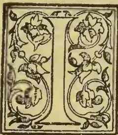

Once more engaging attention :

*Engineering* of August 21st has an interesting paper with "Estimates" referring to coffee planting in the valleys of the Chanchamayo and Perené, about which, a great deal can be learned in "Old

Colonist" 's book. I send you the paper for reproduction. "Old Colonist" will especially agree with the writer in describing Peru as one of the most favoured of countries in natural resources and climate—and only wanting an able Governor—a "Porfirio Dias" who has done so much for Mexico—to release her from being the victim of "political jackals"! The want of a proper labour supply is another drawback owing to the inveterate laziness of the *Cholas* (Indo-Spanish) who might do much to develop their country if they would only work. As it is, however, the estimates given for coffee gardens—on a small scale, however—shew such returns as would pay back all the capital outlay in the 6th year and leave an annual income thereafter of over £800 sterling from 20,000 coffee trees covering 10 "hectares"\* of a "Chacra" or coffee garden.

Four weeding or clearings a year are provided for and yet the coffee trees are only given 20 years of life if kept clear of weeds! Surely with care, 40 years might be counted on.

The valleys of the Chanchamayo and Perené, which were described in *Engineering*, vol. lviii., pages 474 and 507, are developing such importance as a coffee growing region that it may be of interest to give an outline of the work of developing *chacras* in that part of the world. The following details have been gleaned from several of the persons interested in coffee culture in the Chanchamayo valley, and all the districts on the eastern slope of the Peruvian Andes are worked in the same manner, the one illustration will apply to the whole territory.

To claim land for the purpose of cultivating it for coffee or other produce, it is necessary to "denounce" it before the Prefect of the Department. The person requiring the land must make his own survey and send in a plan with his petition. The land is divided into lots of fifty hectares (about 123½ acres), and the smallest claim that will be entertained is for one lot. On the other hand, if more than a certain number of lots are required, the petition must be made direct to the National Government.

There is no fee required, but the "denouncements" are usually written upon stamped paper, which, although not compulsory, saves considerable trouble in the future. It is also well to know how to shake hands with the officials properly, for they can do much to smooth the path of a land hunter and can place no end of obstacles in his way, if the interchange of animal magnetism is not carried out, through some metallic conductor, the colour of which has much to do with the intensity of the interest developed. One of the greatest impediments to the rapid development of the district is the want of official maps. The Government has utterly neglected this most important duty, and there is naturally a certain want of confidence among the people who would take up land, because they are afraid that in the future, when the boundaries have to be adjusted, the independent surveys will be found to have mixed up neighbouring properties. The Government does not even take measurements at the time of giving possession of the land to the claimant, so that the dividing lines have to be adjusted by the parties themselves. It is therefore more than probable that, as the district becomes more thickly populated, quarrels as to location of dividing lines will arise, and the lawyers will reap a rich harvest as soon as the season for litigation comes around.

Peruvians are for ever complaining of the poverty of the country, notwithstanding the fact that it is one of the most favoured in natural resources and climate. They have no one to blame but themselves. The Government at the capital is too busy fomenting or combating internal quarrels, and the interest of the people, who are really keeping the Republic alive, are relegated to the charge of tiptaking officialdom

\* The hectare equals 2.471 English acres.

313------------------------------------------------

296THE TROPICAL AGRICULTURIST.[Nov. 2, 1896.

whose combination of craft and ignorance is sufficient to ruin the richest nation on the face of the earth. When Peru finds her Porfirio Diaz as Mexico has done, she will advance, but as long as she is the victim of political jackals she cannot hope to take the position among nations that her undoubted natural wealth should give her.

The configuration of the Chanchamayo valley is admirably suited to the cultivation of coffee. On the slopes of the hills the temperature is just that required, and there is very little liability of the water lodging at the roots of the trees during the rainy season. In flat lands the humidity caused by too much moisture is detrimental to coffee plants, hence the advisability of selecting territory that has sufficient slope to insure perfect drainage. A sharp declivity is also bad, because the heavy rains cut away the subsoil rapidly and soon render the cleared hillsides sterile.

Deep soil is also necessary for the coffee plant, in order that its roots may develop to their fullest extent. For this reason the lands lying immediately on the banks of the Chanchamayoriver are unsuited to the cultivation of coffee, the soil being clayey and shallow. Besides this, the low valley lands abound in ants, which would soon attack and devour all the young plants.

Water is plentiful, as can readily be understood, and it can be conducted to nearly all the hill slopes with but little trouble or expense. Therefore, while for coffee cultivation artificial irrigation is unnecessary, or, in fact, not of much value, it can be utilised for other plants, such as those used for immediate consumption; and those intending to take up lands should always keep in mind that the water will have to be used for power when the time comes to put up machinery, &c., for preparing the coffee for market. At present all the machinery in the valley of the Chanchamayo is driven by water power, of which there is an abundance in the different rivers and streams.

The rains are heavy during the months of December, January, February and March; mists known as *aguaceros* are experienced in October, November, April, and May, and the other four months are completely dry: not dry as is known in England, but so dry that everything is parched up as if subjected to the heat of a great oven, the coffee plants lying solely by the moisture they are able to take up by their deep roots.

The question of labour is one that will have to be seriously faced very soon. Even now, at the very beginning of the development of the district, it has become necessary to enlist *chacra* hands in the more distant towns of Huancayo, Jauja, and Tarma, because the labour element of La Merced has thinned out considerably, and many of the workmen (?) prefer to live in a state of idleness than to do anything to help along the rising industry of coffee culture. The *cholas* (mixture of Indian and Spanish) who are brought from the towns on the sides of the mountains cannot stand the change of climate, and are for ever pining to get back to their homes again. It is really aggravating to see this human species sauntering about with their hands thrust in their pockets, totally oblivious to the fact that if they withdrew them and worked they would better themselves. They are a lazy lot, and will only work when they are captured like wild beasts and sent to the capital handcuffed, for the purpose of filling the ranks of the different regiments. Then they become abject slaves, and fight without really knowing what they are killing each other for. The sooner their generation passes away the better it will be for the country's welfare. Compared with the *chuncho*, or full-breed Indian, they are worthless as hands in clearing territory for coffee. The latter know how to use the axe and machete with great skill, and are used to work in the dense woods. However, as the *chunchos* are so few, the others are acceptable on the principle that they are better than nothing.

Their pay varies according to the distance they have to come, and ranges from 50 cents to one sol

per day. There also exists a certain custom of giving them three *copas*, or drinks of *chacta*, per day. *Chacta* is a strong liquor made from the sugar cane, before which the whiskey of the Indian outposts in the States would have to retire to the list of temperance beverages. They are also provided with a place to sleep in. The food they provide themselves; but if the owner of the *chacra* engages to supply them, he deducts 25 cents per day from their money. The *chuncho*, as has been stated, are much more to be preferred as workmen when preparing the land. They are perfectly acclimated, since they inhabit the adjacent forest, and they have not that constant anxiety to go to their homes. Arrangements with one or more of them can be made to clear a certain area of land, they taking in exchange all kinds of trinkets and articles, among which the shot-gun is the most highly prized. They also require their own *copas* of *chacta*, but do not require sleeping quarters, as they go to their homes every night.

When a *chuncho* takes a contract to clear a certain piece of land, he takes his own time to do it. When he goes to work, he does not play with the axe or machete—he works hard: but he may not turn up again for a day or two. If there are any shot-guns mentioned in the contract, however, the *chuncho* knows no rest until his work is finished and he receives the coveted prize. One difficulty with them is their language. But few of them understand Spanish, and it is necessary to have an interpreter: unless, indeed, the subject discussed is *chacta*, and then they can make themselves better understood by signs than they could through the most eloquent intermediary.

Referring to their love of the shot-gun, it can be said that they know the use of it very well, and some of them would be considered fair marksmen. They are, as is natural born hunters, and make good camp suppliers if they do not take into their heads to leave for parts unknown, with the shot-gun loaded them for the purpose of hunting. One of them, who understood Spanish, was asked how he managed to bring down a *paro del monte* (Mountain Turkey) so soon after leaving camp. He immediately went through a species of performance illustrating his crawling through the undergrowth until he saw the bird. He then sat down and gave a perfect imitation of the turkey calling its *mato*. He wound up the exhibition by saying "*Cara blanca* (whiteface) tries to go to Turkey. Turkey knows too much, so *cara blanca* has to travel very far, and when he makes a noise off goes the bird. I see my bird and then call him. He comes to be shot, and—boom!—down he goes. *Cara blanca es tonto*." The latter remarks are not complimentary to the paleface, being capable of abbreviation into Anglo-Saxon monosyllables.

Taking the work of the *cholo* by day hire and that of the *chuncho* by contract, there is an appreciable difference in favour of the latter, not counting the fact that there is a saving also in the trouble of superintendence. It is therefore a great pity that their number is so small, as their service could be utilised to great advantage.

There is another way of accomplishing the work of establishing coffee *chacras*, which is adopted by those having capital and who do not wish to undertake the work of clearing and planting themselves. It is by the employment of what are known as *mejoreros*. The *mejoreros* are men to whom the lands are handed over for a term of four years. They are also given the necessary tools, and are supplied with food during the whole period. At the end of the time stated they return the *chacra* to the owner in a perfect state of cultivation, the trees being sufficiently advanced to bear their first crop. The owner then pays them at the rate of 15 cents per plant, first deducting all the advances made for food, &c., nothing being omitted. A strict account of the advances is kept by both parties, and the balance is handed over to the *mejorero*.

314------------------------------------------------

Nov. 2, 1896.]THE TROPICAL AGRICULTURIST.297

There are some *mejoreros* who will take charge of the land for six years and not require any advances in the shape of provisions, &c., their profit being obtained from the crops between the fourth and sixth years. This, as can be imagined, is a good arrangement for the *mejorero*, as he will receive a large sum from the sale of the coffee. It would naturally be supposed that those men would open up their own *chacras* and permanently enjoy the fruits of their labour, but very seldom is this the case. When they have a number of *chacras* on hand, the deductions on account of provisions, &c., are very small, and they then make a handsome profit.

From an economical point of view, the employment of *mejoreros* appears much the cheaper way of obtaining a fully developed *chacra* with the least amount of attention; but it also has its drawbacks, due in the main part to the instability of the people with whom one has to deal. The operations necessary to prepare the land for the cultivation of coffee are as follows: First, the *roce* or felling of trees and cutting away of the undergrowth is done. This is the most laborious work, and needs men that not only know the use of the axe and machete, but also those accustomed to working where there are numerous venomous snakes and insects. The *chaupco*, or cutting up the branches and preparing the brush for firing, is then gone through. When the dry months set in, and everything is like tinder, the fire is applied and the whole area well burned. The ground is then cleared and the *calles* or streets formed, so that the plants can be located at equal distance from one another in regular order.

There are usually a large number of tree trunks left unburned, and these have to be cleared away, and also the roots extracted where necessary. The number of men employed will depend entirely upon the area it is proposed to put under cultivation, and it is difficult to figure with any degree of approximation the amount of labour that can be counted upon from the *cholas*. Their willingness to work is in inverse ratio to the cube of their capacity to absorb *chacta* and sleep.

As the burning can only be carried on during the dry months, the work of clearing generally extends over the whole year; but that time is not lost, because the young plants are maturing in their nursery in the meantime.

Taking 50 cents per day as a basis for labour, the estimates of the different processes would be:

<table>
<thead>
<tr>
<th></th>
<th>Soles.</th>
</tr>
</thead>
<tbody>
<tr>
<td><i>Roce</i> and <i>chaupco</i> per hectare (about 2½ acres)</td>
<td>65</td>
</tr>
<tr>
<td>Burning the rubbish .. ..</td>
<td>12</td>
</tr>
<tr>
<td>Making streets in which to plant the young trees .. ..</td>
<td>25</td>
</tr>
</tbody>
</table>

(The gold value of the sole is 2s. 21.)

When the above operations are performed, the land is ready for the *almacigo*, or transplanting the young trees. It is not customary to sow the seeds direct first because one year would be lost and secondly, as the fruit contains two seeds, the sprouts would have to be separated when they had developed, a process that would disturb and perhaps destroy the roots of the plant left standing. The seeds are therefore sown in a selected piece of ground before the clearing of the land is started, and the plants are ready, as has been stated, by the time that work is finished. The seed should be planted where there is no shade, because if the young plants are developed under the cover of the branches of other trees, they must be placed in a similar position when transplanted, otherwise they will suffer from the change to the light and direct rays of the sun. The distance generally fixed between the trees in the streets is 2 metres, so that each hectare will contain 2,000 plants.

The seed is the cherry, which contains two beans, each of which develops into a plant. These can be purchased at the rate of ten soles per quintal (21s 8d per 100 lb.). The expense of the nursery is very small, as the seeds are sown close together until the time for transplanting arrives. It is usually

estimated that the plants cost one cent each. The transplanting is done at the beginning of the rainy season, that is in November or the early part of December, and is a delicate operation, as the young shoots are very tender and will not stand much handling or rough usage.

The grounds, when planted, need four cleanings per year, which is estimated at 40 soles per hectare per annum. The harvest time commences in April and concludes about the end of August. The cost of collecting the fruit and preparing the coffee for the market averages about 80 cents for quintal (10½d. per 100 lb.), the machinery, tanks, &c., being considered in the general estimate.

The first crop of coffee is taken in the fourth year, and averages 1½ lb. per tree. After that the average of 2 lb. may be considered a fair one, as in some years they give less and in others much more.

After being cleaned, the coffee of this particular district holds good for about three months, after which it begins to bleach and get parched. It is therefore necessary to ship it at once to market. The prices paid in La Merced, at present, vary between 26 and 28 soles per quintal (Spanish), but it is best to place the figure at 26 soles for the purpose of estimating. The cost of production may be stated at 12 soles, without reckoning interest on the capital. The life of a tree is about 20 years, that is, if it is constantly attended and kept clear of weeds, &c.

Taking 10 hectáres as a *chacra* containing 20,000 trees, it will be seen how much expense is necessary to put it under cultivation, and how much profit there will be in five years, by the following estimates, which are based upon the practice of the district:—

<table>
<thead>
<tr>
<th></th>
<th>Soles.</th>
</tr>
</thead>
<tbody>
<tr>
<td><i>Roce</i> and <i>chaupco</i> 10 hectares at 65 soles</td>
<td>650.00</td>
</tr>
<tr>
<td>Burning .. ..</td>
<td>120.00</td>
</tr>
<tr>
<td>"Street" making .. ..</td>
<td>250.00</td>
</tr>
<tr>
<td>Cultivating and transplanting 20,000 plants at 1c .. ..</td>
<td>200.00</td>
</tr>
<tr>
<td>Cleaning land, &amp;c., four years at 40 soles</td>
<td>1,600.00</td>
</tr>
<tr>
<td>Harvesting and preparing 700 quintals at 80c. .. ..</td>
<td>560.00</td>
</tr>
<tr>
<td>Construction of house .. ..</td>
<td>100.00</td>
</tr>
<tr>
<td>Tools, &amp;c. .. ..</td>
<td>200.00</td>
</tr>
<tr>
<td>Construction and repair of roads .. ..</td>
<td>250.00</td>
</tr>
<tr>
<td>Maintenance, five years at 35 soles per month .. ..</td>
<td>2100.00</td>
</tr>
<tr>
<td></td>
<td>6030.00</td>
</tr>
</tbody>
</table>

Dividing the invested capital into four parts, and considering it at simple interest of 18 per cent. (the present bank rate):

<table>
<thead>
<tr>
<th></th>
<th>S.</th>
<th>S</th>
</tr>
</thead>
<tbody>
<tr>
<td>Interest on first portion ..</td>
<td>1507.50</td>
<td>= 271.35</td>
</tr>
<tr>
<td>.. second ..</td>
<td>3286.35</td>
<td>= 591.54</td>
</tr>
<tr>
<td>.. third ..</td>
<td>5385.39</td>
<td>= 969.37</td>
</tr>
<tr>
<td>.. fourth ..</td>
<td>7862.26</td>
<td>= 1415.20</td>
</tr>
<tr>
<td>Total interests .. ..</td>
<td></td>
<td>3247.46</td>
</tr>
<tr>
<td>Capital .. ..</td>
<td></td>
<td>6030.00</td>
</tr>
<tr>
<td></td>
<td></td>
<td>9277.46</td>
</tr>
<tr>
<td></td>
<td></td>
<td>Quintals.</td>
</tr>
<tr>
<td>Product of 20,000 plants at 1½ lb., fourth year .. ..</td>
<td></td>
<td>= 300</td>
</tr>
<tr>
<td>Product of 20,000 plants at 2 lb., fifth year .. ..</td>
<td></td>
<td>= 400</td>
</tr>
<tr>
<td></td>
<td></td>
<td>700</td>
</tr>
<tr>
<td></td>
<td></td>
<td>S.</td>
</tr>
<tr>
<td>700 quintals at 26s. .. ..</td>
<td></td>
<td>= 18,200.00</td>
</tr>
<tr>
<td>Capital and interest .. ..</td>
<td></td>
<td>= 9,277.46</td>
</tr>
<tr>
<td>Net profit .. ..</td>
<td></td>
<td>8,922.54</td>
</tr>
</tbody>
</table>

315------------------------------------------------

298THE TROPICAL AGRICULTURIST.[Nov. 2, 1896.]

For the years following the fifth the annual figures would be as follows:—

<table>
<thead>
<tr>
<th></th>
<th>S.</th>
</tr>
</thead>
<tbody>
<tr>
<td>Cleaning (weeding) land ..</td>
<td>400.00</td>
</tr>
<tr>
<td>Harvesting, &amp;c., 400 quintals at 80c. 320 00</td>
<td>320 00</td>
</tr>
<tr>
<td>Tools, &amp;c. ..</td>
<td>25.00</td>
</tr>
<tr>
<td>Road repairing ..</td>
<td>50.00</td>
</tr>
<tr>
<td>Maintenance ..</td>
<td>420.00</td>
</tr>
<tr>
<td></td>
<td>1215.00</td>
</tr>
<tr>
<td>Interest at 18 per cent. ..</td>
<td>218.70</td>
</tr>
<tr>
<td></td>
<td>1433.70</td>
</tr>
<tr>
<td>Product of 20,000 plants at 2 lb. = S</td>
<td>S</td>
</tr>
<tr>
<td>400 quintals at 26s. ..</td>
<td>10,400.00</td>
</tr>
<tr>
<td>Total expense for one year ..</td>
<td>1,433.70</td>
</tr>
<tr>
<td>Profit ..</td>
<td>8,966.00</td>
</tr>
</tbody>
</table>

It will now be seen that by employing the *mejorero's* services there is a large saving, for they will have to pay the latter 3,000s. for 20,000 plants in their third year, and will not have all the expense stated in the above estimate.

Contracting the land out of his possession after six years would mean that the *mejorero* obtains a large profit, for the expenses would be 10,711.16s., while the receipts for coffee would reach 28,600.00, showing a clear profit of 17,888.84 soles.

The sale of the coffee at a La Merced is practically compulsory, because there the people have facilities of sending it on mule-back to Tarma, or to Arroya, where it is transferred to the train for shipment to Callao. To endeavour to send the coffee direct to the shipping port would under the present circumstances be simple madness, as the competition of the carriers would soon ruin any one who made the attempt, unless he was backed by plenty of capital. It is sad to see a territory so rich utterly neglected by a Government that is striving to keep its head above the sea of financial difficulties in which Peru has been drifting. Nothing has been done to improve the means of communication with the outer world, and therefore there are no inducements offered to people to go and take advantage of the resources that lie within a comparatively short distance of the coast line. The district is developing, it is true, but it is doing so against all the drawbacks that could possibly be encountered: an indifferent Government playing into the hands of those who place obstacles in the way of advancement, in order to reap all the benefits of the labour of others.

## BIBLIOGRAPHY OF COFFEE.

(Continued from page 225.)

N., R. V. Natuirkundige &c. [See under TEA.]

Nahuys, Alphonse Johan Bernard Horstmar. Baron. See *Multatuli*. 1868. 80.

Nahuys, Kol. Missive over den toestand der culturen, vooral der koffij-cultuur in de Vorstenlanden, &c. [1822?] fol.

Naironus, Antonius Faustus. De saluberrima potione Cahue, seu Café nuncupata discursus. Romae. 1671. 120. [180.]

Naironus, Antonius Faustus. Discorso della salutifera bevanda Cahve, o vero Café... Trasportato della Latina... da E. F. Veglin. Roma. 1671. 120.

Naironus, Antonius Faustus. See *Usage*. De l'usage du Café [founded on the discourse of A. F. Naironus: Du saluberrima potione Cahue, &c.]. 1671. 120.

Naironus, Antonius Faustus. A Discourse on Coffee: its description and virtues. [Translated by C. B.] London. 1710. 80.

Natural History. The Natural History of Coffee, &c. [See under TEA.]

Nature. The Nature of the drink Kani, or Coffee, and the berry of which it is made: described by an Arabian physician. [Translated by E. Pocock.] Arab. and Eng. 1659. 80.

Newbert, I. Der Kaffee. Würzburg. 1838. 80.

Neuenhahn, Carl Ludwig. Vermischte Bibliothek ... [XXIII. Abhandlung. Vom Schaden des Coffee.

J. N. Grimmann. 1730. Halle.] ... Braunschweig 1755-60. 80.

Neuhof, Wilhelm. Der Kaffee, &c. [See under TEA.]

Neumann, Caspar, Chemst. Lecciones &c. [See under TEA.]

Neumann, Caspar, Orientalist. Bigam Difficultatum physico sacrarum: de gemmis Urim et Tummim dicitur, et de Cibo Samariae obsessae, una cum responsione ad quaestionem amiei, num potus Caffè dicti, aliquo in Sacris dentur vestigia, &c. Wratislaviae. 1707. 40.

Nicholls, Henry Alford Alford. On the cultivation of Liberian Coffee in the West Indies. Silver & Co. London. 1881. 80.

Nicol, Robert. A Treatise on Coffee: its properties, and the best made of keeping and preparing it. 2nd edn. London. 1831. 80.

Niemeyer, Paul. Behr'scher Gesundheitskaffee. [Reprinted from his "Aertzliche Sprechstunden," VII.] Jena. [1880?] 120.

Nietner, J. The Coffee Tree and its Enemies. "Observer Press." Colombo. 1872. 80.

Nietner, J. [Second edition.] Revised and in some places corrected by Mr. S. Green, with an appendix containing Mr. Abbey's paper on Coffee Leaf Disease and other information. Colombo. 18—. 80.

Nöthlich, Johann Wilhelm. Die schmalblättrige Lupine und der Lupinen- und Gesundheitskaffee. Leipzig. 1811. 80.

Nuescheler, Felix [or Vogel, Chr. Henr.?] Das Kaffeehaus, oder vermischter Abhandlungen einer Wochenschrift. Aus dem Italienisch. Zürich. 1769. 80.

Obidennikoff, E. O vlijanii kofe na kolichestvo i kolichestven sostave moloka. [Influence of coffee on lactation.] St. Petersburg. 1871. 80.

Offret, —. Observations sur l'action physiologique du Café selon ses diverses torréfactons. Nantes. 1862. 80.

Onslow, —, Colonel. On Mysore Coffee Planting.

Ollebeu, Fr. Ber. De potus ex Coffeae seminibus parati noxio effectu. Helmstadii. 1870. 40.

Oud-Koopman. De West-Java-Koffij-Cultuur-Maatschappij, beoordeeld door een Oud-Koopman. Amsterdam. 1865. 80.

Owen, Theodore C. First Year's work on a Coffee Plantation. [Being the Essay which received the second prize from the Ceylon Planters' Association, in 1877.] A. M. & J. Ferguson. Colombo. 1877. 120.

Owen, Theodore C. Essay on Buildings in Connection with Coffee Cultivation. London. 1879. 80.

Owen, Theodore C. Tea, Coffee, &c. [See under TEA.]

P., F. F (ranciscus) P (etersen) de potu Coffi. Francofurti. 1666. 40.

P., G. V. Coffee and Tea. [See under TEA.]

P., H. A Character of Coffee and Coffee Houses. 1661. 40.

Palmer, Edward. Poisonous Tea. Trial of Edward Palmer and others. Attorney-General vs. Palmer and others. London. 1818. 80.

Paret, Jules Alexandre. Quelques résultats obtenus par l'emploi du valériane du caféine. See Academies.—Paris—École de Méd.—Colln. de Thèses—an 1874. tom. 13. 1839. &c. 40. Paris. 1875. 80.]

Paris, Café Parisien. Le grand Café Parisien, le plus grand Café du monde, une des curiosités de Paris. [Built by Chas. Duval.] Paris. 1856. 80.

Pauli, Simon. A Treatise &c. [See under TEA.]

Peelen, H. I. E. Eenige Opmerkingen omtrent de Koffiebladziekte. Batavia. 1888. 80.

Pinilleau, A. Du Café. See Acad. — Paris—École de Méd.—Coll. des Thèses, an 1861. tom. 7. 1839 &c. 40.

Penilleau, A. [Another Copy.] Etude sur le Café au point de vue historique, physiologique, hygiénique et alimentaire. Paris. 1864. 80.

Pennetier. Le Café. 1878.

Perego, Stefano. Il Caffè considerato in rapporto all' agronomia, all' igiene, ed al commercio, dissertazione, &c. Pavia. [1830.] 80.

Paretti. Beiträge zur Toxicologie des Kaffeein. pl. 1875.

316------------------------------------------------

Nov. 2, 1896.]THE TROPICAL AGRICULTURIST.299

*Periodical Publications. Brescia.* Il Caffè, ossia brevi et vari discorsi, &c. [By A. Verri, L. de Baillon, C. Beccaria, &c.] 2 tom. Brescia. 1765, 66. 40. [Venezia. 1766. 80. Milano. 1804. 40.]

*Periodical Publications. London.* The Coffee Public-House News. [Illustrated.] Nos. 1-124. London. 1878-87. fol.

*Periodical Publications. London.* The Humours of a Coffee House: a comedy [in prose. By Ed. Ward.] 7 Nos. London. 1707. 40.

*Periodical Publications. Madrid.* El Cafe' suizo. [Festivo.] Madrid. 1865.

*Petit, H. M.D.* De la prolongation de la vie humaine par le café. Deuxième édition. Paris, Château-Thierry. 1862. 80.

*Petöey, Mihály.* Ueber die Schädlichkeit des Kaffee-trinkens. Pressburg. 1817. 80.

*Petresco, —.* Sur l'action hypercinétique de la caféine à hautes doses ou doses thérapeutiques. 1890.

*Peyma, J. I. W. B. von.* [See under TEA.]

*Pfuhl, J. M.* Das Pfund Kaffee einen Groschen, oder gründliche...Anweisung, wie...Kaffee-Surrogat erzielen kann. Bautzen. 1839.

*Philippi, P. Johann Alb.* Briefe über verschiedene Gegenstände der Haatsirthschaft. [Der erst Brief vom Coffee ist...abgefasst.] Berlin. 1770. 8e.

*Philips, J.* The Inquisition: a Farce acted at Child's Coffee House, &c. 1717. 80.

*Physiologie.* Physiologie des Cafés de Paris. Paris. 1841.

*Piddington, Henry.* A Letter to the European Soldiers in India on the substitution of Coffee for spirituous liquors. Calcutta. 1839. 80. [? 1855.]

*Picpenbring, G. H.* Deutscher Kaffee &c. [See under TEA.]

*Plaz, Anton Wilhelm.* De potus Coffeae abusu, Catalogum morborum augente, Lipsiae. 1733. 40. [1751. 40.]

*Ples, D.* Nog iets over het op stomp kappen van koffij boomen. [Batavia. 1875.] 80.

*Pocock, Edward.* Canon. See *Nature*. The Nature of the drink Kaui or Coffee, &c. 1859. 80.

*Poemata.* Poemata Didascalica. 3 tom. [Tom 1. Carmen Caffæum. Guillaume Massieu.] Parisiis. 1749. 120.

*Polli, Pietro.* Alimenti nervosi, &c. [See under TEA.]

*Poore, G. F.* Coffee und Tea. [See under TEA.]

*Prestoe, H.* Report on Coffee Cultivation—Dominica. 1875.

*Prins, H. J.* De Oeriet-plaag in de koffietuinen op Java. [Containing the Dutch translation of some extracts of R. C. Haldane's "All about Grub" &c.] Enschede. 1885. 80. [The British Museum Catalogue gives this wrongly under TRINX, H. J.]

*Propper, —.* Der Kaffee-und Theetisch.

*Quarme, Edgar A.* (Coffee) Leaf-Disease, its Cause and Antidote. 1884.

*Quélus, de.* Histeire Naturelle du Cacao et du Café...observations curieuses et utiles. 228 pp. et 5 planches. Amsterdam. 1720. 80.

*Quëstion.* La Quëstion der Café. Le Cafe' du Brésil, &c. See *Brazil*. Paris. 1883. 80.

*Raffel, H.* Map of the Central Province of Ceylon, exhibiting the Situation of the Coffee Estates. London.

*Rambaldi, Angelo.* Ambrosia Arabica: cveio della salutare bevanda Café. Bologna. 1691. 120.

*Rape.* Rape upon Rape: or, the Justice caught in his own Trap. A comedy, by H. Fielding. London. 1730. 80. [Afterwards printed under the title of "The Coffee House Politician."]

*Rasia.* Sulla vera azione del Caffè nell' uoma sano e malato. Padova. 1839. 80.

*Redi, Franciscus.* Epistola de potu Coffeae. [In Giorn. de Letter. Suppl. III.]

*Reid, John.* Remarks on W. Law's system of gulling the public. By a Coffee-Bibber. [J. R.] Edinburgh. 1831. 120.

*Rellum Nestem.* Cafe' Chantant. Verzameling van twintig nieuwe corspr. Chansonnetten. Amsterdam. 1874. 160.

*Renton, (Alexander) Vantosky.* Coffee Blossom and other poems. pp. VII, 125. A. M. & J, Ferguson. Colombo. 1886. 80.

*Renton, (Alexander) Vantosky.* Coffee Blossom: a Poem. By "Quinquina." Colombo. 1882. 120.

*Reports.* Reports of the Committee on Sugar and Coffee Planting. Supplements and Index. 1847-48.

*Riant, Ariné.* Le Café, &c. [See under TEA.]

*Richet, Ch.* Les Poisons de l'Intelligence. L'alcool, le chloroforme, le bachich, l'opium, le café. Paris. 1877. 120.

*Richter, D.* Nützliche und vollständige Abhandlung vom Coffee. Stargard. 1738. 40.

*Richter, Johann Georg.* Untersuchung vom Coffee. 1728. 40. [Vielleicht des nämliche so anno 1738 angeführt ist. See *Richter, D.*]

*Riegel.* Therapeutische Verwendung des Cafféins préparat. 1884.

*Robin, L.* Mémoire sur le Cafe', sa culture, son commerce, &c. Abbeville. 1864. 180.

*Robinson, Edward Forbes.* The Early History of Coffee Houses in England with...a bibliography... with illustrations. London. 1893. 80.

*Roggen-Kaffee.* Anleitung zur Bereitung...des sogenannten Roggen-Kaffee's, &c. Ulm. 1836. 80.

*Roggen-Kaffee.* Bereitung des besten Roggen-Kaffee's. Verlags expedition. Grimma. 1836.

*Rolow, B.* Deutsche Kaffee und Zucker, oder der Cultur des *Astragalus beticus* (der sogen. Schwed. Kaffee-wicke), &c. Hersfeld. 1828. 80.

*Romer, Arthur.* Remarks on the medical treatment of Malabar coolies in Ceylon. Written for the use of managers...of [Coffee] Estates, &c. [London.] 1849. 120.

*Romers, Matías.* Cultivo del Cafe en la Costa Meridional de Chiapas.

*Rosee, Pasqua.* The Vertue of the Coffee Drink, first publicly made...by P. R. London. [1666?] s. sh. fol.

*Rossignon, Jules.* Enciclopedia Hispano-Americana. Manual del cultivo del café, cacao, vainilla y tabaco, &c. Paris. 1859. 120.

*Rostan, E. M.* De Faba Caffeae. [In Acta physico-mathematica Societatis Helveticae. Tom. V.] 1762.

*Rottenhüfer, J.* Der elegante, &c. [See under TEA.]

*Rumsey, W.* Organon Salutis. An instrument to cleanse the Homach, as also divers new experiments of tobacco and coffee. London. 1657. 80. [2nd. edn. 1659. 3rd. edn. 1664.]

*Russe, Petrus.* Schatz, &c. [See under TEA.]

*Ryhiner, Guil.* De elementis Caffeae. [In Acta physico-mathematica Societatis Helveticae. Tom. V.] 1762.

*Sabarthey, Henri.* Thèse...E'tude physiologique du cafe. See Academies-Paris.—E'cole de Méd...Collection des thèses. An 1870. tom. VII. 1839. &c. 40.

*Sabonadière, Wm.* The Coffee Planter of Ceylon. Guernsey. 1866. 80. [Second edition, enlarged and revised. London. 1870. 80. (? 1871.)]

*Saeny, N.* Enfermedad del Cafeto. [Reproducido en el Boletin del Minist. de la Republica del Salvador. No. 1 Marzo. 1893.]

*Saint-Yon, Antonius de Praes.* See *Le Clerc, A.* An ab immoderato potu decocti Cafe' sterilitas? [1695.] 40.

*Saint-Arroman, A.* De l'action du cafe', &c. [See under TEA.]

*Saltero, Don.* A Catalogue of the rarities to be seen at Don S's Coffee House, &c. [1770?] 80. [Also 1782? 80.]

*Salubrité.* De la Salubrité du Coffe'. Geneve, 1771. 120.

*Samarang.* Verslag over de koffij-cultuur in de Residentie Samarang over 1846. [Manuscript de 100 pp.] fol.

*Samarang.* Stukken, brieven, statistieken enz. betreffende de koffiecultuur in Cheribon, Probolingo, Samarang, enz., 1837-6. [Manuscript d'environ 600 pp.] fol.

*Schatzkammer.* [See under TEA.]

*Scheeler, Karl Ernst Friedrich von.* Kaffee- und Zucker-Surrogate, oder gründliche Anweisung verschiedene Arten Getränke zu bereiten Eslingen. [1814?] 80.

*Schmidt, P. D.* Beschreibung des besten Baues der Cichorien-Kaffeewurzel. Halberstadt. 1824.

317------------------------------------------------

300THE TROPICAL AGRICULTURIST.[Nov. 2, 1896.]

*Schmolck, A. W. von.* [See under TEA.]

*Schoeffler, C. H.* Der Caffeehandel. Amsterdam 1858-9. 80.

*Schoeffler, C. H.* El Comercio de Cafe'... Traducido del Aleman por... D. B. Urbancj. Caracas. 1869. 80.

*Schoeffler, L. W.* Open brief (over de verkoopswijze der Gouvernements-koffij). Rotterdam. 1877. 80.

*School.* The School of Politicks: or, the humours of a Coffee-House. A poem. London. 1690. 40. [Second edition. 1690. 40.]

*Schorlemmer, P.* Occurrence &c. [See under TEA.]

*Schotel, G. D. J.* Letterkundige bijdragen, &c. [See under TEA.]

*Schrader, G. H. C.* Dissertatio de potu Coffeae. Rintel. 1767.

*Schreiben.* [See under TEA.]

*Schroka, D. G.* Kaffee und Tabak, über eine Aufruf an deutsche Bürger. Breslau. 1799. 120.

*Schwarzkopf, S. A.* [See under TEA.]

*Scotch Woman.* Comedia nueva. En Escosesa, &c. See *Arouet de Voltaire.*

*Seribe, Augustin Eugène* [et *Dupin, J. H.*] *Le Cafe'* des Variétés: comédie-vaudeville.

*Sedlaezek, Johann.* Kurzgefasster... Unterricht über den Anbau der Erdmandel, und über den Gebrauch derselben, staff des Kaffee's, &c. Leipzig. 1810. 80.

*Segur, Henry, M.D.* Coffee, its uses and medicinal qualities. Mayaguez, Porto Rico. 1881. [See Tropical Agriculturist. Oct. 1. 1881. p. 341.]

*Seibt, Ant.* Auleitung zur Kultur der vorzüglichen Gewebe und Getürzpflanzen, Caffeesurrogate, &c. Prag. 1831. 80.

*Serer, Joseph.* Lettera sopra la bevanda del Caffè' Europæo. Verona. 1730.

*Sestini, Fausto.* Il caffè: lettura fatta nell' istituto tecnico di Fochi. Firenze. 1868. 80.

*Shortt, John, M.D.* A hand-book to Coffee Planting in Southern India, &c. Madras. 1864. 80.

*Sigwart, Georg Friedrich.* Quaestiones Medicee Parisinae. [Fasc. 2. Coffee.] Tübingae. 1759-60. 40.

*Silander, Johannes.* De cultu Coffeae in Surinamia, cum arboris descriptione. 1757.

*Simmonds, Peter Lund.* Coffee and Chicory: their culture, chemical composition, preparation for the market, &c. London. 1864. 120.

*Simmonds, Peter Lund.* Coffee as it is, and as it ought to be. London. 1850. 180.

*Sinclair, Arthur.* How I lost my Wattie, or Life in Ceylon, and the Coffee planting experience of an Auld Scotchman. Colombo. 1878. 80.

*Sinclair, Wm. Japp.* Beverages, &c. [See under TEA.]

*Skene, William.* Mountain Life and Coffee Cultivation in Ceylon: a Poem on the Knuckles Range. London. 1870. 40.

*Smid, H. Johan.* Handboek voor de kultuur en bereiding der koffie in Oost-en West-Indië. Derde druk. Middelburg. 1884. 80.

*Smithies, Wm. Rector.* The Coffee House Preachers: or High Church Divinity corrected. Being a sermon [on Ps. XCIV. 16] &c. London. 1706. 80.

*Smyth, Philip, LL.D.* The Coffee House: a characteristic poem. 1795. 40.

*Sophie, Sybille.* Die prophetische Kaffetasse. Jena. 1765. 80.

*Spall, P. W. A. van.* Verslag over de Koffij-en Kaneel-kultuur op het Eiland Ceylon, in het jaar 1861, &c. Batavia. 1863. 80.

*Spanish Theatre.* El Teatro Español, ó colección de dramas escogidos de L. de Nega, &c. [tom. 4. El Cafe'.] Londres. 1817-21. 80.

*Sparschuch, Henricus.* Resp. Potus Coffeae. See *Linnaeus, C.* Amoenitates academiæ, &c. Vol. 6. 1749. &c. 80. [1761. Upsaliae. 40. 1787. &c. 80.]

*Spiers and Pond.* Opinions of the Press on Messrs. S. & P.'s Management of the Café de Paris, Melbourne, &c. Melbourne. 1861. 80.

*Spon, Jacob.* Bevanda Agiatica, &c. [See under TEA.]

*Spy.* New London Spy; or a Modern Twenty-Four Hours' Ramble through the Metropolis... including a Description of Gaming Houses, ... Coffee Houses, Tea Houses, &c. London. 17—. 80.

*Stahl, Iro Johann.* Dissertatio de use et effectibus potus Caffèe. Resp. *Woymode.* Erfordiae. 1751. 40.

*Stainbank, H. E.* [See under TEA.]

*Steck.* De cultuur der Liberia-koffy. 1879.

*Steinmentz, C. P. C.* Handleiding voor de gouvernements-koffij-kultuur. Soerabaya. 1865. 80.

*Stempel, A. A. van der, Jr.* Het Cafe' Chantant. Verzameling van komische voordrachten, completen, duetten, &c. ... Met... muziek. Dev. 1872. 80.

*Stevenson, M.D.* Advice &c. [See under TEA.]

*Steventon, Jas.* Treatise &c. [See under TEA.]

*Stranss, Laurentius.* De potu Coffe'. Francof. 1666. 40. [French trans. by *P. Sylvestre Dufour.* Lyon. 1671. 120. English trans. by *J. Chamberlayne.* 1685.]

*Stroner, Theodor.* See *Multatuli, pseud.* Max Havelaar... Deutsch von T. S. 1875. 80.

*Stuhlmann, J.* Beiträge zur Kenntniss des Kaffeeins. Marburgi. 1856. 80.

*Suermond, G.* See *Loudon, H. Hope.*

*Suermond, G.* West-Java-koffij-cultuur-maatschappij verdedigd tegen den referent in de "Economist." Amsterdam. 1865. 80.

*Suermond, G.* West-Java-koffij-cultuur-maatschappij. Het advys der Kamer van Koophandel to Batavia, de "Oud-Koopman" enz. wederlegd. Amsterdam. 1866. 80.

*Sugar Question.* The Sugar Question, a digest of the evidence taken before the committee on sugar and coffee plantations, moved for by Lord G. Bentick. By one of the witnesses, 2 pts. in 1 (E. & W. Ludies, Mauritius, &c). London. 1848. 80.

*Sugg, William T.* Coffee and the application of Gas to Coffee-Roasting. London. 1884.

*Swan, W. A.* Labour Laws of Ceylon and the Relations between the Planters and Coolies on Coffee Estates. "Observer" Press. pp. g. [For Private Circulation.] Colombo, 1885. 80.

*Sydserf, Thos.* Tarugo's Wiles: or, The Coffee House. A comedy. London. 1668. 40.

*Sylvestre Dufour, P.* [See under TEA.]

(To be concluded).

## CARDAMOMS IN COORG.

The Cardamom cultivated in Coorg is the *Elettaria Cardamomum*, and although the trade, so far as native cured fruit is concerned, is steadily falling, still the cardamom is an important article to the people and is certainly the cause of much thought and anxiety to the Administrators of this little Province.

I will not give any botanical description of the cardamom in this article nor will I refer to the other kinds which are not utilised, but endeavour to give an idea of the habitat of the plant and the methods of curing it followed by the people, with a few remarks on the state of the cardamom trade.

The cardamom grows best on the Western and Northern slopes of the ghats at an elevation of from 3,000 to 5,000 feet above the sea. Here the full burst of the monsoon strikes the steep sides of the hills and the rainfall reaches as much as 300 inches in some parts. It grows spontaneously but is one of those peculiar plants, the seed of which lies dormant till induced to germinate by the occurrence of certain conditions. One of these is the admission of light. Cardamoms will only be found in the dense evergreen forest, and the ordinary method of inducing them to appear is to open a small space in the forest by felling one or two very large trees. Not only does this admit the light but the fall of the trees shakes the ground and breaks the surface. So thoroughly is the necessity for the shaking of the ground believed in, that when a plot is selected, all undergrowth, small trees, &c. which might interfere with or break the fall of the giant selected for destruction, are cleared away so that the tree may descend with all its weight and momentum: and to intensify the effect the tree is always felled so as to face down hill. As these plots are almost

318------------------------------------------------

Nov. 2, 1896.]THE TROPICAL AGRICULTURIST.301

invariably situated on the steepest hills, the effect of the fall of one of the enormous trees so common in the Ghat Forests must be very grand.

A Cardamom Estate is called a "male" and the ordinary method of cultivating a "male" among the Coorgs, is to open out a certain number of these plots within the limits of the same. The plots are necessarily small, for only a limited amount of light is required and a plot too large, in addition to admitting too much light, would also allow of evaporation from the soil to an injurious extent. In the leases given for "males" the maximum size of each plot is fixed at one-sixth of an acre and at least thirty feet of forest must be left between any two plots. As a rule not more than two trees are felled and oftener only one. The felling generally takes place in February or March in the year and by the rains the young plants shoot up. They require weeding at least once before they begin to yield, which takes place in the third year. The plant continues to bear for seven or eight years, the fourth and fifth and sixth of its age being its best. When it begins to cease bearing, either a new plot is selected or another tree is felled which seems to give a fresh start to the plant.

The position of these "males" is generally so remote and inaccessible that the picking of the crop is undoubtedly no easy task. In fact, the Coorgs lose a large proportion of the crop, for the fruit begins to ripen as early as July, while they never attempt to pick before well into September. The tremendous rainfall not only, in itself, deters them from penetrating the hills, but renders the numerous streams and torrents impassable. Indeed, on the exposed slopes of the Ghats, life wood scarcely be liveable in the height of the monsoon. As it is, the leeches in these forests throughout the autumn and cold weather months must be seen to be appreciated, and in addition to these drawbacks, the steepness of the hills is such that walking is difficult. When climbing about these "males" one can quite comprehend the feelings of a fly walking of the side of a house.

The cardamoms are picked and sun-dried. If the male is far from the village, the drying takes place on the spot, otherwise the capsules are taken home. Four days sunning is sufficient, care being taken that they do not get wet and that they are not over exposed, as this latter would cause the capsules to burst. But beyond this open air drying, no further curing takes place. The fruit stalks are rubbed or picked off. In this part of the process, it is wonderful the number of capsules a practised hand will clean in any given time. The capsules are then assorted according to size and colour and stored away till disposed of. But a better system of both cultivation and curing has been introduced into Coorg by an English planter in the ghats. I am much indebted to Mr. Finlayson for his having put at my disposal the necessary information concerning his treatment of cardamoms. In the first place, the cardamom plant is raised from seed in a nursery and the plants are put out in a compact plantation, instead of being allowed to grow spontaneously in scattered clearings. The first step is to prepare the area which is to be made into a cardamom plantation. This is done by thinning the shade. The amount of thinning can only be determined on the spot and is guided by experience. The aspect chosen is generally North or North West and the most favourable places are the moist hollows and ravines. The undergrowth is cleared, and planting is done in June and July, from nursery plants raised from seed, supplemented by bulbs from old stools. Mr. Finlayson prefers the latter as growing better. The plants are put out at 7 feet by 7 feet, not deep in the soil. The plants are put into shallow pits which have been filled with surface mould, the soil is pressed round the half exposed bulb and the plant tied to a stake.

These Cardamoms yield a small crop the third year after being put out and they do not come into full bearing until the fifth year, thus there is

no advantage in time in this method of cultivation. The yield then is about half a seer to each plant. Thus an acre would give about 475 seers, or say 950 pounds; under half a ton. The picking lasts from July to January, September and December being the busiest months. The first crop always yields the largest fruit.

Before proceeding to give Mr. Finlayson's method of curing, I will venture on a comparison of the advantages resulting from the two systems of cultivation, the native one by means of isolated and scattered openings in the forest, and the English one of a regular plantation. As to the former, the only advantage that can be claimed, and I am not certain that the claim should be allowed—is that it does less harm to the forest which, as the Ghaut Forests should be preserved for climatic reasons, is a very important point. Mr. Dickinson, whose knowledge of the conditions of cardamom cultivation owing to his personal inspection of the males and ghaut forests is unique, is in favour of the native method on the ground of less damage being done to the forest. He argues that the partial clearing of the high forest over a comparatively large area accompanied by the removal of the undergrowth, tends to set up scouring and that the soil will be all washed away. But the drawback to the native system is the difficulty of supervising the work and of enforcing the rules as to the size of the plots and the width of the belt of forest to be left between each plot, and though it is in the interest of the male holder not to open the forest to too great an extent, it is a question whether, with the low prices ruling in the cardamom market, the urgent necessity of raising a large crop will not, and does not, tempt male holders into over-felling, leaving the future to look after itself. Where a forest has been over-felled under the native system, the damage is practically irreparable. It is with very great difficulty that I differ from one so well up in the subject as Mr. Dickinson, but I have seen both systems of cultivation and taking all the conditions obtaining, I am decidedly in favour of the English method of cultivation, as it is more easily and effectually supervised, it concentrates the damage done into a smaller area, the crop is more easily and more cheaply picked and the whole working of the estate more in accordance with science.

Mr. Finlayson dries the capsules partly by exposure to the sun and partly by artificial heat. The former is the better method, but, owing to the uncertainty of the weather, the latter, in the end, pays better. The cardamoms are bleached by exposing them to the dew for a couple of nights and then fumigating them with sulphur. Mr. Finlayson is naturally somewhat reticent as to the process his cardamoms pass through, for the supply is large and the market restricted and the competition from Ceylon, Travancore and Mysore is keen. Before picking, the capsules are carefully sorted and clipped. I am unable to give the cost of cultivating, picking and curing the cardamom under this system. It is finally packed in boxes and sent to the market.

The price of cardamoms has been steadily diminishing of late years, Rs. 14 to perhaps in a few instances Rs. 18, per maund of 28 lbs., is the average selling price of native cured cardamoms. The English cured sell from Rs. 1.8-0 to Rs. 2.4-0 per lb. The system in force in the days of the Coorg Rajas as regards the disposal of cardamoms was that the whole crop was handed in to the Government, who paid the cultivators a fixed price per maund and sold the crop for itself. The price paid was from Rs. 12 to Rs. 20, per maund. This was continued after the annexation of Coorg until 1846, when the males were put up to auction and they are now leased, tenders being invited for a certain period of years. There is another class of male in Coorg the Jama male—the holders of which have a right to the produce on payment of rent which is assessed on the estimated yield.

319------------------------------------------------

302THE TROPICAL AGRICULTURIST.[Nov. 2, 1896.

The prospects of the native cardamom cultivators are extremely gloomy. Owing to several causes, the cultivators have been having a bad time of it lately. Falling prices, the enfranchisement of their slaves which necessitates payment of labour, and bad seasons, have all combined to render it impossible for many of the lessees to pay the rent they covenanted to six years ago. So bad has been their condition that the Local Government has had to allow a large number to resign and the condition attached to the acceptance of the resignation *viz.*, the payment of all arrears, has been found difficult to enforce.

It is a matter of extreme regret that a comparatively large number of families should lose their principal means of livelihood, but it is useless for the State to endeavour to oppose the laws of economics. Want of capital prevents these small male holders from cultivating and curing their cardamoms in a paying way. The overturn is so poor in quality that it necessarily fetches a very low price when the beautifully cured capsule of the English grower is competing with it, and the problem will soon work itself out with this result, that the producers of native cured cardamoms will become fewer and fewer, until the produce they put on the market only suffices for the demand. For, strange to say, despite its inferior value and condition, there is still a demand for this kind and always will be, as long as there are people who, though desirous of purchasing, can only afford to pay low prices and must therefore, porforce, put up with an inferior article. The slow extinction of the male holder is a serious loss to the Forest Revenue, but, I fear, go he must, and the Department must look around for some fresh source of revenue to make us the deficit.

G. H. FOSTER.

*Indian Forester.*

### SILK FROM TIMBER.

Applied science is rapidly undermining the few scraps of sentiment that are still associated with our daily life. The scents that we fondly imagine to be distilled from the sweet breathing children of Flora are in reality extracts from coal tar, and even worse. The raspberry flavour in our confectionery is a product of benzol, with a name about thirty syllabos in length; essence of pineapple is just acetate of some dreadful hydrocarbon compound. Finally, our silks and satins, once spun from the dainty gossamer of the silkworm, are henceforth to be got (paradoxically) from cotton, sawdust, timber, wood pulp, and such like unsentimental sources. The Society of Chemical industry met and gloated over this last fact the other evening. The process has already made such strides in France that many of the extra-gorgeous silks in Regent Street this season are said to be spun from liquid timber. Science is never content with equalling nature; she likes to go one better, and so the new timber silks are much more glossy than those of the ancient worm and take richer shades of (aniline) dye. It is interesting to learn, however, that in nearly every detail of his new silk-making process the chemical engineer has simply imitated nature. The gossamer of the silkworm, the spider, and the rest of the spinning invertebrates is really nothing but a kind of natural liquid gum or varnish exuded from fine pores of microscopic aperture. If you want to see how a sticky liquid can be drawn out into threads you have only to dip a needle into treacle or syrup, and pull it gently out again, slightly twisting the sticky thread at the same time. Only, the sticky threads that ooze out of the spinning ducts of the silkworm are so fine that you can hardly see them without a lens, and they have the advantage of instantly drying into a delicate elastic fibre. When a considerable number of these are twisted together we get the well-known filament which the silkworm uses to wrap round her cocoon and the spider to weave her web.

Now the chemist has imitated this sticky fluid which is so easily drawn into microscopic threads and instantaneously dries as it escapes into the air. He first of all prepares a kind of gun-cotton by treating cotton or wood-fibre with nitro-sulphuric acid, just as if he were going to make smokeless powder, or celluloid, or other lovely modern product. Then he stews this in cylinders for some ours with alcohol and ether, which practically converts it into collodion. The latter emerges as a sticky fluid, like thick gum. This is pumped through pipes to spinning machines, and emerges at each machine from a fine glass nipple. Each nipple answers to one of the pores of the silkworm. Some ten or twelve delicate threads are drawn from these nipples, combined together and spun into a thread no thicker than human hair. You have now a fine tough thread composed of a sort of dried gelatine, which is somewhat akin to the nitro-gelatine employed for blasting purposes. It would never do for ladies to go about in explosive or at least highly inflammable stuff of this sort for obvious reasons. So the "silk" is next "de-nitrified," which puts it all right, and it is then stretched and "ironed" until it takes on even a higher gloss than the natural article. Then it is handed over as yarn to the weaver, and we need not follow its further progress, which ends in the costumor's window. All this seems to elover that one can hardly believe it. But there is the silk actually on the market. It is nearly as strong as natural silk and a great deal cheaper, although we don't suppose ladies will find the difference in their dressmaking bills. The home of this novel manufacture is at present at Besancon, in France, but they are building large mills for it in Lancashire.

### TO THE EDITOR OF THE "DAILY GRAPHIC."

Sir,—I have read with interest your leader on "Silk from Wood," but unless the process you refer to is very different from the last two or three patents taken out, I am afraid it will prove a fiasco. I speak from experience, having used for the last thirty-five years silk of all sorts and I maintain that it is impossible to get an artificial silk yarn out of wood pulp.

The process is very ingenious, and the results in the "yarn" are very good, and, as you say, take the dye better almost than the real article. You say "English ladies are even now adorned with artificial silk." I doubt this very much. Would you be surprised to hear that we have given sample orders months ago for this or similar yarn, and cannot get it? Not that orders are too plentiful, but that the yarn cannot, and has not, been produced in mercantile quantities.

As to the price quoted, it does not compare very favourably with silk, which, as every one knows, is at almost the very lowest point ever known. Had this patent come out about 1871-5, when silk (say *Ital. Organ*) was at 44s. per lb., instead of now at 17s. 6d. to 18s. 6d., it might have had a change. But, apart from the price, the main value of silk is the length of its fibre, and consequently its strength. Your estimate of 4-5 to 5-5, weight for weight and length for length, I take to be quite out of the question. There are a great many objections to this yarn. It is practically gun-cotton. What about a lady getting her dress on fire? The fibre—if you call it fibre—is so short that when once creased the mark will always be there; and there are many other objections that perhaps only a practical manufacturer can appreciate.

I may say that personally I have no prejudice against the yarn. If it fulfils all the objects the makers say it will I shall be only too glad to use it. But I have never yet seen a "silk purse made out of a sow's ear."—Yours faithfully, A. NORRIS. Manchester.—*Daily Graphic.*

320------------------------------------------------

Nov. 2, 1896.]THE TROPICAL AGRICULTURIST.303THE LAST CINNAMON SALES.

We are glad to find from the particulars which have come to hand by the last mail of the quarterly sale held in London on the 31st ultimo, that the prices of our famous spices were fully maintained. It is more than a year now since there was a great rebound upward, mainly caused by speculation, when the lower sorts of cinnamon fetched unprecedented prices—at any rate, prices which were unheard of for 20 years at least—and even shot ahead of the finest growths, which had always commanded top prices in the London market. It was this last circumstance which placed beyond doubt that the rise in prices, of the inferior sorts certainly, was artificial, and suggested fears that the sales would be repudiated on prompt day. Whether any sales proved to be bogus on settling day or not, we have not been able to ascertain; but it was satisfactory to note that the apprehensions regarding the demoralization of the market and the violent oscillation of the pendulum backward, were not realized. If the artificial prices were not maintained at the following sale, the prices did not slip below normal; there was no throwing back on the market of lots which had secured fancy bids, with the result of disorganization and loss of confidence in the trade. On the contrary, inferior sorts made a distinct advance on the prices which had ruled for years, and this advance has been maintained since, at every subsequent sale; while the finer sorts have held their ground, if they have not shown an appreciable advance. Indeed, the present relation in prices paid for fine cinnamon and ordinary, strikes us as more natural and reasonable than that which had obtained for years, and which secured for carefully-prepared fine quills about double the price which the identical bark, not so skilfully manipulated, fetched. The conclusion we draw from the establishment of this relative position, and from the maintenance of fair prices for the commoner kinds of cinnamon, is that there is now a healthy and growing demand which keeps pace with the supply, and that long-suffering cinnamon proprietors have at last turned the corner, from which a better outlook is visible.

The quantity of spice offered for sale last month was not heavy—only 779 bales; but then the August sales are always light; and, though the figures compare badly with those for May, when the offerings were as high as 1,743 bales, they were better than those for August last year, when the quantity brought to the hammer was only 677 bales. Almost the whole quantity offered found buyers in the room, and the few bales that remained, we have little doubt, were, as usual, disposed of privately at current figures. These prices were satisfactory all round—no sort or quality showing a decline, while most qualities showed an advance. The Goluapokuna mark asserted its prescriptive right to head the list, with 1s 4d for its firsts. This is the same figure as its firsts fetched at the previous quarterly sale; but last month its fourths realized better prices than at the May sales held on 1st June. The highest qualities of Wester Seaton, Kimbulpitiya, and Mudaliyar Rajepakse's marks secured an advance of a penny, and the advance was maintained in the lower qualities; so that there must have been good competition for the finest growths. That is not unusual; but the maintenance of high prices, and even an advance, for the ordinary sorts is a pro-

missing feature, and the more so as these have been offered "unworked." The tyranny of London Agents and Dock Companies, in insisting on undoing every bale and tying it up again, and charging exorbitantly for the damage done in the name of "working"—has at last been fairly overcome. For not only have common and ordinary sorts been offered and sold unworked, but also some fine spice which fetched a shilling and upwards for its firsts. It remains that the leading marks should now insist on their spice too being offered, without needless and expensive manipulation, on samples drawn from a bale of each quality. The saving should mean again of  $\frac{1}{2}$ d to 1d a lb.; for, apart from the charge for working these, is the loss in broken cinnamon which is boxed and sold at less than the lowest qualities. We append a report on the sale from a leading firm in the trade, from which it will be seen that the stocks are very low:—

London, Sept. 2, 1896.

CINNAMON—The quarterly auctions were held on Monday last when the very small total of 779 bales Ceylon was presented, against 1,743 bales at the sales of 1st June and 667 bales at this period last year.

There was a full attendance of the trade and with good competition about 720 bales were hammered, ordinary and medium qualities realizing full last sale's prices to  $\frac{1}{2}$ d per lb. advance, whilst fine descriptions—of which about 300 bales were catalogued—sold well, chiefly at an average rise of 1d per lb. good to fine "Firsts" at 1s to 1s 4d, "Seconds" 10d to 1s 2d, "Thirds" 10d to 1s 1d, and "Fourths" 9d to 11d per lb. The "unworked" cinnamon, fair to fine first sort brought 10d to 1s 1d, second sort 9d to 1s, Third sort 9d to 10 $\frac{1}{2}$ d, Fourth sort 9d to 9 $\frac{1}{2}$ d, and Fifth sort 8 $\frac{1}{2}$ d to 9d per lb. Only 35 bags chips in sale and sold at 3d with fair clippings at 8 $\frac{1}{2}$ d per lb.

The stock of Ceylon is 2,031 bales against 2,333 bales in 1895, 2,066 bales in 1894 and 3,707 bales in 1893.

The next auctions will be held on 30th November.

---

 ORIGINAL RESEARCH AMONGST PLANTERS.

Almost all great inventions and discoveries have been made by members of those industries which have been thus benefited by them. Our planting industry promises to be no exception to this rule, and we have already had the singular pleasure of drawing prominent notice to the results of original research in more than one direction. We now are glad to draw attention to what promises to be some extremely valuable investigations into the intimate relation that exists between the condition of coffee soils and leaf-diseased trees. It is not our present object to dwell at length on the details of the subject, but a short summary, sketching out the lines on which these researches have been carried, will sure to be of much interest to both coffee and tea-planters, as the causes that induce disease in coffee will also be found powerful factors in the health of tea-plants.

Naturally enough any explanation of the causes of a disease that has hitherto baffled all attempts, practical and scientific, at either prevention or cure, will be first received with much doubt. And this is a very proper and scientific attitude to adopt towards all theories of a novel nature and far-reaching in their effects. Our investigator, a practical planter of some little experience, has throughout his career taken a great and absorbing interest in the scientific side of planting. Before long this gentleman, whose name

38

321------------------------------------------------

304THE TROPICAL AGRICULTURIST.[Nov. 2, 1896.

we are not just now in a position to disclose, became possessed of a number of representative analyses of the soils of the different coffee districts of South India. Having had some experience with scientific English agriculture, the marked difference between the nature of the Indian and English soils at once struck his attention. Apart from the fact, now generally known, of their great poverty in plant-food, he noted that almost one and all were also markedly deficient in the property of allowing the free passage of atmospheric air within their pores. Nor was this difficult to understand, as the proportion of their harmful iron and alumina constituents was unusually great. The importance of this may not be at first sight apparent to the ordinary reader, but it is simple enough in reality. The roots of plants cannot thrive without a free supply of oxygen; and in fact, experiments have demonstrated beyond question that oxygen is an essential of the life of plant-roots; deprived of this element, they invariably die, though furnished with abundance of all other necessaries to their well-being. Now there are certain forms of iron that have a great affinity for oxygen, and it is in this harmful form that by far the greater proportion of the iron in our coffee soils is found. To put it plainly, the iron in our soils is unrusted, and until it has rusted is naturally a great absorber of oxygen. For, as everyone knows, rust is merely a combination of iron and oxygen. Here it will be seen that we have two rivals for oxygen in the soil: the plant roots and the unrusted iron, and the metal being the stronger of the two, the roots are starved of their great essential and consequently the plant cannot thrive. Thus far it is very clear and simple, but the matter does not end here. Another essential to plant life is nitrogen, and it is well known that this element cannot be taken up, except by legumes, in its free state. The manner in which such plants as coffee take it up is in the ready digested form of nitrates. Nitrates are formed by the action of certain bacteria which live in the soil, nitrates being the vegetable matter in the soil that has (after passing through certain processes) been absorbed by them and passed out in the ordinary course of nature. These bacteria are living organisms and they cannot do without oxygen. It is easy to see, therefore, that in soils where large quantities of unrusted iron take up the bulk of the oxygen these unhappy bacteria cannot thrive, and naturally can do but very little to convert the dead nitrogenous matter into food available to plants. In agriculture at home this has been recognised for ages past, and through tillage has got to be looked upon as one of the first essentials to achieve success. The conditions that obtain in plantation culture unhappily do not allow this to be carried out with any attempt at completeness, so that the malign influences of the airless soils are left almost unchecked. This is not all. The valuable nitrates are, as we all know, extremely soluble, and therefore are washed out of the soil in huge quantities by every heavy rain. Now iron in its unrusted form effects a combination with nitrates that is especially soluble and liable to be easily carried away by rain. But when duly exposed to the air and sufficiently rusted it forms a combination that can resist in great measure the washing effects of even tropical rainfall.

Knowing all this—which has been set forth here for those unfamiliar with the subject—our investigator fell to considering the matter further. If these soils can neither manufacture nor retain

nitrates in sufficient quantities, the coffee growing therein must suffer from want of nitrogen. If so, the analysis of the sap would undoubtedly show this. Analyses were therefore made of sap from trees grown respectively in soils poor in air and consequently in nitrates, and also from trees grown in rich well-aerated soils. The results were striking. In the first case, the analysis revealed a woeful deficiency in the necessary compounds of nitrogen; in the latter an abundance of these indispensable constituents was found. To be successful in its attacks, disease must, as a very general rule, find assistance in the weakened constitution of its victim. Coffee trees whose sap is poor in nitrogen are, and must be, deficient in vital power, consequently easy victims to the fell approaches of the germs of leaf-disease. To support this further, the sap of leaf-diseased trees was found to be extremely poor in nitrogen, and the same state was revealed in the soils from which it was drawn. Clearly then, there is shown to be a most striking and close connection between the physical and chemical conditions of the soil and the constitution of the plants growing therein, and therefore between the soil and leaf-disease.

To sum up briefly, leaf-disease attacks weakened and unhealthy trees (as shown by after-effects of heavy cropping) far more severely than those of a robust and vigorous constitution. Coffee cannot remain in full vigour without an abundance of nitro-carbons in its sap. These compounds of nitrogen must be derived from nitrates in the soil. Nitrates cannot be formed without the action of bacteria on vegetable matter in the soil. These bacteria cannot thrive without an abundance of oxygen. The majority of our Indian coffee soils contain a very large proportion of unrusted iron, which is a most greedy absorber of oxygen. To reverse the argument. Naturally the want of oxygen results in a lack of bacteria; without bacteria nitrates cannot be formed; owing to lack of nitrates the sap of the coffee tree is deficient in nitro-carbons; as a result of this again the vigour of the tree is impaired, and thus can present no effectual resistance to the attacks of the everpresent germs of leaf-disease.—Q. E. D.

Such is, in brief, the theory of the relation between assimilable nitrogen and leaf-disease, which we hope very shortly to publish in all detail. Some of our practical readers may demur at the importance we have attached to the above: what benefit can be derived from knowing the cause of the disease without being told the cure? Let these doubters be patient: on the correct diagnosis of a disease depends altogether the success of the treatment applied. Once the true cause of leaf-disease is fully demonstrated, the cure will follow as a matter of course and certainty.—*Planting Opinion*, Sept. 12.

---

#### PROSPECTS OF INDIAN TEA.

The rapid strides that have recently been made in the consumption of Indian tea in America and Australia would seem to justify the assumption that the conversion of our cousins to a taste for our teas will not take a tithe of the time which elapsed ere the average of 5lb. per head of the population of Great Britain was reached. It must be remembered that, with the exception of the outturn of the Assam Company, no Indian teas worth mentioning were put upon the London market until 1862, and certainly they were not calculated to recommend themselves to

322------------------------------------------------

Nov. 2, 1896.]THE TROPICAL AGRICULTURIST.305

public favour. Scarcely two factories pursued the same method of manufacture, in consequence of which there was so little uniformity that the dealers and brokers were in despair, and it was not until 1866 that Indians really began to attract attention in Mincing Lane, but for the subsequent three years dealers purchased Indians merely for blending with the lower class of Chinas. From 1869 a demand gradually arose for the unadulterated article, from which time home consumption has steadily increased; and, though there is a considerable section of the public who still cling to the higher class of Chinas, such as that vended by Twinings, Newman and other well known houses, even they are gradually veering round in favour of Indians. We may take it for granted therefore that within the next two years the demand for Great Britain alone, reckoning on the last census, will amount to 185 million pounds. Next in order of tea-drinking nations comes Russia, but as the upper and middle classes are supplied with the best Caravan tea from China, it would not be safe to calculate upon eventually securing more than one third of the population as our customers, which would give a consumption at 5lb. per head of 155 million pounds and taking the remaining population of Europe at 251 millions, reckoning at the rate of 2lb. per head, we arrive at a demand of 812 million pounds. We place the consumption of Continental nations at 2lb., as the majority are coffee and cocoa drinkers. What can be done here after in the way of conversion must remain an open question, at least for the present; but we have not yet secured even the 2lb. per head be it remembered. Turning to the American Continent, we have to deal with a population of 133 millions, but at present China holds the monopoly of supplying the states on the Pacific Sea-board, leaving us about two-thirds in the Canadas and Atlantic States, which ere the end of the century is reached (if we are to judge by Mr. Blechynden), should create a demand for an additional 220 million pounds. Australasia with its 4 millions may be taken as an assured market at the extreme consumption of that of the United Kingdom, so that 20 millions will be needed for those colonies in the near future, bringing the total demand, say, within the next four years up to 1,082 million pounds, the actual outturn last season being but 135 million pounds. With regard to the population of Asia, estimated to number 854 millions, we must first deduct that of China 400 millions as also Siam, Cambodia and the Malayan Peninsula, for already tea cultivation is attracting attention in these countries, and, with an almost unlimited supply of the very best seed procurable from the Shan States and Northern Tonquin between the parallel of 22° and 30°, these will not only supply their own requirements, but eventually enter into rivalry with us. This will leave us but Persia, Central Asia and Asiatic Turkey to deal with, which may be taken at one pound per head, or 100 million pounds, which is about the estimated outturn from Ceylon, 1896-97, and therefore need not enter into our calculations. Can these possible markets be secured? We believe that to the extent we have put down they can be, but not without the most energetic and prompt measures, and money must be freely, though not necessarily extravagantly, expended in establishing agencies in every centre offering prospects of success. Presuming that the securing of this supply can be accomplished within the next four years we have now to consider what means we have for meeting the demand. The Tea Association do not publish their revised estimate until the end of August, and as much depends upon the vagaries of the remainder of the season these estimates are not reliable there being a discrepancy last year of 3 million pounds in the August estimate and 5 millions between that made in the spring and that realised. We shall be on the safe side, therefore, if we take the outturn of Indians this season at 140 millions and Ceylons at 120, in all 260 million pounds, barely enough to meet requirements, if the American and Colonial demand is sustained at the rate

of the past six months. From all we have been able to glean the extensions this year in both producing countries amounts to 30,000 acres which four years hence may bring the outturn up to about 200 million pounds against a possible requirement of 1,082 million pounds as mentioned above. We abstain from entering into such side issues as the coolie problem, box-supply freights etc., which are purely matters for the planters' and agents consideration; but have endeavoured to show what markets exist or may be created, and what the prospects are of meeting an estimated demand, taking our figures from official statistics, and merely confining our remarks to the next four years, and it seems to us that the dread of over production of Indian teas is a nightmare afflicting timid investors haunted by extreme pessimist forebodings. Sales up to date have been promising enough to indicate a successful season, despite the grumbling indulged in at the abnormal weather experienced during the spring, and it would be a wise policy to devote a liberal portion of the forthcoming dividends to exploiting the markets we have glanced at. A careful consideration of the figures we adduce will, we think, convince most people that, so far from there being danger of over-production, the probabilities lie in the opposite direction, but action, and united action, must be taken at once so as to secure outlets, for it will require fully four years to educate Continental nations. The present growing demand has, however, to be carefully watched, for there is just the possibility that our teas are being taken, as other novelties, merely to satisfy curiosity, though our own opinion is that the patronage is genuine and will become permanent. Planters and investors may regard with equanimity the attempts of rival countries for labour is chad enough here to defy competition, except, perhaps, in S.E. Asia and Java, but even there the price of labour is higher than with us. At the same time resort should be had to every possible contrivance towards minimising hand work, even in the minutest details; and a good substantial prize might be offered for a picking machine, for with this problem solved the cost of production could be brought down to some two annas. Our remarks have been suggested by the adverse criticism of the *Saturday Review* upon the launching of the Consolidated Tea and Lauds Company, Limited; and, though, considering the scheme has been brought out in London, the prospectus might have entered more into details of the actual planting prospects, to those better acquainted with agricultural pursuits as pursued in India than our London contemporary or the *Madras Mail*, which endorses the views of the home paper, the enterprise promises fair enough, while the price asked for the property appears by no means extravagant. It is amusing to note that the *Mail* heads his article "A Mammoth Planting Concern." That is commercial India all over and men here cannot apparently understand dealing in other than petty investments with capital ranging about a couple of lakhs of rupees. We are at issue with the *Mail* on the matter of large *versus* small companies, for it is now beyond question that all the vexation and obstruction thrown in the way of developing our resources emanates from Westminster; hence, big companies could exercise Parliamentary pressure on the India Office, while the Mannikins would be snubbed.—*Indian Planters' Gazette*, Sept. 5.

#### PLANTING NOTES FROM EAST HAPUTALE.

Sept. 16.

In this district of late we have experienced rough stormy weather, the wind veering all round the compass. And we have had only two or three fugitive showers since I last wrote you, one giving us a little over one inch of rain. We have still hot dry weather here and there is not much tea making going on, on this side of Haputale just now. I have never seen the brooks lower than they now are, and the patanas are again becoming brown and burnt up with

323------------------------------------------------

306THE TROPICAL AGRICULTURIST.[Nov. 2, 1896.

fierce suns, the skies day by day being without a cloud. We are anxiously awaiting the advent of the North-East monsoon. When the steady rains of the North East monsoon are with us, there will be, I am informed, a good deal of land planted with tea. Some of these clearings are from patanas—poor scrub lands and light chenas. Planters should be very cautious how they select lands for tea plantations. I am quite aware some kinds of patana soil will grow good tea. For the last quarter of a century I have seen both very fine coffee trees and of late years tea trees growing on Nayabedde estate near the road, the soil there being of a kind of peat, deep-lying and well-drained. This kind of bog soil is formed by the slow decay of some kind of vegetable matter which takes place during many years, I might say centuries. Where I now reside, we have five or six acres of rich dark soil patana land, which, if well drained, would grow tea well and profitably for years. There are other kinds of patana lands suitable for tea plantation, but great care should be taken in these days to select only proper and suitable lands, and as a rule to eschew lands growing light scrub and with a scanty growth of jungle trees on it.

Let it be remembered that poor lands that would pay a Tamby or Sinhalese to cultivate with tea or coffee, would bring loss and failure to a European. I am not one of those "tropicals" that believe in the restoration of coffee cultivation, while the red fungus can be seen on most old coffee trees, still swarming on some estates in East Haputale. Before this fungus reached coffee estates attacks of white and black bug were experienced at long intervals; but after a time or season they left the coffee trees. But with the fatal fungus came the green bug to complete the destruction caused by the fungus.

Nevertheless on suitable lands, coffee might be planted now, with the sober expectation of getting crops—half a dozen or so—before the trees are prevented from bearing well by various enemies of one kind or other; and the present price of coffee, and the local consumption of the fragrant berry seems to favour the idea of coffee planting on the hillsides of Ceylon; providing such lands are good chenas or forest lands, if the *vastatrice* fungus ever leaves Ceylon. Then there is no reason why coffee should not be successfully grown again, but I have felt the sad effects of the dire fungus, and would not depend on coffee cultivation while it exists as at present.

## THE CHICAGO EXPOSITION.

### ARRIVAL OF MEDALS AND CERTIFICATES.

The Hon. W. W. Mitchell in his capacity of Agent to the Hon. Sir J. J. Grinlinton, Special Commissioner of the Ceylon Government at the Great Chicago Exhibition, has received the medals and certificates awarded to Ceylon Exhibitors. In all 106 medals and certificates have come to hand. It is a little late in the day, but the medal and certificates are handsome works of art and well worth waiting for. Each medal is contained in an aluminium case, rather broader than a cigarette case, the medal itself being fixed in a frame of black velvet which moves inside the case like the page of a book and which enables each side of the medal to be easily inspected. On one face the medal, which is of bronze, bears in relief a representation of the landing of

Christopher Columbus on the shores of the New World, and on the other, of which the design is in harmony, the inscription—"World's Columbian Exposition in commemoration of the four hundredth anniversary of the landing of Columbus," and then the dates "MDCCCXCII—MDCCLIII C. E. Barber *fecit*." The name of the recipient is stamped in relief on each medal. The diploma is a beautiful work of art and well-worthy of "the greatest show on earth." It measures 36×25 inches. The design is a very elaborate one. At the top is a proscenium through which in the background is seen a view of the Exposition building. On one side Columbia and the bison are depicted and on the other representatives of the youth of the Anglo Saxon, the American, Indian and the negro races. Allegorical figures beautifully draped surround the centrepiece, while at the foot is a representation of a galley carrying as shields the arms of the different nations and in which allegorical figures are depicted. In the centre, the nature of the exhibit, the exhibitor's name and the award are given—they are engraved in every case and not written. The diploma which is a triumph of the engraver's art was executed at the engraving bureau of the U. S. A. Treasury. The Hon. W. W. Mitchell, forwarded the medals and certificates today to the recipients of these honours, the list of which is as follows:—

### AGRICULTURE.

#### GROUP 6.

Charles De Soysa, Colombo; D. P. Dias, Kandy; J. Gauder, Colombo; Julian Heyzer, Colombo; The Orient Co., Ltd.; Vavasseur & Co.

#### GROUP 8.

Aberdeen, Aneoombra, Ardlaw and Wishford, Blair Athol, Broadoak, and Brunswick estates; Buchanan, Frazer & Co., Bunyan, Charley Valley, Claremont, Columbia, Court Lodge, Dambattenne, Damblagolla, Dunkeld, Dunnotter, Gartmore, Gigranella, Glendevon, and Glentarf estates, Hon. Sir J. J. Grinlinton (for the Ceylon Government), Henfold, Hethersett, Holmwood, Invery, Kintyre, and Kurunduoya estates, F. G. A. Lane (for Blair Athol estate), Laymastotte, and Lynsted estates, Mackwood & Co. W Waddon Martyn, Mincing Lane and Mousakanda estates, North Matale estate (Land and Produce Company), Oononagala estate, Oriental Bank Estates Company, Ovoca, Pedro, Pooprasie, Portwood, Rahatungoda, Rookwood, St. Clair, Tillyrie, Udaradella, Vellaioya (no diploma received), Westhall and Yapame estates.

#### GROUP 9.

Ceylon Government (Hon. Sir J. J. Grinlinton) and the Orient Company, Ltd.

#### GROUP 14.

Hon. Sir J. J. Grinlinton (for the Ceylon Government.)

#### GROUP 16.

Government of Ceylon.

#### GROUP 18.

Colombo Oil Mills (G. and W. Leechman & Co.) Charles De Soysa, Clark Spence & Co. Hon. Sir J. J. Grinlinton (for the Ceylon Government) and Mackwood & Co.

### FORESTRY.

#### GROUP 19.

Leechman & Co., The Government of Ceylon (the Hon. Sir J. J. Grinlinton.)

### MINES AND MINING.

#### GROUP 46.

Darley, Butler & Co., Jacob de Mel, M. A. Fernando, and the Ceylon Government.

### MANUFACTURES.

#### GROUP 87.

C.P. Hayley & Co., and the Oriental Estates Co.

324------------------------------------------------

Nov. 2, 1896.]THE TROPICAL AGRICULTURIST.307GROUP 88.

Crystal Hill Estate and Julian Heyzer.

GROUP 91.

The Hon. Sir J. J. Grinlinton.

GROUP 96.Ceylon Government (Hon. Sir J. J. Grinlinton)  
the Hon. Sir J. J. Grinlinton.GROUP 97.

S. L. O. Lebbe Marikar.

GROUP 98.D. D. de Silva & Co., A. H. Ismail, P. T.  
Meera Lebbe Marikar, O. L. Mohamad Macan  
Marikar, A. L. M. Mohama Mahamed, A. T.  
Mahamed Baay, M. A. Perera, and the Ceylon Gov-  
ernment per the Hon. Sir J. J. Grinlinton.GROUP 101.

Colombo Oil Mills Company.

GROUP 102.Ceylon Spinning and Weaving Company, and  
the Ceylon Government (per the Hon. Sir J. J.  
Grinlinton.)GROUP 104.Government of Ceylon (Hon. Sir J. J. Grinlin-  
ton.)GROUP 110.Hon. Sir J. J. Grinlinton (for the Ceylon Gov-  
ernment.)GROUP 115.

Colombo Oil Mills Company.

GROUP 118.

Ceylon Government.

LIBERAL ARTS.GROUP 149.Lady De Soysa, Hon. Sir J. J. Grinlinton (for the  
Ceylon Government), Kumarihami, Lady Havel-  
ock, Wennapua Boarding School, and Convent of  
the Holy Family.GROUP 150.Charles de Silva, C. Don Bastian, and G. H.  
Perera.GROUP 151.

W. L. H. SKIPPEN.

GROUP 152.

H. F. Tomalin.

GROUP 155.

Government of Ceylon.

GROUP 157.

Hon. Sir J. J. Grinlinton.

THE PINEHILL ESTATES CO., LD.GENERAL MEETING.PRESENT:—Messrs F. M. Mackwood in the  
chair, H. St. C. Bowle Evans, R. E. Prance,  
C. G. Ryan and J. A. MacGillivray.Represented by Proxy were:—Messrs. J. Master-  
man, J. N. Layton, J. D. Dryer, R. Trimen,  
T. B. Hughes, G. T. Worsley, Mrs. J. F.  
Kennedy, Mrs. M. C. Layton, Miss Jane Nicol,  
C. J. S. Nicol, Mrs. E. L. Owen, Mrs. G. Prance,  
Mrs. M. F. Thorne, Mrs. A. J. S. Hughes.Proposed by the CHAIRMAN and seconded by  
Mr. C. G. RYAN:—That the directors be autho-  
rised out of the purchase money arising out  
of the sale of the Nahaketiya Estate, amount-  
ing to R190,000, to refund to each shareholder of  
the Company a sum of forty rupees per share  
in reduction of the capital amount subscribed in  
respect of such share.—Carried unanimously.Proposed by the CHAIRMAN and seconded by  
Mr. R. E. PRANCE:—That the capital of the Com-  
pany be reduced from R355,000 in 3,550 shares ofR100 each (being the amount to which the capital  
of the Company was increased by special resolu-  
tion passed on the 19th May 1894, and confirmed on  
the 16th June, 1894,) to R213,000 in 3,550 shares  
of R60 each.—Carried unanimously.The CHAIRMAN explained the proposals of the  
directors for the disposal of the balance of R50,840,  
re-purchase money, viz.: 1st, to pay R14,300 to  
the reserve fund, bringing it up R21,300 = 10  
per cent of the reduced capital; 2nd, to lay  
aside R17,000, provision for purchase of new  
land and bringing into cultivation, the amount to  
be placed to a special reserve fund; 3rd, that a sum  
of R10,540 be provided for extension of factory  
and for new machinery on Wavahoena and for an  
assistant's bungalow on Pine Hill; 4th, that at  
the next declaration of interim dividends prob-  
able in January next, the residue equal to  
R9,000, be divided as a bonus amongst the share-  
holders, subject to the advice of the solicitors of the  
Company.Proposed by Mr. C. G. RYAN and seconded by  
Mr. BOWLE-EVANS:—That the proposal of the  
directors be adopted.—Carried unanimously.This having closed the formal business, Mr.  
RYAN drew attention to the prices the Pine Hill  
teas were fetching, which he considered much  
lower than they ought to be.The CHAIRMAN replied that the directors had  
already insisted upon better prices being ob-  
tained; otherwise there was no alternative, but  
to have a change.THE FINANCIAL POSITION OF THE  
INDIAN TEA INDUSTRY.Referring to Mr. Seton's table of results of work-  
ing of Indian tea companies, the *Produce Markets  
Review* says: "An interesting table has been pub-  
lished by Mr. George Seton, 120, Bishopsgate Street  
Within, showing in detail the working of forty  
Indian tea-growing companies registered in London  
in the season 1895. The total paid-up capital of  
these taken together is £4,076,488, and the acreage  
under tea 107,013 acres; of which 90,759 are  
mature and 14,254 bear young plants. The  
cost per acre is £38, and the crop 463 lb. per acre,  
or 42,928,295 lb. in all. The expenses are £1,265,469,  
or 7.07d per lb. and the total receipts £1,660,529,  
or 9.27d per lb. leaving a profit of £395,090, or 2.20d,  
the ratio of expenses to receipts averaging 76 per  
cent. The profit per mature acre is £4 5s 2d, or  
9.69 per cent on the capital. The dividends paid  
were £323,074, or 8 per cent., and the amount carried  
forward and standing to the credit of reserve is  
£369,441, or 9.06 per cent on the capital. In taking  
the average profit some very remarkable results are  
lost sight of. One company makes 5.21d per pound  
and six make over 3d per pound. Taken as a whole  
the London Indian tea planting companies are thus  
very prosperous, which is more than can be said  
for the various branches of the distributive trade. It  
is a significant fact also that these established companies  
have comparatively little maturing in young plants,  
as they see that the danger confronting the indus-  
try in India and Ceylon is over-production. The  
smaller companies, not having London registered  
offices, no doubt are hard at work extending, and  
with this in view the established companies would  
do well to add handsomely to reserves while times  
remain good, and to curtail expenses as far as prac-  
ticable."The *Grocer* says: "The annual statement pre-  
pared by Mr. Seton of the working of forty Indian  
tea companies during the season 1895 has just been  
published, and gives some very interesting re-  
sults. The actual sale-weight of the crop as raised  
by these companies amounted to 42,928,295 lb,  
which was an increase of 3,315,450 lb. in compari-  
son with the aggregate of 39,612,645 lb. for the season

325------------------------------------------------

308THE TROPICAL AGRICULTURIST.Nov. 2, 1896.

1894, as printed in the *Grocer* of October last. The companies and their planters contributing most largely to the production of tea in the past season were as follows: Assam, with 3,225,189lb; Jokai (Assam), with 3,063,651lb; Dooars, with 2,987,136lb; Assam Frontier, with 2,396,053lb; Land Mortgage Bank, with 2,179,187lb; and the Brahmapoetra Company, with 2,175,178lb. The gardens producing the next largest quantities of tea, say between 1,304,924lb and 1,714,689lb, were those belonging to the Single, Upper Assam, Cachar and Dooars, Chargola, Lnnгла (Sylhet), Dooia, and Jorehaut companies. The plantations which turned out crops varying from about 410,000lb to a little over 930,000lb each were those known as the Chubwa, Sephinjuri Bheel, Jhanzie, Moabund, Majnli, Allynugger, Attaree Khat, British Indian, Noakacharee, Dolco, Borelli, Derby, Darjeling, Longai Valley Eastern Assam, Lebong, Indian of Cachar, Scottish, Assam, Moran, Tingri, Chandpore, and Dejoo tea estates. The minor growths gathered were by the Endogram, Boroka, Hunwal, and Balijan planter, who had not in all cases the unenviable reputation of paying the smallest dividends. The best of these were indeed paid by Assam, Jorehaut, Brahmapoetra, Chandpore, Lebong, Moabund, Rajmai, and Sephinjuri Bheel companies, whose distributions of profits on their ordinary shares were at the rate of from 15 per cent. to 20 per cent. Others, such as the Dooars, Derby, Attaree Khat, Balijan, Doom Dooia, Jhanzie, Jokai (Assam), Moran, and Tingri proprietors, returned dividends of 10 per cent. to 12½ per cent. Less successful owners and growers of Indian tea did not pay more than 5 per cent. to 8 per cent. out of their year's net earnings; and there were some whose payments were at the poorer rate of 2½ per cent. to 4 per cent. on their paid-up capital. This, for the whole of the forty companies, reached the sum of £4,076,488, and the total area under cultivation (including young and matured plants) covered fully 107,000 acres. The cost per acre varied greatly, ranging from £19 to £79. The expenses of cultivating and managing the different estates swallowed up from 4·34 pence to 10·33 pence for every pound (avoirdupois) of tea produced; and whilst the prices realised were from 6·7 pence to 13·62 pence per lb., the actual profit fluctuated from 0·31 to 5·21 pence for the same quantity of drinkable tea. The yields per acre, of course, differed widely, according to circumstances of locality, management, weather, time of gathering, &c., and were calculated at from 282lb to as much as 685lb per mature acre, running up in two instances to 936lb and 1,045lb for a similar breadth of plants. All this indicates a high state of prosperity for the British Indian tea companies, and they may look forward to achieving still greater success in their industrial enterprise, as there is a constantly increasing demand for their produce in the home country as well as in the colonies."—*H. and C. Mail*, Sept. 4.

### TEA AND COFFEE COMPANIES REGISTERED.

#### DIGALLA CEYLON TEA ESTATE COMPANY, LIMITED.

Registered August 5th by Murray & Co., 11, Birch-in-lane, E.C., with a capital of £25,000 in £10 shares. Object, to adopt an agreement with R. B. Reid for the purchase of the Digalla Tea Estate, Kelany Valley, District, Ceylon, and to plant, grow, and produce tea, coffee, cinchona, cocoa, &c. The directors are H. K. Rutherford, G. A. Talbot, and R. B. Reid. Qualification, £250. Registered office: 21, Mincing-lane, E.C.

#### BRITISH CEYLON TEA ESTATES COMPANY, LIMITED.

Registered July 31, by Warner and Seligman, 21, Great Winchester-street, E.C., with a capital of £160,000 in £5 shares. Object, to adopt and carry into effect an agreement expressed to be made between George L. Davies of the one part and this company of the other part; to acquire by purchase or otherwise any grants or leases from Government, and to pur-

chase, take on lease or in exchange, hire, or otherwise acquire from any other company or companies, person or persons, any tea or other estates or lands or property of any description situate in Ceylon, British India, or elsewhere, or any right or interest therein, or any rights or privileges (including any copyrights or trade marks) which may be deemed necessary or convenient for the purposes of the company; to cultivate tea, coffee, cinchona, rice, cocoa, cocoa, coconuts, and other produce, and to carry on the business of tea and coffee planter in all its branches; to carry on and work the business of cultivators of and dealers in every kind of vegetable, mineral, and other produce of the soil; to prepare, manufacture, and render marketable any such produce, either in its prepared, manufactured, or raw state, and either by wholesale or retail; to construct and maintain buildings, sawmills, roads, rail, and tramways, &c. The signatories are:—

<table>
<thead>
<tr>
<th></th>
<th>Shares.</th>
</tr>
</thead>
<tbody>
<tr>
<td>G. L. Davies, 32, Stanley-gardens, N.W.</td>
<td>.. 1</td>
</tr>
<tr>
<td>E. E. Abrahamson, 18, Rockley-road, West-Kensington</td>
<td>.. 1</td>
</tr>
<tr>
<td>T. W. Watson, Pailton, near Rugby</td>
<td>.. 1</td>
</tr>
<tr>
<td>D. H. Gibson, 40, Broad-street House, E.C.</td>
<td>.. 1</td>
</tr>
<tr>
<td>E. H. King, 6, Belsize-park-gardens, N.W.</td>
<td>.. 1</td>
</tr>
<tr>
<td>H. E. Warner, 21, Great Winchester-street, E.C.</td>
<td>1</td>
</tr>
<tr>
<td>J. D. Campbell, 65, Bramah-road, S.W.</td>
<td>.. 1</td>
</tr>
</tbody>
</table>

#### DUNSINANE TEA COMPANY, LIMITED.

Registered August 28, by Murray, Hutchins, Sterling and Murray, 11 Birch-in-lane, E. C., with a capital of £100,000 in £10 shares. Object, to adopt and carry into effect an agreement expressed to be made between W. R. Arbuthnot and P. M. Anstruther of the one part and this company of the other part for the acquisition by purchase or otherwise, as a going concern, of the tea estate known as Dunsinane, Kotmalie Korale, in the Nuwara Eliya district, Central Province, Ceylon, to develop and turn to account the said property in such manner as the company shall see fit, and to carry on business as planters and growers of and dealers in tea, coffee, cinchona, cocoa, cardamoms, rice, &c.; to work mines or quarries, and to find, wind, get, work, crush, smelt, manufacture, or otherwise deal with ores, metals, minerals, oils, precious and other stones or deposits or products, and, generally, to carry on the business of mining in all its branches; to build, maintain, and work tea factories, coffee-crushing mills, roads, tramways, and other works, matters, and things of any kind; to acquire and turn to account patents, &c.; to undertake the office of trustee, executor, &c.; as merchants, exporters, importers, traders, engineers, and any other trades, businesses, or undertakings whatsoever; and to transact all kinds of financial business. The signatories are:—

<table>
<thead>
<tr>
<th></th>
<th>Shares.</th>
</tr>
</thead>
<tbody>
<tr>
<td>W. R. Arbuthnot, Plawhatch, East Grinstead</td>
<td>.. 1</td>
</tr>
<tr>
<td>P. S. M. Arbuthnot, Plawhatch, East Grinstead</td>
<td>1</td>
</tr>
<tr>
<td>H. D. Arbuthnot, 2, Royal Exchange-buildings, E.C.</td>
<td>.. 1</td>
</tr>
<tr>
<td>A. N. Frewer, 34, Nicholas-lane, E.C.</td>
<td>.. 1</td>
</tr>
<tr>
<td>J. C. Sanderson, 37, Mincing-lane, E.C.</td>
<td>.. 1</td>
</tr>
<tr>
<td>J. F. Shelly, 37, Mincing-lane, E.C.</td>
<td>.. 1</td>
</tr>
<tr>
<td>W. C. Somerville, 62, Handen-road, Lec, S.E.</td>
<td>.. 1</td>
</tr>
</tbody>
</table>

#### SARAPIQUI ESTATES COMPANY, LIMITED.

Registered August 28th, by J. Ballantine, 21, Cornhill, E.C., with a capital of £120,000 in £1 shares. Object, to adopt and carry into effect an agreement expressed to be made between G. Rothe of the first part, the Sarapique Syndicate, Limited, of the 2nd part, and this company of the third part, for the acquisition by purchase or otherwise, as a going concern, of certain estates situate in the Republic of Costa Rica, belonging to G. Rothe, to develop, cultivate, and deal with the said properties in such manner as company shall see, fit, and to carry on business as coffee planters, growers, exporters, and merchants, as also of such other trees, plants, crops, and produce as can or may be grown or produced on the property of the company and to prepare, treat, and fit the same for market and to sell, ship, and dispose of the same; to construct and maintain any roads, buildings, works, ways, rail and tram roads, wharves, piers, docks,

326------------------------------------------------

Nov. 2, 1896.]THE TROPICAL AGRICULTURIST.309

factories, ware houses, electric works, &c.; to turn to account the lands, estates, properties, &c., of the company by clearing, draining, irrigating, fencing, planting, and building thereon; as farmers and graziers, stock-raisers, &c. to lay out towns and villages, and to promote immigration thereto; to acquire and turn to account any patents, &c. The signatories are:—

<table>
<thead>
<tr>
<th></th>
<th>Shares.</th>
</tr>
</thead>
<tbody>
<tr>
<td>W. Austin, Sunnyside, South Norwood-part S.E.</td>
<td>1</td>
</tr>
<tr>
<td>G. D. Jennings, 28, Gracechurch-street, E.C.</td>
<td>1</td>
</tr>
<tr>
<td>O. Magniac, Hays Wharf, Southwark</td>
<td>1</td>
</tr>
<tr>
<td>J. H. Thring, J.P., Alford, Castle Carey</td>
<td>1</td>
</tr>
<tr>
<td>J. L. Shand, 24, Rood-lane, E.C.</td>
<td>1</td>
</tr>
<tr>
<td>T. Horne, 141, Eudlesham-road, Balham</td>
<td>1</td>
</tr>
<tr>
<td>W. Baker, 33, Billington-road, New-cross</td>
<td>1</td>
</tr>
</tbody>
</table>

OUVAH COFFEE COMPANY, LIMITED

Registered August 7, by Hollams, Sons, Coward and Hawkesley, Mincing-lane, E.C., with a capital of £100,000 in £10 shares. Object, to adopt and carry into effect an agreement expressed to be made between the Ouvah Coffee Company, Limited, to the one part and this company of the other part, for the acquisition by purchase or otherwise, as a going concern, of the business and undertaking of the said company (henceforth to be known as the old company, incorporated 1864), and, generally, to lend money to such persons or companies, and on such terms as may be deemed expedient, and in particular to planters, merchants, manufacturers, and landowners; to develop the resources of such lands estates, &c., as may from time to time be acquired by the company by clearing, draining, planting, and irrigating the same, and by building thereon; to lay out towns and villages; as farmers, graziers, and stock-raisers, shipowners, timber merchants; to construct and maintain rail and tram roads, docks, piers wharves, warehouses, &c.; and the general business of a mining, milling, smelting, and metallurgical company. The signatories are:—

<table>
<thead>
<tr>
<th></th>
<th>Shares.</th>
</tr>
</thead>
<tbody>
<tr>
<td>A. R. Brown, 5, Dowgate-hill, E. C.</td>
<td>1</td>
</tr>
<tr>
<td>N. Stewart, Burgess-hill, Sussex</td>
<td>1</td>
</tr>
<tr>
<td>L. Famin, 57, Eastcheap, E.C.</td>
<td>1</td>
</tr>
<tr>
<td>J. G. Wardropp, 2, Challonier-street, West Kensington</td>
<td>1</td>
</tr>
<tr>
<td>P. Oswald, 130, Fenchurch-street, E.C.</td>
<td>1</td>
</tr>
<tr>
<td>J. Roberts, 5, Dowgate-hill, E.C.</td>
<td>1</td>
</tr>
<tr>
<td>H. J. King, 5, Dowgate-hill, E.C.</td>
<td>1</td>
</tr>
</tbody>
</table>

—*H. and C. Mail*, Sept. 4.

### PLANTING AND PRODUCE.

TEA IN NORWAY.—If we may judge by the complaints made by British tourists in Norway and Sweden, there is room for the development of the tea trade in those countries. Indian and Ceylon tea are not to be met with in the ordinary way, and the art of brewing tea is sadly neglected. Coffee is in favour much more than tea.

BRAZIL AS A TEA GROWING COUNTRY.—Some Brazilian planters, we learn, are very much impressed with the idea that tea could be successfully and profitably grown in Brazil, and experiments on a somewhat extended scale have been talked of. The idea is not a new one. Some British capitalists had the suggestion under consideration not very long ago, and one well known firm of enterprising tea agents visited the country to see how far the prospect was hopeful. We do not know the conclusion arrived at, but we should imagine that there were difficulties in the way. Allowing that the conditions of soil and labour were favourable there would be the question of security and title, matters of considerable importance where British capitalists are concerned. The three principal coffee producing provinces of Brazil, viz., Rio de Janeiro, Minas Geraes, and Sao Paula are in about the same latitude as Central Australia, and therefore much further south than Java.

PLANTING IN BRITISH CENTRAL AFRICA.—The report of Sir Harry Johnson on the British Central African Protectorate for the year 1895 is very satisfactory.

One of the most interesting parts of the report describes the development of the coffee planting industry, which is carried on in the Shire Province, in Angoniland, and in the Marinbo district. It is to the coffee planting that the Commissioner of Nyassaland ascribes the prosperous change that has recently been experienced in that part of Africa. Tea has been introduced, while tobacco is a great success. As regards the labour question, the population statistics, which Sir Harry Johnston has been at some pains to compile are of great interest and value. The total of European population is 289, of which nearly half is in Blentyre. The native population is estimated at about 850,000. These figures, taken with the not very encouraging statistics as to the health of the territory, make it clear that the European hill settlements must always remain islands in the ocean of an enormous native population in the plains. "We must encourage," says the report, "the unchecked increase of the negro population," for ultimately the whole future of Central Africa depends on the natives themselves. "Given abundance of native labour, and the financial security of the Protectorate is established." And again, "It only needs a sufficiency of native labour to make this country relatively healthy" (that is, by the clearance of jungle and the drainage of marshes) "and amazingly rich." Sir Harry Johnston sees that this can only be done by just and liberal treatment of the natives. Unskilled native labour at present only receives some 3s a month, and skilled labour only very occasionally reaches as much as £40 a year.

COOLY LABOUR IN BRITISH COLONIES.—Mr. Chamberlain has been interesting himself about coolie labour on the sugar estates not only of Natal but in the West Indies, and a despatch has been sent to the various governors of the colonies concerned. In the West Indies very stringent laws protect the coolie labourers, but he suffers considerably from the tyranny of the "babajees," who treat low caste men with a very high hand, and fleese them freely. Coolies frequently contrive to save money, and are to be met with amongst the shopkeeper class. In British Guiana there have been instances of coolies amassing wealth and owning racehorses, but while labour as in demand in India it seems strange that so many coolies are found willing to go to colonies, where they are treated as inferiors by negroes, and have at any rate until they are used to the country, to put up with very much that is repugnant to their feelings. In the early sixties a large proportion of the coolie labourers on the sugar plantations in British Guiana were mutineers from India, who had left their country for their country's good as well as their own. They were a rough lot, and occasionally made things lively for the planters. Owing, however, to the large proportion of negroes in the colony no very serious mischief occurred.—*H & C Mail* Sept. 4th.

### INDIA AND CEYLON TEAS IN AMERICA.

NEW YORK, Aug. 19.

The market for the past week has shown a better feeling than for some time and more sales are reported; some arrivals of new season Indias show good liquor with fine appearance of leaf and have met with ready sale at full rates. Ceylons, medium and lower grades, are plentiful and sell at easier prices, while good liquoring, well made, tippy teas are somewhat scarce and wanted. Cable advices from abroad report that the stock of India teas is lower in London by 2,000,000 lb. than at the same date last year, while shipments from Calcutta last month were 3,000,000 lb. behind that of 1895, which in itself is sufficient to boom prices of India teas, were it not that the spot stock of Ceylons in London is several millions in excess of that of a year ago; but, judging from all information obtainable, the buyer who carefully looks at his stock and replenishes before a very long time, will probably find that he has not lost anything.

327------------------------------------------------

310THE TROPICAL AGRICULTURIST[Nov. 2, 1896.

A dispatch from Victoria, B. C., says: Despite the arrival in the field of Nippon Yuseu Kaisha as the fourth competitor for Oriental trade to British Columbia and Puget Sound ports, there will be no cutting of tea cargo rates this year, and no sailing ships will be chartered. A combination is announced between Central Pacific, Northern Pacific, Oregon Railway and Navigation companies and the Japanese line of steamers, and a uniform rate of  $1\frac{1}{2}$  p lb. has been agreed upon.—*American Grocer*, Aug. 19.

### MADAGASCAR.

London, Sept. 10.—Twenty thousand natives are ravaging the northern district of Madagascar.—*Australian Paper*.

**BRITISH GUIANA AND ITS RESOURCES.**—By the Author of "Sardinia and its Resources." (G Philip and Son.)—This is a seasonable book, for it tells us something of the value of a country about which there is not a little trouble just now. It produces sugar, but not to much profit, though the writer discerns signs of improvement. It furnishes gold, and that in no small quantities. The yield has grown from 250 oz. in 1884 to 110,432 oz. in 1894. Of course it is the opportunity of digging for gold, not of growing sugar, that our Venezuelan friends are anxious to grab. There is a timber trade, but it is not flourishing. As to the natural attractions of the place, the vegetation is magnificent, especially in orchids and palms. The climate is indifferent, but in worse repute than it deserves. The annual rain-fall is 80 inches; the thermometer never falls below 70 degrees; the death-rate is 38 per 1,000.—*Spectator*.

### FOREST AND SOILS.

The value of underbrush must not be underrated. Although its mothers young trees, it is useful to forests of larger growth. The amount of mineral matter which a tree absorbs is insignificant. Water is the essential element. In checking evaporation and retarding the flow, undergrowth is often necessary. But the smaller amount of dead wood in a forest the better, since it breeds many kinds of insects, some of which may invade the living trees. The material resulting from decay, however, enriches the soil, so that it is better to burn the dead wood which cannot be utilised. In that way the soil is enriched just the same, the insects are disposed of and the underbrush is not seriously disturbed.

Prof. F. H. Storer, in *Agriculture*, says: "Within porous soils nitrate are doubtless formed rather freely, and, as is well-known, the nitrates are easily washed out from soils, and are liable to go to waste after every rain that is long continued. They are, in fact, leached out of the soil, and the manure from which they come rapidly wastes away. It is said to be a matter of old and familiar observation in Germany, that in sandy regions, in seasons that are particularly wet, the soil may finally be so thoroughly leached that it becomes unfruitful. When we consider the facts that nitrates are easily washed out of the soil, that they are absolutely essential to plant growth, and that they are continually produced, during the period of growth, from humus, by the action of nitrifying bacteria, we can appreciate the damage to light soils by fire. Land thus damaged needs very careful tillage and green manuring before it can produce a crop of consequence."—*Journal of the Society of Arts*, Aug. 28.

### THE DUMONT COFFEE COMPANY, LTD.

(Under Acts 1862 to 1890.)

This Company is formed for the purpose of acquiring, carrying on, and developing the celebrated Coffee Estates of the Companhia Agricola Fazenda

Dumont, situate in the district of Ribeirae Preto, in the State of Sao Paolo, United States of Brazil.

<table>
<tr>
<td>5<math>\frac{1}{2}</math> % Mortgage Debentures</td>
<td>£100</td>
<td>..</td>
<td>£400,000</td>
</tr>
<tr>
<td>7<math>\frac{1}{2}</math> % Cumulative Preference (as to Capital and Interest) of £10 each</td>
<td>..</td>
<td>..</td>
<td>400,000</td>
</tr>
<tr>
<td>Ordinary of £10 each</td>
<td>..</td>
<td>..</td>
<td>400,000</td>
</tr>
</table>

£1,200,000  
Directors and Friends take £50,000 of each—£150,000  
Present Subscription, 26,665 Preference

<table>
<tr>
<td>at £10</td>
<td>266,650</td>
</tr>
<tr>
<td>26,665 Ordinary</td>
<td>..</td>
</tr>
<tr>
<td>at £10</td>
<td>266,650</td>
</tr>
<tr>
<td>26,667 Debentures</td>
<td>..</td>
</tr>
<tr>
<td>at £100</td>
<td>266,700</td>
</tr>
</table>

£950,000  
Debentures redeemable 1920 at par or by six months' notice, with £15 per cent bonus:—

<table>
<thead>
<tr>
<th>Calls, &amp;c.</th>
<th>Pref.</th>
<th>Ord.</th>
<th>Debs.</th>
</tr>
</thead>
<tbody>
<tr>
<td>On application</td>
<td>.. £1</td>
<td>£1</td>
<td>£10</td>
</tr>
<tr>
<td>On allotment</td>
<td>.. £2</td>
<td>£2</td>
<td>£40</td>
</tr>
<tr>
<td>On 20th October</td>
<td>.. £3</td>
<td>£3</td>
<td>£25</td>
</tr>
<tr>
<td>On 15th December</td>
<td>.. £4</td>
<td>£4</td>
<td>£25</td>
</tr>
</tbody>
</table>

Directors:—P. R. Buchanan, Esq., Chairman (Chairman of the East India and Ceylon Tea Company and Director Consolidated Tea and Lands Co.) H. K. Rutherford, Esq., (Chairman of the Ceylon Tea Plantation Co., Ltd.) Major F. B. McCrea (Managing Director Army and Navy Co-operative). Hon. H. A. Lawrence (Director Imperial Ottoman Bank). G. A. Talbot, Esq. (Director of Selangor Coffee Co.) Robert Hart, Esq. (Chairman of the Barnoor Tea Company.)

Bankers:—Messrs. Glynn, Mills, Currie & Co., 30, Lombard Street, E.C.

Brokers:—Messrs. Coates, Sons & Co., 99, Gresham Street, E.C.

Freehold Estate 110,000 acres; 13,000 acres planted with coffee. Statement of coffee trees in bearing—yield and profit:—

<table>
<thead>
<tr>
<th>In bearing.</th>
<th>Yielding lb.</th>
<th>Profits.</th>
</tr>
</thead>
<tbody>
<tr>
<td>'92 1,300,000</td>
<td>3,897,000</td>
<td>£53,978 19 0</td>
</tr>
<tr>
<td>'93 1,400,000</td>
<td>4,200,000</td>
<td>£68,128 19 0</td>
</tr>
<tr>
<td>'94 1,500,000</td>
<td>5,107,000</td>
<td>£86,589 4 3</td>
</tr>
<tr>
<td>'95 2,069,700</td>
<td>8,400,000</td>
<td>£127,453 3 6</td>
</tr>
<tr>
<td>'96 2,476,500</td>
<td>9,000,000 (Est.)</td>
<td>£142,226 12 6</td>
</tr>
</tbody>
</table>

Taking the profits of 1895 as a basis, although not half the planted area was yielding crops

<table>
<tr>
<td>Less Debenture, Int. ..</td>
<td>£22,000 0 0</td>
<td>..£127,453 3 6</td>
</tr>
<tr>
<td>„ Preference, Int. ..</td>
<td>£30,000 0 0</td>
<td>..</td>
</tr>
<tr>
<td></td>
<td></td>
<td>£52,000 0 0</td>
</tr>
<tr>
<td>Balance ..</td>
<td>..</td>
<td>£75,453 3 6</td>
</tr>
</table>

for Dividend and Reserve.

The purchase price has been fixed at £1,200,000, payable two-thirds in cash; balance and debentures; preference and ordinary in equal proportion.

The Company take over the estates as from 1st January, 1896, and are entitled to the profits earned during the current year. These are estimated at about £142,000, and will be used for providing working Capital, for forming a Reserving account, and for the payment of interest on the debentures, and a dividend to the preference and ordinary shareholders from the dates of payment of the instalments up to 31st December, 1896. It will be noted that the average profit of 1894 and 1895 is sufficient to pay the debenture interest and preference dividends more than twice over.

**THE BANDARAPOLA CEYLON COMPANY.**—The first we believe among the Ceylon Tea Companies in London to declare an interim dividend has been the Bandarapola Ceylon Company. The directors of the Company, as will be seen from the letter which we publish elsewhere, have declared an interim dividend at the rate of 10 per cent per annum (free of income tax) for the half-year ending June 30th last. We heartily congratulate the shareholders.

328------------------------------------------------

Nov. 2, 1896.]THE TROPICAL AGRICULTURIST.311SCIENTIFIC EXPERT FOR THE TEA INDUSTRY.

(From an Occasional Correspondent.)

Some time ago you published a discussion that took place at a meeting of the Indian Tea Association regarding the appointment of a scientific expert. One speaker animadverted rather severely on the niggardly manner in which the Government of India had always dealt with this question, and not without just reason. Though the United States and France contribute largely, Denmark spends annually £11,000, and all our colonies give liberally towards agricultural colleges and scientific research, it must be borne in mind that the British Board of Agriculture, even in the face of severe and long-continued depression, has never supported agricultural education and investigation to anything approaching the extent its importance demands, or as the countries named and others have. May our Indian Government be induced to follow the better example and not that of the mother country hereafter. The tea industry is a great industry and if its members act with unanimity, and sustained energy it ought in these times to be all-powerful in such matters. No doubt with the cost of pushing new markets, a still more urgent matter for the present, there may be difficulty in paying a competent expert adequately, and retaining his services long enough, unaided. I am not, however, so sanguine of very much being soon accomplished, beyond what has already been and may yet be done by the so-called "rule of thumb" of practical observation and experiments in manufacture, because I do not believe that chemistry is calculated to do so much for tea as in some other processes of manufacture. Tea-making does not, I consider, come within the realm of science so fully as is generally supposed, one reason being it is very seriously affected by the uncontrollable influences of atmosphere and weather in the open field. Still, it is but right that practical men should have the aid of the more skilled scientists, and in the course of years—possibly very soon—this might be productive of great results even in manufacture. Neither may science be enabled readily to do much in the way of cure and eradication of blights, but it could not fail to add to our knowledge and do something. Scientific and minute and careful observation of the life, history, and habits of most of the parasites that affect tea have been made and recorded by Wood-Mason, Cotes, Dudgeon, and others, most interesting, doubtless, but I have not heard of any practical benefit derived. The effective practical remedy is to increase the constitutional vigour of the bushes and thus give them power to resist and grow out of pests, or perhaps develop new varieties of disease-resisting plants. But I believe it is in the direction of analysis of soils to ascertain what elements are wanting and what manure or application is necessary to yield or improve the quality of the tea that most is to be expected. In regard to this it is to be feared practical planters are entirely in the dark, and experimenting, while difficult and costly, is likely to be of little avail. Of course in regard to manuring according to soil for vigorous, healthy plant growth generally, a competent analytical agricultural chemist could not fail also to be of the greatest service. This latter branch of manuring does not seem so urgent for tea, which is not an exhaustive crop as far as rude growth of the plant and leaves, irrespective of quality, is concerned, certainly not so much so as the extension of new markets meanwhile. Even should there be no excess of nitrogen in the rainfall in tea countries (and upon this doubt would seem to be thrown by more recent analysis), the cheapest form to supply it is in green-manuring, and for this the unusual abundance of leguminous herbs, plants, shrubs, and even trees (*papilionaceæ* is peculiarly favourable, they having all the capacity of fixing and utilising the free nitrogen of the air. It will be long, I feel convinced, before it can prove profitable to ap-

ply artificial manures, except those, should such be discovered, productive of quality. Unfortunately, in many parts, the supply of local manure is very limited and poor, and if it were in greater abundance the cost of transit would be prohibitive. Hence the importance of green-manuring and top dressing, little more being practicable in many cases. The indigo planters have always had the reputation of being good cultivators, but indigo being one of the family of *Leguminosæ* is in their favour.

One speaker who took part in the discussion referred to is reported to have said that the subject of a scientific expert for tea had been discussed at a meeting of the Royal Society, and that Dr. Voelcker had stated that scientific inquiry should extend over a period of twenty years. I doubt very much if ever this subject has been under consideration by the Royal Society, and am certain if Dr. Voelcker ever expressed an opinion of the kind he would have assigned a much longer period. The same speaker asks "how many proprietors of tea gardens could be found who were so considerate for posterity as to spend large sums of money annually from which they themselves could derive no benefit." But with a long-lived plant like tea especially, this is just what must be done in the interests of present proprietors as much as that of posterity. There is often short-sighted procedure in regard to the management of tea property that is quite as much opposed to the interests of the present owners as of posterity if rightly viewed. This applies equally to the conquering of new markets as to the employment of scientific experts. The fruits of such efforts should all be anticipated, or the absence of them discounted, in estimating the present value of tea property. All who can in any measure realise the difficulties attending the chemical investigation of tea culture and manufacture, and the nature of scientific research in connection with agricultural chemistry in this country, so far from considering twenty years too long, must have good reason to fear that would not prove long enough to obtain really valuable results, not to speak of exhausting the subject. We have but to think of the conflicting opinions and results of agricultural chemists in different countries. Sir John Bennet Lawes has since 1843 been carefully conducting most elaborate scientific experiments in agricultural chemistry in all its departments on his ancestral property at Rothamsted, aided by that eminent chemist Dr. (now Sir Henry) Gilbert, with a thoroughly equipped laboratory and a staff of scientific and practical assistants, at a cost to himself of thousands of pounds annually. They do not consider their investigations yet exhausted. So far from it, Sir John B. Lawes in 1889 set aside £100,000 under the necessary trust deed to secure the continuance of those experiments after his death. Such is his opinion of the time required for such research and the duty to posterity in such a cause.

But we must not for all this be discouraged. The chemistry of tea may be considered practically an unexplored field. There will be all that has been accomplished in agricultural chemistry, and in connection with the arts and manufactures up-to-date to aid us at the outset. And if practical planters have all thought out, and worked up to the points at which they come to a standstill, and the scientific expert be well directed and put on the track, much may possibly be achieved in a short time.

Of course there is much in regard to such research that proves rather interesting than of practical utility. It is interesting to determine the amount of nitrogen in the rainfall, the loss of nitrogen by drainage, the life history of pests and parasites, possibly also the conditions of the atmosphere that are suffered to mysteriously affect quality but unfortunately those matters are beyond the control of science. Recently German chemists have claimed the discovery of a method of inoculating the soil, by which it is secured that the conditions under which leguminous plants can fully assimilate the nitrogen of the air shall always be fully present. To this inoculating material they have given the name "nitragin." If there prove to be

39

329------------------------------------------------

312THE TROPICAL AGRICULTURIST.[Nov. 2, 1896.

any practical benefit in this it could be applied to green manuring for tea. The same with many other discoveries.

Allusion was also made in the discussion to Mr. Bamber, the scientific expert who was appointed by the Indian Tea Association a few years ago. He doubtless made the best of his time and opportunities. His report was a valuable contribution to the literature of tea, and is now the standard work on tea generally, though he stamps with his approval at least one, in my opinion, vital fallacy in tropical cultivation. He gave all the varied opinions ever held or expressed by planters on different subjects, and he described or referred to all the blights and pests to which tea is subject, but without aiding as to their eradication or cure. Neither was much added to the knowledge of the chemistry of tea, and I fear there was little or nothing contributed towards improvement in the practice of manufacture. He gave the undigested results of some manuring experiments—some of them of old date—by planters as furnished to him. His attention never seems to have been directed by the Association to ascertaining the mineral elements required to produce quality, or to even visit the district conspicuous above others for quality. But I repeat that Mr. Bamber acting under the orders of the Tea Association, did all what was possible in the time, and for this he should have full credit. Allusion was also made to Dr. Watt and his having done “much good work in a short time.” Dr. Watt I know as a botanist and an able writer. He may have some knowledge of chemistry also, but I am unaware if he be an agricultural chemist or a practical agriculturist. He has done something for tea by his investigating into the damage to the lead linings and tea from the use of unseasoned and otherwise unsuitable wood for chests.

In addition to the noble example of Sir John B. Lawes, much is being done at home, I believe, entirely by private enterprise unaided by Government. The next of importance is perhaps the experimental station of the Royal Agricultural Society of England at Woburn, aided by the Duke of Bedford, and conducted by Dr. Voelcker. Experiments are carried on a smaller scale at Newton-le-Willows, and by the more enterprising farmers' associations as in Eastern Ross. Most laudable and beneficial have been the unaided efforts of Mr. Findlay, of Fife, in the rearing of new varieties of disease-resisting potatoes. All this should prove an incentive to the great tea industry.

Ceylon also as usual bids fair to set India another example. Not only a scientific expert, but technical schools for instruction in tea manufacture are being advocated for the island.

The Indian tea industry ought to have a competent agricultural chemist who is an enthusiast in his profession with a well-equipped laboratory and an efficient staff of assistants. These should be liberally supported as a permanent institution. In regard to such an investigation no half measures can suffice. They can only prove a delusion and a snare.

It is to be hoped, therefore, that the Indian Tea Association and tea industry may make an unanimous and lasting effort worthy of so great a cause, and that, as recommended, the Government may be induced to provide half the funds thus required in the interests of an industry that contributes so much towards the prosperity of India and the empire generally.—*H. & C. Mail*, Sept. 4.

#### PLANTING AND PRODUCE.

THE GLORY HAS DEPARTED.—The excitement that used to attend the race of the China tea clipper has gone, so far as this country is concerned, and if a cable from New York contains reliable information it is much the same in regard to America. From New York we learn that the British steamer “Hankow” arrived from China on Sunday. She and the steamer “Glenogle” left China at the same time in June loaded with tea, and the “Glenogle” arrived on

Wednesday. Captain Orr, of the “Hankow,” when told of the arrival of the “Glenogle,” said: “I received instructions from the company’s office in London to keep up a speed of only 10½ knots an hour. I could have done 14 knots, and might then have beaten the “Glenogle.” The “Hankow” is owned by Messrs. W. Milburn and Company, of London.

POPULARISING INDIAN TEA.—The connection between a church organ and Indian tea does not seem very near at a first glance, but in Dover they contrive to bring it about. At St. James’s Church there a new organ is wanted, and a somewhat novel way of providing the necessary funds has been taken. According to the rector, in this month’s parish magazine, a number of the parishioners, rich and poor, have taken up the sale of tea, which is sent home by a well-wisher in India, the profits going towards the fund, which has already reached a considerable sum.

PRODUCE AND THE TRADE RETURNS.—According to the Board of Trade returns for August there is a diminution in the import of tea as compared with August, 1895, amounting to £324,908. Of this India’s share in the decline is £216,500 and Ceylon’s £77,000. Cocoa fell off the value of £76,886. Less sugar by £210,000 came to us this August, Peru being the only source from which we obtained more than last year. The greatest falling off was in the arrivals from Germany and the Philippine Islands. The quantity of wheat (5,153,000 cwt.) compares with 9,966,000 cwt. in 1895 and 8,717,000 cwt. in 1894. The United States sent 2,286,000 cwt. or only 353,000 cwt. less than last year, but from Russia, the Argentine Republic, the British East Indies, and Australasia there came in the aggregate only 1,652,000 cwt. compared with 6,428,000 cwt. last year. The statistical position of wheat would seem, therefore, to be favourable to a rise in price but for the recent heavy shipments from the United States. It must be borne in mind that the figures for August, 1895, were unusually high, and that this year August had only 25 working days compared with 26 last year.

A PLEA FOR COFFEE.—Mr. David Strang, a “coffee specialist,” of Southland Steam Coffee and Spice, Mills, Invercargill, New Zealand, writes with reference to the decline in the consumption of coffee: “Perhaps the reason why the consumption of coffee is on the decline is that manufacturers have not given it any special consideration. If the trade were taken up by a few specialists, on the same lines as the cocoa trade is run, it would, in my opinion, increase the sale. I have gone to a lot of trouble and expense in machinery and other matters to get coffee up in several forms to suit the various tastes (best raw materials only being used), and the public have the following variety to choose from: Raw coffee, roasted coffee, pure ground coffee, pure coffee with pure chicory only, patent soluble coffee powder, made instantly with boiling water or milk, and patent ‘Kokoff’ coffee, being pure coffee and chicory with a small proportion of specially prepared pure cocoa.”

A NEW RUBBER INDUSTRY.—The new rubber industry at Lagos affords one of the most remarkable instances of the rapid development of an industry that has taken place in recent years in any British colony. It owes its existence to a wild plant which was only discovered in Lagos within the last two or three years says the *New Bulletin*. It was found to be new as a source of rubber, although there is now reason to believe it had yielded some of that formerly exported from the Gold Coast. At the present time Kikxia rubber from Lagos has established itself as a commercial article in great demand. The exports in January, 1895, were 21,131 lb. of the value of £1,214. This was practically the beginning of the industry. In December, 1895, the exports had increased to 948,000 lb. of the value of £51,488 9s 4d. From a recent return, communicated to Kew by the Government of Lagos, the total exports during the year 1895 amounted to 5,069,501 lb. (2,263 tons) of the value of 269,892 13s 10d. This considerable industry has therefore been called into existence within twelve months. The rubber is purely a forest product, and

330------------------------------------------------

Nov. 2, 1896.]THE TROPICAL AGRICULTURIST.313

the collection and preparation of it have been effected by means of native labour. The success of the industry is another indication of the undeveloped resources of our West African Colonies.—*H. and C. Mail*, Sept. 11.

### THE BRAZILIAN COFFEE TRADE.

AN INDUSTRY WHICH HAS NOT HAD FROM  
BRITISH CAPITAL ALL THE ATTENTION  
IT DESERVES.

A correspondent writes :—The wide disparity between their financial standing as nations and their commercial resources must often have struck all but the most superficial observers of the South American republics. The Argentine Republic, Brazil, Uruguay, and Paraguay have all passed through a more or less acute crisis in their national finances, and are now all at varying stages of convalescence. Brazil, which from the point of view of national finance, probably occupies the worst position, must be awarded, in any comparison based on commercial resources and potential national riches, only the best place of any of the republics on the South American continent. It may be some such considerations as these which have produced the recent strength in South American securities. New agricultural industries, the constant extension of existing sources of revenue, and the almost boundless territorial possessions of Argentina and Brazil are all matters which may well for a moment lead investors to disregard Government mismanagement of national finances, and look rather to the immense success which in so many South American fields has over and over again attended private enterprise.

The Brazilian coffee industry is a case in point. A fertile soil and every natural opportunity have combined to produce a trade which numbers among those engaged in it the wealthiest men in Brazil. A constant stream of immigration from Europe keeps up a supply of healthy labour. Spaniards, Scandinavians, but principally Italians and Germans, are annually landed in their thousands in Brazil, and rapidly absorbed into the multitudes engaged on the great coffee estates of San Paulo. The State of that name contains a population of more than 2,000,000, at least one-third of which is foreign by birth. Of the 160,000 souls comprising the population of the city of San Paulo, the capital of the State, probably one-half are foreigners. The State itself produces three-fourths of the entire coffee crop of Brazil, or, on the estimates of the export for 1896, receives about £15,000,000 annually from this single industry. It is obvious that an industry of this kind and magnitude cannot be considered as anything but one of the staple resources of the country where it is carried on, and this the coffee trade is, in fact, to Brazil.

The English-owned San Paulo Railway connects the great inland network of Railways in the State of San Paulo with the sea at the port of Santos. As a result of recent negotiations with the State and Federal Governments this line is about to spend from £1,500,000 to £2,000,000 in doubling its track and in building new stations and warehouses to meet the ever-increasing demands of the coffee trade upon it. Needless to say, various London banks trading in Brazil have branches in San Paulo and at Santos, its port; and it is very certain that the abandonment of the business done

by them in the coffee province would have a very considerable influence for the worse upon their dividends. San Paulo's prosperity rests upon the coffee trade; but it is notorious that while German, Italian, and American capital has been freely invested in coffee estates, English capital has not, up to the present, shown any inclination to flow in the direction of that outlet. This apparent want of enterprise may arise from lack of opportunity of knowing the truth about the coffee industry. German labour may attract German capital and Italian immigration Italian capital; while the American, well aware of the enormous imports of Brazilian coffee into the United States, is not slow to invest his capital at the fountain head of the trade.

Still, with the tenure of property absolutely protected, and a public peace which is only occasionally disturbed by brawls between the various races congregated in the State, it is not to be wondered at that British capital is now moving to a much greater extent than has in the past been the case in the direction of Brazilian coffee estates. A loan of £80,000 on a portion of one of the estates is a comparatively small transaction. What may in time come to pass will probably be the placing of some of the larger estates entirely in English hands, with English capital behind them. Given a productive estate, with a good plant and railway service of its own, as well as a good connection with the State lines, well stocked with trees, with facilities for the planting of more as the business extends, and—what is most important—a good record of increasing profits in the past, and British capital would not be slow to avail itself of the opportunity of investment. A venture of this kind would offer a security almost equal to that of real property in this country, with potentialities of profit infinitely greater. A Brazilian coffee company, capitalised in a fair proportion to the extent of the property acquired, ought to be able to pay a steady dividend of 15 per cent. on its ordinary shares, and to create a strong reserve fund at the same time.—*Financial News*, Sept 9.

### TEA IN AUSTRALIA.

Teas.—A little demand for Ceylons; 200 chests sold at 5½d, and 100 chests of fine sold at 1s, 250 quarter-chests of Kaisow buds also placed; 500 half-chests of Indian sold. The second sales of new season Foo Chow teas, ex Sikh, were held on 27th August, by Messrs. Geo. Crespin and Son and Messrs. Fraser and Co. The biddings were not brisk, and results were disappointing to importers, prices ruling low. At the two auction sales 3,893 chests and half-chests sold up to 9½d for S.O.P., Panyongs to 6½d. At the auction held on the 1st September, 676 packages were offered, 409 packages selling up to the following prices: For pekoe, 10d; broken pekoe, 10½d; broken orange pekoe, 10¼d; pekoe souchong, 6¼d. The Acme packages sold up to 10½d.—*Leader*, Sept. 5.

SCIENTIFIC EXPERT FOR THE TEA INDUSTRY.—An occasional correspondent in the *Home and Colonial Mail* has contributed an interesting article on this subject which we quote on another page. The writer does not consider that tea-making comes within the realm of science so fully as is generally supposed, but at the same time he thinks it right that practical men should have the aid of skilled scientists and that this might be productive of great results even in manufacture. Complimentary reference is made to Ceylon in the course of the article.

331------------------------------------------------

314THE TROPICAL AGRICULTURIST.[Nov. 2, 1896.

## COFFEE AND RUBBER CULTIVATION IN CEYLON.

Coffee and rubber are, at this moment, the two tropical products, the supply of which is in no danger of exceeding the demand, and at profitable prices. Attention has been very prominently drawn by us in the columns of the London *Times* to the falling-off and scarcity in the supply of coffee—and in connection therewith to the small encouragement there is for extending the cultivation of tea beyond India, Ceylon, and perhaps Java. We do not at all want home capitalists to be led into the foolishness of embarking their money for the opening of tea gardens whether in Africa, South or Central America or elsewhere. We doubt, indeed, whether our Java neighbours would not do better in keeping to coffee and cinchona; but that is their outlook. On the other hand in respect of our old staple, coffee, there is strong encouragement to extend the culture, and one result of the attention drawn to the subject is that we find new and influential Companies brought before the British public for the promotion of coffee cultivation in Brazil as well as Costa Rica. With both of these, well-known leading Ceylon planters—Messrs. H. K. Rutherford, J. Huntley Thring, J. L. Shand and G. A. Talbot—are connected as Directors; and there can be little doubt that the result will be a considerable impetus to production. The pity is that with a product so much in demand as coffee, a special effort cannot be made to revive the culture in Ceylon on a considerable scale. We by no means lose sight of what is being done to conserve the area planted in Uva, notably Haputale; and still more do we recognise the enterprise which has marked the cultivation of a good-sized clearing of Liberian coffee in the Kelani Valley. May a full measure of success attend the experiment. But what is wanted to ensure further and wider attention to coffee, is surely that all interested in the product here, in India and at the Straits should unite to support the mission to import the ladybird beetles from Queensland to prey on the “bug” and other enemies of coffee. When this is done, there may be justification for new clearings in the hill-country as well as the lowlands.

But to turn to the other product, India-rubber, we can at once with a clear conscience urge its wider culture in our island as a subsidiary product to tea, if not in separate clearings. The demand for rubber in Europe and the United States is increasing every day. The uses for it are multiplying in all directions. The “Cycle” industry alone has created an immense demand. All the supply from the primeval forests of Africa as well as from the basin of the Amazon is not equal to the demand and must year by year now, become less so. One source of supply, Madagascar, is for a time cut off; and the exports from India and the Eastern Archipelago are not increasing. The price of raw rubber is firm if not steadily upwards. It is under these circumstances that we would urge increased attention to the species most desirable for cultivation in Ceylon. Some of the kinds originally tried here—the Ceara for instance—did not succeed so well as was anticipated, although possibly, sufficient time was not allowed for a fair trial. On the other hand, there are certain species, the *Landolphia* may be specified, which are likely to give a handsome return. It would be well if the Committee of the Planters’ Association made

inquiries as to what may be generally recommended to planters inclined to take up the cultivation. We know that British manufacturers of rubber goods are getting anxious about their supplies; and one large Company—the North British, alluded to in our letter from Glasgow,—may be sending out a Commissioner ere long to examine and report on likely new sources of supply, as well as to urge extended cultivation wherever practicable. Under such circumstances, Ceylon ought not to be behind in competing as a producing country—more especially because to diversify and divide our tea gardens with some suitable as well as profitable product, would be one of the best means of ensuring the continued prosperity of the great staple of our planting districts.

## MARKET FOR TEA SHARES.

Sept. 10, 1896.

Business during the past week has been rather brisker than for the last week or two, the Stock Exchange official list showing as many as seven or eight different markings in one day. Prices on the whole keep firm, with a slight upward tendency.

Alcine Lane Market keeps steady, and biddings have been fairly active, teas with quality making very good prices.

### CEYLON SHARES.

C. T. P. Co. Ordinary have changed hands down to 29½, with shares now offering at 29¼.

Associated Company shares have again changed hands, the Ordinary and Prefs. together at 10¼, and the Prefs. alone at 10¾.

Dimbula Valley Ordinary have changed hands at 6¼ and 6¾, with possibly a few more shares to be had at the higher figure. There is no business to report in the Prefs., but shares might probably be had at a little over 6½.

Eastern Produce and Estates Ordinary are again said to have been done at 6¾.

Ouvah coffee have been done at 12¼.—*Home and Colonial Mail*.

## THE SUPPLY OF RUBBER.

The following article is from the Manchester *Guardian* of Sept. 11th. It shows that although Western Africa has greatly increased its export of rubber of late years, yet there is some danger of the supply henceforward falling off:—

“It is fortunate for the prospects of the cycle industry that the new supply of india-rubber from Lagos promises to be abundant. The “Kew Bulletin” publishes the latest intelligence of this fresh colonial product, which affords one of the most remarkable instances of rapid development of natural resources in our times. The “*Kickxia Africana*,” wild forest-plant growing abundantly in the interior of Lagos from which the new rubber is derived, differs considerably from the tree furnishing the Brazilian rubber. It was discovered in Lagos in the latter half of 1894, and the first exports of any consequence were made in January, 1895. In that month the shipments amounted to 21,131 lb., valued at £1,213. Thenceforward there was a steady increase month by month, and in October last the quantity reached 1,059,158 lb., and the value £57,117, the returns for November and December showing only a slight decrease. In the whole of last year—the first of the existence of this trade—the exports from Lagos were 5,069,504 lb., of which the declared value was £269,892. The collection and preparation of this raw product are carried on entirely by means of native labour, and, although for a

332------------------------------------------------

Nov. 2, 1896.]THE TROPICAL AGRICULTURIST.315

time difficulties arose out of the claims of forest rights and transit dues on the part of the local chiefs, these appear to have been surmounted. Writing in the early part of this year to Mr. Thiselton-Dyer, of the Royal Gardens, Kew, the Acting Governor of Lagos stated that, according to prevailing opinion there, a considerable falling off in the export of india-rubber from the colony would be witnessed in 1896. He added, however, that no one was competent to give a trustworthy opinion on the subject. The production of rubber from the "Kickxia Africana" in Lagos was preceded by its manufacture from a similar plant in the Gold Coast Colony a few years earlier, where attention was first drawn to it in 1882 by Sir Alfred Maloney, then the Governor. In that colony the export, though declining a little after its initiation, is now well maintained, the amount imported from the colony into the United Kingdom last year having been valued at £246,160, besides that sent to the Continent and the United States."

---

### INSECT PESTS.

TO THE EDITOR OF "INDIAN PLANTERS' GAZETTE."

DEAR SIR,—May I, through the medium of your Journal, remind planters and others interested in agriculture that we are still, at the Indian Museum, carrying on our efforts to identify the chief insect-pests of this country—as well as the chief natural enemies of these insect-pests—in the hope of ultimately producing systematic registers, or rolls, of the animals that affect each particular kind of crop whether by ravaging the crop or by preying upon the ravagers; and may I appeal to planters to kindly continue and extend their assistance to us in this enterprise by contributions of specimens and field notes. Such specimens should be addressed to the Superintendent of the Indian Museum.

In return for this assistance we can only hold out the final hope of providing a more or less complete account of the animals (chiefly insects) that affect—whether adversely or beneficially—each particular kind of crop or industry. We cannot test the value of insecticides or undertake the work of an agricultural experiment station, though we shall of course be happy to communicate, so far as we are able, the published results of exterminant experiments undertaken in countries where agricultural stations exist.

—Yours faithfully,  
A. ALCOCK,  
Superintendent, Indian Museum.  
—Indian Planters' Gazette, Sept. 16.

---

### THE DYEING PROPERTIES OF JAKWOOD.

The Agriculture Ledger, 1896, No. 4, contains the following paper:—

The Constituents of *Artocarpus Integrifolia*. Part I. Contribution from the Clothworker's Research Laboratory, Dyeing Department, Yorkshire College, by Arthur George Perkin, F.R.S.E., and Frank Cope, Reprinted from the Transactions of the Chemical Society, 1895.

From this we quote as follows:—

*Artocarpus integrifolia* is the well-known jack-fruit tree, belonging to the Urticaceæ, a large tree cultivated throughout India, Burma, and Ceylon, except in the north. When freshly cut, the heart-wood is yellow, but this, on long exposure to air, gradually darkens, finally becoming of a mahogany colour. It is largely used for carpentry, furniture, etc., being considered one of the most handsome furniture woods used in the country, and is stated to be exported to Europe for this purpose. The rasped wood is used by the natives of India and Java as a yellow dye, in conjunction with alum, for colouring the robes of the Burmese priests, also for dyeing silk, and for general purposes.

A sample of this wood was brought to England by Mr. John Ingleby, late Chief Surveyor\* of the Northern and North Central Provinces of Ceylon, who introduced it to the notice of Messrs. Wood and Bedford, of Leeds. This firm being anxious to test its utility as a dye-stuff, and, moreover, being struck by its resemblance to old fustic (*Morus tinctoria*), imported a considerable quantity from Ceylon, and to them our best thanks are due for a supply of material for the carrying out of this investigation.

A characteristic property of this dyewood, by which it may be distinguished from either old fustic or any other natural yellow dye-stuff that has come under our notice, is as follows. If an aqueous decoction be treated with dilute alkali, a yellow solution is obtained, and this, if gently warmed, assumes a beautiful blue tint, which, on standing, rapidly becomes green, and finally brown-yellow.

In a former communication (Perkin and Pate, this vol., 649) it was shown that though morin yielded acid compounds very similar to those produced from quercetin and other allied colouring matters, it differed from these in that during the formation of its sulphuric acid compound 1 mol. of water is eliminated. In order, therefore, to be quite certain that the colouring matter of jackwood was really morin, its solution in boiling acetic acid was treated with sulphuric acid. On cooling, an orange-red, crystalline mass separated, which was collected, washed with acetic acid, and dried at 110 deg.

The composition of the sulphuric acid compound, and a comparison of this and the hydrobromic acid derivative with those of morin obtained from old fustic, left no doubt as to their identity. The colouring matter of jack-wood is therefore *morin*.

Attempts to prepare acetyl and other derivatives have yielded at present unsatisfactory results, and this is no doubt due to its instability in the presence of most reagents. It is our intention to continue the study of this most interesting substance, but this work will of necessity be slow, for its isolation from the dyewood in any quantity will entail considerable time and labour.

As morin has been previously only known to exist in old fustic, and as this dye-stuff contains also a second colouring matter, maclurin, it was necessary to determine whether the latter also existed in jack-wood. Various tests, however, showed no indication of the presence of this substance; but in order to be quite certain, it seemed best to prove this indirectly by examining old fustic according to the methods employed with jack-wood.

A boiling aqueous extract of old fustic was therefore treated with lead acetate, the precipitate collected, and the filtrate, after removal of lead in the usual manner, evaporated to a small bulk. The dark-coloured liquid thus obtained was treated with excess of salt, filtered, the filtrate extracted with ethylic acetate, and the extract evaporated. The resulting sticky product showed no signs of crystallisation, and it was therefore dissolved in dilute acetic acid and allowed to stand some hours. A light yellow precipitate gradually separated, which was collected and purified by crystallisation in a similar manner, and this was found from its dyeing and other properties to be identical with maclurin. With lead acetate solution, it yielded a precipitate, but was not entirely thrown down in this way, and its isolation from old fustic in the above manner is due to the fact that its lead compound at first formed, is partially decomposed by the acetic acid which is simultaneously liberated from the lead acetate. On the other hand, morin is entirely precipitated by this reagent.

Jack-wood thus treated as here shown yields no substance having the properties of maclurin, and its non-existence in this dye-stuff is thus conclusively proved. Morin is consequently the sole colouring matter of jack-wood, and the cyanomaclurin which it contains occupies the place of the maclurin in old fustic.

As the dilute acetic acid filtrate from the precipitated maclurin (see above) appeared to contain

---

\* Indian Civil Service.

333------------------------------------------------

316THE TROPICAL AGRICULTURIST.[Nov. 2, 1896.

a second substance, it was evaporated to dryness, a dark-coloured sticky residue being thus obtained. When boiled with dilute alkalis, and aqueous solution of this product darkened somewhat in colour, but did not yield the characteristic blue tint formed when cyanomaclurin is thus treated. In a similar manner to the latter, however, it was decomposed by boiling dilute acids with formation of a red-brown precipitate, and evidently consisted of a substance not hitherto known to exist in old fustic. It gives no precipitate with lead acetate solution, and is therefore distinct from the tannic acid which according to Lowe (*Fresenius Zeitschrift für Analytische Chemie*, 14, 127), is present in this dye-stuff in conjunction with morin and maclurin. This substance will be submitted to examination.

#### DYEING PROPERTIES.

As was to be expected from the results of its chemical examination, jack-wood dyes shades very similar to those of old fustic, that is, olive-yellow with chromium, dull yellow with aluminium, and a brighter yellow with tin mordant. The results obtained, however, are somewhat disappointing when it is considered that its sole colouring matter is morin, for this by itself dyes fine bright shades, whereas those yielded by the wood are duller in comparison. This must be accounted for as due to the brown decomposition products of cyanomaclurin which are probably formed to a slight extent during the dyeing operation, and also exist in the free state in the dye stuff itself.

Experiments showed that the sample of jack-wood here examined contained only about one-third of the colouring matter of old fustic. It is, however, probable that this represents a poor quality, for that brought originally from Ceylon by Mr. Ingleby was found equal to old fustic in dyeing power.

#### TEA PROSPECTS.

TO THE EDITOR, "INDIAN PLANTERS' GAZETTE."

SIR,—It must be reassuring to all those interested in Indian tea to have read in your issue of 5th instaut, the bright prospects held out for this product. In these pessimistic times not a few of our older planters look askance and gravely shake their heads at the pending ruin shortly to overtake the industry. And now that so many mammoth gardens are being opened out, the anticipated catastrophe cannot be delayed much longer. "What," they say, "can be done with all this tea? Where can people be found to drink it? And where can markets be secured to relieve us of these extra million pounds?"

However, Mr. Editor, as these ill-omened prophecies have filled the air for well nigh twenty years, they can, like the witches in Macbeth, only affect those of gloomy and dark imagination, those whose judgment is swayed by a despondent phantasy, and now that "Capital's" letter has appeared in your columns, these wiseacres must feel not a little disconcerted at this gleam of hope and sunshine thrown out to encourage a vast and growing industry.

Had we no faith in British energy and no confidence in the rising importance of India as a field for commercial enterprise, we could not at this moment proudly look back at the marvellous development which has taken place in this industry during the last decade. From occupying a place of mere secondary importance, Indian tea has advanced with leaps and bounds and is now recognised as one of the prime factors in the export trade of the Empire and, if according to "Capital," within the next four years by "using the most energetic and prompt measures," it is possible to create a demand for Indian and Ceylon teas to the extent of over one thousand million pounds, then it is safe to predict that tea is yet a long way off from even the zenith of its greatness.

We all note with interest the active measures now being taken in opening out the American market and the satisfactory results obtained by Mr. Blechyn-  
den's exertions in that quarter. But at the same time, the Association ought to bear in mind that

America is not the only market in the world that has to be opened out for our teas. Attention ought to be drawn to Russia, Persia, Turkey and Central Asia with all their teeming millions of people. Why should not agencies and depôts be established in these countries? Why should these people be denied the luxury of knowing what it is to drink a good cup of Indian tea? Let them but acquire the taste for our soothing beverage and they will find that life is well worth living. Besides, the continued use of our teas, will soon convince them that the Indian leaf has got properties peculiar to itself and cannot be surpassed or even equalled by that of any other country.

Prompt action ought at once to be taken to secure these outlets for our trade and every garden ought to contribute its share in helping to forward the works. Were the necessary funds forthcoming there would be no difficulty in securing first class men with a business capacity and knowledge suitable for advancing the interests of Indian teas in those centres now referred to. A PLANTER.

—*Indian Planters' Gazette*, Sept. 19.

#### THE NEW LONDON TEA MARKET (LIMITED.)

A winding-up order having been made against this company on July 29th last, the creditors and contributors met yesterday before Mr. A. S. Cully, Assistant Official Receiver, at the Board of Trade offices, Carey-street, Lincoln's-inn, for the purpose of appointing a liquidator. The circumstances connected with the company were of a somewhat peculiar nature.

Having disposed of the proofs, the Chairman said that approximate accounts had been furnished showing liabilities £6,429, of which £3,825 were unsecured, with assets £10. The deficiency as regards contributions was returned at £5,161. The company was incorporated on October 14, 1892, with a nominal capital of £5,000, divided into 2,250 proprietors' shares of £2 each, and 500 deferred shares of £1 each. It was formed for the purpose of buying and selling tea on commission. The promoter of the company was Mr. W. B. Neale, who entered into an agreement with the majority of the signatories whereby he was appointed managing agent of the company for ten years at a salary of £300 per annum. Under the articles of association Mr. Neale was entitled to exercise alone all the powers conferred on the directors. The agreement also provided that the consideration of the services rendered by him in connexion with the formation of the company, the latter were to pay him £875, to be satisfied by the issue of 250 proprietors' shares fully-paid up, and 500 deferred shares credited with 15s paid. The company started operations with a paid-up capital of £60, the working capital being provided by an advance of cash on deposit to the extent of £300. Mr. Neale acted as managing agent down to March 31, 1894, exercising sole control over the affairs of the company. On April 2 following his office was terminated by the appointment of a board of directors. The accounts appeared to have been very imperfectly kept while Mr. Neale acted as managing agent, and when the board of directors was appointed the company's position was not disclosed. A statement prepared in October, 1894, showed that a deficiency of £908 existed in March previously. The Company's operations from March, 1894, to December 31 following appeared from accounts presented to the shareholders on April 30, 1895, to have resulted in a loss of £76. The purchases of tea for that period

334------------------------------------------------

Nov 2, 1896.]THE TROPICAL AGRICULTURIST.317

were represented at £19,497, and the sales at £18,444. An examination of the books during the preparation of the accounts referred to disclosed the fact that grave irregularities had been committed, and, as a result of further investigation, the bookkeeper was suspended, and Mr. Neale quitted the company's service. The latter subsequently agreed to pay £500 in discharge of any claim the company might have against him and, £200 was paid on account thereof, and the Company assigned the balance to a creditor for £200. In June, 1895, Mr. R. Sefton became the manager, and during his occupation of that office a number of what were termed "swopping" transactions were carried out; The nature of these dealings, which were represented as *bona fide* sales and purchases, appeared to have been an exchange of tea at fictitious values, in order to obtain increased advances upon the warrants. The result of these operations was that the company paid larger commissions and bonuses to the manager than he was entitled to, and the stock of tea (the warrants for which were held by the banks against advances) was largely over-valued. When any of the tea was sold the deficiency in the value had to be made up the Company before the warrants could be released from the bank. The accounts at December 31, 1895, presented in May last, showed a net loss for the year of £119, the purchases of tea being represented at £23,749, and the sales at £23,352. Inasmuch as the stock estimated at £3,939, was, in consequence of the "swopping" transactions, highly over-valued, the actual loss was much greater. The chairman of the Company (Mr. E. A. R. Ewen) had financially assisted the concern from time to time, and was now a creditor for nearly £1,200. The failure of the company was attributed by its officials to—(1) losses incurred through "swopping" transactions; (2) misapplication and misappropriation of the company's funds; and (3) mismanagement and bad debts. In concluding the chairman said that the registration of such a company was an abuse of the Companies Acts. It enabled the promoter (Mr. Neale) to trade without any personal liability, and at the same time to secure an income of £300 a year. That gentleman also received £875 in shares, and it was very difficult to see what consideration the company obtained for them, and he reaped the benefit of the business at the expense of the creditors. His nominees, to whom the shares were allotted, were appointed directors. The case was one which called for an investigation of a public nature, and the Official Receiver was determined that the utmost publicity should be given to it, and he therefore proposed to apply to the Court for an order to examine the persons connected with the company.

At the meeting of creditors no quorum was present, and an adjournment until the 21st was taken, the Chairman intimating that, in the event of no resolution being then passed, the matter would remain in the Official Receiver's hands.

The shareholders decided to leave the case with the Official Receiver, and the proceedings terminated.—*London Times*, Sept. 13.

#### THE LADY-BIRDS AGAIN.

One of the late issues of the *Ceylon Observer* contains some interesting notes on the Lady-Bird question. Incidentally reference is made to Professor Marshall Ward's distaste to the entire abandonment of Ceylon's first great staple, coffee. It will be remembered that this scientist, now permanently attached to the Scientific Staff of Cambridge University, first won his spurs by his

careful working out of the Life History of *Hemileia vastatrix*. The following letters are then published on the difficulty of obtaining the lady-birds without their particular parasites.\* \* \*

Mr. Ferguson then brings forward an admirable suggestion that, as most probably sufficient funds would not be obtainable among Ceylon coffee planters alone to defray necessary expenses, coffee men in South India, the Straits and Borneo should all come forward and help. We suppose that it is practically impossible to accurately gauge the annual loss caused by bug, but it must run to a very big figure indeed, certainly many times and probable cost of temporarily securing Professor Kœbele's services, some R15,000 at most. In urging the matter on our readers we are not advocating any general appeal for scientific aid of indeterminate value to the coffee industry. It is a very plain and business-like scheme. We think no one will accuse us of the slightest exaggeration if we put the annual loss of crop in South India from bug at half a lakh of rupees. From all the accounts hitherto published of the Kœbele experiments at Honolulu, bug can be absolutely wiped out. At a cost of some R15,000 at most, we would have a very good chance of effecting the same cleansing process in South India. The question is this: whether it is worth our while to spend R15,000 now and once for all, in order to save ourselves an annual loss of R50,000? There is of course no absolute certainty of the experiment proving quite so successful as it has in Hawaii, but there are very excellent chances of it so doing.

There is further every probability that if the Ceylon and Straits planters come forward, as the former are almost certain to do, the estimated R15,000 will be reduced to half that amount. It would certainly do no harm if the U.P.A. put itself into communication with the Ceylon P.A., and instituted enquiries as to the exact cost of the proposed investigations, and what portion of this the Island would be prepared to give. While committing ourselves to nothing, it would tend to clear the ground and bring matters to a head.

We had thought, when we first took up the subject, that the importation and subsequent distribution of these lady-birds would be a very simple matter. We consequently wrote for a consignment of the best varieties to be sent us from Queensland, which were promised us in due course. Up to date, however, we have heard nothing further from Australia, and now being no more conversant with the difficulties of the situation are almost glad that so far our efforts have been abortive. The lady-birds required have, it seems, certain parasites, which if imported with them, would render it impossible to obtain their necessary multiplication. To divest them of these unwelcome *attachés* requires special and trained aid.

Further, it appears that personal attention on the voyage out—as the insects must be kept on ice to preserve them in their dormant condition—is almost indispensable. Lastly, before successful distribution can be hoped for, they must be carefully watched and attended to for many weeks by trained scientists.

It is without doubt partly owing to these difficulties that Mr. H. O. Newport, whose name is so closely connected with the question in South India, has decided it would be better not to attempt any importation at all. It will be remembered that in his valuable paper read before the U. P. A., he advocated the encouragement of certain indigenous varieties that he discovered

335------------------------------------------------

318THE TROPICAL AGRICULTURIST.[Nov. 2, 1896.

eeding on the bug, and recommended that the services of a Government expert be called for to pursue his investigations. It is with diffidence that we venture to disagree with Mr. Newport in this matter, to which he has now for so many months given his closest attention. Yet we think that the very face of the species being indigenous militates against their value. They have all the conditions required for their speedy multiplications and consequent destruction of bug, so why is bug found at all in South Indian coffee? What is the factor that preserves the balance of nature in this instance? We would make a shrewd guess in suggesting that the presence of parasites will probably be found to have a great deal to do with it. We are strongly of the opinion that if Government aid be invoked at all, it should primarily be directed towards the importation of those varieties which have achieved such signal success in Hawaii. The matter, we think, is however essentially one for experiment—argument is more or less out of place. In conclusion we trust Mr. Newport will continue his important investigations, whether Government aid be obtained or not: the value of such original research cannot easily be over-estimated.

We may mention here that the late Dr. Nietner, in "The Coffee Tree and its Enemies" advertised elsewhere, published a description of the *Chilocorus circumdatas*, a kind of lady-bird parasite feeding on the Brown or Scaly Bug, generally called the Black Bug, *Lecanium coffee*. The work was printed in Ceylon in 1886.

Since writing the above we notice two communications of interest in the *Ceylon Observer*, the first one being a letter from Mr. Ernest Green, the author of the coming book on the Coccidae of Ceylon, on the subject of the fund. \* \* \*

The next is a letter from the inevitable wet-blanket, whose remarks however it is only fair to publish as giving the other side of the question. Our contemporary, the *Observer*, it is needless to add, attaches but the slightest importance to the views of its correspondent.—*Planting Opinion*, Sept. 26.

#### BRITISH CENTRAL AFRICA CURRENT CHAT.

Pulping has been in full swing during the last month on all the low elevation estates.

We understand that Messrs. Foulkes and Pigott intend setting up their machine on one of the Lake Nyasa islands and treating *Saussieria Cylindrica* (Ife Hemp) which is said to be abundant in awild condition on the Lake Nyasa islands. They have obtained a concession from Government for this purpose.

While most readers of *Life and Work* will be thankful for the medical notes at present appearing we fear some of the remarks will not be appreciated owing to their evident absurdity, e.g. the following:—

"The preparation of palatable coffee is a task which up to the present time has baffled the endeavours of most coffee-planters in British Central Africa," etc.

We have yet to learn that Dr. McVicar has sampled the coffee brewed by "most" coffee-planters in B. C. A. If he has he must have been doing little else since his arrival at Blantyre only some three months ago. Dr. McVicar is evidently anxious to place the results of his specialised training at the disposal of the B. C. A. public and the effort is a laudable one. It is to be hoped therefore that he will not prejudice his readers by indulging in criticisms which are only the result of a three months' experience.

That a planter's coffee may be bad is further not necessarily due either to incompetence or laziness. It may be due, we would suggest, to pressure of

work. We have known missionaries whose coffee would not pass muster at a cooking school but the public put it down not to indolence or incompetence—but to their absorbing zeal for their work. Possibly the public may have been wrong but at any rate they felt it was a charitable verdict and so let it pass.

Civilization among the natives is certainly making headway. Malota, who has a coffee plantation out Midima way, is engaged in building a brick residence there of no mean proportions.

Mr. Schippers is confident that when the people of Holland know more about the possibilities of B. C. A. as a coffee growing country they will not be slow to invest in our staple product.—*Central African Planter*.

#### CRITICISMS ON BRITISH CENTRAL AFRICA.

We publish in another column a letter written to the *Zanzibar Gazette* in reply to criticisms made by Mr. Rhodes Morgan, Deputy Conservator of Forests, I. F. S. on B. C. A. Mr. Morgan was interviewed by the *Bombay Gazette* and his chief points against the country were, (1) that it was malarious, (2) that leaf-disease might break out, (3) that the discovery of gold would ruin our labour supply, (4) that cattle manure was almost impossible to get and artificial manures were out of the question owing to high freights. As the rejoinder points out these criticisms are easily discounted and they shew but a superficial knowledge of this country. The only point which is really serious is the menace to our labour supply should gold be discovered. It is not however likely to be found in B.C.A. and should it be discovered in payable quantities in the B.S.A. Coy's territory a wise Administration could easily frame such regulations as would prevent the disorganization of our labour supply. The B.S.A. Territory, unlike the Rand, has a native population of millions to draw from so that it would not be necessary to recruit labourers in B. C. A. Such criticisms as Mr. Morgan's may do some good in keeping the wrong sort of mau out of the country for B. C. A. is no place for "armchair" planters. Under a wise and beneficent government there can be no doubt that B. C. A. will become one of the foremost states in Africa. We have a unique geographical position; the country is at such an elevation as to make it fairly health and development will make it healthier still; we have high plateaus suitable for sanatoriums within easy reach of nearly every part of the protectorate, we have already got telegraphic communication and a railway is certain within the next three years. All that is required is capital and energy, the one without the other will not suffice, but the prospects for the two combined are of the best. In saying "all that is required" we are assuming that we have a government suited to the country. This however is at present by no means the case and the sooner the present provisional form of government is changed for a more permanent one with a properly organised civil service the better for the country. It is rumoured that Sir Harry Johnston will not return and so far we have not heard anyone deplore the possible contingency. If the rumour proves correct we also hope it will mean the end of the present autocratic form of government and the beginning of a new regime.—*Central African Planter* for August.

WYNAAD TEA.—The development of tea in this district is proceeding apace, so fast in fact that a recent Ceylon visitor was sadly seared. He returned to the Island with words of woe and warning, declaring that it would be sheer madness for Ceylon men to think of extending, with Wynaad tea expanding so "visibly." However, while the sun is shining, wise men mean to make their hay, and there is a very brisk enquiry reported for Wynaad tea lauds by Island planters, whom a stern Government nonsuits in their own country.—*Planting Opinion*, Sept. 26.

336------------------------------------------------

Nov. 2, 1896.]THE TROPICAL AGRICULTURIST.319THE DECLINE IN QUININE.

It is said that the unexpected often occurs. The saying proved its truthfulness on Monday in the decline of three cents per ounce in the price of quinine, which was published exclusively in the Reporter of that date. The announcement was quite unexpected, and took the trade completely by surprise. All of the local conditions governing the market had pointed to a firm price and an increased demand as the season of large consumption advanced. Already signs of activity had appeared, and the trade had begun to feel encouraged at the promising outlook. In anticipation of a steady market, purchases were made in London late last week, so it is reported, at a price equal to twenty-five cents laid down here. During Monday the market was demoralized, but the dealers soon became reconciled to the situation and fixed their selling price at twenty-four to twenty-four and one-half cents per ounce, as against twenty-five cents per ounce, the lowest price quoted for bulk by the manufacturers. The prices of dealers and manufacturers now bear the same relation to each other that they did just previous to the advance of Dec. 18, 1895.

The trade is at sea as to the reason for this radical move of the manufacturers, and no explanation has been forthcoming from the latter. All is conjecture, but an analysis of the situation may help to reach a conclusion which time may prove to have been the correct one. It is known that the order to reduce the price came by cable from Germany on Thursday previous to the date set for the new price to take effect. One theory is that at the prices, which the makers had been quoting for eight months, there was a temptation for others to start new works, as it is well known that quinine pays a substantial profit even at present prices; hence, it is argued, it was determined by the manufacturers to anticipate any such move, should one be in contemplation, by lowering the price and thus dissuading any possible maker from entering the lists. It is barely possible that the much-talked-of Java factory is feared, but this seems hardly probable as it will require a long time to establish a new brand of quinine, and nobody knows this better than the manufacturers.

For some time past it has been apparent that a feeling of mutual distrust has existed among the makers. Just how far back this dates, we are unable to state with any degree of accuracy. Certain indications, however, point to about the time of the advance of last December. At that time at least one of the manufacturers booked a large number of unsolicited contracts at twenty-five cents, which were accepted by the consumers as soon as they learned of the contemplated advance, a notice of which, most of them received in the mail following the one that carried the advice of the booking of their contract. This was looked upon at the time as rather sharp practice. All of the manufacturers made large sales and the importations to cover the contracts entered into were very large. During the first three months of this year they amounted to 1,335,328 ounces at New York alone, as against 1,308,959 ounces for the United States during the fiscal year ending June 30, 1895. The importations at New York for the fiscal year ending June 30, 1896, were 2,913,280 ounces, by quarters, as follows: From July 1 to October 1, 1895, 335,810 ounces; October 1, 1895, to January 1, 1896, 929,585 ounces; January 1 to April 1, 1896, 1,335,328 ounces; April 1 to July 1, 313,357 ounces. Into the United States for the

fiscal year ending June 30, 1896, the total importation of quinine and other salts of cinchona, was 3,359,818 ounces, the largest importation in four years. Then, too, the imports of bark show a material increase. When we take these facts into consideration, in connection with what stock of alkaloid is held by dealers, not large, to be sure, the conclusion is forced upon us that the importations were considerably in excess of the demand. Manufacturers have been large buyers of bark at all of the sales in Amsterdam for several months, and they have probably overstocked themselves, and they have ascertained that there was too great a difference between their price and the price quoted by dealers, who possessed just enough, both here and in London, to control the market. Much of the stock in outside hands is high priced, even that held by late purchasers, hence this latest move of the manufacturers may be considered a master stroke to enable them to market their product and effectively bottle up the dealers or force them to sell at a loss. At the same time it will probably have the result of putting a stop to the leak within their own ranks abroad, if they have thoroughly satisfied themselves that it really existed, and it may discourage the practice of filling up the consuming trade beyond their requirements by persuading them that the price was likely to advance. Another decline is not improbable.

We append tables which picture clearly the situation from a statistical standpoint:—

AMSTERDAM BARK SALES.

<table border="1">
<thead>
<tr>
<th></th>
<th></th>
<th>Ounces in bark offered</th>
<th>Ounces in bark sold</th>
<th>Price paid per unit Cent</th>
</tr>
</thead>
<tbody>
<tr>
<td colspan="5" style="text-align:center">1895</td>
</tr>
<tr>
<td>January</td>
<td>..</td>
<td>1,148,222</td>
<td>755,311</td>
<td>.98</td>
</tr>
<tr>
<td>February</td>
<td>..</td>
<td>1,360,688</td>
<td>702,736</td>
<td>.91</td>
</tr>
<tr>
<td>April</td>
<td>..</td>
<td>839,661</td>
<td>263,578</td>
<td>1.04</td>
</tr>
<tr>
<td>May</td>
<td>..</td>
<td>910,016</td>
<td>612,169</td>
<td>1.06</td>
</tr>
<tr>
<td>June</td>
<td>..</td>
<td>753,353</td>
<td>576,541</td>
<td>1.04</td>
</tr>
<tr>
<td>July</td>
<td>..</td>
<td>950,400</td>
<td>601,885</td>
<td>.99</td>
</tr>
<tr>
<td>August</td>
<td>..</td>
<td>1,043,293</td>
<td>774,400</td>
<td>.95</td>
</tr>
<tr>
<td>October</td>
<td>..</td>
<td>780,679</td>
<td>665,913</td>
<td>1.05</td>
</tr>
<tr>
<td>November</td>
<td>..</td>
<td>1,073,600</td>
<td>774,400</td>
<td>1.05</td>
</tr>
<tr>
<td>December</td>
<td>..</td>
<td>880,000</td>
<td>827,200</td>
<td>1.09</td>
</tr>
<tr>
<td colspan="5" style="text-align:center">1896.</td>
</tr>
<tr>
<td>January</td>
<td>..</td>
<td>1,143,126</td>
<td>955,958</td>
<td>1.10</td>
</tr>
<tr>
<td>February</td>
<td>..</td>
<td>1,236,877</td>
<td>953,638</td>
<td>1.00</td>
</tr>
<tr>
<td>March</td>
<td>..</td>
<td>1,158,112</td>
<td>912,374</td>
<td>1.00</td>
</tr>
<tr>
<td>April</td>
<td>..</td>
<td>1,017,245</td>
<td>937,904</td>
<td>1.00</td>
</tr>
<tr>
<td>June</td>
<td>..</td>
<td>901,718</td>
<td>828,080</td>
<td>1.00</td>
</tr>
</tbody>
</table>

CINCHONA BARK IMPORTS.

<table border="1">
<thead>
<tr>
<th>Year.</th>
<th>Pounds.</th>
</tr>
</thead>
<tbody>
<tr>
<td>1890-91</td>
<td>2,672,364</td>
</tr>
<tr>
<td>1891-92</td>
<td>3,123,941</td>
</tr>
<tr>
<td>1892-93</td>
<td>2,374,041</td>
</tr>
<tr>
<td>1893-94</td>
<td>2,502,224</td>
</tr>
<tr>
<td>1894-95</td>
<td>1,911,189</td>
</tr>
<tr>
<td>1895-96</td>
<td>2,706,006</td>
</tr>
</tbody>
</table>

QUININE IMPORTS.

<table border="1">
<thead>
<tr>
<th>Year.</th>
<th>Ounces.</th>
</tr>
</thead>
<tbody>
<tr>
<td>1890-91</td>
<td>3,079,000</td>
</tr>
<tr>
<td>1891-92</td>
<td>2,686,677</td>
</tr>
<tr>
<td>1892-93</td>
<td>3,027,819</td>
</tr>
<tr>
<td>1893-94</td>
<td>2,141,130</td>
</tr>
<tr>
<td>1894-95</td>
<td>1,308,959</td>
</tr>
<tr>
<td>1895-96 (and salts)</td>
<td>3,359,818</td>
</tr>
</tbody>
</table>

In the last two tables the figures are for the fiscal years from June 30 to June 30.—*Oil, Paint and Drug Reporter.*

40

337------------------------------------------------

320THE TROPICAL AGRICULTURIST.[Nov. 2, 1899]PLANTING AND PRODUCE.

**THE DECLINE OF BRITISH AND INDIAN TRADE WITH CENTRAL RUSSIAN ASIA.**—An official report from our representative at Khorassan on British and Indian trade with Central Russian Asia, or what is left of this trade, will shortly be issued. The heavy Customs duties levied all along the Russian frontier line from the Caspian to the Pamirs are proving an all but impassable barrier for the British merchant. The green tea trade, which used to reach Russian Turkestan and Khiva from China by Bombay and Persia, is now taking the Batoum route. Piece goods cannot cross the frontier, though right up to the Russian line, British and Indian piece goods carry all before them, in spite of Russian competition. Black tea still takes the old route by India, though Russia is now growing her own tea successfully on the hills around Batoum, but our consul at Meshed thinks that this cannot compete with good Indian tea if that is sent to Khorassan. At the same time trade beyond our north-western Indian frontier, where it does not come into contact with Russian Customs duties, is increasing, and this is especially the case with imports from the countries beyond Cashmere and from Afghanistan. In Chinese Turkestan there are no import or export duties. But the main change in trade in the last few years in this region is that British merchandise now finds its way into Central Asia not through Afghanistan, as it formerly did, but through Cashmere, thanks to the Russian barriers on the northern frontier of Afghanistan.

**SOME REASONS WHY.**—It is not surprising that the coffee planters of Madras are inquiring into the question why the consumption of coffee has declined of late years, and is still on the down grade, while teas have increased so much in popular favour. There are several reasons for this, and briefly, they may be summed up as follows:—Coffee is not easily made, it is not so easy to procure pure as it should be, and few cooks of British training know how to turn coffee into anything else but a liquid mess from which the flavour has departed. But in the comparison with tea there are other causes to take into account. Coffee planting as an industry has no representation in London. It would be idle to deny that the tea industries of India and Ceylon have benefited immensely by the organisations here which have fostered the development of tea planting, and in various ways stimulated interest in British grown tea. At the Royal Colonial Institute, the Society of Arts, and elsewhere there have been valuable and instructive papers read about tea. Its praises have been chanted loud and frequently. Advertisement in all shapes is necessary in these times, and the tea industry has benefited enormously by the advertisement, it has received not only from the organisation we have mentioned, but by the many forms of dealers who advertise. Coffee planters, on the other hand, have nothing to tickle the public with. There is no special mark or brand of coffee known outside the trade. The public do not care a rap whether the coffee they drink is Brazilian or Mysore. There is a distinct opening for coffee specialists at home who would make and advertise certain blends or select certain districts. The coffee planters would find organisation and representation at home useful, but even then we doubt very much if coffee will ever prove a serious rival to tea, because of the difficulty the humble consumer finds in making it ready for use as compared with tea. As the medical faculty has been quite impartial in its attacks on tea and coffee neither product scores over this point. The art of coffee making is either a lost one or it has never been found in these islands. A Coffee Planters' Association in London, representing the interests of coffee growers in India, Ceylon or any other British possession, might find some useful occupation, and help to give the fillip to the con-

receiving good value for his money but he is importing a British industry. Those who attach weight to sentiments of this kind say that this feeling has been very pronounced in the case of Indian and Ceylon tea. That there is no feeling of this kind where coffee is concerned receives an illustration this week by the publication of the prospectus of the Dumont Coffee Company, Limited, in which the names of Messrs. P. R. Buchanan, H. K. R. Bedford, and other gentlemen interested in Indian and Ceylon tea, appear as directors of a Brazilian coffee company. If this prospectus referred to a company for the cultivation of tea, say, in China or in America, such susceptibilities might be ruffled, but applied to coffee it is a point which calls for special comment. Coffee planters have not claimed topographical or geographical consideration, but they would have found it very difficult to do so. Puerile as the idea may seem to some, and difficult as it is to carry it to any practical end, it nonetheless serves as an instance marking one of the disadvantages under which the coffee planter suffers. The consumer of tea whose inclinations are in favour of fervid patriotism is proud of the fact that he is drinking tea produced in the British Empire, and although his feelings might be subtle if he were paying more for it, and getting less value in the case of Indian and Ceylon tea, he congratulates himself that he is fostering economy and sentiment at the same time. In the case of coffee there is nothing of this kind. A description of coffee is as good as another to a consumer without special knowledge, who only wants to drink that the cup of coffee placed before him be good by some one who knows how to accomplish this, but who outside this aspiration cares naught about the berry comes from. Perhaps coffee planters should consider whether it is worth while to work up a sentiment on the subject.

**"FUTURES" IN PRODUCE.**—An English translation of the book entitled "The Ruin of the World's culture and Trade," by Dr. G. Rühlhand, professor of political economy at Zurich, has just been published by Messrs. Sampson Low & Co. The volume has been annotated and supplied with a preface by Charles W. Smith, a Liverpool broker. In the preface it is urged that the demonetisation of silver has in no way affected prices, but that it is the "fictitious" dealings in "futures" which have been the cause of the phenomenal fall. It is apparently intended that the interests of the speculators to make such transactions continuously "bear" operations, regardless of the actual economic or stationary position of the particular commodity relieved occasionally by a "corner" equally disadvantageous to producer and consumer. Indeed, it appears to be contended that the fall in silver itself is due to dealings in "futures" in that metal. Mr. Smith and Dr. Rühlhand appear to believe in the possibility of and an international agreement to prevent gambling in "futures." Such an agreement would not prevent competitive importation of Argentine and Indian wheat for sale at reduced gold prices whenever exchange fell; nor could it, as matters stand, prevent actual sales of silver at reduced prices for the express purpose of lowering the exchanges.

**THE DIMINISHING TEA TRADE OF CHINA.**—The British Acting Consul at Kiukiang reports that the great feature of the season has been the large increased export to Russia and the continued decrease in shipments to England. British growths from India and Ceylon have almost ousted China from the London market, and the merchant has for even a smaller export to England during the present season.

**DOCK DUES ON PRODUCE.**—The notice of an increase in dock dues on the part of the dock companies has caused some excitement amongst London merchants.

338------------------------------------------------

Nov. 2, 1896.]THE TROPICAL AGRICULTURIST.321

spirits, teas, tobacco, and wines. Some of the leading wharfingers have arranged to put lighters alongside the incoming vessels to take charge of goods at once on their arrival, instead of storing them on the quays.

**AWKWARD FOR THE DOCK COMPANIES.**—Referring to the subject of dock charges, Messrs. Cayzer, Irvine and Co., the proprietors of the Clan line of steamers, have quietly inaugurated a new scheme for the unloading of their vessels, which, if imitated to any considerable extent, may seriously affect both dockers and dock owners. The matter has been brought to a head by the recent action of the London Docks Committee in raising their charges for landing cargo on the dock quays. One example will suffice. The dock charges on a Calcutta cargo amount to 5s a ton in London, as compared with 1s 10d a ton at Liverpool; but whereas at Liverpool the consignee pays the landing charges, the London consignees refuse to do so, as they wish to warehouse their cargo at their own wharves. Finding that the consignees cannot be coerced, the dock companies are seeking to impose the extra charges on the shipowners. But the latter declare that it is impossible for them to pay a sum which is in many cases equal to half the current freights, and Messrs. Cayzer, Irvine, and Co. have decided to avoid the docks altogether, pending an amicable adjustment of the dispute. Thus the "Clan Macneil" discharged at Mill Hole Pier and the "Clan Macleod" at Butler's Wharf, while the "Clan Macintosh," following the example of the "Clan Matheson" and the "Clan Ross" is now unloading "overside." These vessels have all arrived since the beginning of the present month. The "Clan Fraser," which is next due, will discharge in the river, and arrangements have also been made for handling the cargo of the "Clan Forbes," the "Clan Cameron," and the "Clan Grant" without the ships entering dock. This new departure has caused some delay and inconvenience, but it is believed that when the staff become accustomed to the new system as good despatch will be secured as at the docks, and when the projected deep-sea wharves are erected the greater portion of the London traffic should be dealt with much more cheaply than under existing dock arrangements. The object which the dock companies have in view is said to be to force consignees to warehouse goods at the docks instead of standing to private wharves, where the charges are more reasonable.—*Home and Colonial Mail*, Sept 18.

## GOVERNMENT CINCHONA PLANTATIONS, NILGIRIS.

From the annual Administration report on the Government Cinchona Plantations, Nilgiris, for the year ending 31st March 1896, by Mr. D. Hooper, Government Quinologist, Government Cinchona Plantations, &c., Nilgiris, we make the following extracts:—

**GENERAL CONDITION.**—(a) *Dodabetta*.—This plantation, in the opinion of Dr. King, is the most valuable of all those possessed by Government on these hills in consequence of the large number of crown bark or quinine yielding trees growing there. The natural situation of the plantation after a trial of thirty-five years has proved itself to be adapted for the successful growth of this kind of cinchona, and one of the elements of success might be attributed to the good management of the estates under the present Superintendent. Ninety-one thousand and four hundred pounds of bark were collected during the year from the coppicing of 12½ acres and various thinnings. The severe frost of January, which killed over 3,000 trees in No. I plot, rendered compulsory the harvesting of a large quantity of bark from this part of the estate. It has become difficult to know where to take the crop on *Dodabetta*, as some of the oldest trees still respond to high cultivation by giving richer bark, and in very few plots are there any trees in such a sickly condi-

years, and the bark of which contains a maximum amount of quinine owing to the liberal application of manure to the land about two years previously. A row of these trees is cut out, and the bark harvested, and the stumps of the trees trimmed as in ordinary coppicing. The next row of trees is left standing, but the alternate rows are all cut down until the boundary of the plot is reached. The trees that are left continue to grow, and the bark thickens, and at the same time they afford shade for the young coppice shoots. When the shoots are sufficiently advanced, the old trees in their turn will be ready to be coppiced and barked, and the succeeding coppice shoots will have shade and protection provided for them. It has been found that the entire coppicing of a plot often results in failure due to the absence of suitable protection for the young shoots.

(b) *Nedivattam*.—A large quantity of dry bark, amounting to 94,600 lb., was taken during the year from different varieties of cinchona trees growing on this plantation. There is a great variation in the weight of bark yielded by the different species; for instance, the *succirubra* trees on the old plots yielded on an average 33 lb. of green bark per tree, some large *magnifolia*s 27½ lb., the *officialis* 9½ lb., and some young hybrid 2½ lb. A number of the older *succirubra* and *magnifolia* trees were cut down, not so much for their bark, which does not perceptibly increase in value after a certain age, but for their wood, of which a large stock is needed for fuel in the factory. Over 8,000 renewals were put out during the year, and about 38,000 failures were restored in the younger portions of the estate.

(c) *Pykara*.—(1) *Hooker*.—The young trees on this estate are doing very well; but some of the larger trees on the ridge have a sickly appearance. Some of the trees that were coppiced in 1894, because of their dying condition, have thrown out shoots; but these appear to be unhealthy, and some have died out. The part of the estate, where these trees have been growing, is in an exposed position, and the soil is not of the best description. A belt of blue gums will be allowed to grow up and form a shelter for this plot, and the land will be well manured before any serious work is again undertaken here. Seven thousand seven hundred and fifty *officialis* plants were put out during the year.

(2) *Wood*.—In accordance with the suggestion of Dr. King, who inspected this estate in July, and an order from Government (G. O., No. 5141, Revenue, dated 19th December 1895), instructions were issued to abandon this estate. All the trees were cut down uprooted, and the bark was harvested before the end of the year. A fire broke out in the estate in February and cleared the ground of the leaves and twigs of cinchona, and thus made the work of abandonment complete. The number of trees uprooted were 20,484 hybrids and 110 *succirubras*, and the amount of bark taken from them was 130,025 lb. of green hybrid bark and 1,320 lb. of red bark.

**MANURE.**—All the estates are well provided with manure. The *Dodabetta* estate received 1,187 cwt. loads from Ootacamund in addition to 300 loads from the cattle sheds. Three hundred loads of manure were put out at *Pykara* and 100 loads at *Nedivattam*. A ton of Trichinopoly phosphate in powder was last year applied to the land where some of the young plants needed a tonic. The poverty of Nilgiri soil in phosphoric acid has often been made the subject of remark, and the addition of phosphatic manure to land planted up with cinchona is now regarded as necessary.

A few interesting experiments were made on some grown bark trees at *Nedivattam*, which showed to what extent the bark is enriched by good cultivation. In the year 1890 some five years old trees in plot 14 were manured and trenched, and a sample of the bark taken at the time gave 3.73 per cent. of sulphate

339------------------------------------------------

322

THE TROPICAL AGRICULTURIST.

[Nov. 2, 1896.

Again, in 1890, plot 21 was trenched and manured; the trees were eight years old and their bark yielded 3.23 per cent. of sulphate of quinine. In 1894 the land was subjected to deep digging, and in 1895 the bark from the trees analysed 6.68 per cent. of sulphate. A sample of bark from plot 27 which had been treated in a similar manner as plots 11 and 21 gave 5.22 per cent. of quinine, which is above the average composition of crown barks.

The analyses of some barks from the Dodabetta Plantation show that, in some cases, the stimulating effect of the manure is only temporary. A large number of trees were some years ago manured with fish, cattle dung and bone meal. The best results were obtained in plot 30, where fish had been applied in the proportion of 2½ pounds to a tree. The barks were analysed in 1890, or two years after the manure had been put down. No manure has been given to this plot since that time; but to see if the richness had been maintained, a sample of the bark was analysed in October 1895, with the result that there was a decided diminution of alkaloids.

The following are the analyses referred to:—

<table border="0">
<thead>
<tr>
<th></th>
<th>1890.</th>
<th>1895.</th>
</tr>
</thead>
<tbody>
<tr>
<td>Quinine .. ..</td>
<td>6.27</td>
<td>4.01</td>
</tr>
<tr>
<td>Cinchonidine.. ..</td>
<td>1.39</td>
<td>.68</td>
</tr>
<tr>
<td>Quinidine .. ..</td>
<td>.11</td>
<td>.12</td>
</tr>
<tr>
<td>Cinchonine .. ..</td>
<td>.20</td>
<td>.23</td>
</tr>
<tr>
<td>Amorphous .. ..</td>
<td>.24</td>
<td>.37</td>
</tr>
</tbody>
</table>

Sulphate of quinine

<table border="0">
<tbody>
<tr>
<td>.. ..</td>
<td>8.21</td>
<td>5.41</td>
</tr>
<tr>
<td>.. ..</td>
<td>8.43</td>
<td>5.39</td>
</tr>
</tbody>
</table>

NURSERIES.—All the nurseries were well stocked with seedlings and Plants of *Cinchona officinalis*.

CROP.—The quantity of bark harvested during the year was as under:—

<table border="0">
<thead>
<tr>
<th colspan="3">DODABETTA.</th>
</tr>
<tr>
<th></th>
<th>lb.</th>
<th>lb.</th>
</tr>
</thead>
<tbody>
<tr>
<td>Crown bark .. ..</td>
<td>91,400</td>
<td>91,400</td>
</tr>
<tr>
<th colspan="3">NEDIVATTAM.</th>
</tr>
<tr>
<td>Crown bark .. ..</td>
<td>37,015</td>
<td></td>
</tr>
<tr>
<td>Red bark .. ..</td>
<td>30,359</td>
<td></td>
</tr>
<tr>
<td>Hybrid bark .. ..</td>
<td>27,226</td>
<td></td>
</tr>
<tr>
<td></td>
<td></td>
<td>94,600</td>
</tr>
<tr>
<th colspan="3">PYKARA—(WOOD).</th>
</tr>
<tr>
<td>Red bark .. ..</td>
<td>440</td>
<td></td>
</tr>
<tr>
<td>Hybrid bark .. ..</td>
<td>43,260</td>
<td></td>
</tr>
<tr>
<td></td>
<td></td>
<td>43,700</td>
</tr>
<tr>
<td>Total .. ..</td>
<td></td>
<td>229,700</td>
</tr>
</tbody>
</table>

There remained in stock at the beginning of the year 195,129 lb. of bark; this, with the quantity harvested during the year, made 421,829 lb. Of this quantity 234,457 lb. were disposed of during the year, detailed thus—

<table border="0">
<tbody>
<tr>
<td>Used in the factory for the manufacture of quinine and febrifuge.. ..</td>
<td>233,800</td>
</tr>
<tr>
<td>Supplied to Bombay Medical Stores .. ..</td>
<td>500</td>
</tr>
<tr>
<td>Supplied to private parties .. ..</td>
<td>157</td>
</tr>
<tr>
<td>Total .. ..</td>
<td>234,457</td>
</tr>
</tbody>
</table>

leaving 190,372 lb. in stock in the godowns at the close of the year.

FACTORY.—The manufacture of quinine and febrifuge was carried on continuously during the year until the end of February, when the fusel oil ran out. At the usual rate of consumption the oil would have lasted to April; but in October the work of the factory was very much increased, and the chemical were used in larger quantities than was foreseen at the beginning of the year. The fusel oil was ordered in November, and request was made to have it sent out by the end of February; but it has only just arrived.

The following statistics exhibit the outturn and sales of quinine and febrifuge since the manufacture was first commenced in June 1889, or during the past seven years:—

<table border="0">
<thead>
<tr>
<th colspan="3">OUTPUT.</th>
</tr>
<tr>
<th></th>
<th>Quinine.</th>
<th>Febrifuge.</th>
</tr>
</thead>
<tbody>
<tr>
<td>1889-90 .. ..</td>
<td>234</td>
<td>357</td>
</tr>
<tr>
<td>1890-91 .. ..</td>
<td>2,928</td>
<td>1,050</td>
</tr>
<tr>
<td>1891-92 .. ..</td>
<td>4,425</td>
<td>3,174</td>
</tr>
<tr>
<td>1892-93 .. ..</td>
<td>4,933</td>
<td>3,139</td>
</tr>
<tr>
<td>1893-94 .. ..</td>
<td>2,000</td>
<td>5,775</td>
</tr>
<tr>
<td>1894-95 .. ..</td>
<td>4,770</td>
<td>1,756</td>
</tr>
<tr>
<td>1895-96 .. ..</td>
<td>3,600</td>
<td>2,284</td>
</tr>
</tbody>
</table>

<table border="0">
<thead>
<tr>
<th colspan="3">SALES.</th>
</tr>
<tr>
<th></th>
<th>Quinine.</th>
<th>Febrifuge.</th>
</tr>
</thead>
<tbody>
<tr>
<td>1889-90 .. ..</td>
<td>234</td>
<td>7</td>
</tr>
<tr>
<td>1890-91 .. ..</td>
<td>1,356</td>
<td>200</td>
</tr>
<tr>
<td>1891-92 .. ..</td>
<td>3,344</td>
<td>3,017</td>
</tr>
<tr>
<td>1892-93 .. ..</td>
<td>3,204</td>
<td>2,608</td>
</tr>
<tr>
<td>1893-94 .. ..</td>
<td>2,536</td>
<td>3,513</td>
</tr>
<tr>
<td>1894-95 .. ..</td>
<td>3,631</td>
<td>3,956</td>
</tr>
<tr>
<td>1895-96 .. ..</td>
<td>5,644</td>
<td>2,666</td>
</tr>
</tbody>
</table>

The rate at which quinine was sold during the past official year was R14 a pound for Medical Stores and R16 for the public.

Taking the rate of R14 per pound for quinine and R10 for febrifuge, the value of the stock at the close of the year was R56,221, calculated thus:—

<table border="0">
<thead>
<tr>
<th></th>
<th>R.</th>
</tr>
</thead>
<tbody>
<tr>
<td>2,880 lb. of quinine at R14 per lb. ..</td>
<td>40,320</td>
</tr>
<tr>
<td>1,564 lb. 12 oz. of febrifuge at R10 per lb. ..</td>
<td>15,640</td>
</tr>
<tr>
<td>21 lb. 12 oz. of cinchonidine sulphas at R12 per lb. ..</td>
<td>261</td>
</tr>
<tr>
<td>Total .. ..</td>
<td>56,221</td>
</tr>
</tbody>
</table>

Government has recently decided to raise the price of quinine to R18 a pound for sale to the Medical Stores and the public, but the price of febrifuge will remain the same for the official year 1896-97.

QUININE.—The quantity of quinine turned out at the factory at Nedivattam was 3,600 lb., there remained in stock at the end of the previous year 4,984 lb., making in all 8,584 lb. Of this, 5,644 lb. were distributed as follows:—

<table border="0">
<tbody>
<tr>
<td>Issued to the Medical Stores Department,</td>
<td>lb.</td>
</tr>
<tr>
<td>Madras ..</td>
<td>1,000</td>
</tr>
<tr>
<td>Do. do. Bombay..</td>
<td>1,080</td>
</tr>
<tr>
<td>Do. do. Bengal ..</td>
<td>1,500</td>
</tr>
<tr>
<td>Sold to the Local Fund dispensaries and Municipal hospitals ..</td>
<td></td>
</tr>
<tr>
<td>Sold to Superintendents of District Jails ..</td>
<td></td>
</tr>
<tr>
<td>Sold to the public ..</td>
<td></td>
</tr>
<tr>
<td>Sold to the Native States of Mysore Pudukkottai, Karbhari-Janjera ..</td>
<td>2,064</td>
</tr>
<tr>
<td>Issued for paper packets of quinine powders to Collectors, Post offices, &amp;c. ..</td>
<td></td>
</tr>
<tr>
<td>Total .. ..</td>
<td>5,644</td>
</tr>
</tbody>
</table>

and there thus remained in stock at the end of the year 2,880 lb., excluding dryage.

As evidence of the expansion of the distribution of quinine by this office during the past official year, quinine was asked for and sent out to the Native State of Karbhari-Janjera in Scinde (north-west of India), to Tinnevelly (south), to Bombay (west), to Ganjam (east). The Bengal Government has taken 1,500 lb. of quinine for Calcutta and the Medical Storekeeper, Main Mir. The Province of Burma, too, has drawn its supply of quinine from Madras.

FEBRIFUGE.—The quantity of febrifuge manufactured at the factory during the past official year was 2284 lb., there remained in stock at the beginning of the year 1,946 lb., making in all 4,230 lb. Of this quantity, 2,666 lb. were disposed of as follows:—

<table border="0">
<tbody>
<tr>
<td>Issued to the Medical Stores Department Madras..</td>
<td>lb.</td>
</tr>
<tr>
<td>Do. do. Bombay..</td>
<td>500</td>
</tr>
<tr>
<td>Issued to Local Fund and Municipal dispensaries, Sold to Native States and to the public ..</td>
<td>666</td>
</tr>
</tbody>
</table>

Total ..2,666  
and there thus remained at the end of the year 1,564 lb

340------------------------------------------------

Nov. 2, 1896.]THE TROPICAL AGRICULTURIST.323

In G.O., No. 2382, Local and Municipal, dated the 17th November 1894, communicated to this office under G. O., No. 4720, Revenue, of the 1st December 1894, Government ruled that Local Fund and Municipal hospitals should, from the commencement of the official year 1895-96, obtain their quinine and supplies of other medicine independently of the Madras Medical Stores Department, and that the quinine and febrifuge required should be obtained by these institutions from the Cinchona Department. This office therefore has practically been doing the work hitherto carried on by the Medical Stores Department, Madras, by distributing the quinine and febrifuge indented for by the several Local Fund and Municipal dispensaries, and by recovering and adjusting separately the value of each indent. This has added very materially to the work at the Head office, for, in addition to the above, the despatch of quinine powders to Collectors and Forest officials and Post offices, the sending out of quinine and febrifuge to the Medical Stores Departments of Madras, Bombay and Calcutta, and the public, was attended to. The unusual pressure of work in the office was cheerfully borne by Mr. D. Campbell, the Manager and his staff, who performed their duties most diligently during the year. The Manager was also in charge of the accounts and correspondence of the Gardens during Mr. Jamieson's illness and until the appointment of the new Curator in February.

THE QUINOLOGIST'S REPORT.—This report is not submitted separately this year; many of the results obtained from the experiments made in the laboratory will be found in other portions of this and the Administration report of the Government Gardens.

MISCELLANEOUS.—(a) *Purchase of fresh Cinchona seed.*—In last year's report it was pointed out that cinchona plants now raised from the oldest officinalis trees, and those of the purest type, are not so vigorous or lasting as plants raised from seed taken from those trees ten or twelve years ago. A disease similar to canker sets in when the young plants are about two years old and just when they are ready for planting out. For this reason it appeared desirable that some fresh seed should be obtained from the home of the cinchonas in South America. The Secretary of State referred this question to the Director of the Royal Gardens, Kew, who discouraged the idea of securing seed from South America, and suggested that it might be supplied by the Jamaica Plantations where crown bark trees are almost naturalized and seed freely. The Director of Public Gardens and Plantations, Jamaica, reported through the Colonial office, that he would do his utmost to comply with the request for ten pounds of seed; but considering the question of the probable supply from there, he thought it not at all likely that quantity could be supplied, as the seed to be of any value should be obtained from mature trees; and it is extremely light, the number of trees that would be required to give such a large amount was probably larger than they possessed of that kind. About two pounds of seeds have been received from Jamaica, and they will be carefully sown in the glass houses in the Government Gardens.

(b) *ALKALOIDS COMPOSITION OF BARK WHEN KEPT IN STORE FOR A NUMBER OF YEARS.*—In March last the District and Medical Sanitary officer, Kistna, sent some powdered cinchona bark which he had received from the Treasury Deputy Collector of the district in whose office it had stored away for the past seventeen years, and he asked for an opinion on its condition before using it. An analysis showed its composition to be 5.4 per cent of total alkaloids and 1.1 per cent of quinine, a result which corresponded with the composition of succirubra bark; and as the bark did not appear to have deteriorated, the District Medical officer was informed that he could safely use it for medical purposes.

Reference to the Quinologist's report for 1885-86 shows that even mouldy bark in a state of powder does not deteriorate when kept in a damp situation for nearly a year.

(c.) *ISSUE OF QUININE POWDERS TO THE COLLECTORATES.*—The number of packets issued during the past year has been 2,638, of which 2,399 went to the Collectorates and 239 were sold to the public, against 1,805 packets disposed of in the previous year. These figures show an improvement, considering that the scheme has had to compete with the sale of the powders by Postmasters. In accordance with paragraph 2 of G. O., No. 224, Revenue, dated the 7th March 1893, a separate report on this matter will be sent in on the receipt of the necessary information from the Collectors—*vide* also paragraph 2 of G. O. No. 129, dated the 20th March 1896.

(d) *SUPPLY OF QUININE POWDERS TO THE PROVINCE OF COORG.*—In September last the Chief Commissioner of Coorg, acting on the advice of the Civil Surgeon of the Province, proposed to Government that quinine powders might be sold at the different Post offices in Coorg, where there were no dispensaries. The envelopes for these powders were printed in Canarese and English. In January last five packets of 102 powders each were sent to each of the twenty-two Post offices, in the Coorg Province, but, so far, no indents from the Postmasters of this district have been received.

(e) *ISSUE OF QUININE POWDERS FOR SALE BY THE POSTAL AGENCY.*—It having been finally decided by Government that the permanent advance of these packets to Postmasters should be five and the minimum indents three (G.O., No. 356, Revenue, dated 12th June 1895), the necessary amount of quinine powders in July was sent to the 315 Post offices in the five districts selected by the Board of Revenue, viz., Ganjam, Vazagapatam, Cuddapah, Kurnool and Malabar. In G.O., No. 4148, dated the 21st October 1895, Revenue a report was called for on the results of sales by the Postmasters up to the 30th November, 1895. This was done, and in G.O., No. 11, Revenue dated the 11th January 1896, Government considered that the experiment was on the whole a success, and that the introduction of the system into the other districts should not be delayed. In conjunction with the Postmaster-General, arrangements were made for supply of the quinine powders to the remaining fifteen districts in the Madras Presidency. After obtaining the necessary printed covers from the Government Press, Madras, the permanent advance was sent in March to 334 Post offices in the Telugu districts of Anantapur, Kistna, Godavari and Nellore. The distribution of quinine powders to the Tamil districts of the Presidency is now going on. It is estimated that the number of packets issued as permanent advances to Postmasters and to Collectors has been 6,053—

<table>
<tbody>
<tr>
<td>To first five districts</td>
<td>..</td>
<td>1,635</td>
</tr>
<tr>
<td>, four Telugu districts</td>
<td>..</td>
<td>1,670</td>
</tr>
<tr>
<td>, Coorg..</td>
<td>..</td>
<td>110</td>
</tr>
<tr>
<td></td>
<td></td>
<td>3,415</td>
</tr>
<tr>
<td>Issued to Collectors, &amp;c.</td>
<td>..</td>
<td>2,638</td>
</tr>
<tr>
<td></td>
<td></td>
<td>6,053</td>
</tr>
</tbody>
</table>

In addition to this number, indents were sent in subsequently by Postmasters for 664 packets, and these, if added to the above, would make the total number of packets issued in the year to be 6,717 packets or 679,858 powders.

*DISTRIBUTION OF QUININE IN BOTTLES.*—In October last the Deputy Collector, Godavari, addressed this office regarding some bottles of quinine which had been sent to him by the District Forest-officer. Quinine in bottles is not so popular with the people in the district as the powders now being sold by him, and he wished to know if it could be sold by public auction. He was informed that, rather than sell it by auction, it would be preferable to send it to this office for making up into powders.

*SUPPLY OF QUININE TO THE BURMA GOVERNMENT.*—The issue of three hundred-weight of quinine made up in five-grain powders to the Burmese Administration could not be effected before the close of the previous official year 1894-95, owing to the delay of the Chief Commissioner in selecting the form of envelope to be adopted. As soon as the Superintendent, Government Press, supplied the necessary

341------------------------------------------------

324THE TROPICAL AGRICULTURIST.[Nov. 2, 1896.

covers printed in Burmese and English, the three hundred-weight of quinine in five-grain powders or 479,906 powders were sent in August, September and October last, to the Superintendent of the Central Jail, Rangoon, and the value, viz., Rs. 073-10-0 was adjusted through the Accountant-General in the accounts for the year.

(i) VISIT OF DR. G. KING TO THE NILGIRIS.—In June last Brigade-Surgeon-Lieutenant-Colonel G. King of the Botanic Gardens, Calcutta, was invited, through the Government of Bengal, to conduct a thorough examination of the several Government Cinchona Plantations on the Nilgiris and the quinine factory at Nedivattam, and to report on their general condition their value, and the best way in which they should be worked in the future. Dr. King arrived in Ootacamund on the 20th July 1895, and inspected all the plantations in company with Mr. Lawson, and conferred with Government about the future organisation of the Botanical and Cinchona Departments. Dr. King was able, during his visit, to complete his report on the results of the inspection, and he left the Hills on the 8th August.

(j) DEATH OF MR. LAWSON.—It is with great regret that the death of Mr. M. A. Lawson, Government Botanist and Director of the Cinchona Plantations, has to be recorded. Mr. Lawson assumed charge of the Cinchona Plantations and Government Gardens and Parks on the 18th June 1883, and the designation of Government Botanist and Director was given to him on the 1st April 1886. Mr. Lawson had unusual ability which he exhibited in every department of his office. In January 1895 he intimated his intention to retire from service, and at the close of the year his health, which had been most robust during the whole of his Indian career, began to fail. In February last he reluctantly placed himself under medical care, and was removed to Madras, where he died after an operation on the 14th February 1896.

#### APPENDIX.

##### *Report on the Cinchona Plantations and Factory of the Madras Government.*

1. I have, during my present visit to the Nilgiri Hills, gone over and carefully examined the plantations at Dodabetta and Nedivattam and the one near the Pykara river named the Hooker estate. I visited these estates originally in 1871 and, in company with the late Mr. McIvor and Mr. Broughton, made a prolonged and minute inspection of them. And again in 1878 I made an equally thorough inspection of them in connection with Commission appointed by Government to enquire into their condition and prospects. During my present inspection I have therefore had the advantage of the knowledge and experience acquired during these earlier visits.

2. Government are familiar, from the reports of the Director, with the composition (as regards the kinds of cinchona grown) of these plantations. It is therefore unnecessary for me to do more than remind you generally that on the four plantations practically only three kinds of cinchona are cultivated. The Dodabetta plantation is essentially one of crown (or *officinalis*) bark, there being more than half a million trees of that sort on it and only about sixty thousand of the sort known as "hybrid"; while there are no trees whatever of the red bark (*cinchona succirubra*). The Nedivattam plantation, on the other hand, consists of about a quart of a million hybrid trees of 89,000 crown barks, and of 25,000 red barks. The Hooker plantations is composed of 373,000 crown barks, 293,000 hybrids and 2,300 red barks; while the Wood plantation consists of about 12,000 hybrids. Distributed over all four estates there are 1,188 trees of various kinds of cinchona which have been raised from seeds from time to time sent out by the India Office for experimental cultivation. These are now cultivated merely as curiosities, as they have all been proved to be without value as sources of quinine on the Nilgiri Hills. I therefore omit them from further consideration. As Government are aware it has from a very early period in the history of the cultivation of the medicinal cinchonas

in these hills been known and recognised that the best bark to grow for the manufacture of quinine is the crown or *officinalis* sort. It has been equally well-known that the red or *succirubra* bark is one which contains a larger proportion of the inferior alkaloids, cinchonidine and cinchonine; and which, while affording an excellent raw material for the manufacture of cinchona febrifuge, is an inferior raw material for quinine. The sorts known as hybrids are trees which, while inferior as quinine yielders, to the crown barks, are superior to red barks. For various reasons the cultivation of these hybrids was much favoured by the late Mr. McIvor, and it is this fact which accounts for the large proportion of them which still exists on the Government estates. Experience since Mr. McIvor's time has proved that these hybrids are, in the Nilgiris, short lived trees; and that their bark, by reason of the presence in it of so much cinchonidine and cinchonine, is as a raw material for quinine manufacture much inferior to crown bark. The latter is, moreover, also much more hardy than hybrid. The policy of Mr. Lawson has therefore been steadily to reduce the numbers of both hybrids and red barks in the estates, and to replant the areas cleared of these with crown barks. This policy has been carried out to such an extent that at present there are on the four Government estates only about 27,952 red barks and 663,323 hybrids, as against 1,031,005 crown barks. Of this policy I entirely approve, and I would recommend its continuance until the estates contain nothing but crown barks. With the object, however, of keeping up the strain of the latter which appears to have slightly deteriorated of recent years I would support the recommendation made to Government by the Director to the effect that arrangements should be made for the importation from the natural home of the crown bark in the forests of Loxa in the province of Ecuador of a few pounds of good fresh seed of that species.

3. From the preceding remarks it will appear that the Dodabetta plantation is the most valuable of the four and that the Hooker plantation ranks next in value. The Nedivattam plantation has, from the preponderance upon it of hybrid and red barks, a considerably less value at present; but, if the policy be carried out of replacing these by crown barks, it may soon become equally valuable with the two previously mentioned. And at present it is of great importance from the presence on it of the Quinine and Febrifuge Factory. The Wood plantation is, both as regards extent and composition, the least valuable of all four. It consists at present of a small patch (27 acres) of hybrid bark trees; it is inconveniently separated from the other three by the Pykara stream; and in fact the chief argument for its retention appears to be that there is on it a bungalow fit for a European Superintendent to live in, whereas on the Hooker estate there is no such accommodation. The patch of cinchona on the Wood estate is so small, and so exposed to the ravages of game that I would root it up and abandon it. I shall, however, refer to this matter more fully in a subsequent paragraph.

MANAGEMENT AND MODE OF WORKING THE PLANTATIONS.—Up to the dates of my previous visits (1871 and 1878) the only method of taking the bark crop which had received anything like a fair trial was that of stripping and renewal under either moss or grass. Coppicing had hardly been tried. In my memorandum submitted to the Cinchona Committee in 1878 (pages 33 and 35) I recommended that coppicing should be resorted to in conjunction with stripping and mossing. Since Mr. Lawson became Director of the Estates, the system of coppice after stripping and mossing has been regularly followed, and the result has been successful. It has been proved that trees which had been reduced to a weak and unhealthy condition from repeated decortication send up from their stools, when coppiced, healthy and vigorous shoots which in turn yield bark of quite as good quality as the original stems. The scheme of working followed by the present Director has

342------------------------------------------------

Nov. 2, 1906.]THE TROPICAL AGRICULTURIST.325

been to allow the coppice shoots to acquire sufficient size to afford shade to the soil; and, when this has been secured, either to fill up vacancies or to replant entirely with seedling crown barks, removing the coppice when the seedlings have grown large enough to afford shade to each other. This plan is, in my opinion, an excellent one. It is founded on the principle that, in growing cinchonas on these hills, the surface of the soil must be protected both from the direct rays of the sun and from the wash that is the inevitable result of heavy rain fall on bare soil. Another prominent feature in the mode of cultivation which has of late years been followed is the cultivation of weeds and their utilization as green manure. During my visit to these plantations in 1878 I was struck, as was also Dr. Bidie, by the absolute freedom from weeds in certain parts of the plantation, and by the consequent denudation of the superficial soil by the wash of heavy showers; and I called attention to the matter in my evidence before the Committee (page 31). The same facts had evidently impressed Mr. Lawson for the soil of the Dodabetta plantation which used to be conspicuously bare is now well covered with a fair crop of surface-rooting weeds. The plantations at Nedivattam and the Hooker estate are all fairly well covered with weeds of a good type, with the exception of a few barren patches which are now under treatment. Mr. Lawson has also carried out extensively the system of digging trenches near the trees which serve as receptacles for any soil which may be washed into them by the rain, also for surface soil which may be scraped into them, and for green weeds which may be buried in them. The results of this system of pitting or trenching appears to have been excellent. The manure of all cattle living in the estates has also for years been carefully conserved and spread on the patches most in want of nutriment. A considerable quantity of bazaar manure has also been carted from Ootacamund for the Dodabetta plantation.

5. WORKING EXPENDITURE ON THE PLANTATION.—The cost of European establishment is high in proportion to the annual disbursement on coolie labour. This is due to three causes:—

(1) to the fact that the plantations are broken up into so many detached pieces;

(2) to the entertainment of a whole-time officer as Quinologist;

(3) to the fact that the plantation is, from unavoidable causes, worked below its full producing power. The latter cause would be removed by any successful endeavour to increase the demand for quinine and febrifuge. The rapid spread of the sale of quinine in small doses at Post offices and other public offices appears to offer a new outlet for an indefinite amount of the former drug. The coolie labour does not appear to me to be costly and I can suggest no way in which rates might be reduced.

6. FACTORY.—The factory is organised on the same lines as that of the Bengal Government, the process of extraction of quinine depending on the use of fusel-oil and of kerosine. The grinding of the bark is done by a Carter's disintegrator of which the motor power is a vortex turbine which, owing to deficiency of water during the dry season, can be worked only half the year. The disintegrator is, however, capable of grinding 4,000 lb. of bark per day; and, as it can be worked for 150 days in the year, 600,000 pounds of bark can be annually ground, an amount which is more than thrice as great as the vats in the factory are capable of converting into the quinine febrifuge. The factory buildings are, however, capable of extension whenever more vats are required to meet the demand for their output. At present the vats are capable of turning out annually only 4,800 lb. of quinine and about 3,000 of febrifuge—amounts which up to date have exceeded the demand. Should the demand exceed the present grinding power of the disintegrator, arrangements can, the Director assures me, be made for leading water from another stream so as to increase the number of working days and the output of ground bark by

one-third. The factory is thus in all its departments capable of expansion. The present accommodation for storage for bark is ample and it also is capable of expansion.

FUEL.—Fuel for the factory is at present obtained from a shola behind the Hooker estate and about two and a half miles distant from the factory. This shola was made over to the Director by a former Conservator of Forests with the distinct intention that it should be worked *coppice fashion* as a source of fuel for the factory. The policy of coppicing standing forest with the object at once of utilizing the timber on it and of providing for its reproduction by coppice is largely followed in France, and it forms the basis of a well-known and highly accredited system of treatment. Of late, however, this policy does not appear to have commended itself to the forest authorities on these hills, and I understand the question is now under consideration whether the above-mentioned shola should not be resumed by the Forest department and the Director compelled to buy fuel for the quinine factory. If this arrangement be carried out, the Forest department propose, as I am informed, to supply *Eucalyptus* fuel at a cost of R6 per thousand pounds, at a spot over ten miles distant from the factory. The rate of carriage to the factory from this spot would, the Director says, be R2 per thousand pounds. The cost of fuel from the present source of supply he estimates as at Re. 1 per thousand pounds. The proposed increase would therefore form a not inconsiderable addition to the net cost of the output of the factory. I must say, I think, it would be a mistake to increase the net cost in this adventitious way. The object of the maintenance of the quinine factory is the good of the whole population of the country and the allotment to the factory of a piece of natural forest to be exploited in the interest of the Cinchona rather than of the Forest department does not appear to me to violate any principle of political economy. If the management of the shola in question by the Director were to involve its destruction, there might be a case against its remaining in his hands; but conversion into coppice, not destruction, is the idea of his treatment of it. I would, however, with the view of preventing inconvenience from changes in forest policy in future, strongly recommend that as large an area as possible of the land in the cinchona reserves which is unsuitable for crown barks should be utilized for the production of fuel for the factory. I may mention that, on the Sikkim plantation, there is a large area of forest at the entire disposal of Cinchona department, and that there is besides a fuel plantation which now covers 300 acres, and which is being annually extended during the seasons when plantation work is slack.

8. GRAZING.—Attached to each of the plantations there is a certain amount of grass land on which the plantation cattle and also the cattle belonging to the estate coolies are allowed to graze. Such land carries no timber and can be of no use for strictly forest purposes. These cattle are kraaled at night, and their dung is carefully collected as manure which is of great use in the improvement of the poorer parts of the plantation. I think it would be a great mistake to diminish the area of these plantation grazing grounds. If any change is to be made, it should, in my opinion, be in the direction of extension rather than of contraction. I would however strictly prohibit the grazing of cattle in sholas.

9. RAVAGES OF GAME.—There is no doubt whatever that young plants and young coppice of crown barks and of crown bark hybrids are much eaten down by sambur and jungle sheep. This is nothing new. The late Mr. McIvor complained bitterly of it to me in 1871 and showed me large areas of young planting which had been practically ruined by the ravages of these animals. I also heard loud complaints about the matter during my visit in 1878. During my present visit I have questioned the Superintendents and some of the natives, resident on the various plantations, and I have seen for myself ample evi-

343------------------------------------------------

326THE TROPICAL AGRICULTURIST.[Nov. 2, 1896]

dences of the evil. In fact any body can see an excellent example of it by examining the margin of the plantation at the distance of a few hundred yards of the Director's bungalow at Nedivattam. And the mischief is even greater on the Wood estate than at Nedivattam. Fencing appears to afford little or no protection against this kind of game, and the only efficient way of protecting the young plantations and coppice is by shooting the deer. For many years there has been on the Cinchona establishment one shikari whose duty it is to frighten the game of the three plantations of Nedivattam, Hooker and Wood. I have read the memorial of the Game Preservation Association and the comments of the Director and of the Collector of the Nilgiris thereon. And much as I sympathise with the objects of the Association, I must say that the grievances complained of by it are chiefly matters of the past. I fail to see how the proceedings of a single shikari, spread over three such large areas, can be very destructive to game. And I cannot understand how, in the face of the existing evidence, both oral and ocular, it can be contended that game in the neighbourhood of the Cinchona plantations has been virtually exterminated. This is not the opinion of a large cinchona and tea planter in the neighbourhood who assured me the other day that sambur and jungle sheep literally swarm at a distance of  $3\frac{1}{2}$  miles from Nedivattam. As the subject, however, appears to have elicited some warmth of feeling, I would suggest that the Wood plantation, where game most abound and where there are only 27 acres of cinchona, should be abandoned; the cinchona, being first uprooted and its bark taken to the factory. I cannot recommend the dismissal of the shikari, but I would restrict him (as at present) to the actual area of the Government estates.

10. ACCOUNTS.—There annually appears in the report of the Director a statement showing the capital and revenue accounts of the plantations from the commencement up to the date of the report. In this return the disbursements of each year are given in one column with interest at  $4\frac{1}{2}$  per cent. There are also columns in which the surplus and deficit each year are stated. Up to the end of last year the total deficit is stated to amount to Rs. 641,288-3-6. If the yearly accounts were to be stated like those of a joint stock company this deficit would stand as the capital or as a liability of the company. I cannot, however, understand how the large deficit just named is arrived at. In Captain Campbell Walker's report (p. 16) on the plantation, he gives Rs. 13,04,360 as the Accountant-General's calculation of the total cost of the estates, plus annual interest to the end of the official year 1875-76. During the seven succeeding years such large quantities of bark were sold in England that the surplus of receipts over expenditure during these years amounted in round numbers to Rs. 18,39,000; in other words the receipts of the plantations at the end of the year 1882-83 had exceeded the total expenditure on them from the beginning, plus interest, by the sum of Rs. 5,34,640. The actual expenditure up to the latter date should, therefore, surely have been considered as wiped out, and the plantations should have been credited with the difference, i.e., with the sum of Rs. 5,34,640. From 1882-83 until the present time, the plantation has been worked at an unusual loss. The net receipts for these twelve years were Rs. 6,85,172 and the net expenditure was (exclusive of interest) Rs. 9,66,816. If the surplus prior to 1883-84 be added to the receipts since that date, the amount comes to more than 12 lakhs of rupees, as against less than 10 lakhs of expenditure. If 2 lakhs be allowed for interest (a sum which surely must be considered as ample) the capital cost of the estates has really been extinguished, and no annual charge for interest is really admissible. It is utterly disheartening for any man to have to work under a financial disability (even although it be only imaginary) such as the Director of these plantations has hitherto done. I venture therefore to recommend that, from 1st April 1895, a new departure should be taken in the accounts; that the charge for interest should disappear, and that a stock account, debit and credit cash account and balance sheet should

be annually given. In this way the exact results of the year's working would be shown within the compass of a single page.

11. THE RESOURCES OF THE PLANTATION.—I need hardly remind you that since the suspension during the official year 1883-84 of the practice of selling the bark produced on the estates, these plantations have not been worked up to their full producing power. They have in fact been very lightly cropped; and, even since the manufacture of quinine was begun, the demand for that drug has never yet been equal to anything like the producing power of the plantation. The natural increment of the bark of many trees therefore remains on the trees as an undrawn dividend. The result of this light cropping and of the judicious method of cultivation, and of collecting the bark which have been followed during the past 12 years, is that the plantations are now in a much better condition than they were when I went over them in 1878. An examination of some of the figures given in the Director's report for the official year which ended on 31st March last gives an idea of the present actual condition of the plantation. I find that, during the year 1894-95, 6,720 crown bark trees were coppiced on Dodabetta and the yield of dry bark from them was 51,522 lb. On Nedivattam 4,713 trees were coppiced with a yield of 17,081 lb.; and on, Hooker estate, the 6,949 trees which were coppiced yielded 27,008 lb. of dry bark. This is at the average rate of about 5.1-5th lb per tree. The Director assures me that the trees for coppicing were not selected because of their size. On the contrary, they were selected as trees which had, from repeated stripping and mossing, begun to show signs of weak health, and they were coppiced in order that they might have an opportunity of springing afresh from their cut-stumps. In the language of French forestry the trees were coppiced as part of a *coup de regeneration*. Trees to the number of 18,382, cut as a measure of arboricultural improvement (and which, owing to their sickly state, yielded bark of poor quality from which not more than 3 per cent. of quinine may be expected) thus yielded 95,611 lb. of dry crown bark. After deducting these trees, there remained of crown barks on the Government plantations (according to the returns) more than a million trees, some in excellent and the others for the most part in fair health. If the proportion of the bark on the trees that remain be in proportion to that of those which were coppiced last year, the crown bark trees on the three Government estates carry a grand total of 6 million pounds of dry bark. These results which have so surprised me that I have had all the calculation checked are seen at a glance in the following table:—

<table border="1">
<thead>
<tr>
<th></th>
<th>Trees up-rooted during 1894-95.</th>
<th>Bark yielded.</th>
<th>Trees left at 1st April 1895.</th>
<th>Bark left at 1st April 1895.</th>
</tr>
</thead>
<tbody>
<tr>
<td>Dodabetta</td>
<td>6,720</td>
<td>51,522</td>
<td>568,295</td>
<td>4,357,090</td>
</tr>
<tr>
<td>Nedivattam</td>
<td>4,713</td>
<td>17,081</td>
<td>89,666</td>
<td>324,970</td>
</tr>
<tr>
<td>Hooker</td>
<td>6,949</td>
<td>27,008</td>
<td>373,044</td>
<td>1,449,064</td>
</tr>
<tr>
<td>Total..</td>
<td>18,382</td>
<td>95,611</td>
<td>1,031,005</td>
<td>6,131,124</td>
</tr>
</tbody>
</table>

From the foregoing calculation I have entirely omitted the 663,328 hybrid trees which, according to the Director's returns, existed on the four plantations at 1st April last. If the bark on these be calculated as equal, when coppiced to four pounds per tree, there is an addition to the resources of the plantation of about  $2\frac{1}{2}$  million pounds of bark. The total amount of bark which the plantation would yield, if coppiced at once, is, according to these estimates, therefore over 84 million pounds.

It is probable, however, that calculation founded on the number of trees may be fallacious; for the numbers are continually being altered by death and accident; and it is impossible, short of an annual census (which would cut more than it would be worth) to esti-

344------------------------------------------------

Nov. 2, 1896.]THE TROPICAL AGRICULTURIST.327

mate accurately the number of trees that actually exist. It may be advisable therefore to cut down these figures by half and to reckon  $4\frac{1}{2}$  million instead of  $8\frac{1}{2}$  million pounds of dry bark as the quantity that would be obtained were the whole plantation coppiced now. On the other hand it must be recollected that the trees, if worked on a rotation of twenty years, would yield during that period repeated crops of bark by the stripping and mossing process prior to their finally being coppiced. As a check on these calculations based on the number of the trees on the plantation, I shall now give a calculation based on the yield per acre. Captain Campbell Walker's survey showed the actual area to be 818.74 acres. Since the date of his report the Wood estate has been reduced from 72 acres to 27, being a diminution of 45 acres. The acreage of the other estates remains exactly the same, and the whole area now under Cinchona may be therefore taken roughly at 800 acres. Statistics show that the average yield on Dodabetta of an acre, when coppiced, is about 4,000 lb. (excluding root bark) and that the amount of bark yielded by the same acre by stripping and grassing subsequently to 1880 and prior to coppicing appears, from the few areas of which an accurate record has been kept, to be about 1,450 lb. The total yield of the whole plantation, if coppiced at once, would therefore according to these figures be 800 by 4,000 equal to 3,200,000 lb. of dry bark. And the amount obtainable by stripping over a period of twenty years would, at 1,450 lb. per acre, stand thus:— $800 \times 1,450 = 1,160,000$  pounds of dry bark.

The actual stock of bark of all kinds in the plantation thus comes out as 4,360,000 lb.

13. ANNUAL OUTTURN OF BARK AND QUININE.—The calculation per acre appears to me to afford a safer basis for estimating the amount of bark which can annually be taken as the normal crop; in other words of estimating the amount of dividend which may be drawn from the estate without encroaching on the capital. The oldest trees on the plantation are now about thirty-three years of age, and experiments in coppicing show that good returns in the way of crop can be obtained from coppice shoots from twelve to fifteen years old. The Director is of opinion, and in this I agree, that twenty years may safely be taken as the rotation on which the plantation may be worked. On this basis, the annual crop would, therefore, be 218,000 lb. from which there could be extracted (at  $3\frac{1}{2}$  per cent.) 7,630 lb. of quinine. But the bark contains a certain percentage of Cinchonidine, Cinchonine and Amorphous quinine; there would, in addition, therefore be a considerable quantity of Cinchona febrifuge.

SUGGESTIONS FOR FUTURE MANAGEMENT.—In view of the early retirement of Mr. Lawson, the question of future management is a pressing one. There are, it appears to me, two arrangements which might be made, and these are *first* to find a successor for Mr. Lawson, who will perform exactly the same duties as he does; *second* to dissociate the appointment of Government Botanist from that of Superintendent of the cinchona plantations and factory. The second is the arrangement favoured by Mr. Lawson, who has addressed Government on the subject. Mr. Lawson's proposal is that a skilled Botanist should be got out from England who should have his headquarters in Madras (where the Government Herbarium should be located) and who should fulfil the functions of Government Botanist and of referee and adviser to Government on all matters connected with scientific horticulture; who should lecture on Botany in the Madras Colleges and act as Examiner in Botany in the University; and part of whose recognised duty it should be to carry out the botanical exploration of the Presidency—many parts of which towards the west and south are still, from a scientific point of view, very imperfectly known. In my own opinion, this proposal is probably the better of the two, but it is the more costly. Against the first scheme there is this to be said: that it will not be easy to get a man of Mr. Lawson's calibre and previous experience to accept the appointment on the scale of pay at present sanctioned for him. It is in fact

extremely improbable that a gentleman who had been a professor of Botany in a great English University, and who has had many years experience of the management of a Botanic garden (Mr. Lawson held charge of the Oxford garden for fourteen years) would be secured by the Secretary of State as Mr. Lawson's successor. Against the second scheme the chief objection is its cost. A Government Botanist, with functions as above described, could not, I fear, be obtained even on the salary now paid to Mr. Lawson; far less on the salary (R400 rising to R600 per mensem) suggested by Mr. Lawson. The superintendence of the Cinchona plantations has, moreover, to be provided for. This would have to be considered by Government in connection with the arrangement by which a whole-time officer is entertained as Quinologist; and that is not one of the matters referred to in the Government Order under which I submit the present report. The qualifications of the officer who may be selected to succeed Mr. Lawson in charge of the plantations and factory should, in my opinion, be as follows: he should be an educated man with a sufficient knowledge of agriculture and horticulture, both theoretical and practical, so as to put him on a higher level, in this respect, than any of his subordinates. It might, and I dare say, would be impossible to get a man with a special knowledge of cinchona cultivation; but a man who has general horticultural knowledge and experience would, if he had the advantage of a little tuition under Mr. Lawson, soon pick up the peculiarities of the culture in cinchona. I consider a knowledge of this sort as more necessary for the new Superintendent than a knowledge of Chemistry. For the plantation has now passed beyond the stage when the continued guidance of a quinological expert is necessary. Most of the chemical problems which are likely henceforward to present themselves ought, if not at once certainly after a few months experience, to be capable of solution by an ordinary chemical expert in Madras or elsewhere. I do not mean in the least to decry chemical knowledge, which no doubt will be of great use in working the factory. All I mean to say is that for the management of the plantation (in its present condition and of the factory, as a joint charge, a knowledge of horticulture is of more importance than a knowledge of Chemistry. One qualification which the Superintendent of these plantations should most certainly possess is a capacity for estate management and for the organization and control of labour. A most important point for the future management of these plantations will be to secure a continuity of policy. This can never be done if the management be sometimes vested in hands of an officer of one department and sometimes in the hands of another department—neither being experts. The best thing to do would be to secure a man of capacity, energy and tact, and to make it worth his while to remain on in the appointment long enough to accumulate special experience and knowledge, and to utilize that knowledge and experience in the interests of Government. These estates are, in my opinion, a valuable property. The present Director has made it his policy to conserve and to nurse them, and to bring them into a condition under which they can be worked on a definite system. He has succeeded, it appears to me, in putting the Dodabetta plantation into such a condition. Much progress towards this end has been made on the Hooker estate. But the Nedivattam plantation, from having been originally planted out without proper regard to the separation of varieties, is still in a backward condition. The new Superintendent should, in my opinion, carry out Mr. Lawson's policy. Anything like the reversal of policy and general *boulevardment* of current arrangements which so often characterises a change of management is much to be deprecated for these estates. For their future value and their continuity as a source of bark will depend greatly on the way in which they are worked during the next few years. If judiciously treated they may at once be counted upon for the annual supply of 7,630 lb. of sulphate of quinine besides a large quantity of cinchona febrifuge as a by-product. In making the estimates of the resources

41

345------------------------------------------------

323THE TROPICAL AGRICULTURIST.[Nov. 2, 1896.

and normal outturn of the plantation which are given in paragraphs 10 and 11 of this report, I have intentionally taken the lowest figures. I would, however, have no hesitation in taking a larger annual crop than 218,000 lb. of bark should it be necessary to do so in order to meet a demand. And, if the growth and health of the trees continues as good as at present, I see no reason why, in a year or two, 300,000 lb. of dry bark might not be taken as the normal annual yield.

In my own opinion the consumption of quinine in India is bound to increase rapidly; and not many years will, in my opinion, elapse before the resources of the Nilgiri plantation will (as those of the Sikkim plantation are now) strained to the utmost to meet the demand. The object which the Secretary of State declared to be that with which Government introduced the cultivation of cinchona into India was "to put the only efficient remedy for the commonest and most fatal of Indian diseases within the reach of the poorest;" and that object appears to be in the point of being realized.

## INDIA AND CEYLON TEA IN AMERICA.

In the New York *American Grocer*, the leading trade journal of that great country, are now appearing weekly a series of most taking advertisements, evidently the sensible idea of the above gentlemen [Messrs. Blechynden and Mackenzie]. The advertisement is a full page one, facing the leading article, well executed cuts from photos give views of the various stages of tea, from growth to manufacture, and underneath is the following letter press showing a convincing contrast between the two articles now offered for American consumption.

### INDIAN AND CEYLON TEAS.

*The Cultivation and Manufacture of these Teas explains their extraordinary quality.*

MARK THE CONTRAST:

INDIAN AND CEYLON.

LANDS.—New and Fertile.

GARDENS.—Large, well planted, central modern factories, daily manufacture of leaf.

MANUFACTURE.—Modern, up-to date, especially devised machines for twisting and drying leaf, *untouched by hand*.

PURITY.—Full standard; never rejected from any port.

CHINA AND JAPAN.

LANDS.—Exhausted centuries ago, fed with poisonous fertilisers.

GARDENS.—Small, scattered; leaf kept in family dwelling houses, with pigs and poultry till marketed.

MANUFACTURE.—Ancient; barbarous; leaf twisted by the hands of semi-nude moist Mongolians, amidst the sordid surroundings of a Chinese dwelling. No factory inspection and much *Sweating*.

IMPURITY.—Adulterated, colored, faced, "Lie Tea." Rejected on these grounds daily. A shipment recently rejected at New York was admitted through a Western Port of Entry. See daily papers, Importers' Confessions in Petition to Congress.

RESULT:—

1894. 1895.

Imports.

lb. lb.

Increased Consumption; 5,379,542 9,283,141

The following statistics culled from the same source show the growth in the import of tea from 1880 to the current year inclusive.

### IMPORTS OF TEA.

<table border="1">
<thead>
<tr>
<th rowspan="3">Year. ending 30th June—</th>
<th>Net</th>
<th rowspan="3">Value. Dollars.</th>
<th colspan="2">Av. Import Per capita</th>
</tr>
<tr>
<th>Imports.</th>
<th>price per lb.</th>
<th>population.</th>
</tr>
<tr>
<th>Pounds.</th>
<th>—Cents.</th>
<th>Pounds</th>
</tr>
</thead>
<tbody>
<tr><td>1830</td><td>69,894,769</td><td>18,983,368</td><td>27.4</td><td>1.39</td></tr>
<tr><td>1881</td><td>79,130,819</td><td>20,225,418</td><td>25.7</td><td>1.45</td></tr>
<tr><td>1882</td><td>77,191,060</td><td>18,975,046</td><td>24.6</td><td>1.47</td></tr>
<tr><td>1883</td><td>69,597,945</td><td>16,278,891</td><td>23.5</td><td>1.30</td></tr>
<tr><td>1884</td><td>60,061,941</td><td>12,313,200</td><td>20.2</td><td>1.09</td></tr>
<tr><td>1885</td><td>66,374,365</td><td>13,135,782</td><td>19.5</td><td>1.18</td></tr>
<tr><td>1886</td><td>78,873,151</td><td>15,485,265</td><td>19.6</td><td>1.37</td></tr>
<tr><td>1887</td><td>87,181,186</td><td>16,365,633</td><td>18.7</td><td>1.49</td></tr>
<tr><td>1888</td><td>83,914,517</td><td>13,154,171</td><td>15.8</td><td>1.40</td></tr>
<tr><td>1889</td><td>79,192,253</td><td>12,561,812</td><td>16.0</td><td>1.28</td></tr>
<tr><td>1890</td><td>83,491,956</td><td>12,219,643</td><td>15.0</td><td>1.33</td></tr>
<tr><td>1891</td><td>82,395,921</td><td>13,639,785</td><td>17.0</td><td>1.29</td></tr>
<tr><td>1892</td><td>81,610,741</td><td>14,267,411</td><td>16.0</td><td>1.37</td></tr>
<tr><td>1893</td><td>88,131,088</td><td>13,651,800</td><td>16.0</td><td>1.32</td></tr>
<tr><td>1894</td><td>91,801,565</td><td>13,857,893</td><td>15.1</td><td>1.34</td></tr>
<tr><td>1895</td><td>96,437,042</td><td>13,029,868</td><td>13.5</td><td>1.37</td></tr>
<tr><td>1896</td><td>93,300,248</td><td>12,585,741</td><td>13.5</td><td>1.33</td></tr>
</tbody>
</table>

—Indian Planters' Gazette, Sept. 26.

## TEA IN AMERICA.

New York, Sept. 9.

The dull business was made more pronounced by two and a half holidays. The market drags except on choice Formosa Oolong. Old crop in buyer's favor. No change in other sorts. The auction this week includes some new crop Moynne and Congou, and is awaited with interest. Today at noon the Montgomery Auction and Commission Company will sell 5,535 packages, viz: 354 half-chests Moynne, all new season; 288 half-chests and boxes Pingsney; 899 half-chests Congou, including seasons 1896-97; 131 packages India, Java and Ceylon; 716 half-chests and boxes Amoy, a desirable assortment; 1,111 half-chests Foochow, and attractive offering, including the "Kun Wo" chop; 2,036 half-chests and boxes Formosa, all new crop, and including an attractive invoice of true summer character.—*American Grocer*.

THE FLUSH-WORM IN CEYLON.—*Planting Opinion*, of Sept. 26, says:—Ceylon planters, ever mindful of the awful rain that swept out their coffee-plantations, are keenly on the watch to detect any similar fungoid or insect pests on their tea. Hitherto, beyond a slight attack of *clerpeltis* or mosquito-blight, we believe Island tea has kept remarkably free from all blights and diseases that are such serious factors in Indian gardens. But to come to the point, we noticed some weeks ago in a Ceylon exchange, the *Observer*, an enquiry as to the nature of a certain caterpillar that rolled itself up in tender flush. This query having been reproduced in the *Tropical Agriculturist*, we think it worth pointing out that this caterpillar is very probably what is known on the Nilgiris as flush-worm. Ceylon tea-planters would do well to keep this insect severely in check by specially picking and burning or otherwise destroying the affected leaf, as on the Nilgiris this pest is the direct cause of by no means inconsiderable loss of flush. A common method on some estates is simply to instruct the pickers to crush the rolled up leaves in their fingers, but as this is slurred over in nine cases out of ten, the remedy is obviously a very incomplete one. Merely picking the leaf and dropping it on the ground is of little use, as the caterpillar will usually manage to secure a fresh habitat.

346------------------------------------------------

Nov. 2, 1896.]THE TROPICAL AGRICULTURIST.329COCONUT PLANTING IN BRITISH CENTRAL AFRICA.

In Ceylon Europeans are more and more engaging in Coconut planting at the lower elevations and the question arises, can we here not do something in the same line? By "here" we do not refer to Nyasaland but to the Zambesi and lower Shire districts, for although the *Gazette* may prove that coconuts grow at Jmbe's on Lake Nyasa, we are afraid, it would find it very difficult to persuade planters that they can be grown incrementively there, or anywhere else, in the interior. It may be objected that the only other place is the Portuguese littoral and it is to it we refer. We are aware that this is a formidable objection owing to the well-known "dog in the manger" policy of the usual Portuguese authorities, but we ask if it would not be possible, with the help of our government, to get such concessions or make such contracts would leave absolutely no room for abuses. Were such the case we believe coconut plantations would be as successful on the East Coast as they are in Ceylon and other countries and as the market for copra and coir is a good one there is every inducement for capital to see what can be done in the way of adding to the producing capacity of East Africa. The chief commercial products from the coconut are its oil, yielded by the kernal which when broken up into small pieces and dried is called *copra*, and its fibre. The fibre is usually divided into two classes—"bristle" and "mat" fibre—the former being worth from £30 per ton and the latter about £20 per ton. A third class of fibre, composed of the refuse, is worth about £10 per ton. Nuts are sometimes got about the fifth year but full bearing does not commence till the seventh to the twelfth year and the yield, under favourable circumstances, continues increasing up to the twentieth year. The residual matter, after the oil has been expressed from the kernal called *pouac*, is well esteemed as a manure for coffee and would probably find a ready market in B. C. A.—*Central African Planter* for Aug.

INDIAN TEA ASSOCIATION.

CALCUTTA, Sept. 2.

Proceedings of a Meeting of the General Committee held on the 2nd Sept:— \* \* \*

A letter dated 27th July was read from the Honorary Secretary, Central Travancore Planters' Association, remitting R1,413-14 6 as a contribution to the American Market Fund. Mr. Acworth mentioned in this letter that every tea estate in the district has contributed. An acknowledgment had been sent conveying the Committee's best thanks for the hearty support still continued to be given by the Central Travancore Planters' Association to the efforts for the extension of the Indian tea trade in America.

Letters of 17th and 24th July and 7th August from the Secretary, India Tea Association, London, also in connection with the American Market Fund, which had been previously circulated, were now brought up for consideration. The Committee noted that Sir Henry Truman Wood had at length received the medals and diplomas of the various tea companies and estates represented at the Chicago Exhibition, which had been distributed to all the companies having offices in London the remainder having been sent by the India Office to Calcutta. In response to a request from the London Committee, a sum of £1,000 had been remitted on the 1st instant. The total amount of contributions paid and promised up to date was reported as R99,288-10 0, and the balance in the Bank of Bengal after making the above remittance was R45,886-15 1, the outstandings being in process of collection. \* \* \*

The Committee next proceeded to consider a memorandum prepared by the Secretary, Bengal Chamber of Commerce, with reference to a proposal recently made in the House of Commons for the abolition of duty on British-grown tea, the discussion on which had been postponed at the last Meeting. It was decided that very little could be done on this side beyond supporting any efforts which might be made by the Committee of the Association in London and supplying them with all necessary information. Copies of the memorandum were to be sent home and the attention of the London Committee strongly drawn to the matter urging them to keep the agitation on the subject alive.

The next matter for consideration was a letter, dated 11th August, from Brigade-Surgeon-Lieutenant Colonel W. A. Crawford Ro., Honorary Secretary, Pasteur Institute of India, Simla, forwarding proceedings of a meeting held at Simla on the 10th August, to decide the question of the establishment in India of a Pasteur Institute, for the investigation and combatting of infectious diseases affecting the population of India and for the solution of economic problems.

Also letter of 24th August from Surgeon-Lieutenant Colonel G. S. Ranking, M.D., Honorary Secretary, Bengal Branch, Pasteur Institute of India, asking for an early consideration of the former letter and expressing the hope that substantial aid would be afforded by the mercantile community towards the foundation and maintenance of the Institute. Dr. Ranking asked for a donation of R20,000 and an annual subsidy of R15,000. The Committee gathered that the fixing of the site in Bengal, in favour of which they had recorded a resolution at their last meeting, was more or less dependent on the amount of local support received.

After giving the papers before them due consideration, the General Committee decided to contribute a donation of R5,000 from the funds of the Association towards the establishment of the Institute on the understanding that it was to be located in Bengal and have the support of Government.

As the establishment of the Institute commended itself to the Committee as being an object meriting support from the Mercantile Community, the majority of whom were more or less interested in the welfare of labour directly or indirectly in connection with tea gardens, coal mines, or (ute mills, it was decided to ask the Committee of the Bengal Chamber of Commerce to circulate a subscription list amongst its members which would cover the whole of the ground, and which the Committee felt would be a better plan than for the various Associations to solicit subscriptions each from its own members as in the latter case, firms would in many cases be asked to subscribe three times over.

With regard to the request for an annual subsidy of R15,000 made by the Honorary Secretary, Bengal Branch of the Institute, the Committee felt that no guarantee whatever could be given as to this by the Indian Tea Association as such. If the Institute proved itself of real value, it would no doubt receive support and a suggestion was made that a considerable annual sum might reasonably be expected from the tea industry by the fixing of a small fee on each coolie inoculated. This fee might yield an income of R10,000 on the supposition that one-third of the number of coolies proceeding to the tea districts were inoculated. \* \* \*

Read letter No. 3,719 of 11th August from the Officiating Director of Land Records and Agriculture, Assam, enquiring if any explanation could be given with regard to the fall in the average prices of Assam and Surma Valley teas during 1895-96, as against the average prices in 1894-95. This letter had been replied to, stating that the crop of 1894 was a fine one as regards quality, while that of 1895 was not so, the weather not being seasonable, and this naturally had an unfavourable effect upon prices. \* \* \*

The Secretary of the Association in London having stated that it would be worth while to send home

347------------------------------------------------

330THE TROPICAL AGRICULTURIST[Nov. 2, 1896.

a monthly telegram advising the state of the weather and the prospect of the crops in the principal tea districts, it was decided to arrange a telegraph code for the purpose of reports on the different crops in the following districts:—Assam, Cachar, Sylhet, Dooars, Terai and Darjeeling. The Assam Branch were making arrangements with their district Committees to supply the information direct to the Association in Calcutta, and telegrams were being received regularly from the Honorary Secretary, Cachar Branch. It was decided to communicate with the Darjeeling and Dooars Sub-Committee with a view to obtaining regular telegrams from the Dooars, Terai and Darjeeling districts.

Considered letters of 20th and 31st August and 2nd September from Messrs. Williamson, Magor and Co., stating that their attention had lately been drawn to several cases in which chests had been found on inspection at the London Warehouse to be as much as from 18 to 24 lb. short of the invoice weight, and giving particulars of the shipments. They feared that the thefts of tea which had been stopped by the vigilance of the Police last year were commencing and suggested that the attention of the Commissioner of Police should be called to the matter. It was decided that the information furnished by Messrs. Williamson, Magor and Co. should be communicated to Sir John Lambert with a request that the same vigilance on the part of the Police which had such good results last year should be maintained during the present season.

The Committee had before them extracts from the *Planter* on the subject of slack packing of tea at gardens, both of which contained many useful hints. The remarks on the economic side of the question of slack packing, they considered, were deserving of attention, as slack packing necessitated 11 to 12 per cent. more packages than were actually required, meaning a considerable extra expenditure on the garden.

Considered letter of 13th August from Messrs. Duncan Brothers & Co, giving extracts from a letter addressed to them by an experienced Assam planter as to the manner in which tea chests were stowed and handled on board the River Steamers, which he considered had much to do with the damage now being complained of. A further letter of 23rd August had also been received from Messrs. Balmer, Lawrie & Co., with reference to tea chests which have arrived in a disgracefully damaged state from Dibrugarh via Goalundo. In this case the boxes were all made of good half inch wood and could only have been damaged by rough usage, and Messrs. Balmer, Lawrie & Co. were of opinion that it was the result of the boxes being thrown into the hold in the course of shipment. It was decided to follow up the letters already written to the Assam and Cachar Branches on the subject of damage to tea in transit by placing before them the substance of the letters now received, and it was also agreed to address the River Steamer Companies with reference to the matter, as proof had been now obtained that a certain amount of damage accrued to tea on board the River Steamers.

Considered letter No. 1116-96 of 5th August from the Secretary, Bengal Chamber of commerce, asking to be furnished with a copy of the report of the Sub-committee on the handling of packages of tea in the Port commissioners, Warehouse and Jetties which had been done in due course, and also further letter No. 1237-69 of 1st September, thanking the committee for the information given, and asking if the committee of the chamber could be kept informed from time to time as to any action taken by the general committee in connection with the handling or shipment of tea. This was agreed to.

Considered file of replies received to the Committee's Circular No. 335 O of 14 August with reference to a suggestion made that shippers of tea should issue a circular to the Liners, stating that they authorise and direct steamer officers to refuse any and every chest they were not perfectly satisfied with, and that they would guarantee that no line would suffer or lose shipment of tea owing to the strictness of its officers. The general consensus of replies received was against the adoption of the sug-

gestion, various objections being raised to it and the Committee had consequently no alternative but to allow the matter to drop.

#### EXPORTS OF INDIAN TEA FROM CALCUTTA.

<table border="1">
<thead>
<tr>
<th></th>
<th>1896. lb.</th>
<th>1895. lb.</th>
<th>1894. lb.</th>
</tr>
</thead>
<tbody>
<tr>
<td>Clearance to Great Britain in Aug ..</td>
<td>18,991,425</td>
<td>15,033,258</td>
<td>17,808,631</td>
</tr>
<tr>
<td>Clearances to Great Britain from 1st April to 31st Aug.</td>
<td>42,969,248</td>
<td>41,176,840</td>
<td>39,820,750</td>
</tr>
<tr>
<td>Clearances to Australia and New Zealand in Aug.</td>
<td>769,895</td>
<td>765,598</td>
<td>612,180</td>
</tr>
<tr>
<td>Clearances to Australia and New Zealand from 1st April to 31 Aug.</td>
<td>1,736,810</td>
<td>2,479,121</td>
<td>1,931,433</td>
</tr>
<tr>
<td>Clearances to America in August..</td>
<td>*178,734</td>
<td>194,761</td>
<td>53,817</td>
</tr>
<tr>
<td>Clearances to America from 1st April to 31st August..</td>
<td>322,471</td>
<td>281,426</td>
<td>111,817</td>
</tr>
<tr>
<td>Clearances to other places in Aug..</td>
<td>898,103</td>
<td>751,969</td>
<td>607,114</td>
</tr>
<tr>
<td>Clearances to other places from 1st April to 31st Aug..</td>
<td>1,640,312</td>
<td>1,570,061</td>
<td>1,240,003</td>
</tr>
<tr>
<td>Total Clearances from 1st April to 31st August..</td>
<td>.. 46,668,871</td>
<td>45,507,448</td>
<td>43,104,033</td>
</tr>
</tbody>
</table>

Actual shipments to Great Britain from 1st April to 31st Aug. 1896 .. 45,817,468 lb.  
Actual shipments to Great Britain from 1st April to 31st Aug. 1895 .. 45,643,041 lb.

#### EXPORTS OF TEA FROM CEYLON.

<table border="1">
<tbody>
<tr>
<td>Total Exports from 1st January to 18th August 1896 ..</td>
<td>.. 70,284,878 lb.</td>
</tr>
<tr>
<td>Total Exports from 1st January to 18th August 1895 ..</td>
<td>.. 65,630,006 lb.</td>
</tr>
<tr>
<td>Total Exports from 1st January to 18th August 1894 ..</td>
<td>.. 57,437,427 lb.</td>
</tr>
<tr>
<td>Total Exports from 1st January to 18th August 1893 ..</td>
<td>.. 53,921,473 lb.</td>
</tr>
<tr>
<td>* Exports to United States ..</td>
<td>.. 126,559 lb.</td>
</tr>
<tr>
<td>" to Canada ..</td>
<td>.. 52,175 lb.</td>
</tr>
</tbody>
</table>

--Indian Planters' Gazette.

#### HOPE FOR THE CHINA TEA TRADE.

In another column will be found a letter and an article reproduced from the *Foochow Echo* in which an important announcement is made, namely, that foreign machinery and foreign methods have at length been introduced in the preparation of tea in one of the districts near Foochow. The commencement is a small one and how the experiment will result remains to be seen. The machinery has been got up to Peeling without opposition, but whether immunity from mandarin obstruction will continue to be enjoyed is doubtful. There can be no doubt, however, that if the adoption of foreign methods were officially approved they would speedily become general and a great revival in the tea trade would result, notwithstanding the heavy taxation to which the article is subjected, amounting in all, it is said, to 40 per cent. If at the same time that foreign methods are introduced the taxation were either wholly abolished or reduced to a moderate amount the China tea trade would soon regain its ancient glory and wealth would once more flow into the districts that have become impoverished by the loss of their principal industry. If foreign capital were allowed to be freely invested in the interior we would soon have numerous planting companies established whose prospects would be even brighter than that of the Shanghai cotton companies from which so much is expected. Following its usual policy, however, China would probably object to foreigners acquiring any vested interest beyond the treaty ports. In the case of the Foochow enter-

348------------------------------------------------

Nov. 2, 1896.]THE TROPICAL AGRICULTURIST.331

prise Mr. Fraser has presumably been enabled to make some special arrangement to permit of his establishing himself at Peeling, but on this point the local paper is silent. In any case, however, the introduction of foreign machinery and foreign methods affords a ray of hope brighter than any that merchants interested in the China tea trade have enjoyed for many years.

IMPROVEMENT OF TEA MAKING AT FOOCHOW: INTRODUCTION OF THE INDIAN METHOD.

The following letter appears in the *Foochow Echo* of the 12th September:—

Dear Sir,—It has been a subject of remark during the past few weeks that you have maintained a mysterious silence regarding the crisis, if I may so call it, that has come about in the Foochow tea trade. The purport of this letter is quite as much to induce you to break that silence and if possible to draw forth some opinion from you as to our prospects, as to furnish you readers with the news, which cannot fail to be of interest to all.

Mr. Fraser, of the firm of Fraser, Ramsay & Co., after visiting the tea gardens of India and Ceylon and making himself acquainted with the methods adopted in those countries of picking and curing tea, has managed to introduce them into one of the tea districts here and with such marked success that a prosperous future for the Foochow tea trade seems assured. So far, what has been done is merely an experiment, but the most satisfactory results have been obtained, that is to say, teas of the prettiest make and appearance have been produced, drawing a strong dark liquor, with an infused leaf of the approved bright golden colour. What more is required? We are at once placed in a position to compete with Indian and Ceylon growers in the great consuming markets of Great Britain and Australia.

No difficulty was found in starting a company locally for the purchase of machinery and for otherwise pushing the adoption of the new method of making tea among the Chinese. The name of the Company is the "Foochow Tea Improvement Company."

Over and above this, I hear that there is quite a little undercurrent of excitement going on in the foreign hongs. Of course with such a conservative people as the Chinese it is unlikely that more than a small proportion of the Coughou crop will be made in the new fashion for a year or two, but in the meantime it is understood that some of the foreign hongs are already vying with one another to get this small proportion into their own clutches. All sorts of inducements are being offered, which the Canton and Chin-chew hong-men will not relish. Liberal advances are to be made to intending operators in this few fashioned tea, and extensive godown-room is to be placed at their disposal. The novel (to Foochow) method of selling the tea by auction has been proposed—the advancing Foreign Hong to be the auctioneers, who further proffer their services to ship any teas, for which satisfactory prices are not bid, to the consuming markets of the world on owners' account. There is nothing like taking time by the forelock.

Pray, Mr. Editor, let us have your views, or those of any of your contributors who may care to favour us with theirs.—I am, dear sir, yours truly, T.

Upon this the *Echo* makes the following comments:—

We find ourselves forestalled by our correspondent "T" in being the first to make public an important piece of news, the introduction into this province of the Indian method of making tea. We were asked by some of our subscribers not to publish anything we might hear about it for a time, and it is only within the last few days that we have been released from our undertaking to abide by the request. Although the thought may have been quite original on Mr. Fraser's part, it was not altogether a new one. The idea of its feasibility had occurred to more than one of our resident merchants, but was abandoned by reason of the difficulties attending the introduction appearing to them insurmountable. It

may be guessed that the foremost difficulty was the certain strong opposition of the Chinese, high and low. It was reserved for Mr. Fraser to do what others had feared to attempt, and if all goes well, as the result of his first experiment seems to predict, his name will be handed down to posterity as the reviver of our moribund tea trade. Mr. Fraser followed up the conception of the idea by going to the gardens and factories of India and Ceylon and learning for himself all that he could about tea cultivation and tea curing in those countries. On his return to China he brought with him a tea rolling machine, which was no doubt to be followed by other machinery necessary to complete the curing on Indian principles. The rolling machine was landed, but now came the question of the difficulties which dreamers of the scheme had looked upon as insurmountable. Mr. Fraser reckoned up and circumvented them. He had his establishment at Peeling and managed to get all his machinery up to that district, piecemeal, without ruffling either the tender susceptibilities of the sleepy officials or the local population. Instead of hiring a score or two of Foochow coolies rush the machinery up *en bloc*, which would have created suspicion, ill feeling, and possibly trouble, he had it carried up at intervals, bit by bit, by local coolies sent down from Peeling for the purpose, and they arrived with their burdens without attracting any special attention. Thus this formidable difficulty, as it was considered, was overcome by a little fact and good management. It was promptly set up and brought into play with the satisfactory results mentioned by "T," namely, in pretty dry leaf, nice strong and dark liquoring waters (so much liked by the English masses), and infusions of the approved bright bronze coloured infusions being produced. But before describing the result we ought first to have mentioned that the Chinese mode of picking of, withering, and fermenting had all to be altered. This was quickly taught, and it is said by the Chinese that these preliminary processes apart from the use of the rolling machinery, are sufficient to produce the made tea with all the characteristics of that shipped from India and Ceylon. Experts who have seen these teas declare them to be wonderfully good but Mr. Fraser and his friends, believing that machine made teas will be far superior, have formed themselves into a company, and several influential merchants have joined them, for the purpose of importing all the machinery necessary. We wish the company all possible success.

The Foochow tea trade continues to decline so rapidly, excepting for its specialties, that all interested in the port at all must welcome warmly any move that is likely to revive it, and should give all the encouragement they can to Mr. Fraser and his friends, in the expense and trouble they are going to, to keep the trade alive.

Having furnished our readers with a brief sketch of what is going on in this new departure in the history of the China tea trade, we willingly comply with our correspondent "T's" wish that we should give our views on the subject. We have to say that we are only deterred from boldly asserting that Foochow has a future before it by the thought of the cruelly heavy export duty, likin, and other taxes we have to submit to, which together amount to fully 40 per cent, on the average cost of the season's crop. Given that we are successful in making teas that will be as readily saleable as those of India and Ceylon in the great consuming markets, how, can we look for a prosperous trade with such a handicap as this 40 per cent to add on to our first cost? —*Hongkong Weekly Press*, Sept. 18.

IMPROVEMENTS IN THE FOOCHOW TEA TRADE.

Our most important news is that an experiment has been made in making Foochow tea on Indian methods and that it has proved successful. If this can be carried out on an extensive scale it will be a great thing for Foochow. Our teas as at present made be come each year more difficult of sale in London and Australia. The trial was initiated by Mr. Fraser, of the firm of Fraser, Ramsay & Co., and on its

349------------------------------------------------

332THE TROPICAL AGRICULTURIST.[Nov. 2, 1896.

being found to be successful a company was formed for the purpose of procuring machinery and otherwise bringing about the change as quickly as possible. I have not heard of any trouble having been met with at Pacling where the first machine was set up, and it is to be hoped that none will be encountered when other machines are taken to other districts in the early spring. We have always been led to believe that anything in the way of machinery which is supposed to lessen the demand for labour would lead to rioting, but we may have been gulled. We must hope for the best, many of the Chinese amongst us have entered into it warmly, but I must add, on the other hand, that many stand aloof. The new-make will, no doubt, cost more, but then it will sell at a higher price. Anyhow, from the outset we shall have teas that are saleable, which is not the case with us at present. If the cost is too high at the beginning, that is a matter that will right itself later on. The terribly heavy duties and liken we have to pay alone stand in the way of a sanguine view being taken of the future of the trade, for there is no doubt about the determination of the enterprising company to make the thing a success.—*N.C. Herald*, Sept. 18.

---

### NYASSALAND NOTES.

Rumour has it that the Ceylon planters have got terribly afraid of this country owing to reports of our climate being so fearfully bad as to be called by some deadly to the poor martyrs white men, whose misfortune compels them to live here.

I see by a late *Observer* that some Nyassaland correspondent asserts that Mr. Owen who was sent over here by Mr. Carson nearly died from blackwater fever; also that the late A. T. Miller died from the same complaint. Now I am in a position to contradict this statement as untrue, Mr. Owen had fever certainly off and on during his short stay here; no doubt the malaria he absorbed on his journey up the Shiré came out when the hills were reached, as it does on nearly everybody who comes here, so he finished it and cleared. Regarding Mr. Miller's death, I assure you he died from an internal complaint and had no fever during his 6 months in Nyassaland. Fever is common enough here I don't pretend to deny, but it is mostly brought on by men's own fault. Except the introductory fever dose, which few escape and as few if any die: from it is easier cured, of a much milder type and not nearly so obstinate and dangerous as Ceylon lowcountry fever: in fact it is thought so little of by old residents that they don't seem to mind it in the least; and for my own part I would rather have 24 hours Nyassaland fever than a severe cold, which I have by the way at present, and it has stuck to me for 10 days and I can't shake it off. If our country was so deadly as represented, why have we so many ladies amongst us? One gentleman replied to me: "Oh! they never get ill." I can count 18 to 20 of the fair sex in the country, and never heard of any of them being seriously ill: those I have seen looked well, and two or three after 7 or 8 years' residence look blooming and much improved by these residence in B.C.A.

There is, however, a form of fever more unknown in Ceylon, and by the way unknown here until about 4 years ago, viz. blackwater, which has proved fatal in many cases, mostly for want of proper nursing and knowledge of how the disease should be treated. I have seen several cases and have had the complaint twice myself, and if properly treated is not in my opinion so

serious as people would like to make out. It is as well, we are thankful that this form of fever is not very common and has, as far as my knowledge goes, only been contracted by those engaged in opening up Coffee estates, and living in or visiting unhealthy parts of the country. Upon the whole the country cannot be called healthy for Europeans any more than many of the districts in Ceylon were, before they were opened up, and during the opening of large tracts of country for tea and coffee. I would rather have ten doses of Nyassaland fever than one Kurnnegala attack, and I have experienced both. My advice to Ceylon men is not to come here if they are afraid of a dose of malarial fever or what is commonly called here a "belious attack" as common in the Ceylon mountain zone as here. This year has proved a very unhealthy one for both Europeans and natives; it has been worse than I have known it for several years back, and has proved fatal to a few as you would see by the sad deaths of the brothers Buchanan whose loss is much felt and greatly bemoaned by all.

The Nyassaland Co.'s Superintendent is not going to lose time this year, for he has already knocked down nearly 200 acres, and has over 300 labourers at work; so who can say labour is scarcer here? Distant reserves of labour have hardly been tapped yet, but facilities are now offered for getting labour from a distance which did not exist a year or two ago: for instance the Agent of the B.C.A.A. stationed in Augoniland about 100 miles away, is sending down large numbers to work on coffee estates this year, and the supply is likely to continue as there is an enormous population to recruit from. They only stay from 3 to 6 and 8 months. We hope, however, that better pay will induce them to engage for a longer period.

The two assistants Messrs. Moggridge and Robins have been at work on the Company's land for some months, and seem like Mr. Crabbe to like the country and tackle work with a proper spirit—apparently the proper stamp of men for this much abused country. Several new estates are being opened up in Mlanji this year, besides the Nyassaland Co.'s, viz., Messrs. Cox, Austin, and Wils's lands: they are all busy with nurseries and new clearings.

We must have a railway in a few years or we shall be in a terrible box for want of transport facilities. A survey has been made to connect the Shiré Highlands with the river at Chirimo, our port of embarkation (where steamers call) for the coast, and it is reported that no difficulties in the way of engineering exist along the trace: so we hope to be served by a railway in due course.

Transport has been reduced: I am sending coffee home to London for £5 per ton, £2 10s by river, and £2 10s by Reunion Line.

Tea seems to do very well here: I have as good a growth at 3 years as any I ever saw in Ceylon at 300ft. The soil and climate seem to suit it admirably. The flavour (for I have made it frequently of late) resembles very much some tea I made at Tommagong, in the Udaynssellawa district. The aroma is excellent and it flushes freely, so we need not despair of having a paying product should leaf-disease ever appear on our coffee.

We have a terrible pest in borer in Mlanji district, and it is worse this year than I have seen it before, in fact it is as bad as I have ever seen it anywhere except in Travancore.

350------------------------------------------------

Nov. 2, 1896.]THE TROPICAL AGRICULTURIST.333

We have the two borers here—one the Zeuzera coffee red borer from the larva of a white moth with steel-blue spots common in the Uva district of Ceylon. This does not do so much damage as the other, produced from the larvæ of the longicorn beetle, the Indian white borer. They are very numerous and destructive, especially when the soil is of a deep chocolate or black loam rich in humus. They begin to hatch about March and assume the chrysalis form about July and August. For the last four months I have had a few boys catching the borers, and they sometimes bring in 20 to 30 per diem besides what they kill in the trees by means of a small wire pushed into the hole where the borer enters the tree; they are worst on coffee 3 and 4 years old.

The black and white grub from the cockchafer beetles are not so numerous as I have seen them in Ceylon, although common enough. Crickets and locusts of various kinds are about the only other enemies our coffee has, but they don't seem to do much harm except to young plants by cutting them down during the dry season.

Black and white bugs are both to be seen upon orange, sour sop and guava trees at times, and I have seen an occasional coffee tree with bug; but it does seem to cast or spread, probably due to the ever present ladybird beetle of which we have two or three specimens.

Nyassaland planters are going crazy about shade for coffee, and it is being experimented with by several. My observations don't support the theory that shade is required for coffee here, specially having forest trees on a new clearing as some are doing. We have some very good indigenous forest trees suitable (deep feeders that don't seem to hurt coffee) such as mahogany, malombwi, and some of the Albizzia family, locally named kalatta, sopa, aquaranyana, and chickwani: the latter four have feathery leaves which close up at night, and are very deep feeders, nevertheless they should all be felled when a clearing is being made for coffee, and young plants (to whatever kind is thought suitable by those who want shade, planted out at regular intervals, or a set distance apart after coffee is a year or so old, as young coffee plants certainly hang back when planted under standing forest shade of any kind.

I am not a believer in shade, at least in Mlanji, with our rainfall well distributed at an elevation of from 200 to 300 ft.

Our two driest months are October and November, and I have never known less than 1 or 2 in. of rain, or the thermometer rise more than 96°, and that only for one or two days just before the break of our rainy season towards the end of November. I have never seen healthy coffee dropping or losing its leaves here from drought, as I have seen in Lower Matale and elsewhere in Ceylon. Further my observations go to prove that shaded coffee here does not make wood, nor does it crop so well as that in the open. I can understand going in for shade where coffee gives little of no crop without it. Shade is in any climate undoubtedly beneficial, as an agent for manuring by means of the leaves which are continually falling, and helps to replace the ingredients removed from the soil by the coffee tree; but as I have said suitable shade must be selected. Coffee is not, however, such an exhausting crop that it cannot be grown without manuring on almost any kind of forest soil for at least for 8 years.

I remember seeing some very fine coffee under shade of the small wild fig tree *Ficus indica*

in Lower Matale; but I was told that the coffee gathered from it was very little, compared with the rest of the estate. The unshaded coffee never looked so vigorous and green: it cropped well, while the shaded coffee did not do, although it certainly promised to last much longer.

I took charge of an estate once which was one cover of jak trees planted as shade; the place had not given a decent crop for years; so I set to work and lopped the jaks to a top, giving the coffee a good pruning. The result was double the crop next year. Although jak is considered good shade for coffee by most low-country Ceylon planters, I never thought so; At all events jaks should be thinned out of all the leaves and smaller branches or twigs once a year and buried as a green manure, to make it worthy of the name of a shade tree for any plant growing on the same ground.

Weeding in Nyassaland is not so serious an item of expenditure as in Ceylon. Although we hear some familiar friends here such as the Spanish needle and white weed. They are not troublesome except during the rainy season from November to April, during which time the growth of everything is marvellous. Some discussion has taken place lately in one planting paper as to whether coffee will or is paying in Nyassaland—the outcome of a letter written by Mr. Simpson, a Chirimo and Mlanji trader, who apparently has made some mistake in his mode of cultivation the same as some of his neighbours. In fact the three oldest estates in Mlanji have not got fairplay to my personal knowledge, Mr. Simpson included, because they were allowed to grow up to 5 and 6 ft. high, then hacked down before blossoming, and in some instances with crops set on the upper branches, where the sap naturally flows to, impoverishing the lower primaries, that could hardly be expected to blossom again. The trees were allowed to nourish magnificent suckers, 2 and 3 feet high, to be again cut or pruned off: under such circumstances how could coffee yield good crops?

A Ceylon planter asked a gentleman, African planter, why he let his coffee grow up like blue gums, especially when his estate was wind-blown. His reply was: "the more wood and bigger tree gave more crops. After being persuaded that he was mistaken, a general stampede of knife-men were seen rushing to attack the coffee trees, and down they went to 2½ ft. I am sure any experienced coffee planter will agree with me that it would be better to allow estates to grow as native coffee than subject them to such treatment.

Another cause of poor crops such as Mr. Simpson records is owing to planting up old native gardens. Only a few years old chena land, which Ceylon men of experience know, only yields one or two crops, then struggles for existence, unless manured. This is the case with the generality of lands, although some fine coffee yielding good crops is to be found on alluvial deposits without manure.

To sum up with, I have just finished. Gathering a 5 cwt. per acre crop from a field 3 years old, which was virgin forest, but unfortunately the acreage is small, the trees look as if they had borne no crop, and I expect at least 6 or 7 cwt. next year.

Nyassaland planters are mostly a hard-headed, stubborn lot of men, above taking the advice of anybody. Consequently their experience is dearly bought: in fact they are a queer lot,

351------------------------------------------------

334THE TROPICAL AGRICULTURIST.[Nov. 2., 1896.

who are not very particular about the veracity of the statements they make; it is said to be the effect of the African climate!

I must now close with the promise to myself that I shall not be so long silent again. H. B.

#### NOTES FROM OUR LONDON LETTER.

London, Sept. 18.

##### LAND AND LIMITED COMPANIES.

In conversation with a gentleman of large experience in the Ceylon tea trade we discussed your remarks relative to the effect of most of the planting lands in that island passing into the possession of limited companies. That authority remarked:—"There can be no doubt that, should ever another crisis occur in Ceylon, there would be little hope of its being pulled through as former occasions of the kind have been. The loss would fall on a multitude of shareholders, whose individual stakes would be relatively small. How many of these would be likely to put their shoulders to the wheel in the way Ceylon planters have hitherto done to put things straight again. They would simply remark that the colony might go to Hongkong for what they cared. And besides that, it is little generally known how much of the capital that has been and is being subscribed towards these daily starting Indian Tea Companies and Ceylon Tea Companies is passing into private keeping. I could mention one City firm who, it has been asserted, has bagged £250,000 by its 'bringing out' of such companies. It is to be hoped that a stop will soon be put to this sort of thing; but so long as the British public rushes madly after shares in these companies, they will be accommodated by those who are making pretty pickings out of the job."

The remarks made above respecting the course of the dispute between the Dock Companies and the shipping interest had been written before the *Times* of this morning came to hand. That issue contained the information quoted in full below. Reference had been made to the rumour that the Dock Committee were seeking negotiation with the shipowners, but it was not possible for the writer to give information as to the terms on which such *rapprochement* was being sought. The extract now given will show you that the dock companies are prepared to retire from the position at first assumed by them—a position which, it is variously estimated, must have compelled the raising of freights to London by from 2s to 4s the ton.

##### BURGLARY AT THE PREMISES OF THE CEYLON TEA COMPANY.

The premises of the Ceylon Tea Company in Southwark Street, Borough, were broken into for the second time last week. Two of the three safes were broken open and £5 in silver stolen, as were also twenty nickel watches, the last being an item one would scarcely expect to have a place in the safes of a Tea Company. A third safe resisted the efforts of the thieves. It is two years since the last burglary on these premises occurred, when five men were captured and received sentence for their offence.

##### THE DIMBULA VALLEY COMPANY

has declared an *interim* dividend for the three months ended June 30th at the rate of 10 per cent. per annum on its ordinary shares. It seems to be somewhat out of the usual course to declare a dividend on so short a term, but we

presume that the profits have accumulated so rapidly, that the directors are anxious to get rid of them without delay. The Highland Tea Company of Ceylon is another Company that has declared its *interim* dividend. This is for the half-year ended June 30th; and is at the rate of 8 per cent per annum, to be paid free of income tax.

##### COFFEE PLANTING IN PERAK.

From the Kuala Kangsar Monthly Report for July, in the *Perak Government Gazette* of Sept. 25, we take the following:—

The Gaggis and Waterloo estates, under the able management of Sir Graeme Elphinstone, are being rapidly opened up. On the former over six hundred acres have been planted in coconuts and coffee, and three hundred acres on the latter have been felled, and holed and the necessary drains and roads in a great measure graded and completed.

The Liberian three years old coffee on Waterloo is looking splendid, and a fair crop will be picked off the old Arabian trees.

A great many Malays have begun to open up small five acre blocks in coffee. I have allowed them to take a crop of *padi* off the land the first year, as I do not think it is in my power to prevent them. A great deal of rubbish has been written on this subject by officers who know nothing about what they are writing. I think Government should once for all lay down whether this is to be allowed or not, having obtained the opinion of an experienced practical planter first.

Sir Graeme Elphinstone's new estate called "Ravenwood," near Sungei Siput, is being opened up by Mr. Forrest. Sir Graeme and a Mr. Thomas have applied for another 500 acres of land on the other side of the main road to the new estate. The Monthly Report for September has the following:—

In my report for July I made a mistake in the name of Sir Graeme Elphinstone's new estate, it "Heawood," and not "Ravenwood" as stated.

During the current month I have had applications for 1,200 acres of coffee and coconut land, viz:—500 from Sir Graeme Elphinstone and Dumraez Thomas, Esq., near Sungei Siput; 500 from Sir Graeme Elphinstone and Mr. Solomon Ramanathan, near Jenalek, on the Patani road; and 200 from Mr. Solomon Ramanathan in the Chua valley. I have strongly recommended these three applications, and hope the Government will grant them, and that at an early date.

The following figures shew the amount of work done by Sir Graeme in opening up in 1896:—In coffee:—on "Waterloo," 6 acres; on "Rumah Papan," 255 acres; on "Heawood," 20 acres. In coffee and coconuts:—on "Gapis," 277 acres. Total 558 acres.

In addition to the above, by the end of the year, Sir Graeme intends to open up another 117 acres on "Heawood," and 90 acres more on "Gapis," making more than 750 acres in the year.

If the new applications are granted Sir Graeme intends to fell 20 acres on each and put in the nurseries at once.

ROYAL GARDENS KEW.—The Bulletin of Miscellaneous Information for March and April has the following contents:—Botany of Formosa; New Rubber Industry in Lagos; Coffee Planting in Lagos; Botanical Enterprise in East Africa; Myrrh and Bdellium; Miscellaneous Notes—Mr. R. Derry, Mr. A. Parsons, Mr. C. Wakely, Mr. W. Binder, Botanical Magazine, Relief House, Palm House Heating, Douglas Spruce Spar, Pelican, Blackthorn fishhooks, Strobilanthes callosus, and Mr. Littledale's Tibetan Plants.

352------------------------------------------------

Nov. 2, 1896.]THE TROPICAL AGRICULTURIST.335SUPPLY OF TEA CHESTS.

As the manufacturing season draws to a close and Managers become busy with their estimates, the annual recurring anxiety as to the supply of tea boxes for the ensuing season manifests itself, and though the majority of planters are apt to adopt the motto "*après moi le déluge*" in reference to the matter, there can be little doubt that, as years go on, the difficulty of procuring an adequate supply of seasoned wood, locally, will intensify. We are willing to admit that timber, like coal in Assam, is plentiful enough, but the getting either out to a market at a reasonable cost is the hitch. We noted in our issue of the 19th that a Ceylon firm were getting a consignment of pine shooks from the Baltic and our correspondent expressed surprise there at, venturing on the assertion that India could supply Ceylon with all her requirements, but if we experience a difficulty in meeting our own wants, we most assuredly cannot export. Of course we know that the forests in the tea districts are not the only ones in the country, and that were the Southern India timber tracts thrown open unreservedly, Ceylon could obtain ample wood from the Palghat jungles, but teak from its weight and difficulty of working, is by no means the best fitted wood for tea chests, irrespective of the powerful smell when not thoroughly seasoned, and all other suitable timber is being more jealously conserved, and very rightly so, year by year, by Government, the Forest Department apparently having at length fully awakened to the importance of securing the rainfall.

Some two years ago we suggested that an attempt might well be made to obtain pine or fir from the Siberian forests *via* Vladivostock, but can we wait until the Railway puts that port in connection with those forests? And would it not be more satisfactory to open negotiations with the "lumberers" of British Columbia *via* Vancouver? The forests of Northern Canada along the line of the Pacific Railway could, for a long time to come, furnish India and Ceylon with tea shooks, and our planters might find a new market by tapping that of the dominion from the north, without sending their teas all across the Atlantic, in most cases *via* the United Kingdom, with all the drawbacks of transhipments and passing through the hands of half a dozen sets of middlemen. Could the pine woods of Northern Asia or America be opened up freely for the tea trade requirements, we might be content to wait until some enterprising firm set about initiating the project without casting about for some novel material for our boxes. We have heard it advanced that pine is too fragile to stand the rough treatment our tea chests are subjected to, but the tea interest is sufficiently strong now to insist upon more careful handling and, moreover, the breakages among the kerosine oil cases are so few, comparatively, as to show the wood, though light, is stout and strong enough if ordinary care is observed in its treatment. Whether some more suitable material could be devised for packing our teas, those mostly concerned must think out for themselves. Many suggestions have been made and experiments tried, but somehow all return to the lead lined wooden chest, though should a trade be opened with Central Asia no doubt the packs made from pulp would be found the best that could be adopted, though when the question of opening up a trade in that direction crops up, we are inclined to think that a better chance of accomplishing success lies in the Persian Gulf route to the Kerbha River, than up the difficult passes and over the rough mountain roads of Turkistan or through Cabul to Samareand. There is no doubt that the wood of Indian tea chests is far too heavy, and no advantage is gained in using it, for the complaints from Australia last season regarding broken boxes showed that we certainly gain nothing in strength; a comparison between a China and Assam chest is remarkable. True the former is strengthened by being cased in paper, mats and split cauo, but when we come to look closely into matters, there is no doubt that Chinaman's actual box is decidedly a far superior article to our

own, chiefly because the material employed admits of being more easily worked up, and were we to adopt the light pine in lieu of the thick heavy wood at present in vogue, we should get a better chest and one thoroughly seasoned, hearing in consequence less about loose packing. With the low rates of freight now ruling it would no doubt pay to send one of the four-masters with gunnies and rice to San Francisco for disposal there on ship's account, then letting, her run up to Vancouver for a cargo of pine (either in logs or planks) for this.—*Indian Planter's Gazette*, Sept. 26.

THE PINE HILL ESTATES COMPANY, LIMITED.

An ordinary general meeting of the shareholders of this Company, was held at the Company's offices, No. 20, Baillie Street, at 12-30 today.

Present:—Messrs. H. St. C. Bowle Evans in the chair, R. E. Prance, J. A. McGillivray, C. C. Herbert, F. W. Bois, representing Mrs. M. E. Bois and C. G. Ryan.

Representing by proxy were Messrs. John Masterman and F. M. Mackwood, Mrs. M. F. Thorne, Mrs. G. Prance, Mrs. A. G. S. Hughes and Mrs. E. L. Beven.

Proposed by Mr. H. ST. C. BOWLE EVANS, seconded by Mr. C. C. HERBERT and carried that the report of the directors be adopted.

Proposed by Mr. C. C. HERBERT, seconded by Mr. C. G. RYAN and carried that a final dividend of 4 per cent on the paid up capital of the Company be paid at once making a total of 7 per cent for the year.

Proposed by Mr. C. G. RYAN, seconded by Mr. C. C. HERBERT and carried that Mr. H. St. C. Bowle Evans be re-elected a director of the Company.

Proposed by Mr. F. W. BOIS, seconded by Mr. J. A. MCGILLIVRAY and carried that Mr. John Guthrie be re-elected auditor for season 1896-97 on same fees as before.

The CHAIRMAN then went on to say that the directors regretted that a dividend of 7 per cent only could be declared, but that the profits for the current season (1896-97) would, they hoped, enable them to declare a good dividend, as if the crop netted 50c per lb. a 16 per cent dividend would be realised. He also pointed out that by the figures shown in the Report, Pine Hill and Wavahena has earned 13½ per cent for the past season and Nahakettia only a little over 2 per cent and it was therefore owing to Nahakettia that the dividend was so small. Nahakettia, he was glad to say, had been sold, and the Company's position, with the large Reserve Fund amounting to 10 per cent of the reduced Capital, was, the Directors considered, a very sound one.

After the above business was concluded the meeting resolved itself into an extraordinary general meeting and confirmed the following special resolutions:—

1st.—That the Directors be authorised out of the purchase money arising out of the sale of the Nahakettia Estate, amounting to R190,000, to refund to each Shareholder of the Company a sum of Forty Rupees per share in reduction of the Capital amount subscribed in respect of such share.

2nd.—That the Capital of the Company be reduced from R355,000 in 3,550 share of R100 each (being the amount to which the Capital of the Company was increased by special resolution passed on the 19th May, 1894, and confirmed on the 16th June, 1894,) to R213,000 in 3,550 shares of R60 each.

42

353------------------------------------------------

336THE TROPICAL AGRICULTURIST.[Nov. 2, 1896.

The meeting closed with a vote of thanks to the chair.

The following is the report by the Directors:—

Your Directors submit their Annual Report and accounts for the 12 months ending 30th June, 1896.

The Tea Crop from the 3 Estates was 5,209 lb. over the estimate, but the estimated 250 bushels of parchment Coffee from Nahakettia Estate was represented by 85 bushels only.

<table border="0">
<tr>
<td>Pine Hill and Wavahena Tea Crop</td>
<td>amounted to ..</td>
<td>117,723 lb.</td>
</tr>
<tr>
<td>Out-turn purchased Tea</td>
<td>do. ..</td>
<td>14,264 ,,</td>
</tr>
<tr>
<td>Nahakettia ..</td>
<td>do. ..</td>
<td>112,485 ,,</td>
</tr>
</table>

The working profit for the season amounted to R25,880.78, contributed as follows:—R21,601.51 by Pine Hill and Wavahena and R4,279.27 by Nahakettia.

The amount available for dividend after payment of the interim dividend of 3 per cent on 21st Feb. 1896, stands at R15,236.78 equal to an additional 4 per cent or 7 per cent for the year—which your directors propose to deal with as follows:—

<table border="0">
<tr>
<td>To payment of dividend at the rate of</td>
<td></td>
<td></td>
</tr>
<tr>
<td>4 per cent ..</td>
<td>..</td>
<td>R13,916.00</td>
</tr>
<tr>
<td>Leaving a balance to be carried</td>
<td></td>
<td></td>
</tr>
<tr>
<td>forward ..</td>
<td>..</td>
<td>1,320.78</td>
</tr>
<tr>
<td></td>
<td></td>
<td>
R15,236.78</td>
</tr>
</table>

Since closing the accounts, the sale of Nahakettia Estate for the sum of R100,000 has been completed, showing an apparent profit of R6,417.56 over the amount it stands at in the Company's books, but the actual profit cannot yet be ascertained, on account of claims for short area, involving survey costs, a claim for sale commission, and also heavy costs to pay for the expense and trouble of writing down the Company's Capital from R355,000 in 3,550 shares of R100 each to R213,000 in 3,550 shares of R60 each.

The Directors do not add anything to Reserve Fund from profits as a sum of R14,300 from the Nahakettia sale money is added thereto.

<table border="0">
<tr>
<td>The estimated Estates' crop for season</td>
<td></td>
<td></td>
</tr>
<tr>
<td>1896-97 is put at ..</td>
<td>..</td>
<td>150,000 lb. tea.</td>
</tr>
<tr>
<td>and from purchased leaf ..</td>
<td>..</td>
<td>15,000 do.</td>
</tr>
<tr>
<td></td>
<td></td>
<td>
165,000</td>
</tr>
</table>

According to the Articles of Association, Mr. H. St. C. Bowle Evans retires from the Directorate, but is eligible for re-election.

## WHO DISCOVERED THE TEA PLANT IN INDIA?

TO THE EDITOR OF THE "ENGLISHMAN."

Sir,—As one who many years ago entered on this *vezata questio* and endeavoured to solve it, I am interested in what your "Special Commissioner" has so graphically said on the subject in your impression (Dat Edition of this morning.)

The destruction by fire of my library of rare and valuable books on India in 1882, and the—to me irreparable—loss of my MMS. on History, Natural History and Shikar, prevents my being able to verify my statements by referring to the authorities on which they are based, and I have, therefore, to trust more or less to memory which at best cannot be considered as absolutely reliable. At page 145 of my "Historical and Topographical Sketch of Calcutta," which originally appeared in your "Saturday Evening Journal" more than twenty years ago, occurs the following footnote:—

"In this year (1825) the tea plant was discovered in India. It was found in the district of Tejpur, Assam, by Major R. Bruce and his brother, Mr. C. A. Bruce. Various other persons claim this honour, but it is generally allowed that the brothers Bruce were really the discoverers of the tea plant in this country."

Subsequently I gathered additional evidence on the subject, and wrote a paper on it, which was reproduced in Wyman's "Tea Encyclopedia." I think it was there satisfactorily established that the late Major R. Bruce was the actual discoverer of the indigenous tea plant in India. Not having Mr. Wyman's work at hand to refer to, I am unable to

forward a copy of the said article; but, as the subject is of some interest to those connected with the tea industry in India, you may be disposed to publish it from the above book should it be in your Editorial Library.

In connection with this subject I may state that as the tea plant is not found in a wild state in China, and is indigenous to India, ergo, botanists are wrong in designating it *Thea Chinensis*; the above specific name ought once more, I submit, to be changed to *Indica*, in accordance with the recognised rules of scientific nomenclature. But it is said that a myth is as difficult to kill as a cat, aye, and more so, and this scientific misnomer, if I may be permitted to so call it is likely to be perpetuated. The Buddhist legend about the tea plant being carried from India to China by a priest\* is evidently based on historical facts.

H. JAMES RAINNEY.

Rainey Villa, Khulna, Sept. 21.

## LANTANA—THE FOREST'S FRIEND!

I think "Velleda," though he jested on the subject of *Lantana* in your March issue, may like to read the annexed extract from the Coorg Annual Report for 1894-95. Mr. Lawrie effectually disposes of the "Forester's friend" theory, and clearly shows that, though *Lantana* "takes possession of the soil," it does not later on protect the young plants of valuable species as "Velleda" thinks.

It may interest your readers to know that in Berar, where the *Lantana* was an undoubted pest, steady work for three seasons at an expenditure of some Rs. 17,000 has practically eradicated the shrub, and all that is now needed is the destruction for a few years to come of seedlings and any plants overlooked in the first clearing. The expenditure in the future will be trifling, as one very satisfactory feature observed is the absence of shoots from roots left in ground, and the comparatively few seedlings observable after two years' careful work.

I may mention the fact that the Central Provinces Forest Administration has warmly supported Berar in eradicating *Lantana*, and has carefully destroyed any isolated shrubs found in Botul and Nimar. All these shrubs were apparently sown by birds which love the sweet fruit borne by *Lantana Scandens*.

C. BAGSHAWE.

P. S.—May I warn your Bombay readers of the danger of introducing *Lantana* hedges. I hear this is being done in the little hill station of Panchgani, and I fear it is certain (as it did in the case of Chikalda, which is much like Panchgani) to lead up to very insanitary conditions.

Extract from Coorg Forest Report, 1895-95, by A. E. Lawrie, Deputy Conservator of Forests.

"I am sorry I cannot endorse the opinion of my predecessor regarding seedlings of *matti biti* and *home*, found under impenetrable clumps of *Lantana*. One has only got to see a stretch of *Lantana* in all its glory, and it will not take long to find that these light-loving seedlings stand absolutely no chance. Even sandal itself cannot stand very thick *Lantana*. Lately I have had a few lines opened through dense *Lantana* where sandal had been sown some five years ago, and which were known to have germinated excellently, and for two years were not lost sight of, but in the third were completely covered over with *Lantana* and entirely lost sight of. In these lines, for every one weedy sandal nearly a hundred dry rotted stams were found from three to four feet high. *Lantana* as a nurse growing and as a hedge no doubt is very good; the stems if not burnt rise some feet up and then curve down on either side, allowing a fair amount of side light to reach any seedling springing up under it, and here the seedlings shoot a head protected from cattle and other animals. The other great drawback to *Lantana* and which makes it anything but the Forester's friend is in the matter of fires; for once a fire enters a *Lantana* stretch the entire area is bound to be gutted. In any case, if it can be prevented, *Lantana* should not be allowed to take unlimited possession of the ground.

\* Perhaps Theosophists would be disposed to claim him to be one of their mysterious Mahatmas.

354------------------------------------------------

Nov. 2, 1896.]THE TROPICAL AGRICULTURIST.337GOVERNMENT BOTANICAL GARDENS,  
SAHARANPUR AND MUSSOORIE.

From the report on the progress and condition of the Government Botanical Gardens, Saharanpur and Mussoorie, for the year ending 31st March 1896, we make the following extracts:—

CULTIVATION: FRUIT CULTURE.

CROP.—The mango crop, the chief and most profitable of the fruit crops of the country in a good year for that fruit, was for the second season in succession extremely light. The trees flowered fairly well, but owing to the presence of insect blight they did not set fruit so plentifully as the show of blossom would lead one to expect.

It may not be quite in place to draw comparisons between the past and current season in a report supposed to be only dealing with the past one, but I cannot help remarking, even at the risk of it being considered so, on the profuse manner in which the mango blossomed this spring. Almost every tree met with was laden with blossom from top to bottom and so profusely in many instances that the foliage was entirely hidden by the flowers. Notwithstanding the great show of blossom, the crop of fruit during the coming season will be again light. Insect blight was not present to any great extent, nor were there unseasonable showers of rain while the trees were in flower: therefore I can only account for the lightness of the current crop to the extreme dryness of the air caused by the prolonged drought, having possibly withered up the organs of fructification before fertilisation could be effected.

Bers, lichees, loquats, peaches, pears, plums and oranges yielded average crops, but the yield of limes, lemons and grapes were considerably below the average.

The amount realized by the sale of fruit was Rs. 1,355-8-0, or Rs. 69-7-0 more than was realized from the same source in the previous year.

AMERICAN DEWBERRY (*Rubus trivialis*).—This useful small fruit is gradually becoming better known to growers of fruit in this country. During the past year 147 plants were distributed against 30 plants in the previous year, as noted in former reports the fruit is of little use for dessert, but it furnishes an excellent preserve and on that account alone is well worth growing.

The plants forming the garden plantation of dewberry were all raised from seed, it had been noticed during the past season or two that the quality and yield of fruit of individual plants varied considerably. A selection of offsets from the largest fruited and most prolific bearers was therefore made during the past cold season and transplanted to a new plot of ground. When the newly made plantation comes into bearing the quality and yield of fruit is certain to be fairly even and better than is now produced by many of the seedling plants forming the old plantation.

ARABIAN DATE PALM (*Phoenix doctylifera*).—Since submission of the last annual report 25 plants of the Arabian Date Palm have been killed by the palm borer, *Rhynchophorus ferrugineus*, but the mortality would not have been quite so great if the plants had been allowed to linger on until they died.

With a view of trying to completely eradicate the pest every individual plant was carefully examined and all plants that were suspected of harbouring the pest were uprooted and burned. Many of the plants looked fairly healthy when uprooted and in such cases the only sign of the presence of the insect was premature withering of the lower leaves of the plants. As all suspected plants were found when uprooted to be attacked by the borer, premature decay of the lower leaves has proved to be a sure sign of the commencement of an attack. In future as soon as premature loss of the lower leaves is noticed plants showing such symptoms will be at once uprooted and burned.

Three of the plants are for the first time carrying a crop of fruit, but as it will not ripen until towards the middle of the current summer, comment on its quality will have to stand over to the next annual report.

AVOCADO PEAR (*Persica gratissima*).—In the garden report for the year 1892 mention is made at paragraph 52 of the thriving and promising condition of three specimens of this tropical fruit tree.

Last season one of these specimens bore and ripened a few fruits for the first time. I was absent on furlough when the fruit was in season, but the native head gardener describes it as being similar in size and shape to a good specimen of the common pear and pale green in colour when fully ripe. To his taste the pulp proved insipid and nauseous and far from agreeable. The fruit is described in works of reference as being highly esteemed in the West Indies and tropical America, though strangers at first do not like it. It is never eaten as gathered from the tree, but is always flavoured with spice, lime-juice or pepper and salt. When its own peculiar flavour is disguised by the addition of these adjuncts all lovers of fruit are said to soon acquire a taste for it.

THE AVOCADO, OR ALLIGATOR PEAR as it is also called, is not likely to become a common fruit tree in Northern India; but as it is a nice evergreen and ornamental at all seasons of the year, it is deserving of a place in the garden on that account alone.

The seeds are also said to be of economic value by yielding a deep indelible black stain useful for marking linen.

BER (*Nizyphus juguba*).—The Mauritius variety of jugub plum, made mention of at paragraph 54 of last annual report, were transferred from pots to the open ground early in the cold weather. The plants have not made much progress since being planted out, but they look strong and healthy and give every promise of making good growth as soon as the monsoon rains begin.

BLACKBERRY EVERBEARING (*Robus fruticosus*).—This fruit-bearing bush still gives promise of being as well adapted for culture in this climate as its congeners the dewberry. The plants mentioned at paragraph 57 of the last annual report as having been planted alongside of the latter have made excellent progress. One of the largest plants bore a few fruits this season for the first time, but as they were picked off by birds before they were fully ripe I can unfortunately offer no remarks upon its quality.

For the present all that can be said of it is that it gives every promise of being a success, but it will have to undergo observation for another season before more reliable information can be given about it.

FIG (*Ficus carica*).—The Japanese figs continue to make the same slow progress as reported of these varieties in former reports.

A few of the plants are bearing a small crop of fruit this season, but as it will not ripen until sometime after the date of the despatch of this report comment on the quality of the fruit will have to stand over until submission of the next annual report.

LOQUAT (*Eriobotrya japonica*).—The small plantation of loquat plants raised from seeds received from the Governor of Malta has not made such good progress as anticipated when it was reported on in paragraph 61 of the last annual report.

Several of the plants died last season, but all blanks have been filled up from the reserve of plants maintained in pots.

The Malta strain of loquat looks robust and apparently as well adapted to this climate as our own as long as it is under pot cultivation, but when transferred from pots to the ground it gradually falls into an unthrifty condition and dies off. The soil of the plantation is of good average quality, so at present I am at a loss to account for the Malta kind doing so badly. The tree is a native of Japan, and the Malta strain in common with our own must have originally been introduced from the former country. It is therefore curious why a tree of common origin should be found delicate in India after undergoing a course of cultivation for a series of years in Malta.

ORANGE (*Citrus aurantium*).—A very fine variety of the Malta blood orange fruited last season for the first time. The plant was received in 1888 from Dr. Bonavia when Superintendent of the Jail at Etawah, with the remark that it was a layer of a variety of

355------------------------------------------------

338THE TROPICAL AGRICULTURIST.[Nov. 2, 1896.

Malta orange taken from a tree in the habit of bearing fruit out of season. The plant made very slow growth for many years, but during the past two seasons it has made better progress and now stands as a specimen 8 feet high and about the same in spread.

The fruit is much smaller than that of the common Malta blood orange, but deeper in colour and of much finer flavour. Its slow rate of growth and shy bearing habit is certainly not a recommendation, but when it is worked on the lime stock it may prove as quick growing and prolific as other varieties of Malta orange.

A few plants have been raised by budding it upon the common sour lime, and as soon as ready these will be permanently planted for future observation.

As most of the varieties of oranges of recent introduction have been fully described in former reports there is nothing further of general interest to add under the head of this fruit.

PEACH (*Amygdalus persica*).—Seeds of a variety of peach were presented to the gardens two years ago by a native gardener under the name of Gujarati peach. He described it as being a dwarf bushy form of the tree never exceeding a height of 3 or 4 feet when fully grown, and judging from the present appearance of the plants his description is likely to prove correct.

The plants are now two years old, and although only standing about one foot high they flowered most profusely this season and set fruit. The latter unfortunately dropped before ripening owing to shifting the plants from the small sized pots they were in when they flowered to pots of larger size. I am therefore not in a position to pass an opinion upon the value of the variety, but as it is so distinct in habit from all other forms of peach its progress will be closely observed and communicated in future reports.

There is nothing of interest to place on record regarding other recently introduced kinds. Bidwell's early peach is one of the best of these, but for general planting no variety is more reliable than the selected forms of the common peach of this district. Attention is therefore constantly devoted to keeping up a large stock of young plants of the best forms of these for distribution.

PEAR (*Pyrus communis*).—The two varieties of pears, viz., the "La Conte" and "Kieffer," introduced a few years ago from Florida, again bore a small crop of fruit.

Mr. F. W. Seers, who was officiating as Superintendent of the garden when the fruit was in season, in a note he left behind him, states that owing to the attacks of hornets, pilfering and other causes, he was not able to secure a single specimen of either of the varieties ripened naturally upon the tree. The fruit he tasted was gathered while hard and green and artificially ripened under cover. In spite of having been matured under such conditions he says it ripened after having been kept for a period of ten days to perfection and was of very superior quality.

In paragraph 73 of the last annual report I stated that I considered the "La Conte" pear to be one of the best introductions in the shape of fruits secured by the garden in recent years. The "Kieffer" variety had not fruited when that report was written, but as Mr. Seers considered the fruit it produced last season to be as good, if not better, than that of the "La Conte," both pears are without question a great advance upon the common country variety and both cannot be too strongly recommended for general culture on the plains.

A fair stock of young plants of both varieties is available for distribution grafted upon the country variety of pear. It has to be proved yet if the latter is the best procurable stock for these Florida pears, but as it has a strong root and is possessed of much natural vigour, I see no reason why it should not prove to be as good a stock as can be found.

Persimmon (*Diospyros kaki*).—This is another of the recently introduced fruits to which attention has been paid by the garden.

Mr. Seers, the Officiating Superintendent, reports that several trees bore a few fruits last season, but unfortunately with one exception they all dropped while in an immature state.

He describes the specimen which attained to maturity as bearing a close resemblance in shape and colour to an obtuse conical tomato. Measured with a tape the circumference was eight inches, length from base upward four inches, and colour reddish orange.

Sir Edward Buck, Secretary to the Government of India, Revenue and Agricultural Department, happened to be on a visit to the garden when the matured specimen of fruit was gathered and it was submitted to him by Mr. Seers for an expression of opinion and I believe he pronounced it to be very good.

As several of the trees are carrying good crops of fruit this season I hope to be in a position to give further information about this fruit in the next annual report.

A small stock of seedling plants are available for distribution, but it will be some time hence before the gardens can supply plants in unlimited quantity.

PLUM (*Prunus domestica*).—The varieties of plums made mention of in former reports as having been introduced from Florida and Japan continue to grow very slowly and so far give no promise of bearing.

Unfortunately they are not planted in a position for giving them a fair test. The plot of ground they occupy consists of good soil, but it is much overshadowed by other trees. It is intended during the current season to plant a few plants of each of the new kinds in a more open spot and note the result.

VINE (*Vitis vinifera*).—The vine plantation planted in 1893 is making fair progress, but as this fruit bears so poorly in this district, the care and attention given to the plantation has only been sufficient to cause the plants to furnish enough wood to meet the demand for plants and cuttings which is made upon the gardens by other districts.

As plants and cuttings command a fair price, the garden realizes more revenue and is really doing more good for the country at large by only studying to meet the demand for plants and cuttings than by solely devoting its attention to cultivating the vine for the fruit it might yield.

WINEBERRY (*Rubus phoeniculus*).—I regret having to report the total loss of all the plants of this new fruit.

In the last two annual reports I noted its evident dislike to the excess of moisture we have in the atmosphere and soil during the monsoon season. Four plants of the original large batch of seedlings proved strong enough to last through two rainy seasons, but the heavy rainfall of the past monsoon proved to be more than the plants could stand, so they all died off from the effects of damp.

The fruit of the wineberry, though much praised by the New York seedsman who placed the seed upon the market, is, I believe, of little value; therefore the total loss of the plant is of minor importance.

#### VEGETABLE AND FARM CULTURE.

95. The leading standard varieties of summer and winter season vegetables were grown on the same scale as in former years.

96. As vegetables are grown by this garden chiefly for seed, cultivation was largely confined to kinds that have been proved to give good or fair results from acclimatized stock. It is not claimed that the latter is better than imported seeds of the same kinds, but by constant selection, it has been found it can be kept up to a fair standard of quality, can be sold much cheaper, and in the case of some kinds practically gives as good results as the more expensive imported stock; this branch of garden work is therefore on the whole of considerable economic usefulness.

97. The list which follows is a detail of the chief kinds grown and weight of seed harvested of each. I may add that the bulk of the seed collected was disposed of by sale or by free issue to soldiers' garden.

COWPEA (*Vigna Catjang vor*).—Although I mentioned this plant in last year's report, I think it desirable to again draw attention to it.

356------------------------------------------------

Nov. 2, 1896.]THE TROPICAL AGRICULTURIST.339

The plant furnishes excellent forage for cattle in the rains, while the young pods can be used as a table vegetable and form a good substitute for French beans.

A large supply of seed was harvested last season, most of which is available for distribution.

CARROT, SHORT WHITE (*Daucus Carota*).—Mention is made at paragraph 95 of the last annual report of the introduction of this new form of carrot.

Roots of the new variety were planted out with a view of raising acclimatized seed, but I regret to say they failed to flower: so the variety has for the present been lost.

CLOVER, EGYPTIAN (*Trifolium Alexandrinum*).—A supply of seed of a clover was sent by the Director of Land Records and Agriculture, N.-W. P. and Oudh, under cover of his No. 1889, dated 23rd November 1895, for trial and report.

The variety was not received under a distinctive name, but it proved to be Egyptian Clover, a kind experimented with here in the years 1884 and 1885.

The crop much resembled lucerne, but I consider it far from being equal to the latter as a fodder. It bears cropping fairly well in the early part of the cold season, but as it begins to wither when the hot season has fairly set in, and usually completely dies off in the rains, it is therefore not possessed of the perennial habit of lucerne, and for this reason is much inferior to it for cultivation in India.

106. A small supply of seed has been gathered, part of which is available for trial in other districts, but I can only recommend it to be tried in districts higher up in the Panjab where the climate is cooler and drier than here.

107. BEAN, IRVINE'S HYBRID PERENNIAL (*Phaseolus sp.*).—Mention is made of the introduction of this bean at paragraph 98 of the last annual report.

108. When last reported on the plants had died down to the ground, but as there was life in the fleshy root when the report in question was written, it was hoped that these would ultimately sprout and give a crop.

109. A few of the roots made an attempt to grow but the shoots they produced never looked healthy, and, after struggling on in an unhealthy state for some time, the plants all gradually died off.

110. In America this bean is held in high estimation, but it does not appear to be suited to the climate of this country.

Sugar Cane (*Saccharum officinarum*).—No seeds were received from any source during the past year, so it was not possible to repeat the attempts of past seasons to raise this crop from true seed.

A small supply of canes, representing the varieties cultivated in the neighbourhood of Lucknow, was received from the Superintendent of the Government Horticultural Gardens, Lucknow, and are now under culture in this garden.

As several of the kinds are distinct and look superior to the varieties grown by the zamindars of this district, their attention will be drawn to the Lucknow sorts as soon as the garden is possessed of sufficient stock for distribution.

SISAL HEMP (*Agave rigida var Sisalana*).—The Sisal hemp appears to have found a congenial home in this climate. The plants are growing vigorously and have made as much growth as the two common Agaves of the district could have shown in the same length of time since date of planting.

A small quantity of the fibre was prepared and submitted to the Reporter on Economic Products to the Government of India for an opinion.

He declared it short and deficient in strength, but this was due to extracting it from the leaves before the latter had attained to maturity. When the leaves are fully matured I have no doubt it will show improvement both in length and strength.

The plants are freely producing offsets or suckers, most of which are available for distribution.

As the plant is seldom asked for by the public I would suggest that jails, which make a speciality of cultivating the common Agaves for the production of fibre for the manufacture of matting, be informed by circular that plants of the Sisal hemp are available for trial on payment of freight.

RHEA (*Boehmeria nivea*).—A considerable number of requests were received during the year for seeds, cuttings and roots of this fibre plant; also for information as to how to grow it, all of which were met with as far as possible.

A company has lately been started in Bombay to work a newly discovered process for cleaning and preparing the fibre for the spinner. The attention it has attracted has awakened renewed interest in the plant, and as the demand for it is likely to increase, arrangements will be made during the current season to further the increase the area under it in order to meet the anticipated increased demand.

I have not much hope of ever seeing the plant become a paying crop in the comparatively dry climate of the North-Western Provinces, but this is no reason why the garden should not do all that lies in its power to assist would-be growers in providing themselves with a supply of plants for experiments.

RUM PLANT (*Strobilanthes flaccifolius*).—Last year I noted that this plant (the wild indigo of Assam) had completely failed under trial in the open ground, but that it would probably succeed under shade.

In consequence of the total loss of the plants that were planted out, the stock was reduced to a single pot specimen. A fresh stock of plants is gradually being got together from cuttings supplied by the surviving plant, but as they are not sufficiently strong for the ground they are at present being nursed in pots. As soon as these plants are ready for the ground, they will be planted out under shade and the result duly noted in a future report.

SACALINE (*Polygonum sachalinense*).—I noted in the last annual report that the growth of this new forage plant had been slow and after another season of trial the same remark still applies to it.

The plants are fairly healthy, but instead of producing shoots from 12 to 14 feet high as claimed for it by the seedman who advertised the seed, the greatest length of stalk so far produced has not exceeded 2 feet.

As the roots become older and stronger, the length of stalk may increase, but it gives little present promise of ever proving a good forage plant in this climate.

#### ARBORICULTURE.

Services were, as usual, rendered by the Superintendent of the garden to the Board by advising, inspection and aiding it in every possible manner to improve and advance the road arboriculture of the district.

In accordance with orders conveyed by the Director of Land Records and Agriculture, North-Western Provinces and Oudh, in his letter No. 258—V.-164, dated the 7th November 1895, an experiment was made with a paint recommended by the Reporter on Economic Products to the Government of India for preventing the attacks of white ants upon growing trees.

For the information of all who may feel interested in remedies for destroying white ants, I have thought it desirable to here give the recommendation for the trial of the paint in detail, followed by a report on the result of an experiment made with it on a few trees on one of the Saharanpur roads.

"EXTRACT FROM THE AGRICULTURAL LEDGER, SERIES 1895, NO. 9.

"Paint used against white ants.

"During a brief visit to the Native State of Gondal, the writer recently gave this subject considerable attention. There seemed to be no doubt that His Highness the Thakore Sahib, by his enlightened action in this matter, had effected a radical improvement. The trees throughout his State were all painted as described, and not a single tree could be found showing the mud encasements so characteristic of the presence of white ants. And very possibly, as a consequence of the care bestowed on these trees, they were healthy and vigorous, while those in neighbouring States were sickly and badly attacked with white ants. In consequence of these observations the writer asked for information as to the composition of the paint which had been used. He was informed that the red colour was merely to indicate

357------------------------------------------------

340THE TROPICAL AGRICULTURIST.[Nov. 2, 1896.

the fact that the trees had been painted, and that it was for the most part red ochre. The useful ingredients were said to be as follows:—

- 1 part dekamali gum (the resin of *Gardenia gumifera*).
- 2 parts asafetida,
- 2 parts bazar aloes.
- 2 parts castro-oil cake.

"These are well pounded, mixed and kept in water for about a fortnight. When thoroughly united, and what may be called decomposed into a thickened compound, water is added in order to bring it to the consistency of paint and the colouring matter then added. The mixture is now ready for use, and if thoroughly applied for about two feet will check not only the attacks of white ants, but of red ants and other insect pests. Its effect will last for two years or more. The cost of the preparation comes to about 4 to 5 rupees per 100 trees. But according to the information furnished from Gondal, it refuses to possess no special properties; from other parts of India the reputation is very general that it is of great value. The red ochre, added to the above preparation, may not only be useful as indicating the trees that have been painted, but give a useful consistency, if it does not serve to mechanically hold the other ingredients."

The paint was prepared according to the directions given by the Economic Reporter to Government and applied to a number of mango, shisham and siris trees on the Sirsawa road that were badly attacked by white ants. Before applying the paint the coating of earthy matter deposited upon the trunks of the trees by the ants was removed, and in all instances where the earthy deposit was entirely removed the paint has, so far, had the effect of preventing further attacks by the ants upon the trees. In a few cases the men employed on the work of painting overlooked strips of earthy deposit lying in hollow channels on several of the trunks of trees operated upon. The strips of earthy deposit overlooked were painted over together with the cleaned portion of the trunk but the ants took no notice of the paint when applied to the outside of their earthy runs, and therefore made use of the strips that were left as passages to communicate with the upper portion of the trunk, where they continued their attacks as before the application of the paint. The experiment has therefore proved that the paint is an effective against the attacks of white ants if applied directly to the bark of attacked trees, but that it is of little use if applied without first entirely removing all earthy ant deposit from the trees.

The trees experimented upon were 29 full grown specimens averaging from 2½ to 3½ feet in diameter. Ingredients for paint to the value of Rs. 13-3-0 were purchased, but as the full quantity was not used, the actual cost of painting the 29 trees operated on was Rs. 7 or at the rate of 3 annas 10 pies per tree nearly. I therefore consider the paint too expensive for extended use on large sized trees, but its cost would not be prohibitive for use on young trees or saplings. In districts where it is found exceedingly difficult to establish the commonest and hardiest of roadside trees owing to the presence of white ants, the paint would, I feel sure, prove most useful.

#### EXOTIC PLANTATION.

There is little to place on record under this head this season. Owing to the prolonged drought some of the species of trees under trial in common with many other timber trees throughout the garden have shown considerable difficulty in throwing out new foliage this year, but with this exception the trees are making as good progress as can be desired.

The *Eucalyptus* trees continue to yield a steady income by the sale of leaves for making up the decoction used for cleansing the boilers of locomotives.

The quantity of leaves thus disposed of during the year was 50 maunds, or exactly the same weight as sold last year. As the loaf is sold at the rate of Rs 2 per maund, Rs 100 was realized from this source.

#### MUSSOORE GARDEN.

Great assistance was as usual rendered by this garden to the parent institution at Saharanpur by furnishing it with supplies of fruit trees, orchids,

balbs and roots of various kinds, seeds of Himalayan trees and shrubs, &c., for exchange purposes with kindred institutions in all parts of the globe.

A considerable number of fruit trees comprising apples, apricots, pears and plums were permanently planted out last cold season.

The plots of ground where planting has been done were formerly used for growing such crops as Indian Corn and various kinds of Cucurbitaceous vegetables for seed for distributions through the larger institution at Saharanpur; but as the latter finds it can produce a sufficiency of such seeds to meet all possible demands, it was considered it would in the end prove more profitable to extend the area permanently under fruit, and almost entirely do away with the cultivation of seed crops.

Owing to the heavy rainfall in the year 1894 and early part of 1895 a considerable part of the wood-work of the green-houses gave way to the action of damp. The decayed parts were, however, lately replaced with new material, so the houses again stand in a fair state of repair.

**APPLE (*Pyrus malus*).**—The overseer of the garden reports that a few fruits were produced last year for the first time by a variety of apple introduced a few years ago from Japan. He describes the fruit as being of medium size, rich golden yellow in colour, flesh mealy, juicy, and of a very pleasant sub-acid flavour.

The variety is remarkable for its dwarf bushy habit. It has been under cultivation in the garden for about 5 years, but the largest plants are not above four feet high, and as they are bushy in proportion to their height they have more of the appearance of dwarf bushy shrubs than of apple trees. If the variety proves to be a prolific bearer, it should, owing to the small amount of space it occupies, prove useful for planting in gardens of limited area.

I am somewhat disappointed with the Bismaek apple, a variety specially noticed in former reports owing to the many special merits claimed for it by the European Horticultural Press when it was introduced.

I have not had an opportunity of examining and sampling the fruit in a ripe state, but Mr. F. W. Scrrs, who officiated as garden Superintendent during the greater part of the time I was on furlough last year, describes it as follows:—

"The Bismaek apple produces a large handsome, taking looking fruit with an attractive and somewhat peculiar scent all its own, but to a certain extent the apple is a fraud as it remains distinctly tart when quite ripe, and is only suited for cooking."

One of the special merits claimed for the above apple by its raiser was its adaptability for culture and bearing in hot climates. With a view of testing this special claim a specimen was planted at Saharanpur. It has made far better growth than those at Mussoorie, but so far it has failed to ripen fruit.

**CHESTNUT GIANT OF JAPAN (*Castanea resca*).**—This plant still continues to make very slow progress. The plants are in a healthy condition, but as they only make a few inches of growth in the course of a season the soil and climate does not seem favourable for promoting good average growth. I therefore fear that this variety of sweet chestnut must be looked upon as a failure at Mussoorie.

**DWARF BERRY (*Rubus trivialis*).**—A few plants of this small fruit were sent from Saharanpur two years ago to the Mussoorie garden for trial. They have made rapid growth for the time they have been planted and are reported by the Overseer to be bearing an abundant crop of fruit this season. This bush can therefore be recommended with confidence for culture both on the hills and plains.

**PEAR (*Pyrus communis*).**—The Japanese varieties of pears mentioned in former reports still continue to make good progress but as they have not yet attempted to fruit, nothing worthy of note can at present be said about them.

Plants of the two varieties of pears from Florida which have proved such a success at Saharanpur have been planted alongside of the Japanese kind and the progress of which, will be duly noted in future reports.

358------------------------------------------------

Nov 2, 1896.]THE TROPICAL AGRICULTURIST.341

**TREE TOMATO** (*Cyphomandra betacea*).—This continues to thrive and bear abundant crops of fruit every year, but as plants and seeds have not been in much request lately, I fear this fruit is not so well-known as it deserves to be.

The plant is utterly useless for culture on the plains, but it thrives admirably in the hills, especially when grown in low well sheltered valleys. It is a rapid grower, of easy culture, and as the fruit travels in good condition to great distance with a minimum of care in packing, it deserves more attention than it has hitherto received. It is in season from September to end of November and even later when frosts hold off, and as fruit is as a ruler scarce everywhere during that period, it would, I am sure, be in good demand if settlers in the hills would take its culture up, and bring it prominently to the notice of dwellers in the plains.

The garden can only cultivate it on a limited scale owing to want of room, but as a good supply of plants and seeds is always on hand, it is in a position to give growers a fair start when they apply to it for aid.

**WALNUT** (*Juglans regia*).—A variety of walnut raised from seed procured from France some years ago fruited last season for the first time.

The Overseer of the garden reports the nuts to be somewhat hard-shelled, but very much larger than the best of the nuts produced by the old established local varieties.

As the tree is carrying several dozens of nuts this season, I shall soon be in a position to raise a stock of plants of this improved form of the walnut for general distribution.

The single specimen of *Kaghzie* or thin-shelled variety of walnut, noted in former reports as having been raised from seed sent by a Forest Officer from Upper Burma, is making excellent progress, but it will still be some years hence before it may be expected to bear.

**JALAP** (*Ipomœa purga*).—There is nothing of any importance to record regarding the condition of this medicinal root.

It is still subject to the fungoid disease that appeared upon it some years ago, and owing to its attacks the rate of increase still continues slow.

A supply of tubers will always be available for trial in other hill districts, but I fear the latter can never be produced in quantity within the garden itself. Saharanpur, the 25th May 1896. W. GOLLAN.

Superintendent, Government Botanical Gardens,  
N. W. Provinces.

## TEA-PLANTING IN CEYLON.

That delicious cup of tea my friend the tea-planter gave me lent me a mental fillip that was evidently not meant to be wasted on small talk, so I hinted I should like to see his Ceylon photographs. While discussing them, with the pin of judicious curiosity I lured from him the winkle of information which was my aim—namely, an account of life as it is lived by Europeans in this interesting island of the south. So warm was my friend's enthusiasm, that his account of things naturally fell into a dithyrambic rhythm. This I have reduced to its lowest terms for readers of the *P. M. G.*

In Ceylon the development from night to day is very rapid; at second cock-crow, in the twinkling of an eye, or in the life of a cigarette, one may appreciate the change, and the *appuyah* (head servant) is at the manager's door, summoning him to the arena of work, the factory. Around this is the muster-ground for a strong force of Tamils and Cinghalese artisans, among whom his colleague, the assistant manager, is busy distributing the labour of the day. These two are perhaps the only Europeans on the estate, the next in the hierarchy being a native the tea-maker, who controls the factory. Below him comes the kangany, who is a kind of headman on the estate owning coolies. At the advent of the manager the sleepy activity of the factory is accelerated into a semblance of bustle. The engine is a spluttering,

withered tea-leaf of yesterday's gathering comes shooting from the first and second floors into boxes, and, when the weights have been duly pencilled on a slate, it is trundled away to the rollers. The engine is moving a "Rapid Roller" holding 270 lb. of leaf, while the 16 foot water-wheel is driving two smaller rollers, which manage 90 lb. between them.

In the tea-room, meanwhile, you may see coolies busy at emptying bins and bulking the tea, i.e., heaping it into a mass and continually throwing the bottom to the top, so that the sample may be as uniform as a slice of well-stirred Christmas pudding. After bulking, the tea is put through a process of extra firing in a desiccator, so that the villain moisture may not lay his spoiling hand on the produce, and is finally stowed in lead-lined chests. By 6.30 the assistant manager has set all the wheels in motion, and after his superior has smiled approval, returned to his light morning meal, the *pièce de résistance* of which is a cup of tea. The manager harks back to the bungalow, and gets through some general business and consultations. At 7.30 the ponies are brought round, and a tour of inspection of works in hand is begun. Here are men pruning, or draining, or road-making, and there the leaf is being plucked by some eighty women under the superintendence of kanganics, who will have somewhat to say to them if the greatest care is not exercised in the operation. And so by 10.30 our manager has earned his breakfast. While he is making the hearty meal which belongs to honest morning endeavour let us watch more closely the women and boys at work. As they move quickly from plant to plant—the average stature of each being half their own height—they take only the two top leaves and the bud, leaving on the tree one leaf from which the new flush is to be thrown. At a good flush each woman will bring in some 30 lb. of leaf in a day of ten hours. In Ceylon gathering goes on all the year round, and every bush is thus handled every ten days. The leaf that has been gathered is laid to wither on horizontal blinds of jute hessian, and on the following morning it has an apple scent and is ready for the next process of rolling, which is to give it the necessary twist. It is rolled for three-quarters of an hour, and then fermented for half an hour, before undergoing another turn of rolling. But the times for withering, rolling, and fermenting vary according to the weather and the quality of the tea. Strong teas must be withered long and rolled hard.

After breakfast arrives the postman with the managerial letters, to which replies are sent at leisure and entrusted to the tapal-runner, or fast-running coolie, carrying a padlocked tin box on his back. A midday siesta follows, and about half-past two the principal works are again visited. Then at four o'clock a horn, called the *kavalkarren*, is blown by the watchman as the signal for a general concentration on the factory of all hands on the estate. This business is one of the pretty sights of the day. My friend's estate at Matale, north of Kandy, the mountain capital, is situated in an amphitheatre of the big volcanic hills typical of the country. Down the slopes come winding the coolies and the women, picturesque with their baskets and scarlet cloths thrown loosely over one shoulder, engirthing the waist, and bunched up behind in the universal mode of the dress-improver. Now follows the last weighing of leaf; the workers stand in blocks, pruners here, roaders there, manurers yonder, while names are entered for the day's work in the register. The manager next goes his final round of the factory, returns to the bungalow, and then pays visits to his friends in the neighbourhood. Bridle-paths are fairly numerous on the estate, and cart roads connect one property with another. In his leisure time for sport he may get some snipe-shooting in December and January over the paddy fields or flat at the foot of the hills, in which is grown inferior rice called paddy. The coolies, too, are now free to go off to the coolie lines, where they live in their exiguous mansions, which they use merely as sleeping-places and as repositories for their scanty belongings. An

359------------------------------------------------

342THE TROPICAL AGRICULTURIST.[Nov. 2, 1896]

ordinary London room would house two dozen of them. Drinking and gambling are strictly forbidden, but both, and especially the latter, are too much for the coolie's powers of resistance, and when he retires to the lines he has long evenings of these illicit enjoyments.

The best of the coolies are promoted for the plantations to the factory. The whole estate of some eight hundred acres is weeded by hand, and this tiresome work is done by the old women and children, the kangany having contracted to put the ground into a proper condition in this respect. The heavy draught work, of course, is done by oxen, which are branded on flank and back with most fantastic designs, a potent charm, according to the superstition of the natives, against rheumatism and other diseases of cattle. Rheumatism is prevalent because the tea plant has a strong predilection for a lightish clay soil, and rejoices if it finds a little disintegrated mica mixed therewith. Wages are paid monthly, but payment—in rupees—is always a month in arrear. This enables the manager to keep a firm hold over his men. Their feelings, however, are good towards their masters, who play the role of doctors and general mentors in all ordinary matters. An ordinary coolie makes his 33 cents a day, his kangany taking another 5 cents per diem for each coolie as head-pay. A woman is paid 25 and a boy 18 or 12 cents. The European has to deal with the Cinghalese, who are the natives; the Veddahs, who are the aborigines and of a dwarfish stature; and the Tamils, who are the immigrant Indians.

The importance of the Ceylon tea industry need be illustrated by one fact only. In the four years 1889-1893 the percentage of the sale of Ceylon tea as compared with that of India and China doubled itself, rising from 15 to 31 per cent. In the island an import duty is imposed on tea, so as to present possible malpractices connected with the export of foreign teas. The Ceylon Tea Fund is an advertising instrument for making Ceylon tea known all over the world, and is supported by subscriptions of 10 cents per 1,000 lb. of green tea-leaf plucked during each period of six months.—*Pall Mall Gazette*, Sept. 12.

#### MORE LIGHT ON QUININE.

More light has been shed on the quinine situation during the past week, and it now appears that natural distrust was the real cause of the sudden reductions in the price, the first of which occurred Aug. 17 and the second Aug. 21. With this distrust there was presented the difference between the cost of quinine and the selling price of the manufacturers, which was so wide as to afford possible temptation to some of the makers to quietly dispose of portions of their product at a price below that to which all had bound themselves to adhere. That some of the members of the combination have yielded to this temptation and made sales below the established quotation, and otherwise violated the understanding which has controlled the makers for the past two years, is more than suspected by others in the compact, as well as by the trade at large. Fresh goods have been imported from London within the past six months, and goods have been purchased, in this market within a shorter period from at least one of the manufacturers' agents for speculative account, a portion of which was afterward shipped to London. Furthermore, it is known beyond question that some of the members of the combination have been demanding as their allotment of sales a greater proportion of the whole than their generally understood relation to the consuming trade entitled them to, at least in the opinions of their competitors. It is a well known fact that one or more of the manufacturers overstepped the limits of the agreement, in a desire to sell goods, just before the advance of Dec. 18, 1895. Instead of confining sales to quantities sufficient for sixty days' requirements of their customers, beyond which they are bound not to contract to deliver, some of them persuaded the trade to contract for stocks far in excess of these limits. Whether the intent of this

policy was to make a showing of sales which should secure a more liberal percentage in the next allotment, is, of course, not known to the outsiders. But the excessive contracts naturally resulted in heavy importations, and in course of time, when the large consumers realized that they had obligated themselves to take more than they could possibly consume within a reasonable length of time, they offered their surplus on the market at or about twenty-five cents per ounce, just what they had paid for it. This had a tendency to keep the market fairly well supplied, and to give the impression that the "outside" stock, which was supposed to be nearly exhausted, was like the widow's eruse. In spite of the condition of affairs which we have just pictured the demand for quinine had begun to increase when the first reduction in the price was ordered. It was, however, mostly from the jobbing trade throughout the country, rather than from the manufacturers of pills, many of whom were heavily stocked.

What the future has in store for the consumers of quinine no one knows to a certainty. The manufacturers may deem another reduction necessary to accomplish their purpose, which is to remove any possible temptation to some of their number to dispose of goods in violation of the compact. While the stability of the combination may have been threatened by the discoveries which have been made, there does not appear to be any likelihood of its dissolution, as the manufacturers know from bitter experience that their best interests are served by united action both in the purchasing of bark and in marketing the finished product. At the same time prudence dictates a more perfect relation of selling price to cost.

The bark is richer in alkaloid than it used to be, hence the cost of producing is lower than formerly. The bark shipments continue heavy, and at the August sale in Amsterdam, held on Thursday, 85 per cent. of the offerings, which were large, were purchased, but at a decline of 10 per cent. on the price paid at the July sale, which is conclusive evidence that the manufacturers still control the bark situation. A fact worthy of attention is that the price paid at Thursday's sale, two and fifty-five hundredths Dutch cents per unit of quinine was the lowest price ever known. In August, 1895, the sale realized two and six-tenths of a Dutch cent per unit, the lowest price up to that time, while in August, 1894, four and a half Dutch cents per unit was paid.

All that is now wanted on the part of the manufacturers to enable them to reach the goal they set out for two years ago is a little forbearance, coupled with some firmness, as the legitimate stock in second hands is not large.—*Oil Paint and Drug Reporter*.

#### THE UPPER MASKELIYA ESTATES COMPANY LIMITED.

Minutes of proceedings at the extraordinary general meeting of shareholders held at No. 7, Queen Street, Fort Colombo, on Saturday, 10th Oct. 1896:—

Present:—Mr. W. D. Gibbon, in the chair, and Mr. C. A. Leechman, Directors, and Messrs. G. H. Alston and James Forbes, Mr. C. J. Donald acting as Secretary. The following shareholders were represented by the holders of their Powers of Attorney:—Mr. A. E. Wright, Mrs. A. N. Wright, and Mr. Jas Gibb, by Mr. W. D. Gibbon and Mr. G. W. Carlyon and Mr. T. K. Wright, by Mr. G. H. Alston. Messrs. A. Thomson and W. H. G. Duncan were represented by proxy.

Mr. GIBBON having taken the chair, the notice convening the meeting was read.

The CHAIRMAN stated that the present meeting had been called to confirm the Special Resolution passed at the extraordinary general meeting on 5th September last. The special resolution was then proposed by the CHAIRMAN, seconded by Mr. JAMES FORBES:—"That the share capital of the Company be and the same is hereby increased from R270,000 to R350,000 by the creation of 160 shares of R500 each,"—which was carried.

A vote of thanks to the chair closed the proceedings.

360------------------------------------------------

Nov. 2, 1896.]THE TROPICAL AGRICULTURIST.343

## Correspondence.

To the Editor.

### CEYLON TEA IN RUSSIA.

Nijni Novgorod, Moscow, Aug. 29.

DEAR SIR,—I went to see the big Fair yesterday—a truly wonderful sight, and the place crowded with people from all parts of the world. Mr. Rogivue is advertising Ceylon tea most successfully, and had had many orders from people—some for Siberia. He has well-advertised the teas of Ceylon, and the tea is selling well in Moscow. His tea place at the Fair is very attractive, and a splendid man in charge. We enjoyed Ceylon tea there made in Russian fashion very much and drank success to Ceylon.—Yours in haste,  
W. JORDAN.

### THE BANDARAPOLA CEYLON COMPANY LIMITED.

16, Philpot Lane, London, E.C. 1st Sept. 1896.

SIR,—We beg to inform you that the Board of Directors of this Company have declared an Interim Dividend at the rate of 10 per cent per annum (free of Income Tax) for the half-year ending 30th June last.—Your obedient servants,

LYALL, ANDERSON & CO.,  
Agents and Secretaries for Bandarapola Ceylon Company, Ltd.,

### RHEA.

2, Victoria Mansions, Westminster, S.W.,

Sept. 11th 1896.

DEAR SIR,—I see that a great deal is being made of a report by a Mr. B. Ribbentrop Inspector-General of Forests for India, who states that "the difficulty of treating this fibre has at last been overcome by a Mr. Gomess."

Mr. Ribbentrop may be a very good Inspector of Forests, but as an authority on the treatment of Rhea Fibre, I do not think his opinion is worth much. He seems to be under the delusion that Mr. Gomess is the only person who can degum Rhea; as a matter of fact the Midlands Spinning Company have been employed degumming Rhea for the last two years at their factory at Long-Eaton in Derbyshire and spinning the product into yarns; which find a ready market; the process they are using is that of Mr. H. H. Boyle, whose Patents are our property.

It is one thing to treat Ramie as a Laboratory experiment, but quite another to do so on a commercial scale.

But before you can degum Ramie you have to decorticate the stems so as to remove the fibre—what then is the use of a degumming process unless you can decorticate? Mr. Ribbentrop appears to be ignorant of the fact that Mr. Gomess has no decorticator, how then he successfully treat the plant?

The £5,000 offered as a premium some time ago by the Government of India was for a decorticator and not for a degumming process; this premium was withdrawn because no machine entered for competition was equal to the Government's requirements.

Several decorticators have since been invented but so far as I know none have been successful; to be successful the machine must not only remove the wood but also the bark by the operation, this my machine does, and with labour at 6d per day I can produce a ton fibre equal to China grass at a cost of about 30s per ton, this machine has been seen at work by Mr. J. O. B. Saunders of the *Calcutta Englishman*, and he was so impressed by its value that he con-

municated with the Indian Government with a view to having the offer of the £5,000 premium revived, but in the present state of finances they do not see their way to do so.

I wish Mr. Gomess and every other inventor of a process to degum the fibre every success; there is ample field for all but I do most certainly object to it being given to the world that Mr. Gomess is the first to solve this difficult problem.

I enclose you a report by textile experts as to my decorticator and Mr. Boyle's degumming process, these gentlemen are not inspectors of forests but they at least carry as much authority as experts on Rhea as Mr. Ribbentrop. These reports you are at liberty to print if you wish to do so.

It is self evident that a decorticator joined to an efficient degumming process renders the process complete, but one without the other is useless, if Ramie fibre is to be produced on a commercial scale and at such a price as to enable it to compete with existing fibres.—I am, dear sir, your obedient servant,

J. M. MACDONALD, Managing Director.

### CEYLON TEA IN AMERICA.

SIR,—Will you allow me once more to ask for your good offices in the interests of the tea trade with America.

Mr. Mackenzie writes the results of his interviews with the principal tea houses during his late trip to the States.

He says that the dealers "deprecate our packing more than four kinds of tea for America, and they mentioned the following prices:—15 cents (7½d), 20 cents (10d), 30 cents (1s 3d), 40 cents (1s 8d). They would not taste or handle teas running up by single cents per lb.; but thought these prices most suitable for long lines of tea. Life is too short, is the general comment on the English market, with a thousand samples to be tasted weekly."

One firm had "taken up those teas with misgivings and hesitation, but had now great faith."

From London I also hear complaints of the "small breaks, and innumerable samples for London trade as well as for America. It is thought that Ceylon will have to suit its teas to what is the universal demand, or lose ground."

The same firm adds "the number of small lots now offering is very confusing to buyers, and tends to lower the average, and it is difficult to get a continuous supply of teas of average quality. With these expressions of opinion from our best friends, it is surely impolite on our part not to try and meet the views of the market.—I am, &c.,

Sept. 16th. A. W. S. SACKVILLE.

### INSECT ENEMIES OF TEA.

Dartry, Campola, Sept. 17.

DEAR SIR,—I send you in a match-box some pooehies I found this morning on a patch of tea, the leaves of which had been completely eaten up by this insect.

If you can tell me the name of the insect and if it is likely to become a scourge, it would be interesting.—Yours faithfully,

J. A. ROBERTS.

[Mr. Staniforth Green, to whom we referred the insects and leaves, writes:—

"The tea leaves sent to me by Mr. Roberts of Dartry estate have been attacked by the same case-bearing caterpillar as the one described in last night's 'Times of Ceylon,' under the head of 'Tea Bushes and Caterpillars.' With his tea leaves Mr. Roberts has sent some small dipterous flies, bearing some

43

361------------------------------------------------

344THE TROPICAL AGRICULTURIST.[Nov. 2, 1896.

resemblance to the common house-fly, but much smaller, being about a quarter of an inch in length. These flies come from the eggs deposited by the parent fly under the skin of the caterpillar, and they have undergone all their changes, from the egg to the perfect states, within the caterpillars case, to the complete destruction of their host. It would be interesting to know how the parent fly, with its soft ovipositor, is able to lodge an egg with success under the skin of the caterpillar. Perhaps it is effected while the caterpillar has its head and shoulders out of its tough case when on the move, or in feeding. There is also an ichneumon-fly that destroys the caterpillar, but being armed with a strong sting-like ovipositor, it would probably, in urging its egg, be able to pierce the tough case. No living caterpillar was discoverable among those sent by Mr. Roberts. All had miserably perished, so that it is to be hoped they will be kept well under through the attacks of their insect enemies, and that the tea tree will never be seriously damaged by them. The fly lays a single egg under or upon the skin of its victim.—Colombo, 2nd Oct.—Ed. T.A.]

#### SCOTTISH CEYLON TEA COMPANY LIMITED.

16, Philpot Lane, London, Sept 19.

SIR,—We beg to inform you that the Board of Directors of this Company have declared an *Interim* Dividend at the rate of 10 per cent. per annum (free of Income Tax) for the half year ending 30th June last, on the body shares.

Your obedient servants,  
LYALL, ANDERSON & CO.  
Agents & Secretaries.

#### EDERAPOLLA TEA COMPANY OF CEYLON, LIMITED.

16, Philpot Lane, London, Sept. 22.

SIR,—We beg to inform you that the Board of Directors of this Company have declared an *interim* dividend at the rate of 10 per cent per annum (free of Income Tax) for the half-year ending 30th June last.—Your Obedient Servants,  
LYALL ANDERSON & CO.

Agents & Secretaries.

#### SILK CULTIVATION IN CEYLON.

We-nda, Oct. 10th.

DEAR SIR,—Those of your readers who are interested in Sericulture will be glad to learn that the opinion expressed in my letter of 25th July, with regard to the Bengal silkworms, has proved correct: worms recently reared in Dimbula have produced finer cocoons than in the low-country and without any falling-off as regards their brilliance, the special characteristic of Bengal silk. It remains to be seen what diminution in the number of broods in a year is caused by the colder climate, but even if the reduction is considerable, it will, I think, be fully compensated for by the increased weight of the cocoons.

I hope soon to be able to distribute eggs or young worms of the finest varieties of the annual silkworm from Japan. My stock of mulberry trees is limited, and is required for several species, and it is desirable to ascertain by actual experiment at what elevation the annual worms will give the best result. With this object in view I shall be glad to hear from anyone, in any district over 500 feet elevation, who is willing to make a trial with this species.—Yours faithfully,  
PERCY N. BRAINE.

#### THE NICARAGUAN RUBBER DECREE.

A decree of the government of Nicaragua, restricting the exportation of India-rubber to the produce of cultivated trees, has been translated for the United States department of state by Vice-Consul Henry E. Low, at Managua, as follows:—

To prevent the extinction of the India-rubber trees in the national forests, and to develop their cultivation in plantations, arranged with the bounty laws, the president of the republic decrees:

1. From January 1, 1897, it will be prohibited in all parts of the republic to export India-rubber which has not been cultivated in plantations, arranged in accordance to the laws of March 6, 1883, and March 23, 1887.

2. The foregoing prohibition will last for ten years from the date indicated, and whosoever shall act contrary shall be fined in accordance with the regulations concerning fraud upon the treasury, shall lose for the benefit of the treasury the India-rubber, and besides be fined to the amount of *four times its value*.

3. India-rubber can be exported only coming from regular plantations, formed, as before said, in conformity to the bounty laws of 1883 and 1887, but to verify it the exporters must register their rubber forms, first, in the office of the tax-collector of the district, expressing the number and age of trees. This registration will be gratuitous and must be made every year in the first days of January, to produce the desired effect. The exporters must receive from the tax-collector way bill (a certificate on, and to go with the produce forwarded) made out to order; in order that this document may be endorsed, they must present their registration certificate, and forward a copy of both documents to the minister of finance.

4. Anybody found extracting India-rubber from the national forests will be considered as a smuggler (contrabandist) and will be sentenced and fined as such by authority of the judicial or police department.

5. To be presented in the next sitting of the legislature, to be published.

Interviews with Mr. William A. De Long, who was for some years engaged in the India-rubber trade in Nicaragua, and with other rubber-men in New York, have elicited only expressions of the opinion that the enforcement of the above decree will be practically impossible. In some quarters it has been intimated that the government of Nicaragua can ill afford to lose the revenue derived hitherto from the export duty on India-rubber, amounting to 4 cents a pound, or about \$40,000 a year.—*Indian rubber and Gutta-percha, Journal*, Sept. 10.

#### THE AMSTERDAM DRUG-MARKET.

Our Amsterdam correspondent reports that the public auctions to be held on October 1st., will include 5,128 bales and 237 cases, weighing together 498,539 kilos, of Java cinchona bark. The total quantity of sulphate of quinine represented is 28,616 kilos., giving an average of 5.83 per cent for the Manufacturing bark. The supply includes 14,288 kilos of Druggists' bark, with 402 kilos of sulphate of quinine.—*Chemist and Druggist*, Sept. 26.

362------------------------------------------------

Nov. 2, 1896.THE TROPICAL AGRICULTURIST.345STRANGE STATEMENTS RESPECTING QUININE.

It must be confessed that the current explanations of the motives of the quinine manufacturers' combination in reducing their official price, by two strokes delivered in quick succession, to 11½d per oz. are by no means satisfactory. We referred, in our issue of last week, to the talk of change and the Commercial Sale Rooms; but it is difficult to see how anyone could be so foolhardy as to select the present moment for opening a new quinine works on the Continent, while the notion that the manufacturers' action was inspired by fear of coming competition from the new quinine factory in Java may also be dismissed as improbable. The Java quinine-works will be, at best, a very small factor in the quinine-market for some years to come, and to reduce the price in Europe by nearly 20 per cent before a single ounce of Java-made quinine has yet made its appearance in the open market would be as preposterous as, say, the raising of fortifications round London because of a diplomatic rupture with Venezuela. Another reason, not mentioned by us last week, which has been put forward to account for the action of the combined makers is the competition of the Imperial Quinine-works in London, which are not in the "ring." With all respect to that excellent and now well-established factory, however, we cannot affect to regard it, at present, as a sufficiently serious competitor to the older makers to call for such drastic action on their part as a twopenny-halfpenny reduction on a fourteenpenny article. Moreover, though the Imperial Quinine-works are said, by their selling-agents to have sufficient quinine orders on hand to keep them going for several months, they have never adopted an aggressive "cutting" policy towards the older makers. In fact, they have not even replied to the two reductions announced by the manufacturers' "ring" by lowering their own price.

So much for the current talk concerning the reasons that have inspired the action of the quinine-makers. Now let us inquire whether there are no other motives that may have inspired so serious a step as that of deliberate depreciation of their own stock of quinine by nearly 20 per cent., at a time when nothing but the manufacturers' own initiative could have caused such a depreciation.

It would naturally be expected that the London Agents of the German quinine makers would be the persons most likely to be able to afford information on the policy of their principals. Nothing of the kind. One and all these gentlemen profess to know rather less about that policy than the merest outsider. Their instructions come to them cut and dried, "made, in Germany" without a word of explanation. Thus, child-like and bland, they face their customers. "Story? bless you, Sir, I have none to tell," is the burden of their song. Yet it is an open secret that the policy which led to the establishment of the "concert of quinine-makers" had its mainspring in Germany, and that the directing wires are still pulled from that country. That those who dictate the policy of the "ring" know what they are about is shown by the results of the combination. During its existence the stock of quinine in the London warehouses, in other words, the only large aggregation of second-hand supplies in the world, has been reduced from 3,027,718 oz. (on August 31, 1894) to its present small compass of 1,675,600 oz. The stock

of cinchona bark in London has been similarly reduced, all sources of supply, except Java, have practically run dry, and the quinine-makers can buy their raw material at auction in Amsterdam and London at a figure out of all proportion low compared with the recent selling price of quinine.

Only one thing has been wanting to render the market-supremacy of the "ring" complete, viz.—regulation of the supply of bark. That has failed them hitherto. There are reasons for believing that, although at first sight an abundant supply of cheap raw material must be to the manufacturers' advantage, they would have been quite as well pleased if Java had lived up to the expectations generally entertained of her, by gradually diminishing her output. The makers have been confronted month after month with unmanageably large supplies offered, practically without reserve, at the Amsterdam auctions. There are only some half-dozen customers for these supplies, and they have been gorged to their throats. Said one of the largest German quinine-makers last summer to the present writer, whom he showed over his factory, which was then shut down in order not to heap up unnecessary quinine supplies: "We have told the Java gentlemen that we cannot swallow their stuff at the present rate, and still they keep sending more. We have now threatened them that if they do not bring their output in harmony with the requirements, we shall let the unit at the Amsterdam auctions drop to a figure that will bring them to their senses." But the Java planters are a promiscuous mob. They have shown themselves incapable of intelligent co-operation, and they now suffer for their short-comings. Which brings us to our next point—viz., the question why other, and more business-like persons, should not accomplish what the planters have failed to do? The cinchona exports from Java still keep increasing month by month. For the year ending the 30th June, 1896, the total was 9,108,385 half-kilos, as compared with 8,705,057 and 7,428,336 in the two preceding seasons. Moreover, we hear today, from our Amsterdam correspondent, that the August shipments, of which the results was made known in Amsterdam on Wednesday, show a still greater relative increase, the figures being as follows:—

<table>
<thead>
<tr>
<th>Aug. Half-</th>
<th>1896</th>
<th>1895</th>
<th>1894</th>
<th>1893</th>
</tr>
</thead>
<tbody>
<tr>
<td>kilos ...</td>
<td>979,300</td>
<td>697,000</td>
<td>853,000</td>
<td>636,000</td>
</tr>
</tbody>
</table>

January 1 to

Aug. 30th 6,029,000 5,013,000 5,554,000 5,376,000

All expectations of an improvement in the price of bark based upon the diminished exports are therefore at an end for the present. It is said that the heavy shipments of the last few months are due to the unusual character of the monsoon, and that there will be such a falling off during the remainder of the year that 1895 will ultimately take rank as the highest season on record. This, however, is a statement that has been made many times before, and it is difficult to credit it now.

On the other hand, we hear from a well-informed source that the recent reduction in the quinine-price was a deliberate move in the policy of the combined quinine-makers. It is known that sometime ago an expert, on behalf of the Syndicate of quinine-makers and a few others closely connected with the trade, visited all the Java plantations, and prepared an exhaustive report of their capacity. It is supposed that a scheme was subsequently drawn up, and discussed between the quinine Syndicate and the proprietors of the principal plantations in Java, under which the Syndicate undertook

363------------------------------------------------

346THE TROPICAL AGRICULTURIST.[Nov. 2, 1896.

to buy out the plantation owners—lock, stock, and barrel. The negotiations, it is added, reached a point at which it seemed almost certain that at least three-quarters of the Java plantations, including all those of real importance, were about to pass under the control of the Syndicate. At that time, it may be noted, the current price of Java-bark in Amsterdam was about 2·80c per unit per half kilo. At the last moment, however, negotiations fell through. Now it is hinted that the sudden reduction in the price of quinine which followed the breaking-off of the negotiations is due to a definite policy on the part of the quinine Syndicate to depreciate the bark-market to such an extent that the plantation-owners will be forced to come to terms. The first result of the move was seen at last Thursday's Amsterdam auctions, when the unit fell to 2·55c., the lowest point touched since February, 1895, when the lowest unit on record, viz., 2·50c. was reached. If the quinine manufacturers' policy should be successful, we shall probably see a further fall in the unit at the September auctions in Amsterdam, and it may be well that shortly afterwards the formation of a Syndicate to take over the bulk of the Java plantations will be announced. Such a step would give to the quinine-makers almost a few years' monopoly of the market, inasmuch as Ceylon has but little bark left, while the Indian supply is small and partly of poor quality, and neither cultivated nor wild-growing (*Cuprea*) barks from South America can be thrown upon the European market in quantities large enough to affect the quinine-supply at anything like the present unit.

We repeat that this statement comes to us from a well-informed source, but we cannot, of course, guarantee even the partial truth of the assertions. Yet there is nothing inherently improbable about them. Several unsuccessful attempts have previously been made to bring the cinchona supply under control, but none of these were set on foot by an organisation so powerful as the present quinine combination; and it is well known that some of the members of the combination, especially in Germany, have long been anxious to place their business upon a sounder footing. So much is certain, that if the quinine-makers should obtain control of the bulk of the plantations, they will be able to raise their prices to an extent that will richly compensate them for the recent decline.—*Chemist and Druggist*.

#### PLANTING AND PRODUCE.

INDIA AND ITS PRODUCE.—The recently issued volume by the Government of India of British India for the years 1893-95 consists mainly of elaborate tables, with an explanatory memorandum prefixed. The tables show the tea, coffee, and cinchona cultivation in each district of each province and in the native states in 1893 and 1894, and the progress in each product from 1895 to 1894. In 1893 the total area under tea in India was 395,830½ acres; and in 1894 it had increased to 422,551 acres. The highest average yield per acre from mature plants was obtained in Jalpaiguri, viz., 555·9lb in 1893, and 541·3lb in 1894. The total acreage under coffee in India in 1893 was 258,984·14 acres, and in 1894 it was 277,884·94 acres. In 1893-94 there were 11,235 acres under cinchona in India; but in 1894-95 the acreage had decreased to 8,710. A copy of the annual report of the Secretary to the Chief Commissioner in Assam on the subject of tea culture in that state for 1895 has recently been

received at the Board of Trade from the India Office. As in previous years, in the statement appended to this report, figures are given for each subdivision separately, in addition to the totals for each district. Silchar continues to head the list in regard to the number of tea gardens and the area under tea cultivation and the Dibrugarh subdivision still shows the largest outturn. The total number of gardens at the close of 1895 was 812, against 823 in 1894, showing a decrease of 11 gardens. During the year 15 gardens were newly opened, against 48 in the previous year, 17 were closed against 7 in 1894, and 9 gardens were amalgamated with other gardens against 10 in 1894. Some improvement has taken place in the number of gardens furnishing statistics. Out of 812 gardens, statistics have been furnished in respect of 717 gardens, against 698 in the preceding year: estimates had to be framed for 95 gardens, against 125 in 1894. The Chief Commissioner's thanks are due to those managers and agents, who have furnished the required information. The total increase of 7,218 acres under tea cultivation, as compared with 12,171 acres in 1894 is distributed among all districts except Cachar and Darrang. In Cachar it is stated that new extensions have not kept pace with the areas of old tea abandoned, and in Darrang the decrease is said to be more apparent than real, being due to greater accuracy in the figures for certain gardens for which estimates had to be framed in previous years. The total outturn of tea during the year was 99,524,584lb, as against 94,829,059lb, in 1894, or an increase of 4,695,515lb.

HOW THE CHINA TEA TRADE IS HANDICAPPED.—It is not only that China tea shippers have to meet the successful competition of India and Ceylon teas, but the Chinese Government have helped to destroy the trade, the decay of which they now lament. If the Chinese authorities would abolish duty and admit machinery, the tea trade of China would be permitted a chance of recovering some of its lost ground, but that is not a matter that the planters of India and Ceylon wish to see altered. The perversity of the Chinese officials has no doubt helped to benefit British-grown tea. On the subject of likin the British consul at Fuchan recently wrote: "Even in China the imposition of likin occasionally leads to riots. The likin duty on tea is nominally 2·20 taels per picul but additions bring it up to nearly 2·80 taels. The tax, for reasons known to the officials, is divided into five items called original dues, likin dues, expense of collection, military contribution, and 'loss on touch of silver,' all of which vary in amount. To these have to be added a ferry toll or duty on all teas from the north, and a tax of 3c 'for benevolent purposes' on teas coming from the districts to the west, and one or two extra tolls, so that the total amount does not fall short of 2·80 taels. If the value of tea is taken at 15 taels per picul, with the export duty it has to bear taxation to the amount of 5·30 taels, or about 35 per cent. *ad valorem*, before it leaves China. It may be asked why transit passes are not taken out, which would enable the merchant to bring the tea to the port on a payment of 1·25 taels per picul. The native dealers and growers are afraid of official opposition, and European exporters find it impossible to make the necessary arrangements. (1) The Lo Ti Shui or Oetroi office—This has seven branches which collect annually 30,000 or 40,000 taels on goods taken into Fuchan by road. Like the likin it is under the control of the provincial treasurer."

PLANTING ENTERPRISE IN EAST AFRICA.—There is every reason to believe that the Shiré Highlands will become the seat of an important planting industry. Shiré Highland coffee commands a high price on the London market. At Zanzibar, Sir John Kirk's experimental garden is an object of interest, although the trials of tea do not appear to be satisfactory. An account of the present condition of the garden is contained in the following notes of a recent visit, taken from the *Zanzibar Gazette* of August 28, 1894: "Mr. Crabbe, the Ceylon planter who was passing through here last week on his way to Nyassaland,

364------------------------------------------------

Nov. 2, 1896.]THE TROPICAL AGRICULTURIST.347

paid a special visit to Mbweni for the purpose of noting the condition of the coffee plantations started by Sir John Kirk at the close of his time here. Mr. Crabbe was well pleased with the condition of many of the trees, and as the crop was ripe and falling, he opened some berries and considered some of the beans quite fine. He made several recommendations which were duly transmitted to the Rev. J. Key, who takes great interest in the plantation, but who was unfortunately away from home at the time. The tea, which is now in full blossom and affords a pretty sight, well worth a drive to visit, Mr. Crabbe considered a poor kind and for the leaf hardly worth growing, and he did not recommend its extension. The cacao, he considered planted in too windy a site, but walking about the shamba pointed out many spots on which he thought it could be planted to better advantage."

A NEW USE FOR THE WILD TAMARIND PLANT.—In the botanical section of the British Association, Mr. D. Morris, assistant director of the Royal Gardens, Kew, contributed a paper, which in his absence was read by Mr. Seward, on "The Singular Effect Produced on Certain Animals in the West Indies by Feeding on the Young Shoots, Leaves, Pods, and Seeds of the Wild Tamarind or Jumbai Plant (*Leucaena glauca*, Benth.)" The properties of this plant had received little or no attention in this country. It is commonly found along roadsides and in waste places in tropical America. The plant was much more plentiful in the Bahamas than in Jamaica; it was, in fact, distinctly encouraged in the former islands as a fodder plant. The people were fully aware of the singular effect it produced on horses, causing them to lose the hair from their manes and tails. It also affected mules and donkeys. Its effect on pigs was still more marked. These animals assumed a completely naked condition, and appeared without a single hair on their body. Horses badly affected by jumbai were occasionally seen in the streets of Nassau, where they were known as "cigar-tails." Such dilapidated animals, although apparently healthy, were considerably depreciated in value. They were said to recover when fed exclusively on corn and grass. The new hair was, however, of a different colour and texture, "so the animals were never quite the same." One animal was cited as having lost its hoofs as well, and in consequence it had to be kept in slings until they grew again and hardened. The effects of the jumbai on horses, mules, donkeys, and pigs were regarded as accidental—due to neglect or ignorance. The plant was really encouraged to supply food for cattle, sheep, and goats. The latter greedily devoured it, and were not perceptibly affected by it. It would be noticed that the animals affected were non-ruminants, while those not affected were ruminants. The probable explanation was that the ruminants, by thoroughly mixing the food saliva and slowly digesting it, were enabled to neutralise the action of the poison and escape injury. The seeds probably contained the deleterious principle in a greater degree than any other part of the plant. The effect upon mankind is not stated, but, if it be at all analogous to that upon pigs, the plant should come into use as a homeopathic remedy for baldness.

OPERATIONS IN "FUTURES."—In certain quarters gambling in futures has been seized upon as the disturbing new condition of the produce market. It is, however, a suggestive fact that dealings in "futures" originated in a period of abnormal disturbance in prices consequent on the outbreak of the American Civil War. At the outset, at least, transactions of this nature were simply methods of insurance; the planter in raising his crop was glad of an opportunity of approximately securing beforehand an adequate return for his outlay, and the user of raw materials was equally pleased to have a means of securing ahead a supply of material at a price fairly proportionate to that at which he could contract for the sale of the fabrics. In more recent years this system has extended to the distributor, who, having had to face incalculable variations of exchange, has also insured himself by what are practically operations in exchange "futures." In the

Economic Section of the British Association on Monday, Mr. Elijah Helm, Secretary of the Manchester Chamber of Commerce, read a paper on "Mercantile Markets for Futures." He described the origin and purpose of dealings in futures. It constituted, he said, a method of insurance to producers and distributors against the risks of fluctuating prices, for the system had accentuated the fall of prices, of commodities within the last twenty years. Its development had been assisted by the telegraph and the telephone. It could be differentiated from pure gambling. He maintained that the system properly organised and controlled, was, on the whole, economically beneficial, and that the demand for its legislative suppression was not justified. Mr. Charles Stewart, who followed with a paper on cotton futures, described what they were and how they operated in practice. Cotton futures were, he said, "hedges," first as sales, second as purchases. The system of dealing in futures was the natural outcome of the expansion of trade, particularly the future of the development of such by telegraph. The increase in the size of the crops, the small margin of present-day profits, the greater speed in transit, the increased magnitude of producing concerns, and the necessarily greater increase in capital for their requirements, were all demonstrated in the explanations given of the practice. In the course of the discussion it was pointed out that, but for the system described, planters would run serious risks, as they used to do in old times, when every producer sent his cotton to the market at the same time, and so depressed prices; whereas now a planter could sell his cotton whilst the crop was growing.

THE DOCK COMPANIES AND SHIPOWNERS.—The circular issued by the London and India Docks Joint Committee with reference to the arrangement for discharging cargoes on the quays for shipowners, who desire to retain their fixed berths proposes the following terms:—(1) That the shipowners pay to the Joint Committee a sum of six pence per ton weight on all goods discharged within the docks, except those upon which the Joint Committee receive landing charges, and also excluding bulk grain. (2) That the shipowners deliver goods entered for outside delivery, free to the Joint Committee's craft—i. e., on the same terms as to other consignees' craft. (3) With the above alterations, the terms of the existing agreements and arrangements to remain unaltered. In the event of these terms being generally accepted, the committee propose issuing a revised scale of rates for the use of their dry docks at about 10 per cent. below that now in force. Fixed berths, it is added, will be available on similar terms at the Tilbury Docks, as well as at the Victoria and Albert Docks, and to a limited extent and the West India Dock. The charges are calculated on the ton of 2,240 lb weight. In view of the fact, that negotiations are proceeding, the date on which existing agreements and arrangements terminate has been postponed until November 1.

#### INDIAN PATENTS.

Applications in respect of the undermentioned inventions have been filed, during the week, ending, 26th September 1896, under the provisions of Act, V of 1888.

For improvements in machines for breaking balls of rolled tea leaf and sifting the same.—No. 333 of 1896.—Natnan William Horatio Sharpe, engineer, of 26, Perth road, Stroud green, London, for improvements in machines for breaking balls of rolled tea leaf and sifting the same.

For an invention to be called "Quinlivan's simple and unique machine for hulling paddy into clean or cargo rice by steam, cattle or hand power."—No. 4. of 1896.—Thomas Quinlivan, engineer and miller, residing in the city of Rangoon, of the province of Burma, for an invention to be called "Quinlivan's simple and unique machine for hulling paddy into clean or cargo rice by steam, cattle or hand power." Specification filed 29th July 1896.

365------------------------------------------------

348THE TROPICAL AGRICULTURIST.[Nov. 2, 1896.

## COFFEE PLANTING IN BRITISH CENTRAL AFRICA.

(Appendix No. 2 to Sir H. Johnston's Report.)

In 1878 a Mr. Jonathan Duncan was appointed by the Church of Scotland Foreign Mission Committee to join the Mission in what is now British Central Africa as a lay member and horticulturist. Before leaving Edinburgh the present Curator of the Botanical Gardens there gave him three small coffee plants, which he took out with him and planted in the Mission gardens at Blantyre. Prior to this, in 1876, the late Mr. John Buchanan, C.M.G., had joined the same Mission at Blantyre as a lay member, especially in charge of horticultural work. Mr. Buchanan took a special interest in the cultivation of coffee. In the year 1880, the sole survivor of the three plants brought out by Mr. Duncan bore a crop of about 1,000 beans, which were all planted, and from which 400 seedlings were eventually reared in the Blantyre Mission gardens. "In 1883\*, from the 400 trees 14½ cwts. of coffee was gathered. The size of the pits in which the trees were planted were 6 feet wide by 3 feet deep. They were filled up with alluvial soil, cow manure, and wood ashes. I believe this accounts for the enormous crop."

In 1879 Mr. Henry Henderson, a well-known lay member of the Church of Scotland Mission, now dead, who founded the Blantyre Station—who may be said, in fact, to have founded Blantyre, since the selection and purchase of the site was his own doing—brought out with him 56 lbs. of Liberian coffee seed, but the introduction of this variety met with but scant success, and although there are still some survivors traceable to this introduction, it has been found far more profitable to plant the small Mocha coffee which was the kind originally introduced through the medium of the Botanical Gardens at Edinburgh. Later on, varieties of Jamaica coffee were introduced by the Moir Brothers, whilst managers of the African Lakes Company, Mandala. The blue mountain variety thus introduced has succeeded very well in the Shire Highlands, and to a less extent the orange coffee has prospered.

In 1878 Mr. John Buchanan planted some coffee for the Church of Scotland Mission at Zomba, on the Mlungusi stream, close to the present site of the Residency. In 1880 Mr. Buchanan has left the service of the Mission, for whom he had worked four years, and started with first one and then two of his brothers as coffee planters. It was a plucky enterprise, as they had practically no capital, and but for the generosity with which they were helped and supported by Dr. Rankin (their parish minister at Muthill, in Perthshire) they would probably have broken down for want of funds. After Mr. Buchanan left the service of the Mission, nothing further was done by that body as regards coffee planting other than to keep in good order the parent trees, one or two of which are said to be still growing in the Mission grounds at Blantyre. For nearly ten years (1880 to 1890) Mr. Buchanan and his brothers were the only coffee planters in Nyasaland. In my Report on the first three years' administration of this Protectorate I somewhat erroneously gave Mr. Buchanan's name as that of the original introducer of coffee into British Central Africa. This was not quite correct, though it was not wholly incorrect. Mr. John Buchanan arrived in this country two years before Mr. Duncan, and it was on account of his energetic representations to his friends in Scotland interested in botanical work that the Curator of the Edinburgh Botanical Gardens intrusted these three coffee plants to Mr. Jonathan Duncan to convey to Blantyre. This coupled with the long ten years' work as the sole coffee planter in what is now the British Central Africa Protectorate, may fairly entitle Mr. Buchanan to be considered the introducer of coffee culture into British Central Africa, a more potent factor of civilisation, perhaps, than any

other form of commerce or enterprise, and far more wholesome than the feverish rush for minerals. In 1884 Mr. Buchanan returned to Scotland, and wrote an interesting book on his attempts to create coffee plantations in the Shire Highlands.\*

In 1886 and 1887 the Buchanan Brothers were much encouraged and helped by Mr. Consul Hawes,† who, finding their finances at a low ebb, and struck with their eagerness to turn their abilities to account, employed them to build the Residency at Zomba, which is still the best and largest—and perhaps, one may add, the most durable—building erected up to the present time in Central Africa, north of the Zambezi and south of the Congo. The Government grounds at Zomba are a portion of Mr. Buchanan's original coffee estate, and were sold by him to the Government for a nominal sum. In 1888 Mr. Buchanan became Acting Consul, and when the Administration of the Protectorate was started in 1891, he received the appointment of Vice-Consul at Blantyre, which he held up to the time of his death. His services in regard to this country were early recognised by Her Majesty's Government, and he received a C.M.G. in 1890. At the time of his death, which took place on the 9th March, 1896, as he was on his way home for a long holiday, he was still by far the most considerable coffee planter in British Central Africa.

At the close of 1889 Mr. Eugene Sharrer arrived in this country to start coffee planting. Mr. Sharrer had previously visited the Shire Highlands before Consul Hawes' return to England in 1889, and had been assisted by the latter to acquire some estates in the Zomba district, and encouraged to start coffee planting. Then ensued the declaration of the British Protectorate and the immigration of British and other European planters became so general as, in the course of a few years, to increase the number of planters in the Shire Province alone to something like 100. Coffee planting was now established as the chief industry of Nyasaland, and undoubtedly it is almost wholly coffee planting which has brought about such a prosperous change in this part of Africa, and has enabled our local revenue to rise from nothing to 20,000*l.* per annum in five years.

Out of the approximate 100 which forms about the present total of the planters, 12 are Europeans of other than British nationality, and consist of 4 Dutchmen, 3 Germans, 1 Frenchman, 1 Italian, 2 Austrian Poles, and 1 Portuguese (recently established in Mlanje.)

Besides these European planters, it is pleasant to be able to record that six natives who have risen, most of them from the position of scholars at the Mission schools, have started and are doing well as coffee planters. One of these men is a native Chief, who surrendered his governing rights to the British Government, and has gone in vigorously for coffee planting. The other natives are George Chokobwino, "David Livingstone," Tom and Sam Makwito (these two were educated at the Lovedale Institute, South Africa), and Donald Malota. In addition to these, I may mention the Chief Mbaruku, the senior member of the native Council at Kotakota, on Lake Nyasa (a Muhammadan), who has shown himself intensely interested in all these questions of planting and stock-breeding, and who has started coffee planting on a small scale in the Marimba district. The Church of Scotland Mission, which was the pioneer in the introduction of coffee, but which until quite recently never went in for coffee planting, has now started a small estate worked by its scholars.

The Zambezi Industrial Mission makes coffee planting its principal industry, and hopes in time to become self-supporting from the proceeds of its plantations.

The African Lakes Corporation, though mainly a trading Company, have some flourishing coffee plantations.

Coffee planting is at present almost entirely confined to the Shire Province, and, indeed, to the much more

\* I quote from an article on the subject written by Mr. Jonathan Duncan, now a coffee planter in Central Africa, to a local newspaper published at Zomba, the "Central African Planter."

\* "The Shire Highlands," published by Blackwood.

† Now Her Majesty's Commissioner and Consul-acener in Hawaii.

366------------------------------------------------

Nov. 2, 1896.]THE TROPICAL AGRICULTURIST.349

restricted area of the Shire Highlands. A little is done in Angoniland (Upper Shire and South Nyasa districts), and a very little in the Marimba district. Coffee planting has also been started by the Livingstonia Mission in the North Nyasa district, but at present without any results to be chronicled.

Messrs. Buchanan Brothers have under cultivation about 900 acres of coffee on their various plantations, situated between Zomba on the north and the River Ruo on the south. They have in their employ nine Europeans in various capacities looking after the coffee. They expect to export this year nearly 100 tons.

Mr. E. C. A. Sharrer is the largest owner of estates in all the Protectorate, as is shown by the accompanying map. These amount to an approximate 365,000 acres, of which only about 900 are at present under cultivation with coffee. He employs about nineteen European assistants to look after these estates, and cotton is grown as well as coffee. His plantations being very much younger than those of Buchanan Brothers, his export is comparatively little at present, but I believe he will send home about 20 to 30 tons of the present year's crop.

Mr. Hugh Bloomfield Bradshaw formerly an officer in a cavalry regiment, has some large estates in the Mlanje district. His approximate area under cultivation is 300 acres, and he expects to export about 20 tons of coffee this year.

Messrs. Pettitt Brothers, who came out originally to hunt, took to planting coffee four years ago. They own about 50,000 acres, of which about 300 acres are planted out. Their out-turn this year is expected to reach 20 tons. They employ five European assistants.

Mr. John W. Moir, for many years joint manager of the African Lakes Company, has about 230 acres planted with coffee in the Mlanje district and will probably export a little over 10 tons in the course of the present year. Mr. Moir employs three European assistants.

Mr. Henry Brown also formerly in the service of the African Lakes Company, a planter on Mlanje, will export about 10 tons this year.

Mr. Kasimir Stebleeki, an Austrian Pole, has about 200 acres under cultivation, and may export as much this year as 12 tons.

So far as I am aware, no other planter expects his year's output to reach 10 tons, as the other plantations are scarcely old enough to bear more than "maiden" crops. The total export of coffee anticipated during the year 1896 is expected to reach a total of 350 tons.

It is worthy of note that a great interest has been taken lately by Ceylon planters in the prospects of successful coffee cultivation in British Central Africa. There is one Company already established in Ceylon, the Nyasaland Coffee Company, which has acquired valuable estates in the Mlanje district, and is placing a large area under cultivation. I believe, in addition, one or two Englishmen have come here from Ceylon, and are starting coffee planting on their own account.

The ordinary procedure of an average planter on coming into this country is to start planting in the following manner:—

After selecting and purchasing his land, he begins by obtaining labour (this should be about the month of June; it is advisable to commence at that season of the year), and cuts down all the superfluous timber on the land he wishes to plant, and uproots the bush which, together with the timber, he carefully burns and mixes the ashes with the soil. The further clearing of grass &c., is effected by hoeing. The ground is now lined out in regular rows from 6 feet to 7 feet apart, and at equal intervals of not less than 6 feet or 7 feet, pits are dug in these lines with a common hoe, 18 inches wide and 18 inches deep. These pits then are left open for as long as possible (say until September) to "weather," then they are filled up and a bamboo stuck in the centre to mark the place where the coffee plant is to be inserted. Prior to this the planter will either have made a nursery for himself, rearing the young plants from seed, or will have made an arrangement with some neighbouring planter to purchase seedlings already grown. When the rains be-

gin about the latter end of November, he proceeds to plant out the seedlings in the aforesaid pits, taking care that sufficient labour is available at this time of year to keep all the land which he is cultivating free from grass and weeds. The majority of planters up to the present time have contented themselves with erecting a wattle and daub-house with a thatched roof, not caring to build a more substantial or sanitary dwelling until they are sure of some return from their coffee. But the older planters have already built for themselves good substantial brick houses, and some of the newer men, realizing how important it is to health, start house-building at the very commencement on substantial lines. I consider mud houses of one storey and thatched roofs unsanitary. The house is generally damp, as the floor is simply on the ground, and the thatched roof rots with the wet, and the rotting grass seems actually to be the cause of certain forms of sickness. The best kind of house which could be put up rapidly and with little expense would be with corrugated iron (roof and sides), having a timber lining to moderate the great heat coming from the iron during the day-time. Undoubtedly the best kind of house for this climate is one of brick with a corrugated iron roof and timber ceilings. The average amount of ground which a man is able to open up who has at his command sufficient capital to employ 100 men is about 60 or 70 acres of coffee a-year. This would come into bearing with what is called the "maiden crop" after three years.

The estimated total expense of the planting, up-keep, and bringing into bearing of (say) 100 acres, together with the cost of the planter's living in a reasonably comfortable style, should not amount to more than 1,000*l.* This, however, would not cover the expense of erecting a brick house, brick pulping vats, and importing machinery for pulping. If, after the first year, the planter is not desirous of increasing the area under cultivation, and merely contents himself with keeping the plantation clear of weeds, draining it and making roads through it, he should be very well to keep within the above mentioned expenditure of 1,000*l.* until his coffee brings him some return. The third year, generally about the end of June, the crop is ready for picking. This is, of course, one of the busiest times for the planter. The care which is necessary for the proper pulping, and more especially for the preparing of the coffee for shipment, entails considerable trouble in this country, because even during the dry season we are apt to be surprised with occasional showers of rain. Perhaps the best time for shipping coffee from this country is at the end of the very dry month of October.

As regards pulping: The usual process adopted in this country is similar to that in vogue elsewhere. The berry when picked (it is here spoken of as the "cherry") is passed through a pulper, all of which in this Protectorate, with one exception, are worked by hand power. The beans are here separated from the sweet, fleshy envelope which covers them, and are passed into a brick vat where they are left (according to the temperature) for twenty-four to thirty-six hours for fermentation. They are then passed on to a second vat, thoroughly washed, taken out and dried. The pulper in general use in this country is Gordon's cylindrical pulper, but this season one of Walker's twin disc pulpers was imported and proved a great success. Some planters with a very limited maiden crop do not care to go to the expense of purchasing a pulper, and their coffee when picked is generally pulped by hand and dried. From what I can gather the average out-turn of coffee per acre in this Protectorate is from 3 cwt. to 3½ cwt.; there have been exceptional cases where as much as 17 cwt. per acre have been taken, but this result can in no way be taken in making an estimate. In neglected gardens a return as poor as 50 lbs. to 60 lbs. per acre has been realised; but it is generally considered that the above estimate of 3½ cwt. per acre is one which can be relied on if ordinary care is taken of the plantation.

367------------------------------------------------

350THE TROPICAL AGRICULTURIST.[Nov. 2, 1896]

During 1894-95 much greater care was taken in the cultivation of coffee than was hitherto the case. The system of "topping" was universally adopted, though not to the extent to which it is carried on in Ceylon and India. This will to a greater extent necessitate the training and up-keep of a permanent staff of natives to handle and prune the coffee in a proper manner, otherwise "topping" will do more harm than good. Another measure that has been more adopted than formerly is the replenishing of the soil by manure in some cases, and in others by trenching and forking. The results of these measures will on the one hand tend to reduce the excessive bearing of the maiden crop, but will bring about a more regular system of bearing for a number of years. A great deal of diseased berry was found amongst the 1894-95 crop, due, it is thought, to the early fall of the rains, which brought the coffee prematurely into blossom, leaving the seed to suffer from subsequent droughts. Other persons hold the opinion that empty or diseased berry is caused by the presence of a beetle resembling the ladybird, which has been very prevalent in some districts. The Ceylon planters assert that the cause lies with the well-known green bug, an insect which sucks the sap of the coffee tree, and that the remedy is to be found in shade and good manure.

The coffee sent home in 1895 realised higher prices than those quoted for 1894, and some samples are said to have been bought at the record price of 111s per cwt. The prospects of the coming crop of 1896 are good beyond all previous years, chiefly owing to the abundant rainfall, which has been at least 10 inches above the average.

I attach to this Appendix a sketch map showing the estates, a portion of which are under coffee, or which are intended for the cultivation of coffee. The area covered by this map is the southern portion of the Shire Province.

In drawing up this Appendix on coffee planting I have to acknowledge much assistance from Mr. J. E. McMaster, and have also to mention that all the planters when applied to were ready to supply me with information.

H. H. J.

#### LANTANA—THE FORESTER'S FRIEND?

I do not see why your esteemed correspondent, C. Bagshawe, should accuse me of jesting on this sad subject. Sure nobody can have a more thorough objection to jokes—at times than myself. I am, however, seriously obliged for the interesting extract quoted and can only hope for pardon if I suggest that the real inward gist thereof is precisely what I said in March; viz., that we do not know everything about *Lantana*, and that there is at least room for two opinions as to its possible utility in forests, if rightly used. I am quite ignorant as to who was Mr. Lawrie's predecessor, so have no idea which of the two carries the greater professional weight, but the extract from the Coorg report simply shows that Mr. Lawrie disapproves of *Lantana*, whereas his predecessor held the contrary opinion. Having had under my charge certain of these impenetrable *Lantana* jungles, I certainly never advocated sitting at ease while the *Lantana* over runs the whole country. What I still advocate is using the *Lantana* as a servant, and finding out the conditions in which it can be utilised, instead of going blindly to work trying to exterminate it by sheer expenditure of money. Rs. 17,000 have almost exterminated the plant from Berar, and it is open to Mr. Bagshawe to think that the expenditure in the future will be trifling but, it is also open to others to be less sanguine, and even to anticipate the need for a similar expenditure before say ten years are out. What have they got on the ground in place of the Berar *Lantana*? I do not know the circumstances or Berar, but if it is bare soil, I should be inclined to think the money now too well invested, while if

it is grass, I should be inclined to think a good deal less of the bargain still, for it is my experience that grass is infinitely more dangerous than *Lantana*. The facts disclosed in the Coorg report do not, in my opinion, go any way at all towards disposing of the Forester's friend theory. All they prove is that a crop of young sandalwood was allowed to be ruined by *Lantana* for want of timely care. This want of timely care is not to imply any fault of the Forests staff being, doubtless, the necessary result of present conditions, but it would be equally unjust to blame the *Lantana*. What was wrong was the treatment thereof. I might venture to suggest that if the Rs. 17,000 spent in Berar had been spent in Coorg, the latter might have been the richer by large areas of sandal saved till it was able to kill out the *Lantana* on its own account, while Berar might have been, as Ingoldsby says, not one penny the worse. VALLEDA.—*Indian Forester*.

#### PLANTING PROSPECTS IN FIJI.

With its productive soil and, without doubt the healthiest tropical country in the world, Fiji has a magnificent future in store for it, but the pity of it is that its consummation is not somewhat hastened by a little display of wisdom in the directing of its affairs. New blood, in the shape of intelligent, young and energetic men, with a small amount of capital, is sorely needed to settle upon and develop its acres, and money in the shape of a loan to be devoted to the specific purpose of improving its fortunes is of first importance. If the condition of the country is to be improved, coolie labourers require to be imported, and other initial expenses, inseparable with any scheme for encouraging colonisation, require to be provided for. If an addition of desirable colonists is to be secured it will be necessary that the inducements be such that they be sufficiently attractive. Were a dozen or two of planters to arrive here, tomorrow say, from the sugar districts of New South Wales, where they are threatened to be "froze out" by the new tariff conditions of that colony; or, it may be—and many of us fondly hope that such will be the case—that a few gentlemen, learning that Fiji is likely to be famed as a tobacco producing country, were desirous of throwing in their fortunes with us, the question of an adequate supply of labourers would be a very serious matter, and its absence would go a long way to cause them to waver in their preconceived determination of making their home in this country. New people coming here with money in their pockets, bent on a certain purpose, would not appreciate having to wait the best part of a year before their requirements with regard to labour could be satisfied. "Life is too short," they would say, "We'll go and try Queensland or the New Hebrides: both out money and our presence will be welcome there." Again, another drawback to our labour conditions in the employment of coolie labourers, to men of small capital, would be the planking down of the whole cost of their introduction fees before they entered service. For large capitalists and corporations this course would possibly be a matter of supreme indifference, but it would be otherwise with individuals of limited means. To a well-regulated system of labour supply in the hands of the Government, it should not be of supreme importance whether or not the cost of introduction were paid down on the nail or distributed by half-yearly payments over the five years of coolie indentureship. Before, however, the Government could so accommodate the planter it would be necessary that it poss-

\* Cutting off the primary shoots of the tree so that its secondaries may develop and come into bearing.

368------------------------------------------------

Nov. 2, 1896.]THE TROPICAL AGRICULTURIST.351

essed the funds to enable it to do so, and a loan for the purpose would be a necessity. A loan for a like purpose sanctioned by the Secretary of State, was recently negotiated on the London market by the Crown Colony of British Guiana. In many other ways the future of the colony requires to be anticipated. For instance—and we are not sure but that the funds of the colony may be of a sufficiently elastic nature to permit of the expense being defrayed out of revenue—the natives at their last annual meeting suggested for the consideration of the Governor, that a commission of one or more be sent to Honolulu to find out the method of preparing dalo there, as the chiefs here, were desirous of adopting so good an example. The same commission might also, with advantage, learn something with reference to rice cultivation, and the proliks which accrue. Wrinkles might also, at the same time, be gleaned with respect to sugarcane growing and manipulation with economies, and the methods pursued with regard to packing and shipping bananas to San Francisco. And if the experiences gleaned were afterwards approved of and deemed advantageous, there is no reason why the Mauritius should not be visited, and this colony instructed what is being done there with the fibre industry, as we are informed that the fibre plant which flourishes so well in this colony is of the same variety as that which is manufactured in Mauritius. And then, why not Cuba be likewise visited. The "prospect" is certainly encouraging enough if we were only a little more enterprising. Wrinkles with regard to sugar could be noted but more particularly with respect to Havannah tobacco and cigar manufacture. The condition of that unfortunate island is such that there should be little difficulty at this time in inducing a small colony of say a dozen tobacco producers and cigar manufacturers to transfer themselves from that fever and war-stricken country to Fiji, were opportunity afforded them. The tobacco industry at Jamaica is not yet, if we remember rightly, forty years old, and was introduced into that country much in the same way as now suggested. All the products we have enumerated are grown here, but the colony requires to glean more exact information regarding their growth and manufacture. In fact we require to be fortified with a lot of technical matters with regard to them which can only be ascertained by some cute messenger whose services require to be retained for the express purpose, and we think the public exchequer should defray the cost. The amount of energy now being displayed by Governments, both small and large, in leaving no stone unturned to keep their people well-posted in all matters affecting their natural products would have been viewed as marvellous a few years ago but is now only regarded in the light of a duty engendered by competition and as absolutely a necessity if the survival of the fittest is to be justified and maintained.

If no ability or inclination be evinced on our part to enter the arena of progress than we have only ourselves to thank for our snipeness if other countries march ahead of us. If there be no seed-time on our part then we are perfectly certain there can be no harvest. And it should be plain to all of us that if our progress be not nearly so rapid as our neighbours, its cause must be attributed to our lack of energy and that our non-progressiveness is but a consequent and natural effect.—*Fiji Times*, Sept. 9.

44

## VEGETABLE PRODUCTS OF AMERICA.

From Ratzel's "History of Mankind," Part XI, we quote the following:—

The climate of America used in the last century to pass for inordinately cold and damp, and the highly premature question, whether it were not detrimental to the development of American humanity, long formed a standing subject of discussion. America embraces very hot and dry regions; but in the north the Arctic climate penetrates so far into the continent that even Labrador, in the latitude of England, is an inhospitable polar country. Cold winters and hot summers characterise the larger part of North America. The southern half of California on the Pacific coast is an Italy-like oasis; but as we proceed inland, with the rising ground the driest portions of the continent soon come into view. It is only to the east of longitude 98° W. that agriculture is practicable without artificial irrigation, and that forests or even groves of any extent are found.

In Mexico, too, and as far as Patagonia, the western region is the driest. Westward of the tributaries of the River Plate we come into a district the steppe-like character of which quite reminds us of that about the sources of the western tributaries of the Mississippi. The Pampas may be called the prairies of South America; the wormwood flats of the north are reproduced in the Chañar steppe at the foot of the Andes, and the desert of Atacama in the Salinas and the Campo del Arenal. But the genuine prairies are the Pampas which from Cordoba to Patagonia, between 29° and 40° S. latitude, cover a soft soil free from shingle—one of the most monotonous grass-steppes in the world. Further southward comes the Patagonian steppe with its rough stony soil.

Between the tropics lies a highly-favoured region of the world. The manifold configuration of the ground offers a rich variety, and above the eternal midsummer of the Amazon and Orinoco lowlands, eternal spring is gorgeous on the lovely middle slopes of the Cordilleras. It is just the regions of the ancient civilization of America which share this good fortune; Mexico, Bogotá, Quito, have perpetually a temperature of early summer, while in Quito the difference between summer and winter is not more than 3°. Near Cuzco the spring is permanent, at least in some charming oases.

Flora and fauna are richly developed, but have supplied fewer cultivable plants and domestic animals than has the Old World. Maize, potatoes, sweet potatoes, tobacco, cacao, *maté*, are all we can name as having acquired importance for mankind; while of animals hardly any can be picked out. Turkeys, the cochineal insect, guinea-pigs, stand at most on the same level as vanilla. The later acquisition for medicine of Peruvian bark and *curare* gives reason to hope that many another valuable product may yet spread from those countries over the world. One can point to a long list of plants of which the settlers have learnt from the Indians, and which have become useful and often indispensable to them, grain-bearing grasses among them—the *zizania* or water-rice of America, and the floating *glyceria*; then the *echinochloa*, cultivated in Mexico like millet, the *Euchlaena luxurians*, closely akin to maize, growing wild in Guatemala, and bearing there the name *teosinte*, "the maize of the gods." Species of *milium* and *panicum* with edible grains occur in South America. If we add the *quinua*, the Peruvian grain-bear-

369------------------------------------------------

352THE TROPICAL AGRICULTURIST.[Nov. 2, 1896.

ing plant which holds a position like our buck-wheat, we have a whole list of meal-producing plants, among which, however, only maize in its numerous varieties was generally cultivated in the tropical and temperate regions of north and south. Not until the introduction of domestic animals from Europe was the great wealth of nutritious grasses utilised. Among many races of ancient America, and above all among the more civilized, vegetable diet prevailed over flesh food. To the great wealth of tropical America in palms corresponds in some measure the abundance of useful articles which are produced from them. Even bamboo hardly fulfils so many uses as the *carnahuba* palm of Brazil (*Copernicia cerifera*), which laststhrough the worst and longest droughts, remaining always green and juicy. Its root has medicinal properties similar to those of sarsaparilla, and from the stem line strong fibres can be drawn. Its wood can be worked for poles, beams, laths, palings, musical instruments, pipes, and pails. The young leaves, when fresh, afford a nutritious food; the tree further furnishes wine, vinegar, sugar, and a gum, resembling sago, which in times of famine has often been the sole sustenance of the Indians. Besides this, flour, and a whitish fluid like the milk in the coconut, have been obtained from it. The soft fibrous substance in the interior of the leaves and stalk is a substitute for eork. The fruit has a flesh of agreeable flavour, the oily kernels are roasted, ground, and used as coffee. From the dried leaves are made hats, mats, baskets, and brooms, and a kind of wax for candles is also obtained from it. Wax is furnished also by the slender *Ceronylon andicola*, one of the handsomest of trees with its 200 to 250 feet of height. The Tagna palm gives vegetable ivory—with caoutchouc and Peruvian bark one of the few natural products of South America which have made their way to any large extent into trade. The fan-like leaves of the Brazilian king palm (*Areodora regia*), nearly forty feet in length, find a use in various directions. The Mariba palm has edible fruit; the juicy sweet flesh in which its seeds are covered is a great delicacy with the Indians, and a *maximiliana* covered with ripe fruit is not likely to remain long unspared by travellers. Two or three palms in the north of South America furnish cooling drinks such as the Caribs especially love. The Macensi Indians knead the orange-tinted porridge-like pulp of the *mauritia* into a dough which they tie up in the leaves of the mariba palm and take in water. From the dark violet roots of the *turn* palm also, the Indians and Negroes of Guiana brew a cooling drink by the addition of water. In consideration of the many uses to which palms, otherwise of no value, can be put in the way of building, timber roofing material, and so on, the more intelligent among even the Indians long since began to take care of them and plant them, especially the coco-palm and, on the Mosquito coast, the *supar* palm.

The primeval forest of South and Central America contains edible fruits in abundance—guava, the *orchuba* resembling the winter cherry, *curupa* and *chubupa*, manmee, *chirimoya*, avocado pear, cashew nut, *ciructa*, pine apples, *grenadillas*, the fruits of a passion flower, sojums of all kinds, from the cherry tomato to the pungent chillies which furnish the so-called Cayenne pepper, the indispensable seasoning of all Indian foods. Almost all have spread far beyond the confines of America. North America has a whole list of nut trees, including walnut and hickory.

The nut tree of Colombia rivals the walnuts of Europe and America. Many leguminous trees furnish edible seeds. There are mulberries in North America and on the plateau of Bogota. In higher situations, and in the most southerly parts of South America, there is also an abundance of berries, even in Colombia species of *rubus*. In North America the fruits of two kinds of chestnuts are eaten; there also edible nuts are borne by two species of hazel, and in the south by some witch hazels. Sweet acorns are gathered from the live oaks; in the west the *piñon* has edible oily kernels; the wild papaw or melon tree (*Papaya vulgaris*) furnishes fruit like melons; species of wild plum are widely distributed. In North America various species of the vine grow wild, some very productive and of well-flavoured fruit which are now cultivated in Europe.

Even the far west of North America, and again, in spite of their steppe-character, the plains of South America, are by no means destitute of edible fruits. In the region of the Rocky Mountains and the Great Basin there are plums, cherries, raspberries, blackberries, currants, and gooseberries. In California meal made from the fruit of the *manzanita*-bush is an important article in the economy of the Indians. Schmiedel mentions bread made from the seed of a leguminous plant as being eaten by the Indians of the Pampas. In New Mexico and West Texas there are two species of mulberry and several of vine. Under the name of *panoche* the Indians of California know a saccharine substance of the nature of manna, which is exuded by aphides on the leaves of the reed; and also the sweetish juice of the sugar-pine (*P. Lambertiana*), which, however, tastes, more of turpentine than of sugar. The well-flavoured sugar of the sugar-maple is to the present day of importance for the settlers in the east of North America. Besides the numerous conifers, rich in balsam and resin, we may mention the wax-berry, from the berries of which a wax-like substance is obtained by boiling. For a black dye the North Americans employ the seed of the snowler and the bark of the willow, and for red the roots of *savoyenne* and buffalo-berry. For fishing-lines they use the bast of the maple, the red cedar, or the stalks—as thick as a finger—of a giant car-weed. Of medicinal herbs there is no lack.

Yuccas and agaves furnish fibrous materials. In old Mexico paper was prepared from the fibers of the maguay and the bast of the india-rubber tree. At the present day the fiber of the sisal agave of Yucatan is in demand. In the highlands of South America similar materials were afforded by *fourcroya* and the *bromeliaceae*. Caoutchouc is obtained from various trees and creepers; the dried juice of the *Himnosops balata* is used by the Indians of Guiana to smear their arrows; when fresh they drink it like milk: the fruit is equally appreciated by men and monkeys, and the wood, under the name of *boteri*, is one of the favourite building timbers of Venezuela. The resin of the *mani* serves for stillening bow-strings. In the Colombian lowlands all the huts consist of bamboo, which grows in quantities near the Cauca. The flesh of many species of cucumber is eaten, while others provide calabashes, but the favourite kind, called *toluna*, is made from the hollowed-out fruit of the *Crescentia*. The South American Indians paint themselves with annatto from the *uruku* (*Bixa orellana*) and the *genipaba* (*Genipa americana*). Nowhere is nature so well adapted

370------------------------------------------------

Nov. 2, 1896.]THE TROPICAL AGRICULTURIST.353

for the hunting and forest life as in America, and in North America at least full justice has been done to her wealth. It would require a book to recount all the materials used by the Indians. Only a few examples need here be given. The Canadian refreshes himself by chewing the sapwood of the poplar called "La sèvre"; the juice has a pleasant sweetish taste like water-melons, and acts as a restorative. When snow covers the prairie this is often the only food for horses obtainable in the absence of fodder. The Wintuns of California often fill their stomachs in winter with the sweet bark of the yellow pine. On the upper Saskatchewan, when hunting and fishing fail, the Indian scrapes a lichen, *gyrophora*, and boils it into a nutritious jelly. Among the Yuma tribes the roots of the *mescal* (*Agave deserti*) are roasted and eaten for the sake of their flavour. The stone-pine affords nuts; the *opuntia* and another cactus, the *Pitahaya*, sweet fruits; the locust-tree sweet pods, and, in its seed when crushed, a nutritious meal; *amole* (*yucca*) edible fruit and tough fibre; palmetto, in its leaf-buds, a substitute for cabbage; the young leaves of *Agave americana*, when cooked, a savoury dish. Leaves of certain *ericacea* furnish tea, and the *arbutus* is mixed with tobacco. Of edible fungi 108 kinds are reckoned in North Carolina alone. The so-called "Indian bread" is a fungus attaining a weight of 30 lb. The tomato is everywhere employed. Vanilla first attained importance through Europeans; but cacao was used and valued in earlier times. The coca of Peru (*Erythroxylon coca*) was known even into Central America as *nayo*; each leaf was separately detached from the stalk with the thumb-nail, and dried in earthen pots over the fire.

Imported plants have become widely distributed, in some degree even those which white settlers did not cultivate. Thus bread-fruit grows wild in some of the West Indian islands, where the indolent and contented negroes require hardly anything further for their sustenance. The cultivation of sugar and cotton in plantations has hardly brought any advantage to the individual Indian, since he lacks capital and organising power; but in Mexico and Central America coffee-planting, which requires only hard work and the hoe, has had a more favourable effect; and the same may be said of tobacco. On the other hand, the Indian has nowhere adapted himself to such forms of cultivation as those of the vine or the olive; nor indeed have the Indians, even when settled for generations, taken to agriculture in the European style as it is carried on in the temperate districts of North America, the *Tierras Frias* of the Mexican and South American highlands, or on the River Plate, so readily as to cattle-breeding, which has turned them and the half-breeds on the *Llanos* and *Pampas* into distinctly pastoral nomads, under the name of *llaneros*, and *gauchos*, and races of horsemen.

#### SELANGOR PLANTERS' ASSOCIATION.

We have received a copy of the minutes of a general meeting held on Saturday, 26th September.

The following resolution proposed by Mr. GIBSON and seconded by Mr. CAREY was carried unanimously:—

"That the Association should again address the Government on the subject of sales of land by auction in Selangor, with a view to having the State put on the same footing as the rest of the Federated States, where grants of land are given to suitable applicants."

The Chairman laid on the table a draft copy of a Bill entitled "An Ordinance for the Protection of Indian Immigrants," which had been sent to him as a member of the late Labour Commission, by the Colonial Secretary, and he drew the attention of the meeting to various points in the Ordinance. After some discussion it was resolved that the Hon. Secretary should write to the Colonial Secretary asking if the operations of the Ordinance is to be confined to the Colony, and if not whether a certain number of copies could be supplied to the Association, failing which it was agreed that they should be printed in the State and distributed to members.

7. Read letter from the British Resident to the Chairman, forwarding a draft of the "Federal Produce Protection Enactment, 1897," and intimating that the Government will be glad to receive the views of the Selangor Planters' Association. Resolved that the letter be acknowledged and the Government thanked for forwarding the proposed Enactment, which is approved of by the meeting, and that printed copies be sent to all members with a view to ascertaining the general opinion of the planting community.

8. Mr. Huttenbach addressed the meeting on the subject of Government inspection of oil engines, as prime movers, for which a fee is charged, although they are free from the risk and danger attending steam engines. Resolved that the Hon. Secretary enquire as to what is done in other countries before taking any further action in the matter.

#### ZANZIBAR CLOVES.

There have been signs lately of an impending speculative movement to force up the price of Zanzibar cloves. In the early part of the month a Mincing Lane firm of brokers, who are currently reported to act for a rich "syndicate," actually purchased considerable quantities, although the price did not advance beyond one or two points. It is well known that in the early days of the late Colonel North's "camphor syndicate" the speculators banded together under that *Sobriquet* attempted to corner the clove-market along with the other departments of the Mincing Lane produce-trade to which they turned their attention. The clove speculation was unsuccessful from the beginning—as, indeed, it could hardly help being, considering the enormous supplies of the spice in Europe and the East. It was quickly and quietly dropped, but it is now said that the recent tentative movement was engineered by some members of the old "syndicate" resuscitated. Whatever truth there may be in this statement, a more inopportune time for an upward movement in cloves could hardly be imagined. Sheer over-production has forced down the price of Zanzibar cloves to almost the lowest figure on record. There is no prospect—barring a total failure of the crop or a destruction of the plantations by a hurricane—that there will be any considerable diminution in the supply. The stock in the London public warehouses alone is about 84,000 bales—equal to one and a half year's average output in Zanzibar—and there is no reason whatever for assuming that there will be a marked increase in the consumption. It is rumoured, indeed, that over one-half of this enormous London stock has been quietly bought up by the syndicate, but no convincing evidence is brought forward to bear out that assertion. Clove oil (the chief article of pharmaceutical interest) is now lower in price than it has ever been, and a halfpenny advance in cloves would almost certainly react upon the oil-market.

The chief reason which has been brought forward as a possible cause for a permanent advance in the price of cloves is that, after the recent events in Zanzibar, slavery may be abolished in the Sultanate. As the clove-plantations, which are almost entirely owned by Arabs, are worked by slave-labour, it is thought that the cost of production of the spice would, in that case, be much increased. That

371------------------------------------------------

354THE TROPICAL AGRICULTURIST[Nov. 2, 1896.

may be so, but in the meantime there is nothing to show that there will be any change in the conditions of labour in Zanzibar yet awhile.

According to a recently-published report of the British Consul at Zanzibar, the production of cloves shows a tendency to increase, in spite of the low prices that have ruled for some years. The total quantities of cloves brought to market in Zanzibar during the past six years (in frazilehs of 35 lb.) have been—

<table border="1">
<thead>
<tr>
<th>Year.</th>
<th>1890.</th>
<th>1891.</th>
<th>1892.</th>
<th>1893.</th>
<th>1894.</th>
<th>1895.</th>
</tr>
</thead>
<tbody>
<tr>
<td>Zanzi-</td>
<td></td>
<td></td>
<td></td>
<td></td>
<td></td>
<td></td>
</tr>
<tr>
<td>bar</td>
<td></td>
<td></td>
<td></td>
<td></td>
<td></td>
<td></td>
</tr>
<tr>
<td>cloves</td>
<td>124,929</td>
<td>69,388</td>
<td>121,398</td>
<td>108,090</td>
<td>138,691</td>
<td>116,397</td>
</tr>
<tr>
<td>Pemba</td>
<td></td>
<td></td>
<td></td>
<td></td>
<td></td>
<td></td>
</tr>
<tr>
<td>cloves</td>
<td>384,933</td>
<td>324,252</td>
<td>236,211</td>
<td>259,367</td>
<td>372,399</td>
<td>391,460</td>
</tr>
<tr>
<td>Total</td>
<td>509,862</td>
<td>393,640</td>
<td>357,609</td>
<td>367,457</td>
<td>511,690</td>
<td>537,857</td>
</tr>
</tbody>
</table>

Not much hope for speculators here. These figures represent the actual quantities brought into Zanzibar from the "Shambas," or plantations, between January 1 and December 31, although the proper season when cloves are picked, dried, and brought to market extends from September to March. They show that the production during 1895 is the largest of the series. The continued heavy crops have caused a glut in the home markets, although shipments at the lower prices are still being made, especially to Bombay, Marseilles, and Hamburg, which three ports, indeed, absorbed most of the consignments during the last half of 1895, London taking comparatively but a small quantity.

In 1895 there were three convictions under the proclamation of the Sultan against the adulteration of cloves. The cloves, which were in these instances imported by British Indians from Pemba, were found to be adulterated with salt, and were seized and publicly burned; and this action has already had a deterrent effect on a practice which was becoming very common.—*Chemist and Druggist*, Sept. 26.

### THE DEPRESSION IN GAMBIER.

The gambier market is in a position most unsatisfactory to all concerned, importers, dealers and consumers alike. Usually the last named are pleased at the low prices, but in this instance they hold large stocks, which they cannot make use of, and which they purchased at prices higher than those now prevailing.

The present price is the lowest in many years, if not in the history of the article, some in the trade remembering 3½c. as the lowest price previously reached. The depression is really due to lack of business in the industries which use gambier. Trade has been dull all the year, yet the shipments were maintained about on a par with 1895, and under such circumstances there could be but one result. The situation September 1, showed shipments from Singapore to Atlantic ports, from January 1, 63,000 bales, against 66,000 bales for the same period in 1895. The deliveries were but 49,000 bales, against 91,000 in 1895. The visible supply at Atlantic ports from September 1 to December 31 is placed at 44,000 bales, which includes a stock in store of 12,000 bales, and a stock to arrive of 32,000 bales, not counting steamer lots, either direct or from London. The Hankow arrived September 5, with 2,300 bales direct, and the America from London, September 6, with 1,800 bales, and other lots may follow to swell the visible supply. The deliveries for the last four months were 49,000 bales in 1895, 30,000 bales in 1894, and 25,000 bales in 1893. The visible supply, therefore, for the next four months is 47,800 bales, almost equal to the deliveries for the first eight months of the year. With a falling-off of 42,000 bales over 1895 in the deliveries from January 1 to September 1, it is not to be expected that the deliveries for the next four months will aggregate those for the same period in 1895.

Sales have been made at 2 92½c during the week, and while the market appears a little firmer, it is doubtless due to the non-arrival of the "Falconhurst"

with 8,000 bales. Most of this cost originally 4 to 4½c, and it is a noteworthy fact that consumers have been free sellers of their surplus at the low prices. It cannot be said that there is any immediate prospect of an improvement in values.—*Oil, Paint and Drug Reporter*.

### PLANTING AND PRODUCE.

SOME FACTS OF THE TEA TRADE.—The various consular reports from China show that although the decline in the export of tea from the Celestial Empire to Great Britain and her colonies goes on, there are markets in which China still holds the field, and that these have yet to be won by Indian and Ceylon planters. The export of tea from China to Great Britain, Australia, and New Zealand shows a most marked decrease. In 1887 the export of tea to Great Britain was over 793,746 piculs. Since that date it has shrunk to less than a third of that amount. The export to Australia was in 1895 less than half that of 1887, and the export of tea to New Zealand has become insignificant. Such are the effects of the competition of India and Ceylon. It is far otherwise with the export of tea from China to Russia. The trade report of the Imperial Maritime Customs states that "the purchase of black tea at exceptionally high prices, both for the Odessa market and for transmission via Kiakhta, were the largest on record." A considerable quantity of tea is also sent to Siberia from Hankow, up the river Han to Fanch'eng, whence it is carried forward overland, in addition to that which passes through Tientsin, the bulk of which consists of black and green brick tea. It is clear that the export to Russia is the mainstay of the China tea trade, and that it is to the development of that branch of it that the small difference between the amounts exported in 1895 and 1894 are due. The Chinese variety of tea is still popular in the United States, but even there the amount imported from China is not so large as formerly, and the trade is a declining one. In 1895 the amount of tea exported from China to the United States was 311,120 piculs, as compared with 403,196 piculs in 1894. The tea trade is one which has been more particularly affected by the events of the last two years. Until recently the whole of the Formosa crop was exported to foreign countries via Amoy. Now that Formosa has become a Japanese possession it is unlikely that this state of things will continue.

THE EFFECT OF LIKIN.—Mr. Cass, in his paper on the Amoy tea trade, forming Annex E to the Trade Report for 1895, drawn up by Mr. Gardner, Her Majesty's consul at that port, states that the tea districts in the neighbourhood of the city in question are among the finest in the world. They have, however, been thrown out of cultivation and almost depopulated owing to the present method of local taxation, notwithstanding the fact that labor is extraordinarily cheap, that the communications (by water) are excellent and that the harbour of Amoy is extremely convenient for shipping. Mr. Cass is of opinion that "as matters stand at present, so far as Amoy is concerned, there will in the near future be no tea to collect either likin or duty upon. Twenty-five years ago 3,000,000 dollars was the annual income of the Amoy tea districts; today it is not 350,000 dollars. Likin has done it."

FOOCHOW AND THE UNITED STATES.—The diminution of the export of tea from Foochow is very marked. In 1893, 54,000,000 lb. were exported; in 1894, 53,020,000 lb.; and in 1895, 48,000,000 lb. The export of brick tea is, however, increasing being 10,000,000 lb. in 1893, 11,000,000 lb. in 1894, and 13,000,000 lb. in 1895. There are some peculiar teas, such as Souchong, and some scented varieties, only obtainable at Foochow, which will always maintain a certain trade. The tea trade of Foochow with Australia is likely to come to an end in the near future, as Indian and Ceylon teas are rapidly displacing those of China in those colonies. There has, however, been a great increase in the export of tea from Foochow to the United States, namely 12,000,000 lb. in 1895, as against

372------------------------------------------------

Nov. 2, 1896.]THE TROPICAL AGRICULTURIST.355

6,000,000 lb. in 1894, but as has already been pointed out the total export of tea from China to the United States has greatly diminished, as Indian and Ceylon growers are doing their best to push their teas in that quarter also. Her Majesty's consul at Foochow remarks on the weight of taxation which is crushing the tea trade there, and states that the dues levied on common teas amount to 30 per cent. on the value.

**COFFEE PLANTING ENTERPRISE.**—Some financiers in the City have been turning their attention to the coffee planting enterprise, under the impression that it has been unduly neglected so far as British capital is concerned since the unfortunate collapse of the industry in Ceylon nearly twenty years ago. The croakings about over-production of tea and dismal forecasts as to the outlook in the few years time may have assisted in bringing about this flutter of excitement in coffee, but it is mainly due to the success of tea planting as an industry and the desire to emulate it on the same lines. As only about 27 per cent of the coffee entered for home consumption comes from British possessions, in contrast to 88 per cent. of the tea supply from India and Ceylon, there is a field for an increase in the cultivation of coffee in territory under British rule, provided always that conditions are favourable to placing it on the market at competing prices. The consumption of coffee does not increase, and there seems no prospect of this while tea has so many advantages over it. The hope for British-grown coffee lies in its being able to successfully compete with the product from South America and elsewhere.

**THE COFFEE MARKET.**—The coffee market is a perplexing problem to gauge, and the element of speculation which enters so largely into the European market consequent on the difficulty of fixing the precise limits of the growing crops, especially in Brazil, is one of the coffee planter's main troubles. Dealing with the subject of coffee prospects at the present time the *Grocer* says: "Certain facts have come to light which tend to confirm the belief that the entire Brazil crop for 1896-97, now in course of being gathered, will turn out to be unprecedentedly heavy, and the aggregate yield of about 1,000,000 bags, predicted as far back as October last, is likely to be attained. It is estimated that this amount will be produced as follows: By a crop in Rio of 4,000,000 bags, one in Santos of 5,000,000 bags, and by yields in Bahia and Victoria of 1,000,000 bags. This will be nearly double the total output in 1895-96, when it was not more than 5,489,000 bags of all kinds. Contrast the above figures with those relating to the Brazil coffee crops in the poor, lean years of 1893-94 of 1889-90, and 1887-88, when the quantities raised were respectively confined to, say, 4,300,000 bags, 4,220,000 bags, and 3,012,000 bags—and it will be seen what immense strides have been made in the planting and growth of the Brazil description of coffee within the past nine or ten years. Such an enormous increase in the available supply of coffee, therefore, cannot fail to influence the market in favour of buyers by bringing about a much lower range of prices. It is also argued that, although the promised abundance does not consist of the same of coffee exactly suited to the tastes of British or European consumers, it is none the less sure to serve as a useful substitute for the higher-priced plantation sorts. Some foreign drinkers of the beverage, whose palates are not so nicely discriminating in their choice between passable or medium qualities and grades of a richer flavour, may discard the former in favour of the latter, especially in view of the greater comparative cheapness of the article. Mention of one or two instances

will suffice to show that there has already been a considerable fall in value since it became known that a thumping crop of Brazil coffee was practically assured for the present season. From 55s and 52s 6d in the middle of last February, down to 50s 6d and 41s recently, there has been a fall in quotations of 4s 6d to 8s 6d per cwt. for September and December deliveries of fair Channel Rio, as recorded by the London Produce Clearing House. "Good average" Santos has declined in proportion, and from 52s 9d in July the price here has since fallen to 48s, which is a moderate figure: whilst in Havre the same quality of coffee has lately been disposed of in the terminal market at 60½fr, instead of 75fr in June last, and 96fr to 100 fr in September, 1895 and 1894. Regarded thus, the position of coffee just now is one from which the home trade in London may derive real encouragement, as it seems that more reasonable prices for the favourite berry are about to set in and rule for some time to come. Once Brazil coffee grows to be relatively cheap, it will be a pretty true harbinger of easier rates for what are termed 'fancy' coloury sorts. As the depreciation in common coffee goes on, the disparity between that and prices for the finer grades will doubtless appear more marked, and the low valuations in the one case will help to bring down extremely high rates in the other."

**COFFEE LOOKING UP.**—Another large coffee company. This time in the East. It is called the Malay Peninsula Coffee Company, Limited. It has a capital of £100,000, divided into equal proportions of 6 per cent. cumulative preference and ordinary shares of £1 each, subscriptions being invited for 50,000 preference and 30,000 ordinary. It is acquire, as going concerns, certain coffee estates, comprising about 10,000 acres of land held on leases for 999 years, in the protected state of the Malay Peninsula. The area now under coffee of various ages aggregates about 1,048 acres of which 538 acres are in full bearing, 108 acres in partial bearing, and 402 acres young plants, which come into bearing in 1897 and 1898. The profits for the year ending October 31, 1895, are certified, at an exchange of 2s 2d, to have amounted to £6,350, and those for the current year are estimated, on an exchange of 2s 2½d, to amount to £7,075. The purchase price is £92,000, of which £72,000 is to be paid in cash and £20,000 in fully-paid ordinary shares. The directors are Sir Alexander Wilson (chairman of the Mercantile Bank of India, Limited), R. J. Boyle (chairman of the Moabund Tea Company, Limited), and D. M. Lumsden (chairman of the Port Dickson Coffee Company, Limited), who will join the board after allotment. It is announced that Mr. Thomas Heslop Hill, the principal proprietor of the estates, has consented to undertake the management of the estates for a period of five years. The following contracts have been entered into: A contract between Thomas Heslop Hill and Thomas David Trail of the one part, and Richard Blamey Magor, as Trustee on behalf of the Company, for the purchase of the Siliau Coffee Estate, dated September 8, 1896. A contract between Thomas Heslop Hill of the one part and Messrs. George Williamson & Co. and D. M. Lumsden of the other part, dated September 22, 1896, with reference to assisting in the formation of the Company.—*H. and C. Mail*, Oct. 2.

## DRUG REPORT.

(From the *Chemist and Druggist*.)

London, Oct. 1st.

**ARECA-NUTS.**—Sixteen bags were offered today, for which 25s per cwt. is asked, but that figure was not obtainable at auction.

**CARDAMOMS.**—In strong demand, with keen competition. At auction 100 cases were all disposed of at an irregular advance, averaging about 3d per lb., but in some instances much exceeding that figure. The following prices paid:—Ceylon-Mysore, fine pale medium to bold plump, 3s 7d to 3s 8d; medium pale pale 2s 3d to 3s 4d; small to medium yellowish and brown 3s to 3s 2d; small yellowish 2s 8d to 2s 11d; ditto brownish 2s 5d;

**DEAFNESS,** genuine Cure for Deafness, Ringing in Ears, &c., no matter how severe or long-standing, will be sent post free.—Artificial Eardrums and similar appliances entirely superseded. Address THOMAS KEMPE, VICTORIA CHAMBERS, 19, SOUTHAMPTON BUILDINGS, HOLBORN LONDON.

373------------------------------------------------

356THE TROPICAL AGRICULTURIST.[Nov. 2, 1896.

medium to bold brownish and split 2s 3d; very small pale and dull brown split 2s 1d to 2s 2d per lb. Ceylon-Malabar, fair round brownish 3s 1d per lb. Seed realized from 3s 1d to 3s 5d per lb. The exports of cardamoms from Ceylon between January 1 and September 30 amounted to 222,096 cwt. The "Wanderer" has brought 39 cases from Ceylon this week.

**CUBEBB.**—Quite neglected. A parcel of 31 packages fair berries, not stalky, from Bombay, was bought in. The price suggested is 3s per cwt. Five bags small, fair, stalky, slightly damaged, berries sold at 5s per cwt. Of a further supply of 127 bags, 10—bold brown berries, from Singapore, without stalk—realised 25s. per cwt. Cubeb-stalks were apparently unsaleable at any price.

**KINO.**—The auctions today included about 750 lb. (in 7 cases) of good bright reddish, very stringent African kino. No bids at all were made for it, even when 6s per lb. was suggested, and whole parcel was bought in at nominal rates.

**KOLA** was in considerable supply today, 73 bags, mostly African, being offered; 2d per lb. was refused for one lot, and the bulk was bought in; but a lot of good brown West Indian sold cheaply at 5d per lb. Twenty bags of San Domingo kola, a new and very bold variety, were shown today, and bought in. This appears to be the first time that this kola has been seen in our markets. It is said that between three and four tons have lately been shipped to this country and the Continent.

**NUX VOMICA.**—We have to report an arrival of 351 packages from Madras, and 5 from Amsterdam.

**OILS (Essential).**—The output of Citronella oil in Singapore in 1895 amounted to 400 cases of 30 21 oz. bottles. Among our imports this week have been 10 cases Patchouli oil from Singapore; 340 cases Camphor oil, of which 280 came direct from Kobe and the rest from Hamburg; and 81 packages Citronella oil, four cases fair pale Nutmeg oil were bought in at 2½d per oz. Fifty-two quart-bottles of Cinnamon oil realised 6d per oz. Lime oil (W. I.) firmly held at 5s per lb. for good distilled or expressed. Lemon-grass oil unaltered. At auction one or two parcels were bought in; on the spot 2d to 2½d per oz. is asked, and for October shipment 19-16th d. per oz. c. i. f. has been accepted. Citronella oil is somewhat firmer, with buyers, but no sellers, at 10½d per lb. c. i. f. shipment to end of year. On the spot the price is 1s 1d per lb. for drums and 1s 2d per lb. for tins.

**QUININE** remained quiet during the early part of the week, but on Tuesday a sale of 10,000 oz. B. & S., or Brunswick second-hand bulk, was reported at the price running up to 10½d per oz., showing a slightly easier tendency today. The market closes with no sellers below 10½d. It is stated that the deliveries of quinine from the London warehouses in September amounted to 110,000 oz. while the arrivals were practically nil. Some quinine made by a new French factory has recently been shown in the market. It is said to compare unfavourably with the standard brands, so far as appearance is concerned.

**SENNA.**—At today's sales 916 packages of new crop Tinnevelly senna were offered. They met with excellent competition, both on the part of the home and the export trade, and almost the whole sold at full to dearer prices for ordinary and medium grades, while for good qualities, though scarce, the prices realised were hardly so high in proportion. Very common damaged to small dull specky leaves realised ¾d to 1d; ordinary small to medium dull to medium greenish 1¼d to 2d; fair medium greenish to good medium to bold ditto 2½d to 3½d; fine to bold picked leaves, from 3½d up to 7d per lb. One hundred and twenty-five packages Tinnevelly senna have been received this week.

**VANILLA.**—About 125 tins, representing about 950 lb. were offered today, and partly sold without much change. Good crystallised Mauritius and Seychelles, 7½ inches to 8 inches 23s 6d to 29s; 5½ inches to 7 inches, 23s 6d to 27s 6d; brown from 23s 6d down to 18s, and common qualities at correspondingly lower rates.

SMOKERS SHOULD USE  
**CALVERT'S DENTOL-PHENOLENE,**  
A FRAGRANT LIQUID DENTIFRICE AND  
MOUTH-WASH.

Editor of *Health* says:—"The most effective preparation for ridding the mouth of the aroma of tobacco, and leaving a pleasant taste."

Sold in 1s. 6d., 2s. 6d., and 1 lb. 7s. 6d. bottles, by Chemists, &c.

**F. C. CALVERT & CO., MANCHESTER.**

**INDIAN TEA SALES.**

(From *Watson, Sibthorpe & Co.'s Tea Report.*)

CALCUTTA, Oct. 14th, 1896.

A quiet tone prevailed in the sales held on the 18th instant. Good liquoring teas were wanted and prices kept fairly steady, but for all other kinds the market was weak and prices generally favored buyers. 21,209 packages changed hands.

Since the season opened on the 21st May last 19 series of sales have been held at which 361,266 packages sold at an average of As. 7-7 or about 8¼d per lb. as compared with 302,037 packages sold in 17 sales before the holidays last year at As. 8 or about 8½d per lb. and 311,111 packages sold in 19 sales in 1894 at As. 9-2 or about 9½d per lb. Details annexed.

The average price of the 24,209 packages sold is As. 6-10 or nearly 7½d. per lb. as compared with 21,890 packages sold on the 10th October 1895 at As. 8-3 or nearly 9d per lb. and 23,781 packages sold on the 4th October 1894 at As. 8-5 or nearly 9d per lb.

The exports from 1st April to 10th October from here to Great Britain are 76,902,931 lb. as compared with 68,971,959 lb. at the corresponding period last season and 68,931,733 lb. in 1894.

**NOTE.**—Last sale's average was As. 7-2 or nearly 8d.

**TELEGRAMS.**—Reuter telegraphed from London on the 18th instant—Offered 56,000, sold 44,000 packages. Common to medium rather easier. Fine qualities full rates. Average 9½d. "Type" 6¾d.

**EXCHANGE.**—Document bills, 6 months' sight, 1s 2¾d.

**FREIGHT.**—Steamer—£1-6-3 per ton of 50 ft.

(From *William Moran & Co.'s Market Report.*)

CALCUTTA, Oct. 21st, 1896.

On the 1st inst., 25,596 chests were offered and 25,143 sold. Good to finest qualities alone maintained values, while common to medium sorts declined from a quarter to half an anna per pound. On the 8th instant, when 24,505 packages changed hands, common and mediums were again somewhat lower, good to fine showing no change. For Friday next about 30,000 chests are catalogued.

Signs of an early closing are reported from all districts; rain is wanted generally, and without this the manufacturing season will probably come to an end earlier than last year.

Total quantity of Tea passed through Calcutta from 1st April to 19th October.

<table border="1">
<thead>
<tr>
<th></th>
<th>1896.</th>
<th>1895.</th>
<th>1894.</th>
</tr>
</thead>
<tbody>
<tr>
<td>Great Britain ..</td>
<td>79,942,258</td>
<td>75,172,024</td>
<td>72,576,431</td>
</tr>
<tr>
<td>Foreign Europe ..</td>
<td>181,471</td>
<td>185,349</td>
<td>175,329</td>
</tr>
<tr>
<td>America ..</td>
<td>654,883</td>
<td>698,857</td>
<td>321,428</td>
</tr>
<tr>
<td>Asia ..</td>
<td>2,771,715</td>
<td>2,675,342</td>
<td>2,541,732</td>
</tr>
<tr>
<td>Australia ..</td>
<td>2,969,417</td>
<td>3,687,274</td>
<td>2,945,861</td>
</tr>
<tr>
<td></td>
<td>86,519,774</td>
<td>82,418,846</td>
<td>80,560,781</td>
</tr>
</tbody>
</table>

**THEFTS OF VANILLA IN MEXICO.**—A wail comes from Mexico about the prevalence of thefts of vanilla beans, the thieves usually gathering them before fully ripe. So bold have the thieves become and so frequent are their raids that it is claimed the planters contemplate a change of crop, vanilla, owing to the losses by theft, being no longer profitable.—*Oil Paint and Drug Reporter.*

374------------------------------------------------

Nov. 2, 1896.]

THE TROPICAL AGRICULTURIST.

357

(COLOMBO PRICE CURRENT.

Furnished by the Chamber of Commerce).

Colombo, Oct. 27th, 1896.

EXCHANGE ON LONDON: CLOSING RATES, Bank Selling Rates:—On demand 1/2 21-32 to 11-16 4 months' sight 1/2 11-16 to 23-32 6 months' sight 1/2 23-32. Bank Buying Rates:—Credits 3 months' sight 1/2 21-32 to 3/4; 6 months' sight 1/3 1-32 to 1-16 Docts 3 months' sight 1/3 to 1/3 1-32; 6 months' sight 1/3 1-16 to 3/4

COFFEE.—Plantation Estate Parchment on the spot per bus., R16.50 to 18.00 Very scarce. Estate Crops in Parchment, delivery no quotations. Plantation Estate Coffee, f.o.b. on the spot per cwt. R90.00 to 100.00 For special assortment. Liberian parchment on the spot per bushel, no quotations. Garden and Chetty Coffee, f.o.b. per cwt. no quotations. Native Coffee f.o.b. per cwt. R72.00 to 74.00. TEA.—Average Prices ruling during the week: Broken Pekoe, per lb 53c. Pekoe per lb 42c. Pekoe Souchong, per lb 31c. Broken mixed and Dust, per lb 26c.—Averages of Wednesday's sale.

CINCHONA BARK.—Per unit of Sulphate of Quinine per lb 03 1/4c to 04 1/4c.—1 1/4 to 5%

CARDAMOMS.—per lb R1.70 to 2.50. Scarce

COCONUT OIL.—Mill oil per cwt. R16.00 Nominal Dealers' oil per cwt. R15.75 Coconut oil in ordinary packages f.o.b. per ton. R342.50. 355 in hhd.

COPRA.—Per candy of 560 lb R40.00 to 50.00

COCONUT CAKE: (Poonac) f.o.b. per ton, R60 to 80.00

Cocoa.—Unpicked and undried, per cwt. R30 to 40 Out of season,

COIR YARN.—Nos. 1 to 8 { Kogalla per cwt. R9 to 18  
Colombo ,, R7 to 14.

CINNAMON.—Nos. 1 & 2 only f.o.b. 70 1/4c.  
Ordinary Assortment, per lb 66 1/2c.

EBONY: per ton.—No sales.

PLUMBAGO:—Large Lumps per ton, R130 to 310. Very firm.

Ordinary Lumps per ton, R130 to 260. Very firm.

Chips per ton, R70 to 120. Very firm. Dust per ton, R30 to 90 Very firm.

RICE.—Soolye per bag, R8.50 to R9.75.  
Pegu and Calcutta Calunda no quotation  
Coast Calunda per bushel, R3.41 to R3.70.  
Muttusamba per bushel, R3.50 to R4.00.  
Kadappa and Kuruwe per bushel—No quotations.  
Rangoon Raw 3 bushel bag R11.62 to 11.75.

FREIGHTS.

Cargo.

<table border="1">
<thead>
<tr>
<th></th>
<th>Per ton s. d.</th>
<th>London per str.</th>
<th>N. York per str.</th>
<th>Trieste s. d.</th>
<th>Marilles R. c.</th>
<th>*Hamb' d.</th>
<th>Bremen &amp;c.</th>
</tr>
</thead>
<tbody>
<tr>
<td>Tea</td>
<td>20/</td>
<td>..</td>
<td>..</td>
<td>20/</td>
<td>25</td>
<td>..</td>
<td>..</td>
</tr>
<tr>
<td>Coconut Oil</td>
<td>..</td>
<td>..</td>
<td>..</td>
<td>20/</td>
<td>25</td>
<td>..</td>
<td>..</td>
</tr>
<tr>
<td>Plumbago</td>
<td>17/6</td>
<td>..</td>
<td>..</td>
<td>20/</td>
<td>25</td>
<td>..</td>
<td>..</td>
</tr>
<tr>
<td>Coconuts in bags</td>
<td>17/6</td>
<td>..</td>
<td>..</td>
<td>20/</td>
<td>25</td>
<td>..</td>
<td>..</td>
</tr>
<tr>
<td>Other Cargo</td>
<td>17/6</td>
<td>..</td>
<td>..</td>
<td>20/</td>
<td>25</td>
<td>..</td>
<td>..</td>
</tr>
<tr>
<td>Broken Stowage</td>
<td>10/</td>
<td>..</td>
<td>..</td>
<td>..</td>
<td>..</td>
<td>..</td>
<td>..</td>
</tr>
</tbody>
</table>

SAILERS.

Coconut Oil .. 30/ .. ..  
Plumbago .. 28/ .. ..  
New York rates per steamer with transhipment 12/6 to 15/- above London rates.

\*Hamburg Bremen Antwerp 15/ Genoa 17/6

LOCAL MARKET.

By Mr. A. M. Chittambalam, 7, Baillie St., Fort.

Colombo, Oct. 21 1896.

Garden Parchment:—Scarce per bushel  
Chetty do:—do do  
Native Coffee Scarce:—59.00 to 60.00 per cwt  
do f.o.b. do:—70.00 do  
Liberian Parchment, 12.50 per bushel (nominal)  
do Coffee 63.00 to 64.00 per cwt  
CARDAMOMS.—1.00 to 2.00 per lb (nominal)  
COCOA.—(nominal) 32.00 to 40.00 per cwt do  
RICE.—Market very high & steady:—  
Kazla R8.00 to 8.10 per bag  
Soolye 8.50 to 9.50 do  
Callunda Scarce 9.00 to 9.50  
Coast Callunda 3.25 to 3.37 per bushel  
Kuruve 3.20 to 3.30 do  
Muttusamba 3.37 to 3.62 do

CINNAMON.—Quoted Nos. 1 to 4, at 66c and Nos. 1 and 2 at 70 cents per lb (nominal)

CHIPS.—R85.00 to 87.50

<table border="1">
<tbody>
<tr>
<td>COCONUTS.—Ordinary</td>
<td>R35.00 to 40.00</td>
<td>per 1,000 (nominal)</td>
</tr>
<tr>
<td>do Selected</td>
<td>41.00 to 43.00</td>
<td>do do</td>
</tr>
<tr>
<td>COCONUT OIL.—</td>
<td>16.00 to 16.25</td>
<td>per cwt do</td>
</tr>
<tr>
<td>COPRA.—Market high &amp; steady:—</td>
<td></td>
<td></td>
</tr>
<tr>
<td>Kalpitiya</td>
<td>R49.00 to 50.00</td>
<td>per candy</td>
</tr>
<tr>
<td>Marawila</td>
<td>47.00 to 48.50</td>
<td>do</td>
</tr>
<tr>
<td>Cart Copra</td>
<td>42.00 to 45.00</td>
<td>do</td>
</tr>
<tr>
<td>POONAC.—Gingelly</td>
<td>8.00 to 10.00</td>
<td>per ton</td>
</tr>
<tr>
<td>Chekku</td>
<td>70.00 to 75.00</td>
<td>do</td>
</tr>
<tr>
<td>Mill (retail)</td>
<td>65.00 to 70.00</td>
<td>do</td>
</tr>
<tr>
<td>EBONY.—quotations at</td>
<td>R100 to R195</td>
<td>(nominal)</td>
</tr>
<tr>
<td>SATINWOOD.—cubic feet</td>
<td>2.00 to 2.25</td>
<td>do</td>
</tr>
<tr>
<td>HALMILLA.— do</td>
<td>1.25 to 1.50</td>
<td>do</td>
</tr>
<tr>
<td>KITUL FIBRE.—Quoted at R28.00</td>
<td>per cwt (nominal)</td>
<td></td>
</tr>
<tr>
<td>PALMYRA FIBRE.—Quoted nominally:—</td>
<td></td>
<td></td>
</tr>
<tr>
<td>Jaffna Black.—Cleaned (Scarce)</td>
<td></td>
<td></td>
</tr>
<tr>
<td>do Mixed</td>
<td>R18.50 to 19.00</td>
<td>per cwt.</td>
</tr>
<tr>
<td>Indian do</td>
<td>R7.00 to 9.00</td>
<td>do</td>
</tr>
<tr>
<td>Do Cleaned</td>
<td>10.00 to 14.00</td>
<td>do</td>
</tr>
<tr>
<td>SAPAN WOOD.—Quoted</td>
<td>65.00 to 70.00</td>
<td>per ton</td>
</tr>
<tr>
<td>KEROSINE OIL.—American</td>
<td>7.50 to 7.55</td>
<td>per case</td>
</tr>
<tr>
<td>* do Bulk Russian</td>
<td>2.67 to 2.72</td>
<td>per tin</td>
</tr>
<tr>
<td>* do 50,000 Cases Russian are being landed but price not fixed yet.</td>
<td></td>
<td></td>
</tr>
<tr>
<td>KAPOK.—Cleaned f.o.b.:—</td>
<td>R29.00 to 30.00</td>
<td>per cwt</td>
</tr>
<tr>
<td>do Uncleaned (new)</td>
<td>7.50 to 8.00</td>
<td>do</td>
</tr>
<tr>
<td>Croton Seed</td>
<td>Scarce</td>
<td>do</td>
</tr>
<tr>
<td>Nux. Vnomica</td>
<td>2.50 to 3.00</td>
<td>do</td>
</tr>
</tbody>
</table>

CEYLON. EXPORTS AND DISTRIBUTION 1895-1896.

<table border="1">
<thead>
<tr>
<th rowspan="2">P' bgo.</th>
<th colspan="2">1896</th>
<th colspan="2">1895</th>
<th rowspan="2">Cinnamon.</th>
<th colspan="2">Cocoa</th>
<th colspan="2">Tea</th>
<th rowspan="2">Cinchona.</th>
<th colspan="2">Total.</th>
<th rowspan="2">Coff. N'tive</th>
<th rowspan="2">Plan. tation</th>
<th rowspan="2">COUNTRIES.</th>
<th rowspan="2">Jan.</th>
<th rowspan="2">1896</th>
<th rowspan="2">do</th>
<th rowspan="2">1894</th>
<th rowspan="2">1893</th>
</tr>
<tr>
<th>cwt.</th>
<th>1896</th>
<th>cwt.</th>
<th>1895</th>
<th>lb.</th>
<th>cwt.</th>
<th>lb.</th>
<th>lb.</th>
<th>lb.</th>
<th>cwt.</th>
<th>lb.</th>
</tr>
</thead>
<tbody>
<tr>
<td>Coconut Oil</td>
<td>93719</td>
<td>123178</td>
<td>18914</td>
<td>123172</td>
<td>Chips lb.</td>
<td>218792</td>
<td>95103</td>
<td>23430</td>
<td>68330096</td>
<td>998926</td>
<td>11625</td>
<td>112</td>
<td>11188</td>
<td>..</td>
<td>To United Kingdom</td>
<td>1896</td>
<td>18759</td>
<td>1895</td>
<td>1894</td>
<td>1893</td>
</tr>
<tr>
<td></td>
<td>15349</td>
<td>18914</td>
<td>3904</td>
<td>15349</td>
<td>Bales lb.</td>
<td>792163</td>
<td>..</td>
<td>..</td>
<td>8863</td>
<td>..</td>
<td>487</td>
<td>487</td>
<td>487</td>
<td>..</td>
<td>Austria</td>
<td>..</td>
<td>..</td>
<td>..</td>
<td>..</td>
<td>..</td>
</tr>
<tr>
<td></td>
<td>2005</td>
<td>3904</td>
<td>114</td>
<td>2005</td>
<td></td>
<td>7400</td>
<td>2000</td>
<td>127</td>
<td>8113</td>
<td>..</td>
<td>27</td>
<td>27</td>
<td>27</td>
<td>..</td>
<td>Belgium</td>
<td>..</td>
<td>..</td>
<td>..</td>
<td>..</td>
<td>..</td>
</tr>
<tr>
<td></td>
<td>31460</td>
<td>3904</td>
<td>14332</td>
<td>31460</td>
<td></td>
<td>66700</td>
<td>3000</td>
<td>372</td>
<td>32056</td>
<td>..</td>
<td>459</td>
<td>459</td>
<td>459</td>
<td>..</td>
<td>France</td>
<td>..</td>
<td>..</td>
<td>..</td>
<td>..</td>
<td>..</td>
</tr>
<tr>
<td></td>
<td>701</td>
<td>12779</td>
<td>1813</td>
<td>701</td>
<td></td>
<td>57514</td>
<td>33012</td>
<td>886</td>
<td>199776</td>
<td>..</td>
<td>570</td>
<td>570</td>
<td>564</td>
<td>..</td>
<td>Germany</td>
<td>..</td>
<td>..</td>
<td>..</td>
<td>..</td>
<td>..</td>
</tr>
<tr>
<td></td>
<td>364</td>
<td>401</td>
<td>400</td>
<td>364</td>
<td></td>
<td>433516</td>
<td>..</td>
<td>..</td>
<td>11381</td>
<td>..</td>
<td>..</td>
<td>..</td>
<td>..</td>
<td>..</td>
<td>Holland</td>
<td>..</td>
<td>..</td>
<td>..</td>
<td>..</td>
<td>..</td>
</tr>
<tr>
<td></td>
<td>21</td>
<td>703</td>
<td>81</td>
<td>21</td>
<td></td>
<td>86200</td>
<td>..</td>
<td>6</td>
<td>9730</td>
<td>..</td>
<td>20</td>
<td>20</td>
<td>20</td>
<td>..</td>
<td>Italy</td>
<td>..</td>
<td>..</td>
<td>..</td>
<td>..</td>
<td>..</td>
</tr>
<tr>
<td></td>
<td>195</td>
<td>101</td>
<td>208</td>
<td>195</td>
<td></td>
<td>189830</td>
<td>..</td>
<td>..</td>
<td>216386</td>
<td>..</td>
<td>144</td>
<td>144</td>
<td>124</td>
<td>..</td>
<td>Russia</td>
<td>..</td>
<td>..</td>
<td>..</td>
<td>..</td>
<td>..</td>
</tr>
<tr>
<td></td>
<td>834</td>
<td>4996</td>
<td>64961</td>
<td>834</td>
<td></td>
<td>299</td>
<td>..</td>
<td>..</td>
<td>51275</td>
<td>..</td>
<td>52</td>
<td>52</td>
<td>52</td>
<td>..</td>
<td>Spain</td>
<td>..</td>
<td>..</td>
<td>..</td>
<td>..</td>
<td>..</td>
</tr>
<tr>
<td></td>
<td>3840</td>
<td>1983</td>
<td>1830</td>
<td>3840</td>
<td></td>
<td>..</td>
<td>..</td>
<td>2</td>
<td>7807</td>
<td>..</td>
<td>230</td>
<td>230</td>
<td>230</td>
<td>..</td>
<td>Sweden</td>
<td>..</td>
<td>..</td>
<td>..</td>
<td>..</td>
<td>..</td>
</tr>
<tr>
<td></td>
<td>130759</td>
<td>127998</td>
<td>51510</td>
<td>130759</td>
<td></td>
<td>9008</td>
<td>137983</td>
<td>76</td>
<td>617129</td>
<td>1379</td>
<td>5011</td>
<td>5011</td>
<td>4447</td>
<td>..</td>
<td>Turkey</td>
<td>..</td>
<td>..</td>
<td>..</td>
<td>..</td>
<td>..</td>
</tr>
<tr>
<td></td>
<td>502</td>
<td>145</td>
<td>4277</td>
<td>502</td>
<td></td>
<td>81800</td>
<td>2157</td>
<td>426</td>
<td>7632559</td>
<td>215057</td>
<td>558</td>
<td>558</td>
<td>653</td>
<td>..</td>
<td>India</td>
<td>..</td>
<td>..</td>
<td>..</td>
<td>..</td>
<td>..</td>
</tr>
<tr>
<td></td>
<td>..</td>
<td>475</td>
<td>32921</td>
<td>..</td>
<td></td>
<td>..</td>
<td>..</td>
<td>..</td>
<td>95847</td>
<td>..</td>
<td>..</td>
<td>..</td>
<td>..</td>
<td>..</td>
<td>Australia</td>
<td>..</td>
<td>..</td>
<td>..</td>
<td>..</td>
<td>..</td>
</tr>
<tr>
<td></td>
<td>..</td>
<td>14 84</td>
<td>..</td>
<td>..</td>
<td></td>
<td>..</td>
<td>..</td>
<td>..</td>
<td>301531</td>
<td>..</td>
<td>..</td>
<td>..</td>
<td>..</td>
<td>..</td>
<td>Africa</td>
<td>..</td>
<td>..</td>
<td>..</td>
<td>..</td>
<td>..</td>
</tr>
<tr>
<td></td>
<td>..</td>
<td>..</td>
<td>..</td>
<td>..</td>
<td></td>
<td>..</td>
<td>..</td>
<td>..</td>
<td>84449</td>
<td>..</td>
<td>..</td>
<td>..</td>
<td>..</td>
<td>..</td>
<td>China</td>
<td>..</td>
<td>..</td>
<td>..</td>
<td>..</td>
<td>..</td>
</tr>
<tr>
<td></td>
<td>..</td>
<td>..</td>
<td>..</td>
<td>..</td>
<td></td>
<td>..</td>
<td>..</td>
<td>..</td>
<td>91810</td>
<td>..</td>
<td>..</td>
<td>..</td>
<td>..</td>
<td>..</td>
<td>Singapore</td>
<td>..</td>
<td>..</td>
<td>..</td>
<td>..</td>
<td>..</td>
</tr>
<tr>
<td></td>
<td>..</td>
<td>..</td>
<td>..</td>
<td>..</td>
<td></td>
<td>..</td>
<td>..</td>
<td>..</td>
<td>114250</td>
<td>..</td>
<td>..</td>
<td>..</td>
<td>..</td>
<td>..</td>
<td>Mauritius</td>
<td>..</td>
<td>..</td>
<td>..</td>
<td>..</td>
<td>..</td>
</tr>
<tr>
<td></td>
<td>279749</td>
<td>257126</td>
<td>262818</td>
<td>279749</td>
<td></td>
<td>624332</td>
<td>274301</td>
<td>25902</td>
<td>86480522</td>
<td>1231359</td>
<td>19519</td>
<td>760</td>
<td>760</td>
<td>..</td>
<td>Malta</td>
<td>..</td>
<td>..</td>
<td>..</td>
<td>..</td>
<td>..</td>
</tr>
<tr>
<td></td>
<td>257126</td>
<td>279589</td>
<td>310168</td>
<td>257126</td>
<td></td>
<td>641078</td>
<td>284310</td>
<td>23322</td>
<td>79726659</td>
<td>813577</td>
<td>59169</td>
<td>3781</td>
<td>3781</td>
<td>..</td>
<td>Total export from 1st to 27th Oct.</td>
<td>1896</td>
<td>18759</td>
<td>1895</td>
<td>1894</td>
<td>1893</td>
</tr>
<tr>
<td></td>
<td>279589</td>
<td>306650</td>
<td>385616</td>
<td>279589</td>
<td></td>
<td>475090</td>
<td>235411</td>
<td>16440</td>
<td>69519831</td>
<td>2219688</td>
<td>25236</td>
<td>538</td>
<td>538</td>
<td>..</td>
<td></td>
<td>..</td>
<td>..</td>
<td>..</td>
<td>..</td>
<td>..</td>
</tr>
<tr>
<td></td>
<td>306650</td>
<td>..</td>
<td>292879</td>
<td>306650</td>
<td></td>
<td>488100</td>
<td>281751</td>
<td>25238</td>
<td>67280135</td>
<td>3098277</td>
<td>47871</td>
<td>1964</td>
<td>1964</td>
<td>..</td>
<td></td>
<td>..</td>
<td>..</td>
<td>..</td>
<td>..</td>
<td>..</td>
</tr>
</tbody>
</table>

375------------------------------------------------

358

THE TROPICAL AGRICULTURIST.

[Nov. 2, 1896.

MARKET RATES FOR OLD AND NEW PRODUCTS.

(From Lewis & Peat's Fortnightly Prices Current, London, October 7th, 1896.)

<table border="1">
<thead>
<tr>
<th></th>
<th>QUALITY.</th>
<th>QUOTATIONS.</th>
</tr>
</thead>
<tbody>
<tr>
<td>ALOE, Socotrine</td>
<td>Fair to fine dry</td>
<td>44s a 100s</td>
</tr>
<tr>
<td>Zanzibar &amp; Hepatic</td>
<td>Common to good</td>
<td>11s a 76s</td>
</tr>
<tr>
<td>BEES' WAX, Zanzibar &amp; ( White</td>
<td>Good to fine</td>
<td>£7 a £8</td>
</tr>
<tr>
<td>Bombay } Yellow</td>
<td>Fair</td>
<td>£6 a £7</td>
</tr>
<tr>
<td>Mauritius &amp; Madagascar</td>
<td>Dark to good palish</td>
<td>£6 5s a £6 15s</td>
</tr>
<tr>
<td>CAMPHOR, China</td>
<td>Fair average quality</td>
<td>125s</td>
</tr>
<tr>
<td>Japan</td>
<td>nom.</td>
<td>135s</td>
</tr>
<tr>
<td>CARDAMOMS, Malabar</td>
<td>Clipped bold, bright fine</td>
<td>1s 1d a 2s 8d</td>
</tr>
<tr>
<td>Ceylon.- Mysore</td>
<td>Middling, stalky &amp; lean</td>
<td>1s 5d a 1s 9d</td>
</tr>
<tr>
<td>" Tellicherry</td>
<td>Fair to fine plump</td>
<td>1s 8d a 3s 7d</td>
</tr>
<tr>
<td>" Long</td>
<td>See 1s</td>
<td>2s 9d a 3s 1d</td>
</tr>
<tr>
<td>Mangalore</td>
<td>Good to fine</td>
<td>1s 8d a 2s</td>
</tr>
<tr>
<td>CASTOR OIL, Calcutta</td>
<td>Brownish</td>
<td>1s 3d a 1s 8 1</td>
</tr>
<tr>
<td>Madras</td>
<td>Shelly to good</td>
<td>1s 6d a 3s</td>
</tr>
<tr>
<td>CHILLIES, Zanzibar</td>
<td>Med brown to good bold</td>
<td>2s 4d a 3s 6d</td>
</tr>
<tr>
<td>CINCHONA BARK.- Ceylon</td>
<td>1sts and 2nds</td>
<td>2½d a 3½d</td>
</tr>
<tr>
<td></td>
<td>Dull to fine bright</td>
<td>2½d</td>
</tr>
<tr>
<td></td>
<td>Ledgeriana Chips</td>
<td>30s a 45s</td>
</tr>
<tr>
<td></td>
<td>Crown, Renewed</td>
<td>1d a 3½d</td>
</tr>
<tr>
<td></td>
<td>Org. Stem</td>
<td>2d a 4½d</td>
</tr>
<tr>
<td></td>
<td>Hybrid Root</td>
<td>1½d a 3d</td>
</tr>
<tr>
<td></td>
<td>Chip</td>
<td>2½d a 2½d</td>
</tr>
<tr>
<td>CINNAMON, Ceylon 1sts</td>
<td>Ordinary to fine quill</td>
<td>1½d a 2d</td>
</tr>
<tr>
<td>2nds</td>
<td>Ordinary to fine quill</td>
<td>10½d a 1s 1d</td>
</tr>
<tr>
<td>3r 1s</td>
<td>" "</td>
<td>9½d a 1s</td>
</tr>
<tr>
<td>4ths and 5ths</td>
<td>" "</td>
<td>9½d a 11½d</td>
</tr>
<tr>
<td>Chips</td>
<td>Woody and hard</td>
<td>3½d a 9½d</td>
</tr>
<tr>
<td>CLOVES, Penang</td>
<td>Fair to good</td>
<td>3d a 3½d</td>
</tr>
<tr>
<td>Amboyna</td>
<td>Dull to fine bright bold</td>
<td>5½d a 9½d</td>
</tr>
<tr>
<td>Zanzibar</td>
<td>Dull to fine</td>
<td>5d a 4d</td>
</tr>
<tr>
<td>and Pemba</td>
<td>Good and fine bright</td>
<td>2½d a 2½d</td>
</tr>
<tr>
<td>Stems</td>
<td>Common dull to fair</td>
<td>1½d a 2½d</td>
</tr>
<tr>
<td>COCULUS INDICUS</td>
<td>Fair</td>
<td>1d</td>
</tr>
<tr>
<td>COFFEE Ceylon Plantation</td>
<td>Fair</td>
<td>7s 6d a 8s</td>
</tr>
<tr>
<td></td>
<td>Bold to fine bold color</td>
<td>110s a 118s</td>
</tr>
<tr>
<td></td>
<td>Middling to fine mid</td>
<td>103s a 108s</td>
</tr>
<tr>
<td></td>
<td>Low mid. and low grown</td>
<td>97s a 101s</td>
</tr>
<tr>
<td></td>
<td>Smalls</td>
<td>57s a 93s</td>
</tr>
<tr>
<td>Native</td>
<td>Good ordinary</td>
<td>35s a 75s</td>
</tr>
<tr>
<td>Liberian</td>
<td>Small to bold</td>
<td>70s a 80s</td>
</tr>
<tr>
<td>COCOA, Ceylon</td>
<td>Bold to fine bold</td>
<td>5½s a 7½s</td>
</tr>
<tr>
<td></td>
<td>Medium and fair</td>
<td>5s a 6s</td>
</tr>
<tr>
<td></td>
<td>Triage to ordinary</td>
<td>22s a 50s</td>
</tr>
<tr>
<td></td>
<td>Fair to good</td>
<td>20s a 27s</td>
</tr>
<tr>
<td>C LOMBO ROOT</td>
<td>Ord. &amp; middling worny</td>
<td>9s a 11s nominal</td>
</tr>
<tr>
<td>COIR ROPE, Ceylon</td>
<td>Ordinary to fair</td>
<td>£10 a £15</td>
</tr>
<tr>
<td>Cochin</td>
<td>Ord. to fine long straight</td>
<td>£10 a £24</td>
</tr>
<tr>
<td>FIBRE, Brush</td>
<td>Ordinary to good clean</td>
<td>£12 a £17</td>
</tr>
<tr>
<td>Cochin</td>
<td>Common to fine</td>
<td>£5 a £6 10s</td>
</tr>
<tr>
<td>COIR YARN, Ceylon</td>
<td>Common to superior</td>
<td>£12 a £26 10s</td>
</tr>
<tr>
<td>Cochin</td>
<td>" " very fine</td>
<td>£12 a £24</td>
</tr>
<tr>
<td>do.</td>
<td>Roping, fair to good</td>
<td>£11 10s a £15</td>
</tr>
<tr>
<td>CROTON SEEDS, sifted</td>
<td>Fair to good</td>
<td>50s a 66s</td>
</tr>
<tr>
<td>CUTCH</td>
<td>Fair to fine dry</td>
<td>8s 3d</td>
</tr>
<tr>
<td>GINGER, Bengal, rough</td>
<td>Fair</td>
<td>13s</td>
</tr>
<tr>
<td>Calicut, Cnt A</td>
<td>Good to fine bold</td>
<td>52s 6d a 83s</td>
</tr>
<tr>
<td>B &amp; C</td>
<td>Small and medium</td>
<td>36s</td>
</tr>
<tr>
<td>Cochin Rouge</td>
<td>Common to fine bold</td>
<td>28s a 32s</td>
</tr>
<tr>
<td>Japan</td>
<td>Small and D's</td>
<td>7s a 25s</td>
</tr>
<tr>
<td>SUM AMMONIACUM</td>
<td>Unsolit</td>
<td>15s a 10s 6d</td>
</tr>
<tr>
<td>ANIMI, Zanzibar</td>
<td>Sm. blocky to fine clean</td>
<td>17s a 30s 6d</td>
</tr>
<tr>
<td></td>
<td>Picked fine pale in sorts</td>
<td>£10 7s 6d a £13</td>
</tr>
<tr>
<td></td>
<td>Part yellow and mixed</td>
<td>£7 17/6 a £10 10s</td>
</tr>
<tr>
<td></td>
<td>Bean and Pea size ditto</td>
<td>70s a £7 12/6</td>
</tr>
<tr>
<td></td>
<td>Amber and dk. red bold</td>
<td>£4 5s a £9</td>
</tr>
<tr>
<td></td>
<td>Med. &amp; bold glassy sorts</td>
<td>90s a 137s 6d</td>
</tr>
<tr>
<td>Madagascar</td>
<td>Fair to good palish</td>
<td>£4 8s a £6 15s</td>
</tr>
<tr>
<td></td>
<td>red</td>
<td>6s a £7 5s</td>
</tr>
<tr>
<td>ABARICE, I. &amp; Aden</td>
<td>Ordinary to good pale</td>
<td>50s a 60s</td>
</tr>
<tr>
<td>Gha ti</td>
<td>Pickings to fine pale</td>
<td>25s a 60s</td>
</tr>
<tr>
<td>Kurrachee</td>
<td>Good and fine pale</td>
<td>65s a 60s</td>
</tr>
<tr>
<td></td>
<td>Reddish to pale selected</td>
<td>35s a 45s</td>
</tr>
<tr>
<td>Madras</td>
<td>Dark to fine pale</td>
<td>37s 6d a 45s</td>
</tr>
<tr>
<td>ASSAFGETIDA</td>
<td>Clean fr to gd. almonds</td>
<td>40s a 70s</td>
</tr>
<tr>
<td></td>
<td>Ord. stony and blocky</td>
<td>15s a 35s</td>
</tr>
<tr>
<td></td>
<td>Fine bright</td>
<td>£20 a £25</td>
</tr>
<tr>
<td>KINO</td>
<td>Fair to fine pale</td>
<td>30s a 90s</td>
</tr>
<tr>
<td>MYRRH, picked Aden sorts</td>
<td>Middling to good</td>
<td>33s a 65s</td>
</tr>
<tr>
<td>OLIBANUM, drop</td>
<td>Good to fine white</td>
<td>31s a 60s</td>
</tr>
<tr>
<td></td>
<td>Middling to fair</td>
<td>20s a 31s</td>
</tr>
<tr>
<td></td>
<td>Low to good pale</td>
<td>7s a 15s</td>
</tr>
<tr>
<td></td>
<td>Slightly foul to fine</td>
<td>9s 6d a 14s</td>
</tr>
<tr>
<td></td>
<td>Good to fine</td>
<td>1s 10d a 2s 3½d</td>
</tr>
<tr>
<td>INDIARUBBER, Assam</td>
<td>Common to foul &amp; mxd.</td>
<td>3d a 1s 6d</td>
</tr>
<tr>
<td>Rangoon</td>
<td>Fair to good clean</td>
<td>1s 1d a 1s 11½d</td>
</tr>
<tr>
<td>Borneo</td>
<td>Common to fine</td>
<td>1s a 1s 7d</td>
</tr>
</tbody>
</table>

<table border="1">
<thead>
<tr>
<th></th>
<th>QUALITY.</th>
<th>QUOTATIONS.</th>
</tr>
</thead>
<tbody>
<tr>
<td>INDIARUBBER, (Contd).</td>
<td></td>
<td></td>
</tr>
<tr>
<td>Java, Sing. &amp; Penang</td>
<td>Foul to good clean</td>
<td>1s 3d a 2s 3d</td>
</tr>
<tr>
<td></td>
<td>Good to fine Ball</td>
<td>2s 2d a 2s 6d</td>
</tr>
<tr>
<td></td>
<td>Ordinary to fair Ball</td>
<td>1s 2d a 2s 1½d</td>
</tr>
<tr>
<td>Mozambique</td>
<td>Low sandy Ball</td>
<td>10d a 1s 1d</td>
</tr>
<tr>
<td></td>
<td>Sausage, fair to good</td>
<td>1s 4d a 2s 5½d</td>
</tr>
<tr>
<td></td>
<td>Liver and livery Ball</td>
<td>1s 3½d a 2s 2½d</td>
</tr>
<tr>
<td></td>
<td>Fr. to fine pinky &amp; white</td>
<td>1s 11½d a 2s 5d</td>
</tr>
<tr>
<td>Madagascar</td>
<td>Fair to good black</td>
<td>1s 3d a 1s 10d</td>
</tr>
<tr>
<td></td>
<td>Niggers, low to good</td>
<td>10½d a 1s 6½d</td>
</tr>
<tr>
<td>INDIGO, E.I.</td>
<td>Bengal--</td>
<td></td>
</tr>
<tr>
<td></td>
<td>Shipping mid to gd violet</td>
<td>4s 6d a 5s 2d</td>
</tr>
<tr>
<td></td>
<td>Consumming mid. to gd.</td>
<td>3s 9d a 4s 4d</td>
</tr>
<tr>
<td></td>
<td>Ordinary to mid. good</td>
<td>2s 10d a 3s 8d</td>
</tr>
<tr>
<td></td>
<td>Mid. to good Kurpah</td>
<td>2s 6d a 3s 3d</td>
</tr>
<tr>
<td></td>
<td>Low to ordinary</td>
<td>1s a 1s 6d</td>
</tr>
<tr>
<td></td>
<td>Mid. to good Madras</td>
<td>1s 4d a 2s 10d</td>
</tr>
<tr>
<td>MACE, Bombay, &amp; Penang</td>
<td>Pale reddish to fine</td>
<td>1s 7d a 2s 4d</td>
</tr>
<tr>
<td></td>
<td>Ordinary to fair</td>
<td>1s 2d a 1s 6d</td>
</tr>
<tr>
<td></td>
<td>Chips and dark</td>
<td>1s</td>
</tr>
<tr>
<td>MYRABOLANES, Madras</td>
<td>Dark to fine pale UG</td>
<td>2s 6d a 4s 6d</td>
</tr>
<tr>
<td></td>
<td>Fair Coast</td>
<td>4s</td>
</tr>
<tr>
<td>Bombay</td>
<td>Jubblepore</td>
<td>3s 9d a 6s</td>
</tr>
<tr>
<td></td>
<td>Bhimlies</td>
<td>3s 9d a 7s</td>
</tr>
<tr>
<td></td>
<td>Rhajpore, &amp;c.</td>
<td>3s 6d a 5s 6d</td>
</tr>
<tr>
<td>Bengal</td>
<td>Calcutta</td>
<td>3s 6d a 5s 6d</td>
</tr>
<tr>
<td>NUTMEGS--</td>
<td>64's to 57's</td>
<td>3s a 3s 2d</td>
</tr>
<tr>
<td>Bombay &amp; Penang</td>
<td>112's to 65's</td>
<td>1s 1d a 2s 11d</td>
</tr>
<tr>
<td></td>
<td>160's to 130's</td>
<td>9d a 1s</td>
</tr>
<tr>
<td>NUTS, ARECA</td>
<td>Ordinary to fair fresh</td>
<td>8s 6d a 12s 6d</td>
</tr>
<tr>
<td>NUX VOMICA, Bombay</td>
<td>Ordinary to middling</td>
<td>1s 6d a 6s</td>
</tr>
<tr>
<td>Madras</td>
<td>Fair to good bold fresh</td>
<td>6s a 7s 6d</td>
</tr>
<tr>
<td></td>
<td>Small ordinary and fair</td>
<td>4s 6d a 7s</td>
</tr>
<tr>
<td></td>
<td>Fair merchantable</td>
<td>92s 7½d</td>
</tr>
<tr>
<td>OIL OF ANISEED</td>
<td>According to analysis</td>
<td>4s 5d a 8s</td>
</tr>
<tr>
<td>CASSIA</td>
<td>Good flavour &amp; colour</td>
<td>2½d</td>
</tr>
<tr>
<td>LEMONGRASS</td>
<td>dingy to white</td>
<td>3½d a 4d</td>
</tr>
<tr>
<td>NUTMEG</td>
<td>Ordinary to fair sweet</td>
<td>4d a 1s 3d</td>
</tr>
<tr>
<td>CINNAMON</td>
<td>Bright &amp; good flavour</td>
<td>1s 2d a 1s 9d</td>
</tr>
<tr>
<td>CITRONELLE</td>
<td></td>
<td></td>
</tr>
<tr>
<td>ORCHELLA WEED--</td>
<td></td>
<td></td>
</tr>
<tr>
<td>Ceylon</td>
<td>Mid. to fine not woody</td>
<td>11s a 15s</td>
</tr>
<tr>
<td>Zanzibar</td>
<td>Picked clean flat leaf</td>
<td>10s a 20s</td>
</tr>
<tr>
<td></td>
<td>" wiry Mozambique</td>
<td>15s a 17s 6d</td>
</tr>
<tr>
<td>PEPPER--(Black)--</td>
<td></td>
<td></td>
</tr>
<tr>
<td>Alleppe &amp; Tellicherry</td>
<td>Fair to bold heavy</td>
<td>2½d a 2½d</td>
</tr>
<tr>
<td>Singapore</td>
<td>Fair</td>
<td>2½d a 2 7-16d</td>
</tr>
<tr>
<td>Acheen &amp; W. C. Penang</td>
<td>Dull to fine</td>
<td>2d a 2½d</td>
</tr>
<tr>
<td>PLUMBAGO, lump</td>
<td>Fair to fine bright bold</td>
<td>15s a 17s 6d</td>
</tr>
<tr>
<td></td>
<td>Middling to good small</td>
<td>3s 6d a 13s</td>
</tr>
<tr>
<td>chips</td>
<td>Dull to fine bright</td>
<td>1s 6d a 8s 9d</td>
</tr>
<tr>
<td>dust</td>
<td>Ordinary to fine bright</td>
<td>2s a 6s</td>
</tr>
<tr>
<td>SAFFLOWER</td>
<td>Good to fine pinky</td>
<td>85s a 90s</td>
</tr>
<tr>
<td></td>
<td>Middling to fair</td>
<td>80s</td>
</tr>
<tr>
<td></td>
<td>Inferior and pickings</td>
<td>60s a 65s</td>
</tr>
<tr>
<td>SANDAL WOOD--</td>
<td></td>
<td></td>
</tr>
<tr>
<td>Bombay, Logs</td>
<td>Fair to fine flavour</td>
<td>£30 a £50</td>
</tr>
<tr>
<td>Chips</td>
<td>...</td>
<td>5s a £3</td>
</tr>
<tr>
<td>Madras, Logs</td>
<td>Fair to good flavour</td>
<td>£30 a £50</td>
</tr>
<tr>
<td>Chips</td>
<td>Inferior to fine</td>
<td>£4 a £8</td>
</tr>
<tr>
<td>SAPAN WOOD, Bombay</td>
<td>Lean to good</td>
<td>£4 a £5</td>
</tr>
<tr>
<td>Madras</td>
<td>Good average</td>
<td>£4 a £5 nom.</td>
</tr>
<tr>
<td>Manila</td>
<td>Rough &amp; rooty to good</td>
<td>£4 10s a £5 15s</td>
</tr>
<tr>
<td>Siam</td>
<td>bold smooth</td>
<td>£6 a £7</td>
</tr>
<tr>
<td>SEEDLAC</td>
<td>Ord. dusty to gd. soluble</td>
<td>70s a 95s</td>
</tr>
<tr>
<td>SENNA, Timnevelly</td>
<td>Good to fine bold green</td>
<td>6d a 8d</td>
</tr>
<tr>
<td></td>
<td>Fair middling medium</td>
<td>2½d a 4½d</td>
</tr>
<tr>
<td></td>
<td>Common dark and small</td>
<td>1d a 2d</td>
</tr>
<tr>
<td>SHELLS, M. O'PEARL--</td>
<td></td>
<td></td>
</tr>
<tr>
<td>Bombay</td>
<td>Bold and A's</td>
<td>£4 15s a £5 2s 6d</td>
</tr>
<tr>
<td></td>
<td>D's and B's</td>
<td>£4 10s a £4 15s 6</td>
</tr>
<tr>
<td></td>
<td>Small</td>
<td>85s a 90s</td>
</tr>
<tr>
<td></td>
<td>Mussel</td>
<td>10s a 50s</td>
</tr>
<tr>
<td>TAMARINDS, Calcutta</td>
<td>Mid. to fine blk not stony</td>
<td>9s</td>
</tr>
<tr>
<td>Madras</td>
<td>Stony and inferior</td>
<td>6s a 7s</td>
</tr>
<tr>
<td>FORTOISESHELLS--</td>
<td>Selected</td>
<td>51s</td>
</tr>
<tr>
<td>Zanzibar and Bombay</td>
<td>Small to bold dark</td>
<td>19s 6d a 24s 6d</td>
</tr>
<tr>
<td></td>
<td>mottle part heavy</td>
<td>7s 6d a 7s 9d</td>
</tr>
<tr>
<td>TURMERIC, Bengal</td>
<td>Fair</td>
<td>11s 6d a 12s</td>
</tr>
<tr>
<td>Madras</td>
<td>Finger fair to fine bold</td>
<td>9s 6d</td>
</tr>
<tr>
<td>Do.</td>
<td>Mixed midng. [bright</td>
<td>7s 6d</td>
</tr>
<tr>
<td>Do.</td>
<td>Bulbs</td>
<td>6s 6d a 7½ 6d</td>
</tr>
<tr>
<td></td>
<td>Finger</td>
<td>5s 6d a 7s 6d</td>
</tr>
<tr>
<td>Cochin</td>
<td>Bulbs</td>
<td></td>
</tr>
<tr>
<td>VANILLOES--</td>
<td></td>
<td></td>
</tr>
<tr>
<td>Mauritius and } 1sts</td>
<td>Gd. crystallized 4 a 9 in.</td>
<td>17s a 32s</td>
</tr>
<tr>
<td>Bourbon } 2nds</td>
<td>Foxy &amp; reddish 4½ a 8 "</td>
<td>11s a 15s</td>
</tr>
<tr>
<td></td>
<td>3rds</td>
<td>7s a 10s</td>
</tr>
<tr>
<td></td>
<td>Lower</td>
<td></td>
</tr>
<tr>
<td></td>
<td>Lower to fine crys</td>
<td>8s a 31s</td>
</tr>
<tr>
<td>Seychelles</td>
<td>tallized 3½ a 9 in.</td>
<td></td>
</tr>
<tr>
<td>VERMILION</td>
<td>Fine, pure, bright</td>
<td>2s 8d a 2s 9d</td>
</tr>
</tbody>
</table>

376------------------------------------------------

# THE AGRICULTURAL MAGAZINE, COLOMBO.

*Added as a Supplement Monthly to the "TROPICAL AGRICULTURIST."*

The following pages include the Contents of the *Agricultural Magazine* for November:—

Vol. VIII.]

NOVEMBER, 1896.

[No. 5.

## SEASON REPORT FOR SEPTEMBER.

**ESTERN PROVINCE.**—Harvesting of Yala crop going on and preparation for Maha-harvest prospects good. Fruits and vegetables scarce in Kalutara and Negombo. Vegetable supply good but fruit scarce in Colombo District. Rainfall fairly plentiful.

**Central Province.**—Yala crop being harvested, good or fair generally, but particularly good in Matale. Yala crop being sown or in early stages of growth. Prospect of dry grains good. Rainfall sufficient in most parts, good supply of fruits and vegetables in Newera Eliya.

**Northern Province.**—The rain in the North was fairly well distributed, though very heavy in some parts. Paddy sowing commenced with the rains. A few cases of murrain reported from kilakumulai in Vavuniya District.

**Southern Province.**—Maha sowing going on. A good harvest was taken at Tissu. Rain abundant. A few cases of cattle disease.

**Eastern Province.** Ettala paddy crop in Batticaloa being harvested and yield good. Munmari crop being delayed for want of rain, but has progressed fairly in Trincomalee. Preparation for sowing Indian corn and fine grain in Batticaloa, Tobacco land being manured for next years crop in Trincomalee.

**N. W. Province.**—Yala crop gathered or being taken in, though slightly interfered with by rain in some parts. Preparation for Maha crop in progress. In Puttalam the rainfall was very

scanty. Crop prospects good in Kurunegalle District. Murrain among cattle.

**Province of Uva.**—Maha harvest complete; crop good in all parts except Wellassa where damage was done to the paddy fields.

Sowing for Yala going on. Fruits and vegetables scarce.

**N. C. Province.**—Yala harvest still going on—reaping and threshing in progress. Tanks more or less half full, though some small tanks are dry. Health of cattle bad. Murrain in all palatas except Tamankaduwa and hoof and mouth disease general.

**Province of Sabaragamuwa.**—Yala crop being taken in, harvest good in Kegalle, fair in Ratnapura. Early Maha crops progressing satisfactorily. Dry grain prospects generally good. Cattle free from disease.

## RAINFALL TAKEN AT THE SCHOOL OF AGRICULTURE DURING THE MONTH OF OCTOBER, 1896.

<table style="width: 100%; border-collapse: collapse;">
<tbody>
<tr>
<td>1</td><td>Thursday</td><td>..</td><td>3.02</td><td>19</td><td>Monday</td><td>..</td><td>1.45</td>
</tr>
<tr>
<td>2</td><td>Friday</td><td>..</td><td>.57</td><td>20</td><td>Tuesday</td><td>..</td><td>Nil</td>
</tr>
<tr>
<td>3</td><td>Saturday</td><td>..</td><td>1.52</td><td>21</td><td>Wednesday</td><td>..</td><td>Nil</td>
</tr>
<tr>
<td>4</td><td>Sunday</td><td>..</td><td>.91</td><td>22</td><td>Thursday</td><td>..</td><td>.65</td>
</tr>
<tr>
<td>5</td><td>Monday</td><td>..</td><td>Nil</td><td>23</td><td>Friday</td><td>..</td><td>Nil</td>
</tr>
<tr>
<td>6</td><td>Tuesday</td><td>..</td><td>1.48</td><td>24</td><td>Saturday</td><td>..</td><td>Nil</td>
</tr>
<tr>
<td>7</td><td>Wednesday</td><td>..</td><td>.83</td><td>25</td><td>Sunday</td><td>..</td><td>Nil</td>
</tr>
<tr>
<td>8</td><td>Thursday</td><td>..</td><td>Nil</td><td>26</td><td>Monday</td><td>..</td><td>.12</td>
</tr>
<tr>
<td>9</td><td>Friday</td><td>..</td><td>.13</td><td>27</td><td>Tuesday</td><td>..</td><td>.88</td>
</tr>
<tr>
<td>10</td><td>Saturday</td><td>..</td><td>.09</td><td>28</td><td>Wednesday</td><td>..</td><td>.80</td>
</tr>
<tr>
<td>11</td><td>Sunday</td><td>..</td><td>.27</td><td>29</td><td>Thursday</td><td>..</td><td>.55</td>
</tr>
<tr>
<td>12</td><td>Monday</td><td>..</td><td>1.11</td><td>30</td><td>Friday</td><td>..</td><td>.03</td>
</tr>
<tr>
<td>13</td><td>Tuesday</td><td>..</td><td>1.01</td><td>31</td><td>Saturday</td><td>..</td><td>.60</td>
</tr>
<tr>
<td>14</td><td>Wednesday</td><td>..</td><td>.39</td><td>1</td><td>Sunday</td><td>..</td><td>.57</td>
</tr>
<tr>
<td>15</td><td>Thursday</td><td>..</td><td>1.50</td><td></td><td></td><td></td><td></td>
</tr>
<tr>
<td>16</td><td>Friday</td><td>..</td><td>.15</td><td></td><td></td><td></td><td></td>
</tr>
<tr>
<td>17</td><td>Saturday</td><td>..</td><td>Nil</td><td></td><td></td><td></td><td></td>
</tr>
<tr>
<td>18</td><td>Sunday</td><td>..</td><td>Nil</td><td></td><td></td><td></td><td></td>
</tr>
<tr>
<td colspan="6"></td><td>Total..</td><td>16.57</td>
</tr>
<tr>
<td colspan="6"></td><td>Mean..</td><td>.53</td>
</tr>
</tbody>
</table>

Greatest amount of rainfall in any 24 hours—  
on the other 15th October, 1.96 inches.

Recorded by M. W. K. BANDARA,

377------------------------------------------------

360Supplement to the "Tropical Agriculturist."[Nov. 2, 1896.IMPLEMENTS.

A catalogue of the various implements of husbandry used in Ceylon would not occupy much space, and the lack of variety cannot be said to be made up by efficiency. If it be argued that there is nothing that can supercede the so called native plough under certain conditions we are only too ready to admit the contention. But what we hold is that the native plough is not suited to all kinds of land, and its work can be done far better at certain times even on the land which it may be said to be best suited for. Not only are there various forms of ploughs used in modern agriculture—different ploughs for different kinds of land, but there are various forms of tillage implements other than the plough which are used at different stages in the preparation of land for sowing, so as to make that preparation as thorough as possible. Each of these distinct forms of tillage implements has its own special work and one cannot satisfactorily perform the work of the other. In native husbandry there is but one implement for animal power, a simple hoe or one-tined cultivator, for a plough it is not, since it has not the essential element of every plough, viz. the mould-board by which a furrow slice is turned-over. A cultivator is all very well in its place. Indeed it may be said to be indispensable for its special work, but to say that the plough can be superceded by the cultivator is absurd. The operation in native husbandry which is most akin to the work of a properly constructed plough, is the turning over of the sods as a first operation in preparing for sowing. This part of the work is done by manual labour, by means of the mamoty, and the work is no doubt as thorough as it can be and possibly superior in quality to that which would be done by a plough. We are aware that in paddy cultivation the conditions of culture are such as do not greatly favour the use of an iron mould-board plough. There are in fact certain situations of land where it would be impossible at any period to use such an implement, but these are only exceptional cases, and a light mould-board plough, weighing not more than 25 lb, so as to be within the power of village buffaloes to draw, is an implement that should be an acquisition to most cultivators.

The mistake that was made in the attempt to supercede the native plough for ploughing work was to introduce what was a novelty from England. The Howard "Cingalee" plough which was specially designed and constructed to meet the wants of the Ceylon paddy cultivator weighed about 50 lb. and cost over £20. It would have been the better plan to have endeavoured to improve the native implements of husbandry by slow degrees and so to gradually work out a perfect implement. Modern English ploughs have indeed been the outcome of such gradual evolution.

The idea of improving native implements is not a popular one, for the failure of the first attempt to improve the native plough has done much damage to the cause, just as the dismal failure of the Alfred model farm for a long time stood in the way of any attempts being made at dairy farming and stock breeding.

In India much good is resulting from persistent attention to the implement question. The implements now in use by our cultivators should as far possible be modified, and suitable forms of new implements and machines, as would tend to facilitate and improve their work should be introduced. The school of agriculture ought to be given the opportunity of working at the improvement of implements, and by trials with various forms of new implements and machines as are likely to suit local conditions, of ascertaining, which of them are best adapted to the needs of cultivators in Ceylon.

For ploughing up coconut and other lands under "dry" cultivation there is a great demand for light ploughs, and these are now being locally manufactured: an advertisement in the present issue of the Magazine indicates how and at what cost these could be procured. We have had many enquiries about the "planet junior" hand implements (with fittings for various kinds of work) which have been in use at the School of Agriculture. The implements are the best of their kind, and we would refer those who are in want of these handy and useful machines to Messrs. W. H. Davies & Co., who are Agents for the manufacturers.

OCCASIONAL NOTES.

In the present issue will be found the first of a series of papers as the peculiarities of coconut cultivation in India. Most of the information given is taken from the Indian Gazetteers and reproduced in the Watt's Economic Products of India. We have sometimes had enquiries made as to the method of culture in India, and we have no doubt that the authentic information embodied in the account now reproduced will be acceptable to our readers, some of whom will no doubt be inclined to think that more than one of the methods in vogue in N.W. India are very peculiar indeed—at any rate quite unlike anything practised in Ceylon. In future issues we shall refer to the forms of cultivation in vogue in other parts of the Indian peninsula.

The shipment of Homco manure referred to in our last issue has arrived and trials of this fertilizer, which comes to us with such an excellent reputation, have already been begun. Those of our subscribers who may be anxious to give it a trial can have small supplies (of say  $\frac{1}{4}$  cwt.) on application to the Superintendent School of Agriculture.

The students of the School of Forestry have gone on tour, for a practical course of instruction, in charge of Mr. Brown the chief conservator of forests. The tour will extend over a month, during which time the forests between Kurunegale and Dambool will be traversed, while it is expected that Galboda and Newera Eliya will also be included in the tour. We can only wish that the School of Agriculture was as fortunate as its sister institution in having provision made which will enable its students also to travel and so gain that practical acquaintance with Ceylon products as cultivated on a commercial scale, which is so necessary to complete their course of training.

378------------------------------------------------

Nov. 2, 1896.]Supplement to the "Tropical Agriculturist."361

PECULIARITIES OF COCONUT CULTIVATION IN INDIA.  
1. BOMBAY.

The coconut palm would seem to be grown almost solely for the "toddy" it produces in the Bombay Presidency. With reference to the Kolaba district it is said that the coconut is the most liquor-yielding palm, and that the moist, sandy soil, brackish water and abundance of fish manure make its growth so vigorous that the yield of juice is much in excess of the wants of the district. The trees are grown within walled or hedged enclosures, sometimes entirely given to coconut palms, in other cases partly planted with mangoes, jack, betel-nut, and other fruit trees. Every garden has one or two wells, from which the trees are watered by a Persian wheel. In starting a cocoa-nut garden, a bed is prepared, and in it, at the beginning of the rainy season, from twenty to forty large, ripe, unhusked nuts are planted 2 feet deep. The bed is kept soaked with water, and after from three to six months the nut begins to sprout. The seedlings are left undisturbed for two years. They are then, at the beginning of the rains, planted in sandy soil in rows about 18 ft. apart, and with a distance of about 15 ft. between the plants. For about a foot and a half round each plant the ground is hollowed 3 or 4 inches deep, and during the dry months the plants are watered daily or once in two days, and once or twice in the year, enriched with fish manure or with a mixture of salt and *nachni*. When nine years old the trees begin to yield nuts twice a year and sometimes thrice, 120 nuts being the yearly average yield from each tree. The trees are then ready to be tapped, each cocoa-palm, when ready for tapping is estimated to represent an average outlay of about Rs. 9. The coconut gardens are generally owned by high-caste Hindus, who let the trees to some rich Bhandari who has agreed to supply the owner of the liquor-shops with fermented or distilled juice. The Bhandari pays the owner of the garden Rs. 1 a month for every three trees. Of the Thana District it is stated that the seed-nuts are prepared in different ways, the best and oldest tree in the garden being set apart for growing seed-nuts. The nuts take from seven to twelve months to dry on the trees; when dry they are taken down, generally in April or May, or left to drop. When taken down they are either kept in the house for two or three months to let half of the water in the nut dry, or if, the fibrous outer shell is not dry, they are laid on the house-roof or tied to a tree to dry. After the nuts are dry they are sometimes thrown into a well and left there for three months when they sprout. If the nuts are left to drop from the tree, which is the usual practice in Bassein, they are either kept in the house for some time and then left to sprout in a well, or they are buried immediately after they have fallen. When the nuts are ready for planting they are buried either entirely or from one half or two thirds in sweet land, generally from 1 to 2 feet apart, and sometimes as close as 9 inches. A little grass, rice straw or dry plantain leaves are spread over the nuts to shade them. If white ants get at the nuts the grass is taken away, and some salt or saltish mud mixed with wood ashes and a second layer of earth is laid over the nuts.

Nuts are sometimes planted as late as August, but the regular season is from March to May, when, unless the ground is damp and their inner moisture is enough for their nourishment, the nuts want watering every second or third day until rain falls. The nuts begin to sprout from four to six months after they are planted, and when the seedlings are a year or eighteen months, or, what is better, two years old they are fit for planting. At Bassein the price of seedlings varies from 5d. for a one or one and a half year old seedling, to 6d. (4 annas) for a two year-old plant.

In planting them out the seedlings are set about six yards apart in the 2 feet deep holes, in which about 1½ pounds of wood-ashes have been laid to keep off white-ants, and the garden must be very carefully fenced to keep off cattle. The plants are then watered every second day, if not every day, for the first year; every third day, if not every second day, for the second and third year, and every third day, if possible, for the fourth and fifth year. Watering is then generally stopped, though some Bassein gardeners go on watering grown trees every seventh or eighth day. For two years after they are planted out the young trees are shaded by palm leaves or by growing *mutheli* plantains. During the rains, from its fifth to its tenth year, a ditch is dug round the tree and its roots cut, and little sandbanks are raised round the tree to keep the rainswater from running off. In the ditch round the tree, 22 pounds of powdered dry fish manure is sprinkled and covered with earth, and watered if there is no rain at the time. Besides fish manure the palms get salt-mud covered with the leaves of the croton-oil plant (*Croton Tiglium*) and after five or six days with a layer of earth; or they get a mixture of cow-dung and wood-ashes covered with earth; or night soil, which on the whole is the best manure. Palms suffer from an insect named *bhonga* which gnaws the roots of the tree, and from the large black carpenter-bee which bores the spikes of its half-opened leaves. When a palm is suffering from the attacks of the *bhonga*, a dark red juice oozes from the trunk. When this is noticed, a hole 3 inches sq. is cut in the trunk from 4-6, feet above where the juice is coming out, and is filled with salt, which drives away or kills the insect. To get rid of the boring insect, it is either drawn out by the hand, or it is killed by pouring into the spike assafoetida water or salt water.

Another reference to the yield of the palm in the Bombay Pres. says. "A well-watered and manured tree, in good soil, begins to yield when it is five years old and in bad soil when it is eight or ten years old. A palm varies in height from 50 to 100 feet, and is in greatest vigour between the ages of twenty and forty. It continues to yield till it is eighty, and lives to be a hundred. A good tree yields 3 or 4 times a year, the average number of nuts being about 75." In the report of the Kathiawar district in the Bombay gazette there occurs a short but interesting account of the coconut. At Mahuva in 1875, 1500 acres were planted with 170,000 plants. At Khander there is a garden with 7,000 palms, and there are about 2,000 at Bhavnager. A singular fact about the coconut palm is that it grows freely in solid limestone, provided a hole about 3½ feet

379------------------------------------------------

362Supplement to the "Tropical Agriculturist."[Nov. 2, 1896.

deep and 3 in diameter is cut in the rock and filled with mould. All the trees at Gopuate are planted in solid rock.

DR. HENRY TRIMEN F.R.S.

Dr. Trimen, whose sad death occurred on the 17th. October, was no mere botanical enthusiast as many were inclined to think, but a scientific worker, who made use of his special knowledge as far as in him lay for the advancement of the colony's welfare. Indeed it will be long before we find another official with so intimate an acquaintance with our tropical flora not only in its purely botanical, but also in its economic aspects. In classifying and describing the vegetable products of the Island whenever the necessity arose, Dr. Trimen's services were invaluable and he will be sadly missed whenever work of this description has to be done. Besides, as a botanical referee on local questions who is there with Dr. Trimen's experience, and whose authoritative decisions will be accepted? A close worker who allowed himself little recreation, Dr. Trimen was yet a social companion and courteous in the highest degree.

We had the pleasure of being associated with him in dealing with the Ceylon collections for the Imperial Institute in London, and saw something of his wonderful energy and thoroughness of work. Very shortly before his death we had occasion to consult him on a point connected with the teaching of botany, and we would refer to the matter here as being of interest to others. We wrote to the Doctor animadverting on the botanical classification of fruits as given, in ordinary text books of botany, remarking how inadequate such a mode of classification was for tropical fruit, and giving examples which presented difficulties. Here is Dr. Trimen's reply, which, while it illustrates the desicive manner in which he was wont to state his opinion on botanical questions, shows at the same time the characteristic humour of his style and conversation:—

Dear,—

You are quite right about the classification of fruits in text books. I have denounced them for years. But as a fact, they may mostly be disregarded, being never employed by working botanist and usually invented for the delectation of the unhappy student. Most of those in the list you give are succulent and several truly "berries" but most would require special description, not falling under particular names. Some have special names: that of the pomegranate is called a "balauston" in the books. Anybody is at liberty to call it so if he chooses, but he may just as well call it a pomegranate at once, as there is nothing else like it in structure.

You will find correct descriptions of our native fruits in my Flora.

Yours very truly,

HENRY TRIMEN.

## "NITRAGIN," OR THE USE OF PURE CULTIVATION BACTERIA FOR LEGUMINOUS CROPS.

The inquiry by Dr. Nobbe took three distinct lines:—

1. What the nature of the process was by which leguminous nodule-possessing plants were enabled to assimilate free atmospheric nitrogen.

2. How the working of the nodules manifested itself in soils of different degrees of richness in nitrogen.

3. Whether the bacteria originating from the nodules of different kinds of leguminous plants were all of one and the same kind, or if each group of leguminous plants had its particular nodule activity.

As to 1, Nobbe concluded that, like the green plant, the bacteria could not by themselves assimilate free nitrogen, but that they were gradually changed in the nodules to a particular form known as "bacterioids," and that it was by virtue of their network arrangement in the cells of the nodules, which presented the largest possible surface to the air, that they were enabled to absorb the free nitrogen of the cell-sap and render it assimilable by the plant.

In regard to the second point, Nobbe found that the working of the nodules attains its full efficiency only when the soluble soil-nitrogen was nearly used up. Accordingly, the more nitrogen that the soil contained capable for being taken up by the plant, the less was the difference between plants that had been inoculated and those that had not. As a consequence of this, quickly growing leguminous plants such as peas, vetches, and the like, that used up the nitrogen of the soil quickly, showed the influence of the inoculation much more rapidly than did clover, lathyrus, &c. In the end, however, the inoculated plants possessed an advantage in that the demands of leguminous plants for nitrogenous food are exceptionally high.

The third question is the one of most importance to us at the present time. Nobbe showed, by his experiments, that though the bacteria from the nodules of leguminous plants of different families were in outward appearance scarcely to be distinguished from one another, yet in their behaviour to plants they showed very marked differences. The bacteria from nodules of the pea, for instance, acted admirably when used for inoculating the pea plant, and also did somewhat less well when used for vetches (which are nearly related to the pea); but they did not do at all when used on clovers, serradella, robinia &c.

Similarly, bacteria from the nodules of red clover, robinia &c., would answer with those kinds of plants from which they originated, but had no action whatever on peas. From this, Nobbe drew the conclusion that every leguminous plant is most influenced by bacteria of its own kind, though bacteria of nearly related kinds can replace one another to a certain extent; but that bacteria from leguminous plants belonging to families widely separated from one another, either from no nodules at all or only small ones with no appreciable influence on the supply of nitrogenous nourishment.

380------------------------------------------------

Nov. 2, 1896.]Supplement to the "Tropical Agriculturist."363

No absolute distinction, however, could be drawn respecting the activity possessed by the bacteria of nodules of different families of leguminous plants. For it was one only of degree. Pure cultivations of unlike origin represented not special kinds but only adoptable forms; these were able in a weaker degree to enter into symbiosis with all the families; these were the *neutral* bacteria. If one such form entered a leguminous root and, while forming nodules in it, increased, its descendants would be influenced by the parent plant so energetically that they would only possess the full power of working in the case of leguminous families of the same kind, but they would lose it more or less for all others. On sowing, therefore, in any particular soil, nodules can only be formed with certainty when the neutral bacteria or the form of bacteria adopted for the particular kind of plant in question are present in sufficient quantity. If in a soil already exhausted more or less, by heavy leguminous cropping of its neutral bacteria, there be put in another leguminous plant which is not closely related to the previous one, there will no longer be the conditions present for the formation of nodules, or else this formation will be so meagre that it has but little value for the nitrogenous nourishment of the plant. Hence, wherever there are no nodule-bacteria in soils, or these are present only in small quantity, the lacking bacteria should be artificially supplied by inoculation of the soil through the medium of the proper "Nitragin" for the crop in question.

In preparing "Nitragin" for commercial use, Nobbe and Hiltner took the "pure cultivation" obtained as already described, transferred it, with suitable precautions, to a glass bottle holding 8 to 10 oz., and containing at the bottom a small quantity of agar-gelatine on which it was then allowed to grow; the bottle was sealed and the contents kept from the light. In this form the "Nitragin" is available for use, and can now be purchased by anyone desirous of trying it.

---

#### MILK AND MILK PRODUCTS.

(By MR. JAMES MOLLISON),

---

*Superintendent Government Farms, Bombay.*

Milk sours so quickly in India that in order to get fresh cream the use of a De Laval Separator becomes almost compulsory. The separator will be found economical in other ways. By means of a separator the milk, so soon as it is milked, can be separated into its two products—cream and separated milk. The latter soon sours, but the former must be kept to ripen before it can be made into good butter. The separation of whole milk by mechanical power makes a large dairy unnecessary, for no room is required for the numerous vessels otherwise needed for setting the milk. If it is found necessary to raise cream by the ordinary milk-setting process in India, the quicker the cream is made to rise the better the results will be; because even under the most favourable conditions it is improbable that all the cream can be skimmed off before the milk has thickened by turning sour. The loss can be avoided if the milk is maintained at an artificially low temperature by means of ice.

Cream rises quickest in a falling temperature, and to expedite the process on practical lines in India I should recommend that shallow vessels be used, that these be placed in pans containing the coolest well water procurable, or that water be cooled specially for the purpose by allowing it to filter through a series of earthenware chatties. It is well enough known that if porous earthenware vessels are placed on a stand one above the other so that the water passes from one to the other, even though the temperature of the atmosphere is high, evaporation takes place which lowers the temperature of the water so that, that which collects in the lowest vessel is comparatively cool and is ordinarily of sufficiently low temperature to rapidly lower the temperature of new milk, provided the milk is set in its vessel in the water. This is a cheaper method of rapidly cooling milk than the use of ice. There is however one objection. If milk is cooled below the temperature of the surrounding air, it will (like any other cold substance) condense the moisture of the surrounding air and along with this moisture it will absorb any taint or odour existing in that atmosphere. Impure air under these conditions will certainly injure milk. The point therefore to be sure of is that the dairy is thoroughly ventilated and that the air which circulates through it is pure. If on the other hand milk at a comparatively high temperature is exposed to air of a lower temperature the latter will certainly be the absorbent. These statements tend to show that the refrigerator in common use in dairies is of great value. The refrigerator is designed to aerate milk and at the same time to cool it. The refrigerator is essentially a continuous tube ranged like a "worm" inside a frame. Cold water is made to circulate through the continuous tube whilst the milk passes as a thin film over the metal frame; the milk is cooled and at the same time is thoroughly exposed to the atmosphere so that the animal odour which invariably impregnates new milk is driven off. It is at the same time thoroughly exposed to the oxidizing influence of pure air. This refrigerating process is employed to prepare milk for conveyance by road or rail in closed vessels to considerable distances and the milk is undoubtedly all the better for the treatment.

I have found that in hot weather milk so treated is further preserved against any fermentative change if the vessels are covered with hoods of wet canvas. The heat of the sun or of the air evaporates the water from the hood and the heat necessary for volatilization of water is derived partly from the milk which is of course further cooled.

A cool well ventilated dairy kept scrupulously clean is as necessary in India as elsewhere. A well planned and well arranged dairy should, in India, have high walls with a considerable air space between the ceiling and the double tiled roof. Either a cement concrete floor or a stone floor does very well, but the joints of the latter should be well cemented. The walls also should be plastered with cement to a height of three or four feet or tiled, and there should be no underground drain. Milk must necessarily be spilled from time to time on the dairy floor, and if there are crevices in the floor or walls, small

381------------------------------------------------

364Supplement to the "Tropical Agriculturist."[Nov. 2, 1896.]

quantities of milk are sure to enter and ferment and cause unsanitary conditions which should be avoided. The windows and doors of the dairy should face the west or north. The main walls should be of considerable thickness and a veranda all round will still further help to keep the dairy cool. If the windows open inwards and wire gauze is stretched upon and tacked to the window frame, ventilation will be secured whilst flies and other insects will be excluded.

### SOME PARTICULARS REGARDING RHEA-CULTIVATION.

[Being extracts from a report to the Government of India by James Montgomery Esq. Kunga]  
*Propagation.*

(1) By seed: This course must be adopted in some cases, when the germ of the plants has to be carried over great distances; but probably much disappointment will attend the result. To obtain the seed great care is requisite, and a favourable atmospheric season. For this purpose young spring shoots should be carefully reserved in a well sheltered position. These plants should receive special care and be well manured. During the rainy season they must be kept thoroughly drained, and after that has passed, the ground should be carefully loosened round the plants. If the rains cease early in October, a fair amount of seed may be obtained; but, as far as I can judge, no amount of care can ensure success, so much depending on the season a dry one being most favourable for the full development of the seed. The only method of sowing, which I found successful was on a gentle hot-bed under glass, in March and April; the seed scattered over the surface, covered very thinly with sifted earth, and carefully shaded from the sun, until the plants were about three inches high, when sunlight may be gradually admitted. When sufficiently strong they should be planted out a foot apart every way.

(2) By cuttings of the stems: The stems should be spring-grown ones, allowed to ripen well and not cut until duly ripe. Then divide the ripened portion of the stem where the cuticle has turned fully brown into short lengths, each including three eyes or buds, cut a quarter of an inch below the bottom bud and as much above the top one, and plant with the centre bud level with the surface. If the weather be damp and cloudy, they will readily strike root, otherwise they will require shading for a week or ten-days, the soil being kept moist. As with seedlings, I find a foot apart every way the most advantageous distance as very few shoots are thrown up the first year.

(3) By divisions of the roots: This is by far the most advantageous and profitable method. The plants for this purpose should be three or four years old. After gathering the spring crop, dig out each plant, carefully and remove the earth from the roots. I generally put the mass of roots into running water for a short time; this cleanses them thoroughly and enables the gardener to see his work clearly. The tuberous portions of the roots will be found to show a large number of eyes similar to those on a potato.

From these carefully separate portions, each containing five or six eyes; let the cuts be clean and reject all fibrous and decayed matter. Expose these sets to the sun for a couple of hours to dry the surface of the wounds, and then plant six inches deep, and at the full distance of four feet apart every way. In this way two good crops will be obtained from them the first year.

*The soil and situation for plantations.*—A rich loam suits the plants best, but they will grow in any kind of soil, provided a full supply of moisture be available, combined with through drainage. The latter is emergently required, particularly during the rainy season, as should the land be retentive and become swampy the plants will shortly decay in a very short period. If the land be poor, a liberal supply of manure is requisite, otherwise the stems will be short and weak, yielding scarcely any fibre. In no part of Upper India can the plant be successfully cultivated unless water for irrigation be available during the dry season. The facilities for obtaining an ample supply of water, combined with the moderate temperature at all seasons, renders this district particularly favourable to the plant.

*Cultivation.*—Should the land have been stocked with seedlings or cuttings (paragraphs 4 and 5), then in the following spring, after having reaped the first crop of available shoots, every other plant should be transferred to fresh ground, and put down at two feet apart. The following year the same course should be pursued, taking up each alternate root and replanting at four feet apart. After this the plants may well remain undisturbed for four years, hoeing well between after each crop, clearing away weeds, irrigating moderately during the dry season, and supplying manure where necessary. The only manure I had at command has been vegetable, consisting mainly of the leaves and wood portion of the plant itself, and of tree and vegetable leaves, stored up for the purpose, with which I mix a considerable amount of wood-ashes. With the aid of this only I have kept plants growing in the same spot for upwards of six years; but consequent on the then very crowded state of the ground, the stems were short and very weak. I would therefore recommend a thorough removal after four years, the land to be then well ploughed, cleaned and manured.

*Gathering the Crop.*—The period of reaping will vary slightly according to difference of season. I find that in this district three good crops can be relied on each year;—the first during the latter half of April, the second about the commencement of August; and the third about the end of November. It will be found of much advantage to postpone reaping the second and particularly the third, as long as the condition of the plants will admit. If the third crop be cut in the middle of November, the weather here during the remainder of that month is not sufficiently cold to keep back the new growth; and should the young shoots appear above ground early in January, the forests which are usual at that period seriously injure them and lessen the spring crop. My own experience indicate that the stems should be gathered so soon as the cuticle shows a clear brown colour for about one third of the length. At this stage, if the soil be good and the plant healthy, the

382------------------------------------------------

Nov. 2, 1896.]Supplement to the "Tropical Agriculturist."365

stems will be clean from butt to point, the leaves of a rich dark green above, and pearly white below, and the branch-buds, at the axil of each leap-stalk just showing. If gathered earlier than this I find the connection of the fibres very weak, and that a considerable portion separates in the operation of scraping the peel. If allowed a further growth, the axillary branches will have been thrown out, which will cause breakages at every point both in peeling and cleaning.

The average height of stems grown here has been six feet, after cutting off the soft portion at the top. In gathering I supply each coolie with a sharp pruning knife. With this they cut the ripe stems close to the butt; these are removed in bundles by boys to the nearest manure pit. Here the boys cut off nine inches of the top and pass one hand with a gentle pressure from top to butt; this removes every leaves. The stems are then placed in clean water from whence the peelers remove them and separate the peel, which is again thrown into water, from which it is withdrawn as wanted by the men who clean it. These lay three or four strips of peel on a flat board, scrape it a few times on the inner side from butt to point, then turn it over and repeat the scraping, which removes the cuticle: it is then hung up or thrown on clean grass to dry.

Taking the distance of four feet apart for fully bearing plants, an acre will contain (allowing for paths and water channels) 3000 plants: more than this I find to be too crowded and to increase labour while lessening the actual yield during a four year's period. Thus planted the yield will be a steadily increasing one, and the plants will not show any deterioration.

From repeated experimental weighings, I have deduced the following average proceeds from 1,000 freshly cut 6 feet stems:—

<table>
<thead>
<tr>
<th></th>
<th></th>
<th>lb.</th>
</tr>
</thead>
<tbody>
<tr>
<td>Weights as cut</td>
<td>..</td>
<td>286</td>
</tr>
<tr>
<td>do when dried</td>
<td>..</td>
<td>77.5=27 p.c</td>
</tr>
<tr>
<td>do Fresh peel</td>
<td>..</td>
<td>83=29 "</td>
</tr>
<tr>
<td>do Dry peel</td>
<td>..</td>
<td>21.5=7.5 "</td>
</tr>
<tr>
<td>do Fresh wood</td>
<td>..</td>
<td>203=71 "</td>
</tr>
<tr>
<td>do Dry wood</td>
<td>..</td>
<td>56=19.5 "</td>
</tr>
<tr>
<td>do Clean dry fibre</td>
<td>..</td>
<td>18.7=6.5 "</td>
</tr>
<tr>
<td>do Water</td>
<td>..</td>
<td>208.5=73 "</td>
</tr>
</tbody>
</table>

If larger stems, from 7 to 8 feet, be taken, the average is less in the weight of peel, but in the outturn of clean fibre it is slightly greater. With small stems from three to four feet, the percentage of peel is markedly greater, but the return of fibre is barely 35 per cent. Moreover, the extra labour in cutting, peeling, and cleaning these small stems is an important consideration.

The crop cut during the rainy season will always contain a large percentage of water, and that of clean fibre be formed rather less, the fibre being also softer than at the other periods of cutting. This I consider due to the fact that at this period the resinous matter in the plant is in a more diluted state, and consequently a greater portion of it is removed during the process of washing and scraping the peel.

I have already expressed my opinion against the use of either immature or small stems as likely to give a result inferior both in quality and quantity: yet I am fully satisfied as to the advisa-

bility of not only sorting the crop, as cut, according to length of stem when necessary, but I would further recommend, that the peel from all stems of five feet and upwards should be divided into two, and the fibre from the upper and lower portions kept distinct. If cultivated as I suggest, the difference in length of the stems at each cutting will be found very small, the monsoon crop always giving the longest stems.

Taking the above as a basis for calculation and knowing that each plant established as I recommend will give at least an average of six stems during the first year, I assume:

$$3,000 \text{ plants} \times 6 \text{ stems} \times 3 \text{ crops} \times 18 \text{ lb.} \\ \hline = 972 \text{ lb.} \\ 1,000$$

per acre per annum

In earlier estimates, calculating on closely-planted crops and stems four to five feet, I was cautious to restrict my estimate to 750 lb. per acre, but five years' additional experience has shown me that with proper open cultivation 1,000 lb. per acre may be fairly assured.

## THE NUTRITIVE PROCESS IN PLANTS.

(PROF. J. REYNOLDS GREEN, D.SC., F.R.S.)

Carbohydrate reserve materials are not always deposited in the shape of starch grains. The roots of our biennial plants furnish as with examples of another kind of store. If we examine the root of a beet or a mangel wurzel we find that the succulent substance is distinctly sweet to the tastes. This sweetness is due to the presence of a solution of cane sugar in the sap. The cells are very turgid with water, and this contains a large percentage of cane sugar. Indeed, the manufacture of sugar for the market from beet-root is, as is wellknown, of great commercial importance. The sugar here remains in solution, and is not deposited as starch as in the former case. We cannot however, think of it as remaining unchanged after its transit from the leaves. The process of its formation is much like that of the potato at first. But when the leaf starch has been converted into sugar, that sugar is malt sugar as before, and it is transformed into cane sugar after its arrival in the root.

An onion affords us an instance of yet another kind of carbohydrate deposit. Here the fleshy leaves of the bulb, wrapping it so closely round as to form a very solid body, are charged with an accumulation of grape sugar, a third kind, differing from both malt sugar and cane sugar, such as we have seen to occur during the processes already described.

The chief form of deposit in seeds is that of starch, which is the most stable body and the least liable to disturbance. This no doubt is why it is adopted by the plant for this reservoir, as generally a longer time, indeed in some cases a very prolonged period, passes before it is called upon to supply nourishment to the young plants. Carbohydrate material is thus stored in many forms and in various places in the plant. Similarly, nitrogenous material or proteid has its appropriate reservoirs. We have in many seeds, particularly leguminous ones, stores of

383------------------------------------------------

366Supplement to the "Tropical Agriculturist."[Nov. 2, 1896.

this material in the form of definite granular aggregations, which botanists have called *aleurone grains*. If we take for instance the pea or bean, we see that the cells contain embedded in their protoplasm structural elements of two sizes. The larger shows the curious concentric marking peculiar to starch, the smaller show no structure. Instead of turning blue when treated with iodine, they become brown or brownish-yellow. These small grains are the aleurone grains, and are made of proteid. This substance is not all uniform in its properties, indeed, we are familiar with many kinds of proteids, which differ very considerably with regard to the fluids in which they will dissolve. Those proteids which most readily occur to our memory are the albumin or white of egg, the globulin of muscle, the fibrin of blood and so on. Though the vegetable proteids are not met with in the same condition exactly as the animal ones they are nevertheless very much like them in their composition. The aleurone grains of the pea have very striking similarities with the globulin found in muscle. A good deal of the substance is soluble, like that, in a ten per cent. solution of common salt, and salt added to saturation to such a solution of the proteid precipitates it in the form of an amorphous mass. Parts of some aleurone grains are soluble in water, and resemble some of the soluble proteid, of an animal digestion. The albumin of white of egg is very much like a proteid which is found on the underground parts of the asparagus, which must be accordingly called a vegetable albumin.

If we wish to study the deposition of proteids in these vegetable reservoirs, we turn to the seeds rather than to other parts of the plant. In seeds they are very common. The pea and bean have been alluded to; here they occur in conjunction with starch. Other seeds, such as the rape and the linseed, show them associated with oil. In some seeds they are distributed through the whole substance of the embryo; in others they fill the endosperm; in the wheat and barley they occupy a single layer of cells just underneath the outer covering.

In most of the seeds produced by our cultivated plants, the aleurone grains are very simple in structure; indeed they show no structure, being little rounded masses of granular-looking material. In some foreign seeds, particularly the seeds of the castor oil and the Brazil nut, they are much more complicated. In our own flax we have similar ones. Various solvents need to be used to show the structure, which consists of the following parts. There is an oval casing or matrix, part of which dissolves in water, and the rest in 10 per cent solution of common salt. Embedded in it is a large regular crystal of proteid matter, which will only dissolve in a saturated solution of salt. This is known as the crystalloid. Between this and the outside of the grain is a rounded irregular mass of small crystals of the double phosphate of magnesium and calcium, which is known as the globoid. This of course is not proteid though it is always embedded in the grain.

## RAPE.

A correspondent to the Ceylon "Observer," has made some enquiries about the cultivation of rape.

In England two forms of rape are distinguished (1) Winter rape (Colesseed) *Brassica napus*, and Summer rape (Colza) *B. Campestris*. The latter matures faster, though they are both biennial crops. Rape may be said to grow on all soils but best on clay fen or alluvial soils: peaty land suits it very well. The summer rape, however, likes a heavy clay best. The crop grows very rapidly and is ready for eating off as fodder in 12 to 14 weeks. The seed is best drilled 12 to 15 in apart, 4 to 6 lb. being required for one acre. It is said that there is no crop on which sheep feed faster and do better than rape. The leaves are rather liable to attack by fly, and a remedy against this is dusting over with lime, ashes, soot or salt. The seed crop yields from 24 to 36 bushels per acre. Rape seed contains 35 to 40 % of oil. The residue or cake is good for feeding though much inferior to linseed cake. In spite of it being rather bitter to the taste, stock do not dislike it. When mustard seed is found along with rape the cake is only fit for manure for which it is valuable as containing nitrogen in a slowly available condition. Mustard seed commonly occurs with India rape seed which is therefore quite unsuitable for feeding purposes. To detect the presence of mustard in rape mix the cake with cold water and leave in a covered vessel: a characteristic smell is soon perceived. Generally rape is first fed and then allowed to seed. On the continent it is commonly grown for green manuring or ploughing its herbage into the soil. Rape oil is extensively used for machinery, lamps &c., but the oil and cake so called are not exclusively obtained from this oil nor are the name Colza oil and rape oil used to distinguish the produce of different plants. The seeds of other cruciferous plants are also crushed with rape and Colza. In particularly rich soils rape sometimes grows to a height of 3 or 4 feet.

In the "characteristics and composition of feeding stuffs" given in the H. and A. Society's Journal we read of Rape seed (seed of *Brassica napus* and *campestris*):

"It has a greenish mottled appearance and a bitter taste which renders it distasteful to cattle at first. Should be given in small quantities to begin with. Not suited for calves. When given to milch cows the quantity should not exceed 2 or 3 lb. per head per day, or it will give a disagreeable taste to milk and butter. Sometimes very impure. A dangerous impurity is mustard seed. May be detected by steeping in cold water for some hours and noting smell of mustard. Danger may be avoided by steeping the ground cake in boiling water."

The average composition of pure rape cake is given as "albuminoids 31, oil 10, and carbohydrates 30 per cent." Rape is a good deal cultivated in India. In our next we shall refer to the special features of rape cultivation in India.

384------------------------------------------------

Nov. 2, 1896.]Supplement to the "Tropical Agriculturist."367REPORT OF THE SUPERINTENDENT OF  
SCHOOL OF AGRICULTURE FOR 1895.(To be continued.)  
Model Farm.

The subjoined statement shows the transactions of the Model Farm for the past year. The lease of this Crown land was acquired from a private individual, who had been holding it on payment, (out of the Dairy funds,) of a sum of Rs. 4,400 as compensation. A rental of Rs. 1,350 a year is paid to Government for the occupation of the land, and any profits that may accrue after this obligation is fulfilled goes to the credit of the Dairy Fund.

In August Mr. Samaranayaka, an Assistant Master at the School of Agriculture, was detached for service at the Model Farm, where he was to take up his residence in order to better look after the interest of the farm and remain in charge of such of the dairy cattle as might be sent there from time to time. Mr. Samaranayaka, has had on an average about 25 head of cattle under his care at a time, the stock consisting chiefly of dry cows and growing calves. The main source of revenue from the farm is the land under Mauritius grass, and since Mr. Samaranayaka has taken charge of the place better returns than before have been shown.

*Grass Land about Dairy.*

These lands which supply the dairy cattle with the bulk of their green fodder, the value of which is debited to the dairy, yielded a net return of Rs. 750 during the year.

The financial position of the dairy will be seen at a glance in the following summary:—

<table>
<thead>
<tr>
<th></th>
<th>Rs.</th>
<th>c.</th>
</tr>
</thead>
<tbody>
<tr>
<td>Vote from Government in 1893</td>
<td>19,539</td>
<td>12</td>
</tr>
<tr>
<td>Special advance in 1894</td>
<td>11,500</td>
<td>0</td>
</tr>
<tr>
<td></td>
<td>31,039</td>
<td>12</td>
</tr>
<tr>
<td>Paid in 1893 to revenue</td>
<td>7,627</td>
<td>86</td>
</tr>
<tr>
<td>Paid in 1894</td>
<td>1,262</td>
<td>65</td>
</tr>
<tr>
<td>Paid in 1895</td>
<td>5,237</td>
<td>35</td>
</tr>
<tr>
<td>Balance to be paid</td>
<td>16,911</td>
<td>26</td>
</tr>
<tr>
<td></td>
<td>31,039</td>
<td>12</td>
</tr>
</tbody>
</table>

<table>
<tbody>
<tr>
<td>Balance in hand on December 31, 1895,</td>
<td>R3,114.44</td>
</tr>
<tr>
<td>Valuation of stock, building, and utensils,</td>
<td>R15,500</td>
</tr>
</tbody>
</table>

There has been some outcry against the expenditure on the work of the School of Agriculture. If, as I gather from the last Administration Report of the Director, the annual cost of the Agricultural School proper is between Rs. 8,000 and Rs. 9,000, it must be remembered that there is a considerable revenue from its appertinent institutions—the Dairy and Model Farms. The net profits from these establishments were in 1895 (a bad year for the dairy) over Rs. 6,000. In a good working year, when the profits of the dairy should be nearly double what they were last year, and with the agricultural students paying double the fees they have paid hitherto (a measure which came into force from January, 1896), the expenditure on all the establishments under my charge would be practically met by the revenue.

*Experimental Cultivation.*

An experiment in grape cultivation was begun at the School of Agriculture by arrangement made with Signor Zanetti, an Italian gentleman,

who has had considerable experience in viticulture in Italy and Australia. Nearly an acre of land in the vicinity of the dairy was laid under vines in August, and the plants—720 in number—are being treated after the Continental fashion. The following are the varieties of grapes that are receiving a trial: Gordo Blanco, Lady's Finger, Champion Muscat, Gross Colman, Snow Muscat Marlion (white grapes), Black Prince, Black Ambro (black grapes), and Chassalas d'Or (a golden grape). It is too early to speak definitely with regard to the vineyard at the school, but so far the vines have made fair progress under the system they have been grown, despite the poor soil in which they have been planted and the severe drought they experienced during the latter part of the year. There is yet much to be done in the way of modifying their treatment to suit local conditions, which Signor Zanetti is gradually doing after studying the progress of the plants.

Trials were also made with teosinte or reana (*Enchlaena Luxurians*), "Delft" grass (*Andropogon Schoenanthus*), and different varieties of the cow pea. Teosinte and Delft grass were of course grown only as fodder plants. The yield of the former was at the rate of 15 tons per acre per cutting, or, if five full cuttings could be counted upon in the year, the enormous annual yield of 75 tons per acre. It should be stated, however, that the soil on which the teosinte was grown was a rich black mould. On a poor sand the crop made little growth without manure, and was almost killed out during the dry season.

Delft grass, said to be the prevalent grass on the island of Delft off the northern coast, also proved to be a heavy cropper, yielding at the rate of 8 tons 4 cwt. per acre per cutting; and four or five cuttings a year may be counted upon.

Unfortunately your cattle did not take at all to this grass, objecting apparently to the strong aniscent of the leaves. Delft grass is a close ally of the wild grasses used for hay-making in Western India, and ought to be well suited for that purpose, only that Ceylon stock do not take to hay at all. Even the imported Sind cattle will not touch hay after having eaten Mauritius grass for a time.

Of cow peas, the most satisfactory variety proved to be that known as "the wonderful." Its yield, when grown for fodder, was at the rate of 5½ tons per acre; and cattle took very kindly both to this and to teosinte grass. The legumes are good for human food, and though a little coarse found purchasers. The cow pea is, however, best known as a nitrogen restoring crop, and since I established the plant at the school I have had many applications for seed, while considerable interest has been evinced by our more advanced agriculturists in the question of the assimilation of free nitrogen by certain plants and the important bearing it has on practical agriculture. The study of this question from a local standpoint will no doubt bring out some useful facts. The school has formed further connections with agricultural institutions in India and the Colonies, and the agricultural Magazine continues to be a valuable medium of local and foreign communication.

C. DRIEBERG, B.A., F.H.A.S.,  
Superintendent.

Statement showing the receipts, Cost of Maintenance, and Profit of the Government Dairy

385------------------------------------------------

368

Supplement to the "Tropical Agriculturist."

[Nov. 2, 1896]

<table border="1">
<thead>
<tr>
<th colspan="4">Farm during the year 1895.</th>
</tr>
<tr>
<th>Date. 1895.</th>
<th>Receipts.</th>
<th colspan="2">Amount.</th>
</tr>
<tr>
<th></th>
<th></th>
<th>Rs.</th>
<th>c.</th>
</tr>
</thead>
<tbody>
<tr>
<td>January ...</td>
<td>Realized by sale of milk, manure, &amp;c., ...</td>
<td>1,628</td>
<td>39</td>
</tr>
<tr>
<td>February ...</td>
<td>Do. ...</td>
<td>1,465</td>
<td>68</td>
</tr>
<tr>
<td>March ...</td>
<td>Do. ...</td>
<td>1,272</td>
<td>74</td>
</tr>
<tr>
<td>April ...</td>
<td>Do. ...</td>
<td>1,153</td>
<td>89</td>
</tr>
<tr>
<td>May ...</td>
<td>Do. ...</td>
<td>1,310</td>
<td>89</td>
</tr>
<tr>
<td>June ...</td>
<td>Do. ...</td>
<td>1,329</td>
<td>62</td>
</tr>
<tr>
<td>July ...</td>
<td>Do. ...</td>
<td>1,429</td>
<td>17</td>
</tr>
<tr>
<td>August ...</td>
<td>Do. ...</td>
<td>1,458</td>
<td>13</td>
</tr>
<tr>
<td>September ...</td>
<td>Do. ...</td>
<td>1,330</td>
<td>58</td>
</tr>
<tr>
<td>October ...</td>
<td>Do. ...</td>
<td>1,371</td>
<td>75</td>
</tr>
<tr>
<td>November ...</td>
<td>Do. ...</td>
<td>1,436</td>
<td>62</td>
</tr>
<tr>
<td>December ...</td>
<td>Do. ...</td>
<td>1,513</td>
<td>32</td>
</tr>
</tbody>
</table>

16,750 69

<table border="1">
<thead>
<tr>
<th colspan="4">Payments.</th>
</tr>
<tr>
<th></th>
<th></th>
<th colspan="2">Amount.</th>
</tr>
<tr>
<th></th>
<th></th>
<th>Rs.</th>
<th>c.</th>
</tr>
</thead>
<tbody>
<tr>
<td>Paid to the Manager as salary (January to December) ...</td>
<td>...</td>
<td>480</td>
<td>0</td>
</tr>
<tr>
<td>Paid to twelve coolies as salary (January to December) ...</td>
<td>...</td>
<td>1,440</td>
<td>0</td>
</tr>
<tr>
<td>Expended in transporting milk to Hendala</td>
<td>...</td>
<td>165</td>
<td>0</td>
</tr>
<tr>
<td>Expended in feeding cows for the year</td>
<td>...</td>
<td>10,883</td>
<td>17</td>
</tr>
<tr>
<td>Expended in medicines and disinfectants</td>
<td>...</td>
<td>112</td>
<td>15</td>
</tr>
<tr>
<td>Expended in oil ...</td>
<td>...</td>
<td>61</td>
<td>48</td>
</tr>
<tr>
<td>Expended in baskets, brooms, ropes, &amp;c.</td>
<td>...</td>
<td>31</td>
<td>60</td>
</tr>
<tr>
<td>Expended in stamps ...</td>
<td>...</td>
<td>6</td>
<td>20</td>
</tr>
<tr>
<td>Expended in repairs to building and utensils ...</td>
<td>...</td>
<td>49</td>
<td>0</td>
</tr>
<tr>
<td>Expended in the milk purchased</td>
<td>...</td>
<td>1,369</td>
<td>59</td>
</tr>
<tr>
<td>Net profit on dairy produce</td>
<td>...</td>
<td>2,161</td>
<td>50</td>
</tr>
</tbody>
</table>

16,750 69

<table border="1">
<thead>
<tr>
<th colspan="4">Model Farm Account, 1895.</th>
</tr>
<tr>
<th></th>
<th></th>
<th>Rs.</th>
<th>c.</th>
</tr>
</thead>
<tbody>
<tr>
<td>Total receipts for the year</td>
<td>...</td>
<td>3,000</td>
<td>86</td>
</tr>
</tbody>
</table>

3,000 86

<table border="1">
<thead>
<tr>
<th colspan="4">Expenditure.</th>
</tr>
<tr>
<th></th>
<th></th>
<th>Rs.</th>
<th>c.</th>
</tr>
</thead>
<tbody>
<tr>
<td>Working expenses for the year</td>
<td>...</td>
<td>639</td>
<td>88</td>
</tr>
<tr>
<td>Rent paid to Government</td>
<td>...</td>
<td>1,350</td>
<td>0</td>
</tr>
<tr>
<td>Net profit</td>
<td>...</td>
<td>1,010</td>
<td>98</td>
</tr>
</tbody>
</table>

3,000 86

GENERAL ITEMS.

"Mulch," says the American Agriculturist, "keeps the ground loose and porous, and this causes the moisture in the ground below to be drawn upwards towards the surface. This is especially important in hot dry weather, for at such a time a plant can hardly have too much moisture. How can a large field be mulched? By repeated cultivation. The light coating of soil on the top acts very much as does a regular mulch of straw or leaves, helping plants wonderfully in withstanding drought. Moreover, the stirring of the soil destroys all weedgrowth.....Farmers, as a rule, do not do half enough in the way of cultivating their crops when growing. Let them try thorough tillage for one season, and they will be surprised and delighted with the results."

Labour-saving machines used in the preparation of the land and cultivation of crops is one of the chief features in the Agriculture of today. While deep cultivation and subsoiling are of special value in a large proportion of soils, shallow or top-cultivation is not only useful but it becomes in all hot and dry countries imperative for the growth of crops in all kinds of soils. Keeping a fine layer of soil on the surface of the

ground does more than anything else to keep and economise the moisture in the soil. It acts as a mulch, and this is the easiest and cheapest form in which it can be provided..... Soil having been once cultivated to a good depth by ploughing and subsoiling, it does not require to be constantly turned over with a plough, but what it needs is the constant stirring and pulverising of the surface. For this purpose several very effective implements have been invented, which like the old fashioned harrow will cultivate a much larger surface with the same strength of team as would be required for ploughing. On some soils and in some seasons rolling is found very beneficial as it tends to compact the soil.....Some of these surface cultivating machines act as weeders, while nearly all have the power of producing on the surface finely pulverised soil, which acts as a mulch and prevents the evaporation of moisture from the land.

The following, considered an excellent remedy for sore eyes appears in the Cape Agricultural journal:

Sulphate of Zinc, *three drachms*, Liquid Extract of Opium, *three ounces*, to be mixed in *twelve ounces* of rain water.

One ounce of the mixture to half a pint of water; of this two ounces to be syringed (a small glass syringe is best) into the eye.

A correspondent writes: I have used the above for two seasons and find it an unfailing remedy. This season out of thirty head treated, only two or three required a second application. If possible, keep the affected beast (with me mostly young cattle) separate from the herd as it is very contagious.

Referring to Banana or Plantain meal, the *Produce world* says:

The best meal is reported to be made when the fruit is green: just before it ripens. It should be peeled, and then cut into slices—if to be dried in the sun the thinner the better. Steel knives should not be used, silver or nickel are the best; but substitutes may be made of ivory, bone, or even bamboo. After cutting up, the slices may be spread out on a cloth in the sun to dry, or the fruit may be dried in special ovens. When thoroughly dry the slices are ground or pounded into meal or flour, then sifted through a fine sieve, and all particles of fibre or foreign matter removed.

If the fruit is partially ripe it will not dry well; the dry portions will be of a dark colour, and spoil the *quality* of the flour.

Mr. J. W. Crowhurst and R.R.C.V.S. states that in treating warts, particularly when very small and in great numbers, he has found arsenic in the form of Fowler's solution, produce good results. The dose given to cattle is about one tablespoonful once or twice a day for 10 or 15 days.

Mr. Long in answer to Mr. Ascroft stated in the House of Commons that there were 10,753,000 Cattle and 29,775,000 sheep in the United Kingdom at the date of the last return. No official estimate of their value exists, but if £ 9 per head in the case of cattle, and £ 1 per head in the case of sheep be taken as a fair average, the value of the cattle would be nearly £ 97,000,000 and that of the sheep £ 30,000,000.

386------------------------------------------------

# \* The TROPICAL AGRICULTURIST \*

## ◇ MONTHLY. ◇

Vol. XVI.]

COLOMBO, DECEMBER 1ST, 1896.

[No. 6.

### RAMIE, RHEA OR CHINA GRASS FAURE'S NEW PATENT RAMIE FIBRE DECORTICATOR.

NO MORE RIBBONS OR SIRIPS.

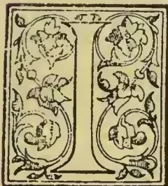A decorative initial letter 'U' enclosed in a rectangular border. The letter is filled with intricate floral and scrollwork patterns. The border is also ornate, featuring a repeating pattern of leaves and flowers.

It is claimed for this machine that it forms the connecting link, so long sought for between the grower of ramie and the spinner and manufacturer of the fibre; and that its effect will be to place ramie on the list of every-day

so long advocated, has been definitely acknowledged to be erroneous, experience having proved that to obtain the full advantages of the many brilliant qualities of the fibre, the stems must be treated in the green state. The chemist has insisted that as little as possible must be done to the green stems by machinery, leaving the main treatment to be carried out by chemicals. The machinist has retorted that the fibre is seriously damaged by chemical process, which take away its strength, its lustre, and its ductility, and that therefore machinery must play the important part; and so for many years the battle has been waged, first one side and then the other gaining the victory.

textiles to be produced and utilized without difficulty in any desired quantity. The battle has been long between the chemist and the machinist concerning the role each has to play in the production of ramie, and until the point has been definitely settled, the fibre, notwithstanding its magnificent qualities—strength, lustre, ductility, capacity for taking colour by printing and dyeing, and for mixing with other fibres, has been under cloud. The manipulation of the stems in the dry state

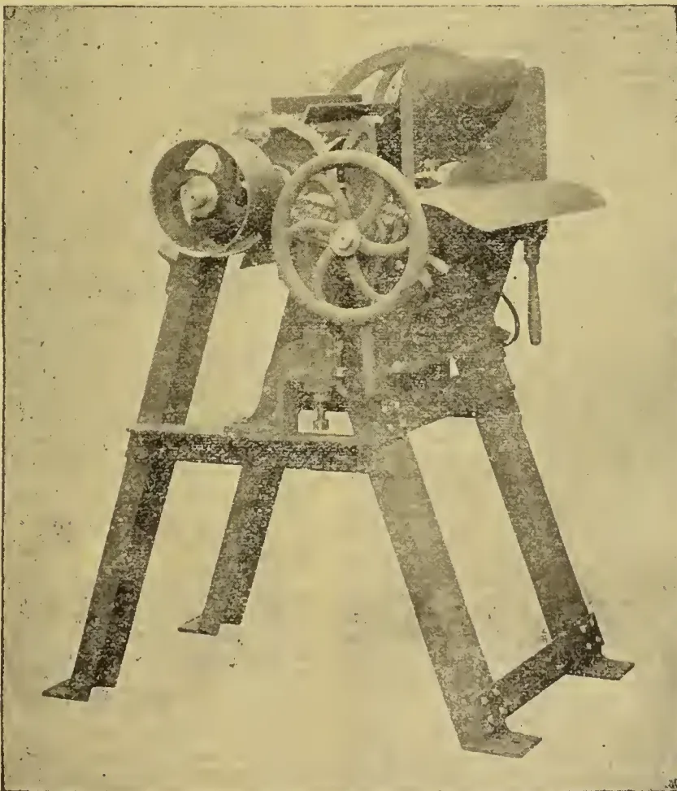A black and white photograph of a large industrial machine, identified as Faure's New Patent Ramie Fibre Decorticator. The machine is mounted on a sturdy, four-legged metal frame. It features a large, spoked hand wheel on the right side for manual operation. There are several gears and pulleys visible, and a large, dark, rectangular component, possibly a hopper or a cutting mechanism, is positioned on top of the frame. The overall design is robust and mechanical.

The problem, commercially considered, has been to obtain a machine, which can carry out economically the following processes without damaging the fibre: (a) Remove the woody parts from the green stems; (b) Remove the outer skin or cuticle, which has so long baffled all efforts, mechanical and chemical, to remove it; and (c) Extract as much as possible of the juices of the stems, so as to simplify and cheapen the degumming process. The two former processes are effectively carried out by

387------------------------------------------------

370THE TROPICAL AGRICULTURIST.[DEC. 1, 1896.

hand labour in China, where workmen scrape each stem and remove the skin and the wood, but leave most of the juice in the fibre.

All inventors of ramie decorticators have concentrated their efforts on machines to produce ribbons. Needless to say, the object aimed at has fallen far short of the real necessities of the case, hence the long delays and numerous disappointments with which this fibre is associated. Ramie ribbons have three serious, almost fatal defects: They contain a large percentage of woody matter; they contain the outer skin or cuticle of the stem, which has been the despair of the chemist to solve and remove; and they contain the major portion of the juice which coagulates in drying and becomes gummy.

Mr. Faure has aimed at the construction of a machine to produce *not ribbons but the fibre* in one operation, free from woody matter, from skin, and with the least possible amount of juice in it. His product is equivalent to "China Grass," but in an improved condition, because his machine is much more regular and efficient in its action than the varying hand labour obtainable in China, and because the possibility of adulterating the fibre is done away with. Mr. Faure's first decorticator obtained the gold medal at the last Paris trials. It was the best of the machines exhibited there and tested by actual work with green ramie stems. Being desirous of improving on his first attempt, he has since constructed several decorticating machines, each one showing marked superiority over the preceding ones. A skilled engineer and machine maker, with every facility in his own works and ample means for carrying out his ideas, he had the benefit of another very important advantage, namely, the growing of ramie on his own estate in the Limousin near his works, which enabled him to practically test his ideas by actual experiments on the raw material—a combination of advantages probably not enjoyed by any other inventor of decorticators. Patiently and scientifically he has, step by step, worked out the problem; and the machine illustrated on the previous page represents the results of his several years' labours. It is simple, inexpensive, and does its work admirably.

It is fed by two men, working alternately, each holding in his hand about ten stems. The stems are used in the same condition as cut, with the leaves on. The operation of feeding is as follows: The stems are passed in twice. They enter the machine, leaf ends first, and after having been treated about two-thirds of their length they are withdrawn, an operation easily carried out, and fed in a second time, the thick ends first, so as to complete the operation. It frees the stems from all woody matter and from the outer skin or cuticle and extracts a large portion of the juice, thus producing fibre retaining all its valuable qualities.

The machine, which weighs 11 cwts., is simple in construction, very strong and not liable to get out of order. It consists mainly of the framework and driving gear, the decorticating drum carrying beaters, and the feed bed. This latter is the important feature of the machine, by reason of its special contour which varies at different parts to suit the various descriptions of work which the machine has to perform. The first part of the bed is curved outwards, the second is straight, and the third is curved inwards. The ramie stems are fed into the machine over the first part of the bed, where the woody portion becomes immediately broken and partly removed; the strip passes on to the second part, and as the speed of the beaters is considerably greater than that at which the stems are fed into the machine, a scraping effect is produced on the strips, seeing that the distance between the beaters and the surface of the bed is less than the thickness of the strip. This scraping action effects a double purpose; it attacks the outer skin and also all matters extraneous to the fibres. The strips or sticks of filaments then pass down vertically into the machine and the separated matters, viz. most of the woody parts, the skin and gummy substances, are thrown out to a distance by the centrifugal force of the

beater drum. When the stems have entered to within a short distance of their end, the return movement is effected and they are withdrawn. During the withdrawal the following action takes place:—At the inward curve or third part of the bed, the filaments are slightly and gradually grazed by the beater blades, which throw out the coarser of the debris still adhering. The operation is performed with great delicacy; the fibres assume the position of the chord of the curve and are constantly agitated by the beaters. When the fibres arrive at the second part of the bed, as the space between it and the beaters is infinitely reduced, the entire removal of matters still adhering to the fibres is effected, and these latter leave the machine:—white, parallel and free from woody matter, from skin, and from the major portion of the juice. The concave bed or breast is mounted in such a way, that its position to the action of the beaters is easily regulated. The brackets which carry the bed are supported by spiral spring cushions and flexible legs, the object being to obtain a rubbing action between the beaters and the fibre, having for its special object the loosening and removal of the skin or outer cuticle. The elastic bed gives way or vibrates an enormous number of times per minute, and this produces the desired rubbing or "knuckle joint" action between the beaters and the fibres on the bed. The shape of the feed bed causes it to remain clean and free from extraneous matter through the action of the beaters. Choking is thus rendered impossible. All abnormal strains are avoided, and the machine can be kept at work from morning till night without stoppages for cleaning. The refuse falls underneath the machine and is removed from time to time. In the case of a number of machines working together, an endless band or conveyor, passing under the machines, removes the refuse continuously and so keeps the neighbourhood of the machines perfectly free from it.

Faure's machine is simple in construction, and capable of being easily worked by native labour in the ramie plantations or in works connected therewith. Although simple, it needs to be constructed with the greatest accuracy in order to ensure effective working. The cylinder, carrying the steel beaters is perfectly balanced and accurate in its action; it runs at 400 to 450 revolutions per minute; the surface of the beaters is perfectly parallel with the setting of the feed bed and capable of working close up to it, say within a distance equal to the thickness of a piece of writing paper. The feed bed, the varying profile of which is of such enormous importance in the efficacy of the machine, is made with the greatest of accuracy and of the best materials.

With regard to the production, practical experience shows that two men working at one machine can treat 360 lb. of fresh green stems per hour, or about 32 cwt. per day of ten hours. The amount of dry fibre produced, depends largely on the nature and growth of the stems; the percentage of fibre contained in green stems varies very much according to circumstances. On a 5 per cent. basis, the nett production of dry fibre by each machine per day of ten hours is 180 lb. When the stems are specially good, more than 200 lb. of dry fibre have been produced per machine in ten hours. Under ordinary circumstances a production varying from 160 to 200 lb. of dry fibre in ten hours per machine may be expected.

The apparently small production per machine needs a word of explanation, seeing that decorticating machines are being made professing to treat large quantities of green ramie stems per day, but it must be borne in mind that their production is ribbons not fibre. Ramie ribbons or strips must always be unsatisfactory, and will, no doubt, in time disappear from the market. The buyer has no means of testing their value, the quality or percentage of the fibre, and whether damaged or not by the decorticating machine; hence he will only give a low price for an unknown article, in addition to which they cannot be highly compressed and packed into proper bales as other fibres are. Therefore the

388------------------------------------------------

DEC. 1, 1896.]THE TROPICAL AGRICULTURIST.371

freight on ribbons is unduly high; they also contain a very large percentage of useless material on which freight has to be paid.

Faure's machine produces *fibre*, which will always rank higher in the market even than China grass, by reason of its regularity in condition and quality. The buyer can easily see and test what he is buying; he will therefore be disposed to give it its proper classification and pay its full market value; in addition to which, by reason of the bales being well pressed and containing little else than ramie fibre, the freight and expenses per ton will be at the minimum.

The product of Faure's ramie fibre machine cannot be compared with the ordinary ribbons or strips. It is an entirely different article, and will fetch a very different price in the market. The machine, when treating good stems, produces about 5 per cent. of waste fibre, that is to say, fibre which escapes from the hands of the workmen. It cannot, however, be correctly classified as waste, seeing that it has excellent value for second quality ramie, and here we would note that in relation to ramie, there is practically no real waste, as the fibre is always saleable. Its qualities of strength and colour are so great that, even for paper-making, the very shortest of the fibre always has excellent value and fetches good prices.

In connection with the question of fibre production and waste, the nature of the growth of the stems must be considered. If they are planted too far apart, the stems have a tendency to unduly throw out branches. Each branch represents a break in the continuity of the fibre of the parent stem. Recent plantings of ramie are being made with the stems much closer together, so as to prevent undue branching and improve the quality of the fibre. Green stems grown in a tropical or subtropical climate give the best results. The growth being quick, the stems carry plenty of fresh green juice, which assists the decortication very much by leaving the fibre freely and carrying with it in its downward course from the beating point of the machine large quantities of extraneous matter. The condition of the stems at the time of treatment also plays an important part. In order to ensure the best possible fibre, the stem should be treated within a few hours of being cut. They should not be over-ripe, as the fibre deteriorates after the stems have arrived at maturity. The best plan is to cut them either just at full maturity or slightly before. The fibre thus obtained excels in whiteness and ductility, retains its full lustre, and shows to the best advantage during subsequent manufacturing operations, such as preparing, combing, spinning, dyeing, &c. Each machine requires about one horse-power to drive it. When a number of machines are working together less power will suffice; thus eight horse-power will drive ten machines.

Faure's patent decorticators were sent last year to Italy, Egypt, Tonquin, &c., and have more than justified the expectations that were raised respecting their action and the quality of fibre they produce.

A few words will not be out of place concerning the disposal of the fibre after leaving the machine. It may be dried at once and then haled, its condition being the same as China grass. Experiments made last season show that steeping the fibre in boiling water for about half an hour and squeezing it thoroughly previous to drying, gives very favourable results, as when dried the fibre is soft and separates freely. The gummy nature of the juice having been seriously modified by boiling, the final degumming process is rendered very easy, cheap, and short. The addition of about 1 per cent. of carbonate of soda to the water may be made if the circumstances are favourable. This partially degums the fibre and does away with any possibility of fermentation or deterioration during the transport to manufacturing countries.

The sole representation of Mr. Faure's interest, both for machines, licenses, and patents has been entrusted to Mr. Thos. Barraclough, of 20 Bucklersbury, London, to whom all applications should be made.

## GRAPE FRUIT vs. PUMELOE—A NEW FRUIT FOR ENGLAND;

### THE KEW GARDEN AUTHORITIES JUSTIFIED AND THE "FRUIT-GROWER" CONVICTED OF RECKLESS IGNORANCE.

WE regret very much that in the *Tropical Agriculturist* for August last (page 120) we took over a stupid paragraph from the *Fruit-grower* entitled "The Pumelo in England: The Ignorance of Kew Gardens," which only showed the ignorance of the writer and which was entirely inaccurate in its reference to Kew and especially to Dr. Morris. The paragraph in question pointed out what no one had disputed, that the Pumelo is not a new fruit in England, although the writer erroneously supposed that the authorities at Kew were in ignorance of the fact. In reality, Dr. Morris of Kew Gardens in a letter to the *Saturday Review* had referred to "GRAPE FRUIT"—not Pumelo, from which indeed it differs as much as a fine apple does from an crab. The Grape Fruit is so highly esteemed in the United States that single specimens are retailed at a dollar a piece, and we need scarcely add that the fruit is entirely new to England.

We are glad to be able in this connection to reproduce here an article written by the editor of *Garden and Forest*, the leading horticultural journal in America, which clearly shows the value of Grape Fruit; and this we must give prominently in our monthly periodical in order to correct the blunder made in August; and also because the subject is one of special interest to us in Ceylon. We should like to know if anything has been done at Henaratgoda or Peradeniya—Hakgala is, we presume, too high—to do justice to the Grape Fruit? Meantime we quote as follows:—

#### GRAPE FRUIT.

Under the title of "The Coming Fruit," Dr. D. Morris, of Kew, not long since wrote to *The Saturday Review*, urging upon the people of the West India Islands to establish groves of Grape-fruit trees of the best quality. When passing through New York in the early part of this year, Dr. Morris was very strongly impressed by the quantity of this fruit which the New York market was demanding, and our readers will, perhaps, remember an article in the present volume of *Garden and Forest*, on page 163, in which he gives a sketch of the origin and history of the Shaddock, Pomelo, Grape-Fruit, Forbidden-fruit and other varieties which belong to this group of Citrus-fruits, and are botanically classified under the species *Citrus decumana*. They are quite distinct botanically from true Oranges, Citrons or other groups of the Orange family, and since they have mostly been raised from seed with little care given to selection, they vary widely in quality. The frost which ruined the Orange groves of Florida has temporarily shortened the supply, and Dr. Morris quotes a paragraph from this paper recalling the sale of small-sized grape-fruit of at least a dollar each, and is, Dr. Morris suggests, probably the highest price ever paid for specimens of the orange tribe.

No doubt, it will be long before there is any over-production of grape-fruit, since the demand for it increases every year, and it is constantly becoming more popular as a breakfast fruit. It is beautiful, is said to have medicinal value, and the more it is used, the more highly it is relished. Beyond question it would be a profitable fruit to raise in the West Indies, and probably the English people will in time prize it more highly than they do now, and furnish an additional outlet for West Indian groves. Since the Florida frost, this country has absorbed almost the whole West India supply, although much

389------------------------------------------------

372THE TROPICAL AGRICULTURIST.[DEC. 1, 1896.]

of it has been very inferior in quality. How does it happen that the enterprising orchardists of California have not been awake to the situation? There is no reason why they should not supply the east during a part of the year with all the grape-fruit needed. The limited qualities thus far received from California have lacked weight and juiciness. Wherever the fruit is grown it should be borne in mind that the highest success will only come with the use of the best varieties. There is no need to grow the thick-skinned and bitter sorts, or those with a dry, cottony pulp, when there are varieties both of the apple-shaped and pear-shaped fruits, with silky skin, full of juice and of a most delightful flavour, with just enough bitter to give it piquancy and suggest its tonic quality.—[*Garden and Forest.*]

### BIBLIOGRAPHY OF COFFEE.

(Continued from page 300.)

*T...*, *C. de*. Café français: recette économique, analysée d'après plusieurs savans, &c. Paris. 1821. 80. [Cet ouvrage a été réimprimé sous ce titre: Café national: recette, &c. Paris 1829. 120.]

*Tabelle*. Tabelle des Kostenpreisen von gerösteten Kaffee bei einer Brennverlust von 18—25 p. Ct. und bei Preisen des Roh-, Kaffees, &c. Leipzig. 1888.

*Tarr, A.* De coffee. [Hungarian text.] Pestini. 1836. 80.

*Tavern Anecdotes*. Tavern Anecdotes and Reminiscences of the origin of signs, Clubs, Coffee Houses, &c, intended as a lounge book for Londoners and their Country cousins. By one of the old school (W. West). London. 1825. 80.

*Taylor, C. P.* A short campaign against the white Borer (*Xylotrechus Quadrupes*) in the Coffee Districts of Coorg, Munzerabad, and Naggur. Madras. 1868. 80.

*Taylor, E.* Medical Remarks, &c. [See under TEA.]

*Tea*. Tea and Coffee, &c. [See under TEA.]

*Techni, Th.* Vier, &c. [See under TEA.]

*Teixeira, Carlos.* O Café do Brazil, &c. See *Ludwig, E.* Rio de Janeiro. 1883. 80.

*Theodoroff, C. Th.* Disputatio &c. [See under TEA.]

*Thérion, .* Influence du café sur la littérature. 1810.

*Thuillier, Matthæus. Traçs.* See *Le Tonnellier, P.* Quæstio medica... An potus café, &c. [1697.] 40.

*Thurber, Francis B.* Coffee: from plantation to cup. A brief history of coffee production and consumption, &c. American Grocer Publishing Association. New York. 1881. 80.

*Thwaites, J., M.D.* A concise Essay on the Medical Treatment of Malabar Coolies, employed in the Coffee Estates of Ceylon and India. London, Ceylon. 1865. 80.

*Timbs, John.* Club Life of London: with anecdotes of the Clubs, Coffee Houses and Taverns of the Metropolis during the 17th, 18th, and 19th, Centuries. 2 vol. London. 1866. 80. [Another edition. 1872.]

*Tissot, Charles Louis.* Cidet Roussel, on 1e café des Avenues, &c. See *Aule, Jos.* Paris. 1802. 80.

*Togni, M.* Raccolta delle singolari qualità del Caffè. Venezia. 1675. 120.

*Tolomas, P.* Dissertation sur le Caffée. Paris. 1757. 120.

*Tonduz, Adolfo.* Informe sobre la Enfermedad del Cafeto, &c. [Instituto Físico-Geográfico-Nacional. Servicio botánico.] San José de Costa Rica, C. A. 1833. 80.

*Tozzi, G.* Tractatus, &c. [See under TEA.]

*Tozzi, L.* See *Virtù*. Virtù del Caffè, &c. 1716. 120.

*Tractatus.* Novi Tractatus, &c. [See under TEA.]

*Trappen, Jan Evert van der.* Speeimen historico-medicum de Coffee, &c. Trajecti ad Rhenum. 1813. 80.

*Tretzel, F.* Ueber den Gerbstoff, &c. [See under TEA.]

*Trifet, H. A.* Histoire et Philologie du Café: de son action sur l'homme à l'état de santé et à l'état de maladie. Paris. 1816. 8.

*Trins H. J.* See *Prins, H. J.*

*Turkish Water Drink.* Von dem Gebrauch &c. [See under TEA.]

*Tytler, Robert Boyd.* On a new and cheap artificial manure for Coffee. *Observer Press.* Colombo. 1866. 80.

*Tytler, Robert Boyd.* The position and Prospects of Coffee Production as affecting the value of Ceylon Coffee Estates. Aberdeen. 1879. 80.

*Unterricht.* Deutlicher Unterricht wie man leicht und mit wenig Kosten aus den Kartoffeln, Reis... B od... Zucker... Kaffee... &c. verfertigt kann, &c. Ronneburg. 1828. 80.

*Unterricht.* Bewährter Unterricht von rechter Zubereitung des Coffee-Getrunkes. Hamburg. 1713. 80.

*Urbancja, Diego Bantista.* See *Schoeffer, C. H.* El Comercio de Café, &c. 1869. 80.

*Usage.* De l'Usage du Café, &c. [See under TEA.]

*Use.* Of the use of tobacco &c. [See under TEA.]

*Vanquelin.* Rapport de MM. Vanquelin, Darut et Barruel sur les cafés-chieorées... ordonné par arrêt, de la cour royale de Paris. Paris. 1822. 40.

*Vegilin, Ernestus Fredericus.* See *Aironus, A. F.*

*Verbeek, Dr. Koffij en ther &c.* [See under TEA.]

*Verbrugge, Philippus.* See *Heer.*

*Verni, Alessandre.* See *Periodical Publications Brescia.*

*Vertrante.* Vertrante Briefe über den Coffee aus Korn und andern inländischen Gewächsen. Leipzig. 1763. 80.

*Vesling, Johannes.* In epistolis posthumis a Bartholino... de balsamo tres epistolae, ... de Coffea, ... de Cacao. Hafniae. 1661. 80.

*Vialle, L. E.* Le Café préservatif de la Goutte et de la Nécrose. Paris. 1833. 80.

*Vidorich, A.* Dell'aziona dell' Caffè sull'uomo sano e malato. Pavia. 1859. 80.

*Vilardebo y Moret, José.* El tabaco y el café. Barcelona. 1888. 80.

*Villenus, Alfred.* Du café et de ses principales applications thérapeutiques, &c. See *Academies-Paris-Ecole de Médecine, &c.* Collection des thèses, &c. au 1875. tom. 22. 1839. &c. 40.

*Virey, Julien Joseph.* Nouvelles considérations sur l'histoire et les effets hygiéniques du Café, et sur le genre Coffee. Paris. 1816. 120.

*Virtu.* Virtù del Caffè, &c. [See under TEA.]

*Virtue.* The Virtue of the Coffee Drink. [London. 1670?] s. sh. fol.

*Vitè, F.* Kritische Studien &c. [See under TEA.]

*Vircur.* Histoire des cafés de Paris. Extrait des Mémoires d'un Vieux. Revue et augmentée par M. Constantin. Paris. 1827. 120.

*Vliet, L. van Woudrichem van.* De koffij-enquête in verband met de West-Java-koffij-cultuur. Amsterdam. 1871. 80.

*Vliet, L. van Woudrichem van.* Koloniale studien. 2 vol. [1. Gouvernements koffij-cultuur.] Rotterdam. 1867. 80.

*Vogl, August E.* Les aliments, &c. See under TEA.]

*Voit Carl von.* Untersuchungen über den Einfluss des Kochsalzes, des Kaffees und der Muskelbewegungen auf den Stoffwechsel, &c. München. 1860. 80.

*Volcumer, Johannes Georg.* De Coffee, cum icone. [In *Miscell. Nat. Cur. Cent. III, IV. obs.* 168.]

*Vorlac, Gaston (= Louis Lacour).* Les Garçons de Café et de Restaurant de Paris, &c. Paris, Versailles (printed), 1856. 80.

*Vri, Abr. Am de.* Eene veimakelyke, &c. [See under TEA.]

*Waanders, F. G. van Bloemen.* De Koffiemarkt. 's Gravenhage. 1882. 80.

*Waanders, F. G. van Bloemen.* Gouvernements koffie-cultuur. 1890.

*Wall, George.* Estate Expenditure. Summing-up of the discussion on increased [Coffee] Estate Expenditure, &c. *Observer Press,* Colombo. 1866. 80.

*Wanklyn, Jas. Mf.* [See under TEA.]

*Ward, H. Marshall.* Researches on the Life-History of *Hemileia vastatrix*, the Fungus of the "Coffee-leaf Disease." *Ann. Soc.* London. 1882. 80.

*Warmolts, A. N.* Meer Koffij en suiker van Java. 's Gravenhage. 1868. 80.

390------------------------------------------------

DEC. I, 1896.]THE TROPICAL AGRICULTURIST.373

*Warmolts, A. S.* Vrijmaking der suiker Industrie, en lotsverbetering der koffij-planters. Groningen. 1868. 80.

*Weichardt, Theodor Thos.* Succedaneorum coffeae inveniendorum regulas proponit. Lipsiae. [1774.] 40.

*Weidenbusch, Nicolaus.* Resp. Dissertatio inauguralis medica de noxis ex abusu potus coffe in corpore humano. Praes. F. G. I. Ittner, &c. Moguntiae. [1769.] 40.

*Weilshaenser, Emil.* [See under TEA.]

*Weiss, C. C.* Coffee Arabica, nach seiner zerstörenden wirkung. Freiberg. 1832. 80.

*Weitenweber, Wilhelm Rudolf.* Der Arabische Kaffee in naturhistorischer, diätetischer und medizinischer Hinsicht geschildert. Prag. 1835. 80.

*Well-Willer.* The Women's Petition against Coffee... By a Well-Willer. London. 1674. 40.

*Well-Willer.* The Men's Answer to the Women's Petition against Coffee... in their scandalous Pamphlet. London. 1674. 40.

*Welter, Henri.* Essai sur l'histoire du Cafe'. Paris. 1868. 120.

*Weneker, Daniel.* Resp. Dissertatio medica de potu cafe'. 1693. Praes. M. Mappus. Argentorati. 1693. 40. [1695. 40.]

*Wessels, L.* De ophefting van het monopolie en de verganging van de geelwongen Koffiecultuur op Java door een staatscultuur in vrijen arbeid. 's Gravenhage. 1890. 80.

*Wessels, L.* De voorstellen van de Indische Regeering omtrent de gouvernements-koffiecultuur op Java en Sumatra's westcust. 's Gravenhage. 1892. 80.

*West Indies.* See Mexico.. Vorslagen betreffende de cultuur... van Koffi... in Mexico... en West Indië, &c. 1889. 80.

*Weyrich, Rudolf.* Ein Beitrag, &c. [See under TEA.]

*White, Arnold H.* Coffee Culture in Ceylon. Manuring of Estates... being the Essay which obtained the first prize offered by the Planter's Association of Ceylon. Ceylon Observer Press. Colombo. 1875. 80. [? 1877.]

*Wiescké, .* Le Cafe' purifie (prive' de son action nuisibh) dit Cafe' de Blanche. Seconde édition. Paris. 1847. 80.

*Wildes, George.* Wrinkles and Hints on Coffee Planting. Madras. 1878.

*Withers, G.* Touchstone or Trial of Tobacco... To which is added witty poems about Tobacco and Coffee, &c. London? 1676. 40.

*Wood, John.* Coffee and Chicory. Official Reports by J. Lindley, J. D. Hooker, &c. to John Wood, Chairman of the Board of Inland Revenue, &c. 1852-3. fol.

*Woord.* Een woord, aan het Amsterdamsche Handelsblad (over de West-Java-koffiecultuur-maatschappij.) Rotterdam. 1865. 80.

*Woywode, Joannes Adamus.* Dissertatio inauguralis Medica de usu et effectibus Potus Coffee. Erfordiae. 1731.

Y—, *Captain.* A Coffee House Dialogue: or, a discourse between Captain Y—[i.e. Andrew Yarranton] and a young Barrister... with some reflections upon the bill against the D (uke) of Y (ork). [London. 1679.] fol.

Y—, *Captain.* A Continuation of the Coffee House Dialogue between Captain Y—, and a Baronet (sic) of the Middle Temple, &c. [London? 1680?] s. sh. fol.

Y—, *Captain.* The Coffee House Dialogue... examined and refuted, &c. [London. 1680?] s. sh. fol.

Y—, *Captain.* England's improvements justified: and the author thereof, Captain Y. vindicated from the scandals in a paper called the Coffee House Dialogue, &c. [London? 1680?] fol.

*Zadig, D. A. T.* Kaffee und seine Stellvertreter. Breslau. 1804. 80.

*Zambelli, W.* Diatribe de vi febrifuga fabae Arabicae sive Coffeae loco Corticis Peruviani. Vienni. 1811. 80.

*Zambellius, Aloysius.* De Coffea Arabica, dissertatio medica inauguralis, &c. Ticini Regii, [1821.] 80.

*Zanichelli, J. J.* Osservazioni intorno all' abuso della Coffea, &c. Venetia. 1755. 40.

*Zanberguertel.* Der Zanberguertel und das Kaffeehaus zu Paris. 2 Lustspiele. Nordhausen. 1780. 80.

## CAPSICUM, POTATOES, AND SOME OTHER ECONOMIC SOLANACEÆ OF INDIA.

[BY YOGENDRACRI GHOSA, OF THE AGRICULTURAL SOCIETY OF INDIA.]

Of the numerous *Solanaceæ* found in India, Nees von Esenbeck in his synopsis of Indian *Solanaceæ* counts about 45 species as indigenous to India.

Royle, in his illustrations, does not mention more than 44 species, which, excluding the Himalayan species, reduces the number for the plains to about 33; the Himalayan species being—

<table border="0">
<tbody>
<tr>
<td>1. <i>Lycium europæum.</i></td>
<td>6. <i>S. crassipetalum</i></td>
</tr>
<tr>
<td>2. <i>Atropa acuminata.</i></td>
<td>7. <i>S. rubrum.</i></td>
</tr>
<tr>
<td>3. <i>Hyoseyamus niger.</i></td>
<td>8. <i>Physalis angulata.</i></td>
</tr>
<tr>
<td>4. <i>Solanum laxum.</i></td>
<td>9. <i>Datura ferox.</i></td>
</tr>
<tr>
<td>5. <i>S. Lysimachoides.</i></td>
<td>10. <i>Amisodus luridus.</i></td>
</tr>
</tbody>
</table>

According, therefore to these authorities, we can rely upon 27 species of *Solanum*, three of *Physalis*, and three of *Datura* as tropical. But there are several other species of this order, although not recognised by the earlier authors as indigenous to India, or more accurately, to the plains of India. For, barring few exceptions, a great many species, which have been known to have been introduced in the plains from foreign countries, are nevertheless found to be growing wild in the colder regions and higher latitudes. If by India we limit ourselves to the plains or even to the peninsula, the statement about indigenous and introduced plants is correct. But if in the term India we include the Himalayan ranges, we must hesitate before we declare a particular species as not indigenous. A species may have been introduced to the plains from foreign countries, say the *Dahlia*. All our garden *Dahlia* bulbs are received from Europe, but that is no sufficient reason to say that the *Dahlia* is not indigenous for *Dahlia*s are pretty common in the hills, and at places where they could not have been introduced. Many indigenous plants and seeds or bulbs of plants, though quite common in the country, are annually imported, because better results are obtained from plant-raised from imported seeds. It has not often been urged that, because there is not to be ordinarily found a Sanskrit name for a plant, it must be an introduced one. But the reverse of this proposition would not hold true, for we know we have a Sanskrit name for tobacco, *tāmṛakuta*, but nevertheless it is admittedly an introduced plant. The same may be said of many others. On the other hand, coffee was ordinarily believed to have been unknown to the Hindoos: at least the beverage produced by the infusion of the roasted berries. In the Vedas, however, a beverage is mentioned; which is said to have been used for keeping off sleep, and which was much sought for by the gamblers of the time. It is said to have been prepared from the seeds of a berry named *Bibhūdaka*, its other name being *Jāgāra* the Wakeful, which grows in the casis of the Desert. The use of coffee as a beverage must have been forgotten, until, introduced by the Arabs under the name of *kava*, who brought the berries from their own country, not knowing that they were indigenous to India. The cultivation of the coffee plants dates from still later time, but notwithstanding all this, it would not be fair to say that the coffee species is an introduced plant. The ancient Hindoos, even in the Vedic age, or at least in the ages of the *Sutras* and *Smṛtis* were aware of introduced and foreign plants, and in certain observances they have disallowed foreign articles. However, be that as it may, following the authorities, there altogether 33 species, a few and a very few of them are economically known, the rest being of interest to the botanist or the naturalist.

The foremost of the *Solanaceæ* are the Capsicum or Chillies, sometimes known as Cayenne-pepper. Botanically, six species of this sub-genus pertain to India either as indigenous or as domesticated and cultivated. The whole of this family

391------------------------------------------------

374THE TROPICAL AGRICULTURIST.[DEC. 1, 1896.

or sub-genus may be considered as originally foreign, but that they have since so much adapted themselves to the soil and the climate that several of them have been completely acclimatised or naturalised here, freely flowering, bearing pods, ripening seeds, and self-sowing themselves again. Many individuals of some of the species of this family have been seen in most outlandish places, the seeds having been scattered by birds. Amongst them may be included the *Dhamilanka*, the bird's-eye chilli.

The Genus *Capsicum*, Linnæus Gen. Pl. II 832, is almost identical with Genus N. 338 of Schreb., the same of Pitton de Tournefort and G. Von Miller's Dictionary, 4, p. 411, is as distinct a genus as any other genus. There is, however, much confusion in the nomenclature of the several species, different authors having given different names to the same thing, and it is not unoften to find the same author in different publications having differently named the same plant.

Dr. G. Watt counts—

1 *Capsicum annuum*, Linnæus; 2. *C. fastigiatum*, Blume; 3. *C. frutescens*, Linnæus; 4. *C. grossum* of Professor C. L. Willdenow, four species, *Capsicum minimum* of Roxburgh being, according to him, identical with *C. fastigiatum* of Blume and *C. baccatum* of Wallich.

Dr. Watt's, however, is the shortest list of all. Roxburgh counts six, namely:—

1. 1. *Capsicum purpurem*—Roxburgh.
2. 2. *Capsicum annuum*, Willdenow sp. I, 1,050.
3. 3. *Capsicum grossum*, Willdenow sp. I, 1,051.
4. 4. *Capsicum frutescens*, Willdenow sp. I, 1,051.
5. 5. *Capsicum minimum*, Roxburgh and
6. 6. *Capsicum cerasiforme* Willdenow, sp. I, 1,051.

Or, in the other words, he differs from Willdenow in making three species of 1,051 of that author.

It will thus be seen that *C. grossum* is admittedly a distinct species. It has been acknowledged to be so even in Nees von Eisenbeck's standard work. It is also the case with *C. frutescens* of Linnæus, but *C. Chamæcerasus* of Nees von Eisenbeck is identically the same as *C. cerasiforme* of Poiret and the *C. purpurem* of Roxburgh. The *C. baccatum* of Linnæus is no doubt the same as *C. frutescens* of Rumphius Herbarium Amboinense.

#### I. CAPSICUM GROSSUM.

The *kafirmarie* of the bazaar is cultivated all over India. It bears fruits all the year round, and is identical with the Bellpepper of Farninger. The rind is reflex, and swelled into various shapes. The thick fleshy skin is not quite so acrid and is not unoften used as a pot-herb by itself. In Nepal, which evidently is its home, it is known as *karsini* or *Kharaseni*, indicating the locality whence it was primarily introduced.

All the six species of Roxburgh are cultivated in India: they are indiscriminately called *Lanka* or *Lankamarie* or *Lal mraie*. In the bazaar the size, shape, and colour distinguish them, by goat-pepper, bird-pepper, chilly, bell-pepper and Cayenne pepper. The chillies being the smallest-sized fruits. There are a great many varieties of them, some of which are ornamental. The pods are long, straight, of the size of a finger, long, bent, thin, and about an inch long, round, berrylike fruits, and looking more or less like tomatoes; some of them are orange, bright red, pale amber, purple black, yellow, and some are as white as a jasmine. The vernacular names are accordingly *kafirmarie*, *lal lankamarie*, *holdolankamarie*, *dhamilanka*, and, *kulelanka*. White fruits appear as the kulelanka, the fruits being of the size of a round Bengal plum. Some however call the *Lankamarie* or the *Lal lankamarie* as *Guch-marie*.

The capsicum is not mentioned in Sanskrit works, and not known to have a Sanskrit name. It does not occur in any of the recent Sanskrit medical works, such as the Madhava Nidana. It has therefore been considered as introduced fruit, a fruit which, though now almost naturalised here, was quite recently introduced long after the latest Sanskrit medical work was written.

In the Bombay side of India, it is known as *Goamarie* i.e., pepper from Goa, where is extensively cultivated, perhaps having been introduced by the Portuguese from Brazil or Chili. In Bengal it is *Guch-marie*, i.e., the tree pepper or shrub pepper, as distinguished from *marie*, the true pepper, and which grows on a creeper. It is also called *lankamarie*, i.e., pepper of Lanka (which is the native name of Ceylon) just because the fruit was first brought to Bengal, as it is supposed, in coasting vessels from Ceylon.

Whatever be its origin, it cannot be denied that it is a great boon to the people of Bengal, whose limited means make the black pepper an expensive article for daily use. The acrid flavour of the pods is the only seasoning which the poor Bengali can afford, in addition to salt, to make his dishes palatable. The capsicum is thus the only cheap condiment available to every one. Nature requires a stimulant, and the capsicum supplies this to the million. It stimulates the secretion of saliva, which is so much needed to the rough balls of *chatu* or the mouthfuls of dry *mudi*. Internally also it accelerates digestion, and the pungent juice clears away the phlegm. It is said to be vermicide, but those who use it to excess are not free from ring worm. It has been used by European physicians as a stomachic, and is not unoften given with other recipes in cholera. It has been used with great success in cases of *Cynanche maligna* (Duncan, Med. Comm. nt., Vol. II, 2-12-1783, and Med. Communications, Vol. III, p. 372, 1790). In the palsy of drunkards and of goaty subjects, it has been found useful. Used externally its tincture proves valuable in elephantiasis, and also in some cases of rheumatism. Its composition, as ascertained by Bracconot, is:—

<table>
<tbody>
<tr>
<td>Acrid oil</td>
<td>..</td>
<td>1.9</td>
</tr>
<tr>
<td>Wax with red colouring matter</td>
<td>..</td>
<td>0.9</td>
</tr>
<tr>
<td>Brownish starchy matter</td>
<td>..</td>
<td>9.0</td>
</tr>
<tr>
<td>Gum</td>
<td>..</td>
<td>6.0</td>
</tr>
<tr>
<td>Animalised matter</td>
<td>..</td>
<td>5.0</td>
</tr>
<tr>
<td>Woody fibre</td>
<td>..</td>
<td>67.8</td>
</tr>
<tr>
<td>Salts</td>
<td>..</td>
<td>9.4</td>
</tr>
<tr>
<td>Citrate of Potash</td>
<td>..</td>
<td>6.0</td>
</tr>
<tr>
<td>Phosphate and Chloride of Potash</td>
<td>..</td>
<td>3.4</td>
</tr>
</tbody>
</table>

Fruit *Capsicum annuum* 100.0 pts.

But Bucholz's analysis gives the proportion of *Capsicum annuum* without seeds to Capsicin or Acrid oil as 25 to 1.

The Capsicum is a paying crop. It requires no special attention, and if properly cured in dried condition, it fetches a handsome price. Fresh pods in the North Western Provinces sell at from half-anna to two annas per seer. It is largely cultivated for trading purposes in East Bengal, which principally supplies the market. In a dry state it sells from 9 Rs. to 12 per manna. In England chillies sell at 30s. per cwt. in quiet and dull markets. The acridity of capsicum is due to the alkaloid mentioned before which, when gently heated, becomes fluid, and at a still higher temperature it dissipates in acrid cough-producing fumes. The volatile alkaloid smells much like conine. By treating Capsicum with petroleum, *Capsicols* may be obtained, which, however, is a doubtful substance, and *Capsicin* or *Capsaicin*. Capsicin is sparingly soluble in petroleum, but dissolves readily and abundantly in fatty oils, ether, etc. Allowed to crystallize, we obtain colourless crystals answering to the empiric formula  $C_9H_4O_2$ . Capsicin is not a glucoside. It is a powerful rubefacient, and helps to relieve constipation. It is therefore a necessary condiment to natives of Bengal, whose principal strength-giving food is based upon fats, and Capsicin dissolves *geli*.

It is needless to repeat what is well-known about the uses of Capsicum as a condiment and as a culinary article. It however, is an important ingredient in the preparation known as *Kasundi*, or *Achar*, *Chutni*, which is prepared by the Hindoos of

392------------------------------------------------

[DEC. 1, 1896.THE TROPICAL AGRICULTURIST.375

Bengal with some ceremony. It is made up by pounding green mangoes with mustard seeds and some other condiments. Capsicum enters in to the preparation of *Gnappi*, also a condiment specially liked by the Burmese. In the North-Western Provinces, where spirits are largely used by the people of the lower castes, pounded Capsicum is mixed with jaggery and water to form a substitute drink on festive occasions. The pungency of the Capsicum and the sweetness of the jaggery combine to produce in the throat, when drunk, an imitation of the spirituous drinks—a cheap imitation no doubt. It is much used by the poor *Mahals*, *Dhobis*, *Passis*, *Dharikars*, etc., when they cannot afford the expensive *Mahua Rum*.

Roxburgh distinguishes six species by the following characteristics:—

a.—General appearance and habit of the plant, which is identical in them all. They are all shrubby.

b.—Peduncles which are solitary in all five, except in *C. minimum*, Roxb., which has peduncles in pairs.

c.—Character of the leaves: *C. purpureum*, Roxb. has ovate lanceolate. Such is also the case with *C. annum*, Willd. and *C. frutescens*, Willd.; those of *C. grossum*, Willd. being ovate, oblong, and of *C. minimum*, Roxb. ovate-cordate.

The difference in the shape of the leaves is not a criterion.

d.—As to the fruits or berries: why, this also is variable, *c* and *d* vary under climate and other conditions specially so in a cultivated species.

It has been often noticed that by cultivation, exclusive of selection, the fruits and leaves vary. It has also been observed that seedlings of one species may approach in these characters to those of other species. Seedlings of the Jack fruit have been known to produce serrated leaves, reminding one of its ally the bread-fruit. What is called the *kafrimarie*, and what the botanists have named *Capsicum grossum* by climatic influences have been seen to bear round berries as well as long pods. The garden varieties of red, orange, purple, etc., coloured berries of ornamental Capsicum, may be traced to the *C. grossum* and the *C. minimum* to the other long-podded Capsicums. It would therefore serve the cause of science to reduce the unstable species to one which may have some permanent characteristics to distinguish them from other species of the same genus. The Capsicum, if divided under two species, No. I and No. II. would serve our purpose for all ordinary occasions. The horticulturist had better look to the result, and let botanists be content with really stable characteristics.

The Genus *Solanum* or the Night-shade described in Scrob. General N. 337, embraces a much larger number of species of much more diversified characteristics than the Capsicum. In an economic point of view, the foremost in the genus stands the Potato. Roxburgh enumerates 16 species under two sections, the unarmed and the armed, as of India, omitting altogether the potato which he neglected evidently fancying it to be neither indigenous to the country nor sufficiently acclimatised or naturalised here as to justify him to enumerate it under indigenous solanaceæ. In dealing with other introduced plants, he has not been quite so particular, such as in the case of tobacco or the Carica Papaya, etc., both of which freely ripen seeds and seedlings, and may be found in out-of-the-way places. This can be said of the potato. The potato has not been observed anywhere in India to have grown in a wild state from self-grown seeds, although it bears quite freely tomato-like berries which ripen their seeds also. It would be an observable incident if seedlings of potato could be found anywhere in India bearing the edible tubers. But it ought to be said that seedlings from sugarcane have not been seen growing wild and producing saccharine canes. Be that as it may, the potato dates as far back as the tobacco, and perhaps earlier than the papayas!

Perhaps the climate and the soil, at least of the plains of India, are not quite so well suited to the

potato as those of Peru. It has been seen to grow wild, being also originally introduced from Chili.

Following Roxburgh below are given names of some of the economic Solanaceæ which are indigenous or more or less naturalised in India:—

<table>
<thead>
<tr>
<th>I. Sec.</th>
<th>Unarmed.</th>
</tr>
</thead>
<tbody>
<tr>
<td>1.</td>
<td><i>Solanum pubescens</i>, Willd. sp. I. 1026</td>
</tr>
<tr>
<td>2.</td>
<td><i>S. auriculatum</i>, Willd. sp. I. 1025</td>
</tr>
<tr>
<td>3.</td>
<td><i>S. lycopersicum</i>, Willd. sp. I. 1033</td>
</tr>
<tr>
<td>4.</td>
<td><i>S. rubrum</i>, Willd. sp. I. 1034</td>
</tr>
<tr>
<td>5.</td>
<td><i>S. decemdentatum</i>, Roxb.</td>
</tr>
<tr>
<td>6.</td>
<td><i>S. spirale</i>, Roxb.</td>
</tr>
<tr>
<th>II. Sec.</th>
<th>Armed.</th>
</tr>
<tr>
<td>7.</td>
<td><i>S. Melongena</i>, Willd. sp. I. 1036</td>
</tr>
<tr>
<td>8.</td>
<td><i>S. longum</i>, Roxb.</td>
</tr>
<tr>
<td>9.</td>
<td><i>S. insanum</i>, Willd. sp. I. 1037</td>
</tr>
<tr>
<td>10.</td>
<td><i>S. æthiopicum</i>, Willd. sp. I. 1036</td>
</tr>
<tr>
<td>11.</td>
<td><i>S. diffusum</i>, Roxb.</td>
</tr>
<tr>
<td>12.</td>
<td><i>S. Jacquini</i>, Willd. sp. I. 1041</td>
</tr>
<tr>
<td>13.</td>
<td><i>S. indicum</i>, Willd. sp. I. 1042</td>
</tr>
<tr>
<td>14.</td>
<td><i>S. trilobatum</i>, Willd. sp. I. 1049</td>
</tr>
<tr>
<td>15.</td>
<td><i>S. hirsutum</i>, Roxb.</td>
</tr>
<tr>
<td>16.</td>
<td><i>S. stramonifolium</i>, Jacq.</td>
</tr>
</tbody>
</table>

I. 1 and 2 are subarbarus.

3, 4 and 5 are annual.

6 is shrubby.

2 is downy.

and 5 is hairy all through.

The arms or or thorns, hairs or downs, it must be said, are not persistent characters, at least they do not reproduce themselves in the same degree under climatic and cultivating influences. Thorns have been seen to interchange for hairs or downs, and they have also noticed to change in their number, size and hardness. The thorns are not constant in many other plants, not even in the *Ægle Marmelos* (the Bel-fruit), or the *Zizyphus Jujuba* (the hog-plam), which last is notoriously armed, but specimens perfectly free from thorn are not altogether impossible. The same same may be said of certain varieties of *S. Melongena* (the egg-plant) which have been seen not to bear any downy substitute of the thorn. The calyx of *S. longum* of Roxburgh is not invariably armed, though that distinguished author has based his species on this, the character of the leaves and the shape of the fruit. He says:—

"I consider this to be a species distinct from *S. Melongena*, for the fruit is always cylindrical, never changing by the culture into any other form." Roxburgh no doubt was misled by limiting his observation to the Bengal cultivated egg-plants. In the North-Western Provinces, however, the general shape of *S. Melongena* is more cylindrical than oval or round. The same may be said of *S. insanum*. For ordinary purposes, therefore, these three may be made into one species, leaving the gardener to name his varieties.

Neglecting therefore the arms, we may begin with one continued list of 16 indigenous species of *Solanum*, remembering, however, that the potato counts beyond this number.

1. *S. pubescens* Willd.—This is the same as *S. verbascifolium* of Linnæus and *S. erianthum* of Don's Nepal flora, the *Aras* of the native Kavirajas and the *Gandhira* of the *Sanskrit* authors. This grows all over India, and flowers almost the whole year round; the berries are of the size of a cherry, and they may be seen all through the year. The bark and the leaves are immediately used, and it is said the berries are cooked in curries. This plant has been seen in favourable places to obtain the size of a small tree. It may be distinguished from the next by the colour of its flowers, which are white, while *S. auriculatum* has lively blue, purple flowers.

2. *S. auriculatum*, Willd.—This is the *S. mauritianum*, Scet, Roxburgh says: "Independently of the colour of the flowers, the stipule on axillary leaves render the species readily known; in all other respects it almost exactly resembles the preceding, in that plant there are no stipule and the flowers are white.

393------------------------------------------------

376THE TROPICAL AGRICULTURIST.[DEC. 1, 1896.]

1 and 2 therefore for ordinary purposes may be put under *S. pubescens*. Variety A (white flower). Variety B. (Blue-purple flower and stipula).

3. *S. lycopersicum*, Willd. ordinarily known as *Pomum Amoris*, Blackwood and Rumphius.—It is the same as *Lycopersicum amoris*, Monch *Sol. esculentum*, Mill., the tomato of the gardens. This has, however, been made the basis of a separate genus *Lycopersicum* and the tomato is *L. Gleni* of Tournefort. Some authors, however, have distinguished it into a separate species. But from the description it cannot be doubted that *Lycopersicum cerasiforme* of Danal is none other than the *L. esculentum* of Willd., the *Gadha* Begun of the Bengalee gardeners. Some however distinguish the *L. cerasiforme* as *Solanum pseudo-lycopersicum*, which has been named by Genetin as *Solanum spinarium*. It is questionable whether *Lycopersicum Humboldtii* of Willd. is not identically the *S. lycopersicum* of Roxburgh which Willdenow in another place has described as *Solanum Humboldtii*. Any how all the three species of Tournefort's *Lycopersicum*, i.e., *esculentum*, 2 *cerasiforme*, and 3 *Humboldtii*, are different names of one apple which has been thoroughly acclimatised in India and which has been seen to reproduce itself from self-sown seed.

4. *Solanum rubrum*, Willd. This is undoubtedly the same as *Solanum nudiflorum* of the same author, for Roxburgh says "seeds received from Mauritius under the name of *Solanum nudiflorum* (Willd. sp. I. 1035) produce this very plant."

Roxburgh, however, has himself sub-divided this species under—

A. *Erythropyrenum*, Roxb. which is *S. Rumphii* of Dan and *S. asperum* of Hoarnem.

B. *Melanoperenum*, which *S. oleaceum* of Rich. Herb. and *S. Nigrum* of Blume. *Solanum nigrum* of Linnaeus, however, is no other than—

- *S. rubrum*, Mill.
- *S. incertum*, Danal.
- *S. Roxburghii*, Danal.
- *S. triangularis*, Lmk.
- *S. villosum*, Lmk.
- *S. nodiflorum*, Jacq.

But *Solanum incertum* of Danal is

- *S. nigrum* of Forsk and
- *S. miniatum* of Bernh

The whole forest of names being thus cleared, the *Solanum nigrum*, Willd. may be said to the scientific name of the native plant *Goraski*, which bears red and black berries. This is the *Moko* of Yunani physicians, who speak so much of *Arak-i-moko* infusion decoction or extract of *Moko*, a cooling draught, not unoften prescribed in early stages of insanity. It is *Gud-ka-mai* of lower Bengal, a herbaceous plant growing wild throughout India. It bears diminutive tomato-like berries of the size of a small pea, much eaten by children; in a ripe state it has some sweetish taste. It must not, however, be confounded with the *Mokoye* of the North-Western Provinces, which latter is *Flacourtia montana* of Graham, or *Flacourtia enermes* of Roxburgh.

5. *Solanum decemdentatum*, Roxb., identical with *S. decemfidum*, Wall. This said to be a native of China and Singapore, but it has been completely naturalised here, for it ripens its fruits and self-sows itself. It is properly speaking a variety only of *S. rubrum*, Willd. mentioned above. It is from its habit a robust pubescent variety of *S. nigrum*. It is an annual herb, but hairy. Its berries are of the size of a pea, and are smooth and bright red when ripe. It is not unoften difficult to distinguish from *S. nigrum* or *S. rubrum*.

4 and 5 therefore for ordinary purposes may be put under one species, *Solanum rubrum*.

*Solanum spirale*, Roxb.—This has no economic value, except as a narcotic. The sixth species therefore in an economic point of view is—

6. *Solanum tuberosum*, L. Its synonyms are *Lycopersicum tuberosum*, Mill, *Papas americanum*, Baugh, *Papas Perananorum*, Besel, *Batatas peruvianum*, Park.

*The potato.*—Its ordinary vernacular name is *Alu*, but the term *Alu* is not restricted to this tuber only. It is not unoften, therefore, that it is distinguished from other edible tubers and roots by the name *Gol alu*, i.e., the ball-shaped *alu*, *Vilati alu* i.e., foreign *alu*. The name of *alu*, therefore,

*The Potato.*—Its ordinary vernacular name is *Alu*, but the term *Alu* is not restricted to this tuber only. It is not unoften, therefore, that it is distinguished from other edible tubers and roots by the name *Gol alu*, i.e., the ball-shaped *alu*, *Vilati alu*, i.e., foreign *alu*. The name of *alu*, therefore, seems to indicate the class to which this article of food belongs. Thus we have *Cankh alu*, identified by some to be *Pachyrhizus angulatus* Rich, *Dolichos bulbosus*, L. Dr. G. Watt in his Dictionary of Economic Products says that the tuberous root resembles a turnip in taste and consistence, and that it is eaten both raw and boiled. The *Cankh alu*, however, is never known to be used after being boiled. There is another similar looking tuber which sells in the bazaars, of the N.-W.P. as *Sakarkand*, which is always taken boiled. This *Sakarkand*, when boiled, has the consistence of boiled turnips, but has a much sweeter taste than that of turnips, but wants the flavour of turnips. The *Sakarkand* is, however, distinguished from another edible tuber sold in the Bengal bazaar under the name of *Lal alu* or *Mau alu*, which when boiled is as sweet as the former. This later *Lal alu* or *Mau alu* is sometimes called *Lal Sakarkand alu*, which is no other than *Batatas edulis*, Choisy, *Ipomoea Batatas*, Lank, *Convolvulus esculentus*, Spre., *Convolvulus edulis*, Thunb., *Ipomoea Catesbaei*, Meyer. The vernacular name *Sakarkand alu* literally means the sweet tuber *alu*, for *kand* is the Sanskrit name for a tuber, and is the Sanskrit equivalent of the vernacular term *Alu*, which again may be traced to the Sanskrit name *Ol* (*Amorphophallus campanulatus*, Blume,) which is *jamikand* in the N.-W. P., i.e., the earth tuber. The *Lal alu* or the *Lal Sakarkand alu* is *Batatas edulis* variety *a erythrorrhiza* and the white variety, that is, the *Suda Sakarkand alu* is *B. edulis*, variety *b leucorrhiza*. This last is not unfrequently confounded with the *Cankh alu*. A great many of the arene class are also called *Alus*, thus we have—

<table>
<tbody>
<tr>
<td><i>Capdi alu</i>,</td>
<td><i>Dolichos globoza</i>, Roxb.</td>
</tr>
<tr>
<td><i>Kham alu</i>,</td>
<td><i>D. alatu</i>, L.</td>
</tr>
<tr>
<td><i>Garane alu</i>,</td>
<td><i>D. purpurea</i> and <i>robella</i>, Roxb.</td>
</tr>
<tr>
<td><i>Mau alu</i>,</td>
<td><i>D. aculeata</i>, L.</td>
</tr>
<tr>
<td><i>Susani alu</i>,</td>
<td><i>D. fasciculata</i>, Roxb.</td>
</tr>
<tr>
<td><i>Kukur alu</i>,</td>
<td><i>D. anguina</i>, Roxb.</td>
</tr>
<tr>
<td><i>Sar alu</i>,</td>
<td><i>D. nummularia</i>, Lmk.</td>
</tr>
<tr>
<td><i>Kanta alu</i>,</td>
<td><i>D. pentaphylla</i>, L.</td>
</tr>
</tbody>
</table>

Parkinson, however, puts the potato under *Batatas peruvianum*, although it has been clearly established that the potato originally belonged to *Chilli*, whence it was introduced to Peru.

(To be continued.)

ARTIFICIAL COFFEE-BEANS.—Artificial whole Coffee has long been known as a commercial commodity, but we were scarcely prepared for the statement recently made by the *West Indian and Commercial Advertiser*, that it is now manufactured to an alarming extent, consisting of the roasted meal of different cereals worked up with dextrin. Two different factories, it is stated, have been established at Cologne, which undertake to furnish the requisite machinery and plant, with directions for making the false Coffee-beans. The apparatus supplied by these wholesale swindlers is capable of turning out more than half-a-ton daily, at a cost of about £1 per cwt., good Coffee having nearly five times this value in the market. The fictitious Coffee is difficult of detection by ordinary examination, especially when a proportion of genuine Coffee is mixed with it.—*The Gardeners' Chronicle*.

394------------------------------------------------

DEC. 1, 1896.]THE TROPICAL AGRICULTURIST.377

THE "LADYBIRD" ENEMY OF  
COFFEE-BUG—ADVERSE  
CRITICISM.

We are very much indebted to Mr. E. E. Green—specially qualified as he is to write with authority on the subject for the following communication sent by him to our "senior" in England. It will be seen that Mr. Green sees no reason in the adverse criticism recently offered, for refusing to make the experiment proposed of infesting "ladybird" beetles to deal with the green-bug on coffee; but as the expense would be widely distributed, our planters in Mysore, the Straits, &c., if they agreed to join in the employment of Mr. Kœbele, it ought not to cost any individual proprietor more than a few rupees. We are back, therefore, at the point where support for a joint mission should be canvassed for—who will lead the way? Mr. Green writes as follows:—

"Budleigh Salterton, Devon, Oct. 8.—I have just been reading in the *Ceylon Observer* (Overland edition, Sept. 16) an article called 'The Ladybird a Humbug,' by an anonymous correspondent

"There are one or two points in the article that warrant a little criticism. Your correspondent argues from the fact that because 'scale-bugs' abound in Australia, therefore, the introduction of ladybird beetles from that country must manifestly be useless. This fact does not affect the position at all. In their own country the beetles are hampered by numerous natural enemies and parasites that prevent them from increasing sufficiently to get the upperhand of the more prolific bugs. But when the beetles are removed to some other country, having left their natural enemies behind, they are in a position to increase and multiply unchecked as long as a plentiful supply of their food is forthcoming. And this food being the scale-bug, the failure of food would mean the success of the ladybird experiment.

"It may be said that other natural enemies will find them out in the new country. And so they will—in time, but experience shows us that it is usually a *long* time before fresh enemies acquire the habit of preying upon the new introduction.

"There is no question whatever about the value of the work effected by the 'Vedalia Ladybird,' which was imported from this same scale-infested Australia. In a comparatively short time this insect practically freed the orange plantations of California from the dreaded 'flute-scale' (*Iceريا purchasi*) that had proved so destructive there.

"The partial failure of the experiment in other places requires an examination of the particulars of the individual cases before we can judge of their merits. It appears—your quotations supplied by your correspondent—that ladybird beetles have not given entire satisfaction when employed against the ravages of the 'black scale' (*Lecanium oleae*). Now this particular bug forms a very hard scale in its later stages which serves as a protection for the large number of eggs de-

posited beneath it,—a fact which may possibly account for its ability to resist the attacks of the beetle.

"Our own chief pest the 'green bug' (*Lecanium viride*) is an especially unprotected insect, the skin of the body remaining soft to the end. In this particular it very closely resembles the species which we are told by Mr. Kœbele has been exterminated in Honolulu through the agency of ladybird beetles—also originally hailing from Australia.

"Your correspondent very justly suggests that 'it would be unwise to incur any extraordinary outlay' in the matter. I do *not* advocate any extraordinary or even very heavy expenditure. A few cents per acre for all the coffee in the island would produce sufficient funds for the starting of the experiment. The suggested remedy is not of course a certainty,—otherwise there would be no two questions about its immediate adoption. But if nothing should ever be attempted for fear of possible failure there would not be much progress in the world! The possible benefit is enormous,—far out-balancing the expense of a possible failure.

"I notice that one of the critics quoted by your correspondent impugns the value of the ladybird, partly because 'she does not extirpate the fungus.' Surely this is rather unreasonable! I presume the fungus in question to be the sooty growth usually associated with an attack of 'bug.' But if you kill the cause (the bug), the effect (the fungus) will soon pass off. Moreover this fungus is not in itself injurious to the plant. It germinates and subsists solely upon excrementitious matter from the bugs.

"As for your correspondent's concluding remarks upon scientific as opposed to practical work. In many cases the life history of an organism must first be known before a logical remedy can be suggested. It is possible that a scientist—from his special training—may be in a better position to carry out the first part of the work; while the practical agriculturist may best know how to apply the results of the first man's labours."

To which we may add that there is surely a high negative value to be attached to the scientist's work when he is able to indicate—as Thwaites originally did and Marshall Ward later—the fruitlessness of the coffee planter trying to expel the leaf fungus from his fields when once it has taken possession. Now, the fungus is supposed to be in a decaying state itself in Ceylon, while the "green-bug" has long been regarded as a far more serious enemy; and science as well as practice points to a remedy in the "Vedalia ladybird" to be got from Queensland.

FRUIT CULTURE ON THE INDIAN  
HILLS.

Some interesting facts regarding fruit culture in the hills are given by the Rev. M. M. Carleton in the last issue of the *National Magazine*, published in Calcutta. Mr. Carleton, who is one of the foremost pioneers of the fruit growing industry in the Himalayas, has made various experiments at Ani, a village in Kulu, 4,500 feet above sea-level and

47

395------------------------------------------------

378THE TROPICAL AGRICULTURIST.[DEC. 1, 1896]

distant 65 miles from Simla. As regards apples it appears that American and English trees have proved almost a failure. The experiments have now extended over a period of ten years, but though the trees themselves flourish and a few apples are produced the return is of the poorest. The conclusion arrived at is that apple cultivation will not be profitable at a lower altitude than 6,000 feet. Apricots, on the contrary, have proved a remarkable success. The native tree of the Kulu valley is not very prolific, but the Kashmir and English varieties yield fruit after the fourth year in great abundance. Mr. Carleton strongly advocates the extension of the cultivation of these varieties in all the lower hills; and he suggests the introduction into Simla of the American fruit-drying machines. He believes that enterprising persons could establish a very profitable industry in preparing dried apricots for the Indian markets. American grapes at Ani have done extremely well. Fifteen years ago the Black Hamburg variety was tried, but it turned out a failure. Mr. Carleton, six years later, sent to America for a hardy prolific vine grown on the northern limit of grape cultivation, where the spring opens in May and the frost comes in September. He held that this variety would ripen in Kulu before the heavy rain, because spring begins in the valley early in March. He has now a vine eight years old which yields 70 lb. of grapes. He remarks that a few such vines around the houses of intelligent zemindars in the Simla district would give a handsome return in the local market especially in the month of June. There can certainly be no question about the great demand for fresh fruit in Simla during the summer months. Experiments with the European orange have shown that the Maltese variety can be grown in the lower hills as high as 4,500 feet. Mr. Carleton thinks a great industry might spring up if the cultivation of oranges was undertaken. From one tree at Ani, eight years old, he gathered 220 oranges last February, which is the month for plucking the fruit, following the Californian custom of leaving the oranges on her trees until the new leaves appear. Snow does not appear to injure the fruit though it affects the leaves. It is pointed out that oranges sold from the Gujranwalla and other gardens fetch from Rs 5 to Rs 8 per 100, and it is believed that still higher prices could be obtained for the Kulu fruit in the Simla market during April. If this were so one tree yielding 200 oranges annually would give the owner a handsome profit, and that on only 10 feet square of ground. It is evident that grape and orange cultivation in the lower hills could be made a very paying industry, but the natives are not enterprising enough to take the matter up. European energy is needed to show them the way, and in the absence of other agency the Forest Department might well step in and give the movement a helping hand.—*Pioneer*, Oct. 3.

#### THE CIGAR TRADE AND CEYLON TOBACCO.

The success that has attended the cultivation of tobacco in Borneo cannot fail to make a comparison with the result of similar cultivation in Ceylon an unsatisfactory one. It may well be doubted, we think, if there is anything in the quality of the Ceylon-grown leaf to account for this. Indeed, expert opinion has, we know, reported very favourably upon this. Any facts, therefore, which may throw light

upon our relative failure, and may suggest means whereby it may be redressed, cannot but prove both of interest and of possible value. A correspondent now at home writes us that he has been making some inquiry as to the conditions under which Borneo tobacco has secured the favourable position it has in the London market. He consulted, he writes us, one of the most experienced men in the cigar trade, who told him that one reason why the sale of cigars of Borneo tobacco has become so large is that it has been fostered by the endeavours made to popularize it. Not that these would by themselves have sufficed were the quality not good, but that there was not sufficient difference between this and that of Ceylon grown tobacco to account for the different results obtained in the two cases. He pointed out that success must mainly depend upon the appreciation shown by the million, and not upon the opinion of the limited number who can afford to pay for high-priced cigars. The taste of these last has become so highly cultivated and fastidious that they will tolerate no cigars but those of the highest class and such as have become well-seasoned by careful long keeping and seasoning. It is not these men who are the rulers of the tobacco market. They will willingly buy at prices quite above common reach, but they constitute merely a drop in the ocean of cigar consumers. Where one man will satisfy an exigent taste by paying from 6d to 1s 6d each for his cigars, hundreds are satisfied with those they can purchase for 2d to 3d each. It is this second-class of customers that uses up the vast importations of the tobacco from Borneo and Sumatra. The finer production of Havana and other West Indian growth are reserved for the first alone. The expert went on to remark that, owing to the high duty on imported cigars, these were not within the reach of the generality of smokers. It is true, he said, that an attempt had been made to introduce cheaper cigars manufactured abroad, but that to do this necessitated these being made of the coarser tobaccos, and that their manipulation was unsatisfactory. One of the prime qualifications of a cigar is that it shall burn easily and evenly, and with a residual ash that shall not unexpectedly fall. Foreign-made cigars of the cheaper sort do not, it was said, possess this qualification. The result has followed that a distinct preference is shown for those cigars that are made in home factories from imported leaf. It was acknowledged that in some respects these are not equal to those rolled in the producing country. The leaf dries during the passage to Europe and has to be damped before being made up into cigars. To the *connoisseur* who can afford to pay for the higher priced cigar, this is a bar to their use. But the million is not so exacting. He is willing to sacrifice some degree of refinement in flavour for the facility with which the home-made cigar smokes and the low price at which it can be supplied. Every year shows the British-made cigar ousting its foreign-made competitor. Our correspondent doubts in Ceylon tobacco has been tried in this direction. He believes that were the leaf treated in home factories, and as freely advertised as the Borneo tobacco has been, the issue to the attempt lately made to introduce cigars of Ceylon tobacco to the home public would not have been what it was. He advises, for the reasons set forth, that an attempt should be made to introduce our island leaf to the attention of the home cigar factories.

396------------------------------------------------

DEC. 1, 1896.]THE TROPICAL AGRICULTURIST.379YEAR BOOK OF THE UNITED STATES AGRICULTURAL DEPARTMENT.

We have been greatly interested in looking over "The Year Book of the United States Department of Agriculture," with a copy of which we have been duly favoured. So much accustomed to the spread-eagleism with which so many of the descriptive and semi-advertising agricultural journals is conducted in that progressive country, it is refreshing to come across carefully sifted facts and figures showing the actual progress in that—when all deductions are made—really grand, ever advancing commonwealth. This volume of 636 pages comprises only a very minute portion of the annual reports or government publications of the year, an epitome of which is given in the appendix; but it contains the cream of all the most valuable papers bearing on agriculture, written by eminently competent men; reports from the different bureaus and divisions such as, in the opinion of the Secretary, are specially calculated to interest and instruct the farmers of the country; and papers from experts of the agricultural experimental stations, discussing in a popular manner the results of investigations in the science of agriculture, or new developments in farming practice. And with a view to make them attractive as well as instructive these papers, or rather essays, are embellished with many interesting and beautifully executed illustrations. "500,000 copies of this book have been published at an expense to the people," we are told, "of \$400,000." Of the contents we can only give a few samples, sufficiently indicating the nature of the advice tendered to farmers and planters by this paternal government:—Reasons for cultivating the soil, by Milton Whitney—The two freezes (1894-5) in Florida, and what they teach, by H. J. Webber—Some additions to our vegetable dietary, by Frederick V. Coville—The pine-apple industry—Principles of pruning—Small fruit culture—Tree planting in the Western Plains—Relation of forests to farms—The shade tree insect problem—Principal enemies of the grape—Climate, soil characteristics, and irrigation methods of California—Human foods—Treatment for fungous diseases of plants—200 weeds: how to know them and how to kill them—Statistics of principal crops, consumption *per capita* of tea, coffee, wine, &c.

Amongst the numerous plates and text illustrations we specially note:—The main building of the U. S. Department of Agriculture.—Cocoanutgrove near Palm Beach, Florida, showing effects of freeze.—Plan of irrigation by terraces, monographic display of southern economic timber trees.—An old orange grove killed down by cold, &c., &c.

We at length get at the truth regarding the fearful freeze in Florida, disastrous enough in all conscience, and ought to make the purely tropical planter thankful that at least he is free from some of the evils which afflict his subtropical brother. But we have no desire to dwell on this calamity which, however, may not be altogether unpreventible if only the tactics adopted by the wise Incas of Peru should be put in practice. These were simply to have always in readiness heaps of damp grass with which to raise a smoke dense enough to carry off the frosts not infrequent upon the high plateau of the Andes. By this simple means the grand old Incas protected their potato fields probably for centuries before the tuber was known in Europe.

In his paper on "some additions to our vegetable dietary" F. V. Coville, Botanist, gives some good grandmotherly advice regarding the

virtues of certain pot herbs the use of which he says "both in the form of salads and boiled green vegetables is much more prevalent in Europe than America," and he seems to attribute the cadaverous look of many of his countrymen to the lack of this food, or, to quote correctly, "to the lack of this kind of food is due in large part the reputation of Americans as a bilious race." There are more bilious races however, to whom a study of this paper might prove profitable, the persistent beef-eating Europeans and Eurasians to wit. "There seems little doubt in general," says Mr. Coville, "that a wider use of green vegetables in the diets of most of our people, particularly those with healthy digestion would be a marked benefit." Yet when he goes on to enumerate and describe the different pot herbs he recommends, we do not find much that is new to us. Indeed, with the single exception of *New Zealand spinach* brought home to England by Captain Cook, there is not a vegetable mentioned but what was familiar to Pliny ages ago. One of the plants mentioned, the Amaran, is commonly used by our estate coolies, and might with advantage be added to the dietary of the doray; while another—the *dock*—we do not think any European could stomach, the "*docken*" as we know it—is one of the most useless and objectionable of weeds. Not even an ass will tackle it, and the good farmer is always bent on eradicating it. The late Dr. Alexander in his "Life among Our Ain Folk," tells us of an excellent old farmer but very wicked man who "banned all the week and delved dockens on Sunday"! Evidently, however, the *garden sorrel* is meant—a near relative of the dock but not possessing much more of a nutritive character.

Another early acquaintance recommended for table use is *Caltha palustris* and though here called a 'cowslip' is none other than the common marsh marigold of Britain, which we were always assured by our grandmothers had certain virtues but we never thought of eating it. We feel more in agreement with the writer, when he speaks of dandelion (*Taraxacum*), which while extensively cultivated around Paris for its tender blanched leaf and relished in many of the colonies as an excellent tonic, it has never been sufficiently appreciated in Britain, except by rabbits.

We cannot afford space to dwell longer on this paper, and would now turn to what is of more universal importance, viz.:

THE STATISTICS OF THE PRINCIPAL CROPS.

Beginning with the staff of life the quantity of wheat raised in 1895, was 467,103,000 bushels compare Britain's 38,348,000, or Australasia's 32,461,000 over 76,000,000 bushels were exported besides \$30,000,000 worth of flour to the U. K.

Of cattle the estimate is 16,137,586 milch cows, and 32,085,409 oxen.

But wheat is by no means the principal crop. There were more than twice the average under corn, producing 2,151,138,580 bushels value \$544,985,534. Oats also figure at 824,443,537 bushels, and barley 87,072,744—to say nothing of rye, rice, hay, hops, cotton and fruits, &c.

The canning of fruits is itself a big business, employing 50,881 hands, the wages paid during the year being \$5,243,707, cost of materials used \$18,665,163, total value of product \$29,862,416.

We are told that "The capital employed in this industry was only \$701,388 less than that employed in the creamery and cheese-factory business, while the value of the products exceeded the

397------------------------------------------------

380THE TROPICAL AGRICULTURIST.[DEC. 1, 1896.

combined value of all the windmills, clocks, watches, firearms, mirrors, mats and matting, linen fabrics, and enamelled goods made in the U. S. during the year."

With regard to the cattle industry, it is estimated that three acres of land in the highest state of cultivation will support 5 head of cattle, so that "If the 300,000,000 acres of arable land in the Mississippi Valley were to be devoted to such an extensive system of culture, more cattle could be raised in each year than are consumed in the whole world." There is evidently no fear of London starving just yet. The U. S. in keen competition with Canada, Argentine, and Australia, can be trusted to keep up the supply and down the price.

The future prospects of the farmer are thus concisely put :—

"The farms of the United States average 137 acres each. These farms number 4,564,641 and their average value in the census of 1890 is 2,909. The farm family including hired help, averages six persons. By their own labour, with an additional investment upon each farm of \$200 in implements and \$800 in domestic animals, those families made for themselves during the year, out of the products of the earth, a wholesome and comfortable living. The same farmers have with part of their surplus products, fed all the urban population of the U. S., poor and rich alike. Cereals, meats, vegetables, dairy produce &c. have been supplied to village and city markets in abundance. It is probably safe to say that 40,000,000 of American citizens not living on farms have been so furnished with all the necessities and luxuries known as products of the varied soil and climate of States of the Union.

"During the fiscal year 1895, the U. S. exported to foreign countries domestic commodities merchandise, and products aggregating in value \$743,000,000 of which the agricultural products formed \$553,215,317. Of this total Europe received 79 per cent.

"Thus American agriculture, after feeding itself and all the cities and towns of the U. S., has sold to the outside world over \$500,000,000 worth of products. In the presence of these facts, in the face of these figures, how can any one dare to assert that farming is generally unremunerative? But declaimers declare that the farms of the U. S. are sadly burdened with mortgages. The census, however, develops the fact that on the entire valuation returned for farms there is only a mortgage of 16 per cent."

We would now turn with very special interest to inquire into the capabilities of our beloved cousins in the way of consuming tea. On page 552 we find a table showing the consumption of tea from 1870 to 1896, from which it appears that the taste for tea is not perceptibly increasing—in 1886, the consumption *per caput* was 1.37 lb., today it is at the rate of 1.38, while in 1881-1882 it was actually higher viz. 1.54 and 1.47.

Collee is consumed at the rate of 9.22 lb. *per capita*. In distilled spirits they are very moderate averaging only 1.12 gallon per head, but in malt liquors the consumption is very ample amounting to 15 gallons *per caput* that is to say for every cup of tea he drinks, Jonathan swigs three glasses of beer! Would that for his own sake and ours he could be induced to reverse the order!

## MARKET FOR TEA SHARES.

Thursday Evening, Oct. 1, 1896.

A steadier tone has prevailed during the past week, and in regard more especially to some of the new issues there has been a slight recovery. In one or two quarters, however, some considerable lines have been sold at rather knock-out prices.

Mincing Lane still keeps very firm, notwithstanding considerable supplies placed on the market; the strongest prices, however, seem to rule for the higher class and fine Teas.

### FRESH ISSUES.

Consolidated Tea and Lands.—The Firsts were at one time as low as about 5s. premium only, but they are now buyers at 10s. to 15s. premium, with holders asking a higher price. The Seconds stand round about 1½ to 1¾ prem.—*H. and C. Mail*, Oct. 2.

## THE DUCKWARI (CEYLON) TEA PLANTATION COMPANY, LIMITED.

Report by the Directors to the Sixth Ordinary General Meeting of the Company :—

The Directors beg to submit herewith the Accounts for the year ending June 30th, 1896. In the Statement of the application of the balance of profit in the Report for the twelve months ending June 30th, 1895, the loan from the Ordinary Shareholders was erroneously deducted. The balance of profit for that year was

<table>
<tbody>
<tr>
<td>.. .. .</td>
<td>£1,533</td>
<td>0</td>
<td>2</td>
</tr>
<tr>
<td colspan="4">From which the following only should have been deducted :—</td>
</tr>
<tr>
<td>(1) The Preference Dividends .. .. .</td>
<td>£840</td>
<td>0</td>
<td>0</td>
</tr>
<tr>
<td>(2) The Directors' Fees .. .. .</td>
<td>50</td>
<td>0</td>
<td>0</td>
</tr>
<tr>
<td>Leaving .. .. .</td>
<td>£643</td>
<td>0</td>
<td>2</td>
</tr>
<tr>
<td colspan="4">to be carried forward, instead of £239 15s. od</td>
</tr>
<tr>
<td colspan="4">From this balance, further deductions, were made by the Board :</td>
</tr>
<tr>
<td>(1) In payment of a bonus to the Secretary, who had given his services without remuneration, from the foundation of the Company .. .. .</td>
<td>£200</td>
<td>0</td>
<td>0</td>
</tr>
<tr>
<td>(2) In payment of the Chairman's travelling Expenses in Ceylon, in the autumn of 1894 .. .. .</td>
<td>21</td>
<td>18</td>
<td>6</td>
</tr>
<tr>
<td></td>
<td>£221</td>
<td>18</td>
<td>6</td>
</tr>
<tr>
<td>Balance .. .. .</td>
<td>£421</td>
<td>1</td>
<td>8</td>
</tr>
</tbody>
</table>

Inclusive of this last balance, Profit and Loss account on June 30th last, shews a surplus, after writing off 10 per cent. depreciation on value of Machinery and Buildings, of 1,984 5s. 3d., which the Directors propose should be applied as follows :—

<table>
<tbody>
<tr>
<td>(1) In payment of 7 per cent Dividend on Preference Shares .. .. .</td>
<td>£840</td>
<td>0</td>
<td>0</td>
</tr>
<tr>
<td>(2) In payment of 5 per cent Ordinary Shares .. .. .</td>
<td>400</td>
<td>0</td>
<td>0</td>
</tr>
<tr>
<td>(3) In formation of a Reserve Fund .. .. .</td>
<td>700</td>
<td>0</td>
<td>0</td>
</tr>
<tr>
<td>.. .. .</td>
<td>1,940</td>
<td>0</td>
<td>0</td>
</tr>
<tr>
<td>Leaving .. .. .</td>
<td>£44</td>
<td>5</td>
<td>0</td>
</tr>
</tbody>
</table>

to be carried forward to next year.

The returns of Crop have been 206,671 lb. Tea and 5,790 lb. Cardamoms, against 171,674 lb. Tea and 5,966 lb. Cardamoms last season. For the coming year it is estimated the yield will be 210,000 lb. Tea and 6,000 lb. Cardamoms.

£258 16s 11d have been spent during the past twelve months in sundry additions to Factory and Lines. A system of artificial manuring is being introduced on some backward portions of the Estates, and very material increases of yield are confidently expected therefrom. Mr. Spenco retires from the Direction by rotation, and, being eligible, offers

398------------------------------------------------

DEC. 1, 1896.]

THE TROPICAL AGRICULTURIST.

381

himself for re-election. The Auditors, Messrs. Brown, Fleming and Murray, also retire, and offer themselves for re-appointment. P. G. SPENCE, *Chairman*.  
R. CROSS AITKEN, *Secretary*.  
17, Philpot Lane, London, September, 1896.

THE CONSOLIDATED ESTATES COMPANY, LIMITED.

Authorised capital £100,000, divided into 5,000 preferred shares of £10 each entitled to a cumulative preferential dividend of 8 per cent., £50,000; 5,000 ordinary shares of £10 each, £50,000; total £100,000.

Fifth annual report of the Shareholders at the general meeting, to be held on Wednesday, the 7th October, 1896, at 34, Great St. Helens, C.C.

The General Managers have the pleasure to submit their Fifth Annual Report and Balance Sheet, together with Statement of Accounts for the Crop Year ending 30th June, 1896.

The Profit and Loss Account shows a balance (including £162 13s. 10d. brought forward from last year) of £6,267 14s. 5d., after paying Interest on the Debentures, and an Interim Dividend of 4 per cent on the Preferred Shares.

Out of this sum the General Managers propose:

- To write off the Balance of account for stamps and Legal Expenses in connection with the Estates purchased in 1895, viz. .. £21 3
- To pay a Balance Dividend of 4 per cent on the Preferred Shares, which will absorb .. 680 0 0
- To set aside for redemption of five per cent. of the Debentures at 103 .. 1,751 0 0
- To write off from the Factory Extension Account the sum of .. 800 0
- To pay a Dividend of 8 per cent on the Ordinary Shares, which will require .. 1,520 0 0
- To put to a Reserve Fund the sum of .. 1,000 0 0
- Carrying forward the Balance, viz. 298 11 2

£6,267 14 5

The following shows the result of the year's working, viz.:-

<table border="0">
<thead>
<tr>
<th colspan="4">NET PROCEEDS OF CROP.</th>
</tr>
<tr>
<th></th>
<th>£.</th>
<th>s.</th>
<th>d.</th>
</tr>
</thead>
<tbody>
<tr>
<td>881,484 lb. Tea at an average net price of about 6½d. per lb. realized ..</td>
<td>23,480</td>
<td>6</td>
<td>2</td>
</tr>
<tr>
<td>Interest on Account .. ..</td>
<td>119</td>
<td>17</td>
<td>0</td>
</tr>
<tr>
<td></td>
<td>23,600</td>
<td>3</td>
<td>2</td>
</tr>
<tr>
<th colspan="4">EXPENDITURE ON ESTATES.</th>
</tr>
<tr>
<td colspan="4">Messrs. George Steuart &amp; Co's drafts—</td>
</tr>
<tr>
<td>R242,962.97 at an average of 1s. 2 7-32d per rupee .. ..</td>
<td>14,399</td>
<td>7</td>
<td></td>
</tr>
<tr>
<td>Postages .. ..</td>
<td>1</td>
<td>0</td>
<td></td>
</tr>
<tr>
<td colspan="4">Bonus to Superintendents—</td>
</tr>
<tr>
<td>R4,000 at 1s. 2½d. .. ..</td>
<td>237</td>
<td>10</td>
<td></td>
</tr>
<tr>
<td></td>
<td>14,637</td>
<td>17</td>
<td>8</td>
</tr>
<tr>
<td>Net Profit on Cultivation .. ..</td>
<td>£8,962</td>
<td>5</td>
<td>6</td>
</tr>
</tbody>
</table>

From the foregoing figures it will be seen that the Season was a very prosperous one, the yield of Tea having exceeded the estimates given in the last Annual Report by about 100,000 lbs., and a considerably larger dividend might have been paid on the Ordinary Shares, but the General Managers strongly advocate a continuance of the Policy indicated in their last Report of making provision in favourable seasons for less prosperous times, partly by liberal extension of cultivation and partly by building up a good Reserve.

The outstanding advances made to coolies (commonly called "Coast advances") amount at Current Exchange to £1,031 8s. 1d. This has been paid out of Revenue, and the Superintendents on the Com-

pany's Estates certify that in their opinion these advances (with trifling exceptions) are all good and recoverable, but it has been thought better not to take credit for them in the Accounts, and the amount therefore practically forms an additional Reserve Fund.

The shareholders are aware that the Company has recently acquired three new Estates on terms which the General Managers believe to be favorable, and to promise satisfactory results, though it will be some years before these Estates are fully developed. For convenience of reference the following approximate particulars of all the Estates now held by the Company are appended:—

<table border="0">
<thead>
<tr>
<th rowspan="2">Name of Estate</th>
<th rowspan="2">Ceylon District</th>
<th colspan="2">In Cultivation</th>
<th rowspan="2">Recently Planted.</th>
</tr>
<tr>
<th>In Bearing</th>
<th>Water, &amp;c.</th>
</tr>
</thead>
<tbody>
<tr>
<td>Wattegodda ..</td>
<td>Dimbula ..</td>
<td>800</td>
<td>..</td>
<td>Nil</td>
</tr>
<tr>
<td>Tallagalla ..</td>
<td>Kalutara ..</td>
<td>270</td>
<td>..</td>
<td>70</td>
</tr>
<tr>
<td>Ellagalla ..</td>
<td>Matale ..</td>
<td>207</td>
<td>..</td>
<td>20</td>
</tr>
<tr>
<td>Hoonocotua and Hennewille</td>
<td>Kotmale ..</td>
<td>588</td>
<td>..</td>
<td>30</td>
</tr>
<tr>
<td>Wariagalla ..</td>
<td>Nilambe ..</td>
<td>412</td>
<td>..</td>
<td>85</td>
</tr>
<tr>
<td>Rutland ..</td>
<td>Fewbeta ..</td>
<td>414</td>
<td>..</td>
<td>30</td>
</tr>
<tr>
<td>Knutsford ..</td>
<td>Kalutara ..</td>
<td>104</td>
<td>..</td>
<td>59</td>
</tr>
<tr>
<td></td>
<td>Reserve Suitable for Tea</td>
<td>Forest Waste, Water, &amp;c.</td>
<td></td>
<td>Total Acreage</td>
</tr>
<tr>
<td>Wattegodda ..</td>
<td>Nil ..</td>
<td>95</td>
<td>..</td>
<td>895</td>
</tr>
<tr>
<td>Tallagalla ..</td>
<td>141 ..</td>
<td>15</td>
<td>..</td>
<td>499</td>
</tr>
<tr>
<td>Ellagalla ..</td>
<td>13 ..</td>
<td>205</td>
<td>..</td>
<td>445</td>
</tr>
<tr>
<td>Hoonocotua and Hennewille</td>
<td>45 ..</td>
<td>50</td>
<td>..</td>
<td>713</td>
</tr>
<tr>
<td>Wariagalla ..</td>
<td>140 ..</td>
<td>624*</td>
<td>..</td>
<td>1261</td>
</tr>
<tr>
<td>Rutland ..</td>
<td>87 ..</td>
<td>64</td>
<td>..</td>
<td>595</td>
</tr>
<tr>
<td>Knutsford ..</td>
<td>Nil ..</td>
<td>23</td>
<td>..</td>
<td>186</td>
</tr>
</tbody>
</table>

\* of which 73 acres are planted with Cardamoms and 40 with Cocoa.

The last three Estates having been purchased as from 1st July, 1896, the working of them does not appear in the Accounts now presented, which are for the Crop Year ending 30th June, 1896.

Hoonocotua and Hennewille are now worked as one Estates, which will henceforth be known as "Hoonocotua" only. Knutsford, which adjoins Tallagalla, will now be amalgamated with it, and the two Estates will be called "Tallagalla" only.

The following are the Estimates for the current season's crops:—

<table border="0">
<thead>
<tr>
<th colspan="4">Expenditure, at 1/2½ per Rupee.</th>
<th>Crop.</th>
</tr>
<tr>
<th></th>
<th>R.</th>
<th>£</th>
<th>s d</th>
<th>lb. Tea</th>
</tr>
</thead>
<tbody>
<tr>
<td>Wattegodde</td>
<td>83,043</td>
<td>4,930</td>
<td>13 7</td>
<td>300,000</td>
</tr>
<tr>
<td>Tallagalla</td>
<td>48,336</td>
<td>2,872</td>
<td>18 4</td>
<td>220,000</td>
</tr>
<tr>
<td>Ellagalla</td>
<td>27,960</td>
<td>1,660</td>
<td>2 6</td>
<td>85,000</td>
</tr>
<tr>
<td>Hoonocotua</td>
<td>71,193</td>
<td>4,227</td>
<td>1 8</td>
<td>250,000</td>
</tr>
<tr>
<td>Wariagalla</td>
<td>39,937</td>
<td>2,374</td>
<td>4 6</td>
<td>130,000</td>
</tr>
<tr>
<td>Rutland</td>
<td>47,906</td>
<td>2,814</td>
<td>8 4</td>
<td>154,600</td>
</tr>
</tbody>
</table>

Also, 2,500 lb. Cardamoms and 30 cwts. Cocoa from Wariagalla.

The foregoing Estimates have been cautiously framed, as it has not been thought advisable to count on such a favourable season as we have just had. It is to be hoped, therefore, that the Estimates will be fully realized, and in that case the results will be quite satisfactory if the price of Tea is maintained and Exchange does not materially rise.

During last Season about 150 acres were opened up, and a further 130 to 150 acres will be taken in hand this Season. The cost of these extensions, and of an enlargement Factory of on Wariagalla, will be charged to the Factory and Extension Account, but the premium realised on the Debentures and shares issued this year (which has been carried to the credit of the Factory and Extension Account, as arranged) will provide for most of this expenditure, which is estimated at about £1,600, during the current season.

The Preferred Shares to the nominal amount of £13,000, Nos. 1,701—3,000, both inclusive, and Ordinary Shares to the nominal amount of £13,000, Nos. 6,901—8,200, both inclusive, which were issued on 1st July last, and are included in those enumerated in the annexed Balance Sheet, do not participate in

399------------------------------------------------

382THE TROPICAL AGRICULTURIST.[DEC. 1, 1896.]

the Dividends now proposed to be paid, these Dividends having been earned during the Crop Year which ended on 30th June last. For the same season the Debentures to the nominal amount of £10,000 Nos. 351-450, will not participate in the next drawing for redemption.

ARBUTHNOT, LATHAM & Co., General Manager.  
34, Great St. Helens, E.C., 25th Sept. 1896.

### PUTUPAULA TEA ESTATE COMPANY, LIMITED.

The shareholders of this Company are to be congratulated on the eminently satisfactory report adopted at the annual meeting today. The report recommends the payment of a dividend of 10 per cent for the year, besides carrying forward a substantial sum and making permanent improvements on the estate:—

Acreage.—Tea in bearing 391 acres; Tea in partial bearing 30 acres; Tea in under one year 33 acres; Liberian Coffee 10 acres; forest—, grass &c., and waste land, 235 acres. Grand total, 699 acres.

The Directors have pleasure in submitting to the Shareholders the accounts for the past year. The crop amounted to 153,365 lb. tea (against an Estimate of 140,000 lb.) and 30 bds. Liberian Coffee. The nett average sale price of the former was 44 cents per lb.—The latter realised R174.95. The nett profit of the year amounted to R22,171.41, which with the balance of R2,635.16, brought forward from last year makes the balance at credit of Profit and Loss account R24,806.57. The Directors recommend a dividend of 10 per cent for the year carrying forward R4,806.57, to the current years accounts. A sum of R2,736.88, was spent during the year in manning a portion of the Estate and was charged to expenditure. A sum of R3,217.74, was spent on permanent improvements to buildings and a further sum of R3,500, in opening 30 acres in Tea. These items have been charged to Capital account. The Estimated crop for 1896-97, is 165,000 lb. on an estimated outlay on working account of R45,000, which includes R5,000, for manning purposes. In terms of the Articles of Association the Directors now retire and Mr. Kingsbury and Mr. Suhren offer themselves for re-election. The appointment of an Auditor for the current year will rest with the meeting.—By order of the Directors, ATKIN, SPENCE & Co., Agents and Secretaries.

### MARKET FOR TEA SHARES.

Thursday Evening, Oct. 8, 1896.—The general depression in the Stock Markets has reflected itself slightly upon the market for Tea shares, and in some quarters shares have been sold at somewhat easier prices; the general tone, however, in these shares continues fairly strong, and wherever buying takes place prices tend to rise.

Our attention has been drawn to a paragraph in the financial columns of our contemporary *Truth* (September 24), which seems to require notice here.

*Truth's* Calcutta correspondent gives to investors a warning against being inveigled into purchasing at high prices poor or worn-out Tea gardens, and, we cordially endorse this warning. But we must be allowed to take exception to *Truth's* apparent wholesale condemnation of Tea, conveyed in the concluding sentence of its correspondent's letter, which runs as follows:

"I would warn all capitalists and investors of this grave fact. Bengal has planted out thousands of acres, year by year, also Ceylon. Prices are down, and this year's crops will fall short. 'Touch nor handle not.'"

Here we venture to say that the facts are at variance with these statements, as, up to the present, Tea prices this season have been exceptionally good, and although there has been some slight shortage up to

date in the crops, this has been more than compensated for by the much higher prices which have thus far been obtained for the portion of the crop so far sold to date.

Mincing Lane, though slightly casier, keeps, fairly steady, and fine Teas still maintain a high range of price.

### FRESH ISSUES.

Consolidated Tea and Lands—We are informed that an official quotation for these shares will very shortly be granted. The Firsts have changed hands at 15s premium, but are now scarcely so high as that. The Seconds, however, still quote £1 premium upwards.

East India and Ceylon shares keep rather sluggish.

Sylhet Co. Shares.—Some may be shortly for sale, and might be open to a fair offer.

### PLANTING AND PRODUCE.

THE TEA TRADE OF CENTRAL ASIA.—In the report on Central Asian trade, which appears elsewhere, Vice-Consul Ringler Thomson offers some opinions about the decay of the green tea trade and the respective positions of India and China as competitors in the tea trade of Central Asia. Apropos of this, we notice that Mr. Leslie Rogers, a well-known planter of Northern India, seeks to show in the Allahabad *Pioneer* that in virtue of all that has been done, enterprise to get a footing in the Central Asian markets has not been wanting among the Indian planters, yet their trade has not been an undoubted success. Indian tea exported to Cabul, which is the especial foothold of North Indian desires, was in April and May, 1896 of a value of only R31,445, as against R94,501 during the same period last year; and the same tale is told in regard to most articles of commerce sent to Cabul, to Thibet, or to Western China. Mr. Leslie Rogers maintains that since 1880, when the Afghan War revived the once flourishing green tea trade with Cabul, Meshed, Bokhara, and Samarkand, the planters of Northern India have left not a stone unturned to revive their connection with all these Central Asian markets. Grievances, however, arose for the planters to bear, in the shape of "almost prohibitive restrictions" placed on all trade by both the Amir of Cabul and the new formed Russian Customs Department in Bokhara, and the North Indian planters went in a body to petition Sir James Lyall to get the Government of India to do something in their behalf. Several times, too they have made an effort to get the Amir to receive a delegate at Cabul, and discuss matters personally with His Highness at home, but according to the account, the Amir had "foolish suspicions" as to the real intentions, and on every occasion has declined to admit a trade apostle. Mr. Rogers contends, therefore, that by proceedings such as these, as well as by "keeping up a constant correspondence in the home and Indian papers on the subject," the North Indian planter has not been wanting in enterprise, and that "with little more public spirited support of his interests by the home and Indian Governments he would not compare unfavourably with any other nationality in the race for the markets of Central Asia."

COOLIE LABOUR IN NATAL.—In an article published in the *Globe* on "The British Artisan in Africa" the writer, referring to Natal, says: "It is because the British Artisan has been found unsatisfactory that the people of this most English colony are obliged to fall back upon coolies; and in future indentured coolie artisans will be imported from India. The products of Natal have to compete with cheap and efficient labour elsewhere, and the industries dependent upon labour must keep this fact steadily before them. Let us take tea-planting, which is worked entirely by coolie labour. This industry has to compete with the teas of India, Ceylon, and China. It is not sufficient to raise the quality of the tea to the same level,

400------------------------------------------------

DEC. 1, 1896.]THE TROPICAL AGRICULTURIST.383

but the cost of production must also be comparative. Indirectly and directly, the British Artisan has a good deal to do with tea. Until recently only English mechanics were employed to clean and repair the machinery, and only English artisans were in the carpenters' shop at Nonoti. But they have been replaced by coolies, who are not only cheaper, but more handy and less troublesome. The British workman is frequently spoken of as 'a difficulty' in Natal. There must be something manifestly wrong for a colony so essential English in its tone and warm in its welcome to English settlers to have to come to the decision of importing coolies."—*H. and C. Mail*, Oct. 9.

### TEA GROWING IN SOUTH CAROLINA, U. S. A.

Mr. Charles U. Shepard, of Pinehurst, South Carolina, U. S. A., writes under date Sept. 28:—

"My little experimentation with the cultivation of tea in this country has been thus far successful that during almost the entire picking season of 1896 the orders were in excess of stock on hand. I intend increasing my acreage by planting out more gardens of Darjiling and other suitable seed until I reach the limit of the capacity of my factory."

We shall be glad to learn the result of Mr. Shepard's further experiments.

### THE NEW DIMBULA COMPANY, LIMITED.

REPORT, SEASON 1895-96.

The Directors, in submitting their eleventh Annual Report, have the pleasure to state that the past season has been satisfactory in all respects.

The yield of Tea exceeded the estimate and the prices were better than in the previous season.

The additions to the Factory and Machinery, referred to in last year's Report, have been carried out, and the Estate is reported in good order.

The area of land in bearing is 2,193 acres, and the Directors have sanctioned the opening of an additional 50 acres during current year.

The accounts now presented show a surplus of £20,433 0s. 5d. after writing off the amount of Tea Extension account, viz., £166 18s. 10d. and the amount of the "Factory and Machinery account," viz., £3,259 0s. 10d. The Directors propose a dividend of 8 per cent. per annum on the "A" and "B" shares and 6 per cent. per annum on the "C" shares for the year ended 30th June last, a moiety of which was paid in March. The Directors also propose an additional dividend of 8 per cent. on all shares, and the placing of £5,000 to the Reserve Fund.

The Ceylon Manager has dealt very efficiently with the Factory extension, with the labour supply, and with the general manufacture, and the Directors desire to express their great satisfaction with the management, and with the work of the staff in Ceylon.—By order of the Board,

A. CRABBE,  
Secretary.

### THE TEA TRADE WITH CHINESE TURKISTAN.

Many of our readers are planters. It is to them that our leader is addressed. At the same time we would impress upon all who are interested in opening out the trade with Central Asia the necessity of bringing before the Commerce Department the fact that it is their duty to guard and foster our commercial interests along this most promising of our trade routes, which leads over the northern frontiers of Hindustan.

The *Pioneer* has most steadily endeavoured to arouse public attention in the Leh-Yarkand trade. The *Civil and Military Gazette* has followed suit. Those journals of course take up the question from a political as well as from a commercial view. We however—although as citizens we deplore the want of energy of the powers that be—have chiefly to deal with what affects so many of our constituents, and will confine our remarks to the tea trade.

That good Indian-grown tea is preferred to the Chinese article is well-known to travellers who have journeyed over the Kedaroram ranges, but the tea must be of the best; it must be suited to the taste of the purchasers. A clean, well-rolled black tea, with a certain proportion of green added, is what appears to be most appreciated, but it will probably be found to be advisable to send samples of both green and black in order to thoroughly test the market.

Leh is not so far distant that any planter need dread the journey, and he might do worse than spend his holiday on a trip through Kashmir and on to Leh, taking with him carefully packed samples of the products of his garden. Now is the time to meet the traders. They are all assembling in Ladakh, and will shortly be *en route* to Srinagar, but we repeat ourselves in hopes of impressing on our readers the fact that the Kashmir Ladakhi and transfrontier tribesmen are connoisseurs; even the poorest will not buy rubbish of the kind formerly exported to Kabul as green tea. To the traveller tea in his one luxury; as soon as the packs are off the ponies a little burtze or other fuel is collected, and the Samovatur is set to boil. The villager, directly he returns from his fields, has his bowl of tea; it is a beverage eminently suited to their tastes. It is true they add salt and other condiments which are not suited to our Western palates, but they declare it brings out the flavour. It is the business of the planter to supply a tea which is capable of having flavour, and not to imagine that "any stuff is good enough for the uncivilized people who live amongst the uplands of the Himalayas."

The distrust of the merchants has to be overcome, for they all know that inferior teas were formerly sent to Central Asia, but this distrust can be overcome by any one who will cater for the taste of his customers and will strictly keep his wares up to standard. The Central Asian trader is generally a Pathan; he is very quick at seeing his own advantage, and would gladly deal at first with a European. He cannot, however, afford to make a false step, and must feel that he is sure of his market, and that depends entirely on the goodness and suitability of the tea.

The trader's time is a rough one. After arriving in Leh in the early autumn he has first to recruit his ponies, selling off some and turning others out to graze in the lucerne fields where they gathered strength for the return journey. Whilst this is going on he sells his Yarkand goods and buys coral, piece goods and other articles which are sent up from the Panjab. Then he enters on his dreary march to Yarkand with no chance of changing his carriage *en route*. On arriving there, he has either to retail his goods or hand them over to a middleman who seldom pays until he has sold the stock. Their ideas of trade are peculiar. A Pathan trader who had brought goods from India passed on most of them to a shop-keeper. Wearily he waited for payment. After a year had passed the man who was anxious to be off sued his debtor; the Court decreed that the merchant was entitled to hand over the balance of his goods to the retailer, but that he must wait for payment for the whole lot until he next returned from Leh. Many of the merchants are men of substance; they can afford to wait for their money, and, what is more to the purpose, they can pay in Leh for the goods they require in spite of their difficulties in Chinese Turkistan. We do not advise any European to endeavour to trade in Yarkand or to send their own caravans, but as far up the route as Leh there are no difficulties; either by the Kulu or Srinagar roads the pony-owners will

401------------------------------------------------

384THE TROPICAL AGRICULTURIST.[DEC. 1, 1896.

carry goods by contract. Indeed, when the tea has once been thoroughly introduced, there is little doubt that the traders would buy it in Srinagar. There would be no difficulty in establishing an agency in Kashmir, but at first it will be necessary to work in Leh.

As to the tea trade with Kashmir, most of what is drunk is Indian tea, although the villagers think it is Chinese. The demand is increasing, and will continue to do so, for the people are waxing fat and prosperous. Three to four rupees is not an uncommon price for what is called "Bombay tea." It is supposed to come from China, but is in reality an Indian product. The profit made by the middleman is very great, but the planter would have great difficulty in getting the market into his own hands; still, when prospecting for the Chinese-Turkistan trade, he might find that something could be done in Srinagar. We are inclined to think there are possibilities in both places, for the demand for tea is a large one. Tea reigns supreme; coffee and cocoa are not its rivals; and amongst the Mussalman races it takes the place of beer. In Ladakh *chang*, the beer of the country, is used on festive occasions, but tea is the universal drink.—*Asian*

#### DESTRUCTION OF TEA FACTORIES BY FIRE.

Within the last few weeks the destruction of two large tea factories by fire have been reported. To those who have seen the splendid buildings now erected on tea estates, it appears most strange how a fire on a big scale can possibly take place. Every precaution is taken to make the factories secure from fire; in fact, it may be said, they are practically fire-proof. Even about old tea-houses, built years ago, means have been adopted so that there should be no chance of any portion catching fire, and yet there remains the fact that fires do take place, and every year one or more tea-houses are burnt to the ground. As a rule, the cause of the fire remains a mystery, *i.e.*, if the fire has broken out in the tea-house itself. Surmises are made, explanations of sorts are given, and eventually after much wasting of pen, ink and paper, and many inspections, the matter is buried, and in course of time allowed to drop. It is true that in the majority of tea-houses a very considerable amount of timber is to be found inside them, in the form of posts, beams, rafters, planks, etc., but these are always so well protected by the adoption of various means that to one acquainted with them, it simply appears marvellous how they can catch fire to such an extent as to set the whole building in a blaze. The roof is all corrugated iron; sparks from the chimnies of the engine and dryers cannot set fire to the building from outside. Doubtless all timber in close proximity to dryers and their funnels get very dry in course of time, but these portions are always protected by a casing of zinc sheeting or some fire-proof substance. In many instances, when a factory has been burnt down, it has been owing to the stacks of firewood outside having been erected too close to the building. In such cases of course, if the stacks, owing to any cause, catch fire, it is practically impossible to save the tea-house: especially if there is the slightest breeze or wind blowing the flames in the direction of the factory; it is simply doomed. Managers and tea-house assistants are most assiduous in their attentions, and we think we may safely say, that no tea-house has ever been burnt down in the last ten years, with a European in charge, inside on duty. It is of course quite impossible for the Manager or Assistant to be always present in the building, unless a special tea-maker is employed, whose duty it is to devote his whole attention to manufacture. Such being the case, we can only attribute a conflagration, except of course in exceptional cases, to either of two causes: (1) Gross negligence, or carelessness, on the part of the natives on duty in the building; or, (2) deliberate setting fire to the building by some native or natives. We are of opinion that many tea-houses have been deliberately set fire to by natives, and if it was possible to bottom the real facts and trace them to their source, it would be found

that natives to satisfy some private or imaginary grudge, have wantonly been the cause of the conflagration. Natives think nothing of incendiarism. A coolie or coolies, perhaps, have a row with the *sahibs*, or with the sirdars, or with their *jat-bhai*, or it may be with all combined Drunk with liquor and mad with rage, to went their spleen they watch their opportunity and turn incendiaries. There is always a chowkidar supposed to be guarding a factory, but he is generally an invisible force, and, if not actually sound asleep, he is bound to be at the other extremity of the building. The firing process is not a very difficult one. All coolies on a garden know the inside of a tea-house pretty well, and exactly where the kind of materials they require lie. The coolie or coolies secure the tea bulking cloths, or hessian withering cloths, or it may be the firing cloths, then collect whatever they can lay hands on in the shape of fuel, it may be tea box shooks, or bits of plauking, or firewood. A pile soon made in some spot, either inside or outside the building, where a blaze will set the whole place on fire. Possibly some kerosine oil is poured on, a match is struck and applied, and a memorial bonfire the result. What European is there in the whole of India, who can say he has fathomed the inmost depths of the eussedness of a native. Even if the coolie or coolies did not take all the trouble to go through the elaborate process detailed above, there are hundreds of ways of setting fire to a building, if a man or men are maliciously intent on the job. If they are determined to set a tea-house on fire they will find the way and means, and the building which was considered practically fire-proof will soon be wrapt in flames. All the vigilance of Managers and Assistants, or the ingenuity of engineers and builders, will not avail against such scoundrels. Incendiarism is a common form of revenge in India, and has flourished for ages. The culprit or culprits are seldom caught. If done in secrecy, he or they get off scot-free. After the building has been burnt down to the ground, it is impossible to trace the origin of the fire—the first intimation of which has perhaps been a lurid glare in the sky, if at night, or a wild hubbub and running about of excited coolies if in the day. In the ensuing bustle and confusion everyone, more or less, lose their heads, and the incendiaries, if they have not already cleared off, mix in the crowd, and, perhaps, to evade suspicion falling on them, make a show of helping to extinguish the flames. Even if suspected there is no proof to convict them, unless caught red-handed, and so they escape. The total destruction of a tea-house by fire is always a most serious loss. Even if fully insured, the insurance money goes but a little way to recoup the real loss to the estate. It is the most dire calamity that can possibly happen to a large garden, especially if situated a distance from any neighbouring estate, which might possibly be able to help manufacturing the leaf. If destroyed during the height of the manufacturing season, it simply means the dead loss of some hundreds or thousands of maunds of tea, not covered by insurance. Moreover, it puts the whole working of the garden out of gear, and takes months before the old order is restored and things work smoothly again.—*Indian Planters' Gazette*, Oct. 17

#### THE AMSTERDAM MARKET.

Further details with regard to the cinchona sales of last Thursday state that the demand for Manufacturing barks was good, but without any inclination to strong competition, and in all cases where importers took up a firm stand the buyers invariably left them alone. This accounts for the fact that 5,122 kilos of quinine in the bark remained unsold. The richest parcel at auction was 132 bales crushed Ledgeriana, containing 11.60 per cent of sulphate of quinine. This lot only realised 30½, or 5¼ per lb. Druggists barks were decidedly firmer all round, and for fine whole and broken quill an advance on the former auctions was paid. Medium grades were also well competed for, but common lots were slow of sale.—*Chemist and Druggist*, Oct. 10.

402------------------------------------------------

DEC. 1, 1896.]THE TROPICAL AGRICULTURIST.385LEAVES FROM A PLANTER'S NOTE BOOK.

(Contributed by a Planter.)

PLUCKING AND KINDRED MATTERS.I.

The general rule on all gardens is to pluck two leaves and a bud, or two and a half leaves and a bud. But after the first two flushes are off, and specially when there is an abundance of leaf, the rule is more honoured in the breach than in the observance thereof. Theoretically the rule is supposed to be in force, but practically it is a dead letter. When inspecting the leaf brought in, during the process of spreading it out for withering, I daily find that the major portion of the leaf plucked consists of three to four leaves, for the most part all on one stalk. Managers and Assistants do their best to prevent this, but on large concerns, especially during the height of the season, it is practically impossible to prevent the pluckers bringing in the extra leaves. In fact, the pluckers themselves cannot well be blamed. Outsiders can form no idea what plucking means. Only planters and garden coolies learn from experience what it really is. Plucking is no child's play and is an *art* only learnt by hard-persevering labour. I use the word *art* advisedly, and I feel sure my brother planters will back me up in my assertion that plucking is an *art*, and not merely an *art*, but, I may almost say, one of the fine arts. The amount of skill required to be a successful plucker is by no means small. Only a planter knows what a cunning hand, and what skilful manipulation is required, before one can become a really first-class plucker. There are pluckers and pluckers, but what a difference between them. A planter is simply delighted when he finds a plucker who *can* pluck. There are no pluckers like women, and amongst women none that will compare with the Nepalese, or other hill women (Paharias), working on the hill gardens in Darjeeling and the Kangra Valley. Men make wretched pluckers; their hands and fingers have not the necessary pliability; they are too hard and coarse. Children pluck fairly well, when they can be persuaded to put their minds to it, and girls often turned out adepts at it. The value of women and girls who can pluck is beyond estimation; they are worth their weight in gold. The study of plucking and pluckers is a most interesting one, and if some of my brother planters will only jot down their experiences, and send their notes down to this journal, I feel sure the Editor will be delighted to insert them. There is an Indian plant, a medicinal herb of great value, which, unless plucked off by one clear cut of the nail, loses its peculiar properties and is rendered valueless. I have sometimes thought that if we really sifted the matter thoroughly it might be somewhat the same with tea. I have a faint kind of idea that the *manner* the leaf is plucked has a deal to do with the quality of the tea manufactured from it. My own belief is that leaf plucked off with one clean cut of the nail, withers better, ferments better, and altogether turns out better tea, than leaf carelessly stripped or broken off the bushes. Some planters may laugh and consider the idea an absurd one, but it is little things like these that sometimes make all the difference. Anyway, to any planter who may possibly have the leisure, which unfortunately I have not, and who will not mind the sweat, the experiment is worth trying. I have read many articles on the subject of plucking my machinery, but I have no doubts as to any mechanical contrivance ever proving a success. Even if a machine was invented that would suit all bushes, and run through a garden plucking or rather cutting off the leaves promiscuously, the results, I much fear, would prove disastrous. Scissors and clippers of kinds have been invented, but after numerous experiments it has been found that, so far, the natural method of plucking by the hand is out and out the best. Everything, I may say, depends on the plucking. Leaf should be taken off *just when ready*, not a day earlier, not a day later. If taken off *just when ready* it makes

all the difference in the outcome. A ripe leaf is doubtful, an overripe one bad, *decidedly bad*. It is an utter impossibility to make tea, much less good tea, out of leaf tough as shoe-leather. Managers and Assistants know exactly when the leaf is ready, and would gladly pluck it, but alas! their hands are tied, and they cannot do the things they would do, for they have not the coolies. Here comes in the question of the labour force, an ever-diminishing quantity—but that's another story, and although it has everything to do with the successful plucking of a garden, we cannot more than touch on the fringe of it here. The simple fact remains, that if tea of good quality is to be made, the only way to turn out such tea is to pluck the leaf *exactly when it is ready*—neither earlier nor later. It is no use having an extensive acreage if the labour force is not sufficient to work it. Managers often get unjustly blamed for things, when the fault is not theirs at all, but lies at the door of others, who shift the blame on to them to find a way of escape for themselves. No fixed rule can be laid down for the plucking of bushes. The majority of gardens contain a mixed *rat* of plants, and they require plucking according to their class. Planters know from experience exactly when their bushes are ready for plucking, and do their utmost to take the leaf off in due season. If, however, owing to sudden rushes of leaf and heavy flushes they do fall behind, it can only be attributed to insufficiency of labour. Naturally the tea manufactured also deteriorates very considerably in quality. The remedy in such cases is *not* in the writing of "stinkers" to already overworked and half-demented men, but in the frank recognition that, it is utterly out of the power of the employs to cope with the extra work, with a short labour force. If there is anything that disheartens a planter, it is the receiving of a "stinker," when he is slaving like a coolie and doing his utmost to pull through the crisis. Theoretical letter, written under a punkah in a nice cool office, are all very well in their way, and most excellent studies for leisure hours in the cold weather, but they don't read well, when perused by a *practical* man working in the sun, or in a tea house, with the temperature at 120. They have the most undesirable effect of rubbing him up the wrong way, and instead of helping to mend matters, only tend to deprive him of all heart and spirits for his work. There is nothing more depressing at such times than one of these "extinguishers" written perhaps by some inexperienced hand, to one who has been through the mill, and is a veteran in the service—to one at any rate who has his wits about him and knows exactly *what* to do and *how* to do it. It is not, however, the Manager alone who suffers. If there is a Tea-maker, or tea-house assistant in charge, he comes in for his share of "the beans." All hands on the garden suffer more or less, noses are put out of joint, and the air is thick with anything but blessings, and all because the leaves will not stop growing, but insist on going *bhanji* and turning into leather. I have stated what the remedy is *not*, the question as to what the remedy *is*, quite a different matter. Solutions without number have been put forward and discussed from time to time, but the problem has not yet been solved, for year after year the same difficulties crop up, the same leaf is plucked, and the same "undesireable" teas are made. Gardens with an adequate and ample supply of coolies to meet all exigencies are not in the category. I do not allude to them, for they invariably send down good tea to the market. It is for gardens short of labour, and practically with no labour at all when most wanted, that the problem has to be solved,—How to pluck with a short labour force and yet make good tea? This is the question, and doubtless the answer will work itself out in time, but at bitter expense. Yearly new gardens are being opened out and large extensions made, but the supply of coolies is not equal to the demand, and in proportion the supply of the class of labourers suitable for garden work is dwindling down gradually but surely. Coolies, more coolies. This is the cry. Who will give us more coolies, and where are they to come from?

48

403------------------------------------------------

386THE TROPICAL AGRICULTURIST.[DEC. 1, 1896.

Many gardens have not a sufficient labour force to cope with the gardens work at ordinary times, much less when there is a heavy rush of leaf, or a heavy flush on. Then, every soul has to be put on to plucking—men, women and children. All have to ply their fingers and a general ripping off the leaves commences. Stripped off, torn off, broken off their parent stalks anyhow (sometimes stalks and branches are brought in wholesale, the coolies employed on such occasions not being particular), the leaves are brought into the factory to be manufactured. Then indeed it is a pretty sight, and how the heart of the tea-maker doth rejoice, when he picks up stalk after stalk with five and six leaves on it! How he does pray for the long life and prosperity of his beloved Aryan brethren! Then having said his prayers, he sets to think it out how this conglomeration of sticks, stalks and leaves is to be made into tea. Into tea, however, it is made, and when it reaches the market, the brokers make rude remarks about it, and class it as "most undesirable," and, worse than all, sell it off for what it will fetch; and this after all the trouble and worry and bother there has been over the plucking of the leaves to make it. Well, at any rate, quantity has been made if quality has been sacrificed. A big invoice has at any rate been despatched, and we have always been informed that big invoices sell better than small ones. So, perhaps, we shall partly make up for quality by quantity. But alas! when the tea sales are published, we find that the big invoice were sent down, and which we expected to be sold in one lot, has been spilt up and divided into two or more invoices, and apportioned to different brokers, and sold in two or more lots with the result that the teas did not realise the prices we expected for them. On top of this comes a wire. "Teas most disappointing." Telegrams of this type always gladden the heart of a planter, they give him a good appetite, and make him look forward to a substantial bonus at the end of the season and a princely rise of salary? What will the end be if we continue much longer short of labour? Shall we have to employ the heathen Chinese? They are already being largely employed on gardens as carpenters. Why should we not engage families of them and employ their wives and children for plucking and other works? They will cost more than the indigenous native, but if we cannot recruit sufficient labour in India itself, we must engage foreigners. Chinese women would most probably make excellent pluckers. Now that the Chinese are losing their tea trade in their own country, owing to a great extent to their conservatism, if they found a field open for them on our shores, they would doubtless immigrate here in large numbers to the tea districts. Out of China they would not stand on their ancient ways, and would soon come under the yoke of the foreign devil and barbarian so hateful to him in his native land. Calcutta is full of Chinamen; they make most excellent carpenters and shoe-makers, and the men would doubtless make splendid tea-makers. One good quality about them is that they do not require much looking after. Once they understand what they have to do, "John" is all there. The subject of fine or coarse plucking is an exhaustive one, and it is impossible to do it anything like justice in this paper. The remarks here made are only from jottings noted down in his few leisure moments by a hard-worked planter. He lays no claim to literary ability, nor does he deem himself competent to write a learned disquisition on the subject. Doubtless some will appreciate his humble efforts to edify and amuse and, if so, he will not have written in vain. Knowledge is always gained by interchange of thoughts so he lets drop these few crumbs with the hope that some brother-planters will follow his example and begin to contribute their quota to the sum of general knowledge by writing down their thoughts, feelings and experiences in a similar manner. It is impossible for us all to agree on any one subject—there are many ways of looking at an object, and the pictures vary and are as numerous as the points of observation. No two minds think exactly alike—it would not be human nature if they did. But although we differ on minor points, in

essentials all our various and differing thoughts and feelings can be brought into one focus blending in one harmonious whole and forming a kaleidoscopic picture worth the framing and handing down to posterity.—*Indian Planters' Gazette*, Oct. 17.

## THE AMSTERDAM CINCHONA AUCTIONS.

Our Amsterdam correspondent, telegraphing on Thursday evening, states that of the 5,365 packages of Java cinchona offered at auction today, 4,338 sold at the average unit of 2.55c per half kilo, being the same as that of the previous auctions. The English and American manufacturers were the largest buyers, the equivalent of 755 kilos of sulphate of quinine being taken by them. The Auerbach Factory purchased 4,121 kilos, the Brunswick Factory 1,864 kilos, the Mannheim and Amsterdam Factories 3,933 kilos, the Frankfurt-on-Maine and Stuttgart Factories 2,774, and various buyers 3,702 kilos. The following are the range of prices:—Manufacturing barks 3½c to 30½c (equal to ¾d to 5¾d per lb.); Druggists' barks, 9½c to 95½c (equal to 1¾d to 1s 5d per lb).—*Chemist and Druggist*, Oct. 3.

## OAHU AS A FIELD FOR COFFEE.

In another article we have shown at some length the necessity for inaugurating plans for the development of the Island of Oahu and also to protect and maintain an increased business for Honolulu. A short time ago it was our good fortune to visit the Waianae plantation and while being hospitably entertained by manager Ahrens were given some information in regard to his experience with coffee planting in the Waianae valley. Mr. Ahrens has about 60 acres under cultivation upon which has been planted about 50,000 coffee trees the plants running from one to three years. The estate is about five miles from the sugar mills or Waianae station and is reached by a splendid carriage road of about four miles and the balance of the distance by a well-made trail or bridle path. The cultivated portion is situated on the slope of a gulch backed on the north-east side from the higher elevations by an almost perpendicular mountain. The slopes on either side of the gulch are easy grades and result in a narrow valley of varying widths at the bottom. Mr. Ahrens has made a beautiful place of this gulch. At a convenient spot are located the neat and comfortable homes of the workmen close to which has been erected a private residence for Mr. Ahrens. An abundant supply of pure water oozes out from numerous springs in the hillside which is used for irrigation and household purposes. One of these streams has been diverted into a large swimming pool surrounding which as well as the houses are beautiful flower gardens containing every variety of roses and rare flowers all singularly healthy and free from blight. A large number of lime and orange trees have also been set out and are doing well.

Returning to the coffee plantation as we stated above there are about 50,000 trees growing all healthy and vigorous. The older trees are actually loaded with berries and although not quite three years old will yield this year about seven tons. One three-year old tree for example had 48 primaries and one of these by actual count contained 147 berries. As 700 whole berries make a pound the average to a tree would be very large. Mr. Ahrens considers that nearly all the valleys and gulches on this island are equally well situated for coffee and is confident that if developed in a few years millions of dollars worth might be produced. Anyone wishing to verify these statements can on any Saturday make a round trip to Waianae for \$1.25 and for another dollar for a saddle horse the plantation can be reached in good time to enable the visitor to return to Honolulu the same day. This is but one of many industries that might be taken up in Honolulu.—*The Hawaiian Commercial Journal and Maritime Report*.

404------------------------------------------------

DEC. 1, 1896.]THE TROPICAL AGRICULTURIST.387COFFEE PLANTING IN SELANGOR.

In his monthly report for August (as given in the *Selangor Government Gazette* of Oct. 9), the District Officer of Klang says:—

During the month Mr. L. Davidson, of Ceylon, visited the district and inspected most of the coffee gardens, including "Highlands" and "Golden Hope" estates as well as Mr. T. H. Hill's 2,500 acres block, Mr. A. Forsyth's estate and the Dato Dagang's 14-year-old coffee. He also visited the Langat River between Kuala Klang and Golden Hope estate and inspected a portion on the right bank of the river within the reserve J, close to the Pedamaran Javanese holdings.

The Acting District Officer, Kuala Langat, reports:—

The area demarcated during the month amounted to 370 acres, which were distributed as follows:—

<table>
<thead>
<tr>
<th></th>
<th>A.</th>
<th>R.</th>
<th>P.</th>
</tr>
</thead>
<tbody>
<tr>
<td>Bandar Mukim</td>
<td>.. 115</td>
<td>0</td>
<td>0</td>
</tr>
<tr>
<td>Klanang Mukim</td>
<td>.. 255</td>
<td>1</td>
<td>24</td>
</tr>
</tbody>
</table>

Total .. 370 1 24

Although a larger area than usual has been demarcated, applications are now coming in with a steady rush, and the result is that there are now 874 acres still undemarcated.

Klanang, as will be seen from the above return, is flourishing extremely and coffee land there is already beginning to fetch high prices. Much of the land bordering on the Coast Road at Klanang is really rich and only wants capital and care to produce a first-class berry. The Tukang Kepala has several acres of splendid coffee near the junction of the Bandar and Klanang Roads. Native tobacco has from time to time been very successfully grown there by the Javanese. At Tanjong Duablas (Telok Besar) I have laid out a new kampong site, and on the whole the present state of agriculture in the district may, I think, be considered satisfactory when the isolated and roadless state of the greater part of the district is taken into consideration.

PLANTING AND PRODUCE.

CEYLON TEA AND THE UNITED STATES MARKET.—From a communication from Mr. William Mackenzie to the chairman of the Ceylon Planters' Association in the Ceylon papers it appears that the packing of more than four kinds of tea for the United States is deprecated, and what are regarded as suitable prices for long lines of tea are quoted, there being an objection to tasting or handling teas running up by single cents per pound. Complaint is also made against small breaks.

TEA MACHINERY FOR CHINA.—As we hear that enquiries are being made from China with reference to tea machinery, we advise those manufacturers who are not already aware of the little peculiarities of the Chinese to act cautiously before imparting information, even if it be in serious contemplation to use tea machinery. There are no patent laws or anything approaching them within the Celestial Empire, and the imitative faculty of the Chinese is well known.

THE DOCKS AND THE SHIPPING COMPANIES.—The London and India Docks Committee has, it is said, concluded an agreement for five years with the Peninsular and Oriental Steam Navigation Company, wherein almost every demand made by the Docks for increased remuneration has been surrendered. Some small payment for special berths is to be made; otherwise all is to be as before.

THE BOTANICAL SURVEY OF INDIA.—Some excellent work has been done by the Director of the Botanical Survey of India during the past twelve months. Thus, one of the botanical collectors, Harsukh, managed to visit Pir Ghal, the highest peak in Waziristan (about 11,500 ft. above the sea), and other localities which have not hitherto been accessible to Europeans, or even to natives of Hindustan. Again, the largest and most important collection made during the Chitral expedition was that of head botanical collector Inayat

Khan. Specimens were collected all along the route as far as Chitral, and excursions were made from several of the camping grounds up to a height of 11,000 or 12,000 feet. The Pamir Boundary Commission was also fruitful in valuable botanical results, due to the exertions of Surgeon-Captain Alcock, who was attached to the Commission as the medical officer and naturalist. It is intended to publish an account of his work in a volume on the natural history of the Pamir Boundary Commission. Further, an inquiry has been initiated in connection with the outbreak of rust in Indian wheat, which is likely to lead to a number of interesting observations on this very important subject.

COFFEE.—According to Messrs. During and Zoon, the European stocks on the 1st inst. showed a decrease of about 700 tons, whilst the visible supply showed an increase of about 23,930 tons, the figures being 82,950 tons and 219,300 tons respectively, against 83,630 tons and 195,370 tons on September 1. The first offers of East Indian colony coffees have made their appearance in our market already, says the *Commercial Record*, but, as usual, no business resulted. There is in our belief hardly another trade where the maxim of "give and take" is more needed and frequently practised than in the East Indian coffee trade. Invariably sellers and buyers are shillings and shillings out at the beginning of the season, but judicious persuasion of the honest broker at both ends of the sea gradually brings the opposing poles into close proximity, and at last business results. A Coorg crop at 95s c.f. and a Neigherry at 90s c.f., although both hailing from good estates, were found xeorbitant here, and bids of about 5s less were proffered by speculative buyers in our market, which, however, met with silent scorn on the part of the Indian planters. In the face of their small yields this year, planters are naturally more stubborn than usual, and will require a lot of work to bring them down to reasonable prices, but at the best the arrival business this year will be, we fear, confined to small limits only, for, according to the latest reports, Chickmagur promises to fall short 50 to 60 per cent. of last year's yield, and Coorg at the very least 30 to 35 per cent. In other districts the prospect are even worse; some are returned at half of their last year's gatherings. It may interest those dealing in these fine East Indian sorts that the total export from Coorg during the year 1895-96 is shown to have been about 3,650 tons. Stocks of light coffees in the principal European ports are about the same as last year, so there is no lack of available stuff, and if Indian planters wish to dispose of their crops on arrival terms, it will be advisable not to hold out for impossible values, or otherwise they might be compelled to run the risk of the market until their gathering has reached the hammer of the London broker.—*H. & C. Mail*, Oct. 16.

A CUP OF TEA.

This was the title of a lecture delivered last week at the Agricultural Hall in connection with the Grocers' Exhibition. The lecturer was Dr. Goodfellow, who dealt with the subject from a general point of view. If the lecturer succeeded in impressing his audience with the importance of making tea to the best advantage by brewing it properly, his lecture will have served a useful purpose. After describing the tea plant and the method of dealing with the leaf, the lecturer said: "The average composition may be taken as follows: General composition of black tea—water, 8.10; theine, 3.35; albumin, 18.01; nitrogenous extractives, 5.82; dextrin and sectin, 1.21; organic acids and oil, 1.04; tannin, 17.02; colouring matter and resin, 3.21; cellulose, 35.89; ash, 6.35—100.00. Green tea differs slightly in composition from black, containing considerably more tannin and slightly more essential oil. A few words on the properties of these bodies will prove of interest.

405------------------------------------------------

388THE TROPICAL AGRICULTURIST.[DEC. 1, 1896.]

Theine has the formula  $C_8H_{10}N_4O_2$ , consisting of carbon and the gases nitrogen, hydrogen, and oxygen in chemical combination. In the pure state it is a white body crystallising in needle-shaped crystals; it has no smell, but possesses a slightly bitter taste; it dissolves freely in hot water. It is classified by many chemists among the vegetable alkaloids, and may be regarded as a powerful stimulant to the circulatory and nervous system; it is therefore the stimulating constituent of tea. Albumin belongs to the proteids or flesh-formers, but as it does not pass into the infusion I need not dwell on its properties and uses. Nitrogenous extractives are unimportant from our point of view, and so are the colouring matters, cellulose and ash. The volatile oil present, however, deserves a few words. It is believed to be produced in tea during the process of preparation, as it has not yet been found in the fresh green leaves. When obtained pure by distillation it is of a yellowish colour, and smells strongly of tea. It is very volatile, and is the constituent which gives to tea its characteristic aroma. It acts as a narcotic on the nervous system. Tannin is the astringent constituent of tea, and is closely allied to the tannin of the oak bark. It has a bitter taste and possesses the property of combining with animal membranes. It has a constipating action on the bowels. It does not dissolve out very rapidly from the tea-leaves, but after about five minutes the rate of solubility increases. The injurious effect of badly prepared infusions of tea are mainly due to the tannin present. Tannin gives a greenish black reaction with chloride of iron and this reagent may be employed to compare qualitatively two samples of tea for tannin acid. There are certain other organic acids present in tea which I am of opinion may exercise a harmful effect on digestion. We are mainly interested tonight, however, with the stimulating constituent of tea, viz., theine. I have already pointed out that theine is composed of carbon, hydrogen, nitrogen, and oxygen, and I have here on a table the result of the ultimate analysis of a portion of theine. It is a very interesting and wonderful subject to consider how these elements are combined to form a body like theine. Carbon is a black solid, hydrogen an inflammable gas, nitrogen a gas with no very striking properties, oxygen is the gas which supports all combustion. These elements, so dissimilar in properties from each other, are combined in suitable proportions to form this white crystallised stimulant. A few experiments with these gases will help to bring home this interesting fact to your minds. Oxygen gas is an invisible, inodorous, and tasteless gas. It will not burn of itself, but causes other bodies to burn with great rapidity. A piece of sulphur, phosphorus, or even iron wire will burn brilliantly in oxygen; and I will now proceed to demonstrate its properties to you. [Dr. Goodfellow here performed a number of striking and brilliant experiments, showing the wonderful powers of oxygen in supporting combustion.] Hydrogen is a light gas, the lightest substance known in fact, and will not support combustion, being in this respect quite unlike oxygen. It burns, however, very readily with a blue flame, producing water, and with air forms explosive mixtures. [The lecturer performed a number of experiments with hydrogen, showing its important properties.] Nitrogen, the other constituent of theine, is also a gas, but it will neither burn nor support combustion. It has few positive properties, its chief use in nature being to dilute the

oxygen of the air, of which it forms 78 per cent. [Experiments were here shown with nitrogen.] These elements then are chemically combined to form theine, the active stimulating constituent of tea. Of the bodies which I have mentioned as composing the tea leaf, theine, tannin, and the volatile oil are the chief found in the infusion. Very few people know how to prepare tea properly. Many believe that unless the liquor be dark it is of inferior quality, while others think the strong acid taste of the liquid obtained by allowing tea to stand for a long time indicates high quality. These ideas are wrong. The acid taste is due to tannic acid, a body which is injurious to the system in excessive quantities, and therefore indicates a badly prepared infusion. The chief objects in the making of tea are—(1) to obtain the maximum of theine with the minimum of tannic acid; (2) to develop and bring out the aroma. Now the longer the leaves steep in the water, the greater the quantity of tannin dissolved out. It follows, therefore, that to allow tea to brew too long is a mistake, as the flavour is spoiled by the predominant tannin, and the infusion acquires injurious properties. Further, the aromatic oil is largely lost by evaporation by allowing the tea to stand too long. In order to secure the best results the following plan is recommended. Two earthenware teapots are required, and both should be heated dry in front of the fire. The dry tea should be placed in one of the pots and allowed to remain in the closed warmed teapot for about one minute. This brings out the aroma. Water which has just come to the boil should now be used in the preparation of the beverage, and the whole allowed to stand from three to five minutes according to the kind of tea. At the end of this period the liquor should be poured into the second heated tea-pot, and is then ready for the table. Recently, many teapots have been invented with the object of achieving the same result without the bother of pouring into a second pot. The principle in many is an arrangement whereby the tea is placed in a separate vessel called the ‘infuser,’ and boiling water poured on in the usual way. After four or five minutes by a contrivance the infuser is withdrawn to the upper part of the pot, and thus undue soaking is prevented. Tea prepared according to this plan contains a fair quantity of theine and a minimum quantity of tannic acid. The aroma is also well brought out. The leaves should not be used again for a second brew, as a second liquor would contain a large percentage of the tannic and other organic acids most injurious to the digestive system. What are the effects of properly prepared tea taken in moderation? In the ordinary properly prepared infusion the action of the volatile oil and tannin may be neglected, the physiological effects being chiefly due to the theine. Regarded in this light tea is a stimulant to the circulatory system. It quickens the pulse slightly, and accelerates the respiration. The theine also acts specifically on the nervous system, stimulating thought and mental processes. It also acts on the skin, increasing perspiration. In this way it generally acts as a refreshing agent to the whole system, and often acts so specifically on the brain as to cure or palliate nervous headaches. It cools the body, too, by inducing activity of the sweat glands, and its effect is not followed by any marked reaction. But if tea—even properly prepared—be taken regularly in excess, it acts injuriously on the body. It produces hyper-excitability, sleeplessness, trembling of the muscles, palpitation of

406------------------------------------------------

DEC. 1, 1896.]THE TROPICAL AGRICULTURIST.389

the heart, and many chronic nervous ailments are produced by excessive tea-drinking. When tea is badly prepared, so that it contains an excess of tannic acid, the injurious effects are greatly increased—digestion is seriously delayed, the gastric juice partially decomposed, and the mucous membrane of the stomach so altered as to seriously interfere with the absorption of food. Tea is not often adulterated nowadays, the vigilance of the Customs officials being largely responsible for this satisfactory state of affairs. Sometimes exhausted leaves are faced and added to genuine tea, but the practice is very uncommon indeed. Perhaps the most serious evil connected with tea-drinking is the increasing demand for the strongly flavoured teas which are grown on virgin soils without the most careful cultivation. These varieties of teas are usually very rich in organic acids, which may be regarded as the objectionable constituents of the popular beverage; but a very simple test for tannic acid will show the intelligent individual which of two samples of tea contains the less place an equal weight of the teas to be tested into two earthenware teapots, and pour into each an equal volume of boiling water; allow to stand for three minutes, and then pour out into two tall glass jars an equal small quantity of each liquor. To each jar add an equal volume of a solution of ferric chloride (chloride of iron), and dilute with equal quantities of water. The solution which gives the strongest greenish hue contains the largest quantity of tannic acid. [Dr. Goodfellow here demonstrated this simple test.] Another evil connected with tea-drinking is the growing custom to make a cup of tea and a little light cereal food, like biscuits, &c., take the place of a good meal. Provided that plenty of food be taken there can be no objection to a cup of properly prepared tea, but it should not be taken before the meal, as the edge is thus taken off the appetite. In conclusion, the cheering qualities of good tea deservedly place it above all temperance beverages and stimulants; but in the enjoyment of the fragrant cup practise moderation, see that the tea itself is of good quality, and exercise a little common sense in its preparation.”—*H. and C. Mail*, Oct. 16.

#### WYNAAD PLANTERS' ASSOCIATION.

At a recent meeting there were present:—Messrs. Abbott, DeFenblanque, Mackinlay, J. S. Malcolm, J. S. Nicolls, R. K. Walker, H. Waddington, and B. Malcolm, Acting Hon. Secretary. Mr. Walker in the Chair.

The Acting Hon. Secretary read a statement, the substance of which has already appeared in the papers, of the Reception of the Deputation from this Association by H. E. the Governor. The Association recorded with great satisfaction the way in which its Deputation had been received by His Excellency and was especially glad to hear that His Excellency had stated that it were necessary that the Grant towards the upkeep of the main road should be somewhat supplemented. He did not think there would be any difficulty about the matter.

Read letter from Mr. Sanderson to Secretary U.P.A. regarding the conditions under which coffee is worked in the Port of London; and the steps taken by a Committee on behalf of the trade, with the resulting improvements for future working of this Product recorded with satisfaction.

**LIBERIAN COFFEE.**—A discussion ensued regarding curing charges on Liberian coffee. It was resolved that the Honory Secretary be instructed to address the coast firms, pointing out that a large acreage of Liberian coffee is now coming into bearing; and that while this Association is fully aware of the necessity of obtaining special pulpers, it would point

out that there will always be some 25 per cent of this crop sent down in dry cherry for treatment on the coast. That this Association views with alarm the large rise in curing charges. It trusts that it is only a temporary measure; and will be glad to learn what steps the firms are taking for the efficient treatment of this coffee.

#### KOLA-PLANTING.

Within the last two months several important planters from Brazil, Ecuador, and British Guiana have visited London, and made inquiries about the advisability of starting kola-plantations. These planters mainly take up their European headquarters in Paris, and in that City they have made experiments with kola preparations. One of them, a Brazilian, afterwards also made inquiries in Germany and the United States. He was told that London was the centre of the kola trade, and finally went there. Not being able to obtain any information from the wholesale chocolate-makers, he went to Kew, and also to Messrs. Christy & Co., of Lime Street, where he secured half a ton of kola-nuts for seed. Kola, said this Brazilian, was a most economic crop for the planter. Those with whom he had talked about the matter in Europe had mostly asked him to ship the nuts, surrounded by leaves, in straw baskets, exactly as they have been packed in Africa for centuries. Mr. Thos. Christy, when I called upon him the other day, was enthusiastic about this Brazilian, and further told me that he had also had visits recently from an Ecuadorian and a British Guiana planter, both of whom want to start kola-planting.

The planter from Ecuador went to Germany and New York where he learned that there was a large demand for fresh, kola-nuts, that it was an easy, clean article for a planter, and that the tree grew at a low elevation. Then, coming to London, he pursued his investigations and purchased plants from Messrs. Christy & Co. Kola, he said, is sure to be taken up largely by planters, because no preparation, such as the fermenting of cocoa, or the fermenting, husking and drying of coffee, is necessary. It runs no risk of being spoiled on its way to the coast, and there is no doubt that it is a crop that will become as popular in South America as it is in Africa.

The British Guiana planter's experience is almost identical, and shows that there is a movement in favour of the introduction of kola on plantations in various parts of South America.

The great obstacle to the popularising of kola has hitherto been the want of a palatable preparation which might be taken as a breakfast beverage by the million. Mr. Christy assured me that his “neokola” fills this gap, and that it is in a great measure due to their conviction that the popularisation of kola on cocoa, tea and coffee lines is imminent that these South American planters are disposed to take up kola-growing—*Chemist and Druggist*.

#### COFFEE PLANTING IN LAGOS.

The curator of the botanic station gives an account in the *Kew Bulletin* of the progress made with coffee planting in Lagos. He says coffee planting is being energetically extended in West Africa. This part of the world is the home of more than one species yielding commercial coffee. Chief amongst these is the Liberian coffee which thrives at sea level. This has long been grown in the native state of Liberia.

Seeds of Liberian coffee were received at Kew in 1872 from a small plantation on the Secoom River near Accra on the Gold Coast. “The plants raised from these seeds at Kew were the first grown in this country. In 1874 and 1876 larger supplies of seed were obtained direct from Liberia, through the kind agency of Mr. James Irvine, of the firm

407------------------------------------------------

390

THE TROPICAL AGRICULTURIST.

[DEC. 1, 1896.

of James Irvine & Co., of Liverpool. The plants were distributed from Kew to tropical botanic gardens throughout the Empire." Coffee cultivation is now being carried on under European supervision both at the Gold Coast and at Lagos. In the latter colony the industry has originated in the efforts made in that direction at the botanic station established by the Government at Ebute Metta. The distribution of Liberian coffee and other plants from this station have been as high as 13,960 per quarter, or at the rate of 45,000 per annum. In 1892 (although a nominal price only was charged for the plants, and in some cases many distributed free of charge to native chiefs) the total receipts amounted to more than £91.

In 1894 some Arabian coffee in parchment, grown at the botanic station at an elevation of only 20 ft. above the sea, was valued in London at 94s per cwt. It has been shown, however, that the more permanent sort to grow in the lowlands is the Liberian coffee, and samples of this were recently valued at nearly the same price. The curator, Mr. Millen, remarks in his report for the quarter ending December 31st, 1894: "There is no doubt that coffee has a great future before it on the West Coast. If properly cultivated and prepared it should be able to compete with any coffee-growing country."

In the appendix to the report on the botanic station for the quarter ended September 30th, 1895, the following further particulars are furnished respecting the extension of coffee plantations in the colony of Lagos:—

It will probably be interesting to record the advancement made in coffee plantations in this colony, which have originated through the establishment of this botanic station.

When returning from Abeokuta His Excellency the Acting-Governor gave me permission to visit two plantations situated near the Ado River.

The first one I visited was at Soto, and is owned by the Ilaro Estates and Plantations Company, Limited; it was commenced in 1892, and is under the management of Mr. Punch, a European, who took me round and kindly gave me quarters for the night.

Mr. Punch calculates that he has 150 acres under cultivation, which includes 50,000 plants of coffee liberica. These plants are in different stages of growth; 1,200 plants are three years old, and are producing a fine crop of large bold berries; 5,000 trees are two years old, and are in a healthy and flourishing condition. These also are producing berries, and are doing remarkably well when taking into consideration that a crop is not expected much before three years; 9,000 plants were planted out last year, and 36,000 during the present year.

About 1,000 of coffee arabica are planted out, and these have produced good crops of berries of good size.

CACAO is also being grown; 4,500 plants have been planted out, and their appearance is everything that could be desired for young plants.

I next visited the plantations, the property of A. C. Campbell and Co., situated on the other side of the river, and about one hour distant from the town of Ajilete. I visited this plantation in the early part of 1893, and reported on it. At that time preparations were being made for planting out during the rains. I could see a marked improvement since my first visit, and considerable work had been done.

Mr. Campbell offered me every facility, and was pleased to see me visiting the plantation.

He states that he has 160 acres under cultivation, most of these being planted with Liberian coffee, numbering 67,000 plants. They are represented in three stages of growth:—13,000 were planted out in 1893, and are in most flourishing condition; the berries are well matured, and of good size. In 1894, 22,000 were planted out and are doing well; while 32,000 have been planted in their permanent place during the present year. The plants are looking very satisfactory for the time of year.

Here, also, are a few plants of Coffee arabica. They have done so well that Mr. Campbell intends to extend the plantation and plants more of this kind.

NURSERIES.—About 25,000 plants of Coffee liberica are in beds large enough to transplant.

VANILA (Vanilla planifolia).—These were botanic station, and grown in a shady and cool place on the plantation. Here they have made enormous growth, and have been doing so well that Mr. Campbell anticipates planting out an acre with this valuable plant.

KOLA (Cola acuminata).—About 600 of these have been planted under the shade of forest trees.

CACAO.—About 300 plants of cacao have also been planted out, to ascertain their suitability for further cultivation.

The plantation is kept in a clean condition, free from weeds; the soil is rich in vegetable matter; it is pure forest land, and several streams pass through the plantation, which are very useful in watering the nurseries.

The work has progressed considerably since my previous visit, and the work carried out by Mr. Campbell is very creditable indeed. This plantation is worked by forty-five labourers.—*H. & C. Mail*, Oct. 16.

MARKET FOR TEA SHARES.

THURSDAY EVENING, October 15, 1896.

A rather steadier tendency has characterised the market in Tea shares for the past week, and in some cases a notable advance has taken place in the shares, especially of the best known old companies.

Mining Lane is again easier, both for Indians and also for Ceylons.

FRESH ISSUES.

Consolidated Teas and Lands, all classes of the shares, are rather easier, with sellers rather than buyers at a little below last price.—*H. and C. Mail*, Oct. 16.

SALE OF QUININE AND CINCHONA.

It is a fact which deserves some attention, that in spite of the greatly increased quantities of quinine in the bark offered at auction in Amsterdam, almost the whole of the supplies continue to find buyers. It is true that the prices are very low, but unless the demand for quinine were not only keeping up, but actually advancing, it would be impossible to dispose at any price the enormous quantities that are now being offered. How great and increasing these quantities are may be seen from the following comparison of the bark and quinine offered at the first eight auctions of the last four years held in Amsterdam:—

<table border="1">
<thead>
<tr>
<th></th>
<th>Total pkgs. in sales</th>
<th>Total kilos Bark</th>
<th>Total kilos Quinine</th>
<th>Average cents of Bark</th>
<th>Kilos Quinine Sold</th>
<th>Kilos Quinine bought in</th>
</tr>
</thead>
<tbody>
<tr>
<td>1896</td>
<td>48,968</td>
<td>4,523,277</td>
<td>240,309</td>
<td>5.05 to 5.83</td>
<td>262,126</td>
<td>38,183</td>
</tr>
<tr>
<td>1895</td>
<td>52,512</td>
<td>4,636,859</td>
<td>225,367</td>
<td>4.63 to 5.17</td>
<td>141,314</td>
<td>81,053</td>
</tr>
<tr>
<td>1894</td>
<td>39,951</td>
<td>3,443,031</td>
<td>161,659</td>
<td>4.61 to 5.12</td>
<td>125,727</td>
<td>85,932</td>
</tr>
<tr>
<td>1893</td>
<td>46,423</td>
<td>3,930,504</td>
<td>172,982</td>
<td>4.23 to 5.02</td>
<td>97,679</td>
<td>75,303</td>
</tr>
</tbody>
</table>

These increased sales have been made in the face of the fact that it is well known to all buyers that the Java supply is not by any means exhausted.—*Chemist and Druggist*, Oct. 17.

408------------------------------------------------

DEC. 1, 1896.]THE TROPICAL AGRICULTURIST.391A TEA-DRINKING CEREMONY IN JAPAN.

From an illustrated paper in the September number of the *Far East*, by Mr. Takashima Seta, Professor of English in the Higher Commercial College, Tokyo, entitled "The Chanoyu Ceremony," we make the following extracts:—

Japan, with her long line of history and traditions, is still a problem in divers things to Western people, especially in some of her characteristic institutions which still remain unfathomed despite the pile of information culled by globe-trotters and other prolific writers whose fanciful pens often depict Japanese affairs in colours altogether unnatural. To these writers caprice seems to sway many things. Japanese in such a way as sometimes to thwart all attempts at analysis. Taste, widely different according to country, age and race, should be thoroughly appreciated ere one can gain an insight into the manners and habits of a nation. To judge Japanese institutions by a Western standard of taste or in a matter-of-fact way may perhaps render them incomprehensible, or even absurd. For example the question may naturally arise of what wisdom and practical benefit are those endless formalities in the making and drinking of tea in the Chanoyu ceremony? Certainly, if judged by a cold utilitarian principle, i.e., if tea drinking means no more than drinking tea, this august ceremony will lose all its significance and charm, but the Chanoyu rightly understood means more than a mere gratification of the palate, and its merits must be considered from an æsthetic and also from an ethical point of view. It is an art in the sense that every movement and action in the performance of the ceremony is rendered in compliance with the laws of grace and refinement, while on the other hand it involves an ethical significance, inasmuch as in ancient times it was looked upon as a means of religious discipline. The man who enters into the true spirit of Chanoyu, free from the detractions necessarily entailed by wordly cares and ambitions, however extravagant it may sound to say it, is fitted, in the language of a priest who made much of this ceremony, "to be better disposed to grasp the truths of the Infinite." As to whether Chanoyu was instituted for merely bringing friends together to enjoy a pleasant time over a cup of tea, or whether it was intended to impart to those who took part in it certain sound practical lessons for the conduct of daily life, our readers must draw their own conclusions.

Except to the initiated, the secrets of the ceremony are a veiled mystery. The profound motives, so eloquently set forth by various Chanoyu men in regard to the ceremony, sound rather far-fetched and improbable. Rikiu, the greatest master in this art that ever lived, referred in one of his poems to the fact that Chanoyu meant no more than to boil water, make tea and drink it properly. On one occasion when a man quizzed him on the secrets of Chanoyu, Rikiu replied, "Well, there is no particular secret in the ceremony save in making tea agreeable to the palate, in pilling charcoal on the brazier so as to make a good fire for boiling the water, in arranging flowers in a vase in a natural way and in making things appear cool in summer and warm in winter." Somewhat disappointed at the apparently insipid reply the inquirer said, "Woh on earth does not know such a simple explanation as that." Rikiu's happy retort was, "Well if you know it, do it." It sounds paradoxical but is true that "there is no iron law for Chanoyu requiring that such and such forms should be observed, but at the same time, the ceremony should not be performed at random." All the endless round of formalities is, after all, a means to an end. Everything in the ceremony seems strikingly artificial and conventional innumerable laws regulating even every move of the hand and body. There are said to be seventy five manual movements in an ordinary Chanoyu, and over three hundred in the true orthodox ceremony. But the consciousness of being fettered by laws, shows that one has not yet reached a state of proficiency in the art. Freedom and ease are the ultimate end of Chanoyu, so that the slavish adherence to rules in the beginning should finally end in an un-

conscious observance of them. Hence the manners of Chanoyu master should be graceful and polished, and their taste chaste and refined, not because they strive to be thus, but because of the culture received through the Chanoyu practice. It is as much a violation of the spirit of the ceremony to make much ado about the *catechisms* and secret traditions existing in different schools of Chanoyu as to wrangle about the differences of the tenets of different denominations ignoring the very spirit of Christianity. Again losing sight of the main motive of Chanoyu, people are often led to believe that, but for the display of wealth and luxury, the ceremony could not be conducted with any degree of success. The simplicity and unobtrusiveness so beautifully exemplified in Rikiu's whole career may be safely taken as its watchwords. Good fellowship and the absence of social barriers characterize all Chanoyu meetings. In feudal times when people were bloodthirsty and bent on warfare, the prevalence of Chanoyu among the military class, strange as it may appear that the *Samurai* of those days took to this graceful ceremony, exercised no mean influence towards cooling the heat of military ardour.

The Chanoyu ceremony had its origin in Buddhism. About seven hundred years ago a priest of Kyoto named Yeisei brought back to this country from China, where he had been on a mission, some tea seeds which he planted for trial on Mr. Seburi in Chikuzen. A good crop of tea rewarded his labour, whereupon he presented some of the choice leaves to a prominent personage of the time, who relished them as a rare tonic for headache. Meikeishonin, another priest of note in those days, is said to have transplanted some of the shrubs to Mt. Togano with a result that far surpassed his expectations. From that time on, tea has gradually become a popular beverage both among the high and the low. The introduction of the Chanoyu ceremony proper was deferred to a later period, i.e., 1267 A.D., when a set of *Daisu*, the ceremonial tea service, was first brought over from China. Of course in those days the ceremony had nothing of the elaborate character which it presents today. It was then a cherished pastime for the priest in his solitary hours in the monastery, but it had not yet commanded the attention of society at large. Some years after, the *Daisu* referred to above fell into the hands of Ashikaga Takauiji who lived in the Middle of the fourteenth century, and whose record in history was blotted by his disloyal conduct towards the Emperor in his latter days. Enjoying a short interval of peace, he gave himself up to the pleasures of Chanoyu but soon after the country becoming turbulent, he had to take up arms. Chanoyu shared the vicissitudes of disturbed society for many years, until the final restoration of peace caused its *renaissance*. The golden epoch of the Chanoyu ceremony in the medieval history of this country, was at the time of Yoshimasa who grasped the reins of power in the middle of the fifteenth century. In 1479, freeing himself from worldly responsibilities, this accomplished general retired to "Ginkakuji," the Silver Storied Temple in Kyoto, in building which no expense was spared. Near the main building he caused to be put up a little apartment where he frequently held Chanoyu meetings with prominent men of the time. Yoshimasa learned Chanoyu under Shuko, a priest of Shomeiji in Kyoto, who for the first time formulated and codified its canons. Under such an impetus the ceremony reached a marvellous degree of popularity. In the course of time numerous schools sprang up, but it is universally recognised that Chanoyu as it is practised today was perfected by Rikiu who introduced divers improvements. Being a man of extraordinary talent, rare intrepidity and ready wit, his life as a Chanoyu artist reads like romance. For the marvellous work he achieved in his profession, he surely deserves the esteem and regard lavished upon him by the men of his time as well as by succeeding generations. Serving first under Nobunaga, and subsequently under Taiko, his works speak more eloquently than volumes of panegyries. Rising above the grave error of the people of his time, who vied with one another in putting up elegant rooms and collecting costly utensils, this great master inaugu-

409------------------------------------------------

392THE TROPICAL AGRICULTURIST.[DEC. 1, 1896.

rated a model style of architecture and gardening, exceedingly simple and modest, but of exquisite taste. To show with what simplicity and economy Chanoyu could be successfully conducted, he planned a room of only two *Jo* size, or of not much over six feet square, and as utensils he brought over rough looking earthenware pots into service in the ceremony. Oblivious of the true motives of the great master, the people after him prided themselves in securing purposely unshapely looking articles at exorbitant prices!

Of eight different schools of Chanoyu now extant, i.e., the Senke, the Yuraku, the Oribe, the Yabunchi, the Yenshu, the Sekishu, the Kanamori and the Sohen, the most popular is the first named, founded by Rikiu. It goes without saying that each school possesses its own secret traditions, imparted only to the initiated, but to point out and explain their differences and characteristic points is out of the question in these limited pages.

*Sosho* is the highest honorary title given to those of special attainment in this art, but so few have deserved it, that only five names are mentioned in history upon whom have been conferred this coveted name. The five thus honoured were Shuko, Showo, Rikiu, Oribe and Yenshu, the first being the founder of the so-called Chanoyu, the second, the great promoter of the art in the middle of the sixteenth century, while the last three are the founders of their respective schools. Leaving all prejudice, Rikin was the greatest of them all, and to him may be ascribed the perfection of the ceremony.

During the Tokugawa dynasty, Chanoyu received such attention that it was made a sort of national ceremony and the lord of each province used to support a professional in this art called "*Chobozu*" or "tea priest," probably so named from his clear shaven head, which was a characteristic of Chanoyu teachers.

#### THE UTENSILS REQUIRED FOR THE PERFORMANCE OF THE CHANOYU CEREMONY.

The famous Rikin once made the apt remark that "it is ridiculous to make so much ado about costly utensils, when all that is required in Chanoyu is only a kettle." Even the very cheapest ware answers the purpose, if one enters into a true enjoyment of the ceremony. Not upon utensils or external environment, but upon the minds of the participants in the ceremony, depends the success of the ceremony. There is an interesting anecdote illustrating this. It happened over sixty years ago that one day the famous Japanese poet Chikusa Arikoto, in a walk in disguise though a street in Kyoto, came across a little hut by the roadside, with a little patch of ground with two or three trees, thoroughly sprinkled with water and looking very refreshing. He saw inside this humble cottage a man practising Chanoyu all by himself. His curiosity being deeply aroused at the strange employment of the inmate, he entered and occosteri the man. He was seated in a little space of not more than six feet by three scrupulously clean, and on the wall was hung a screen with a rare autograph by a famous poet. Arikoto entered into conversation with the man on Chanoyu, who finally asked him if he would become his guest at a Chanoyu meeting early the next morning in the forest near by. This strange invitation was at once accepted. Next morning upon coming to the appointed place, Arikoto found three stools beneath a shady tree. The old recluse in a coarse but clean dress received his distinguished guest most cordially, and went through the tea ceremony in a masterly way, the utensils employed on the occasion being of the humblest description such as may be found any day in the kitchen. As the guest was about to drink the tea offered, he heard overhead the sweet notes of a nightingale much to the delight of his host. It is said that the next day when a messenger was despatched with a bounteous present to the hermit, he had disappeared no one knew where.

It would not interest readers to enumerate all the little utensils used in Chanoyu but here we may mention some of the more common and necessary ones to which I shall have occasions to refer in the course of this article.

1. *Kama*, kettle, and *huro*, a brazier set on the mat.

II. Decorations for a Chanoyu room.—1. Hanging screen—a specimen of writing is preferred to a picture. 2. Flower vase. 3. Double folding screen (to be placed in front of the brazier.) 4. Censer stand. 5. Tobacco fire-box. 6. *Anlon*, an old fashioned lamp with a paper shade.

III. Cudle sticks and a hanging lamp.

IV. Utensils for ashes and charcoal.—1. Ash shovel.

2. Feather duster. 3. Charcoal basket. 4. Tonga.

V. Tea set.—1. Tea caddy. 2. *Chasen* (beater). 3. Ladle. 4. *Chashaku* (tea scoop). 5. Tea towel (18 in. by 6 in.) 6. Napkin (purple, yellow, brown or red colour). 7. Cup. 8. Incense case.

VI.—1. Water bucket. 2. Water jar. 3. Slop jar.

VII.—Shlf: Square and Round.

#### THE TEA CEREMONY PROPER.

About a week beforehand invitations should be issued stating the date and hour, together with the names of the guests to be present on the occasion. Those thus honoured should then wait upon the host a day previous to the time of entertainment to return thanks for the invitation received. In Chanoyu meetings a large number of persons are seldom invited at a time, this probably being necessitated, partly by the limited size of the room and partly by a desire of preventing the possibility of confusion which might mar the enjoyment. Usage prescribes the hours for Chanoyu meetings, viz., early dawn, morning, noon, evening, or any time after meals, but in days of yore the custom was to hold such meetings in the early morning, when nature was still in her freshness and the hubbub of the day had not yet set in. The care and anxiety of the host in working up a Chanoyu meeting can be better imagined than described. He has personally to attend to all the minute details. For example, he should first of all see to it that the room and the surroundings be properly swept and cleaned, that the ladle for the lavatory be changed to a new one, that in winter the garden be carpeted with pine leaves, except on the stepping stones, and that trees as well as the ground be thoroughly sprinkled with water. When snow happens to be on the ground the flakes should not be swept away save on stepping stones. Then again, he should not forget to provide the following articles in the waiting room: cushions, tobacco fire-boxes, braziers (in winter), sandals, umbrellas and clogs (in case of rain), a writing box, bell and a card giving the names of the guests to be invited in the order of their rank. His work is not even then ended, for he should keep his eyes open to make sure that the room is properly arranged, set a kettle on the brazier, hang a screen on the *tokonoma* or place of honour and place the charcoal basket incense case and other necessary articles in their proper places. Meanwhile, at the appointed hour the guests will arrive at the waiting room, when the host makes his appearance in the garden and asks them to come in to the Chanoyu room. The guests will then enter the garden, and each kneeling before the *Tsukubaye* or stone cistern, will wash his hands and mouth (this is, however, dispensed with in a morning meeting) and then make his way towards the place of ceremony. Upon gaining the *Nijiruyuchi* or crawling-in entrance, which is left half open, the first guest stoops before it and peeps into the room to take in a general survey, then enters or more strictly crawls into the room and advances to the front of the *tokonoma* to examine the screen. While doing this the second guest will be peeping into the apartment following the first, and by the time the latter approaches the side of the *Ro* or fire place to inspect the kettle, the former will be before the *tokonoma*, thus when the first guest takes his seat, the second will be by the side of the *Ro* and the third in front of the *tokonoma*. The rest of the guests will go through a similar routine in their turn. The one in the rear shuts the door after him with a slight noise which serves as a signal that the guests have all entered the room—the host being mean-

410------------------------------------------------

DEC. 1, 1896.]THE TROPICAL AGRICULTURIST.393

while in another room. The host then makes his appearance and expresses in a few words his cordial welcome to the guests, whereupon the head guest makes some complimentary remarks on the neat appearance of the garden. The host then brings forward a charcoal basket and piles some charcoal on the brazier, and when later he burns incense on the fire, the guests will ask the privilege of looking at the incense case. This being finished, a meal is served. One characteristic point in this feast at the *Chanoyu* meeting is that the host waits on the guests himself. Here we might devote a page or two to the particulars of the meal, not so much as to the menu, which is simple so far as courses are concerned, but to the elaborateness of the table etiquette observed on the occasion; we will, however, hurry on to the tea ceremony proper.

Right in this connection, I must crave the reader's indulgence should the ensuing description be found tediously minute, yet I am disposed to trespass on his patience in order to satisfy his curiosity in regard to the intricacies that are involved in the performance of *Chanoyu*.

After the repast, the host asks the guests if they would be pleased to retire for *Nakadachi*, or recess, upon which they temporarily withdraw to the waiting room. Meanwhile the host removes the screen from the *tokonoma* and sets a flower vase in it, containing a few sprays of flowers. After this the kettle is filled with water, and more charcoal piled upon the brazier. This being done, the water jar and tea caddy are brought and arranged on the mat as in Figure 1. Everything is now ready; the host steps out into the garden and beats a gong upon which the guests proceed to the room in the same way they did at first. When they are all seated, the host brings forward a cup, a beater, and a scoop, and sitting in front of the water jar he sets them thus. (Figure 2.). Next in order come a slop-bowl, a lid stand and a ladle. The host makes a bow to the guests, then taking up the cup places it before him. Next he takes the tea caddy from its wrappings which are intended to protect it, and rearranges the utensils as in Figure 3. The host then wipes the tea-caddy and the lid of the water jar with a piece of cloth which he always carries in his belt. Taking the ladle with his right hand and transferring it to the left, he removes the lid of the kettle and dips out hot water and pours it into the cup. The lid is then set on the kettle, and the ladle on the "lid stand." The *Chasen* (beater) is rinsed in the hot water in the cup and set aside while the cup after being emptied is wiped clean. With the right hand the scoop is held and with the left the tea caddy, the cover of which being removed, is placed at the right of the cup. Finally some powdered tea is measured into the cup. Then scooping out hot water from the kettle, the host pours it into the cup and briskly stirs up the tea with the beater. The foaming tea is now ready for the guests. The head guest respectfully holds the cup in his hands and takes a sip whereupon the host will ask if the tea tastes right. An answer having been received, the host put the lid on the kettle and sets the ladle against the slop-jar, while the guests in rotation drink a little and examine the cup after drinking. The host then removes the lid of the kettle and lays it on the lid stand, and then place the ladle across the top of the kettle, and awaits the return of the cup from the last guest. When the cup is returned, he lays it before him, and pours some hot water into it and rinses it. He then announces that he would be pleased to offer them the *usucha* (weak tea). With this remark he pours some water from the water jar into the cup for cleaning the beater, after this he empties the water from the cup and wipes the latter with a "tea cloth." Three scoopsfuls of water are now added to the kettle and the ladle is set against the "lid stand." Just at this juncture, the guests ask the privilege of examining the three articles, viz., the tea caddy, its tag and the tea scoop which after being examined are stowed away. After this the guests and the host may enjoy themselves in

indulging in informal conversation. The meeting is closed with the offering of *usucha* (weak tea) prepared in a manner similar to that described above.

With slowness, to a degree trying to one's nerve, composure and precision the above ceremony is executed, and it is difficult to analyze the impression of one who for the first time beholds this much-spoken-of ceremony of Japan.

#### HOW TO DRINK THE TEA AT THE PLACE OF CEREMONY.

On reading the following description of the orthodox way of holding the cup and drinking its contents, it is bewildering to think that one should go through all this trouble for the simple refreshment of a cup of tea. The tea may be served in two different styles, viz., the *koicha* (strong tea) and the *usucha* (weak tea); in one the guests drink each a little from the same cup, while in the other a fresh cup of tea is prepared for each individual. The forms to be observed in each case are somewhat different as regards minor points.

As the host offers a cup of tea (*koicha*), the head guest advances a little and taking hold of the cup he sets it in front of him. Next he takes the napkin offered, and lays it by the side of the cup. Resuming his seat, he bows to the rest of the guests, and then begins to do his part. With the right hand he spreads open the napkin on his left palm, and places the cup on it. Touching a side of the cup with his right hand, he respectfully holds up the cup as far as to his eyes—a sign of reverence. This being done, he takes a sip, and after three and a half sips, he wipes with his index finger the part of the cup which his lips have touched and then wipes his soiled finger with a sheet of paper. The cup is then passed to the second guest who receives it with both hands and drinks his portion in the same manner as his predecessor. After the last guest has drunk the last drop of tea, he sets the cup with napkin on the mat and then admires it.

In case of *usucha* (weak tea), while the host is measuring the powdered tea into the cup, the head guest bowing to the one sitting next to him, takes the cake dish in both hands and sets it before him, (by the way, cake is not served in connection with *koicha*). Then spreading open before him, a sheet of paper, he lays a piece of cake on it. The cake dish will then be passed on to the next guest who helps himself to a cake in the same manner. The one taking the last seat, passes back the dish to the head guest who places it where it was before. When a cup of tea is offered, the guest first eats the cake, then takes up the cup with his right hand and lays it on the left palm. If three draughts and a half he drinks the contents, after which he wipes off the part his lips have touched with his first and third fingers.

In the above I have described the general process of *Chanoyu*, leaving out many minute points fearing lest my narrative should become blurred in the intricacy of details. For the sake of clearness let me summarize the programme of an ordinary *Chanoyu* Meeting.

1. 1. Preparations of the host for the meeting.
2. 2. Arrival of the guests at the waiting room.
3. 3. Entrance of the guests in the *roji* i.e. garden.
4. 4. Entrance of the guests to the room.
5. 5. Greeting of the host.
6. 6. Dinner.
7. 7. *Nakadachi* i.e. recess.
8. 8. Second entrance of the guests in the room.
9. 9. The *koicha* ceremony.
10. 10. The *Usucha* ceremony.

—*The Far East* for Sept.

TAKASHIMA STETA.

#### THE AMSTERDAM MARKET.

Our Amsterdam correspondent writes on October 10th:—"The total exports of cinchona-bark from Java were extremely heavy last month. The figures now are as follows (in half-kilos.):—

<table>
<thead>
<tr>
<th></th>
<th>1896</th>
<th>1895</th>
<th>1894</th>
<th>1893</th>
</tr>
</thead>
<tbody>
<tr>
<td>September</td>
<td>1,789,000</td>
<td>816,000</td>
<td>1,071,000</td>
<td>500,000</td>
</tr>
<tr>
<td>Jan. to Sept.</td>
<td>7,818,000</td>
<td>5,829,700</td>
<td>6,625,000</td>
<td>5,876,000</td>
</tr>
</tbody>
</table>

—*Chemist and Druggist*, Oct. 17.

49

411------------------------------------------------

394THE TROPICAL AGRICULTURIST.[DEC. 1, 1896.SIR HARRY JOHNSTON'S REPORT ON  
BRITISH CENTRAL AFRICA.

Our readers are already familiar with the many features of this report from the extracts taken from the home press. But it may be well to recapitulate and notice its main heads after a systematic fashion, and to refer to a few points connected with planting development that have not hitherto received the attention they deserve. The report opens with an analysis of the census—the main results being 289 Europeans, 263 Indians, 23 half-castes, and 844,420 natives. There seems a very fair distribution of the natives over the planting districts, according to the names of the latter; but no doubt, as in India and Ceylon, the natives are congregated in the lowcountry and villages, and that the European planters are for the first time cultivating on the mountain ranges and establishing labourers on the plantations so formed. Sir H. Johnston next dissects the different native tribes, their condition, location and prospects more particularly with reference to their taking up work on the plantations. The question of Indian settlement is considered: the splendid work done by the Sikhs in dealing with the slave traders is well known. Sir H. Johnston had hoped to introduce Indian cultivators; but so far the funds have not been available. Indian traders and surveyors (largely Tamils) are hard at work; and Sir H. Johnston gives an invitation to the Indians, who are not satisfied with Natal and the Transvaal, to try British Central Africa. The section of "health" has been fully mentioned. There is nothing to show that the risks are greater for planting pioneers than they were in the remoter districts of Ceylon, the Wynaad or Coorg in India, in the "forties," "fifties," and even "sixties." The Shiré Highlands are generally as healthy as our own hill country, although the malaria in the valleys and lowlands ("blackwater fever") is apt to invade clearings at the lower elevations. Here is a paragraph which shows that the first great need of the country is a railway from Quilimane to Blantyre (just as was the want in Ceylon—a railway from Colombo to Kandy in the "fifties," at almost any cost, as the mastermind of Sir Henry Ward clearly saw):—

Undoubtedly the chief risks to health on the part of temperate, well-conducted persons, arise, from the journeys to and from the highlands of British Central Africa either up and down the malarial Zambezi Valley, or in the low-lying regions of Lake Nyasa. Places such as Blantyre, Zomba, the Cholo plantations, and the higher Mlanje plantations, and certain settlements in Angouliland, are like series of healthy islands in the middle of an unhealthy sea. Chinde and Quilimane, our principal ports, are by no means very dangerous to the health of those who are residing there. If there were means of quick transit between coast and the islands there would be no more risk about settling in British Central Africa for a term of years than there is about going to Ceylon or to such parts of the interior highlands of Brazil as can be rapidly reached by railway from the coast. What we want here is a railway from Quilimane to Blantyre. When this is effected we shall hear very little more of the unhealthiness of British Central Africa, because persons will be able to accomplish in one day the transit from the coast port to the highlands of the Protectorate without spending days and days on a singularly uncomfortable little steamer in the marshes of the Zambezi and Shiré, where the system becomes soaked with malarial poison.

Sir Harry Johnston unsparingly condemns the increasingly large import and use of whiskey as inimical to health. It is still the day of small

things so far as the total import and export trade is concerned. That of imports increased in value from £73,667 in 1894-95 to £82,760 in 1895-6. The total value of exports in the latter year was only £19,668: this includes an increase of £3,200 in coffee on the previous year, while the trade in rubber, oil seeds, beans and wax is increasing; samples of cotton have been approved of; tobacco and tea are being tried on a small scale; while a good deal of attention is to be given to fibres from plants of genus *Sansevieria*, familiar to us in Ceylon. Next to coffee, we think with Sir H. Johnston that indiarubber yielding plants deserve most attention. It is interesting to hear of finds of limestone in many parts; and still more of gnano deposits on islands in Lake Nyassa; and of brick-making by the natives.

The postal service and the "general condition of the Protectorate" next claim attention; but there is not much here to detain us; until we come to the consideration of the Labour Question by the Commissioner in the following among other passages:—

The native labour question is almost the most important question which can now claim the attention of those administering the Protectorate. Given abundance of cheap native labour, and the financial security of the Protectorate is established. The European comes here with his capital, which he is ready to employ to almost an unlimited extent if he can get in return black men who will, for a wage, work with their hands, as he cannot do himself, in a tropical sun. It only needs a sufficiency of native labour to make this country relatively healthy and amazingly rich. The cultivation of coffee would be a hundred times more extensive than it is if there were an adequate labour supply. In like manner towns would be built, roads would be laid out, railways could be made, marshes could be drained, river channels could be straightened and deepened, and countless crops could be planted and weeded, if sufficient natives came forward to wield the spade and axe, and pickaxe and hoe. All that needs now to be done is, for the Administration to act as friends of both sides, and introduce the native labourer to the European capitalist. A gentle insistence that the native should contribute his fair share to the revenue of the country by paying his hut tax is all that is necessary on our part to secure his taking that share in life's labour which no human being should evade. At the same time, the Administration is bound to see that the native is fairly treated, that he is fairly paid, and that attention is given to his food and general welfare on the part of his European employer. The system of registering native labourers has worked well, and undoubtedly the intervention of the Administration has secured to the native uniform fairness of treatment which formerly he did not receive when it was left to the will of the employer, whether he was properly paid or cheated out of his earnings under various pretexts. In no part of the world is honesty more obviously the best policy than in Africa in dealing with the negro, who has a very clear sense of justice. The news that such-and-such a man has been unfairly treated by his employer, and has brought back no wages after three months' work, will deter a whole district from furnishing further recruits for the labour market at Blantyre. Fortunately now the native begins to understand that if, his European employer does not treat him fairly, he has redress at the hands of the nearest official.

Native wages are slightly increasing, but are still very low. For unskilled labour, about 3s. a month with or without food (according to the season of the year) is given, and proportionately less for the work of women and children, who are occasionally employed to weed the plantations. Skilled labour—carpenters, masons, brickmakers, clerks, interpreters, overseers, domestic servants, and cooks—receive wages ranking from 1s. a month to 40s. a year.

412------------------------------------------------

DEC. 1, 1896.]THE TROPICAL AGRICULTURIST.395

Some native overseers (originally boys educated at the Missions) are now landowners and planters on their own account. I entertain great hopes of the intellectual development of the negro of central Africa.

Allusion is made to native printers, telegraphists, masons, carpenters, &c.; also to the introduction of cattle, buffaloes and goats from India. Then we are rightly told that "Road-making" comes next to the Labour Question, and mention is made of several roads made, in progress or in contemplation. The more the better for the rapid development of the country. Still more important is the news of the survey party being at work to report on the best railway route between Blantyre and Chirimo at the head of the all-the year round feasible water communication with the rest of the world. It is surprising to note how large a number of steamers of all descriptions are found in the lakes and rivers. Over 100 are specified—from gunboats and passenger steamers to cargo boats—but the total tonnage is not equal to one large ocean-going steamer of the present day. The report concludes with an account of the excellent relations maintained with the German and Portuguese Agent in adjacent territories a fact that reflects the greatest possible credit on Sir Harry Johnston's tact and influence.

But, perhaps the three appendices attached to the report contain information as interesting as any already noticed. The first is on the "Big Game" of the country, a paper principally due to Mr. Sharpe—second in command—and added to by our old acquaintance, Mr. Alex. Whyte. It is of special interest to sportsmen and naturalists. Still more worthy of preservation is the paper in which Sir H. Johnston sums up the history of coffee planting in his state from the day in 1878 when Mr. Duncan, a church of Scotland lay agent, introduced three plants from the Edinburgh Botanical Gardens. The progress in 17 years has been slow as compared with a similar period in Ceylon; but then we speak of 1837 as the beginning of our European enterprise when the export was already 30,000 cwt. The export from British Central Africa this year is exported to reach to 350 tons, or, to take the more universal expression, to 7,000 cwt. But the 100 planters at work are bound to develop the planting and trade rapidly, as the following summary made from the report indicates:—

<table border="1">
<thead>
<tr>
<th rowspan="2">Names of Proprietors.</th>
<th>Total of Estate.</th>
<th>Planted up to 1896.</th>
<th>Crop 1896.</th>
<th>Employ- years.</th>
</tr>
<tr>
<th>Acres.</th>
<th>Acres.</th>
<th>Cwt.</th>
<th>Europeans.</th>
</tr>
</thead>
<tbody>
<tr>
<td>Buehanan Bros.</td>
<td>.. —</td>
<td>900</td>
<td>2,000</td>
<td>9</td>
</tr>
<tr>
<td>E. C. M. Sharrer</td>
<td>.. 365,000</td>
<td>900</td>
<td>600</td>
<td>19</td>
</tr>
<tr>
<td>H. B. Bradshaw</td>
<td>.. —</td>
<td>300</td>
<td>400</td>
<td>—</td>
</tr>
<tr>
<td>Pettitt Bros.</td>
<td>.. 50,000</td>
<td>300</td>
<td>400</td>
<td>5</td>
</tr>
<tr>
<td>J. W. Moir</td>
<td>.. —</td>
<td>230</td>
<td>200</td>
<td>3</td>
</tr>
<tr>
<td>H. Brown</td>
<td>.. —</td>
<td>—</td>
<td>200</td>
<td>—</td>
</tr>
<tr>
<td>K. Stebleki</td>
<td>.. —</td>
<td>200</td>
<td>240</td>
<td>—</td>
</tr>
<tr>
<td>Nyassaland Coffee Co.</td>
<td>.. —</td>
<td>250(?)</td>
<td>—</td>
<td>2</td>
</tr>
<tr>
<td>African Lakes Corporation</td>
<td>.. —</td>
<td>—</td>
<td>—</td>
<td>—</td>
</tr>
<tr>
<td>Zambezi Industrial Mission</td>
<td>.. —</td>
<td>—</td>
<td>—</td>
<td>—</td>
</tr>
<tr>
<td>6 Native Owners</td>
<td>.. —</td>
<td>—</td>
<td>—</td>
<td>—</td>
</tr>
</tbody>
</table>

The map of the Shire Highlands, which accompanies Sir H. Johnston's report, shows very clearly the location of all the estates devoted to coffee planting, as also much Crown or State and not yet taken up. This map as well as

the paper on Coffee in full, we hope to give in the *Tropical Agriculturist* in an early number. Several of the more extensive proprietors come to the country for sport—to hunt—including Messrs. Pettitt Brothers, Sharrer, &c. The only reference to any coffee enemy is a mention of "green bug" which "shade" and "good manure" remedies; but the Shire Highland planters will have to get the enemy of the "coccus" (along with the Ceylon, India, the Straits, and Java) from Australia in the Queensland "ladybird" insect. Finally in a third appendix, Sir H. Johnston gives us an account from his point of view—a generally accurate and fair one—of "Missionary work in British Central Africa"; and this we shall reproduce in installments in our "Day of Rest" column. Considering the close relations already established between Nyassaland and Ceylon, we cannot know too much about the rapidly advancing country so ably administered by Sir Harry Johnston, who has our best wishes for continued success in his good work.

#### THE NILGIRI AGRI-HORTICULTURAL SOCIETY.

This Society, says *Planting Opinion* of Oct. 24, now consists of some 54 members, and the General Committee is a strong one, bearing such well-known names in the Agri-Horticultural Madras side world as Messrs. C. Gray, T. Griffiths, Generals Baker and Jennings, Messrs. Minchin, Proudlock and Standen. The first show will be held next May. A capital practical start has been made by circulating the following queries, answers to which by members will be published next month:—

##### QUERIES.

What flowers can be produced at their best, for the Flower Show in May, from an Ootacamund Garden?

What month should *Gladiolus* bulbs be taken up and how long should they be kept out of ground?

What month should Pink and Carnation slips be put down in Ootacamund.

Do *Grevillea* Plants do best planted late or early, in the monsoon.

It does seem a pity that for some cause or other, perhaps undue modesty, the Madras Agri-Horticultural Society has not a real live journal of its own. It does useful work indeed, but to most-silites its value is only very partially appreciated.

#### MARKET FOR TEA SHARES.

Thursday Evening Oct. 22.—In our appended usual table of tea companies it will be observed that we now place all the companies, whether quoted or unquoted stocks, in one strictly alphabetical list, and we trust this will commend itself to our readers as being more easy for reference.

This table now represents, it will be seen, about 6½ millions of share capital, besides more than a quarter of a million of debenture capital.

Notwithstanding the present inherent weakness of the stock markets, all tea shares of repute have been strong, with a somewhat advancing tendency.

MINCING LANE shows some signs of a slight recovery, although prices for the majority of teas remain still rather low.

##### FRESH ISSUES.

Consolidated Tea and Lands, we now understand are soon to obtain a Stock Exchange special settlement and quotation. There is no business to report in any of the issues.

Empire of India and Ceylon, as notified last week, are shortly to get a quotation.—*H. and C. Mail*, Oct. 23,

413------------------------------------------------

396THE TROPICAL AGRICULTURIST.[DEC. 1, 1896.]THE MOCHA TEA COMPANY.PROPOSED PURCHASE OF ESTATES.

A special meeting of the Mocha Tea Company was held at the offices of the Company, Prince Street, at noon today, for the purpose of receiving a recommendation from the Directors, as to the proposed purchase of two estates in the Maskeliya district.

Mr. F. W. BOIS presided, and there were also present Mr. W. Moor, Mr. H. G. Bois, and Mr. V. A. Julius; also Mrs. M. E. Bois, Mrs. Hurdwood, Miss W. Bois, and Mr. Henry Bois, as represented by their attorney, Mr. F. W. Bois; and Miss Julius as represented by Mr. V. A. Julius.

The CHAIRMAN, in explaining the objects of the meeting, said, they were called together in consequence of a recommendation from the Directors that the Company should purchase two estates for a sum not exceeding £6,100. The two estates were really to be taken as one. They were brought to the notice of the Company by Mr. J. N. Campbell, who represented the proprietor. Seeing that he was an interested party the Directors thought it best to have the opinion of an independent visiting agent, and consequently they asked Mr. A. C. Bonner to report and value.

This report was then read. It is stated that the two estates could be taken as one. They comprised 200 acres in excellent order. The crop estimated from them was only equal to 275 lb per acre, but with somewhat coarser plucking an additional 75 lb. per acre could be obtained. The average crop for the past four years was equal to 256 lb per acre. The valuation of the estate at nine years purchase was R118,700; and he thought an annual profit of R13,500 might be looked for.

The CHAIRMAN said that taken as a whole the estates did not appear to be in a very fine state. They would notice that Mr. Bonner's valuation was R118,700, but he wished to point out that that included 19 acres which were in dispute. In regard to that he might say that the present owner did not seem to have any proper claim. Therefore they had to make a deduction for this and the valuation became R109,500, and the estimated profits would be about R12,000. He might say that Mr. Campbell thought the estates could be very much improved and worked with a greater return.

It was then proposed by Mr. V. A. JULIUS, seconded by Mr. H. G. BOIS and unanimously agreed to, "that Directors be authorised to purchase the Ianka and Craighill estates in the Maskeliya district for a sum not exceeding £6,100 sterling, and to raise a sum not exceeding R69,000 at 6 per cent. interest to enable them to pay the purchase money."

It was agreed on the motion of the CHAIRMAN that a special general meeting to confirm this formal resolution be held at noon on Saturday, November 7th.

As the meeting broke up the Chairman said he hoped things would turn out as well as they expected.

THE LATE DR. TRIMEN.

In the death of Dr. H. Trimen, the late Director of the Royal Botanic Gardens, Peradeniya, Ceylon and the scientific world have sustained a heavy loss. Not only did he occupy a place in the forefront of authorities on tropical agriculture, but his devotion to duty amidst the distraction and physical suffering of disease must evoke feelings of admiration for the strength of will and character which surmounted these difficulties, and of pity that death took him ere his life's work was done. In the brief compass of

this article it is impossible to indicate all that he was as a scientist and a man. Science was his mistress, but in his case it did not lead him beyond the paths trodden by the generality of mankind; and his sociability and geniality will be a lasting remembrance to a wide circle of devoted friends. On his career, a brilliant one in scientific circles, though to the general public comparatively unknown, we have already touched; but a bald narration compressed into the limits of a paragraph gives but a faint idea of years of conscientious and unremitting work, which has gone to enrich scientific knowledge and have been of immense service in its practical applications. To give our readers an appreciation of Dr. Trimen's life and work, we do not think that we can do better than quote from an article our absent senior wrote on the subject some few months ago:—

"Take Dr. Trimen's latest work: 'THE FLORA OF CEYLON' in three volumes—why, it is impossible to overestimate the value of this work for practical, educational, and scientific purposes in the colony. . . . Dr. Thwaites's great work on Ceylon plants might well be complained of by any 'practical planter' as above his head—being essentially a scientific botanist's book. But Dr. Trimen, while taking care to serve the purposes of science, and to be as full and correct as any reasonable botanist could desire, has added a series of most useful economic notes which simply make his work a treasure-house to the ordinary intelligent readers,—to all in fact who wish to know what can be said about each of our plants (useful and ornamental) and especially about the timber trees and economic products of the island. That the highly accomplished and worthy Director should have persisted in this important undertaking to the sacrifice of his health, if not of all that makes life worth living, speaks highly for his conscientious devotion to duty and deserves the grateful acknowledgement, not only of the Government, but of every right-thinking man in the community. We are equally clear that never before in the history of the island has more attention been given in our Botanic Gardens to every question bearing on the economic as well as scientific side of planting, and tropical agriculture generally, than during the past fifteen years. We speak of that we do know; for, as editor both of daily and monthly issues, we have continuously been made the medium of requests for information, of puzzling questions, of plants forwarded for identification by planters—not to speak of our own many editorial queries—and we have never failed to receive the most prompt and satisfactory attention from Dr. Trimen. . . . We are absolutely clear that no more valuable reports—both from an economic and scientific point of view—reach us from any Botanic or Government Gardens the wide world over, than those that bear the imprint of Peradeniya."

CEYLON TEA SALES IN MELBOURNE.

TEAS.—Locally, on the 1st October, a small catalogue, consisting of 250 packages of Ceylon, was offered at auction, selling up to 8½d. for Pekoe, 6¼d. Pekoe fannings, 1s. 2½d. for broken orange Pekoe, 5¾d. for Sonehongs, 12¾d. for broken Pekoe and 4¾d. for siftings. Privately, 700 half-chests of Panyongs sold at 4¾d., market firm at this price, and 150 quarter-chests of bnds. A quiet business doing in Ceylon and Indian; 100 packages of the former sold to 1s. for fine; and 130 chests of the latter to 7½s.

414------------------------------------------------

DEC. 1, 1896.]THE TROPICAL AGRICULTURIST.397THE INDIAN RICE CROP OF 1896.

The Statistical Bureau of the Government of India has issued the following First General Memorandum on the Rice Crop in Bengal, Lower Burma, and Madras, of the season 1896:—

In Bengal the weather was on the whole unfavourable insufficient rain alternating with floods, which resulted in a reduction in the area under cultivation and caused damage to the standing crop over a large area. There was good rain about the middle of September which has slightly improved the prospects of the crop.

The area cropped with winter rice is estimated at 29,597,900 acres against 30,402,500 acres in 1895 and an average of 32,634,100 acres, the decrease being about 2 $\frac{1}{2}$  and 9 $\frac{1}{2}$  per cent respectively. This year's crop is estimated at about three-fourths of an average crop, but the estimated outturn is likely to be much reduced as there has been little or no rain in the first half of October.

The area estimated to have been sown with autumn rice amounts to 7,128,500 acres against an average of 7,438,100 acres and an approximate area of 7,050,100 acres in 1895. The outturn is estimated at 67 per cent in 1896, against 78 per cent in 1895, of an average outturn.

In Madras the area reported to have been sown with rice is 3,385,000 acres which is about the average, but is less by 174,000 acres, on nearly 5 per cent, than the area sown in the corresponding period last year. The decrease in area is due to the unfavourable character of the season. The standing crop is reported to be generally in fair condition, though it needs rain in many parts, especially in the northern districts.

In Burma the area sown up to the end of September is reported to be 5,190,912 acres, being an increase of 100,000 acres over last year's area. The increase is due to fallow land being largely brought under cultivation. The area destroyed by floods, &c., is estimated at 83,676 acres, of which 66,352 acres being in the districts of Thongwa and Amherst. The rain up to date has been favourable. The standing crops are reported to be healthy, and the prospects very good.

TEA IN AMERICA.

New York, Sept. 30.

The situation still drags, and is without new feature since our last report. Fine grades of Formosa continue to be well held. On all sorts there is no change to report.

Last week the Montgomery Auction and Commission Company sold 8,671 packages of teas, as follows:—Moyune—24 Hyson, 6 to 6 $\frac{1}{2}$ c; 549 Young Hyson, 6 $\frac{1}{2}$  to 26c; 177 Imperial, 8 to 20 $\frac{1}{2}$ c; 356 Gunpowder, 10 $\frac{1}{2}$  to 30 $\frac{1}{2}$ c. Pingsuey—21 Young Hyson; 311 Imperial, 10 to 15c; 1,783 Gunpowder, 7 $\frac{1}{2}$  to 23c. Japan—32 Nibs, 5 $\frac{1}{2}$  to 11 $\frac{1}{2}$ c; 46 Capers, 17c; 121 Siftings; 723 Congou, 6 $\frac{1}{2}$  to 18c; 101 India and Orange Pekoe, 12 $\frac{1}{2}$  to 16 $\frac{1}{2}$ c. Oolong—356 Foochow, 6 $\frac{1}{2}$  to 7 $\frac{1}{2}$ c; 985 Amoy, 6 $\frac{1}{2}$  to 8 $\frac{1}{2}$ c; 2,985 Formosa, 10 $\frac{1}{2}$  to 32c.—*American Grocer*, Sept. 30

COFFEE GROWING IN HAWAII.—The *Hawaiian Commercial Journal* of Sept. 15, says:—Last week we referred at some length to the possibilities of this Island as a field for coffee and other industries and also gave an account of the success of Mr. Ahrens of Waianae in coffee growing. At that time we had not visited Mr. Ahrens estate and therefore were obliged to confine ourselves to information received at second hand. However, on Saturday last week we had the pleasure of visiting the Waianae coffee fields with a party of ladies and gentlemen from Honolulu, under the direction of Mr. B. F. Dillingham, manager of the O. R. & L. Co., and can even add to the glowing descriptions of the place we had already received. As a result of the visit of Mr. Dillingham party we understand that one or two new coffee plantations will be started in the neighborhood of Honolulu at once.

THE AVERAGE PRICES OF CEYLON TEAS.

The views of any man experienced in the London market tending to throw light on the late downward course of the prices obtained for our teas cannot fail to be of interest. Expression of these is quoted in our London Letter, and although there may be those who may not fully agree with the opinions expressed, there is reason to think that these are worthy of every consideration. Undoubtedly the steady falling off in the quotation of averages that has been noticeable for some years, has not been satisfactory. But if it can be shown, as is alleged, that this falling off is not attributable to want of appreciation shown by the British public for Ceylon teas, undoubtedly the knowledge will be pleasing to us. The expert who favoured our London correspondent with an interview on his topic was able to cite his own experience as evidencing that, although the averages published by Messrs. Gow Wilson and Stanton and others were undoubtedly correct as applied to the whole volume of sale, they did not represent the conditions attending the sales effected by himself or those of many other estate owners. In his own case, he said, the prices he had obtained showed no reduction on those at which he had sold for quite three years past. Indeed they had even slightly improved during the last year of the three. He thought that an explanation of the reduced *general* average was to be found in the very large quantity of tea coming forward of late from low country estates. He did not consider that this was by any means up to the average of general imports of tea grown on our higher levels, and the prices obtained for them—their bulk being large, caused a reduction in general average, while a particular average would show a steady maintenance of the prices for several years of imports of the higher class. He drew the deduction, he continued, that no evil augury was to be drawn from the present quotation of averages. And the more so, he thought, because, although our low country teas obtained lower prices than those paid for the higher growths, these could be produced much more cheaply than the last, and the growers of both therefore secured equivalent profits. At the same time he admitted that the public quotation of average made, did induce a good deal of apprehension as to the future of the Ceylon tea trade among them not fully instructed on the subject. He would like to see some distinction drawn by the firms making publication between the averages for the two classes of teas. Whether this could be done he declared himself to be ignorant. If it were practicable, he feared that to draw such a distinction must involve such difficulty, and possibly an invidiousness that might be resented by some. We can ourselves see objection to the course this gentleman suggested as desirable. It has not been established, in the first place what should determine the classification between high-grown and low-grown teas. Some might fix the limit at one thousand feet of elevation, others might deem higher or lower altitude a more fitting line of separation. And as the various London tea firms might adopt independent classifications, their average would in such a case show such an amount of variance as to give results even more misleading than are obtained under the existing system of a general average. And after all it is scarcely the outside public that would be either affected or misled by the present quotations. And those who are "in the

415------------------------------------------------

398THE TROPICAL AGRICULTURIST,[DEC. 1, 1896.]

know" can sufficiently discriminate for themselves. Proprietors of estates of low elevation, so long as they are satisfied with their returns, will trouble themselves little about average quotations. Similarly, those whose productions are obtained at higher leads would, we should say, be equally satisfied with good results in their balance sheets, and would feel no alarm at the relative decline of the averages publicly quoted.

#### NOTES FROM OUR LONDON LETTER.

A good many of us find

MESSRS. GOW, WILSON & STANTONS' WEEKLY REPORT

of the tea market somewhat unpleasant reading, for their quotation of Ceylon tea averages has a persistently downward course. Remarking on this to a gentleman of large interest in Ceylon and of great experience with the London tea market, he observed:—"Your doubts can be well understood, and it seems diligent to account for the droop of quotations. But you must bear in mind that they are of *general* averages only. For myself, and for many other old proprietors in Ceylon, I can only say that we do not experience any reduction in our average. For the last three years mine has remained pretty constant. If anything, my last year's prices were rather better than for the two, preceding it. But I suspect the decline shown by the brokers' weekly reports to be due to the fact that a lot of lowcountry estates are now coming into full bearing, and that these are sending home a very considerable proportion of the full receipts. Certainly the quality of the teas produced on these is below the standard of my own teas, which, as you know, are grown at a high altitude, and naturally they do not sell for equally high prices as I obtain. But then they are produced far more cheaply than are those grown well up in the hills. I suspect, it is this influx of lower class teas that is accountable for the reduced average of the brokers' publication. So far as the bulk of the tea growers in Ceylon are concerned, I don't believe they have much to gumble at, and I feel sure that the proprietors of the low estates are equally well satisfied with their returns. Sixpence per lb. will pay these last quite as well as ninepence to tenpence will pay me, and certainly I have no reason for complain. Still a good many outsiders who watch the market for investment purposes only may be discouraged by what they see published of these averages. It is to be wished that these were divided for high and low grown teas in the reports, but I don't know if it would be possible to do this. Certainly to do so would entail much extra work, and probably it might be complained that to draw such a distinction publicly would appear invidious. But neither you nor any of your friends need fancy from the reading of these averages that Ceylon tea planting is in a bad way. The enterprise is sound enough, and is paying well all round."

The opportunity of this interview was taken to put a question as to the possible overdoing of THE TEA COMPANY MANIA.

As to this matter the gentleman interviewed said:—"I quite think this is being overdone, and concur with the suggestion that appeared in the *Observer* that it may seriously affect the position of planting industries in Ceylon should it ever unfortunately happen that the island has to pass through a crisis of the kind from which it has before on more than a single occasion

suffered. But I don't think there is any chance of this Company-mongering coming to an end. What I cannot understand, however, is how it comes about that men are so anxious to sell the properties they own. Naturally, of course, they are at present able to get top prices for them, taking advantage of the existing "rush." But then when they get their price what are they to do with the money? It is hopeless to expect they can safely invest it here so as to obtain a return upon it equivalent to the income derived from their tea estates. It seems to me that all they can do is to reinvest in tea in some form or other, and I know of cases where, failing every other eligible investment, this has had to be done. And this investment, mind, must be made on terms equivalent to those which secured the high prices for their estates. So that really there seems to be no logic about the transactions that we daily hear of. But in spite of this men will be tempted by the offers made by company promoters, and the practice will be extended until every acre of land cultivated with tea in the island will fall into the possession of limited companies. No cessation of the practice can be hoped for until that area is completely taken up."

#### THE LATE DR. TRIMEN.

We greatly regretted to read this announcement in the *Times* this week:—"Trimen: on the 16 Oct., at Peradeniya, Ceylon, Henry Trimen, M.B. London, F.R.S., late Director of the Royal Botanical Gardens there, in his 53rd year." We know that Dr. Trimen will be greatly missed among you, as, indeed, he will be here in many social and scientific circles. The following obituary notice has also appeared in the *Times*:—

Mr. Henry Trimen, F.R.S., F.L.S., the eminent botanist, died at his residence in Ceylon on the 16th inst. He was born in London in 1843, was educated at King's College, and graduated M.B. at the University of London in 1865. For a time he was Curator at the Anatomical Museum of King's College and Lecturer on Botany at St. Mary's Hospital Medical School. Entering the Botanical Department of the British Museum as Senior Assistant in 1869, he held that post for ten years. In 1880, he was appointed Director of the Royal Botanic Gardens, Ceylon, which appointment he only quite recently resigned. Dr. Trimen was editor of the *Journal of Botany*, 1872-79; and he was the author of "Flora of Middlesex" (written in conjunction with Mr. Thistlethwaite Dyer); of the botanical portion of "Medicinal Plants," a work in four volumes published 1875-80; of a Systematic Catalogue of the Plants of Ceylon, 1885; and of a "Handbook to the Flora of Ceylon," 1893. He was likewise the author of numerous papers in the Transaction of various learned and scientific societies. He devoted special attention to the economic aspects of botany, particularly to the sources of drugs and other products, especially of tropical countries. Some years ago he was engaged by the Madras Government to report on the botanical and cultural problems presented by the cinchona plantations in the Nilgiri Hills; and he was the means of introducing into cultivation in Ceylon many useful and valuable products of other countries.

The report of the

#### SCOTTISH TRUST AND LOAN COMPANY OF CEYLON

has been published for the year ended August 31. It states a profit made of £8,711 net. The directors propose to pay a dividend of 5 per cent per annum, free of income tax, (2½ per cent of which was paid as an interim dividend this year) and a bonus of 7½ per cent, also free of income tax. There will remain a balance of £3,086 to carry forward to next account.

416------------------------------------------------

DEC 2, 1896.]THE TROPICAL AGRICULTURIST.399

THE NEW DIMBULA COMPANY has declared a dividend of 16 per cent per annum on the A and B shares, and of 14 per cent per annum on the C shares for the year ended June 30.

#### WILD RICE.

At the request of Dr. G. Watt, C.I.E., Reporter on Economic Products to the Government of India, the Board of Revenue has asked all Collectors and officers in charge of Settlement Parties in Godavari, Kistna and Malabar, the Deputy Director of Agriculture, the Honorary Secretary, Madras Agri-Horticultural Society; the Superintendent, Government Central Museum; and the Principal of the College of Agriculture to favour the Board with any information they can afford as to the existence or otherwise of the *Oryza Coarctata* in the Madras Presidency. The attention of Dr. Watt was first called as regards this grain by the Director-General of Statistics, Mr. J. E. O'Connor, who asked for the former's opinion as to certain grains sold in Karachi, the exact position of which in the classification in trade returns seemed doubtful. As this appeared to be an entirely new article of human food unknown in the series hitherto examined and reported on by Dr. Watt, he obtained a specimen of the plant from the Collector of Customs, Karachi, and it was found to be a species of *Oryza* (rice) not hitherto known to be eaten, and the botany of which even, until very recently, was involved in the greatest obscurity. The plant obtained by Dr. Watt was determined to be the *Oryza Coarctata* of Roxburgh (wild rice), a remarkably interesting species, originally discovered by Dr. Buchanan Hamilton in 1796, and supposed by him to be confined to the estuary of the Ganges. This plant was subsequently described by Griffith as *Oryza villicoides*, the wild grass, and, according to Roxburgh, the grain was never collected as an article of food. The specimen obtained from Karachi is known in the bazaars as *Nanoi*, and is stated to occur in the valley of Indus in the Karachi Collectorate of Sind, and is collected in the months of July and August. The grass (*Suhangah*) producing the grain grows among other kinds of grass on the marshy grounds on the banks of the Indus which are constantly washed by sweet and salt water at ebb and flow tides, respectively. It is gathered by the poorer classes for their own consumption, but is sometimes exchanged for equivalent value in one and other articles offered by petty traders going round the creeks; and two or three maunds of it are thus brought every season to Keti-Bander and a small quantity exported to Karachi. The Collector of Customs, Karachi, states that a noticeable feature about the gathering of the grass is the vast amount of labour and trouble involved, as it is estimated that a man engaged the whole day cannot collect more than four seers. The plant is described as 4 to 6 feet in height, the upright stems rising from a stout creeping rhizome. The grains do not spread out on ripening, but are closely compressed into a long erect spike. Dr. Watt now asks for any information as to the existence of this plant in any other localities besides the estuaries of the Ganges and the Indus, as it would go a long way to confirm its being regarded as truly indigenous. He remarks that the obscurity in which the history of most of India's cultivated plants is involved, is intimately associated with the rise and diversity of the human family. He says that this

curious rice is not at all unlike *Triticum* (wheat), and the resemblance accordingly at once suggests the possibility of its having been the wild grain seen by Aristobulus on the banks of the Indus which he spoke of as being very similar to wheat; so that if that suggestion be correct, we have an interval of 2,000 years between the two recorded observations of the existence of this edible grain. The enquiry, therefore, has a wide significance, and will richly repay whatever attention may be spared to it. Dr. Watt adds that Mr. J. F. Duthie has collected *Oryza Coarctata* at Shikarpur about 200 feet above the level of tidal influence; and this fact suggests the question whether it is cultivated in that locality or whether the presence of salt in the soil allows of its existence in regions now remote from the direct influence of the sea. If that be so, then enquiry is not to be confined to the actual estuaries of the great rivers such as the Nerbudda, Tapti, Coleroom Palar, Kistna, Godavari, Mahanadi, &c., but may be extended to all salt-impregnated soils and margins of brine lakes and marshes.—*Madras Times*, Oct. 29.

#### PLANTING NOTES FROM HAPUTALE.

THE WEATHER. Nov. 2.

Sunny mornings and rainy afternoons, and evenings also, are our present experiences. A whole month has passed away, and we have had only two days, in which rain did not fall in this district, and at times we have been under heavy downpours. During the whole of last month we have had hardly a puff of wind, either from the south-west or north-east. It has been a great calm with us, such as you get in the Norse latitudes—rizzling rain and an entire absence of wind. The mountains of Ceylon supply the lowlying rivers of Ceylon with abundant water, and these mighty rivers when fully replenished serve to irrigate extensive areas of lowlying paddy lands. These abundant rains falling on our hills are not lost: they are most precious, for they give the Sinhalese goiya his daily bread, and without the mountain zone, Ceylon would be poor indeed.

#### LAND FOR PLANTING.

Some weeks ago, in a letter which appeared in the *Observer*, Sir G. E. stated that tea estates at a medium elevation in Ceylon do not yield high quality teas, nor can they compete with the low estate hardly above sea-level. This may be the case, but take courage ye owners of medium-lying tea estates: your properties may be high a railway and have a good cart road to them, and manures can be cheaply applied to the tea bushes, and the crops of your totums greatly augmented. I read in *Observer* that there are no high-lying forestlands left for sale in our mountain zone. Lots of virgin forest around Trincomalee and in other places are available; but the question seems to me to be just this: Do you wish to grow more tea in Ceylon of an inferior grade or not?

#### LONDON COMPANIES.

The year about to close is memorable in planting annals. The resident proprietors of tea estates of Ceylon will soon have left us. Companies—large London Tea Companies—have already absorbed most of the tea totums of our island; and these London Tea Companies will henceforth be the real rulers of the tea enterprise of Ceylon. What will they do with it, or for it? Will they look favourably on the Planters' Associations in Ceylon, Parent and District Associations, or try to administer their legitimate influence in this island? Will they support the Volunteer enterprise among

417------------------------------------------------

400THE TROPICAL AGRICULTURIST.[DEC. 1, 1896.

the planters? Well, this I know full well—that planters who are Volunteers will have to go through their martial exercises within a few miles of their totums, and not expect to go to Camp meetings in remote regions far away from their estates.

#### YOUNG PLANTS.

Looking over your report from the Conservator of Forests in Ceylon, I could not help being surprised to find that so many young tree plants had died soon after planting. Surely our Foresters may learn from *past* experience first to plant only sturdy plants; and secondly to closely see to the planting of these plants *themselves*, and to choose suitable soil for the various kinds of trees they wish to propagate.

#### PLANTING AND PRODUCE.

**INDIAN TEA COMPANIES IN THE UNITED KINGDOM.**—We publish elsewhere a list for the compilation of which we are indebted to Mr. Georgo Seton, of the Joint Stock Indian Tea Companies with headquarters within the United Kingdom. The acreage of the properties owned by the various companies, the district, and the capital are given together with the official address, and the names of the directors brought up to date.

**PIANOS AND PACKET TEA.**—The grocers of Birmingham are sore about an extension of the "present" system in connection with the tea trade in the Midland capital. A retail tea company is offering pianos to those of its customers who purchase a certain quantity of its tea. The idea is to send in a certain number of bags denoting the purchase of the tea, and this system is denounced by the trade as a "growing evil." It has grown to such dimensions that we may look for a gift of a cottage or of a landed estate in time.

**HOW ABOUT PORTUGAL.**—Should the planters of India and Ceylon desire to push their teas in Portugal the exhibition to be held in Lisbon next year will give them the opportunity. The London Chamber of Commerce recently held a meeting in support of the project which is called the Vasco da Gama and Indian Celebration Exhibition. Sir A. Rollit, M.P., President of the Chamber, was in the chair at the meeting, and letters were read approving the proposal and promising their assistance from the Lord Mayor, the Governor of the Bank of England, Sir Clements Markham, C.B. (President of the Royal Geographical Society), Lord G. Hamilton, M.P. (Secretary of State for India), Sir George Birdwood, and others. The association of the celebration with India, it was pointed out, made it a matter of interest to Britain. A committee was formed to assist the movement, and it was also resolved to request the co-operation of the Foreign and Colonial Department, the Trinity House and other public bodies.

#### BRAZIL AND ITS COFFEE INDUSTRY.

The financial position of Brazil and the effect on its merchants and planters of the enormous fall in the Brazilian exchange is the subject of much comment in trading circles. Brazil, it is said, has enjoyed for a number of years past a considerable amount of prosperity, owing to the high prices obtained for her coffee and rubber. This, however, means mainly prosperity for the planters and high prices in terms of the paper currency. As the exchange has declined the paper price have risen, and as wages and other costs of production and fixed charges have been paid in paper the producers are said to have been making profits at the rate of 100 to 200 per cent. Of course the continual decline in the exchange must have been proportionately distressing to importers and to the Government and all individuals and companies having gold debts abroad to meet. It may also, under the circumstances, be assumed to have induced a considerable rise in the cost of living, as many other prices, and particularly the prices of imports, have probably advanced in Brazilian currency to some extent, though not equally with the prices of coffee and rubber. But the upward movement, meanwhile seems to have had a remarkable influence in sti-

mulating production in Brazil. During the current season there has been gathered, it is said, the most phenomenally large coffee crop ever grown. Instead of a crop of 5,000,000 to 6,000,000 bags, a yield of from 8,000,000 to 9,000,000 bags is reported. Recent advices from Rio de Janeiro and Santos have indicated that those markets were becoming glutted, and, naturally, prices have fallen. According to some American authorities the prices of coffee still mean a profit (in paper) of 100 per cent. to the planter, as against a profit of 200 per cent. last year. As, however, there appears to be a disposition in New York to utilise the position in Brazil with its depreciated currency as an object lesson against the free coinage of silver, it seems not improbable that this statement is an exaggeration. It is difficult to believe that the expenses of the planters expressed in paper have not risen to some extent with the depreciation of the paper. Any way, dealers and merchants are said to be talking very alarmingly of the decline, and to be doing their utmost to arrest it by sending out adverse reports with regard to the next, or growing coffee crop, with the object of inducing the consuming markets to buy the crop now in hand; and they are attributing the failures reported to the reduced price of coffee.

**RUBBER PRODUCTION IN BRAZIL.**—The production of rubber has been greatly increased with the constant advance in its paper price. Twenty years ago the Brazilians asserted that they could not produce more than 8,000 tons per annum without killing off the trees, whereas at present they are said to be producing at the rate of 20,000 to 21,000 tons annually. Judging superficially, the case of Brazil seems to offer another striking illustration of the influence of a depreciating currency in artificially stimulating production in particular directions, and of the financial and commercial disorganisation which must eventually result.

**VANILLA IN THE WEST INDIES.**—Planters in the West Indies are on the look out for new sources of income, and some of them are growing vanilla. A sample of vanilla, grown and cured at the Botanic Gardens, Trinidad, was lately received (says the *Kew Bulletin*) from Mr. J. H. Hart, F.L.S., the superintendent. The pods were produced by plants originally supplied from Kew of what is known as the "Sion House variety" of *Vanilla planifolia*, Andr. In the present instance the quality is not so good as might be desired; but now the right sort is established in the island it might be worth while to carry on further experiments with the view of improving the quality of the produce.—*H. & C. Mail*, Oct. 23.

**CURING OF VANILLA—PREPARATION OF PAPAIN.**—The *Chemist and Druggist* of Sept. 26, has the following replies to a correspondent:—

**E.P. (Fiji).**—(1) Curing of Vanilla.—After the pods are plucked they are dipped in boiling water. Next they are packed in hardwood cases, 6 feet long, 4 feet wide, and 2 feet deep. A blanket is first put in the box, then the beans to about the depth of a foot, and a double thickness of blanket on the top of them. The box is then covered with glass, and placed in the sun for a fortnight, during which time the beans ferment, or sweat. Only experience can tell when that process is complete, and the beans are ready for the dry shed. This should be an airy shed, well protected from rain, and not too much exposed to the sun. It should have a series of wire shelves all round it and on the top shelf the beans are placed in single layer, not too crowded. They are turned over every day or second day, and in the course of ten days removed to the second shelf, then to the third, where they remain until they are quite dry and fit for packing. (2) All that we can tell you about the manufacture of Papain is that the juice is pressed out of the fruit, clarified by filtration through a twill bag, and the ferment precipitated by alcohol. It is then dried, but sometimes purified by treatment with water. The supply of papain is more than equal to the demand, and we do not think it would pay you to manufacture it, although it seems probable that it should be more plentifully used by Indian natives, whose caste prejudice prohibits them from using pepsin.

418------------------------------------------------

DEC. 1, 1896.]THE TROPICAL AGRICULTURIST.401MOCHA TEA COMPANY OF CEYLON LIMITED.

A special general meeting of the shareholders of the Mocha Tea Company of Ceylon, Ltd., was held at noon today in the office of the Agents and Secretaries, Messrs. J. M. Robertson & Co. The meeting, presided over by Mr. F. W. Bois, formally confirmed the following resolution passed at a general meeting on 17th October:—"That the Directors be authorised to purchase the Lanka and Craighill estates in the Maskeliya district for a sum not exceeding £6,100 sterling, and to raise a sum not exceeding £60,000 at 6 per cent interest to enable them to pay the purchase money if the purchase be completed."

COFFEE PLANTING ON HAWAII.

A PROMISING NEW INDUSTRY IN THE HAWAIIAN ISLANDS  
SOME FIGURES RELATING TO THE COST OF COFFEE  
CULTURE—WHERE VEGETABLES MAY BE PLANTED EVERY  
MONTH IN THE YEAR.

The Island of Hawaii, the largest of the Hawaiian Islands, is situated about two hundred miles from the city of Honolulu. Regular lines of steamers connect this island with the city. The only town of importance on Hawaii is Hilo, on the east side of the island, and from whence a finely macadamized road, through the cane-fields and a most luxuriant tropical forest, leads to the celebrated volcano of Kilanea, distant thirty-one miles.

Until within a few years sugar has been the staple product of this island. Now, however, Coffee planting is drawing the attention of small farmers. On both the leeward as well as the windward side of the great mountains Kea and Loa, lays a large tract of land unsuitable for cane growing and which has been found to be eminently suitable for the production of Coffee, ranging from the sea coast up to an elevation of three thousand feet.

Quite a large number of plantations have been started during the last four years and will soon be coming into bearing. The Coffee raised on this island in years past has taken a very high rank, even thought by many to be equal to the best Java or Mocha.

Land or settlement can be had from the Government, and also from private land owners, at prices ranging from \$20 to \$25.00 per acre. The best Coffee lands are, for the most part, covered with a forest growth and require clearing. The land can be cleared, by contract, at prices ranging from \$20 to \$50 per acre.

After the land is cleared and the young trees planted, either from those owning nurseries, or from the nurseries planted by the owner, but little care is necessary except to keep the weeds down, until after the third year, at which time a small crop can be expected, when careful pruning and "handing" is necessary to bring the trees to perfection.

From 750 to 1,200 Coffee trees are set on an acre and will be in full bearing the sixth year after planting, smaller crops being taken the fourth and fifth years. The crop on a good tree should be about three pounds.

The necessary machinery for pulping and hulling costs from \$150 to \$1,500 according to the size. Buildings for the drying and storing are not expensive. The greatest cost in the coffee business is that incurred in picking the ripe berry, which, as the Coffee does not ripen all at once, is rather slow. The berries take from five to seven months to mature.

On the higher lands the small farmer can raise corn and potatoes, as well as all garden vegetables,—enough to supply his family. Planting of these can be done every month in the year, thus giving him a constant succession of crops the year around, while meantime his Coffee is growing and coming into bearing.

50

A farmer coming here to live should have at least \$3,000 to carry him through. Land can be leased from the Government, with the privilege of purchase, on very reasonable terms. No tax is levied for the next six years on Coffee plantations.

Space in this magazine will not allow to go into all the details of Coffee planting, etc., but the writer of this article will be glad to answer all questions, to any thinking of emigrating here.—D. H. Hircncock, Hilo, Hawaii, Hawaiian Islands.—*Mayflower*, Oct.

TEA IN MELBOURNE.

Ceylon are in favour, and sales made of 200 chests at 7d to 1s 4d, 100 half chests of Panyongs, and 400 chests of Indian. At the auctions on the 15th October, 2,849 packages of Indian were offered, of which 1,920 packages sold up to the following prices:—For Dooars pekoe S., 6½d; do. pekoe, 6¼d; do. orange P., 7½d; Darjeeling orange P., 1s 1d; do. pekoe, 10¼d; do. pekoe S., 6d, golden orange pekoe, 1s 6d; Assam pekoe, 11¼d; do. orange P., 9d; do. pekoe S., 7½d; Cachar pekoe, 7¼d; do. orange P., 7¾d; do. pekoe S., 7¾d; do. souchong, 6¾d; Terai pekoe, 7d; do. orange P., 7¾d; do. pekoe S., 6¾d. Also 68 packages of machine-made China realised the following prices;—For broken leaf, 4½d; pekoe S., 5d; pekoe, 7¾d; orange pekoe, 11d. The biddings were fairly brisk, and the bulk of the catalogues sold.—*Leader*.

CEYLON LIMITED COMPANIES—THEIR  
RESERVE FUNDS—AND SOME  
COLOMBO QUOTATIONS.

A Ceylon proprietor now at home favours us by the present mail with some criticism which we think it well to lay before those concerned and our readers generally. In the first place—looking over the list issued by the Colombo Share Brokers' Association as published in the *Overland Ceylon Observer*—he finds that the London-Ceylon Companies quoted are frequently given very considerably below their proper market standing. We are not quite clear as to whether our friend has compared the Colombo and London quotations for precisely the same date, but presume he must have done so. In any case it can do no harm to reproduce what he says on the subject. He writes:—"Ouvahs are quoted £11½. Now no Ouvah Coffee Company's shares have been so low as £11 10s for ever so long. I know some were sold in September—the very last lot in the market—at £12 5s. Again, Nuwara Eliyas are quoted with you in Colombo at £12½ ex-dividend. I am told it is very difficult to get them at £13 now."

Then as to "Reserve Funds," our critic considers that Ceylon Companies—or rather their Directors—are, as a rule, to blame for not affording clear and full information to their shareholders as to the placing or investment of any and all Reserve Funds. Our correspondent maintains this should be distinctly shown in the Directors' Reports sent out before the annual meetings, so that any shareholder dissatisfied with the securities indicated, might object. He goes on to say:—"There ought to be no hole-and-corner work in any public Company's affairs: see the disturbance on just now about the 'British Farmers' Association, Limited,' as indicated in the *Financial Times* of the 20th-21st October. It is far better that the Directors should act fairly and squarely with the shareholders."

On the general principle, we heartily endorse the views of our critic; but if the attempt is made to apply the censure to any of our Ceylon Companies, we scarcely think the case will hold

419------------------------------------------------

402THE TROPICAL AGRICULTURIST.[DEC. 1, 1896]

good to any important extent. In the first place so few of our Plantation Companies as yet have any considerable reserve funds. They are mostly very young, and, though prosperous, have only begun to think about "reserves." But in the case of the leading as of the oldest of our Tea Companies, we are under the impression that the shareholders have had very full and satisfactory information as to the investment of a considerable reserve, namely in coconut plantation to a certain amount and the balance in Government securities. If this information is not given in the latest Annual Report, we feel sure it was supplied at the meeting in the speech of the Managing Director. Indeed, is this not the usual way of supplying information in reference to reserve funds or securities, or, when not done, questions can always be asked by shareholders at the meeting. Further, are we wrong in supposing that where no special investment is mentioned, it may be taken for granted that any reserve funds are, as a rule, invested in Government, Indian or Colonial first-class securities? Be this as it may, however, now that the time has come when we hope "reserves" will become the rule with all well-regulated Ceylon Tea Plantation Companies, we think our friend's criticism or suggestions may well be taken to heart and the practice be adopted by Directors of taking their shareholders fully into their confidence, as to the use made of the profits placed in reserve—as a guarantee for the maintenance of prosperity. It is certainly indispensable, that such "guarantee" should, in its investment, be, like Caesar's wife, above suspicion, and there is nothing like publicity to secure this end.

## LIFE IN GUATEMALA.

### THE COFFEE PLANTATIONS: PEON LABOUR: THE MODERN SYSTEM OF CULTURE.

The fact that a co-operative colony, to be composed of young Californians, has been proposed to be started in Guatemala—the most northern of the Central American republics—has directed attention to the existence and social conditions of the colony.

Guatemala is not a bad land to live in, especially in the elevated region devoted to the culture of the coffee plant. But the truth of the matter is that while the climate of the region is delightful and by no means insalubrious there are drawbacks (says a Californian paper) which, from an American point of view, are serious obstacles.

No one who has travelled in any part of Spanish America from Mexico to Patagonia can have failed to recognise and record one bitter fact. The man who goes into any Spanish-American state to till the soil or to labor with his hands has no social future. He is, to all intents and purposes, a peon, a laborer.

The Spanish traditions have not been rooted in the institutions of Central America for nothing. There was a time when the Archbishop of Guatemala was primate of all North America. There are families in Guatemala who can trace back their pedigree for a clear 300 years, and though Guatemala is nominally a republic the American citizen who takes his capital into the country and toils with his hands to amass a competence will find the doors of Guatemala society hopelessly shut against him.

The politician proper reaches his highest development in lands where wealth and aristocratic traditions go hand in hand. In the higher circles of society in Guatemala, Nicaragua, Salvador, Honduras, and Colombia nearly every brainy man is a professional politician.

"The land of Manana" (pronounced Man-an-na) is a country in which nothing is hurried. Everything can be put off till to-morrow. It takes time to think, and nothing is so repugnant to Spanish

American traditions as the feverish haste of the New Englander or the business energy of the Western man.

It is a characteristic of all the representative men of Central America that they absolutely refuse to be hurried. They never jump at a bargain, and their business transactions are marked by a provoking coolness of deliberation strangely at variance with their warmth and energy in the secluded circle of social life.

A word about the coffee plantations of Guatemala may be in order after this introduction.

These plantations lie on the Pacific slope of the country, at a distance from the coast varying from 40 to 100 miles, and at an elevation ranging from 4,000 to 5,000 feet.

There is very little railroad communication and transportation is mostly conducted by the most primitive means.

The present coffee-planters of Guatemala are of all nationalities—English, Americans, Germans, and Spanish-Americans. Many of the old coffee-planters began life in much the same way as the scheme proposed by the would-be colonists. They lived in adobe dwellings and toiled hard to drill the refractory peons into the work of clearing the plantations. The successful coffee-planter of today toils hard, not as a laborer, but as an overseer. For a man to put his hand to the plough would have the same social effect in Guatemala as in the Southern States during the era of slavery.

The modern system of coffee culture in Guatemala, and especially the introduction of machinery, and the gradual enlargement of the coffee area, have devolved upon the planters the necessity of supplying suitable houses for their laborers in place of the old thatched shanties or adobe huts in which these miserable creatures existed. The lumber for these buildings is all imported from San Francisco, and the wooden dwelling of the planters are constructed on a larger scale of the same material. Lumber is an expensive material in Guatemala, and hence a heavy drain is made on capital at the start.

There is no such thing as a coffee trust in Guatemala. Every man runs his own coffee ranch as he pleases. When he wants money he borrows it on the security of his next coffee crop from the agents of bankers in Europe, San Francisco, and New York.

Life on a coffee ranch is not unhealthy, but no white man could perform the work which the peons accomplish in clearing a plantation. The first clearing is a herculean task, and after that the rapid and prodigal growth of weeds and rank vegetation in a tropical climate requires that the work of clearing shall be kept up incessantly. It is the hardest kind of work under the most favorable conditions. There is no cleared land available at the present time, for one reason that it would require so heavy an outlay of capital to accomplish the task, and a coffee plantation left alone for one single month will be so overgrown as to require as thorough a clearing as the original one.

The coffee plant is about five months in development up to the ripening of the berry, but it is five years before the plantation begins to pay.

A certain number of acres of land are cleared by contract labour at about 30c. a day in American money, though the planters keep the figure a secret. After the ground is thoroughly cleared and the coffee planted it will not be till the third year that there is any return at all. In the third year there is a slight return, just enough to pay for the cleaning of the coffee-bean. In the fourth year the crop about pays for sacking and getting it to the port of shipment.

From the fifth year onward, if the seasons are good, there are substantial profits, provided labour is obtainable at a cheap rate; for on coffee plantations cheap labour is everything, and the peons can be very refractory at times. Nature is so prodigal in providing fruits for food and so little is required in the way of clothing or shelter that if a peon

420------------------------------------------------

DEC. 1, 1896.]THE TROPICAL AGRICULTURIST.403

chooses to say he will work "manana" tomorrow he is subject to no inconvenience by the delay, whatever his employer may suffer. In the land of manana there is a tomorrow for the peon as for the proudest Castilian. It is this spirit of procrastination which has driven the most irrepressible American settlers to despair. In the course of time they begin to manana themselves.

The women and children of the peons find employment during the coffee-picking season at a mere pittance of course, but a peon can exist on wages which a sand, shoveler would spurn if starvation started him in the face. The male peons are liable to military service, an element which has to be taken into serious consideration, for Guatemala, like the other Central American republics or the great powers of Europe, is armed to the teeth all the time and her soil is liable to invasion and pillage at any hour.

White men going to Guatemala to settle will soon find that there are three climates. On the coast it is blazing hot; in the higher altitudes, on which the plantations are situated, it is a little warm, but not uncomfortably so; in the highest elevations the climate is an eternal spring.

All kinds of provisions are very dear and tobacco is worthy 1 dol per pound. In Guatemala City wines are cheaply obtainable at the hotels, but bottled beer is worth about 80¢ or 1 dol a bottle. Hotel accommodations are quite high.

Perhaps the most discouraging feature to be settled is the want of transportation facilities; the long distance from the plantations to the towns (often 40 miles or more) and the difficulty of obtaining social recognition. Once this recognition is obtained life is pleasant enough, and there are many dark-eyed damsels of old Castilian stock in Guatemala City whose glances are apt to soften the pangs of exile.

The early coffee crop is ready for picking by December, and the season lasts till May. The plantations near the line of railroad running to the coast at San Jose of course use the railroad, but elsewhere the transportation to Ocos and Champerico is by ox teams and other primitive means. The old-fashioned bongos or boats in which the coffee-bags were shoved off on the beach, amid a tremendous surf, are now replaced by lighters pushed off from long iron piers.

The steamers do not come up to the piers for the reason that the heavy rollers would soon toss them ashore, and the lighters are toward out a mile or more to the steamer's side.

In no way can the extreme conservatism of Guatemala and other Central American republics be better shown than in the rude contrivance by which passengers are swung into the lighters and then into the gangway of the steamers. The traveller who has once gone through the ordeal seldom cares to repeat the experience, save on the direst necessity. *Torres Straits Pilot*, Oct. 3.

---

## NOTES FROM HOME.

LONDON, Oct. 23.

Mr. Wm. Mackenzie, the Ceylon Tea Commissioner, was ready to start once more for America this week; but a difficulty about passage will delay him some days. He deserves credit for facing transit across the Atlantic and back in the cold season; but he is in splendid health, and reports that encouragement is found in certain firms taking up the work of advertising

### CEYLON TEA IN AMERICA

on their account. One London firm with branches in the States is doing a good deal, while Messrs. Larkin & Co. of Toronto, who have so often written to the *Observer* on the subject, deserve great credit from the Ceylon planters for their enterprise since they advertise in some 340 Canadian papers. Mr. Mackenzie has induced them to make a beginning across the border in the

States, and their venture in Buffalo—a city of 400,000 people—is reported to be eminently satisfactory, so that we may expect a further extension. Several of the Commissioner's lady lecturers on Ceylon tea have been taken on by firms now interested in the trade—a good sign. At the same time, we are not to expect any very large figures by way of increase of exports to America in 1896: indeed there is a rumour that the published return for 1895 may have to be amended through some exports from Calcutta *via* London to America having been counted twice, owing to want of clearness at the Customs. It seems that the American Customs statistics do not help in respect of the countries from which different kinds of tea are imported.

Considerable activity over

### TEA COMPANY SHARES

prevails in the City, and there is no lack of confidence in Ceylon plantations. Apart from recent purchases and developments, the formation of another new Company, dealing with estates at a comparatively high elevation, is reported; while a merchant recently from your midst (Mr. W. H. Figg) is credited with an

AMALGAMATION AND CONSOLIDATION SCHEME which is sure to be very popular at this end, although the outside public are not likely to be appealed to. The Companies to be amalgamated are some of the very prosperous ones in the Kelani district, among the earliest formed and for which Messrs. Whittall & Co. Colombo, are Agents; and at the same time the capital is likely to be changed into sterling. No doubt a popular as well as powerful Company will, in this way, be formed.

It is satisfactory to see the

SCOTTISH TRUST AND LAND CO. OF CEYLON —after suffering in the coffee days—coming rapidly to the front with its tea, although other products are not ignored: debt and debentures are being cleared off and the lucky shareholders divide 12½ per cent for the year free of income tax. The veteran Chairman,

MR. THOS. DICKSON, SR.,

may well be proud of his steering of this Corporation through the dark times of depression into the present course of prosperity.

### THE BRAZILIAN-DUMONT COFFEE COMPANY

—to judge by the market quotations for debentures and shares—is not over-popular in London at present, perhaps, owing to the late financial trouble in Rio; but full confidence is expressed in its being a sound and profitable enterprise for the shareholders, and the following testimony appears in a paragraph in the *Financial Times* this week:—

Dumont Coffee Estate—The sale of the Dumont Coffee Estate to an English Company has caused the *Journal do Commercio* of Rio de Janeiro, to express its regret that so fine a property should be allowed to pass out of Brazilian hands. The *Rio News* while sharing the opinion of the "Journal" as to the value of the estate, which is, it says, "one of the most valuable in Brazil," is glad to see so large an introduction of foreign capital into the country, believing that with more foreign property owners steadier progress will be made.

The

### COSTA RICA COFFEE VENTURE

—on which Mr. J. L. Shand reported—is not yet floated, some more capital being considered necessary, though a considerable amount has been subscribed. The increased tightness of the money market may be telling against such

421------------------------------------------------

404THE TROPICAL AGRICULTURIST.[DEC. 1, 1896.

fresh appeals; but an easier time is anticipated after the American Presidential Election is settled. Speaking of the

**SARAPIQUI (COSTA RICA) COFFEE SYNDICATE,** it was of interest to me to find in the Secretary the son of a gentleman whose name was very familiar in Ceylon forty years ago as Agents for the Ceylon Railway Company, formed to connect Colombo and Kandy. Mr. Beeston left Ceylon before my time; but his name frequently appeared in print in connection with the winding-up of the company. His son is a nephew of the late Mr. George Stewart of the well-known Colombo House, and his sister—shortly to be married—inherits largely under the will and is interested in Colombo property, so that a visit to Ceylon may be included this winter in the honeymoon trip her husband and herself.

**PALLAKELLE ESTATE,** Dumbara, has at length been sold for £38,000, a moderate price seemingly for the large area of the property and the big extent in cultivation; but then cacao there has had a trying time, and tea and coconuts have to be proved, though there is no need to suppose that the purchasers have not made a good bargain, likely to give them large profits from the growth of a variety of products.

With much regret—with little surprise—did I notice the death of

**DR. TRIMEN**

(at the age of 53) in the London papers the other day. He was so weak and ill when he left London that I doubted his ever returning. Nothing but a determination to finish his book could have carried him out to Peradeniya. I trust he was able to feel that he had accomplished the truly useful mission, on which he had set his heart, and that the third volume of the "Flora of Ceylon" can duly appear with the finishing touches of the author.

I have seen a good deal lately of a relative who has been through the "siege of Buluwayo" and the recent exciting times—not yet quite over—in Mashonaland. He like all other South African Colonists I have seen, looks on Cecil Rhodes as the ablest and most progressive man amongst them and the only one to restore prosperity to the country. With prolonged experience of the Transvaal and Natal, he tells me there is a good field for

**CEYLON TEA IN SOUTH AFRICA**

although the locally grown tea is in favour so far as it goes. But he is enthusiastic over what the Messrs. MacLure (relatives of well-known Maskeliya coffee and tea planter) have already done in Johannesburg for Ceylon tea, both wholesale and retail. He declares their tea refreshment shops to be superior in attractiveness, attendance, &c., to any he has seen in London. The Messrs. MacLure deserves a vote of thanks from the C. P. A.

I have been interested in a series of papers by Miss E. A. Ormerod (the well-known leading Entomologist) on

**"AGRICULTURAL PESTS**

with Methods of Prevention;" and have secured the right of reproducing the series *in extenso*, in the *Tropical Agriculturist*; for, although, mainly dealing with agriculture in temperate regions, yet there is much in the information and hints, of value to tropical cultivators—planters and farmers; and the perusal of the eight articles cannot fail to benefit many in India, Ceylon, the Straits, &c.

In reference to the

**LADY BIRD EXPERIMENT OF COFFEE** Mr. E. E. Green reports:—"I am writing to America to find out Mr. Koebele's present address. I think he has left the Sandwich Islands, having completed successfully his contract there. As soon as I know his whereabouts I will find out what his terms would be to start the experiment for us."

**THE CEYLON TEA AND COCONUT ESTATES COMPANY, LIMITED.**

The *Gazette* contains the memorandum and articles of Association of the Ceylon Tea and Coconut Estates Company, Limited, which has been formed to acquire the Perth and Maputugala estate in the Rayigam Korale of the Kalutara District. The original capital of the Company is R500,000, divided into one thousand shares of R500 each. The signatories are:—W. Henry Figg, Herbert Tarrant, H. H. Capper, Frank Capper, by his attorney H. H. Capper, Ada Capper, by her attorney H. H. Capper, Ethel M. Figg, by her attorney H. H. Capper and Katharine Fox Tarrant.

**MARKET FOR TEA SHARES.**

Thursday, Evening, Oct. 29, 1896.

A steady and increasing business has been in progress the past week in the shares of the Indian tea companies, mostly at advancing prices, and the Stock Exchange official list shows more than one advance in quotations. There is a great deal of investment buying going on in all the shares which stand in best repute.

Mincing Lane keeps rather easy, though there seems to have been something of a steady rise in prices during the week just closed. Telegrams from India point to a somewhat early closing in of the cold weather, so that the total crop seems likely, if anything, to tot out slightly short of even the more recent revised estimate.

**FRESH ISSUES.**—Consolidated Tea and Lands Co. shares are now all quoted in the official list. Special settlement, 4th prox.—*Home and Colonial Mail*, Oct. 30.

**THE LANKA PLANTATIONS COMPANY, LIMITED.**

**DIRECTORS.**—Mr. George Allen, Chairman; Mr. William Austin, Mr. Henry Bois, and Mr. Edward Pettit.

**AGENTS IN COLOMBO.**—Messrs. J. M. Robertson & Co. **SECRETARY.**—Mr. Charles M. Robertson.

Authorised capital £200,000, in 15,000 ordinary shares of £10 each and 5,000 preference shares of £10 each, of which only 1,470 have been issued.

Report to be presented at the Sixteenth Ordinary General Meeting of the Lanka Plantations Company, Limited, to be held at the office of the Company, on Wednesday, the 11th November 1896, at 12 o'clock noon, precisely.

1. The Directors now submit their report for the twelve months ending 30th June last, together with the balance sheet and accounts of the Company made up to that date and duly audited.

2. The coffee crop shipped to London was 635 cwt., against 1,371 cwt. last year, and realized £1,557 11s 2d net. The acreage under coffee alone remains at 210 acres, and the trees being still in good heart are receiving careful cultivation.

3. The total crop of cocoa gathered on Yattawatto amounted to 1,355 cwt., against 1,214 cwt. last year, and realised £3,493 1s 3d, the market price being a shade stronger. During the season 51 acres were planted with cocoa, 44 acres of which have been interlined with Liberian coffee which is growing well; and 150 acres of available land adjoining the estate

422------------------------------------------------

DEC. 1, 1896.]THE TROPICAL AGRICULTURIST.405

have been purchased making a total of 192 acres new land. The cost of the land and the new planting are charged to capital account.

4. The tea received from the Company's estates amounted to 646,161 lb., and has been sold at an average of 8.15d per lb. net, realizing £21,967 10s 2d. Last year the Company received 528,018 lb., which was sold at an average of 8d per lb. net, and realized £17,507 3s 2d. Credit is due to the Superintendents for having so well maintained the quality of their teas in spite of increased yield.

5. The following statement shows the acreage and state of cultivation of the Company's estates on the 30th June last:—

<table border="1">
<thead>
<tr>
<th>Estate.</th>
<th>Coffee.</th>
<th>Tea.</th>
<th>Cocoa.</th>
<th>Grass.</th>
<th>Chena and Patena.</th>
<th>Forest and Timber Trees.</th>
<th>Total.</th>
</tr>
</thead>
<tbody>
<tr>
<td>Ampittiakande }</td>
<td>50</td>
<td>414</td>
<td>—</td>
<td>4</td>
<td>167</td>
<td>70</td>
<td>705</td>
</tr>
<tr>
<td>Aruhall }</td>
<td>—</td>
<td>225</td>
<td>—</td>
<td>—</td>
<td>12</td>
<td>—</td>
<td>237</td>
</tr>
<tr>
<td>Fordyce, Garbawn, Gonagalla and Paramatta</td>
<td>—</td>
<td>772</td>
<td>—</td>
<td>29</td>
<td>—</td>
<td>135</td>
<td>936</td>
</tr>
<tr>
<td>Rappahannock</td>
<td>23</td>
<td>302</td>
<td>—</td>
<td>31</td>
<td>30<math>\frac{1}{2}</math></td>
<td>87</td>
<td>473<math>\frac{1}{2}</math></td>
</tr>
<tr>
<td>Rillanulle</td>
<td>—</td>
<td>232</td>
<td>—</td>
<td>—</td>
<td>6</td>
<td>20</td>
<td>258</td>
</tr>
<tr>
<td>Thotulagalla</td>
<td>137</td>
<td>221</td>
<td>—</td>
<td>4</td>
<td>97</td>
<td>96</td>
<td>555</td>
</tr>
<tr>
<td>Yattawatte</td>
<td>—</td>
<td>—</td>
<td>*671</td>
<td>95</td>
<td>267</td>
<td>106</td>
<td>1139</td>
</tr>
<tr>
<td></td>
<td>210</td>
<td>2166</td>
<td>671</td>
<td>163</td>
<td>579<math>\frac{1}{2}</math></td>
<td>514</td>
<td>1303<math>\frac{1}{2}</math></td>
</tr>
</tbody>
</table>

\* 44 acres interlined with Liberian coffee.

6. The net profits for the past year amounted to £10,708 1s 1d, to which must be added the sum £1,270 18s 10d the balance brought forward from the year 1894-5, making together £11,978 19s 11d.

7. Having already paid a half-year's interim dividend on the six per cent preference shares to the 31st December 1895, amounting less property tax to £426 6s 10d, the Directors recommend the payment of the dividend on these shares to the 30th June last requiring less property tax a similar amount, and having deducted £1,566 the customary 10 per cent from the 10 years of the suspense account, they further recommend a dividend of 10s per share free of income tax (being 5 per cent per annum), on the ordinary shares, amounting to £7,500 carrying forward a balance of £2,060 7s 11d to the next account.

8. The Directors who retire on this occasion are Mr. Henry Bois and Mr. William Austin, who being eligible offer themselves for re-election.

9. Mr. John Smith, the Auditor, also retires and being a shareholder offers himself for re-election.—By order, C. M. ROBERTSON, Secretary.

12, Fenchurch Street, London, E.C., Oct. 30, 1896.

## PLANTING AND PRODUCE.

**JAPAN TEA EXPORTATION.**—The floods in Japan have played havoc with the season's tea crop, the exports of which, it is estimated, will not be much more than half of the exports last year. According to the latest Japanese papers, only 353,000lb of tea were brought to Yokohama between September 1 and September 15, showing a decrease of 580,000lb compared with the latter half of August. Many miles of railway were washed out by the floods. Only one branch remained intact in the cities of Kobé and Osaka, and freight had to be transferred by this single line as soon as traffic, at the end of September, could be resumed. The important line between Osaka and Kanzaki was still closed when the last steamers left. The prospects are for a speedy recovery of things, so that heavy shipments may be expected next month and throughout the coming winter.

**A PHASE OF THE LABOUR QUESTION.**—It is anything but gratifying to Indian planters, who are not so exempt as they would wish to be from labour troubles, to know that British Indian labour is received with condescension in countries not under British rule, and that the treatment accorded to the immigrant is anything but good. There

are, of course, thousands of British Indian subjects who, like other emigrants, leave their country for their country's good, and who from labour point of view are useless. These are indifferent where they go so long as they make money. But there must be also many who are a loss to the labour market in India, and would remain at home if they knew what they had to put up with elsewhere. The lot of British Indians in Natal or the West Indies is rosy indeed compared with their life, say, in German East Africa or the Transvaal. The *Times* in its article on Indian affairs deals with the cynical appreciation of the British Indian recently expressed by Major von Wissmann, who in his statement of Germany's policy in Africa was good enough to explain that the greatest obstacle "to Germany's making East Africa what England had made India lay in the thinness of the population." "In order to obtain a denser population recourse might be had to settling the colony with Indians" and certain other Asiatics. Having thus obtained a supply of British Indian subjects to do the work of opening up the country—a work which the Arabs and negroes will not do—Major von Wissmann proposes that "the negroes should be taxed least, the Arabs more, and the Indians most of all." The writer of the *Times* article goes on to say: "Does Major von Wissmann really suppose that so valuable a class of British subjects are to be had by German administrators in East Africa on the terms of his programme?" Perhaps the Major does, for an impression prevails that Indian labour is to be had for the asking in any country or for any purpose. British Indian subjects are even attracted to the Transvaal, that land of promise for alien labour, where they receive characteristic consideration. The Johannesburg correspondent of the *Times*, writing of this treatment, says:—"The Boer Government has decided to bring in a drastic measure dealing with the Asiatic traders in this country. These poor fellows are to be cleared out of their present shops in the towns, and are to be allowed to trade in certain 'locations' only. Ostensibly, the change is to be made on hygienic grounds, but the real motive is that Asiatic traders are, erroneously, looked upon as a curse to the country, who spend no money in it and send all their savings to India. These people work hard and patiently and live upon little. I have had years of experience among the Tamils (a race of Southern India), of whom there are large numbers in Johannesburg, and a more decent, inoffensive people it would be hard to find. They are very proud to call themselves "British subjects of the Queen," and I believe that the Indian Government and India Office have contended that these Indians are British subjects with a right to claim British protection. Many thousands have been admitted into the Transvaal; they have brought goods from India, spent money in acquiring shops in the town, &c., and it is hoped that a gross injustice to these poor Indian traders may be avoided by a timely and judicious word of advice from the British Government to the authorities at Pretoria." Perhaps the Indian Government will exercise some inquiry into the treatment of Indian subjects in countries not under the British flag.—*H. and C. Mail*, Oct. 30.

## CENTRAL TEA COMPANY OF CEYLON, LIMITED.

Directors.—J. Sincroft Holmes, Chairman; H. K. Rutherford, and W. H. Anderson.

Secretary.—Sir Wm. Johnston, Bart.  
Manager in Ceylon.—H. V. Masefield.

Report of the Directors to be submitted at the First Annual Ordinary General Meeting of Shareholders to be held at 21, Mincing Lane, E.C., on Thursday the 5th November, 1896.

The Directors have the pleasure to submit the General Balance Sheet and Profit and Loss Account for the year ending 30th June, 1896, duly audited.

423------------------------------------------------

406THE TROPICAL AGRICULTURIST.[DEC. 1, 1896.

<table>
<tr>
<td>The net amount at Credit of Profit and Loss Account, after providing for General Expenses, Directors' Fees, Income Tax, &amp;c., is ..</td>
<td>£</td>
<td>s.</td>
<td>d.</td>
</tr>
<tr>
<td></td>
<td>3,091</td>
<td>15</td>
<td>0</td>
</tr>
<tr>
<td>Dividends on the 6 per cent Preference Shares were paid for 1895/6 (less Income Tax) amounting to ..</td>
<td>870</td>
<td>0</td>
<td>0</td>
</tr>
<tr>
<td>It is proposed to pay a Dividend of 10 per cent (less Income Tax) on the Ordinary Shares which will absorb ..</td>
<td>1,940</td>
<td>2</td>
<td>0</td>
</tr>
<tr>
<td>And to carry forward to next year a balance of ..</td>
<td>281</td>
<td>13</td>
<td>0</td>
</tr>
<tr>
<td></td>
<td>£3,091</td>
<td>15</td>
<td>0</td>
</tr>
</table>

The Directors trust the results of the year's working of the Estates may be considered satisfactory by the Shareholders.

The gross average price realized for the tea crop was 8 14d per lb.: and the rate of exchanges 1s 2 5-6th d.

The following is a statement of the acreage and crop from the Company's Estates:—

<table>
<thead>
<tr>
<th>Estates.</th>
<th>Tea in Bear- ing.</th>
<th>Tea not in Bearing.</th>
<th>Forest, &amp;c.</th>
<th>Crop. lb.</th>
</tr>
</thead>
<tbody>
<tr>
<td>Kabragalla ..</td>
<td>431</td>
<td>42</td>
<td>464</td>
<td>171,227</td>
</tr>
<tr>
<td>Somerset ..</td>
<td>221</td>
<td>—</td>
<td>19</td>
<td>95,900</td>
</tr>
<tr>
<td>Loxa and Easdale ..</td>
<td>166</td>
<td>—</td>
<td>27</td>
<td>30,587*</td>
</tr>
<tr>
<td>Totals ..</td>
<td>818</td>
<td>42</td>
<td>510</td>
<td>297,714</td>
</tr>
</tbody>
</table>

\* Note.—Loxa and Easdale crop is for six months only.

Since the formation of the Company, Loxa and Easdale Estates have been purchased. To meet the purchase price of these properties the Directors arranged a temporary loan, and it is now proposed to issue 593 Ordinary Shares at a premium.

Under Clause No. 21 of the Articles of Association, Mr. J. Sancerft Holmes retires on this occasion from the Board, and, being eligible, offers himself for re-election.

It will be necessary to appoint Auditors for 1896/97. By order of the Board, WM. JOHNSTON, Secretary. London, 29th Oct. 1896.

## A TRIP TO BANANALAND IN WINTER TIME.

BY H. T.

Truly as delightful a trip as any of us Southerners, as we are called in that land, can take; for not only do we escape the cold unsettled weather of Victoria during July and August, but we can bask under tropic sun, strong enough to make us glow under its heat, but tempered at such season by gentle breezes rendering it a pleasure to breathe and live under its rays.

After travelling about North Queensland for six weeks, one cannot help feeling surprised that so comparatively few Victorians take advantage of so pleasant and instructive a mode of escaping our winter, and seeing the tropical beauties of the North. They would find the scenery and the climate a revelation to them, and return with enlightened ideas as to the characteristics of that truly interesting portion of this great continent.

It seems to us that what is to be seen in these parts is not sufficiently advertized and made known, (such as is done for New Zealand), and it is with the view of assisting to supply such want that we have put together a few hasty notes of our experiences.

There are many opportunities of reaching the district of which we write whether by rail to Brisbane and thence by steamer, or by sea direct from Melbourne by the S. N. Co., Howard Smith & Co., or the Adelaide Steam Ship Co. Our experience being by the boats of the first-named Company, we can only speak of them and better coasting steamers than the "Arawatta"

"Aramac," and "Wodonga" could not be desired. The "Wodonga" is the largest and best of the three. Great cleanliness prevails everywhere in it, and the table is abundant and well-served. The only improvement we could suggest is less hurry in getting through the meals, but that seems to arise as much from the American habit of bolting food on the part of the passengers, as from the hurry of the stewards. It would appear as if the native-born were following the States in that particular, as the same fault obtains in the hotels in the North. This haste, in our opinion, accounts, to a great extent, for the number of people one sees with bad teeth. It must however be good for the dentists.

It is needless to say anything of such a well-known place as Brisbane (which is *not* Bananaland), except to mention that, on one of the nights we were there, occurred the severest frost on record, the bulb thermometer on the ground at the Acclimatization Society gardens registering 19 degrees of frost, and great damage was caused thereby to the palms, pineapples and all delicate plants of tropical growth; and we found Mr. Souttar, the general and able Curator of these gardens, lamenting over the sorry sight they presented on our visit to them.

Passing on to the North, somewhat less than four day's steaming brings us to Townsville, allowing for calling at Keppel Bay (landing passengers and cargo for Rockhampton), Bowen and Flat Top, for Mackay passengers.

Townsville being in lat. 15, we are now fairly in the tropics. Like nearly all the coastal towns in Queensland its site has been badly chosen for access by water, the shallow depth even at high tide making it inconvenient for steamers of the "Wodonga's" size to go up the mouth of the river, and cargo and passengers have to be landed by lighters. Of course at present matters are made worse from the disastrous effects of the cyclone in January last, which destroyed a large portion of the breakwater. Had the town however been placed two miles further north there is every indication that much money would have been saved, a safer breakwater constructed, and easier access provided.

Townsville is an interesting place and full of life and bustle for its size, and it might easily be made a handsome city in time to come, if the Municipality or Divisional Board, as such institution is called in these parts, would exercise taste and spend some money in improving and planting with trees the principal streets, as well as clearing away a great many unsightly objects which now offend the eye. Townsville possesses some buildings, notably the offices of Burns, Philip & Co., some insurance companies and banks, &c., but they are bordered by insignificant wood-and-iron structures of the old shanty type which will no doubt disappear in time.

There is a rocky hill bordering on the sea whereon a number of rather neat private residences are perched in positions which look somewhat dangerous for a place exposed to cyclones.

On the north shore, the hospital is finely situated on a rise, and further on is the orphanage in the middle of a nice garden, showing the advantage of the free labour given by the boys, while a mile onwards, the battery at Kissing Point commands the harbour; but the most commanding feature is the Castle Rock standing a little inwards and sloping down to the town at its base. This rock is about 900 feet high and easy of ascent, although few residents ever seem to go up it. From its top the view north and south, seawards as well as inland, is very extensive and fine.

The railway to Hughenden is one of the sources of business to Townsville, opening up as it does connection with the flourishing mining centre of Charters Towers and the squatting districts westwards.

For some months past the chief traffic on this railway has been, unfortunately for the country, the transport from the interior of tick-infested cattle which have been hurried down in thousands to be boiled down for the sake of tallow and hides at the

424------------------------------------------------

DEC. 1, 1896.]THE TROPICAL AGRICULTURIST.407

two meat works in the vicinity of Townsville, which have found it to their advantage to employ their plant in such process for the present.

In fact just now wherever one goes about Townsville there is little else talked of than "ticks," and we were not long there without seeing them, both dead and alive. Bad as this plague is and ruinous as have been the losses caused thereby over a large extent of country, it seems now on the decrease, and old experienced squatters think that they will disappear as quickly as they have come.

And now proceeding further north we rejoin the steamer again for the 200 odd miles to Cairns. The best plan is to go there in one of the big steamers, and return in small coasting boat the "Palmer" which calls at many interesting ports on its voyage. Cairns itself is not pretty, but being surrounded by a range of mountains commencing to rise at about 10 miles inland, the view from the sea is picturesque. The water is very shallow for a long way out, and it is only at high tide the steamers can approach the wharf. When we arrived it was Carnival week, there being races, agricultural show, bazaar, ball, &c., yet at ordinary times it seems a very sleepy place. The streets are wide—too wide—for they are hot made, and the dust is great unless when it rains. There is a Government nursery at Kemerunga where many tropical economical plants can be seen, and where coffee is growing luxuriantly, but it is situated too far from the town, being 9 miles, and a bad road, so that comparatively few people visit it. The sugar plantation and mill of the Messrs. Swallow, formerly of Melbourne, is about the same distance in another direction, and it is well worth visiting. The mill was in full work day and night, with electric light, pressing canes of good quality.

On the Hambleton plantation can be seen about 30 acres of Arabian coffee only planted out 12 months ago and already giving good promise of blossom, while in Mr. W. H. Swallow's garden there are cacao trees, cinnamon, and other tropical products, formerly confined to the East and West Indies, but now bearing evidence of the suitability of the climate and soil of Northern Queensland to produce them all, given the needful labour,—indeed, we think on this account alone there is a promising future for Cairns as the centre and port for the export of such products. On the slopes of the hills and on the table land above the ranges there is any quantity of splendid land awaiting clearing and planting.

There are also now being arranged the erection of one or more central sugar mills under the "Sugar Works Guarantee Act," involving the opening up by farmers of a considerable tract of country lying between 20 and 40 miles of Cairns, in which direction a permanent tramway is now in course of construction. All this is bringing money and population into this district.

The chief attraction of this part of Queensland is to go up the Cairns Railway to see the Boron Rooa George and Waterfall, out of all question the finest scenery of its kind to be met with in Australia. The railway in itself is, as is well-known, a remarkable undertaking. For about 8 miles it runs along tolerably level country through dense tropical jungle in parts, then it ascends the Barron Gorge reaching in twelve miles the Falls, 1,200 feet above sea level. In that distance it passes through 15 tunnels of various lengths and traverses many bridges, passing on one of them the Stoney Creek Falls, the spray from the water of which dashes over the bridge in flood time. On another at Surprise Creek the rails pass 70 feet clear above the bed, and passing you look sheer down 1,000 feet into the bed of the Barron. The scene is constantly changing as you wind along the steep sides of the mountains, at some points a magnificent view of the Pacific Ocean discloses itself, at others you look at the ranges on the opposite side of the Gorge, descending precipitously down into the valley for 2,000 feet, all clothed from base to summit with trees and plants and tropical vegetation of all sorts. Then come the Falls themselves facing the line where the river clears the descent of 700 feet to the rocks below.

It would be difficult to overstate the beauty and grandeur of this even when the waters are low, and in flood it must be a grander sight.

At Kuranda station about  $1\frac{1}{2}$  mile above the Falls, there is a small but comfortable hotel which accommodates about 10 guests, and here it is desirable to stay for a day or two, walk down to the Falls and view them at leisure. There are also interesting excursions which can be made from Kuranda into the rich agricultural land and heavily timbered scrub of the Upper Barron; while beyond the railway passes into the Herberton country, rich in tin and silver minerals.

A few miles above Kuranda can be seen two small coffee plantations of between four and ten acres each, the trees on which are about four years old, and the yield of last season was very satisfactory and profitable.

As the introduction of Japanese as labourers in these northern latitudes is quite of recent date, it may be of interest to note that we saw about 60 of them working at various occupations, on the Hambleton sugar plantation, and also at Goondi on the Johnstone river. These Japs are not like the stray ones to be seen sometimes in Melbourne, but are sturdy strong fellows evidently accustomed to country work. They are short but broad shouldered and muscular, are quick at picking up their new duties prove quiet and contented subjects filling a place quite unsuited by climate for white labour.

The places of interest touched at by the "Palma" on the return voyage from Cairns to Townsville are too numerous to detail in a sketchy paper such as this, but the Johnstone River will serve as a sample. Nine or ten miles up this river, which can only be entered at high tide, is the township of Geraldton which owes its existence to bananas and sugar. For miles below and above it, the banks are lined with banana plantations all leased, and in some instance purchased, by Chinamen, who, cultivate with success and profit this fruit. Knowing when the steamer is due they have large flat bottomed boats piled with bunches and cases ready for shipment south.

On the occasion of over the "Palma" grounded on a sand bank about a mile from the town, and in spite of the personal exertions of Capt. Clark, who worked like a seaman himself, it was 40 hours before she was got off; meanwhile we had an opportunity of visiting the large sugar mill at Goondi belonging to the Colonial Sugar Refining Company. This mill in addition to passing canes of their own crushes for farmers, who either lease or purchase adjacent land from the Company under a seven years agreement; and from such information as we gathered both from the Company's representatives, and the farmers themselves, the arrangement worked harmoniously and to their mutual advantage.

The dense and impenetrable tropical bush where the country has not been cleared is in itself a sight to see. Palms of all sort vie with native trees to reach the light, while the tree ferns also rear their stateliness, and gigantic creepers clasp all in their embrace, and can be seen at the tree tops 50 or 60 feet above with their cable like ropes coming down to the ground, where ferns of all kinds and sizes from the tiny maidenhair to the huge bird-nest abound. There is no entering such jungle without a way being cut out, and in some places when a track has been opened for access to where some gaint of the forest has been felled, it is like entering a tunnel which never sees the sun.

One of the beauty spots the "Palma" called at on her way to Townsville is Mourilyan harbour. The entrance is saw narrow that a stone could be thrown on those on either side of the steamer, but once inside a harbour of great size presents itself surrounded with hills clad with burden from top to the water edge. The remembrance of our short glimpse at this place remains with us as a dream of loveliness.

To conclude these rough notes we quote a remark made by Sir Samuel Griffiths in an able paper of his on Federation recently published in Brisbane, and which we may say has been the main incentive

425------------------------------------------------

408THE TROPICAL AGRICULTURIST.[DEC. 1, 1896.

of our putting them together:—"The present lack of more general acquaintance and intercourse between the different colonies is probably one of the most serious obstacles now existing in the way of Federation.

## NOTES FROM THE METROPOLIS.

### CEYLON TEA

in sales this week had rather a check through an unexpectedly large offer of "Indians;" but this may be only temporary. More is thought of the talk of a City Syndicate (of the financiers, it is said) banded to send out improved

### TEA MACHINERY TO CHINA

with the avowed object of preparing and assorting China tea into Broken Pekoes and Pekoes as well as Souchongs. Many, however, doubt the prospect of success and, indeed, assert that the first man to try to erect such machinery in the interior will soon be "a head the shorter." Possibly, the object is to erect a Factory in a treaty town on the coast. At any rate City men do not often give money without some assurance of practical work. Then there is some talk again of what

### JAYA

is going to do with its rich soil, good jât and new factories. This week some Java teas have been selling up to an average of 10d and 11d; but one who ought to know assures me that Java teas are more likely to be a rival to strong "Assams" than to "Ceylons." Still, to increase the quantity of Indian quality is a serious enough prospect, except we got America, Russia and Australasia to take off a great deal more and oust China and Japan.

Mr. G. A. Talbot is off to

### BRAZIL

to see for himself the great Dumont Coffee Company's plantations and much interest will be felt in his report: surprise is expressed that the attempt was not made some time ago to get the opinion of the *Observer's* Brazil correspondent, Mr. A. Scott Blacklaw, now one of the oldest European residents and planting authorities from Ceylon.

A visit to the new offices of

### THE CEYLON ASSOCIATION

this week carried me up to the topmost story (by a convenient "lift") of a handsome block in Gracechurch-street, where I found Mr. Leake very comfortably located for his business offices, and a commodious, well-lighted chamber allotted to the Association. It is marvellous to see how well and youthful the leading Kandy merchant and planter of the "fifties" and "sixties" continues to be. Any stranger would certainly guess Mr. Leake to be ten to twelve years younger than he actually is. His career has been an exceedingly interesting as well as useful one from school and college days onwards, and I hope it may be my privilege to set it forth in the *Tropical Agriculturist* series of Pioneers ere long.

I was very sorry to miss the meeting of the NEW DIMBULA PLANTATION COMPANY, which owes so much, primarily to the Ceylon Manager, Mr. Dick Lauder, and his staff, and next to the Board of Directors with Mr. Herbert Anderson and to the Secretary, Mr. Crabbe. But here is the report of the proceedings at the meeting:—

### THE NEW DIMBULA COMPANY, LD.

Report of proceedings of the twelfth ordinary general meeting, held at No. 25, Gracechurch Street,

London, on Wednesday, 21st October, 1896. H. Brooks, Esq., in the chair.

The SECRETARY having read the notice convening the meeting, and the minutes of the last meeting, held on October 23rd 1895.

THE CHAIRMAN said: I have now to move that the Report, Balance Sheet and Accounts as presented by the Directors be received and adopted. The Directors with me are all very pleased to have again an opportunity of meeting the shareholders with a Statement of Accounts which cannot fail, I think, to give universal satisfaction. I am pleased to say that in the past season the yield of tea has shown a satisfactory increase upon the previous year, and reached the large total of 960,000 lb. and this is one reason, of course, for the improved condition of our accounts. I may add that it is hoped that in the present season the yield will exceed a million pounds. Another cause of our success in the past season has been the improved price obtained for tea, the average net price of the whole crop having exceeded last year's price by 1½d. per lb. On the other hand, there has been an increase in the cost of about ¾d. per lb. This, however, is largely due to the fact that the whole of the most recently planted tea is now included in the acreage plucked. At the elevation of this estate young tea takes a long time to come to maturity, but we hope as the yield increases, the cost will revert to something near its previous low level. I do not think there are any items in the Accounts which call for special comment from me. They are, I think, put forward in a very clear manner. It may possibly occur to some of the shareholders that a larger dividend might have been paid, but in view of the unusually favorable circumstances of the past season, your Directors think that the most prudent course is to take advantage of the opportunity to add to the Reserve Fund. (Applause.) I took occasion last year to call attention to and to congratulate the shareholders upon the extinction of all arrears of dividends upon the "B" shares, and the payment of a first dividend to the "C" shareholders. We are now launched on our career free of this drag of arrears, and have now completed the first year on the freer conditions, and I am very pleased that we are able to pay such a satisfactory dividend as that which is now recommended, and my earnest wish is that it may be continued to you for many years to come. (Applause.) I have to move that the Report, Balance Sheet and accounts as presented by the Directors be received and adopted.

Sir A. N. Bine, K.C.M.G., having seconded the motion, Mr. James Anderson stated that he thought the accounts exceedingly satisfactory. He gathered from them that the net profit amounted during the year to £23,852 16s 3d and that the Company had in hand after paying the proposed dividends the sum of £13,702 3s 2d, including the Reserve Account, and that the outstanding liabilities only amounted to a small sum, and that the position of the Company was a very strong one, and he did not see the necessity of adding to the Reserve Fund, but thought it would be more satisfactory if larger dividends were paid. He also referred to the item of Coast Advances which he thought was very small and reflected great credit on the management.

THE CHAIRMAN in reply stated that the opinion of the Board was that if they started with a dividend of 16 per cent. they would like to keep it up. They did not want to start with a flourish of trumpets and pay a 20 per cent., dividend and then have to come down to a 16 per cent., that would be rather derogatory; they liked to feel their way a little carefully to begin with, and though there could be possible objection to putting the Company on a solid basis besides this was their first year on the altered conditions of existence, and there were other reasons why they should be prepared with a Reserve Fund.

The resolution was put to the Meeting and carried unanimously.

THE CHAIRMAN then moved: That a dividend be declared of 8 per cent., per annum on the "A" and "B" shares, and of 6 per cent., per annum on the "C" shares, for the year ending June 30th, 1896; and that an additional dividend

426------------------------------------------------

DEC. 1, 1896.]THE TROPICAL AGRICULTURIST.409

of 8 per cent., be declared on all shares; that the same be payable on October 22nd less the interim dividends paid in March last, and that £5,000 be placed to the Reserve Fund.

Mr. W. S. BENNETT seconded the motion which was carried unanimously.

Mr. W. S. BENNETT:—I have now to ask the Chairman to put this resolution, and I have a peculiar pleasure in doing so, because Mr. Brooks and I have served together on the Board from the very beginning of the new Company, and therefore, I have great pleasure in proposing, that Mr. Herbert Brooks be re-elected a Director of the Company.

Mr. W. HERBERT ANDERSON seconded the re-election of the Chairman.

The resolution was carried unanimously.

THE CHAIRMAN:—Gentlemen, I have to thank you very much for the honour you have done me in re-electing me as a Director. It is not the first time you have re-elected me, I think it is the third or fourth, and each time I have still the same pleasure in thanking you and saying I will continue to do my best as I have done hitherto for the good of the Company.

Mr. HENRY BROOKS proposed:—That Mr. George Sneath be elected Auditor for the ensuing year at a fee of 20 guineas.

Mr. T. A. PARKER.—I shall be glad to second that resolution.

The resolution was carried.

THE CHAIRMAN.—The next resolution comes as an annual dish. I think it ought not to be passed over in silence. It is that a vote of thanks be accorded to our Resident Manager and staff in Ceylon. Attention has already been called to the manner in which he has kept down the Coast Advances, and I can say that the Board very closely scrutinise the expenditure in Ceylon, and they can only speak favourably on the question of cost. I am sure his heart is in his work, and he is ably supported by his staff. I have much pleasure in proposing a vote of thanks to the Resident Manager and the Colonial staff.

Mr. J. ANDERSON.—I have great pleasure in seconding this motion. I am sure anyone who has been connected with the Company as long as I have—and that has been from the commencement—and who knows Mr. Dick Lauder personally, must thoroughly appreciate him for the way in which he manages the work of this Company. As I said before, I do not suppose there is any company whose efforts have been attended with so much success, and I am sure a great deal of it is due to the manager on the spot and the staff.

The resolution was carried unanimously.

Mr. J. ANDERSON:—Before we part, I think it our duty to move a vote of thanks to the Chairman and Directors. Everything that they have put before us is satisfactory. I may differ a little with the Chairman and Directors on one point, that is the Reserve Fund, but I think the great success of the Company is largely due to the Chairman and Directors. I have great pleasure in moving a vote of thanks to the Chairman and Directors.

Mr. PARKER:—I have much pleasure in seconding it. The resolution was put to the meeting and carried unanimously.

THE CHAIRMAN:—I must again thank you for the very pleasing compliment. I can assure you it gives us very much pleasure to work for the Company, and it is very pleasing to us that we have so few differences with our shareholders. We are very much obliged to you for your kindness.

The proceedings then terminated.

THE MIDLANDS TEA PLANTATIONS CO. which owns Strathellie, Gneiss' Rock, etc., has made a good purchase in

#### BLACKSTON ESTATE

for £16,500—good, because it rounds off and improves the rest of their property, affording, too, a capital factory for extended operations. Messrs. Gow, Wilson & Stanton are now to offer Mr. T. C. Anderson's

#### GARTMORE

(Maskeliya) properties by public auction on 26th Nov., with a reserve price of no mean proportions. Indeed, if rumour speaks true, private offers running considerably over £30,000 have already been placed on one side.

#### THE AGRA OUVAH ESTATES CO., LD.

Minutes of proceedings at the extraordinary general meeting of shareholders of the Agra Ouvah Estates Company, Ltd., held at No. 7, Queen Street, Fort, Colombo, on Saturday, 14th Nov. 1896.

Present:—Mr. C. A. Leechman, in the Chair, and Mr. G. H. Alston, Directors; Mr. F. F. Street, Mr. Jas. Forbes and Mr. C. J. Donald.

The following shareholders were represented by the holders of their powers of attorney.—Mr. G. W. Carlyon by Mr. G. H. Alston, Mr. W. H. Figg by Mr. G. H. Alston, Mr. G. C. Walker by Mr. Jas. Forbes.

Mr. LEECHMAN having taken the chair, the notice convening the meeting was read. He then said:—The only business we have to deal with today is to confirm the special resolution passed on 24 October last.

Proposed by the CHAIRMAN:—"That the Share Capital of the Company be and the same is hereby increased from R400,000 to R750,000, by the creation of 700 shares of R500 each."

This was seconded by Mr. JAS. FORBES and carried *nem. con.*

#### A NEW DEVELOPMENT IN THE TEA TRADE.

A meeting of the Management Committee of the Birmingham Grocers' Association was held at the offices of the Secretary, Colmore Row, last night, Mr. J. L. Instone presiding.—Mr. J. Norris called attention to what he described as the latest development in the tea trade. A large firm of local tea dealers was offering pianos as an inducement to purchase of their tea. Grocers were exhibiting the pianos in their windows, and he regarded this as a degradation of the trade. The Association had protested against the present system in the trade, and thought they should take some action in this instance.—Councillor Jarvis thought the members of the Association had tied their hands in the matter. They were unfortunately compelled to sell proprietary articles which were accompanied by presents. He understood that the objects of the firm in question in offering the pianos simply meant diverting a portion of the money they spent in advertising. He did not see how they could object to such an arrangement.—The two members of the firm concerned attended the meeting, and explained the circumstances under which they offered the pianos saying it was nothing more or less than an advertisement.—A discussion took place as to whether they would discontinue requesting grocers to exhibit the pianos in their windows, and a promise was given that no further firms should be asked to exhibit them, and that if those who entered into arrangements to do so were willing to break the contract the firm would not object. It was also stated that the value of the tea was exactly the same as before the 100 pianos were offered. A resolution was passed that, having heard the explanation of the originators of the new development, they be requested to consider how far they could meet the wishes of the Association in withdrawing the exhibition of the pianos in grocers' shop windows, and the matter dropped.—*Birmingham Daily Post.*

51

427------------------------------------------------

410THE TROPICAL AGRICULTURIST.[DEC. 1. 1896.TEA IN AMERICA.

NEW YORK, Oct. 14.

At last there are signs of improvement in demand and so marked that some varieties, notably low grade Formosas, are up fully 2c per pound. There is no improvement to note in price for green teas, but holders of Japan are much more confident, particularly as the export this year is far below last. Ceylon and India sorts are steady.

Last week the Montgomery Auction and Commission Company sold 6,693 packages of tea, as follows: Moyune—25 Hyson 6 $\frac{3}{4}$  at 7c; 421 Young Hyson, 6 $\frac{1}{2}$  at 27 $\frac{1}{2}$ c; 100 Imperial, 7 at 19 $\frac{1}{2}$ c; 199 Gunpowder, 14 $\frac{1}{2}$  at 34 $\frac{1}{2}$ c. Pingsney—233 Imperial, 9 $\frac{1}{2}$  at 15c; 731 Gunpowder, 9 at 23c. Japan—466 Congou, 9 at 17c; 168 India and Orange Pekoe, 11 at 17c; 56 Capers, 11 at 16 $\frac{1}{2}$ c. Oolong—531 Foochow, 6 $\frac{1}{2}$  at 8c; 3,163 Formosa, 13 at 36 $\frac{1}{2}$ c.

To-day at noon the Montgomery Auction and Commission Company will sell 6,904 packages, viz: 671 packages Moyune, new season's, including attractive chops; 806 boxes Pingsney, invoices of seasons 1896 and 1897; 5 half-chests Japan; 901 half-chests and boxes Congou, including new season's, and comprising fancy Monings, Ning Chows and desirable Pekoes and Paklings; 24 boxes Capers; 126 packages India, Java and Ceylon, including fancy grades; 423 half-chests Foochow; 3,948 half-chests and boxes Formosa, a very attractive offering, including new season's, fancy invoices of specially selected rich and spicy summer crop and invoices of desirable leaf, heavy drawing teas.—*American Grocer*, Oct. 14.

THE WE-OYA TEA COMPANY, LD.

At a meeting of the shareholders of the above Company held on Thursday, 19th Nov. 1896, the following were present:—

Directors: Mr. E. J. Young, in the chair, Messrs. E. S. Anderson and W. J. Smith.

Messrs. A. Thomson, W. D. Gibbon, G. Vanderspar, E. H. A. Vanderspar, Gordon Pyper, H. Creasy, D. Edwards, and J. H. Starey. Mr. C. J. Donald acted as Secretary.

The following were represented by their attorneys:—Messrs. C. Young, A. Morrison, W. Cookes, Major G. L. Gwatkin, G. C. Walker, J. MacLiesh, J. H. Johnston, J. K. Morrison, and Mrs. E. C. Baillie.

The following were represented by proxies:—Messrs. F. G. A. Lane, W. F. R. Reid, W. P. Metcalfe, Mrs. L. C. Stuart, and Mrs. A. S. Donald.

It was proposed:—"That the We-Oya Tea Company, Ltd., be wound up voluntarily,"—which was carried unanimously.

THE LATE DR. TRIMEN, F.R.S.

DR. TRIMEN'S death has attracted much notice in England. One correspondent writes:—

"We were, as you may suppose, much grieved to hear of poor Dr. Trimen's death. There have been several very appreciative notices in the London papers. One from the *Gardener's Chronicle* is good; also a notice of his retirement from the *Kew Bulletin* of July or August last. There will be a notice of his death in the November Bulletin."

The notices are as follows:—

DR. HENRY TRIMEN.

The friends and acquaintances of Dr. Henry Trimen will receive the news of his death with deep sorrow. His modesty, his gentleness, his sympathy, his right-

mindedness, his sweetness of disposition, and readiness to help, were as remarkable as his extensive botanical attainments. Trimen was educated for the medical profession, and took the degree of Bachelor of Medicine at the University of London. Attaching himself particularly to the study of botany, he became an assistant in the Botanical Department of the British Museum; and on the death of our old correspondent, Dr. Thwaites, in 1882, became Director of the Royal Botanic Garden at Peradeniya, Ceylon. That position he filled till compelled recently by ill-health to relinquish his duties.

Dr. Trimen first attracted attention by the excellent *Flora of Middlesex*, prepared by himself in conjunction with Mr. W. Thistlethwaite-Dyer, the present Director of the Royal Gardens, Kew. That book has formed the model on which all subsequent county floras have been prepared, and the more closely they have approximated to it, the more valuable has been the result.

During the period of his service in the British Museum, Trimen was associated with the late Professor Bentley in the preparation of the standard work on Medical Botany, and also edited the *Journal of Botany*, in which periodical appeared several critical notices from his pen. On his appointment to the directorship of the beautiful garden at Peradeniya, Trimen took up the work left unfinished by Thwaites, and devoted himself to the preparation of a complete flora of the island. Three parts of the *Handbook to the Flora of Ceylon* have appeared, bringing the work down to the *Balanophoraceæ*, so that the work is well advanced, and we trust material may be in hand for its completion. It is accompanied by an atlas of coloured plates of the more interesting species. Not long since Trimen visited this country to seek medical assistance when his friends were shocked at his condition, and entertained forebodings which the event has only too surely verified. Dr. Trimen died at Peradeniya on 16th inst., in his 53rd year.

It will be a matter of deep regret not merely to the Government of the colony, which he has served so well, but also to the botanical world, that Dr. Trimen was obliged, owing to the serious ill-health, to retire on July 1st last from the post of Director of the Royal Botanic Gardens, Peradeniya, in Ceylon. Dr. Trimen, who was at the time second officer in the Botanical Department of the British Museum, was appointed on the recommendation of Kew to succeed the late Dr. Thwaites in 1879. His administration of Peradeniya, whether from a practical or a scientific point of view, has brought it into the front rank of the great botanical establishments of the world. On this point the following extract may be quoted from an article by Dr. Treub, the Director of the Great Botanic Garden of the Dutch Government at Buitenzorg in Java. This article, originally published in the *Revue des Deux Mondes* for January last, has been translated in the *Smithsonian Report* issued from Washington.

Extract from "A Tropical Botanic Garden," by Dr. Treub, in *Smithsonian Report* for 1890, p. 390:—

"The Royal Garden of Peradeniya, in the island of Ceylon, was found in 1821. Situated near Kandy, at an altitude of nearly 500 metres [1,600 feet], having a moist and hot climate, occupying more than 60 hectares [150 acres], and connected as it is with the port of Colombo by a railway, the garden of Peradeniya possesses conditions most favourable in every respect. For many years it was under the direction of Dr. Thwaites, a man of real merit, but who thought a botanic garden in a tropical country should be in some manner a reduced copy of the virgin forest. This system, more original than meritorious, excludes any methodical arrangement of plants and necessarily restricts the number of specimens. Dr. H. Trimen, the successor of Dr. Thwaites, as soon as he arrived in Ceylon, realised the disadvantages of the plan of his predecessor. To distribute over an area of 60 hectares, without any order, a great number of plants, for the most part not labelled, was to fatally embarrass the scientific use of the rich collections that had been brought

428------------------------------------------------

DEC. 1, 1896.]THE TROPICAL AGRICULTURIST.411

together. So Dr. Trimen did not hesitate to adopt a new arrangement of plants according to the natural system, and to label them as far as it was possible to do so. With branch establishments upon the plain and upon the mountain, the garden of Peradeniya has before it a brilliant future.

Dr. Trimen has not merely carried out a most efficient and thorough reorganisation of his department, but he has signalised his term of office by the production of three volumes accompanied by an atlas of plates of the long-desired *Handbook of the Flora of Ceylon*. (For notices of these volumes, reference may be made to the *Kew Bulletin* for 1893, pp. 34 and 227, and 1895, p. 236.) A final volume alone remains to complete this valuable work. It is satisfactory to record that Dr. Trimen has been "given by the unanimous vote of the Legislative Council a special allowance in addition to his pension for the last six months of the year in order to complete the scientific work upon which he is now engaged."

Intelligence has reached England of the death, on the 18th inst., at Peradeniya, Ceylon in his fifty-third year, of Dr. Henry Trimen, F.R.S., F.L.S., late Director of the Royal Botanic Gardens, Ceylon. The deceased gentleman was formerly senior assistant in the botanical department of the British Museum, prior to which he had acted as lecturer on botany at St. Mary's Hospital Medical School. He was also for many years editor of the *Journal of Botany*. In conjunction with Bentley he wrote "Medicinal Plants," a work much valued by pharmacists and he was one of the authors of Trimen and Dyer's "Flora of Middlesex." Of late years he had been engaged in writing a "Handbook to the Flora of Ceylon," three volumes of which have already been published.

The friends of Dr. Trimen who saw him during his last visit to England—a twelvemonth ago last summer—would not be altogether unprepared for a serious turn in the malady, or rather maladies, from which he suffered; yet the news of his death on the 16th inst. came as a surprise, even to those best acquainted with his condition. For several years he suffered from deafness, which at length became absolute, and then gradual paralysis of the lower limbs set in. This terminated not long since in utter helplessness so far as his legs were concerned, and functional complications arising, he succumbed sooner than was expected. He bore his afflictions with wonderful fortitude, and even cheerfulness; and his only desire was to be spared to complete his great work, the "Handbook to the Flora of Ceylon." But this was not to be. It is to be hoped, however, that a competent botanist will be found to complete this important and admirably-planned publication.

Henry Trimen was born in London in 1843, and educated at King's College. In 1865 he graduated M.B., but he never practised medicine. His favourite study was botany, and he at first specially devoted himself to the British flora and the sources of vegetable drugs. In 1867 he was appointed Lecturer on Botany at St. Mary's Hospital Medical School; and in 1869, he entered the Botanical Department of the British Museum as senior assistant. In the meantime he had published a number of contributions to British botany, chiefly relating to the flora of Surrey, of Hampshire and especially of Middlesex. His first work appeared in the *Phytologist* in 1862. Soon he became acquainted with W. T. Thiselton-Dyer, the present Director of Kew Gardens, and the result was their admirable "Flora of Middlesex," published in 1869. This work still holds a position in the first rank among county "Floras." In 1886, Trimen discovered *Wolffia arrhiza* at Staines; the first locality recorded for it in England. It was in that year that writer became acquainted with Trimen and his associate, and made various excursions with them collecting materials for their "Flora." In 1870, Trimen joined Dr. B. Seemann in editing the *Journal of Botany*, and on the death of the latter he assumed the full responsibilities of editor, which he continued to exercise until he went to

Ceylon. Concurrently he was conducting his investigations in medical botany, and he associated himself with Robert Bentley in the publication of an illustrated work on "Medicinal Plants"—a work of much research, comprising four volumes containing upwards of 300 coloured plates. Passing over many minor events, we come to the period when he was appointed to succeed Dr. Thwaites in the important and onerous duties of Director of the Botanic Gardens of Ceylon—duties he discharged in a manner satisfactory to the home authorities and the colonists. His annual reports are models of what such reports should be. He at once took up the study of the native flora, and was soon actively engaged in the introduction of valuable economic plants of other countries for cultivation in Ceylon. The first volume of his "Handbook" appeared in 1893; the second in 1894; and the third in 1895; and from his last letters we learn that he was still working with a will, in spite of his afflictions.

As a botanist, Trimen was a man of great attainments. As a friend, he was sympathetic, sincere, and constant. His work was always thoroughly and conscientiously performed, and is consequently of an enduring nature. This was recognised in his being elected a Fellow of the Royal Society in 1884

—*Nature*

W. BOTTING HEMSLEY.

### CHINA'S TEA TRADE.

Eight of the leading British tea merchants in northern China have addressed to the Shanghai Chamber of Commerce the following interesting letter:—

"As a Tariff question is now being re-opened, the occasion seems fitting that we, the undersigned, buyers of tea in North China, should ask your particular attention to the disastrous condition into which the Chinese tea trade has fallen; which is, in our opinion, largely due to the heavy taxation under which it has laboured for many years, a taxation far in excess of the Treaty tariff of 5 per cent. *ad valorem*.

"During last season, 1895-1896, the export of black tea from China to great Britain has amounted to only 37½ million pounds, as against 117 millions in season 1887-1888, and 169 millions in seasons 1880-1881, a decrease of 131½ million pounds in fifteen years. This enormous decrease in the volume of the trade, one of the main foundations of our commercial existence in China, has, needless to say, been attended in its course with terrible loss and distress to a large number of foreigners and to hundreds of thousands of Chinese.

"The taxation consists of the export duty, Haikuan Taels 2½ per picul, and the *likin* taxes which average about Taels 2½ per picul,—in all, say Tls. 5 per picul, which was the average cost of black tea in North China is about Tls. 20 per picul duty paid, means a tax of over 30 per cent. on the cost of tea purchased at the treaty Ports. On sound common tea, which costs about Tls. 11 per picul duty paid, the taxation thus amounts to over 80 per cent. on the cost. Now the Treaties of Nanking and Tientsin (1842 and 1858) fixed the duty on tea at Haikuan Taels at 2½ per picul, which was to represent an *ad valorem* rate of 5 per cent. At the present time, however, an *ad valorem* rate of 5 per cent. would be only about ¾ of the Tael per picul and foreigners were entitled every ten years to have the Tariff revised in this sense, under Article 27 of the Treaty of Tientsin, 26th June, 1858. As to the *likin* exactions, which go to make up the Taels 5 per picul, these were of course never contemplated by the Treaties.

"It is only natural that Chinese tea penalised as it is by this crushing taxation, has been quite unable to compete with the untaxed produce of India and Ceylon. Not only in England but also in the smaller markets of Australia and America, do we see the working of this inevitable law.

"To Australia, China will ship this season only about 7 million pounds of Black Tea, as against 21 millions in 1880 and 1881; there the untaxed

429------------------------------------------------

412THE TROPICAL AGRICULTURIST.[DEC. 1, 1896.

British grown teas have begun to be taken of late years with the usual result, so that the Australian is now almost on all fours with the English trade.

"To North America China ships bulk of her green teas, and there again the taxation tells, as in that market these teas have to face the competition of comparatively untaxed Japan teas (the duty in Japan being only \$1 per picul) with the usual result of a deeling export from China."

"The decay of China Tea Trade is going on so persistently that it will soon become a lost trade, unless its burdens are removed. To restore it to a healthy state, we would recommend further steps being taken towards improved quality, and as the producers seem unable or unwilling to effect reforms in this direction, it would be well if the government were to appoint a board of enquiry, to carry out such reforms as might suggest themselves, from a study of what is done elsewhere."

The same subject occupies the attention of foreign merchants in Amoy, where the proximity of Formosa and consequent familiarity with Japanese rates of taxation, bring into marked salience the crippling weight of the Chinese impost. Tea grown in Formosa under Japanese rule pays no *likin* or other local tax the only impost levied being an export duty of \$1.10 per picul. On the other hand, tea exported from Amoy pays an export duty of \$3.85 per picul, together with about \$3 *likin*. Thus the difference of taxation is no less than \$5.75, or, in other words, tea exported from China is taxed more than five times as heavily as tea exported from Formosa. A great difficulty against which Formosa has to contend is the want of harbour facilities: there is no harbour within easy reach of the tea districts where large steamers can load safely throughout the year. Hence Formosan tea has hitherto been carried to Amoy for final shipment, and the merchants of Amoy are naturally apprehensive lest, under Japanese rule in Formosa, the course of trade may be altered. Mr. Consul Gardner, in his last trade report for Amoy, says:—"The loss of the Formosa tea business to Amoy would be a very serious blow to the prosperity of the port, would seriously effect the Customs revenue in the matter of tonnage dues, would throw out of employment many hundreds of labourers, and by reducing the circulation of money in the city by some millions of dollars, materially affect its already rapidly-declining prosperity. It is impossible to over-estimate the value in indirect ways which the Formosa tea trade is to Amoy, and all interested in the welfare of our port, officials and merchants alike, should do their utmost to retain it."

We do not, for our own part, believe that the want of harbour facilities will long be suffered to injure Formosa. Harbour improvement is among the projects seriously contemplated by the Japanese. Meanwhile, it is possible that the vivid object lesson furnished by Japan's methods in Formosa may help to teach wisdom to Chinese officialdom. Mr. Gardner says that, were it not for excessive taxation, the Amoy tea districts could compete with Formosa in growing Oolong. Twenty-five years ago, three million dollars was the annual income derived by Fokien from the business of growing tea for foreign markets; today, the income is little more than one-tenth of that sum.

This question of the duties levied by China upon tea has much interest for Japan, apart from the Formosan phase of the problem. There is no doubt that the cheaper grades of Japanese tea would find a considerable market in the north of China were not the duties prohibitive. In the early days of China's tea trade, the tea had to be carried to Canton for firing and packing, with the result that its original price was doubled, approximately. Moreover, the producer obtained a comparatively high price in those times, so that, on the whole, the specific export duty of 2½ Tls. per picul was not very onerous. But when the tea came to be shipped direct from Hankow and other producing centres,

the manufacturing charges were largely reduced, and at the same time, the producer's price fell in response to the European markets. The average cost of black tea in northern China being now 15 Tls. per picul, approximately, it is evident that an export duty of 2½ Tls. (S) and *likin* of 2½ Tls. (S) represent taxes aggregating 33 per cent. Now Japanese tea sent to China has to pay an import duty of 2½ Tls. (S) per picul, together with 1½ Tls. *likin* or 4½ Tls. in all, and as the average cost of the tea at the port of shipment is 7 Tls. it results that the taxes levied in China aggregate nearly 59 per cent. If, despite this crushing impost, nearly a hundred thousand *yen* worth of Japanese tea found its way to China last year, we may reasonably assume that were the import duty and other taxes reduced to 5 or 10 per cent; the Japanese leaf would find a considerable market in the neighbouring empire.—*Japan Weekly Mail*, Oct. 17.

### THE YATIYANTOTA TEA COMPANY, LIMITED.

At a meeting of the shareholders of the above Company, held on Thursday, 19th November 1896, the following were present:—

Messrs. W. D. Gibbon, in the Chair, A. Thomson and E. S. Anderson (Directors) and Messrs. J. H. Starey and D. Edwards.

The following were represented by their attorneys:—Messrs. C. Young, W. H. G. Duncan, G. W. Carlyon, Mrs. L. T. Carlyon, J. MacLiesh and J. K. Morrison.

It was proposed:—"That the Yatiyantota Tea Company, Limited, be wound up voluntarily"—which was carried unanimously.

### COFFEE IN GERMAN EAST AFRICA.

The German East African Company in its report on the proceedings of the last twelve months dwells with satisfaction on the coffee plantations at Aguolo and Derema (where girls' schools have been founded, of which the company is not a little proud), inasmuch as, according to some contemporaries, the *leit motive* of German colonisation is the spread of civilisation. *Revenues à nos moutons*, or rather to coffee. The inroads of *Hemileia vastatrix* have been victoriously overcome. There are between 500,000 to 600,000 coffee trees in excellent health. The yield of berries during the last year has been 700 cwt. The first quality of coffee fetched 1 mk. 10 pf. on the Hamburg market, and as about 100,000 young trees will come to maturity this year a larger yield is confidently anticipated in 1897. Mr. Rowehl, overseer, as yet has chiefly planted Arabian coffee. Liberia coffee trees are principally flourishing at Langula, where the high ground suits them.

Tea plantations are likewise prospering at Derema, but it is too soon to judge of the quantity of the leaf, though the trees look healthy. Should these tea plantations prove a success, the company consider that Chinese and Soudanese coolies will be indispensable for the delicate manipulation of the leaves, to which Europeans have not been trained. It is hoped in Berlin that the German Government will give its assistance to the procuring of coolies from the East. Meanwhile the Wanyamwezis and Wafykumas have proved excellent labourers, and are so pleased with the work they propose transporting the Smalahs (wives and children) to the vicinity of the tea plantations. Cocoa culture does not thrive at Derema because the ground lies too high, whereas it prospers over a surface of 3,600 hectares along the coast between Mnoa and Jasstae. Sea breezes favour the health of the trees.—*Central African Planter*, Sept. 15.

430------------------------------------------------

Dec. 1, 1896.]THE TROPICAL AGRICULTURIST.413THE RAMIE SYNDICATE.

The *Textile Industries and Journal of Fabrics* says:—

The treatment of the Rhea or Ramie fibre is at present receiving a great amount of attention, and many inventors are attempting to perfect systems by which they hope to gain the immense returns that are certain to be the reward of the one who brings forward the process which proves itself a perfect commercial success. This Journal has paid no small amount of attention to the question of Rhea, and, during the past few years, much interesting information on the subject has been given in its pages. One invention after another has been fully described, and, as recently as July, we gave particulars of two processes which are considered to have a favourable chance of being crowned with success. Another system has been brought prominently before the public, namely that of Mr. Taylor Burrows and Mr. D. Edwards-Radclyffe. This being worked by the Ramie Syndicate, who after exhaustive experiments, have commenced a factory at Hythe End Mill, Staines, near Windsor. This factory is furnished with a complete plant for the treatment of Rhea, from the decorticating of the stems to the spinning of the yarns. There are already between thirty and forty hands employed, and the Syndicate hopes before long to greatly increase this number. The factory premises can be extended as the success of the enterprise may call for additions, and, we understand, that, already, largely increased power has been rendered indispensable.

Prominence has been given to the Ramie question by a meeting of members of the press, which took place at the Syndicate's works a day or two ago when the whole process was seen in operation. We are informed that the company is executing orders for such quantities as have never before been attempted. The largest consignments are, however, being made for canvas manufacture, also for sail cloths, fishing-lines, and similar purposes, but many good orders have been given for the better classes of fabrics, such as for lace, dress materials, hosiery, cloths of various kinds, velvets, and similar fabrics, and also for tapes and boot laces. Some of the Bradford, Manchester, and Glasgow firms are already employing the Rhea manufactured by this Syndicate in their works. The great strength of the fibre appears to attract manufacturers, and, where a proper chemical treatment is afforded, time has no weakening effect upon the material. But this is a great point—it is a very easy matter to remove the gum and bleach the fibre, but whether or not its strength has been deteriorated, time alone can, in many cases, determine. Should this process possess all the advantages claimed for it, manufacturers will find other attractions in Rhea, apart from its strength, as its silky nature and its suitability for a variety of high-class fabrics is well-known. When once the proper method of utilizing Rhea has been clearly demonstrated, there will be no end to its uses, and so easily is it cultivated in all sub-tropical countries that, given the demand, the supply may be always ready.

The plant which the Ramie Syndicate has at work includes decorticating, boiling and softening, preparing, combing, and spinning machinery, so that the whole process is gone through at the works. We give an illustration of the decorticating machine in Fig. 1, which turns out as much work as fifty men can do by hand labour. It would therefore pay planters to have such machines in their fields, as the treatment on the spot would be of great advantage to them, whether compared with decorticating by hand labour or exporting the Rhea in stems. Very little need be said in reference to this machine. It is simple in construction and effective in its operation, the stems being fed in at one end and returned as fibre, whilst no skilled labour is required, two boys being able to attend to it. It is portable, and can be worked by steam, water, or animal power, so that it is very suitable for dealing with the stems where grown. The next process to the decorticating is the boiling,

which takes place in a large square tank, heated from underneath by an ordinary furnace. The tank contains perforated, rotating cylinders, into which the material is put, and kept continually on the move. The process takes about three hours to accomplish, and the fibre is then placed in the bleaching tank, where a secret chemical process adapts it for further mechanical treatment. The bleaching is described as having no deleterious effect upon the material, as is the case where high pressure steaming is adopted, or where caustic soda is employed, but the gum is thoroughly extracted.

The next machine, shown in Fig. 2, combines the purposes of a wringer, separator, and softener. This requires but little description as the illustration easily explains itself. Its main feature consists of a number of fluted rollers, between which the material is passed. The drawing machine, Fig. 3, is worthy of attention, as the fibres are evenly drawn, without waste, into a sliver, to be treated on the combing and spinning machinery. A travelling apron, A, is mounted on rollers, B and B1. On this the fibre is placed in parallel order. The apron rotates towards the machine. There is a roller, B, and another, C, placed over B, both of which are fluted. The latter acts as a pressure roller, so that a firm grip upon the fibre is secured. Next is another apron, mounted on rollers, F1 and F. The roller, F1, is placed in contact with, but a little lower than, that marked B. The other roller, F, has another one, G, and another, J, below it. These latter are also fluted, the former acting as a pressure roller. The speed of these is greater than that of the first pair of rollers, so that the proper drawing action may be afforded, in order to bring the fibres parallel. A feed sheet, I, passes round a roller, J, and carries the fibres to the last pair of rollers, K and L, and, after passing between these, goes forward under a large lapping drum, M, and over other rollers, J1, and J2, and back to the roller, J, near the second apron. There are springs and levers to keep top and bottom rollers in contact. The fibre to be treated is wet and is kept in this condition during the operation of drawing, which, by this means, is more easily accomplished. The fibres therefore pass from the first pair of rollers, B C, to the second pair, F G, and the drawing is repeated through the third pair, K and L, when the fibres are thoroughly drawn out, and appeared in the form of an even sliver. This may be wound on a cylinder, M, or run into a sliver can, or disposed of in any suitable manner, as it leaves the machine.

Numerous modifications have been made in the combing, spinning, and other machines employed, and so effectively can Rhea filasse be treated that, if put into work one day, the yarn can be delivered the next. By the complete machinery which the Syndicate has at work, the fibre can be prepared for any branch of the textile trades—woollen, cotton, linen, or silk. The present price of Rhea is about £15 per ton, but, when a good demand is established, it is considered that the price will come as low as £6 per ton, but even at the higher rate, we understand that, by this process, filasse and prepared sliver can be produced at from 2½d. to 9d. per pound, which will realize from 1s. 6d. to 5s. per pound in the market, according to the purpose for which it is produced.

THERE IS NO REASON WHY RHEA FIBRE SHOULD NOT COMPETE WITH COTTON.—If only planters will keep it up, the area for growing is enormous, and the price could be reduced lower than cotton, and still pay the planters enormous profits. The official report from Mexico, where it is being taken up by the Minister of Public Works, although there they are under the disadvantage of stripping the ribbons by hand labour, says the profit shows 145 per cent. on the working capital. Now with decorticators, this profit would be increased, and if the planters will go one step further, and ungum it whilst green, not only will a still superior quality of fibre be produced, but the filasse will command a higher price. The report adds "all scientific authorities

431------------------------------------------------

414THE TROPICAL AGRICULTURIST.[DEC. 1, 1896.]

agree in declaring the Ramie fibre to be superior to any other fibre in length, strength, and beauty, as it is fine, silky, and brilliant." When Ramie is once planted, it lasts from 16 to 18 years before it requires replanting. It merely needs ordinary attention, such as keeping the land clean and similar attentions. It crops three to four times a year and pays for manuring. Particulars as to seed, cultivation, &c., can be had of Mr. D. Edwards-Radcliffe, 56, Gloucester Crescent, Regents Park, London, N.W.

We shall be glad to see this or some similar process prove a great commercial success, as the solution of the proper utilization of Rhea fibre must be accomplished sooner or later, and the inventors who succeed in this will not only have the approval of the whole textile community, but will also reap a large reward for their labours.

## NEWS FROM BRITISH CENTRAL AFRICA.

Employers of labour, or persons recruiting labourers in the Central Angoniland District, are requested in all cases to pass any labourers whom they may recruit in such district before the Collector for Central Angoniland before leaving the district.

It has been found that the Central Angoniland natives, who have only comparatively recently come directly under European influence, have not in many cases understood thoroughly the terms which have been proposed to them for service in the Shire Highlands. When these men are passed before the Collector for their own district everything can be made distinct and clear to them by him, and all future misunderstandings provided against.

Mr. R. E. Codington, the Collector for the district, is willing to take steps for the forwarding of parties of men to employers who may require them.

If, however, labourers are taken out of the district and not passed until they arrive at their destination, so many misunderstandings have arisen that it may be found necessary to limit recruiting in this district.

H. M. Acting Commissioner therefore trusts that employers of labour will follow the course now laid down.

(Signed) ALFRED SHARPE, H. M. Acting Commissioner and Genl.-General.

Zomba, 9th September, 1896.

—*British Central Africa Gazette.*

## TEA SEED OIL.

A Ceylon subscriber, Mr. O. Collett, has kindly sent us the following for publication, with a note however that he thinks it very unlikely, as we do, that it would pay anyone to grow tea-seed instead of tea-leaves. Nevertheless, as a bye-product, tea-seed oil may in the near future be no inconsiderable factor in estate profits:—

CITY ANALYST'S OFFICE, 56, KOLLUPITIVA ROAD,  
COLOMBO, 20th April 1896.

Examination of a sample of tea-seed oil, received on the 16th instant, from M. O. Collett, Binoya Estate, Watawala.

The oil was clear, of a golden yellow colour, its specific gravity at 90° F. was 9.125, distilled water at the same temperature being taken as unity. At this temperature, olive oil, with which the sample was compared, had a specific gravity of 90.904. The comparison was made with olive oil, as it is considered the best lubricant amongst the vegetable oils. The oil had the reactions of a non-drying oil.

The viscosity of the oil at 90° F., the temperature of the air at the time at which the experiments were made, was slightly less than that of olive oil. A measured quantity of the oil took 1 minute 8 seconds to run through a small orifice, as compared with olive oil, which took 1 minute 10 seconds.

The oil gets gradually thicker as it is cooled, but retains its transparency at 34° F., at which temperature it can still be poured, although sluggishly.

With regard to the lubricating properties of the oil, I tested the same on a jinricksha wheel. When the axle was lubricated with this oil, and the wheel set in motion, it continued to revolve for 1 minute 23 seconds. When olive oil was used, and the impetus given was as nearly as I could judge the same, the wheel revolved for exactly the same length of time. When lard was used, the wheel revolved for 1 minute 42 seconds. Freedom from free acids is an important point in favour of a lubricating oil. In this respect the oil compared very favourably with the sample of olive oil with which I compared it; but it should be stated that by long keeping olive oil develops free fatty acids. The olive oil I used was from a newly-opened bottle of J. T. Morton's fine sublime olive oil, but of course, it might have been long in stock. The oil was also compared, with respect to free acids, with coconut oil; the latter was found to contain about one-third more. The oil is prized in Japan as a lubricant, and the result of my experiments goes to confirm this good opinion.

As regards its burning qualities, I made a rough test, which showed it to be quite equal to coconut oil at the temperature of Colombo as regards its illuminating effect.

I understand that the oil has been found quite suitable for the manufacture of soap, but I have made no experiments in this direction, as I fancy that in the matter of price, the oil could not compete with other soap-making materials.

(Signed) M. COCHRAN, F.C.S., City Analyst.  
—*Planting Opinion*, Oct. 10.

AGRICULTURE IN THE AUSTRALIAN COLONIES.  
—We have to hand an interesting and exhaustive report by Messrs. Halse and Viner who were commissioned by the Department of the Cape of Good Hope to report upon the agriculture of the Australian colonies, and specially on wheat growing. We were always ready to admit that the Agricultural Departments of the Australian colonies were admirably worked, and the report to hand only tends to confirm us in this belief. We cannot too highly commend the liberality of the Government in voting large sums for the encouragement of agriculture. The Agricultural Department of Victoria has been allowed the following votes:—

<table>
<tbody>
<tr>
<td>For the importation of new varieties of seeds and plants</td>
<td>£3,000</td>
</tr>
<tr>
<td>For supply instruction in connection with the introduction of new vegetable products and improvement of existing agricultural methods</td>
<td>£43,000</td>
</tr>
<tr>
<td>For the introduction of new machinery and appliances to perfect the treatment of new agricultural products and to improve present agricultural methods and for prizes for the new inventions in general agricultural appliances</td>
<td>£4,000</td>
</tr>
<tr>
<td>For publishing agriculture reports in connection with educational work</td>
<td>£11,000</td>
</tr>
</tbody>
</table>

These are only some instances of what the Government is doing for the agricultural advancement of the colony, for which we note that an aggregate annual vote of no less than £272,253 is supplied to the agriculture department. Our officials might well stare aghast at these figures after their experience of the passionate agricultural policy of the local Government. It is high time that some properly organized scheme for the agricultural advancement of this colony came to be seriously considered.

432------------------------------------------------

DEC. 1, 1896.]THE TROPICAL AGRICULTURIST.415VEGETABLE GARDENING IN CEYLON.

The growing of vegetables of European *habitat* has long been successfully followed upon many of our upcountry estates, and at higher elevations, such as that of Nuwara Eliya, their cultivation has become quite a large and paying industry. Kandy and Colombo may both be said to be supplied with these luxuries in sufficient quantity to meet the demand, though this last would receive great extension were the prices somewhat reduced. But there are many localities wherein Europeans reside in this island where no supplies of the kind are available, and where no effort is made to meet the deficiency by local cultivation. We apprehend that the omission is largely due to want of knowledge as to what is practicable as to this, and many residents in lowcountry outstations would probably be glad to be able to vary their dietary did they know that the growth of many kinds of European vegetable may be accomplished by care, even under the drying heat of low elevations, by a plentiful supply of water, and judiciously applied artificial shading. The late Mr. P. A. Dyke, when Government Agent of the Northern Province, made persistent effort in this direction, securing a large amount of success. With that liberality that so distinguished him, he almost daily distributed the products of his vegetable garden among his European neighbours, and the arrival of his messengers with the baskets of varied supplies was always warmly welcomed and appreciated. What Mr. Dyke did on a large scale it would be perfectly possible to accomplish on a more restricted one, and many housekeepers, both male and female, would find themselves to be well repaid by the practice of an interesting occupation. Perhaps the vegetable with which Mr. Dyke was most successful was the delicious knolkohl, a species of German turnip little if at all known to residents in England. But with carrots, beans, and several other vegetables, Mr. Dyke was equally successful. What he succeeded in doing in the dry and arid climate of Jaffna we feel sure could be even more readily accomplished in a great number of lowcountry localities. Unfortunately we are not ourselves able to describe the *modus operandi* followed by the former able agent of the Northern Province. But there must, we should say, be still many residents of the northern capital who could supply the information with a sufficiency of detail. With some care exercised, and at but relatively trifling cost, an occupation could be scented by many otherwise unemployed wives who would feel a natural pride in adding the luxury of European vegetables to their daily *ménus*.

NOTES FROM THE METROPOLIS.

LONDON, Nov. 2.

Is

COFFEE

to be overproduced like everything else, may well now be the question ? ! On the head of the news of what is doing in East Java, the Malayan Peninsula, East Africa, Costa Rica and in Brazil itself to make up for the deficiency caused by the collapse in Ceylon, Southern India and old Java, there now comes the report from two or three quarters, that Brazil itself is giving this year the largest coffee crop it has ever produced. But this is not all: here is the paragraph which appears in this week's issue of the *Society of Arts Journal* and which (if further verified) may eventuate in a "rush" of capitalist-planters to the Congo region :—

Coffee in the Congo.—M. Laurent, Professor of the Agricultural Institute of Gembloux, entrusted by the independent State with a mission to the Congo, has just published a report upon the results of his travels, in which he says that the Congo will, in some years to come, be as important a coffee-growing country as Brazil is at the present time. The coffee tree will find in the great equatorial forest the conditions of soil and climate that are the best suited for it. It grows there in a wild state, and there are three descriptions known, two of which yield excellent results. According to the information M. Laurent has obtained at Bosoko and Caquihatville, the preparations of the ground for coffee plantations would require native labour, which could be obtained at a cost of about £10 per hectare (2.47 acres).

I have applied to M. Laurent for a copy of his report referred to above, in order to review it in the *Tropical Agriculturist* for the information of planters and capitalists. It will be interesting to see what extent of "wild coffee" has been seen or explored by M. Laurent or his informants.

I see that Mr. T. C. Anderson's

GARTMORE GROUP OF ESTATES

to be offered by auction in Mining Lane on 26th November by Messrs. Gow, Wilson & Stanton, comprise Gartmore, Larchfield and Bevys estates, most compactly situated in one block, 490 acres of tea and 143 of forest—truly a valuable property.

Port of Spain (Trinidad) papers have been specially sent to me with articles marked, reviewing

MR. ARTHUR SINCLAIR'S

chatty clever volume, "In Tropical Lands," issued in 1895. The book seems only to have reached Port of Spain and to have created a mild sensation, judging by the criticism, although I can discover no substantial grounds for the complaints hinted at, rather than openly formulated, against the author. For instance, one paper gives some columns of extracts prefaced by the following sentences; but nowhere can we find in it what the "palpable misrepresentations" may be :—

IN TROPICAL LANDS BY ARTHUR SINCLAIR, 1895.—The following extracts taken from one of the latest additions to the Public Library will arouse feelings of astonishments owing to the number of palpable misrepresentations with which the book teems. The sources from which such travellers obtain their information will require to be looked into, and we will probably have some remarks to offer in a future issue.

In another paper, however, we have a full editorial critique with some strong language, but calculated, I should say, to amuse rather than annoy the author who is placed in such company as J. A. Froude—"the worst offender of all" against Trinidad. Here is, however, the article in full, to prevent our Trinidad neighbours thinking it need be in any way burked :—

MR. SINCLAIR'S BOOK.

Mr. Arthur Sinclair is by no means the first and we fear will not be the last of the writers who, after paying a visit sometimes of a few weeks, but oftener of a few days, to Trinidad, do not hesitate to issue "for general information," their impressions of a country and a people of both of which they are absolutely ignorant. Without going back to the earlier writers who have sinned in this way, we will instance James Anthony Froude, the worst offender of all, who stated the principal crops the Island to be indigo and coffee, adding that there are still some larger sugar estates and that as the owners had not succeeded in making the negroes work for them they had introduced "a few thousand coolies under indenture for five years." With characteristic inaccuracy he also described the Island as having been "alternate y French and Spanish until captured by Picton in

433------------------------------------------------

416THE TROPICAL AGRICULTURIST.[DEC. 1, 1896.

1797," the fact being that it had never for a day been under any flag but that of Spain and that it was not captured by Picton, but by Abercromby on whose staff the former was serving at the time, Such mistakes as these were nothing to the most unscrupulous perverter of history of modern days. We will however leave Mr. Froude and turn to his most recent follower.

Mr. Sinclair does not seem to have been at all favourably impressed with our chief Town for he writes:

"Port-of-Spain will hold its own with any city in the world for the rankness of its smells and the viciousness of its mosquitoes."

With regard to the latter, as far as our own rather extended experience goes, the mosquito exhibits a wonderful similarity of viciousness wherever he exists. We have never yet met a tame one and although the poet tells us that education—"Emollit mores nec sinit esse feros." We do not think the experiment has ever been tried on these wretched little pests who are neither better nor worse in Port-of-Spain than elsewhere. With regard to smells, although we cannot deny that they are sometimes rather too pronounced, yet this is common enough in all sea port Towns standing on a low level, and those who have experienced the odours which assail the nostrils in Cologne, Constantinople, the Bazaars of any Indian Town, or even in the pulleys of the East London Docks, will scarcely think Mr. Sinclair's verdict a fair one. In his next paragraph our author gives the first instance of the very superficial knowledge he contrived to acquire of the country he has undertaken to describe. He alludes in it, and in other places also to the "Tamil Coolie" in a manner showing that he is under the impression that the greater portion if not the whole of our Asiatic population comes from Southern India whereas as a fact we are sure we are well within the mark in saying that not one per cent of it is Tamil. There has been no importation of Madrassees for over 20 years although a good many have arrived here of their own accord from Martinique. Although Mr. Sinclair grumbles at the smells and mosquitoes he is fair enough to admit that Port-of-Spain is one of the most beautiful cities in the West Indies. He has a word of praise for the two principal churches but does not think much of our other buildings. His description of "the best hotel—absurdly called the 'Ice House'—as nothing more or less than a huge drinking bar with a few bedrooms attached," is incorrect even applied to the time when he visited us which seems to have been about five years ago, and would be a gross misstatement now. We wonder if the Messrs. Siebert will appreciate his statement delivered *ex cathedra*, that their world renowned Bitters are "made from the bark of small shrub (*Galipea trifoliata*) belonging to the Rue family"? We imagine that Mr. Sinclair obtained that information from the same person who told him that the old Governor's residence was burned down some years ago, for one is as correct as the other. After some complimentary remarks on Mr. Hart, and praise of the Botanic Gardens, followed by an extract from Charles Kingsley's "At Last," we come to one of the strangest parts of Mr. Sinclair's description of his experiences of Trinidad. He mentions no names but we can see that the valley alluded to is that of Maraval, although it is somewhat difficult to recognise.

"A lovely ride, past the reservoir" is clear enough, but "for some miles through abandoned sugar estates is puzzling. "A pretty little bungalow on a knoll," may be recognised, and we know of "good natured Irishmen," who would "provide a good dinner, but we are at a loss to locate any decent house where the following incident could have occurred.

"As the hot night advanced the smells increased till sleep was out of the question.....Daylight at length came to our relief, when a search revealed the fact that a dead hen lay beneath the bed and a dead dog on the doorstep—both supposed to have been bitten by snakes."

The description of the St. Antonio Cacao Estate and of the Sta Cruz Valley is accurate enough and

is pleasant reading, but the late Sir Joseph Needham would not have liked to be told, nor do we think it will please our living planters to hear, "that there is no attempt at cultivation." We think also that Mr. Sinclair should have abstained from quoting Mr. Hart's views on the planters of Trinidad. Mr. Sinclair ends by saying:—

"We left the Island of Trinidad—beautiful as it unquestionably is—without much regret. The climate is evidently perfect for the cacao tree, but for the average Briton so enervating that, as Froude found there is a constant 'Craving for cock-tails,' and the viciousness of the mosquitoes shows that there is something very far wrong with the sanitation. Moreover the Spanish element is still too strong to be pleasant for a free-born Briton. After all the best man in Trinidad, and the hope of the future, is the so-called Tamil 'coolie.' Why coolie? I cannot conceive."

We can only say that we close our remarks on Mr. Sinclair and his book with an equal absence of regret. If Trinidad has too much of the Spanish element to be agreeable to him as a freeborn (there is a strong flavour of music-hall patriotism about this phrase) his book is far too full of bigotry, prejudice and intolerance to be pleasant reading to those who believe that whilst to be a British subject is a great privilege, to be British born is not an essential for salvation, either in this world or the next. In the first portion of his work, which treats of his travels in Peru, the author spoils an otherwise most interesting narrative, by sneers in the worst possible taste, at the Roman Catholic Religion and its ministers, and in the part treating of Trinidad he endeavours to create a bad impression as to the value of the island and the intelligence of its planters. As to the third part, knowing nothing of Ceylon we cannot judge of its merits.

Mr. Sinclair is evidently a man of considerable powers of observation and we doubt not is an able botanist, but outside of his professional qualifications his chief attributes seem to be narrow-minded bigotry and intolerance.

Now, it is evident that the critic is hard up for complaint when in the forefront he places the extremely trivial slip—if slip it be—that to General Abercromby rather than to his lieutenant, the gallant Picton (who no doubt did the business) should be attributed the capture of Trinidad a hundred years ago! There is really nothing else to notice in the criticism calculated to provoke more than a smile over the touchiness of the editor who winds up by praising Mr. Sinclair's ability as botanist and observer, but condemns his "narrow-minded bigotry and intolerance"—a charge, which, of course, is made in ignorance of the fact that the gentleman referred to, a Scottish Episcopalian in his bringing-up and choice, is well-known as one of the broadest and most liberal of Churchmen, the friend of all schools and sects, not excluding even the Roman Catholic priests and dignitaries of twenty years ago in Ceylon. One result of the writing at Port of Spain and its republication should be an increased demand both there and here for the volume with its well-written descriptions, lively though by no means ill-natured observations, and really valuable botanical and planting information.

THE INDIAN AND CEYLON EXHIBITION at Earl's Court closed a few days ago, and the lent articles have been duly returned. For 1897 season, we read:—

At Earl's Court next year there will be the Victorian Era Exhibition, which will show the progress made during the past sixty years in commercial and industrial pursuits, economic and scientific interests, music and the drama, sports, pastimes and recreations; while an important section will be devoted to women's work. No industrial exhibits will be accepted which do not emanate from the United Kingdom.

434------------------------------------------------

DEC. 1, 1896.]THE TROPICAL AGRICULTURIST.417PARTICULARS OF DEBENTURES OF CEYLON TEA COMPANIES.

<table border="1">
<thead>
<tr>
<th></th>
<th>Per cent.</th>
<th>Debs. £</th>
<th>Interest payable.</th>
</tr>
</thead>
<tbody>
<tr>
<td>Alliance Tea Co ..</td>
<td>6</td>
<td>36,000..</td>
<td>Jan. &amp; Julya</td>
</tr>
<tr>
<td>Bandarapolla Tea Co. ..</td>
<td>5</td>
<td>9,000..</td>
<td>" b</td>
</tr>
<tr>
<td>Battagalla Estate Co. ..</td>
<td>5</td>
<td>4,000..</td>
<td>" c</td>
</tr>
<tr>
<td>Burnside Tea Co. of Ceylon ..</td>
<td>5</td>
<td>15,000..</td>
<td>d</td>
</tr>
<tr>
<td>Caledonian (Ceylon) Tea Plantation Ltd. ..</td>
<td>6</td>
<td>15,000..</td>
<td>Jan. &amp; Dec.e</td>
</tr>
<tr>
<td>Carolina Tea Co. ..</td>
<td>7</td>
<td>35,000..</td>
<td>Jan. &amp; Julyf</td>
</tr>
<tr>
<td>Ceylon Land and Produce ..</td>
<td>4½</td>
<td>28,760..</td>
<td>" g</td>
</tr>
<tr>
<td>Consolidated Estate ..</td>
<td>6</td>
<td>42,200..</td>
<td>" h</td>
</tr>
<tr>
<td>Ceylon &amp; Oriental Ests. Duckwari Tea Planta- tions ..</td>
<td>4½</td>
<td>65,000..</td>
<td>" i</td>
</tr>
<tr>
<td>Eastern Produce &amp; Ests. Galaha Tea Estates and Agency Co. ..</td>
<td>6</td>
<td>6,000..</td>
<td>June &amp; Dec.j</td>
</tr>
<tr>
<td>Goomera Estate Co. ..</td>
<td>4½</td>
<td>122,500</td>
<td>k</td>
</tr>
<tr>
<td>Haputale Co. ..</td>
<td>5</td>
<td>55,000..</td>
<td>l</td>
</tr>
<tr>
<td>Kelani Valley Tea Asso- ciation ..</td>
<td>6</td>
<td>4,000..</td>
<td>Decemberm</td>
</tr>
<tr>
<td>" ..</td>
<td>5</td>
<td>7,700..</td>
<td>j</td>
</tr>
<tr>
<td>Kellie Tea Plantation ..</td>
<td>5</td>
<td>13,450..</td>
<td>Jan. &amp; Julyk</td>
</tr>
<tr>
<td>Madulsuma Coffea &amp; Cin- chona Co. ..</td>
<td>6</td>
<td>250..</td>
<td>" l</td>
</tr>
<tr>
<td>Nuwara Eliya Tea Ests. Nahalma Estate Co. ..</td>
<td>5</td>
<td>8,500..</td>
<td>j</td>
</tr>
<tr>
<td>Oriental Estates Co. ..</td>
<td>6</td>
<td>10,000..</td>
<td>" m</td>
</tr>
<tr>
<td>" ..</td>
<td>6</td>
<td>15,000..</td>
<td>April. &amp; Oct.n</td>
</tr>
<tr>
<td>Poonagalla Valley Ceylon Company ..</td>
<td>4½</td>
<td>17,400..</td>
<td></td>
</tr>
<tr>
<td>Rangalla Tea Estates, Limited ..</td>
<td>6</td>
<td>12,500..</td>
<td>Jan. &amp; Julyn</td>
</tr>
<tr>
<td>Scottish Trust and Loan Company ..</td>
<td>6</td>
<td>20,000..</td>
<td>o</td>
</tr>
<tr>
<td>Sunnygama Tea Co. ..</td>
<td>6</td>
<td>6,900..</td>
<td>p</td>
</tr>
<tr>
<td>United Planters of Ceylon</td>
<td>6</td>
<td>10,000..</td>
<td>Jan. &amp; Julyq</td>
</tr>
<tr>
<td></td>
<td>5</td>
<td>68,950..</td>
<td>" r</td>
</tr>
</tbody>
</table>

MITCHELL & GRANT, 101, Leadenhall Street,  
Oct. 1896. London, E.C.

a Redeemable at par. 1905. b Redeemable 1st Jan. 1899 at par. c In private hands. d Redeemable 31st Dec. 1901 at par. e Redeemable at par. at various dates. f Redeemable at £120 at discretion of Directors. g Issued for terms of years. h Redeemable by drawings 5 p.c. per annum at £103. i Redeemable after 10 years at £105 at discretion of Directors or after 20 years at par. j Held privately. k Redeemable by minimum drawings of £7,500 on 31st Dec. at £105. l Redeemable 1916, but after 1906 redeemable with bonus, 5 p.c. m Redeemable 1905. n Held privately. o Redeemable at various dates. p Redeemable at par. at short dates. q Held privately. r Redeemable at option of Directors at £105 after 31st December 1897, tenure 16 years. s Repayable at par. 1920, but after 1st Oct. 1904, on 12 months' notice at par. and 3 p.c. will be paid on those paid off 1st Oct. 1905. t Redeemable 21st Dec., 1900. u Redeemable 1913, but after 1903 may be redeemed at £105. v Repaid as they mature. w Preference Stock authorised to redeem debentures 15th July, 1897. x No information.

MARKET FOR TEA SHARES.

[FROM OUR SPECIAL CORRESPONDENT.]

THURSDAY EVENING, November 5, 1896.

Business in Indian Tea Companies' shares, though interfered with a little by the sympathetic influence of the uncertainty pending the American Presidential election, has continued steady throughout the week, and strong investment buying still goes on. Some of the best-reputed stocks have, moreover, risen to quite record prices.

The *Bullionist* of last Saturday (October 31) published an interesting and intelligent article on the Preference Shares of Indian Tea Companies.

52

Their article confines its attention to those shares which still yield approximately 4½ per cent., that is among the officially quoted stocks.

It may be noted that Jokai Prefs., and Dooms Company's Prefs., as well as those of the Ceylon T. P. Company, cannot now be purchased to pay more than about 3¾ per cent.

Mincing Lane seems to have now in a great measure recovered from the position of weakness chronicled during the past few weeks, and the tendency is now again rather upwards.

Reports from India indicate the prospect of the later teas showing better quality than characterises those now being sold under the hammer here.—*H. & C. Mail*.

THE FERTILITY OF THE SOIL.

In a recent article dealing with the formation of the soil, the various agencies at work in this highly important operation were enumerated and described. It was pointed out that while geology gave us a valuable indication of what the nature of the soil was likely to be, it could furnish little information on the subject of soil fertility. To study this subject, which is surrounded with much difficulty, we must have recourse to other sciences, more especially agricultural chemistry, and, as the latest researches have shown, to bacteriology. At first sight the subject seems much simpler than in reality it is. We are inclined to think that all that is required is a knowledge of the soil's composition. No doubt such knowledge is by itself of very great value, but it is insufficient to solve the problem. For one reason, there are properties in a soil which exert a very important influence on its fertility. These are known as its mechanical or physical properties, and include the state of division of its particles, its porosity, and its heats and water absorbing powers, &c. There are also factors, other than those mentioned, which have a most important influence on fertility, which, however, we need not concern ourselves with in this place. These are climate, altitude, exposure, and the nature of the season. The significance of these is undoubtedly enormous, the influence of the last named being probably more potent than that of any other. But valuable as the study of the nature of such influences is, it is not likely to lead to any practical results, since it is still out with the power of man to alter in any way the climate of a country or the nature of the season; whereas the study of the composition and properties of the soil is likely to furnish us with knowledge we may turn to a practical account.

When we come to study the composition of the soil we are met by unexpected difficulties. In the first place, it is not sufficient to know of what substances it is formed, but, further, what are the exact forms in which certain of these substances are present. This is a problem which chemistry is still unable to solve satisfactorily. The question is further complicated by the fact that the soil is not a substance of stable—i.e., unalterable—composition, but is constantly undergoing a process of change. Indeed, it may not inaptly be likened to a gigantic chemical laboratory, in which the most varied operations are constantly taking place, and in which chemical changes of a most involved and subtle character are being effected. Another reason of the difficulty of the problem is to be found in the unsuspected world of minute life with which the soil is teeming, which play a most important part in the promotion of vegetable growth, and which are ever busily engaged in preparing and elaborating for their use food materials which the crops of the field require. As we know but little of the nature of these chemical changes, and of the conditions under which the microbial denizens of the soil carry out their important functions, it will be at once seen how it is that such ignorance should hamper us in our study of the important problem of the fertility of the soil.

435------------------------------------------------

418THE TROPICAL AGRICULTURIST.[DEC. 1, 1896]

That the soil plays an important part in ministering to the growth of the plant has always been recognised, although many and erroneous have been the opinions in the past held with regard to what that part is. We need only notice the famous theory associated with the name of Jethro Tull—a theory which exercised such an important influence on the development of modern agriculture. Tull, who was a farmer in Berkshire, was led to conclude from his observation of the great benefit which followed the application of very thorough cultivation of the soil—such as is pursued in the case of the culture of the vine grape—that the food of the plant was derived exclusively from the soil. He consequently set himself to advocate what he termed "horse-hoe husbandry," a system of husbandry which he was of the opinion should facilitate to a very great extent the assimilation by the plant's roots of this food. The crops of the field, according to him, should be sown in rows or ridges, wide enough apart to admit of the thorough tillage of the intervals by ploughing and by hoeing. The custom of applying farmyard manure, so old and approved a practice, owed its success, he held, to the fact that in its fermentation it helped in the pulverisation of the soil. A thorough system of tillage consequently obviated the necessity of the application of manures.

With the great advance in our chemical knowledge which took place at the close of last century, truer ideas began to prevail on the subject of the part played by the soil in supporting plant growth. Owing to the researches of such men as Priestly, Bonnet, Ingenhousz, and others, the source of the largest organic constituent of the plant—viz., carbon—was traced to the atmosphere; while the source of hydrogen and oxygen gradually came to be recognised as water. Attention, therefore, came to be centred in the mineral or ash portion of the plant; and this was shown by the Swiss investigator, De Saussure, in an investigation published at the beginning of the century, to come from the soil. Sir Humphrey Davy devoted much attention to the relation of the soil to the plant, and generally the question of what constitutes fertility in a soil. He studied what we have already referred to as its physical or mechanical properties, and showed what an important bearing these had on the question of fertility. He may be said, however, to have rather overrated the influence of such properties. Moreover, he scarcely recognised at all that the plant drew a certain proportion of its food from the soil. In his view the chief function of the soil was simply to act as the mechanical support of the plant. For a considerable number of years little progress was made in elucidating the true relations between the soil and the plant, and it is not till nearly the middle of the present century that any important advance has to be chronicled. At that time widespread interest in the subject was aroused by the publication of Baron Liebig's works, the first of which appeared in 1840 in the form of an address to the British Association. By the promulgation of his famous "mineral theory" he drew the attention of the agricultural community for the first time to the really important functions discharged by the soil in plant growth. He re-stated the doctrine, taught by De Saussure, that the plant drew the mineral matter which it contained from the soil. He also recognised that the plant derived its nitrogen to a large extent also from this source, but this element he considered was derived from the air in the form of the ammonia which was washed down by the rain in sufficiently large quantities to supply the needs of plants. Liebig's teaching was of the highest value, as it drew attention to the need of restoring to the soil the mineral ingredients, phosphoric acid and potash, the two substances among mineral plant foods which are alone generally present in deficient amount, and which for this reason regulate to a large extent the rate of plant growth. In this way he may be said to have been instrumental in starting the practice of artificial manuring, a practice which has done so much to revolutionise modern

agriculture. He also discovered what has proved to be a fact of enormous importance for modern agriculture—viz., the action of sulphuric acid on phosphate of lime in rendering it more, speedily available to the plant as food.

Liebig's work has been carried on and developed by a large number of investigators, among whom may be specially mentioned Sir John B. Lawes and Sir J. Henry Gilbert, who for a period of more than fifty years have devoted their lives to the elucidation of many problems in agricultural chemistry, and chiefly to the investigation of the questions of the relation of the soil to the plant and the action of fertilisers.

During the last thirty years the amount of attention devoted to the subject of the fertility of soils has steadily increased. These years have seen the growth and development of large numbers of agricultural research stations, where the nature and functions of the soil has formed the chief subject of research. The earliest of such institutions was that at Bechelbronn, in Alsace, where the distinguished French agricultural chemist, Boussingault, devoted himself to the question of investigating problems connected with the growth of the commoner agricultural crops. But the most magnificent example of a research station of this kind is that furnished by Rothamsted. This research station was started more than fifty years ago, and has been maintained ever since, at his own private expense, by Sir John B. Lawes, Bart. The name of this famous research station is familiar to everyone who takes any interest in the scientific aspect of agriculture; and the example of scientific collaboration furnished by the work of Sir John Lawes and his colleague, Sir J. Henry Gilbert, is quite unique in respect of the length of time over which it has extended.

On the continent and in America there are a large number of those agricultural experiment stations, where the study of the soil is made the chief subject of investigation. The properties of a soil which influence the growth of vegetation upon it may be grouped under three classes. The most obvious function of the soil is to furnish the plant with mechanical support, and to maintain it in an upright position. It must, at the same time, be of such a nature that the plant's roots can draw from it the moisture, nourishment, and air which they require for their proper growth. If, therefore, it is to successfully perform this function, it must possess certain mechanical or physical properties, as they have been called, among the most important of which are a certain porosity, and a capacity for absorbing water and heat. Porosity is of importance for several reasons. It is only in a porous soil that the necessary supply of air reaches the plant's roots. On soils where this is not the case, as in water-logged soils, for example, vegetation cannot flourish—at any rate vegetation of a high type. Again, porosity is of importance as it enables the plant's roots to push their way downwards in the soil. Too great compactness in the soil prevents growth, since it limits the spread of the roots. The more deeply rooted and the wider the area over which the roots of a plant extend the better able is such a plant to draw its nourishment from the soil, and withstand the action of drought by obtaining its water from the lower layers of the soil. A still further reason of the importance of porosity is connected with the micro-organic life of the soil, since for the proper development of these numerous microbes, many of which dis-charge important functions in preparing plant food, a supply of air is a necessary condition. Lastly the rate of decomposition of the material of the soil—inorganic as well as organic—depends largely on the access of the air to the soil pores. Not less important are the powers possessed by the soil of absorbing and retaining water and heat. These powers are necessary for fertility, since the fertile soil must be able to absorb and store up water and heat against periods of drought and cold. The conditions which influence these properties are the stat

436------------------------------------------------

DEC. 1, 1896.]THE TROPICAL AGRICULTURIST.419

of division of the soil particles and the nature of the soil itself. Everyone is aware how parched sandy soils become in dry weather, and how well clay soils are enabled to withstand long periods of drought. Among the influences which affect the heat absorbing power of a soil colour may be said to be one of the most important. A dark soil absorbs more heat than a light-coloured soil. What gives colour to a soil is chiefly the amount of organic matter it contains. Iron, again, is very often the cause of the colour of a soil. Even a small percentage is able to exert an important influence in this respect. Soils containing iron generally have a very red colour. Some idea of the influence the colour of a soil has on its power of absorbing the sun's rays will be obtained from the statement that a difference in temperature amounting to thirteen or fourteen degrees Fahr. has been found to be due to colour alone in soils adjoining one another. There are other sources, of course, from which the soil may derive its heat in addition to the sun's rays. Thus the decay of organic matter, when taking place at all rapidly, engenders much heat.

But, important as the physical properties of a soil are, they only partially explain its fertility. The soil not only acts as a support to the plant and as a medium through which its roots may drink in air and moisture, but it also furnishes the plant with certain necessary food ingredients. What, then, are these food ingredients, and to what extent are they present in most soils? The composition of the soil, as we should naturally expect, includes a large number of different substances, but the greater part of it is made up of only a few bodies. Silica is by far the largest constituent, and is present in an almost pure form as sand, or in combination with alumina, as clay. This latter substance is the constituent which, next to silica, is the most abundant constituent. Together they may be said, as a rule, to form at least four-fifths of the inorganic portion of soils. Very much less in amount is lime. Magnesia is also a constituent of some importance. It may be here pointed out that the physical properties of the soil are influenced almost entirely by the proportion in which organic matter and the above-mentioned ingredients are present. Very striking, more especially on the texture of the soil, is the effect of lime. By its addition the stiffest of clays may be made friable. A very strange fact with regard to the two largest constituents of the soil is that neither of them is a necessary plant-food. Silica, it is true, is found almost universally present in plants; but the most careful research has failed to show that it is absolutely necessary for plant growth; while, with regard to alumina, it is not even found in the plant. Lime, magnesia, and iron are, on the other hand, necessary foods; but the same economic importance does not attach to them as does to two other plant-foods—viz., phosphoric acid and potash, and this is for the reason that the three first-named substances are almost invariably present in amounts which, so far as the needs of growing plants are concerned, are abundant; whereas the last named are by no means so plentiful and hence, along with nitrogen, do much to limit the growth of the plant. It has been found that few soils contain phosphoric acid in quantities over two-tenths of a per cent; while the average amount in most fertile soils is probably not more than half this. There are a few soils, it is true, where it occurs more abundantly. Thus in certain very rich Russian soils it has been found to be present to the extent of more than one-half per cent.

But it must not be imagined that the whole of this amount, trifling though it may appear, is in a form in which the plant can at once make use of it. This is not the case. Only a very small trace is present in a condition available for the needs of the plants. How much this is it is very difficult to say, as we do not know any exact method for estimating it. It must be pointed out that is not merely that which is soluble in water which is in a condition available for the plant. There is a certain amount of plant food in the soil which, although not soluble in water, is yet available for the plant's im-

mediate requirements, since it is capable of being dissolved by the acid sap of the plant; and lately an ingenious method has been devised which aims at estimating what this amount of available mineral food really is in the case of phosphoric acid and potash in soils. For this purpose a weak solution of citric acid, 1 per cent. strong, is used. The results as yet obtained by this method show that while the total amount of phosphoric acid in a fairly fertile soil may be as much as between three and four thousand pounds per acre in the surface foot of soil, the amount immediately available for the plant's needs may be considerably less than a tenth of this amount. Similarly with potash, which may be taken in most soils to run as high as 1 per cent, very few soils probably would contain anything like a hundredth of a per cent in the soluble condition. The constant removal, due to drainage and the growth of crops, of phosphoric acid and potash, as well as of that other important plant-food, nitrogen, which is being effected on our cultivated fields, calls for the application of fertilisers if the fertility of our soil is to be maintained. Hence it is that much of our cultivated land is constantly being reinforced in its fertilising constituents by the addition of costly manures. But with the advance of recent science we are beginning to recognise that what is probably the most important condition of fertility of the soil is the presence of countless myriads of microbic life, with which we know every ounce is teeming.—*Scotsman*.

---

## COFFEE-PLANTING IN BRITISH CENTRAL AFRICA.

(From *Chambers's Journal* for October.)

BY MR. H. D. HERD.

Although by the latest arrangement between the British South Africa Company and the Foreign Office with regard to these territories in 1894 the area over which the British protectorate immediately extends has been considerably lessened, there still remains under the direct administration of Her Majesty's Commissioner a country equal in extent to the area of Great Britain.

This country extends from Lake Nyassa on the north to a point on the Shiré River near its confluence with the Zambesi on the south; but the district to which our attention is more particularly directed is that tableland lying between the Shiré on the west and the borders of the protectorate on the east, and perhaps best known as the Shiré Highlands.

Here is the latest home of coffee; and seeing that the country has now passed through its little fever of wars with the Arab slave-traders on its borders, and peace seems to have come to stay, we think that the present position of its staple industry and its future prospects merit a wider publicity in the interests of those to whose enterprise and hardihood the country owes what prosperity it has.

The history of coffee in Nyasaland dates back only to the year 1878, when three small coffee plants from the Edinburgh Botanical Gardens were taken out by Mr. Duncan, then gardener to the Church of Scotland Mission at Blantyre, and planted in the mission garden there. This was done at the energetic representations of Mr. John Buchanan. In the year 1880 the sole survivor of the three plants brought out by Mr. Duncan bore a crop of about one thousand beans. From the distribution of the seed, three years later, may be dated the beginning of coffee-planting on an extensive scale; but in 1881 the first serious attempt to put coffee on the home market, and to gauge its value as a commercial product in competition with other coffees, was made by the late Mr. John Buchanan, of the firm of Buchanan Brothers, whose name is so honourably connected not only with the commercial but the political development of the Shire Highlands.

A sample of the first crop was sent home for valuation, and was quoted in the London market at eighty-five shillings per hundredweight.

437------------------------------------------------

420THE TROPICAL AGRICULTURIST.[DEC. 1, 1896.]

From this time onward the unsettled state of the country made the future of coffee very uncertain, till in 1889 the declaration of a protectorate restored confidence and gave a great impetus to the industry. Messrs Buchanan Brothers opened up large plantations at Zomba, Michiru, and elsewhere, while the African Lakes Company's coffee at Mandala continued to do well. Mr. Brown, of Ceylon experience, settled in the Mlanje district, which had been strongly represented by the late Rev. Robert Cleland as exceptionally well suited for coffee; and Mr. Duncan, having now left the mission, opened up a plantation near Blantyre.

From this point, so rapid has been the progress made, that the late Mr. John Buchanan wrote in *The Central African Planter* for October 1895 that no less than one hundred plantations had been opened up under the respective interests in the country, and that these plantations represented an area of six thousand acres under cultivation. The local revenue rose from nothing to £20,000 per annum in five years.

The services of Mr. Buchanan were recognised by the Government, and he received a C.M.G. in 1890. Much to the regret of every one, he died on his way home for a holiday on 9th March of this year.

Mr. E. C. A. Sharrer is now the largest owner of estates in the protectorate, amounting to about three hundred and sixty-five thousand acres, of which only about nine hundred acres are under coffee. It has been suggested that planters should also turn their attention to cotton-growing. Tobacco and tea have both been introduced.

So extraordinary has the development been during the last few years, that since 1889 the quantity of coffee exported has increased in an almost geometrical progression. The exact figures have been;

<table>
<thead>
<tr>
<th></th>
<th></th>
<th></th>
<th></th>
<th>Tons parchment.</th>
</tr>
</thead>
<tbody>
<tr>
<td>1889</td>
<td>..</td>
<td>..</td>
<td>..</td>
<td>5</td>
</tr>
<tr>
<td>1890</td>
<td>..</td>
<td>..</td>
<td>..</td>
<td>—</td>
</tr>
<tr>
<td>1891</td>
<td>..</td>
<td>..</td>
<td>..</td>
<td>10</td>
</tr>
<tr>
<td>1892</td>
<td>..</td>
<td>..</td>
<td>..</td>
<td>—</td>
</tr>
<tr>
<td>1893</td>
<td>..</td>
<td>..</td>
<td>..</td>
<td>42½</td>
</tr>
<tr>
<td>1894</td>
<td>..</td>
<td>..</td>
<td>..</td>
<td>74</td>
</tr>
<tr>
<td>1895</td>
<td>..</td>
<td>..</td>
<td>..</td>
<td>146</td>
</tr>
<tr>
<td>1896</td>
<td>..</td>
<td>..</td>
<td>(estimated)</td>
<td>350</td>
</tr>
</tbody>
</table>

The year 1897 is looked forward to as likely to prove a record year, chiefly because a very large number of plantations come into bearing for the first time in that year; some planters being so sanguine as to put the yield at twelve hundred tons 'parchment'—as the raw coffee is called before the membrane covering the seeds is removed.

The varying degree of success attained have been due to many different causes, arising mostly from experience in trying to reconcile the approved methods of coffee cultivation in Ceylon and India with the conditions of the new country; and partly also from local difficulties, as for instance the labour question, which were unforeseen, and could only be resolved as they presented themselves.

In the early days there was an abundance of local Yao labour, but the supply was irregular and unreliable. Constitutionally indolent, the natives in the immediate neighbourhood of the plantations were soon satiated with calico and other barter goods; and in the wet season, just when labour in the plantations was most needed, there was none to be had, as the villagers had betaken themselves to the hoeing of their own gardens. The necessity for a reliable labour supply being evident, an attempt was made to bring down Atonga labour from the west of Lake Nyasa, which was entirely successful, the new-comers readily engaging to work on the plantations for several months at a time, and this at the most important period of the year, the wet season.

It is hoped that, acting in conjunction with the Portuguese government, the promoters of this scheme may be able very shortly to extend the line all the way to the coast at Chinde.

A further step in advance was made by inducing the Angoni, an offshoot of the Zulus, and long the scourge and terror of the Shire Highlands, to accept work in the dry season on the plantations; and now, instead of coming down in their thousands to devastate the country, they lay aside the shield and spear, and handle the hoe with equal skill. Only last year another large field of labour supply was opened by the subjugation of some disaffected chiefs on the north-eastern slopes of Mlanje. The Walolo, occupying a vast tract of hilly country to the east of Lake Shirwa, had for some little time been venturing down in small companies to work for the Europeans, but by the timely action of Sir Harry Johnston, Her Majesty's Commissioner, against these chiefs, the whole Walolo country has now become accessible to European influence. It is evident that there is every prospect of an abundant labour supply, and in this respect the outlook is very bright.

The chief drawbacks to coffee-planting have hitherto been the labour question mentioned above, and the inadequate and expensive means of transport. The Shire is navigable for the present flotilla of steamers plying upon it as far as Chiromo, three days distant overland from the coffee district. For a very few weeks during the rainy season it is possible to reach Katunga, a point about twenty-eight miles from Blantyre. From the plantations to either of these points the coffee crop is carried in bags on the shoulders of coolies. The risk, inconvenience, and expense attached to this mode of transport have been greatly felt, but even this difficulty is about to be met by the construction of a narrow gauge railway line which will run from Chiromo to Blantyre, passing through or near many of the largest plantations.

The reckless mode of agriculture followed by the natives, by which they clear large tracts of forest land on which to make their gardens, is becoming so serious a question that the expediency of legislation in the matter has been considered. It is well known that deforestation is followed by a decreased rainfall, which reacts not only the coffee crops, but on the health of the European. And where such wholesale clearing has taken place, land which might otherwise have been good for coffee is rendered temporarily useless for want of shade.

Efforts are being made to lessen the various circumstances disadvantageous to coffee by better systems of irrigation, planting of shade trees, and manuring. As showing the enterprise which is so prominent a characteristic of those Central African pioneers, it might be stated that during the past year a 'Chamber of Commerce and Agriculture' has been formed, which promises to do much good in securing authoritative and unanimous action on the part of the planters in questions affecting their interests. But perhaps, above all, the *Central African Planter*, started last year and so ably conducted by Mr. R. S. Hynde, F.R.S.G.S., in the planting interests, is an unequivocal sign of a very bright and prosperous future for coffee in Nyasaland.

By the foresight and discretion of Her Majesty's Commissioner, who has given the industry much encouragement and consideration, the danger of introducing the leaf disease so common in Ceylon and India has been averted. No seed is allowed to be introduced into the country, even though sterilised, and although some inconvenience has undoubtedly thereby arisen, the risk justified the stringent measure.

The eyes of Ceylon planters have been for some time turned to Nyasaland, and in 1895 was formed the 'Nyasaland Coffee Company, Ltd.,' with a capital of three hundred thousand rupees. The quality of the coffee has been highly spoken of by the London coffee brokers, and it holds its own with the best Ceylon and Mocha coffees.

The late Mr. John Buchanan estimated that to bring a plantation of say two hundred acres into bearing in the third year would require an expenditure of two thousand to two thousand five hundred pounds (sterling). And he cautioned

438------------------------------------------------

DEC. 1, 1896.]THE TROPICAL AGRICULTURIST.421

planters against allowing the trees to bear too heavily in the maiden crop, as there is a danger of the plant being thereby weakened,

Other estimates put the expenditure at *not more than* ten pounds per acre, or a little over three pounds per acre per annum for three years, and thereafter a large profit. The price of Nyassaland coffee as quoted in the London market for late years has averaged one hundred shillings per hundredweight, but it has reached as high as one hundred and twelve shillings.

Under varying conditions the average yield per acre is somewhat uncertain, but competent judges put it at from three to four hundredweight per acre. Some maiden crops have yielded eight hundredweights—but not without injury to the plants.

Taking four hundredweight as the average, on a plantation of two hundred acres this is equal to forty tons, with a selling price in London of four thousand pounds. From this, of course, must be deducted freights, which will not be less than eleven pounds per ton from the plantation to the market.

In the report on the protectorate by Commissioner Sir Harry Johnston, issued in August last, there is a valuable appendix devoted to the coffee industry, with a map of the southern Shire Highlands devoted to coffee-planting. We learn from it that a survey for the proposed railway connecting Blantyre with Chiromo has been made, that the native population in the Lower Shire district since the suppression of the slave-trade has increased from 1,000 in 1891 to 14,385 in 1896, and that if malarial fever could in some way be eliminated, British Central Africa would be an earthly paradise. The chief bane of British Central Africa according to the Commissioner is that 'accursed spirit whisky.' The exports have doubled during 1895-96, and not a little of this increase is due to ivory and coffee. Sir Harry Johnston entertains great hopes of the development of the negro of Central Africa. At Zomba there is one European headprinter; all the other printers are natives, who have been either locally trained at the missions or by the head-printer. The Commissioner has also an encouraging report regarding mission work in British Central Africa, and special mention is made of the work of Dr. Laws and others at Bandawe, concluding 'that it has only to tell the plain truth and nothing but the truth to secure sympathy and support.'

Three species of liliaceous plants, of easy propagation, promise to yield fibre worth nearly £10 a ton. India-rubber is another product which it is hoped may be largely developed, as the demand for it at present almost exceeds the supply. We are told that 'given abundance of cheap native labour, and the financial security of the protectorate is established. The European comes here with his capital, which he is ready to employ to almost an unlimited extent if he can get in return black men who will, for a wage, work with their hands, as he cannot do himself in a tropical sun. It only needs a sufficiency of native labour to make this country relatively healthy and amazingly rich. The cultivation of coffee would be a hundred times more extensive than it is if there were an adequate labour supply.' For unskilled labour three shillings a month, with or without food, is paid, and proportionately less for women and children. Skilled native labourers—carpenters, masons, brick-makers, &c.—receive wages of from four shillings a month to £10 a year. There seems to be every reason to believe, in accordance with the opinion of the oldest and most experienced planters, that the prospects of success in this industry are very hopeful. Considerable areas of land suitable for coffee are yet to be had, the price varying from five shillings to twenty shillings per acre, and no doubt as the country is better known, and more capital is introduced, the difficulties which have kept back and hampered its development will rapidly disappear, and British Central Africa will yet become, if not the most extensive, perhaps the most successful coffee-growing country in the world.

## TALK WITH A TEA PLANTER.

(From *Natal Mercury*, Oct. 30th.)

### CEYLON AND NATAL COMPARED.

We have had a call from Mr. John Fraser, a tea planter, of Ceylon, who is on his return journey after a trip to Europe. He and the Messrs. Aitken, of the Lower Umzimkulu, parted as young men in Aberdeen 34 years ago, and unexpectedly met a week or two since at Ruthville. Mr. Fraser has utilised his stay in South Africa to see the tea gardens of Natal, and the results of his observations are of value. In Ceylon he grew coffee for 16 years, and when that failed he, in common with other islanders, planted tea. The herb began to be generally grown there in 1880, about the same time as its cultivation was started here, although a commencement had been made four years earlier. The progress of the industry in Ceylon, compared with the progress made in Natal, is a matter that deserves investigation—as to why Natal tea has advanced so slowly, comparatively, as regards the output and its general use. Within six years, in 1886, Ceylon was producing over 5,000,000lb. of tea and the output for 1898 will be over 100,000,000lb. The rapid strides of recent years as regards export to America were due to the efforts of Sir John Grimlinton, a Member of the Council, who advertised the Ceylon beverage at Chicago, and Mr. William Mackenzie, himself an astute and successful planter. China, which used to supply England annually with 300,000,000lb. of tea, now exports no more than 40,000,000lb. and the shortfall is being made up by India with 150,000,000lb. and Ceylon with 100,000,000lb. What is Natal doing for the world's consumption? Ceylon looks upon South Africa as a country that grows its own tea, and Ceylon will not push itself into our market unless Natal fails to fill it herself. Mr. Fraser was himself asked to send from Ceylon a shipment to Johannesburg of 5,000lbs. of tea, to be followed by monthly shipments of 10,000lbs. If Natal, however, allows outsiders to come in, a taste will be created for foreign brews, and Natal will have admitted a competitor for which there should be no call. Ceylon tea, however, is beginning to find its way to this country. In Johannesburg, next to Heath's Hotel, is a cafe which makes a special feature of Ceylon tea at 6d. a cup; crowds of night take advantage of the opportunity, and so a liking for Ceylon tea is created. If this taste gains a firm and general hold, Natal tea will be looked on with less favour—for the reason, it is stated, that merchants cannot rely on an even quality in Natal brands as they can in the case of Ceylon. A rapidly increasing output would be less desirable than a steady and reliable quality in the produce—a quality which has not been sacrificed to the desire to promote the output. Mr. Fraser thinks that tea would grow anywhere in Natal, but not at a profit. Maritzburg seems the extreme upper limit of profitable industry. Beyond the vicissitudes of climate would probably prove fatal. Ceylon has no winter as in Natal, and there is no cessation in the plucking season; and another advantage the island possesses is a more frequent flush. With advantages of this nature to compete with, it behoves Natal to see if there are any means within her reach to improve the quality of her product, as she cannot change the weather or force the leaf. To begin with, Mr. Fraser is able to assure us that we have in the Colony a good *jit* of tea—in fact, the average quality is equal to that of Ceylon, at all events, so far as the early fields are concerned. Ceylon is now, however, paying as much as £20 for a maund (80lb) of indigenous seed, and this is only sufficient for four or five acres. Our informant has no word to say in regard to the quality of the plants he has seen in Natal, or the manner of their planting. From this point, however, is to be traced our weakness. The bushes are not cleaned enough—more old wood should be cut down; and whilst pruning would reduce the quantity of the crop the quality would assuredly be superior. The Natal tea planter has every appliance, proper machinery, adequate premises—all equal to anything in Ceylon—but the system of manufacture is

439------------------------------------------------

422THE TROPICAL AGRICULTURIST.[DEC. 1, 1896.

generally at fault. The withering, in the opinion of the Ceylon planter, is very uneven. The reason of this lies in the inequality of the leaf, the larger leaves, of course, taking longer to wither than the smaller leaves. In Ceylon there is required one coolie for  $1\frac{1}{2}$  acre, whereas in Natal one coolie is supposed to be ample for four acres; hence the advantage in point of labour is shown in favour of Natal. The result, however, is to some extent an indiscriminate plucking. With so large an area to cover, the coolie has to exercise a haste which does not allow of carefulness in selection, and in consequence a larger leaf is plucked than should be admitted, and the uneven withering that follows is fatal to a first-class tea. It is admitted that Natal makes as good tea as Ceylon did 10 years ago, but if Natal wants to compete on even terms with Ceylon and India in the world's market, or even to keep foreign teas out of South Africa, she must improve her manufacture. What would doubtless tend to this in the first place would be a visit by Natal planters to the home of successful tea-growing elsewhere. A few weeks' residence in Ceylon would be of infinite value; but, even in Natal, an advance in the standard of manufacture would be possible if planters worked together for mutual good, as is the case in Ceylon. There the neighbouring planters pay neighbourly calls, and enter each other's factories, and question and criticise, advise and compare notes, and so the experience of all is gained and given for the benefit of each. In Natal there appears to be no community of ideas, no common interest, and one planter rarely enters the factory of his fellow. What Ceylon did with its coarse teas was to send them to town in sacks and sell to the natives at 1d. or 2d. per lb. The natives were glad to pay that amount for the leaf, and while the grower in this way received some return for an article that could find no other market, he was careful to ensure that no tea which left his factory for ordinary consumption under his own brand was other than excellent and even in quality. By strict attention to this detail a reputation has been built up, and the world is now willing to take all the tea that Ceylon can produce. The coolies in Ceylon are drawn from and around Madura and south of Madras, whereas Natal gets her labour from Madras and from Calcutta. The Indian coolie is paid in the rupee, the value of which is now 1s. 2d., and the wages for children, women, and men run from 16 cents. to 40 cents. per day—an average check-roll showing perhaps 35 cents. per head, or about 5d., and the coolies feed themselves. If cost of labour in this Colony is higher than in Ceylon, that Colony has to pay a duty wherever its tea enters, whereas Natal has the whole of South Africa to exploit for a market. Mr. Fraser, however, is not too favourably impressed with the energy of the Natal farmer and planter with the exception of two, viz.—Mr. Hudett of Kearsney estate and Mr. Hindson, Clifton, both shrewd and intelligent men and have done as much for Natal tea as any two men in Ceylon have done for Ceylon tea. The coffee disease in Ceylon, which swept the island clean and practically abolished coffee-growing there, was worse than locusts and rinderpest combined. Men everywhere were ruined, and yet they at once set to work to build up a tea industry on the ruins of coffee, and with what success all the world knows. Yet there are not 4,000 Europeans in the whole country and scarcely any European labour is employed. For instance, an estate of 700 acres would be managed by the manager and one European assistant, with the aid of native conductors. Our Scottish visitor cannot believe that Natal planters are planting at a profit under their present system. It is not quite clear, however, what that system is, as planters are reticent in giving figures. Mr. Fraser has great doubt as to what this may mean. It may be that they are dissatisfied with their figures, or that they do not wish to make known the profits they are making. At all events, they appear to be so bound up in their own ideas that to give a friendly hint is to be looked on with suspicion. "But with all the drawbacks," concluded Mr. Fraser, "I think there is still a good opening for outsiders to come in and plant tea in Natal."

## PLANTING AND PRODUCE.

(From *H. and C. Mail*, Nov. 6.)

TEA FREIGHT IN CHINA.—A resident in Shanghai calls attention to the question of steamship discrimination in favour of foreign, including American, ports. He says: "Last year I called attention to the fact that lying off the bund at Han'kow were two steamers belonging to the same company, one loading teas for London at 70s per ton, the other teas for Odessa at 40s. History repeats itself; steamers are now loading here for New York at 30s, while the rate to London is 40s, and the London steamers fill up at Colombo with tea at 6s 3d. Owing to excessive taxation the tea trade from China to London has practically been killed, and it would be satisfactory if steamer agents would explain why they imposed this additional burthen. The inevitable result must be to prevent London from being, as she has been hitherto the distributing centre. Until this season many shippers sent their teas 'optional'; that is, they could be landed in London or forwarded to New York as the markets permitted. Now it is cheaper to ship New York and thence to London than to London direct; yet steamer agents profess to wonder why their London steamers do not fill."

THE TRANSIT PASS SYSTEM IN CHINA.—Mr. Herbert Brady, the British Consul at Kin-kiang, in his last report refers to the system of transit passes in China, by which, on payment at the port of entry of half the import duty in lieu of transit dues, goods are allowed to go free of transit duty to a declared destination. This means, after the half-duty is paid, the goods are still liable to the exactions of corrupt officials at the transit barriers—in other words, that the pass is not respected by those to whom it is really addressed. Mr. Brady says: "Last year imports to the value of about £300,000 were sent from Kin-kiang into the interior under transit passes, being about £75,000 more than the previous year. This is done by native merchants, who monopolise the whole of the import trade of the place. During the year only one complaint, and that of a most trivial nature, was received at the Consulate in regard to breaches of the protection afforded the passes." Mr. Brady says "there is no doubt that the latter are respected at the inland barriers, for inquiries which have been widely made amongst the Chinese merchants show no complaints. They say that no additional or differential taxation of any kind is imposed at their destination on goods which have been covered by a pass. If they are carried beyond the place mentioned in the pass they pay exactly the same charges at the further barriers as ordinary goods in transit. As to the saving caused by passes, this is variously estimated; it is difficult to fix a proportion, because the pass covers goods to any distance, while uncertificated goods pay at every barrier, and the advantage of the pass therefore grows with the distance traversed. Kerosine oil is largely carried inland under transit passes, and there is said to be a saving in this instead of paying the transit dues at the barriers: and the same may be said of piece goods, lead, and iron. No transit passes for exports have been taken out, although rules for granting them were made six years ago. The reason is that the foreign merchants at Kin-kiang have no direct interest in exports, save that of tea and the conditions of the tea market have so greatly changed in recent years that foreign merchants are content to buy in the local market and not go into the interior to buy, as in former days. Hence the mode and circumstances under which the tea arrives in the market are of no concern to them. Mr. Brady thinks that no difficulty would be made in the issue of transit passes for exports, nor does he believe that the same obstruction would occur at the inland barriers as twenty-five years ago, when a British merchant brought down tea from the interior under a transit pass for the last time."

THE POSITION OF THE WEST INDIAN SUGAR INDUSTRY.—The present position of West Indian sugar planters is one of despair. Having thoroughly made up their

440------------------------------------------------

DEC. 1, 1896.]THE TROPICAL AGRICULTURIST.423

minds that the Continental bounty system has practically ruined them, they decline to accept any other theory for a moment. The planters of British Guiana are deeply concerned, and the Georgetown Planters' Association has applied to the Imperial Government for relief, and has suggested that one of the following three measures should be adopted:—“(a) The immediate payment from the Imperial Treasury of a sum per ton of sugar exported from the colony equal to the bounty on export sugar given by Germany, so as to place the industry in the colony on an equal footing and in as favourable a position as that of foreign countries now exporting beet sugar to Great Britain. (b) The arrangement of a conference of the European countries giving export bounties on beet sugar, with a view to settling a joint agreement for the immediate abolition of such bounties. This matter of relief to be of any assistance to British Guiana must be very promptly carried out. (c) The imposition of a countervailing duty on all foreign sugar imported into Great Britain equal to the bounty given at the port of export.” Unfortunately the planters of Demerara and Essequibo are not the only persons who have had to face an enormous fall of prices. Other agriculturists have suffered in the same way, and might ask for a subsidy also, and the question is, when should such subsidies stop? Supposing that China and Japan, owing to Government subsidies, were to become formidable rivals of Indian and Ceylon tea planters in the tea markets of the world, the latter would be entitled to ask for subsidy from the British Government, in the same way as that suggested by the sugar planters of Guiana. Our sympathy is with the sugar planters of British Guiana and the sugar-producing colonies, but we fear that protection will not help them. Cane sugar is grown in the United States, and it is protected, except as regards Hawaiian sugar, by a very heavy duty; but, in spite of this duty, German beet-sugar is being imported into the United States in quantities which are increasing enormously, the total for the first eight months of this year being estimated at nearly 600,000,000 lb. as against only about 135,000,000 lb. for the corresponding period in 1894 and about 167,000,000 lb. for the first eight months last year.

**SCIENCE AND IMPROVED MACHINERY.**—Sir Charles Bruce has just reported on the decline of the sugar industry in the Windward Islands. He opines strongly to the view that the main cause of this decline is the system of subsidies adopted by foreign governments which guarantee the producers a margin of profit even when the price is below the cost of production. Whatever the reason, the decline during the last fifteen years is very striking. In St. Vincent, for instance, the value of the export in 1880 was £128,603; in 1895 it was £21,581. In view of these figures, it is satisfactory to learn that Professor Harrison, who has reported on the agricultural prospects of the islands, holds out great hopes of renewed prosperity from scientific treatment of the soil and improved machinery. Sir Charles Bruce in his report on St. Lucia shows how much headway may be made even against the worst of agricultural depression. The mortgagees in possession of the estates of the Central Sugar Factory Company gave notice of withdrawal from the property. As the company itself was entirely without funds, it seemed certain that the estate would revert to its natural condition of jungle, and that a large body of labourers would be thrown out of work. A local syndicate then came forward and took over the estates for a year. “I understand,” says Sir Charles Bruce, “that the estates have been worked with such superior energy, skill, and economy as to realise an immediate profit, and to justify the belief that the cultivation of the property will be permanently maintained and extended, with profit to the undertakers and every advantage to the colony.”

**COOLIE LABOUR IN THE WEST INDIES.**—There is one point in connection with the crisis in the sugar planting industry of British Guiana which must not be overlooked, and that is the difficulty between maintaining the validity of the posi-

tion of the indentured coolies on the one hand and the employment of coolies whose contracts had run out at less wages on the other; the alternative being the closing of the estates, which means ruin to practically the entire population. There is also a far more serious question to be faced by the Imperial Government, as the insolvency of the whole sugar industry will also mean the insolvency of the colony for the heavy loans to the estates guaranteed by the colony, while the revenue will suffer in proportionate ratio. The obliteration of the sugar industry in British Guiana will mean the disappearance of at least 75 per cent. of the whole trade of the colony.

**CUBAN PLANTERS AND THEIR TROUBLES.**—It is an ill wind, &c., and the losses of the Cuban sugar planters from the insurrection in the “Pearl of the Antilles” has been some gain to sugar planters elsewhere. The exportation from Cuba to the United States had fallen off by two-thirds up to August, and has now ceased, to the advantage of sugar cane growers in the West Indies, and in the East too. As to tobacco, owing to exceptionally large stocks being in hand, the market for Havannah cigars has not yet risen to the extent expected. But experts in the trade predict that in another two years there will be such dearth as will place prime Havannahs beyond the reach of all except the very wealthy.

**COFFEE IN THE CONGO.**—M. Laurent, Professor of the Agricultural Institute of Gembloux, entrusted, by the independent State with a mission to the Congo, has just published a report upon the results of his travels, in which he says that the Congo will, in some years to come, be as important a coffee-growing country as Brazil is at the present time. The coffee tree will find in the great equatorial forest the conditions of soil and climate that are the best suited for it. It grows there in a wild state, and there are three descriptions known, two of which yield excellent results. According to the information M. Laurent has obtained at Bosoko and Coquillhatville, the preparation of the ground for coffee plantations would require native labour, which could be obtained at a cost of about £10 per hectare (2.47 acres).

---

## COFFEE IN THE CONGO STATE. WEST AND CENTRAL AFRICA.

We have received from the author, M. Emile Laurent, Professor in the Government Agricultural Institute at Gembloux, Belgium, a copy of his Report in French, addressed to the Belgian Secretary of State, on the Agricultural Prospects revealed by his journey in the Congo Free State appertaining to King Leopold. This journey, specially subsidised by the Government, extended from the 8th September 1895 to the 14th of May 1896, and included a great portion of the vast extent of territory comprised in the State for over ten degrees south and five degrees north of the equator with some twelve degrees of latitude. Pending a full translation of this important Report, which we may publish *in extenso* in our *Tropical Agriculturist*, we may forthwith give a general idea of its contents. This must be very brief; for the Report covers over forty pages of a large size printed pamphlet. It has passed into a third edition, so it is evidently attracting a good deal of attention in Belgium and on the Continent generally; and as a result we may expect a considerable introduction of both planting pioneers and merchants as well as capital into the Congo. But it will be surprising if British traders and money do not take priority when it is found that there are new products available, much in demand in Europe and America. Already, the Congo State is the scene of some very successful English Mission Settlements.

441------------------------------------------------

424THE TROPICAL AGRICULTURIST.[DEC. 1, 1896.

M. Laurent voyaged up the Congo and begins by describing the "District of the Cataracts," its narrow fertile valleys, its wooded ravines and sandy plains. Here he considers there may be scope for the planting of Liberian coffee, in spite of the disadvantage of the long dry season; a small area already contains plants two years old. The district of Stanley-Port and of the eastern Kwango contains several varieties of India-rubber of the *Landolphia* genus growing in great abundance, and experiments of coffee growing and two cacao trees are referred to; but they show so far no great promise, the soil being too sandy and dry. The district of Lake Leopold II promises most for India-rubber, plantains are abundant and probably tobacco would do well.

In the district of Kassai and the Lualaba, the upper streams near the source of the Congo, M. Laurent found what seemed to him a new variety of coffee growing wild. It is a small tree from 3 to 5 yards high with spreading branches often growing over streams of water. The leaves are larger than those of Liberian coffee and the flowers small like Arabian coffee.

In one plantation he was able to compare the growth of this variety with the Liberian. In the Arab zone, or district of the Stanley-Falls, he noticed in the forest region very fine potatoes, the fourth crop within fifteen months. He thinks cotton and indigo may possibly grow well. Then follows "The forest region." In the district of the Aruwini were some coffee and cacao plantations of which more detailed statistics are given as also of others in the district of the Bangalas and that of the equator. The second part of the paper is on the cultivation of coffee, and on minor cultivations. The third part is on the objects to be pursued in the Congo, by the Belgian state and cultivators. The information altogether is of much practical value and we shall refer to it when the details are all before us.

---

#### CEYLON TEA IN AMERICA AND RUSSIA.

We think the time has come when the Committee of the Ceylon Tea Fund should consider the desirableness of discontinuing any and every subsidy to private individual or firm in both Russia and North America. If our information be correct in respect of both countries—and it is derived from well-informed quarters—Ceylon tea has got a good hold in both countries and is now handled by far more firms and individuals than those who have received, or are receiving, aid from the planters' funds. One consequence is that jealousy and other ill-feeling are being engendered in connection with the action of the local Committee and their agents, and the result of certain favored dealers being subsidised any longer will be to increase these antagonistic feelings. In this way, not only are the majority outside the subsidised list who have to touch Ceylon tea, hindered by a very natural jealousy, from going into the trade as freely and fully as they would otherwise desire; but many more dealers who would probably follow suit if they saw a clear field and no favour, are holding off as long as ever they can, under present circumstances. On the other side, it will no doubt be pleaded that the best way to force the hands of the big and little tea houses in the United States and Canada is to work through a very few leading firms who are ready to expend any money from Ceylon in advertising its tea, hold-

ing and distributing a supply on their own account. But surely, it is not impossible, now that a considerable acquaintance with the tea business in the United States and Canada has been acquired, to expend all local funds in advertising direct—each advertising for the benefit of all, equally, who are ready to hold and distribute Ceylon tea? Our readers are aware that from the outset, we discouraged the plan of private subsidies in the case of the American market as being unsonnd in principle, and calculated, sooner or later, to engender prejudice and jealousy. We are free to admit, however, that to get a start in the face of considerable opposition, a temporary subsidy in a few well-selected quarters may have been advantageous. But, if so, we think there is evidence that a change of policy to direct and impartial advertising in the United States and Canada, would now be still more advantageous, as well as a wise and politic course to pursue in the interests of all concerned. We know that the expense of advertising in the best papers and periodicals in America is described as very high—much higher it is said than any rates quoted in the British Empire—but if the right course is adopted, it must be nearly, if not quite, as economical to advertise direct, as through the agency of subsidised firms. What is wanted is, we suppose, a very concise notice setting forth the merits of Ceylon Tea and appended to it a list of the houses who keep a supply for distribution in the State or City in which the advertisement appears? Giving the names of all who keep our teas, in this way, should be a very acceptable, as well as fair, mode of extending aid from the Ceylon producers. We leave the subject, as regards the United States and Canada, in the hands of the Committee. Very probably, our shrewd Ceylon Commissioner may, in his present visit to America, arrive at the conclusion that the time has come for general and impartial advertising, in which ease a speedy termination would, no doubt, be put to special or individual subsidising; and advertising in the interests of all become the rule. In addition to the mention of the names of dealers in the Planters' Ceylon Tea Advertisement for America, a supply of literature in pamphlets, leaflets, wrappers, &c., should be furnished to each house taking up our teas. Many of the larger firms would, perhaps, prefer to prepare such for themselves; but smaller dealers might be very willing to utilise such literature, stamping their own names on all they distributed. In any case, we plead that the time has come for the removal of any cause of bickering or jealousy, or for the preferring of a charge of favouritism on the part of Ceylon planters, among the tea dealers in the United States and Canada.

In the case of Russia, we believe the time is also fast approaching, if it has not already come, for ceasing individual aid. We do not suppose such aid is given in more than two or three cases. But the number of people exporting Ceylon tea to Russia either direct or from London, or dealing in it, in that country is considerable. The latest illustration is afforded in our "Metropolitan Notes" where reference is made to the great success of Lipton's new establishment in St. Petersburg. A single order for 3,000 chests of tea, mainly Ceylon, from that one distributing store, which was being executed in London in early November, indicates great progress; and Lipton is not alone, we believe, among new houses exploiting Ceylon tea in the Russian Empire.

442------------------------------------------------

[DEC. 1, 1896.THE TROPICAL AGRICULTURIST.425Correspondence.

To the Editor.

COFFEE IN SOUTH SYLHET.

Daurachura, Munshi Bazaar, South Sylhet,

Oct. 3.

DEAR SIR,—I have been experimenting for the last three years with different varieties of coffee in this district. I have been advised to send you a sample for your opinion. If you would kindly let me have your opinion on the sample, which I am sending per parcel post, as to its quality and approximate price in the market, I would be obliged. The sample is taken from a maiden crop, three years of age. The seed was got from Coorg, and was grown at a low elevation—50 ft. above sea-level only.—I am, dear sir, yours faithfully,  
JAMES LAURIE.

[An expert to whom we submitted the sample reports:—"It is very small, and the silver skin has been allowed to settle on the bean—a bad fault in curing. I am unable to give its present value."—ED. C.O.]

GOOERA (CEYLON) TEA ESTATES, LIMITED.

Oct. 21.

DEAR SIR,—We have received advice from London that this Company has declared a final dividend of 10 per cent. making, with the *interim* dividend paid in March, a total of 17 per cent for the year, and the balance carried forward is equivalent to 7 per cent. on the capital of the Company.—Yours faithfully,  
BAKER & HALL, Agents.

THE MANUFACTURE OF TEA IN CHINA :COMPETITION BETWEEN INDIA AND CEYLON.

Colombo, Nov. 7.

DEAR SIR,—We have much pleasure in enclosing a letter received by us from a gentleman in China (also an owner of estates in Ceylon) in regard to the awakening of China merchants to the fact that unless something is done, the total extinction of their foreign and colonial trade is within measurable distance. The means adopted to counteract this are the importation of an economic roller and the adaptation of Ceylon methods for withering, drying and rolling the leaf. Samples of the first teas made under the new process have reached us from both China and Australia, and after a careful examination we find there has been an improvement made in the appearance, but the liquors still remain those of China teas, with all their characteristics. It would be unwise to under-estimate the opposition of China, whose hold upon several markets of the world is still a strong one. At the same time no good can come of over-estimating it, and we feel assured that China's real obstacle to regaining her old position in the trade is owing to the fact that her soil cannot produce tea of sufficient body and strength to the possession of which the popularity of Ceylon and Indian tea is due. Improved methods of manufacture may and will no doubt result in the production of tea resembling somewhat in appearance that of India and Ceylon, but there is no possible method of manufacturing by which the evil of the soil producing the tea can be over-

come. Were fresh land in China opened and planted with good Indian seed, it is possible an improved article might be produced, but if the attempt at the resuscitation of the trade begins and ends with manufacturing the present leaf by Ceylon and Indian methods, the interests of Ceylon are not threatened.—Yours faithfully,

CROSFIELD, LAMPARD & CO.

(Copy of letter received.)

Oct. 9.

My dear L,—Thanks for your last letter. I see that you agree with what I previously wrote on the subject of encouraging the sale of your teas in Russia, and as you are much interested in that, you may like to have a few more notes from me on it.

That a start has been made in increasing the use of Ceylon teas in Russia is evident to all, and the course of the Northern markets in China this season go to prove this for the direct export to that country has fallen off 4 million pounds. Nor has this so far been made up by purchases on the London market, one of the best informed houses there writing that the expected demand for black leaves for export has not yet shewn itself. The start having been made it behoves all interested to help it along, and the need for this to be done *immediately* is becoming more urgent and for the following reasons. The merchant in China has awakened to the fact that the critical period has arrived and he is taking steps to ward off the total extinction of the trade. From Shanghai very strong representations are being made by the Chamber of Commerce to the Chinese authorities through the medium of foreign ministers at Pekin, pointing out the evils which press so heavily on the trade, especially such as the "lekin" tax and the export duty. When many years ago, the latter was fixed at R2.5 per picul, it was regarded as the equivalent of 5 per cent on the value of the tea exported, but by reason of the great fall in the value of the article on the home markets, the same duty now represents from 25 to 30 per cent of such value. The Chinese are anxious to *increase* the duties on imports, and to obtain this, they *may* consent to a reduction of the duties on the export of tea. But the most important movement to be considered is that which is now taking place at *this* port having for its object the improvement of the teas produced here.

An "Economic" roller has been imported and a Company formed with the view of obtaining other machines for distribution amongst the various tea districts, so as to try where the Ceylon method of withering and rolling can be successfully applied. The machine arrived too late in the season to be tried upon first-crop leaf, and the several parcels of tea which it has turned out from "*second* and *third*" crop leaf have been disappointing—the teas rapidly "*changing*" and, though shewing more strength than the same leaf produced under Chinese methods, giving no flavour in the cup. But it must be remembered that so far only the second and third crop leaf from one of our poorest districts has been experimented upon, and the promoters of the Company are sanguine of better things resulting from the treatment of first crop. The Chinese teamen generally are averse to the use of machinery, but many are willing to try the Ceylon method of withering and the more careful manufacture of the leaf by "*hand*."

53

443------------------------------------------------

426THE TROPICAL AGRICULTURIST.[DEC. 1, 1896.]

I naturally take great interest in the subject and I have sent to *you today* a sample of both machine and hand made teas under the new system of fermentation, and I am sure that any one sufficiently interested to take the trouble to obtain from you a glimpse of these samples, would be shewn them with pleasure. It will be seen from an examination of these samples that in "appearance" the new makes compare favourably with many of your broken pekoes, and this being so as regards the leaf it may well be that with first crop leaf and in time better cultivation of the plant, competition from this country may again be felt.

Further it is already being mooted as to foreigners leasing lands in the tea-districts and through their own Chinese employees, "*growing and manipulating the teas from start to finish*," which would certainly lead to improvement. Of course it will take some time to show any result from these attempts, and they may be unsuccessful. My aim is to shew you what is being done with a view to meet your competition and as it is a question of "success," or "extinction," you may sure the matter will be thoroughly thrashed out here. It seems to me therefore that the moral to be drawn from what I have written is the rigorous and *prompt* pushing of the campaign in Russia, one of the largest consumers of tea in the world and the careful upkeep of a good standard of quality, for in common teas China can beat the world in giving a well made article at a low price, and should the vexations "lekin" and the heavy export duties be removed or lightened, she may yet endeavour to stem the tide of competition which is now threatening to drown her.

I would take this opportunity of again urging the application to the Russian Campaign of a *large portion* of the funds now being spent in Canada, where I am certain from my own observation, that all the good that your Delegate was expected to do, has already been accomplished and the further exploitation of that country may be safely left to those engaged in the trade.—Yours sincerely,——

P. S.—I have sent you to-day a third sample marked XX. which is the best specimen of the new style which has yet appeared, and which really *does* possess strength and flavour together with a tippy leaf.

#### THE RHEA FIBRE SYNDICATE AND GRANTS.

SIR,—I notice in Monday's "Times of Ceylon" a letter from the well-worn pen of "Vril" on the subject of grants in general and Rhea in particular. If "Vril" serves as *nom de plume* to veil the powerful entity I think it does, he has been out long enough to have been a keen observer of, and cynical though not unkindly commentator on many jobs of sorts. But this last impudent attempt to get the pick of a province for nothing seems to have goaded "Vril" into really serious remonstrance. But as he says—we have no safeguard against this sort of thing going on for ever. Nor shall we have, until it is laid down that no grants of land shall be made except by the Legislative Council, and that would mean that none would ever be made. And so mote it be.—Yours truly,

OVER PRODUCTION.

#### CASTILLOA RUBBER.

Wiharagama, Matale.

DEAR SIR,—You have shown such special interest in the matter of rubber cultivation and upon one occasion getting a highly favorable report from home on a sample of this particular variety from Matale, that I am sure you will excuse my calling your attention to an article in the last *Chambers Journal* to hand viz. for the month of October. It is far too lengthy an article for me to quote, but it contains so much regarding the practical cultivation of *castilloa elastica*, and with such splendid prospects of success at Nicaragua that to give the crude outline without details would make one's hair stand on end. The writer says that estimating the "9 years' yield value of £50,000 and deducting cost, interest and expenses the nett profit will be £47,620," which is a pretty good return for a nett capital outlay of £3,625!

He states that trees tapped in the wet season are estimated to yield five times as much milk as in the dry. Is this the explanation of the lamented Dr. Trimen reporting on the poor yield of this variety? I believe this is the secret of our disappointment in quantity. As regards quality of that sent from Wiharagama, Matale, your senior had the report from experts that it was the best rubber they had seen from Ceylon.

The opening suggested by this article deserves your bringing it into notice of your planting friends.  
J. M. KANDY.

#### THE DUMONT COFFEE COMPANY LIMITED.

45, Leadenhall Street, London, Nov. 6th.

DEAR SIR,—We beg to inform you that on the 2nd inst., we received the following cablegram from Mr. G. A. Talbot, one of the Directors of this Company, who proceeded to Brazil on the 2nd ult., to inspect this Company's properties.

"I consider property a magnificent one, and exceeds in luxuriance anything I have seen in Ceylon, the Straits, or Java.

"Favourable crop prospects for next year.

"I am confident we can raise the value of our coffee by introducing improved methods of preparation.

"Steps will be taken to ensure a proportion of next season's crop being cured by Ceylon methods.

"Have decided our railway be exempted at once, as it is likely to prove a source of increased income."—We are, dear sir, Yours faithfully,

P. R. BUCHANAN & Co.  
Secretaries.

INDIARUBBER.—There is a greater demand now for the product of the indiarubber tree than has ever been known, the tires of the ubiquitous bicycle and other vehicles alone consuming an immense quantity. Everything regarding the substance is therefore of real interest to many, and Sir Henry Derring's recent report on the rubber industry as carried on in Mexico will find many readers. The methods of its collection in Nicaragua, and the profitable nature of the industry are fully discussed in the article, "Out with the Indiarubber Gatherers," on a previous page.—*Chambers' Journal*.

444------------------------------------------------

DEC. 1, 1896.]THE TROPICAL AGRICULTURIST.427NOTES FROM THE METROPOLIS.

Nov. 6.

I have been favoured with the following official Report of the proceedings at the recent statutory meeting of

THE GALLAH A CEYLON TEA ESTATES AND AGENCY CO., LD.,

held at 29, Lime-st. on 29th ult:—

After the notice had been read by the Secretary, the Chairman (Mr. C. E. Strachan) addressed the Shareholders, and reminded them that this was the Statutory Meeting which had to be held within a certain time of the registration of the Company. It was quite of a formal character, and there was no resolution to be forwarded.

Mr. Strachan, however, took the opportunity of speaking about the formation of the Company and the working of the estates. He mentioned that the Prospectus stated the subscription list would open on Tuesday, the 30th June, and would be closed before or at 4 p.m. on the following day, but in order to avoid disappointment it was found advisable to close it at 2 o'clock on the Tuesday, as by that time applications had been received for no less than 12,181 Shares, or more than twice the amount offered, and he felt sure that if the list had been kept open longer it would have been covered several times over. This he considered very satisfactory, as it showed the confidence of the public in the undertaking. The allotment of the Preference Shares was made with great care, and as no complaint had been made it was presumed it had given satisfaction. In accordance with the Prospectus an application for quotation was made to the Committee of the Stock Exchange, and this has been granted under the usual conditions. The price in the official list was 10s. to 15s. premium, and the Chairman thought this quotation would advance, as it was not easy to obtain Shares so amply secured as these were to yield such good interest at so cheap a price.

With regard to the prospects of the Company it was of course too early to make any definite statement, but there was no reason at the moment to alter the estimates. Up to the 30th September, 19 per cent. of the estimated Tea crop had been harvested, which is considered by the Colombo Manager in a recent letter as very satisfactory, and on some of the estate covering a large acreage it is expected that 60 per cent. of the estimate will be secured by 31st December. This would be very good indeed, as it was usual to expect two-fifths of the crop during the first six months, and three-fifths during the last six months of the season, April May and June being the best months in Ceylon for yield.

The quantity of Tea crop sold in London to date was 79,748 lbs., which had averaged 7 89d per lb. net, or upwards of 3d per lb. above the estimate of price stated in the Prospectus, and as the quality is uniform, there is no reason why prices should not keep fairly steady.

Mr. Strachan also said that when the additions now being made to the Factory were completed, the Company would be able to take in all the leaf for several years, and if further extensions should then be necessary, the Company would be able to afford the cost, as more space would mean more leaf and more profit. The cost of the permanent works would be met out of the sum of £10,000 set aside for capital outlay. About 300 to 400 acres of new land are being opened up, this meaning virtually the addition of a new estate to the group, as estates in Ceylon average about 250 to 300 acres, and each year further clearings will be opened up until all the available land is planted. Such buildings as coolie lines, are being made permanent, and this is being done at a small cost, as the Company owns a brick and tile manufactory, a property which adds a good deal to the value of the estates. All these additions add very materially to the security of the Preference Shareholders.

The supply of labour on the Company's properties is ample, and full numbers of coolies are always ob-

tainable, as this is a favourite part of the country with them, and their comfort has always careful attention.

Mr. Sinclair said he had only to complain of one thing, and that was that he had not been allotted the full number of Shares he had applied for. Being an old Ceylon Planter, and knowing these estates well, he would have liked to have had more of the Shares.

The proceedings closed with a vote of thanks to the Chairman, proposed by Mr. Sinclair, and seconded by Mr. Low. C. E. STRACHAN, Chairman.

The Mr. Sinclair is, of course, Mr. James Sinclair, Chairman of the Dimbula Valley Company. The latest rumour is that Mr. Strachan has been offering a large sum (£50,000 is the report) for two well-known Maskeliya estates; but that may be for a separate Company—that is if the sale takes place.

Of anotherCEYLON TEA COMPANY,

the *Financial Times* has the following:—

CENTRAL TEA OF CEYLON.

The report of the directors of the Central Tea Company of Ceylon for the year ending 30th June last shows that the net profit was £3,091. A dividend of 10 per cent. on the ordinary shares is proposed, leaving £281 to be carried forward. To meet the purchase of two estates acquired since the company was formed a temporary loan of £3,584 was arranged, and it is now proposed to issue 593 ordinary shares at a premium in order to deal with this.

THE EASTERN PRODUCE AND ESTATES COMPANY, is evidently doing well this year: an *ad interim* dividend of 2s 6d per share having just been paid.

I quote the following

COMPANY REPORTS,

because first the exports of coffee from Brazil this season are said chiefly to depend on the capacity of the San Paulo Railway as a traffic carrier, and secondly Natalians are ambitious of developing an appreciable tea industry:—

PUBLIC COMPANIES.

San Paulo Railway.—Yesterday, at the Cannon-street Hotel, Mr. Martin R. Smith presided over the seventy-fourth general meeting of the shareholders of the San Paulo (Brazilian) Railway Company. In moving the adoption of the report, he said it was true that the net receipts for the half-year were some £27,000 less than in the corresponding six months of 1895; but last year £30,000 was absorbed in making provision for depreciation of assets. Therefore the net profits showed an increase of about £3,500 available for distribution. The falling off in receipts was due principally to a decrease of no less than 32,000 tons of coffee carried, and the increase of working expenses. They were employing more men, and until the duplication of the line was completed they had to meet heavy expenses in the maintenance of the permanent way. The further traffic expected would be provided for by an increase of rolling stock and already they had shipped 15 locomotives and 25 wagons. The total cost of the additions to the rolling stock would be £150,000. This expenditure would come out of the creation of new capital. One adverse circumstance was the downward tendency in the rate of exchange, but on the other hand it was valuable to them in Brazil. They had been unfortunate in the collapse of the premium at first quoted for the new issue of shares, but it resulted from a variety of causes. He was confident however that a recovery would soon take place. In conclusion, he mentioned that the receipts from June 30 up to date were approximately £40,000 in excess of the corresponding period last year. The report, which recommended the payment of a dividend of 6 per cent for the half-year, together with a bonus of 8s. per share, was adopted.

445------------------------------------------------

428THE TROPICAL AGRICULTURIST.[DEC. 1, 1896.]

**Natal Estates.**—The first annual general meeting was held yesterday at the offices, 3 Penchurch-street. E.C., Mr. Thomas Bell presiding. The Chairman, in moving the adoption of the report, said the transfer of the property had been completed, and that the trust deed securing the dehtenture holders had been duly registered in Natal. The profit on the operations of the company amounted to £10,483 16s. 6d. From this amount £1,000 had been written off for depreciation, as well as £1,538 the whole cost of the transfer of the property, &c., and after allowing for the payment of dehtenture interest &c., there was an available balance of £4,536 16s. 6d. Out of this the directors proposed to pay a dividend of 5 per cent. for the past year which would absorb £3,750, leaving a balance of £1,086 16s. 6d. to be carried forward. In conclusion the Chairman said that good progress was being made with the erection of the building for the sugar machinery. Captain G. A. K. Wisely seconded the motion, which was carried.—*Daily Chronicle*.

#### COFFEE IN NYASSALAND.

*Chambers' Journal* for November has an article on coffee planting in Nyassaland worth giving in the *Tropical Agriculturist*; also a good deal of information about India-rubber which must, undoubtedly, be cultivated in Ceylon much more widely than it is so far. Orange-growing in Jaffa, Syria, is the subject of another paper.

### AT THE NATAL TEA GARDENS.

HOW A BIG INDUSTRY HAS GROWN—A VISIT TO KEARSNEY—RE-OPENING OF THE NEW FACTORY.

“Mr. and Mrs. J. Liege Hulett at Home, October 14th, 1896, at 2.30 p.m., on the occasion of the opening of the restored Kearsney Tea Factory, by his Excellency the Governor.” Thus ran the invitation received, and which was readily accepted, for several reasons. To begin with, I—the first person is adopted for the sake of convenience—had never, despite a long residence in the Colony, seen a Natal tea estate, and, in addition, I had so often had to decline Mr. and Mrs. Hulett's kindly invitations, that I could not allow such a special opportunity to pass. Well, then, after much preparation, such are the exigencies of the journalist's daily round, Tuesday saw me rushing madly along, so far as N.G.R. conditions (with allowances for long rests at the various stations, almost as marked as the long waits at theatrical performances) and post-cart arrangements would permit. The roads were in excellent condition; indeed, as one of the members for Maritzburg remarked (little thinking of the compliment he was paying to the Government), you could get along well on them by bicycle. I hasten to say that the member in question was Mr. Tatham, who was in a most complacent mood, and was not heard to hurl a single epithet at the “terrible” Ministry by which Natal is at present governed. This, by the way. There was a race, *en route*, between the post-cart and a Government official—but that is another story, which shall be duly related and embellished at another time. On we bowled, arriving at Stanger just as a rinderpest meeting was over. Twelve to fourteen years have rolled by since last I was at this village, and, while it did not seem much altered, there were notable surrounding additions. Our host's stalwart sons and his son-in-law (Mr. Clayton, met us, and drove us at an enjoyable and inspiring pace the five miles to Kearsney, which estate soon burst into view, with the palatial residence of the founder of the tea industry, commanding an extensive and charming view from the eminence on which it is situated. I should say it is one of the finest residences in the Colony, and its respected occupants are more than proportionately hospitable. Some of the guests invited for the occasion had arrived in the morning, and the remainder arrived during the evening. His Excellency the Governor, the Hon. Mr. Murray,

C.M.G., and Capt. Marshall travelled leisurely in the Government mule-wagon, breaking the journey at the large new Tongaat Sugar Mill, which they spent some time in inspecting, and also lunched with Mr. Saunders. Amongst others were Colonel Gough, Mr. G. Payne (Mayor of Durban), Mr. F. S. Tatham, M.A., Mr. F. G. Gurn, M.A., Mr. Marshall Campbell (of Mount Elizabeth), and Mr. Hamby, engineer of the North Coast Line, the embarkment for which, he had a very smartly prepared on, work having commenced early on the way to Stanger. It was a large and pleasant dinner party that assembled, and afterwards the majority slept so soundly that they were up by 5 o'clock next morning—at least some of them—enjoying the fresh air and exploring the estate. The scope there is for this may be gathered when it is stated that you can walk for 10 miles and yet keep within the bounds of Messrs. Hulett & Sons' estate. And such an estate! Row upon row, almost as far as the eye can reach, are to be seen the verdant-looking tea plants, all well tended and in order. It is, in fact, a huge, well-kept garden, and gazing upon it one can realise the immense amount of labour necessary to keep it in order and carry out the work, and also why planters and farmers are such consistent advocates for the employment of Indian labour. Mr. Hulett will tell you, for instance, that there are not kaffirs enough in the Colony able to work to supply its needs; that if there were they are not comparable with the coolie, who gives twice as much work; that although in the old days native labourers, to a limited extent, were employed at an average wage of 10s, the coolie is much more satisfactory at the increased cost. But this is a question about which, amongst others, a great deal was said, and much that is useful during discussion at Kearsney, and which scarcely come within the scope of this article, which is to describe an industry and a pleasant function in connection with it.

On Dec. 27th last, during the hours of the night, the industrious family at Kearsney were roused by the dreaded cry of “fire,” and hastily running to their windows they beheld the factory on fire. It was completely within the power of the flames, and practically everything, except the engines and boiler, was lost. It was about 4 o'clock in the morning before Mr. Hulett, senr., was made acquainted with the calamity, and in his practical way he set about considering the position. Before 6 o'clock he had written out telegrams to Durban, and cables to England, ordering new machinery. Next day clearing the *debris*, was commenced, and soon Mr. Hulett and his sons along with all labour that could be commanded, were busily engaged in brick-making and other work, and, a plan having been decided upon, the small sections—*i.e.*, small in comparison with the main building, though large in themselves—were commenced, and were ready to receive the new machinery, which arrived from England within two months of the fire, and within two and-a-half months were in position and work commenced. As a specimen of colonial enterprise and determination after disaster it is surely worthy of the highest admiration. The main factory, built on the foundations of the old, but a story higher, was quick to follow, and it was the opening of the completed factory that prompted the visit to Kearsney. The main building is 150 ft. long by 72 ft. wide, and contains, in addition to the ground floor, four large warehouse floors of full size of the building, and two, 150 ft. by 23 ft., in the lantern which surmounts it. With the large box-room, lead-room, workshop, the large rooms containing the machinery, &c., the whole length of the building is about 450 ft., and is built of brick, with substantial wood and concrete floor.

A brief description of the processes within these premises may be interesting and instructive. As the coolies come in from the gardens with their baskets, the pickled leaves from the tea plants are spread on the floors in a thin layer, to wither, the idea being that the leaf should then be to the touch something like a soft silk handkerchief. Because

446------------------------------------------------

DEC. 1, 1896.]THE TROPICAL AGRICULTURIST.429

of the even and thin laying so much withering space is required. The process is a quick one, as indeed the whole of the tea gathered in one day, should within 24 hours be withered, dried, rolled, and manufactured into tea ready for disposal and distribution anywhere and everywhere. This is the rule which obtains. On the seven floors in the new mill, if all were laid, there would be sufficient leaf for 3,000 lb. of tea and this process continues from the middle of September to the middle of June. Then commences the pruning and general attention to the cultivation of the plants. Through all the floors in the mills is communication with the ground room, where shutes, conveying the duly withered leaf, pour it into the rolling machines, whose work it is to break the juice-cells. Five hundred men a day would not roll out, as much tea as can the four machines (Jacksons's rapid rollers) in the corner of the room referred to. These were the machines that were cabled for at once on the night of the fire. The length of time occupied in rolling depends upon the condition of the leaf; it may be 20 or 90 minutes. The next machine to which the tea is taken is the breaker and cooler, for the purpose of separating the fine leaf from the coarse. This machine divides the leaf into "fine" and "medium," and the latter is put back into the roller. The fine finished leaf is removed and laid on the floor to ferment. Fermentation actually begins when the rolling commences, but the leaf is left on the floor till such time as it changes colour sufficiently to pass through the driers. Thus we pass into the drying room, a large and lofty room, with concrete floor whereby all chance of fire outbreak again is, it is hoped, obviated. Here are four of Davidson's down draughts, one of Davidson's uprights, and one of Gibb's latest patent, a cylindrical machine. The furnaces are of a patent character, consuming their own smoke, and during the afternoon an experiment was made in the use of St. Lucia coal, of which so much has been heard in connection with the Natal-Zululand Railway. St. Lucia coal is considered to be of special value for furnace purposes, being almost smokeless. Indeed, says Mr. Hulett, in this respect there is no comparison with it and Natal coal, which has been tried. Continuing our survey of the works, the next department encountered was the carpenters' and engineers' shop (all repairs having to be executed on the premises), the engine rooms (containing between them 20 horse power) boiler shed, a room in which the tea boxes are lead-lined and soldered. In connection with the latter, it is interesting to note that it is expected 60 tons of sheet lead will be required this year, and which, like the timber for the boxes, has to be imported. In the latter respect supplies are also largely drawn from Durban firms. Again we have to hark back to the machinery. When the tea comes out of the drier it has still more processes to undergo, and is next passed through the sorter, which returns it in various grades. Still another sorting machine deals with a certain proportion of the tea, which is now in condition to be placed in the large bins made for its storage, to be drawn therefrom as required. Aneant complaints of variation in quality of the same brand of tea, it may be mentioned that, in order to maintain as even a quality as possible, as the tea is drawn from the bins, it is taken from the bottom, and then, when extracted, is thoroughly mixed, so that one day's manufacture is not sent out by itself, but several days' teas are mingled. The bins are capable of holding from 80,000 lb. to 90,000 lb. Next comes the packing, and exceedingly interesting it was to watch the Indian children making up pound packets. It was very quickly done, and by a simple contrivance hit upon by Messrs. Hulett, which they find far more satisfactory and expeditious than many patent methods they have tried, lead-paper is wrapped round an oblong box into a capacious saucer, on which the weighed-off tea is poured. The wooden box fits into a receptacle in the table, a wooden hand lever forces and packs the tea through the box, which is then withdrawn from the lead-paper, the package is sealed and relieved from under the table, coming out neatly

made-up. The process is very rapidly executed, some 16 or 17 children being able to pack 4,000 lb. in the course of a day, and up to 6,000 lb. of fine tea. The weakest feature at present is the weighing, the scales employed not being satisfactory in the interests of the firm, though the public will not grumble. An instance will explain why. At Port Elizabeth recently, the Customs authorities weighed a pound packet and found it half an ounce too heavy, and a 14 lb. box was found a little too heavy, with the result that duty had to be paid on more than was actually sold to the importer. Of course the consumer gets the benefit.

Conversation with Mr. Hulett elicited further interesting information. An experienced tea planter from Ceylon, who last week went over the factory, assured Mr. Hulett that there was not a factory in the whole of Ceylon capable of turning out as much tea as Kearsney, whose output this season will be 750,000 to 800,000 lb. Towards this Kearsney and its sister estates will contribute 450,000 lb., while other estates from which tea is purchased will provide the balance. The factory, as a fact, is capable, by arrangement and with appliances on Messrs. Hulett & Sons' other estates, of manufacturing a million and a half pounds of tea; yet the drying room will probably have to be enlarged next year. The other estates are Kirkly Vale and Sproston, the latter having been purchased from the late Mr. T. Peachey, and the three are contiguous, and altogether about 1,000 acres are now planted with tea. Leaf is also purchased from 10 other growers. Messrs. T. Hindson & Co., likewise large growers and manufacturers, whose tea is also well known are neighbours of Mr. Hulett's. There are five kinds of tea placed on the market, viz.: Souchong, Pekoe, Souchong, Pekoe, Flowery Pekoe, and Golden or Orange Pekoe. The Souchong has to be made to undersell the lowest and cheapest tea that can be imported into Durban in bond, but all Natal teas are cheaper relatively than bond teas imported. It will probably be asked as a question of curiosity how tea growing commenced in Natal. The failure of coffee was the cause, compelling people to look for other means of living. Tea had been growing after a manner in the Colony for years. The first curator of the Durban Botanical Gardens planted it at Tongaat, and a few others also planted it. It was known to grow well, but they did not know how to manufacture it. Messrs. Hulett and Sons were the first to start it on a commercial basis, and Lyle and Reynolds at Kirkly Vale also entred upon the business. The first plants of the tea now grown were obtained from India in 1877, and from the seed Mr. Hulett planted his first five acres in 1880. Seed was also obtained from Assam, and from the plants at Kearsney the seed has gone to almost all other estates in the Colony. Fortunately, so far, locusts have not seriously attacked tea, though they have nibbled at it. They attack the old leaf which is not used in tea manufacture, but the trees are thereby spoiled though not materially injured. The effects of locusts round and about Kearsney are most marked, trees that were an ornament to the grounds and to the landscape being stripped of their foliage.

#### OPENING CEREMONY: SPEECH BY THE GOVERNOR.

Wednesday was like a holiday for Stanger. Mr. and Mrs. Hulett had invited their neighbours and friends to be present at the opening of the factory, and to rejoice with them in the achievement. In the afternoon, therefore, a golly number of ladies and gentlemen arrived at Kearsney, where they were warmly welcomed, and afterwards adjourned to the factory, where excellent provision was made. The large office was turned into a refreshment room, and a portion of the main room was curtained off and a platform erected. Here his Excellency Sir Walter Holy-Hutchinson performed the opening ceremony, being supported by the gentlemen whose names are mentioned above, while among those present were:—Messrs. Geo. H. Jamos, A. S. L., R., and W. A. Hulett,

447------------------------------------------------

430THE TROPICAL AGRICULTURIST.[DEC. 7, 1896.

Mr. W. F. Clayton, Mr. F. Shnter (acting magistrate of Stranger), Rev. A. E. Howes, Dr. Jones, Messrs. H. A. Clark, W. F. Addison, A. F. Foss (clerk of the peace), Geo. Stewart, A. E. Jackson, T. G. Colenbrander, E. Essery, B. Balcomb, W. R. Hindson, Geo. Nicholson, Geo. A. Clayton, L. Moe, Arthur Bull, Carl Weber, &c.

Sir Walter Hely-Hutchinson, in opening the factory, said:—Ladies and Gentlemen—I dare say some of you will remember that in addressing the members of the Durban and Coast Agricultural Society, at the society's dinner at Durban last July, I dwelt at some length on the duty which rested on the colonists of Natal of continually seeking after the adequate development of the resources of the country. Taking, as I do, such a lively interest in this matter, it has been a source of peculiar pleasure to me to be able to accept Mr. Hulett's kind invitation to be here to-day, and to lend him what countenance and encouragement I can in the enterprise in which to-day's ceremony marks a new departure (applause). The tea industry in Natal, of which Kearsney is the leading exponent, owes its inception and its promising state of development mainly to Mr. Hulett's enterprise, energy, and steadfastness of purpose; and he has shown that he possesses in an eminent degree those qualities which are the necessary attributes of the pioneer colonist, and have given to our nation in these later years the practical monopoly of successful colonisation. You will, I am sure, gladly join with me in wishing well to Mr. Hulett's enterprise, and in anticipating for him and for his firm that full measure of success which his persistent efforts for the development of the country's resources deserve. This fine building in which we stand to-day is in itself a monument to our host's tenacity of purpose. Its noble size, which was on the point of completion when I was here three years ago, was, as you know, burnt down last December with all that it contained, but its ashes were scarcely cool before a cable was no its way home ordering new materials and machinery, and a new structure has arisen within ten months on the ruins of the old one, larger I believe than its predecessor, and containing all the most recent improvements in machinery for the manufacture of tea, and fitted to deal with a crop twice as large as that which is now afforded by the present plantations. The year 1896 has been a trying one for Natal—drought and locusts last summer; political trouble in the Transvaal, which at one time threatened the peace of the whole of South Africa, and has arrested its development in many ways; terrible accidents by land and sea, which have brought mourning into many a Natal household; rinderpest threatening our borders, and even now a dearth of rain which promises, if long continued, to do serious injury to the growing crops. But the colonists of Natal have faced difficulties and have overcome them in the past, and they will meet the present difficulties in the same spirit. "Tis not in mortals to command success: but we'll do more, Sempronius, we'll deserve it." These words, put into the mouth of a heathen, might well be in the mouth of a God-fearing, Christian man (applause). Providence helps those who help themselves, and I have that faith in the qualities of the colonists of Natal, amongst whom our host is to be reckoned as one of the pioneers, that I believe their conduct, under existing difficulties and drawbacks, will be such as to deserve the success in the development of this country which, under Providence, they will in the end undoubtedly achieve (applause). I ask you, ladies and gentlemen, to join in in wishing all success to our host (Mr. Hulett) and his great enterprise (applause).

Mr. Hulett expressed the pleasure it gave him to welcome the representative of the Queen on an occasion of that kind. They were all in Natal loyal subjects of the British Crown (applause), and whatever their position, it was for them to do their part in connection with the building up of the mightiest Empire in the world (applause). There were some amongst

them who came from other portions of Europe, but they were all there as British subjects, endeavouring to assimilate into, he trusted, a large and mighty South African Empire (applause). However that might be, it gave him a great pleasure to welcome them. He was an old colonist now. He came there nearly 40 years ago, and in spite of difficulties all round them, they had had but one motto, and that was, under any circumstances, always endeavor, if anything happen adversely, to take a step forward instead of backward (applause). He had to thank his friends and neighbours, and colonists generally, for the large amount of earnest sympathy in their serious loss 10 months ago. He hoped that, despite the difficulties surrounding them at the present time—there were difficulties arising from drought and locusts which gave them pause, and to ask whether after all they could overcome them—they would look back on what had been overcome, and remember that every cloud had its silver lining (applause). In conclusion, he thanked Mr. Murray, as representing the Government, for being present to countenance their enterprise, he thanked His Excellency for opening the new factory, and his many old friends for their presence.

The Hon. Mr. Murray, in reference to the remarks of Mr. Hulett in regard to Mr. Campbell, said they must realise that tea was rouse without sugar. It afforded him great pleasure, on behalf of Government, to be present, and he endorsed every word his Excellency the Governor had said in regard to the industries of the Colony. He had done his little best in that direction, and the Government would do all it would to encourage Colonial industries. With regard to the many difficulties they had to encounter, to the Government those difficulties were far greater, for the burden was upon them, and they were looked to to help them. They did try all they possibly could to lessen those burdens and prevent further burdens falling upon them. With regard to the serious affliction—the terrible plague of rinderpest—threatening the Colony, he assured them that Government was doing all it could to prevent it. Should it come, they would do everything possible to prevent it spreading, and to alleviate and assist in any way those who suffered from the plague. They trusted to everyone doing his best, for it rested with every individual in the Colony to assist Government in carrying out the duties it had to perform. It would be useless to complain afterwards unless they tried to help in averting the trouble (applause). He endorsed all his Excellency had said in reference to Mr. Hulett's perseverance and energy. As a politician in the Colony once said, he was like an indian rubber ball: the more he was kicked the more he jumped. The more he had to contend with the more he rose to the occasion, to contend with it in that spirit they all admired. Not only was he assisted by Mrs. Hulett, but by a family of sons and daughters who took as lively an interest in the tea industry as Mr. Hulett himself. It was a source of gratification to him to see them assisting their father to develop so fine an industry (applause).

Mr. G. Payne, called upon as mayor of Durban, pointed out that Durban was essentially interested in this industry, for what proved successful in that district would benefit Durban. Therefore, the people of the Port were interested in Mr. Hulett's enterprise, and he wished to convey to Mr. Hulett his personal congratulations on the evidence before them of the enterprise he had shown. This was his first visit to the locality. He had often heard of the attractions of Kearsney, and he could truly say that "not one-half had ever been told." He was certainly much impressed with the beauties of the district. Mr. Hulett had resided and worked there for a good many years, and his efforts were worthy of the fullest admiration. Seconded by his sons, he had succeeded in taking the industry beyond the experimental stage. He had dealt with difficulties, and in a manly and courageous manner had erected a mill, for which he hoped Hulett and Sons would be amply rewarded. —*Natal Mercury*.

448------------------------------------------------

DEC. 1, 1896.]THE TROPICAL AGRICULTURIST.431NOTES FROM THE METROPOLIS.

LONDON, Nov. 6.

An ex-Ceylon Colonist wrote to me some weeks ago that I must not leave London without paying a visit to the new offices in City Road of the far famed

MR. LIPTON.

Such was my full attention, apart from this reminder; for, whatever feeling may have been aroused in the minds of Ceylon planters and other residents—ourselves among the number—in the early days of Mr. Lipton's connection with Ceylon tea, through his advertisements—tea direct from his estates, his use of "Ceylon" although his sales were chiefly if not entirely "blends" rather than the pure article and his picture placards of the island and Lipton's estates as if he said "I own or personify Ceylon tea"—yet, allowance being made for the ingenuity, imagination and enterprise of advertising hientenants—there can be no shadow of doubt now about the enormous benefit conferred by this big capitalist and far-reaching distributor on our staple and local planting industry. In the first place, there is the capital he introduced (at a time when faith in Ceylon tea was not too strong in the City of London and Companies were few and far between) to purchase the Daubattenne and Pooprasie groups of plantations, and the first-class way in which he has since developed these properties, and fitted up model factories. No one can say that "Lipton" is behind any Ceylon estate proprietor in this respect. Then it is undoubted that few, if any, buyers of tea in "the Lane" (not to speak of Colombo or Calcutta) handle so much of Ceylon as well as Indian tea in the present day as does Mr. Lipton. The trade in Ceylon tea for his London open and bonded stores has grown to an enormous extent: we are now speaking of what *we have seen* during our visit. But even before then, we were aware that the great food distributor could not be honestly regarded as otherwise than a benefactor to the colony. Two stories we have been fond of repeating in and out of Ceylon of late years, as compensation for some sharp criticism in earlier times of "Lipton's" system of working:—(1) An old planting friend, still in the island, brought out from Nottingham samples of "Lipton's teas" and coming to the *Observer* Office, arranged to breakfast with the editor at Mount Lavinia, in order to give a fair trial to the teas and to state the result—condemnation, as I fancy both mentally anticipated! The samples were of the 1s. 4d. and 1s. 7d. teas—the latter about the best sold of Lipton's blends and our cups from it were sufficient to convince both the critical planters and myself that there was no room for condemnation—the tea was simply about the most palatable and refreshing we had ever drunk. I then learned and admired Mr. Lipton's enterprise in getting water from all the large British cities and preparing his blends (as experts only can) to suit the different waters. [N. B.—There must be something in common between the water of Mount Lavinia and that of Nottingham!] Such enterprise deserves, as well as commands, success. Story No. 2.—Another old Ceylon planter and friend, set up in business as Agent for a Ceylon-London tea distributing house in Dublin: Lipton had not been long at work before he had to stop, because, to use his own words:—"Lipton had started next door and sold a *better* tea for a *less* price than he had to offer,"

"Such testimonies were from men who desired to be eritices rather than admirers of the great dealer. Here again of his enterprise in Ceylon as capitalist, we have been hearing lately that during the present year he will have added five or six additional plantations to his purchases of properties in Ceylon.

With some such mingling of thoughts in our mind, we made our way the other evening to City Road expecting to spend half-an-hour or an hour in running over the new offices. But we little anticipated their extent or what we had to see; for, although every facility was shown to us, first, by Mr. Lipton himself, his Secretary, and the separate managers of half-a-dozen Departments, and although we literally walked through with very little standing about—indeed merely glanced in at the doors of certain working rooms or stores, it took us from 3.30 to well-nigh 6.30 p.m. (the establishment cleared at 7) to complete our round, with only one break for a cup of tea and refreshment with Mr. Lipton and his tea manager. First of all, the conspicuously handsome block of buildings, with its huge flag, and huge stone-cut letters "Lipton" beneath the central front turret as well as on the doorway, arrested attention. The site, though a little out of the best of the ordinary city-goer (at least among the colonists at home) is for the business no doubt a highly convenient one. It is most advantageous in occupying the corner between two roads, so that the extensive accounting offices below, and the many Departments above in the main block are most admirably lighted from two sides. No doubt engravings of these offices are familiar to many Ceylon readers; for, already such have appeared in *Black and White*, where the offices were described as "an important addition to the architecture of the district—designed by the late Mr. Mark W. King of Fenchurch Avenue, the buildings have been constructed of white stone and red brick and they present an imposing aspect. The *Illustrated London News* pays a higher compliment; for it not only offers a first-class engraving, but the following liberal amount of letterpress:—

A GREAT INDUSTRIAL ENTERPRISE.—An imposing addition to the architecture of the great thoroughfare known as the City Road has been made by the completion of the new Central Offices of Mr. T. J. Lipton, "the Tea-King," as he has been dubbed by his friends. The new buildings, which have been erected by Messrs. Grover and Son, under the guidance of Messrs. King, the well-known architectural firm of Fenchurch Avenue, are of red brick and white stone, with a spacious doorway flanked on either side by grey marble pillars. The staff of more than three hundred men and women engaged as clerks is accommodated in a fine saloon with a floor area of some six thousand feet and a handsomely panelled ceiling. Smaller offices conveniently arranged flank this saloon, the most notable being Mr. Lipton's own private room, which is panelled with no less than ten different kinds of wood and tastefully fitted in every respect. The most striking feature of the first floor is the advertising department, wherein are filed twelve hundred newspapers containing advertisements of Mr. Lipton's wares. Other offices on this floor are allotted to Mr. Lipton's own staff of architects and solicitors, whose services are retained for the building, leasing and other operations constantly required by Mr. Lipton's great provincial organisation. On the second floor are printing works, in which some two hundred hands are engaged in the printing of posters, circulars, and other "copy," and not in one language only. On a still higher floor all the tin and wooden boxes necessary for the proprietor's many wares are manufactured by a staff of skilled workmen. Truly, to explore such a building, to see its ample accommodation for a thousand employees of one kind or

449------------------------------------------------

432THE TROPICAL AGRICULTURIST.[DEC. 1, 1896.

another, is to endorse to the full Mr. Lipton's motto "Labor omnia vincit." As a pleasant illustration of the cordial relations which prevail between Mr. Lipton and the great army of workers engaged in his service, it is worthy of note that the enterprising proprietor has been presented with a portrait of himself, painted by Professor Herkomer, for which his employees in all parts of the world have subscribed.

Next, the *Illustrated Sporting and Dramatic News* goes one better still both in engraving this several "Lipton" blocks in the rear of the main new offices, and in letterpress which is still fuller in description. This, however, we need not repeat; for our one quotation already saves the needs of elaborate description at our hand. We may premise by saying that in many respects Mr. Lipton himself as the centre and head of the vast establishment—and a business literally world-wide—commanded most interest. He is still a young man\*, tall, lithe and alert; but without any over-powering sense of force of character or intellect visible; and yet few men, to judge by results, can excel him in keen business perceptions, power of organisation and ability to select suitable deputies in the different departments and agencies of his widely spread enterprise, and to attach them to himself. In this last faculty of selection, must rest the secret of a great deal of his success. Manager after manager was introduced as being with him "from the beginning" or for a long number of years and the feeling on both sides appeared most cordial; while all we said indicated that better accommodated employees from the Managers and Accountants down through many rooms of men, women, girls and lads, to the hand enrrers in the last block, are scarcely to be found in the City of London. Surrounded by every modern appliance in telephones, electric bells, clerical aids, &c., in his own room, Mr. Lipton is now enabled, to devolve his duties at every turn, so as, if he so cares, to be a man of comparative leisure; but this, I gather, he does not desire; for, though he takes an interest in horses (and has full stables)—in his gardens and conservatory, he is likely to be able to show tea, coffee and cacao plants in all varieties there ere long—his devotion to business continues unabated; and in referring to a private offer (of a large amount) made to him by a well-known London promoter of Companies, Mr. Lipton indicated his answer to be a question as to what he would do with the money—a man of the simplest tastes, delighting too in work and in being the active head of a concern giving useful employment to thousands. Then again to his credit be it mentioned that though frequently pressed, and tempted by assurances of large returns and promotion money, Mr. Lipton has never become director or shareholder in any Company or concern beyond his own—quite enough for one man in all conscience. Since writing so far, I have seen a London *Evening News* with its No. XXXI of "Men who have earned success"—"Mr. Lipton, Purveyor of Tea to H. M. the Queen." I don't know if this has been laid before your readers; but two passages will bear repetition even now:—

Twenty-six years ago there were tears and hand-shakings abundant in a little house in "Auld Glesca." Young Tom Lipton was going away—so the rumour ran down the street—to make his fortune in America. Tom's parents were in a small way, and it behoved their son to make a push and exert himself for them,

\* Over 40 years, I see it stated, but I should have said not more than 35 by his fresh looks.

So he bade them "guid-bye" tore himself away, and took a steerage passage in an American liner. He soon settled down in the States, and regularly as clockwork came remittances for the old folk at home. Several years passed away, and at length young Lipton, finding himself in possession of a hundred pounds or so, returned to Glasgow, and opened a small provision shop there.

But how many people start small provision shops and never get any "forrader"! Tom got "forrader," though. He used to make his customers "larf" did Tom. Funny cartoons, funny placards, funny advertisements made the canny buyers smile and say that young Lipton "gaed at it wi' a vir." For instance, one of his best cartoons represented the members of a defeated Ministry entering Lipton's shop by one door in a sadly dejected condition, all limp and wobegone, miserable sinners indeed. But cheek by jowl came another cartoon depicting the exit of those politicians in a highly mirthful condition, smiling and over their faces, and

#### CLUTCHING PACKETS OF LIPTON'S TEA

with the result that that small shop proved to be the nucleus of the biggest provision-dealing establishment in the world!

Mr. Lipton is a little over 40, strongly built, and 6 ft. high, though his erect carriage, which would do credit to a Lifeguardsman, makes him look taller. His hair and heavy dark moustache are tinged with grey, and he has keen blue eyes which gaze in a penetrating way from beneath his arched eyebrows. His face is one of great power, the expression firm, yet most kindly. In short, he strikes one as being a man who was born to control large forces, and carry on a bewilderingly huge business.

#### MR. LIPTON IS A BACHELOR,

for his business takes the place of wife and family. Every morning he is at his office early, and rarely leaves it until late at night.

As to the Departments in the City Road Offices, I will only very briefly refer to a few items that made an impression, leaving out the offices *par excellence* for managers, solicitors, architects, accountants, &c. The printing department was specially interesting with its 200 Scotch workmen and great variety of machines, some very unusual for the printing of coloured labels on tin as well as paper. The machines for forming cardboard, as well as tin, packages of all sizes, were most ingenious, mainly worked by girls who, paid by "piece work," in some cases did 15,000 a day—that is of one particular operation. We ask "What is done with the strips of tin left of the sheets blocked out?" "Sent to Germany for a chemical process which takes off the tin for solder, while the iron strips are utilised for mattresses." The army of coopers making ready the chests—for tea export for America (North and South), Africa, all parts of Europe, &c.—need only be mentioned, to say that the lead saved in chests from Ceylon, India, &c., brings in £100 a week. "What stock of tea do you usually store here?" we asked the experienced slave Tea Manager and chief buyer, Mr. Smith. "Not fewer than 50,000 to 60,000 chests of all kinds"—and as we passed through long rows and lofty piles of Ceylon tea chests, it seemed to our "Directory"-trained eyes, as if nearly every estate in the island was represented! The 500 to 600 young women busy at long tables in a comfortable room, weighing and filling tea-packets, each "table" paid by its work with a bonus to the "tables" that turned out most (so requiring little or no supervision) was an interesting sight. The tea-tasting room, with its stall of experts, was more extensive than any we have seen "in the Lane,"—no doubt here the "blends" for different cities and markets have to be tested and decided on.

But in respect of TEA, what surprised me was the

450------------------------------------------------

DEC. 1, 1896.]THE TROPICAL AGRICULTURIST.433

BONDED STORE,  
with officers of H.M. Customs in uniform in charge, Mr. Lipton's employes working inside. I am not sure if any other London Tea dealer has a private Bonded Store on his premises? Here, of course, only tea for re-export for foreign countries or colonies—and therefore duty free—is allowed in or out. And here I may beg special attention on the part of Ceylon planters to the business which Mr. Lipton has developed. We saw a huge array of chests marked for *New York, Chicago and Toronto* and learned that his American tea-trade in charge of his former Calcutta manager is developing rapidly and entirely to Mr. Lipton's satisfaction. The process of educating the American palate to understand the difference between good and bad (and even artificially treated) teas is going on steadily. For St. Petersburg, where Mr. Lipton has now a highly successful branch, a single order for 3,000 chests of tea was being executed. Besides these we saw considerable consignments of tea chests in this warehouse marked for Durban and Port Elizabeth in South Africa; Buenos Ayres, Rio de Janeiro and Valparaiso in South America; Barcelona and Hamburg and Alexandria. Here is enough of indubitable evidence to show how wide a tea distributor Lipton is. It is specially interesting to learn the principle on which he began and continued business: *all profits to go in advertising*—the secret of so enormous a business being built up. [It reminds one of the American storekeeper who, coming into a big legacy, thought he would throw away £40,000 in advertisements to make his name known as his "pile" was made—the result being that he had to arrange forthwith to double his stores and employes!] In advertising, Mr. Lipton told me he never now spends less than £1,000 a week: sometimes £1,500.

THE COCOA AND CHOCOLATE DEPARTMENT,  
a separate block, was extremely interesting, had I had time to watch the various curious machines and modes of manufacture designed by the Manager, Mr. Rozairo (a Frenchman), more closely. In all branches of

CONFECTIONERY

as well as in so many staple articles of

FOOD

of baking—pies, etc., as well as sausage-making, ham-making—Lipton excels: in fact, he only added tea, coffee, cocoa, and chocolate, to these of late years. The sample-room, made up with French taste for confectionery and tinned goods, is an attractive sight. A separate packing-room was devoted to orders from the Army and Navy. Another to butter and cheese.

I omitted to mention the huge revolving cylinders in one room for

BLENDING

the teas with the hoppers in a floor above, into which chests are literally emptied by the dozen. The weekly sales are said to equal 200 tons from Lipton's stores.—I must, however, close this hasty and discursive notice of the result of my three hours' wandering and observation: let anyone who thinks I have said too much go and see for himself and he will conclude the half was not told me. Again in South London there is a separate establishment, I was told, where 700 women—in all, perhaps, 1,000 employes—are engaged in the preparation, packing, etc., of jams and jellies; and yet there appeared to be no one so cool and unconcerned in the City Road offices as the responsible and sole head of this most world-wide business—Mr. Lipton himself.

54THE CALEDONIAN (CEYLON) TEA PLANTATIONS, LIMITED.

Report of the Directors to be submitted to the Third Annual Ordinary General Meeting of Shareholders, to be held at 11, Old Broad Street, in the City of London, on Wednesday, the 11th day of November 1896, at 3 o'clock p.m.

The Directors beg to submit the accounts for the year ended 30th June, 1896, duly audited.

The profit and loss accounts, after payment of interest, London charges and income tax, and writing off £250 for depreciation, and £200 the balance of debenture issue and transfer of estates expenses, shows a credit balance of £2,014 8s 4d for the year, to which has to be added £334 18s 2d, the balance brought forward from 1894-5, making a total of £2,349 6s 6d.

The directors recommend the payment out of this amount of a dividend for the year of 12 per cent, free of income tax, which will absorb £1,800, and leave a balance of £549 6s 6d to be carried forward.

The yield of tea from the estates has been as follows:—

<table>
<tr>
<td>Venture</td>
<td>..</td>
<td>..</td>
<td>193,676 lb.</td>
</tr>
<tr>
<td>Selagama</td>
<td>..</td>
<td>..</td>
<td>77,140 lb.</td>
</tr>
<tr>
<td>Total</td>
<td>..</td>
<td>..</td>
<td>270,816 lb.</td>
</tr>
</table>

<table>
<tr>
<td>Against an estimate of</td>
<td>..</td>
<td>270,000 lb.</td>
</tr>
<tr>
<td>and a total crop in 1894-5 of</td>
<td>..</td>
<td>240,900 lb.</td>
</tr>
<tr>
<td>and 1893-4 of</td>
<td>..</td>
<td>235,237 lb.</td>
</tr>
</table>

The yield of coffee from Venture is now reduced to a very small quantity.

The total acreage and the area planted in tea are as follows:—

<table>
<thead>
<tr>
<th></th>
<th>Total.</th>
<th>Tea in full bearing.</th>
<th>Tea 1 year and under.</th>
</tr>
</thead>
<tbody>
<tr>
<td>Venture ..</td>
<td>406 acres</td>
<td>389 acres</td>
<td>—</td>
</tr>
<tr>
<td>Selagama ..</td>
<td>934 ..</td>
<td>198 ..</td>
<td>225 acres</td>
</tr>
</tbody>
</table>

On Selagama 77 acres more have been cleared and will be planted this year, which will make the total area of this estate planted in tea 500 acres.

At the same time that the yield of tea has increased, there has also been a rise in the net average prices year by year, although the average price of the total market sales has been declining.

The crop estimates for 1896-7 are:—

<table>
<tr>
<td>Venture</td>
<td>..</td>
<td>..</td>
<td>200,000 lb. tea.</td>
</tr>
<tr>
<td>Selagama</td>
<td>..</td>
<td>..</td>
<td>82,000 " "</td>
</tr>
</table>

The last advices report both estates in good condition, and the yield of tea leaf fully up to that of last season at the same time.

In accordance with No. 96 of the Articles of Association, two of the Directors, Mr. William Gow and Mr. H. P. Hanssen, retire from the Board, but, being eligible, offer themselves for re-election.

An auditor has to be elected in the place of Mr. A. N. Frewer, A.C.A., who has accepted an appointment requiring his entire attention, and therefore does not offer himself for re-election.—By order of the Board,  
H. F. STANLEY, Secretary.  
11, Old Broad Street, London, E.C., 31st, Oct., 1896.

A CEYLON PLANTER ON HIS JOURNEYS IN EUROPE AND SOUTH AFRICA.

We have been favoured with the following interesting communication from Mr. John Fraser of Brae who has just returned from a trip to Europe and South Africa:—

Nearing Galle, Nov. 20th, 1896.

Impressions formed on a run from Ceylon via England and Scotland, the Continent of Europe and South Africa—by a Ceylon planter:—

The "Himalaya" steamed into dock in London on 1st June after a most pleasant and agreeable passage from Ceylon—and there we parted from those we knew there would be little chance of

451------------------------------------------------

434THE TROPICAL AGRICULTURIST.[DEC. 1. 1896]

ever meeting again. But such is life. After a few days in London I took train for Aberdeen, where I had the pleasure of meeting a number of old and young Ceylon folks:—Dr. Craib and family, Mrs. Anderson, Bandarapolla, and family, Mrs. Joseph Fraser, Damboolugalla, and family, Geo. Maitland and Angus, both late Kelani Valley men; Mrs. Fraser, Abbotsford, and family, Charles Forbes, W. Jackson, of Roller Fame, Mrs. Davidson and daughter, late of Madulkele, all living in the West End and looking well, and all apparently enjoying the bright side of life! Taking a run further north I met more Ceylon folks. At Turriff I met James Beaten and family, who had purchased a farm and settled down, but had not given up all hope of visiting Ceylon at some future time. I next visited Redhythe, Portsoy, the home of the late Geo. Wighton, but whose remains now lie in the Churchyard there. Peace to his memory. Not a better hearted or more honest fellow ever came to Ceylon. A run through Craigellachie to Coulnakyle brought me to the present home of the Shireffs of Aldie, Bogawantalawa, who are spending the summer there. Mrs. Shireff had not been well, but was better, and all hoped to be back in Ceylon early in December. My next run was to Stonehaven to call on the Ross's of Venture. Mr. Ross, senior, had not been well but was better and had come from London to spend the summer with his family, who were all living there. Mr. Ross, junior, hoped to be in Ceylon in November.

The weather during the early summer was most favourable for crops, but rather too much rain for the holiday seeker. However, on the whole it was considered a fairly good season for all. After a couple of months in Aberdeenshire sight-seeing with some golf and shooting added, I left Aberdeen for Glasgow (but not on my bicycle as I found the roads *too narrow*!) I met there Mr. Polson of tea box fame, also Mr. Davidson, late of Rajawella, Ceylon. Both told me tea was making great strides in Glasgow, and that the metal chest was to be the chest of the future. I went to look for some friends who left Ceylon for Carlsbad some time before the "Himalaya" left Ceylon, but they had not then returned. In Edinburgh I had the pleasure of meeting Mr. D. Kerr, of Abergeldie, and James Brown of Hatton, both looking well. The former when I met him seemed rather in a *swither*, but would no doubt get himself up to the scratch before he returned to Ceylon! The weather in the north of England appeared to have been much the same as in Scotland, but as you get nearer London there had evidently been a great want of rain. The crops were poor, and a very little pasture for cattle anywhere near London—Guildford and Cheltenham ways being specially dry. At the former I had the pleasure of meeting Mr. H. L. Forbes at his bungalow, one of the loveliest spots in England. They were just preparing to leave next day for their holidays, and were busy packing up. Mr. Forbes was expected to join his friends—Messrs. Cross, Kerr and Porter at some fishing in the highlands, while Mrs. Forbes and family were going to the sea-side for their holidays to be joined by Mr. Forbes later on. At Cheltenham—the great seat of learning, where I understand more young men pass into the Army and Civil Service than from any other College in England—I found Mrs. Mackie, of Great Western, and family settled down there for their education. All the schools and colleges were then closed being the holiday season, but judging from what I saw and had explained to me of the methods for

exercise, the training of the pupils must be excellent. We had a splendid drive out as far as the source of the Thames, returning through a very pretty part of the country. I was unfortunate in missing some of my "Himalaya" friends, who had gone north some days before my arrival in Cheltenham. During my week's stay at London I came across several Ceylon men:—Sir John Grinton, Messrs. J. L. Shand, and Thomas Dickson, senior, Mr. and Mrs. Hugh Larry, Messrs. W. Taylor, W. Jenkins, C. and W. Strachan, Colombo I met, Messrs. E. S. Grigson, A. Orchard, J. Forbes, J. Sinclair, W. Forsythe, Millingtons, F. D. Mitchell, Capper and others, at the Jameson-Aspland marriage, where we did our best to cool the air by drinking the health of the bride and bridegroom in iced champagne! All these old friends looked well, and appeared in the best of spirits.

The weather in London was very hot during the summer, and very dry. I took a run through Belgium, Holland, and Germany to Frankfurt and Hamburg *via* Cologne and the Rhine, returning to London *via* Paris. Notwithstanding Hamburg being the watering-place of Royalty, I consider it in many respects a long way behind Carlsbad. For one cure effected at Hamburg, I should think there were ten at Carlsbad. But fancy not being able to get a decent cup of Ceylon tea on the Continent of Europe!!! There is evidently a lack of room to exploit Ceylon tea there as well as in America. Leaving London by the 11.40 train for Southampton on the 15th of August, we were all aboard the ss. "Norman," and on our way to South Africa by 5 p.m. The leaving docks of a Union steamer from Southampton is a scene not likely to be soon forgotten, many last looks of friends of one another that day. When once on board, all farewells and wavings of handkerchiefs were soon over, but by many not forgotten. Three days' run brought us into Madeira harbour and during the few hours' stay a good many had a run up by train, which is on the Swiss principle on the Rigi mountain, and down by the Sleigh, which appeared to come down much faster than the train went up. After a look into the King's Palace and the principal street all went on board. The houses on the hillsides appeared covered with vines and grapes. Madeira is evidently the home of the vine. We had now to make up our minds to see no more land till we reached Cape Town, twelve to thirteen days hence. We had the usual sports on board in which most joined and made things pretty lively during the rest of the voyage. Captain Molony and the officers did all they could to make things pleasant for the passengers during what may be termed a short but pleasant run to Cape Town. On arrival there we were delayed a short time till the Governor, Lord Rosmead, had landed, there being a large escort of military drawn up to receive him on landing. Lady Rosmead was there to meet her husband. After their departure it did not take long to clear the ship of passengers. Both Governor and Lady Rosmead look very old and very different from the fine handsome couple they were when they landed in Ceylon over thirty years ago. The Governor appeared to be in weak health, and never entered into the spirit of the sports. He told me he had very pleasant recollections of his Governorship in Ceylon.

After a few days in Cape Town, driving and sight-seeing, I left for Kimberley in company with a namesake, and broker from Glasgow who had come out on a health trip, and like myself to see the great mines of S. A. We left Cape

452------------------------------------------------

[DEC. 1, 1896.THE TROPICAL AGRICULTURIST.435

Town on the 4th of September, and after two days and nights' travelling reached Kimberley. We rose some 4,000 ft., but through a very bare although rugged country—no forests of any sort to be seen along the line. Farmhouses were to be seen, but generally at long distances apart, showing very little cultivation. Of course the whole country I presume is suitable for grazing, and the only cultivation necessary would be for foodstuffs—food for the people which is principally mealies—Indian corn—and forage for cattle on transport, and it may be exported to neighbouring states. We spent a most interesting two days at Kimberley after a journey of about 750 miles from Cape Town. We spent an afternoon below inspecting all the mines, and next morning went through the diamond stores and sorting room, where we saw the previous week's diamonds being sorted, valued and packed for England and other countries—valued at about £90,000 sterling. In the afternoon we went to see the crushing, washing and the rough sorting, before sending to the valuing and assorting rooms for export. Since the de Beers Company was formed there is little business doing in the town; the small companies are now rolled into one large company, which rules the diamond market very much as it likes! Our next stage was Bloemfontein, in the Orange Free State, perhaps 300 miles from Kimberley, and at an elevation of about 6,000 feet. The town is small, but quite English in appearance, Aberdeen being well represented by a Doctor, a Lady Principal of College, as well as teachers and other business men. I understand Dr. Polson, a brother of Mr. Polson, of Alnwick, Kandapola, lives at Riddesburg, some distance out of town. I there met Mr. Smith, dairy expert, and Mr. Murray, Minister of Lands and Works in Natal. Both gave me introductions to their friends in Natal, for the better enabling me to see the country. We then left for Johannesburg, in the Transvaal, the young London of South Africa, and the centre of the great gold-mining districts. I am told that nine years ago there was not a house on the plain, where to-day you find a town of 150,000 inhabitants, and thousands pouring in monthly from all parts of the world. Judging from the shops in some of the principal streets you might fancy yourself in Regent Street, London. We visited several mines in the different districts. Robinson, New Clunes, Vogulstrauss, Durban, Roodepoort, Cyanide Works, Clydesdale Coal Mine, Heidelberg, and other districts, as well as the Town of Johannesburg, which is now of considerable dimensions. The rock from which the gold is taken in the Rand district is what is called *Banket*, more resembling porphyry than granite or quartz, and is very rich in gold and extracted by the Cyanide process after crushing. There is no doubt a great future for the Transvaal, Matabele, and Mashonaland (Rhodesia). We visited Pretoria and the historic jail of Jameson fame. Saw the President and was promised an interview, having got letters of introduction, but he was called suddenly away to the country that afternoon by telegraph. We then left Johannesburg, my friend, to return home by the "Norman," and I to make my way to Durban, leaving Park Station, Johannesburg, at 7 p. m. We reach the boundary of Natal next morning about daylight. Charleston station is not far from the two historic spots—Boer and English—*Majuba Hill* and *Langs Neck* of 1880-81. The elevation at this point in Natal must be over 6,000 feet, and the country from here down to Pieter-Maritzburg appears most suitable for pasture. Large droves of cattle, horses, sheep and goats are

to be seen grazing, and all look remarkably healthy compared to the half-starved appearance of the cattle on the Transvaal side of the border. Lower down in Weenen and Maritzburg counties there is more cultivation, farming being carried on to a very large extent in these two counties, and most farms are said to be paying well. There is also a portion of this land rich in coal. Several mines already opened are paying well, but for want of labour and rolling stock on the railway, the owners are unable to send it down fast enough to meet requirements of steamers calling at Durban. Steamers at present are lying for a week at a time waiting for coals, while one mine, I was told, was capable of putting out 800 tons a day. I called to see an old Skene man, Mr. Masson, who is now Surveyor-General in Natal, and lives with his family in Maritzburg. We called in the afternoon to have tea with Sir Walter and Lady Wragg (late of Ceylon). Sir Walter has very keen recollections of his Ceylon days. He told us his knowledge of Tamil and Sinhalese had been, and was still, very useful to him. Only the other day a Sinhalese man came to him in trouble, and was so pleased when he was able to explain his troubles in his own language. Sir Walter takes a great interest in gardening; he has a very large collection of roses and in great variety, as well as many rare flowers. He is looked upon as a first-class judge and specially in native cases.

The journey to Durban shows some good scenery as you get near the Court. Durban is a very pretty town, but especially the Berea where most of the towns-people live. On the face of a small hill which overlooks the town and the sea beyond, tramcars run all day to and from the point where the ships discharge and load, about 2 miles from the Town-house, and to the Berea other 2 miles but in the opposite direction. The ports along the East Coast of Africa are so often blocked by the accumulation of sand on the bars that it is impossible to keep regular dates of sailing. From Durban we went to Delagoa Bay to discharge cargo. This is the terminus of the Netherlands railway from the Transvaal, between the Portuguese and Netherlands. I have never seen such mismanagement and such careless treatment of goods. Judging from appearances some of the goods must have been lying there for years and exposed to the weather all the time. The Dutch and Portuguese ought to be ashamed of themselves.

Beira was our next and last port of call, and will eventually become the terminus of the Cape Town, Kimberley, Mafeking, Matabele, Mashonaland, Salisbury Railways and through the Portuguese territory to Beira, a distance, I should think, of over 2,000 miles. It is to be worked I understand by the British Government. And now in bidding good-bye to the "Clan Menzies," I have to thank the Captain and his officers for making what might have been a very tedious and tiresome voyage a most pleasant and agreeable one.

J. F.

CHAFED SKIN, PILES, SCALDS, BRUISES, CUTS, STINGS, NEURALGIC and RHEUMATIC PAINS, SORE EYES, EAR-ACHE, THROAT COLDS, and SKIN AILMENTS quickly relieved by use of CALVERT'S CARBOLIC OINTMENT. Large Pots 13½d. each (English rate). Sold at Chemists, Stores, &c.

F. C. CALVERT & CO., Manchester.

453------------------------------------------------

436THE TROPICAL AGRICULTURIST.[DEC. 1, 1896.DATE PALM GROWING IN CEYLON.

In "The Ceylon Forester" for this month there is quoted an article from an Indian paper in which it is suggested that numerous sites on tea plantations, such as in and around the coolies lines and factory buildings, sides of roads, tanks, &c., might be utilised by cultivating the *Phoenix dactylifera* or date palm. The editor of "The Ceylon Forester" adds :—

Surely it would be well worth while Government trying a small experiment of an acre or so, in the dry low country of the Northern or Eastern Provinces. The trial would not cost much and if successful, it would open up a grand new industry for the natives as thousands of Rupees worth of dates must be imported annually.

THE SPRING VALLEY COFFEE COMPANY, LIMITED.

5, Dowgate Hill, London, E.C., 7th Nov. 1896.

Sir,—I am instructed to inform you that the Board have decided not to pay an interim dividend for the past half-year.

The coffee crop for 1895-96 has been almost an entire failure, and the outlook as regards coffee for 1896-97 is, at the present time, little, if any, better than last year.

Tea prospects continue good, but the profits from the comparatively small acreage at present in bearing are severely taxed by the necessary expenditure on the upkeep of young tea and the extension of the tea area.

Under these circumstances the directors have decided to postpone the payment of a Dividend until the end of the financial year.

The area under tea is as follows :—

<table>
<tr>
<td>Over 5 years old ..</td>
<td>741 acres in bearing.</td>
</tr>
<tr>
<td>Planted November—Dec-</td>
<td></td>
</tr>
<tr>
<td>ember 1892..</td>
<td>53</td>
</tr>
<tr>
<td>Ditto 1893..</td>
<td>243</td>
</tr>
<tr>
<td>Ditto 1894..</td>
<td>179</td>
</tr>
<tr>
<td>Ditto 1895..</td>
<td>145</td>
</tr>
<tr>
<td>Now being planted</td>
<td></td>
</tr>
<tr>
<td>1896..</td>
<td>150</td>
</tr>
</table>

From the above statement it will be seen that the extension of tea is being rapidly pushed on. The directors regard this as of the first importance, as until we have a large area of tea in bearing, steady profits cannot be relied upon, and although the cost of extension and upkeep of young tea is a heavy burden on the revenue, the intrinsic value of the property is much increased, and future profits assured so far as is possible.—I am, sir, your obedient servant,  
J. ALFRED ROBERTS,  
Secretary.

MARKET FOR TEA SHARES.

Nov. 12.

A large and increasing business continues in progress in the shares of most of the Indian Tea Companies, and the official list shows a considerable number of advances in quotations.

Mincing Lane, after the rest of Lord Mayor's day, has firmed up, and notwithstanding the largest day's sale on record of yesterday, prices have strengthened rather than weakened. This rise in price, however, is required in order to compensate planters both for the fractional rise in the cost of few production resulting from the higher cost of the rupee and the increased cost of wages incurred by the rise in the price of rice owing to the unpropitious weather in some of the rice-growing districts.

Meetings.—The Associated Tea Estates of Ceylon, Limited, and the Lanka Plantations Company, Ltd., held their meetings this week. Reports of the same appear elsewhere. The Empire Company calls its first statutory meeting for November 20th, at 2 p.m. (Winchester House.)—*H. and C. Mail*, Nov. 13.

PLANTING AND PRODUCE.

(From the *H. & C. Mail*, Nov. 13.)

THE SUPPLY OF TEA.—A correspondent of the *Grocer* who has great faith in his own capacity to see round a corner, forecasts the tea market as follows: "At this period of the year, when the Mincing Lane market is supplied to overflowing with Indian growths of tea, it is customary for many wholesale and provincial buyers to 'rush in' and purchase abnormally large stocks under the impression, no doubt, that prices are about bottom. We are in the 'period of glut,' and at any moment may have a sick market when supposed cheap purchases may suddenly look dear. Allowing for the increased home consumption, there is every indication that supplies from our colonies of India and Ceylon will fully keep pace therewith. Taking as examples the production of several large Indian companies as 'cabled' up to end of October against output in previous season, there are indications of a largely increased crop. The figures furnished herewith relate to two Assam tea companies and one Sylhet company :—

Production to end of October.  
1895. 1896.

<table>
<tr>
<td>Doom Dooma Tea Company (Limited).. ..</td>
<td>1,595,600</td>
<td>1,752,960</td>
</tr>
<tr>
<td>Jokai (Assam) Tea Company (Limited).. ..</td>
<td>2,911,520</td>
<td>3,233,440</td>
</tr>
<tr>
<td>Lungla (Sylhet) Company ..</td>
<td>1,403,120</td>
<td>1,630,800</td>
</tr>
<tr>
<td></td>
<td>5,910,240</td>
<td>6,617,200</td>
</tr>
</table>

Showing an increase of nearly 12 per cent. The usual telegrams respecting cold and unfavourable weather, early closing down of some gardens, &c., are to hand; still, as Indian tea is growing over such an enormous area, many districts will doubtless be plucking greatly increased quantities, to more than compensate for any slight falling off in other parts. Ceylon is an important factor, and the ever-increasing supplies from that sunny spot should not be lost sight of. Within two or three months we may expect supplies gradually increasing from nine to twelve millions per month, and of tea that will not keep but must be sold quickly after his arrival. Your readers who work out the figures for themselves will probably come to the conclusion that there is plenty of tea before us, and that buying for requirements means keeping prices on as favourable a basis as at present for a long time to come."

TEA AND BROKERS.—In an article under this title which appears in our Calcutta contemporary, *Capital*, the writer advocates the selling of a larger quantity of tea in Calcutta. He says in the course of his comments, which we confess we do not agree with, that—"It will have been noticed that a very great number of companies' teas have been withdrawn from sale and shipped from London to deal with, and the reason is not very far to seek. We are aware that the greater number of planters prefer having their teas sold in Calcutta, as they know what they are doing in a very short time instead of living in uncertainty as regards the quality of their teas, till one might say half their crop was made, but here comes in the handicap. The London agent likes the teas sold in London, as no doubt there is a 'picking,' and when the local management ventures to protest mildly that it would be preferable to sell in Calcutta, the reply comes back; how can your teas get justice done them when your broker is both buyer and seller? And, surely, the trade is large enough now to admit of the business being divided? To the beginning of October altogether 343,100 packages had passed the hammer this year, and this number, we feel sure, would be considerably increased had we a distinct division of the business into buying and selling departments. We feel certain that it must come sooner or later, and the sooner the change is effected the better it will be for all those concerned. Of the 343,100 packages that changed hands, taking a package as equal roughly to 80 lb, about 29 million lb. out of a total export of nearly 70 millions, about 40 per cent., were handled. Dividing

454------------------------------------------------

DEC. 1, 1896.]THE TROPICAL AGRICULTURIST.437

this evenly amongst the six firms of brokers it gives an average of nearly five millions to each, which meant handling, lotting, sampling, &c., of about 62,500 packages. We feel certain that were business divided as we suggest this quantity would be considerably increased, and we commend the matter to the Indian Tea Association and Chamber of Commerce, feeling sure that it will receive the attention it deserves."

**PARAGUAYAN TEA.**—Apropos the fact that as we announced some months since, mate or Paraguayan tea is advertised in London, the *Pall Mall Gazette* is quite fervent. It says: "Shall we import our tea from South America instead of India and China? Shall we grow it ourselves? Shall we suck it up like a straw drink through a bombilla? It mate tea is introduced to this country we may do any or all of these, and there are those who are trying to introduce it. It is the drink of the Paraguayans and the Brazilians, and of the Europeans who dwell in their midst, and there is not wanting evidence in its favour—the evidence of medical science, the evidence of travellers, the evidence of those at home who have had the good fortune to try it. Those who speak with authority on such subjects declare that it contains a nitrogenous principle which is both nourishing and sustaining; that it does not tax the digestive powers; that it contains more theine than tea itself and less tannin; that, for many other reasons, it should fight tea and coffee on their own ground and win easily. Let the capitalist scent a new industry, the tea-growing East look to its laurels, and the Chancellor of the Exchequer think of transferring the Customs duty." The increasing favour of tea with the consumer and the importance of the Indian and Ceylon tea industry have developed some fanciful views as to the possibility of a rival product, but we do not think this competition will come in the form of Paraguayan tea. Up till now the shares of Indian and Ceylon tea companies have not shown signs of weakness, nor are the public, so far as we can gather, showing any keen desire to be nourished and sustained by mate, either with or without the bombilla.

**ONLY A MODEST SUGGESTION.**—We sympathise with the editor of our Calcutta contemporary *Capital*, who mentions that a Calcutta journal has published a list of Calcutta tea companies taken from *Capital* without acknowledgment. We know something of the feeling called into play by that kind of thing, and have borne with fortitude a long series of offences with but an occasional remonstrance. Articles, tables of statistics, and paragraphs appearing in these columns are not only sometimes inserted in other journals without acknowledgment, but they come back from the East to the West and quoted from the journals which, shall we say, purloined them, they again appear in this country with all the coy graces of a first appearance. That accidents will happen in well regulated Press circles we have a proof only this week. In our issue of September 18 we gave an extract from a magazine called *Colonia*, in which Mr. Elphinstone had written on tea planting in Ceylon. We prefaced this with some remarks of our own on the attraction of tea planting. Our contemporary the *Indian Planters' Gazette* reproduces the entire article and quotes our comments, we feel sure, in absolute good faith, from the *Ceylon Independent*. We make no complaint against either of the journals named, who are, no doubt, not intentional sinners, and usually give credit where it is due. We merely take this opportunity of suggesting that in cases where extracts from our columns are made the source should, when the printer has the necessary type, be quoted. If this is not acceptable the name of this journal being long, there is a really admirable way of meeting the occasion by adding the letters H. and C. M., which is mysterious to the uninitiated and does not necessarily mean anything at all. We would not mention this trifling matter if it were not for the short and simple fact that we write mainly for our own readers, and although it is kind and attentive on the part of other journals in Timbuctoo and elsewhere to honour us by reproducing the gems we set, it occurs to our mind

in moments of depression that it is not so conducive to our welfare as they fondly imagine. It is an age of self-denial and hair shirts. Reluctantly, therefore, we surrender the pleasure of seeing our pet paragraphs reproduced without acknowledgment, and say to those who do not quote us: if you find it necessary to the happiness of yourself and your readers to use any extracts from this journal print the name somehow, if only in initials and comparative happiness will be our portion.

**NOT TOO MUCH ADULTERATION, BUT QUITE ENOUGH.**—The report of the Local Government Board on the adulteration of produce is always pleasant reading in the far-away home of the grower of produce. It proves that the watchful eye of authority is guarding his interests and that if the guardian dozes sometimes he wakes up at times and convicts the offenders. There were for the year 4,093 cases of adulterated samples and 2,313 convictions. Of tea the Commissioners of Customs reported to the Board that the analyst to the Commissioners had analysed 646 samples, and 573 of those samples were considered satisfactory. The remaining 73 samples were reported to the Board, and were disposed of as under: 10 samples (425 packages) were admitted to home consumption; 59 samples (1,524 packages) were restricted to exportation owing to the presence of exhausted leaves and admixture with other substances; and 4 sample (4 packages) were destroyed as being decomposed and unfit for human food. These, we take it for granted, all came from China. Of the 2,046 samples of coffee examined, 204 or 10 per cent were condemned. In 141 of these cases the proportion of added chicory was at least 40 per cent, a few of the samples being almost entirely chicory, though one was sold at the rate of 1s 6d per pound. There were 135 prosecutions, and in 119 cases penalties were imposed amounting in all to £157 17s, only 8 of them being of £5 and upwards. Out of 855 samples of ginger 61 were adulterated; of 182 samples of cocoa 36 were condemned; 353 samples of sugar were examined, and only 6 were found to be adulterated. There were 1,599 samples of pepper analysed, but only 8 were adulterated. This contrasts favourably with the report of a few years ago, when pepper was found to be extensively adulterated. Fines were inflicted in two cases of pepper.

**THE LATEST FIBRE.**—Sir H. Johnston, Her Majesty's Commissioner in the British Central Africa Protectorate, mentions a plant indigenous to that part of the globe which may have a future of great utility before it. An English firm recently gave their attention to the valuable fibres produced by three species of liliaceous plants of the genus *Sansevieria*. The *Sansevieria* grows in great quantities on all the barren, stony ground of the Protectorate, at low levels, especially on the rocky islands in Lake Nyassa. A machine has been invented which is able to turn out enormous quantities of fibres from this plant in a very short space of time, and it would seem as if the barren ground of the Protectorate would prove to be of almost equal value to the rich coffee producing tracts, since this fibre is worth nearly £40 per ton. Moreover, the *Sansevieria* is of most easy propagation, requires little or no attention, and in three years from the time of planting is ready to reduce to fibre. The fibre has long been used by the natives of Africa and India for making bowstrings, and has been called bowstring hemp.

## THE TEA MARKET.

In the Tea market business is active at steady prices. The record deliveries for October should strengthen importers' position, especially as the strain of large imports (Indian) begins to abate. It is evident increased production, at any rate for season 1896-7, will not be more than to meet the universal increasing consumption. Of China Tea a further, though slight, easing in prices has not altered the general position. Ceylon Tea is firm with moderate imports.—*L. and C. Express*, Nov. 13.

455------------------------------------------------

438THE TROPICAL AGRICULTURIST.[DEC. 1, 1896.WYNAAD PLANTERS' ASSOCIATION.

Proceedings of a general meeting held at the Club, Meppadi, 4th Nov., 1896 :—

**IMPORT DUTIES.**—Read letter from the Secretary, U.P.A., enclosing copies of correspondence between the Secretary U.P.A., the Madras Chamber of Commerce and Messrs. Binny & Co. on the subject of Import duties on Artificial Manures and Tea Seed.

This Association is of opinion that the matter of Import duty on Tea Seed from Ceylon is not of sufficient importance to enter into.

Read letter from the Secretary, U.P.A., asking for the views of this Association on the resolution passed by the Nilgiri Planters' Association with reference to the appointment of a Specialist to enquire into fever. This Association is of opinion that this is a matter that may safely be left in the hands of Government.

**CUTCHERRY AT MEPPADI.**—Resolved that the Honorary Secretary be instructed to write to the Collector of Malabar, asking, if it could not be arranged that the 2nd class Magistrate of Vayitri should hold Court for 2 days once a month, regularly, at Meppadi; and if so, that due notice of his visit should be sent to the Honorary Secretary and be posted up at the Police Station and Post Office at Meppadi and the Post Office at Vellera Mulla. Also that beat constables be instructed to leave such information at the estates on their several beats.

**COFFEE ROBBERY.**—Resolved that the Honorary Secretary be instructed to write to the Superintendent of Police, Malabar, with reference to police arrangements during this crop season.

THE TEA MARKET.

In the Tea market another series of auctions (55,000 packages Indian), taxing the buying powers of the trade, have passed off satisfactorily. Prices rule at so moderate a range as to impart confidence, but a big margin exists between the middleman and those paid by the consumer. The gradual extinction of our trade with China is at last attracting serious attention, and some effort, it seems, is likely to be made to resuscitate it. At the prices ruling this season there has undoubtedly been more of it taken for home consumption. The change must proceed from Chinese sources, who have the foundation to favourably compete against all comers. Ceylon tea, its nearest competitor, is not now relatively above China values, as supplies are frequently of a disappointing nature.—*L. and C. Express*, Nov. 6.

TEA IN AMERICA.

New York, Oct. 28.

There is considerable speculative activity in the market, particularly in low-grade tea. Blacks, Japans and Country Greens are all doing better, and in an invoice way are up over 1½ to 2c per pound. Fancy grades of Formosa are in light supply and firmly held. The better grades of Japan are steady.—*American Grocer*.

New York, Oct. 30.

While prices have not advanced notably, there is a very firm tone to the market, holders ignoring all offers below their views and resisting sales at old quotations. There has been some improvement in the demand, which covers all grades and sorts. India and Ceylon teas are steady.

Today at noon the Montgomery Auction and Commission Company will sell 3,158 packages, viz.: 649 half chests Moyume—new season's attractive chops; 511 boxes Pingsuey—new season's; 598 half chests Congou, including fancy Pekoes; 29 boxes Capers; 77 packages India, Java and Ceylon; 1,304 half chests and boxes Formosa, including new season's.—*American Grocer*.

INDIAN TEA SALES.

(From Watson, Sibthorp & Co.'s Tea Report.)

CALCUTTA, Nov. 25th, 1896.

15,394 packages changed hands in the sales held on the 19th instant. The quality was above the average, but the demand was hardly so active as before and prices for all grades, although rather irregular, generally favored buyers. There was a fair amount of business done for the Colonies and other places, but the demand from the Bombay side was again very slack.

The average price of the 15,394 packages sold is As. 7-1 or about 8½d per lb. as compared with 17,550 packages sold on the 21st November 1895 at As. 7-1 or about 7¾d per lb. and 19,767 packages sold on the 22nd November 1894 at As. 9-8 or nearly 10d per lb.

The exports from 1st April to 23rd November from here to Great Britain are 102,334,515 lb. as compared with 96,529,065 lb. at the corresponding period last season and 90,912,724 lb. in 1894.

NOTE.—Last sale's average was As. 6-8 or about 8¼d.

TELEGRAMS.—Reuter telegraphed from London on the 19th instant.—Offered 51,000, sold 43,000 packages. Common qualities irregular. Finest very firm. Average 8¾d. "Type" 6-9-16d.

EXCHANGE.—Document bills, 6 months' sight 1s 3¾d.

FREIGHT.—Stesmer—£1-10-0 per ton of 50 c. ft.

(From William Moran & Co.'s Market Report.)

CALCUTTA, Nov. 25th, 1896.

TEA.

The sales on Thursday last were again rather small for this time of year, 15,791 chests only being offered; nearly all of which were sold. Common sorts were a shade easier, while all other descriptions were freely taken at steady prices.

Tomorrow 21,000 chests will be brought to auction

Total quantity of Tea passed through Calcutta from 1st April to 23rd November.

<table>
<thead>
<tr>
<th></th>
<th>1896.</th>
<th>1895.</th>
<th>1894.</th>
</tr>
</thead>
<tbody>
<tr>
<td>Great Britain ..</td>
<td>102,988,131</td>
<td>96,398,943</td>
<td>89,271,432</td>
</tr>
<tr>
<td>Foreign Europe ..</td>
<td>274,426</td>
<td>219,988</td>
<td>204,635</td>
</tr>
<tr>
<td>America ..</td>
<td>1,083,227</td>
<td>881,588</td>
<td>427,563</td>
</tr>
<tr>
<td>Asia ..</td>
<td>3,313,194</td>
<td>3,184,128</td>
<td>3,044,128</td>
</tr>
<tr>
<td>Australia ..</td>
<td>3,595,811</td>
<td>5,059,247</td>
<td>3,647,421</td>
</tr>
<tr>
<td></td>
<td>111,255,089</td>
<td>105,743,894</td>
<td>96,595,179</td>
</tr>
</tbody>
</table>

DEAFNESS.

An essay describing a really genuine Cure for Deafness, Ringing in Ears, &c., no matter how severe or long-standing, will be sent post free.—Artificial Eardrums and similar appliances entirely superseded. Address THOMAS KEMPE, VICTORIA CHAMBERS, 19, SOUTHAMPTON BUILDINGS, HOLBORN, LONDON.

456------------------------------------------------

DEC. 1, 1896.]

THE TROPICAL AGRICULTURIST.

439

COLOMBO PRICE CURRENT.

(Furnished by the Chamber of Commerce).

Colombo, Dec. 8th, 1896.

EXCHANGE ON LONDON: CLOSING RATES, Bank Selling Rates:—On demand 1/3 5-32 to 3-16; 4 months' sight 1/3 3-16 to 1/2; 6 months' sight 1/3 7-32 to 9-32  
Bank Buying Rates:—Credits 3 months' sight 1/3 7-16 to 15-32; 6 months' sight 1/3 17-32 to 9-16; Docts 3 months' sight 1/3 15-32 to 1/2; 6 months' sight 1/2 9-16 to 19-32.

COFFEE.—Plantation Estate Parchment on the spot per bus., R16 to 17.12½ Very scarce. Estate Crops in Parchment, delivery no quotations. Plantation Estate Coffee, f.o.b. on the spot per cwt. R84.00 to 87.50. Very scarce. Liberian parchment on the spot per bushel, no quotations. Garden and Chetty Coffee, f.o.b. per cwt. no quotations. Native Coffee f.o.b. per cwt. R60.00 to 63.00. Very scarce.

TEA.—Average Prices ruling during the week: Broken Pekoe, per lb 49c. Pekoe per lb 36c. Pekoe Sou-chong, per lb 28c. Broken mixed and Dust, per lb 23c.—Averages of Wednesday's sale.

CINCHONA BARK.—Per unit of Sulphate of Quinine per lb 03c.—1 to 5%

CARDAMOMS.—per lb R1.80 to 2.75.

COCONUT OIL.—Mill oil per cwt. R14.30. Dealers' oil per cwt. R14.12. Coconut oil in ordinary packages f.o.b. per ton, R325.00. 330 hhd.

COPRA.—Per candy of 560 lb R42.00 to 50.00.

COCONUT CAKE: (Poonac) f.o.b. per ton, R55 to 70.00. Nominal

Cocoa.—Unpicked and undried, per cwt. R22.50 to 40.

COIR YARN.—Nos. 1 to 8 } Kogalla per cwt. R9 to 18  
Colombo ,, R7 to 14.

CINNAMON.—Nos. 1 & 2 only f.o.b. 70½c.—Nominal. Do Ordinary Assortment, per lb 66½c. do

EBONY.—No sales.

PLUMBAGO:—Large Lumps per ton, R130 to 310

Ordinary Lumps per ton, R130 to 260.

Chips per ton, R70 to 120. Dust per ton, R30 to 90 Very scarce.

RICE.—Soolye per bushel, R3.40 to R3.50.

per bag, R9.00 to R10.00.

Pegu and Calcutta Calunda.—no quotations.

Coast Calunda per bushel, R3.35 to 4.00.

Muttusamba per bushel, R3.85 to R4.00.

Kadappa and Kuruve per bushel 3.40 to 3.75

Rangoon Raw 3 bushel bag—no quotations.

FREIGHTS.

Cargo.

<table border="1">
<thead>
<tr>
<th rowspan="2">Cargo.</th>
<th colspan="2">Per ton London</th>
<th colspan="2">N. York</th>
<th colspan="2">Trieste</th>
<th colspan="2">Mar'lles</th>
<th colspan="2">Hamb'</th>
<th colspan="2">Bremen</th>
</tr>
<tr>
<th>s. d.</th>
<th>per str.</th>
<th>s. d.</th>
<th>per str.</th>
<th>s. d.</th>
<th>per str.</th>
<th>s. d.</th>
<th>per str.</th>
<th>s. d.</th>
<th>per str.</th>
<th>s. d.</th>
<th>per str.</th>
</tr>
</thead>
<tbody>
<tr>
<td>Tea</td>
<td>20/</td>
<td></td>
<td></td>
<td></td>
<td>20/</td>
<td></td>
<td>25/</td>
<td></td>
<td>20/</td>
<td></td>
<td></td>
<td></td>
</tr>
<tr>
<td>Coconut Oil</td>
<td>20/</td>
<td></td>
<td></td>
<td></td>
<td>20/</td>
<td></td>
<td>25/</td>
<td></td>
<td>20/</td>
<td></td>
<td></td>
<td></td>
</tr>
<tr>
<td>Plumbago</td>
<td>17/6</td>
<td></td>
<td></td>
<td></td>
<td>20/</td>
<td></td>
<td>25/</td>
<td></td>
<td>20/</td>
<td></td>
<td></td>
<td></td>
</tr>
<tr>
<td>Coconuts in bags</td>
<td>17/6</td>
<td></td>
<td></td>
<td></td>
<td>20/</td>
<td></td>
<td>25/</td>
<td></td>
<td>20/</td>
<td></td>
<td></td>
<td></td>
</tr>
<tr>
<td>Other Cargo</td>
<td>17/6</td>
<td></td>
<td></td>
<td></td>
<td>20/</td>
<td></td>
<td>25/</td>
<td></td>
<td>20/</td>
<td></td>
<td></td>
<td></td>
</tr>
<tr>
<td>Broken Stowage</td>
<td>10/</td>
<td></td>
<td></td>
<td></td>
<td></td>
<td></td>
<td></td>
<td></td>
<td></td>
<td></td>
<td></td>
<td></td>
</tr>
<tr>
<td>SAILERS.</td>
<td></td>
<td></td>
<td></td>
<td></td>
<td></td>
<td></td>
<td></td>
<td></td>
<td></td>
<td></td>
<td></td>
<td></td>
</tr>
<tr>
<td>Coconut Oil</td>
<td>..</td>
<td></td>
<td>30/</td>
<td></td>
<td>..</td>
<td></td>
<td>..</td>
<td></td>
<td>..</td>
<td></td>
<td>..</td>
<td></td>
</tr>
<tr>
<td>Plumbago</td>
<td>..</td>
<td></td>
<td>28/9</td>
<td></td>
<td>..</td>
<td></td>
<td>..</td>
<td></td>
<td>..</td>
<td></td>
<td>..</td>
<td></td>
</tr>
<tr>
<td></td>
<td></td>
<td></td>
<td></td>
<td></td>
<td></td>
<td></td>
<td>Genoa</td>
<td></td>
<td>20/</td>
<td></td>
<td></td>
<td></td>
</tr>
</tbody>
</table>

LOCAL MARKET.

By Mr. A. M. Chittambalam, 7, Baillie St., Fort. Colombo, Dec. 12th, 1896.

Garden Parchment:—

Chetty do:—

Native Coffee Scarce:—

do f.o.b. do:—

Liberian Parchment, do Coffee

CARDAMOMS.—

COCOA.—(nominal)

ICE.—Market is steady:—

RKazla

Soolye

Callunda Scarce

Coast Callunda

Kuruve

Muttusamba

NNAMON.—Quoted Nos. 1 to 4, at 66c and Nos. 1 and 2 at 170 cents per lb (nominal)

CHIPS.—R55.00 to 87.50

Scarce per bushel (Nominal) R15 to 15.50 do R65.00 to 66.00 per cwt R70.00 to 71.00 do 12.50 per bushel (nominal) 63.00 to 64.00 per cwt 1.75 to 2.75 per lb (nominal) 00 to 30.00 per cwt do

<table border="1">
<tbody>
<tr>
<td>COCONUTS.—Ordinary</td>
<td colspan="3">R35.00 to 40.00 per 1,000 (nominal)</td>
</tr>
<tr>
<td>do Selected</td>
<td>41.00 to 43.00</td>
<td>do</td>
<td>do</td>
</tr>
<tr>
<td>COCONUT OIL.—</td>
<td colspan="3">14.00 to 14.50 per cwt do</td>
</tr>
<tr>
<td colspan="4">COPRA.—Market steady:—</td>
</tr>
<tr>
<td>Kalpiiya</td>
<td colspan="3">R44.00 to 45.00 per candy</td>
</tr>
<tr>
<td>Marawila</td>
<td colspan="3">42.00 to 43.00 do</td>
</tr>
<tr>
<td>Cart Copra</td>
<td colspan="3">37.00 to 41.00 do</td>
</tr>
<tr>
<td>POONAC.—Gingelly</td>
<td colspan="3">85.00 to 92.50 per ton</td>
</tr>
<tr>
<td>Chekku</td>
<td colspan="3">82.50 to 87.50 do</td>
</tr>
<tr>
<td>Mill (retail)</td>
<td colspan="3">75.00 to 80.00 do</td>
</tr>
<tr>
<td>EBONY.—quotations at</td>
<td colspan="3">R100 to R195 (nominal)</td>
</tr>
<tr>
<td>SATINWOOD.—cubic feet</td>
<td colspan="3">2.00 to 2.25 do</td>
</tr>
<tr>
<td>HALMILLA.— do</td>
<td colspan="3">1.25 to 1.50 do</td>
</tr>
<tr>
<td>KITUL FIBRE.—Quoted at</td>
<td colspan="3">R28.00 per cwt (nominal)</td>
</tr>
<tr>
<td colspan="4">PALMYRA FIBRE.—Quoted nominally:—</td>
</tr>
<tr>
<td>Jaffna Black.—Cleaned (Scarce)</td>
<td colspan="3"></td>
</tr>
<tr>
<td>do Mixed</td>
<td colspan="3">R17.00 to 18.00 per cwt.</td>
</tr>
<tr>
<td>Indian do</td>
<td colspan="3">R7.00 to 9.00 do</td>
</tr>
<tr>
<td>Do Cleaned</td>
<td colspan="3">10.00 to 14.00</td>
</tr>
<tr>
<td>SAPAN WOOD.—Quoted</td>
<td colspan="3">45.00 to 50.00 per ton</td>
</tr>
<tr>
<td>KEROSNE OIL.—American</td>
<td colspan="3">7.50 to 7.55 per case</td>
</tr>
<tr>
<td>do Bulk Russian</td>
<td colspan="3">2.82 to 2.87 per tin</td>
</tr>
<tr>
<td>do Russian in Cases</td>
<td colspan="3">R0.00 per case</td>
</tr>
<tr>
<td>KAPOK.—Cleaned f.o.b.:</td>
<td colspan="3">R29.00 to 30.00 per cwt</td>
</tr>
<tr>
<td>do Uncleaned (new)</td>
<td colspan="3">8.00 to 9.00 do</td>
</tr>
<tr>
<td>Croton Seed</td>
<td colspan="3">Scarce do</td>
</tr>
<tr>
<td>Nux Vomica</td>
<td colspan="3">2.50 to 3.00 do</td>
</tr>
</tbody>
</table>

CEYLON EXPORTS AND DISTRIBUTION 1895-1896.

<table border="1">
<thead>
<tr>
<th rowspan="2">COUNTRY.</th>
<th rowspan="2">Plan-tation</th>
<th rowspan="2">Total. cwt</th>
<th colspan="2">Cinchona.</th>
<th colspan="2">Tea</th>
<th colspan="2">Cocoa</th>
<th colspan="2">Cinnamon.</th>
<th colspan="2">Coconut Oil</th>
<th rowspan="2">Phago.</th>
</tr>
<tr>
<th>1896</th>
<th>1896 B'inch &amp; Trunk lb</th>
<th>1896</th>
<th>1895 lb.</th>
<th>cwt</th>
<th>lb.</th>
<th>lb.</th>
<th>cwt</th>
<th>1895 cwt</th>
<th>1896 cwt</th>
</tr>
</thead>
<tbody>
<tr>
<td>To United Kingdom</td>
<td>12002</td>
<td>12234</td>
<td>998920</td>
<td>8559609</td>
<td>7759080</td>
<td>1895 lb.</td>
<td>24742</td>
<td>141332</td>
<td>287839</td>
<td>1896 cwt.</td>
<td>133897</td>
<td>103689</td>
<td></td>
</tr>
<tr>
<td>Austria</td>
<td>487</td>
<td>487</td>
<td>..</td>
<td>31011</td>
<td>5305</td>
<td></td>
<td>97</td>
<td>..</td>
<td>84220</td>
<td></td>
<td>25237</td>
<td></td>
<td></td>
</tr>
<tr>
<td>Belgium</td>
<td>27</td>
<td>27</td>
<td>..</td>
<td>31695</td>
<td>10913</td>
<td></td>
<td>147</td>
<td>2000</td>
<td>76604</td>
<td></td>
<td>3904</td>
<td>18332</td>
<td></td>
</tr>
<tr>
<td>France</td>
<td>1372</td>
<td>1372</td>
<td>6478</td>
<td>72187</td>
<td>39480</td>
<td></td>
<td>373</td>
<td>3000</td>
<td>60714</td>
<td></td>
<td>120</td>
<td>2065</td>
<td></td>
</tr>
<tr>
<td>Germany</td>
<td>564</td>
<td>570</td>
<td>..</td>
<td>112727</td>
<td>233316</td>
<td></td>
<td>886</td>
<td>74190</td>
<td>462756</td>
<td></td>
<td>15833</td>
<td>38768</td>
<td></td>
</tr>
<tr>
<td>Holland</td>
<td>76</td>
<td>76</td>
<td>..</td>
<td>6120</td>
<td>11381</td>
<td></td>
<td>..</td>
<td>..</td>
<td>119168</td>
<td></td>
<td>400</td>
<td>701</td>
<td></td>
</tr>
<tr>
<td>Russia</td>
<td>30</td>
<td>20</td>
<td>5059</td>
<td>10770</td>
<td>8376</td>
<td></td>
<td>..</td>
<td>..</td>
<td>..</td>
<td></td>
<td>81</td>
<td>424</td>
<td></td>
</tr>
<tr>
<td>Spain</td>
<td>144</td>
<td>..</td>
<td>..</td>
<td>257624</td>
<td>283198</td>
<td></td>
<td>..</td>
<td>..</td>
<td>27720</td>
<td></td>
<td>..</td>
<td>101</td>
<td></td>
</tr>
<tr>
<td>Sweden</td>
<td>52</td>
<td>..</td>
<td>..</td>
<td>50684</td>
<td>56285</td>
<td></td>
<td>..</td>
<td>..</td>
<td>112</td>
<td></td>
<td>..</td>
<td>..</td>
<td></td>
</tr>
<tr>
<td>Turkey</td>
<td>..</td>
<td>..</td>
<td>..</td>
<td>9286</td>
<td>750</td>
<td></td>
<td>..</td>
<td>..</td>
<td>..</td>
<td></td>
<td>..</td>
<td>..</td>
<td></td>
</tr>
<tr>
<td>India</td>
<td>244</td>
<td>246</td>
<td>1379</td>
<td>17304</td>
<td>10417</td>
<td></td>
<td>..</td>
<td>..</td>
<td>..</td>
<td></td>
<td>..</td>
<td>..</td>
<td></td>
</tr>
<tr>
<td>Australia</td>
<td>4766</td>
<td>5335</td>
<td>..</td>
<td>883447</td>
<td>680795</td>
<td></td>
<td>5</td>
<td>159669</td>
<td>16968</td>
<td></td>
<td>77692</td>
<td>9364</td>
<td></td>
</tr>
<tr>
<td>Africa</td>
<td>558</td>
<td>558</td>
<td>..</td>
<td>9657002</td>
<td>8425518</td>
<td></td>
<td>107</td>
<td>..</td>
<td>..</td>
<td></td>
<td>2441</td>
<td>1983</td>
<td></td>
</tr>
<tr>
<td>China</td>
<td>..</td>
<td>..</td>
<td>215037</td>
<td>549220</td>
<td>388725</td>
<td></td>
<td>436</td>
<td>2187</td>
<td>121800</td>
<td></td>
<td>53513</td>
<td>140513</td>
<td></td>
</tr>
<tr>
<td>Mauritius</td>
<td>..</td>
<td>..</td>
<td>..</td>
<td>151038</td>
<td>133872</td>
<td></td>
<td>..</td>
<td>..</td>
<td>..</td>
<td></td>
<td>4</td>
<td>166</td>
<td></td>
</tr>
<tr>
<td>Malta</td>
<td>..</td>
<td>..</td>
<td>4480</td>
<td>351665</td>
<td>312356</td>
<td></td>
<td>..</td>
<td>..</td>
<td>..</td>
<td></td>
<td>4277</td>
<td>1262</td>
<td></td>
</tr>
<tr>
<td></td>
<td>226</td>
<td>226</td>
<td>..</td>
<td>93445</td>
<td>29521</td>
<td></td>
<td>469</td>
<td>200</td>
<td>..</td>
<td></td>
<td>..</td>
<td>..</td>
<td></td>
</tr>
<tr>
<td></td>
<td>..</td>
<td>..</td>
<td>..</td>
<td>121254</td>
<td>174521</td>
<td></td>
<td>..</td>
<td>1067</td>
<td>..</td>
<td></td>
<td>..</td>
<td>..</td>
<td></td>
</tr>
<tr>
<td></td>
<td>85</td>
<td>113</td>
<td>..</td>
<td>184750</td>
<td>86245</td>
<td></td>
<td>..</td>
<td>..</td>
<td>..</td>
<td></td>
<td>..</td>
<td>..</td>
<td></td>
</tr>
<tr>
<td></td>
<td>..</td>
<td>..</td>
<td>..</td>
<td>..</td>
<td>..</td>
<td></td>
<td>..</td>
<td>..</td>
<td>..</td>
<td></td>
<td>..</td>
<td>..</td>
<td></td>
</tr>
<tr>
<td>Total export from 1st</td>
<td>Jan.</td>
<td>21495</td>
<td>1231359</td>
<td>98043521</td>
<td>..</td>
<td></td>
<td>27268</td>
<td>383645</td>
<td>2064779</td>
<td></td>
<td>299891</td>
<td>301763</td>
<td></td>
</tr>
<tr>
<td>to 8th Dec.</td>
<td>1896</td>
<td>61277</td>
<td>394981</td>
<td>88483834</td>
<td>..</td>
<td></td>
<td>25922</td>
<td>328633</td>
<td>1982271</td>
<td></td>
<td>348889</td>
<td>295997</td>
<td></td>
</tr>
<tr>
<td></td>
<td>1895</td>
<td>3870</td>
<td>2435993</td>
<td>77887725</td>
<td>..</td>
<td></td>
<td>18357</td>
<td>212403</td>
<td>1838313</td>
<td></td>
<td>410905</td>
<td>310789</td>
<td></td>
</tr>
<tr>
<td></td>
<td>1894</td>
<td>652</td>
<td>3459583</td>
<td>77068344</td>
<td>..</td>
<td></td>
<td>27570</td>
<td>386547</td>
<td>1823417</td>
<td></td>
<td>342320</td>
<td>322493</td>
<td></td>
</tr>
<tr>
<td></td>
<td>1893</td>
<td>451</td>
<td>..</td>
<td>..</td>
<td>..</td>
<td></td>
<td>..</td>
<td>..</td>
<td>..</td>
<td></td>
<td>..</td>
<td>..</td>
<td></td>
</tr>
</tbody>
</table>

457------------------------------------------------

440

THE TROPICAL AGRICULTURIST.

[DEC. 1, 1896.

MARKET RATES FOR OLD AND NEW PRODUCTS.

(From Lewis & Peat's Fortnightly Prices Current, London, November 18th, 1896.)

<table border="1">
<thead>
<tr>
<th colspan="3">QUALITY.</th>
<th>QUOTATIONS.</th>
<th colspan="3">QUALITY.</th>
<th>QUOTATIONS.</th>
</tr>
</thead>
<tbody>
<tr>
<td>ALOE, Secorine</td>
<td>Fair to fine dry</td>
<td>...</td>
<td>44s a 100s</td>
<td>INDIARUBBER, (Contd.)</td>
<td>Foul to good clean</td>
<td>...</td>
<td>1s 3d a 2s 3d</td>
</tr>
<tr>
<td>Zanzibar &amp; Hepatic</td>
<td>Common to good</td>
<td>...</td>
<td>11s a 76s</td>
<td>Java, Sing. &amp; Penang</td>
<td>Good to fine Ball</td>
<td>...</td>
<td>2s 2d a 2s 6d</td>
</tr>
<tr>
<td>BEES' WAX,</td>
<td></td>
<td></td>
<td></td>
<td></td>
<td>Ordinary to fair Ball</td>
<td>...</td>
<td>1s 2d a 2s 1½d</td>
</tr>
<tr>
<td>Zanzibar &amp; White</td>
<td>Good to fine</td>
<td>...</td>
<td>£7 a £8</td>
<td></td>
<td>Low sandy Ball</td>
<td>...</td>
<td>10d a 1s 1d</td>
</tr>
<tr>
<td>Bombay Yellow</td>
<td>Fair</td>
<td>...</td>
<td>£6 a £7</td>
<td>Mozambique</td>
<td>Sausage, fair to good</td>
<td>...</td>
<td>1s 4d a 2s 5½d</td>
</tr>
<tr>
<td>Mauritius &amp; Madagascar</td>
<td>Dark to good palish</td>
<td>...</td>
<td>£6 a £6 12s 6d</td>
<td></td>
<td>Liver and livery Ball</td>
<td>...</td>
<td>1s 3½d a 2s 1½d</td>
</tr>
<tr>
<td>CAMPHOR, China</td>
<td>Fair average quality</td>
<td>...</td>
<td>120s</td>
<td></td>
<td>Fr to fine pinky &amp; white</td>
<td>...</td>
<td>1s 11d a 2s 5d</td>
</tr>
<tr>
<td>Japan</td>
<td>nom.</td>
<td>...</td>
<td>125s</td>
<td>Madagascar</td>
<td>Fair to good black</td>
<td>...</td>
<td>1s 3d a 1s 10d</td>
</tr>
<tr>
<td>CARDAMOMS, Malabar</td>
<td>Clipped bold bright fine</td>
<td>...</td>
<td>2s 6d a 3s</td>
<td></td>
<td>Niggers, low to good</td>
<td>...</td>
<td>10d a 1s 5d</td>
</tr>
<tr>
<td>Ceylon.-Mysore</td>
<td>Middling, stalky &amp; lean</td>
<td>...</td>
<td>2s a 2s 4d</td>
<td>INDIGO, E.I.</td>
<td>Bengal--</td>
<td></td>
<td></td>
</tr>
<tr>
<td>" Tellicherry</td>
<td>Fair to fine plump</td>
<td>...</td>
<td>2s 6d a 5s</td>
<td></td>
<td>Shipping mid to gd violet</td>
<td>...</td>
<td>4s 4d a 5s 1d</td>
</tr>
<tr>
<td>" Long</td>
<td>See's</td>
<td>...</td>
<td>3s 10d a 4s</td>
<td></td>
<td>Consuming mid. to gd</td>
<td>...</td>
<td>3s 4d a 4s 1d</td>
</tr>
<tr>
<td>Mangalore</td>
<td>Good to fine</td>
<td>...</td>
<td>2s 9d a 3s 6d</td>
<td></td>
<td>Ordinary to mid. good</td>
<td>...</td>
<td>2s 8d a 3s 2d</td>
</tr>
<tr>
<td>CASTOR OIL, Calcutta</td>
<td>Brownish</td>
<td>...</td>
<td>2s 6d a 3s</td>
<td></td>
<td>Mid. to good Kurpah</td>
<td>...</td>
<td>2s a 2s 10d</td>
</tr>
<tr>
<td>Madras</td>
<td>Shelly to good</td>
<td>...</td>
<td>1s 6d a 3s</td>
<td></td>
<td>Low to ordinary</td>
<td>...</td>
<td>1s a 1s 5d</td>
</tr>
<tr>
<td>CHILLIES, Zanzibar</td>
<td>Med brown to good bold</td>
<td>...</td>
<td>3s a 4s 6d</td>
<td>MACE, Bombay, &amp; Penang</td>
<td>Mid. to good Madras</td>
<td>...</td>
<td>1s 4d a 2s 6d</td>
</tr>
<tr>
<td>CINCHONA BARK.-</td>
<td>1sts and 2nds</td>
<td>...</td>
<td>3½d a 3½d</td>
<td></td>
<td>Pale reddish to fine</td>
<td>...</td>
<td>1s 7d a 2s 9d</td>
</tr>
<tr>
<td>Ceylon</td>
<td>Dull to fine bright</td>
<td>...</td>
<td>3d a 3½d</td>
<td></td>
<td>Ordinary to fair</td>
<td>...</td>
<td>1s 2d a 1s 6d</td>
</tr>
<tr>
<td>Ledgeriana Chips</td>
<td>...</td>
<td>...</td>
<td>30s a 47s 6d</td>
<td></td>
<td>Chips and dark</td>
<td>...</td>
<td>1s</td>
</tr>
<tr>
<td>Crown, Renewed</td>
<td>...</td>
<td>...</td>
<td>1d a 3½d</td>
<td>MYRABOLANES, Madras</td>
<td>Dark to fine pale</td>
<td>...</td>
<td>3s 9d a 5s 6d</td>
</tr>
<tr>
<td>Org. Stem</td>
<td>...</td>
<td>...</td>
<td>2d a 4½d</td>
<td></td>
<td>Fair Coast</td>
<td>...</td>
<td>4s 6d</td>
</tr>
<tr>
<td>Hybrid Root</td>
<td>...</td>
<td>...</td>
<td>1½d a 3d</td>
<td>Bombay</td>
<td>Jubblepore</td>
<td>...</td>
<td>4s a 6s 6d</td>
</tr>
<tr>
<td>Chip</td>
<td>...</td>
<td>...</td>
<td>2½d a 2½d</td>
<td></td>
<td>Bhimlies</td>
<td>...</td>
<td>4s 3d a 7s 6d</td>
</tr>
<tr>
<td>Ordinary to fine quill</td>
<td>...</td>
<td>...</td>
<td>1½d a 2d</td>
<td>Bengal</td>
<td>Rhajpore &amp;c.</td>
<td>...</td>
<td>4s a 6s</td>
</tr>
<tr>
<td>1sts</td>
<td>...</td>
<td>...</td>
<td>10½d a 1s 1d</td>
<td></td>
<td>Calcutta</td>
<td>...</td>
<td>4s a 6s</td>
</tr>
<tr>
<td>2nds</td>
<td>...</td>
<td>...</td>
<td>9½d a 1s</td>
<td>NUTMEGS--</td>
<td>64's to 57's</td>
<td>...</td>
<td>3s a 3s 2d</td>
</tr>
<tr>
<td>3rd</td>
<td>...</td>
<td>...</td>
<td>9½d a 11½d</td>
<td>Bombay &amp; Penang</td>
<td>112's to 67's</td>
<td>...</td>
<td>1s 1d a 2s 11d</td>
</tr>
<tr>
<td>4ths and 5ths</td>
<td>Woody and hard</td>
<td>...</td>
<td>3½d a 9½d</td>
<td></td>
<td>160's to 130's</td>
<td>...</td>
<td>9d a 1s</td>
</tr>
<tr>
<td>Chips</td>
<td>Fair to good</td>
<td>...</td>
<td>3d a 3½d</td>
<td>NUTS, ARECA</td>
<td>Ordinary to fair fresh</td>
<td>...</td>
<td>13s 6d a 15s</td>
</tr>
<tr>
<td>CLOVES, Penang</td>
<td>Dull to fine bright bold</td>
<td>...</td>
<td>6½d a 10d</td>
<td>NUX VOMICA, Bombay</td>
<td>Ordinary to middling</td>
<td>...</td>
<td>4s 6d a 6s</td>
</tr>
<tr>
<td>Anboyna</td>
<td>Dull to fine</td>
<td>...</td>
<td>3d a 4½d</td>
<td>Madras</td>
<td>Fair to good bold fresh</td>
<td>...</td>
<td>6s a 7s 6d</td>
</tr>
<tr>
<td>Zanzibar</td>
<td>Good and fine bright</td>
<td>...</td>
<td>2 5-16d a 2½d</td>
<td></td>
<td>Small ordinary and fair</td>
<td>...</td>
<td>4s 6d a 7s</td>
</tr>
<tr>
<td>and Pemba</td>
<td>Common dull to fair</td>
<td>...</td>
<td>2 1-16d a 2 5-16d</td>
<td>OIL OF ANISEED</td>
<td>Fair merchantable</td>
<td>...</td>
<td>8s 6d</td>
</tr>
<tr>
<td>Stems</td>
<td>Fair</td>
<td>...</td>
<td>1d</td>
<td>CASSIA</td>
<td>According to analysis</td>
<td>...</td>
<td>6s 6d a 8s 6d</td>
</tr>
<tr>
<td>COCULUS INDICUS</td>
<td>Fair</td>
<td>...</td>
<td>7s 6d a 8s</td>
<td>LEMONGRASS</td>
<td>Good flavour &amp; colour</td>
<td>...</td>
<td>2½d</td>
</tr>
<tr>
<td>COFFEE</td>
<td></td>
<td></td>
<td></td>
<td>NUTMEG</td>
<td>Dingy to white</td>
<td>...</td>
<td>3½d a 4d</td>
</tr>
<tr>
<td>Ceylon Plantation</td>
<td>Bold to fine bold colory</td>
<td>...</td>
<td>110s a 115s</td>
<td>CINNAMON</td>
<td>Ordinary to fair sweet</td>
<td>...</td>
<td>4d a 1s 3d</td>
</tr>
<tr>
<td></td>
<td>Middling to fine mid</td>
<td>...</td>
<td>103s a 108s</td>
<td>CITRONELLE</td>
<td>Bright &amp; good flavour</td>
<td>...</td>
<td>1s 2d a 1s 4d</td>
</tr>
<tr>
<td></td>
<td>Low mid. and low grown</td>
<td>...</td>
<td>97s a 102s</td>
<td>ORCHELLA WEED--</td>
<td></td>
<td></td>
<td></td>
</tr>
<tr>
<td></td>
<td>Smalls</td>
<td>...</td>
<td>87s a 97s</td>
<td>Ceylon</td>
<td>Mid. to fine not woody</td>
<td>...</td>
<td>11s a 15s</td>
</tr>
<tr>
<td>Native</td>
<td>Good ordinary</td>
<td>...</td>
<td>70s a 86s</td>
<td>Zanzibar.</td>
<td>Picked clean flat leaf</td>
<td>...</td>
<td>10s a 20s</td>
</tr>
<tr>
<td>Liberian</td>
<td>Small to bold</td>
<td>...</td>
<td>70s a 80s</td>
<td></td>
<td>" wiry Mozambique</td>
<td>...</td>
<td>15s a 17s 6d</td>
</tr>
<tr>
<td>COCOA, Ceylon</td>
<td>Bold to fine bold</td>
<td>...</td>
<td>63s 6d a 73s</td>
<td>PEPPER - (Black)--</td>
<td></td>
<td></td>
<td></td>
</tr>
<tr>
<td></td>
<td>Medium and fair</td>
<td>...</td>
<td>55s a 62s</td>
<td>Alleppe &amp; Tellicherry</td>
<td>Fair to bold heavy</td>
<td>...</td>
<td>2½d a 2½d</td>
</tr>
<tr>
<td></td>
<td>Triage to ordinary</td>
<td>...</td>
<td>30s a 50s</td>
<td>Singapore</td>
<td>Fair</td>
<td>...</td>
<td>2½d</td>
</tr>
<tr>
<td></td>
<td>Fair to good</td>
<td>...</td>
<td>25s a 27s</td>
<td>Acheen &amp; W. C. Penang</td>
<td>Dull to fine</td>
<td>...</td>
<td>2d a 2½d</td>
</tr>
<tr>
<td>COLOMBO ROOT...</td>
<td></td>
<td></td>
<td></td>
<td></td>
<td>Fair to fine bright bold</td>
<td>...</td>
<td>15s a 17s 6d</td>
</tr>
<tr>
<td>COIR ROPE, Ceylon</td>
<td></td>
<td></td>
<td>nominal</td>
<td>PLUMBAGO, lmp</td>
<td>Middling to good small</td>
<td>...</td>
<td>3s 6d a 13s</td>
</tr>
<tr>
<td>Cochin</td>
<td>Ordinary to fair</td>
<td>...</td>
<td>£10 a £15</td>
<td></td>
<td>Dull to fine bright</td>
<td>...</td>
<td>1s 6d a 8s 9d</td>
</tr>
<tr>
<td>FIBRE, Brush</td>
<td>Ord. to fine long straight</td>
<td>...</td>
<td>£10 a £22</td>
<td>chips</td>
<td>Ordinary to fine bright</td>
<td>...</td>
<td>2s a 6s</td>
</tr>
<tr>
<td>Cochin</td>
<td>Ordinary to good clean</td>
<td>...</td>
<td>£12 a £17</td>
<td>dust</td>
<td>Good to fine pinky</td>
<td>...</td>
<td>85s a 90s</td>
</tr>
<tr>
<td>Stuffing</td>
<td>Common to fine</td>
<td>...</td>
<td>£5 a £6 10s</td>
<td>SAFFLOWER</td>
<td>Middling to fair</td>
<td>...</td>
<td>80s</td>
</tr>
<tr>
<td>COIR YARN, Ceylon</td>
<td>Common to superior</td>
<td>...</td>
<td>£12 a £26 10s</td>
<td></td>
<td>Inferior and pickings</td>
<td>...</td>
<td>60s a 65s</td>
</tr>
<tr>
<td>Cochin</td>
<td>very fine</td>
<td>...</td>
<td>£12 a £34</td>
<td>SANDAL WOOD--</td>
<td></td>
<td></td>
<td></td>
</tr>
<tr>
<td>do.</td>
<td>Roping, fair to good</td>
<td>...</td>
<td>£11 10s a £15</td>
<td>Bombay, Logs</td>
<td>Fair to fine flavour</td>
<td>...</td>
<td>£30 a £50</td>
</tr>
<tr>
<td>CROTON SEEDS, sifted</td>
<td>Fair to good</td>
<td>...</td>
<td>77s 6d a 80s</td>
<td>Chips</td>
<td>...</td>
<td>...</td>
<td>5s a £7</td>
</tr>
<tr>
<td>CUICH</td>
<td>Fair to fine dry</td>
<td>...</td>
<td>9s 3d a 32s 6d</td>
<td>Madras, Logs</td>
<td>Fair to good flavour</td>
<td>...</td>
<td>£30 a £50</td>
</tr>
<tr>
<td>Bengal. rough</td>
<td>Fair</td>
<td>...</td>
<td>15s 6d</td>
<td>Chips</td>
<td>Inferior to fine</td>
<td>...</td>
<td>£4 a £8</td>
</tr>
<tr>
<td>GINGER, Calicut, Cut A</td>
<td>Good to fine bold</td>
<td>...</td>
<td>31s a 55s</td>
<td>SAPAN WOOD, Bombay</td>
<td>Lean to good</td>
<td>...</td>
<td>£4 a £5</td>
</tr>
<tr>
<td>B &amp; C</td>
<td>Small and medium</td>
<td>...</td>
<td>33s 6d a 74s</td>
<td>Madras</td>
<td>Good average</td>
<td>...</td>
<td>£4 a £5 nom.</td>
</tr>
<tr>
<td>Cochin Rough</td>
<td>Common to fine bold</td>
<td>...</td>
<td>28s a 35s</td>
<td>Manila</td>
<td>Rough &amp; rooty to good</td>
<td>...</td>
<td>£4 10s a £5 15s</td>
</tr>
<tr>
<td></td>
<td>Small and D's</td>
<td>...</td>
<td>10s a 27s</td>
<td>Siam</td>
<td>bold smooth</td>
<td>...</td>
<td>£6 a £7</td>
</tr>
<tr>
<td>Japan</td>
<td>Unsplit</td>
<td>...</td>
<td>16s</td>
<td>SEEDLAC</td>
<td>Ord. dusty to gd. soluble</td>
<td>...</td>
<td>70s a 80s</td>
</tr>
<tr>
<td>GUM AMMONIACUM</td>
<td>Sm. blocky to fine clean</td>
<td>...</td>
<td>17s a 36s 6d</td>
<td>SENNA, Tinnevelly</td>
<td>Good to fine bold green</td>
<td>...</td>
<td>4d a 8d</td>
</tr>
<tr>
<td>ANIMI, Zanzibar</td>
<td>Picked fine pale in sorts</td>
<td>...</td>
<td>£10 7s 6d a £18</td>
<td></td>
<td>Fair middling medium</td>
<td>...</td>
<td>2½d a 4d</td>
</tr>
<tr>
<td></td>
<td>Part yellow and mixed</td>
<td>...</td>
<td>£7 17/6 a £10 10s</td>
<td></td>
<td>Common dark and small</td>
<td>...</td>
<td>1d a 2d</td>
</tr>
<tr>
<td></td>
<td>Bean and Pea size ditto</td>
<td>...</td>
<td>70s a £7 12/6</td>
<td>SHELLS, M. o'PEARL--</td>
<td></td>
<td></td>
<td></td>
</tr>
<tr>
<td></td>
<td>Amber and dk. red bold</td>
<td>...</td>
<td>£4 5s a £9</td>
<td>Bombay</td>
<td>Bold and A's</td>
<td>...</td>
<td>£4 10s</td>
</tr>
<tr>
<td></td>
<td>Med. &amp; bold glassy sorts</td>
<td>...</td>
<td>90s a 137s 6d</td>
<td></td>
<td>D's and B's</td>
<td>...</td>
<td>£4 10s a £4 12s</td>
</tr>
<tr>
<td></td>
<td>Fair to good palish</td>
<td>...</td>
<td>£4 8s a £6 15s</td>
<td></td>
<td>Small</td>
<td>...</td>
<td>85s a 90s</td>
</tr>
<tr>
<td></td>
<td>red</td>
<td>...</td>
<td>£5 a £7 5s</td>
<td></td>
<td>Small to bold</td>
<td>...</td>
<td>20s a 50s</td>
</tr>
<tr>
<td>ARABIC E.I. &amp; Aden</td>
<td>Ordinary to good pale</td>
<td>...</td>
<td>50s a 60s</td>
<td></td>
<td>Mid. to fine blk not stony</td>
<td>...</td>
<td>9s</td>
</tr>
<tr>
<td>Ghariti</td>
<td>Pickings to fine pale</td>
<td>...</td>
<td>25s a 60s</td>
<td>TAMARINDS, Calcutta</td>
<td>Stony and inferior</td>
<td>...</td>
<td>6s a 7s</td>
</tr>
<tr>
<td>Kurrahee</td>
<td>Good and fine pale</td>
<td>...</td>
<td>55s a 60s</td>
<td>Madras</td>
<td></td>
<td></td>
<td></td>
</tr>
<tr>
<td></td>
<td>Reddish to pale selected</td>
<td>...</td>
<td>35s a 45s</td>
<td>TORTOISESHELL--</td>
<td></td>
<td></td>
<td></td>
</tr>
<tr>
<td></td>
<td>Dark to fine pale</td>
<td>...</td>
<td>37s 6d a 45s</td>
<td>Zanzibar and Bombay</td>
<td>Small to bold dark</td>
<td>...</td>
<td>19s a 20s 6d</td>
</tr>
<tr>
<td>ASSAFGETIDA</td>
<td>Clean fr to gd. almonds</td>
<td>...</td>
<td>40s a 70s</td>
<td></td>
<td>mottle part heavy</td>
<td>...</td>
<td>8s 6d a 9s</td>
</tr>
<tr>
<td></td>
<td>Ord. stony and blocky</td>
<td>...</td>
<td>15s a 35s</td>
<td>TURMERIC, Bengal</td>
<td>Fair</td>
<td>...</td>
<td>11s 6d a 12s</td>
</tr>
<tr>
<td>KINO</td>
<td>Fine bright</td>
<td>...</td>
<td>£45 a £55</td>
<td>Madras</td>
<td>Finger fair to fine bold</td>
<td>...</td>
<td>10s 6d</td>
</tr>
<tr>
<td>MYRRH, picked</td>
<td>Fair to fine pale</td>
<td>...</td>
<td>80s a 90s</td>
<td>Do.</td>
<td>Mixed middling [bright</td>
<td>...</td>
<td>8s a 9s</td>
</tr>
<tr>
<td>Aden sorts</td>
<td>Middling to good</td>
<td>...</td>
<td>33s a 65s</td>
<td>Do.</td>
<td>Bulbs</td>
<td>...</td>
<td>10s</td>
</tr>
<tr>
<td>OLIBANUM, drop</td>
<td>Good to fine white</td>
<td>...</td>
<td>34s a 60s</td>
<td>Cochin</td>
<td>Finger</td>
<td>...</td>
<td>7s 6d a 8s</td>
</tr>
<tr>
<td></td>
<td>Middling to fair</td>
<td>...</td>
<td>20s a 31s</td>
<td></td>
<td>Bulbs</td>
<td>...</td>
<td></td>
</tr>
<tr>
<td></td>
<td>Low to good pale</td>
<td>...</td>
<td>11s a 12s 6d</td>
<td>VANILLOES--</td>
<td></td>
<td></td>
<td></td>
</tr>
<tr>
<td></td>
<td>Slightly foul to fine</td>
<td>...</td>
<td>9s 6d a 14s</td>
<td>Mauritius and 1sts</td>
<td>Gd. crystallized 3½ a 9 in.</td>
<td>...</td>
<td>19s 6d a 32s</td>
</tr>
<tr>
<td></td>
<td>Good to fine</td>
<td>...</td>
<td>1s 10d a 2s 3½d</td>
<td>Bonbon</td>
<td>Foxy &amp; reddish 4½ a 8</td>
<td>...</td>
<td>17s a 22s</td>
</tr>
<tr>
<td>INDIARUBBER, Assam</td>
<td>Common to foul &amp; mxd.</td>
<td>...</td>
<td>3d a 1s 6d</td>
<td>Seychelles</td>
<td>Lean and inferior</td>
<td>...</td>
<td>10s a 16s</td>
</tr>
<tr>
<td></td>
<td>Fair to good clean</td>
<td>...</td>
<td>1s 4d a 1s 11½d</td>
<td></td>
<td>Fine, pure, bright</td>
<td>...</td>
<td>2s 4½d</td>
</tr>
<tr>
<td>Rangoon</td>
<td>Common to fine</td>
<td>...</td>
<td>1s a 1s 7d</td>
<td>VERMILION</td>
<td></td>
<td></td>
<td></td>
</tr>
<tr>
<td>Borneo</td>
<td></td>
<td></td>
<td></td>
<td></td>
<td>Good white hard</td>
<td>...</td>
<td>52s 1½d</td>
</tr>
</tbody>
</table>

458------------------------------------------------

MAP OF THE  
**SHIRE HIGHLANDS**  
 SHOWING THE ESTATES  
 DEVOTED TO  
**COFFEE PLANTING 1895.**

![A detailed historical map of the Shire Highlands in 1895, showing coffee plantations. The map includes a grid of coordinates (35° 15' to 35° 30' N, 15° 30' to 16° 30' S), major rivers (R. Lisangala, R. Domasi, R. Sungani, R. Musi, R. Namasi, R. Mombesi, R. Chisombo, R. Tsuchila, R. Likabula, R. Ruu, R. Malwa, R. Swadzi, R. Pall), and several forts (Fort Sharpe, Fort Roberts, Fort Lister, Fort Anderson). Shaded areas represent coffee estates, numbered 1 through 53. Key locations include Mpimbi, Matope, Zomba, and Maperera. A north arrow indicates 'Magnetic North (Mean) var 15°'. A scale bar shows 3/4 inch to 1 mile.](14946eeab26612d8069aa3a9c792cb78_2_img.webp)

SCALE  
 3/4 inch to 1 Mile.  
 Miles 1 2 3 4 5 10 Miles

S. K. LAWTON & Co.  
 PHOTO-ENGRAVERS - JAFFRA - Ceylon

SEE PAGE 482.

459------------------------------------------------

440

THE TROPICAL AGRICULTURIST,

[DEC. 1, 1896.

![A detailed map of Lake Shirwa and the surrounding region in East Africa. The map shows the lake's irregular shape with numerous concentric contour lines. To the west of the lake are several rivers: R. Domasi, R. Sungani, R. Musi, Lihangala R., N Toridur R., R. Namasi, and R. Mombezi. To the south are R. Tsuchila, Lihabula R., R. Ruo, and R. Mulosi. The map also indicates 'CHILWA' and 'CHIDAMBIRI' near the lake. Two forts are marked: 'FORT LISTER' and 'FORT ANDERSON'. A grid system is overlaid with coordinates 35, 30, 15, 30, and 16. A diagonal line with numbers 2, 5, and 14 is drawn across the map. A scale bar is located at the bottom right.](8010c3ab52c262190d618356181b1b76_4_img.webp)

35 30

15

**LAKE SHIRWA**  
CHIDAMBIRI

**OR**

**CHILWA**

R. Domasi  
R. Sungani  
R. Musi  
Lihangala R.  
N Toridur R.  
R. Namasi  
R. Mombezi  
R. Tsuchila  
Lihabula R.  
R. Ruo  
R. Mulosi

CHILWA

NJALO

2  
5  
14

FORT LISTER

FORT ANDERSON

30

16

SCALE

NE  
N

Magnetic North  
Jan. 1896

460------------------------------------------------

# \* The TROPICAL AGRICULTURIST \*

## ◇ MONTHLY. ◇

Vol. XVI.]

COLOMBO, JANUARY 1ST, 1897.

[No. 7.

[THE RIGHT OF REPRODUCTION OF THIS  
IMPORTANT SERIES OF ARTICLES  
HAS BEEN SPECIALLY SECURED  
FOR THE TROPICAL AGRICUL-  
TURIST FROM THE AGENTS  
OF MISS ORMEROD.—ED. T.A.]

[ALL RIGHTS RESERVED.]

### Agricultural Pests:

WITH METHODS OF PREVENTION,

BY

MISS E. A. ORMEROD,

(Late Consulting Entomologist to the Royal Agricultural  
Society of England)

I.

INSECTS INJURIOUS TO GENERAL CROPS.

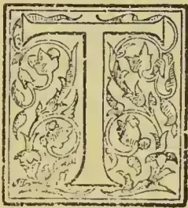

HE order *Diptera* includes the Gnats and Corn Midges, also the Daddy Longlegs, of which the grubs are so hurtful to many kinds of crops; the Blowflies, which cause great waste to meat in summer; the Gaddies, and a very large

number of other kinds, which, by means of their maggots, do boundless damage year by year to the roots of cabbage, onions, and other garden-crops, and likewise to the heart or stem of the growing corn, &c. All flies of this order have only one pair of wings; occasionally they are wingless. The hinder pair of wings is represented by a pair of appendages, often like a slender pin with a small head; these are known as "poisers" (scientifically, *halteres*), because they help, or appear to help, to poise or balance the insect. Some of these insects feed by suction, as in the case of the gnats, to our great annoyance. The maggots, or larvae, are fleshy and (with few exceptions) footless; sometimes, like the Daddy Longlegs grub, they have a hard head, furnished with nippers, or jaws; sometimes they have a soft mass which answers for a head, commonly bearing a pair of hooks instead of jaws, with which they clear out the substance between the two sides of a turnip-leaf, or from the inside of an onion-bulb, or

other soft material in which they may be feeding] The pupa-case, or chrysalis, varies in shape; in some kinds, as of the Gnat and Daddy Longlegs, for instance, it is in shape much like the creature within, with its limbs folded; in many other kinds, as the Onion Fly, Carrot Fly and others, the pupa-case consists of the hardened maggot-skin, which shelters the forming fly within.

The Daddy Longlegs, or Crane-fly, likes damp surroundings, and thus we get an idea of how to keep its numbers in check. The flies frequent damp overshadowed herbage, or marsh-land, or wet, neglected weed-growth, and in such places, they lay their eggs. The grubs thrive in such positions or at the roots of crops so long as the ground is not too dry for them, and when they have fed for some months they turn into a pupa, which, by means of the spikes at its side, sets itself up in the ground conveniently for the fly to come out from.

The best way to forestall attack is to make the land unsuitable for egg-laying. Draining marsh-land, and rough mowing long grass or neglected herbage in shady parts of pasture-fields hedge-sides, and other like places, drives off a great deal of attack; but the chief difficulty is on land broken up from pasture or clover-ley. The eggs are mostly laid, towards autumn, in such localities (that is, pasture fields or clover-ley); therefore, if these are merely broken up, without any measures having been previously taken to prevent egg-laying, or to kill the "leather-jacket" grubs in them, it is no wonder that the next crop should often be totally devoured. Any measures that will serve either of these purposes are highly desirable. Where pastures are to be broken up, it is a good plan to fold sheep on the ground and hand-feed them, thus making the ground obnoxious to the Crane-fly for egg-laying, and also by the trampling and by soddening the ground with the droppings of the animals, destroying most of the eggs or young grubs that may chance to be on the surface. Heavy dressings of hot lime are useful, and dressings of fresh gas-lime, or alkali waste, which kill everything they touch whilst in their caustic state, are an excellent preservative from attack. These two chemical dressings cost little (where they are procurable at all), and gradually

461------------------------------------------------

442THE TROPICAL AGRICULTURIST[JAN. 1, 1897.]

turn to a manure of the same nature as gypsum. Salt also has been found useful for dressing leys with in autumn. Laid on at the rate of 10 cwt. the acre, and ploughed in, it has been found to kill the couch-grass (a very serviceable means of prevention of insect-ravage), and there was no further trouble from either grub or wireworm. Bush-harrowing does good, and paring and burning the surface is also an excellent remedy; but this has drawbacks, on account of the expense of labour, also wasting so much of what, in rotting, would have been fertilizing material.

Where eggs and maggots are in the ground, the most hopeful method of meeting coming attack is to make all possible arrangements to push on a good growth, and, firstly, to secure a good start. This is one reason why deep ploughing is advised in breaking up leys. Some of the eggs and young grubs will thus be turned down too deep to hatch, or to make their way up again. Also judging by what has been observed in other instances, those eggs which are well turned down, out of reach of the amount of air natural to them, will either not hatch or be so much retarded in date of hatching that the date of attack will also be retarded, and the young crop has a good chance to get well established before the grubs are ready. This first start is a very important matter; if the young plant is stunted in its first growth, it most likely will never do as well as if it had begun heartily; and this point should be borne in mind as one great method of counteracting injury from insect attacks to roots or leaves. Get a good start, by using good, fresh seed, by proper treatment of the land beforehand, and, if you can, by burying the enemy so deep down that it will neither make its own way up at the natural time, nor be turned up again by afterploughing or cultivating; and thus we get our plants so ahead in the race that we may hope to win. This is a general principle, suited to all crops.

But to return to special treatment of Daddy Longlegs grubs. If attack is found to be bad in growing corn, some fertilizer, such as guano and salt mixed, applied, say, at the rate of 4 cwt. the acre, has been found to do much good. Nitrate of soda also acts well, both by benefiting the plant and injuring the grub. In experiments tried by placing Daddy Longlegs grubs at a depth of one inch below the surface, it was found that where nitrate of soda at the rate of 2 cwt. the acre was well watered in, the grubs so treated were very relaxed, soft and helpless, and so continued whilst observed and reported. This helplessness is a very important point, for thus the grub, instead of creeping away, is kept under the action of the solution good for the plant but bad for itself, and ultimately dies.

Special chemical applications, only intended to kill the grub, have (in the instances noted) been found not to do good, because they are so much weakened in passing through the ground that they are quite harmless by the time they reach the creature they were meant to kill. This has been the case with chemical acids—carbolic acid, for instance; but whether we might not do good by vegetable applications, such as that of mustard-cake, is a matter for further consideration. The treatment may shortly be described thus:—prevent egg-laying, if you can; bury eggs and grubs deep down out of the way; give your plant a good start, and keep it well up under attack, if attack comes. But, further, we should in this, and in all cases, look at the special habit of the pest. The Daddy Longlegs grubs cannot bear heat, light, and drought; therefore two kinds of treatment, apparently quite opposed to each other, have been found useful, for they both bear on the above habits. Hoeing has been found useful, because thus, in dry sunny weather, the powdery, dry ground is just what the “Leather-jacket” grub dislikes. Also rolling at night, or at early dawn, does good; for then, during the cool dusk hours, we may catch many of the grubs on the surface, and they may be crushed by the Cambridge roller or Croskill’s clod-crusher; and rolling the ground firmly in this way

likewise prevents some of the grubs “travelling.” There is one more point which has not been brought forward, but which, by watching the habits of the creature, I think might be very usefully worked in garden ground. I find the grubs like to lie under a thin damp turf; they will collect in large numbers in such a spot. Probably it would answer well, in garden-ground, to lay slats, or tiles, and send a boy round every morning to clear what lay below. I have only worked this plan out myself on a small scale, but it is worth considering. The above is one of our regular yearly attacks, especially to be looked for after a damp autumn and winter, because as we have seen, dampness and moisture suit the Daddy Longlegs in all their stages.

The next of this gnat-like division of flies that may be considered is the Wheat Midge (*Cecidomyia tritici*), the eggs of which produce the little orange or red footless grub known as the “Red Maggot,” often found in wheat-ears. These little gnats are hardly more than an eighth of an inch long in the body, but have long legs and horns, and the female has a long ovipositor, as thin as a hair, with which she inserts her eggs in the wheat-florets, or those of such other kinds of corn or grass as she may infest. This operation is mostly performed in the evening, and we are indebted to the observations of Mr. Swannick, of the Royal Agricultural College Farm, Cirencester, for the information that, just at the time of development, the flies were not only attacking the wheat, but were to be found in great numbers in clover-land which was in wheat the previous year, and also amongst rough grass at hedge-sides. The Maggots soon hatch, and feed on the germ or some part of the soft grain; they are very little grubs, hardly more than the twelfth of an inch long, yellow, orange, or scarlet in colour, and slightly pointed at the head. The loss they cause by feeding on the corn-grains sometimes amounts to as much as from one to about three sacks (that is, about half a crop) per acre. After they have left off feeding, some remain in the corn, and are carried with it; others remain in the stubble, or fall, or go down into the earth, where in time they change to crassalids, from which the Midge-flies come out about corn-flowering time in the next year.

Our best method of prevention is to destroy the Red Maggot (for the chrysalis, if it has turned to it) in its winter shelter. Deep ploughing, such as will turn infested stubble thoroughly down, will act well, for once deeply buried the Gnat-fly either will not develop or cannot come up again. It is not enough considered in these matters that we may by our own common knowledge often guide ourselves. If a weak small grub (so small that we can scarcely see it) has a weight of earth put on it, somewhere about as much as if at least thirty or forty yards deep of earth were placed on one of ourselves, it is very unlikely that, where it is not specially supplied with powers for piercing the ground, it will come up again as a grub; and the Guat-Midge, if it does develop, certainly cannot make its way through. This is one of the points that show us how to keep insects in check; we need often merely to consider just what is before our eyes and act on it. Once down, and left down (for, of course, if we bring the grubs up again by a second equally deep ploughing we lose our labour), we have in all probability buried the coming attack safely away. All measures which will lessen the amount of couch-grass, or other wild grass, (it is either known or believed, to lie in the heads, or shelter at the roots during winter), would help to keep the amount of this midge in check. Clearing and burning rough grass by hedge-sides is one method; gathering up the corn-stubble and burning it, directly the corn is harvested, gets rid of whatever is at the roots; and also (and this is very important) all the dust from the threshing-machine should be burnt where wheat is known to be at all infested. The Red Maggot may often be seen in millions in this, and absence of attack has been found to follow the plan of carefully burning the infested dust.

462------------------------------------------------

JAN. 1, 1897.THE TROPICAL AGRICULTURIST.443

The Hessian Fly (*Cecidomyia destructor*) is another of the *Cecidomyiæ* which is very hurtful to various kinds of corn in America, and in various places on the Continent of Europe, and which was first observed in this country in the year 1886. With us the attack is in some degree to wheat, but chiefly to barley; and it does not appear likely to be a serious crop-pest. The perfect fly much resembles a stout-made little brown gnat, about one-eighth of an inch in length, with one pair of smoky-grey wings, and with long horns.

The attack may be to the young plant, but with us it mostly occurs only as a summer infestation to the growing stalk, where the small white legless maggot feeds *outside* the stalk, but *inside* the leaf-sheath just a little above one of the knots. Commonly it is just above the second knot, but the attack may occur lower down at the first knot, or close to the root, or higher up above the third or fourth knot. The mark of attack being present is the stem elbowing sharply down just above where the maggot lies. It does not commonly break, but unless the straw is very firm, it bends at the weakened spot, and thus damage is caused to the fallen head, besides difficulty in reaping from the confused state of the straw. The maggot may live for about four weeks in this position, and then it changes at the spot at which it fed, to a flat brown chrysalis, in the size and shape and colour minutely resembling a rather small and narrow flax-seed, whence the name of "flax-seeds" is commonly given to these chrysalis-cases or *puparia*. Within this hard outer husk the maggot changes to chrysalis, and the chrysalis to the perfect fly, but how long this may take depends very much on circumstances. It may occur, under natural and favourable circumstances, so soon that the whole time occupied in the life of the fly from egg to development is only about forty-eight days: or under favourable circumstances it may be retarded. Thus some of the Hessian flies may come out in autumn on the fields; whilst some of the "flax-seeds" threshed out, or stacked in the straw, or kept artificially for investigation, may very likely not hatch until May, or much later in the following year.

With this attack, more than, perhaps, almost any other, we rest on the application of common agricultural measures, and dates of sowing, for the treatment which, joined to effects of the climate, has hitherto kept this infestation in check. A great part of the damage caused by the maggot's presence, arises from the stem being so weakened that it elbows down; therefore, all selection of kinds of seed, and all treatment calculated to give a healthy strong straw which will not give way under a moderate amount of maggot infestation, are direct means of preventing loss. So far as wheat is concerned, our usual time of autumn wheat-sowing places the spring of the young plant well after the time when the summer Hessian flies are about. In the process of threshing, the so-called "flax-seeds" are thrown down with the light screenings, and can readily be gathered up with them and destroyed, thus putting an end to all chance of recurrence of attack from this cause; and as hitherto we have only been troubled by the summer attack on the corn stems, and had no difficulties from the additional multiplication caused by a winter infestation on the young plants, it may be well hoped that this corn attack will not take the serious place in this country which it does in many other parts of the world.

#### BIBLIOGRAPHY OF CACAO.

*Abels, A. P. G.* [See under COFFEE.]  
*Academie-Salerno.* [See under TEA.]  
*Arisi, Francesco.* Il cioccolato: trattenimenti ditiramico. Cremona. 1736. 40.  
*Avanzini, Giuseppe.* Lezione academica in lode della cioccalata del dottore G. A., Medico... Bernardo Paperini. Firenze. 1728. 40.  
*Bachot, S.* Quaestio medica, an Chocolatae usus salutaris? Paris, 1684. 40.  
*Bannister, Richd.* Cantor Lectures on Sugar, Tea, Coffee and Cocoa. [Soc. of Arts. Apr-May. 1890.] London. 1890. 40.  
*Barber, Jas. H.* Cocoa Planting in Ceylon, with Hints as to the best Varieties to be cultivated. Colombo. 1838.  
*Baron, Hyacinthe Theodore, the Elder.* Praes. See *Le Mounier, L. G.* Quaestio Medica... An senibus Chocolatae potus? 1739. 40. [Idem. Resp. Morand, J. F. C. Paris. 1749. 40.]  
*Bartelink E. J.* Handleiding voor Kakao-planters. Amsterdam. 1885. 80.  
*Barton, William P. C.* Some account of a plant used in Lancaster County, Pennsylvania, as a substitute for Chocolate (*Holcus bicolor*). Philadelphia, 1816. 80.  
*Beermann, C. H.* Resp. De Chocolatae analepticorum principe. See *Cartheuser, J. P.* Francof. ad Viad. 1763. 40.  
*Belfort de la Roque, L. de.* Le Chocolat, 400 pp. 52 fig. Paris. 1892. 160.  
*Belli, E.* [See under TEA.]  
*Bernoulli, C. G.* Uebersicht der bis jetzt & bekannten Arten von Theobroma. Zurich 1869. 40.  
*Blankaart, S.* [See under TEA.]  
*Blegny, N. de.* [See under TEA.]  
*Boissel, .* [et *Pelissart, .*] Observations sur le cacao et le chocolat. Paris. 1772. 120. See *Observations*.  
*Bontekoe, C.* [See under TEA.]  
*Boreux, .* [See under Coffee.]  
*Bourgoin d'Orli, P. H. F.* [See under Coffee.]  
*Boutigny, P. H.* De Chocolat, de sa fabrication, des moyens de reconnaître sa falsification, et de ses propriétés alimentaires et médicales, &c. Evreux. 1827. 80.  
*Brancatius, Franciscus Maria* [i.e. *Brancaceio, F. M.*] F. M. Cardinalis Brancatii de chocolatis potu diatribe, [With an address to the readers by *D. Magrus*.] Romae. 1664. 40. [Ibid. 1666.]  
*Brisset, Carolus.* Resp. See *Dupont, M.* An salutis usus Chocolatae? Paris. 1661. 40.  
*Broadbent, H.* [See under TEA.]  
*Browne, Jos. M.D.* [See under TEA.]  
*Bruckmann, Franz Ernst.* Dissertatio de Avellana, Mexicana. Praes. J. C. Spies Helmstadii. [1721.] 40. [Editio secunda. Relatis brevius de Avellana Mexicana vulgo Cacao dicta. Brunsvigae. 1728. 40.]  
*Buchoz Pierre Joseph.* Dissertation sur le Cacao et sur sa Culture. Paris. 1787. 80.  
*Buchoz, Pierre Joseph.* [See under TEA.]  
*Butler, John. Bishop.* An Address to the Cocoa-Tree from a whig. See whig. 1763. 80.  
*C., J. L. M.* [See under TEA.]  
*Cacao.* Le Cacao. Historique, préparations et propriétés du Chocolat. Le Chocolat d'Aiguebolle, &c. Aiguebelle 1889. 320.  
*Cacao Cultivation.* Cacao Cultivation in Ceylon. A. M. & J. Ferguson. Colombo. 18—.  
*Cadbury Brothers.* Bourville. A descriptive account of the growth of Cocoa and of its manufacture by Cadbury Brothers. Reprinted from the "British Trade Journal." Carlisle. [1880.] 80.  
*Cardelli, M.* [See under COFFEE.]  
*Cardelli, P.* [See under Coffee.]  
*Cardenos, Seande.* Del Chocolate che provechos haya, y se es saludable o no. Mexici. 1609. 80.  
*Cartheuser, Johannes Fridericus.* De Chocolatae, &c. See *Beermann, C. H.*  
*Cerferr de Medelsheim, Alphonse E.* Le Cacao et le Chocolat considérés au point de vue hygiénique, &c. [Extrait des Études industrielles à propos de l'Exposition universelle de 1867. Paris. 1867. 180. 2nd. édition. Paris, Clichy. 1873. 80.]  
*Chamberlayne, John.* [See under TEA.]  
*Chélus, de.* Histoire naturelle du Cacao et du Sucre, &c. See *Histoire*. 1719. 80. [Paris. 120.] [Also 1720. 80.]  
*Chélus, de.* The Natural History of Chocolate... Translated from the last edition of the French [of de Chélus.] See *Histoire*. 1724. 80.  
*Chélus, de., D.* See *Brookes, R. M.D.* The natural History of Chocolate. Translated from the French. 1750. 80.

463------------------------------------------------

444THE TROPICAL AGRICULTURIST.[JAN. 1, 1897.]

*Chevallier, Jean Baptiste Alphonse.* Sur les falsifications qu'on fait subir au chocolat, &c. (Extrait du Journal de Chémic Médicale... d'Avril. 1853.) Paris. [1853.] 80.

*Chevallier, Jean Baptiste Alphonse.* Mémoire sur le Chocolat, sa préparation, ses usages, &c. Paris. 1871. 80.

*Chocolade.* Die Chocolade, oder Erfindung und wirkung, so wie die Einführung und Zubereitung der selben, &c. (von *Korth*). Berlin. 1817. 80.

*Chocolade, —Fabrikant.* Die Chocolade fabrikation nach den neuesten Verbesserungen. Nürnberg. 1841.

*Chocolade, —Fabrikant.* Der aufgedeckte...Chocoladenfabrikant, oder bewährter Unterricht wie alle Sorten Chocolade...am bequensden zubereitet werden, &c. Kitzingen. 1826 80.

*Chocolate.* [See under COFFEE.]

*Chocolate.* Chocolate, its character, history and treatment. Strasburgh. [1870?] 160.

*Chocolate.* Imperial Chocolate made by a German lately come into England. [An advertisement.] [London. 1700?] s. sh. fol.

*Chocolate Nursery Rhymes Book.* Chocolate Nursery Rhymes Book. [Illustrated.] Dean and Son. London: Holland. [1891.] 80.

*Chocolate Surprise Book.* Chocolate Surprise Book of Nursery Rhymes. [Illustrated.] Dean and Son. London: Holland. [1891.] 80.

*Cocoa-Tree Club.* A Letter from the Cocoa-Tree to the country-gentleman [in reference to the formation of an "Opposition party" by the Duke of Cumberland and others.] London. 1762. 40. [Second edn. 1762. Third. 1763.]

*Cocoa-Tree Club.* A Derbyshire Gentleman's Answer to the Letter from the Cocoa-Tree. [London.] 1762. 80.

*Cocoa-Tree Club.* See *Arthur's Club-House.* A Letter from Arthur's to the Cocoa-Tree, in answer to the letter from thence, &c. [1762.] 40.

*Cocoa-Tree Club.* See *Whig.* An Address to the Cocoa-Tree [in reply to the Letter...to the country-gentleman.] From a whig [J. Butler, D.D. Third edition. 1762. 40.]

*Cocoa-Tree Club.* A Letter from the Cocoa-Tree to the Chiefs of the Opposition. London. 1763. 40.

*Cocoa-Tree Club.* Wonder upon wonder, or the Cocoa-Tree's Answer to the Surrey Oak, &c. To the tune of William and Margaret. [1757.] s. sh. fol.

*Coffee.* [See under COFFEE.]

*Colmenero de Ledesma, Antonio.* [See under TEA.]

*Colmenero de Ledesma, Antonio.* Curioso tratado de la naturaleza y calidad del Chocolate dividido en quatro puntos, &c. Madrid. 1631. 40.

*Colmenero de Ledesma, Antonio.* Chocolata Inda, Opusculum de qualitate et nature chocolatae...Hispanico idioma editum...nunc in Latinum translatum [By J. G. Volcramerus.] Norinbergae. 1644. 160. (Some say Latin translation by M. A. Severinus.)

*Colmenero de Ledesma, Antonio.* A curious treatise of the nature and quality of chocolate. Put into English by Don Diego de Vadesforte [i.e. J. Wadsworth.] London. 1640. 40.

*Colmenero de Ledesma, Antonio.* Chocolate: or an Indian drink...written originally in Spanish...and faithfully rendered in the English by Capt. J. Wadsworth. London. 1652. 120.

*Colmenero de Ledesma, Antonio.* Du Chocolate. Discours curieux...traduit d'Espagnol en Français...Par R. Moreaux...Plus est adjousté un Dialogue (par B. Marradon), &c. Paris. 1643. 40.

*Colmenero de Ledesma, Antonio.* Della Cioccalata discorso...tradotto dalla Lingua spagnuola nell' Italiana, con...annotazioni de A. Vitrioli [from the Spanish of B. Marradon.] Roma. 1667. 120. Venetia. 1678. 120. Bologna. 1694. 120.

*Comiers, Claude de.* [See under TEA.]

*Concina, Daniele.* Memorie storiche sopra l'uso dalla cioccolata in tempo di digiuno, &c. See N., N. & Memoire. 1748. 40.

*Cosmius, Henricus.* [See under TEA.]

*D.* [See under TEA.]

*Damme, O.* [See under TEA.]

*Debay, A.* [See under TEA.]

*Delafontaine.* Le Chocolat. Par Delafontaine et Detwiller, successeur de M. Masson, &c. Paris. 1859. 120.

*Delcher, E.* Recherches historiques et chimiques sur le Cacao et ses diverses préparations. Paris. 1837. 80.

*Denis, Jean Ferdinand.* Légende du Cacahuatl. See *Mangin, A.* Le Cacao, &c. 1860. 120.

*Disdier, F. M.* [See under TEA.] (Also) La meilleure manière de composer le bon chocolat.

*Duncan, D.* [See under TEA.]

*Dupont, M.* An salubris usus Chocolatae? Resp. C. Brisset. Paris. 1661. 40.

*Durante, C.* [See under TEA.]

*Eschweiler, M. J.* Resp. De Chocolata Indorum ejusque viribus medicis. See *Stahl, J. J.* Erfordiae. 1736. 40.

*Etienne, .* [See under TEA.]

*Eupel, Johann, Christian.* Grundlicher Unterricht, ohne Vorkenntnis alle Sorten Chocolade zu fabriciren...Nebst Anweisung zu Verfertigung der beliebtesten Sorten...Getränke, &c. Gotha. 1821. 80.

*Eubank, Thomas.* Life in Brazil: or a journal of a visit to the land of the cocoa and the palm...with over one hundred illustrations. New York. 1856. 80.

*Eysel, Johann Philip.* De Chocolatae usu at abusu. Erfordiae. 1694. 40.

*Felici, Giovanni Battista.* Parere intoruo all' uso della Cioccalata, scritto in una Lettera...all' Illustris. Signora, L. Girolami d'Ambra, &c. Firenze. 1728. 40.

*Ferguson, A. M., C.M.G.* [See under TEA.]

*Floyer, Sir John.* [See under TEA.]

*Forest, H.* Du Cacao et de ses diverses espèces, &c. Paris. Abbeville. 1864. 120.

*Foucault, F.* Resp. See *Bachot, E.* An Chocolatae usus salubris? Parisiis. 1684. 40.

*Fraser, .* Handbook of Cocoa? [Vide Trop. Agric. 1882-3. p. 726.]

*Gallais, A.* Monographie du Cacao, on manuel de l'amateur de chocolat: onorage contenant la description, l'histoire et la culture du Cacaoyer, &c, Paris. 1827. 80.

*Gensher, Thm M.* Dor Chocolaten-Fabrikant: eine gründliche Auweisung alle sorten feiner Chocolade zu verfertigen. Quedlinburg. 1835. 80.

*Giuntini, Girolamm* Opinion sur l'usage du bon chocolat (en italien).

*Goelicke, Andreas Ottomer.* De Balsamo Cacao. Francof. ad Viad. 1723. 40. [Ibid. 1736.]

*Gorkom, K. W. van.* See under TEA.]

*Gosselin, Augustin.* Manuel des chocolatiers traitant de la partie pratique des appareils en usage et de confection des bontons à base de chocolat. 1869. 80.

*Grafstrom, C. J.* [See under COFFEE.]

*Grouser, .* Essai medical sur le chocolat.

(To be continued.)

## CAPSICUM, POTATOES, AND SOME OTHER ECONOMIC SOLANACEAE OF INDIA.

[BY YOGENDRACRI GHOSA, OF THE AGRICULTURAL SOCIETY OF INDIA.]

(Continued from page 376.)

The uses and the habits of the potatoes are so well known that it is quite unnecessary to say anything about them here. Suffice it to say that although the cultivation of this wholesome tuber has become quite general in almost all parts of India, there are still to be found several orthodox enough so as not to use it in their food, rejecting it as a foreign article, and the number of such individuals in a town or village may be counted on the fingers. But there are numerous scrupulously pious Hindoos who still abstain from the use of potatoes on ceremonial observances, e. g., on the death of parents or husbands. On such occasions no Hindu, properly

464------------------------------------------------

[AN. I, 1897.]THE TROPICAL AGRICULTURIST.445

so called, should touch anything that does not belong to the category of "*Aksaralarana*" a technical phrase, literally meaning 'non-alkaline salt,' but including in that term the following articles of food:—(1) cow's milk; (2) clarified butter from cow's milk; (3) paddy (rice); (4) munga, a pulse (*Phaseolus Mungo*); (5) til seeds (*Sesamum orientale*); (6) barley; (7) sea-salt and salt from the Sindh. A longer list, however, technically called *Habisyanna*, contains the following:—

1. Paddy (Rice) which has ripened in the cold season and which has grey husk, rice made from such paddy without boiling it for unlusking.

2. Munga (*Phaseolus Mungo*).

3. Til seed (*Sesamum orientale*).

4. Barley.

5. Kalai, pulses of the *Phaseolus* order.

6. Kangu, *Panicum italicum*, the Kank of the N. W. P., Kankuidana of Bengal.

7. Vastuka, the Betu-asag of the Bengalis (*Che-nopodium album*).

8. Hilamocika, an aquatic weed (*Enhydra Binge*, D.C.).

9. Kala. The kari-m or karm-sag of the Thibetans and the Punjabis. A wild form of Cabbage or Colewort, much cultivated all the year round as a pot herb. (*Brassica sylvestris*?) In Bengal, however, the *kulekada*, a variety of *Capparis brevispi* is considered the same as the *kala saka* of the *Castras*. This latter weed grow, after the rains, in dried paddy fields, and is much sought after as a tonic and health-giving pot-herb.

10. Mulaka. The radish.

11. Panasa. The Jakfruit.

12. Amra. The mango.

13. Haritaki. The *Terminalia Chebula*.

14. Tintidi. Tamarind.

15. Jiraka. Cumin seed.

16. Nagaranga. The orange.

17. Pippali. *Piper longum*.

18. Kadali. The plantain.

19. Labani. The *nona* of Bengal. *Anona reticulata*.

20. Dhatri. *Emblica officinalis*, Gaert.

21. Kemuka. The Kann of the Bengali Kavi-  
[rajas]

With potato ends the unarmed section of Roxburgh Solanums. The foremost amongst the armed Solanums of Roxburgh is his

7. *S. Melongena* Wild. in which may be included his —

8. *S. longum* Roxb. This is the well-known *Begun* of the Bengalis, the egg-plant. It has been diversely named and variously divided into sub-species and varieties.

A. *Solanum ovigerum*, Dun.

*S. pseudo-undatum*, Be.

*S. esculentum*, Dun.

*S. insanum*, L.

B. *S. Melongena spontaneum*.

*S. incanum*, L.

*S. undatum*, Lam.

*S. zeylanicum*, Scop.

Dr. Watt, in this Dictionary of Economic Products of India, gives the following synonyms in addition to those mentioned before:—

*S. trongum*, Lam.,

*S. ferox*, Var. B. Kurz.,

*S. torvum*, var. *Inerme*, Dalz and Gibs.,

which brings 7, 8, and 9 under one general species. The uses of Brinjal as a vegetable is too well-known to be repeated here. One thing, however, should be noticed that almost all the species of the Solanaceæ are considered by the Indian Kavi-rajas as increasing the wind-temperament. But the fruit of the Brinjal, if cooked when tender, i.e., when the seeds are not sufficiently developed, is considered the best food for one with disordered liver. It regulates the action of the liver, which influence is perceptible within twenty-four hours.

10. *Solanum Æthiopicum*, Wild, same as *Lycopersicum tuberosum*, Mill. This is not of much economic value.

11. and 12. *Solanum diffusum* is perhaps the same as *S. incanum*, Chienense of Pluck. This is, no doubt, the same as *S. Jacquinii*, Willd., and the two varieties *A* with larger fruit and *B* with smaller fruit are the two varieties noticed by Roxburgh. He says under *S. diffusum* "there is another sort so exceedingly like this in every respect, that it was long before I discovered they were distinct. The chief distinguishing marks are the leaves in this are longer and more or less deeply lobated . . . and the prickles much more numerous, longer and sharper, all perfectly straight."

This is the Kantikari of the Bengalis and the Sarpatanoo of the Sanskrit authors, otherwise known as Gadhini.

The fruits are much esteemed by the people, and are eaten freely in their curries, for which the plant is cultivated in some parts of India. As to its official properties, there is no place for them.

The *S. diffusum*, Roxb. (11) and *S. Jacquinii* (12) therefore may be made into one species, *S. diffusum*.

13. *Solanum indicum*, L. This is the *Iyakuda*, of the native physicians, the *Vrhati* of the *Castras*. It is the same as:—

*S. violaceum*, Jacq.

*S. canescens*, Bl.

*S. cuneatum*, Moench.

*S. Heynii*, Roem.

*S. pinnati fidum* and *agreste*, Roth.

It has been wrongly identified by some authors with the *Gudakamai* of the Bengalis. The *Gudakamai*, however, is *S. nigrum*, as stated under that species.

The fruits are used in curries, and it must have been known to the Sanskrit authors as early as the Brinjal, for under the list of foods prohibited of particular lunations both this and the Brinjal occur.—*Journal of the Agri-Horticultural Society of India*.

(To be concluded.)

## TEA PLANTING THIRTY-FIVE YEARS AGO.

[By an Old Planter.]

Much has been written about the first efforts to establish the tea industry in India, but chiefly in official papers and in language too technical to excite more than a passing interest, and as most of the earlier pioneers have died out or retired, upon what not a few dividendless shareholders are wont to stigmatise as their ill-gotten gains, few have the slightest idea of how many of the older plantations were formed, the *shokes* and vagaries of those who opened them, what led first to the rush up Assam way, the crash of 1866. and the many ups and downs that have attended on the industry since. Of course, the old Government garden in Sibsagor, as every one knows (or ought to) formed the pioneer or Assam Company, though the Saharunpore plantation in the N. W., stocked with seed from China by Mr. Fortune, was looked upon as the guide for all matters pertaining to planting and manufacture; we may remark, parenthetically, it would perhaps have been better if Dr. Jamieson, the Superintendent, had not compiled that almost forgotten record No. XXV., which, like most amateur essays, put us all wrong from the commencement. However, the above preliminary gallop must be curtailed.

Those who journey to what was considered, six and thirty years ago, the Eastern Eldorado, have but a faint idea of how the land of promise was reached. True, some ancient Government Steamers ran at odd times up the Brimalmaputra, but the journey was chiefly performed by boat, the emigrant embarking from the Chitpore canal, then the main drain of Calcutta. Towards the close of 1858 I began my pilgrimage thither and for three weary weeks threaded the intricate water ways. It was necessary to reprovision at Khoolma; at least so said my Calcutta servant, and again at Burrisal, where I was most sumptuously entertained by the then Judge. The "dumpy levels" and yeomanry cavalry had

465------------------------------------------------

446THE TROPICAL AGRICULTURIST.[JAN. 1, 1897.

not then been disbanded so the *genus* loafer was unknown; hence the wayfarer throughout the country was received with the old unbounded hospitality which the now defunct Indians of the old school delighted to exercise. I tarried at Dacca, then garrisoned by H. M. 54th whose worthy Commandant I had become acquainted with a year previously. On resuming the journey I found the Moss President had restocked both my larder and cellar in the most bountiful manner and I was conducted to my boat in the witching hour, by a band of well-wishers, after one of those dinners the regiment was famous for. To cut a long story short it was on the evening of the twenty-first day I reached Chattue, having to proceed to Cherrapoonji first of all. All notice of that damp but, on the whole, delightful sanitarium—oh why was it ever abolished?—I reserve for a future paper. After a short sojourn of two days, during which I learnt my temporary destination was to be Cachar, I rode down to Sylhet for the X'mas week. That pretty little station, nestling in its embayment of wooded teelaha, was then a far different place of residence than now; there was a full staff of civilians; a wing of the gallant S. L. I., who had earned for themselves the distinction of holding the frontier tribes in check for three decades, capping their exploits, the previous year, by scattering the misguided mutineers of the 31th B. I. on the field of Latoo, but with the loss of their genial C. O. whose tomb in the cemetery, on the anniversary of his death for some years afterwards, was regularly illumined with chirags by the men of the regiment, till theirs and his fame faded gradually away into matters of frontier history. Shot through the groin, poor Byng bled to death, declining all surgical aid until his wounded men had been attended to. 1858 was the last great X'mas held in Sylhet, for there were 150 men of the Naval Brigade there, and a capital little theatre. It being before the advent of competition wallahs, at least to the penal settlement as Sylhet was then designated, all, from the Judge down, were true to the old Hailooby traditions, good horsemen and tolerably decent shots. Perhaps the perfunctory method of conducting public business at that time would not suit the present idea of the presiding powers, but that's a detail. More of Sylhet anon. Five days in a sumptuous pinnacle took my guide, philosopher and friend, together with myself, to the highest point on the river that could be reached in our heavy, cumbersome, albeit comfortable boat, and here we expected to find our horses but, as not unfrequently happened in those days, the animals had gone to the wrong place, so a trudge of eight miles over a roadless country awaited us and, as the troubles of the past year, when my friend's regiment had saved the bustees from being looted, were still fresh in the people's memory, milk and what fruit was to be had at that season were freely tendered, payment being declined, though sundry *sicces* distributed among the children were duly appreciated. At length we reached the station and were soon comfortably housed in the hospitable bungalow of Bob Stewart, the Superintendent, as he was then called. An effort had been made to induce the hill men to come in and enter into friendly relations—an invitation not over freely responded to as the most urbulent failed to put in an appearance having sundry qualms of conscience maybe, relating to past misdeeds. However, there was a goodly sprinkling of Munipoories, a few Burmese, with a mixed community of Kukis and representatives of sundry clans of Nagas: a few of the latter, by the way, caused the two ladies present to beat a hasty retreat, by their novel costume—or rather the want of it—for with the exception of an ivory or jade ring they were in *naturalibus puribus*. However, all went merry as the marriage bell, for the four days devoted to the mela. It may interest parters of the present day to learn that some first class ponies were brought down, the highest price then given being Rs 60, for which I became the lucky possessor of a mouse-colored beast afterward well-known in the district as the *Muggra*, but who carried me for eight years without being a day sick or sorry.

The European patriarch of the district was an elderly Frenchman who some four years previously had come up from the Mauritius, wandering all the way to this *ultima thule* of British India to plant coffee. Failing in that he had invested the remains of his capital in rice land, becoming a zemindar in a small way, taking unto himself a Munipoorie wife, and eventually subsiding into a veritable bustee-wallah. His only outing was these annual gatherings, but as years passed on he kept to his solitary barn, communicating with no one but two of the pioneer planters, till his death in 1862. Poor old De Fonché, I visited him once, finding that though fallen as he was, the innate politeness of his nation still shone out in vivid contrast to his meagre surroundings.

The gathering over we scattered. We planters (save the mark) hieing us off to the five factories (?) then existing. There were but six of us all told, and our qualifications for performing in an efficient manner the duties required of us may be gauged from the fact that our senior was a wild Irishman caught in a lawyer's office in Belfast, next came one from a London broker's establishment who astonished the natives by appearing for some months in full fig as if he were about to attend church; two brothers, one of whom had been quarrying limestone, the other fresh from the Australian diggings, an ex Bengal pilot and myself (almost direct from three years at sea). All were actuated by the best intentions but somewhat deficient in the agricultural line. The place to which I was bound necessitated our passing the night at the nearest plantation (?) and as we neared our goal my curiosity was rather excited as to what a tea garden for growing the plant was like; my previous notions being derived from such London suburban retreats as Greenwich and Kow, where you regaled on shrimps and bread and butter, in the back premises, and brought your own tea and sugar, the hostess supplying boiling water at 2d. a head. "There's the garden" said my friend who was to initiate me into the mysteries of planting; I certainly failed to detect anything in the shape of a garden, though among a sea of luxuriant waving thatching-grass the dilapidated roof of a tolerably large building towered; further progress on pony back was interrupted by a deep and exceeding muddy khal, spanned by what was known as a Kuk bridge, a delightful contrivance of two bamboos laid lengthways on others driven into the mud in the form of the lotter X, there was a hand rail, deficient in parts, to keep one steady on the six-inch foot-way, but we all got over without mishap, each carrying his saddle, the ponies floundering through the slush as best they might, and on emerging from which, their heads alone shewing the real color of their hides, the rest of the body being of a dingy bluish grey. A rather sinuous path led through the grass, before mentioned, to the house, which stood on piles about three feet from the ground; there were sundry gaps in the creaking, bamboo floor which our host cautioned us against intimating he intending building a new bungalow immediately. I mentally thought it about time, for the present walls were propped up *secundum artem* by cross bamboos that endangered one's head and shins. The furniture having been derived at odd times and from various sources, had the recommendation of variety, chiefly consisting of a table formed of planks, ultimately destined to be turned into tea boxes, bed-stands of bamboo, and a few cane chairs that needed cautious sitting upon first of all, to avoid sundry obtrusive spikes that came through the seats, and needed careful balancing lest the occupant should topple suddenly over: I must not omit to mention a "Sain Slick" clock whose outward shell having succumbed to the dampness of the previous rains was neatly kept together by strips of split cane. I assayed a bath, but beyond the coolness of the water can't say I benefitted much, as when emptying the gurrahs over my head I became aware of little tricklets of mud coursing down my body. As I rejoined the party after my ablutions, the host remarked that the water was clearer in the rains,

466------------------------------------------------

JAN. 1, 1897.]THE TROPICAL AGRICULTURIST.447

and he was digging a well: I subsequently learnt he had a habit of commencing many things but seldom finished one. Tiffin over, we strolled out, and being anxious to see a veritable tea plant I asked where they were: "Oh" said the Manager, "here you are," and forthwith plunged into the grass, where after diving about for some little time I was invited to inspect a small single stemmed-shrub about a foot in height. "Oh then," said I, "tea needs shade?" "No" was the answer, "but the new buildings will require a lot of grass, so I'm letting it come on." It certainly was coming on, but the tea did not appear to be doing much in that line. I was shown, however, several trees of the then despised wild or indigenous tea, some twenty feet high, which the Manager, with a view to making as much out of it as possible, had rung near the ground to get the leaf from the shoots, reserving the upper branches for seed. It did not seem to strike us professional planters, that by diverting the sap the fruit would suffer. A plentiful dinner, washed down with clean water brought from a mile away, closed my first day on a tea plantation, and we were up betimes next morning to the shrill crowing of the jungle cock and sundry other novel sounds. We were soon mounted, riding through first heavy forest, then grass, an occasional clearing where tea plants in better condition, as they had plenty of room for development, being some twenty feet or thereabouts apart, shewed up; then through a large Kuki poonji (ruled by a most grimy unwashed potcutate called Manji How) who came out to greet us, and on hospitable thoughts intent tendered a bamboo flagon of *mood*, tippie, when fresh, by no means to be despised, though being somewhat squeamish at the time I should have preferred a cleaner drinking cup, more specially as, to shew his good will, the tenderer took first pull, previously removing a ball of some masticated delicacy from his mouth, in which by the way he only partially succeeded, ere imbibing. However, it was the custom of the country, so I explored. The worthy old fellow had evidently taken several stoups ere our arrival, for his heart was so much opened that he presented me—under the impression, from my youthful appearance and dearth of hirsute adornments, that I was one of the softer sex—with a very handsome piece of amber, much to the mirth of my companions. Settling some matters as to contracts with His Highness, we hurried on, shortly emerging on the Chuttabheel with its then enormous stretches of swamp, pool and seas of eka; the path was not over well defued and as we came on damp places we had to proceed rather gingerly, for, as my companion said, there was a "nag tel" somewhere about but they didn't know the exact place. "What is a *nag's tail*?" said I, imagining it to be some animal or other; I was soon to be enlightened, for suddenly my pony plunged his forequarters into the earth, up to the girths; "Jump off, jump off," cried the other fellows: I was saved the trouble, being precipitated over the struggling creature's head, where, falling sideways, I formed a stepping stone, of which he at once availed himself, as planting his forelegs on my stomach, with one desperate plunge he extricated himself from the abominable quagmire. Directing me to lie flat, my chums hauled me out on to *terra firma* by my legs; having thus had my curiosity gratified as to *nag* tels, we resumed our journey till we came to the crossing of the Gogra, the passage of which then lay in the open bheel. Bridges, above the water, in Cachar were then rarities, but an elephant bridge had been put down here; that is to say, the bed of the dirty stream being uncommonly boggy, sundry logs of wood had been from time to time thrown in, to form a foundation; however, suitable the dodge was to keep the ponderous beasts for which it was intended, from getting bogged, it certainly proved trying to the legs of other animals, either bipod or quadruped; however, it had to be negotiated: the heaviest of our number went first; now his beast almost disappeared under water; then scrambled on to a tolerably sound log, then got stuck between two, finally scrambling out on the off

side pretty well blown; performing much the same evolutions, we followed, I again distinguishing myself by coming over the tail this time, as my steed mounted the final log. Nothing of any consequence occurred for the rest of the ride and we were soon in the bungalow, a far superior structure than that in which the previous night had been passed. The garden stretched away at the back while in front lay the open bheel and hard by ran the Jalingacherra, a small stream of what I did not till then believe existed in Cachar, *viz.*, clean water. Present planters might have objected to the want of such people as dholes, sweepers, etc., as also living on their guns, the absence of bread, butter and modern adjuncts to the table—for, even did the salaries then paid admit of indulgence in such luxuries, our only means of obtaining the latter were by the monthly boat from Calcutta. The boat-club—there was then one for each station—was a great institution, and the secretary's honorary appointment by no means a sinecure. The *dak* took thirteen days from town; so by the time the invoice came in the boat should have passed all danger and when she was due expectation was on tip-toe. During the cold weather but little anxiety was manifested, but from March till October there was gloom on many faces did she not turn up, and earnest confabs as to the ark's safety. One would contemplate his dilapidated boots, pondering as to whether the expected new ones had been despatched, or whether they'd fit when they did come to hand; as for clothing, that troubled us but little, Munipoorie cloth being cheap, suitable, and uncommonly good wear. But space is limited and having brought this opening chapter down to arrival in the district, we purpose setting forth our efforts in actual tea planting and manufacture—according to our then lights—in future papers.—*The Indian Planters' Gazette*.

## PLANTING IN LAGOS, WEST AFRICA.

FROM THE 31ST REPORT FOR THE QUARTER

ENDED 30TH SEPTEMBER, 1895,

ON THE BOTANIC STATION, COLONY OF LAGOS,

WE QUOTE THE FOLLOWING PASSAGE:—

### ECONOMIC PLANTS.

Many new and valuable plants have been introduced during the quarter, my thanks are due to the Kew authorities, who have helped us considerably, also to other establishments who have assisted to increase our collection.

Before leaving England the Kew authorities placed in my care a Wardian case of Plants that I selected. Since then two cases of Para rubber plants. *Hevea brasiliensis* have been received these plants are no doubt among the most valuable plants introduced during the quarter.

*Rubber Plants*:—Most of these that have been introduced thrive exceedingly well, especially the *Manihot Glaziovii* which yields Cearar rubber, any soil appears to suit it light or heavy. The *Castilloa elastica*, West Indian, Guatemala, and Honduras rubber trees have done remarkably well, and promise to be well adapted for cultivation in this Colony, some of these have been attacked by a borer, which if not destroyed kills the tree.

*Hevea Spruceana*, although it has not made such robust growth as some of those previously named, yet it has done fairly well. *Ficus elastica*, splendid trees of these exist, and it should do well, as numerous species of this genus *Ficus*, are represented here.

Coffee, *Coffea liberica*. As Coffee is being largely planted in this Colony, it may prove interesting to record the following report on samples prepared at this Station, it will be seen that they are not everything that could be desired, this was due to my departure, and being anxious to take the samples with me, before sufficient time was given for the beans to be properly dried.

MESSRS LEWIS AND PEAT TO ROYAL GARDEN, KEW.

Mineing Lane, London

11th February, 1895.

467------------------------------------------------

448THE TROPICAL AGRICULTURIST.[JAN. 1, 1897.

Dear Sir,—We duly received your favour of the 8th instant, with two samples of Coffee which we have carefully examined, and beg to report upon the same as follows.

The sample of *Liberian* is good, both in size and appearance, but it has not been dried sufficiently the berries turning out very soft and green.

The sample marked *Abeokuta* is however smaller, in size, hard and very coated, and has the usual growth of African Coffee.

Most of the berries are shaped like *Liberian*, and only a very few are of the *Arabie* kind.

From its appearance we should think this lot must have been affected by drought or probably the soil is not moist enough which would account for its poor appearance.

*Liberian* Coffee can be cleaned and sized here in London, but please urge thorough drying before shipment.

For low lying districts the *Maragogipe* (Brazil) kinds promise well, and where it has been tried it has given better results than *liberian*, but both samples that you sent would find a market, especially if better cured.

We are, Dear Sir, Yours faithfully,  
LEWIS & PEAT

D. Morris, Esqr., Royal Gardens, Kew.

It is a most important thing to have the beans thoroughly dried as will be seen in the report; this can easily be carried out.

*Abeokuta* Coffee is evidently different to the *Liberian* Coffee, when at *Abeokuta* I had an opportunity of seeing a small plot of these two varieties of Coffee growing together, and one could at once see that *Abeokuta* was very different to *Liberian* in growth and appearance.

In appendix I. I give a report on two Coffee plantations which I visited on my return from *Abeokuta*

### COFFEE PLANTATIONS IN THE COLONY OF LAGOS.

It will probably be interesting to record the advancement made in Coffee plantations in this Colony, which have originated through the establishment of this Botanical Station.

When returning from *Abeokuta* His Excellency the Acting Governor gave me permission to visit two plantations situated near the *Ado* river.

The first one I visited was at *Soto*, and is owned by the *Ilaro Estates Plantations Co. Ltd.*, it was commenced in 1892, and is under the management of a European. The manager Mr. Punch took me round and kindly gave me quarters for the night.

Mr. Punch calculates that he has 150 acres under cultivation which includes 50,000 plants of *Coffea liberica*, these plants are in different stages of growth, 1,200 plants are three years old and are producing a fine crop of large bold berries. 5,000 trees are two years old and are in a very healthy and flourishing condition, these also are producing berries, these are doing remarkably well when taking into consideration that a crop is expected much before three years, 9,000 plants were planted out last year and 36,000 during the present year.

About 1,000 *Coffea Arabica* are planted out, these have produced good crops of berries which are of good size.

*Cocoa* is also being grown 1500 plants have been planted out and their appearance is everything that could be desired for young plants.

*Rubber trees*:—*Ceara* rubber, *Manihot Glaziovii* are also being cultivated, 700 trees have been planted out and are doing exceedingly well, a few plants of *Ficus elastica* have made considerable growth.

*Fruits*.—Pine apples, the cultivated varieties of this fruit, are grown to a small extent, and produce fruit of good size and flavour.

The work is being carried out systematically, good roads cut, shelter belts left, and planting and hoeing being attended to, and carried out properly.

The ground is kept free from weeds as much as possible.

*Nurseries*:—Seedling plants of Coffee in beds number about 10,000 large nurseries are being made made for the reception of seeds for supplying plants to further extend the plantations, Mr. Punch hopes to raise 50,000 plants.

The plantations are worked at the present time by about 70 Kroot and Native labourers.

Judging from the healthy appearance of the plants, and their development since they have been planted out, the soil must be everything that could be desired, and well suited to the cultivation of Coffee and other plants.

The work is very creditable to Mr. Punch who takes great interest in his work, and who was pleased to see me to obtain information on many points.

I next visited the plantations the property of A. C. Campbell & Co., situated on the other side of the river and about 1 hour distant from the town of *Ajilete*. I visited this plantation in the early part of 1893, and reported on it, then preparations were being made for planting out during the rains, I could see a marked improvement since my first visit, and considerable work had been done.

Mr. Campbell offered me every facility and was pleased to see me visiting the plantation. Mr. Campbell states that he has 160 acres under cultivation most of these being planted with *liberian* Coffee, which number about 67,000 plants, and are represented in three stages of growth, 13,000 of these plants were planted out in 1893 and are in a most flourishing condition the berries are well matured and of good size. In 1894, 22,000 *Coffea liberica* were planted out and are doing well, 32,000 have been planted in their permanent place during the present year, the plants are looking very satisfactory for the time of year.

Here also are a few plants of *Coffea Arabica*, they have done so well that Mr. Campbell intends to extend the plantation and plant more of this kind.

*Nurseries*:—About 25,000 plants of *Coffea liberica* are in beds large enough to transplant.

*Vanilla*:—*Vanilla planifolia*, these were obtained from the *Batanic* Station and put in a shady and cool place in the plantation, here they have made enormous growth, and have been doing so well that Mr. Campbell anticipates planting out an acre with this valuable plant.

*Kola*:—*Kola aenminata* about 600 of these have been planted under the shade of forest trees.

300 plants of *Cocoa* have also been planted out to ascertain their suitability of further cultivation.

The plantation is kept in a clean condition free from weeds, the soil here too is rich in vegetable matter, it is pure forests land, and several streams pass through the plantation, which are very useful in watering the nurseries.

The work has progressed considerably since my previous visit; and the work carried out by Mr. Campbell is very creditable indeed. This plantation is worked by 45 labourers.

*Insects*:—To a small extent these exist in both plantations' the borer is the most destructive, but there are very few plants attacked by it, on its first appearance it should be at once got rid of. Mealy bug and scale attacks some of the trees' also a peculiar caterpillar at certain season of the year devour the leaves.

H. MILLEN,  
Curator, Botanic Station  
Botanical Station, Ebuto Metta, 23rd October, 1895.  
(To be continued.)

468------------------------------------------------

JAN. 1, 1897.]THE TROPICAL AGRICULTURIST.449ADULTERATED MANURES.

A matter which has for sometime been engaging the attention of prominent members of the Planting Community in Ceylon is that of adulterated manures, and from what we hear, we should not be surprised if the Hon. Mr. Christie brought it before the Legislative Council on an early occasion. We have not before us at the moment a copy of the Agricultural Fertilizers' Act which is in force in England, but we are informed that its operations have had a very beneficial effect. Of course there is much more occasion for such a law in the old country than here on account of the extent to which artificial manures are used, there; but this is a distinctly Agricultural, community, and if it can be shown that our planters suffer in any way on account of the quality of the manures with which they are supplied, we think the Legislative Council might very well consider how far the provisions of the Home Act may be utilized here. It may be pleaded that the business in manures here at present is very small. Granted that it is, is that any reason why the business may not develop?; and is it not wiser to take protective measures in time than wait until the evils have arisen? By some we know it is felt that there will be a difficulty about securing a sufficiently independent man to act as chief analyst under such an Ordinance as the Act that has been passed in England. Difficulties exist in order to be surmounted, and we cannot think that the one mentioned is an insuperable one. In this connection the name of Mr. Cochran naturally occurs to us. Of large experience in analytical work and proved ability, he is, we believe, sufficiently independent in character and position to perform with satisfaction what may be required of him under the provisions of such an Ordinance as we are referring to; and we are certain that if he were sounded on the subject it would be found that the expense of carrying out the law so far as his work is concerned, would be comparatively trifling. A well-known planting colonist of considerable standing in discussing this matter was most emphatic in expressing the opinion that manure was as essential to the success of the planting industry here as it was to agriculture at home and that manure dealers should be bound to sell on analysis,—adding "the way we are practically swindled at present is monstrous." The case of a planter whose experience in purchasing manure has left him "a sadder and wiser" man has been mentioned to us. According to our information a certain firm handed to him an analysis showing 2.30 per cent sand in the manure and said that what they would supply would approximate to this, though not prepared to guarantee the analysis. Out of a large parcel purchased on the strength of this, four analyses were made which showed the per centage of sand to range from 28 per cent to 35 per cent. Legal advice was taken on the matter, and we understand that it was stated that no guarantee having been given no rebate could be allowed. We merely give the alleged facts as they have been brought to our notice, and we shall look forward with much interest to the decision in the case which we understand will come before the Kandy Court at an early date. The case will no doubt be regarded as a test one, and show whether the ordinary law can be relied upon to protect planters in transactions of this nature. In the meantime it is well, we think, that public attention should be directed to the advisability

of provisions like those in the Fertilizers' Act being applied to Ceylon, and we shall be glad to hear what our planting correspondents have to say on the subject.

LADY BIRDS.

We are glad to be able to publish the following extremely interesting notes by Mr. H. O. Newport, Honorary Secretary of the Lower Pulneys Association. The thorough manner in which he is pursuing his investigations is worthy of all praise, and in view of the possible enormous value of such research, the need of an entomological expert must be patent to all:—

NOTES ON LADY BIRDS AND COFFEE BUG ON THE LOWER PULNEYS.

The following letters that I have lately received from Mr. Waterhouse and Professor Tryon are of sufficient interest to publish, I think.

Mr. Charles O. Waterhouse, of the British Natural History, Museum, does little more than corroborate Mr. Alcock's identification of the Lady bird. *Chilocorus nigrinus*, but Professor Tryon, of the Department of Agriculture of Brisbane, gives a lot of very interesting information.

The reason why the specimens of *Cryptolemus Montrouzeri* and *Rhizobius Ventralis* have not come is here explained.

With regard to *Chilocorus nigrinus*, so far as experiments have gone up to date, they have been absolutely unsuccessfully tried upon both the Brown bug (*Lecanium coffee*) and the White or Mealy bug (*Pseudococcus adonidum*). The Lady birds have in the case of the former refused to touch the scales. This is only natural, as it is only the larger and stronger Lady birds that do prey upon the hard shelled scales, to which class *Lecanium coffee* belongs, and there are not many Lady birds that will do so at all. There are other flies that do so, but these are more of the nature of *Ichneumonidon* and do but little good I am afraid.

In the case of the Mealy bug, *Pseudococcus adonidum*, some of these scales were put into the bottle containing the *Chilocorus nigrinus*. The Lady birds had for two or three days previously not had any food, and on this scale being put with them attacked it at once, but only devoured a very few and shortly afterwards died. Some were let free upon some Atti trees that were covered with this scale, but these flew up to the tops of the trees and were lost sight of. Experiments are being carried on, but from what I have seen, I doubt if *Chilocorus nigrinus* will prey upon any of our coffee scales but the one I first observed it upon.

The *Pseudococcus adonidum*, however, does not do one tenth of the damage to coffee that any of the other scales do, and of these especially *Lecanium viridi* which has so rapidly increased in S India during the past year.

One Lady bird and several species of small yellow or parti-coloured flies have been reported to prey upon the Brown bug *Lecanium coffee* and one Lady bird and several more flies upon the White bug *Pseudococcus adonidum*. One or two other predaceous insects have also been reported to prey upon the coffee louse (*aphis coffee*) and tea scale bug (*Chinaspis thea*), but so far as I can gather none have been reported as destroying either *Lecanium nigrinum*, *Dactylopius adonidum*; or the Green bug *Lecanium viridi*, except the Black Lady bird *Chilocorus nigrinus*.

This Lady bird has, I am glad to say, increased rapidly on this Estate during the past month. I have observed it in all three stages of eggs, larvae and mature insects upon the coffee. These are doing good work, but are not increasing as rapidly as I should like to see them, and certainly not as rapidly as either of the two Australian Lady birds did in Hawaii.

When the *Cryptolemus Montrouzeri* was introduced into Hawaii first, some pains had to be taken to pro-

56

469------------------------------------------------

450

THE TROPICAL AGRICULTURIST.

[JAN. 1, 1897

tect. them and careful notice taken of their habits and movements to assist and make sure of their rapid propagation and increase. So far nothing has been done with *Chilocorus nigrinus*. Whether the slow increase is due to the presence of a parasite or to other natural causes, I cannot say. I have never, in my observations, seen more than five or six eggs together that have been laid by the Lady birds, and this may be a reason, but until an expert entomologist looks into the matter, this point will not be satisfactorily settled.

It appears from Professor Tryon's letter that this is a bad year for Lady birds in Australia, and until we have the opinion of an expert to the contrary, may conclude that the 'exceptional meteorological conditions' Professor Tryon speaks of may have been present in India also. *Chilocorus nigrinus* on the Lower Pulneys have increased to a great extent since first noticed, and so far as I can tell as fast as could be expected, without any protection of any sort, and if they continue to increase a little while longer will do all that is expected, and hoped of them.

With regard to the Ceylon Green bug (*Lecanium viridi*), it appears, from notes on the subject I have obtained from the India Museum, that hitherto no male has been observed. Mr. E. E. Green in his Life-History of this scale (*Lecanium viridi*) says :—

"The male insect is at present unknown. It is probable that the insects now existing, though externally resembling the female form, are asexual, and that their broods are produced by the phenomenon known as 'Parthenogenesis, by which several successive generations are fertile without the aid of the male element (as is known to occur in the development of *Aphis* and a few allied insects)." It may, therefore, be presumed that this pest will appear and disappear again at regular intervals probably of some years' duration, and that when the male element becomes necessary again, the scale will die off, or disappear, leaving only a very few living to perpetuate the species which will again after due season becomes asexual and propagate in very large numbers. It is 10 to 15 years since green scale bug did much damage in Ceylon, and so far as is known was reported in S. India for the first time last year. How long the bug remained in Ceylon is difficult to say, as its natural food, coffee, was probably removed before it had naturally disappeared, but we may reasonably hope, I think, that in a year or within a few years time, this pest will disappear as rapidly as it appeared, and that we shall then be free of it for another long term of years.

With the many insects that are reported as preying upon various of our scale pests—a list of which I give below—as far as I can ascertain no experiments have been carried out or endeavours made to propagate any one with the object of exterminating coccids.

The following list will show that we have several indigenous Lady birds and many flies that will and do prey upon plant lice and scale, the examination of which, together with the introduction of well-known foreign insects, would surely give an entomologist plenty to do and sufficient material to work upon to ensure a satisfactory result. If our indigenous Lady birds with ordinary care are not found to propagate sufficiently fast, the imported Lady birds can, as has been shown, be propagated with due care.

*List of coffee scales, &c., and predaceous insects.*

<table border="0">
<tr>
<td>Brown Bug—<i>Lecanium coffee</i></td>
<td>=</td>
<td><i>Chilocorus circum-</i></td>
</tr>
<tr>
<td></td>
<td></td>
<td><i>datus</i>, Lady bird.</td>
</tr>
<tr>
<td>" " " "</td>
<td>"</td>
<td><i>Eucyrtus nict-</i></td>
</tr>
<tr>
<td></td>
<td></td>
<td><i>neri</i>, Fly</td>
</tr>
<tr>
<td>" " " "</td>
<td>"</td>
<td><i>Eucyrtus para-</i></td>
</tr>
<tr>
<td></td>
<td></td>
<td><i>disicus</i> "</td>
</tr>
<tr>
<td>" " " "</td>
<td>"</td>
<td><i>Scutellistra</i></td>
</tr>
<tr>
<td></td>
<td></td>
<td><i>cyanca</i> "</td>
</tr>
<tr>
<td>" " " "</td>
<td>"</td>
<td><i>Marietta leo-</i></td>
</tr>
<tr>
<td></td>
<td></td>
<td><i>pardina</i> "</td>
</tr>
<tr>
<td>" " " "</td>
<td>"</td>
<td><i>Cephalota</i></td>
</tr>
<tr>
<td></td>
<td></td>
<td><i>purpureivent-</i></td>
</tr>
<tr>
<td>" " " "</td>
<td>"</td>
<td><i>tris</i> "</td>
</tr>
<tr>
<td>" " " "</td>
<td>"</td>
<td><i>Cephalota fus-</i></td>
</tr>
<tr>
<td></td>
<td></td>
<td><i>eventris</i> "</td>
</tr>
</table>

<table border="0">
<tr>
<td>White Bug—<i>Pseudococcus adonidum</i></td>
<td>„</td>
<td><i>Scymnus rotun-</i></td>
</tr>
<tr>
<td></td>
<td></td>
<td><i>datus</i>, Lady bird.</td>
</tr>
<tr>
<td>" " " "</td>
<td>„</td>
<td><i>Eucyrtus nictneri</i>,</td>
</tr>
<tr>
<td></td>
<td></td>
<td>Fly.</td>
</tr>
<tr>
<td>" " " "</td>
<td>„</td>
<td><i>Chartocerus</i></td>
</tr>
<tr>
<td></td>
<td></td>
<td><i>musciformis</i> "</td>
</tr>
<tr>
<td>Green Bug—<i>Lecanium viridi</i></td>
<td>„</td>
<td><i>Chilocorus nig-</i></td>
</tr>
<tr>
<td></td>
<td></td>
<td><i>ritus</i>, Lady bird.</td>
</tr>
<tr>
<td>Coffee Louse—<i>Aphis coffee</i></td>
<td>„</td>
<td><i>Syrphus nictneri</i>,</td>
</tr>
<tr>
<td></td>
<td></td>
<td>Fly.</td>
</tr>
<tr>
<td>" " " "</td>
<td>„</td>
<td><i>Syrphus splen-</i></td>
</tr>
<tr>
<td></td>
<td></td>
<td><i>dens</i> "</td>
</tr>
<tr>
<td>" " " "</td>
<td>„</td>
<td><i>Micromus aus-</i></td>
</tr>
<tr>
<td></td>
<td></td>
<td><i>tralis</i>, Ant Lion.</td>
</tr>
<tr>
<td>Tea Scale Bug—<i>Chronaspis theoc</i></td>
<td>„</td>
<td><i>Appelinus</i></td>
</tr>
<tr>
<td></td>
<td></td>
<td><i>thocae</i>. Fly.</td>
</tr>
</table>

Coffee Bug—*Dac'ylopius adonidum*.

Black Bug—*Lacanium nigrum*.

India Museum Notes, Vol. II., No. 6. Howard O. Newport, Honorary Secretary, Lower Pulney Planters' Association, 15th October 1896.

Letter from Cash O. Waterhouse to H. O. Newport, dated British Museum (Natural History), Cromwell Road, London, S.W., September 7th, 1896.

Dear Sir,—In reply to your letter of 11th August, I beg to inform you that the Lady birds sent are to the best of my judgment *Chilocorus Nigrinus*, Fabr. *Cryptolecanus Montrouzeri* and *Ilizobius Ventralis* belong to the same family, but are both quite distinct from your beetle. I can give you no information respecting the scale insect at present. I am, dear Sir, Yours truly, (Signed) CHAS O. WATERHOUSE.

Letter from Professor Henry Tryon, Queensland, Department of Agriculture, Brisbane, to Howard O. Newport, Esq., Honorary Secretary, Lower Pulneys Planters' Association, Dindigul, S. India, dated 7th September 1896.

Dear Sir,—I have delayed replying to your letter of 15th June until now, having hoped in the meantime to have received additional specimens of the coffee-tree scale insects, concerning which you have consulted me; those you have sent not being in a condition suitable for accurate investigation owing to their having been badly molded. However, as you write to me again on the subject, under date of 11th August, I will no longer delay communicating what I have to say in the matter.

The "smaller almost transparent light green scale" that appeared upon the trees during the "hot months of March, April and May, but disappeared again when the rains came on in June and July" is, I presume, the insect that I have met with upon the coffee leaves you have sent. If so, I may state that this is with little doubt the coccus that Mr. E. E. Green has described under the name *Lecanium viridi*. This species is recognisable owing to the presence of a series of branched appendages of microscopic dimensions that occur along the margin and which are not difficult of demonstration.

The second variety of scale that you mention, but neither describe nor designate, I have however failed to meet with in your consignment and therefore cannot now treat of. But I may remark that I have detected, upon some leafless branchlets, from which I presume the *Girivilla* leaves—that you also send—have become detached and which therefore may too belong to this shade tree, numerous elevated rounded black bodies. These may have formerly been scale insects, but at the time of their receipt were merely masses of fungus having blackish-brown spawn-threads and bipartite spores.

I have little doubt but that the green bug (*Lecanium viridi*), as are other members of the genus to which it belongs, would be held in check by either of two of our scymnid beetles—*Cryptolecanus Montrouzeri* or *Ilizobius Ventralis*—a consignment of both of these predaceous insects I had expected to have placed at your disposal ere this; but it has unfortunately happened that owing to exceptional meteorological conditions that have been experienced during our winter months, these two

470------------------------------------------------

JAN. 1, 1897.]THE TROPICAL AGRICULTURIST.451

insects—that are usually plentiful—are comparatively scarce, so that the obtainment of an adequate experimental shipment would now involve three or four days continuous labour, *i.e.*, the expenditure of more time than I can at present devote to this business.

Past experience however leads me to conclude that this scarcity is only a temporary one. Meanwhile it is gratifying to learn (though I still consider myself pledged to assist you) that you have in your midst an Indian insect that you have found to be destructive to the green bug in a manner similar to that which it was hoped the Queensland Lady birds would display.

I may inform you then, in conclusion, that these Lady birds that you send, and that you have observed "feeding on the green bug on the Coffee Bushes" have been examined by me with much interest, and I must congratulate you on the discovery of an insect of such great economic importance. At first I thought they were examples of a variety of the European and Asiatic *Exochomus nigromaculatus* Gœze named by Erichson *nigripennis*; but the structural features that they manifest clearly locate them in the genus *Orcus*. This being so, I am inclined to think that the species is undescribed: but I have not access to the most recent literature relating to Indian Coleoptera, and, therefore, cannot pronounce on this point with certainty. Doubtless, however, its habit of consuming *Lecanium viridi* has not hitherto been observed or if so recorded.

We have a related though a quite distinct species of *Orcus* inhabiting Queensland from Keppel Bay northwards that is a formidable enemy of scale insects—especially feeding upon the species of *Mytilaspis* and *Aspidiotus* that injuriously affect citraceous trees. And other congeners, that however present marked dissimilarity both in livery and pattern, but that are also most useful in destroying coccus insects, occur in the latitude of Brisbane and elsewhere in the colony.

From the foregoing statement you will have also inferred that your Lady bird is neither of those you mention, *i.e.*, *Rhizobius* or *Ventralis Cryptolæmus Montrouzeri*. Indeed from both of them it may be once distinguished at a glance in being glossy and hairless, instead of being dull and copiously clothed with a short pubescence.

Apologising for the length of this communication, I am, dear Sir, Your faithfully, (Signed) HENRY TRYON, *Entomologist*.

P.S.—Your last consignment arrived in excellent order. I hope you will continue to send me examples of injurious insects. When it is necessary to send me them occurring upon their food plants, as in the case of scale insects, the specimens should be dried (not desiccated) prior to being packed. All specimens (except butterflies and moths) should preferably be first dipped in a weak solution of corrosive sublimate in alcohol.

Letter from H. O. Newport to Professor Henry Tryon, Department of Agriculture Brisbane Queensland, Pillavaly Estate, Ahtoor P. O., Madura District, dated 13th October 1896.

Dear Sir,—I am in receipt of your letter of the 7th September 1896, for which, and all the information it contains, I am much indebted to you.

The green bug or coffee scale that I forwarded to you I have little doubt is as you say *Lecanium viridi*. The black scale that I sent upon some cuttings of the *Grevillea robusta*, I am inclined to think may be *Lecanium nigrum*, but am not at all sure of this. I will however take the liberty of sending you some more specimens of that, and any other coffee scale I can find, packed in testitubes with weak spirit as I am doing at the request of the Superintendent of the Indian Museum, Calcutta, and trust that thus preserved they will reach you safely and in good condition.

The black Lady bird, specimens of which I sent you, I have obtained an identification of from Mr. A. Alcock, of the India Museum, Calcutta, as *Chilocorus nigrinus*, and have had this subsequently confirmed by Mr. Waterhouse, of the British Natural History Museum, London. Mr. Waterhouse says that *Cryptolæmus Montrouzeri* and *Rhizobius Ventralis* belong to the same family, but are both quite distinct from my beetle. He gives no further particulars however,

It appears that this black Lady bird is known therefore; but is peculiar to India I believe. Another Lady bird *Chilocorus circumdatus* has been reported to feed upon the *Lecanium coffee*: but the fact of *Chilocorus nigrinus* preying upon any of these scales does not appear to have been noticed or reported upon before this.

I thank you for your congratulations, and hope this discovery may be of use to the planting community here. I brought the matter to notice in a paper I read before the United Planters' Association of Southern India at the Annual General Meeting in August last, and hope they will now take the matter up and engage the services of some entomological expert to carry on further experiments.

As I am not a Naturalist, I feel the subject is getting beyond me. Since last writing to you the green scale *Lecanium viridi* has, I am sorry to say, very much increased in this district. The Lady birds have also increased and are doing good work in a small way but are not increasing as I should like to see them, nor are they increasing in anything like the proportions *Rhizobius Ventralis* or *Cryptolæmus Montrouzeri* must have done in Hawaii.

Whether this slow increase points to the presence of a parasite or is due to other causes I cannot yet say. I am still carrying on experiments, but find myself very much handicapped by want of knowledge of the subjects and experience.

I hope soon to receive the consignments of *Rhizobius Ventralis* and *Cryptolæmus Montrouzeri* you speak of and to experiment with them.

I am confident that these insects will do all we require in eradicating, or at any rate keeping the pernicious scales in check, if we can only propagate them in sufficient numbers.

If the slow rate of increase of the *Chilocorus nigrinus* is due to the presence of an ichneumonid or parasite, do you think it likely that that same parasite would give us any trouble by attacking and reducing in numbers either *Rhizobius Ventralis* or *Cryptolæmus Montrouzeri* if we imported them?

The presence of a parasite very much complicates matters, and for this reason particularly I am urging the engagement of an entomological specialist. I did what I could at the U. P. A. S. I. Meeting, but for want of funds the matter had to be temporarily dropped.

I am now in correspondence with the Honorary Secretaries of other Planters' Associations endeavouring to start a fund in conjunction with the Ceylon and Singapore Coffee Planters to engage the services of Professor Koebele or some other expert for this work.

Apologising for the length of this letter, I am sir, yours faithfully, (Signed) HOWARD O. NEWPORT, Honorary Secretary, the Lower Pulneys Planters' Association, Dindigul.—*Planting Opinion*, Nov. 21.

## AFRICANA.

### ROADS AND RAILWAYS.

Every year, when crop comes round, the transport difficulty becomes more acute. Want of good roads still prevents the general use of ox-waggons. The planter has to compete with the trading companies and the Administration for human carriage. Often he has to take the sorely needed labour from estate-work and send them *tenga-tenga* and still nothing seems to be done to mend this deplorable state of matters. If our Chinde correspondent is right and some of the three millions voted for the Uganda railway is to be applied in B. C. A. for railway purposes then we will have much cause for thankfulness. Most of us are wondering why our railway schemes are still so much in the air. If a serious block is not to occur soon then a railway must be put in hand early next year. According to all reports the Quilimane-Ruo lino is being started in earnest and it is not consonant with our boasted energy that our line should still be in abeyance. There is no question but that it will

471------------------------------------------------

452THE TROPICAL AGRICULTURIST.[JAN. 1, 1897.

pay; the route presents no insuperable difficulties; and the time is ripe for it. Meanwhile the need for roads is as urgent as ever. Why can Government not get out a military engineer either from home or from India instead of frittering away money in amateur attempts by men who know nothing whatever about roadmaking. One of our Indian Officers might easily be picked from the engineers and then we would be able to get roads and not useless tracks. Money is, in many cases, simply being wasted on so-called roads which will never be fit for vehicular traffic. Once a road is surveyed it would be better, too, to get it made by contract and let the Government cease to compete with merchants and planters for labour.

#### THE PRESERVATION OF GAME.

We have, of late, had more to criticise than to praise in the action of the Administration so that it is a pleasure to be able to commend the proclamation in the last *Gazette* as to the preservation of the game in what used to be known as the elephant marsh. The elephant marsh being so easily reached from Chinde is a favourite hunting-ground, but unfortunately the hunting has not always been carried on in a sportsmanlike manner. Game is sometimes shot irrespective of size, sex, or condition; and often the carcasses are left to the vultures and the hyenas. Too declaring of this area a preserve will therefore commend itself to all right thinking persons. There is, moreover, another aspect of the matter. It may yet be found possible to utilise the zebra, if not the buffalo, as draft animals and this preserve will afford the material to experiment upon. Both the African elephant and the zebra have been tamed and used and it is a pity we here in this protectorate cannot make use of their services. The African elephant, for example, would very quickly solve the transport difficulty if only someone with capital sufficient would seriously attempt to utilise it.

#### COMMENDABLE ENTERPRISE.

Mr. Morkel, who has started a transport service on the Blantyre-Zomba road, is now busy making drifts at all the streams and doing his best to improve the road for transport work. This is work the Administration have been urged to do again and again but as usual it has been left to private enterprise to see the improvement effected. We hope, however, for the sake of their own good name that the Administration will see that Mr. Morkel is suitably recompensed for his work, undertaken in the public behoof as much as his own. It will be remembered that Mr. Morkel successfully carried through his contract with the Trans-continental Telegraph Company when they were laying the line between Blantyre and Zomba and lately he has taken a large quantity of the Messrs. Buchanans' coffee from Zomba to Michiru. Such work as Mr. Morkel's deserves every encouragement as it sets free much needed labour for plantation and other work.

#### A COFFEE EXPERT.

The African Lakes' Corporation deserve the thanks of the planting community for the latest fruit of their enterprise—Mr. J. B. Ferguson of Coorg, S. India. Mr. Ferguson has been appointed to visit the various coffee plantations and to report on the prospects of the coffee-planting industry. We are sure planters all over the country will give Mr. Ferguson a warm welcome and we trust they will not be backward in stating their difficulties as only thus can we hope for much good from Mr. Ferguson's visit. We are glad to see that the "Chamber" accorded him a warm welcome and we are sure that in his journeys he will find the B.C.A. Planters as hospitable as those of any other country. So far, we understand, Mr. Ferguson's opinion of our industry here is a very favourable one. He advocates shade and manure, the former, native fig trees or the Indian Bantian tree; and the latter, bonedust and poonae. We understand his opinion of Pride of India as a shade-tree is very low.—*Central African Planter* for October.

#### SUGAR AND TEA.

##### VIEWS OF NATAL GROWERS: ON VARIOUS POINTS.

"We don't rub shoulders enough with each other" was the observation of a planter, after a long and discursive chat, the remark being prompted by the interchange of views on various topics, during which each taking part in the discussions saw matters more clearly from his neighbour's standpoint. During my visit to the North Coast I had talks on many matters, and afterwards I regretted that I had not taken note of many of the points advanced. It is impossible to remember all just now, but I purpose to give off various "ideas" as they will submit themselves to my pen. Of course, the Indian question served as a fertile topic, and the views of planters thereon cannot fail to be of value. They warmly assert that the coolie has been the greatest blessing this country ever had, for without him Natal would have stagnated. As may be expected, they resent as unjustifiable the bitter opposition manifested in Durban to the coolie, not, be it remarked—for I did not hear a single word in that respect—the opposition to the introduction of the astisan. It was pointed out that until we got railways, Durban largely depended upon the coast; sugar industries, and the merchants and tradesmen were then only too pleased to compete for and get the business resulting from them. And even now, it is asserted, Durban and adjoining towns and villages profit hugely. As the result of the labours of the Indians on the estates, about £80,000 per annum is obtained from the soil. This is distributed in various ways. Supplies are drawn for the feeding of the Indians, there is transport requiring wagons to be made, machinery and appliances have to be purchased and repaired, building and other materials are necessary, ironmongery is an important item, managers and assistants have special needs, their houses have to be furnished, they and their families have to be fed and clothed, their horses require harness, their carriages need repairing from time to time, and so on. Over and above this, a large amount of freight is provided for the railway, and customs also benefit from imports. Then, as to the wages paid to the coolie labourers. I was informed that a very small amount comparatively went out of the country or was hoarded; but on the contrary, the money was spent in the Colony. This, I was assured, was corrected by one planter, who informed me that he was banker for his Indian employees, and therefore knew it to be a fact. Of course, it is also argued, that the employer spends largely of his profits in successful seasons, and that the Colony reaps the benefit. In short, it is contended that as the result of sugar, tea, and other industries, a very large sum is annually put into circulation, and, directly or indirectly, benefits everybody, it being maintained that so long as the coolie (and the white man could not possibly do his work) brings something out of the soil he is doing the Colony good, and gives scope to the merchant and tradesman to meet requirements thereby created. Now this is an assertion which is, certainly deserving of study in connection with the arguments for and against Indian immigration. While the planter strongly maintains that Indian labour immensely benefits the Colony, he is equally at one with those who object to the importation of the free Indian. This, says the planter, is the man doing the mischief, and from whom no real benefit is derivable, and agrees that, if possible, means should be adopted to check him. He not only competes, but fails to distribute his profits in the Colony. In connection with the free Indian imports, I may mention an important feature which came to my knowledge. Those agents who are importing these men are actually offering them as labourers to the planters, at a less rate and at lower wages than have to be paid for those obtained through the Indian Immigration Department. Thus it will be seen that by private enterprise Indian labourers are being brought to this Colony in competition with the official department. They are offered to the planters on an agreement for a certain number of years, such agreement to be ratified before a magistrate,

472------------------------------------------------

JAN. 1, 1897.]THE TROPICAL AGRICULTURIST.453

Of course, there is no authority over such men, the Protector would have nothing to do with them, and only the common law of the Colony would affect them or their employers. It is only fair to say that, despite lower wages, the planters are looking askance at these men, but they may be secured by the inexperienced. A question suggests itself in connection with these men. How will they be affected, if at all, by the new Indian Immigration Law? That law provides for re-indenture, return to India, or a penalty. How are those conditions to be applied to men introduced independently, and who, as we know, are coming in boat-loads of 300 to 500? If there is no application, it is probable there will be demand for amendment of the law to cover all Indian labourers employed on estates, farms, &c. In that way the difficulty may, perhaps, be met, but the alternative may be to drive these men to enter the competing ranks of Shop-keepers and small farmers. Anyway, this phase of the question is a new and interesting one. Amongst demands in connection with the agitation is that the duty of 3s. 6d. on sugar should be abolished. Seeing that sugar has done so well lately, this seems a fair and equitable demand, but the planter maintains that its removal would be a great mistake. The amount added to the price of their sugar is nothing but it is just sufficient to enable them to manufacture profitably. The amount of the duty does not go into their pockets, but the exchequer of the Colony gets the benefit. Its removal would have the effect of introducing an inferior sugar into the market, whereas at present the consumer gets a good article at a reasonable rate. Abolish it and harm is done to a big industry, which may be crippled by competition, with the result that up would go the price of the imported and inferior and foreign-made article. Where, then, the benefit? The same contention is made in regard to tea. Remove the 6d. duty, and you admit all sorts of rubbish (some of it now is bad enough in all conscience!), and at no cheaper price than that now required for the pure and unadulterated colonial article. Further, the tea industry would be crippled, the Colony at the same time losing trade benefits and the revenue the exchequer now derives from the duty. It is thought by some people that the planter pockets the equivalent of the duty on tea, but he does nothing of the kind. He charges the lowest level price for his tea, the consumer gets it cheaply, and the colonial revenue benefits by the duty on the imported article. On this point, and on the great benefit the Colony has derived from the introduction of the Indian, the planter is unswervingly strong, and asserts that those who are so warm in the Indian agitation do not look all round the question, being rather led away by fancied or at best minor grievances, instead of weighing the undeniably great advantages, as against the minor drawbacks. In comparison, the Colony (whatever the planter may have done) has, it is held, been enormously benefited, and that the introduction of the Indian labourer was the best thing that Colony ever did. In proof of the folly of prohibition, Queensland is pointed to, where Indian labour was stopped and Kanaka labour tried instead. What was the result? So serious were the effects of the banishment, so rapidly did the industry decline, so disastrous were the effects on trade generally, that the very man who introduced the expulsion measure moved for its repeal, for reversal of his policy, and for a return to former conditions. Leaving that branch of the question, and going to another as affecting colonial industry; the question was asked why Natal tea was not pushed in the English market, where Indian and Ceylon teas have done so well. That at once brought out another reason why the Natal growers should be encouraged as far as can legitimately be done. "Give us the same conditions as our competitors in other parts of the world," said one, "and we will compete." Enquiry as to the disadvantage led to the information that currency affected the question to a very important extent. In Ceylon the Indian labourer

is paid in rupees, and the difference between that currency and English coin is often considerable. This enables the grower to send his tea to the English market, for which, of course, he is paid in English money. Were it not for this margin in the cost of labour it is very doubtful whether tea-growing would pay in Ceylon and India, and it is this advantage which tells against the Natal grower, who has to pay for his labour in British coin. Where hundreds of Indian labourers are concerned, it will be seen that the difference in the aggregate is considerable, and that it precludes the Natal grower from sending his tea to the English market with any prospect of profit. As a fact, the competition in that market is exceedingly severe, and when, in addition, the comparative high cost of shipping, and the effects of drought and locusts on food crops are considered, it is doubtful the disabilities are not of a light character. There is no question as to the suitability of the soil to grow good tea. That has been abundantly proved, and no one can doubt it after gazing upon the hundreds and thousands of acres in Victoria County covered with the pretty and luxuriant tea plant, and seeing the leaf turned into the article of commerce. The Cape and the Transvaal have, therefore, to be looked to as the markets of the future. These again are affected by Customs duties, but, had the Natal Government's proposals at the last Customs Conference been accepted, the barrier would be free trade, in South African products have been removed, each Colony and State would have been benefited, and at least two important industries in Natal would have been immensely encouraged. It is hoped that the time is not far distant when an understanding will be arrived at by which South African neighbours will be enabled to supply each other freely with articles of commerce that each requires. The foregoing is given—without implying occurrence with the views expressed—as an exposition of some of the arguments of colonists prominently connected with industrial enterprise in Natal.—C.W.  
—*Natal Mercury*, Oct. 23.

## TEA COMPANY MEETINGS.

### THE LANKA PLANTATIONS COMPANY, LIMITED.

The ordinary general meeting of the shareholders of this company was held at the offices, 12, Fenchurch Street, on Wednesday last.

The Chair was occupied by Mr. George Allen, chairman of the directors, and amongst those present were Messrs. William Austin, Henry Bois, and Edward Pettit, directors.

The Secretary (Mr. Robertson) read the notice convening the meeting, and the minutes of the previous meeting having been read and confirmed, the Chairman said,

Gentlemen,—I presume you will take the report, which I hope you will take fairly satisfactory, as read. Referring to the paragraphs given therein in their order you will observe first that the coffee crop shipped to London was 605 cwt., against 1,371 cwt. last year, a deficiency of 766 cwt., and a deficiency in cash of £3,807. In 1894 we received about the same as now, and I hope that next year the figures will be equal to those of 1895, although I doubt it. The coffee grown on the estates is certainly as fine as any grown in Ceylon. With regard to cocoa, we now have 150 acres more than in 1895, the cost of the land and the new planting having been charged to capital account. Prices have been somewhat lower. We have always produced an extremely good crop from the estate, and continue to add to the acreage by buying small bits of land from the natives as opportunity occurs. Referring to tea, the next item in the report, I may mention that the increase in the quantity received from the estates during the year as compared with last year was 118 113 lb., representing an increase in cash of £4,460. Our teas always maintain good prices, and I think that great credit is due to our Superintendents for having so well maintained the quality of the teas. With regard to the statement showing the acreage of

473------------------------------------------------

454THE TROPICAL AGRICULTURIST.[JAN. 1, 1897.

the Company's estates you will observe they are as follows:—Coffee, 210 acres; tea, 2,166 acres; cocoa, 671 acres; grass, 163 acres; chena, 579 acres; forest and timber trees, 511 acres; making a total of 4,303½ acres. I will now deal with the profits for the past year. These, as you will see by the report, have been £10,708 1s 1d, to which must be added the sum of £1,270 18s 10d. the balance brought forward from the year 1894-5, making together £11,978 19s 11d. In my remarks last year I referred somewhat fully to the suspense account. As I at the time explained, this account was brought about by the substitution of Cinchona for Coffee and Tea for Cinchona. This has been done at a cost of £21,704 14s 7d, of which £14,056 8s 8d has been paid. The account is being reduced every year, and I hope you will consider the result satisfactory. In dealing with it I think we have been a little too virtuous. This year, for instance, in my opinion, £150 of the amount charged to this account might have been charged to capital, instead of to the suspense account. To those who have bought shares in the Company at a low rate, it does not much matter whether items are charged to the suspense or capital account, but it is only right that Shareholders who have been through the brunt of the battle should share in dividends fairly earned. I may state that during the past six years our dividends have been as follows:—1891, 2½ per cent; 1892, 1½ per cent; 1893, 3 per cent; 1894, 2 per cent; 1895, 4 per cent; and this year 5 per cent. With regard to the future prospects of tea, our principal customers abroad have been Russia, Canada, and America, and in all those countries the popularity of Indian and Ceylon tea is growing fast. I read in the report of Messrs. George White and Company that in the year ending 31st July last there were 81½ million pounds against 75 millions in 1894, the exports being 7½ millions in 1896. It is gratifying to find that the exports of Ceylon Tea in 1896 was 7½ million pounds of Indian Tea. I will read you an extract from a letter by Mr. Mackenzie which appeared in the *Home and Colonial Mail* of June 5. With regard to Indian and Ceylon tea in America Mr. Mackenzie says:—"The increase in the imports of British-grown teas into North America from 5,379,542 lb. in 1891 to 9,283,144 lb. in 1895, an increase of 72 per cent, is a striking fact, and, while demonstrating the value of past efforts, gives the greatest encouragement for the future. It may be confidently anticipated that, as in the United Kingdom, so in America, Ceylon and Indian teas will now rapidly come into general use and establish for themselves a wide demand. . . . Besides general advertising, we assist by subsidies many firms who advertise in many ways—in papers and magazines, by circulars and samples, by posters and signs, and by 'demonstrations,' where girls give away tea, and advise as to method of making it, in leading shops in many towns. We have also done much at theatres, giving tea to such as care to have it between the acts; and we have a lady who attends all church and social gatherings in New York and Brooklyn, to which she can gain admittance, with a complete apparatus of urn, teapot, several dozen cups and saucers, &c. She lectures on the merits of pure machine-made tea as contrasted with the weak, waxy, hand-rolled article." This, I think you will agree with me, shows the great effort which is being made to supersede Japan by better class tea. At home there is still considerable difficulty in procuring pure Ceylon tea at the stores and elsewhere. This I can only account for by the fact that, in order to keep up a certain retail price, the Ceylon tea is mixed with inferior kinds by the retailers. I shall now be pleased to answer any questions Shareholders may wish to ask, and move that the report and accounts be received and adopted.

In reply to Mr. Tye, the Chairman stated that the variety of the coffee on the estates was what remained of the old Ceylon coffee. The Liberian coffee was interlined in the cocoa.

Mr. Ford North expressed his entire satisfaction with the report, which he maintained did great

credit to the directors and managers. He was pleased to see that there had been no tendency to do away with coffee, which he believed would pay in the long run. He deprecated the existence of the suspense account. As a man of twenty years' experience in large tea concerns he had long been accustomed to see suspense accounts extinguished. In the present case he would be quite satisfied if the account was not increased.

The Chairman explained that when the suspense account was opened they issued 6 per cent. stock, which now stood at 12, and they (the directors) did not want to issue more. If they were their own masters they could charge everything against revenue, but when others had to be considered this would be decidedly unfair. This year they had to face a factory, and two or three years hence perhaps another. He considered that the expense should be charged to capital account, but circumstances might make it desirable to charge it to suspense account. Subject to this there need be no more additions to the suspense account. This year the additions had been made by the cost of fresh plant, a withering shed and timber for the new factory. He might add that if the profits had been taken from the suspense account there would have been sufficient to have paid 7½ per cent.

The following resolutions were then unanimously adopted:—

1. Proposed by the Chairman and seconded by Mr. Pettit: "That the report and accounts be received and adopted."

2. Proposed by the Chairman and seconded by Mr. Bois: "That the payment of a dividend on the 6 per cent preference shares for the six months ending December 31, 1895, be confirmed, and that for the six months ending June 30, 1896, be paid forthwith."

3. Proposed by the Chairman and seconded by Mr. Austin: "That a dividend on the ordinary shares for the year ending June 30, 1896, at the rate of 5 per cent, equal to 10s per share (free of income tax), be paid forthwith."

4. Proposed by Mr. George White and seconded by Mr. Ford North, "That Mr. Henry Bois, a director who retires on this occasion, be re-elected."

5. Proposed by Mr. Collinge and seconded by Mr. Ford North: "That Mr. William Austin, a director, who retires on this occasion, be re-elected."

6. Proposed by Mr. Collinge and seconded by Mr. Tye, "That Mr. John Smith be re-elected auditor for the year 1896-7 at the remuneration of £21."

A vote of thanks to the Chairman, Directors, and Managers of the estates in Ceylon was proposed by Mr. Ford North and seconded by Mr. Collinge.

Mr. Giles Walker expressed his pleasure at the inclusion of the Managers in the vote of thanks. He knew how hard they worked, and a recognition of this kind was sure to give a fillip to their efforts.

The Chairman having briefly responded, the proceedings terminated.

#### THE ASSOCIATED TEA ESTATES OF CEYLON, LIMITED.

The statutory meeting of the shareholders of this company was held at the offices of the company, 31, Billiter Buildings, on Monday last.

The chair was occupied by Sir Alexander Wilson, chairman of the directors.

The secretary having read the notice convening the meeting, the chairman said:—

Gentlemen, this is merely a formal meeting which is held within four months of the formation of the company, in accordance with the Act of Parliament. I have very little to say except that all the estates purchased by the company were transferred about the 10th of September, with the exception of Doragalla, the transfer of which was delayed on account of a marriage trust settlement on a portion of the estate, the existence of which had been overlooked by the vendor, having been originally made by him over fifty years ago. The matter has now been put right, and the necessary documents are at pro-

474------------------------------------------------

JAN. 1, 1897.]THE TROPICAL AGRICULTURIST.455

sent en route to Ceylon to enable the transfer to be completed. Our agents in Ceylon, Messrs Finlay, Muir, and Co., have now obtained control of the other four estates, and the tea of recent growth has been shipped home to the company, the first of it being printed in public auction for tomorrow. The delay with regard to the transfer of Doragalla estate has caused delay in making application to the Stock Exchange committee for a special settlement and quotation, but all the papers have now been lodged, and it is probable that the Stock Exchange committee and its meeting today will arrange the matter. The aggregate yield of all the properties up to latest advices received is satisfactory in comparison with the corresponding period of 1895, and the teas sold by the vendors, the proceeds of which, for all manufactured after the 1st of July, belong to, and will be accounted for to this company, show an advance in prices over those obtained at the time of the formation of the company. The outturn is also better, and in fact everything bids fair for smooth working. I hope to visit the estates within the next three months, having other business in the East, and to be able to give my personal views at our first ordinary general meeting. With regard to the making up of accounts and the payment of dividends, the directors have decided that the preference dividends shall be paid in two equal instalments on the 31st of March and 30th of September, which dividends will relate to the periods ending 31st of December and 30th of June, the interval of three months being necessary to get the produce home and sold and the accounts made up. I shall be pleased to answer any questions, and hope at the next meeting to have a much more interesting account to give.

In reply to a shareholder, the chairman stated that the tea which had been sold belonging to the vendor had been of good quality, and had reached higher price than was anticipated.

A vote of thanks to the chairman for presiding at the meeting, proposed by Mr. E. Loewenstein and seconded by Mr. G. W. Bake, was unanimously adopted.

The Chairman, in briefly responding, expressed the hope that, being an old tea planter, his forthcoming visit to the estates would be beneficial.

The proceedings then terminated.

[The quotation referred to above has been granted by the Stock Exchange committee, and the special settlement fixed for Nov. 18th.]—*H. and C. Mail*, November 13.

### THE CEYLON HILLS TEA ESTATES COMPANY, LD.

The first general or statutory meeting of the Ceylon Hills Tea Estates Company, Ltd., was held at the offices of Messrs. Bosanquet & Co., Chatlam Street, in the afternoon of Tuesday 1st Dec. Mr. J. H. Renton presided. The Directors present were Messrs. F. Liesching and W. W. Kenny, and the following shareholders were present or represented by returns:—Messrs. Delmege, Reid & Co., Mr. Harry Creasy, Mr. A. M. Caldecott-Smith, Mrs. Caldecott-Smith, Mr. R. A. Bosanquet, Mr. G. F. Traill, Mr. W. R. Alexander, Mr. James Alexander, Miss C. M. E. Alexander, Miss R. A. Alexander, Mr. W. Dougall Stuart, Rev. C. Bosanquet, Mr. F. A. Bosanquet, Q.C., Mr. E. F. Bosanquet, Mrs. R. A. Bosanquet, Mr. R. W. Wickham, Mr. N. C. Davidson,

Mr. H. CREASY proposed that the retiring Directors (Messrs. J. H. Renton, F. Liesching, and W. W. Kenny) be re-elected.

Mr. CALDECOTT-SMITH seconded.—Carried.

The CHAIRMAN laid a short account of the position and prospects of the company before the meeting; and re-election of Directors being the only business the proceedings ended.

### THE FERNLANDS TEA COMPANY, LIMITED.

This Company is being registered by Messrs de Saram with a capital of R275,000 with the object primarily of acquiring the Fernlands and Eton Estates at Pundaluoya for £16,000 sterling. The signatories to the memorandum published in tonight's *Gazette* are:—Isabella Frances Green, Edward Ernest Green, Helen Mary Green, Geo. H. Green, Arthur P. Green, Staniforth Green, H. L. Egan.

### INDIA-RUBBER.

India-Rubber is in a fair way to become one of the prime necessities of civilisation. Numberless human beings, in the class which could not afford wet-nurses, owe their lives to the feeding-bottle. Everybody knows that in the last five years the use of pneumatic tyres for cycles and solid rubber tyres for horse-vehicles has enormously increased our consumption of this article; but, quite apart from that more obvious fact, india-rubber is daily being introduced more and more into all sorts of machinery. Highly competent judges say that if the output could be doubled within a year, so many new applications of the material would instantly arise, that the price would not fall appreciably. As a matter of fact, the export of Para rubber has increased within the last twenty-five years from 5,600 tons to 20,000 tons; and the price fetched by the best quality has risen from 2s. to 3s. a pound. It is the one jungle product which society finds indispensable. Hundreds of men have racked their brains to produce a substitute, but none has in the least degree succeeded; and such attempts must be permanently discouraged by the knowledge that india-rubber exists in limitless profusion upon known spots of the world's surface which may at any time be made accessible. In any of the swampy equatorial regions, where vegetation grows rank and sappy, so that a knife will slash through branches as if they were made of cheese, there is pretty certain to occur some one or two of the score of trees which produce rubber. While forests of them are known to exist in Central Africa, only waiting to be tapped. But the regions which produce them are precisely the regions most deadly to the white man; and when the rubber is made it has to come to the coast on the heads of negroes, and will not pay the cost of transport. When an accessible forest is discovered it pays like a goldmine. A tree was discovered near Lagos which was believed to produce rubber; specimens of bark and foliage went home to Kew and the authorities pronounced it the right thing. In 1895 the export began, and amounted in the year to 2,263 tons, with a value of £270,000 in round figures.

India-rubber would seem to be the one certain source of wealth now locked up in Central Africa, and perhaps the most valuable thing that the region produces or can produce. Ivory is only a fancy article, and palm-oil has many substitutes. Gold no doubt exists there, but in the first place, it is doubtful whether the pure negro can be made into a miner; and in the second, gold is to be got in regions where white men can live. It seems, therefore, as if the special function of the tropics just now was to produce India-rubber, which is wanted everywhere and cannot be grown elsewhere. No cultivation is needed; Nature requires of man very little skill, scarcely any exertion, and only a reasonable avoidance of waste. Yet this is asking more than the African negro is at present able to give. The great rubber-producing region of the world is the basin of the Amazon, which yields about two-thirds of the entire annual output. The quality of this rubber is immensely superior to all others; the best Para will fetch in England as much as 3s. 6d. a pound; the worst African goes for under a shilling. Brazil has, of course, an immenso advantage in its great water-

475------------------------------------------------

456THE TROPICAL AGRICULTURIST.[JAN. 1, 1897.

way; ocean-going steamers run twelve hundred miles up the Amazon, whereas every African river except the Congo has a bar at its mouth, and cataracts not far distant from the coast-line. On the other hand, the forests in Brazil seem even more impenetrable than in Africa. Not even such roadways as the African man-paths can be maintained against the encroachment of the jungle. But the native Brazilian race is incomparably more intelligent than the negro. Their caoutchouc is better prepared, and what is far more important, they farm the trees as carefully as the Red Indians used to farm the beaver. In Africa the rubber is generally produced not from a forest tree, as in Brazil, but from the *landolphia*, which is a climbing shrub. The negroes deal drastically with this, and simply cut it down, and then get what milk they can out of it. So year by year the rubber-trees are destroyed, and year by year the negroes have to go further afield to seek them. If they are left to themselves they simply cease to produce india-rubber, and there is an end of it. If they have the fortune to live in the happy Congo State a certain amount of the stuff is exacted annually from each village; when the trees within each are exhausted, the collector comes round, finds no rubber, and goes home with a string of ears and noses instead. No doubt the West Coast negro is a trying person to deal with, but these in thods have been so long employed unsuccessfully that civilisation, we hope, may discover a better way, and educate the black man instead of torturing him. One is sorry, therefore, to hear that at Lagos, where the rubber is being produced from a forest tree, the *Kicksia*, the natives have been allowed to over-drain the trees of their milky sap and stop its production. The supply of rubber-producing plants in Central Africa is practically inexhaustible; but the number of places where they exist within easy distance of some export station is small, so far as our present knowledge goes. Yet for the present, speculators will probably hasten to be rich and if they hit upon a forest will treat it like a mine, anxious simply to take out the maximum at the minimum of cost.

Whether our State, or any other, will, ever make this a great branch of its tropical forestry remains to be seen. The Germans, with their usual thoroughness, have a strong scientific staff at the Cameroons. The English, in their usual makeshift way, content themselves with sending home to Kew for suggestions. But the Government of India have at least tried an experiment upon the great scale. No private firm, however wealthy, would embark upon the cultivation of indiarubber; the trees take a matter of twenty years before they can produce a pennyworth. In addition to that, cultivation must occupy a huge extent of ground of such a nature that no European can enter it during the rainy season, and where the growth is so thick that twenty men might be tapping trees within a mile of the ranger, and he none the wiser. Nevertheless, the Indian Government have a nursery of Para rubber-trees in Assam, extending over two hundred square miles, which will in time begin to yield; and if any department can control such a farm the Indian Woods and Forests will. Yet it seems, perhaps, a likelier scheme to carry out Sir Henry Johnston's general policy in this particular, and organise under Indian surveyors a forestry department in East Africa, where the trees exist in plenty. The industry is of course not confined to Africa and South America; rubber comes from Assam, Rangoon, Borneo, Penang, and Madagascar, amongst other places, but last year's export from Lagos more than doubled the united output of all those that have been named. If we are to stay in equatorial Africa, it will be a satisfaction to think that we can make some advantage out of it. What it costs to keep slavery in check from Uganda to Coomassie only mothers know who have sons in those happy regions. Civilisation is spending a great deal of energy on Africa, and one will be glad to find that Africa makes some return, if it be only to lower the price of pneumatic tyres.—*Spectator*.

#### WE-OYA TEA COMPANY, LIMITED.

At a meeting of the Shareholders of the above-named Company, held on Monday 7th December 1896, the following were present:—Directors; Mr. E. J. Young in the Chair, Messrs. W. J. Smith & E. S. Anderson.

Messrs. J. D. Balfour, A. Thomson, E. H. A. Vanderspar, G. Vanderspar. Mr. C. J. Donald acted as Secretary.

The following were represented by their Attorneys:—Messrs. C. Young, A. Morrison, W. Cookes, Major G. L. Gwatkin, Mrs. E. C. Baillie.

The following were represented by proxies:—Messrs. W. R. Tatham, J. Polson, Sir J. W. Bonser, D. Edwards, F. G. A. Lane, G. Pyper, W. H. P. Sparway, A. L. Hine Haycock, H. S. Rix, Mrs. E. C. Baillie, Mrs. A. S. Donald.

The following resolutions were carried:—

1. "That the following resolution passed at the Extraordinary General Meeting of the Company held on the 19th day of November 1896, viz: That the We-Oya Tea Company Limited be wound up voluntarily be, and the same is hereby confirmed as a Special Resolution."

2. (a) "That George Hay Alston of Colombo, Merchant, be and he is hereby appointed Liquidator of the We-Oya Tea Company, Limited."

(b) That the said Liquidator be paid a remuneration of one-half per cent on the price realised by sale of the Company's estates, in addition to all general Agency charges and commission similar to those at present paid by the Company."

#### THE YATIYANTOTA TEA COMPANY LIMITED.

At a meeting of the Shareholders of the above-named Company, held on Monday, 7th December 1896, the following were present:—Directors; Mr. W. D. Gibbon in the Chair, and Messrs. A. Thomson, E. S. Anderson, Mr. E. H. A. Vanderspar.

The following Shareholders were represented by the holders of their Powers of Attorney:—Mr. Chas. Young, by Mr. E. J. Young, Mr. W. H. G. Duncan by Mr. A. Thomson, Mr. G. W. Carlyon by Mr. A. Thomson, Mrs. L. T. Carlyon by Mr. A. Thomson, Mr. Jno. McLiesh by Mr. J. D. W. Wilson, Mr. J. K. Morrison by Mr. J. D. W. Wilson.

The following shareholder was represented by proxy—Sir J. W. Bonser.

The following resolutions were carried:—1. "That the following resolution passed at the extraordinary general meeting of the Company held on the 19th day of November 1896, viz:—That the Yatiyantota Tea Company Limited be wound up voluntarily be and the same is hereby confirmed as a special resolution."

2. (a) "That George Hay Alston of Colombo Merchant be and he is hereby appointed Liquidator of the Yatiyantota Tea Company Ltd."

(b) "That the said Liquidator be paid a remuneration of one half per cent on the price realised by sale of the Company's Estates in addition to all general Agency Charges and commissions similar to those at present paid by the Company."

476------------------------------------------------

JAN. 1, 1897.]THE TROPICAL AGRICULTURIST.457SELANGOR PLANTERS' ASSOCIATION.

The following are extracts from the minutes of a General Meeting held at the Selangor Club on Saturday, 21st November.

Read letter from the Colonial Secretary in reply to the Hon. Sec., S.P.A., *re* "An Ordinance, for the Protection of Indian Immigrants." Resolved that the Hon. Sec. should, as suggested by the Colonial Secretary, apply to the Resident-General for information as to whether fresh legislation on colonial lines is meditated for each or all of the Federated States.

The Draft Federal Produce Protection Enactment, 1897, was discussed and it was resolved that the following additions be recommended to Government—viz., that "plantation" shall include in addition, pepper, nutmegs, ramie and rubber; That "produce" shall also include "sap;" That in para 4, the words "nutmeg tree" and "sap of the rubber tree" be added.

The following resolution, proposed by Mr. Carey and seconded by Mr. Walker was carried unanimously—viz., "That Government be urged to throw open the Magistrates' Courts of the Federated States to legal practitioners of status and position, the large vested interests of capitalists deserving in the opinion of this Association more adequate protection than that afforded at present."

Read letter from Mr. Gunn *re* closing market prices and it was decided that all the planting members of the Association be invited to support the project on the basis of a *pro rata* payment for each estate, or group of estates owned by the same proprietors. A sufficient number of the members present having signified their wish to join in the scheme, it was agreed that the offer of the Secretary of the Singapore Exchange should be closed with.

Mr. Dalrymple was elected a member of the Association.

NOTES FROM THE METROPOLIS.

Via Genoa, Nov. 16.

THE DUMONT COFFEE COMPANY.

Possibly you may have heard by telegraph of Mr. G. A. Talbot's very reassuring report on the property of this Company. It was, indeed, a very wise move to send Mr. Talbot across to Brazil; for he has not only had a long and varied experience; but is noted for his caution and has a special Ceylon reputation at stake. When, therefore, Mr. Talbot reports so favourably, as he does in his "cablegram" to Mr. Rutherford, of the Dumont property, it is quite evident to all who know them both that the position of the Company ought to be greatly strengthened.

THE LANKA PLANTATIONS COMPANY

has had a successful annual meeting, at which a favourable report has been adopted and a satisfactory dividend declared.

The affairs of the

ORIENTAL BANK ESTATES CO.

are, however, not yet settled, although the Committee of investigation or arrangement, has had several meetings and gone to a good deal of trouble. There can be no doubt of the valuable assets owned by the Company if only a fair start could be got. The Mauritius management of the Company's affairs, I see, is blamed in a letter to a Financial paper and a change called for. If only there could be a separation of Ceylon and Mauritius interests with a different Board for each, it might be a case of plain sailing; and there could scarcely be a more favourable time than this, for, with the troubles in Cuba and the Philippines, it looks as if Mauritius

might have "a good time." Let those who know, and believe in, the Sugar Island get their own Company for the estates and business there; while putting the Ceylon business and estates under a Company supported by those who know about our island, its products and prospects.

A lecturer on Hygiene of high standing in London has recently been recommending the drinking of a decoction not of "Cocoa or "Cacao" nibs, but one made from the husk, or what is known in the trade as

"COCOA SHELLS"!

He mentioned that these could be bought at 4d. a lb. and that the preparation was specially valuable to brain-workers because of the large proportion of phosphorus—he was lecturing mainly to an assembly of clergy. Some years ago, I announced in the *Observer*, the use of these cocoa husks for a palatable drink and how one West End clergyman regularly used it in his family (along with their servants)—gave it the preference over tea or coffee—and who, moreover, bought their supply by the bagful from the Cocoa-preparing Factory at the low rate of 1½d per lb. I have verified this account and find that the experience continues and the price has not risen.

The question now arises, whether the

COFFEE HUSKS, OR CHAFF

from Colombo mills—alas! a greatly diminished quantity—might not be utilised in the same way. Probably they are not so rich as cocoa husks; but the experiment may be worth trying.

I have just heard from the editor of *The Friend* that the Society of Friends has now definitely taken up the Industrial Mission to Pemba (Zanzibar) in the interests of the Freedmen with a view to employing them in the

CLOVE AND COCONUT

"Shambas"; and that Mr. Theodore Burtt, sails in the P. & O. ss. "Caledonia" from Marseilles on 2nd January, to take up the superintendence of the Mission. I have been applied to for copies of our Planting Manuals,—"All about Spices," copies of which I have much pleasure in placing at the disposal of so deserving a Mission.

VOGAN TEA COMPANY OF CEYLON, LD

An extraordinary general meeting of this Company was held on the 12th ultimo., for the purpose of authorizing the directors to accept the purchase of land, aggregating about 210 acres, made by their authority on the 30th November and 1st December last, and to issue debentures from time to time as required for the purposes of the Company, the aggregate not to exceed £100,000 at 7 per cent interest or less.

THE KANAPEDIWATTE TEA CO., LD.

The latest of the new Tea Companies registered is the Kanapediwatte Tea Co., Ltd., for the purpose of acquiring and working the Kanapediwatte, Blackford, and St. Cuthbert's estates, situated in the Pussellawa and Ulapane districts. The signatories to the Memorandum of Association are Messrs. W. Kingsbury, E. M. Shattock by his attorney W. Kingsbury, A. J. Gordon Field, Reginald John, A. M. Caldicott Smith, E. H. A. Vanderspar and A. Alex. Hankey.

57

477------------------------------------------------

458THE TROPICAL AGRICULTURIST.[JAN. 1, 1897.

### THE OTTERY TEA COMPANY OF CEYLON, LIMITED.

An ordinary general meeting of the Ottery Tea Co. of Ceylon, Ltd., was held at 12 noon on Tuesday the 8th Dec. at No. 1, Baillie Street, the offices of Messrs. Lee Hedges & Co. Those present were Mr. R. H. S. Scott (in the Chair), Mr. W. Kingsbury, Mrs. R. H. S. Scott (represented by her proxy,) Mr. R. H. S. Scott, Mr. V. A. Julius, Mr. E. M. Shattock (represented by his proxy), Mr. W. Kingsbury.

The CHAIRMAN proposed that the Report of the Directors and the accounts as presented be adopted.

Mr. SHATTOCK seconded:—Carried.

#### THE REPORT

The Report was as follows:—

The Directors beg to submit their Report and Accounts for the season ended 30th September last, which they trust will be considered satisfactory.

The total quantity of Tea secured was 147,613 lbs., or a yield of 404 lb. per acre off 365 acres, which realised a nett average price of cts. 53 51 per lb.

After providing for the payment of R1,793 57, interest on Mortgage, R8,328 59 in reducing the Mortgage debt by £500, and R1,507 32, the total amount of Preliminary expenses, the balance available for distribution amounts to Rs30,040 45. Of this sum, R14,900 were absorbed by the payment of an interim dividend of 5 per cent. for the 6 months ended 31st March last, and the Directors now recommend a further dividend of 5 per cent. for the last 6 months, making 10 per cent. for the year, and the carrying forward of the balance R240 45 to the new year.

A sum of R1,988 18 was spent on manuring during the 12 months under review, and was charged to Estate Expenditure.

The Estate was visited by Mr. Keith Rollo on the 8th October, and his Report on the condition and prospects of the property is highly satisfactory.

The meeting will have to elect an Auditor for season 1896-1897.

#### A DIVIDEND.

Mr. SHATTOCK proposed that a final dividend of 5 per cent. be paid forthwith.

Mr. JULIUS seconded:—Carried.

#### ELECTION OF AUDITOR.

Mr. R. H. S. SCOTT proposed that Mr. H. S. Scott be elected auditor for the season 1896-7.

Mr. E. M. SHATTOCK seconded:—Carried.

This was all the business done.

### AN AUXILIARY TO TEA.

Those possessing suitable land at the proper elevation, might well go in for the cultivation of the *Jalap* plant, *Ipomoea Purga*. This is a beautiful climber, with rose-coloured flowers and belongs to the natural order *convolvulaceae*. It grows wild on the mountains of Mexico, and derives its name from the city of Xalapa, the capital of the state of Vera Cruz, which has long been the emporium of the jalap trade. It is successfully cultivated on the North-West Himalaya, at Mussorie, and the Nilgiris near Ootacamund. The dried roots or tubercles of well-matured plants, give an equal yield of the active resinous principles with the best jalap imported from Mexico and South America. So it is well worth the while of planters, favourably situated, to study its culture and extend its cultivation to other parts of India, where it has not as yet found its way. As a secondary crop and as an auxiliary to tea, it will well repay attention. It has also been established on the Cinchona plantations of Jamaica, where it thrives remarkably well. Jalap occurs in commerce, in dry pear-shaped masses, usually called *tubers*, and vary in size, from that of a small nut, to that of an orange. The so-called tubers are however, simply

enlarged divisions of the root known botanically as *tubercules*. A tuber is an enlarged underground stem, and the term is therefore, incorrect by applied to the transformed roots of the jalap plant. Jalap is used medicinally as a hydragogue purgative. This true jalap must not be confounded with *Ipomoea Turpethum*—the Indian Jalap (Turpeth Root), which the Bengalis call *Teori* or *Dhud*, and the Hindustanis *Pitohri* or *Tarbud*. This is a perennial plant growing wild almost all over India. The root-bark is obtainable in the bazaar, and is cathartic and laxative, resembling the true jalap in its action. Jalap requires a rich soil, for the crop is an exhausting one. It cannot be grown amongst tea bushes, for it will thrive at the expence of the tea. A rich, deep vegetable sandy loam is best suited to the cultivation, and although moisture is necessary, undrained soils are fatal. In its natural condition, the jalap plant is found in shady woods, at an elevation of 3,000 to 5,000 feet above the sea: in regions where there is an abundance of rain, and where the temperature during the day ranges between 60° and 70° Fahr. Plants may be obtained from cuttings of the side shoots, set in a sandy soil in a shady place, and kept constantly moist. But for cultivation on a large scale the smaller tubercules should be planted, or cuttings of underground stems may be buried a few inches below the surface. The tubercules should on no account be exposed to the sun, or they will lose their vitality, and they should be planted out as soon as possible after they have been dug out of the ground. The land should be well tilled, and trenched to the depth of two feet. The trenches may then, with advantage, be partially filled with surface soil. The tubercules are planted in the trenches one foot apart, and to the depth of about six inches. When the vines grow, stakes must be firmly fixed on the ground for them to run on. After the plants have made some growth, they should be moulded up with earth, taken out of the trench. Weeding should be done at intervals to keep the land free from weeds. At the third year a return may be expected. Out in this country 1,000 lb. of dry tubercules can be gathered from an acre, and crops may be reaped every third year thereafter. This best plan is to lift two or three plots one year, leaving others undisturbed until the following year, and so on. By so doing crops will be got every year. The drying process is a difficult and trying one, for 70 per cent. of the weight has to be evaporated. It frequently happens that when the tubercules are in the sun, there is a considerable loss on account of some becoming mouldy, and others becoming subject to fermentation. This loss may be prevented to a great extent by gashing the tubercules, or cutting them into slices. But jalap prepared in this way fetches a lower price in the English and American markets. The tubercules might be dried in an evaporator or drier, but great care would be necessary, as too much heat spoils the product. The Indians of Mexico prepare jalap in the following way. The tubercules, when gathered, are freed from earth and foreign matter, and then hung up in a net over a wood fire. The fire is kept constantly burning in the hut, and in consequence the jalap acquires a smoky flavour, which is considered by buyers to be one of the tests of "the good tubers." This method might be adopted. Rough inexpensive sheds or bashas might be easily erected, and the tubercules dried slowly in them, over a wood fire. The fires could be damped, or put out, at night; the heat and the smoke would prevent fermentation and mouldiness. As jalap is used in medicine alone, in order to obtain the highest price, it is best to place the product on the market in the form best known to wholesale druggists. *Resina Jalapa* of the Pharmacopoeias is a pale brown powder. It contains two glucosidal resins, which have been named *Convolvulin* and *Jalapin*. Jalapin of pharmacy is the purified, decolorized resin of jalap, in whitish amorphous powder. Jalapin sells at about 2s 3d per oz. or 1 lb. 30s Radix Jalapa 1s per lb., or 100 lb. 10d per lb.—*Indian Planters' Gazette*, Nov. 21,

478------------------------------------------------

JAN. 1, 1897]THE TROPICAL AGRICULTURIST.459THE COFFEE SITUATION.

The crop of 1896-97 is a demonstration of the extent to which a period of high prices has stimulated production. The area devoted to coffee has been rapidly extended in Brazil, in Central America, United States of Columbia, Venezuela and Mexico. Coffee-growing is a profitable industry when coffee sells in New York at prices considerably below a basis of 100 cents for No. 7 Rio. At the prices of the past five years planters have been receiving enormous profits.

It is apparent that we have entered a period of low cost. A decline has taken place of over 5 cents per pound in the cost of Brazil sorts, and the question is whether this fall in the price has fully discounted a supply largely in excess of the world's requirements. The answer will be found in the estimated outturn of the 1897-98 crop. If that is up to or above the average supply, then there is a chance for lower prices. If the next crop is to be light in Brazil, it would seem as if the present basis was near bottom.

Messrs. W. H. Crossman & Brother are very close students of the coffee markets of the world, and show their faith by their works, and generally take the public into their confidence by issuing a circular giving their views. This they have again done under date of October 23, estimating an enormous crop in Brazil for 1896-97, viz., a total export of not less than 8,000,000 bags. This is a total far beyond the yearly average for seven years, ending June 30, 1896, of 5,657,236 bags (332,781 tons). In 1891-92 Brazil exported 7,267,000 bags, and it is certainly not unreasonable to estimate that the exports from the largest yield on record should exceed the shipments of 1891-92 to the extent of 733,000 bags. Brazil has furnished 54 per cent. of the world's supply. On that basis the crops of 1896-97 will aggregate 14,814,800 bags. Crossman & Co. estimate the total crops at 14,000,000 bags, based on a minimum Brazil yield of 8,000,000 and 6,000,000 for other countries, or about 5,000,000 bags above the average crops of the past three years.

The total deliveries in Europe and the United States for five crop years ending June 30, 1896, were 54,677,976 bags, or a yearly average of 10,935,595 bags.

Hard times curtail the use of coffee, especially if prices rule high. There has been no increase in the deliveries of coffee worthy of note since the advent of high prices, as the following table of deliveries in Europe and the United States shows:

<table>
<thead>
<tr>
<th>Year.</th>
<th>Bags.</th>
</tr>
</thead>
<tbody>
<tr>
<td>1895-96 .. .. .</td>
<td>11,142,813</td>
</tr>
<tr>
<td>1894-95 .. .. .</td>
<td>11,212,851</td>
</tr>
<tr>
<td>1893-94 .. .. .</td>
<td>10,571,533</td>
</tr>
<tr>
<td>1892-93 .. .. .</td>
<td>10,946,228</td>
</tr>
<tr>
<td>1891-92 .. .. .</td>
<td>10,804,551</td>
</tr>
<tr>
<td colspan="2">
</td>
</tr>
<tr>
<td>Total five years ..</td>
<td>54,677,976</td>
</tr>
<tr>
<td>Yearly average (643,270 tons). ..</td>
<td>10,935,595</td>
</tr>
</tbody>
</table>

The above shows the steady nature of the world's requirements, which is subject to other than crop influences. Hard times and high cost cut down the demand. With a return to prosperity, the United States should increase its consumption of coffee at least 400,000 bags. Last year the deliveries fell below 1894-95 here and in Europe, but to slight extent. This shows the fairness of Crossman & Co.'s estimate of requirements, viz., 11,500,000 bags, to meet which there is an estimated supply of 14,000,000 bags. Has a 5 cent drop discounted this big yield? Crossman & Co. claim not, and evidently look forward to coffee on a basis of 7 cents for No. 7 Rio in New York, based on former experience with a visible supply of 5,000,000 bags. The outlook for the 1897-98 crop is favorable for a full average yield. If it should duplicate the supply of 1896-97, we cannot see how it can fail to foster and maintain an era of cheap coffee. There is certainly no basis in sight upon which to carry forward a bull campaign. We have arrived at a time when it is fairly

safe to carry liberal stocks, and the lower prices go the safer the operation of buying freely. Based on the actual movement of coffee, the Crossman & Co. circular is a conservative presentation of its situation.—*American Grocer*, Oct. 28.

PLANTING AND PRODUCE.

(From *H. & C. Mail*, No. 20.)

RUSSIA AND TEA CULTIVATION.—In an address recently delivered by M. Alexis Yermoloff, who since 1893 has been Minister of Agriculture and State Domains in Russia, before the Societe Nationale d'Agriculture, in Paris, reference was made to tea cultivation. In his address M. Yermoloff said that in any attempt to obtain a complete view of the practical agriculture of the Russian Empire it is necessary to remember that the country extends from the Polar regions of the north to the semi-tropical regions of the south, from the Baltic Sea in the west to the Pacific Ocean in the east; that Germany and China alike approach its borders. Throughout this vast area agriculture forms the chief occupation of the people and is the main source of their wealth. From the lichen (Iceland moss) which serves to nourish the reindeer in Lapland to the olives and bays and tea-shrubs of the Caucasus, all species of plants, cultivated or wild, of the temperate region of the northern hemisphere have their representatives in Russia. But it is the cultivation of cereals that forms the basis of Russian agriculture. With regard to the cultivation of tea in the Caucasus this work has been undertaken not only on the Imperial domains, but by private growers, who have studied the industry in China, India and Ceylon. Russia claims to be the largest tea-drinking country in the world, and till recently has been entirely dependent upon China for supplies.

STILL ON THE DOWN GRADE.—The Chinese have not now much tea trade to boast of except with Russia, but up to a year or two ago there was something doing as regards the export of scented teas. Now, however, this trade is on the down grade, as is evidenced by a recent consular report from Canton. The export of scented tea to Great Britain during the season 1895-96 was 5,750,000 lb. against 5,500,000 lb. the previous year, and 6,000,000 lb. for 1893-94. The quality of the early shipments was fully up to the average, though not so good as that of the previous year, and it deteriorated towards the end. The result was again disastrous to shippers, in spite of the fact that teas were laid down cheaper than ever known before. The unprecedentedly low prices ruling in London are attributed to shipments being more than the trade required and to the absence of competition consequent on the fact that, whereas these teas—scented capers—were formerly taken by a number of retailers in various parts of the country, they are now only used by a few large blenders, preference being given to low price Indian and Ceylon teas. This latter reason also accounts for the deliveries falling short of those of 1893-94. The demand for scented capers has steadily declined for several years past, and it is not unreasonable to suppose that at no very distant date it will become altogether extinct, Great Britain being the only country where such teas are used. It is thought by some that, but for the low prices, there would be no demand at all. Others, however, do not share this opinion. Congou, a peculiar kind of black tea known as Hoyune Congou, was several years back shipped in considerable quantities. It is now hardly worthy of notice, the export barely touching 200,000 lb. Kooloo, a high-class tea for Chinese consumption in Australia, and low-priced teas of similar kind for the River Plate, continue to be taken to a moderate extent, but do not hold a prominent place in the tea trade as carried on by foreigners. The trade in long leaf scented orange pekoes is now reduced to practically nil, the shipments being most insignificant.

479------------------------------------------------

460THE TROPICAL AGRICULTURIST.[JAN. 1, 1897.

**JAPANESE TEA.**—Owing, as they say, to the late war the Japanese have been doing little of late as exporters of tea.

This season's exportations have been only about half those of last year. We inclined to the belief that it is the competition of India and Ceylon that is the real cause.

**COFFEE PROSPECTS.**—Although coffee drinking is on the decline in the United Kingdom owing to the wonderful increase in the popularity of tea, coffee still holds its own on the Continent if we except Russia; the demand for France, Germany, the United States, and South America being sufficient to stimulate a constant increase of production. The coffee planters of South America have found coffee growing so remunerative that they have extended the area devoted to the crop with some recklessness, and the result is that the supply is in excess of apparent requirements. Authorities estimate "an enormous crop in Brazil for 1896-97—viz., a total export of not less than 8,000,000 bags. This is a total far beyond the yearly average for seven years ending June 30, 1896, of 5,657,286 bags (332,781 tons) Brazil has furnished 54 per cent. of the world's supply. On that basis the crops of 1896-97 will aggregate 14,814,800 bags." The estimate for the total crops is 14,000,000 bags, based on a minimum Brazil yield of 8,000,000 and 6,000,000 for other countries, or about 500,000 bags above the average crops of the past three years. It is anticipated that the improvement of trade in the United States will bring the demand for coffee, which the working classes use sparingly in hard times, into line with the enormous supply.

**TO DETECT CHICORY IN COFFEE.**—The following method of detecting chicory in a sample of powdered or ground coffee is suggested by a French paper: Take a sample of the suspected powder, and add to it about ten times its weight of water. Add a few drops of hydrochloric acid to acidulate the water, and then shake up the whole mixture. The coffee powder will float, and will impart a yellow straw tinge to the water. Chicory, on the other hand, will form a deposit, and will give the water a brown colour.

**TEA AND COFFEE IN THE UNITED STATES.**—Mr. McKinley, the President-elect, is moderating his zeal on behalf of protection. It is said that he is not in favour of a tax on tea and coffee.

**JEDDAH COFFEE.**—A curious fact about the Jeddah coffee trade is mentioned in a report to the Foreign Office for the year 1895 from that consular district. In the beginning of the year the price of coffee remained high. But after a time the arrival of an enormous quantity of coffee from the interior of the Yemen, where there is no sale for this article, the people themselves using coffee-husks called "Kcsber," brought the price of coffee down. This led to a large quantity of coffee being shipped at the end of 1895.

**VERY SOOTHING TO THEIR FEELINGS.**—While the sugar planters of British Guiana are bemoaning the decay of the sugar industry their Governor, Sir Augustus Hemming, has returned to them full of hope on one point. He is bent on soothing their feelings with good cricket. He has arranged with Lord Hawke, who will take out an English cricket team early next year to Georgetown. Sir Augustus Hemming remarked in conversation before his departure a few days since that at Georgetown they had a very good cricket ground and a very good team; and one could play cricket in British Guiana all the year round. Planters who do not play cricket to any great extent are more interested in the staving off the crisis which must inevitably come unless something is done about sugar. In answer to the suggestion that they should improve their methods of manufacture, they say: "What is the good of laying out our dwindling capital on new sugar machinery in order to produce a better article at a lower price, when we know that Germany will respond by increasing her bounties?" They

maintain that they have been sacrificed in the interests of cheap jam and the expansion of the confectionery trades, forgetful of the fact, perhaps, that this is a free trade country, and that the home consumer who has a vote would kick if his sugar were taxed. The decay of a West Indian industry counts for little, as against the great principle or fetish, as some prefer to call it, of free trade. Any-way it looks like it.

**LATENT LIFE IN SEEDS.**—Professor Casimir de Candolle, of Geneva, recently contributed, according to *Nature*, some exceedingly interesting notes to the Botanical Section of the British Association on latent life in seeds. The author gave an account of some experiments recently carried out on the power of germination of seeds exposed for different periods to a low temperature. He also recorded striking instances of the development of normal seedlings from seeds which had been kept for a great number of years. Robert Brown obtained perfect seedlings from seeds of *Nelumbium speciosum* more than a century old. Plants buried under rubbish heaps collected by the Greeks have been found to develop and bear flowers from seeds which must have been at least 1,500 years old. To test the condition of a dormant seed, M. de Candolle exposed the seeds of several plants to a temperature too low to permit of the continuance of the process of respiration. Seeds of corn, oats, fennel, &c., were exposed for 118 days to a temperature of 40 deg. F. below zero. The experiments were carried on at Liverpool in refrigerating machines, in which during eight hours each day the average temperature recorded was 40 deg. F., and occasionally far lower. Nearly all the seeds of corn, oats, fennel, and many of the others germinated. The conclusion to be drawn from the experiments seems to be that in resting seeds the protoplasm is not actually living, but has reached a stage of inaction in which, although not dead, it is endowed with potential life. In other words protoplasm in resting seeds is not analogous to a smouldering fire, but rather to those chemical mixtures made up of bodies capable of combining under certain conditions of temperature and illumination.

## MARKET FOR TEA SHARES.

THURSDAY EVENING, Nov. 19, 1896.

Business in Tea Shares of the Indian companies has been "a shade" quieter during the past week. A steady investment business, however, still continues in progress, more especially in the Ordinary shares, the high yield of interest obtainable on which, compared with what can be got on their securities of equal soundness, seeming to tempt investors even more than the greater security offered by the Preference issues, few of which latter can now be got to yield 5 per cent.

Mincing Lane, though still steady, has shown a slight weakness in the face of the large supplies brought to auction. News from India, moreover, by wire gives rise to the belief that the shortness of the late "fall" crop, recently forecasted in the public press, will not be so marked as was at one time expected, though the total available for shipment to the United Kingdom is still expected not to be in excess of actual requirements.

### MEETINGS.

The Empire of India and Ceylon holds its first statutory meeting to-morrow (Friday), 2 p.m., at Winchester House.

Our readers will learn with regret of the sudden demise, while presiding at a business meeting at Winchester House to-day (Thursday), of Mr. John Berry White, whose cheery face and stolid form were well known to all Tea shareholders owing to his close connection with the Tokai and other companies, as well as his stalwart championship of Indian Tea interests for many years past.—*H. and C. Mail*, Nov. 20.

480------------------------------------------------

JAN. 1, 1897.]THE TROPICAL AGRICULTURIST.461THE BORNEO COFFEE COMPANY, LTD.

The Annual General Meeting of the Shareholders of this Company was held at the Office of the Company 24, Rood Lane, on Wednesday, 23rd Sept. at 3 p.m., Mr. C. A. Whitehead presided. After the business of the meeting was over the Chairman called upon Mr. Henry Walker, who had recently returned from Borneo, to address the Meeting which he did, as follows:—

Having lately returned from North Borneo, the Shareholders will probably be glad to hear some details concerning our Estate, which I visited a few days before my departure—

The present planted acreage is 185 acres planted with Liberian Coffee, and 25 acres planted with coconuts, and from about 100 acres of the older coffee I expect we shall this year get a crop of about 300 piculs or say 350 cwts. A large area will be in bearing next year, and I believe we shall get nearly 600 piculs of coffee, or about double what we expect to pick this year. When sending in my estimate of crops for the current year I noted what amount of crops we might expect each month of this year, and I see from the Manager's returns, which we have received for the first four months, that the crop already gathered is in excess of the amount I estimated for the four months.

Estimated gatherings, four months ending 31st July 326 piculs cherry.

Crops gathered .. .. 386 ,, ,,  
ten piculs of cherry turn out one of clean coffee. The appearance of the estate generally is very promising.

We have hitherto had great difficulty in keeping the estate clean, and a very serious expenditure has annually been incurred on weeding, but now that we have a large supply of coolies we have been able to cope with this difficulty, the estate is being gradually cleaned up and the Manager's later reports show a saving on the estimate. When I last visited the estate, in April and May, I was able to compliment the Manager and assistant on the great improvement under the item of weeding, and I anticipate that we shall be able to get and to keep the land thoroughly clear of weeds, and in this we shall be assisted by the growth of the coffee, which will shade the ground as it ages. Our oldest field, 27 acres, is a proof of this, as it is perfectly clean, and the cost is only fifteen dollars a month or about 55 cents per acre.

To enable us to cope with the weeding during the wet season, a strong force of coolies is requisite, and this we have now got. We had to go to considerable expense in providing accommodation for our coolies, and in putting up a bungalow for the assistant, and I am glad to be able to tell you that our people are well and comfortably housed. We have never had to contend much with sickness, and I am glad to say that the coolies are in a very healthy state. The food supplied by the estate shop is of good quality and the prices of the principal articles, viz., rice, fish, salt, sugar, etc., etc., are on a fixed scale of prices, a list of which, in Malay and Chinese, is hung up in the shop. In addition to the estate shop there are several shops at the new Government Station on the Bay, which is about two miles from the estate, where our coolies can also buy their supplies, and in addition to the shops the Malay and Chinese fishermen bring fresh fish to the estate several times a week; besides this a supply of beef and pork is frequently obtainable at about ten and twenty cents the catty of 1½ lb., or say about twopence and fourpence a pound, and fish at one penny a pound.

Of course, when we first commenced operations, we had not the same facilities we now have. Communication with Kudat and with the East and West Coasts, is now possible four times a month by means of the Sabah Steamship Co., whose steamers call at Taritipan or as the new station is named, Tanjong Batu, where there is a wooden wharf; and later on, I think it is likely that Holt's steamers may eventually

call for the tobacco crops from the five tobacco estates adjoining our estate. From Tanjong Batu to our coffee estate, the Government has lately made a riding path, which continues through our land up to the cart road on the adjoining tobacco estates, and I hope the day is not far distant when this riding path will be converted into a cart road. At present our transport is done by the shop boat, brings the shop supply from Kudat up a creek to the estate landing place, from whence the goods are carried by bullock cart along our private cart road, not quite half a mile to the shop, which is close to our coffee store. The expense of the boat and boatmen is borne by the shops, and the estate finds the bullock cart and driver. In return for this our coffee, our coolies, and our estate requirements generally are carried to or from Kudat in the boat free of charge. The estimate of expenditure on transport for the current year is not large, but I see that the expenditure for the first four months is less than the estimate.

On my way home I visited Selangor and Ceylon, and after comparing our coffee with that of our competitors in the native states and Ceylon, I came to England more convinced that it was my duty to impress on your Directors the desirability of increasing our acreage. We have the labour supply, and we have the management necessary to carry out the work. In Mr. Shuck and his brother we have the assistance of two gentlemen whose hearts are in their work, and on whose energy and integrity of character I have the greatest reliance, but the acreage the Manager has in hand is too small for the cost of superintendence. With the same superintendence we ought to have, at least, double the area, and the Manager and the assistant will reap a benefit by the system we have adopted of paying a bonus on each picul of crop picked, the larger the area and the larger the crop so the bonus will increase.

I think we ought to lose no time in planting an additional 100 acres with coffee, and 100 acres with coconuts. I have supplied your Directors with estimates of cost, and I have shewn that the additional cost of adding to our present acreage is really very small. We require no new buildings, many of the expenses are the same for a small estate as for a large one, and we shall be able to keep up a good sized labour force, which the Malay coffee likes to see. He likes society, and he likes the good things obtainable by a large number of people; for instance, more frequent killing of cattle, a large and more constant supply of fish and other things. I mention these details so that you will realise more vividly the advantages to be obtained by a further outlay. I believe our position warrants our increasing our estate, and I believe we shall reap a very handsome return on the capital we have expended, and in return for the long delay in seeing a dividend. I think we shall be in a very strong position next year, our crops of this year will probably be doubled or nearly doubled next year, and when the different clearings come into bearing we shall get a crop quite equal to the estates in Selangor, which I understand bear an average of 7 cwts. per acre.

The expense of gathering, curing, and bagging coffee on the estate is now about 15s per cwt. which, with the introduction of machinery now proposed, will be reduced to about 11s 6d and the freight and dock sale charges amount to about 9s, say a total cost under these headings of 20/6, to which must be added the expenses of management, weeding, etc., etc., which will probably total 35/- per cwt., on a crop of six to seven cwts. per acre, which, would yield a profit of say 25/- per cwt., at the present London market price of about 60/- per cwt.

I may say that the appearance of our coffee warrants very sanguine hopes of what it will do in the future. I took measurements of our different products, which I published in the "North Borneo Herald," of 16th May, 1896, and when I visited Selangor and Ceylon on my way home, I compared their growth with ours, and found that age for age, we could shew a superior size of stem and spread of branch, and from the appearance of the coffee

481------------------------------------------------

462THE TROPICAL AGRICULTURIST.[JAN. 1, 1897.

crop on our trees, I have little doubt that we shall eventually shew larger crops per acre than those countries have done. Our soil is decidedly richer. I brought home a sample of soil which it may interest you to examine.

I have asked your Directors to send out a turbine, and to put up a drying chamber which will enable us to work with greater economy, and to place our coffee on the market in greater perfection, and so command a higher price.

I would finally urge upon the shareholders the desirability of taking up their *quota* of the new issue, which will be at the same figure as the old shares, viz., £8 paid up, and £2 liability. I have applied for more than my *quota*, as I believe it is to my advantage to increase my holding as much as I can. The area planted will be larger, and proper machinery will be put up which will enable the Manager to economise on the annual expenditure.

I have drawn up an estimate of the probable expenditure of this year and of next year, based upon the actual expenditure up to date, which shews that with the assistance of the cash obtained by the issue of 200 new shares, which will be expended on new clearings and on machinery, we may expect to have, a balance in hand of about four hundred pounds after paying our very moderate London management expenses, which only amount to about fifty pounds a year. I would take the present opportunity to remind our shareholders that we pay nothing to our Directors, and before I sit down I should like to propose a very cordial vote of thanks to our Directors for the time and care they give to our interests.

With a vote of thanks to Mr. Henry Walker, and to the Directors, the meeting terminated.

### THE OXIDATION OF TEA.

Messrs. Richard Moreland and Son, the makers of Mr. Nathan Sharpe's tea machinery, have just constructed a machine which they call the "Simplex Cool Oxidizer" (Nathan Sharpe's Patent). It is designed for keeping rolled leaf perfectly cool during the important process of oxidation or fermentation, and it is claimed for it that it thus improves the quality and market value of the manufactured tea.

At present oxidation occupies various periods of time according to atmospheric and other conditions. These various periods of time, it is stated by the manufacturers of the machine, may now, by the use of the "Simplex" Cool Oxidizer, be turned into regular periods of given time, at the termination of which the tea maker can rely on the proper colour being attained. It is also claimed that besides improving quality by cool oxidation and ensuring regular time, this machine dispenses with the present necessity for the erection of separate fermenting rooms or houses, as well as the attendant labour for syriuging the walls and surroundings with water. Great economy in room is also effected, as the machine only occupies a ground space of 12 feet by 6 feet, 864 square feet of leaf surface being attained. Thus a machine of this size will approximately take 36 rolls, or 11,000 lb. of rolled leaf at a fill.

The "Simplex" Cool Oxidizer is made in two sizes, although any special size can be made to suit garden requirements.

The machine consists of a series of racks, upon which the trays filled with rolled tea leaf are placed. A tank at the top of the machine is kept full of water and this water is fed by means of perforated pipes in small sprays down inclined boards on to the (fermenting) cloth ends and sides of the machine, which are thereby automatically saturated, thus forming a saturated cloth chamber in which the leaf is placed. For the effectual cooling of the air, and consequent reduction of temperature, two air propellers play on to and force air through the saturated cloth ends of the machine. The air thus forced around the leaf is effectually cooled by its displacement and contact with the saturated cloth. When the desired colour of leaf is attained the water is turned off (by the regu-

lator taps), the air propellers stopped, and the saturated curtains at the sides of the machine pulled on one side. The trays being withdrawn, emptied, and recharged with freshly rolled leaf, the curtains are again closed up at the sides, the water turned on and the air propellers started. Some idea of the cooling capacity of the "Simplex" Cool Oxidizer can be imagined by the fact that the two 42 in. air propellers pass 26,000 to 30,000 cubic feet of thoroughly cooled air through the machine per minute, and without, it is said, in any way disturbing the leaf.—*Planting Opinion*, Dec. 5.

### DIGESTED TEA NOTES.

In studying Bamber's ever-useful pages, it has often struck me how little the scientific portions of it are appreciated by the ordinary reader. Nay, even the practical parts are only half-digested, if one can judge from casual conversation with those who profess to highly appreciate the book. I have an idea the fault is as much due to the author as to the reader; to the former because he introduces a vast deal that might very well have been left out (he was told to write out a book and he had to smell it out somehow!), and to the latter for carelessness in seizing upon the main points. So that now the book has been in print so long that even a bare-faced reprint would hardly effect its sale, I venture to give your readers what I have called a "Planting Digest" of sorts. Inasmuch as most eminent scientists, Huxley and a few others excepted, have their humbler public exponents of their high mysteries, Mr. Kelway Bamber will not quarrel with me for rendering him a similar service.

GENERAL.—In his opening chapter on the history of tea, the first practical fact we have is that tea grows over the vast space of 23 degrees latitude and 30 degrees of longitude, consequently can stand almost any climate; from the snow-covered hills of Darjeeling to the moist burning plains of Assam. The chief differences in climate between China and India are that in China the rains are much better distributed, and the range of temperature is far greater. The tea shrub gets a far longer period of rest, and the picking season is a great deal shorter. In Java, as everywhere else, it has been found that the higher the elevation the better the flavour; the best altitude for all-round profits is from 3,500 to 4,000. Tea plants from China were first introduced into India in 1780, but there is strong evidence to show that the tea plant is indigenous to India, from whence it was probably introduced into China hundreds of years ago. After various abortive attempts to introduce the culture of the plant, some Bohca seed was obtained in 1835 and distributed in various parts of India: the Nilgiris were one of the only two districts in which they grew at all. Captain Minchin planted a few of them at Manantoddy, Wynnad, where their growth was excellent. It was in 1823 that indigenous varieties were found to be growing in Assam, but the value was held to be but small. Finally in 1818 Mr. Fortune made his famous trip to China, but by that time about 500 acres had been planted in various parts of Upper India. These plantations were all Government or rather "John Company" ones. Hence in our frequent railings against the Government, we should not forget that the very industry on which we (some of us) thrive is due to their initiation.

PLANT LIFE: THE BARK.—The usual scientific platitudes that the roots go down and the shoots grow up, I will pass over. But the almost equally trite remarks on the bark are worth dwelling upon, for the most astonishing ignorance prevails on this point. The bark consists of a layer of vitally active cells, which in a mature plant are the only channels by which the food saps pass up from the roots. In cold weather the cells are inert, but in spring they are in full activity. Yet how often one sees a man puzzle his brains over a sulky tree, with a flagrantly dilapidated bark. What can be the matter with the tree? He finds a few spots on the leaves. Now he has got it! It's a fungus, that's what it is. And though he doesn't

482------------------------------------------------

JAN. 1, 1897.]THE TROPICAL AGRICULTURIST463

dream of trying to cure it, yet the supposed discovery of the cause of the sickness relieves his mind of a certain responsibility.

**Roots.**—Another fact that bears dwelling upon. The feeding rootlets convey the nutriment they have absorbed into the bark cells of the large main roots. If these food-channels (*i.e.*, bark cells) are exposed to the air and bruised, the flow of food stuffs is hindered and the growth of the tree is retarded. Yet how often does one see exposed, bruised and torn roots starting from the ground, as if mutely protesting against the brutal treatment they have received. Dumb yet eloquent victims of gross neglect; one would think your story was plain enough without these words of explanation! A clean cut, on the other hand, is only a temporary check, as new rootlets soon form, and the absorption of food proceeds as fast as before. Thus in young plants, as every planter knows, or it is high time he did know, the main thing to be observed in transplanting is to preserve the delicate feeding rootlets uninjured. At the same time the food-channels of the tap-root should be kept in working order, by keeping it from being bent. The freest use of a (sharp) knife in trimming tap-roots is to be preferred to running any dangers from the coolies twisting or bending them.

**TRANSPLANTING.**—If plants are transplanted in the growing season, a warm soil and moist atmosphere are indispensable for success, as though many of the young rootlets will be destroyed, yet a fresh lot will soon start. But it is best to transplant when the growing season is almost or quite over, when the needs of the young plant are fewest. This most important point needs to be made very clear. If a young plant is in active growth, there is a constant flow of food up from the roots. Now this food can only be taken up by the *tips* of the young and freshly formed rootlets. If the plant is removed at this stage in the usual way, the majority of these tips are broken. The plant thus has its food supply suddenly stopped, and until fresh rootlets are formed, has to starve. On the other hand, if the plant is dormant, the sap stagnates so to speak, and removed at this stage can only affect the plant in a very slight degree, and the fresh rootlets have ample time to form by the time their services are again required.

**Roots.**—As a snake swallows its prey by in reality crawling over it, so does a root travel through the soil solely by the absorption of the plant food it (the soil) contains. Roots grow in length by the formation of cells at the extremities, and as they almost wholly feed with these extremities, they are always in the most favourable position for a good supply of food, as they are continually getting into new soil. Roots have a marked power of selecting certain foods they require, hence the great difference in the constituents of different species of plants. But his power is strictly limited and does not prevent their absorbing poisonous juices should such be present, often in this way causing the illness or even death of the plant. Another peculiar property, and one very little known, lies in their power of excreting substances injurious or unnecessary to the plant. This is distinct from their solvent root action, *i.e.*, power of exuding acids that decompose and render soluble otherwise useless, because inert, minerals. As may be imagined, one of the chief reasons of the failure of great numbers of any particular species of plant to grow continuously in the same soil is due to the accumulation of these excreta. This, as Mr. Bamber says, would partially account for the gradual decay and dying out of old tea plants.

As I mentioned before, anything that tends to obstruct the free passage of sap along the sap-channels, *i.e.*, the bark, must result in weakening the growth. Knots are one of the commonest forms of obstruction, and should be sedulously removed.

**SAP.**—The uses of leaves are principally the conversion of the crude sap taken up by the roots into forms available for the production of new wood and other growth; the evaporation of excess of moisture from the sap; and lastly the absorption of gases.

Evaporation proceeds in the case of tea principally through the openings on the under side of the leaf. The result is concentration of sap, which by the law of endomosis (the power of fluids of different densities to mix and become of the same density) results in a farther supply of sap coming up from the roots. The moister the atmosphere the weaker or more diluted is the sap, especially in the growing shoots.

Now, the thorough transformation of the crude sap in the leaves into those products suitable for the formation of fresh cells, requires certain conditions of climate, season and time. The special "tea-moral" of this is, as Mr. Bamber points out, very obvious. What we call flavour, body, pungency and strength are entirely due to certain sap compounds formed in leaf under favourable conditions. Very quick flushing means a loss of some of these compounds, especially when this quick growth is from a freshly pruned bush, which has not sufficient leaves to carry on the necessary chemical changes.—**TEA PLANTER.**

—*Planting Opinion*, Dec. 5.

## EMPIRE OF INDIA AND CEYLON TEA COMPANY.

The first ordinary general (statutory) meeting of the Empire of India and Ceylon Tea Company, Limited, was held on Friday at Winchester House, Old Broad Street under the presidency of Mr. W. H. Verner the chairman of the company.

The Secretary (Mr. H. F. Turner) having read the notice convening the meeting,

The Chairman said:—Gentlemen, this being the statutory general meeting it will not be necessary for me to deal at any length with the position of the company. In fact, I could not do so, for we have not got the necessary figures. There are, however, a few remarks that it would, perhaps be well for me to make. There is one matter about which we have heard certain people complaining, viz., the delay in obtaining a Stock Exchange quotation. The solicitors I think are in some measure responsible for this, for they have required a great deal of information, and although we are inclined to think there is generally some useful excuse in all such cases, there is, in the present instance, a reasonable explanation to be given, because in the matter of these properties I find that the solicitors have had to satisfy themselves as to the good title in the case of some fifty-seven tenures, and that means a good deal of investigation which cannot all be done in a day. If any shareholder wishes for an explanation of the matter our solicitor is in the room, and will reply to any question which may be put with reference to the property about which there has been some difficulty in closing the transaction, viz., the Kumlai property. It is comparatively small and unimportant property, but owing to a difficulty that has arisen it is not quite certain that it will really become the property of this company, although it is believed it will. At all events there has been some delay about it. Some of you gentlemen will perhaps be saying, "Well, now, we are getting on in the year, and perhaps you can tell us something about what the results are going to be." Well, gentlemen, I am very sorry to say I cannot tell you that with any assurance; but what I can say is this, that the company's gardens generally have been making good teas, some of them very high-class teas, those of the principal garden having averaged up to date close upon 13d; and tea experts, of whom I see several in this room, will tell you that is a very good figure. On the other hand, these same tea experts might turn upon me and say, "What about the prices you are getting for your Haila Patha teas?" These are low, I quite admit, but I would point out that this garden is giving a yield of about eleven mannds to the acre, so that I hope this large and very uncommon yield of tea will make up for the lowness of its price. The greater number of the gardens of the company are turning out teas far above the

483------------------------------------------------

464THE TROPICAL AGRICULTURIST.[JAN. 1, 1897.

average, and some of them are realising very high prices. Of course we have only sold a certain portion of our tea, and it would be quite premature on my part to predict what is likely to be the result of the current year. Everything, however points to favourable results. Some few weeks later—about the end of the year—when the time comes to pay you an interim dividend, I hope I shall be in a position to tell you what the teas have realised and what is the approximate value that they are likely to realise through the whole year. I can only say that the portion which has been sold has been sold satisfactorily.

As regards the future of the company I will not say very much, but I may tell you that the directors entertain a very strong expectation of success. There are, of course, certain matters which must always be guarded against, and possibly even be feared, but those are attendant on any commercial undertaking, and in the case of this company, as in most other tea undertakings, they are of quite a minor character. There may be difficulties about exchange and similar matters, but there are two things particularly upon which our success must greatly depend, and to these I will draw your attention. One is the question of obtaining new markets, and I am glad to be able to tell you—for I know something about the matter, as I happen to be on the special committee appointed by the Indian Tea Association, which deals with the question of new markets—every day seems to show that Indian teas are spreading more and more abroad through America, Canada, Australia, Persia, and many other countries; and—we hope we shall be able to make a very considerable advance in the consumption of Indian teas on some parts of the continent of Europe. There is one other thing which is of very great importance, and that is that, so far, matters connected with the tea industry have met with very little of what I might call scientific attention, but now I am glad to say a number of people who are most active in the tea business are trying to look at the thing from a more scientific point of view, and the question has been raised about the appointment of a scientific investigator or analyst in connection with the Indian tea industry. Now, I would remind you of the words that fell from Mr. Balfour yesterday. What he pointed out was that the manufacturers of Germany were maintaining at their own cost special scientific investigators to consider how far their business could be advanced by recent discoveries, and also to make discoveries so far as they could themselves. Now, we are just in the position of manufacturers. We grow tea, but we are also manufacturers of it, and if there is one thing that the tea industry requires more than anything else—one great safeguard—it is that this matter should be dealt with: I refer to the growth and production of tea by real experts, fully versed in the latest scientific discoveries. You can well understand why this matter has been raised, and I am glad to say we are told that the Government of India will give the tea industry some support in this direction. I hope we shall be able to make some arrangement whereby we shall get some really good men who will not merely help us to guard against blights and other dangers to which tea-growers are subject, but who will go into the whole question of the manufacture of tea—the drying, withering, and fermenting from scientific point of view—showing where we can hope to make advances in quality and where we can hope to guard against the blights which have already appeared, but which I am glad to say have made no further progress. I refer to the mosquito fly, red spider, and so on. I trust we shall then be able to guard against all future evils of the same sort. I have no doubt that a large number of companies, including the company which I here represent, and also other companies of the directorate of which I am a member, will join together and arrange matters so that we may not be surpassed in the business by Germans, but may bring to our assistance all the resources that science can produce. Such a step would, I think,

greatly contribute to the success of not only this company, but of all other Indian tea companies, and enable them to obtain large profits and distribute large dividends in the future. It is hardly necessary, perhaps, for me to address you about these things, but you can understand that it is just as well that such an important question as I have referred to should be ventilated as far as possible. I see before me a large number of gentlemen well acquainted with the business and well versed in such matters, and it is for that reason that I have made these few remarks upon the question of scientific help.

A Shareholder inquired when a settlement in the shares would take place.

The Chairman:—I am very hopeful that it will take place almost immediately. It is a matter that is before the Stock Exchange to-day. We have applied, but there was a little legal difficulty in one point which, I think, kept us back a little. That, however, has now been got over, and I hope the Stock Exchange will fix a day for a special settlement and will grant us a quotation.

There was no motion to submit, and, there being no further questions, the meeting closed.

[The quotation, referred to above, has been granted by the Stock Exchange Committee, and the special settlement fixed for December 2.]

## TEA MACHINERY.

There are many planters still on the active list, who will remember the old days, when every process connected with the manufacture of tea was done by manual labour, and when tea was fired over charcoal fires. When driers were first introduced, a great controversy arose as to whether tea could as effectually be dried by pure hot air, as the heated air which arose from burning charcoal. It was alleged by some, that the fumes arising from live charcoal fires, acted in some way chemically on the leaf, and that this action was essential to good tea being manufactured. So also with rollers: the conservatism of that time, declared that leaf could never be so well rolled, and such exquisite twist obtained, by machinery as by hand. Many thought that although machinery would be a great saving of labour, it would practically mean the deterioration of tea. As for packing by machinery, such a thing was never dreamt of, even in the wildest flights of imagination. It was as far from the thoughts of the old generation as plucking by machinery is from ours. Yet, when we look back, even the past ten years, what wonderful improvements have taken place; and if we progress in the same ratio, we see no reason why there should not be plying an automatic plucker, ere another decennary passes over our heads. When we look back, down the vista of the past, and survey all the machines which have been invented, and which have had their day and passed out of use, we are simply amazed at the rapid progress which mechanical skill is making, in turning out new and improved machinery for the tea industry. In fact, so rapid is the pace, that before some of the late inventions have had time to be classed as old, they are superseded by latter improvements, which place the former in the category of those defunct, and merely to be added to those already gone before. Thus, early in their infancy, having finished their course, they serve only to stand as memorial stones along the path of progress. There are now so many machines that purchasers find it very difficult to decide which to choose. The two best known inventors are Messrs W. and J. Jackson, whose tea machinery are manufactured by Messrs. Marshall, Sons and Co., Ltd., Gainsborough, England, and the Messrs. Davidson and Co., of Belfast, Ireland. The brains of these gentlemen never seem to tire, and the rivalry is so keen between them, that we are not allowed breathing time to decide the merits of any one machine, before it is "capped" by another. In these days of competition, it is impossible for such machinists to rest on their oars. Go ahead they must, for if they

484------------------------------------------------

JAN. 1, 1897.]THE TROPICAL AGRICULTURIST.465

do not, the only alternative for the one which fails to keep pace with the times, is to go to the wall. It is a death struggle, and one which of sheer necessity must be maintained. The question is what is it leading to? Have their machines by any means reached the point of perfection, or will they yet produce machinery, which it has not yet ever entered into our minds to conceive of in our flights of fancy? Is tea machinery yet in its infancy? We are inclined to think, judging from the past, that the day is not far distant, when we shall look upon our present machines as antiluvian—so many more milestones marking the march of progress. It is impossible to forecast what evolutions will take place, but the finger of history points very clearly to vast improvements, even on our present machines. We consider them well nigh perfect, and can scarcely conceive of more perfect machines, but time alone can show us what the ingenuity of engineers and machinists can devise. When we come to think of it, even the best of our tea factories are far from what they should be. This, of course, is owing more to economical reasons, than ought else. Estates cannot afford to cast aside their old machines and be constantly investing in new ones. But, little by little, the old and antiquated machines will have to be discarded, and replaced by those of the latest type. The change will be gradual, but certain. And so with our present tea-house, they will also give place to vastly improved factories. As new and improved machinery is evolved, so the edifices to contain them will likewise have to be built to new patterns. In another ten or fifteen years' time, we shall look upon our present buildings as so many veritable Noah's Arks. These remarks have been called forth by our attention having been drawn to some new automatic machinery advertised (in our advertisement pages) by Messrs. Davidson & Co.,—Mr. Davidson's patent new Automatic Sirocco Tea Drier, and the Davidson-Maguire Patent Tea Packer. It is necessary for us to introduce "Sirocco" machinery to our readers, as its merits are so widely known amongst all planters, but as Messrs. Davidson & Co. have recently introduced so many improvements in their old machinery, and have also put on the market some entirely novel machines, we feel justified in giving a few particulars. With reference to the "Automatic Continuous Web Sirocco Tea Drier," the machine has worked the whole of this season, and yielded results beyond expectation. It has turned out an average four manuds an hour of *pucca* dried tea, which shows what an advance it is on other similar machines. The chief feature about it is that the damp leaf is introduced into the *hottest* blast of air, which effectually and instantaneously checks the fermentation. The tea is then finished off at a lower temperature, as it automatically traverses through the machine, finally coming out cool to the hand, with a delicious aroma. This method of drying allows for the extraordinarily high temperature of 300° to be used without risk of overfiring, as, for as long as the tea contains any moisture, its temperature cannot be raised above about 200°. It may appear strange to our readers such a high temperature being permitted, but when we can state as a fact, that the teas dried in this machine this season, have fetched 3d. a pound more than last season's teas, they will see for themselves the advantages to be derived from this method of drying; one which is sure to be followed in future machines. The stove is of the multitubular pattern, the smoke and flame passing *through* the tubes, enabling any accumulation of sort to be removed by means of a wire brush, a very much simpler operation than cleaning the outside of a nest of tubes. The whole of the furnace is of iron, no brick entering into the arrangement.

All types of *Updraft Siroccos* are built with combined air and smoke chimneys, on the principle of the original No. 1 Sirocco, which has always been considered by planters as the best machine for drying tea. These machines have been giving very good results as regards the quality of tea made, and Managers report increased output.

The tea Packer has been affording satisfaction, and its advantages duly appreciated, especially by the brokers in London, who have been issuing very valuable reports on the condition of the teas packed by this machine. The latest improvement to it is a self-feeding hopper, which considerably facilitates the working of the machine.

In addition to these machines Messrs. Davidson & Co. have also Sorters; but their latest marvel is a new patent Tea Roller, which, if it fulfils all expectations, and accomplishes all that is claimed, for it, will indeed take the cake, and put the other makers on their mettle. This Roller has a capacity for holding 300 to 400 pounds of withered leaf, and is said to require the very small driving power (indicated by dynamometer test) of 1-20 H.P. only when empty and  $\frac{3}{4}$  H.P. when working at its maximum load. The leaf is kept absolutely cold during the rolling process; lumps, etc., are automatically broken, and any tea that escapes from between the upper and lower rolling surfaces, is automatically swept round to a delivery spout on the table, where it can be collected in a basket or box. The machine is strongly and well made; all parts in contact with the leaf are made of brass, and the price f.o.b. steamer, Birkenhead, is £115 only.

No special machine, or apparatus, for fermenting has as yet been devised, but doubtless this process will also in time occupy the attention of some scientific mechanician, and some patent be produced, which will enable us to catch out, and permanently hold, the exact colour required by the market. It is not by any means an impossibility; a man with his wits about him, and who will take the trouble to thoroughly study the subject *practically*, will, we feel sure, eventually succeed in inventing an apparatus, which will automatically ferment leaf to any colour required. Such a machine is certainly not out of the realm of practical possibility, and it is more than probable, that ere long, a fermenting apparatus will be found in every tea factory throughout India.—*Indian Planting Gazette*, Nov. 27.

## PLANTING AND PRODUCE.

PERSIAN "WHITE TEA."—According to the *Kerh Bulletin* a small quantity of the "white tea" of Persia, as it is called, has been forwarded by Her Majesty's Consul at Ispahan for the Museum of Economic Botany. The tea proved to be very similar to that described in the *Bulletin* under the name of P'u-erh tea in 1889. The finest of this tea is said to be reserved for the Court of Peking. The sample from Yezd was composed of the undeveloped leaf but buds, so thickly coated with fine hairs as to give them a silvery appearance. The liquor from the Persian white tea was of pale straw colour with the delicate flavour of good China tea. It is known, but now little appreciated, in the English market. The following particulars respecting it were communicated by Messrs. Gow, Wilson, and Stanton:—"This class of tea has been very scarce during the last few years upon the London market, the price which the English trade were prepared to pay being very unsatisfactory compared with that which could be obtained in Persia. In London this class of tea is called 'flower pekoe congou,' and the last lot that we remember having seen, which was some two or three years ago, we ourselves sold to a client in Constantinople, the tea evidently being destined for the Persian market. For home-consumption this tea is not worth much more than 1s per pound, but for export purposes good specimens command as much as 3s to 5s per pound."

THE COMPETITION IN THE TEA TRADE.—The energy and enterprise shown in the pushing of packet and other teas are remarkable, and there seems no limit to the devices employed to catch buyers. Nearly all the articles comprised in the furnishing trade, including pianos, have been offered at one time or another to the purchaser of a given quantity of tea, and now we notice the following advertisement: "Free.—One lesson (twenty minutes) on violin or

58

485------------------------------------------------

466THE TROPICAL AGRICULTURIST.[JAN. 1, 1897.

mandoline will be given to every one who buys one pound of advertiser's two shilling tea.' As a contrast to this kind of thing a supply stores in Essex woos customers with a notification which says: "We have no expensive advertising or crack-jaw names for our customers to pay for. When you buy tea don't pay for other people's boasting. For ready money we guarantee that you will get better tea from us than you can buy anywher else at the price. Will you put us to the test? Our tea is justly celebrated for its marvellous strength and luscious fragrance. Will you try a quarter-pound sample packet to-day?" The ingenuity of the advertiser is profound. The latest development is so remarkable that it deserves special notice, although it has nothing to do with tea in this case. The proprietors of a certain article, which shall be nameless, are going to send up a bullo n at an early date from which a number of cheques, varying in value from £1 to £10, will be thrown out. They will, of course, subsequently be cashed at the offices of the firm in question.

LAST WEEK'S TEA MARKETS.—Referring to last week's tea sales the *Produce Markets Review* says: "With ample supplies to meet the increasing demand, the market for Indian tea continues steady, excepting for the common and undesirable kinds. The latter have formed a large proportion of the quantity brought forward, and as they have now reeded to a low point they will, no doubt, go more freely into consumption. As the imports, however, will probably for some time largely consist of common grades, buyers will be able to replenish their stocks as the necessity arises; at the same time prices now appear to have reached a safe level. For the better sorts there has been good competition at quite former rates, and it is quite likely that there will be a firmer tendency rather than the reverse, as the consumption is keeping pace with the supplies. It is evident from the deliveries, which show a considerable increase over those of the preceding year, that even if the latest estimate of the crop is reached, it will not prove excessive to meet the considerably increased consumption. At the public sales there were 50,300 packages offered, including a good assortment of most growths, competition being very active in some cases. This was particularly noticeable for the finer Darjeelings, which were of exceptional quality, and fetched extreme rates, while the finer descriptions of other growths sold readily at rather firmer prices. Medium sorts were well bid for at late rates, while the common teas sold in favour of buyers. At the Calcutta sales on the 19th inst. the common grades generally passed at slightly lower rates, but there was a strong demand for the better teas. The market for Ceylon teas has been rather better supplied, although the quantity offered is still small. Competition for all good grades continues active, especially for medium Pekoes, and the market closes with a stronger tendency. The demand for the common descriptions is steady at prices showing no quotable change, and the values of the lower broken kinds remain unaltered. Good broken Pekoes are still difficult to obtain at about 10½d to 11d, while the finer descriptions have been well competed for at firm rates."

FREE TRADE IN TEA AND COFFEE FOR BELGIUM.—The *Belgian Times* states that it is the intention of the Belgian Government, in the course of the present session to introduce a Bill for entirely freeing both coffee and tea from import duties.

THE INDIAN MANGO.—Surprise has often been expressed that no effort has hitherto been made to introduce the Indian mango to the home fruit market. Except in the form of chutney it is unknown here, and we are, therefore, glad to learn that a determined attempt is to be made next year to bring the mango to London in sufficient quantities to be of commercial consideration. The possibility of conveying a fruit so delicate and quickly spoiled as this has on several occasions been demonstrated, and for some years past a dish of them has been a feature of the official dinner of the Secretary of State for India on the Queen's birthday. Several

gentlemen, who take an interest in the matter from a patriotic as well as an industrial point of view, want to give the experiment a large and conclusive trial. English taste has taken kindly to the banana and the pomegranate, and is grateful for the West Indian pine apple, and there seems every reason to think that the Indian fruit would be no less welcome.

## THE CENTRAL AFRICAN PLANTERS DINNER.

(From the *Central African Planter*, Oct. 15.)

The First Annual Planters' Dinner was held on the evening of the 18th Sept., at the Zambesi Trading Company's new hall, kindly lent for the occasion by the Manager, Mr. Beyer. The hall was beautifully decorated with a coffee wreath going the round of the walls; also with four festoons of coffee leaves hung from the centre of the ceiling to the four corners. The tables had a nice display of flowers and evergreens and the general effect was very tasteful. Mr. C. M. Duncan of Michiru was in the chair.

After various sentiments had been pledged, our contemporary's report continues:—

The Chairman then rose to propose the toast of the evening—"Coffee and the Planters." In the course of his speech he said that whatever else might be said this country must stand or fall by coffee; things no doubt would finally come out all right; he had himself taken up large interests in the country, and he was not afraid of high money.

Mr. A. PAOLUCCI, who replied to the toast, said—Mr. Chairman, Gentlemen, Friends—Our chairman has done me the honour of calling upon me to respond to the toast of the evening "Coffee and the planters." I see here Scotchmen, Englishmen—I regret there is no representative of the Emerald Isle but we shall have later on—and foreigners of various nationalities: but all Britishers and foreigners either by reason of nationality, or old connections and associations, or deeply laid interests, are all extremely interested in this country, and our prosperity and welfare are bound up with the prosperity of the Shire Highlands and British Central Africa—and this prosperity depends mainly on coffee. Some of us have had a crop this year, and as for those that have not got one, why they are even better off, as the joys of an anticipation are far sweeter than the satisfaction of a perhaps indifferent reality. It is well befitting that after all our trouble, we should hold this social gathering as a relaxation. I remember when some years ago I used to go up and down the river about this time of the year in those boats and canoes, that were then the real tramps of the river, I started many times from Chikwawa with two little boys hoping to wake up my crew on the way. I stopped at the first village and made enquiries but was told the people were all on the other side. Doing what? At a beer-drinking! Everywhere almost the same answer and then it struck me that really the native after all his trouble in getting in his *chimanga*, shouting himself hoarse to frighten away the birds, after his tremendous exertions, which perhaps we cannot well realize, when he had gathered his crop he wanted to relieve his pent up feelings and went beer-drinking. We also have had our crops and want a relief. Do not think the comparison unjustified as it is all well within the iron ring of human nature, which encompasses all humanity, at whatever age, in whatever climate, under whatever colour of skin.

486------------------------------------------------

JAN. 1, 1897.]THE TROPICAL AGRICULTURIST.467

I do not pretend or say that this dinner constitutes in itself the relaxaton; no, but it is a good start, and if any planter wants more relaxation, why, he knows where to go and get it (laughter). I said that we have had our crops, for some the second or third, for some their maiden crop. Here remark, please, how appropriate the word *maiden* is. The striving after those few hundred pounds, represented by the maiden crop, is certainly quite as exciting, and in its inner working quite as poetical and interesting, although not quite so pleasant, as the wooing of a fair maid. You remember when you had decided to turn planter, the looking first for the land, that was to be *the pick of the land*, the tramping up hill and down dale; but that was nothing. The troubles began when you began canvassing for friendly advice (laughter). You went to a friend and said, "Oh! I have my eye on a splendid piece of land, full of *masuku* trees." "My dear fellow, have nothing to do with *masuku* land—I know too well by experience. Then you started again and went to another friend—"found the finest bit of land out—deep loam-chocolate colour—the very thing to plant coffee on—"to be met with, "Well, old chap, of course the money is your own and you can do what you please with it, but if you care for my candid opinion, if you want to ruin yourself you could not start better than by buying that land" (laughter). However you finally take the plunge, buy the land, and there you are land-owner and planter—a country squire. Then begins the whistling for labour which does not turn up and for rain that won't fall, but at last after all your efforts and exertions you see then the flowers on your trees, the young spikes forming and finally the young berries formed. Oh, those berries! they are from that moment the children of our hearts and we give them all a father's care. We keep away from them the weeds and the vermin, and when they are ripe we leave them to be plucked by dark but comely Angoni maidens and children. Then we submit them to the short but severe trial of the pulper, out of which they come free of uncleanliness, and as "cleanliness is next to godliness" we wash them in the tank prepared for them. In this operation all the bad characters, all the refractory ones, are revealed—unlike the child in Pears' soap, instead of staying at the bottom of the tank, these bad ones insist on coming to the top, and with an aching heart we put them away. It is very sad but cannot be helped—as there are black sheep in every flock so there are empty berries in every crop (laughter). After the beans have been washed we expose them to the kisses of the African sun, which makes them ready for their journey home, to be admired by our fellowmen across the sea, and be snatched up as they are offered. And now see these beans, the children of our hearts, closely elbowing each other in a bag, a nice bag, we shall say a hundredweight bag, marked with our brand. They are lifted on the shoulders of stalwart Machingas, who start on their journey to the river. We bid them God-speed, and in that moment we forget all past troubles, and with a contempt for arithmetic, which does us credit, we never stop to think what a small part of our troubles and money those beans represent, and after all if we had only ten bags for the fifty we expected, what does it matter? A merciful Providence (or shall I say the other party?) looks after its own, and the next crop will be a bumper crop, and soon

re-establish the balance of accounts. Yes, there are good times coming, but we must wait. Do not take this as a commonplace platitude, usual to be said on such occasions no, sterling worth to be proved must stand the trial by fire and the fact is borne upon me that we are simply going through a necessary period of probation. Men die of black-water fever or other insidious disease, cattle are taken off by some mysterious pest we cannot cope with, coffee is inflicted with bastard wood and other passing ills, but we shall go through them all and triumph. There has been a first period of pure and simple pioneering when people did their best with a rule of thumb, now we are in the second period in which we talk very learnedly, very learnedly indeed, about shade, manure, phosphates, potash, nitrogen, but still take care not to go in for them as we cannot afford it. Then there is the third period near at hand and this is when the man with the *oof* (excuse the vulgarity of the word but it is very expressive) be he the large capitalist, afflicted with a plethora of cash and seeking investment for his surplus, or the young scapegrace whom a noble family loves very dearly but likes to see far away for a while, or the thrifty son of a thrifty father looking for higher interest for himself or his papa, the man with the *oof* I say will come, plank down his money, apply all the latest teaching of chemistry and agricultural science—and succeed. When that time comes we shall know (within thirty per cent or thereabout) what we are worth. Two kinds of people will regret this new state of affairs—those gifted with a lively imagination who will no more be able to count their wealth by thousands and sent of thousands, and those hopelessly despondent people who affect to be in a perpetual fit of the blues. Gentlemen, we could offer to the home investor 25 per cent, 15 per cent if we want to make sure, but for a dead certainty we can offer 12 per cent. Nor for 10 per cent men will soar to the skies and go deep down to the bowels of the earth but after having found, proved and established a truth the next thing is to hammer it into the heads of the people and this is the task which lies before you. Bring home to the investor the soundness of the investment we offer and there will be no money left at the Bank of England in a short time (laughter). In the meantime go on working hard and be of good cheer—there is nothing more manly than a proper spirit of cheerfulness under adverse circumstances and let your watchword be patience. Patience is a domestic virtue that everybody thinks the easiest thing to practise, in fact a cheap virtue and is identified generally with that humble but very useful animal (which of all our importations and improvements is certainly *the* successful one) the jackass; but patience, friend, is at the same time the virtue of the strong, conscious of good and solid work done—sulking is not patience, grumbling is not patience. I would like to repeat the words that Oliver Cromwell told his soldiers on the eve of a great battle if they might not seem ludicrous in the mouth of a young man like myself—"Trust in the Lord and keep your powder dry"—that means in our case, go on extending and improving, especially improving your estates, work hard and cheerfully as you have done before, and success will follow—it cannot fail to come. At the end of my speech I cannot help expressing some disappointment at many of our fellow-planters not turning up. Many have

487------------------------------------------------

468THE TROPICAL AGRICULTURIST.[JAN. 1, 1897.

pleaded extra work and distance and we will absolve them this time from the sin of omission. This year we have only been a little over thirty, but we have done what was necessary, established the precedent. Next year we will be fifty, sixty, let us hope. Next year instead of the Committee or the honorary Secretary having to button-hole every fellow and coddle him to come to the dinner, we shall simply advertise in the local papers that "The Guild or Corporation of Planters will hold their annual dinner at Beyer's Hall on such and such a date" and I am sure everyone who possibly can will come. In this place where there is an excellently organised and highly successful Shooting Club, a Sports Club which promises to be equally successful, a Social sociable Club, open to everybody on the most liberal terms, surely there is enough public spirit left to support a Planter's Dinner, a social function which occurs only once a year and at which planters renew or cement friendships and discuss, I won't say their interests, but some choice viands irrigated by a not too abundant flow of light wines. Material interests must stand pre-eminent, but you cannot in things human abstract from the moral point of view. A dinner such as this will not put a penny in your pocket—in fact it will subtract from it the exact amount of one pound eight shillings and six pence (laughter)—but it cannot fail to promote harmony and good feelings and so, in however a small degree, it may help to promote material interests also. I cannot conclude without giving greeting to the oldest pioneer amongst us, and in doing so I am sure I express the feeling of all. I refer to Mr. J. Duncan—he is known and dear to us all; he brought the first coffee plant into the country; he has worked hard and is the portrait of health. He is an excellent specimen of the Planter of this country and so I will couple his name with the toast which I ask you to drink—the health of the Planters and the success on the coffee growing industry in B. C. A." (Applause).

Mr. Jonathan Duncan, the pioneer planter, then rose and gave a few words on coffee and his experience of it.

#### CEYLON TEA IN AMERICA AND RUSSIA.

WE were only able yesterday to direct attention to the minutes of the last meeting of the Passara Planters' Association. The business, however, is worthy of more than mere passing notice; and the subject to which we would now make special reference is the resolution proposed by Mr. Deaker to the effect that private enterprise might now be left to expand the Ceylon tea market in America, and more money should be spent in pushing our trade in Russia. Some weeks ago we ventured to express the opinion that the time had now come when those who were charged with the disbursement of the Tea Fund should consider the desirability of discontinuing private subsidies both in North America and Russia, that opinion being based upon information we had received from reliable sources that our tea had now got such a good hold in both countries that it was being handled by far more firms and individuals than those receiving aid from the Tea Fund. It will be seen that Mr. Deaker's resolution is not quite in line with what we then advocated; but we are pleased to think that the subject even in a partial form, has been ventilated in a meeting of planters with the

result that it is likely to be brought before the general body at its next meeting. We do not advise the abandoning of America in favour of Russia; we wish both countries to be treated with on equal terms, no particular trader or traders receiving special advantages in the way of subsidies, over others; and now that so many feel it necessary to handle our tea in consequence of the demand that has been created, we think the fairest plan is to let ordinary business competition take its place, and expend our funds in carrying out a general system of direct advertising from which all would benefit alike.

In connection with the American campaign a contemporary hears "that, by the recent Orient mail, a letter was received by the 'Thirty Committee' from the Ceylon Commissioner in America containing a further report on his work. Mr. Mackenzie wrote in a very hopeful strain as to the prospects before Ceylon planters in the States and Canada, and stated that, if we continued the campaign vigorously, victory would be ours. But to attain this end extensive advertising must be done, and for this purpose an appropriation of £12,000 from the Tea Fund was asked for. The 'Thirty Committee' at a recent meeting considered the request, and it was found that a balance of about £8,000 was in hand to meet next year's expenditure." But the question now is,—who are to have this money? or how is it to be spent? Let the planters carefully consider this matter.

#### TEA IN AMERICA.

New York Nov. 11.

The firm tone of the market continues. Low grades hold the advance of 2 to 3 cent per lb. Fine Formosa Oolongs are steady at full figures. Greens are held with more confidence. Japan grades steady. To-day at noon the Montgomery Auction and Commission Company will sell 3,363 packages, viz: 509 packages Moyune, including the celebrated "Emperor Chop"—new season's; 210 boxes Hooehows, new season's 828 boxes Pingsney, new season's: 45 half-chests Japan Nibs; 575 half-chests Congou, including new season's fancy Monings and Keemins, and handsome Leaf Pekoes; 136 packages India, Java and Ceylon—an attractive assortment; 573 half-chests and boxes Amoy; 40 half-chests Foochow; 417 half-chests and boxes Formosa new season's and comprising a Fancy Chop, grading fine to choicest Extra Sifted Teas.—*American Grocer*.

#### THE TEA TRADE IN RUSSIA.

Tea is the national drink *par excellence* in Russia; it is as indispensable in the food of the people as bread or meat, and is taken at all hours of the day. In every town tea-houses are found where a large glass of tea, with plenty of sugar in it, is provided at a cost of from three halfpence to twopence halfpenny, according to the town and the position of the customers frequenting these establishments. In these circumstances it is only natural that the consumption of tea in Russia attains enormous proportions, and is yearly on the increase. According to the *Journal de la Chambre de Commerce de Constantinople*, Russia imported in 1891, through the port of Odessa, 15,692,000 kilogrammes (kilogramme—2,204 lbs.) of tea from China. Through the Custom-house of the Baltic large quantities of tea are entered, chiefly consigned to Moscow, or for local consumption, and by the land customs of Eastern Siberia, about 20,000,000 kilogrammes of tea, representing a value of about 50,000,000 roubles, were imported. All the tea imported by way of Odessa or other European frontiers is leaf tea, but that coming into the country *via* the Chinese frontier

488------------------------------------------------

JAN. 1, 1897.]THE TROPICAL AGRICULTURIST.469

is chiefly tea in bricks of different dimensions. These teas are consumed by the nomads and the northern peasants, by reason of their cheapness and the facilities of transport. The customs duties on this kind of tea are much lower than those on leaf tea. In the various retail shops leaf tea is sold in packets weighing  $\frac{1}{2}$ ,  $\frac{1}{4}$ ,  $\frac{1}{8}$ , or 1 Russian pound at prices, varying according to quality, from 80 copecks to 5 paper roubles the pound, but, as a rule sufficiently good tea may be purchased for 1 rouble 50 copecks to 2 roubles 50 copecks per pound. Russia exports annually a certain quantity of tea in packets, prepared by the large importing houses of Moscow, which are well-known throughout the whole of Europe. By way of Olessa, 30,000 kilogrammes were shipped in 1894 to the destination of Roumania, Bulgaria, Turkey, and Austria-Hungary. About two years ago tea from Ceylon began to be imported, but the quantity so far has been inconsiderable.—*Journal of the Society of Arts*, Nov. 27.

#### ANOTHER CEYLON TEA COMPANY.

#### AN IMPORTANT AND EXTENSIVE VENTURE.

We learn that it has been decided and the preliminary steps have been taken to float another large Company to work several very fine properties in the Upper Dikoya, Upper Dimbula, Ramboda and Nuwara Eliya districts. The estates which the projected Company have acquired are Kandapola, and Monkswood worked in connection with it, Frotoft and Tymawr, with Rushbrook estate and Poojagodde estate worked with these; Erroll estate, and Middleton and Tallankande estates. The following is the acreage of estates:—

<table>
<thead>
<tr>
<th></th>
<th>Total acreage.</th>
<th>Cultivated in tea.</th>
</tr>
</thead>
<tbody>
<tr>
<td>Kandapolla (Nuwara Eliya)</td>
<td>280</td>
<td>249</td>
</tr>
<tr>
<td>Monkswood (Nuwara Eliya)</td>
<td>197</td>
<td>197</td>
</tr>
<tr>
<td>Frotoft and Tymawr (Rambodde)</td>
<td>316</td>
<td>306</td>
</tr>
<tr>
<td>Rushbrook (Rambodde)</td>
<td>306</td>
<td>150</td>
</tr>
<tr>
<td>Poojagodde (Rambodde)</td>
<td>450</td>
<td>50</td>
</tr>
<tr>
<td>Erroll (Dikoya)</td>
<td>239</td>
<td>215</td>
</tr>
<tr>
<td>Middleton (Dimbulla)</td>
<td>250</td>
<td>225</td>
</tr>
<tr>
<td>Tallankande (Dimbulla)</td>
<td>265*</td>
<td>121</td>
</tr>
<tr>
<td></td>
<td>2,333</td>
<td>1,513</td>
</tr>
</tbody>
</table>

\* Tallankanda 118a. cinchona, 10a. coffee.

The Ceylon agents for the above estates are Messrs. Bosanquet & Co., but the Company is being promoted in London. We understand that the estates will be worked for and on behalf of the Company as from the end of the current year.

#### CARDAMOMS.

It is a good many years ago since cardamoms have been so dear as they are today. In fact, there has been no such scarcity of the drug since Ceylon commenced to supplant Southern India as the principal source of supply. That was about twelve years ago. So recently as 1884 the bulk of the cardamoms seen in the London market were the produce of the native States of Travancore and Cochin, while smaller but regular consignments were also received from other portions of the Malabar coast. The Maharajah of Travancore used to draw a handsome revenue from his cardamom monopoly, which was mainly based on the simple plan that the growers must consign the whole of their crop to a specified port—Aleppey—and there sell it to the officials of his Highness. Cardamom culture by Europeans was discouraged at Travancore in those days. We believe that it is now permitted, and that a tax has been substituted for the old monopoly system. But the low market-rates of the

past few years have taken the gilt off the industry in Travancore, just as the former high prices stimulated by the monopoly system encouraged the spread of cardamom-culture in Ceylon.

Before 1884, Ceylon did not export any cardamoms worth mentioning, and those that she did send abroad consisted mainly of the long, greenish-brown, three-sided arched fruit which we know as wild cardamoms. This variety is but rarely seen now, and when a few cases appear on the market they are always well competed for by German exporters, for the seeds have a very distinct aroma, and are prized in Southern Germany for confectionery and, we believe, as ingredients in liquors.

In the early eighties, European planters in Ceylon commenced to turn their attention to cardamom growing. The cultivation of that product is rather easy, and was, at that time, very profitable. Moreover, the soil of Ceylon proved to be excellently adapted to the raising of the drug, especially at altitudes of between 3,000 and 4,000 feet. The process adopted in Ceylon for drying and bleaching the fruit was also much better than that generally used in India, and as a result of all these favourable circumstances Ceylon cardamoms quickly became popular in the London market. During the first years of prosperity of cardamom-growing in Ceylon, it was calculated that certain small plantations in good positions yielded a year's profit of from 200% to 300% per acre. Naturally, the thing was overdone. In 1880-81 there were about 1,200 acres under cardamoms in the island. The entire exports amounted to about 16,000 lb. The highest price paid for Ceylon cardamoms in London in that season was 9s. 1d. per lb. In 1881 the cardamom area had risen to 4,000 acres, and the exports to 236,056 lb.; but the average price had fallen to less than one-half that of 1881. The output of Ceylon cardamoms was then estimated at about 20 per cent of the world's production. Since then Ceylon has shipped from 300,000 to 400,000 lb. a year, and the present season appears to have been the first in which the demand has outrun the supply.

The present scarcity seems to be due rather to a failure of the Indian crops than to a serious falling-off in the Ceylon output. India is a very large consumer of cardamoms, and imports, even in ordinary times, a considerable proportion of the Ceylon crop. This season, owing to the failure of her own harvest, she has taken more than ever, and as London at first declined to believe in the possibility of a cardamom "famine," and would not pay the prices that could be obtained in India, it now finds itself with a depleted stock, a strong demand from America and the Continent—the consuming season being at its height—and uncertain prospects of sufficient shipments for two or three months to come. No wonder, then, that values have already more than doubled, and that there is thought to be no prospects of a serious decline. The new Ceylon crop, which generally begins to arrive in January, will no doubt, be hurried forward with unusual speed this year, and it seems likely, therefore, that the Ceylon cardamoms of 1897 will fall below the average in quality. It is somewhat strange, by the way, that the present scarcity of the ordinary commercial varieties of cardamoms has not led to an attempt to introduce upon our markets the Siamese cardamom, of which huge quantities (much larger than the produce of Ceylon) are shipped every year to Singapore and China. Though the fruit differs greatly in appearance, the seeds of this variety, the true *Amoma cardamomum*, greatly resemble those of the Malabar kind.—*Chemist and Druggist*, Nov. 23.

#### TEA IN MELBOURNE.

At the auction on 24th November 598 packages of Ceylon were offered, of which 558 packages sold up to the following prices: For pekoe, 9½d; orange pekoe, 10½d; pekoe souehong, 8d. broken pekoe, 10½d; broken orange pekoe, 1s 2d.—*Leader*.

489------------------------------------------------

470THE TROPICAL AGRICULTURIST.[JAN. 1, 1897.]SALE OF ASSAM TEA GARDENS.NELLIE TEA GARDENS.

Messrs. Mackenzie, Lyall and Company, on behalf of Messrs. Cresswell and Co., offered for sale by public auction at the Tea Sales Room, No. 5, Fairlie Place, Calcutta, at 1 p.m. on Monday, in four separate lots, four valuable tea gardens. The first lot put up to the hammer was the garden known as the Nellie Tea Garden, situated in Zillah Nowgong in Assam. This garden comprises an acreage of about 661 acres, of which about 612 acres are held under fee-simple grant and about 52 acres under ten years' pottah. The area under tea cultivation is about 225 acres. The tea is on the fee-simple land, with the exception of about three acres, which are comprised in the pottah land. The out-turn of this garden last season was 45,120 lb., and the estimated out-turn for the current season is 52,800 lb. The factory buildings consist of a wooden bungalow with thatched roof, a tea house with corrugated iron sides and roof and cemented floor, size 66 feet by 48 feet. Also two large eutcha withering houses and one fermenting house, and machinery. The bidding at the onset was brisk, starting with R2,000 and advancing up to R6,500, at which figure the property was knocked down to Mr. Bates.

HILLISUR TEA GARDENS.

The second lot that was auctioned was the Hillisur Tea Garden, situate at Tezpur in Zillah Durrung in Assam. This Garden comprises an area of about 466 acres, of which 173.41 acres are held under fee-simple grant and about 293 acres under a pottah or lease from Government for 99 years from 1st August, 1860. There are also about 73 biggahs 11 cottahs to the south of the above 466 acres held in ryottee tenure. The area under tea cultivation is 17,850 acres. There are several buildings on the garden, and machinery. There were no bidders for the property, so it was withdrawn.

LIZZIEPUR TEA GARDEN.

The next lot was the Lizziepur Tea Garden, situate at Kurseong near Darjiling. This garden comprises an area of about 1,956 acres, of which about 306 acres are held under Government pottah for 30 years from 1st June 1870, about 89 acres under Government pottah for 30 years from 1st April 1869, and about 850 acres under the same Government pottah for a similar period from 1st April 1869. The area under tea cultivation is 374 acres. The outturn for the past season was 83,520 lb., and the estimated outturn for the current season is 84,000 lb. There are several buildings on the garden with machinery. The first bid made was R10,000 which rose to R19,000, after which there were no bidders, and the property was withdrawn.

THE MATTAGARRAH TEA GARDEN.

The valuable tea garden known as the Mattagarrah Tea Garden, situate at Siliguri, Darjiling, was the last to be put up to the hammer. The property comprises an area of about 750 acres, of which about 346 acres are under tea cultivation held under renewable Government pottahs. The outturn for the past season was 101,868 lb. and the estimated outturn for the current season is 104,000 lb. The buildings attached are spacious, with some excellent machinery. The bidding started with R5,000 and advanced up to R31,000, when on behalf of the vendors, a further advance of R35,000 was made by the auctioneers, but there being no more bidders, the property was withdrawn.—*Englishman*, Dec. 9.

THE AMSTERDAM DRUG-MARKET.

Our Amsterdam correspondent, writing on November 24th, states that about 27 tons of now-erop Java cassia fistula has arrived. Four tons were offered by auction, but only about 12s per cwt. was bid, and the owners will not sell for less than 13s 4d per cwt. The erop is of fair quality, but not fine. A small parcel of cassia-pulp has also arrived. Cubobs remain quite neglected and without business. About 138 boxes of fine second Sumatra Benzoin have changed

hands at about £8 7s 6d per cwt. Only common qualities are now left in stock, but for these there is no demand. Cananga oil: Fresh arrivals have filled the requirements, and for the present there is no demand.—*Chemist and Druggist*, Nov. 28.

HIGHLAND COFFEE OF SIERRA LEONE.

(*Coffee stenophylla*, G. Don.)

The Highland Coffee of Sierra Leone (*Coffee stenophylla*) is an interesting plant, as being, according to the *Botanical Magazine*, t. 7475, "one of the two indigenous West African species\* which in point of Commercial value may prove a formidable rival of the Arabian coffee." It was discovered by Afzelius upwards a century ago; but was not published until 1834, when G. Don. described it from specimens collected by himself at Sierra Leone. Sir Joseph Hooker remarks:—"It was regarded by Bentham, perhaps rightly, in the 'Niger Flora,' as a variety of *C. arabica*."

The plant is an evergreen shrub or small tree up to 20 feet high; youngest leaf-shoots are pink. Leaves four to six inches long by one to one and a half broad, bright green and glossy above, paler beneath; nerves, six to ten pairs, with small glands at the axils, which are white, and perforated on the upper surface. Flowers large, white, one to one and a half inches across the corolla lobes. Berry half-an-inch in diameter, globose. Seeds hemispheric, with a narrow ventral furrow.

It owes its name, "The Highland Coffee of Sierra Leone," to Dr. Daniell.

Mr. G. F. Scott-Elliott, F.L.S., the botanist to the Anglo-French Boundary Commission, in 1892, also collected specimens, which are now in the Kew Herbarium. Sir Joseph Hooker remarks that these are of a very slender shape, with lanceolate leaves only two to two and a half inches long by one-third to two-thirds of an inch broad, very different from those represented in the accompanying plate, "and these together favour the opinion entertained by Bentham, that both are forms of *C. arabica*, Linn."

Mr. Scott-Elliott's account (*Kew Bulletin*, 1893, p. 167) is as follows:—

"*Coffee stenophylla*, the narrow-leaved 'wild,' 'bush,' or 'native coffee,' is sometimes found wild in the hills, and is more often cultivated than the Liberian. It grows very freely, and yields quite as much as the Liberian, but is somewhat longer in coming into bearing. Both the natives and French traders at Freetown say that it has a superior flavour, and prefer it to the Liberian. In fact, latterly a certain amount has been exported to a French dealer, who is said to sell it at 4 frs. 50 cents. a lb. as 'best mocha.' Considering that it is worth at Freetown 6d a lb., this should be a fairly profitable trade, and a trial shipment should be made by the English merchants to find out exactly what the market value in Liverpool would be. The plant appears to thrive best in the higher hills about Sierra Leone, on gneissose or granitic soil and can be grown at from 500 to 2,000 ft.

The plant, from which the accompanying plate was produced for the *Botanical Magazine*, was raised at Kew from seed sent in May 1894 by Sir William H. Quayle Jones, late Chief Justice of the West African Settlement and Deputy Governor of Sierra Leone.

The circumstances under which the seed was collected is given in the following despatch communicated to Kew by the Colonial Office:—

Deputy Governor, Sierra Leone, to Colonial Office. Government House, Freetown, Sierra Leone,

April 10th 1894.

My Lord Marquess,—In reply to your Lordship's Despatch, No. 15, dated the 23rd January last, transmitting a copy of a letter from the Director of the Royal Gardens, Kew, asking that a few pounds of fresh and authentic seed of *Coffee stenophylla* may be obtained and transmitted to him for distribution to the botanic stations in the West Indies, which request your Lordship desired should

490------------------------------------------------

JAN. 1, 1897.]THE TROPICAL AGRICULTURIST.471

be complied with if possible, I have the honour to report that on the arrival of Mr. Crowther, the curator of the Gold Coast, in the Colony, I inquired what was being done in the matter, and on learning that it was said to be too late to obtain seed, and as authentic seed was required, and we have no expert in the Colony, I asked Mr. Crowther to be so good at to endeavour to obtain some seed, and if it was not possible to do this now, to be good enough to ear-mark some of the coffee plants of the authentic kind, so as to enable us to supply authentic seed when obtainable.

I am glad to say that Mr. Crowther was able to obtain some of the seed required (nine pounds), which he certifies as true seed, having seen it growing before it was gathered, and also gave instructions for its being packed.

The coffee is being addressed to the Director, Royal Gardens, Kew, and will, if possible, be despatched by s.s. "Sherbro," which takes this despatch.—I have, &c.

(Signed) W. H. QUAYLE JONES, Deputy Governor.

The Most Honourable the Marquess of Ripon, K.G. &c. &c.

Plants raised from the seed, above mentioned, flowered at Kew as early as September 1895, in one of the tropical houses. Supplies of seed and plants of this coffee have now been distributed to the Botanic Institutions in India and the colonies from whence, if the plant resists the coffee disease and proves to be as excellent a coffee as the French merchants declare it to be, good results may be expected.

The results of the introduction to the West Indies are so far of a promising character. The plants have not, however, thriven so well as could be wished at Dominica and Ceylon. In the *Report of the Botanic Station at Dominica for 1895* it is stated:—"A few plants of *Coffea stenophylla* were planted at the station, and twenty plants distributed in couples to various planters who expressed a desire to try them. Some are reported as thriving well; others are not so satisfactory. The plants put out at the station are by no means a success as yet, one only being in a really healthy state."

From Trinidad the prospects are more encouraging. In Mr. Hart's *Annual Report for 1895* we find:—"From seed of this new coffee, sent from Kew, a number of plants have been raised. Some of the larger plants have been planted in permanent positions, and are now over three feet in height, and it is expected will flower in a few weeks for the first time."

At the Castleton Gardens, Jamaica, Mr. Fawcett is able to report:—"Fifteen plants of *Coffea stenophylla* raised from seeds from Kew, have been planted in different places about the garden and are doing well." From the *Report of the Director of the Royal Botanic Gardens, Ceylon, for the year 1896*, we learn—

"A small plantation of 36 plants of Sierra Leone or 'upland coffee' (*Coffea stenophylla*) received from Kew in 1894 was made in April, and plants of *Lonchocarpus* sp. (the one used in Trinidad as a shade-tree for Cacao) planted among them for shade. The growth of the coffee plants has been very irregular, varying from a few inches to 3 feet, and cannot be said to be very promising. They have the appearance of plants out of their element, and look as if the climate here did not suit them. On the other hand, the *Lonchocarpus* is certainly at home, having grown very rapidly with a branching habit, and it promises to be a very useful shade-tree at low elevations. Some of the shoots have grown 8 feet in nine months."

The Director of the Botanic Gardens and Forest Department, Straits Settlements, refers to the African coffee in his *Report for the year 1895*, as follows:—

"Among these [economic plants] is a small lot of the new coffee (*Coffea stenophylla*), a plant spoken very highly of. It is growing steadily and well, and at present does not appear to be affected at all by

disease. Plants have been distributed to coffee planters in different parts of the Peninsula for experiment and observation."

## THE FATHER OF COFFEE-PLANTING IN MALAYA.

The introduction of Liberian Coffee into the Malayan Peninsula is to be attributed to Mr. Leonard Wray, the father of the Curator of the Perak Museum.

Mr. Wray came out to the East early in life and was interested in the Assam tea fields, and eventually retired after having made a small fortune, which he invested in planting-industries Malaya. He was a large shareholder and a Director of the Penang Plantations Company, Limited, which owned the Alma Estate in the Province, and also some tobacco estates in Serdang, Sumatra. The interests of the Company in the East were left in the hands of Mr. Walter Knaggs, also another experienced planter. In 1877, Mr. Wray was sent out by the Board of Directors to replace Mr. Knaggs, and it was when he was on the Alma Estate that he gave his attention to Liberian coffee. He was a firm believer in the adaptability of the soil of the Peninsula to the culture of this berry. The first nurseries of Liberian coffee were made in the Province, and thence seeds were taken into Perak to the Waterloo Estate, which at one time was owned by the Company represented by Mr. Wray. Arabian coffee was also not forgotten by this gentleman, and he had a large nursery of of the smaller berry from which Perak raised its supply.

After a lapse of twenty years, coffee is booming in the Malay States; but the younger planters of the present day may not recognise in Mr. Wray the Father of this Industry, if indeed they know or have ever heard of him. Mr. Wray is now retired from active life, and lives in seclusion in Taiping, Perak, where he has two sons in the Government Service, one of whom is well-known in scientific circles, while the other is a capable administrator.—P. G.—*Singapore Free Press*, Dec. 8.

TEA IN SOUTH CAROLINA, UNITED STATES.—Mr. J. M. Maitland-Kirwan (who is a passenger on the incoming P. & O. steamer "China" on one of his periodical visits of inspection of properties in which he is interested, in the colony) sends us a letter in reference to Mr. Shepard's experiment in tea planting in South Carolina, which makes us curious to learn more. We passed through the Carolinas in 1884, staying some time in the towns, but, of course, Mr. Shepard had not begun tea growing then. We, however, saw the tea bush flourishing in the open in Washington under the care of the Secretary to the Agricultural Department—a great admirer of the then young *Tropical Agriculturist*—and a most enterprising promoter of new industries. But candid man as he was, Mr. Saunderson quite agreed with us that paying a dollar a day for negro labour, tea cultivation in the Southern States of America could not be made to pay, even with a good market at the producer's door, unless a heavy protection duty was imposed on imports. We trust there is no likelihood of this even from President McKinley. At the same time, we should like to see Mr. Shepard's individual enterprise meet with a due reward, more especially as his produce ought to aid in educating the taste of his countrymen in appreciating wholesome, pure tea. It will be remembered that for some time, Mr. Shepard employed an old Ceylon planter who has rolled about everywhere, Mr. Henry Cottam; but he must have left before Mr. Maitland-Kirwan's visit.

491------------------------------------------------

472THE TROPICAL AGRICULTURIST.[JAN. 1, 1897.

## INDIAN MANGOES FOR THE BRITISH MARKET.

The following article appears in the *Fruit Grower* of the 18th November:—If there were no other psychological reason for bringing before our readers the importance of introducing the famous mangoes grown on the island of Bombay to the British markets, the unquestioned success of the recent importation into this country of oranges from New South Wales would surely serve. But the celebration next year of our Queen's long reign leads us to seriously urge upon the merchants and salesmen of this country the advisability of taking advantage of the special occasion, and considering the most important question of popularising the fruits grown in our colonies and dependencies. We think an effort should be made to show next year in every possible way the facilities we possess of supplying the home markets with, not only the necessaries, but the luxuries of life produced within the red line of the Empire.

### INDIAN FRUIT GENERALLY.

If the orange, which is a fruit to be handled with considerable care, can be safely and satisfactorily transported from the Antipodes to this country, and meet a ready demand, there can be no reason whatever why fruits grown in India should not be more than equally successful. India, the native home of the orange, of the lemon, and other citrous fruits, is within 15 days' steam of the markets of the mother country; and the merest tyro can estimate for himself what this means to the fruit growers of India. It may be urged by the thoughtless that, well suited as India most unquestionably is for the growing of almost every kind of fruit, it is a land where very little fruit is actually grown, and the varieties are singularly few. This, however, is only a matter of time, and we shall without doubt succeed in stimulating the native landowner and produce grower in India as soon as we show him clearly that a safe and sure market exists for all orchard produce that he can place in sound condition upon the markets here. It is not only in this country that fruit may prove the salvation of the owners and tillers of the soil. It is a far larger question with regard to India, but none the less worthy of the serious consideration of all concerned.

### SIR GEORGE BIRDWOOD.

There is one fruit, however, which is grown in India as it is grown nowhere else—the succulent, toothsome, savoury mango; and it was only natural, when we had decided to introduce this matter to our readers, that we should endeavour to collect, for their edification and instruction, some particulars of what has been done in respect to the importation of this fruit into Great Britain; and this brought us into immediate communication with Sir George C. M. Birdwood, K.C.I.E., C.S.I., who may be said to be the pioneer importer of the mango into this country.

Sir George has, however, only attempted to deal with the matter on purely private lines. He has for twenty-five years past received from friends in India small consignments of mangoes; and his success up to within the past few years was only, to say the most, moderate. The fruits arrived in this country in a badly unsound condition, until that system of packing which we have for so long advocated in connection with nearly all fruits was adopted; and the moment this simple and effective method was tried it was successful. The beautiful mango fruits now arrive

in splendid condition, and they are a luxury with which only very few in this country are acquainted. Grown on the island of Bombay, where by far the best mangoes are cultivated, gathered at the right time, carefully wrapped in paper and packed in shallow boxes partitioned off in pigeon-holes, as it were, each to hold one fruit, with holes drilled to admit of perfect ventilation, the fruits now come over in absolutely perfect condition; and are received by Sir George Birdwood and those friends who are fortunate enough to share his consignments with the real pleasure which their merits as a fruit unquestionably deserve.

Sir George was led to import these fruits from the fact that being an old Anglo-Indian, and having eaten the fruit regularly for 24 years, as soon as he came back to this country the craving for the mango developed to a degree that was only to be satisfied by the actual article being brought within his reach; and the disappointment and vexation attendant upon the unsuccessful nature of the early importations can be best conceived by those who, under similar circumstances, have patiently awaited the arrival of a much cherished luxury.

The best consignments of mangoes received by Sir George Birdwood have invariably been from Mr. Jamsetjee N Tata, Justice of the Peace, Esplanade House, Bombay; and no one could better advise than this princely Parsee merchant in organising the coming great fruit trade between British India and this country.

### TRANSPORT ARRANGEMENTS.

The acceleration in recent years of the service between Bombay and England has overcome the difficulty of transport. The judicious gathering and packing of the fruit has followed, and thus all hindrance to its introduction on commercial lines here are abolished. The P. and O. boats usually arrive at Bombay on the homeward journey with a fair amount of room for cargo, and there is, therefore, no doubt that special arrangements could be made between merchants on this side and consignors on the other to develop this very promising branch of the fruit trade. The credit of establishing this profitable Anglo-Indian business will, we believe, be eagerly sought by merchants and growers alike.

### ABOUT THE MANGO.

A good mango is one of the most luscious fruits grown, and a mango grove is a sight to be remembered. Full of juice, fleshy, with a soft pulp like flesh of the consistency of hardened butter, about the size of a very large orange with a peculiar point at the end of the fruit, the mango grows three or four on a stalk at the end of a branch. It is in shape very like a large kidney potato. In the centre of the fruit is a large stone, flat like a bean, the kernel being of a most peculiar and delicate flavour, and considered a great luxury when roasted.

There are many peculiar virtues attributed by the native Indian to the mango to which we shall refer when dealing with the matter in a second article; but we feel that we have sufficiently urged the permanent title of the mango to be placed on the list of fruits for the home markets from over-sea dependencies. We trust that no time will be lost by those of our readers who are in a position to move in the matter of introducing this fruit on a sufficiently large scale to make it popular in this country.

We shall be pleased to place those willing to negotiate for consignments of mangoes in communication with growers in India.

492------------------------------------------------

JAN. 1, 1897.]THE TROPICAL AGRICULTURIST.473

## CHINA AS A POSSIBLE COMPETITOR WITH MACHINE-MADE TEAS?

### INDIAN PLANTERS MUST WAKE UP LIKE THEIR CEYLON BRETHREN.

Is the news true that a full-blown Chinaman is among the Ceylon "creepers" of the present day, busy learning "all about tea" as carried on in this progressive Colony, in order to carry his knowledge and experience for application in his mother-land? We believe our question has been answered in the affirmative and the fact, taken in connection with the proposal of a London Syndicate to send out machinery for a model factory to "the Middle Kingdom" and with the information recorded from China in our issue yesterday, is by no means to be despised. If "John Chinaman"—under the auspices and encouragement of British and Russian Tea merchants,—wakes up to the need of adapting himself to the existing conditions of the European market, it is quite possible that a revival to some extent of the China tea trade even with the United Kingdom, may be on the tapis. For, it is not alone what may be done with machinery, especially in assortment, that would tend to awake rivalry once again; but there is the great advantage at present existing between the use of silver on a natural and an artificial basis. It will be remembered how effectively Mr. Balfour in the House of Commons pricked his colleague, the Chancellor of the Exchequer, as well as Sir Wm. Harcourt, when he inquired if the condition of our Empire with no fewer than three different currencies, could be considered satisfactory:—

1. (1) A Gold Standard in the United Kingdom, Australasian Colonies, &c;
2. (2) A Silver Dollar Currency in the Straits Settlements and Hongkong; and
3. (3) An artificial Rupee Currency in India, Ceylon and Mauritius.

As between China and Ceylon [and India] both silver-using countries, the advantage to the former, in having a natural dollar against our inflated rupee, is very great. Here is an estimate handed to us by a London merchant interested in Ceylon, just before we left the metropolis:—

<table border="0">
<thead>
<tr>
<th></th>
<th>15th July.</th>
<th>18th November.</th>
<th></th>
</tr>
<tr>
<th>Exchange.</th>
<th></th>
<th></th>
<th>Difference.</th>
</tr>
</thead>
<tbody>
<tr>
<td>Bombay T T</td>
<td>1/2½</td>
<td>1/3 19-32</td>
<td rowspan="2">} say 1/3½ = 1½ say 10½ per cent higher.</td>
</tr>
<tr>
<td>Calcutta "</td>
<td>"</td>
<td>1/3 21-32</td>
</tr>
<tr>
<td>Shanghai 4 m's.</td>
<td>3/0½</td>
<td>2/11½</td>
<td>1½ ,, 3 per cent lower.</td>
</tr>
</tbody>
</table>

China, receiving silver for its tea, and having no concern in the artificial rise in the rupee consequent on the Indian Government closing the mints, has the difference of

This advantage of 1½ per cent on tea at 8d, equals 1½d per lb.—since July.

We may add that, since November 18th, the difference in favour of China is enhanced—so that there is serious reason to anticipate a revival of trade such as must adversely affect the tea planters of India and Ceylon. There is the greater reason, therefore, why both communities should set to work, shoulder to shoulder, with more earnestness than ever before, to endeavour to win for their pure produce the markets still so largely in the hands of China and Japan tea exporters. The Indian tea planters have never yet done their duty in this respect; but have allowed Ceylon to bear by far the larger share

of the responsibility and expense of campaigns in Australasia, the Continent of Europe and America. It is time, therefore, that our friends in Assam and other Indian tea districts should wake up to a due sense of their responsibilities. If Ceylon with an export of 104 million lb. tea collects so much for its campaign fund, it is a simple question in proportion to show how much more ought to be contributed by Indian proprietors. Moreover, if the total expenditure of Ceylon—official and otherwise—in this direction, say since the Melbourne Exhibition, and also that of India, were made up, it would serve the more strongly to accentuate the failure of duty on the part of our neighbours and ought to shame them into making an effort equal to their responsibilities on the present occasion.

## THE COLOMBO TEA MARKET.

It should indeed be a matter for great and general satisfaction among our planters that the local tea market has assumed such considerable dimensions. Our detailed table of the weekly sales, when completed, will show that not less than 31 to 32 million lb. of tea have been offered during 1896 in the Colombo market, or over 30 per cent of the total exports which, we suppose, may now be taken for 1896, at from 103 to 104 million lb.—or very close on the official estimate. Of the offerings nearly 26 million lb. were sold and the progress made (in sales if not prices) for some years may be indicated as follows:—

### Colombo Tea Market.

<table border="0">
<thead>
<tr>
<th></th>
<th>Tea offered.</th>
<th></th>
<th>Tea sold.</th>
<th></th>
<th>Average price</th>
</tr>
</thead>
<tbody>
<tr>
<td>1891 ..</td>
<td>13,933,793</td>
<td>..</td>
<td>9,578,611</td>
<td>..</td>
<td>41 cents</td>
</tr>
<tr>
<td>1892 ..</td>
<td>15,060,681</td>
<td>..</td>
<td>11,518,869</td>
<td>..</td>
<td>41 "</td>
</tr>
<tr>
<td>1893 ..</td>
<td>19,250,940</td>
<td>..</td>
<td>14,365,017</td>
<td>..</td>
<td>43 "</td>
</tr>
<tr>
<td>1894 ..</td>
<td>20,810,539</td>
<td>..</td>
<td>15,738,343</td>
<td>..</td>
<td>43 "</td>
</tr>
<tr>
<td>1895 ..</td>
<td>26,192,586</td>
<td>..</td>
<td>19,668,116</td>
<td>..</td>
<td>48 "</td>
</tr>
<tr>
<td>1896 Ests.</td>
<td>32,000,000</td>
<td>..</td>
<td>26,000,000</td>
<td>..</td>
<td>42 "</td>
</tr>
</tbody>
</table>

We have here the record of a great and growing local business which deserves the utmost encouragement, because it means, to a great extent, a direct trade between this producing Colony and such large consuming markets as are found in the Australasian Colonies, South Africa, the Continent of Europe and America, without troubling the London market. For this cause, also, it has not unfrequently happened that, while the London market was depressed, our local tea sales have been both active and buoyant and have given better rates than the simultaneous London quotations. There can be no doubt that the distributors of tea on the Continent of Europe and America will be inclined more and more to deal direct in the Colombo market and without the intervention of London. In many respects too, Colombo has great natural advantages over Calcutta as a central tea mart; and if it were thrown open in the same way, there can be no doubt that all the big tea-buyers in the world would very soon be represented here. Meantime, we must be satisfied with the steady progress made under existing circumstances and trust that for the coming year we may experience an even fuller supply offered and sold locally with enhanced prices. To secure the latter, several clouds now hovering on the planters' horizon must roll away—leaving us with cheaper money, more moderate exchange and freights, and an ample labour supply to gather in the abundant flushes which, we trust, may be anticipated during 1897. Meantime, that the Colombo Tea Market may continue to flourish and increase in extent and importance, month by month, is our very sincere wish.

59

493------------------------------------------------

474THE TROPICAL AGRICULTURIST.[JAN. 1, 1897.

## MACHINE-MADE CHINA TEAS IN THE LONDON MARKET.

The first of the machine-made China teas have been placed on the London market. We have been shown a catalogue issued by Messrs. Ferguson Odell of Great Power Street intimating that 187 packages of China tea "specially prepared by a new method" will be sold absolutely without reserve by order of the Foochow Tea Improvement Company. It will be interesting to note what price machine-made China teas will fetch in Mincing Lane.

## "THE THIRTY COMMITTEE"

Minutes of proceedings of a meeting of the "Thirty Committee" held at Kandy on Saturday, the 12th day of December 1896, at half past seven o'clock in the morning.

Present:—Messrs. A. W. S. Sackville (Chairman), A. Philip (Secretary), J. N. Campbell, A. A. Bowie, James G. Macfarlane, J. A. Spence, H. J. Vollar, W. D. Gibbon, J. H. Renton, R. S. Duff Tytler, F. G. A. Lane, Gordon Pyper.

The notice calling the meeting was read.

The Minutes of proceedings of a meeting of the Committee held at Kandy on Saturday, the 10th October 1896, were submitted for confirmation.

Resolved:—"That they be and they hereby are confirmed."

Submitted letters from the Manager, National Bank of India, Limited.

Resolved:—"That copies of National Bank of India, Limited, Head Office letters be forwarded to the Manager, National Bank of India, Limited, Colombo, for his information and guidance, and that further particulars be asked regarding his request for cheques in support of certain debits under Letters of credit issued in favour of Mr. Wm. Mackenzie."

Submitted letters from the Treasurer of the Colony.

Read letter from Mr. Francis F. Street.

Read letter from Mr. Gordon Frazer.

Read letter from the Secretary, Ceylon Chamber of Commerce, intimating that Mr. J. H. Renton had accepted a seat on the "Thirty Committee" in the room of Mr. G. F. Trail, who has left the island.

Read letter from the General Manager, National Bank of India, Limited, London.

Read letter from Government acknowledging copy of Minutes of proceedings of a meeting of the "Thirty Committee" held at Colombo on the 15th August and confirmed at a meeting held at Kandy on the 10th October.

### CEYLON TEA IN RUSSIA.

Read letter from Government notifying that the Governor has been pleased with the advice of the Executive Council to sanction the expenditure of a further sum of £2,000 in pushing Ceylon tea in Russia.

Read correspondence between Mr. M. Rogivue and the Chairman.

Read letter from the Manager, National Bank of India, Limited, Colombo, forwarding letter of credit in favour of Mr. Rogivue for £500.

### REPRESENTATIVE IN AMERICA.

Read letters from Mr. Mackenzie to Mr. Sackville dated Scotland, 1st October; London, 12th and 16th October, 7th October; 23rd and 30th October; New York, 10th November.

Read letters (two) dated Scotland, 30th September to the Secretary, "Committee of Thirty."

Submitted Mr. Mackenzie's statement of expenditure for "Committee of Thirty," dated 26th October 1896.

Read letter from Mr. S. Elwood May.

Resolved:—"That a further sum of £12,000 sterling be granted to Mr. Mackenzie for the purpose of pushing and advertising Ceylon tea in America, during 1897, and that the approval of the Governor in Executive Council be at once applied for; the amount named being the probable requirements of the Committee for advertising purposes in America during that year under the scheme submitted by Mr. Mackenzie.

### GREEN TEAS FOR THE UNITED STATES OF AMERICA.

Read letter from the Agents and Secretaries of the Upper Maskeliya Estates Co., Limited.

### CEYLON TEA IN BELGIUM AND HOLLAND.

Read letters from Mr. E. R. Templer.

Read letter from the Agents, Ceylon Tea Co., Limited, enclosing invoice of 20 half-chests—1,000 lb. Ceylon tea shipped per ss. "Oldenberg," costing R611.07 and requesting payment. Resolved:—"That the account be paid."

Read letter from the Manager, National Bank of India, Limited, enclosing "D" draft on London "P." £25 sterling favouring Mr. E. R. Templer.

Submitted connected correspondence.

### CEYLON TEA IN NORWAY.

Read letter from the Agents, Ceylon Tea Co., Limited, enclosing invoice of 4 half-chests—250 lb. tea costing R170.25 in execution of the grant to Mr. C. Palliser.

### CEYLON TEA ON THE CONTINENT OF EUROPE.

Read letters from Mr. R. V. Webster. Resolved:—"That the sum of £500 be granted to Mr. R. V. Webster for expenditure in further pushing and advertising Ceylon tea on the Continent of Europe, and that the approval of the Governor in Executive Council to the appropriation be applied for."

### CEYLON TEA ADVERTISING.

Read letter from Mr. Rowbotham. Resolved:—"That the Committee regrets being unable to entertain the application."

### CEYLON TEA IN AUSTRIA AND HUNGARY.

Considered letters from Messrs. Cooper, Cooper & Co. on the subject of pushing Ceylon tea in Austro-Hungary. Resolved:—"That the Committee regrets no funds can be contributed at the moment for the purposes indicated in Messrs. Cooper, Cooper & Co.'s letter, but the Committee will view with interest any advertisements bringing Ceylon tea prominently before the public in the countries mentioned. Should such advertisements appear the Committee will at a future date reconsider the application, but at same time would draw Messrs. Cooper, Cooper & Co.'s attention to the fact that in their letter of 17th June pure Ceylon teas were to be pushed whereas in their letter of 9th October Ceylon only bears a small proportion to the teas sold."

Read letter from Mr. C. M. B. Wilkins applying on behalf of Mr. T. C. Anderson for a free grant of 1,000 lb. tea for a firm in Buda-Pesth. Resolved:—"That under existing arrangements the Committee regrets it does not see its way to giving a grant of tea for Buda-Pesth."

### CEYLON TEA IN CANADA.

Read letter from Mr. James Lumbers. Resolved:—"That in reply it be pointed out to Mr. Lumbers that a mistake has been made in supposing that the Committee give bonuses, and that Mr. Lumbers be recommended to communicate with Mr. Mackenzie in the matter of advertisements."

The "Thirty Committee" then adjourned.

A. PHILIP,  
Secretary to the "Thirty Committee."

494------------------------------------------------

JAN. 1, 1897.]THE TROPICAL AGRICULTURIST.475THE GERM LIFE OF THE SOIL.

Formerly we were wont to regard the soil as composed of dead, inert matter; now, however, thanks to recent bacteriological research, we know better. Most of it, it is true, is composed of dead matter; but this is so inextricably and intimately permeated by microbic life that it can hardly be regarded as dead. What all the functions of these microbes are we do not as yet fully know, but many effect the decomposition of organic matter; which, indeed, they have been shown to be among the earliest agents in giving rise to. The fertility of a soil is directly due to their initiative, for they elaborate in various ways the food materials of the plant, and convert the latter into forms suitable for assimilation. As was pointed out in a recent article on this subject, soils may be said to be, in a very direct sense, the product of their work through the long past ages. Till recently, it was believed that these organisms required for the development organic matter; but one of the most important discoveries in this domain which has recently been made goes to prove that some of them, at least, are able to subsist on a purely mineral food. These latter microbes are of very wide occurrence, and are found even on bare rock surfaces. Although we know as yet but very little with regard to the methods in which the decomposition of the material of the soil is effected, it would seem as if the ultimate results obtained are due to a highly interesting system of co-operation. Thus to one class is due the initial stage in decomposition; while another class carry out the work started by the former bacteria to a further stage of development, and so on.

Few of us probably grasp the importance, from an economic point of view, of the process of the putrefaction of organic matter constantly going on in the soil. It is one of the great factors in maintaining the circulation of matter, a law on which the perpetuity of all life depends. There is in this universe only a certain definite amount of matter suitable for the formation of new animal and vegetable life; hence, to permit of the formation of new forms of such life, it is necessary that the dead matter should become broken up, and rendered available for this purpose. Were this law inoperative, the result would of course be that the earth's surface would become encumbered with the accumulation of dead organic matter to so great an extent that animal life would be impossible. Hence it is that, in this respect, bacteria perform services to humanity, as well as to all other forms of life, of incalculable value.

With regard to the occurrence and distribution of these organisms in the soil, investigations have shown that it is almost entirely in their surface portion they are to be found, and that the deeper we go the less numerous do they become. Among the factors determining their abundance, the season of the year is one of the most important. Since among the conditions under which bacteria live one of the most important is the existence of a certain temperature, we find that they are most abundant during the summer time. Indeed, from spring to autumn there is a steady increase in the number. They may be divided into different classes, according to the nature of their products. A large class oxidise the ingredients of the soil by assimilating the organic matter, converting it into carbonic acid and water, and sometimes actually giving off oxygen. We have another class whose action is of a completely opposite character. These organisms exercise a reducing influence that is not helpful to the processes of agriculture. To this class belong those which give rise to a loss of nitrogen from its valuable compounds, and which thus impair the fertility of the soil. But, happily, the work of this class of organism is largely neutralised by that of a recently discovered class which enrich the soil in this valuable fertilising ingredient by fixing the free nitrogen of the air, and thus bringing it within the scope of the plant. Of these three types of organisms examples may be cited; and in doing so we shall select such as have to do with either the fixation or elaboration of that most important plant-food, nitrogen.

In the first place we have what are called nitrifying organisms. These organisms effect the preparation of nitrogen in a form suitable for the plant to absorb, and furnish a very good example of the co-operative method in which these minute denizens of the soil carry on their work. In the process three stages may be distinguished, in which, it would seem, three different classes of organisms are implicated. The first stage consists of the conversion of nitrogen in its various organic forms into ammonia. Abundant in the air, in rain-water, and in the surface of the soil, the microbes, active in the process of ammonification, flourish best at temperatures between 30 degs. and 90 degs. Fahr. Temperatures near the freezing point, or above 110 degs. Fahr., check their development. The second stage in the process is effected by ferments of a globular form, and consists in the conversion of ammonia into nitrites; while the final stage, which is effected by ferments four times as small as those effecting the second stage, consists in the conversion of nitrites into nitrates. Reference has already been made to this process in an article contributed to the "Scotsman" about a year ago, so that we need not further refer to it, except to add that the conditions regulating this process of nitrification are well known, and throw considerable light on the question of the fertility of the soil. We may also add that they are chiefly limited in their occurrence to the superficial layers of the soil, and have not been met with at a depth below six feet; while probably active fermentation is not to be found much below eighteen inches. The reason of this is that one of the chief reasons of their abundant development is the presence of a plentiful supply of air. It is on this account that they are not found in water-logged soils. Their susceptibility to poisonous substances, such as certain compounds of iron, which are apt to be produced where the soil is not properly aerated, and to sulphur compounds, serve to explain more clearly than was previously realised the reason of the inimical action of such a body as fresh gas-lime when applied as a manure. And here a very interesting practical question presents itself. Since the fertility of a soil may be said to depend to no small extent on the abundance of these nitrifying ferments, in the case of a soil which from some cause or another may have had these valuable ferments killed out, is it possible—it may be asked—to re-seed the soil? To this it may be answered that numerous experiments have demonstrated in a striking manner the value of inoculating a sterile soil with nitrifying ferments. This has been effected by sowing over the fields some soil rich in nitrifying bacteria, such as an old garden soil. There can be little doubt, indeed, that the value of farmyard manure, to a certain extent, may be ascribed to the fact that it supplies the soil with abundance of such organisms. The principle of soil inoculation, as we shall immediately point out, has been more systematically worked out in the case of another class of organisms—viz., those which fix free nitrogen from the air.

The discovery of these organisms in certain excrecences or nodules on the roots of certain leguminous plants, such as peas or beans, was made in the year 1886. It has since been discovered that it is highly probable that quite a number of different kinds are implicated in the process; indeed that each different kind of plant has its own special kind of organism. These invade the roots from the soil, and give rise to the formation of nodules, where they multiply with great rapidity, and stimulate the growth of the plant cell. Three stages in the process may be defined. The first is that during which the bacteria live as parasites at the expense of the plant cell. Gradually, however, the struggle for existence becoming very intense, the bacteria become passive, and the cells become filled with bacterioids or bacterium-like bodies. It is when this period is reached that the plant absorbs the contents of the nodules, and leaves the cells, out of which they are formed, in a limp condition. How exactly the nitrogen

495------------------------------------------------

476THE TROPICAL AGRICULTURIST.[JAN. 1, 1897.

is fixed we do not know. All that is known is that the nodules are necessary for the process, since the more abundant they are on the roots of the plants the more abundant is the quantity of nitrogen fixed. It would seem that the soil is by no means an important factor, since from it must come the fixing bacteria; and experiments have shown that in this respect soils differ very considerably, some being more plentifully provided with nitrogen-fixing bacteria than others.

The discovery of the nitrogen-fixing bacteria was not long in being put to a practical use. Pot experiments were very soon started, in which soil extracts were used and experimented with. The result of these experiments showed that all soils are not equally suitable for growing leguminous crops; that many, indeed, are poorly supplied with nitrogen-fixing bacteria; but that such soils when inoculated with a soil extract from a portion of the soil taken from other fields rich in such bacteria yield a luxuriant growth. These experiments have led Professor Nobbe, a well-known plant physiologist, to prepare pure cultures of the nitrogen-fixing bacteria for general use. This very practical application of bacteriology to agriculture was patented in February of this year. The cultures are made on a wholesale scale by a well-known German firm; the same, indeed, as has already undertaken the manufacture of diphtheric anti-toxic serum. Of nitragin, as the culture is called, some seventeen different kinds are prepared. The pure cultures are grown in agar-gelatine—a common medium for the growth of bacteria. Sufficient for the inoculation of an acre of soil can be purchased for the small sum of five shillings. The culture may be applied in either of two ways—by making a watery extract of it and immersing the seed to be sown in this solution, or by mixing the culture with some pure sand.

We have referred to a class of organisms whose action is inimical. Among these the most important are those which effect denitrification, as it has been called. They undo the work of the nitrifying bacteria, often with the result that a portion of the nitrogen is set free, and, escaping in the gaseous form, is entirely lost to the soil. The conditions which favour the development of the denitrifying bacteria are the opposite of those which favour the development of the nitrifying bacteria. Hence, in order to prevent the development of the former, it is sufficient to aim at the development of the latter.

It may be well to add, in conclusion, that the soil may contain disease-producing germs. Thus, those giving rise to the deadly disease lock-jaw, or tetanus, are known to be often present in the soil. By the burial of animals which have died of germ-produced diseases, the propagation of that disease has been known to result. In one case, in France, it was found that sheep pasturing in a field where two years previous a single animal suffering from splenic fever had been buried were infected with the same disease, and died. Yellow fever, it may be added, is another disease the germ of which seems to be able to live in the soil. It need scarcely be pointed out that such facts furnish strong evidence in support of cremation as a mode of disposal of the dead. They also serve to indicate the risk attached to the indiscriminate use of sewage from our large towns as a manure for the fields.

—*Scotsman*. Nov. 23.

M.A.

#### THE BLACKSTONE TEA CO., LD.

A special meeting was held at the offices of Messrs. Carson & Co. on the 18th Dec in the afternoon to confirm the resolutions of a previous meeting, viz. :—

(1) That the Company be voluntarily wound up.  
(2) That Mr. F. Macindoe be appointed Liquidator for the purpose of winding up the affairs of the Company and distribute the property.

(3) That the remuneration of the Liquidator be fixed at a fee of £750.

These were confirmed.

#### DR. MORRIS ON COMMERCIAL FIBRES.

Dr. D. Morris, C.M.G., Assistant Director of the Royal Gardens at Kew, delivered an interesting lecture at the London Institution, on November 30, on the subject of "Recent Researches in Commercial Fibres." The lecture was illustrated, and Dr. Morris, with his usual ability, set forth a large mass of valuable information in regard to the various classes of fibres.

After a brief review of the progress made in the production of fibres more or less familiar to European commerce, attention was directed to a floss yielded by the silk-cotton tree, known as Kapok. This has already formed an article of considerable export value in Java, and more recently it has been taken up in Ceylon and India. It is too short for textile purposes, but forms and excellent stuffing material, superior to everything except the best sorts of feathers, wool, and hair. The silk-cotton tree (*Eriodendron*) is one of the most striking features of the vegetation in some parts of the West Indies, especially in Jamaica. If the silk-cotton now wasted in the latter island were carefully collected, it is probable that it would yield annually 3,000 bales, of the value of several thousand pounds. In the other islands it might be worth while to plant waste places with this tree, which begins to bear in the fifth year, and without further trouble would yield yearly crops of an article evidently in increasing demand at fairly remunerative prices.

The recent developments in the singularly interesting fibres known as China grass and Ramie were then touched upon. These have hitherto been regarded as at once the most attractive and elusive of fibres, and as having not only raised the greatest expectation but also led to the most lamentable failures. The lecturer gave a sketch of their history, and stated that on the results of efforts extending over 50 years these fibres were at last being placed within reach of manufacturers in this country, and utilised for textile fabrics inferior only to silk. Considerable stress was laid on the fact that there were two plants concerned, viz., the China grass (*Boehmeria nivea*), a native of temperate China, and a plant known in Assam as Rhea, and in the Malay Islands as Ramie (*B. tenacissima*), a native of the tropics only. It was useless to attempt the cultivation of the former except in moderately warm countries, while the latter required especially hot conditions. Remunerative crops could only be grown from these plants in well-drained soils of exceptional quality and fertility. A plentiful rainfall well distributed over the year was also necessary, as well as a high and uniform temperature. Under favourable conditions it had been shown that two or three crops of stems, weighing, in the aggregate, 15 to 20 tons per acre, could be produced in one year, and as the plants were perennial, successive crops could be produced from ratoons, as in the case of the sugarcane. From the quantity of green stems above mentioned there would at least be yielded ribbons or raw fibre of the value (at present prices) of 8*l.*, and fibrine (the finished product) worth about 14*l.* According to returns from reliable sources the cost of the cultivation in favourable localities, on an average of years, would be at the rate of 4*l.* per acre.

Provided there was a careful selection of suitable sites for plantations, the cultivation was regarded as likely to prove advantageous in some parts of the West Indies, especially in the warm fertile valleys of Dominica, parts of the humid parish of Portland, in Jamaica, and similar localities in Trinidad, British Guiana, and the Southern districts of British Honduras. Dr. Morris spoke hopefully of the future prospects of the cultivation in the West Indies, but was careful to point out the conditions essential to success, and advised that only experienced and capable planters should attempt to start the industry, which, in their hands, might go a long way to relieve the people in the West Indies from their present difficulties.—*Colonies and India*, Dec. 5.

496------------------------------------------------

JAN. 1, 1897.]THE TROPICAL AGRICULTURIST.477THE NAHAVILLA ESTATE CO., LTD.

The annual general meeting of this Co. was held at the offices of Messrs. George Stewart & Co., Queen Street, on the 19th Dec. in the afternoon. There were present, Mr. R. C. Wright (Chairman), Mr. Gordon Pyper, Mr. De Saram, Mr. J. Patterson, Mr. Chas. Gordon and Mr. E. S. Grigson were represented by their proxy, Mr. J. Patterson.

The Report of the Directors having been adopted, Mr. GORDON PYPER proposed that a final dividend of 7 per cent. be now paid, making altogether with the dividend of 6 per cent. already paid, 13 per cent.

Mr. DE SARAM seconded.—Carried.

Mr. DE SARAM proposed that the Directors' remuneration for the year ending 30th September, 1896, be fixed at R2,000.

Mr. PATTERSON seconded.—Carried.

ELECTION OF OFFICE-BEARERS.

Mr. GORDON PYPER proposed that Mr. William Anderson who retires by rotation from the Board of Directors, be re-elected.

Mr. DE SARAM seconded.—Carried.

Mr. R. C. WRIGHT proposed that Mr. John Guthrie be appointed auditor for the year ending September 30, 1897, on a remuneration of R100.

Mr. J. PATTERSON seconded.—Carried.

This was all the business.

MARKET FOR TEA SHARES.

THURSDAY EVENING, Dec. 3.

Although quiet at the beginning of the present week, business in tea shares has again recovered a little, with a fair number of transactions recorded. The general range of values, however, is slightly easier than it was.

Interim dividends are now the order of the day, either actually announced or in early contemplation, among them being:—

<table>
<thead>
<tr>
<th></th>
<th>January 1.</th>
</tr>
</thead>
<tbody>
<tr>
<td>Assam Company ..</td>
<td>5 per cent.</td>
</tr>
<tr>
<td>Cachar and Dooars (Pref.) ..</td>
<td>3 "</td>
</tr>
<tr>
<td>Chargola (Ordinary) ..</td>
<td>3½ "</td>
</tr>
<tr>
<td>Chubwa (Ordinary) ..</td>
<td>3½ "</td>
</tr>
<tr>
<td>Chubwa (Preference) ..</td>
<td>3½ "</td>
</tr>
<tr>
<td>Darjeeling Consol. (Pref.) (broken period), 3s 4d per share.</td>
<td></td>
</tr>
<tr>
<td>East India and Ceylon (Ordinary) 3 ..</td>
<td>"</td>
</tr>
<tr>
<td>East India and Ceylon (Pref.) 3 ..</td>
<td>"</td>
</tr>
<tr>
<td>Jhanzie ..</td>
<td>4 "</td>
</tr>
<tr>
<td>Jokai ..</td>
<td>5 "</td>
</tr>
</tbody>
</table>

Mincing Lane keeps rather quiet, with some low prices ruling for the commoner sorts. Home consumption, however, as well as export, continue on a liberal and progressive scale.—*H. & C. Mail.*

WYNAAD PLANTERS' ASSOCIATION.

From official the minutes of a general meeting held at the Club, Meppadi on 2nd December we extract the following:—

Read circular letter from Secretary U. P. A. having reference to the resolution of the Shevaroy Planters Association re the adulteration of coffee, and the formation of a Coffee Association for the prevention thereof. Also the Chairman U. P. A's letter on the subject. Recorded.

This Association agrees with the Chairman U. P. A. that the present is not the time to move in the matter.

*Import Duties.*—Read letter from the Secretary U. P. A. asking for statistics required by the Government of Madras regarding the quantity of artificial manures used in the district during the past 10 years. Resolved that the Coast Firms be requested to supply the information and that the Ag. Honorary Secretary be instructed to write to them on the matter.

*Coffee Robbery.*—Read Ag. Honorary Secretary's letter to the Superintendent Police regarding Police arrangements for this season. Recorded.

*Roads.*—Resolved that the Ag. Honorary Secretary be instructed to write to the Collector of Malabar to ascertain what steps have been taken with regard to H.E. the Governor's reply to the Deputation.

TEA IN AMERICA.

NEW YORK, Nov. 18.

The change which took place in the tea market early last month, and which led to largely increased business and an advance of from 1½ @ 3c per pound from the lowest, has been well sustained. There seems to be general confidence that the year's supply will fall from 12,000,000 to 14,000,000 pounds less of Greens and Japans alone. The Black tea crop is likely to be behind last season, except for Ceylon and India sorts. The present outlook is for a supply about 10,000,000 pounds less than requirements. A *resume* of the sales in first hands since September includes 18,000 packages Japan, 3,000 Country and 12,000 Pingsuey Greens, 15,000 Formosa, 7,000 Foochow, 10,000 Amoy Oolong, besides 6,000 Congou. This is the largest wholesale business in tea outside of the auction room in three years for the same period.—*American Grocer*, Nov. 18.

NEW TEA COMPANIES.

PALLIKELLE CEYLON ESTATES, LIMITED.—Registered November 11, by Hollams, Sons, Coward and Hawkesley, Mincing Lane, E.C., with a capital of £100,000 in 5,000 £5 preference and 75,000 ordinary shares of £1 each. Object, to adopt and carry into effect an agreement expressed to be made between G. A. H. Vandespar, E. H. Hancock, and W. Johnson of the one part and this company of the other part for the acquisition by purchase or otherwise of the Pallikelle and Rajawella Estates, in the Island of Ceylon; to carry on business as planters, agriculturist fruit growers and preservers, breeders of and dealers in livestock, and curers, packers, and shippers of all kinds of produce; as bankers, brokers, financiers, shipowners ship charterers, warehousemen, wharfingers, coal merchants, timber merchants, shippers, insurers, and carriers by land and water, engineers, ironfounders, contractors, builders, mill-owners, spinners and weavers, manufacturers of machinery, patent articles, &c.; to transact all kinds of agency and commission business; to turn to account such lands as may from time to time be acquired by the company by clearing, draining, fencing, planting, cultivating, mining, quarrying, building, farming, irrigating, and grazing. The signatories, who take one share each, are:—E. H. Hancock, 28, Mincing Lane, E.C.; W. Johnson, 25, Mincing Lane, E.C.; M. H. Paine, Stock Exchange, E.C.; H. A. Hancock, 28, Mincing Lane, E.C.; H. S. Hancock, 28, Mincing Lane, E.C.; C. A. Reiss, 51, Lime Street, E.C.; A. Zimmermann, 51, Lime Street, E.C. The number of directors is to be not more than ten nor less than five. The first are C. A. Reiss, W. H. Dodds, W. Johnson, E. H. and H. A. Hancock, G. A. Vandespar, and A. Zimmermann. Qualification, £250, Remuneration, £500 per annum, divisible. Registered office: 51, Lime Street, E.C.

AUGUSTA TEA ESTATE COMPANY, LIMITED.—Registered November 17, by Harwood and Stephenson, 31, Lombard Street, E.C., with a capital of £50,000, divided into 4,000 six per cent. preference shares of £5 each and 20,000 ordinary shares of £1 each. Object, to adopt and carry into effect certain agreements expressed to be made by this company with Messrs. Henry Wills, L. Reiss Brothers and Co., and Hancock and Co., to acquire by purchase or otherwise, lands, factories, and buildings, and any business in Ceylon or elsewhere, and in particular the estate known as the Augusta Estate, situate in the district of Hantane, in the island of Ceylon; and, generally, to carry on business as planters, farmers, graziers, cultivators and growers of tea, coffee, cardamoms, and other crops; as miners, shipowners,

497------------------------------------------------

478THE TROPICAL AGRICULTURIST.[JAN. 1, 1897.

merchants, exporters and importers, carriers, agents, brokers, storekeepers, and contractors, &c.; to construct and maintain telegraph lines, telephones, electric light, heat, and power works, canals, reservoirs, waterworks, wells, aqueducts, watercourses, furnaces, gas works, piers, wharves, docks, saw, quartz, and other mills, hydraulic works, factories, warehouses, &c. The signatories, are:—C. A. Reiss, 51, Lime Street, E.C.; E. H. Hancock, 28, Mincing Lane, E.C.; H. A. Hancock, 28, Mincing Lane, E.C.; D. B. Crane, 28, Mincing Lane, E.C.; A. Zimmer, 51, Lime Street, E.C.; G. E. Elvish, 96, Embleton Road, Ladywell, S.E.; C. J. Haycock, 26, Birkbeck Road, Beckenham, S.E. The number of directors is to be not more than five nor less than three. The first are C. A. Reiss, E. H. Hancock, H. A. Hancock, T. J. Lawrence, and H. Wills. Qualification, £150. Remuneration, £300 per annum, divisible. Registered office, 50 and 51, Lime Street, E.C.

**PUNDALOYA TEA COMPANY OF CEYLON, LIMITED.**—Registered November 19 by Allen and Son, 17, Carlisle Street, Soho Square, with a capital of £150,000 in £10 shares. Object, to adopt and carry into effect an agreement expressed to be made between G. Christian, E. Christian, F. H. Christian, and C. M. Robertson of the one part, and this company of the other part, for the acquisition of the Sheen and South Pundaloya Estates, in the Pundaloya district, and the Wooton and Charing Cross Estates in the Kolagaloya Valley of the Dimbula district, and the Deeside Estate in the Maskeliya District, all in the Central Province of Ceylon, and to develop the resources of and turn to account the lands, buildings, timber, and rights for the time being of the company in such manner as the company may think fit, and in particular by clearing, planting, cultivating, farming, grazing, mining, building, felling, manufacturing, and otherwise dealing with the same; as planters, farmers, and graziers, cultivators and growers of tea, coffee, cocoa, &c.; as shipowners, warehousemen, exporters and importers, carriers, agents; to construct and maintain rail and tram roads, telephones, telegraphs, reservoirs, waterworks, &c. The signatories, who take one share each, are: E. Christian, 1, Gloucester Mansions, S.W.; G. Christian, Bighton Wood, Alresford, Hants; C. M. Robertson, 12, Fenchurch Street, E.C.; A. Bethune, 44, Argyll Road, Kensington; C. H. Dendy, 8, Old Jewry, E.C.; H. Bois, 5, Astwood Road, South Kensington; F. H. Christian, Bighton Wood, Alresford. The number of directors is to be not more than five nor less than two. The first are E. Christian, F. H. Christian, and C. M. Robertson. Qualification, £1,000. Remuneration, £500 per annum and a share in the profits, divisible. Registered office: 12, Fenchurch Street, E.C.

**TEA IN CAROLINA, U. S.**—Since writing on this subject we have received a pamphlet from Mr. Shepard, proprietor of the Pinehurst Tea Plantation, in the Southern States, entitled "May Tea be profitably grown in the Southern States of America?" We shall reproduce it in our monthly *T. A.*, and meantime may notice that Mr. Shepard fully acknowledges the difference due to price of labour: to pluck the leaf alone per lb. with him costs as much as to supply the article packed from the East; but he aims at raising the quality and says he is succeeding! Assam Indigenes tea plants suffer because the temperature falls to 15° Fahr. in winter, and yet the average on Carolina is as high as 65° and the annual rainfall 56 inches. Mr. Shepard employs 20 negro children to pluck over 25 acres and they are kept steadily at work during the season. Evidently, too, the people of Charleston appreciate the quality of the tea prepared. For further particulars of Mr. Shepard's experiment we must refer to the *Tropical Agriculturist*.

## THE TEA MARKET.

In the Tea market the low level of quotations is the feature; quality, too, is at a low level, and at the auctions (Indian) a large percentage of supplies does not realise more than about 6d. per lb. The past week shows an increased pressure of low grade Tea offering, whereas quality has not been fully represented, and Tea at 10d. to 1s. per lb. is dearer than that obtainable, say, in October, the cheapest period this season. The machine China Teas sold on 2nd inst. at 4½d. to 10¾d. per lb.—*L. & C. Express*, Dec. 4.

## PUSSELLAWA PLANTERS' ASSOCIATION.

Minutes of proceedings of a Committee meeting held at Gampola Hotel on Thursday, December 10th at 9 a.m.

*Present.*—Messrs. J. Roberts, C. J. Jones, R. S. Duff Tyler (Chairman), and H. M. Picken, (Honorary Secretary).

Notice calling the meeting having been read, the minutes of last meeting held on Saturday, the 9th of May, 1896, were read and confirmed.

**BUSINESS.**—Resolved that the official crop for 1897 be stated as follows:—

<table>
<thead>
<tr>
<th></th>
<th>Crop.</th>
<th></th>
<th>Total acreage under tea.</th>
</tr>
</thead>
<tbody>
<tr>
<td>1897</td>
<td>.. 6,534,600</td>
<td>1897</td>
<td>.. 17,845</td>
</tr>
<tr>
<td>1896</td>
<td>.. 5,849,000</td>
<td>1896</td>
<td>.. 16,648</td>
</tr>
<tr>
<td></td>
<td>Increase .. 685,600</td>
<td>Increase</td>
<td>.. 1,197</td>
</tr>
</tbody>
</table>

or showing an average of 405 lbs. of tea per acre in bearing for the district.

**MINOR ROADS.**—Resolved that Government be asked to grant the sum of R450 towards the following minor roads in the district:—

<table>
<thead>
<tr>
<th></th>
<th>R.</th>
<th>c.</th>
</tr>
</thead>
<tbody>
<tr>
<td>Pussellawa—Nawalapitiya</td>
<td>.. 100</td>
<td>00</td>
</tr>
<tr>
<td>Xussellawa—Nilambe</td>
<td>.. 150</td>
<td>00</td>
</tr>
<tr>
<td>Loolconda—Karagastalawa</td>
<td>.. 100</td>
<td>00</td>
</tr>
<tr>
<td>Pussellawa—Deltotte</td>
<td>.. 100</td>
<td>00</td>
</tr>
</tbody>
</table>

Total .. 450 00

and the Secretary when applying for funds, do point out that no deductions should be made from monies collected for Resthouses, as none exists in the districts.

**GAMPOLA-KADUGANNAWA ROAD.**—Read letter from Mr. Shelton Agar, dated December 1st. Resolved:—"That Mr. Agar be thanked for kindly undertaking the supervision of above road, and that Government be asked to pay any unspent balance to Mr. Agar for 1896 and that a further sum of R3,000 be asked for, for 1897 *vide* Secretary's letter of July 29th, 1896."

**PUSSELLAWA-NUWARA ELIYA ROAD.**—Resolved:—"That correspondence be brought forward at next General Meeting."

**DISTRICT HOSPITAL.**—Read letter from Colonial Secretary, dated July 2nd.

Read letter from District Medical Officer *re* medical fees. Resolved:—"That the subject be brought before next General Meeting. Resolved:—"That Secretary write to the Principal Civil Medical Officer *re* the double allowance to D.M.O. whilst keeping two horses."

Blue Book returns for Assistant Government Agent, Nuwara Eliya.

Statistic forwarded by Chairman for the estates asked for.  
H. M. PICKEN,  
Honorary Secretary.

"THE GERM LIFE OF THE SOIL" is the title of an instructive article from the *Scotsman* sent us by an ex-Ceylon planter as of special interest, he thought, for his brethren out here in the present day.

498------------------------------------------------

JAN. 1, 1897.]THE TROPICAL AGRICULTURIST.479

## DAVIDSON'S PATENT SIROCCO TEA MACHINERY.

Last week we quoted an article from the *Indian Planting Gazette* in which complimentary notice was taken of this well-known firm's tea machinery. The subject has again been brought to our attention by the receipt of a very useful and interesting pamphlet catalogue containing illustrations and descriptive matter of Messrs. Davidson & Co.'s various machines for the manufacture of tea and accompanied by a portrait of the head of the firm. Mr. S. C. Davidson, whose name, says the *Home and Colonial Mail*, has been so widely known throughout the tea districts for years that planters unacquainted with his personality might possibly have the idea that he is a grey-haired veteran. Although Mr. Davidson has been upwards of thirty years actively connected with tea, it must be remembered (continues our contemporary, that he started his planting career in his early teens, and we can state from our own personal knowledge that the portrait is a good likeness of him, time having dealt gently with him, and he not only is as vigorous, active, and enterprising as ever, but looks to be in the full possession of those important qualities, together with the secret of perpetual youth. The pamphlet opens with particulars of the various commercial changes lately made in India and elsewhere affecting the representation abroad of the Sirocco Engineering Works. Messrs. Davidson and Co. have now a branch establishment of their own at 4, 5, and 6, Lall Bazaar, Calcutta, under the experienced management of Mr. H. M. Harris, formerly of the Colombo branch, which is now under the management of Mr. George F. Shanks, from the Belfast office. Mr. C. W. U. Adamson is chief visiting engineer for Assam and Bengal, with Mr. Garratt as assistant, while estates in Ceylon, Southern India, and Java are looked after by Mr. F. G. Maguire, chief visiting engineer for the Colombo branch, with Mr. Farbrido as his assistant.

It is pointed out in the pamphlet:—"Our list of Tea machinery has lately been increased by a number of our Mr. S. C. Davidson's newly patented inventions, the addition of which now puts us in the pioneer position of being the first to supply Tea factories with an *entirely complete* outfit of mechanical appliances for each and every process in the manufacture of Tea, from the time the leaf is brought into the Factory up to its being sent off as finished Tea in packed chests."

This complete outfit comprises machinery for Withering and Fermenting, Rolling, Drying, Cutting, Sorting, and Packing; also our recently patented Steam Engines, Fans, and "Double-Clincher" Belt Fasteners.

We have been appointed Sole Selling Agents in Assam, Bengal, and Ceylon for Tangyes' Patent Oil Engines, The "Unbreakable" Pulley and Mill Gearing Co. Ltd.'s specialities for the economical transmission of power, and the "Titan" Edge Belting. Particulars as to prices, &c., can be had from our Calcutta and Colombo Depots."

The *H. and C. Mail* thus describes the pamphlet:—

The pamphlet, while partaking somewhat of the nature of a catalogue, is intended more particularly to refer only to improvements in existing and entirely new Sirocco tea machinery, and we notice that the order in which the machines are dealt with is according to the order of each process of manufacture, the first machine illustrated and described being for withering tea leaf, and as this is an entirely new machine we have no doubt planters will be very much interested in the particulars given. It is stated that for upwards of thirty years past the difficult problem of successfully accomplishing the withering of tea leaf by artificial means has received Mr. Davidson's unremitting study and attention, his investigations during the first half of this period having been carried out on his own estate, while his further experiments towards the development of a suitably practical form

of machine for the purpose were conducted at his works in Belfast, the outcome of which had been the machine now under reference. The first of these machines has been in practical operation during the current season at Rasetpur Tea Estate, South Sylhet, where it was shown to be capable of withering each charge of leaf, whether wet or dry, in an hour and a half. The leaf has merely to be thrown into the drum or cylinder, which is now being made capable of holding a leaf charge of about six maunds at a time, and when the engine is started the fan and drum are put in motion, and warm, moist air circulated through the leaf. All the heat necessary for warming the air and withering the leaf is supplied from the waste steam of the engine, and the air is kept continuously circulated through and through the infinitesimal heater, fan, and withering drum, so that it soon becomes charged with vapour from the moisture out of the leaf, and it is claimed that this hot moist vapour, in conjunction with the motion imparted to the leaf, accomplishes the withering of it efficiently and rapidly, and at the same time imparts to the leaf an agreeable perfume.

The trials that the machine has been subjected to at Rasetpur have shown that it fully withers the leaf in an hour and a half but as the leaf on being delivered from the machine is somewhat warm, it is obvious that modified methods of handling it in the subsequent stages of rolling, &c., will be necessary, as compared to the methods suitable for leaf withered in the ordinary way, and although Mr. Davidson is not as yet entirely satisfied with the quality of the tea produced by this machine the results already obtained are nevertheless sufficiently encouraging to convince him that, with a few further modifications in the methods of treating the leaf after it comes from the machine, as good, if not better, tea can be obtained from the machine-withered leaf as with that withered in the ordinary way. But as the machine Mr. Davidson has been experimenting with at Rasetpur would lie idle during the cold weather months, we understand he is at present arranging to have it transferred to Ceylon, where plenty of leaf is available at this time of year, in order that its further experimental trials may be continued there, and until these experimental trials are fully carried out he is not offering this machine for sale, but considers its preliminary working has been sufficiently successful to entitle him to include it in his present catalogue.

As the success of this machine would have such far-reaching effects, representing nothing less, in fact, than a complete revolution on present methods of tea manufacture, we, in common with every enterprising member of the tea community, will be much interested in watching its further trials and development, and shall willingly keep our readers posted with such information as we may be able to gain from time to time with reference to it, but we have no doubt it will take some little time yet before the correct lines of working the machine and effecting whatever necessary changes in the subsequent processes of manufacture are occasioned by its employment, can be definitely settled. However, from the results so far obtained, Mr. Davidson is thoroughly confident of its ultimate success in every respect, and we will now only express the hope that his most sanguine expectations may be realised to their fullest extent, and that this machine will eventually and soon take a high place among the many successful inventions with which his name is already associated in connection with the tea industry.

The next on the list is Davidson's Patent Tea Leaf Rolling Machine, which is a new departure in this line, and the leading features of which may be summarised as follows:—

1. The leaf receptacle above the rolling table is stationary, and the machine consequently has fewer moving parts.

2. The discharge of the leaf takes place through a side door in the stationary leaf receptacle, and not down through the centre of the rolling table, as in the machines hitherto in use.

499------------------------------------------------

480THE TROPICAL AGRICULTURIST.[JAN. 1, 1897.

3. The leaf receptacle in this machine being stationary, the power, which is absorbed in other machines for imparting motion, not only the movable receptacle, but also to its contained charge of leaf, is thus saved. The machine, when empty, can be easily driven at full working speed by one man, and when charged with about 300lb. of withered leaf it only requires two horse power to drive it.

4. The discharge of the rolled leaf is effected through a door in the side of the leaf receptacle over a stationary shelf or tray, so that the discharge is effected with great facility and cleanliness.

5. The leaf receptacle is entirely open over top, and all necessity for the application of any pressure on the leaf, by means of a weighted lid or cover, is entirely obviated, through the employment inside the leaf receptacle of what are termed in the catalogue "ploughs," and of a cone-shaped projection in the centre of the cavity or well in the rolling table, the combined operation of which, when the table is in motion, causes the leaf to so circulate that it has a continuous "boiling-up" movement in the centre of the mass from bottom to top of the leaf receptacle, where it falls outwardly all around to the sides, quickly finding its way down again to the bottom.

6. The outer surface of the leaf receptacle, and the outer edge of the rolling table are so constructed that any leaf and juice which escape through the clearance space between the lower edge of the leaf receptacle and the upper surface of the rolling table are automatically swept round to a delivery spout on the table, where they can be collected in a bucket and returned from time to time into the top of the leaf receptacle, whereby the danger of collecting such escaped leaf by hand from the upper surface of the rolling table, as hitherto necessary in other machines, is entirely obviated.

The many practical advantages which, as above mentioned, are claimed to be embodied in Mr. Davidson's new Rolling machine will be readily apparent to experienced planters, and as Mr. Davidson has spent about a couple of years in bringing the machine up to its present working efficiency, and is placing it on the market at a price lower than usual for Rolling machines of similar capacity, we would anticipate for it a very successful future.

Of the new Automatic Endless Web Sirocco Tea Drier, next referred to, it is claimed that the operations of this machine, which has been in use during the current season at Baraoora Estate, Sylhet, where it gave an average output of 320lb. per hour of perfectly dried tea, accomplishes what has long been desired in the drying of tea—namely, in a continuous working machine to automatically subject the wet leaf at the start to a high temperature, so as to instantaneously arrest fermentation and then finish off the tea to perfect dryness at low temperature, which system of drying is claimed to enhance the quality of tea produced.

Then we come to the "Down-Draft" Sirocco, to which the special feature of the large automatic drier can now be applied in a modified form, so that the first tray of wet leaf can be brought under the influence of the fresh hot air from the store immediately on going into the machine. Then there is the "Up-Draft" Sirocco, with particulars of the latest improvements, in the way of fitting them with combination air and smoke chimneys, same as in the old original No. 1, which is still so popular. There is the well-known Tea Sorter as well as the Packer, to which a self-acting hopper for filling the tea is now applied. There is also an improved tea cutting mill, together with illustrations and descriptions of a special design of double cylinder steam engine suited for tea estates. So comparatively small a matter as a "Double Clincher" belt fastener, which has been a great success in various mills and factories in the United Kingdom, has not been omitted, and in looking through the pages of this pamphlet the reader will gather a good idea of the requirements of a tea garden and how efficiently Messrs. Davidson & Co. endeavour to cater for same.

## PLANTING AND PRODUCE.

(From *H. & C. Mail*, Dec. 4.)

TEA IN THE CAUCASUS.—There have been so many contradictory reports about the tea-growing experiments of the Russian Government in the Caucasus that it is difficult to arrive at the truth. The latest account indicates that mystery attends the whole business. The Odessa correspondent of the *Times* on Tuesday stated that "another large body of Chinese have arrived at Odessa en route to the Caucasus, where they are going to superintend the cultivation of the tea plant. "Such success," he adds, "has attended the Government's efforts in tea-planting in the Caucasus that several large estates there have been acquired by private persons for this purpose, and it is expected that in the near future Russian tea from the Caucasus will prove a powerful rival in the tea markets of Europe." As it has been stated that the tea planting operations had resulted in failure, the Russian authorities must, if the last account be correct, have been "laying low" about them previously.

OTHER WORLDS TO CONQUER.—It is depressing to think that the tea drinking country of the world *par excellence*, Russia, is so faithfully attached to the China market, and that although bold efforts have been made on behalf of Indian and Ceylon tea garden proprietors to induce the Russians to change their ideas and alter their palates so little comparatively has come of it. The consumption of tea in Russia attains enormous proportions, and is yearly on the increase. According to the *Journal de la Chambre de Commerce de Constantinople*, Russia imported in 1894, through the port of Odessa, 15,692,000 kilogrammes (a kilogramme equals 2,204 lb.) of tea from China. Through the custom houses of the Baltic large quantities of tea are entered, chiefly consigned to Moscow, or for local consumption, and by the land customs of Eastern Siberia about 20,000,000 kilogrammes of tea, representing a value of about 50,000,000 roubles, were imported. All the tea imported by way of Odessa or other European frontiers is leaf tea, but that coming into the country via the Chinese frontier is chiefly tea in bricks of different dimensions. These teas are consumed by the nomads and the northern peasants by reason of their cheapness and the facilities of transport. The customs duties on this kind of tea are much lower than those on leaf tea. In the various retail shops leaf tea is sold in packets weighing  $\frac{1}{8}$ ,  $\frac{1}{4}$ ,  $\frac{1}{2}$ , or 1 Russian pound at prices varying according to quality, from 80 copecks to 5 paper roubles the pound, but as a rule sufficiently good tea may be purchased for 1 rouble 50 copecks to 2 roubles 50 copecks per pound. Russia exports annually a certain quantity of tea in packets, prepared by the large importing houses of Moscow, which are well known throughout the whole of Europe. By way of Odessa 30,000 kilogrammes were shipped in 1894 to the destination of Roumania, Bulgaria, Turkey, and Austria-Hungary. The import of Ceylon is so far inconsiderable, but it is hoped that it will improve.

CROP ESTIMATES, REVISED AND OTHERWISE.—A long continuance of cheap tea is the outlook the *Grocer* predicts. The speculative opinions indulged in with regard to the Indian tea crop for 1896-97 have been numerous and contradictory, but they have enabled the *Grocer* to safely come to the conclusion that the crop will be of much greater magnitude than that in the previous year, or even heavier than the one gathered in 1894-95. The actual outturn in that season, it will be remembered, was 127,127,000lb, followed by a largely increased yield of 135,179,000lb in 1895-96, and now there is another materially augmented crop raised for the present season. By favour of the Indian Tea Association in London, our contemporary is informed that the production for this year, based on the "first" revised estimate, was reckoned at 141,781,668lb., which was 2,518,852lb less than the original calculation in June, when it was expected the Indian tea produce would equal 144,303,520lb; but later advices received only a week ago state that,

500------------------------------------------------

JAN. 1, 1897.]THE TROPICAL AGRICULTURIST.481

according to the "second" revised estimate, the entire crop for 1896-97 will probably reach about 146,000,000lb, or 1,700,000lb over the first or original estimate that was formed six months ago. Details of the enlarged, or what may be regarded as the final estimate are not yet to hand, but are believed to be on the way, and will doubtless confirm the opinion that the total crop of Indian tea coming forward will embrace the outside quantity already named. If so the whole crop landed here since the middle of 1896, arriving, in course of shipment from Calcutta and to come on afterwards, will turn out to be the largest on record; and the London wholesale dealers may make up their minds for the handling of mammoth supplies of Indian tea during the remainder of the season.

**LOOKING BACKWARD.**—The early portions of the new gatherings that were offered by auction in July and August, when the market was bare, met with a good reception, and found free buyers, particularly for the finer grades with pungency and tippiness, which realised very firm prices to some advance. Subsequently, however, says the *Grocer*, the yield of many gardens turned out disappointingly as regards the quality, which showed a marked falling off from the character of the invoices imported at the opening sales, so that since then the demand at times has perceptibly flagged, and prices have been more or less weak. Autumn-flavoured kinds of the better class have mostly been taken at full rates, but "Calcutta bought" teas, as they are termed, together with low medium and commoner sorts whether leafy or broken below 1s per lb. have been disposable only at a repeated decline, till they were 1d to 2d cheaper than at the starting point. Though the results financially may not have been entirely satisfactory to importers, the cheapening of the article has had the salutary effect of greatly stimulating consumption, as is evidenced by the heavy quantities that pass out of the bonded warehouses every week; and the duty-paid entries on this description of tea in the United Kingdom for the first ten months of the year, as officially stated, amounted to 99,732,168lb, against 93,844,535lb in 1895, and 95,994,441 lb. in the corresponding period of 1894. Favourable as these facts may appear to the interests of consumers, there is still the possibility of the trade being overdone with an excessive glut of tea, and this too just when the heaviest importations from Ceylon are usually expected, which must swell the aggregate supply on offer, besides helping to establish an additional reduction in value all round. With this prospect before them, dealers and retailers generally may reckon upon having, as a benefit, a long continuance of cheap tea.

**CHINESE IMITATION OF INDIAN TEA.**—Some Chinese having got hold of some tea machinery, possibly of their own making, having been trying to imitate Indian tea, a few packages have been sent over for sale in "the Lane," but it is poor stuff, and certainly unlike Indian tea.

**TEA IN CANADA.**—A despatch from Montreal says that the Canadian Tariff Commission is disposed to favour a duty on tea. This report is much commented on in the Canadian press.

**NATAL TEA CULTIVATION.**—We have heard much at times about the possibilities of tea cultivation on an extended scale in Natal. The opinions expressed by the few planters from India and Ceylon who have visited the South African colony have differed, but the general view has not been very hopeful as to Natal producing a large crop of high grade tea. A few weeks ago Mr. John Fraser, a tea planter of Ceylon, touched at Durban after a trip to Europe recently, and after having seen something of the local tea gardens said tea would grow anywhere in Natal, but not at a profit. Maritzburg seems the extreme upper limit of profitable industry. Beyond, the vicissitudes of climate would probably prove fatal. Ceylon has no winter as in Natal, and there is no cessation in the plucking season. On the other hand, in Ceylon there is required one coolie for 1½ acres, whereas in Natal one coolie is supposed to be ample for four acres. The result in Natal however, is to some extent an indiscriminate plucking.

60

## "NEW PROCESS" CHINA TEA.

We noted in our last issue that a new departure was announced in the sale of China tea, prepared more on the lines of Indian and Ceylon. Considerable interest is, indeed, being shown just now in the arrival of various parcels of Foochow tea, manufactured by a new process designed to produce something akin to Indian and Ceylon kinds. These parcels—five in all—are described as "machine" and "hand-made," and are, no doubt, produced with somewhat primitive appliances, and, therefore, capable of great improvement; but if we can judge of results from these experimental shipments, there is every promise of success when undertaken on a large scale. It is understood these teas—or some of them—were made in the Pakling district far on the season, when only third crop leaf of more or less undesirable quality was available, and if so, the result is all the more satisfactory. The quantity offered has been 119 half-chests and 156 boxes, the highest price being 10½d. for "Golden Pekoe" and 4½ for "Broken Pekoe." The prices realised are very good, and should give encouragement to the pioneers of this new departure which may be the beginning of a revolution in the whole tea trade, and prove to be a turning-point in the history and fortunes of China tea, which it is now seen can be produced more in accord with the English taste by a simple alteration in the form of manufacture. This being so, there are hopes of a new era of activity and prosperity being near at hand for those who take up the manufacture of China tea in an Indianised form. The only difference between China and Indian and Ceylon teas is one of manufacture—a question of retaining the tannin in the one case and extracting most of it in the other—and there is no reason why a rough, strong-flavoured tea should not be produced in China as elsewhere. With this in view, and given a continuation of the present exchange advantages to China owing to the artificial value of the rupee, and with prospect of reduced duties when the approaching revision of the tariff takes place, there is a hopeful prospect for Foochow—and, indeed the other tea ports. The machine made tea was catalogued as being sold by order of the "Foochow Tea Improvement Company." With such results as these, sales show there is every reason to expect a large import of similar teas over the next few years, and during the forthcoming season it is expected some 100,000 half-chests will be sent forward, "specially prepared by a new method," as the catalogue described those just sold.—*L. & C. Express*.

---

## COFFEE PLANTING IN NYASSALAND BRITISH CENTRAL AFRICA.

### LIST OF PROPRIETORS WHO HAVE TAKEN UP LANDS IN THE SHIRE HIGHLANDS &c. FOR COFFEE PLANTING.

We have compiled the following list from the Map accompanying the latest Report of Sir H. H. Johnston, K.C.B., on the British Central Africa Protectorate up to March 31st, 1896. The land taken up is spread over a large extent of territory in the Zomba, Blantyre, Mlanje and other districts. In some cases, enormous blocks of territory have been taken up; while in others, a few hundred acres comprise the allotment. We pick off the names of the proprietors from the Map, indicating the districts as well as we can,

501------------------------------------------------

482THE TROPICAL AGRICULTURIST.[JAN. 1, 1897.

with a very rough approximation to area taken up, based chiefly on the scale of the Map. The list runs as follows:—

<table border="1">
<thead>
<tr>
<th>Proprietor's Name.</th>
<th>District.</th>
<th>Approximate area. Aeres.</th>
</tr>
</thead>
<tbody>
<tr>
<td>Messrs. Buchanan Bros.*</td>
<td>Zomba or</td>
<td>15,000</td>
</tr>
<tr>
<td>Do. do</td>
<td>Upper Shire</td>
<td>12,000</td>
</tr>
<tr>
<td>Do. do</td>
<td>"</td>
<td>20,000</td>
</tr>
<tr>
<td>Messrs. Hinde &amp; Starke</td>
<td>"</td>
<td>1,000</td>
</tr>
<tr>
<td>Do.</td>
<td>"</td>
<td>600</td>
</tr>
<tr>
<td>Mr. Burnet</td>
<td>"</td>
<td>400</td>
</tr>
<tr>
<td>" Purdy</td>
<td>"</td>
<td>1,000</td>
</tr>
<tr>
<td>" Smiley</td>
<td>"</td>
<td>1,000</td>
</tr>
<tr>
<td>" Baird</td>
<td>"</td>
<td>1,400</td>
</tr>
<tr>
<td>" Cameron</td>
<td>"</td>
<td>800</td>
</tr>
<tr>
<td>" Robertson</td>
<td>"</td>
<td>1,600</td>
</tr>
<tr>
<td>" Morkel</td>
<td>"</td>
<td>600</td>
</tr>
<tr>
<td>" Bruce</td>
<td>Namasi</td>
<td>70,000</td>
</tr>
<tr>
<td>Do.</td>
<td>Fort Lister</td>
<td>5,000</td>
</tr>
<tr>
<td>" E. C. A. Sharrer</td>
<td>Zomba &amp; Blantyre</td>
<td>190,000</td>
</tr>
<tr>
<td>Church of Scotland Mission</td>
<td>Fort Roberts</td>
<td>1,000</td>
</tr>
<tr>
<td>Mr. Israel</td>
<td>Blantyre</td>
<td>1,000</td>
</tr>
<tr>
<td>" Waller</td>
<td>"</td>
<td>1,400</td>
</tr>
<tr>
<td>" Hastings</td>
<td>"</td>
<td>1,400</td>
</tr>
<tr>
<td>" Lindsay</td>
<td>"</td>
<td>1,400</td>
</tr>
<tr>
<td>" Duncan</td>
<td>"</td>
<td>600</td>
</tr>
<tr>
<td>Church of Scotland Mission</td>
<td>"</td>
<td>600</td>
</tr>
<tr>
<td>Pettitt Bros.</td>
<td>"</td>
<td>800</td>
</tr>
<tr>
<td>Messrs. Keiller &amp; Nesbitt</td>
<td>"</td>
<td>1,000</td>
</tr>
<tr>
<td>" Buchanan Bros.</td>
<td>"</td>
<td>8,000</td>
</tr>
<tr>
<td>"</td>
<td>"</td>
<td>2,500</td>
</tr>
<tr>
<td>Zambezi Industrial Mission</td>
<td>"</td>
<td>8,000</td>
</tr>
<tr>
<td>B.S.A. Co.</td>
<td>"</td>
<td>14,000</td>
</tr>
<tr>
<td>African Lakes Corporation</td>
<td>"</td>
<td>18,000</td>
</tr>
<tr>
<td>Mr. V. Cox</td>
<td>"</td>
<td>1,200</td>
</tr>
<tr>
<td>" S. Steblecki</td>
<td>"</td>
<td>4,000</td>
</tr>
<tr>
<td>" Sinderham</td>
<td>"</td>
<td>1,000</td>
</tr>
<tr>
<td>" Hastings</td>
<td>"</td>
<td>800</td>
</tr>
<tr>
<td>" Hunter</td>
<td>"</td>
<td>1,400</td>
</tr>
<tr>
<td>" MacPherson</td>
<td>"</td>
<td>800</td>
</tr>
<tr>
<td>" Wartin</td>
<td>"</td>
<td>500</td>
</tr>
<tr>
<td>" MacLagan</td>
<td>"</td>
<td>800</td>
</tr>
<tr>
<td>Dr. Rankin</td>
<td>"</td>
<td>14,000</td>
</tr>
<tr>
<td>" K. Steblecki</td>
<td>"</td>
<td>3,000</td>
</tr>
<tr>
<td>" F. Moir</td>
<td>"</td>
<td>2,000</td>
</tr>
<tr>
<td>Messrs. De Jong &amp; Visser</td>
<td>"</td>
<td>800</td>
</tr>
<tr>
<td>Messrs. Buchanan Bros.</td>
<td>Chikwana</td>
<td>2,000</td>
</tr>
<tr>
<td>Mr. Sharrer</td>
<td>"</td>
<td>400</td>
</tr>
<tr>
<td>"</td>
<td>Kwa Kassi</td>
<td>150,000</td>
</tr>
<tr>
<td>Messrs. Pettitt Bros.</td>
<td>Swardi</td>
<td>50,000</td>
</tr>
<tr>
<td>" Schippers &amp; Sinderham</td>
<td>"</td>
<td>4,000</td>
</tr>
<tr>
<td>Mr. Kaiser</td>
<td>"</td>
<td>5,000</td>
</tr>
<tr>
<td>" Taylor</td>
<td>"</td>
<td>2,000</td>
</tr>
<tr>
<td>" Boyd</td>
<td>"</td>
<td>3,000</td>
</tr>
<tr>
<td>" Wartin</td>
<td>"</td>
<td>1,000</td>
</tr>
<tr>
<td>" R. MacLagan</td>
<td>"</td>
<td>3,000</td>
</tr>
<tr>
<td>" Carson†</td>
<td>"</td>
<td>8,500†</td>
</tr>
<tr>
<td>" Lamagna</td>
<td>"</td>
<td>2,500</td>
</tr>
<tr>
<td>" B. Blair</td>
<td>"</td>
<td>1,000</td>
</tr>
<tr>
<td>" Mackim</td>
<td>"</td>
<td>4,000</td>
</tr>
<tr>
<td>" Hunter</td>
<td>"</td>
<td>3,000</td>
</tr>
<tr>
<td>" Bianchi</td>
<td>"</td>
<td>4,000</td>
</tr>
<tr>
<td>" Hastings</td>
<td>"</td>
<td>6,000</td>
</tr>
<tr>
<td>" Lloyd</td>
<td>"</td>
<td>3,500</td>
</tr>
<tr>
<td>" Berringer</td>
<td>"</td>
<td>1,500</td>
</tr>
<tr>
<td>" Manning</td>
<td>"</td>
<td>1,500</td>
</tr>
<tr>
<td>Messrs. De Jong &amp; Visser</td>
<td>"</td>
<td>1,800</td>
</tr>
<tr>
<td>Messrs. Buchanan Bros.</td>
<td>Ruo</td>
<td>10,000</td>
</tr>
<tr>
<td>B.S.A. Co.</td>
<td>Mlanje</td>
<td>800</td>
</tr>
<tr>
<td>Mr. Lloyd‡</td>
<td>"</td>
<td>600</td>
</tr>
<tr>
<td>" R. B. Bradshaw</td>
<td>"</td>
<td>1,000</td>
</tr>
<tr>
<td>" Simpson</td>
<td>"</td>
<td>800</td>
</tr>
<tr>
<td>" J. W. Moir</td>
<td>"</td>
<td>600</td>
</tr>
<tr>
<td>" H. B. Bradshaw</td>
<td>"</td>
<td>1,200</td>
</tr>
<tr>
<td>" J. W. Moir</td>
<td>Fort Anderson</td>
<td>500</td>
</tr>
<tr>
<td>" Imlah‡</td>
<td>"</td>
<td>600</td>
</tr>
<tr>
<td>" H. Brown‡</td>
<td>"</td>
<td>800</td>
</tr>
</tbody>
</table>

\* The late John Buchanan, C.M.G. and brother—no connection of any Mr. Buchanan ever in Ceylon.—Ed. T.A.

† This is Mr. J. H. Carson of Haputale: no doubt the 3,500 acres belonging to the Ceylon Nyassaland Coffee Company is included in this block.—Ed. T.A.

‡ Ex-Ceylon residents.—Ep. C.O.

The acreage given by us is from the merest guessing based on applying the scale of the map to each block as coloured. We have probably, in many cases, under-estimated the blocks taken up. In regard to the districts, too, we have been at a loss, as the map does not indicate such districts or provinces as North Nyassa, South Nyassa, Marimba, Nyassaland, &c. Perhaps, we may get a correspondent in Nyassaland to correct our list so far as area and districts are concerned; but it is of interest to put on record the names of the first proprietors. We are surprized that any one capitalist or pioneer should be allowed to take up 365,000 or even 50,000 acres. We should have thought that 10,000 acres ought to have been fixed as the maximum for any individual owner. Before many years elapse, there may be regret at the alienation of such large blocks.

In our Frontispiece, will be found a reduced copy (by Mr. Lawton of Jaffna) of the Map issued by Sir H. Johnston with his Report of the Shire Highlands, showing the estates or blocks of land taken up for coffee. It is roughly executed, but gives a sufficiently good idea of the relative situation and size of the properties when the numbers on the Map are compared with the following key:—

*References to the Map.*

Land which is left unshaded or the borders of which are shaded belongs to the Crown or to the natives under Crown control.

1. Hinde and Starks; 2. Buchanan Bros.; 3. Sharrer; 4. Robertson; 5. Bruce; 6. Baird; 7. Cameron; 8. Smiley; 9. Purdy; 10. Burnes; 11. Hinde and Stark; 12. Israel; 13. Keller and Nesbitt; 14. Waller; 15. Hastings; 16. Lamagna; 17. Kumtaga; 18. Blantyre; 19. Duncan; 20. Lindsay; 21. Zambezi I. Mission; 22. B.S.A. Co.; 23. McLagan; 24. A. L. Corporation; 25. V. Cox; 26. S. Steblecki; 27. Chockabwing; 28. Wartin; 29. Livingstone; 30. Sinderham; 31. F. Moir; 32. Hunter; 33. MacPherson; 34. Dr. Rankin; 35. De Jong and Visser; 36. K. Steblecki; 37. McInnon; 38. Lamagna; 39. Carson; 40. R. MacLagan; 41. Boyd; 42. Schippers and Sinderham; 43. Kaiser; 44. Taylor; 45. Pettitt Bros.; 46. Bianchi; 47. Cox Bros.; 48. Berringer; 49. Lloyd; 50. Manning; 51. Bradshaw; 52. Simpson; 53. J. Moir; 54. Brown; 55. Imlah.

## TEA AND COFFEE.

What a pleasant sight is the breakfast or tea table! However simple, there is something bright and attractive there. It seems to smile gladness and welcome to you as you sit down at it. The tea and coffee send out a subdued fragrance as they are being poured out, and the cups and saucers, however common, shine and sparkle. Tea and coffee!—what associations of comfort and refreshment and pleasure come with the words! What can our forefathers have done without them? They were, I suppose, much dependent on beer, as down in Suffolk and Norfolk and in north-eastern Essex to this day the farmer-folk, both at breakfast and tea, indulge first in a glass of beer, and put a cup of tea or coffee on the top of it. Well, that custom is gradually going out, too, as the older folks die off; and so, in this way, as in others, the demand for tea and coffee increases.

### TEA.

For a long time we were dependent on China for tea; but now other countries are producing tea in large quantities, notably India, all along the sloping sides of the hills in Assam, and in many fertile districts in Ceylon, where the rich soil and the "spicy breezes" are greatly in its favour. The teas of Assam—most of them, if not all—are very strong; while some of those of Ceylon are more like the Chinese teas, and nowadays the bulk of the supply comes from these

502------------------------------------------------

JAN. 1, 1897.]THE TROPICAL AGRICULTURIST.483

regions, the Chinese teas still being used for "mixing" and "blending." This is still a large business, at which many experts are employed.

The successful "tea-taster" is a person who commands a good salary and a good position. He has to be very careful to keep his palate clear of contact with certain other things; taste and smell must go in nice association in his case. For hours before he begins his task of tea-tasting he must not try his palate with certain wines or with anything strong, but must keep it clean and ready for the flavour of the tea. He does not drink tea in the proper sense: generally speaking, he merely sips, gets the flavour, and then empties his mouth, and after the lapse of a certain number of minutes tries the next sample, or the next blending. He is always trying this mixture, that blend, so as to provide the best flavour for his patrons or constituents.

The tea plant, which is a very pretty evergreen shrub, grows to between five and eight feet high, and has a deep-green, smallish leaf. It needs, at certain seasons, a great deal of care and attention, trimming, dressing, &c. It is not a long-lived shrub. Nine years is about the longest it continues to yield the tender leaves fit for tea, as then they get hard, dry, and sapless. As the first crop is not yielded till the third year of the shrub's life, it is plain that on a tea plantation, after a certain period from the start, there must be a constant rooting out and replanting to keep up the continuous supply of tender, fresh green leaves, which are best the first year of yielding. When the leaf has reached a certain definite stage, then comes the very important work of picking. The shrubs are, as far as possible, planted in lines; and, just as in hoppicking in England, a certain length of so many lines is given to a picker or group of pickers. The tender young leaf is that which is picked. The first yearly crop is picked about the end of April, the second about the end of May, and the third about the end of June. Archdeacon Gray, in his great work on China—where he lived and worked for a lifetime—tells us that a clever labourer can pick from ten to thirteen pounds a day. But it should be remembered that the strict plantation rule is that he must pick only the young leaves, and never pick more than one from the branch at a time. So the work of picking is very monotonous and trying, as there is a considerable amount of stooping in dealing with the lower branches. The leaves of the first gathering of the season is considered to be the more delicate, and goes to make the finer teas mainly.

The teas having thus been gathered and sorted, which means the removal from the finer of any large and rougher leaf, what is called the "drying" or facing process begins. This is necessary to preserve the tea; so as to enable it to travel and not lose its fragrance. In great measure, the different teas, black, green, souchong, pekoe, &c., are produced by the variations of the process they are submitted to at this stage. It is often said that really to enjoy tea it must be drunk in China, or India, or in Ceylon, before it has been faced and packed, and gone long journeys or voyages over sea and land. All teas, however, are and must be, in greater or lesser degree, carefully dried either by exposure to the sun or by exposure to charcoal heat; and some of the more highly-coloured teas are in different degrees treated with powdered gypsum or turmeric, and some, again, where a certain tint is wanted, are actually treated to a rubbing with Russian blue.

There is still a duty on tea which adds a few pence to the price of every pound; and there is a section of financial reformers who go strongly for what they call "a free breakfast-table," and demand that this duty should be altogether repealed, since tea has become a "necessary of life," which, at all events, hard workers will admit it to be, from its refreshing, stimulating qualities.

#### COFFEE.

Coffee in many minds, contests the high place with tea. If it does not have the delicacy of fragrance found, at all events, in the finer teas, it is refreshing, stimulating, and, especially

after meals, very salutary. Ceylon produced good coffee before it was famous for tea; but coffee originally came from certain parts of Arabia, where it is native. Now it is grown, and grown to profit, in several tropical countries. The finest coffee is still the Mocha, which comes to us from Yemen, in Arabia; but Java, the West Indies, Brazil, and stretches of Central America produce the greater quantity consumed. The coffee plant, left to itself, in favourable circumstances, would grow to a small tree some seventeen or eighteen feet high; but under culture the aim is to keep it low—a squat shrub—to save trouble and time in climbing up to pick the fruit; and for this reason it is seldom allowed to grow higher than eight or nine feet. The plant has longish leaves, placed exactly opposite each other on the stalk, and is not inelegant. Right above the point where the pairs of leaves join the stem, the berries grow in clusters. Each of these contains two coffee beans, which separate from each other when freed from the outside skin. The gathering and drying of these, too, as in the case of tea, demand skill, care, and exact knowledge of the progress of the fruit, which cannot all be gathered at one time but the bushes have to be gone over again and again.

One of the most important processes in preparing the coffee is the roasting, preparatory to the grinding. This being underdone, the coffee does not grind clean; being overdone in the slightest, the fragrance is largely lost. On the Continent it is a common sight, in the morning more especially, to see the servants come out into the courtyards with a little circular, long-drum-looking machine over a box with heating apparatus. This they carefully turn, shaking the coffee beans about in it; and they say their care and expertness in this process just before the grinding is what gives the fine fragrance to Continental coffee. The practice of hotels and families roasting their own coffee in this style has not in the same way become common in England, but great improvements have recently been made in the larger machinery employed in the big establishments in England, and the fragrance of the coffee much improved on what it used to be—at which all those who do not roast their own coffee have surely the best reasons to be pleased.

—A. H. JAPP.—*Folks at Home.*

#### TEA IN NATAL.

As the tea industry is making such great strides in India and Ceylon, it will prove interesting to look abroad and learn what is being done in other lands. This journal, in its issue of the 31st October last, referred, in a note, to "Tea in Natal." Some samples of tea manufactured on the Natal estates, and which were entered for competition at the Pietermaritzburg Exhibition, were sent to London for adjudication. They have been reported on as superior in quality and value to those hitherto seen from Natal, as they resembled Indian tea of a good medium grade. Unfortunately they lacked the distinctive strength and flavour—the essential requisites in desirable teas. They came from estates situated close to the sea coast, at elevations ranging from 100 to 500 feet above sea level, with an annual rainfall of some 48 inches at the lower and some 40 inches at the higher level. It is not surprising that, considering the situation of these estates, a more favourable report was not forthcoming. The rider is added that these teas could not be exported with profit. Natal and Ceylon both started tea growing in earnest, and on a large scale, in 1880, although a small beginning was made in the former place in 1876. The progress made by the latter in comparison with the former is remarkable. In Natal, however, there are barely 3,000 acres of land under tea cultivation in the entire colony, and the number of large tea gardens is five. It is only since 1891 that tea cultivation may really be said to have made any perceptible progress in this part of the world. The tea district lies within six miles of a place called Stanger, amid beautiful

503------------------------------------------------

484THE TROPICAL AGRICULTURIST.[JAN. 1, 1897.

scenery, and a fine view of the sea can be obtained from some points in the gardens. In the burning of the large central factory at Kearnsay, 110,000lb. of tea was destroyed at the same time. It is estimated that the total crop of Notal tea this season will not be more than 700,000lb., but next year it is hoped that one million pounds will be made. The greater portion of the tea is consumed in Natal itself. The planting community are endeavouring to introduce their teas into the South African markets, specially into Johannesburg, but this town does not take kindly to it. Ceylon teas are getting firmly established there, and in many other parts of South Africa. It is a matter of surprise that no efforts are being made to push Indian teas in this quarter of the globe. Natal planters have many difficulties to contend with, their chief trouble being the cost of their labour supply, which is far too expensive. It is not probable that the tea industry in Natal, as conducted at present, will ever attain sufficient proportions to be included as an important factor in the tea trade of the world. The planters are very jealous of each other, and very reticent as to their affairs. They will not supply figures, so it is extremely difficult to know what progress is really being made. If they were not so bound up in their own ideas, and would accept of kindly advice, they would do well to engage the services of experienced planters and tea-makers from this country. Judging from accounts received, they lack knowledge and experience of both planting and manufacture. They are importing the latest and best types of machinery, but have no system. Without experienced men to lead and direct them, they cannot hope to make satisfactory progress, and their best efforts are bound to end in disappointment.—*Indian Planters Gazette*, Dec. 12.

#### ENEMIES OF THE COCONUT TREE IN MALABAR.

A Correspondent of the *Madras Mail* writing with regard to the ravages of the Rhinoceros Beetle on coconut estates in Cochin says:—Of coleopterous beetles that are destructive to coconut, palmyra and areca trees in Malabar, there are three varieties, one being already named. That one belongs to the genus *dynastide* and is easily distinguished by its geniculate horn which has given it its title of Rhinoceros Beetle. Another species is the *butocera rubus*, with two very long antennae and with great, long legs. It is commonly called the Coconut Beetle. The third variety is the *calandrum palmatum* or Coconut Weevil. The natives call all three varieties *chelle*, that is, fleas. Between these three robust little creatures thousands of coconut trees and coconuts are annually destroyed and human ingenuity has not yet been able to devise any very successful or practicable means of getting rid of the "herculean" pests—I say "herculean," because such is their strength, and such also is the title by which some entomologists have called them. The two latter kinds do not seem to be so much dreaded by the garden farmer and toddy tapper in Malabar as the other species, but all three are, I should think, equally destructive. The larva of the Coconut Weevil abides in the leaf bud and goes through its transformations there, the fibres surrounding the pith providing excellent material for the cocoon. However, before the cocoon has been formed, the larva which has been steadily at work has eaten pretty well through the heart of the tree, practically destroying it. The cocoon soon gives place to the chrysalis. Then in a little while, out comes the perfect beetle and escapes to bring more evil larvae into the world. The *butocera rubus* is still more wicked, for it installs itself at the very base of the trunk of the tree and there deposits its eggs. In due time comes the grub which eats its way up to the very summit, polishes off the leaf buds and at times accounts for the destruction of the whole head, spathe, leaf, stalks and all. Toddy tappers will tell you that this beetle in its perfect form cannot effect much injury, as its long

feelers prevent it from moving about freely among the tender leaves and flowers. But they do not seem to realise the vast amount of havoc that the larvae are capable of committing. The Rhinoceros Beetle works in quite a different method, for its larva enters the coconut tree at the top and works downward, gnawing up all the wood and fibrous tissue. It then builds its cocoon out of the very refuse it has created. The natives say that this beetle is most destructive after the new rains set in, and for good three months subsequently. It also proves very destructive to the "cabbage" in young plants, great numbers of which are thus irrecoverably damaged. When the spadix appears on mature plants, the beetle insinuates itself as at the base of the stalk, eats through the enveloping spathe and destroys the whole of the promised fruit. Spring leaves also are thus largely destroyed. The toddy tapper carries a long iron probe with him, and if ever he spies his toe imbedded anywhere in the trunk or frond, he goes the probe, transfixes and draws out the remorseless depredator. During the day time these beetles keep out of the way, but at night they emerge and start their destructive pursuits. The Rhinoceros Beetle in particular is very largely met with hidden in the soft but unwholesome soil of dunghills, and the tapper sometimes searches for his enemy in such places and destroys it. It is interesting to note that the refuse of the horse stable attracts the creature more readily than that of the cow pen. In some parts of Malabar the trees are afforded some relief by placing sea sand or salt in the midst of the leaves and flower sheaths. This appears to scare away the borer. I have not heard of any device in these parts for attracting the insects by lighting fires.

Insects, however, are not the only enemies that the coconut tree in these parts has to bear with. Bats, flying squirrels and flying foxes, tree dogs and toddy cats are also among the pests. In rural parts, monkeys also are very destructive, especially to toddy. As for the rats, they either build nests in the tree tops and remain on the scene to do damage, or they visit coconut gardens in large numbers by night, leaving before daylight, after having caused sad havoc all over the place. I have on more than one occasion observed at early morn the interesting sight of a colony of rats hurrying back home in procession after having had a night of it in my neighbour's coconut and cashew garden. Toddy tappers place bamboo sliding traps among the leaves to capture the rodents, or hang large tins with wooden sticks attached loosely to them. When the wind blows, the whole concern makes a noise, and the rat dreads strange noises which he cannot account for. Flying squirrels and flying foxes visit the trees at night for toddy and often get wofully intoxicated at these stolen orgies. The tree dog (*mara nai* of the natives) has a bushy tail and he will somehow dip the brush in and get it to absorb as much toddy as possible. Then he will pull his tail out and suck up the beverage. Toddy cats are less patient. They do the drinking awkwardly, often breaking the pot, get blind drunk and then gingerly drop down to the ground. The monkey on the other hand removes the pot, has his fill of toddy, and then throws the pot away.

#### CEYLON TEA CROP IN 1897. MAY BE OVER 120 MILLION LB.: SPECIAL NEED TO GET AT THE NEW MARKETS.

"You have to face an increase of 15 million lb. in 1897 over the exports for 1896," writes a planter who wanders a good deal over the country and knows what he is saying. If he is right in his anticipation, our exports would run for five years:—

<table>
<tbody>
<tr>
<td>1893..</td>
<td>..</td>
<td>..</td>
<td>81,406,064</td>
</tr>
<tr>
<td>1894..</td>
<td>..</td>
<td>..</td>
<td>81,591,714</td>
</tr>
<tr>
<td>1895..</td>
<td>..</td>
<td>..</td>
<td>97,939,781</td>
</tr>
<tr>
<td>1896..</td>
<td>[£s.]</td>
<td>..</td>
<td>107,000,000</td>
</tr>
<tr>
<td>1897..</td>
<td>[£s.]</td>
<td>..</td>
<td>122,000,000</td>
</tr>
</tbody>
</table>

504------------------------------------------------

JAN. 1, 1897.]THE TROPICAL AGRICULTURIST.485

With anything like so great an advance—or even if we have to face 115 to 120 million lb.—it is quite clear there should be no relaxation in the efforts to win new markets. And most certainly we are not in favour of restricting the expenditure on advertising in either America or Russia. Quite the reverse. If it be true, too, that any dealer who can show he holds and sells Ceylon tea in either country on making application to Commissioner or Committee, is almost certain to receive help towards advertising, the objection raised against partial subsidising should in a great measure fall to the ground. It is quite evident that no one can be more interested in the success of the mission he has taken up than the Planters' Agent for America, Mr. Wm. Mackenzie, and no doubt he will feel as all out here do, that a special effort is required to push our teas during the coming year in view of the expected large increase in crop. If we could only move the Indian tea planters to an adequate sense of their duty and responsibilities in America as also on the Continent of Europe, in Australasia and South Africa, success would be far greater. The want of stocks of Ceylon tea seem to be a drawback in America and to give Indian tea a pull over us. A common complaint seems to be:—"Very good teas, but they cannot be matched to standards"—consequently when Ceylon's are asked for and cannot be got, Indian's have to be supplied.

#### TROPICAL FRUITS IN MADEIRA.

Once upon a time there was an agreeable connection between India and Madeira, for it was to that little island in the North Atlantic that Anglo-Indians, in the latter part of the last, and the early part of the present century, were indebted for the strong-bodied wine, with the fine bouquet, that their souls loved. The insidious attractions of the blend that was called "brandy-pawnee" had been discovered, but this was not the beverage of what then passed as good society. Indian pale ale had not yet commenced to point the beery way to a peccage; and whisky was only found in the bungalows of the most Caledonian of Scoto-Indians. Abstemious officials, like Warren Hastings, prided themselves on their Madeira, and gave standing orders to their wine-merchants in London to make to them periodical consignments of that wine. But times and tastes have changed, and hardly anybody in India nowadays drinks Madeira, or indeed, fancies it. For all that the tight little island remains where it stood in the dim and distant past, and it continues to attract to its rocky shores a number of people who are afflicted with weak lungs, and who have to flee from the severities of winter in Northern Europe. It is one of the oldest possessions, and it is now a province of Portugal, so that it has the right to send deputies to the Cortes at Lisbon. It is 350 miles from the north-west coast of Africa, 525 miles from Lisbon, and 430 miles from the Azores. It is linked with Europe at Lisbon, to the north-east, and with Brazil to the far West by submarine telegraph cables. It is about thirty miles long, and it has at the widest point a breadth of only thirteen miles, and its coast-line extends to about ninety miles. It is of volcanic origin, and it is remarkable for its ridges of lofty mountains, which attain an altitude of 6,100 feet above sea-level. The sea all around it is very deep, and the island is no more than the crown of a gigantic mountainous formation, that has its wide base in the depths of the ocean. At one period the island was covered with primeval forest, in which no other reptile than a lizard could be found and it was owing to the wealth of materia, or "wood," that the early Portuguese travellers conferred upon it, in their picturesque way, the euphonious name that it bears. The forests were not conserved, but were ruthlessly destroyed by the

strange mixture of Negro, Moor, and European that constitutes the local population. The Portuguese Government was far more skilful in making conquests than in turning its territorial acquisitions to good account, and as at Goa, so also at Madeira, the material and moral progress of the country was and is systematically neglected. The disafforestation of the highlands in the island has robbed it of the best means of storing the torrential rains that fall during the summer months, and the plains suffer acutely from the consequent wants of moisture in the winter. The Government has expended money grudgingly upon the construction and maintenance of irrigation works and tanks, but this expenditure has been far below the needs of the island, and the cultivation of all crops is seriously checked by the chronic dryness of the ground in the best season. So scanty is the water supply that in some localities water commands a higher price than land. But in the few favoured places where water is to be had without much difficulty, it is no unusual thing to see vines, sugar-cane, sweet-potatoes, and cabages growing thickly on the same ground, regardless of the objections to over-cropping. And as the temperature never falls below 44 degrees in the winter, and stands at about 85 degrees in the summer, several tropical fruits, that have been introduced from time to time, have taken kindly to the soil. Some information about these fruits is embodied in a report that was submitted to the Marquis of Salisbury, as Foreign Secretary, by Mr. Vice-Consul Bell, at Funchal, last October, and we have gleaned some information from this record that may possibly interest those of our readers who cherish a regard for natural history.

The "Alligator pear" is the principal tropical fruit grown in the island. This fruit is not indigenous, for it was imported from Mexico or Central America, and acclimatised. It is called "Aguacate" by the Indians in Mexico; "Abacate" by the Portuguese; "Avocado" by the Spaniards; and "Avocado pear," or "Alligator pear" by the English. Botanically it is known *Persea gratissima*. The tree is tall and slender. It grows to a height of about 70 feet, and has dome-shaped branches and smooth green leaves, resembling those of the laurel. The fruit grows in clusters of three to five, and is shaped like a pear, with a dark purple brown tint. It contains one large globular seed, around which—mango fashion—is the pulp or edible portion, which in some French colonies is called "vegetable butter," as it has the consistency of butter. This pulp is stated to possess a delicate nutty flavour, which is greatly appreciated by those who have acquired a taste for it. The fruit is eaten either as a salad, being seasoned with pepper and salt, and a suspicion of vinegar to bring out the flavour, or as a dessert fruit, with a little sugar, like a melon. Next in importance to the alligator pear comes the banana, of which there are two varieties in the island, namely, the dwarf, and the silver bananas. The dwarf or Chinese banana, is known botanically as the *Musa Carendishii*, and it is grown largely for both local consumption and for exportation. The wholesale price is about 3s 6d per bunch, and a good sized bunch contains, as we all know in India, a very large number of individual bananas. In London the retail price of bananas, as sold by costermongers from barrows in the streets, is a half penny each, at which there is an active demand. There would seem, therefore, to be a handsome margin of profit for the wholesale importer. The silver banana is much more delicate in flavour, and only about half the size of the dwarf banana, which is sold and largely consumed in the London streets, a coarse fruit that offers no attraction to an old tropical resident who remembers what well-bred and well grown plantains in Madras are like. The banana in Madeira is found to grow best on fresh land sheltered from the wind, which is apt to uproot the trees, and seriously damage the fruit. Artificial manure is advantageously employed in the fertilisation of the trees, and the application of large quantities of offal from the slaughter-houses and the fish markets is found to be beneficial in increasing the weight of the branches and the size of the fruit.

505------------------------------------------------

486THE TROPICAL AGRICULTURIST.[JAN. 1, 1897]

A is the case in India, it is usual in Madeira to cut bananas while green, and to allow them to gradually ripen.

The so-called "Cape gooseberry" is largely grown in the island. This is the same fruit, we presume, as is grown so successfully on the Ni'giris, where it was introduced many years ago. The perfectly globular and highly polished, amber-coloured fruit is, as our readers will remember, enclosed within a loosely fitting and delicate green case, and this envelope protects it from insects, and from the impurity of dust. It lends itself most kindly to the manufacture of a toothsome preserve, which, however, has the demerit of not keeping well after the atmospheric air has been permitted to get at it. In Madeira also a preserve is made from the Cape gooseberry, and is in much local favour. Citrons used to be grown on a considerable scale in Madeira, and a pipe of citrons, containing about 500 fruit, would realise from £20 to £30; but the trade has been ruined by the active competition of Corsica, from which little Mediterranean islet Europe draws a large portion of the citrons that she consumes. It is usual in Madeira to pack citrons for export in pipes filled with strong brine, and a pipe usually holds from 350 to 500 fruit according to their size. Custard apples have also been imported and acclimatized in Madeira. The variety in most request is believed to have been obtained from Peru. In India the taste for custard apples is acquired with some difficulty, and only by a comparatively few persons. The fruit has a rather attractive look when it has upon it the bloom of ripeness; but when the gentle griff is solemnly told by an old inhabitant that, according to well-authenticated tradition, it was the custard apple that was the cause of the fall of man, he is led to the conclusion either that Eve must have had an extraordinary want of good taste, or that the Garden of Eden was poorly found in fruit. Yet in Madeira the custard apple is a favourite with all classes, and the doctors declare that it is a wholesome fruit for invalids when eaten in a thoroughly ripe condition. It grows there to a large size, and the choicer fruit sometimes reaches a length of 6 to 7 inches, and weighs  $1\frac{1}{2}$  to 2 lb. The hard, black, almond-shaped seeds that are so disagreeably prevalent in the variety that we are acquainted with in this country, seem to diminish in size and number in the largest and finest descriptions in Madeira; but, as in India, the smaller kinds are little sought after in consequence of the superabundance of seeds. The custard apple tree is not grown in plantations or orchards, but almost every garden contains it, and the largest trees attain a height of about 20 feet, and the branches spread from 15 to 25 feet. A well-grafted tree, when well cultivated, yields fully 200 custard apples a year, and sometimes gives the owner a profit of £5 in twelve months. But, as with other fruit-bearing trees in the island, little attention is given to the improvement of the cultivation, by pruning, manuring, etc., for the Portuguese authorities are far too proud to condescend to bestow attention on such a subject.

Guavas grow readily in the island. This fruit is rarely used in an unripe condition, but is usually stewed, or, as in India, made into the guava-jelly of commerce. Here also degeneration has resulted from individual and official neglect, and good people in London are far better acquainted with the guava-jelly manufactured by Venetachellum of Popham's Broadway, Madras, than they are with its Madeira rival. Lemons, limes, and loquats are easily raised in the island. So also is the mango. The variety met with in Madeira was introduced from India, probably by the early Portuguese travellers to the East, and it is conjectured that the first plants, or seeds, were obtained from Goa. The tree grows well and Mr. Bell happily remarks that "when bearing fruit the appearance is very beautiful, the foliage being of smooth dark green leaves set very closely together, and the fruit as it approaches maturity being of a rich orange colour gradually changing to bright crimson on which gives a very handsome and imposing appearance to the tree." The tree is found in most gardens, and the islanders eat the fruit while they live, and are enclosed doubtless in coffins made from its wood when they die. Unfortunately no attention is given to the production of fruit of a high quality, and none but small fruit are obtained, owing to the denial of fertilising agents. As in India so in Madeira it is found that the stone in the small-sized and low grade mango is out of all proportion to the pulpy or edible portion. Mr. Bell regrets the degradation of the mango, and considers with good reason that if the best varieties were imported from India and if proper attention were given to their cultivation, the local and foreign demand would soon increase, and high prices would be secured by the planters. It was hoped that oranges might be grown on a large and profitable scale in the island, and efforts were made to improve the local growth; but the results so far have been disappointing, and it is now supposed that the want of calcareous matter in the volcanic soil is the cause of the failure. Large quantities of Faugerie oranges are now imported into the island for local consumption from Portugal and the Azores. At one time Madeira enjoyed a lucrative export trade in pineapples, for the fruit that is grown there is of large size and excellent flavour, but owing to the competition of the Azores the local market price of first class fruit has fallen from a maximum of 18s. each to one of 6d. In addition to the tropical fruits we have named, the following fruits of Europe are grown in Madeira:—almonds, apples, apricots, cherries, chestnuts, figs, grapes, passion fruit, plums, pears, pitaugas, pomegranates, quinces, rose-apples, strawberries, and walnuts; so, one way and another, there is a considerable show of fruits in the local markets all the year round.—*M. Mail*, Dec. 23.

#### TEA IN RUSSIA.

Two English Members of Parliament—Messrs. Kearley and Lough—lately visited Russia on the invitation of General Annenkoff, a famous Russian General and Member of the Council of War. A very interesting account of the impressions formed—generally favourable to Russia—was given by Mr. Lough during an interview with a *Daily Chronicle* representative. Mr. Lough (known among his friends as "Tommy Luff") is connected with one of the large City Tea Companies—the Towers Tea Company if we remember rightly—and it is not improbable that he had an eye to business as well as to general observation, during his visit to Russia. A mutual friend was anxious we should meet to discuss the tea question; but time did not permit before we left England. Mr. Lough, however, in answer to inquiry, said he was scarcely in a position to give an opinion on the prospects of Indian and Ceylon teas in Russia:—"All trade with that country is carried on under great difficulties so far as I can find out." At the same time, it is indisputable that the big London dealers are more and more turning their attention to Russia, Mr. Lipton being a case in point with a house and manager of his own in St. Petersburg who has got a firm hold of the market and is likely to extend his tea business through out European Russia.

#### TEA COMPANIES AMALGAMATION.

We give what may be "piper's news," but is worth repeating respecting the amalgamation of certain Kelani Valley Companies:—

The new Company is to be called the Yatiantota, Ceylon, Tea Co., Ltd. The authorized Capital being £250,000 in preference and ordinary shares. The first issue, to acquire and work the Yatiantota and Weoya Companies' properties and the Walpola group is to be £100,000—£30,000 preference and £70,000 ordinary.

506------------------------------------------------

JAN. 1, 1897.]THE TROPICAL AGRICULTURIST.487

TEA CULTIVATION IN CEYLON,  
INDIA AND CHINA.

MANURING AND RESULTS:  
CRITICISM AND WARNINGS.

An up country correspondent sends us an extract from the letter of a friend in the North of Ireland which ought to amuse if not interest Ceylon tea planters. It runs as follows:—

“I hope your tea property is coming on well. I met a Mr. S———a tea buyer of Shanghai when over in Scotland lately; he goes out every year for four months during the season and spends the end of the year at home, in Russia, and in America; he buys principally for Russians and Americans,—and he is greatly in favour of China Tea which he asserts is more wholesome than Indian Tea, as it is free of *tannin*,—and he says no other country can beat it. They have splendid soil and unlimited extent—and when one garden is exhausted, the Chinese abandon it and take in fresh soil. He told me he had heard of many Ceylon tea planters who were beginning to invest in coconut estates as they were afraid of tea dying out like coffee. I told him tea was quite different from coffee as the Ceylon climate favoured the production of leaf which was not so exhausting on the soil as the coffee *berry*, but he did not agree with me; he said tea was also very exhausting and that Ceylon tea plantations were yearly becoming poorer in the quality of the tea produced.”

Our friend, with his local experience, criticizes this after the following pungent fashion:—

“There are S——’s and S——’s apparently; but the best comment on this bogey of dying trees and deteriorating quality of the leaf, is perhaps the presence in our midst of a keenly intelligent young Chinese creeper to whom nothing is a greater surprise than the expanse of young vigorous bushes, he sees in Dimbula. In the district from which he comes he says, the tea averages about 200 years old and without yearly doses of manure the leaf is absolutely flavourless. The most effective manure is *night soil*, which is very highly prized and diligently collected from all the nearest towns. To this the ‘superior flavour’ seems in a great measure due and if this is the only means of imparting it, I fear we cannot compete with the Chinaman; for, no money, no threats will induce our squeamish coolies to handle the stuff. A smart fellow is this Ling and will learn more in four weeks than some sporting creepers in as many years. He leaves Middleton, where he has been under the tuition of Mr. MacLachlan, at the end of this month. The *tannin* fad is rubbish, the result of over-infusing the leaf. Moreover *tannin* is not poison. Have we not seen Australians boiling the leaf for hours drinking the decoction and issuing out to cricket! And let the fellows have their due:—*such tea and such cricket!!*”

Now it is a very old story this of Ceylon tea failing. Some ten years ago, two Indian tea planters passing through Colombo and who went up as far as Hatton, returned “perfectly satisfied” that the limit of production would be reached in *five* years and that thereafter the exports from Ceylon would be certain to recede. We have always pointed with satisfaction to the oldest field on Loolecondura,

now in its 28th year, and which well maintains its vigour, and to Mariawatte with its wonderful crops showing little or no abatement, the oldest field on which of 104 acres was planted in 1879. Mariawatte is, of course, about the most liberally cultivated garden in Ceylon, and the advantage of continuous supplies of bulky manure is seen in the enormous crops reaching in one year to 1,347 lb. (16 maunds) of made tea per acre! Loolecondura has a very different soil and situation; but it has kept up its average well and the only manure applied, we believe, has been castor-cake. We are aware that a good deal has been done in other districts with bulky manure; but the records of our railway traffic alone show that there is also an increasing quantity of artificial manure finding its way into the tea districts, and on this head we have recently heard words of warning. “Nitrates and bone dust”—not so much uncrushed bones—“are likely to play the very mischief with the tea plant” is the summing-up of an experienced cultivator who says that very little “artificial” is used in Assam, because there, every cooly hut having a cow or cows attached, they have always a sufficiency of bulky manure available. Now the time has certainly come in the history of our tea enterprise for enquiry as to what is done in the way of manuring, and certain cautions may well be necessary to those who are inclined to force their bushes to the utmost possible yield on the principle of “making hay while the sun shines”—making tea while the price is fairly remunerative, regardless of what may happen to their fields (or those of their neighbours) some years hence. Possibly, the expectation may be “to sell to a Company” after the cream is taken off and before the trees lose their vigour, the extra return of profits through forcing manures telling all in favour of the price to be paid! If that has become the practice even in isolated cases, it is time that special mention was made in all estate reports and valuations as well as in Company prospectuses, of the extent to which manuring has been carried on, the manures used, and the periods of application.

In this connection we call attention to the letter Mr. James Westland sends to us with reference to a lesson taught in the manuring of turnips. He thinks it may have been applicable in our coffee experience; and certainly wherever there is *disease* in a plant or tree, it must be very foolish to use any of the diseased portions as manure. Dr. Thwaites advocated at one time the gathering and burning of the fungus-covered leaves of our coffee. But where there is no disease, we cannot see objection to the manuring of turnips, or coffee, cacao or tea, any more than coconuts and plantains, with the surplus refuse of the plant or tree itself. Still there is room for experiments after the fashion set by Mr. Sim, and we should also at this time like to hear from some of our leading planters on the subject of the manures used with most advantage at different elevations on our Ceylon tea. The occasion, too, is one on which our old adviser, Mr. John Hughes, may have something to say worth listening to; for, now that the mystery about “third-class” manures on the railway has been removed, the way is clear for considering how far the application to tea of imported or Colombo manures has extended during the past few years, and how far it is likely to be permanently beneficial or the reverse.

507------------------------------------------------

488THE TROPICAL AGRICULTURIST.[JAN. 1, 1897.

### THE CEYLON CINCHONA ASSOCIATION LD.

At an extraordinary general meeting of the shareholders of the Ceylon Cinchona Association Ltd., presided over by the Hon. T. N. Christie, and at which there were present Messrs. James Anderson and W. H. Kingsbury, held in the office of the Agents, Messrs. Lee, Hedges & Co., at 11 a.m. today the following resolution, passed at an extraordinary general meeting on 8th inst. was confirmed:—

“That the Ceylon Cinchona Association, Limited, be wound up voluntarily.”

To confirm the appointment of Mr. T. N. Christie as Liquidator, and to authorize the sale of Kanapediwatti estate to the Kanapediwatti Tea Company Limited for the sum of rupees one hundred and eighty thousand two hundred, payable in fully paid up shares in the said Kanapediwatti Tea Company Limited.—By order of the Board of Directors,

LEE, HEDGES & Co., Agents.

Colombo, December 16, 1896.

### VOGAN TEA COMPANY OF CEYLON.

An extraordinary General meeting of the shareholders of this Company was held at noon to-day in the office of the Agents and Secretaries Messrs. Lee, Hedges & Co. Mr. F. W. Bois presided and present were Messrs. V. A. Julius, E. H. A. Vanderspaar, W. H. Kingsbury, Lieseling and A. G. Field. The meeting confirmed the following resolutions adopted at an extraordinary general meeting on 12th instant:—

(1) That the Directors be authorized to accept the purchase of land, aggregating about 210 acres, made by their authority on the 30th November and 1st December last.

(2) That the Directors be authorized to issue debentures from time to time as required for the purposes of the Company, the aggregate not to exceed R100,000, at seven per cent. interest or less, on such terms of repayment and for such periods of as they may deem expedient.—By order of the Directors,

LEE HEDGES & Co.

Agents and Secretaries.

Colombo, December 15, 1896.

### OUR COMING TEA CROP AND ESTIMATES.

We have no doubt that the responsible Visiting Agent, who wrote to us—“You have to face “an increase of 15 million lb. in 1897 over the “exports during 1896”—will be able to justify his position and statement. His object (equally with our own) in giving publicity to what he regarded as fact,—was entirely beneficial in the interests of the planters themselves, namely, to stir up all concerned in the industry, both here and in India to realize the necessity for an earnest and united effort during the coming year to win new markets in order to take off the increased quantity of tea. The earlier the Indian planters, especially, hear of an anticipated crop increase, the more likely they are to bestir themselves in the direction we are all anxious to see them take.—As to our evening contemporary’s “highfalutin” sentiments over exaggerated estimates emanating from this office, he ought to take warning by what happened in the first part of 1893 when he was specially loud on the subject—result shipments over 84 million against an estimate of 77. Our “Handbook and Directory” contains a record of the

annual estimates and results from the beginning of the local enterprise for which we and our informants have been responsible; and we have again and again verified the fact that while the London market for Ceylon teas is not in the very slightest affected by annual crop estimates, but only by anticipations of monthly shipments, the Indian tea planters—both as to planting and cropping—take very serious warning by such a piece of information as a planting authority sent us two days ago.

IMPERIAL DUTY FREE TEA, COFFEE, &c.—Mr. George Jager writes to the *Saturday Review* about the foreign bounties on beet-root sugar and the destruction thereby of the British sugar-refining industry and also of growing cane sugar in British Colonies. The remedy suggested is one that Mr. Jager says would not cost Government a farthing, but would increase the trade of the country by millions. Here is how Mr. Jager puts it:—

The measure that would bring about this wonderful and beneficent change is simplicity itself: make tea, coffee, cocoa, and dried fruit free of duty and place a differential duty on sugar that will bring in the same revenue. Thus tea, coffee, cocoa, chicory, and fruits together bringing in £4,333,305, and a duty of 3s. per cwt. on cane sugar, 4s. per cwt. on beet sugar, and 5s. 6d. per cwt. on refined sugar would produce about the same amount.

The result would be that we should pay a little more for our sugar, but that we should buy our tea, coffee, &c., at a corresponding cheaper price and no one would be the worse off or suffer in the least. For although jam and such like products would be increased in cost to the extent of a farthing in the lb., it would not affect the trade; for sugar would still be much cheaper in this country than in any other in the world. And the jam and confectionery trades would still retain the advantage they at present enjoy over other countries. Neither would it have any bad effect on our consumption of sugar; for since sugar has been retailed at 2d. per lb. we have arrived at what might be termed the saturation point of consumption, any further decline in price having had little or no effect in increasing the consumption per head of the population; and as the retail price of the people’s sugar would, including the proposed duty, be still 2d. per lb., we have actual experience to prove that the importation of sugar would not decrease, and consequently there would be no national loss of trade.

Having now found that the proposed scheme of placing a duty on sugar and taking it off tea, coffee, &c. could be carried out without injury to any manufacturer’s or consumer’s interest, let us see what national and Imperial advantages we should gain. In the first place, an old industry now decaying would revive and require new capital to the extent of £2,000,000. Thousands of men now idle or pressing on the workmen of other trades would find constant employment, numerous trades which to some extent depend on the sugar industry would be stimulated. Shipowners would get an increasing amount of tonnage from cane-producing countries at rates varying from 20s. to 40s. per ton, instead of freights from beet-sugar ports at 3s. to 8s. per ton. Then, with the duty off tea, coffee, &c., the consumption of these articles would still increase, followed by an increasing trade with the countries of their origin—India and the East—where our most profitable trade exchanges are made.

We suspect, however, that Sir Michael Hicks-Beach as Chancellor of the Exchequer will have nothing to do with “differential” duties,—though the case is an extremely hard one for those dependent on sugar growing and refining, under British auspices.

508------------------------------------------------

JAN. 1, 1897.]THE TROPICAL AGRICULTURIST.489Sale of Ceylon Plantations (Tea and Coconut) during 1896.

<table border="1">
<thead>
<tr>
<th><i>District.</i></th>
<th><i>Name of Estate.</i></th>
<th><i>Name of Purchaser.</i></th>
<th><i>Amount.</i></th>
</tr>
</thead>
<tbody>
<tr>
<td>Maskeliya</td>
<td>Forres and Warburton</td>
<td>Beaumont Tea Co., Ltd.</td>
<td>£20,000</td>
</tr>
<tr>
<td>Gampola</td>
<td>Vellekande</td>
<td>Mr. E. L. F de Soysa</td>
<td>R 16,700</td>
</tr>
<tr>
<td>Haputale</td>
<td>Wiharattenne</td>
<td>do</td>
<td>,, 501</td>
</tr>
<tr>
<td>Dolosbage</td>
<td><math>\frac{1}{2}</math> St. Catherine</td>
<td>Mr. R. H. Henning</td>
<td>,, 19,000</td>
</tr>
<tr>
<td>Dikoya</td>
<td>Friedland</td>
<td>The Imperial Ceylon Tea Estates, Ltd.</td>
<td>£ 8,800</td>
</tr>
<tr>
<td>Do</td>
<td>St. Vigeans</td>
<td>do</td>
<td>,, 10,000</td>
</tr>
<tr>
<td>Lower Dikoya</td>
<td>Agra Oya and Glenalvah</td>
<td>The Ceylon Hills Tea Estates Co., Ltd.</td>
<td>£ 10,000</td>
</tr>
<tr>
<td>Maskeliya</td>
<td>Lammermoor</td>
<td>do</td>
<td>,, 2,800</td>
</tr>
<tr>
<td>Chilaw</td>
<td>Nellienkullie*</td>
<td>North and South Sylhet Tea Co., Ltd.</td>
<td>R90,000</td>
</tr>
<tr>
<td>Kurunegala</td>
<td>Bolagama and Kiriwanle*</td>
<td>Mr. H. St. C Bowle Evans</td>
<td>,, 50,000</td>
</tr>
<tr>
<td>Knuckles</td>
<td>Aliaddie</td>
<td>Messrs. C. E. and A. E. Bonner</td>
<td>,, 5,500</td>
</tr>
<tr>
<td>Lunugala</td>
<td>Rathkele</td>
<td>Mr. A. A. Delmege</td>
<td>,, 5,100</td>
</tr>
<tr>
<td>Haputale</td>
<td>Talipotenne</td>
<td>Messrs. Buekworth and Capt. A. J. Farquharson</td>
<td>,, 3,520</td>
</tr>
<tr>
<td>Dimbula</td>
<td>Chrystler's Farm</td>
<td>The Highland Tea Co. of Ceylon, Ltd.</td>
<td>£ 16,470</td>
</tr>
<tr>
<td>New Galway</td>
<td>Glenorchy</td>
<td>do</td>
<td>,, 13,219</td>
</tr>
<tr>
<td>Upper Hewaheta</td>
<td>Rutland</td>
<td>The Consolidated Estates Co., Ltd.</td>
<td>,, 15,500</td>
</tr>
<tr>
<td>Nilambe</td>
<td>Upper and Lower Wariagalla</td>
<td>do</td>
<td>,, 14,000</td>
</tr>
<tr>
<td>Kalutara</td>
<td>Knutsford</td>
<td>do</td>
<td>R 79,000</td>
</tr>
<tr>
<td>Medamahanuwara</td>
<td>Woodside (including Wewattenne)</td>
<td>Mr. P. C. MacMahon</td>
<td>£200</td>
</tr>
<tr>
<td>Ambagamuwa</td>
<td>Kenilworth</td>
<td>Blackstone Estate Co., Ltd.</td>
<td>R 35,000</td>
</tr>
<tr>
<td>Kelani Valley</td>
<td>Stinsford</td>
<td>The Stinsford Tea Co. of Ceylon, Ltd.</td>
<td>R170,000</td>
</tr>
<tr>
<td>Badulla</td>
<td>Allagolla</td>
<td>Messrs. R. S. Pieris and G. T. Pieris</td>
<td>R 5,000</td>
</tr>
<tr>
<td>Kalutara</td>
<td>Pallegodde</td>
<td>Kalutara Co., Ltd.</td>
<td>£ 13,000</td>
</tr>
<tr>
<td>Do</td>
<td>St. Columbkille</td>
<td>do</td>
<td>R155,000</td>
</tr>
<tr>
<td>Chilaw</td>
<td>Atavilu*</td>
<td>Mr. Jacob de Mel</td>
<td>R125,000</td>
</tr>
<tr>
<td>Balangoda</td>
<td><math>\frac{1}{2}</math> Denegama</td>
<td>The Ceylon Oriental Estates Co., Ltd.†</td>
<td>£ 6,500</td>
</tr>
<tr>
<td>Kotmale</td>
<td><math>\frac{1}{2}</math> Atherton</td>
<td>Mr. E. Smith</td>
<td>R 20,000</td>
</tr>
<tr>
<td>Balangoda</td>
<td>Rowley, Fawnhope and Don-head</td>
<td>The Ceylon Hills Tea Ests., Ltd.</td>
<td>,, 60,000</td>
</tr>
<tr>
<td>Haputale</td>
<td>Oakfields</td>
<td>Mr. T. J. Lipton</td>
<td>£ 2,250</td>
</tr>
<tr>
<td>Matale</td>
<td>Kahawatte</td>
<td>,, A. Ross</td>
<td>R 35,000</td>
</tr>
<tr>
<td>Maskeliya</td>
<td>Brownlow</td>
<td>The Ceylon Provincial Estates Co. Ltd.</td>
<td>£20,500</td>
</tr>
<tr>
<td>Puttalam</td>
<td>Karadypoor*</td>
<td>Mr. H. J. Pieris</td>
<td>R 20,000</td>
</tr>
<tr>
<td>Dimbula</td>
<td>Palmerston</td>
<td>Palmerston Tea Co.</td>
<td>£4,500 &amp; R248,500</td>
</tr>
<tr>
<td>Maskeliya</td>
<td>Queensland</td>
<td>do</td>
<td>£3,050 &amp; R149,000</td>
</tr>
<tr>
<td>Do</td>
<td><math>\frac{1}{2}</math> Caskieben‡</td>
<td>Mr. G. W. Carlyon</td>
<td>R 27,000</td>
</tr>
<tr>
<td>Kelani Valley</td>
<td>Ederapolla</td>
<td>The Ederapolla Tea Co., of Ceylon, Ltd.</td>
<td>£ 12,000</td>
</tr>
<tr>
<td>Do</td>
<td>Ardross</td>
<td>do</td>
<td>,, 7,000</td>
</tr>
<tr>
<td>Kelani Valley</td>
<td>Knavesmire</td>
<td>The Knavesmire Co., Ltd.</td>
<td>R295,000</td>
</tr>
<tr>
<td>Kadugannawa</td>
<td>Kebelwatte</td>
<td>Mr. J. Clovis de Silva</td>
<td>,, 7,500</td>
</tr>
<tr>
<td>Kalutara</td>
<td>Rayigamu</td>
<td>The Rayigamu Co., Ltd.</td>
<td>,, 40,000</td>
</tr>
<tr>
<td>Maturata</td>
<td>Galella</td>
<td>The Nahavilla Estates Co., Ltd.</td>
<td>£ 7,000</td>
</tr>
<tr>
<td>Kalutara</td>
<td>Vogan</td>
<td>The Vogan Tea Co. of Ceylon, Ltd.</td>
<td>R393,621</td>
</tr>
<tr>
<td>Badulla</td>
<td>Napier</td>
<td>Mr. H. D. W. Dudley</td>
<td>£ 3,700</td>
</tr>
<tr>
<td>Kurunegala</td>
<td>Morattenne</td>
<td>,, E. Scott</td>
<td>R 4,000</td>
</tr>
<tr>
<td>Kalutara</td>
<td>Ellekande</td>
<td>The Rosehaugh Tea Co. Ltd.</td>
<td>,, 360,000</td>
</tr>
<tr>
<td>Dimbula</td>
<td>Easdale</td>
<td>Central Tea Co. of Ceylon Ltd.</td>
<td>£ 5,600</td>
</tr>
<tr>
<td>Do</td>
<td>Loxa</td>
<td>do</td>
<td>,, 2,900</td>
</tr>
<tr>
<td>Do</td>
<td>Edinburgh and Inverness</td>
<td>The Imperial Ceylon Tea Estates, Ltd.</td>
<td>,, 33,000</td>
</tr>
<tr>
<td>Haputale West</td>
<td>Nonpariel</td>
<td>do</td>
<td>,, 8,000</td>
</tr>
<tr>
<td>Lower Dikoya</td>
<td>Binoya and Rozelle</td>
<td>do</td>
<td>,, 18,000</td>
</tr>
<tr>
<td>Maskeliya</td>
<td>Mottingham</td>
<td>do</td>
<td>,, 8,703</td>
</tr>
<tr>
<td>Ambegamuwa</td>
<td>Penrhos, Hentleys and Dahanaike</td>
<td>Penrhos Estates Co.</td>
<td>,, 11,000</td>
</tr>
</tbody>
</table>

\* Coconuts.† The Company now own the entire property.‡ Fiscal's Sale.61

509------------------------------------------------

490THE TROPICAL AGRICULTURIST.[JAN. 1, 1897.SALE OF CEYLON PLANTATIONS (TEA AND COCONUT) DURING 1895.—(Contd.)

<table border="1">
<thead>
<tr>
<th><i>District.</i></th>
<th><i>Name of Estate.</i></th>
<th><i>Name of Purchaser.</i></th>
<th><i>Amount.</i></th>
</tr>
</thead>
<tbody>
<tr>
<td>Maskeliya</td>
<td>Ivies</td>
<td>The Stinsford Tea Co. of Ceylon Ltd.</td>
<td>R130,000</td>
</tr>
<tr>
<td>Hantane</td>
<td>Ingurugalla and Horagalla</td>
<td>Mr. Austin Secker</td>
<td>£ 7,000</td>
</tr>
<tr>
<td>Kalutara</td>
<td>Sirikandura</td>
<td>„ A. Perera</td>
<td>R110,000</td>
</tr>
<tr>
<td>Lower Dikoya</td>
<td>Kehelgama</td>
<td>The Alliance Tea Co. of Ceylon, Ltd.</td>
<td>„ 8,800</td>
</tr>
<tr>
<td>Pussellawa</td>
<td><math>\frac{1}{2}</math> Gallata Group</td>
<td>Mr. W. M. R. Elwes</td>
<td>„ 50,000</td>
</tr>
<tr>
<td>Kalutara</td>
<td>St. Andrew's</td>
<td>„ C. F. Blacklaw</td>
<td>„ 42,500</td>
</tr>
<tr>
<td>Haputale</td>
<td>Ormiston</td>
<td>„ G. S. Duff</td>
<td>£ 2,500</td>
</tr>
<tr>
<td>Galle</td>
<td><math>\frac{1}{2}</math> Dinton</td>
<td>Messrs L. T. Boustead and J. W. Bakeweli</td>
<td>„ 4,000</td>
</tr>
<tr>
<td>Do</td>
<td><math>\frac{1}{2}</math> Nawalakande</td>
<td>Mr. L. T. Boustead</td>
<td>„ 500</td>
</tr>
<tr>
<td>Panwila</td>
<td>Benveula</td>
<td>Mrs. Earl and Mr. A. B. J. Brown</td>
<td>„ 6,500</td>
</tr>
<tr>
<td>Balangoda</td>
<td>Hapugastenme and Walaweduwe</td>
<td>The East India and Ceylon Tea Co., Ltd.</td>
<td>„ 7,000</td>
</tr>
<tr>
<td>Ambagamuwa</td>
<td>Blackwater</td>
<td>do</td>
<td>„ 25,000</td>
</tr>
<tr>
<td>Kelebokka</td>
<td>Mousakelle</td>
<td>do</td>
<td>„ 18,000</td>
</tr>
<tr>
<td>Dimbula</td>
<td>Lippakelle</td>
<td>The Dimbula Valley (Ceylon) Tea Co., Ltd.</td>
<td>R366,500</td>
</tr>
<tr>
<td>Do</td>
<td>Tillicoultry</td>
<td>do</td>
<td>£ 30,000</td>
</tr>
<tr>
<td>Do</td>
<td>Belgravia</td>
<td>do</td>
<td>„ 18,000</td>
</tr>
<tr>
<td>Do</td>
<td>Elgin and Kellyhill</td>
<td>do</td>
<td>„ 20,000</td>
</tr>
<tr>
<td>Do</td>
<td>Bearwell</td>
<td>do</td>
<td>„ 20,000</td>
</tr>
<tr>
<td>Do</td>
<td>Monsa Ella</td>
<td>do</td>
<td>„ 35,500</td>
</tr>
<tr>
<td>Kadugammawa</td>
<td>Keknagalla</td>
<td>Mr. H. Don Carolis</td>
<td>R 7,000</td>
</tr>
<tr>
<td>Nuwara Eliya</td>
<td>St. Andrews*</td>
<td>Mr. W. Megginson</td>
<td>„ 45,000</td>
</tr>
<tr>
<td>Monaragala</td>
<td>Walton</td>
<td>Messrs. James Duncan and R. C. Wright, and Lucy H. Deaker</td>
<td>£ 1,500</td>
</tr>
<tr>
<td>Balangoda</td>
<td>Brambrellekande</td>
<td>The East India and Ceylon Tea Co., Ltd.</td>
<td>„ 900</td>
</tr>
<tr>
<td>Maskeliya</td>
<td>Annandale</td>
<td>The Raiyagam Co., Ltd.</td>
<td>„ 8,400</td>
</tr>
<tr>
<td>Do</td>
<td>Kintyre</td>
<td>The Kintyre Estates Co., Ltd.</td>
<td>„ 22,500</td>
</tr>
<tr>
<td>Bogawantalawa</td>
<td>Eltofts</td>
<td>do</td>
<td>„ 25,000</td>
</tr>
<tr>
<td>Kelani Valley</td>
<td>Ayr</td>
<td>do</td>
<td>„ 14,500</td>
</tr>
<tr>
<td>Ambagamuwa</td>
<td>Salem</td>
<td>Mrs. Pestonjee</td>
<td>R 55,000</td>
</tr>
<tr>
<td>Dimbula</td>
<td>Aadneven</td>
<td>The Ceylon Provincial Estates Co., Ltd.</td>
<td>£ 11,100</td>
</tr>
<tr>
<td>Hantane</td>
<td>Yahalatenne</td>
<td>Mr. H. Stevenson</td>
<td>R 34,300</td>
</tr>
<tr>
<td>Maskeliya</td>
<td>Ekolsund</td>
<td>„ C. H. Evill</td>
<td>£ 5,500</td>
</tr>
<tr>
<td>Do</td>
<td>Caskieben</td>
<td>Upper Maskeliya Estates Co., Ltd.</td>
<td>R125,000</td>
</tr>
<tr>
<td>Maturata</td>
<td>Gonapattia</td>
<td>Mr. R. Jackson</td>
<td>£ 3,000</td>
</tr>
<tr>
<td>Dimbula</td>
<td>Glassaugh</td>
<td>The Ceylon Provincial Estates Co., Ltd.</td>
<td>„ 18,000</td>
</tr>
<tr>
<td>Maskeliya</td>
<td>Rondura</td>
<td>The Rondura Valley Tea Co. of Ceylon, Ltd.</td>
<td>R100,000</td>
</tr>
<tr>
<td>Ambagamuwa</td>
<td>Broadlands</td>
<td>Messrs. E. H. Skrine, C. Campion and W. S. R. Cox</td>
<td>„ 40,000</td>
</tr>
<tr>
<td>Kelani Valley</td>
<td>Midford</td>
<td>The Roeberry Tea Co., Ltd</td>
<td>„ 8,500</td>
</tr>
<tr>
<td>Dikoya</td>
<td>Roeberry</td>
<td>do</td>
<td>„ 5,200</td>
</tr>
<tr>
<td>Madulsima</td>
<td>Dehigalla</td>
<td>The Ceylon Tea and Timber Syndicate, Ltd.</td>
<td>„ 2,300</td>
</tr>
<tr>
<td>Do</td>
<td>Stokes Land and Hondigalla</td>
<td>The Empire of India and Ceylon Tea Co., Ltd.</td>
<td>„ 18,000</td>
</tr>
<tr>
<td>Galle</td>
<td>Bambrella and Dawatakelle</td>
<td>Mr. G. L. Gwatkin</td>
<td>R 60,000</td>
</tr>
<tr>
<td>Knuekles</td>
<td>Helbeek</td>
<td>The Estates Co., of Uva, Ltd</td>
<td>£ 10,000</td>
</tr>
<tr>
<td>Dimbula</td>
<td>Gampaha</td>
<td>do</td>
<td>„ 11,000</td>
</tr>
<tr>
<td>Udapnssellawa</td>
<td>Dammeceria</td>
<td>do</td>
<td>„ 7,000</td>
</tr>
<tr>
<td>Passara</td>
<td>Battawatte</td>
<td>Mr. T. J. Lipton</td>
<td>R190,000</td>
</tr>
<tr>
<td>Madulsima</td>
<td>Nahakettia</td>
<td>Mr. T. J. Lipton</td>
<td>R72,500</td>
</tr>
<tr>
<td>Haputale</td>
<td>Panilkande</td>
<td>Mr. Advocate Sampayo</td>
<td>„ 10,000</td>
</tr>
<tr>
<td>Morowakorale</td>
<td>Moragodat</td>
<td>Messrs. Carlyon and Young</td>
<td>£10,000</td>
</tr>
<tr>
<td>Heneratgoda</td>
<td>Glenalvah and Ben Lomond</td>
<td>Mocha Tea Co.,</td>
<td>„ 6,100</td>
</tr>
<tr>
<td>Rakwane</td>
<td>Dea Ella</td>
<td>The Ragalla Tea Estates Ltd.,</td>
<td>„ 32,500</td>
</tr>
<tr>
<td>Kurnnegala</td>
<td>Hayes</td>
<td>Nuwara Eliya Tea Estates Co., Ltd.</td>
<td>„ 20,000</td>
</tr>
<tr>
<td>Morowakorale</td>
<td>Oonoogaloya</td>
<td>do</td>
<td>„ 10,300</td>
</tr>
<tr>
<td>Kotmale</td>
<td>Lanka and Craighill</td>
<td>do</td>
<td>„ 8,500</td>
</tr>
<tr>
<td>Maskeliya</td>
<td>Kelburne and Dambekeettia</td>
<td>do</td>
<td>„ 29,000</td>
</tr>
<tr>
<td>Haputale</td>
<td>Hillside</td>
<td></td>
<td></td>
</tr>
<tr>
<td>Nuwara Eliya</td>
<td>Lover's Leap</td>
<td></td>
<td></td>
</tr>
<tr>
<td>Do</td>
<td>Naseby</td>
<td></td>
<td></td>
</tr>
<tr>
<td>Do</td>
<td>Count Lodge and Excelsior</td>
<td></td>
<td></td>
</tr>
</tbody>
</table>

\* 19 acres only exclusive cottage.† Coconuts.

510------------------------------------------------

JAN. 1, 1897.]THE TROPICAL AGRICULTURIST.491SALE OF CEYLON PLANTATIONS (TEA AND COCONUT) DURING 1896.—(Contd.)

<table border="1">
<thead>
<tr>
<th>District.</th>
<th>Name of Estate.</th>
<th>Name of Purchaser.</th>
<th>Amount.</th>
</tr>
</thead>
<tbody>
<tr>
<td>Do</td>
<td>Pedro</td>
<td>Nuwara Eliya Tea Estates Co., Ltd.,</td>
<td>32,000</td>
</tr>
<tr>
<td>Do</td>
<td>Park</td>
<td>do</td>
<td>18,000</td>
</tr>
<tr>
<td>Do</td>
<td>Portswood</td>
<td>do</td>
<td>32,000</td>
</tr>
<tr>
<td>Do</td>
<td>Kenmare and Alpha</td>
<td>do</td>
<td>15,000</td>
</tr>
<tr>
<td>Lower Hewaheta</td>
<td>Old Maddegama</td>
<td>Mr. Wright</td>
<td>4,000</td>
</tr>
<tr>
<td>Kadugannawa</td>
<td>Monkton Wyld</td>
<td>Mr. Shelton Agar</td>
<td>3,000</td>
</tr>
<tr>
<td>Kotmalie</td>
<td>Oonoogaloya</td>
<td>Mr. A. J. A. Dickson</td>
<td>5,000</td>
</tr>
<tr>
<td>Udapussellawa</td>
<td>Dukinfield</td>
<td>The Associated Tea Estates of Ceylon Ltd.,</td>
<td>30,000</td>
</tr>
<tr>
<td>Kelani Valley</td>
<td>Chesterford</td>
<td>do</td>
<td>500,000</td>
</tr>
<tr>
<td>Do</td>
<td>Madultenne</td>
<td>do</td>
<td>12,000</td>
</tr>
<tr>
<td>Kalutara</td>
<td>Horagodde</td>
<td>do</td>
<td>6,000</td>
</tr>
<tr>
<td>Pussellawa</td>
<td>Doragalla and Dawatagas</td>
<td>do</td>
<td>16,000</td>
</tr>
<tr>
<td>Hantane</td>
<td>Galaha</td>
<td rowspan="5">The Galaha Ceylon Tea Estates and Agency Co., Ltd.</td>
<td rowspan="5">152,000</td>
</tr>
<tr>
<td>Nilambe</td>
<td>Goorookella</td>
</tr>
<tr>
<td>Do</td>
<td>Godawella</td>
</tr>
<tr>
<td>Do</td>
<td>Kiriwana</td>
</tr>
<tr>
<td>Hantane</td>
<td>Kitoolamulle</td>
</tr>
<tr>
<td>Do</td>
<td>Dunally</td>
<td rowspan="3">The Rosehaugh Tea Co., Ltd.,</td>
<td rowspan="3">13,000</td>
</tr>
<tr>
<td>Lower Hewaheta</td>
<td>Maousakelle</td>
</tr>
<tr>
<td>Do</td>
<td>New Maddegama</td>
</tr>
<tr>
<td>Nilambe</td>
<td>East West and North Vedehette</td>
<td rowspan="2">Messrs. Cameron</td>
<td rowspan="2">16,000</td>
</tr>
<tr>
<td>Dikoya</td>
<td>Ingestre</td>
</tr>
<tr>
<td>Matale</td>
<td>Ballacadua and Nikakotua</td>
<td rowspan="2">Mr. F. H. Wiggin</td>
<td rowspan="2">20,000</td>
</tr>
<tr>
<td>Dimbula</td>
<td>Radella</td>
</tr>
<tr>
<td>Hantane</td>
<td>Angusta</td>
<td rowspan="2">The Midland Ceylon Tea Plantation Co., Ltd.,</td>
<td rowspan="2">16,500</td>
</tr>
<tr>
<td>Ambagamuwa</td>
<td>Blackstone and Kenilworth</td>
</tr>
<tr>
<td>Do</td>
<td>Strathellie</td>
<td rowspan="2">The Midland Ceylon Tea Plantations Co., Ltd.,</td>
<td rowspan="2">15,000</td>
</tr>
<tr>
<td>Dikoya</td>
<td>Hornsey</td>
</tr>
<tr>
<td>Do</td>
<td>Abercairnney</td>
<td rowspan="2">The Hornsey Tea Estates Co., Ltd.</td>
<td rowspan="2">14,000</td>
</tr>
<tr>
<td>Pundaluoya</td>
<td>North Punduloya</td>
</tr>
<tr>
<td>Do</td>
<td>Dunsinane</td>
<td rowspan="2">The Dunsinane Tea Co., Ltd.,</td>
<td rowspan="2">75,000</td>
</tr>
<tr>
<td>Balangoda</td>
<td><math>\frac{1}{2}</math> Dikmukalane</td>
</tr>
<tr>
<td>Pussellawa</td>
<td>Gleuloch</td>
<td rowspan="3">The Serendib Tea Estates Co. Ltd.,</td>
<td rowspan="3">56,000</td>
</tr>
<tr>
<td>Do</td>
<td>Riverside</td>
</tr>
<tr>
<td>Rambodda</td>
<td>Karagastalawe</td>
</tr>
<tr>
<td>Badulla</td>
<td>Wewesse and Debedde</td>
<td rowspan="2">Mr. Lane</td>
<td rowspan="2">50,000</td>
</tr>
<tr>
<td>Dolosbage</td>
<td>St. Catherine</td>
</tr>
<tr>
<td>Kalutara</td>
<td>Munamal</td>
<td rowspan="2">Messrs. A. Murray, M. M. Smith and A. A. Smith</td>
<td rowspan="2">95,000</td>
</tr>
<tr>
<td>Hantane</td>
<td>Hopewell</td>
</tr>
<tr>
<td>Kotmale</td>
<td>Queensberry and Strathlorach</td>
<td rowspan="2">The Augusta Tea Estates Co., Ltd.</td>
<td rowspan="2">32,500</td>
</tr>
<tr>
<td>Maskeliya</td>
<td>Maskeliya</td>
</tr>
<tr>
<td>Udapussellawa</td>
<td>Indian Walk</td>
<td rowspan="2">The Kotmalie Valley Estates Co., of Ceylon Ltd.,</td>
<td rowspan="2">40,120</td>
</tr>
<tr>
<td>Kalutara</td>
<td>Halwatura</td>
</tr>
<tr>
<td>New Galway</td>
<td>Warwick</td>
<td rowspan="3">Mr. F. H. Gossage</td>
<td rowspan="3">15,000</td>
</tr>
<tr>
<td>Dumbara</td>
<td>Katugastota</td>
</tr>
<tr>
<td>Maturata</td>
<td>Mandaranunwara</td>
</tr>
<tr>
<td>Do</td>
<td>Gonakelle</td>
<td rowspan="3">The Consolidated Tea and Lands Co., Ltd.,</td>
<td rowspan="3">126,000</td>
</tr>
<tr>
<td>Kelani Valley</td>
<td>Halgolla</td>
</tr>
<tr>
<td>Do</td>
<td>Weweltalawe</td>
</tr>
<tr>
<td>Balangoda</td>
<td>Hopewell</td>
<td rowspan="2">Mr. W. J. A. Bird</td>
<td rowspan="2">32,000</td>
</tr>
<tr>
<td>Do</td>
<td>Medakande</td>
</tr>
<tr>
<td>Kurunegala</td>
<td>Delwita</td>
<td rowspan="2">Mr. E. G. Simpson</td>
<td rowspan="2">30,000</td>
</tr>
<tr>
<td>Wattegama</td>
<td>Zululand</td>
</tr>
<tr>
<td>Do</td>
<td>Longford</td>
<td rowspan="2">The Pallikelle Ceylon Estates Co., Ltd.,</td>
<td rowspan="2">38,000</td>
</tr>
<tr>
<td>Dumbara</td>
<td>Rajawe'le and Pallakelle</td>
</tr>
<tr>
<td>Rangala</td>
<td>Heeloya</td>
<td rowspan="2">The Burnside Tea Co., of Ceylon Ltd.,</td>
<td rowspan="2">5,250</td>
</tr>
<tr>
<td>Do</td>
<td>Burnside</td>
</tr>
<tr>
<td>Do</td>
<td>Wattegalla</td>
<td>do</td>
<td>2,000</td>
</tr>
<tr>
<td>Maskeliya</td>
<td>Mid'othian</td>
<td>do</td>
<td>12,000</td>
</tr>
<tr>
<td>Badulla</td>
<td>Brechin</td>
<td rowspan="2">Messrs. Pilkington and Rettie</td>
<td rowspan="2">6,000</td>
</tr>
<tr>
<td>Pundaluoya</td>
<td>Fernlands and Eton</td>
</tr>
<tr>
<td>Dolosbage</td>
<td>Gangwarily</td>
<td rowspan="2">The Fernlands Tea Co., Ltd.,</td>
<td rowspan="2">16,000</td>
</tr>
<tr>
<td>Kelani Valley</td>
<td>Glenalla</td>
</tr>
<tr>
<td>Nuwara Eliya</td>
<td>The Nock</td>
<td>Do</td>
<td>8,000</td>
</tr>
<tr>
<td colspan="2"></td>
<td>Nuwara Eliya Estates Co.</td>
<td>4,000</td>
</tr>
<tr>
<td colspan="2"></td>
<td>Total Value</td>
<td>£1,668,912 and Rupees 5,790,768.</td>
</tr>
</tbody>
</table>

511------------------------------------------------

492THE TROPICAL AGRICULTURIST.[JAN. 1, 1897.

## Correspondence.

### To the Editor.

#### TEA IN SOUTH CAROLINA, UNITED STATES.

Billiter Square Buildings, London, E.C., Nov. 22.

DEAR SIR,—I notice reference to Mr. Charles N. Shepard's Tea in South Carolina in your *Overland Observer* of 27th October. When in South Carolina myself last March, I spent some days with Mr. Shepard who was most kind in allowing me to inspect his tea gardens. He also showed me some extremely fine samples of his productions. Mr. Shepard is one of the most interesting men I have met and what at first astonished me much, was his perfect knowledge of men and matters of our island. This however was explained by his informing me that he was a regular subscriber to the *Overland Observer*. He takes the keenest interest in Ceylon and I tried to persuade him to take a run over and pay it a visit and this I hope he will do when his domestic affair's permit. I shall long remember my visit to Pinehurst and when I come out next month for a few weeks, I will be very pleased to tell you all about his tea trees.—Yours truly,

J. M. MAITLAND KIRWAN.

#### THE DUMONT COFFEE COMPANY.

Central Province, Nov. 25.

DEAR SIR,—Do Messrs. P. R. Buchanan & Co. really think that anyone here will take shares in the Dumont Coffee Company, Limited, because Mr. Talbot wires home that their coffee property excels in luxuriance anything he has seen in Ceylon, Straits and Java. How often were Ceylon coffee planters led on by the will-o'-the-wisp luxuriance of their fields one month, and the next month they had to howl over a virulent attack of bug, gout or leaf-disease? I fancy Messrs. P. R. Buchanan & Co. find the syndicating of this Dumont Coffee Company rather a trying business.—Yours truly, "ONCE BIT TWICESHY."

#### COFFEE IN THE CONGO STATE.

Greenwood, Nov. 26.

DEAR SIR,—I notice your leader of November 24th on "Coffee in the Congo State." I do not think that much reliance ought to be attached to the report of Mr. E. Laurent, Professor in the Agricultural Institute at Gembloux, Belgium, who, I surmise, has never seen coffee growing in the open before his trip to Africa and had a *special mission* as Government servant.

In 1892, I went to the Congo as Director of the State Plantations. Eight months' exploring brought me to the conclusion that no planting enterprise could be lucrative, because:—

1st.—There is no *local labour* available.

2nd.—The mortality of the *imported labour* is excessive, leaving alone the difficulty and cost of importation.

3rd.—The *soil* is generally of a poor nature, covered with rank high grasses. Only the very steep banks of the rivers are wooded in the Lower Congo.

4th.—The *dry season* lasts six months without a single shower,

5th.—The *wet season* is only a succession of "tornadoes," strong winds accompanied with heavy showers lasting a few hours, at intervals of from 4 to 15 days; but sunshine with 90° in the shade meanwhile.

6th.—The railway Co. had fixed the price of *transport* from Stanley Pool to Matadi (when the rail shall reach the former place!) at the franc per kilo of coffee (about 4½d per lb.).

7th.—Irrigation is not to be thought of. The streams running generally in deep clefts in undulating tablelands, would alone render the cost prohibitive.

Deeming these circumstances insuperable, I sent in my resignation and left a country which may well be called the "Strangers' Grave", for the mortality amongst the Chinese and Negro imported labour, as well as Europeans, was appalling during my sojourn.

In a garden, in the station of Leopoldville, on the banks of Stanley Pool, a couple of hundred Liberica coffee trees of five years had a fair crop ripening. They had to be regularly watered during the dry season. A large amount of them had *Hemileia vastatrix* on the berries as well as on the leaves, but few trees seemed to suffer much from it. The seed was imported from Monrovia, where I had made a stay and visited several gardens, but had noticed no signs of the presence of the fungus.

The coffee plants mentioned by Mr. Laurent to be in the district of the Cataracts are probably the result of the seeds distributed by me on my return to the coast.

*Re Tobacco*—two experienced Sumatra tobacco planters sent out for a Syndicate, during the time I was in the Congo, agreed entirely with the conclusions expressed above and left the country before me.—I am, sir, yours truly,

A. VAN DER POORTEN.

#### NUTMEG CULTIVATION IN THE WEST INDIES.

Edinburgh, Nov. 27th, 1896.

DEAR SIR,—I bought a copy of your valuable work "All about Spices" several years ago.

I am interested especially in nutmeg cultivation, having a plantation of nearly 400 acres in the Island of Grenada. The trees about 20,000 in number were planted in 1880, '81, '82, '83, and '84, and are coming steadily into bearing. I shall be glad to know if you have published any thing recently on nutmeg culture that would be of use to me.—I am, dear sir, yours faithfully,

PROPRIETOR. (Authenticated.)

[We can only refer our correspondent to the volumes of the *Tropical Agriculturist* for information gathered from all parts of the world of what is doing in "nutmegs" since our *Mannal* was published. The *T.A.* is filed in most of the West Indian Islands by order of the Colonial Governments.—ED. *T.A.*]

#### MANURING TURNIPS AND COFFEE.

Gammadna Group, Gammadna, Dec. 19.

DEAR SIR,—I enclose a cutting from the *Aberdeen Free Press*, which I think ought to be widely known and preserved in the *Tropical Agriculturist*. With this before me the idea has occurred to my mind that possibly manuring coffee in the old days with coffee pulp had something to do with bringing about destruction to our coffee,

512------------------------------------------------

JAN. 1, 1897.]THE TROPICAL AGRICULTURIST.493

I remember well that the fields I used to look after the manuring of in 1871 with coffee pulp, pig manure and bone-dust, were the first to go, when attacked by leaf-disease. Coffee proprietors might take a hint from Mr. Sim's experience and try the effects of coffee pulp on a few trees. The experience may be also useful to cocoa growers in their search for the cause of so many deaths amongst their cocoa trees within the past year.—Yours, &c.

JAMES WESTLAND

#### FINGER-AND-TOE IN TURNIPS :

A DISCOVERY.

(*Aberdeen Free Press*, 27th Nov.)

What seems to be rather an important fact for agriculturists has just been brought to light by Mr. William Sim, naturalist, Fyvie. It deals with finger-and-toe in turnips. About a year ago Mr. Sim's attention was drawn by a neighbouring farmer to a rather remarkable case of caukered roots. Across a field of perfectly healthy bulbs was a wide strip of very diseased turnips. On inquiry it was found that when the field had been in lea, three years previously, several cartloads of scrapings and refuse of the turnip shed had been spread over the lea as top dressing. At the same time, Mr. Sim discovered that a turnip drill which he had himself laid down under ordinary conditions for experimental purposes on land which had not grown turnips for 25 years, showed grave symptoms of finger-and-toe. He discovered that this experimental drill had been manured with a compost containing turnip refuse. Putting the two cases together, Mr. Sim came to the conclusion that the disease was caused by the presence in the soil of turnip refuse. Now, it has long been known to farmers that the refuse of cankered roots was highly dangerous to the new crop, but it had never been taught that the turnip remains of even sound roots were a source of grave danger as well. Mr. Sim determined to put the matter to a practical test. He laid down two drills 30 inches apart, in carefully prepared soil. The first drill got the usual allowance of farmyard dung and ordinary turnip manure as sold at manure stores. The second drill received the same quantity of artificial manure, and a rich compost of turnip scrapings. The results are astounding. In the first drill 94 per cent. are splendid roots and the remainder diseased, while in the other drill the results are simply reversed, there being only five sound but very small roots in the hundred. The diseased turnips, moreover, were almost entirely useless, and the remainder following fast. The presence of diseased bulbs in the first drill is evidently the result of their proximity to the noxious influence of the diseased root fibres, and had the distance between the two drills been increased, there is no doubt the first drill might have been entirely free from disease. To obviate the evils arising from the use of turnip refuse, Mr. Sim is of opinion that this refuse should be carried back to the turnip field and there laid down to be exposed to the frosts of winter and the heat of summer for five or six years (presuming, of course, a six or seven course rotation), until the dreaded germ has been destroyed.

#### THE DUMONT COFFEE COMPANY.

SIR,—No one in Ceylon is likely to question Mr. Talbot's assertion, that this property excels in luxuriance anything he has seen in Ceylon, Straits and Java. It had need, when it is proposed to convey shares in this property to intending investors at the rate of £130 sterling per acre for the coffee in bearing.

I don't know about Straits and Java, but I doubt very much if anyone has ever given half this rate per acre for Ceylon Coffee, and then made money by holding on to it. Can you give me an instance? Yours truly,

TWICE BIT SHY FOR EVER.

#### COFFEE PRICES, SERDANG, O. K. SUMATRA, A NEW PULPER FOR LIBERIAN.

SIR,—Some time ago I sent you a few figures relating to prices realised in Europe by Liberian Coffee from Serdang. I have today received figures from another proprietor, who shipped his coffee to Hamburg. The B. K. mark fetched 83 pfennings per  $\frac{1}{2}$  kilo when at the same date 2,000 bags coffee, from Liberia direct, could not be sold for 62 pfennings and the highest price Santos was 54 pfennings per  $\frac{1}{2}$  kilo.

My friend attributes his success in prices mainly to special care in curing. Many, perhaps most men think. "It's all right if your pulper does not cut." But there is a deal more than that in curing Liberian coffee.

Massrs. J. M. Lyon & Co. of Singapore recently sent me a photo and description of their new patent pulper. I saw the machine some 18 months ago, since when, they write me, it has been much improved. I certainly saw little room for improvement when I tried the machine, so by now it ought to be perfection, there or thereabouts. The three points that struck me chiefly were simplicity of mechanism, economy of power, and remarkable saving of labour. The perfect separation of pulp from parchment is a notable feature, and saves much trouble in the cisterns while an ingenious arrangement of rubber washers makes the breast equally accommodating to large and small cherries, avoiding cutting the big beans, at the same time successfully pulping the smaller ones.—Yours &c.

W. TURING MACKENZIE.

#### THE TEA CROP OF 1897, AND THE NEED OF WINNING NEW MARKETS.

Central Province, Dec. 26.

DEAR SIR,—My reason for warning you that the Tea Market would probably, most probably, have to face an increased production of 15,000,000 lb. tea in 1897 was to prevent correspondents blowing cold on the exertions of the Committee of 30, and our able American commissioner to advertise Ceylon Tea through the channels they have found out to be the best suited for the purpose.

The Kelani Valley and the Pussellawa District Associations have already published in the newspapers their Estimates of Tea for 1897 and these show an increase of lb. 1,999,200 over 1896. These districts are fairly representative of Ceylon, as regards bearing, one being a very heavy cropping district, the other medium. These two districts comprise an area of 39,956 acres, and by your Directory the total area of cultivated tea land totals 304,843 acres,\* so it does not take much calculation to discover that we may take 15,000,000 lb. as the increase on our output of tea in 1897.

We must not abate our efforts to push the sales of our tea everywhere they can be pushed, and my personal knowledge of our Commissioner in America convinces me that he is the last man to keep to himself the weakness of any scheme. He would have published it on the housetop long ago.

People who reside in Colombo seem to forget that manuring is very much increased, and those who travel in the Tea Districts know what that means!—Yours faithfully,

V. A.

\* More than that considerably now Ed.—T. I.

513------------------------------------------------

494THE TROPICAL AGRICULTURIST.JAN. 1, 1897.

### MANGO (AS A MEDICINE):—CONFOUNDED WITH MANGOSTEEN.

DEAR SIR,—One sometimes reads strange stuff in the columns of the press and the appended extract from the *Medical Press* is a notable example.

The medico who penned this paragraph might do worse than brush up his botany a bit, when he would find that there is no more affinity between a mango and a mangosteen than between a plum and a pumelo, or a strawberry and a pumpkin.

The mango is a not a *Garcinia*—the tree named after Dr. Garcia; nor the mangosteen a mango, though sounding something like it.

I shall endeavour to contribute to the export of these two fine fruits the finest which India produces—during the coming season, and while the doctors enjoy the luscious pulp of the mangosteen and inflict the rind upon their patients, may the large mango seed also be turned to some useful purpose and so introduce a new industry to us.

Yours truly,  
PLANTER.

#### Extract.

"We are told that a determined effort is to be made in the wholesale fruit trade next year to bring the Indian mango to London in sufficient quantities to be of commercial consideration. Its introduction would undoubtedly be the signal for its use as a medicinal agent. The rind of the fruit (*Garcinia Mangostana*) contains a volatile principle, allied in action to pure terebene, and a better crystallisable substance to which the name of "Mangostin" has been applied. A decoction of the fruit is commonly employed in tropical climates as an astringent, and is found useful in sore throat, nasal catarrh, and other allied conditions. Mango chutney is used as a condiment, and is found efficacious in the treatment of many forms of dyspepsia. Dr. Murrell, who has obtained a small supply of the fresh fruit from India, finds that it may be given with advantage in the treatment of chronic bronchitis and winter cough.—*Medical Press*."

### TEA PLUCKING AND TEA MAKING.

Lower Ambegannwa, Dec. 27.

DEAR SIR,—The "Times" has sounded gong to the effect that superintendents ought to be teamakers, and teamakers field men. What a discovery! Does the "Times" people manufacture tea in their office? I should like much to see their samples. Rot, Mr. Editor: Tea-making begins in the field and plucking is the chief factor. Give me a fine plucking, say bud and  $\frac{1}{2}$  leaf and I will stake my totum that I will put down a 9/1 tea in the London market. The burning question to be threded out, is quality vs. quantity. Then comes in "will it pay" of Lanka's everlasting cry. —Yours &c., C. T.

**The Best Soaps for Warm Climates are**  
CALVERT'S TOILET SOAP (6d. Tablets) and  
PRICKLY-HEAT SOAP (6d. and 1s. bars), pleasantly perfumed, for Bath or Toilet containing 10 per cent. of Pure Carbolic. Very serviceable as preventives of Prickly-heat and other skin irritation. Sold at Chemists, Stores, &c.

F. C. CALVERT & CO., Manchester.

### INDIAN TEA SALES.

(From Watson, Sibthorpe & Co.'s Report.)

CALCUTTA, Dec 30.

15,390 packages changed hands in the sales held on the 22nd instant. The market was active and prices for all teas with good style and liquor show a slight advance, other sorts sold irregularly but without material change. The demand for the Bombay side was again very slack, but a very considerable proportion of the sale was taken on the Colonies and "other places."

The average price of the 15,390 packages sold is As. 6-10 or nearly 8 $\frac{1}{2}$ d per lb. as compared with 16,986 packages sold on the 20th December 1895 at As. 7-0 or nearly 7 $\frac{3}{4}$ d per lb. and 15,552 packages sold on the 20th December 1894 at As. 9-10 or nearly 10 $\frac{1}{2}$ d per lb.

The exports from 1st April to 28th December from here to Great Britain are 116,275,383 lb. as compared with 108,494,990 lb. at the corresponding period last season and 104,743,429 lb. in 1894.

NOTE.—Last sale's average was As. 6-5 or nearly 8d.

Telegrams.—Reuter telegraphed from London on the 21th instant.—Offered 7,000, sold 7,000 packages. Generally firm and prices fully maintained. Average 8 $\frac{1}{2}$ d. "Type" 6 $\frac{3}{4}$ d.

Exchange.—Document bills, 6 months' sight, 1s 3 21-32d.

Freight.—Steamer—£1-8-9 per ton of 50 c. ft.

(From William Moran & Co.'s Market Report.)

CALCUTTA, Dec. 23.

Yesterday's sale comprised about 16,000 chests nearly all of which were sold. There was a good demand and prices, though a little irregular, showed an upward tendency. Owing to the Christmas holidays, there will be no further sales until the 7th of January.

Total quantity of Tea passed through Calcutta from 1st April to 21st Dec.

<table border="1">
<thead>
<tr>
<th></th>
<th>1896.</th>
<th>1895.</th>
<th>1894.</th>
</tr>
</thead>
<tbody>
<tr>
<td>Great Britain</td>
<td>115,174,148</td>
<td>106,553,484</td>
<td>100,963,271</td>
</tr>
<tr>
<td>Foreign Europe</td>
<td>362,498</td>
<td>242,782</td>
<td>209,041</td>
</tr>
<tr>
<td>America</td>
<td>1,531,287</td>
<td>1,008,146</td>
<td>481,707</td>
</tr>
<tr>
<td>Asia</td>
<td>3,793,032</td>
<td>3,649,352</td>
<td>3,381,609</td>
</tr>
<tr>
<td>Australia</td>
<td>4,434,203</td>
<td>5,879,101</td>
<td>4,462,083</td>
</tr>
<tr>
<td></td>
<td>125,295,168</td>
<td>117,332,865</td>
<td>109,500,711</td>
</tr>
</tbody>
</table>

### DRUG REPORT.

(From the *Chemist and Druggist*.)

London, Dec. 3.

CARDAMOMS.—The only arrival which we have to notice this week is one of 13 cases per "Cheshire" from Colombo. Privately the market remains extremely strong. A parcel of fine medium to bold Ceylon-Mysore for which 5s 4d was refused at the last auctions has since been sold privately, it is said, at 5s 6d per lb., and for fair small to medium Ceylon-Malabar, 4s 6d is asked. We also hear that several parcels have changed hands for shipment on the basis of 2s 10d per lb., c. i. f. November-December shipment for thin shelly Ceylon-Malabar. A parcel of good seed offers at the high figure of 4s 6d per lb., c. i. f.

CINCHONA.—At next Tuesday's cinchona auctions no fewer than 1,100 bags of Cuprea bark, imported about thirteen years ago will be offered.

### DEAFNESS.

An essay describing a really Genuine Cure for Deafness, Ringing in Ears, &c., no matter how severe or long-standing, will be sent post free.—Artificial Eardrums and similar appliances entirely upperseded. Address THOMAS KEMPE, VICTORIA CHAMBERS, 19, SOUTHAMPTON BUILDINGS, HOLBORN, LONDON.

514------------------------------------------------

JAN. 1, 1897.]

THE TROPICAL AGRICULTURIST.

495

COLOMBO PRICE CURRENT.

(Furnished by the Chamber of Commerce).

Colombo, Dec. 22nd, 1896.

EXCHANGE ON LONDON: CLOSING RATES, Bank Selling Rates:—On demand 1/3 8-16; 4 months' sight 1/3 7-32; 6 months' sight 1/3 1/2.

Bank Buying Rates:—Credits 3 months' sight 1/3 15-32; 6 months' sight 1/3 9-16; Docts 3 months' sight 1/3 1-32; 6 months' sight 1/3 19-32.

COFFEE.—Plantation Estate Parchment on the spot per bus., R15.50 to 17.12 1/2 Very scarce. Estate Crops in Parchment, delivery no quotations. Plantation Estate Coffee, f.o.b. on the spot per cwt. R83.00 to 85.00. Very scarce. Liberian parchment on the spot per bushel, R12.00. Garden and Chetty Coffee, f.o.b. per cwt. no quotations. Native Coffee f.o.b. per cwt. R63.00 Very scarce.

TEA.—Average Prices ruling during the week: Broken Pekoe, per lb 47c. Pekoe per lb 38c. Pekoe Sou-chong, per lb 29c. Broken mixed and Dust, per lb 24c.—Averages of Wednesday's sale.

CINCHONA BARK.—Per unit of Sulphate of Quinine per lb 03c.—Very scarce 1 to 5 %

CARDAMOMS.—per lb R1.50 to 2.50.

COCONUT OIL.—Mill oil per cwt. R14.37 1/2. Dealers' oil per cwt. R13.75 to 14.00.—Coconut oil in ordinary packages f.o.b. per ton R315.00.—Sales.

COPRA.—Per candy of 560 lb R42.00 to 50.00.

COCONUT CAKE: (Poonac) f.o.b. per ton, R55 to 77.50.

Cocoa.—Unpicked and undried, per cwt. R27 to 42.50.

COIR YARN.—Nos. 1 to 8 { Kogalla per cwt. R9 to 18 { Colombo ,, R7 to 14.

CINNAMON.—Nos. 1 & 2 only f.o.b. 66c.

Do Ordinary Assortment, per lb 62c. do

EBONY.—No sales.

PLUMBAGO:—Large Lumps per ton, R130 to 310

Ordinary Lumps per ton, R130 to 260.

Chips per ton, R70 to 120. Dust per ton, R30 to 90

Weaker.

RICE.—Soolye per bushel, R3.55 to R3.75.

per bag, R9.25 to R10.25.

Pegu and Calcutta Calunda.—no quotations.

Coast Calunda per bushel, R2.75 to 4.25.

Muttusamba per bushel, R3.37 to R4.75.

Kadappa and Kuruve per bushel.—no quotations.

Rangoon Raw 3 bushel bag —no quotations.

FREIGHTS.

Cargo.

Table with 6 columns: Per ton London, N. York, Trieste, Mar'les, Hamb', Bremen &c. Rows include Tea, Coconut Oil, Plumbago, Coconuts in bags, Other Cargo, Broken Stowage.

LOCAL MARKET.

By Mr. A. M. Chittambalam, 7, Baillie St., Fort.

Colombo, Jan. 6th 1897.

Garden Parchment:—Scarce per bushel (Nominal) R15 to 15.50 do
Chetty do:—R65.00 to 66.00 per cwt
Native Coffee Scarce:—R70.00 to 71.00 do
Liberian Parchment, do Coffee 12.50 per bushel (nominal) 63.00 to 64.00 per cwt
CARDAMOMS.—1.75 to 2.50 per lb (nominal)
COCOA.—(nominal) 20.00 to 32.00 per cwt do
RICE.—Market is steady:—
Kazla R8.50 to 9 per bag
Soolye 9.25 to 9.50 do
Callunda Scarce 9.75 to 10 do
Coast Callunda 3.75 to 3.87 per bushel
Kuruve 3.56 to 3.68 do
Muttusamba 3.75 to 4.25 do
CINNAMON.—Quoted Nos. 1 to 4, at 63c and Nos. 1 and 2 66 cents per lb (nominal)
CHIPS.—R85.00 to 87.50

Table with 4 columns: Item, Price, Unit, Notes. Items include COCONUTS, COCONUT OIL, COPRA, POONAC, EBONY, SATINWOOD, HALMILLA, KITUL FIBRE, PALMYRA FIBRE, Jaffna Black, SAPAN WOOD, KEROSINE OIL, KAPOK, Croton Seed, Nux Vomica.

CEYLON EXPORTS AND DISTRIBUTION 1896.

Table with 6 columns: Item, 1896 cwt., 1895 cwt., 1896 lb., 1895 lb., 1896 B'inch & Trunk, 1895 B'inch & Trunk. Rows include Cocoa, Tea, Cinchona, Coffee, Cinnamon, Coconut Oil, Pabago.

Total export from 1st Jan. 1896 to 22nd Dec. 1896. Values: 20962, 58680, 1894, 28198, 50075.

515------------------------------------------------

496

THE TROPICAL AGRICULTURIST.

JAN. 1, 1897.

MARKET RATES FOR OLD AND NEW PRODUCTS.

(From Lewis & Peat's Fortnightly Prices Current, London, December 16th, 1896.)

<table border="1">
<thead>
<tr>
<th colspan="2"></th>
<th>QUALITY.</th>
<th>QUOTATIONS.</th>
<th colspan="2"></th>
<th>QUALITY.</th>
<th>QUOTATIONS.</th>
</tr>
</thead>
<tbody>
<tr>
<td>ALOE, Seccotrine</td>
<td>...</td>
<td>Fair to fine dry</td>
<td>44s a 100s</td>
<td>INDIARUBBER, (Contd).</td>
<td></td>
<td>Foul to good clean</td>
<td>1s 3d a 2s 3d</td>
</tr>
<tr>
<td>Zanzibar &amp; Hepatic</td>
<td>...</td>
<td>Common to good</td>
<td>11s a 76s</td>
<td>Java, Sing. &amp; Penang</td>
<td></td>
<td>Good to fine Ball</td>
<td>2s 2d a 2s 6d</td>
</tr>
<tr>
<td>BEES' WAX,</td>
<td></td>
<td></td>
<td></td>
<td></td>
<td></td>
<td>Ordinary to fair Ball</td>
<td>1s 2d a 2s 1½d</td>
</tr>
<tr>
<td>Zanzibar &amp; ( White ..</td>
<td></td>
<td>Good to fine</td>
<td>£7 a £8</td>
<td></td>
<td></td>
<td>Low sandy Ball</td>
<td>10d a 1s 1d</td>
</tr>
<tr>
<td>Bombay ( Yellow...</td>
<td></td>
<td>Fair</td>
<td>£6 a £7</td>
<td>Mozambique</td>
<td></td>
<td>Sausage, fair to good</td>
<td>1s 4d a 2s 5½d</td>
</tr>
<tr>
<td>Mauritius &amp; Madagascar..</td>
<td></td>
<td>Dark to good palish</td>
<td>£5 15s a £6 12/6</td>
<td></td>
<td></td>
<td>Liver and livery Ball</td>
<td>1s 3½d a 2s 1½d</td>
</tr>
<tr>
<td>CAMPHOR, China ..</td>
<td></td>
<td>Fair average quality</td>
<td>120s</td>
<td></td>
<td></td>
<td>F'r to fine pinky &amp; white</td>
<td>1s 11d a 2s 5d</td>
</tr>
<tr>
<td>Japan ..</td>
<td></td>
<td>nom...</td>
<td>125s</td>
<td>Madagascar</td>
<td></td>
<td>Fair to good black</td>
<td>1s 3d a 1s 10d</td>
</tr>
<tr>
<td>CARDAMOMS, Malabar..</td>
<td></td>
<td>Clipped, bold, bright, fine</td>
<td>3s 1d a 3s 2d</td>
<td></td>
<td></td>
<td>Niggers, low to good...</td>
<td>10d a 1s 5d</td>
</tr>
<tr>
<td>Ceylon.—Mysore ..</td>
<td></td>
<td>Middling, stalky &amp; lean</td>
<td>2s 9d a 2s 11d</td>
<td>INDIGO, E.I.</td>
<td></td>
<td>Bengal--</td>
<td></td>
</tr>
<tr>
<td>" Tellicherry...</td>
<td></td>
<td>Fair to fine plump</td>
<td>4s 3d a 4s 8d</td>
<td></td>
<td></td>
<td>Shipping mid to gd violet</td>
<td>4s 4d a 5s 1d</td>
</tr>
<tr>
<td>" ..</td>
<td></td>
<td>See's</td>
<td>3s 10d a 4s</td>
<td></td>
<td></td>
<td>Consuming mid. to gd.</td>
<td>3s 4d a 4s 1d</td>
</tr>
<tr>
<td>" Long ..</td>
<td></td>
<td>Brownish</td>
<td>2s 6d a 3s</td>
<td></td>
<td></td>
<td>Ordinary to mid. good</td>
<td>2s 8d a 3s 2d</td>
</tr>
<tr>
<td>" Mangalore..</td>
<td></td>
<td>Shelly to good</td>
<td>3s 6d a 3s 10d</td>
<td></td>
<td></td>
<td>Mid. to good Kurpah...</td>
<td>2s a 2s 10d</td>
</tr>
<tr>
<td>CASTOR OIL, Calcutta..</td>
<td></td>
<td>Med brown to good bold</td>
<td>4s 9d a 5s 3d</td>
<td></td>
<td></td>
<td>Low to ordinary</td>
<td>1s 3d a 1s 11d</td>
</tr>
<tr>
<td>Madras ..</td>
<td></td>
<td>1sts and 2nds</td>
<td>3½d a 4½d</td>
<td>MACE Bombay, &amp; Penang</td>
<td></td>
<td>Mid. to good Madras</td>
<td>1s 4d a 2s 6d</td>
</tr>
<tr>
<td>CHILLIES, Zanzibar ..</td>
<td></td>
<td></td>
<td>3½d</td>
<td></td>
<td></td>
<td>Pale reddish to fine</td>
<td>1s 7d a 2s 9d</td>
</tr>
<tr>
<td>CINCHONA BARK.—</td>
<td></td>
<td>Dull to fine bright</td>
<td>30s a 47s 6d</td>
<td></td>
<td></td>
<td>Ordinary to fair</td>
<td>1s 2d a 1s 6d</td>
</tr>
<tr>
<td>Ceylon ..</td>
<td></td>
<td>Ledgeriana Chips</td>
<td>1d a 3½d</td>
<td></td>
<td></td>
<td>Chips and dark</td>
<td>11d a 1s 1d</td>
</tr>
<tr>
<td></td>
<td></td>
<td>Crown, Renewed</td>
<td>2d a 4½d</td>
<td>MYRABOLANES, Madras</td>
<td></td>
<td>Dark to fine pale UG</td>
<td>3s 9d a 5s 6d</td>
</tr>
<tr>
<td></td>
<td></td>
<td>Org. Stem</td>
<td>1½d a 3d</td>
<td></td>
<td></td>
<td>Fair Coast</td>
<td>4s 6d</td>
</tr>
<tr>
<td></td>
<td></td>
<td>Hybrid Root</td>
<td>2½d a 2½d</td>
<td>Bombay ..</td>
<td></td>
<td>Jubblepore</td>
<td>4s a 6s 6d</td>
</tr>
<tr>
<td></td>
<td></td>
<td>Chip</td>
<td>1½d a 2d</td>
<td></td>
<td></td>
<td>Bhimlies</td>
<td>4s 3d a 7s 6d</td>
</tr>
<tr>
<td>CINNAMON, Ceylon 1sts</td>
<td></td>
<td>Ordinary to fine quill...</td>
<td>11d a 1s 7d</td>
<td>Bengal ..</td>
<td></td>
<td>Rhajapore, &amp;c.</td>
<td>4s a 6s</td>
</tr>
<tr>
<td>2nds</td>
<td></td>
<td>" "</td>
<td>10½d a 1s 5d</td>
<td>NUTMEGS—</td>
<td></td>
<td>Calcutta</td>
<td>4s a 6s</td>
</tr>
<tr>
<td>3rd-</td>
<td></td>
<td>" "</td>
<td>10d a 1s 4d</td>
<td>Bombay &amp; Penang</td>
<td></td>
<td>64's to 57's</td>
<td>3s a 3s 2d</td>
</tr>
<tr>
<td>4th-</td>
<td></td>
<td>" "</td>
<td>9½d a 1s</td>
<td></td>
<td></td>
<td>112's to 67's</td>
<td>1s 1d a 2s 11d</td>
</tr>
<tr>
<td>Chips</td>
<td></td>
<td>Fair to good</td>
<td>2½d a 3½d</td>
<td></td>
<td></td>
<td>160's to 130's</td>
<td>9d a 1s</td>
</tr>
<tr>
<td>CLOVES, Penang ..</td>
<td></td>
<td>Dull to fine bright bold</td>
<td>4½d a 10d</td>
<td>NUTS, ARECA ..</td>
<td></td>
<td>Ordinary to fair fresh</td>
<td>13s 6d a 15s</td>
</tr>
<tr>
<td>Ainboyna ..</td>
<td></td>
<td>Dull to fine</td>
<td>3d a 4½d</td>
<td>NUX VOMICA, Bombay</td>
<td></td>
<td>Ordinary to middling</td>
<td>4s 6d a 6s</td>
</tr>
<tr>
<td>Zanzibar</td>
<td></td>
<td>Good and fine bright</td>
<td>2½d a 2½d</td>
<td>Madras</td>
<td></td>
<td>Fair to good bold fresh</td>
<td>6s a 7s 6d</td>
</tr>
<tr>
<td>and Pemba</td>
<td></td>
<td>Common dull to fair</td>
<td>2d a 2 3-16d</td>
<td></td>
<td></td>
<td>Small ordinary and fair</td>
<td>4s 6d a 7s</td>
</tr>
<tr>
<td>Stems ..</td>
<td></td>
<td>Fair</td>
<td>1d</td>
<td>OIL OF ANISEED ..</td>
<td></td>
<td>Fair merchantable</td>
<td>7s 9d</td>
</tr>
<tr>
<td>COCULUS INDICUS ..</td>
<td></td>
<td>Fair</td>
<td>7s 6d a 8s</td>
<td>CASSIA ..</td>
<td></td>
<td>According to analysis..</td>
<td>6s 6d a 9s</td>
</tr>
<tr>
<td>COFFEE</td>
<td></td>
<td></td>
<td></td>
<td>LEMONGRASS ..</td>
<td></td>
<td>Good flavour &amp; colour...</td>
<td>2½d</td>
</tr>
<tr>
<td>Ceylon Plantation</td>
<td></td>
<td>Bold to fine bold colour</td>
<td>112s a 123s</td>
<td>NUTMEG ..</td>
<td></td>
<td>Dingy to white</td>
<td>3½d a 4d</td>
</tr>
<tr>
<td></td>
<td></td>
<td>Middling to fine mid</td>
<td>103s a 110s</td>
<td>CINNAMON ..</td>
<td></td>
<td>Ordinary to fair sweet...</td>
<td>4d a 1s 3d</td>
</tr>
<tr>
<td></td>
<td></td>
<td>Low mid. and low grown</td>
<td>97s a 102s</td>
<td>CITRONELLE ..</td>
<td></td>
<td>Bright &amp; good flavour</td>
<td>1s 2d a 1s 3d</td>
</tr>
<tr>
<td></td>
<td></td>
<td>Smalls</td>
<td>34s a 92s 6d</td>
<td>ORCHELLA WEED—</td>
<td></td>
<td></td>
<td></td>
</tr>
<tr>
<td>Native ..</td>
<td></td>
<td>Good ordinary</td>
<td>70s a 86s</td>
<td>Ceylon ..</td>
<td></td>
<td>Mid. to fine not woody...</td>
<td>10s a 12s 6d</td>
</tr>
<tr>
<td>Liberian ..</td>
<td></td>
<td>Small to bold</td>
<td>70s a 80s</td>
<td>Zanzibar.</td>
<td></td>
<td>Picked clean flat leaf</td>
<td>10s a 20s</td>
</tr>
<tr>
<td>COCOA, Ceylon ..</td>
<td></td>
<td>Bold to fine bold</td>
<td>63s 6d a 75s</td>
<td></td>
<td></td>
<td>" wiry Mozambique</td>
<td>15s a 17s 6d</td>
</tr>
<tr>
<td></td>
<td></td>
<td>Medium and fair</td>
<td>55s a 62s</td>
<td>PEPPER - (Black)—</td>
<td></td>
<td></td>
<td></td>
</tr>
<tr>
<td></td>
<td></td>
<td>Triage to ordinary</td>
<td>30s a 50s</td>
<td>Alleppe &amp; Tellicherry</td>
<td></td>
<td>Fair to bold heavy</td>
<td>2½d a 2½d</td>
</tr>
<tr>
<td>COLOMBO ROOT...</td>
<td></td>
<td>Fair to good</td>
<td>25s a 27s</td>
<td>Singapore ..</td>
<td></td>
<td>Fair</td>
<td>2 7-16d</td>
</tr>
<tr>
<td></td>
<td></td>
<td></td>
<td></td>
<td>Acheen &amp; W. C. Penang</td>
<td></td>
<td>Dull to fine</td>
<td>2d a 2½d</td>
</tr>
<tr>
<td>COIR ROPE, Ceylon ..</td>
<td></td>
<td></td>
<td>nominal</td>
<td>PLUMBAGO, lump ..</td>
<td></td>
<td>Fair to fine bright bold</td>
<td>15s a 17s 6d</td>
</tr>
<tr>
<td>Cochin ..</td>
<td></td>
<td>Ordinary to fair</td>
<td>£10 a £23</td>
<td></td>
<td></td>
<td>Middling to good small</td>
<td>3s 6d a 13s</td>
</tr>
<tr>
<td>FIBRE, Brush ..</td>
<td></td>
<td>Ord. to fine long straight</td>
<td>£10 a £21</td>
<td>chips ..</td>
<td></td>
<td>Dull to fine bright</td>
<td>1s 6d a 8s 9d</td>
</tr>
<tr>
<td>Cochin ..</td>
<td></td>
<td>Ordinary to good clean</td>
<td>£16 a £20</td>
<td>dust ..</td>
<td></td>
<td>Ordinary to fine bright</td>
<td>2s a 6s</td>
</tr>
<tr>
<td>Stuffing ..</td>
<td></td>
<td>Common to fine</td>
<td>£5 a £6 10s</td>
<td>SAFFLOWER ..</td>
<td></td>
<td>Good to fine pinky</td>
<td>35s a 90s</td>
</tr>
<tr>
<td>COIR YARN, Ceylon ..</td>
<td></td>
<td>Common to superior</td>
<td>£12 a £26 10s</td>
<td></td>
<td></td>
<td>Middling to fair</td>
<td>80s</td>
</tr>
<tr>
<td>Cochin ..</td>
<td></td>
<td>" " very fine</td>
<td>£12 a £34</td>
<td></td>
<td></td>
<td>Inferior and pickings</td>
<td>60s a 65s</td>
</tr>
<tr>
<td>do. ..</td>
<td></td>
<td>Roping, fair to good</td>
<td>£11 10s a £15</td>
<td>SANDAL WOOD—</td>
<td></td>
<td></td>
<td></td>
</tr>
<tr>
<td>CROTON SEEDS, s fted..</td>
<td></td>
<td>Fair to good</td>
<td>77s 6d a 80s</td>
<td>Bombay, Logs</td>
<td></td>
<td>Fair to fine flavour</td>
<td>£30 a £50</td>
</tr>
<tr>
<td>CUTCH ..</td>
<td></td>
<td>Fair to fine dry</td>
<td>3s 3d a 3s 6d</td>
<td>Chips ..</td>
<td></td>
<td>" " " " " " " "</td>
<td>5s a £3</td>
</tr>
<tr>
<td>GINGER, Bengal, rough</td>
<td></td>
<td>Fair</td>
<td>14s 6d</td>
<td>Madras, Logs</td>
<td></td>
<td>Fair to good flavour</td>
<td>£30 a £50</td>
</tr>
<tr>
<td>Calicut, Cut A</td>
<td></td>
<td>Good to fine bold</td>
<td>31s a 55s</td>
<td>Chips ..</td>
<td></td>
<td>Inferior to fine</td>
<td>£4 a £8</td>
</tr>
<tr>
<td>B &amp; C</td>
<td></td>
<td>Small and medium</td>
<td>32s a 74s</td>
<td>SAPAN WOOD, Bombay</td>
<td></td>
<td>Lean to good</td>
<td>£4 a £5</td>
</tr>
<tr>
<td>Cochin Rough...</td>
<td></td>
<td>Common to fine bold</td>
<td>27s a 35s</td>
<td>Madras</td>
<td></td>
<td>Good average</td>
<td>£4 a £5</td>
</tr>
<tr>
<td>Small and D's ..</td>
<td></td>
<td></td>
<td>10s a 2s</td>
<td>Manila</td>
<td></td>
<td>Rough &amp; rooty to good</td>
<td>£4 10s a £5 15s</td>
</tr>
<tr>
<td>Japan ..</td>
<td></td>
<td>Unsplit</td>
<td>15s 6d</td>
<td>Siam</td>
<td></td>
<td>bold smooth</td>
<td>£6 a £7</td>
</tr>
<tr>
<td>GUM AMMONIACUM ..</td>
<td></td>
<td>Sm. blocky to fine clean</td>
<td>17s a 36s 6d</td>
<td>SEEDLAC ..</td>
<td></td>
<td>Ord. dusty to gd. soluble</td>
<td>70s a 80s</td>
</tr>
<tr>
<td>ANIMI, Zanzibar...</td>
<td></td>
<td>Picked fine pale in sorts</td>
<td>£10 7s 6d a £13</td>
<td>SENNA, Tinnevelly</td>
<td></td>
<td>Good to fine bold green</td>
<td>4d a 8d</td>
</tr>
<tr>
<td></td>
<td></td>
<td>Part yellow and mixed</td>
<td>£7 17/6 a £10 10s</td>
<td></td>
<td></td>
<td>Fair middling medium</td>
<td>2½d a 4½d</td>
</tr>
<tr>
<td></td>
<td></td>
<td>Bean and Pea size ditto</td>
<td>70s a £7 12/6</td>
<td></td>
<td></td>
<td>Common dark and small</td>
<td>1d a 2d</td>
</tr>
<tr>
<td></td>
<td></td>
<td>Amber and dk. red bold</td>
<td>£5 10s a £7 10s</td>
<td>SHELLS, M. o'PEARL—</td>
<td></td>
<td></td>
<td></td>
</tr>
<tr>
<td></td>
<td></td>
<td>Med. &amp; bold glassy sorts</td>
<td>90s a 137s 6d</td>
<td>Bombay ..</td>
<td></td>
<td>Bold and A's</td>
<td>£4 17s 6d a £5</td>
</tr>
<tr>
<td></td>
<td></td>
<td>Fair to good palish</td>
<td>£4 8s a £6 15s</td>
<td></td>
<td></td>
<td>D's and B's</td>
<td>£4 5s a £4 15s</td>
</tr>
<tr>
<td></td>
<td></td>
<td>" " red</td>
<td>£4 5s a £9</td>
<td></td>
<td></td>
<td>Small</td>
<td>85s</td>
</tr>
<tr>
<td>ARABICE E.I. &amp; Aden ..</td>
<td></td>
<td>Ordinary to good pale</td>
<td>50s a 60s</td>
<td>Mussel ..</td>
<td></td>
<td>Small to bold</td>
<td>21s a 57s 6d</td>
</tr>
<tr>
<td>Ghatti ..</td>
<td></td>
<td>Pickings to fine pale</td>
<td>25s a 60s</td>
<td>TAMARINDS, Calcutta</td>
<td></td>
<td>Mid. to fine bl'k not stony</td>
<td>9s</td>
</tr>
<tr>
<td>Kurrachee</td>
<td></td>
<td>Good and fine pale</td>
<td>55s a 60s</td>
<td>Madras ..</td>
<td></td>
<td>Stony and inferior</td>
<td>6s a 7s</td>
</tr>
<tr>
<td></td>
<td></td>
<td>Reddish to pale selected</td>
<td>35s a 45s</td>
<td>TORTOISE SHELL—</td>
<td></td>
<td></td>
<td></td>
</tr>
<tr>
<td></td>
<td></td>
<td>Jark to fine pale</td>
<td>37s 6d a 45s</td>
<td>Zanzibar and Bombay</td>
<td></td>
<td>Small to bold dark</td>
<td>19s a 20s 6d</td>
</tr>
<tr>
<td>ASSAFETIDA ..</td>
<td></td>
<td>Clean fr. to gd. almonds</td>
<td>40s a 70s</td>
<td></td>
<td></td>
<td>mottle part heavy</td>
<td></td>
</tr>
<tr>
<td></td>
<td></td>
<td>Ord. stony and blocky</td>
<td>15s a 35s</td>
<td>TURMERIC, Bengal ..</td>
<td></td>
<td>Fair</td>
<td>8s 6d a 9s</td>
</tr>
<tr>
<td>KINO ..</td>
<td></td>
<td>Fine bright</td>
<td>£45 a £55</td>
<td>Madras ..</td>
<td></td>
<td>Finger fair to fine bold</td>
<td>11s 6d a 12s</td>
</tr>
<tr>
<td>MYRRH, picked ..</td>
<td></td>
<td>Fair to fine pale</td>
<td>80s a 90s</td>
<td>Do. ..</td>
<td></td>
<td>Mixed midng. [bright</td>
<td>10s 6d</td>
</tr>
<tr>
<td>Aden sorts</td>
<td></td>
<td>Middling to good</td>
<td>33s a 65s</td>
<td>Do. ..</td>
<td></td>
<td>Bulbs</td>
<td>8s a 9s</td>
</tr>
<tr>
<td>OLIBANUM, drop ..</td>
<td></td>
<td>Good to fine white</td>
<td>34s a 60s</td>
<td>Cochin ..</td>
<td></td>
<td>Finger</td>
<td>10s</td>
</tr>
<tr>
<td></td>
<td></td>
<td>Middling to fair</td>
<td>20s a 31s</td>
<td></td>
<td></td>
<td>Bulbs</td>
<td>7s 6d a 8s</td>
</tr>
<tr>
<td></td>
<td></td>
<td>Low to good pale</td>
<td>11s a 12s 6d</td>
<td>VANILLOES—</td>
<td></td>
<td></td>
<td></td>
</tr>
<tr>
<td></td>
<td></td>
<td>Slightly foul to fine</td>
<td>9s 6d a 14s</td>
<td>Mauritius and } 1sts</td>
<td></td>
<td>Gd. crystallized 3½ a 9 in.</td>
<td>19s 6d a 33s</td>
</tr>
<tr>
<td></td>
<td></td>
<td>Good to fine</td>
<td>1s 10d a 2s 4d</td>
<td>Bourbon ... } 2nds</td>
<td></td>
<td>Foxy &amp; reddish 4½ a 8</td>
<td>17s a 22s</td>
</tr>
<tr>
<td>INDIARUBBER, Assam</td>
<td></td>
<td>Common to foul &amp; mxd.</td>
<td>3d a 1s 6d</td>
<td>Seychelles } 3rds</td>
<td></td>
<td>Lean and inferior</td>
<td>10s a 16s</td>
</tr>
<tr>
<td></td>
<td></td>
<td>Fair to good clean</td>
<td>1s 4d a 2s</td>
<td></td>
<td></td>
<td>Fine, pure, bright</td>
<td>2s 4½d</td>
</tr>
<tr>
<td>Rangoon</td>
<td></td>
<td>Common to fine</td>
<td>1s a 1s 8d</td>
<td>VERMILION ..</td>
<td></td>
<td></td>
<td></td>
</tr>
<tr>
<td>Borneo ..</td>
<td></td>
<td></td>
<td></td>
<td></td>
<td></td>
<td></td>
<td></td>
</tr>
<tr>
<td></td>
<td></td>
<td></td>
<td></td>
<td>WAX, Japan, squares</td>
<td></td>
<td>Good white hard</td>
<td>52s 6d</td>
</tr>
</tbody>
</table>

516------------------------------------------------

# THE AGRICULTURAL MAGAZINE, COLOMBO.

*Added as a Supplement Monthly to the "TROPICAL AGRICULTURIST."*

The following pages include the Contents of the *Agricultural Magazine* for January :—

Vol. VIII.]

JANUARY, 1897.

[Nos. 6 & 7.

## SEASON REPORTS. OCTOBER.

**ESTERN PROVINCE.**—Yala crop harvested and threshed, Maha cultivation going on, some damage by rain to young paddy plants. Vegetables and fruits, especially latter, scarce. Crop prospects fair. Rainfall plentiful.

*Central Province.*—Yala crop being harvested crop fair; Maha cultivation commenced. Dry grain crops are fair. Rainfall plentiful.

*Northern Province.*—Paddy and dry grain prospects good; a fair amount of rain.

*Southern Province.*—Yala harvest over and cultivation of Maha crop in progress. Some cattle disease in the Bentota—Welallawitti Korale.

*Eastern Province.*—Paddy, all harvests of present year over, next year's crop coming up; preparation of tobacco lands going on; cultivation of Indian corn and fine grains in progress; fisheries good.

*N. Western Province.*—Cultivation of next paddy crop going on; some damage to young plants in the Chilaw district by rain.

*North Central Province*—Paddy cultivation of Yala crop in progress; rain fall satisfactory except towards Kurunegalle; a good deal of cattle murrain prevalent.

*Province of Uva.*—Yala sowing going on; fruits and vegetables plentiful and cheap; cattle murrain in Buttala.

*Sabaragamuwa Province.*—Yala harvest over, outturn good; Maha cultivation going on; good Chena crops and prospects; health of cattle and

people satisfactory; rain at Ambanpitiya (up to 29th) 22.32, Ruanwella, 21.16.

## NOVEMBER.

*Western Province.*—Paddy, a good deal of damage done to crops by heavy rains and floods; but a fairly good Maha harvest is expected.

*Central Province.*—Maha crop of paddy in various stages, some damage to crop in Matale prospects very promising in Newera Eliya.

*Northern Province.*—Rainfall general, and heavy in Jaffna; crop prospects good; some damage to crops in North by caterpillar (Arakkoddiyian). Murrain raged in Kilakumulai and spread south, 199 out of 208 reported to have proved fatal.

*Southern Province.*—Paddy prospects good, though some damage done by rain in the Galle District.

*Eastern Province.*—Paddy prospects satisfactory, though some damage done in Tamblegam pattu. Tobacco planting going on in Trincomalee!

*North Western Province.*—Crop prospects generally fair in spite of some damage owing to excessive rain.

*North Central Province.*—Rainfall general and satisfactory, tanks full, paddy crop in early stages of growth; cattle murrain prevailing in some parts and being treated according to the Asst. Veterinary Surgeon's instructions.

*Uva Province.*—Heavy rain; young paddy doing well; food supply good, fruits and vegetables being plentiful.

*Subragamuwa Province.*—Paddy crop prospects good, but lower fields damaged by rain. Rainfall at Ambanpitiya (up to 29th) 22.55. in Ruanwella 27.06.

517------------------------------------------------

498Supplement to the "Tropical Agriculturist."[JAN. 1, 1897.

RAINFALL TAKEN AT THE SCHOOL OF  
AGRICULTURE DURING THE MONTH  
OF NOVEMBER, 1896.

<table border="0">
<tbody>
<tr>
<td>1</td>
<td>Sunday</td>
<td>..</td>
<td>.57</td>
<td>19</td>
<td>Thursday</td>
<td>..</td>
<td>Nil</td>
</tr>
<tr>
<td>2</td>
<td>Monday</td>
<td>..</td>
<td>.72</td>
<td>20</td>
<td>Friday</td>
<td>..</td>
<td>1.6</td>
</tr>
<tr>
<td>3</td>
<td>Tuesday</td>
<td>..</td>
<td>.09</td>
<td>21</td>
<td>Saturday</td>
<td>..</td>
<td>1.81</td>
</tr>
<tr>
<td>4</td>
<td>Wednesday</td>
<td>..</td>
<td>.38</td>
<td>22</td>
<td>Sunday</td>
<td>..</td>
<td>1.26</td>
</tr>
<tr>
<td>5</td>
<td>Thursday</td>
<td>..</td>
<td>.52</td>
<td>23</td>
<td>Monday</td>
<td>..</td>
<td>1.01</td>
</tr>
<tr>
<td>6</td>
<td>Friday</td>
<td>..</td>
<td>.04</td>
<td>24</td>
<td>Tuesday</td>
<td>..</td>
<td>Nil</td>
</tr>
<tr>
<td>7</td>
<td>Saturday</td>
<td>..</td>
<td>Nil</td>
<td>25</td>
<td>Wednesday</td>
<td>..</td>
<td>.15</td>
</tr>
<tr>
<td>8</td>
<td>Sunday</td>
<td>..</td>
<td>.76</td>
<td>26</td>
<td>Thursday</td>
<td>..</td>
<td>.03</td>
</tr>
<tr>
<td>9</td>
<td>Monday</td>
<td>..</td>
<td>.86</td>
<td>27</td>
<td>Friday</td>
<td>..</td>
<td>Nil</td>
</tr>
<tr>
<td>10</td>
<td>Tuesday</td>
<td>..</td>
<td>1.42</td>
<td>28</td>
<td>Saturday</td>
<td>..</td>
<td>.08</td>
</tr>
<tr>
<td>11</td>
<td>Wednesday</td>
<td>..</td>
<td>.88</td>
<td>29</td>
<td>Sunday</td>
<td>..</td>
<td>.31</td>
</tr>
<tr>
<td>12</td>
<td>Thursday</td>
<td>..</td>
<td>4.80</td>
<td>30</td>
<td>Monday</td>
<td>..</td>
<td>Nil</td>
</tr>
<tr>
<td>13</td>
<td>Friday</td>
<td>..</td>
<td>.08</td>
<td>31</td>
<td>..</td>
<td>..</td>
<td>..</td>
</tr>
<tr>
<td>14</td>
<td>Saturday</td>
<td>..</td>
<td>4.06</td>
<td>1</td>
<td>Tuesday</td>
<td>..</td>
<td>Nil</td>
</tr>
<tr>
<td>15</td>
<td>Sunday</td>
<td>..</td>
<td>.31</td>
<td></td>
<td></td>
<td></td>
<td></td>
</tr>
<tr>
<td>16</td>
<td>Monday</td>
<td>..</td>
<td>Nil</td>
<td></td>
<td>Total..</td>
<td></td>
<td>20.38</td>
</tr>
<tr>
<td>17</td>
<td>Tuesday</td>
<td>..</td>
<td>.65</td>
<td></td>
<td>Mean..</td>
<td></td>
<td>.65</td>
</tr>
<tr>
<td>18</td>
<td>Wednesday</td>
<td>..</td>
<td>Nil</td>
<td></td>
<td></td>
<td></td>
<td></td>
</tr>
</tbody>
</table>

Greatest amount of rainfall in any 24 hours —  
on the 12th day of November, 4.80 inches.  
Recorded by M. W. K. BANDARA.

OURSELVES.

The present issue will reach our readers during the first days of a new Year which we earnestly hope will be one of prosperity and plenty for all agriculturists in the Island, from the lordly tea planter to the humble paddy cultivator. Every year while it brings with it fresh knowledge of value to the cultivator of the soil also makes the problem of how to produce the best quality of crops, at the smallest expense and with the least deterioration of the land more difficult to solve. It has been our endeavour during the past seven and a half years to do what we could, albeit in a small way, to act as a medium for conveying to those who have chosen "the most healthful, most useful, and most noble employment of man" all such information as would better help them to meet the difficulties which they have to encounter in their attempt to render the soil subservient to their own and the general wants of the community, and we trust we have succeeded in doing some useful work in this direction. We take the opportunity of thanking our subscribers for their support, and the local press for its encouragement.

OCCASIONAL NOTES.

The students of the Forestry School returned from their tour on the 5th December, after having been away nearly six weeks. The route was from Colombo to Kurunegalle, across country to Dambool, from Dambool to Nalaude, Matale, on to Nawalapitiya and Galbodde, ending up with Nuwara Eliya where the class broke up and returned to Colombo. The Conservator of Forests himself accompanied the students who were put through a practical training in forest operations besides receiving lectures during the tour. The weather was not all that could have been desired, but the health of the students was on the whole

satisfactory. We understand that detailed diaries have been kept by the students and that the Conservator of Forests means to have the best of these published.

We regret to hear that the efforts of the Assistant Conservator of Forests of Trineomallee to conduct a Forestry Magazine have not met with success owing to a want of help in the way of contributions from the members of the Forest Department, and that the "Ceylon Forester" will probably cease to appear again on that account.

"Canary Guano" is the name of a new "compound manure" a sample of which has been kindly sent us by Messrs. Clark, Young & Co. The fertilising ingredients are in a very concentrated form and a very small quantity of the manure goes a long way. Canary Guano is specially intended for garden crops and should prove very useful in the cultivation of vegetables.

The Colonial Veterinary Surgeon, Mr. Sturgess, left for Bombay and Karachi about the middle of December in order to select and purchase a fresh batch of Sind Cows for the Government Dairy. He is expected back early in January. Mr. Hoole, Assistant Veterinary Surgeon, whose station is Anuradhapura is attending to Mr. Sturgess's duties in Colombo.

Cattle plague has been working great havoc in the Northern part of the Island as will be seen from the season reports for the months of October and November.

The rainfall in December may be said to have been unprecedented. In some parts of the Island much damage was done to crops and property and traffic was greatly impeded by washaways and earthfalls.

THE FOREST LAWS OF CEYLON.

THE PRESENT LAW AS ENACTED UNDER ORDINANCES NO. 10 OF 1885 AND NO. 1 OF 1892.

Chapter I, (Sections 1-3,) deals with the Short Title of the Ordinance, Repeal of certain enactments and Interpretation Section.

Section 4. Enacts that if in any prosecution or proceeding under the Ordinance a question of title should arise the Court or officer has jurisdiction for the purposes of the prosecution to try and determine the question of title, but that such decision shall not be pleaded in bar in any Civil Suit; and if in any subsequent action between the Crown and the claimant, judgment should be given against the Crown, the forest shall cease to be reserved from the date of such judgment.

*Reserved Forests.*

A preliminary declaration is made (Section 6) of which the object is to intimate to the public and to persons interested the intention of Government to proceed to the constitution of certain tracts as reserved forests.

This declaration, of course, must specify the limits of the proposed forest otherwise no one can tell whether he will be affected by it or not.

518------------------------------------------------

JAN. 1, 1897.]Supplement to the "Tropical Agriculturist."499

It is not necessary (but it is of course allowable) to have recourse to artificial marks, posts or pillars, to indicate, in the first instance, the proposed limits of the forest generally; it is enough to specify the limits by such general indications as practically meet the object in view. It is not wise to go to any expense in putting up marks at this stage; because it is obvious that they may be more or less altered during the process of settlement. The permanent demarcation, which is so necessary a part of the work of establishing forest estates, is the last stage of all, when everything is settled. The notification also takes the opportunity of appointing an officer, called the "Forest Settlement Officer," who will be the proper authority to whom claims and objections have to be addressed. Such an officer is not a forest officer, so that he may be perfectly unbiased by any professional interests.

*Ad interim prohibition to fresh clearances.*

When once this notification of proposals is out, it is obviously desirable to prevent fresh complications arising in the area by people continuing to occupy new land or to acquire rights. Section 8 therefore, prescribes that no one shall make fresh clearances for cultivation, or otherwise appropriate or occupy land, nor can any process of prescription for acquirements of rights go on. A person may be within a year or two of completing his thirty years' exercise of some practice which would then become a right; but the issue of the notification would be a bar to his completing the acquisition. Only such rights *as exist* are saved, and such as government expressly desire to grant.

A person, who has a right already, may, of course, transfer it to another person, supposing it is the nature of the right to be transferable.

This provision is very necessary, since, if people were to go on developing new rights, and appropriating new clearings, the settlement would never come to an end. As fast as the first set of claims had been dealt with another would appear.

It is also absolutely necessary to draw the line and fix a date at which it may be ascertained that the existing conditions of rights were such and such; then it is easy to protect the estate in future from being burdened afresh with rights.

*The Proclamation.*

The next step is to explain to the neighbours what will be the consequence of making the land into a forest estate, and invite them to put forward all claims and objections within a certain reasonable fixed time.

The preliminary notification having been issued and the Forest Settlement Officer being in readiness, the "Settlement of rights" is the next important stage. All who desire to claim any plot of land as their own inside the proposed forest or to make known any right or user or other interest which may be adverse to the Government title have now the opportunity of getting their rights fully established.

The settlement, in fact, is a simple and speedy procedure whereby the rights of the state may be separated from those of individuals, and thus disputes may be set at rest, and injustice and hardship resulting from the assertion of the state rights in the forest be prevented and redressed.

Claims may be presented verbally and they are taken down by the Forest Settlement Officer in writing.

The claims made will be found to come under one or other of three distinct heads and a moment's consideration will enable any one to understand that they cannot all be dealt with in the same way:—

- (a) Claims to land (interest in or over land) in the area proposed to be constituted a reserved forest.
- (b) Claims to a right of way, to water-course.
- (c) Claims to rights of pasture or forest-produce.

When the Forest Settlement Officer has admitted any claim under (a) he may (section 13.)

(1.) *Come to an agreement with the claimant for the surrender of the right* Under this head an exchange is often possible. The owner may agree to give up the plot in exchange for another piece in another place. A suitable corner of the forest may in this way be cut off as a block of available land in which a number of little patches inside the proposed forest may be provided for; or

(2.) *Exclude the land from the limits of the proposed forest, i.e., the Forest Settlement Officer may either alter the proposed boundary so as to let it remain outside the forest or leave the land inside the forest as a privately owned plot not subject to the forest regulations.* Care must however be taken that the limits of the land are permanently demarcated so as to prevent future encroachment, and that a right of way through the forest to the land for the cultivator and his cattle is provided for and that regulations are made for the lighting of fires on the land which may spread to the forest &c.; or

(3.) *Acquire such land in the manner provided by "The Land Acquisition Ordinance, 1876," and Ordinance 6 of 1877.* In this case the Forest Settlement Officer is vested with the necessary powers under that Ordinance, and the process is compulsory. It would be followed on failure to come to terms under No. 1. It is always better to proceed under the Land Acquisition Ordinance where there is any doubt about the title to the land, for in that case Government gets the land with a clear title. If land is taken by agreement it is taken only with such a title as the owner really has. Where there is no doubt about the title, then agreement is a safe and much more economical and expeditious method; otherwise proceed under the Land Acquisition Ordinance because then the title acquired by Government cannot under express provision of the law, be questioned,

*Claims to Right of Way and Water Pasture and Forest Produce.*

In the case of claims to such rights the Forest Settlement Officer passes an order admitting or rejecting the same wholly or in part. When the right is admitted and if it is for the beneficial enjoyment of any land or buildings, the Forest Settlement Officer is bound to record the designation, position and area of such land and the designation and position of such buildings. When the right is a right to forest produce the Forest Settlement Officer is bound to record whether the forest produce obtained by the exercise of such right may be sold or bartered and such other particulars as may be necessary in order to define the nature incidents and extent of the right.

When the Forest Settlement Officer has admitted a claim to a right of pasture or to forest produce, he is bound (Section 15) to provide for the exercise of such right:—

519------------------------------------------------

500Supplement to the "Tropical Agriculturist."[JAN. 1, 1897.

(a.) By altering the limits of the proposed reserved forest so as to exclude land of sufficient extent, of a suitable kind, and in a locality reasonably convenient for the purposes of the claimant;

(b.) By recording an order continuing to the claimant a right of pasture or to forest produce (as the case may be) subject to such rules as may from time to time be prescribed on that behalf by the Government Agent. The order passed under this head shall record as far as practicable, the number and description of the cattle which the claimant is from time to time entitled to graze, the local limits within which and the seasons during which such pasture is permitted; or the quantity of timber or other forest produce which the claimant is authorized to take or receive, the local limits within which, the season during which, and the mode in which, the taking of such produce is permitted and such other particulars as may be required in order to define the extent of the right which is continued, and the mode in which it may be exercised.

The Forest Settlement officer has power, subject to such regulations as the Governor may from time to time prescribe, to commute such right, where such right has been admitted by paying a sum of money in lieu thereof, or with the consent of the claimant by the grant of land or in any other manner as the officer may think fit.

It will be observed that nothing is said of how the rights are to be valued, or on what principle either the grant of land is to be made or the grant of money awarded. All that is said is that the Forest Settlement Officer shall "commute" the rights.

Under this section it will be observed that it is the Forest Settlement Officer who determines, not the parties, whether it is a case for commutation. The Governor may make rules for the Forest Settlement Officer's guidance in such matters. Still the ultimate decision rests with the Forest Settlement Officer.

#### Extinction of unclaimed rights.

Having now dealt with admitted rights and either:—

(a) provided for them *outside* the forest, or,

(b) left them properly regulated *inside* the forest or

(c) having bought them out altogether,

no other rights can by any possibility remain in existence so as to give rise to future question. The law gives the amplest opportunity to people to claim their rights without any formality or bar in the first instance. They may come and make any verbal representation they please. The F. S. O., himself will endeavour to find out if any rights not claimed, exists (section 9.); he will act as the next friend of ignorant or timid people and find out their rights for them. It is of course impossible that the wants of people and such claims as amount to rights and would be equitably recognized as such, should remain unknown. If they should, then such rights are declared to be extinguished. This is absolutely necessary; for no forest would be safe, and no repression of trespass or other offences in future would be possible, if unsettled rights remained for ever in the background. The only possible plan is to take every precaution that all rights are ascertained, and having done every

thing that is possible in this respect to declare that no rights not brought to light can be held to have any legal existence.

The law makes due provision for any accidental delay in presenting claims; as long as the final proclamation (Section 19) has not been actually issued, any delay, reasonably accounted for, is overlooked and the claim entertained and disposed of. And further, the power is given to the Government to enquire into any claim during three years succeeding the institution of the enquiry and if a person be absent from the Island when the inquiry of the F.S.O. was held the rights of such person may be inquired into during 10 years succeeding the institution of such enquiry. (Section 20. 10-55. as amended by Section 7 of 1 of 1892.) With these ample provisions it will be observed that there can be no hardship.

#### Appeals from Settlement Orders.

It will be observed that the decision or order of the F. S. O., in respect of claims to a right in or over any land (Section 13) of and in respect of claims to rights of way, water course, pasture and to forest produce (Section 14) only are open to appeal.

The appeal may be by any party—either the right-holder or claimant or the Government—the forest owner. Three weeks is the limit for appealing. The appeal must be in writing and must be lodged with the F. S. O., who must transmit the same together with the proceedings taken by him to the Supreme Court.

Besides the power of appeal, Government may within 5 years from the publication of the final proclamation constituting the Forest a Reserved Forest (Section 19.), revise any arrangement made by the F. S. O., under Section 12 as to the practice of chena cultivation, or under Section 14 as to claims to rights of way, watercourse pasture and forest-produce, or under Section 15 as to the exercise of rights of pasture or forest-produce, and may rescind or modify any order made therein and may direct that any one of the proceedings in Section 15 be taken in lieu of any other of such proceedings, or that permission under Section 12 or rights under Section 14 be commuted under Section 16. (Section 22.)

#### New Rights cannot grow up in a Reserved Forest.

Under Section 23 no right of any description shall be acquired in or over a reserved forest, except by inheritance or succession or under a grant or contract in writing made by or on behalf of the Crown or some person in whom such right or the power to create such right existed when the final proclamation under Section 19 was published.

This provision cannot take effect until it is definitely known by the operations of Settlements what are the respective rights of the state and of private persons and how they have been adjusted from a given date. That being ascertained the forest is declared "reserved" from the fixed date and no right which on that date has not been admitted and recorded is held to have any existence. Hence this Section only applies to cases where the final proclamation under Section 19 has been published, and no new right can grow up nor any process of prescriptive growth go on.

This provision applies only to the definite area indicated by demarcation as the reserved estate.

520------------------------------------------------

JAN. 1, 1897.]Supplement to the "Tropical Agriculturist."501

The rightholder of a right under Section 15 cannot alienate the same without notice to the Government Agent; but if such right is appurtenant to any house or land and this is sold, then the right goes with the land and the sanction of the G. A. is not required. (Section 24.)

Power is also given to the Forest Officer to stop any public or private way or watercourse in a reserved forest, provided that another way or watercourse has been provided.

Persons who are in any way injured by such alteration may be compensated. (Section 24.)

#### *Final Notification of Forest.*

The close of the proceedings is marked by the issue of a final proclamation under section 19.

When all claims have been heard, appeals decided, or when the periods allowed in each case have elapsed, then nothing remains but to notify definitely the exact limits of the forest as in future they will remain (for the limits originally entered in the preliminary notification under Section 6 may have been altered in the process of Settlement) and to declare that from a specified date the estate so demarcated is a "Reserved Forest" and therefore subject to the provisions of the Ordinance. But power is given to the Governor by Proclamation to direct that from a date fixed by such proclamation any such forest or portion thereof shall cease to be reserved; rights extinguished do not however revive in consequence (Section 30.)

#### *Demarcation.*

It is essential for the all the objects of a forest estate that the boundaries should be known. It is not possible to punish people for trespass and mischief unless they can certainly know whether they are inside the reserved forest or not. The special provisions of the law as far as they relate to the protection of estates must necessarily operate within certain definite limits.

So with the Settlement of rights and the prohibition to their acquisition; it must be over definite areas that the rights have been settled and within which new rights cannot be acquired.

There is nothing in the Ordinance which requires that any particular form or method of demarcation should be adopted; but the boundaries must be easy to ascertain.

#### *Forest leased by Government.*

Forests leased by the Government can also be brought within the provisions of the Ordinance, and the Governor is empowered by Proclamation to do so and to alter amend or revoke such Proclamation.

---

### JADOO FIBRE.

---

In a communication received from Colonel Halford Thompson, of "Jadoo" fame, the writer says "I am forwarding you a pamphlet which is perhaps somewhat out of date, but which will show you the theory, so to speak, on which Jadoo was founded and the original purpose which it was intended for. It was quite a chance which showed that the root action it established was so valuable for planting purposes.....I have recently had Mr. Pilkington here on behalf of the Mysore coffee planters, who writes me, "I have great confidence in Jadoo from what I saw." He has had a ton sent out to him, and says he is going to give it a thorough trial, at both his

places in South India. It certainly seems to me that wherever either coffee or tea is grown on the "supplies" system, more especially when baskets are used, that Jadoo is just what is wanted for it undoubtedly will encourage the young plants to throw out roots, and make a certainty that they will get thoroughly established when planted out. We are getting most satisfactory reports from the West Indies especially as to the use of Jadoo for planting young orange trees which is now being done on a large scale in Jamaica."

We are glad to be able to state that we expect to receive shortly half a ton of Jadoo fibre, which it will give us great pleasure to distribute, as we have been requested to do, among those interested in the new growing medium, for Jadoo fibre must not be looked upon as a manure but a material in which roots grow and which encourages the production and development of roots. In another issue we hope to give further particulars regarding Jadoo—by which time the expected sample will no doubt have arrived—and also make reference to the pamphlet made mention of, which is a reprint of a lecture delivered at the People's Palace, East London, on Jadoo Fibre.

---

### THE FRUIT TREE.

---

The Nursery is that portion of land in which we propagate and bring up our fruit plants. The Nursery required to start an orchard should be divided, so that one separate portion may be allotted to the sowing of seeds, another set apart for those subjects which are to be transplanted hereafter in order to undergo grafting. Plants propagated by cuttings, and which do not require any grafting, should also have a separate area, and lastly a plot will be also required into which to transplant and nurse the plants after having been grafted and before planting out.

The orchardist will always obtain better and more satisfactory results, by establishing a nursery of his own at the spot, instead of securing his plants from different sources and localities. By this means he will be perfectly sure of the varieties he wishes to grow, a more successful planting out would follow, and there will be an opportunity of promptly supplying those plants which accidentally should perish.—

The nursery should be started in a healthy and airy spot within easy reach; the soil should be easily worked, and as regards fertility we have seen that plants from a rich soil are to be preferred to those from a poor one, but are inferior to those started in an ordinary soil. The best fertiliser to be applied to nurseries is a compost of decayed vegetable matter, sweepings, and well seasoned cattle manure. Raw cattle manure should never be used as it would cause rotting of the roots. The soil of the nursery should always be kept cool, hence it requires to be permeable and deep; under these conditions moisture is easily maintained. In allotting the portion for the sowing of seeds, we should choose the one easiest for irrigation or watering, with very loose soil, it does not matter if not very deep, but the most fertile and free of stones. For cuttings and grafting subjects we should give the second choice, and to grafted plants the portion of the nursery which we find least exposed to the winds.

521------------------------------------------------

502Supplement to the "Tropical Agriculturist."[JAN. 1, 1897.

The preparing of the nursery consists in a general tillage to the depth of 3 feet; while doing this all weeds, roots, stones or pebbles should be removed and the different layers of soil generally met with thoroughly mixed, thus forming a uniform growing medium as regards fertility, texture &c., Virgin soil should never be turned over as excepting the vine it has been proved dangerous to all fruit plants.

To avoid confusion it is best to divide each plot of the nursery into beds. Good nurserymen have their beds 24 ft. by 4 ft. A space of about 9 in. divides one bed from the other and every six beds have a path about 3 ft. broad. Cuttings and grafting subjects are generally nursed in larger beds. It is strictly necessary that the nursery should be provided with broad and commodious paths to freely carry out all the work connected with it.

Seeds intended for the nursery should be heavy, well formed, procured from good, middle-aged trees and cultivated in perfectly opened and sunny places; they should be, if possible, obtained from warmer climates and it is essential they should have been raised from well matured fruits only. The germinating power of seeds and their durability differs according to the species; as a rule those with a soft covering last longer than those with hard shells. Seeds should be kept while being collected in dried sand. It is common, in order to obtain quick germination to wet the sand occasionally, a few days before sowing, and to expose it to the sun for about half an hour daily. The harder the shell of the seed, the longer it will take to germinate.

Before sowing the seeds it is advisable to spread over the beds some pulverized soil, this done, a light hoeing should follow.

The sowing of fruit seeds is done either in furrows or in holes, in both cases in straight lines and never at random, as symmetrical sowing will render easy all the work connected with the nursery. The depth at which the seeds are to be put in, varies according to the mechanical texture &c., of the soil and the size of the seeds. Small seeds, such as orange, lemon and similar fruits should be sown to  $1\frac{1}{2}$  in. deep.

The practice here of sowing seeds in bamboos is good, provided the plants produced are not allowed to remain in them longer than one month and transplanted to larger receptacles afterwards.

Small seeds are sown in lines, by cutting with a hoe, which is kept straight by a stretched string, making furrows about 4 in. distant from each other, and of the depth required by the species of seeds to be sown. The seeds are laid at the bottom of it if possible at regular distances of about 3 in. With the back of the rake, the furrows are covered and a finishing touch is given all over the bed with the other side of the same tool, rendering it as level as possible and free of any roots or stones. For larger seeds and for those producing plants of rapid growth the lines should be more distant from each other and the seeds also sown at larger intervals. Sowing by holes is also done in lines and with the guidance of a string.

The work to be done after sowing consists of weeding, hoeing, thinning and watering. Weeding is indispensable as the nursery must be kept per-

fectly free of weeds. Hoeing must take place frequently, the oftener the better; this operation will aerate the soil, will bring to the surface the roots of weeds, and also remove the objectionable superficial crust which tends to form as the result of watering. Hoeing should not take place before the plants are one month old as too tender plants are extremely sensitive.

By thinning, we will remove all the fruit plants which have sprung up between the rows, and these could be transplanted to where the seed has not germinated by taking them up with a ball of earth adhering. This transplanting is not always successful and even if so the plants will not turn out strong specimens.

Watering must begin only when thought strictly necessary, as it must be remembered that once watering has begun it must be done daily and at regular hours; a stoppage would cause more serious harm, than if the seeds have been left in the soil without watering at all. Coir dust spread about  $\frac{1}{2}$  in. thick over damped beds should keep moisture in this climate, enough for the requirements of the seeds.

About six months after sowing and with favourable weather plants intended to be a grafted should be transplanted to that portion prepared for them; those only should be picked out for this purpose which are at least about the thickness of a pencil. All others of inferior growth and vigour, should remain in their places for another season: with a sharp pruning knife these plants are cut down to the base in order to provoke the sprouting of a new and healthier stem; during their second start they should be watched and not allowed to grow more than one shoot, by suppressing all others as fast as they appear.

The transplanting is done more successfully in cloudy but not wet weather. In uprooting, great care should be taken not to injure the roots and if any bruises should occur it is better to treat such injured parts of the roots by a clean cut. Tap roots of all fruit plants should not be left longer than 5 in., and the cut should take place where there is most ramification of lateral roots.

Grafting is best done on a board, before transplanting and immediately after uprooting.

C. ZANETTI

---

### "NITRAGIN" OR THE USE OF PURE CULTIVATION BACTERIA FOR LEGUMINOUS CROPS.

---

(Continued.)

Up to the present time there have been prepared and put on the market pure cultivations of the organisms derived from the nodules found on the roots, and suitable for application to the growth, of 17 leguminous field crops.

Each bottle as sold bears a differently coloured label according to the kind of crop it is intended for, and also the German and the botanical name of the plant. The contents of a single bottle are sufficient for securing the inoculation of about half an acre of the land on which the crop is to be sown, and the present cost of a single bottle is M. 2.50, or about 2s 6d in English money. Thus the additional cost of inoculating a crop would come to about 5s an acre. To look at, a bottle appears to contain at the bottom of it

522------------------------------------------------

JAN. 1, 1897.]Supplement to the "Tropical Agriculturist"503

about an inch and a half depth of a light brown jelly, ramifying throughout which may be noticed a white growth or mould. The two principal precautions that must be taken with the material are (1) not to let it experience a heat greater than the body temperature (about  $98^{\circ}$  F.); and (2) not to let it be exposed to a strong light. Either of these would destroy the vitality of the bacteria, but if they be guarded against, the efficacy of the contents may be prolonged for an indefinite time.

The German name for the material is Impfdünger für Leguminosen, "nitragin" (inoculating manure for leguminous plants.)

The method of using the "nitragin" in practical agriculture is twofold. It consists either in inoculating the seed direct by bringing it by means of water, into contact with the "Nitragin," or in inoculating with the "Nitragin" some of the soil of the field on which the crop is to be sown and then spreading this soil over the plot and working it into a depth of of about three inches. The first thing to be done is to render the contents of the bottle liquid; this is effected either by putting the bottle for a short time into lukewarm water, or by bringing it into a warm room until the contents become liquid, or by other obvious means. Care must be taken, as already pointed out, not to exceed a temperature of  $98^{\circ}$  F. and not to expose the bottle to strong light. The following is, practically, a translation of the

#### DIRECTIONS FOR USE.

##### 1. For inoculating the seed direct.

For every  $\frac{1}{2}$  acre of land to be sown with the crop, take  $1\frac{1}{2}$  pint of water in a vessel, and pour into it the liquid contents of one bottle. In order to completely empty the bottle, shake up some of the water with the liquid contents of the bottle, so that the whole gets well mixed, and then pour it into the vessel containing the water.

With the water thus prepared, sprinkle the seed thoroughly, and work the heap with the hand (in the case of larger quantities with a shovel) so that every seed is moistened.

If there be not water sufficient add more, but, speaking generally,  $1\frac{1}{3}$  pint is enough for small clover-like seeds.

Dry the seed by mixing it with some dry sand or fine earth taken from the field that is to be sown.

Avoid excessive dryness or dustiness, and do not expose to bright sunshine.

Sow in the usual way.

##### II. For inoculating the soil.

Instead of inoculating the seed direct, it is rather better to effect this purpose by inoculation of the earth of the field that is to be sown. To do this, for every  $\frac{1}{2}$  acre of land that is to be sown, take 56 lb of earth from the field, and pour the contents of the bottle over it as directed before, but using very much more water. In this way the earth will be inoculated. Let the earth dry in the air, or, if necessary, add more dry earth.

Then spread the whole evenly over the surface to be sown with seed, and work it into the soil to a depth of about 3 inches.

Sow the seed as usual.

Dr. Nobbe is of opinion that the inoculation of the soil is to be preferred to the treatment of the seed, inasmuch as it would seem more certain that the organisms come in contact with the roots during their search for food.

The production of "Nitragin" on a commercial scale being of such recent date, there has been little time as yet, even in Germany, to make extensive field experiments with it under ordinary agricultural conditions. Nevertheless experiments are being made at several experimental stations and on private farms, and so far as can be judged at an early stage, the treated plots are reported as showing some advantage over the untreated ones, while the roots of plants grown on the former appeared to have more nodules than the roots of plants in the latter.

The question now remains of what practical utility to the cultivators of the soil in general is the discovery likely to be? Is it likely to enter into ordinary agricultural practice? And will it pay to carry out!

---

#### VETERINARY NOTES.

A curious form of disease about which practically nothing is known occurs among stock in Ceylon. Among the symptoms are increased respiration, a darkening of the colour of the coat either completely or in patches, (while the hair of the coat at the same time tends to become long,) and, in milch cattle, loss of milk. On consulting Veterinary Captain Pease of the Indian Veterinary Department, that well-known authority replied that he had never heard or seen cases such as we have described. Professor Wallace of Edinburgh, who saw some cases in the Government Dairy, gave it as his opinion that the disorder was due to an affection of the liver and recommended treatment with calomel. The natives have their own treatment for the disease, which, according to them, would appear to be due to impurity of the blood, and the drugs prescribed by them are believed to be effectual.

Who knows but that this may not be a "new disease," just as albuminaria (known as Bright's disease in the human subject) is now recognised by veterinary pathologists as a distinct disease in cattle. We quote as follows with reference to albuminaria among stock:—

It is a difficult subject to treat at all times, but endeavour shall be made to explain it as simply as possible, compatible with facts. Albumen may arise in the urine from various causes—lesions of the nerve centres, indigestion, from injuries or cold, and from diseases of the kidneys. Also, physiological albuminuria may arise from the nature of the feeding, without any actual disease being present, the albumen in none of these cases being permanent. But, in the form under consideration we have disquamation or ulceration of the lining membrane of the uriferous tubes or ducts of the kidney, thereby permitting of the exudation of the albumen, one of the principal constituents and most nutritious substances contained in the blood for the nourishment of the tissues. The colour of the urine is smoky-brown, and it easily froths from the presence of albumen. The Specific gravity is low—1.014—by abstraction of urea; quantity of urine much diminished owing to the reduced proportion of water; subsequently the urine becomes pale and opalescent, and is less apt to froth from there being much less albumen; the specific gravity declines yet much lower down, perhaps to 1.004, while the quantity of urine is increased, approaching almost to diuresis. To ascertain whether pathological urine is present or not, two samples should be sent to an organic analytical chemist for qualitative analysis, as the urine of domestic

523------------------------------------------------

504Supplement to the "Tropical Agriculturist."[JAN. 1, 1897.

animals is at all times difficult to test, that of bovines differing in its normal constituents from that of the equine species, the latter containing an acid peculiar to itself—hippuric.

In the early stages of the disease the animal has a stiff, straddling gait behind, cringes and stretches itself out, but in a very cautious manner, almost indicative of the seat of the affection. In the first stage the pulse and respiration are but slightly affected, but as the disease proceeds evidences of pain are evinced, the urine becomes darker and mucilaginous, the pulse more frequent, and respiration is increased; the animal continues to exhibit pain and restlessness, and unless a speedy turn for the better takes place paralysis ensues, death following from the poisonous effects of the effete products of the system not being eliminated by the diseased kidneys but retained in the system, causing uræmic or other blood poisoning. There is no cure; the treatment can only be palliative, such as good food, mineral tonics, mucilaginous drinks, &c. Were the disease detected in its initiatory stage, before effete products had accumulated in the system, and the animal slaughtered, there could be but slight objections to the carcase being utilised.

Dr. Cowan Lees in concluding his able address at the opening of the Glasgow Veterinary College offers the following piece of advice to the younger generation of "Vets," which they might well take to heart: "To those who are now leaving College and about to enter upon the practice of veterinary medicine, I would remind them that it is a profession in which they cannot stand still; they must either progress or retrogress—and the only way by which they can prevent themselves from falling behind is by reading, by studying, and by observation. Allow nothing too small to escape your mind's eye; take up every detail and satisfy yourself regarding it before you pass on, remembering always that the beginning of disease is very small."

The benefit of judicious crossing is well illustrated by the facts recorded in a note by the Assistant Director of Agriculture for Bengal with reference to the cross-bred cattle of Bankipore. The reference is of particular interest because it has to do with an experiment initiated some 40 years ago. In 1856 a Mr. Taylor started a small breeding establishment at Bankipore where he kept English bulls. A few months later the Indian Mutiny broke out and put an end to his experiment. Some years later, however, Mr. Taylor resumed his breeding operations. In the result after nearly twenty generations the present stock of cross breeds still maintain manifest traces of their superior origin in make, colour, and size. The cows, which the Assistant Director saw in Bankipore, he regards as the finest that have come to his notice anywhere in Bengal—the best being capable of giving 20 seers of milk a day, and the worst 8 seers—a great yield when compared with that of the ordinary cattle of the Province.

The following remedy is given in the *Scientific American* for flies on cattle: Coal tar one part, oil and grease one part each; mix with a small amount of carbolic acid. Apply with a cloth, and it will drive off every fly, and last ten days or more in dry weather. Any kind of old lard or grease can be used. This remedy is equally effective as a lice exterminator on poultry, and is used for painting the sides and roosts of the

fowl-house. For a hen and young chickens saturate a cloth and place it in the bottom of a box, and put the hen and chickens in the box for an hour or so.

## NATIVE LANDS.

There are large areas of land in different districts of the Islands owned by the inhabitants of the villages in the vicinity for ages. These lands are generally grants which their forefathers had received for services rendered to the State, or by way of compensation for services expected of them. The Government under the Sinhalese Kings was more or less a patriarchal one; every man received justice whether he was rich enough to engage lawyers or not. Crime was punished there and then without the interference of busy bodies and in the absence of technicalities. No man was left without the means of employment; and whatever work a man was fit for he got enough of it to do. The Agricultural population was given as much land as they could cultivate, not only for their own use but for the benefit of the general public; and every facility was given for obtaining the water necessary for carrying on the cultivation of the staple food of the land. There were possibly many drawbacks in the method of government, but in Agricultural affairs the system adopted was one that was most desirable, in that it not only made the people dependent on their land, but made them independent of extraneous aid in the procuring of the necessities of life. Even up to the present day we see somewhat of the same state of things existing in many of the country districts of the Island. Every man is a landowner and raises the few products required for his sustenance, and which are sufficient for his wants except perhaps during exceptional seasons when rain fails and as a consequence drought prevails. It will be found that in the majority of instances the criminals in our Island are largely derived from the landless population. The landowners are kept busy with their daily vocations and are in their own sphere a contented lot.

It may well be assumed that the more we deprive the peasant proprietors of their holdings the greater will be the increase in the number of vagrants and do nothings who not only disturb the peace of the villages but resorting to populous centres in search of work and failing to find it turn their hands to unlawful occupations.

Since of late a large number of lands belonging to these peasant proprietors have changed hands.

The new owners who acquire the land as cheaply as possible, utilise it for raising products not for meeting the wants of the local population but for supplying foreign markets, while the original owners frequently become their employers.

It may be said, however, that the villagers who sell their lands, the greater part of which is left uncultivated and neglected for long periods, obtain the market value of property and hence in one sense, instead of being losers, they gain the money value of the land which was practically unproductive to them. Granted, they do so, how do they invest their newly acquired "wealth"? Being generally an illiterate and ignorant class, the only use they see for the money they have in hand is to spend it. They cannot possibly be expected to rise to the level

524------------------------------------------------

JAN. 1, 1897.]Supplement to the "Tropical Agriculturist."505

of the intelligent native or European capitalist and find better means of investment or embark in industrial schemes or trade. They have been accustomed from generation to generation to cultivate their lands the only occupation which they have any knowledge of; and giving up this occupation they find themselves possessed of money which is comparatively of little value to them and does them little good in the long run. It has been said that those villagers who own large tracts of partly cultivated land will benefit by selling a portion of their holdings and applying the proceeds towards the improvement of the remainder. But the question is, do they? Is it not rather the case that he who experiences the novel pleasure of possessing money and of spending it in the enjoyment of luxuries, does not cease to spend till there is nothing left of his money?

It often happens that a capitalist is able to buy only a small bit of land, say, twenty to fifty acres, but before such a purchase is effected the first inquiry the buyer makes is, whether there are any more native lands surrounding the block: if there are any he is quite satisfied, since he knows fully well that he will be able to extend his property by making further purchases from the villagers. Often it is the village headman, who with the object of pleasing a wealthy proprietor induces the villager to part with his lands to extend a newly purchased property. If the villager does not see his way to oblige his headman, it will happen in many instances, that the former will lose both the land as well as the money. It is well known that in many cases the villager is induced to part with his land, by bringing outside influence to bear on him and very often by barassing him in a hundred and one ways. He will be prosecuted for trespass on the capitalists' land, he will be charged for damages for the trespass of his cattle, his cattle will be shot down, a survey will be made and the villager probably charged with encroachment, and in the end he will be forced to see that if he parts with his land he will be rid of all this worry and will in addition get a little money for his expenses. How many properties are there not, in the Kurunegala and Kegalle Districts, which began with twenty to thirty acres or fifty acres and which have now extended to hundred and hundreds of acres. How many men who possessed land at one time and who led a life of peace and plenty in their villages have turned out to be penniless drunkards, vagrants and thieves? A census will show that they could be counted by hundreds, and yet the "Capitalists" complain of a little wholesome advice given to these villages by a well intentioned revenue officer. Mr. Davidson's circular has been published in the vernacular papers since the discussion in Council and the fact is that he has under stated the case instead of overstating it. All the vernacular papers in the land, papers which are often in conflict with one another in their opinions, are unanimous in welcoming the circular in question as one that was not issued a day too soon. In fact most people who know anything about the villager and village life would like to see the intervention of Government to prevent the sale of native ancestral holdings, to the first capitalist who can pay down money or exercise his influence to acquire them.

W.A.D.S.

MILK AND MILK PRODUCTS.

By MR. JAMES MOLLISON  
Supt. Govt. Farms, Bombay.

(Continued.)

The wash room with a built-in copper boiler should be a separate building.

The dairy for a herd of 20 to 40 milk cattle should be equipped as follows:—

<table border="0">
<thead>
<tr>
<th></th>
<th style="text-align: right;">Rs. a. p.</th>
</tr>
</thead>
<tbody>
<tr>
<td>One Laval Separator "Alpha Baby"; separates 30 gallons per hour; complete ... ..</td>
<td style="text-align: right;">360 0 0</td>
</tr>
<tr>
<td>Refrigerator with stand and fittings, complete, with two block tin drums or receivers ... ..</td>
<td style="text-align: right;">190 0 0</td>
</tr>
<tr>
<td>Six block tin pails ... ..</td>
<td style="text-align: right;">36 0 0</td>
</tr>
<tr>
<td>Two milk strainers, one fitted with wire gauze, the other with muslin ... ..</td>
<td style="text-align: right;">5 0 0</td>
</tr>
<tr>
<td>Two hair sieves ... ..</td>
<td style="text-align: right;">3 0 0</td>
</tr>
<tr>
<td>Sandringham Herd Recorder with pail and tripod for weighing milk ... ..</td>
<td style="text-align: right;">35 0 0</td>
</tr>
<tr>
<td>Iron scales with China pan for weighing butter ... ..</td>
<td style="text-align: right;">14 0 0</td>
</tr>
<tr>
<td>Temperature can ... ..</td>
<td style="text-align: right;">4 8 0</td>
</tr>
<tr>
<td>Thermometer ... ..</td>
<td style="text-align: right;">2 8 0</td>
</tr>
<tr>
<td>Half pint, 1 pint and 1 quart measures with hook handles ... ..</td>
<td style="text-align: right;">5 0 0</td>
</tr>
<tr>
<td>Victoria Churn (No. 3) to churn 40 lbs. of cream ... ..</td>
<td style="text-align: right;">85 0 0</td>
</tr>
<tr>
<td>Cunningham butter worker ... ..</td>
<td style="text-align: right;">45 0 0</td>
</tr>
<tr>
<td>One pair Scotch hands, one pair scoops and one pair beaters for handling butter ... ..</td>
<td style="text-align: right;">10 0 0</td>
</tr>
<tr>
<td>Moulds and prints for Making 2 oz., 4 oz., and 8 oz. pats of butter ... ..</td>
<td style="text-align: right;">3 0 0</td>
</tr>
<tr>
<td>Set of three cleaning brushes for churning cans and separator ... ..</td>
<td style="text-align: right;">4 8 0</td>
</tr>
<tr>
<td>One gallon refined oil for separator ... ..</td>
<td style="text-align: right;">4 0 0</td>
</tr>
<tr>
<td style="text-align: right;">Total...</td>
<td style="text-align: right;">806 8 0</td>
</tr>
</tbody>
</table>

Cream-separators as now manufactured are simple and effective, and although protected by patents, which necessarily enhance their value, are still moderately cheap. They vary in size and price. The hand power machines can effectively separate 30 to 40 gallons of milk per hour. The larger horse or steam power machines separate 200 gallons or more. The principle of all is the same. The milk is fed at a regular rate into a cylinder which revolves at high speed. The rate of revolution is so great that it exercises centrifugal force on the milk constituents. The lighter cream forms itself into a column which occupies the centre of the cylinder whilst the heavier separated milk is thrown against the inner wall of the cylinder; each product escapes separately from the cylinder and runs through separate tubes into different vessels. The De Laval "Windsor" hand-power machine is the one in most common use in India. It separates 35 gallons per hour and costs in England £ 24. For thorough separation the handle should be worked at a regular rate of 38 revolutions per minute; if worked at a higher rate, the cream comes thick; if at a lower rate, separation is not complete. The driving power is obtained partly by cog-wheels and partly by friction pulleys. The cylinder revolves on the latter. If the friction pulleys are coated with oil, the cylinder partly turns with and partly slips upon the friction pulleys, and therefore although the handle gets the correct number of revolutions, the cylinder

525------------------------------------------------

506Supplement to the "Tropical Agriculturist."[JAN. 1, 1897.

does not turn at the proper rate which is about 6,500 revolutions per minute. To safeguard against this error the friction pulleys should be rubbed free of oil immediately before starting the machine. The separator should be set accurately level and fixed, so that it cannot be dislodged from its position. All its parts must be kept scrupulously clean and the friction portions be regularly oiled with the purest lubricating oil obtainable. Milk should be warm when undergoing separation. The temperature at which it is drawn from the under is sufficiently high. If milk is colder than 90° before it is brought to the dairy, it must be raised to at least that temperature before it is separated. This is specially necessary with buffalo milk which ordinarily is extremely rich in butter fat. A temperature can i.e., a tin vessel with a tight fitting lid, and containing hot water, if dipped into milk and gently moved through it, will soon raise the temperature to the desired standard. All milk before separation should be well strained first through a wire or hair sieve and then through muslin, a double-fold of which may be stretched on a strainer frame of ordinary form. If the quantity of milk to be strained is considerable, both the wire and muslin strainers should, from time to time, be rinsed in pure water as the straining proceeds. This should be done as often as there is any observable accumulation of foreign matter on the strainers.

Complete separation means that less than  $\frac{1}{2}$  per cent. of butter fat remains in the separated milk. It may be stated that approximately whole buffalo milk yields  $\frac{1}{8}$  cream and  $\frac{2}{8}$  separated milk, and that 2 lbs. of the cream will yield from 1 lb. to  $1\frac{1}{2}$  lbs. of butter. A pound of butter can be made from 9 lbs. of milk, if rich, but it will take 16 lbs. to make the same quantity if the milk is poor. Buffalo milk is so rich in butter fat that the ordinary lactometer as graduated for use in England is necessarily misleading in India—thus it will indicate that separated milk is of better quality than whole buffalo milk. To make this plain it may be stated that the lactometer will show pure milk when 8 per cent. of water has been added to separated milk.

Slightly salted pure butter should contain approximately:—

<table>
<tr>
<td>Water</td>
<td>...</td>
<td>...</td>
<td>7.5</td>
</tr>
<tr>
<td>Salt</td>
<td>...</td>
<td>..</td>
<td>1.1</td>
</tr>
<tr>
<td>Casein..</td>
<td>..</td>
<td>..</td>
<td>0.6</td>
</tr>
<tr>
<td>Milk-sugar</td>
<td>..</td>
<td>..</td>
<td>0.3</td>
</tr>
<tr>
<td>Butter fat</td>
<td>..</td>
<td>..</td>
<td>90.5</td>
</tr>
</table>

Butter can be made to take up water to the extent of nearly 20 per cent—The presence of a high percentage of water indicates that the butter has not been properly washed; because the removal of butter-milk and other impurities from butter implies not only thorough washing, but thorough working or squeezing also. The process should not leave more than 10 or 12 per cent. water in the butter. Imperfectly washed butter contains butter-milk and curd. The nitrogenous substance, casein, is highly fermentative and the presence in the butter of even a small percentage causes the butter soon to turn rancid. Rancidity is believed to be due to a chemical change, i.e., The splitting up of butyric into butyric acid and glycerine. Air and light are

necessary to initiate the change. The melting point of butter is of some importance. It is a means by which expert analysis can detect whether it has been adulterated by animal fat or vegetable oil. The food given to dairy cattle however, influences the melting point. Those foods which are least astringent produce the softest butter. Cotton seed, pulse meal, pea straw and other pulse fodders, also ground-nut cake produce firm butter, whilst many oil cakes give soft greasy butter. A simple and homely method of detecting impurities in butter is to place a small piece in a test tube and plunge the tube into hot water. The butter melts and separates into layers which will indicate approximately the relative proportions of its constituents. The clarified butter (ghi) will form the upper layer, the curd a middle layer dividing the ghi from the water which will occupy the bottom of the test tube.

### THE CLASSIFICATION OF COTTONS.

A late issue of the Agricultural Ledger Series deals with Indian Cultivated Cottons. The account is written by Mr. T. H. Middleton. B. Sc. Professor of Agriculture, Baroda College. In a concluding note, the Editor (Dr. George Watt) takes exception to some of Prof. Middleton's "botanical interpretations" in the latter's paper which Dr. Watt readily admits is "a most valuable contribution to our knowledge of the cotton plants of India." The Editor thus refers to the difficulties in classifying the various kinds of Cotton that are found under cultivation:—

The subject of the origin of the various races of cotton in the world is a subject which unfortunately has its parallel if not its origin in the obscurity that involves the determination of even the species of *Gossypium*. While a very large proportion of the cotton area of India still remains to be explored by me, I do not propose to publish my peculiar views of the botanical problems briefly touched on by Professor Middleton. I may say, however, that the errors that obscure the study have passed down from the very earliest times, so that certain species described by even Linnaeus himself in his *Species Plantarum* will have to be spoken of in future as not being the species of that name in his herbarium. If, therefore, uncertainty exists as to the exact plants meant by Linnaeus under such names, for example, as *Gossypium barbadense*, *G. hirsutum* and even *G. arboreum*, it is no wonder that numerous subsequent writers have got hopelessly confused and new names such as *G. obtusifolium*, *G. indicum*, *G. Wightianum*, *G. roseum*, and *G. neglectum* have been proposed and rejected or translated from one form to another. The writer had the pleasure recently to receive a large and valuable collection of botanical specimens of *Gossypium* from the United States of America. These proved of exceptional interest since they revealed the fact that *G. herbaceum* of American writers was for the most part neither the *G. Herbaceum*, *Linna Sp. Pl.* nor *G. herbaceum*, *Linna Herb.* The interest in this matter turns mainly on the interpretation that must now be placed on the so-called American hybrids between that

526------------------------------------------------

JAN. 1, 1897.]Supplement to the "Tropical Agriculturist."507

species and *G. barbadense*. Indeed it is from an exactly similar reason that the whole problem of the solution of the species of *Gossypium* calls most urgently for solution. Until we are in a position to say so and so are definite forms, varieties, or species, we are not in a position to propose the steps that should be taken in the direction of improvement of stock.

#### NEW INDUSTRIES FOR CEYLON.

When the question of establishing a technical College in Ceylon was under discussion, much was said about the way that it would help the people of the country in acquiring a knowledge of what to them would be new arts, and in showing them how to work at new industries. Technical education is a very wide term, and no doubt the present position of the Ceylon Technical College as a training school for those who would qualify to enter the Railway, Survey, and Telegraph departments does not belie its name, but it is questionable whether the Institution would not have been better employed in helping to develop the latent resources of the Island and open new fields of work for the people. A careful consideration of the subject will show that there are many industries which can be established with benefit both to the governors and the governed. Take for example the extraction of cutch. The Island is rich in tan producing trees of which there are so few in western countries. Some trade is no doubt being done in the exporting of tanning barks and myrobolans, but how much more remunerative will such a trade be to those engaged in it, if they knew how to extract the material for which the bark or fruit of trees is valued, and export it in a concentrated form. While the people of the country remained in ignorance of the technical knowledge which would have stood them in such good stead, we find that a Scottish Cutch Company has stepped in and established itself in the Island. Apart from the question of a trade in Cutch, our local tanners would be able to turn out much better leather if they were in a position to treat their hides with tanning extracts of standard strength instead of by the more or less indiscriminate use of tanning barks in the raw state.

Another way in which technical knowledge would have helped to develop local industries is in the treatment of indigenous and naturalised fibres.

Indeed there are many natural products which the natives of the country could be taught to make capital out of, such as gums, resins, oils &c.

We would go still further and say that chemical industries like inkmaking, pottery, the art of dying and cleaning by chemical means and other operations would form part of a technical school curriculum with much resulting advantage to the people. We note that an enterprising native is advertising ink of his own manufacture. All honour to him. The wonder is that it has taken so long for so simple an industry—particularly in a country where tan-yielding substances are so easily available—to be started. Cleaning and dying works are sadly wanted in Ceylon, where owing to tropical conditions woolen and silk

clothing soon becomes unfitted for wear. We have only referred to a few of the ways in which a technical education of a more varied character that is available at the Technical College (which has so far been a school of mechanical engineering) would help the people of the country, and we have no doubt that after a careful enquiry a curriculum for a very useful course of training could be arranged for.

#### BREEDER'S TABLE, giving period of gestation, and date of production from time of service of the MARE, COW, EWE, SOW, and SLUT.

<table border="1">
<thead>
<tr>
<th>Time of Service.</th>
<th>MARE 340 days.</th>
<th>COW 283 days.</th>
<th>EWE 150 days.</th>
<th>SOW 112 days.</th>
<th>SLUT 63 days.</th>
</tr>
</thead>
<tbody>
<tr><td>Jan. 1</td><td>Dec. 6</td><td>Oct. 10</td><td>May 30</td><td>April 22</td><td>Mar. 4</td></tr>
<tr><td>" 8</td><td>" 13</td><td>" 17</td><td>June 6</td><td>" 29</td><td>" 11</td></tr>
<tr><td>" 15</td><td>" 20</td><td>" 24</td><td>" 13</td><td>May 6</td><td>" 18</td></tr>
<tr><td>" 22</td><td>" 27</td><td>" 31</td><td>" 20</td><td>" 13</td><td>" 25</td></tr>
<tr><td>" 29</td><td>Jan. 3</td><td>Nov. 7</td><td>" 27</td><td>" 20</td><td>April 1</td></tr>
<tr><td>Feb. 5</td><td>" 10</td><td>" 14</td><td>July 4</td><td>" 27</td><td>" 8</td></tr>
<tr><td>" 12</td><td>" 17</td><td>" 21</td><td>" 11</td><td>June 3</td><td>" 15</td></tr>
<tr><td>" 19</td><td>" 24</td><td>" 28</td><td>" 18</td><td>" 10</td><td>" 22</td></tr>
<tr><td>" 26</td><td>" 31</td><td>Dec. 5</td><td>" 25</td><td>" 17</td><td>" 29</td></tr>
<tr><td>Mar. 5</td><td>Feb. 7</td><td>" 12</td><td>Aug. 1</td><td>" 24</td><td>May 6</td></tr>
<tr><td>" 12</td><td>" 14</td><td>" 19</td><td>" 8</td><td>July 1</td><td>" 13</td></tr>
<tr><td>" 19</td><td>" 21</td><td>" 26</td><td>" 15</td><td>" 8</td><td>" 20</td></tr>
<tr><td>" 23</td><td>" 28</td><td>Jan. 2</td><td>" 22</td><td>" 15</td><td>" 27</td></tr>
<tr><td>April 2</td><td>Mar. 7</td><td>" 9</td><td>" 29</td><td>" 22</td><td>June 13</td></tr>
<tr><td>" 9</td><td>" 14</td><td>" 16</td><td>Sept. 5</td><td>" 29</td><td>" 10</td></tr>
<tr><td>" 16</td><td>" 21</td><td>" 23</td><td>" 12</td><td>Aug. 5</td><td>" 17</td></tr>
<tr><td>" 23</td><td>" 28</td><td>" 30</td><td>" 19</td><td>" 12</td><td>" 24</td></tr>
<tr><td>" 30</td><td>April 4</td><td>Feb. 6</td><td>" 26</td><td>" 19</td><td>July 1</td></tr>
<tr><td>May 7</td><td>" 11</td><td>" 13</td><td>Oct. 3</td><td>" 26</td><td>" 8</td></tr>
<tr><td>" 14</td><td>" 18</td><td>" 20</td><td>" 10</td><td>Sept. 2</td><td>" 15</td></tr>
<tr><td>" 21</td><td>" 25</td><td>" 27</td><td>" 17</td><td>" 9</td><td>" 22</td></tr>
<tr><td>" 28</td><td>May 2</td><td>Mar. 6</td><td>" 24</td><td>" 16</td><td>" 29</td></tr>
<tr><td>June 4</td><td>" 9</td><td>" 13</td><td>" 31</td><td>" 23</td><td>Aug. 5</td></tr>
<tr><td>" 11</td><td>" 16</td><td>" 20</td><td>Nov. 7</td><td>" 20</td><td>" 12</td></tr>
<tr><td>" 18</td><td>" 23</td><td>" 27</td><td>" 14</td><td>Oct. 7</td><td>" 19</td></tr>
<tr><td>" 25</td><td>" 30</td><td>April 3</td><td>" 21</td><td>" 14</td><td>" 26</td></tr>
<tr><td>July 2</td><td>June 6</td><td>" 10</td><td>" 28</td><td>" 21</td><td>Sept. 2</td></tr>
<tr><td>" 9</td><td>" 13</td><td>" 17</td><td>Dec. 5</td><td>" 28</td><td>" 9</td></tr>
<tr><td>" 16</td><td>" 20</td><td>" 24</td><td>" 12</td><td>Nov. 4</td><td>" 16</td></tr>
<tr><td>" 23</td><td>" 27</td><td>May 1</td><td>" 19</td><td>" 11</td><td>" 23</td></tr>
<tr><td>" 30</td><td>July 4</td><td>" 8</td><td>" 26</td><td>" 18</td><td>" 30</td></tr>
<tr><td>Aug. 6</td><td>" 11</td><td>" 15</td><td>Jan. 2</td><td>" 25</td><td>Oct. 7</td></tr>
<tr><td>" 13</td><td>" 18</td><td>" 22</td><td>" 9</td><td>Dec. 2</td><td>" 14</td></tr>
<tr><td>" 20</td><td>" 25</td><td>" 29</td><td>" 16</td><td>" 9</td><td>" 21</td></tr>
<tr><td>" 27</td><td>Aug. 1</td><td>June 5</td><td>" 23</td><td>" 16</td><td>" 28</td></tr>
<tr><td>Sept. 3</td><td>" 8</td><td>" 12</td><td>" 30</td><td>" 23</td><td>Nov. 4</td></tr>
<tr><td>" 10</td><td>" 15</td><td>" 19</td><td>Feb. 6</td><td>" 30</td><td>" 11</td></tr>
<tr><td>" 17</td><td>" 22</td><td>" 26</td><td>" 13</td><td>Jan. 6</td><td>" 18</td></tr>
<tr><td>" 24</td><td>" 29</td><td>July 3</td><td>" 20</td><td>" 13</td><td>" 25</td></tr>
<tr><td>Oct. 1</td><td>Sept. 5</td><td>" 10</td><td>" 27</td><td>" 20</td><td>Dec. 2</td></tr>
<tr><td>" 8</td><td>" 12</td><td>" 17</td><td>Mar. 6</td><td>" 27</td><td>" 9</td></tr>
<tr><td>" 15</td><td>" 19</td><td>" 24</td><td>" 13</td><td>Feb. 3</td><td>" 16</td></tr>
<tr><td>" 22</td><td>" 26</td><td>" 31</td><td>" 20</td><td>" 10</td><td>" 23</td></tr>
<tr><td>" 29</td><td>Oct. 3</td><td>Aug. 7</td><td>" 27</td><td>" 17</td><td>" 30</td></tr>
<tr><td>Nov. 5</td><td>" 10</td><td>" 14</td><td>April 3</td><td>" 24</td><td>Jan. 6</td></tr>
<tr><td>" 12</td><td>" 17</td><td>" 21</td><td>" 10</td><td>Mar. 3</td><td>" 13</td></tr>
<tr><td>" 19</td><td>" 24</td><td>" 28</td><td>" 17</td><td>" 10</td><td>" 20</td></tr>
<tr><td>" 26</td><td>" 31</td><td>Sept. 4</td><td>" 24</td><td>" 17</td><td>" 27</td></tr>
<tr><td>Dec. 3</td><td>Nov. 7</td><td>" 11</td><td>May 1</td><td>" 24</td><td>Feb. 3</td></tr>
<tr><td>" 10</td><td>" 14</td><td>" 18</td><td>" 8</td><td>" 31</td><td>" 10</td></tr>
<tr><td>" 17</td><td>" 21</td><td>" 25</td><td>" 15</td><td>April 7</td><td>" 17</td></tr>
<tr><td>" 24</td><td>" 28</td><td>Oct. 2</td><td>" 22</td><td>" 14</td><td>" 24</td></tr>
<tr><td>" 31</td><td>Dec. 5</td><td>" 9</td><td>" 29</td><td>" 21</td><td>Mar. 3</td></tr>
</tbody>
</table>

#### PECULIARITIES OF COCONUT CULTIVATION IN INDIA.

[In concluding the account of coconut cultivation in Bombay, we should have stated that according to the various district Gazetteers there are from 30,000 to 40,000 acres under the palm, with about 100 trees to the acre. Kanara, Ratnagiri, and Kathiawar appear to be the districts where the largest number of trees occur. Of Ratnagiri, it is stated that where grown for the fruits only each tree gives a net yearly profit of Rs 3 as.]

527------------------------------------------------

508Supplement to the "Tropical Agriculturist."[JAN. 1, 1897.II.—MADRAS.

In the Madras presidency the palm is stated to frequent the banks of estuaries and back waters, abounding on the sandy tracts near the sea, especially along the Malabar and Coromandel coasts. In South Canara it is estimated that there are 80,000 acres under coconuts. "The Malabar coast and the Laccadive and Maldive Islands are pre-eminently the seats of the coconut industry. The enquirer after Indian coconuts, coir or oil, need practically concern himself with no other part of the country unless he add to these the Nicobar Islands." The Nicobars are said to produce a large number of nuts, but, apparently, the Islanders are ignorant of, or too indifferent to learn, the art of making coir and expressing oil, while the same is said of the Maldives. The imports from the Maldives in 1888 were 7,897,453 nuts to India, and from the Nicobar Islands 4,510,000 nuts. The imports from the Laccadives (which are mainly under the administration of the collector of Malabar) are treated as if they were produce of the mainland and are not given in the trade returns. The inhabitants of these groups of Islands are not reported to manufacture coir and apparently prepare a small quantity of copra, although they sell their nuts at a price below that which prevails on the Mainland of India. The following reference to the system of coconut cultivation in Madras occurs in Morris's Descriptive and Historical account of the Godavery district: young plants of a year's growth are planted out and watered for six years, after which they do not require much water. The trees generally bear fruit about the ninth year after transplantation. The expenses of cultivation are stated to be R668 for a *putti* of land namely R140 being the price of 600 young plants, R48 being the value of the labour required for planting them, and R480 being the wages of labourers employed to water and tend the trees until they come into bearing. When the trees begin to bear fruit the value of the produce of a tree, exclusive of the fibre is estimated at about 12 annas a year, making a total value of the produce in a *putti* of land R300.

III.—MYSORE.

In Mysore there are four varieties of the coconut, (1), red (2) red mixed with green, (3) light green, (4) dark green. These varieties are permanent, but although the red is reckoned somewhat better than the others, they are commonly sold promiscuously, and their produce is nearly the same. The soil does not answer in the Bangalore district unless water can be had on digging in to it to the depth of 3 or 4 cubits and in such situations a light sandy soil is best. The black clay (called *ere*) is the next best, and the worst is the red clay (called *kebbe*); though with proper cultivation all the three varieties of soil answer well.

The manner of forming a new coconut garden is as follows:—The nuts intended for seed must be allowed to ripen until they fall from the tree, and must be then dried in the open air for a month without having the husk removed. A plot for a nursery is then dug to the depth of 2 feet, the soil is allowed to dry 3 days. In March one foot of

earth removed from the nursery and the surface of the plot covered with 8 inches of sand. Upon this the nuts are placed close to each other, with the end containing the eye uppermost. They are then recovered with 3 in. of sand and 2 in. of earth. If the supply of water be from a well, the plot must be watered once a day; but if a more copious supply can be had from a reservoir one watering in 3 days is sufficient. In 3 months the seedlings are fit to be transplanted, and by this time the garden must have been hoed to the depth of 2 feet. Holes are then dug for the reception of the seedlings at 20 feet distance from each other in all directions, for when planted nearer they do not thrive. The holes are 2 ft. deep and a cubit wide. At the bottom is put sand 7 inches deep, and on this is placed the nut with the young tree adhering to it. Sand is now put until it rises 2 inches above nut, and then the hole is filled with earth and a little dung. Every day for 3 years, except when it rains, the young tree must have water. The palm begins to produce when 7 or 8 years old. Young trees produce more fruit which comes forward in every season of the year. A good tree gives annually 100 nuts.

Coconuts are planted in Chicknayakanhalli in rows round the areca-nut gardens, and also separately in spots that would not answer for the cultivation of the latter. The situation for these gardens must be taken rather low, but it is not necessary that it should be under a reservoir: any place will answer where water can be had by digging to the depth of two men's stature. The soil which is reckoned most favourable is a red clay mixed with mud. It must be free from lime and saline substances. Other soils are used but black would be reckoned very bad. The nuts intended for seed are picked in the second month after the winter solstice. A square pit is then dug which is sufficiently large to hold them, and is about a cubit in depth. In this fifteen days after being picked are placed the seed nuts, with the eyes uppermost, and contiguous to each other, and the earth is thrown in so as just to cover them, and on the top is spread a little dung.

In this bed, every second day for six months the seed must be watered with a pot, and then the young palms are fit for being transplanted. Whenever during the two months following the Vernal Equinox, an occasional shower gives an opportunity by softening the soil, the garden must be ploughed five times. During the next month it is allowed to rest. In the month following the summer solstice the ground must again be ploughed twice, and next month, at a distance of 48 cubits in every direction, there must be dug pits a cubit wide and as much deep. In the bottom of each in little dung is put and the young plants, having been previously well watered to loosen the soil, are taken up and placed one in each pit. The shell still adheres to the young palm, and the pit must be filled with earth so far as to cover the nut. Over this is put a little dung. For 3 months the young plants must be watered every other day; afterwards every fourth day, until they are 4 years old except when there is rain. Afterwards they require no water.

(To be continued.)

528------------------------------------------------

JAN. 1, 1897.]Supplement to the "Tropical Agriculturist"509THE NUTRITIVE PROCESS IN PLANTS.

(Prof. J. REYNOLDS GREEN, D.S.C., F.R.S.)

Proteid stores are not however confined to seeds. If we examine a young potato we find in certain cells, a little way below the outer skin some regular cubical transparent crystals of appa, rently the same material as the crystalloid of the complex aleurone grain.

The fleshy roots we have noticed as containing stores of sugar, also contain large stores of proteid material, which is held in the meshes of the protoplasm of the cells in amorphous and not granular form. It can be dissolved out by appropriate solvents and its chemical nature ascertained. The way in which these bodies reach their ultimate reservoirs is not quite so well known as is the case with starch. The seat of construction we have seen to be, in the first case the cells of the leaves, the same cells most likely in which the carbohydrate matter is formed. But we have not yet found any enzyme there which will act upon them as diastase acts upon starch. We do not know what form of proteid the leaf constructs. But whatever it may be, and however it may be made soluble, there is no doubt that it leaves the leaf and travels down the vascular bundles much as the sugar does, the form in which it goes being partly that of some variety of proteid, and partly that of crystalline bodies called by the chemists *amides*, of which *asparagin* is the most common. Arrived at the seat of its deposition, the packing away of it in the form of aleurone grains seems to be carried out by the protoplasm of the cell, and not to be the work of a plastid of any kind. The mode of the formation has been traced out in the seed of the lupin, a leguminous seed a good deal like the bean. In this seed they begin to be formed at a very early period, just as the growth of the embryo is sufficiently advanced to swell out the seed coat. The cells of the embryo at that period show the protoplasm not sufficient in amount to fill each cell, so that a number of spaces or vacuoles occur filled with sap. Somewhere from the protoplasm small projections of spherical or ovoid shape may be noticed which gradually increase in size, growing inwards into the protoplasm as well as outwards into the vacuole, till they can be seen to be in the form of grains embedded in the protoplasm, which in consequence of their development, assumes the appearance of a coarse net work. As this process continues, the original grains growing in size and new ones being constantly formed, the original vacuole becomes obliterated and the cell swollen out by its own deposits.

While this mechanical process is going on, chemical changes also take place in the material deposited. The protoplasm forms the grains originally at the expense of the amide bodies brought down to the cell; these can be detected in it at the time the aleurone formation is beginning. As the grains begin to be formed they are not soluble in 10 per cent or saturated solutions of common salt. Later on they can be dissolved by both of these fluids.

The deposition of aleurone in the cells is thus, like that of starch, a process of secretion carried out by the protoplasm, a process, that is, of manufacture of the grain by the latter out of less

highly organized material brought to it. It is so constructed by the intervention of the protoplasm itself, the grain growing at the apparent expense of the substance of the latter. There is no doubt that the amorphous deposits of proteids in the cells of fleshy roots and stems are due to a similar process of secretion.

There is yet another form of reserve material which is of very common occurrence in many agricultural plants; this is oil which is prominent in the seeds of various families. Specially may be mentioned rape, hemp and linseed; in less amount we find it in many leguminous and cruciferous plants. The mode of deposition of oil or fat is not much known. It is generally found saturating the protoplasm of the cell in which it lies, and not occupying a definite space as do aleurone and starch grains. Whether it is secreted from the substance of the protoplasm, or whether the materials of which it is made are taken to the latter in a state near the state of finished fat, is uncertain. It is formed by the combination of a fatty acid with glycerine. Both these bodies can be formed in the plant, but how they are finally presented to us in the state of oil is still in need of elucidation. As the oil appears in the cell it seems to point to a process of breaking down of the protoplasm itself, and not to a direct combination of the antecedents. Thus if we stain cells which are forming fat with osmic acid, which colours fatty bodies brown or black, we see in the protoplasm small specks of fatty matter, which, while in the youngest cells are mere dots, are in the older ones larger, and can be recognised as droplets. In older ones still the blackness permeates the whole protoplasm, indicating that the latter is saturated with the oil, the droplets having run together in consequence of their number and dimensions.

Fat or oil is not only deposited in seeds but also occurs in similar quantity in the leaves of plants belonging to certain orders, particularly the Liliaceæ. Drops of oil may be seen in the cells of the epidermis of the leaves of vanilla, of the coloured floral leaves of *ornithogalum* &c. These cells also contain curious bodies of very irregular shape, lying near the nucleus, which have been thought by their discoverer to be plastids like the chloroplastids and leucoplastids already spoken of. They are like them composed of a spongy protoplasmic frame work, but contain no colouring matter. The oil is formed in the meshes of these plastids, much as it is formed in the protoplasm of the seeds already described. These bodies have been called *elaioplasts*.

Other forms of stored material may be met with in plants. Inulin in artichokes, cellulose in palms and other plants (to a small extent in cereal grasses); curious bodies known as glucosides in many plants, particularly seeds of crucifers such as mustard &c. These are less common than the forms described, and seems rather to be appropriate only to a few plants.

Whatever may be the character of the material, its meaning is the same; it shows us the provision of nature for the maintenance of the organism during times unfavourable for nutrition, and for the survival of the species under the peculiar conditions of cessation of active life which are characteristic of the seed.

(The End.)

529------------------------------------------------

510Supplement to the "Tropical Agriculturist."[JAN. 1 1897.RAPE.

Dr. Watt in his Dictionary of the economic products of India says that the Indian forms of *Brassica Campestris* may, with at least a certain degree of certainty, be referred to three primary sections:—

Section I. Colza, which corresponds to Roxburgh's *Sinapis Dichotoma*, and the abnormal forms of that plant which have come to be known as *B. trilocularis* and *B. quadrilocularis*.

Section II. Rape or *Sinapis glauca*.

Section III. Toria or another form, most probably of rape, which has received the name of *S. glauca*.

There is every reason to believe that II and III are commercially known as rape, although perhaps the last may be occasionally classed as mustard. These three forms individually represent agricultural products of the greatest importance to India.

The subdivisions of the Indian forms of *B. Campestris* as above helps for one thing to separate the oil which in Indian Commerce is called rape-oil from that which might with advantage, in order to remove confusion, receive the name of Colza, as well as both these from mustard oil and other oils obtained from members of the same genus. It is enough to suggest such a separation; subsequent research may reveal further connections and sub-divisions, for there are many points which it is difficult to settle definitely in the present state of information. Perhaps the best botanical character which can be cited in support of the proposed separation is the glabrous nature of the ground leaves of *S. Dichotoma*, corresponding with those of Colza. The seeds in the former are smooth and light, in the latter smooth or rough, but dark coloured. Rape oil (*S. Glauca*) is regarded as better in quality than the oil from *S. Dichotoma* (colza), the latter being chiefly used to anoint the body, while the former is largely used in cookery and is exported to Europe for illuminating purposes and to meet a demand in Indiarubber manufacture. In the trade returns of the export of rape oil and seed from India, apparently both the above are included as different qualities of rape, if not the oil expressed from *B. Juncea* (Indian Mustard, Sin Aba) and *Erinea Sativa* (a cruciferous plant closely allied to mustard and extensively cultivated in N. W. India.)

In European commerce rape and colza are names which unfortunately have come to be used almost synonymously. The separation recommended of the corresponding Indian forms has been deemed advisable chiefly with a view to more clearly identifying the Indian oils allied to mustard. The oils obtained from these are even more distinct than the oils from the European plants and their respective properties are well understood and appreciated in India. In India rape seed is very commonly sown mixed with mustard seed and almost always as an auxiliary with grain crops. It prefers loams and does not thrive on clay soils. The sowing takes place in October, and the harvest in the following February, the plants being cut somewhat prematurely to prevent the bursting of the pods and the shedding of the seed. The seed is ripened by exposure to the sun for 3 or 4 days on the threshing floor,

and is then easily separated. The Indian seed known as Guzerat rape, largely crushed in Dantzic, is found to yield  $3\frac{1}{2}$  per cent more oil than European seed, and leaves a cake richer in fatty matter and albuminoids; it is shipped from Bombay and brings the highest price of any.

Guzerat rape, regarding the superiority of which much has been written, seems to be a superior quality of Toria (*S. Glauca*). The Bombay Gazettee has the following note of this form. "Rape seed holds the first place among oil seeds and the third place among crops in general. Land intended for it is left fallow for four months and ploughed twenty times before the seed is sown. The crop does not require any watering. The seed is sown in drills in November at the rate of 2 to 5 seers to the bigha, and reaped in March, and the average yield varies from 400 to 800 lbs." Besides yielding  $3\frac{1}{2}$  per cent. more oil than European seed, the cake contains 10 per cent of fatty matter and 34 per cent albuminoids—both in excess of the amounts yielded by ordinary rape.

GENERAL ITEMS.

The *Indian Agriculturist* in reviewing Dr. Ribbentrop's reports on Forest administration in India says: The benefit which the people themselves receive from forest operations cannot be represented in figures. If left to their own devices they would fell timber indiscriminately, burn clearings for cultivation, destroy young trees, and of course take no thought whatever for reproduction. The Government steps in and its Forest staff prevents the deforestation of large and valuable tracts. Their operations are often distasteful to the villagers, and occasionally the regulations do bear hardly upon the rural population. The latter however are not deprived absolutely of all their time-honoured privileges. In the year under review, the value of forest produce given free or at reduced rates to right-holders and free grantees amounted to 59 lakhs of rupees.

The experiments with various kinds of paddy on the Burdwan Farm in Bengal have led to the conclusion that the better prices obtained for the finer varieties more than compensate for the larger yield of the coarser crops.

The Science and Practice of Dairying is the title of a new translation from the German by Dr. Aikman and Prof. Wright. The author is Dr. Fleischmann, Prof. of Agriculture in Konigsberg University, Prussia. The publishers of the English version are Messrs. Blackie & Son, and the value of the book 10s 6d.

—Two well-known Dutch analysts have sent for signature to the cocoa-manufacturers in Holland a memorandum, which they are requested to subscribe and to forward to the Dutch Parliament. The memorandum states that serious injury is done to the reputation of genuine Dutch cocoa by the prevailing practice of offering for sale as cocoa powder a mixture of ground cocoa and flour. Parliament is asked to make it an offence to sell

530------------------------------------------------

JAN 1, 1897.]Supplement to the "Tropical Agriculturist."511

anything, except pure cocoa under the name of cocoa, and to decree that all parcels containing mixture shall bear in plain figures an indication of the percentage of adulterants. It is said that the great majority of the Dutch cocoa-manufacturers have signed the memorandum, which is about to be laid before the States-General.

Dr. Somerville, Prof. of Agriculture, Newcastle, draws particular attention to the benefits of mixed manures even of the same class, in a paper on "some aspects of the practice of manuring." He says:

The reason why a complex dressing produces a larger crop than a more simple application is not far to seek. Where plants are fed on, let us say, one form of phosphate the probabilities are that their phosphatic food is either too soluble or not soluble enough, so that they either get too much in the early part of the

season and are starved later, or *vice-versa*. But, on the other hand, if one offers plants a mixture of phosphatic foods differing in their degree of solubility, the plants feed upon the most easily assimilable portion in the early part of the season, and as that is gradually exhausted the other forms come into use and supply the crop with sufficient nourishment later in the year. And similarly with regard to nitrogenous and potassic food. In this way, then, the crop is well supplied with nourishment right through the period of growth, and a maximum yield at the minimum cost is the result.

Among the subjects which are lectured on or taught practically in the Glasgow Technical College are Agriculture and Agricultural Chemistry, Agricultural Botany, Forestry, and Horticulture, Poultry-keeping, Beekeeping, and Butter making.

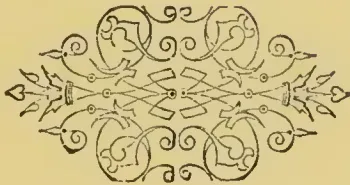A decorative floral ornament featuring symmetrical scrollwork and floral motifs. The design is centered and consists of two main horizontal sections. The upper section has a central floral element with two leaves curving outwards, flanked by symmetrical scrollwork. The lower section is a mirror image of the upper one, also featuring a central floral element and symmetrical scrollwork. The entire ornament is composed of fine, elegant lines.

531------------------------------------------------

<!-- stage4: FAINT old-images-only -->

[Faint page: no legible print of its own could be verified; text withheld (stage 4 review list)]

This image is a scan of a blank page. The paper has a light beige or cream-colored tint. There are a few very small, dark specks scattered across the surface, which appear to be scanning artifacts or dust particles. No text, lines, or other markings are present on the page.

532------------------------------------------------

A faint, circular red stamp or seal impression is centered on the page. The stamp is circular with a thin border. Inside the circle, there are some illegible characters or a logo, possibly in a script or a stylized font. The stamp is slightly faded and has a soft red color. The background of the page is a light beige or cream color.

533------------------------------------------------

An oval-framed, sepia-toned portrait of a middle-aged man with a full, dark mustache and a high forehead. He is wearing a dark suit jacket over a white shirt and a dark bow tie. The portrait is set against a plain, light-colored background.

ALEXANDER CAMPBELL WHITE, Esq.

*Tropical Agriculturist Portrait Gallery*  
No. X

534------------------------------------------------

# \* The TROPICAL AGRICULTURIST \*

◇ MONTHLY. ◇

Vol. XVI.]

COLOMBO, FEBRUARY 1ST, 1897.

[No. 8.]

## “PIONEERS OF THE PLANTING ENTERPRISE IN CEYLON,”

(Second Series.)

ALEX. CAMPBELL WHITE,

PLANTER AND MERCHANT.

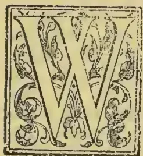

We confined our first series of Pioneer Colonists, connected with Ceylon, to men who had passed “that bourne whence no traveller returns.” In beginning a second series, we are pleased to include

several who, though long ago retired from the Colony, are still in the flesh, and who continue to hold property in the island, to read their *Overland Observer* and to take an interest in all that concerns the welfare of old Lanka and its people. It was our privilege during a recent visit to England to meet several of these retired pioneers; but, unfortunately, we were not able to keep a promise to visit Cheltenham and meet once again the subject of our present notice, or we should have been able to fill up a great many blanks in our story. But as it is, we must make what we can of the rather scant material before us.

ALEXANDER CAMPBELL WHITE'S birth dates so far back as 1816, so that he must now be in his 81st year. Born a Scotchman he had the privilege of being fitted for his work in life with that useful practical education for which the Parish Schools of Scotland (long before the era of Board Schools) have been specially famous. In Glasgow, Mr. White acquired some experience of business before

### SAILING FOR BOMBAY

as a youth of 18, with the mission of starting the Firm of “White, Barlow & Co.” What would be thought in the present day of a youngster in his teens coming out to the East to start anything! But

in the early part of the century men remembered that William Pitt was Prime Minister of England at 23 and that both Clive and Warren Hastings had landed in India when they were only 18 years of age. To return to A. C. White: on his way to Bombay, he visited Cairo and met, and made friends, with the enterprising, far-seeing Lieut. Waghorn, at the time engaged in his enterprise of opening and establishing the “Overland route” which shortly after became an accomplished fact. At Suez, Mr. White had to remain ten days before he got away in the East India Company's steamer “Hugh Lindsay” which had been sent from Bombay to ascertain whether the Red Sea and Gulf of Suez were really navigable and safe for steamers. The whole voyage from London to Bombay occupied nearly *three months*; while, now-a-days, letters (and passengers travelling with the mails) can get from St. Martin's-le-Grand to Bombay in *twelve days*!

Mr. White remained eight years in Bombay with varying fortunes but ever-increasing experience, until, in 1842, he decided to make a new departure and to venture his then comparatively limited capital (£2,000, we have heard mentioned as the total) in a coffee plantation

### IN CEYLON.

The Colony was fast coming into notice. Five years earlier, Mr. Tytler—with the experience of Jamaica—had shown how the shrub could be properly cultivated and the cherry fruit properly prepared for market. A rush into the new product had commenced: the extensive and attractive hill country of the island was invaded from

535------------------------------------------------

514THE TROPICAL AGRICULTURIST.[FEB. 1, 1897.

all sides. Still there was no lack of forestland at the upset price of 5s per acre; and any competition was considered such "bad form," that as soon as a pioneer made his selection, he cut the boundaries and began forming a nursery as if the land had already been knocked down to him and the Crown transfer made out. And that there was a rapid fortune in

"COFFEE" IN THOSE EARLY DAYS,  
let the following illustration testify:—

Here is an estimate we find in the *Ceylon Observer* of May 1842, referring to Oduwella estate, in Hantane probably, which will give an idea of the yield and profits of coffee from its growth on virgin forest-land in a favourite district in those early days:—

"The O—— Estate was commenced in July 1837  
—Extent of Forest 1892 acres.

<table>
<thead>
<tr>
<th colspan="4">DR.</th>
</tr>
</thead>
<tbody>
<tr>
<td colspan="4">"Total Expenditure up to 31st December 1841, including purchase of forest, planting 305 acres, stores, machinery, &amp;c. .. .. £6,938 7 3½</td>
</tr>
<tr>
<th colspan="4">CR.</th>
</tr>
<tr>
<td>1839 Sale of seed and 42 bags of coffee ..</td>
<td>445</td>
<td>18</td>
<td>6½</td>
</tr>
<tr>
<td>" Sale of 176 acres of forest .. ..</td>
<td>176</td>
<td>0</td>
<td>0</td>
</tr>
<tr>
<td>1840 Sale of seed and 796 cwt. of coffee ..</td>
<td>3017</td>
<td>10</td>
<td>5</td>
</tr>
<tr>
<td>1841 Estimated value of 2,000 cwt. shipped</td>
<td>8000</td>
<td>0</td>
<td>0</td>
</tr>
<tr>
<td></td>
<td>£11,639</td>
<td>8</td>
<td>11½</td>
</tr>
</tbody>
</table>

"The crop of last year, 2000 cwt., which is now going home, was gathered off 200 acres, and only about 50 acres of that in full bearing. The crop of the coming season is estimated at 3,000 cwt. and it will be gathered off about 250 acres. Judging from the experience of these two years, when the whole planted part (about 350 acres) is in full bearing, it will give fully 5,000 cwt."

The total export of coffee from Ceylon in 1841 was 80,000 cwt.; in 1842 it rose to 120,000 cwt., but it went to a splendid market protected at the time by a differential duty as may be judged from the prices indicated above.

On arriving in Colombo, Mr. White at once proceeded upcountry and on to the Knuckles District as well as he could—for there was neither bridge beyond Kandy nor road beyond Katugas-tota, in those early days.

#### IN THE KNUCKLES,

however, he had secured through the agency of the then well-known Mr. Donald Davidson, a compact block of 400 acres of forestland which he proceeded to open as the Kandeckettia estate, which is in existence to this day, though it has long ago passed out of the hands of the original owner. At the same time, Mr. White—young (in his 24th year) and energetic—opened Allacolla estate for Mr. Davidson. He must have had for his neighbours at the time Mr. James Wright, still of Dimbula and his then Assistant, poor "Sandy Brown." Mr. White continued to reside for several years in the Knuckles district and he there experienced the financial crisis of 1845-6 and the dark period of depression which followed, when one-tenth of al

the coffee estates opened in Ceylon, were abandoned and many more were forced to sale for a fraction of their value.

#### MR. WHITE AS PROPRIETARY PLANTER AND MERCHANT—HIS MARRIAGE.

Mr. White next moved  
TO PUSSELLAWA

where he took up land and opened the well-known properties of Dawatagas and Doragalla. Early in the "fifties" we find Mr. White had his own Firm of "A. C. White & Co." in Kandy; but very soon after he became partner in the Colombo House of "Nicol, Cargill & Co." which included besides Mr. Andrew Nicol, C. B. Cargill and S. T. Richmond. Mr. White had by this time married and we, personally, recall his handsome, stalwart figure on Galle Face early in the "sixties," Mr. and Mrs. White being always on horseback of an afternoon. The adventurer "F. Hudson," at one time a large estate proprietor in Ceylon, got Nicol, Cargill & Co. into trouble by obtaining heavy advances, and eventually about 1868, there was a dissolution of partnership and the coffee estates of the Firm were divided between Messrs. White and Nicol. The former got for his share the now splendid property of Mount Vernon which then included Hudson or Fairfield, the whole aggregating 840 acres (with 538 acres in coffee), Mr. John Martin being Superintendent; while Mr. Nicol took Union and Niagara 740 acres (with 480 in coffee), Mr. John Stronach being Manager. The latter now form the Dimbula estate with nearly 600 acres of tea, while Mr. White has 750 acres of the same product on Mount Vernon.

#### HIS RETIREMENT AND SETTLING DOWN AT HOME.

Retiring from Ceylon soon after, Mr. A. C. White was long known as about the largest (individual) owner of estate property connected with Ceylon. For, besides his Dimbula and Pussellawa plantations, he owned Bukanda near Gampola, Delpottonoya in Medamahanuwara and with interests in some other districts. Were there time and space, good stories could be told of how the once famous "Wm. F. Forsyth" of Waitawa managed for Mr. White as an absent proprietor, while opening Delpottonoya. Still Mr. White was one of the fortunate Colonists—everything he touched, for many years, "turned to gold" and he became one of the wealthiest proprietors connected with the island. After settling down at home, Mr. White paid occasional though rare, visits to the island in the "seventies" and "eighties," and he would have come out again and again since, were it not for an accident he met in the hunting-field, through falling and breaking his collar-bone some years ago. It shows what a splendid constitution he has had, that well on in the "seventies"—perhaps in his 75th year—Mr. White should be able to continue to fol-

536------------------------------------------------

B. 1, 1897.]THE TROPICAL AGRICULTURIST.515

low the hounds as he had done in Gloucestershire for many years after retiring from Ceylon, and still more that he should recover so well from the shock and breakage of bones caused by his fall.

IN CHELTENHAM.

For several years back Mr. White has resided in a very comfortable mansion surrounded by a fine garden in Cheltenham. He continues to be the most regular of men in all his arrangements. After breakfast, from 9 to 12 noon, nearly every day he gives to his correspondence and to anyone calling on business, and then he has his midday walk, seldom going out of an afternoon, though fond of visitors coming in to "tea" or dinner with him. Nothing delights Mr. White more than to encounter Ceylon men and talk over old times, and lately he enjoyed in this way at Mrs. Mackie's residence, meeting Messrs. Wm. Rollo, Humphreys and Tilly. Were it not for the heat of the Red Sea, Mr. White would even now visit Ceylon, so much would he like to see the dear island again, where he laboured so long and well. But of this, we fear, there is little hope. We were not aware till the other day that Mr. White had become a Roman Catholic—a fact that must shock his nephew, Lord Overtoun (John Campbell White), the well-known Liberal supporter of Evangelical Protestant Missions, and a great philanthropist. But our Mr. A. C. White is not wanting either in good works, according to his light: he is the most liberal supporter of his Church in Cheltenham; but he goes further and in deeds of kindness and charity which are confined to no Church, few men are so open-handed; and the Treasurers of the Hospital, Convalescent Home, and other deserving charities in Cheltenham have reason to bless the day that the wealthy Ceylon estates proprietor settled in their midst.

Our latest news through a friend is that Mr. White, though over 80, continues to look young for his age, with his erect figure, and steady walk, a favourite little dog being his companion. What tales he could unfold of his "days of old," fifty years ago, on the hills of Ceylon, when he laboured and watched

The coffee shrubs in springing up  
The forest going down;

—and of all the vicissitudes of the Colony since, until now as proprietor of Mount Vernon in tea, he has a property far more valuable than ever it was in its days of virgin soil in coffee. Altogether no tale in romance can be half so strange as that of the coffee-cinchona-tea Colony; and no one has stuck by it more faithfully and continuously in good and evil report (for heavy losses had to be experienced from time to time, even in recent years) than the subject of our notice, **MR. ALEXANDER CAMPBELL WHITE**. May his shadow never grow less!

Agricultural Pests:

WITH METHODS OF PREVENTION.  
BY MISS E. A. ORMEROD

(LATE CONSULTING ENTOMOLOGIST TO THE  
ROYAL AGRICULTURAL SOCIETY OF  
ENGLAND).

(Special for "Tropical Agriculturist.")

II.PESTS AFFECTING FROM CROPS AND  
ANIMALS.

GAD FLIES, WARBLE AND BOT FLIES, FOREST FLIES, &c.

The family of the *Tabanidae*, or Gad Flies, which are injurious as blood-suckers, include some of the largest flies which we have in this country, and cause injury by piercing into the skin (it may be of cattle, or it may be of ourselves) with the lancet-like apparatus which they carry in their proboscis. In shape they may be described as like common flies; but the great, dark brown fly, striped across with yellow, known as Ox Gad fly, is sometimes as much as an inch and three quarters in the spread of the wings.

From the circumstance of the Larva, or maggot, of the *Tobanus Bovinus* having a distinct horny head, and the pupa being naked and incomplete (that is to say in some degree resembling the perfect fly, it will be seen that, technically, this family is nearly allied to those of which the *Tipula* may be taken as a type. But the points under consideration being the animals or plants attacked, I deal with the Gad Flies here, together with the other cattle flies. As in this case it seems impossible to lessen attack by destroying the maggots, the next best way of saving the cattle from annoyance would appear to be moving them from pastures by streams, or such localities as the flies frequent, to more open and drier land, where the state of the ground would not suit the gad-fly maggots, and the flies would not find the trees which they love to lurk amongst. In case of dressings being desirable to ward off infestation, the same that are known to answer in the preventing attack of Warble Fly would be useful.

The large family of the *Estridae*, popularly known as Bot Flies, differ from the Gad Flies, entirely, in their method of doing harm, inasmuch as, generally speaking, the mouth of the *Estridae* is obsolete, only represented by a few minute fleshy tubercles; also the maggots of this family of flies live within some part of the animal that is attacked. Prof. Westwood notes three principal differences in their habits: some live in tumours beneath the skin; some attack the cavities of the head, which are reached through the nostrils; and some are gastric in their attack, by the maggots being introduced into the stomach.

The kind we are about to notice (the *Gastrophilus equi*, or Horse Bot Fly) are about the size of a house fly, or rather larger, and are somewhat gaily coloured with yellowish and dark markings, and very hairy.

In the case of this Horse Bot Fly, the female hardly touches the animal, but, whilst lightly flying to and fro, places the eggs on the hairs, until the very numerous supply are laid. These are fixed by a kind of sticky moisture on the shoulder, or on the mane, inside the knee, or on any other part selected. The maggot forms within the egg, and when it is ready to hatch (which may be in a period of from about five days to three weeks), the warmth and moisture of the horse's tongue in licking the infested hair, causes the kind of lid or cap to open or crack, and the maggot within sticks to the tongue, and is thus gradually transferred to the stomach. Here the maggots fix themselves to the mucous membrane by means of two dark brown hooks, one of which is placed on each side of the slit which serves for a mouth, and there they nourish them-

537------------------------------------------------

516THE TROPICAL AGRICULTURIST.[FEB. 1, 1897.

selves by suction, and are considered to pass from eight to ten months in maggot state, attached to their mouth hooks to the living membrane of portion of the stomach.

Sometimes there may be only a few of these maggots present; sometimes (as I have seen myself) they are present in such numbers as to lie close up against each other over a large patch of surface, so that it hardly seemed possible to find room for another amongst them. Here they live until, when full-fed, they lose their hold; and after being thrown to the ground, turn to a brown pupa, from which the fly comes out in a few weeks.

For prevention of this attack, such treatment as combing, brushing, or clipping hair, so as to get rid of the eggs, is sure to be of use. Also the application of soaps, or washes, with scents deterrent to insect attack; and, likewise, freedom to the horses to shelter in sheds in the heat of the day. Remedies fall within the province of the veterinary adviser, as special advice is needed for their safe application.

The Ox Warble Fly, or Bot Fly, is a two-winged fly, upwards of half-an-inch in length, so banded and marked with differently coloured hair as to be not unlike a humble bee. The face is yellowish, the body between the wings yellowish before and black behind, and the abdomen whitish at the base, black in the middle, and orange at the tip. The female is furnished with a somewhat telescopic-formed extension of the end of the abdomen, which acts as a long egg-laying tube, and the egg is white and oval, with a small brownish lump at one end.

On hatching from the egg, the maggot is not of the thick, oval shape to which it afterwards changes, but is almost worm-like in shape, and is furnished with a pair of cutting forks at the mouth end. By careful examinations of sections of hide in the very earliest stage of attack, a fine channel or perforation will be found leading from the outside of the hide, right through it, down to the under side. Here the young maggot will be found, and by gentle pressure, the course of the maggot channel may be clearly traced by the little drop of blood which (in my own observation) I have found can readily be forced along it from the larvae working below, till it stands as a minute drop on the outside of the hide. This channel I have found to be rough and jagged at the side, thus showing it was gnawed or torn (not cleanly pierced, as by an ovipositor), and the direction was very various, so as even to be much cured.

The maggot gradually increase in size, still lying with the tail end uppermost, or nearest the opening in the hide; and as it grows it presses back and opens the surrounding tissue, till it lies with the tail extremity in the opening of the boil-like swelling, commonly known as the "warble." Here it draws in air through what look like two small black spots in the tail, but which are really the spiracles, or masses of minute breathing openings, by which air is admitted into the breathing-tubes or *tracheæ* of the maggot. It feeds by sucking in the putrid matter flowing into the cavity its presence has caused, and there it remains until it is full grown, that is, about an inch long. This may be at any time from May to much later in the season, and then, with the help of the rows of prickles with which it is furnished outside, and the powerful net-work of muscles with which it is furnished within the skin, it drags itself through the opening of the warble, tail foremost, and falls to the ground, where it finds some shelter, either in the ground or under a stone or clod, where it changes to a chrysalis. The chrysalis is dark-brown or black, much like the maggot in shape, only flatter on one side; and from this brown husk the warble fly comes out in three or four weeks, but this length of time is increased by cold weather.

Where the attack is severe, the condition of the surface of the carcase beneath known as "licked beef," or "butcher's jelly," is to be found, which is a very serious drain on the health, condition,

and quality of the animal, thus well described by Mr. C. E. Pearson, wholesale butcher, Sheffield:—"I may say that the effect of warbles on the carcase is more serious than can possibly be imagined by the outside appearance of the beast. . . . The carcase of beef assumes a nasty yellow colour, and also a soft, flabby appearance on the outside rind of the beast (where the warble has been in operation), so much so that the carcase has, in some cases, to be pared down to the flesh to make the appearance of the animal at all presentable for the market, causing thereby a grievous amount of loss to the butcher. I am speaking from practical experience, killing on an average twenty beasts or more a week."

On applying to Mr. Henry Thompson, M.R.C.V.S., of Aspatria, Cumberland, who has long devoted much attention to warble attack, for an exact description of the damage, he replied:—"What causes the damaged meat or beef is the chronic inflammation set up by the warbles in the skin, which extends to the connective tissues, thence to the flesh, producing the straw coloured, jelly-like appearance of a newly slaughtered carcase of beef, which, in twelve or twenty-four hours, when exposed to the air, turns a dirty greenish yellow colour, and thus spoils the beef, having a frothy discharge oozing from the surface with a soapy-like look."

Its prejudicial nature in all points of view is thus shortly given, in the last words of some observations with which I was favoured by Mr. John Penberthy, Prof. of Pathology at the Royal Veterinary College, Camden Town, N.W., regarding some specimens on which I had requested his opinion:—"The material is not fit for human consumption. I think it very deleterious to the health and comfort of the affected animal."

The yearly loss from this attack is enormous. Firstly, there is the loss on milk, and on many other points of damage consequent on the wild gallop of the cattle when terrified by the fly. Secondly, there is the loss on the condition of the infested animal. Every warbled hide is a sign of so much out of the farmer's pocket, for the food he spent in feeding grubs in his cattle's backs which should have gone to form meat and milk, instead of being wasted in foul maggot-sores. Thirdly, there is the loss, falling mainly on the butchers, consequent on damage to surface of carcase known as "licked beef" or butcher's jelly." Fourthly, there is a great loss on the injured hides. The two following returns, from Newcastle-on-Tyne and Aberdeen respectively, taken from a number of returns from hide or cattle companies, etc., with which I was favoured in 1888, give some slight idea of the loss going on, simply on this one item of perfectly needless waste. The following is from Newcastle-on-Tyne:—

"In a period of twelve months, 102,877 hides passed through the market; of these, 60,000 were warbled. Loss estimated at £15,000."—J. McG.

"In five months, from February 3rd to June 24th, 61,103 hides passed, of which 14,630 were warbled. Loss, £2,873."—W. M. & Son, Aberdeen.

The above loss, in all its details, is wholly unnecessary. By the use of the simple measures mentioned below, we have now found, from the experience of our leading farmers, cattle owners, and veterinary surgeons, during about twelve years (that is, since attention was first directed to the subject), that the attack may, to all practical purposes, be stamped out.

Squeezing out the maggots is a sure method of getting rid of them, but they may be destroyed easily and without risk by dressing the warble with a little of McDougall's sugar or dip, or with a little eart-grease and sulphur, applied well on the opening of the warble. Mercurial ointment answers, if carefully used—that is, in very small quantity, and only applied once as a small touch on the warble; but where there is any risk of careless application it should not be used. Any thick, greasy matter, that will choke the breathing-pores of the maggot, or poison it by running down into the cell in which it

538------------------------------------------------

FEB. 1, 1897.]THE TROPICAL AGRICULTURIST.517

lies and foeds, will answers well; and lard or rancid butter, mixed with a little sulphur, has also been found to answer. Tar answers if carefully placed, so as to be absolutely on the hole, into the warble. Bought cattle are often badly infested, and need attention.

To prevent fly attack in summer, train-oil rubbed along the spine, and a little on the loin and ribs, has been found useful; so has the following mixture—4 oz. flowers of sulphur, 1 gill spirits of fat, 1 quart train oil; to be mixed well together, and applied once a-week along each side of the spine of the animal. With both the above applications it has been observed that the cattle so dressed were allowed to graze in peace, without being started off at the tearing gallop so ruinous to flesh, milk, and, in the case of cows in calf, to produce.

Where cattle are suffering badly from warbles, so that the health is clearly affected, and the animal wasting, the use of the old well-known black oils has been found to do much good.

Mr. Henry Thompson, M.R.C.V.S., gives the following recipe used for a bad case:—"Turpentine, 1½ oz.; sulphuric acid 1 drachm (here a chemical action sets in and must be done with caution). To this I added 10 oz. raw linseed, and rubbed the cow's back once a day with the mixture. . . . In a fortnight the back was cleaned, and all the maggots destroyed.

There are many other points that bear on prevention, of which one is the noting that Warble Flies are most active in heat and sunshine, and appear not to pursue cattle over water; consequently, allowing the cattle the power of sheltering themselves, and access to shallow pools, is desirable. Likewise, with regard to pastures, or standing-ground of infested cattle, it is matter of course that where the maggots have fallen from their backs the flies will shortly appear to start new attacks.

The attack of the Sheep Bot Fly is a very serious matter, which causes much suffering to the animals, and loss to their owners. This fly is rather larger than the common house fly, and of an ashy colour, spotted with black between its wings and silvery or yellowish white. The female either lay her eggs, or deposits living maggots on the margins of the nostrils of the sheep by means of the monthhooks with which they are furnished, and attach themselves to the membranes of the cavities. Here they feed on the mucus; and it is stated that they at times feed on the membrane itself. Their presence causes great irritation; and where the attack is severe leads to gradual loss of strength, and convulsions and the death of the animal. When full grown the maggots are about an inch in length, and in the common course of things they remain in the head of the sheep for ten months to a year before they are mature. They then leave the animal, by going down the nostrils, and fall to the ground, where they turn—either amongst roots of grass, or in any convenient place above or below the surface—to a black or brown pupa, from which the fly comes out in about six or eight weeks, or after a variable number of days, according to the climate.

The preventive in this case is to keep the fly from getting access to the nose of the sheep. The sheep protect themselves to the best of their power by holding their nostrils down to the ground, or in any other position which will keep off the fly, when they are aware of attack, and this principle is worked on, in the application of tar or other remedies to keep the fly from settling.

The attack of Sheep Nostril Maggot is of quite a different nature from that of the *Ctenurus cerebralis*, or Hydart, which in its young state causes the disease known as staggers or "gid" in sheep; but the two attacks are popularly confused. The difference is easily shown by an anatomical demonstration of the maggots in the nostrils in one case, and the hydatid-infested brain in the other.

The Forest Fly (*Hippoboea equina*), which infests horses and cattle, and is especially common in the New Forest in Hampshire, may be taken as a type of the division. This fly possesses an egg-like pupa,

and also a peculiar toothed claw. The main colours of the little fly are brown or black, varied with some shade of yellow. It causes irritation both by blood-sucking, and by creeping, which it can do backwards, forwards, or sideways with great nimbleness, on the parts of the animal especially preferred for infestation. The remedies used are local applications obnoxious to the fly, and careful attention to cleanliness.

In some cases the head of these flies (*pupipara*) is so withdrawn into the body, and the horns into the head, that in addition to their sometimes being without wings or poisers they have a spider-like appearance, and are known as Spider Flies. The *Mclophagus orinus*, known, though incorrectly, as the "Sheep-tick," which lives in the wool and sucks the blood of the sheep, is one of this division.

## BIBLIOGRAPHY OF CACAO.

(Concluded from page 444.)

Hart, J. Hinchley. "Cacao." A Treatise on the cultivation and curing of... Theobroma Cacao. Government Printing Office. Port of Spain, Trinidad. 1892. 80.

Henson, . Cacao in British Guiana? [*Vide Trop-Agric.* 1882-3. p. 726.]

Hewett, Chas. Chocolate and Cocoa. Cocoa: its growth and culture, manufacture and mode of preparation for the table, &c. London. 1862. 160.

Heyrenbach, J. C. [See under TEA.]

Histoire Histoire naturelle du Cacao et du Sucre, divisée en deux traités. [By—De Chélus; with additions and corrections by N. Mahudel.] Paris. 1719. 80. [Second edition, revue et corrigée par l'auteur Amsterdam. 1720. 80.]

Histoire. The Natural History of Chocolate... Translated from... the French... by a Physician. London. 1724. 80. See Brookes, R.

Historicus. Cocoa. All about it. Sampson Low Marston & Co. London. 1892. 80.

Hoffman, Antonius, M.D. Dissertatio medica inauguralis de potu Chocolatae... Praes. C. von Linné, &c. Holmiae. [1765.] 40.

Hoffmann, Theophilus. Resp. Butyrum Cacao novum atque commendatissimum medicamentum. Praes. B. D. Mauchart. Tubingae. [1735.] 40.

Holm, John, F.R.C.S. Cocoa and its manufacture; with remarks on the working of the Adulteration of Food Act, &c. London, Hertford. 1874. 80.

Hoyer, A. [See under TEA.]

Hughes, Wm. The American physician; or a treatise of the roots, plants, &c... growing in the English plantations in America... whereunto is added a Discourse of the Cacao-nut Tree... with all the ways of making Chocolate. London. 1612. 120.

Huth, Joannes Christophorus. M.D. Dissertatio de potu chocolatae. Praes. M. Huppus. [See under TEA.] Argentorati. [1695.] 40.

J., F.R.C.S. Altro parere informo alla natura... della Cicciolata, &c. [in answer to... G. B. Felici. Preceded by a letter on the same subject by F. Zetti.] Firenze. 1728. 40.

James, R. [See under TEA.]

Jardine, Wm. Cacao Cultivation in Ceylon. Colombo. 18—.

Kaffee. [See under TEA.]

Körth, Johann Wilhelm David. Der uneigennützige Chocoladenfabrikant... nebst einer Anweisung der bequemsten Zubereitung. Berlin. 1825. 80.

Kuehne, Johann Gottfried. Vollständige Nachricht von der Chocolate, worinnen von derselben Ursprung... Ingredienten... und Gebrauch... gehandelt wird. Nürnberg. 1717. 80.

Lange, J. [See under TEA.]

Laredan, A. [See under TEA.]

Le Ferre, J. F. [See under TEA.]

Le Monnier, Louis Guillaume. Resp. Quæstio medica, H. T. Baron, Praes. Au senibus chocolatae potus? [Paris.] 1739. 40.

539------------------------------------------------

518THE TROPICAL AGRICULTURIST.[FEB. 1, 1897.]

*Leon Pinelo, Antonio de.* Question moral si el Chocolate quebranta el ayuno eclesiastico, &c. Madrid. 1636. 40.

*Leuchs, J. C.* [See under COFFEE.]

*Linnaeus, C.* See *Hoffman, A.*

*Lobstein, Gustav von.* Genane und festliche Anweisung zur Fabrikation aller feinen Sorten Chocolates, &c. Quedlinburg. 1836. 80.

*London—Arthur's Club.* See Cocoa-Tree.

*M., D.* [See under TEA.]

*Machet, J. J.* Geheimmnisse der Conditorcy...oder Anweisung...Chokolade, &c, zu bereiten und aufzubewahren. Leipzig. [1805.] 1818. 80. See *Nutt, F.*

*Magri, Domenico.* See *Brancatius, F. M.*

*Mahudel, Nicolas.* See *Histoire.*

*Manget, J. J.* [See under TEA.]

*Mangin, Arthur.* Le Cacao et le Chocolat, considérés au point de vue botanique, chimique, &c. Suivra de la Légende du Cacahuatl, par *F. Denis.* Paris. 1860. 120. [Second edition. Paris. 1862. 180.]

*Mann, James A.* Cocoa: its cultivation, manufacture and uses; its advantages and value as an article of food. London. 1860. 80. [Reprinted from Journal of Socy. of Arts.]

*Mappus, M.* See *Hath, J. C.* [and under TEA.]

*Marco, J. de.* De usu et abusu Chocolatae in medicina et morali. Malta. 1759. 40.

*Marradon, Bartolomeo.* Du Chocolate. Dialogue entre un Medecin, un Indien et un Bourgeois...Tourné de l'Espagnol, &c. See *Colmenero de Ledesma, A.* 1643. 40. [Another edn. See *Usage.* 1671. 120.]

*Marradon, Bartolomeo.* [Another edition.] See *Sylvestre Dufour P.* Traitez du Café, &c. [See under TEA.]

*Marradon, Bartolomeo.* Della Cioccalata. Diologo [translated from the Spanish of B. M.] See *Colmenero de Ledesma, A.*

*Marradon, Bartolomeo.* Del Tobago, los damnos que cause, y del Chocolate. [French translation by R. Moreau. Paris. 1643. 40.] Sevilla. 1616. 80.

*Martinez-Ribon, C.* Nuevo metodo para el cultivo del cacao, &c. 2nd. edition, Braine-le-Comte. 1880. 160.

*Marvaud, A.* [See under TEA.]

*Mauchart, Burcardus David.* See *Hoffmann, T.*

*Mauiduit, M.* [See under TEA.]

*Medicus, G. F.* [See under COFFEE.]

*Meisner, L. F.* [See under TEA.]

*Memorie.* Memoria storica sopra l'uso della cioccalata in tempo di digiuno...esposte in una lettera a N. N. 1748. 40.

*Ménier, E. J.* [See under TEA.]

*Milbau, .* Dissertation sur le cacaooyer. Montpellier. 1746. 80.

*Mitscherlich, Gustav Alfred.* Der Cacao und die Chocolada. Berlin. 1859. 80. [De Cacao. Berolini. 1857. 80.]

*Morand, Jean François Clement.* See *Baron, H. T.* *Moreau, René.* Du Chocolate...discours...traduit d'Espagnol...par R. M. See *Usage.* 1671. 120.

*Morris, D., C. M. G.* Cocoa: how to grow and how to cure it. Jamaica. 1887. 80. [? 1882.]

*N., N.* See *Coinca, D.* and *Memorie.*

*Natural History.* [See under TEA.]

*Navier, P. Toussaint. M.D.* Observations sur le Cacao et sur le Chocolat, où l'on examine les avantages et les inconvénients qui peuvent résulter de ces substances nourricières. Paris. 1772. 120.

*Nutt, Frederic.* The Complete Confectioner, &c. See *Machet, J. J.* 1789. 120. [1815.]

*Observations.* Observations sur le Cacao et sur le chocolat. Paris. 1772. 120. See *Navier, P. T.* and *Boussel.*

*Paulli, S.* [See under TEA.]

*Pelletier, E.* [See under TEA.]

*Perron, .* [See under TEA.]

*Physician.* See *Brookes, R.* and *Histoire.*

*Picot, .* [See under TEA.]

*Pollis, P.* [See under TEA.]

*Quélus, de.* See *Chélus, de.*

*Riant, A.* [See under TEA.]

*Rossignon, J.* [See under COFFEE.]

*Saint-Arroman, A.* [See under TEA.]

*Schatzkammer.* [See under TEA.]

*Schreiben.* [See under TEA.]

*Sinclair, W. J.* [See under TEA.]

*Spies, Joannes Carolus.* See *Bruckmann, F. E.*

*Spon, J.* [See under TEA.]

*Stahl, J. J.* See *Eschweiler, M. J.*

*Stayley, George.* The Rival Theatres...To which is added, The Chocolate-Makers: or, Mimickry exposed (in verse). London. 1759. 80. [Dublin. 1759. 120.]

*Stevenson, J., M.D.* [See under TEA.]

*Stenton, Jas.* [See under TEA.]

*Stoltz, Friedrich.* 162 Anweisungen und Recepte über Seifensieder... Chocolader fabrikation...Zweite Auflage. Quedlinburg and Leipzig: Holberstadt. 1850. 160.

*Stricius, J. H.* Unrichtigkeit, die mit Dampfmaschinen bereitete deshalb "Dampf-Chokolade" zu nennen. Berlin. 1831. 80.

*Stubbe, Henry, M.A.* The Indian Nectar, or, a Discourse concerning Chocolata, &c. London. 1662. 80.

*Sylvestre-Dufour, P.* [See under TEA.]

*Techni, T.* [See under TEA.]

*Tozzi, G.* [See under TEA.]

*Tozzi, L.* [See under TEA.]

*Tractatus.* [See under TEA.]

*Treboul, J. B. N. R.* Le Vérité sur les Chocolats approuvée par toutes les Sociétés hygiéniques, &c. 1855. 80.

*Tuchen, Anton.* Ueber die organischen Bestandtheile des Cacao, Inaugural Dissertation, &c. Göttingen. 1857. 80.

*Usage.* [See under TEA.]

*Use.* [See under TEA.]

*Usines.* Les Grandes Usines, Usine de Noisiel, fabrique de chocolat Menier, Paris. 40. (no date.)

*Vadesforte, Diego de (pseud. James Wadsworth).* See *Colmenero de Ledesma, A.*

*Venezuela.* Culture du Cacaooyer au Vénézuéla. Paris. 1860. 80.

*Vesling, Johannes.* [See under COFFEE.]

*Virtù.* [See under TEA.]

*Vitrioli, Alessandro.* See *Colmenero de Ledesma, A.*

*Vogl, A. E.* [See under TEA.]

*Volckamer, Johann Georg.* See *Colmenero de Ledesma, A.*

*Wadsworth, James, Ex-Jesuit.* See *Colmenero de Ledesma, A.*

*Wanklyn, J. A.* [See under TEA.]

*Whig.* See *Cocoa-Tree Club.*

*Wonder.* See *Cocoa-Tree Club.*

*Zeti, Francesco.* See I., F.C.C.S.

## PLANTING IN LAGOS, WEST AFRICA.

From the 31st Report for the Quarter ended 30th September, 1895, on the Botanic Station, Colony of Lagos, we quote the following passage:—

### ECONOMIC PLANTS.

(Continued from page 448.)

Sir,—I have the honour to submit for the information of His Excellency the Deputy Governor the following report on my tour to and from Abokuta.

Having been granted permission to accompany His Excellency the Acting Governor to Abokuta I made every preparation for collecting, and departed from the Botanical Station on 12th September and returned on the 30th of that month.

I should mention that owing to work requiring my supervision since my return I was prevented in submitting this report at an earlier date.

The collection of plants made when travelling were principally confined to the forest roads or paths, and

540------------------------------------------------

FEB. 1, 1897.]THE TROPICAL AGRICULTURIST519

Also my observations on the vegetation, I had not sufficient time at my disposal to collect in the forests where accessible, or I should have been left behind.

The collection of herbarium numbered 408, this includes duplicate specimens, one of each specimen will be forwarded to Kew for determination. Many living plants were also collected.

*Cultivated Plants* :—Throughout the whole route taken the products grown are very similar, the principal articles of food being Corn, Zea Mays, Yams, Dioscorea sps, Cassava, Manihot utilisima, Colocasia antiquorum, Phaseolus, several species of this plants are extensively grown around Abeokuta, Aractus hypogaea is not often seen, a large variety of this species is cultivated, Cajanus indicus is used also as an article of food.

*Rubber producing plants* :—The chief source of Lagos rubber is obtained from Ire, *Kickxia africana*, a tall growing tree in the forests. This tree is plentiful throughout the forests from Ottoto Papalayito also near the forests at Adawo, and from Ilaro to Ajilite.

*Landolphias L. owariensis* :—This species is the most common. When I had time to go in the forests I met it, but it appeared not to be sought after, for it is more difficult to collect and requires more time. I found several other plants that furnish rubber probably of the Genus *Vocanga* but unfortunately these trees were not in flower. Several species of Ficus were frequently seen on the journey. I noticed that at Abeokuta ceira rubber *Manihot Glazivio* had been introduced.

*Fruits* :—These like most other plants receive but little attention in their culture, the Pine apple *Ananas sativa* is found growing everywhere in a wild condition, Papaws, Carica Papaya, Sour Sop, Anona muricata, Sweet Sop, Auona squamosa, also Bananas and Plantains grow near towns and villages and I noticed a very dwarf Banana at Abeokuta, similar to the Grand Canary Banana. Oranges and Limes are seen but not in any quantity, the Hog Plum was grown around the villages on the way Spondias lutea no doubt. *Thaumatococcus Danielli* is grown throughout the whole of the districts, it is not grown so much for its fruits as its leaves which are used in lieu of paper, also for thatching roofs of houses. *Sideroxylon dulcificum*, another fruit possessing very sweet properties and known as one of the Miraculous fruits of West Africa, was not seen to any extent. Another of the peculiar fruit I also found in large quantities, evidently an annual, for the plant had died down and I was only able to obtain the seed of it which had been sown.

*Kola acuminata* :—In some districts this is grown extensively at Otta, Igbessa, Ilaro, and Ado, this tree appears to thrive best in damp situations and under the shade of forest trees.

*Palms* :—The most common of all palms met with throughout the journey was the African Oil Palm, in some districts it is almost the only vegetation. After leaving Papayito on the 15th September the vegetation somewhat changed, plains of tall growing grasses and large numbers of the Fan Palm *Borassus aethiopum* existed, a small Phoenix probably *P. spinosa* was also seen, *Raffia Vinefera* were found only in damp situations.

*Timber trees* :—*Chlorophora excelsa* or Iroko tree is very common in some of the forests, it is the indigenous wood used as it is very durable and resists the attack of white ants. *Irvingia Barteri* :—This I found only within two days journey of Ebute Metta. *Spathodea Campanulata* was the only large tree I could recognise by its large bright clusters of flowers; in the forests large lofty trees are seen, but to collect specimens from these is indeed a work that will take time to obtain and overcome.

*Fibres* :—*Sansevieria guineensis* : this plant under the shade of forest trees grows luxuriantly, but its fibre is not sought for much by the Natives. *Adansonia digitata* :—Before reaching Abeokuta this tree was not often seen, but when travelling on the Ibadan road it was one of the chief trees seen, its fibre is used by the Natives. I saw a few plants of a species of *Pandanus*, many other plants were seen

from which fibre could be obtained. 3 *Hibiscus*, sp. *Crotolaria* sp. *Sida* sp. *Cerceorus* sp. *abutilon* etc.

The Vegetation by the forest roads is comparatively the same, up to the Ogun river, where the forests do not exist it is long grass, or scrubby bush; near villages the land is cultivated. The soil is much richer than that around here, and as one gets near to Abeokuta stones and rocks are frequently seen, and several streams are passed, which would prove very beneficial if planting should take place.

At Abeokuta and surrounding it for miles the land is under cultivation or has been; like all other places the natives have no idea of manuring the land, but this work is left for nature to fulfil, land is cleared and planted for a few years then abandoned for sometime; this means great destruction to the forest; consequently the forest for some distance around this large town have been destroyed.

The soil here is very rich and the food crops are very large.

The soil is of a volcanic nature; at one time cotton was grown extensively at Abeokuta, but as it is very short staple, it cannot compete with American cotton. I visited a small plantation in the town, it consisted of plants of Liberia Coffee, Cocoa and another species of Coffee which is evidently not Liberian; all the plants were in a most thriving condition, and large crops were being produced, this convinced one that the soil was everything that could be desired for the cultivation of these and other economical plants.

After spending sometime around Abeokuta I travelled a day's journey on the road towards Ibadan, here the country is hilly, and most of the growth is stunted, here for the first time I saw the shea butter tree *Butyrospermum Parkii*, but unfortunately it was not the season to obtain seed. *Adansonia digitata* was also very numerous, & Acacias. Among the many dye plants found around this district which include *Indigofera*, and *Bixa* etc. *Lonchocarpus cyanescens*, native dye, this latter plant is cultivated and is the one principally used, in some places it was very abundant, and I noticed to induce young leaves from which is prepared the dye old leaves are gathered off the plants.

*Calabashes*—*Lagenaria vulgaris* and species of the cucurbitaceous order are largely represented, and cultivated to a large extent, and used largely by the natives for utensils.

On returning by way of Ilaro His Excellency gave me permission to visit the plantations at Soto and Ajelete. I have already sent in this report (see appendix I. of the quarterly report for September quarter on this Station.) These plantations are in a very thriving condition, cultivation is carried on to a far greater extent inland, and I think that if a Botanical out-station was established near some of these large inland towns the people would soon become aware of the value of Coffee and other economic plants, and take up the cultivation of commercial plants.

I have the honour to be,  
Sir,  
Your obedient Servant,  
H. MILLEN,  
Curator.

(To be concluded.)

## TEA PLANTING THIRTY FIVE YEARS AGO IN INDIA.

(By an Old Planter.)

Having at length accomplished the raising of seed, the next process we took in hand was planting out the seedlings; for the expeditious method of sowing in the open did not answer; purchasers, who are always fastidious, asserting, when they came up in the Poohahs to report upon or examine the property, that they expected to see rows of plants instead of, as one impertinent person observed, a beggarly array of empty stakes. One gentleman of an economic turn of mind had utilised fresh eka stems for lining off, with the result that his stakes sprouted but the seed didn't follow suit, somehow. Once the plantation

541------------------------------------------------

520THE TROPICAL AGRICULTURIST.[FEB. 1, 1897.

was staked off, we had a little leisure, for our notions of the proper season for transplanting were rather crude, and as the bustee-wallahs waited for the rains, to plant out their rice, we came to the conclusion that, as they must be the best judges in all agricultural matters, we could not do better than follow their example; so, until the middle of June, we visited one another, talked shop or whiled away the time in studying the luxuriant growth of the under-wood, as it came on merrily with the advance of the season; we did not imagine such vegetation needed removal, as it would keep the ground moist and cool. The proceedings of the professional gentleman, we regarded as something akin to lunacy, for he put in his plants in the dry weather—a slow laborious process, over which there was much shaking of heads—moreover, he kept his place as clean as a roadway, waging constant warfare with the second growth. There had been a talk of importing labour, but it ended in talk, so that when the first burst of the monsoon came on us we had but a fortnight to get all in, or, as we phrased it, “slapping in,” for labor was only available for the above-mentioned period, when the people went off to attend to their own affairs. The slapping-in process was peculiar—though expeditious one operator was provided with a pointed stick, which he drove into the ground anywhere in the neighbourhood of the stakes, when such were found, keeping the line as best he could, when those landmarks were missing, then came No 2 with a bundle of seedlings, torn bodily up from the nurseries; the downpour wasing the root clear from all such contamination as soil, these were pushed down into the dibbled holes, the earth round the surface stamped well round the stem, leaving a vacuum for the rootlets to spread in, and so the plant was *in situ*, as one planter who had started in the Educational Department, was wont to observe. Weeding was put off to a more convenient season, for the best of all reasons—there was no labor to carry out such an operation, even had we deemed it necessary, which we didn’t. In October, or thereabouts, the bustee folk again made their appearance and re-clearance began, but the first operation being to clear the underwood and the coolies not up to distinguishing tea from jungle, a goodly number of promising seedlings fell before the reclaiming dhao; porcupines, crickets, withes and creepers had also had full filing during the recess, so the early plantings were not so successful as we desired. It must not be supposed that we were left entirely unmolested during the summer, for our employers were hard at work in town preparing those prospectuses that burst upon the public in the autumn of 1862. Alluring epistles, admirably composed, shadowing forth such dreams of El Dorado that drove all India mad. Whatever may have been the laches or muddles of the average planter of the day on the plantations, the crash that eventuated was brought about mainly by the gentlemen in town, who pandered to the public rage of the times. As the *dāk* reached us, day by day there were the same imperative instructions to slap in your plants. Fortunately, indeed for us, there was no telegraphic communication, or we should have gone demented; so we slapped in till there was nothing left to slap. A short respite, and then came peremptory instructions to have all cleared by the Poojahs, as a deputation of freshly caught shareholders would be up by then to inspect the gardens; the Secretaries’ letters didn’t call the new proprietors by that name, which was a local invention; there were dark hints as to possible losses of situations if the place was not presentable, which alarmed the more sensitive but merely elicited the remark, from those who took the ups and downs of this life with equanimity. “Well, we can’t make coolies.” As a general rule, the inspecting deputation did not turn out such dreadful people as we had been led to expect, and seemed, on the whole, pretty well satisfied with matters—as they ought to have been considering that they travelled at the Companies’ expense, diverging as a rule to Cherrapoonjee, though why they went there did not

transpire in the published reports. However, out of evil came good, and one thing was impressed upon the Agents, that dependence on local labor was a myth: then arose the class known as coolie contractors; but ere describing their early efforts we must take a retrospect as to the formation of the various Companies that rose before the public with meteoric brilliancy. The prospectuses, after a discursive dissertation upon tea in general, plunged into figures, and, as is well-known, if you can manipulate them cunningly, you can do almost anything with them, especially when periodic frenzy seizes the public mind. One concoction, with a lordly disregard for details, dealt in nothing but round numbers, so people were informed that an acre of tea would produce 300 lbs. and realise Re, 1 per lb., that the up-keep would absorb half this and the balance be divisible among those lucky enough to get the scrip. The morning that this announcement appeared caused a block in Church Lane, like that on Boxing Night at the doors of popular London theatres. Energetic brokers fought and scrambled on the stairs, the durwans were swept clean away; obese baboos, Marwaries, every one in fact who could collect a hundred rupees besieged the portals of the Agents. The benign vendor of this wonderful property, who “hung out” at the butt end of the thoroughfare, chuckling to himself as he viewed the scene from his terrace; and thus the great Sylhet and Cachar Tea Companies saw the light. Up went the shares, and then the wild gamble commenced. Prospectus after prospectus followed each other in quick succession: the preamble of one on the Assam side was remarkable, for the inditor somehow got mixed, devoting a whole paragraph of the preamble to dwelling upon the tea house being in a right line with some peak in the Khasia Hills; the connection between the site of a building for the manufacture of Pekoe Souchong and a dissertation upon plane trigonometry was somewhat hazy, though the public appreciated it, as the capital was subscribed for twice over. The rush for shares begat a similar demand for assistants, and all sorts and conditions of men, who could get an introduction, went up the office stairs as simple clerks, descending them again, after a short interview, full blown tea planters. We were thus reinforced; the station of Cachar presenting a burling aspect, between the arrival of coolies and budding planters almost daily. Ere going into the coolie business, I may as well glance at the community of which their masters was composed. An amusing, but perfectly correct, list was given in one of the dailies, about 1862, of the previous avocations of those sent up, which reminded one of the rather mixed society that dwelt in Canvastown, Melbourne, ten years previously. Clerks predominated: there were lawyers’ clerks, bank clerks, merchants’ clerks, and one who had been in holy orders, run-away apprentices from ships and one or two ship captains, leadsmen and pilots, raw schoolboys from home who addressed their Managers as “Sir,” a stray German whose career commenced as a flageollette player in the Calcutta town band, bar assistants and one from a job master’s stable (the last named subsequently becoming our authority on all racing matters), gentleman from the lower grades of the Uncovenanted Service; while home importations were drawn from equally heterogeneous sources—it was ere the days of trained gardeners of premium wallahs. Few remained very long, soon finding that they had mistaken their vocation, though many settled down and now form our best planters.—*Indian Planters’ Gazette*.

THE SORGHUM PLANT makes an excellent forage crop, and is especially relished by cattle. It is cut and dried somewhat like hay. If syrup is to be made from the plant, the blades are removed and used for stock, and the stalks run through the mill. The refuse from the syrup-mill makes an excellent grade of paper.—*Southern Planter*.

542------------------------------------------------

FEB. 1, 1897.]THE TROPICAL AGRICULTURIST.521

THE FUTURE OF TEA IN CEYLON:  
THE MISCHIEF ALREADY DONE BY MIS-  
LEADING INDIAN PROPRIETORS AS TO  
LOCAL CAPABILITIES;  
A WORD OF WARNING TO INDIA FOR THE  
FUTURE.

There can be no doubt that the chief factor in the lowering of the average prices in Ceylon tea for the past two years has been the great development of production in India as well as the increased attention given to preparation by our neighbours. And in respect of the future, there is no element so full of risk to our staple as the continued planting of more and yet more land out of the immense reserves fit for tea, both in Northern and Southern India. What may be done by producers or agents in Java, or in China and Japan to improve their teas, does not touch us so nearly as the prospect of our Indian neighbours continuing in the course which has marked their labours in the past few years. Now, one of their chief encouragements in this course has been the belief that Ceylon was fast reaching the limit of its production. We have done all in our power to dissipate this unwarranted belief—we have again and again shown that even though Crown land sales fell off, there were private reserves bound to be planted, to add to our crops and that a steady increase year by year from Ceylon as from India must be faced. With singular perversity, as well as pertinacity, has our position been locally assailed, and our motives questioned. We were denounced for prophesying the day of a hundred million lb. export from Ceylon. "Exaggerated estimates" have again and again been made the text of attacks; and "smooth things" for Indian planters' ears have been far too much the rule in some business and planting circles as well as in a contemporary's columns. What has been the consequence? Why, of course, that the utmost encouragement has been given to Indian Tea Companies, individual proprietors and pioneers, to clear and plant large areas with tea in both Northern and Southern India of recent years. Had the truth been known about Ceylon and its prospects, we feel certain the process of clearing new areas would have been a far slower and more judicious one. But no—"Ceylon has got to the end of its tether—has used up all its land—has almost reached its maximum export"—seem to be the substance of the consolation which some in our midst would still send to India! And surely we have a specimen before us in the following editorial deliverance in the local "Times":—

"Other things being equal, Dimbula has nearly reached the limit of its production. And the same remark holds good of several other districts, such as those we have named and many other besides. Extension now is nearly confined to the low country and Uva, and the total amount is not, we think, increasing, but decreasing, yearly."

Can anything be more mischievous in its effect on Indian proprietors and planters? What encouragement for them to pursue the course which already—as a merchant said today—has led to London at this time being full of Indian teas? Let it be granted that the available reserves in certain of our districts are nearly all planted,

what about manuring? Not one word of reference does our contemporary make to a departure which is now every year more followed in Ceylon and which, of itself, with the results before us, ought to render Indian Tea Company Directors and other planters of tea, more and more careful how they rush on large new clearings without any proper consideration of how the over-production already threatened, is to be cleared off. The response already made to our "Manuring" circular shows that the majority of planters clearly recognise the importance of making their Indian brethren acquainted with what is being, and can be done in Ceylon. Only one of our correspondents thinks it better not to stir this subject of manuring, lest it should become more general. As well may the ostrich hide its head in the sands in view of its pursuer! The Ceylon tea country is far too compact, too well opened by roads and railways, far too admirably served by Visiting Inspectors and shrewd business agents, to find any profitable departure neglected in any district or among an appreciable group of estates. Some planters may wisely decide that the time for *them* to manure has not yet come. But let Indian tea men understand that, taking our tea country as a whole, the time for careful judicious experiments with fertilisers has almost, if not fully, come—and let them moreover *beware of the result*. For, we aver, without fear of contradiction, that the capitalist who, at this time of day, whether in India or Ceylon, goes clearing and planting any *large area* with tea is imperilling his own as well as his neighbours' investments. If the market as well as planting statistics are carefully studied, we think it will be found that the time for large additions to the cultivated area is not the present year. We may except tea grown at such a high elevation as to compete with Darjiling's or our finest Ceylon's. For such the market may not be overdone; and the same argument leads to the counsel that Ceylon planters generally would do well to pluck and make finer teas in view of possibly approaching contingencies. But our chief object in writing today is to warn our neighbours over the way that Ceylon is by no means played out, that the maximum of our exports has not been reached, and that they will do wisely not only to pluck finely, but to restrict new clearings; and above all to unite as one man with their Ceylon brethren to *advertise their teas and win over new markets in America and Europe*.

---

#### A JAPANESE TEA VISITOR.

We have now in the island a Japanese gentleman, Dr. K. Obayashi, who has come chiefly on a "Tea Mission." He has letters of introduction to several influential residents, and notably one to H. E. the Governor from the British Legation in Japan. He is very interested in our Tea Industry, wants to know all about it, spends a few weeks in the island and left for Kandy today. He is acquainted with our *Tropical Agriculturist*; and is studying all the available literature bearing on our planting and agricultural products.

---

CEYLON TOBACCO.—According to the season reports for December in the *Gazette*, a large extent of tobacco land at Nilaveli in the Trincomalee district has been abandoned.

59

543------------------------------------------------

522

THE TROPICAL AGRICULTURIST.

[FEB. 1, 1897.

PORTMORE TEA COMPANY OF CEYLON, LIMITED.

Registered on December 7th by Murray, Hut-  
hins and Company, 11, Birelin Lane, E.C., with  
a capital of £50,000 in £1 shares. Objects : To  
adopt an agreement with R. C. Bowie for the  
purchase of the Portmore Tea Estate, in the Agra  
Patana Division of the Diambula District, Ceylon,  
and with Lionel M. Torin for the purchase of the  
"Aldourie" Tea Estate, in the Agra Patana Di-  
vision, and to plant, grow, and produce tea, coffee,  
chinechona, cardomans, plants, etc. The subscrib-  
ers are :—

<table border="0">
<thead>
<tr>
<th></th>
<th style="text-align: right;">Shares.</th>
</tr>
</thead>
<tbody>
<tr>
<td>R. C. Bowie, Ravensby, Carnoustie, N.B. . .</td>
<td style="text-align: right;">1</td>
</tr>
<tr>
<td>L. M. Torin, Junior, Carlton Club, Pall Mall . . . . .</td>
<td style="text-align: right;">1</td>
</tr>
<tr>
<td>W. H. Anderson, Rupert Lodge, Burn- ham, Bucks . . . . .</td>
<td style="text-align: right;">1</td>
</tr>
<tr>
<td>J. R. Grant, 101, Leadenhall Street, E.C.</td>
<td style="text-align: right;">1</td>
</tr>
<tr>
<td>J. N. Shand, 24, Rood Lane, E.C.</td>
<td style="text-align: right;">1</td>
</tr>
<tr>
<td>R. C. Haldane, do. do. . . . .</td>
<td style="text-align: right;">1</td>
</tr>
<tr>
<td>R. E. Neale, do. do. . . . .</td>
<td style="text-align: right;">1</td>
</tr>
</tbody>
</table>

The first directors (to number not less than three  
nor more than five) are : R.C. Bowie, L. M. Torin,  
and W. H. Anderson. Qualification £20. Re-  
gistered office, 24, Rood Lane, E.C.—*Financial  
Truth*, Dec. 11.

THE CEYLON LAND AND PRODUCE COMPANY, LIMITED.

DIRECTORS :—James Wilson, Esq., Chairman,  
William Keiller, Esq., Sir N. A. Staples, Bart.

Report of the Directors, to be submitted to  
the Twelfth Annual General Meeting of Shareholders,  
on Tuesday, the 15th day of December, 1896, at 2  
o'clock p.m.

Your Directors have the pleasure to submit the  
annexed profit and loss account and balance sheet  
for the crop year ending 30th June, 1896, duly audited.

The amount at credit of profit and loss account  
is £12,125. 15s 2d, which, with the sum of £437 0s 10d  
brought forward from last year, leaves £12,562 16s  
to be distributed.

On the 22nd July last, an interim dividend of 7½  
per cent on the ordinary shares and 3 per cent on  
the preference shares was paid, and your Directors  
now propose to pay on the 24th day of December,  
1896, the balance of the fixed cumulative dividend  
on the preference shares (3 per cent), making 6 per  
cent for the year, and 7½ per cent on the ordinary  
shares, making 15 per cent for the year, and in  
addition a bonus of 5 per cent on the ordinary shares  
—all free of income tax. It is also proposed to  
transfer £5,000 from profit and loss account to re-  
serve fund, increasing that account to £7,000, and  
carry forward the balance of £1,675 16s, subject to  
the Directors' remuneration for the year under re-  
view, to be fixed at the general meeting, and to  
the payment of income tax, &c.

Your Directors are again pleased to chronicle the  
continued success of the Company, the Tea and  
Cocoa crops largely exceeding the estimates framed  
at the commencement of the financial year. The  
prices obtained for the Company's Cocoa mark an  
improvement upon those seenred for the previous  
crop, but the net average for Tea was somewhat  
lower for the period under review.

TEA.—During the eleven months from January 1st  
to November 30th, the total number of packages  
from Ceylon Estates disposed of at Public Auction,  
amounted to 962,000, realising 8½d. per lb. average  
compared with 896,800 at 8½d. per lb. for the same  
period in 1895, so that the result should on the whole  
be favourable to the trade of the Island, owing to  
the larger out-turn, although the price realised  
shows a falling off. Deliveries, moreover, about kept  
pace with the fuller supply, and the London Bonded  
Stock on the 31st October only shewed a small in-

crease over that of 1895, standing at 18,083,000 lb.,  
against 16,382,000 lb. This must be considered  
satisfactory, as evidencing that the Market has been  
able to deal with the extra quantity shipped without  
any decided reduction in values. The Crop has been  
about an average one in quality. Quotations on the  
whole ruled below those of last year, especially in  
the case of the Common to Medium grades, owing  
mainly to increased shipments from other producing  
countries ; but Fine and Finest met a good demand  
throughout.

It is to be noted with pleasure that the shipments  
from London to Russia, the Continent generally, as  
well as to Canada and America, continue to expand,  
the total figures for the first ten months of this and  
the two previous years to 31st October being :—

<table border="0">
<thead>
<tr>
<th style="text-align: center;">1896.</th>
<th style="text-align: center;">1895.</th>
<th style="text-align: center;">1894.</th>
</tr>
</thead>
<tbody>
<tr>
<td style="text-align: center;">6,684,000 lb..</td>
<td style="text-align: center;">6,073,000 lb.</td>
<td style="text-align: center;">4,400,000 lb.</td>
</tr>
</tbody>
</table>

Cocoa.—The more hopeful view taken by your Direc-  
tors of the prospects for improved values of this article  
has been realized, and a gradual advance in the  
price of good to fine red Ceylon from 65s. up to 75s.  
per cwt. has taken place during the twelve months,  
although other growths have been much depressed.  
A further recovery in values is probable.

Coffee.—This article, as anticipated, has not main-  
tained the values of last year, and the price of bold  
yellow Ceylon Liberian has fallen from 90s. to 75s.  
per cwt. The prospect of large supplies from other  
producing countries prevents hopes of a permanent  
recovery in values.

Acreages.—The following Statement shews the ap-  
proximate acreage of the Company's Properties at  
date :—

<table border="0">
<thead>
<tr>
<th style="text-align: left;">Names of Estate.</th>
<th style="text-align: center;">Tea.</th>
<th style="text-align: center;">Cocoa, Coffee &amp; Coconuts.</th>
<th style="text-align: center;">Forest, Grass Chena, aban- doned, &amp;c.</th>
<th style="text-align: center;">Total Acreage.</th>
</tr>
</thead>
<tbody>
<tr>
<td>Alloowiharie Group</td>
<td style="text-align: center;">117</td>
<td style="text-align: center;">400</td>
<td style="text-align: center;">153</td>
<td style="text-align: center;">670</td>
</tr>
<tr>
<td>Andangodde Estate</td>
<td style="text-align: center;">135½</td>
<td style="text-align: center;">—</td>
<td style="text-align: center;">40½</td>
<td style="text-align: center;">176</td>
</tr>
<tr>
<td>Fettresso Estate</td>
<td style="text-align: center;">405</td>
<td style="text-align: center;">—</td>
<td style="text-align: center;">33</td>
<td style="text-align: center;">438</td>
</tr>
<tr>
<td>New Peradeniya Estate . .</td>
<td style="text-align: center;">386½</td>
<td style="text-align: center;">17½</td>
<td style="text-align: center;">54½</td>
<td style="text-align: center;">458½</td>
</tr>
<tr>
<td>North Matale Group</td>
<td style="text-align: center;">296</td>
<td style="text-align: center;">822</td>
<td style="text-align: center;">459</td>
<td style="text-align: center;">1577</td>
</tr>
<tr>
<td>Owella Estate</td>
<td style="text-align: center;">26</td>
<td style="text-align: center;">75½</td>
<td style="text-align: center;">159½</td>
<td style="text-align: center;">261</td>
</tr>
<tr>
<td>Rickarton Estate</td>
<td style="text-align: center;">500</td>
<td style="text-align: center;">—</td>
<td style="text-align: center;">96</td>
<td style="text-align: center;">596</td>
</tr>
<tr>
<td>Strathisla Group</td>
<td style="text-align: center;">127</td>
<td style="text-align: center;">216</td>
<td style="text-align: center;">59</td>
<td style="text-align: center;">402</td>
</tr>
<tr>
<td>Forest Land</td>
<td style="text-align: center;">—</td>
<td style="text-align: center;">—</td>
<td style="text-align: center;">430</td>
<td style="text-align: center;">430</td>
</tr>
<tr>
<td></td>
<td style="text-align: center;">1993½</td>
<td style="text-align: center;">1530½</td>
<td style="text-align: center;">1484½</td>
<td style="text-align: center;">5008½</td>
</tr>
</tbody>
</table>

Since the date of the last Report, the litigation  
therein referred to, which your Directors felt com-  
pelled to enter upon with the Company's late Ceylon  
Agents, has been brought to a successful issue, they  
having paid more than was claimed, and would have  
been accepted by the Company had an amicable settle-  
ment been come to at the beginning. Your Chair-  
man, shortly after his arrival in Ceylon, discovered  
that the late Agents had debited the Company with  
unjustifiable items in account ; he therefore instructed  
the solicitors who were conducting the legal proceed-  
ings for the Company to claim repayment of such  
amounts. The result of the proceedings was that  
after protracted negotiations, initiated by the defen-  
dants, and shortly before the date fixed for the trial,  
your Chairman decided to accept an offer that was  
made by them (the defendants) which settled the  
amount at their debit in the Company's books,  
covered estimated amount of costs and charges con-  
nected with the litigation, also the Chairman's ex-  
penses during his prolonged absence, and in addition  
left a balance to credit profit and loss account with.

The crop prospects for the season 1896-97 appear  
to be, so far, favourable, and according to last re-  
ports the estates were in excellent condition.

Your Directors are pleased to learn from reports  
brought home by your Managing Director that he  
considers the present staff of Superintendents

544------------------------------------------------

FEB. 1, 1897.]THE TROPICAL AGRICULTURIST.523

Ceylon to be of a high standard of efficiency, and that they show much intelligence in all they undertake appertaining to the Company.

Mr. Henry Beveridge having placed his resignation in the hands of your Directors, they have, in pursuance of the power granted to them under the Articles of Association, elected Sir Nathaniel Alexander Staples, Bart., in his place. Sir N. A. Staples, Bart, by rotation, retires from the Directorate, but, being eligible, offers himself for re-election.

## MARKET FOR TEA SHARES.

THURSDAY EVENING, Dec. 10.

Notwithstanding a general easier feeling in the Stock Markets, Tea share prices are, on the whole, maintained, although here and there, especially among the Preference issues, a little weakness is manifested. Considerable lines, however, of the better known shares, which stand at relatively lower prices than others, continue to be absorbed by investors.

### INTERIM DIVIDENDS.

Brahmapootra announces 8 per cent., as last year. The following are the companies which, thus far, have announced interims on the Ordinary capital for the current year's working:—

<table>
<tbody>
<tr>
<td>Assam .. 5 per cent.</td>
<td>East India</td>
</tr>
<tr>
<td>Balijan .. 5 "</td>
<td>and Ceylon 3 per cent.</td>
</tr>
<tr>
<td>Brahma .. 8 "</td>
<td>Jhauzie .. 4 "</td>
</tr>
<tr>
<td>Chargola .. 3½ "</td>
<td>Jokai .. 5 "</td>
</tr>
<tr>
<td>Chubwa .. 3½ "</td>
<td>Lebong .. 5 "</td>
</tr>
<tr>
<td>Dooma .. 5 "</td>
<td></td>
</tr>
</tbody>
</table>

Other announcements are expected shortly.

Mincing Lane again rather easier for common and undesirable Teas, but steady to firm for fine classes. Quality tending to improve, and consumption, as well as export demand, good and increasing. Recent lower values in Calcutta seem also to be stimulating the off take thence for the Colonies, America, and other out ports, as well as for Central Asia (via Bombay).—*H. & C. Mail.*

## CEYLON AND CHINA TEA.

Judging by the tone of some remarks in the latest Ceylon papers, though affecting to pooh-pooh possible competition from China tea prepared by new methods, the island seems to be aware that China is waking up in the matter of her tea trade. It is said the tea-makers of China are not to be influenced or made to alter their ancient methods of manufacture, simply because a syndicate of British merchants, with characteristic energy, have started a factory with improved machinery on the sea coast. But this is not quite correct. No factory on the sea coast that we are aware of has yet been erected, though inquiries are now being made as to the most suitable machinery, &c. These teas have been prepared upcountry by the Chinese, though the suggestion has of course been made by the foreigner. The difference between the two classes of tea is not probably one of soil or climate, but one of preparation. The teas sold last week were prepared with the tannin largely retained, so that they liquor like Ceylons and Indians. To lovers of *real* China tea it would seem that the difficulty they now experience will be made even greater, and the soft, delicate flavour, hitherto its excellence, give place to rough, dark liquoring leaf.—*L. & C. Express*, Dec. 11.

## PLANTING AND PRODUCE.

(From the *H. & C. Mail*, Dec. 11.)

### CHATTY NOTES ABOUT TEA AND CINNAMON, COFFEE, B.C.

#### AFRICA, &c.

THE PROSPECT OF TOO MUCH TEA.—Some of the Indian and Ceylon papers are sounding a note of alarm lest the cultivation of tea should be overdone, and are expressing the view that China and Japan will not remain content with the back seat they are forced to take as tea exporters. It is always

safe to preach caution, and a warning against the exuberance which leads to unlimited cultivation is useful. The *Globe*, in re-echoing the advice thus given, sounds a note of warning on its own account which is in some respects a little too shrill. It says: "Enormous as is the world's consumption of tea, and largely as it is increasing, it seems to be a question whether supply will not exceed demand before very long. It is now very clearly demonstrated that the shrub needs only certain conditions of soil and climate to thrive and produce first-class leaves. It is equally proved that the required conditions exist in many parts of the world which have never gone in for tea growing. In both South America and South Africa initial experiments are said to have been crowned with brilliant success, while Russia is making a determined effort to supply her own requirements. At the same time, the outturns of Assam and Ceylon steadily increase, in spite of the discouragement afforded by lower prices. The Dutch East Indies are also beginning to compete in earnest, and there are some who believe that the industry would flourish in Northern Queensland. It may be taken for granted, too, that China will, before long, make strenuous endeavours to regain her lost hold on external markets; when the empire is opened up by railways, the cost of transport to the coast is bound to be largely reduced. All present circumstances thus point to the likelihood of a continuous augmentation of production, and unless consumption increases proportionately, tea drinkers will have a better time than tea growers. Happily, our Indian and Cingalese gardens have achieved such high reputation that they will enter into this competition with great advantages in their favour. But they should spare no exertion to cheapen cost without loss of quality. We do not think that Indian and Ceylon tea planters have much to fear from the threatened competition in South America, Queensland, and Russia. It is highly probable that Chinese and Japanese tea growers will make a strenuous effort to regain lost ground and that they will try new methods. This is a greater source of danger than any other. Yet it is well to be wise in time. There is a widespread notion that tea planting is very profitable, and that there is no limit to the demand for tea. It is very necessary, therefore, to lay to heart advice as to the perils of over-production, and the uses of economy in the cost of cultivation and manufacture.

CHINA AND TEA MACHINERY.—We referred last week to the effort which is being made in a small way at present to manufacture tea in China in imitation of the Indian and Ceylon methods. We now learn that this movement is favoured by capitalists interested in the China tea trade, and that operations on a larger scale will be undertaken by a syndicate. Machinery has been imported for the purpose, and great expectations are formed as to the advantages that may accrue to the Chinese tea trade in consequence. We have mentioned that in the absence of patent laws the Chinese may endeavour to imitate the British tea machinery thus imported, although for the present and for some time to come the chances of their being able to do this successfully will be very small. So long as the experiment is controlled by British capitalists inventors of tea machinery will not run much risk in this direction. We should say that there is greater danger to inventors of tea machinery from the imitative skill of the Japanese. Should the Japanese tea-growers use machinery in their manufacture efforts will soon be made to turn out a complete native outfit. A "tip" for machinery engineers is given in a San Francisco telegram to the *New York Herald*. M. Oshina, technical director of the proposed steel works in Japan, and four Japanese engineers have arrived in that city on the steamer "Rio de Janeiro" from Yokohama. They are on a tour of inspection of the great steel works of America and Europe, having in contemplation an order to buy a plant costing approximately 2,000,000 dollars. They have informed the Americans that they will buy where

545------------------------------------------------

524THE TROPICAL AGRICULTURIST[FEB. 1, 1897.

they can get the best and the cheapest. The plant when finished is to have a capacity of 100,000 tons. It will be built in the coalfields of Southern Japan. Both Martin and Bessmer steels are to be manufactured. "We want to put our country," said Mr. Oshina "where it properly belongs—in the van as a manufacturing nation."

**PLANTING IN CENTRAL AFRICA.**—The Right Hon. Lord Loch, G.C.B., formerly High Commissioner at the Cape, presided on Tuesday night over a large audience which assembled in the Whitchall Rooms to hear a lecture delivered under the auspices of the Royal Colonial Institute by Sir Harry H. Johnston, K.C.B., British Administrator in Central Africa, on England's work in Central Africa. In the course of his lecture Sir Harry Johnston said that at the present day, while the whole of British Central Africa, otherwise known as the British sphere of influence north of the Zambezi, was placed under a Commissioner and Consul-General, only that portion of it which was directly styled the British Central African Protectorate was administered by the Imperial Government through the said Commissioner, while the remainder lay under the charter of the British South Africa Company, and was administered by that body. The growth of that administration had merely kept pace with the increasing development and prosperity of the Protectorate. In 1891, when they commenced this direct administration, the total trade of Great Britain with British Central Africa scarcely reached the annual value of £30,000. At the present time the trade was over £100,000 in value per annum, the exports having risen from £3,000 in 1891 to nearly £20,000 in 1896, much of this being represented by the coffee grown in the country. In 1891 the Europeans in the British Central African Protectorate scarcely exceeded ninety in number. They now amounted to about 300, of whom about 100 were connected with the planting industry. In 1891 the total amount of coffee exported from British Central Africa was twelve tons, whereas in 1896 no fewer than 320 tons had been exported, and the prices touched by the recent samples had been almost the highest in the market, viz., 113s per cwt. Tea was grown to a slight extent and cinchona. Tobacco was extensively cultivated by one firm, who had started a cigar manufactory. Cotton was grown on one or two estates, and another company was developing the various fibres, some of which were of considerable value.

**THE QUARTERLY SALE OF CINNAMON.**—At the periodical auction of cinnamon, the last of the series, held last week, only 1,400 packages Ceylon, or barely one-half the quantity put forward in November, 1895, were included. A brisk demand prevailed from both the home trade and exporters, so that the bulk of the above supply was taken off at enhanced rates. The medium and lower sorts realised  $\frac{3}{4}$ d to 1d, and the finer and superior qualities 2d to 3d, per lb. advance on the prices ruling on the August sales, thus establishing the following range of quotations: Ordinary to fair firsts at 11d to 1s 1d, fine garden cinnamon at 1s 4d, superior quill at 1s 6d to 1s 7d, and very low at 8d to 9d; seconds from 10 $\frac{1}{2}$ d to 1s 2d, finest plantation at 1s 5d, and coarse at 7 $\frac{1}{2}$ d to 8 $\frac{1}{2}$ d; thirds from 7d to 1s 1d, and best at 1s 2d to 1s 4d; with fourths at 7 $\frac{1}{2}$ d, and  $\frac{1}{2}$ d to 1s per lb. The "unworked" portion went at from 8d up to 1s 1d for the commonest to the better kinds, with a few lots broken (in boxes) at 8 $\frac{1}{2}$ d to 9 $\frac{1}{2}$ d.

**THE BLACKWOOD COFFEE COMPANY, LIMITED.**—Mr. Justice Chitty heard a petition last week asking the Court to confirm resolutions which had been passed for the reduction of the capital of this company. The company was formed in 1879 to cultivate coffee estates in Ceylon. The nominal capital was £100,000, divided into 5,000 shares of £20 each; 3,250 shares had been issued, of which 3,140 were fully paid up, the remainder (110) having been forfeited. Shortly after the incorporation of the company two estates

were purchased for £58,000, but owing to the almost entire failure of the coffee crop in Ceylon the cultivation had been discontinued, and the estates were sold for £5,200. The directors estimated the present value of the Blackwood estate at £15,000, and the entire loss amounted to £37,800. This deficit it was proposed to extinguish by writing off £12 per share, and as the company had capital in hand, far in excess of its wants, it was proposed to return £2 per share. Resolutions had been passed for reducing the capital of the company from £100,000, divided into 5,000 shares of £20 each, to £39,340, divided into 4,890 shares of £6 each, such reduction to be effected by (1) cancelling 110 shares which had been forfeited, (2) cancelling capital which had been lost or was unrepresented by available assets, to the extent of £12 per share on 3,140 shares, amounting to £37,680, and (3) by returning to the shareholders paid-up capital to the extent of £6,280, being at the rate of £2 per share, which was in excess of the requirements of the company. Mr. Carson, who appeared for the company, having stated the above facts, his lordship made an order sanctioning the reduction, and directed the company to use the words "and reduced" after its name for a period of one month.

### THE INCREASE OF TEA GROWING.

Enormous as is the world's consumption of tea, and largely as it is increasing, it seems to be a question whether supply will not exceed demand before very long. It is now very clearly demonstrated that the shrub needs only certain conditions of soil and climate to thrive and produce first-class leaves. It is equally proved that the required conditions exist in many parts of the world which have never gone in for tea growing. In both South America and South Africa, initial experiments are said to have been crowned with brilliant success, while Russia is making a determined effort to supply her own requirements. At the same time, the out-turns of Assam and Ceylon steadily increase; in spite of the discouragement afforded by lower prices. The Dutch East Indies are also beginning to compete in earnest, and there are some who believe that the industry would flourish in Northern Queensland. It may be taken for granted too, that China will, before long, make strenuous endeavours to regain her lost hold on external markets; when the Empire is opened up by railways, the cost of transport to the coast is bound to be largely reduced. All present circumstances thus point to the likelihood of a continuous augmentation of production; and unless consumption increases proportionately, tea drinkers will have a better time than tea growers. Happily, our Indian and Cingalese gardens have achieved such high reputation that they will enter into this competition with great advantages in their favour. But they should spare no exertion to cheapen cost without loss of quality.—*Globe*, Dec. 8.

### THE TEA TRADE IN RUSSIA.

Tea is the national drink *par excellence* in Russia; it is as indispensable in the food of the people as bread or meat, and is taken at all hours of the day. In every town tea-houses are found where a large glass of tea, with plenty of sugar in it, is provided at a cost of from three halfpence to twopence halfpenny, according to the town and the position of the customers frequenting these establishments. In these circumstances it is only natural that the consumption of tea in Russia attains enormous proportions, and is yearly on the increase. According to the *Journal de la Chambre de Commerce de Constantinople*, Russia imported in 1894, through the port of Odessa, 15,692,000 kilogrammes (kilogramme = 2,204 lbs) of tea from China. Through the Custom-houses of the Baltic large quantities of tea are entered, chiefly consigned to Moscow, or for local consumption, and by the land customs of Eastern Siberia, about 20,000,000 kilogrammes of tea, representing a value of about 50,000,000 roubles, were imported. All the tea

546------------------------------------------------

FEB. 1, 1897.]THE TROPICAL AGRICULTURIST.525

imported by way of Odessa or other European frontiers is leaf tea, but that coming into the country *via* the Chinese frontier is chiefly tea in bricks of different dimensions. These teas are consumed by the nomads and the northern peasants, by reason of their cheapness and the facilities of transport. The customs duties on this kind of tea are much lower than those on leaf tea. In the various retail shops leaf tea is sold in packets weighing  $\frac{1}{8}$ ,  $\frac{1}{4}$ ,  $\frac{1}{2}$ , or 1 Russian pound at prices, varying according to quality, from 80. copecks to 5 paper roubles the pound, but as a rule sufficiently good tea may be purchased for 1 rouble 50 copecks to 2 roubles 50 copecks per pound. Russia exports annually a certain quantity of tea in packets, prepared by the large importing houses of Moscow, which are well-known throughout the whole of Europe. By way of Odessa, 30,000 kilogrammes were shipped in 1894 to the destination of Roumania, Bulgaria, Turkey, and Austria-Hungary. About two years ago tea from Ceylon began to be imported, but the quantity so far has been inconsiderable.—*Journal of the Society of Arts*, Nov. 27.

### COFFEE AND TEA IN MLANJE.

(From the *Central African Planter*, Nov. 1.)

We lately had a visit from the genial manager of the African Lakes Co. who has been at Chinde and returned *via* Mlanje. The Nyasaland Coffee Co. has also had a visit from the Mandela Gardener.

Owing to the bush fires being early this year, we have experienced great heat—the thermometer rising to 90 deg. in the shade. This is also the driest year on record in Mlanje, nearly two months with only 27 in. of rain.

There is a splendid blossom in spike only wanting for sufficient rain to bring it out. I have seen a blossom stand in spike two months at both high and low elevations, and when the rain did come, the lower estates' blossom was burnt off at the collar and fell to the ground; the higher ones set well, resulting in a fine crop.

Tea is decidedly a promising product in Mlanje as we have tea bushes at three years old which would equal if not surpass any I ever saw at either a high or low elevation in Ceylon or India. The bushes were topped about eight months ago and regular flushes plucked about once a month or three weeks ever since. It is equal in flavour to high grown Indian and Ceylon and resembles very much in aroma the teas produced about Kandapola and Nuwara Eliya, Ceylon, which fetch very high prices in the London market. The Tea plant unlike our coffee seems so far to have no enemies and flushes freely all the year round, except during our winter months, May, June and July, during which time pruning should be done. It is satisfactory to know that we have another string to our bow should King Coffee (of course the better paying product of the two) fail, by the importation of leaf disease or otherwise.

Our coffee has been a good deal scorched by the late drought in fact many trees have suffered from sunstroke which I have not seen before in this country, so I am now convinced that suitable light lofty shade would not be out of place in some parts of Nyasaland. I shall give you my experience and opinion of shade in another paper.

### TEA PLANTERS AND THEIR WORK.

*Labore et Scientia.*

The popular conception of a tea-planter's life is a very hazy one. Those unacquainted with the true facts of the case, and who judge from a mere cursory glance of things, seen from the outside, imagine the life to be one continual round of enjoyment. To them it seems that all a planter has to do, is to mount his horse or pony, ride round the garden, if necessary swear at some of his coolies, and then return to his bungalow; have his beer or his peg,

and spend the rest of his day, either in playing tennis or cards, or some other form of amusement.

The vocation of tea-planting is just as important a one as any other calling or profession in life, and should not be undertaken lightly. Directors and shareholders of tea companies at home are sometimes inclined to think that no educational outfit is required by those entering tea. That no qualifications are necessary, and that any booby will manage to get along, somehow or other, in the business. The result is that occasionally (thank goodness it is not often), dolts, utterly unfitted for any other calling in life, are pitch-forked into billets in tea. Influential personages at home, with sons or wards on their hands unable to pass the severe competitive tests for entrance into any of the professions or services, naturally turn with longing eyes to farming and planting industries abroad. The tea industry in India and Ceylon looms before them as a most desirable opening for their off-spring or proteges, so all the influence they can bring to bear on directors and shareholders is brought into play, and an appointment eventually secured. If the young men have received a sound general education, and been subject to discipline in some good school, they turn out well. But if they have been petted and spoilt in their homes, allowed always to have their own way, and work their own sweet wills, they cannot but help proving failures. Tea-planting is gradually but surely rising to the high level of a science. The call is now for young men with intellects trained to habits of thought and observation—the alumni of our colleges at home, who know by experience what study is, and who, when they join their appointments out here, will continue to study one, or more, of the branches of knowledge in which they have already received a thorough grounding. This is the class of men the tea industry wants from home. Men who have received their preliminary training, and who when they come out here, can at once catch on to some particular branch of knowledge connected with tea-planting and make of it a thorough study. To such men there is a vast field open for research and investigation. There is every opportunity for them to make a name for themselves. The harvest is great, but the scientific labourers are few at present. The industry for her ordinary wants, such as merely supervising the coolies, can obtain more than her requirements in this country.

The body of young men in this country, available for service on tea estates, are just as intelligent and well educated as the majority of those sent out from home, and equally good, if not better, in point of physique. They have the further advantage of being acclimatized, and knowing the people and the language can make themselves useful at once. Although they may possess no knowledge of tea at the first start, they very soon pick up their work, and are at home with their labourers. Not so the young men fresh from home. They are, and feel themselves to be strangers in a strange land. It takes them a long time to get accustomed to the manners and customs of the natives, and to settle down to their new life. The remarks do not apply to the men who come out as Mechanical Engineers. They are professional men and can make themselves useful from the day they first set foot upon a garden. As these men have been trained to manual (combined with intellectual) labour, so the planting industry requires men from home trained to mental (combined with scientific) study. Scientific men can, like their confreres the engineers or the doctors, start work at once on one or other of the special courses of studies they have elected and decided to make a speciality of, in connection with their general work on a tea estate. Possessing a thorough knowledge of the principles of the subjects they purpose making a special study of, they know exactly what to do and how to set to work to accomplish their purpose. The necessary materials being at hand, they can start experimenting without delay, and although their investigations will doubtless take time, being naturally a laborious process, still they are doing

547------------------------------------------------

526THE TROPICAL AGRICULTURIST.[FEB. 1, 1897.

old good work for the advancement of the so much-needed knowledge. Whatever works they initiate are done with a purpose, and directly tend to fruit bearing in due course. No haphazard slovenly methods are adopted, but the latest systems in vogue, and the most recent discoveries of the scientists, the world over, are employed in the analysis and synthesis of the work in hand. For the outdoor *i.e.*, garden work, men who have graduated in some standard agricultural college, and have also made a study of entomology are the class most needed; for factory work, men who have gone through a course of study in the laboratories of well known chemists and scientists, in which scientific experiments have been systematically carried on. It may be urged that this class of men can always find ample congenial work at home and would not care to come out to tea gardens. They certainly would not on the meagre pittances at present apportioned to the young men sent out. But if sufficient inducements were held out doubtless advantage would be taken of them. Men who have received years of special training and education at a heavy outlay, will certainly not come out to this country on small salaries. But to engage the services of such men, at whatever cost, will repay the industry a hundred fold in the future. The old and experienced planters, whose services are being dispensed with, yearly to make room for the new importations of raw youths from home, would not have such just reason to complain if the recruits were specialists but when they have to give away to youngsters, whose only recommendations are rich or influential relatives at home, their cup of woe is not only filled to the brim, but runs over. The draught, bitter enough at the best, is made all the more poignant by the knowledge that their places are being filled by others, who are not as competent as themselves to fulfil even the most ordinary duties on an estate; others, who cannot "hold a candle" to them in respect to their abilities. The industry undoubtedly suffers from the dismissal of old and experienced hands. Introduce "fresh blood" by all means, but not at the sacrifice of old and faithful servants, who have devoted their whole lives to the cause, and who have been instrumental in bringing up the industry to its present pitch of prosperity. These men but require scientific men to help them, and as in the past they have done their duty and gradually worked up the industry to its present greatness, so in the future, they will, with the assistance of competent men, raise tea-planting to the status of a science. The progress will be from within, and developed by the men in the ranks themselves, and although help from exterior sources will be gladly welcomed, planters, as a body, will not need to look to outsiders to advance their interests. Their hands strengthened with the right stamp of men from home, they will be in a position to cope with all difficulties, surmount all obstacles, and build up the tea-industry on a broad and solid foundation.—*Indian Planters' Gazette*, Dec 19.

#### BOTANICAL STAFF, CEYLON.

The Royal Gardens, Kew, Bulletin of Miscellaneous Information. Appendix III. 1896, has for contents:—List of staffs in Botanical Departments at Home, and in India and the Colonies. For Ceylon we quote:—

<table border="0">
<thead>
<tr>
<th colspan="3">CEYLON.—Department of Royal Botanic Gardens:—</th>
</tr>
</thead>
<tbody>
<tr>
<td>Peradeniya</td>
<td>Director</td>
<td>*John C. Willis, M.A.</td>
</tr>
<tr>
<td></td>
<td>Curator</td>
<td>†Hugh McMillan</td>
</tr>
<tr>
<td></td>
<td>Clerk</td>
<td>J. Ferdinandus</td>
</tr>
<tr>
<td></td>
<td>Draughtsman</td>
<td>W. de Alwis</td>
</tr>
<tr>
<td>Hakgala</td>
<td>Superintendent</td>
<td>†William Nock</td>
</tr>
<tr>
<td></td>
<td>Clerk &amp; Foreman</td>
<td>M. G. Perera</td>
</tr>
<tr>
<td>Henaratgoda</td>
<td>Conductor</td>
<td>S. de Silva, Araechchi</td>
</tr>
<tr>
<td>Anuradhapura</td>
<td>"</td>
<td>D. F. de Silva</td>
</tr>
<tr>
<td>Badulla</td>
<td>"</td>
<td>D. A. Gunaratne.</td>
</tr>
</tbody>
</table>

\* Recommended by Kew. † Trained at Kew.

We are glad to see worthy Mr. Macmillan made "Curator,"

#### THE TEA MARKET.

In the Tea market, though business at this period of the year slackens down, prices rule at so moderate a range there seems no margin for a further drop; indeed, good liquoring Teas encourage competition. The inferior qualities from all sources are in excess. The machine-made China Teas promise to make headway, and, with a demand created, must interfere with the Ceylon industry; meanwhile, deliveries of the latter for the twelve months show a marked increase over 1895.—*L. and C. Express*, Dec. 18.

#### MARKET FOR TEA SHARES.

Thursday Evening, December 17, 1896.

A fair business continues in many of the Tea companies' shares, though the range of price is a little lower, and the lines sold are not quite so large. Many, however, of the best reputed shares still stand at high figures.

Mincing Lane has again gone a little easier for the lower grades, but sales are now beginning to be curtailed in quantity for the Christmas closing. Calcutta advices by mail, just in, show further increased absorption for Australia, Central Asia, and other ports.—*H. and C. Mail*, Dec. 18.

#### PLANTING PROSPECTS.

##### BRITISH CENTRAL AFRICA.

At a meeting of the Royal Colonial Institute on Tuesday, Sir Harry H. Johnston read a paper on England's work in Central Africa. The chair was taken by Lord Loch. Sir Harry Johnston said that the administration of British Central Africa was begun in 1891, when the total trade of Great Britain with that part of the world scarcely reached £30,000 annually. At the present time it was over £100,000. The local revenue had risen from £1,700 to £22,000. There was reasonable hope that before long there would be a continuous line of railway from the East Coast of Africa to the healthy districts, where the coffee planters were established. Besides coffee, tea was grown to a slight extent and cinchona. Tobacco was cultivated by one firm; cotton was grown on one or two estates; another firm was developing various fibres; and gold miners were already busy in the western districts, where gold was believed to be present in paying quantities. There were also several valuable deposits of coal; hematite iron was very abundant; and the forests afforded valuable timber, indiarubber, and gum. A young planter going out to the healthier portions of the protectorate ran no more risk than he would in going to Brazil, while he could start with infinitely less capital and would find abundant and cheap native labour. Sir H. Johnston said he did not believe in the eventual colonization of tropical Africa by the white man.—*London Times*, Dec. 11.

#### PLANTING IN; AND CLIMATE OF, NYASSALAND.

Mr. J. W. MOIR'S paper on the climate of Nyassaland accepted for the British Association, is promised to us for the *Tropical Agriculturist*. In a letter dated Edinburgh, 28th November, Mr. Moir writes:—

"Your *Tropical Agriculturist* I have taken from its beginning, as Manager of the African Lakes Corporation, and have found it most useful and stimulating. It was a remark of one of your contributors that started me on Agriculturals Chemistry. Now, I am spending my whole days analysing my own coffee soils."

548------------------------------------------------

FEB. 1, 1897.]THE TROPICAL AGRICULTURIST.527THE NAHAVILLA ESTATES CO., LTD.REPORT OF DIRECTORS.

The following is the report of the directors submitted at the annual meeting :—

The directors have the pleasure to submit their annual report together with a statement of accounts for the year ended 30th September 1896.

The coffee crop this last season has been a short one as compared with the harvest of 1894-5 and the year's profits have in a great measure been delivered from tea, the output of which was 221,976 lb. not reckoning some Mahapahagalla leaf sold in the green state.

With the amount carried forward from last year the profit and loss account shews a balance of R42,216.78 at credit after paying an interim dividend of 6 per cent and all expenses in connection with the conveyances of Mahapahagalla and Gallella estates besides other legal outlays. The directors now recommend that a final dividend of 7 per cent (making 13 per cent for the year) be paid which will absorb R27,330.00, and that the balance, subject to director's fees and an allowance for Secretariat, be carried forward to season 1896-97.

During the past season some small addition has been made to the area of Ury, and the acreage of tea on that estate, has been largely extended, there being now 478 acres under that product, against 311 acres this time last year.

Since the shareholders last met the purchase of Gallella estate in Maturata has been concluded by the directors. The price paid was £7,000 stg. : and particulars as to the acreage of the property are given below.

It is thought, that the coming coffee harvest will be better in the matter of quantity than that of 1895-96, and the output of tea will also, it is believed, be larger.

The following is a definition of the Company's property as at present constituted.

<table border="1">
<thead>
<tr>
<th></th>
<th>Nahavilla.</th>
<th>Ury.</th>
<th>Mahapahagalla.</th>
<th>Gallella.</th>
<th>Total.</th>
</tr>
</thead>
<tbody>
<tr>
<td>Tea in full bearing..</td>
<td>195</td>
<td>177</td>
<td>170</td>
<td>320</td>
<td>862</td>
</tr>
<tr>
<td>Do partial Bearing ..</td>
<td>78</td>
<td>32</td>
<td>25</td>
<td>..</td>
<td>135</td>
</tr>
<tr>
<td>Do not in bearing</td>
<td>61</td>
<td>269</td>
<td>22</td>
<td>3</td>
<td>355</td>
</tr>
<tr>
<td>Coffee ..</td>
<td>120</td>
<td>48</td>
<td>35</td>
<td>...</td>
<td>203</td>
</tr>
<tr>
<td>Forest ..</td>
<td>44</td>
<td>66</td>
<td>5</td>
<td>72</td>
<td>187</td>
</tr>
<tr>
<td>Cinchona, patana, scrub, chena, &amp;c..</td>
<td>103</td>
<td>85</td>
<td>66</td>
<td>244</td>
<td>498</td>
</tr>
<tr>
<td></td>
<td>601</td>
<td>677</td>
<td>323</td>
<td>639</td>
<td>2240</td>
</tr>
</tbody>
</table>

Mr. W. Anderson retires by rotation from the board of directors, but is eligible for re-election.—

By order, GEORGE STEUART & Co.,  
Agents and Secretaries.

Colombo, 8th December 1896.

THE RATWATTA COCOA COMPANY, LIMITED.

An extraordinary general meeting of the shareholders of this Company was held at the Queen's Hotel, Kandy at 10.30 p.m. on Saturday. Present Messrs. Gordon Pyper (in the chair) and E. Jeffries, Directors. Messrs. M. Athorpe, J. A. Burmester, T. B. Campbell and J. A. McGillivray representing the Agents and Secretaries—By Attorney Capt. A. Burmester and Mr. F. M. Mackwood, and by proxy Messrs. J. R. Fairweather, A. G. Seton, S. P. Blackmore, A. Collingwood Smail and G. J. Jameson.

Proposed by Mr. Gordon Pyper, seconded by Mr. M. Athorpe and carried unanimously.

1. That the share capital of the Company be and the same is hereby increased from R150,000 to R200,000 by the creation of 100 new shares of R500 each.

2. That the remaining uncultivated area of the Estate (400 acres) be planted up with Tea—

The meeting closed with a vote of thanks to the chair.

CINCHONA CULTIVATION IN INDIA.

The report on the plantations in Bengal states that the capital cost of the plantations has long since been paid off, and that the sole object of the Government is now to secure for the people of India a cheap remedy for fever without loss. The whole of last year's crop, amounting to 467,190 lbs. of bark has been made over to the quinine factory, with the exception of small quantities supplied to medical depots or sold to Government institutions; and 170,000 lbs. has been bought from various tea Companies in Darjeeling. The factory has produced 9,004 lbs. of quinine sulphate, and 3,124 lbs. of cinchona, febrifuge. There has been an increase of 2,725 lbs. on the issue of quinine sulphate, partly owing to the demand for pice packets to be sold through the post office, and partly to the demand in connection with the Chitral expedition. The stock of quinine sulphate at the end of the year was 2357 lbs., and that of febrifuge 748 lbs. The scheme for the sale of quinine through the post office department makes steady progress, and the demand is increasing with such rapidity that it has been necessary to limit the sales in Bengal and Assam, and to discontinue the supply to other provinces. As a further satisfactory result of the operations, it appears from the Sanitary Commissioner's report that there is a general correspondence between fever mortality and the demand for quinine. The severe drought of last year has had a very damaging effect upon the young seedings intended for extending the plantations, but, on the whole, the Lieutenant-Governor considers the results obtained to be entirely satisfactory.—*Planters' Gazette*, Dec. 1.

CEYLON AND INDIAN TEA IN AMERICA.

"A new Tea Company called the Marzapoura Tea Company, has lately started in New York, Brooklyn and surrounding towns. They have ladies canvassing from house to house, and are advertising extensively with papers, have large board signs in every elevated railway carriage (some 700 in number) large posters at railway stations, a tea room at one theatre, and have rented a room for \$1,800 in a principal street, which they are to open as a ladies' tea room, after the fashion of similar rooms in London. All this means expenditure of a deal of money on behalf of Ceylon and Indian tea, since it is these they sell."

*De gustibus non est disputandum.*

It is often difficult to decide which is the better of two articles which depend for their value to a great extent on habit, faith, and individual opinion.

A chemical test may determine which of the two has the most *wholesome* ingredients, as *wholesomeness* goes this year or this decade, but the fickleness of medical authority is proverbial.

Then, analysis may show that the component parts of one article are, at the present moment, standing at a higher price in the market than those of the other. But next year's harvest may reverse the position.

When we find, however, that an article which has had possession of the field for generations is being rapidly driven out of all civilized countries by a young and more expensive rival, we may

549------------------------------------------------

528THE TROPICAL AGRICULTURIST.[FEB. 1, 1897.]

reasonably conclude, that some MERIT has been discovered in the new article, which was awanting in the old.

A signal instance of *unanimity* of public judgment is the gradual disappearance of the old teas of China, before their young rivals from Ceylon and India. Inherently there is great similarity in the analysis of those teas. But *the methods of manufacture* make all the difference. The old teas of ancient nations are made by hand processes in the unclean hovels of Mongolians.

*Mark the contrast.* The modern teas of white Capitalists are made by *machinery* in AIRY, CLEAN and MODERN FACTORIES. W. MCK.

### HARD LABOUR IN THE TROPICS.

The scene is a lovely tropical Isle, about which Poets and Travellers have raved through many volumes. The time is early morn, when the first rays of the sun are seen in the East, shooting far up athwart the gray sky, heralding the speedy approach of the God of Day, while towards the West, the stars are still shining. For in this latitude, Dawn and twilight are short—the change from darkness to brilliant sunshine in the morning, and the reversal of the order in the evening, being matters of only a few minutes. These rapid changes, too, occur at almost the same hours throughout the year, say from 5-45 to 6 a.m. and again between 6 and 6-15 p.m.—the length of the day being always 12 hours.

All nature awakes suddenly. In the jungle the birds are singing, in the marshes the toads are croaking. Round the huts of the natives, dogs are barking and roosters are crowing.

The rat-a-tat, rat-a-tat of a tom-tom drum is being beaten to summon native workmen to their muster ground and they can be seen tightening up the long ends of their many colored cotton garments, as they walk along by the devious roads, which starting from the lines or villages where they live, converge towards the factory. They are of both sexes and of all ages from 6 to 60. In truth, I might say from 3 months to 60 years, as many of the mothers carry babies in their arms; while beside fathers and mothers, trot several infants naked as when to earth they came.

When mustered and counted, they are sent in gangs to different parts of the plantation. The men, peradventure, go pruning; or armed with crowbars and shovels, go clearing fresh land, cutting roads or digging holes for plants, or a new field opened, for the further extension of the cultivated area.

The women and children are sent to light work, such as pulling weeds or gathering crop from one or the other of the many plants, cotton, coffee, cocoa, or tea, which grow luxuriantly in these happy Isles. Headmen or overseers accompany the laborers in the proportion of about one to twenty. Besides the cotton garments worn by all, these petty chieftains generally wear a coat of some thick woollen material—often an old one of masters—the owner of the plantation—and they invariably carry umbrellas. If an umbrella covered with a brilliantly red cover, to obtain which is the acme of his ambition, cannot be procured, then the headman or "kangany" as he calls himself must be content with a black or white one—but an umbrella there must be; and one often meets several kanganies walking with their umbrellas open long after the sun has gone

down, protecting their dusky countenances from the light of a misty fickle moon, or an unlucky star. Vanity, as expressed in parti-colored sun-shades, is not peculiar to women.

Arrived at the field of operations, one laborer is told off to each row of shrubs to prune, pluck or whatever the work may be. Among them are many good singers—as they judge singing. One of such is told by the Cangany to "strike up." Then follows what we all have heard in more advanced gatherings. He or she pleads a cough, or inability to sing, or the lack of any incidents worthy of song. For your native, in this case, improvises as he goes along, and does it, too, very cleverly. After the usual badinage he does "strike up," sometimes a chant which all know, with a chorus, which all join in; sometimes a verse which is responded to by another, when the song take the shape of a duet. Or the singer improvises, and touches in rhythm of measured length or cadence on such events as their simple life supplies—the goodness or otherwise of their curry—flirtations of Ramon with Letchemie—the glances which Sadion was seen to throw at Salachy, during the absence of the latter's husband Coropin—or the doings of the Cangany or Master, for even the follies of their white employer are fearlessly shot at by these fun loving rogues.

A wise employer always encourages this singing, as while it goes on, all the laborers, even when joining in a chorus diligently attend to their work. On the other hand, when no one sings, chattering, chaffing, arguing and laughing are incessant, and work is less carefully done.

About mid-day, there is a halt, and the crop gathered by each laborer is weighed, counted or measured. In the illustration photo you sent me, Master has come, and is awaiting the arrival of carts which are to carry the produce from the basket to the factory. The pluckers have gathered around him, and are sitting examining their baskets lest any foreign substance, or portion of branch, or even too coarse a leaf, may have found its way into them.

Even these children of the sun feel the heat at noon on a sultry day, and are grateful for the rest this halt gives them. At this hour, too, many of them take "a snack"—the simple lunch they affect being brought to them by children or friends from the villages, or, as is often the case, having been brought out by themselves in the morning, carefully rolled up in a banana leaf or a handkerchief.

Then to work again till 4 p.m. when a horn is blown with a note as lugubrious as that of an Atlantic steamer during a fog, as a signal that work is over for the day. The gangs are again mustered and counted, and the day's work checked. As soon as dismissed, away they all rush singing and shouting, chaffing and chasing each other. Old and young, they are all as happy, because as *thoughtless and improvident*, as kittens or puppies at play.

Bless them! they care nothing for politics or stocks; winter and want are unknown to them, they have free houses, fuel costs them nothing, and two cents worth of oil gives them all the light they want for a month. They can dress extravagantly on two dollars a year, the tax collector never visits them, Tammany never squeezes them, and when ill, doctors, medicine and food are supplied gratis.

These labourers are absolutely free, and can leave their employer without notice, if their wages are 24 hours overdue.

550------------------------------------------------

FEB. 1, 1897.]THE TROPICAL AGRICULTURIST529

They work only three or four days a week, for though the employer is obliged by law to find them work, or at all events, pay them, should they desire to work six days, they never do desire it. Even when crop is ripe and all hands are needed, it is useless to appeal to them to "turn out" one extra day. No! their few wants can be supplied by four days' work, and their philosophy inculcates no work not actually necessary. As for "next year," or a "rainy day," "well, 'Sammie poorium,' or 'the Lord may provide!'" but, we 'count not our troubles before they come.'

This picture is one of a Ceylon tea plantation and from such leaf as is observable in the baskets above, is made by *machinery* the famous new and pure teas of Ceylon and India, which have supplanted the coloured and adulterated hand-made teas of China and Japan, in nearly all the tea markets of the world. W.McK.

"Hard Labour in the Tropics" is an answer to assertions made in U.S.A. that coolies are slaves.

#### WHEAT:—INDIA'S SCARCITY—AMERICA'S OPPORTUNITY.

The rapid rise in the price of wheat has come as a surprise, as well as a blessing, to the thousands of western farmers, who have been struggling for years against dwindling prices, and who were told by Bryan and other silver blatherskites that no rise of any consequence was possible until silver was placed on a par with gold. Or in other words, until these honorable gentlemen were empowered by Law to pay their household bills of \$100.00 with \$60.00.

Short crops in Europe, locusts in the Argentine and drought in Australia, have all helped to stimulate the upward trend of prices of grain. But the chief factor has undoubtedly been the dry weather and water famine in the Northern, Middle and Western Provinces of India. From being an exporting country, India has suddenly and unexpectedly become an importer of wheat. True, the imports have not as yet been large, and it is to be devoutly hoped they will not become so:—as that would mean that famine, with all its dire consequences, had overtaken its peaceful and industrious populations of an ancient and interesting country.

To us, good Americans, who are in the habit of regarding the west as the most marvellous portion of the Earth, the word India is as Mesopotamia. We think of it only as a vast country which good old "John Bull" has exploited to his own advantage, rather than for the good of the teeming millions of many Races and Religions who inhabit it. "John's" bold and adventurous seadogs, who pursued the Spanish, French and Dutch explorers into all parts of the new Continents and Islands discovered in the 16th and 17th Centuries, and by dint of hard knocks, marauding and privateering, generally succeeded in reaping where others had sown, have left him a legacy of a bad name, which his many good deeds since, have failed to eradicate.

But let us think for a moment of what "John" has done in India. Unless it be the astonishing one of his own recent success in Egypt, *with administrators trained in India*, we don't if the history of the world can furnish a similar instance of improvement in the internal Government of a nation.

A hundred and twenty years ago, India, far from being a homogeneous nation, as the one name for all of it would imply, contained as many different countries, rulers, races and religions, as our great republic has states. The nations were constantly at war with each other:—the robust and warlike tribes of the North-west and mountainous regions, annually devastated some portions of the great plains and fertile valleys of the Indus and Ganges, whose lazy, cowardly and eringing inhabitants seldom offered any resistance. Besides these, what might be called—invasions by neighbouring nations—bands of well armed robbers called Dacoits, roamed at will over the continent of India, burning, pillaging and ravaging without check or restraint.

At that time "John" or "John Company" as he was called, was a peaceful trader in Calcutta. To defend himself from a repetition of the awful tragedy of the Black Hole of Calcutta, he had to arm some defendants and to fortify some territory beyond the walls of that city. From this small beginning, "John" was literally forced in self-defence by the incessant attacks of barbarous neighbours on his everwidening frontiers, to annex and occupy province after province, until his strong but peaceful sway has made life and property safer in a vast region containing 300,000,000 of people, than they are now, in our United States.

This population too has doubled during the last 100 years, and there seems to be no limit to its extension. Before the reign of "John," internal wars, consequent famines, with their never failing attendants, Cholera and Pestilence, kept down the population. By roads, canals and railways, besides suppressing wars and dacoitry, "John" has to a great extent put an end to famines.

When rains fail and crops are short, relief works are started, wells are dug, and food is purchased and poured into the threatened province. Pestilence is combated by science, for doctors, dispensaries and hospitals abound. The consequence is that population increases with tropical rapidity.

Without the aid of immigration, the increase is actually, not comparatively greater than that of the United States. And when the last trumpet sounds, and "John" is asked, "What of thy brother?" he can point to the vast increase of a native race under his sway. But what answer have we to give as regards the Red man, the Spanish of the Mexicans, or the Australians of their dusky predecessors?

As already indicated, it is in the northern middle and north-western provinces of India that wheat is the staple food. Rice is the mainstay of the East, Central and Southern Provinces, known as Madras and Travancore. In the north-east provinces it has been many years since the government has been called upon to find food and work for the people because of famine.

The Indigo fields employ many; numerous factories are working with large gangs of natives; and the Tea Industry which has sprung up like a Gigantie Exhalation gives work to hundreds of thousands of laborers from the congested districts. To give some idea of the strides made by tea, it will be enough to say, that where India a few years ago imported tea from China, it now not only supplies its own wants but will export about 150,000,000 pounds this year.

In Southern India actual famine is rare, as is a very ancient, extensive and elaborate system of irrigation. The people of Southern

67

551------------------------------------------------

530THE TROPICAL AGRICULTURIST.[FEB. 1, 1897.

India called Tamils, are industrious and enterprising. When long drought brings the pinch of scarcity upon them, they swarm in hundreds of thousands across to the little Island of Ceylon, ancient Lanka. There, they find relief and plenty of work, on the flourishing Tea Gardens.

Perhaps no industry ever grew so rapidly as that of Tea in Ceylon. Fourteen years ago, the export was 1,000,000 pounds, this year it will reach 105,000,000 pounds. The Teas of India and Ceylon have only recently been brought to the notice of the American public, but their superior strength, purity and flavour are already making them household dainties.

Americans are great travellers, but only a few penetrate as far as India, yet that country would well repay a visit, and we would advise all who go there, first to read the glowing pages of Macanay's *Essays on Clive and Warren Hastings*, India's ancient civilization, its temples, its grand ruins at Delhi, Lucknow, Benares and a hundred other places and the Taj at Agra, the "glory of the world" would all teach us to be less boastful of our hideous twenty storied modern iron structures.

#### A RECENT SOJOURNER IN INDIA.

### PLANTING AND PRODUCE.

(From the *H. & C. Mail*, Dec. 18.)

A TEA DEALER'S VIEW OF INDIAN TEA PROSPECTS.—It is not often that tea dealers are sympathetic with tea growers, or show any disposition to weep tear for tear with them. The following note on Indian tea prospects issued by Messrs. Brooke, Bond and Co. is interesting, not only on account of its review of the position generally and its fervent advocacy of British-grown teas, but also by reason of its appreciation of some of the difficulties which attend the planter. The following is the note referred to: "The Government figures show that the British people drank more tea in the last financial year than in any previous twelve months; and in these days of foreign competition it is gratifying to know that though thirty years ago all our tea came from China, very nearly all we consume nowadays is grown on the British soils of India and Ceylon. It is hardly possible to think of India just now without being depressed by the appalling famine which has so sorely smitten that densely-populated Empire. Though our Government can and will save the lives of many millions who would otherwise perish, it will be impossible to prevent the awful misery of starvation, extending over many months, with resulting life-long weakness. Though the famine will not appreciably affect the quality or quantity of Indian tea, it is indirectly a disaster to the British planter, for the doubling of the price of rice means nearly doubling the cost of cultivating his crop. Under every contract between the tea garden coolie and his employer the latter is bound by the Government to provide for staple food—rice—which the coolie may require for his family at a price not exceeding a certain normal limit. If rice is cheaper, the cunning coolie can buy his rice elsewhere, but so soon as the market price touches the stipulated limit he and his family flock to their master's granary and demand all they want at a price which already in this famine is but half that which the planter has to pay. Fortunately the drought has come too late to lessen the new season's growth of leaf in the Indian gardens, so the tea-loving English public will get their tea at the same price as usual. As to the general quality of this year's output, it may be classed as 'average,' and whilst '96 will not be known as a 'vintage year' in tea, the leaf this season is very good. Unfortunately the excessive rainfall in England early in the autumn has not improved the tea-making properties of the water now being supplied to our northern towns, but if the British housewife will only buy teas of universally good

repute, and will make her tea carefully, she will have every reason to be satisfied with this season's infusion of her favourite leaf."

THE WONDERFUL CAUCASUS.—The Caucasus seems the modern Land of Promise. Not only is tea cultivation the subject of great expectations, but M. Rotovosky, a well-known Russian botanist, has just published a report on the medicinal plants in the Caucasus. During last year he carried out experiments in the cultivation of these essential oil plants, and at the same time investigated the Caucasian flora. He discovered about 100 varieties of medicinal plants. The satisfactory results of his investigations have induced the Russian Government to cultivate the castor-oil plant in the Caucasus, with the view of providing Russian firms with large quantities of this drug. M. Rotovosky has been appointed to superintend this undertaking.

COFFEE PLANTING IN CENTRAL AFRICA.—In our reference last week to Sir Harry H. Johnston's paper on Central Africa and planting operations there we mentioned his reference to the development of the coffee planting industry. The British administrator, in the course of his paper, read an extract from the report of a well-known firm of colonial brokers to an industrial mission in Central Africa, which especially concerns itself with the spread of coffee-planting amongst the natives. This report says: "With reference to the shipment of thirty-four bags of Nyasaland coffee just arrived, we have carefully examined the samples, and the quality of the coffee reminds us of high-grown Ceylon coffee in its palmy days. It is a good, bold plantation bean of rather open character, well prepared and dried, and from its stylish appearance would always command a ready sale, being well liked by both home trade and export buyers. It is singular that although every effort is being made all over the world in coffee-growing districts to produce fine quality, it is quite the exception such a result as yours is obtained. The two bags of peaberry that realised today 107s per cwt. would fetch 115s in larger quantities of fifteen to twenty bags and upwards. The same remark applies to a certain extent to the other small lots. "A reference," said Sir Harry Johnston in his paper, "is made in this quoted opinion to Ceylon coffee. It has been a great satisfaction to me to note the interest taken in our Protectorate by the Ceylon planters, who very soon made inquiries about our country, and two years ago established a strong Ceylon company, the Nyasaland Coffee Company, which is now busily planting in the Mlanje district of our Protectorate."

THE PLANTING OUTLOOK IN JAVA.—The crop prospects do not appear to be bright in Java. Drought is complained of, and the outlook for produce generally is not encouraging.

THE PLANTING OPERATIONS OF THE BRITISH NORTH BORNEO COMPANY.—At the half-yearly meeting of the British North Borneo Company, held on Tuesday, the chairman (Mr. R. Biddulph Martin), referring to the planting operations of the company, said that arrangements were now being made to cultivate on a large scale ramie, for which it was believed there would be a practically unlimited market. The syndicate interested in that matter had already engaged a manager, who would shortly proceed to Borneo. The growth of indiarubber would, he hoped, also receive attention. This was a product which was in increasing demand, and could only be cultivated in certain parts of the world. The result of the tobacco-planting operations of 1895 had been, generally speaking, highly satisfactory, and the prospects were most encouraging. Then they had a syndicate engaged in the manufacture of catch, and they heard that it was doubling its plant in their territory. In reviewing the present position of the company as compared with former years, he could not help being struck with the marked improvement that had taken place. The constant de-

552------------------------------------------------

FEB. 1, 1897.]THE TROPICAL AGRICULTURIST.531

icit shown in the earlier years between the revenue and expenditure, amounting to £62,000 in the first year, was gradually diminished until in 1895 the balance was for the first time on the right side. The amount of that credit balance was more than doubled in the first half of the current year, and if their surplus continued to increase from year to year as rapidly as the deficits were reduced they would not have much to complain of in another ten years. The volume of trade in the country was what they had to look to in order to find out their real position and prospects, and with this they had cause for satisfaction. In 1895 the imports were 1,663,000 dols and the exports 2,130,000 dols, while for the first six months of 1896 the imports were 898,000 dols and the exports 1,850,000 dols, which was a very large increase. He believed they had now not only turned the corner, but had made good progress in the right direction.

A SUGGESTION TO WEST INDIAN PLANTERS.—Mr. Thos. T. P. Bruce Warren, of the Indiarubber, Guttapercha, and Telcgraph Company, Silvertown, suggests that the West Indian planters should cultivate Indiarubber. He says: "I have no hesitation in saying that the West India Islands are well situated, geographically, for the cultivation of indiarubber of good quality, and, looking at the fact that our supply is diminishing, I think that our Government may assist the West India planter with seeds or saplings of different varieties or species, to find out what plant will be best suited for the soil and climatic conditions, and, what is of equal importance, what plants can be depended on to yield a profitable product as soon after planting as possible. Arbore-scent plants, as a rule, yield better qualities of rubber, but, of course, must stand a few years before being tapped; vines and creepers reach maturity sooner for yielding, and, although the quality is inferior, it is far more encouraging to a planter to obtain a commercial status for his product than to place the whole of his venture on more ambitious hopes. It is not unreasonable to try plantations of plants yielding indiarubber quite equal in quality to what we get from Central America, or even Brazil. An inspection of the map will show that they are in the same physical zone, and, being so near to the American coasts, there is a fair prospect of success; but, of course, a few years will be required before a tree can be freely tapped."

## INDIARUBBER IN AFRICA.

THE LANDOLPHIA VINE AND THE LAGOS-RUBBER TREE.

SIR,—I have read, as I am sure many West-Coasters will have read, with great interest your article in the *Spectator* of November 14th on india-Rubber, and I should much like to ask the learned writer thereof if something might not be done to reinstate the rubber-vines in those West African districts where the wasteful way in which the natives have collected it has stamped the trade out, and whether this reinstating might not be effected by the judicious felling of timber at a slight expense, because, if done judiciously, the timber felled would be of value and help to pay expenses. From what I have seen of the rich rubber districts of Western Africa stamping-out of rubber in a district arises primarily from the native pulling down every rubber-vine he sees and cutting it up into small pieces with a view to putting those pieces round a fire and running the rubber into a calabash; or, when the vines are too strong for him to do this, making murderous wounds on them with his machete; secondarily, it arises from the very trying habits of the Landolphia in insisting on starting life from a seed—it will not send out side branches if its top is cut off, and it will not send up shoots from its roots. Now in dense African forests the chances of seeds are few and far between. They fall upon the ground 150 ft. or 200 ft. below the region whereon the sunshine and the rain plays. You may go for months through the great Forest Belt of Africa in a grim twilight gloom, seeing

nothing day out and day in but countless thousands of bare grey tree-stems festooned with great bush-ropes twined and twisted round each other and round the tree-columns, as bare of foliage as a ship's wire rigging, and looking like some Homeric battle of serpents arrested at its height by a magic spell. If your way takes you on to a mountain-top and you look down on the country you have traversed you can hardly recognise it in the wild, luxuriant mass of beauty, redolent in colour and perfume, that stretches before you, the top of the forest; but if you keep on the level ground you will come now and again to an oasis of new life where one of the forest giants having grown above his fellows and so given the tornado a grip on him, has been destroyed. He has been cast by the tornado wind a wreck to rot, or turned in a second from a glorious living thing into a seared skeleton by the tornado's lightning. If you will carefully examine such an oasis of new life, caused by the sunlight and rain reaching the ground instead of the top of the forest, you will see thousands of young plants coming up, and among the medley you will, I think I may say, always see young rubber-vines. A very few of these vines will ultimately survive; only those, in fact, which by their wonderful hook-tackle arrangements have gripped on to the two or three saplings of great forest trees which are destined to win in the race for life with their neighbours, and take the place of the great fallen monarch tree and those round him which have been wrecked by his fall. Of course, to carry out clearings in West African forests means the institution of a Forestry Department like that of India, and this for trade purposes is not immediately required; for the quantity of rubber in West Africa is enormous. The Kicksia, the Lagos rubber-tree that has been brought so profitably forward by Sir Alfred Maloney and Sir Gilbert Carter of Lagos, is by no means confined to Lagos. It grows in great luxuriance all along the South-West Coast; but at present the African does not know it is a rubber-tree down there, and confines his attention to the vines, to Landolphia Owariensis, from which he gets the high quality rubber; to Landolphia florida, from which he gets flake rubber; and to five other bush-ropes, from which he gets a sap which is not true rubber at all, but which he uses, with many other things, to adulterate his rubber with, to the end of making it heavier, because it is bought of him by weight, and it is his nature to adulterate everything that passes through his hands. A Forestry Department is, however, a great need in those portions of the West African Coast that fringe the Western Soudan, like the Gold, Ivory, and Slave Coasts. The forests here are only fringing forests between the Sea of Sand, the Sahara, and the Salt Sea, or the Bight of Benin, and are in danger of being destroyed by the native, in his terribly destructive way of making his farm,—clearing a patch of bush, cultivating it for a season, then letting it go into a worthless jungle; and clearing another patch. Such disforested regions you will find round Accra and the Elmina Plain; and in those regions of this disforested land most remote from the Forest it is almost impossible now for the native to make a plantation whose yield is sufficient for his needs, because the destruction of the forests diminishes the rainfall,—for example, the rainfall at Accra is about 45 inches per annum, and this is not sufficient to support a luxurious food-producing vegetation in a tropical district subjected to a long dry season and the intensely drying action of the wind from the Sahara, and if the destruction of the forests is allowed to go on at its present rate for a few more years, we shall find ourselves facing famine in West Africa. The South-West Coast, which commences at Cameroon, is under different climatic conditions. Cameroons, with its volcanic island series of Fernando Po, San Thomé, and Principe, has an infinitely richer soil and heavy and evenly-distributed rainfall; below Cameroons you are in the region of double seasons, two wet and two dry, until you reach Congo; and in this double-season region the growth of vegetation is so rapid that the native has to fight back the forest as a Dutchman fights the sea, and

553------------------------------------------------

532THE TROPICAL AGRICULTURIST.[FEB. 1, 1897.

moreover the mass of the South-West Coast natives are not so much dependent on plantations as those of the West Coast, for they are nomadic hunters. I see you notice the German efforts to improve the producing power of Cameroons, and I should like to add that the French Government in Congo Francaise are equally active, and among other things have encouraged the planting of the para-rubber tree, which flourishes exceedingly.—I am, Sir, &c.,

M. H. KINGSLEY.

100 Addison Road, Kensington, W.

—*Spectator*, Dec. 12.

### THE WEST INDIA SUGAR INDUSTRY.

We are officially informed that General Sir Henry Wylie Norman, Sir Edward Grey, and Sir David Barbour have been appointed to be Commissioners "to inquire into the conditions and prospects of the West India sugar-growing Islands"—not, be it observed, solely into the conditions and prospects of the cane sugar industry. The wording of this communication is not quite clear. British Guiana, which is the seat of a larger sugar industry than any of our possessions in the Western Tropics, is not one of the West India Islands, though a Secretary of State at one time thought that it was, and thus described it in a Despatch. It is contrary to common sense to suppose that this Colony is to be excluded from the scope of the investigations of the Commission, for it is the best, if not the last, stronghold of the West Indian planter. Nor is it inquiry, we apprehend, to be limited to the "West India sugar-growing Islands," for, with the conspicuous exceptions of Trinidad, Barbados, Jamaica, and one or two others there are several islands where the cultivation of sugar for export has practically ceased. What we understand the Colonial Office to mean is that the Commission is to inquire into the economic conditions and prospects of all the West India Colonies, whether island or mainland, and whether sugar cultivators still fight for life or have given up the struggle. It is admirably constituted for its task. If we were asked to describe it negatively, we should say that it is decidedly not a planter's Commission. If its composition is analysed, it will be seen that there is little hope for the belief that was entertained in some quarters that the Commission would be more favourably disposed towards the planters than to any other class of West Indian producer. It is a thoroughly impartial body. General Sir Henry Norman was Governor of Jamaica from 1883 until he was sent to Queensland in 1889. In other words, he was at the head of an important West Indian Colony during years of crisis in the sugar industry, when Jamaica was compelled to seek other outlets for productive energy than in the cane fields. Thanks in some measure to him, though more to necessity—the fruitful mother of new enterprises. Jamaica has succeeded fairly well in keeping out of bankruptcy. Sir Edward Grey has no West Indian experience that we can recall, but he is an able man, with much business faculty, and will doubtless find the Islands a pleasant place for a Winter holiday. Sir Edward Barbour is a distinguished Indian Treasury official, who lately served on the Commission on the Financial Relations between Great Britain and Ireland. We shall be surprised if he does not discover that the West India Colonies are wastefully governed and that drastic economies can be effected and inequalities of taxation redressed. With the coolie question Sir David Barbour, of course, will be particularly fitted to deal. We note that the Commission is to have the expert help of Mr. Daniel Morris,

the Assistant Director of the Royal Gardens at Kew. Mr. Morris graduated as a botanist in the West Indies, and there is not, perhaps, another man available who possesses his wide knowledge of the commercial uses to which the vegetable wealth of these Colonies might be put, were capital and energy forthcoming. It is evident from the constitution of the Commission that what the Colonial Office has in mind is a general and all round development of these neglected Colonies, many of which are, for the most part, beautiful primeval wilds. If it can also incidentally assist the sugar planters to continue to hold their own, it will be a useful service.—*Standard*, Dec. 19.

### RUBBER PLANTS AND THE CYCLE TRADE.

At the meeting of the Royal Botanic Society at Regent's Park on Saturday three new Fellows were elected—Mr. H. S. Clutton, Mrs. W. Hern, and Mrs. Twiney. An interesting collection of indiarubber-producing plants grown in the gardens was shown by the secretary, Mr. Sowerby. There are about a dozen varieties of the plant from which rubber is produced for commercial purposes, and special importance is given to the subject by the large consumption of rubber for cycle tyres, which has caused the price to increase something like 2s. a pound within the last few years. The price would have gone still higher but for the discovery in Central Africa of several species of *landolphia* a climbing rubber plant which is likely to provide the great reserve supply for future use. Several specimens of *landolphia* were shown. Other kinds exhibited were the *castilloa elastica* (Central America), and the *manihot glaziovii* (Brazil). A large proportion of the supply of rubber at present comes from America, but American cultivators are said to be very reckless in their methods, destroying large numbers of plants for a greater immediate return. Although rubber was used by the natives of San Domingo for making balls and for waterproof shoes even in the time of Columbus, it was looked upon merely as a curiosity, and had no commercial use until 1792, when Dr. Priestley noticed its value in rubbing out pencil marks. It was brought at the time from the East and West Indies, and from the purpose to which it was applied became known as "indiarubber." In 1843 its usefulness was greatly increased by the discovery that it would absorb sulphur, and by this process, described as "vulcanising," became capable of withstanding high temperatures.—*Daily Chronicle*, Dec. 14.

### TEA IN AMERICA.

NEW YORK, Nov. 25.

Demand is not as quick as in October, but prices are well sustained for all descriptions. There is no evidence that the lower grades are not holding their advance. Greens are firmly held. Japan steady. Fine Formosa strong.

Today at noon the Montgomery Auction and Commission Company will sell 4,010 packages, viz: 1,159 packages Moyune, including chops new season's; 1,679 boxes Pingsuoy, new season's; 98 half-chests Japan Nibs; 9 half-chests Dust; 551 half-chests and boxes Congou, including fancy new season's; 159 packages India, Java and Ceylon, an attractive assortment; 278 Foochow, the celebrated "Tong Shing" Third; 79 half-chests and boxes Formosa.—*American Grocer*.

554------------------------------------------------

FEB. 1, 1897.]THE TROPICAL AGRICULTURIST.533MANURING BY CEYLON PLANTERSAND OTHERS:THE NEED OF A FERTILISERS' ACT.

The time has not yet come for summing up the valuable information contained in the several letters sent us in reply to the circular on the Manuring of Tea Plantations. Indeed only a fraction of the responses have, as yet, seen the light. In the last budget published—including two letters from Northern Districts, one from Dimbula and one from Maskeliya,—there was given not only practical information of the utmost importance to all engaged in tea cultivation; but a question was raised, not for the first time, to which attention should at once be drawn. From the Correspondence we refer to, it is becoming evident that planters are awaking to the necessity of Guaranteed Purity in Manures. More than one of our correspondents makes pointed reference to this, and the examples which both "Hantane" and "D" have adduced, show how buying in the dark is about as unsatisfactory as the proverbial purchase of "a pig in a poke." Things according to their showing have been improving in some directions, and falling away in others, but even where the improvement is most marked, the need for still further care is manifest enough. Fifteen to twenty per cent of sand in "fish-manure" is a very large proportion, and when it is remembered that this useless stuff may have to be conveyed to distant estates, and all the expense of applying it gone through, while the planter is wholly unaware of the value, it is about time that something were done to let in light. In the mother country, there is a "Fertilisers and Feeding Stuffs Act" which has done very much to protect buyers of artificial manures, and it would seem, as if now that the question of manuring is locally so much in evidence, and the need to avail ourselves of every advantage in connection with our principal product is so keenly realized, that some such Ordinance should find a place in the Statute-book of Ceylon. What is wanted is a warranty of sale. "Every person," says the English Act "who sells for use as fertiliser of the soil, any article manufactured in the United Kingdom, or imported from abroad, shall give to the purchaser an invoice stating the name of the article and whether it is an artificially compounded article or not, and what is at least the percentage of the nitrogen, soluble and insoluble phosphates, and potash, if any, contained in the article, and this invoice shall have effect as a warranty by the seller, of the statement contained therein." If the fertiliser is not up to the standard guaranteed, there are penalties, which, of course, are only intended for the fraudulent. Before the Act came in force the trade in artificial manures in the United Kingdom had become very degenerate; but now things are completely changed and the Act is a hardship to no one, as the seller knows what he sells, and the buyer what he buys. Merchants here can easily protect themselves, through local analytical talent, and a Fertilisers' Act would be a boon to all concerned—to the dealers and importers as saving all disputes and dissatisfaction on the part of their customers; and to the planters as showing them precisely, the value of the fertilising constituents, they were applying to their tea. We do not think His Excellency the Governor would have the slightest objection to the passing of such an Act.

THE TEA ESTIMATES.

A proprietor writes:—

"V. A. surely meant 15 millions over last year's estimate, not 15 millions over actual shipments. District estimates for 1897 are compared with 1896 estimates, not with the actual output.

"Something should be done to make the Customs and Chamber of Commerce returns correspond. At present it is very much a case of you don't know where you are."

That would mean 116, in place of 120-122 millions lb. for 1897; but surely, in the case of the districts, the comparison will be between actual results for 1896, and the estimate for 1897. Why should a Committee with the actual results available, go back to an estimate framed nearly a year ago? We agree that it would be an advantage and great convenience to have the Export figures of the Customs Department and Chamber of Commerce made upon the same basis, if that were possible, and so to agree.

COFFEE PLANTING IN NORTH BORNEO.

From the letter of a reliable correspondent this Dependency, we quote as follows:—

"Coffee is certainly looking up in B. N. Borneo. Large clearings are being opened in Maundu Bay, and felling has just begun. Labour is very plentiful just at present. Could you not induce a few more Ceylon planters to come over? There are only two planters here. I am sure either Mr. Henry Walker or myself would be most happy to give all information about the country and coffee." Here is a chance for young gentlemen commanding a certain amount of capital and who, after learning all about "planting" in Ceylon, find the openings for moderate capital and experience, are locally few and far between.

MANURING TEA AND THE LABOUR SUPPLY.

An experienced planter in sending in his answer to our circular says:—"I cannot help thinking were all owners of tea estates on old coffee lands to go in for manuring systematically we should find we had not done half enough in pushing our teas into new markets. That the extra production, the result of manuring with the increasing area coming into bearing, would prove too great for the demand, provided we had the coolies to apply the manure and harvest the result."

THE CEYLON TEA OUTPUT:A HARD CASE?

The editor of the "Times of Ceylon" thinks we have dealt hardly with him—indeed that our censure is for his not suppressing the truth!—and further that Mr. James Ryan put forward the "fact" on which his remarks were based and that we did not attempt to justify our own position. Well, let us compare the "Times" of the 6th Jan. with that of the 4th Jan.:

"Ceylon Times," Jan. 6th.

We recently called attention to the fact, newly revealed by the figures published by Mr. James Ryan, the Hon. Secretary of the Dimbula Planters' Association, that some of the larger upcountry districts having all their large acreage already planted up, in tea, had nearly reached the limit of production.

"Ceylon Times," Jan. 4th.

Other things being equal, Dimbula has nearly reached the limit of its production. And the same remark holds good of several other districts, such as those we have named [Dikoya, Maskeliya] and

555------------------------------------------------

534THE TROPICAL AGRICULTURIST.[FEB. 1, 1897.

many others besides. Extension now is nearly confined to the low country and Uva, and the total amount is not, we think, increasing, but decreasing yearly."

There is a good deal more than Mr. Ryan's "fact" here, especially in the words we have italicized.

In justifying our censure we need only quote two sentences from our article:—

"Let it be granted that the available reserves in certain of our districts are nearly all planted, what about manuring? Not one word of reference does our contemporary make to a departure which is now every year more followed in Ceylon and which, of itself, with the results before us, ought to render Indian Tea Company Directors and other planters of tea, more and more careful how they rush on large new clearings without any proper consideration of how the over-production already threatened, is to be cleared off."

What our contemporary means by the "total amount decreasing" it is hard to say—surely not that Ceylon is to give a lower tea export in 1897-8 or 9 than in 1896 and yet where is the "truth"!

### THE CEYLON TEA OUTPUT—AND MANURING.

With reference to our evening contemporary's statement that besides Dimbula, Dikoya and Maskeliya, "*many other districts*" had nearly reached the limit of their production, an experienced planter very pertinently asks:—"Is not manuring equal to opening up new land, thereby increasing the output of tea?"—and in illustration we are told of a case where castor-oak and bones doubled the yield nine months after application and this on land that had been in continuous cultivation for forty years with coffee, cinchona and tea. "If any bulky manure has been applied to this estate, it would only have been in small quantities, such as a little stable manure or from a few milch cows and scarcely worth alluding to."

We may well ask whether it was consistent with "telling the truth," to say nothing about what "manuring" is doing and is likely to do for the "*many districts*" that have no more land to plant.

We are, however, more and more struck with the agreement in opinion among planters, that unless the Labour Supply is reinforced, it will be impossible to keep up or extend manuring, to do justice in plucking leaf, or in cultivation, and even to ensure due care in preparation of the tea.

### TOBACCO PRODUCTION AND CIGAR-MAKING IN CEYLON.

At a time when tea production, if not planting, is supposed to be overdone and when we are receiving such discouraging news of cacao (as comes today from one district "*most distressing how old cacao is dying*"),—it is almost refreshing to receive such a paper from a Tobacco Expert as we publish below. He alleges that tobacco, even in Ceylon, should be made to pay better than tea and that a fair trial has never been given to this product,—that there is a great market at our very doors and that Ceylon cigars should beat those of India and North Borneo; while never before was there such a chance for profitable investment with Cuba and the Philippines in trouble.

Now how is it that only an Indian Expert knows all this? And why does he reveal the secret to provoke competition, and not rather make hay in his own gardens while the sun shines? Ceylon planters are supposed to be pretty sharp and yet some of the shrewdest of them, of late years even, have tried tobacco and burnt their fingers. Let "Expert" raise the capital in India and come and show us "how to do it" with tobacco in Ceylon.

Our Expert friend sent us a previous paper on the same subject which can be referred to at page 378 (December's) *Tropical Agriculturist*.

### THE CIGAR TRADE AND CEYLON TOBACCO.

No. II.

(Communicated by an Expert.)

When comparing the success that Borneo tobacco and Borneo cigars have obtained at home with the efforts of this Island in this direction, the comparison is indeed an unsatisfactory one, the reason is not far to seek. Every up-to-date Tobacconist at home stocks Borneo cigars while a Ceylon cigar is not in it and never has been.

The general excellence of Borneo leaf coupled with the enterprising manner in which this leaf has been forced upon the public notice, has done everything to make a Borneo cigar a popular one and the demand for the same a great one.

To flood the markets at home with any hope of permanent success requires a good thing to begin with. Borneo has this in its tobacco; the rest is mere push and enterprise. To be able to put a first-class cigar upon the markets to retail at 2d and 3d each, means an enormous demand. About nine-tenths of the cigars consumed at home are those that sell at 3d each and under, mostly under and this is the class of trade to cater for.

So far Ceylon has not had a chance to look in. The experiments that have been made have proved beyond question, that a very fine and high class leaf is producible in the Island and the fact that these experiments were not continued or enlarged upon is certainly not due to any failure to produce a requisite leaf. There is nothing that pays like "Bacey"—not even "tea"—given a fair start and fair conditions.

The Havana trade, owing to the Cuban insurrection is in a state of collapse and now is the time for Ceylon to make a fresh start. Dealers at home are being forced to look about for new fields to fill up the gap made by the failure of the Havana trade. Anything in the shape of a good and pure cigar that is placed before the public, is bound to do well always provided that it is well and sufficiently forced upon the markets. The Havana trade is not at all likely to recover itself for a year or two yet, even supposing that the Cuban troubles are now coming to an end and this is by no means the case.

Borneo Cigars are now being pushed at an opportune moment and Indian manufacturers have also awakened to the situation and are doing all they know to take advantage of it.

India would have no chance against Ceylon, were Ceylon to properly contest the trade. Indian tobacco is not and never can be any thing equal to that produced by Ceylon; the climate and soil are against this.

What Ceylon should do, is not only to produce leaf, but also to manufacture it and export only

556------------------------------------------------

FEB. 1, 1897.]THE TROPICAL AGRICULTURIST.535

after selection, such leaf that it does not itself require for manufacturing purposes. India would prove a good market for any excess of leaf, manufacturers are constantly looking out for new stuff for blending purposes.

In this way Ceylon would secure for itself only the choicest leaf and therefore Ceylon should be of the very best, while the profit upon the same would be uncommonly satisfactory. The cost of production would be infinitely less than that of Borneo leaf, while the cost of manufacture infinitely less than that of the home-made cigar.

Ceylon imports from India something like 20 lacs of cigars annually upon which import duty is paid.

A good cigar made in the island would as a natural consequence divert the most, if not the whole, of this trade, if only the question of duty were taken into consideration.

All that is necessary to ensure success is a thorough knowledge of growing and of manufacturing, coupled with businesslike management and the requisite capital.

An opportunity such as at present offers itself to develop this trade is never likely to occur again and should not be lost sight of.

I am firmly convinced that tobacco in Ceylon could be made to develop into a great success with the necessary enterprise.

#### OUR STAPLE EXPORTS FOR 1896. THE CREAM OF THE FIGURES.

The principal totals of the Chamber of Commerce tables with the export results for 1896 are as follows:—

<table border="1">
<thead>
<tr>
<th></th>
<th>1896</th>
<th>1895</th>
<th>Increase or decrease.</th>
</tr>
</thead>
<tbody>
<tr>
<td>TEA lb.</td>
<td>108,141,412</td>
<td>97,939,871</td>
<td>10,201,541 inc.</td>
</tr>
<tr>
<td>COFFEE cwt.</td>
<td>22,747</td>
<td>63,920</td>
<td>41,173 dec.</td>
</tr>
<tr>
<td>COCO A cwt.</td>
<td>31,366</td>
<td>27,420</td>
<td>3,946 inc.</td>
</tr>
<tr>
<td>CINCHONA lb.</td>
<td>1,309,560</td>
<td>921,085</td>
<td>388,475 inc.</td>
</tr>
<tr>
<td>CARDAMOMS lb.</td>
<td>452,595</td>
<td>374,635</td>
<td>77,960 inc.</td>
</tr>
<tr>
<td>COCONUT</td>
<td></td>
<td></td>
<td></td>
</tr>
<tr>
<td>OIL cwt.</td>
<td>343,497</td>
<td>384,140</td>
<td>40,343 dec.</td>
</tr>
<tr>
<td>PLUMBAGO cwt.</td>
<td>340,491</td>
<td>334,921</td>
<td>5,571 inc.</td>
</tr>
</tbody>
</table>

As to the distribution of our great staple, tea, we have the following main facts:—

<table border="1">
<thead>
<tr>
<th></th>
<th>In 1896.</th>
<th>1895.</th>
<th>Increase.</th>
</tr>
<tr>
<th></th>
<th>lb.</th>
<th>lb.</th>
<th>lb.</th>
</tr>
</thead>
<tbody>
<tr>
<td>United Kingdom...</td>
<td>93,936,361</td>
<td>85,753,339</td>
<td>8,183,022</td>
</tr>
<tr>
<td>Australasia ...</td>
<td>11,062,832</td>
<td>9,379,561</td>
<td>1,683,271</td>
</tr>
<tr>
<td>America ...</td>
<td>718,600</td>
<td>393,527</td>
<td>325,073</td>
</tr>
<tr>
<td>Rest of World...</td>
<td>2,423,619</td>
<td>2,413,444</td>
<td>10,175</td>
</tr>
</tbody>
</table>

The great increase has been to the United Kingdom; but nearly  $1\frac{1}{2}$  million lb. additional to the Australasian Colonies is very good, and also the 325,000 lb. of increase to America, although, of course, a good deal re-exported from London should be added to these figures.

#### THE TRADE OF CEYLON IN 1896.

Having noticed, above, a very few of the principal figures and comparisons afforded by the staple exports of the island during 1896, we are now enabled through the courtesy of a mercantile authority to give our readers the benefit of a Review of the Import and Export Trade in its main features for the past year. The increase in the import of coal and in the export of "dessicated coconut" are among noteworthy experiences:—

#### IMPORTS.

RICE.—During the first six months of the year, prices were moderate and steady but about September they advanced and, continued to do so, as the prospects of the monsoon rains in Northern India became less favourable. Soolye rice is now about R2 per bag dearer than it was in January last; but as the much needed rains have fallen in many parts of India, the famine, which otherwise must have supervened, has been to some extent averted. Imports of all kinds in 1896 have been 5,917,096 bushels against 8,722,822 in 1895.

COTTON GOODS.—Business was overdone in 1895 but in 1896, the imports were on a smaller scale, being about 2,000 packages less than were imported in 1895. During the past few months the purchasing powers of dealers have been much curtailed owing to the limiting by the banks of the facilities hitherto afforded, for the discount of promissory notes.

METALS AND HARDWARE.—A good and extensive business has been done in tea requisites, and metals and hardware generally, but there is still a large proportion imported from continental countries. It is hoped that English manufacturers when they see the samples of continental made goods that are being exhibited by the London Chamber of Commerce will awake to the necessity of meeting more fully, the wants of their customers by trying to provide what a consumer wants, and not only what a manufacturer prefers to make.

The high rates of exchange that have been ruling for some time have stimulated import business generally, owing to the lower rupee cost for which goods could be laid down.

From 1st January 1897 the old method of entering goods at the Customhouse for duty is being discontinued, and in future, sterling invoices will be taken at the exchange ruling, which will be fixed from time to time. A Select-Committee of the Legislative Council has been appointed to consider and report upon the question of *ad valorem* and rated articles for duty and also the kerosine oil duty, which is considered to be far too high.

COAL.—The imports of coal in 1896 were 340,750 tons against in 1895 326,297 tons.

Indian coal is now being more largely used than formerly, the quality having considerably improved.

#### EXPORTS.

TEA.—The total quantities exported in the last two years have been:—

<table border="1">
<thead>
<tr>
<th></th>
<th>1896.</th>
<th>1895.</th>
</tr>
<tr>
<th></th>
<th>lb.</th>
<th>lb.</th>
</tr>
</thead>
<tbody>
<tr>
<td>To United Kingdom</td>
<td>93,936,361</td>
<td>85,753,339</td>
</tr>
<tr>
<td>Continent</td>
<td>617,345</td>
<td>786,741</td>
</tr>
<tr>
<td>Australia</td>
<td>11,062,832</td>
<td>9,379,561</td>
</tr>
<tr>
<td>America</td>
<td>718,600</td>
<td>393,527</td>
</tr>
<tr>
<td>India</td>
<td>924,272</td>
<td>831,070</td>
</tr>
<tr>
<td>Other Countries</td>
<td>882,002</td>
<td>795,633</td>
</tr>
<tr>
<td></td>
<td>108,141,412</td>
<td>97,939,871 lb</td>
</tr>
</tbody>
</table>

During the first half of the year, the weather was favourable and the yield on most estates was good, but during the latter half there was a super-abundance of rain which, in most districts, has kept back flush.

Shipments to Australia show a marked increase, whilst those to the United States and Canada are growing steadily. The Russian markets should now be more vigorously exploited and every encouragement should be given to those who are striving to introduce Ceylon Tea into these markets. The area under cultivation in

557------------------------------------------------

536THE TROPICAL AGRICULTURIST.[FEB. 1, 1897.]

the island is being slowly increased, and production in 1897 will show up larger than in 1896, but there is no large expansion of planting, nor can there be, especially in the higher districts. [Although the effect of extended manuring must not be overlooked.—ED. T.A.]

The higher exchange now prevailing is curtailing producer's profits by about 1d. per lb. and if it continues, either the sterling price of tea must go up, or, the value of tea estates must come down.

COFFEE.—The past year has been an unfavourable one, only 22,747 cwts. having been exported as compared with 63,920 cwts. in 1895. With the good prices obtainable, it is surprising that more Liberian is not planted.

COCOA.—The crop of last year has been on the whole a good one, 31,366 cwts. having been sent away, and prices have lately shown signs of recovery.

CINNAMON.—Shipments have been on more than average scale, and as the value has continued to rule high in Europe, the stocks there being light, rupee prices here have been maintained at a high level.

The heavy rains of the past few months ought to have stimulated growth, and the cuttings the first half of 1897 ought to be large.

COCONUT OIL.—This article has been very depressed in the markets of Europe and America during the past year owing to the abundance and cheapness of other greases, chiefly tallow, which has been in large supply from South America and Australia.

A strong demand, however, has prevailed for Indian, and ports farther East, partly owing to scarcity of Cochin oil. The total quantity exported in 1896 was 339,870 cwt., against 384,150 cwt. in 1895.

COPRA.—A lively demand for this has been experienced, and, besides the usual export to Indian ports, a considerable quantity has been sent this year to Antwerp and Hamburg, where copra oil is made.

PLUMBAGO.—The exports have been on an average scale, and the quantities taken for Continental ports and for America have been about the same as in 1895. The total quantity sent away was 340,470 cwt., against 334,921 in 1895. Fine qualities have been scarce and in demand and low qualities plentiful and neglected as usual.

In the latter half of the year, the enquiry for America has been slack owing to the Presidential election interfering with trade.

FIBRES.—There has been a poor business in these during 1896 and a considerable falling-off in the quantities exported, chiefly owing to first cost having been forced so high. These remarks apply to coir, kitul and palmyra.

DESSICATED COCONUT.—The trade in this article has increased by 2,052,525 lb. as compared with 1895, the figures being:—

<table>
<thead>
<tr>
<th>1896.</th>
<th>1895.</th>
</tr>
</thead>
<tbody>
<tr>
<td>10,603,598 lb.</td>
<td>8,551,073 lb.</td>
</tr>
</tbody>
</table>

the great bulk going to the United Kingdom.

#### MARIAWATTE TEA PLANTATION.

We learn through the courtesy of the Chief Manager of the Ceylon Tea Plantations Co. that the whole estate of 467 acres has given 410,436 lb. tea, or 878 lb. per acre in 1896, against 870 lb. per acre in 1895. We are promised an exact return for the old 100-acre field, which cannot fail to be interesting.

#### TEA IN JAPAN: OUR JAPANESE VISITOR.

DR. OBAYASHI has returned from his trip to the Central Province, charmed with Kandy, astonished at the extent and variety of the Royal Botanic Gardens, very much impressed by the tea districts he saw, and by the machinery in the New Peradeniya and Scrubs factories, and with the feeling that Nuwara Eliya is "too cold." He now returns to Japan and will probably recommend some machinery being imported, although he says it is not so suitable in the preparation of Japanese green teas. The "facing" of Japan teas, our visitor says, is done in the godowns at the shipping port, and this "facing," as we have often mentioned, is of Prussian blue and other deleterious matter. Latterly, however, American dealers—according to Dr. Obayashi—have been objecting to the facing. Our visitor is greatly impressed with the fertility and resources of Ceylon and thinks (despite our depreciation and attempted correction) that our future crops of tea must very largely increase—indeed to a figure which we pointed out to be impossible; but in vain! How far this impression may affect the extension of tea growing in Japan or still more in Formosa, we cannot say. But our visitor is certainly anxious to introduce improved tea factory buildings and machinery into his native land.

#### VARIOUS PLANTING NOTES.

"CHOCHO."—It is wonderful how the merits of the West Indian vegetable introduced to the East for the first time, we believe, by Mr. Nock, of our Hakgalla gardens, get spread after a round-about fashion. A London daily newspaper has the following editorial note upon it:—

It is of interest to note that as a result of the work done at the Nundy Coog Nursery, the Chocho, Christophine, or vegetable pear introduced from the West Indies is now being cultivated by the natives in several villages in Mysore, and is becoming quite a popular vegetable both in the villages and in some of the towns. It is largely used in the gaol at Bangalore, where it is carefully grown, and it is considered one of the most useful and wholesome of foods for the prisoners. The large fleshy part of the root sometimes weighs nearly twenty pounds, and is very good when cooked and eaten like a yam, a fact which is not generally known. It is, we believe, now being grown under glass in this country, and does well under similar conditions to tomatoes and grapes or cucumbers, and the large flat single seeds, carefully cooked, are considered a great delicacy.

COFFEE IN THE FAR WEST.—There is no end to the coffee investments of Ceylon planters in America: we call attention to the cheering report given on page 541 of the Dumont-Brazil Company; and now we learn from Mr. Maitland-Kirwan that he is interested in no less than 10,000 acres of land in Independent Honduras, taken up mainly for coffee, of which 200 acres are planted and in bearing. The estate is within 20 miles of the sea with a river for boat transport; but the supply of labour is uncertain. We shall have more to say on the subject. Meantime Mr. W. J. Forsyth, formerly of Maturata, sends us a Mexican paper with correspondence and reports showing that a fungoid disease (*Stelbum Flavidum*, Cooke) already known in Jamaica and elsewhere, has appeared in one division in Mexico. We shall give the whole correspondence as also extracts from the pamphlet on Coffee in Honduras.

558------------------------------------------------

FEB. 1, 1897.]THE TROPICAL AGRICULTURIST.537

MARIAWATTE OLD 100-ACRE TEA FIELD  
STILL GIVING NEARLY 1,100 LB.  
PER ACRE.

We are indebted to Mr. Salmond, the Manager of Mariawatte, for the following extremely satisfactory return :—

“Mariawatte Estate Tea Crop return for 1896.—Total acreage 467 acres; total yield 410,436 lb., being 878 lb. per acre all round; of which the original 100 acre field has contributed 1,090 lb. per acre.”

This 100-acre field is now 18 years old and that it should still give nearly 13 maunds of made tea per acre is, we fancy, unique in the history of tea cultivation. From our “Handbook and Directory” we quote the past record of Mariawatte :—

“Mariawatte Estate original 104 acres planted 1879.—Yields: 1884, 1,050 lb. per acre; 1885, over 1,133 lb. per acre; 1886, 1,018 lb. per acre; 1887, 1,115 lb. per acre. The acreage of young and old tea plucked over in 1887 was 307 acres and the total yield was 184,695 lb. or 600 lb. per acre, and when it is considered 147 acres of this was only 3-year old tea, the yield may certainly be called magnificent—Mariawatte yield for 1889 over 424 acres was 625 lb. per acre; the original hundred acres gave in 1889 1,094 lb. per acre; in 1888 the yield from this field was 1,023 lb. per acre; in 1890 the crop was 321,167 lb. or 757 lb. per acre in bearing, the old 104 acres giving 140,144 lb. or 1347 lb. acre—no manure for two years. In 1891, the yield was over 120,362 lb. or 1,114 lb. per acre; For 1892, it was 417,801 lb. for the estate—the old 100-acre field giving 1,114 lb. This was planted in 1879 and from 1884 has given over 1,000 lb. an acre, the highest return being 1,347 lb. in 1890. The average for nine years is 1,130 lb. For 1893, 1894 and 1895 we may say that the yield of the old Tea is still keeping up to over 1,100 lb. per acre and has every appearance of continuing its large yield, owing to the systematic application of bulky manure, say over 20 tons per acre one-third of estate being so manured every year.”

THE “FORESTS” AND THE “NINETIES.”  
IS HISTORY REPEATING ITSELF IN CEYLON  
PLANTING ?

The gentleman who wrote the first Essay on Coffee Planting in Ceylon early in the “forties”—a planter and afterwards a merchant (member of a firm still in existence), writes to us from England, under date Dec 23rd :—

“Tea Companies are starting weekly and as each Company comprises three or four properties, very soon 75 per cent. of your tea gardens will be in the hands of Companies, a rather prominent indication of the drift of proprietary public opinion, though in any case the enormous sums paid are inducements which few can allow to pass by. We have had all this in Ceylon before, except that individuals not Companies were the buyers and for tea we had coffee.”

THE RAGALLA TEA ESTATE, LIMITED.  
DIRECTORS' REPORT.

Report of the Directors to be submitted to the shareholders at the ordinary general meeting, to be held at 39, Lime Street, E.C., on Tuesday, 29th December 1896, at 1 p.m.

The directors beg to submit their report, and also statement of accounts duly audited for the year ending 31st July last, on which date the balance at credit of profit and loss account, including £840 15s 5d brought forward, stood at £2,035 5s 2d. Against this an interim dividend of 8s per share was paid on 1st July last, and it is proposed to pay, on 1st January next, to shareholders on the Register at this date a further dividend of 4s per share, free

68

of income tax, in respect of the 3,100 shares fully paid as at 31st July last, making altogether six per cent for the year.

During the year the crops realized in London were :—

Tea, 188,535 lb., at a gross average of 10.42 per lb.

Coffee, 373.0.20 cwt. do 92s 9d per cwt.

The following are the acreages now in tea on Ragalla and Halgran Oya estates :—

In bearing. Partial bearing. Young Tea. Total.

<table border="1">
<thead>
<tr>
<th>Acres.</th>
<th>Acres.</th>
<th>Acres.</th>
<th>Acres.</th>
</tr>
</thead>
<tbody>
<tr>
<td>623</td>
<td>193</td>
<td>117</td>
<td>933</td>
</tr>
</tbody>
</table>

The total acreages being as follow :—

<table border="1">
<thead>
<tr>
<th></th>
<th>Ragalla.</th>
<th>Halgran Oya.</th>
<th>Total.</th>
</tr>
<tr>
<th></th>
<th>Acres.</th>
<th>Acres.</th>
<th>Acres.</th>
</tr>
</thead>
<tbody>
<tr>
<td>Tea</td>
<td>722</td>
<td>94</td>
<td>933</td>
</tr>
<tr>
<td>Tea and Coffee</td>
<td>—</td>
<td>117</td>
<td>—</td>
</tr>
<tr>
<td>Timber</td>
<td>73</td>
<td>—</td>
<td>73</td>
</tr>
<tr>
<td>Patna, &amp;c.</td>
<td>204</td>
<td>181</td>
<td>385</td>
</tr>
<tr>
<td>Totals</td>
<td>999</td>
<td>392</td>
<td>1391</td>
</tr>
</tbody>
</table>

During the season under review, the directors authorised further expenditure on capital account to the extent of £2,070 5s 4d, as shewn in the accounts, this sum being spent on machinery, buildings, roads and drains, nurseries, and general improvements. A new down draft sirocco drying machine was purchased, together with the necessary appliances. Considerable additions were made to the coolie lines, thirty-six new rooms having been built; new caddies were also built and the old ones and approaches put in order. The item of roads and drains includes the cost of draining 482 acres, this important work being practically finished on the estates, only about 30 acres remaining to be done. The purchase of tea seed amounted to 50 maunds, the cost of this being charged to nurseries account.

As already advised to shareholders, a further issue of 800 ordinary shares of £10 each has been made for the purpose of erecting a new factory on Ragalla estate at a cost of about £7,000, and to provide for other improvements which it is estimated will involve an outlay of about £1,000 to £1,500.

The estimate for Ragalla and Halgran Oya estates for the year are as follows :—

<table border="1">
<thead>
<tr>
<th></th>
<th>£</th>
</tr>
</thead>
<tbody>
<tr>
<td>Tea Crop.—275,000 lb. at 9d per lb. nett</td>
<td>10,312</td>
</tr>
<tr>
<td>Coffee Crop.—200 cwt. at 90s per cwt. nett</td>
<td>900</td>
</tr>
<tr>
<td></td>
<td>£11,212</td>
</tr>
<tr>
<td>Profits on Leaf Purchase, Caddies and Manufacture .. ..</td>
<td>500</td>
</tr>
<tr>
<td></td>
<td>£11,712</td>
</tr>
<tr>
<td>Less Expenditure in Ceylon for upkeep; rupees, 96,768 at exchange 1s 3d .. ..</td>
<td>6,048</td>
</tr>
<tr>
<td>Gross Profit .. ..</td>
<td>£5,664</td>
</tr>
</tbody>
</table>

The directors having obtained the sanction of the shareholders, also completed the purchase of the Kelburne estate, at a cost of £35,000, as from 1st July last, from which date profit on the working will accrue to the Company, and have every reason to believe that the addition of this estate to the Company's properties will prove of great value. The provision for the purchase was arranged by the issue of 7,000 cumulative 6 per cent. Preference Shares of £5 each, all of which have been taken up.

Under clause 97 of the articles Mr. M. P. Evans retires from the Board, but being eligible offers himself for re-election.

The appointment of Auditors also rests with the shareholders under the articles of Association, and Messrs. Fuller & Wise, the present Auditors, offer themselves for re-election.

C. E. STRACHAN, Chairman.

17th December 1896.

559------------------------------------------------

538THE TROPICAL AGRICULTURIST.[FEB. 1, 1897.

### BANANA CULTIVATION IN MADEIRA.

Two varieties of banana are generally grown in Madeira, viz., the dwarf banana and the silver banana. The dwarf banana, the *banana ana*, or Chinese banana, the botanical classification of which is *Musa Cavan-dishii*, of the order of *Scitamineæ*. Consul Crawford, of Funchal, says that this is the banana most preferred for the export trade, the fruit being much larger and the bunches much heavier than the silver variety of the fruit. The silver is much the more delicate in flavour, and only about one-half the size of the dwarf variety, but it is seldom exported, as the total quantity grown in the island is scarcely sufficient to supply the home consumption, but Consul Crawford says that in all probability if this variety of fruit were better known it would be in greater demand, and, although smaller in size, it has a much better appearance, being of a beautiful bright golden-yellow colour without any of the dark brown spots or patches which usually disfigure the dwarf banana when ripe, whilst, as regards the flavour, it is so much more delicate that those who have once eaten the silver banana seldom use the dwarf or ordinary variety, except for cooking purposes. The dwarf banana forms by far the largest proportion of the total quantity of fruit that is exported from Madeira. The greater part of bananas are grown on the south side of the island in plantations varying from a few plants to many thousands; they thrive best on fresh land sheltered from heavy gales of wind, which are liable to uproot the plants and to damage the bunches of fruit. The artificial manure has been used with great success in their cultivation, but large quantities of offal from the slaughter-houses and the fish markets are also freely used, and this treatment is found to be most beneficial in increasing the weight of the bunches, and also of the individual size of the fruit. The season for bananas virtually lasts the whole year round, the largest export taking place during the winter months when fresh fruit is scarce in England, but the fruit is at its greatest perfection from July to December, being much more abundant, the bunches larger, and the fruit better flavoured. The banana is one of the very best fruits grown in Madeira for exportation, as the bunches can be cut whilst the fruit is green and firm, it sustains comparatively little damage in transit, and the fruit ripens by degrees according to the temperature in which it is kept. The usual method of packing is in large rough wooden crates, holding a dozen or more bunches, between each of which straw is placed to keep them firm and to prevent them rubbing one against another; another method of packing is in baskets made of a coarse native broom, one bunch only being placed in each basket, straw or bracken leaves being likewise placed round them to ensure their safety in transit.—*Journal of the Society of Arts*, Dec. 18.

### PRODUCE AND PLANTING.

(From the *H. & C. Mail*, Dec. 25.)

CHINA TEA AND INDIAN METHODS.—The fact that China tea growers and manufacturers are very anxious to acquire Indian methods of manufacture, and that one enterprising Foochow manufacturer has imported machinery, is cheering to the spirits of China tea importers, who believe that with the use of machinery the tea trade of China may be set on its legs again. But the men in possession of the market are not likely to be scared because one or two Chinese growers intend to use machinery. Even if the use of machinery should become general in China, the re-capture of the tea markets would be well-nigh impossible task for the Chinese. Indian and Ceylon teas are so popular, and the planters who grow them are determined to hold the markets against all comers. The use of machinery by the Chinese and the adoption of Indian methods will only lead to further efforts on the part of their British competitors to increase the strong hold they now have on the tea trade of the world. Competition in the production of tea, however, must be expected and provided for. Indian and Ceylon planters who are prudent have recognised the possibility of this competition becoming very keen in the future.

BRAZIL AND TEA CULTIVATION.—The success of Indian and Ceylon tea in the markets of the world has naturally occasioned a little excitement amongst those planting communities whose operations have not hitherto extended to tea. In Brazil they believe they can grow nearly everything. Tempted by the wonderful accounts received of the tea industry of India and Ceylon, and the comparative ease with which tea companies can be floated in London, capitalists and planters are turning their attention, as we stated some weeks ago, to Brazil. It is said that the soil and labour conditions are very favourable to tea cultivation, and that the three provinces of Rio de Janeiro, Minas Geraes, and Sao Paula possess first-rate tea-producing qualities.

COFFEE PLANTING IN MEXICO.—Coffee planting in Mexico is making rapid strides, and, if we except silver mining, coffee growing is the most important industry in the Republic. The sudden development of this industry is ascribable to the coincidence of the increase in the price of coffee in the United States with the decrease in the cost of labour in Mexico, consequent on the depreciation of the silver dollar, which called the attention of investors to the large profits to be made by its cultivation. There is little doubt, however, that, even without these more or less ephemeral advantages, the conditions of climate and soil in Mexico, added to the cheapness of land and labour, are sufficiently favourable to its production to enable Mexican coffee to compete profitably in foreign markets with that of almost any other country. The exports in the year 1895 amounted to 334,059 cwt. valued in the returns at £4 3s 9d per cwt. Nine-tenths of this total was exported to the United States, and the remainder was divided between Germany, France, and England.

SUGAR PLANTING AND THE ROYAL COMMISSION.—It is to be hoped that the Royal Commission to enquire into the state of the sugar industry in the West Indies will not be merely a pleasure excursion. The Special Commission will meet on December 31 at the Colonial Office, and will receive evidence from traders and others interested in the West Indian colonies between that date and January 13, when the Commissioners sail in the "Don" for British Guiana. Their itinerary subsequently will be as follows:—From Demerara to Trinidad, where cocoa as well as sugar will be dealt with; from Trinidad to Grenada and St. Vincent, probably to Barbados. The Commissioners then go north to St. Lucia, Antigua and St. Kitts, possibly visiting Dominica and Montserrat. In Jamaica an extended inquiry will be made. New York is the last place on the list, and the inquiry there will be as to how West Indian trade is affected by the United States tariff and other arrangements. The tour is to last over four months. The constitution of the Commission is as follows:—General Sir Henry Wylie Norman (Chairman), Sir Edward Grey, M.P., and Sir David Barbour to be Commissioners to inquire into the condition and prospects of the West India sugar-growing islands; and Mr. Sydney Olivier, B.A., to be their secretary. Mr. Daniel Morris, D.Sc., Assistant Director of the Royal Gardens, Kew, will accompany the Commission as expert adviser in botanical and agricultural questions. Sir Henry Norman, the chairman, has been Governor of Jamaica and of Queensland, and is therefore well acquainted with both the sugar-growing industry and with the labour problems which have to be considered in connection with it. His Indian experience also is invaluable on questions of administration where native races are concerned. Sir David Barbour shares with him the great advantage of this Indian experience. Sir David is besides, by this time, thoroughly well up in Commissioner's work, having served on the Royal Commission on the Financial Relations between Great Britain and Ireland and the Currency Commission. Sir Edward Grey is an ex-Under-Secretary for Foreign Affairs, and one of the best-informed and most statesmanlike men on the Radical side of the House. In sending Mr.

560------------------------------------------------

FEB. 1, 1897.]THE TROPICAL AGRICULTURIST.539

Olivior as secretary to the Commission Mr. Chamberlain gives up his own private secretary—one who before receiving that post had been engaged at the Colonial Office in the West Indies Department. Finally, for an expert adviser on cultivation questions the Commission will have the services of Mr. Morris, from Kew Gardens.

A VERY TRYING POSITION.—Even the ardent lovers of Free Trade will admit that the condition of most of our sugar growing colonies calls for sympathy. Although British Guiana is developing its mining industry as rapidly as circumstances admit, sugar and its by-products are understood to account for 92 per cent. of the total exports, in Barbados for 94 per cent., and in St. Kitts, St. Lucia, St. Vincent, and other smaller islands for about the same proportion. In Jamaica the sugar exports are still 60 per cent. of the whole, and even in Trinidad, where a pitch lake is a valuable asset, sugar is the largest product. The colonies do not suffer from a lessened power of production or from a falling off in demand. During the last fifteen years the annual production of cane sugar, most of it West Indian, has increased from 2,200,000 to 2,904,000, tons, and the annual consumption by the whole world has increased from 3,830,000 to 7,879,000 tons. The immediate cause of the depression of the trade in the West Indies is, of course, the increased production and the artificially sustained cheapness of beet sugar in non-British countries. The output of beet sugar has risen in the fifteen years from 1,630,000 to 4,975,000 tons. According to the evidence given before a colonial Commission in 1894, the cost of producing both the cane and the beet sugar was greater than the current price. A ton of cane sugar, it was stated, cost £14 15s 10d to produce, and fetched £13 19s 2d, while a ton of beet sugar cost £9 and fetched £8 15s. For the beet sugar producers the loss was turned into profit by bounties from their Governments, amounting in 1894 to £4,290,000. The loss to the West Indian growers might have been saved, nevertheless, if consumption had been given free play. But the bounty-giving Government are also Protectionist in the commoner sense of the term. By protective duties on foreign sugar France helps to keep down the average annual consumption of sugar by each of her inhabitants to 28lb a head. Germany to 26lb a head, and Austria to 17lb a head. Were all the inhabitants of Europe consuming sugar, like Englishmen, at the annual rate of 73lb apiece, our West Indian growers might still make shift to live, but they are very hard hit by a policy which checks the demand for their sugar while it bribes others to sell theirs for less than it costs.

A NEW MANURE.—Mr. F. J. Lloyd, a well-known analytical chemist, has called attention to a result of the use of basic slag as a manure which has not previously received attention in this country. It appears that basic slag, in addition to its phosphate of lime, contains a good deal of free or caustic lime, which acts as a solvent to any nitrogen stored up in the soil in humus or otherwise. Thus, unlike superphosphate, which depends for its fertilising utility upon the phosphoric acid which it contains, basic slag has its greatest effect in rendering inert nitrogen suitable for assimilation by plants. This difference may account for variations in comparative trials of superphosphate and basic slag, which have often puzzled observers by their apparent contradictions. Where there is plenty of nitrogen in a soil in a form fit for plants, superphosphate is usually more efficacious than basic slag; but if there be a deficiency of available nitrogen the converse result is likely to be shown. If this theory be proved beyond dispute it will follow that slag must be regarded as a nitrogen-exhausting manure when used freely without any nitrogenous accompaniment. A French chemist, whose remarks on the subject, received by Mr. Lloyd since he broached it recently at a meeting of the London Farmers' Club, has made some experiments to determine the question, and he states that he found that slag converted

the inter nitrogen in humus (organic matter in the soil) first into ammonia and next into nitrates, in which forms it is readily assimilable by points.

## THE CEYLON LAND AND PRODUCE COMPANY, LIMITED.

The twelfth annual general meeting of the shareholders of the Ceylon Land and Produce Company, Limited, was held at the registered office of the company, 353 and 354, Leadenhall House, 101, Leadenhall Street, London, E.C., on Tuesday December 15. The chair was occupied by James Wilson, Esq.

The Secretary having read the notice convening the meeting,

The Chairman rose and said: Gentlemen, the report of the directors, with statement of accounts for the year ending June 30 last, are presumably in your hands, and with your permission I will take them as read. With your leave I will first take you with me through the figures. One of the main features of the debtor side of the balance-sheet is the total amount of our liabilities, which you will notice works out at £52,000, constituting a reduction of £4,675 as compared with the previous year. It is worthy of notice that during the past two years we have been enabled to reduce our liabilities by £14,000. These figures speak for themselves. On the other side of the account, the capital value of our estates, &c., has been increased during the past twelve months by £3,270—being the capital expenditure incurred in the purchasing and opening of land plus the up-keep of planted area not yet in bearing. Perhaps I may here point out that the company has in bearing 1,555 $\frac{3}{4}$  acres of tea and 1,137 acres of cocoa and other products, or a total of 2,693 acres. This area divided into the total capital works out under £37 per acre. If, however, we take the planted area, 1,993 $\frac{3}{4}$  acres under tea with 1,530 $\frac{3}{4}$  under cocoa, &c., it will be found that the capital value will be £28 per acre, without taking into account either our unopened lands or our reserve fund. There is no doubt that at the prices presently ruling for Ceylon estates, our properties are worth considerably more than what they stand at in the company's books. At the moment the estimated produce account has been reduced to £1,350, and I have every reason to believe that this account will soon be closed at a profit of, say, £100. The other items do not call for any special comment at this time. Turning to profit and loss account the expenditure on crop is much the same as last year. Charges in London and Ceylon mark a reduction, owing principally, to a much lesser debit of exchange. Our gross revenue for the year amounts to £38,913, against £35,838 in the previous period, whilst the net profit figures at £12,125. The past year has been a record year in this respect, the previous best being 1890-91, when, before allowing for the £9,052 written off, the profit amounted to £12,121. The report of the board is so full that it leaves very little for me to add, but you will be glad to hear that our clearings are coming on very well, having regard to the bad weather encountered when a portion of them were planted, but I think, in spite of this, they are to be a success, and our last reports from the island corroborate my view. With *Strathisla* I am specially pleased, and I look forward to the time when this estate will be very remunerative. At last meeting the chairman explained the then position of the litigation entered upon by the company against their late Ceylon agents. You will now see by the report that this very troublesome matter is at an end. There is no doubt but that we ought to congratulate ourselves upon the successful issue of this litigation, which has caused me an immensity of trouble and anxiety.

TEA.—The Secretary then reported that the intake of the company's own tea created a record, the figures for the crop being 694,000 lb. against an estimate of 655,000 lb. The total crop for 1894-95 was 597,000 lb. against 1893-94, 698,000 lb. The net prices realised

561------------------------------------------------

540THE TROPICAL AGRICULTURIST.[FEB. 1, 1897.

are as under:—1895-96, 6.80d; exchange, 1s 2d; rupee cents, 48½; 1894-95, 7.34d; exchange, 1s 1½d; rupee cents, 55½; 1893-94, 6.77d; exchange, 1s 2½d; rupee cents, 46½. The total outturn of all tea, including tea made for others and that made from purchased leaf, being—1895-96, 1,286,000 lb; 1894-95, 1,033,000 lb; 1893-94, 950,000 lb. The yield per acre—1895-96, 446 lb; 1894-95, 384 lb. To indicate the progress made during the current year, I may say that to November 15, 1896, the crop totalled 256,000 lb. against 229,000 lb. to same date last year.

**COCOA.**—The crop for 1895-96 was 2,335 cwt. comparing with an estimate of 1,905 cwt. The crop for 1894-95 was 2,840 cwt; 1893-94, 1,211 cwt. The net price realised for 1895-96 was 66s 6d (estimated); 1894-95, 52s 9d; 1893-94, 58s 4d.

**COFFEE.**—The crop for 1895-96 was 865 bushels, against an estimate of 875 bushels; 1894-95, 618 bushels; 1893-94, 986 bushels. Net price: 1895-96, 75s per cwt. (estimated); 1894-95, 82s 9d per cwt.; 1893-94, 86s 10d per cwt. I conclude by placing before you the estimates for the current year. The company's own tea, 686,000lb.; total tea, 1,096,000lb.; cocoa, 2,316 cwt.; coffee, 415 bushels.

Mr. T. J. LAWRENCE congratulated the directors upon the favourable state of things as disclosed in the report, and remarked that there was certainly no need of writing the properties down, but rather that they might be written up considerably. He was very glad to see the litigation in Ceylon brought to such a successful issue, and thought that the directors deserved the thanks of the shareholders. He criticised the action of the board in making a call of 10s upon the ordinary shares; but the CHAIRMAN explained that for years many of the shareholders have given opinions that it would be better if the whole of the uncalled capital could be gradually paid up, thus making, in time, all the shares fully paid. This view had commended itself to the Board, and it was hoped that the dividend of 15 per cent. would still be continued, with a bonus added in prosperous time.

The Report and Accounts having been adopted, dividend and bonus declared, Sir Nathaniel A. Staples, Bart., re-elected a director, and Mr. James B. Laurie as auditor, the Chairman moved a cordial vote of thanks to the company's superintendents in Ceylon, of whom he spoke in the highest terms.

Mr. T. J. LAWRENCE seconded the motion, which was carried unanimously.

Mr. L. A. LEWIS proposed a hearty vote of thanks to the chairman and directors for their careful, prudent, and economical management of the company's affairs, which was seconded by Mr. W. E. Thompson Sharpe, M.P., and carried *nem con. H. & C. Mail*, Dec. 25.

## THE PUBLIC SALES OF TEA.

The monotony of life with those who frequent Indian tea sales has been somewhat relieved lately by a few gentlemen lighting their cigarettes whilst the sale was proceeding. The non-smokers, of course, resenting this invasion of their old customs, and a considerable discussion has been the outcome of it. The following circular from one of the leading buying brokers has been extensively circulated in "the Lane":—

### PUBLIC SALE OF TEA IN THE LONDON COMMERCIAL SALE ROOMS, MINCING LANE.

December 1896.

The sale of tea in public sale does not constitute a right for the public in general to bid for tea in that public sale. For public sale is simply "publicity" in contradistinction to sale of tea by private contract.

The assembly of members of the tea trade in public sale is due to the fact that those members find it convenient to meet in a given centre to compete and bid for each successive lot, and facilitate the sale of the enormous mass of tea to be sold in a

quick and expeditious, and, at the same time, fair and public bid for each lot, by which the merchant may know that the best has been done for his interests.

Under the old system of private contract, still in use for re-sale of tea and also for some class of merchant's tea, it would be impossible to deal with the daily sale of 500 to 800 breaks of different teas except in public sale.

In the course of twenty years' attendance in public sales in Mincing Lane Commercial Sale Rooms, I have never known an instance of one of the general public bidding for any lots offered in public sale, and, in fact, the conditions of sale and customs of the trade render this proceeding on the part of the general public impossible.

Before anyone outside of the trade can sample any lots of tea advertised for sale in public sale, it is necessary that two brokers shall certify that that person is a fit and proper person to draw the sale, and with this certificate ceases to be of the general public and becomes a member of the tea trade, the secretary of the Tea Brokers' Association issuing on that certificate a sampling card, without which card as permit no one can draw the tea lying in the wharves and warehouses.

Supposing that one of the general public obtains a sample of tea on show at the broker's office on the morning of the sale, the stipulation of the selling broker's catalogue that he does not hold himself responsible for the correctness for any such sample on show, together with the fact that dry tea requires an admirably trained mind and a delicate palate to distinguish the value of such tea, and, if this stranger did bid, so many questions would be asked as tantamount to refusal to accept his bids, so long as unguaranteed by some well-accepted warranty from a broker of the Lane present in sale.

The contention, therefore, that the public sale of tea in a public room to which the general public is admitted to bid is untenable for, except strangers who are curious only the members of the tea trade ever come to public sale, where each seat in the public sale room is appointed in *namo* to the several firms in the tea trade who compete daily for the lots sold in public sale. Such apportionment of seats, so as to be without dispute or disturbance of the sale (a result solely due after great contention to your humble servant) a contention that we are members of a trade, and have a business right to be undisturbed in the "peaceful carrying out of our business," and free from disturbance or annoyance, which contention was eventually admitted, and fixed seats granted and appointed.

The warrant and weight notes issued against tea sold in public sale and private sale stipulate as sold in public sale, or when sold privately as sold by private sale, and deliverable to the several parties concerned, with the stipulation of public sale or private sale respectively—that the tea was sold in market overt, either with publicity or privately, and according to the conditions of public sale, not in any case that the general public were concerned, but solely that it concerned the members of the tea trade, that the tea in question on the face of the warrant was sold with publicity in contradistinction to sale privately, and always under the conditions of market overt.

Up to the present time the possibility of any question of public sale of tea being disturbed, and annoyance sprung upon the members of the tea trade assembled in the public sale rooms by individuals of this trade who wish to contend that the public sale room is a public room and that therefore the persons coming into the public sale rooms, other members of the tea trade or otherwise, were not bound to observe the accepted customs of the public sale, room for sale of tea by public auction is absolutely futile, for the public sale room is a sale of tea to members of the tea trade only, assembled in public to buy tea in market overt by public auction in contradistinction to private sale in market overt,

562------------------------------------------------

FEB. 1, 1897.]THE TROPICAL AGRICULTURIST.541

It is therefore an impossible contention that a member of the tea trade, who is bound by the conditions and customs of the tea trade, that that member is also one of the general public who is not bound by the rules and customs of the tea trade when assembled together in the public saleroom, and for any member of the tea trade to smoke in the public sale room to the annoyance and discomfort and causing disturbance to be sprung upon business men assembled to peacefully carry on their business, is contravening the accepted customs that have bound such members into a trade, and up to the present never been attempted.

Such smoking in public sale room causes injury to a delicate palate, and to breathe the nauseating nicotine atmosphere injury to health of other members of the trade present in the sale room.

I therefore humbly crave redress of this great grievance, and that I may be permitted to carry on my business, as heretofore, in a peaceful manner, free from annoyance or injury to palate or health, and therefore my business.

Your humble servant's contention for non-smoking is supported by all the principal firms in the tea trade, both by firms of dealers and brokers.

And I beg that redress for this great grievance may be that a clause shall be inserted in all public sale catalogues absolutely forbidding smoking in the public sale room, and the selling broker in possession of the room must order the removal of such smoker, and any catalogue without a non-smoking clause, the sale of the tea in that catalogue to be invalid.

And failing to obtain fit and proper redress I have no other option but (with great regret) to seek for such legal redress as the law may provide.—I beg to believe me, yours faithfully,

(Tea Broker, 55, Eastcheap, E.C.)

—*H. and C. Mail*, Dec. 25,

---

## DUMONT COFFEE COMPANY.

(From the *H. & C. Mail*, Dec. 25.)

The statutory meeting of the Dumont Coffee Company, Limited, was held at Winchester House, E.C., on Tuesday morning. The chair was occupied by Mr. P. R. Buchanan.

Addressing the large number of shareholders present, the Chairman said:—As you are aware, this is a meeting called in compliance with the Companies Act, so that there is really nothing on which we have to ask your decision today. But if I may be allowed to say so, it always seems to me one of the wisest provisions of the Companies Act that the shareholders joined together in any particular undertaking should meet together as soon as possible, so as to understand one another and to know what progress is being made in the new undertaking. Therefore, I need scarcely say that we are very glad to see you here today. In the first place I have to report to you that we have a body of 570 shareholders, and, if I may be allowed to say so, we have a very strong body of shareholders indeed, which is very gratifying to us to feel. We have had our calls most readily responded to; in fact, I may say that although the last call was only due a week ago, practically the whole of the capital has been paid up and is in our bank. (Applause.) We have managed to carry through, under considerable difficult circumstances, the transfer of the property. I say difficult circumstances, because, as you are aware, we have had to deal with Brazil, which is a considerable way off. But we have met with every assistance on the part of the vendors, and I am very happy to be able to acknowledge here the very straightforward way in which they have dealt with this company. (Hear, hear.) I am glad to be able to acknowledge it, and I am sorry there is no representative of those gentlemen present to hear what I have to say. The profits for 1896 you may remember were guaranteed by the vendors. The accounts for 1896 have not yet been made up, so we do not know exactly what the

profits are, nor have we any claim upon the vendors for that money until the accounts are complete, but I am glad to be able to tell you that the vendors have handed us the sum of £120,000 which is at our bank at the present moment, so that these 1896 profits are absolutely secured to the company. (Applause.) We shall have the accounts and expenditures of 1896 at least in March or April. Meanwhile, it is satisfactory to know we have the principal thing—the profit—in our hands. We have applied for a Stock Exchange quotation, and all the papers have been sent in in connection with the shares. They were sent in at least a fortnight ago, and the only thing remaining in connection with the Stock Exchange settlement is the reception of a document relating to the debentures, which is necessary before we can get that settlement. We heard that the document was dispatched two weeks ago from Brazil, and we are awaiting its arrival, so that we expect to get our quotation in a very short time. With regard to the prospects of the company for the future and the 1897 crop, it is not my business to prophesy, and in all my dealings with this company I have not the slightest intention to ever assume the role of prophet. But I think it is better to deal with facts. Well, with regard to the 1897 crop, we have good reports upon it so far. The blossoming has been good, and there is every reason to suppose that it will be a favourable crop. But the directors have turned their attention as much as possible to trying to improve the prospects of the company. At the first moment we took over the direction of affairs we started to see what could be done, and as Brazil is a long way off and only two or three members of the board were acquainted with the work, it was thought it would be very much better that one of our members should go out and arrange with our representatives out there for the working of the estates in the future, and who, when he came home, could advise us to what was the best thing to do for the interests of the company.

As you are aware, Mr. Talbot, our colleague, a considerable personal sacrifice, agreed to go out and to confer with our colleagues in Brazil as to what were the best steps to be taken for the future working of the property. Mr. Talbot, I am glad to say, is here today, and he will tell you himself his experience out there, so it is not necessary for me to dwell on that. So far as we have been able, we have carried out the recommendations made by him. We entirely agree with them, and we have every reason to believe that these recommendations will tend greatly to the benefit and prosperity of the company. You are all aware that the Brazilian methods of curing coffee have been of a somewhat crude description. There is great variation of prices between the Brazilian coffee and Eastern coffee, and even Costa Rica coffee. We are of opinion, and the opinion is shared by those in Brazil, that great improvement could be made in the curing and preparation of the coffee for the markets, and we are taking steps to have these methods, which have proved so successful in other parts of the world, introduced into the works of this company with regard to the curing of coffee. We believe that there is a very large margin of profit between the method hitherto carried on in the Dumont and what we shall be able to bring about gradually. We hope to do a good deal this year, but it is a very large thing, and we cannot do everything at once. However, we have made a good beginning, and are going energetically to work to improve the crop as much as we can. As you are aware, the Dumont Company have to deal with an unusually large crop. I have been assured that the crop we have to handle is about one-tenth of the whole coffee crop which Ceylon produced in its palmiest days; so that gives one an idea of what a big thing it is to handle. There is no doubt in my mind, and in the minds of those who have seen the property and have seen the coffee, that there is a great deal to be done to improve it; and, of course, the more we improve it the better the price and the better it is for the shareholders. Of course, gentlemen must remember that we have to deal with

563------------------------------------------------

542THE TROPICAL AGRICULTURIST.[FEB. 1, 1897.

a crop which, like all agricultural products, we cannot depend upon being always good. We have our good seasons and our bad seasons, and our good prices and our bad prices; there is no question about that, and, consequently, it is pleasant to think that we are in a stronger position, so far as we can judge, than any other undertaking of the kind. We have undoubtedly a magnificent property; there is no doubt of that. In the next place, only 60 per cent of our crop area has yielded a crop at present; therefore we have 40 per cent at least to come, and that places us in a very strong position. Again, we have the great possibilities in the improvement that I have mentioned, which we hope to be able to bring about in the curing of the crop. If we take these things into consideration, we shall see that we are in as strong a position as a company of this kind can possibly be. At the same time, it will be our endeavour still further to strengthen the position of the company by endeavouring to build up as strong a reserve as we can. (Applause.) That will be our policy, and I think you will admit that it is a right and proper one. We have a reserve, as I say, in our plant, we have a reserve in possible improvements, and we shall try to get a good cash reserve, which is the best of all. (Applause.)

The only other point I have to deal with is just to say what we propose to do with the Profits we have now in hand. The directors, after consideration, have agreed that, besides paying the interest on the debentures, which is due on the 31st inst., they will also pay at the same time a dividend at the rate of 7½ per cent. per annum on the preference shares; and they will also pay at the same time a dividend of 10 per cent. upon the ordinary shares. These moneys will be sent out on December 31 next, and will, I hope, be a pleasing commencement of the new year—a year which I sincerely hope will be a prosperous and satisfactory one to us all. That is all I have to report. Perhaps it would be as well for me to say one or two words more; in fact, I have been asked to do so, although it does not come exactly under the head reporting progress. It is on account of this fact, that our company is an exceptional one in this way—that it is the first of the kind that has ever been introduced to the British public, and, consequently, everyone is more or less interested in it. We are all specially interested in it because of the circumstance—I wish to emphasise that fact, although it was stated pretty clearly in our prospectus—that the most thorough investigation that could be given was given to this undertaking before we ventured to bring it before the public. We are satisfied that it is really a good property, and that the statements given were, so far as we can gather, absolutely correct, and we had no hesitation in bringing this company before the public as a good, and sound, and safe one for an investment of this sort. That was our opinion then, and it is our opinion now. We were aware then, as now, that there were a certain number of people who distrusted South American affairs and concerns altogether. Well, I do not know what to say to that. South America is rather a big place, and there are good things and bad things in it, I have no doubt; but as for making any general remark that all South American things must be bad, that does not seem to me to be a very wise thing. We believe, at all events, that there are good and bad things there as in London. Of this particular undertaking we believe it to be a thoroughly good and sound investment, and that it will be a most satisfactory one to the shareholders. But it can't help being situated in Brazil; for if it had not been there we should not have been here today. Certain people would prefer that it should be on Primrose-hill or in Hyde-park, and think if it would be safer. And so, perhaps, it would; but, so far as I can judge, I have very little reason to doubt that our position in Brazil is as strong and secure as if this property were situated in the United States, on the continent of Europe, or, as a matter of fact, in British India. We can only deal with history in trying to form our judgment, and the

Brazilian Government have never evaded their engagements, but have acted up to them. They hold out to foreigners that freedom of interest which England holds out. They make no difference between foreigners and their own people in the holding of lands and the titles of land and so on. They have behaved in a most liberal manner to British enterprises in the past, and we can only judge people by their record. Their record is good, and I have no hesitation in saying I have the most absolute confidence in the way we shall be treated by the Brazilian Government. It is well to know, when speaking of the Brazilian Government, that really we are under the San Paulo Government. I do not wish to draw distinctions, but as we are in San Paulo we can congratulate ourselves that it is well known to be one of the richest, if not the richest, and the most business like of all the United States of Brazil, and, as I say, it is a matter of congratulation that our properties are situated in this State, and I feel perfectly sure that the good citizens of San Paulo will be too much alive to the advantages to be gained by a closer connection and honorable relationship between the City of London and San Paulo, to endeavour to do us anything but good. So I think, really, the talk about the misfortune of our property being in Brazil is beyond the mark altogether. At all events, I have every confidence in telling you that I believe we shall find we have no reason to regret that it is so situated, and that it will prove itself in the future what it has been in the past—the most profitable coffee-growing concern, not only in Brazil, but in the world. (Applause.)

Mr. Talbot said that, as the chairman had stated, he had visited the estate. With regard to the estate itself, the points they would look to would be its accessibility, the climate, the soil, and the lay of the land. With regard to its accessibility, there was a railway to within 13 miles of it, and then there was a railway belonging to the company, which ran over it, so that the transport of goods was uninterrupted. As to climate, he was only there a short time; but it was very healthy, and it must be good climate, because the coffee, after bearing one very large crop, was in good blossom. The soil was a chocolate loam, and was very free, which was very necessary for coffee. It was a rather sandy loam, and the rain sank in, and yet it was rich, which was easy to see. The lay of the land was very easy. It was gently undulating, and could easily carry off the water. It was about the same kind of lay as Hyde-park. Coming to the coffee itself, it would be asked what the yield was, the vigour of the trees, and the cost of production. The yield of Dumont coffee was about 10 cwt. to the acre, which was a very good yield in the East. With regard to the vigour of the trees, they were grown there in a perfectly natural way. In the East, generally, the top of the tree was 3 ft. or 4 ft., and in some parts of Java they planted shade near the trees. At Dumont the trees grew naturally to a height of about 12 ft., and had no shade and yet with that more exposed system they were very strong and vigorous. With regard to the strength and lasting property of coffee in Brazil, he passed an estate which was pointed out to him as being seventy years old. If the Dumont trees lasted that time, and bore like they did last year, that would be good enough for them. With regard to the cost of the work, that was certainly very cheap compared with anything they had been used to, but he thought the picking had been done too cheaply, and would have to be done rather more expensively in the future. As to the security of tenure he had made a good many inquiries. He had consulted the manager of the English bank at San Paulo and many merchants there, and the conclusion that they came to was that their property was absolutely secure.

Answering a question, Mr. Talbot said he thought they need have no fear of not getting sufficient labour.

In reply to another Shareholder, the Chairman said he had no means of knowing whether the £120,000

564------------------------------------------------

FEB. 1, 1897.]THE TROPICAL AGRICULTURIST.543

was earned last year. His own private opinion was that £100,000 had been earned this year. They would do all they could to improve the interests of the company.

This concluded the business of the meeting.

### THE DEVELOPMENT OF CEYLON : LAND FOR TEA AND OTHER PRODUCTS.

An old planting resident—one who has travelled about the country as much as anybody we know—thus treats of the reserve resources in land suitable for tea and, we suppose, other products :—

"I do not think anyone in Colombo even quite realizes the extent of land in Ceylon suitable for tea. When last in Surveyor-General's Office he showed me plans of such land already surveyed in blocks amounting to 200,000 acres, and this only forms a *small* portion of the available, and does not include the splendid plateau from Horton Plains onward, which had we known was to be locked up, the railway to Uva would never have been suggested. I do not say it would be wise to extend, but it is less wise to drive away capital and capitalists to Wynad and elsewhere. Overproduction is, of course, possible in anything. We have it even in wheat, corn, meat, and silver, &c. Meanwhile it affords work for the many. It is our duty to cultivate and trust Providence that mouths will increase. Adam did as he was told and didn't worry about markets!"

Between Maskeliya, Balangoda and Bambara-botnwa there are large forest reserves ; on the Western slopes of Adam's Peak, there is an immense extent of Crown land suited to tea, and lower down to cacao, Liberian coffee, and even coconuts. Our "Handbook and Directory" gives much information on the subject. But first we should like to see the Crown reserves between Dimbula and Uva unlocked, as we mention elsewhere ; because these are specially suited for the growth of the finest teas, and the railway wants traffic.

### CEYLON TEA IN AMERICA.

Under the heading of "Club Echoes and Tea Leaves" by "an ex-Upcountry Resident" on page 545, a report is given of an interview with our American Tea Delegate, in which reference is made to a circular sent out by a Boston firm. The following, we believe, is the circular :—

#### GENERAL LETTER TO CUSTOMERS.

The tea growers of the British Colonies, India and Ceylon, finding the markets for their productions of tea limited to consumers of the Congou or English Breakfast variety, and wishing to open up new markets have formed themselves into an Association, and for some time past have had a duty imposed on their export, the amount so collected being passed to a fund to be expended in advertising and such other means as will increase the consumption of these growths.

For such a purpose, naturally the largest tea consuming market using the smallest quantity of their tea would be sought as the best field for their labour. The United States offered this, the consumption being only about 10 per cent. of the breakfast sort, while more than two-thirds of the 90 per cent is green tea, the balance being Colong which, while black in dry leaf, is only slightly fermented, and resembles more in drink the green tea, thus showing the United States to be consumers of light liquoring, bright aromatic tea, rather than the black, thick liquoring type acceptable to the tea consumers of the British Isles,

Hence, the United States has been selected, a Commissioner appointed by each association, and the funds placed in their hands for disbursement. The advertisements extolling the virtues possessed by only India and Ceylon teas show these agents are at work.

While we are not advocates of this variety of tea, having no desire to change the popular taste (preferring to cater to that, rather than adopt any educational methods) we feel that the time is ripe for us to be represented by a package of this type of tea, that we may secure part of the ten per cent of consumers using the variety, and benefit by such demand as is influenced by the funds of the two associations.

We now offer such a tea under name \* \* \* as we believe will prove more acceptable to consumers of the variety than any tea of its kind yet placed on sale, being of higher quality, than any other India and Ceylon tea on the market. Wholesale price for this tea is 40c. per pound f. o. b. Chicago—41c. per pound freight prepaid.

The "Orange Pekoe" will be packed only in half-pound lead packages, and in boxes of 18 and 36 lb. net—we think attractive sizes. The label we consider strikingly handsome. We recommend 60c. per pound for retail selling price, believing the margin shown is enough, while such quality should induce business at the price as against the inferior teas of English packing now being pushed for sale.

### TEA-PLANTING AND CROPS (BY A CONTEMPORARY).

#### NOT A WORD AGAIN ABOUT MANURING !

Discussing the prospect for tea exports in the future, our evening contemporary writes as follows :—

"Extension is taking place chiefly in Uva, the Kelani Valley, Kalutara, and Sabaragamuwa, and the number of new clearings in Dimbula, Dikoya, Maskeliya, Ambagamua, Kotmalie, Hewahetta, Hantana, Passellawa and in all the northern districts is comparatively trifling and insignificant. It may suit some people to ignore these facts or to minimize them ; but we do not believe in half-truths or the self-satisfied morality which encourages them. We are not sorry that there is no prospect of a further large increase in the output of tea from Ceylon. If there were any prospect of such it would be disastrous for us. There is quite enough tea opened and being opened, as it is ; and it will require all the efforts which we can command to maintain prices at a paying level. Let us, therefore, be thankful that further expansion will be on a moderate scale, such as the markets of the world will be able to take off without very great difficulty."

Not a word, it will be observed—not even the shadow of a reference to such an insignificant subject as Manuring ! But a curious commentary on "further expansion will be moderate," is the statement in the same paper that in Balangoda district, one firm is about to open 2,500 acres with tea !

We trust Indian tea proprietors will take note of the latter fact and also of our "Manuring" correspondence before they feel encouraged by our contemporary's wilful minimizing of the future of tea in Ceylon, to put in additional large clearings in North and South India.

COFFEE PLANTING IN BRAZIL.—Mr. Talbot's exposition of the way in which coffee is worked in Brazil, is very interesting ; while his figures are distinctly encouraging to all interested in the Dumont Company (page 541).

565------------------------------------------------

544THE TROPICAL AGRICULTURIST.[FEB. 1, 1897.COFFEE PLANTING IN SUMATRA.

Mr. W. Turing Mackenzie who has come to Ceylon on a visit from the Straits gave an *Observer* representative an interesting account of coffee planting in Sumatra. Lately Mr. Mackenzie has been travelling in Perak and Selangor. The coffee that he saw there he described as doing very well and he has a great opinion of the country remarking, "I would check up my Sumatra land tomorrow to take up land on the Government terms there, but the climate of Sumatra is very much better, at all events than that of Perak—witness the churchyard at Taping which speaks for itself. It is excellently well furnished mostly with men under 35 years of age, malaria being the great scourge. But to return to Sumatra, I have 4,300 acres of land there part of which I am about to open. For the most part the land consists of jungle, but a small portion has been planted with tobacco and another small portion with coconuts. As regards labour I consider the supply to be the best I have seen out of Ceylon."

"Which, according to some people," interpolated the pressman, "is not very good."

"Well," replied Mr. Mackenzie, "I was a good many years in the island and I never had any difficulty, though I heard a good many complaints. Our labour in Sumatra is indentured labour from Java. It is easy to manage, the coolies being under the direction of a Mandor, which is the same thing as a Kangany. We pay 6 dollars a month for men and 3 dollars a month for women, which, roughly speaking, is about R12, and R6 respectively. You have to give 60 guilders (a guilder is about 1/8d) advance per head. Thirty guilders are recoverable from each coolie, and thirty guilders has to be written off capital account. Of this latter, 20 guilders goes to the coolie broker in Samarang and 10 guilders go for the coolie's passage and expenses in reaching the estate. Every coolie is registered before a magistrate, he is measured, and his name, age, village and special marks taken. Each coolie has his own paper, describing himself and when he is employed that paper is locked up in the estate safe by his employer. Do they ever bolt? you ask? Not very often. On each estate there are private police, who are also employed as *tapal* runners, &c., and they generally know when a coolie is going to bolt. If they find out he is handcuffed and sent to the Controller who gives him 12 days for the first offence and one month for the second offence. It is in the Sardang district of the Island that the coffee is planted. There is an Italian planter whose four years old coffee last year gave 10 piculs an acre equal to 1,335 lb., an acre. On another estate well-known to me owned by a German, and on which the coffee will be 4 years old next year the crop for the current year was 8 $\frac{1}{2}$  piculs an acre. On this German's estate I know of coffee that was picked, dried, cured and despatched to Hamburg before the trees were 20 months in the ground. It is the wonderful richness of the soil, and it is hardly to be believed.

"Does this not injure the trees?"

I have heard people say it does; but I don't believe in that argument. We were told not to take the bark from our cinchona trees until they were so many years old and so on but the men who waited for the market found that the market went away from them. When nature offers you a thing, take it, don't wait for the "to-morrow." She may then give

you a slap on the face. What about life in Sumatra? It is not rougher than life was in Ceylon twenty years ago. There are three Englishmen and Scotsmen planting in the Sardang district.

VARIOUS PLANTING NOTES.

CEYLON LAND AND PRODUCE CO.—The Chairman's statement to the shareholders of the Ceylon Land and Produce Co. at the twelfth annual meeting shows a very satisfactory state of affairs. The liabilities of the Company in pursuance of the policy hitherto pursued, have been materially reduced and in the matter of gross revenue the past year has been a record one. We think the policy of the Directors in gradually calling in the capital so that the shares may be fully paid up, is a sound and wise one, inasmuch as it removes all element of doubt about the position of the holders. We hope, with the Chairman, that the dividend of 15 per cent. will still be continued (page 539).

CEYLON TEA IN AMERICA.—On another page Our London Lady Correspondent under the heading "Club Echoes and Tea Leaves" reports an interview with Mr. William Mackenzie on his return to London from America in the end of last month. It contains much that is gratifying and we are proud of the success that has so far attended the energetic labours of our Tea Delegate, who, we are glad to know, is "well and hearty." It is extremely pleasing for instance to know that "in Philadelphia the firm which ranks second or third highest among tea houses in America is working in conjunction with us;" that "another firm in Boston which claims to stand equal with the one just mentioned" has intimated to its customers "that they had never hitherto pushed Ceylon or Indian teas, but now having discovered others were doing so they intended an alteration of their previous policy;" that "Ceylon tea is largely in most of the blends offered to the public;" and that excellent work was done on behalf of our staple product at the annual food show by a lady who was formerly resident in Ceylon. All this, we repeat, is very gratifying indeed and we rejoice at it; but does not the fact that firms such as the one mentioned are being obliged to handle our teas because others are doing so, go to support our contention that the time is approaching when we must treat all traders alike either by advertising or subsidising direct so that all may have an equal chance of participating in the benefit accruing from the local fund? We have only warm approval for expenditure in connection with exhibitions and Demonstrations. What we contend is that there must be a limit to special subsidies and grants, and that that point will ere long be reached both in America and Russia when private enterprise and trade competition must be allowed to take its ordinary course. If advertising in the press, as Mr. Mackenzie says, must be followed up by other means of bringing our teas before the public, surely the dealers might fairly be expected to do that seeing that we save them the expense of the former. The depreciation of newspaper advertising by our Commissioner at this time is rather inconsistent with his report a little while ago of a Canadian Firm who had been got to advertise Ceylon tea in over 300 newspapers. We plead for similar inducement to be given to all firms willing to follow this good example,

566------------------------------------------------

FEB. 1, 1897.]THE TROPICAL AGRICULTURIST.545

## HOW TO PUSH CEYLON TEA IN AMERICA.

MR. WM. MACKENZIE OF THE CEYLON TEA ASSOCIATION

has but just arrived back in this country, having only landed last Saturday (Dec. 18), and looks well and hearty after his recent American visit. I found him commenting over the editorial in the *Overland Observer* of the 25th November last, and not, as I presently discovered, at all agreeing with many of the sentiments therein expressed.

"It's an entire mistake in my opinion," he observed, "to suppose as this article has it, that advertisement by ordinary methods will be sufficient by itself to push our teas in America. Assisting agencies already on the spot *must* be united with newspaper advertisement. In America every kind of industry is put on the market by some such means as I have indicated. Agents having Ceylon and Indian teas to push, go to the large grocery shops, or stores as they are called over there, and they get the permission of the heads of such firms to establish demonstration stalls on the premises, the expenses being paid by the agents themselves. Girls are put in charge, whose business it is to offer customers coming to buy other goods a cup of tea. Such an offer you will easily see is welcome to most people; they accept the invitation, and listen to what the teamaker has to tell them as to the good qualities of the tea, how best to make it for themselves and so on. Then they probably buy a pound to take home with them, and on that pound there is a profit to the store proprietor. The people come back for more and by and bye in that store Ceylon and Indian tea are kept, and given a good place on the counter—not stuffed into any odd corner where no one will ever see it or think of buying it, but put in a prominent position so that the public get to know that tea is certainly to be had in the particular store in that particular street.

"In the 100 millions lb. of tea drunk in America," continued Mr. Mackenzie, "not more than one-fifth is black tea—all the rest is green, etc., imported from Japan and other places. It is to secure for ourselves that one-fifth we have to aim. At church fôtes which are extremely popular over in America, large firms put up stalls for the sale of tea, where demonstrations are given, and the same sort of thing is done in theatres and many other public places, even when they only pay half or a quarter of the expense it pays us to do this. As for jealousy, if any such exists among the Colombo merchants, it must be remembered that they do no missionary work themselves. After all we do not, as an association, exist for the tea merchants, but for the tea growers; and in a case of this kind, though it might be very pleasant to indulge in sentiment, we have to consider the question on the main issue. The method of advertising which gains most customers for Ceylon and Indian teas, will be the one which will eventually benefit all most. Paper advertising alone is perfectly useless. You may talk to people as long as you like about the merits of your tea, but as long as they do not see it, don't know where it is to be got, or how

to use it when they do get it, you will do practically no business with them in America. What competition we meet with there is healthy? Let people push their own blends, and they will push Ceylon tea along with them. Ceylon tea is largely in most of the blends offered to the public, and the more blends the better."

"Yes," said I, "one of the great tea blend people told me the other day *they* did not care for Lipton." "If there were *twenty* Liptons in the market," said he, "the better for us."

"Exactly," said Mr. Mackenzie, "that's precisely the idea, and only agents already actively engaged in pushing tea on the spot will do for us. The more trade the better for all. We must use the methods most expedient, and that shortsighted policy of keeping one another out lest one gets a slight advantage over his neighbour is injurious altogether."

"In Philadelphia now," resumed Mr. Mackenzie, "the firm which ranks second or third highest among tea houses in America, are working in conjunction with us. At the Annual Food Show there, for example, a fortnight ago, there was a lady—an old Ceylon resident by the way who, consequently, has some practical knowledge of tea growing—who was working away busily all day long with fourteen girl assistants, at the making and giving away of cups of Ceylon tea. That's what I call a good advertisement. Another firm in Boston, which claims to stand equal with the one just mentioned, has recently sent out a circular of an apologetic character to its 16,000 grocer customers to the effect that they had never hitherto pushed Ceylon or Indian teas, but now having discovered others were doing so, they intended an alteration of their previous policy. Again Siegel Cooper had six of these demonstrations of Ceylon and Indian teas going on at one time in New York and four others in their Chicago branches while an English firm gave no less than eighty of these object lessons lately. In short," summed up the Ceylon Commissioner, as I bade him good-bye, "if the *Observer* wants my opinion you have now got it on this question. Advertising by the press alone is perfectly useless. The main point to be arrived at is the selling of Ceylon tea. On that, I suppose we are all agreed. Then that can only be done on the lines I have mentioned. At present the American market is well, perhaps, overstocked with tea, and probably less this year will be taken into the country than has been the case for a short time previous to the Chinese and Japanese war. We can make little impression on the market as regards green tea, but we may secure the trade in black teas if we go the right way to work."

BROWN-PATERSON.

## THE TEA SITUATION IN AMERICA.

The *American Grocer* of Dec. 9th, considers the tea situation a strong one, for the following reasons:—

The season at most of the China and Japan tea ports is over, and we now are enabled, through a compilation made by a prominent firm of tea brokers, Messrs. James and John R. Montgomery, to present the statistical position of tea on December 1. At that date there were afloat eight vessels carrying 9,146,333 pounds of tea, due here from now forward until March 15, 1897. The shipments include 3,462,385 pounds of green tea, 2,678,723 pounds of Japan, 2,115,825 pounds of Formosa, 275,280 pounds of Foochow, and 614,400 pounds of Congou. The situation

69

567------------------------------------------------

546THE TROPICAL AGRICULTURIST[FEB. 1, 1897.]

may be summarized as follows: [We only give the totals.]

*Statistical position of Tea for United States and Canada on December 1, 1896)*

<table>
<thead>
<tr>
<th></th>
<th>Total lb.</th>
</tr>
</thead>
<tbody>
<tr>
<td>Total afloat to December 1, 1896</td>
<td>.. 9,146,333</td>
</tr>
<tr>
<td>Receipts to December 1, 1896</td>
<td>.. 54,057,858</td>
</tr>
<tr>
<td>Total shipments advised by mail</td>
<td>.. 63,204,191</td>
</tr>
<tr>
<td>Leaving to be shipped</td>
<td>.. 19,145,809</td>
</tr>
<tr>
<td>Estimated supply, Season 1896-97</td>
<td>.. 82,350,000</td>
</tr>
<tr>
<td>Supply, Season 1895-96</td>
<td>.. 105,300,581</td>
</tr>
<tr>
<td>Afloat, December 1, 1895</td>
<td>.. 8,362,658</td>
</tr>
<tr>
<td>Receipts to December 1, 1895</td>
<td>.. 75,308,959</td>
</tr>
</tbody>
</table>

Tot. shipm'ts adv'd by mail, Dec. 1, '95 .. 83,671,617

The above shows a deficiency for 1896-97 of about 23,000,000 pounds, a loss in supply quite sufficient to account for the recent advance in cost.

From now on, the consumption should be much better than prior to the election, besides which dealers, both wholesale and retail, will carry a more liberal stock, as they have confidence that the future will be reasonably free from the factors which have so disturbed business since 1892. Then there is a prospect for the imposition of a tax on tea and coffee, as well as an additional tax on beer, and this ought to stimulate demand. There is a growing sentiment that taxes in the direction named are the easiest way to give the Government more revenue. The tea position is a strong one.

There ought to be encouragement in the above figures to ship Ceylon tea to America?

#### ORIENTAL ESTATES COMPANY.

The adjourned ordinary general meeting of the Oriental Estates Company, Limited, was held on the 17th Dec., at Winchester House, Old Broad-street, Mr. Quintin Hogg (the chairman of the company) presiding.

The Secretary (Mr. H. GREEY) read the notice convening the meeting.

The CHAIRMAN said the first business they had to transact was to adopt the accounts and report. They were formally received at the last meeting, but not adopted. He then proposed their adoption.

Mr. A. W. CREIGHTON seconded the motion, which was put to the meeting and carried.

An extraordinary general meeting was then held for the purpose of receiving and adopting the committee's report with regard to reducing the capital of the company.

Mr. MACASKIE, in moving the reception of the committee's report, said it would be within the recollection of the meeting that in July last the committee were appointed when a scheme had been put forward which did not, at all events, satisfy the preference shareholders. They were invited to confer with two representatives, Mr. Slaughter and Mr. Touch, who represented the ordinary shareholders with the object that they were aware of. He could not help recalling, believing as he did, in the scheme which they had arrived at, the position of affairs today. The preference shares were at that time about £3 10s., or perhaps less in the market, but the difficulty that confronted the preference shareholders was perhaps chiefly that they had no control over the operations of the company by reason of the state of the capital account. The control rested with the ordinary shareholders, which was very unfair to the preference shareholders, because, according to their information, the bulk of the ordinary shares was held by comparatively few persons. Under those circumstances it was perfectly clear that the power of withholding dividends for a time, or indefinitely, rested with the directors and the majority of the ordinary shareholders. For that there was, at that time, no cure. Whatever a court of law might have said if the directors had chosen to declare dividends, he was quite certain that no court of law in the world would have ordered the directors, against their own judgment, to declare them, and therefore

they were face to face with the probability that the preference shareholders would have to go without dividends for five, ten, fifteen, or twenty years. That was a very uncomfortable position, and although he was very far indeed from saying that the ordinary shareholders would have used the power they had for their own interest against the company at large, it was, at all events, an uncomfortable position for the preference shareholders to be in. Accordingly, the committee set themselves to find some way of reconciling those conflicting interests by means of mutual concessions. He did not propose to discuss the details of the report, but there was one consideration he would like to bring before the meeting, which he did not think ought to be absent from the minds of the shareholders. He said little or nothing about the way in which they had treated the arrears of the preference dividends, because, after all, that was a comparatively small matter. He said nothing about the provision by which the preference shareholders acquired the controlling power over the operations of the company. That, of course, was obvious and patent upon the face of the report; but there was this consideration, which certainly never entered the head of anyone of the three gentlemen who represented the preference shareholders, but he was bound to say operated very powerfully upon the minds of Mr. Bishop, Mr. Lawrence, and himself, and that was that they gave up 18 per cent. of the capital, and, of course, 18 per cent. of the profits, to be earned by the ordinary shareholders. What did that mean? Before assuming the scheme did not go through, they were entitled to a preferential dividend of 7 per cent. To pay that they required, roughly, £14,000. The effect, therefore, of the scheme was that as long as the trading profits of the year were £14,000, or under, the preference shareholders were giving up to the ordinary shareholders about 18 per cent. of their £14,000, which the articles would have given to the preference shareholders. That was to the advantage, of course, of the ordinary shareholders. But, supposing the profits upon the year's trading exceeded £14,000, then 82 per cent. of that excess over £14,000 went to the present holders of preference shares, and in estimating whether or not the right to 80 per cent. of the excess over £14,000 was or was not equal to, or, as he thought, much more valuable than the concession that the preference shareholders were called upon to make, they must look at the results of the last six or seven years' trading. He had taken the trouble to go through the balance-sheets during the last six or seven years, and the results from the preference shareholder's point of view were very remarkable. He did not know whether they should assume that the results would in future be worse than they had been in the past, because in 1892-93 they suffered a good deal from the effects of a disastrous hurricane, which would not occur again, perhaps, for ten or eleven years. If they looked back at the balance-sheets, they would find that in 1890 the profit upon the year's trading was over £26,600—that was to say, £12,000 in excess of the £14,000, of which the preference shareholders would take about 80 per cent. In 1891 the trading profits were £27,000, in 1892 they were £28,000, and then came the year of the hurricane, from which they suffered a loss, and when there was a profit of only £14,000; but still, they would see that the advantage would have been in favour of the preference shareholders. He ventured to think that those figures, if they at all represented what they were likely to meet with in future, were in favour of the preference shareholders.

Mr. CLAUD BISHOP seconded the motion, which was supported by Mr. LAWRENCE, and carried unanimously.

The CHAIRMAN said the next business was to discuss the report of the committee, and before putting the clause *seriatim* he wished to say that he very cordially recommended the adoption of the report. He did not at all admit an entire difference in the two reports, but he contended that the second scheme was infinitely preferable to the first. If they took the average profits in the past two years and dealt with them on the basis of £20,000, the scheme, with the two modifications which he recommended, it would be seen was not very different

568------------------------------------------------

FEB. 1, 1897.]THE TROPICAL AGRICULTURIST.547

from the scheme of the committee. Roughly speaking, the preference shareholders got four-fifths, while the ordinary shareholders got one-fifth of the unified stock. They also got the advantage which they would not have got under the first scheme, namely, scrip not bearing interest for the unpaid portion of their interest. With regard to the question of strengthening the board, the directors had no objection to welcome anybody who was put forward by the shareholders; but it appeared to him that, as it was suggested that the committee should be kept alive for the purpose of carrying out the recommendations in the report, it would be a very good plan to refer the matter to the committee, and the board to recommend one or two names as members of the board.

Mr. Wood contended that the scheme was unfair to the ordinary shareholders, while other shareholders maintained that it was unfair to the preference shareholders.

After some discussion the following resolutions were carried:—(1) "That all the issued shares of the company, being fully paid, they be and are hereby converted into stock." (2) "That the capital of the company be reduced from £566,700, consisting of—stock resulting from the conversion of 40,902 preferred shares of £5 each, £204,510; stock resulting from the conversion of 223,092 ordinary shares of £1 each, £223,092; 19,028 preferred shares of £5 each, unissued, £95,490; 33,608 ordinary shares of £1 each, unissued, £33,608—£566,700; the stock of the nominal amount of £250,000 and that such reduction be effected by cancelling all unissued shares, and by writing off and cancelling, as being unrepresented by available assets, £182,602 of the stock resulting from the conversion of ordinary shares, in such a manner that the reduction of £182,602 shall be borne as between the several holders of the last mentioned stock, rateably in proportion to the amount of such stock held by them respectively." (3) "That the name of the Company be changed to 'The Anglo-Ceylon and General Estates Company, Limited.'" And a further resolution was agreed to altering the articles accordingly.

Mr. RADFORD proposed that the meeting recommend the election of Mr. Macaskie and Mr. Bishop, to whom they were all greatly indebted for formulating so excellent a scheme.

The CHAIRMAN stated that the directors had not the slightest objection to the appointment of the two gentlemen nominated, but he suggested that it would be better to leave the matter in the hands of the committee and the directors.

Mr. RADFORD assented to this suggestion.

Meetings of the preference and ordinary shareholders then took place, at which the agreement modifying their rights and privileges to give effect to the resolution was agreed to.

The proceedings terminated with a vote of thanks to the Chairman.—*H. & C. Mail*, Dec. 25th.

### THE COMING CEYLON TEA CROP.

A correspondent reports that he hears the Planters' Sub-Committee give the Estimate for 1897 at a little over

117,200,000 LB.

We notice on the other hand that Messrs. Forbes & Walker, who are generally very accurate—and whose praise as compilers of tea statistics our contemporary has just been singing—estimate the present year's tea crop or rather export at

120,000,000 LB.

And this is just the figure we considered likely when a planter said we were to be 122 million lb. Messrs. Forbes & Walker give the total export for 1896 at ... 108,141,412 lb. Their Estimate for 1897 ... 120,000,000 ,,

Estimated increase ... 11,858,588 lb.  
The "Customs" total for the Export of 1896 is 110,095,358 lb.

### TEA PLANTING IN CEYLON AND CROPS IN THE FUTURE.

We direct the attention not only of readers of our journal in Ceylon, but of the not a few planters who get our daily or weekly issues (and the still larger number who read our monthly) in India, to the letter signed "Festina" further on. It comes to us authenticated by a responsible proprietor of estates, who has had prolonged experience both as coffee and tea planter in Ceylon; and he shows very clearly that those who would minimize the future tea crop resources of Ceylon or speak of our getting near the maximum export are greatly mistaken. The difference between the cultivated and total extent of the tea plantations in private hands in Ceylon, must amount to over 300,000 acres; and if we strike off even *two-thirds* of these reserves as unfit for profitable cultivation, we must still have fit for cultivation, an aggregate of 100,000 acres spread over all the tea districts already taken up. Of course the planting up of such reserves will depend on the encouragement offered. What our correspondent says about manuring is also worthy of very serious consideration.

### BOTANICAL AND AGRICULTURAL PICKINGS.

The death of

BARON FERDINAND VON MUELLER

leaves a wide gap in the botanical world. His biography, it has been said, will be a history of Australian botany during the last four decades. The number of publications of the Baron is stated to be something enormous, though many individual works was sufficient to make the reputation of any man. Referring to his last hours his co-worker (T. O. Macleannan) writes:—"The Baron had at least his one great wish fulfilled, namely that he should die in harness. His illness only lasted a fortnight, and for the first week he would insist on getting up and going to his office though only for a short time. His death was, no doubt, due to an affection of the brain due to constant study, worry and insomnia, to which might be added, almost total want of bodily exercise. He passed away (Oct. 10th) quite peacefully without any apparent pain." This passion for work, strong even on the eve of death, reminds us of the last days of our late Director of the Peradeniya Gardens, who like the great Australian botanist, died in harness.

There has been some plainspeaking with reference to the alleged purchase by the Secretary of State of £10,000 worth of

CARROT SEED

for famine relief purposes in India—to sell to the ryots at cost price. A native Indian paper pronounces this an "atrocious piece of jobbery." The *Indian Agriculturist* referring to the transaction says that "even if the statement made in the *Pioneer* that the local Government is responsible for the purchase, is correct it is clearly unjust to charge the India Office authorities with an atrocious piece of jobbery. Tomfoolery, we fear, it is; tomfoolery in a somewhat unexpected place."

The "Agriculture Ledger" series of pamphlets and leaflets issued by the Government of Bengal is a most valuable publication as each fresh issue only tends to prove more conclusively. In a late pamphlet on cattle disease reference is made to local native remedies. They are not to be despised, says the writer, and though not scientifically explained, there remedial measures tried by the experience of ages, may not in some cases be without scientific foundation, and at any rate deserve to be investigated before being discarded. Speaking of native medicinal herbs and plants, the writer goes on to say that a systematic and patient investigation will not fail to yield results of some value,

569------------------------------------------------

548THE TROPICAL AGRICULTURIST.[FEB. 1, 1897.]

There is without doubt much in native treatment of cattle disease even in Ceylon worthy of investigation and a qualified Veterinary Surgeon should be able to do some useful work in this connection.

#### ORYCTES RHINOCEROS

has of late been doing great damage among the coconut trees in Cochin. The Superintendent of the Calcutta Museum recommends the following treatment. Searching for larvae and pupæ and destroying; capturing the adults by attracting them to fires; cutting down the affected trees and burning to ashes. The Agricultural Department, Madras, suggests injecting the holes made by the pest with kerosene oil, or a strong soap solution.

Under the head

#### "HORTICULTURAL NOTES"

in an Australian paper occurs the following memo. "Mr. Chamberlain's collection of orchids is worth from £15,000 to £20,000. The collection of the Dowager Empress of Germany is worth nearly double that of Mr. Chamberlain. Miss Alice Rothschild's collection of roses is valued at £10,000, while Mr. Astor (the liberal donor of £2,000 to the Indian Famine Relief Fund) paid £1,500 to an English grower for the stock of a single variety of rose, which is said to have been introduced into Europe from Damascus by the crusaders, appearing first in England in 1306.

#### RHEA\*

Mr. W. Gollan, Superintendent of the Government Gardens of Saharanpore, writes:—"I suppose like myself, you are often bothered over rhea. Mr. Ribbentrop, Inspector-General of Forests, published a note upon it in the *Pioneer* a few weeks ago, and since its appearance I have had no end of letters about it. In his article he mentions £7 per ton as a paying price for the dried ribbons landed at Bombay. I dare say the Rhea Fibre Syndicate would like to purchase them at that figure: considering it takes R75.4.0 (£4.7.9½ at 1s. 2d per rupee) to carry a ton of rhea from Saharanpore to Bombay, I do not see where the grower's profit comes in. Rhea is one of those erratic plants that will grow or exist anywhere in India, but to make it produce even one good crop of wands in Upper India districts, it requires the richest of soils, further enriched with expensive dressings of manure. Our highest outturn is a ton of wands per acre weighed, after stripping off the leaves, which yield from 3 to 7 per cent. of ribbons, according as they are well cleaned and scraped or not; so it takes from three-and-a-half to seven acres of land to produce a ton of ribbons, which will, according to Mr. Ribbentrop, fetch £2.12.2½ to the grower in Bombay after meeting freight. After the grower has paid land rent, irrigation charges, cultivation, cost of stripping the ribbons from the wands, drying, packing, delivery to railway station, etc., I greatly fear his £2-12-¼ will be *nonest*; in fact, at Mr. Ribbentrop's price, he will have to draw upon his banker pretty considerably after spending the above to even produce his ton for which he is to receive £7 at Bombay."

It will be seen from the above letter that there is no profit to be made in the cultivation of rhea in the North-West, unless prices go up considerably, and it is probable that, at the present rates, rhea cultivation in Assam will not pay. So far the Rhea Fibre Syndicate do not appear to have quoted f. o. b. rates for Calcutta.

It would be as well for members cultivating rhea to note that though plantations are made on rich soil, further enrichment is necessary to raise a remunerative crop.—*Indian and Eastern Engineer*, Jan. 16.

#### COFFEE STENOPHYLLA.

There are now three specimens of this variety of coffee growing on the Nilgiris, one of which is at Burlar and the other two in private gardens. They

\* Extract from "Proceedings and Journal of the Agricultural and Horticultural Society of India."—July September, 1896.

are apparently the only specimens of this variety left in Southern India, and were kindly sent us by Mr. Cameron of the Bangalore Lal Bagh, as they were not found to thrive there at all. The U. P. A. would do well to obtain a consignment of the seed through the Kew Gardens. The following details regarding this variety of coffee is taken from the Kew Bulletin, p. 167, of 1893:—

The narrow-leaved "wild," "bush," or native coffee, is sometimes found wild on the hills, and is more often cultivated by the natives than the Liberian. It grows very freely, and appears to yield quiet as much as the Liberian but it is somewhat longer in coming into bearing. Both the natives and French traders at Freetown say that it has a superior flavour, and prefer it to the Liberian. In fact, latterly, a certain amount has been exported to a wholesale French dealer, who is said to sell it at 4 francs 50 centimes a lb. as "best mocho." Considering that it is worth in Freetown about 6d. a lb., this should be a fairly profitable trade, and a trial shipment should be made by the English merchants to find out exactly what the market value in Liverpool would be. The plant appears to thrive best on the higher hills about Sierra Leone, on gnoeissosse or granitic soil, and can be grown from 500 to 2,000 feet. Probably it may be grown both above and below these limits. — *Planting Opinion*, Jan. 9.

THE FAMINE AND THE TEA INDUSTRY is the subject of editorial remark in the *Indian Planters' Gazette* to hand. Our Indian contemporary characterises the *laissez faire* policy of the Supreme Government as suicidal in the extreme and fraught with the most dire consequences. Dealing with the famine as affecting the tea industry, the *I.P.G.* says:—

To tea-planters, specially those in the Brahmaputra and Surma Valleys, the matter is one of very grave moment. How are they to feed the enormously large labour force dependent on them? Leaving aside monetary considerations, where are the vast quantities of *dhán* the rice which will be required to feed some 700,000 souls to come from? Further, considering the deficient means of communication, how are regular supplies of food, in quantities, to be implicitly relied on? If the Railway, Steamer and Carrying agencies fail in their transit arrangements, and Planters hold no guarantees that their food stocks shall arrive punctually to time, how can Managers of Gardens rest satisfied that they will always have a sufficient stock of rice in hand to meet all demands? In the event of a deficiency, they will not be able to fall back on local supplies for, practically, they would, in such case, have to be reckoned upon as *nil*. At the best, local supplies are wholly inadequate to meet a severe strain. The mercantile tea agency houses, as well as the planters dependent on them for their rice supplies, are having a most anxious time of it. The capital to purchase stocks of paddy and rice is not wanting but the question is how are continuous and sufficient supplies to be kept flowing into the tea districts of Assam, Cachar, and Sylhet to meet the enormous demands. The scarcity will in all probability extend over a period of six or seven months yet to come, so that the trouble is now only commencing. Whether the Indian Tea Association are taking their cue from the Indian Government and waiting and watching events, we cannot say; but as yet it has taken no action in the matter, so far as the outside public are aware. If the advice of planters is taken and faithfully followed, the responsibility will be taken off the shoulders of the agency houses in Calcutta, but if ignored the firms will only have themselves to blame for the dire results which are sure to accrue in the future, if adequate action is not taken and promptly carried out. We trust that the Indian Tea Association and the agency houses in this city will soon make known the measures they have adopted to meet the great strain there will undoubtedly be on their resources.

570------------------------------------------------

FEB. 1, 1897.]THE TROPICAL AGRICULTURIST.549THE EXPORT OF CHINA AND JAPAN.TEA.

From the *Hongkong Weekly Press* of 31st Dec. 1896 we take the following:—

<table border="1">
<thead>
<tr>
<th colspan="3">EXPORT OF TEA FROM CHINA TO GREAT BRITAIN.</th>
</tr>
<tr>
<th></th>
<th>1896-97.</th>
<th>1895-96.</th>
</tr>
<tr>
<th></th>
<th>lb.</th>
<th>lb.</th>
</tr>
</thead>
<tbody>
<tr>
<td>Canton and Macao ..</td>
<td>6,058,521</td>
<td>7,213,224</td>
</tr>
<tr>
<td>Shanghai and Hankow..</td>
<td>17,898,886</td>
<td>20,724,674</td>
</tr>
<tr>
<td>Foochow ..</td>
<td>12,262,311</td>
<td>13,814,491</td>
</tr>
<tr>
<td></td>
<td>36,219,718</td>
<td>41,752,389</td>
</tr>
<tr>
<th colspan="3">EXPORTS OF TEA FROM CHINA TO UNITED STATES AND CANADA.</th>
</tr>
<tr>
<th></th>
<th>1896-97.</th>
<th>1895-96.</th>
</tr>
<tr>
<th></th>
<th>lb.</th>
<th>lb.</th>
</tr>
<tr>
<td>Shanghai ..</td>
<td>19,332,042</td>
<td>27,879,154</td>
</tr>
<tr>
<td>Amoy ..</td>
<td>16,446,017</td>
<td>11,610,453</td>
</tr>
<tr>
<td>Foochow ..</td>
<td>9,590,452</td>
<td>9,836,864</td>
</tr>
<tr>
<td></td>
<td>45,368,511</td>
<td>49,326,471</td>
</tr>
<tr>
<th colspan="3">EXPORT OF TEA FROM CHINA TO ODESSA.</th>
</tr>
<tr>
<th></th>
<th>1896-97.</th>
<th>1895-96.</th>
</tr>
<tr>
<th></th>
<th>lb.</th>
<th>lb.</th>
</tr>
<tr>
<td>Shanghai and Hankow ..</td>
<td>22,949,123</td>
<td>27,240,863</td>
</tr>
<tr>
<th colspan="3">EXPORT OF TEA FROM JAPAN TO UNITED STATES AND CANADA.</th>
</tr>
<tr>
<th></th>
<th>1896-97.</th>
<th>1895-96.</th>
</tr>
<tr>
<th></th>
<th>lb.</th>
<th>lb.</th>
</tr>
<tr>
<td>Yokohama ..</td>
<td>25,949,716</td>
<td>28,956,080</td>
</tr>
<tr>
<td>Kobe ..</td>
<td>13,519,653</td>
<td>18,012,100</td>
</tr>
<tr>
<td></td>
<td>39,469,369</td>
<td>46,968,180</td>
</tr>
</tbody>
</table>

THE KANDYAN HILLS CO., LTD.

A General Meeting of the Shareholders of the Kandyan Hills Company, Limited was held at the Registered Office of the Company, (Messrs. Carson and Co.'s) No. 21, Baillie Street, this afternoon.

Mr. F. Macindoe presided and present were Messrs A. Forsyth, E. R. Waldock, A. Anandappa, G. J. Jamieson (by his Attorney Mr. F. Macindoe) and Messrs. Carson and Co. (represented by Mr. F. Macindoe). On the motion of MR. FORSYTH seconded by MR. ANANDAPPA the provisional Directors:—Messrs. J. N. Campbell, F. Macindoe, and E. R. Waldock, retiring in terms of the Articles of Association, were reelected.

Following the Ordinary General Meeting an extraordinary General Meeting was held—present as before. The following resolution on the motion of MR. FORSYTH seconded by MR. ANANDAPPA was passed.

That the Directors be and they are hereby authorised to borrow a sum not exceeding five thousand pounds (£5,000) Sterling carrying interest at the rate of five per centum per annum upon such terms and conditions as to re-payment and otherwise as to the Directors shall seem proper and to mortgage the Pansalattenne Estate and premises as security for the sum to be so borrowed and the interest thereon.

It was explained by the CHAIRMAN that the money was to be raised for the purpose of paying off an existing mortgage of £4500 on Pansalattenne estate bearing interest at 7 per cent in favour of Messrs. G. H. Trail, R. A. Bosanquet and J. D. Balfour, and to replace it with a mortgage bearing interest at 5 per cent in favour of the Standard Life Office up to £5,000. The Standard Life Office had consented to lend £4,500, but the Directors hoped to arrange a loan of £5,000, the additional £500 being required to pay for extensions.

This was all the business,

KING COFFEE.

A NEW COFFEE LEAF DISEASE DEVELOPED IN SOCONUSCO CHIAPAS, MEXICO.

Coffee is king, because there is no shrub in the world so extensively cultivated as the coffee tree. America and Mexico, which latter countries have developed to large proportions during the last decade of years, and are taking their places among the higher rank of large coffee producing countries of the world. I have said that Ceylon was the third biggest producing country in the world. But a disease sprang into existence in that same year and checked its further progress. The effect of this coffee "small pox" in the industry was terrible. Devastation, disaster, ruin, are words that ill describe the awful working of the plague.

From 1,000,000, in 1869, the export gradually declined until the output reached the insignificant figure of 50,000 quintals, which is the very latest figures quoted from the London press. This statement leaves nothing to be added. Had the cultivation been completely obliterated, the final end could not have been much worse.

There is another disease Steilbum-Flavidum. It might be truly called a twin sister to Hemileia Vastatrix. It is so very alike in appearance and the effect which it produces on the coffee tree, that I have mistaken it for that disease, which the letter copied below clearly shows. I observed a great change in the luxuriant growth of coffee in Soconusco, Chiapas, Mexico, from 1889, and its late appearance during the few years last past. I examined it closely and carefully, especially in the section of the district called Chicharras, and thought I had unearthed the terrible demon Hemileia Vastatrix; I accordingly collected some leaves, gathered from the San Juan coffee estate; prepared them carefully, and sent them to the director of the Smithsonian Institution of Sciences, Washington, for examination and report when completed.

The following is a copy of his reply:—

Smithsonian Institute,  
United States National Museum,  
Washington, May 22nd, 1894.

Mr. W. J. Forsyth, Chiapas, Mexico:

Dear Sir,—The coffee tree leaves recently transmitted by you for examination, have been referred to the curator of botany in the National Museum. He has submitted them to Mr. Ellis, of Newfield, New Jersey, who states that the disease, which has affected the trees is not caused by the fungus Hemileia Vastatrix, but by the growth to which the name of Steilbum Flavidum (Cooke) has been given. This, I am told, is quite widespread. Mr. Ellis has, in his collection, specimens of the same fungoid growth from Costa Rica, Jamaica and Venezuela. In as much as no experiments have been made in this direction, no remedies can be suggested.—Yours faithfully,

G. BROWN GOODR, Assistant Secretary.  
(2683) True copy W.J.F.

This disease is entirely and altogether confined to the district I have mentioned. In no other place in the coffee zone of Mexico have I observed it. I have travelled over a wide field of the belt, particularly in the State of Oaxaca, and looked carefully everywhere for indications of the pest, but failed to see the slightest indications. It therefore behoves the governments of those States, which are exempt from the visitation of either of these coffee plagues, to take every preventive measure possible, to prohibit the bringing into the disaffected States, live plants from the affected district of Chicharras, Soconusco Chiapas. This can be easily done, as they are entirely isolated, with little or no traffic between the States.

Of late there has been a considerable exodus of capital from the United States to different parts of Mexico. It is therefore with the kindest feelings that I warn them to be guarded of an enemy subtle, to them, invisible, unknown, and which is only recognized by the scientific experts in the calling. Established estates are at all times the most engaging objects for investments of capital. There are

571------------------------------------------------

550THE TROPICAL AGRICULTURIST.[FEB. 1, 1897.

exceptions, however, to this rule, and the present is one. There are many estates in the District of Chicharras fairly well established, and are likely fields to attract capital; but a timely warning is herewith offered and it will be well for intending investors to investigate thoroughly what I say before committing themselves.

I shall before long have the pleasures of sending to my friends in New Iberia, a tale of life in Mexico.—  
Yours truly, J. W. Forsyth.

—*New Iberia Enterprise*, Nov. 21.

### COFFEE PLANTING IN BRAZIL.

#### MR. TALBOT'S VISIT TO THE DUMONT CO.'S PROPERTY.

Mr. G. A. Talbot, who returned to the Island on 18th Jan. last was good enough to give an *Observer* representative some interesting particulars, regarding the Dumont Coffee Company's estates which he has been visiting. In reply to questions, Mr. Talbot said:—"The property of the Company consists of about 14,000 acres in bearing. It is situated about 1,500 feet above the sea level; but you must remember that that it is not the same as 1,500 feet in Ceylon, for here coffee land is only about 7 degrees north of the equator, and in Brazil, the Company's property is about 25 degrees to the south of the line. Consequently, the Brazilian climate is much more temperate, resembling that of Arabia. Yes, the estate is planted with *Arabica*. As regards the location of the estate, it is situated in San Paulo state, about 300 miles distant from the town of that name. A railway runs from San Paulo to within 13 miles of the Company's property; and between the terminus and the estate, we have a railway of our own. This railway is of 2 feet gauge."

Can you give me any figures as to "the cost of haulage, working expenses, etc."

I cannot give you any precise figures, but it certainly answers very well and works economically. We also run passengers over the railway; the carriages are entered from the ends, and are fairly comfortable. The goods wagons are of the ordinary bogie type. I cannot work out the cost of transport per cwt but I know that in the aggregate the cost is low as compared with the cost of similar transport in Ceylon. Santos is our market, from which the coffee is shipped."

"What about the yield per acre?"

I think I am safe in saying that the average yield per acre is about 11 cwt. People in the district think that the labour supply is sufficient; but, according to Ceylon ideas, there are not enough of labourers. The labourers are principally Italians. They are not indentured. I believe you have to requisition the Brazilian Government for labourers and they assist in some way in bringing them over. I went to see some of the agents in Genoa on my way out, and they told me, if I went through this form, they could send me as many as I wanted. The bulk of the Italian labourers are peasants from the plains of Lombardy, with blue eyes and fair hair and many of them fine looking men and women. They do not pick so well as we did with Tamils in Ceylon.

"Can Europeans perform manual labour in the open without injury to health?"

"Oh yes! the property is just outside the tropics and the climate is very healthy, the daily pay is something over three shillings per head?"

Does not this high rate of pay largely increase the cost of production?

No, because there is so little cultivation. The cost is about thirteen shillings per cwt. All the cultivation we have to do is hoeing and picking and the yield per acre being large, it makes the cost per cwt. much cheaper than it was in Ceylon. In Brazil we do none of the pruning, draining, handling and other odds and ends which were done by Ceylon planters.

"Does the absence of pruning not cause the bushes to deteriorate?"

Pruning appears to be unnecessary seeing the large yields we are getting. Draining can be dispensed with as the rainfall is not heavy. There was no rain gauge available but I should say the rainfall was about 70 inches a year."

"What about the temperature?"

"I fancy it would average about 70 degrees. Picking begins in April and goes on till about the end of August. There is a good deal of machinery on the estate but the curing is not nearly so well done as it is here. However, we hope that by introducing Ceylon methods, we will be able to improve the quality very much, and to get a very much better price. In Ceylon, as most people know, we pull the coffee when it is ripe, pulp, it, dry it, and then what they call, peel it whereas in Brazil they pulp only a very small proportion they let it dry in the cherry and then hull it with a huller. The result is that the husk being on the coffee so long takes off what is called the "colour" or quality and it gives an inferior flavour as a sort of fermentation goes on. What we propose to do is first to get the picking carefully done, and by introducing Ceylon methods and Ceylon machinery we hope to get a better sort of coffee. That cannot be done at once, but it can be done by degrees. There will be a little difficulty in getting the men to adopt the new methods; and, probably, they will want higher wages for more careful plucking, and in that way it will increase the cost of production, no doubt, but we hope it will give us something like Ceylon coffee. As I have said, people on the estate say we have all the labour we want and that we can get as many as we like, which is very satisfactory as the introduction of new methods will necessitate a larger labour force. In saying that much less cultivation was necessary in Brazil than in Ceylon I forgot to mention that all the weeding is done with the hoe and not by hand picking, the work being done about five times a year. In Ceylon owing to the heavy rainfall, hoeing is impossible as the soil would be washed away. In Brazil no such difficulty presents itself and consequently the expense of weeding is very much less. The coffee bushes grow about 12 feet high, but they are not so lanky as those in Ceylon because of the more temperate climate of Brazil. The Italians have a comparatively easy time. When they are not required by the estate they cultivate maize in the coffee fields for themselves. The maize they use for fattening pigs, and they contrive to make a good deal of money out of it. In some of the young coffee fields you can scarcely see the coffee for maize.

"Does it not smother the coffee and exhaust the soil?"

"It is said not to injure it and the soil seems so rich as to be able to grow both. I, however, do not like it, and I hope we shall be able to stop, to some extent at least, maize being planted among the coffee.

"What about the cost of weeding?"

Weeding is done by contract, 80 milreis being paid for 1,000 trees, that is about £1 per acre."

572------------------------------------------------

FEB. 1, 1897.]THE TROPICAL AGRICULTURIST.551

"Have you ordered any machinery from Ceylon?"

"At present there is no Ceylon machinery on the estate. The machinery is by Ledgerwood, a Glasgow firm, which competes with Messrs. Walker. Now that we are going to adopt Ceylon methods, we shall certainly use Walker's peelers and pulpers.

"What about power?"

"Steam is used, but at two or three points on the estate water power is available."

"Have you any black labour?"

"Not much. There are a few negroes about. A most extraordinary thing about that part of Brazil is that the slaves who were only emancipated some eight years ago are hardly to be seen anywhere. Where they have gone to I don't know. Most of them I fancy have drifted into the large towns and others have squatted on waste land."

"What about the future of the Company?"

"I am very hopeful of the future of the Company and the best test of its continued prosperity is found in the fact that in the London market the shares are readily saleable."

"Does not the prosperity of the Company depend on the stability of the Government? What are your views on this subject?"

"I do not think the present Republic is a very stable Government; as a matter of fact, they were talking about a revolution when I was there. But a revolution in Brazil makes very little difference to property, especially if it is landed property, though it might be somewhat serious if the currency was disturbed. I consulted a man of some position—the manager of a large English Bank—on the subject telling him that one of the things urged against subscribing to the Company was the unsettled state of the country, and he said—'Nonsense, landed property, house property, real property is perfectly sound and one need not fear anything.' I also asked a leading lawyer—a man of standing in his profession—and he said since the Brazilians had to pay the large indemnities to Italians they had been very careful to guard the rights of foreigners. Personally the Brazilians, are a pleasant people to have dealings with."

Mr. T. L. Villiers of Yoxford, Dimbula, will take charge of the estates and he sails for England in the "Malta" on 11th Feb.. No doubt Ceylon methods under his direction will have beneficial results. Mr. Villiers is to be congratulated on this important appointment.

## PRODUCE AND PLANTING.

(From the *H. & C. Mail*, Jan. 1.)

TEA SHARES AND THEIR VALUE.—A study of the review of the tea share market for the past year, which appears in another column, will afford gratifying proof that the interest taken in tea shares by the investing public has not been in vain. Rise upon rise is to be noted in the price of the shares in the leading companies, while the debenture stock rivals the position held by gilt-edged securities of the first class. This is an enviable position financially, and it is due alike to the confidence shown in the management at home and on the spot, and to the belief that tea planting is a sound and well conducted industry, subject to fewer fluctuations than some forms of enterprise about which there is more flourish and less performance. Thanks to the efforts of Mr. Geo. Seton, of the Indian Tea Share Exchange, and Messrs. Gow, Wilson, and Stanton, the well-known tea brokers, and others, whose efforts to popularise the shares of Indian and Ceylon teas have been persistent, the public no longer regard these shares as

something in the nature of a "dark horse." They can procure all the information they need, and when they have purchased shares they have been gratified in nearly every case, with the receipt of dividends and the prospects of others to come. The tea industry is in a healthy state, and although it will probably have to face increasing competition there is no reason why it should not show further and gratifying developments. We need not say that in eulogising the tea industry as a whole we are not necessarily endorsing the statements and prospectus of every venture launched as a tea company. The public must protect themselves, and thanks to the publicity given to the reports of the various companies and the information procurable from the brokers we have named, there is no difficulty in the way of information. As a whole, we repeat, the tea industry is on a sound footing. Investors who own well-selected tea shares are to be congratulated on their choice of investments, which certainly promise well, and are, so far as ordinary insight can judge, likely to give far less cause for anxiety than many other shares of the industrial order.

THE TAX ON CHINESE TEA.—In the able letter appearing in the *Times* on Chinese affairs from its correspondent at Shanghai reference is made to the taxation of tea and its effect on the tea trade of China. The *Times* correspondent says:—"The export duty on tea, fixed under the Tient-sin Treaty at 2½ taels per picul, represented no doubt in 1858 an *ad valorem* rate of 5 per cent., but at the prices which obtain to-day it represents much more nearly 10 per cent.; and, as if that were not a sufficiently crushing burden to place upon Chinese tea, the exactions levied upon it in the shape of *likin* amount to another 20 per cent. In many cases, indeed, the total taxation on tea before it leaves the Chinese port of export is estimated at no less than 80 per cent. *ad valorem*. Can anyone seriously contend that such extravagant taxation has had nothing to do with the disastrous condition into which the Chinese tea trade has fallen, and has not materially assisted the competition of Indian and Ceylon teas on the British market, or is not materially assisting that of Japanese green teas on the American market? Against 169 million pounds of tea exported to Great Britain in 1880-81, China exported only 37½ million pounds during the last tea season. With the change that has gradually come over the taste of tea-drinking public at home, it may be too late to recover all the ground already lost on the British market, but something may be done to save at any rate what is left of it and to avert the threatened loss of such other markets as China has still retained."

JAPAN AND ITS TEA TRADE.—According to advices from Yokohama the Japanese are striving to develop their tea trade in every possible direction. A committee of Japanese tea merchants has applied to the Government for a subsidy of 1,750,000 yen to promote the tea trade. It is proposed to spread the expenditure of this sum over ten years in maintaining two representatives both in India and in China to study the processes there adopted in growing and preparing tea and in advertising Japan teas in the United States and elsewhere. According to another account, it is proposed that the expenditure of the total sum shall be spread over five years only. It is very flattering to Indian and Ceylon growers that the Chinese and Japanese should wish to imitate their methods, but it is not at all desirable that Indian and Ceylon planters should teach the Chinese how to compete with them.

HUMOUR IN TEA.—In a chatty article about tea a writer in the January number of the *Cornhill Magazine*, E. V. Lucas, takes note of the paradox that a man who sells tea and nothing else occupies a rung in the Grundyan ladder far above him who sells tea and also sugar. Tea, in fact, confers a social rank of its own. "Mincing Lane and Park Lane," he continues, "are often on visiting terms,

573------------------------------------------------

552THE TROPICAL AGRICULTURIST.[FEB. 1, 1897.

and the scions of noble houses may be 'in tea' without shame. Similarly it is no disgrace to the daughters of Mayfair to serve tea in a West-end shop. Some of them perform this action with an air of condescension that reduces the timid man to pulp. A shy friend once told me of the tortures he had suffered in these resorts. 'But I was revenged at last,' he said, 'for an old countryfellow and his daughter who had been to the Academy, or Maskelyne and Cook's, or somewhere, came in. When he paid the bill he left an extra sixpence in the patrician's hand. She fixed him with her refrigerating eye, and told him cuttingly that he had paid sixpence too much. 'That's all right,' he said heartily, in a stage whisper; 'that's for you, my dear. Buy yourself a ribbon with it.' I like this story, because tea has not done too much for the humourist. Compared with alcohol it has done nothing.' The writer recalls, too, the story told with great glee by the late Arthur Cecil, the comedian, of the cannibal tea to be obtained down at Kew—thus: "Tea, plain, 6d"; "Tea, with shrimps, 9d"; "Tea, with children, 1s."

**COFFEE ADULTERATION.**—The question of coffee adulteration is one which presents itself to the public mind occasionally, but it never awakens strong feeling. The consumer thinks, apparently, that a kind providence having ordained that coffee planters should grow coffee and experts manipulate it afterwards, it is the consumer's duty to accept the situation without complaint. A writer in the *Grocer* is good enough to tell us how some of the coffee adulteration fraud are carried out. One frequent kind of fraud has been the colouring of inferior berries to make them resemble those of better quality. For this purpose yellow ochre, chrome yellow, burnt amber, arsenite of copper, and coal-tar dyes are a few of the pigments which have been pressed into the service of those 'cute persons who devote themselves to exemplifying the dictum that "things are not what they seem." Take as an example the salvage coffee which is occasionally fished out of the sea after a wreck. Salted and sodden when recovered, it certainly does not look as though it would furnish a very saleable article. It is, however, by no means to be despised; after being purchased for a mere trifle it is washed with lime-water, dried, and then either browned by roasting slightly, or else coloured with an auiline dye. In the result berries are obtained which, in appearance at least, may even be superior to the original ones. Essentially the same kind of manipulation is said to be resorted to for the purpose of making green South American berries resemble the brown Java coffee, thus considerably enhancing their market value. A variant of this procedure is to take berries which have been already used to prepare "coffee extract" from, roast them up again with a small quantity of sugar, and then send them into consumption as genuine coffee. Another brilliant idea is to soak genuine berries in syrup before roasting; this causes the beans to retain more water than they otherwise would hold, and so increases their weight. A still more effective plan is to steam the berries after roasting, and then coat them with a film of glycerine or vaseline to prevent drying. The weight of the beans can in this way be increased as much as 20 per cent.

**SPURIOUS COFFEE BERRIES.**—Coffee adulteration offers a fine field for the man of genius. The writer in the *Grocer* gives particulars of another kind of deception practised on the Continent, and especially in America, where the manufacture of spurious coffee berries has developed into quite a flourishing industry. Only a few weeks ago the writer had brought under his notice a sample of coffee "made in Germany," in which the "berries" were composed of ordinary whaten dough mixed with sugar; the mixture had been cast in moulds so as to closely resemble genuine berries, and then roasted till brown. By themselves the pellets were easily seen to be factitious, but when mixed with genuine coffee an appreciable proportion would readily escape notice

if not subjected to sharp scrutiny. As a rule, artificial beans of this character are made of flour, chicory, and sugar, with other additions such as bran, acorns, peas, and coffee-grounds. Some much more gross impositions have, however, been practised; for example, "berries" have been moulded from fire-clay, and then utilised for roasting with genuine coffee. During the heating process the factitious clay beans absorb some of the oil and colouring-matter from the genuine ones, thus simulating the appearance of the latter sufficiently closely to pass muster on a cursory examination. Clumsy frauds of this nature are, however, rather matters of ancient history now; at all events in the United Kingdom they are practically never met with at the present day.

**ADULTERATED TOBACCO.**—Planters grow produce and manipulators adulterate it. Tobacco, like coffee, is treated very badly at the hands of the adulterator. According to official reports it is adulterated with sugar, alum, lime, flour or meal, rhubarb leaves, saltpetre, fuller's earth, starch, malt commings, chromate of lead, peat moss, molasses, burdock leaves, common salt, cndive leaves, lamp black, gum, red dye, scraps of newspapers, cinnamon stick, cabbage leaves, and straw brown paper. The grower would have some difficulty in recognising the original product.—*H. and C. Mail*, Jan. 1.

### YATIYANTOTA CEYLON TEA COMPANY LIMITED.

Registered December 15, by Davidson and Morriss 40 and 42, Queen Victoria-street, E.C., with a capital of £250,000 in £10 shares (7,500 of which are preference shares). Object, to adopt and make binding on the company, and to carry into effect, with or without modification or alteration, an agreement, made December 7, 1896, between the Yatiyantota Tea Company, Limited, Colombo (a company incorporated under the laws of Ceylon), and George Hay Alston, the liquidator thereof, of the one part and C. S. Lott, for and on behalf of this company, of the other part; another agreement, made December 7, between the We Oya Tea Company, Limited, Colombo, and G. H. Alston, the liquidator, of the one part and C. S. Lott, for this company, of the other part; and a third agreement, made same date as above, between W. J. Smith, S. L. Harries, A. C. Roper, and Jn. G. Smith of the one part and C. S. Lott, for the present company, of the other part, and, generally, to carry on in all or any of their respective branches the businesses of tea, &c., planters and growers, manufacturers, merchants, exporters, importers, traders, estate or commission agents, shipowners, engineers, shipping, insurance or advertising agents, bankers, bill discounters, &c.; to acquire and turn to account any tea estates or other landed property in Ceylon or elsewhere; as miners, smelters, and metallurgists; to construct and maintain rail and tram roads, reservoirs, warehouses, workshops, &c. The signatories are:—

<table border="0">
<tr>
<td>R. S. Corbett, Highmore, Streatham-common.....</td>
<td>Shares.</td>
</tr>
<tr>
<td>W. H. Figg, Casewick-road, West Norwood.....</td>
<td>1</td>
</tr>
<tr>
<td>J. Stevens, Loch Goil, Romford.....</td>
<td>1</td>
</tr>
<tr>
<td>S. Gray, 9, Tregathnan-road, Clapham.....</td>
<td>1</td>
</tr>
<tr>
<td>G. S. Lott, 97, Stormont-road, Clapham.....</td>
<td>1</td>
</tr>
<tr>
<td>W. H. Bartlett, 24, Sudbourne-road, Brixton-hill..</td>
<td>1</td>
</tr>
<tr>
<td>F. R. Carr, 9, Fenchurch-avenue, E.C.....</td>
<td>1</td>
</tr>
</table>

The number of directors is to be not more than seven nor less than three. The first are C. Young, W. J. Smith, and W. H. Figg. Qualification, 50 shares. Remuneration, £100 each per annum and £150 for the chairman.—*H. & C. Mail*, Jan. 1.

**TOBACCO CULTIVATION AND CIGAR MANUFACTURE IN CEYLON.**—In answer to the papers of the South India Expert, we have got some interesting, practical information from a few Ceylon planters with tobacco experience, which we shall collate and give in an early issue. One paper has still to reach us.

574------------------------------------------------

FEB. 1, 1897.]THE TROPICAL AGRICULTURIST553SCIENCE AND TEA PLANTING.

The appointment of a scientific officer for the investigation of blights and other enemies of the tea plant has been under the consideration of the Indian Tea Association (London) for some time past. At the request of the Secretary of the Association a well-known authority on all matters connected with the cultivation of the plant and kindred subjects has given his views at some length. The opinions expressed are based on practical experience, and we have pleasure in placing them before our readers.

The correspondent referred to writes as follows:—

I shall endeavour to state as briefly as I can my opinions (based upon experience, observation, and study) upon the various points to which attention is directed in your letter. Of course, my remarks shall be entirely from a practical standpoint.

OVER-CROPPING.

Under the methods in vogue for the last eighteen years or so, I cannot conceive any general danger to the tea plant from over-cropping. On the contrary, without resort to manuring as generally understood, I am confident that, given labour and ample judicious cultivation, the produce from the present bearing areas in India, as a rule, falls very far short of their safe cropping potentialities, or what were in all cases originally the natural continuous productive capabilities of the soil. I do not venture to say over-cropping is impossible, but with careful, judicious pruning, under the present ideas of plucking for quality as I take them, it would not be easy, and must, I should say, be extremely rare. The tea crop is neither a heavy nor an exhaustive one; and more nitrogen is undoubtedly restored to the soil in the shape of vegetation turned in (or that ought to be turned in) in cultivation, also as derived from the atmosphere, and from the rainfall, than in more temperate climates. The average crop of green leaves taken annually is extremely light compared with the weight of agricultural crops (exclusive of the proportion returned to the soil) in this country. Recent methods are supposed by some to be more of a strain upon the tea plant than the old. But I am of opinion it is otherwise. In cropping for quality, the cutting in pruning is, perhaps, heavier over a majority of the years, but on the other hand, excessive cutting should be less frequent, and never to the same extent necessary. The pruning, therefore, should not be more exhausting. Plucking for quality necessitates going round the gardens very frequently, leaving the bushes with a constant layer of young shoots and leaves on (as well as the mature leaves) to perform all the functions of the foliage, and is not so trying as the old method of plucking at intervals twice or three times as great, commonly shaving off the flush to the very buds, so to speak. The shock to and strain upon the bushes was greater under the old method, and the temptation to overtax them more where, within an equal labour force, quantity could be more aimed at, the market not being so fastidious to anything but appearance.

There is no doubt that in too many instances the yield of old concerns, notwithstanding considerable extensions, has not increased proportionately, but in some cases may have even fallen off; but this, I believe, is due (1), and I trust mainly, to the altered mode of plucking, which has been more and more for quality, (2) to blights, (3) on hill lands, to injudicious, reckless cultivation, and loss of soil from "wash," (4) injudiciously heavy pruning, and, perhaps, (5) not infrequently to greater scarcity of labour than formerly; or to some or all these causes combined.

BLIGHTS.

The remedy for blights, of "selection of seed," as I understand to be recommended by Dr. Watt, is worthy of attention. Disease-resisting stock has accomplished something, at least temporarily, in regard to the vine and potato diseases for instance, after long periods of years, but it is problematical not only to what extent, but how long, this may take to benefit tea. At the best the remedy is not a very encouraging one for most proprietors in so far as it can now be of no benefit to the 450,000

70

acres or so of existing tea throughout India! I am able, however, to testify to having accomplished something by selecting the most vigorous and most likely to be disease-resisting seedlings, in the planting out of my Company's modern extensions.

RED SPIDER.

In regard to red spider I have had at least fifteen years of sad experience in battling against it. The soil of the gardens I managed seemed predisposed to this blight and favourable to its propagation, and I could not imagine any gardens to be worse with it than they were for years. From 1880 to 1885 this pest was in fact a dreadful scourge; but it has been practically overcome by sulphur. I learn that Dr. Watt has no belief in the cure of blight by any application in that way, but after having applied sulphur in quantities of from three to twenty tons annually since 1880, the effectual cure of red spider, at a moderate cost per acre, is with me no longer a matter of opinion, but something that has in my own experience been successfully achieved. It has also to be taken into account that the sulphur not only proves a remedy for the red spider, but for many soils, a valuable manure.

The accompanying printed article will be found to explain the simple mode of application of the sulphur, and give further information in some detail. (The article referred to, entitled "Sulphur as a Cure for Red Spider in Tea," appeared in our issue of August 30, 1895.)

OTHER BLIGHTS.

I am not, however, so hopeful of the eradication of mosquito blight by any similar application, because (1) the insect is winged and migratory, and (2) the blight is at its worst, and the remedy would have to be applied, at the season of the year when quality should be at its best. The study of the life history of this insect by several scientists does not seem to have afforded any clue as to a remedy. Some hold the opinion that the prevention of jungle fires by the Forest Department led to the increase of the pest on the gardens in the Terai. Be this as it may, it is not impossible that, like some other crop pests, it might be effectually treated in some intermediary stage in its hantus away from the tea plant.

I have no experience of the white ant, beyond what little I have seen of its ravages when on visits to Assam and Cachar.

There are many other parasites and blights, but those I am familiar with do little harm, are amenable to treatment and easily kept in subjection, or do not spread. One of these more frequently alluded to of late, a white-thread fungus, I have seen a little of, and noticed making its appearance in different parts of the Dooars during my last trip to that district in 1893. I am inclined to attribute this pest to defective preparation of the ground prior to planting, dampness of soil, or excess of trade.

Undoubtedly a great safeguard against the ravages of parasites and blights is to maintain the plants in a healthy and vigorous condition. Still I believe that, wherever there is a large area under any crop, irrespective of the exhaustion of the plants, blights in some measure are sure to follow in time. But it stands to reason that with ill-conditioned plants—from whatever cause—blights must prove the more disastrous.

MANURING.

The subject of manuring is a wide one, and an essay, if not a volume, would be required to do any justice to it. Material is of course not available; and the fertilising properties of manures are difficult to preserve and apply in India. The transit of local supplies is in most cases too costly to be thought of. Besides, frequent labour is not available to any extent for manuring. In most instances all that is practicable over wide areas is "green manuring," and, as material and labour admit, top-dressing with leaf mould, such soil as is available, or leaves and twigs. Upon soil of fair quality, yielding crops of the average present day amount, I am not of opinion that for the permanent rude growth and health of the plants more is necessary. But beyond this the great desideratum would be to be enabled to manure for quality. This can never be accom-

575------------------------------------------------

554THE TROPICAL AGRICULTURIST.[FEB. 1, 1897.

plished successfully or profitably until it be ascertained what elements are lacking for quality in different soils. In this direction, as far as I am aware, no progress whatever has yet been made. It is the province of the agricultural chemist to investigate this, and place practical planters in a position to supply the elements wanting for quality in each case. Nothing can be of more vital importance to the tea industry generally than such discoveries. Nitrogen may mainly be supplied by "green manuring," but the mineral elements (which I believe will be found essential for quality) must I fear be provided or replenished, principally by means of artificial manures. Nitrogen supplied by "green manuring" will doubtless also render some of the dormant mineral constituents in the soil available for plant food. I am not, however, hopeful of artificial manures ever being profitably applied to the tea plant unless for the production of quality.

"GREEN MANURING."

"Green manuring" has very much to recommend it. I have practised this to great advantage, without the aid of leguminous plants specially cultivated for the purpose, and most extensively (prior to 1877) before the extensive introduction of machinery, when a large force of strong coolies were freed from manufacture, and otherwise available in the Darjeeling district, during October and November. As in much else, I need hardly say, results mainly depend upon the time and manner in which the operations are performed.

LEGUMINOUS PLANTS.

The fertilising properties of the leguminous plants have long (even from the time of the Romans) been well known in agriculture. From what source this class of plants derived these properties has also long been the subject of much scientific investigation and controversy. But some seven or eight years ago it was demonstrated beyond doubt (what was long disputed) that the *leguminosæ* have, under certain conditions, the power of assimilating the nitrogen of the atmosphere. It must doubtless be wise therefore to have the attention of planters generally directed to the benefits to be derived from this class of plants. But so far as the application of the *leguminosæ* by "green manuring" to tea is concerned, I look upon it as a purely practical and economic question. The tea industry, apart entirely from any export of its own, may have the full benefit of the results of those scientific investigations, as well as others still being carried out in Germany and elsewhere, in the inoculation of soil to secure the conditions favourable to the fullest development of the fertilising properties of the *leguminosæ* being always present.

The leguminous plants commonly cultivated in this country, such as lucerne, vetches, lupin, sainfoin, peas, and beans, grow too high to be used to the desired advantage with tea, unless the proposal be to go in for a regular "rotation of crops" in the proper sense of the term, by allowing a portion of the garden to remain "fallow" and uncropped in rotation every three, five, seven, or other interval of years. But this would seem to me an extreme measure (to be contemplated with satisfaction by few), which is to be avoided, and I believe, can be avoided by the judicious, skilful treatment of a garden. No doubt, ill-conditioned plots would lend themselves with great advantage to fallowing and special treatment. The clovers, however, are a low-growing plant, and on that account more suitable for a tea field being cropped, but land under them (at least red clover for a length of time is found subject to "clover sickness," and as fertilisers the clovers, as a rule, I do not esteem so highly as some of other leguminous plants. There is this to be said, however, that leguminous trees, shrubs, plants, and even weeds are much more abundant in the East than in this country, and some of the indigenous varieties may form a low sward and be most advantageously used for "green manuring," without having recourse to putting the tea under fallow. It of course remains a question to be determined only by trial and experience, how far the cultivation of the *leguminosæ*—certainly any that are

exotic—for tea will pay, unaccompanied by anything like the profitable feeding of cattle for the market, which in most cases is out of the question. I believe the low growing indigenous kind will be found the most suitable and effective.

Land impoverished by native cultivation, and doubtless much other land, would benefit immensely by being put under leguminous plant and allowed to lie fallow some years before being planted with tea. I can again testify as to the wonderfully good results from fallowing for three years under such vegetation as chance to grow. But how many will have the patience or incur the expense of such a delay, however urgent under certain conditions?

Exhaustion, or a poor condition of plants, may in some instances render desirable or even force the following of bearing gardens, by section in rotation on a seven, five, or three years "shift"; and over-production may soon render such a course the less unpalatable; when the best fertilisers among the *leguminosæ* may be used with less restriction and to full advantage.

CULTIVATION.

To most it will indeed be something novel to hear of tea gardens actually suffering from being kept over clear of weeds! We have heard of gardens in Ceylon being kept perfectly clear at all times by hand-weeding, but I am confident that in India such supererogation must be extremely rare. The extreme of cultivation with us may be taken to amount to eight or nine forkings or hoeings during the year—that is once in winter, and once a month during spring, summer, and autumn. In this way, I should say, there will be more vegetation turned into the soil than by only turning it in once, twice, or thrice a year. In the former case the harm is more likely to be done by turning over and "poaching" the soil in very wet weather. Wet cultivation is sure to aggravate and may even induce blight. When high cultivation is aimed at, a great drawback is, the hoeing must be done not always in the weather most favourable for it, but when labour is available. It would be safer and preferable as a rule, therefore, to cultivate a sward of the low-growing leguminous plants to fertilise the soil, and at all times eschew hoeing or forking in really wet weather.

SCIENTIFIC OFFICER.

As I have for thirty-five years followed the progress of agricultural scientific research to the best of my opportunities, and, since it has been mooted, taken a keen interest in the proposed appointment of a scientific officer for the tea industry, I may be permitted to make a few remarks on so important a subject.

From all I have learned previously, the proposed expert was to be appointed mainly to make a scientific investigation into the processes of manufacture and ascertain the deficiencies or otherwise of various soils and their needs in the form of manure. This has always been held out as the pressing necessity, and I believe wisely so. For such investigations a thorough knowledge of analytical chemistry, and as far as possible also of bacteriology, is indispensable and some experience of practical agriculture and plant life would, of course, likewise be advantageous. The great tea industry ought undoubtedly to employ such a scientific officer, and permanently. These qualifications (or almost similar), and also "a knowledge of the chemistry of plant life," have been recommended by Dr. Watt formerly. If a second expert be really in contemplation for blights specially, then one with "a thorough training in agriculture" (but better a horticulturist, I should say) "who has examined into the diseases of plants" might be suitable, no doubt. Such a man as the late Mr. Thomson, viticulturist, of Clovenforks, or of the Scottish head-gardener type (such as I had the privilege of consulting about red spider blight in 1877-78), men of valuable practical experience and great intelligence and sagacity would be of vast benefit for blights if the industry could secure their services for a few years. Or from such in conjunction with a competent agricultural chemist the best results might be expected.

576------------------------------------------------

FEB. 1, 1897.]THE TROPICAL AGRICULTURIST.555

I am not of opinion that there is much need of an expert specially for blights. All that is required are observant, thoughtful, practical men, methodical, with a scientific cast of mind, and withal, and above all, enthusiastic. It must be admitted that most gardeners and agriculturists sent out to tea commerce perhaps with too little home experience for this task; still I doubt not there are several men connected with tea in India, if set aside to devote their entire time and thought to the matter, would be able in time to accomplish much. In addition to the agricultural chemist one such might even be deputed to each group of blighted districts.

There is, I learn, no hope held out of pecuniary aid from Government. Upon the whole, this may not really be a disadvantage, because Government support would reasonably be accompanied by Government control. If there can be absolute certainty about anything regarding this appointment it is this: The Tea Association should engage the most competent and suitable scientific officer procurable, and if such be secured, there is no one in India I have heard of competent to "supervise his work." He should only be under the direction of sound business men financially, and must be allowed a free hand in regard to his scientific investigations, being at the same time led clearly and fully to understand that the success of his efforts to benefit the tea industry shall be to his own advantage and *vice versa*. But the Association must not be too impatient of results. No one can doubt that the scientific officer will always be very glad to receive suggestions and information from anyone Government may depute, for the good of the industry, to interest himself in and furnish information bearing upon the investigations. But, depend upon it, the control or supervision of the scientific researches of a competent officer, as suggested, could hardly fail to mar the efficiency of, if not wreck the undertaking.

Neither can I agree that the use of the Government laboratories would be advantageous as a rule. The scientific officer must have his own laboratories, though only a small bungalow or part of one. It would be impossible, for instance, to obtain any reliable results in the chemical investigation of the processes of manufacture unless the laboratories be close at hand. Government would no doubt place their laboratories and apparatus at the disposal of the scientific officer if necessary for any special investigation.

In regard to a suitable "scientific officer," laboratory accommodation, apparatus, and instructions to be framed to insure continuity of research in the event of inevitable changes, I believe the Association could not do better than consult Dr. John Augustus Voelcker (Ph. D., B.S., &c.), consulting chemist to the Royal Agricultural Society of England, who devoted thirteen months throughout India to an inquiry into its agriculture (mainly in its scientific bearings), and the qualifications, equipment, and appointment of agricultural chemists for the country.—*H. and C. Mail*, Jan. 1.

#### COFFEE:—THE ONLY WAY TO IMPROVE OUR COFFEE STRAINS.

ADVICE FROM DR MORRIS, DIRECTOR OF THE ROYAL KEW GARDENS.

The following is a letter in answer to some queries of ours, forwarded through a friend, regarding the advisability of replacing the diseased-striken coffee seed of South India with new and preferably wild strains. Our readers will note that, barring the valuable suggestion of beginning the experiment with first rate Blue Mountain seed (which has already been acted upon in a careless, haphazard manner), the gist of the sound advice Dr. Morris gives us is identical with that which appeared in our issue of December 5th from the pen of Mr. J. Cameron, of Bangalore.

There is one thing we would strongly impress upon our readers, and that is, the improvement

of our strains is *surely a planter's matter*. It is a work in which everyone of us can take our part, though the first steps, *i.e.*, the introduction of first rate Blue Mountain coffee, might fitly be undertaken by the United Planters' Association.

Writing under date of 14th December 1896, Kew, Dr Morris says:—

The suggestion [*i.e.* about going back to the wild stock.—Ed.] is similar to many that reach me from various parts of the world. It is based really on a misapprehension of the means adopted by highly skilled horticulturists in working up improved stocks of cultivated plants. Instead of going back to the original wild stocks these people start from the best of those now existing and by careful selection and cultivation produce strains of the highest merit.

Although plants affected by disease may have deteriorated individually, yet in a large area there would be found numerous individuals of healthy constitution and quite capable of responding to the influences of improved cultivation and a wise and skilful selection. If you go back to the wild stock you have to traverse a fresh all the graduations of improvement already obtained, with possibly no better result than at present.

The only way to really improve the present coffee plant is, as you [our friend, who forwarded the letter.—Ed.] suggest, to carry on systematic experiments extending over several generations and seizing upon every indication of improvement to fix it at each stage until the desired result is obtained. To some extent, but not in a very scientific way, improvement had taken place in the character of the coffee cultivated in the Blue Mountains of Jamaica. The plants are prolific, bear large beans of good colour, and the produce is possibly the best of any appearing in European markets. It often fetches 142/ per cwt. The quantity is small owing to the difficulty of obtaining forest land suitable for extending the cultivation.

If the planters of Southern India were to import selected seed from the Blue Mountains of Jamaica the results would be much more satisfactory than starting with really wild plants. They would then start where the Jamaica people have left off.

We always take up any new species or varieties of coffee that we meet with, and we distribute plants for purposes of experiment—in fact to furnish the raw material for planters to work upon if they like. *Coffee stenophylla* is a case in point. This is very near *C. arabica* and may indeed be a wild form of it. I do not suppose, however, that planters will take the trouble to work at the wild plant for, say, twenty years in order to get an improved variety. Experiments on a small scale are worthless. *It is purely a planter's matter, to be solved only on the estates where coffee is largely grown.* [The italics are ours.—Ed.] Only one plant in ten thousand may show any characteristics of a desirable character, the same as in the sugar cane. Although some hundreds of thousands of seedling canes have been grown, only two have shown any special characters of a valuable kind.

If it is proposed to import Blue Mountain coffee seed from Jamaica, correspondence might be opened with Beresford S. Gosset, Farm Hill Coffee Plantation, Hagley Gap P. O. Jamaica. He is a reliable man who has excellent coffee fields.—*Planting Opinion*, Jan. 9.

#### JAMAICA FRUIT IN LONDON.

Considerable interest was exhibited yesterday in Covent Garden in connection with the sale by auction of the first consignment of Jamaica fruit received direct from the island in this country by the steamer Port Victor. The market was unusually crowded, the leading wholesale dealers in Manchester, Liverpool, and Glasgow being represented. An inspection of the fruit, which was packed in cases of two sizes, showed that

577------------------------------------------------

556THE TROPICAL AGRICULTURIST.[FEB 1, 1897.

in the majority of instances the fruit had arrived in the London Docks in a ripe and sound condition. It is considered certain, that with a regular fleet of steamers between London and Jamaica, the new method of direct importation will result in material benefit both to English growers in the island and to purchasers at home.

The Central News says the whole of the cargo of the steamer Elderslie, consisting of about 9,000 cases of oranges, &c., was seized yesterday in the South-West India Dock by the medical officer of the Port of London as being unfit for food. The steamer is about to proceed to Newcastle, and by arrangement with the London port authorities she will throw her tainted cargo overboard at sea on her way to the Tyne. The failure is doubtless due to the fact that instead of picking the fruit in a green state it was allowed to attain a certain stage of ripeness before being packed; but no doubt is felt by experts that the experience will prevent the recurrence of such a fatal mistake.—*Daily Chronicle*, Dec. 31.

#### TEA MARKET REPORTS FOR 1896.

Messrs. Gow, Wilson & Stanton furnish us with two very interesting Reports by this mail—one with reference to their business in Tea Company shares and the other their usual annual Report on Indian, Ceylon and Java teas. Both are sanguine in tone. Counting our Ceylon export for 1896 at 106 million lb. (it was in reality over 108 million) and that for India as likely to reach 146 million, they show that the tea consumption for the United Kingdom last year had increased on that of 1895 by 11 million or to a total of 201 million lb.; while Foreign and Colonial markets took 42, or 5 million more than in 1895. This grand total of 243 million lb. for Indian and Ceylon teas taken off in 1896, does not leave much of a surplus out of the exports and as cheap tea directly tends to increase consumption, there is every reason to anticipate a steadily improving demand both from the American and European continental markets, while Australasia is not likely to disappoint us. The total consumption of tea in the mother country is now 226,000,000 lb. equal to 5.73 lb. per head; but between this and the Australasian ratio of over 7 lb. per head, there is a handsome margin still for expansion. All this expansion both in Europe and America (not to speak of minor countries,) will be required to overtake an increased crop in India and our own 120, or even 117½ million lb. in 1897, leaving out of view what Java and China may do. The percentages of the tea used in the United Kingdom in 1896 were as follows:—Indian 54; Ceylon 35; China down to 9, and other kinds 2 per cent.

#### PLANTING NOTES.

**NILGIRIS.**—Crop ripened up in torrents of rain in November and December up to Xmas day. The rush in such inclement weather could not be kept in hand. A good deal is in. A good deal is on the ground on low lying estates and not much more to come in. Outturn very disappointing and estimates not to be realised. Leaf showing up. Pruning begun on stripped fields. Health good, but cholera at the foot of the hills keeps out influx of coolies. Grain rates unjustifiably high.

**SHOLUR.**—The year closed with 55.66 inches rain, 3.55 of which fell in December. The weather has been unusually warm since last report, the day temperature in shade between 6 a.m. varying from 50°

and 64°. Tea still continues to flush slightly—and as I write prospects of more rain—which will be good for pruned tea and an early start next year if happily it is not nipped by frost. Labour plentiful and prices of grain steady.

**COONOOR, Jan. 8.**—Weather has now set in clear and cold, and there is more than a suspicion of frost in the air. The rainfall for December totalled 18 inches, against an average of past four years of not quite 6½ inches. Total for year 70.69 in., which is just about an inch above average. Fears of a wet spring may thus be put aside. Lower elevation estates have got in quite half their crops, which, on revised estimates, is coming about up to the mark. Leaf-disease showing up in a nasty way. Generally speaking crops are poor and much under the average, as it seems is general all over South India. Tea has stopped flushing or very nearly so. On the whole the crops of tea in the district have been good and above the average, though the first half of the year was so bad. Labour plentiful, health indifferent. Grain rates about the same but still high, i.e., ragi 18 measures instead of the old 26 measures per rupee.—*Planting Opinion*, Jan. 9.

#### THE RAGALLA TEA ESTATES, CO. LIMITED.

Proceedings at the second annual General meeting of shareholders, held at the offices of the company, 39, Lime Street, London, on Tuesday, 29th December, 1896, Mr. C. E. Strachan presiding.

After the notice convening the meeting had been read, the Chairman, rising to move the adoption of the report and accounts, said:—

Gentlemen,—The report and accounts have been in your hands for some days, and have no doubt had your careful consideration. I now beg to move their adoption, and, in doing so, I feel that you will expect to hear something from me regarding the progress that has been made, and our prospects.

You will see by the Report that a considerable expenditure has been incurred in what we call permanent improvements: these are of great extent, specified in the Report and need not be repeated. Our aim has been to bring the Estates into a perfect state of cultivation as soon as possible, and to do so it has been necessary to expend a good deal of money. I may say that we have broken the back of the work; we have now completed the planting of all the Coffee land in Tea, have drained the whole of the Estates, repaired buildings and erected new ones, planted timber clearings for future fuel purposes, and carried out a host of other necessary works, and we shall, without doubt, benefit by this expenditure later on. Dealing with the Report itself there has been nothing of moment in the conduct or result of our business for me to comment upon. Our Tea has sold for 9½d. per lb. nett against 8½d. per lb. last year. The quality of the Tea has improved, owing to the greater age of the bushes, and also to better machinery, and we hope, when our new Factory is finished, to see a further improvement in quality. Our Coffee Crop has turned out very short of estimate, owing to a bad attack of bug. I am glad to say we are less dependent on this uncertain crop now as our Tea is coming on so satisfactorily and taking its place. We were unfortunate in losing a gang of coolies, and this reduced our yield of Tea. I am glad to say they have been replaced, and we are advised that the Estate is full-handed again.

During the year we issued a further £8,000 of our authorised Capital for the purpose of building a new Factory and providing for Capital expenditure—the amount was all subscribed by our Shareholders.

I am glad to say the Factory is making good progress, and we hope to have it in working order early in April.

We also purchased the Kelburne Estate for £35,000—raising the money by an issue of 7,000 Preference Shares of £5 each, all of which were taken up. We consider this a very good purchase, and likely, later on, to add largely to our income.

As to the future of our products, without wishing to prophesy, I can only say that the prospects of

578------------------------------------------------

FEB. 1, 1897.]

THE TROPICAL AGRICULTURIST.

557

British-grown Tea look as well as ever, and, although clouds appear on the horizon from time to time, and we are threatened with competition from other countries, I fully believe we shall be able to hold our own.

As to the accounts they have been audited by your excellent Auditors; and I need say nothing further about them except to ask you to be content with the modest dividend of six per cent. for the year, and, gentlemen, I hope I have your approval, as I have that of my colleagues on the Board, when I ask you to be satisfied with dividends not exceeding six per cent. until such time as we have built up a substantial Reserve Fund, which, with the progress we are now making, should not be long, and we shall then be in a position to treat you more liberally.

Mr. HANNEN seconded the adoption of the Report, which was carried unanimously.

The CHAIRMAN also proposed that a final dividend of Four shillings per Share, free of Income Tax, be paid on 1st January in respect of the 3,100 Ordinary Shares fully paid as at 31st July, and this, being seconded by Mr. Harwood, was also agreed to. This, with the previous dividend paid in July, will make a return of Six per cent. for the year.

Mr. M. P. Evans, who retired by rotation from the Board, was re-elected as a Director.

The Auditors, Messrs. Fuller and Wise, were also re-elected.

The proceedings closed with a vote of thanks to the Chairman and Officers of the Company.

C. E. STRACHAN, Chairman.

MARKET FOR INDIAN TEA SHARES, THE YEAR 1896.

(From *H. and C. Mail*, Jan. 1.)

The early part of the year which is just drawing to a close was, so far as Indian tea companies' shares are concerned, much on a par with that of 1895. During the latter half of 1896, value of shares have kept fully steady, any declines which have taken place in the less marketable shares having been more than compensated for by the rises in the most favorite among the more marketable ones, especially in those of some of the older established companies. Among some of the more recent (especially the preference) issues, however, which were, at first, rather "boomed," there has lately been a little set back.

The increasing interest of the public in tea planting investments, which was the feature of 1895, has been more than ever noticeable in 1896, and, as already suggested, this has been further stimulated by the difficulty now experienced by investors in obtaining a reasonable rate of interest on their money. Even now, despite the rise in values, a careful investor in tea shares can obtain, with reasonable security, a yield of six and half per cent on Ordinary and four and half per cent on Secured Preference shares of these concerns.

The Rupee exchange, though latterly a little higher, has not, on the whole, advanced sufficiently to affect materially the results of working, though cost of production will undoubtedly be slightly enhanced for 1896.

The high prices of food stuffs in Bengal and elsewhere will, in those districts where rice has to be imported, tell against the planter, but it must not be overlooked *per contra* that famine in the labour-recruiting districts will render the task of obtaining fresh coolies for tea districts much less onerous and less costly.

Although the creation of entirely new gardens has not been very marked, amalgamations of one estate with another and the absorption of smaller estates by large corporations has gone on apace, so that the demand by investors for a larger selection of readily-negotiable and officially-quoted tea securities has been amply supplied. We have to chronicle the formation of the following reconstructions in, date order, during 1896:—

The British Darjeeling Tea Company (the late Mr. Lloyd's Darjeeling estates.)

The Consolidated Tea and Lands Company (Glasgow), combining the estates of the old private North Sylhet and South Sylhet companies.

The Darjeeling Consolidated Company combining four old and well-known Calcutta companies.

The Empire of India and Ceylon Company, composed of the Borjuli and Dapoota properties in Assam, and some Dooars and Ceylon properties.

The Amalgamated Tea Estates Company (Glasgow)—Formed of the estates of the old Lund Mortgage Bank of India, of the well-known Darjeeling estates of the late Dr. Brougham, the Hathibari property in Assam, etc.

Besides several smaller reconstructions, which space does not admit of our recapitulating.

In addition to these the Makum Company has issued £25,000 of Five per Cent. Debentures, the Borelli Company issues £10,000 Five per Cent. Preference capital to provide for improvements, and the Moabund Company reconstructs as from next year, with a total capital of £300,000, divided equally into Five per Cent. Preference and Ordinary Shares, of which one half is now issued.

We append our usual abstract statement, showing in the case of the best-known shares the range of values during the year. This again shows a very remarkable rise in values:—

<table border="1">
<thead>
<tr>
<th rowspan="2"></th>
<th colspan="4">YEAR 1896.</th>
<th colspan="2">Rise</th>
</tr>
<tr>
<th>Jan.</th>
<th>Bot.</th>
<th>Top.</th>
<th>Dec.</th>
<th>Share.</th>
<th>per £100*</th>
</tr>
</thead>
<tbody>
<tr>
<td>Assam ..</td>
<td>48</td>
<td>48</td>
<td>62</td>
<td>60</td>
<td>12</td>
<td>60</td>
</tr>
<tr>
<td>Attaree Khat ..</td>
<td>6½</td>
<td>6½</td>
<td>10</td>
<td>9½</td>
<td>2½</td>
<td>50</td>
</tr>
<tr>
<td>Borelli ..</td>
<td>8½</td>
<td>8½</td>
<td>10</td>
<td>9½</td>
<td>1</td>
<td>10</td>
</tr>
<tr>
<td>Brit. Indian ..</td>
<td>3½</td>
<td>3½</td>
<td>4½</td>
<td>4½</td>
<td>1</td>
<td>20</td>
</tr>
<tr>
<td>Brahma ..</td>
<td>10½</td>
<td>10½</td>
<td>14</td>
<td>12½</td>
<td>2½</td>
<td>45</td>
</tr>
<tr>
<td>Cach. and D'rs Ord.</td>
<td>9½</td>
<td>9½</td>
<td>12½</td>
<td>11½</td>
<td>2</td>
<td>20</td>
</tr>
<tr>
<td>Cach and D'rs Pref.</td>
<td>12½</td>
<td>12</td>
<td>13½</td>
<td>13½</td>
<td>1</td>
<td>10</td>
</tr>
<tr>
<td>Chargola Ord. ..</td>
<td>7</td>
<td>7</td>
<td>11½</td>
<td>11</td>
<td>1</td>
<td>25</td>
</tr>
<tr>
<td>Chargola Pref. ..</td>
<td>15</td>
<td>15</td>
<td>15</td>
<td>15</td>
<td>1</td>
<td>12½</td>
</tr>
<tr>
<td>Chuba Ord. ..</td>
<td>5½</td>
<td>5½</td>
<td>7½</td>
<td>7</td>
<td>1½</td>
<td>25</td>
</tr>
<tr>
<td>Chuba Pref. ..</td>
<td>6½</td>
<td>6½</td>
<td>7½</td>
<td>7½</td>
<td>1</td>
<td>15</td>
</tr>
<tr>
<td>Dejoo ..</td>
<td>8</td>
<td>8</td>
<td>10½</td>
<td>10</td>
<td>2</td>
<td>20</td>
</tr>
<tr>
<td>Dooars Ord. ..</td>
<td>17</td>
<td>16½</td>
<td>21</td>
<td>19</td>
<td>2</td>
<td>20</td>
</tr>
<tr>
<td>Doors Pref. ..</td>
<td>17</td>
<td>17</td>
<td>18½</td>
<td>18</td>
<td>1</td>
<td>10</td>
</tr>
<tr>
<td>Doom Dooma ..</td>
<td>15½</td>
<td>15½</td>
<td>20½</td>
<td>19½</td>
<td>3½</td>
<td>37½</td>
</tr>
<tr>
<td>E. Ind. &amp; Cey. Pref.</td>
<td>12½</td>
<td>12½</td>
<td>14</td>
<td>13</td>
<td>1</td>
<td>7½</td>
</tr>
<tr>
<td>Indian of Cachar</td>
<td>7</td>
<td>6½</td>
<td>7</td>
<td>6½</td>
<td>—½</td>
<td>—5</td>
</tr>
<tr>
<td>Jhanzie ..</td>
<td>7½</td>
<td>7½</td>
<td>9</td>
<td>8½</td>
<td>1½</td>
<td>30</td>
</tr>
<tr>
<td>Jokai Ord. ..</td>
<td>15</td>
<td>15</td>
<td>19</td>
<td>18</td>
<td>3</td>
<td>30</td>
</tr>
<tr>
<td>Jokai Pref. ..</td>
<td>14½</td>
<td>14½</td>
<td>17</td>
<td>16½</td>
<td>2</td>
<td>20</td>
</tr>
<tr>
<td>Jorehaut ..</td>
<td>48</td>
<td>48</td>
<td>62</td>
<td>58</td>
<td>10</td>
<td>50</td>
</tr>
<tr>
<td>Lebung ..</td>
<td>14</td>
<td>14</td>
<td>18½</td>
<td>17½</td>
<td>3½</td>
<td>44</td>
</tr>
<tr>
<td>Lungla Ord. ..</td>
<td>10½</td>
<td>10½</td>
<td>13</td>
<td>12½</td>
<td>2</td>
<td>20</td>
</tr>
<tr>
<td>Lungla Pref. ..</td>
<td>13</td>
<td>13</td>
<td>14½</td>
<td>13½</td>
<td>1</td>
<td>7½</td>
</tr>
<tr>
<td>Majuli ..</td>
<td>8½</td>
<td>8½</td>
<td>8½</td>
<td>8½</td>
<td>1</td>
<td>3½</td>
</tr>
<tr>
<td>Moabund Ord. ..</td>
<td>2</td>
<td>2</td>
<td>2½</td>
<td>2½</td>
<td>1</td>
<td>75</td>
</tr>
<tr>
<td>Moabund Pref. ..</td>
<td>1½</td>
<td>1½</td>
<td>2</td>
<td>2</td>
<td>1</td>
<td>62½</td>
</tr>
<tr>
<td>Mungledye Pref. ..</td>
<td>2½</td>
<td>2½</td>
<td>3</td>
<td>2½</td>
<td>1</td>
<td>5</td>
</tr>
<tr>
<td>Scottish Assam</td>
<td>10</td>
<td>10</td>
<td>11½</td>
<td>10½</td>
<td>1</td>
<td>7½</td>
</tr>
<tr>
<td>Oinglo Ord. ..</td>
<td>10½</td>
<td>10½</td>
<td>14½</td>
<td>12½</td>
<td>2</td>
<td>20</td>
</tr>
<tr>
<td>Singlo Pref. ..</td>
<td>13½</td>
<td>13½</td>
<td>15½</td>
<td>13½</td>
<td>—</td>
<td>—</td>
</tr>
</tbody>
</table>

CEYLON SHARES (for comparison).

<table border="1">
<tbody>
<tr>
<td>Ceylon T. Plant Ord. ..</td>
<td>25</td>
<td>25</td>
<td>31</td>
<td>29</td>
<td>4</td>
<td>40</td>
</tr>
<tr>
<td>Ceylon T. Plant Pref. ..</td>
<td>17</td>
<td>17</td>
<td>18</td>
<td>10</td>
<td>1</td>
<td>10</td>
</tr>
</tbody>
</table>

\* NOTE.—i.e., per £100 stock at par.

We quote, to supplement the above and the extended tables lately published by us, certain figures published by our local evening contemporary:—

THE CEYLON SHARE MARKET IN 1896. LIST OF THE COMPANIES FLOATED IN LONDON IN 1896.

<table border="1">
<thead>
<tr>
<th></th>
<th>Paid-up Cap</th>
</tr>
</thead>
<tbody>
<tr>
<td>Nuwara Eliya Estates Co. ..</td>
<td>£137,000</td>
</tr>
<tr>
<td>Imperial Estates Co. ..</td>
<td>90,000</td>
</tr>
<tr>
<td>Kintyre Co. ..</td>
<td>65,000</td>
</tr>
<tr>
<td>Central Tea Co. ..</td>
<td>35,070</td>
</tr>
<tr>
<td>Ederapolla Tea Co. ..</td>
<td>22,000</td>
</tr>
<tr>
<td>Dimbulla Valley Tea Co. ..</td>
<td>150,000</td>
</tr>
<tr>
<td>Poonagalla Tea Co. ..</td>
<td>17,500</td>
</tr>
<tr>
<td>Korale Tea Estates Co. ..</td>
<td>56,000</td>
</tr>
<tr>
<td>Midland Tea Plantations ..</td>
<td>20,000</td>
</tr>
<tr>
<td>Highland Tea Co. ..</td>
<td>32,000</td>
</tr>
<tr>
<td>Galaha Tea Co. ..</td>
<td>110,000</td>
</tr>
<tr>
<td>Burnside Tea Co. ..</td>
<td>17,600</td>
</tr>
<tr>
<td>Associated Estates Co. ..</td>
<td>150,000</td>
</tr>
<tr>
<td><b>Total</b></td>
<td><b>£902,170</b></td>
</tr>
</tbody>
</table>

579------------------------------------------------

558

THE TROPICAL AGRICULTURIST.

[FEB. 1, 1897.

LIST OF THE COMPANIES FLOATED IN COLOMBO IN 1896.  
Acreage. Capital.

<table border="1">
<thead>
<tr>
<th>Company.</th>
<th>Cultivated.</th>
<th>Total.</th>
<th>Nominal.</th>
<th>Paid-up.</th>
</tr>
</thead>
<tbody>
<tr>
<td>Ankanda</td>
<td>..139</td>
<td>337</td>
<td>100,000</td>
<td>75,000</td>
</tr>
<tr>
<td>Stinsford</td>
<td>..356</td>
<td>438</td>
<td>500,000</td>
<td>300,000</td>
</tr>
<tr>
<td>Kalutara</td>
<td>..561</td>
<td>1,085</td>
<td>500,000</td>
<td>400,000</td>
</tr>
<tr>
<td>Rayigam</td>
<td>..653</td>
<td>1,200</td>
<td>1,000,000</td>
<td>425,000</td>
</tr>
<tr>
<td>Knavesmire</td>
<td>..486</td>
<td>589</td>
<td>500,000</td>
<td>415,000</td>
</tr>
<tr>
<td>Rondura Valley</td>
<td>..350</td>
<td>550</td>
<td>500,000</td>
<td>300,000</td>
</tr>
<tr>
<td>Palmerston</td>
<td>..463</td>
<td>493</td>
<td>1,000,000</td>
<td>450,000</td>
</tr>
<tr>
<td>Penrhos</td>
<td>..540</td>
<td>820</td>
<td>500,000</td>
<td>150,000</td>
</tr>
<tr>
<td>Ceylon Tea and Coconuts</td>
<td>..800</td>
<td>1,190</td>
<td>500,000</td>
<td>250,000</td>
</tr>
<tr>
<td>Kanapediwatte</td>
<td>..357</td>
<td>418</td>
<td>340,000</td>
<td>334,000</td>
</tr>
<tr>
<td>Walton</td>
<td>..227</td>
<td>520</td>
<td>500,000</td>
<td>160,000</td>
</tr>
<tr>
<td colspan="2">Total..</td>
<td>5,940,000</td>
<td>3,259,000</td>
<td></td>
</tr>
</tbody>
</table>

No. of Companies. Nom. cap. Paid-up Capital.  
R. R.

Floated in Colombo 1895..18 8,860,000 5,848,500  
" " 1896..11 5,940,000 3,259,000

The larger number of Companies, it will be found, have their stocks at a lower quotation now than were current twelve months ago. Out of 50 local companies 32 are now lower than then, 17 are higher, and 5 are unaltered. And those which are higher are only very little higher. The greatest improvement in rates is shown by Wanarajah, the shares in which were R1,150 in January 1896, and are now R1,500 and R1,575. Next to that fine Company come Kirklees, Agraouvah, and Glasgow, and in the order named, all improving properties at a high premium, but said to be likely to go higher still. For the sake of comparison we append a tabular statement, showing the prices current for them at the beginning of January, 1897, and at the beginning of January, 1896, separating those which are now higher from those which are lower, and giving those which are unchanged also separately, as follows:—

<table border="1">
<thead>
<tr>
<th rowspan="2">Ceylon Companies.</th>
<th rowspan="2">Amount paid per share.</th>
<th colspan="2">Prices.</th>
</tr>
<tr>
<th>Jan. 1st, 1896.</th>
<th>Jan. 1st, 1897.</th>
</tr>
<tr>
<th></th>
<th>R.</th>
<th>R.</th>
<th>R.</th>
</tr>
</thead>
<tbody>
<tr>
<td colspan="4" style="text-align: center;">HIGHER.</td>
</tr>
<tr>
<td>Agra Ouvah Estates ..</td>
<td>500</td>
<td>1125</td>
<td>1300</td>
</tr>
<tr>
<td>Ceylon Provincial Estates ..</td>
<td>500</td>
<td>625</td>
<td>635—690</td>
</tr>
<tr>
<td>Glasgow Estate ..</td>
<td>500</td>
<td>1275</td>
<td>1400</td>
</tr>
<tr>
<td>Hapugahalando Toa ..</td>
<td>200</td>
<td>350</td>
<td>385</td>
</tr>
<tr>
<td>High Forests Estates ..</td>
<td>500</td>
<td>620</td>
<td>625—630</td>
</tr>
<tr>
<td>Do part paid ..</td>
<td>100</td>
<td>200</td>
<td>220—225</td>
</tr>
<tr>
<td>Horrekelly Estates ..</td>
<td>100</td>
<td>70</td>
<td>90—92.50</td>
</tr>
<tr>
<td>Kirklees Estate ..</td>
<td>100</td>
<td>150</td>
<td>185</td>
</tr>
<tr>
<td>Mocha Tea ..</td>
<td>500</td>
<td>1050</td>
<td>1175</td>
</tr>
<tr>
<td>Ottery Estate ..</td>
<td>100</td>
<td>127.50</td>
<td>130</td>
</tr>
<tr>
<td>St. Heliers Tea ..</td>
<td>500</td>
<td>1250</td>
<td>1300</td>
</tr>
<tr>
<td>Wanarajah Tea ..</td>
<td>500</td>
<td>1150</td>
<td>1500—1525</td>
</tr>
<tr>
<td>Yatiyantota Tea ..</td>
<td>1000</td>
<td>6000</td>
<td>7750</td>
</tr>
<tr>
<td>Colombo Apothecaries ..</td>
<td>100</td>
<td>97.50</td>
<td>109</td>
</tr>
<tr>
<td>Colombo Hotels ..</td>
<td>100</td>
<td>275</td>
<td>322.50—325</td>
</tr>
<tr>
<td>New Colombo Ice ..</td>
<td>100</td>
<td>150</td>
<td>180</td>
</tr>
<tr>
<td>Public Hall ..</td>
<td>20</td>
<td>15</td>
<td>17.50</td>
</tr>
<tr>
<td colspan="4" style="text-align: center;">LOWER.</td>
</tr>
<tr>
<td>Castlereagh Tea ..</td>
<td>100</td>
<td>160</td>
<td>150</td>
</tr>
<tr>
<td>Claremont Estates ..</td>
<td>100</td>
<td>100</td>
<td>75—80</td>
</tr>
<tr>
<td>Clunes Toa ..</td>
<td>100</td>
<td>200</td>
<td>170</td>
</tr>
<tr>
<td>Clyde Estates ..</td>
<td>100</td>
<td>125</td>
<td>120</td>
</tr>
<tr>
<td>Delgolla Estate ..</td>
<td>400</td>
<td>480</td>
<td>360</td>
</tr>
<tr>
<td>Doomoo Tea ..</td>
<td>100</td>
<td>125</td>
<td>115</td>
</tr>
<tr>
<td>Drayton ..</td>
<td>100</td>
<td>175—200</td>
<td>170</td>
</tr>
<tr>
<td>Eadella Estate ..</td>
<td>500</td>
<td>675</td>
<td>560</td>
</tr>
<tr>
<td>Eila Tea ..</td>
<td>100</td>
<td>175</td>
<td>155</td>
</tr>
<tr>
<td>Estates of Uva ..</td>
<td>500</td>
<td>725</td>
<td>685</td>
</tr>
<tr>
<td>Great Western Tea ..</td>
<td>500</td>
<td>1000</td>
<td>950</td>
</tr>
<tr>
<td>Kelani Tea Garden ..</td>
<td>100</td>
<td>120</td>
<td>102.50</td>
</tr>
<tr>
<td>Nahavilla Estates ..</td>
<td>500</td>
<td>1000</td>
<td>900</td>
</tr>
<tr>
<td>Roeberry Tea ..</td>
<td>100</td>
<td>110</td>
<td>105—107.50</td>
</tr>
<tr>
<td>Kuanwella Tea ..</td>
<td>100</td>
<td>130</td>
<td>110</td>
</tr>
<tr>
<td>Talgaswella Tea ..</td>
<td>100</td>
<td>82.50</td>
<td>50—55</td>
</tr>
</tbody>
</table>

<table border="1">
<tbody>
<tr>
<td>Tonacombe Estate ..</td>
<td>500</td>
<td>750</td>
<td>700</td>
</tr>
<tr>
<td>Udabage Estate ..</td>
<td>100</td>
<td>110</td>
<td>105</td>
</tr>
<tr>
<td>Udugama Tea and Timber</td>
<td>50</td>
<td>40.50</td>
<td>30</td>
</tr>
<tr>
<td>Upper Maskeliya Estates</td>
<td>500</td>
<td>1000</td>
<td>830</td>
</tr>
<tr>
<td>Uvakellie Tea ..</td>
<td>100</td>
<td>132.50</td>
<td>120</td>
</tr>
<tr>
<td>Vogan Tea ..</td>
<td>100</td>
<td>110</td>
<td>108.50</td>
</tr>
<tr>
<td>Weoya Tea ..</td>
<td>100</td>
<td>330</td>
<td>317.50</td>
</tr>
<tr>
<td>Adam's Peak Hotel ..</td>
<td>100</td>
<td>105</td>
<td>100</td>
</tr>
<tr>
<td>Bristol Hotel ..</td>
<td>100</td>
<td>112.50</td>
<td>100</td>
</tr>
<tr>
<td>Ceylon Genl. Stm. Navigation ..</td>
<td>100</td>
<td>90—100</td>
<td>85—90</td>
</tr>
<tr>
<td>Ceylon Spinning &amp; Weaving</td>
<td>100</td>
<td>50—60</td>
<td>40</td>
</tr>
<tr>
<td>Colombo Fort Ltd. &amp; Building ..</td>
<td>100</td>
<td>105</td>
<td>95</td>
</tr>
<tr>
<td>Galle Face Hotel ..</td>
<td>100</td>
<td>105</td>
<td>103.50</td>
</tr>
<tr>
<td>Kandy Hotels ..</td>
<td>100</td>
<td>100</td>
<td>90</td>
</tr>
<tr>
<td>Nuwara Eliya Hotels ..</td>
<td>100</td>
<td>100</td>
<td>95</td>
</tr>
<tr>
<td>Wharf and Warehouse ..</td>
<td>40</td>
<td>90</td>
<td>85</td>
</tr>
</tbody>
</table>

<table border="1">
<thead>
<tr>
<th colspan="4">UNALTERED.</th>
</tr>
</thead>
<tbody>
<tr>
<td>Beaumont Tea ..</td>
<td>100</td>
<td>130</td>
<td>130</td>
</tr>
<tr>
<td>Ceylon Hills Estates ..</td>
<td>100</td>
<td>107.50</td>
<td>107.50</td>
</tr>
<tr>
<td>Maha Uva Estate ..</td>
<td>500</td>
<td>1025</td>
<td>1025</td>
</tr>
<tr>
<td>Yataderia Tea ..</td>
<td>100</td>
<td>400</td>
<td>400</td>
</tr>
<tr>
<td>Dunkeld ..</td>
<td>500</td>
<td>1050</td>
<td>1025—1050</td>
</tr>
</tbody>
</table>

The following table gives the rate per cultivated acre at par and the rate at present quotations:—

ORIGINAL CAPITAL AND ACREAGE PRICES.

<table border="1">
<thead>
<tr>
<th rowspan="2"></th>
<th rowspan="2">Par. acre at par.</th>
<th>Per cult.</th>
<th>Price.</th>
<th>Per cult.</th>
</tr>
<tr>
<th>R.</th>
<th>1897</th>
<th>acro today.</th>
</tr>
<tr>
<th></th>
<th></th>
<th>R.</th>
<th>R.</th>
<th>R.</th>
</tr>
</thead>
<tbody>
<tr>
<td>Agra Ouvah ..</td>
<td>500</td>
<td>770</td>
<td>1,225 xd.</td>
<td>1,886</td>
</tr>
<tr>
<td>Castlereagh ..</td>
<td>100</td>
<td>471</td>
<td>150</td>
<td>706</td>
</tr>
<tr>
<td>Dunkeld ..</td>
<td>500</td>
<td>392</td>
<td>1,050</td>
<td>823</td>
</tr>
<tr>
<td>Eila ..</td>
<td>100</td>
<td>451</td>
<td>155</td>
<td>676</td>
</tr>
<tr>
<td>Maha Ouvah ..</td>
<td>500</td>
<td>435</td>
<td>1,025</td>
<td>891</td>
</tr>
<tr>
<td>Mocha ..</td>
<td>500</td>
<td>472</td>
<td>1,175</td>
<td>1,109</td>
</tr>
<tr>
<td>Glasgow ..</td>
<td>500</td>
<td>523</td>
<td>1,400</td>
<td>1,464</td>
</tr>
<tr>
<td>Yataderia ..</td>
<td>100</td>
<td>220</td>
<td>400</td>
<td>880</td>
</tr>
<tr>
<td>Wanarajah ..</td>
<td>500</td>
<td>390</td>
<td>1,525</td>
<td>1,170</td>
</tr>
<tr>
<td>Clunes ..</td>
<td>100</td>
<td>400</td>
<td>170</td>
<td>680</td>
</tr>
<tr>
<td>Kirklees ..</td>
<td>100</td>
<td>250</td>
<td>185</td>
<td>462</td>
</tr>
<tr>
<td>Tonacombe ..</td>
<td>500</td>
<td>473</td>
<td>700</td>
<td>662</td>
</tr>
<tr>
<td>Nahavilla ..</td>
<td>500</td>
<td>214</td>
<td>900</td>
<td>385</td>
</tr>
<tr>
<td>Great Western ..</td>
<td>500</td>
<td>597</td>
<td>950</td>
<td>1,039</td>
</tr>
<tr>
<td>High Forests*..</td>
<td>500</td>
<td>900</td>
<td>630</td>
<td>1,134</td>
</tr>
</tbody>
</table>

\* This Company holds 952 acres finest virgin forest valued at R150 an acre, but no allowance has been made for this.

With the exception of Agraouvah it can hardly be said that the above rates are high.

Dividends 1895.

<table border="1">
<thead>
<tr>
<th></th>
<th>per cent.</th>
<th></th>
<th>per cent.</th>
</tr>
</thead>
<tbody>
<tr>
<td>Castlereagh ..</td>
<td>15</td>
<td>Nahavilla ..</td>
<td>20</td>
</tr>
<tr>
<td>Clunes ..</td>
<td>15</td>
<td>Talgaswella ..</td>
<td>7</td>
</tr>
<tr>
<td>Drayton ..</td>
<td>15</td>
<td>Tonacombe ..</td>
<td>12</td>
</tr>
<tr>
<td>Eadella ..</td>
<td>11</td>
<td>Upper Maskeliya ..</td>
<td>18</td>
</tr>
<tr>
<td>Eilas ..</td>
<td>13</td>
<td>Uvakellie ..</td>
<td>10</td>
</tr>
<tr>
<td>Estates of Uva ..</td>
<td>8</td>
<td>Weoya ..</td>
<td>25</td>
</tr>
<tr>
<td>Great Western ..</td>
<td>18</td>
<td>Yataderia ..</td>
<td>45</td>
</tr>
</tbody>
</table>

CONCERNING TEA.

AN AMUSING PAPER.

(From "Cornhill" for January, 1897.)

Men's tea, I think, excels women's. Taking them as a whole one may say that no class of men make such good tea as undergraduates. Time is theirs; conveniences are to hand; and though they are young and ardent, hasto and enthusiasm are bad form. Hence the brow has a dignity, a gravity, a composure worthy of it. There is something Asiatic about the reserved undergraduate—and today the conscious ones are all reserved—that stimulates tea to do its best for him. Later in life, when he has left the university and met a woman, the undergraduate becomes again an Occidental. These undergraduate tea connoisseurs are a development of the last few years. The invitation, 'Look in this afternoon and try my new Orange Pekoe,' to which grey walls, stained by the stress of centuries, now re-echo, would strike dismay to the heart of Cuthbert Bede. The average undergraduate as soon misses his tobacco as his tea.

580------------------------------------------------

FEB. 1, 1897.]THE TROPICAL AGRICULTURIST559

He presides over the teapot with the air of Roger Bacon in his laboratory. Men always bring to a culinary feast this interested manner a little touched by mystery. To the woman it is natural; to the man it is exorbitant, and, partially, a lark.

Just as men are more intimately interested than women in

#### THE MAKING OF TEA,

so are they more subtly conscious of its merits. Women do not discriminate so intelligently. Tea to them is tea; tea to a man is China, or Indian, or Ceylon, or a blend. This is because men buy tea, as a rule, only when they are single, and women buy it with the house-keeping money. It is not for men but for families that polysyllabic brands are put upon the market. Individual men remain faithful to the costly varieties—'golden-tipped,' 'overland borne,' and the like. For women, for women, does Arabi Pasha beguile the tedium of exile by overlooking plantations in Ceylon; for women, for women, are artists employed to delineate aged grandmothers in the act of being reminded of the delicious teas of thirty years ago. That is why men who understand offer you better tea than women. They also send round the sugar and milk (connoisseurs care nothing for cream) for individual use. Women are only just learning that this is a more excellent way than to ask, 'Do you take sugar?'—'And milk?' Moreover, men—bless them for it—hate sugar tongs. There was a time when to refuse sugar was to write oneself High Church, but today the fashion is all against it; and yet, as a learned professor wistfully remarked, as guest after guest rejected the proffered bowl, 'Sugar is an excellent creature.' Milk is treated more leniently, but there is a lamentable tendency abroad to call it cream. The poet Wordsworth, by the way (speaking vicariously through Mr. Barry Pain), notes this point in the following simple ballad:

'Come, little cottage girl, you seem  
To want my cup of tea;  
And will you take a little cream?  
Now tell the truth to me.'  
She had a rustic, woodland grin,  
Her cheek was soft as silk,  
And she replied, 'Sir, please put in  
A little drop of milk.'  
'Why, what put milk into your head?  
'Tis cream my cows supply;  
And five times to the child I said,  
'Why, pighead, tell me, why.'  
'You call me pig-head,' she replied;  
'My proper name is Ruth.'  
'I called that milk'—she blushed with pride—  
'You bade me speak the truth.'

Plenty of milk and three lumps suggest nonconformity and blue-ribbonism. A slice of lemon implies that the drinker has been to Russia, or has read something of Tolstoi's. A man who likes tea neat is on the road to become a tea drunkard.

It must not be supposed that the art of appreciating tea is unknown to women. Nothing could be farther from the truth. I knew a venerable lady with whom tea making almost a religious rite. To her high-backed chair was first brought to the caddy—an inlaid casket—and deposited on a table beside her. Then from the depths of a china vase the key was extracted. My hostess assumed her spectacles, and, taking the key, turned it gravely, scooped out spoonfuls heaped high of the fragrant leaves—and they were very fragrant—and tipped them into the silver teapot proffered to her as by a royal cupbearer. Then she closed the lid, locked it, and handed the key to the attendant maid, who first bore it to its abode, and then, returning, carried the caddy reverently before her to its accustomed niche; while her mistress removed her spectacles, and relaxed the tension of her features until they once more shone with their natural benignity. Women as a rule take tea more for its efficacy as a restorative than for sheer joy of drinking it. The charge has been brought against them that if left alone they would subsist entirely on tea and cake; and almost one believes it. Now and again we hear of attempts to dethrone

tea. At Girton and Newnham, for example, cocoa has entered the lists as a rival. 'Cocoas' are said to be as well attended as 'wines' were in Verdant Green's day. Cocoas!

The wise tea maker is suspicious of elaborate paraphernalia.

#### THE BEST TEA IS MADE

with a black kettle on the fire, and an earthenware or china teapot. Copper kettles on tripods (heated by tins spirit stoves that hold too little spirit), silver teapots and kindred refinements, do not help the leaf. Nor should strainers be desired. Tea requires no 'patents,' least of all a spoon resembling a perforated walnut, alleged to be unrivalled for the preparation of a single cup. A single cup! Who, if the tea were worth drinking, ever wanted but a single cup? Tea should be brewed of the right strength at the first instance, poured out at once into cups and reserved cups (or decanted into another teapot), and then remade. To burden the water with more leaves than it can attend to is thoughtless, and every drop that is afterwards added impairs the flavour of the liquor; notwithstanding the old Scotch lady who recommended a certain brand of leaf, because it 'had such a grip of the thir-r-d water.' Using too little tea is a fault never committed by the unwise and imprudent. The ordinary rule is one spoonful for each guest and one for the pot; but some brands go farther than others. A large pot is imperative. Few things in life are more saddening than the smallness of some people's teapots. The teapots should be wards for the reception of the leaves. Wetting the tea, as it is called, is a horrid habit; all the water that is required for each brew should be poured in at once on the instant that it boils. Water that has long been boiling is unprofitable and stale, and incapable of extracting from the opening leaf its richest essences. When there has been delay and it is impracticable to boil a full kettle again, it is well to pour into it from a high altitude a little fresh cold water. The more forcible the impact of this new water, the more is the old supply invigorated and fitted to cope worthily with the leaf. During the operation of emptying the kettle into the teapot the two vessels combine to produce a harmony, compared with which much of Beethoven is trivial, most of Mendelssohn beside the mark. The kettle should then be refilled and placed again on the fire, and after an impressive interval of some three or four minutes, spent by the boiling water within the teapot in the practice of supreme alchemy, the cups may be filled. 'At your ease,' sang the Emperor Kien Long in the poem that is painted on every teapot in China, 'at your ease drink this precious liquor, which chases away the five causes of trouble.'

#### TEA SELLING.

Tea confers a social rank of its own. A man who sells tea and nothing else occupies a rung in the Grundyan ladder far above him who sells tea and also sugar. Mincing Lane and Park Lane are often on visiting terms, and the scions of noble houses may be 'in tea' without shame. Similarly it is no disgrace to the daughters of Mayfair to serve tea in a West End shop. Some of them perform this action with an air of condescension that reduces the timid man to pulp. He begins with a feeling that he ought to carry the tray for them: he ends in an agony of anxiety as to the propriety of bestowing a tip. A shy friend once told me of the tortures he had suffered in these resorts. 'But I was revenged at last,' he said, 'for an old country fellow and his daughter who had been to the Academy,' or Maskelyne and Cook's, or somewhere, came in. When he paid the bill he left an extra sixpence in the patrician's hand. She fixed him with her refrigerating eye, and told him cuttingly that he had paid sixpence too much. 'That's all right,' he said heartily, in a stage whisper; 'that's for you, my dear. Buy yourself a ribbon with it.' I like this story, because tea has not done too much for the humourist. Compared with alcohol it has done nothing; although high-spirited people who adventure upon the golf links are grateful for

581------------------------------------------------

560THE TROPICAL AGRICULTURIST.[FEB. 1, 1897.

the opportunity of collocating the tea with the caddy. Fate is ever on the side of the punster; none knows better than the deviser of impromptu witticisms that all things come to him who waits. Lamb's remark to a schoolmaster, who was excessively given to the cup that cheered but never inebriated the poet Cowper, is among the neatest ever made. 'Tu doces,' said he ('Thou tea-chest').

#### TEA AND PICTURE GALLERIES.

For the full appreciation of afternoon tea there is no preparation to compare with a picture gallery. Certain social critics profess to have discovered that many art galleries exist solely in the interests of neighbouring tea resorts, and the memory of pictures sometimes found on their walls almost inclines one to accept the theory as a fact. It is a compliment to this divine fluid when the drinker is a little fatigued. But perhaps a cup of tea 'the first thing in the morning' is best of all. Then, pre-eminently, as Browning says, is it the time and the place and the loved one altogether. Tea in one's bedroom is a luxury which brings the humble person into line with the monarch and millionaire. It is akin to the luxury of staying away from church.

#### CHINA TEAS.

The happiest tea drinkers are they who have generous friends in China. No tea is like theirs. That inscrutable humourist, Li Hung Chang, left presents of priceless tea in his wake as he passed smiling through the West—tea of integrity hitherto unsuspected by the few persons whose glory it was to taste it. Among these was Mr. Gladstone, who is great among tea drinkers, and whose pleasant humour it is to speak of a cup as a dish. Dean Stauley was among the tea giants, and Dr. Johnson's prowess is a by-word. Hartley Coleridge was another colossus of the caddy. One who knew him tells that asking him on a certain occasion how many cups he was in the habit of drinking, the poet replied with scorn, 'Cups! I don't count by cups. I count by pots.' Once a man looks upon tea when it is green, his fate is sealed. Hyson and 'Gunpowder' between them have shattered many a nerve. Green tea numbers amongst its opponents Miss Matty. It will be remembered that when she set up her tea shop in Cranford, the whole country-side seemed to be out of tea at the same moment. 'The only alteration,' says the chronicler, 'I could have desired in Miss Matty's way of doing business was that she should not have so plaintively entreated some of her customers not to buy green tea—running it down as a slow poison, sure to destroy the nerves, and produce all manner of evil.' According to a story by Sheridan Le Fanu, one of the effects of green tea is to be visited on nights by an impalpable monkey with red eyes. 'Punch,' with that happy, witty way it has, calls this state 'delirium teamens.' A cupful of green tea in a bowl of punch is a discreet addition.

#### BLENDs.

The commonest tea is black, and it is almost always a blend, even when the terms Congou and Souchong are employed. China, India and Ceylon—all three—are levied upon for these mixtures. Their description in the catalogues is worth study; indeed, all merchants' adjectives are worth study. A table of ten graduated qualities of black teas lies before me. The lowest priced variety is 'pure and useful;' then 'strong and liquorier;' then 'strong and rich flavoured.' While the same kind, but two-pence dearer, is 'finer grade and very economical;' then 'splendid liquor;' then 'extra choice and strongly recommended;' then 'beautiful quality;' then 'soft and rich;' then 'small young leaf, magnificent liquor;' and, finally, at three shillings and fourpence, 'very choice, small leaf, a connoisseur's tea.' In another list I find 'very pungent and flavoury.' 'Syrupy' is also a hard-worked epithet. It would puzzle a conscientious merchant to fit any of these terms, even the humblest, to some of the tea that one now and then is forced to drink. But the British tourist is attracted not by tea as tea, but by tea with accessories. The late Mr. Arthur Cecil, the

comedian, used to tell with great glee of the cannibal tea at Kew: thus—'Tea, plain, 6d.;' 'Tea, with shrimps, 9d.;' 'Tea, with children, 1s.' But tea that has such accompaniments is not to be run after by the epicure. Of all the public varieties the tea obtained at a railway station is perhaps the worst. The liquor served at those carnivals which are known to schoolboys as tea fights or bun struggles, is a close competitor, but being free, or inexpensive, it has an advantage over the station tea, which is costly. A question in an examination paper circulated among the students at a London hospital, asked the reader to 'give some idea of the grief felt by the refreshment room tea at never having seen Asia.' This sorrow might be shared by the station blend. Its only merit is its heat, but that usually is nullified by the brevity of the time limit allowed by the company for its consumption. Ship's tea, that is to say, tea in the cabin of the ocean tramp, would be worse only that at sea one is too hungry to care for refinements of flavour. The officers are said to discriminate between tea and coffee by taking the temperature of the milk jug. If hot, the beverage is coffee; if cold, tea.

#### COLD TEA.

Cold tea has its adherents no less than hot. One of the merits of cold tea is that, as the Bishop of Bedford would say, it 'looks like beer.' This to the ordinary member of society is a peculiarity which will cause no excitement, but the resemblance is of some value to publicans who do not wish to offend customers by not drinking with them, and yet do not care to be continually sipping alcoholic liquor. A glass of cold tea, on the other side of the counter, is to all intents and purposes a glass of beer. And, indeed, when one is really thirsty on a hot day, there is nothing more delightful. But care must be taken that the liquor cools apart from the leaves. The most welcome drink that ever came to me was tea. We found it in a charcoal burner's hut in the New Forest. The charcoal burner was absent, and we left a sixpence blinking at the bottom of the empty basin. I hope he was satisfied, but if on his return he was half as thirsty as we, he would, rather than have lost his tea, have forfeited the savings of his life. For the time being our need was greater than his.

#### HISTORICAL.

The English history of the plant is comparatively brief. According to the popular statement tea was introduced into this country from Holland in 1666. D'Israeli, however, thinks the date earlier, because he once heard of a collector whose treasure included Oliver Cromwell's teapot. Concerning the beginnings of tea in this country there is a story told by Southey of the great-grandfather of a friend of his, who made one of the party that sat down to the first pound of tea that ever came to Penrith. They boiled it in a kettle, and ate the leaves with butter and salt, wondering wherein the attraction lay.

Tea, generally, met with opposition which nowadays is reserved for motor cars and new comic papers. In D'Israeli's account of its introduction, he says that Patin, a French savant, called the leaf 'l'imperméante nouveauté du siècle'—the seventeenth—and that Hahnemann (with the upper part of whose body we are so familiar by reason of its place in the shop windows of homœopathic chemists) described tea dealers as 'immoral members of society, lying in wait for men's purses and lives.' Colley Cibber wrote that tea was 'the universal pretence of bringing the wicked of both sexes together in a morning.' The indictment was indeed persistent and grave. Commenting upon an attack made in tea's early days by Duncan Forbes, an 'Edinburgh' reviewer wrote, in 1816, the following summarising passage: 'The progress of this famous plant has been something like the progress of truth; suspected at first, though very palatable to those who had the courage to taste it; resisted as it encroached; abused as its popularity seemed to spread; and establishing its triumph at last, in cheering the whole land from the palace to the cottage, only by the slow and resistless efforts of time and its own virtues.'

E. V. Lucas.

582------------------------------------------------

FEB. 1, 1897.]THE TROPICAL AGRICULTURIST.561

## THE MANURING OF TEA ESTATES.

This subject is of so much importance and we were so pressed by Mr. John Hughes of Mark Lane, Consulting Analytical Chemist to the Planters' Association, to look into the matter, that we decided to issue a circular to representative planters asking information on the following points:—

1. 1. Has the manuring of tea estates become general in all, or only in old, districts? or, if your experience is local, in your own district?
2. 2. Is bulky manure chiefly used?
3. 3. Is the manure sent up by railway used alone or mixed, and is there much of bone-dust and nitrates as well as of castor-cake and fish manure now used?
4. 4. Do you think harm is being done to any extent by the use of artificial manures in the case of tea?
5. 5. How does the oldest manured tea compare with unmanured tea of the same age?

Here are the replies already come to hand:—

No. I.

Dec. 29.

DEAR SIR,—1. In both old and new districts manuring has been resorted to. But it cannot quite be said that manuring has become very general in either.

2. I should say that there never was less bulky manure used than at the present time. Tavalam bullocks are almost things of the past, and few cattle except for carts and dairy purposes are kept on estates, and many old grassfields have been planted with tea. Places like Mariawatte get a lot of bulk from adjacent towns. In the case of estates near the Sanitarium, and where people do mostly congregate, the application of what is euphemistically described as "bazaar manure" should not be encouraged.

3. Castor-cake chiefly, sometimes mixed with fish and a small quantity of bones. But bone-dust is supposed by some people to induce growth of seed.

4. I should say not, although I have heard it so stated in the case of some lowcountry estates. My own experience is that although cattle or farmyard manure was the best for coffee, it does not fetch tea so much as artificial.

5. Favourably. W.

No. II.

Dikoya, Dec. 29.

DEAR SIR,—In reply to your circular letter of 26th inst., manuring with castor-cake and bones is pretty general in this district; on some estates, however, to a small extent only. I cannot speak for Bogawantalawa division.

My opinion is *decidedly* in favor of manuring, and that much benefit has resulted to tea, both as to general appearance and yield, I have not a doubt.

The oldest manured tea here is giving 200 to 250 lb. more per acre than unmanured tea of same age.

I have seen no harm done anywhere by manure. E. S. A.

No. III.

Talawakele, Dec. 29.

DEAR SIR,—In response to your circular of Dec. 26th, I am a great advocate of manuring tea and am of opinion that prices are improved by its adoption, and the increase in yield is undoubted.

As a means of providing work for coolies when flush is short, manuring is invaluable, and if the results merely repaid actual expenditure, I should manure on this account alone.

Although keeping a large herd of stall-fed cattle and pigs I am doubtful if bulky manure pays as against artificial. I have not observed any superiority to attach to the use of farmyard manure. That is to say that fields manured solely with artificial have done quite as well as any manured with bulk, and naturally the work is quicker and cheaper in the case of artificial.

I am of opinion that the use of manure, and especially of artificial manure is on the increase. Persons who object to manuring "on principle" are usually hand-to-mouth men who have no money to pay for it, or who wish to pump their properties.

As a rule the manure used seems to be a mixture of ground bones and castor cake in the proportion of the 1 to 4 or 5 parts respectively. A few persons use nitrates and superphosphates as well. I think a slight addition of these substances distinctly advantageous.

I have seen no harm done by excessive manuring—and a glance at the tea round any set of lines would show the folly of imagining that the growth of tea can be injured by the most potent of fertilisers even in excess.

I think it is a mistake to imagine that manure need be applied frequently or that tea suffers from the discontinuance of manuring. I have known tea of very poor quality manured and then left for 5 or 6 years without the yield dropping below what it was before manuring was adopted.

As a rule manure of any kind tells rapidly—but I have known upwards of a year elapse before any improvement was apparent.

The moral of manure, as Capt. Cuttle would say,—lies in the application.

A rotation of manures is in my opinion advisable where possible; say in the following order:—

1. 1. Bulk
2. 2. Castor and Bones  
   (Nitrates and Superphosphates)
3. 3. Fish

—Yours truly

KILLALOE,

NO. IV.

Hantane District, Dec. 29.

DEAR SIR,—We have not yet gone in for manuring regularly with artificial here but intend beginning next year with castor cake and bones which many seem using now with good effect. —Yours truly, W.

No. V.

Ratnatenna, Dec. 30.

DEAR SIR,—1. Manuring of tea planted on old coffee lands or on patana lands has, I think, become general in certain districts.

2. Artificial manures chiefly used as being less expensive, more easily applied, and giving results more rapidly.

3. Artificial manures are generally used mixed. Castoreake and bones as well as nitrates. Fish manure is generally mixed with soil, refuse, grass, etc.

4. I consider that the use of artificial manure is doing harm to the tea enterprise. Such manures as castor and bones give a fictitious value or should I say a fictitious energy to the plants, which sooner or later must produce the worst results. These manures are only fit

71

583------------------------------------------------

562THE TROPICAL AGRICULTURIST.[FEB. 1, 1897.

for annual root crops. It is surely needless to refer to the ease of coffee. The most highly manured estates, *i.e.*, estates constantly worked up with artificial manures, were the first to succumb to disease.

I should be glad to see the practice of using distinctly artificial manures,—those which act as strong tonics,—abandoned. It is all very well to force root crops; but it is surely an error to force perennials.

I give the above as the humble opinion of one who has studied botany and farming in a small way, and I hope I may be absolved from any idea of pretence to speak with authority.

For my own part I purpose to use *no* artificial by itself; and only when mixed with bulk (compost of cattle muck, line refuse, ravine soil, jungle stuff, etc.) sparingly. E. G. R.

No. VI.

Kelburne Estate, Dec. 29.

DEAR SIR,—In reply to your circular *re* manuring tea, I beg to inform you our district is so very much in its infancy with this product, that but very little manuring has been attempted. I have myself made a small experiment of manuring 25 acres with crushed bones, castoreake and muriate of potash and I am awaiting to see the result.—Yours faithfully, C.

No. VII.

Maskeliya, Dec. 31.

DEAR SIR,—In answer to your printed letter, I would answer as follows:—

1. It has not become general anywhere, but is becoming more common.

2. Bulky manure is best, but very little is available anywhere. For this reason artificial has to be used.

3. The mixture is usually castoreake with a little bonedust added, and it is usually mixed in Colombo. Some fish manure is also used, and probably a very little nitrates.

4. I don't think any harm is being done.

5. The oldest manured tea yields much better than unmanured tea unless the latter is in very fine soil. PLANTER.

No. VIII.

Ramboda, Dec. 31.

DEAR SIR,—Yours duly received *re* manuring tea. There is not the least use in my writing on the subject, as I may say I have no experience. No manuring has been done here and of what I did on the other side I have not seen the effects. There are two fields opposite me on the other side the river, which have been manured twice: they look very well in the distance, and I am told have doubled their crop. B.

No. IX.

Hantane District, Jan. 1.

DEAR SIR,—In reference to your circular on the important question of manuring, tea estates in this district are using manure more or less.

Bulky manures are put out on estates where they can easily be got; others apply artificial. Of artificial fertilizers bonedust is not much used as it tends to increase seed: the favourites are a mixture of castoreake, fish manure, and a little bonedust, while some add nitrates or sulphate of ammonia. Manuring has in no case that I know done harm to tea—all the other way, by increasing the size of bushes, and the returns of crop.

The oldest manured tea very favourably compares with unmanured tea of the same age, especially on old land where the difference is very marked. The important question for planters is how to obtain their fertilizers *pure*. To pay for such a useless thing as sand, and go to the extra expense of rail fare and cart hire as well, is very grievous. In the Manual of Mr Hughes, fish manure, for example, is said to have contained as much as 50 per cent of sand when he was in the island; but owing to increased interest on the part of buyers and also to local analysis, fish manure can be had today with from 15 to 20 per cent only. As the fish itself contains no sand there is still much room for improvement. The above example is put in another way on the basis of the most valuable of manurial ingredients, viz., nitrogen. I find that when Mr. Hughes analysed it (*vide* "Cochran's Manual") it contained from 4 to 4½ per cent, whereas now numerous analyses from Mr. Cochran show that it can easily be procured with from 5½ to 6 per cent nitrogen. This means an increase in the manurial value—taking the highest figures in each case—of about 40 per cent. What all that is to the planter who is spending his money on fertilizers is patent enough.

On the other hand white castor cake in Mr. Hughes' day showed I think about 7 per cent of nitrogen, whereas it is at present difficult to get it much above 6 per cent.

This means that for every seven tons of the superior article, you require fully eight tons to produce the same effect.

The crying need of today on this question is to be able to get manures of guaranteed composition.—Yours truly, HANTANE.

No. X.

Holmwood, Dec. 31.

DEAR SIR,—In reply to your questions *re* manure:—

(1) Manuring estates has only become general, in my opinion, in the old districts, and in the old districts it is chiefly confined to the older estates.

(2) Bulky manure is very little used except where it is purchased at a cheap rate.

(3) Manures are almost always mixed with castoreake and bones, or castoreake, fish and bones.

(4) I think it probable that we are drawing on our capital by the use of such unscientific manures as those now in general use. In my opinion they are forcing to the bushes at the expense of the soil and that unless a change is made, a day of reckoning will come.

(5) So far as my experience goes the oldest manured tea gives about twice as much as unmanured tea of the same age.

As to your query about values—I think we have reached the limit of the swing of the pendulum, though I do not anticipate any immediate reaction owing to the difficulty of obtaining investment for the enormous amount of money in the hands of capitalists. Shares may be forced up by interested operators, but there is small margin even now for them to work upon. 6% and 7% seem to be the outside interest procurable in sound Companies.—Yours truly, B.

No. XI.

Upper Maskeliya, Dec. 30.

DEAR SIR,—I cannot say whether manuring has become general in other districts or even in the lower part of this district. At this end of Maskeliya most estates are applying artificial

584------------------------------------------------

FEB. 1, 1897.]THE TROPICAL AGRICULTURIST.563

manure composed of bones; castor cake or bones, castorcake and fish. Very little bulky manure is applied, but in some cases the artificial manure is applied when the prunings are buried. I don't think nitrates have been much used as yet.

I think that the manure has temporarily very much improved the size and apparent strength of the bushes and has increased the yield and not perceptibly reduced the quality or the value of the teas made.

Manuring is only in its infancy up here; but I am told by planters who have done much that each application improves the yield.—Yours truly, W.

No. XII.

Central Province, Jan. 1.

DEAR SIR,—In reply to your Circular of the 23th inst. in *re* manuring I should say:—

1. In several of the older districts it is being generally resorted to and the younger ones are following suit. A few years hence it will, I anticipate, be general throughout the whole country.

2. Bulky manure is used to a very limited extent nowadays except under favourable conditions as regards supply. Cattle manure is too expensive and gives in so many instances a very indeterminate idea of the fertilizing matter you are supplying to your bushes. The organic matter can be secured at less cost by burying prunings green.

3. Artificial manures are chiefly used, white castor cake, bone meal, and fish being the favourites. The former, if of good quality, is an excellent nitrogenous manure, but its value in fertilizing matter varies from Rs40 to Rs80 per ton. The finest I have had of late years showed 8% nitrogen; but of this quality I am informed there is only a very small supply available in India. Bone Meal is more definite in character, unless clearly adulterated containing 24 per cent phosphoric acid but this its main element is only required by tea in limited quantity, so that any large application of this can only be a waste of money. The Nitrogen it contains some 3 per cent can be purchased cheaper in other forms. Fish apart from the sand and moisture, it generally contains, is an excellent manure; but manure vendors do little to supply it pure. It in most cases contains from 30 to 50 per cent moisture and sand; though it can be purchased to contain under 15 per cent showing close on 7 per cent nitrogen and 5½ per cent phosphoric acid. Nitrates and Ammonia are being used with distinct advantage. When applied in combination, on sound common sense lines, they cannot in any sense be detrimental, or exhausting, if so used. Used indiscriminately of course, they would be harmful and exhausting.

4. My own experience is that well compounded artificial manures, increase the yield, improve the quality of the tea and steadily improve the healthy appearance of the bushes especially on old coffee land, giving in a few years, what were miserable stunted diseased bushes, fine luxuriant ones.

5. Systematically manured tea for a period of years with the essential elements of fertility in due proportion, gives an average of 700 lb per acre, while similar unmanured tea gives 350 lb. per acre and as regards appearance of the bushes the latter is simply not in it. D.

MANURING OF TEA:

LETTERS I TO XII REVIEWED.

If any proof were called for, of the necessity of the inquiries we have instituted touching the manuring of tea and its effects, it is to be found in the varied and interesting replies which we have received, and hope yet to receive, from all parts of the island. It may at first sight seem superfluous to make any inquiry about a matter which some think can lead to but one answer. It is almost an axiom in agriculture that land, out of which anything is taken, should be manured—that is, be given back some at least of the constituents taken out of the soil; and it would seem to be inevitable that crops must improve under the stimulus of manures. These, perhaps, may be accepted as truths of general application; but what is true of man and of animals is equally true of plants. The same food is not beneficial to all classes alike; indeed, the sustenance of one may prove poison to another. But, apart from the regulation of manuring according to the crops sought and gathered, and the character of the soils to be dealt with, a further element of doubt has been introduced by the belief expressed in some quarters, that manuring—at any rate manuring with certain substances—injuriouly affects the quality of tea and its flavour. In these circumstances, inquiry and the free interchange of ideas cannot fail to contribute to the common good; and it is in this view we have circulated our questions which have called forth most encouraging and instructive answers from far and near. In our review of the replies which we owe to the courtesy and public spirit of our correspondents, we shall deal first with the first twelve communications, given above.

The answers to the first question:—Whether the manuring of tea estates has become general in all districts or only in the older ones, shew, as was to be expected, some variety, according to the standpoint of the writer. The general result may be said to be that, while manuring is not resorted to by every estate in a district, whether old or new, it is decidedly on the increase both on new estates and old; and all but general on the older ones. This is a most hopeful feature, as it was not very long ago that we lamented the poor show which manures made both among our importers in our railway traffic returns. The increase we would trace, not alone to faith in the efficacy of manures, but also to what is more potent than faith in such things, the ability of the purse to bear the charge. Still, we fear, there are not a few who do not take sufficient thought for the morrow; but are selfishly content to take what they can from their land, in the happy-go-lucky belief that things will somehow continue much as they are. These would do wisely to study the answers to our fifth question, which point to the conclusion that manure has done much more than arrest the deterioration of old land which has been under cultivation for a generation or more—that it has improved it, and has led to heavier crops, and thereby to more remunerative returns.

The answers to the second question—Whether bulky manures are chiefly used?—are distinctly disappointing; but they can scarcely surprise one.

585------------------------------------------------

564THE TROPICAL AGRICULTURIST.[FEB. 1, 1897.]

Few estates are within easy reach of cattle sheds; and the cart roads passing through or along side estates are seldom main arteries of communication. The cattle establishments of the coffee era have almost all been dismantled, and we fear that the thoroughness and sense of permanent settlement, which distinguished men of the type of "R. B. T.", Logie Elphinstone and Mat-takelle Smith, are to some extent, at least, wanting among individual proprietors of the present day? This drawback should be cured by the resources of the big Companies which are taking the place of large proprietors; for, the experience of places like Mariawatte would seem to establish that, for leaf crops, cattle manure answers splendidly; and, of course, bulky manures are more beneficial to worn out and long-cropped lands than artificial compounds. Curiously, the very first letter in our series contains a warning against "hazaar manure"—but why?—and questions whether cattle and farmyard manure is as beneficial to tea as it was to coffee. Surely it should be the other way?

The third question—Whether the manure sent by train is used by itself or in combination with other stuff?—elicits replies which point to the desire of planters generally to mix it with bulk, and to the difficulty of securing the latter, except in favoured situations. Castor-cake would seem to be a prime favourite, mixed with fish manure, and a small proportion of bones—though the latter is objected to as producing seed. Here we have an example of how science and experience meet, and how valuable the observation of even the most ignorant may become. The *yo'ya* readily uses bone dust for his paddy fields, but he abhors cattle manure as producing straw rather than grain?

There is a strong consensus of opinion—all but general—in response to the fourth question, not only that no harm is done by the use of artificial manures, but that the bushes and crops are distinctly improved. The only exception is to be found in E. G. R.'s vigorous condemnation of artificial manures as "doing harm to the tea enterprise," of castor and bones as giving "a fictitious energy to the plants which sooner or later must produce the worst results." Yet, even E. G. R. would use artificial manure mixed with bulk; so that it really becomes a question of applying only suitable manures; and that brings us to one of the propositions with which we started, that what is food to one may be poison to another. It is thus, not the intelligent use, but the thoughtless abuse, of manure which is to be guarded against, and what more effectual safeguard can one have, coupled with close observation, than the analysis of soil and the analysis of manures both as a means of checking fraud and using the right thing? We are by no means disposed to provoke a contest between "Killaloe" and "E. G. R." whether with shillelagh or rifle, the more so as the decline of the former cannot apply to the latter, but as a set-off to the growl from Ratnatenna, we would place the cry from Talawakele, that artificial is to be preferred even to bulk manure and that "persons who object to manuring 'on principle' are usually hand-to-mouth men, who have no money to pay for it, or who wish to pump their properties"! And that brings us to our last question—How the oldest manured tea compares with unmanured of the same age?—the answers to which are most gratifying and encouraging. With almost one voice they record a great improvement in the appearance of the bushes and

greatly increased yields. "E. S. A." from Dikoya estimates the increase in yield at 200 to 250 lb. per acre; "B" from Holmwood, while strong in condemnation of "unscientific manures," estimates manured tea to give twice the yield of unmanured; "D" from the Central Province, puts down the average at 700 lb. per acre from manured tea and 350 from unmanured, in a suggestive letter; while our other correspondents testify to the improvement both in appearance and yield of the bushes. It is impossible to resist the effect of such evidence; and when we take into account the acreage of young tea coming into bearing or to maturity, the proved and ascertained effects of manuring which is becoming more general, and even the new clearings, though they are not particularly extensive, we cannot understand how any intelligent person can speak of tea in Ceylon having reached its maximum production.

(Letters Continued.)

No. XIII.

Lower Ambagamuwa, Jan. 1.

DEAR SIR,—1. With the exception of one or two estates, manuring is not done systematically in this district; most estates do a little manuring each year, but the manure is chiefly applied to their ridges, or fields that show signs of weakness.

2. The bulk manure is very little used, in fact hardly at all, except by estates situated near villages, where town manure can be had.

3. Manure sent up by Railway is used alone, the mixture generally applied being crushed bones and castor cake, 1 of the former, to 3 of the latter; 5 ozs. of the mixture being as a rule, applied to each tree.

4. Certainly not.

5. Favorably.

To get the best results from manuring, the manure should be applied (dug in if the land be not too steep) as soon as possible after a severe entering down.—Yours faithfully,

TEA FARMER.

No. XIV.

Balangoda, Jan. 1.

DEAR SIR,—Thanks for your circular. Sorry I cannot tell you much about manuring tea, as down here little or nothing has been done as yet. Though, I believe they are beginning to do more in Haputale. Personally I am in favour of bulk manure, one basket full between four trees. Have done two or three acres here with good results. This past year has been an awful one for rain, and as I write 8 a.m. its pouring steadily.—Yours truly, BALANGODDE.

No. XV.

Matale N.E.

1. A few estates here manure with excellent results.

2. When bulky manure is available it is always applied, but it is very limited.

3. So far as I am aware the chief manures are castor cake and bones mixed—also fish manure with a mixture of the above.

4. No—wherever manure has been judiciously applied, it has greatly improved the appearance of the tea and increased the production of leaf.

5. On old coffee land the oldest manured tea gives nearly double the yield that the unmanured tea does, that is, where manure has been regularly applied.

I am of opinion that more manuring would be done on old coffee lands, but for the insufficient and uncertain labour supply. W.

586------------------------------------------------

FEB. 1, 1897.]THE TROPICAL AGRICULTURIST.565No. XVI.

Kadugannawa, Jan. 2.

DEAR SIR,—In reply to your queries *re* manuring of tea,—

1. Becoming general in old districts and on an experimental scale at least in new districts. On old coffee land it is indispensable.

2. Artificial manures chiefly used, except where road-side cattle sheds and town refuse are available.

3. Castorcake and bonedust in proportions of 4 or 5 to 1 the most general application, and occasionally nitrate of potash and fish manure.

4. No harm from effects of manure, but inevitable loss of soil from repeated applications in steep land.

5. Manured tea compares favourably with unmanured and yields better returns.

"OUTLOOK."

No. XVII.

Hatton, 1st Jan.

DEAR SIR,—Many thanks for your circular of the 26th December *re* Manuring of estates. I can't speak for other districts; only that I hear manuring is more general than it was two or three years ago:

1. Manuring is more general in all old districts. Manuring has been pretty general in this district. Castorcake and bonedust—5 cake to 1 bonedust.

2. Bulk manure is very little used unless on a few estates close to caddies, such as Hatton and Dikoya. The large number of cattle that is required to manure an estate say of 200 acres prohibits bulk manuring.

3. The manure sent by rail is mostly used alone; castorcake and bonedust and a little nitrate of potash.

4. I do think that castorcake and bone dust hurt the flavor of the tea; this I am sure of.

5. Manured tea in old land certainly compares favourably with unmanured tea, and I am positive manure pays well on old estates where the tea is backward. As I have already said castorcake and bones do affect the flavor of the tea to such an extent that it affects prices considerably; but against this you get a greatly increased yield, say of 200 lb. per acre, for at least two years. But, Mr. Editor, what is the good of all this manuring when many estates that have manured regular, can't pluck their leaf year after year for want of labour? It would thus be far better if some estates were satisfied with the 450 lb. per acre in place of 600 lb. and not plucking it. This is a very large question which I don't feel inclined to enter into just now. In fact, as I want to keep my dearly-bought experience to myself unless I get a large fee from the Creeper "Association."

In conclusion, I challenge any of my brother planters to say if their prices have increased since they commenced regular manuring with castorcake and bones? I am, however, convinced half of them know nothing about the subject! This is a bold assertion from

A NOVICE.

No. XVIII.

Upper Maskeliya, Jan. 1st 1897.

(1) I believe the manuring of tea estates has become general and in all districts—new as well as old—but my experience is confined to this district where manuring *has* become general.

(2) Very little bulky manure is used here with the exception of lime sweepings and a little stable manure.

(3) The manure sent up by railway is usually mixed in Colombo—the favourite proportion being 3 of castorcake to 1 of bonedust.

Fish manure is used a good deal. An excellent mixture is, castorcake 40 per cent., fish 40 per cent., and bonedust 20 per cent. The great objection to fish manure is that it contains a large proportion of sand and is not ground fine enough to admit of its being thoroughly mixed with other manures. Fish manure should only be applied to those parts of estates where there is no possibility of its contaminating the streams from which the coolies draw their water.

I have not heard of nitrates being used in this district, and should not care to use such stimulating manures, except by the advice of an Agricultural Chemist.

(4) No harm whatever is being done by the use of artificial manures. Quite the reverse.

(5) Unmanured tea is quite out of it in comparison with manured fields of the same age. Manure not only gives a large increase of leaf; but it increases the size of the bush and gives an abundance of strong healthy brown wood for pruning.

NORTH.

No. XIX.

UYA SIDE.

No. 1. Being a comparatively new district, manuring has not been generally carried on here.

No. 2. I have used cattle manure chiefly.

No. 4. When artificial manure is used without due analyses of soil being previously procured to discover the chief chemical ingredients required, I think it likely that harm may be done and the quality of the manufactured tea adversely affected.

No. 5. I have no actual figures to go upon, as the fields have not been kept separate, but the manured bushes flush better and longer than those not manured.

G. H. G.

No. XX.

Jan. 2nd. 1897.

DEAR MR. EDITOR,—We would all manure if we could, but where is the labour? Not only individual estates, but whole districts are crying out for more coolies. We are rubbing on now, but what shall we do in April and May? What is the use of increasing the yielding capabilities of our tea, if we cannot pluck the extra leaf? Now for your questions:—

I. I don't think the manuring of tea is *general* in any district. It is more so in the new districts, because they are better provided with *cart road transport*—an estate without a cart-road to the boundary, or nearly so, cannot indulge in manure, not only is the cost of transport prohibitory, but labour is not available. Tavalam cattle in olden times carried our manure, but they have long ago disappeared from all the old districts.

II. Very few cattle are kept now-a-days, no coolies can be spared to tend, or cut bedding for them, so we have no bulky manure to apply.

III. The principal manures used by estates connected with a cart-road are castorcake, bonemeal, and fish.

IV. I have used all sorts of manure during the last 6 years, and unhesitatingly say that it has been of the greatest possible benefit,

587------------------------------------------------

566THE TROPICAL AGRICULTURIST.[FEB. 1, 1897.

V. Manured tea has the great advantage that it flushes more evenly, and steadily all through the year, being less affected by variations in the weather.

What we want all over the country are *more roads*, and *more labour*; then manuring will be general, and the country far more prosperous.

I wonder how many of your readers have read the articles in your issue of Dec. 21st and 22nd:—"The Germ Life of the Soil," and "Finger and Toe in Turnips." After reading these, I think few men could continue that objectionable habit of poisoning the soil, by *burying tea prunings*: burn and manure with the ashes if you like; but failing this, leave them on the ground, the sun will very soon destroy any harmful matter, and the leaf covering left on the ground is beneficial in retaining moisture, and preventing wash.

*Cacao Planters* will learn in time to pay attention to the refuse husk of the pods after taking out the beans. It is a source of danger always; the only safe way to deal with it is to throw them all into a pit, and cover with a good dressing of *quick-lime*, a supply of which should always be on hand during the crop season, but it must be *freshly* burnt.

If it takes 5 or 6 years to destroy the harmful effects of refuse from the turnip shed, what must be the results of burying cocoa husks, almost fresh, year after year in the same soil, and to the same tree;—quite sufficient to account for the serious bark disease of which we hear so little, but which is doing incalculable harm to the Cacao Industry.

#### OLD PLANTER IN OLD DISTRICT.

#### No. XXI.

Knuckles, Jan. 2nd.

DEAR SIR,—In reply to your circular of 26th December, I beg to hand you the following:—

(1) Manuring is pretty general over all this district, *i.e.* on all tea fields planted on old coffee land. I have not as yet heard of any one manuring tea planted on virgin land. Many of the estates here manure regularly from 50 to 100 acres per annum.

(2) Bulk, *i.e.* cattle, manure is being used less and less every year.

(3) Bones and castorcake, either mixed or separately, seem to be the favourites. I myself have extensively gone in for fish (whole fish from Tellicherry) applied in the form of a compost made of fish, mana-grass and ravine soil with the best results.

(4) I can see nothing as yet but good resulting from manuring.

(5) Tea manured from the commencement is fitter today than ever it was. I doubt if it would have been in cultivation without such assistance.—Yours faithfully, T. D.

#### No. XXII.

#### LOWER MASKELIYA.

DEAR SIR,—Replying to your circular of the 26th ultimo: I should not say that manuring had become general but it is on the increase and there certainly is a preference for artificial of sorts. Fish manure seems to be gaining in favour; but, in my opinion, its properties are such that it does not give such good value for its cost as castorcake. To bring tea into heart cattle manure is decidedly the best, but for forcing crops its action is not so immediate or pronounced although more

lasting. A free use of bones I am decidedly averse to although a *small* admixture with castorcake is advantageous. Much depends on the soil to which manure is added and *where and how it is applied*—judicious manuring is certainly most desirable and remunerative notwithstanding that it, for a time, somewhat depreciates quality. W.

#### No. XXIII.

DEAR SIR,—Manuring tea. We have done little at that here, but are to have a try this year with 73 acres. 1896 is the best year we have had: over 480 lb. per acre. DIKOYA.

#### MANURING OF TEA: LETTERS XIII TO XXIII REVIEWED.

We find that letters (XIII to XXIII) support generally the conclusions of the twelve letters we had first noticed. These come from Lower Ambanganuwa, Balangoda, Matale N. E., Kaduganawa, Hatton, Upper Maskeliya, Uva-side, Old District, Knuckles, Lower Maskeliya and Dikoya; and from none of them do we learn that manuring has decreased, that any one has had reason to lose faith in the efficacy of fertilizers or that harm has come from their application. The note from all sides is, that manuring is going ahead, that experiments have begun, or are about to commence, on places which have not hitherto tried manures, and, in fact, that manuring is becoming general throughout the Tea Districts. This is the key-note of the letters now under review, with scarcely an exception. The care of bulky manures seems to be as deeply regretted as it is widely experienced, only estates in close proximity to Bazaars being in a position to secure a supply. As we noticed previously, cattle establishments seem to be things quite of the past. There is something pathetic in the experience of an Old Planter in an Old District, who reports that even Tavalam cattle have vanished from the scene—so that the new districts, being better provided with earth-road transport, enjoy greater facilities for manuring than the old.

While there seems to be a very general, almost universal, preference for cattle or bulky manures over all others for the leaf-crops which are now the mainstay of the planter and the country; yet, as a matter of experience, artificial manures have generally to be used. Though the use is in most cases from necessity, not choice, the general verdict is that the result fully answers expectations. G. H. G., however, from the Uva side, utters a word of warning, lest the use of artificial manures without analysis of the soil, may work harm; but he himself is in the happy, exceptional position of having cattle manure. We certainly do not underrate the importance, and even absolute necessity in some cases, of soil analysis; but, so far, the ordinary combinations of castorcake, bones and fish have not been found to be in any way injurious to the trees. And that brings us to the very emphatic testimony of "A Novice" from Hatton, who protests that "castorcake and bonedust hurt the flavour of tea." It is in connection with an opinion like this that the value of analytical work becomes manifest—not only that the chemist may furnish a careful analysis of the soil operated on and the special ingredients of the manure applied, but that he may find out wherein the tea

588------------------------------------------------

FEB. 1, 1897.]THE TROPICAL AGRICULTURIST.567

reported to be injuriously affected differs from tea plucked from unmanured fields, or from fields to which other manures than castor and bone have been applied. We hesitate to quote the experience of our numerous correspondents who have nothing but good to report of artificial manures and of this special combination of them; for "A Novice" retorts, in anticipation, that "half his brother-planters know nothing about the subject," while he challenges anyone to say that "their prices have increased since they commenced regular manuring with castorcake and bones." But, then, who can report any recent improvement in prices, whether after manuring or before? We should say such estates might be counted on the fingers of one hand; and it would be scarcely fair to lay at the door of manuring the general declension of prices which has been experienced for the past few years. On the other hand, we by no means discredit the verdict, but would ask for more light on the subject, and for closer investigation; and this is one of the benefits which we anticipate may result from the Circular we have issued among the more thoughtful and experienced of our planters in the various districts.

Indeed, the side-lights thrown on the tea enterprise by the correspondence we are publishing, are quite as important as the direct information which is placed at our disposal; and the side-issues which so many raise are quite as interesting and suggestive as the answers to our specific questions. Thus "A Novice," despite his verdict against castor and bones, as injurious to the flavour of tea, concedes a greatly increased yield from their application—estimated at 200 lb. per acre, for ten years; but he inquires, What is the good of all this manuring when many Estates cannot do justice to the plucking of the leaf they have, for want of labour? The question is a very pertinent one, as also whether it would not be better to be content with 450 lb. per acre than to force out 600 lb. and not be able to take it all in? The prime importance of the labour question is emphasized by "Old Planter" who pleads lack of labour, not only for harvesting enhanced crops, but even for the transport and application of manures; and the Government would do well to note in connection with the discussion of this question, the way in which the shortness of labour comes constantly to the surface, and the demand for more roads and better roads is urged from many quarters. If the prosperity of the Colony is intertwined with tea, the continued success of tea clearly depends on abundant labour and efficient means of communication; and these should receive the special attention of Government, as we are glad to think they have begun to do with the Governor, whose proposals for the extension of roads we recently commended.

An "Old Planter" however, deals thoughtfully with certain side-issues, which we should wish to see discussed by other planting friends, and on which, we fancy the Agricultural Chemist will be able to throw a good deal of light. Among these are the burying of green tea prunings, against which "Old Planter" is particularly strong, and the careless heaping or burial of the husks of cacao pods. We can quite understand harm being done by the accumulation of fermenting pods, both from a sanitary point of view, and as a nidus for insect and fungoid pests, which would attack the soft wood of the tree with fatal effect. We should like, however, to hear more on this and the other

subjects we have indicated. Meanwhile, we would make one reservation, in view of a possible misapprehension of our own leanings. While convinced believers in the efficacy of manures and their need on most Ceylon estates, we do not counsel their blind application, or any forgetfulness of the fact that the soil on some local plantations may not need renewal for many years.

(Letters Continued.)

No. XXIV.

DEAR SIR,—With regard to your questions *re* manuring tea, I should have thought that this subject was so simple that more ventilation was unnecessary. If we have virgin soil, or rich alluvial lands like the Assam fields, then by all means save expense by abstaining from manuring. But with our played-out coffee-estates, if we wish to make ends meet, we *must* manure. It hardly matters what manure is used so long as facilities are considered. One estate near this has become a mine of wealth to its proprietors by bulky-manuring. But it is not every estate that can stand the costly arrangements which bulky manure entails; such as cattle-sheds, grass fields, &c. I have found fish manure very effective; but I have had very little experience in manuring tea. I would avoid manuring if I could possibly do so. The wash on our steep-hillsides means a very wasteful system of manuring. If we consider the distant future of our staple then I should say that manuring means the drawing on the capital of the "unearned increment" of every estate. But we must consider the present, and at present we must make ends meet.

The local "Times" has been very much exercised that we are a half-penny or two behind India in prices. Is India struggling with old washed-out coffee estates? Is India attempting to cultivate every acre of hard gravel or cabook? Is India pruning all the year round and reducing expenses as Ceylon has done? Let us hear what India is putting tea F.O.B. for.—India has its rich loam and its regular season of annual pruning, so all the resources of an estate are concentrated in a short busy season.

Surely every Ceylonese knows that tea is made in the field. Supposing the critical editor had his way, and the European changed places with the Tea-maker, then what about close and irregular plucking, and coarse leaf? The very essence of the science of the matter is a smooth revolution of the wheels, a steady careful round of the fields—*careful plucking*. The routine of the Factory is properly placed in the hands of an educated native. The routine of the plucking rounds should be in the hands of a European. Are we all wrong and the editor, "Times of Ceylon" right?

1897.

No. XXV.

SIR,—*Re*—manuring tea. My own experience is rather limited and peculiar, my tea being all young I have not begun regular manuring; but permitted the Municipality a "free coup" of Kandy refuse, the only result being that all the tea with which it came in contact sickened and died!—and no supplies will now grow on the spot where the stuff was emptied.

Perhaps one of the most methodically manured estates in the Central Province is New Peradeniya. I have visited the fields and examined the carefully kept returns, noting that cattle manure comes out an easy first, doubling the yield;—the

589------------------------------------------------

568THE TROPICAL AGRICULTURIST.[FEB. 1, 1897.

best artificial only showing about  $\frac{1}{3}$ rd increase over the unmanured. But it must be borne in mind that cattle manure is the most costly.

I hope that the painstaking and indefatigable manager of this fine property will let you have full details of his interesting experiments *pro bono publico*. O. C.

No. XXVI.

Dikoya, Jan. 3.

Manuring in both old and new districts is pretty general; but the scarcity of labour presents many from going in for it on a large scale.

2. There is very little bulky manure used, as few keep cattle in these days. In my opinion artificial manure when properly applied gives quicker returns, and compares favourably with bulk in every way.

3. Steamed Bones and Castor Cake, in the proportion of 1 part of the former to 4 of the latter finds most favour, though some add fish to this mixture with advantage.

4. I do not think any harm is being done by the use of artificial manures; at all events, I know several estates that have been systematically manured with Bones and Castor Cake for the past 8 or 9 years, the appearance of the tea now, is decidedly finer, than on the adjoining estates of the same age and the yield is certainly not less than 200 lb. made tea, per acre, better. There is a well known estate in Dikoya where manuring with artificial was carried out on a liberal scale for several years; some four years ago manuring was discontinued, and at present the tea is looking superb, and I am assured by the manager, that the yield is quite as good as it was before manuring was commenced. This proves that tea does not suffer from the discontinuance of manuring up country.

ORAM.

No. XXVII.

Kotmale, Jan. 4.

In this district manuring is systematically carried out on two or three estates and with the best results as regards yield and improvement of the bushes.

Cattle manure does not tell on the flush till six or eight months after application, nor does it give the heavy yields obtained from artificial manures in the first year; but has a more lasting effect on the bushes and need not be repeated till four years have elapsed from the first application. If practicable the best results would be obtained by giving a light dose of artificial two years after the cattle manure was applied or mixing some stimulating manure with the cattle manure when applied.

So far the best mixture appears to be Castor Cake. Fish and Nitrate of Potash in the proportions of about 6. 3. 1. applied in semi-circular holes and 10 cwt. to the acre.

Tea to which Castor Cake (only) was applied in 1892 and not since manured is now yielding flushes equal to the same tea which has never had manure and shows no injurious effects from manuring. I do not, however, approve of letting the tea run more than three years without a second application and should say when once begun, it should be followed out systematically as a means of keeping up the condition of the bushes and maintaining the increased profits resulting from careful and judicious manuring of fields which will respond to the manure.

It is questionable if it pays to manure tea which without it only yields 250 lb. per acre. Preference ought to be given to fields from which a higher yield is got.

It is difficult to say whether on the whole, quality is impaired or improved by manuring; careful comparisons for two years showed little difference, but was slightly in favor of manured tea.

Manured tea does not feel the effects of a long drought to the same extent as unmanured tea and unless the drought is prolonged for several weeks no material difference is noticed in the yield of leaf.

A. F. S.

No. XXVIII.

Bogawantalawa, Jan. 2.

The manuring of tea is carried on a good deal on many estates throughout the tea districts whose transport facilities are easy, where long cultivation or poor soil makes it more or less necessary to reap the full advantage. Some proprietors however do not believe in the efficacy of artificial manuring considering it too stimulating and not sufficiently lasting in its results. But I think there can be no doubt as to the fact that planters generally are applying large quantities of artificial manure on many estates with very good results both in the low country and on the hills. And where this is applied with care, systematically good results in increased yield and stronger growth of wood are generally apparent. I have never used Nitrates nor have I known any one who has done so recently. Bones and Castor Cake seems to be the favourite mixture in proportions suited to the elevation, soil, climate and other conditions.

Bulk manure which was so much used in the coffee days seems to have now become confined to what is made by a few bungalow cattle or from cart bullocks and roadside cattle sheds. Fish manure is applied by some—and I have heard of it being made into a compost heap with layers of the succulent portion of jungle growth, fish manure and jungle soil, but I do not know of any being applied straight to the tea trees.

“TEA BUSH.”

No. XXIX.

Agrapatana, Jan. 4.

DEAR SIR,—In response to your letter I send the following replies to your questions *re*-manuring:

No. 1. In old districts I believe the best paying estates generally manure their tea. In this district it is not general, but only the few manure, or at any rate to any extent.

No. 2. There are very few estates that are able to do bulky manuring other than burying prunings, any attempt at cattle manuring for tea, means a large acreage of good land being used for grass and at the present value of land this means very much. Anything less than thorough provision for up-keep of sufficient cattle, to do this work efficiently, is simply playing at manuring.

No. 3. The artificial manure most used is Castor Cake and Bone-dust with a little Nitrate, &c. mixed in suitable proportions.

No. 4. No, certainly not. If properly applied and well mixed with earth in the hole I have only found good results, and very much so, in most cases. Extended over 3 or 4 manurings (4 to years) I have seen the yield doubled in some instances, and always after first year or so, the appearance improved, and yield considerably increased; and I have not found that the made tea loses quality or flavor through this manuring.

590------------------------------------------------

FEB. 1, 1897.]THE TROPICAL AGRICULTURIST.569

No. 5. The only manured tea of same age I have, is where soil was naturally better and tea was already giving exceptionally large yields. My object is to work up the other fields to same yield as nearly as possible with these, by manuring. In some cases this has been already done, while in others it is gradually being effected. I think that all manurings should be occasionally, at least, changed; and that artificial manure is best applied for 1st or 2nd time in semi-circular holes direct to each tree, but that the succeeding application is best (in many instances) (in 4 times the quantity) dug well into the large holes where previous years' prunings were buried and have well decayed. In any case where artificial manuring is done, I think all prunings should be buried and I have found that this alone gives very good results, *i.e.*, burying prunings only in most soils and that in certain soils I have had first-rate success; with distinct flavor; where a little coral lime was applied with the green prunings. W. B. J.

No. XXX.

Kotagala, Jan. 5.

No. 1. I cannot say that manuring is general: a large number of estates manure in a small way, but few go in for systematic applications, uncertainty of the labour force is rather against this at present.

No. 2. I should say artificial manures are used to a much larger extent than bulky, in most districts. Castor-cake is the principal ingredient in most; manures, applied in the district (Dimbula.)

No. 3. Bones, Nitrate of Potash, and lime are sometimes added with good results also fish mixture.

No. 4. A deal of good is being done, in my opinion, by the application of artificial manures, especially where good tillage is gone in for, when applying; harm can only result from bad application.

No. 5. Tea manured 7 to 8 years ago compares most favourably with the unmanured, alongside of it.

A BELIEVER IN MUCK FOR TEA.No. XXXI.

Rangalla, Jan. 5.

DEAR SIR,—In answer to your circular *re-*manuring tea, I have to say.

1. Manure (Castor-cake and Bones) has been applied to a few estates in this district; the little that has been done has greatly improved the tea (mostly on land over 40 years in continuous cultivation) and on one estate doubled the yield in nine months after application.

2. Bulky manure has not been used to my knowledge, up this way; it is a thing of the past.

3. The manure used has been Castor Cake and Bones—4 parts of the former to 1 of the latter—4 ozs. to a tree or hole.

4. Decidedly not: there is no doubt the use of artificial manure has been beneficial.

5. A great difference, the manured tea looking greener and healthier, and flushing much better.—Yours faithfully,

ALL FOR CULTIVATION.

No. XXXII.

Kelebokka, Jan. 6.

I can scarcely contribute any information of any value in *re* manuring as I have never applied any manure to tea except cattle manure, coffee pulp, and lime sweepings, all of which latter are collected and carried to the manure heaps daily. We get over a good deal of ground in this way with the best results the effect of

our manuring—merely forking in, in lines, as nearly as possible parallel to the drains—lasting apparently for years.

I think all the estates in this district, (my own excepted) or very nearly all, apply Cake, Bone-dust, and Nitrates to a greater or less extent. I don't suppose much harm is being done, but cannot see where the profit comes in at present prices. Rutherford and his co-directors. Talbot and others agree with me, that powerful chemical manures are better avoided. PROPRIETOR.

XXXIII.

DEAR SIR,—1. Manuring is increasing; but has not yet become general either in old or new districts.

2. As a rule few cattle are now kept for manuring purposes and only small areas are manured with lime refuse and manure from bungalow and kanganies' cattle, except where estates have the use of manure from road-side cattle-sheds and bazaars.

3. The manure sent up by railway is mostly used alone and Bone-dust, Castor-cake and fish in varying proportions are the principal manures used.

4. Over-doses have done harm; but artificial manure in small doses at frequent intervals, say once in two or three years, mixed in such a manner as to supply the constituents which tea removes, appears to have done much good, both in improving the bushes and the yield.

5. So far as experience goes, the oldest regularly manured tea compares very favourably with unmanured tea of the same age, and bushes manured only once and then left unmanured, have finer frames and are in better condition to respond to further manuring than the same tea never manured.

The most important and the most difficult point to ascertain is the effect of manuring on the quality of tea made.—Yours faithfully,

OYA.

No. XXXIV.

Dimbula, 7th Jan. 1897.

DEAR SIR,—(1) The manuring of tea has only been carried on to a limited extent in this district as the soil here is as a rule first-class and the yield in consequence is very satisfactory without the aid of stimulants.

(2) Bulky manure is not generally available as but few estates keep large cattle establishments.

(3) The artificial manure used is usually Castor-cake with a small addition of Bone-meal, and occasionally an admixture of fish manure, and it is generally applied in small doses along with the burial of prunings, or what bulky stuff there may be in the shape of farm-yard manure or lime sweepings, though I have seen the mixture applied solely by itself.

(4) The results are altogether beneficial in my opinion and especially so where manure has been applied to poorish looking tea as it improves the size of the bushes and increases the yield immensely. I do not think the prices suffer to any appreciable extent—at all events my experience which, however, is comparatively limited, has been the reverse.

(5) Old tea manured some 5 or 6 years ago is looking as well and doing as well as ever it did—so I have no hesitation in giving my opinion in favour of manure, bulky or artificial, but I should think twice before applying the latter to really fine fields which were yielding heavily and paying well.—Yours truly,

FARMER.

72

591------------------------------------------------

570THE TROPICAL AGRICULTURIST[FEB. 1, 1897.

No. XXXV.

Kalutara, Jan. 6.

DEAR SIR,—In reply to your letter of 26th ultimo :—

1. 1. As far as this District is concerned manuring is more or less general.
2. 2. Not in this District : Bones and Castor, mixed about one bones to three castor, and varying from three oz. to 4 oz. per tree is the rule.
3. 3. It is usually mixed in Colombo. I have not heard of much fish-manure being used here.
4. 4. I believe in doing without manure, as long as possible without detriment to the tea, but with the race for dividends one must apply manure or fall back in yield. I am no believer in these light forcing manures, and believe they are sweating the tea out. These opinions, however, do not find favour with most people who want profits, and plenty of them.
5. 5. Manured tea is far finer and bigger in the frame, but once manure has been started you must go on with it, say every two years, or the tea falls back again.—K. T. B.

#### MANURING OF TEA :

##### LETTERS XXIV TO XXXV REVIEWED.

THE third batch of letters on this subject are, if anything, more interesting and suggestive than their predecessors—covering, as they generally do, wider ground, and dealing with new side issues. Like the letters we had previously reviewed, they come from all parts of the country, and are written by Planters fully qualified to speak on the matters on which they dwell.

Bulky manures continue to be regarded as the great desideratum for tea by most writers ; and none are able to anticipate freer use of cattle manure than at present. The manure at present in use comes from bungalow and milch cattle ; and, on estates which border the high road or are situated in close proximity to it, from the bazars and road-side cattle sheds. Cattle establishments would necessitate grass reserves ; and the prevailing opinion is that land would be better utilized if planted up with tea or quick-growing fuel and timber trees. In these circumstances, artificial manures—chiefly bones and castor-cake, as in the earlier letters—and the results of their application, form the subject of comment in most letters. The general result is satisfactory. "1897," recognising the fact that "played-out coffee estates" account very largely for the acreage under tea, is emphatic in the opinion that, "if we wish to make ends meet, we must manure," though he would rather avoid manuring, if possible. The same writer suggests as the explanation of the better averages which Indian teas fetch, that the estates on the neighbouring continent have been chiefly opened on virgin soil, and adopt a different system of pruning, while they do not pluck all the year round. That is a point on which more light is required ; for we do not despair of better prices with greater care in plucking and manufacture. O. C.'s" unpleasant experience with Kandy refuse is noteworthy ; but was the "insidious defunction" of his plants due to the quality of the muck, or to its quantity? It is well known that there may be too much, even of a good thing. It is interesting to learn that careful records are kept on New Peradeniya ; which is described as one of the most methodically manured estates in the Central Province, and that cattle manure comes an easy first—doubling the yield, against an increase of only one-third from the best artificial manure. That, we suppose

is explained by the character of the soil. On the other hand, "Oram" from Dikoya, backs artificial manures for quicker returns, and superiority in every way to bulky applications. The difference in the soil under the notice of the two writers probably accounts for their apparently incompatible views ; but it is satisfactory to know that the systematic application of castor and bones for 8 or 9 years, has led to no untoward results, that the bushes look improved, that the yield has improved at least 200 lb. per acre, and that cessation of manuring for four years has not thrown the bushes back. A. F. S. from Kotmale reports more lasting effects from cattle manure, while artificial yields quicker returns ; and his suggestion that where possible, the two kinds should be applied turn about, is worthy of attention. Manuring at intervals of 2 or 3 years seems to find most favour, and it is a great point that manured tea feels the effect of drought less than unmanured. The testimony of A. F. S. runs directly counter to that of "A Novice" in the second batch of letters, as he reports not only no deterioration in the quality of tea, but even a slight improvement after manuring ; but surely, the dictum that it would not pay to manure fields yielding less than 250 lb. per acre, needs qualification. We should think that generally these would require special attention, unless they are hopelessly bad.

The general conclusions above-noted are supported by our correspondent from Bogawantawala, who reports increased yield and stronger growth of wood as a result of careful application of artificial manures ; by W. B. J. from Agrapatana, who distinctly denies any deterioration in quality or flavour, while the yield has been increased twofold by systematic manuring extending over 5 or 6 years ; and by "A Believer in Muck for Tea" from Kotagala, and "All for Cultivation" from Rangala who, as his *nom de plume* implies, believes in naught but good from manuring. "Proprietor" from Kalebokka, on the other hand, fails to see where the profits are to come from at present prices by the application of artificial, but he himself has obtained the best results by the use of cattle manure, lime sweepings and coffee pulp regularly collected in manure heaps. "Oya" favours manuring at intervals of 2 or 3 years, and pronounces distinctly in favour of the appearance of manured fields ; "Farmer" from Dimbula supports this opinion, and speaks of altogether beneficial results from manuring, "especially from poorish looking tea"—thus running counter to A. F. S.'s lack of faith—while he would think twice before applying artificial manures to really fine, well-bearing fields. K. T. B. from Kalutara counsels caution in the use of manures having a forcing tendency, in which we agree with him ; but surely, it is not merely love of dividends which would take steps against a "falling back in yield." If decreasing crops mean lessened vitality, science and true wisdom alike would suggest the supply of adequate plant food to arrest decay.

#### SMOKERS SHOULD USE

**CALVERT'S DENTO-PHENOLENE,**  
A FRAGRANT LIQUID DENTIFRICE AND  
MOUTH-WASH.

Editor of *Health* says :—"The most effective preparation for ridding the mouth of the aroma of tobacco, and leaving a pleasant taste."

Sold in 1s. 6d., 2s. 6d., and 1 lb. 7s. 6d. bottles, by Chemists, &c.

**F. C. CALVERT & CO., MANCHESTER.**

592------------------------------------------------

FEB. 1, 1897.]THE TROPICAL AGRICULTURIST.571Correspondence.To the Editor.BÖHMERIA NIVEA (RHEA.)

Heneratgodā, Jan. 5.

DEAR SIR,—Seed sown by us in shaded nursery on the 24th ultimo have begun to germinate from the 2nd instant (in ten days.) If carefully treated we think about 1,300 plants may be raised from one ounce of seed, equal to about 20,000 plants to the lb. We herewith enclose a small packet of seeds.

J. P. WILLIAM BROS.

CEYLON TEA IN RUSSIA.

Jan. 6th.

DEAR SIR,—In a letter addressed to Mr. Rogivue and informing him of a grant made by the Thirty Committee towards his work in Russia, I told him the fact which had come to my notice that "certain firms in Colombo and London have made our grants to you the subject of a grievance, and say that you are thereby enabled to undersell competitors." To avoid such complaints it will be necessary for you to devote the grants in accordance with your letters of 8th May 1895 and October 1896."

To this Mr. Rogivue makes a very full reply, and I think what he says justifies the grants which have been made to him, and the confidence of the Committee,—I am, dear sir, yours faithfully,  
A. W. S. SACKVILLE.

Copy.

Moscow, 20th November, 1896.

Maroseika, House Lebedieff, 2nd December.

A. W. S. Sackville, Esq., Drayton Estate, Kotagala, Dimbula, Ceylon.

My dear sir,—I beg to thank you for your letter of the 9th November, the contents of which had my careful attention.

I also have to tender my best thanks to the "Thirty Committee" for their last vote in my favour for a new grant as the "Times of Ceylon" gives it in one of its last issues for £2,000 out of which, I understand by your letter under reply a sum of £500 or about, has to be specially devoted for the lecturing and advertising tours mentioned in my letter to you of the 25th October last.

I may here inform you that previous to your sanction for the above scheme I had already started the man I selected, Mr. W. Stramberg, on his first tour through the Baltic West and partly Centre Provinces to visit about an hundred towns and villages of which the principals are Klm, Twer, Istashkow, Whisny, Wolostshoe, St. Petersburg, Gamberg, Wesenberg, Rewal, Hapsal, Weissenstens, Fcllin, Darpat, Dolmar, Wenden, Riga, Mitaa, Libau, Dwinss, Deenaburg, Wilna Mensk, Smolensk, Vitbsk, etc. He took with him 2,500 packets of 1/32d of a pound and numerous samples of good, middling and lower quality of Ceylon tea, with a large quantity of pamphlets printed for the purpose and has instructions to distribute tea and pamphlets right and left *gratis* in whatever manner he can desire while travelling or stopping in a place, but more especially by going to principal "Tractores"—tea drinking places—ordering a Samowar and collecting as many people as he can, treating them to the tea and at the same time giving them a sort of lecture in a conversational way on the history, the merits and various advantages of Ceylon tea, pointing out to them and praising the rapid progress of consumption the article has already made in Russia and its great extension all over the world.

I hope he will do well and that this first trip will bring in good results. Mr. Stramberg will be travelling in this way for about two months and return here before Christmas when I shall let your Committee have all the details of this first tour and of its apparent result.

Now you will kindly allow me to refer to a paragraph of your letter of which I must confess, I do not understand the cause, but which appears to infer very unjust complaints about my work and has caused me considerable surprise.

I need not repeat to you that since I came in this country in 1890 for the *special* purpose of introducing Ceylon tea in Russia, I devoted all my time, my energy and labour to the *cause* of furthering the interests of *Ceylon, Ceylon planters, and Ceylon tea*, in preference of *my own*, for, my experience proves it, I could *in business*, have done *here* much better as a general merchant, buying and selling tea (Ceylon or other kinds) in chests and or other produce than selling *exclusively pure Ceylon tea in packets* which was *absolutely* the only method to adopt in order to spread a knowledge of, and create the demand for, Ceylon tea as I soon saw. To this I have devoted myself and left the field open to existing Moscow, London and Colombo firms to supply the *wholesale demand for tea in chests* consequent on my labours in the packet and retail branch to reach the *consumer*. Had the "Ceylon Tea Fund" given me from the time of my arrival in this country say 50 to 100 thousand pounds a year of duty-paid tea to be distributed or sold for them in Russia and paid my expenses and trouble for doing the work, I would *never* have started business here on *my own account* and would have perhaps attained quicker results. Many people in Ceylon will remember how often in the beginning of my stay in Moscow, I have asked for help in the way of consignments of tea and begged Colombo and London firms to open business *in* or with Russia; but no one came to the front, they were all afraid if not, of losing their money with me, at least to trade with a so, at the time, little known country as Russia.

My business here is the sale of *pure Ceylon tea in packets* and in this kind of trade I can say I have no or little competition because, for the present, most of the Ceylon tea, except mine, imported into Russia serves for the blending of other teas, and the few merchants all Russian firms who sell it *pure in packets*, have prices for retail and wholesale equivalent to mine. I therefore fail to understand how I can *undersell* the competition and know of no firms in London or Colombo, doing a business in packet teas in Russia whom I could compete with or undersell.

I shall not attempt here to urge that I have always utilized the funds granted to me by the "Tea Fund" and the "Thirty Committee" besides a great deal of my own money, entirely for the furtherance of the Ceylon trade generally; my reports and accounts in conjunction with results are my best advocates, the total import of Ceylon tea in Russia being now nearly eight million pounds, while my own import is not yet  $\frac{1}{2}$  a million.

That I am regarded with envy *now* by firms who have tried here *lately* to start with Russia business in tea on the *order system*, I can understand, for their success like mine may not come in one or two or even more years, because such a way of business is not suited to the style and ideas of the Russian merchants. Large and smaller importers of Ceylon tea, firms *established* in Russia and there are many who now keep *stocks* of Ceylon tea, are certainly not complaining of my underselling them, on the contrary, being now forced to deal in *Ceylon tea* as a recognized article of Russian trade, they are very pleased with my advertisements.

I am making for Christmas a new line of advertisement, viz., giving away as presents very pretty little tea pots with the words "Ceylon Tea" and instructions as to its preparation and my name as your representative printed on the sides and lids. These tea pots to the number of 5,000 will be distributed through my own magazines, and also by my agents in the Provinces,

593------------------------------------------------

572THE TROPICAL AGRICULTURIST.[FEB. 1, 1897.

I have been very busy of late and unable to finish my report and accounts of the Nijni Exhibition, but they will soon follow.

You can use your discretion as to publishing this letter, personally I should like it.—Believe me, dear sir, yours faithfully, (Signed) M. ROGIVE.

#### SILK CULTIVATION IN CEYLON.

Gammadua, 11th Jan.

DEAR SIR,—When writing you on this subject some months ago, I mentioned that a supply of Japanese eggs was expected. I am glad to say they have arrived in excellent order. I shall be happy to supply small quantities to owners of mulberry trees who may be willing to rear the worms. These varieties will do best in our higher districts.—Yours faithfully,

PERCY N. BRAINE.

[We wish Mr. Braine all success.—ED. T.A.]

#### CEYLON TEA IN AMERICA.

Drayton, Jan. 20.

DEAR SIR,—The interest of the enclosed letter from Mr. Mackenzie will, I hope, allow you to grant the space required for its publication. In the part excised he complains of a delay in the advice of further funds. This delay was caused by the routine required under the Ordinance, that "the proceeds of the said levy be subject to the approval of the Governor in Executive Council." The Committee met on December 12, passed the vote, and received the sanction required on the 30th. On the 31st December a telegraphic credit was sent, and was acknowledged by Mr. Mackenzie under date January 1st.

Considering the intervention of Christmas holidays, and probable dispersal of the Council at the time, though I regret the delay, I cannot consider it excessive.

I am in receipt from a well known firm of the enclosures. (Marked A.) They write "the teas referred to are being shipped by us. I need only add that the firm mentioned seems determined to push Ceylon tea, and think they deserve the support of the Tea Fund which Mr. Mackenzie has already given them to some extent."

I would also draw public attention to Messrs. Gow Wilson and Stanton's report (Enclosure B), and send you for your inspection a few ads, arrived by this mail, showing the extent of ground covered. Any firms, who can convince our Agents of their desire and ability to push Ceylon teas, and influence trade, are in equally favoured position as to receiving assistance. Mr. Mackenzie, with his local knowledge, can however, be trusted to discriminate, but his "allies," are constantly increasing in number.

As this will probably be the last letter which I shall address you, as Chairman, I wish to take the opportunity of thanking you for the kind way in which you have always placed your columns at my disposal, and for the useful discussions contributed for the cause of Ceylon tea. Long may it flourish.—I am, Yours faithfully,

A. W. S. SACKVILLE.

MR. MACKENZIE'S LETTER.

LONDON, DEC. 31.

Dear Sackville,—Referring to that circular I sent you from the Boston firm you will see they say "only about 10 per cent of the tea used in the States is of the breakfast sort (that is fermented tea) while more than two-thirds of 90 per cent is green tea, the balance being Oolong; which, while black in dry leaf is only slightly fermented, and resembles more

in leaf the green tea," etc. This bears out what I have so often written as to the narrowness of the field when we compete with teas used in America. To get any footing among the green tea drinkers advertising is of no use unless we at the same time *demonstrate*, canvass, issue samples, circulars, etc. Now what Colombo house is to undertake that work? If the thing is to be left to private enterprise such work will not be done. The trade will be content with selling China and Japan teas, which need no *anvassing* nor advertising, and yield more profit. Messrs. — and many others, now stimulated by us to push machine-made teas, would, if we stopped now, gradually glide into the trade they found most profitable and least expensive.

Colombo Houses, whatever they may think, would not benefit, and planters would find a really promising field (up to 15,000,000 lb. in two years, I believe) lost to them. To stop at present would be suicidal. After June the matter may be again considered. — one of our best allies came over to New York, when I was there last, to decide whether his firm should withdraw entirely from America. As you know it was due to our aid that they persevered so long. He told me three weeks ago it would be decided when he returned and reported to his partners, but that the decision would depend on what the Committee did. . . . .

I enclose two of the Committee's advertisements also circulars which are worth studying. I send 4 advertisements showing that "Salada" Ceylon tea is being vigorously pushed there. These advertisements are from 4 different firms. All this is due to the inducement I gave to—to push teas in Buffalo. Can private enterprise shew anything of this sort?

I also send a paper containing a picture and advertisement of the large new store in New York, where so many firms were demonstrating our tea.

In their store in Chicago I found 4 Ceylon tea stalls, where different allies of ours were exhibiting their teas, and giving away cups, samples, directions for making, etc. You will notice a picture of the Ceylon branch in the corner. In Boston, Toronto, Buffalo, Detroit, Chicago, Pittsburg and Philadelphia I found our friends pushing direct to the consumer in many ways. In Philadelphia I found Miss Parkinson, the Ceylon lady I sent out to our best American allies, running an immense exhibit in a food store, with fourteen girls assisting her. It was the first thing of the kind I have seen in America. Hundreds tasted the teas daily, were shewn how to make them, were given samples, and large quantities of packets were being sold. The ubiquitous Tetley had a booth also. Our Pittsburg advertising and assistance has made 5 wholesale firms advertise our teas there, and they can be bought in about 600 shops in Pittsburg, Alleghany (separated only by the river) Homestead, and other suburbs. How many years would it take private enterprise in Colombo to do this?

Private enterprise executes orders, but with the exception of—no Colombo merchant does any more

There was such a great rise in shipments to "other countries" last year of both Ceylons and Indians, that no rise was anticipated this year, but it is believed the figures will shew

<table border="0">
<tr>
<td>1894</td>
<td>1895</td>
<td>1896.</td>
</tr>
<tr>
<td>28</td>
<td>38</td>
<td>42 millions of lbs.</td>
</tr>
</table>

It is difficult to get American figures; but I anticipate no rise in imports, although a great increase in consumption. Large stocks were on hand at the beginning of the year, then the Presidential election damped energy, and no new article had any chance. But during the last quarter shipments were very large. In fact there has been a rush of orders from the States and Canada, many of which have not yet been executed.

I think it will be found that London shipments of Indian teas to America were nearly as large in November as during the previous six months.—Yours truly,

(Signed) WM. MACKENZIE.

A. W. S. Sackville, Esq.,  
Chairman, Thirty Committee.

594------------------------------------------------

FEB. 1, 1897.]THE TROPICAL AGRICULTURIST.573

The enclosures "A" are copies of circulars issued by Messrs. Franklin MacVeagh & Co., on behalf of "Naban Unfermented Ceylon Tea" as "the finest and most delicious tea ever offered to lovers of choice teas."

The enclosure "B" readers are already familiar with being Messrs. Gow, Wilson and Stanton's circular which we issued as a Supplement on Tuesday.

The advertisements are copies of attractive notices extolling our staple product, one having a coloured picture of a native boy gathering tea leaf.

## RHEA.

London, E.C.

SIR,—I have from time to time noticed interesting and valuable correspondence in the Press concerning the above fibre and my attention has been specially drawn to recent correspondence on the subject in the *Ceylon Observer*. The success of this unrivalled Fibre has been greatly retarded by a simple but all-important matter. Kindly grant me a little space for the purpose of clearly putting the present position before your readers.

There has long been a link missing in the commercial chain between the rhea grower and the manufacturer, hence the troubles and difficulties experienced for many years in introducing the Fibre. The grower has produced an article called "Ribbons;" which the purchaser has not been able to utilise practically; consequently both have been discouraged: the former because his product has neither obtained nor merited the commercial classification in the fibre market necessary for ensuring profit on the growth, and the latter because he has not seen his way to invest the necessary capital in new machinery for manufacturing a fibre offered him in a form that as a practical man he cannot accept and the supplies of which have heretofore been very irregular, both in quality and quantity.

Ribbons are the stems of the plant freed from most of the internal woody pith. They contain the coagulated juice of the stem, called "gum," some of the woody pith and all the outer cuticle or pellicle, which has for years been the despair of the machine maker and the chemist. When dry it assumes a brown colour and adheres to the fibre by a peculiarly tenacious gum, insoluble except under very severe chemical treatment.

The position viewed commercially, may be stated as follows —

The Ribbons contain an enormous percentage of useless material, very difficult to eliminate in the dry state and on which freight and carriage have to be paid. Furthermore they cannot be properly compressed into bales suitable for cheap transport to this country, as the cubic measurement is out of all proportion to the weight.

Fibre Brokers, experts in the classification and valuation of Fibres, have not been able to classify ribbons and give them a practical market quotation for the simple reason that they represent an unknown quantity, it being impossible to know by ordinary tests what percentage of Fibre they contain what loss of weight will result through subsequent treatment, nor of what quality the Fibre will ultimately prove to be, as regards strength, length, lustre, ductility, etc.

A moment's reflection will show that the link so long missing must be a machine capable of extracting the clean fibre direct from the green Rhea stems and removing every particle of wood, the great bulk of the gum, and the outer cuticle, so obstinate when dry.

The Link is no longer missing. A French Engineer has produced a Machine which, in the opinion of Experts places the Rhea Fibre question on an absolutely new footing and ensures the commercial success of this magnificent Fibre. By means of this Machine the natives on the Plantations are able by one operation to transform the green stems into clean fibre, which when dry can be packed under great pressure into bales, in the same way that Manilla, Sisal Hemp and other

fibres are packed, and forwarded to the Manufacturer at a very small cost for freight, carriage, etc.

The practical result of the new Machine is that the fibre it produces obtains a proper classification and price quotations in the market. Mr. Faure has important machine making works, large means, is an experienced scientific engineer and grows Rhea on his own estate. His first machine produced ribbons and gained the gold medal at Paris in 1889, Great success has crowned his efforts. His two crops of Rhea in July and October were decorticated by the new machines in the presence of many experts in this fibre. The results were marvellous. I send you a post sample of the fibre just as it left the machine. Chemical inventors have had to face a very difficult problem in endeavouring to deal with rhea ribbons containing a considerable amount of woody particles and of coagulated juice called "gum" and especially the dreaded outer skin or cuticle. The greatest evil in connection with many of the degumming processes in the after effect of the chemical treatment on the fibre itself. Rhea fibre has five leading qualities—enormous strength—splendid lustre—extreme fineness—great ductility and wonderful adaptability for taking and retaining colours. All these qualities are liable to be very injuriously attacked by the action of the chemicals employed in the majority of degumming processes. Many cases have occurred where the damage has developed only after some months, when the goods manufactured from rhea have been found to be rotten, or the lustre quite gone. Now that ribbons are doomed to disappear and the actual rhea fibre takes their place, the degumming part of the business assumes an entirely different aspect, because the fibre needs only to be freed from the little gum that is left in it, which can be done, either in India or Europe at a very cheap rate by a simple process, absolutely independent of all patents. The fibre can be degummed in 2½ hours at a cost of less than £3 per ton. In this matter I am not giving my opinion, but stating facts, based on practical working in France. The question of the cultivation of rhea in India is thus completely metamorphosed. Practical machines can be bought at a moderate price (£36) to extract the rhea fibre from the stems in one operation on the plantations. This fibre when dry can be packed in bales and forwarded to the European markets, where it at once obtains a classification and can be sold at a very remunerative price. Contracts can easily be made for immense quantities of fibre, seeing that the grower is now sure of his production of fibre and the Manufacturer can be equally assured of his supply of raw material.—Your obedient servant,

MANUFACTURER.

[If the machine is capable of accomplishing all that is claimed for it and if it is once made clear that the indigenous plant in Northern Bengal is not likely to swamp markets and prices, those who have already gone in for its culture in Ceylon might extend the area of rhea with advantage.—ED. T.L.]

## USEFUL PLANTS AGAINST MALARIA AND INSECT PESTS.

DEAR SIR,—It is a known fact that there are many members of the Vegetable Kingdom (trees, plants, shrubs, orchids, and parasites,) some indigenous to Ceylon, possessing properties which enable them to ward off malaria and absorb noxious gases, detrimental to animal life. Yet how many of them are known? How many utilized? A common plant known to the Sinhalese as *Maduru Tala* and to Botanists as the *Ocymum Sanctum*, so named from its being found in the precincts of almost every Hindu and Buddhist temple in Ceylon and India is well known either from its inhaling or exhaling powers, to effectually keep away malaria, and although (speaking for ourselves) so many hotbeds of fever of different types, exist in our midst, has this humble plant been even given a trial?

595------------------------------------------------

574THE TROPICAL AGRICULTURIST.[FEB. 1, 1897.

The leaves of this plant have a strong aromatic smell, which the Sinhalese assert is noxious to the *Madura* or *Mosquito*, and they hang clusters of branches over their sleeping places, in order to rid themselves of these nocturnal pests.

Plants of the *Maduratala* are easily procurable and could be successfully grown in pots.—Yours truly,  
HOUSEHOLDER.

### MAURITIUS GRASS: THE GREAT FODDER PLANT.

SIR,—During the past few years the cultivation of Mauritius or water grass (*Panicum Molle*) has immensely increased, every available space has been taken advantage of. Cinnamon has been uprooted and large tracts of ground which were before entirely reserved for the spicy shrub, are fast disappearing, to make room for the great fodder plant which sustains our *equine* and *bovine* stock. Yet the demand for grass is not equal to the supply and resort has to be had to imported hay and chaff. Besides the regular daily supply to houses in the town and its suburbs, numerous carts heavily laden with grass, vend their way every evening to the Municipal and other markets, in the Pettah, Slave Island, Kollupitiya, Grandpass, &c., where a brisk trade is carried on. Each bundle is priced at 3 cents, and before nightfall almost every bundle is sold; these sales are almost entirely confined to the natives who own and hire carts and hackeries. Apart from the sale of this (imported variety) grass, there is a fairly large quantity of country grass or *Kattu millu* supplied for the consumption of horses; this trade is exclusively in the hands of the town Menatchies, who thus materially supplement the monthly wage of the town Ramasamies—(their husbands).—Yours truly,  
HOUSEHOLDER.

COFFEE AND TEA IN SOUTHERN INDIA.—The following is an extract from *Planting Opinion*, Jan. 23:—

On the Nelliampatties, we note the average yield of coffee is said to be about 3 cwt. per acre, while on the Lower Pulnics the yield runs out to slightly under 2 cwt. per acre, though it must be noted that almost half of the individual returns in this case are marked as "uncertain, probably considerably underestimated." In Central Travancore the average works out to a little over 1½ cwt. per acre. No figures are given for the other districts. The only figures relating to tea yields are from Travancore. The Central District, with a probable yield of slightly under 1 1-5 million pounds, averages 390 lb. per acre for tea over two years; and South Travancore shows a yield of 360 lb. per acre, or say about 2 million pounds. We assume the total plantation area to be about 650,000 acres, of which 324,540 are cultivated, with coffee (300,900), tea (18,000), and cinchona (6,500). We estimate Mysore at 143,030 acres of coffee, Coorg at 84,000, Nilgiris and Wynnaad at 48,000, Shovaroy at 11,000, Travancore at 6,000, Nelliampatties at 5,000 and the Pulnics at 3,000. Of the 18,000 acres of tea we have reckoned that Travancore has about 10,000 acres, the Nilgiris 6,500 and the Wynnaad about 1,500 (the figures for the latter district will probably be 3,000 acres at least by the end of the next planting season). How can there possibly be 300,000 acres kept up under coffee and a total annual export of less than 300,000 cwt. of coffee!

**DEAFNESS.** An essay describing a really genuine Cure for Deafness, Ringing in Ears, &c., no matter how severe or long-standing, will be sent post free.—Artificial Ear-drums and similar appliances entirely superseded. Address THOMAS KEMPE, VICTORIA CHAMBERS, 19, SOUTHAMPTON BUILDINGS, HOLBORN, LONDON.

### TEA IN MATALE: A BIG YIELD.

Mr. H. Storey has supplied a contemporary with the following figures showing the yield on Warakamure Estate, Matale for a series of years. No manure has been used, and Mr. Storey says, the figures he quotes have been equalled if not exceeded by neighbours:—

Warakamure Estate, Matale, 23rd Jan., 1897.

<table border="1">
<thead>
<tr>
<th>Year.</th>
<th>Acreage.</th>
<th>Total crop.</th>
<th>Yield per acre.</th>
<th>Rainfall.</th>
</tr>
</thead>
<tbody>
<tr>
<td>1892</td>
<td>73</td>
<td>52,225</td>
<td>715</td>
<td>76 inches.</td>
</tr>
<tr>
<td>1893</td>
<td>194</td>
<td>134,966</td>
<td>695</td>
<td>59 "</td>
</tr>
<tr>
<td>1894</td>
<td>194</td>
<td>136,310</td>
<td>702</td>
<td>61 "</td>
</tr>
<tr>
<td>1895</td>
<td>194</td>
<td>157,552</td>
<td>812</td>
<td>87 "</td>
</tr>
<tr>
<td>1896</td>
<td>198</td>
<td>196,681</td>
<td>993</td>
<td>104 "</td>
</tr>
</tbody>
</table>

The year 1894 was characterised by a heavy drought in January, February and March, of 68 days' duration. 1893, though showing a smaller total, had a better distribution.

### INDIAN TEA SALES.

(From *William Moran & Co.'s Market Report*.)

CALCUTTA, Jan. 27.

The sale of the 21st inst. comprised 11,497 chests, all of which were sold. There was no material change to note in prices. For this week's sale about 10,000 chests are advertised.

Reuter's Telegrams, received since our last, report as follows:—

#### INDIAN TEA:—

January 21st—Auctions.—"Offered 59,000 packages. Sold 49,000 packages. Firm with a good demand. Average price, 9½d."

#### CEYLON TEA:—

January 21st—Auctions.—"Offered 23,000 packages. Sold 22,000 packages. Firm. Pekoe souchong, 6d. Average price 8½d."

Total quantity of Tea passed through Calcutta from 1st April to 25th Jan.

<table border="1">
<thead>
<tr>
<th></th>
<th>1896-97.</th>
<th>1895-96.</th>
<th>1894-95.</th>
</tr>
</thead>
<tbody>
<tr>
<td>Great Britain</td>
<td>127,491,724</td>
<td>116,189,865</td>
<td>109,371,426</td>
</tr>
<tr>
<td>Foreign Europe</td>
<td>420,358</td>
<td>271,085</td>
<td>240,144</td>
</tr>
<tr>
<td>America</td>
<td>1,825,853</td>
<td>1,071,664</td>
<td>548,460</td>
</tr>
<tr>
<td>Asia</td>
<td>4,014,985</td>
<td>4,277,740</td>
<td>3,598,401</td>
</tr>
<tr>
<td>Australia</td>
<td>5,573,055</td>
<td>6,380,521</td>
<td>4,692,213</td>
</tr>
<tr>
<td></td>
<td>139,325,975</td>
<td>128,190,875</td>
<td>118,450,644</td>
</tr>
</tbody>
</table>

TEA IN CEYLON:—THE YIELD OF THE SCRUBS ESTATE.—Everybody is acquainted with the Scrubs estate. No one can enter or leave Nuwara Eliya without noticing how vigorous its tea appears, and how complete a cover it forms on the steep hill side. Situated at nearly 7,000 feet elevation, the yield per acre is a great deal higher than the average of any district in the island, and higher than that of most estates in the lowcountry. The following figures speak for themselves:—

#### YIELD OF THE SCRUBS ESTATE.

<table border="1">
<tbody>
<tr>
<td>1894</td>
<td>507 lb. per acre.</td>
</tr>
<tr>
<td>1895</td>
<td>671 " "</td>
</tr>
<tr>
<td>1896</td>
<td>667 " "</td>
</tr>
</tbody>
</table>

We do not think we are far wrong in saying that this yield on an estate at the great altitude of the Scrubs, and without the aid of manure is more remarkable than even the yield from the 101-acre field in Mariawatte, seeing that the latter can be matched in India, we believe, but we do not know of any estate at 7,000 feet in India, or elsewhere, giving the fine field which the Scrubs estate is doing. We may add that the average yield for the nineteen estates belonging to the Ceylon Tea Plantations Co. for 1896 was 470 lb. per acre.—Local "Times,"

596------------------------------------------------

<!-- stage4: ACCEPT_TABLE tabH/H_006:6+7 -->

FEB. 1, 1897.]

THE TROPICAL AGRICULTURIST

575

COLOMBO PRICE CURRENT.

(Furnished by the Chamber of Commerce).

Colombo, Feb. 2nd, 1897.

EXCHANGE ON LONDON: CLOSING RATES, *Bank Selling Rates*:—On demand 1/3½ to 9.32; 4 months' sight 1/3 9.32 to 5.16; 6 months' sight 1/3 5.16 to 11.32.

*Bank Buying Rates*:—Credits 3 months' sight 1/3½ to 17.32 6 months' sight 1/3 7.16 to 16.32 Docts 3 months sight 1/3 17.32 to 9.16 6 months' sight 1/3 16.32 to 5.

COFFEE.—Plantation Estate Parchment on the spot per bus., R17.00. Estate Crops in Parchment, delivery no quotations. Plantation Estate Coffee, f.o.b. on the spot per cwt. R85.00. Liberian parchment on the spot per bushel, R11.50. Garden and Chetty Coffee, f.o.b. per cwt. no quotations. Native Coffee f.o.b. per cwt. R70.00.

TEA.—Average Prices ruling during the week Broken Pekoe, per lb. 45c. Pekoe per lb. 36c. Pekoe Sou-chong per lb. 26c. Broken mixd and Dust, per lb. 19c. Averages of Wednesday's sale.

CINCHONA BARK.—Per unit of Sulphate of Quinine per lb 03c.—1 to 6%

CARDAMOMS.—per lb, R2.00 to R2.00

COCONUT OIL.—Mill oil per cwt. no quotations Dealers' oil per cwt.—13.75.—Nominal Coconut oil in ordinary packages f.o.b. per ton R315.00.—Nominal.

COPRA.—Per candy of 560 lb R46.00 to 46.00.

COCONUT CAKE: (Poonac) f.o.b. per ton, R65.00,,

Cocoa.—Unpicked and undried, per cwt. R37.00.

COIR YARN.—Nos. 1 to 8 { Kogalla per cwt. R9 to 18  
Colombo ,, R7 to 14.

CINNAMON.—Nos. 1 & 2 only f.o.b. 64c.

Do Ordinary Assortment, per lb 59½c.

EBONY.—per ton R125.00 At Govt. sales.

PLUMBAGO:—Large Lumps per ton, R130 to 310

Ordinary Lumps per ton, R130 to 260.

Chips per ton, R70 to 120. Dust per ton, R30 to 90

RICE.—Soolye per bushel, no quotations.

„ per bag, R3.85 to R4.00.

Pegu and Calcutta Calunda R9.75 to R11.00.

Coast Calunda per bushel, R3.90 to 4.20

Muttusamba per bushel, R3.95 to R4.90.

Kadappa and Kuruwe per bushel, R3.75 to 4.10.

Rangoon Raw 3 bushel bag —R13.00

FREIGHTS.

COCONUTS.—Ordinary R35.00 to 40.00 per 1,000 (nominal)  
do Selected 41.00 to 43.00 do do

COCONUT OIL.— 13.75 to 14.25 per cwt do

COPRA.—Market steady:—

Kalpitiya R42.00 to 43.00 per candy

Marawila 40.00 to 41.00 do

Cart Copra 34.00 to 38.00 do

POONAC.—Gingelly 80.00 to 87.50 per ton

Chekku 85.00 to 90.00 do

Mill (retail) 75.00 to 80.00 do

EBONY.—quotations at R100 to R195 (nominal)

SATINWOOD.—cubic feet 2.00 to 2.25 do

HALMILLA.— do 1.25 to 1.50 do

KITUL FIBRE.—Quoted at R28.00 per cwt (nominal)

PALMYRA FIBRE.—Quoted nominally:—

Jaffna Black.—Cleaned (Scarce)

do Mixed R17.00 to 18.00 per cwt.

Indian do R7.00 to 9.00 do

Do Cleaned 10.00 to 14.00

SAPAN WOOD.—Quoted 45.00 to 50.00 per ton

KEROSINE OIL—American 7.50 to 7.55 per case

do Bulk Russian 2.79 to 2.84 per tin

do Russian in Cases R5.90 to 5.95 per case

KAPOK.—Cleaned f. o. b.:— R29.00 to 30.00 per cwt

do Uncleaned 8.00 to 9.00 do

Croton Seed Scarce do

Nux Vomica 2.50 to 3.00 d

CEYLON EXPORTS AND DISTRIBUTION 1897.

<table border="1">
<tr>
<td>P'bags</td>
<td>1897 cwt.</td>
<td>2581</td>
<td>1307</td>
<td>101</td>
<td>600</td>
<td>..</td>
<td>..</td>
<td>..</td>
<td>..</td>
<td>77</td>
<td>2257</td>
<td>..</td>
<td>..</td>
<td>..</td>
<td>6923</td>
<td>9582</td>
<td>7224</td>
<td>19404</td>
</tr>
<tr>
<td rowspan="3">Coconut Oil</td>
<td>1896 cwt.</td>
<td>8057</td>
<td>705</td>
<td>2342</td>
<td>103</td>
<td>..</td>
<td>..</td>
<td>..</td>
<td>..</td>
<td>21</td>
<td>..</td>
<td>..</td>
<td>..</td>
<td>..</td>
<td>14895</td>
<td>11228</td>
<td>18700</td>
<td>24950</td>
</tr>
<tr>
<td>1897 cwt.</td>
<td>7108</td>
<td>..</td>
<td>..</td>
<td>..</td>
<td>..</td>
<td>..</td>
<td>..</td>
<td>..</td>
<td>3777</td>
<td>4010</td>
<td>..</td>
<td>..</td>
<td>..</td>
<td>..</td>
<td>..</td>
<td>..</td>
<td>..</td>
</tr>
<tr>
<td>Chips lb.</td>
<td>6856</td>
<td>6216</td>
<td>60</td>
<td>..</td>
<td>..</td>
<td>..</td>
<td>..</td>
<td>..</td>
<td>..</td>
<td>..</td>
<td>..</td>
<td>..</td>
<td>..</td>
<td>13632</td>
<td>71312</td>
<td>17950</td>
<td>58067</td>
</tr>
<tr>
<td rowspan="2">Cinnamon.</td>
<td>Bales lb.</td>
<td>12476</td>
<td>15000</td>
<td>..</td>
<td>..</td>
<td>..</td>
<td>..</td>
<td>..</td>
<td>..</td>
<td>61</td>
<td>10000</td>
<td>..</td>
<td>..</td>
<td>..</td>
<td>149237</td>
<td>145570</td>
<td>123104</td>
<td>125162</td>
</tr>
<tr>
<td>lbs.</td>
<td>14364</td>
<td>..</td>
<td>..</td>
<td>..</td>
<td>..</td>
<td>..</td>
<td>..</td>
<td>..</td>
<td>..</td>
<td>..</td>
<td>..</td>
<td>..</td>
<td>..</td>
<td>14364</td>
<td>10968</td>
<td>15076</td>
<td>30758</td>
</tr>
</table>

<table border="1">
<thead>
<tr>
<th rowspan="2">Cargo.</th>
<th colspan="2">Per ton</th>
<th colspan="2">N. York</th>
<th colspan="2">Trieste</th>
<th colspan="2">Mar'illes</th>
<th colspan="2">Hamb', Bremen &amp;c.</th>
</tr>
<tr>
<th>s.</th>
<th>d.</th>
<th>s.</th>
<th>d.</th>
<th>s.</th>
<th>d.</th>
<th>s.</th>
<th>d.</th>
<th>s.</th>
<th>d.</th>
</tr>
</thead>
<tbody>
<tr>
<td>Tea</td>
<td>20/</td>
<td></td>
<td>32/6</td>
<td></td>
<td>22/6</td>
<td></td>
<td>25</td>
<td></td>
<td>20/</td>
<td></td>
</tr>
<tr>
<td>Coconut Oil</td>
<td>20/</td>
<td></td>
<td>..</td>
<td></td>
<td>22/6</td>
<td></td>
<td>..</td>
<td></td>
<td>20/</td>
<td></td>
</tr>
<tr>
<td>Plumbago</td>
<td>15/</td>
<td></td>
<td>..</td>
<td></td>
<td>20/</td>
<td></td>
<td>..</td>
<td></td>
<td>20/</td>
<td></td>
</tr>
<tr>
<td>Coconuts in bags</td>
<td>17/6</td>
<td></td>
<td>..</td>
<td></td>
<td>20/</td>
<td></td>
<td>..</td>
<td></td>
<td>20/</td>
<td></td>
</tr>
<tr>
<td>Other Cargo</td>
<td>20/</td>
<td></td>
<td>..</td>
<td></td>
<td>20/</td>
<td></td>
<td>..</td>
<td></td>
<td>20/</td>
<td></td>
</tr>
<tr>
<td>Broken Stowage</td>
<td>10/</td>
<td></td>
<td>..</td>
<td></td>
<td>..</td>
<td></td>
<td>..</td>
<td></td>
<td>..</td>
<td></td>
</tr>
<tr>
<td colspan="11"><b>SAILERS.</b></td>
</tr>
<tr>
<td>Coconut Oil</td>
<td>..</td>
<td></td>
<td>30/</td>
<td></td>
<td>..</td>
<td></td>
<td>..</td>
<td></td>
<td>..</td>
<td></td>
</tr>
<tr>
<td>Plumbago</td>
<td>..</td>
<td></td>
<td>28/9</td>
<td></td>
<td>..</td>
<td></td>
<td>..</td>
<td></td>
<td>..</td>
<td></td>
</tr>
<tr>
<td></td>
<td></td>
<td></td>
<td></td>
<td></td>
<td></td>
<td></td>
<td>Genoa</td>
<td></td>
<td>20/</td>
<td></td>
</tr>
</tbody>
</table>

## LOCAL MARKET.

By Mr. A. M. Chittambalam, 7, Baillie St., Fort.

Colombo, Feb. 2nd 1897.

<table border="1">
<tbody>
<tr>
<td>Garden Parchment :—</td>
<td>Scarce per bushel</td>
</tr>
<tr>
<td>Chetty do :—</td>
<td>(Nominal) R15 to 15.50 do</td>
</tr>
<tr>
<td>Native Coffee Scarce:—</td>
<td>R65.00 to 66.00 per cwt</td>
</tr>
<tr>
<td>do f.o.b. do :—</td>
<td>R70.00 to 71.00 do</td>
</tr>
<tr>
<td>Liberian Parchment,</td>
<td>12.50 per bushel (nominal)</td>
</tr>
<tr>
<td>do Coffee</td>
<td>63.00 to 64.00 per cwt</td>
</tr>
<tr>
<td>CARDAMOMS.—</td>
<td>1.75 to 2.50 per lb (nominal)</td>
</tr>
<tr>
<td>COCOA.—(nominal)</td>
<td>20.00 to 32.00 per cwt do</td>
</tr>
<tr>
<td colspan="2">RICE.—Market is steady :—</td>
</tr>
<tr>
<td>Kazla</td>
<td>R9.25 to 9.50 per bag</td>
</tr>
<tr>
<td>Soolye</td>
<td>10.25 to 10.75 do</td>
</tr>
<tr>
<td>Scarce</td>
<td></td>
</tr>
<tr>
<td>Coast Callunda</td>
<td>4.00 to 4.12 per bushel</td>
</tr>
<tr>
<td>Kara</td>
<td>3.85 to 4 do</td>
</tr>
<tr>
<td>Muttusamba</td>
<td>4.25 to 4.50 do</td>
</tr>
<tr>
<td colspan="2">CINNAMON.—Quoted Nos. 1 to 4, at 60c and Nos. 1 and 2</td>
</tr>
<tr>
<td colspan="2">63 cents per lb (nominal)</td>
</tr>
<tr>
<td colspan="2">CHIPS.—R85.00 to 87.50</td>
</tr>
</tbody>
</table>

<table border="1">
<thead>
<tr>
<th rowspan="2">COUNTRIES.</th>
<th colspan="3">Coffee cwt.</th>
<th rowspan="2">Cinchona.</th>
<th rowspan="2">Tea</th>
<th rowspan="2">Cocoa C.</th>
</tr>
<tr>
<th>Plan-tation</th>
<th>Native</th>
<th>Total.</th>
</tr>
</thead>
<tbody>
<tr>
<td>To United Kingdom</td>
<td>736</td>
<td>..</td>
<td>736</td>
<td>16273</td>
<td>1897 lb.</td>
<td>4424</td>
</tr>
<tr>
<td>" Austria</td>
<td>..</td>
<td>..</td>
<td>..</td>
<td>..</td>
<td>1896 lb.</td>
<td>..</td>
</tr>
<tr>
<td>" Belgium</td>
<td>..</td>
<td>..</td>
<td>..</td>
<td>..</td>
<td>..</td>
<td>..</td>
</tr>
<tr>
<td>" France</td>
<td>..</td>
<td>..</td>
<td>..</td>
<td>..</td>
<td>..</td>
<td>..</td>
</tr>
<tr>
<td>" Germany</td>
<td>..</td>
<td>..</td>
<td>..</td>
<td>..</td>
<td>..</td>
<td>..</td>
</tr>
<tr>
<td>" Holland</td>
<td>..</td>
<td>..</td>
<td>..</td>
<td>..</td>
<td>..</td>
<td>..</td>
</tr>
<tr>
<td>" Italy</td>
<td>..</td>
<td>..</td>
<td>..</td>
<td>..</td>
<td>..</td>
<td>..</td>
</tr>
<tr>
<td>" Russia</td>
<td>..</td>
<td>..</td>
<td>..</td>
<td>..</td>
<td>..</td>
<td>..</td>
</tr>
<tr>
<td>" Spain</td>
<td>..</td>
<td>..</td>
<td>..</td>
<td>..</td>
<td>..</td>
<td>..</td>
</tr>
<tr>
<td>" Sweden</td>
<td>..</td>
<td>..</td>
<td>..</td>
<td>..</td>
<td>..</td>
<td>..</td>
</tr>
<tr>
<td>" Turkey</td>
<td>..</td>
<td>..</td>
<td>..</td>
<td>..</td>
<td>..</td>
<td>..</td>
</tr>
<tr>
<td>" India</td>
<td>212</td>
<td>..</td>
<td>212</td>
<td>..</td>
<td>..</td>
<td>2</td>
</tr>
<tr>
<td>" Australia</td>
<td>..</td>
<td>..</td>
<td>..</td>
<td>..</td>
<td>..</td>
<td>..</td>
</tr>
<tr>
<td>" America</td>
<td>..</td>
<td>..</td>
<td>..</td>
<td>..</td>
<td>..</td>
<td>..</td>
</tr>
<tr>
<td>" Africa</td>
<td>..</td>
<td>..</td>
<td>..</td>
<td>..</td>
<td>..</td>
<td>..</td>
</tr>
<tr>
<td>" China</td>
<td>5</td>
<td>..</td>
<td>5</td>
<td>..</td>
<td>..</td>
<td>..</td>
</tr>
<tr>
<td>" Singapore</td>
<td>..</td>
<td>..</td>
<td>..</td>
<td>..</td>
<td>..</td>
<td>..</td>
</tr>
<tr>
<td>" Mauritius</td>
<td>..</td>
<td>..</td>
<td>..</td>
<td>..</td>
<td>..</td>
<td>..</td>
</tr>
<tr>
<td>" Malta</td>
<td>..</td>
<td>..</td>
<td>..</td>
<td>..</td>
<td>..</td>
<td>..</td>
</tr>
<tr>
<td>Total export from 1st to 2nd Feb.</td>
<td>953</td>
<td>..91</td>
<td>953</td>
<td>16273</td>
<td>6071673</td>
<td>4470</td>
</tr>
<tr>
<td></td>
<td>1621</td>
<td>..</td>
<td>1712</td>
<td>70677</td>
<td>6876495</td>
<td>1751</td>
</tr>
<tr>
<td></td>
<td>5404</td>
<td>..</td>
<td>5404</td>
<td>46845</td>
<td>7686644</td>
<td>2377</td>
</tr>
<tr>
<td></td>
<td>2631</td>
<td>..</td>
<td>2931</td>
<td>311885</td>
<td>7067723</td>
<td>2563</td>
</tr>
</tbody>
</table>

597------------------------------------------------

<!-- stage4: ACCEPT_TABLE vsplitV/V_002:235+236+237+238+239 -->

576THE TROPICAL AGRICULTURIST.[FEB. 1, 1897.

MARKET RATES FOR OLD AND NEW PRODUCTS.

(From Lewis & Peat's Fortnightly Prices)

<table border="1">
<thead>
<tr>
<th></th>
<th>QUALITY.</th>
<th>QUOTATIONS.</th>
</tr>
</thead>
<tbody>
<tr>
<td><b>ALOES, Socotrine</b> ...</td>
<td>Fair to fine dry ...</td>
<td>44s a 100s</td>
</tr>
<tr>
<td>Zanzibar &amp; Hepatic</td>
<td>Common to good ..</td>
<td>11s a 76s</td>
</tr>
<tr>
<td><b>BEES' WAX,</b></td>
<td></td>
<td></td>
</tr>
<tr>
<td>Zanzibar &amp; { White...</td>
<td>Good to fine ...</td>
<td>£7 a £8</td>
</tr>
<tr>
<td>Bombay { Yellow...</td>
<td>Fair ..</td>
<td>£6 a £6 10s</td>
</tr>
<tr>
<td>Mauritius &amp; Madagascar..</td>
<td>Dark to good palish ..</td>
<td>£5 15s a £6 5/</td>
</tr>
<tr>
<td><b>CAMPHOR, China</b> ...</td>
<td>Fair average quality ...</td>
<td>112s 6d</td>
</tr>
<tr>
<td>Japan ..</td>
<td>nom... ..</td>
<td>117s 6d</td>
</tr>
<tr>
<td><b>CARDAMOMS, Malabar..</b></td>
<td>Clipped, bold, bright, fine</td>
<td>3s 1d a 3s 2d</td>
</tr>
<tr>
<td></td>
<td>Middling, stalky &amp; lean</td>
<td>2s 9d a 2s 11d</td>
</tr>
<tr>
<td>Ceylon.—Mysore ...</td>
<td>Fair to fine plump ..</td>
<td>4s a 4s 3d</td>
</tr>
<tr>
<td></td>
<td>See s</td>
<td>3s 8d a 4s</td>
</tr>
<tr>
<td>„ Tellicherry... ..</td>
<td>Good to fine ...</td>
<td>2s 9d a 3s 6d</td>
</tr>
<tr>
<td></td>
<td>Brownish ..</td>
<td>2s 6d a 3s</td>
</tr>
<tr>
<td>„ Long ..</td>
<td>Shelly to good ...</td>
<td>2s 6d a 2s 8d</td>
</tr>
<tr>
<td>„ Mangalore..</td>
<td>Med brown to good bold</td>
<td>4s 3d a 4s 6d</td>
</tr>
<tr>
<td><b>CASTOR OIL, Calcutta..</b></td>
<td>1sts and 2nds ...</td>
<td>3½d a 4½d</td>
</tr>
<tr>
<td>Madras ...</td>
<td>...</td>
<td>3½d</td>
</tr>
<tr>
<td><b>CHILLIES, Zanzibar</b> ...</td>
<td>Dull to fine bright ..</td>
<td>25s 6d a 42s 6d</td>
</tr>
<tr>
<td><b>CINCHONA BARK.—</b></td>
<td></td>
<td></td>
</tr>
<tr>
<td>Ceylon ...</td>
<td>Ledgeriana Chips ...</td>
<td>1d a 3½d</td>
</tr>
<tr>
<td></td>
<td>Crown, Renewed ..</td>
<td>2d a 4½d</td>
</tr>
<tr>
<td></td>
<td>Org. Stem</td>
<td>1¼d a 3d</td>
</tr>
<tr>
<td></td>
<td>Hybrid Root ...</td>
<td>2½d a 2½d</td>
</tr>
<tr>
<td></td>
<td>Chip ...</td>
<td>1¼d a 2d</td>
</tr>
<tr>
<td><b>CINNAMON, Ceylon</b> 1sts</td>
<td>Ordinary to fine quill...</td>
<td>11d a 1s 7d</td>
</tr>
<tr>
<td>2nds</td>
<td>„ „ ..</td>
<td>10½d a 1s 5d</td>
</tr>
<tr>
<td>3rd</td>
<td>„ „ ..</td>
<td>10d a 1s 4d</td>
</tr>
<tr>
<td>4th</td>
<td>„ „ ..</td>
<td>9½d a 1s</td>
</tr>
<tr>
<td>Chips</td>
<td>Fair to good ..</td>
<td>2¾d a 3¾d</td>
</tr>
<tr>
<td><b>CLOVES, Penang</b> ...</td>
<td>Dull to fine bright bold</td>
<td>4½d a 10d</td>
</tr>
<tr>
<td>Amboyna ..</td>
<td>Dull to fine ..</td>
<td>3d a 4½d</td>
</tr>
<tr>
<td>Zanzibar</td>
<td rowspan="2">} Good and fine bright</td>
<td>2¼d a 2¾d</td>
</tr>
<tr>
<td>and Pemba</td>
<td>Common dull to fair ..</td>
<td>2d a 2 3-16d</td>
</tr>
<tr>
<td>Stems ..</td>
<td>Fair ..</td>
<td>1d</td>
</tr>
<tr>
<td><b>COCULUS INDICUS</b> ...</td>
<td>Fair ...</td>
<td>8s</td>
</tr>
<tr>
<td><b>COFFEE</b> ...</td>
<td></td>
<td></td>
</tr>
<tr>
<td>Ceylon Plantation</td>
<td>Bold to fine bold colory</td>
<td>112s a 123s</td>
</tr>
<tr>
<td></td>
<td>Middling to fine mid</td>
<td>103s a 110s</td>
</tr>
<tr>
<td></td>
<td>Low mid. and low grown</td>
<td>97s a 102s</td>
</tr>
<tr>
<td></td>
<td>Smalls ...</td>
<td>38s a 92s 6d</td>
</tr>
<tr>
<td>Native ...</td>
<td>Good ordinary ...</td>
<td>70s a 86s</td>
</tr>
<tr>
<td>Liberian ...</td>
<td>Small to bold ...</td>
<td>70s a 80s</td>
</tr>
<tr>
<td><b>COCO A, Ceylon</b> ..</td>
<td>Bold to fine bold ...</td>
<td>63s 6d a 75s</td>
</tr>
<tr>
<td></td>
<td>Medium and fair ..</td>
<td>55s a 62s</td>
</tr>
<tr>
<td></td>
<td>Triage to ordinary ..</td>
<td>30s a 50s</td>
</tr>
<tr>
<td><b>COLOMBO ROOT...</b> ...</td>
<td>Fair to good ..</td>
<td>25s a 27s</td>
</tr>
</tbody>
</table>

<table border="1">
<tbody>
<tr>
<td>COIR ROPE, Ceylon ..</td>
<td>Ordinary to fair</td>
<td>£10 a £23</td>
</tr>
<tr>
<td>COCHIN ..</td>
<td>Ord. to fine long straight</td>
<td>£10 a £21</td>
</tr>
<tr>
<td>FIBRE, Brush ..</td>
<td>Ordinary to good clean</td>
<td>£16 a £20</td>
</tr>
<tr>
<td>COCHIN ..</td>
<td>Common to fine</td>
<td>£5 a £6 10s</td>
</tr>
<tr>
<td>STUFFING ..</td>
<td>Common to superior</td>
<td>£12 a £26 10s</td>
</tr>
<tr>
<td>COIR YARN, Ceylon ..</td>
<td>.. .. very fine ..</td>
<td>£12 a £34</td>
</tr>
<tr>
<td>COCHIN ..</td>
<td>Roping, fair to good</td>
<td>£11 10s a £15</td>
</tr>
<tr>
<td>do. ..</td>
<td>Fair to good</td>
<td>77s 6d a 80s</td>
</tr>
<tr>
<td>CROTON SEEDS, sifted...</td>
<td>Fair to fine dry</td>
<td>9s 3d a 32s 6d</td>
</tr>
<tr>
<td>CUTCH ... ..</td>
<td>Fair</td>
<td>15s 6d</td>
</tr>
<tr>
<td>GINGER, Bengal, rough</td>
<td>Good to fine bold</td>
<td>31s a 85s</td>
</tr>
<tr>
<td>Calicut, Cut A</td>
<td>Small and medium</td>
<td>32s a 74s</td>
</tr>
<tr>
<td>B &amp; C</td>
<td>Common to fine bold</td>
<td>27s a 35s</td>
</tr>
<tr>
<td>Cochin Rough...</td>
<td>Small and D's</td>
<td>10s a 25s</td>
</tr>
<tr>
<td>Japan ..</td>
<td>Unsplit</td>
<td>15s 6d</td>
</tr>
<tr>
<td>GUM AMMONIACUM ..</td>
<td>Sm. blocky to fine clean</td>
<td>17s a 36s 6d</td>
</tr>
<tr>
<td>ANIMI, Zanzibar...</td>
<td>Picked fine pale in sorts</td>
<td>£10 7s 6d a £13</td>
</tr>
<tr>
<td></td>
<td>Part yellow and mixed</td>
<td>£7 17/6 a £10 10s</td>
</tr>
<tr>
<td></td>
<td>Bean and Pea size ditto</td>
<td>70s a £7 12/6</td>
</tr>
<tr>
<td></td>
<td>Amber and dk. red bold</td>
<td>£5 10s a £7 10s</td>
</tr>
<tr>
<td></td>
<td>Med. &amp; bold glassy sorts</td>
<td>90s a 137s 6d</td>
</tr>
<tr>
<td>Madagascar ...</td>
<td>Fair to good palish ..</td>
<td>£4 8s a £6 15s</td>
</tr>
<tr>
<td></td>
<td>.. .. red</td>
<td>£4 5s a £9</td>
</tr>
<tr>
<td>ARABIC E. I. &amp; Aden ...</td>
<td>Ordinary to good pale</td>
<td>50s a 60s</td>
</tr>
<tr>
<td>Ghatti ..</td>
<td>Pickings to fine pale ...</td>
<td>25s a 60s</td>
</tr>
<tr>
<td>Kurrachee ..</td>
<td>Good and fine pale ...</td>
<td>55s a 60s</td>
</tr>
<tr>
<td></td>
<td>Reddish to pale selected</td>
<td>35s a 45s</td>
</tr>
<tr>
<td>Madras ...</td>
<td>Dark to fine pale ..</td>
<td>37s 6d a 45s</td>
</tr>
<tr>
<td>ASSAFETIDA ...</td>
<td>Clean fr to gd. almonds</td>
<td>40s a 70s</td>
</tr>
<tr>
<td></td>
<td>Ord. stony and blocky</td>
<td>30s a 37s</td>
</tr>
<tr>
<td>KINO ..</td>
<td>Fine bright</td>
<td>£45 a £55</td>
</tr>
<tr>
<td>MYRRH, picked ..</td>
<td>Fair to fine pale</td>
<td>30s a 90s</td>
</tr>
<tr>
<td>Aden sorts</td>
<td>Middling to good</td>
<td>33s a 65s</td>
</tr>
<tr>
<td>OLIBANUM, drop ...</td>
<td>Good to fine white ..</td>
<td>34s a 60s</td>
</tr>
<tr>
<td></td>
<td>Middling to fair</td>
<td>20s a 31s</td>
</tr>
<tr>
<td>pickings</td>
<td>Low to good pale</td>
<td>1s a 12s 6d</td>
</tr>
<tr>
<td>siftings</td>
<td>Slightly foul to fine ..</td>
<td>9s 6d a 14s</td>
</tr>
<tr>
<td>INDIARUBBER, Assam</td>
<td>Good to fine</td>
<td>1s 10d a 2s 4d</td>
</tr>
<tr>
<td></td>
<td>Common to foul &amp; mxd.</td>
<td>1d a 1s 6d</td>
</tr>
<tr>
<td>Rangoon ...</td>
<td>Fair to good clean ...</td>
<td>1s 4d a 2s 1d</td>
</tr>
<tr>
<td>Borneo ...</td>
<td>Common to fine ..</td>
<td>1s a 1s 8d</td>
</tr>
</tbody>
</table>

s Current, London, January 19th, 1897.)

<table border="1">
<thead>
<tr>
<th></th>
<th>QUALITY.</th>
<th>QUOTATIONS.</th>
</tr>
</thead>
<tbody>
<tr>
<td colspan="3"><b>INDIARUBBER, (Contd).</b></td>
</tr>
<tr>
<td>Java, Sing. &amp; Penang</td>
<td>Foul to good clean ..</td>
<td>1s 3d a 2s 3d</td>
</tr>
<tr>
<td></td>
<td>Good to fine Ball ..</td>
<td>2s 2d a 2s 6d</td>
</tr>
<tr>
<td></td>
<td>Ordinary to fair Ball ..</td>
<td>1s 2d a 2s 1½d</td>
</tr>
<tr>
<td>Mozambique</td>
<td>Low sandy Ball ..</td>
<td>10d a 1s 1d</td>
</tr>
<tr>
<td></td>
<td>Sausage, fair to good ..</td>
<td>1s 4d a 2s 5½d</td>
</tr>
<tr>
<td></td>
<td>Liver and livery Ball ..</td>
<td>1s 3½d a 2s 1½d</td>
</tr>
<tr>
<td></td>
<td>Fr to fine pinky &amp; white ..</td>
<td>1s 11d a 2s 5d</td>
</tr>
<tr>
<td>Madagascar</td>
<td>Fair to good black ..</td>
<td>1s 3d a 1s 10d</td>
</tr>
<tr>
<td></td>
<td>Niggers, low to good...</td>
<td>10d a 1s 5d</td>
</tr>
<tr>
<td colspan="3"><b>INDIGO, E.I.</b></td>
</tr>
<tr>
<td></td>
<td>Bengal--</td>
<td></td>
</tr>
<tr>
<td></td>
<td>Shipping mid to gd violet</td>
<td>4s 4d a 5s 1d</td>
</tr>
<tr>
<td></td>
<td>Consuming mid. to gd.</td>
<td>3s 4d a 4s 1d</td>
</tr>
<tr>
<td></td>
<td>Ordinary to mid. good</td>
<td>2s 8d a 3s 2d</td>
</tr>
<tr>
<td></td>
<td>Mid. to good Kurpah...</td>
<td>2s a 2s 10d</td>
</tr>
<tr>
<td></td>
<td>Low to ordinary</td>
<td>1s 3d a 1s 11d</td>
</tr>
<tr>
<td></td>
<td>Mid. to good Madras .</td>
<td>1s 4d a 2s 6d</td>
</tr>
<tr>
<td>MACE Bombay, &amp; Penang</td>
<td>Pale reddish to fine ..</td>
<td>1s 7d a 2s 9d</td>
</tr>
<tr>
<td></td>
<td>Ordinary to fair ..</td>
<td>1s 2d a 1s 6d</td>
</tr>
<tr>
<td></td>
<td>Chips and dark</td>
<td>11d a 1s 1d</td>
</tr>
<tr>
<td>MYRABOLANES, Madras</td>
<td>Dark to fine pale UG ..</td>
<td>3s 9d a 5s 6d</td>
</tr>
<tr>
<td></td>
<td>Fair Coast ..</td>
<td>4s 6d</td>
</tr>
<tr>
<td>Bombay ..</td>
<td>Jubblepore ..</td>
<td>4s a 6s 6d</td>
</tr>
<tr>
<td></td>
<td>Bhimlies ..</td>
<td>4s 3d a 7s 6d</td>
</tr>
<tr>
<td></td>
<td>Rhajpore &amp;c. ..</td>
<td>4s a 6s</td>
</tr>
<tr>
<td>Bengal ..</td>
<td>Calcutta ..</td>
<td>4s a 6s</td>
</tr>
<tr>
<td colspan="3"><b>NUTMEGS—</b></td>
</tr>
<tr>
<td>Bombay &amp; Penang</td>
<td>64's to 57's ..</td>
<td>3s a 3s 2d</td>
</tr>
<tr>
<td></td>
<td>112's to 67's ..</td>
<td>1s 1d a 2s 11d</td>
</tr>
<tr>
<td></td>
<td>160's to 130's ..</td>
<td>9d a 1s</td>
</tr>
<tr>
<td>NUTS, ARECA ..</td>
<td>Ordinary to fair fresh ..</td>
<td>12s a 14s</td>
</tr>
<tr>
<td>NUX VOMICA, Bombay</td>
<td>Ordinary to middling ..</td>
<td>4s 6d a 6s</td>
</tr>
<tr>
<td>Madras</td>
<td>Fair to good bold fresh ..</td>
<td>6s a 7s 6d</td>
</tr>
<tr>
<td></td>
<td>Small ordinary and fair ..</td>
<td>4s 6d a 7s</td>
</tr>
<tr>
<td>OIL OF ANISEED ..</td>
<td>Fair merchantable ..</td>
<td>6s 9d</td>
</tr>
<tr>
<td>CASSIA ..</td>
<td>According to analysis ..</td>
<td>6s 6d a 9s</td>
</tr>
<tr>
<td>LEMONGRASS ..</td>
<td>Good flavour &amp; colour ..</td>
<td>2½d</td>
</tr>
<tr>
<td>NUTMEG ..</td>
<td>Dingy to white ..</td>
<td>3½d a 4d</td>
</tr>
<tr>
<td>CINNAMON ..</td>
<td>Ordinary to fair sweet ..</td>
<td>4d a 1s 3d</td>
</tr>
<tr>
<td>CITRONELLE ..</td>
<td>Bright &amp; good flavour ..</td>
<td>1s 1½d a 1s 2d</td>
</tr>
<tr>
<td colspan="3"><b>ORCHELLA WEED—</b></td>
</tr>
<tr>
<td>Ceylon ..</td>
<td>Mid. to fine not woody ..</td>
<td>10s a 12s 6d</td>
</tr>
<tr>
<td>Zanzibar. ..</td>
<td>Picked clean flat leaf ..</td>
<td>10s a 20s</td>
</tr>
<tr>
<td></td>
<td>„ wiry Mozambique</td>
<td>15s a 17s 6d</td>
</tr>
<tr>
<td colspan="3"><b>PEPPER - (Black)—</b></td>
</tr>
<tr>
<td>Alleppe &amp; Tellicherry</td>
<td>Fair to bold heavy ...</td>
<td>2¾d a 2½d</td>
</tr>
<tr>
<td>Singapore ..</td>
<td>Fair ... ..</td>
<td>2½d</td>
</tr>
<tr>
<td>Acheen &amp; W. C. Penang</td>
<td>Dull to fine ..</td>
<td>2d a 2½d</td>
</tr>
<tr>
<td>PLUMBAGO, lump ..</td>
<td>Fair to fine bright bold</td>
<td>15s a 17s 6d</td>
</tr>
<tr>
<td></td>
<td>Middling to good small</td>
<td>3s 6d a 13s</td>
</tr>
<tr>
<td>chips ..</td>
<td>Dull to fine bright</td>
<td>1s 6d a 8s 9d</td>
</tr>
<tr>
<td>dust ..</td>
<td>Ordinary to fine bright</td>
<td>2s a 6s</td>
</tr>
<tr>
<td>SAFFLOWER ..</td>
<td>Good to fine pinky ..</td>
<td>85s a 90s</td>
</tr>
<tr>
<td></td>
<td>Middling to fair ..</td>
<td>80s</td>
</tr>
<tr>
<td></td>
<td>Inferior and pickings ..</td>
<td>60s a 65s</td>
</tr>
</tbody>
</table>

<table border="1">
<tbody>
<tr>
<td rowspan="4"><b>SANDAL WOOD—</b></td>
<td>Bombay, Logs</td>
<td>Fair to fine flavour</td>
<td>..</td>
<td>£30 a £50</td>
</tr>
<tr>
<td>Chips</td>
<td>... ..</td>
<td>...</td>
<td>5s a £3</td>
</tr>
<tr>
<td>Madras, Logs</td>
<td>Fair to good flavour</td>
<td>..</td>
<td>£30 a £50</td>
</tr>
<tr>
<td>Chips</td>
<td>Inferior to fine</td>
<td>..</td>
<td>£4 a £8</td>
</tr>
<tr>
<td rowspan="4"><b>SAPAN WOOD, Bombay</b></td>
<td>Madras</td>
<td>Lean to good</td>
<td>...</td>
<td>£4 a £5</td>
</tr>
<tr>
<td>Manila</td>
<td>Good average</td>
<td>...</td>
<td>£4 a £5 <b>nom</b></td>
</tr>
<tr>
<td>Siam</td>
<td>Rough &amp; rooty to good</td>
<td>..</td>
<td>£4 10s a £5 15s</td>
</tr>
<tr>
<td></td>
<td>bold smooth</td>
<td>...</td>
<td>£6 a £7</td>
</tr>
<tr>
<td><b>SEEDLAC</b></td>
<td>..</td>
<td>Ord. dusty to gd. soluble</td>
<td>..</td>
<td>70s a 80s</td>
</tr>
<tr>
<td rowspan="4"><b>SENNA, Tinnevelly</b></td>
<td>..</td>
<td>Good to fine bold green</td>
<td>..</td>
<td>4d a 8d</td>
</tr>
<tr>
<td>..</td>
<td>Fair middling medium</td>
<td>..</td>
<td>2½d a 4½d</td>
</tr>
<tr>
<td>..</td>
<td>Common dark and small</td>
<td>..</td>
<td>1d a 2d</td>
</tr>
<tr>
<td>..</td>
<td>..</td>
<td>..</td>
<td>..</td>
</tr>
<tr>
<td rowspan="5"><b>SHELLS, M. o'PEARL—</b></td>
<td>Bombay</td>
<td>Bold and A's</td>
<td>...</td>
<td>£4 a £4</td>
</tr>
<tr>
<td>..</td>
<td>D's and B's</td>
<td>...</td>
<td>£4 12s 6a £4 15s</td>
</tr>
<tr>
<td>..</td>
<td>Small</td>
<td>...</td>
<td>8s</td>
</tr>
<tr>
<td>Mussel</td>
<td>Small to bold</td>
<td>...</td>
<td>21s a 57s 6d</td>
</tr>
<tr>
<td>..</td>
<td>..</td>
<td>...</td>
<td>..</td>
</tr>
<tr>
<td rowspan="2"><b>TAMARINDS, Calcutta</b></td>
<td>..</td>
<td>Mid. to fine bl'k not stony</td>
<td>..</td>
<td>9s</td>
</tr>
<tr>
<td>Madras</td>
<td>Stony and inferior</td>
<td>..</td>
<td>6s a 7s</td>
</tr>
<tr>
<td rowspan="3"><b>TORTOISE SHELL—</b></td>
<td>Zanzibar and Bombay</td>
<td>Small to bold dark</td>
<td rowspan="2">{</td>
<td rowspan="2">17s a 21s 6d</td>
</tr>
<tr>
<td>..</td>
<td>mottle part heavy</td>
</tr>
<tr>
<td><b>TURMERIC, Bengal</b></td>
<td>..</td>
<td>Fair</td>
<td>..</td>
<td>8s 6d a 9s</td>
</tr>
<tr>
<td>Madras</td>
<td>..</td>
<td>Finger fair to fine bold</td>
<td>..</td>
<td>11s 6d a 12s</td>
</tr>
<tr>
<td>Do.</td>
<td>..</td>
<td>Mixed midng. [bright</td>
<td>..</td>
<td>10s 6d</td>
</tr>
<tr>
<td>Do.</td>
<td>..</td>
<td>Bulbs</td>
<td>..</td>
<td>8s a 9s</td>
</tr>
<tr>
<td>Cochin</td>
<td>..</td>
<td>Finger</td>
<td>..</td>
<td>10s</td>
</tr>
<tr>
<td>..</td>
<td>..</td>
<td>Bulbs</td>
<td>..</td>
<td>7s 6d a 8s</td>
</tr>
<tr>
<td rowspan="4"><b>VANILLOES—</b></td>
<td>Mauritius and</td>
<td rowspan="2">{</td>
<td>1sts</td>
<td>Gd. crsallized 3½ a 9 in.</td>
<td>19s 6d a 33s</td>
</tr>
<tr>
<td>Bourbon</td>
<td>2nds</td>
<td>Foxy &amp; reddish 4½ a 8</td>
<td>17s a 22s</td>
</tr>
<tr>
<td>Seychelles</td>
<td>3rds</td>
<td>Lean and inferior</td>
<td>..</td>
<td>10s a 16s</td>
</tr>
<tr>
<td><b>VERMILION</b></td>
<td>..</td>
<td>Fine, pure, bright</td>
<td>..</td>
<td>2s 4½d</td>
</tr>
<tr>
<td><b>WAX, Japan, square</b></td>
<td>..</td>
<td>Good white hard</td>
<td>..</td>
<td>39s 40s</td>
</tr>
</tbody>
</table>

598------------------------------------------------

# THE AGRICULTURAL MAGAZINE, COLOMBO.

*Added as a Supplement Monthly to the "TROPICAL AGRICULTURIST."*

The following pages include the Contents of the *Agricultural Magazine* for February :—

Vol. VIII.]

FEBRUARY, 1897.

[No. 8.

## SEASON REPORT FOR DECEMBER.

**EASTERN PROVINCE.**—Maha paddy in blossom or in ear, fair supply of fruits and vegetables in the Colombo district, but scarce in Negombo and Kalutara. Rainfall generally above the average.

Harvest prospects fair.

*Central Province.*—Paddy crop in various stages, much damage done by rain in the Matale district, prospects good in the Kandy district, very promising in the Nuwara Eliya district. Rainfall above normal. Health of cattle good, some hoof disease in Laggala.

*Northern Province.*—In the Mannar district the rainfall was unprecedented, in Mannar town rainfall 19.05 in. Paddy and dry grain in ear, what was not washed away in good condition.

*Southern Province.*—Ploughing and sowing for Maha crop going on in Hambantota district, vegetables plentiful, and food supply sufficient. Health of cattle good, some hoof disease in Walas-mulla.

*Eastern Province.*—Munmari crop much damaged by rain; Indian corn, kurakkan and tobacco also damaged. Rainfall in Batticaloa, 19.18 in., in Trincomalee, 27.58 in. A gale on the 15th caused much damage, many houses and over 700 coconut trees having been blown down.

*North-Western Province.*—Though much damage caused by rain, generally speaking prospects fair. Rainfall in Puttalam, 11.55 in. The excessive rain has done most damage in the Chilaw district.

*Province of Uva.*—Heavy rain all throughout the Province, harvests prospects in Wiyaluwa good, health of cattle good.

*Province of Sabaragamuwa.*—In many parts of the Ratnapura district, Maha crops coming into maturity, in Kolonna Korale fields just being prepared. Lowlying fields have suffered on account of too much rain. In the Kegalla district, paddy prospects are good in spite of some damage by rain. Dry grain prospects satisfactory. Health of cattle good.

## RAINFALL TAKEN AT THE SCHOOL OF AGRICULTURE DURING THE MONTH OF DECEMBER, 1896.

<table style="width: 100%; border-collapse: collapse;">
<tbody>
<tr>
<td>1</td><td>Tuesday</td><td>..</td><td>Nil</td><td>19</td><td>Saturday</td><td>..</td><td>.08</td>
</tr>
<tr>
<td>2</td><td>Wednesday</td><td>..</td><td>Nil</td><td>20</td><td>Sunday</td><td>..</td><td>.29</td>
</tr>
<tr>
<td>3</td><td>Thursday</td><td>..</td><td>Nil</td><td>21</td><td>Monday</td><td>..</td><td>1.45</td>
</tr>
<tr>
<td>4</td><td>Friday</td><td>..</td><td>Nil</td><td>22</td><td>Tuesday</td><td>..</td><td>.40</td>
</tr>
<tr>
<td>5</td><td>Saturday</td><td>..</td><td>.33</td><td>23</td><td>Wednesday</td><td>..</td><td>.05</td>
</tr>
<tr>
<td>6</td><td>Sunday</td><td>..</td><td>.68</td><td>24</td><td>Thursday</td><td>..</td><td>2.40</td>
</tr>
<tr>
<td>7</td><td>Monday</td><td>..</td><td>.93</td><td>25</td><td>Friday</td><td>..</td><td>.85</td>
</tr>
<tr>
<td>8</td><td>Tuesday</td><td>..</td><td>.23</td><td>26</td><td>Saturday</td><td>..</td><td>Nil</td>
</tr>
<tr>
<td>9</td><td>Wednesday</td><td>..</td><td>1.47</td><td>27</td><td>Sunday</td><td>..</td><td>.80</td>
</tr>
<tr>
<td>10</td><td>Thursday</td><td>..</td><td>Nil</td><td>28</td><td>Monday</td><td>..</td><td>Nil</td>
</tr>
<tr>
<td>11</td><td>Friday</td><td>..</td><td>Nil</td><td>29</td><td>Tuesday</td><td>..</td><td>.05</td>
</tr>
<tr>
<td>12</td><td>Saturday</td><td>..</td><td>Nil</td><td>30</td><td>Wednesday</td><td>..</td><td>Nil</td>
</tr>
<tr>
<td>13</td><td>Sunday</td><td>..</td><td>Nil</td><td>31</td><td>Thursday</td><td>..</td><td>Nil</td>
</tr>
<tr>
<td>14</td><td>Monday</td><td>..</td><td>Nil</td><td>1</td><td>Friday</td><td>..</td><td>Nil</td>
</tr>
<tr>
<td>15</td><td>Tuesday</td><td>..</td><td>.03</td><td></td><td></td><td></td><td></td>
</tr>
<tr>
<td>16</td><td>Wednesday</td><td>..</td><td>1.80</td><td></td><td></td><td></td><td></td>
</tr>
<tr>
<td>17</td><td>Thursday</td><td>..</td><td>2.00</td><td></td><td></td><td>Total..</td><td>14.19</td>
</tr>
<tr>
<td>18</td><td>Friday</td><td>..</td><td>.40</td><td></td><td></td><td>Mean..</td><td>.45</td>
</tr>
</tbody>
</table>

Greatest amount of rainfall in any 24 hours—  
on the 24th day of December, 2.40 inches.

Recorded by A. R. JEREMIAH.

599------------------------------------------------

578Supplement to the "Tropical Agriculturist."[FEB. 1, 1897.OCCASIONAL NOTES.

*Errata.*—In record of rainfall for November given in our last issue, for 1.6 given on the 20th of the month read 16, the mean rainfall should be .67 in.

The present issue deals largely with the subject of cattle-plague, containing both local and foreign contributions with reference to the scourge. Its terrible ravages in South Africa have no doubt been the cause of bringing it to the notice of the great German agriculturist, Dr. Loh, as well as, it is said, of the Royal Society. We can but hope that some good will come of the fresh enquiries as to the possible preventive measures (for treatment of any sort is said to be "playing with fire") against a disease which causes so much loss in the villages of Ceylon.

The present number brings to a close the account of "Nitragin" or "Pure Cultivation Bacteria" for the inoculation of leguminous crops. The account has run through several issues, but we doubt not that many of our readers have been glad of the opportunity of becoming thoroughly acquainted with a subject which refers to an important discovery in Agricultural Science, that has been much written about and discussed in Agricultural Journals, and may possibly come to be intimately connected with the everyday practice of agriculture. We may mention that we have placed ourselves in communication with the manufacturers of "Nitragin" at Höchst-on-the-Main, who have kindly replied to our enquiries through their local agents, Messrs. Böhringer. As yet, however, there are but few purely tropical leguminous plants for which the special inoculating material has been prepared, but we hope before long to receive some samples of nitragin for trial on such introduced plants as we grow here.

The Colonial Veterinary Surgeon, Mr. G. W. Sturgess, returned from Karachi on the 19th January, bringing with him 25 well-selected cows for the Government Dairy; and Mr. Hoole, who was doing duty for Mr. Sturgess, in Colombo, has gone back to Anuradhapura. At the end of January, the dairy herd, after having been augmented by the new additions, was constituted as follows:—96 cows, 7 bulls, and 52 calves, bringing up the total of all classes of animals to 155.

Writing under date of 24th December last, the Secretary of "Jadoo Limited" advises us that he is shipping us  $\frac{1}{2}$  ton of the fibre packed in 10 bales. He goes on to say that from numerous reports which have reached the Company there can be no doubt that Jadoo is eminently suitable for bringing on supplies, and the matter being of such public interest is their excuse for "troubling" us with a consignment for distribution. Jadoo, he remarks, is in no sense a forcing medium, its effect being to encourage fibrous root action, and thus to form a strong healthy plant. It is said to have been severely tested in France for "growing on" young vines, and its great value for this purpose may be judged from the facts that the Company is selling many tons to wine growers at Cognac and in the Médoc. We can assure the Company that we do not consider ourselves troubled by

them, as we are most anxious to test the value of Jadoo fibre, and afford our readers an opportunity of giving it a trial. We shall, therefore, be glad to forward samples on application, and also send copies of a circular of instructions which have been supplied us.

We are glad to find that the editor of the "Ceylon Forester" has determined to continue the publication of the Magazine, and we heartily wish it all success in the future.

The experiment in the cultivation of Agriculture has come to an end. We should like to make this fact public owing to the numerous enquiries we are receiving with reference to grape growing. The termination of the experiment we should state is not due to failure, (for indeed it was very promising as long as the vineyard was attended to). It is a matter of disappointment to us, as well as to many interested in vine-growing that the experiment could not have been carried on till the vines came into full bearing; but it is at the same time satisfactory to know that the trial at the school has made more than one person venture upon vine-growing. In the case of a "new product" like this the Ceylon Government might well imitate the example of some of the Australian Colonies and offer an annual bonus for every acre of vines maintained in an efficient condition during the year, so as to encourage the new industry.

## THE FOREST LAWS OF CEYLON. (Continued).

### VILLAGE FORESTS.

The Governor may by Proclamation in the *Gazette* constitute a portion of forest a village-forest for the benefit of any village community or group of village-communities. (§ 34.)

The rights of any person in or over any village forest was not affected, but power is given to the Governor to direct that claims to any such rights, other than the rights of the village-community or group of village-communities should be inquired into, recorded and provided for in the manner prescribed for settling a Reserved Forest. (§ 37.)

Rules may be made for the management of village-forests, prescribing the conditions under which the community or group of communities for the benefit of which such forest is constituted may be provided with timber or other forest-produce, or with pasture, and what duties the village has for its protection and improvement.

The Government is thus left with a wide discretion either to assume the management itself or partly manage it; or keep its management under control and supervision. The chapter on Village Forests in the Ordinance is so worded that any land which is at the disposal of the Crown may be made a village forest; rights already existing in favour of the village would be no obstacle, and a settlement of rights, where necessary, can be ordered under the usual procedure. Such settlement may be made in the interest of the village, either with reference to rights other than those of the village, or with reference to cer-

600------------------------------------------------

FEB. 1, 1897.]Supplement to the "Tropical Agriculturist."579

tain rights of individual villagers which are adverse to the interest of a body as a whole as may be necessary.

The Government have published certain Regulations under section 36 of the Ordinance regarding Village Forests. (Notif. 24, Ap. *Gazette*, May 1, 1896.)

#### OF THE PROTECTION OF FORESTS AND FOREST-PRODUCE.

Chapter IV. of the Ordinance deals with the Government control over forests in certain cases.

Unless it is essentially necessary that it should be so, as in the case of constituting Reserved Forests, Government are content to keep the forests in their present state, and it is often found sufficient to prevent their being totally cleared off and cut down, without expropriating the whole estate.

As you are aware it is essential to preserve forests in order to increase the rainfall, and in addition to this there are other reasons which make the interference of the Crown a valid ground in law. The Governor is therefore empowered by Notification in the *Government Gazette* to declare that any tree in any forest is a reserved tree. The Ordinance itself (Schedule B.) enumerates certain trees which shall be deemed to be reserved trees. And power is given to the Government Agent to make rules in certain cases whereby persons are authorised to deal with the reserved trees, and authority is also given to a Forest Officer under the authority of the G. A. to grant permission to deal with the reserved trees.

Under section 41 of the Ordinance no person shall clear, set fire to or break up the soil of or make use of the pasturage or of the forest produce of any forest and not included in a reserved or village forest except in accordance with rules which the G.A. may make, subject to the approval of the Governor with the advice of the Executive Council. Such rules may :

- (a) Regulate or prohibit the cutting of or setting fire to elenas or the issue of grants or leases by Government with respect to land on which trees enumerated in schedule B. of the Ordinance are growing ;
- (b) Regulate or prohibit the kindling of fires and prescribe the precautions to be taken to prevent the spreading of fires ;
- (c) Regulate or prohibit the cutting, sawing, conversion and removal of trees and timber and the collection and removal of forest-produce ;
- (d) Regulate or prohibit the building of houses or huts, the quarrying of stone or coral, or the digging for plumago or gems, or the burning of lime or charcoal ;
- (e) Regulate or prohibit the cutting of grass and the pasturing of cattle, and regulate the payments (if any) to be made for such cutting or pasturing ;
- (f) Regulate or prohibit hunting, shooting, fishing, poisoning water, and setting traps or snares or guns ; or the use of explosives ;
- (g) Regulate the sale or free grant of timber or other forest produce ; and
- (h) Prescribe, or authorize any forest officer to prescribe, subject to the sanction of the Governor, the fees, royalties, or other payments of such timber or other forest-produce, and the manner in which such fees, royalties or other payments shall be levied, whether in transit, or partly in transit or otherwise.

The Ordinance enacts that nothing in this section should affect any existing rights of any person in or over pasturage. A breach of any of the provisions of or regulations or rules made under this Chapter is punishable with a fine of R100 or 6 months' imprisonment. But nothing is an infringement of any rule if done with the permission in writing of G.A. or A.G.A.

It has been held that rules made under section 40 of the Ordinance by the G.A. should be proved in a prosecution for a breach of rules (P.C., Awisawella, 7580, 9 S.C.C.-60.) Per Burnside C.J. :—" The rules which the G.A. may make under section 40 of Chapter IV. " in question do not require the approval of " the Governor with the advice of the Executive " Council in the same way as rules made under " section 41 do, and not being made or approved " by the Governor with the advice of the " Executive Council, they do not have the force " of law by being published in the *Government Gazette* as mentioned in Sec. 81."

Therefore, following the above decision, in a prosecution for breach of any of the rules made under section 41, the rules themselves need not be proved, inasmuch as such rules require the approval of the Governor in Executive Council, and after publication in the *Government Gazette* have the force of law.

#### COLLECTION OF DRIFT, STRANDED AND OTHER TIMBER.

Chapter VI. of the Ordinance No. 10 of 1885 as amended by 16 of 1892 deals with the above kinds of timber, and declares that all unclaimed timber found adrift, beached, stranded or sunk ; all timber bearing marks which have not been registered under regulations made under section 44 ; all timber which has been supermarked, or on which the marks have been obliterated, altered or defaced by fire or otherwise, and in such areas as the Governor directs, all unmarked or unstamped timber shall be deemed to be the property of the Crown, unless and until any person establishes his right thereto.

Public notice of the collection of timber must be given by a forest officer, and such notice must contain a description of the timber, and any person claiming the same, must within one month from the date of the notice present to the forest officer a written statement of such claim. The forest officer is empowered, after making such inquiry as he thinks fit, either to reject the claim or deliver the timber to the claimant. If there be more claimants than one, the forest officer either delivers the timber to the person whom he deems entitled thereto, or may refer the claimants to a Civil Court and retain the timber pending the receipt of an order from such court for its disposal. Any person whose claim has been rejected may within one month from the date of such rejection institute a suit to recover possession of the timber claimed by him. Compensation against the Crown or the Forest Officer on account of any rejection or detention or removal of any timber, or delivery thereof to any person, cannot be claimed. If no statement is presented as above set forth, or if the statement has been presented and the claim has been rejected and the claimant omits to bring an action within one month to recover possession of such timber, the ownership of such timber vests in the Crown free from all incumbrances ; or, when such timber has been delivered to another person, in such other person free from all incumbrances not created by him.

601------------------------------------------------

580Supplement to the "Tropical Agriculturist."[FEB. 1, 1897.

Before the claimant can recover possession of any timber collected or delivered, he must pay to the forest officer or other person entitled to receive it, such sum as may be due for collecting, moving, storing and disposing of the same.

## PECULIARITIES OF COCONUT CULTIVATION IN INDIA.

### III.—MYSORE (*contd.*)

Every year the garden is cultivated with ragi (S. Kurakkan) and other field crops the soil is fitted for, and is well manured with cattle dung. At the same time four loads of red mud are laid on the garden for every tree that it contains, while a little fresh earth is gathered up towards the roots of the palms. The crop of grain is but poor, and injures the palms; it is, always taken, however, as in order to keep down the weeds, the ground must at any rate be ploughed, the manure must be given, and no rent is paid for the grain.

On this kind of ground the coconut palm begins to bear in 12 or 13 years, and continues in perfection about 60 years. It dies altogether after bearing for about 100 years. They are always allowed to die, and when they begin to decay a young one is planted near the old one to supply its place.

In Mysore toddy is never extracted from the palm, for that operation destroys the fruit. Some of the young nuts are plucked in the hot season for the refreshing water which they contain, and to make coir-robe, but this is considered to injure the crop. The coir made from ripe nuts is considered to be very bad, and the husks are generally burnt for fuel.

The crop begins in the second month after the summer solstice and goes on for 4 months. A bunch is known to be ripe when a nut falls down, and it is then cut. Each palm produces from 3 to 6 bunches which ripen successively. A middling palm produces from 60 to 70 nuts. As the nuts are gathered they are collected in small huts raised from the ground on posts. When any one purchases them they are husked at the expense of the purchaser. The man who husks the nuts also breaks the shell by giving each a single blow with a crooked knife, leaving the kernel intact. The kernel in this form is called *koppari*, and is now ready for the market. A man can daily clean 1,300 nuts. From 20 to 30 per cent of them are found to be rotten.

### IV.—NICOBAR ISLANDS.

On these Islands the palm is very abundant, although it exists only under recent cultivation on the Andaman Islands, but re-appears still further north on the Cocos Islands. Sir W. W. Hunter gives an interesting account of the Nicobar trade in coconuts, which may here be quoted: "At present the principal products of these Islands is the coconut palm, and its ripe nuts form the chief exports. The Northern Islands are said to yield annually ten million coconuts, of which about half are exported. The estimated number exported in 1881-82 was 4,750,000. As this important product is six times cheaper here than in the coast of Bengal, or in the Straits of Malacca, the number of English and

Malay vessels that come to the Nicobars is every year increasing. The trade in coconuts is carried on chiefly by native craft from Burma, the Straits Settlements, Ceylon, &c. Forty vessels of an aggregate tonnage of 6,270 tons visited the Islands for coconuts in 1881-82." The Administration Reports for 1885-86 gives the exports as 4,510,000 nuts, and 5,730 bags of copra. In that year 49 vessels with an aggregate tonnage of 8,218 tons, obtained permission to trade with the Nicobars for coconuts, &c. The same report states that there are now 112,000 coconut palms under cultivation at Port Blair.

### V.—BURMA.

Of Burma it is reported that the coconut is "largely cultivated and might be much more so in many places along the Arakan Coast as it is in Ceylon, and as doubtless it would be but for the sparseness of the population, the difficulties of approaching the coast except at a few spots, and the absence of the means of land communication between the ports and the sites fitted for the production of the trees."

In the Bassein district of Pegu it has been stated that there are 10,000 acres under coconuts.

### VI.—BENGAL.

In Bengal, while the palm is plentiful along the lower Gangetic basin, it exists only in garden cultivation, and the produce is not much in excess of the total demand. There are no large plantations such as have been described in Madras, Mysore and Bombay, because in Bengal the date palm is used as the source of toddy. It is, however, fairly abundant in Noakkally, Backerganj, Jessore and the 24-Pargannas.

Further North (in Upper India) the coconut is not cultivated at all.

## CATTLE.

We read in the *Agricultural Journal* of the Cape that hyposulphite of soda is the best agent for getting sulphur into cattle. It has no bad taste or smell, and it can be conveniently used for saturating the system of an animal and rendering it obnoxious to ticks. For external treatment the common lime and sulphur dip made by boiling will be the best against ticks and the damage caused by their bite. But for internal use the hyposulphite of soda which is a form in which this soluble sulphur can always be had at a low price, will recommend itself to stockowners. It can be given as a drench—three ounces to the quart of water; or it can be dissolved in the water which cattle drink when it will be inimical to all parasitic worms as well. Considering how great a trouble ticks are to cattle-breeders in Ceylon, the remedy recommended above is well worth a trial, being cheap and easily administered.

An American correspondent to the *Pastoralists' Review* referring to the tick pest says that internal treatment with sulphur is the only sure cure. "Dipping," he says, "may kill all the pests on a cow, but how about those which are waiting their turn. You will have

602------------------------------------------------

FEB. 1, 1897.]Supplement to the "Tropical Agriculturist."581

to dip her for every fresh lot of ticks, and it will become a case of 'and last of all the cow died also,' and she will have cost you more than her hide and your trouble are worth twice over."

The largest official record of a Holstein cow was that given by "De Kol 2nd." This cow produced in one week  $536\frac{3}{4}$  lbs. of milk, which made by the Badcock test  $26\frac{1}{4}$  lbs. of butter, containing 80 per cent. fat. The largest yield in one day was  $83\frac{1}{4}$  lbs. of milk, producing  $4\frac{1}{4}$  lbs. of butter.

Another common trouble with us is what is commonly spoken of as "worm complaint" in calves, generally causing a diarrhoea which weakens the young animals to such an extent that nothing will help to bring back their strength. Veterinary Surgeon Crawhurst, a Government Veterinary Surgeon of the Cape, recommends the following treatment:—Give half a drachm of sulphate of iron twice or three times a day with food, and after continuing this treatment for 3 days, give one dessert spoonful of turpentine in 4 oz. of castor or raw linseed oil.

Professor Koch, the well-known German Scientist, is making a study of rinderpest in connection with the outbreak of the plague in South Africa. We also learn from a communication in *Nature* that the Royal Society is likely to take up the question of the cattle plague.

The following extract from the *Mark Lane Express* of Nov. 9th while giving some statistics with reference to animal diseases in England, also shows us how they stamp out or prevent the spread of these disease there:—

The weekly report in the *Mark Lane Express* of November 9th states:—"That the number of cases of rabies during the 44 past weeks of the year were, in dogs, 406, and in other animals 226, swine fever 4,689 outbreaks and 70,391 infected slaughtered. There have been during the year 2 cases of imported cattle suffering from lung-sickness, which disease was promptly stamped out by the slaughter of the diseased cattle and 183 more which had been exposed to infection."

In a paper read by the Russian Minister of State Domains before the French National Agricultural Society of France in October last, we find it stated that the Prince of Oldenburg who devoted a large sum of money to the founding of the St. Petersburg Bacteriological Institute had "brought forward a new discovery—that of the bacillus of cattle plague, which up to the present had evaded discovery." It will be remembered that early last year the same discovery was announced by Dr. Simpson, the Health Officer of Calcutta, and the fact recorded in our pages. It still, however, remains to be seen which of the discoverers of the bacillus will be the first to prepare a preventive vaccine for the disease.

Professor Henry of the Wisconsin Experimental Station writes as follows in recommendation of pumpkins for milch cattle:—

"The pumpkin is a splendid feed for dairy cows in the fall, and our dairy farmers cannot use them too liberally. The dairy cow likes variety, and pumpkins can be grown so easily, and yield so well when planted by themselves, that a prudent dairyman will not forget this useful adjunct to his usually rather short list of feeding stuffs. The pumpkin containing much nourishment and being very palatable, tends to produce a large flow of milk. The seeds of the pumpkin are said to increase the action of the kidneys, and I think the statement entirely reasonable. It is well therefore, in feeding pumpkins in quantity, to rid them first of seeds, which can be done easily and rapidly."

A writer to the *American Breeder* writes in high praise of rape as a fodder for stock:—"I think rape a grand crop for sheep and profitable for cattle, either as pasture or soiling." As containing a larger percentage of sulphur the most fodder crops, rape is highly recommended, together with other cruciferous crops, as a healthy diet for stock.

#### NITRAGIN OR THE USE OF PURE CULTIVATION BACTERIA FOR LEGUMINOUS CROPS.

While every one interested in Agriculture, and in Agricultural Science in particular, must feel that a great advance has been made in our knowledge of the hitherto unexplained and peculiar action of leguminous field crops, and must conclude that the matter is one that ought to be put to a trial, yet the need must be very apparent of thorough experimentation before one can absolutely come to a decision as to the practical value of the discovery.

It behoves every agriculturist, therefore, to put the discovery to the test, and should it prove successful to avail himself of its advantages.

In England some experiments have been begun at the Woburn Experimental Farm with "Nitragin" brought over by Dr. Voelcker on a variety of crops. Some members of the Council of the Royal Agricultural Society have also commenced a trial upon one or other field crop.

If the atmosphere can be brought under contribution not only to supply the means for leguminous crops to grow luxuriantly, but also to supply the fertilizing ingredients required either to the succeeding annual crop or to a contemporaneous perennial crop, then it must be far better to grow a leguminous nitrogen-collecting than a non-leguminous non-nitrogen collecting one.

Nor can this be a matter of indifference, for it must be admitted that farmyard manure is expensive to produce and conserve in the most approved way, that it is difficult and often expensive to procure in good condition, and that, owing to its bulk, it is costly to transport, so that it is quite worthy of consideration whether it might not be, in some cases, at least, economically replaced by the growing of leguminous green crops either for feeding-off or ploughing-in.

603------------------------------------------------

582Supplement to the "Tropical Agriculturist."[FEB. 1, 1897.]

The following are among the advantages claimed for uitragin when used as directed :—

1. That every single seed is surrounded with a covering of bacteria, which, after germination, penetrate into the root hairs and begin their activity in collecting nitrogen, so that without nitrogenous manuring and even in soils poor in nitrogen a good yield is assured.

2. That through the activity of the bacteria the soil becomes richer in assimilable nitrogen which goes to benefit the succeeding crop also.

3. That the disadvantages of the method hitherto adopted of necessity, of inoculating with earth obtained from a field are avoided.

4. That a manuring with nitrogen in the form of nitrates, ammonia salts, &c., is rendered superfluous.

The experiments of Dr. Noble and others certainly offer strong evidence in favour of these conclusions. The practical question, however, that it seems to us we have to take into account is whether, as a matter of agricultural experience, we do find soils under ordinary cultivation in which there is a deficiency of the organisms which are required for the proper development of ordinary leguminous crops, and which enable them to assimilate the nitrogen of the atmosphere; and whether in consequence of such deficiency in quantity, or absence of those kinds most favourable to the development of the particular crop, we should obtain a better yield of the leguminous crop, and at the same time lay up a larger store of nitrogenous food for the succeeding or contemporaneous one, if we were to inoculate the seed or the land in the way proposed. These are questions which can only be answered by practical trial.

Certain, however, it is that difficulty is not infrequently experienced in the raising of a healthy growth of leguminous crops, particularly in succession on the same land, and sometimes in different parts of a tolerably limited area.

The main point appears to be whether it may not be wise to ensure, by means of such inoculation, that the organisms peculiar to each leguminous crop are present in sufficiency, so that the crop may grow luxuriantly while the soil is enriched in nitrogen for another crop, and both rendered independent of any special nitrogenous manuring.

Altogether a vast field of enquiry has been opened up, and though first experiments must be necessarily tentative in character, a year or two should give us the results of extended trials on a commercial scale and on different classes of land.

(The End.)

---

#### PREVENTATIVE MEASURES FOR RINDERPEST.

---

The following are extracts from a Government Notification published in the *Natal Farmer's Magazine*, being taken from a Minute by the Principal Veterinary Surgeon to the Commissioner of Agriculture in that Colony :—

If an animal is found shivering with a staring or hide-bound coat and moist eyes, he should without delay be isolated and kept under observation,

and if a second case manifests itself the fact should be at once reported to the nearest authorities, and a caution given to neighbours that suspicion exists. On no account should the rest of the herd be removed to another place, as if the disease unfortunately should prove to be rinderpest, the infection of the entire herd, though apparently in perfect health, is a matter of almost absolute certainty. Such removal cannot be carried out without either danger to others or of the infection of fresh ground, which may be of great value subsequently as a pasturage above suspicion on which healthy stock may be kept. In any case I would emphasize the futility of changing one's ground. If a change is made it should be a concentration of all animals not visibly ailing, which have been in contact, towards the centre of the farm, as far distant from one's neighbours as possible. This cannot but be the duty of every right-minded man who has at heart the welfare of his neighbour and the direct interest of his country. The present feeling of panic now so prevalent is much to be deprecated. A timorous apprehension cannot be the best front to show to danger of any sort, and anyone caring to investigate the preparations made for the reception of the disease must exonerate these concerned in the defence of the colony from the opposite and equally fatal mistake of underrating the danger. It is in my opinion highly improbable that the disease is going to decimate or even grievously injure the colony. We may not be so fortunate as to exclude it absolutely, but I am convinced that a determined and level-headed resistance to its progress foot by foot will first check and then exterminate the disease. Failure can only come through panic and half-hearted measures. The prevalent conception that the disease possesses some supernatural power of spontaneously generating itself or making a long jump of a hundred miles without being carried is most erroneous and contrary to the dictates of reason and science. It should be strongly impressed upon the memory that the disease goes *only where it is taken*, and that it is a deficiency of evidence only which prevents our tracing the cause of each fresh outbreak as it occurs. Strict cleanliness of person should be observed on the part of those in contact with the disease, more particularly if they contemplate leaving the infected district. Boots should be changed, or if this is impossible, they should be thoroughly scraped upon the sole and scrubbed with a ten per cent. solution of Quibell's or Jeyes' fluid, or some similar compound duly authorised. The hands should receive the same treatment as far as the scrubbing with an antiseptic solution is concerned; the nails should be kept short and thoroughly clean by brushing, after handling a sick or suspected beast. Tools used for the burial of carcasses are infected, and cannot be brought back to the homestead without risk until disinfection has taken place. Natives employed in the herding or burial of affected animals—(treatment of any sort is playing with fire and is worse than useless)—should be considered highly suspicious as transmitters of the disease, and their thorough disinfection is a duty of every employer personally. Where possible, carcasses should be burnt. This process is tedious, but absolutely safe when carried out.

604------------------------------------------------

FEB. 1, 1897.]Supplement to the "Tropical Agriculturist."583MILK AND MILK PRODUCTS.

BY MR. JAMES MOLLISON,

*Superintendent of Farms, Bombay.*

Cream, after it has been separated from the milk, is ripened in an earthenware jar, covered with muslin and not with an air-tight lid. During ripening the cream should be frequently stirred at least once every two hours. The time required to ripen cream depends upon the temperature. Cream will be sufficiently ripe in 12 hours if the temperature of the dairy is from  $65^{\circ}$  to  $75^{\circ}$  F., in less time if the temperature is higher. A greater period must elapse if the temperature is lower. During the early monsoon rains cream will ripen more quickly than in the hot weather. Cream is ripened with the object of making it yield a greater proportion of butter of fine flavour than that obtained from fresh cream. The flavour is believed to be developed by the growth of a microbe in the cream. The fermentation which proceeds during the ripening process causes the cream to thicken. Cream is not pure butter fat, for milk in variable proportion is always present, and this milk sours as the cream ripens and the lactic acid precipitates the casein. The curd thus formed may during churning become incorporated more or less with the butter. Butter thus made will not keep long. If the sourness of ripe cream is excessive the curd forms in lumps; if the ripe cream is only slightly acid the precipitated casein breaks up into particles of minute size during churning, and these particles always form a constituent portion of the butter which ordinarily by thorough washing can be separated from the butter. The butter which will keep longest is made from fresh cream, while the butter with the finest flavour is made from ripened cream. The combination of keeping quality and flavour is a point of value. It has been authoritatively stated that this has been accomplished now by inoculating fresh cream with a pure culture of the cream-ripening microbe. Cream should only half fill the churn, so that agitation may be due to the cream falling upon itself at each revolution of the churn; if it completely filled the churn there would be no agitation at all. If the cream is so thick that it sticks to the churn, pure cold water should be added. The lid of the churn is now fixed down and the churn turned at the rate already indicated. The cream will froth up and swell after the first few revolutions. The air which was incorporated with it is driven out, and because it is impure air and in consequence may taint the butter, it ought to escape through a valve placed on the lid of the churn for that purpose. A small pane of glass is inserted in the lid of the churn. By careful observation the dairy-man can see from time to time what is going on inside, and can determine when the butter begins to form. So soon as this takes place cold water (about  $1/10$ th of the cream quantity) should be added. The object is to lower the temperature when the butter is forming in order to get it firm, also to dilute the butter-milk so that it may the easier be separated from the butter granules. The necessity of lowering the temperature arises because the agitation which the process of churning requires has raised considerably the initial temper-

ature. The churning is again continued until specks of butter on the glass are easily discernible and are seen distinctly separate from the butter milk. Experience and judgment are necessary to decide the right moment when to stop churning. If stopped too soon butter is lost in the butter-milk because the granules are so small that they pass with the butter-milk through the meshes of the finest strainer. If carried on too long the butter granules aggregate and the butter becomes greasy; moreover it is difficult to separate the butter-milk completely by subsequent washing and working without spoiling the grain or texture of the butter. When churning is sufficiently advanced the butter-milk is drawn off through the tap hole at the bottom of the churn, and is strained through a sieve; and any butter caught is returned to the churn. The churn is half filled with pure cold water and given a few more revolutions and then kept at rest for a short period. If curd is present in quantity, it will settle to the bottom of the churn whilst the butter floats on the water. As the water is drawn off the curd may also be removed. If curd is present the butter caught on the sieve should not be returned to the churn, because it necessarily must be mixed with pieces of curd. If there is any considerable quantity it can be made into *ghi*. The churn is again half filled with water and given a few more revolutions. This water is likewise strained through a sieve as it is drawn off, and if there is no curd present, the contents of the sieve are again returned to the churn. The butter is now comparatively free of butter-milk, but in order that it may be washed, as far as possible, whilst still in a granular condition, brine is now added, the solution consisting of  $\frac{1}{4}$ th lb. salt to a gallon of water. The churn is again half filled and slowly revolved a few (say 3 or 4) times. The brine is drawn off and strained as before through a sieve.

*(To be continued.)*THE ROOTS OF PLANTS.

A late report of the Kansas Agricultural Department distinguishes two classes of roots in plants, explaining the text by means of an illustration which we regret we are unable to reproduce. The two kinds of roots are (1) the feeding roots which grow along in the true or cultivated soil where the plant food is abundant, and (2) roots which go down deep into the soil in search of water.

"We say search of water as though it were a matter of instinct, but the influence which encourages these roots to take a downward direction is the flow of moisture constantly coming up by capillary attraction from below to the surface.

"The young roots are attracted by the moisture, and grow and go down deeper and deeper. There is a case recorded of a willow which grew to be a large tree in apparently a dry soil, but it was found that there was a small leak in an underground tank, several feet away and deeply below the soil, guided by the moisture which came up through the soil, the roots found it out and formed a large mass of fibrous roots in the tank itself.

"The depth to which some of these moisture-seeking roots will go down is remarkable. One day on Earl Dacie's example farm at Whitfield

605------------------------------------------------

534Supplement to the "Tropical Agriculturist."[FEB. 1, 1897.

a party of young men thought they would ascertain how deep wheat roots went down into the subsoil, and one of them held the root in his hand to shield it while the others dug out the earth and gravel to enable them to follow its course. They dug out tons of stuff, which carried their digging down eight feet four inches, and, as they believed, the root was then broken off. Roots of onions have been found nine feet down or more, and could be distinguished by their taste. Where deep cuttings were made across a field of sainfoin for a waterworks culvert, the roots of the plant were found twenty feet from the surface, and lucerne roots have been found even deeper; in fact, it is believed they go down to the bed-rock even.

"The habit of grasses, whether deep-rooting, or growing with shallow roots, determines their suitability for this country.

"Now, it is easy to see that a field with a hard and almost impenetrable subsoil, or pan, created by constant shallow ploughing, will not allow of this deep-rooting, and therefore in absence of rain for even a short time, the crops must suffer, while on other lands which have been subsoiled and the impediment of a pan broken up, the crop may hold out and come to maturity. Besides the advantage of the deep-rooting, the feeding-roots of the plant will find food in the broken-up subsoil when they can be distributed amongst it."

#### ALLEGED CURES FOR CATTLE PLAGUE.

The following correspondence on the above subject, which has been transmitted by His Excellency the Governor and High Commissioner of the Cape, is herewith published for the information of our readers:—

Wellington Club, Grosvenor Place, S. W.,

April 15th, 1896.

To the Right Honourable JOSEPH CHAMBERLAIN, M.P., Downing-street, S. W.

*Rinderpest in South Africa.*

SIR,—I have been interested in tropical agriculture for the last 30 years in British East India, and the rinderpest used to give us much trouble and cause much loss. An animal once attacked never recovered. Of late years we adopted a novel and most efficacious treatment, and we now no longer dread the disease.

The treatment consists simply of boiling down the first victims and feeding those attacked with the broth, giving each animal a half to one pint three times a day. I cannot, of course, say if the same success would follow a similar treatment in South Africa, but it is, I am persuaded, worth a fair and careful trial. Personally I believe anthrax, if not pleuropneumonia, could be successfully treated by similar means, but of these both I cannot speak from experience. The broth should be given for two days or so after the animal begins to eat.—Your obedient servant,

(Sd.) C. TOTTENHAM.

Downing Street, 21st April, 1896.

SIR,—I am directed by Mr. Secretary Chamberlain to request you to lay before Secretary Lord G. Hamilton the enclosed copy of a letter respecting a method of treating rinderpest, which the writer states was successful in British East India, and I am to state that Mr. Chamberlain

would be glad to be supplied with any information that may be in the possession of your Department as to the efficacy of the treatment described.—I am, &c.,

(Sd.) EDWARD FAIRFIELD.

The Under Secretary of State, India Office.

India Office, Whitehall, London, S.W.,

14th May, 1896.

SIR.—I am directed by the Secretary of State for India in Council to acknowledge the receipt of your letter, with enclosure, of the 21st April, and in reply to state, for the information of Mr. Secretary Chamberlain, that this office is not in possession of any information with reference to the treatment of rinderpest in India in the manner described by Mr. C. Tottenham. Lord George Hamilton has caused inquiry to be made on the subject, but no confirmation has been obtained of the statement submitted to the Colonial Office by Mr. Tottenham.—I am, &c.,

(Sd.) A. GODLEY.

The Under Secretary of State, Colonial Office, S. W.

The following is taken from the *Agricultural Gazette* of the Cape:—

With much regret I saw in the last number of *Ons Land*, that the dreadful Rinderpest has already appeared on this side of the Orange River, and that up to the present no remedy has been discovered to prevent this enemy among our cattle.

In the hour of need man grasps at a straw to save himself. In 1892, when so many horses and asses died in our district from horse-sickness, I tried a remedy for my horses and asses as a preventive against the disease. I took ten parts of salt and one pint of Cooper's Dip, ground the salt fine and mixed the Cooper's Dip with it. I gave each horse and ass a tablespoonful of this dry.

My animals grazed in a large veld amongst a good many other horses and asses which all contracted the disease and died, while all of mine remained healthy, although they as well as the other animals were exposed to cold and damp. I have used the same remedy for my healthy sheep as a preventive for Geel Ziekte, and with good results.

Well, would it not be worth trying this remedy on the healthy animals where the Rinderpest begins to show itself? It can do no harm, and I think inasmuch as a beast is stronger than a horse, men may safely give each beast a tablespoonful and a half of the abovenamed mixture. Who knows perhaps by the use of such an unfailing remedy thousands of cattle may be saved, and much heartrending and misery be prevented thereby.

(Sd.) S. C. LOUW

Spes Bona, Ceres, Oct 3rd.

I have no remarks to make, except to say that Cooper's Dip has been found useful in horse-sickness and geel-ziekte. And if given to cattle it might have a tendency to keep them in good health. I have no faith in it as a cure for Rinderpest, and I doubt whether it would act as a preventive.

J. W. CROWHURST, F.R.C.V.S.

606------------------------------------------------

FEB. 1, 1897.]Supplement to the "Tropical Agriculturist."585

We give below an extract from the report of the Director of Land Records and Agriculture in the N.W. Provinces and Oude, India, is interesting as giving the experience with most of the various devices for the protection of trees in roadside arboriculture. The tree called "babul" in the report is the *Acacia arabica*, which is found chiefly in the drier parts of the Island, but which can be replaced by other thorny acacias that are more common than the species named. We have seen the troublesome "lantana" pressed into service and grown as a protection for coconut plants without any apparent injury to the latter:—

The district reports give evidence both of the difficulties connected with this most important part of the work and of attempts in several districts to provide a cheap and effective guard. In Maiupuri, tree guards of wood were tried; in Garhwál, stone fences; in Meerut and Basti, brickwork guards; and in Meerut, Muzaffarnagar, Dehra Dun and Jalaun wire guards have been constructed. In Dehra Dún, tree guards of barbed wire fixed to four rough wooden posts are used and are said to be effective; but, as stated last year, the use of barbed wire should not be encouraged on public roads. The guard costs Rs 2 and lasts only four years, the time a single tree should ordinarily want protection, so that it is far too expensive for general adoption. I do not, therefore, consider this guard a success. The brick guards costing Rs 2 each, introduced by the Collector of Meerut last year, are reported to have done very well, though to protect them from being knocked down by animals it has been found necessary to surround them with thorn fences. The bricks are available for erection at another place when the tree, round which they were erected, is established, and the brick guard is, therefore, cheaper than that of barbed wire above referred to. I doubt, however, whether their liability to collapse on a cart coming into contact with them and the expense of re erecting them does not make them also too expensive. Mr. Wyer has this year introduced another guard, costing Rs 1-5-0 each, made of wire netting supported on an iron frame. He considers it preferable to the brick guards on account of its being cheaper, neater and equally efficacious. It gives better ventilation and is available for a second tree when it can be moved from its first position. Filled with thorns to prevent goats getting at the trees over the top, it appears to me as satisfactory a guard as could be devised. A somewhat similar guard has apparently been tried in Muzaffarnagar, but the information at my disposal is not sufficient to permit me to describe it. It is said to be a wire framework intended to protect and keep together a hedge of dried thorns. For districts with ample funds at command Mr. Wyer's guard might probably be adopted on a considerable scale. In the East, however, it is improbable that even Rs 1-5-0 can be paid for each tree guard, and the cheaper methods of protection by ditches and mounds, by growing cactus plants, or by dry babul thorns, must be continued. The ditch and mound is, where the soil is stiff and the road wide, probably the least troublesome; but on the major-

ity of roads it is impracticable, and the choice lies between babul thorns, which have often to be carried for miles, and the cactus. I have, during my late tour, seen very excellent results obtained by means of cactus fencing. It is troublesome to establish, but, once established, last till the tree protected is well-grown and affords material, when destroyed, for many other guards. It might be feared that injury would be done to the young tree by the air being shut out by the close-growing cactus, but the very flourishing young trees one sees when they are well-protected by cactus and properly tended sufficiently prove that this is not the case. When babul thorns have to be employed the advantage of having a temporary avenue of babuls, as suggested by the Government review on last year's report, is obvious.

#### CATTLE DISEASE IN THE VILLAGES OF THE WANNI.

Rinderpest is enzootic in certain parts of Ceylon, especially in the interior adjoining thick jungles. During the past few months I have had much to do with this disease both in the Sinhalese and the Tamil Wanni. It seems to prevail in one village or other all the year round. Its virulence and the rapidity with which it spreads varies in different parts of the year. During the rainy season it is observed to be more virulent. When it is hot and dry the outbreak is of a more benign type. Heat is said to have the tendency of attenuating the virus.

The degree of malignancy is greater in certain animals than in others. For instance, the mortality among buffaloes is proportionately greater than among neat cattle. It will be interesting to have reliable statistics as to the percentage of deaths caused by rinderpest among these two species of cattle. Certain wild animals, such as the deer and the elk are attacked with, probably, a comparatively mild form of the disease; and they form a means of keeping up and spreading the disease although this fact is often overlooked.

*Prevention and Suppression.*—Animals that recover from one attack of rinderpest are proof to subsequent attacks at least for a period of six or seven years. The general belief is that one attack confers immunity through life. Even the most ignorant Ceylon goyiya and Indian ryot that owns cattle is aware of this. On account of this protective power, experiments were carried on by Veterinary Surgeons with a view to find out whether inoculation with the virus will answer as a preventive measure. The results were, however, unsatisfactory as inoculation tends to reproduce the disease in as malignant a form as that contracted in the natural way.

In Europe, when any outbreak of rinderpest is detected, it is at once stamped out by destroying the infected animals and burying or burning their carcasses. But such a method of suppression is unsuitable to most parts of Ceylon for two reasons, viz., (1) It is antagonistic to the religious feelings of most of the people. (2) The disease is so common, so frequent and so scattered that a large number of animals will have to be killed.

In villages, however, where only a few solitary cases occur, this plan may be adopted if the

607------------------------------------------------

586Supplement to the "Tropical Agriculturist."[FEB. 1 1897]

owners are willing. But the chief preventive method which we should have recourse to in Ceylon is the isolation of the sick animals and the segregation of the healthy, supplemented by thorough disinfection and the frequent burning of the excreta and litter of the sick ones. The proper disposal of the carcasses of cattle and other animals that die of rinderpest is important. They should be either thoroughly cremated or buried at a depth of five feet.

A fact that is apt to be overlooked in connection with the preventive measures is that this disease is not only directly communicable from the sick to the healthy cattle, but also indirectly through the air and water as well as by men and animals that have been in contact with the infected cattle. For this reason cattle which are themselves proof to rinderpest, but have been in contact with or close proximity to the sick should not be herded with the uninfected ones; and the attendants that nurse the infected should likewise keep aloof from the latter.

The common watering places and pasture lands form a very fruitful source of mediate contagion. In most villages there is only one tank where all the cattle of the place flock to drink, and only one large green where they are herded to graze. Hence it often becomes impossible to check the progress of an outbreak unless suppressive measures are adopted at the very outset. One important step towards facilitating the suppression of the disease will be gained if the people can be induced to dig wells and water their cattle from them and to divide the common pasture into separate lots for their animals by means of fences.

The ignorance of the villagers as to the real nature of rinderpest is a great obstacle to its prevention. We should not relax in our attempts at disseminating correct ideas about it. Many cattle owners act as though they have not realized that it is a contagious disease. They sometimes go on counting the number of the dead and the dying as one after another animal falls a prey to the disease, without making any rational attempt to protect those that are still left. The explanation of this strange fact is that they believe the disease to be a visitation by their deities whose wrath, they think, will be only increased by any commonsense measures employed to arrest its progress. Actuated by this belief they sometimes make vows and offerings to pacify the deities. This, no doubt, is more easily done than the carrying out of proper preventive and suppressive measures, for such measures have to be most strictly enforced in order to satisfy the demands of veterinary science and to be thoroughly effectual.

E. T. H.

(To be continued.)

#### GENERAL ITEMS.

The Reporter on Economic Products to the Government of India (Dr. Watt) suggests the use of a paint, made up as follows, against white ants:—

- 1 part, resin of *Gardenia gummiifera*.
- 2 parts, asafetida.
- 2 parts, bazaar aloes.
- 2 parts, castor-oil cake.

Pound, mix and keep in water for about a fortnight, when it becomes a thick compound. Now add water to bring to the consistency of paint, and add the red colouring matter got from *Morinda tinctoria*. Thoroughly apply for about 2 ft. from the ground for white and red ants. The effect is said to last for 2 years or more.

A trial of this paint was made at the instance of the Director of Agriculture in the N.-W. Provinces, by applying it to a number of mango and other trees badly attacked by white ants. The experiment proved that the paint is an effective preventive against the attack of white ants, if applied *directly* to the bark of attacked trees, so that all earthy ant deposits must first be removed from the trunks. The cost of treating per tree comes to nearly 25 cents, which is considered too expensive for extended use on large trees, but would not be prohibitive where it is found difficult to establish young trees or saplings along roadsides owing to white-ant attack.

A shoe without nails has been invented which appears to be entirely satisfactory. It had been tried in the German army for a year with the best results, and a very favourable report upon it has been presented to our own army authorities by Lieutenant-Colonel Graham. The new shoe is being adopted by the Glasgow Corporation and the Great Northern Railway Company, and it is to be tried in the stead of Her Majesty the Queen. Instead of the nail a two-pronged clamp, with a couple of turned points at the single end, is placed along a slight groove on the outside shell of the hoof, following the line taken by the nail in the ordinary shoe. At the point where the nail usually emerges and is turned down, the points, or hooks, of the clamp are pressed into the hoof, and the two prongs pass downward beyond the edge of the hoof, into a slot in the shoe, similar to the present nail-hole. The foot is then lifted, and a small wedge driven into the slot from beneath, passing between the prongs and fixing them firmly into the shoe. It is found that the shoe, thus fixed, looks neat and workmanlike, cannot be shaken off by any amount of kicking and plunging, and can be taken off and replaced in a few minutes in the stable, so that changes necessary in frosty weather can be effected without trouble. A company is in course of formation to place the shoe on the English market, and specimens may be seen at the offices of the Minerva Horse-Shoe Syndicate, 11, Queen Victoria-street, E.C.

The results obtained from tests which have been made at the Canadian Government Experimental Farm during the past eight years as to the action of fertilizers on crops show that the action of fresh manure is almost equally beneficial, ton per ton, to that of rotted manure in the growing of nearly all the staple crops. The question of the best and most economical methods of handling farmyard manure is, therefore, one of the greatest importance to farmers everywhere, since animal manure form one of their most valuable assets. As a result of many analyses, it is estimated that twenty tons of good farmyard manure contain about 196 lb. of nitrogen, 123 lb. of phosphoric acid, and 172 lb. of potash, which, if estimated by their cost as obtainable from the cheapest artificial sources, represents a sum of not less than £9.

608------------------------------------------------

This image is a scan of a blank page with a light beige or cream-colored background. There are several small, dark specks scattered across the surface, which appear to be scanning artifacts or dust. A faint, circular, reddish-brown mark is visible near the center of the page, possibly a stamp or a mark from a previous page. The overall texture is slightly grainy, typical of a scanned document.

609------------------------------------------------

LIEUT.-COLONEL H. C. BYRDE.

610------------------------------------------------

# \* The TROPICAL AGRICULTURIST \*

◇ MONTHLY. ◇

Vol. XVI.]

COLOMBO, MARCH 1ST, 1897.

[No. 9.

## "PIONEERS OF THE PLANTING ENTERPRISE IN CEYLON."

(Second Series)

LIEUT.=COL. HENRY C. BYRDE (NO. 2).

PLANTER AND MERCHANT IN CEYLON,

AND AFTERWARDS DEPUTY LIEUTENANT AND J.P. FOR CO. MONMOUTH; CHAIRMAN  
OF PONTYPOOL PETTY SESSIONAL DIVISION; AND HONORARY COLONEL OF  
4TH VOL. BATTALION SOUTH WALES BORDERERS.

### GEO. BIRD, THE FIRST OF CEYLON PLANTERS.

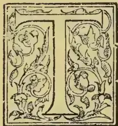

HE late Lieut.-Col. H. C. Byrde occupied for many years a leading position among the planters and merchants of Ceylon. Apart from owning several coffee plantations, he was the founder of a Planting Agency

House in Kandy, which bore his name and that of his son—the Colonel Henry Byrde\*, still of the central capital—for many years; and his family had also the prominence and prestige naturally associated with the opening of the very first coffee plantation in the island. The King of Kandy had a so-called coffee garden at Hanguranketa; but the bushes were allowed to grow at their sweet will and undoubtedly the first regularly formed plantation was in 1824 at Sinnapittia, near Gampola, the planter being Mr. (Geo. Bird (the name was originally so spelt†)—the uncle of the subject of this memoir—who was

aided by Col. Henry C. Byrde the first of the name in Ceylon and father of the gentleman whose portrait we give.

The subject of our memoir is, therefore, the middle one of three Colonels Byrde who have been identified with Ceylon from 1823 onwards. The first was Colonel Henry C. Bird of the 16th Regiment, who arrived in the island in 1823, (accompanied by his brother, Mr. Geo. Bird,) and who became Commandant of Kandy. George Bird himself had been a Cavalry Officer and had come to Ceylon especially to engage in agricultural or planting pursuits. He was a personal friend of the Governor Sir Edward Barnes whose great desire was to see the fine hill country of Ceylon opened up by European capital and planters. Accordingly, Geo. Bird, supported by his brother, set to work and opened in 1824 Sinnapittia near Gampola; while the Governor himself soon after put his money into the opening of Gangarooa (still known as the "Rajah Tot-tum") opposite the Royal Botanic Gardens, Peradeniya, having Mr. Wm. Northway, senior, for his Superintendent. We cannot do better at this stage than quote the account furnished by the sub-

\* One of the heroes of the Redan and who if he had been left in the Army, in place of being turned into civil life, would probably have proved one of the youngest as well as most active Generals in the British Army.

† The change was made by Colonel Byrde after retiring from Ceylon. A wag, who had the ear of the editor of *Punch*, sent to that publication a *bon mot* to the effect that although a gallant colonel down in Monmouthshire had had his "i" (eye) put out by Royal letters patent, he was doing as well as could be expected under the circumstances, and had found

the operation really a painless one.—The joke is not so good as that related to us a few months ago by Sir James Gell, Attorney-General of the Isle of Man. We had previously met Deemster Gill; and referring to the similarity of names, "Yes," said Sir James, "but we are quite distinct families, and on my marrying a sister of the Deemster, it was all the talk that I had put out the eye (i) of Miss Gill!"—Ed. T.A.

611------------------------------------------------

588THE TROPICALAGRICULTURIST.[MARCH 1, 1897.

ject of our memoir (then "Major Bird") to our "Planting Gazetteer" of 1859, of his uncle's career, and the history of his life-long struggles against an adverse fortune. Our prosperous planters of the present day may well regard with respect and honor the name of "George Bird" as the very earliest plantation pioneer in Ceylon—a man of striking character, of superb physical development and strength, unwearied energy and indomitable pluck—and that honor, in a connected degree may be extended to all the "Birds" or "Byrdes" of those early days who gave both time and money to the work of carving coffee estates out of the primeval jungle. George Bird in his early years made a great impression through his work, physical prowess and personal character, on the Kandyans who both respected and feared him. The account supplied to us in 1859 by the subject of our Memoir, was as follows:—

The first Coffee Estate in Ceylon was opened in this District so far back as the year 1821, by Mr. George Bird, who accompanied his brother (Colonel Bird of the 16th Regt.) to Ceylon in 1823 for the purpose of engaging in such agricultural undertaking as inducements in the Island should appear to offer; and the attention of the brothers, (Col. Bird being at that time Commandant of Kandy,) was directed to the cultivation of *Coffee*; and the valley of Gampola was selected as an eligible locality wherein to carry out their intended speculations.

Sir Jas. Campbell, then Lieut.-Governor, gave encouragement to the proposed undertaking by promising a grant of land for the purpose which was afterward confirmed by Sir E. Barnes, and thus commenced that cultivation on the site of two ancient Kandyan Places, Royal lands (Singapetia and Weyangwatte)—which has been of such importance in the subsequent history of our Island.

The mode of cultivation adopted and the enormous protective duties then in favor of the British West Indian Colonies, rendered this, and two other Coffee Estates at Ganga Orowa and Matelle that soon followed the one at Gampola, equally unprofitable; and Col. Bird's death of cholera in 1829\* so paralysed the operations at Gampola that Mr. George Bird was induced to abandon the property in 1833 and remove to Kondasally and subsequently to Imboolpitia in Oudabulatangamma. After having been engaged in the production of Coffee for 33 years with singular want of success he died in Kandy on the 1st March 1857, having been the means of conferring signal advantages on others by the energy of his character, while to himself, the Pioneer of Coffee cultivation, his best efforts served only to prolong his disappointment.—Although a good practical man and possessed of great experience, accumulated through many years of toil, his experience did not avail him until failing health, had destroyed that energy which repeated disappointment could not impair.

The Gampola Estate being beautifully situated in the valley of Gampola, was in 1846 sold to Messrs. Hudson Chandler and Co. for the purpose of farming it on the English principle and combining this with the cultivation of Sugar, and a farmer and his family were brought from England to carry out the intention of converting the already fine pasture lands into a grazing farm—when the decaying stumps of the old Coffee trees gave place to guinea grass to maintain a stock of horses and cattle, with the hope of eventually securing breeds of superior quality;—but on the failure of Messrs. Hudson

Chandler and Co. during the crisis of 1848, this establishment was again broken up, and the estate reverted to the Bird family. Within the last 2 or 3 years it has been again formed by Major Bird into a Coffee estate of 300 to 400 acres which give promise at length of great success, now (1859) that the culture and preparation of Coffee are better known, and the equalization of duties gives the agriculturist in the East a fair chance of competition with other parts of the world.

From Mr. Charles Byrde of Ambalangoda, son of the subject of our Memoir, we have the following:—"Mr. George Bird spent his later years at Kondesale Estate with his daughter, Isabella, who married the late Mr. W. B. R. Wyllie of Messrs. Keir, Dundas & Co. and Mr. Geo. Bird died at Lake House, Kandy, early in 1857, as I was living at this time with my father and mother who went to England in May 1857 after Mr. Wyllie's marriage with Isabella Bird."

We need only add to the above, that when misfortune overtook Major Byrde's firm and properties generally, Sinnapittia had to be taken over by Mr. John Bonstead, and again it changed hands when the final collapse of Ceylon coffee took place. It is now the property of the Oriental Estates Co., Ltd., and like so many other old coffee plantations, has been turned into a flourishing tea garden of 300 acres out of the total area of some 756 acres.

We cannot do better next than repeat some notes written at our request by the subject of our Memoir, Colonel H. C. Byrde (the 2nd) in 1895, after seeing our first volume of "Pioneers" in which he was greatly interested. The old colonist in his Welsh retirement reminded us that he had been a reader and admirer of the *Observer* from the first day it appeared in 1834, down to (what proved) the closing year of his life, and with his "kindest regards to the Editor" he sent the following very interesting autobiographical sketch accompanied by portraits of himself and other senior members of his family from which we were to select the one to appear in our *Tropical Agriculturist* Gallery:—

I was transferred to the Ceylon Rifle Regiment in July 1834, and waited for three months before there was a ship sailing for Ceylon. My fellow passengers in the "Symmetry" were Mr. (afterwards "Sir") Chas. Peter Layard, Lady Layard, James Gay Layard, Beville Layard, Miss Sophia Mooyart, and Mr. Self, passenger for Mauritius—all gone to their rest.

My uncle George Bird came down to Colombo to greet me and I returned with him to Nau Oya, where he was then living, having commenced the cultivation of his estate at Kondasally, which he was then planting. On my arrival at Colombo I found that there was no notification of my appointment. The ship with Naval stores to Trincomalee and Military stores to Colombo had been ordered to the former station first. There were about two or three ships in those days that graced the Colombo roadstead. Letters for England were sent by tappel to Madras to await an East Indianman and it was considered satisfactory to get an answer to a letter from Ceylon *within the year*. What a contrast to the present day:—when mail after mail is advertised, the open roadstead enclosed by a break-water and

\* Col. H. C. Bird No. 1 died of cholera in Colombo in 1829 and his remains are interred in the old military cemetery at Galle Face.

612------------------------------------------------

MARCH 1, 1897.]THE TROPICAL AGRICULTURIST.589

the harbour full of steamships, and Colombo full of visitors, instead of the solitary Military Officer, who probably came out to fill a death vacancy in one or other of the Regiments then stationed in Ceylon. It is worth noticing the mighty change that has taken place in the distant Colony of Ceylon which has in these latter days been brought so near to the mother country.

My uncle had a big horse—one of the Delft stud which had been sold off by order of the Home Government, when Sir Edward Barnes was Governor. My uncle drove me as far as Ambepussa the first day and what astonished me more than anything I can remember was that the *Affghan* horsekeeper ran the whole distance of 36 miles holding on by the back of the buggy. This was marvellous to an Englishman, just arriving in the Island and would probably be marvellous even in Ceylon at the present time, though many such wonders have been wrought in Ceylon since that day.

#### ORIGINAL COFFEE PLANTING AND PREPARATION.

My first visit was to the old Gampola estate, Sinnapitiya, the trees on this property as well as at Peradeniya the Government plantation, and on Ganga Orowa, were grown in the *native* fashion, no other then being known. The preparation was equally original—the Gampola Store was a four-sided building enclosing an open space used for drying ground. The coffee in husk was, at this time, dried ready for grinding; this was done by *grooved rubbers* sloping to one side, and fixed on 3 legs with a hopper on top. This contrivance (an invention of my uncle's) ground off the husk, and the whole was then winnowed by a corn-winnow and finally prepared for shipment and bagged on the estate. It is worthy of remark that up to about this time, the sale price of Ceylon in the London market was about 28s or 30s per cwt. This was caused by the excessive duty of 9d per lb. on all coffee shipped *eastward of the Cape*, while West Indies' coffees were admitted at 6d. This unjust difference was equal to about 28s per cwt., but for this, Ceylon coffee might, in the early stages, have sold for 56s instead of 28s. The duty was however equalized and levied at 6d., after some strong representations to the Home Government, but the earliest planters had this terrible "odds" to contend with, and rejoiced when the duties were equalized. I need hardly mention that at this time all the cultivation of coffee was in the *native fashion*, and required a great amount of manure to maintain; this was the case on the 3 plantations then known:—Gampola, Peradeniya, and Gangarowa, and subsequently on Major Forbes's at Matale.

Some mention is due of Hanguranketa—this was the site of a former palace of the King of Kandy and of a Buddhist Temple, at one time of some eminence. About this palace and temple were coffee trees grown, of course, in the *native fashion* and rising above was a mountain side of coffee *jungle*. The Kandyian legend of this, is that before coffee was known as a beverage, some pilgrims brought the *seeds* (coffee in husk) from Arabia to grow flowers for offerings to the Temple, and that the coffee beans had been distributed in course of years throughout the adjoining forest by the small green parrots which abound in that district.

On the failure of the Gampola plantation, partly in consequence of my father's, Colonel Byrde's death of cholera in 1829, as he had provided the necessary funds,—Mr. George Bird applied to the Governor to have the Old Palace at Hanguranketta coffee jungle sold and it was put up for sale by auction, the limit of £600 was prescribed by Messrs. Acland and Boyd was exceeded by Mr. De Soysa, who became the purchaser at £630, and thus formed the nucleus of his subsequent fortunes, which grew rapidly as arrack renter.

The Governor, after this, made Mr. George Bird a grant of 600 acres of land at Kondasally, where he renewed his cultivation of coffee in partnership with Messrs. Acland Boyd & Co. of Colombo. On my first arrival in the Kandyian

country I was taken to visit this new *venture*, the coffee planted was with stumps and it was affirmed that the *greater* the *number* of shoots the better, nothing like a good *bushy tree*, it was said (again *native fashion*). This was, however, soon altered; for, in 1837, our good trusty friend, o Rober Boyd Tytler, made his appearance with the knowledge he had gained by a residence for instruction on the Blue Mountains of Jamaica, and the great change was partly brought about by an old copy of *The Coffee Planter of St. Domingo* by M. Laborie which Mr. William Boyd had picked up on a second-hand book-stall in London. All was now changed. Trees were to be grown on *one stem*. The plants to be reared from seed, the trees topped at certain heights. M. Laborie gave even plans of the "grater mill" as it was called—Barbacies for drying the parchment coffee and the *peeling mill* for grinding the coffee when dry, with divers instructions for the cultivation. This book and our friend Tytler's knowledge and guidance caused a stir and a revolution that *after-comers* could hardly realize, who flocked to Ceylon to find matters so settled, as if there had been no change, albeit one improvement after another was carried out in improved cultivation and preparation, which produced the fortunes of many, until the climax of leaf-disease *prostrated* the enterprize of coffee cultivation almost entirely. I would next notice the remarkable success of the coffee planting experiment

#### AT BLACK FOREST.

M. Laborie in his St. Domingo Coffee Planter, lays it down as a rule that the soil for the successful cultivation of coffee should be loose, *friable* and if possible on *virgin cleared* forest land. Our friend Tytler visited Gampola with me and gave it as his opinion that the soil was too *compact* for the successful growth of coffee which grew splendidly under the old "jak" trees where it was nourished by the leaves, and the soil kept moist and loose. I mention this peculiarity, as it equally applies to Peradeniya and Ganga Orowa where the soil was of the same character, and the coffee trees equally *impeded* in their growth. My attention was therefore directed to the forest called "the Black Forest of Pussellawa" which for magnificent trees was the finest forest in the Central Province, many of the "Doon" trees measuring 100 feet without a branch. I was so enamoured of this forest land that I determined to try the *experiment* of planting coffee—although this was the *very first* idea of planting coffee in *forest land* at such an elevation, of over 3,000 feet. It was easy then to obtain land; the Governor gave *immediate possession* of 10 acres on which to form a nursery and put up 100 acres for sale at the upset price of 5s. an acre including survey fees *payable in 12 months*, and I obtained 100 acres on these terms—I had prepared a nursery of young plants, and my first cultivation was of 8 acres and was certainly conducted in the most *thorough manner*.

I had only 3 or 4 of our old Kandyian labourers from Gampola. With the aid of an elephant I had all the land "*stocked up*" and the roots buried and the ashes distributed over the surface; the elephant pushed down all the small trees with his head, and pulled up the roots with his trunk. The large timber trees being left, the surface of the ground was, I hear, reduced to a fine pulverized bed, like a garden—such as in future experience never was found necessary. The coffee trees were allowed to grow to the height of 5 feet; no roads or drains were necessary as all the rain that fell was quickly absorbed by the loose earth. I had a small picking of coffee in the second year which I sold in the island.

#### FIRST PREPARATION OF COFFEE IN PARCHMENT IN THE ISLAND.

Instructions in M. Laborie's old Treatise I could not obtain. What he designates as a *grater mill* I had at Gampola, two grooved cast iron cylinders of only 6 or 7 in diameter. I fitted these to work together and crushed out the cherry beans between them, and had a caned (rattened) sieve suspended below worked by a coolie. When the parchment

613------------------------------------------------

590THE TROPICAL AGRICULTURIST. [MARCH 1, 1897.

was separated from the pulp I put it to ferment in a cistern made for the purpose and dried it on mats; but leaving the dried parchment the difficulty was a substitute for a *peeling mill*, and I had to resort to the old paddy pounder; but had a winnowing machine from the old Gampola estate. I then had planks sawn of the keena tree and made into square boxes. These I lined with talipots to keep out the damp, and sent my first crop down to Colombo for shipment to Messrs. Price & Son this being the *first shipment* of Ceylon coffee consigned to them,—afterwards Price & Boustead. My total crop was cwt. 167 or just about cwt. 21 *per acre* off my 8 acres. It sold in London for 108s *per cwt.* or a total of £670, which was just about *double* the amount of expenditure in the *purchase* of 105 acres of land the *cultivation* and *curing* of the coffee, erection of a shed in place of a store, and the building of a bungalow for my family in the hot season at a cost of £26. The heavy crop was doubtless owing to the high cultivation of the land, and the high price obtained was probably due to the fine greenish blue color of the bean similar to the mountain coffee of Jamaica.

The cultivation of the Black Forest Estate went on; additional land was purchased and it finally amounted to 260 acres of coffee when it was sold to the Venerable Archdeacon Glenie for Count Septimir, a friend of the Baron Delmar for the sum of £25,000.

The grooved new cylinder suggested the idea to Mr. John Brown, then engineer to Messrs. Worms, of the *Crusher* to be combined with the Pulper, which was afterwards found to work so well.

#### THE KEKUNA GRINDER.

It was supposed by Sir Edward Barnes that the kakuna nut which contains a large quantity of oil might be utilized as a *new product* from Ceylon in the manufacture of cotton cloths at Manchester and the experiment was tried, but the oil was rejected by the Trade, and the kekuna trees were found to be injurious to the coffee instead of being beneficial by their shade.

#### PERSONAL.

My object is not to write my personal history, but I may mention that when the Governor Sir Henry Ward gave the nomination of the member of the Legislative Council to the Planters' Association, I had the honour of being the *first elected* member and occupied that honourable position for about, seven years, and I was afterwards appointed by Sir Hercules Robinson as one of the Commissioners to report on the Military Expenditure of the island, the proceedings of which form a voluminous document in the annals of the Councils of Ceylon. My colleagues in this were Colonel Laffan, (R.E.) Major Skinner, Sir Charles Peter Layard, and others, and our report was received with favour.

I might take some credit to myself for having been the *first* to introduce or import *Indian coolies* to work on a Coffee Estate in Ceylon, but that this was dictated by self-interest. My Conductor at Black Forest was a man from Trincomalee, half Tamil and half Sinhalese, and I sent him to Trincomalee to obtain the services of a Tamil to go over to the Coast, to bring some coolies. My Sinhalese friends from Gampola having in the season their own work to attend to, my coast messenger in due course returned with 14 men from South India which formed the nucleus of the gangs which supplied the Black Forest Estate in after years, with 200 to 300 labourers, the descendants of whom have followed the fortunes of the Byrde family for the last 50 years, and I believe that some of the descendants of the same villagers are now with one of my sons at Awissawella, proving their faithfulness, so long as they are well treated and cared for.

Ceylon is so much indebted to, and dependent on labourers from Southern India, that planters have reaped the benefit and all friends of the Coffee enterprise have had full consideration for them which has been the *characteristic* of the treatment of the Coffee planters of my time, pre-eminently of our good friend Tyler at Pallakelly, and of that steady old Scotch planter of Mattakelle, our friend Mr. Smith.

#### ENGLISH EXPERIENCES.

After nearly 30 years of ups and downs in Ceylon, I took to English life. On my arrival in England, I was asked to take the command of a Corps of Volunteers which grew to a Battalion, of which I became the Lt.-Col., and when I retired, after a number of years of Command, I was appointed Hon. Col. of the 4th *Battalion South Wales Borderers*, which position, I have now the honour to fill. I was appointed J.P. for the County of Monmouth and subsequently Deputy Lieutenant for the County. I have been Chairman of the Pontypool Court for 27 years in which the trials number from 1,000 to 1,200 *per annum*. I have also been Chairman of the Pontypool U.S.A. Highway Board for a number of years, also of the Rural Sanitary and School Attendance Committees, and for the last 30 years a Commissioner of Inland Revenue.

On the County Council being formed I was elected a member representing 7 parishes, and became Chairman of the Asylum Committee of which I had been a member for 30 years, it belongs to 3 Counties and has about 1,000 members. I was appointed by the Quarter Session one of their Representatives on the Joint Police Committee.

But my own responsibilities, and our work prostrated me, and I have now been confined to my bed-room for the last 18 months; but by the mercy of Divine Providence, my health is now improving.

My experience as the first Coffee Planter on Black Forest land was in many respects quite unique and made me one of the Pioneers of that enterprise which raised Ceylon from a mere Civil Military Station to a Colony of European settlers and Colombo to a shipping port of the first importance.

Colonel Byrde was married at Cotta near Colombo on the 5th January 1837 to Rebecca daughter of Mr. Charles Mais of Bristol. After paying one or two visits to the old country, Mr. and Mrs. Byrde retired thither in the early sixties. In 1871 Col. Byrde paid his last visit to Ceylon, when he came out on business, and took back one of his grand-children with him—the eldest son of Mr. Charles Byrde of Ambalangoda. The deceased lost tens of thousands of pounds in the downfall of coffee, but up to the last was interested in tea, owning, in conjunction with his youngest son, the Rev. R. A. Byrde, of Honiton, Devonshire, Honiton estate, in the Kelani Valley, besides being interested in other properties. In the fall of 1891, Mrs. Byrde, was so ill that the doctors thought that she would not last through the winter then approaching. Her devoted husband during that period was in attendance on her day and night, and her life was prolonged for two years. Col. Byrde, however, never recovered his former robustness, and when his wife died on the 23rd of December, 1893, at the advanced age of 84, and he lost the partner of 57 years of his life, he felt the bereavement very much.

After his retirement to England, in the "sixties," Colonel Byrde made more than one visit to Ceylon connected with the settlement of his properties. These included, among others, a good deal of the land on which the famous Mariawatte Tea Garden is now situated; but as a coffee estate it was deemed of little or no value, the land being too flat and the soil too stiff: in tea it has proved a veritable gold mine.

614------------------------------------------------

MARCH 1, 1897.]THE TROPICAL AGRICULTURIST.591

Settling in Monmouthshire. Colonel Byrde became known as of "The Goytre" near Pontypool and made himself exceedingly useful in the neighbourhood and county. His loss was much regretted by his brother Magistrates and other county magnates as the following extracts from the Monmouth papers will show:—

#### THE LATE COLONEL BYRDE.

##### REFERENCES AT PONTYPOOL POLICE COURT.

Feeling references to the death of the late Colonel H. C. Byrde, D.L., the chairman of the Pontypool Bench of magistrates, were made at the Pontypool Police Court. Mr. C. J. Parkes (in the chair.)

The Chairman said: Before proceeding to the ordinary business of the Petty Sessions, I desire to refer to the very great loss which this division has sustained through the death of Colonel Byrde—one whose face was so familiar to this court, one whose urbanity, kindness, and courtesy endeared him to all who had the privilege of knowing him, and who knew how to appreciate his Christian and kindly character. I cannot sufficiently express the regret I feel personally at the loss of my old and valued friend. I feel that the loss to this division is one that cannot easily be replaced, and one that none of us can very well fill. I believe, further, that such a man as Colonel Byrde cannot pass from amongst us without its being a loss not only to this division but a loss to the county. I simply say that those who had the privilege of knowing him knew how to appreciate his singularly upright character, his love of justice, and his sympathy with the distressed; and it was always his anxiety to throw the shield of protection around the young and inexperienced, and occasionally to offer them more the advice of a father than of a magistrate presiding at this court. I beg to propose a vote of condolence with the family in what we feel is an irreparable loss, and ask our clerk to be kind enough to convey it.

Mr. H. Bythway: On behalf of the practitioners at this court. I would respectfully ask you to allow us to associate ourselves with the kind expressions to which you have given utterance. We cannot forget that as advocates in this court we received

from Col. Byrde the utmost kindness and consideration, which were of the greatest assistance to us and were very much appreciated by us.

##### FUNERAL.

The funeral of the deceased gentleman took place on Monday afternoon, his remains being laid to rest in the little "God's acre" attached to Goytre parish church amid many circumstances which bore eloquent testimony to his private worth and public services. Seldom has such a large and representative assemblage been witnessed in the district. All classes of the community appeared to vie with each other to do honour to the memory of the departed gentleman; and the funeral afforded a striking illustration of the extraordinary influence which he had for many years exerted in relation to all institutions having for their object the social and moral elevation of the county. The mourning coach contained Miss A. Byrde (daughter), Miss L. Byrde (sister) and Mrs. R. Byrde and Mrs. C. Byrde (daughters-in-law.) The other relatives present included the Rev. F. L. Byrde, Keynsham (son), the Rev. R. Byrde, Honiton, (son); the Rev. H. Byrde, Broadwater, Sussex (grandson); and Mr. and Miss Dix, Mamhilad. The coffin, which was of polished oak with brass mountings, had an engraved breast plate—

Col H. C. Byrde.  
Died Oct. 15, 1895.  
Aged 79 years.

Colonel Byrde left five sons and a daughter—three are well-known in Ceylon: Col. Henry Byrde of Kandy; Mr. Charles Byrde of Sinnegolde, Ambalangoda; and Mr. Frank W. Byrde of Awissawella. In England one son, the Rev. R. Byrde, is headmaster of Honiton Grammar School, the other being chaplain of an asylum at Bristol.

We must hope to see the portrait of Col. H. C. Byrde—the first Planting Member of the Legislative Council—among the earliest placed on the walls of the new Hall of the Association when completed in Kandy.

(Writing of Col. H. C. Byrde, No. 2, accompanying the notes of his career.)

To Mr. Elder  
Ceylon  
Colombo,  
With Col. Byrde's  
regards  
July 1895

### Agricultural Pests:

WITH METHODS OF PREVENTION.

BY MISS E. A. ORMEROD

(LATE CONSULTING ENTOMOLOGIST TO THE  
ROYAL AGRICULTURAL SOCIETY OF  
ENGLAND.)

(Special for "Tropical Agriculturist.")

#### III.

##### BEETLES INJURIOUS TO CROPS AND PASTURES.

From the fact of there being a very large number of different kinds of beetles (*Coloptera*), and also from a great number of these injuring the crop, both in the grub, and in the beetle state, this order

is, perhaps, the most important of all to the farmer.

For a long time "Ground Beetles" were supposed to live almost entirely on animal food, and, therefore, to help very much in keeping other insects in check; but now it is found that various kinds injure growing grain, seeds of grass, and other vegetables. In the United States it has been found, by watching the habits and examining the contents of different kinds of *Harpalus*, that these feed on rootlets, seeds, and other parts of grass or corn, besides other matters animal and vegetable. In Prof. Forbes' experiments it was found that of twenty-eight specimens of *Carabidae* examined, twenty specimens, and these belonging to eleven species, had eaten vegetable food.

615------------------------------------------------

592THE TROPICAL AGRICULTURIST.[MARCH 1, 1897.

So far as I am aware, no further observations were recorded on the subject until about the end of the winter and early spring in the year 1888, when specimen of a grub, minutely resembling that of this species of Corn Ground Beetle, were forwarded to me as doing much mischief to young wheat plants in various parts of the south and east of England. In the summer of 1885 the night-feeding Ground Beetle, *Steropus madidus*, was sent me from near Bishop's Stortford, Herts, where specimens were captured in act of feeding on mangold roots. These beetles are partially carnivorous, as one of these forwarded to me killed one of its companions, and consumed its contents; but their field work, being about three in the morning, is seldom noticed. These observations make it very desirable to keep an eye to the habits of the many kinds of these pitchy or brownish "Ground" Beetles that we see so active in summer in corn-fields, and which have generally been supposed to be employed in clearing off insect vermin.

The second section, the *Brachelytra*, commonly called Rove Beetles, may be generally known by the short wing-cases, and, in the case of the very common beetles, sometimes known as Devil's Coach Horses, by their habit of arching up their tails when annoyed. Some feed on animal matter, including other living insects, and they much frequent rotten animal and vegetable matter. The grubs are very like those above described, but may be known by the fork above the tail being double-jointed, and furnished with stiff hairs. Both grubs and insects help us in clearing off other insect presence.

The third section is that of the *Necrophaga*, or *Clavicornes*, which includes beetles of very various habits, but for the most part feeding on decayed matter (especially the division often known as Sexton Beetles, which live for the most part in dead animals, carrion, and what we may shortly describe as "filth" generally). Their horns are usually enlarged or club-shaped towards the tip, or bent as if they had an elbow; and the wing-cases usually bend down at the sides, so as to cover the sides of the abdomen.

Some, like *Cadelle*, and the Corn *Cucujus*, are Corn feeders, and various kinds frequent flowers. Of these some species of *Meligethes*, or Turnip Flower Beetles, are very injurious, and furnish one of the few examples of infestations which may be satisfactorily lessened when established on the plant by remedial measures. The little green *Meligethes* Beetles may sometimes be found on the flowering shoots or rape, cabbage, and turnip, and cause great loss where the crops are being grown for seed.

The beetles feed on the pollen in the flowers, and lay their eggs in the unopened blossoms; the maggots from these feed in the bud and base of the flowers, and the seed pods. As a remedy it is found to answer well to have the infested tops and early blooms of the turnips picked, and put, with the beetles and maggots, into bags which are tied up as soon as full, and the contents destroyed. Under this treatment the growth of flowering shoots is much thickened, a great deal of the infestation is got rid of, and the crop is thrown back about a fortnight, which gives the rootlets increased time or action, and the plan is considered certainly beneficial in increase of crop, independently of clearing the insects.

The fourth section is the very important one of the *Lamellicornes* or Chafers. Some of these do us little harm, like the Stag Beetles, of which the grubs, so far as I am aware, live in rotten wood; or, again, the Click or Dor Beetles (*Geotrupidae*), which bore down into the ground, especially where droppings are lying in cattle pastures, and carry the dung into the soil as food for their grubs. But there are many kinds, such as the Small May-bug or Garden Chafer (*Anisoptia horticola*), of which the grub does much harm in pasture land, together with another much rarer kind, (the *A. agricola*); also the Common Cockchafer, the Great Golden Chafer, and others which, in this country, feed, in

the beetle state, on leaves of trees, or within flowers, and as grubs on the roots of grass, corn, or other ground crops, as well as trees; and, in the colonies, on the roots of coffee and sugar-cane, and altogether cause most serious loss.

The beetles are generally to be known by having a club of several leaves on their horns, such as the fan-like one that we see to the horn of the Cockchafer; and the grubs are large (sometimes as thick as the finger) and fleshy, with the end of the tail curved downwards and enlarged, as if it was swollen, so that the grub usually lies on its side. By this swollen tail and arched shape, and also by having three pairs of longish legs and strong jaws, you may commonly know the chafer grubs.

The habits of different kinds of chafers vary in such matters, as the depth to which the grubs bury themselves, or at which they turn to chrysalids, the length of time they pass in these two states, and also the time of day, or evening, when the beetles are at rest, which is a very important point in regard to getting rid of them; but the life-history of the common cockchafer gives a good general idea of that of the kinds that we are most troubled by. These beetles appear in early summer, and feed on leafage of many kinds of trees. The females lay their eggs in ground which is either cracked, or will allow of the female burrowing down into it to lay (the state and kind of ground is an important matter); she lays from twelve to as many as thirty eggs, from about four to eight inches deep. The grubs from these hatch in a few weeks, and feed on roots; maybe devastating young fir plantations, or attacking flax, or carrots, or many other crops, or ruining grass fields; there is a surprising variety in the kind of crop infested. After feeding for three or four years, they go as much as two feet or more down into the ground to turn to chrysalids, from which the beetles come up in the following summer, that is, the fourth (or, according to other opinions, the fifth) summer after they were hatched.

A great point is to keep the female from going down into the ground to lay her eggs. Sometimes, where the soil is of soft vegetable remains (as amongst the coffee plantations in Ceylon), it is found that laying a coat of the clay subsoil on the top answers; and, for field treatment, it has been advised to lay a good covering of some harder material, as marl or road-scrapings, on the surface, or to give a top-dressing of salt or gas-lime, or some application which might make the surface unsuitable for laying. Probably gas-lime would be very serviceable, and the washings down from this would be likely to drive any grubs near the surface away, for a time at least, and thus give the crop a respite. Gas-water applied at a strength which would not hurt the grass has been found to act well; the strength, of course, must be found by trial, as this varies much.

Where grubs are in unoccupied ground, that is, after the grass or crop has been killed or gathered, a great many may be got rid of by ploughing or digging deep enough to turn them up, and calling in the help of children to collect and destroy them, or that of the pigs, which will do much work without pay. The wild birds also, such as sea-gulls and rooks, should on no account be driven away.

There is, however, another treatment, not nearly enough thought of, which is applicable to all cases of infested land free of crop, and that is putting on a heavy killing dressing. Caustic gas-lime may thus be used, and alkali waste is excellent for the purpose. These are very much alike in their nature and effects; at first they destroy everything they touch, whether plant or insect, and the alkali waste is also used to clean the ground of deep-rooted weeds, such as conch-grass, coltsfoot, and thistles, and is washed down by rain into the soil, so as to make the drains run milky at a depth of three feet. This is procurable for little, if any, outlay, beyond cost of carriage from chemical works, where it is thrown out as waste. Now attention has been drawn to its value, and it is likely to be made available.

616------------------------------------------------

MARCH 1, 1897.]THE TROPICAL AGRICULTURIST.593

When it (or the gas-lime) has done its first work in the caustic state, the action of the air gradually turns the poisonous properties to sulphate of lime, and they become a good manure of the nature of gypsum.

If a heavy dressing of this kind was spread on land infested by any grub at the time when it is near the surface, and without disturbing the land, we should thus take it, as it were, unawares, and it would be destroyed by the poison before it had time to get out of the way, instead of, as is often the case, being merely made to go down to a safe depth, from which it presently comes up again to attack the new crop.

The fifth section of beetles belonging to the great division of the *Pentamera*, or those having customarily five joints to their feet (*tarsi*), is that of skip-jacks and their allies, scientifically the *Sternox*. These do little, if any, harm, in the beetle state, but in the grub-state—that is, as what we know as wireworms—the mischief and loss they cause to the country are beyond calculation.

The wireworms will feed on the roots of almost all crops excepting mustard, which they frequently have been found to avoid, and live for five years before they cease eating to turn to chrysalids, and thence to chick beetles. They are commonly of a yellowish colour, and take their name from their power of regaining their position when laid on their backs by a sudden jerk or skip up in the air, accompanied by a click.

The female beetle lays her eggs on, or a little below, the surface of the ground, amongst leafage or roots, and especially in such places as grass meadows, or clover leys where the surface is undisturbed for a time, possibly for years, and consequently the ground below swarms with wireworms of all ages. When the pastures are broken up, these rough-skinned grubs are in no way hurt, but remain in the ground, ready to feed on each succeeding crop that is put in, until the time for their change comes.

Clover leys and pastures are the main starting-point of wireworm-attack to our field crops, and the method of treatment may be considered under the two heads: firstly, how to prevent egg-laying, and clear infected land, before re-cropping or sowing; secondly, how to lessen ravage, or support the plant under it, if wireworm is found present in the growing-crop.

To prevent egg-laying the ground should be made as unsuitable as it can be for the purpose. It is advised to feed down the grass as bare as possible before ploughing, or to go further, and pen sheep on it, gradually moving the hurdles forward, so that every part of the field may be thoroughly trodden. The sheep in this case are fed with turnips and other regular feeding stuffs, and the amount of liquid and other manure thus worked into the land thoroughly prevents the field being inviting for eggs to be laid on it, and destroys any eggs that might be on the surface. Dressing pasture-land with lime brought fresh from the kiln, and spread hot so as to burn the grass, answers well. Sowing salt, at the rate of 5 to 8 cwt. per acre, on grass or ley before breaking up, has also been found to answer, and good dressings of caustic gas-lime, or of alkali waste strong enough to destroy all live matter on the surface, are very serviceable. Paring the surface, and collecting and burning the parings, gets rid of a deal of wireworm, if the burning is done whilst the wireworm is in it; and in any case gathering up the surface rubbish, and burning it, is useful as a preventive, for, even if the wireworm has left the locks of roots for a time, we thus get rid of the knotted lumps to which it would have presently returned, and which would have kept the land open for its passage.

The habit of the wireworm in feeding is to keep near the surface, gliding about, as its smooth glassy surface enables it to do, from one plant to another, eating out a piece here and a piece there, and thus injuring the whole crop; and, if this happens whilst the crop is in its first growth, the value even of those plants that struggle through is much lessened.

For this reason the main points, in preparation of ground to carry the plant over attack, consist in treatment that will give a good seed-bed, and mixing the soil with such chemical manures as will be good for the plant and unsatisfactory at least to the wireworm; also so to clear the ground of rubbish and work it that it may be sufficiently firm (or admit of being sufficiently "firmed" by treatment afterwards) to prevent the travelling of the wireworm. For this purpose it is advised to plough in good time in autumn, and work the land well so as to get it in good order and consolidated, and either by burning, rotting, or whatever means may be preferred, prevent it being kept open and full of harbours for wireworms; stubble and roots, cabbage stalks or beanhaulms, and all such matters, are wireworm-helpers. If we took down the notes of special applications found serviceable to plough in, we see constantly repeated: salt, salt, salt, gas-lime, gas-lime, hot lime, lime and salt; and in a less degree (probably because it is not so well-known) alkali waste is also highly recommended. Kainite also is useful, and regular fertilisers, as superphosphate and nitrate of soda. But it is worth notice, especially in preparation of ground for turnips, that there is a great doubt whether wireworm is not often encouraged by the use of farm manure. The wireworms of two of the commonest kinds of click beetle have been found respectively in dung, and in well-rotted horse dung. It is considered by some farmers that crops so manured are the most infested, and if we consider that in this manure a large portion of the material is still unchanged vegetable matter, of much the same kind as wireworms would naturally feed on, it gives a reason for attention to this point. Thorough salting of farm manure has been advised to get over this difficulty. It should also be remembered that heaps of decayed turf are headquarters of wireworm, unless treated with caustic lime, salt, or the like dressings; also that (take what pains we will) if grass headlands or grass strips are left across or by our fields, there we make homes for the wireworms, and they will add all requisite comfortable provision from our crops. The only crop which wireworm appears to have customarily a great objection to is mustard. This, therefore, is sometimes useful as a cleaning crop.

When wireworm is present, strong fertilisers—such as nitrate of soda, guano, superphosphate, or others—are serviceable; and mechanical means, such as heavy rolling, are of use, for thus the creature is prevented travelling, and some of the pests are probably set fast and killed. Treading by sheep or cattle, or by the heavy iron-shod feet of horses, similarly firms the soil serviceably. The wireworm can be drawn away from the attacked plants by dressings of rape-cake or Indian rape, that is, mustard-cake, and in the latter case has been found by experiment to perish in about a fortnight where it had no other food, and, connecting this with the power of mustard as a cleaning crop, it suggests that further experiment would be useful.

These are some of the main points of wireworm prevention:—Prevent egg-laying; clear the ground of wireworm, and get a good start for the plant; keep up the strength of the plant under attack, and keep the power of the wireworm in check; and also do not dress your land with wireworm, either in decayed turf, or by letting grass homes for it be amongst your crops. The subject is one of great importance.

## AGRICULTURE IN THE ALPES MARITIMES.

The visitor who goes to the Riviera in search of health or pleasure during the winter months, and who confines himself to the fashionable towns on the coast, would not be inclined at first sight to consider the department of the Maritime Alpes as an agricultural district. It is, however, strictly one of the agricultural departments of France. There are few manufactures. The most important are the perfumery

617------------------------------------------------

594THE TROPICAL AGRICULTURIST.[MARCH 1, 1897.

factories of Grasse, which consume a great quantity of cultivated and wild flowers, as well as aomatic plants grown on the coast, and among the mountains of the department. The Acting British Consul at Nice, in his last report, states that the department contains 373,800 hectares (hectare=2.47 acres), of which 73,764 hectares are ploughed land, 61,411 hectares are planted in vines, 19,513 hectares in timber, 20,774 hectares are meadows, and 90,000 hectares grazing ground, or "Alpes;" of the remaining territory, 55,942 hectares are built over, or used for roads and ways of communication, while 52,363 hectares are uncultivated, or barren. The soil is naturally fertile, and produces well where it can be irrigated by means of the canals. A great deal of the cultivation is done on the terraces made on the mountain sides, every kind of crop being grown on them, from olives to cereals. Wheat, meslin, rye, barley, and oats are grown, but not to any very great extent. In 1894, 20,941 hectares out of 61,414 hectares planted in vines, gave 36,298 litres of wine, as against an average of 49,092 litres. The wine produced 1895 was very abundant, but not of such good quality as vintage of 1894. The wines, as a rule, inferior, but near Bellet they make a wine which some consider excellent. Besides the wine grown in the country, and the *vinus fins* imported for the consumption of the well-to-do classes and foreign visitors, large quantities of inferior wines are imported from Spain and Algeria into Nice, Cannes, Antibes, and Mentone. These wines are often doctored, and generally are what is termed *platé*, and are not very wholesome. There is more wine drunk per head of the population in Nice than in any town of France. Market gardening is carried on chiefly near Nice, towards the Var, at St. Laurent-du-Var, Cagnes, Antibes, Vallauris, and Caunes. Some of the gardeners make a specialty of *primeurs* for the London and Paris markets. At Nice there is a trade in dried vegetables. These, as well as candied fruits, are largely sent to Bordeaux, from whence they are exported to England. Fruit culture has made great strides of late years, owing to the extension of the candied fruit trade. Among the fruit trees whose cultivation can be considered of the first importance come the peach, the fig, the plum, cherry, orange, and, at Mentone, the lemon. The olive tree of the Riviera is cultivated for its oil. The dry and calcareous nature of the soil being admirably suited to the cultivation of the peach, the *Persica Amsden Fune*, a native of the United States, is successfully grown in the open air, the fruit ripening from about June 1 to June 10; the peach tree suffers principally from the presence of ants. The fig tree is much cultivated in the department, and its fruit is both sold fresh in the market, or candied and dried. The dried figs of Nice are consumed locally. Three lb. of fresh figs give one lb. of dried figs. Dried figs of prime quality fetch from 40 to 60 francs the 100 kilogrammes. The Arabs of Algeria manufacture a kind of spirit, known as *arak*, from the dried figs, and the peasantry of Nice and the Genoese Riviera make a kind of sweet wine from this fruit. The tree gives two crops every year. It requires careful cultivation, and to be judiciously cut. Like all other fruit trees in the Riviera, the fig suffers greatly from insects. Cherries are very plentiful, and the fruit is largely used locally in the manufacture of bonbons, preserved in brandy and candied. The crop has not been so good this year as in 1895 or 1894. Orange and lemon trees are largely cultivated all over the coast districts; besides the climate, the soil is very favourable to these trees, as they require a calcareous one, rich in lime and potassium. They generally die, if the temperature falls below 23° Fahrenheit. The common orange tree, cultivated at and near Nice (the *Citrus aurantium*), produces its maximum at about 20 years of age. This may be calculated at 600 to 1,000 oranges per annum, 1,000 oranges weighing about 150 kilo-grammes. They are, however, principally cultivated for their flowers, which are sold at 40 centimes per kilogramme, or about twopence per lb. With the skins of the orange an essential oil is made, both at Nice and Grasse, which is called essence de Portugal. The bitter orange

tree, or *Citrus Bigardia*, is cultivated for its flowers, which produce a kind of water mace used in France called *eau de fleur d'orange*, and also an essence. The skins of these oranges are dried in the sun, and are exported to England, where they are used for making cakes and puddings. Dr. Emile Sauvaigo, in his book, "Les Cultures sur le Littoral Méditerranéen," estimates that the average annual income in the Alpes Maritimes derived from the cultivation of the olive, is £320,000. In spite of this, the cultivation is on the decline. Dr. Sauvaigo gives the following reasons for this—"The competition of grain oils, such as cotton seed, &c., and the numerous frauds and adulterations practised in the olive oil trade, and besides these there are the dearth of labour, faulty pruning and insufficient manuring, and last, but not least, the increase of the parasites of the olive tree." The tree grows best on slopes, and prefers a dry soil, rich in carbonates of potassium, lime, and magnesia. It suffers from cold, and dies at 14° Fahrenheit. On the Riviera, a tree planted from a seed begins to bear fruit in about 13 to 14 years, and those planted from cuttings in about 8 years. It flowers in April. In August, when the fruit is well-formed, it suffers most from its enemy the *Keiroun*. One of the most difficult things in olive culture is the pruning of the trees, and this has to be done as soon as the crop has been gathered, or after severe cold weather. As regards reproduction (and this, says Consul Jerome, may be of special interest, as on one or two occasions the consulate has been asked by the London representatives of Colonial Government to obtain seeds and young grafted olive plants, to be sent to the Colonies for plantation), this is effected, first by seeds. The ripest and finest olives are chosen, the stones are separated from the pulp, and they are spread out to dry in the autumn, and planted in the spring. They take about a year to come up, but if the stones are broken, without any damage being done to the kernels, and by sowing these in February or March, the young plant makes its appearance much sooner. The seedlings, after having been kept in a nursery garden for about four years are grafted. Dr. Sauvaigo recommends graftings on the wild olive (oleaster), or on suckers, and these should be chosen as far from the parent tree as possible. Olive trees are also reproduced from cuttings. In all cases care must be exercised that the young plants should be taken from the nurseries just before winter or the rainy season, so that they should benefit by the natural moisture of the soil. The crop is gathered by women and children at the rate of 1 franc to 1 franc 50 centimes per day. The fallen fruit is picked up under the trees during the winter, and in April or May the trees are beaten. If the olives cannot be immediately taken to the mill, they are stored in heaps, which have to be stirred to prevent fermentation. The olives are usually sold to the manufactures of olive oil, at the rate of from two to four francs the double décalitre (20 litres), according to the quality. The oil produced at the mill can be divided into several kinds:—(1) Virgin oil, or the oil pressed out and carefully filtered several times; (2) the first quality oil of commerce, or the oil scalded in vats, which is a much quicker process, but somewhat spoils the quality of the oil; (3) *Huile de resseence*, or refuse oil, used as a rude sort of lubricator oil by the peasantry. An olive orchard brings in an average income of £20 per annum for each hectare, and the land is valued at from £200 to £180 per hectare. The diseases the tree suffers from are numerous, the most formidable being known in the district as *la fumagine*, caused by a small fungus. The mills where the olive oil is made are, as far as machinery goes, of a very primitive character, generally driven by water wheels. These are defective in construction, and the fall of the water badly arranged. The machinery inside the mills is made of clumsy wooden cogs and contrivances. Consul Jerome says: he is sure that improved machinery for making olive oil would find a ready sale in the South of France and Italy, providing that it was not of too complicated or expensive a character.—*Journal of the Society of Arts*.

618------------------------------------------------

MARCH 1, 1897.]THE TROPICAL AGRICULTURIST.595CEYLON EXPORTS OF COCONUT PRODUCTS:THE SPREAD OF THE PALM-GROWING INDUSTRY.

The revised table of exports, as amended by the Chamber of Commerce, which we give as a *Supplement* to this issue, throws some light on the position and the development, in some directions, of the Coconut Palm Industry within the last 10 years. It is still a native industry, in the sense that it is chiefly in the hands of natives, just as tea planting is chiefly in the hands of Europeans. The *Tropical Agriculturist* was among the first to counsel the encouragement of natives to plant up their little ex-coffee patches with tea, and it had to face not a little ridicule and impotent snarling in this matter, as in its agitation for Railway Extension, before men saw that there was room for both European and native in tea cultivation and manufacture and that there were many conditions favourable to the growth of the industry in native hands. At the present day, it is not in little patches only that our native friends are interested, but in extensive blocks as well, both on the hills and in the low-country. What we looked to specially was a very considerable and yearly increasing local consumption of tea. In old days we reckoned that 50,000 cwt. of coffee were used by the people of Ceylon and we do not see why we should not have a native consumption of tea equal to several millions of lb. a year before long.

If Ceylonese of all classes are becoming alive to the profits derivable from the tea industry, not less marked is the confidence which European capitalists at home, and hard-headed colonists on the spot, are showing in the old coconut industry. It would be a great mistake to suppose that European capital never found an investment in palm culture till of recent years. When coffee was the rage in the mountain zone, the palm groves of the Northern and Eastern provinces attracted not a few Europeans. Their experience, aggravated by difficulties of transport, was not very encouraging; and the minimum of profit with the maximum of waiting did not help the industry in competition with products from which quick, and for a time large, returns supplied the precise conditions which prove attractive to strangers in a strange land. The European looked askance at coconuts, and we doubt whether a single agency firm had a single coconut estate on its books 20 to 30 years ago, or was prepared to make or sanction, an advance on coconut property. All that is changed now; and one of our largest and most uniformly successful Tea Companies set a striking example a few years ago by investing its reserve fund, or a good part of it, in coconut plantations. Since then the confidence in coconuts as a safe investment, yielding by no means insignificant returns, has grown; and we hear of extensive tracts being opened up for coconuts by European firms and Companies, while a larger number of proprietors are combining tea and coconut culture in the same fields, with, in some cases, encouraging results, though in others we have heard fears expressed that the one product interferes with other. Indeed, it is evident, that the shrub, hardly though it is, will have ultimately to yield to the great umbrageous tree with its matted network of roots; but not, we trust, before the enterprising proprietors are assured of a return from coconuts, hastened by the cultivation of the tea, sufficient to compensate for the diminution, or the stoppage, of the income from tea. Mean-

while, there is a brisk demand for good nuts from selected trees for nurseries on lowcountry and upcountry estates—up to almost 2,000 feet in elevation; and we learn from a Veyangoda proprietor that scarcely a month passes without his having to despatch seed nuts from his estate on orders by cart or rail.

Though the cultivation of this most useful palm is yet, and probably always will be, chiefly in native hands, the development of the industry is principally due to European enterprise and capital. Coconut oil mills first encouraged the extension of plantations, as their voracious maw began to demand far larger feeds of copra, than the slow and primitive checkoo; and now the desiccating mills, also the outcome of the inventive genius and restless enterprise of European capitalists, are again stimulating the demand for nuts, which had slackened somewhat, through new illuminants, lubricants and fatty substances necessary in soap-manufacture competing with, or elbowing out the oil from some of its old markets. We thus fail to note any actual growth in coconut oil exports. Last year they amounted only to 343,000 cwt.—positively the lowest figure for the decade, if we except 1887, which showed a falling-off as compared with some earlier years; while in 1892 the exports ran as high as 550,000 cwt. The difference of 217,000 cwt.—an average year's exports—represents at 500 nuts to the cwt, about 108½ million nuts; and our readers can understand what a rundown in the price of nuts this slackened demand for oil would have involved, were it not for the Desiccating Mills which have continued to absorb a growing quantity of nuts, year after year, if we except 1894, when there was a temporary falling-off caused it is believed, by slackening work in the Mills to discourage competitors. The first record of the desiccating business is to be found in the Export figures for 1891 when 416,330 lbs. were exported. The next year there was a leap up to over 3 million lbs; in 1893 over 6 million; while in 1896 we exported over 10 million lb. of Desiccated Coconuts, representing at 3 nuts to the lb., no less than 30 million nuts! We have seen that the difference in the return of oil between 1892 and 1896 represents a difference of 108½ million nuts. Now, the difference in the desiccating business of the two years, accounts only for 7 million lb., or 21 million nuts; so that last year is to the bad, as compared with 1892, to the extent of 87½ million nuts. It is no wonder that the price of nuts has receded this year and is lower than it has been for three years back. It will not, indeed, be safe to expect higher prices until the demand for oil has quickened. The shipment of unmanufactured nuts, last year, shows a considerable increase over that of 1895—as much as 3 million nuts; but a total of 13 million nuts exported, though the highest on record, cannot count for much in considering the shrinkage of oil. Still the demand for shipment and for desiccating purposes helps to keep up prices on the seaboard and in the districts surrounding the Mills; while another element in the calculation is the increased demand for culinary purposes, which grows with the growth of population and specially with the growth of general prosperity. We suppose the better part of the nuts exported finds its way into the coconut butter business. Of Copra, or the dried kernel of the nut, 50,000 cwts. were exported. The figures, though better than for the three years preceding are not to be compared with those of some years ago. Within the past decade the

75

619------------------------------------------------

596THE TROPICAL AGRICULTURIST.[MARCH 1, 1897.

exports ran into six figures on four occasions, and on every one of these, the exports were more than double those for 1896, and almost treble! So that in that direction too, there is little ground for satisfaction. Of Poonac an average quantity was exported in 1896, though less than for the previous six years, in natural correspondence with the diminished outturn of oil. But we never lament a falling-off in poonac exports, as the more of it we retain for feeding stock and for manure, the better. The Coir business—whether in rope, yarn or fibre—was an average one, and from all accounts the trade in these articles has been overdone, and the profits desirable from them are not very dazzling. Altogether, Coconuts have not shown up as well last year as the year before; and the slack demand for oil in European and American markets must tell to some extent on business this year, until a brisker demand springs up, and Indian competition begins to tell.

### PRODUCE AND PLANTING.

TEA IN THE UNITED STATES.—The difficulties of pushing Indian and Ceylon tea successfully in the United States are well-known. It requires plenty of pluck and perseverance. The following letter from the Philadelphia correspondent of the *Trover* is of interest as showing the state of the tea trade. Writing of that portion of the city where the relics of the Revolutionary period most abound, the correspondent says: "In this section of the city are many tea importers and jobbers, some being the largest in the United States. One firm reports sales in a private way of 88,000 half-chests in ninety days, an exceptionally large distribution for a firm in this country where tea is not in popular favour. Most of this tea was sold by travellers who go as far west as the Rocky Mountains. This house does not speak enthusiastically of the prospects of Ceylon and Indian teas, because their flavour is so different from the green tea and Oolong in favour here for 125 years. On the other hand, I found those who think that Ceylon and Indian teas are the teas of the future. They are certainly very much in evidence at the Food Show now being held under the auspices of the Philadelphia Retail Grocers' Association. I found that the main exhibit was by the Ceylon and Indian tea interests. A very large space has been fitted as a tropical tea garden wherein maidens passably fair invite you to tarry and sup. You are served, as you elect, with a cup of hot or cold tea, together with a biscuit. Upon conversing with the manager, I found him quite an enthusiastic American advocate of Ceylon tea. He states that the greatest drawback is that consumers are not careful in brewing, as they use as great a quantity of Ceylon or Indian tea as of the China or Japan sorts, and the result is a very heavy-bodied liquor, sweetish and with too much tannin. It is to overcome this fault that demonstrations in the proper use of Ceylon and Indian tea are given. Tctley's teas were represented in a separate pavilion, where consumers could also obtain a cup of the delicious beverage, and go away provided with a beautiful lithographed *brochure*, somewhat humorous in character, but of a kind to provoke the recipient to carry it home and preserve it for amusement and reference."

WHAT THE AMERICANS DRINK.—"The Americans are not given to tea-drinking. They go in for coffee and beer, using both very freely—about nine pounds of coffee and sixteen gallons of beer *per capita*, while of tea they use about one and a third pounds. It is seldom I have found a cup of tea decently brewed, except when made to order in some first-class hotel or famous restaurant. Certainly, 70,000,000 consumers, with tastes varying greatly, offer a fair field for the push, pluck, and persistency of the Ceylon and Indian tea people. Everywhere I find photographs of scenes in the tea-gardens of Ceylon, and others

illustrating methods of manufacture. All of this is calculated to make a bigger demand for machine-made tea. I was also presented with a private statement of the position of tea, prepared by one of the oldest firms of brokers in the land. It shows an estimated supply for the season of 1896 and 1897 of 82,350,000lb. against 195,300,581lb; in 1895-96. The supply is made up as follows:—Green tea 14,000,000lb; Japan, 40,000,000lb; Formosa Oolong, 16,000,000lb; Amoy Oolong, 1,250,000lb; Foochow Oolong, 3,600,000lb; Congou, 7,500,000lb; total, 82,350,000."

BRAZILIAN COFFEE.—An important sale of Brazilian coffee on spot took place at Hamburg on Thursday week, 24,000 bags, mostly Santos, lying in steamer now in port, being disposed of by the banking house of L. Behrens and Sons. The buyers were local firms. There is reason to believe that this coffee was a consignment made by the Brazilian Government, in place of bills in discharge of amount required for payment of interest on Brazilian bonds. The coffee was consigned to Messrs. Rothschild in London, who had it sold in Hamburg.

COFFEE IN 1896.—In the coffee market values receded from 77s to 62s in August for ordinary Colombian, while middling sorts of other Central American moved from 94s to 85s. East Indian fell proportionately for the common and pale kinds, and Bahia, African, and Santos dropped about 25s, 50s being touched for good average Santos, while, on the other hand, good to fine qualities have, with slight fluctuations, maintained very full rates. One noteworthy feature was that when supplies were at the heaviest prices were relatively high, as both dealers here and on the Continent had run their stocks so low that they were compelled to buy. After they had filled their requirements prices gradually declined, and with heavy Brazil receipts pointing to a large crop the downward movement became more pronounced. In August, however, when supplies had fallen off and demand became more active, values recovered 4s to 6s. Towards the close, with supplies of new Colombian coming forward rather freely, prices again gave way slightly. Ceylon, in consequence of leaf disease and the gradual decadence of cultivation, has been in small supply and commanded extreme prices. A parcel of native, the first seen for many years, brought full rates. East India, considering the quality, which was not altogether up to the usual standard, averaged well. Costa Rica has been in larger supply, and quality generally was better, especially fine marks. Offerings of Nyasaland (grown from Indian seed) have increased and high prices were realised. The growth, being of good colour and make, promises to rank well with other descriptions in the favour of the trade, but so far the parcels have been very mixed with defective berries, showing the necessity for more thorough hand-picking. In the terminal market business has ruled exceptionally quiet, even the change altering the minimum quantity dealt in from 500 to 250 bags failing to stimulate speculation, but during the latter part of the year there has been a little more doing in Santos futures. Prices have steadily declined, good average Santos being quoted 70s in the beginning of January and closing at 50s, after having been as low as 47s 6d. Fair Channel Rio, opening at 61s 9d, is now 48s, having been as low as 43s in the beginning of October.

COCOA DURING 1896.—Cocoa experienced unexampled depression during the greater part of the year. For the first six months supplies poured into the Port of London to such an extent that the accumulated stock in bond was about double the average stock of the last ten years. Manufacturers were consequently able to purchase on their own terms, and values gradually declined until the lowest level ever recorded was reached. For in-

620------------------------------------------------

MARCH 1, 1897.]THE TROPICAL AGRICULTURIST597

stance, Trinidad cocoa became a complete drug in the market, so much so that the principal buyers of this description refrained from purchasing for nearly half the year, and to effect sales importers had to accept a very considerable reduction, values for the first time sinking below those for the produce of neighbouring islands. Some relief was experienced during the latter portion of the year, this being caused by a shortage from Ecuador, which country continues to be the principal source of the world's production. Notwithstanding an increased acreage under cultivation in that country, the total crops, after a record yield in 1893, have yearly diminished. Other sources of supply, such as Ceylon, St. Thomé and Brazil, produced average quantities. The lessened yield from Ecuador caused a rapid falling off in the accumulated stocks, which at the present moment have sunk below those of the corresponding period of last year. At the later sales of the year a better demand was apparent, and prices of some growths showed a tangible recovery. It is worth noting that a considerable reduction in prices made by German manufacturers caused an immediate and important increase in consumption amounting to 40 per cent in the short space of two years, as is shown by the official duty payments. The principal English manufacturers retain practically the high prices based on the values of the raw product of years gone by, consequently no increase can be seen in the consumption of the United Kingdom. A feature of the year and an object lesson to home manufacturers was the inclusion in auction of considerable quantities of German and Dutch prepared cocoa, which, notwithstanding an extra duty, was sold at price greatly below those of English makers.—*H. and C. Mail*, Jan. 8.

---

#### CEYLON TEA IN 1896.

Messrs. Tudor, GoodLiffe, and Co. in their Report for 1896, say :—

CEYLON TEA.—Ceylon tea has during the year marked a further advance in popularity, both deliveries and production showing an increase on the previous year. The colonies and other countries have drawn rather larger supplies direct, and Russian demand has now become such an established factor on our market that many lots of fine quality Pekoes are now placed beyond the reach of home trade buyers. Unfortunately, however, the bulk of last year's import leaves much to be desired in both leaf and liquor, some of the shipments reflecting little credit on their manufacture. The crop, generally, ruled thin and poor, with a low average of prices, quality often being sacrificed to quantity, although any invoices possessing strength and flavour always commanded good prices and brisk competition. The trade has received little encouragement even to buy beyond immediate requirements, no improvement being noticeable in the retentive properties, and rapid deterioration in quality has as usual often deprived holders of any benefit arising from a harder market. Broken Pekoes have been in abnormally large supply, and as leaf is becoming more in request for packing purposes, the former have marked a declining demand. Prices have ranged from 4d up to about 1s 8d. All grades have been comparatively cheap throughout the year, except when affected by the dearer Indian market in the spring, and buyers have generally been able to obtain a fair supply of leaf under 6d, —*H. and C. Mail*.

---

#### THE FINANCIAL PRESS ON THE TEA INDUSTRY AND TEA SHARES.

The position of the tea industry is frequently commented on in the several financial papers, and these comments are, as a rule, very favourable. We ap-

pend recent extracts from the *Financial News* and the *Financial Times* :—

##### THE "FINANCIAL NEWS."

One of the features of last year was the increased attention paid to investments in tea companies, and it seems fully justified by the statistics that are to hand. In 1895-96 the Indian output reached 146,000,000 lb, against 136,000,000 lb in the previous year, and that of Ceylon 106,000,000 lb, against 98,000,000 lb. Consumption, however, very nearly kept pace with the larger production, for the home market absorbed 201,000,000 lb of British-grown tea, against 190,000,000 lb in 1895, and foreign markets took 42,000,000 lb, an increase 5,000,000 lb over 1895. The consumption of China tea, on the other hand, decreased from 26,000,000 in 1895 to 20,000,000 lb last year, and the percentage of China to the other teas has now fallen to nine, which compares with 54 for Indian, 35 for Ceylon, and two Java, etc.

##### THE "FINANCIAL TIMES."

We have referred to experts with regard to the outlook, and we find them agreed in endorsing this view. Taking the question on the broadest lines, we do not find that great improvements in dividend are to be looked for in the near future, but it is thought that there is a reasonable prospect of the present rates distribution being maintained. If such a view be correct, it is quite clear that tea company shares, considering the large yields they give at present, must tend to increase in market value, independently of any increase in the dividend. The returns to purchasers at present prices are, on the basis of recent dividends, of the kind which one only looks for on highly speculative investments. If those recent dividends turn out to be, on the average, stable, there is obviously a margin for a moderate improvement in prices, and tea shares will go into a higher category in the classification of market securities. A consideration which has adversely affected their market value hitherto is the limited character of the market, and this disadvantage still prevails to a considerable extent. In view of that fact, it will not be amiss to give a word or two of advice and explanation to readers who contemplate investment in tea companies' shares. It may appear paradoxical to recommend purchases of individual shares when the market in them is depressed; but, nevertheless, it is the sound policy under the present circumstances of a limited market, mostly conducted by means of negotiation, and not, as on the Stock Exchange, by a free quotation. On such a limited market the seller even of a few shares may very probably depress the quotation to an abnormal extent. This is the buyer's opportunity; and the converse applies to the seller. While the market is developing we should advise both buyers and sellers, in the first place, to satisfy themselves as far as possible regarding the intrinsic merits of the company whose shares they propose buying; in the second place, to see that they buy at reasonable prices, and not on the top of a rise, brought about by some fortuitous circumstances; and in the third and last place, we would commend to their notice the mixed metaphorical advice, conveyed to us for the benefit of our readers by one who knows as much about this market as anybody does: "Don't put all your eggs into one teapot." In other words, while believing in the hopeful character of the outlook, he recognises the speculative nature of the industry, and would not recommend pinning one's faith upon any individual company. The prospects as regards the working for 1896 are that they will probably be better than for 1895, which was a lean year, but that they will not be so good as those for 1894, when the success was phenomenal.

There has been a good deal of talk about the danger of over-production. That is a matter which will one of these days have to be seriously faced. But at present it is not a thing to arouse concern. The experience of tea-growers has been that increased production has far created fresh outlets, notably in Australian colonies, Canada, the United States, and, to a lesser degree, the European con-

621------------------------------------------------

598THE TROPICAL AGRICULTURIST[MARCH 1, 1897.

inent. This is due to the increasing activity shown in pushing trade by the planting community and by the Mining Lane traders. While undoubtedly the risks attending on a tea-planting business are great, there is this point to be noted—that the sales of the produce are not regulated by speculative market conditions to anything like the same extent as prevails with regard to nearly every other class of produce. It is, we believe, the fact that seventy to eighty per cent. of the tea grown is shipped home to be sold at current market prices on account of the producer, whether that producer be a private person or a public company. There is no organised speculative market such as exists with regard to wheat, for instance. To all intents, we may say that the produce is sold by auction. It is not held up at a price to prohibit or curtail the normal demands of customers. There is another check to overproduction in the limited supply of labour. The coolies gravitate to the old-established fields, because, amongst other things, there is on these much less danger of fever and other diseases arising from the miasma so prevalent in the jungle until an estate has been opened up. Consequently, competitors to those old-established companies are handicapped by the difficulty of getting suitable labour. In various parts of the world attempts have been made to compete with Indian and Chinese tea, but they have not come to anything; beyond that comparatively restricted tea-producing districts in Central Ceylon, no other substantial production threatens, unless, perhaps from Java, whose produce goes almost entirely to Holland. Attempts have been made in Natal to grow tea, and these may ultimately come to something. But even so, all that she could produce would be absorbed in South Africa itself, and the chief markets of the world would still be left to the Eastern tea-producers. In Virginia, in the Caucasus, and latterly in Brazil, efforts at tea-growing have been made, but the results have not been such as to cause alarm to the Indian tea-growers. Taking everything into consideration, therefore including the large yield at present obtainable, Indian tea shares promise well to the discreet investor who recognises the fact that the present limitations of the market may prevent a sale at an exact moment. He must lay his account for ups and downs in prices, but the market in tea shares is daily becoming more free, and this, as also the rise in prices of shares, is largely attributable to the recent consolidation and amalgamation of companies engaged in the business. There are fewer companies now than a year ago, but their several capitals being larger, their shares are more readily marketable, and the members of the Stock Exchange who deal in such shares are in close touch with the outside merchants, who devote to them their special attention.

#### NEW COFFEE FIELDS IN COLOMBIA.

I have the honor to forward an account of the new coffee country of the Sierra Nevadas of Santa Marta. It has been found that coffee does well in that section, and large tracts of land are being secured for plantations. I am indebted to William Crane, Esq., an American now growing coffee in the Sierras, for much of the information.

Until two or three years ago, the Sierra Nevada mountains, whose snow crowned summits are the first to meet the gaze of the traveller hitherward, had invited in vain the explorer, the miner, and the botanist; and the scanty knowledge of them gained by the Spaniards, in unsuccessful attempts to subdue their aboriginal inhabitants, had been forgotten.

At last, three hundred and sixty years after the settlement of Europeans upon these shores, the inhabitants are awakening to the fact that at their doors lies one of the most-favored districts of South America for the cultivation of coffee.

For many years, coffee has been grown in the interior departments, notably Santander, Cundina-

marca, the Tolima, and its export from these departments has steadily increased for fifteen years, but the difficulties in the way of getting the crop to tide water or to a navigable stream have been a serious deterrent to a general development of the regions adapted to coffee culture.

The cost of carriage for several days' journey upon pack mules to reach the Magdalena river or some tributary, navigable only by rafts or canoes, and the loss and damage suffered in transit, have made such inroads into the profits that would otherwise result from its production that, although the coffee is of a high grade, little attention was paid to its cultivation until the sudden collapse of the market for cinchona bark drew the attention of commerce to coffee as the most available article of exchange for foreign importations.

Some effort has been made toward the improvement of transportation, many concessions have been granted for railway, and vast sums wasted in subsidies; but no considerable betterment is noticeable in the means of land or water carriage over those of a quarter of a century ago.

In the latter years of the last century, a single small plantation of coffee was established on the northern slope of the foothills of the Sierra Nevada, but was abandoned for two generations, on account of the low prices and small demand for coffee of that time. This and a few small plantations in the lowlands were all that saved the entire region from being an unbroken wilderness.

The favourable reports of a few lookers about who have explored this range or rather group of mountains have attracted attention, and, latterly, beginnings have been made upon a dozen or more plantations, chiefly within a radius of as many miles from Santa Marta.

The conditions of soil, temperature, rainfall, and available water power can hardly be surpassed. While the greater part of the section is composed of slopes of greater or less steepness, little of it is so steep as to be unavailable for planting, and there are frequent intervals and high table-lands of considerable extent.

At a height of 2,500 ft., the mean temperature is 70° F., 80° and 60° being the maximum and minimum throughout the year. The climate is salubrious, and the European can perform a full day's labor without undue fatigue. All the vegetables and many of the fruits of the temperate zone flourish. Upon the northern and north-western slopes, coffee is found growing wild in considerable tracts of the forest.

The supply of young plants in such profusion is of great value in the making of a plantation, shortening by a year or more the time which would otherwise elapse before a crop could be produced.

But perhaps the most important advantage which this region presents is its nearness to the excellent harbor of Santa Marta, to which port the product of plantations can be carried at trifling expense, and with no risk of loss or damage. Santa Marta is a port of call for several lines of steamers, besides a regular trimonthly service of fruit steamers, soon to be made weekly.

While considerable tracts of the land near the port have been taken up, there still are hundreds of square miles of the public domain well adapted for coffee planting; and the land laws of the republic are very liberal, offering equal conditions to native and foreign settlers.

The quality of coffee grown here is fully equal to the best grades produced in the country, and as an indication of the duration of a plantation, the old plantation, before mentioned may be cited, for, although no care and but trifling expense have been bestowed upon it during at least half a century, the present owner still gathers from the portions not smothered entirely by forest growth, enough fruit to give him a profit over maintenance of plant, while employing only the most antiquated and crudest methods of preparing the crop for market.

JOHN BIDLAK, Consul,

Barranquilla, June 5, 1896.

—Rio News, Dec. 15.

622------------------------------------------------

MARCH 1, 1897.]THE TROPICAL AGRICULTURIST.599RHEA: A NEW FIBRE.

How many bankruptcies does it take to establish a new industry? British manufacturers are by all accounts among the most conservative of mankind, and if the name "ramie" suggests anything to a Laucashire cotton-spinner it is the recollection that a great many people have dropped money over this particular fibre. Nevertheless, it seems probable that the British manufacturer will have to take ramie seriously. It is by no means a new invention; no one can say for how many centuries Orientals have used the fibre, which is found in the bark of a particular kind of nettle, to make themselves rough, strong cloths and nets or lines for their fishing. But as an article of European commerce it is so new as hardly to be counted among our imports; and, though the plants which produce it have for many years been cultivated under European supervision, it has only been for the purposes of speculative experiment. The plants can be seen growing any summer at Kew; one of them, *Rhea nivea*, the Chinese variety, flourishes in the open air. It grows like a Michaelmas daisy in a clump of tall shoots springing from a perennial root, and has big palm-shaped leaves with the under side white, like those of the wild guelder-rose or cherry-apple. If you strip the bark from one of these shoots and fray it with a knife there is disclosed a white, silky fibre, very fine in the strand and extraordinarily strong. What is called China-grass is simply these ribbons of bark carefully decorticated by hand till the fibre is left bare. It is, however, still coarse and hard, and the immensely laborious process of cleaning makes it cost too much to be of any use in general trade. The ramie of commerce, which is to supersede flax, hemp, and all other textile fabrics (according to the true believers), is the same fibre more cheaply and better prepared from a tropical variety of the same species, *Rhea tenacissima*. This differs from *Rhea nivea* only in having a green leaf; but the essential point of the matter is that it is tropical, and will produce at least four crops a year, while the Chinese plant can at most yield two. The intrinsic value of the fibre has for a long time been fully admitted; so much so that the Indian Government twice offered a prize of £5,000 for rhea filasse of high quality produced at a limited cost. The prize was never won. The difficulty lay, as it has lain always, in the production, for which two distinct operations are necessary. First, the stems have to be stripped of their bark, which is done by hand or machinery, though no machine has yet been invented which does the work so well as the cheaply purchased Oriental hand labour. Secondly, in the ribbons so striped off, the fibre, has to be disengaged from the gummy bark, and this is only possible by a chemical process. No mechanical method can thoroughly separate the gum and the fibre, although at least two companies exist which aim at preparing ramie wholly by machinery. Various chemical processes were applied, all of which succeeded in turning out a clean "filasse" of fibre; but unfortunately when the filasse was worked up into yarns, threads, or stuffs, it was found to perish after a few months. The strong chemicals employed rotted the fibre. This happened particularly with the products of rhea prepared in France, where about ten years ago great interest was taken in the matter. After the French, the Americans took it up and prophesied great things; but they also dropped money over it. Now it really seems that England is going to step in and solve the problem. Mr. Gomess, a chemist trained in this country but of Indian origin, has patented a method which turns upon the employment of zincate of soda. A company has been formed, patents taken out all over the world, and a sort of experimental factory is actually at work in London which turns out about two tons a week of ramie ready for spinning.

The process is simple to the last degree. Two things have to be guarded against. First, fermentation of gum in the ramie-ribbons before they come to be manufactured; this is avoided by steeping

them in a solution of soda. At present, of course, the preparation of these ribbons is by no means perfect, since no regular market has existed for them. Now, however, in many tropical countries plantations of ramie are being set, and in time planters will learn to send their ribbons carefully packed and cut, with proper precautions against the fermentation which rots them. Secondly, the chief trouble has been to find chemicals which would convert the ribbons into filasse with a sufficiently weak solution. This is what Mr. Gomess has done. The ribbons are first steeped in tanks with a little infusion of nitric acid to soften the gum; after twelve hours of this they go into a bath of alkaline solution. Then they are boiled in a tank of water impregnated with the zincate of soda, and what comes out is pure fibre; the gum and epidermis of the bark is completely dissolved. At no stage is anything used stronger than a 1 per cent solution. The filasse when washed and bleached, may be mixed with inferior silk, or worked up by itself; and it can be sold at a profit for 3d a pound. Flax in the same stage of preparation costs from 8d to 1s. Thus the ramie-fibre can be sold almost as cheaply as the cheapest cotton; it has strength sufficient for any use, and it will neither shrink nor stretch. It is very light, and as much sail-cloth can be made from six pounds of ramie as from ten pounds of flax; indeed its advantage in this respect has been already recognised. The 'Defender's' canvas was made of rhea-fibres, which had to be bought up piecemeal in England and were woven in America. It will take dyes of all shades, and from it are made fabrics resembling damask linen, silk, plush, and tapestry. These were good enough to look at, but all somewhat harsh to handle. It is fair, however, to remember that the manufacture is in its infancy, and that the weavers do not yet know how to use the stuff to the best advantage. But there seems no doubt that in the qualities of cheapness and durability it will be a real addition to the wealth of mankind. The filasse is naturally so glossy that it seems specially fitted to compete with linen, and Belfast merchants would probably be well advised to look into the matter at once. Silk it will probably never rival, but it might very well sweep off the face of the earth; all the innumerable cheap combinations of silk and wool, which are used in upholstery and the like; and for towels, dish-cloths, and the whole paraphernalia of washing up it ought to be unsurpassable. These, however, are high matters, too hard for anything but the far-reaching experience of woman. The most interesting point about ramie is that the new industry, when created, may not improbably solve a very awkward problem in the management of Great Britain's enormous tropical estate.

The West Indies are in a bad way, as every one knows, because there is no price for sugar, and because the sugar-growing colonies have imported coolie labour to an immense extent. Demerara, for instance, has half a million of them. These coolies must, by the contract made with the Indian Government, receive constantly their shilling a day, or else Demerara must pay their passage and expenses back to India. Say that costs £10 a head. Demerara cannot get rid of her coolies without paying a fine of five millions; she must therefore go on sugar-growing whether she likes it or no. But wherever sugar can be grown rhea can be grown also; and coolie labour is quite sufficiently skilled not only for cutting the crop and stripping the bark by hand or machine, but also for preparing the filasse. There is everything to be said in favour of employing the Gomess process at the place where the crop is grown. First, a plant which yields four or five crops a year exhausts the soil with great rapidity. The fibrine is only 5 per cent. of the whole, and the other 95 per cent. should go back into the ground,—the leaves as leaf-mould; the sticks, after they have served for fuel, in the form of ashes. Secondly, the less chemicals used the better; and if the process is applied when the bark is soft and freshly peeled, a weaker solution will suffice to dissolve the gum. Also, out of a ton of rhea-ribbons only sixty

623------------------------------------------------

600THE TROPICAL AGRICULTURIST.[MARCH 1, 1897.

per cent of flasse is produced, so that to import flasse instead of ribbons would save forty per cent of freightage. It is not to be supposed, of course, that any casual person can go and make his fortune by starting a ramie-farm. But it does seem probable that much of the tropical soil and cheap labour which cannot be productively employed in growing sugar will be turned to this account. Practically, the question resolves itself into this,—Can rheafibre be produced cheaply? And does any existing process produce it cheaply without impairing its qualities? It is too early for a final answer. But cloth made from fibre prepared by the Gomess process is two years old by now, and shows no sign of any defect; nor is there reason to apprehend any, since no chemical of any injurious power is used in the preparation. And as to the cheapness, rhea-ribbons can be brought here 'for about £12 a ton, leaving a good profit to the grower; from these flasse can be produced, which will fetch about £50 a ton, having cost in all perhaps £30 to turn out. These are facts which every one would do well to consider who has an interest in the matter. To put the case concisely, ramie is a fibre which can supplant flax and compete with silk, and it can now be produced almost as cheaply as cotton. If that is true, as a careful inquiry leads us to believe it is, can the tropical colonies do better than cultivate ramie?—*Spectator*, Jan. 2. [See correction on page 603.—Ed. T.A.]

#### PLANTING IN BRITISH NORTH BORNEO.

The average crop of the Lhat Datu Estate is, we learn, 8 pikuls per field. In some cases 9½ have been gathered but 8 is the average of the whole—and a very good average too. The Kinabatangan Estates also are not, in the main, dissatisfied.

##### REPORT TO 2ND NOVEMBER.

SAPONG.—Tobacco into shed 30,533 trees and amount stripped, weighed and stapled 17.21 pikuls. I am still cutting and hope to finish some time next month, weather allowing. Am getting a good crop of second growth. Directly Mr. Wheatley comes up I shall begin to cut rentises and give out jungle cutting for next year's crop, which will be at the back of Amboi Hills. Good soil and free from floods.

Ramie looking healthy and strong, also coffee. Ground is being prepared for the transplanting of the Ramie. The last lot sent up by Mr. Wheatley are looking in good condition; the climate suits the plants up here exceedingly well.

Coffee seedlings sent down by Mr. Barratt are looking healthy. I shall plant out the pods sent down from the North, also poppy seeds. I have ordered Orang Kaya Si Bandar to procure 2 pikuls of "Ting-ang" Fibre from the Peluans:—1 pikul of the raw stuff and one pikul of the prepared. Orang Kaya reports that it grows abundantly at the Padas where the Peluans manufacture it into coats which they use when they go on head-hunting, as they say that it resists the poisonous darts.—*British North Borneo Herald*, Jan. 1.

#### COFFEE IN THE STRAITS:

Mr. Donald Mackay, well-known in Ceylon, first in connection with the construction of certain sections of the Ceylon Government Railways and later as a proprietary planter, arrived at Colombo last month from the Straits and transhipped to the "Masillia" sailing on that vessel in the afternoon to Australia. Mr. Mackay has been to the Straits inspecting his property in Perak. Mr. Mackay has 600 acres in that State planted in coffee, cocoa, and pepper. He informs us that coffee in Perak is looking up wonderfully, indeed, there has been quite a boom in it lately and not only are Europeans taking it up, but wealthy Chinamen have also begun to compete with them as planters.

#### CEYLON TEA IN RUSSIA.

The following is the letter from Mr. M. Rogivue to the Ceylon Planters' Association:—

Moscow, 10/22 Dec. 1896.

Maroseika, House Lebedieff.

A. Philip, Esq., Secretary to the Ceylon "Thirty Committee," Kandy, Ceylon.

Dear Sir,—My last report was on the 18/30 July. The Ceylon Tea Pavilion erected in Nijni Novgorod, on the ground of Hotel "Franzia" except the entrance gate of the Exhibition, was opened on the 1st of July, and closed on the 17th October 1896.

It was built at relatively very high cost on account of enormous rates of materials of all kinds, labour and workmanship, which were ruling there during the whole time the Exhibition was in preparation, in some instances more than three fold the ordinary rates to be paid.

During these three months of its operation the Pavilion was visited by the regrettably small number of only between 13,000 and 14,000 persons, but they came from all parts of Russia and very few were foreigners. Among this number and the visitors to the Fair were distributed *gratis* 12,000 1/32 lb. packets of pure Ceylon tea of a good middling quality representing 375 lb. and over 10,000 persons were given tea in cup representing 55 lb. or over 21,000 cups. Besides sales made in the Pavilion were as follows:—

<table>
<thead>
<tr>
<th>896 of</th>
<th>1 lb.</th>
<th>Packets</th>
</tr>
</thead>
<tbody>
<tr>
<td>1,303 "</td>
<td>½ "</td>
<td>"</td>
</tr>
<tr>
<td>2,035 "</td>
<td>¼ "</td>
<td>"</td>
</tr>
<tr>
<td>2,670 "</td>
<td>⅓ "</td>
<td>"</td>
</tr>
<tr>
<td>340 "</td>
<td>1-16 "</td>
<td>"</td>
</tr>
<tr>
<td>465 "</td>
<td>1-32 "</td>
<td>"</td>
</tr>
</tbody>
</table>

7,709 packets or 2,335 25-32 lb. which together with the above 12,000 packets went into consumption all over Russia.

Ceylon tea was also used in many of the hotels, tea houses and restaurants inside the Exhibition and its surroundings, in the Fair and in the town.

The special advertising through the press, placards, pamphlets and otherwise, done in connection with the Pavilion is specified in my *Exhibition account* which I herewith enclose, under a special heading and was the best that could be done for the money spent, viz. R2,204-20.

Now as to whether *all* this advertising done at Nijni at such a considerable cost of R9,908-57 has been successful and effective and will bring in good results is rather difficult to say at present, the future only will prove it. The Exhibition itself has been a *fiasco* as regards the number of visitors which has not been even one-tenth of the number expected, but I had many inquiries and orders from persons who have visited the Pavilion and I am told that numbers of wholesale merchants dealing in Ceylon tea had also numerous enquiries. Unfortunately for me by far the greatest number of my intending purchasers asked credits for three to six months which I am not in position to give as being too risky a business in Russia.

In order to still continue the advertising which I considered had to be kept constantly before the public and ought not to be allowed to drop, I have since the above, in the months of October and November, inserted several further advertisement in newspapers of many Governments or provinces of Russia, as per enclosed cuttings and have now given out a large advertisement samples inclosed in a Christmas Supplement issued by an important Firm of Publishers 570,000 copies to be distributed with the Christmas newspapers in almost every town and village of Russia.

As already mentioned in my last letter to the Christian of the "Thirty Committee," I have ordered, at the cost of R1,000—from the well-known Potteries of M. S. Ruzuitgow & Co., Limited, the leading manufacture of China, etc., in Russia—5,000 pretty little Tea-pots with the words, *Ceylon Tea* (large) and *M. Rogivue, Moscow*, printed in red and blue colours on the sides, and *two spoonfull of Ceylon Tea being equal to three spoonfull of*

624------------------------------------------------

MARCH 1, 1897.]THE TROPICAL AGRICULTURIST.601

*China Tea you make a saving of thirty per cent in the drinking the former on the lids (small) those to be distributed as X'mas presents, through my own magazines and by my agents throughout the Provinces, followed by an advertisement as per enclosed lithographed print of a Tea-pot with the words*

<table border="0">
<tr>
<td rowspan="6" style="vertical-align: middle; text-align: center;">Translation Fine flavour</td>
<td style="text-align: center;">30%</td>
<td rowspan="6" style="vertical-align: middle; text-align: center;">The best Tea in the world</td>
</tr>
<tr>
<td style="text-align: center;">Economy</td>
</tr>
<tr>
<td style="text-align: center;">Ceylon Tea</td>
</tr>
<tr>
<td style="text-align: center;">M. Rogivne, Moscow</td>
</tr>
<tr>
<td style="text-align: center;">Maroseika, House Lebedief.</td>
</tr>
<tr>
<td></td>
</tr>
</table>

Representative of the Ceylon Planters' Association to appear during December and January 3 times in 54 of the best newspapers, magazines and illustrated papers of Moscow, St. Petersburg and the Province, and of which the "*Neva*," an illustrated family Journal has alone a circulation of 175,000 weekly.

I had news from Mr. Stramberg who has, as mentioned in my last letter to the Chairman of the "Thirty Committee" since the 29th October visited many places, he is now in Riga and will return here by the end of the year. So far as I can judge by his letters he has been pretty well successful in assembling people together in order to listen to his lectures and taste Ceylon Tea and a proof that this first tour has had a good effect is that I have received from some places he visited, where Ceylon Tea was not or little known, orders for over 5,000 lb. of my tea in packets. But, here again I am placed in a difficult position for, nearly all of these orders being on the *credit* principle for 3 to 6 months and my business being established and based on the *Cash* system—I am not in position to execute them and have had therefore to refuse the greater number. It is certain that if I had been willing to adopt the former. (Credit) system and to give my tea, on the terms generally asked to every recommendable merchant who sent me orders, I would have disposed during the past six years on account much larger quantity of Ceylon Tea and increased also the General Import in Russia to a considerable extent. This makes me think that a good method of increasing the distribution of pure Ceylon Tea through Russia would be,—in order, to enable myself or any other Ceylon or London merchant selling *pure Ceylon Tea in packets*, and *credit* without too great a risk,—to establish a fund or guaranteed sum of say R25,000—£2,000 or about to 3, 4, or 6 months term *recommendable* merchants wishing to buy pure Ceylon Tea, to sell and push it in their shops, this same to cover any eventual losses accruing from the kind of business. The actual losses should not be very great after all if the scheme were judiciously managed because:—

1.—By only allowing credit on Promissory Notes and to merchants of good standing (as far as their solvency can be ascertained) the bulk of invoices would be paid and the losses a very small percentage.

2.—Merchants thus ordering Tea at first never give larger orders than for 50 or 100 lb. at a time and each invoice seldom amounts higher than 80 to 100 Rubles so that the risk is pretty well divided amongst many.

This I feel certain, would still more spread the knowledge of Ceylon Tea in Russia, and allow it to be sold to the public in many thousand shops all over the country in places hitherto unreached; I felt very often annoyed when I was compelled to refuse this chance to Ceylon tea in declining the sale, on credit, to many merchants, perhaps very good and solvent, who were willing to buy it and push it I wish the "Thirty Committee" would give this suggestion its earnest consideration for, I think, it is worth it, and I will here mention *confidentially* the reason why I do not adopt *myself* the credit system. They are as follows:—

1 2 3.

I notice from the last "Times of Ceylon" that the *direct* export of Ceylon Tea from Colombo to Russia

shows a diminution in 1896 of 45,500 lb for the corresponding period from 1st January to 17th November—in 1895, which is however largely counter-balanced by the increase of export from United Kingdom to countries in Europe, (Russia receiving the bulk) as shown by the figures given in Messrs. Gow, Wilson and Stantou's, London Tea Report of the 11th December, 1896 being very nearly half a million more in this year for the five months of June to November than in 1895. But it may perhaps interest Ceylon to hear that, although the general increase is quite noticeable, it would have been still larger had the Russian Government (Custom's Department) not issued lately a circular from the Finance Minister for a project to come in force on the 1st January, 1897, in order to reduce the cost of control necessitated in every tea packing-room that no merchant not being able to pack with the obligatory Banderoll at least 200,000 lb of tea in a year should be allowed to pack at all but should get his tea already packed and banderolled from bigger merchants.

This has greatly slackened the wholesale tea trade in general for the small merchants, grocers and retailers who are now packing themselves, fearing the new law may come in force at once, have for the last three months reduced their purchases and in many instances, stopped them altogether and will not hold any stock at all, the wholesale tea trade suffering thus immensely until something definite has been settled by the Ministry of Finance.

I was the other day very much interested by an article reproduced in a Russian paper published in German in St. Petersburg (*The Herald*) headed "Russian Trade with China" emanating from the Russian Consul in Fukshow and pointing out the fact that the tea trade from Fukshow has considerably decreased during the past years on account of the strong competition of Indian (Ceylon) teas which in consequence of the energetic efforts of English Tea Planters and Merchants, fined every year an increased sale on all the European markets. The article, which I herewith enclose, says that Ceylon tea is very much liked by the Russian Tea Merchants on account of its strength and fine taste which, without altering their qualities, blends very advantageously with the lower sorts of China tea and consequently the China tea—from year to year produced in decreasing quantity,—is condemned to lose its most important markets.

Therefore the Russian Consul in Fukshow is of opinion that it would be wise, in order to keep up the Russian trade in China to protect the Chinese tea cultivation, thus preventing the English merchants from monopolising the tea trade of the world. "Unfortunately" continues the Russian Consul, "we must place against it the want of enterprising spirit prevailing in Russia where our tea merchants do not possess the necessary energy. As a very characteristic example of this, we may mention the unfortunate experience of a Russian firm in China who tried to introduce on Russian markets some of "*chops*" Fukshow tea particularly known for their fine aroma. The tea bought by this firm was sent to Moscow and was condemned by the firm for whom it was bought as being *unsuitable*, whilst the next season the very same quality of tea of same "*Chops*" was bought by a London firm and sent with a good profit to a Russian tea merchant though no Moscow tea merchant was willing to buy it *direct* from Russian firm.

I hear that the Russian Government experiments of tea planting in Caucasus (Batum) under the direction of Mr. Klingen who visited Ceylon two years ago, have not yet given results worthy of mention; seven China men have been engaged and a 10 years contract and seedling have already been planted."

I now have the pleasure to enclose my accounts of expenditure made up to 30th November, 1896 and beg to advise the despatch by this same post of a small *registered* parcel to your address containing one of my new placards and two photos of the Nijni Pavilions and electric train advertisements,

625------------------------------------------------

602THE TROPICAL AGRICULTURIST.[MARCH 1, 1897.

Speaking of photos, I think that some more of the last and newly taken in Ceylon (typos, estate views, scenic views, &c.), like the ones you gave me when in 1890 I left Ceylon for Russia, could be of great use and attractive for our lecturing tours.

With the compliments of the season.—I am, &c.,  
(Signed) M. ROGIVUE.

### NEW TEA COMPANY.

The New Sylhet Tea Estates, Limited, has been registered with a capital of £100,000, divided into 5,000 £10 and 50,000 £1 shares. Object, to adopt and carry into effect an agreement, expressed to be made between C. A. Goodricke and C. Porter of the one part and this Company of the other part, for the acquisition of certain tea estates; to purchase and obtain grants or leases from Government, and to purchase, take on lease or in exchange, hire, or otherwise acquire from any other company or companies, person or persons, any tea or other estates or lands or property of any description situate in British India or elsewhere, or any right or interest therein, or any rights or privileges, including any copyrights or trade marks; to cultivate tea and other produce; and as cultivators, winners, and merchants of and in every kind of vegetable, mineral, or other produce of the soil; to construct, purchase, lease, maintain, and alter any buildings, sawmills, railways, warehouses, and other erections, roads, tramways, and other works, and any steamers, locomotives, or machinery which may be necessary or convenient for the purposes of the company, or to acquire and hold shares in any company formed for the above purposes or any of them. The signatories who take one share each are:—C. A. Reiss, 51, Lime Street, E.C.; C. A. Goodricke, 96, Leadenhall Street, E.C.; E. H. Hancock, 28, Mincing Lane, E.C.; C. Porter, 96, Leadenhall Street, E.C.; H. A. Hancock, 28, Mincing Lane, E.C.; J. C. Ridge, 28, Mincing Lane, E.C.; D. B. Crane, 28, Mincing Lane, E.C. The number of directors is to be not more than eight nor less than four. The first are C. A. Reiss, W. Johnson, H. A. Hancock, W. H. Ingram, and C. A. Goodricke. Qualification, £250. Remuneration, 10 per cent of the net profits after the payment of the dividend on the preference shares, Registered office: 51, Lime Street, E.C.—*H. and C. Mail*, Jan. 15.

### THE DUNKELD ESTATE CO., LD.

The annual ordinary general meeting of shareholders of the above Company was held at the Company's offices, No. 7, Queen Street, Fort, Colombo, at 11-30 a.m. on the 6th Feb.

Present:—Mr. A. Thomson in the chair, Mr. C. A. Leechman, Directors; Messrs. E. S. Anderson and C. J. Donald. Mr. W. H. G. Duncan was represented by his Attorney.

The report and accounts of the Company as published were adopted, and a final dividend of 9 per cent (making 17 per cent for the year) was declared and made payable forthwith.

Mr. Alexander Thomson was re-elected a Director, and Mr. T. J. Stephen was appointed Auditor for this year.

The report was as follows:—

<table>
<thead>
<tr>
<th></th>
<th>ACREAGE.</th>
</tr>
</thead>
<tbody>
<tr>
<td>Tea in full bearing ..</td>
<td>383 acres</td>
</tr>
<tr>
<td>Jungle, &amp;c. ..</td>
<td>53 „</td>
</tr>
<tr>
<td>Total Estate ..</td>
<td>436 acres</td>
</tr>
</tbody>
</table>

The Directors have pleasure in submitting to the shareholders the accounts of the Company for the past year.

The quantity of tea secured amounted to 166,262 lb., being an increase of 8,525 lb. on the crop of

1895. The net average sale price was about 45 cents per lb., and the cost laid down in Colombo was about 26½ cents per lb., as compared with about 51 cents and about 29 cents in 1895 respectively.

After making the usual ample allowance for depreciation of buildings and machinery, and including a small balance brought forward from 1895, the amount at credit of profit and loss account is R26,578·12, equal to about 17¼ per cent on the capital of the Company.

An interim dividend of 8 per cent was declared on 8th August last, absorbing R12,000, thus leaving a balance of R14,578·12 now to be dealt with.

The Directors recommend the payment of a final dividend of 9 per cent, making 17 per cent for the year, and that, after payment of R200 additional fees to the Directors in terms of the resolution passed on 18th February 1893, the balance of R878·12 be carried forward to the new year.

The crop estimated for 1897 is 170,000 lb. tea, against an estimated expenditure of R45,580. This is exclusive of outlay to a moderate extent which will be necessary for an extension to the factory, but for which no estimate has yet been framed.

On the 23rd December last the Directors intimated by circular letter to each shareholder on the register particulars of a proposal received by them for the inclusion of the Dunkeld property in the Alliance Tea Company of Ceylon, Limited. As this proposal appears to be acceptable to the general body of shareholders, the Directors have arranged to submit the matter to an extraordinary general meeting of the Company to be held after the closing of the annual ordinary general meeting to which this report will be presented.

In terms of the Articles of Association Mr. Alex. Thomson retires by rotation from the office of Director, but is eligible for re-election. Mr. Charles Young has resigned his seat on the Board and does not seek re-election.

Mr. R. L. M. Brown having resigned the post of Auditor to the Company, the Directors, under the Company's Article No. 92, appointed Mr. T. J. Stephen to fill the vacancy thus occasioned.

The appointment of an Auditor for the current year will rest with the meeting.—By order of the Directors,

WHITTALL & Co, Agents and Secretaries.

Colombo, 21st January 1897.

At the extraordinary general meeting of shareholders of the above Company held the same day there were present:—Mr. A. Thomson in the chair, Mr. C. A. Leechman, Directors; Messrs. E. S. Anderson and C. J. Donald. The following shareholders were represented by the holders of their powers of Attorney.—Messrs. W. H. G. Duncan and John MacLiesh. The following shareholders were represented by proxy:—Messrs. T. J. de Havilland, R. Wade Jenkins, W. S. R. Cox, H. S. Rix, Harcourt Skrine, Charles Campion, W. H. Walker, Robert Webster, J. B. Spence, W. H. Crowe, W. P. Metcalfe, W. F. Keith, Charles Young, C. Ruinat, Mrs. A. S. Donald, Hon. T. N. Christie and Mrs. M. E. Bois.

Mr. Thomson having taken the chair, the notice convening the meeting was read.

The CHAIRMAN read letter of this date from the Agents of the Alliance Tea Company of Ceylon, Ltd., regarding their offer for Dunkeld estate, when it was proposed by the CHAIRMAN, seconded by Mr. ERIC S. ANDERSON, "That the Dunkeld Estate Company, Ltd., be wound up voluntarily," which resolution was carried unanimously.

A vote of thanks to the chair closed the proceedings.

626------------------------------------------------

MARCH 1, 1897.]THE TROPICAL AGRICULTURIST.603CHINA GRASS.

During the past twelve months several factories have been established in this country for utilising the remarkable fibre of the well-known "China grass"—by the way it is not a grass, but a nettle—which has been more or less under the attention of manufacturers for fifty years past. The fibre yielded by the plant is exceedingly strong, and so light that it has been employed as the material for sails of first-rate yachts. The "Valkyrie," for instance had her sails made of this material. When manufactured it has much the appearance of silk, and is used for a very superior kind of lace, damask, and even velvet. The spinners of Lancashire and Yorkshire are using it for these purposes, and there is a factory near Westbourne-park that is turning out a ton or so of bleached fibre for the silk weavers every week. The very valuable character of the fibre has long been recognised, but it has not hitherto been much utilised for manufacturing purposes owing to the great difficulty that has been experienced in extracting the fibre from the stems. The plant is of a gummy character, and it has been found very difficult to get at a satisfactory method of "degumming." Decided advances have however been made of late, and the prospects of complete success appears to be good. It seems likely that the West Indies may be able to take up the cultivation of this China grass or ramie.—*Home Paper*.

A NEW FIBRE.—A CORRECTION.

[TO THE EDITOR OF THE "SPECTATOR."]

SIR,—In the very interesting article on "A New Fibre" in the *Spectator* of January 2nd there is a statement which needs correction,—"Demerara alone has half a million of them,"—coolies. The last census returns of British Guiana—which includes Berbice and Essequibo as well as Demerara—give the population of the entire Colony as 278,382, and the number of coolies as 105,463.—I am, Sir, &c.,

Leeds, January 4th. JOHN GRIMSHAW.

[The word "alone" was not in our article, but, of course even as it was, the coolie numbers were overstated.—Ed. *Spectator*.]

KANAPEDIWATTIE TEA CO., LD.

This Company has just been incorporated. The capital is R340,000, (with power to increase) in 3,400 shares of R100 each, of which only 3,340 will at present be issued. The directors are Hon. T. N. Christie, Mr. George Christie and Mr. W. Kingsbury, and the Bankers, the National Bank of India, Ltd.

Proctors:—Messrs. Fisher & Borrett (Kandy.) Agents and Secretaries. Messrs. Lee Hedges & Company.

This Company is formed for the purpose of purchasing Kanapediwattie, Blackford and St. Cuthbert Estates situated in the Pussellawa and Ulapanne Districts. The approximate acreage of the properties is as follows:—Tea 345, Cocoa 6, Cardamoms 6, Timber, Patna, &c. 61. Total 418.

The properties have been valued by Mr. W. P. Metealte at R321,845, being on a basis of 8½ years' purchase on the profits of the past three seasons. No agreements for the purchase of the Estates have been made, but negotiations have been opened with the Shareholders of the Ceylon Cinchona Association, Limited, (the owner of Kanapediwattie Estate), and the proprietors of Blackford and St. Cuthbert Estates to sell their properties to the Company as from the 1st of January, 1897, for the sum of R322,200 payable in fully paid up shares,

76TEA GROWING IN THE CAUCASUS.

Some time ago attention was prominently drawn in home papers to the possibilities of the Caucasus as a tea producing region. Not only was the opinion expressed that Russia, herself a great tea drinking country, would be able to supply her own wants independent of the East, but in course of time she would compete with these countries in the markets of Europe. A gentleman who is himself qualified to speak on the matter informs us that he recently had a conversation on the subject with a Russian visitor. The Russian who knows the region well and who has had a look round Ceylon assured our informant that tea could only be grown in isolated pockets in the Caucasus. The hillsides, he said, were valueless owing to the intense frosts that were experienced. If this description be accurate so much the better for Ceylon, so much the worse for Russia.

FLOWERING PLANTS AND FERNS:  
IN 2 VOLS.\*

MR. WILLIS'S NEW BOOK.

We are indebted to the Director of the Royal Botanic Gardens for a copy of his excellent contribution to the "Cambridge Natural Science Manuals," edited by Mr. Shipley, the accomplished Fellow and Tutor of Christ's College, Cambridge. The book is evidently very carefully compiled, and must prove an exceedingly useful manual. There are a good many engravings illustrating the text, and the indexes and glossary are particularly full. The contents of the 1st volume are indicated as follows:—

Outlines of the morphology, natural history, classification, geographical distribution and economic uses of the phanerogams and ferns.

The second volume contains:—

The classes, cohorts, orders, and chief genera of phanerogams and ferns, alphabetically arranged under their Latin names.

The following extract from Mr. Willis's preface will show the object held in view by the author:—

The aim with which I commenced, nearly seven years ago, to prepare this book, was to supply within a reasonable compass, a summary of useful and scientific information about the plants met with in a botanical garden or museum, or in the field. The student, when placed before the bewildering variety of forms in such a collection as that at Kew, does not know where to begin or what to do to acquire information about the plants. The available works of general reference are mostly very bulky and often out of date, and as a rule refer only to systematic or economic botany, and say nothing about morphology or natural history. I have endeavoured to bring together in this book as much information as is required by any but specialists upon all plants usually met with, and upon all those points—mor-

\* Now ready. Crown 8vo. Cloth. 2 Volumes. Vol. i pp. 1—224. Vol. ii, pp. 1—429. Price 10s 6d. [Cambridge Natural Science Manuals Biological Series. General Editor,—Arthur D. Shipley, M.A. Fellow and Tutor of Christ College, Cambridge.] A Manual and Dictionary of the Flowering Plants and Ferns, by J. C. Willis, M.A., Director of the Royal Botanic Gardens, Ceylon, sometime Frank Smart student, Gonville and Caius College, Cambridge, and Senior Assistant in Botany in the University of Glasgow. Cambridge: at the University Press; London: C. J. Clay & Sons, Cambridge University Press Warehouse, Ave Maria Lane; and H. K. Lewis, 136, Gower Street, W.C., Medical Publisher and Bookseller.

627------------------------------------------------

604THE TROPICAL AGRICULTURIST[MARCH 1, 1897.

phology, classification, natural history, economic botany, &c.—which do not require the use of a microscope. \* \* \* The principal part of the book consists of a dictionary in which the whole of the families and the important genera of flowering plants and ferns are dealt with. The families are treated very fully, more so than in any ordinary text-book of systematic botany, whereas the genera are treated much more briefly unless they show some feature of special interest that is not common to the family.

We may now give a very few specimens of the information contained in the second volume; selecting two palms and our staples tea and coffee:—

*Areca* Linn. *Palmae* (iv. 6). About 15 sp. Malacca to New Guinea. *A. Catechu* L. is largely cultivated in trop. As. for its seeds (*Areca* or *Betel* nuts). The infl. is below the oldest living leaves, monocious, with the ♀ fls. at the bases of the twigs, the ♂ above. The seed is about as big as a damson; it is cut into slices and rolled up in a leaf of *Betel* pepper (*Piper Betle*) with a little lime. When chewed, it turns the saliva bright red; it acts as a stimulus upon the digestive organs, and is supposed by the natives (who use it habitually) to be a preventive of dysentery. For *A. oleracea* Jacq. see *Oreodoxa*.

*Cocos* Linn. *Palmae* (iv. 7). 30 sp. trop. S. Am., W. Ind. *C. nucifera* L. (coconut palm) in all trop. countries, and largely cultivated. It grows especially well close to the sea and its fruit is capable of floating long distances uninjured, hence it forms a characteristic feature in the islands of the Pacific (p. 199). It is a tall palm with pinnate leaves and dense monocious infl. The fruit is one-seeded. The outer layer of the pericarp is fibrous, the inner extremely hard (the shell of the coconut as sold in shops). At the base are three marks corresponding to the three loculi of the ovary, two of which have become obliterated. Under one of these marks is the embryo. The testa is thin and is lined with white endosperm, enclosing a large cavity, partly filled with a milky fluid which serves as a water-supply in germination. The uses of this palm are many; it furnishes many of the necessaries of existence to the natives of tropical regions—edible fruit, palm wine (cf. *Borassus*), sugar (cf. *Arenga*), leaves for thatching, palm-cabbages (the young bud cut out of the top of the tree), &c. The fibre (oil) of the pericarp is used in many ways—in making coconut matting, cables, brushes, &c. Coconut oil is obtained from the endosperm; by pressure it is separated into a solid part (stearine, used for candles) and a liquid (oleine); the remains of the endosperm (coconut cake) are used in cattle-feeding. The outer wood of the tree is hard (porcupine wood) and is used in making ornaments, &c.

*Coffea* Linn. *Rubiaceae* (ii. 14). 25 sp. trop. Old World. *C. arabica* L. is the coffee plant, largely cultivated in the tropics. It is a shade-loving plant, and is cultivated in the shade of larger trees. The fruit resembles a cherry in appearance; it is a 2-seeded drupe. The pulp and the endocarp are mechanically removed. The seed ("coffee-bean") has a deep groove on the ventral side. By soaking it in water the endosperm may be softened and the embryo dissected out. The plant is subject to the attacks of many insects and fungi; one of the latter (*Hemileia vastatrix*) was the cause of the ruin of the coffee industry of Ceylon. [See *Haberlandt's Tropenreise*, p. 241.]

*Thea* Linn. (excl. *Camellia* Linn.). *Theaceae*. 8 sp. India to Japan. Often united to *Camellia*; *T.* has stalked nodding fls., *C.* sessile upright ones. The chief sp. is *T. sinensis* L., the tea plant, largely cultivated in China, India, Ceylon, &c. When growing wild it forms a tree, but in cultivation it is kept pruned into a small bush. The young shoots are nipped off at certain stages (according to the kind of tea desired) and undergo various subsequent treatments (see *Tschirch, Indische Heil- und Nutzpflanzen*). [Synonymy: *T. Bohea* L. and *T. viridis* L. = *T. sinensis*; *T. Camellia* Hoffm. = *Camellia aponica*.]

*Theaceae*. *Dicotyledons* (Archichl. *Parietales*). 16 gen. with 175 sp. trop. and subtrop. Trees or shrubs

with alt. leathery leaves. Fls. usually solitary, ♀, often partly spiral. K 5, 6 or 7, imbricate, persistent; C 5, rarely 4, 9 or ∞, imbricate; A ∞, rarely 5, 10 or 15, free or in bundles or united into a tube; ovary superior, 2-3-5-10-loc. f with 2, 4 or ∞ annular ovules in each loc. Capsule or drupe. Embryo usually curved; endosperm little or none. The only important economic plant is *Tea*; *Camellia* is a favourite in green-houses. Chief genera: *Thea*, *Camellia*, *Gordonia*, *Ternstroemia*, *Eurya*. Benth-Hooker unite to *T.* several other genera to form the order *Ternstroemiaceae* (q.v.). Warming places *T. Cistiflorae*.

The preface is dated from Glasgow, August 10, 1896.—In respect of tea, Mr. Willis knows by this time doubtless, that the plant chiefly cultivated in Ceylon, as in India, is not the China species, but the Assam hybrid and indigenous kinds. In making the above extracts we feel injustice is done to Mr. Willis, in not giving the explanation of the abbreviations used, such abbreviations as well as other explanations being prominently shown in the pages before us. Altogether, however, we feel sure these two handy manual volumes will be much appreciated in Colleges and Schools, as well as by botanical students everywhere, making the name of our new Director and his good work, familiar, not only in the mother country, but throughout all British Dependencies.

#### KANDAPOLA TEA COMPANY, LIMITED.

Registered January 14, by Mullens and Bosanquet, 11, Queen Victoria-street, E.C., with a capital of £200,000 in £10 shares, 10,000 of which are six per cent cumulative preferences shares and 10,000 ordinary shares. Object, primarily, to acquire the following estates or plantations—viz, the Kandapola estate, and the Monkswood estate, adjoining thereto, both situate in the district of Kandapola, in Ceylon; the Protoft estate, and the Rushbrook estate adjoining thereto, both situate, in the district of Ramboda, in Ceylon; and the Erroll estate, situate in the district of Dikoya, in Ceylon; to develop, deal with, and generally turn to account the same in such manner as the company shall see fit, and, generally to carry on in all or any of their respective branches the businesses of tea planters, tea merchants, tea exporters, general planters and growers, fruit and vegetable producers and preservers, coffee, cocoa, sugar and cinchona merchants, wine and brandy makers, brewers, manufacturers of all kinds of vegetable products, farmers, pasturers, cattle and horse breeders, graziers and agriculturists, mine owners, colliery and quarry owners, shipowners, charterers of vessels, shipbuilders, metallurgists, dealers in gold, silver, and other precious metals, pearls and other precious stones, and as carriers by sea and land; to lay out towns and villages, and to promote immigration thereto. The signatories are:—

<table>
<thead>
<tr>
<th></th>
<th>Shares.</th>
</tr>
</thead>
<tbody>
<tr>
<td>R. A. Bosanquet, 38, Mincing-lane, E.C.</td>
<td>.. 1</td>
</tr>
<tr>
<td>G. F. Traill, Co'ombo, Ceylon</td>
<td>.. 1</td>
</tr>
<tr>
<td>J. H. Alexander, 66, Inverness-terrace, W.</td>
<td>.. 1</td>
</tr>
<tr>
<td>W. R. Alexander, 66, Inverness-terrace, W.</td>
<td>.. 1</td>
</tr>
<tr>
<td>G. S. Bosanquet, Bitchet Woods, Sevenoaks</td>
<td>.. 1</td>
</tr>
<tr>
<td>E. T. S. F. Harvey, 35, Lithos-road, South Hampstead</td>
<td>.. 1</td>
</tr>
<tr>
<td>W. H. Comthope, 20, Bircham-lane, E.C.</td>
<td>.. 1</td>
</tr>
</tbody>
</table>

The number of directors is to be not more than seven nor less than three; the first are the first three signatories to the memorandum. Qualification, 50 shares. Remuneration £100 each per annum, and £150 for the chairman. Registered office: 38, Mincing-lane, E.C.—*H. & C. Mail*, Jan. 29.

THE CULTIVATION OF LIBERIAN COFFEE IS, a Pamphlet on the Opening up and Management of a Liberian Coffee Estate in the Malay Peninsula, by H. Hüttenbach (reprinted from the *Selangor Journal*,) which has been sent us: it seems very useful.

628------------------------------------------------

MARCH 1, 1897.]THE TROPICAL AGRICULTURIST.605

### THE CLUNES ESTATES COMPANY OF CEYLON, LIMITED.

At the extraordinary General Meeting of shareholders of the above Company held on Saturday, February 13th, 1897, at 12.30 p.m. at the Company's Offices No. 7, Queen Street, Fort, Colombo, the following were present:—Mr. W. Forsythe, Chairman, Mr. S. L. Harries, Directors; Messrs A. Thompson, Jas. Forbes, L. E. Edwards, E. H. A. Vanderspar, George Vanderspar, and W. E. Mitchell. Mr. E. John was represented by his Attorney Mr. R. John.

Mr. Forsythe having taken the Chair the notice convening the meeting was read.

An interim dividend for 1896-1897 of 5 per cent was declared and made payable forthwith.

A vote of thanks to the Chair closed the proceedings.

### PRODUCE AND PLANTING.

**RUBBER PLANTATION.**—Planters on the look-out for profitable products to cultivate might, where possible, turn their attention to the rubber industry. In the course of a single year the exports of this commodity from Lagos increased from 5,867 lb. to 5,069,576 lb., a growth of trade probably without parallel. But the natives who obtain the rubber in the forests employ such wasteful and destructive methods of "tapping" that the supply is sure to dwindle away, as has happened through the same on the upper waters of the Amazon. If, then, this young and most profitable industry is to become a permanent source of wealth, whether at Lagos or elsewhere, some method of insuring constancy of supply must be adopted. There are two ways by which that might be accomplished. The rubber-producing forests could be leased on such conditions as would give the lessees personal interest in preventing destructive "tapping." Or, better still, as not confiscating native rights of free search, plantations may be established at suitable places. Once the trees reached maturity, they would continue to yield the precious juice for many years if properly treated. Before science turned its attention to the matter the invariable practice was to bleed a tree to death, and it is that barbarous method which still obtains at Lagos. But by a new and improved process sufficient vitality is left in a "tapped" tree for complete recovery and future fruitfulness.—*H. & C. Mail*, Jan. 15.

**THE COMING RIVALRY IN TEA MANUFACTURE.**—It is of course very gratifying to the feelings of Indian and Ceylon tea planters to learn that their methods of manufacture are worth imitating by the Chinese and Japanese tea growers, and if that were all it would be quite pleasant. The Chinese and Japanese, however, are not proud, and they wish to learn all about everything as soon as possible. We see by the *Ceylon Observer* that an enterprising Chinese "creeper" is in Ceylon yearning for information. It is mentioned, too, in another Ceylon paper that an enquirer of Japanese nationality is also believed to be searching for more light. It is a proud and happy position for Indian and Ceylon planters to control the tea markets of the world, and they may be lifted up at the idea that their rivals recognise their supremacy, and would adopt that way of doing business. It is not, however, desirable that these competitors should find the path of knowledge readily accessible. Supremacy in the tea market was fought for keenly, and won by pluck and preservative. It must be held tightly, and with as much reserve as is possible in these days of universal knowledge. The game may become a very keenly contested one before long, and no one can afford to give away a point. Of course, if the Chinese and Japanese mean to manufacture tea on the same lines as India and Ceylon they will find out all about it soon enough. There is no mystery about the process of manufac-

ture. That the Far East is becoming very much alive to the value of machinery we are ourselves aware, illustrations and descriptions of machinery and newspapers containing them being in demand just now in that quarter. But this is no reason for hurrying up events or assisting competitors in their task of competition.

**A CHANGED TEA ROUTE.**—Commenting on the tea routes from China and India to Russia, the *Grocer* says:—"The way in which railways and tariffs modify the conditions of trade and effect great changes is illustrated by what has taken place in regard to the tea routes from China and India to Russia. Now that the railway has linked Merv, Bokhara, and Samarkand with Russia proper, the Russian Government has absorbed the Bokhara customs, and since the beginning of 1895 has levied equal customs duties along the whole line of the frontier from the Caspian to the Pamirs. Consul-General Elias' reporting on Persian trade, states that the altered conditions have led to a defection of the tea route of the greatest importance to Persia and India—teas formerly sent to Russia *via* Meshed being sent now *via* Batoum, and Persia thus losing £8,000 a year in customs alone. The Collector of Customs at Bombay, reporting on the matter, states that the green tea trade is by far the most important branch of the trade between Bombay and the Russian possessions in Central Asia. The tea is imported from China into Bombay, and re-exported from there to Bandar Abbas, chiefly by Mogul merchants. A considerable quantity of Indian tea is also shipped to Bandar Abbas from Bombay. The figures of China tea to Persia show, however, a serious falling off in the first nine months of 1895-96. The Bombay Collector remarks that 'Indian tea has benefitted by the new customs regulations, while the trade in China tea has suffered, though not as yet very severely. There is, however, some risk of Bombay losing its position as the centre of the trade in China tea, in consequence of the opening of the Batoum route.' In the opinion of the Persian Consul, it is wrong to surmise that Indian tea has benefitted by the changes—in fact, he thinks China is now sending a good deal of tea to Russia *via* Batoum, and that 'India will probably lose the handling of the tea by which she has, up till now, profited.' The whole of the tea trade for Central Asia twenty years ago was in the hands of British Indian tea planters. Today they do not supply a leaf. It seems strange that it should have come to pass that while Indian black tea has been steadily driving the Chinese article out of most of the far-distant markets of the world, Chinese green tea in a short space of time, and apparently without an effort, drove the Indian article clean out of its own market. Apparently the duty on Chinese tea at Bombay, though only 5 per cent., together with the saving in freight direct from China to Batoum, are the causes which have thus dislocated a branch of trade in which are concerned the interests of Indian Indian tea growers, Afghan and Persian carriers, and merchants, the Persian Government revenue."

**THE TEA INDUSTRY AND THE FAMINE.**—The community in London interested in tea are, as will be seen from the report of a meeting in another column, well to the fore as regards the Famine Fund. The sums contributed by members of all branches of the tea industry are notable evidence alike of the promise of tea enterprise in connection with India and of the desire on the part of those who constitute it to join with alacrity in the movement for alleviating the distress of the native population in the famine-stricken districts. The same feeling, we are sure, exists throughout the financial world of commerce here. The movement in the large towns for gathering contributions towards the Famine Fund is proof that the appeal to private charity, tardy though it was, will not be made in vain.

**THE FAMINE AND THE LABOUR QUESTION.**—The following letter signed "Tea Planter" appears in today's *Standard*; "In view of the terrible sufferings of our

629------------------------------------------------

606THE TROPICAL AGRICULTURIST.[MARCH 1, 1897.

fellow-subjects in the North-West and Central Provinces of India, may I suggest a measure which would tend to relieve, even in a slight degree, some of the existing pressure? At this season of the year it is usual for the tea gardens in Assam, Cachar, Sylhet, and other places, to recruit labourers from the famine districts by head men sent from the different gardens. It is a very unsatisfactory and expensive methods, as these men frequently return without a single recruit, after having received advances of hundreds of rupees from their garden managers, on the faith of glowing reports as to the number of labourers collected. What I would suggest is that the Indian Government should appoint immigration agents in each of the affected districts, to whom the managers of gardens could apply direct for the number of labourers required, and who would send them up under proper supervision. Many gardens are short of labour, on account of the difficulty and expense of getting it; but if each garden manager could notify his wants direct to the Government, and could be supplied with the labour required quickly and cheaply (he, of course, paying all expenses), it would be to the mutual benefit of the Government and planter. From my knowledge of the tea districts work could be found for at least another half million of labourers, who would be rescued from starvation, and would enjoy a degree of happiness and prosperity unknown in their own country."

THE CANE SUGAR QUESTION.—The sugar planters of the Mauritius have followed the example of those in the West Indies, and are asking that their lot may be ameliorated without indicating how it is to be done. On Friday Lord Stanmore and the Mauritius Delegates' Committee attended by appointment at the Colonial Office, and presented to Mr. Chamberlain a petition from Mauritius, signed by over 10,000 persons interested in the sugar industry, praying that measures may immediately be taken by the Government to relieve the critical position of the colony and enable its produce to compete in the markets of Great Britain and her dependencies on equal terms with beetroot sugar from foreign countries. Lord Stanmore, in introducing the deputation, pointed out that the position of Mauritius in the event of the failure of the sugar industry would be worse than that of the West Indies, as the colony had no other industry to fall back on. He claimed the sympathy and assistance of the Government. Mr. Chamberlain, in his reply, assured the deputation that the Government was fully aware of the gravity of the situation, and sympathised with hardships that were not the result of natural causes, but of artificial interference. He could give no indication of the course Her Majesty' Government would think fit to pursue until the Commission lately sent out to the West Indies had reported, which it was expected to do in about three or four months' time.—*H. and C. Mail*, Jan. 22.

### CLOSE OF THE INDIAN TEA SEASON FOR 1896.

The following figures and comparisons from the latest circular of Messrs. Watson, Sibthorp & Co. of Calcutta are of special interest:—

Exports, Stocks, &c., of Indian Tea.

<table border="1">
<thead>
<tr>
<th></th>
<th>1896.</th>
<th>1895.</th>
<th>1894.</th>
</tr>
<tr>
<th></th>
<th>lb.</th>
<th>lb.</th>
<th>lb.</th>
</tr>
</thead>
<tbody>
<tr>
<td>Exports from Calcutta to Great Britain from 1st Jan. to 31st Dec.</td>
<td>128,482,030</td>
<td>121,110,686</td>
<td>116,280,876</td>
</tr>
<tr>
<td>Exports from Calcutta to Great Britain in December</td>
<td>12,028,512</td>
<td>10,264,420</td>
<td>10,494,415</td>
</tr>
<tr>
<td>Stocks in London on 31st December</td>
<td>54,100,000</td>
<td>52,638,498</td>
<td>47,930,601</td>
</tr>
</tbody>
</table>

<table border="1">
<thead>
<tr>
<th colspan="4">Deliveries in London from 1st Jan. to 31st</th>
</tr>
</thead>
<tbody>
<tr>
<td>December</td>
<td>124,667,006</td>
<td>115,003,211</td>
<td>117,423,711</td>
</tr>
<tr>
<td>Do in Dec.</td>
<td>11,600,000</td>
<td>9,933,268</td>
<td>9,320,911</td>
</tr>
<tr>
<th colspan="4">Landings in London from 1st Jan. to 31st</th>
</tr>
<tr>
<td>December</td>
<td>125,385,831</td>
<td>119,806,191</td>
<td>115,323,648</td>
</tr>
<tr>
<td>Do in Dec.</td>
<td>18,500,000</td>
<td>17,305,803</td>
<td>13,808,490</td>
</tr>
<tr>
<th colspan="4">Exports from Calcutta to Australia &amp; New Zealand from 1st</th>
</tr>
<tr>
<td>Jan. to 31st Dec.</td>
<td>5,482,881</td>
<td>6,172,486</td>
<td>5,489,390</td>
</tr>
<tr>
<td>Do in Dec.</td>
<td>589,718</td>
<td>608,795</td>
<td>434,314</td>
</tr>
<tr>
<th colspan="4">De from Calcutta direct to America from 1st Jan. to 31st Dec.</th>
</tr>
<tr>
<td>Jan. to 31st Dec.</td>
<td>1,164,279</td>
<td>939,040</td>
<td>505,679</td>
</tr>
<tr>
<td>Do in Dec.</td>
<td>149,278</td>
<td>66,251</td>
<td>61,215</td>
</tr>
<tr>
<th colspan="4">Exports from Calcutta to all other places from 1st Jan. to 31st Dec.</th>
</tr>
<tr>
<td>Jan. to 31st Dec.</td>
<td>5,828,365</td>
<td>4,177,528</td>
<td>4,462,270</td>
</tr>
<tr>
<td>Do in Dec.</td>
<td>604,604</td>
<td>670,717</td>
<td>359,553</td>
</tr>
</tbody>
</table>

### "RESERVE FUNDS OF TEA COMPANIES."

Somedays ago a local daily contemporary had a deliverance on the above subject and, quoting from a London Sharebroker, he afforded but a poor picture of the stability of Ceylon Tea Companies so far as "reserves" were concerned. This may be judged by the extract we append:—

"The following table compiled by one of the best-known London sharebrokers doing business in Ceylon stock tabulates the information so that the position of affairs in this respect can be seen at a glance:—

STATEMENT OF THE RESERVE FUND OF SOME ESTATE IN CEYLON.

<table border="1">
<thead>
<tr>
<th colspan="3">OF 45 STERLING COMPANIES:—</th>
</tr>
</thead>
<tbody>
<tr>
<td>Total indebtedness</td>
<td>..</td>
<td>£5,936,999</td>
</tr>
<tr>
<td>Deduct Consolidated Tea and Lands Company</td>
<td>..</td>
<td>1,800,000</td>
</tr>
<tr>
<td></td>
<td></td>
<td><u>£4,136,999</u></td>
</tr>
<tr>
<td>Total Reserve £144,482, or 3.49 per cent. Of this total reserve the Ceylon Tea Plantations Co. has £70,000</td>
<td></td>
<td></td>
</tr>
<tr>
<td>The indebtedness of the C. T. P. Co. is</td>
<td></td>
<td>218,460</td>
</tr>
<tr>
<td>Leaving for the other 23 Companies And the balance of the Reserve Fund, £144,482 less £70,000, allows £74,482, equivalent to a percentage of 1.91</td>
<td></td>
<td><u>£3,888,539</u></td>
</tr>
<tr>
<th colspan="3">OF 29 RUPEE COMPANIES:—</th>
</tr>
<tr>
<td>Total indebtedness</td>
<td>..</td>
<td>R7,141,458</td>
</tr>
<tr>
<td>Total Reserve R262,000, or equivalent to a percentage of 3.6</td>
<td></td>
<td></td>
</tr>
</tbody>
</table>

But these figures present the case in a much too favourable light, seeing that the R262,000 set down as the reserve of the Rupee Companies are strictly speaking no reserve at all, being chiefly sums passed to "extension fund account," and have all been expended in developing the estates. They are not reserves in the proper sense of the word in such a liquid form as reserves should be."

Now in referring to the above statement, we notice in the first place that the London Sharebroker talks of the "indebtedness" of the Companies, under which term he evidently includes the *share capital* which, of course, is *not* indebtedness. Next he proceeds to draw a comparison between the Reserve Fund, and the so-called "indebtedness." In the opinion of reliable mercantile authorities, this is not sound—unless it is contended that in the case of Tea Companies a *Cash Reserve Fund* should be built up as against the possibility of a loss of the capital of the Company, or in other words a collapse of the Tea Industry. Such an eventuality we are not going to discuss, at any rate for the present; and we think for our contemporary or his sharebroking friend to suggest such a thing in the way they have done, is far more likely to do harm than to do good. The more general opinion

630------------------------------------------------

MARCH 1, 1897.]THE TROPICAL AGRICULTURIST.607

seems to be that so far as Tea Companies are concerned, there are only two uses for a *Cash Reserve Fund*:—1st, to provide money to pay off debts, such as Debentures; and 2nd to equalize dividends in the case of Companies which have a proportion of their capital in Preference Shares.

Where a Company is indebted under a mortgage, or by a Debenture issue, or in any other way, there must, of course, be a date when the principal of such debt falls due, and we quite think that such a Company should, out of its current profits, build up a Cash Reserve Fund to pay off such debt. And again, as regards Companies, the capital of which is divided into Preference and Ordinary shares, although the Preference shares are not "indebtedness" in the ordinary acceptance of the term; yet they may be said to operate as a mortgage on the future profits of the Company (assuming that they are "Cumulative" Preference shares, as is usually the case); and it is in such cases also very advisable to provide ahead—by means of a Cash Reserve Fund—for the payment of interest on such preference shares in view of the possibility of a falling-off in returns, coupled with the necessity of payment of the preferential interest, entrenching in the fair earnings of the ordinary capital. But in the case of Companies which are not indebted in any way, and have their capital only on one class of shares, we cannot really see that there is any special necessity for a *Cash Reserve Fund*.

Again, our contemporary talks of Reserve Funds adding to the "stability" of Tea Companies. If he refers to those with Debenture or Preference share issues we may agree with him; but let us take the case of a Company with only one class of shares: if a "Reserve Fund" is created the value of the shares will of course go up correspondingly, but the value will at the same time fluctuate in accordance with the increase or falling-off of the annual profits of the Company. We must continue to hold, in fact, that the "stability" of our Tea Companies, depends mainly on the stability of the Tea Industry—Reserve Fund or no Reserve Fund.

When, however, we look down the Colombo and London Tea Share lists, we do find one point of general difference of considerable importance, namely that nearly the whole of the London concerns have "Debenture or Preference issues"—or both; while in Colombo such a thing is a rare exception. In other words—and speaking generally—Colombo Companies are not indebted and their future earnings are not mortgaged. That being so, our prosperous local Companies may be regarded as occupying a first-class position; for, so long as the Tea industry exists, they can divide their profits among those shareholders. The contention, however, seems to be that in view of the possibility of a time coming when there may be no profits to divide, the Reserve Fund will be there to provide a dividend; but would that fact really improve matters? Out in Ceylon, every shareholder, or his representative, knows pretty well all about the position of the Tea-planting industry, and we rather think there would be a general outcry if Directors commenced to pay smaller dividends and announced that they intended in future, to combine with Tea-planting a species of Savings Bank business to guard against the shareholders, like small boys, spending their pocket-money injudiciously!

Let it not be forgotten too that there are extremely limited means here for the profitable investment of money of the character of Reserve

Funds which practically become Trust Funds. Even with fairly good security, shareholders can themselves do better with their dividends, than Directors would be able to do for them if the money went to a Reserve Fund. On the whole, therefore, so far as local Companies are concerned, we cannot say that a case for "Reserve Funds" has been made out; while in respect of London Ceylon Companies, considering the keen business criticism to which they must be liable in the "City," we should like to see financial authorities at home, lead the way, before we presumed from this end, to dictate to their Chairmen and Directors what would be the best course for them to pursue.

---

INSECT PESTS AND THEIR ENEMIES:  
AN INTERCHANGE BETWEEN CEYLON AND  
SOUTHERN INDIA PROPOSED BY  
MR. E. E. GREEN.

Mr. E. E. Green of Eton, Pundaluooya, writing on the 4th Feb. gives us the following interesting information:—

"I have been interested in the copy of the *Hawaiian Planters' Monthly* with the interesting report on Insect Pests by Mr. Kœbele. There seems to be no doubt that the introduction of the natural enemies of the several insect pests has been most successful in Hawaii—thanks to the personal supervision of such an expert as Mr. Kœbele has proved himself to be.

"I am glad to note by a letter published in your January number of the *T. A.* that the Indian Planters' Associations are taking up the subject of the introduction of Lady Bird Beetles and are anxious to join us in securing the services of Mr. Kœbele. The letter in question—heeded

Notes on Lady Birds and Coffee Bug on the Lower Pulneys—gives some interesting particulars of an indigenous species of Lady Bird (*Chilocorus Nigritus*) that appears to prey upon the Green Bug (*Lecanium Viride*) in that country. Mr. Newport, however, reports that though the beetles are doing good work in a small way they are not increasing in numbers as rapidly as could be wished. This is only what might be expected from an indigenous insect which has no doubt its own natural enemies to keep it in check in its native country. But it has struck me that this same Indian beetle, if introduced into Ceylon, might have a freer hand—and might prove a real service on the few coffee plantations remaining in Ceylon. This little experiment would, at any rate, be inexpensive and easily carried out. I should be glad to correspond with Mr. Newport with a view to the interchange of natural enemies of insect pests between India and Ceylon. We, on our side, might be able to supply the Indian planters with a few species which—hampered by their own parasites—are unable to do appreciable service in this country, but which if sent to India—minus their enemies—might increase as the Australian beetles did in Hawaii."

We certainly hope the experiment will be made.

---

HORREKELLY ESTATE COMPANY  
LIMITED.

The annual general meeting of shareholders of this Company was held in the Registered office (Messrs. Lewis Brown & Co.'s) on Feb. 6th at noon. Mr. C. E. H. Symons presided and those present or represented, were, Mr. F. W. Bois, Mrs.

631------------------------------------------------

608THE TROPICAL AGRICULTURIST. [MARCH 1, 1897.

Mary Bois, Mr. Percy Bois, Mr. Henry Bois, Mr. A. H. Christian and Mr. W. J. Carver, by their attorney, Mr. F. Bois; Mr. F. Liesching, the Estate of H. Ledward by the Administrator, Mr. F. Liesching, the Estate of Mrs. Ledward by Mr. F. Liesching, hon. C. P. Layard, and Messrs. Julius and Creasy by Mr. F. Liesching; Messrs. S. Green, F. Beven, F. C. Loos, F. J. de Saram, R. W. Nunn, Hon. Sir J. J. Grinlinton, by his proxy, Mr. R. L. M. Brown, and Mr. R. L. M. Brown (Secretary.)

Notice calling the meeting were read and minutes confirmed.

#### THE REPORT AND ACCOUNTS.

The Chairman submitted the report and accounts. The report is in the following terms:—

1. In submitting the accounts for 1896 the Directors have much pleasure in calling attention to the increasingly satisfactory position of the Company, the result for the year showing a sum of R40,518.57 available for distribution, after writing off R7,000 as depreciation of plant and machinery.

2. The Directors recommend that a dividend at the rate of 10 per cent for the year on the capital of the Company be declared. This will absorb R40,000 and leave R518.57 to be carried forward to 1897.

3. During the past year a further sum of R15,000 has been paid in reduction of the mortgage debt, which now stands at only R10,000.

4. The crop of coconuts in 1896 was a large one, and was sold as nuts, and not made into copra as hitherto. It gives ample testimony to the value of manure, which is now being applied systematically and on an increased scale, thus justifying the enhanced expenditure sanctioned under this head by the Directors.

5. The working of the estate for the years 1894, 1895, and 1896 compares as follows (the item of interest being excluded):—

<table border="1">
<thead>
<tr>
<th>Expenditure on Estate</th>
<th>1894.</th>
<th>1895.</th>
<th>1896</th>
</tr>
</thead>
<tbody>
<tr>
<td>and in Colombo office</td>
<td>R33,243.74</td>
<td>32,747.69</td>
<td>30,463.23</td>
</tr>
<tr>
<td>Quantity of Coconuts produced</td>
<td>No. 1,002,237</td>
<td>1,332,965</td>
<td>1,548,081</td>
</tr>
<tr>
<td>Do. Coir Fibre made</td>
<td>Ballots 40,215</td>
<td>25,703</td>
<td>23,859</td>
</tr>
</tbody>
</table>

6. The Directors are happy to report that the prospects of crop for 1897 are favourable, and with a normal season the result should be satisfactory.

7. Two Directors—Messrs. Percy Bois and F. J. de Saram—retire by rotation, and are eligible for re-election.

8. The shareholders have to appoint an Auditor for 1897.

The Chairman remarked that the report and accounts had been sent round and as every shareholder had received a copy he moved that they be taken as read. (The meeting having acquiesced) the Chairman went on to say that he thought the report spoke for itself. It showed that they had had a very prosperous year, owing to the climate as well as the systematic manuring they had been carrying out. The result was in the report and a very creditable one he thought it was. Next year promised to be quite as good, but whether the prices they would get for their produce would be as good was another matter. They had sold half the crop of coconuts already on the same terms and conditions as last year but at 50 cents less a thousand, but if exchange fell towards the end of the year the price of coconuts might rise and they would be able to get as good a price as they got last year. The work done by their Superintendent, Mr. Beven had been very satisfactory. There had been a good deal of difficulty with labour but that was not uncommon every where. With these few words he moved the adoption of the report and accounts.

In answer to Mr. Green the Chairman explained that half of the forthcoming year's crop had been sold for R36.50 per 1000 as against R37 per 1000 for the last half year.

The report and accounts were adopted.

#### THE MORTGAGE ON THE PROPERTY.

The Secretary (Mr. Brown) said it had been brought to his notice by some of the shareholders that the accounts were not particularly clear as regarded the reduction of the mortgage. This item did not appear on the face of the Company's accounts as issued, but of course it appeared in the report of the Directors. What appeared in the accounts was a balance sheet not a working sheet; it showed the balance after all the work had been done. In one of the columns the mortgage stood at R10,000 and in the previous accounts it stood at R25,000 so that was where the R15,000 came in. The amount remaining was R10,000 and it was for the Directors to say, when an opportunity occurred, whether that amount should not be paid off also.

Mr. BEVEN proposed that a dividend of 10 per cent be declared in accordance with the recommendations contained in the Director's report.

The SECRETARY pointed out that as a rule the dividend was paid on 1st April because the crop was allowed to mature for some time on the estate before delivery. The crop plucked in the end of December required time to mature and it was some time before it could be converted into money. They were, however, able to declare a dividend a little earlier this year because the crop was not in coprah, but he hoped that in fixing a date the meeting would not fix it too early a date for the shareholders next year, when the crop might be in copra would be grumbling if the dividend was not paid so early date. He suggested that the dividend be payable on 1st March.

Mr. BEVEN adopted this suggestion and moved accordingly.

Mr. GREEN seconded and the motion was carried unanimously.

#### ELECTION OF DIRECTORS AND AUDITOR.

On the motion of Mr. GREEN seconded by Mr. NUNN, Messrs. PERCY BOIS, and F. J. DE SARAM were re-elected Directors and on the proposal of Mr. NUNN, seconded by Mr. GREEN Mr. H. J. SCOTT was re-elected Auditor of the Company at a fee of a R100.

A vote of thanks to the Chairman terminated the proceedings.

### LONDON REVIEW OF THE TEA MARKET.

#### INDIAN.

(From Stenning, Inskip & Co.'s Indian & Ceylon Tea Market Review for 1896.)

LONDON:—14, Mincing Lane, Jan. 1897.

POSITION AND PROSPECTS.—A reference to the figures given below will show that Imports during the twelve months ending 31st December last, mark an increase of 5,604,000 lb., and the deliveries during the same period an increase of 9,584,000 lb., compared with 1895. The total imports for the season are expected to reach about 127,000,000 lb., against 117,932,000 lb. last season, and this additional quantity should not be difficult to deal with. The quality of the crop generally is good, and as the range of prices is extremely moderate, the consumption, which last month made a great stride, may be expected to proceed at a rate that will absorb the extra supply.

On the whole, the season's results to producer should prove encouraging. Those who have maintained a good standard of quality will have found compensa-

632------------------------------------------------

MARCH 1, 1897.]THE TROPICAL AGRICULTURIST.609

tion in a steady market at satisfactory prices throughout; while others who cannot successfully compete in the production of high-class teas will have been benefited by a more abundant output. The recent rise in Exchange, and the dearth of native food in the districts, caused by the Indian famine, are rather serious drawbacks which will, we fear, have to be contended with for some time. But some offset to these will be found in a more plentiful supply of labour. As regards the future, the demand for teas of sterling character should not be prejudiced by the larger crops of coming seasons from districts which, owing to conditions of climate, soils, &c., have largely to look to quantity. But for the common and medium classes the outlook is less reassuring, because neither in India or Ceylon has the limit to production been reached, certainly nor in India were large additional areas of cultivation will soon be coming into bearing, and thus, with ever increasing quantities coming on the market, the tendency must be to a further weakening of prices. In these circumstances the grower naturally watches with some concern the progress in the demand for British grown tea in other countries. During 1895 the quantity sent from London to America, the Continent, and other countries amounted to 3,924,551 lb., and it is disappointing to find that the figures for 1896 show an increase of only 381,000 lb., and this, in spite of the preserving efforts being made to extend the business. The shipments direct from Calcutta to countries other than the United Kingdom show a falling off of 658,000 compared with last year. Against this, however, 1,255,000 lb. more of all teas have been sent to United Kingdom for transhipment to other ports, the figures being 6,395,000 lb. during 1896 and 5,140,000 lb. in 1895.

The importation of a consignment of machine-made tea from Foo Chow has excited some interest in the China market, owing to its novelty. This tardy innovation in Chinese methods if it were applied systematically would no doubt lesson the cost of production, but it would not go far towards resuscitating their lost trade. China tea has passed out of favour by reason of its inherently poor character compared with the teas of India and Ceylon, and the use of machinery in its manufacture could not overcome this difficulty.

CEYLON.

THE COURSE OF THE MARKET.—Contrary to 1895 a dull tone with lower prices marked the opening of business due to heavy supplies and less attractive teas. A slow enquiry was experienced in February and although auctions were smaller inactivity continued until the latter part of March, when there was a slight recovery, especially in the lower priced teas, and after the holidays in April a good demand set in at dearer prices which continued throughout May, early in June arrivals were heavy, and prices fell. Better quality and less pressure to realize throughout July and August led to a steadier tone at higher prices. September auctions were rather small, the quality was good and the market hardened throughout. Larger supplies early in October caused quotations to give way slightly but they steadied again as quantities fell off, and with continued good quality in November the market was strong; less attractive quality in December made lower quotations and the market continued weak until the close of business for the year, more particularly for such of the higher grades as lacked quality.

SMALL BREAKS.—Since the 1st October, lots of less than 18 Chests, 24 Half-Chests or 40 Boxes have been reckoned as Small Breaks.

QUALITY.—Fine Invoices were somewhat scarce until April; afterwards the general character became indifferent; but from August to November an improvement was noticeable which was, however, succeeded by some falling off in December. On the whole we consider the year's imports to have been up to the average though a great quantity of very poor tea has been produced which has come here chiefly on Colombo purchase account. The prices now obtainable for tea of this low class can leave but a slender margin of profit,

and, owing to the tendency to lower prices generally, its production may at no distant date become altogether unprofitable, especially since China tea at the same price is better in appearance, if not in liquor also.

OTHER MARKETS.—From Colombo, shipments as follows (to the 22nd December):—

To Australia and New Zealand, 11,746,500 lb., against 9,314,200 lb. in 1895.

From London the Experts are as follows:—

<table border="1">
<thead>
<tr>
<th>Conti- nent.</th>
<th>America.</th>
<th>Canada, &amp;c.</th>
<th>Other Countries.</th>
<th>Total.</th>
</tr>
<tr>
<th>lb.</th>
<th>lb.</th>
<th>lb.</th>
<th>lb.</th>
<th>lb.</th>
</tr>
</thead>
<tbody>
<tr>
<td>1896..4,535,100</td>
<td>1,386,020</td>
<td>1,346,188</td>
<td>975,130</td>
<td>8,242,438</td>
</tr>
<tr>
<td>1895..3,786,178</td>
<td>1,420,262</td>
<td>1,113,165</td>
<td>773,836</td>
<td>7,093,441</td>
</tr>
</tbody>
</table>

In previous years when the destination of Exports was not distinguished the Totals were as follows:—

<table border="1">
<thead>
<tr>
<th></th>
<th>1894.</th>
<th>1893.</th>
<th>1892.</th>
<th></th>
</tr>
<tr>
<th></th>
<th>lb.</th>
<th>lb.</th>
<th>lb.</th>
<th></th>
</tr>
<tr>
<th></th>
<th>5,123,862</th>
<th>4,065,709</th>
<th>3,273,955</th>
<th></th>
</tr>
<tr>
<th></th>
<th></th>
<th></th>
<th>Pkgs. Aver.</th>
<th>Per lb.</th>
</tr>
</thead>
<tbody>
<tr>
<td>Average Price .. 1896</td>
<td>..</td>
<td>..</td>
<td>1,066,912</td>
<td>8½d</td>
</tr>
<tr>
<td>1895</td>
<td>..</td>
<td>..</td>
<td>965,052</td>
<td>8½d</td>
</tr>
<tr>
<td>1894</td>
<td>..</td>
<td>..</td>
<td>889,573</td>
<td>8½d</td>
</tr>
<tr>
<td>1893</td>
<td>..</td>
<td>..</td>
<td>846,762</td>
<td>9½d</td>
</tr>
<tr>
<td>1892</td>
<td>..</td>
<td>..</td>
<td>789,231</td>
<td>9½d</td>
</tr>
<tr>
<td>1891</td>
<td>..</td>
<td>..</td>
<td>755,552</td>
<td>9½d</td>
</tr>
<tr>
<td>1890</td>
<td>..</td>
<td>..</td>
<td>535,611</td>
<td>10½d</td>
</tr>
<tr>
<td>1889</td>
<td>..</td>
<td>..</td>
<td>431,043</td>
<td>11d</td>
</tr>
<tr>
<td>1886</td>
<td>..</td>
<td>..</td>
<td>303,284</td>
<td>11½d</td>
</tr>
<tr>
<td>1887</td>
<td>..</td>
<td>..</td>
<td>182,955</td>
<td>10½d</td>
</tr>
</tbody>
</table>

USEFUL HINTS :

LOSS IN WEIGHT.—As this occasionally gives rise to much dissatisfaction we offer the following suggestions: that the gross weight of the package should be a few ounces, say four or five, *above* an even number of pounds, and that the empty package, complete with lead, nails, bands, &c., be to a like extent *below* an even number of pounds. In weighing here the gross weight is *reduced* to the even number of pounds, whilst the tare is *increased* to an even number of pounds.

With regard to Garden Bulked Teas, it is imperatively necessary to put an equal quantity into each package of the break, and this quantity should be four or five ounces over the desired weight of contents, viz., if the packages are invoiced to contain 100 lb. Tea each, not less than 100 lb. 4 ozs. should be weighed in; test packages, weighing here a fraction under 100 lb. are reckoned as 99 lb. only, or a loss of 1 lb. on each chest of the break.

Careful observance of the foregoing precautions would no doubt prevent much loss and disappointment.

DRAFT of 1 lb. per package on all packages grossing 29 lb. and upwards is allowed to the buyer.

WEIGHT OF PACKAGES.—When a gross weight of 129 lb. is exceeded, there is an additional charge of 5d. per chest up to 159 lb. The following scale of charges fully explains this and deserves attention:—

Management rate per package, subject to an uniform discount of 10 per cent.

GROSS.—160 to 199 lb., 2/9; 130 to 159 lb., 2/3; 90 to 129 lb., 1/10; 80 to 89 lb. 1/8; 60 to 79 lb., 1/5; 45 to 59 lb., 1/2; 35 to 44 lb., 1/-; 17 to 34 lb., 7/.

MARKS ON CHEST.—Nothing is wanted or is of any service here beyond (1st.), Garden Mark; (2nd.), Description of tea; (3rd.), Garden Numbers. Gross, tare, or net, are not of the least use, and should be discontinued.

METAL PACKAGES.—Although not especially objected to, these do not yet find generally favour with buyers.

PACKING SMALL BROKEN AND DUSTS.—Special care should be taken to pack broken descriptions, which are so liable to lose in weight, in strongly made wooden packages. Dust should only be packed in half chests, either of metal or of strong iron hooped wooden packages; canvas coverings should in no case be used, as they disguise injury done to the packages by rough handling, and any tea retained in the canvas becomes of no value.

633------------------------------------------------

610THE TROPICAL AGRICULTURIST.[MARCH 1, 1897.INDIAN PATENTS.

Whereas the inventors of the undermentioned inventions have respectively failed to pay the prescribed fees, it is notified that the exclusive privilege of making, selling, and using the said inventions in British India, and of authorizing others so to do, has ceased:—

IMPROVEMENTS IN THE MANUFACTURE OF TEA LEAF INTO BLACK TEA.—No. 158 of 1892.—Samuel Cleland Davidson's invention for improvements in the manufacture of tea leaf into black tea. (Specification filed 14th October 1892.)—*Indian and Eastern Engineer*, Jan. 30.

COFFEE PLANTING IN NYASSALAND,  
B. C. AFRICA.

(From an ex-Ceylon Planter.)

Mlanji, B.C.A., Dec. 8.

Our dry season this year has been very hot and trying for our coffee. Most of our blossoms in November which is usually our best has failed, consequently our crops will be short. Although we had a lot of rain, it was badly distributed; it was late in coming and we had almost two months dry with a blossom hanging in spike all the time. I have not (during my six years in Nyassaland) known such a bad year during our blossoming season. Our rainy season usually begins about the middle of November, but this year we have been anxiously looking for the rain to date, and just as I am writing thunder and lightning has begun and it rains in torrents. I only hope it will continue so that we may secure the little crop we have left, and make some decent wood for next year, for we have had a terrible scorching:

COFFEE AND TEA IN AMERICA.

REVIEW OF 1896.

COFFEE.

Coffee opened January 2 at 14½ cents for No. 7 Rio, ruled comparatively steady until June, when a downward movement began, which carried the price to 9½ cents in November, and left it at 10½ cents on December 31.

The high prices of the past ten years stimulated the setting out of new plantations in Central and South America, the full influence of which was not felt until the size of the crops of 1895-96 were known. For several years the world's requirements and the world's crops were so close to each other that prices were maintained at a high level until 1895, when they began to recede, and continued a downward movement throughout the past year, the closing price of No. 7 Rio being 4½ cents below that ruling January 1, 1896. The year 1896 is notable in that the increase in the crops of the world has been large enough to force a decline in the cost of Brazil sorts of over 4 cents per pound. The high prices which have ruled since 1886 stimulated the setting out of the new plantations all over the coffee belt of the world, particularly in Mexico, Central America, the United States of Colombia and Brazil. In 1895 the exports of coffee from the United States were 1,244,066 pounds greater than the imports. In 1896 the net imports were 572,971,840 pounds, valued at \$83,534,366. The average value of imports was 14.6 cents per pound.

TEA.

Tea sold at the lowest prices ever made in this market until October, when it became certain there was a shortage in the crops of China and Japan, and prices advanced 2 to 3 cents per pound and held the gain until the close of the year.

Oversupply kept this market in a depressed condition until it became apparent that a large deficiency in the supplies for the present season, estimated from

20,000,000 to 23,000,000 pounds led to a large fall business and an advance of several cents per pound, most marked in medium and low-grade tea.

The year opened with Formosa Oolong steady, as receipts were limited, but Foochow and Amoy sorts were weak, as they were freely offered at auction, touching the lowest values recorded for cargo grades. Amoy, old crop, common to fair, sold in January at 7 to 8½ cents; Foochow, new crop, 9 to 10 cents; Greens, owing to the full supply, were in buyers' favour, Country teas and Pingsneys were freely offered at public sale; cargo Young Hyson sold at 7½ to 8½ cents; Twankay, 4½ to 6 cents; extra first Young Hyson, Moyune, 25 to 30 cents; first, 15 to 19 cents; new crop Pingsneys were covered by prices ranging from 7 to 25 cents. During the spring the market ruled weak, and prices fell below those quoted above on low-grade teas. All grades of Japan declined, and in May good medium brought 12½ to 13 cents; common to good common, 9 to 10½ cents; fine or finest, 14 to 15½ cents; choicest, 20 to 22 cents. During May from 4,000 to 5,000 half-chests Formosa, grading on superior, sold at private sale at 17 cents; common grades Foochow and Amoy at 7½ to 7½ cents at auction.

In the fall it became evident that there would be a marked deficiency in the supply of Greens and Japans; aggregating 13,000,000 to 15,000,000 pounds for the seasons 1895-97. There was considerable speculative buying, and low grades advanced 1½ to 3 cents per pound in October, and have held the gain up to the present. From October to November 15 the sales in first hands covered 18,000 packages Japan; 3,000 Country and 12,000 Pingsney Greens; 15,000 Formosa; 7,000 Foochow; 10,000 Amoy and 6,000 packages Congou. This proved the largest wholesale business in tea outside of the auction room, for the same period, in two years.

The year closes with demand slow, but with the statistical position strong, as the estimated supply for 1895-97 is about 12,000,000 pounds less than requirements, which may be fairly estimated at 93,000,000 pounds, while the estimated supply for the present season is placed at 82,350,000 pounds.

In 1796 the net imports of tea into the United States were 2,355,755 pounds; one hundred years later (1896) they were 93,340,248 pounds. The per capita consumption is smaller now than from 1880 to 1882 inclusive, and less than from 1886 to and including 1889, since which date it has not varied one-tenth of a pound. The reason—large importation of trash.

The imports, re-exports and net imports of tea, the latter representing consumption, were for the year ending June 30, 1896, as follows:

<table>
<thead>
<tr>
<th></th>
<th>Pounds.</th>
<th>Dollars.</th>
</tr>
</thead>
<tbody>
<tr>
<td>Imports .. ..</td>
<td>93,998,372</td>
<td>12,704,440</td>
</tr>
<tr>
<td>Exports .. ..</td>
<td>658,124</td>
<td>118,699</td>
</tr>
<tr>
<td>Net imports—Consumption</td>
<td>93,340,248</td>
<td>12,585,741</td>
</tr>
<tr>
<td>Per capita consumption ..</td>
<td>1.33</td>
<td></td>
</tr>
<tr>
<td>Average imp. cost per pd.</td>
<td></td>
<td>13.50c.</td>
</tr>
</tbody>
</table>

The above quantity of tea was imported from the following countries:

<table>
<thead>
<tr>
<th></th>
<th>Pounds.</th>
</tr>
</thead>
<tbody>
<tr>
<td>China .. ..</td>
<td>49,178,277</td>
</tr>
<tr>
<td>Japan .. ..</td>
<td>38,169,652</td>
</tr>
<tr>
<td>United Kingdom .. ..</td>
<td>2,729,695</td>
</tr>
<tr>
<td>Other parts of Asia .. ..</td>
<td>2,363,676</td>
</tr>
<tr>
<td>East Indies .. ..</td>
<td>1,261,671</td>
</tr>
<tr>
<td>Other countries .. ..</td>
<td>295,401</td>
</tr>
<tr>
<td>Total ..</td>
<td>93,998,372</td>
</tr>
</tbody>
</table>

China furnished 52 per cent. and Japan 40.5 per cent of the total imports.—*American Grocer*, Jan. 6.

ROYAL GARDENS, KEW.—Bulletin of Miscellaneous Information, May and June. Contents:—Botanical Enterprise in British Honduras, Sugar-Cane Disease in British Guiana, Haul-list of Conifers grown in the Royal Gardens, Tropical Fodder Grasses (continued), Cotton in British Central Africa, Sisal Cultivation in the Turks and Caicos Islands, Sacred Tree of Kum-Bum, Miscellaneous Notes.

634------------------------------------------------

MARCH 1, 1897.]THE TROPICAL AGRICULTURIST.611COFFEE NOTES FROM NYASSALAND.

Coffee prospects for the coming season are good. We are informed that the heavy rains in the end of October brought out a good blossom, and there has since been pleasant sunny weather, which has in most caused it to set well.

A coffee plantation, which we think we are right in describing as the first which has been started in the districts west of Lake Nyasa, is now being formed by Mr. Kahu of Kotakota. He informs us that he expects to have 100 acres in before long. It has always appeared to us somewhat singular that none of the planters in this country have as yet opened up plantations in the districts lying immediately west of Lake Nyasa, even right to the north end. Water carriage is so cheap, compared with land transport in this country, that coffee could probably be transported from Karonga to Matope as cheaply, or nearly so, as it could from Southern Angoniland to Matape, and by choosing a district in which labour is cheap, as indeed it is in almost all of the Nyasa Districts, the cost of production would probably, in the first instant at any rate, be very much less than it is in the Shire Highlands.—*British Central Africa Gazette*.

INDIAN TEA COMPANIES.

To the Editor of THE "FINANCIAL TIMES."

Sir,—Your article about Indian tea companies seems to have drawn some attention to them, judging by the inquiries addressed to men who, like myself, are supposed to know all about their position and prospects. May I, therefore, say a word by way of guidance, to point out that discrimination should be used by investors, as a very distinct movement is in progress tending to enhance the value of one class of property and to depreciate another? The average of profits of past years is not always a reliable guide to the future profitableness of the estates, inasmuch as the value of the produce from certain districts is steadily appreciating while that of others is declining. This is due to the fact that only a certain amount of land in India, and very little in Ceylon is found to be capable of continuously yielding fine tea, with the result that practically all the increased production of recent years is of a lower quality, for which the market value is falling unpleasantly near cost of production. A further rise in exchange and freight, added to the increased cost of feeding coolies at a loss on the rice and the continually growing difficulty of obtaining the sort of coolie required, would certainly reduce the profit of some concerns to a very low point. There will, of course, be a set-off in the check given to further extensions of the area planted. On the other hand, there is apparently no limit to the prices obtainable for tea from the finest plantations in Darjeeling and Assam. It is not my purpose to specify any company, but any stockbroker can obtain information by coming to a tea broker. This leads to a comment on what is a matter of general experience—namely, that if a client asks his stockbroker what he thinks about Indian tea, the answer is nine times out of ten that he "doesn't like it" with the advice to "leave it alone," sometimes followed by a suggestion to take a few shares in some wild-cat land company. Hence it is that during the last few years several tea brokers have started a stock and share department for their speciality, and are reputed to be making incomes that would make many a man in the "House" rich. A market has, in fact, been established with success independent of the Stock Exchange. I will conclude by adverting to the real grounds of the confidence in the best class of tea plantations shown by those who have been connected with this industry for a lifetime—to which you did not allude. They are:—

1. That such a thing as a failure of a tea crop (as distinct from its failure to be highly profitable) is unknown,

2. That there is no visible limit to the world's consumption, which steadily grows, as some think, because, in spite of doctors, it is found that the tea

of British India is a food as well as a drink, nourishing and stimulating at the same time.

Just look at these figures. Consumption of tea per head per annum—Australasia, 7½ lbs; Great Britain and Canada, 5 lbs; United States about 1¼ lb—the rest of America, Europe, and Asia from 1 lb to nothing per head per annum. What a field there is for a trader with the real thing in his store to push trade to dimensions hitherto undreamed of! And it is being done by the new tea-man owning a proprietary mark with an unpronounceable name, by means of a showy packet containing the genuine article.—I am, &c., BROKER.

THE FORMATION OF SAND DUNES.

[? A LESSON FOR HAMBANTOTA.]

At the meeting of the British Association at Liverpool Mr. Vaughan Cornish contributed one of the most valuable and original papers read to the Section, in the form of a practical study of the formation and distribution of sand dunes. He said that in the sorting of materials by wind the coarser gravel is left on stony desert or sea-beaches, the sand is heaped up in dune tracts, and the dust (consisting largely of friable materials which have been reduced to powder in the dune districts itself) forms widely-scattered deposits beyond the limits of the dune district. Three principal factors operate in dune tracts, viz., (1) the wind, (2) the eddy in the lee of each obstacle, (3) gravity. The wind drifts the fine and the coarse sand. The upward motion of the eddy lifts the fine-sand, and co-operating with the wind, sends it flying from the crest of the dune. The backward motion of the eddy arrests the forward drift of the coarser sand, and thus co-operate with the wind to build the permanent structure of the dune. Gravity reduces to the angle of the rest of any slopes which have been forced to a steeper pitch either by wind or eddy; hence in a group of dunes the amplitude cannot be greater than (about) one-third of the wave-length. This limit is most nearly approached, owing to an action which the author explained, when the wind blows alternately from opposite quarters. Gravity also acts upon the sand which flies from the crests, causing it to fall across the stream lines of the air. To the varying density of the sand-shower is due the varying angle of the windward slope of dunes. When there is no sand shower the windward becomes as steep as the leeward slope. When the dune tract is all deep and the lower part of the eddy gouges out the trough, and, when the sand-shower fails, the wind by drifting and the eddy by gouging, form isolated hills upon a hard bed. In a district of deep sand, negative dunes ("Suljes") may be formed. The encroachment of dune tract being due not only to the march of the dunes (by drifting) but also to the formation of new dunes to leeward from material supplied by the sand-shower, it follows that there is both a "group velocity" and a "wave velocity" of dunes. Since the wave velocity decreases as the amplitude increases, a sufficiently large dune is a stationary hill, even though composed of loose sand throughout. Where material is accumulated by the action of tidal currents, forms homologous with the ground plan of dunes are shown upon the charts. The vertical contours and the movements of subaqueous sand dunes are conditioned by the different tactics of sand-shower and sand-drift.—*Nature*.

THE DIMENSIONS OF TREES.

Your comparison between the heights of St. Paul's Cathedral, the spire of the dome of Cologne and the *Eucalyptus amygdalina* are extremely interesting; but, whereas the heights of those buildings are correctly known, that of the tree is, to say the least, problematical. No doubt Baron Von Mueller in some of his earlier publications claims the enormous length quoted for some of the trees measured by him, but it is generally understood in Australia that those measurements were made of old fallen

77

635------------------------------------------------

612THE TROPICAL AGRICULTURIST.[MARCH 1, 1897.

trees portions of which had been destroyed by bush-fires, and it is considered quite feasible that in this way the trunk of one tree and the crown of another supplied the data, the intervening portion being added and destroyed by fire.

The fact remains that, so far as I am aware, the extreme proportions quoted have never been found to exist by Forest officers of the Colonial Governments who examined the forests, though some of the mightiest kings of the forest have been carefully preserved by them. The measurements of Big Ben, or Big Bog, I am not sure which, is growing in the Melbourne water-supply reservoir, and which is considered the king amongst the foids of the forests, are well known. I forget what they are said to be, but as given to me they fall far short in length of those quoted in your extract, which failing further, verifications of their accuracy, cannot be accepted as authoritative.

10th December 1896.

A FORESTER.

—*Indian Forester*, for Januray.

### INDIAN PATENTS.

Specifications of the undermentioned inventions have been filed under the provisions of the Inventions and Designs Act of 1888:—

Drying and warming oil-seeds by steam-power.—No. 118 of 1896.—Temulji Dhanjibhai, mill manager, of No. 125, Hurrogunge road, Sulkea, Howrah, for drying and warming oil-seeds by steam-power, (Specification filed 31st October 1896.)

Packing Tea.—No. 169 of 1896.—Henry Sabow (the late), some time engineer of Kurseong, Darjeeling, for packing tea, the invention being called "Sabow's Patent Vibrating Tea Packer." (Specification filed 16th January 1897.)—*Indian and Eastern Engineer*, Feb. 6.

### PROGRESS IN B. C. AFRICA.

#### DEPUTATION FROM THE BRITISH CENTRAL AFRICA CHAMBER OF COMMERCE.

On the 23rd November a deputation from the B.C.A. Chamber of Agriculture and Commerce interviewed Mr. Sharpe, the Acting Commissioner, at the Court House, Blantyre. There were present:—Messrs. Israel (planter and merchant), Duncan (representing Messrs. Gardiner & Co., coffee brokers, merchants, &c., London, and also the firm of Buchanan Brothers), Beaton (acting manager of the African Lakes Corporation), Macrone (Civil Engineer), Hastings (planter), and Paolucci (planter and merchant).

##### SHADE TREES FOR COFFEE.

Mr. Israel also stated that a misunderstanding had arisen with regard to their letter to the Acting Commissioner referring to the importation of shade trees from India. They had no wish to import trees from districts infected with coffee leaf disease, but wished the Commissioner to enquire of the Government of India whether there would be any risk in importing shade tree seeds from certain districts of India.

##### ANALYST OF SOILS.

He also stated, in speaking of the appointment of a Government Analyst, of soils, that Sir Henry Johnston had expressed himself favourably about it. He spoke of the advantages which would accrue from the appointment of a Government Analyst, and of the possibility of the discovery of phosphates, &c., and trusted that a sum might be set aside for the appointment of a Government Analyst. He thought the expense might even be met by the fees charged.

##### RAILWAY.

Mr. Israel said, it had been proposed by the Chamber to call a meeting on the 4th December and pass certain resolutions which they would ask the Commissioner to forward to the Home Government with reference to the proposed railway.

Mr. Macrone produced plans of the alternative route and explained that although the gradients were steeper than by the first proposed route, the line was four miles shorter and would save about £2,000 in construction, but he would recommend the original capital to be adhered to (£200,000). He said that what they hoped Government might do was to guarantee a dividend of 3 per cent for a few years. Mr. Macrone had estimated the line would produce  $1\frac{1}{2}$  per cent at first, and they wanted the Home Government to guarantee the remaining  $1\frac{1}{2}$  per cent probably amounting to a sum of about £3,000 per annum. This was a very small sum, while the benefits to the colonists would be very large. They considered that in the face of the large Uganda vote, the settlers in British Central Africa who had exploited a new country, established a new industry, and proved its success, were entitled to ask for some small assistance in the railway question. The trade for a railway in British Central Africa already existed, and would pay a dividend now and would largely increase with railway facilities.

##### LABOUR REGULATIONS.

Mr. Paolucci stated that in his opinion there was not sufficient safeguard in the Labour Regulations against labourers deserting their work before their time was finished.

Mr. Hastings said that planters object to the Labour Regulations fee of 1s.

After some discussion about the cash payment of taxes Mr. Israel mentioned Sir Harry Johnston's last official Report on B.C.A. taking exception to certain paragraphs concerning the payment of labourers.

In replying to the foregoing observations made by the various gentlemen on the deputation, Mr. Sharpe said that Lord Salisbury had not definitely declined to do anything in the way of helping a railway, but that he had stated that the Foreign Office could not consider the proposals until a definite scheme was placed before them.

He proposed to get all information possible from the Government of India with regard to shade trees, and asked the Chamber to formulate their wishes in this respect in a letter.

With regard to an analyst, he recognised the importance of the agricultural interests in the future of this country, and would convey to the Home Government the feeling of the Chamber in this matter. He would endeavour to make some provisions for a Government Analyst coming out, and if, as he was informed, Sir Harry Johnston had expressed a favourable opinion, he had little doubt the matter could be arranged, but not till next year.

It was true that the Ocean mail service was not satisfactory. The Home Government was aware of the facts and recognised our difficulties in this respect out here. The question had also arisen at home in the beginning of the present year. We required a fixed service at regular dates to China; and he had some hopes that before long something might be done in this direction.

With regard to the Shire Highland proposed railway, Mr. Sharpe said there would be little gained by his forwarding indefinite resolutions. The Home Government had already stated that it would be impossible to consider the matter until a definite scheme was submitted. They should meet and form a committee to go into details, prepare careful plans and estimates, and make the whole thing as complete as possible. Government would want to know to whom it was proposed that such guarantee should be made. Their best policy would be to form a definite scheme and he would submit it to the Foreign Office. He had heard that, with regard to the existing schemes, some amalgamated arrangement had been come to by the promoters at home.

Regarding the Labour Regulations, these were drawn up with the view of instituting a formal agreement between the employee and the employer, and there was no doubt that the act of registration was now looked upon by the labourers as a necessary formal preliminary. The registration fee of one shilling was small. In some countries it was as high as 10 shillings. Collectors were always ready to

636------------------------------------------------

MARCH 1, 1897.]THE TROPICAL AGRICULTURIST.613

assist in endeavouring to find and return labourers who had broken their agreements and run away before the completion of their time. These regulations were framed quite as much for the protection of the labourer as the employer. He did not think they had much to complain of in the matter of the Labour Regulations, which were working well.

Referring to Sir H. H. Johnston's last official report on B. C. A., Mr. Sharpe felt sure that the Commissioner had no intention of suggesting (as they seemed to consider,) that labourers were unfairly treated by employers in this Protectorate, but that the labour regulations were so framed by him that good dealing was secured for both employer and employee.—*British Central Africa Gazette*.

### PRODUCE AND PLANTING.

THE SHARES OF CEYLON TEA COMPANIES.—As a set-off to the outcry in some papers against tea shares and the absurd talk about "booms" and investment in tea companies being overdone, the *Echo*, in its money article, has something to say in favour of Ceylon companies. After giving the price and the yield per cent of some of the better known companies, similar to that which appears in our columns week by week, our contemporary states that "investors who have hitherto held aloof from these shares may see what a far better holding they have proved to be than gold or silver mines. Yet a company like the Barnato Bank can obtain its millions of pounds without a prospectus in a few hours, and can find hundreds of small capitalists ready to sell out of Consols in order to pay £4 for a £1 share, while it has taken these same people six or seven years to be persuaded into buying Ceylon tea shares which were at one time obtainable at par, and which have ever since their formation as limited liability companies paid handsome and steady dividends. The rise in value of the Eastern Produce and Estates Company is remarkable," says the writer of the article, "when one remembers that this Company is the successor to the old Ceylon Company, Limited, which was brought down during the years 1880 to 1884 by the utter failure of the coffee crops. At the time of the first suspension of the Oriental Bank in April, 1884, the Ceylon Company, Limited, owed the bank a sum of about £570,000. Indeed, the bank and the Company were so mutually involved in each other that they were bound to fall together. With the rise of other tea planting the Eastern Produce Company has risen also. Its 10,000 acres under cultivation represent some of the finest old coffee properties in the island, as well as some of the largest Rothschild Estate in Pussellawa and Meddecombra Estate in Dimbula were almost the best-known coffee plantations in the Central Province, the former having been successfully worked for nearly forty years before giving out. This company's debentures must be well secured, and should prove a suitable purchase for anyone desirous of holding an actual mortgage as well as a share in profits."

INDIAN AND CEYLON TEA IN THE UNITED STATES.—The *American Grocer* bears testimony to the success which is attending the efforts of Messrs. Blechyn and Mackenzie towards popularising Indian and Ceylon teas in the United States. The prejudice against these teas is giving way, and dealers who formerly prognosticated the failure of any attempt to place them on the market or anything like a large scale now admit that the growth of the trade is marvellous, and will continue to grow.

PACKET TEA.—The growth of the tea planting industry has been accompanied by a similar development of enterprise in regard to the packet tea trade. Those concerns whose proprietors have had faith in the value of advertisements and also the necessary capital to spend on this all-important department have found

the packet tea trade pay, and the extent of the business is considerable. In their report, recently issued, the directors of the Mazawatee Tea Company, Limited, state that they have thought it wise in this year's accounts to provide for the whole of the exceptional expenses in connection with the opening up of new business in fresh centres, including development outlay in Ireland, so that they have been entirely written off this year's profits. The net profit, after providing for these payments, is the sum of £54,270 2s 5d; and after payment of the managing director's remuneration, directors' fees, preliminary and office expenses and other charges and interest, making the necessary reserve for discounts, and for depreciation of leases and plant, there remains a balance available of £31,613 6s 5d. From this is to be paid the dividend due upon the preference shares at the rate £5 per cent. per annum, which will absorb £4,476 15s; and the directors recommend a dividend upon the ordinary shares at the rate of £8 per cent. per annum for the half-year ending December 21 last, which will amount to £13,533 6s 8d. They propose to set aside out of the profits of the current year the sum of £12,000 as a reserve, and, after making this provision the amount of £1,604 4s 9d will, subject to such sum as may be voted for the commission of the directors, form the balance to be carried forward to the next account.

IN PRAISE OF TEA.—In an article on tea drinking, which appears in the *Globe*, the writer says:—"We can scarcely in the present day conjure up the vision of a tealess world. Yet our stalwart ancestors drank ale to their breakfast; and even when their overnight potations had been deep were constrained to call for 'small beer.' Modern civilisation has provided substitutes for these refreshments and our less robust age revolts at the idea of them. But modern civilisation has done more than give us substitutes; it has supplied us in the tea-table with an institution whereof no prototype exists. The glories of the punch-bowl have departed; the guinea-decorated ladle is profaned to the service of various degenerate and soulless compounds known as 'cups'—it is enough to make our convivial great-grandfathers turn in their graves. The hospitable mahogany has its cheerful surface veiled with a cloth, and might as well be simple deal; but we maintain in its perfection the rite of tea-drinking. It is not a rite of such dignity as those practised by our forefathers; the tea-pot soothes rather than elevates; it is domestic rather than convivial; its function is not so much to create a bond of unity between an assembly as to supply a solace to the individual. But such as it is unequalled. Moreover, tea is a link between all classes of society; for it no longer costs, as in the times when fashionable society rhymed it to 'obey,' twenty shillings in the pound. It sheds its grateful influence upon palace and cottage alike; it is no longer merely an 'elegant regale'; it has become popular, and that without losing its charm."

### THE TEA INDUSTRY.

#### INDIAN AND CEYLON IMPORTS.

Year by year the growing importance of British-grown tea is showing itself in statistics and Board of Trade returns. If the official Britons take money out of India and live at home in something resembling ease, it can at least be urged that the commercial Briton takes his capital out to the East, where he often lives in considerable discomfort, working hard himself, and employing native labour by the hundred thousand at a time.

The official prays for a rise in exchange, and considers that he is being robbed with every fraction that it declines. The planter, or capitalist, employed in the tea enterprise would be glad enough to see the Rupee down to a shilling, as any gold he sends out to India to pay for the opening up of more jungle land becomes nearly doubled *en route*, while the product grown on the estates is shipped to London and sold for gold.

637------------------------------------------------

614THE TROPICAL AGRICULTURIST. [MARCH 1, 1897.

Subjoined are the imports of tea into the United Kingdom from the 1st January to the 31st December 1896, as shown by the Custom House returns, together with the figures for the two previous years. The first line (a) relates to British India, the second (b) to Ceylon, the third (c) to China, and the fourth (d) to all other countries, including Java and other Dutch settlements.

<table>
<thead>
<tr>
<th></th>
<th>1894.—Lb.</th>
<th>1895.—Lb.</th>
<th>1896.—Lb.</th>
</tr>
</thead>
<tbody>
<tr>
<td>(a) ..</td>
<td>118,400,000</td>
<td>123,300,000</td>
<td>128,800,000</td>
</tr>
<tr>
<td>(b) ..</td>
<td>76,300,000</td>
<td>83,400,000</td>
<td>94,600,000</td>
</tr>
<tr>
<td>(c) ..</td>
<td>43,900,000</td>
<td>40,000,000</td>
<td>35,200,000</td>
</tr>
<tr>
<td>(d) ..</td>
<td>5,600,000</td>
<td>8,400,000</td>
<td>7,400,000</td>
</tr>
<tr>
<td></td>
<td>244,300,000</td>
<td>255,300,000</td>
<td>266,000,000</td>
</tr>
</tbody>
</table>

Thus, while China imports have steadily declined from 43,000,000 lb. to 35,000,000 lb., those from Ceylon have risen from 76,000,000 lb. to 94,000,000 lb.—*Echo*, Jan. 23.

#### CEYLON TEA IN CANADA.

Mr. Mackenzie, our American Tea Delegate, in communicating with us by a recent mail, sends us the following extract from a letter he had received from the Salada Ceylon Tea Company:—

“The *Canadian Grocer* of this week made a bad mistake. They stated that there were ‘ten million’ pounds of tea imported in that year, 1895. They must have given the returns for the Province of Ontario instead of the Dominion of Canada, as there were twenty-three million’ in 1894. I am enclosing you a page with it in. I have just called their attention to it, over the phone.

“You will also notice an article on that page about the Japanese gentleman who was interviewed in Montreal a day or two ago.”

The extract from the *Canadian Grocer* is as follows:—

##### DUTY ON TEA AND RAW SUGAR.

“If I could only foresee what the Government intends to do, I could make a barrel of money,” said a leading Montreal wholesaler to the Canadian Grocer this week.

This expression sums up the situation in a sentence. There is a pretty general impression that a duty on both tea and raw sugar will be among the methods that the Government will adopt to make up for decrease in revenue caused by readjustment in other directions. But though this belief is general throughout the trade it has so far failed to induce any buying as far as Montreal is concerned either of tea or sugar in anticipation of profiting by the change.

From the opinions generally expressed by the Montreal jobbers, they would all welcome a duty on tea. With a duty they think that it would sensibly reduce the importations of low-priced Japan and China tea into Canada.

As is well known, the great bulk of the tea turned over in Montreal costs from 10 to 15c. in a wholesale way.

In the old days of the duty, with 7c. per pound and 15 per cent. ad valorem on Japans and greens, and 4c. per pound and 15 per cent ad valorem on blacks, it hardly paid to import these very low-grade teas, hence their consumption has enormously increased since tea imported direct was made free.

No trader is prepared to specify what the duty should be, but many declared that they would not object to a specific duty of 5c. per pound on all teas and a certain ad valorem charge. They figured that the increased cost to the consumer would not be of the kind that is keenly felt, while it would be one of the quickest means of the Government's securing the increase in revenue that it requires.

During 1895 there were 10,083,310 pounds of tea entered for consumption in Canada. This will afford some idea of the increase in revenue the proposed duty would bring in. With regard to raw sugar, on which many expect that the present duty will be maintained or increased, 309,302,296 pounds were entered for consumption in 1895.

The other article we will quote in another issue.

#### THE CLYDE TEA ESTATES COMPANY, LIMITED.

The annual ordinary general meeting of shareholders was held at the office of the Secretaries Messrs. Lewis Brown & Co., Fort, at noon on the 15th Feb. when the following were present personally or represented:—Mr. R. Lewis M. Brown (in the chair) Messrs. Frank M. Laurie, W. Forbes Laurie, G. H. Ansten, Leybourn Davidson, Robert Davidson, Mrs. Holdich, and Mr. A. VanReen.

After the notice calling the meeting had been read, the Chairman moved the adoption of the report and accounts as published. This having been duly seconded and carried, the payment of a final dividend to 31st December 1896 payable on 1st proximo was formally proposed and agreed to.

The re-election of Mr. Frank Laurie as a Director and of Mr. Hercules J. Scott as Auditor concluded the meeting.

The Directors' report was as follows:—

<table>
<thead>
<tr>
<th></th>
<th>ACREAGE.</th>
<th></th>
</tr>
</thead>
<tbody>
<tr>
<td>Tea in full bearing</td>
<td>..</td>
<td>460 acres.</td>
</tr>
<tr>
<td>„ „ partial „</td>
<td>..</td>
<td>61 „</td>
</tr>
<tr>
<td>Jungle, &amp;c.</td>
<td>..</td>
<td>172 „</td>
</tr>
<tr>
<td></td>
<td>Total..</td>
<td>693</td>
</tr>
</tbody>
</table>

Your Directors beg to submit their Report and Accounts for the season running from the formation of the Company, viz:—1st October, 1895, to 31st Dec. 1896.

The quantity of tea made during that period (including bought leaf) was 220,884 lb. which realized R93,931.07, an average of 42.53 cents per lb.

An Interim Dividend of 5 per cent absorbing R13,500 was paid on 5th August, last and the sum now available for distribution after writing off R1,122.34 on account of Preliminary Expenses and R1,161.35 for depreciation of Machinery is R9,155.86, out of which the Directors recommend payment of a final dividend of 3 per cent leaving 1,055.86, to be carried forward to 1897.

The Working Expenditure during the period now accounted for was in excess of the estimated amount, and, while the Directors much regret this, they will endeavour to prevent a similar excess in future.

On his departure for Europe in October last, Mr. A. VanReen handed over the Estate Superintendence to Mr. M. J. Alderson, whose management of the property is giving much satisfaction.

The prospects for the current year are good, and with normal weather and prices the shareholders may confidently anticipate a very favourable return.

Mr. E. D. Harrison having left for Europe in October last, his place as a Director was filled by Mr. Leybourne Davidson. Mr. Frank M. Laurie retires from the Board by rotation, and being eligible offers himself for re-election.

#### CEYLON PATENTS.

The following Grants of Exclusive Privilege have been granted under the Inventions Ordinance, No. 16 of 1892, during the half-year ended December 31, 1896:—

No. 504.—To William Jackson, of Thorn Grove, Mannofield, Aberdeen, North Britain, engineer, for improvements in or connected with machinery or apparatus for drying tea leaf or the like.—July 7, 1896.

No. 505.—To William Jackson, of Thorn Grove, Mannofield, Aberdeen, North Britain, engineer, for improvements in or connected with webs, trays, flaps, or carriers, for carrying tea leaf or other substances in drying machines.—July 7, 1896.

No. 492.—To Dick Edward Radelyffe, of 56, Gloucester Crescent, Regent's Park, London, England, gentleman, and Taylor Burrows, of 88, Upper Kensington lane, London, England, engineer, for improved apparatus or method or system for preparing

638------------------------------------------------

MARCH 1, 1897.]THE TROPICAL AGRICULTURIST.615

chena grass or rhea fibre or hem, or similar fibres for combing or spinning.—July 7, 1896.

No. 462.—To George Murray Collom, engineer and tea planter, caro of W. G. Forbes, Esq., Her Majesty's Mint, Calcutta, for invention for improved patent tea sorting and sifting machine for tea or grains, &c.. to be called Collom's Patent "Aeme" tea sorting machine.—July 9, 1896.

No. 503.—To Samuel Cleland Davidson, of Sirocco Engineering Works, Belfast, Ireland, merchant, for improvements in the trays or carriers of apparatus for exposing tea, coffee, cocoa, grain, and other substances to the drying or other action of air, vapour, or gases.—July 23, 1896.

No. 493.—To Samuel Cleland Davidson, of Sirocco Engineering Works, Belfast, Ireland, merchant, for improvements in tea rolling machines.—August 21, 1896.

No. 501.—To Bruno Wesse'mann, engineer of Gottingen, Friesland, Weg 45 in the German Empire, for improvements in or relating to drilling or boring tools.—August 21, 1896.

No. 496.—To William Walker, the younger, of Birmingham, England, electrician, and Frank Richard Wilkins, of Handsworth, England, chemical merchant, and Jabez Lones of Smethwick, England, manufacturer, for improvements in primary Voltaic batteries.—September 1, 1896.

No. 508.—To Samuel Cleland Davidson, of Sirocco Engineering Works, Belfast, Ireland, merchant, for improvements in tea leaf rolling machines.—September 17, 1896.

No. 507.—To James Thomas Hawke, of Orion estate, Gampola, and Charles Northway, of Deviturai, El-pitiya, in the Southern Province of Ceylon, planters, for improvements in machinery or apparatus for a tea cutter.—September 26, 1896.

No. 509.—To Sydney Lawrence, of 159, Queen street, Melbourne, in the County of Victoria, Australia, engineer, for improvements in mechanism for and mode of marine propulsion.—October 10, 1896.

No. 514.—To Henry Bingham, of 365, Mount Alexander road Ascot Vale, in the Colony of Victoria, Australia, dentist, and John Alston Wallace, of Ludstone Chambers, Collin street, Melbourne, in the Colony of Victoria, Australia, for improvements in bicycle and like tyres.—November 13, 1896.

No. 511.—To Samuel Cleland Davidson, of Sirocco, Engineering Works, Belfast, Ireland, merchant, for improvements in tea equalizing or cutting mills.—November 30, 1896.

No. 512.—To Samuel Cleland Davidson, of Sirocco Engineering Works, Belfast, Ireland, merchant, for improvements in apparatus for filling tea or other substances into chests or the like while being packed.—Nov. 30th, 1896.

No. 515.—To Herman Frasch, of Euclid avenue, corner of Kennard street, in the City of Cleveland, in the County of Cuyahoga and the State of Ohio, one of the United States of America for improvements in mining gold and similar metals.—Dec. 15th, 1896.

No. 518.—To John Coryton Roberts, of 16, Cromwell Grove, West Kensington, in the County of London, England, planter for improvements in the manufacture of tea chests and other packing cases or boxes.—Dec. 24th, 1896.

No. 523.—The Pennington Motor Foreign Patents Syndicate, Limited, of 5 and 6, Great Winchester street, London, England, for improvements in explosion engines.—Dec. 24th 1896.—*Gazette*.

BRITISH HONDURAS.—The products of our cultural industries, still really in their infancy, are chiefly represented by bananas, plantains, coconuts, coir, coffee, henequen, Indian corn, limes, mangoes, oranges sour and sweet, pineapples, avocado pears, rubber, to which there should be added, in time, anatto, cacao, groundnut, indigo, jute, ramie, spices, manila, and doubtless other marketable commodities.—*Keow Bulletin*1

## VISIT OF A JAVA ESTATE PROPRIETOR:—

COFFEE,—CACAO,—TEA.

Mr. Van Sohn—the owner of extensive tea, coffee and cinchona property in Java, who has just closed a brief visit to our planting districts, —is an exceptionally bright intelligent Dutchman, speaking English admirably and entering with gusto into all modern improvements connected with a planter's life. In his Tea Factory in Java he has a turbine developing 24 horse-power, half-a-dozen rapid rollers, 3 or 4 Britannia driers, and all needful accessories, and he has just bought a Roll-breaker at the Colombo Iron Works. His factory and bungalow are lighted with electric light, and that he and his partner are fully alive to the difference between high and low prices and coarse and fine plucking may be judged from the fact that while in 1895, as much as 595,000 lb. of tea was made in his factory, for 1896 the return is only 330,000 lb. from the same acreage of 550 acres—chiefly due to finer plucking, though partly to a drier season. Mr. Van Sohn's prices have gone up to 11½d per lb. and he can turn out his tea for 3½d per lb. (but that perhaps was with the larger crop). He confirms our view that the basis of the Java Currency is a gold standard, though they use silver chiefly—exchange affecting the Java planters no more than 3 cents above and 3 cents below the 12 guilders they count to the £.—In coffee, fresh planting is confined to the Liberian variety in the older and more settled districts of Java; although in East Java, the Arabian variety is persevered with, notably by the Ceylon planters who are there interested. Mr. Van Sohn has only a few bushes of cacao: and he says the industry generally is not at all promising in Java any more than in Ceylon. Its worst enemy in Java is a boring beetle. Mr. Van Sohn's tea is chiefly in the lowcountry not more than 1,000 feet above sea-level, and helopeltis is sometimes troublesome, his only effective remedy being cleaning the stems of the bushes and letting in light and air generally.

Very important for Ceylon planters to know is the fact that Mr. Van Sohn does not expect that the Java Tea Exports will increase by more than half-a-million lb. per annum for some years to come. Quite as interesting, too, is it to know that all the tea from Mr. Van Sohn's property goes direct to Holland and that successful efforts are being made to extend the consumption of tea (in place of coffee) in the Netherlands and Belgium.

Mr. Van Sohn, who, besides visiting Nuwara Eliya, passed through Dimbula and Dikoya to Maskeliya, was much astonished to see some of the soil in which tea grows and flourishes in Ceylon as compared with the rich deep volcanic soil of Java. "Even on little more than bare rock, tea seems to grow with you" is one of his remarks; but in such cases, the roots doubtless find their way unobserved far into a subsoil.

Without benefitting by exchange, Java planters prosper because of cheaper labour and a more regular supply and also we suppose, on the whole, through richer tea crops. Our visitor left last month by the French steamer for Singapore; and some day we trust to be able to look in upon him on his fine Java property and get an idea of the island generally with its great planting riches and capabilities.

639------------------------------------------------

616THE TROPICAL AGRICULTURIST.[MARCH 1, 1897.LON HILLS TEA ESTATES CO., LD.

The annual general meeting of the shareholders of this Company was held on the 15th Feb. in the office of Messrs. Bosanquet & Co. Present — Messrs. J. H. Renton in the Chair, W. W. Kenny, G. C. Walker by his Attorney Mr. J. W. Forbes, W. C. Brodie, A. V. Renton, A. W. Thenring, J. D. Balfour by proxy. The home shareholders were all represented by proxy. In laying the Directors' report and statement of the Company's accounts as for the 21st December last before the meeting, the Chairman explained how it was that the estimate of crop had not been fully realised and pointed out that better results might reasonably be expected this year. Mr. J. H. Renton proposed the adoption of the report, Mr. Walker seconded and the motion was carried unanimously.

Mr. Walker proposed and Mr. Brodie seconded that a dividend at the rate of 5 per cent. per annum be paid. Carried unanimously. Mr. Unwin proposed and Mr. Brodie seconded that Mr. W. W. Kenny, the retiring Director, be re-elected. Carried unanimously.

STINSFORD TEA COMPANY.

The first ordinary general meeting of the shareholders of this Company was held on the 15th Feb. in the office of Messrs. J. M. Robertson & Co. Mr. W. Forsythe presided and the others present were Messrs. F. W. Bois and W. Moir by his attorney Mr. V. A. Julius.

The report of the directors was submitted as follows:—

The Directors have now to render their first Report and Accounts, being those for the season ending 31st December, 1896.

The quantity of tea received from the two Estates was 185,317 lb. which is considerably under the estimate, the shortfall being upon the Ivies estate, where the result of the year has been most disappointing. In consequence of a scarcity of labour at the commencement of the season pruning was unduly delayed. The Tea Factory also was not finally completed until the 30th of June and the crop for the first half of the year was manufactured in a neighbouring factory at a cost of 10 cents per lb. Prospects for the new season are favorable on both properties.

The Directors trust that their next annual Report will indicate better returns, as labour is now plentiful and the 1897 crop is estimated at 217,500 lb. of made Tea.

25 acres of young Tea upon Stinsford will be in partial bearing the latter half of 1897, and the 26 acres planted in 1896 with Nahaketti Indigenous is now growing satisfactorily.

30 acres of new land are being opened this year upon Ivies and the work is well in hand.

The result of the season shows a profit of R21,941.46, and the Directors recommend that a dividend of 6 per cent on the capital of the Company be paid, absorbing R18,000, and that the balance of R3,941.46 be carried forward to the next account.

In accordance with the Articles of Association all the Directors retire, but being eligible offer themselves for re-election.

It will also be necessary to appoint an auditor for the season 1897.

The report and accounts were passed and a dividend of 6 per cent was declared. The directors were re-elected and Mr. John Guthrie appointed auditor for 1897.

THE GLASGOW ESTATE COMPANY, LD.  
TEA AND COFFEE.

The annual ordinary general meeting of shareholders of the above Company was held at the Company's Offices, No. 7, Queen Street, Fort, Colombo, on Saturday, February 13th, 1897, at 12 noon.

Present:—Mr. J. G. Wardrop, Chairman; Directors; Messrs. A. Thomson, Thos. Mackie, E. J. Young. The following shareholders were represented by their attorneys:—Mr. E. John by Mr. R. John; Mr. G. C. Walker by Mr. Jas. Forbes; Mr. G. W. Carlyon by Mr. A. Thomson; Mr. W. H. G. Duncan by Mr. A. Thomson.

Mr. Wardrop having taken the chair, the notice convening the meeting was read.

The report and accounts of the Company as published were adopted, and a final dividend of 9 per cent. was declared and made payable forthwith.

Mr. Alex Thomson was re-elected a Director and Mr. Hercules J. Scott was appointed Auditor for this year.

A vote of thanks to the Chair closed the proceedings.

<table border="1">
<thead>
<tr>
<th colspan="3">REPORT.</th>
</tr>
<tr>
<th colspan="3">ACREAGE.</th>
</tr>
</thead>
<tbody>
<tr>
<td>Tea in full bearing</td>
<td>..</td>
<td>433 acres.</td>
</tr>
<tr>
<td>Do. partial bearing</td>
<td>..</td>
<td>157 „</td>
</tr>
<tr>
<td>Do. not in bearing</td>
<td>..</td>
<td>46 „</td>
</tr>
<tr>
<td>Grass</td>
<td>..</td>
<td>2 „</td>
</tr>
<tr>
<td>Jungle, &amp;c.</td>
<td>..</td>
<td>76 „</td>
</tr>
</tbody>
</table>

Total Estate .. 714 acres.

The Directors have pleasure in submitting to the Shareholders the accounts of the Company for the past year.

The crops secured amounted to 232,013 lbs. of Tea and 260 bushels Coffee, as against 232,239 lbs. Tea and 562 bushels Coffee in 1895. The net average prices realized were 58.01 cents per lb. for Tea and R16.94 for Coffee respectively, as against 58½ cents and R18 respectively in the preceding year.

After making the usual provision for depreciation of Buildings and Machinery, the result of the year's working, including a small balance from 1895, shows a profit of R64,538.98, equal to about 19¾ per cent on the Capital of the Company, as against 21¾ per cent in the previous year. The reduced revenue is due to the smaller Coffee crop secured. This latter product having ceased to be profitable, the trees remaining on the Estate are now being cut out and larger returns from the Tea fields from which they are being removed will doubtless result.

An interim dividend of 8 per cent was declared on the 8th August last, and the Directors now recommend the payment of a final dividend at 9 per cent, making 17 per cent for the year. They further recommend that the sum of R8,000 be added to the Extension Fund, and that after payment of R200 extra fees to the Directors in terms of the resolution passed on 18th February, 1893, the balance of R1,088.98 be carried forward to the current year's account.

During the past year good progress has been made with the Turbine Installation referred to in the last Annual Report, and the Directors look for its completion during the current month. The work has been found to be much heavier than was anticipated, and as will be seen from the accounts now submitted, the sum expended under this head to 31st December last amounted to R26,696.94. It is expected that a further sum of about R6,700 will be required to complete the undertaking, the total cost of which the Directors suggest should be charged against the Extension Fund. The Capital Account outlay incurred during the past year amounted to R6,214.48 for additions to Buildings and Machinery and on the opening of a new Tea clearing of 15 acres in extent.

The estimates for the current year are 250,000 lbs. made Tea against an expenditure on Working Account of R67,597.50. It is proposed to open a further clearing of 15 acres during the year in connection with

640------------------------------------------------

MARCH 1, 1897.]THE TROPICAL AGRICULTURIST.617

which and with other items chargeable to Capital Account the outlay estimated under that head amounts to Rs.3,005.

Messrs. G. W. Carlyon and C. A. Leechman having during the year resigned their seats on the Board, the remaining Directors appointed Messrs. Alex. Thomson and Herbert Tarrant to fill these vacancies respectively. In terms of the Articles of Association Mr. Alex. Thomson retires by rotation from the office of Director, but is eligible for re-election.

Mr. R. L. M. Brown having resigned the post of Auditor to the Company, the Directors under the Company's Article No. 92 appointed Mr. Hercules J. Scott to fill the vacancy thus occasioned.

The appointment of an Auditor for the current year will rest with the Meeting. By order of the Directors.

WHITTALL & Co.

Colombo, Feb. 3rd 1897.

Agents & Secretaries.

### THE MADRAS AGRICULTURAL COLLEGE.

The following questions by an unofficial member of the Madras Legislative Council and the answers of the Government are of interest in view of a similar proceeding which took place in the Legislative Council of Ceylon:—

#### COST OF THE AGRICULTURAL COLLEGE.

Q.—What is the approximate amount spent till now towards the maintenance of the Agricultural College and the Farm, &c., at Saidapet?

A.—THE HON'BLE MR. GROSE:—

12. The approximate cost comes to about 8 lakhs of Rupees.

#### BENEFITS FROM THE AGRICULTURAL COLLEGE.

Q.—In what way has the country benefited by it?

A.—THE HON'BLE MR. GROSE:—

Among the benefits which the country has derived from the College of Agriculture may be enumerated—

- (i) The spread of agricultural education.
- (ii) The supply of trained subordinates for the Agricultural and Civil Veterinary Departments.
- (iii) The supply to the Revenue and Forest Departments of a number of subordinates who are acquainted with the theory and practice of agriculture.
- (iv) The diffusion of a knowledge of improved implements, of stock and dairy management, of deep cultivation, of manure and of other matters intimately connected with improvement in agriculture through the agency of the students.
- (v) The general awakening of interest in agricultural matters.

#### THE INFLUENCE OF THE AGRICULTURAL COLLEGE ON AGRICULTURE.

Q.—Has the agriculture of the country been in any way improved? If so, in what way?

A.—THE HON'BLE MR. GROSE:—

The question covers so vast a field that it is impossible for the Government to furnish the Hon'ble Member with a simple answer. So far as the Madras Presidency is concerned, information in regard to such improvements as have been effected will be found in the published administration reports of the Departments of Land Records and Agriculture, to which the Hon'ble Member will be referred.

#### INADEQUACY OF AGRICULTURAL IMPROVEMENT.

Q.—Does not the Government think that steps hitherto taken towards the improvement of agriculture are not enough, and the ryots are too poor and helpless to improve it themselves?

A.—THE HON. MR. GROSE:—

The Government considers that further measures should be adopted from time to time for improving agriculture, and this difficult subject consequently continues to engage its attention. The Government does not believe the ryots to be generally "poor and helpless"; but, on the contrary, is convinced that, as a class, they are well able to take care of their own interests in this respect and will readily adopt improvements in agricultural methods which are brought to their notice when the advantage to be derived therefrom is demonstrated to their satisfaction.

#### FACULTIES FOR AGRICULTURE.

Q.—Will the Government be pleased to adopt better measures than have hitherto been adopted for the pure purpose, as for instance, of obtaining lease of ten to fifteen acres in each taluk from ryots, and prove by actual improved means of cultivation the advantage of the new system as a practical lesson to the owner of the land and his neighbours.

A.—THE HON. MR. GROSE:—

The Government does not consider the scheme suggested by the Hon. Member to be practicable; but he will, no doubt, be glad to hear that orders have recently been issued directing the establishment for a similar purpose of an experimental farm at Bellary or Coimbatore. Should the working of this farm prove a success, the Government will, in all probability, establish others in different parts of the Presidency.

### LANDS GIVEN UP AND BOUGHT BY CEYLON PLANTERS IN THE STRAITS.

The District Officer, Klang (Mr. W. W. Douglas), Reports:—

Block Nos. 32 and 33 on the Langat Road, recently surrendered by Mr. William Forsyth, form part of the areas mentioned above. The applicants are principally Javanese, but in block 32, which contains 64 holdings of about 4½ acres, the applicants are Malays, Chinese and Tamils. Block 37 surrendered by Mr. T. N. Christie, is being alienated to natives in a like manner, and up to the end of the month 62 applications had been made leaving room for about eight more. Blocks 32 and 33 are at present being demarcated.

At the land sale held on 7th December, 15 blocks in the Kapur Mukim, one in the Klang Mukim, and one in the Damansara Mukim, in all comprising 5,682 acres 1 rood, were offered for sale by auction at an upset price of \$1 per acre. Of the 15 blocks in the Kapur Mukim six were sold, one being purchased by Mr. E. V. Carey for Mr. A. Orchard, three by Mr. A. D. Douglas for Dr. Graham and Bodo Von Bulow, one by Mr. T. Gibson for the Klang Planting and Estates Syndicate, Limited, and one by Mr. John Iuch, of Klang. One block in the Klang Mukim, between the 6th mile on the Langat Road and the Langat River, was bought by Mr. J. D. Toynbee for Colonel W. Ellis, and at Damansara a small block, No. 18 was bought by Mr. R. S. Meikle for Mr. T. N. Christie. In the sale of these blocks the upset price was realised.—*Selanyor Govt. Gazette.*

### LONDON PRODUCE CLEARING HOUSE.

#### REFERENCE TO CEYLON COFFEE AND INDIAN TEA: GOLD AND SILVER.

The yearly general meeting of the London Produce Clearing House, Limited was held yesterday (Jan. 25) at the Caunon-street, Hotel, under the presidency of Mr. Francis John Johnston.—The Secretary (Mr. John Culbertson) having read the notice convening the meeting,

The Chairman said:—Gentlemen, When an increased dividend is proposed and when that dividend is the highest paid since the company was formed, we have a practical proof, more telling than words, that our business is progressive. This increased dividend is chiefly due to our larger dealing in sugar, in which the range of prices, from the highest to the lowest point, during the year, has been about 35 per cent. It is severe fluctuations like this that the security afforded by our system becomes specially evident, and this fact has not failed to impress itself strongly on operators through the stern logic of events. While we have secured to our clients in sugar, as in other articles, the due and prompt fulfilment of engagements, we have not only been able to do so without any loss, but also without a single dispute or case for arbitration, so smoothly has our business worked. In short, our operations have been conducted on the admirable business rule of safety, swiftly and pleasantly. While, however, sugar has

641------------------------------------------------

618THE TROPICAL AGRICULTURIST. [MARCH 1, 1897.

afforded us the fluctuations on which we chiefly live, our business in silver has been checked by the steadiness of its value. This may, however, be but a prelude to better things. For if the production of silver is to be reduced by its present moderate price, while that of gold increase by leaps and bounds, we may see the present relative position of the two metals changed by the natural laws of trade, provided, of course, present silver-currency countries do not abandon its use.

#### COFFEE, &c. AND SILVER.

There seems to be no reason why they should, as there can be no question that the trade of countries like Mexico, for instance, is being greatly advanced by the depreciation in silver, as wages there remain stationary, while much higher silver prices are being paid to producers, whereby a great stimulus is being given to the production of coffee and other agricultural products, which are now becoming leading articles of export, and which, when once developed, will remain so, even with a recovery in the value of silver. In Indian tea and in Santos coffee the new types have led to increased transactions, which it is to be hoped will prove permanent and progressive. We hear in some quarters, not well versed in business, of the depressing influence of speculation on the prices of produce. Yet those who are acquainted with the Continental sugar trade could tell you that refiners there have had to suffer from an insufficient margin between the prices of raw and refined sugar, a difficulty which can be explained by the fact that raw sugar, being the chief medium of speculation, has commanded a price above its relative intrinsic value. The law that the more current you make a thing the higher is its value is well understood on the Stock Exchange, where with securities identical as to intrinsic merits, that which is most dealt in always commands the highest price. There was a striking instance of this some 40 years ago, when native Ceylon coffee, being the medium for speculation, was always relatively dearer than plantation Ceylon, and was called the Consols of the coffee market, commanding even on some occasions a price equal to plantation, though intrinsically its inferior by many shillings per cwt. Make crystals and granulated sugar a medium for speculation rather than raw, and the refiner's position is at once improved. To ourselves it is naturally the same whether speculation fastens on raw or refined sugar so long as there is speculation which requires our system to keep it sound and wholesome.

#### AN UNASSAILABLE AXIOM.

It may further be laid down as an unassailable axiom—(1) That there will always be speculation, (2) that speculation is desirable in the interests of trade, and (3) that it is to the advantage of all that speculation should be kept sound and sober by the rules on which we act. It is on this rock that we stand, and we know, therefore, that our foundations are true. In the accounts there is nothing which seems to call for special remark. The investments are all taken at the prices quoted at the close of the year; since when any change has been to their advantage. Our American securities are all of the highest class, and being all in sterling, are free from the risk of currency experiments. Their quality is proved by the fact that they all stand at a premium, and that the railways whose bonds we hold are now able to borrow at rates much below the interest our bonds carry: in the case of the Pennsylvania and the New York Central at little more than half—say, at  $3\frac{1}{2}$  per cent, against 6 per cent, so there can be no question as to the payment of our bonds as they fall due. With these remarks I beg to move that the report and accounts be received and adopted. (Appaluse.)

Mr. B. D. Tabor seconded the resolution, which was carried unanimously.—*Financial Times*, Jan. 26.

#### CENTRAL AFRICAN NEWS.

Mr. Alexander Whyte has, during the last ten days, been collecting zoological and botanical specimens on the top of Mlosa mountain and plateau. He reports that he has procured some interesting specimens, several of which he thinks are new to science. The top of Mlosa plateau consists of rolling hills covered with fine short grass, well wooded in the gullies and with a plentiful supply of water. The plateau is not quite equal in extent to the Zomba plateau, but lies at about the same elevation (between five and six thousand feet above the sea), and the scenery is even finer than that of Zomba. Access is obtained to the Mlosa plateau by more easy gradients than the Zomba plateau or that of Mlanje. At this time of the year Mr. Whyte finds the climate very pleasant.

The first foal bred in British Central Africa, the property of the Administration, is now two years old, and in a few months time it will be broken in. It would, we think, be very advisable for those who import horses to get in as many mares as possible, and in this manner by degrees to get a true Nyasaland breed.

#### VARIOUS PLANTING NOTES.

ROYAL GARDENS, KEW.—Bulletin of Miscellaneous Information, Appendix I.—1897, contains list of seeds of hardy herbaceous plants and of trees and shrubs, which for the most part, have ripened at Kew during the year 1896. These seeds are not sold to the general public, but are available for exchange with Colonial, Indian, and Foreign Botanic Gardens, as well as with regular correspondents of Kew. No application, except from remote colonial possession, can be entertained after the end of March.

THE BULLETIN of the Botanical Department, Jamaica, for November 1896, edited by William Fawcett, B.Sc., F.L.S., Director of Public Gardens and Plantations, has for contents: Soil Ferments Important in Agriculture II; Micro-Organism's & Tobacco; Orchard for Naturalisation; Coccidæ or Scale Insects.—IX, Jaffa Orange; Ferns: Synoptical List.—XLII; Contributions to the Department; Castleton Gardens. Mr. R. Thomson's paper on the new orchid is interesting: have we *Odontoglossum crispum* in Ceylon?

COFFEE.—Mr. A. G. Beeston, brother of Mrs. Mackenzie-Stuart, has, I hear, accepted the post of Secretary of the Serapiqui Coffee Co., Ltd., which has recently been formed for working the property in Costa Rica visited last summer by Mr. J. L. Shand. The capital for this venture has, I understand, been now subscribed, and Mr. Rothe, the vendor of the land, returns at once to Costa Rica to begin operations in earnest. The proceedings of this Company, and also of the Dumont Coffee Co., Ltd., in Brazil, will be watched with much interest by all old Ceylon Coffee Planters.—*London Cor.*, local "Independent."

THE "INDIAN FORESTER," a Monthly Magazine of Forestry, Agriculture Shikar and Travel, edited by J. W. Oliver, Conservator of Forests, and Offg. Director of the Forest School, Dehra Dún, for January 1879, has the following contents:—Original Articles and Translations: The American Resin Industry (Translation); Correspondence: What Constitutes a Thinning? letter from F. Gleadow; The Dimensions of Trees; letter from "A Forester"; The Official Designation of Forest Subordinates: letter from "Miles"; Review: The Forest Administration Report of the Jammu and Kashmir State for 1895-96; Extracts, Notes and Queries: The Grievances of the Forest Department; The Formation of Sand Dunes; Wealth based upon Elastic Gum; Wood Paving in Rangoon; Wood used by Cabinet Makers; Rudyard Kipling on the Indian Foresters; A Spider that eats Birds; Timber and Produce Trade: Churchill and Sim's Circular, December 1897; Market Rates of Produce; Average Selling Rates of Timber in the N.-W. P. in November 1896; Extracts Official Gazettes.

642------------------------------------------------

MARCH 1, 1897.]THE TROPICAL AGRICULTURIST.619THE MANURING OF TEA ESTATES.

(Continued from page 570.)

The following is another instalment of the letters we have received in reply to our circular to representative planters asking information on the following points:—

1. 1. Has the manuring of tea estates become general in all, or only in old, districts? or, if your experience is local, in your own district?
2. 2. Is bulky manure chiefly used?
3. 3. Is the manure sent up by railway used alone or mixed, and is there much of bone-dust and nitrates as well as of eastoreake and fish manure now used?
4. 4. Do you think harm is being done to any extent by the use of artificial manures in the case of tea?
5. 5. How does the oldest manured tea compare with unmanured tea of the same age?

No. XXXVI.

High District, Jan. 7.

1. 1. Manuring is general in all districts, probably fifteen to twenty per cent of estates use artificial manure.
2. 2. Artificial manure is usually used, with the exception of a few estates with special facilities. Only small acreages can be manured with bulky manure.
3. 3. Nearly all the manure is mixed;—one-third of Bones to two-thirds of Castor, is the usual proportion.
4. 4. So far no harm appears to have been done to the tea, but a great deal of soil must be washed away by manuring steep slopes.
5. 5. Manured tea gives 150 to 200 lb per acre more than unmanured.—M.

No. XXXVII.

Jan. 8.

DEAR SIR,—In reply to your questions re manure:—

1. 1. I cannot say whether manuring has become general in all districts or even in this district, but it is being done here.
2. 2. Where bulky manure can be had it is applied and preferred for its lasting qualities, but more is being done with artificial, mostly white Castor and Bone Meal.
3. 3. Manure is generally mixed in the Colombo mills before being sent off, (unfortunately we have not yet a railway to bring it); it mostly consists of Castor and Bones in the ratio of three to one.
4. 4. Far from thinking harm is being done, I am confident much good is being done by manuring tea. I began at first with fear and trembling; but now I am a staunch advocate of manure, as it increases the yield, and gives a more healthy appearance to the bush, but I think the quality suffers somewhat. The only really serious charge lying at the door of artificial manure, is the contamination of the water supply, hence the greater prevalence of typhoid fever "*et hoc genus omne.*"
5. 5. Compares favourably in every way, only manure when once begun must be continued at least every three years, or the bushes will go back, as the artificial stimulant must be kept up.

KELANI VALLEY.

No. XXXVIII.

OLD, AND MEDIUM ELEVATION, DISTRICT.

1. 1. Manuring in this district is very general and appears to be carried on to a large extent on estates at a medium elevation and where transport is easy. It is by no means general in all the planting districts, at very high elevations scarcely any artificial manure is applied; and on estates to which transport is far and difficult, but little is carried out.
2. 2. Bulk manure is applied whenever procurable, but on many estates there is little or no bulk manure worth speaking of.
3. 3. When systematic manuring is carried on a mixture of Castor-cake and Bone-meal appears to be most generally applied, though fish manure and nitrates are also used, but not to so large an extent. In some instances fish manure is mixed with Castor-cake and Bone-meal.

4. I do not think that harm is being done to tea by the application of artificial manures; on the contrary I think the bushes are strengthened thereby, though I think when artificial manuring is started it must be continued or the bushes would cease to yield profitable flushes.

5. Old manured fields compare very favorably with unmanured fields of the same age, the bushes being larger and much more healthy in appearance, and the fields present a much finer cover. I might mention however two drawbacks to manuring, viz., the additional cost of weeding, and the loss of soil by wash, caused by the constant cutting of holes; this of course refers chiefly to wet districts and to steep land.

ÆQUUS IN ARDUIS.

No. XXXIX.

Matale, Jan. 9.

DEAR SIR,—In reply to your favor, I only manured 22 acres with bulk, last year, and this year I have manured with Castor-cake and Bones 45 acres. I therefore really have not the necessary experience to give an opinion. There is very little manuring of tea in West Matale. I cannot speak of other districts, and I have not heard of any one in Matale West using artificial manures except myself. The little manure used in Matale is nearly all bulk, I believe. I cannot say, that the artificial manure, I have used this year, has reduced the price of my tea, and it has certainly increased my yield. The 45 acre field manured with Castor-cake and Bones has given 1,050lb. per acre, and the 22 acres manured with bulk last year has given 950lb. per acre.

The Bones and Castor-cake I got were mixed in Colombo. The bulk manure used was bought from natives, and was not anything like equal to manure made on the estate. MANAGER.

No. XL.

Wattegama, Jan. 9.

1. 1. Not general yet, though some estates have adopted it with marked benefit.
2. 2. No—too costly except near towns and villages and where lay of land permits of easy cart transport.
3. 3. Mixtures vary; but Castor-cake, Bones and Sulphate of Ammonia and Nitrate of Potash are favorites, and fish is largely used, and kekkina near villages.
4. 4. Less chance of harm would exist here; artificial manures always mixed with bulk. It

78

643------------------------------------------------

620THE TROPICAL AGRICULTURIST[MARCH 1, 1897.

is most important to mix well with plenty of soil.  
5. No comparison in old coffee land, yield doubled and more.  
T. KOKO.

P.S.—Beware of the practice of burying prunings. No tree feeds on its own refuse, or the result would be as in animal life? (by analogy, and probably experience will prove the truth later on if men are not careful.) *Absit omen!* Vegetable typhoid in tea would be a fell follower of *Hemileia vastatrix* in coffee.

No. XLI.

DEAR SIR,—Replying to your inquiries *re* manning tea, I am sorry I cannot tell you much about it as very little has been done in that line as yet in the district; but there can I think be very little doubt about the beneficial effects from the manure already applied. In my opinion manning is in many cases delayed too long on lowcountry estates and artificial manures do not seem to have much or any effect on *its worn-out soils*. A stitch in time would save nine.—Yours truly,  
L. A. W.

No. XLII.

Kaudy, Jan. 14.

DEAR SIR,—The manning of estates in this District is being tackled as the state of labour will permit. As far as one can judge moving about the country, older districts are getting more attention than new. Labour is more plentiful in the older districts than new.

II. Bulk manure unfortunately is a too scarce and expensive luxury.

III. Castor, Fish, Bones, with a small pinch of Nitrates added, are the manures most in vogue. Not so much Nitrates added last year owing to unfavourable exchange.

IV. In older districts, on our side Tea will derive benefit from manure of any kind. Bulk and artificial or either applied singly.

V. Where manning has been carried out systematically over a term of years on the Kaudy side, manured tea takes the upper seat. Manured tea will easily show returns of 550—600 as against 300—350 on unmanured fields.

In a forcing climate, it would be risky to say if Tea of a very high *jât* will give the results that an ordinary hybrid *jât* will, after an application of artificial manure.—Yours faithfully,

A NORTHERN PLANTER.

No. XLIII.

Udapussellawa, Jan. 11.

DEAR SIR,—I have done no manning yet with Artificial manure to our tea; but my neighbours have and are doing a good deal and I am much interested in watching the results. A controversy will be most interesting if we can get the opinions of men who have watched the results of, say, 4 years. From what I hear the quantity is largely increased *without* sacrificing quality; but after the deadly effect that artificial manures had on our coffee, particularly salts of sorts, I should like to know more about its effects on tea before applying it to a large acreage.

Tea made off say 9-year old bushes never manured should be compared with tea made off bushes of the same age that have been manured say twice during the last four years. The yield will be recorded in the books. QUERIST.

No. XLIV.

Jan. 11.

SIR,—In reply to your circular *re* manuring of tea,—

I have very little experience, as I very seldom have time to travel about; but from what I know and hear, I should say that very few estates in what may be called the new districts or very few estates anywhere would use manure of any kind so long as the trees were of vigorous growth and tea yield satisfactory. If any manure were used, nothing but cattle would be applied in such case. On the contrary on old worn-out land in the old districts manure both cattle and artificial has no doubt been of great benefit in increasing the yield and in building up the framework of the trees. When the land is not worn out and tea is yielding well, I think manure of any kind is a mistake. In old districts and on worn-out estates the result of manures both cattle and artificial has been most marked both in growth of the trees and increased return of leaf, but I think the leaf is produced so much more rapidly that the tea is inferior to that obtained from unmanured fields. Good fields on good soil on the place that I am in charge of I have not manured, nor would I think of manuring, unless there was a most pronounced falling-off in the yield.

Those people who have good yielding estates and apply artificial manures will, I believe, kill "the goose that lays the golden eggs." I cannot see however that it is possible for any harm to be done by the use of cattle manure.

Those people who have estates planted on worn-out land can no doubt by artificial manure very largely increase the yield: in fact in many cases double it, but whether artificial manure can be applied beneficially for a long series of years is a problem that has yet to be solved.

I am sorry I have not answered under the different headings: but it is most difficult to do so and write anything but pure generalities.—Yours faithfully  
W. J. G.

No. XLV.

Matale, Jan. 20.

*Re manuring* tea, about 30 to 50 acres have been manured with cattle manure on this estate every year for the last six years with very good results. No patent manure has been tried as yet.  
Z.

No. XLVI.

Jan. 14.

DEAR SIR,—I am afraid I am rather late in replying to your queries *re*-manning of tea.

(1). I do not think the manning of tea has yet become general in any District, though it is likely to become more of a necessity in the near future especially in the older Districts.

(2). Only a comparatively small number of Estates have facilities for obtaining and applying bulky manure in any quantity. It is decidedly preferable to artificial manure, and gives very satisfactory results where it can be regularly and cheaply procured, an application of about 24 tons\* per acre being sufficient for three years at least.

(3). I am not in a position to give an opinion.

(4). I have not heard of harm being done in any case by the use of artificial manure. Of course, such manuring would have to be kept up,

\* *Sic* in copy; but our correspondent means surely "cwt."?—ED. T. I.

644------------------------------------------------

MARCH 1, 1897.]THE TROPICAL AGRICULTURIST.621

and there are cases of Tea Estates where very fine crops have been regularly got by the systematic use of artificial manure.

(5). I have not had any opportunity of making a comparison; I have only seen the wonderful improvement in tea and its yield on old and poor soil after the application of bulky manure.—Yours faithfully,  
I.

No. XLVII.

Badulla, Jan. 1.

DEAR SIR,—I have little or no knowledge of what is being done in the way of manuring tea outside this district. So far, a very limited area has been treated in this neighbourhood and that has been chiefly with bulky manure.—The results of a fairly liberal application of well-rotted bulk—cattleshed and street refuse chiefly—have been most satisfactory as regards increased yield, but whether quality has in any way suffered I cannot say.

Repeated doses of artificial manures, such as Nitrates or Bone Dust might show good results for a time, but I fear a sudden cessation of these doses would leave the bush in a worse condition than they found it. There can be little doubt, however, that a liberal application of suitable bulk brings the bush into a healthy and vigorous condition, largely increasing the yield and presumably—until the contrary is proved—not interfering with the quality. The cost of such manuring is, however, high and for this reason it is not likely to become very general.—Yours faithfully,

"OUVAH."

No. XLVIII.

DEAR SIR,—I send you the following replies to the queries in your circular of 26th ult. :—  
No. 1 My experience is very local—(Kotagala Valley). A little manuring is being done on some estates.

(2) Bulky manure is no doubt always used, where procurable, but the supply must be very limited.

(3) Bone-dust, Castor-Cake and Nitrates, &c., are mostly applied alone—well-mixed with the soil.

(4) None—that I know of—altho' it may be prudent to guard against loss of "flavour" by the indiscriminate use of artificial manures, —or by too large doses at one time.

It is a fact that many plants lose their natural scents or oils—by manuring or cultivation. Take the wild carrot or celery, for instance. These are nauseous, naturally—but become edible when cultivated.

In my experience—the tea made after manuring with our ordinary manure—has lost some of its "pungeney"—while it has gained in "body" and "maltiness." The yield is increased at least one-third.

For tea, our soils, as a rule, are too deficient in potash, and this is difficult to remedy by manuring, the salts being so very soluble, that much loss may be sustained—by their getting too deep in the soil—ere the plant can assimilate them.

(5) The oldest manured tea is *twice* as good in appearance—as the unmanured of the same age.

Without manuring (where required) tea will hardly pay—in future.

Analysis of the soil and of the manure to suit it, is indispensable. Or one may "be carrying coals to Newcastle."—Yours faithfully,

"SENEX."

No. XLIX.

Southern Province, Jan. 14.

DEAR SIR,—In reply to your favor of 8th idem, my experience of manure is as follows :—

1st As I have not worked tea estates in the old Districts, I can only write of the new.

2nd. No artificial.

3rd. I use 2 oz. Castor and 1 oz. Bone-dust to each bush well mixed with the soil.

4th On the contrary; but it must be kept up.

5th Unmanured tea compares unfavourably both in wood and leaf with manured.

Referring you to statement below.

100 acres gave in 1894, 190 lb.

<table>
<tr>
<td>Manured in</td>
<td></td>
<td></td>
<td></td>
</tr>
<tr>
<td>March 1895</td>
<td>1895, 272</td>
<td>gain 82 lb.</td>
<td></td>
</tr>
<tr>
<td>Not manured in</td>
<td></td>
<td></td>
<td></td>
</tr>
<tr>
<td>March 1896</td>
<td>1896, 420</td>
<td>230</td>
<td></td>
</tr>
<tr>
<td></td>
<td>Increase over 1894</td>
<td>312</td>
<td></td>
</tr>
</table>

I am, yours faithfully,  
B.

No. L.

Udapussellawa, Jan. 8.

DEAR SIR,—The following are my replies to your questions about manuring tea :—

1. A few estates in this district have applied manure, but as yet it has not become general.

2. Bulky manure is being used where it is obtainable at a reasonable cost; but on most estates the conditions are unfavourable for the keep of live stock. There is, however, little doubt that cattle manure is the best, as it gives good returns and does not force the bushes to such an extent as artificial manures do. The effects last a fairly long time, and regular flushes are secured; but the difficulty, in most cases, is to produce and apply it at a paying figure.

3. The manures principally used are Castor-eake, Fish, Crushed Bones, and Bonemeal. Sulphates and Nitrates are to be given a trial on a few properties, but they are to be mixed with Castor-eake and Bones, and in some instances the prunings will be buried at the same time. In my opinion when these manures are applied every effort should be made to bury all prunings and dead leaves obtainable, as I think they materially help to carry on the bush after the artificial manures are exhausted, especially in thin, gravelly soils, and in a comparatively dry climate.

4. On this side of the country I do not think any harm has been done by manuring yet, but this may happen in time if large doses of artificial manures have to be resorted to. The question which presents itself to me at present is,—Will the bushes continue to give satisfactory yields without increasing the quantity at each application? If they will, my opinion is that little or no harm will be done (but the reverse); if they will not, then larger and larger applications will become the order of the day until the cost becomes prohibitive. This may be a danger looming ahead of us, as if manuring is suddenly stopped the bushes which have become accustomed to it will doubtless suffer considerably.

5. As far as we have got in this district (the lower and older end of it) there can be little doubt that in most cases the manure, whether bulky or artificial, has worked wonders upon the frames of the bushes, and also has given a fair profit, but as it is only within the last few years

645------------------------------------------------

622THE TROPICAL AGRICULTURIST.[MARCH 1, 1897.

that manuring has been started here, it will take sometime yet to form a correct opinion of what it may or may not do in the future.—Yours truly,  
G. T. R.

No. LI.

Kelani Valley, Jan. 20.

DEAR SIR,—Replying to your circular letter of the 26th ultimo:—

1. Manuring is decidedly on the increase in both old and new districts.

2. Very little bulky manure is used as coolies cannot be spared to look after cattle or to carry out the manure to the field.

3. The principal manures used by estates are Castoreake, Bonedust and Fish manure.

4. In my opinion both the bushes and crops are distinctly improved by the use of artificial manure.

5. Favourably in every way. I believe that manuring would be done on a much larger scale than it is at present, but for the insufficient supply of labour.—Yours faithfully,

J. B. C.

No. LII.

St. Leonards, Nuwara Eliya, Jan 22.

DEAR SIR,—In reply to your circular re manure:—

1. Local experience is that very little manuring is done.

2. On this estate *only* cattle manure has been applied; no artificial.

3. On neighbouring estates some Cake, Bones and Nitrates are being applied.

4. Undue use of *any* stimulants in any form *must* in time prove noxious.

5. Where soil is good the effects of manure are not noticeable: old worn-out spots are much improved by cattle manure, also by a judicious mixture of Cake and Bones. In this district—the upper end all land is comparatively *new* and does not require manure.

You will be doing a public benefit by inveighing all you can against *undue* applications of artificial manures. Planters have money now and are not averse to liberal (?) cultivation. In a short time we cannot expect the same profits. Starvation cultivation will then be resorted to, and tea will be much in the same position as coffee was.—I am, Dear Sir, Yours faithfully,  
C. H. B.

No. LIII.

Talawakele, Jan. 24.

Every acre now in cultivation could by manuring be made to yield from 200 lb. to 300 lb. (on all fine soils even more) per acre additional and the area under the bush could be doubled. Conceive then what Ceylon output might be! Double the labour force now in Ceylon and in 15 years you would ship 2½ times what we are doing.

The question of manuring is one there need be no hesitation in facing, having regard to the fact that life is short.

Unquestionably if you cut holes or dig about a bush for the purpose of manuring you must cut a certain period off its natural life as you cannot help breaking or cutting the large roots; in fact any artificial method of forcing leaf or fruit must in the nature of it interfere with the natural period of its life whatever that may be.

My view of it is: if you cultivate your bush you will take out of it, in possibly 30 or 40

years, what it will give if not forced in 55 or 60. Few people would object to that, if there is anything in a bird in the hand being worth two in the bush.

Of course, care must be exercised in selection of fertilizers and the sooner an Ordinance is passed the better, to protect planters from spurious manures.

I see infinite harm being done in manuring where care is not taken in cutting roots, as they never grow again—I mean the large roots.

Then as to the question of manuring doing injury to the quality of the Tea you may just as well say that rich soil produces an inferior Tea to poor soil!!

S.

No. LIV.

Talawakele, Jan. 1.

Manuring of tea is yet in its infancy and we are all more or less groping in the dark—so far we know that certain fertilizers produce certain results in the way of increased flush and that is about all.

What is wanted is a full knowledge of such manures as are available, and what their effects are in not alone increasing flush, but in *improving* or *otherwise* the quality of teas.

To find out this, systematic and carefully conducted experiments on a large scale are necessary and it is to be hoped that some of our wealthy proprietary planters will take the matter up.

T. F.

No. LV.

Ramboda, Jan. 20.

DEAR SIR,—In reply to your enquiry on the subject of manuring tea. There seems to be an inclination to put out bulky manure, if procurable in preference to artificial.

However the expense of a cattle establishment and the occupation of so much good land for cultivation in grass is a preventive to any extensive or general application of bulky manure.

I believe most of the V. A.'s are advocating the use of artificial manures in old tea.—Yours faithfully,

II.

No. LVI.

Jan. 25.

In older districts, where tea has supplanted coffee, Castoreake and Bonedust have been applied with advantage, and the returns increased. Cattle bulk and compost also, but the latter manures have in many instances proved much too expensive on the extra returns. Unless facilities are exceptionally good, artificial manures are more satisfactory.

Personally, I think the less tonics applied where tea is giving a fair yield, the better for the bushes, although in worn-out soil something must be done to encourage flushes. I question very much if a really serious interest has been taken in having the soils analyzed to enable those who manure to return what is wanting.

A perusal of Mr. Kelway-Bamber's Text Book on the Chemistry and Agriculture of Tea would be of valuable assistance to those manuring. Copies can be obtained from the *Observer Office*.—I am, Yours,  
R. W.

No. LVII.

East Haputale, Jan. 29.

My experience of Manuring Tea is so very slight that it is not worth while publishing. I only manured one field with Bones and Castor-

646------------------------------------------------

MARCH 1, 1897.]THE TROPICAL AGRICULTURIST.623

cake—one of the former to three of the latter—in Sept. 1894. Results have been most satisfactory; the field was pruned in July last, the results since pruning have been more apparent than before. It is flushing now like fun, and giving 20 to 30 lb. leaf per cooly every eight days. Unmanured fields no way near it.

Manuring with bulk, I have only done a few acres with line refuse, &c., near cooly lines. Results are highly satisfactory, but unless your land is fairly level and soil sufficiently free to admit of forking in the manure, the expense of applying bulky manure would be prohibitory. Imagine cost of cutting and filling in 3,600 holes to an acre and if you give  $\frac{1}{2}$  a basket to a tree with any distance to carry. On fairly flat land free soil that could be forked, application might be brought within reasonable limits. How much of this land is there in Uva? PLANTER.

No. LVIII.

Kotagala, Feb. 3.

DEAR SIR,—So far as I have observed, manuring is pretty general on tea estates but not very extensive. I mean that most estates manure a little, both in old and new districts.

2. Bulky manure is not available in large quantities with a few exceptions,—and application is necessarily expensive unless for fields near a cart road.

3. The manure sent up by railway is generally used alone, sometimes mixed with prunings and with bulk when available such as Line and Factory sweepings, Bazaar refuse, etc. Bonemeal and Castorcake appear to be most generally used, with occasionally Nitrate of Potash in small quantities, and there is also an appreciable quantity of Fish manure used. I have no experience of the latter, but would fear its use would encourage blossom and seed on the bushes.

4. I do not think any harm is being done to the bushes from the use of artificial manure—rather the opposite. On poor land an application of manure even to comparatively young tea is beneficial as it improves the wood and expands the bushes. On very rich soil artificial manure appears to give the tea a rankness which I do not think improves the quality. In fact on rich land I think it is a mistake to manure, as it makes the flushes too fibrous and coarse.

5. Unless overdone manured tea compares favourably with unmanured especially on poor old land.

To enable planters to give necessary manorial assistance to land requiring such, Government ought to give all possible assistance in providing cart roads to stations as otherwise transport is prohibitive.—Yours faithfully, W. H. W.

No. LIX.

Ambagammwa, Feb. 12.

DEAR SIR,—Now that you are about to close your columns to the "Manuring" disension, if you think it worth publishing my experience in that line I now submit it. Since 1890 I have manured this estate both with artificial and bulk; the former comprised of either fish, kapok, and blood manure mixed 6 ounces to the tree, or castorcake and bones mixed—same quantity applied. This was resorted to only on inaccessible fields, I always found that in 3 months the manure had begun to act and its effects were appreciably noticed up to say from 15 to 16 months after application, the bushes responded in a marked manner, the yield was  $\frac{1}{3}$  more than it was before application, but after the run of

16 months I always noticed a falling-off; and at about the end of two years you were no better than when you started, if anything worse; the bushes presented an all-gone seedy appearance suggesting as it were "I want a stimulant to fig me up," a second application of a like quantity (6) ounces did not by any chance result in the same way as at first although it did some good. I am therefore of opinion that if artificial manure is to be applied it will become necessary to increase the dose at every subsequent manuring; just likens one to an opium-eater; first a minute quantity hardly perceptible, till in after years  $\frac{1}{2}$  an ounce would be about the sufficing quantity to allay his craving. Will artificial manure pay in the end?!

Bulk.—Situated as I am and being possessed of grazingland I keep a stock of native cattle which yearly gives me enough manure for from 40 to 50 acres; a basket of cattle manure to 4 trees; this application takes longer to tell; but once it does, the bushes present such a luxuriant growth with a strong healthy dark green appearance which makes the heart of man glad to look at; its effects will last out a good  $2\frac{1}{2}$  to 3 years, and a second application will only require to be made after that time, the quantity being far less than on the first application. Say a basket to 6 trees, your bushes never present that unhealthy woe-begone look which is noticeable after the effects of artificial manure have ceased to tell, so that there can be no two doubts that the stability of tea will in a great manner depend on the kind of manure you apply; the yielding powers from bulk manure may not be quite so much as from forcing artificial, but the fact remains that there it is in paying quantity and will remain so long as you last. C. T.

No. LX.

Feb. 15.

DEAR SIR,—I have not been asked for my *obiter dicta* regarding manuring and yet intended writing you before now, since it seems to me I have more data on the subject than anybody else this end of tea-land. The season 1895-1896 saw the completion of a systematic cycle of cultivation and the estimate realized nearly 100 per cent increase on the 1894-1895 crop. Experimental handling of artificial manures has given Castorcake and Crushed Bones the laurels, and a schedule should show manuring to be no outlay of capital for the crop doubled—your tea is cheaper f.o.b. Colombo. Here are a few blocks as examples:—

<table border="0">
<tr>
<td>1 Fields, all old</td>
<td></td>
<td></td>
<td></td>
<td></td>
<td></td>
</tr>
<tr>
<td>coffee land</td>
<td>21</td>
<td>35</td>
<td>41</td>
<td>27</td>
<td>43</td>
</tr>
<tr>
<td>of say 35</td>
<td>Acres</td>
<td>Acres</td>
<td>Acres</td>
<td>Acres</td>
<td>Acres</td>
</tr>
<tr>
<td>years</td>
<td></td>
<td></td>
<td></td>
<td></td>
<td></td>
</tr>
<tr>
<td>2 1894-1895 yield</td>
<td></td>
<td></td>
<td></td>
<td></td>
<td></td>
</tr>
<tr>
<td>per acre</td>
<td>204 lb.</td>
<td>304 lb.</td>
<td>143 lb.</td>
<td>186 lb.</td>
<td>305 lb.</td>
</tr>
<tr>
<td>3 Manured</td>
<td>Dc.'95</td>
<td>Mr.'95</td>
<td>Jn.'96</td>
<td>Nv.'96</td>
<td>Dc.'95</td>
</tr>
<tr>
<td>4 1895-1896 yield</td>
<td></td>
<td></td>
<td></td>
<td></td>
<td></td>
</tr>
<tr>
<td>per acre</td>
<td>425 lb.</td>
<td>726 lb.</td>
<td>310 lb.</td>
<td>317 lb.</td>
<td>637 lb.</td>
</tr>
</table>

There are so many factors to be remembered in cultivation that space forbids enumeration. Pruning and character of tea to be treated, rainfall dates and nature of soil, being the chief. Then has to be considered method of application, for loss of soil cannot be permitted and is easily obviated on steep. The mamoty is a sorry cultivator compared to the fork; but don't spread manure broadcast, get it into the ground with an alavangn followed by forking, treading down the new earth exposed. You would not ask me "why," for the primary question is what is the crop—fruit or leaf! Manuring is demanded by

647------------------------------------------------

624THE TROPICAL AGRICULTURIST.[MARCH 1, 1897.

the crop every third year. Experience bids me say that Sulphate of Ammonia is playing with fire unless one knows what he is handling and Bamber's "Chemistry and Agriculture of Tea" gives an emphatic warning should one be elated by such monstrosities as twin stalks and triple "bangee" leaves after applying Sulphate of Ammonia, however mixed with wood ash, bones or fish or etcetera.—Yours truly,

HOMO PLANTAT, HOMO IRRIGAT, SED  
DEUS DAT INCREMENTUM.

No. LXI.

DIMBULA.—I thoroughly believe in manuring, but we should have more coolies or manuring is of no use; on old fields the first application of manure does not result in much more leaf, but the trees fill out and strengthen the wood on them, and the following year you get the benefit. I have manured for over 6 years a portion of the estate each year with Castorcake and Bones, only one part of the latter to 5 of the former—cattle manure does not tell for many months after the application, but it lasts double the time of artificial and does not leave any bad effects afterwards as artificial sometimes does.—J.J.

[This closes the series of letters kindly sent to us on the Manuring of Tea: the whole are being reproduced in our *Tropical Agriculturist* with our several reviews; and afterwards some copies will be printed in pamphlet form for ready reference: one copy of which will be sent with our compliments and thanks to each contributor to the series.—ED. T.A.]

THE AGRAOUVAH ESTATES COMPANY, LTD.

The annual ordinary general meeting of shareholders of the above Company was held at the Company's Offices, No. 7, Queen Street, Fort, Colombo, at 3.30 p.m. on Feb. 11th.

Present:—Mr. A. Thomson, Chairman; Mr. C. A. Leechman, Director; Messrs. A. Stevenson, H. Tarrant, Jas. Forbes, Geo. Noel, and C. J. Donald. The following shareholders were represented by the holders of their Powers of Attorney:—Mr. Wm. Watson, by Mr. J. G. Wardrop; Mr. E. John, by Mr. R. John; Mr. G. C. Walker, by Mr. Jas. Forbes; Mr. G. H. Alston, by Mr. A. Thomson; Mr. W. H. Figg, by Mr. Thomson.

The report and accounts of the Company as published were adopted, and a final dividend of 14 per cent (making 22 per cent for the year), was declared and made payable forthwith.

Mr. C. A. Leechman was re-elected a Director, and Mr. Hercules J. Scott, was appointed Auditor for this year.

A vote of thanks to the chair closed the proceedings.

The following is the report:—  
Acreage, 31st December 1896.  
Agra Onvah.

<table>
<tr>
<td>Tea in full bearing</td>
<td>..</td>
<td>302 acres</td>
</tr>
<tr>
<td>Tea not in bearing</td>
<td>..</td>
<td>20 "</td>
</tr>
<tr>
<td>Grass in Jungle</td>
<td>..</td>
<td>9 "</td>
</tr>
</table>

Total Estate .. 331 acres

Fankerton.

<table>
<tr>
<td>Tea in full bearing</td>
<td>..</td>
<td>165 acres</td>
</tr>
<tr>
<td>Timber clearing</td>
<td>..</td>
<td>10 "</td>
</tr>
<tr>
<td>Grass, Patana and Scrub</td>
<td>..</td>
<td>18 "</td>
</tr>
</table>

Total Estate .. 193 acres

Grand Total .. 524 acres

The directors have pleasure in presenting to the shareholders the accounts of the Company for the past year.

The crops secured were 257,004 lb. tea, as against 191,685 lb. in 1895, and 497 bushels coffee, as against 1,291 bushels in 1895.

The average net prices obtained were 61.29 cents per lb. for the tea crop and R16.64 per bushel for the coffee crop, against about 66 $\frac{1}{2}$  cents per lb. and R17.85 per bushel respectively in 1895. The receipts for manufacturing tea for other estates shew an increase of R6,856.43 as compared with the figures for the preceding year.

The expenditure on capital account during the year amounted to R17,798.50, this outlay being for additions to buildings and machinery and on a new clearing of 20 acres tea on Agra Onvah.

After making the usual ample provision for depreciation of Buildings and Machinery, and including the balance of R6,439.10 brought forward from 1895, the amount at credit of Profit and Loss account is R94,301.82, being rather over 25 per cent on the paid up Capital of the Company. An interim dividend of 8 per cent was declared on the 8th August last, absorbing R30,000, thus leaving a balance of R64,381.82 now to be dealt with.

The Directors recommend the payment of a final dividend of 14 per cent, making 22 per cent for the year, and that the balance of R11,881.82 be carried forward to the current year's account.

The crops estimated for in 1897 are 265,000 lb. Tea and 100 bushels Coffee, on an expenditure on the Estate of R79,557.50, which outlay is inclusive of the cost of manufacture of 135,000 lb. Tea expected from other Estates for that purpose, and the upkeep of the 20 acres clearing planted last year. No expenditure on Capital account is expected to be necessary this year.

At Extraordinary General Meetings held on 24th October and 14th November, 1896, special resolutions were passed increasing the Authorized Capital of the Company to R750,000, thus placing the Directors in a position to add to add to the properties of the Company on any favorable opportunity for so doing presenting itself.

Messrs. G. W. Carlyon and W. H. Figg having resigned their seats on the Board on their departure respectively from the Island, Messrs. A. Thomson and G. H. Alston were appointed by the remaining Directors to fill the vacancies thus created. In terms of the Articles of Association Mr. C. A. Leechman retires by rotation from the office of Director, but is eligible for re-election. On 8th January of this year Mr. Alexander Stevenson resigned his appointment as Director, but in the opinion of the Board it is unnecessary to fill up this vacancy.

Mr. R. L. M. Brown having resigned the post of Auditor to the Company, the Directors, under the Company's Article No. 92, appointed Mr. Hercules J. Scott to fill the vacancy, thus occasioned. The appointment of an Auditor for the current year rests with the meeting.

CHINA'S AWAKENING.

A CEYLON TEA PROPRIETOR ON CHINA TEA.

Mr. T. Fairhurst, who is well known in Ceylon as the owner of Ferham and St. Andrew's estates, Dimbula, but who spends his time mostly at Foochow, is at present on a visit to the island. Speaking to the representative of a contemporary he said:—"Well, I suppose the point of most interest is the introduction of machinery for tea manufacture into China, but I am afraid that, so far, I can tell you but very little. You see, things are very different in China from what they are, here. Here you get tea all the year round; but in China they only get it in crops—three crops in a year—and of those the finest and best crop is the first one, which is gathered in April. That is always equal to about half or a little more than half—of the total crop from the Foochow district in a year, and, as far as the use of machinery will affect the teas, we had little opportunity of judging in 1896, for, when the machinery that is now there was erected, the first

648------------------------------------------------

MARCH 1, 1897.]THE TROPICAL AGRICULTURIST.625

crop had been gathered, and the machinery could therefore only be used for the later crops, which are much inferior and do not afford a proper test."

"The machinery then was used for the second and third crops?"

"Yes, and it had a noticeable effect on the tea, as far as appearance and the strength of the liquor went but it made no alteration whatever in regard to the flavour of the tea—not the slightest improvement being noticeable. Asked what increase in the cost of manufacture was brought about by the use of machinery in regard to the teas on which it had so far been tried, Mr. Fairhurst said; "Well they reckon it means an additional outlay of about 1½d, and whether that will be made up by a longer price being got for the tea in England and in the other markets, I cannot yet tell you, for the total quantity of machine-manufactured tea sent home last year was not more than 1,500 or 1,600 packages, and that, of course, was largely bought as a curiosity, being competed for in an exceptional manner on account of its novelty, and so affording no guide. Everything is to be learned this year, and all depends on the first crop. If it answers in regard to that, then machinery will be adopted on a larger scale, and it may be that then China will once again be a rival with Ceylon and India in regard to the better classes of tea. As far as the Foochow district is concerned we shall learn the first results of machinery manufacture in May, and we shall know the financial result of the experiment in July when we learn what the teas fetch. But the experiment will not be a very large one, there will be only ready for use some five rollers and about three dryers; but in addition there are men who intend going on rolling the leaf by the old manual process, but who have consented to try indoor withering instead of sun withering and to use Ceylon methods of fermenting. They seem to have realised that indoor withering is preferable to the other system, and they are now putting up the necessary buildings for doing this work; but, taking all these improvements in manufacture, they will not affect more than a tenth of our output in Foochow—say about 40,000 half-chests." Foochow, according to Mr. Fairhurst, is the pioneer district in China as far as this movement is concerned. He passed through Amoy on his way here, and he assured us that we had been wrongly informed in respect to that district when we were told that machinery had been already introduced there. So far nothing has been done there beyond talk, and they are evidently going to wait and see the outcome of the Foochow experiment. In the latter district the movement has been entirely the result of the introduction of European capital, with the result that the Europeans who have found the money have persuaded the Chinese, who have to take up the lands (no European being allowed to take lands) to adopt the new methods. The principal movers in this respect have been the Foochow Tea Improvement Company, which, he says, consists of about 6 Europeans and 6 Chinese, each of whom have put one thousand dollars into the concern.

The new methods are only to be applied to the higher grades of tea. In one respect, according to Mr. Fairhurst, the position of Foochow is unassailable, that is, in regard to its power of producing cheap common teas. These it can turn out at a price of 4½d to 5d, and in this respect it leads other tea-producing countries easily.

Asked if the water supply was good, Mr. Fairhurst said: "Far from it; there are a lot of streams all about the district, but the force of any of them is scarcely more than sufficient to drive a 16 feet wheel, which amount of power is just about what one Excelsior roller only requires. Steam will have to be largely restored to, therefore, and in producing this the Chinese have at present no coal of their own to help them;—the cheapest available coal is that which they can get from Japan. Another difficulty arises from the short space of time they have in which to gather and manufacture the first and most important crop. It will all have to be dealt with in the short space of six weeks, think of the vast amount of machinery they will have to get to do that."

NO CHANGE OF JAT LIKELY TO SUCCEED.

Asked if he thought it likely the Chinamen would go in for new *jats* of tea in connection with this progressive movement, Mr. Fairhurst said he did not think any innovation of this sort would be likely to prosper. "The Tea Improvement Company," he said, "are getting down some Indian teas; but I do not think from my experience of Formosa teas they will succeed. Formosa teas, you know, were originally Chinas. They were taken from China, and planted in Formosa where they did amazingly well in the volcanic soil that Formosa possesses. Some time ago I tried the experiment of bringing some of the Formosa teas here, and planting them on my places in Dimbu'a, but there they went back to the old China state, showing it was the Formosa soil alone that improved them. The same thing will happen, I think, with these Indian importations; they will very quickly become like the Chinese indigenous teas, and the idea of using them will be abandoned."

## CEYLON V. JAVA AS TEA PRODUCERS.

(By an ex-Merchant-Planter.)

London, Jan. 22.

I thought my letter of the 15th inst. would be the last I should have to trouble you with, on the subject referred to in my three previous ones; but as you transmuted the word "Java" into "Japan," when publishing my letter of the 10th ult., it is necessary to draw your attention to the mistake.

I wrote the word *Java*, and not *Japan* purposely, because the latter is not, and I think never will be, a competitor with Ceylon in the supply of tea to the European markets\*; whereas Java will most probably in time become a serious rival, especially if it continues to be supported, and encouraged by British protection, as it is at present.

I do not know that Java has not as good a climate for the production of tea as Ceylon; but I do know that it has a much better soil, a large area of available land, and a good supply of labour.

It is true, the import of Java tea into England last year was only seven million of pounds, and that the increase year by year has been comparatively small; but remember the cinchona incident, in which the tortoise beat the hare. It will not be wise for Ceylon planters to take a leaf out of the Indian planter's book, and pool-pool the idea of Java (where the tea is similar to that of Ceylon and made on the same lines) ever becoming a serious adversary.

We all of us recollect how Indian planters jeered at the idea of tea in Ceylon ever becoming a permanent and increasing industry. Nay, even now—according to "W. McK."—they say to Ceylon men:—"Oh! Ceylon may supply the Colonies, America, and the Continent, but we will soon have the English market all to ourselves, and will be content with it." Let us not be too confident. In the battle which is undoubtedly before us, we cannot afford to be generous. Planters may say:—"Oh! we can do very well with exchange at 1s 3d or 1s 4d"; but that you know is not the question. It is, "Can we afford to present our adversaries with 10 to 15 per cent. of the value, to enable them to compete with us?" Is there any call to give them any advantage at all?

\* But Japan is a great rival in the United States—Ed. T.A.

649------------------------------------------------

626THE TROPICAL AGRICULTURIST. [MARCH 1, 1897.

There is a danger, that if the rates of exchange decline a little as they well may, planters will think the storm cones may be lowered, as the storm is passing away; if they think it cannot return, they will find themselves mistaken and may be wrecked before they reach a harbour. Let them remember it has taken years for the wail of the Sugar planters to reach the ears of Government, and when it has reached them they are soothed with a Grand Committee to find out what is patent to the whole world, namely, that they have been ruined by bounties on the production for export of Beet Sugar.

The mischief I have written to you about, is an insidious one, but on that account is not less real. If exchange on the present system goes back to 1s 2d, as it may some months hence, it will still exist.

Ceylon should endeavour to free itself financially from a Government which for its own purposes will "corner" its currency, as it did when it ceased to mint silver for the public.

I sent my letter to the Secretary of State to Mr. W. E. Thompson Sharpe as being the member for Ceylon and asked him to be good enough to forward it direct to Mr. Chamberlain. I have not yet had an acknowledgment of its receipt.

[About Java is our correspondent not aware that the standard is a gold one there, or at any rate that it is based on gold, although the actual currency is silver, the coins being merely tokens as in England. We think, therefore, that Java tea planters can have no advantage over us through Exchange?—Ed T.A.]

By today's mail, we have received the following:—

"Jan. 29.—I enclose copy of Mr. Chamberlain's reply to the letter I wrote to him of which I sent you a copy.

"It is the one I was led to believe I should receive, but as mentioned to you in my letter of the 1st inst., the grievance I asked you to be good enough to ventilate, did not exist when the inquiry took place. The Indian Rates of Exchange were regulated by the market prices of silver, and as long as that was the case, Ceylon had no cause of complaint."

(Copy.) Downing Street, Jan. 28.

C. SHAND, Esq.

SIR,—I am directed by Mr. Secretary Chamberlain to acknowledge receipt of your letter of the 4th inst., relative to the Tea trade of Ceylon, and the Currency system of that Colony.

Mr. Chamberlain has given your letter very careful consideration; but he is unable to see sufficient reason for reopening the question of the Ceylon Currency, which was most fully considered in all its bearings by the Silver Currency Commission, whose report was published in the Colony in 1894.—I am, &c., JOHN BRAMSTON.

#### TEA CULTIVATION AND TROUBLESOME WEEDS—WORTH DIGGING IN?

[The following has been put at our service by a Colombo mercantile firm.—Ed. T.A.]

February 6, 1897.

From Royal Botanic Gardens, Hakgala.

Dear Mr. —,—The *Oscalis* that is such a troublesome weed is *O. Violacea*. It belongs to the Geraniaceae family (Geraniaceae) and therefore cannot be called a trefoil which belongs to the order Leguminosae, and generally applied to *Trifolium*.

The *Oscalis Violacea* is a native of United States. (Signed) W. Nock.

Copy. City Analyst's Office, Colombo, Dec. 3, 1896.

Report on a sample of so-called Trefoil leaves, received for analysis, on the 25th November 1896.

The sample of so-called trefoil plants consisted of 3/4ths by weight of stem and leaves, and 1/4th roots. The leaves and stems of the so-called trefoil consisted of about 90 per cent moisture, and 10 per cent dry matter.

The roots consisted of about 60 per cent moisture and 40 per cent dry matter.

In 100 parts of the whole plant, there were 20 parts of dry matter, and 80 parts of moisture. The roots, thus, furnished 66.66 per cent of the dry matter, and the stems and leaves furnished 33.33 per cent.

The dry matter of the leaves and stems, and that of the roots, were analysed separately, with a view to ascertain the proportions of the important elements of plant food, taken from the soil by each.

#### ANALYSIS OF DRY MATTER.

<table border="1">
<thead>
<tr>
<th></th>
<th></th>
<th>Stems and Leaves per cent.</th>
<th>Roots per cent.</th>
</tr>
</thead>
<tbody>
<tr>
<td>Nitrogen ..</td>
<td>..</td>
<td>2.794</td>
<td>1.280</td>
</tr>
<tr>
<td>Potash ..</td>
<td>..</td>
<td>2.679</td>
<td>.871</td>
</tr>
<tr>
<td>Phosphoric Acid ..</td>
<td>..</td>
<td>.691</td>
<td>.417</td>
</tr>
<tr>
<td>Lime ..</td>
<td>..</td>
<td>1.596</td>
<td>.352</td>
</tr>
</tbody>
</table>

In order to compare the amount of these constituents removed from the soil by the so-called trefoil and by tea respectively, the following tabular statement will show the amounts of these substances contained in 1,000 lb. of tea, of Trefoil leaves and stems, of Trefoil roots, and of the whole Trefoil plant, all in the dry state.

Tabular statement showing the amounts of important constituents of plant food contained in 1,000 lb. respectively of tea, Trefoil leaves and stems, Trefoil roots, and this whole so-called Trefoil plant dried at 212° F.:—

<table border="1">
<thead>
<tr>
<th></th>
<th>Tea. lb.</th>
<th>Trefoil Leaves and Stems. lb.</th>
<th>Trefoil Roots. lb.</th>
<th>Whole Trefoil Plant. lb.</th>
</tr>
</thead>
<tbody>
<tr>
<td>Nitrogen ..</td>
<td>46.02</td>
<td>27.94</td>
<td>12.80</td>
<td>17.85</td>
</tr>
<tr>
<td>Potash ..</td>
<td>23.61</td>
<td>26.79</td>
<td>8.71</td>
<td>14.74</td>
</tr>
<tr>
<td>Phosphoric Acid ..</td>
<td>7.98</td>
<td>6.91</td>
<td>4.17</td>
<td>5.08</td>
</tr>
<tr>
<td>Lime ..</td>
<td>5.88</td>
<td>15.96</td>
<td>3.52</td>
<td>7.82</td>
</tr>
</tbody>
</table>

It will be observed that the so-called Trefoil plant contains, weight for weight of dry matter, about 28 parts to the 1,000 in its leaves and stems, as against 46 in the case of tea; but, as the former is a leguminous plant, a portion of this nitrogen must be assumed to be derived from the air, and would, therefore, be a distinct gain to the soil if dug in. The plant seems also to be rather greedy in the matter of Potash and Phosphoric Acid, which, from an agricultural point of view, are the two most important constituents, after Nitrogen, of the tea plant, and which are altogether derived from the soil or from manure. While the so-called Trefoil plant is growing, therefore, it competes with the tea plant, for these elements of plant food as it draws its supplies, however, from near the surface, the advantage to be derived from digging it into the soil as a green manure, might more than compensate for the preliminary abstraction of these elements from the soil, these being again returned in a more readily available state for use by the tea plant.

(Signed) M. COCHRAN, F.C.S., City Analyst.

SILK IN INDIA.—Silk is not likely, says the *Englishman*, to become one of the products of the North-West Provinces, unless great meteorological changes come about. Repeated attempts on the Cawnpore experimental farm to rear silk worms from Assam have proved a failure. The hot temperature is fatal to the worms, which die soon after being received.

650------------------------------------------------

MARCH 1, 1897.]THE TROPICAL AGRICULTURIST.627Correspondence.

To the Editor.

AGRICULTURAL PROGRESS IN ZANZIBAR

Zanzibar, Jan. 11.

DEAR SIR,—The Government of Zanzibar have decided to appoint a Director of Agriculture and have selected me for the post.

The object in creating the post is to improve, where possible, the methods under which the agriculture of the country is now carried on, and to endeavour, by experiment, to discover some new product that may, to a certain extent, take the place of cloves. The Government desire that the work so admirably begun by Sir John Kirk when he was Consul-General there, and since interrupted, may be continued.

I have taken the liberty of addressing you \* in the hope that you will consent to open communication with me, with the view of exchanging information that may be considered of value, and of mutual assistance in obtaining plants and seeds that may be required. It will afford me pleasure if, at any time, I can be of use to you, and I hope you will consider me at your service.

Zanzibar does not as yet issue a Botanical Journal; but, if in the course of time it becomes possible to do so, I shall be glad to send you copies, meanwhile if you will be good enough to supply me with any of your publications I shall be happy to reciprocate your kindness.—I am, dear sir, yours truly,

R. N. LYNE.

TUSSER CULTIVATION.

Weuda, Feb. 6.

DEAR SIR,—The appeal which I made some months ago in your columns for live Tusser cocoons met with no response, but I succeeded in finding some in another district and have got the moths to pair without much difficulty. The next step in their domestication is to get the worms to feed in confinement. It will be probably impossible to feed the worms of the first brood on single leaves, like the mulberry feeding worms but they can easily be reared on small branches of loquat, Kahata (patana oak), avocado pear or weralu, placed in bottles of water. They spin in about 30 days.

These worms will probably do better at higher elevations than this: I have grown very fine cocoons in Dimbula, being somewhat pressed for space, with the Japanese mulberry silkworms and other species, I shall be glad to distribute half of these eggs, gratis, in lots of 50, to any applicants who may care to assist in their domestication.—Yours faithfully, B.

MR. TURING MACKENZIE AND THE CLIMATE OF PERAK.

SIR,—I have just seen in the *Penang Gazette* of January 29th an extract from your paper quoting an interview with Mr. Turing Mackenzie, who is reported to have stated, when referring to coffee planting in Perak and Singapore—"I would chuck up my Sumatra land tomorrow to take up land on the Government terms there, but the climate of Sumatra is very much better at all events than that of Perak—witness the churchyard at Thaiping, which speaks for itself. It is excellently well furnished, mostly with men under 35 years of age, malaria being the great scourge."

For Mr. W. Turing Mackenzie to have made a statement of this nature either shows that he must have a barely bowing acquaintance with the Perak climate or he has been very much misinformed. The

Thaiping churchyard, which has been in existence for 20 years, has at present 38 graves (Europeans). The number includes five children and six women. I am in a position to state that malarial fever caused the death of two, possibly three of the total number, so that the statement about "fever" being the cause of the number of graves in the churchyard is erroneous.

It will be news to the several ex-Sumatra Planters now resident in Perak to learn of the superiority of the Sumatra climate as compared with ours. Speaking from an experience of nearly nine years in Perak, I am able to state that the type of malarial fever met with is comparatively mild, except when there is severe and prolonged exposure, as in the case of those engaged in the Trigonometrical Survey.

I shall, therefore, be much obliged if you will publish this letter to endeavour to do away with any misapprehension that may have been raised through Mr. W. Turing Mackenzie's somewhat rash statement.—I am, &c., S. C. G. FOX.

District-Surgeon, Perak.

Thaiping, Perak, February 4th.

MR. MACKENZIE'S REPLY.

Upcountry, Feb. 13.

SIR,—I take off my hat to Dr. Fox, who is a good specimen of the climate of Perak, and as he gives actual figures there is no more to be said.

For myself, I confess to the funks as regards Perak, and during the past year three of my particular friends have been at death's door from fever in Thaiping, two of whom had no connection with the Trigonometrical Survey.

"The climate of Sumatra" is a tall order; but speaking of my own district of Boven Serdang, it is certainly the best lowcountry climate that I know; and my experiences have been many and various.

W. TURING MACKENZIE.

THE COCONUT PALM AND THE SENSITIVE PLANT.

DEAR SIR,—Can any of your scientific readers explain what influence the sensitive plant (*Mimosa pudica*—Sinhalese (*Nidikumba*) has on the growth of the coconut tree (*Cocos nucifera*)? It is asserted that wherever this plant (or weed) grows at the foot or a coconut tree, that tree thrives better than others, and is a more prolific bearer. I heard this a few years ago, and recently when going over a large tract of coconuts at Welikada, I mentioned it to the proprietor and he told me that he was cognizant of the fact, and that he had noticed it on some of his trees: accordingly we visited the spot. I was impressed with what I saw—the trees growing there, taking them as a whole, were not very good specimens. Some looked "jaundiced," the result of hard, bare, cabook soil and quick evaporation of moisture; but those at the foot of which the sensitive plants were growing, certainly looked more robust and their superiority over the rest was at once perceptible. The following theories to my mind bear a certain amount of weight in the solution of the question, viz:—The weed being a surface feeder, it is probable that its roots open out the surface soil, thus making it easy for the coconut to absorb moisture; or it may be that the roots or tubers of the weed contain certain chemical properties favourable to the growth of the coconut, which the spongioles of its rootlets readily imbibe; or that the weed affords a certain amount of succour to the coconuts, by shading its roots from the scorching heat of the fierce rays of the sun.

I pointed out the absurdity of manuring coconuts with husks and dry fronds. No tree thrives on its own refuse; coconut husk takes years to decay and in its damp musty state, is a favourable receptacle for the larvae of grub,

\* As Editor of *Tropical Agriculturist*.† Local "Timos."79

651------------------------------------------------

628THE TROPICAL AGRICULTURIST.[MARCH 1, 1897.

In the property known as "The Moss" at Maradana, which belonged to the late Mr. J. A. Martensz, it was discovered that husks buried at the foot of trees were in a fairly good state of preservation after a lapse of 20 years, and the trees had apparently derived no benefit from them. There was no mistake regarding the period as records showing the dates when each field or plot was "manured" were forthcoming.—Yours truly,  
C. A. C.

### USEFUL PLANTS AGAINST MALARIA AND INSECT PESTS.

DEAR SIR,—"Householder"'s letter on page 573 is interesting. It is true we do not hear of much that is being done to encourage the cultivation of trees for the object of warding off malaria and insect pests. The trees that have of late years gained the highest repute from a sanitary point of view are most probably various species of *Eucalyptus*, especially the "Blue Gum" (*E. globulus*) and *E. amygdalina*. These are said to have exercised on regions congenial to their growth more hygienic influence than any other arboreous vegetation. They are natives chiefly of Australia and Tasmania and have been introduced into many parts of the world and planted largely in malarial districts, as in the Mediterranean region and parts of Italy, and to some extent at the higher elevations in this country. Species of cinchona also—apart from their yield of quinine, which undoubtedly is the most powerful febrifuge as yet known—are believed by some to have strong deodorant properties. Among the list of febrifugal or sanitary trees, the Ceylon cinnamon, which causes the proverbial spicy breezes of our island, should surely find a prominent place.

It cannot be doubted that the cultivation of some trees more than others, whether by the result of the action of their roots on the soil or by exhalation from the leaves or by both, play an important part in the purifying of the atmosphere in their neighbourhood. Yet one must not be too credulous in regard to plants that are said to afford protection from snakes and mosquitoes, and to be able to drive away rats, &c. Most of us will have heard of the Upas-tree (*Antiaris tomeraria*) of Java which used to be credited with having the power of putting an end to any animal life that came within several yards of the tree, on account of an enormous quantity of carbonic acid gas which it was said to be constantly giving off. A Dutch surgeon wrote about the end of the last century that "criminals condemned to death were given the option of going up the Upas-tree to collect the poison, but not more than two out of every twenty returned."

Vedaralas tell us with indisputable proofs that no cobra or polonga will venture within some considerable distance of the "Ankenda" (*Acromychia laurifolia*), whilst the possession of a small piece of the root of "Elawara" (*Calotropis gigantea*, var.) is said to be one of the best safeguards against snakebites. We ourselves are well enough used to seeing the "Boy" going over the rooms on an evening carrying a burning lump of the gum-resin of "Malkekuna" (*Canarium ceylonicum*) for the purpose of driving away unwelcome visitors. *Ocymum sanctum*, the Holy Basil of the Hindus, is acknowledged by many people to be a great enemy of the mosquito. Not less important, however, is the root "Vadaka" (*Leorus calamus*) said to be: when freshly cut and retaining its full aroma, it is reported to drive away fleas and other insects.  
REX.

### HOW TO RAISE RHEA PLANTS FROM SEED.

DEAR SIR,—Many enquiries have reached us from India, Straits, Sumatra, &c., as to the best way of treating *Bohmeria Nivea* (Rhea) seed.

Our experience in raising plants from seed is as follows:—Prepare the nursery in rich soil, place in the top of the nursery about half inch with the following mixture and sow the seed one part rich soil, one part

sand, one part well decayed cowdung manure and one part coir dust, mix well, shade and water once a day in the evening, avoid too much moisture, seeds will begin to germinate in ten days, one lb seed produces over twenty thousand plants.

We find that plants grown by the above mode are a success and a six weeks' old plant has four leaves.—Yours faithfully,  
J. P. WILLIAM BROS.

### JADOO: A NEW "POTTING" MATERIAL: DOING AWAY WITH SUPPLY BASKETS

Devonshire, Jan'y 27.

DEAR SIR,—It may perhaps be of interest to give your readers some account of a visit I recently had the pleasure, as one of a party of mutual friends, of paying Col. Halford Thompson, the inventor and patentee of a new "potting" or perhaps, I should say, "growing material" for which the "Jadoo" Company has just issued its prospectus; enclosed copy of which will help to fill up the details. The first thing undertaken was an inspection of the various hot-houses and conservatories containing an extensive selection of ferns, shrubs &c., in different stages of growth, all raised and growing solely in Jadoo. Many of the plants were in fine bloom, but what of course attracted my special interest were numerous young Tea seedlings of fairly vigorous growth. That the latter should, with their roots cramped in flower-pots barely of a few cubic inches in contents, show a healthy appearance, forcibly supports the contention that Jadoo supplies in itself an admirable material for nursery purposes. I am convinced that from a nursery formed of good loam with, to the depth of a few inches, an admixture of even only say one-third of Jadoo, the young plants so raised could readily, if not allowed to get beyond a certain size, be removed to the planting field with the material they were grown in still adhering undisturbed to their roots, and so entirely supersede the costly use, and inconvenience of "transplanters." An important feature is that the substance is extremely light, whilst being of an essentially fibrous nature the pots upon removal invariably disclosed an interwoven mass of roots and Jadoo that would tax the ingenuity of a more than ordinarily careless coolie to break up. Knowing too well the immense aggregation of loss to proprietors in the past in time wasted, waste of valuable feed and plants—not to say by permanently injured clearings,—which must have been occasioned by the crude system of planting, till quite recently very generally in vogue, which usually allowed the roots to be bared and exposed; the above would point to qualities in Jadoo that may prove of much value and utility. It lightens the soil, especially it is claimed producing a heavy growth of healthy feeding roots; and, not in itself subject to decay, it is a question of some interest, as to whether or not a layer if placed around matured plants (tea, cocoa or coffee) a few inches below the surface (of course to be left undisturbed) might not, from its strongly absorbent qualities, form an excellent permanent medium in economising liquid and other manures of a quickly solvent character, besides encouraging the formation of a mass of fibrous roots which will form in it.

From the Conservatories we proceeded to the factory conveniently situated with a private siding, close to the railway station at Peignmouth. The manufacture consists principally of boiling the peat litter or moss, with the sundry chemicals used, in large boilers—the real secret of the process however—the culminating discovery of over 14 years' patient experimenting by the patentee—lying in the subsequent reactions set up by certain of the latter under fermentation. Jadoo will, I understand, retain its qualities, if kept under cover, for an indefinite time, whilst, on the other hand, it can in use conveniently be "refreshed," that is to say its fertilising qualities strengthened or replenished when necessary by occasional applications of a concentrated liquid, which forms a second

652------------------------------------------------

MARCH 1, 1897.]THE TROPICAL AGRICULTURIST.629

article of sale the Company anticipate a large demand for. This liquid, I was informed, combines—save the mechanical qualities of the Jadoo fibre—all the valuable properties of the latter as a manure, and can be used independently as such. My visit convinced me that both products, forming as they jointly do the outcome of so long a series of intelligent research and experiment, should wisely be afforded careful trial by horticulturists in the East, generally. Already the fertilised fibre has obtained a sufficiently encouraging recognition abroad to enable Col. Thompson to dispose of the American rights on most advantageous terms to himself, whilst in the West Indies the planting community have been quick to recognise its merits.

C. R.

COFFEE IN NORTH BORNEO.

We notice that the exports of Coffee are shewing an appreciable increase as compared with 12 months ago. The new plantings of the British Borneo Trading and Planting Co. at Segaliud, Kabili, and Sibooga are looking very promising and part will soon come into bearing, while Mr. Goh Tek Seng's planting at Sibooga will also soon help to swell the export.

From Kudat we hear very good reports of Mr. Henry Walker's Estate at Taritipan, and Mr. E. Walker in making good progress on his new estate. Mr. Stewart Murray (formerly with Mr. Henry Walker) is proceeding to open near to Mr. E. Walker.—*British North Borneo Herald*, Feb. 1.

VARIOUS PLANTING NOTES.

THE INDIAN TEA CROP for 1896-7 is now estimated at 148,250,000 lb., of which 130,500,000 lb. were shipped from Calcutta up to 13th February. The total for India and Ceylon—although the seasons differ—will be as follows:—

<table>
<tr>
<td>India 1896-7</td>
<td>..</td>
<td>..</td>
<td>..</td>
<td>lb. 148,250,000</td>
</tr>
<tr>
<td>Ceylon 1896</td>
<td>..</td>
<td>..</td>
<td>..</td>
<td>lb. 108,141,412</td>
</tr>
<tr>
<td colspan="4"></td>
<td>lb. 256,391,412</td>
</tr>
</table>

As regards the Indian Crop,—

<table>
<tr>
<td>The total for 1895-96 was</td>
<td>134½</td>
<td>million</td>
<td>lb.</td>
</tr>
<tr>
<td>" 1894-95</td>
<td>125½</td>
<td>"</td>
<td>"</td>
</tr>
<tr>
<td>" 1893-94</td>
<td>123½</td>
<td>"</td>
<td>"</td>
</tr>
</table>

so that 148½ for 1896-97 need not astonish us.

The total for both countries in 1897-8 at this rate of progress may equal 275 million lb. : so let would-be planters of tea in new countries beware !

CAUCASIAN TEA.—The firm of Widow J. van der Chijs & Zn. of Delft write to the *Indische Mercur* (in the issue of Jan. 30) as follows (we translate from the Dutch):—

"In continuation of our letters of 19th Dec. last we have now the pleasure of sending you in a separate postal packet, a sample kindly sent to us by Mr. Constantine Popoff of Moscow, of tea grown and prepared on his plantations at Chalon, Kropishoom, and Salibomocouron in the Caucasus by Chinese labourers. We gladly place the same at your disposal." The editor of the *Indische Mercur* adds the following to the above:—"The analysis made by us of the tea is as follows:—Leaf—good black colour with a trace of reddish and a trace of golden tip, in appearance like a Chinese pekoe congou, somewhat small, equal, carefully prepared and moderately well twisted. Taste—clean, without any decided character, most like a Chinese pakling, good aroma, but not sufficiently moist for Netherlands consumption ; colour of decoction, light and transparent ; colour of infusion, very nice-looking, golden yellow, which points to a good quality. Our opinion therefore is, that this first experiment is a very great success, and, although the quality is capable of great improvement, this culture, if it develops, may be expected to become a serious rival to the kinds grown in China."

THE CEYLON TEA CROP IN 1897 :I. A. ESTIMATE RAISED TO 118 MILLION LB.

We have just learned from Mr. R. E. D'Esterre, Hon. Secretary to the Matnrata and Upper Hewaheta Planters' Association, that, through some mistake, the Tea Crop Committee in Kandy omitted to include the Matnrata returns in their total estimate for 1897. Consequently, 1,833,400 lb. have to be added, raising the planters' estimate to 119,083,400 lb. What does our pessimistic evening contemporary say to this? The injury he has done to tea proprietors in Ceylon, through under-estimating the capacities of the Colony and encouraging tea extensions in Northern and Southern India—everywhere but in this island—of late years, is beyond reckoning.—Since writing the above, our telegram from Kandy has arrived, showing the P.A. has increased its estimate to 119 million lb. or almost exactly the same as Messrs. Forbes & Walker.

COFFEE PLANTING IN MEXICO.COFFEE LEAF DISEASE IN THE STATE OF CHIAPAS, MEXICO :

(By an ex-Ceylon Planter.)

26th Dec. 1896.

MY DEAR "OBSERVER",—I frequently receive letters from England, United States, as well as elsewhere, making enquiries, and seeking reliable information in regard to coffee planting. I find it very difficult and inconvenient to reply to them : too often the amount of information asked for is not in proportion to the knowledge, which they ought to have of the time at my disposal to reply thereto. Only the other day I received a letter from a gentleman, written from the village where he was born, I suppose : no country was given nor country mentioned in his address. These persons, I have no doubt, wonder why they never receive answers to their letters, and never think their own carelessness is to blame.

This person said he had seen my name mentioned in the *Ceylon Observer*. Accordingly in the hope that he may see this let me tell him to write again—write your name plainly, distinctly, with full address plainly written also. This advice I give to all who care to write to me, and I will endeavour to answer directly or through the columns of the planter's friend—the *Ceylon Observer*.

I do not think this is a good place for

A CEYLON PLANTER

to come to in search of employment as manager of a coffee plantation. Such situations are very scarce, and the wages paid, except only with rare exceptions, are not of such a nature as to induce anyone to embark his fortunes in Latin America.

A Ceylon planter, too, is very much handicapped by other planters resident here—German, French, American, Italian, in fact of every nationality, besides a redundancy of Mexican natives of the country. The first requisite is a good knowledge of Spanish, so as to enable one to do his own business personally, without the services of an interpreter. The methods, too, of doing business in these countries are entirely different to the best way in which we are educated. The Jesuitical doctrine, that the end to be gained justifies the means employed to gain that end, permeates every transaction, and eats into the vitality of every negotiation : accordingly one requires to be very alert, careful, and reserved.

653------------------------------------------------

630THE TROPICAL AGRICULTURIST. [MARCH 1, 1897.

Many persons who come to these countries to teach remain to learn : their lessons too often are very severe. When I first arrived in the neighbouring

#### REPUBLIC OF GUATEMALA

in the early part of 1883, I thought that the very name of being a Ceylon planter was sufficient to establish me as an authority on such subjects; so it was to a certain extent, but my case was very exceptional and successful. But I readily say that our Ceylon system of coffee planting could never be adopted successfully here, where the same method prevails which is employed in Brazil. The reasons are legion in number and I have written you too frequently regarding them. In a word it is eminently cheaper and simpler, so much so that whatever part of the world I were to go to prosecute the coffee industry I should assuredly work on the lines established in all this continent. Accordingly you see my Ceylon coffee planting education is no use to me. I am one of those who came here to teach and have remained to learn.

Central America stands very high as a large coffee-producing country. It is split up politically into five distinct Republics. The chief of these as a coffee country is the Republic of Guatemala. Last year the harvest reached nearly 900,000 quintals (one quintal is equal to 100 lb. weight.)

It is an accepted fact that

#### VOLCANIC SOIL

is the very primest for the growth of coffee. Now Guatemala and its immediate neighbour, San Salvador, is nearly altogether of volcanic formation. There are fully 12 distinct volcanoes, ranging in height from 13,500 feet to 15,000 feet above sea level. These volcanoes begin in Mexico, State of Chiapas, and extend in uniform succession throughout the Republic of Guatemala and San Salvador. They are all situated about the same distance from the seashore washed by the Pacific Ocean and not far inland. Their lotty tops look down on the band-like cloud belt, which is often seen to rest more than midway up their sides, like a cotton bandage round a sore finger—scale gigantic. Not a very poetic figure of speech, but that is what I thought one of them looked like the first time I saw it. The upper portions are very rugged and steep; at lower elevations their bases spread out, flatten and broaden and at the usual height above the sea-level a line can be drawn which marks the lower limit of the coffee zone throughout the district of Soconusco, state of Chiapas, thence traversing equidistant from the sea, through Guatemala and San Salvador. From this line reaching upwards is the great coffee belt of Soconusco and Central America.

#### A PERPETUAL CALM

broods eternally along this gigantic band. The stillness is scarcely ever ruffled even by a gentle breeze. During the rainy season, heavy rain and thunderstorms are the rule nearly every afternoon; but only in the afternoon. During the whole of my sojourn there I scarcely ever remember seeing it rain in the morning. Every morning breaks to display a perfectly cloudless sky, the sun shines with a tropical strength and heat, and to all appearance, were it not for the wet jungle and muddy roads, one would suppose that such a brilliant sky never was darkened by a cloud, or its tranquility disturbed by a storm. After noon, however, the clouds gather with magic rapidity, black and ominous are they, succeeded by heavy rain which pours

down, filling and swelling the rivulets and making everything in the way of a stream an impassable torrent.

This is a true description of the climate which prevails in the Pacific slope of Central America, and differs so very widely from that where I am at present situated that I must describe it also. Today is the 26th December and it is just

#### EIGHT DAYS SINCE I SAW THE SUN.

Two days ago it rained 27 hours incessantly—never stopped a moment. Today we have no rain, but the whole sky is obscured by dense clouds. How many more days may pass before I shall see the blessed face of the sun I know not; but this I will say: that I am very credibly informed that it not infrequently happens that the sun, is obscured for 15 and 20 days consecutively, particularly at this season of the year. The previous 8 days was entirely the reverse: the sun rose in the morning, unclouded sky, and bright and cheerful was the whole day for 9 consecutive days. Here we seldom have thunder. I cannot say I ever heard any during the 9 months that I have been here. Can anything be more opposite or different than the display of the two climates between this place and the Pacific slope of Central America. Yet there are coffee plantations here which grow and thrive wonderfully. The soil is a very deep rich friable loam of volcanic origin.

When I first went to Guatemala, March 1883, the coffee showed a magnificence and a luxuriance of growth and redundancy of foliage, that I had hitherto been a stranger to. From 8 to 12 pounds of coffee was not unfrequently picked off single trees. But in the early "nineties" I noticed

#### A GREAT CHANGE

particularly in Soconusco and the district in Guatemala called Tumbador, which immediately adjoins Soconusco. The coffee trees seemed to have lost their great and exuberant vigor. Their luxuriant foliage was decidedly lessened, and in their stead an unhealthy sickly appearance had taken its place; the leaves were more scattered on the ground than on their proper place on the trees; the young wood especially would appear weak, was withered and black-looking from the ends leading toward the trunk. In speaking to a friend of mine, a wealthy planter, he acknowledged the difference, and said it was most marked. "They don't seem to me to have half their former luxuriance of growth," is what he said to me. It is needless to say that I soon found out what the cause was. I noticed what to me was an old and familiar face. The underpart of the leaf I noticed was semi-perforated. They were spotted all over with the same marks. No wonder that I was frightened. I thought I had discovered

#### HEMILEIA VASTATRIX

beyond all doubt. My fear and anxiety, however, I kept carefully to myself; and to make myself absolutely sure, I collected and prepared botanically a little box of the diseased coffee leaves and despatched them to the Director of the Smithsonian Institution of Sciences, Washington, United States, North America, giving him at the same time a description of the coffee trees, as well as a comparison of what they were years before.

The following is the reply which he sent to my letter, which I feel assured will be read with great interest by all planters as well as all those who have capital invested in Soconusco and Guatemala:—

Smithsonian Institution, United States National Museum, Washington, May 22nd, 1894. Mr. W. J. Forsyth, Chiapas, Mexico.—Dear Sir,—The coffee tree

654------------------------------------------------

MARCH 1, 1897.]THE TROPICAL AGRICULTURIST.631

leaves recently transmitted by you for examination have been referred to the Curator of Botany in the National Museum. He has submitted them to Mr. Ellis of Newfield, New Jersey, who states that the disease, which has affected the trees, is not caused by the fungus *Heinleia Vastatrix*, but by the growth to which the name of *Stilbum Flavidum* (Cooke) has been given. This, I am told, is quite widespread. Mr. Ellis has in his collection specimens of the same fungoid growth from Costa Rica, Jamaica and Venezuela. Inasmuch as no experiments have been made in this direction no remedies can be suggested.—Yours Respectfully,

G. BROWN GOODE, Assistant Secretary.  
(2,683.) (True copy W. J. F.)

A great deal has been written and said about the large profits attending the cultivation of coffee, when all the natural conditions and requirements of the coffee tree unite in certain favored places, and make it produce its greatest and best. This is justly true; but there are many dubious roads, which are said to lead there and pitfalls and precipices where the uncultured can slip and fall. Such a warning I herewith hold out to the unthinking in hope it may lead to some beneficial result. I question if anyone knows that the pest *Stilbum Flavidum* is exercising its powers, and aiding to consummate the extinction of the coffee industry of Soconuso and Guatemala. But it is nevertheless true as the letter I quote amply proves.

This disease is almost entirely confined to the district I have named. Nowhere throughout the state of Oaxaca have I observed any indications of the pest. I have travelled over a large belt of coffee country here and have failed to notice the slightest indications. Considering therefore that there is an absence of the pest in this great and famous state—further that we are removed from the scene of its ravages, fully 150 leagues, with nothing in the way of connecting links to transmit the plague—it accordingly behoves the Government to protect as much as possible the industry here which still remains unblemished in all its vigor and robustness.

I shall now conclude this present paper, wishing you and all my old Ceylon friends a very happy New Year.—Yours truly,

W. J. FORSYTH

## THE VENESTA TEA CHEST.

### STARTING OF A LOCAL AGENCY.

The Patent Veneer and Metal Case Co., Ltd., of London are introducing their "Venesta" tea chest into the island. Mr. A. S. Penny, a representative of the firm, arrived here by the P. & O. ss. "Sumatra" over a fortnight ago and arrangements have been concluded to turn out chests to supply local requirements, the agents being Messrs. Walker, Sons & Co., Ltd. Mr. Penny gave a demonstration in putting together the tea chests at the office of Messrs. Walker's today, and was good enough to supply information to a representative of the *Observer*. A standard size will be observed in full, half, and quarter chests. The large chests will be 24 by 19 by 19 in outside measurement, 5 cubic feet for freight, and 8,123 cubic inches inside; and on an average of 73.95 cubic inches to a lb. of tea, will hold 110 lb. of tea each. The chest will weigh about 128 lb. with lead, nails, and everything, and 10 chests will go to a ton, shipping. A half-chest will be 20 by 16 by 16 to hold 60 lb. of tea, the weight of the chest being 12 lb.; and quarter chest

will be 13 by 12 by 12, holding 21 lb. tea, and weighing only 6 lb. The method of putting the boxes together is simple, and a box can be built up, lead-lined and ready for packing tea within a few minutes. The four sides of the chests are placed in line, a gauge (wire rod) put between to give a certain space and then fasteners of annealed steel are driven in and the points beaten in. One sheet of lead, the length of the four sides is next placed, wooden batons placed at top and bottom and fastened down. The remaining unfastened side of the chest is then secured. About an inch or so of lead remains above the batons. A sheet for the bottom is placed and folded with the lead already fixed down, and the board is then placed in position and fastened. thin, and is made up of three sheets 1-16th of an inch thick each, and pasted together, the grain running transversely, giving the boards great strength with lightness; and an empty chest will bear the weight of a man, the thin plank only bending. The boxes are quite a new idea and only about the end of last year, were introduced into England. The Mariawatta Tea Co., London, are using the "Venesta" chests largely for their Foreign and Colonial trade; and many large estates in India are using the chests, Messrs. Williamson, Magor & Co., being agents at Calcutta. An agency has also been opened in the Persian Gulf, the boxes being used there for the date trade. Agencies are also opened in Australia and New Zealand. Mr. Penny has already secured several orders from upcountry estates, and he will be leaving next Saturday for Mariawatta, East Holyrood, Glenlyon, Waverley and other estates. Mr. Rutherford has placed an order for very nearly 4,000 chests. Machinery has already been put down to turn out 10,000 chests a month, and it is intended to enlarge the work according to requirements.

Besides tea chests "venesta" can also be supplied in large sheets for constructing, lining or partitioning tea factories, stores and bungalows, and being water-proof and an excellent non-conductor of heat, it is believed it can be applied advantageously. In fact it can be put to a variety of uses and we were shown travelling boxes, and hat cases made of the material very strong, light and neat in appearance. In London we are told that small express wagons used by provision dealers are being built, one sheet being used for each large panel. Small bric-a-brac, trays and such like are also turned out with advantage.

The firm is at present experimenting in turning out corrugated roofing and expect to be able to supply roofing for estate stores, etc. Mr. Penny believes that it is likely the Admiralty may use the venesta planks for fittings and light work. A great saving is effected in freight and dock charges, etc., by the venesta chests, because more tea goes home under the same measurement, and the chests being very much lighter than other chests more tea goes home under the same dock scale. A saving is also effected in carriage to estates the shooks measuring and weighing less than others; and there is a saving also in the number of boxes used because 22 venesta boxes contain as much tea as 24 other boxes of same external dimensions. Nails and solder not being required a saving in that direction is likewise effected. During the afternoon to-day, Mr. Penny gave a demonstration in the stores at Messrs. Walkers before a number of those interested in the tea trade. Mr. Seovell, planter, was one of the visitors.

655------------------------------------------------

632THE TROPICAL AGRICULTURIST. [MARCH 1, 1897.

### MARKET MANURES AND THEIR ANALYSES.

We append the Draft of a proposed Ordinance drawn up for us by a legal friend and amended in one or two points by Mr. M. Cochran, Public Analyst, who has added two sub-clauses. In returning the Draft, Mr. Cochran writes:

I do not think it is necessary to introduce the distinction in the Ordinance between soluble and insoluble phosphates. In England, it is very exceptional to use a phosphatic manure which does not contain soluble as well as insoluble phosphate. Here, on the other hand, it is just as exceptional to use a phosphatic manure which does contain soluble phosphate.

We would now urge the Planters' Association to take up the matter and call on their representative to bring the draft measure under the notice of Government in the hope that leave may be given to introduce it into the Legislative Council. It would not be the first time that an unofficial member had (with the leave of the President) introduced and carried through a useful piece of legislation.

Our legal friend's draft as amended is as follows:—

### AN ORDINANCE FOR REGULATING THE SALE OF MANURES OR FERTILIZERS OF THE SOIL.

Whereas it is expedient to provide against the adulteration of manures or fertilizers of the soil:— It is hereby enacted by the Governor of Ceylon, by and with the advice and consent of the Legislative Council thereof as follows:—

**WARRANTY ON SALE OF FERTILIZER: I.**—(1) Every person who sells for use as a fertilizer of the soil any article manufactured in Ceylon or imported from abroad shall give to the purchaser an invoice stating the name of the article, and whether it is an artificially compounded article or not, and what is at least the percentage of the nitrogen, phosphates, and potash, if any, contained in the article, and this invoice shall have effect as a warranty by the seller of the statements contained therein.

(2) For the purposes of this section an article shall be deemed to be manufactured, if it has been subjected to any artificial process, or if the seller has declared it to have been manufactured.

(3) This section shall not apply to a sale where the whole amount sold at the same time weighs less than half a hundred-weight.

**PENALTIES FOR BREACH OF DUTY BY SELLER. II.**—(1) If any person who sells any article for use as a fertilizer of the soil commits any of the following offences, namely:—

(a) Fails without reasonable excuse to give, on or before or as soon as possible after the delivery of the article, the invoice required by this Ordinance or

(b) Causes or permits any invoice or description of the article sold by him to be false in any material particular to the prejudice of the purchaser, he shall, without prejudice to any civil liability, be liable, on summary conviction, for a first offence to a fine not exceeding one hundred rupees, and for any subsequent offence to a fine not exceeding five hundred rupees.

(2) In any proceeding for an offence under the section it shall be no defence to allege that the buyer, having bought only for analysis, was not prejudiced by the sale.

(3) A person alleged to have committed an offence under this section in respect of an article sold by him, shall be entitled to the same rights and remedies, civil or criminal, against the persons from whom he bought the article, as are available to the person who bought the article from him, and any damages recovered by him may, if the circumstances justify it, include the amount of any fine and costs paid by him on conviction under this section, and the costs of and incidental to his defence on such conviction.

**APPOINTMENT OF ANALYST. III.**—The Governor shall appoint one or more Government Agricultural Analysts for the land, who shall, while holding the Office of Government Agricultural Analyst, not engage in any trade, manufacture or business connected with the sale or importation of articles used for fertilising the soil. Should more than one Agricultural Analyst be appointed, one of them shall be appointed Chief Agricultural Analyst.

**POWER OF PURCHASER TO HAVE FERTILIZER ANALYSED. IV.**—(1) Every buyer of any article used for fertilising the soil shall, on payment to a Government Agricultural Analyst of the fee sanctioned by the Governor, be entitled, within ten days after delivery of the article to the buyer, or receipt of the invoice by the buyer, whichever is later, to have the article analysed by the Analyst, and to receive from him a certificate of the result of his analysis.

2. Where a buyer of an article desires to have the article analysed in pursuance of this section, he shall, in accordance with regulations hereto appended, take three samples of the article, and shall, in accordance with the said regulations, cause each sample to be marked, sealed, and fastened up and shall deliver or send by post one sample with the invoice or a copy thereof to a Government Agricultural Analyst, and shall give another sample to the seller, and shall retain the third sample for future comparison: Provided that a Government Agricultural Analyst, or some person authorised by him in that behalf with the approval of the Governor shall, on request either by the buyer or by the seller, and on payment of a fee sanctioned by the Governor take the samples on behalf of the buyer.

3. The certificate of the Government Agricultural Analyst shall be in such form and contain such particulars as are directed, in the schedule hereto annexed, and every Government Agricultural Analyst shall carefully enter in a Register to be kept for that purpose, the result of any analysis made by him in pursuance of this Ordinance.

(4) At the hearing of any Civil or Criminal proceeding with respect to any article analysed in pursuance of this section, the production of a certificate of a Government Agricultural Analyst shall be sufficient evidence of the facts therein stated, unless the defendant or person charged requires that the Analyst be called as a witness.

(5) The costs of and incidental to the obtaining of any analysis in pursuance of this section shall be borne by the seller or the buyer in accordance with the results of the analysis, and shall be recoverable as a simple contract debt.

(6) In the event of the results obtained by two or more Analysts, who have analysed samples from the same lot of manure, disagreeing to a material extent, the matter may be referred to the Chief Analyst, who shall take steps, either by analysing the sample kept in each case for comparison, or by drawing and analysing a fresh sample, or by both of these methods, as may seem best to him, to determine the true average composition of the manure; and the results obtained by him shall be regarded as representing the true average composition of the manure.

**PENALTY FOR TAMPERING.—V.**—If any person knowingly and fraudulently—(a) tampers with any parcel or fertilizer so as to procure that any sample of it taken in pursuance of this Ordinance does not correctly represent the contents of the parcel; or (b) tampers with any sample taken under this Ordinance, he shall be liable on conviction to a fine not exceeding five hundred rupees, or to imprisonment for a term not exceeding six months.

**APPLICATION.—VI.** This Ordinance shall apply to wholesale as well as retail sale.

**COMMENCEMENT OF ORDINANCE.—VII.**—This Ordinance shall come into operation on the 1st day of January 1898.

**SHORT TITLE.—VIII.**—This Ordinance may be cited as the Fertilizers Ordinance, No.— of 189—.

656------------------------------------------------

MARCH 1, 1897.]THE TROPICAL AGRICULTURIST.633

### THE PLANTERS' ASSOCIATION AND OUR MATERIAL INTERESTS.

Turning to our staple exports as represented by the Association, it is gratifying, after all we have heard of the decay of cacao on certain estates, to note that the crops go on steadily increasing, and that the current year is likely to excel its predecessors. The case is different with coffee—the old Arabian slowly dying out, although the clearing away of bug by the lady-bird beetle might check the decay, while tea is too prosperous, even now, to allow of anything like due attention being given to Liberian. Cardamoms continue to give a good deal of assistance in certain districts, and we sincerely trust that attention to these several bye-products, as well as to Rhea—very properly brought forward by the Association—and some others not mentioned,—may steadily increase. We are surprised, for instance, to find no reference to “Rubber,” which ought to grow in importance every year. There is no better repository of information for the practical planter on the outlook for bye-products, than is afforded in our “Planting and Agricultural Review,” prefixed to the Handbook and Directory. The Association has, however, taken a very wise step in calling for a resumption of the advertising of seeds and plants available from time to time, by the Royal Botanic Gardens; and another wise step would be to ask each of the seventeen District Associations in their annual Reports, or in special communications to the parent Committee, to notice what is being done with new products within their bounds. In this way a good deal about “Rubber” might be learned from Kalutara and Sabaragamuwa; on Liberian coffee from Matale, the Kelani Valley, etc.; on Rhea from Kurunegala and the lowcountry, and so on. It is encouraging to know that the Association is not to lose sight of the need for legislation to provide a check on the quality of manures sold; and that—in the interests of young planters especially—the Midland Jury lists are to be looked after. We are very pleased to see the reference to our late Postmaster-General in the Report. If ever there was a high-minded, progressive official in the Colony, it was Mr. T. E. B. Skinner: and it is astonishing to us that Sir Arthur Havelock, amid all his professions of esteem, did not, in connection with the opening of the new Colombo Post Office, secure some signal mark of honour for Mr. Skinner, who certainly deserved it quite as much as some others who were not forgotten.

The Labour Supply Question is undoubtedly the most important one before the Association and the Planting community generally. It is not necessary, as we have pointed out, to go beyond the Madras Presidency or a people closely allied to our present coolies in race and language, in order to tap a new and populous district and at the same time relieve distress. We refer to the Cudappah, and part of the Arcot, district as worthy of an experiment in recruiting. The mention of Puttalam as the future central port and depot for cooly immigration is important. We have long urged such a departure in connection with the railway which must one day run direct from Colombo along our North-west coast, while a branch to Anuradhapura would be a necessary adjunct. With the discussion on Mr. Noel's motion, we shall deal in our next.—The explanation given about the new Roads Ordi-

nance is very useful: possibly this may account for the delay of the Ambawela Extension road among other things; but we can conceive how much injustice may be done through setting the value of the road to an estate against the land taken up. Is it not the case that a proprietor would often prefer a road to keep outside, rather than to cut through his plantation? All that Mr. Mackenzie tells us of his work in America is of great interest, especially the fact that India has spent as much as Ceylon in the States. As to “advertising,” Mr. Mackenzie has been repeatedly told by us that we do not confine the term to the Press, but interpret the word in the broadest sense and think food-shows, demonstrations and lectures about the very best form of advertising. The “Thirty Committee” again write as if Mr. Rogivue were practically alone working for our teas in Russia. They have surely heard of other big operators—of, for instance, Lipton's House in St. Petersburg sending orders across to London for 2,000 boxes at a time. It is very satisfactory to find the Association taking an interest in the “Arrack” problem—a question, we suspect, which lies at the foundation of the greater part of the serious crime in the island; but is it not rather reversing the usual order to say the Committee will wait for the Commissioner's Report? By the way, how absurd to have a Commission made up of one member? We do not know if this is because Mr. Ellis did not care for associates, like the dissentient jurymen who said that his eleven colleagues were the most obstinate and wrong-headed men he had ever known. Certainly, on this most difficult and complicated Arrack question, there should sit a representative, though carefully picked, body of Commissioners, some of whom should be native gentlemen as most intimately acquainted with the ways and feelings of the people in the principal rural divisions of the island. Perhaps, the Governor only means Mr. Ellis's Report to be regarded as a preliminary one, to indicate the policy as to which a duly-constituted Commission should enquire and take evidence?

### PLANTING PRODUCTS.

*(Extracts from the Forty-third Annual Report of the Ceylon Planters' Association, held 17th Feb. 1897.)*

#### TEA.

The season generally has been a fair average one. Taking the Chamber of Commerce returns, the increase in crop as against 1895 is 10,201,541 lb. The total exports reaching 108,141,412 lb. of this 14,205,051 lb. were shipped direct from Colombo to ports other than the United Kingdom, or an increase of exports direct to outside markets of 2,018,519 as against 1895, which may be considered very satisfactory, more especially as the Home exports of British grown Teas show an increase of 5 millions on last year—1895. There is also the very satisfactory increase in Home consumption of British grown Teas of 11 millions over last year, which itself showed an increase of 7 millions over the year before. Everything points to increased foreign consumption during 1897, more especially in America and Russia, where your Commissioners (Mr. Mackenzie) in the former, and Mr. Rogivu, in the latter, continue their good work with energy. The average London price was 8½ per lb. as against 8¼ per lb. for 1895; but results, taking the year as a whole, are satisfactory, and confidence in your staple is maintained, while it is generally considered that there is no safer investment than Ceylon Tea property. Extension of planting still con-

657------------------------------------------------

634THE TROPICAL AGRICULTURIST. [MARCH 1, 1897.

tinues in a small way, and the demand of Tea seed is quite as strong as it was in 1895. Labor was short during the busy months—March-May—in some districts, notably where estates lie some distance from the main road. Extension of cart roads is a matter of necessity, and should be pushed on with activity, as not only do coolies dislike the carriage of Tea chests, but transport by coolies takes away a considerable force from the pluckers.

**COCOA.**—As anticipated in last year's report, crop for 1896 exceeded that of 1895, the figures for the last four years being: 1893—29,775, 1894—22,791, 1895—27,522, 1896 cwts 33,890, from which figures it may be inferred the crops for 1897 will probably be the largest yet picked, cwt. 35,000 being perhaps a fair estimate. Some anxiety was caused during the past two years by reports received of cocoa trees dying out in rather a wholesale way by the ravages of a small borer beetle, and your Committee considers the matter worthy of the most careful attention. The position of the home market is encouraging, the demand having largely increased whilst the imports have not done so. For the first time for some years the deliveries from London and Havre show more signs of catching up the imports. The following extract from Messrs. Wilson, Smithett & Co.'s circular of recent date gives interesting statistics regarding Imports, Consumption and Stock. (Already given in the *Observer*).

**CARDAMOMS.**—The forecast of your Committee in last year's report has been borne out—Exports being in 1895 435,090 lb.; in 1896 463,233 lb. The prices realised have also been exceptionally in favour of growers.

**ARABIAN COFFEE.**—Where this cultivation is maintained there is little encouragement to increase the area by planting up fresh land or keeping up old bushes in first class order.

**LIBERIAN COFFEE.**—A very small area of this product has been planted, and its success may be hoped for.

**RHEA FURN.** has so far only reached the stage of striking, cuttings, nurseries, &c. Kurunegala so far has been the basis of such operations. Keen interest is taken in the matter, and if sufficient evidence is forthcoming of its profitable culture, there are many enterprising planters who will take up land for its cultivation.

**CROTON-SEED.**—The fine prices ruling two or three months ago made the fortunate possessors of this product pay some attention to the cultivation.

**OFFICIAL ESTIMATE OF THE TEA CROP FOR 1897.**—Your Committee has decided to estimate the tea crop for 1897 at 119,000,000 lb.

**NEW PRODUCTS, FOREST RESERVES.**—Your Committee feels that the present prosperity of Ceylon generally affords a favourable opportunity to invite renewed attention to the important question of new products in connection with which a Commission was appointed in 1881 by Government at the instance of your Association. As an Appendix to the Report of the Commissioners (*vide* Book of Proceedings of the Association for the year ending 17th February, 1882) there is printed a memorandum on the part taken by the Royal Botanic Gardens, Peradeniya, in the introduction of useful plants into Ceylon in which the late Dr. Trimen remarked as follows: "Appended to this memorandum is an advertisement from one of the local newspapers of the plants and seeds on sale at the Gardens in June 1881. Such advertisements are now prepared quarterly by the Director, and have, it is believed, considerably tended to the spread of 'new products' in the Colony." Your Committee would bring this matter before Government, and urge that the "advertisement referred to" should again be regularly prepared quarterly and prominently advertised in the "Government Gazette," in the local newspapers, and by printed circulars in the vernacular for distribution widely among cultivators. As regards forest trees, your Committee would remind Government that the late Dr. Thwaites in the year 1879 asked that he should receive instructions to form both at Peradeniya and at Hakgala Gardens, nurseries for supplying at a moderate rate of charge, young plants of suitable kinds for the convenience of

planters who may require them for reservations. Dr. Thwaites further annexed under lists A. B. & C. those species he considered most suitable, both indigenous and exotic, of which seeds could be obtained without any great difficulty at their proper seasons.

Your Committee desires in this report to record the universal regret felt at the untimely death of the late Director of the Royal Botanic Gardens, Peradeniya, and the sense of loss that has been thereby sustained not alone in the departments of learning in which Dr. Trimen was conspicuous, but also among the Planting Community in whose interests he at all times evinced the keenest regard, and for whose progress he laboured in so many ways.

**LABOUR LAWS.**—Some recent decisions of the Supreme Court have been the subject of consideration and discussion, and while it cannot be said that any remedy has been found for such mistakes, or that a solution of the difficulties that follow has been arrived at, it was unanimously resolved by your Committee that it would be unwise and inexpedient to endeavour to re-open the existing Labour Ordinances, which, on the whole, when reasonably interpreted, afford considerable protection to all interested in the Labor Question.

**LABOUR SUPPLY.**—Your Committee appends Abstract of the Official returns showing the arrival and departure of coolies for 1896, also for comparison the similar table for 1895.

[Table given already in *Observer*.]

Your Committee is further able, by the courtesy of Government, to invite attention to the following Immigration Returns, compiled by the Master Attendant, Colombo, showing the number of Indian coolies that have come to Ceylon annually for the past five years, 1892-96, *via* North Road and *via* Tuticorin respectively:—

RETURN SHOWING THE NUMBER OF INDIAN ESTATE COOLIES WHO HAVE COME TO CEYLON *VIA* THE NORTH ROAD FOR THE PAST FIVE YEARS.

<table>
<thead>
<tr>
<th>Year.</th>
<th>Number.</th>
</tr>
</thead>
<tbody>
<tr>
<td>1892 .. .. .</td>
<td>45,687</td>
</tr>
<tr>
<td>1893 .. .. .</td>
<td>34,564</td>
</tr>
<tr>
<td>1894 .. .. .</td>
<td>39,062</td>
</tr>
<tr>
<td>1895 .. .. .</td>
<td>31,448</td>
</tr>
<tr>
<td>1896 (up to 30th November 1896)</td>
<td>29,442</td>
</tr>
</tbody>
</table>

RETURN SHOWING THE NUMBER OF INDIAN ESTATE COOLIES WHO HAVE COME TO CEYLON FROM TUTICORIN AND TONDI FOR THE PAST FIVE YEARS.

<table>
<thead>
<tr>
<th>Year.</th>
<th>Men.</th>
<th>Women.</th>
<th>Total.</th>
</tr>
</thead>
<tbody>
<tr>
<td>1892 ..</td>
<td>21,583</td>
<td>7,381</td>
<td>28,964</td>
</tr>
<tr>
<td>1893 ..</td>
<td>12,235</td>
<td>3,975</td>
<td>16,210</td>
</tr>
<tr>
<td>1894 ..</td>
<td>12,864</td>
<td>3,936</td>
<td>16,800</td>
</tr>
<tr>
<td>1895 ..</td>
<td>28,519</td>
<td>9,717</td>
<td>38,236</td>
</tr>
<tr>
<td>1896 ..</td>
<td>36,135</td>
<td>11,906</td>
<td>48,041</td>
</tr>
<tr>
<th>Year.</th>
<th>Children.</th>
<th>Infants.</th>
<th>Grand total.</th>
</tr>
<tr>
<td>1892 ..</td>
<td>4,689</td>
<td>3,655</td>
<td>37,308</td>
</tr>
<tr>
<td>1893 ..</td>
<td>2,710</td>
<td>1,455</td>
<td>20,375</td>
</tr>
<tr>
<td>1894 ..</td>
<td>3,038</td>
<td>1,257</td>
<td>21,095</td>
</tr>
<tr>
<td>1895 ..</td>
<td>9,259</td>
<td>2,687</td>
<td>50,182</td>
</tr>
<tr>
<td>1896 ..</td>
<td>9,015</td>
<td>3,412</td>
<td>60,498</td>
</tr>
</tbody>
</table>

**SUGGESTIONS FOR INCREASING IMMIGRATION—PASSES TO COOLIES FROM TUTICORIN TO COLOMBO BY STEAMER—THROUGH BOOKING OF COOLIES FROM INDIA TO CEYLON—BLACKMAILING OF COOLIES AT STATIONS ON THE SOUTH INDIA RAILWAY AND ELSEWHERE.**—All the above-mentioned subjects have received a large share of the time and attention of your Committee during the past year, and satisfactory results have been attained. In the matter of the alleged Blackmailing of coolies especially, the thanks of the Association are due to both the Ceylon and Madras Governments for the keen and effective interest and action that have been taken with a view to putting a stop to Blackmailing, while interesting and valuable reports have been transmitted for your information and guidance by Government.

**QUARANTINE REGULATIONS AT COLOMBO.**—In view of the fact that the course of immigration is now being largely diverted from the land to the sea route, it would seem advisable to look to some other port than Colombo for a terminus. During a recent outbreak of cholera on the Mainland quarantine had to

658------------------------------------------------

MARCH 1, 1897]THE TROPICAL AGRICULTURIST.635

be established at Colombo, and the steamer agents consequently found themselves unable to continue the service of conveying coolies. Such a state of affairs is always liable to recur, but would be disastrous in its results. Your Committee hopes that, on the occasion of the extension of the railway now proposed Northwards, it may be found possible to serve Puttalam, and to establish in that neighbourhood a landing station for coolies, available and safe at all seasons.

**ORDINANCE RELATING TO CLAIMS TO FOREST, CHENA, WASTE, AND UNOCCUPIED LANDS.**—The above-mentioned Ordinance, which has recently passed the Legislative Council, gave rise to considerable apprehension, and your committee felt that in connection with such Ordinances especially the views of the Planters' Association of Ceylon should have been expressly invited by Government, ample time being given to all interested to consider them. A Sub-Committee was appointed to look into the Draft Proposed Ordinance as it appeared in the *Government Gazette*, and it was resolved to point out that in the opinion of the Sub-Committee Section 19, sub-sections A.B.C., would arbitrarily prejudice many persons in their just proprietary rights, and shake the confidence of investors in all landed property. With regard to the principle of the bill the Sub-Committee was of opinion that the Occupier of Land should under no circumstances be made the claimant, but that if it should be necessary to take action against him, he should be the defendant. Further, that though it is desirable to give legal effect to agreements arrived at between the Government Agent and the occupier, the Government Agent should not be allowed to adjudicate if an agreement cannot be come to, but that the case should go to a properly constituted Court. It was felt that in all cases ample time should be given to claimants for the proper defence of the action, and to safeguard the interests of absentees, and that no Government official that had at any preliminary inquiry been a party should be appointed a special Commissioner. The attention of the Planting Member in Council was drawn to these and to other points when watching the proposed Ordinance at the various readings in the Legislature. Your Committee, while adhering to the views expressed by the Sub-Committee, deem it advisable to annex as an appendix to your Committee's Report for further reference and guidance an extract from the speech recently made by His Excellency the Governor in reply to some observations on the subject submitted to him in an address by the Northern Districts Association.

**PRÆDIAL PRODUCTS THEFTS COMMISSION.**—The result of the Prædial Products Commission from the standpoint of Government as regards remedial and deterrent action may be summarised thus. In view of provision of Ordinance No. 16 of 1865 the Government does not consider further legislation necessary in respect of the recommendation made in Paragraph 29 of the Report of the Prædial Products Thefts Commission. Paragraph 29 reads,—"We recommend, however, in the present instance, the establishment of special police in the districts which suffer from thefts, the estates which desire such protection and are willing to contribute towards the cost of it. We consider that the reality of any complaints about the prevalence of theft may be fairly gauged by the willingness of those who complain to contribute towards the suppression; and we are therefore of opinion that whenever two-thirds of the owners of estates in any locality are willing to pay for a special police force, this is in itself sufficient to establish the existence of a state of affairs which renders it the duty of Government to pay a moiety of the cost of such police, and we advise that the application of this system should be sanctioned in any district or locality where such police are applied for."

The Government considered the proposed amendment of section 14 of the Ordinance, recommended in Paragraph 32 of the Report, undesirable. Paragraph 32 reads,—"The system here recommended is, in its general features, already provided for by sections 14 to 22 of the Police Ordinance No. 16 of 1865, and it seems singular that the northern districts, where

thefts are most prevalent, should not have availed themselves hitherto of the provisions of this Ordinance.

"We consider that the Ordinance should be amended by the substitution of five acres for twenty-five acres in section 14, and that in section 15, proprietors should, in addition to giving the number of men, be required to state whether regular or rural police are required, whether they desire police stations or patrols, and whether they would wish the force to consist of local residents or of persons enlisted elsewhere; in other words, they should give a general outline of the scheme they wish to have adopted."

With regard to the recommendation made in paragraph 34 of the Report, His Excellency the Governor was pleased to order the relaxation of Section 17 of the Rules and Regulations made under Ordinance 32 of 1891, and published in the "Ceylon Government Gazette Extraordinary" No. 5,159 of August 6th, 1892, so far as to leave to the Government Agents the selection of such men as may be employed as special Police in the suppression of thefts of Prædial Products.

## NEW MARKETS FOR TEA : THE THIRTY COMMITTEE.

The Committee's Report is as follows :—

In presenting a short statement of the work of the "Thirty Committee" for the year ended 31st December 1896, it may be useful to remind those interested that the Fund now being employed in pushing and advertising Ceylon tea throughout the world, but of course especially in the United States of America and Russia is the proceeds of the levy of an export duty on tea of 20 cents per 100 lb. under the Ordinance No. 4 of 1894. The money so collected is applied "towards increasing the consumption of Ceylon tea in foreign lands in such manner as may from time to time be determined by the Joint Committee appointed for the purpose by the Planters' Association of Ceylon" and "by the Ceylon Chamber of Commerce," now known as the "Thirty Committee," subject to the approval of the Governor in Executive Council. Since the commencement of this arrangement the sum of R453,550.56 have been paid into the Bank for credit of the Ceylon Tea (New Markets) Fund up to the close of the past year. Of this sum according to the accounts kept in Ceylon £16,663 6s 10d equal to R282,847.17 had been drawn for by the present Ceylon Representative in America (Mr. Wm. Mackenzie) exclusive of local payments for tea samples, photographs, &c., while a sum aggregating R25,872.49 has been paid to Mr. M. Rogivue for disbursement in Russia on the lines laid down for this direction.

**CEYLON TEA IN AMERICA.**—As regards Mr. Mackenzie's work in America the following Report has been received written in the general tone, and which cannot fail to greatly interest all who have watched the progress of the tea campaign in the United States and in Canada. Mr. Mackenzie writes :—"As the day of the annual meeting of the Association is drawing near, it would perhaps be well that I should furnish you with some general notes of what has been done in America with the funds so liberally supplied to me during 1896.

*Minute particulars with details of expenditure in a matter of this kind must necessarily be for the Committee only, as it is not advisable to disclose the dealings of any firms of Tea Merchants to every other rival.* The Committee knows from my letters and from my accounts, exactly the lines in which I am working, and if they are satisfied, I feel certain the general body of planters have sufficient confidence in them, to allow details in the meantime to be between the Committee and me.

But without touching upon any point in a way to disclose their business, and thus offend any of the firms, energetically working with us, and on our behalf, it may be possible to describe generally what is being done in a way that may be of interest to the subscribers to the Fund, i.e. the whole planting community.

80

659------------------------------------------------

636THE TROPICAL AGRICULTURIST.[MARCH 1, 1897.]

It must already be well-known to most Ceylon planters that the Americans are not a tea drinking people. In Britain the consumption of tea is 5 $\frac{1}{2}$  lb. per head, of coffee, a fraction. In the States, tea is a little over 1 lb. per head, coffee between 8 and 9 lb. This may seem strange to those who still regard the Americans as "flesh of our flesh." That might have been true at one time, say even to fifty years ago. But the immigration of Germans, Austrians, Hungarians, Italians, Poles, and Swedes has been for many years very much greater than that of English, Scotch, and Irish. Last year's statistics of immigration show the number of arrivals of Italians for the year, as 57,000 and of Austrians and Hungarians 57,000. No other nation at all approaches these figures.

Then the descendants of the old English sett'ers in the east and south are well-known to resemble the French in having very small families. It is stated that two children of European descent are born for one of British in the U.S.

Another reason for the non-use of tea is, that it is generally *so bad* in the States, while coffee is universally better than in Britain. A Tea Merchant told me that when new factories were built in Buffalo some years ago, he did a very good trade for a year, with a lot of Irish and Scotch labours who were specially imported to work the factories. During the second year these customers of his dropped tea, and took to coffee and he gave me as the reason that they did not care for American tea (green) and found American coffee a delightful surprise. I have frequently heard it said that a man who drank tea was in America called a "Jenny," that is, was effeminate.

The following cases may be regarded as typical of at least four-fifths of the people of the States.

A gentleman who was born in America, of German extraction is agent for an English firm who are pushing our teas vigorously over there. He told me he drank *one cup of tea a week* on Sunday. His wife told me she had never tasted tea until her husband took it up 6 months ago. Since then he had several times made her try to drink a blend of Ceylon and Indian tea, but that she always felt sick when she took a mouthful, and had to give it up.

This gentleman introduced me to one of his travellers, whose duty it was to push the tea. I asked him how he liked our tea. He said that he thought the best way to arrive at an opinion as to its chances with American people was, to try to get his father, mother, sisters, brothers and cousins (twelve in all,) who were tea-drinkers to use it. He took home a packet, carefully attended to directions as to boiling water, quantity of tea, and time of steeping &c. and got all to take a cup. He told them they would not like it at first but induced them to persevere. On the third day the father said "Tom, if it will do you any good, I'll go on drinking this tea, but it is horrible." The mother refused to drink any more of it, whether Tom benefited or not: and the other relations insisted on going back to the old green variety.

Now, those people had an object in trying to drink our tea, but they could not overcome their dislike. What chance have we then with those who have no such object? These cases are not singular, I could give many similar experiences among those whom I gave some tea with directions for making &c.

Among black tea drinkers—a fifth of the population—our progress is easy. But to the majority—the vast majority—green tea and coffee drinkers, a cup of our tea, especially as they make it—putting as much in the pot as they do of weak Japans and allowing it to draw 10 to 20 minutes, is as nauseous as margosa oil would be to a Planter! No wonder an American Doctor by whose family I got our tea used for 12 months, told me last month that unless carefully made and drunk within a few minutes it *was poisonous*. We would all think it abominable if we made it, as Americans make their tea.

Any unprejudiced person must see from the above that beyond the region in which black tea is drunk, our progress must be very slow. The question is, if we are to persevere, what is the best method to pursue. A proverb says "you may take the horse

to the water, but how are you to make him drink?" I see one Ceylon Paper repeatedly has advised that the whole Fund should be spent in Press advertising, that is *in letting the horse know the water exists somewhere*.

In America, editors of Journals, A & B, say that the rival Editors of Journals, C & D, believe that when they (the latter) are engaged in sneezing Providence kindly halts. The former Editors admit the halting, but not that it is to Editors of C & D that the consideration is extended! The Press is powerful, but even if it made a few ask for an article advertised, it cannot make merchants interested in a rival article hold it. That is of course, unless the funds at the disposal of the Advertiser are practically unlimited. The matter was settled long ago as far as we are concerned. The Committee may remember that I had a difference of opinion with advertising Agents last year as to the best means of spending our Fund. They naturally said *in the Press through them*. My enquiries elsewhere led me to believe differently. The Agents proposed to leave the matter to be decided by a gentleman known to them, who was acknowledged to be the swarkest advertiser of Grocery Articles in New York. This gentleman kindly agreed to judge between us. I allowed the Agents to state the case, which they did quite fairly. The expert's decision was in my favor. He said if your Fund is £100,000 go to the consumer through the Press and otherwise, but with £10,000 only, you must "interest" the Trade.

Since then I see the advice given is "leave all to private enterprise. If you interest part of the Trade, you create jealousy among the others." Those we assist are firms who do Educational Missionary work in many large towns and even in villages, by having tea stalls in grocers' stores, at Church Fairs, Ladies' Charity Meetings, bazaars etc. by supplying house to house canvassers, distributing samples, circulars, pamphlets, instructions for making &c., and who, when making those efforts in any centre, advertise in the local papers at the same time. It is by such means that every new article of food is introduced in America. Americans are great celebrators. Every local centre has many events which are "celebrated" yearly, and such gatherings afford opportunities for exhibiting our tea, a baking powder, a new cereal product, &c. It would be quite impossible for the two associations to make use of one-tenth of such occasions as are turned to account by our numerous allies.

Last year, 1895, and in the early months of 96 we did a deal of such work, because at that time, our friends were comparatively few. But our efforts, besides being necessarily few, were of much less avail than those of firms because we were not tea-dealers, and could only refer enquirers to their grocers, who nine times out of ten either had none of our tea or sold them some Chinese mixture instead. Large wholesale firms "demonstrating" our tea, can refer enquirers to hundreds of grocers in every large town, where their blends and packets are handled. The girls in charge of these demonstrations teach the people *how to make the tea*, and show them that it is palatable, as made by them. They give away samples &c. The wholesale firms shift these demonstrations from shop to shop. Unless something of this sort is done, grocers will not hold the tea to give it a chance.

Now all this "demonstration" is expensive, and unless we assisted those who undertake it, it would not be done for our tea. The strong firms now working for us, would push the trade in America just the same, but it would naturally be a trade in teas which are generally drunk, which would require little or no demonstration, and which while giving much less trouble, would yield a higher profit. What object would they have in pushing British grown teas at a vast amount of trouble and expense, when an open field is there for them to supply the existing demand for green and unfermented leaf.

I feel certain that if we withdraw aid entirely now, these firms would naturally slip into supplying such teas as the people want. What is there in our

660------------------------------------------------

MARCH 1, 1897.]THE TROPICAL AGRICULTURIST.637

tea that we should expect merchants to lose thousands of pound in pushing it, when they could make a profit by supplying other tea? Many of those helping us, do so because they believe they will eventually recoup their immediate losses, being the first in a trade which they foresee our effort will make, if we persevere. It is not so much because of the amount we can give in aid of their work, as because they know if they do not fall in with us, their rivals will. This is clearly shown by a circular addressed by a leading American firm to their 16,000 grocer customers, in which they say they are obliged to put up a packet of Ceylon and Indian tea because "English packers" assisted by the Association would otherwise get 1-10th of their trade. That tenth, they say, is practically all the black tea drunk in America. The balance being green or unfermented teas. The Chairman has copy of this circular.

*Jealousy and rivalry* are elements of all trade—little would be done were everybody content. I am glad we have created those feelings in America, and I do not believe we have created them in Colombo. True much of the tea sold by our strong London allies may be bought in London, and much of that used by our numerous American friends may be bought in London or New York. It may also be true that Colombo firms would like get to those orders, and that some of them are jealous in consequence. But the tax from which the Fund comes is paid by the growers and is intended to benefit the planters—not the numerous petty Agencies which may exist in Colombo. Agents or Colombo Merchants are so much mixed up with planters as Shareholders and Directors of Companies, that may be difficult to separate their interests. But I feel certain such firms as Messrs. George Stuart & Co., Messrs. Robertson & Co., Bosanquet & Co., Whittall & Co., &c. are not in any way jealous of London or American Houses who, at an expense three to six times greater than our subsidies, do all the educational work now going on in America. If there are Firms "consumed with jealousy," why do they not engage in this work themselves and come in for some crumbs from the fund? At present they only execute orders. Now I take it, our Fund was intended to create a demand—not to subsidize such as merely execute orders.

When the planters see no further use for the "Cess," let them get it withdrawn by all means, but they should not be influenced by insinuations of jealousy. I have entered at length in this phase of the subject, because I notice an effort has been made to create disunion and disaffection. But if it be true as I see in the Colombo papers that the Committee has granted £12,000 for America in 1897, it proves that the gentlemen forming the Committee believe the methods I have pursued to be such as we may expect to produce results. But I shall welcome suggestions reduced to what the Americans call "practical propositions" believing that *definition* would do more good than vague *denunciation*.

As to the results of our work so far it is difficult to speak with confidence as to actual figures. I believe myself that the consumption of our teas in 1896 was double that of 1894 I say *consumption* not *importation*, because we began 1896 with a large stock in hand in America. The Presidential Election too upset trade in 1896, so much that few Merchants would touch a new article. But during the last three months, I believe it will be found, that the exports to America from London, Calcutta, and Colombo were very large indeed.

Whatever may be results, I can speak confidently of the *great extension of the efforts made in 1896*—especially during the last eight months of the year, to introduce our teas into Stores, to open up new fields for them, and to make them know to consumers in all States East of Chicago. And these efforts have undoubtedly been attended with great success. Some Wholesale firms have now several hundreds of Grocers in each of several large towns, selling our teas. I could tell much more in this direction were it not that I think it better not to publish details of other people's business. But the Committee are in possession of a mass of information bearing on the point,

and a few words from the Chairman will suffice to satisfy the subscribers that their money is not being wasted.

I may give a few instances of what is being done. In one very large Store recently built in New York, six rival firms had stalls for weeks, where our teas were exhibited. That is the girls in de tea, offered it to customers, who entered the store, gave away samples, circulars &c. In another rival store close to this one there were three stalls running last month. In Chicago I found one store with four. In Philadelphia I saw the best exhibit of the kind I met anywhere. One of our strongest allies—an American Firm—had an enormous booth in a Food Show—about a quarter of the immense Hall—beautifully decorated with palms, flags &c. where a lady well known in Ceylon with 14 *girl assistants* welcomed all comers to taste a cup of pure Ceylon or Indian tea. The place was crowded daily.

All towns are not as large as New York, Chicago, or Philadelphia, but in many towns on a scale in proportion to population, this sort of thing is going on constantly. Wherever we can get this kind of work done in a town by two or three wholesale houses simultaneously, we draw the attention of the public by advertisements in the daily press. We have recently taken up Buffalo and Pittsburg, and are arranging for extending to three other towns at once.

We advertise in 22 leading papers in the Eastern States, besides numerous magazines, and ladies' newspapers.

I may here be allowed to sound a note of warning. Whether it be that *quantity* rather than *quality* is now the aim of most Ceylon planters, or that the teas are really deteriorating, I cannot decide, but no one can deny that compared with teas from India, Ceylon teas are rapidly falling in value. Broken pekoes are no longer in request. Coarser leaf teas are used in blends to bring down the average cost to the blender, while Indian teas supply the point and quality. Ceylon teas are quoted 5d to 6d, dangerously near the price of Chinas.

Our best customer in America has written to me that the largest American Tea Firm—hitherto unapproachable by us, has sent him samples of machine-made China tea as a substitute for Ceylons. He says they are very like Ceylon broken pekoes in style, but fail in cup qualities. He adds they may well "interrupt" the sale of our teas to inexperienced dealers. Everything points to this, that *quality not quantity should be the aim of all in 1897*.

CEYLON TEA IN RUSSIA.—Letters recently published together with statements of accounts, received from Mr. M. Rogivue have already supplied all information possible, and as these papers will be included in the Book of Proceedings of the year it is unnecessary to recapitulate their contents. They afford evidence, however, if evidence were wanted, that vigorous efforts should continue to be made to make known Ceylon tea in the vast Empire of Russia, and that steps should be devised as soon as possible largely to increase the demand for Ceylon tea by that tea drinking nation.

In view of the large area of the country to be worked, and the great value of the trade, if acquired, it may be necessary to supplement Mr. Rogivue's efforts by independent agencies. No one man, however energetic, can cope with trade of the whole empire, and no efforts I should be spared to interest those already engaged in tea in our produce.

CEYLON TEA AT INTERNATIONAL EXHIBITION AT GENEVA.—With a view to following up previous small grants to different applicants who had been pushing the sale of Ceylon tea on Switzerland, and on the recommendation of Mr. Wm. Mackenzie a sum of £200 sterling was paid to Messrs. Tetley & Co., who had represented that the Geneva International Exhibition would afford a most favourable opportunity to push Ceylon tea in Switzerland and the neighbouring countries. It was proposed that Messrs. Tetley & Co. should share with two Swiss firms a chalet to be erected on the grounds. In this chalet they

661------------------------------------------------

638THE TROPICAL AGRICULTURIST[MARCH 1, 1897.

were to have an attractive tea exhibit and by infusing Ceylon tea to enable all visitors to judge of its superiority over the China tea, most of them had been in the habit of drinking. They stated further that they anticipated so good results that they had made arrangements for appointing agents in all the principal towns in Switzerland, and that they contemplated doing so also in the nearer towns which lie outside the frontier. In acknowledging receipt of the £200 paid to them through the Secretary, the Ceylon Association in London, Messrs. Teley & Co. intimated that they would furnish full particulars of what they had done for the information of the "Thirty Committee." So far the promised report has not been received, and attention has been drawn to the matter.

**CEYLON TEA AT THE EMPIRE OF INDIA AND CEYLON EXHIBITION LONDON, 1896.**—At the request of Mr. E. E. Green, it was decided to support him in his application for support in connection with the concession he hoped to secure for a Ceylon tea house at the Empire of India and Ceylon Exhibition 1896; but unfortunately Mr Green had to withdraw his application owing to the action of the Exhibition Directors.

**CEYLON TEA IN NORWAY.**—During the year a grant was made of 300 lb. of Ceylon tea for free distribution in Norway by Mr. A. Floor at Bergen, while a grant of 200 lb. was also made to Mr. Paliser for free distribution, in various towns and districts in Norway.

**CEYLON TEA IN BELGIUM AND HOLLAND.**—On the application of Mr. E. R. Templer—who was well recommended—a grant of 1,000 lb. Ceylon tea was made to him on terms together with a sum of £25 sterling to be extended in advertising Ceylon tea in Belgium and Holland.

**CEYLON TEA ON THE CONTINENT OF EUROPE:** Mr. R. V. WEBSTER'S APPLICATION.—In response to Mr. R. V. Webster's offer to distribute samples of Ceylon tea in bulk and packets throughout the Continent of Europe, provided the "Thirty Committee" gave him some support in advertising, a sum of £500 sterling was granted to him for the purpose indicated. Mr. Webster intimating that he will hold details of expenditure at the disposal of the Committee.

**CEYLON TEA IN AUSTRIA AND HUNGARY.**—During the past year various applications have been received for grants in connection with pushing Ceylon tea in Austria and Hungary, but so far exaction has been referred.

**FINANCES.**—The usual abstract of accounts for the half-yearly periods ended 30th June 1896, and 31st December 1896, are appended.

ABSTRACT OF THE CEYLON TEA (NEW MARKETS)  
FUND ACCOUNT FROM 1ST JANUARY TO  
30TH JUNE 1896.

<table border="1">
<thead>
<tr>
<th>Dr.</th>
<th>R.</th>
<th>c.</th>
</tr>
</thead>
<tbody>
<tr>
<td>To National Bank of India, Limited ..</td>
<td>147,377</td>
<td>51</td>
</tr>
<tr>
<td>" Albion Press .. ..</td>
<td>20</td>
<td>00</td>
</tr>
<tr>
<td>" Telegram account .. ..</td>
<td>92</td>
<td>90</td>
</tr>
<tr>
<td>" Secretary .. ..</td>
<td>500</td>
<td>000</td>
</tr>
<tr>
<td>" Ceylon Tea in America (Telegrams account) .. ..</td>
<td>55</td>
<td>50</td>
</tr>
<tr>
<td>" Mackenzie, Wm., Representative in the United States £6,786-17-4 ..</td>
<td>116,071</td>
<td>32</td>
</tr>
<tr>
<td>" Charges .. ..</td>
<td>2</td>
<td>50</td>
</tr>
<tr>
<td>" Ceylon Tea in Russia .. ..</td>
<td>12,935</td>
<td>02</td>
</tr>
<tr>
<td>" Ceylon Tea in Norway .. ..</td>
<td>386</td>
<td>00</td>
</tr>
<tr>
<td>" Philip &amp; Co. A.. ..</td>
<td>1,000</td>
<td>00</td>
</tr>
<tr>
<td>" Petty Cash .. ..</td>
<td>60</td>
<td>61</td>
</tr>
<tr>
<td>" Postages, Petties and Sundry Disbursements .. ..</td>
<td>184</td>
<td>45</td>
</tr>
<tr>
<td>" Peon's Services... ..</td>
<td>120</td>
<td>00</td>
</tr>
<tr>
<td></td>
<td>R278,805</td>
<td>81</td>
</tr>
</tbody>
</table>

<table border="1">
<thead>
<tr>
<th>Cr.</th>
<th>R</th>
<th>c.</th>
</tr>
</thead>
<tbody>
<tr>
<td>By Balance National Bank of India Limited as per previous statement</td>
<td>162,545</td>
<td>00</td>
</tr>
<tr>
<td>" Balance in Petty Cash as per previous statement .. ..</td>
<td>115</td>
<td>06</td>
</tr>
<tr>
<td>" Ceylon Tea (New Markets) Fund ..</td>
<td>112,273</td>
<td>00</td>
</tr>
<tr>
<td>" Ceylon Tea Fund .. ..</td>
<td>2,496</td>
<td>15</td>
</tr>
<tr>
<td>" Interest .. ..</td>
<td>1,376</td>
<td>60</td>
</tr>
<tr>
<td></td>
<td>R278,805</td>
<td>81</td>
</tr>
</tbody>
</table>

E. & O. E.—D. W. D. S.  
Kandy, 30th June 1896.

ABSTRACT OF THE CEYLON TEA (NEW MARKETS)  
FUND ACCOUNT FROM 1ST JULY TO  
31ST DECEMBER 1896.

<table border="1">
<thead>
<tr>
<th>Dr.</th>
<th>R</th>
<th>c</th>
</tr>
</thead>
<tbody>
<tr>
<td>To National Bank of India Limited ..</td>
<td>134,290</td>
<td>59</td>
</tr>
<tr>
<td>" Mackenzie Wm. Representative in the United States £6,400-0-0 ..</td>
<td>104,667</td>
<td>88</td>
</tr>
<tr>
<td>" Ceylon Tea in Russia .. ..</td>
<td>8,552</td>
<td>33</td>
</tr>
<tr>
<td>" Ceylon Tea in Switzerland .. ..</td>
<td>3,420</td>
<td>94</td>
</tr>
<tr>
<td>" Ceylon Tea in Norway .. ..</td>
<td>170</td>
<td>25</td>
</tr>
<tr>
<td>" Ceylon Tea in Belgium and Holland ..</td>
<td>1,005</td>
<td>32</td>
</tr>
<tr>
<td>" Philip &amp; Co. A. .. ..</td>
<td>1,000</td>
<td>00</td>
</tr>
<tr>
<td>" Petty Cash .. ..</td>
<td>156</td>
<td>24</td>
</tr>
<tr>
<td>" Postages, Petties and Sundry Disbursements .. ..</td>
<td>199</td>
<td>50</td>
</tr>
<tr>
<td>" Peon's Services.. ..</td>
<td>120</td>
<td>00</td>
</tr>
<tr>
<td>" Charges .. ..</td>
<td>84</td>
<td>87</td>
</tr>
<tr>
<td>" Ceylon Tea in America (Telegrams) ..</td>
<td>78</td>
<td>10</td>
</tr>
<tr>
<td>" Miscellaneous account .. ..</td>
<td>375</td>
<td>00</td>
</tr>
<tr>
<td>" Secretary .. ..</td>
<td>500</td>
<td>00</td>
</tr>
<tr>
<td></td>
<td>R254,621</td>
<td>02</td>
</tr>
</tbody>
</table>

<table border="1">
<thead>
<tr>
<th>Cr.</th>
<th>R</th>
<th>c.</th>
</tr>
</thead>
<tbody>
<tr>
<td>By Balance in National Bank of India Limited as per previous statement .. ..</td>
<td>147,377</td>
<td>51</td>
</tr>
<tr>
<td>" Balance in Petty Cash as per previous statement .. ..</td>
<td>60</td>
<td>61</td>
</tr>
<tr>
<td>" Ceylon Tea (New Markets) Fund ..</td>
<td>104,091</td>
<td>79</td>
</tr>
<tr>
<td>" Ceylon Tea Fund .. ..</td>
<td>1,697</td>
<td>54</td>
</tr>
<tr>
<td>" Interest .. ..</td>
<td>1,393</td>
<td>57</td>
</tr>
<tr>
<td></td>
<td>R254,621</td>
<td>02</td>
</tr>
</tbody>
</table>

E. & O. E.—D. W. D. S.  
Kandy, 31st December 1896.

JADOO AND NITRAGIN.

The Principal of the School of Agriculture writes:—

"I send you a sample of Jadoo Fibre, the new 'growing medium,' which has been well spoken of. The manufacturers in Exeter have been good enough to send me 10 bales for trial, and I shall be glad to supply those interested in jadoo with small quantities for trial on their own account.

"I also send you a specimen bottle of 'nitragin,' or pure cultivation bacteria for leguminous crops, which has been sent me by the manufacturers. The parcel from Germany should have reached me more than a month ago, but through an error, was sent to the Sanitary Officer, with whom it has been for some weeks. The accompanying copy of the 'Agricultural Magazine' contains on page 55 the directions for use of nitragin." Both of these samples can be seen at our office by any one interested. As the instructions referred to are, like all in the useful "Agricultural Magazine," embodied in our *Tropical Agriculturist*, we need not repeat them in the *Observer*.

662------------------------------------------------

MARCH 1, 1897.]THE TROPICAL AGRICULTURIST.639THE INDIAN AND CEYLON TEA CROPS.

A merchant lately asked us:—

"Is there any ready means of comparing the total grading of Ceylon teas with Indian, for, say, a year? This might give an indication as to which country plucks finest, and possibly accounts for difference in rates."

The only information we can get is from a tea-dealer who says that the proportion of "fine" Indian teas (Darjeelings, &c.) is ten per cent of the total Indian crop; while the proportion of "fine" Ceylons (Nuwara Eliya, &c.) is only 3 per cent of the Ceylon crop. If this be correct, it certainly explains to some extent the higher average for Indian tea; but would it not be possible to work out the total quantity of Broken Pekoes and Pekoes in the Indian and Ceylon sales for a year in order to offer a further comparison?

While on this subject we may quote the somewhat epigrammatic and contradictory statement of an old resident who follows the local tea industry very closely:—

"— is the exponent of quantity versus quality. If we all did what he does 150,000,000 lb. would be the export of Ceylon tea for 1898. If we go in for quality, the dealers will have us on the hop, and give us ordinary prices for it and then import cheap tea from China to mix with it. It is our common teas that have enabled us to chuck China tea out of consumption."

INDIA RUBBER FOR CEYLON PLANTERS.

"J. M.'s" letter in another column appears at the right time. We feel that it was a great omission in the Planters' Association Report that no reference was made to rubber, and, we trust our suggestion as to collecting information on this and other minor products, from the District Associations, will be adopted another year. Meantime, it is of interest to know that very shortly a series of experiments in harvesting rubber is to be undertaken at the Henaratgoda Gardens and that the results are to be carefully noted and published for the guidance and, we trust, encouragement of planters. Every year, too, should make the areas cultivated with rubber under the direction of the Forest Department, more interesting, and it should soon be time to institute tapping experiments, so as to judge year by year, what is the best and most profitable time and mode to harvest the crop. Then if planters, with an appreciable number of rubber trees or creepers and a certain amount of experience in cultivation and harvesting, will but tell us of the same, briefly and to the point, we shall indeed be able to put forward more reliable information as to the present position of Rubber-growing in Ceylon. The importance of the industry as one of the few products, for which there is an ever-growing demand, cannot be over-estimated.

THE CULTIVATION OF RUBBER IN CEYLON.

Kandy, Feb. 2.

DEAR SIR,—It is much to be desired that we should hear more about rubber and its cultivation from all who have information to impart, such as those experimenting in Ceylon and those who are directors of such establishments as the Peradeniya Botanical Gardens. It would indeed be a very appropriate time for Mr. Willis to strike his first note.

Some time ago attention was called in your columns to Mr. Rowland W. Cater's communi-

cation to *Chamber's Journal* on *castilloa* rubber and I see in the *Standard* of 29th January an interesting article upon "The Rubber Industry" commencing with the recent discovery of the Germans in their Cameroon possessions, of a prolific rubber yielding tree *Kickxia Africana*. It is said that the value of the export from Lagos was £324 6s 4d in 1894 and £269,893 in 1895 all from this *Kickxia Africana*. In the *Standard* reference is made to efforts of Indian and Ceylon Governments and Ceylon planters to ascertain if the cultivation of rubber can be made profitable and speaks of the experiments of Ceylon planters not being remarkably successful, though finest varieties were introduced, and it states that "it is not uncommon still to hear of coffee planters in Ceylon and others in India laying out their estates in rubber!"

I do not think the introduction of the best varieties was on a large enough scale or has had sufficient time for very complete proof of success over an area of large extent.

The advantage of cultivation in respect to best varieties, accessibility of cheap labour, purity, and careful preparation as opposed to collecting in primeval forests—under disadvantages, that involve destruction of the trees, and after mixing with foreign matter and at much cost,—may be so great as to justify more attention to the matter than has hitherto been given here.

Mr. Cater's article "Out with the Indian Rubber Gatherers" is valuable for information of various sorts; but when he gives the figure of estimate of a plantation of *castilloa elastica* at Nicaragua with its results in 8 years it makes one wonder whether we have not neglected our opportunities in Ceylon. Having taken his selling basis on 2s a lb. only, calculating his trees planted 15 feet apart, included the premium of 3d per tree paid by the Government, wages of tapping at over 1s 3d per diem, he brings the following result of a 500 acre clearing at Nicaragua:—

<table>
<thead>
<tr>
<th></th>
<th>£</th>
</tr>
</thead>
<tbody>
<tr>
<td>Cost of 500 acres of land at 5s p. acre</td>
<td>.. 125</td>
</tr>
<tr>
<td>Survey and procuring titles thereto</td>
<td>.. 100</td>
</tr>
<tr>
<td>Clearing land for planting</td>
<td>.. 1,000</td>
</tr>
<tr>
<td>Collecting seed and planting</td>
<td>.. 500</td>
</tr>
<tr>
<td>Eight yearly weedings at £200 each</td>
<td>.. 1,600</td>
</tr>
<tr>
<td>Extras, implements, &amp;c., &amp;c.</td>
<td>.. 300</td>
</tr>
<tr>
<td></td>
<td>
£3,625</td>
</tr>
<tr>
<td>Interest on £3,625 eight years at 5 per cent p. acre</td>
<td>.. 1,450</td>
</tr>
<tr>
<td>Planters expenses, cost of living &amp;c., per eight year at £200 per annum</td>
<td>.. 1,600</td>
</tr>
<tr>
<td>Cost of gathering the 8th years crop</td>
<td>.. 1,500</td>
</tr>
<tr>
<td></td>
<td>
£8,175</td>
</tr>
</tbody>
</table>

But his estimate of profit per acre at the 8th year is as follows:—

<table>
<thead>
<tr>
<th></th>
<th>£</th>
<th>s.</th>
<th>d.</th>
</tr>
</thead>
<tbody>
<tr>
<td>Cost of cultivation eight years 193 trees p. acre</td>
<td>.. 7</td>
<td>4</td>
<td>9</td>
</tr>
<tr>
<td>Cost of tapping or harvesting</td>
<td>.. 3</td>
<td>0</td>
<td>0</td>
</tr>
<tr>
<td>Balance of profit</td>
<td>.. 88</td>
<td>13</td>
<td>6</td>
</tr>
<tr>
<td></td>
<td>
</td>
<td></td>
<td></td>
</tr>
<tr>
<td></td>
<td>£98</td>
<td>18</td>
<td>3</td>
</tr>
<tr>
<td>Cr.</td>
<td></td>
<td></td>
<td></td>
</tr>
<tr>
<td>Government premium</td>
<td>.. 2</td>
<td>8</td>
<td>3</td>
</tr>
<tr>
<td>Yield 965 lb. per tree at 2s</td>
<td>.. 96</td>
<td>10</td>
<td>0</td>
</tr>
<tr>
<td></td>
<td>
</td>
<td></td>
<td></td>
</tr>
<tr>
<td></td>
<td>£98</td>
<td>18</td>
<td>3</td>
</tr>
</tbody>
</table>

663------------------------------------------------

640THE TROPICAL AGRICULTURIST.[MARCH 1, 1897]

So that on 500 acres the profit would be £44,337.10. If this is not satisfactory—go on to the next—the 9th year.

<table>
<thead>
<tr>
<th>£</th>
<th>£</th>
</tr>
</thead>
<tbody>
<tr>
<td>200 for weeding</td>
<td>Value of crop in 9th year 50,000.</td>
</tr>
<tr>
<td>1,500 for harvesting</td>
<td></td>
</tr>
<tr>
<td>500 for planting</td>
<td></td>
</tr>
<tr>
<td>180 for interest</td>
<td></td>
</tr>
<tr>
<td>47,620 profit</td>
<td></td>
</tr>
</tbody>
</table>

50,000 Profit would be £47,620.

His report of yield of the *castilloa elastica* in Nicaragua is interesting in view of the late Dr. Trimen's somewhat adverse report on the yield in Ceylon.

The trees at Wiharagama, Matale, seeded very freely and it is much to be regretted that on no proper scale has experiment been made with this variety.

J. M.

### THE COCAINE HABIT.

The increase of inebriety from the use of cocaine is the theme of an article in the *British Medical Journal*. The article points out that the greatest number of victims is to be found among society women and among women who have adopted literature as a profession; and there is no doubt that a considerable proportion of cocaineists have fallen under the dominion of the drug from a desire to stimulate their powers of imagination. Others have acquired that habit quite innocently from taking coca wines fortified with salts of the alkaloid in solution. It is stated that at Manchester, Kentucky, the cocaine habit has recently assumed the proportions of a veritable epidemic, and that thousands of people are suffering from it. The evil commenced with a local druggist, who advertised a popular remedy for catarrh, which was found on investigation to be a mixture of menthol and cocaine. There was a sudden demand for it, and it was taken to such an extent that many of the victims had to be accommodated in the public lunatic asylum. The symptoms experienced by the victims of the cocaine habit are illusions of sight and hearing, neuro-muscular irritability, and localised anaesthesia. After a time insomnia supervenes, and the patient displays a curious hesitancy and an inability to arrive at a decision on even the most trivial matter. In Paris the use of the hypodermic syringe both for the administration of cocaine and morphine is extremely common, and there are establishments to which ladies of fashion resort periodically in order to have the accustomed stimulant administered. According to the authority we have quoted coca wines made from cocaine and cocaine lozenges and tablets should be supplied with the utmost caution.—*H. & C. Mail*.

### PLANTING IN NORTH BORNEO IN 1896.

(*B.N. Borneo Herald*, Jan. 16.)

**CULTIVATION (SANDAKAN DISTRICT).**—At the Byte Estate about 160 acres are under coffee. Crop for 1896 piculs 532 against 300 during 1895. During the year the B.N.B. Development Corporation extended their coffee planting by 130 acres. They also sold 200 acres to Col. Molloy of which 50 acres have been planted with coffee and 10 acres with coconuts. A Chinaman who has bought land at the Byte has also planted about 30 acres with gambier. Kabeli estate (Coffee)—70 acres. Crop for 1896 piculs 102 against piculs 40.50 for 1895. About 25 acres more has been planted with coffee during the past year. Loong Piasow Syndicate's estate (Coffee)—70 acres. Crop for 1896 piculs 52.73, first bearing.

**COCONUTS.**—A considerable number have been planted at both Byte and Kabeli estates during the past year. The three year coconuts at the Byte are now in bearing.

**MANILA HEMP.**—Practically nothing has been done at the above estates with this during the past year, on account of want of skilled workmen. Under this head however, must be noted the 300 acres now being cleared and planted on behalf of the Dawson Syndicate, Glasgow. Despite troublesome or dishonest Chinese contractors, and the usual coolie troubles a large area has been cleared and burned, and the plantation is looking good enough to satisfy the most exigent speculators.

**TOBACCO.**—As regards the tobacco estates the news from Lahat Datu is very good, there being a large crop and of good quality. On Batu Putih and Bibit the average is 4 piculs. Koyah and Lamag shew a higher production.

**KUDAT DISTRICT.**—The prosperity of the different cultivations in the Kudat District becomes more and more marked.

The tobacco crops have been uniformly heavy and good in quality and search for more tobacco land by companies new to the district is being carried on with energy and success.

**COFFEE** is receiving attention by the Chinese Hakka settlers, many small acreages having been taken up and planted to the North of Kudat town while the plantations under European management have done well. The areas under cultivation have been extended and new land selected, and it is believed that coffee has become a permanent item of export. The soil is proved to be eminently suited for this cultivation, and there is abundant room for additional ventures.

**COCONUT, LIMES AND ORANGES** have yielded good crops and coconuts especially are being largely planted.

(Other Estates) **COFFEE.**—In reviewing coffee for the past year the only matter to regret is that operations have not been more extended. This is certainly not owing to lack of confidence of those engaged in coffee but simply the result of limited means at disposal and difficulty of getting outside capital. The new plantings for the year probably do not exceed 3 to 400 acres all told. We should be glad to see our local estates formulate systematic records of their crops, as from personal observation we are convinced that such figures could be shewn as would astonish outsiders.

**COCONUTS.**—New plantings are not in bearing with the exception of some of the 3 year variety on the Byte Estate. The avidity with which the coconut consignments from Cagayan Sooloo are bought up by our Chinese traders for manufacture of copra, and promises a good local market. The total as planted by Europeans in Sandakan neighbourhood is probably not far short of 800 acres.

**TIMBER.**—In the earlier part of the year the Hongkong trade was very encouraging to shippers and led to an extra regular steamer being put on the run. Unfortunately the last quarter shewed stagnation and collapse in prices. The moral is that shippers must not confine themselves to one market. The eagerly looked for era of "the opening up of China" has not yet dawned although we have the preliminary symptoms. There can however be no question as to the opportunity offered for Borneo timber when that goes apace.

**COFFEE-PLANTING IN NEW HEBRIDES.**—We have had a call today from a Jamaica-born Scotsman—for Mr. Girvin's name clearly indicates an Ayrshire origin from Girvan—who has been for three years planting coffee in the New Hebrides, but who is now on his way to Europe with a view eventually to settling down in British Central Africa. Mr. Girvin reports about 2,000 acres of coffee planted in the New Hebrides, chiefly owned by one French and one Anglo-Australian Company; but the chief difficulty is labour, the islanders being very unwilling to do much work.

664------------------------------------------------

MARCH 1, 1897.]THE TROPICAL AGRICULTURIST.641THE MAZAWATTE TEA COMPANY.

The first general meeting of Mazawatte Tea Company, Limited, was held on Friday, at the Cannon-street Hotel. Mr. John Lane Deusham (one of the managing directors) presided.—The Chairman, in moving the adoption of the report, expressed his great pleasure at seeing so large a gathering. The first thing he should like to mention was the pleasing duty the directors had in reporting the continued progress of the business. The expansion of the trade had been evidenced in all parts of the United Kingdom. Their tea was not only drunk in every part of Great Britain and Ireland, but he might say it was taken from Norway and Sweden to South Africa and to Australia and West Indies. That year they had been able to pay £15,000 to the vendors, at the rate of 5 per cent on the capital up to some time in July. They had also been to wipe out all expenses for extra advertising. Tea was taken more in agricultural districts than in other places. He looked forward to a very profitable year.—Mr. B. Deusham (the other managing director) seconded the report.—Mr. Vickery (a shareholder) suggested that as they were in such a flourishing condition they should send £200 to the Lord Mayor for the Indian Famine Fund. (Hear, hear.) He thought they could afford to be generous. The Chairman mentioned that, owing to there having been a collection in the tea trade, this question had been considered, and it was thought that it would not be a right thing for a company so subscribe. He and his brother had sent a cheque privately from their own pockets, but he would oppose a company like that giving a donation, no matter how good the object. He felt very strongly on the subject.—Mr. Vickery intimated his intention of moving a resolution on the subject, but it seemed to be the general wish of the meeting that he should not do so, and he resumed his seat.—On the motion of Mr. Vane, seconded by Mr. Duke Dyke, it was agreed that a dividend on the preference shares at the rate of £5 per cent. per annum, and a dividend upon the ordinary shares at the rate of £8 per cent. per annum for the half-year ended December 21 last, be declared.—Other business was transacted, and after a vote of thanks to the chairman the meeting terminated.

NEW COMPANIES REGISTERED.CEYLON PROPRIETARY TEA ESTATES COMPANY LIMITED.

Registered January 20, by Murray, Hutchins, Stirling, and Murray, 11, Birchin-lane, E.C., with a capital of £160,000 in £1 shares. Object, to purchase, take on lease, hire, or otherwise acquire any tea or other estates or lands or hereditaments of any kind in Ceylon or elsewhere, and any machinery, works, stock, and plant, and real or personal, immoveable or moveable estate or property of any kind and wheresoever situate, including concessions or easements of any kind; to hold, use, cultivate, work, manage, improve, carry on, and develop the undertaking, lands, and real and personal estate, or property and assets of any kind of the company, or any part thereof; to plant, grow, produce, and deal in tea, coffee, cinchona, cocoa, cardamoms, and other plants, trees, and natural products of any kind in Ceylon or elsewhere; to work mines or quarries and to find, win, get, work, crush, smelt manufacturer, and deal with ores, metals, minerals, oils, precious stones, &c. The signatories are:—

<table>
<thead>
<tr>
<th></th>
<th>Shares.</th>
</tr>
</thead>
<tbody>
<tr>
<td>H. K. Rutherford, 21, Mincing-lane, E.C.</td>
<td>.. 1</td>
</tr>
<tr>
<td>R. A. Cameron, 41, Eastcheap, E.C.</td>
<td>.. 1</td>
</tr>
<tr>
<td>W. Johnson, Bart., 21, Mincing-lane, E.C.</td>
<td>.. 1</td>
</tr>
<tr>
<td>D. Reid, Shootfield, Sevenoaks</td>
<td>.. 1</td>
</tr>
<tr>
<td>H. Tod, 21, Mincing-lane, E.C.</td>
<td>.. 1</td>
</tr>
<tr>
<td>D. R. Smith, 41, Eastcheap, E.C.</td>
<td>.. 1</td>
</tr>
<tr>
<td>G. T. White, 31, Fenchurch-street, E.C.</td>
<td>.. 1</td>
</tr>
</tbody>
</table>

The directors are G. A. Talbot, R. A. Cameron, H. K. Rutherford, and F. H. Wiggins. Qualification, £250. Remuneration as fixed by the company. Registered office: 21, Mincing-lane, E.C.

CENTRAL PROVINCE CEYLON TEA COMPANY, LIMITED.

Registered January 20, by Budd & Co., 24, Ausinfrars, E.C., with a capital of £100,000 in £10 shares. Object, to adopt and carry into effect four agreements made respectively between H. P. Powell, S. R. Pryor, and F. M. Mackwood, and the Company; with H. E. Millar and the Company; with E. M. Smith and the Company; and with T. M. Mackwood; and to establish and maintain any mills, factories, or works, or any interest therein, and in particular tea, coffee, and cocoa factories for treating any produce of Ceylon or the East Indies, or any other part of the world; for manufacturing and dealing with the same; as merchants, storekeepers, planters, commission or other agents, manufacturers, shipowners, carriers, warehousemen, wharfingers, underwriters, contractors, and engineers; to acquire and turn to account any oil wells; as miners and smelters, &c. The signatories are:—

<table>
<thead>
<tr>
<th></th>
<th>Shares.</th>
</tr>
</thead>
<tbody>
<tr>
<td>H. P. Powell, 10, Herbert-crescent, S. W.</td>
<td>.. 1</td>
</tr>
<tr>
<td>A. G. Kendall, 26, Palace-terrace, W.</td>
<td>.. 1</td>
</tr>
<tr>
<td>F. W. Selfe, 6, Trinity-road, Wimbledon</td>
<td>.. 1</td>
</tr>
<tr>
<td>C. B. Harvey, 88, Cazenove-road, Stoke Newington</td>
<td>1</td>
</tr>
<tr>
<td>T. L. Franck, Tecoma, Acton, W.</td>
<td>.. 1</td>
</tr>
<tr>
<td>S. B. Topham, 94, Constantine-road, Hampstead</td>
<td>.. 1</td>
</tr>
<tr>
<td>F. O'Connor, Stoke Villa, Forest-gate, E.</td>
<td>.. 1</td>
</tr>
</tbody>
</table>

The directors are H. P. Powell, S. R. Pryor, and F. M. Mackwood. Qualification, £500. Registered office: 148, Leadenhall-street, E.C.—*H. & C. Mail*, February 5.

THE DUTY ON TEA AND WAREHOUSE ABUSES.

To the Editor of *The Home and Colonial Mail*.

SIR,—I understand the Indian Tea Association of Calcutta have passed a resolution in favour of the reduction or abolition of the import duty on tea, and have forwarded an earnest appeal to the Association in London to use their best efforts towards the attainment of this end. It is to be hoped the council of our Association may give the matter that independent and thorough investigation and consideration to which it is entitled, and act for the best interests of the producer and consumer.

Let us consider this important question in some of its bearings. It is sometimes urged that the duty properly acts as a premium on *quality* and that its abolition or further reduction would unduly encourage the production of common and low-class teas. But the changes under discussion could never unfairly discourage the manufacture of the fine teas, because it never can be otherwise than for the benefit of gardens, with the soil and conditions favourable to their production, to aim at the highest quality. On the other hand, abolition or reduction can be no more than fair to gardens wanting in the natural advantages for the growth of prime quality teas, which all over India must always constitute the vast majority. The duty undoubtedly favours the minority with nature on the side of quality, and unfairly handicaps the great majority of concerns only capable, with the utmost skill and care, of turning out teas exquisite make, it may be, but withal of medium quality. This is beyond dispute. To put it plainly, "stand-out" and high-class teas can afford to be watered by duty, so to speak, to an extent that common and medium teas cannot. This is demonstrated by a very simple formula as given below.

Doubtless, abolition or material reduction of duty would unjustly favour the poorer teas from China or Japan. This may not be viewed with apprehension just at present. It would, however, if the China trade should revive, in which case the equitable adjustment (though probably more than need be looked for under our free trade policy) would be continuance of duty in case of repeal, or otherwise differential duty on non-British-grown imports, which is required to compensate the imperial producer to the extent he is handicapped against free silver countries through the operation of existing Indian exchange and currency regulations.

665------------------------------------------------

642THE TROPICAL AGRICULTURIST. [MARCH 1, 1897.

It would seem no more than fair to reduce the tea duty to 2d per lb. as in the case of coffee. This could not fail to prove a boon to the great bulk of the population of these isles, and lead to an increase of consumption, so that the loss to the Exchequer would not be great. It is sometimes asserted that consumption has already reached its limit, but if we reflect what the consumption of an ordinary household with servants (but exclusive of guests) is—probably considerably over double the average consumption per head of the population, making full allowance for the coffee and other beverages used—it would seem reasonable to calculate that if tea were cheaper the consumption per head would soon rise to, or even exceed, that of the Australian colonies at present.

As the duty affects the consumer, the case may be stated, not to go to extremes, as follows:—For *quality* tea 1s 8d, plus duty 4d, equals 2s per lb; on the other hand, for common tea 8d, plus duty 4d, equals 1s per lb. In the former case the purchaser has to pay one-sixth of his money, for which he receives no value in tea in the latter one-third of his money goes in that way. Here 1, of course, take no account of the profits of the dealer, middleman, or grocer, which may likewise weigh proportionately against the lower-priced teas. It is also well-known that in “stand-out” teas 1d per lb of extra quality often adds 4d to 6d per lb. to the price at public auction. This while in no way benefits the great bulk of producers, is doubtless to some extent fostered by the duty. It may be contended, therefore, that an *advalorem* duty would be fairest, but its collection would doubtless prove much less convenient for all concerned. In the interest of the great body of producers it is to be hoped, however, that any further material or permanent fall in the retail price of tea is to come from reduction of duty, or it may be of profits on this side.

The strongest objection urged against abolition is the withdrawal of the customs' supervision, and the consequent risk of adulteration and the flooding of the markets with spurious teas. But there is not the same temptation to do this with tea at its present price, as there would have been twenty-five years ago; and many large dealers are of opinion that the Adulteration Acts in force alone afford ample security against adulteration.

But one thing about which there is absolute certainty is, that any advantage, however great from the customs' supervision, is more than counterbalanced by the injury to the tea industry from the objectionable treatment the teas receive in the bonded warehouses. This need not be enlarged upon here, as the subject has formerly been touched upon in these columns, and may, it is to be hoped, be dealt with more fully on some future occasion. All that need be remarked is, that if teas were exposed to the moist atmosphere in bulking, and, worse than this, left unsold by the manufacturer, as is the practice in the warehouses, they would be absolutely ruined, and we cannot with a clean conscience go in for the conquest of new markets boasting of machine manipulation throughout, and entire freedom from objectionable handling, so long as the teas are trampled into the chests by the dock labourer on refilling.

For Imperial considerations, however, abolition would seem a mistake. The duty, though falling upon nearly all, and in some respects, as has been shown, more unfairly than it might, is but little felt. It is almost the only tax paid by abstainers and non-smokers, and it affords Government a means of increasing the revenue in any emergency, without causing dissatisfaction, as was done during the Crimean war. The objection to further reduction is that the net revenue would be unsatisfactory, as the cost of collection would remain the same; but why should this be urged in the case of tea more than coffee, cocoa, or chocolate?

As abolition does not seem desirable on patriotic grounds, and there may not be great hope of material reduction of duty, and whether or not it be decided to agitate for either, justice to the producer and also the consumer demands, without delay, the

most vigorous and persistent efforts on the part of the Association, until the desired reforms be secured in regard to the treatment of our teas in the bonded warehouses, which no one can deny is a discredit as well as an injustice to the British tea industry.

These warehouse abuses have doubtless grown up with and become linked to the Customs' supervision and regulations, and are to some extent due to the London representatives of the industry not having insisted upon certain details that ought to be carried out at the factories being attended to there. But the sooner reforms in those directions are pushed the better for the great body of producers, as the warehouse abuses may be continued (if strenuous and sustained efforts be not made to remove them) even after the repeal of duty and the withdrawal of the Customs' control.—I am, sir, yours, &c., PLANTER.

Feb. 3rd 1897.—*H. and C. Mail*, Feb 5.

### THE RONDURA VALLEY TEA COMPANY OF CEYLON, LIMITED.

The first General Meeting of this Company was held at the registered office of the Company, No. 6, Prince street, Fort, Colombo, today when Messrs. A. E. Seovell, F. W. Bois and Alfred Seovell were reappointed Directors.

An Extraordinary General Meeting was afterwards held when the following resolutions were carried unanimously.

(1) To consider an offer made by the Yatiantota Ceylon Tea Company, Limited, to purchase the Company's estates, called and known as Rondura, Broadlands, Yahainde, and Florence, as from 1st January, 1897, the price to be paid, after completion at the expense of the Rondura Valley Tea Company of Ceylon, Limited, of the factory and road, to be £33,230, payable as to £30,000 by the issue to the Rondura Valley Tea Company of Ceylon Limited, or its nominees, of 2,000 ordinary £10 shares of the Yatiantota Ceylon Tea Company, Limited, at an issue price of £15 per share, the remaining £3,230 being paid in cash at current rate of exchange on date of transfer, for telegraphic remittances from London to Colombo.

That “that the Rondura Valley Tea Company of Ceylon, Limited be wound up voluntarily.” (Should such resolution be passed by the requisite majority, it will be submitted for confirmation at a second Extraordinary Meeting, which will duly convene.) By order of the Board of Directors J. M. ROBERTSON & Co., Agents and Secretaries.

### VARIOUS PLANTING NOTES.

ROYAL GARDENS, KEW.—Bulletin of miscellaneous information, for January: Contents.—List of Kew Publications, 1841-1895. Miscellaneous Notes.—Mr. W. Thorpe.—Visitors during 1896.—Botanical Magazine.—Journal of Sir Joseph Banks.—Australian Myrmecophilous Plants.

IPECACUANHA has been recommended by Father Bañez as a remedy for plague. Dr. Cantlie, in a paper on plague re-published by the Government of India, also recommends an emetic in the early stages of the disease.—*M. Mail*, Feb. 24.

### DEAFNESS.

An essay describing a really genuine Cure for Deafness, Ringing in Ears, &c., no matter how severe or long-standing, will be sent post free.—Artificial Eardrums and similar appliances entirely superseded. Address THOMAS KEMPE, VICTORIA CHAMBERS, 19, SOUTHAMPTON BUILDINGS, HOLBORN, LONDON.

666------------------------------------------------

MARCH 1, 1897.]THE TROPICAL AGRICULTURIST.643

### THE MANURING OF TEA ESTATES : IN CONCLUSION.

The fourth, and final, batch of letters,—from the 36th to the 61st (see pages 619-624)—on the manuring of tea estates, remains to be reviewed in conclusion of the series. The letters are full of information and suggestion, and represent almost every part of the island in which tea is a leading product. Thus, in the first six of them, published on the 5th inst., we have “M.” from a “High District,” who tells us in a few words that manuring is getting to be general in the island, that about 15 to 20 per cent of the estates use artificial manures, as special facilities are necessary for securing bulky manure; that 2-3rds Castor to 1-3rd Bones is the usual proportion; and that, while he fears a good deal of soil must be washed away by manuring steep slopes, he thinks manuring increases the yield by 150 to 200 lb. per acre. Now, should it not be the endeavour of the careful husbandman, by terracing or otherwise, to reduce risk of the wash to a minimum, since it is the steep slopes that generally most need renewal of soil? “Kelani Valley” confirms “M.”’s experience, that more is being done with Castor and Bones mixed in the mills, than with Bulky Manure; that though he commenced the use of artificial manures with misgiving, he is now a staunch advocate of manuring, as it improves the yield and also the appearance of the bushes; but he thinks the quantity of the tea suffers somewhat, and he fears that the water supply is injuriously affected, leading to the greater prevalence of typhoid. This is certainly a matter which demands attention, and if the fear is justified, special care should be taken to protect the water. The opinion that artificial manuring will need to be continued, at intervals, say of three years is shared by many planters, since otherwise the bush deteriorates. But why, if the treatment pays, should it ever be discontinued?

“*Equus in Ardis*,” from an “old and medium elevation district,” reports that manuring is very general in it, though not throughout the country; while at very high elevations, where transport is difficult, scarcely any manure is applied. The usual mixture is Castor and Bones, though Fish and Nitrates are not unknown. As regards good results, and the necessity of continuing manures when once begun, he agrees with the previous writer; while to the drawback of wash he adds the cost of weeding—a sign, surely, of enrichment of soil. “Manager” from West Matale disclaims experience for a positive opinion, as he has just begun manuring; but so far the results are highly satisfactory, the fields manured with bulk having yielded 950 lb. per acre and with artificial, mixed in Colombo, 1,050 lb. Nor has the price of the tea fallen. “T. Koko” from Wattegama has a similar tale to tell, of yield being doubled and more, by manuring, especially on old coffee land, though he suggests a careful mixture of artificial with bulk with plenty of soil, and he strongly deprecates the burying of prunings “as no tree feeds on its own refuse.” We should wish to know how far this opinion is supported by scientific authority and practical experience. On what do forests thrive, but the vegetable mould formed of their own “refuse”—natural, taking the place of artificial, manuring? And are not coconut husks generally regarded as among the best manure for coconut trees? “L. A. W.” pleads lack of experience; but he does not doubt the beneficial effects of manures, and fears their

application is too long delayed, especially in the lowcountry, while artificial alone can do little for worn-out estates.

In our issue of the 9th inst. “Z,” from Matale reports very good results from the annual application for the last six years of cattle manure on 30 to 50 acres. It is not very clear whether the same field is meant throughout? If so, we suppose the reason for the annual application is that the land is worn out. “A Northern Planter,” from Kandy, expresses confidence in manures, whether bulk or artificial, and observes an extension of manuring in the older districts with good results—550 to 600 lb. being harvested from systematically manured fields, against 300 to 350 lb. from unmanured. Last year adverse exchange restricted manuring; and it is doubted whether in a forcing climate, a very high jât will respond as readily as a hybrid. From Udapussellawa, “Querist” can say nothing from personal experience, but he has been observant of his neighbour’s operations, and he would like to see the experience of a period, say four years, recorded. So far, he learns quantity is decidedly increased without sacrificing quality; but he expresses hesitation about adopting artificial manuring “after the deadly effect that Matale manures had on our coffee, but particularly salts of sorts.” Now, is there any real proof that our Coffee suffered in the manner indicated? If such disastrous results can be verified and localized, an expert should certainly be consulted regarding similar results with Tea. The tendency of W. J. G.’s verdict is against the manuring of vigorous Tea, giving a satisfactory yield; but in the old and worn-out districts, the benefit derived has been most marked; and yet again, he fears quality suffers from the rapid production of leaf. To manure vigorous plants with artificial manure, he considers tantamount to killing the goose that lays the golden egg.

On the 10th we published four letters—from “I,” testifying to the beneficial effects and splendid results obtained by the application of bulky manure, wherever, available, expressing his conviction that manuring must spread, especially in the older districts and that no harm could come of regular applications at fair intervals. “Ouvah” from Badulla can speak, happily, only of the application of well-rooted bulky manure, with most satisfactory results as regards quantity and health of bushes; but he is unable to say anything about quality, and doubts if “artificial” can be applied regularly and then stopped without evil consequences. In a private letter, our correspondent, a planter of large experience and holding a very responsible position, fears that manuring is being done greatly in the dark, and thinks that an Agricultural Chemist might do a great deal of good to the country. Meanwhile, he warmly commends our efforts to collect information and focus results for the benefit of the planting community, and also we may add for the guidance and opinion of experts. “Senex” from Kotagala supports the generally beneficial results we have already noted, but thinks some care should be taken lest large doses of artificial manure, should tell on the flavour of the tea as the natural oils or scents of plants are known to be affected by cultivation; and he instances the wild carrot or celery. This is therefore peculiarly a matter for investigation by an expert, and strengthens our position in favour of an Agricultural Chemist. “B” from the Southern Province gives interesting figures which attest the excellent

81

667------------------------------------------------

644THE TROPICAL AGRICULTURIST.[MARCH 1, 1897.

increase of yield obtained by manuring, while the bushes and the wood stand out well.

In our issue of the 11th "G. T. R." from Udapussellawa strongly favours Cattle Manure as the best, but in its absence artificial has been applied with good results, and prunings were buried at the same time, and he, counsels the practice! The interesting question he propounds is whether the quantity of artificial may not of necessity have to be increased after repeated applications, but will not that depend greatly on the soil? If the soil be worn-out and thin, it would be undoubted gain, to obtain remunerative returns from it, albeit only for a time. "J. B. C." from Kelani Valley supports the verdict in favour of manures on all grounds, and regrets that shortness of labour prevents larger applications. "C. H. B." from Udapussallawa, is also an advocate of manuring, but judiciously, and he especially deprecates over-stimulating. The older and more worn spots show more appreciable results. "S." from Talawakele takes a rather different view, and, pleading the shortness of life, would carry on liberal cultivation everywhere and on all soils, thus securing from 200 to 300 lb. per acre more than at present. This aspiration is controlled by the lack of labour, and, may we add, by the fear of over-production; but the problem he sets forth is one worthy of attention, whether we are not justified in forcing out of the bushes in 30 or 40 years what they will take 55 to 60 years to yield naturally. His advice as to caution, however, will receive more general support, as also the warning against cutting the larger roots. He scoffs at the notion of flavour being affected by a rich soil; but is there not a difference between a naturally rich soil and one artificially stimulated?

The fifty-ninth letter, and a very suggestive one it is, appeared on Saturday last from "C. T." from Ambagamuwa. He strongly advocates bulk, quoting results, and is rather suspicious of artificial manures, which however, is a necessity in most cases. Finally, we come to the 60th and 61st letters which close the series and are by no means the least important. Indeed the "Homo," who signs with a very proper Latin monition, and to whom we owe an apology for not sending him a circular in the first instance, is almost the only one who favours us with tabulated results of experiments carried on, evidently after a fashion that will delight the heart of Mr. John Hughes among others. "Homo" very properly reminds us of the many factors,—some of them apt to be overlooked—that ought to be taken into account, in cultivation; but he and "J. J." agree—like so many more—in giving the preference to "Castor cake and Bones" as, on the whole, yielding the best results.

In concluding this review we owe it to our friends to thank them very heartily for their contributions towards the solution of a very interesting and important problem, with which is intimately wound up the prosperity of the Island. We have another Circular "in pickle"!—indeed it is already in circulation and most valuable information on several points connected with tea cultivation and preparation has already reached us from many leading members of the planting community.

#### PRODUCE AND PLANTING.

INDIAN AND CEYLON TEAS IN THE UNITED STATES.—We referred last week to the increasing popularity of Indian and Ceylon teas in the United States. A prominent Philadelphia distributor who declined to

handle these teas at one time has recently published the following: "During the year 1896 there has been a most marvellous growth in the consumption and sale of Ceylon and Indian teas, principally, however, in packages under the proprietary brands and under the stimulus of proprietary enterprise. At the same time the sales of bulk India and Ceylon teas have largely increased. This is one of the strongest proofs that can be given of the value of judicious and well-continued advertising, for had not these teas been advertised as well as they have been during the last year or so the sales probably would have been of an infinitesimal character. Now there is no question in my mind whatever but that the Ceylon teas and the Assam teas have come to stay. Not only are the people buying the teas, but they seem pleased with their aroma, their strength and colour, and their greatly nourishing qualities. In a blend with other teas they are productive of the most marvellous results in producing body, character, and good drawing qualities. The grocer of '97 who does not use to a greater or less extent in his business these machine-made, carefully prepared teas will surely drift to the rear. If the planters' associations keep up their fight for Ceylon and Indian teas they are bound to gain a strong foothold in the United States."

WHITE TEA.—The British Consul at Meshed (Persia) has a note in a recent report on this subject. He states that "white tea" is really nothing but common Pekoe, with a sprinkling of the unfermented sun-dried tips thrown in. Much care is required in preparing these silver tips, and a pound of them would cost perhaps 15 rupees. But even a sprinkling of them is sufficient to impart a very delicate perfume to any tea, and with this the Persians have been greatly taken. The brand sold is poor stuff, with only a slight odour, but the upper classes now use hardly any other, especially during ceremonial visits.

"BEAUTIFUL" CEYLON AND ITS TEA INDUSTRY.—In his lecture before the Society of Arts, referred to elsewhere, Sir Charles Dilke paid a high tribute to the planting enterprise of Ceylon, remarking that Ceylon, which was one of the most beautiful and one of the most interesting portion of the earth's surface, had more than recovered her prosperity through the brilliant enterprise with which the settlers had turned to the planting of a fine tea.

A COSTLY QUARREL.—There is a nice little struggle now in progress in New York between the Sugar Trust and Arbuckle Brothers, a very rich firm of coffee roasters. The New York correspondent of the *Grocer* describes the way it came about. He says: "The Arbuckles bought of the inventor a machine which automatically weighs sugar and puts it up into packages, which sugar the Arbuckles sold with their patent glazed coffee, put up in sealed packages, and sold under a proprietary label. For this machine they paid £20,000. They offered to sell it to the Sugar Trust for £50,000, but they refused to purchase. Then the Arbuckles decided to build a refinery, and make themselves independent of foreign or domestic refiners of sugar. In retaliation, parties, in the interest of the Trust, bought out the Woolson Coffee and Spico Mills of Toledo, Ohio, incorporated in 1882 with a capital of £20,000. This company made enormous profits, selling their shares at a price reported at £230. It is said the controlling interest cost the Sugar Trust's agents £252,000. The Arbuckles managed to buy in a secret manner sixty shares of stock (for which, it is said, £20,000 was paid), which move was to give them a position to demand all the knowledge and such rights as stockholders are entitled to receive. Some years ago the Arbuckles adopted a recipe of their mother's for keeping the flavour of coffee, which calls for a coating of the bean with a substance of an albuminous character, giving the coffee a glaze and practically hermetically sealing the bean. The sale increased enormously, and their brands obtained a foothold that no one could dislodge. Some idea of the magnitude of their business may be

668------------------------------------------------

MARCH 1, 1897.]THE TROPICAL AGRICULTURIST.645

gained from the fact that they imported in 1896 a total of 757,091 bags of Brazil coffee alone, or nearly 100,000,000 lb. It is claimed that they roast and distribute over 2,000 bags per day. This has been an enormously profitable business. Thirty years ago the South and West used only green coffee, and it took years to overcome the prejudice which consumers had towards coffee sold ready for use. They believed coffee should be roasted at home, and only as required, if its full aroma was to be retained. The Arbuckles' device insured the aroma, and soon the bulk of the trade. There are now three great roasting concerns. As soon as the Woolson Company changed hands the price of their coffee was reduced, which cut the Arbuckles net. Cut has followed cut, until 2½ cents per pound has been taken off. The fight is between giants, but Napoleon said, 'Heaven is on the side of the heaviest artillery.' The probable outcome will be the formation of a coffee-roasting trust and a compromise and treaty with the Sugar Trust, whereby both interests will go on peacefully and profitably. The Sugar Trust forced the fight from the date of the inception of the Arbuckles' plan for an independent refinery. At present the war is vigorous and costly, and hence is likely to be short-lived."—*H. & C. Mail*, Feb. 5.

### TOBACCO—AND CEYLON PLANTERS.

How is it that while the natives—the Tamils especially—in so many districts, Negombo, Chilaw, Jaffna, Trincomalee, Uva and, we suppose, around Dumbara continue to cultivate tobacco profitably, the European planter should have cast it so much on one side? For the coarse native growth, a price equal to 25 cents each big leaf is, we believe, readily paid in the bazaars; and even, therefore, for the supply of the local demand, one would suppose plantation fields of tobacco would, in some places, prove profitable. With the object of getting the opinions on this point of the gentlemen who have had actual experience in our midst, of growing tobacco, we sent some notes of enquiry and the results we are now able to lay before our readers, in the following interesting communications. These were provoked, in the first place by the contributions of an expert, writing from Southern India in our columns some weeks back. His last letter we referred to local authorities and one of these challenged the expert's statement that Ceylon could produce "a very pure and high-class leaf," insisting instead that high-class leaf for cigars could not be produced here. Only on one estate was this ever done in Ceylon, we are assured. Another gentleman with some experience thought "Expert" wrote to the point and that he touched the key of the situation in the following:—

All that is necessary to ensure success is a thorough knowledge of growing and of manufacturing, coupled with businesslike management and the requisite capital. This "and a railway to Jaffna" he thinks should ensure success to tobacco-growing. Does that mean that Jaffna land would be chosen by European capitalists—or that Jaffna men would be employed as cultivators? Here is how another resident writes:—

I am sorry that I can give you no information with reference to tobacco cultivation. There must surely be some good reason for the cultivation being abandoned by the Ceylon Tobacco Company when they had an experienced Sumatra Tobacco Planter to start and supervise the work. Then if, as was stated at the time, Messrs. Vollar and Gwatkin made such a good thing out of their tobacco, grown near Kandy, why did they not continue its cultivation? Why did Mr. Ingleton

fail to make both the cultivation of tobacco and manufacture of cigars pay? —should be able to give you some reliable information, also—and —who, I remember, was Superintendent of the Tobacco Company when the first crop of tobacco was secured. Where is the land to be got suitable for tobacco cultivation on any large scale? I know of none. I think a dry climate with a good North-East monsoon rainfall would suit it best, as that would dispense with watering and permit of the leaf maturing in dry weather. It has first however to be shown that tobacco can be profitably cultivated in Ceylon by Europeans; if that is once assured I think there would be no lack of men to try their fortune.

Here is the deliverance which Mr. Vollar himself kindly sends us:—

"I do not think the colony can do a big thing in cigar tobacco. There is no doubt we can grow first-rate cigar tobacco, but so far we have failed in the curing of the tobacco, and in the making of the cigars to have them mild enough—which is the thing that is wanted at home. There is no land available in the Central Province, and the soil in the Western is not suitable. Jaffna tobacco is too coarse and rank.

"If tobacco could be grown on the Eastern side and proper care taken in the curing and manufacture, it would, I think, pay well; but it's a very ticklish product to cure and so dependable on weather." Another tobacco authority takes a rather different view, although in the main equally discouraging:—

"I fear good tobacco suitable for the manufacture of cigars for the European taste cannot be produced in Ceylon. It is true Messrs. Vollar and Ingleton grew some fine tobacco in Dumbara eight or ten years ago which took attention at home; but in no other district in Ceylon was ever afterwards such tobacco grown and it had a very fair trial in several other districts as I know only too intimately, but without success. We cannot produce leaf thin enough in texture for the manufacture of cigars and no one will look at ours at home or on the Continent." There is nothing like having all possible views from different quarters and the next local authority we are going to quote, has entered so fully into the matter that his letter is a little essay in itself:—

You ask me "why tobacco and cigar making don't do in Ceylon." I could reply by telling you why they did not do; but it might get me into hot water, so instead of giving a direct reply I jot down a few notes which may be useful.

There can be no question that under the guidance of capable energetic men, with the necessary skilled experience, and of course backed by sufficient capital and *pluck* to stand a few failures, Ceylon could yet compete successfully in the tobacco markets, though the recent failure of the Tobacco Company would deter many from venturing in the revival.

Stress may be laid on two if not three facts:—  
1. Tobacco is a leaf product which, unlike tea, is more like a fruit, in its requiring specially favorable and seasonable weather for ripening, harvesting and handling. 2. That a very large labour force is indispensable. 3. That freight has been a difficulty in the past, and I am not aware if that has been solved yet.

The opinion was expressed long ago that it was not a work for Europeans to engage in, and good reasons were given; but the same was said of coconuts! Nevertheless no work requires so much concentrated, constant, intelligent, individual, personal supervision. This may be a piling-up of adjectives, but it's a fact and the tobacco planter must be prepared to forego tennis, cricket, foot-

669------------------------------------------------

646

THE TROPICAL AGRICULTURIST.

[MARCH 1, 1897.

ball and "Mounted fut" during the busy season. You could not trust native overseers, as tea-makers are—nor your field condnetors. Every work must be done as much as possible under your own eye, or a few hours of neglect may cause ruin after months of careful forethought and attention.

Most of the Ceylon (though not all) grown tobacco has been too strong and coarse for the English market. More men (and children) smoke than ever, and smokers consume more than ever, and want a mild weed, or they would smoke their heads off!

The failure of a Ceylon planter in establishing a demand for Ceylon-made cigars, after prolonged perseverance, deserving a better fate, was owing to (1), Tootightrolling. (2), Leaf too strong and coarse. (3) liquoring down (4) and certain ingredients to improve flavour, his own taste being for "grip" with flavour. The writer has smoked thousands of his cheroots, but found the muster uneven, sometimes only one good box out of four, but that one was good! Ten or twelve years ago,—made a beautiful large "Nona" brand, but men grunted at the price which was most unfair, and beating down the price led inevitably to inferior products! 'Tis so with everything now-a-days. It is folly to talk of "cheapness," but fools are plentiful according to Carlyle. Good quality must be supported by good prices. Surely our Tea history proves this. It's waste of time to enlarge upon so palpable a fact, and yet it will take generations more to drive this into men's and women's minds. Most of the Indian fancy work of today is inferior to that of 20 years ago. Brass-ware has not half the weight in it. Cotton goods are coarser. Good linen is a scarce article now. Tools and cutlery are vastly inferior, and as for note paper, it is awful. The ink soaks through and one can only write on one side of a note-paper costing R1-25 per 5 quires. (That last gets over me, for you can buy capital note paper at home at 3½d per 5 quires!) The housewife who is always beating down the tradesman does more harm than she imagines to future generations. Who is to blame for so much of the sweating that goes on in Europe? But *revocans à nos moutons*. Good cigars need good baccy grown from selected seed in good land, under favourable circumstances as regards soil (rich in potash and lime and friable) lay, elevation, rainfall, shelter from wind, and suitable aspect, with an ample labour force irregularly employed.

In reply to your query therefore I ask where in Ceylon can these be got? And having grown and cured your tobacco, will tea and baccy ship better than tea and apples?

I have shipped several thousands of Ceylon cheroots and also took home some thousands and went to friends in the wholesale trade; but utter failure was the result. To compete with Indian cheroots, they wanted Punchi Nonas at R15 per 1,000 f.o.b.!! Put that in your pipe and smoke it if you can; it made me turn worse than any mal-de-mer!

T. KOKO.

We shall now await with interest, the comments of our Indian tobacco expert on the above expressions of opinion by Ceylon planters.

THE CENTRAL PROVINCE CEYLON TEA COMPANY, LIMITED.

Regarding this Company whose registration we noticed in our last issue the prospectus states that it has been formed principally for the pur-

pose of acquiring, working, and developing the Estates mentioned in the following Report by Mr. Maekwood:—

November 2nd, 1896.

Messrs. Cotesworth & Powell, London.

Dear Sirs,—I engaged Messrs. C. Spearman Armstrong and Thomas Smith (of Dolosbage) to go over and report to me in detail upon the following properties:—

Barnagalla and Dedugalla Estates in Dolosbagie district. Goonambil and Eriagastenne and ¾ Raxawa in Pangwella district. Wayweltalawa in Ambagamuwa district. Berat in Dickoya district. Castlemilk (including an addition referred to in the prospectus) in Pusilawa district.

I have carefully cheeked their figures of area, estimates of crops, expenses and profits, and am able from my intimate knowledge of most of the estates, and general knowledge of the others, to confirm their estimates.

The area of the properties is as follows:—

- 1,545 acres tea in full bearing.
- 83½ " " in partial bearing.
- 110 " " under 2 years' old.
- 140 " " now being prepared for tea.
- 185 " " cocoa in full bearing.
- 56½ " " " in partial bearing.
- 1,620 " " forest-Chena and other land, of which 590 acres are virgin jungle—80 acres planted with fuel trees; the greater part of the whole area will grow good tea.

3,740

The estates are in good order, have substantial bungalows, sufficient coolie lines and fully equipped factories, with the exception of Goonambil, where a new factory is in course of erection.

The properties are easily accessible, being all (except one) within a few miles of railway stations, and having high roads passing through or near them. The one estate excepted is within four miles of a high road, and cost of transport from it to the seaport, Colombo, is as cheap as from the other estates.

The labour force on the estates is adequate, the cost advances out amounting to R20,995 as on the 1st July last.

The crops for the past season aggregated 721,826 lb. but of this amount 18,000 lb. from one small place is taken on the statement of the native owner; there were also 520 cwt. cocoa.

The crops for season 1st July, 1896 to 30th June, 1897, are estimated at 767,800 lb. tea.

The profits for this period are estimated as follows:—

<table border="0">
<tr>
<td>Tea, 767,800 lb.</td>
<td>R.</td>
</tr>
<tr>
<td>to nett (6½d. per lb.)</td>
<td>348,688.00</td>
</tr>
<tr>
<td>Cocoa, 542 cwt. to nett (45/11 per cwt.)</td>
<td>20,596.00</td>
</tr>
<tr>
<td><b>Total..</b></td>
<td><b>369,284.00</b></td>
</tr>
</table>

<table border="0">
<tr>
<td>Less upkeep expenditure, tea and cocoa</td>
<td>R.</td>
</tr>
<tr>
<td></td>
<td>238,870.50</td>
</tr>
<tr>
<td>Minus profit making out-side tea ..</td>
<td>R.</td>
</tr>
<tr>
<td></td>
<td>14,880.00</td>
</tr>
<tr>
<td>Minus profit making out-side tea ..</td>
<td></td>
</tr>
<tr>
<td></td>
<td>4,800.00</td>
</tr>
<tr>
<td></td>
<td><b>19,680.00</b></td>
</tr>
<tr>
<td></td>
<td><b>219,190.50</b></td>
</tr>
<tr>
<td><b>Nett Profit..</b></td>
<td><b>150,093.50</b></td>
</tr>
</table>

In addition to the above upkeep expenditure, the outlay on capital account for cost of factory, increased machinery, opening 140 acres new land and upkeep young tea is estimated at R56,792.00.

Messrs. Armstrong & Smith, worked their calculations on the basis of exchange of 1s 2½d per

670------------------------------------------------

MARCH 1, 1897.]THE TROPICAL AGRICULTURIST647

Rupee, at which rate the profit for Season 1896-97 would equal £9,068 3s. I am, Dear Sirs, Yours faithfully,  
F. M. Mackwood.

The price to be paid by the Company has been fixed by the Vendors at £92,500, leaving £7,500 surplus capital.

The Vendors take payment in £16,500 of Preference Shares and £16,500 of Ordinary Shares, and the balance in cash.

The Company buys the Estates, other than the additional lands at Castlemilk, as from 30th June, 1896, and will pay interest on the purchase money at 5 per cent from that date. The Company will repay the owners with 5 per cent interest, the expenses already incurred on the crop beginning 1st July, 1896, including all sound coast advances, and will be entitled to all profits from that date.

The titles to the proposed addition to the Castlemilk property are now under examination. This property will, if acquired, be taken over as from the date of transfer, and if this purchase be not completed, the surplus capital will be increased by the sum proposed to be paid for its acquisition. The above estimated profit of £9068 shows nearly 10 per cent on the price at which the Company acquires the estates. The surplus capital, it may be hoped will be equally productive, as it will be mostly used in developing the present estates or in further purchases to extend the acreage, several of the estates being in districts where extensions will not be difficult. Estimating the surplus capital to earn 6 per cent, the total profit would exceed £9,500, which, after providing for the Preference Dividend, £3,000, would leave £6,500 available for the formation of a reserve or improvements and payments of dividend on the Ordinary Shares. There should also be some increase in profits as the young tea comes into bearing. Allowing £5 per acre on the 1,620 acres forest, Chenai waste and lands planted with fuel trees as well as the 140 acres in preparation for planting, the cost of the 1,980 acres planted, equals £46 1s 2d per acre. Mr. Mackwood is willing to act as the Company's Agent in Colombo.

Messrs. Cotesworth & Powell have, for the commission on sales as previously charged and estimated for in the figures of the Report, agreed to provide management in their offices for a period of 10 years from the 30th June, 1896, and during this period neither the two members of that firm who are Directors, nor Mr. Mackwood while Ceylon Agent, will be entitled to claim any remuneration as Directors. The above estimate of profit is therefore free of further charge for management in London, unless the Company appoint more Directors. The only Directors of the Company at present are the two partners in the firm of Cotesworth & Powell, and Mr. Mackwood, who are the Vendors to the Company of the greater part of the properties proposed to be acquired and they have fixed the purchase price. Intending subscribers for shares are to be treated as having knowledge of these facts and as subscribing on that basis. The Vendors bear all the expenses of the formation of the Company up to the first allotment. Applications for both Preference and Ordinary Shares will be considered before applications for Preferred Shares only. Preference and Ordinary Shares will rank equally for voting purposes. The Articles of Association of the Company restrict the borrowing powers of the Directors, without the consent of a General Meeting, to the amount from time to time paid up or treated as paid up on the Shares for the time being in issue of the Company.

#### INDIAN PATENTS.

Applications in respect of the undermentioned inventions have been filed, under the provisions of the Inventions and Designs Act of 1883, during the week ending 6th February 1897:—

Apparatus for cooling tea leaf.—No. 37 of 1897.—Nathan William Horatio Sharpe, engineer, of 26th

Perth road, Stroud green, London, for an apparatus for cooling tea leaf to facilitate oxidation or fermentation, and for withering the same.

Improvements in the manufacture of black tea.—No. 42 of 1897.—Samuel Cleland Davidson, merchant, of Sirocco engineering works, Belfast, Ireland, for improvements in the manufacture of black tea from the green tea leaf.

Improvements in apparatus for withering or limping tea leaf.—No. 43 of 1897.—Samuel Cleland Davidson, merchant, of Sirocco engineering works, Belfast, Ireland, for improvements in apparatus for withering or limping tea leaf in the course of its manufacture into black tea.—*Indian and Eastern Engineer*.

#### THE COCCIDÆ OF CEYLON.\*

*Fiorinia Fiorinæ, Targ. Tozz.* Adult male not observed.

Habitat on under surface of leaves of the camellia plant and the coconut palm. Pundnloya (September). I have not yet found this insect upon tea, but its presence upon such a closely allied plant as the camellia makes it extremely probable that our staple product may be attacked by this pest. Its presence in large numbers upon coconut leaves must be injurious, the affected leaves turning a sickly yellow colour. The same insect is said to affect the Area palm. The species is widely distributed, occurring in Europe, America, and Australia. But Mr. Green adds a note this very month:—

Since writing above this species has turned up upon tea. I have found it firmly established upon a tea plant on an upcountry estate: and also upon Area palms in the same district.—E. E. G., Feb. 1897. But in regard to identification of course the plates are of most value. Regarding them Mr. Green writes:—

"I very much regret that, owing to an unfortunate mistake between publisher and lithographers, the plates have been printed on smaller paper than the letter press. The difference was not discovered until too late to rectify the mistake. I find too that my publisher has followed the modern plan of issuing the part unstitched, which—however good it may be for the subsequent binding—is not a very convenient form for present use.

"I trust however that, in spite of these and other defects, the work may prove useful.

"I have previously explained that I have been unable to include in this first part the special chapters on Insecticides and General Preventive Measures. These will appear in Part II, upon which I am now at work.

"The book is to be completed, if possible, in four parts: but the number of species to be described is steadily increasing. Since my return to Ceylon I have already added 3 or 4 new species to the list."

It is a small matter about the plates: they can be bound separately from the letterpress, and the great fact is that they are so clearly and so beautifully executed—the lithographing and colouring being perfection.

We feel sure that no District Association or Library worthy of the name should be without this book. Indeed it is one that all Tea Companies and large individual proprietors should at once supply to their Managers for estate use.

#### THE TONACOMBE ESTATES COMPANY OF CEYLON, LIMITED.

Proceedings of the Third Ordinary General Meeting of shareholders held at Ambewatte House, on Thursday the 25th day of February 1897.

\* By Ernest Green, F.E.S., Part I with 33 plates.—London, De Laan & Co.

671------------------------------------------------

648THE TROPICAL AGRICULTURIST. [MARCH 1, 1897.

Present:—Messrs. G. H. Alston, Chairman, and H. Cumberbatch Directors, and by their Attornies Col. H. L. Brooke, Col. E. Corse-Scott, Major A. H. MacNab, Miss A. A. Cumberbatch, Messrs. W. S. Bennett, W. Bowden-Smith, A. Fetherstonhaugh, and T. K. Wright.

The notice convening the meeting was read.

The minutes of the last meeting of the 28th February 1896 were read and confirmed.

Proposed by the Chairman and seconded by Mr. W. S. BENNETT that the report of the Directors as circulated among the shareholders be adopted.—Carried.

Proposed by Col. CORSE-SCOTT, seconded by Mr. T. K. WRIGHT:—"That a dividend of 10 per cent be declared for the year 1896, payable forthwith."—Carried.

Proposed by Col. BROOKE, seconded by Major MACNAB:—"That Mr. J. N. Campbell be re-elected Director of the Company."—Carried.

Proposed by Mr. FETHERSTONHAUGH, seconded by Mr. T. K. WRIGHT that Mr. Hercules J. Scott be re-elected Auditor for 1897.

A vote of thanks to the chair terminated the meeting.

CUMBERBATCH & Co.,  
Agents and Secretaries.

### REPORT.

#### ACREAGE.

The acreage of the Company's Estates for the year 1897 is as under:—

<table>
<thead>
<tr>
<th></th>
<th>Acres.</th>
<th>Acres.</th>
</tr>
</thead>
<tbody>
<tr>
<td>Tee in bearing .. ..</td>
<td>430</td>
<td></td>
</tr>
<tr>
<td>Tea seed bearers .. ..</td>
<td>6</td>
<td></td>
</tr>
<tr>
<td>Tca not in boaring .. ..</td>
<td>145</td>
<td>581</td>
</tr>
<tr>
<td colspan="3">
</td>
</tr>
<tr>
<td>Coffee .. ..</td>
<td></td>
<td>55</td>
</tr>
<tr>
<td>Cardamoms in bearing .. ..</td>
<td>65</td>
<td></td>
</tr>
<tr>
<td>Do. not in bearing .. ..</td>
<td>35</td>
<td>100</td>
</tr>
<tr>
<td colspan="3">
</td>
</tr>
<tr>
<td>Total cultivated acreage .. ..</td>
<td></td>
<td>736</td>
</tr>
<tr>
<td>Forest and Fuel Plantations .. ..</td>
<td></td>
<td>31</td>
</tr>
<tr>
<td>Chena and Patna .. ..</td>
<td></td>
<td>894</td>
</tr>
</tbody>
</table>

Grand Total .. 1,661

The total quantity of tea secured during the year was 158,919 lb., which has been sold at an average of 51.34 cts. net per lb.

The total cardamoms picked amount to 7,872 lb., which have been sold at an average of R2.22 per lb.

144 29.22nd bushels of coffee have been harvested and realised R2,163.60, or say R15 per bushel.

The total expenditure amounts to R51,489.03. The balance available after providing for depreciation amounts to R37,716.82, and the directors propose to pay a dividend for the year at the rate of 10 per cent absorbing R23,000 to place R9,120.11 to credit of extensions account, bringing the amount at credit of that account up to R17,000, and to carry forward R596.71 to next account.

The wire tramway alluded to in the last report has been erected and is working satisfactorily.

During 1897 it is proposed to plant 20 acres with tea.

The crops for 1897 are estimated as follows:—

190,000 lb. Tea  
6,000 ,, Cardamoms  
225 bushels coffee (Dry cherry)

against an expenditure of R59,863.

The Directors have arranged with the Debenture holders to increase the amount of debentures to £7,000, reducing the interest from 7 per cent to 6 per cent from 1st January, 1897. The loan is fixed for 5 years certain.

Of the Directors Mr. J. N. Campbell retires, but eligible for re-election.

An auditor for 1897 will have to be appointed at this meeting.

### INDIAN TEA SALES.

(From *William Moran & Co.'s Market Report*.)

CALCUTTA, Feb. 17.

Virtually the last auction of the season was held on the 11th instant, when 11,978 packages were disposed of.

The quality generally was poor, with the exception of a few Assam invoices.

Colonial buyers took advantage of the lower prices ruling, and a fair quantity was secured for those markets.

Reuter's Telegrams, received since our last, report as follows:—

INDIAN TEA:—

February 11th—Auctions.—"Offered 40,000 packages. Sold 34,000 packages. Generally good demand. Common to medium qualities very firm. Average price, 9½d."

Total Tea passed through Calcutta from 1st April to 15th February.

<table>
<thead>
<tr>
<th></th>
<th>1896-97.</th>
<th>1895-96.</th>
<th>1894-95.</th>
</tr>
</thead>
<tbody>
<tr>
<td>Great Britain</td>
<td>131,245,566</td>
<td>120,223,505</td>
<td>114,140,191</td>
</tr>
<tr>
<td>Foreign Europe</td>
<td>436,258</td>
<td>276,295</td>
<td>240,254</td>
</tr>
<tr>
<td>America</td>
<td>1,926,909</td>
<td>1,030,234</td>
<td>586,187</td>
</tr>
<tr>
<td>Asia</td>
<td>4,190,289</td>
<td>4,787,951</td>
<td>3,710,311</td>
</tr>
<tr>
<td>Australia</td>
<td>6,263,192</td>
<td>6,581,356</td>
<td>4,766,195</td>
</tr>
<tr>
<td colspan="4">
</td>
</tr>
<tr>
<td></td>
<td>144,062,214</td>
<td>132,949,341</td>
<td>123,443,138</td>
</tr>
</tbody>
</table>

### VARIOUS PLANTING NOTES.

TOBACCO.—In continuation of the discussion as to the growth and preparation of this product in Ceylon, we have to thank "J.M." for his very useful letter which will appear in our next issue. It is evident that if tea should begin to fail us—say in the older districts—of which there is no sign as yet—we need not consider "tobacco" as quite played out in the hands of planters.

CACAO AND CINNAMON IN THE AMBOINA ISLANDS.—In a paper read at the Colonial Museum at Haarlem on Dec. 12, 1896, and printed in the *Indische Mercur* of Jan. 30, 1897:—

"On the means of restoring prosperity to and developing the Amboina Islands," the writer, G. W. W. C. Baron van Hoëvell, said (we translate from the Dutch):—"I must draw attention to two other cultures [besides coffee] for Seran, namely cacao and cinnamon. The first, at one time, tried on the little island of Amboina, gave poor results, and a number of extensive cacao gardens there have been destroyed by a disease that caused the fruits to turn mouldy, blacken, and fall off before these were ripe. This disease could now easily be warded off, as a remedy was discovered later on to prevent it: ginger root, planted round the stem, is an excellent trap-plant; and keeps away all diseases from the tree. The case is different in Seran, where I have seen at Awoya in the Elpahpoeth Bay plantations of cacao that were thriving excellently and had nothing to suffer from disease so far. The cultivation of cinnamon can also be recommended. I do not mean that of cassia, the wild variety, which is met with so plentifully in the uplands of Padang, but the true Ceylon cinnamon. I have seen specimens of it in the Amboina residency, which yielded a cinnamon that, according to experts, did not deserve to be classed as inferior to the best Ceylon."

CLOSETS, Urinals, Night Commodes, Stables, Kennels, &c. should be lightly dredged (after cleansing) with CALVERT'S 15 per cent CARBOLIC POWDER, to destroy bad odours and to kill or keep away insects.—The most effective preparation.—In ½ lb., 1 lb. and 2 lb. dredgers, at 6d., 1s., & 1s. 6d. each, from Chemists and Stores.  
F. C. CALVERT & Co., Manchester.

672------------------------------------------------

MARCH 1, 1897.]

THE TROPICAL AGRICULTURIST.

649

COLOMBO PRICE CURRENT.

(Furnished by the Chamber of Commerce).

Colombo, Mar. 2nd, 1897.

EXCHANGE ON LONDON: CLOSING RATES, Bank Selling Rates:—On demand 1/2 15.16; 4 months' sight 1/2 31.32; 6 months' sight 1/3.

Bank Buying Rates:—Credits 3 months' sight 1/3 5.32; 6 months' sight 1/3 7.32. Docts 3 months sight 1/3 3.16; 6 months' sight 1/3 1/4.

COFFEE.—Plantation Estate Parchment on the spot per bus., R16.75 to 16.75. Estate Crops in Parchment, delivery no quotations. Plantation Estate Coffee, f.o.b. on the spot per cwt. R85.00 to 85.00. Liberian parchment on the spot per bushel, R7.00 to 7.00. Garden and Chetty Coffee, f.o.b. per cwt. no quotations. Native Coffee f.o.b. per cwt. R65.00 Nominal.

TEA.—Average Prices ruling during the week Broken Pekoe, per lb. 45c. Pekoe per lb. 38c. Pekoe Sou-chong per lb. 25c. Broken mixed and Dust, per lb. 20c. Averages of Wednesday's sale.

CINCHONA BARK.—Per unit of Sulphate of Quinine per lb 03c.—1 to 5%

CARDAMOMS.—per lb. R2.25

COCONUT OIL.—Mill oil per cwt. R13.50 to 13.50 Dealers' oil per cwt. R12.75.—Coconut oil in ordinary packages f.o.b. per ton R300.00.

COPRA.—Per candy of 560 lb R45.00 to 45

COCONUT CAKE:—(Poonac) f.o.b. per ton, R75.00,

Cocoa.—Unpicked and undried, per cwt. R12.00.

COIR YARN.—Nos. 1 to 8 { Kogalla no quotations  
Colombo "

CINNAMON.—Nos. 1 & 2 only f.o.b. 64c. Scarce  
Do Ordinary Assortment, per lb 59c. do

EBONY.—per ton No sales

PLUMBAGO:—Large Lumps per ton, R310 { Fine qualities  
Ordinary Lumps per ton, R260 {  
Chips per ton, R120. Dust per ton, R90 { scarce

RICE.—Soolye per bushel, { R3.60 to 3.75  
per bag, { R9.50 to 10.75  
Pegu and Calcutta Callunda R9.75 to 11.00  
Coast Callunda per bushel, R3.70 to 4.00  
Muttusamba per bushel, R3.60 to R4.10.  
Kadappa and Kuruwe per bushel, R3.45 to 3.80.  
Rangoon Raw 3 bushel bag—R12.25

FREIGHTS.

Cargo.

<table border="1">
<thead>
<tr>
<th></th>
<th>Per ton London s. d.</th>
<th>Per str. N. York s. d.</th>
<th>Per str. Trieste s. d.</th>
<th>Per str. Marilles R. c.</th>
<th>Per str. Hamb' s. d.</th>
<th>Bremen &amp;c.</th>
</tr>
</thead>
<tbody>
<tr>
<td>Tea</td>
<td>25/</td>
<td>30/</td>
<td>22/6</td>
<td>25.</td>
<td>20/</td>
<td></td>
</tr>
<tr>
<td>Coconut Oil</td>
<td>20/6</td>
<td>..</td>
<td>22/6</td>
<td>25</td>
<td>20/</td>
<td></td>
</tr>
<tr>
<td>Plumbago</td>
<td>17/6</td>
<td>..</td>
<td>22/6</td>
<td>25</td>
<td>20/</td>
<td></td>
</tr>
<tr>
<td>Coconuts in bags</td>
<td>20/</td>
<td>..</td>
<td>22/6</td>
<td>25</td>
<td>20/</td>
<td></td>
</tr>
<tr>
<td>Other Cargo</td>
<td>20/</td>
<td>..</td>
<td>22/6</td>
<td>25</td>
<td>20/</td>
<td></td>
</tr>
<tr>
<td>Broken Stowage</td>
<td>10/</td>
<td>..</td>
<td>..</td>
<td>..</td>
<td>..</td>
<td></td>
</tr>
</tbody>
</table>

SALLERS.

<table border="1">
<tbody>
<tr>
<td>Coconut Oil</td>
<td>..</td>
<td>30/</td>
<td>..</td>
<td>..</td>
<td>..</td>
</tr>
<tr>
<td>Plumbago</td>
<td>..</td>
<td>28/9</td>
<td>..</td>
<td>..</td>
<td>..</td>
</tr>
</tbody>
</table>

LOCAL MARKET.

By Mr. A. M. Chittambalam, 7, Baillie St., Fort Colombo, Mar. 3rd, 1897.

<table border="1">
<tbody>
<tr>
<td>Garden Parchment:—</td>
<td>Scarce per bushel</td>
</tr>
<tr>
<td>Chetty do:—</td>
<td>(Nominal) R13.25 to 13.50 do</td>
</tr>
<tr>
<td>Native Coffee Scarce:—</td>
<td>R65.00 to 66.00 per cwt</td>
</tr>
<tr>
<td>do f.o.b. do:—</td>
<td>R70.00 to 71.00 do</td>
</tr>
<tr>
<td>Liberian Parchment, do Coffee</td>
<td>R12.50 per bushel (nominal) R63.00 to 64.00 per cwt</td>
</tr>
<tr>
<td>CARDAMOMS.—</td>
<td>R1.75 to 2 per lb (nominal)</td>
</tr>
<tr>
<td>COCOA.—(nominal)</td>
<td>R20.00 to 22.00 per cwt do</td>
</tr>
<tr>
<td colspan="2">RICE.—Market is quiet:—</td>
</tr>
<tr>
<td>Kazla</td>
<td>(Scarce)</td>
</tr>
<tr>
<td>Soolye</td>
<td>R9 to 9.50 per bag</td>
</tr>
<tr>
<td>Callunda</td>
<td>(Scarce)</td>
</tr>
<tr>
<td>Coast Callunda (Scarce)</td>
<td>3.50 to 3.60 per bushel</td>
</tr>
<tr>
<td>Kara</td>
<td>3.25 to 3.37 do</td>
</tr>
<tr>
<td>Muttusamba</td>
<td>3.50 to 3.75 do</td>
</tr>
<tr>
<td>CINNAMON.—Quoted Nos. 1 to 4, at 60c and Nos. 1 and 2</td>
<td>63 cents per lb (nominal)</td>
</tr>
<tr>
<td>CHIPS.—R85.00 to 87.50</td>
<td></td>
</tr>
<tr>
<td>COCONUTS.—Ordinary</td>
<td>R32 to 37 per 1,000 (nominal)</td>
</tr>
<tr>
<td>do Selected</td>
<td>38 to 42 do do</td>
</tr>
<tr>
<td>COCONUT OIL.—</td>
<td>13.25 to 13.50 per cwt do</td>
</tr>
</tbody>
</table>

COPRA.—Market steady:—

<table border="1">
<tbody>
<tr>
<td>Kalpitiya</td>
<td>R41 to 42</td>
<td>per candy</td>
</tr>
<tr>
<td>Marawila</td>
<td>38 to 40</td>
<td>do</td>
</tr>
<tr>
<td>Cart Copra</td>
<td>33 to 36</td>
<td>do</td>
</tr>
<tr>
<td>POONAC.—Gingelly</td>
<td>85 to 900</td>
<td>per ton</td>
</tr>
<tr>
<td>Chekku</td>
<td>80 to 85</td>
<td>do</td>
</tr>
<tr>
<td>Mill (retail)</td>
<td>70 to 75</td>
<td>do</td>
</tr>
<tr>
<td>EBONY.—quotations at</td>
<td>R100 to R195</td>
<td>(nominal)</td>
</tr>
<tr>
<td>SATINWOOD.—cubic feet</td>
<td>2.00 to 2.25</td>
<td>do</td>
</tr>
<tr>
<td>HALMILLA.— do</td>
<td>1.25 to 1.50</td>
<td>do</td>
</tr>
<tr>
<td>KITUL FIBRE.—Quoted at R28.00</td>
<td>per cwt</td>
<td>(nominal)</td>
</tr>
<tr>
<td colspan="3">PALMYRA FIBRE.—Quoted nominally:—</td>
</tr>
<tr>
<td colspan="3">Jaffna Black.—Cleaned (Scarce)</td>
</tr>
<tr>
<td>do Mixed</td>
<td>R16.00 to 17.00</td>
<td>per cwt.</td>
</tr>
<tr>
<td>Indian do</td>
<td>R7.00 to 9.00</td>
<td>do</td>
</tr>
<tr>
<td>Do Cleaned</td>
<td>10.00 to 14.00</td>
<td></td>
</tr>
<tr>
<td>SAPAN WOOD.—Quoted</td>
<td>45.00 to 50.00</td>
<td>per ton</td>
</tr>
<tr>
<td>KEROSINE OIL.—American</td>
<td>7.50 to 7.55</td>
<td>per case</td>
</tr>
<tr>
<td>do Bulk Russian</td>
<td>2.72 to 2.77</td>
<td>per tin</td>
</tr>
<tr>
<td>do Russian in Cases</td>
<td>R5.00 to 5.95</td>
<td>per case</td>
</tr>
<tr>
<td colspan="3">KAROK.—Cleaned f. o. b. :—</td>
</tr>
<tr>
<td>do Uncleaned</td>
<td>R29.00 to 30.00</td>
<td>per cwt</td>
</tr>
<tr>
<td>do</td>
<td>8.00 to 9.00</td>
<td>do</td>
</tr>
<tr>
<td>Croton Seed</td>
<td>Scarce</td>
<td>do</td>
</tr>
<tr>
<td>Nux Vomica</td>
<td>2.50 to 3.00</td>
<td>do</td>
</tr>
</tbody>
</table>

CEYLON EXPORTS AND DISTRIBUTION 1896-97.

<table border="1">
<thead>
<tr>
<th rowspan="2">COUNTRY.</th>
<th colspan="2">Coffee cwt.</th>
<th colspan="2">Cinchona.</th>
<th colspan="2">Tsa.</th>
<th colspan="2">Cocoa</th>
<th colspan="2">Cinnamon.</th>
<th colspan="2">Coconut Oil</th>
<th colspan="2">P'bago</th>
</tr>
<tr>
<th>Plan-tation</th>
<th>Total</th>
<th>1897 B'inch &amp; Trunk lb</th>
<th>1896 lb</th>
<th>1897 lb</th>
<th>1896 lb</th>
<th>1897 cwt.</th>
<th>1896 lb</th>
<th>Chips lb.</th>
<th>Bales lb.</th>
<th>1897 cwt.</th>
<th>1896 cwt.</th>
<th>1897 cwt.</th>
<th>1896 cwt.</th>
</tr>
</thead>
<tbody>
<tr>
<td>To United Kingdom</td>
<td>1795</td>
<td>1759</td>
<td>16773</td>
<td>13978583</td>
<td>19089234</td>
<td>19089234</td>
<td>9158</td>
<td>45662</td>
<td>30038</td>
<td>168742</td>
<td>7108</td>
<td>22193</td>
<td>13282</td>
<td>1897 cwt.</td>
</tr>
<tr>
<td>" Austria</td>
<td>297</td>
<td>299</td>
<td>..</td>
<td>845</td>
<td>1415</td>
<td>1415</td>
<td>..</td>
<td>..</td>
<td>..</td>
<td>100</td>
<td>668</td>
<td>3855</td>
<td>1307</td>
<td>..</td>
</tr>
<tr>
<td>" Belgium</td>
<td>..</td>
<td>..</td>
<td>..</td>
<td>..</td>
<td>1250</td>
<td>1250</td>
<td>..</td>
<td>..</td>
<td>6216</td>
<td>5000</td>
<td>..</td>
<td>705</td>
<td>..</td>
<td>..</td>
</tr>
<tr>
<td>" France</td>
<td>..</td>
<td>..</td>
<td>..</td>
<td>..</td>
<td>11483</td>
<td>11483</td>
<td>44</td>
<td>..</td>
<td>660</td>
<td>15000</td>
<td>..</td>
<td>..</td>
<td>..</td>
<td>..</td>
</tr>
<tr>
<td>" Germany</td>
<td>..</td>
<td>..</td>
<td>..</td>
<td>..</td>
<td>23130</td>
<td>23130</td>
<td>..</td>
<td>..</td>
<td>..</td>
<td>41100</td>
<td>..</td>
<td>..</td>
<td>..</td>
<td>..</td>
</tr>
<tr>
<td>" Holland</td>
<td>..</td>
<td>..</td>
<td>..</td>
<td>..</td>
<td>..</td>
<td>..</td>
<td>..</td>
<td>..</td>
<td>22400</td>
<td>22500</td>
<td>..</td>
<td>..</td>
<td>..</td>
<td>..</td>
</tr>
<tr>
<td>" Italy</td>
<td>..</td>
<td>..</td>
<td>..</td>
<td>..</td>
<td>..</td>
<td>..</td>
<td>..</td>
<td>..</td>
<td>..</td>
<td>..</td>
<td>..</td>
<td>..</td>
<td>..</td>
<td>..</td>
</tr>
<tr>
<td>" Russia</td>
<td>..</td>
<td>..</td>
<td>..</td>
<td>..</td>
<td>..</td>
<td>..</td>
<td>..</td>
<td>..</td>
<td>..</td>
<td>..</td>
<td>..</td>
<td>..</td>
<td>..</td>
<td>..</td>
</tr>
<tr>
<td>" Spain</td>
<td>..</td>
<td>..</td>
<td>..</td>
<td>..</td>
<td>..</td>
<td>..</td>
<td>..</td>
<td>..</td>
<td>..</td>
<td>..</td>
<td>..</td>
<td>..</td>
<td>..</td>
<td>..</td>
</tr>
<tr>
<td>" Sweden</td>
<td>..</td>
<td>..</td>
<td>..</td>
<td>..</td>
<td>..</td>
<td>..</td>
<td>..</td>
<td>..</td>
<td>..</td>
<td>..</td>
<td>..</td>
<td>..</td>
<td>..</td>
<td>..</td>
</tr>
<tr>
<td>" Turkey</td>
<td>..</td>
<td>..</td>
<td>..</td>
<td>..</td>
<td>..</td>
<td>..</td>
<td>..</td>
<td>..</td>
<td>..</td>
<td>..</td>
<td>..</td>
<td>..</td>
<td>..</td>
<td>..</td>
</tr>
<tr>
<td>" India</td>
<td>..</td>
<td>..</td>
<td>..</td>
<td>..</td>
<td>..</td>
<td>..</td>
<td>..</td>
<td>..</td>
<td>..</td>
<td>..</td>
<td>..</td>
<td>..</td>
<td>..</td>
<td>..</td>
</tr>
<tr>
<td>" Australia</td>
<td>..</td>
<td>..</td>
<td>..</td>
<td>..</td>
<td>..</td>
<td>..</td>
<td>..</td>
<td>..</td>
<td>..</td>
<td>..</td>
<td>..</td>
<td>..</td>
<td>..</td>
<td>..</td>
</tr>
<tr>
<td>" America</td>
<td>..</td>
<td>..</td>
<td>..</td>
<td>..</td>
<td>..</td>
<td>..</td>
<td>..</td>
<td>..</td>
<td>..</td>
<td>..</td>
<td>..</td>
<td>..</td>
<td>..</td>
<td>..</td>
</tr>
<tr>
<td>" Africa</td>
<td>..</td>
<td>..</td>
<td>..</td>
<td>..</td>
<td>..</td>
<td>..</td>
<td>..</td>
<td>..</td>
<td>..</td>
<td>..</td>
<td>..</td>
<td>..</td>
<td>..</td>
<td>..</td>
</tr>
<tr>
<td>" China</td>
<td>..</td>
<td>..</td>
<td>..</td>
<td>..</td>
<td>..</td>
<td>..</td>
<td>..</td>
<td>..</td>
<td>..</td>
<td>..</td>
<td>..</td>
<td>..</td>
<td>..</td>
<td>..</td>
</tr>
<tr>
<td>" Singapore</td>
<td>..</td>
<td>..</td>
<td>..</td>
<td>..</td>
<td>..</td>
<td>..</td>
<td>..</td>
<td>..</td>
<td>..</td>
<td>..</td>
<td>..</td>
<td>..</td>
<td>..</td>
<td>..</td>
</tr>
<tr>
<td>" Mauritius</td>
<td>..</td>
<td>..</td>
<td>..</td>
<td>..</td>
<td>..</td>
<td>..</td>
<td>..</td>
<td>..</td>
<td>..</td>
<td>..</td>
<td>..</td>
<td>..</td>
<td>..</td>
<td>..</td>
</tr>
<tr>
<td>" Malta</td>
<td>..</td>
<td>..</td>
<td>..</td>
<td>..</td>
<td>..</td>
<td>..</td>
<td>..</td>
<td>..</td>
<td>..</td>
<td>..</td>
<td>..</td>
<td>..</td>
<td>..</td>
<td>..</td>
</tr>
<tr>
<td>Total export from 1st Jan 1897</td>
<td>2823</td>
<td>2845</td>
<td>79373</td>
<td>16137455</td>
<td>9264</td>
<td>66733</td>
<td>66494</td>
<td>277603</td>
<td>66494</td>
<td>90504</td>
<td>60504</td>
<td>26064</td>
<td>34747</td>
<td>30193</td>
</tr>
<tr>
<td>do 1896</td>
<td>3658</td>
<td>3749</td>
<td>71967</td>
<td>14288166</td>
<td>6717</td>
<td>40290</td>
<td>94132</td>
<td>181770</td>
<td>94132</td>
<td>40591</td>
<td>40591</td>
<td>34747</td>
<td>34791</td>
<td>30193</td>
</tr>
<tr>
<td>do 1895</td>
<td>14296</td>
<td>14316</td>
<td>127226</td>
<td>15290267</td>
<td>9698</td>
<td>94698</td>
<td>103998</td>
<td>271470</td>
<td>103998</td>
<td>60191</td>
<td>60191</td>
<td>34791</td>
<td>34791</td>
<td>30193</td>
</tr>
<tr>
<td>do 1894</td>
<td>5108</td>
<td>5253</td>
<td>367442</td>
<td>12422050</td>
<td>3766</td>
<td>70357</td>
<td>66046</td>
<td>230462</td>
<td>66046</td>
<td>49783</td>
<td>49783</td>
<td>30193</td>
<td>30193</td>
<td>30193</td>
</tr>
</tbody>
</table>

673------------------------------------------------

650

THE TROPICAL AGRICULTURIST.

[MARCH 1, 1897.

MARKET RATES FOR OLD AND NEW PRODUCTS.

(From Lewis & Peat's Fortnightly Prices Current, London, January 27th, 1897.)

<table border="1">
<thead>
<tr>
<th colspan="2"></th>
<th>QUALITY.</th>
<th>QUOTATIONS.</th>
<th colspan="2"></th>
<th>QUALITY.</th>
<th>QUOTATIONS.</th>
</tr>
</thead>
<tbody>
<tr>
<td colspan="2"><b>ALCOES, Socotrine</b></td>
<td>Fair to fine dry</td>
<td>44s a 100s</td>
<td colspan="2"><b>INDIARUBBER, (Contd.).</b></td>
<td>Foul to good clean</td>
<td>1s 3d a 2s 3d</td>
</tr>
<tr>
<td colspan="2">Zanzibar &amp; Hepatic</td>
<td>Common to good</td>
<td>11s a 76s</td>
<td colspan="2">Java, Sing. &amp; Penang</td>
<td>Good to fine Ball</td>
<td>2s 2d a 2s 6d</td>
</tr>
<tr>
<td colspan="2"><b>BEES' WAX,</b></td>
<td></td>
<td></td>
<td colspan="2"></td>
<td>Ordinary to fair Ball</td>
<td>1s 2d a 2s 11/2d</td>
</tr>
<tr>
<td colspan="2">Zanzibar &amp; { White...</td>
<td>Good to fine</td>
<td>£7 a £8</td>
<td colspan="2">Mozambique</td>
<td>Low sandy Ball</td>
<td>10d a 1s 1d</td>
</tr>
<tr>
<td colspan="2">Bombay { Yellow...</td>
<td>Fair</td>
<td>£6 a £6 10s</td>
<td colspan="2"></td>
<td>Sausage, fair to good</td>
<td>1s 4d a 2s 51/2d</td>
</tr>
<tr>
<td colspan="2">Mauritius &amp; Madagascar...</td>
<td>Dark to good palish</td>
<td>£5 15s a £6 5/</td>
<td colspan="2">Madagascar</td>
<td>Liver and livery Ball...</td>
<td>1s 31/2d a 2s 11/2d</td>
</tr>
<tr>
<td colspan="2"><b>CAMPHOR, China</b></td>
<td>Fair average quality</td>
<td>112s 6d</td>
<td colspan="2"></td>
<td>Fr to fine pinky &amp; white</td>
<td>1s 11d a 2s 5d</td>
</tr>
<tr>
<td colspan="2">Japan</td>
<td>"</td>
<td>nom...</td>
<td colspan="2">Indigo, E.I.</td>
<td>Fair to good black</td>
<td>1s 3d a 1s 10d</td>
</tr>
<tr>
<td colspan="2"><b>CARDAMOMS, Malabar</b></td>
<td>Clipped, bold, bright, fine</td>
<td>3s 1d a 3s 2d</td>
<td colspan="2"></td>
<td>Niggers, low to good...</td>
<td>10d a 1s 5d</td>
</tr>
<tr>
<td colspan="2">Ceylon.—Mysore</td>
<td>Middling, stalky &amp; lean</td>
<td>2s 9d a 2s 11d</td>
<td colspan="2"></td>
<td>Bengal—</td>
<td></td>
</tr>
<tr>
<td colspan="2">" Tellicherry...</td>
<td>Fair to fine plump</td>
<td>4s a 4s 3d</td>
<td colspan="2">Shipping mid to gd violet</td>
<td>4s 4d a 5s 1d</td>
<td></td>
</tr>
<tr>
<td colspan="2">" "</td>
<td>See 1s</td>
<td>3s 10d a 4s</td>
<td colspan="2">Consuming mid. to gd.</td>
<td>3s 4d a 4s 1d</td>
<td></td>
</tr>
<tr>
<td colspan="2">" Long</td>
<td>Good to fine</td>
<td>2s 9d a 3s 6d</td>
<td colspan="2">Ordinary to mid. good</td>
<td>2s 8d a 3s 2d</td>
<td></td>
</tr>
<tr>
<td colspan="2">" Mangalore...</td>
<td>Brownish</td>
<td>2s 6d a 3s</td>
<td colspan="2">Mid. to good Kurpah...</td>
<td>2s a 2s 10d</td>
<td></td>
</tr>
<tr>
<td colspan="2">CASTOR OIL, Calcutta...</td>
<td>Shelly to good</td>
<td>2s 6d a 2s 8d</td>
<td colspan="2">Low to ordinary</td>
<td>1s 3d a 1s 11d</td>
<td></td>
</tr>
<tr>
<td colspan="2">Madras</td>
<td>Med brown to good bold</td>
<td>4s 3d a 4s 6d</td>
<td colspan="2">Mid. to good Madras</td>
<td>1s 4d a 2s 6d</td>
<td></td>
</tr>
<tr>
<td colspan="2">CHILLIES, Zanzibar</td>
<td>1sts and 2nds</td>
<td>31/2d a 41/2d</td>
<td colspan="2">Pale reddish to fine</td>
<td>1s 7d a 2s 9d</td>
<td></td>
</tr>
<tr>
<td colspan="2">CINCHONA BARK.—</td>
<td></td>
<td></td>
<td colspan="2">Ordinary to fair</td>
<td>1s 2d a 1s 6d</td>
<td></td>
</tr>
<tr>
<td colspan="2">Ceylon</td>
<td>Dull to fine bright</td>
<td>20s a 37s 6d</td>
<td colspan="2">Chips and dark</td>
<td>11d a 1s 1d</td>
<td></td>
</tr>
<tr>
<td colspan="2">Ledgeriana Chips</td>
<td></td>
<td>1d a 31/2d</td>
<td colspan="2">Dark to fine pale UG</td>
<td>3s 9d a 5s 6d</td>
<td></td>
</tr>
<tr>
<td colspan="2">Crown, Renewed</td>
<td></td>
<td>2d a 41/2d</td>
<td colspan="2">Fair Coast</td>
<td>4s 9d</td>
<td></td>
</tr>
<tr>
<td colspan="2">Org. Stem</td>
<td></td>
<td>11/2d a 3d</td>
<td colspan="2">Jubbepore</td>
<td>5s a 7s</td>
<td></td>
</tr>
<tr>
<td colspan="2">Hybrid Root</td>
<td></td>
<td>21/2d a 21/2d</td>
<td colspan="2">Bombay</td>
<td>4s 3d a 8s 6d</td>
<td></td>
</tr>
<tr>
<td colspan="2">Chip</td>
<td></td>
<td>11/2d a 2d</td>
<td colspan="2">Bhimlies</td>
<td>4s 6d a 5s</td>
<td></td>
</tr>
<tr>
<td colspan="2">Ordinary to fine quill...</td>
<td></td>
<td>11d a 1s 7d</td>
<td colspan="2">Rhajpore &amp;c.</td>
<td>4s a 6s</td>
<td></td>
</tr>
<tr>
<td colspan="2">CINNAMON, Ceylon 1sts</td>
<td></td>
<td>101/2d a 1s 5d</td>
<td colspan="2">Calcutta</td>
<td>3s a 3s 2d</td>
<td></td>
</tr>
<tr>
<td colspan="2">2nds</td>
<td></td>
<td>101/2d a 1s 4d</td>
<td colspan="2">Bengal</td>
<td>4s a 6s</td>
<td></td>
</tr>
<tr>
<td colspan="2">3rd-</td>
<td></td>
<td>91/2d a 1s</td>
<td colspan="2">NUTMEGS—</td>
<td>64's to 57's</td>
<td></td>
</tr>
<tr>
<td colspan="2">4ths</td>
<td></td>
<td>21/2d a 3d</td>
<td colspan="2">Bombay &amp; Penang</td>
<td>112's to 67's</td>
<td></td>
</tr>
<tr>
<td colspan="2">Chips</td>
<td>Fair to good</td>
<td>41/2d a 10d</td>
<td colspan="2"></td>
<td>160's to 130's</td>
<td></td>
</tr>
<tr>
<td colspan="2">CLOVES, Penang</td>
<td>Dull to fine bright bold</td>
<td>5d a 41/2d</td>
<td colspan="2">NUTS, ARECA</td>
<td>Ordinary to fair fresh</td>
<td>12s a 14s</td>
</tr>
<tr>
<td colspan="2">Amboyna</td>
<td>Dull to fine</td>
<td>21/2d a 21/2d</td>
<td colspan="2">NUX VOMICA, Bombay</td>
<td>Ordinary to middling</td>
<td>4s 6d a 6s</td>
</tr>
<tr>
<td colspan="2">Zanzibar</td>
<td>Good and fine bright</td>
<td>2d a 21/2d</td>
<td colspan="2">Madras</td>
<td>Fair to good bold fresh</td>
<td>6s a 7s 6d</td>
</tr>
<tr>
<td colspan="2">and Pemba</td>
<td>Common dull to fair</td>
<td>1d</td>
<td colspan="2"></td>
<td>Small ordinary and fair</td>
<td>4s 6d a 7s</td>
</tr>
<tr>
<td colspan="2">Stems</td>
<td>Fair</td>
<td>8s</td>
<td colspan="2">OIL OF ANISEED</td>
<td>Fair merchantable</td>
<td>6s 71/2d a 6s 9d</td>
</tr>
<tr>
<td colspan="2">COCULUS INDICUS</td>
<td></td>
<td></td>
<td colspan="2">CASSIA</td>
<td>According to analysis...</td>
<td>6s 6d a 9s</td>
</tr>
<tr>
<td colspan="2">COFFEE</td>
<td></td>
<td></td>
<td colspan="2">LEMONGRASS</td>
<td>Good flavour &amp; colour...</td>
<td>21/2d</td>
</tr>
<tr>
<td colspan="2">Ceylon Plantation</td>
<td>Bold to fine bold colory</td>
<td>118s a 123s</td>
<td colspan="2">NUTMEG</td>
<td>Dingy to white</td>
<td>31/2d a 4d</td>
</tr>
<tr>
<td colspan="2"></td>
<td>Middling to fine mid</td>
<td>110s a 114s</td>
<td colspan="2">CINNAMON</td>
<td>Ordinary to fair sweet...</td>
<td>4d a 1s 3d</td>
</tr>
<tr>
<td colspan="2"></td>
<td>Low mid. and low grown</td>
<td>100s a 103s</td>
<td colspan="2">CITRONELLE</td>
<td>Bright &amp; good flavour</td>
<td>1s 11/2d a 1s 2d</td>
</tr>
<tr>
<td colspan="2"></td>
<td>Smalls</td>
<td>92s a 99s</td>
<td colspan="2">ORCHIELLA WEED—</td>
<td></td>
<td></td>
</tr>
<tr>
<td colspan="2">Native</td>
<td>Good ordinary</td>
<td>70s a 86s</td>
<td colspan="2">Ceylon</td>
<td>Mid. to fine not woody</td>
<td>10s a 12s 6d</td>
</tr>
<tr>
<td colspan="2">Liberian</td>
<td>Small to bold</td>
<td>55s a 80s</td>
<td colspan="2">Zanzibar.</td>
<td>Picked clean flat leaf</td>
<td>10s a 20s</td>
</tr>
<tr>
<td colspan="2">COCOAS, Ceylon</td>
<td>Bold to fine bold</td>
<td>53s 6d a 75s</td>
<td colspan="2"></td>
<td>" wiry Mozambique</td>
<td>15s a 17s 6d</td>
</tr>
<tr>
<td colspan="2"></td>
<td>Medium and fair</td>
<td>55s a 62s</td>
<td colspan="2">PEPPER - (Black)—</td>
<td></td>
<td></td>
</tr>
<tr>
<td colspan="2"></td>
<td>Triage to ordinary</td>
<td>30s a 50s</td>
<td colspan="2">Allepee &amp; Tellicherry</td>
<td>Fair to bold heavy</td>
<td>21/2d a 21/2d</td>
</tr>
<tr>
<td colspan="2">COLOMBO ROOT...</td>
<td>Fair to good</td>
<td>25s a 27s</td>
<td colspan="2">Singapore</td>
<td>Fair</td>
<td>22s-32d</td>
</tr>
<tr>
<td colspan="2">COIR ROPE, Ceylon</td>
<td></td>
<td>nominal</td>
<td colspan="2">Acheen &amp; W. C. Penang</td>
<td>Dull to fine</td>
<td>21/2d a 2 11-6d</td>
</tr>
<tr>
<td colspan="2">Cochin</td>
<td>Ordinary to fair</td>
<td>£10 a £11</td>
<td colspan="2">PLUMBAGO, lump</td>
<td>Fair to fine bright bold</td>
<td>15s a 17s 6d</td>
</tr>
<tr>
<td colspan="2">FIBRE, Brush</td>
<td>Ord. to fine long straight</td>
<td>£10 a £21</td>
<td colspan="2">chips</td>
<td>Middling to good small</td>
<td>3s 6d a 13s</td>
</tr>
<tr>
<td colspan="2">Cochin</td>
<td>Ordinary to good clean</td>
<td>£16 a £22</td>
<td colspan="2">dust</td>
<td>Dull to fine bright</td>
<td>1s 6d a 8s 9d</td>
</tr>
<tr>
<td colspan="2">Stuffing</td>
<td>Common to fine</td>
<td>£5 a £6 10s</td>
<td colspan="2">SAFFLOWER</td>
<td>Ordinary to fine bright</td>
<td>2s a 6s</td>
</tr>
<tr>
<td colspan="2">COIR YARN, Ceylon</td>
<td>Common to superior</td>
<td>£12 a £26 10s</td>
<td colspan="2"></td>
<td>Good to fine pinky</td>
<td>85s a 90s</td>
</tr>
<tr>
<td colspan="2">Cochin</td>
<td>" very fine</td>
<td>£12 a £34</td>
<td colspan="2">SANDAL WOOD—</td>
<td>Middling to fair</td>
<td>80s</td>
</tr>
<tr>
<td colspan="2">do.</td>
<td>Roping, fair to good</td>
<td>£11 10s a £15</td>
<td colspan="2">Bombay, Logs</td>
<td>Inferior and pickings</td>
<td>60s a 65s</td>
</tr>
<tr>
<td colspan="2">CROTON SEEDS, sifted...</td>
<td>Fair to good</td>
<td>80s a 82s</td>
<td colspan="2">Chips</td>
<td>Fair to fine flavour</td>
<td>£30 a £50</td>
</tr>
<tr>
<td colspan="2">CUTCH</td>
<td>Fair to fine dry</td>
<td>9s 3d a 32s 6d</td>
<td colspan="2">Madras, Logs</td>
<td>Fair to good flavour</td>
<td>£30 a £50</td>
</tr>
<tr>
<td colspan="2">GINGER, Bengal, rough</td>
<td>Fair</td>
<td>15s 6d</td>
<td colspan="2">Chips</td>
<td>Inferior to fine</td>
<td>£4 a £8</td>
</tr>
<tr>
<td colspan="2">Calicut, Cut A</td>
<td>Good to fine bold</td>
<td>70s a 85s</td>
<td colspan="2">SAPAN WOOD, Bombay</td>
<td>Lean to good</td>
<td>£4 a £5</td>
</tr>
<tr>
<td colspan="2">B &amp; C</td>
<td>Small and medium</td>
<td>32s a 67s 6d</td>
<td colspan="2">Madras</td>
<td>Good average</td>
<td>£4 a £5</td>
</tr>
<tr>
<td colspan="2">Cochin Rough...</td>
<td>Common to fine bold</td>
<td>27s a 32s 6d</td>
<td colspan="2">Manila</td>
<td>Rough &amp; rooty to good</td>
<td>£4 10s a £5 15s</td>
</tr>
<tr>
<td colspan="2">Japan</td>
<td>Small and D's</td>
<td>10s a 25s</td>
<td colspan="2">Siam</td>
<td>bold smooth</td>
<td>£6 a £7</td>
</tr>
<tr>
<td colspan="2">GUM AMMONIACUM</td>
<td>Unsolit</td>
<td>15s</td>
<td colspan="2">SEEDLAC</td>
<td>Ord. dusty to gd. soluble</td>
<td>70s a 80s</td>
</tr>
<tr>
<td colspan="2">ANIMI, Zanzibar...</td>
<td>Sm. blocky to fine clean</td>
<td>17s a 36s 6d</td>
<td colspan="2">SENNA, Tinnevelly</td>
<td>Good to fine bold green</td>
<td>4d a 8d</td>
</tr>
<tr>
<td colspan="2"></td>
<td>Picked fine pale in sorts</td>
<td>£10 7s 6d a £13</td>
<td colspan="2"></td>
<td>Fair middling medium</td>
<td>21/2d a 41/2d</td>
</tr>
<tr>
<td colspan="2"></td>
<td>Part yellow and mixed</td>
<td>£7 17/6 a £10 10s</td>
<td colspan="2">SHELLS, M. o'PEARL—</td>
<td>Common dark and small</td>
<td>1d a 2d</td>
</tr>
<tr>
<td colspan="2"></td>
<td>Bean and Pea size ditto</td>
<td>70s a £7 12/6</td>
<td colspan="2">Bombay</td>
<td>Bold and A's</td>
<td>£4 17s 6d a £5</td>
</tr>
<tr>
<td colspan="2"></td>
<td>Amber and dk. red bold</td>
<td>£5 10s a £7 10s</td>
<td colspan="2"></td>
<td>D's and B's</td>
<td>£4 12s 6d a £4 15s</td>
</tr>
<tr>
<td colspan="2"></td>
<td>Med. &amp; bold glassy sorts</td>
<td>90s a 137s 6d</td>
<td colspan="2">Mussel</td>
<td>Small</td>
<td>85s</td>
</tr>
<tr>
<td colspan="2">Madagascar</td>
<td>Fair to good palish</td>
<td>£4 8s a £6 15s</td>
<td colspan="2">TAMARINDS, Calcutta...</td>
<td>Small to bold</td>
<td>21s a 57s 6d</td>
</tr>
<tr>
<td colspan="2"></td>
<td>" red</td>
<td>£4 5s a £9</td>
<td colspan="2">Madras</td>
<td>Mid. to fine bl'k not stony</td>
<td>9s</td>
</tr>
<tr>
<td colspan="2">ARABIC E. I. &amp; Aden</td>
<td>Ordinary to good pale</td>
<td>50s a 60s</td>
<td colspan="2">TORTOISE SHELL—</td>
<td>Stony and inferior</td>
<td>6s a 7s</td>
</tr>
<tr>
<td colspan="2">Ghatti</td>
<td>Pickings to fine pale</td>
<td>25s a 60s</td>
<td colspan="2">Zanzibar and Bombay</td>
<td>Small to bold dark</td>
<td>17s a 21s 6d</td>
</tr>
<tr>
<td colspan="2">Kurrachee</td>
<td>Good and fine pale</td>
<td>55s a 60s</td>
<td colspan="2"></td>
<td>mottle part heavy</td>
<td></td>
</tr>
<tr>
<td colspan="2">Madras</td>
<td>Reddish to pale selected</td>
<td>35s a 45s</td>
<td colspan="2">TURMERIC, Bengal</td>
<td>Fair</td>
<td>8s 6d a 9s</td>
</tr>
<tr>
<td colspan="2"></td>
<td>Dark to fine pale</td>
<td>37s 6d a 45s</td>
<td colspan="2">Madras</td>
<td>Finger fair to fine bold</td>
<td>11s 6d a 12s</td>
</tr>
<tr>
<td colspan="2">ASSAFGETIDA</td>
<td>Clean fr to gd. almonds</td>
<td>40s a 80s</td>
<td colspan="2">Do.</td>
<td>Mixed middling [bright</td>
<td>10s 6d</td>
</tr>
<tr>
<td colspan="2"></td>
<td>Ord. stony and blocky</td>
<td>30s a 37s</td>
<td colspan="2">Co.</td>
<td>Bulbs</td>
<td>8s a 9s</td>
</tr>
<tr>
<td colspan="2">KINO</td>
<td>Fine bright</td>
<td>£45 a £55</td>
<td colspan="2">Cochin</td>
<td>Finger</td>
<td>10s</td>
</tr>
<tr>
<td colspan="2">MYRRH, picked</td>
<td>Fair to fine pale</td>
<td>80s a 90s</td>
<td colspan="2"></td>
<td>Bulbs</td>
<td>7s 6d a 8s</td>
</tr>
<tr>
<td colspan="2">Aden sorts</td>
<td>Middling to good</td>
<td>33s a 65s</td>
<td colspan="2">VANILLOES—</td>
<td></td>
<td></td>
</tr>
<tr>
<td colspan="2">OLIBANUM, drop</td>
<td>Good to fine white</td>
<td>31s a 60s</td>
<td colspan="2">Mauritius and { 1sts</td>
<td>Gd. crystallized 31/2 a 9 in.</td>
<td>19s 6d a 33s</td>
</tr>
<tr>
<td colspan="2"></td>
<td>Middling to fair</td>
<td>20s a 31s</td>
<td colspan="2">Bourbon ... f. 2nds</td>
<td>Foxy &amp; reddish 41/2 a 8</td>
<td>17s a 22s</td>
</tr>
<tr>
<td colspan="2">pickings</td>
<td>Low to good pale</td>
<td>11s a 12s 6d</td>
<td colspan="2">Seychelles 3rds</td>
<td>Lean and inferior</td>
<td>10s a 16s</td>
</tr>
<tr>
<td colspan="2">siftings</td>
<td>Slightly foul to fine</td>
<td>9s 6d a 11s</td>
<td colspan="2">VERMILION</td>
<td>Fine, pure, bright</td>
<td>2s 41/2d</td>
</tr>
<tr>
<td colspan="2">INDIARUBBER, Assam</td>
<td>Good to fine</td>
<td>1s 10d a 2s 4d</td>
<td colspan="2"></td>
<td></td>
<td></td>
</tr>
<tr>
<td colspan="2"></td>
<td>Common to foul &amp; mixd.</td>
<td>3d a 1s 6d</td>
<td colspan="2">WAX, Japan, squares</td>
<td>Good white hard</td>
<td>39s 40s</td>
</tr>
<tr>
<td colspan="2">Rangoon</td>
<td>Fair to good clean</td>
<td>1s 4d a 2s 1d</td>
<td colspan="2"></td>
<td></td>
<td></td>
</tr>
<tr>
<td colspan="2">Borneo</td>
<td>Common to fine</td>
<td>1s a 1s 8d</td>
<td colspan="2"></td>
<td></td>
<td></td>
</tr>
</tbody>
</table>

674------------------------------------------------

# THE AGRICULTURAL MAGAZINE, COLOMBO.

*Added as a Supplement Monthly to the "TROPICAL AGRICULTURIST."*

The following pages include the Contents of the *Agricultural Magazine* for March :—

Vol. VIII.]

MARCH, 1897.

[No. 9.

## SEASON REPORTS FOR JANUARY, 1897.

**EASTERN PROVINCE.**—Maha paddy harvest has begun. No dry grain cultivation worth noting. Fruits and vegetables scarce generally except in the Colombo district, where the supply was good and prices moderate. Rainfall light. Harvest prospects may be said to be generally fair.

**Central Province.**—Maha paddy nearing maturity in most parts, prospects fair. Dry grain crops fair. Indian corn and Kurrakkan cultivation very satisfactory in Walapane. Health of cattle good. Rain fell in most parts excepting Udunuwara, fall registered in Matale, 3.95 in.

**Northern Province.**—Paddy crops being harvested, prospects good. Dry grain crops satisfactory; out-turn in Mannar below average owing to damage by floods. Rain more or less general: in Jaffna, .82 in., in Mannar .72 in. Murrain reported to have broken out at Kalvilan, in Tunukkai division.

**Southern Province.**—Only a middling paddy harvest is to be expected. Vegetables in Galle district scarce. Rainfall in Galle, 1.56 in.

**Eastern Province.**—Paddy much damaged by flood in Batticaloa district, in Trincomalee district thriving in nearly all parts. Dry grain crops also suffered from the same cause. Fair prospects of Tobacco in Trincomalee district. Rainfall in Batticaloa 10 in., in Trincomalee 11.16.

**North-Western Province.**—In the Kurunegala district paddy and dry grain prospects good, health of cattle good, except in Dambadeuni Hatpattu and Katugampola where murrain has been reported. Prospects of grain crops good in Puttalam district. Rainfall in Puttalam 1.20 in. Reaping of maha in Chilaw district where rain has done some damage.

**North-Central Province.**—Paddy crop in various stages, good harvest expected throughout the

Province. The severe murrain of last year causes great scarcity of buffaloes for agricultural work. Rainfall at Anuradhapura 6.92 in. A few cases of murrain in Kalagampalata.

**Province of Uva.**—Yala harvest in progress, yield good. Preparations for maha crop going on, but delayed—some fields being abandoned—owing to floods. Indian corn and Kurrakkan ripe and ready for harvest. Fruits and vegetables plentiful and cheap.

**Province of Sabargamuwa.**—In Ratnapura districts paddy promising, though rain has caused damage in some parts. Fine grain prospects good. Preparations going on for Yala paddy and dry grain. In Kegalle district, maha paddy being harvested and yield very good. Dry grain crops satisfactory. Rainfall registered at Ambanpitiya 2.34 (on three days), at Ruanwella 2.31 (on three days).

## RAINFALL TAKEN AT THE SCHOOL OF AGRICULTURE DURING THE MONTH OF FEBRUARY, 1897.

<table style="width: 100%; border-collapse: collapse;">
<tbody>
<tr>
<td>1</td><td>Monday</td><td>..</td><td>Nil</td><td>18</td><td>Thursday</td><td>..</td><td>.18</td>
</tr>
<tr>
<td>2</td><td>Tuesday</td><td>..</td><td>Nil</td><td>19</td><td>Friday</td><td>..</td><td>Nil</td>
</tr>
<tr>
<td>3</td><td>Wednesday</td><td>..</td><td>Nil</td><td>20</td><td>Saturday</td><td>..</td><td>Nil</td>
</tr>
<tr>
<td>4</td><td>Thursday</td><td>..</td><td>Nil</td><td>21</td><td>Sunday</td><td>..</td><td>Nil</td>
</tr>
<tr>
<td>5</td><td>Friday</td><td>..</td><td>Nil</td><td>22</td><td>Monday</td><td>..</td><td>Nil</td>
</tr>
<tr>
<td>6</td><td>Saturday</td><td>..</td><td>Nil</td><td>23</td><td>Tuesday</td><td>..</td><td>.51</td>
</tr>
<tr>
<td>7</td><td>Sunday</td><td>..</td><td>Nil</td><td>24</td><td>Wednesday</td><td>..</td><td>Nil</td>
</tr>
<tr>
<td>8</td><td>Monday</td><td>..</td><td>.15</td><td>25</td><td>Thursday</td><td>..</td><td>Nil</td>
</tr>
<tr>
<td>9</td><td>Tuesday</td><td>..</td><td>Nil</td><td>26</td><td>Friday</td><td>..</td><td>Nil</td>
</tr>
<tr>
<td>10</td><td>Wednesday</td><td>..</td><td>1.55</td><td>27</td><td>Saturday</td><td>..</td><td>Nil</td>
</tr>
<tr>
<td>11</td><td>Thursday</td><td>..</td><td>.05</td><td>28</td><td>Sunday</td><td>..</td><td>Nil</td>
</tr>
<tr>
<td>12</td><td>Friday</td><td>..</td><td>Nil</td><td>1</td><td>Monday</td><td>..</td><td>Nil</td>
</tr>
<tr>
<td>13</td><td>Saturday</td><td>..</td><td>.05</td><td></td><td></td><td></td><td></td>
</tr>
<tr>
<td>14</td><td>Sunday</td><td>..</td><td>.06</td><td></td><td></td><td></td><td></td>
</tr>
<tr>
<td>15</td><td>Monday</td><td>..</td><td>.25</td><td></td><td></td><td>Total..</td><td>2.80</td>
</tr>
<tr>
<td>16</td><td>Tuesday</td><td>..</td><td>Nil</td><td></td><td></td><td>Mean..</td><td>.10</td>
</tr>
<tr>
<td>17</td><td>Wednesday</td><td>..</td><td>Nil</td><td></td><td></td><td></td><td></td>
</tr>
</tbody>
</table>

Greatest amount of rainfall in any 24 hours—on the 10th Wednesday, inches 1.55.

Recorded by A. R. JEREMIAH.

675------------------------------------------------

652Supplement to the "Tropical Agriculturist."[MARCH 1, 1897.THE USE OF THE LACTOMETER.

It cannot be denied that the lactometer is a very convenient and handy instrument to use in the testing of milk, but we would impress upon those who pin their faith to it, the necessity for making sure that the instrument they employ is correctly graduated, by verifying its readings, first, by using it with pure water reduced by ice to 60° F., and next with milk cooled down to the same temperature. In the former case the lactometer, if correctly graduated, should stand at the 0 mark, and in the latter at 30 or 1030 as the instrument is marked.

Dr. Wanklyn, the well-known chemist, speaks strongly against the lactometer in his work on milk analysis. He says that in some manuals intended for the guidance of medical officers of health the use of the lactometer is recommended—one of them in particular by Dr. Edward Smith claiming a sort of pseudo-Government sanction for its use, and commending it as being for milk what the hydrometer is for alcoholic fluids. "But," to quote Dr. Wanklyn's own words, "although it is so very popular, and although it has been so implicitly trusted, the lactometer is a most untrustworthy instrument. There hardly ever was an instrument which has so utterly failed as the lactometer. It confounds together milk which is exceptionally rich with milk which has been largely watered." The same writer makes reference to a prison not far from London where the prison authorities are very particular about their supply of milk. They allow no milk to enter the prison unless it comes to the M mark on the lactometer, which the milk purveyor reaches *by skimming the milk*.

Taking the specific gravity of pure milk to be 1030 (which should correctly be written 1.030) at 60° F., an easy way of making the necessary correction for the reading of the lactometer at tropical temperatures is to add 4 to the reading at 85° F. and to add 5 to the reading at 90° F. In Ceylon the lactometer should always be used in conjunction with the thermometer. If the temperature of the milk be found to be 85° and the reading of the lactometer is 1026, the inference would be that the milk is of the best quality since a specific gravity of 1026 at 85° F. is equivalent to 1030 at 60° F. Indeed a lower specific gravity than 1026 at 80° F. need not convey the idea that the milk has been watered, particularly when it is borne in mind how simple a matter it is to raise the specific gravity either by adding foreign matter or by *abstracting* cream. (N.B.—Let it further be remembered that milk abnormally rich in cream shows a specific gravity below the normal.)

But let no believer in the lactometer imagine for a moment that because an instrument is purchased from this or that store, it is therefore correctly graduated. Indeed, it is quite a common experience to find lactometers from whosoever purchased, incorrect by 2 or 3 markings for which due allowance has to be made. Let this error be discovered by testing the lactometer with water at 60° F. We have known the same milk tested in one establishment to show a difference of nearly 10 in specific gravity when tested at another.

OCCASIONAL NOTES.

It must be gratifying to those connected with the Agricultural College in Madras to find how willing both the Government and the representatives of the public are to help on their work. The late discussion in the Legislative Council there shows that the Agricultural College is not being supported merely because it is a Government institution, but because the Council was convinced of its duty to do all in its power to further the interests of the agricultural classes in the Presidency, and give the greatest possible support to the institution which is working for those interests. Indeed, it would have been a reproach in this XIXth century to even the Government of the "benighted presidency" if it confessed its unwillingness to forward the cause of agricultural education in India.

Those who know the history of agricultural education and reform in England will have some knowledge of the difficult and discouraging nature and the snail-like progress of that work. India is going through the same experience, and she is content to struggle on and persevere in her efforts. Is little Ceylon, then, grandiloquently termed the *first* of Crown Colonies, to be the last in the race for agricultural reform? And it too an eminently agricultural colony?

The spirit in which the discussion in the Madras Council was carried on might well be emulated by any body of senators, for while the subject was thoroughly threshed out for the benefit of those who asked for information, there was no wild talk on the one hand and no tendency to suppression of facts on the other. In the absence of these latter unfortunate circumstance the result of deliberation and discussion was what was to be expected, viz., sound common-sense and truth, and in the end these prevailed.

A planting correspondent in writing to us enquiring where he could get "Homco" manure, and expressing his desire to get two tons of it, says: "It made my cocoa and orange trees *jump*!"

The number of applications for admission into the Colombo School of Agriculture have increased appreciably this year.

The Final Examination of the Forests Students took place on the 15th February and the following days. The results have not been announced as yet.

The Entrance Examination for candidates seeking admission into the Forestry School was held on the same days. Seven candidates presented themselves. The three first who passed were in order of merit—Richard de Silva, Lucas Mendis, and M. A. Fernando.

In November last the highest rainfall for the month (according to the Surveyor-General's return) was that recorded at Digalla, Awisawella viz., 34.80 in., the rainfall at Sogamu, Passellawa, running this close with 34.63. The lowest re-

676------------------------------------------------

MARCH 1, 1897.]Supplement to the "Tropical Agriculturist."653

corded rainfall was at Hambantota, viz., 6.08 in. The heaviest rainfall on any one day was that recorded on Horakelle Estate, Chilaw, viz., 9.15 in.

In December the highest rainfall for the month (according to the Director of Public Works' return) was at Rukam in the Eastern Province, viz., 57.84 in., and the lowest at Tangalla, viz., 5.47 in.; while the heaviest rainfall on any single day was that recorded at Duckwari, in the Central Province, viz., 12.32 in.

---

### JADOO FIBRE.

---

We are glad to be able to announce the receipt of a quantity of Jadoo fibre, in pressed bales, from Exeter, the headquarters of the Jadoo Company, Limited. In our last issue we expressed our willingness to forward small quantities to those who may wish to give a trial to this new and highly-spoken-of growing medium. The price of the Jadoo fibre per 60 bushels (about one ton) is £5.10. F. O. B. London, Liverpool, or Southampton. The following are some directions for the use of the fibre:—

Always use the Jadoo in a moist condition.

*The Sowing of both Tea and Coffee in Jadoo* should be carried out exactly the same as in earth; put a small quantity of Jadoo into the trench, making a layer about three inches deep, sow the seed in it, and cover lightly with earth. A three-bushel sack of Jadoo should be sufficient for 450 plants in this way, and can be used again and again for fresh sowings.

For growing "supplies" of Tea or Coffee in baskets—one-half Jadoo should be used, and this should be placed at bottom of the basket.

*For old Coffee or Tea Plants.*—Scrape away carefully about three inches of earth round the tree, and mix the earth so removed with about  $\frac{3}{4}$  peck of Jadoo, replace it and cover over with leaves, &c., so as to retain the moisture in the Jadoo. The same treatment should be adopted for Oranges and Mangoes, in every case taking care that there is a sufficient covering of earth or leaves to retain the moisture in the Jadoo. Where Coffee is not grown on the "supplies" system, a very small quantity of Jadoo should be placed in the holes in which the Coffee seedlings are planted. This will bring them to maturity sooner and make the trees healthier.

*For Sugar Cane.*—A small quantity should be put at the bottom of the holes in which Sugar Cane cuttings are inserted, thus ensuring the striking of the cane, stimulating root action, and retaining moisture around the roots during the dry season. A handful of Jadoo round the cutting is all that is needed, as it is not wanted as a manure, but simply to encourage formation of roots.

Sugar Cane has been rooted strongly in Jadoo in 10 days.

*For Indigo.*—A very small quantity of Jadoo Fibre, placed at the bottom of the drills in which Indigo is sown, will have a marked effect on the crop.

*For Tobacco* it will be found invaluable, both for forming beds to sow into, and also when the young plants are transplanted to permanent positions.

For potting foliage and flowering plants Jadoo fibre is highly recommended. The fibre should be pressed tightly round the roots of the plant. As bought, it is said to have sufficient in it to be fit for use, but if it has become dry it should be moistened slightly before using; in any case the plant should be watered directly after potting. Afterwards care should be taken not to over-water. Plants growing in earth can, it is said, be transplanted into Jadoo fibre without much risk. To do this successfully it is recommended that the plants should be kept dry for 24 hours so that the earth will come off easily from the roots which should, after the plant is taken out, be plunged into tepid water and gently moved about until the earth is all washed off. Care should, of course, be taken not to injure the roots. The new pot should be filled to one-third its capacity with the damp fibre, and the roots of the plant to be grown spread out on it, while the rest of the fibre should be pressed down on the top of them so as to completely fill the pot. The plant should be shaded at first and gradually exposed to sun and air.

Jadoo fibre has the advantages of being a clean substance, of being able to retain moisture, and supply the plants grown in it with nutriment; and it is further stated of it that it gives a better colour to flowers, and a richer and deeper texture to the foliage, causing the marking on leaves to come out clearer.

We have been supplied with a number of copies of testimonials as to the value of Jadoo fibre in raising coffee, tea, cocoa and orange seedlings. To some of our subscribers interested in the new growing medium, we were able to forward leaflets containing testimonials and other information regarding the fibre, with the last issue of the Agricultural Magazine.

We should conclude this notice by extracting a passage from Col. Halford Thompson's lecture on Jadoo Fibre at the People's Palace, which refers to the manufacture of the substance:—

"The foundation of it is what is known as 'peat moss' which is exceedingly spongy and capable of absorbing into its composition any chemicals into which one may wish to impregnate it. The peat moss is boiled with certain chemicals. The exact nature of these chemicals I will not allude to in this lecture, . . . . . but it is sufficient to say that in the composition of Jadoo, every chemical element is present that under any circumstances is required for plant food, and to ensure the thorough amalgamation and decomposition of these chemicals the fibre is fermented in a particular way after the boiling process is completed. It is on the careful carrying out of this fermentation, and checking it at a certain point, that the success of Jadoo depends."

We can only hope that those who try the fibre will find that it possesses all the valuable and useful properties claimed for it.

---

### HEPATITIS (LIVER DISEASE) IN CATTLE.— (A SO-CALLED OBSCURE DISEASE).

---

In the January number of the "Agricultural Magazine" a note is published on a little known disease among cattle: it runs: "A curious form of disease about which practically nothing is known occurs among stock in Ceylon. Among the

677------------------------------------------------

654Supplement to the "Tropical Agriculturist."[MARCH 1, 1897.

symptoms are increased respiration; a darkening of the colour of the coat, either completely or in patches (while the hair of the coat at the same time tends to become long, and in milch cattle loss of milk." The above are no doubt some of the principal symptoms that are seen and observed at a glance. However, the writer has had opportunities of examining animals said to be suffering from the complaint noted above and some of the identical animals from which the above particulars have been gathered. In addition to these principal symptoms, one also observes a slight abdominal distention in the affected animals, yellowish tinted mucous membranes, and altered dung. The animal is sluggish and dull and the pulse is very weak. From these and other symptoms it is evident that the animals suffer from a liver complaint and that no other than inflammation of the liver (*Hepatitis*).

The reason of this disease being described as a "new form of disease" is that as liver disease is somewhat rare in cattle, it is only seldom one gets the chance to study it, unless it be in a tropical country. Steele, in his admirable work on the diseases of cattle, writes as follows under *hepatitis*, :—"It is sometimes seen in high-bred animals fed with an excessive amount of highly stimulating food associated with want of exercise. It is most prevalent in hot weather. It is also attributed to changes of temperature and of food, as well as to exposure of various kinds."

Now the Government dairy cows that suffered from this complaint were well-bred animals (comparatively), were fed with a large amount of stimulating food, and had very little exercise; for, the Sind cows that were brought down to the Government Dairy, were in their native land not fed with stimulating food, and, with the cattle breeders of that district, it is the invariable practice to allow their animals a deal of exercise so that they had to cover miles and miles of ground daily in their pastures. It is the same case with the South Indian cows that get affected with the complaint at the Government Dairy. They are bought off a cattle-dealer, who brings them from the interior of Southern India, where there is not plentiful pasturage and where the animals daily have to cover a large area of ground in picking up their food. These are brought to Colombo and the dealer keeps them in his stalls and feeds them up with stimulating food to bring them in condition. We have also the authority of Professor Gamjee to account for numbers of animals getting affected at the same time; the Professor cites instances where hepatitis had assumed almost epizootic forms in hot climates. So far then all the causes that lead to hepatitis were found in this particular instance, and we will also see presently that the symptoms of hepatitis were present in the dairy cows that were affected with this "curious form of disease."

Professor Steele, in describing the symptoms of the disease, says that "yellowness of the visible mucous membranes and of the skin is considered diagnostic of liver disease *but it is not always so*. . . a certain amount of abdominal distension is observed, the bowels are torpid and faeces dry, scanty and of a chocolate colour, milk is scanty, skin is *harsh staring* and coated with a *yellowish brown* matter, the respiration is some-

what impeded and the pulse is soft, weak and frequent. *Lameness of the right fore limb has not yet been observed in cases of this kind in the ox*. The animal is very dull." Almost all the above symptoms were present in the affected animals. Impeded respiration, darkened coat, hair tending to become long (*staring coat*), loss of milk, the general symptoms observed by even a casual observer, are symptoms of hepatitis.

Those who are accustomed to a deal of theory without much of its practical application would, no doubt, be disappointed to find two of the so-called patent symptoms in liver disease, yellowness of the visible mucous membranes and the skin, and lameness of the right fore limb, absent in the disease which affected the animals in question, and hence the idea of liver disease might have entirely escaped them, but what does Steele say under the very disease *Hepatitis*: Yellowness of the mucous membranes and of the skin is considered *diagnostic of liver disease, but it is not always so*. *Lameness of the right fore limb has not yet been observed in cases of this kind in the ox*.

So then this curious form of disease was nothing else than hepatitis, and Professor Wallace, with his well-trained practical eye, detected the cause without even being acquainted with the history of the cases.

The writer had no difficulty whatever in pronouncing the cases to be hepatitis on their very first appearance and it well worth testing that opinion by adopting the treatment for the disease in even a few cases. It may be mentioned that such drugs as dilute hydrochloric Acid, Ammonia Chloride, Magnesium Sulphate and Ipecachuana answer well in affections of the liver in domestic animals in warm climates.

W. A. D. S.

---

### THE COCONUT PALM.

---

In an account of the coconut palm Dr. George Watt gives the following instructions as to its cultivation in his Dictionary of the Economic Products of India:—

**SOWING.**—Ripe nuts, carefully collected, should alone be employed, and for this purpose they are usually gathered from February to May. Seed from very young or very old trees should be avoided. After having been kept for a month to six weeks they should be planted. This may take place in January to April, or again in August, provided the rains are not heavy. The seed beds should be dug 2 feet deep and the nuts planted 1 foot apart. The nuts should be laid on then, leaving 2 inches of their surface exposed. Ashes, or ashes and salt, should be freely placed in the trenches; these act both as a manure and as a preventative against insects. The seed-bed thus prepared should be kept moist, but not soaked. The germinated seeds may be transplanted when they are in their second to their sixth or even twelfth month. In the Godaveri district they are placed in their permanent positions when three to four years old. In damp localities the transplanting may be done in the hot season, otherwise during the rains.

**TRANSPLANTING.**—The seedlings should not be put out in the plantation, pits 12 yards apart

678------------------------------------------------

MARCH 1, 1897.]Supplement to the "Tropical Agriculturist."655

having been prepared for them. In rich soils the pits may be small, but in poor soils 1 to 2 yards wide and 2 to 3 feet deep. In cold clay soils these pits should be filled with sand. In marshy land walls should be constructed round them. Ashes are often recommended to be freely mixed with the prepared soil to be put into the pits, as this is supposed to prevent the attacks of the beetles that prove so destructive to the trees. Cultivation of turmeric, arrowroot &c. in the pits, along with coconuts is believed to be beneficial. The soil round the seedlings is also often kept damp by a bed of leaves, particularly such as will not encourage, but rather check, the approach of ants into the prepared soil. If the soil be naturally poor, salt, ashes, paddy-straw, fish manure, goat's dung, and dry manure may be added during the first year.

**TREATMENT OF PLANTATION.**—By the end of the first year the normal leaves will begin to form, and at this stage the soil around the plants should be dressed and ashes added. Every succeeding year the ground should be opened out and manured about the close of the rains. By the fourth year the stem begins to appear and has about 12 leaves; it is distinctly visible by the fifth year, when the tree has about 24 leaves. The spathes commence to be formed by the sixth year, and the stem is then 1 to 2 feet above the ground, but in exceptionally favourable climates and soils it may be three or four times that height. The first few spathes do not form fruits, but bye-and-bye they begin to do so, and in three or four more years the tree is in full bearing. Dr. Shortt says that in good soils and if watered the coconut begins to yield in the fifth year, but in poor soils and if not watered they only commence to yield in the seventh or not till the tenth year. About six months after flowering the fruits set, and by the end of the year they are fully ripe.

Coconut palms may be easily transplanted, and indeed often with advantage. Some of the fibrous roots should be cut away, and manure, together with a little salt, placed in the pit in which it is intended to plant the tree.

As a rule, the coconut throws out a spathe and a leaf every month; each flowering spike yields from 10 to 25 nuts. The produce of a tree in full health and properly tended may be from 50 to 120 and even 200 nuts a year, the yield depending greatly, of course, on the suitability of the climate and soil for coconut cultivation; a safe average would be 100 nuts a year to each tree in full bearing. The coconut will continue to bear for 70 or 80 years.

---

NOTE ON LAC BY M. RIDLEY, Esq.,  
SUPERINTENDENT OF HORTICULTURAL  
GARDENS, LUCKNOW.

---

Regarding the statement commonly made, and as generally believed, that "if lac is not removed from trees it will in time destroy the trees," I have practically demonstrated and proved in the most conclusive way that the above theory is incorrect and entirely at variance with fact. When I first came here, 23 years ago, the matter then came under my notice; many large trees in the

Wingfield Park, Residency Grounds and the station avenues were badly infested with lac, and the plan then in vogue was to sell the lac to contractors, who in collecting it denuded the trees to a most objectionable extent. This led me to think of some way or means of keeping the trees clear of the pest. A Forest officer informed me that this could be done by lopping off all the leading branches and afterwards stripping the branches and stems of all leaves and twigs, the object being to divest the trees of all infected parts and to remove all trees of the lac insect and so prevent its breaking out on and spreading over the trees so treated again.

I adopted this plan with one or two trees in the Wingfield Park, but found it ineffectual, as on the new branches and shoots which were developed lac again appeared as bad as before. This plan proved an entire failure to protect or keep trees clear of lac.

I then decided to stop lac collecting on a few trees, to test and prove the theory about its destroying the trees. The result of this experiment was that after a time the lac all disappeared and the trees in a short period recovered from the effects of the lac and became perfectly clean and healthy again. This is absolute fact, and I can show numerous large peepul and pákar trees which at one time were so infected with lac as to be most unsightly objects, now entirely free from the pest and the trees healthy and vigorous.

On the representation I made to Mr. Boys, when Deputy Commissioner here, he passed an order prohibiting the sale of lac from trees in the station, and since then I believe no lac has been collected from trees on avenues and groves in Lucknow; certainly none has been collected from any of the gardens or other public grounds in my charge, and there has been no loss of trees in consequence.

For some years there has not been much lac on trees in Lucknow, at least on those under my immediate observation; but whether this decrease of lac pest is due to collecting being prohibited or to the seasons not favouring its spread I am not prepared to pronounce an opinion, but the fact remains that it has been much less in evidence for the past five or six years than it was for many preceding years.

I have often been told that the lac gatherers inoculate trees to spread and propagate lac. The results here rather favour that statement. Prohibition may have shown them that they gain nothing by spreading it, and this may have led them to cease inoculating trees; but on this point conclusive and certain evidence is not forthcoming.

I most decidedly do consider that trees are injured by the way lac is generally collected, owing to the removal of such a large portion of the young twiggy growth of the trees.

Near and in towns the object of this free removal of twigs is two-fold: one, to obtain as much lac as possible, the other, to make money by selling the twigs for firewood. If proper and efficient supervision could be provided, lac might be removed to some extent by collecting dead twigs and a small proportion of the finer ones. The trees would not suffer to any appreciable degree if collecting was done in this way; but, as the necessary supervision to ensure this is not available,

679------------------------------------------------

656Supplement to the "Tropical Agriculturist."[MARCH 1, 1897.

prohibition is, in my opinion, the only safe method to follow.

The theory mentioned at the beginning of this note comes no doubt from persons interested in lac and is a purely selfish one.

Others have accepted it from want of evidence to combat it, and so it has come to be very generally accepted as fact. For this reason it would probably be useful to circulate the facts and experience given in this note.

M. RIDLEY,

Superintendent Government Gardens, Lucknow.  
6th June 1896.

[In Ceylon we have a number of lac-producing trees, among which are the two mentioned in the above note, viz., Peepul (*Ficus religiosa*), Sin. Bo; Pâkar (*Ficus infectoria*) Sin. Kalaha.]—  
Ed. A.M.

## MILK AND MILK PRODUCTS.

BY MR. JAMES MOLLISON,

Superintendent of Farms, Bombay.

(Continued.)

The butter is now sufficiently washed to be removed from the churn to the butter-worker by means of two wooden scoops. The butter-worker is a simple arrangement, whereby, in a wooden trough, a grooved roller kneads the butter completely free of butter-milk. The butter-milk escapes down the inclined plane which forms the floor of the trough, and runs through a tap hole to a vessel placed to catch it below.

When thoroughly worked, the butter is in a condition to be made up into marketable form. By the use of "Scotch hands" and wooden butter prints or moulds, it can be made up at once into pats for immediate sale. If it is necessary to keep the butter any time, it should be preserved with salt. One per cent. salt is sufficient to preserve butter in good condition for a few weeks, whilst 3 to 4 per cent. will keep it good for months.

Fine table salt should be used. Before it is mixed with the butter it should be powdered very fine with the roller (an empty bottle does very well for the purpose). The salt should be mixed with the butter by thorough working on the butter-worker, a little salt being sprinkled each time the butter is kneaded by the butter-worker. I have proved that butter preserved in this manner, if packed tight in earthenware "crock" with tight-fitting lids, will, in a comparatively cool place, keep good for months. Moreover, when required for use, the butter could be washed almost free of salt by the free use of pure cold water and of the butter-worker. Improved dairy machinery is designed with the object of making it unnecessary for the dairyman to touch with the hands, either milk, cream or butter, which, in India, is a point of significant importance.

The ordinary method of hastening the ripening of cream is to add to it a little sour milk which, however, must be clean and free from any foreign taint or flavour.

Butter should be made in India in the early morning when the dairy is cool.

Ripe cream before it is churned should be cooled; 55° F. or 60° F. is the proper temperature.

The temperature of cream is lowered by adding

ice or by setting the cream in its vessel in cold water. The cooler the cream is churned, the firmer the butter will be. The churn should revolve about 55 times per minute. The best results are got when the butter comes in half an hour. If it comes much sooner it is probable that the cream has been over-ripened. If the cream is not equally ripe, i.e., if during ripening it has not been well stirred and thoroughly exposed *equally* to the air, that at the bottom of the vessel will be less ripe than that at the top, and in the process of churning the ripe or overripe portion of the cream will form into butter granules first. If this occurs, a good deal of cream which has not been converted into butter, will be removed with the butter-milk, and will be lost unless the butter milk is kept for 24 hours, during which period the unchurned cream will rise to the surface of the butter-milk and may be skimmed off. In India a good deal of cream is recovered in this manner during the hot weather. Even under the most careful management some cream will be lost in the butter-milk at this season. The cream from buffalo's milk can be churned at a high temperature than that from cows and yet produce equally firm butter. The feeding of the milch-cattle, as already noted, also influences the temperature at which firm butter can be churned. Colouring matter, if desired, should be added before churning. It is made from 3 oz. annatto seed digested for an hour in 8 oz. pure olive oil and then strained through fine muslin. One tea-spoonful is sufficient for the cream of 40 lbs. buffalo's milk, i.e., for about 4 lbs. of butter. Colouring matter, which is more concentrated, is made as follows: 4 oz. of ground annatto seed is put in a glass flask and just covered with rectified spirit. This mixture is allowed to digest for 7 days. The rectified spirit dissolves the colouring matter from the seed and a pure solution is obtained by straining through muslin. This solution is, however, unsuitable for colouring butter, because the spirit would taint the butter. The mixture is therefore placed in a cooking vessel with 1 lb. of sesamum oil and carefully heated; the spirit is entirely evaporated and the solution is transferred to the oil. The colouring matter thus prepared is placed in a bottle when cool and kept corked to be used as required.

## BOTTLING AND CANNING FRUIT.

To preserve fruit in a fresh state it is necessary to raise the temperature above 160 deg. F. to destroy the germs of fungoid growths which promote decay, and to close the receptacles perfectly airtight while at or above the degree of temperature given above. For general use, and to allow a margin on the operator's side, the boiling point 212 deg. F. is usually adopted. The fruit should be sound, firm, ripe—but not "squashy" to the touch. The tin or bottles should be of the size suited to holding enough for one dish for the household, and it must be observed that the fruit will decay if allowed to stand for any length of time after being exposed to the air—for at once on being opened fresh germs fall upon it from the air and set up growths which hasten decomposition. Tins are cheaper than glass jars and therefore are used more, but as they have a tendency to oxidize and become useless in about a couple of seasons, the glass jars are probably

680------------------------------------------------

MARCH 1, 1897.]Supplement to the "Tropical Agriculturist."657

cheapest in the long run. If cans be used the self-closing or patent topped cans are the best, as very few persons care about the trouble of soldering on the tops, and having to cut away the lids when opening for use. The general complaint against the tins is that they often rust on the insides of the lids, and impart their nasty rusty flavour to the fruit. To avert this, small circular discs of greased or oiled paper could be placed over the holes before the lids are forced down, this precaution should also be observed where the patent screw-topped glass jars are used if the tops are made of tin. For cooking the fruit any ordinary stew pan may be used, but an ordinary washing copper if well cleansed acts well.

There are various methods advocated by authorities on the subject, those mostly in vogue are firstly:—Pack the fruit into the jars or cans, boil the syrup in another vessel for ten minutes, stand the jars or cans in a shallow pan with water reaching to within an inch of the top of the cans or jars, cover the pan and bring the water to a boil for several minutes, then pour the boiling syrup over the fruits quite filling the cans or jars. Keep the water round them boiling for a few minutes longer, until no air bubbles rise up through the fruit, then put on the lids and while still hot run a little beeswax or paraffine wax around the rims.

The other method, and no doubt the best for small householders, is to place the fruit and prepared syrup into a common washing copper, and stew it until it is of sufficient softness, but yet firm enough to hold its shape when being carefully ladled into the tins or jars while still hot. The jars or cans should then be placed into a shallow vessel or pan, and the water surrounding them brought to a boil until all air bubbles cease to rise among the fruit, then seal down as in the first method. Such little points as putting straw or cloths around the jars to prevent them touching when in the shallow pan; or placing straw or split pieces of deal or wood upon the bottom of the pan to stand the jars upon—to keep them off the bottom, or not allowing the bottles of fruit when very hot to stand in a cold draught, are all well known to every housewife.

It will always be well when cooking to err on the side of under cooking, as the fruit can be stewed a little if necessary when opened for use. The matter of putting syrup or only pure water into the jars is a matter of taste, as it has very little if anything to do with the preservation of the fruit. The authorities on syrups vary from 4 oz. to 1 lb. of sugar to each quart of water, and the times for cooking for various fruits are widely different, but this is a point which must be worked out by the operator according to the ripeness of the fruit under treatment.—*Adelaide Observer*.

#### RINDERPEST IN THE WANNI AND ADJOINING DISTRICTS.

In concluding my remarks on the prevention and suppression of rinderpest, I cannot do better than give a summary of the rules laid down under this head in Veterinary Major Mills' treatise on Cattle Diseases.

(1.) Stray animals should be prevented from coming in contact with healthy cattle.

(2.) All animals which have been recently bought or have been in contact with strange ones should be kept apart from others.

(3.) Whenever an animal shows signs of sickness of any kind he should be kept separate from healthy ones and watched, his food and drinking water being brought to him.

(4.) Cattle suspected of rinderpest should be kept strictly apart from the rest, at a distance of at least 500 yards. All their bedding, gear, dung, &c., should be destroyed by burning. Dogs, crows, &c., must be kept out of the Hospital Pound as much as possible.

(5.) The stall or shed in which a diseased animal has been, should be disinfected by burning sulphur about the place, or by sprinkling a solution of Carbolic acid, Jeye's fluid or some other disinfectant. The floor should be dug up and fresh earth placed, and all walls and wood work whitewashed.

(6.) All animals which have been in contact with a diseased ones should be thoroughly washed with a disinfectant solution and should be kept apart from the healthy.

(7.) The men attending on the sick cattle should not be allowed to approach the healthy animals.

(8.) Animals that recover should be well washed and pastured for at least a month apart from the herd.

(9.) The carcasses of animals that die of rinderpest as well as the litter, dung, &c. of all the infected ones should be burnt.

In order to carry out these rules in the villages of the interior, there ought to be a special Veterinary headman resident in every large cattle village. The present minor headmen are too busy with other work to devote sufficient time and attention to matters connected with the welfare of the cattle. Prompt measures are of the utmost importance in the suppression of the cattle plague. It is hardly of any use to attempt to suppress the disease about the tail end of an outbreak.

*Treatment.*—When Rinderpest breaks out in Europe it assumes a most virulent form and is not amenable to treatment. Says Professor Williams, "The cattle plague may be classified as one of those diseases in which all methods of medical and hygienic treatment have hitherto proved unsuccessful, and judging from the nature of the malady, always will prove unsuccessful." Professor Steel says: "Numberless receipts have been submitted, tested, and proved worthless. We can name no agent capable of acting as an antidote to rinderpest poison."

These remarks, however, have been made with special reference to the plague as it occurs in most European countries, and do not apply with the same force to the form in which it is often found in Siberia, India and Ceylon. It has been observed that in localities where the disease is enzootic, such as in many Asiatic countries, it often assumes a milder form, and is then amenable to treatment to a certain extent. It is the opinion of the Indian Cattle Plague Commissioners that at least 20 per cent. of animals which would otherwise die may be saved by suitable treatment.

The indications for general treatment are to help nature in getting rid of the virus from the system, to support the strength of the animal by careful nursing, proper diet and stimulant tonic medicines, and to mitigate any urgent symptoms that may arise.

681------------------------------------------------

658Supplement to the "Tropical Agriculturist."[MARCH 1, 1897.

Mr. Thacker's mixture consisting of Campbor, Nitre, Datura, Chiretta and Arrack has been recommended by Veterinary Surgeons Hallen and Pease. I have used this mixture substituting margosa bark for chiretta, and have found it answer well when due attention is paid to the nursing.

The animal should be fed with liquid food such as rice conjee with the boiled rice mixed. Peas (*kadalai*, gruel is recommended by the Indian Plague Commissioners when there is a tendency to excessive purging as it is more astringent and stimulating than rice conjee. Simple water should be very sparingly given, as excessive draughts have been known to increase the diarrhoea and hasten death.

Very mild laxatives are useful in the early stage of the disease when there is constipation; but few villagers make out the disease at this stage. When there is excessive diarrhoea for more than 24 hours, it should be checked by adding some suitable astringents such as catechu or gallnuts to Veterinary Surgeon Thacker's mixture above referred to. Decoction of "beli" fruit may be also added to the mixture if the diarrhoea and dysentery progress.

There are, however, serious obstacles to the treatment of rinderpest in the villages of the interior of Ceylon. The villagers do not care about the nursing of any animal that is attacked with the disease. They do not even think of providing shelter for it, and it is allowed to roam about along with the healthy animals. They seem too lazy to attend to the nursing or housing, and are always ready with their excuses. The utmost they can be persuaded to do of their own accord, is to tie the sick animal to a tree and give it some straw or grass. They are prejudiced against the new method of treatment. In fact, they have no faith in any kind of treatment for rinderpest, and believe that only their deities can either kill or cure the infected animals.

No doubt some specific or heroic remedy that could effect almost a cent per cent cure will carry conviction to their minds and overcome their prejudice. But hitherto veterinary science has not discovered any specific for rinderpest, and nursing has been considered the most important part of the treatment, which, unfortunately, is just what is most neglected.

Under such circumstances, it is with no little eagerness that the veterinary world has been looking forward to the results of the investigations recently carried on by Dr. Koch at the Cape; and the telegram published the other day, to the effect that he claims to have discovered a remedy for rinderpest will be hailed with intense joy by cattle-owners all over India and Ceylon. The exact nature of the discovery has, however, yet to be ascertained, and we must receive the news with caution, lest we meet with disappointment. Let us however trust that it is something more than the hasty conclusion of an impulsive enthusiast, and that Dr. Koch has at last hit upon something that will make him a benefactor to the whole agricultural and veterinary world.

E. T. HOOLE.

Anuradhapura, 20th Feb. 1897.

## "NITRAGIN."

We have much pleasure in announcing that we have received some specimens of "Nitragin" (pure cultivation bacteria for leguminous crops) prepared according to Doctors Nobbe's and Hiltner's direction in Höchst-on-the-Main. The Nitragin is contained in bottles inserted in a brown paper case, and has to be kept protected from light and heat. The following are certain facts referring to the material as set forth by the manufacturers:—

The principal food-materials abstracted from the soil by plants, and which therefore require to be replaced in the form of manures, are potash, phosphoric acid, lime and nitrogen.

Respecting the last, it has been known that leguminous crops, such as clover, vetches, peas, beans, lupines, etc., do not usually require to be manured with nitrogen (in the form of nitre or ammoniacal compounds), and yet under favourable conditions yield rich harvests, whilst the soil is even enriched with nitrogen.

The reason of this peculiar behaviour for many years remained unexplained, but the onward march of modern science has now demonstrated the ability of leguminous plants to abstract nitrogen from the air—only, however, by the aid of a specific kind of micro-organism, a bacterium that resides in the characteristic nodules on the roots. If these bacteria are not at the disposal of the plant, then it loses its ability to utilise the atmospheric nitrogen, and hence it is found that not every leguminous plant is able to flourish luxuriantly without nitrogenous manure: many remain small and stunted under conditions otherwise favourable, and evidently suffer from the lack of nitrogen.

It is therefore a matter of extreme importance to the farmer to make certain that each field of legumes is supplied with the necessary quantum of bacteria; only then can he expect to obtain full crops from poor sandy soils without nitrogen manures (*i. e.*, without saltpetre, ammonia etc.) and only then will he reap the advantage of a soil enormously enriched with nitrogen.

The wide bearing of this newly-discovered principle has already been taken into practical consideration, and fields are now inoculated, that is to say, strewn with earth in which legumes have already flourished. This method, however, apart from its great cost and the loss of time and labour entailed, also involves the danger of disseminating injurious as well as useful bacteria.

This disadvantage is, however, now completely overcome by the Patent Germ Fertiliser

### NITRAGIN

which consists of a pure cultivation of the specific bacteria of legume nodules in a suitable medium.

The inoculation of the seed or of the soil with the Germ Fertiliser, according to the directions given below, possesses the following advantages:—

1. Every single seed is surrounded with bacteria which, after germination, penetrate the root-hairs and commence their rôle as collectors of nitrogen, so that a good crop is secured in the poorest soil without nitrogenous manures.

2. Through the storage of nitrogen by the bacteria, the soil itself becomes richer in nitrogen in an assimilable state, to the advantage of the other crops grain in rotation.

682------------------------------------------------

MARCH 1, 1897.]Supplement to the "Tropical Agriculturist."659

3. The disadvantages of the mode of inoculation previously adopted are avoided.

4. Manuring with nitrogen in the form of saltpetre, ammonium salts, etc., is absolutely unnecessary.

#### DIRECTIONS FOR USE.

Every bottle contains sufficient for inoculation of  $2\frac{1}{2}$  roods.

If the contents of the bottle have already become liquid, they are used as described below for the direct inoculation of the seed. If solid, the contents can be easily liquefied by warming the bottle gently for a few minutes, for instance, in the trousers-pocket, in tepid water, or in a warm room. Exposure to temperatures above the heat of the body, which is ample sufficient to melt, or to direct sunlight must under all circumstances be strictly avoided.

The liquid contents are poured into a vessel containing one to three pints of clean water (carefully washing out the whole contents of the bottle with a little water), and then shaken or stirred until the Fertiliser is equally distributed throughout the vessel and the bacteria are well mixed in the water.

The inoculated water thus prepared is poured over the seed and worked with the hands (or the shovel) until every seed has been moistened. If the quantity of water is insufficient more must be added, but usually for small seed a pint and a half will suffice and for large seeds two or three quarts. The moistened seed is then reduced to a condition suitable for sowing by mixing with some dry sand or fine earth and if necessary allowing it to stand, turning it over from time to time; too great dryness is deleterious. The sowing and turning in is carried out in the manner usually practised. If possible however avoid sowing in glaring sunlight.

Instead of inoculating the seed the same, in some cases, better results are obtained by inoculating the soil by means of inoculated earth. For this purpose for every  $2\frac{1}{2}$  roods  $\frac{1}{2}$  cwt. earth is inoculated in the above-described manner, using a proportionately larger quantity of water; the inoculated earth is then dried in the air or mixed with dry earth, scattered equally over the field, and worked in 3 or 4 inches deep.

For larger surfaces than  $2\frac{1}{2}$  roods a corresponding number of bottles must be used (8 bottles to 5 acres).

At the bacteria are absolutely innocuous, there is no fear of danger from the bottles being left about or employed for other purposes.

Nitragin for the following crops are now obtainable from the Faberwerke Vorn. Meister Lucius and Bruning, at Höchst-on-Main or 6 and 7 Cross Lane, St. Mary's Hill, London, E.C. :—

<table>
<tbody>
<tr>
<td>Common Pea</td>
<td>...</td>
<td><i>Pisum sativum.</i></td>
</tr>
<tr>
<td>Sand Pea</td>
<td>...</td>
<td><i>Pisum arvense.</i></td>
</tr>
<tr>
<td>Common Vetch</td>
<td>...</td>
<td><i>Vicia sativa.</i></td>
</tr>
<tr>
<td>Hairy Vetch</td>
<td>...</td>
<td><i>Vicia villosa.</i></td>
</tr>
<tr>
<td>Common Field Bean</td>
<td></td>
<td></td>
</tr>
<tr>
<td>or Horsebean</td>
<td>...</td>
<td><i>Vicia faba.</i></td>
</tr>
<tr>
<td>White Lupin</td>
<td>...</td>
<td><i>Lupinus albus.</i></td>
</tr>
<tr>
<td>Yellow Lupin</td>
<td>...</td>
<td><i>Lupinus luteus.</i></td>
</tr>
<tr>
<td>Blue Lupin</td>
<td>...</td>
<td><i>Lupinus angustifolius.</i></td>
</tr>
<tr>
<td>Clover</td>
<td>...</td>
<td><i>Trifolium pratense.</i></td>
</tr>
<tr>
<td>White Clover or</td>
<td></td>
<td></td>
</tr>
<tr>
<td>Dutch Clover</td>
<td>...</td>
<td><i>Trifolium repens.</i></td>
</tr>
<tr>
<td>Alsike Clover</td>
<td>...</td>
<td><i>Trifolium hybridum.</i></td>
</tr>
</tbody>
</table>

<table>
<tbody>
<tr>
<td>Carnation Clover</td>
<td></td>
<td></td>
</tr>
<tr>
<td>or Trifolium.</td>
<td>...</td>
<td><i>Trifolium incarnatum.</i></td>
</tr>
<tr>
<td>Bokhara Clover</td>
<td>...</td>
<td><i>Melilotus alba.</i></td>
</tr>
<tr>
<td>Black Medick</td>
<td>...</td>
<td><i>Medicago lupulina.</i></td>
</tr>
<tr>
<td>Lucerne</td>
<td>...</td>
<td><i>Medicago sativa.</i></td>
</tr>
<tr>
<td>Kidney Vetch</td>
<td>...</td>
<td><i>Anthyllis vulneraria.</i></td>
</tr>
<tr>
<td>Sainfoin</td>
<td>...</td>
<td><i>Onobrychis sativa.</i></td>
</tr>
<tr>
<td>Serradella</td>
<td>...</td>
<td><i>Ornithopus sativus.</i></td>
</tr>
<tr>
<td>Wild Everlasting Pea</td>
<td>...</td>
<td><i>Lathyrus sylvestris.</i></td>
</tr>
</tbody>
</table>

#### ARECANUT CULTIVATION IN INDIA.

The Arecanut is described by Dr. Watt as a native of Cochin China, Malayan Peninsula and Islands. It is cultivated throughout tropical India; in Bengal, Assam, Sylhet; but will not grow in Manipur, and only indifferently in Cachar, Burmah, and Siam; in Western India below and above the Ghauts. It does not grow at any distance from the sea and will not succeed above 3,000 feet in altitude. Most villages in Burma, Bengal and South India have their clumps or avenues of betel palm. The betel palm groves and pepper betel-leaf houses are perhaps the most characteristic features of the river-banks in Sylhet, and from these plantations the inhabitants of Cachar and Manipur obtain their supplies.

MYSORE.—The following facts relative to the cultivation and yield of Arecanuts in Mysore are given in the *Mysore Gazetteer* :—There are two varieties of the Areca in Mysore, the one bearing large and the other small nuts, the produce of both kinds being nearly equal in value and quantity.

The manner of arecanut cultivation is different in different districts of Mysore. The method followed in Channapatna is as follows :—The seed is ripe about the middle of January to February, and is first planted in a nursery. Trenches are dug and half-filled up with sand, on the surface of which is placed a row of the ripe nuts. These are again covered with sand and rich black mould, and are watered once in three days for four months. The young palms are then transplanted to the garden, which had been previously planted with rows of plantain trees at the distance of about four feet. Two young arecas are set in one hole between every two plantain trees.

When there is no rain, the plants are watered every third day. In the rainy season, a trench is dug between every third row of trees to carry off superfluous water, and to bring a supply from the reservoir when wanted. At the end of three years the original plantain trees are removed and a row planted in the middle of each bed and kept up ever afterwards in order to preserve a coolness at the roots of the areca. The trees are five feet high in five years, and begin to produce fruit. The plantation requires no more watering except twice a month during the dry weather.

The methods followed in other parts of Mysore differ in some respects from the one above, but they agree in the essential point, namely, plantain trees are planted with the areca palms, and in most districts trenches are dug to carry off superfluous water. The seedlings, except in one district, are first raised in a nursery and thence transplanted. Manure is used in some districts, but watering is resorted to everywhere. A rich black mould or a black soil containing calcareous nodules is preferred for arecanut cultivation.

683------------------------------------------------

660Supplement to the "Tropical Agriculturist."[MARCH 1, 1897.

The areca plantations in Mysore are interspersed with coconut, lime, jak, and other trees, which add to the shade and to the freshness of the soil.

IN KOLABA.—In Kolaba, the betel palm is grown in large numbers in coconut plantations along the Alibag coast. The nuts are buried two inches deep in loosened and levelled soil. When the seedlings are a year old, they are planted out in July and buried about two feet deep. The soil is then enriched by a mixture of salt and *nachni*, sometimes with the addition of cowdung. Now watering is required at first, but after four months the plant is watered either daily or at intervals of one or two days. If water is not stunted, the betel palm yields nuts in its fifth or sixth year. The tree yields twice or thrice a year about 250 nuts being an average yearly yield.

IN JANJIRA OR SHIVARDHA.—In Janjira, the betel palm is the most important of garden crops. Shivardhan betel-nuts are known over the whole of the Bombay Presidency. The seed-nut is sown in February or March about half-foot deep and is carefully watered. After about four months the plant appears and is watered every second day. When it is four years old it is planted out about two feet and-a-half below the surface, a foot and a quarter of the seedling being buried under the ground, while a round trench of the same depth is left for the water. When the tree is nine or ten years old, it begins to bear fruit, the yearly yield varying from 25 to 400 nuts. This variety fetches, relatively, a much higher price in the market than any of the others.

(To be continued.)

#### GENERAL ITEMS.

In 1895, it is reported officially, the area under arecanut cultivation in the Kegalla District was 24,680 acres, or more than one-third of all Ceylon. The palms bear best in that district where the yield has at all times been famous, and whence in all historic times there has been a considerable import to Southern India. The area in Three Korales under cultivation is 6,527 acres, with an average yield of 783½ million nuts. The yield per acre on unplanted (*i.e.* naturally grown) and over-crowded gardens is 120,000 nuts per acre. The nuts are measured by an *amunam* of 24,000 to 26,000 nuts. Therefore, the average weight equals about 5 amunams. An *amunam* weighs 2½ cwt. Therefore the average yield per acre represents in weight 12½ cwt. (N.B.—Well-cultivated and scientifically-planted *arambes* yield nearly a ton an acre. Statistics quoted from a small acreage in Madras give nearly two tons.)

To ascertain the weight of cattle, measure the girth close behind the shoulder and the length from the fore-part of the shoulder-blade along the back to the bone at the tail which is in a vertical line with the buttock both in feet. Multiply the square of the girth, expressed in feet, by five times the length, and divide the product by 21; the quotient is the weight, nearly, of the four quarters, in imperial stones of 14 lb. avoirdupois. For example, if the girth be 6 ft., and the length 5½ ft., we shall have  $6 \times 6 = 36$ , and  $5\frac{1}{2} \times 5 = 26\frac{1}{2}$ ; then  $36 \times 26\frac{1}{2} = 495$ , and this divided by 21 gives 45 stones exactly. It is to

be observed, however, that in very fat cattle the four quarters will be about one twentieth more, while in those in a very lean state they will be one-twentieth less than the weight obtained by the rule.

G. F. Plunkett, who contributes the Poultry Notes to the *Australasian Tropical Agriculturist* for December, advises poultry keepers, if they wish to prevent loss of chickens, (1) to keep their poultry houses clean and free from lice, by regular cleaning out, white-washing and sprinkling the floor with lime; (2) by keeping the chickens off the wet grass in the early morning; (3) by preventing inbreeding by introducing fresh blood into the broods.

The Manning River correspondent of the *Sydney Mail* writes:—At a meeting of the committee of the Agricultural and Horticultural Association, held here recently, Mr. W. Allen, of Dunmaresque Island, detailed the result of his experience in the adoption of the treatment of seed oats by immersion in hot water, as recommended by Dr. Jansen. Half of the seed required for sowing was treated for a few minutes with water at a temperature of 145 deg. F.; it was then placed in cold water and sown immediately. The remainder of the seed untreated was also sown afterwards. The two plots of soil used were of the same quality, and every endeavour was made to give the same care and attention to the treatment and cultivation of each seed. The final result proved unquestionably that, although no apparent difference could be noticed in the growth of the two lots of seed, the portion of the seed treated with hot water was absolutely free from any trace of smut or other imperfection. Of the untreated seed it was found that at least 15 per cent. of the heads of oats were destroyed by disease. Much interest has been taken in the district in Mr. Allen's experiment, and arrangements are being made for further trials with scalded seed at various temperatures of water.

On the subject of selection of seeds Dr. Cobb, of the Agricultural Department, New South Wales, says:—"The grading of seeds is almost wholly neglected by farmers in most of the great agricultural countries, and this very fact is one that is sometimes pointed out in defence of not grading the seed. I have heard it said in substance by a well-known teacher of agriculture—a man whose word is respectfully listened to by thousands of farmers—that there could not be much in graded seed, or farmers would not so generally neglect the matter. . . One might pertinently ask this teacher of agriculture how, if a practice is to be its own sufficient defence, any improvement is ever to take place, and enquire of the advocates of pinched seed why Dame Nature does not provide all her plants with pinched and puny seed, if they are so much better. The truth is that, other things being equal, plump seed is much better than shrivelled seed, and that where the results obtained from shrivelled seed are better than those obtained from plump seed, the result is due to other factors than the quality of the seed. . . . The vitality of seed diminishes with age, hence it is necessary in comparative experiments (except such as are devoted to ascertaining the rate of decrease in vitality due to age) to make sure that the seed used in the different plots and rows is of the same age."

684------------------------------------------------

A faint, circular red stamp or seal is centered on the page. The stamp appears to be an official mark, possibly from a library or archival institution, but the text within it is too faded to be legible. The stamp is a light red color and has a slightly irregular, hand-stamped appearance.

685------------------------------------------------

A black and white portrait of a middle-aged man with a high forehead and receding hair. He has a serious expression and is looking directly at the camera. He is wearing a dark suit jacket over a white clerical collar. The portrait is set against a plain, light-colored background.

GEORGE SMYTTAN DUFF.

686------------------------------------------------

# \* The TROPICAL AGRICULTURIST \*

## ◇ MONTHLY. ◇

Vol. XVI.]

COLOMBO, APRIL 1ST, 1897.

[No. 10.

### “PIONEERS OF THE PLANTING ENTERPRISE IN CEYLON.”

(Second Series.)

#### GEORGE SMYTTAN DUFF.

BANKER AND PIONEER PROPRIETARY PLANTER.

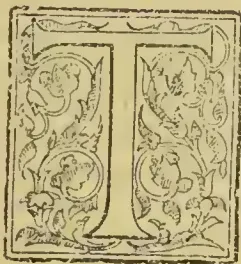

TIME was when the name of Mr. G. S. Duff was as a “household word” among the Colonists of Ceylon. No more astute nor successful Banker ever came to the East, and no individual capitalist has ever done more right on from the “forties” to develop and sustain the planting enterprise of this Colony. Moreover, Mr. Duff—who is still wonderfully well preserved, although approaching four-score years, —is an evidence of what the tropics may do to prolong a (medically) threatened life and to carry a weak constitution in comfort through early and middle age, until the climate of the United Kingdom —once so inimical— can be faced in safety. There is one case in our experience in Ceylon where a Scottish lawyer condemned by two Doctors as having lungs too far advanced in disease to allow of his living by any possibility, anywhere, beyond two or three years, returned from Ceylon after fifteen years’ residence, to his native Highlands to find the two medicos who had signed his death-warrant, both passed away! Mr. Duff’s case was not quite parallel, but still striking enough as the sequel will show.

Born and educated in the North of Scotland, Mr. Duff’s banking and financial career was early determined on and 1840 found him in a London Banking office; but having a far from robust constitution, the confinement of office hours and the trying fogs of the City soon told, so that towards the end of 1841, he had fairly broken down, his chest and lungs giving ominous signs of being unable to stand another English winter. Fortunately, the young Banker had good friends: his uncle, Dr. Smyttan, had been a College chum of the then Queen’s Physician, Sir James Clarke, and the latter came to attend

Mr. Duff, bringing him daily throughout November-December 1841, all the news of the young Prince (of Wales) born 9th Nov., Sir James being in attendance on Her Majesty. On comparative recovery, Sir James ordered his youthful patient to leave England at once—he must go to Madeira or the Canaries; but learning he would be quite a stranger there, while he had an uncle (another doctor, Dr. Bell) in Bombay, he gave him permission to go there, although he added that Ceylon as being nearer the equator, would be better. The only difference the Queen’s Physician, and his patient had was when the latter began to enquire about the needful fee: “If ever your uncle’s nephew mentions such a thing, we shall have a serious quarrel” was the generous response.

Accordingly, early in 1842, Mr. G. S. Duff sailed from London for Bombay in the ship “Sophia,” Capt. Johns, who had previously belonged to the Indian Navy. Meeting with heavy gales off the Canaries, the ship sustained serious damage, masts and bulwarks being swept away and it was determined to make for Rio de Janeiro to refit. There were 40 lads (mere boys) on board going out for the Indian Navy; but they were kept at the pumps in relays, night and day, and so saved the ship from sinking. After six weeks spent in refitting at Rio, the voyage to Bombay again commenced and Mr. Duff reached that port six months after leaving London. He went to reside with his uncle, Dr. Bell, who had just returned from the Scinde Campaign, having been with Sir Charles Napier in his great defeat of the Amirs at the battle of Meanee. After a time, Mr. Duff’s health not improving, the Doctor sent him to Ceylon for a trip. This occupied two months and on his return he entered the Bank of Western India. In August, 1844, however, promotion came: the Manager in Ceylon, Mr. Smollett Campbell, was transferred to China

687------------------------------------------------

662THE TROPICAL AGRICULTURIST.[APRIL 1, 1897.,

and as his successor Mr. G. S. Duff arrived from Bombay.

The Western Bank of India, of which Mr. Duff thus became Manager in Ceylon, had only opened in Colombo and Kandy on the 23rd October 1843. It was preceded by "The Bank of Ceylon" in Colombo on 1st June 1841; in Kandy in 1843. The latter Bank became irretrievably involved in the coffee crash of 1847, £60,000 being ultimately lost and the rival institution now changed to the happier title of "The Oriental Bank Corporation," in return for its Royal Charter, took over the liabilities and business of the Bank of Ceylon. In 1851, the two Banks were formally amalgamated, and the "Oriental" entered, in Ceylon, on that long career of unbroken prosperity which it owed in a very special degree to the shrewd and successful management of Mr. G. S. Duff. Colombo became almost the most important, certainly the most prosperous branch of the Bank in the East, and Mr. Duff continued at his post a Manager from 1844 till 1871, with only one interval of 18 months' furlough in England. So long an occupancy of the management of one Branch has been unprecedented in the history of Banking in the East, nor can a career of such uninterrupted prosperity be paralleled.

We ought to have chronicled before this, however, a circumstance that contributed very much to Mr. Duff's long residence and good health in Ceylon, namely, his happy marriage in September 1847 to Miss Rodney Brown, daughter of Colonel Brown, who, at the time, commanded the Royal Engineers in Ceylon. Mrs. Duff's mother was a daughter of the Hon. John Rodney, Colonial Secretary of Ceylon from 1815 to 1833, and grand-daughter of the famous Admiral Lord Rodney. When as Colonial Secretary Rodney retired from the Ceylon Civil Service, he owned certain land in the neighbourhood of Colombo, which he pointed out, would undoubtedly be valuable to Government as time rolled on and he offered to exchange it for small annuities in favour of his two daughters. This was agreed to; but the bargain proved a hard one for the Colony, since the lady-annuitants were so long-lived that Mrs. Brown (Mrs. Duff's mother) who drew £60 from 1824, only died on 12th February 1897 at Bath aged 93; while her sister, Miss Rodney, still survives and continues to draw from Ceylon, the annuity of £42 also begun in 1824! Mrs. Duff herself, besides being a very handsome, attractive lady—the leader of Society in Colombo for many years next to Queen's House—was always a picture of health, and, humanly speaking, might have been expected to outlive many years her comparatively delicate husband; but her

death took place very unexpectedly in London during the summer of 1895. Mr. and Mrs. Duff's family consisted of three sons and three daughters: two of the sons being in the Army as Cavalry officers, the third as a private gentleman residing near Folkestone; while the daughters married, one, Capt. Rolfe, 17th Foot and the other two respectively, Mr. Nevett and Mr. P. C. Oswald whose London firm "Nevett, Oswald, & Co." is intimately connected with Ceylon.

But this is hastening too far; for we have now to treat briefly of Mr. Duff's connection with the planting development of Ceylon, by no means the least important division of his career. Of course, as Banker, he was always the judicious upholder of coffee planting in our hill-country, and most of the profits made for his Bank was through the wise as well as liberal encouragement of the planters and the growing business in all departments that necessarily accompanied the spread of the industry. But personally and in his private capacity, Mr. Duff showed his confidence by investments in coffee. His very first venture was in the Tellisagalla estate, Kottmale, with Mr. Crosby, and he also became interested with relatives in Dumbara, by a purchase, which led to the famous Rajawella litigation case. In the Ballacudua group of estates, Mr. Duff was for some years the partner of Mr. Andrew Nicol; and in conjunction with Mr. J. C. Fowlie he opened Rappahamock estate in Udapussellawa. In Pussellawa and Ramboda he acquired considerable proprietary rights:—Hellebodde which had belonged to the heirs of Colonel Macpherson; while Sanquhar was opened by him, Bluefields and Pallagolla; and Rangbodde purchased from the heirs of General Fraser. In Colombo, Mr. Duff, at one time, owned both Elie House and what is now Mount Lavinia Hotel. On Mr. Lawrence Oliphant selling all the Nuwara Eliya and other Ceylon property belonging to his father, our former Chief Justice Mr. Duff became the purchaser, and from part of the forest land was able to develop Dunsinane estate in the Pundalnoya Valley. When the Messrs. Worms—cousins of the Rothschilds—wished to retire from Ceylon, it was Mr. Duff who arranged the purchase of their properties and so far as this island was concerned, promoted the establishment of "The Ceylon Company, Limited." Then, again, Mr. Duff early became a proprietor and pioneer in the Uva districts. He acquired Gowrakelle, and in partnership with a nephew, the Gonakelle Group as well as Nayabedde in Haputale. Getting alarmed about the dearth of rice and scarcity of labour, Mr. Duff sold the Monsagalla block of land to Mr. C. B. Smith, the same proving, as a coffee plantation, a regular gold mine to the fortunate proprietor. In Haputale, Mr. Duff opened the

688------------------------------------------------

APRIL 1, 1897.]THE TROPICAL AGRICULTURIST.663

large estate of Wiharegalla\* having, as his first manager and part proprietor, Mr. F. F. B. Childers (brother of the well-known Orientalist) since settled in business at Mont Carlo. Afterwards, Mr. Duff opened the fine estates of Dunsinane, Pundalnoya district; West Holyrood, Diunbula; and Culloden in Kalutara district—all since sold to Limited Companies. Few capitalists connected with Ceylon suffered more severely through the coffee crisis—the collapse of a great industry owing to the destruction wrought by a fungus enemy of the leaf—than did Mr. Duff; and that not so much in connection with his own properties or personal investments, as through his good nature in becoming security for old friends. In one such case, the loss at a single stroke, to be made good, was no less than £50,000; but Mr. Duff bravely faced the crisis, sold off his property in the Highlands of Scotland, never lost faith in Ceylon and hopefully entered on the new conditions which led to tea gradually but surely superseding coffee, until now he finds his large group of Ceylon plantations more valuable than ever they were. These now comprise a total of 8,525 acres, of which 3,500 are in tea; while 1,500 more acres are in coffee or other products.

It only remains to be mentioned that in August 1865, during the Administration of Sir Hercules Robinson, Mr. Duff was appointed one of the unofficial members of the Legislative Council, a post which he only vacated on leaving the island in 1871.

We have given a very bare outline of a life of great business activity for 27 years in Ceylon—nor did that activity end with Mr. Duff's retirement to England. He still maintained his interest in business, through connection with "the City" Ceylon Companies—such as the Uva and Spring Valley—as well as through his own extensive estates and ever-developing work as pioneer. Mr. Duff also continued to be the friend and supporter—sometimes, as we have shown, to his own great loss—of many in or connected with Ceylon; while as adviser his counsel was sought in many directions. His faith in the Colony has, however, been amply rewarded by the return of prosperity which tea has brought to all its planting country. From his home in Queen's Gate, Kensington, he continues, through the *Overland Observer*, to watch all that goes on in his old adopted home; while, until recent

\* On one of Mr. Duff's visits to Ceylon—in this property was privately declared for sale and the late Mr. C. H. De Soysa offered £80,000 for it. Mr. Duff held out for £85,000; but after he left the island, he changed his mind and telegraphed from Aden to his Agents to sell to Mr. De Soysa. The answer to his continental address was "Too late: Mr. De Soysa has gone in for something else." No loss to Mr. Duff, since Wiharegalla after that year yielded profits aggregating fully the above price, and now in tea is as valuable perhaps as ever it was.

years, he enjoyed his summer residence and shootings in the Highlands, varied by an occasional visit to the Continent, to Egypt or to Ceylon. The great shock of his life came in the summer of 1895 in the unexpected and terribly sudden death of his wife who had always enjoyed good health; but time has enabled Mr. Duff to some degree to overcome the blow and the presence of his daughter and son-in-law (Mr. & Mrs. Oswald) still make his residence "home." When we called to see, and say good-bye to, Mr. Duff, during our recent visit to England, we found him in his library finishing a letter—and the calligraphy of the old gentleman, well on towards 80 years, is as admirably clear and neat with its plain but all-sufficing signature

as was that of the Colombo Banker of the "sixties." "In a minute I'll be free," was Mr. Duff's remark as he rapidly completed his letter. rose to a copying press in the corner of the room, scanned the duplicate, returned to his seat and laid aside the half-dozen letters he had prepared for the post. "Two or three hours of such work in here daily, keep me alive," was his remark and he then readily entered into reminiscences of early days in Ceylon, imparting confidences, in answer to stray questions, to which we have scarcely ventured to refer in our scanty notice. For, to write adequately of Mr. and Mrs. Duff's life in Ceylon would be to give not only the financial, business and planting, but also the social history of the Colony during one of its most interesting and progressive periods. There were few love matches or marriages of any note among the Colonists of the "fifties" or "sixties" in Ceylon, in which the influential Banker and his hospitable warmhearted wife did not bear a generous part and not a few happy unions, indeed, for which they were very much responsible. That is all of the past; but it is a matter of present and continuous interest that the name of "G. S. Duff" should continue even now as proprietor (individually or in partnership) of such important and widely separated plantations in the island as the following:—

<table border="1">
<thead>
<tr>
<th>Name</th>
<th>District</th>
<th colspan="2">Area-acres:</th>
</tr>
<tr>
<th></th>
<th></th>
<th>Total</th>
<th>Cultivated</th>
</tr>
</thead>
<tbody>
<tr>
<td>Helbodde</td>
<td>.. Pussellawa ..</td>
<td>1,778</td>
<td>.. 735</td>
</tr>
<tr>
<td>Rangbodde</td>
<td>.. Ramboda ..</td>
<td>2,081</td>
<td>.. 922</td>
</tr>
<tr>
<td>Wiharegalla</td>
<td>.. Haputale ..</td>
<td>8,954</td>
<td>.. 7,994</td>
</tr>
<tr>
<td>Nayabedde</td>
<td>.. " ..</td>
<td>1,125</td>
<td>.. 867</td>
</tr>
<tr>
<td>Gonakelle Group</td>
<td>.. Passara ..</td>
<td>1,752</td>
<td>.. 995</td>
</tr>
<tr>
<td>Gowrakelle</td>
<td>.. Badulla ..</td>
<td>829</td>
<td>.. 635</td>
</tr>
<tr>
<td>Kitulgala</td>
<td>.. Dolasbage ..</td>
<td>65</td>
<td>.. 50</td>
</tr>
<tr>
<td colspan="2">Total..</td>
<td>8,525</td>
<td>5,008</td>
</tr>
</tbody>
</table>

Long may Mr. GEORGE SMYTTAN DUFF be spared as a typical successful Ceylon Colonist—a model of industry, uprightness and shrewdness as Banker; of enterprise, liberality and confidence as pioneer proprietary planter.

689------------------------------------------------

664THE TROPICAL AGRICULTURIST.[APRIL 1, 1897.

## Agricultural Pests:

WITH METHODS OF PREVENTION.

BY MISS E. A. ORMEROD

(LATE CONSULTING ENTOMOLOGIST TO THE  
ROYAL AGRICULTURAL SOCIETY OF  
ENGLAND).

### IV.

BEETLES AND WEEVILS INJURIOUS TO FIELD  
CROPS AND GARDENS.

The Apple-blossom weevil (*Anthonomus pomorum*) does much harm by laying its eggs in unopened apple-buds, where the maggot feeds, and thus destroys the young forming fruit. This weevil shelters itself during winter under clods of earth and rubbish, and also beneath rough bark on the tree (so that keeping rough ground and bark in order serves much to diminish their numbers); but further, it comes out in the spring, and the females, it is stated, rarely fly, but crawl on the branches, and drop down on being alarmed. By working on this habit of the apple-blossom weevil (and of some other kinds), we may clear many sorts of fruit trees and bush fruit simply by jarring the boughs. Thus the weevil falls, and we only need to use such plans as common sense will teach us, to keep it from getting back again. With the apple weevil, or those that are shaken down from the trees, such methods as putting a rough rope, or a ring of anything they will not cross on the ground, round the trunk, answer well. This may be made of twisted hay (or anything preferred), which has been dipped in spirits of tar, or in tar and coarse oil, so that it may keep wet and sticky or caustic gas-lime may be shovelled round, of course taking care not to hurt the bark.

In Cornwall, where the pitey-legged Weevils, or other kinds of *Otiorhynchus*, injure the fruit to an extent causing serious loss in the great raspberry gardens, it is found to answer, well for men to go round with freshly tarred boards, place the boards below a bush and shake; the weevils fall on the tar and stick to it. Thus, clearing the weevils and retarring the boards frequently, the weevils are got rid of at a paying rate.

The principle of alarming the weevils, so as to make them fall, may be applied to many kinds of weevil attack, bearing in mind that the weevils commonly fall on the first alarm; and we must give a little attention to their habits, or they may all have dropped down and secured themselves before we have set about frightening them in full form.

Several kinds of weevils feed on peas, beans, and clover leaves, doing thereby most serious harm.

The terribly destructive pea weevils were formerly supposed to feed only by day; then they fall at the vibration of a foot, and bury themselves. There may have been hundreds a minute before, but you will very likely not see one; but beat the ground with a spade and you will most likely see them all struggling up out of the earth again. More recently, however, observations have shown that they may be found at night working at the edges of the leaves, and then it is stated they are not nearly so susceptible of alarm.

Returning now to the ravages of the *Sitones*, commonly known as "pea and bean weevils," these may be told by the semi-circular scoops eaten out of the leaves. We find these attacks the worst to the leafage of young plants, especially when, from weather or other circumstances, the plant is kept back, so that it cannot grow away from them; but the weevils are to be found in legions later in the year, and sweeping these up, as they are to be found in the waggons when clover or peas are being carried, would get rid of some amount of coming attack. The main point we seem to need here is to prevent the settlement of the autumn brood of beetles. These fly well, and have been found to shelter themselves in the top joint of corn stubble, and from this they come out to set on foot attack

in *Trifolium*, or clover, drilled after. Also it has been noticed that where wheat-sheaves stood long in harvest-time, the clover on these spots was free from attack in the following spring, although that on the rest of the field was attacked. Acting on these observations, skimming the surface stubble, so as to get rid of the shelter, has been considered useful; and a good liming, or other chemical dressing, much of which would go into the stubble and make it a very undesirable home for the weevil, would help us. All measures which will push on good growth are valuable preventives in this case; and in gardens it would probably do a deal of good, to lay the drawn and useless haulm along the rows, with any dry rubbish, and burn it. It appears to be the nature of this weevil to come up not to go down, on alarm; and we might thus clear out the parents of the next spring's attack.

The small long-snouted "pear-shaped" clover weevil also does much harm to clover leafage; but in this case the grub lives in the seed-head, and seeds on the young forming seed; and the best known method of prevention is cutting the clover before the flower is fully out. These pear-shaped weevils are so very small that they are hardly observable, but the damage to the leafage, or patches of brownish heads in a field in flower, shows where they are at work.

There is yet one more of the common weevil attack of the bean crops to notice; it is that of a small short-snouted weevil (black with brown hairs and white markings), which is often found inside broad beans, with no signs outside of how it got there. The attack happens thus:—When the bean-pod is still in its very youngest state, even still in the blossom, the beetle lays its egg there; the maggot, which hatches from it, lies in one of the young beans in the pod, but the hole by which the egg was put in, or maggot crept in, is so small that it grows up completely with the growth of the bean. When the beans are ripe and garnered, the maggot is there too. It feeds within; and though it does not prevent the bean sprouting, yet it lessens the size of the seed-leaves, and consequently weakens the first growth, and thus damages the strength of the future plant. Here one good method of prevention is to examine a sample seed, to find whether it is infested. The maggot turns to a beetle within the seed; but before it does this it eats a tunnel to the outside, only just leaving the outer skin at the end. This, having nothing behind it sinks in, as if a knitting-needle had been slightly pressed on it. By this little round dented-in mark you may know infested seed; if, instead of the mark, there is a small round hole, the beetle has completed its work within, and has gone. By these two marks you may judge as to the state of the seed; and, further, if there should be the mark showing the beetle is still within, it is unsafe to sow as attack will follow. The beetles will presently come out, and as soon as the beans in which they were sown have grown, and are in flower, their sometime tenants will mount to the blossoms, and lay eggs to start a new attack. The bean beetles begin to appear in February, and for this reason autumn-sown beans are the most likely to be infested as the beetles are still within.

During the last few years it has been found that dressing infested beans, before sowing, with a mixture of 1 lb. blue vitriol, and 1 pint of McDougall's sewage carbolic to 6 quarts of water, answered well. The above mixture is enough for six bushels of beans.

The cabbage and turnip gall weevils do harm underground. The female lays her egg on the root or the under-ground part of the stem, or in a hole which she forms with her snout; and in consequence of the irritation thus set up the small lumps form, which we know as galls. In each of those the maggot hatched from the egg feeds, until it is full fed. Then it gnaws its way out and forms an earthen case, in which it turns to a pupa, and thence to a weevil.

690------------------------------------------------

APRIL 1, 1897.]THE TROPICAL AGRICULTURIST.665

The maggot does not care for cold. It will mend its earthen case if it is broken; and even if it is buried by the galls on the cabbage stalks being dug in, it appears to thrive as well as if they were still growing. Therefore, it is a great object to get rid of all nurseries of future attack by burning or otherwise destroying old stems with galls, instead of throwing them to a rubbish-heap or digging them in; and a change of crop is useful, by presenting food that they cannot eat, or find useful to lay eggs in, to the gall weevils that may be waiting in the ground.

In many of the weevil attacks which we have been studying, treatment of the surface of the ground is a great point; as, for instance, where they shelter under rubbish, or down stubble, to clear away these shelters, and put on dressings which will be thoroughly obnoxious to the weevils, is good treatment. Where the weevils, or their grubs, are in the ground, it obviously is well to turn them out on the surface, or bury them by trenching so deeply that they cannot come up; and also, so to dig in, or otherwise apply, chemical manures, as to make the soil unpleasant at least to the pest, and so good for the plant that it may grow away from attack.

The turnip flea beetles are well known for their eating powers. They live during winter under clods, or in dry stone walls, or any convenient shelter and come out with sunshine in spring. Then they feed on any plant of the cabbage kind; charlock is an especial favourite, until the young turnip plants are come up. Presently they lay their eggs (if on turnips) on the under side of the rough leaf, and from these the grub eats its way into the leaf, within which it feeds for about six days. It then comes out, buries itself in the ground, and turns to the chrysalis, from which the beetle appears in about a fortnight, ready to begin a new attack.

The first point in prevention is to take care there is as little winter shelter as possible. Lumps of manure and clods of earth on the field; heaps of stones and rubbish, such as are often allowed to lie in corners of fields; large collections of dead leaves on the borders of woods; and dry dykes or open stone walls—are all winter shelters.

Another point is to let there be as few weeds as possible to keep the "Fly" alive. If it does not find suitable food it will die or remove itself. It has a power of perceiving where its food is; and such plants as charlock, or the white-flowering Jack-by-the-edge, or shepherd's purse, will all help to keep it alive till our turnips are ready. Thus, we may lessen the amount of coming attack; but the great point to depend on for carrying the turnip crop through "fly" attack is judicious preparation of the ground—plentiful supply of enrichment, including a good amount of artificial manure, and liberal supply of seed.

The "fly" does most harm to the turnips whilst they are still in the seed-leaves; therefore, all means should be used to give a good start, and run the plant on in a hearty growth. For this purpose the land should be well prepared beforehand. Where climate allows, autumn cultivation is best. Thus the surface soil is broken down by the winter frosts, and there is a good tilth on the surface, with absence of the clods which shelter "fly" and cause a dry top, instead of the evenly-evaporating surface which suits the young turnips. When thus cultivated beforehand, the land does not require ploughing again in spring; scarifying is enough; and thus the supplies of moisture which have gathered below the surface during the winter remain undisturbed; whereas, if the ploughs are put in, the soil is turned up to a much greater depth, and instead of a mellowed surface with good moisture below, we part with the stores which in a dry season, would have made all the difference of life or death to the crop. The turnip plant is of such a succulent nature, that the point of supplying it with enough moisture is one of the main things in all methods of starting it.

It is advised to let the land remain untouched for a few days before drilling, with a view to the surface not being dried by exposure just before sowing; and the effect of what seems just the opposite treatment

—namely, to sow at once, when partly rotted manure is ploughed in, in spring—is, for the same reason, to secure the moisture. But whenever it may be necessary to work the land, one great point is to secure such a state of under-soil and upper-tilth as will push the plant on; and by no means trust to a mere good tilth, if it is gained, as is sometimes done, by turning the land over in the sunshine and heat until we fairly see the dust rising, and, as it has been well remarked, it is as dry as if we were making hay. Turnip fly delights in heat and drought, and the turnips in just the opposite.

Liberal seeding—3 lbs. or more per acre, answers well; for if fly comes there is a good chance of some of the plants escaping, and if it does not the surplus quantity may easily be removed. In either case the large number of plants helps towards a hearty start, as the many small leaves prevent the moisture beneath evaporating, as it would from bare earth, and thus keep a damp air beneath the leaves. Good seed is also very important, so that it may sprout at once, and with vigour.

To gain this hearty and rapid growth through the time of the seed-leaves is one of the reasons of applying artificial manure before sowing, or drilling it together with the seed. A few hundredweights of superphosphate, or other manure suitable to the land, even if there is a good supply of farm manure also, will run the plant on rapidly through the growth of the seed-leaves; and when the rough leaves are come the greatest danger is past.

Where a crop hangs back, the water-cart has been found useful, and also the putting in of the seed with the water-drill; but if the weather should be dry at the time of sowing, there is fear of the small supply of moisture put in by the water-drill causing harm (by the mere temporary effect) rather than permanent growth.

When attack is present, various fertilisers have been found to do good by pushing the plant on; but all applications intending to serve by removing "fly," or killing it, should be used either when the dew is on at night or early morning, or during damp by day.

The turnip fly leaps away when it finds attack coming; but if the dew or slight rain is on it, it cannot leap, because the moisture clogs the hind legs, by means of which it takes its great springs. Therefore, such measures as driving sheep through infested fields, or laying on special dressings, often fail, because they have been done at time when the fly is well able to avoid receiving harm. Turnip fly attack is one of those that it would be well to enter on, if possible, in full detail, as an instance of those which only last for a short time, and which we conquer by methods having, for the most part, very little to do with the insect itself. We know that the turnip is chiefly in danger whilst in the seed-leaves; we know exactly what will suit its growth in this state, and we make ready the ground accordingly; also we clear away weeds which would support the "fly" when the crops are not present for it to feed on.

## PROGRESS IN THE PERAK STATE.

In the few remarks which I intend to make on this subject I do not purpose to trouble your readers with statistics, or to say much about the "pig that pays the rent"—the tin mining industry—though up to the present it has run the whole show.

### ROADS AND RAILWAYS.

Communications everywhere are the wheels of progress; if they are bad the wheels go slowly round; and if they are good, better, best, the pace is proportionate. At present it may be said that communications in Perak are "good"—that is there is a first-class metalled road from Tipping, where the railway from Port Weld lands you, to Kuala Kangsar on the Perak River, a distance of 23 miles; and from the latter place there is a branch road of 20 miles to Kota Tampan towards Norsh Perak. The continuation of the K. K. road across the Perak River takes you into Kinta, the prin-

691------------------------------------------------

666THE TROPICAL AGRICULTURIST.[APRIL 1, 1897.

capital tin-producing province (exporting something like 120,000 cwts. annually), where you meet the Kinta Valley Railway at Cheemor, 22 miles from K. K. and 65 miles from Telok Anson—the present outlet of Kinta and Lower Perak on the Straits of Malacca. To take you to the Southern border of Perak and the Northern of Selangor at Tanjong Malim, some 50 miles from Tapah on the K. V. Railway, there is only a bridle-road and in-different bridges. Such is the state of existing communications, which, taken as a whole, may be called “good”. We will say nothing about the steamers which carry you from Penang to Port Weld and Telok Anson, because they belong to a private firm and are not subsidized. If they were, perhaps they would be more comfortable and the Government of Perak might see more visitors, and secure some of them as investors in the land which is so abundant.

#### METRE GAUGE RAILWAYS EVERYWHERE.

There is, however, a near prospect of the qualification “good” being converted into “better” as 20 miles of the break between Tarut and Kinta in railway communication are under construction, and 25 miles under survey. Between Taiping and Prai, opposite Penang, at about 50 miles’ distance, the railway survey is in progress, as it is between Tapah and Tanjong Malim, another 50 miles. The completion of this through line of railway communication in Perak may be looked for before the year 1900 is ended, for they don’t take up years of time there in talking about their proposed lines and they don’t worry themselves over gauge. They have adopted the metre, and they are content to keep it to the end, as the best suited in cost and capacity for a country of short distances, though with a large traffic in the present, and a still larger in prospect the near future.

What the speedy completion of this “better”—I may say “best” line of communication when Selangor, with 16 miles, links up from Kuala Kubu—may be judged from the small “boom” that set in a year ago in coffee planting, consequent, in a measure, on the steadily-pursued railway policy of the Government of going ahead until their trunk line is an accomplished fact.

#### THE LABOUR AND ADVANCES ROBBERS.

Prior to the last year or two you could not point to any considerable evidences of the doings of coffee beyond Waterloo (Arabian) and Kumuning estate (Liberian), both the result of European capital and enterprise. Now you can point to recent development of about a thousand acres in coffee in the Kuala Kangsar, and a great deal more in the Kinta district; and a feature in this fresh departure is the investment of Chinese capital. Whichever way it is, from a belief in coffee or a disbelief in mining, the fact remains that the Chinaman is putting his money into coffee, and, when he joins with the European in the race, we can come to no other conclusion than that, for better or worse, there is to be a run on the coffee lands of the Perak State. That it will be for the better all the evidences go to shew; where it may be for the worse I am inclined to say it will be from faults that could be avoided, and not from any drawbacks of soil, climate, labour, or communications. This leads me to speak of the labour problem in Perak. Until within a recent period it was a difficult problem and a deterrent to planting progress, I think it is not so any longer. The Chinese are as apt at most of the planting work as the Tamils, and will do it as cheaply and well. Both these races can now be got in sufficient numbers and without advances, and, so long as tin is at its present price, there need be no fear as regards labour, even should the “boom” to which I have referred extend in volume and make a larger demand than hitherto on the labour supply. We in Perak are, of course, at a disadvantage compared with Ceylon as regards rate of wages, but we have, on the other hand, the advantage in freedom from advances and necessity

of supplying rice. The cooly gets his pay every month regularly, and all that has to be done for him is to provide good lines and give him medicine when necessary; his rice and fish he gets as cheap as in Ceylon, and such things as plantains he gets for nothing or next to it. With all these inducements to the cooly I don’t think the planter in Perak has anything to fear as regards labour any more than he has with regard to the good growth and plentiful cropping of Liberian. I see nothing else to fear that the market, which may become glutted with coffee as it is sometimes in danger of being with tea. Sir Graeme Elphinstone last year cleared 500 acres of land, which he planted mostly with Liberian Coffee, and at the beginning of this year he had next to nothing on his books in outstanding advances. I believe this experience of ours, which I quote, is the experience of the many in Perak. If it were not so there would not be the advance there has recently been for Chinese would not hang on to a place under advances the same as the Tamils in Ceylon, any more than the Tamils in Perak would do; and there would be much greater loss in recovery, as I had good cause to know in connection with railway work there.

#### THE TAMILS IN PERAK.

Additional and cheapened facilities in the steamboat communication between Penang or the Straits and Southern India, coupled, with the increasing popularity of Perak with the India coolie, will bring Tamil free labour over in greater numbers year by year, and the planter there will before long have the advantage of two races competing for his work; and he can look forward to getting more work out of the individual than hitherto. That this will be a blessing to the coolie himself there cannot be a doubt, for it was the short hours and high pay that tended to demoralize the Perak Tamil and make him so inferior in quantity and quality of work to his brother in Ceylon.

#### YIELD OF LIBERIAN COFFEE.

As already mentioned coffee planting in Perak is so much in its infancy that not much can be looked for, so far, in crop results, but what can be mentioned of the yield in 1895 of clean coffee from one estate having 257 acres more or less in full bearing, 6 to 7 years old, is encouraging enough for those later in the field. The acreage mentioned, with something like 400 trees to the acre of Liberian, some of it topped at 6 feet, and some at 10 and 12 feet, gave 6½ cwts. per acre of clean berry, which fetched the highest price in the Singapore market. This result was attained without the aid of any manure; with that aid it is quite likely the crop return might have been increased by fifty per cent.

#### COCONUTS.

Regarding coconuts I am inclined to think that on a large scale the returns will be much greater than in Ceylon. Going into a native garden where there were some very fine trees, I asked how many nuts were got from a tree in a year, and was told 200. This may be right or wrong, but there is no doubt of the heavy bearing capacities of the trees generally.

I say nothing about Selangor, for I have not been here this time, neither do I say anything about planting Liberian, in imitation of Selangor, on the low, flat, more or less swampy, peaty lands by the sea, for time will tell if the venture be right or wrong.—Local “Times.”

#### THE WOODS OF SAMOA.

Much has been written about Samoan woods, their beauty, abundance, and variety, but, says the United States Consul-General at Apia, there is but little foundation for the statement that these woods are likely to become a source of marvellous wealth. There can be no question but that the variety of woods is very extensive, and that a limited pro-

692------------------------------------------------

APRIL 1, 1897.]THE TROPICAL AGRICULTURIST.667

Portion may in time become valuable. Most of the Samoan woods are very soft and light, which after becoming well dried, lose not only a great proportion of weight, but become brittle, and of no practical worth to sustain lateral strain. In addition to these, there are several varieties of hard woods, such as the *ifelele*, *talia*, *pau*, *toi*, *nisla*, *tau*, and the *ifi* (*Inocarpus edulis*), which can scarcely be said to be abundant. Several of these are beautiful, very hard, and susceptible of a high polish. One or two varieties grow to a fine size, and are in request among the natives for making kava bowls—wide shallow vessels, hollowed out from cross sections of the butt of the tree, generally from 18 inches to 2 feet in diameter, and sometimes reaching 3 ft. 6 in. in width. Woods employed for this purpose would doubtless cut into veneers, were there a demand for their peculiar colour and grain by the fancies of fashion. Such, however, does not at present exist, and there is no probability that the mere eccentricity of taste will take a direction to create a demand. A large amount of hard wood is used in making the common canoe of the natives. These are mere logs, hollowed out, and the largest with rare exceptions, would not require a log of more than two or three feet in diameter. These canoes are hollowed laboriously out of the log, on the ground where the tree is felled, being hewn away until the boat is a mere shell of from 1 to 1½ inches in thickness, except at the bow and stern. When thus lightened to a minimum, they are dragged and carried to the water. While large trees are numerous, they are not in proportion to the extent covered by the forest, or to that common in a country of merchantable timber, plentiful, or found close together. The dense character of the tropic, forest, the deep shade, moisture, and heat, has naturally, in such a climate, the influence of so thickly crowding the surface with shoots and young trees, that the forest is a mass of slender saplings, overcrowded and dense, all under the stimulus of the need of light and air, towering to reach the open space above. In such a bush, the large trees having attained size on some principles of survival of the fittest, abound in necessarily limited abundance. These large trees, of nearly all varieties, flare out at the butt in ribs or inverted brackets until they cover a space at the surface of from 12 to even 20 feet. The woods are not of straight grain, but are twisted, knotted, gnarled, and contorted in shape, and this bent and knotted quality in the hard and tough varieties produces a most excellent material for knees in small and medium-sized wooden vessels, for which it is much used. In a general sense, it is, perhaps, in this employment that Samoan woods find their greatest value. Much was expected in years gone by from the production of fibres, and an array of plants was cited producing fibres of a merchantable character. The intervening years have allowed the shipments of various samples to Europe for experiment, but the experiments were such that no encouragement or demand followed. The fibre obtained from the covering of the coconut is particularly the only one produce in the Samoan islands. This article is well-known to commerce, and long ago took a place in the manufacture of mats, and to some extent as a substitute for hemp in twines. In all coconut growing countries, it is of course abundant in proportion to the production of mats. In Samoa it is used by the natives in making all the twine and small rope their needs require, and does not enter into export—*Journal of the Society of Arts*.

#### HASSAN JACK FRUIT.

The Jack-tree of the East Indies (*Artocarpus integrifolia*) is a handsome evergreen tree about 60 feet high, the trunk having a diameter of 30 to 40 inches. Its dome of dark foliage, with the stem burdened with monster fruits, is perhaps one

of the most characteristic features of East Indian village surroundings. The yellow timber is highly valued for carpentry and furniture, and takes a fine polish; it becomes beautifully mottled with time, and then resembles Mahogany. It also yields a yellow dye, little inferior to fustic. The fruit yields a very important article of food to the natives of the East Indies, both when green as well as when ripe. It is closely allied to the Bread-fruit of the Pacific Islands, but usually is not so palatable. Europeans seldom touch it. The oily seeds, when roasted, are eaten, and are said to resemble Chestnuts.

The leaves of the Jack-tree, as the specific name implies, are usually entire. In exceptional cases they are three-lobed; this is specially a characteristic of seedling plants. The lobing of the leaves shows the affinity of the Jack to the Bread-fruit. They both belong to the tribe Artocarpeæ of the N. O. Urticaceæ, as also do the Figs, which yield a similar milky juice. The flowers of the jack, produce on the stem and older branches, are monoecious—that is, they appear on different parts of the same plant. They have a somewhat sweet smell. This is in marked contrast to the strong, unpleasant odour of the ripe fruit. The male flowers are densely crowded on the outside of a fleshy horn-like central receptacle, about 2 to 3 inches long. The individual flowers are very minute, and consist of a single stamen and a two-lobed yellow anther. In a section across the receptacle the male flowers are to be seen radiating in a very regular manner from the circumference of the spongy centre. The female flowers are similarly arranged, but on a much larger receptacle, and are so numerous and thickly crowded as to form an oblong, tuberculated mass of flowers several inches long. Each female flower consists of an oblong, tubular perianth, green and contracted at the mouth. The ovary is provided at the base with a lateral white style passing through the aperture of the perianth. After the ovary is fertilised the mass (or spadix as it might be called) swells in all directions, and forms a tuberculated, compound fleshy fruit, sometimes weighing from 40 to 60 lbs., probably the largest that is known. The central part is the soft, fleshy receptacle; surrounding this, and radiating toward the circumference, are—(1) the succulent parts of the very numerous, linear, abortive florets; and (2) the enlarged perianths of the fertile florets much swollen, and appearing as brownish-yellow succulent masses, 2 or 3 inches long. These two sets of bodies constitute the eatable part of the Jack-fruit. Each seed is completely buried in pulp, and enclosed in a leathery testa. It is usually as large as a Nutmeg; it is destitute of albumen, and composed of two unequal cotyledons.

Good figures of the flowers and fruit are given in the *Botanical Magazine*, tt. 2833 and 2834, from specimens grown in the Botanic Garden at St. Vincent, in the West Indies. A plant is mentioned to have flowered in 1827 in the stove of the Edinburgh Botanic Garden.

The ordinary Jack-fruit above described is familiar in many parts of the tropics, and is widely cultivated in the East, from the Punjab to China, and from the Himalaya to the Moluccas. There are numerous varieties recognised by the natives of India and Ceylon. Although common in the latter country, it has probably been introduced at a remote period from India. It was introduced to Jamaica and St. Vincent by Admiral Rodney in 1782, and thence distributed to other countries in tropical America. The fruit is not esteemed anywhere in the New World; probably the single variety there known is an inferior one.

This year a drawing of a very remarkable Jack-fruit was sent to me by Mr. J. Cameron, F.L.S., Superintendent of the Lal Bagh Gardens, Bangalore, in Mysore. In a letter dated August 29 last he gave the following description of it:—

"About a month ago I sent you a photograph and a water-colour drawing of a remarkable Jack-fruit—

693------------------------------------------------

668THE TROPICAL AGRICULTURIST.[APRIL 1, 1897.]

at least remarkable to me, as it is the first of its kind I have ever seen.... The fruit and photograph were sent to me from Hassam, one of our hill districts by Mr. A. Watkinson, a coffee planter. His own letters, with two of my replies enclosed, will afford all the information at my disposal. Would you do me the great favour to say what you think of this fruit?.... With your eastern and western experiences you are, of course, well acquainted with the usual form of this fruit, and can offer a valuable opinion."

Mr Watkinson's account of the tree is as follows:—"There is a peculiar Jack-tree here, the shell which holds the kernel grows on the outside of the fruit... Both planters and natives declare it to be unknown in any other part of the district. The native idea is, it was brought hither by a cobra when young!" On March 23, 1896, Mr. Watkinson sent a specimen of the fruit to Mr. Cameron with the following note: "In October last I wrote you about a curious Jack-fruit, a specimen of which I am sending by bearer. I think you will find that the pericarp is intermixed with the tubercles or spines, and that the peculiarity is not caused by enlarged spines. I am sending a fruit weighing 9½ lb. to Mr. Graham Anderson. I should have sent the larger one to you, but it is already over-ripe, and should be in a state of decomposition by the time it reached you... I could send you another later on, as there are five others on the tree only half-grown." Mr. Watkinson adds, "I can see no difference in the tree itself from the rest of the trees of the wild Jack." The wood-cut (fig. 125) represents the Hassam Jack-fruit one-half the natural size. Its most striking characteristic is the position of the seeds on the outside, instead of being buried, as usual, in copious pulp. There is evidently no swelling either of the receptacle or of the perianth, as in the ordinary Jack-fruit. Hence the Hassam fruit is probably uneatable. The spine-like processes occupying the area between the seeds are the abortive florets.

Sir Joseph Hooker, who has recently completed his great work, *The Flora of British India*, has been good enough to examine the drawing of the Hassam-fruit, and he is of opinion that it is either an abnormal form, or a new species.

Colonel Beddome, F.L.S., who is credited with having found the Jack-tree in a wild state in Southern India, expresses a similar opinion in the following words:—

"The Jack-tree is very common in a wild state in all the moist forests on the western ghāts of the Madras presidency.... Its fruit does not differ from that of the cultivated tree. Your drawing must, I think, represent a quite abnormal form, unless it be a new species. I can only say I never saw anything like it."

Apparently it is not an abnormal form, as the seeds (I learn from Mr. Cameron) are fully developed, and give rise to normally healthy plants. These are now growing in the Bangalore Garden. The matter cannot be carried any further at present, but material is promised of both the leaves and of flowers, the latter in different stages of development. When these arrive it may be possible to come at a more definite conclusion respecting this interesting plant.—D. Morris, *Kew*, December 5.—*Gardeners' Chronicle*.

## THE COFFEE ENTERPRISE IN SELANGOR.

Judging from the enthusiasm of those directly interested in the cultivation of Liberian coffee in Selangor (writes a correspondent who has been visiting the Native States of the Malay Archipelago) there seems to be a great future in store for the enterprise. In Ceylon you have heard from one source or another, at irregular intervals of the opportunities offered by investments in land in these States, but very little real interest seems to have been taken in the matter. I have had

the privilege of meeting amongst others, Mr. Toynbee, who was engaged in opening out the first estate ever put under cultivation in Selangor, and who naturally is an authority on the subject. He is now one of the largest proprietors in the district. Selangor is the capital of the newly-organized Federated States of which Mr. F. A. Swettenham, C.M.G., is the Resident-General. It is, in extent, 3,000 square miles, or about one-eighth of the size of Ceylon. It lies immediately to the South of Perak, and is well intersected with railways. The climate is much the same as that of Colombo and the lowcountry of Ceylon, and is regarded as being no less healthy than the average Eastern country.

At present there are some sixty estates under cultivation, but many more are likely to be opened out shortly. Possibly Mr. T. N. Christie, Mr. G. A. Talbot, or Mr. W. B. Kingsbury would be the best authorities as to when. In the meantime, however, it is as well to state that at present land may be bought at the rate of the dollar per acre, with a nominal annual ground rent of half that sum. To small capitalists then, the prospect ought to be inviting, because there can be "no doubt, no possible doubt whatever" that the conditions are favourable for the cultivation of the product, and that those who have already invested are anything but dissatisfied with the results of their experiments.

On one point, however, I was solemnly warned. However expert a Ceylon planter may be, he cannot hope to be a successful Selangor planter, until he has, so to speak, served an apprenticeship in the country. First and foremost a knowledge of the Malay language is essential, for although Tamil labour is largely used, it is next to useless in the preliminary work that has to be done, and for which Malays only are utilized. Secondly, it is necessary that the planter should know all about irrigation and the intricacies of drainage—drainage such as is little dreamt of in Ceylon. For instance, a clever prospector will see glorious possibilities in a huge sheet of water, that is a tract of flat ground, covered by two or three feet of water. The first thing to be done, of course, is to drain the water off the ground, and the second to do it in such a way as to prevent a repetition of the flood. This done the estate is ready for planting.

I have said that Tamil coolie labour is largely employed. From what I heard there seems to be no difficulty in the way of procuring this labour. A man is paid twenty-seven cents for a day's work, equal to about forty-five Ceylon cents, while a woman is paid twenty cents. Rain is plentiful, as is necessary for the cultivation of Liberian coffee, the average rainfall being anything between 80 and 180 inches.

What the future of the country may be it is, of course, impossible to say, but at present prospects seem very bright. The Government is doing its best to assist the planters, and fresh capital is continually being imported. To the outsider it would seem that the enterprise has already got beyond the experimental stage, and that the openings for and the probable rewards for small or large capitalists are enticing. It is, however, no place for the uncapitalized Ceylon planter, for, as I said before, the conditions and the nature of the work are very different to those here. Still it is as good a place as any other for the "creeper," and—what a chance for Lipton!—Local "Independent."

CAPE FRUIT.—The ss. "Fantallon Castle" has arrived from the Cape with 728 cases of fruit, consigned as follows:—202 cases of Grapes, to Mr. Hudson; 195 cases do., to the Colonial Consignments and Distributing Company (Ltd.); 5 cases to W. R. Sutton & Co.; 86, and 20 cases of Pears, to Messrs. Woodhead, Plant & Co.; 120 cases of Grapes to Mr. E. Hudson; and 100 cases do., to Mr. Nathan. This entire consignment arrived in very good condition.—*Gardeners' Chronicle*.

694------------------------------------------------

APRIL 1, 1897.]THE TROPICAL AGRICULTURIST.669

THE CEYLON PROVINCIAL ESTATES  
COMPANY, LIMITED.

The second ordinary general meeting of the shareholders of this Company was held at Colombo on the 27th Feb., when the following report was presented and adopted:—

The Directors have the pleasure in submitting their report for the past year, 1896, together with a statement of accounts shewing the results of the Company's work from 1st August to 31st December last.

The accounts now submitted, taken in conjunction with those laid before the meeting held on the 5th September last, cover the Company's operation for the whole of 1896.

The expenses incurred in forming the Company, and the legal and other outlays attendant upon the purchase of the three properties, amount to R9,074.63 altogether, and after providing for that out of revenue the net earnings for the year come to R61,567.99.

On the 5th September last a dividend of 4 per cent was declared, and out of the amount now at credit of the Profit and Loss account the Directors recommend that a further dividend of 5 per cent be paid, in respect of the shares entitled to participate making 9 per cent for the year. The balance after setting apart a sum of R500 to meet remuneration to the Directors they have decided to employ in providing, as far as it will go, for what the Company has spent during 1896 in adding to the cultivated area of the estates.

The Tea extensions in 1896 represent 63 acres altogether (50 on Brownlow and 13 on Glassaugh), and it is in contemplation to clear and plant 30 acres more on Brownlow in 1897.

Since the Shareholders met in September last the purchase of Aadneven Estate has been concluded. The consideration given for it was £6,085 sterling in cash, and 122 shares of the Company taken at a premium of 40 per cent. The area of the property extends to 188 acres altogether, of which 170 acres are under Teacultivation.

The total Tea Crop harvested in 1896, inclusive of some small sales on the Estates, was 368,367 lb. but in the case of Aadneven the Company got the benefit of 4 months' yield only (September-December). The average selling price of the Tea was about 48.82 cents per lb. and the cost of production 26.80 cents per lb. approximately.

The Estimates for 1897 point to an output of 370,000 lb. of Tea from the three Estates which it is expected will be put on the market for about 27.60 cents.

The following statement shews the area of the Company's properties:—

<table border="1">
<thead>
<tr>
<th></th>
<th>Glassaugh and Aadneven.</th>
<th>Brownlow.</th>
<th>Total.</th>
</tr>
<tr>
<th></th>
<th>Acres.</th>
<th>Acres.</th>
<th>Acres.</th>
</tr>
</thead>
<tbody>
<tr>
<td>Tea in full bearing</td>
<td>426</td>
<td>400</td>
<td>826</td>
</tr>
<tr>
<td>, in partial "</td>
<td>34</td>
<td>—</td>
<td>34</td>
</tr>
<tr>
<td>, not in bearing</td>
<td>28</td>
<td>50</td>
<td>78</td>
</tr>
<tr>
<td>Forest</td>
<td>23</td>
<td>62</td>
<td>85</td>
</tr>
<tr>
<td>Waste and Grass</td>
<td>21</td>
<td>72</td>
<td>93</td>
</tr>
<tr>
<td>Total acres..</td>
<td>532</td>
<td>584</td>
<td>1,116</td>
</tr>
</tbody>
</table>

VOGAN TEA COMPANY, LD.

The annual general meeting of shareholders of the Vogan Tea Company took place at Colombo on the 27th Feb.

The Annual Report was as follows:—

The directors have pleasure in submitting to the shareholders their report and accounts for the year ended 31st December 1896 which they think will be considered satisfactory.

The estimated crop for Vogan and Iddagodde was 265,000 lb., and for Barkindale and Stamford Hill

77,000 lb., i. e., 342,000 lb., and the crop actually secured was as follows:—

<table border="1">
<thead>
<tr>
<th></th>
<th>lb.</th>
<th>per lb.</th>
</tr>
</thead>
<tbody>
<tr>
<td>Vogan and Iddagodde ..</td>
<td>275,666</td>
<td>realising a net average price of cts. .. 41.39</td>
</tr>
<tr>
<td>Barkindale and Stamford Hill</td>
<td>87,794</td>
<td>realising a net average price of cts. .. 53.02</td>
</tr>
</tbody>
</table>

Total.. 363,460 lb., averaging cts. 41.23  
The laid down cost in Colombo was for:—

<table border="1">
<thead>
<tr>
<th></th>
<th>per lb.</th>
</tr>
</thead>
<tbody>
<tr>
<td>Vogan and Iddagodde ..</td>
<td>cts. 23.06</td>
</tr>
<tr>
<td>Barkindale and Stamford Hill ..</td>
<td>cts. 31.35</td>
</tr>
</tbody>
</table>

or an average of cts. 25.03 per lb., which includes a sum spent on manure of R4,636.41, and the cost of making Iddagodde tea in Pantiya Factory for the first five months of the year, and of Barkindale and Stamford Hill teas in Annfield and Ottery Factories respectively for the whole year.

During the year under review 77 acres of tea were opened on Vogan estate, and a further 70 acres of forest were felled and burnt off out of 100 acres to be planted in 1897. For the latter, nurseries of dark-leafed Manipuri Indigenous Seed have been laid down.

At the extraordinary general meetings of the Company held on the 12th and 28th December last, the shareholders authorised the directors to accept the purchase of about 210 acres of land adjoining Vogan and Iddagodde estates, made by their authority from Government, and this addition to the Company's property is a valuable one. At the same the directors were authorised to issue debentures from time to time as required for the purposes of the Company, the aggregate not to exceed R100,000 at 7 per cent interest or less, on such terms of repayment and for such periods as they may deem expedient.

Up to the 17th of this month Debentures to the extent of R49,000 have been issued bearing interest at 7 per cent, and this rate of interest will be the rate for the balance of the Debentures when issued.

The Acreage of the Company's Estates is as follows:—

<table border="1">
<thead>
<tr>
<th></th>
<th>Acres</th>
<th>Tea in bearing</th>
</tr>
</thead>
<tbody>
<tr>
<td>Vogan and Iddagodde</td>
<td>518</td>
<td></td>
</tr>
<tr>
<td></td>
<td>24½</td>
<td>, in partial bearing</td>
</tr>
<tr>
<td></td>
<td>126½</td>
<td>, not in bearing</td>
</tr>
<tr>
<td></td>
<td>590</td>
<td>, Jungle</td>
</tr>
<tr>
<td></td>
<td>70</td>
<td>, (felled)</td>
</tr>
<tr>
<td>Barkindale &amp; Stamford Hill</td>
<td>220</td>
<td>, Tea in bearing</td>
</tr>
<tr>
<td>Total..</td>
<td>1,549</td>
<td>Acres</td>
</tr>
</tbody>
</table>

After writing off R2,731.53, half the amount of preliminary expenses, and setting aside R3,000 for depreciation of Buildings and Machinery, the balance available for distribution amounts to R58,520.09.

Of this sum R28,800 were absorbed by the payment of an interim dividend of 4 per cent for the six months ended 30th June last, and the Directors now recommend a further dividend of 4 per cent for the last six months, making 8 per cent for the year, and the carrying forward of the balance R920.08 to the next account.

As the Share Capital of the Company was not finally called up till about the middle of February, 1896, the Profit is really the result for under eleven months.

The iron work of the new Factory on Stamford Hill is erected and it is hoped that the Company's Tea will be manufactured there from some time in April next.

The estimated Crop for 1897 on Vogan and Iddagodde is 300,000 lb. Tea, and on Barkindale and Stamford Hill 104,000 lb.

In accordance with the Articles of Association all the Directors retire, but, being eligible, offer themselves for re-election.

It will also be necessary to appoint an Auditor for 1897.

By order of the Directors,

LEE, HEDGES & Co.,

Agents & Secretaries.

Colombo, February, 18th 1897.

84

695------------------------------------------------

670THE TROPICAL AGRICULTURIST.[APRIL 1, 1897.]

### THE TALGASWELA TEA COMPANY OF CEYLON.

The annual general meeting of shareholders of this Company was held at Colombo on the 27th Feb.

The Annual Report was as follows:—

<table>
<tr>
<td>Teas</td>
<td>..</td>
<td>703 acres</td>
</tr>
<tr>
<td>Other products</td>
<td>..</td>
<td>35 "</td>
</tr>
<tr>
<td>Forest and chenas..</td>
<td>..</td>
<td>1,031 "</td>
</tr>
</table>

Total .. 2,039 acres.

The Directors have the pleasure to present to the Shareholders their Annual Ninth Report with a duly audited statement of the Company's affairs as on the 31st December, 1896.

The crop for the year turned out 150,200 lb. of tea against an estimate of 160,000 lb., and was all sold locally at an average of cts. 42.70 per lb. against an average of cts. 47.52 per lb. for the previous year.

After payment of interest on preference shares and writing off the usual amounts for depreciation, there remains a balance of Rs. 6,209.78 for disposal and the Directors propose the payment of a dividend on the Ordinary Shares of 3 per cent carrying forward the balance.

During the year, the planting of coconuts, recommended in the last report was proceeded with, and 200 acres have been lined and holed of which 75 acres have been planted. The Directors intend increasing the acreage under this product.

The estimate for 1897, is 170,000 lb. tea. Messrs. S. J. Gar and H. VanCuylenburg retire from the board by rotation and are eligible for re-election.

The appointment of Auditor also rests with the meeting, and Mr. Guthrie offers himself for re-election—By order of the Board of Directors,

BAKER & HALL, Agents and Secretaries.

### TRAVANCORE TEA ESTATES COMPANY, LIMITED.

Registered February 1, by Murray Hutchins, Stirling and Murray, 11 Birch-in-lane, E.C., with a capital of £150,000 in £1 shares, divided into 75,000 referred and 75,000 ordinary. Object, to adopt and carry into effect a certain undetailed agreement for the acquisition by purchase or otherwise for the following tea estates situated at the Peermad district, in Travancore, in Southern India, the same being known respectively as Bon Ami, Mount Nanja, Mully, and Kole Kannam, or any of them, or any parts thereof, and to develop and turn to account the same in such manner as the company shall see fit; and, generally, to carry on business as planters, growers and producers of tea, coffee, cinchona, eoooa, cardamoms, and other plants, trees, and natural products of any kind in India or elsewhere; to prepare for market tea, coffee, rice, and other products; as warehousemen and carriers by land and water; to work mines and quarries, and to find, get win, work, crush, smelt, manufacture, or otherwise deal with ores, metals, minerals, oil, precious and other stones, or deposits or products; to carry on the business of mining in all its branches; to acquire work, and turn to account any patents, patent rights, &c.; to build and work tea factories, coffee-curing mills, factories, tram roads, &c. The signatories are:—

<table>
<thead>
<tr>
<th></th>
<th>Shares.</th>
</tr>
</thead>
<tbody>
<tr>
<td>H. K. Rutherford, 21, Mincing-lane, E.C.</td>
<td>.. 1</td>
</tr>
<tr>
<td>D. Reid, Shootfield, Sevenoaks</td>
<td>.. 1</td>
</tr>
<tr>
<td>H. Tod, 21, Mincing-lane, E.C.</td>
<td>.. 1</td>
</tr>
<tr>
<td>W. R. Grant, 101, Leadenhall-street, E.C.</td>
<td>.. 1</td>
</tr>
<tr>
<td>W. H. Anderson, Rupert Lodge, Burnham, Maidenhead</td>
<td>.. 1</td>
</tr>
<tr>
<td>W. Johnston, Bart., 21, Mincing-lane, E.C.</td>
<td>.. 1</td>
</tr>
<tr>
<td>W. Mackenzie, 39, Netherhall-gardens, Hampstead</td>
<td>1</td>
</tr>
</tbody>
</table>

Registered office: 21, Mincing-lane, E.C.—*H. and C. Mail*, Feb. 19.

### A LESSON IN GARDENING IN CEYLON.

(By a Planter in a Medium District.)

Nallamma, my principal kangani's wife, had, no doubt, many attractive qualifications. In addition to an unusually clear complexion and features that any artist would have been delighted to transfer to canvas, her charm of manner was irresistible: always apparently happy, in spite of domestic cares, bright without effort and jocular without freedom on the one hand or loss of dignity on the other. But her chief attraction in my eyes was her constant love of gardening, and I determined one morning to inspect the kangani's garden, and to do what I could to encourage their cultivation. It had occurred to me, too, that it would be a good plan to give the kangani the greater part of my newest lot of English seeds on the understanding that he should supply me, at moderate prices, with any surplus vegetables he produced. Such things as peas, rhubarb and celery, of which the average Tamil cooly knows nothing, I would continue to cultivate myself, but it seemed probable I should get better results from beans and cabbages, if grown in the kangani's garden than in my own. This idea I should certainly have carried out, but for the fact that I was then only an assistant on the estate, and liable like junior officials to sudden removal by ill-health or promotion.

I had finished my morning's round of work with unusual celerity, and at ten o'clock had ample time to visit the garden on my way back to the bungalow. I found Nallamma not exactly at work, but reaping the fruits of her labours, or rather of her supervision; for, of course, she did not stoop to violent manual effort personally: working by deputy, to those who have that gift, is very pleasant and less conducive than actual physical exertion to rheumatism and back-ache.

I suppose she must have noticed an avaricious look in my eyes, for, she asked me, as soon as I approached the narrow entrance in the fence, what it was I wanted. I told her I merely wished to have a look at her garden, on which she cast a somewhat dubious downward glance at the brinjals and chillies she was carrying in the folds of her cloth.

I crawled sideways through the gap, taking off my broad pith topee, and at once began my examination. I found, just as previous hurried inspections had led me to expect, her garden fully occupied by native vegetables of all sorts, and all of them seemed to be in much better condition than any that my garden could boast of. There were several things too growing in it, which were new to me.

'What is this?' I asked, as we came to a bed of tall plants with showy yellow flowers, apparently a species of *Hibiscus*.

'We eat the leaves in curry,' she replied, 'they are very good but acid.' Nallamma had very fine teeth and I could not help telling her so. 'Ah,' she said, with a pitying air, 'you don't chew betel.'

'You eat these leaves too,' I asked, looking at some slender trees with large, graceful, cream-coloured blossoms. 'Yes, of course,' she replied, 'and the *Agati* flowers too, when not wanted for seed.'

'And these two are edible?' I enquired, pointing to a small bed of foliage plants very like the *Colcums* in my front garden, but with no red or yellow or purple tints in the leaves. 'Yes,' she answered, 'we call them small potatoes: the little tubers are very good, and the plants bear in two or three months' time.' I began to feel that my knowledge of gardening was still capable of expansion.

'Why don't you grow some of our English vegetables,' I suggested rather feebly. 'I would give you seeds or plants.' 'We find these quite enough,' she said: 'yours would take up too much space and they might not be of use in curries.' 'But,' I observed, 'you could make a larger garden and try some of them. At any rate you might cut out some of these useless plantains and grow better things there.'

'The plantains,' she remarked, with a merry laugh, 'are not useless. We get six or eight bunches a year from each always, and the best kinds are

696------------------------------------------------

APRIL 1, 1897.]THE TROPICAL AGRICULTURIST.671

worth a rupee each.' I must confess I felt rather sceptical on this point. I had about a hundred trees growing on two sides of my garden, and got only one bunch from them in about three months.

"Your bungalow servants perhaps take them," she suggested: "every kind is good for cooking if cut before they ripen." This was rather distressing. I had fancied I knew something about plantains and certainly lost no opportunity of pointing out to Ramasami each flower as it appeared, but I reflected sadly that a great many flowers had borne no fruit for me. I continued my search in hopes of finding some vegetable as to which I might offer hints of improved cultivation, but in vain. Even the onions, of which my cooly had planted several beds at different times, with what I considered good results, were finer and much regular than mine.

"Do you make much flour from your arrowroot plants," I asked, feeling that I might have a chance of telling her how to prepare it. "Not more than you do," she replied with a merry light in her eyes, "but you grow yours in pots in your verandah." "Yes," I assented, "mine are merely ornamental," and I began to explain how the tubers should be cleaned and converted into flour. "I used to make some every year," she said, with a gracious air, "before you came here, but we can get arrowroot and other things from you whenever any of the children are ill. You sometimes give away these things," she added, "to coolies, who are not really ill," and she mentioned two cases in which my charity had recently been evidently carelessly administered.

"Your *bandakai* plants," I observed, "seem to give a large crop: it is a pity they haven't a better flavour." "Oh," she replied, "we like them well enough: the kangani is very fond of them." Perhaps your servant doesn't cook them properly. Different vegetables require different curry-stuffs." This was a point I had never considered; my appu had unlimited curry materials to work with, but there was a sameness about his curries that made them disgustingly monotonous and the dishes often went back to the kitchen almost untasted. I remembered having once suggested that the curry should be given to the fowls, but reflected now that I had never seen the poultry regaling themselves on curry.

"What are these plants," I asked, pointing to some with broad ash-coloured leaves. "Those are a very good kind of yam," she answered: "we eat the stems and the yams too when the porcupines don't destroy them. It was to catch them that my husband borrowed your large rat-traps last month, but they were no use. The porcupines are too clever, and the only plan is to shoot them. But," she added, with an assumed tone of regret, "we caught your horsekeeper's dog, and it is still very lame." The dog had done a good deal of damage in my own garden and I could not conceal my delight.

I failed to find in the garden anything of which either the roots, leaves or fruits were not edible till we came to a couple of low spreading plants with long spikes of red flowers. "This is certainly ornamental," I observed, "but perhaps you use it for curry." "No, for medicine," she replied; "the roots are used in certain cases by Tamil women." I thought it hardly safe to venture further enquiry. I had supposed I knew something of medicine, both European and Oriental, having experimented with many hundreds of sick coolies, usually very successfully, though often, I fear, to our mutual surprise, but this perhaps was a branch of medical lore that I had not yet taken up. Nallamma seemed puzzled at my silence, and I made an effort to continue the conversation by complimenting her on possessing a garden containing nothing useless. "Yes," she remarked, "we do not grow flowers like you do in front of your bungalow; we can get from you all the flowers we want for our temple festivals. I congratulated her on getting so much more produce from a small bit of ground than I could from my larger garden."

"I suppose you get seeds given you by all the other coolies who keep gardens," I suggested. "No,"

she replied, with an air of dainty scorn, "not at all. We give away a great many."

"But how do you manage to get such fine crops," I asked. It occurred to me that perhaps a little of the artificial manure, intended for the coffee trees, was occasionally used, but the suggestion was met by a decisive negative. "We use only cattle manure and ashes," she observed, "and, of course, water the garden regularly." "My garden cooly does the same," I replied, "but nothing seems to grow as well as it ought to. My coolies cost me about twelve rupees a month, and I buy about ten rupees' worth of seeds each season. Ramasami uses the best tools I can get and a very fine watering-can, but even the cabbages don't grow properly and half the seeds don't come up." "I'm afraid," said Nallamma, "you don't look after him sufficiently: you haven't time."

This was such an unexpected compliment, and said in such a graceful way that I felt not only pleased but convinced that she was right. "We irrigate our garden from the water course," she added, "and I sprinkle my plants lightly with water from a chatty. Ramasami perhaps sows your seeds in wet weather or does not use the rose of your watering-can except when you are in the garden." And then she continued, with gentle emphasis, "I always sow our seeds myself." I felt that I was acquiring knowledge fast, but did not like to admit it. I argued that my garden-cooly, having no fixed task to do and having generally a fairly easy time, was not likely to shirk such a simple work as watering. "I don't know," she said, "he may be a very good cooly"—her features expressed other disbelief—"but your garden has as good soil as this; I expect it is his fault if your plants don't grow right. His brother has a garden nearly as good as ours. You need not tell him I said so," she observed with a plaintive look. "No, my dear," I answered, with that familiarity which naturally arises from a mutual interest, "I will say nothing, but I will look after him more carefully."

"Do you use these also for curry?" I enquired, pointing to some small plants growing near the entrance, "or are they used for drugs?" "No," she replied gaily, "I have never heard of their being used for either purpose, but the fresh leaves are good for insect bites, and, when rubbed on one's face, remove sun-burn. "Oh!" I exclaimed, looking closely at her clear cheeks, "I can understand why you grow it." She did not seem offended, but advised me to plant in my garden: "Some day," she added, "when you have children, you will find it useful." Apparently she knew something of my matrimonial intentions: my appu had evidently been reading my home-letters, (I did not know he could read English), and the kitchen gossip had reached the coolies.

"I think it is time I went back to breakfast," I remarked. "Yes," she assented "it is late, and you must be feeling hungry." And I wished her "good morning" with a rather painful consciousness that, instead of having given Nallamma any hints on Gardening, she had instructed me in the first principles of horticulture. And this feeling was certainly not lessened when she sent me, in the evening, by her little son, a collection of seeds, a magnificent cabbage and a dish of beans.

GIPSY JOHN.

#### JADOO CRITICISED.

"Toda" writes as follows, under date of 13th instant:—

As you published Colonel Halford Thompson's letter, which appeared in the *Madras Mail* of 12th January, criticising a letter of mine re Jadoo Fibre, which was inserted in the *Mail* of 19th November 1896, I would ask you in fairness to kindly publish in the next issue of *Planting Opinion*, my reply to Colonel Halford Thompson's letter which you will find in the *Madras Mail* of 4th February, signed "Toda."

We regret we have not sufficient space to quote the letter in full, which occupies a full column of very small print in our contemporary, but we trust "Toda"

697------------------------------------------------

672THE TROPICAL AGRICULTURIST.[APRIL 1, 1897.

will find the omissions in no way impair the weight of his crushing rejoinder.

Colonel Thompson says:—"It is difficult to conceive how £7-10 0 per ton at Madras (now reduced to £7) could by any means swell to R170." Messrs. Parry and Co. tell me they can supply the fibre at R7 per bale of 1 cwt., on rail at Madras. Add another R30 for cost of carriage, (a fair estimate, seeing that the majority of estates are many miles from the Railway Station,) and the present price comes to R170 per ton. In Colonel Thompson's prospectus it was claimed that Jadoo fibre would be useful in two ways, so far as coffee planting was concerned. (i) In the "raising of nursery plants." (ii) In "bringing on supplies," and with these uses I dealt in my original letter. In regard to the first I said "now as to the cost of raising nursery plants." The prospectus states that a 3 bushel sack of Jadoo should be sufficient for "raising 450 (nursery) plants." The ton is said to contain 60 bushels, so that the cost per plant would be about 3 3/4 pies. This means an expenditure of—about—R1,650 on the purchase of Jadoo alone, in the case of a nursery, for a 50 acre clearing, planted 5' x 5'. Colonel Thompson says this calculation is wrong because I "have taken the quantity of Jadoo required for a seed bed large enough to raise 450 seedlings at a time"—it will be observed that Colonel Thompson admits the quantity given in the prospectus, a three bushel sack for 450 seedlings is correct—(but which could be used again and again so that 20,000 seedlings could be raised from it) as the basis of a calculation based upon the original 450 seedlings being the whole quantity that could be raised out of that amount of Jadoo." The circular says nothing about the possibility of using a given quantity of Jadoo "again and again," but this does not affect my calculation in the smallest degree. If it takes a 3 bushel sack to raise 450 seedlings (as Colonel Thompson admits) then, with the price of a ton at R170, each seedling would cost 3 3/4 pies, and a nursery for a 50 acre clearing planted 5' x 5' would entail an expenditure of R1,650. Colonel Thompson draws an alluring picture. You buy your 3 bushel sack of Jadoo, and raise your 450 seedlings by its aid every year for the term of your natural life. Then you leave it to your successors as an heirloom, who do the same, and so on to the crack of doom. The only drawback is that as a 50 acre clearing would require a nursery of 90,000 plants as a minimum, and as you can only raise a nursery once a year, it would, at the rate of 450 plants per annum, take about 200 years to plant the clearing up. The new light that Colonel Thompson throws on Jadoo, viz., that it can be used for a series of years as it does not lose its efficacy, would of course reduce the cost of a nursery in subsequent years, so far as the purchase of Jadoo is concerned. Before I leave this question, I would add that it is "difficult" for one not in the know "to conceive" how Jadoo can be used again and again. The testimonials printed with the prospectus, and those given in the *Madras Mail* of the 9th December, imply that, when Jadoo is used in a nursery, it encourages root growth in a wonderful way, and that, when the seedlings are large enough to be put out in the field, the fibre is a mass of fibrous roots. How then is the fibre to be retained for future use, without serious injury to these fibrous roots? I trust Colonel Thompson will make this point clear. With regard to the second use I said (I quote from my original letter), "But these figures pale into insignificance before the cost of 'bringing on supplies.' The prospectus gives 3/4 peck as the quantity each supply should receive.

= 3 16 bushel,  
or, say, 1 bushel for 5 plants,  
= 1 ton for 300 plants,  
= 9 ans. per plant"

On this head Colonel Thompson says "the amount of Jadoo required for raising seedlings in beds to supply 50 acres would be certainly not more than 5 cwt. and would cost therefore R42.8 instead of R1,650 as calculated by Toda." Every word of this sentence is inaccurate, and it is here that Colonel

Thompson gets into a state of more "hopeless confusion" than anywhere else in his letter. In the first place I never said that "the cost of raising seedlings in beds to supply 50 acres would be R1,650." The calculation in which those figures were given had reference solely to cost of a nursery for planting up a 50 acre opening. Colonel Thompson is evidently unable to distinguish between planting up a new clearing, and supplying an old estate. (Query. Has he ever seen a coffee estate?). Further the large quantity of Jadoo—3/4 peck—given in the prospectus as the amount necessary for each supply, shows clearly that the prospectus did not contemplate the "raising of seedlings in beds" as supplies. It meant that that amount of Jadoo should be applied to each supply in the field. Again, it is not in the power of Colonel Thompson or anyone else to say that the amount of Jadoo required for "raising seedlings in beds to supply 50 acres would be certainly not more than 5 cwt." or any fixed amount, for the simple reason that "supplying" is a variable quantity. Granting that 3/4 peck is the right amount of Jadoo for each supply (and Colonel Thompson does not deny it), how many plants would 5 cwt.—the amount fixed by Colonel Thompson as sufficient for a 50 acre clearing—cover? The ton contains 60 bushels, so 5 cwt. would contain 1/4 of this or 15 bushels. At 1 bushel for 5 plants, this would mean (5 by 15)=75 supplies. Well A's 50 acre clearing (lucky dog!) might need only 75 supplies, while B's clearing of a similar extent might need 7,500. What then becomes of Colonel Thompson's fixed price of R42.8 for supplying 50 acres? On the lines marked out by Colonel Thompson, it is impossible to arrive at any definite conclusion as to cost of supplying. My calculation is the correct one, viz. that if it takes 3/4 peck per supply, then it costs 9 ans. per plant, with Jadoo at R170 per ton. One thing is obvious from Colonel Thompson's letter that, however great his theoretical knowledge of the merits of Jadoo may be, he knows absolutely nothing about its practical application to coffee. The figures given in the Jadoo prospectus are either right or wrong (and Colonel Thompson in his letter implies they are right). These figures are a 3 bushel sack of Jadoo for 450 plants in the case of a nursery, and 3/4 peck for each supply (to be applied of course in the field). If these quantities are right, my calculations are right, in spite of the tissue of nonsense contained in Colonel Thompson's letter. If they are wrong, the sooner Messrs. Parry and Co. (who have a practical knowledge of coffee planting) correct them, the better for everyone interested in the question of Jadoo bre.—*Planting Opinion*, Feb. 20.

## LECTURE ON RHEA.

An interesting and instructive lecture entitled "Rhea—its History and Prospects" was delivered at a meeting of St. Andrews' Guild on the evening of the 12th by Mr. J. Mcrose Arnot, F.C.S. There was a large attendance. The Hon. Sir John Woodburn (President) presided and introduced the lecturer.

The lecturer dealt with the subject in detail. At the outset a description of the plant was given, showing its essential features by means of diagrams and growing plants. Then the history of the plant was passed in review, and the lecturer stated that the fisherfolks of India, China, and the South Sea Islands were probably the first people to make use of the fibre and to cultivate the plant, which he said they still continue to do. He then handed round samples of the hand-cleaned fibre which had been obtained from the fishers of Dinagepore at a cost of R2 per seer. The methods of cultivation and propagation followed in Asia and China were described, and it was pointed out that a rich sandy loam in a warm and equable climate with a good rainfall, well distributed throughout the year, is the most favourable circumstance for the production of good crops, which may be gathered four or five times per year. The lecturer then insisted upon the necessity for liberal manuring and careful cultivation, enforcing the point by means

698------------------------------------------------

APRIL 1, 1897.]THE TROPICAL AGRICULTURIST.673

of tables showing composition of plant and soil, and remarking that although one part of Bengal seemed to suit the plant fairly well in common with other crops, it suffers severely from long drought. The primitive modes of preparing the fibre were described, and then the various modern processes were reviewed, special attention being devoted to the Gomess process, the Macdonald-Boyle process, and the process of Mr. J. S. Brown, Bally Paper Mills, a working experimental model and complete drawings of whose machines were exhibited. The lecturer then said all fibres have this in common, that they are elongated cells, but they vary greatly as to length, thickness, form of section, shape of ends, hardness, softness, elasticity, flexibility, lustre, and strength. All fibers of one class however have characteristics in common, that is to say, that all fibers obtained from one natural order or family of plants so closely resemble one another as to be only with difficulty distinguished. In the textile industries, for instance, we have a wide range of easily recognisable fibres, as cotton and jute, hemp and flax, wool and silk; but the various varieties of cotton can only be distinguished by an expert, and same may be said of hemp and of the animal fibres, wool and silk, although they are not cellulose. In the paper industry we have a much wider range of fibres, and many of them so closely alike that we have to depend on the appearance of some invariable complement to the fibre, such as the cells of the pith or the leaf-hair of grasses to identify them. I have here prepared a table to show the chief physical characteristics of the most important commercial fibres, and you will see that for length, strength, and lustre, rhea far transcends all the other vegetable fibres. And besides all this it combines with its rare whiteness an affinity for colouring matters which is not approached by any other normal cellulose. Jute dyes excellently, but jute is a very pronounced tegno-cellulose, and the colours, when dyed, lack the purity of tone which they show so admirably on rhea. Chemically considered rhea is a pecto-cellulose like all the other finest textiles, as linen, hemp, and cotton. When we consider what may be the future for rhea, we must be careful to bear in mind that none of the people to whose lot it will fall to make a success of it have any experience yet. That the fibre can be extracted so successfully as to leave little to be desired is, I think, beyond a doubt; but the growers are only experimenting yet, and so we have no good supply of regular qualities of fibre, and consequently the spinner has to work upon an uneven material whose qualities he has not yet mastered. Cultivation and frequent cropping improve both the strength and fineness of the fibre, and when the plant is produced largely and steadily, we may expect to see a great advance in every direction. The fibre combines well with silk, flax, and wool, and, when alone, it rivals the more ordinary sort of silk. Moreover, it enjoys an advantage which silk has not—it may be converted into the most excellent paper after it has become useless for any other purpose. When a sufficient supply is forthcoming, machinery will be modified so as to obtain the best result. Much has been said about rhea as a substitute for jute; but jute is more easily cultivated, and the rayat would, I fear, fail to give rhea the manuring and attention which it demands during the greater part of the year, so that most likely rhea would not be widely cultivated in the jute districts, and the jute business would still continue. The whole future of rhea now depends, on the cultivator, and there is every reason to believe that in many districts it may be grown at a profit. I have heard that the company which is working the Gomess patents can manufacture rhea *filasse* as cheaply as cotton is produced, but as the raw material is not sufficiently abundant that would not continue to be the case in the event of a largely increased demand arising soon. At present they are producing about two tons weekly. But the rhea fibre is more likely to become a serious rival to flax and wool than to jute. Jute is indeed among textiles, as like newspapers in another

sphere, often used for nobb ends, but, as a rule, doing the drudgery of the world and cast aside when it has accomplished its more immediate purpose.

The President congratulated the lecturer on his successful lecture and demonstration, and in opening a discussion on the subject of rhea, said that Lord Mayo's Government in offering a reward of £5,000 for the best process for preparing rhea had begun at the wrong end. The principal problem which had alone to be solved was the difficulty of getting the material in sufficient quantity in India. It had been shown that the climate of Bengal was not suited to its cultivation; it required a moist and equable climate, otherwise interruptions occurred in the fibre which was fatal to its utilisation. He understood that a keen controversy was going on among botanists as to whether the mistake had not been made of growing the tropical species of rhea in semi-tropical regions and the semi-tropical in regions similarly unsuited to them. Surgeon-Major Prain followed and confirmed what Sir John Woodburn had said with regard to the confusion which existed with regard to the species of rhea most suited for manufacturing purposes. There was little doubt that the tropical species was the one which Dr. Roxburgh had originally introduced from Sumatra, and was therefore not suited to India generally. He said that Dr. George Watt had lately proceeded to Assam with the object partly of ascertaining which species is the true rhea. Mr. John Gemmell, in the course of a few remarks, said that the plant had been tried as an experiment in several tea gardens in Assam with some success, but that the cost of cultivation had acted as a deterrent to its extended introduction. Messrs. George S. Sykes, James Luke, and G. W. MacMinn also contributed to the discussion.—*Indian and Eastern Engineer*, Feb. 20.

#### "TEA AND MANURING."

A young planter who has been interested in the discussion on the above subject wants to know whether, as a matter of fact, tea has ever been known to be killed through manuring; and, secondly, whether tea, once manured, and improved in yield, has ever been known to go back to less than the original crop per acre? We are not so sure about the second; but surely a negative is the only answer to the first question?

An old and practical planter writes on another controverted point:—

"As regards 'cultivation' in previous correspondence, the 'opinion' of some that returning green prunings to the trees poisons them, my experience in tropical cultivation of over 30 years is that under proper conditions this gives some of the very best results!"

#### UDUGAMA TEA AND TIMBER COMPANY LIMITED.

At the annual general meeting held on 1st March 1897, the following Report was submitted:—

The directors submit to the shareholders the accounts for the year ending 30th September 1896.

The yield for the Saumarez, Udugama and Homadolla amounted to 144,359 lb., an increase of 17,065 lb. on the previous year. This comes to 288 lb. per acre all round.

For the present year ending 30th September 1897 the estimated crop is 155,000 lb.

Of the cleared land in Maminadola 144 acres planted in 1895 have come on very well and should be in bearing next year; 85 acres were planted last year and are looking very healthy, and 81 acres are now felled and are ready for planting. It is estimated that when all these clearings are in bearing they should yield 150,000 lb.

699------------------------------------------------

676

THE TROPICAL AGRICULTURIST.

[APRIL 1, 1897.

been applied over about 20 acres, the total area manured since the Company acquired the property being computed at 414 acres.

The Company's Property consists of:—

<table border="0">
<tr>
<td>476 acres</td>
<td>Tea under leaf.</td>
<td>Yield in 1896=</td>
</tr>
<tr>
<td></td>
<td></td>
<td>426 lb. Tea per acre.</td>
</tr>
<tr>
<td>50 "</td>
<td>Forest.</td>
<td></td>
</tr>
</table>

Total.. 526 acres.

About 4 acres are to be brought into cultivation during the year.

The estimated crop for 1897 is 190,000 lb. Tea.

It will be seen that the property representing Capital stands in the balance sheet at approximately R501 per acre cultivated, as compared with about R508 in the previous year's account; and that the profit per acre is about R68.00, as compared with R84.00 in the previous year.

Mr. John Albert Martin retires from the Board by rotation, and is eligible for re-election.

The Shareholders will be requested to elect an Auditor for the current year.—By order of the Directors,  
B. G. L. BREMNER, Secretary.  
Colombo, 24th Feb. 1897.

THE BOGAWANTALAWA DISTRICT TEA COMPANY.

The Bogawantalawa District Tea Company Ltd., has been registered with a capital of £250,000 in £10 shares of which 12,500 are preference, and 12,500 are ordinary. Object to adopt and carry into effect an agreement expressed to be made between this Company and C. Fetherstonhaugh, Sir George William Campbell, K.C.M.G., A. Tabor, and J. C. Fort for the acquisition, by purchase, lease or otherwise, of any land and buildings in Ceylon or elsewhere, and any estate of interest in or any rights connected with any such lands and buildings, and in particular the Kirkoswald, Bridwell, Elbedde, and Bogawane estate, Dikoya, Ceylon, or any of them, and, generally, to develop the resources of, and turn to account the said properties by clearing, planting, cultivating, farming, grazing, mining, and building thereon. The signatories are:—

<table border="0">
<thead>
<tr>
<th></th>
<th></th>
<th>Share.</th>
</tr>
</thead>
<tbody>
<tr>
<td>C. Fetherstonhaugh</td>
<td>Hurst Lodge, Twyford, Berkshire</td>
<td>1</td>
</tr>
<tr>
<td>A. Tabor</td>
<td>Sunnydene Eastbourne</td>
<td>1</td>
</tr>
<tr>
<td>J. C. Fort</td>
<td>Forest Lodge Ashford, Surrey</td>
<td>1</td>
</tr>
<tr>
<td>H. Bois</td>
<td>5, Ashwood-road S., Kensington</td>
<td>1</td>
</tr>
<tr>
<td>C. M. Robertson</td>
<td>12, Fenchurch Street, E.C.</td>
<td>1</td>
</tr>
<tr>
<td>J. G. Forster</td>
<td>12, " " "</td>
<td>1</td>
</tr>
<tr>
<td>E. Bois</td>
<td>12, " " "</td>
<td>1</td>
</tr>
</tbody>
</table>

The directors shall not be less than three, nor more than five; the first are the first four subscribers. Qualification £1,000. Remuneration, £500 per annum with a percentage of the profits divisible. Registered Office, Fenchurch Street, E. C.

THE YATADERIA TEA CO. OF CEYLON LIMITED.

The annual meeting was held on 5th March.

The Directors' report is as follows:—

The Directors have the pleasure to submit the Balance Sheet and Profit and Loss Account for the year ending 31st December, 1896, duly audited.

The balance of Profit (including R10,120.84 brought forward from last year, after crediting Reserve Fund with R15,000 as voted at the last General Meeting; and after writing off for Depreciation of Buildings and Machinery as shown by the accounts) is R74,329.43. Of this sum R23,750 has been absorbed in paying an Interim Dividend at the rate of 12½ per cent; and the Directors propose that a further Dividend of 12½ per cent, and a bonus of 7½ per cent absorbing R38,000 be declared and made payable on the 8th March; that R5,000 be transferred to the Reserve Fund account and that the remainder of R6,329.43 (after paying R1,250 special fee voted to the Directors at the General Meeting in 1895) be carried forward.

It will be seen that the property representing capital stands in the Balance Sheet at approximately R204 per acre cultivated, as compared with about R255 in the previous year's accounts, and that the profit per acre is R87.

The Factory extensions referred to last year have been nearly completed; and a new turbine and sifters have been erected.

The total Tea crop was 541,159 lb. or 82,341 lb. less than estimated in the last report, rather finer plucking having been adopted with a view of improving prices, which as far as can be judged was successful. The plucking area was 768 acres. The total quantity of Tea for disposal was 545,393 lb. including 1,234 lb. made from purchased leaf, of which 12,988 lb. were sold locally averaging 27.28 cents per lb.; and 532,405 were shipped to London, of which 102,160 lb. had still to be accounted for; but the average obtained for the 430,245 lb. as yet accounted for is 33.24 cents per lb. The cost of the Tea delivered to buyers or put on board ship, including all charges and Depreciation of Buildings and Machinery, was 20.59 cents per lb. (being .08 of a cent more than in 1895). The net value realised from sales (a portion being estimated) was 32.34 cents per lb. (being 4.83 cents less than for the previous crop). The sum written off for depreciation represents .71 cents per lb. of the cost.

The Company's property (including 96 acres purchased during the year) consisted on the 31st Dec. 1896, of:—

<table border="0">
<thead>
<tr>
<th>Acres.</th>
<th>Tea planted in.</th>
<th>Yield in 1896.</th>
<th></th>
<th></th>
<th></th>
</tr>
</thead>
<tbody>
<tr>
<td>172</td>
<td>1885</td>
<td>793</td>
<td>lb.</td>
<td>tea per acre</td>
<td rowspan="10">Average yield from 768 acres 709 lb.</td>
</tr>
<tr>
<td>208</td>
<td>1887</td>
<td>730</td>
<td>"</td>
<td>"</td>
</tr>
<tr>
<td>100</td>
<td>1888</td>
<td>723</td>
<td>"</td>
<td>"</td>
</tr>
<tr>
<td>42</td>
<td>1889</td>
<td>792</td>
<td>"</td>
<td>"</td>
</tr>
<tr>
<td>6</td>
<td>1890</td>
<td>811</td>
<td>"</td>
<td>"</td>
</tr>
<tr>
<td>52</td>
<td>1891</td>
<td>939</td>
<td>"</td>
<td>"</td>
</tr>
<tr>
<td>120</td>
<td>1892</td>
<td>757</td>
<td>"</td>
<td>"</td>
</tr>
<tr>
<td>68</td>
<td>1894</td>
<td>160</td>
<td>"</td>
<td>"</td>
</tr>
<tr>
<td>37</td>
<td>1895</td>
<td>not in bearing.</td>
<td>"</td>
<td>"</td>
</tr>
<tr>
<td>75</td>
<td>1896</td>
<td>"</td>
<td>"</td>
<td>"</td>
</tr>
<tr>
<td>22</td>
<td colspan="5">Cocoa and Factory site.</td>
</tr>
<tr>
<td>255</td>
<td colspan="5">Forest, &amp;c.</td>
</tr>
</tbody>
</table>

1,157 acres as per last report.  
96 ,, purchased from Crown and Natives.

1,253 Total acres.

The Directors propose an extension of about 35 acres Tea in 1897, which has been cleared.

The estimated crop for 1897 is 537,600 lb. Tea.

Mr. John H. Starey retires from the Board, in terms of the Articles of Association, and being eligible, offers for re-election. Mr. David Fairweather resigned his seat at the Board on leaving the Island, and the Directors elected Mr. Charles Minto Gwatkin in his stead.

The Shareholders will be requested to elect an Auditor for the current year.—By order of the Directors,  
B. G. L. BREMNER, Secretary.

Colombo, 24th Feb. 1897.

INDIAN TEA CROP.—The Indian Tea Association publish the following figures showing the actual outturn of the Indian tea crop of 1896:—  
Assam, 59,655,793 lb.; Cachar, 20,401,487 lb.; Sylhet, 25,099,486 lb.; Darjeeling, 7,817,495 lb.; Terai, 3,738,927 lb.; Dooars, 22,073,781 lb.; Chittagong, 1,030,125 lb.; Chota Nagpore, 220,322 lb.; Kaugra, 2,180,000 lb.; Dehra Doon and Kumaon (Estimate), 2,000,000 lb.; Private and Native Gardens (Estimate) 4,000,000 lb.; total, 148,217,416 lb. The total shipments to all places from 1st April to 31st January 1897 are 138,171,829 lb. The exports to the Colonies and other ports, together with local consumption, are not likely to exceed 16 millions, which will leave about 131½ million pounds for export to Great Britain.

700------------------------------------------------

APRIL 1, 1897.]THE TROPICAL AGRICULTURIST.677

### THE EILA TEA COMPANY OF CEYLON, LIMITED.

At the meeting of the Eila Tea Company of Ceylon, Ltd., held at the offices of Messrs. J. M. Robertson & Co., on the 6th March 1897, the following report of the directors was presented and adopted:—

The directors have the pleasure to submit their report and accounts for the year ending 30th June, 1896. The crop on Eila estate has slightly exceeded the estimate, but the crop from Kanangama was a little under that estimated. The total crops from the two estates amounted to 358,066 lb. against an estimate of 360,000 lb. The price realized for the tea was not altogether satisfactory and the net average of the tea sold from the two estates was 37.97 cts. against 42.83 cts. last year. The net profit for the year, after allowing R6,100.49 for depreciation, is R44,657.11 (equal to nearly 15 per cent on the capital of the Company) to which must be added the balance brought forward (after payment of the dividend for 1894-95) of R2,095.13 together aggregating R46,752.24. Out of this an interim dividend of 4 per cent has been paid leaving R34,752.24 available for distribution. The directors recommend that this be disposed of as follows, viz:—That a final dividend of 9 per cent be declared on the share capital of R300,000, making 13 per cent for the year.. .. R27,000 00  
That a sum be carried to Reserve  
Fund of .. .. .. R6,000 00  
Leaving to be carried forward to next  
account .. .. .. R1,752.24  
R34,752 24

The estates on 30th June, 1896, consisted of Eila, 410 acres tea, 5 years old and upwards; 50 acres tea, 2 years old and upwards; 105 acres tea, 1 year old and upwards; 62 acres tea, under one year; 330 acres forest, total 957 acres.

Kanangama, 20 acres tea, 5 years old and upwards; 15 acres tea, 4 years old; 108 acres forest, total 323 acres.

Mr. H. Tarrant retires in accordance with the articles of Association, but being eligible offers himself for re-election. The shareholders will also have to elect an auditor for season 1896-97.

### THE RATWATTA COCOA COMPANY, LIMITED.

An ordinary general meeting of the shareholders of this Company was held at the Company's Offices at No. 20 Baillie Street on the 6th March 1897.

The following is the report of the directors:—

The Directors have the pleasure to submit their fourth annual report, together with a statement of accounts for the year ending December 31st, 1896. The accounts show that the Company's property stands at a nett cost of R120,941.27. For this capital outlay the shareholders have a property consisting of 789 acres. The definition of the estate as at present constituted is as follows:—

<table border="1">
<thead>
<tr>
<th></th>
<th>3 Years old.</th>
<th>2 Years.</th>
<th>1 Year.</th>
<th>Total.</th>
</tr>
</thead>
<tbody>
<tr>
<td>Tea and Cocoa</td>
<td>86 acs.</td>
<td>9 acs.</td>
<td>—</td>
<td>95 acs.</td>
</tr>
<tr>
<td>Cocoa</td>
<td>66 "</td>
<td>109 "</td>
<td>81 acs.</td>
<td>256 "</td>
</tr>
<tr>
<td>Liberian coffee and tea</td>
<td>15 "</td>
<td>9 "</td>
<td>—</td>
<td>24 "</td>
</tr>
<tr>
<td>Liberian coffee</td>
<td>—</td>
<td>—</td>
<td>11 "</td>
<td>11 "</td>
</tr>
<tr>
<td>Grass</td>
<td>—</td>
<td>—</td>
<td>—</td>
<td>3 "</td>
</tr>
<tr>
<td>Coconuts planted</td>
<td>—</td>
<td>2,000</td>
<td>4,000</td>
<td>389 "</td>
</tr>
<tr>
<td>Forest—normally</td>
<td>—</td>
<td>—</td>
<td>—</td>
<td>400 "</td>
</tr>
<tr>
<td></td>
<td></td>
<td></td>
<td></td>
<td>Total .. 789 "</td>
</tr>
</tbody>
</table>

Besides opening and planting this land, a substantial Superintendent's bungalow has been built of bricks, tiles and sawn timber. A cocoa store, of brick and iron roof, is nearly completed, and the necessary cooly lines. In view of the low prices obtained for cocoa in late years, and the success of

tea in the Matale district, your Directors called a general meeting of shareholders to discuss the subject; when it was resolved that only the best fields of cocoa (about 200 acres) should be retained as cocoa, and that the cultivations of teas be extended as fast as possible, thus not rendering the Company dependent on only one product. The capital of the Company was raised from R150,000 to R200,000 to allow of this programme being carried out. With this double cultivation, the Directors look forward to the future with confidence. Valuing the reserve forest at R50 per acre, it will be seen that the cost per acre of cultivated land is R285 per acre, a figure which must be considered moderate, remembering that the land is all young and coming into bearing. When the whole estate of nearly 800 acres is under cultivation (which it is hoped it will be in 1,900), the Company will have a very valuable property, as it is now known from the statistics of an adjoining estate, that the district grows tea equal to the best in the Island for quantity. Work of 1897—100 acres of forest will be cleared and planted with tea, and as much of the exposed cocoa land as can be done. Directors—Mr. E. Jeffries retires from the Board, but is eligible for re-election. An Auditor will also have to be elected.

### THE UPPER MASKELIYA ESTATES COMPANY, LIMITED.

The annual ordinary general meeting of the above Company was held at the Company's Offices, No. 7, Queen Street, Fort, Colombo, on the 6th March 1897.

The directors' report was as follows:—

#### ACREAGE 31ST DECEMBER, 1896.

<table border="1">
<thead>
<tr>
<th></th>
<th>Brunswick &amp; Bloomfield.</th>
<th>Caskieben.</th>
<th>Total.</th>
</tr>
</thead>
<tbody>
<tr>
<td>Tea in full bearing</td>
<td>446</td>
<td>200</td>
<td>646</td>
</tr>
<tr>
<td>Grass, Timber Trees, &amp;c.</td>
<td>72</td>
<td>7</td>
<td>79</td>
</tr>
<tr>
<td></td>
<td>518</td>
<td>207</td>
<td>725</td>
</tr>
</tbody>
</table>

The Directors have now the pleasure to submit to the Shareholders the Accounts of the Company for the past year.

The yield of tea from Brunswick and Bloomfield has been well maintained, the crop for the year having been 229,238 lb as against 227,359 lb in 1895, while the prices obtained may be considered satisfactory, in view of the course of the Tea market and of exchange, the net average for 1896 having been 45.60 cents per lb as against 48.4 cents in 1895.

The profits and receipts from sources other than sales of Tea amounted to R5,640.16 against an estimate of R8,800, the shortfall being almost entirely due to the purchase by the Company of Caskieben Estate.

At Extraordinary General Meetings held on 5th September and 10th October, 1896, Special Resolutions were passed increasing the Authorized Capital of the Company to R350,000 to provide for the purchase of Caskieben Estate. The 160 shares of the second issue have all been taken up by holders of those of the first issue, and Caskieben has been duly conveyed to the Company.

The purchase of Caskieben dated from 30th May, from which date to 31st December 46,225 lb. Tea were secured and sold on the Company's account at a net average of 44.25 cents per lb. The outlay on the Estate for the same period amounted to R12,636.29, equal to 27.33 cents per lb. on the crop secured. From the profit thus realised falls to be deducted R3,715.75 interests paid to the Vendor from 30th May to 30th October, which is duly shown in the Accounts.

The Capital Account outlay for 1896 amounted to R1,468.44 under the head of "Buildings," for the New Caddies and Rice Store referred to in the last Annual Report, and also R3,849.49 under the head of "Machinery" for Rapid Roller, &c., which it was found desirable to provide. Against the latter sum has been placed the receipt of R900 by the sale of an old Roller.

85

701------------------------------------------------

678THE TROPICAL AGRICULTURIST.[APRIL 1, 1897.

After making adequate provision for depreciation of Buildings and Machinery, as also for Commission due to the Superintendent on the year's working, a balance of R87,654.20 is shewn at the Credit of Profit and Loss Account. This sum includes R40,000 premium on the second issue of Shares, and R6,997.60 brought forward from the previous year's accounts. The Directors recommend that in terms of their Circular to the Shareholders dated 21st August last, the sum of R45,000 be applied towards the purchase of Caskieben, and placed to credit of an "Extension Fund" account. The Profit and Loss would thus be reduced to R42,654.20, out of which an interim dividend of 6 per cent. on the original Capital of R270,000 was paid on the 8th August, absorbing R16,200. The Directors recommend a final dividend of 9 per cent on the original Capital of R270,000, making 15 per cent for the year, and a dividend of 2½ per cent as provided for in their Circular of 12th October, 1896, on the second issue of shares of R80,000. These final dividends will amount to R26,300, leaving a balance of R154.20 to be carried forward.

The crops estimated for 1897 from the Company's estates amount to 323,000 lb. Tea against an estimated outlay of R90,206. The estimated profit from Rents and other sources is R2,500. In addition to the above expenditure the sum of R4,000 is allowed in the estimates for New Machinery, Lines, &c.

Mr. W. D. Gibbon having retired from the post of Inspector of the Company's Estates as from 1st January, 1897, Mr. A. E. Wright has been appointed to that office.

Mr. G. W. Carlyon having retired from the Board on his departure for England the remaining Directors elected Mr. Alex. Thomson to fill the vacancy. Mr. C. A. Leechman having also retired from the Board, Mr. A. E. Wright has been similarly appointed to the Directorate. In terms of the Articles of Association Mr. A. E. Wright now retires by rotation from the post of Director and is eligible for re-election.

Mr. R. L. M. Brown having resigned the post of Auditor to the Company, the Directors, under the Company's Article No. 92, appointed Mr. Hercules J. Scott to fill the vacancy thus occasioned. The appointment of an Auditor for the current year rests with the meeting.

By Order of the Directors,

WHITTALL & Co.,

Agents and Secretaries.

Colombo, February 20th, 1897.

### THE RUANWELLA TEA COMPANY, LIMITED.

The annual ordinary general meeting of the above Company was held at the Company's Offices, No. 7, Queen Street, Fort, Colombo, 6th March, 1897.

The following is the directors' report:—

#### ACREAGE:

<table>
<tbody>
<tr>
<td>Tea in full bearing .. ..</td>
<td>313</td>
<td>acres.</td>
</tr>
<tr>
<td>" , partial bearing.. ..</td>
<td>25</td>
<td>"</td>
</tr>
<tr>
<td>" not in bearing .. ..</td>
<td>36</td>
<td>"</td>
</tr>
<tr>
<td>Jungle and Waste land .. ..</td>
<td>199</td>
<td>"</td>
</tr>
<tr>
<td>Total .. ..</td>
<td>573</td>
<td>acres.</td>
</tr>
</tbody>
</table>

The Directors beg to place before the Shareholders the Accounts of the Company for the past year.

The total crop secured was 153,828 lb., being 6,172 lb. less than was estimated. This was equal to 491 lb. per acre, and it was produced at a cost of R34,768.82 on working account, being at the rate of 22.60 cents per lb., which is slightly under the estimate. It sold for a net of R154,514.56, an average of 35.43 cents per lb.

A sum of R1,776.09 expended in manuring during November and December has been brought forward to this year's working account. The capital expenditure during the year has been R19,165.81 for new

clearing, factory extension and new steam engine and boiler, against which has been credited R1,938 for proceeds of plants and old machinery sold.

After providing for Colombo administration expenses, Superintendent's Commission and writing off R2,000 for depreciation of buildings and machinery, as also R254.87 the balance of preliminary expenses, a net sum of R13,707.84 equal to 5.17 per cent on the total paid-up capital of the Company remains at the credit of profit and loss account, out of which the Directors recommend that a dividend at the rate of 5 per cent be declared, leaving R457.84 to be carried forward.

This disappointing result is mainly due to the low prices obtained for the Company's Tea, attributed to the insufficient Factory accommodation, the additions to which occupied an unexpectedly long time in completion. The desired accommodation has now been provided and ample machinery arranged for, and the Directors will not be satisfied unless a marked relative improvement in the prices obtained is manifest during this year.

This year's crop is estimated at 180,000 lb., equal to an average of 530 lb. per acre, costing 24 cents per lb. on working account, including R2,000 for manuring and a capital outlay of R8,160 on clearing and machinery is anticipated.

For the information of the Shareholders the Directors issue with this Report a copy of Mr. W. R. G. Hickey's last visiting report.

The Directors all retire from office in terms of the Articles of Association, and Mr. Eric S. Anderson, being about to leave the Colony, does not offer himself for re-election.

The appointment of an Auditor for the current year rests with the meeting.—By order of the Directors,

WHITTALL & Co.,  
Agents and Secretaries.

Colombo, 12th February, 1897.

### PERAK PRICES OF COFFEE AND GUTTA FOR FEBRUARY.

Coffee, \$30 to \$30.50 per pikul.

Gutta Percha, First quality, \$130 to \$180 per pikul.

Gutta Percha, Second quality, \$50 to \$110 per pikul.

White Gutta \$50 to \$60 per pikul.

India Rubber, \$120 to \$130 per pikul.—*Perak Government Press.*

### NOTES FROM THE METROPOLIS.

February 12.

The lecture delivered one evening this week before the Society of Arts by Mr. David Crole on

#### "THE CHEMISTRY OF TEA"

was clearly not intended for general consumption, but rather for the instruction of probationers in chemistry. Mr. Crole is an Assamite, and the Indian element in his audience predominated as a matter of course. The lecturer began by deploring the fact that chemistry and kindred sciences had not bestowed as much attention on tea as on other products. With tea, he said, the advancement of knowledge had been chiefly made along practical lines, and science had been, till (broadly speaking) the present decade, very little requisitioned to help in the evolution of a more perfect system of cultivation and manufacture. His present object was to direct more general attention towards and stimulating research in this direction. These introductory sentences will serve to show the scope of Mr. Crole's paper. The audience were soon called upon to wrestle with passages of most elaborate and ear-splitting chemical definitions and descriptions, delivered with the ease of an expert by Mr. Crole, who also showed intimate acquaintance with the names of nume

702------------------------------------------------

APRIL 1, 1897.]THE TROPICAL AGRICULTURIST.679

rous products—"phloroglucin" and "para-di-hydroxybenzene," and many other sneeze-words which your correspondent confesses, he does not know how to spell. Indian and Ceylon teas, it was explained later on, possess more of both tannin and theine than China teas, but it would be wrong to infer from that fact that the consumer imbibed more tannin and theine with a cup of British-grown tea, for a larger quantity of China tea had to be put into the pot. China tea, said Mr. Crole, was lowest in theine, Japanese had a little more, and then came Java, Ceylon and Indian (in the order mentioned). Sir E. Stewart Bayley presided, and among the audience were Mr. G. W. Christison and Mr. A. G. Stantou. Though the tone of the lecture was severely scientific, a lively contributor to the *Daily Telegraph* manages to weave plenty of fun into a half-column report of the meeting. After romping about among the poets who have made verses out of tea, he winds up with the remark that it is bad enough to be frightened with "There is death in the pot", but it is worse to be intimidated with "There is 'cheesiness' in the chest"—from which it will be inferred that the lecturer had something to say as to the advantage of steel tea chests.

Among new Companies floated this week is THE CEYLON PROPRIETARY TEA ESTATES COMPANY, LD.,

with a share capital of £160,000, divided into 40,000 £5 per cent cumulated preference shares of £1 each, and 120,000 ordinary of £1; 150 £5 per cent first mortgage debentures of £100 each have already been subscribed for. The directors are Mr. H. K. Rutherford, Mr. G. A. Talbot, Mr. R. A. Cameron and Mr. F. H. Wiggins (late Chairman, Beannmont Tea Company of Ceylon). Sir Wm. Johnston, Bart., is the Secretary. "The Company is formed," says the prospectus, "with the object primarily of acquiring as going concerns the following tea estates in Ceylon: the Beannmont Group (Pusselawa District), the Forres and Warburton estates (Maskeliya), the Summerville estate (Dikoya), the Troy estate (Kelani), the Radella estate, seven-eighth shares (Dimbula). It is estimated the 2,113 acres under tea will yield at the rate of 400 lb. per acre, or 845,000 lb. per annum, when all the acreage is in bearing. This, at 3½ per lb. profit, will give a return of £11,000 per annum, which is sufficient to pay the debenture and preference interest and a good dividend on the ordinary capital." The price to be paid to the vendors for the properties (subject as to the Beannmont Group, Forres and Warburton to £15,000 debentures or Beannmont Tea Coy. of Ceylon, Ltd.) is £95,480, payable £71,376 in shares and £24,104 in cash.

#### CLUB ECHOES AND TEA LEAVES.

(By an ex-Upecountry Resident.)

LONDON, February 12.

Last night, having failed to get a seat at Nansen's great meeting the evening before, I consoled myself with attending a lecture delivered at the Society of Arts, John street, by Mr. David Crole. The subject was

#### THE CHEMISTRY OF TEA,

and I have no doubt whatever that the lecturer himself understood all the jaw-breaking words and technical terms he used in the course of his address, but honesty compels me to admit they

were far beyond *me*. I am the less ashamed of this confession, humiliating as it may appear, because at the close of the lecture one old planting hand after another stood up to acknowledge the same identical thing. The very Chairman—a K.C.S.I. no less—confessed himself baffled, and one experienced tea planter, whom I met afterwards, succinctly expressed the performance as the "most awful heathenish jargon" he had ever heard in all his days. The Latin inscription which Littleton of dictionary fame, composed for the Monument and which included the names of seven Lord Mayors in one word, was nothing to it. This was all the more to be regretted that Mr. Crole has evidently accumulated a vast amount of scientific information on the subject. In fact what this distinguished specialist does not know about tea, I should say is not much worth knowing, and if he had only had a little mercy on the less highly trained brains of his audience, all would have been well. A lecturer at any subject must cultivate a popular style if he wishes to be enjoyed by the man in the street.

But enough of criticism. Passing over the purely technical part of Mr. Crole's remarks, the outcome of his lecture was pretty much as follows: He altogether deprecated the rule of thumb system in tea planting and advocated more general attention to the scientific side of the matter. Much, he said, has yet to be discovered about what goes on in plant-life, and therefore details, which might be useful to the tea planter are as yet lost to him. (A table of analysis which Mr. Crole had borrowed from his own textbook on the subject of tea hung on the wall behind the lecturer and was frequently referred to. The list of substances displayed on it was truly formidable to an unscientific mind!) Bohea tannic acid, the chief form of tannic found in black tea belongs, the lecturer said, to the *non-greening* variety, "tea" tannic the characteristic form of the acid in *green* tea on the other hand being of the *non-blueing* class. When tea liquor remains in contact with the air for some days, the cloudiness that is apparent is due to a reaction between the tannic acid and the legumin, and the consequent formation of an obscure and insoluble compound, the astringency being decreased to a marked extent. This reaction accounts somewhat for the "mellowing" of tea that is kept for a time. Teas freshly manufactured produce unpleasant symptoms when drunk, therefore they should be mellowed for at least six months. *Thickness of liquor* or *creaming*, that quality so highly esteemed by tea tasters and buyers depends on the amount of mucilage present in the tea, and also in the action of tannin on *theine*. The amount of essential oil, *theol* in tea is variable, but it is a very important constituent, as its presence determines the greater part of the flavour aroma. Being volatile it is apt to be lost if the tea is exposed too long to the air. It is developed during the process of withering, and in the first stage of firing, but irrational firing may drive off a good deal of it by the steam generated in the firing. If proper attention, said Mr. Crole, were given to this part of the subject, he had no doubt the percentage of essential oil in tea might be greatly increased, and the quality of the tea consequently improved. It could be extracted from refuse tea, etc. by distillation by steam, but the great barrier is the seeming impossibility in keeping it, as it so readily resinizes in contact with the air. The more resin, the less essential

703------------------------------------------------

680THE TROPICAL AGRICULTURIST.[APRIL 1, 1897.

oil and the resins in tea being insoluble in water have no effect on the strength of the liquor.

In the manufacture of tea Mr. Crole spoke of the various mistakes that might be made by inexperience such as allowing the concentration of the sap in withering to go too far, which would prevent the cells bursting, impair the colour in fermentation and so forth; the bruising of the fresh leaf which gave the air access to the sap during withering, causing consequently inferior quality and appearance of the tea; the exposing of the tea to the direct rays of the sun, or to excessive temperature otherwise; the allowing the rolled tea to lie about heaped up for any length of time, inducing a secondary fermentation, which last he ascribes to a living germ similar to that in the yeast plant, and desirable in the extreme to arrest at the very outset, its action being deleterious to the quality of the tea. Four points he laid great stress on—1st, the leaf when withered and rolled, should be sieved to sort out the fine leaf from the coarse, as it is impossible to obtain an even fermentation if the two kinds are not separately dealt with.

2. A clean cement floor on which the leaf may be spread out evenly, not too thickly, and kept moist.

3. A dark cool airy room with a moist draught of air if possible.

4. The temperature of the leaf should be kept under 85° F. if possible.

After which Mr. Crole explained his theory that tea should be fermented under such reduced temperature as can only be obtained in a tea factory by the artificial use of a refrigerator, and added somewhat ruefully that having circulated this idea rather rashly a year ago, a machine had since been brought out forestalling his own invention on these lines. He has, however, gone on with his own and considers it embodies all the points his practical experience and scientific knowledge have suggested.

The disagreeable cheesy smell occasionally perceptible on opening tea chests, arrived at the docks, he attributed neither to the lead lining round the tea solely, nor to the green wood used in the boxes, but to both conjointly, and that some emanation of the green wood corrodes the lead, and then either itself, or its compound with lead, acts on some constituent of the tea. In steel chests, the remedy might be found, although of course that was merely a surmise. The foregoing is a summary of the more practical points in the lecture. What my boiling down of it loses in scientific language, I hope will be forgiven for the sake of everyday English which is perhaps more intelligible to the world in general.

In matters specially connected with Ceylon, perhaps the most noteworthy item of the week is the issuing of the prospectus of the new

#### TEA COMPANY.

The Company style themselves the Ceylon Proprietary Tea Estates Company, Limited, with a share capital of £160,000, divided into 40,000 £5 per cent preference shares, and 120,000 ordinary shares of £1 each. The Directors are: H. K. Rutherford, G. A. Talbot, of the Ceylon Tea Plantation Company, Limited, and R. A. Cameron, (Director, Eastern Produce and Estates Company, Limited), and F. H. Wiggins (late Chairman, Beaumont Tea Company of Ceylon, Limited). The Bankers are the Commercial Bank of Scotland; and the offices of the new Company are in 21 Mineing Lane, E.C. The Company is formed with the objects of buying and working the Beau-

mont Group of estates in Pussellawa, the Forbes and Warpurton estates in Maskeliya, the Summer-ville estate, Dikoya, the Troy estate, Kelani, and the Radella estate, seven light shares, Dimbula.

#### THE CHEMISTRY OF TEA.

(From the *H. & C. Mail*, Feb. 12.)

An interesting but highly technical paper on "The Chemistry of Tea" was read by Mr. David Crole at the Society of Arts on Wednesday evening. Sir Stewart Buyley was in the chair and in introducing the lecturer stated that besides being an expert chemist he had also been a tea planter in Assam.

Mr. Crole began by describing the various chemical constituents within the tea-plant and their action there so far as that action was yet known. The chemical constituents of tea make a list of most portentous names—tannic, gallic, and boheic acids; benzene, phloroglucin, oxyhydro-quinone. Meat tea, said the lecturer, was a horrible meal, dear though it was to the hearts of certain English folk, because the tannin of tea then taken into the system in conjunction with albuminoid matter was converted into a leathery compound which took all the time of a powerful digestion to tackle. In fact, the meat tea meant dyspepsia. Besides theine the other alkaloids found in tea were theoplylin, theobromine, assamin, quercitrin, and some other underdetermined ones, which the lecturer thought should be investigated.

Mr. Crole, after dealing at length with the chemistry of tea and its organic constituents, came to the question of the chemistry of the process of manufacture. He said:—

Whilst the leaf is withering little chemical change takes place, beyond an incipient oxidation of some of the constituents of the sap. Withering is brought about by the evaporation of a certain variable amount of moisture, but generally about one-quarter of the original weight, of the freshly-plucked leaf. This loss of moisture occasions a concentration of the sap: if this proceeds too far, however, (1) the cells will not burst in rolling; (2) some of the constituents of the sap will no longer remain in solution; and (3) the colour during fermentation will be uneven, owing to there being insufficient sap to spread over the whole surface of the rolled leaf.

If the fresh leaf is bruised the air gains access to the sap during the withering process, and the tea is, in consequence, inferior both in quality of liquor and also in appearance, owing to decomposition and premature oxidation having set in.

If the leaf is exposed to a temperature which is excessive under the circumstances—as, for instance, exposure to the direct rays of the sun—an untimely oxidation will set in which will spoil the leaf for manufacture.

The object of rolling is to give a twist or roll to the leaf, and also to break the cells of the leaf and thus liberate the juices they contain, so that they may be further acted on during the next process, and also that they may be more capable of extraction with water.

On the cells being broken the sap escapes, and during the continuance of the rolling is spread all over the surface of the rolled leaf, where it is in a very favourable position for the oxygen to act on it during the next stage of manufacture—viz., fermentation. Some of this exuded sap is acted on by the hot air contained within the box of the rolling-machine, and in consequence a portion of the organic acids (chiefly the tannin) undergo partial oxidation. Some of the tannin combines with the oxygen to form phlobaphene (Bamber), and also glucose and gallic acid, assuming a dark insoluble form during the process, while part also combines with some of the albuminoid matter, an insoluble, leather-like substance resulting. These two last reactions are only incipient at this stage, but are more fully developed during the next process (fermentation).

704------------------------------------------------

APRIL 1, 1897.]THE TROPICAL AGRICULTURIST.681

The next process, viz., fermentation, is the most important one from our present point of view—*i.e.*, the chemical aspect of the subject. Strictly speaking, it ought to be confined to a primary fermentation process (probably due to an oxidising enzyme); for if fermentation is further encouraged (by allowing the rolled leaf to lie about heaped up for any length of time, for instance) the tea manufactured from such leaf will be spoilt. In my opinion, this species of secondary fermentation and decomposition always begins to set in after the primary fermentation, or oxidation pure and simple, has proceeded far towards completion, and it is to forestall the secondary fermentation, more especially as well as to fix the primary fermentation, that the first stage of firing is mainly intended.

Mr. Bamber, who wrote on the chemistry of tea asserts that there is no fermentation at all during the process which popularly bears that name in the industry, and he bases his theory on several experiments in which he failed to discover any micro-organisms; but recent research has shown that enzymes usually possess an oxidation action; and again, if the process is only an oxidation one, why is it of such extreme importance to "fix" it by the first stage of firing at the exact moment when the climax is reached? For the firing would not fix oxidation, by any means, but would strongly tend towards hastening and increasing it. Therefore, I think that there is every reason to conclude that the technical term "fermentation" is quite correct.

My theory is that the process commonly known as fermentation in the tea industry is, during a greater part of the time, at any rate, mainly an oxidation one, but that later on (it takes a little time for the micro-organisms to develop and get to work), a fermentation due to an organism manifested by the peculiar rancid odour produced by overfermentation of a butyric nature begins to be set up, which it is desirable in the extreme to arrest at the very outset, since its action is deleterious to the quality of the tea.

Fermentation may be described as the splitting up of complex organic substances into simpler bodies, by means of either (1) living organisms, or (2) natural ferments or enzymes.

Living germs (micro-organisms) are responsible for such fermentative processes as are carried on by the yeast plant, or in sour milk, rancid butter, or when nitrogenous matter acts on sugar to produce gum.

The natural ferments or enzymes are named diastase (in malt), emulsin (in almonds), inverting (in yeast), pepsin, ptyalin, and trypsin (the active principles respectively of gastric, salivary, and pancreatic juices).

The primary fermentation that I have described as being the only one to be encouraged in tea, is due to one of the second class (*i.e.*, a non-living ferment), whereas the secondary fermentation, which is the one to be discouraged, and arrested by firing, can with a good deal of certainty be ascribed to a living germ or organised ferment.

For the oxidation process to be accomplished properly the following points should be observed:—

(1) The leaf should be sufficiently withered and rolled, and then should be sieved to sort out the fine leaf from the coarse, as it is impossible to obtain an even fermentation if the two kinds are not dealt with separately.

(2) A clean, smooth cement floor on which the leaf should be evenly spread, not too thickly, and the leaf should be kept moist.

(3) A dark, cool, airy room, with a moist draught of air if possible.

(4) The temperature of the leaf should be kept below 85 deg. F. if possible.

As regards the temperature at which tea should be kept during the oxidation stage, I have given what I consider is a minimum temperature obtainable under ordinary circumstances in a tea-house in the plains; but I hold that a maximum of coolness during the operation, so as to protract it as long as possible (without, of course, reaching the point when the secondary fermentation is in active force), ought to

be the aim in view, for reasons that will have been noted when reading the remarks on the formation and decomposition of various substances during the processes of manufacture. In fact, it would be well worth while to ferment teas under such reduced temperature as can only be obtained in a tea factory by the artificial aid of a refrigerator. I made this suggestion in my MS. of "Tea" over a year ago, but I was misguided enough to circulate it. Since commencing to write this paper I was apprised of the fact that a machine had been brought out somewhat on these lines; but as it did not altogether carry out my ideas I determined, without delay, on bringing out a machine myself embodying all the points that I found from a very extensive practical experience of and a large number of experiments with the fermentation of tea, were requisite.

One of the most important chemical changes at this stage is an increased formation of essential oil, which it has been an aim in my machine to encourage.

The astringency of the tea is reduced by a further conversion of part of the tannin, to which this quality is mainly due, by a combination of part of the tanno-acids with some of the albuminoid matter, into a leathery substance which imparts the characteristic tough feeling to the leaf at this stage. These two last reactions usually commence during the rolling process.

A small quantity of the tannin is changed into gallic acid and glucose, and it would be a great advantage if more of it underwent this change, since gallic acid is not nearly so injurious to the human economy, when taken with albuminoid food, as tannin.

The pleasant aroma and nutty flavour of the leaf, so markedly developed during this process, are due to the formation of several volatile oils. It the process be too long continued, however, acids very similar to those present in rancid butter are formed, viz., butyric acid, &c. Prolonged firing will, of course, rid the tea of this disagreeable feature, but only at the expense of the greater part of the essential oil as well. This acidity, due to butyric fermentation, causes the coagulation of some of the albuminoid matter, which is chiefly present in the form of vegetable casein (legumin), which is an alkaline albumen resembling the casein of milk. This coagulation is unfortunate, as it converts a valuable food material (which tea is very largely provided with) into an insoluble form, with the result that a large supply of nutriment is rendered useless. However, were it not already coagulated by the tannin, it would soon become so by the heat to which it would be subjected in the firing.

During the first stage of firing an increased amount of essential oil is freed by the bursting of the cells, and a further quantity is also formed by chemical action.

Another action of this operation is to arrest the secondary fermentation—by which I mean that fermentation which, as I have already explained, begins to set in when the oxidation has about reached its critical point. It also removes about 40 to 50 per cent of the moisture from the half-manufactured tea.

Special attention should be paid to avoid most of the important volatile constituents being carried away and lost owing to the employment of too high temperatures and draughts of too great a force.

The concluding operation that tea undergoes in the factories where it is manufactured is, of course, packing; and with regard to this, I may mention that it not infrequently happens that when a wooden chest is opened, on its arrival in the dock, the tea is found to possess a very nasty, cheesy smell, which takes some time to completely pass off. For some time the only explanation for this rather disagreeable feature that was forthcoming was that the tea, under certain extraordinary circumstances, acted on the lead lining enveloping it. But although experiments were tried to produce this state of things artificially, no such action could be got to occur; and then a new theory was started, placing the whole

705------------------------------------------------

682THE TROPICAL AGRICULTURIST.[APRIL 1, 1897.

the boxes, the exudation from which has a corrosive action on the lead between the wood and the tea. However, this has not been actually established yet as the cause of "cheesiness." I have little doubt, in my own mind, that both reactions conjointly produce this objectionable occurrence, and that some emanation of the green wood corrodes the lead, and then either itself, or its compound with lead, acts on some constituent of the tea. Anyway this is a point that naturally turns one's attention towards the several kinds of steel tea chests that are now being exploited—*H. & C. Mail*, Feb 19.

In our last issue we gave a verbatim report of that portion of Mr. Crole's paper read before the Society of Arts which referred to the chemistry of the process of manufacture. It was the first portion of his paper which was especially technical. In dealing with this part of the subject Mr. Crole said that gallic or dioxygallic acid did not possess the deleterious property of precipitating albumen, gelatine, or starch, as tannin did, and since it was just as capable of imparting pungency to tea, it would seem a pity that a great deal more of the tannin was not reconverted into it. He would suggest that experiments be made in tea factories as to the effect of careful regulation of access of air and amount of heat applied during the operation of "firing" the tea, and that means should be tried to regulate the conversion and re-conversion of gallic and tannic acids during the fermentation stage of manufacture. To tannin the pungency of tea was largely due—a valuable property from the commercial point of view. The origin of tannin in the plant was somewhat difficult to account for, but it would seem that it arose, at any rate in part, from gallic acid, though it must be mentioned that during the manufacture of tea some of it was oxidised back again into gallic acid and glucose by the action of a particular enzyme (pectase). From this last reaction it would be seen that tannin was a glucoside. When tea liquor remained in contact with air for some days a cloudiness was apparent which was due to a reaction between the tannic acid and the legumin, and the consequent formation of an insoluble and obscure compound, the astringency of the infusion being of course at the same time decreased to a marked extent. The reaction accounted in some measure for the "mellowing" of tea that was kept for a time. Freshly manufactured teas produced unpleasant symptoms when drunk, therefore, they should always be allowed to mellow for at least six months. A deleterious property of tannin was what it precipitated gelatine, and formed with albuminoid matter compounds closely related to leather. When the tannin of tea (or any of the tannic-acids) was taken into the system apart from albuminoid material it was quickly converted during digestion into glucose and gallic acid, the former being a useful food substance, and the latter at any rate less injurious than the original tannin. The amount of essential (volatile) oil in tea was variable. It was of great importance, as, though present in such small quantities, yet its odour was so strong that it imparted a major share of the aroma and a certain amount of the flavour to tea. Owing to those volatile properties tea loses its characteristic delicate aroma if exposed to the air for any length of time. This constituent was developed to a certain extent during withering, and also during the first stage of firing. Through irrational firing, however, a good deal of it was driven off mechanically by the steam generated in the firing, or may be in part oxidised into resin. He was rather inclined to think that more than one representative of this class of compounds (viz., volatile oils) was present in tea. He had little doubt that, if proper attention were given to the subject, a very considerable increase in the percentage of essential oil would result, and the tea consequently be greatly improved in quality. It could be extracted from refuse tea, &c., by distillation with steam; but the great difficulty in the way was the seeming impossibility in keeping it, as it so readily resinised in contact with air. Coming to the nitrogenous solubles found in tea, the lecturer said that various alkaloids had been discovered, and he was persuaded that yet more

would be revealed by future analysis. On account of the refreshing properties due to theine, all the plants in various parts of the world that elaborated it were used for making beverages. No doubt the value of a tea should be in direct proportion to the theine it contained, but Dr. Driver found, as a result of his analysis of twenty-eight samples, varying in price from 7d to 7s, practically no more theine in high-priced teas than in common ones; for instance, in a sample of *strong* (in the technical acceptance) tea he found 4.43 per cent of theine, and in a sample of *weak* tea, 4.35 per cent. The amount of chlorophyll present would seem to be actually a reliable index of the quality of black tea since it varied from 3 per cent in good to 1 per cent in common teas. What the consumer liked in tea was strength, body, and delicacy of flavour, but he carried what amount of theine he got, for he had no ready means of estimating the proportion present; yet, if he drank tea on account of its refreshing properties, he would do well to see that he got a maximum of the alkaloid which possessed this important characteristic. Plants which were able to elaborate certain alkaloids in one part of the world, either entirely failed to do so when transplanted to another part, or else only did so to a limited extent. The cocoa plant was a good instance in point. And it seemed that for this reason Chinese tea contained less theine than Indian tea. Chinese contained the least, Japanese slightly more, then Java, Ceylon, and Indian, in the order mentioned. It was popularly supposed that tannin was present in tea in inverse ratio to the amount of theine, but that was not borne out by analysis. Indian tea possessed more of both tannin and theine than Chinese teas, but it must not be inferred from that fact that the consumer imbibed more tannin in the one case than in the other, for in household use more China tea had to be put into the pot than was the case with Indian tea.

#### DISCUSSION.

The following is the discussion which took place on Mr. Crole's paper, read before the Society of Arts, of which we gave a report a day or two ago:—

Mr. A. K. Donald desired to elicit the views of Mr. Crole as to the infusion of tea. He wished to know whether, if tea had water poured over it quickly, and the tea was then taken away, one would get a considerable proportion of theine and very little tannic acid, or whether, if it was infused for a long time, the proportion of tannic acid would not be increased, as compared with the theine. Further, he would inquire what effect carbonate of soda had if put into the water; did not that extract more tannic acid? It certainly produced a very peculiar flavour; and it has been stated in some books (particularly in Professor Johnston's "Chemistry of Common Life") that putting in carbonate of soda had the effect of getting out some albuminoids, and consequently making the tea more nutritious. It would be interesting to know whether Mr. Crole had any theory upon this point.

Mr. H. E. Bristow, referring to the statement of Mr. Crole that for the fermentation of tea a temperature of 85 deg. or less should be maintained, remarked that no mention was made as to the length of time of fermentation. He would like to know whether there was any method of fixing the proper time for the fermentation process to last; was it to be determined in any other way than by the colour of the tea?

Mr. T. W. Davies said the reader of the paper had spoken of the principle of tea as an essential oil. He would like to know whether Mr. Crole had had a sufficient quantity of that essential oil to test it so as to know whether it was really an essential oil containing an hydrocarbon; might it not be a volatile alkaloid after the character of, for instance, nicotine.

Mr. D. M. Stewart asked if Mr. Crole's attention had been called to the differences of the teas of different districts. The remarks in the paper as to the cool temperature in which the fermentation should be

706------------------------------------------------

APRIL 1, 1897.]THE TROPICAL AGRICULTURIST.683

blame of the mischief on to using green wood for carried out led him (Mr. Stewart) to think of the difference there was between Darjeeling and almost all the Plains gardens in the matter of flavour. He had himself noticed, when in Darjeeling, that if a cool blast of air, such as was produced by a mist cloud coming down, went over a garden as the leaf was being plucked, as a rule the flavour was very much increased; that was what was known as the Darjeeling flavour. Mr. Crole did not seem to think that much change could take place while the leaf was growing, but this fact seemed to point in the other direction—that some change might take place whilst the leaf was growing, if there was a sudden change of temperature.

Mr. Crole, in reply, said that when tea is infused the theine is extracted very much more rapidly than the tannin. For that reason tea should only be infused for three or four minutes, in order to get the maximum of theine and the minimum of tannin; the tea-leaves should not be in the water more than four minutes. With regard to carbonate of soda, its action was, in the first place, to soften the water, thus allowing more of the flavouring matter to be extracted. Another prominent action was to diminish the astringency of the tea by neutralising, and even preventing, the solution of the tannin. He did not think it had any other action on the constituents of tea. He did not know what ruled the time of fermentation. In one garden it might be that eight hours' fermentation would be required, while the next, separated by only a fence, would not want more than two hours. The difference was probably due to soil and jât of tea. But he thought that teas should always be fermented according to their colour and smell, and not by any time method, unless, of course, they were fermented in a refrigerator. What the effect would be of a cold cloud while the leaf was being plucked he could not say; but undoubtedly a certain amount of cold during the process of fermentation was a great advantage. It was inexplicable to him that, while the tea was growing or being plucked, a cold cloud or cold blast should bring out the flavour, but he could understand that that might be the fact. Mr. Davies had spoken with regard to the essential oil in tea. There was little doubt that it was absolutely an essential oil; but there were other alkaloids, of course, in tea, and some of them had not been determined. He was himself working at the determination of one of them—not associated with the essential oil of tea, but with what was called boheic acid—and he thought he would be able to get an alkaloid from that. As he stated in the paper, boheic acid was probably not a single organic acid, but a compound of assamic acid either with another acid or with an alkaloid.

The Chairman, in moving a vote of thanks to Mr. Crole, said he was not capable of judging of the excellence of the paper from the technical and scientific point of view, but it contained some advice which he was quite sure was most useful and valuable, and which he hoped would be taken to heart. It was impossible to doubt, as was stated in the paper, that so long as the tea manufacture and similar manufactures were worked by mere rule of thumb, so long would the manufacturers fail to get the best that was to be got out of their products. Their experiment was tried in Assam, for a short time, of having a chemist to help the planters generally in the process of manufacture. He had not heard what became of the experiment, but he believed it had not lasted for any length of time. It was one which, of course, could not succeed unless kept up for a number of years together; and it required an expert who should be well paid, and who would confine his whole time and labour to the study of chemical questions. He was sure that, both in the manufacture of tea and in the manufacture of indigo, such an experiment would pay the planting community over and over again. With regard to the remarks made in the last paragraph of the paper as to the cheesy smell of tea on arrival at the docks, that was an old question in Assam. He remembered

that years ago there were endeavours to get rid of it by changes of boxes or by inquiries as to the chemical action on the lead, but nothing effectual had come of them. Concluding, the chairman said he was only expressing the unanimous feeling of those who had heard the paper in offering Mr. Crole their very best thanks.

Mr. Christison said: As the chairman had done him the honour of calling upon him to contribute to the discussion, it might seem ungracious on the part of one who had been so long connected with the production and manufacture of tea, unless he stated that it was not the want of interest in the subject or of will that made him diffident in rising. He thoroughly agreed with the chairman as to the vast importance to the tea-planting industry of having scientific assistance. So important an industry ought to employ scientific experts continuously; but great care must be taken to engage those most suitable and competent for the necessary investigations. He felt that as the paper was of so technical a nature he was not competent to express any opinion as to its merits. In reference to the least scientific portion of it, which treats of the chemistry of the process of manufacture, if the opinions expressed on the more practical points are deductions from Mr. Crole's independent scientific investigations, all that he could say was that, so far as they go, they tend to confirm the commonly approved practice in the tea districts, and what has been that practice for a very long time. Though on the technical points he was not in a position to speak, he had no hesitation in saying that thanks were due to Mr. Crole for devoting himself to scientific research on a subject too little studied or even thought about. The publication of this paper could not fail to lead to further discussion and research with good results.

The resolution was carried unanimously and Mr. Crole having briefly responded, the meeting terminated.—*H. and. C. Mail*, Feb. 19.

#### VARIOUS PLANTING NOTES.

TEA DUTY IN DENMARK.—A merchant writes:—"Can you tell me what the duty is on tea in Denmark. I have applied to the Danish Consul, and he doesn't know." In our Handbook and Directory for 1895-6, we gave a list of countries with the duty levied on tea in each. In that list Denmark is down for "3d"; but we believe there has been an increase since; for we find the Danish duty given at 4d in a London authority for this year.

HANDBOOK OF THE FLORA OF CEYLON.—This great task, which Dr. Trimen set himself to elaborate, was to have been completed in four volumes, the third of which was issued in 1895. It was to complete the fourth volume that the lamented Dr. Trimen went back to Ceylon, in spite of the shattered state of his health. Sad to say, he was unable to accomplish this before the end came. When he was no longer able to sit up to work, the indefatigable botanist did so lying on his back. Of the 3,000 species native to the island, about 800 still remain to be tackled. They consist chiefly of grasses and Orchids. It is believed in Ceylon that the completion of the fourth volume may take place at Kew under the direction of Dr. Thistlethwaite Dyer. Dr. Trimen had a good many years' local experience before he commenced his *Flora*, and it is much to be regretted that he did not live to complete it. His name will, however, be always identified with the botany of Ceylon. Mr. Willis, the new director will have his hands full with the duties of his office for some time.—*Gardening World*, Feb. 13.

707------------------------------------------------

684THE TROPICAL AGRICULTURIST.[APRIL 1, 1897.TEA PLANTING AS A PROFESSION.

This is the age of competitive examinations, and year by year the standard of knowledge required to pass them successfully becomes higher. They are the door through which most professions are entered, and, says *Hearth and Home*, the tendency is to introduce them in many where formerly totally different methods prevailed. Year by year it becomes harder to provide for boys who have no taste for brain-work, and who, although in full possession of their faculties, cannot attain the high standard of learning wherewith we must now be fortified to pass even the simplest of tests. In England itself there are very few openings in which headwork is not required. India and the Colonies offer a larger field, which unluckily is daily becoming a smaller one. In most colonies such work is of an arduous nature, only fitted to be undertaken by the most robust, who have to work harder than day-labourers at home; but in the East, where the menial work is done by natives, there is less toil, combined with a greater degree of comfort, and good health, although an important point, need not be of the powerful order which is imperative for the settler "out West," or in the newer settlements of Australia. Of openings in the East, tea-planting perhaps offers the greatest inducements and best prospects to boys who like an outdoor life and cannot pass the examinations necessary for appointments in Government service. "But isn't the profession terribly overcrowded?" parents ask. Of course it is, but so is every other desirable profession under the sun. Planters (who do not at the moment require pupils) will tell you that it is terribly so, and that the prospects of tea are distinctly bad; but this statement must be taken with a grain of salt; it is only comparative, and nine men out of ten will tell you their own particular profession is in the most hopeless state of any.

The prospect of a successful career as tea planter is, it must be allowed, not very good, if the boy has to make his way on his merits alone, unbacked by capital. In this case he will rarely attain a greater eminence than the position of manager (and this is not to be despised), but if after his period of probation, when he has thoroughly mastered the intricacies of tea planting, he can command a sum to invest in a small estate, or to buy a partnership, it completely alters the matter. Statistics tell us that the consumption of tea, despite doctors, is greatly on the increase, although planters no longer amass the fortunes of former days a very fair competence may still be made in their trade, and a very comfortable life may be led. Most planters take pupils, thereby adding a considerable sum to their incomes, and at present this is the only school in which the would-be planter can graduate. The greatest caution must be exercised in selecting a person with whom to place the pupil. The choice of a place, too, is another very important matter, as the climatic and social conditions of the various tea districts vary greatly. Ceylon certainly takes the lead of tea-growing districts in point of desirability, its balmy atmosphere and beautiful scenery making it an ideal residence (it is one of the three sites of the Garden of Eden), while its luxuriant vegetation makes the cultivation of all manner of crops an easy matter. A planter's life is by no means an idle one, passed in lazily enjoying the profits of black labour, as the pupil soon discovers.

Work, hard and continual work, albeit there is no actual manual labour, from early morning till short, tropical twilight, gives place to night, is the secret of successfully conducting of tea plantation. Before sunrise, after an early cup of coffee, the owner is up and making a tour of inspection around the estate, seeing that the Tamil coolies, men and women, are at their work among the sweet-smelling tea shrubs and slender white-flowered cinchona trees. Constant supervision is required wherever Oriental labour is employed. In the heat of the day, travelling over the sunny, trodden paths, even when protected by a solar tope, is trying.

Then the accounts of the estate have to be carefully kept, the state of the markets studied, and a vast amount of correspondence to be got through. Shrewdness and the power of calculation are highly necessary qualities, for the success of the crops in a great measure depends upon a thorough knowledge of the weather and the conditions of the soil. When the pupil has finished his novitiate in tea planting he will, if he has capital, buy a share in some estate, possibly the one wherein he has lived; but if not possessed of money he will have to content himself with the position of manager or overseer. The pay given to these varies considerably, according to the size of the estate, but a very usual rate is from Rs300 to Rs500 per mensem, with a bungalow included. It will be seen from this that the pay is not high but living is cheap, and the axiom that "Man wants but little here below" is realised in the tea districts of Ceylon.—*H. and C. Mail*, Feb. 12.

IMPORTATION OF DUTIABLE GOODS IN PACKAGES OF TEA.

The Treasury Department has information to the effect that a practice prevails among foreign shippers of tea, intended for this country, of placing dutiable goods in the same packages with tea, such as paper bags, chinaware, transparencies, etc., which are to be used as gifts to retail purchasers.

The above practice is held to be unlawful under the tariff laws, inasmuch as it prevents a proper examination of the goods and facilitates frauds upon the revenue.

Instructions regarding such importations have been issued to the Collector of Customs at all ports of entry, ordering the retention of all packages of tea containing other merchandise. The original order was as follows;—

Treasury Department, Office of the Secretary,  
Washington, D.C., Aug 21, 1896.

Collector of Customs, Port Townsend, Wash:

Sir,—The Department has received your letter of the 4th inst., inclosing a communication from your deputy at Tacoma, in which he calls attention to an objectionable practice which is in vogue among certain importers of tea. The practice he describes is the placing in each chest or box of tea of a piece of porcelain ware, intended, as he presumes, as a gift to the purchaser.

Although this mode of packing is not expressly interdicted by the law, it is fraught with such danger to the revenue and such labor to the customs officers as make it inadmissible. The Secretary of the Treasury has, under the Statutes (R.S. 2949), authority to make rules and regulations, not inconsistent with law, to secure a just, faithful and impartial appraisal of all merchandise imported into the United States.

You are therefore instructed to retain possession of packages of tea containing other merchandise, as above described, and to notify all persons concerned that no such packages will be admitted to entry except for immediate exportation.

You further call attention to the new method of putting the contents of boxes of tea into small papers, and you point out the difficulty of deciding upon the nature of teas so put up, unless every package shall be opened and examined.

The practice last described is not held to be fraught with danger to the revenue, and therefore is not forbidden. You are advised, however, that a thorough scrutiny of tea so packed should be made, even if it sometimes necessitates the opening of every paper package in a chest.—Respectfully yours,

CHARLES S. HAMLIN,  
Acting Secretary.

—*American Grocer*, Feb. 3.

708------------------------------------------------

APRIL 1, 1897.]THE TROPICAL AGRICULTURIST.685

### THE SOUTH WANARAJAH TEA ESTATES, LIMITED.

A copy of the prospectus of this Company has just reached us. The share capital is £100,000, divided into 5,000 cumulative six per cent. preference shares of £10 each and 5,000 ordinary shares of £10 each.

The Directors are Matthew P. Evens, Director of the London Commercial Sale Rooms, Limited, Chairman. Hamilton A. Hancock (Hancock Brothers & Co.), 28, Mincing Lane, E.C. Thomas J. Lawrance, Director of the Ceylon and Oriental Estates Company, Limited. Oswald C. Magniac, Hay's Wharf, Tooley Street, S.E. Managing Director in Ceylon.—W. Reeve Tatham, South Wanarajah Estate. Being interested as the Vendor, will not vote as a Director until after the completion of the sale. Solicitors.—Harwood and Stephenson, 31, Lombard Street, London, E.C. F. J. and R. F. de Saram, Colombo. Bankers.—The National Bank of Scotland, Limited, 37, Nicholas Lane, E.C. Head office in Edinburgh, and Branches in Scotland, the Chartered Bank of India, Australia, and China, Colombo. Auditors.—Fuller and Wise, Chartered Accountants, Portland House, Basinghall Street, E.C. Secretary (*pro tem.*) and Offices.—P. E. Harvey, 39, Lime Street, E.C.

This Company has been formed to acquire as going concerns the two tea estates known as South Wanarajah and Dartry, situated in Ceylon, and to acquire, carry on, and purchase other estates in Ceylon as favourable opportunities occur, the unissued capital being available for that purpose.

The total area of the two estates is 713 acres, viz. :—

<table>
<tbody>
<tr>
<td>467</td>
<td>acres tea in full bearing.</td>
</tr>
<tr>
<td>46</td>
<td>" " in partial bearing.</td>
</tr>
<tr>
<td>29</td>
<td>" " 2 to 3 years old.</td>
</tr>
<tr>
<td>17</td>
<td>" " 1 to 2 "</td>
</tr>
<tr>
<td>21</td>
<td>" " under 1 year old.</td>
</tr>
<tr>
<td>580</td>
<td></td>
</tr>
<tr>
<td>41</td>
<td>" cocoa and coffee.</td>
</tr>
<tr>
<td>71</td>
<td>" grass and timber.</td>
</tr>
<tr>
<td>21</td>
<td>available for tea.</td>
</tr>
</tbody>
</table>

Total..713 acres.

It is intended to acquire the Dartry Estate as from 1st January last, and the South Wanarajah as from 1st July next.

Taking a full year's estimated revenue, the profit derivable from both properties should be considerable, as shown herein, and after providing for the interest on the present issue of Debentures and the Dividend on the present issue of Preference Shares the balance should be sufficient to afford a handsome return upon the Ordinary Shares.

As 46 acres are still only in partial bearing, and 67 acres are still too young to pluck at all, it will be seen that the output of made tea should considerably increase without further extensions, and, therefore, it is confidently believed that there will be a very considerable addition to the profits of the Company in two to three years.

South Wanarajah is situated in the Dikoya district, 4 miles from Hatton Railway Station, and has the Government cart road through the property. The buildings, which are sufficient for all the requirements of the estate, include a well-built bungalow, ample line accommodation for the coolies, and a new and substantially-built brick factory, equipped with all necessary machinery of the latest type for the present and future requirements of the estate. The motor power is a turbine fed by an abundant supply of water from the river Dikoya.

The Dartry Estate is situated in the District of Gampola, and is only 1½ miles from the Gampola Railway Station, and has a private cart-road from the factory to the Government road, which facilitates and eases transport operations. This estate enjoying as it does a perfect climate for tea, and the command of ample labour supply from the villages adjoining, may be said to possess great advantages which cannot be too highly estimated. The property has moreover been opened in a most liberal manner, and

planted with Tea of the best jati. The buildings are substantial, consisting of a manager's bungalow, two conductors' bungalows, and sufficient line accommodation for the coolies. The factory is well equipped with machinery for all the present requirements of the estate. The motors are a turbine and an oil engine, the latter being used when the water runs short, as it usually does during one or two months of the year.

The Vendor's estimates of crop from the estates for the present season, say from 1st January to 31st December, 1897, are as follows:—

<table>
<tbody>
<tr>
<td>Tea, 3000,000 lb. at the low price of 6½d. per lb nett (as against 6¾d. per lb. for last season)</td>
<td>£7812</td>
</tr>
<tr>
<td>Tea Seed, &amp;c .. .. .</td>
<td>800</td>
</tr>
<tr>
<td></td>
<td>8612</td>
</tr>
</tbody>
</table>

<table>
<tbody>
<tr>
<td>Ceylon working expenditure ..</td>
<td>£5000</td>
</tr>
<tr>
<td>Depreciation of machinery, London charges, Directors' and Auditors' Fees &amp;c. .. .. .</td>
<td>462</td>
</tr>
<tr>
<td></td>
<td>5462</td>
</tr>
<tr>
<td></td>
<td>3150</td>
</tr>
</tbody>
</table>

<table>
<tbody>
<tr>
<td>Deducting—</td>
<td></td>
</tr>
<tr>
<td>Debenture Interest..</td>
<td>900</td>
</tr>
<tr>
<td>Preference Share Dividend ..</td>
<td>60</td>
</tr>
<tr>
<td></td>
<td>960</td>
</tr>
</tbody>
</table>

A balance of .. .. . £2190  
is left available for Dividend on the present issue of Ordinary Capital of £18,000.

The price to be paid by the Company for the purchase of the estates and properties including all the dead and live stock (except the furniture and personal effects), free from incumbrances, except as to a mortgage on the South Wanarajah Estate for Rupees 55,000, or say at 1s. 3d. exchange £3437 10s. 0d., has been fixed by the Vendor at £33,000, payable as to £23,000 in cash, and as to £10,000 by the allotment of 1000 fully-paid Ordinary Shares of £10 each, which will rank for dividend as from 1st July next. Taking the price of the uncultivated and re-forested land at £10 per acre, the price of the land under Tea, Cocoa and Coffee, including all the buildings factories, and machinery thereon, is about £57 per acre.

Mr. W. R. Tatham the Vendor, who has had a long experience as a Ceylon Planter, has agreed to act as Managing director during the term of ten years.

The Vendor will pay all the expenses of and incidental to the formation and registration of the Company up to the first general allotment of Shares, and will convey the estates to the Company free of expense.

### PLANTING AND PRODUCE.

THE TEA DUTY QUESTION.—In a letter which appeared in our last issue a correspondent, "Planter," drew attention to the question of the reduction or abolition of the duty on tea. In our opinion the advantages of such a fiscal step are obvious. It would benefit all who are concerned in the industry. The producer would gain by it on account of the increase of consumption which would inevitably follow, and also because it would strike an effective blow at the evils that attend the Customs' supervision of tea imports in the bonded warehouses. The contention that duties keep up the quality of teas is, we believe, a fallacy. It is the character of the soil and natural conditions and surroundings that determine quality. It cannot be doubted that the consumer would hail the advent of abolition with great satisfaction. Nothing was more popular with the masses than the reduction of the tea duty effected by Mr. Goschen when he was Chancellor of the Exchequer in the first Unionist Administration. In fact, so gratifying was that policy from an electioneering point of view that it is probable the present Ministry, should they some day find it necessary to appeal to the country, will resort to a similar expedient to revive their apparently waning popularity with the labouring classes, as evidenced by the recent bye-elections. In-

86

709------------------------------------------------

686THE TROPICAL AGRICULTURIST.APRIL 1, 1897.

direct taxation is distasteful to the public, particularly when it affects anything in the shape of feed or drink. Much sympathy was evoked at the Romford and Walthamstow elections by Opposition orators pointing out how much more useful it would have been to have taken off the duty on tea and similar articles of universal consumption than to have drawn on the national exchequer for the relief of agricultural rates.

UNFAIR INCIDENCE OF THE DUTY.—Another aspect of the question which weighs with the public is the unfair incidence of the duty. As "Planter" points out, on quality teas the duty is just half as much as it is on common teas, which is a manifest hardship to the average consumer. Tea planters unacquainted with the ins and outs of home politics have no idea of the large part that this question of taxing tea plays in rural politics and in the political discussions always going on in the poorer urban districts. "Planter" has patriotic compunctions as to the advisability of abolishing the duty altogether on the ground that in the event of war it might be expedient to rise the revenue by increasing the tea duty. But as it is generally admitted by both parties in the State that the burdens of taxation should be imposed on the persons best able to bear them, no Government would be likely to put a tax on food or kindred substances, that falls most heavily on the masses, while there was an income tax to screw up, which mainly falls on the well-to-do minority. As to putting differential—much as Indian and Ceylon planters may desire it—duties on China teas, that proposition, however plausible in theory, is not within the range of practical politics. No Chancellor of the Exchequer would entertain the idea at present; Sir Michael Hicks-Beach, who is one of the staunchest of Free Traders, least of all. British enterprise and the hold British-grown teas have on the community are the best safeguards against China competition. We do not believe ourselves that the consumption of tea has reached its limit, as some aver. The tendency of the times in all ranks of society is to eschew the cup that inebriates and to drink more and more tea. This tendency, if it be condemned by the medical faculty occasionally, is still growing, for all classes of the community are fond of tea, and believe that, in spite of the evils of dyspepsia which are supposed to wait on those who drink too much, there is nothing yet known which compares with tea as a comforting and invigorating drink.

TEA PLANTING AND MATRIMONY.—The columns of *Truth* are usually open to grievances of all kinds, either at home or from India and the Colonies, but there are some problems rather too wide and deep even for *Truth*. We recently touched upon the subject of planters and matrimony, admitting, however, that it was rather a large order. The editor of *Truth* evidently thinks so too, for he says: I am desired by an Indian tea-planter to help in correcting the mistaken notion which prevails in many quarters at home respecting the class of young men who are required in the tea industry. The idea seems to be that any ne'er-do well or noodle will be good enough for a berth on a tea garden in India or Ceylon, and owing to the foolish complaisance of directors of companies and owners of estates in yielding to the influence of relatives and friends, such youths are often sent out. The business is really one, however, in which a special scientific training is demanded, and directors who foist on to an estate incompetent young fellows with no knowledge or aptitude for the work do themselves and their shortholders a very bad turn."

THE LABOUR QUESTION.—*Truth* touches upon another matter affecting tea planters, for in the same issue as the above the editor says: "A new phase of the coolie recruiting question is brought out in a letter that I have had from a tea planter at Sibsagh, in Assam. He frankly admits that under the system of

so-called 'free emigration' from Chota Nagpur, coolies are brought and sold like cattle. Nor does he deny that atrocious cruelty is practised in connection with the traffic; but he says that these iniquities occur in the recruiting districts, where the planters are powerless to stop them, and that once the coolies get to the tea gardens they are well treated. The special point of view from which he writes, however, is the high price which employers in Assam now have to pay for these "free emigrants." Formerly a planter could send forth one of his own garden sirdars as a recruiter, and rely upon his bringing back twenty or thirty or more adults, at a cost of from Rs35 to Rs50. Now the supply of such labour from Bengal is almost wholly in the hands of coolie contractors, and these middlemen make the planters pay from Rs100 to Rs150 for each adult delivered in Assam. One result of the high prices is that a strong inducement can be held out to men to abscond and enlist over and over again, the dealer in coolies making a good profit for himself each time. My correspondent's proposed remedy for a state of things which he plaintively declares is becoming unbearable seems to be a combination among owners of tea estates to boycott the coolie contractors, and run the recruiting business on their own account, though under the supervision of a Government officer. This would be a very good move for the planters, but whether it would be sufficient to put an end to the abominable abuses which exist in the recruiting districts is exceedingly doubtful. What is wanted is a root-and-branch reform, if not the abolition of the whole system, which at present is nothing less than a legalised slave trade."

THE CHEMISTRY OF TEA.—Mr. David Crole, whose book on "Tea: a Text-book of its Cultivation and Manufacture," will be published shortly, read a paper on "The Chemistry of Tea" at the Society of Arts on Wednesday. The paper, a portion of which we publish in another column, was a very technical one, and as there were few among the audience who had made a special study of the chemistry of tea the discussion on the paper was necessarily brief, although the chairman called on Mr. Christison and other gentlemen who have had practical experience of tea manufacture to take part in it. We have not space to reproduce Mr. Crole's elaborate and carefully prepared exposition of the chemical constituents of tea, but we reproduce the more practical portion of his paper dealing with the chemistry of the process of manufacture. As the chairman of the meeting stated, the whole subject of the chemistry of tea requires investigation, and Mr. Crole's paper should help to stir up interest in the subject.

RATHER TOO POPULAR.—At a time when there are complaints that the "creep" system is overdone, and that tea planting as an occupation for young men in search of employment and adventure is overstocked, the appearance of articles in family papers on the popularity of tea planting are not so welcome as they otherwise might be. We reproduce elsewhere an article on "Tea Planting as a Profession" from the pages of *Hearth and Home*. It is not a highly-coloured picture of the prospect, but it is calculated perhaps to enthuse young men with a desire to go tea planting before they have ascertained the difficulties which are pretty certain to overtake them in the pursuit of a likely opening. Unless a young man has first passed some time in an engineer's shop and mastered the rudiments at least of mechanical engineering, to say nothing of agricultural chemistry, and has rendered himself fit for the tea garden, he is of no practical use, and has everything to learn. If he has done all this he has still to find a vacant berth where his rudimentary knowledge will find scope for expansion. Under these circumstances the choice of climate and the attraction of the life need not fill too large a place in his mind. Of young men on the look out for billets on tea gardens there are enough and to spare; therefore, unless new comers are physically and mentally fit and speci-

710------------------------------------------------

APRIL 1, 1897.]THE TROPICAL AGRICULTURIST.687

ally qualified generally there is no room for them in India or Ceylon, and they will do better by staying at home. We quite admit that the question what to do with young men whose education has been costly and who aspire to any kind of life which takes them abroad is one of the problems of the day. Even for the stay-at-home studious youth it is perplexing. All the professions are overstocked, and it is only the young man with remarkable qualities and indomitable pluck and perseverance who is likely to succeed in any walk of life unless it be by a fluke. But tea planting, as we have said, is also overcrowded, and therefore it offers no field for candidates from home who are not specially qualified. It is not sufficient that the aspirant for a tea planter's creer should have free and easy manners, no special love for work, and no particular fitness for anything but routine life. India and Ceylon are intensely like other places in that these human products are not necessary to the welfare of the regions. Waiving the question of the outlook, even to a qualified young man, with tea planting offers if he have not capital behind him, it is clear that the market for tea assistants is over supplied, and that rose-coloured views on the subject of the prospect offered are doomed to disappointment.—*H. & C. Mail*, Feb. 12.

ON THE RIGHT TRACK.—The importance of opening up and supporting new market for Indian and Ceylon tea has now become generally recognised. For some time past we have repeatedly drawn attention to the matter, and it will be remembered that at nearly all the general meetings of the tea companies last summer this fact was specially emphasised. In turning to the results that have already been achieved it is gratifying to note that, so far as North America is concerned, the quantity of British-grown tea taken during 1896 shows a considerable increase on previous years. From statistics compiled by Messrs. Gow, Wilson, & Stanton, we find that the quantity of Indian tea was 5,202,405 lb, compared with 4,059,595 lb. in 1895, and 2,428,230 lb in 1894. The figures for Ceylon tea are as follows: 1896, 4,268,614 lb; 1895, 3,735,590 lb; 1894, 2,295,140 lb. "Well begun is half done," and it must be admitted that these results are highly satisfactory, and should prove a great stimulus to future efforts. It must, however, be borne in mind that the task is by no means complete, and that it is only by united action on the part of the Indian and Ceylon planters in supplementing the efforts of Mr. Blechynden and Mr. Mackenzie by raising as large a levy as possible, and other means, that it can be accomplished.—*H. & C. Mail*, Feb. 19.

### TEA PACKING.

Necessity is the mother of invention. We note that the prolonged depression in the Welsh tin-plate trade has caused those interested in that industry to seek fresh fields of enterprise for the disposal of their produce. The Tin-plate Manufacturers' Association of South Wales have awakened to a sense of the wide field which Indian and Ceylon might afford for the utilisation of tin-plate for tea packing purposes. Several meetings have been held in the district to discuss the project. At these meetings the fact was pointed out that only 2 per cent of the tea imported into this country is packed in metal cases, and a determined effort was expressed to win the remaining 98 per cent for the trade of the Principality. Voluminous correspondence has appeared on the subject in the Welsh newspapers. Large dealers in the metropolis and elsewhere have been consulted, and an expert was invited to read a paper on the question by the Association.

The objections of some tea importers to tin as compared with wooden chests were, of course, trotted out at the meeting referred to. One ridiculous objection was that tin fatally debarred any sort of ventilation, and led to the following correspondence in a local newspaper: A correspondent signing himself "A Well-known Local Grocer" wrote: "Tin will never do. You know that they when stacked often causes sufficient heat to cause a blaze. Well,

unless some outlet for the damp contained in tea is provided it will all go wrong. Of course the air cannot get to it to give it sufficient oxygen for a fire, but the result with air-tight tin boxes will be that the tea will get heated, then mildewed, and spoilt. Under the present arrangement the leadfoiling of the wooden boxes, not being hermetically sealed, allows the hot air to get away through the wood, and the tea arrives here quite sound and wholesome. It is my firm belief that it would not do so were it to be packed in sealed tin boxes."

The foregoing epistle elicited the appended reply from a leading Cardiff business man, who had for fifteen years been a tea planter in one of the most prosperous districts in India: "I read with astonishment the opinion of 'A Well-known Local Grocer.' I should like to know this man, as such ignorance of a subject in which one would naturally suppose a grocer to know a little is deplorable, and I would be loth to accept him as a representative of his trade. Tea is and must be packed in hermetically-sealed chests, otherwise (considering the extraordinary power of absorbing moisture which tea possesses) 'the sea will get heated, and then mildew and spoil.' 'A Well-known Local Grocer' will be surprised to hear that before the tea is packed it is refined, and every particle of moisture withdrawn; it is put into the chests hot, and immediately the lead is soldered down and hermetically sealed. Great care is also taken by the planter in nailing on the wood top, in case even a nail should be driven carelessly and perforate the lead, and thus spoil the air-tight case in which the tea is enclosed." According to the value opinion of Mr. Christison, whose paper on tea planting read before the Society of Arts dealt with this subject, unsoldered cases as received by grocers and warehouse methods have something to answer for.

As to the superiority or inferiority of tin cases to lead-lined wooden boxes for tea packing purposes, we must leave that controversial point to be settled by planters, contenting ourselves with drawing attention to the activity which is being displayed in the tin centres of South Wales to meet the requirements of the tea industry.—*H. & C. Mail*, Feb. 19.

### CEYLON PROPRIETARY TEA ESTATES COMPANY, LIMITED.

From the prospectus of this Company which we mentioned had been formed with a capital of £160,000, we quote as follows:—

This Company is formed with the object primarily of acquiring as going concerns the following tea estates in Ceylon:

The Beannmont Group (Pussellawa District); the Forres and Warburton Estates (Maskeliya); the Summerville Estate (Dikoya); the Troy Estate (Kelani); the Radella Estate, seven-eighth shares (Dimbula), and of purchasing other properties when favourable opportunities offer.

The following are the total acreages of the properties (subject to the reduction of one-eighth, in the case of Radella estate, for the purchase of which negotiations are in progress.

<table border="1">
<thead>
<tr>
<th>Estates.</th>
<th>Approximate Mean Elevation.</th>
<th>Tea in bearing.</th>
<th>Tea in partial bearing.</th>
<th>Reserve and Waste.</th>
<th>Total Acreage.</th>
</tr>
<tr>
<th></th>
<th>Feet.</th>
<th>Acres.</th>
<th>Acres.</th>
<th>Acres.</th>
<th></th>
</tr>
</thead>
<tbody>
<tr>
<td>Beannmont Group</td>
<td>3,000</td>
<td>608</td>
<td>189</td>
<td>393</td>
<td>1,190</td>
</tr>
<tr>
<td>Forres and Warburton</td>
<td>.. 5,000</td>
<td>380</td>
<td>—</td>
<td>9</td>
<td>389</td>
</tr>
<tr>
<td>Summerville</td>
<td>.. 3,800</td>
<td>200</td>
<td>—</td>
<td>37</td>
<td>237</td>
</tr>
<tr>
<td>Troy</td>
<td>.. 300</td>
<td>326</td>
<td>—</td>
<td>145</td>
<td>471</td>
</tr>
<tr>
<td>Radella</td>
<td>.. 5,000</td>
<td>410</td>
<td>—</td>
<td>186</td>
<td>596</td>
</tr>
<tr>
<td>Total Acres ..</td>
<td></td>
<td>1,924</td>
<td>189</td>
<td>770</td>
<td>2,883</td>
</tr>
</tbody>
</table>

The properties are freehold, with the exception of 75 acres of tea and 5½ acres of uncultivated land on

711------------------------------------------------

688THE TROPICAL AGRICULTURIST.[APRIL 1, 1897.

the Beaumont Group, held on lease, under which there is an option of purchase for part of the acreage.

It is estimated the 2,113 acres under tea will yield at the rate of 400 lb. per acre or 845,000 lb. per annum, when all the acreage is in bearing. This, at  $3\frac{1}{2}$  per lb. profit, will give a return of £11,000 per annum, which is sufficient (after allowing for the one-eighth share in Radella estate not yet acquired), to pay the Debenture and Preference interest and a good Dividend on the Ordinary Capital.

The estates are intended to be taken over as and from the 1st day of January last, and the price to be paid to the Vendors for the properties (subject as to the Beaumont Group, Forres and Warburton to £15,000 Debentures of the Beaumont Tea Company of Ceylon, Limited, hereinafter referred to) is £95,480, payable as to £71,376 fully paid Ordinary Shares, and 20,000 fully paid Preference Shares, and as to the balance, in cash.

Allowing £5 per acre for the value of the uncultivated land, the purchase price of the land planted with tea, including buildings, factories, machinery, &c., is at the rate of £51 13/- per acre,

After payment of purchase money the present issue of Shares will provide £6,520 available for preliminary expenses and working Capital, and also for the proposed additional purchase of land.

The Preference Shares will be entitled to Cumulative Dividend of five per cent per annum, and will take priority both as regards Dividend and Capital over the Ordinary Shares.

The £15,000 Debentures will be secured by a First Mortgage in favour of Trustees on the Beaumont Group, Forres and Warburton Estates, and are intended to replace an equal amount of Debentures of the Beaumont Tea Company of Ceylon, Limited, which are charged on the same Estates, and which the Ceylon Proprietary Tea Estates Company, Limited, is to get in and cancel.

The terms of purchase of the Beaumont Group of Estates and Forres and Warburton Estates are contained in a letter from the Directors of the Beaumont Tea Company of Ceylon, Limited, to H. K. Rutherford and R. A. Cameron, dated 31st December, 1896, and telegrams dated 18th, 22nd and 24th January, 1897.

The terms of purchase of Summerville and Troy Estates are contained in an agreement made the 5th February, 1897, between Mary Elizabeth Evelyn Elwes, Violet Lucy Elwes and Arthur H. L. Elwes of the one part, and the Ceylon Proprietary Tea Estates, Company, Limited, of the other part.

The terms of purchase of seven-eighths of Radella Estate are contained in letters from Francis Holme Wiggins to R. A. Cameron, dated 1st, 7th, 15th, 23rd and 31st December, 1896, and telegrams of 18th, 22nd and 24th January, 1897.

#### ASSAM AND INDIARUBBER.

Those who know Assam believe that nearly everything can be produced there. The exceptional demand for rubber at the present time lends additional interest to the accounts of the rubber output from Assam. This amounts annually to about 3,500 mounds (about 128 tons) worth in Calcutta R3,50,000 (£35,000). This includes, beside the rubber produced in the province, in the plantations and reserves, the "foreign" rubber collected and brought from the interior by the natives. It is estimated that, from the latter source, a supply to the extent of 900 to 1,000 maunds per annum may be kept up for five or six years, by which time the trees will have been exhausted, and supplies will have to be brought from a greater distance at increased cost—that is, assuming the rubber plants to exist in the remoter regions. The total area of the plantations already established is estimated at about 2,000 acres, but many parts are not fully stocked, great difficulty having been experienced to preserving the trees from illicit tapping by the

natives, even in the reserves. The present position of the rubber industry in Assam is very fully discussed in a "Note on an Inspection of Certain Forests in Assam," by Mr. H. C. Hill, officiating inspector-general, forests, dated March 31, 1896, from which the following is taken:—

"The illicit tapping of trees in reserves, sparsely scattered over miles of almost impenetrable evergreen forest, with an undergrowth of cane, is easily explained. The roughly-collected impure rubber sells at a rupee a seer, and to obtain a number of seers, which are interchangeable for twelve times their weight of rice at the nearest Koya's shop, a man has only to make his way to a tree, make cuts in the roots, and, returning three days later, collect his spoil. No system of inspection, paths, or staff of patrols, would render protection effective over a block of forest of 200 square miles, such as the Balipara and Charduar reserves, with, perhaps, ten or twenty trees to the square mile in the richest parts, even if men could be got to stay in the forest in the rainy season. Under existing arrangements, the tapper works in the rains, when all guards are withdrawn. The northern boundary is uninhabited and trackless except for wild elephant paths; therefore, the rubber, once collected, is easily carried across the line, to be reimported as foreign produce. The result is the continued destruction of the trees in reserves, as well as in unclassified forests, and if this is the state of things within the inner line it may be safely concluded that the trees are being generally killed off across the line. The only prospect of assuring a continuous rubber supply seems to be in the direction of artificial plantations, where the trees can be concentrated on a limited area, the effective protection and exploitation of which will be possible. Can these plantations be expected to become a profitable investment? The Government of India decided in 1894 that the further extension of the plantation was not advisable, because a considerable amount of expense would be incurred, and there was a great doubt whether the expenditure would prove remunerative, and further, because, even if it were remunerative, many years must elapse before any profits could be obtained. In any opinion, the cost of establishing a plantation where open lands are planted, as in 1892-3, may be estimated at R30 per acre; the existing plantation has cost R50, but, with the experience gained, there can be little doubt that operations will be cheaper in the future. The prospective yield of the plantation has been discussed at length, but it would seem that some assumptions have been made too unfavourable to the plantation. Trees have been put out seventeen or eighteen to the acre, and it has been assumed that half would disappear and seven or eight remain per acre but I think it may reasonably be held that more than eight trees will be permanently maintained. Admitting that an acre with eight trees or more will yield 40 seers at a tapping, which may be repeated every five years, the net value of the rubber being R80 per maund, the return per acre per annum becomes R16. If R40 be taken as the initial outlay per acre, and calculated at  $3\frac{1}{2}$  per cent, compound interest, it amounts to R220, and interest being paid on this at  $3\frac{1}{2}$  per cent., out of the R16 there would still be a net return of R8 per acre per annum. If these views are accepted, there would seem to be a good case for extending the plantation by 250 acres a year, at a cost of R10,000, for the next twelve years at least. By that time it would cover an area of 5,000 acres, the prospective yield of which would add a net income of at least R80,000 to the forest revenues of the province."—*H. & C. Mail*. Feb. 19.

#### THE SUGAR COMMISSION IN BRITISH GUIANA.

GEORGETOWN, BRITISH GUIANA, FEB. 4.

The Royal Commissioners, Sir Henry Norman, Sir David Barbour, and Sir Edward Grey, arrived in this colony by Royal Mail steamer a week

712------------------------------------------------

APRIL 1, 1897.]THE TROPICAL AGRICULTURIST689

ago and in the interval they have examined some thirty witnesses representing all classes and interests in the community, and have visited two large and representative sugar estates. The amount of evidence taken is extensive and probably entirely exhaustive of the subject of the sugar industry and the large part which it fills in the commercial, social, and industrial life of the colony. Of such a mass of information it is impossible to give more than an outline, and it is sufficient to say that without exception the trend of the evidence has gone to show the identity of the interests of the colony with the fortunes of its staple industry. The expression used more than once has been "the sugar industry of the colony." In a previous letter I gave a few figures showing the predominant position of the trade of sugar growing and exporting in British Guiana, and it is not necessary to labour the point by repetition. It is, however, important to note that a great majority of the witnesses give it as their opinion that the sugar-cane is the only product that can be grown with any degree of success on the alluvial soils of Demerara. A considerable volume of evidence has been taken as to the practicability of alternative industries to sugar, but very little really satisfactory information is to be obtained. For years past the subject of "minor industries," as they are called here, has been *en l'air*, but wherever attempts have been made to raise anything besides cane or "ground provisions"—i.e., plantains, cassava, yams, and so forth—failure has been the rule. The heavy salt soil is quite unsuited to cocoa, which is so successfully grown in Venezuela, and local labour conditions would render coffee unprofitable as an export commodity. The cultivation of rice is becoming general amongst the time-expired coolies who remain in the colony, and when proper machinery is introduced, it is probable that sufficient rice will be grown to meet local demands; but British Guiana can never hope to compete with India as a rice-exporting country so long as labour in the one country cannot be had under 1s a day—the irreducible *minimum*—and in the other may readily be obtained for 1½d. The conclusion to which one seems to be forced after studying the evidence given is that sugar, and sugar alone, can be successfully cultivated for export purposes on the coast lands of the colony. At present colonists are turning wistful eyes towards the interior, which, until the discovery of gold some twelve years ago, was allowed to remain a sealed book to the generality of the public. The development of the interior, however, cannot be adequately undertaken by a Government whose revenue is falling as steadily as its expenditure is increasing, and there is a lamentable dearth of private capital for such a purpose. The gold industry even, according to more than one witness, has not been an unmixed blessing, for it has absorbed thousands of pounds of local capital, only a small proportion of which has proved productive. What is chiefly needed is the introduction of foreign capital for the development of the goldfields, but until the boundary of the colony is finally adjusted that is hardly to be expected.

The Commissioners have devoted considerable attention in the examination of witnesses to colonial expenditure, and particularly to the cost of immigration, which constitutes a large drain upon the exchequer. Since the year 1878 the Government has borne one-third of the total cost of immigration, but, in view of the serious de-

pression of the sugar trade, during the last financial year the Government share was increased to two-thirds. In addition the presence of thousands of indentured labourers on the estates necessitates the maintenance of an extensive medical service, the whole cost of which falls upon the colony. It was suggested by Sir David Barbour that this public expenditure on immigration is equivalent to a bounty to the planters, and the reply elicited was that the introduction of so many immigrants must benefit a revenue largely derived from the taxation of foodstuffs and clothing, and it was further stated that had it not been for East Indian immigration the population would have steadily decreased during the past 30 years. Other witnesses, however, have contended that from the point of view of the settlement of the country and the formation of a wealth-creating peasantry, the introduction of the coolie has proved a marked failure. Another very costly item which has figured in the investigations of the Commission is the payment of return passages, for which the colony is at present liable to the extent of £1,000,000. As it is, a considerable proportion of the coolies elect to remain in the colony on the expiration of their agreed term of service and residence, but the number is not satisfactory, and it is difficult to devise a means of increasing it without involving the colony in an expenditure on small bonuses equal to the cost of the return passages. The Commissioners remarked the fact that while the sugar industry is declining immigration is still maintained (2,425 coolies were imported during the year 1895-96), but the planters contend that a ready supply of indentured labour is absolutely essential to the carrying on of their industry, as no reliance can be placed upon the negro and the free coolie.

With regard to efficiency and economy in the cultivation and manufacture of sugar, expert and scientific evidence given before the Commission entirely bears out the statement which I made in my last letter upon this subject—namely, that the cost of production has been reduced to a *minimum* and the methods adopted are thoroughly up to date. It has been stated in the evidence given that the German manufacturers can show no process of production which might be considered an improvement upon those employed in Demerara, and the yield of the cane has been increased to a point beyond which it is practically impossible to go. And yet in spite of all his efforts the Demerara planter is unable to make headway against the brute force of bounties. During the past six years nearly 13,000 acres previously under cane have gone out of cultivation, and it is only due to the happy circumstance that the past season has been exceptionally favourable that the whole of the existing plantations are still being carried on. One estate, indeed, has been abandoned and is now on the market, and another large plantation is in process of being "cropped." With two or three more equally favourable seasons there need be no immediate fear of a wholesale abandonment of estates—that is, provided that sugar does not fall lower in price than at present, and colonists are somewhat less inclined to regard their position as desperate than they were two or three months ago. One conclusion seems to be general, and that is that considerable economy must be exercised in the public expenditure of the colony.

The Commissioners sail on Saturday next for Trinidad.—*London Times*, Feb. 19.

713------------------------------------------------

690THE TROPICAL AGRICULTURIST. [APRIL 1, 1897.LADY-BIRDS AND BUG.

Sir,—Your correspondent "Black Bug" in his letter to you of the 28th January, (this was written before receipt of our last issue.—Ed.) which appeared in your issue of the 6th instant brings up a point in connection with Lady-birds (*Coccinellidæ*) which has more than once occurred to me. So many estates in S. India are more or less heavily shaded that the fact of Lady-birds living or not living under shade may become a serious question. I have watched the habits of *Coccinellidæ* very carefully during the past year and a half and have found them under shade. That they are sun-loving insect is only too true, but I am inclined to think that as I have found them to do they will not hesitate to attack their prey under shade, although they will return to the unshaded and sunny tree on the estate to live and breed. From what I can gather I believe that the coffee in Hawaii was not to any extent shaded, and where large trees did occur they were citrons and as much infested with coccidæ as the coffee. Mr. E. E. Green's opinion on this point would be interesting.

I am not a Collector and have not studied Coleoptera in general; but I fancy I could find more than five varieties of coccinellidæ on the coffee in this district. Would "Black Bug" care to have specimens and would he identify them for me? If so I shall be glad to correspond.

I quite agree with "Black Bug" that it is improbable that many varieties of Lady-birds would forsake their natural food to blunt their teeth on Black Bug (presumably "Black Bug" means *Lecanium Coffee* and not *Lecanium nigrum*), but this wont hold good with green bug (*Lecanium viride*) which is a soft shelled scale and would probably not only be a more plentiful but an easier prey for the Lady-birds where it is to be found.

With regard to your "occasional note" in same issue on Black Bug.

I shall be very much surprised to hear that *Chilocorus Nigritus* have been found preying on Black Bug (*Lecanium Coffee*). It is quite likely that another variety of coccinellidæ may be at work, though. I hope the Kotagiri planter will have given you the details you ask for in your next issue. Would he also kindly send some specimens?

I have just had my attention drawn to a letter of Mr. E. E. Green's in the *Ceylon Observer* of the 6th instant. In this letter Mr. Green suggests that the reason of the slow increase in numbers of *Chilocorus Nigritus* is due to its natural enemies in this country and suggests an exchange of the different specimens of Ladybirds with Ceylon with the view of experimenting with them in countries where their own parasite may not be found.

This is, I think, an admirable suggestion, and I shall be most happy to exchange some of our coccinellidæ. Just at present unfortunately both the Green Bug and the Lady-birds are dormant, but in another month specimens should be fairly easily obtained.

I am only afraid that Ceylon and S. India are too nearly allied to make it impossible that parasites may be found in both countries or at any rate that the specimens one exchanges may be so nearly allied that the parasites will not hesitate in transferring their attention from the exported to the imported Ladybirds.

However, as Mr. Green says the experiment would be inexpensive and easily carried out, and I think (and hope) may result in practical mutual benefit.

Pillavaly Estate, HOWARD NEWPORT,  
Hon. Sec., L. P. P. A., Dindigul.

Madura Dist., 15th Feb. 1897.

—*Planting Opinion*, March 6.

TEA IN THE FUTURE.—A tea proprietor writes:—"What do you think of present prices for tea properties; are they likely to last another year or two? Over-production and low prices rather alarm one." And with some reason: it is very difficult to say what the next year or two may produce!

THE MAHA UVA ESTATE COMPANY, LIMITED.

The annual ordinary general meeting of the above Company was held at the Company's Offices, No. 7, Queen Street, Fort, Colombo, on the 13th March.

The following is the Report:—

<table border="1">
<thead>
<tr>
<th colspan="2">ACREAGE.</th>
</tr>
</thead>
<tbody>
<tr>
<td>Tea in full bearing</td>
<td>- 299 Acres.</td>
</tr>
<tr>
<td>" " partial bearing</td>
<td>- 200 "</td>
</tr>
<tr>
<td>" " not in bearing</td>
<td>- 118 "</td>
</tr>
<tr>
<td>Coffee amongst Tea (130 acres)</td>
<td>-</td>
</tr>
<tr>
<td>Cardamoms</td>
<td>- 80 "</td>
</tr>
<tr>
<td>Grass</td>
<td>- 15 "</td>
</tr>
<tr>
<td>Total Cultivated</td>
<td>- 712 "</td>
</tr>
<tr>
<td>Jungle and Waste land</td>
<td>- 211 "</td>
</tr>
</tbody>
</table>

Total of Estate - 923 Acres.

The Directors have pleasure in submitting to the Shareholders the Accounts of the Company for the past year.

The following are particulars of the Crops and prices secured in 1896, as compared with 1895:—

<table border="1">
<thead>
<tr>
<th rowspan="2"></th>
<th colspan="2">1896.</th>
<th colspan="2">1895.</th>
</tr>
<tr>
<th>Crop.</th>
<th>Net average price.</th>
<th>Crop.</th>
<th>Net average price.</th>
</tr>
<tr>
<th></th>
<th>lb.</th>
<th>R. c.</th>
<th>lb.</th>
<th>R. c.</th>
</tr>
</thead>
<tbody>
<tr>
<td>Tea</td>
<td>- 155,020</td>
<td>— 49</td>
<td>105,472</td>
<td>— 52</td>
</tr>
<tr>
<td></td>
<td>bus.</td>
<td></td>
<td>bus.</td>
<td></td>
</tr>
<tr>
<td>Coffee</td>
<td>- 369</td>
<td>16 12</td>
<td>2,453</td>
<td>16 80</td>
</tr>
<tr>
<td></td>
<td>lb.</td>
<td></td>
<td>lb.</td>
<td></td>
</tr>
<tr>
<td>Cardamoms.</td>
<td>502</td>
<td>1 60</td>
<td>615</td>
<td>1 18</td>
</tr>
</tbody>
</table>

The increase in the yield of Tea is very satisfactory, being 18,020 lb. in excess of the estimate for last year. 275 acres of the oldest Tea, which extent cannot yet be considered as in full bearing, gave an average yield of 463 lb. per acre.

In the last Annual Report it was mentioned that the Directors proposed, during the past year, to issue the balance of the authorized Capital of the Company, viz., 30 Shares of the nominal value of R500 each. This was done in June last at a premium of R400 per share, and the amount so realized appears at credit of the 1896 Profit and Loss Account, which shews an available balance of R43,156.06. The Directors recommend that the Share Premium referred to, viz., R12,000, be transferred to Depreciation Account. An interim dividend of 4 per cent on the Capital at 1st January last, viz., R285,000 was declared on 8th August last, absorbing R11,400. In terms of the Directors' circular of 26th March last the Shares issued in June are to rank for Dividend at the rate of one half of the total dividend for the year. The Directors now recommend that a final dividend of 5 per cent be paid on the Capital as at 1st January last, viz., R285,000 making 9 per cent for the year, and that a dividend of 4½ per cent be payable on the last issue of shares, viz., R15,000. After payment of these dividends a balance of R4,831.06 will remain to be carried forward to the current year's account.

The Capital account outlay during the past year amounted to R14,746.55, being for cost of acres 14.3.22 land added to the acreage of the Estate, for additions to Buildings and Machinery and for outlay on young and new clearings.

During the current year about 200 acres planted with tea in 1893 will give some crop. The Crops estimated for 1897 are 170,000 lb. Tea, 300 bushels Coffee (a preliminary estimate), and 1,000 lb. Cardamoms against an expenditure of R51,323 for delivery of same into Colombo. The outlay on Capital account is estimated at Rs,360, mainly for upkeep of the acreage not yet in bearing, and additional line accommodation.

On the departure from the Island of Messrs. C. Young and G. W. Carlyon, Messrs. E. J. Young and A. Thomson were respectively appointed to the vacancies in the Directorate thus occasioned. In terms of the Articles of Association Mr. A. Thomson now retires by rotation but is eligible for re-election.

714------------------------------------------------

APRIL 1, 1897.]

THE TROPICAL AGRICULTURIST.

691

Mr. R. L. M. Brown having resigned the post of Auditor to the Company, the Directors, under the Company's Article No. 92, appointed Mr. T. J. Stephen to fill the vacancy thus occasioned.

The appointment of an Auditor for the current year rests with the Meeting.

By Order of the Directors,

WHITFALL & Co.

Colombo, 2nd March. 1897.

Agents and Secretaries.

THE DRAYTON (CEYLON) ESTATES CO., LIMITED.

A general meeting was held on March 13th at 11, Baillie Street, Fort.

The Directors' report is as follows :—

The Directors beg to submit the Annual Balance Sheet and Profit and Loss Account for the year ending 31 December, 1896.

After providing for depreciation of buildings and machinery, the balance of profit available is R25,815.91. The Directors propose that a dividend of three per cent. be declared, making, with the interim dividend of eight per cent, eleven per cent for the year, and the balance R4,365.91 be carried forward to next year's account.

The crop of tea secured from the Company's estates including 27,755 lb., tea made from Cwm leaf was 386,776 lb., against an estimate of 400,000 lb.

The total cost of the 386,776 lb. tea was 27.99 per lb. including Cwm rent, but exclusive of depreciation, and estimating that the tea unsold will fetch 47 cent per lb. the nett value realised for the whole crop will be 50.92 cent, showing a profit of 22.93 cent per lb.

The Company's properties consist of Drayton :—

<table border="0">
<tr>
<td>Tea Bearing</td>
<td>..</td>
<td>685 acres.</td>
</tr>
<tr>
<td>Young Tea</td>
<td>..</td>
<td>84 "</td>
</tr>
<tr>
<td>Grass Land</td>
<td>..</td>
<td>18 "</td>
</tr>
<tr>
<td>Timber</td>
<td>..</td>
<td>10 "</td>
</tr>
<tr>
<td>Forest</td>
<td>..</td>
<td>17 "</td>
</tr>
<tr>
<td>Waste Roads, &amp;c.</td>
<td>..</td>
<td>69 "</td>
</tr>
<tr>
<td>Yuillefield :—</td>
<td></td>
<td></td>
</tr>
<tr>
<td>Tea in Bearing</td>
<td>..</td>
<td>207 "</td>
</tr>
<tr>
<td>Young Tea</td>
<td>..</td>
<td>11 "</td>
</tr>
<tr>
<td>Forest and Timber</td>
<td>..</td>
<td>7 "</td>
</tr>
<tr>
<td>Waste</td>
<td>..</td>
<td>8 "</td>
</tr>
</table>

1,116 acres.

The estimated crop for 1897 is 405,000 lb. to cost 27½ cent F.O.B. Adding rent of Cwm R4,500 the cost will be rather over 28½ cent.

Estimate allows of 2¼ cents per lb. being spent on manuring.

Mr. A. R. Wilson-Wood resigned his seat at the Board on his departure from the island, the Directors elected Mr. Harry Whitham a Director in his stead.

In terms of the articles of Association, Mr. Harry Whitham retires from the Board by rotation.

Mr. A. R. Wilson-Wood having since returned to the island offers himself for re-election as a Director.

The Shareholders will be requested to appoint an Auditor for the current year.—By order of the Board of Directors,

HARRY WHITHAM, Secretary.

Colombo, 2nd March, 1897.

TEA "OXIDIZER."

Mr. Nathan Sharpe, the well-known Patentee of Tea Packing and other Machines in connection with Messrs. Richard Moreland & Sons, is at present on a visit to Ceylon. The first of his "Oxidizers" is on the way out and is to be erected on Bandarapolla estate. Mr. Sharpe is sanguine about its good work and great saving of space : he will remain six weeks in the island.

Mr. Sharpe got the idea of his machine from remarks in the lecture by Mr. Christison before the Society of Arts where we also were present and spoke. We read of the machine :—

THE "SIMPLEX" COOL OXIDIZER.—Various systems now prevail in the tea districts, especially in the plains,

for the purpose of keeping rolled tea leaf in as cool a condition as possible whilst undergoing the important chemical change of Oxidation, more commonly expressed and termed "Fermentation." The Inventor of this machine thought that a great deal of room, labour, etc., could be saved by bringing the leaf under treatment into a more economical space and applying a cheap and efficient method of cooling the air, which would come into closer contact with the leaf, and perform a perfect cool oxidization of the leaf throughout the process. Methods of cooling air have (and still are, in other manufactures) been somewhat costly items, and we might say that a great deal of thought and attention has been bestowed on this machine, to enable us to present it to the notice of the Planting Community as it now stands, simplicity itself, therefore reasonable in cost.

LEAF SURFACE.—The machine consists of series of racks which support 144 leaf trays, 3 feet long by 2 feet wide, which gives 864 square feet of leaf surface, in a ground space of 12 feet by 6 feet, therefore the machine, when fully charged, will hold 36 Rolls or about 11,000 lb. of rolled tea leaf.

THE ANKADE ESTATE COMPANY OF CEYLON, (LIMITED.)

The first ordinary general meeting of Shareholders of the Ankaude Estate Company of Ceylon, Limited, was held at the Company's Registered Office, 22, Baillie Street, on the 13th March.

The report is as follows :—

The directors have pleasure in presenting to the shareholders their first annual report with a duly audited statement of the Company's affairs as at December 31st, 1896.

The Company took possession on January 1st, 1896, as a going concern of three estates constituting the Company's property, consisting of, and at the prices below stated :—

<table border="0">
<thead>
<tr>
<th></th>
<th>Aukande.</th>
<th>Glenury.</th>
<th>Altwood.</th>
<th>Total.</th>
</tr>
<tr>
<th></th>
<th>R.</th>
<th>R.</th>
<th>R.</th>
<th>R.</th>
</tr>
</thead>
<tbody>
<tr>
<td>Price Paid.</td>
<td>60,700.</td>
<td>14,789.</td>
<td>30,221.17.</td>
<td>105,710.17</td>
</tr>
<tr>
<td>Acreage Tea..</td>
<td>91 acres in full bearing</td>
<td>18 acres in full bearing</td>
<td>7 acres 1 to 5 years</td>
<td>116 acres</td>
</tr>
<tr>
<td>Do Cocoa &amp; Liberian Coffee ..</td>
<td>60 acres in full bearing</td>
<td>..</td>
<td>..</td>
<td rowspan="2">114 Cocoa and Liberian Coffee.</td>
</tr>
<tr>
<td>Do Cocoa..</td>
<td>17 acres under 2 years</td>
<td>37 acres in full bearing</td>
<td>..</td>
</tr>
<tr>
<td>Do Cardamoms..</td>
<td>..</td>
<td>..</td>
<td>93 bearing</td>
<td>93 Cardamoms</td>
</tr>
<tr>
<td>Do Unopened (heavy Cheua)</td>
<td>262 acres</td>
<td>22 acres</td>
<td>2 acres</td>
<td>286 unopened</td>
</tr>
</tbody>
</table>

Total Acreage 430 acres 77 acres 102 acres 609 acres  
The various crops gathered during the year exceeded the estimates in every case, and the prices obtained were well up to market averages.

After writing of preliminary expenses, paying interest on R23,510.17, part of purchase money outstanding on loan from vendors and placing R2,500 (returned by vendors, as working capital as arranged with them) to reserve, there remains an available balance of R7,877.28, out of which the directors propose paying a dividend on vendors' shares (R82,200) at the rate of 4 per cent per annum, and carrying forward the balance of R4,589.28 to 1897.

The estimates of ordinary expenditure and revenue for 1897 are as follows :—

<table border="0">
<thead>
<tr>
<th></th>
<th>R. Ankaude.</th>
<th>R. Glenury.</th>
<th>R. Altwood.</th>
<th>R. Total.</th>
<th></th>
</tr>
</thead>
<tbody>
<tr>
<td>Expenditure</td>
<td>15,450</td>
<td>2,035</td>
<td>3,560</td>
<td>21,045</td>
<td rowspan="2">} for 1897.</td>
</tr>
<tr>
<td>Revenue</td>
<td>21,250</td>
<td>2,975</td>
<td>8,400</td>
<td>32,625</td>
</tr>
<tr>
<td>Balance</td>
<td>5,800</td>
<td>940</td>
<td>4,840</td>
<td>11,580</td>
<td>Total estimated profit.</td>
</tr>
</tbody>
</table>

715------------------------------------------------

692THE TROPICAL AGRICULTURIST.[APRIL 1, 1897.

The directors propose to increase the cultivated area of Ankande by clearing up and planting in tea during the S. W. monsoon 50 acres and during the N. E. monsoon further 50 acres, total 100 of the uncropped heavy chena land there.

According to the articles of Association the whole of the directors retire, but being eligible offer themselves for re-election.

The appointment of Auditor also rests with the meeting.

LEWIS BROWN & Co., Agents and Secretaries.

### PROSPECTS OF "TEA" IN LONDON.

Several letters from "the City" by this mail are marked by quite a cheery tone as to the prospects of tea and Tea Companies. One gentleman, who pays close attention to "tea," thinks it is going to take the place of "gold" in the esteem of provincial investors throughout the United Kingdom, in view of the great loss sustained of late through "gold mining shares" in Western Australia and even in South Africa. We quote as follows:—

The public are looking with increased interest after tea shares, since they have suffered so much in gold mines without a prospect of getting any return from many of them. There are buyers from all parts of the Kingdom and I believe we shall see a considerable expansion of business this year and the number of new companies coming out will form wider field for investors.

"The unsettled political outlook has a very serious effect upon general business just now, for people do not know what may be the result of the bellicose Greek and unless the Powers are united as to what is to be done serious consequences may still further develop."

From another City authority we have the following:—

"Mr. James Sinclair has returned from Ceylon, very favourably impressed with the appearance of the properties owned by the Dimbula Valley Tea Co., and the satisfactory future that lies before it. Quarantine regulations prevented his landing at Brindisi or Marseilles, as the authorities at these ports absolutely prohibit the landing of any passengers from the East, except under the most galling restriction, and a delay which renders the voyage round to Plymouth much preferable in every respect."

"The feature of the last few weeks has been the strong position of the Indian tea market, owing to the short supplies. Ceylon teas have shown some improvement and the market is stronger, but prices compare very unfavourably with those obtained the Indian teas."

"There is a lull in the production of Tea Companies. Owners are asking very high prices, whilst the unsettled state of the political horizon render investors very cautious with their moves."

### THE KNAVESMIRE TEA ESTATES COMPANY LIMITED.

The first ordinary general meeting of the Knavesmire Tea Estates Company, Limited, was held on the 13th March, at the Registered Office of the Company, No. 14, Queen Street.

The Directors' Report is as follows:—

DIRECTORS:—H. O. Hoseason, Esq., A. G. L. Dupuis, Esq.

Your Directors have now to submit their Report and Accounts for season ended 31st December, 1896.

The accounts cover the first twelve months of the Company's work, and shew a balance at credit of "Profit and Loss" of R19,799.69, out of which the Directors recommend payment of a Dividend at the rate of 7 per cent per annum. A Dividend at that rate will absorb R17,717.67, and leave a sum of R2,082.02 available to cover Directors' fees, and to liquidate in part the expenses connected with the formation of the Company, and transfer of the Estate.

The past season's Tea Crop amounted to 250,940 lb. upon an estimate of 250,000 lb., and the Directors are confident that a materially larger yield would have been secured, had the labor force been on a satisfactory footing all through the year.

The Labor question is still a source of anxiety to the Directors, but in some respects the position has improved of late, and the efforts of all concerned are being directed to bring about such an increase of the force as will admit of the property being cropped up to its full capacity in the future.

For 1897 the Directors have decided to fix the Crop Estimate at 300,000 lb., a figure which they regard as well as within the mark, assuming an adequate Labor force. The cost of producing the above Crop and placing it in Colombo is estimated at R63,930.

In terms of the Articles of Association all the Directors retire on this occasion, but are eligible for re-election.

GEO. STEUART & Co., Agents & Secretaries.

### THE KIRKLEES ESTATE COMPANY, LIMITED.

The annual ordinary general meeting of the above Company was held at the Company's offices No. 7, Queen Street, Fort, Colombo, on the 13th March.

The following is the Report:—

<table>
<thead>
<tr>
<th colspan="3">ACREAGE OF KIRKLEES ESTATE.</th>
</tr>
</thead>
<tbody>
<tr>
<td>Tea in bearing</td>
<td>..</td>
<td>280 acres.</td>
</tr>
<tr>
<td>" , partial bearing</td>
<td>..</td>
<td>32 "</td>
</tr>
<tr>
<td>" , not in bearing</td>
<td>..</td>
<td>80 "</td>
</tr>
<tr>
<td colspan="3">
</td>
</tr>
<tr>
<td>Total Tea</td>
<td>392</td>
<td>acres.</td>
</tr>
<tr>
<td colspan="3">
</td>
</tr>
<tr>
<td>Cardamoms</td>
<td>..</td>
<td>20 "</td>
</tr>
<tr>
<td>" and Timber</td>
<td>..</td>
<td>4 "</td>
</tr>
<tr>
<td>Timber</td>
<td>..</td>
<td>56 "</td>
</tr>
<tr>
<td>Uncultivated Land</td>
<td>..</td>
<td>245 "</td>
</tr>
<tr>
<td colspan="3">
</td>
</tr>
</tbody>
</table>

Total 717 acres.

The Directors have pleasure in submitting to the Shareholders the Accounts of the Company for the past year.

The Crops secured in the year were 88,597 lbs. Tea, 86 bushels coffee and 736 lbs cardamoms. The average net prices realized were 54½ cents per lb. for the tea, R16.65 per bushel for the coffee and R1.35 per lb. for the cardamoms.

After making ample provision for depreciation of Buildings and Machinery the net profit for the year amounted to R13,117.11, to which has to be added the balance brought forward from 1895, R1,541.57, making a total of R14,658.68 available for dividend, equal to about 14½ per cent. on the Capital of the Company. An Interim Dividend of 5 per cent was paid on the 6th August last, and the Directors now recommend a final dividend of 8 per cent, making 13 per cent for the year, leaving a balance of R1,658.68 to be carried forward to the current season's account.

The estimates for this year are 95,000 lbs tea, 50 bushels coffee and 1,000 lbs, cardamoms, on an expenditure of R33,680.

The estimate of expenditure on capital account is R12,300, which provides for the upkeep of the tea not yet in bearing, additions to Machinery and Buildings and a survey of the Estate.

During the year Mr. G. W. Carlyon resigned his seat on the Board, and Mr. A. Thomson was invited to take his place. In terms of the Articles of Association Mr. G. H. Alston retires by rotation from the office of Director, but is eligible for re-election.

The appointment of an Auditor for the current year will rest with the meeting.

By order of the Directors, WHITTALL & Co.  
Colombo, Feb. 27th, 1897. Agents & Secretaries.

716------------------------------------------------

APRIL 1, 1897]THE TROPICAL AGRICULTURIST.693PLANTING AND PRODUCE.(From the *H. and C. Mail*, Feb. 26.)

**PUSHING TEA.**—The pushing of tea by retailers goes along merrily. We notice that a Glasgow store gives "sugar for nothing" in the proportion of half a pound to each quarter-pound of tea at 4½d. We trust that the day will never arrive when tea will be given away with something else. It is an age of over-production and consequent low prices, but tea is an exceptional position, at least in some respects. It cannot as yet be grown even on bounty terms in Europe, and the Chinese and Japanese have not yet started on their threatened raid on the markets of the world.

**THE SUGAR COMMISSION.**—From an account of the first sitting in Demerara of the Royal Commissioners, which we give in another column, it will be seen that the evidence of planters, Government officials, magistrates, merchants, chemists, engineers, and others has been taken. The opinion generally expressed appears to have been that all has been done that can be done to make the sugar industry of British Guiana profitable, and it is claimed that the one thing needful is fair competition, on a natural basis. The Commissioners intend visiting the islands of the West Indies. Apropos of the sugar supply and the Sugar Commission, Lord Stanmore presided on Monday night at the Imperial Institute at a lecture on "The Past, Present, and Future of the Sugar Supply of the British Empire," by Mr. C. A. Barber. The subject was treated in a comprehensive manner, and was illustrated by a large number of views on the screen. After referring to the enormous growth of the consumption of sugar at different periods, Mr. Barber said that in 1895 the total consumption in Great Britain was 1,566,000 tons. Fifty years ago cane produced nearly all the sugar, but there had been a factory established for the manufacture from beet at the beginning of the century. He referred to the large quantity sent here by France and Germany, and to the unfair system of bounties; and, in concluding his lecture, remarked that the future of sugar was full of interest. Beet was going to stay whether bounties continued or not. The British colonies were in a very bad way, there was no doubt about that, and many proprietors would be ruined. He believed, however, that coarse sugar could be produced so well and cheaply in the islands that ultimately they would emerge from the trial. The question was how many of the present race would see the triumph? The Commission that had gone out to the West Indies would find that they had other things to contend with besides bounties.

TEA IN RUSSIA.

Mr. Wm. B. Steveni, who claims to have been the very first to have given a start to Ceylon Tea in Russia—immediately after our meeting him at Vichy in France, in Sept. 1887—writes as follows by the mail delayed through the "Orotava":—

St. Petersburg, 22nd Jan. 1897. Add: 15 Admiralty Canal.—Some weeks ago I wrote a long letter\* advising you to have some articles written in the leading Russian papers *re* the excellent qualities of Ceylon tea. As I cannot write Russian myself *i.e.* well enough for the press, I, personally, should reap no advantage from these articles being written; but I cannot help but think that the planters—if they are wise—would make use of this offer. I also hope they will not forget the man who first conceived the idea of introducing Ceylon tea into Russia and paved the way for Rogivue and his assistants. I really do not care what form the testimonial takes; but I think if the tea planters are men of fine feeling they will not forget me. I suffered so much ridicule and even loss in this attempt, that I should like to have something to show for it—even if it were only a tea-caddy! You, I am sure, can understand this

\* Not received.—Ed. T.A.

feeling. I find Ceylon tea is now being sold here. It is however making slow headway. The taste does not suit the public and perhaps the quality is not quite as good as it might be. I know I bought  $\frac{1}{2}$  a lb. not long ago; but the quality is so poor that I cannot finish it. It costs R2 20 per lb.

We leave the P. A. Committee or rather the Committee of Thirty, to say whether they feel inclined to send Mr. Barnes-Steveni an "Oriental tea-caddy" as a memento to the first man who stood up for Ceylon tea in Russia? And in addition to empower him to spend £5 or £10 on a series of articles in the Russian press on the goodness of our Ceylon teas.

PLANTING PRODUCTS.

(Extracts from the Forty-third Annual Report of the Ceylon Planters' Association, held 17th March, 1897.)

**TEA.**—The estimate as furnished by our Hon. Secretary at the instance of the Parent Body is 2,800,000 lb. made tea. Further large acreages have been planted under tea during the year now under review, the weather for such operation being exceptionally favourable. The further lowering of prices for our teas, and the upward tendency of exchange during the latter portion of the year will doubtless suggest to members the great importance of exercising all judgment and caution in the future selecting of tea land, as the old cry of "overproduction" is now being raised, and we may have to face smaller profits in consequence. The high favour in which Tea Companies in Uva are viewed by the public, as attested by the Colombo share lists, goes to prove how eminently suitable our soil and climate are to the tea bush. The north-east monsoon rains were severe and continuous, thereby seriously retarding our flushes during those rainy months. For the sake of record, your Committee think it interesting to commit to writing the fact that in the month of December the flood water touched the Badulla bridge!

**COFFEE.**—Your Committee feel it unnecessary to allude to this product (Arabian) at any length. Age (in many instances), green bug, and leaf disease are steadily performing their mission of destruction, and it is now pretty well allowed as hopeless to successfully cultivate this product. The *Liberian* variety has received considerable attention in the Mooneragalla district, with varied results. Crops generally have been very short indeed.

**COCOA.**—Much new land has been planted under this product, especially in the Mooneragalla district, where it is so thoroughly established and grows luxuriantly. Beyond a little "Helopeltis" to be observed here and there, this industry so far may be said to be free of pests, and requiring, as it does, so small a labour force, it is peculiarly adapted to these days scarce of labour.

NEW INDUSTRIES IN THE KURUNEGALA DISTRICTS.

(From our Correspondent.)

I.—COCONUT MANUFACTORY, COCONUT OIL, FIBRE, AND DESICCATING MILLS.

The name of J. H. Vavasseur & Co. will ever remain intimately connected with the introduction into Ceylon of an industry which, in point of importance in the labour it employs, the capital it involves, the prominence into which the island is brought by it in various parts of the world, promises to be second to none of the other industries here—namely coconut desiccating. Desiccated coconut already forms a principal article of export and one of the most popular shapes in which the product of the coconut palm is sent out of the island. Mr. John Clovis de Silva, the well-known merchant, with commendable zeal foresight and enterprize, has added to our provincial industries this useful branch, and in the space of a month

87

717------------------------------------------------

694THE TROPICAL AGRICULTURIST.[APRIL 1, 1897.

or so, Kurunegala will boast of a coconut manufactory, coconut oil, fibre and desiccating mill in full working swing. In a coconut district such as this is, the usefulness and importance of a manufactory of this kind cannot be overestimated. Rather than allow the principal agricultural product to leave the district and be diverted into various channels outside its borders it will attract and utilize the trade, offer a ready market to the district owners of coconut, and open out a never-failing field of work to the labouring classes. Such a public benefactor deserves well of his countrymen, and in giving the following description of the mills, which will probably commence operations in April or May next, we wish Messrs. J. C. de Silva & Co. of which firm, Mr. John Clovis de Silva is the chief partner and moving spirit, every success in his new venture.

#### THE MILLS.

The main building is one of the most imposing structures in Kurunegala. It stands on a plot of ground, about 10 acres in extent, on the Circular road, South, in the hamlet Vilgoda, and is about a mile from the Jail Corner. The roof is of zinc, and the wall of red brick, pointed with cement, while the doors and windows are painted chocolate. A 6 ft. brick wall with massive gates runs along the road frontage. The *tout ensemble* is picturesque in the extreme.

The main building is 203 ft. long and 86 ft. wide, and occupies the central portion of the land. For purposes of internal economy and arrangement the building is divided into three portions to serve three departments.

#### (1) THE DESICCATING DEPARTMENT

which takes the right hand side of the building, and occupies the largest space, 153 ft. by 86 ft. Then this space is again subdivided into (a) the packing room and (b) the desiccating room. There is accommodation for eleven desiccators, but only three have been fitted up for the present, and are similar to those used in the tea factories.—Brown's patent single desiccators, manufactured by the Colombo Commercial Company. The desiccators occupy the entire length of the room on the southern side, the engine room being at the extreme end on the east. The engine is 8' by 13 $\frac{1}{4}$ ' by 20" compound tandem condensing engine, with 9' 0" by 5' 0" type D cylindrical multitubular boiler by Ruston Proctor & Co., Linch. It is the first of its kind imported into the island. Another imported, after it, has lately been fitted up at the New Ice Mills, Colombo. The enormous amount of time and labour and expense saved by the use of a compound as against a simple condenser, is too well-known to be repeated. The boiler in question will develop 12 nominal and 50 indicated horsepower.

The other machines to be used in this department are the slicing, grating, and stripping machines. The grating machines are from the Commercial Company, Colombo, and the slicing machines from C. A. Hutson & Co., Colombo. The shelling of the coconuts will be done by axes, and the shaving by spoke shaves used manually, chiefly by women and boys.

There are also one hot water tank to boil coconuts in and a washing tank in which the nuts are washed.

#### THE OIL DEPARTMENT

is just in front of the ground taken up by the fibre department, and occupies a space 90 ft. by 25. This department is not to be worked just at present, and will commence operations probably some time after the other two branches are sufficiently well developed and all in proper working trim. When this department begins work, Richard's occupation at Gangoda will be gone. Gangoda is a hamlet in Kurunegala, where the native oil mills (chekkus) do a small trade, which at one time flourished. The chief residents are Tamil chetties, who were one time well-to-do men but strange to say, not one ever succeeded in keeping the money, (and in days of yore it was not such a rare

commodity as it now is), he piled up. There is not a single man now at Gangoda among the oil-mongers who is above want.

"Something ails it now  
The place is curst."

#### THE FIBRE DEPARTMENT

is just behind the oil room and covers a space 54 feet by 86 feet. Ten fibre drums have been set up along the southern length of the hall, and will be worked by the same shaft as the other machines.

Then there are the crushers to crush the husk, the winnowers to shift the fibre, while the most interesting branch of the department is the "heckling shed," where the fibre is combed and dressed. It is said that young women are as a rule employed for this kind of work and perhaps with much reason for a gay pert damsel would "do up" the fibre as she would her own hair, which you could not expect from the sere and yellow leaf! So there will be an excellent opening for Miss Kurunegala at the Mills, when work is in full swing. Then, again, there are the balloting presses. We next come to the tanks which are right behind the fibre room and are two in number. They measure 25 ft. by 23 ft. each. These tanks are used for soaking the husks, and are fed by the well adjoining it, which was constructed by contract for a sum of R750.

#### THE SUPERINTENDENT'S BUNGALOW

stands on the right and a little distance away from the main building. It is to be an upstairs building with two bed rooms and a hall at the top, and two rooms, a dining hall, and office with outhouses, etc., below.

#### BUILDING MATERIAL.

With the exception of fire-bricks imported from J. and M. Craig, Kilmarnock, the rest of the bricks used was supplied locally, principally by the well known kiln at Malpitiya, three miles from Kurunegala—which has won quite a reputation for the superiority of its bricks. Locally manufactured bricks were largely used in the construction of bridges and culverts on the Kurunegala branch of the railway, and Mr. Waring wrote in his final report:—"The bricks used for the most part were made at brick fields on and near the work, the remainder having been made at Colombo. The locally made bricks were, I think, fully equal to those from Colombo." In this connection it would be interesting to know whether fire bricks were ever made in Ceylon. Is not fire-clay to be met with in the island? If fire-bricks have not been made, perhaps it is due to the fact that they do not command a market here, and that it is cheaper to get the imported article.

The zinc roof was supplied by Messrs. Hutson & Co. and the timber bought locally, while the workmanship so far as the wood work goes was contributed by Moratuwa carpenters, the masons being men of the place.

#### THE STAFF.

Mr. R. C. Dickson, a competent practical Engineer, supervised the setting up of the machinery and to some extent the fixing up of the roof, on a special agreement. Mr. Dickson was at one time residing at Kurunegala, and daily visiting the manufactory, but as the work progressed, he changed his residence to Kandy and now pays periodical visits. It will interest the friends of Mr. Sydney Morse, whose memory is bound to live long in musical circles, that Mr. Dickson as well as his brother served the same apprenticeship as Mr. Morse and his brother did in Scotland, in qualifying themselves as practical Engineers, and that they all passed out at the same time. Nothing surprised Mr. Dickson more than on suddenly coming face to face with his quondam fellow-apprentice in the streets of Kandy! Mr. Dickson is a nephew of Dr. Cochran, the City Analyst. Mr. Dickson's trusty lieutenant is Mr. Henry de Silva who has had ten years' experience in the desiccating mills of Messrs. Vavasseur in Colombo, also at the Kelaniya Mills, and who will be the Superintendent of the Machinery when the work starts. Mr. Silva is busy in carrying out the work, according to the instructions laid down. For most

718------------------------------------------------

APRIL 1, 1897.]THE TROPICAL AGRICULTURIST.695

of the particulars contained in this account and for the exceptionally kind and obliging manner in which everything of importance and interest at the work was explained and shown, the writer is gratefully indebted to Mr. Silva and to Mr. Mendis, the able and energetic agent of Messrs. J. C. de Silva & Co.

#### THE COST OF THE WORKS

We can only give a guess at. If they cost a cent they have cost their proprietor certainly £40,000, inclusive of machinery, which he is sure to recoup, and we trust with handsome profits before long. It is his intention at present to commence work with about 20,000 coconuts per diem. There are mills which use up as many as 60,000 per diem. At the modest rate at which Mr. Silva proposes to make his start, there will be a never-ceasing demand for coconuts in every part of the district. Mr. Silva already owns thousands of acres in the Kurunegala district, and he has the lease of extensive plantations; nevertheless he will have to place lands other than his own, under contribution to meet the daily demands of his mills.

#### THE POPULARITY OF DESICCATED COCONUT

is widespread, but the writer never could understand why there is such a halo of secrecy around desiccating manufactories as to prohibit the entrance of visitors into the charmed places where the desiccating goes on. Is it the risk run by the secrets of the trade being found out, or the chance of some spy getting a tip or a wrinkle which may be only known to the charmed circle, that the desiccating rooms are so jealously guarded and watched, or can it be that the entrance into these rooms means so much diminution of the manufactured article which is the greatest temptation to the visitor to resist the tasting of?

#### PACKETS OF DESICCATED COCONUT.

Talking of the high favour in which desiccated coconut is held by "strangers within our gates," Mr. Silva mentioned to the writer that it was as much as he could do to keep off the inquisitive and itching fingers especially of the fair visitors to the mills he had worked in, from picking at the scrapings, on the invariable plea of "just to have a taste only of the nice stuff." At times, on weighing the desiccated coconut at the close of the day's work, as much as 20 and 30 lbs. were found short, the result of the visitors gratifying their taste! With a view of preventing this gratuitous and of "admittance except on business," Mr. Silva proposes to have little packets made up of desiccated coconut, with printed labels containing instructions as to the way in which the contents may be turned into pudding etc., and to sell the packets at a nominal rate. This idea will certainly have the desired effect of checking "shortage and intrusion." The packet will doubtless be a boon and a blessing.

### THE THIRTY COMMITTEE.

Minutes of Proceedings of a meeting of the "Thirty Committee" held at Kandy on Saturday the 13th day of March 1897 at half past seven o'clock in the morning.

Present:—Messrs. J. N. Campbell (Chairman), A. Philip (Secretary), R. S. Duff Tytler, F. C. Gubbins, A. A. Bowie, J. P. E. Ryan, Gordon Pyper, H. V. Masefield, H. Cumberbatch, C. H. Welldon, E. Rosling, F. G. A. Lane, Oliver Collett.

The notice calling the meeting was read. The minutes of proceedings of a meeting of the "Thirty Committee" held at Kandy on Monday the 1st day of February 1897 were submitted for confirmation.

Read letter from Mr. J. H. Renton regretting his inability to be present.

Read letter from the Secretary, Ceylon Chamber of Commerce, notifying that the following members were recently elected to represent the Chamber on the "Thirty Committee,"—Messrs. Gordon Frazer, J. H. Renton, C. W. Horsfall, H. Cumberbatch, P. Bois, while Mr. F. M. Mackwood as Chairman of the Chamber will continue to be on the Committee.

Read letter from the Manager, National Bank of India, Limited.

Read letter from Government acknowledging receipt of copy of the minutes of proceedings of a meeting of the "Thirty Committee" held at Kandy on the 16th January 1897.

#### REPRESENTATIVE IN AMERICA.

Read letter from Mr. Mackenzie to Mr. Sackville dated London 10th January 1897; also the accompanying enclosures.

Read letter from Mr. Mackenzie to Mr. Philip dated London 14th January with statement of expenditure on account of the Committee to 8th January 1897, 19th January, 27th January 1897. Resolved:—"That the sum of £3,000 sterling applied for be placed at Mr. W. Mackenzie's credit at London by wire for the American campaign."

Read letter from the Secretary, the Ceylon Association in London, forwarding the following resolution passed by the Tea and Produce Committee of the Association at a meeting held on the 18th January:—"That the Secretary be requested to ask the Committee of Thirty on what general principles the amount raised in Ceylon by the taxation of tea is spent."

"What amount is expended in America—and to ask that an account of expenditure for the year 1896 (without details that it may be considered injudicious to publish) be sent to this Committee."

Read cablegram from Mr. Wm. Martin Leake, dated 1st February 1897, reading "Mackenzie sailing Saturday; please telegraph credit £1,000."

Intimated that the request had been complied with. Resolved:—"With reference to the resolution forwarded by the Ceylon Association in London, that in terms of his letter to the Secretary dated London 19th January 1897, Mr. Mackenzie be requested to give the Committee of the Ceylon Association in London such details and particulars regarding the disposal of the funds granted to him for pushing and advertising Ceylon tea in America as may appear to him judicious."

Resolved (II):—"That in answer to the specific questions the Ceylon Association in London be informed,

(a) on what general principles the amount raised in Ceylon by the taxation of tea is spent?"

The general principles are advertisements and demonstrations in localities which are being specially worked, and by assisting those who are spending their own money in pushing Ceylon tea.

#### (b) WHAT AMOUNT IS EXPENDED IN AMERICA.

The amount expended in America up to say 31st December 1896, as per Mr. Mackenzie's accounts is £17,090 9s 8d. (Seventeen thousand and ninety pounds nine shillings, and eight pence.)

(c) That an account of expenditure for the year 1896 (without details that it may be considered injudicious to publish) be sent to this Committee.

That Mr. Mackenzie will be requested to give the Committee of the Ceylon Association in London such information as he may deem judicious.

#### CEYLON TEA IN RUSSIA.

Resolved:—"That with the object of further pushing Ceylon tea in Russia Mr. T. N. Christie be asked to visit Russia during the year 1897 and to report to the Committee as to the best means of securing this end; (2) that the sanction of Government be asked to an expenditure of a sum not exceeding £200 to cover all expenses Mr. Christie may be put to, during his visit to Russia in connection with the mission referred to in the above resolution."

#### CEYLON TEA ON THE CONTINENT OF EUROPE.

Read letter from Mr. K. V. Webster by his Attorney Mr. J. H. Renton acknowledging receipt of cheque for £7,852.76 being the equivalent of £500 sterling granted to Mr. Webster for the purpose of pushing and advertising Ceylon tea on the Continent of Europe.

#### CEYLON TEA IN BELGIUM AND HOLLAND.

Read letters from Mr. E. R. Templer on the subject of his offer to push and advertise Ceylon tea in Belgium and Holland, and regarding the 1,000 lb. tea

719------------------------------------------------

696

THE TROPICAL AGRICULTURIST.

[APRIL 1, 1897.

sent to him with draft for £35 sterling, and stating that the tea was of such good quality that he had no hesitation in saying better or perhaps such good teas have never been sent to Belgium or Holland.

Resolved:—"That Mr. Templer be informed that the 1,000 lb. of Ceylon tea already sent to him may be considered by him as a free gift, the proceeds to be used for further pushing the sale of and advertising Ceylon Tea, but that in future any business arrangements for additional supplies must be made to the Ceylon Tea Company Limited, direct or to any other firm. The Committee trusts that Mr. Templer will see the importance of continuing to keep stocks of Ceylon Tea through the ordinary Trade Channels; the Committee will be glad to have reports—as promised—from time to time of the progress made, and would add that any future grant will depend on the attendant results.

CEYLON TEA IN AUSTRIA AND HUNGARY.

Read letter from Messrs. Darley, Butler & Co. making an application for a grant of 500 lbs. of Ceylon Tea for distribution in Austria and Hungary on behalf of a correspondent in Vienna.

Resolved:—"That a grant of 500 lbs. of Ceylon Tea be made to Messrs. Darley Butler & Co. for the purpose indicated in their letter."

CEYLON TEA IN GERMANY.

Read letter from Mr. Chas. A. Bohringer asking for a grant of £50 sterling to be spent in advertising on y and paid over on production of vouchers showing how the money has been spent.

Resolved:—"That a sum of £50 sterling be granted to Mr. Bohringer on the terms stated in his letter."

CEYLON TEA IN SWEDEN AND NORWAY.

Read letter from Messrs. Akt. Bolg. Maren & Co., Stockholm asking for a contribution towards expenses to be incurred in introducing and pushing Ceylon Tea in Sweden and Norway.

Read letter from Mr. A. G. Seton recommending the application, and expressing the opinion that it affords a good opportunity for making Ceylon Tea known throughout the Scandinavian Continent.

Resolved:—"That a grant of £250 sterling be made to Messrs. Akt. Bolg. Maren & Co. for advertising and pushing Ceylon Tea in Sweden and Norway, and that they be informed that the Committee will be inclined to give them further support if they are able to open in other localities. The Committee will be glad if Messrs. Maren & Co. will send some particulars showing the places in which the advertising is chiefly done, and the approximate amount apportioned to each town.

Report and accounts for the year ended 31st December 1896.

Submitted and laid on the table Report of the "Thirty Committee" for the year ended 31st December 1896 together with the Abstract of Accounts of the Ceylon Tea (New Markets Fund) for the like period.

The "Thirty Committee" then adjourned.

A. PHILIP,  
Secretary to the "Thirty Committee."

THE KELANI TEA GARDEN COMPANY, LIMITED.

A general meeting of shareholders of the Kelani Tea Garden Co., Ltd., was held at the offices of Messrs. Carson and Co., on the 13th March

The Report was as follows:—

ACREAGE.

<table border="0">
<tr>
<td>282 acres</td>
<td>Tea in full bearing</td>
</tr>
<tr>
<td>52 "</td>
<td>" planted 1896</td>
</tr>
<tr>
<td>30 "</td>
<td>Felled</td>
</tr>
<tr>
<td>224 "</td>
<td>Reserve</td>
</tr>
<tr>
<td>
</td>
<td></td>
</tr>
<tr>
<td>588 acres</td>
<td></td>
</tr>
</table>

The Directors have pleasure in submitting to the Shareholders the accounts of the Company for the year ending 31st December, 1896.

The crop secured amounted to 166,056 lb. of male Tea realizing R67,056.77, or an average price of 40.38 per lb., as against an expenditure (exclusive of

items under Capital Account) of R39,505.83, or an average cost of cents 23.79 per lb.

The balance at credit of Profit and Loss Account after making provision for

<table border="0">
<tr>
<td>Depreciation on Buildings and Machinery</td>
<td>R5,369 11</td>
</tr>
<tr>
<td>Stationary and Postages</td>
<td>5 00</td>
</tr>
<tr>
<td>Auditor's Fee and Management Expenses</td>
<td>3,050 00</td>
</tr>
</table>

8,424 11

<table border="0">
<tr>
<td>Less Transfer Fees</td>
<td>R22 00</td>
</tr>
<tr>
<td>Interest on Bank Account</td>
<td>205 51</td>
</tr>
</table>

227 51

---

R8,196 60

---

amounts to R19,351.31, and with the balance brought forward from previous year of R3,255.84, a total of R22,610.18.

This the Directors recommend being dealt with as follows:—

A dividend of 5 per cent for the year absorbing R15,000, and the balance R7,610.18, to next account.

The Directors are endeavouring to negotiate the purchase of about 160 acres land which adjoins the 52-acre clearing opened last year.

Mr. J. W. Bamforth, for many years Superintendent of Chesterford estate, will take charge from the 15th March, 1897.

It is hoped that the returns for the current season will be more satisfactory than for the past year.

The estimated crop for 1897 is 185,000 lb.

Mr. H. Creasy has retired from the Board of Directors, and it is suggested that Mr. Chas. L. Davis be elected to fill the vacancy.

The appointment of an Auditor rests with the meeting.

Carson & Co., Agents and Secretaries  
Colombo, 30th January, 1897.

THE UDABAGE COMPANY, LIMITED.

A general meeting of shareholders of this Co., was held at the offices of Messrs. Carson & Co.

The following is the report:—

ACREAGE:

<table border="0">
<tr>
<td>Originally purchased by Company</td>
<td>..</td>
<td>355 acres.</td>
</tr>
<tr>
<td>Lately purchased very suitable for Tea</td>
<td>785 "</td>
<td></td>
</tr>
</table>

1,140 acres.

<table border="0">
<tr>
<td>Tea full bearing</td>
<td>..</td>
<td>210 acres.</td>
</tr>
<tr>
<td>" planted 1894</td>
<td>..</td>
<td>6 "</td>
</tr>
<tr>
<td>" " 1895</td>
<td>..</td>
<td>2 "</td>
</tr>
<tr>
<td>" " 1896</td>
<td>..</td>
<td>82 "</td>
</tr>
</table>

300 acres.

<table border="0">
<tr>
<td>Reserve</td>
<td>..</td>
<td>840 "</td>
</tr>
</table>

1,140 acres.

The Directors have pleasure in submitting to the Shareholders the accounts for the year ending 31st December, 1896. The crop secured amounted to 123,385 lb. made Tea realizing R42,376.26, or an average price of cents 34.34 per lb., as against an expenditure of (exclusive of items under Capital Account) R31,317.01, or an average cost of cents 25.38 per lb.

The balance at credit of Profit and Loss Account after making provision for

<table border="0">
<tr>
<td>Stationery and Printing</td>
<td>..</td>
<td>R. c.</td>
</tr>
<tr>
<td>Balance preliminary expenses</td>
<td>..</td>
<td>10 00</td>
</tr>
<tr>
<td>Interests</td>
<td>..</td>
<td>314 88</td>
</tr>
<tr>
<td>Directors' fees and Visiting Agent</td>
<td>..</td>
<td>1,907 40</td>
</tr>
<tr>
<td>Auditor's fee</td>
<td>..</td>
<td>1,450 00</td>
</tr>
<tr>
<td>Agents and Secretaries</td>
<td>..</td>
<td>50 00</td>
</tr>
<tr>
<td>Depreciation on Buildings and Machinery</td>
<td>..</td>
<td>750 00</td>
</tr>
<tr>
<td>Legal Expenses</td>
<td>..</td>
<td>2,535 13</td>
</tr>
<tr>
<td></td>
<td>..</td>
<td>1,586 00</td>
</tr>
</table>

---

R8,603 41

---

<table border="0">
<tr>
<td>Less transfer fees</td>
<td>..</td>
<td>13 00</td>
</tr>
</table>

---

R8,590 41

---

720------------------------------------------------

APRIL 1, 1897.]THE TROPICAL AGRICULTURIST.697

amounts to R2,468.81, and with the balance brought forward from previous year of R1,221.74, a total of R3,690.55. This the Directors recommend being carried forward to next account.

As regards the working of the Estate, the Company has been under a disadvantage owing to changes of superintendence. The Directors have now secured the services of Mr. A. F. Barn-Smeaton, under whose management considerably better results may be looked for.

During the past year, the valuable land in the vicinity of Udabage being rapidly acquired by others, the Directors deemed it advisable to secure three fine blocks aggregating 781 acres. In order to pay for this, and the cost of the opening, Debentures bearing interest at the rate of 7 per cent. were issued, but only R53,000 have been taken up, and the Company is indebted to its Bankers in the sum of R15,821.48 on which interest at current rates is running.

The Directors, therefore, propose entering into negotiations at home for the raising of a Sterling loan secured by a primary mortgage on the Company's property upon more reasonable rates than can be obtained locally, and which will permit of their paying off the Debentures and debts, and provide sufficient funds for further extensions.

The estimate for the current season is 125,000 of made Tea, and up to 250 acres are being felled and planted up.

Mr. J. N. CAMPBELL retires in terms of the Articles of Association, but is eligible for re-election.

The appointment of an Auditor rests with the meeting. CURSON & Co.  
Colombo, 23rd January, 1897. Agents and Secretaries.

#### PLANTING NOTES.

I see an outcry has been raised against the products of a tree being applied to it as

##### MANURE

in connection with disease in turnips at home. As usual in such cases the outcry is being re-echoed here, and people declaim against burying tea-prunings which are wrongly called "refuse." I consider that word a misnomer and would call it a product of the tree. There is no analogy between the refuse of the animal creation and the leaves, fruit or branches of trees or plants. In the one instance, the refuse is that portion of the food, which is refused by the system after it has extracted from it all that is necessary for its sustenance. According to this definition trees and plants have no "refuse" or excreta. Old agriculturists believed that plants passed through their roots what was not necessary for their sustenance, and that this "refuse" was harmful to that order of trees and plants, and that after a time, they refused to grow on the same land. This was the beginning of rotation of crops. This is an instance of right conclusions being drawn from wrong premises. The practice that observation led agriculturists to adopt, scientific research has pronounced to be the right one, but for different reasons. The soil is deprived temporarily of certain constituents by one order of plants, but another order not requiring the same constituents thrive well enough on the same soil. As you very pertinently remarked, forest soils are improved by the dropping of leaves.

Old coffee planters used always to bury prunings when the labour was available and

##### PULP

never went to waste, but was a valuable ingredient of compost heaps. Sabonadiere, an acknowledged authority in coffee planting, wrote:—"Pulp is a very useful manure. I have found pulp most beneficial, mixed in equal proportions with cattle manure, the effects seem to be equal to cattle manure alone." Of prunings, he writes:—"Prunings make a very good vegetable manure, they should be buried in trenches when still green." George Wall, another acknowledged authority, and who had besides a scientific knowledge of agriculture, wrote:—"Prunings are a very useful manure." It might be urged

that this application of the "refuse" of the coffee tree to it was one of the causes, if not the cause of leaf disease. I leave that question for scientists to answer.

"C. A. C." in your columns, who affects to write with authority, says, that he pointed out to ignorant native agriculturists the folly of applying to coconut trees their "refuse" in the shape of husks and branches. He instances the "Moss," belonging to the late Mr. Maartensz, where husks when dug out after being buried for a large number of years was found to be undecayed. It does not seem to have struck this authority that the soil of the "Moss" is sandy, and sand is a preservative agent when dry and what little decay of vegetable matter takes place in sandy soil is when it is damp and this only in wet weather. I buried husks in a clayey soil, and when I dug the spot three years after there were traces only of the husks, and the soil where they were buried was a dark-coloured loam. *Moral.*—It is not safe to generalize on insufficient data.

My observation goes to show that not only does sandy soil dry up quickly, but vegetable substances on it seem to have the moisture in them extracted by such soil. Dry coconut branches heaped up on sandy soil become quite dry and crisp when a few days of dry weather follow a season of wet weather, while those heaped on more retentive soil, get quite decayed and crumble into pieces after wet weather. "C. A. C." may be interested to learn that another authority and as eminent as he, recommends the burial both of branches and husks of coconuts. I refer to the veteran and experienced coconut planter Mr. W. B. Lamout, whom perhaps the infirmities of age have made to rest his facile pen. He and Mr. Jardine could attest to the value of nuts as an application to coconut trees.

##### TOBACCO PLANTING

for Europeans as an industry is again being discussed. It is a garden cultivation and as such is very expensive if carried on with paid labor and will not yield adequate returns to Europeans. I believe the system adopted in the Straits is for each Chinese coolie to be given a certain number of plants to tend, and payment is made according to the number of plants successfully tended, i.e., payment is by results. If I mistake not, Messrs. Don VanCuylenberg and Mark Maxfield were both engaged in tobacco cultivation—the Straits and Sumatra—and they would be able to speak with authority on the style of the cultivation, cost and results. On the Western and North-Western Provinces the system adopted is for the tobacco fields, usually sandy tracts, to be manured with cattle and moveable pens. The droppings are not turned in at once but lie exposed on the surface to our tropical sun and rain. The former must dissipate a good deal of the ammonia and the latter, especially in the North-East rains like those we had at the end of last year when the tobacco lands became quite swampy, wash it out of the not very retentive soil. Well, after months of exposure to the sun and rain, the manure is ploughed in with native plough or dug in with mamories, and the land is prepared for planting. It is lined and little holes are dug out for the plants, and these are put out and shaded. The real hard work commences now, the plants are watered morning and evening, vacancies are supplied, the ground, which becomes hard and pressed down by the constant action of the feet, is now? at frequent intervals and is weeded, "poochies" are removed from the leaves, and the plants are manured with well-rotten cattle manure, and otherwise tended till they are fit for topping. Then the work becomes more laborious as suckers have to be constantly removed. In fact, the attention required is unremitting till curing commences. When the plants are fit to be sent for curing they are sold at prices varying from R50 to R75.

I shall, when time permits, give you my experience as a grower of Tobacco for light cigars and for native chewing.

B.

721------------------------------------------------

698THE TROPICAL AGRICULTURIST.[APRIL 1, 1897.INDIAN PATENTS.

No 81 of 1897.—Amended application. See No. 6 of 1897. Specifications of the undermentioned inventions have been filed under the provisions of the Inventions and Designs Act of 1888:—

Improvements in apparatus for drying tea.—No. 345 of 1896.—William Alfred Gibbs, gentleman, of Gilwell park, Chingford, England, and Gilbert William Sutton, Civil Engineer, of Rothmans, Great Baddow, Chelmsford, England, for improvements in apparatus for drying tea and other substances. (Specification filed 17th February 1897.)

Machine for Drying Tea and analogous Substances.—No. 390 of 1896:—Henry George Hills, Tea Planter, Silcoorie Tea Estate, Cachar, for a machine for drying tea and analogous substances. (Specification filed 22nd February 1897.)—*Indian and Eastern Engineer*, March 13.

GUTTA PERCHA IN DUTCH GUIANA.

The Foreign Office has recently issued a Report by Consul Churchill on the Balata industry of the colony of Netherlands Guiana, which is of interest to Forest officers in India, as it shows that the list of trees which yield gutta-percha or indiarubber is by no means complete.

Balata is a kind of gutta-percha obtained from the milky juice of the bark of the bully or bullet-tree, *Mintusops Balata*, a large forest tree belonging to the order *Sapotaceæ*, which ranges from Jamaica, and Trinidad to Venezuela and French Guiana. Although the tree has been known for years past, and its wood, which is very hard, largely used for sugar-mill rollers, machinery and building purposes, the collection of the juice for the manufacture of gutta-percha is of quite recent origin, and it is to this point that we wish to draw attention, as there are probably a number of trees indigenous to India which are capable of yielding gutta-percha in paying quantities. The matter is worth the attention of Forest officers, especially of them in charge of evergreen forests in the Southern Provinces. In connection with this, we would invite a reference to a letter from Mr. Lushington, printed in this month's issue, and to the general mentioned by him would add *Isanandra*, which also belongs to the order *Sapotaceæ*.

We reproduce below some extracts from the report in question:—

'The bullet-tree is found in (Netherlands Guiana) in greater abundance in the low-lying zone of fluvio-marine deposit. It is also found in the higher lands of the interior, but in a less abundant and more scattered condition. On the bullet-tree bearing grounds in forest, where they are plentiful, the observer may see from 20 to 30 trees of a thickness of 12 to 30 inches within a radius of 100 feet around him, where this tree is less plentiful, the observer will only see two or three trees within the same area. The bleeder usually looks over his head and discovers the tree by its foliage. He also knows that the bullet-tree must be near when he comes upon certain kinds of bush. Above a trunk thickness of about 30 inches the tree is usually not worth bleeding.'

'The tree often grows in zones or belts, on which it prevails in excess of all other trees. The limits of these zones or belts being crossed, the forest may be traversed for hours without a single bullet-tree being met with, after which perhaps another zone is run into.'

'Regarding the character of balata, Mr. Jenman quotes Dr. Hugo Müller, F.R.S., as follows:—

"Although my own opinion about balata, derived from personal experience, of its practical application in a few instances was entirely favourable, I thought it desirable to avail myself of an opportunity of obtaining further opinion direct from an indiarubber manufacturer, considering that this would be much more to your purpose than anything I could say on my own account, hence the delay in my answering your letter.

"It seems, then, that balata is by no means neglected, and, in fact, it would find ready purchasers if more of it came to the market. As it is, the supply is very limited, and generally it comes only once a year. It commands a higher price than gutta-percha, and this in itself is a proof of its usefulness. It is used almost in all cases in which gutta-percha is used, but on account of its higher price only for superior purposes.

"It seems that balata is treated by the manufacturers simply as a superior kind of gutta-percha, and, therefore, its name disappears when manufactured."

"Nevertheless, balata is distinctly different from gutta-percha, and this is especially manifested in some of its physical characters, for instance, it is somewhat softer at ordinary temperature, and not so rigid in the cold."

"The chemical composition, however, is probably quite identical with that of gutta-percha and of caoutchouc."

"In one respect balata shows a very marked and important difference from gutta-percha, and that is in its behaviour under the influence of the atmosphere, whilst gutta-percha when exposed to light and air soon becomes altered on the surface and changed into a brittle resinous substance, into which the whole of the mass is gradually converted, in the course of time balata, on the other hand, is but slowly acted upon under the circumstances."

"I inclose a piece of balata tissue which has now been in my possession quite six years, and although it shows a peculiar mealy efflorescence due to chemical change, it is still supple and coherent. A similar tissue of gutta-percha would have long before now become entirely converted into a brittle resin."

"The electrical insulating quality of balata is said to be quite equal to that of gutta-percha, and altogether there seems to be no question about the valuable properties of balata. All that is wanted is a sufficient and constant supply and a somewhat lower price. But even at its present price, I think, it would find a ready market if it came in large quantities, and thus enabled manufacturers to use it for applications on a large scale. As far as I could make out, it is used by itself and not mixed with gutta-percha."

"The balata industry of this colony is in its infancy. In Surinam the forests which have been bled are abandoned, and new lands are sought for and exploited up to date. Only those areas where an abundance of trees is to be found have been selected. On areas where 100 trees are found it sometimes happens that about 75 per cent only give milk at the particular period when the bleeder visits them, and that at some later period the remaining trees will also run; but as the bleeders have gone beyond that particular section, it is not profitable to come back and bleed the remaining trees just at the special time when they are ripe for it."

"The forests are all the property of the Crown, and are leased by the Colonial Government at a rental of 10c (1d) per hectare per annum for the exploitation of balata only, and that in conformity with the Balata Ordinance of the colony."

"There is no export duty whatever."

"The bleeder receives advances from his employers against which he contracts to deliver balata. For his balata he receives from 50 to 55c. (10d to 11d) per lb., delivered on the concession. An average bleeder will gather about four gallons per day. A very successful bleeder may get as much as 10 gallons during the same period. In Surinam a bleeder will gather an average of 1 gallon per tree, bleeding from the base of the tree up to a height of 20 feet and scarifying the bark to half its circumference only, further sacrifice being illegal. A gallon of milk will dry to about 4 lbs. of balata."

"The bleeders are mostly recruited from Berbice, in British Guiana, and about 1,000 men are at present employed in this colony in the industry."

"The hot and very wet seasons are not good for balata bleeding. The trees blossom in August, and the seed drops about the month of November, when the new leaf shoots out. By the end of January the

722------------------------------------------------

APRIL 1, 1897.THE TROPICAL AGRICULTURIST.669

milk obtains the condition when it runs most plentifully. The leaves of the old trees, the milk which is not easily getable are dark-brown on the lower side and green above, the younger trees are light green on both sides. During the flowering season the milk does not flow to any paying extent. The leaves of the young trees are thick, and, when broken, the milk issues freely from the wound. After the month of August to the middle of January no work is done, this leaves about eight working months.'

'Balata cannot be purchased in the market in Paramaribo. It is only gathered for those who employ balata bleeders, therefore, no quotation as to its price can be given, although it will be seen from the statistics of the exportation of this commodity, which the Colonial Government have very kindly placed at my disposal, that for statistical purposes a valuation is given. The only certain thing that is known is, that the bleeder receives from some employers 50 and from others 55c. per 1 lb. for the balata which he produces on the concession. Beyond this, however, there are other expenses which must be added, such as commissions to foremen, loss by runaway bleeders, deaths, thefts, loss by capsizing of boats, cost of transportation, surveying of concessions on occasions of dispute as to boundaries, assistance of pilots, Indian trackers, &c.'

'RETURN OF BALATA EXTRACTED FROM THE COLONY OF NETHERLANDS GUIANA.'

<table>
<thead>
<tr>
<th>Year.</th>
<th>Quantity.</th>
<th>Value.</th>
</tr>
<tr>
<th></th>
<th>Kilos.</th>
<th>Florins.</th>
</tr>
</thead>
<tbody>
<tr>
<td>1889</td>
<td>1,509</td>
<td>1,509</td>
</tr>
<tr>
<td>1890</td>
<td>76,326</td>
<td>95,407</td>
</tr>
<tr>
<td>1891</td>
<td>95,587</td>
<td>143,331</td>
</tr>
<tr>
<td>1892</td>
<td>120,680</td>
<td>181,019</td>
</tr>
<tr>
<td>1893</td>
<td>32,546</td>
<td>65,092</td>
</tr>
<tr>
<td>1894</td>
<td>108,286</td>
<td>216,573</td>
</tr>
<tr>
<td>1895</td>
<td>133,681</td>
<td>267,362</td>
</tr>
</tbody>
</table>

—The Indian Forester.

## COFFEE PLANTING IN HONDURAS.

We have before us an interesting little brochure of 24 pages on the above subject, in which there is a strange omission of the date of publication by the American Company that published it. There is no reason to believe that it is of earlier date than last year, though the latest date of the documents from which it quotes is 1894. It is a publication put forth by the Honduras Planting and Trading Company, with the object of setting forth the attractions generally of Honduras as a spot for the investment of capital, and specially the qualifications of the Company as a guide to those seeking investments. Though the Company counsels large investments, and would almost seem to discourage small capitalists—whether through its own dicta or through the opinion of Consul Peterson whom it quotes—it does not profess to have, or to have had, the command of unlimited capital. Thus, while we find on page 10 that no one should "attempt to do a paying business in Coffee-raising in Honduras" on less than \$25,000 to have a plantation of 125,000 trees, and "double that amount would bring in much better returns"; the Company itself was incorporated with a capital of but \$100,000, and it owns "a coffee farm of only 100,000 trees"; and it is the experience gained from these which has induced it to invite others to join them in plucking the golden fruit. From the mention of trees as a prime element in the calculation, our readers will infer that the system of planting which finds favour in Hon-

duras is different from that which obtained here, and even yet obtains in the remnants of the industry which once represented the wealth of the country. Such inference would be correct; but before we proceed to discuss differences in the system of planting, we must point out that the Honduras treated of in the booklet is not the British Possession, which represents only about 7,000 to 8,000 square miles, but the extensive Central American territory, out of which that slice had been carved just 99 years ago. Here is a description of the territory on page 13 of the pamphlet:—

If the reader, looking over a map of North America, will pause at a point just south of Mexico where the continent begins to narrow down preparatory to forming itself into the Isthmus of Panama, he will notice five small divisions, each having a different color denoting one or other of the five Central American Republics. The largest of these patches of color, running from the Caribbean Sea on the Atlantic side to the Gulf of Fonseca on the Pacific, represents the Republic of Honduras. Its two sister Republics, Guatemala and Nicaragua, are on either side, while sandwiched in, and looking as if they had each pre-empted a piece of ground from the others, are the two smaller countries of Salvador and Costa Rica.

And if any reader feels any doubt after its perusal that the Company is an American one, the following from page 14 (apart from the single *l* in traveller) should place the matter beyond all doubt:—

The name Honduras, meaning "land of heights and depths," is so aptly applied that it is almost the first thought forced upon the traveler's attention as he makes his way into the interior. Quoting the same author again, we find him commenting upon this fact in these words: "When the greater part of all the earth of a country stands on edge in the air, it would be invidious to designate any one particular hill or chain of hills. A Honduranian Deputy once crumpled up a page of letter paper in his hand and dropped it on the desk before him. 'That,' he said, 'is an outline map of Honduras.' These mountains, ranging in height from 1,000 feet to 6,000 feet, and the deep valleys between them, afford climatic conditions varying from the tropical to the most temperate where wheat can be successfully grown. It is between these extremes that the best Coffee lands are found—lands where the climate is neither too hot nor too cool, and capable of producing such Coffee as to draw the following expression of opinion from the same traveler whom we have already twice quoted: "The Coffee was always excellent, as it should have been, for the Honduranian Coffee is as fine as any grown in Central America, and we never had too much of it."

Looking to the physical and climatic conditions above described, one need feel no surprise on reading of the luxuriance of the coffee grown in that region; but the Company evidently recognizes the fact that the climate and physical features of a country cannot alone attract investors, and that agricultural enterprise takes count of something more than cheap labour and facilities of transport besides. A settled Government is a most important factor in the calculation; and the difficulty arising from the tendency to unrest and revolution in the numerous Republics of the West, is sought to be met by an extract from the *La Voz del Pueblo*, which is described as one of the Government official organs. In its issue of 12th May 1894, this combination of the voice both of the people and of the Government, after warmly welcoming immigrants to its hospitable shores, thus indicates, in its sharp reference to others, the suspicious which investors might feel:—

"These men from the cities, the indefatigable

723------------------------------------------------

700THE TROPICAL AGRICULTURIST.[APRIL 1, 1897.

workers, who look to mother earth for the well being of their families, and through that for the general welfare of those nations where they plant their smiling and cheerful homes of work and peace, and for whom there is an increasing welcome affection and friendship in Honduras, are the opposites of those who, in a fraudulent and pretended harmony with some administrations, like that which preceded the present one, join our ranks in order to make an iniquitous bargain and disturb us with the sole ambition of filling their purses without giving a penny in return for the protection afforded them; who, the day after a social revolution, sneer at their former protectors and speak of them sarcastically, attempting all along with palpable hypocrisy to ingratiate themselves with the new power. This they cannot do with the eminently liberal Government of today. Fortunately, the few emigrants of the latter class are well known—too well known by the Hondurans, and, as experience has shown, their worst enemies are their own more honorable compatriots, who have joined themselves to the sons of this country in honor, loyalty, honesty and work which knows neither stint nor limit."

To turn now to matters strictly agricultural, we do not find any description of the particular species of coffee which is grown in Honduras; but if "the fleshy part of the berries" can be washed off in running water, without any previous immersion in cisterns, the pulp must be of a particularly accommodating consistency. Perhaps, it was not intended that the ensuing process should be described with fullness and accuracy; only that the cost of bringing land into cultivation should be correctly set forth, and its profits estimated with reasonable approximation. The seedlings are transplanted when 2 years old into what is called a grove—so that shade is probably preserved—and are put down 500 to the acre—about the same as Liberian—as against 1,200 to 1,700 for Arabian Coffee. Against our 3 feet for Arabian, Honduras Coffee is topped at  $5\frac{1}{2}$  to 6 feet which is rather higher than the Liberian variety is cut down to; and the effect of the pruning is said to raise the yield from 1 or  $1\frac{1}{2}$  lb. per tree to 4 lb. on an average. But surely the trees, two years when put down, should begin to bear before the fourth year of planting out, but we are told that it is only in the fifth year the bearing:—

Generally averages from  $\frac{1}{4}$  to  $\frac{1}{2}$  pound. From this on, the yield is doubled each year *i.e.*, in the sixth year the return will average about 1 pound; 2 pounds in the seventh year, and 4 pounds in the eighth to tenth year, after which the trees will continue in full bearing for at least 30 years.

That, "under proper conditions of soil and climate" coffee has "few if any natural enemies," reads almost like fiction after our terrible experience; but it was not till the end of the "seventies" that we began to think much of our enemies. The estimated yield per acre, 2,000 lb. off trees 5 to 6 feet high, planted well apart in "rich, black loamy earth" on which virgin forests had flourished, is by no means outside the range of probability for a limited acreage well cared for; but the expectation of 100 to 300 per cent profit can scarcely be realized on large ventures. This, however, is what Consul Peterson, late of Honduras, says in the United States Consular Reports for 1894:—

The soil, climate and conditions in Honduras are equal in every respect to those of Guatemala, Nicaragua, or Costa Rica, where the Coffee industry has already reached large proportions. The only drawback in Honduras is lack of means of transportation and facilities for shipment to the coast. At present, there is practically no exportation from Honduras, the product of the plantations being

readily sold at home. I have known the price of coffee, even in time of peace, to reach the sum of forty (40) cents (gold) per pound and in time of war as much as seventy-five (75) cents, notwithstanding the splendid adaptation of the country to its production. The Honduranian Coffee is equal in every respect to the Mexican, Guatemalan, or Costa Rican product, and is well-known to be of a superior quality, commanding a price in the great markets of from twenty (20) to twenty-five (25) cents per lb. A new plantation of coffee will commence to produce a profit by the end of the fourth year after planting, and after the seventh year a profit of from 100 to 300 per cent. on the capital invested may be expected. The average cost of the production of coffee, after the plantation is well started and five years old, will not exceed seven (7) cents per pound. The preparation of the land for a coffee plantation will consist only of clearing it off well and keeping it clean. The young trees are to be secured from a nursery, and cost from \$10 to \$20 per thousand. Nurseries, of course, are maintained on every plantation. The young trees are planted from twelve to fifteen feet apart, in regular rows, like an orchard in the United States, and the holes are dug about one foot square and fifteen inches deep.

Then the Consul proceeds:—

The following extract, taken from the *Two Republics*, of Mexico, applies so exactly to the conditions in Honduras, that, with some slight changes, I reproduce it here: "All expenses of cost and planting 1,000 trees are estimated at \$100; their keeping and attendance during the three following years, or until they reach the bearing age, at from \$80 to \$100 per 1,000 trees. During the third year, the plantation produces sufficient coffee to pay expenses. The outlay for every 100 pounds of coffee prepared ready for market does not exceed \$7 as a maximum price, the market price of which is, at the present time, \$20 to \$22 per 100 pounds. The value of coffee plantations in full bearing is calculated at the rate of \$1 per grown tree, a single acre producing from 400 to 500 trees, which price only serves as a basis of purchase, as it includes, besides the land and buildings, cattle, implements and machinery. Much of the labor required for the cultivation and preparation of Coffee is performed by women and children, which largely increases the labor supply and reduces the cost, the average being thirty (30) cents per day. The season for planting commences in April and ends in November, but plants raised from seed require eight months to mature before they are ready for transplanting to the field in which they are finally to grow. "The altitude best suited for Coffee culture is from 1,000 to 4,000 feet above sea level, that is, up to what is termed the frost line. If the soil be rich and deep, 500 trees to the acre is a sufficient number. Results have been found more satisfactory with this number than with a greater or less number of trees per acre. The Coffee districts are also among the healthiest in the country, and the climate suitable for Coffee-growing is adapted also for persons accustomed to living in a temperate zone. "The soil and climate suitable for Coffee-growing are also adapted for the cultivation of tobacco, corn, beans, bananas and oranges, and in the lower-lying districts for sugar cane, rice, and most tropical and subtropical fruits, the growing of which is made accessory to Coffee culture. The pineapple is the least expensive and the most profitable, especially where the planter has close and cheap transportation to the gulf ports." To the last paragraph of the above extract might be added the fact that a rubber-tree can be placed in the centre of each square of twelve feet, which, in the course of a few years, would vastly augment the income and profits of the plantation.

We do not apprehend the desertion of our Tea enterprise as a result of the publication of these figures; but it is well to know how people are impelled by great expectations. We may mark for extract in another issue the experiences of the Company itself as told in these pages.

724------------------------------------------------

APRIL 1, 1897.]THE TROPICAL AGRICULTURIST.701

## PLUCKING, PRUNING AND PREPARATION OF TEA.

Just as we were printing off our Circular, making inquiries under the above heading, the following letter came to hand:—

“The Back Woods,” Feb. 6, 1897.

*The Editor “Tropical Agriculturist.”*

DEAR SIR,—As the manure campaign is now over, I should like to introduce another, and equally important matter of culture, viz: Pruning Tea Bushes, and to get your and other opinions thereon.

With the usual system of pruning, that is leaving a spur of two or three inches of the young wood, from which the young flushing shoots spring, though much can be done, and is done by careful cultivators to keep the bushes from getting too high or too lumpy by the healing up of many pruning cuts, still there are cases, when it becomes advisable to cut down into the old wood, and from it, to get a new bearing surface.

This is done, as a rule, with much greater moderation than it was some years ago; but on some estates, there is still to be seen the ruthless cutting down or hacking in almost to the collar, and curious enough, I never yet met with any of those who practise this: what we sometimes hear called—heroic cutting down. Who could give a substantial and intelligent reason for it. Some of the evil results, in my opinion, are these:—the bushes are reduced to a much narrower surface, and, in most instances, they never regain their former condition; unless possibly in strong rich virgin soil, or if heavily manured with bulk, and even then doubtful.

The shock to the bushes is so great that some of them die outright—other parts, a side or a quarter, more or less as the case may be. The dead or dried and stunted stumps are—especially in the low country—the prey of white ants.

There is greater waste of material in the quantity cut away, loss of time, and of course of returns, before the bush is in bearing order again; add to this, that months pass before the tea is equal to its former quality.

With these evils and others that might be mentioned, is it not remarkable that this harmful system finds favour with some good heads, even yet. Were tea not a more than ordinarily hardy shrub, there would have been less to say now about over-production.—Yours faithfully,

ARBOREAL.

The questions in the Editor's Circular run as follows:—

Would you kindly—as briefly as you please—give us your opinion on the causes which have brought down the average prices for Ceylon teas of recent years in the London and Colombo markets?

(1) Would you say how far you think Coarser Plucking of Leaf may have had to do with?

(2) Or the more prevalent attention to Manuring Tea?

(3) Or severe Pruning—cutting the bushes too far down?

(4) Or less attention to care Preparation in the Factory?

[Some say good tea is made in the field; but we suppose careless or inadequate factory work may spoil the most carefully plucked leaf?]

(5) How far Shortness of Labour Supply has affected your work in field or factory?

(6) Any other cause that strikes you—apart from

(7) Overproduction and Increased Supply in Competition at the Sales?

88

We now begin to give the answers which embody a great variety of useful opinions and information from some of the best-known planters in the island:—

No. I.

The country generally.

Answering your questions briefly, I do not think coarser plucking is being adopted over any extensive area, nor do I think manuring has any thing whatever to do with lowering prices.

Severe pruning deteriorates quality no doubt for a time, but how are we to get a low jât bush to flush at all, at medium elevation (3 to 4,000 feet) without, at intervals of 3 to 4 years, cutting down.

We all know that fine leaf makes fine tea, and I certainly do not think that less care is being given to manufacture now than in previous years. What are undoubtedly defective on many estates are withering arrangements—these on many properties that I know are most faulty and quite inadequate to cope with quantity of leaf coming in. I am glad to say there are signs all over the country that this is being recognized. I visited several estates lately where the superintendents had leaf spread 1 foot deep in the rooms of the bungalow!

In my opinion we must mainly attribute to increasing supply, the lower prices of the past 2 years. When stocks run down in London and demand gets brisker, we shall not hear so much of “poor quality and little flavour!” R. A. B.

No. II.

No. 1.—Planters, who have failed to get good or leading prices, may have gone in for a system of plucking to get quantity, and thus to some extent have helped to bring down the average prices for Ceylon teas.

No. 2.—I do not think that manuring has had any influence whatever in reducing the rates.

No. 3.—Heavy pruning, I am inclined to say, does interfere with the quality of our teas for 6 to 10 months after cutting down or until such time as the bushes get on a full cover again.

No. 4.—Managers are all keen on getting the best prices they can, and, with the additional experience which has come with recent years, they endeavour to make the best of the leaf that the estate produces. I cannot say that I have observed or heard of less attention being given to careful manufacture than used to be when the majority of estates were getting lighter averages.

No. 5.—Shortness of Labour does to a great extent interfere with good and careful plucking as well as manufacture; but so far I have never myself had cause for complaint under this heading.

No. 6.—Increased production has doubtless more to do with the downfall of prices than all the other factors put together. It is now some 12 to 15 years since tea planting was commenced on a large scale in this and other coffee districts, and at that time we were under the impression that about 300 to 350 to 400 lb. would be outside returns per acre per annum to expect. It is true some poor old fields only give the lower average, whereas the better and manured fields yield double.

MID DIMBOOLA.

No. III.

THE FALL IN THE AVERAGE OF CEYLON TEAS AND ITS CAUSE.

(1) May possibly affect individual average; but I think the plucking, generally speaking, is finer than it was say 5 years ago.

(2) Not much, if any.

(3) Do. do.

725------------------------------------------------

702THE TROPICAL AGRICULTURIST.[APRIL 1, 1897.

(4) With more commodious factory and greater knowledge, I think the work in factories generally is more carefully done today than ever it was.

(5) When an estate finds itself short of labour part is generally abandoned and the rest plucked as usual, so I do not think that this affects the average.

(7) Overproduction is, I think, the only cause that is worth considering, and that this exists, so far as the London market is concerned, is proved by our having to find fresh outlets for our produce every year.

Of course individual exceptions go to prove the general rule.—Yours truly,

DIMBULDANDAOYA.

No IV.

High District.

(1) Not much; plucking is about same as it used to be.

(2) Not manning certainly; witness (Hantville) prices in Agrapatna; Dewetnrai in Low Country.)

(3) Pruning could be more scientifically done than it is in many cases, and both yield and quality of crop improved.

(4) This is where we are weak, and even the Java planters have in conjunction with Government a scientific chemist helping them, their prices are going up, ours down !!

(5) Not much.

(6) Overproduction is at the bottom of lower prices and things will be worse yet. "N."

No. V.

Ramboda.

1. I think Coarser Plucking has had something, but not much to do with it.

2. I do not think that Manuring has injured the teas.

3. Severe Pruning is periodically necessary, say once in 10 years, and I think there cannot be any doubt about the teas being weaker for a considerable period after heavy Pruning:—for the first 8 or 10 years of our tea industry heavy Pruning was not required.

4. I think more attention is now given in the Factory than formerly.

5. We have always had sufficient Labor here.

6. I think the chief cause of the fall of prices is, that the taste of buyers has changed of late.—L.

No. VI.

Medium District.

1. I do not think Coarser Plucking has anything to do with the bringing down of the average price.

3. I believe severe Pruning is a good deal to blame for inferior quality of leaf.

4. And I am perfectly sure if more care was given to Preparation in the Factory the average would keep up. Many estates cannot make good tea for want of accommodation. Tea is made in the factory, very little in the field.

5. Shortness of Labor Supply has not affected field or factory work. V.

No. VII.

Dimbula, Feb. 15.

In reply to your circular the fall in prices is due mainly, in my opinion, to Overproduction.

1. At the same time from exigencies of labour Plucking has a tendency to be less carefully done than a few years ago.

*Theoretic Plucking* is also done (as a rule) much less finely than a few years ago, and the extra

yield fully compensates up to this date for any diminution in the quality and price of the resulting tea.

2. Manure does not (to my mind) injure prices to any great extent, although it does affect flavour in individual fields for a few months especially in wet weather.

3. Pruning.—Severe pruning—I have no established opinion on this point, but am inclined to think that severe pruning would affect prices much as manuring does for a few months. I do not think pruning generally is in any way responsible for the present drop in prices.

4. Factory Preparation.—It is impossible for any factory staff to handle a heavy crop as carefully as a light one—a certain percentage of leaf *must* be underwithered and overwithered, and indifferently fermented (in spite of every care being taken by the teamaker) if the crop is a heavy one harvested in damp weather.

5. Up till now, shortness of labour has not affected me personally, but has undeniably done harm generally—the shortness being rather in field than factory.

6. Seasons vary considerably, and I consider that the crop of 1896, following on the heavy crop of 1895, and being in itself large, can hardly be expected to produce so good a price as was realised in 1895, following upon the short crop of 1894. A certain measure of exhaustion of the finer principles of tea must result in the second of two heavy flushing years, and continuous and monotonous work makes the whole staff have a tendency to get "stale." BOHEA.

No. VIII.

Ambagamuwa.

Answers.

(1) The chief of the causes.

(2) No.

(3) Yes, to a great extent, but we *must* prune hard.

(4) No.

(5) During April and May, a great deal of rubbish is made on account of strained resources, both as regards field and also factory work. If flush be left too long and the planter gets behind with his rounds, then the leaf that comes in makes bad tea. So also in the factory, when the factory arrangements are unable to cope with the great rush of flush. Night work means, as a rule, inferior tea. But all this lasts but two months.

(6) Played out land, poor soil, general state of the money market and trade in general.

(7) Increased production and congested sales causing unfair competition.

We would have better prices *if*—we had rich alluvial soil, more decided seasons, rest and harvest, abundance of labour, more extended markets, less congested sales. Our harvest is, like the poor, always with us, and our other works are carried out at the same time. If we had harvest time for a short busy season, when all operators were concentrated on manufacture—and then a long easy season when pruning, and manuring could be leisurely proceeded with then we might do better. 1897.

No. IX.

Talawakele, Feb. 15.

DEAR SIR,—With regard to your questions:

(1) I am certain that coarser plucking has nothing to do with it. Plucking on the whole is much finer than it was five, six and seven years ago.

726------------------------------------------------

APRIL 1, 1897.]THE TROPICAL AGRICULTURIST.703

(2) It may be that manuring has caused some little deterioration; but I doubt it, as manuring has certainly not been generally overdone and it gives a vigorous bush, and a vigorous bush gives tea with quality.

(3) I am certain that "severe pruning,"—but I do not say that the severe pruning may not in most cases be necessary,—has everything to do with this fall, except what is accounted for by your 7th heading and, perhaps, under your 6th heading, by competition with increased prices in plucking in India.

(4) I believe that as much care is used in the manufacture as formerly with more knowledge and better machinery.

I fear there is nothing to be done *here* except to make the best of a still very passably good job.

Tea must sooner or later be heavily pruned and afterwards the results are never quite so good in quality as previously. B.

— — — — —  
No. X.

Dimbula, Feb. 15.

1. Coarse Plucking will undoubtedly lower the quality of tea; but careful plucking is now the rule and the bud and two leaves plucked.

2. Having no experience in manuring, I cannot say if quality is affected by it or not.

3. Cutting bushes too far down may affect quality for a long time as even after the usual pruning leaving 2 or 3 inches of young wood above last pruning, it takes six months before quality and strength are in the leaf.

4. I am of opinion that preparation in the Factory is more careful now than it used to be, owing to increased withering accommodation and more machinery. Certainly you must have good leaf to work upon, and the best leaf may easily be spoiled by carelessness or want of withering space and machinery.

5. Shortness of labour soon tells on quality and quantity. Regular and systematic plucking gives the best tea, and if from want of labour your 8 to 10 day round takes 15 to 20 days, the quality of leaf soon is spoiled and the quantity is lessened.

6. Perhaps a too general publication of the cost of production of tea may tend to keep down prices. JAY.

— — — — —  
No. XI.

High District, Feb. 15.

Dear Sir,—Formerly the bulk of our tea came from old coffee estates at above 2,500 feet; but, of late, a very large proportion of low country tea at low prices has reduced the average. Large yields of coarse leaf, where quality is not obtainable, of course, gluts the market with low-priced trash. Factory supervision is of more importance than field supervision as the former checks the latter as far as plucking is concerned. Where shortness of labour means borrowing from neighbours and Sunday plucking, the quality is bound to suffer.—Yours faithfully,  
N. C. D.

— — — — —  
No. XII.

High District.

Factory has accommodation for  $\frac{1}{2}$  million lb.

1895 318,000 lb. sold for 1s 0 $\frac{1}{2}$ d

1896 340,000 " " " 1s 1 $\frac{1}{2}$ d

No change in system of plucking.

(1) This can be ascertained by a comparison of grades.

(2 & 3) Does not affect quality as far as I know.

(4) Preparation in the Factory is MOST important and I scarcely know of a building which has *always* sufficient withering space and machinery.

(5) Overstocked with coolies.

(6) Starvation wages paid to Superintendents and the mistaken idea that anyone can make tea.

B.

— — — — —  
THE PLUCKING, PRUNING AND  
PREPARATION OF TEA:

REVIEW OF LETTERS I TO XII.

If the questions contained in the first circular we sent out, bearing on our great staple, may be said to be suggestive of the dictum, that good tea is made in the field, the second set of questions circulated by us may be interpreted to favour the theory that the factory is responsible for the quality of the tea that bears the estate mark. We must disclaim either theory as our creed, as also all intention of drawing a sharp line between cultivation and manufacture. Indeed, the remark between parentheses in our second circular, between questions 4 and 5, would indicate our recognition of the interdependence of field and factory work; while, it will be observed, that more than one question in the second circular has reference to field operations. The fact is that neither field nor factory alone can produce good tea, and our chief concern is with the tea industry as a whole, and the object of our inquiries is to elicit information which will be helpful to planters in their endeavours, while securing from their estates the highest possible yield without injury to the bush, to maintain a high level of excellence for the tea they produce—in other words, to obtain the best possible prices. The effect of the mass of interesting matter which the first circular brought to a focus, from districts varying in every possible way—in soil, climate, elevation and fertility—is to establish that the outturn of the acreage already planted can be appreciably increased—say to the extent of 25 per cent at least—by liberal cultivation and manuring, and without any injury to the quality of our teas—always assuming there is labour enough to apply the manure, to pick the increased crops and to carry on the manufacture. The case for quantity has thus been made clear. We have to deal now in the letters before us principally with quality and price, as influenced by a variety of considerations. The second set of questions is, if anything, more searching than the first, and the answers to them are even more interesting than those which the first circular produced.

As will have been seen from the letter of "Arboreal" the need for the second circular was recognised even before it was issued, as pruning is rightly considered a very important factor in tea production, influencing, as it does, both quantity and quality. It is curious that, while, at the outset of the Tea enterprise, Planters were half-afraid to prune their bushes, and erred generally on the side of under-pruning until Mr. William Cameron (? Campbell) about 15 years ago brought his Indian experience to bear on the numerous estates he was asked to supervise, the error now seems to be in the direction of over-pruning—hacking almost down to the collar. Of course this is done—where it is done—at long intervals of live to six years; but we know, as a matter of fact,

727------------------------------------------------

704THE TROPICAL AGRICULTURIST.[APRIL 1, 1897.

that a certain percentage of bushes die under the treatment; while we can quite understand that it permanently injures the weaker bushes which are seldom or never what they were before, in symmetry or plucking surface. Indeed, there seems to be a consensus of opinion that many months ensue, after such severe pruning, before the quality or flavour of the tea is what it was. This, then, is one of the causes which have led to the lowering of our average prices. "R.A.D." leans to this view; but he regards cutting down at intervals of 3 to 4 years absolutely necessary for the production of flush in bushes of low jati at medium elevations. He does not believe that manuring has contributed towards low prices, or that coarser plucking is very generally adopted; nor does he think that less care is bestowed on manufacture than formerly. Inadequate and faulty withering arrangements, he considers responsible for much of the deterioration in quality, while he notes some attempts at improved arrangements; but the chief explanation of lower prices is to be found in the growth of production. Few will dispute this last conclusion; but should not the very fact of an increasing supply suggest the need of greater care in preparation? It is not enough to say, there has been no falling-off in care. With greater experience and improved machinery we should be able to produce tea of better quality; but how is this to be done with leaf laid out a foot deep, and even the bungalow rooms utilized for withering?

"Mid Dimbula" regards coarse plucking as a result, rather than as a cause, of lower prices which he refers principally to increased production. When men find that the same quantity of tea brings them in a diminished income, they naturally try to increase the quantity, so as to improve their income! Neither manuring, nor inattention to manufacture, in the opinion of this correspondent, explains the fall; but shortness of labour, as interfering with careful plucking, has contributed towards it, as also heavy pruning, for from 6 to 10 months after the cutting down. And a point generally lost sight of is that, whereas 12 to 15 years ago, 300 to 350 or 400 lbs was considered an outside figure for most estates; many now yield double that, and have a corresponding lack of appliances and labour to deal with it. That, we should say, points to a form of insulgent attention to manufacture. "Dimbulanda-oya," on the other hand, while holding that coarser plucking explains the falling-off in prices in individual cases, thinks that, generally speaking, the plucking is finer now than it was five years ago. Exonerating as he does both manuring and heavy pruning from responsibility to any appreciable degree for the fall, and holding that wider experience and bigger factories contribute to more careful manufacture, he regards overproduction as the principal, almost the only, cause of poorer prices—especially as shortness of labour, he says, leads to the abandonment of flush that cannot be overtaken, and the plucking as usual of what can be plucked. "N," too, thinks plucking is much as usual, and that manuring certainly has not told on prices—in proof of which, he refers to Hanteville in Agrapatana, and Dewaturai in the lowcountry. More scientific pruning, whereby both quality and yield might be bettered, is possible; the scarcity of labour has not told much on prices, but over-production has, and will tell yet more; while, in his view, the Factory is the weak point in our system. Our correspondent does not content himself with

merely condemning preparation; he puts his finger on the lack of scientific knowledge as the blot, and refers to the upward tendency of Java tea, in the preparation of which a qualified chemist helps, while our teas are going down in price. "L" from Ramboda admits the evil influence on prices of coarse plucking, while acquitting manure of all blame. He also admits the weakening of the tea produced for many months after severe pruning which, however, he regards necessary at least once in 10 years, after bushes have attained a certain age. With greater attention than before paid in the Factory, and with no deficiency of labour in his district, the chief cause, in L's opinion, of the fall in price is a change in the taste of buyers. But would not that tell on their purchases? They do not neglect our teas. They buy more than ever they did before; but they value the teas at less. It seems obvious that they could not do this, if we produced less and the competition were keener—whether their taste was changed or not; but the question is, Is the tea the same as it was? Can we do nothing to command the better prices of Indian sorts? "V" differs from "L" as regards coarser plucking; he blames severe pruning; he acquits short labour, and holds the Factory responsible. More care and more accommodation are necessary; and very little depends on the field, if the Factory does its duty.

"Bohea" from Dimbula admits that labour exigencies lead to faulty plucking; that manure does tell on flavour and price, but only for a short time, and in rainy weather; so also with heavy pruning; that heavy cropping in one year (as in 1896) following a large crop (as in 1895), does tend to exhaust the finer principles of tea—and even the buoyant energies of the stall through continuous and monotonous work. But, with all this, over-production, he regards, as the main cause of the fall. "Bohea" puts his case well, especially when he emphasizes the difficulty of handling a heavy crop in damp weather, and the influence of under-withered and over-withered leaf on the total output. "1897" puts down coarser plucking as the chief cause of lower prices, while heavy pruning, which is inevitable, also tells; but he acquits manuring of all responsibility and denies that less attention is paid in the Factory than before, though when there is a rush and night work becomes necessary, the resulting tea is bad. The poverty of the soil, the state of the money market, increased production, congested sales, and continuous plucking without decided seasons, have all contributed towards the fall.

Of the four letters "B" from Talawakele, "Jay" from Dimbula, and "B" deny coarser plucking; while the last-mentioned in one word establishes the importance of adequate Factory accommodation. His Factory is equal to  $\frac{1}{2}$  million lb.; in 1895 he turned out 318,000 lb. which sold at 1s 0 $\frac{1}{2}$ d.; in 1896 the output was 340,000 lb. and the price was 1s 1 $\frac{1}{2}$ d.! The plucking was the same, the yield was larger, the prices higher. We agree that starvation wages to Superintendents should not be the reward for results even approaching this. "N.C.D." admits coarser plucking, and thinks the increase of low country estates tells on the average. In other respects, these correspondents do not differ. They admit the importance of care in the Factory, but realize the evil influence of shortness of labour and irregular plucking. Manuring is not condemned; but the deteriorating effects of "cutting down" are admitted. Heavy pruning, however, is regarded as

728------------------------------------------------

APRIL 1, 1897.]THE TROPICAL AGRICULTURIST.705

a necessary evil; but may not manning restore strength to the leaf of hard-pruned bushes, as it imparts vigour to the bushes themselves?

(Letters Continued.)

No. XIII.

Hantane District, Feb. 15.

DEAR SIR,—In reply to your circular for the reasons why prices of Ceylon tea have fallen.

(1) I don't think Coarser Plucking is the secret. Here we have steadily gone in for medium plucking, never changed it, but the prices have gone down.

(2) Manuring tea is not so general as to affect the whole production, nor do I believe that manuring does aught else than good.

(3) Severe Pruning I have no experience of. I don't prune severely but often, every twelve-month or so. The estate is old, the soil is poor, but it is liberally manured and pruners are kept steadily at work all the year. The result as far as I can yet judge has been wholly beneficial: no falling-off in the teas, and good plucking averages, all the year round.

(4) That "good tea is made in the field" is only a half-truth. Nobody can make good tea from hard or over-grown leaf, but any one can spoil good leaf in the factory. To insure good tea requires care all round, just as to work an estate well, means attention to every detail. Plenty of withering space, and the ability to wither is a great deal.

(5) Have had no reason to complain of shortness of Labour Supply affecting either my work in field or factory. Have been stuck up with leaf that would not wither and been bothered that way, which is bad enough.

(6) Haven't an idea to offer since you prescribe "Increased supply."—Yours truly

HANTANE.

No. XIV.

Feb. 15.

DEAR SIR,—In reply to your Circular of 12th:—For many years past the race has been for biggest yield per acre. With increasing estimates, Superintendents have had no choice and quality has been sacrificed for quantity.

2. Application of artificial manure has reduced price often by about 1d. per lb. Your correspondent "W. H. M." on this subject is right in saying that manure gives a more fibrous leaf, but this result is not confined to tea grown on best land. Dry tea is lighter—bulk for bulk—and outturn from green leaf reduced.

3. Low to medium elevation, yearly pruning, well cut down, gives best quality without reducing yield.

4. No, there is more care and attention bestowed on manufacture now than previously. Bad tea is made in the field—good tea in the Factory. With bad leaf good tea is impossible, field therefore responsible, in other words made the tea. Best of leaf is easily spoilt in Factory—therefore good tea means tea made in Factory.

5. Not seriously.

6. Mixed jats gives better quality of made tea than any one jat only. Better jats give bigger yields, and this added to increased and increasing acreage, manuring and coarser plucking, have enabled us to oust John Chinaman (pro tem!) and almost swamp ourselves, for, during past ten years our London average has fallen from 1s. 3d. to 8d. with only about 1d. difference in exchange.—Yours truly,

X. RAYS.

No. XV.

Medium District.

SIR,—My reply to your questions relative to the causes which have brought down the average prices for Ceylon teas would be as follows:—

1. Coarser Plucking accountable only when caused by flush running ahead, owing to scarcity of labour. Little Coarse plucking is done on upcountry estates now.

2. Certainly not due to manuring.

3. Here we have undoubtedly the chief cause. In olden days, on coffee estates, Pruning was made a *study*. Even such shining lights as G. W., A. S. (of Hunasgeriya), Fred K. and the well-known and respected brothers F. R. and W. S. gave their minds to it. Essays, long treatises dealing with every phase of the subject were written, it was the staple of argument between Proprietors, Agents and Visiting Agents and of conversation wherever planters most did congregate and whose assistants listened and learnt. Did not the great I. G. say when he first saw Haputale (referring to pruning) that nature had done everything and science nothing for that splendid district? and is not the epigram of another well-known authority and prince of real good fellows still with us "the knife is the best manure"? Yes, to go through a coffee estate in the sixties and seventies was to see cultivation, but for the poor tea tree! Crammed in everywhere, in every soil and every climate, not even spared in its tender youth, as Virgil so beautifully describes it:—

*Ac dum prima novis adolescit frondibus ætas  
Parcendum teneris \* \* \* \* \**

*Ante reformidant ferrum.*

("They dread the knife" indeed!) Mocked, tormented, sawn asunder, anything is good enough! "Cut it straight across" says one; "cut it down to 8 inches" says another; "all this (pointing to the whole stem of the tree) "is no good, cut it out" says a third; "this should all be in the factory" says a fourth, pointing to the leaf left above the fish leaf. "I have found the best results from leaving only one leaf after pruning" says a fifth; and so on. Anything is good enough for the poor tea tree, which has saved Ceylon and made so many rich. Cut away, gentlemen, cut away! get your yield! force your poor trees to push out every leaf they can in their attempts to save themselves from asphyxiation, and then strip it all off—they must give you more or die! but don't expect high prices, don't imagine that the poor half-strangled, unhealthy, sapless wood will yield you the same luscious leaf, rich in the same components, which will be produced by the vigorous unharassed four-year-old tree. This is what has brought down the Ceylon average, Sir, and made people say, Ceylon Estates will only produce fine tea when they are young.

4. Not perhaps to inattention, but to change in method of factory work. A few years ago we rolled for 20 minutes to half an hour: the leaf never got heated and was exposed, only a couple of inches deep on cool tables till it was properly oxidized. Now we roll twice, sometimes three times—the whole operation, with sitting, taking from two and half to three hours, and notwithstanding every care to keep the leaf cool, fermentation begins after the first half, or three quarters of an hour, and goes on, to some extent, all the time. A little delay, a little want of smartness in getting the leaf into the driers and over-fermentation takes place. A soft flavourless liquor and a "mixed infused leaf" is

729------------------------------------------------

706THE TROPICAL AGRICULTURIST.[APRIL 1, 1897.

the result. "Some leaves good colour, wanting brightness—very little flavour" is the broker's report. Good tea is made *everywhere*. In pruning, in plucking and in factory—work must be good all round to make good tea—even then you can only *keep* flavour if it is there; you cannot make it.

5. Shortness of Labour has no doubt had its effect. It prevents pruning being done well, and at the right time, prevents leaf being plucked exactly when it is ready; and when you are behind your flush, makes it impossible to get the plucking done as carefully as it should be. An adequate supply of labour would, I believe, raise the price of Ceylon tea 1d per lb.

CUSTOS PAUPERIS HORTI.

XVI.

(1) I don't think, as a rule, planters do pluck coarser! I should rather say finer.

(2) I think it a mistake on any estate to manure good tea for the sake of additional yield; old land can often only be made to pay by manure; good land does not require it. Cattle manure, I do not think, deteriorates leaf; though artificial may.

(3) From what I do, and what I see my neighbours do, tea is not nearly so severely pruned as it was a few years ago.

(4) More attention is paid than ever before to manufacture; but a great many estates have absolutely inadequate withering accommodation and also rolling power! Things are done too much on the cheap by the proprietors of estates and they lose thereby.

(5) Shortness of labour would not affect factory work, but in plucking; short labour means coarse plucking and coarse leaf.

(6) There is no wintering of the bush as in India, and any tree that has no rest must deteriorate, whether it produces leaf or fruit. Indian teas are stronger, though not of so good flavour; and strength is what seems to be wanted at present.—Yours faithfully,

W. I. G.

No. XVII.

MEDIUM ELEVATION DISTRICT.

DEAR SIR,—First and foremost the chief cause is that the present production is above the present requirements. Taking your questions in order.

1. I don't consider that such coarse plucking is now in vogue as previously.

2. Though manuring myself one-third of the estate yearly, I cannot see there is any falling-off in quality. I am continuing the same system as I did 6 years ago, both in plucking and manufacturing.

3. Tea occasionally requires a heavy pruning, but this is often very much overdone. No doubt the leaf plucked from this is inferior to tea taken from tea pruned higher.

4. There is very little doubt that a quantity of the tea now manufactured has not the efficient supervision, and machinery that it should have; even given good leaf it is not treated properly.

5. Labour Supply has no doubt something to do with the quality of the leaf, as if a flush once gets behind, the tea thus made is inferior to a tea made from a flush taken at the proper time.

INCOG.

No. XVIII.

Udappussellawa, Feb. 16.

SIR,—A non-teamaking neighbour has handed me your circular and asked me to answer the questions.

1. I do think Coarser Plucking has deteriorated the quality, and No. II is more closely con-

nected with No. I than appears at first, because manured tea flushes quicker, and the flush is over-grown on the manured field if taken in regular routine as it generally is, especially now-a-days when few estates have sufficient labour to keep the flush in hand always and the effect is more noticeable in the busy months. I don't believe that manured tea really gives a worse quality of leaf if the flush can be plucked when it is ready, and the same rule applies to severe pruning, as the flush comes quicker, and too often we are not able to put coolies on the day it is ready, and, of course, a quick growing field suffers more through being left a few days, and the effect of this becomes more noticeable every year, as when only half the estate was in bearing, the whole labour force was available to pluck.

IV. I don't think the teamakers are any worse now, than they were; but many factories are more crowded than they should be, to do full justice to the leaf.

V. This question seems to strike at the root of the trouble. With a plentiful supply of labour and plenty of room in our factories, I believe, as good teas are made now as were ever made, but in the majority of cases, we have to do the best we *can*, not the best possible and do indirectly. I believe the application of manure does affect the price of tea.—Yours faithfully,  
J. A. O.

NO. XIX.

Uva side, Feb. 15th.

DEAR SIR,—Overproduction, or rather I should say ample production, is the first and chief cause of the fall in prices, as it always is and must be in the case of all products. There can hardly be said to be *overproduction* of tea yet, as, I believe, stocks in hand are not increasing.

Always excepting above reasons I will answer your questions *seriatim*.

1. Yes; Coarser plucking has certainly a great deal to do with it in two ways: a larger quantity is thrown on the market, and what is gathered makes weaker and inferior tea, and too often a greater quantity comes into the factory than there is room to give to it for withering properly and manufacturing carefully. This coarser plucking has been forced upon those who were at first unwilling to go in for it. The hunger after big profits by proprietors resident in England, or in the case of Companies by the shareholders, forces the resident managers to pluck coarse whether they like it or no; prices once brought low by this cause, others found their profits diminishing, and took to coarse plucking for their own protection.

2. Manuring gives larger yields, and throws more leaf on the market, and often puts more leaf into the factory than the latter has proper capacity for. It may also cause a greater rush of leaf in the heavy flushing months than there is labour enough to pluck, and the coarser leaf resulting is seldom thrown away.

But manure may be directly injurious to the outturn of the tea, if it is done with indiscretion. Manuring with artificial often destroys the flavour and this opens another question which it would be of service to thoroughly thrash out, *i.e.*, what kinds of manure tend to destroy flavour and the reason of it. I do not think that bulky manure destroys flavour. Too forcing a manure tends to make the resulting tea weak, but there is

730------------------------------------------------

APRIL 1, 1897.]THE TROPICAL AGRICULTURIST.707

no reason why any manure should do so, if not applied in too forcing doses. Perhaps, the loss of flavour may be traced to the same cause.

3. Yes, I have been often told by those who have had experience that flavour is greatly lost by cutting down old bushes to 12 or 15 inches after they have reached too great a height after successive prunings; I have never heard that such bushes ever regain their original flavour. Besides this, too severe a pruning is likely to act in the same way, though in a lesser degree and from the effect of which bushes would be more likely to recover. With insufficient young wood left above the previous cut, the new shoots are less likely to be healthy and robust.

4. I believe that attention to careful preparation in the factory is as great as ever it has been, if not more so, and there is better machinery. There is no doubt that different modes of manufacture will give better results than others, but there have always been different ideas and different methods of manufacture, and this has little to do with the fall in prices. Yes, good tea is undoubtedly made in the field, but not more so than in the factory. There cannot be said to be any one work in connection with field or factory which is immaterial to the outturn of good tea. Neglect in the field will neutralize care in the factory, and *vice versa*.

5. Shortness of labour need not have any effect on prices, because runaway flush often makes the best tea, provided the coarse leaves are thrown away; but very few estates can afford to do this, and the result of course is a weak and pointless liquor. In my own case, I have not hitherto been too short of labour.

6. The more leaf which is left on the bushes, the better the flavour and quality generally, but the less the yield. Many estates now keep their bushes as low as possible for the purpose of forcing the yield, which invariably results in a loss of flavour and strength; they may get a higher yield and perhaps bigger profits, but the tea made is not so good. G. H. G.

## XX.

So far as the Matale West district is concerned, I think most of us have plucked coarse, because we found it pay best. I doubt whether any one in the West Matale district plucks fine. The reason is, I think, that we find we can get quantity by coarse plucking, which gives us a very satisfactory profit. Were we to pluck fine, owing to want of flavor, our prices would, in my opinion, increase very little, but our yield would go down very largely. At present the places in the Matale valley are giving from 700 to 1600 lb. per acre, and I have very little doubt, that if we plucked finer, we should make less profits. A very well-known planter and proprietor, some years ago, was advised by his brokers to try and copy Hoolankanda teas, which at that time topped the marked. He wrote back that he would be very glad to do so, if the brokers could show him, that it would pay him better to get 2s. for his tea, than 7½d. This appears to me to hit at the chief reason of the fall in price as compared with India. I am inclined to think that most low-country estates have tried more for quantity than quality, because it gave the most satisfactory results. I certainly think that more careful plucking would raise our prices, but I do not believe it would compensate for the loss in yield. T.

## THE PLUCKING, PRUNING AND PREPARATION OF TEA :

### REVIEW OF LETTERS XIII TO XX.

It will have been seen from our summary and review of the first twelve letters on the above subject, that Planters from all districts are agreed that attention to all the three P's which appear in our heading are as essential to the manufacture of good tea, and the maintenance of our reputation in the market, as are the historical three P's of our late Governor, to success in life, or at any rate to the character of a businessman. Without proper pruning, the quantity and even the quality of flush is prejudicially affected; bad plucking, whether through carelessness or lack of labour, is fatal to the turning out of good tea; and the most scientific pruning and intelligent plucking will be thrown away, unless the Factory does justice to the produce of the field. And how much is included in the word preparation or manufacture! Everything from the weighing in of the green leaf to the weighing out and taring of the chests—including withering, rolling, sifting, firing, re-firing, re-sifting and packing: can all these things be possibly accomplished by rule of thumb? Where all the conditions are normal—the leaf having been well plucked in good time, the withering accommodation being sufficient, the weather being favourable for even withering, and all the machinery in good order—no higher intelligence than that of the Factory kangany may be necessary to turn out a good break. But one or other of these conditions constantly varies; and more than ordinary intelligence and powers of observation are necessary to meet varying conditions; and "N's" reflection, that in Java science is available in the Factory, and is followed by better and improving prices, deserves some attention. We have ourselves always favoured the employment of an Agricultural Chemist, and we are confirmed in our opinion by the notes which have reached us of Mr. Crole's Lecture at the Society of Arts, in which it is not difficult to discover in an abundance of technical and high-sounding words and phrases, observations and counsel of the widest practical importance. They tend to establish, what all practical Planters believe—though they may not be able always to practise what they believe or to explain what they wish to practise—that the dictum that good tea is made in the field is true only in the sense that the best equipped Factory cannot make high class teas from sapless and badly plucked leaves. The Factory is of importance, not alone as a repository for the many and delicate processes necessary for the manufacture of tea, but also as a check on bad work in the field—that is, on bad plucking. It is helpless, however, to do aught in respect of leaf delicient in the principles essential to good tea; and it is there that science should come in—to tell us if the flavourless and sapless leaf can be improved, and if so, how. We refuse to believe that science cannot help us in restoring to the soil what has been drawn out of it, so that the leaf may be re clothed with the properties which produced good Tea from the young and unexhausted bush.

So much by way of preface to our notice of the letters 13 to 20 of the series, which we published last week. "Hantane" repudiates coarse plucking, and, like many another, claims an improvement in plucking; he does not believe in deterioration through manuring; he has not been short-handed; he does not practise severe

731------------------------------------------------

708THE TROPICAL AGRICULTURIST.[APRIL 1, 1897.

pruning, but prunes once a year; and though the estate is old and the soil poor, there is no falling-off in the teas, while the plucking average remains satisfactory. How is it then prices have gone down? Over-production is hinted at as the main cause; but our correspondent recognises the need of ample withering space; and his one trouble has been with delay in withering. That only a half-truth is expressed, in the legend that "good tea is made in the field," is very forcibly and clearly pointed out. "X. Rays" takes a different view on plucking, and holds that the race for big yields has studied quantity at the expense of quality; while on manuring he differs yet more from Hantane," holding it responsible to the extent of 1d a lb. in the fall, as inducing a fibrous leaf and one which yields less dry tea. Now these are points which science and experience combined should help to elucidate; for one would think that if the bush is used up and the leaf is destitute of sap, it is manure which should restore vigour to the bush and juice to the leaf—the "mucilage," which Mr. Crole says, gives thickness and cream which Tea tasters value so highly, to the liquor. "Yearly pruning, well cut down," is the prescription for maintaining both quality and quantity; and he combines belief in greater care in preparation than of old with the conviction that bad tea is made in the field, good tea in the factory. His reason for this last proposition is rather unsatisfying; for he admits that with bad leaf good tea is impossible, while the best of leaf may be spoilt in the factory. True; but when good tea is made out of "the best of leaf," why should not the field share the credit for it? Though the better jâts give higher yields, a mixture of jâts is desiderated for a better quality of made tea; but big yields, manuring and coarse plucking have increased exports at the cost of price.

"*Custos pauperis horti*" cannot plead poverty of ideas, nor can his "wattie" be a particularly poor place, if his flush runs ahead, and his coarser plucking be due to that cause. While absolving manuring of all blame, he is strongly of opinion that unscientific, savage pruning is responsible for the deterioration of tea. There can be no question that the pruning of coffee is not comparable for severity with tea-pruning; while the manner of harvesting crop—divesting a bush of its tender leaves as they appear—must be injurious to its vigour and even its very life, were it not that tea is one of the hardiest of shrubs. To carry methods which are inevitably harsh and unnatural to their extremes, and over-pluck and over-prune, must, therefore, be suicidal; and our correspondent expresses his condemnation of these excesses in terms which will, we trust, leave a deep impression. He notes the same tendency, to overdoing in the factory, where heavier rolling (oftener and more prolonged) heats the leaf, induces early fermentation, and affects quality. "Work must be good all round—in pruning, in plucking, in the factory—to make tea." That is a truth worth remembering by those who think that the manager's absence from his charge at frequent intervals, cannot tell; and these processes are, of course, affected by short labour, which is held to account for the loss of 1d in the lb. "W. I. G." desires coarser plucking thinks manuring good and merely to increase the yield a mistake, notes less severity in pruning now, and greater care in manufacture—though lack of withering space is a hindrance, as also

insufficient rolling power. These last, and short labour (leading to coarse and careless plucking, coupled with the absence of a wintering season) explain the deterioration. "Incog," from a medium elevation district, denies coarser plucking; and herein he differs from J. A. O. of Udapussellawa, who holds that manuring, by hastening flush, is responsible for coarse leaf, as also from G. H. G. from the Uva side, and T. from Matale West—all of whom admit coarse plucking and explain it by the larger profits it yields. Incog. finds that manuring one-third of the estate each year does not affect the quality of the yield as a whole; while the heavy pruning, which is occasionally necessary, does. The growing quantity turned out of the factory renders close supervision difficult, if not impossible, and with a scanty labour supply which delays plucking, quality suffers. J. A. O. generally agrees with these views, and holds short labour and crowded factories specially responsible for mischief. G. H. G.'s dictum that artificial manures destroy flavour will find smaller support than his suggestion that inquiry should be instituted as to what manures affect flavour, and how. It is probable that too forcing a manure makes the tea weak, while the other reflections on excessive pruning, the need of all round attention, short labour, and greedy plucking, merit attention. T's. demonstration of the greater remunerativeness of coarse plucking will be generally accepted, and the conclusion is obvious, that over-production must generally follow the methods which rather tell on quality. The fall is then only natural!

(Letters Continued.)

No. XXI.

Madulkelle, Feb. 16.

DEAR SIR,—In reply to your circular of 12th inst., I beg to state that

1. Better leaf is now plucked in Ceylon than ever before, in fact as far as I can see, every year sees more careful plucking the rule.

2. Manuring, I am inclined to think, has certainly a slight prejudicial effect on quality, but not nearly so much as some people aver. The reason for poorer quality and prices will, I think, be found in

3. The severe pruning now more or less prevalent in the tea districts. The call for quantity from agents and owners as well as the endeavour to put our teas f. o. b. for the lowest figure possible, and which can only be achieved by securing quantity, is forcing Superintendents much against their will sometimes, to prune oftener and severer than they otherwise might.

4. Good tea is made in the field. Your parenthetical remark goes without saying.

5. Not as yet has shortness of labour done any harm. For a month or so I may be forced to pluck a little coarser, but that should only affect the prices of a break or so.

6. I would place the reasons for reduced prices in order of merit so:—

1. 3. Manuring—possibly.
2. 2. Heavy and frequent pruning—probably.
3. 1. Over-production—undoubtedly.

NORTH OF KANDY.

No. XXII.

1. "Coarser plucking" has nothing to do with it. It is the endeavour of every Superintendent, who takes an interest in his work, to harvest fair leaf all the year round; but the style of plucking is ruled by the weather and state of

732------------------------------------------------

APRIL 1, 1897.]THE TROPICAL AGRICULTURIST.709

the labour market. In heavy flushing weather it takes twelve or more days to get round—in slack times the round is completed in 7 or 8 days; when very fine leaf is the result. In fact plucking is generally carried on now as it has been conducted any time during the last ten years.

2. In my opinion manured tea lacks strength as well as flavour.

3. Can have no possible effect on general prices. Pruning is being carried on in twenty different ways every month in the year on one-twentieth of the total average of tea.

4. No.

5. Shortness of labour supply has never affected work in any Factory as far as I know. It can never fit in perfectly with flush demand.

6. I can think of no other possible cause but over-production. N. A.

#### No. XXIII.

Prices have fallen but it does not follow that quality has deteriorated. In fact one of the annual Brokers' Circulars recently issued states that quality has, if anything improved. If in particular instances quality has not been maintained it is probably due to (a) Coarser Plucking with the object of an increased yield; (b) irregular plucking from want of labour; (c) machinery and withering space not being kept up to requirements. Our knowledge of tea making is empirical; but is always increasing and Planters are always ready to spread the latest tip. Though Superintendents may not spend as much time in the factory as formerly, they have well-trained tea-makers who are competent under supervision to attend to the details of manufacture. O. Y. A.

#### No. XXIV.

I do not think the cause lies in the tea itself; but in the increased supply, say overproduction.

The leaf plucked is no coarser than it was.

Manuring has not become so general as to be responsible for it, nor severe Pruning.

If anything, the manufacture receives more attention than it ever did, though this cannot overcome bad plucking.

Shortness of labour is felt more in field-work than crop, though it leads to some coarser leaf. The market holds the real reason. W.

#### No. XXV.

The Country Generally, Feb. 16.

1. From what I have seen the plucking is *finer* in all districts than a few years ago.

In reply to your queries from Nos. 2 to 6 the soil alone is to blame for the loss of the Ceylon flavour which brought the teas from this island into favour. Few planters will agree with me, perhaps, but the above is my conviction, the bushes get no tropical winter such as they have in India and there is no recuperation—no rest! I fear *manure* will not bring back the flavour. "H."

#### No. XXVI.

Passara, Feb. 16.

1. So far as I am concerned, I pluck the same now as I did 3 years ago.

2. Very little tea is yet manured in Uva, but I should think manuring extensively would affect the quality of the tea detrimentally: the flushes would be heavier, come on more quickly and consequently the leaves and shoots would be more sappy and succulent.

3. The same applies to severe pruning.

4. Here I think we touch the spot. I am convinced were we to follow more closely India in this respect and have more continuous European supervision in our factories, our prices would improve. Far too much is left to native supervision. There is little doubt that the best and most carefully plucked leaf is often spoiled in the manufacture, or at least not done justice to.

5. This has not much to do with our poor prices I consider. P.

#### No. XXVII.

The Country Generally, Feb. 16.

Causes which have brought down the average prices for Ceylon teas:—

1. What is called 'coarser plucking' which is really sensible plucking. Had it been possible to send 100 millions lb. of the same tea as once was supplied by Rookwood, Hooloo and Agar's Land, prices would have fallen to the same level. Fine plucking produces only a fancy article insipid and unsuited to the taste of the million.

2. Manuring has only to do with quantity not quality.

3. Neither does severe pruning affect the quality—only shortens the life of the bush.

4. Oh, yes. Preparation has much to do with it and the quantity of red leaf and muck sent to Colombo sales is a scandal. I quite endorse, by the way, all that Mr. Green writes *re* "small breaks." Those brokers are enough to break the records of small proprietors.

5. Shortness of labour may affect the quantity; but no judicious Superintendent would allow it to affect the quality. Ergo in that case, prices ought to go up.

6. Production—I do not say over-production yet. S.

#### No. XXVIII.

Pussellawa.

(1) Coarse plucking is a curse causing over-production &c. and undoubtedly spoiling our market.

(2) I don't think manuring has been general enough or carried on long enough, as a rule, to much affect bulk of Ceylon teas as yet, although my impression is that it gives quantity at expense of quality.

(3) We always found in old days that a severe pruning spoilt our teas for the season. I fancy nearly as many men prune light now-a-days as heavy, *i.e.* go to the other extreme and merely slash across.

(4) With present large quantities turned out of factories I fear the preparation is not so careful, and more is done by rule of thumb than before. (Good tea is made by attention to detail in *every* process connected with manufacture.)

(5) Shortness of labour should not affect the manufacture much. It pays better to abandon a field for months than to struggle round the plucking in 15 days or so and get bad leaf.

(6) Not particularly.

I.

#### XXIX.

Maskeliya, Feb. 13.

1. I do not think planters as a rule are plucking coarser than before.

2. Manuring certainly affects the tea to a certain extent, but when bad jât is manured, the leaf improves in softness and by getting a better leaf to manipulate in the factory, I think a great deal of, or all, the evil effects of manure, are done away with.

89

733------------------------------------------------

710THE TROPICAL AGRICULTURIST.[APRIL 1, 1897.

3. The severe pruning done on a lot of estates is no doubt accounting for lower prices.

4. 75 per cent of Ceylon factories have insufficient withering space: as this is the most important item in manufacture greater attention should be paid to it. The tea is certainly made in the field to a large extent. An estate with bad climate, jât and soil can never compete, however fine the plucking, with an upcountry estate.

5. Shortness of labour no doubt greatly affects prices, as planters cannot keep up with their flushes. My conviction is that should labour be short, planters should let part of the estate run and only pluck the fields they can go round within 8-12 days, according to the climate.

7. Overproduction and increased supply are however the main causes.—Yours faithfully,

PLANTER.

XXX.

Dikoya, Feb. 17.

1. There can be but little doubt of late years most estates have studied the question of yield per acre, and instead of vying with each other with regard to prices, it has been more a question whether A gets a better yield per acre than B, and I consider that this has simply solved itself into coarser leaf having been accepted as a result.

2. The only way manuring might have affected prices is in the case of an insufficient labour force to cope with the extra leaf; but given an adequate labor force with careful manuring; and prices, in my opinion, would be improved.

3. The question of drastic pruning should not affect the point in question at all materially, as it is a work that *has* to be done sooner or later, and most estates would probably arrange to do only a small proportion of their acreage in the year, and in that way prices for the year would not be materially affected.

4. This question of probable carelessness in Factory affecting prices should in a general sense, I think, be put aside, as a manager who neglected the supervision of his Factory would probably neglect the work outside as well, and in that case would not remain long where he was. I do think, however, there is a good deal of follow-my-leader business about tea manufacture in general which might be remedied; but the secret of bad prices in 9 cases out of 10 is *insufficient withering accommodation*. How many Factories are really properly equipped in this respect? Estates have yearly increased their crops and yet have the same accommodation as they had when they were getting probably 25-30 per cent less.

5. In many cases shortness of labor has meant bad leaf and bad prices, but this state of things would probably not last very long and so on most estates should not account for the general fall.

6. The whole thing will work itself out in my opinion; men *must* pluck finer to improve prices; those that do will get attention in the market, and those who continue for yield only will probably get lower and lower till they realise that it is not paying them.

It has paid of late years quantity as against quality: but the time has come when quality must have its innings and the sooner it is realised the better for the name of Ceylon tea.

E. H. R.

No. XXXI.

17th Feb.

SIR,—In reply to yours of 12th, I do not think planters are going in for coarser plucking now

on this side of the country than they were a year or two ago. Little manuring has been done so far.

Severe pruning undoubtedly affects the quality of the tea made, at least for some months after pruning.

I am certain much better teas could be made in some factories, were more attention paid to the work in both field and factory. I believe in careful, *not fine*, plucking and adequate supervision in the factory. Given the above almost any estate in Uva over 3,000 ft. elevation should show averages at least 1d per lb. above the London prices for the year, and in the dry weather June-Sept., there should be a much greater difference. Many men scarcely look at the leaf in the baskets, and certainly do not over-burden the factory with their presence, and when their teas fetch lower prices than their neighbours', lay the blame everywhere but in the right quarter.

During the busy months, March, April and May, few men have sufficient labor to get round in 8 to 10 days and the teas made from a flush 12-16 days old are bound to be inferior. Increased supply is, however, in my opinion, the main cause of the lower prices ruling of late years.—Yours, J.

XXXII.

1. I do not consider that coarser plucking is responsible for the falling-off in quality.

2. Nor do I think it's attributable to manuring.

3. Not low and frequent pruning—to secure quality—is the chief factor in the depreciated quality.

4. Careless work in the factory and inadequate machinery will depreciate the value of tea; but tea is made in the field and not only is careful plucking necessary, but, to secure flavour, the trees must be pruned high and pruned at long intervals. N.B.—The fine teas from St. Leonards were procured in this way. When working the Kandapola group of estates and making some 50,000 lb. of tea a month, I secured some of my best prices and teas, from leaf that, because of inadequate accommodation, had been only a quarter withered.

5. Short labour spoils the quality of leaf as the plucking is not performed in its proper rotation and the result is\* a large amount of "bhanji" leaf is formed (and cannot easily be got rid of for months after) which will ruin the quality in any tea. D.

No. XXXIII.

Dimbula, Feb. 17.

1. I have no doubt that coarser plucking of leaf has very much to do with it, as well as trying to get a much greater yield per acre. V.A. says this field must (observe the word) give 450 or 500 lb. per acre.

2. No! manuring tea has not done it. The more healthy the bushes, the better leaf.

3. I am against severe pruning; medium is what I do, cutting down once in 6 years or so. Less severe pruning is done now than formerly.

4. No, more attention. Good tea is neither made in the field nor in the factory: it's the combination of both. It's more easily spoiled in the factory than in the field. It must be remembered that if flavour and strength are not in the leaf no manufacturing can put it there, though it can be very easily thrown away in the factory.

\* This is, of course, *besides* the immediate result of coarse leaf harvested.

734------------------------------------------------

APRIL 1, 1897.]THE TROPICAL AGRICULTURIST.71:

Careful factory work is a great essential in making tea.

5. Shortness of labour has made your tea run away; consequently, coarser tea is plucked, as no person likes to throw away leaf.

6. I know no other cause except over-production.  
J. J.

No. XXXIV.

Teldeniya, Feb. 18.

1. I fancy plucking is very much what it always was, and has nothing to do with the fall in prices.

2. Can (judicious!?) manuring do harm to any cultivation or crop? I do not think so. If new soil or manuring upsets quality and flavour, let us rush for old exhausted land.

3. There is no doubt severe pruning (cutting down to a foot) does away with quality and flavour of tea for fully 12 months.

4. I do not think less attention is given to factory work. On the other hand, too much fuss and interference with the tea-maker is apt to upset the regular routine of work. Of course, "tea is made in the field"—good or bad—but it takes some trying to spoil fine leaf.

5. Glad to say, I have never been short-handed, but I can quite believe a short labour supply would upset the plucking a good deal and so spoil the quality of the leaf.

6-7. It is not possible to make the same tea all through the year, weather and pruning having a great effect on quality and make, and prices are therefore bound to rise and fall. The tea of today is as good as ever it was. Increased supply should bear the blame of fall in the market value—here we make our best teas in the south-west months, I suppose from the check the bushes receive from the wind—our poorest teas in March and April, when the great rush of leaf is on.

I add our 3 wants as a rule:—Want of withering space, want of power, and want of coolies.

What say you? Do you think Naseby teas of today are not as good as those when fine prices were being realized some time back? What puzzles one is, where all the poor teas sold in the Colombo market comes from, or how it is plucked and made—but it was always so, it is no new thing.  
R. B.

No. XXXV.

February 18.

1. I do not think men, as a rule, pluck coarser than formerly.

2. Manuring may, at first application, give you a leaf lighter than the trees yielded before they were manured, but as manuring, in the course of three or four months, improves the wood, the leaf must naturally be better from manured trees.

3. Severe pruning is only resorted to when the trees, say after three prunings are, what is called, pruned down.

4. Tea manufacture, as a rule, is as much attended to as formerly.

5. If an estate is short of labour, naturally too long time elapses between each plucking, and liquor suffers.

6. I think production is getting ahead, gradually, of consumption—hence the gradual fall in price.  
V. A.

No. XXXVI.

February 18, 1897.

(1). Considering that a large number of estates had been formed into Companies it is a difficult

matter to say whether coarse plucking is the principle cause for low prices. I think Superintendents pay more attention to plucking than they did a few years ago. Pro. planters who work their own estates, are generally fond of coarse plucking, doing great harm to their own interests in bringing down the average prices for Ceylon teas.

(2). Having had little or no experience in manuring tea, I am not in a position to answer this question.

(3). Severe pruning is bound to bring down the average prices for Ceylon teas, unless estates adopt a proper system of pruning 3rd of estate every year. A great number of lowcountry places are pruned once in 12 or 18 months, and these (estates) cannot possibly send good teas to the market. Estates at high elevation are pruned once in three years, but the time is not far distant when we shall have to follow the example of lowcountry planters of pruning tea once in 18 months.

(4). I do not think careful attention is paid to the manufacturing of tea. Native tea-makers are often very careless, and Superintendents should pay three or four visits to the factory every day.

(5). I have never been short of labour, but those who have not a sufficient labour force on the estate to pluck once in 12 days, cannot expect to make good tea.

(6). Careful plucking, manufacture, and proper system of pruning, may keep up Ceylon prices, but as far as my experience goes, as the tea gets older, Ceylon is bound to produce a poorer quality of teas.

(7). Over-production has a great deal to do with the low prices, but this sort of thing cannot go on for any length of time, for the day will come, when estates at low elevations will gradually become worthless, giving a chance to estates at high elevation to realize good prices.  
W. N.

THE PLUCKING, PRUNING ANDPREPARATION OF TEA:REVIEW OF LETTERS XXI TO XXXVI.

Resuming our remarks on the letters on the above subject, from No. 21, we note a continuance of the divergence of opinion already recorded on the subject of coarse plucking. It is rather a difference of testimony on a matter of fact; for, if there is coarser or finer plucking now than before, the statement regarding the change would scarcely be reckoned an opinion, about which practical men of experience would differ. Either there is coarser plucking now, or there is not. How is it, then that some writers distinctly affirm coarser plucking, and either justify it as more remunerative, or condemn it as leading to the fall in prices which is loudly deplored, while other writers as confidently report an improvement in plucking, but equally lament the lower prices, which they refer to other causes than the system of plucking? The explanation seems to us simple, and one which reflects on the accuracy neither of observation nor of statement of the writers. Each refers to matters within his personal knowledge and observation without the least idea of misleading. The system of plucking differs in different districts, and even on different estates. Roughly speaking, estates in the lowcountry, or of medium elevation, prefer quantity to quality, seeing that their teas cannot command the prices which those of the higher districts fetch;

735------------------------------------------------

712THE TROPICAL AGRICULTURIST.[APRIL 1, 1897.

while proprietors, who own plantations in districts of highest elevation, are naturally ambitious of maintaining the prices which have given their places prominence. Of course, there may be exceptions in lowcountry estates plucking fine, and high estates going in for quantity; but, as a rule, a hot steamy climate favours quantity, and the rarer air of the highlands imparts a delicate flavour to tea. We are unable to illustrate this explanation by reference to particular letters, as some of our correspondents, no doubt for good cause, prefer not to mention the district from which they write, or to indicate the estate or estates whose system they record; but, we think, it will be found that the apparent discrepancy in the evidence of the witnesses, who have favoured us with replies, is explicable by the different stand-points from which they write. The same explanation applies, though not to the same extent, to the varying answers to some of the other questions.

But to proceed, "North of Kandy" from Madufkelle reports, not only better plucking than ever before, but an improvement in plucking every year. "O. Y. A." on the other hand, in our issue of the 11th, admits that, if quality has not been maintained in particular instances, it is probably due to coarser plucking, whose object is a higher yield, or irregular plucking through lack of labour; while "N. A." thinks that coarser plucking has nothing to do with the fall in prices. He avers that it is the endeavour of every superintendent who takes an interest in his work to harvest fair leaf all the year round, but the style of plucking is affected by the weather and the labour supply, though generally the system has remained the same for the past ten years. "W." agrees that the leaf plucked is no coarser than it used to be, though he is silent on the different results which must follow from making the round of an estate in 7 or 8 days, and from inability to get through the fields before 10 to 12 days, if not more. Of these four correspondents, two hold manuring, and severe pruning to maintain yield, responsible for deterioration; while a third is silent on these operations, and the fourth denies that they are general enough to supply the explanation. Over-production is the cause which strikes all; and while one dismisses the suggestion of the need of greater care in the factory with the dictum that good tea is made in the field, another denies it laconically, a third holds a trained teamaker an ample equivalent for less time in the factory by the superintendent, and the fourth reports that manufacture receives more attention than ever before!

Two of the four letters in our issue of the 13th instant are dated from "The Country Generally"! They should be useful as illustrating how opinions differ throughout the country generally, and establishing that there are two faces in a shield. "H" declares that plucking is finer in all the districts he has seen, than it was a few years ago; but "S" is convinced that what is called coarser plucking is really sensible plucking, and that, if 100 million lb. of the same tea had been exported as once distinguished Rookwood, Hooloo and Agar's Land, the fall in price would have been the same as now. Fine plucking, in his view, produces only a fancy article, insipid and unsuited to the taste of the million. Here, it seems clear to us, is a radical difference of opinion on paper, as to what constitutes fine plucking; and we should not be surprised if, in practice, "H" and "S" agree as to what constitutes fair and sensible plucking. "P."

from Passara plucks the same as he did three years ago; neither manuring nor heavy pruning is practised extensively in Uva, so that they cannot be held responsible for deterioration, if such is the effect of these two operations; but what does tell on prices, he considers, is the absence of sufficiently close supervision in the factory. In India, he says, the practice is different; but too much is left here to the native subordinate, whose intelligence and knowledge are less than his master's, and who would naturally follow his master in taking things easy in the factory. "I." from Pussellawa differs from the three correspondents, who have preceded him, in regarding coarse plucking, not only as a fact, but as a curse too in its effect on the market. Here, then, are four planters, each of whom takes a different view of plucking—one insists that it is finer, wherever he has been, than it was a few years ago; the second, that he himself plucks the same as he did three years ago, and he evidently knows no change in others; the third lauds what people call coarse plucking as sensible plucking; while the fourth spells coarse plucking curse! Then as to the causes of the fall in prices, we have seen that "P" holds the lack of supervision in the factory responsible. "H." thinks the secret is in the soil which, without the recuperation of wintering, is helpless to produce the same leaf it did when the bushes were young, while manure cannot bring back the flavour; "S." exonerates manures, which affect only quantity, and severe pruning which tells only on the life of the bush, but blames preparation, and the quantity of red leaf and muck sent into the Colombo market; "I" too, fears that the increased quantities put out of the factories now-a-days, render care difficult, if not impossible, in the factory, though he holds both manuring and hard pruning prejudicial to quality. With regard to red leaf and muck, it is really a question for the producer whether they leave any profit at all, and, even if they do, whether they would not be more profitable directly as manure, and indirectly by reducing the quantity of low grade teas thrown on the market

---

THE KOLA NUT.—Most of our readers are familiar with the name of this product, and we have done our best to arouse a practical interest in its cultivation by distribution of seed and diligently publishing all the information we could collect concerning it. Briefly, it will grow anywhere where Liberian coffee will grow, but the hotter and moister the climate the better. The trees planted from are ten to twenty feet apart. The returns compare favourably with even the best of coffee land. The chief difficulty hitherto experienced in India was the enormous price demanded for the seed by the few firms from whom it was obtainable. We are glad to announce that the great colonial seedsman, Mr. Thos. Christy, states in reply to a query, that he can deliver a basket of about 100 lb. f.o.b. London for about £6. As perhaps ten nuts go to the pound, this counting freight, makes the cost per hundred about £12-8-0 on the estate. Allowing 400 trees per acre, and the liberal margin of twenty-five per cent for failures in germination, the initial cost in seed runs to about sixty rupees per acre. If half a dozen men clubbed together, it would probably come a greater deal cheaper. We have an idea that the kola plants might be first put out tentatively as a species of shade tree among the coffee itself, say at the rate of 100 trees per acre.—*Planting Opinion*, March 6.

736------------------------------------------------

APRIL 1, 1897.]

THE TROPICAL AGRICULTURIST.

713

KANDYAN HILLS COMPANY, LD.

A general meeting of shareholders of the Kandyan Hills Company, Ltd., was held at the offices of Messrs. Carson & Co., 21, Baillie Street, on the 19th March.

The report was as follows :—

<table border="0">
<thead>
<tr>
<th colspan="3">ACREAGE :</th>
</tr>
</thead>
<tbody>
<tr>
<td>Originally purchased</td>
<td>..</td>
<td>1,190 acres.</td>
</tr>
<tr>
<td>Since acquired</td>
<td>..</td>
<td>100 "</td>
</tr>
<tr>
<td></td>
<td></td>
<td style="border-top: 1px solid black;">1,290 "</td>
</tr>
<tr>
<td>Tea in bearing</td>
<td>..</td>
<td>320 "</td>
</tr>
<tr>
<td>New clearing 26 planted</td>
<td>..</td>
<td>32 "</td>
</tr>
<tr>
<td>In process of clearing</td>
<td>..</td>
<td>50 "</td>
</tr>
<tr>
<td></td>
<td></td>
<td style="border-top: 1px solid black;">402 "</td>
</tr>
<tr>
<td>Reserve land</td>
<td>..</td>
<td>790 "</td>
</tr>
<tr>
<td>Cocoa</td>
<td>..</td>
<td>100 "</td>
</tr>
<tr>
<td></td>
<td></td>
<td style="border-top: 1px solid black;">1,292 "</td>
</tr>
</tbody>
</table>

The Directors have pleasure in submitting the accounts for the past year ending 31st Dec., 1896.

The crop secured amounted to 128,625 lb. made tea realised R49,251.74 and 103 cwt, 1 qr. 24 lb. cocoa realizing R3,508.12. The average cost (exclusive of expenditure of items under capital account, profit and loss and sundries) of made tea was 28.27 cents per lb., and the average price realized 38.27 cents per lb. This includes R3,126.76 spent on manuring 110 acres.

The average cost per cwt. of cocoa was R28.27. The average price realised R33.90 per cwt.

The balance at debit of profit and loss account after making provision for

<table border="0">
<thead>
<tr>
<th></th>
<th>R.</th>
<th>c.</th>
</tr>
</thead>
<tbody>
<tr>
<td>Stationery and postages</td>
<td>..</td>
<td>50 00</td>
</tr>
<tr>
<td>Preliminary expenses in the formation of the Company, including commission to Mr. Grigson</td>
<td>..</td>
<td>5,241 65</td>
</tr>
<tr>
<td>Interest at 7 per cent on £4,500 mortgage</td>
<td>..</td>
<td>5,976 92</td>
</tr>
<tr>
<td>Directors' fees Visiting Agent</td>
<td>..</td>
<td>1,300 00</td>
</tr>
<tr>
<td>Agents and Secretaries..</td>
<td>..</td>
<td>750 00</td>
</tr>
<tr>
<td>Auditor's fees</td>
<td>..</td>
<td>50 00</td>
</tr>
<tr>
<td></td>
<td style="border-top: 1px solid black;">R13,368</td>
<td style="border-top: 1px solid black;">57</td>
</tr>
</tbody>
</table>

amounts to R1366.71, which the Directors propose to carry forward to next account.

The result is disappointing, and is accounted for by low prices ruling for medium teas last year, and the low prices of cocoa.

The Company was also unfortunate in losing the services of Mr. E. S. Grigson, and subsequently Mr. G. F. Trall, who was acting as visiting agent during the former's absence at home.

Every effort is being made to improve the quality and the manufacture of the teas.

Only 26 acres having been planted last year, it is proposed that up to 74 acres be opened this year, making the 100 acres as contemplated in the prospectus.

The mortgage for £4,500 bearing interest at 7 per cent per annum, is being replaced by one for a similar amount, bearing interest at the rate of 5 per cent per annum.

The appointment of an auditor will rest with the meeting.—By order of the directors,  
CARSON & Co., Agents and Secretaries.

THE ROEBERRY TEA COMPANY OF CEYLON, LIMITED.

The first annual ordinary general meeting of the shareholders of this Company was held at the offices of Messrs. Bois Brothers & Co. on the 22nd March.

The Report was as follows :—

<table border="0">
<thead>
<tr>
<th colspan="3">ACREAGE.</th>
</tr>
</thead>
<tbody>
<tr>
<td>407</td>
<td>acres</td>
<td>4 years old and upward.</td>
</tr>
<tr>
<td>135</td>
<td>"</td>
<td>3 do do</td>
</tr>
<tr>
<td>127½</td>
<td>"</td>
<td>Just planted</td>
</tr>
<tr>
<td colspan="3">
</td>
</tr>
<tr>
<td>669½</td>
<td>acres of Tea</td>
<td></td>
</tr>
<tr>
<td>4½</td>
<td>"</td>
<td>Cardamoms just planted</td>
</tr>
<tr>
<td>23</td>
<td>"</td>
<td>Grevilleas</td>
</tr>
<tr>
<td colspan="3">
</td>
</tr>
<tr>
<td>696½</td>
<td>acres</td>
<td></td>
</tr>
<tr>
<td>336½</td>
<td>"</td>
<td>Uncultivated</td>
</tr>
<tr>
<td colspan="3">
</td>
</tr>
<tr>
<td colspan="3">Total. 1,033 acres</td>
</tr>
</tbody>
</table>

The Directors have now the pleasure to submit their first annual report and accounts being those for the year ending 31st December last. The yield of Tea during the period has been 127,840 lb. costing cts. 38.52 per lb. and realizing cts. 45.47 per lb.

On a reference to the accounts it will be seen that the nett profit amounts to R6,753.69, after writing off the whole of the preliminary expenses, and the Directors recommend that this balance should be carried forward to the next account.

The result of the year's working is not so satisfactory as the Directors at one time hoped, and this to a great extent has been caused by the delay in the completion of the Factory which necessitated the tea being manufactured for a considerable period at the nearest available Factory, involving a heavy expenditure for transport of green leaf for a distance of some 14 miles, besides the additional cost of manufacture.

The Factory is now in satisfactory working order, and it is hoped that the consequent improvement in the quality of the tea made there since its completion in September will be maintained.

During the year 127 acres of tea have been planted and large nurseries established, which will be found adequate for any further extensions that may be decided upon in the immediate future.

Mr. Mason visited the estates on the 12th and 13th February and reports that the general appearance and condition of the property is "distinctly good; the Roeberry division in particular shews a very thick cover almost throughout the entire estate."

The out-turn of crop for last year was as follows :—

<table border="0">
<thead>
<tr>
<th></th>
<th>Bushels</th>
<th>lbs. Tea.</th>
</tr>
</thead>
<tbody>
<tr>
<td>Coffee.</td>
<td></td>
<td></td>
</tr>
<tr>
<td></td>
<td>284</td>
<td>127,840</td>
</tr>
<tr>
<td>as against an estimate of ..</td>
<td>280</td>
<td>115,500</td>
</tr>
</tbody>
</table>

The estimate for the current year is 174,000 lb of Tea against an expenditure of R57,790, which sum, however, includes the cost of up-keep of all young tea.

Mr. Mason reports that the planting of the new. Clearing was all finished in January and that the work has been most carefully done, the vacancies at present appearing being almost nil.

The old tea, viz., 190 acres, 5 years of age and upwards, gave an average return of 466 lb. per acre, and there is no reason to suppose that the younger tea will not give equally satisfactory results when it arrives at maturity.

In terms of the Articles of Association all the Directors now retire but are eligible for re-election. The appointment of an Auditor for the current year will rest with the meeting.

THE PALMERSTON TEA COMPANY OF CEYLON, LIMITED.

At a meeting of the Shareholders of the Palmerston Tea Company of Ceylon, Limited, held at the registered office, No. 11, Queen's Street, Colombo, on the 22nd March.

The report is as follows :—

<table border="0">
<thead>
<tr>
<th colspan="3">ACREAGE.</th>
</tr>
</thead>
<tbody>
<tr>
<td>493</td>
<td>acres</td>
<td>over 5 years</td>
</tr>
<tr>
<td>69</td>
<td>"</td>
<td>3 "</td>
</tr>
<tr>
<td colspan="3">
</td>
</tr>
<tr>
<td>472</td>
<td></td>
<td></td>
</tr>
<tr>
<td>21</td>
<td>"</td>
<td>Forest, Grass and Timber Trees</td>
</tr>
<tr>
<td colspan="3">
</td>
</tr>
<tr>
<td colspan="3">Total..493 Acres,</td>
</tr>
</tbody>
</table>

737------------------------------------------------

714THE TROPICAL AGRICULTURIST.[APRIL 1, 1897]

The Directors have now the pleasure to submit their first annual report and accounts, being those for the year ending 31st December last. The yield of Tea during the period has been 176,410 lb. costing 29.66 cts. and realizing 55.85 cts. per lb.

As will be seen from the accounts the nett profits for the year amount to R33,348.58, after writing off one-third of the preliminary expenses. An interim dividend of 4 per cent was declared on the 14th August, absorbing R16,400.00, and the Directors recommend a final dividend of 4 per cent making 8 per cent for the year. The sum of R548.58 will then be left to be carried forward to the current year's account.

The Estimate for 1897 is 190,000 lb. Tea against an expenditure on working account of R55,605.50.

In terms of the Articles of Association all the Directors now retire but are eligible for re-election.

The appointment of an Auditor for the current year will rest with the meeting.

Under the articles of Association all the Directors now retire from office but are eligible for re-election.

The appointment of an Auditor for the current year will rest with the meeting.

By order of the Directors, WHITTALL & Co., Agents and Secretaries.

Colombo, 11th March, 1897.

### COLOMBO COMMERCIAL COMPANY, LIMITED.

The following is a copy of the Directors' report, which was presented at the second ordinary general meeting held in London on the 16th inst.

The Directors now present the following annual accounts to shareholders, viz. :-

Profit and loss account for the year ending 30th September, 1896.

Balance sheet made up to 30th September, 1896.

The year's operations have resulted satisfactorily, and the Directors are able to recommend the payment of the following dividends free of Income Tax :-

Dividend in full on the 6 per cent.

<table>
<tr>
<td>Preference shares for the year</td>
<td>£</td>
</tr>
<tr>
<td>ending 30th September, 1896</td>
<td>.. 1,091 2 0</td>
</tr>
</table>

<table>
<tr>
<td>Dividend of 8 per cent. on the Ordinary shares for the same period</td>
<td>.. 5,600 0 0</td>
</tr>
</table>

<table>
<tr>
<td></td>
<td>
6,691 2 0
</td>
</tr>
</table>

After payment of these Dividends there will remain the sum of £415 15s. 3d. to be carried forward to next account.

During the year the six per cent. Debentures have been converted into debentures bearing four and a half per cent. interest, and an additional sum of £4,000 has been issued at this rate. It is the present intention of the Board to pay off £4,000 of five per cent. debentures, maturing on 30th September, 1897.

The Liquid Assets in Ceylon appears in the Company's accounts at an exchange of 1s. 1d. per rupee the present value of the rupee being about 1s. 3d.

It will be seen by the profit and loss account that the sum of £2,007 8s. 4d. has been transferred to exchange reserve against capital expenditure. The board are glad to report that they have been enabled to make such a substantial addition to this account during the year; inclusive of this sum the amount appearing under this heading is now £19,000.

Braybrooke Lodge, a property adjoining the Company's mills at Colombo, was in the market, and in view of the extension of the Company's business the Directors considered it advisable to secure it. The purchase has been completed, and the cost has been written off in the accounts now presented.

Mr. Brown went to Ceylon last November, and is expected to return in time to take the Chair at the forthcoming meeting.

The Directors are glad to report that the prospects of the Company are favourable, and they also have much pleasure in acknowledging the valuable services rendered by the Company's Manager and staff in Ceylon during the past twelve months.

On the retirement of Mr. H. H. Potts from the Board through ill health, the Directors elected Mr. P. C. Oswald to the vacancy. Under clause No. 95 of the Articles of Association, Mr. Oswald retires from the Board on this occasion, and, being eligible, offers himself for re-election.

Messrs. Deloitte, Dever, Griffiths & Co., the Auditors, also offer themselves for re-election.

By order, J. ALEC ROBERTS,

Secretary

London, March 5th, 1897.

### THE HIGH FORESTS ESTATES COMPANY LIMITED.

The annual ordinary general meeting of the above Company was held at the Company's Offices, No. 7, Queen Street, Fort, Colombo, at 3 p.m. on Monday, 22nd March.

The Report is as follows :

<table>
<thead>
<tr>
<th></th>
<th>ACREAGE.</th>
</tr>
</thead>
<tbody>
<tr>
<td>Tea in bearing ..</td>
<td>432 acres.</td>
</tr>
<tr>
<td>  " in partial bearing ..</td>
<td>103 "</td>
</tr>
<tr>
<td>  " not in bearing ..</td>
<td>53 "</td>
</tr>
<tr>
<td>  " planted in 1896 ..</td>
<td>246 "</td>
</tr>
<tr>
<td></td>
<td>
834 acres.</td>
</tr>
<tr>
<td>Forest and Patna ..</td>
<td>798 "</td>
</tr>
<tr>
<td></td>
<td>
Total .. 1,632</td>
</tr>
</tbody>
</table>

The Directors have pleasure in submitting to the Shareholders the Account of the Company for the past year.

The total crops secured were 146,861 lb. tea, which realized a net average of 53 cents per lb. and 5,513 lb. Cinchona bark at a cost of R48,287.47 on working account.

After making ample provision for depreciation of Buildings and Machinery the result of the year's working shows a profit of R25,942.90, from which falls to be deducted the balance at debit (R3,608.54) brought forward from 1895. This leaves a sum of R22,334.36 available, and the Directors now recommend the payment of a dividend of 2½ per cent, which will absorb R20,000 and leave a balance of R2,334.36 to be carried forward to the current year's accounts.

For the information of Shareholders a copy of Mr. Megginson's report on the Estate, dated 6th March, 1897, is issued with this report. The reasons for the shortfall in the crop are fully given therein. The Directors have every confidence that the current year's working will show more satisfactory results.

During 1896 a sum of R43,886.50 was expended on the opening of the 246 acres and on nurseries, R26,139.17 on buildings, and R19,563.67 on machinery. The expenditure on Capital Account during 1897 is estimated at R58,977, viz : R14,750 on completing the extension of the Factory, Bungalow, Lines, etc., R4,250 on new machinery, and R39,977 on the upkeep of the young tea and in opening up a further 215 acres. To meet this Capital expenditure the Directors in September last gave notice of a call, payable on 1st Jan., 1897, of R150 per share on the part-paid shares, which call has been fully met.

The yield of tea in 1897 is estimated at 200,000 lb. against an expenditure of R64,090.

During the past year Mr. G. W. Carlyon resigned his seat on the Board and Mr. C. A. Leechman was appointed to the vacancy. Subsequently Mr. C. A. Leechman resigned and Mr. F. W. Bois, on the invitation of the other Directors, accepted the vacant seat.

738------------------------------------------------

APRIL 1, 1897.]THE TROPICAL AGRICULTURIST.715

### COLLOM'S PATENT "ACME" TEA SORTING MACHINE AND SELF-ACTING MESH CLEANER.

Last week we were invited to attend the offices of Mr. James Melling, consulting engineer, Dashwood House, E.C., to witness a demonstration of a working model of the above-mentioned machine. Mr. Collom, the inventor and patentee, was present and explained the working and the advantages he claims for his invention. It is a neat, compact machine about 10 ft. in length, 2 ft. 6 in. wide, and  $\frac{1}{2}$  ft. 6 in. high. The longitudinal frames are of strong angle iron, strengthened at the corners by cheek plates being rivetted to the frames, and are held rigidly together by traverse steel rods.

Upon this structure two long trays are suspended, in which the interchangeable sliding mesh frames are placed. The upper tray has a slight fall from right to left, the under tray from left to right. This fall can be increased or lessened according to wish. An ingenious and simple arrangement is fitted to the two trays, and is connected to a crank shaft having its supports and bearings at the left hand end of the framework. The crank shaft is also fitted with a small fly-wheel and a split pulley. When the motive-power is applied the crank shaft and connecting rod impart to the trays a rapid backward and forward motion, so arranged that a counter-balancing action is obtained, thus ensuring absolute steadiness. A  $\frac{1}{2}$ -h.p. engine is sufficient to drive a full size machine.

Mr. Collom has recently added a "mesh cleaner," a very useful addition. When the meshes become choked, by simply pressing a lever downwards the "mesh cleaner" is put into action, and the whole sifting surfaces become at once quite free. This is accomplished while the machine is running at full speed, a great saving of time. This invention, it is claimed, will sort five, three, or two grades at one operation, and we were informed that a full-size machine has sorted 1,000 lb. of tea in one hour.

The model certainly worked admirably. A pound and a half to two pounds of tea was placed in the top tray (when in motion), and in a very short time all had passed through the different sorting spouts into separate receptacles, completing the operation in a most satisfactory manner.—*H. and C. Mail*, March 5.

### THE INDIAN TEA ASSOCIATION, LONDON.

The following is the interim report of the American and Foreign Tea Committee:—

In presenting their interim report the committee have the pleasure to state that, in response to the appeal made in March, 1896, subscription to the fund for introducing Indian teas to the American market amounted to the sum of R103,674-8-0 say (£6,500) as against R92,575 collected in 1895. This included, as in the previous year, a generous contribution from the planters of Southern India.

Mr. Blechynden, the representative of the association in America, has, under the direction and supervision of your committee, continued to co-operate with Mr. Mackenzie, representing Ceylon, in the work of bringing the teas of both India and Ceylon to the notice of the American public. Your committee are therefore satisfied that everything possible is being done to awaken interest in our teas by carefully arranged advertisements and articles in the press, as well as judicious aid given to traders in taking up our teas in competition with those of China and Japan.

Advertisements of Indian and Ceylon teas appear in large type, followed by the advertisements of traders who have the tea for sale, in leading journals circulating in the following towns, viz.: New York, Brooklyn, Philadelphia, Boston, Detroit, Buffalo, New Haven, New Bedford, Paterson, Pittsburg, Malone, Massina, and Chatiangay.

The committee beg to refer to the extracts from Mr. Blechynden's report on his work for 1896, which are annexed, as affording strong evidence of the value of the work done and of the necessity of continuing the campaign.

The progress made in the use of Indian and Ceylon teas in North America is distinctly encouraging, as the following figures, which have been carefully revised by Messrs. Gow, Wilson, and Stanton, will show: Indian and Ceylon tea taken by North America during each of the last six years. Indian: 1896, 5,205,405; 1895, 4,050,595; 1894, 2,423,230; 1893, 2,111,247; 1892, 1,586,426; 1891, 1,342,321 lb. Ceylon: 1896, 4,268,614; 1895, 3,735,590; 1894, 2,295,140; 1893, 1,870,590; 1892, 1,489,474; 1891, 991,981 lb. Total: 1896, 9,474,019; 1895, 7,792,185; 1894, 4,723,370; 1893, 3,981,837; 1892, 3,075,900; 1891, 2,334,302 lb.

Foreign markets absorbed 42 million lbs of British-grown tea in 1896. There is no possibility of exactly gauging the benefit to prices thereby obtained, but some indication may be gathered from the following figures: The importations of all teas into the United Kingdom increased from 1890 to 1896 by 42 million lb., and the price of British-grown tea fell 2d per lb. in that period. It may be fairly assumed that if the 42 million lb. of tea absorbed by foreign markets had come to this market in 1896 prices would have been reduced by a further 2d per lb., which would mean a loss not less than a million pounds sterling to the Indian tea producers only.

Looking at these facts, and considering that this year's crops from both India and Ceylon are likely to show a substantial increase, your committee are strongly of opinion that there should be no relaxation made at present in the effort to win the American market, and they therefore recommend another levy on the same basis as last year, to be collected, as before, in Calcutta.

Arthur Bryans, Robert Lyell, R. B. Magor, James Riddell, R. G. Shaw, A. G. Stanton, J. N. Stuart, John Stewart, W. H. Verner, C. W. Wallace, members of committee; Earnest Tye, secretary. Feb. 18, 1897.—*H. and C. Mail*, March 5.

### PRODUCE AND PLANTING.

THE ANTI-TEA CRUSADE.—Mr. Crole's reference in his lecture read before the Society of Arts to the digestive difficulties of a meat tea has given the opponents of tea an opportunity. These good people occasionally lash themselves into frenzy about the awful consequences of tea drinking, and therefore the smallest indication of support from a lecturer on tea gives them a much-desired opening. Under the head of "The Terrors of the Teapot" the *Daily Graphic* prints the following effusion from a correspondent: "Tea is so daily—nay, hourly—a beverage that Mr. David Crole, whose lecture at the Society of Arts you recently reported, renders service to humanity by exposing its horrors and the risks people incur by imbibing freely of a poisonous effusion. The portentous names are perplexing, but who does not fear an attack of indigestion as pointed out by Mr. David Crole in his able lecture? He omits to speak of the meat breakfast. It is easier to digest than the meat tea, and might it not be helpful to analyse the assimilation of the contents of the terrible teapot in conjunction with, say, bacon, sausages, kidneys, cutlets, and other breakfast dishes, to say nothing of various cold meats on the side table? The demon teapot has so firm a hold that his worshippers will not easily lose faith in their idol. Practical suggestions of a less injurious beverage would benefit the community. Have we nothing to fall back on our breakfast but the small beer of the good old days when the horrible teapot and its deadliness were unknown?" It is rather rough on Mr. Crole that his lecture on tea should have been made a peg whereon to hang a hatful of abuse against tea, and an excuse for launching such demi-cuss words as "terrible," "horrible," and "demon" at an inoffensive teapot.

739------------------------------------------------

716THE TROPICAL AGRICULTURIST.[APRIL 1, 1897.

**NEW JOINT STOCK ENTERPRISE DURING FEBRUARY.**—The amount of new capital offered for public subscription during February amounted to £5,669,000. Of this amount £98,000 was asked for in connection with tea. During the first two months of this year the capital asked on behalf of new tea projects amounted to £203,000.

**SAMPLING TEAS IN BOND.**—In the course of a letter on this subject a correspondent writes: "Recently I received a parcel of tea, and the first three chests which were opened each contained from one pound to two pound samples worth 8d per lb. less than the original tea. This is the latest instance of many similar cases which have come under my own observation, and it is high time that this kind of thing was discontinued. There is something seriously wrong in a warehousing system of this kind."

**GUATEMALA COFFEE.**—Mr. Audley Gosling, Her Majesty's Minister at Guatemala, points out, with reference to the season's coffee crop, which he estimates will yield 600,000 quintals, value about £1,800,000 that Guatemala coffee continues to maintain its high price and reputation, nor has the fall in "Santos" (Brazilian) affected it. It is believed that even should over-production ensue, due to the extraordinary extension of the industry throughout Central America and Mexico, Guatemala coffee, owing to its excellent flavour and quality, will still find ready buyers. Where the cultivation of the berry is carefully conducted the trees suffer little deterioration. In Guatemala it is hand-picked, berry by berry, and not, as in Brazil, torn from the branches. The competition which Central and South American producers chiefly fear is that of the West Coast of Africa, where coffee-growing is fast superseding the palm-oil industry.

**CINNAMON.**—The demand for cinnamon is fully equal to the supply, and the tending of prices is in an upward direction. At the quarterly sales last week there was a brisk competition, and nearly the whole of 1,250 bales and 43 parcels Ceylon realised full rates current by private contract, to an advance of  $\frac{1}{2}$ d per lb, especially for the commoner qualities. There was no material rise as compared with the prices established in November last. The general range of quotations was as follows: First quality cinnamon, low at  $7\frac{1}{2}$ d to  $9\frac{1}{2}$ d, ordinary to good at  $10\frac{1}{2}$ d to 1s 1d, fine and superior garden growth at 1s 3d to 1s 6d; seconds, very inferior at 7d to 9d, common to finest at 10d to 1s 2d, choice plantation at 1s 4d to 1s 5d; thirds coarse at 8d to 9d, middling to fine  $9\frac{1}{2}$ d to 1s 1d, best mark at 1s 3d to 1s 4d; fourths and fifths from  $6\frac{1}{2}$ d up to 1s, extra fine 1s 1d, and a few broken (in boxes) at 9d to 10d per lb.

**THE ADULTERATION OF PRODUCE.**—A deputation representing the Produce Sectional Committee of the Manchester Chamber of Commerce recently waited upon Mr. T. W. Russell, Parliamentary Secretary to the Local Government Board, to urge the necessity for prompt legislation to amend the Adulteration of Food and Drugs Act in a number of points, the principal of which were the establishment of a Board of Reference for standards and a change of the law with respect to warranty. After hearing views of the deputation, Mr. Russell said his view was that without a properly constituted Board of Reference all legislation on this question must fail. It was very unjust to allow standards all purity to be fixed by analysts in different ways over the country, and it was absolutely necessary for the safety of the consumer as well as of the trader that such a Board should be set up to settle standards of purity that would be binding upon the whole community. A Bill based in the main on the recommendations of the Select Committee had been prepared, and the Departments would lose

no opportunity of pressing on the Cabinet the necessity for legislation. By the way, a Birmingham grocer who was fined the other day for selling coffee adulterated with 60 per cent. of chicory pleaded that he did not know he was doing wrong. Perhaps he thought his customers had a playful way of asking for coffee when they really wanted chicory.—*H. & C. Mail*, March 5.

#### VARIOUS PLANTING NOTES.

**TOBACCO LEAF SALES.**—We are obliged to Mr. Philip for supplying the information asked for by a correspondent in a recent issue. The result, in R25 per cwt. or about 23 cents a lb. cannot be considered very encouraging; but Mr. Philip had special difficulties to contend with and that he overcame these so well, says much for his tact and good management.

**THE GLASGOW ESTATES CO.**—A home shareholder writing to us by this mail, says:—"I have just seen the Glasgow Estates Report. I see nothing about the Small Reserve Fund, which was created some time ago; it seems to have been put to an account called the Extension Fund Account. At least if that is not the case, where is it? There is no mention of a Reserve Fund in the Director's Report, and they ought to have said that it had been merged in the Extension Fund." Our correspondent is in error in stating that a Reserve Fund was ever opened. The sums set aside from profits (over and above the usual provision for depreciation of buildings and machinery) have always been put to credit of the Extension Fund account, which was opened at the first annual general meeting of the Company.

**PLANTING AND AGRICULTURE IN THE STRAITS SETTLEMENTS.**—From the Report for 1896 of Mr. Berkeley, on Kuala Kangsar district:—

On the Kamuning and Waterloo estates the area under cultivation is greatly increased. On Heawood a big clearing has been planted up, and at Gapis the coffee, coconuts and pepper all look well. Syed Muse's pepper estate has become the property of Government by purchase, and Cicely has reverted to us on the expiration of the last lease. These two latter are still on our hands, but I hope tenants will soon be forthcoming. A large area of coffee has been planted on the Kinta road at Chegor Galah, Manura, Lerik, and elsewhere, and some of the older native pepper gardens look well.

Towards the end of the year there was great distress in many parts at Bota, Lambor, Kruh, Pulau Buaya, and elsewhere. This is accounted for—first, by the people not having been allowed *ladangs*—secondly, by their improvident habits, and thirdly—by the awful cattle plague which raged all through the district. They sell their rice in advance to traders for a very low price, often for clothes and jewellery. The Government came to their rescue, and rice was given to starving families, either free, in payment of work done, or on advance. It is to be hoped that they will take advantage of the lesson and cultivate more *bendang*, as they now know that no *ladangs* will be allowed. The best means the Government could adopt to prevent this recurring duty, and by charging heavy licenses to buy rice.

At the Bruns a good deal of land has been taken up, and much timber exported. It is to be hoped that the Timber Farm will no be renewed after 1897.

We suffered for six months from a severe drought, followed by one of the highest and certainly the longest lasting flood on record, which, by ruining a great deal of *padi*, added to the distress referred to above.

740------------------------------------------------

APRIL 1, 1897.]THE TROPICAL AGRICULTURIST.717Correspondence.

To the Editor.

CEYLON TEA IN AMERICA.

London, 1st Feb. 1897.

DEAR SIR,—In your leader (see page 545) on the interview “Brown Paterson” had with me, you say I am inconsistent in depreciating newspaper advertising, while praising the firm which advertises Ceylon tea in over 300 papers.

The difference lies in the fact that the latter is in Canada—a tea-drinking country; whereas “Brown Paterson” was referring to the United States—a coffee-drinking country. There, mere advertising, unless on a scale far beyond our means, would be quite useless, unless we first induced dealers to hold our teas. A strong friend of Ceylon tea writes “I am taking up a new town now, but will not advertise till I get 50 grocers to hold my teas.” I send a cutting from the *American Grocer* showing the imports of tea into the United States from 1880 to 1896 [already given in *Observer*.—Ed. C.O.] You will see that the consumption *per head* has decreased, although the average cost *per lb.* has fallen from 27 cts. (1s 1½d) to 13½ cts. (6¾d). This, of course, arises from the great immigration from coffee drinking countries, chiefly Italy, Austria and Germany about which, see enclosed cutting from *Globe*. I enclose another reference to the Japan tea organizer with Mr. Larkin’s reply to what he says on behalf of Japan tea.—Yours faithfully,

WM. MACKENZIE.

PLANTING AND THE AUSTRALIAN NEW HEBRIDES COMPANY, LTD.

10 Bridge Street, Sydney, Feb. 5.

To the Editor, *Tropical Agriculturist*, Colombo.

SIR,—We give you some particulars hereunder regarding the New Hebrides which we think will be of interest to many of your readers.

The New Hebrides are situated 1,460 miles North-East of Sydney, and consist of some 20 fertile Islands, some of which are 60 miles in length. They are connected with Australia by a three-weekly steam service from Sydney (a time-table of which we enclose herewith) by a steamer of 1,200 tons @ 12 knots speed. The Capital of the New Hebrides Islands is Port Villa situated on the Island of Sandwich. The Sydney steamer here connects with the Inter-Island steamer of 400 tons register.

Our idea in bringing the New Hebrides under your notice is on account of the many advantages it affords for the “*Tropical Agriculturist*.” Coffee, Cocoa, Vanilla, and Bananas are cultivated.

COFFEE was introduced some five or six years ago and although cultivated in a primitive way the export last year amounted to some 250 to 300 tons. The bulk is sold in Sydney realizing from 7d to 10d *per lb.* Both the climate and soil are well suited to its cultivation. The Islands are hilly and covered with vegetation and abundance of shade for young coffee may be left when clearing the land for Plantation purposes.

BANANAS are now grown in large quantities, the steamer on her last trip bringing 15,000 bunches the fruit is far superior than that of Queensland and Fiji.

CACAO AND VANILLA.—It is only during the last twelve months that these have been introduced, and the young plants are looking remarkably well.

There is but little doubt that the New Hebrides afford fine fields for the Coffee and Tea Planter, large tracts of choicest land may be purchased or

rented at nominal cost. Labor may be had in abundance from the local labor recruiting vessels who bring the labour from Islands other than the one upon the Planter who requires the boys is settled. The recruiting Fees for good strong labourers average from £6 to £8 *per head*. The laborers come to the Planter under an engagement of three years and as a rule renew the engagement for an additional three years. The wages paid amount to £10 each *per annum* with Food, principally Rice, Yams, Taro and Bananas.

Our Company, we might mention, was formed for the encouragement of British interests in New Hebrides and we have large tracts of land that may be purchased or leased at nominal figures by intending Planters.

We enclose herewith some copies of a pamphlet regarding settlement, also under other cover we send you sample of coffee grown.

We shall thank you to give the above a paragraph in your valuable Journal as we feel sure that many of your readers will be much interested in it.

Any further particulars may be had by applying to the undersigned.—Yours very truly,

p. THE AUSTRALIAN NEW HEBRIDES COMPANY, LIMITED,

JOSEPH MITCHELL.

[Copies of circulars with the fuller information can be had at our office by any one interested.—Ed. T.A.]

LOCAL FRUIT AND VEGETABLES.

Kandy, Feb. 23.

DEAR SIR,—Can any of your readers explain what part in the economy of nature the “Siamese Twin” plantains, to be found on every bunch of the fruit, play?

While on the subject of fruit, I feel certain our new Director of Gardens would earn the gratitude of the community, native as well as European, if he should turn his attention to improve the quality of the several descriptions of fruit and vegetables we possess in the island, many of the former are of fair flavour, but producing very little pulp. Cultivation has rectified this defect in many instances in Europe, and surely a like success may be looked for from efforts in the same direction out here. If I may, I would suggest that a plot of ground in the Peradeniya Gardens be devoted to the object I refer to.  
PALAM.

TOBACCO IN CEYLON.

Feb. 26th.

DEAR SIR,—In reference to your very interesting article upon the subject of Tobacco and enquiry as to the causes of its cultivation not being taken up by Europeans, may I venture to make a few observations. It appears that Mr. Vollar in his opinion that first rate cigar tobacco can be grown in Ceylon must be correct. The Sumatra experts, who commenced the business of the Tobacco Company, were attracted by what Mr. Vollar had grown and they showed their belief in it by becoming purchasers to a considerable extent, and as they were men of experience it seems clear that it was not any defect in growth that brought about the ultimate abandonment of the enterprise; but the curing of it was another matter. Still even that had been seen to by their experienced manager and prior to that Mr. Vollar and others had had a measure of success; but there were many other difficulties arose. Land could not be acquired in large blocks and it was necessary to get it on scattered pieces, hence we saw Dumbara, Katugasota, Wattegama, Uknwela, Matale and Kurunegala all furnishing lands and these acquired slowly and no doubt expensively, for though the

90

741------------------------------------------------

718THE TROPICAL AGRICULTURIST.[APRIL 1, 1897.

land might be acquired at a low rate per acre it necessitated being done by a highly paid staff of Agents and Managers, local and expert, and others negotiating with natives and arranging titles. Besides all this, tobacco is far and away the most delicate and most dangerous cultivation. The greatest possible attention is required at every step. There is nothing to equal it in any Ceylon produce—the nurseries and insect attacks; the planting requiring an enormous force of labour at almost a moment's notice; and when caterpillars come as they must and will very frequently a similarly large force is needed. Subject to all sorts of danger from vicissitudes of climate and weather and quite open to destruction from a day or two of strong breezes it is difficult to find a district that would be really safe and nothing but a splendid market and a successful crop season could possibly repay the toil and failures of others. I believe, however, that the Sumatra experts were anything but satisfied that their tobacco did find full justice in the market, and probably the trade would hardly accept at fair value even good tobacco from a new source. We are not wanting in precedents for such treatment. I have not forgotten the efforts made by the late Mr. A. M. Ferguson in favour of Ceylon Tea in Australia against the interests vested in China—a thing of this sort requires years of opposition. You are correct in assuming that tobacco is still grown profitably by natives in Dambura, and I may tell you that at Katugastota in the native gardens a good deal of money has been made there last year, and no doubt this has been done with the seed and with the experience picked up from the Tobacco Company's former buildings. J. M.

#### THE TOBACCO LEAF SALES OF THE CEYLON TOBACCO COMPANY.

Kandy, Ceylon, 27th Feb. 1897.

SIR,—With reference to the paragraph in the *Ceylon Observer* of Friday the 26th instant under the heading "Tobacco" the net total amount realized by Tobacco Leaf Sales, after the Ceylon Tobacco Company, Ltd., went into Liquidation was *R11,307.64*.

The average price was a little over *R25* per cwt. all round, while there is no doubt that there was a ring of dealers to endeavour to keep the prices down as on more than one occasion I declined to accept bids with the result that a moderately good price was ultimately obtained all round.—I am, sir, yours faithfully,

A. PHILIP.

#### PRODUCE QUOTATIONS: LIBERIAN COFFEE.

DEAR SIR,—I notice in your issue of 25th March, the Chamber of Commerce Price Current of 23rd gives Liberian parchment "per bushel *R8.25* very scarce;" but Mr. A. M. Chittambalam in his local market list printed in same issue of 25th gives the price as *R12.50* per bushel (nominal.)

Do such quotations as *R8.25* when the produce is scarce, compared to *R12.50* its price a year ago, when it was not scarce, denote that we have now, once more to find this cultivation a delusion, and let it lapse into abandonment? Can you throw any light upon this sudden collapse? Are the Singapore merchants getting all the European

and American orders or are there other sources and our crops too insignificant to count, or are our buyers so few as to afford no real market at all?

I have some fears that the cultivation is not greatly progressing as it is, but with such prices at *R8.25* I presume it would be altogether discouraged. COFFEE.

#### TEA PRUNING, PLUCKING AND PREPARATION.

March 3.

DEAR SIR,—I cannot refrain from an exclamation of supreme surprise on reading the first replies to your queries *re* fall in prices. What on earth are V. A.'s made of, if they must needs wade through oceans of leaf on their way to their virtuous couches?

Give us practical men who can see an inch beyond their noses as our "Guides, philosophers and friends" or we'll continue to flood the market with inferior broken teas the cause of which is evidently hob-nailed boots!—Yours faithfully, FARMER.

[But let "Farmer" oblige us by sending his own answers to the circular-questions and so show how they ought to be dealt with. We have begun publishing the replies in the order of receipt and not by any process of selection.—ED. T.A.]

#### QUERIES ABOUT TEA.

MATALE WEST, March 4.

DEAR SIR,—Geo. White & Co.'s memorandum No. 157 dated Feb. 3rd is interesting. Take No. 1 with outlets, Nanuoya and Talawakelle, altitude of estates from 3,500 to 6,500 feet, the highest price obtained was  $1/2\frac{1}{2}$  and the lowest 6 $\frac{1}{2}$ d. How do you account for a difference of 8 $\frac{1}{2}$ d. Surely coarse plucking alone; or that combined with careless manufacture cannot account for this? Have aspect and soil anything to do with high prices? or is it that one was cultivated for a long number of years before being planted with tea? This will not hold good in all cases; as there are estates in most districts that secure top-prices although planted with coffee for a long time, while others planted in forest or chena get two prices.

Do some estates deteriorate faster than others? I can call to mind 2 estates that secured top-prices some years ago for 4 or 5 years in succession. The prices went lower and lower, till at last estates adjoining one of these secured higher prices, though formerly these was such a difference as 8d. and 9d. per lb. between them. How is it the Northern Districts get such low prices? One estate alone gets as much as 8d. though the elevation of some are 3,000 feet and more. Surely all the Planters of the Districts are not incapable men and a good many estates pluck rather fine. In Maskeliya, Dikoya and Bogawantalawa with outlet Hatton—the highest price was 1/1 and the lowest 6 $\frac{1}{2}$ d.

In Lower Dikoya, Kotmale &c., outlet Wat'awella and Nawalapitiya—elevation 1,500 to 4,500 there is not much difference in price, highest 1 $\frac{1}{2}$ d, lowest 5 $\frac{1}{2}$ d. and only 3 estates secured prices from 8d. to 8 $\frac{1}{2}$ d. Why does Dambura get higher prices than Dikoya? Is it owing to the lower rainfall and does a very high rainfall, e.g., Matale District lower the price of tea.

742------------------------------------------------

APRIL 1, 1897.]THE TROPICAL AGRICULTURIST.719

A large number of estates all over the island at good elevation and with healthy bushes secure low prices. Superintendents and Conductors known to make good tea, are put on these. New and expensive machinery are put on. The price still remained low. How do you account for this?—Yours,  
PLANTER.

COARSE AND FINE PLUCKING OF TEA.  
Nawalapitiya, March 8.

DEAR SIR,—Now that the discussion in your columns re coarse plucking and rubbishy tea, with over-production—the inevitable results of such a method being adopted—is being freely ventilated, will not the figures given below be a poser to our V.A.'s and Directors of our Ceylon Tea Companies as to this suicidal policy which hereafter means death to the shareholders and other proprietors of tea!

Take for example the Celestial Empire: heavenly John's fate was sealed when Ceylon stepped in with a tea equal to any in the world and by miles superior to that being heaped on the market by John Chinaman & Co. What followed we all know. With this recent knowledge well before us, if we are to go on glutting our already overstocked market with tea that John was wont to supply when he had it all to himself, can we doubt the results? "Give a dog a bad name, &c." has been veritably proved in the case of John Chinaman, and if we persist in our mad career that such will be our experience in the near future is not a mere nightmare. To obtain a sound reputation takes tons of gold, but to secure a bad one you need hardly spend a brass farthing. "To be forewarned is to be forearmed." Let us therefore in 1897 rise to the occasion ere the death-knell is sounded over Ceylon's spicy teas. There is this frivolous excuse which some are always ready to advance.—"If we drop in our exports, others will rise up. Let them! All I say is those countries which will flood the markets with rubbishy teas will soon find their doom; whilst we in Ceylon, if we *now* strike the happy medium and keep to it steadily, shall and will have the sweet comfort of knowing that our teas are an established staple for years to come.

Now for my table produced by humble efforts:—"Quality vs. Quantity"—which will also do away with the clamour for laborers, a grand reduction of the labor force being an undoubted outcome.

Estate supposed to yield, say 100,000 lb. tea annually; coarse plucking.

Average 6d. a lb. = £2,500-0-0. Same estate 80,000 lb.; fair plucking; average 7d. = £2,333-6-8. Difference = £166-13-4.

<table border="0">
<tr>
<td>Cost of extra 20,000 lb. tea at, say 4d.</td>
<td></td>
</tr>
<tr>
<td>Will land you in</td>
<td>£333 6 8</td>
</tr>
<tr>
<td>Profit on coarse leaf</td>
<td>166 13 4</td>
</tr>
</table>

<table border="0">
<tr>
<td>Difference in expenditure</td>
<td>166 13 4</td>
</tr>
</table>

<table border="0">
<tr>
<td>80,000 lb. tea at 7d.</td>
<td>£2,333 6 8</td>
</tr>
<tr>
<td>Difference in expenditure</td>
<td>166 13 4</td>
</tr>
</table>

<table border="0">
<tr>
<td></td>
<td>£2,500 0 0</td>
</tr>
</table>

Put that in your pipe and smoke it, ye croakers of "quantity pays"! What about wear and tear of machinery, &c., &c., saved? C. T.

P.S.—Whether I produce 100,000 or 80,000 I can safely do both at 4d. a lb. Difference in plucking won't affect it: it may the first 2 months or so till Menatchie gets up to the new style of plucking; and ever after your averages are precisely the same as if you were plucking an extra leaf or even  $\frac{1}{2}$  a leaf.

[Has "C. T." observed that a great many of the letters in answer to our circular, deny that the plucking is any coarser than it has been all along?—Ed. T.A.]

HOW TO DEAL WITH UNPROFITABLE LOWCOUNTRY TEA.

Matale West, March 11.

DEAR SIR,—I was looking over the prospectus of the Talgaswella Tea Company and the Estimate (made if I am not mistaken by Mr. T. C. Owen) for opening 500 acres in tea. It showed at the end of 3 $\frac{1}{2}$  years, a profit of 22 $\frac{1}{2}$  per cent. How has this been fulfilled?

Waterholing should be tried in dry districts, where the land has been drained properly, and where it is not too steep.

I had a very poor piece of tea where I tried this. The cost was about R7 to R8 per acre and the yield was doubled, and the field has continued to give double for the last 5 years. Might not this be tried on Talgaswella where the climate is hot and the evaporation consequently great; especially as some of the land is said to be sandy. All the rainfall, or nearly all, will be absorbed and the tea will flush well during the drought. Again should shade not be tried? I do not know if Grevillea grow well in the low-country, but Dadap and Albizzia Moluccana do. They might be planted originally 10'  $\times$  10' and after 2 years or so when the trees grow, they should be thinned out and the distance might be 20'  $\times$  20' or more. Leguminous plants enrich the soil and the experiment if tried will not cost much, and cannot in any case do damage.—Yours truly,  
PLANTER.

ENEMIES OF TEA.

Maligatene Estate, Veyangoda, March 15.

DEAR SIR,—Enclosed in a match box you will receive by post a worm or a grub which attacks tea trees. It was found under the following circumstances. Observing a small collection of what appeared as a heap of saw dust at the foot of a tea tree of two years' growth, I examined the tree and found a small hole at the foot of the tree about 1-8th of an inch from the ground. I probed it and found the hole to take an upward direction. I cut down the tree and laid it open, and found the grub about 8 inches from the hole up the tree. As the above information may be of some use to tea planters, I thought it right to send it to you.—Yours truly,  
C. L. H. DIAS BANDARANAYAKA.

[The "grub" is the larva of the Borer, *zeuxera coffee*, described in Mr. E. E. Green's 'Insect pests,' page 8. It is an old enemy of coffee, though never a widespread one in Ceylon. It is also found in tea, but not in such numbers as to need any special efforts to check them.—Ed. T.A.]

APPOINTMENT OF A SPECIALIST TO INVESTIGATE CACAO DISEASE.

SIR,—Cacao growers will be gratified to hear that the Government intends to have the cause and nature of the pest which has in some places done so much damage to the red variety of cacao investigated, and I believe, the services of a competent specialist will be secured. Our thanks are due to H. E. the Governor for having promptly interested himself in the matter.—Yours faithfully,  
THOS. NORTH CHRISTIE,

St. Andrews, Maskeliya, March 22nd,

743------------------------------------------------

720THE TROPICAL AGRICULTURIST.APRIL 1, 1897.TEA CHESTS

In the multitude of counsellors there is safety. And apart from the local supply of timber for tea boxes—very limited, we fear—and the supply from Japan, which, some people think, may any day be restricted, it is a comfort to think that so much is being done in this direction, both in Europe and America. At the head of the home list in importance must be placed, the Glasgow Acme Steel Chest Company, which has already got so great a hold on Indian tea planters, that its Directors have felt justified in securing and erecting special works for their operations, and are about to increase the capital of the Company. They have got a most energetic capable Manager in an Aberdeenian gentleman, who was trained as an Analytical Chemist; but whose keen business habits had attracted attention. Still, in his first year he was able, as Chemist, to show his Directors, how they could save £500 a year in their manipulation of the steel plates; and we may expect the "Acme" people to go on improving their style of chest which they hope ere long to turn out at the rate of a million a year.

A tea box owned by a London Syndicate, and in the invention of which, an old Ceylon planter, Mr. J. C. Roberts, was prominent, is specially praised for the equal tares, it is likely to secure, as well as for its lightness and cheapness. A special celluloid preparation is used, tucked by very thin steel, and the steel and cardboard make the chests very flexible. Cut across in two, these are readily convertible into half-chests. Dawson's Baltic timber box for tea is said to be both cheap and good; and so is a Canadian tea-chest, which it is hoped to supply largely to India and Ceylon. And lastly we have in our midst, as lately announced in full detail, the "Venesta" tea chest. We have heard remarks made as to a recent testing of these chests, on a Dimbula estate, that it is a pity that the rival boxes were not filled with precisely the same quantities, or rather weights, of say, dust tea, and that then the test applied could not prove otherwise than equal and fair.

The time is, no doubt, approaching—say at the next Agri-Horticultural Show in Colombo—when not only Tea Machinery of all descriptions, but all the varieties of tea chests can be shown and even tested, to some extent, simultaneously. Meantime, it is satisfactory to know that there is no chance of a failure of supply, nor yet of a monopoly in any one direction, in this important item of a tea producer's stock-in-trade.

THE KALUTARA COMPANY, LIMITED.

The annual ordinary general meeting of the above Company was held at the Company's Offices, No. 7 Queen Street, Fort, Colombo, on the 18th March.

The following is the report:—

<table>
<thead>
<tr>
<th></th>
<th>ACREAGE.</th>
<th></th>
</tr>
</thead>
<tbody>
<tr>
<td>Tea in bearing ..</td>
<td>425</td>
<td>Acres</td>
</tr>
<tr>
<td>Tea not in bearing ..</td>
<td>153</td>
<td>"</td>
</tr>
<tr>
<td>Arecanuts, Grass, &amp;c. ..</td>
<td>7</td>
<td>"</td>
</tr>
<tr>
<td></td>
<td>585</td>
<td></td>
</tr>
<tr>
<td>Forest ..</td>
<td>499</td>
<td></td>
</tr>
<tr>
<td>Total ..</td>
<td>1084</td>
<td></td>
</tr>
</tbody>
</table>

The Directors have now the pleasure to submit to the Shareholders the Accounts for the period from 1st April to 31st December, 1896.

The Crop during that period was 153,477 lb. Tea, which realized a net average of 39½ cents per lb.

After making ample provision for depreciation of Buildings and Machinery, there is a balance at credit of Profit and Loss Account on the nine months working of R21,053.40, equal to 7 per cent per annum on the Capital of the Company. After writing off the whole of the preliminary expenses (R3,995.99), the balance available amounts to R17,057.41. The Directors now recommend the payment of a Dividend of 4 per cent, which will absorb R16,000 and leave a balance of R1,057.41 to be carried forward to the current season.

The estimate for this year is 195,600 lb. Tea from the 425 acres in bearing on an expenditure of R17,653.58, which includes a sum of R6,000 to be expended in manuring 120 acres.

The estimated expenditure on Capital Account is R32,350.11, which provides for the upkeep of the 153 acres not in bearing, the planting up of additional clearings, in extent 82 acres, and the cost of a new withering shed.

Mr. C. A. Beechman having retired from the Board, Mr. J. G. Wardrop was nominated to the vacancy thus occasioned.

In terms of the Articles of Association all the Directors now retire, but are eligible for re-election.

The appointment of an Auditor for the current year will rest with the Meeting.—By order of the Directors.  
WHITTALL & Co.  
Colombo, 5th March 1897. Agents and Secretaries.

INDIAN PATENTS.

The fees prescribed have been paid for the continuation of exclusive privilege in respect of the undermentioned inventions for the periods shown against each:—

IMPROVED HULLER FOR RICE, COFFEE, AND GRAIN.—No. 73 of 1892.—Edward Lemon Cantwell, civil engineer and patent agent, of 5, Old Post Office street Calcutta, for an improved huller for rice, coffee, and grain, and for scouring and cleaning rice, wheat, and every description of grain. (From 1st March 1897 to 1st March 1898.)

IMPROVEMENTS IN THE METHOD OF, AND APPARATUS FOR, DRYING TEA LEAF AND THE LIKE.—No. 152 of 1892.—Henry Thompson, engineer, of Ipswich, in the county of Suffolk, for improvements in the method of, and apparatus for, drying tea leaf and the like. (From 10th March 1897 to 10th March 1898.)—*Indian and Eastern Engineer*, March 20.

MANURING TEA WITH BULKY MANURES.—An experienced planter, now at home, writes:—"By the way didn't I once mention to you that when planters were manuring with bulky manures, that great care should be taken not to cut the side roots. I have seen a great deal of careless work done that way, and I can't think in a case of that sort the manure is likely to benefit the tree, when its feeding roots are cut. Coolies are excessively careless when holing, and are certain to cut large numbers of roots unless strictly prohibited from doing so. A kind of special hoe should be used with blunted edge, to draw the earth back from the stem of the tree where it enters the ground, not to cut a hole to deposit the manure in, for if the hole is cut with a sharp holing manotie, such as is used in cutting roads or drains, the large side roots are almost certain to be cut through."

DEAFNESS. An essay describing a really genuine Cure for Deafness, Ringing in Ears &c., no matter how severe or long-standing, will be sent post free.—Artificial Eardrums and similar appliances entirely superseded. Address THOMAS KEMPE, VICTORIA CHAMBERS, 19, SOUTHAMPTON BUILDINGS, HOLBORN, LONDON.

744------------------------------------------------

APRIL 1, 1897.]THE TROPICAL AGRICULTURIST.721BOWSTRING HEMP.

The plant which yields this fibre is known botanically as *Sansevieria Zeylanica*, and to the Natives of Ceylon as "Niyanda." The fibre is largely used by the Kannyan people in the making of fine coloured whips and mats, and for such purposes the work of extraction is done by manual labour. Some attempts have been made to grow the plant commercially and for export, and notably by Mr. C. Shand who, in the time of coffee depression, worked up *Sansevieria* among other fibres but could not get it to give a profitable yield of clean fibre. It should be mentioned, however, that Mr. Shand used a self-mane and comparatively crude machine for extraction and that this fact may account for his failure to grow the plant remuneratively.

*Sansevieria* is once more brought to the notice of tropical planters and this time as a second or catch crop on tea-land, to be grown on those portions of estates not required and not suitable for tea. In this connection it forms the subject of a bulletin, issued by the Government of India, as one of their useful Agricultural Ledger series of publications. It is universally admitted, says the bulletin, that such a crop is much needed, and considerable attention has, of late, been given to the subject, with the result that Bowstring Hemp may possibly come to be so cultivated. Rhea fibre has also been spoken of as a secondary crop to tea, but Dr. Watt, Reporter on Economic Products to the Government of India, states that there is room for both fibres, that some districts might find Bowstring Hemp more convenient and equally profitable to rhea, and that these are fibres which will meet independent demands and can never enter into competition.

On samples of Indian *Sansevieria* fibre being submitted last year to Mr. T. H. Christy, he valued the stuff at £16 to £17 per ton, but added that had the colour been bright white instead of yellow he would have put down the value at £20 per ton. "This fibre," he remarks, "will sell easily." Mr. C. E. Collyer, Reporter on fibres to the Imperial Institute, states that with the present low market for fibres Bowstring Hemp equal to the Indian samples will not fetch more than £20 per ton in London, but when more carefully prepared and of the usual good strength and colour the value will probably be £25 and upwards. In a subsequent report, Mr. Collyer adds that the quality of the fibre will be much improved by the use of suitable decorticating machines and so far as any fibre has come to market the best results have been from the improved "W. E. Death" machine which turns out about 6 cwt. per day at a cost at least as small as by any other system. Another important remark made by Mr. Collyer is to the effect that soil and climate have much to do with the quality of the fibre as also does the choice of the right variety of *Sansevieria*.

As regards cultivation a note by a West Indian planter is the only information which the bulletin under review records. It appears that the plant grows best in moderate shade in black soil; the propagation is easy from either cutting from stems or from roots: the plants should be about 18" apart, and 18" between the rows; the soil should be moist but not wet; growth is much more rapid under shade than in the hot sun, and the quality of the fibre is better. The plants are said to be ready for cutting in from 9 to 12 months and may be cut at any season, except after a long drought when the

fibre is apt to be harsh and tender. The plants attain nearly double the height in black soil and shade compared with red soil and in the sun and the fibre of the freely growing plant is naturally much superior. Authorities, however, would seem to differ as to the time when the first crop could be taken, some being of opinion that the first crop should not be taken till after 3 years, while others give 12 months as the time. In a communication to the Kew Bulletin, 3,000 plants per acre is given as the rate of planting, that is planting 3' by 3', making allowance for roads, &c. The estimates of crop also naturally differ to some extent. Some authorities say that 40 lb. of fresh leaves 3½ to 4 ft. long give 1 lb. of clean fibre or over 1,600 lb. per acre per crop—two crops being got in a year. Roxburgh estimates the crop obtainable for one acre at 1,613 lb. and that two such crops could be got in a year from good soil in favourable seasons and with plants of the proper age, that is 1½ ton per acre per annum at the end of 3 or 3½ years.

*Sansevieria Zeylanica* grows luxuriantly in a wild condition in many of the forests in Ceylon from whence it is collected by the natives for such local manufactures as those already referred to. A trial with the plant on stiff soil in the Matale district proved a failure, nor did experiments with this and other varieties of *Sansevieria* on sandy soil and in the open succeed on the premises of the Agricultural School in Colombo—results which go to support the opinion of the West Indian planter recorded above, that the plant affects shady localities and vegetable soils, (conditions which are present in forest lands). The Superintendent of the Agricultural School in 1895 had some rope made out of fibre extracted from *Sansevieria* which was obtained from the Kurunegala district, and submitted a sample for an expert opinion through the Crown Agents for Ceylon. The report of Mr. Thomas Briggs (which was published in the *T. A.* of Oct. 1895) was to the following effect:—"The ropes or better called lines look very well and would sell here as they are if snipped in coils. All these, Nos. 1 and 2 (*Sansevieria Zeylanica* and *Fourcroya Gigantea*) are worth about £20 per ton delivered in London."

We have no doubt that some of our enterprising planters will be inclined to give a fair trial to *Sansevieria* as "second fiddle" to tea, after having satisfied themselves by reference to the Director of the Peradeniya Gardens as to the best variety of the plant, from an economic point of view, for cultivation in the lower tea districts.

WYNAAD PLANTERS' ASSOCIATION.

We extract the following from the minutes of a general meeting held at Meppadi Club on March, 3rd:—

**COFFEE PASSES.**—Read semi-official from the Superintendent of Police Malabar, pointing out how very important it is that passes should be always accurately made out, as the system of passes is a factor in the prevention of coffee stealing on the road, which planters would do well to make the most of. At present many are inaccurate. Sometimes the signature, sometimes the date or some other important particular is omitted which makes the pass valueless.

**OUTTURN OF COFFEE.**—Read letter from Capt. Curlake R. N. The Honorary Secretary was instructed to thank Capt. Curlake for his letter, and to point out that Europeans are employed to check the measurement of coffee in the curing yards; and that seamless bags are obtainable through the agents

745------------------------------------------------

722THE TROPICAL AGRICULTURIST.[APRIL 1, 1897.]

but the Association think that it is practically impossible to arrive at any fixed standard of moisture in coffee applicable to Wynad, the Coast and London.

**THE QUEEN'S JUBILEE.**—Read circular proposing the presentation of an address to Her Majesty by the U. P. A. S. I. & draft of the same. Cordially approved.

**COFFEE ASSOCIATION.**—Read circular on the proposed formation of an Association to promote the sale of coffee. Recorded.

**NEW MEMBER.**—Mr. J. W. Handiy was elected a member of the Association.

### THE UNION ESTATES COMPANY OF CEYLON, LIMITED.

The annual ordinary general meeting of the above Company was held at the Company's Offices, No. 7 Queen Street, Fort, Colombo, at 1 p.m. on Saturday, 27th March, 1897.

The Directors' report was as follows:—

#### ACREAGE.

<table border="1">
<thead>
<tr>
<th></th>
<th>Tea in partial bearing.</th>
<th>Tea in full bearing.</th>
<th>Tea not in bearing.</th>
<th>Cocoa.</th>
<th>Total Cultivated.</th>
<th>Grass, Jungle &amp; Waste land.</th>
<th>Total.</th>
</tr>
</thead>
<tbody>
<tr>
<td>Hayes and Gongalla</td>
<td>508</td>
<td>9</td>
<td>8</td>
<td>—</td>
<td>525</td>
<td>1,254</td>
<td>1,779</td>
</tr>
<tr>
<td>Dea Ella</td>
<td>189</td>
<td>50</td>
<td>—</td>
<td>70</td>
<td>309</td>
<td>177</td>
<td>486</td>
</tr>
<tr>
<td></td>
<td>697</td>
<td>59</td>
<td>8</td>
<td>70</td>
<td>834</td>
<td>2,431</td>
<td>1,265</td>
</tr>
</tbody>
</table>

(On Dea Ella 260 acres of tea are interspersed with oconuts.)

The Directors have now the pleasure to submit to the shareholders the accounts of the Company for the past year.

The tea crops considerably exceeded expectations, having amounted to 3,05,092 lb. against the estimate of 265,000 lb. At date accounts have still to be received from London in connection with the sale of 33,545 lb. Hayes Estate Tea upon which a reasonable estimate of value has been placed. The 271,547 lb. for which account sales have been rendered have realized a net average of 37½ cents per lb.

The cocoa crop amounted to cwt. 52,018, which realized only a net average price of R31.82 per cwt.

The cost of delivering the crops into Colombo amounted to R89,820.30 against the estimate of R87,065. The excess of expenditure over estimate, is fully accounted for by the additional crop secured.

After making ample provision for depreciation of Buildings and Machinery, the result of the year's working, including a small balance from 1895, shows a sum available for distribution of R23,014.09. The Directors recommend a dividend of 7 per cent for the year, which will absorb R22,400, and leave a balance of R614.09 to be carried forward.

The question of improving the transport facilities to and from the Estates has engaged much of the attention of the Directors. Work on the Grant-in-Aid road from Deniyaya to Anningkaude is progressing, and it is hoped that this section will be finished about June. The Directors have joined in an application to further extend this road from Anning-

kande to Hayes Factory, and it is hoped that work on this section will soon be commenced. So far the application made for the improvement of the Dea Ella outlet has not been acceded to, but the matter has again been brought to the notice of Government.

The crops estimated for 1897 are 307,550 lb. tea and 70 cwt. cocoa, and the expenditure on working account is estimated at R93,388, which includes cost of manufacturing 25,000 lb. tea for a neighbouring estate. The outlay on capital account is not yet estimated, as it depends largely on the continuation of the road to Hayes.

Mr. G. W. Carlyon having resigned his seat on the Board on leaving the Island, Mr. Alex. Thomson was appointed to fill the vacancy. Mr. W. D. Gibbon retires by rotation and is eligible for re-election. Mr. Chas. Young has retired from the Board, which vacancy it rests with the meeting to deal with.

An Auditor has to be appointed for the current year.—By order of the Directors.

WHITTALL & Co.,  
Agents & Secretaries.

Colombo, 15th March, 1897.

### GOW, WILSON & STANTON'S INDIAN AND CEYLON TEA SHARE REPORT.

London, E.C., 10th March, 1897.

The uneasiness generally felt in regard to European politics naturally tends to curtail investment business, and inquiries for shares have consequently been limited. Holders, however, have shown but little desire to part with their securities except at previous quotations, but in cases where prices were slightly reduced, investors have generally come forward to absorb anything offered.

The Indian market has been very strong during the past fortnight, and owing to the scarcity of low price grades, considerably better rates have been obtainable for these, while the good useful quality of the autumn crop is proving a source of revenue to the tea gardens, owing to the high prices ruling for this class of tea. Not much of the season's crop now remains to be disposed of, and the recognition of this fact has no doubt assisted to raise quotations in the market.

The Ceylon tea market has shown an advance during the fortnight, and the average price has recently somewhat improved. All the lower grades of whole leaf tea are in strong demand at improved quotations.

**Dividends.**—Associated Tea Estates Co., an Interim of 3 per cent on both preference and ordinary. The Leesh River Co. have declared a dividend of 6 per cent for the year, 1896.

**PLANTING IN NYASSALAND.**—We are indebted to Mr. J. W. Moir, a well-known pioneer planter on the Shire Highlands, B. C. Africa, for the following corrections and interesting information: the Map referred to is the one appended to the latest Report of Commissioner Johnston and which we reviewed in the *T.A.* Mr. Moir writes:—

"It is pleasant to know you take so much interest in our districts. There are some very funny things about Sir H. Johnston's Map. Five of my estates are missed out altogether of 14,000 or 13,000 acres. One (surveyed) is at Chiromo, and so perhaps more or less out of the Map, one is certainly not surveyed yet. But two that were surveyed at the very same time as several others which are mapped, are not in. And the Pioneer estate, opened by H. Brown is likewise left out; why, I cannot say.

"I daresay you would see that some of our coffee (mine) fetched up to 105s 6d for peas: and 95s for flats: but this was rather overdried, as I found on making careful experiments and weighings in London lately. So it had lost a little colour. We shall do better yet. Things promise better for the future,"

**CHAFED SKIN, PILES, SCALDS, BRUISES, CUTS, STINGS, NEURALGIC and RHEUMATIC PAINS, SORE EYES, EARACHE, THROAT COLDS, and SKIN AILMENTS** quickly relieved by **CALVERT'S CARBOLIC OINTMENT.** use of Large Pots 13½d. each (English rate). Sold at Chemists, Stores, &c.

F. C. CALVERT & CO., Manchester.

746------------------------------------------------

<!-- stage4: ACCEPT_CAP r1O/O_001:44 -->

APRIL 1, 1897.]

THE TROPICAL AGRICULTURIST.

723

COLOMBO PRICE CURRENT.

(Furnished by the Chamber of Commerce).

Colombo, Mar. 30th, 1897.

EXCHANGE ON LONDON: CLOSING RATES, Bank Selling Rates:—On demand 1/3 1-16; 4 months' sight 1/3 3-32; 6 months' sight 1/3 1/4. Bank Buying Rates:—Credits 3 months' sight 1/3 1/4; 6 months' sight 1/3 5-16. Docts 3 months' sight 1/3 9-32; 6 months' sight 1/3 11-32.

COFFEE.—Plantation Estate Parchment on the spot per bus., R16.50 Very scarce. Estate Crops in Parchment, delivery no quotations. Plantation Estate Coffee, f.o.b. on the spot per cwt. R83.00. Liberian parchment on the spot per bushel, R9.00. Garden and Chetty Coffee, f.o.b. per cwt. n. quotations. Native Coffee f.o.b. per cwt. R67.00 Nominal.

TEA.—Average Prices ruling during the week Broken Pekoe, per lb. 49s. Pekoe per lb. 39s. Pekoe Son-chong per lb. 30s. Broken mixed and Dust, per lb. 24s. Averages of Wednesday's sale.

CINCHONA BARK.—Per unit of Sulphate of Quinine per lb 03s.—1 to 5%

CARDAMOMS.—per lb. R2.50.

COCONUT OIL.—Mill oil per cwt. no quotations. Dealers' oil per cwt. R12.75. Coconut oil in ordinary packages f.o.b. per ton R300.00 to 295.00.

COPRA.—Per candy of 560 lb. R36.00 to 45.00

COCONUT CAKE: (Poonac) f.o.b. (native) per ton. R67.50.

Cocoa.—Unpicked and undried, per cwt. R46.00.

COIR YARN.—Nos. 1 to 8 { Kogalla R18.00

{ Colombo R14.00

CINNAMON.—Nos. 1 & 2 only f.o.b. Out of season.

Do Ordinary Assortment, per lb. do

EBONY.—per ton No sales.

PLUMBAGO:—Large Lumps per ton, R330

Ordinary Lumps per ton, R390

Chips per ton, R170. Dust per ton, R101 } Very firm.

RICE.—Soolye per bushel, { R3.55 to 3.89

per bag, { R9.00 to 10.90

Pegu and Calcutta Calunda R9.85 to 11.00

Coast Calunda per bushel, R3.50 to 4.10

Muttusamba per bushel, R3.65 to R4.20.

Kadappa and Kuruwe per bushel, R3.45 to 3.65.

Rangoon Raw 3 bushel bag —R11.50 to 12.00

FREIGHTS.

Table with 6 columns: Cargo, Per ton London s. d., N. York s. d., Trieste s. d., Mar'ties s. d., Hamb' s. d., Bremen &c.

LOCAL MARKET.

By Mr. A. M. Chittambalam, 7, Bailie St., Fort Colombo, Mar. 31st, 1897.

Garden Parchment:—Scarce per bushel
Chetty do:—(Nominal) R13.25 to 13.50 do
Native Coffee Scarce:—R65.00 to 65.00 per cwt
do f.o.b. do:—R70.00 to 71.00 do
Liberian Parchment, do Coffee R12.50 per bushel (nominal)
R63.00 to 64.00 per cwt
CARDAMOMS.—R1.50 to 2 per lb (nominal)
COCOA.—(nominal) R30.00 to 40.00 per cwt do

RICE.—Market is quiet:—
Kazla (Scarce)
Soolye R9.25 to 10 per bag
Callunda (Scarce)
Coast Callunda (Scarce) 3.60 to 3.70 per bushel
Kara 3.50 to 3.60 do
Muttusamba 3.62 to 3.57 do
CINNAMON.—Quoted Nos. 1 to 4, at 60c and Nos. 1 and 63 cents per lb (nominal)
CHIPS.—R85.00 to 87.50
COCONUTS.—Ordinary R32 to 33 per 1,000 (nominal)
do Selected 40 to 44 do do
COCONUT OIL.—13.00 to 13.37 per cwt do

Table with 2 columns: Item, Price. Items include COPRA, POONAC, EBONY, SATINWOOD, HALMILLA, KIRUL FIBRE, PALMYRA FIBRE, Jaffna Black, SAPAN WOOD, KEROSENE OIL, KAPOK, Croton Seed, Niu Vomica.

CEYLON EXPORTS AND DISTRIBUTION 1896-97.

Large table with 4 main sections: Tea (1896, 1897), Cinchona (1897), Coffee (1897), and Countries. Includes sub-sections for P'bago, Coconut Oil, Cinnamon, Cocoa, and various countries like United Kingdom, Austria, Belgium, etc.

747------------------------------------------------

724

THE TROPICAL AGRICULTURIST.

[APRIL 1, 1897.

MARKET RATES FOR OLD AND NEW PRODUCTS.

(From Lewis & Peat's Fortnightly Prices Current, London, March 10th, 1897.)

<table border="1">
<thead>
<tr>
<th colspan="2">QUALITY.</th>
<th>QUOTATIONS.</th>
<th colspan="2">QUALITY.</th>
<th>QUOTATIONS.</th>
</tr>
</thead>
<tbody>
<tr>
<td>ALOE, Socotrine</td>
<td>Fair to fine dry</td>
<td>44s a 120s</td>
<td>INDIARUBBER, (Contd.)</td>
<td>Foul to good clean</td>
<td>1s 3d a 2s 3d</td>
</tr>
<tr>
<td>Zanzibar &amp; Hepatic</td>
<td>Common to good</td>
<td>11s a 76s</td>
<td>Java, Sing. &amp; Penang</td>
<td>Good to fine Ball</td>
<td>2s 2d a 2s 6d</td>
</tr>
<tr>
<td>BEES' WAX,</td>
<td></td>
<td></td>
<td></td>
<td>Ordinary to fair Ball</td>
<td>1s 2d a 2s 1½d</td>
</tr>
<tr>
<td>Zanzibar &amp; ( White ..</td>
<td>Good to fine</td>
<td>£7 a £8</td>
<td></td>
<td>Low sandy Ball</td>
<td>10d a 1s 1d</td>
</tr>
<tr>
<td>Bombay ( Yellow..</td>
<td>Fair</td>
<td>£6 a/ £6 10s</td>
<td>Mozambique</td>
<td>Sausage, fair to good</td>
<td>1s 4d a 2s ¾d</td>
</tr>
<tr>
<td>Mauritius &amp; Madagascar..</td>
<td>Dark to good palish</td>
<td>£5 12 6 a £6 2/6</td>
<td></td>
<td>Liver and livery Ball</td>
<td>1s 3½d a 2s 1½d</td>
</tr>
<tr>
<td>CAMPHOR, China</td>
<td>Fair average quality</td>
<td>11s</td>
<td></td>
<td>Fr to fine pinky &amp; white</td>
<td>1s 11d a 2s 5d</td>
</tr>
<tr>
<td>Japan</td>
<td>nom..</td>
<td>120s</td>
<td>Madagascar</td>
<td>Fair to good black</td>
<td>1s 3d a 1s 10d</td>
</tr>
<tr>
<td>CARDAMOMS, Malabar..</td>
<td>Clipped, bold, brigat, fine</td>
<td>3s a 3s 1d</td>
<td></td>
<td>Niggers, low to good</td>
<td>10d a 1s 5d</td>
</tr>
<tr>
<td>Ceylon.—Mysore</td>
<td>Middling, stalky &amp; lean</td>
<td>2s 9d a 2s 10d</td>
<td>INDIGO, E.I.</td>
<td>Bengal--</td>
<td></td>
</tr>
<tr>
<td>" Tellicherry...</td>
<td>Fair to fine plump</td>
<td>3s a 4s</td>
<td></td>
<td>Shipping mid to gd violet</td>
<td>4s 4d a 5s 1d</td>
</tr>
<tr>
<td>"</td>
<td>Seeds</td>
<td>4s</td>
<td></td>
<td>Consuming mid. to gd.</td>
<td>3s 4d a 4s 1d</td>
</tr>
<tr>
<td>"</td>
<td>Good to fine</td>
<td>2s 9d a 3s</td>
<td></td>
<td>Ordinary to mid. good</td>
<td>2s 8d a 3s 2d</td>
</tr>
<tr>
<td>" Long</td>
<td>Brownish</td>
<td>2s 6d</td>
<td></td>
<td>Mid. to good Kurpah..</td>
<td>2s a 2s 10d</td>
</tr>
<tr>
<td>" Mangalore</td>
<td>Shelly to good</td>
<td>2s 6d a 2s 8d</td>
<td></td>
<td>Low to ordinary</td>
<td>1s 3d a 1s 11d</td>
</tr>
<tr>
<td>"</td>
<td>Med brown to good bold</td>
<td>3s 6d a 3s 9d</td>
<td>MACE, Bombay, &amp; Penang</td>
<td>Mid. to good Madras</td>
<td>1s 4d a 2s 6d</td>
</tr>
<tr>
<td>CASTOR OIL, Calcutta..</td>
<td>1sts and 2nds</td>
<td>3½d a 4½d</td>
<td></td>
<td>Pale reddish to fine</td>
<td>1s 9d a 2s 9d</td>
</tr>
<tr>
<td>Madras</td>
<td></td>
<td>3½d</td>
<td></td>
<td>Ordinary to fair</td>
<td>1s 4d a 1s 8d</td>
</tr>
<tr>
<td>CHILIES, Zanzibar</td>
<td>Dull to fine bright</td>
<td>20s a 37s 6d</td>
<td></td>
<td>Clips and dark</td>
<td>1s 1d a 1s 6d</td>
</tr>
<tr>
<td>CINCHONA BARK.—</td>
<td></td>
<td></td>
<td>MYRABOLANES, Madras</td>
<td>Dark to fine pale UG</td>
<td>3s 9d a 5s 6d</td>
</tr>
<tr>
<td>Ceylon</td>
<td>Ledgeriana Chips</td>
<td>1d a 3½d</td>
<td></td>
<td>Fair Coast</td>
<td>4s 9d</td>
</tr>
<tr>
<td></td>
<td>Crown, Renewed</td>
<td>2d a 4½d</td>
<td>Bombay</td>
<td>Jubbepore</td>
<td>4s a 7s</td>
</tr>
<tr>
<td></td>
<td>Org. Stem</td>
<td>1½d a 3d</td>
<td></td>
<td>Bhimlies</td>
<td>1s 3d a 2s 6d</td>
</tr>
<tr>
<td></td>
<td>Hybrid Root</td>
<td>2½d a 2½d</td>
<td>Bengal</td>
<td>Rhajpore &amp; c.</td>
<td>4s a 7s</td>
</tr>
<tr>
<td></td>
<td>Chip</td>
<td>1½d a 2d</td>
<td></td>
<td>Calcutta</td>
<td>1s a 6s</td>
</tr>
<tr>
<td>CINNAMON, Ceylon</td>
<td>Ordinary to fine quill..</td>
<td>11d a 1s 6d</td>
<td>NUTMEGS—</td>
<td>61's to 57's</td>
<td>3s a 3s 2d</td>
</tr>
<tr>
<td>1st</td>
<td></td>
<td>10½d a 1s 5d</td>
<td>Bombay &amp; Penang</td>
<td>112's to 67's</td>
<td>1s 1d a 2s 11d</td>
</tr>
<tr>
<td>2nd</td>
<td></td>
<td>10½d a 1s 4d</td>
<td></td>
<td>160's to 130's</td>
<td>9d a 1s</td>
</tr>
<tr>
<td>3rd</td>
<td></td>
<td>9d a 1s 1d</td>
<td>NUTS, ARECA</td>
<td>Ordinary to fair fresh</td>
<td>12s a 14s</td>
</tr>
<tr>
<td>4th</td>
<td></td>
<td>5d a 3½d</td>
<td>NUX VOMICA</td>
<td>Ordinary to middling</td>
<td>5s a 6s 6d</td>
</tr>
<tr>
<td>Chips</td>
<td>Fair to good</td>
<td>3d a 3½d</td>
<td>Bombay</td>
<td>Fair to good bold fresh</td>
<td>7s a 7s 6d</td>
</tr>
<tr>
<td>CLOVES, Penang</td>
<td>Dull to fine bright bold</td>
<td>4½d a 1d</td>
<td>Madras</td>
<td>Small ordinary and fair</td>
<td>6s 6d</td>
</tr>
<tr>
<td>Amboyna</td>
<td>Dull to fine</td>
<td>5d a 4½d</td>
<td></td>
<td>Fair merchantable</td>
<td>6s 7½d a 6s 9d</td>
</tr>
<tr>
<td>Zanzibar</td>
<td>Good and fine bright</td>
<td>25-16d a 2½d</td>
<td></td>
<td>According to analysis</td>
<td>6s 6d a 9s</td>
</tr>
<tr>
<td>and Pemba</td>
<td>Common to fair</td>
<td>2½d a 23-16d</td>
<td>OIL OF ANISEED</td>
<td>Good flavour &amp; colour</td>
<td>2½d</td>
</tr>
<tr>
<td>Stems</td>
<td>Fair</td>
<td>1d</td>
<td>CASSIA</td>
<td>Ingry to white</td>
<td>3½d a 4d</td>
</tr>
<tr>
<td>COCULUS INDICUS</td>
<td>Fair</td>
<td>5s a 9s</td>
<td>LEMONGRASS</td>
<td>Ordinary to fair sweet</td>
<td>4d a 1s 3d</td>
</tr>
<tr>
<td>COFFEE</td>
<td></td>
<td></td>
<td>NUTMEG</td>
<td>Bright &amp; good flavour</td>
<td>1s 1½d a 1s 2d</td>
</tr>
<tr>
<td>Ceylon Plantation</td>
<td>Bold to fine bold color</td>
<td>116s a 127s</td>
<td>CINNAMON</td>
<td></td>
<td></td>
</tr>
<tr>
<td></td>
<td>Middling to fine mid</td>
<td>110s a 114s</td>
<td>CITRONELLE</td>
<td></td>
<td></td>
</tr>
<tr>
<td></td>
<td>Low mid. and low grown</td>
<td>100s a 108s</td>
<td>ORCHELLA WEED—</td>
<td></td>
<td></td>
</tr>
<tr>
<td></td>
<td>Smalls</td>
<td>92s a 99s</td>
<td>Ceylon</td>
<td>Mid. to fine not woody</td>
<td>10s a 12s 6d</td>
</tr>
<tr>
<td>Native</td>
<td>Good ordinary</td>
<td>70s a 86s</td>
<td>Zanzibar.</td>
<td>Picked clean flat leaf</td>
<td>10s a 15s</td>
</tr>
<tr>
<td>Liberian</td>
<td>Small to bold</td>
<td>5s a 80s</td>
<td></td>
<td>" wiry Mozambique</td>
<td>1s a 1s</td>
</tr>
<tr>
<td>COCOA, Ceylon</td>
<td>Bold to fine bold</td>
<td>72s 6d a 82s 6d</td>
<td>PEPPER (Black)—</td>
<td></td>
<td></td>
</tr>
<tr>
<td></td>
<td>Medium and fair</td>
<td>65s a 70s</td>
<td>Alleppe &amp; Tellicherry</td>
<td>Fair to bold heavy</td>
<td>2½d a 3d</td>
</tr>
<tr>
<td></td>
<td>Frage to ordinary</td>
<td>10s a 60s</td>
<td>Singapore</td>
<td>Fair</td>
<td>2 15-16d</td>
</tr>
<tr>
<td></td>
<td>Fair to good</td>
<td>20s a 22s 6d</td>
<td>Acheen &amp; W. C. Penang</td>
<td>Dull to fine</td>
<td>2½d a 2 11-16d</td>
</tr>
<tr>
<td>COLOMBO ROOT...</td>
<td></td>
<td></td>
<td>PLUMBAGO, lump</td>
<td>Fair to fine bright bold</td>
<td>10s a 17s 6d</td>
</tr>
<tr>
<td></td>
<td></td>
<td></td>
<td></td>
<td>Middling to good small</td>
<td>3s 6d a 13s</td>
</tr>
<tr>
<td>COIR ROPE, Ceylon</td>
<td>nominal</td>
<td></td>
<td></td>
<td>Dull to fine bright</td>
<td>1s 6d a 2s 9d</td>
</tr>
<tr>
<td>Cochin</td>
<td>Ordinary to fair</td>
<td>£10 a £16</td>
<td></td>
<td>Ordinary to fine bright</td>
<td>2s a 6s</td>
</tr>
<tr>
<td>FIBRE, Brush</td>
<td>Ord. to fine long straight</td>
<td>£10 a £21</td>
<td>SAFFLOWER</td>
<td>Good to fine pinky</td>
<td>50s a 90s</td>
</tr>
<tr>
<td>Cochin</td>
<td>Ordinary to good clean</td>
<td>£15 a £21</td>
<td></td>
<td>Middling to fair</td>
<td>50s</td>
</tr>
<tr>
<td>Stuffing</td>
<td>Common to fine</td>
<td>£5 a £6 10s</td>
<td></td>
<td>Inferior and pickings</td>
<td>60s a 65s</td>
</tr>
<tr>
<td>COIR YARN, Ceylon</td>
<td>Common to superior</td>
<td>£12 a £26 10s</td>
<td>SANDAL WOOD—</td>
<td></td>
<td></td>
</tr>
<tr>
<td>Cochin</td>
<td>very fine</td>
<td>£12 a £34</td>
<td>Bombay</td>
<td>Fair to fine flavour</td>
<td>£20 10s a £50</td>
</tr>
<tr>
<td>do.</td>
<td>Roping, fair to good</td>
<td>£10 10s a £13</td>
<td>Logs</td>
<td></td>
<td></td>
</tr>
<tr>
<td>CROTON SEEDS, sifted..</td>
<td>Fair to good</td>
<td>5s a 86s</td>
<td>Chips</td>
<td></td>
<td></td>
</tr>
<tr>
<td>CUICH</td>
<td>Fair to fine dry</td>
<td>1s 3d a 32s 6d</td>
<td>Madras, Logs</td>
<td>Fair to good flavour</td>
<td>£30 a £50</td>
</tr>
<tr>
<td>GINGER, Bengal rough</td>
<td>Fair</td>
<td>15s 6d</td>
<td>Chips</td>
<td>Inferior to fine</td>
<td>4 a £8</td>
</tr>
<tr>
<td>Calicut, Cut</td>
<td>Good to fine bold</td>
<td>70s a 85s</td>
<td>Madras, Chips</td>
<td>Lean to good</td>
<td>£4 a £5</td>
</tr>
<tr>
<td>B &amp; C</td>
<td>Small and medium</td>
<td>32s a 67s 6d</td>
<td>Bombay</td>
<td>Good average</td>
<td>£4 a £5</td>
</tr>
<tr>
<td>Cochin Rough...</td>
<td>Common to fine bold</td>
<td>27s a 36s</td>
<td>Madras</td>
<td>Rough &amp; rooty to good</td>
<td>£4 10s a £5 15s</td>
</tr>
<tr>
<td>Japan</td>
<td>Small and D's</td>
<td>10s a 25s</td>
<td>Manila</td>
<td>bold smooth</td>
<td>£6 a £7</td>
</tr>
<tr>
<td>GUM AMMONIACUM</td>
<td>Unsolit</td>
<td>13s</td>
<td>Siam</td>
<td>Ord. dusty to gd. soluble</td>
<td>0s a 80s</td>
</tr>
<tr>
<td>ANIMI, Zanzibar...</td>
<td>Sm. blocky to fine clean</td>
<td>17s a 36s 6d</td>
<td>SEEDLAC</td>
<td>Good to fine bold green</td>
<td>4d a 8d</td>
</tr>
<tr>
<td></td>
<td>Picked fine pale in sorts</td>
<td>£10 7s 6d a £13</td>
<td>SEENNA, Timnevelly</td>
<td>Fair middling medium</td>
<td>2½d a 4½d</td>
</tr>
<tr>
<td></td>
<td>Part yellow and mixed</td>
<td>£7 17/6 a £10 10s</td>
<td></td>
<td>Common dark and small</td>
<td>1d a 2d</td>
</tr>
<tr>
<td></td>
<td>Bean and Pea size ditto</td>
<td>70s a £7 12/6</td>
<td>SHELLS, M. o'PEARL—</td>
<td></td>
<td></td>
</tr>
<tr>
<td></td>
<td>Amber and dk. red bold</td>
<td>£5 10s a £7 10s</td>
<td>Bombay</td>
<td>Bold and A's</td>
<td>£4 15s a £5 5s</td>
</tr>
<tr>
<td></td>
<td>Med. &amp; bold glassy sorts</td>
<td>90s a 137s 6d</td>
<td></td>
<td>D's and B's</td>
<td>£4 7s 6d a £5</td>
</tr>
<tr>
<td>Madagascar</td>
<td>Fair to good palish</td>
<td>44s a £6 15s</td>
<td></td>
<td>Small</td>
<td>3 17s 6d a £4 5s</td>
</tr>
<tr>
<td></td>
<td>red</td>
<td>4 5s a £9</td>
<td></td>
<td>Mussel</td>
<td>21s a 57s 6d</td>
</tr>
<tr>
<td>ARABIC E. I. &amp; Aden</td>
<td>Ordinary to good pale</td>
<td>50s a 62s 6d</td>
<td>TAMARINDS, Calcutta</td>
<td>Mid. to fine b'k not stony</td>
<td>7s a 8s</td>
</tr>
<tr>
<td>Glatti</td>
<td>Pickings to fine pale</td>
<td>20s a 55s</td>
<td>Madras</td>
<td>Stony and inferior</td>
<td>4s a 6s</td>
</tr>
<tr>
<td>Kurrachee</td>
<td>Good and fine pale</td>
<td>55s a 65s</td>
<td>TORTOISESHELL—</td>
<td></td>
<td></td>
</tr>
<tr>
<td></td>
<td>Reddish to pale selected</td>
<td>55s a 45s</td>
<td>Zanzibar and Bombay</td>
<td>Small to bold dark</td>
<td>16s a 22s 6d</td>
</tr>
<tr>
<td>Madras</td>
<td>Dark to fine pale</td>
<td>37s 6d a 45s</td>
<td></td>
<td>mottle part heavy</td>
<td></td>
</tr>
<tr>
<td>ASSAFETIDA</td>
<td>Clean fr to gd. almonds</td>
<td>40s a 80s</td>
<td>TURMERIC, Bengal</td>
<td>Fair</td>
<td>9s 6d</td>
</tr>
<tr>
<td></td>
<td>Ord. stony and blocky</td>
<td>30s a 37s</td>
<td>Madras</td>
<td>Finger fair to fine bold</td>
<td>13s a 15s</td>
</tr>
<tr>
<td>KINO</td>
<td>Fine bright</td>
<td>£45 a £55</td>
<td>Do.</td>
<td>Mixed midng. [bright</td>
<td>12s a 13s</td>
</tr>
<tr>
<td>MYRRH, picked</td>
<td>Fair to fine pale</td>
<td>80s a 90s</td>
<td>Do.</td>
<td>Bulbs</td>
<td>8s a 9s</td>
</tr>
<tr>
<td>Aden sorts</td>
<td>Middling to good</td>
<td>33s a 65s</td>
<td>Cochin</td>
<td>Finger</td>
<td>10s</td>
</tr>
<tr>
<td>OLIBANUM, drop</td>
<td>Good to fine white</td>
<td>34s a 60s</td>
<td></td>
<td>Bulbs</td>
<td>6s 6d a 7s 6d</td>
</tr>
<tr>
<td></td>
<td>Middling to fair</td>
<td>20s a 31s</td>
<td>VANILLOES—</td>
<td></td>
<td></td>
</tr>
<tr>
<td></td>
<td>Low to good pale</td>
<td>11s a 12s 6d</td>
<td>Mauritius and ) 1sts</td>
<td>Gd. crystallized 3½ a 9 in.</td>
<td>19s 6d a 33s</td>
</tr>
<tr>
<td></td>
<td>Slightly foul to fine</td>
<td>9s 6d a 14s</td>
<td>Bourbon ... ) 2nds</td>
<td>Foxy &amp; reddish 4½ a 8</td>
<td>17s a 22s</td>
</tr>
<tr>
<td></td>
<td>Good to fine</td>
<td>1s 10d a 2s 4d</td>
<td>Seychelles 3rds</td>
<td>Lean and inferior</td>
<td>10s a 16s</td>
</tr>
<tr>
<td>INDIARUBBER, Assam</td>
<td>Common to foul &amp; mxd.</td>
<td>5d a 1s 6d</td>
<td></td>
<td>fine, pure, bright</td>
<td>2s 4½d</td>
</tr>
<tr>
<td>Rangoon</td>
<td>Fair to good clean</td>
<td>1s 4d a 2s 1d</td>
<td>VERMILION</td>
<td></td>
<td></td>
</tr>
<tr>
<td>Borneo</td>
<td>Common to fine</td>
<td>1s 1d a 1s 5d</td>
<td></td>
<td></td>
<td></td>
</tr>
<tr>
<td></td>
<td></td>
<td></td>
<td>WAX, Japan, squares</td>
<td>Good white hard</td>
<td>39s a 40s</td>
</tr>
</tbody>
</table>

748------------------------------------------------

# THE AGRICULTURAL MAGAZINE, COLOMBO.

*Added as a Supplement Monthly to the "TROPICAL AGRICULTURIST."*

The following pages include the Contents of the *Agricultural Magazine* for April:—

Vol. VIII.]

APRIL, 1897.

[No. 10.

## SEASON REPORTS FOR FEBRUARY.

**WESTERN PROVINCE.**—Paddy.

Maha harvest over, and preparations going on for Yala sowing. Fruits scarce, vegetable supply good except in Negombo district. Rainfall light. Maha crops good.

**Central Province.**—Paddy. Maha crop being harvested or nearing maturity, except in Uda Hewaheta and Walapane, where cultivation has just commenced. Prospects good except in Uda Bulatgama. Dry grain crops good or fair, but not satisfactory in Matale owing to damage by rain.

**Northern Province.**—Paddy. Kalapokam 1897 harvested, crop good in Mannar, somewhat damaged by rain in Jaffna and Mullaitivu. Cattle murrain still prevailing in Tunnkkai.

**Southern Province.**—Paddy. Maha harvest on, and preparations going on for yala, crops fair. Fruits and vegetables scarce.

**Eastern Province.**—Paddy. Munmari crops harvested, outturn good except in some places where damage was done by floods of the previous months.

**North-Western Province.**—Paddy. Maha crop in various stages but harvested in many parts, yield and prospects generally good.

**North-Central Province.**—Paddy. Crop in various stages, but a good harvest is anticipated. A few occasional cases of murrain in Kalagam palata.

**Province of Uva.**—Paddy. Yala crop gathered, yield good. Cultivation for maha commenced. Fruits and vegetables plentiful and cheap. A few cases of cattle murrain in Kendagolla village.

**Province of Sabaragamuwa.**—Paddy. Maha harvest good both in the Ratnapura and Kegalle districts. Dry grain crops satisfactory except in Kadawata and Meda Korales owing to drought.

## RAINFALL TAKEN AT THE SCHOOL OF AGRICULTURE DURING THE MONTH OF MARCH, 1897.

<table style="width: 100%; border-collapse: collapse;">
<tbody>
<tr>
<td>1</td><td>Monday</td><td>..</td><td>Nil</td>
<td>19</td><td>Friday</td><td>..</td><td>Nil</td>
</tr>
<tr>
<td>2</td><td>Tuesday</td><td>..</td><td>Nil</td>
<td>20</td><td>Saturday</td><td>..</td><td>Nil</td>
</tr>
<tr>
<td>3</td><td>Wednesday</td><td>..</td><td>·04</td>
<td>21</td><td>Sunday</td><td>..</td><td>Nil</td>
</tr>
<tr>
<td>4</td><td>Thursday</td><td>..</td><td>·05</td>
<td>22</td><td>Monday</td><td>..</td><td>Nil</td>
</tr>
<tr>
<td>5</td><td>Friday</td><td>..</td><td>Nil</td>
<td>23</td><td>Tuesday</td><td>..</td><td>Nil</td>
</tr>
<tr>
<td>6</td><td>Saturday</td><td>..</td><td>·56</td>
<td>24</td><td>Wednesday</td><td>..</td><td>Nil</td>
</tr>
<tr>
<td>7</td><td>Sunday</td><td>..</td><td>Nil</td>
<td>25</td><td>Thursday</td><td>..</td><td>Nil</td>
</tr>
<tr>
<td>8</td><td>Monday</td><td>..</td><td>Nil</td>
<td>26</td><td>Friday</td><td>..</td><td>Nil</td>
</tr>
<tr>
<td>9</td><td>Tuesday</td><td>..</td><td>Nil</td>
<td>27</td><td>Saturday</td><td>..</td><td>Nil</td>
</tr>
<tr>
<td>10</td><td>Wednesday</td><td>..</td><td>·24</td>
<td>28</td><td>Sunday</td><td>..</td><td>·30</td>
</tr>
<tr>
<td>11</td><td>Thursday</td><td>..</td><td>·08</td>
<td>29</td><td>Monday</td><td>..</td><td>Nil</td>
</tr>
<tr>
<td>12</td><td>Friday</td><td>..</td><td>Nil</td>
<td>30</td><td>Tuesday</td><td>..</td><td>Nil</td>
</tr>
<tr>
<td>13</td><td>Saturday</td><td>..</td><td>Nil</td>
<td>31</td><td>Wednesday</td><td>..</td><td>Nil</td>
</tr>
<tr>
<td>14</td><td>Sunday</td><td>..</td><td>·53</td>
<td>1</td><td>Thursday</td><td>..</td><td>Nil</td>
</tr>
<tr>
<td>15</td><td>Monday</td><td>..</td><td>·55</td>
<td colspan="4"></td>
</tr>
<tr>
<td>16</td><td>Tuesday</td><td>..</td><td>Nil</td>
<td colspan="4" style="text-align: right;">Total..2·35</td>
</tr>
<tr>
<td>17</td><td>Wednesday</td><td>..</td><td>Nil</td>
<td colspan="4" style="text-align: right;">Mean.. ·07.</td>
</tr>
<tr>
<td>18</td><td>Thursday</td><td>..</td><td>Nil</td>
<td colspan="4"></td>
</tr>
</tbody>
</table>

Greatest amount of rainfall in 24 hours on the 6th instant inches ·56.

Recorded by A. R. JEREMIAH.

## GREEN MANURING AND MIXED CROPPING.

Mr. Ewart of Atchencoil, Shencotta, in writing to us says:—"It may interest you to know that Dadap loppings have been tried as green manure, and the result has been an increase of some 30 per cent in paddy." This is the *Erythrina lithosperma* used together with *E. indica* (erabadu) as shade for

749------------------------------------------------

726Supplement to the "Tropical Agriculturist."[APRIL 1, 1897.

cocoa in Ceylon plantations. We have heard of the foliage of the latter—a common native hedge plant—being used for green manure in parts of the Island, as well as the leaves of Keppitiya (*Croton lacciferum*), *Tephrosia tinctoria* (pila), *Callicarpa lanata* (illa) and other trees. In India, plants that contain a milky juice such as *Calotropis gigantea* (wara) and the milk hedge (*Euphorbia tirucalli*) are specially preferred by the ryot, but besides these various other plants are favourite manures. The following are among those which are most generally employed in India, or are supposed by the natives to have some special manurial value: *Adhatoda vasica* (Adatheda), *Calotropis gigantea* (wara), *Cassia auriculata* (Ranawara), species of *Datura*, *Dodonaea viscosa* (Eta werala), *Indigofera paucifolia*, *Jatropha curcas* (Rata endaru), *Melia azadriach*, *Mirabilis jalapa* (Sendrika), *Ocimum sanctum* (Maduru Tula), *Pongamia glabra* (magul karanda). In parts of India *Adhatoda vasica* is largely used as a vegetable manure for paddy-fields, and it is believed to possess the property of destroying low forms of aquatic vegetation as well as of protecting crops against insect attack. It would appear that a number of the so-called green leaf manures in use are selected for certain properties they possess which are inimical to insect life. Apart from their action as fertilizers, green crop manures are valuable agents in improving the mechanical condition of both clayey and sandy soils, and we believe that by a judicious selection of green crops and leaves, the village cultivator will be in a position to materially improve his land and increase the yield of his crops. The reference to the result of green leaf manure with which this note opens only goes to prove this latter fact. In the light of our present knowledge of the mode of nutrition of leguminous crops, we would advisedly look for our green crop fertilizers among the members of this order of plants—to which crabadu, dadap, illa, pila, indigo, ranawara, and magul karanda (the plants already referred as being commonly used for the purpose) belong. So far the cultivator has had to base his choice on his own experience and that of previous generations. He will now be able to add to his list of green leaf manures by further additions from the leguminosæ.

In this connection we would make reference to the benefits of mixed cropping, not carried out in the slip-shod manner which we find our cultivators adopting in their chenas, but regularly and in order, as it should be. The Superintendent of the Poona Farm has been experimenting with Dhall (*Cajanus indicus*) as a nursing and foraging plant for cereal and fodder crops. It is advised that dhall should be planted four feet apart and the principal crop grown in rows between it. Dhall occupies the land about eight months; it has enormous root development and resists drought in a remarkable degree. Its long tap roots penetrate the soil and collect plant food there. All the leaves fall as the crop ripens, and these litter enriches the surface soil, while the roots enrich the soil with nitrogen got from the atmosphere. These characters place Dhall in the forefront as a rotation crop and as one of the plants that should be chosen for mixed cropping, par-

ticularly in cereal cultivation, whether for grain or fodder. The *Indian Agriculturist*, referring to the Poona experiments, truly remarks that leguminous crops of the papilionaceous sub-order are the best to rotate with cereals, because through the influence of bacteria existing in the tubercles on the roots of these pulse crops, free nitrogen is taken from the atmosphere and converted into an organic compound of nitrogen. This combined or organic nitrogen becomes available as plant-food as the root residues of leguminous crops decay in the soil. "The growth of leguminous crops with cereals in rotation, or, as is more common in India, as a mixed crop", says our Indian contemporary, "has probably done more to raise the fertility of Indian soils than any other cause." It is a fact that many of the papilionaceæ are not only useful as rotation or mixed crops, but also provide excellent green fodder for milch or other cattle.

We believe that much good can be done by teaching cultivators how to make use of green leaf and crop manures, to the best advantage and persuade them to adopt an approved system of mixed cropping in their chenas, using such a fertilizing crop as dhall, which, at the same time, will add materially to the poor stock of food at the disposal of the villager in the remoter parts of the Island.

---

#### OCCASIONAL NOTES.

---

Mr. Menon, of the College of Agriculture, Saldapet, and at one time connected with the Colombo School of Agriculture, paid us a visit last month on his way back from England to India. Mr. Menon has been spending some two years at the principal agricultural centres in Great Britain and on the Continent, and has derived a deal of valuable experience thereby.

The students composing the new Forestry class are Messrs. Fontyn, Karunaratne, H. S. Dias, R. de Silva, L. Mendis and M. A. Fernando. The work of the class commenced on the 1st prox.

Preparations are in progress for a trial with imported varieties of Indian paddies. The ploughing which is now going on is being done with a light iron plough made locally.

The "Green Bank" dairy in Jail Rood which was started a month ago on a small scale is, we hear, being gradually extended. The increase in the number of better class dairies goes to prove that there is a rising demand for good milk in the city, and also that dairying if intelligently carried on is a remunerative industry.

---

#### DR. KOCH'S INVESTIGATIONS INTO THE CAUSE OF RINDERPEST.

---

##### INTRODUCTORY.

The Agricultural and Veterinary Journals are largely occupied with the subject of rinderpest which has been once again brought prominently into notice by the devastation that the plague has caused in South Africa. It will be remem-

750------------------------------------------------

APRIL 1, 1897.]Supplement to the "Tropical Agriculturist."727

bered that the Cape Government engaged the services of Dr. Koch, the eminent Berlin scientist, to study the plague on the spot with a view to discovering a preventative and cure for the disease. Dr. Koch established his laboratory and experimental station at Kimberley, and his two preliminary reports have already been published in full. With us, outbreaks of rinderpest are a common experience, and every year sees large numbers of cattle carried away, so that the position of the native cultivator becomes more or more difficult, and he is not merely left poorer by the loss of his stock, but also by the crippling of his resources in the cultivation of his land: for how often may not the remark of the Government Agent of the North-Central Province in the January Season Reports be repeated as to other parts of the Island: "The severe murrain of last year causes great scarcity of buffaloes for agricultural work"? And yet, what has been done in the way of dealing with the scourge? Where is the activity that should characterize the efforts to cope with the plague? Any enquiry into the possibility of discovering a preventative and cure for rinderpest is of such importance and so nearly concerns us, that we make no apology for suppressing a good deal of the matter that should have occupied the pages of the present number, and devoting a great part of this issue of the Magazine to the reports on the investigations referred to: and we have no doubt that most of our readers will be thankful for the information which we are able to afford them. It is said that the Royal Society has also taken up the enquiry, so that there will be no lack of talent among the scientific workers who will be associated in the search for a remedy for the plague. We must, however, not forget to give the credit that is due to those who have already done so much good work within the last few years in examining into the cause of rinderpest, viz., Dr. Edington, Veterinary Surgeon Hutcheon, and Dr. Simpson, the Health Officer of Calcutta. We should mention that we are indebted to the official Agricultural Journal of Cape Town for the text of Dr. Koch's reports.

#### DR. KOCH'S FIRST REPORT.

Dr. Koch's first report, dated Kimberley, December 9th, 1896, is of a preliminary character and does not deal with his own investigations. He states there that he put himself in communication with Doctors Turner and Edington and Veterinary Surgeon Hutcheon, and refers to his visit to the research station of Dr. Edington situated at Taungs. The following is his description of his experience in his own words:—

"Having arrived there on the morning of the 6th (December 1896), I visited the laboratory and saw the arrangements made, its experimental animals, prepared specimens and cultivations. Of the animals, one had died during the night of 5th to 6th, according to Dr. Edington's statement 23 days after having contracted rinderpest, and two more were sick. The autopsy which was made soon afterwards by Mr. Robertson showed that it had succumbed most probably to a secondary infection, starting in the tonsils.

A short time after this *post-mortem* examination was finished, at 12-30 p.m., one of the two animals that were sick died. This one was also immediately dissected by Mr. Robertson. This

examination revealed the characteristic lesions of rinderpest in a comparatively early stage. Of both these animals dissected blood, mucus, and pieces of the internal organs were collected and preserved, partly moist and partly dry. In the afternoon we inspected five head of cattle, which in the meantime were brought from Kafir kraals lying westward from the railway-station at Taungs. One of these appeared to be recently attacked. After having purchased the same we withdrew from its left jugular vein a fair amount of blood for experimental purposes.

On the 7th inst. I drove with my companions to the town of Taungs, where I was told I would find a large number of diseased cattle. However, I did not see one beast in the town, as all the cattle were driven by the inhabitants into the mountains. Government Veterinary Surgeon Soga informed me that the people living in Taungs had lost already 20,000 head of cattle from the pest, and thought to save the remainder best by driving them far away. I consequently returned at once to Dr. Edington's experimental station. The animal which we had brought the day before was then killed and dissected. The organs showed the characteristic appearances of rinderpest. From this animal material for examination and infective purposes was likewise taken. After having seen some more cases in an advanced state of rinderpest, and having obtained mucus from a newly-diseased animal, I returned during the night from the 7th to the 8th to Kimberley, accompanied by Drs. Turner and Kohlstock, and Mr. Henning.

Twenty head of cattle, twenty sheep, and twenty goats were in the meantime purchased. Of this number eight head of cattle were infected with the material brought from Taungs in such a manner that small sponges soaked in infected liquid were put into the nostrils, and then also the muzzle was painted over with the same sponge. To watch the animals and to superintend the persons employed in connection with the animals, Mr. Henning remained in the compound, and will continue to stay there for the time being.

From what I have seen till now of the cattle plague in the Cape Colony, I have no hesitation to say that the disease is the genuine rinderpest. With reference to the micro-organisms found and cultivated by Dr. Edington, I could hitherto not arrive at any definite conclusion. The infection trials performed with these cultivations appear to me not demonstrative, and I must consequently reserve my opinion concerning them until I have personally carried out experiments with them."

#### DR. KOCH'S SECOND REPORT.

The 2nd report, dated Kimberley, January 3rd, 1897, after detailing the arrangements made for laboratory work and microscopical examination, proceeds:

"Of the small experimental animals, sheep and goats are sheltered underneath the verandah along the stables, and two dogs are tied to poles underneath the verandah along the rear wall of the house. Birds, rabbits, mice, guinea pigs and pigs are housed in cages standing partly alongside the stable walls, and partly in open sheds. In the latter is also fastened a donkey and a mule, of which the former is only used for ex-

751------------------------------------------------

728Supplement to the "Tropical Agriculturist."[APRIL 1, 1897.]

periments, while the latter serves at the same time for drawing the trucks and the trolley, upon which the dung and the carcasses of animals are carried away."

The report here goes on to indicate the precautionary measures enforced to keep all animals which have recovered from rinderpest quite apart from those to be operated on and those which are being experimented with, so as to avoid the possibility of spontaneous infection. The method of work in taking temperatures and other details are carried out in such a way that "we consider any chance of transferring the pest impossible."

On the 22nd December Dr. Koch visited Tafel Kop Farm, in the Orange Free State, where he saw 23 out of a herd of 120 animals in various stages of rinderpest. From the diseased animals he gathered mucus which was dripping from the nose and mouth, and also some bile and blood from two which were previously slaughtered. In addition to this, specimens of organs were collected for microscopical examination and inoculation purposes.

On the 29th another visit was paid to two farms, at one of which 33 out of a herd of 66 had already succumbed, and at another where 40 out of a herd of 140 had been carried off. At both places the living cattle showed in various stages of the disease. From a beast which had shortly before expired, specimens of blood were taken for examination. "Besides the materials for scientific research, both these visits afforded an interesting study of the nature, manner of spreading, and course of rinderpest."

"Our inoculation experiments performed hitherto had so far chiefly the object in view to discover an efficient method of transmitting the scourge of healthy animals, as the modes formerly in vogue cannot be considered satisfactory in this respect. They consisted in rubbing into the nostrils or bringing into the subcutis by means of setoning needles excretions from the diseased animal's body, such as slime running from the nose, the watery discharges from the eyes, and even evacuations from the intestinal canal. In doing so, the result was either uncertain in its consequences or the disease was from the start complicated with sepsis through being introduced into the system septic matter. The correctness of this assumption was also corroborated in my own experiments. As mentioned already in my previous report, we at first put the infective material in the nose and upon the mucus membrane of the mouth. The effect of this was that of eight animals treated in this way with material from Taungs, only one, that afterwards became the starting point for a whole series of experiments, contracted the disease. Of the second batch of animals, three in number, infected with slime from Tafel Kop, likewise only one took the pest. Taking into consideration the experience gathered in former epidemic outbreaks of rinderpest, it occurred to me that a *modus operandi* superior in every respect would be to inject blood hypodermically. For when blood is taken during the earlier stages of rinderpest, it does not contain any septic matter, but simply the contagion of rinderpest. This supposition has as yet shown itself perfectly justifiable. We have inoculated in the dewlap five animals with defibrinated

blood, and they contracted the disease without exception after a period of incubation lasting from three to five days. Four of these animals have already succumbed, showing at the autopsy all appearances of rinderpest. One of them recovered after having been very ill, and will be utilised for immunisation experiments.

I purpose in making such successive injections of blood from one animal to another to get a series of infections, which will always supply me with fresh materials for examination. We think it best to have two such series, viz., one with material from Taungs, and another one with such brought from Tafel Kop. To make these experiments not too expensive we shall in each series only infect one animal at a time.

Experiments were also made with bile, which was taken from animals that had succumbed to rinderpest, and which we injected in the subcutaneous tissue. The motive for so doing was because a mixture of bile with blood or other liquids was said to be sometimes used by Free State farmers, and also the circumstance that in the bile of most of the cases examined I have found in pure cultivation a bacterium, which according to the description published is conformable with the microbe discovered by Dr. Simpson in Calcutta, and declared to be the cause of rinderpest. All these experiments with bile, however, had negative results.

We are consequently justified in saying that bile does not contain the contagion of rinderpest, and that Simpson's bacteria cannot be considered to be the microbe of rinderpest. All efforts to find by means of the microscope, as well as through cultivation, a specific micro-organism in the blood, have as yet proved fruitless. I also did not succeed in finding any specific micro-organism amongst the microbes which the mucus from the nose, the secretions from other mucus membranes, and the contents of the intestines naturally contain in large numbers. My examinations having the discovery of the origin of rinderpest in view, will naturally be continued, but the greatest stress must be put upon finding a process by which we are able so to attenuate the virus of rinderpest that we may use it as a preventive. With this object in view, we have inoculated other animals less susceptible to rinderpest, first of all sheep and goats. This was done on the 11th December when one Cape sheep, one Merino sheep, one Angora, and one Cape goat were inoculated with rinderpest blood. These animals did not show any marked symptoms afterwards, but they all suffered after a period of incubation extending two or three days from a rise of temperature identical with that of rinderpest. A second inoculation made on the 7th December with one goat, one Angora, one Merino, and one Cape sheep, had the same effect. Having thus proved that by injecting rinderpest blood a sort of mitigated rinderpest can be produced in the animals mentioned, we infected in second generation on the 24th of December two more goats, Angoras, Merinos, and Cape sheep. The rise of temperature seen also in these animals demonstrates that it is possible to propagate this attenuated rinderpest within the system of sheep and goats. After one or two further generations I shall try to re-transfer this attenuated rinder-

752------------------------------------------------

APRIL 1, 1897.]Supplement to the "Tropical Agriculturist."729

pest contagion to healthy cattle. Similar experiments we are just making, or intend soon to carry out, on antelopes, pigs, asses, mules and dogs.

I further propose to study the susceptibility for rinderpest of as many animals as possible that are suspected in this country to contract the disease or to assist in spreading it. I would in this respect recommend that camels also should be procured, in order to definitely decide upon their immunity against rinderpest or otherwise. Apart from all this, we shall further try if by some other means, viz., through chemical or physical influences, rinderpest blood cannot be rendered useful for preventive measures, that is to say, may be turned into a vaccine.

An opportunity to test carefully the remedies and modes of inoculation in vogue in South Africa against the disease has not yet offered itself, but I shall after a time inoculate with a virulent material those animals which were first treated with bile, in order to see if rinderpest bile has any protective properties or not.

On one of our visits to the Free State I observed that all animals on the farm were inoculated as a preventive with garlic or "knoflook" into the dewlap, but this procedure had evidently no beneficial result. On another farm the owner had drenched his cattle with a mixture of carbolic and petroleum, but this likewise proved futile.

On the other hand, however, every one who had the opportunity of becoming acquainted with the state of affairs along the Free State border in the district of Kimberley, will not hesitate in asserting that the restrictions enforced along this line have fulfilled their purpose. On one side of the boundary there have been for weeks several farms badly visited by rinderpest, and yet the Colonial one is still entirely free from the scourge.

With reference to the rinderpest microbe found by Dr. Edington, I beg to report to you that Dr. Edington has handed to me on the 28th ultimo a cultivation grown in bouillon, from which he inoculated in my presence two test tubes containing the same medium. Having convinced myself that the culture had been growing in the latter pure and opulent, I inoculated on the 31st ultimo with either of these cultivations one healthy beast, and shall report to you in due time what effect this operation had upon these animals.

I would further like to direct your attention to the circumstance that one of the three animals, the autopsy of which was made in Tanngs, was suffering from Texas fever, as we found on the next day when examining the blood. In order to avoid, when making such experiments, any errors that could happen through the disease being combined with Texas fever, we make it a point to examine microscopically the blood of all animals which we use for infective purposes. Potter.

Concerning our South African rinderpest, we have noticed that the symptoms in some respects differ somewhat from the descriptions given by other observers. We have, for instance, found that the escanthena and diphtheritic-like changes on the mucous membrane of the mouth and on the palate are but little marked, whilst the early pathological lesions in the intestines are rather considerable. Thus we have seen thrice amongst ten *post-mortem* examinations fibinous bloody excretions of the walls of the intestinal tube.

The latter has produced coherent masses about a yard long, which formed a sausage-like complete cast of the walls of the intestines, and surrounded a small canal filled with excrement of a thin fluid nature. The masses mentioned consisted of detached epithelium of the digestive tract, a firm fibrine-like substance and blood.

What may be the reason of this difference, whether climatic influence or the peculiar breed of cattle, I am at present unable to decide. In all other points, however, the symptoms of the disease do so completely agree with the genuine rinderpest that their identity cannot be doubted.

The observations made during the last English epidemic by Burdon-Sanderson, viz., that the beginning of the pest can be recognised by an elevation of temperature several days before other symptoms are manifest, we could confirm in every single case that came under our notice at the Experimental Station. This is a fact of utmost importance not only for experimental research but also for practice, as thus the advent of the disease can be detected already at such a time when no infectious discharges are evacuated and the animal is not yet able to spread the pest."

## ARECANUT CULTIVATION IN INDIA.

(Continued.)

IN THANA.—The betel-nut is grown largely in Thana, Bombay. The best nuts are carefully selected in October and dried in the sun; unhusked nuts are considered best for seed. They are planted in a well-ploughed plot of land in pits three inches wide and three inches deep, and at a distance apart of from six inches to a foot. For the first three months the young palm is watered at least every fourth day and afterwards every third day. When the plants are a year or a year and a half old they are fit for planting out.

The selling price of young plants varies from 6 pies to 1 anna.

The betel palm usually grows in red soil, but it flourishes best in sandy soil that remains moist for some time after the rains. Before planting the young palm, the ground is ploughed, levelled, and weeded, and a water channel is dug six inches deep and a foot and a half wide. Then pits nine inches deep and two feet wide are dug at least four feet apart, nearly full of earth, but not quite full, so that water may lie in them where the soil allows; plantains are grown in the beds to shade the young palms. Except during the rainy season, when water is not wanted, the young trees are watered every second day for the first five years and after that every third or fourth day. During the rains manure is sometimes given.

The cost of betel-nut cultivation in Thana is calculated as follows: An acre entirely given to betel palms would, it is estimated, hold 1,000 trees. The total cost of rearing 1,000 betel palms for five years—that is, until they begin to yield—is about £127 13s., including compound interest at 9 per cent. After 5 years a thousand trees are estimated to yield about £50 a year, from which, after taking £18 4s. for watering assessment and wages and £11 9s. 11½d. as interest at the rate of 9 per cent on £127 13s., there remains a net estimated profit of £19 16s. 3½d. or 15.52 per cent.

753------------------------------------------------

730Supplement to the "Tropical Agriculturist."[APRIL 1, 1897.

IN BENGAL.—The supari or betel-nut is common in Eastern Bengal, especially in Tipperah, Backergunge, and Dacca; and its cultivation is very profitable to proprietors of land. It bears fruit in the eighth year, and is most productive from that time to the sixteenth year, when the produce falls off. The nuts are gathered in November.

Betel-nut cultivation is very extensive, especially in the Police circles of Tubkibagara and Hajiganj. A considerable trade in this article is carried on with Dacca, Narainganj, and Calcutta. The cultivators of the palm usually own a large piece of ground, slightly raised above the level of the surrounding country, and surrounded by ditches. In the centre of this they build their dwellings, and all round then they plant betel-nut trees. An acre of land will obtain about 3,000 trees. When first planted the betel-nut requires to be protected from the sun; for this purpose rows of madar trees are planted between the lines of betel-nut trees, and the growth of jungle is encouraged. When the betel-nut trees have grown strong, and no longer require the shade, the cultivators are too lazy and thoughtless to remove the jungle; and the result is that whole parganas which were once fully cultivated are now covered with dense jungle, in which even the betel-nut trees cannot grow; while thousands of the inhabitants have been swept away by cholera and malarious fever of a very virulent type. The unhealthiness of the neighbourhood of betel-nut plantations is variously attributed to the dense jungle and undergrowth above-mentioned, to the exhalations from the trees, and to the malarious gases generated by decomposing vegetable matter in the ditches surrounding the plantations. The betel-nut trees grow to a height of about 60 feet; and in some parganas they are cultivated to such an extent as to almost entirely exclude rice cultivation.

---

## THE RELATION OF MODERN SCIENCE TO AGRICULTURE.

---

This is the subject of a brilliant address delivered at the University of Aberdeen by Professor Hendrick. The professor, says an English exchange, "clearly set forth the ground on which he stands as a teacher of science related to agriculture, and no one can possibly disagree with the claims urged on behalf of scientific teaching. He has not claimed too much, nor yet has he claimed too little." The address, which has been fully reported, is far too long to be quoted in our limited columns, but we cannot forbear making copious extracts from it, in the hope that it might bring conviction, as regards the importance and usefulness of modern agricultural teaching, to the minds of the conservative and sceptical who are always ready to sneer at technical education in agriculture and to cripple its power for good.

Professor Hendrick's opening remarks were as follows:—

"In coming for the first time publicly before an Aberdeen audience, and as—I think I am right in saying—the first lecturer in agricultural chemistry in this ancient university, it seemed to me that

there are many subjects on which I might address you. But when I reflected that there are, unfortunately, still in our country those—and they are not confined to agriculture—who look upon science as essentially opposed to practice and on what is scientific, and as it is often sneeringly called *theoretical*, as by its very nature opposed to what is practical, it seemed to me that I could not do better than come forward at once and treat the general question of the relations of modern science to agriculture. This university, in common with most of the universities and university colleges of Britain, has recently made a new departure in organising in her faculty of science a department of agriculture. All over the country we have been hearing a cry, voiced with greater or less wisdom and enlightenment, for agricultural teaching of all grades—from that of elementary schools to that of universities. I hope to show you, if you will bear with me so long, that there is only too good justification for this cry, and that our universities and colleges are not a moment too soon in responding to it. Indeed, I may at the very outset state to you my main contention. Science has in this nineteenth century already revolutionised agriculture, and brought about an unprecedented state of affairs for that most ancient industry. And I maintain that it is not only important, but of fundamental importance, that the rising generation in agriculture who are going forward to face the twentieth century should be equipped with all the weapons which our science, which our modern knowledge can give them. I also maintain that it is our duty to raise up a body of trained agricultural investigators to extend and improve our knowledge, and to provide a suitable field and means of inquiry for these.

It is not my place to deal with economic questions relating to the altered state of agriculture. I am not here to deal with systems of land tenure or their improvement, with land banks and improved systems of agricultural credit, with improvements in carrying and marketing systems, or with any of the other instruments for adjusting ourselves to altered conditions brought about and rendered possible by the advance of knowledge. But below all these, of greater and more fundamental importance than any of them, is the advance of that knowledge, the increase and spread of that science, which has not only altered all the relations of agriculture, but has revolutionised all industry, and, indeed, changed the whole outward appearance of modern society. With this it is my duty to deal. If, gentlemen, I had the presumption on this my first appearance before you to preach you a sermon, ancient wisdom would readily supply me with a text. I might preach to modern agriculture what Solomon preached long ago:—"There is gold and a multitude of rubies; but the lips of knowledge are a precious jewel."

Some three or four centuries ago philosophers began to leave the medieval method of basing all their knowledge on ancient authority, and boldly set out to examine and question Nature for themselves. For long most of the knowledge gained was what the practical man would call useless. Fortunately, however, when very little so-called practical results were gained, there were always men with sufficient enthusiasm to pursue knowledge for its own sake. So, through long years,

754------------------------------------------------

APRIL 1, 1897.]Supplement to the "Tropical Agriculturist."731

knowledge was added to knowledge, and theory to theory, till modern science, which had been slowly growing for two centuries, burst into full bloom, and that fruit-bearing from which we are profiting in this century was made possible. We know more than our ancestors, and ancient wisdom tells us that it is the part of the wise man, and, I may add, of the wise nation, to increase knowledge and understanding."

\* \* \* \* \*

"I have roughly sketched, then, the altered conditions in which the progress of the world has placed agriculture. The new conditions require, of course, new methods. It is useless to fight a modern army with spears and bows, no matter how skilful we may be."

\* \* \* \* \*

"Science has armed the farmer with weapons of precision which place him as much ahead of his predecessors as the soldier of today is in his equipment ahead of the soldier of Waterloo.

It is not enough to put in the hands of a body, even of the most able and intelligent men, modern weapons to make them a modern army.

They must have organized training in the principles of their use. They must be organised and drilled, and beyond them there must be specialists who are constantly active in increasing all knowledge which can add to the effectiveness of their methods of offence and defence. So it is in the army of our agricultural industry. We are in the midst of a great struggle. In the twentieth century they will command the market who are not only good men with good weapons, but who are well educated and well organised, and who have a good scientific staff behind them to constantly improve their knowledge and their weapons. We cannot yet set any limit to the fierce competition for our markets, because we cannot yet set any limit to the development of new countries, to the development of improved machinery and methods, and to the development of the carrying industries of the world."

Professor Hendrick then went on to refer to Technical Education, and what the various Governments are doing in equipping the people from the armoury of science, and in promoting and increasing that purely theoretical knowledge which supplies the raw material to make new weapons; a work in which every country which claims modern civilization—from Germany to Japan and round the world home again by way of the United States and Canada—is engaged, by organizing the education of the agriculturist.

He proceeds next to refer to the cry for something which is 'practical,' and remarks "but I am not quite sure that what we call practical does not very often consist in making the roof before we have laid the foundations."

\* \* \* \* \*

"The demand is all for something practical, which the practical man can understand. That means for the demonstration and development of principles already so well established that they are fit to be brought into relation with practical life. This is extremely useful work, and you will mistake my meaning if you suppose I am questioning its usefulness. But it is not the highest work.

Really new knowledge cannot, on account of its very newness, be known to, or, in most cases, appreciated by, those engaged in practical life until it has been so established and its relations with other knowledge so determined that it is fit to be brought into relation with practical life. This always means the work of years, often of a lifetime. Still, such knowledge is the very source and mainspring of advance. It is the highest kind of knowledge. It is the knowledge which research stations and our highest teaching institutions, our universities, ought to increase and spread. It is the foundation on which our whole system of technical education should rest. This is accepted as past the need of demonstration in Germany and France. Tyndal preached it eloquently in America a quarter of a century ago. America has been acting on his advice."

"Gentlemen, I fear I am risking your displeasure in speaking in this way before practical men, but I have almost got to hate the very words 'technical and practical education,' on account of the utterly wrong idea so often bound up in them in this country. By all means let us have technical education—let us have agricultural education; but let them be really practical. Let them begin by teaching principles and theories on which the practice rests, and leave alone that which can be better trained in practice to practice. 'What is the use of chemistry?' says the practical man. 'I have no time to waste with that. I want something practical.' So we constantly get students who want to come directly to learn agricultural chemistry before they have learned anything of the principles of chemistry itself. They want to learn the applications of a science before they have mastered its elements. I am not here to teach practical agriculture, but I am here to teach the principles, the theories as applied to agriculture of one of the sciences which lie at the foundation of agriculture and of all industry. The difference between the new and the old education is not that, whereas a boy once learnt agriculture on a farm, now he will learn it in a school or college. Not at all! Modern conditions require that we should arm our agriculturists, and especially those who occupy any position of leading in agriculture, with knowledge of the scientific principles which underlie their art, but that does not excuse them from the necessity of learning their art even as their forefathers did. There is something added on. Modern conditions give a man a greater productive power, but they also demand of him a greater training. Education cannot make a practical man, and knowledge cannot make a wise man. But, to the practical man and to the wise man knowledge of principles and the trained mind are an inestimable advantage."

"I am afraid the mere use of the words science and scientific produces a prejudice in many minds against those things in connection with which they are used. Still more dreadful is it to use those awful words theory and theoretical, which are supposed to denote the very opposite of what is good and useful. It is very unfortunate that, like so many words, these words have various meanings which, though connected with one another, express very different things. The words science and scientific I need not defend. Though there is much science, falsely so-called, science

755------------------------------------------------

732Supplement to the "Tropical Agriculturist."[APRIL 1, 1897.]

means merely exact knowledge—knowledge reduced to a system. But what have I to say for theory? Well, what is a theory? The word, unfortunately, has a loose and degraded meaning—a bad meaning—as well as the strict and good meaning in which it is used in science. In its bad meaning, which is not very definite, but has various shades of badness, it stands for a useless or groundless speculation which leads nowhere, and which is not tested by facts or practice. But that is not the sense in which we use it in science. I am inclined to think in this sense the non-scientific man is a greater theorist than the scientific. This is the very antithesis of what is scientific. The very first lesson of science is never to theorise in this sense.

So soon as we have accumulated a mass of facts in any branch of knowledge, the mind naturally seeks an explanation of them. It seeks to group them together, to systematise them by some great common circumstance or cause which produces them. In fact, it forms a theory. It may be a wrong theory, but at least it is based on facts, which it attempts to explain.

But all the history of science shows that a wrong theory is often an approximation to the truth, or contains some germs of truth in it. A scientific theory, then, must not only be an explanation of fact, but it must not be inconsistent with any known fact. It must be able to fit in with and explain everything known which is connected with it. If it does not, it must be modified or rejected. Scientific theory is therefore a most useful thing. It is a most practical thing. Not only does the clashing of rival theories when we are at the stage before we have arrived at an accepted theory—always lead to investigation and inquiry on the part of their advocates, each anxious to discover everything which can favour his point of view and hence lead to great extension of knowledge, but when we have arrived at a correct theory we are placed in a position of great advantage. We now have an explanation of certain facts of Nature. Hence we are so far in a position to use and control Nature for our benefit, because we now understand her working. But further, and still more important, we never arrive at a true theory without it leading to developments, often in the most unexpected directions. We can never arrive at the explanation of any one set of facts without it throwing light on a host of others. There is no department of natural study so small and mean that the acquisition of a true theory regarding it will not improve the outlook of all human knowledge. Some of you may know how beautifully Tennyson put this thought in the poetical words:—"Flower in the crannied wall, I pluck you out of the crannies; I hold you here, root and all, in my hand, little flower—but if I could understand what you are, root and all, and all in all, I should know what God and man is." We see, then, that a real theory is the most practical of things. It grows from facts; it explains facts; it increases known facts; it never loses its hold on facts. I am not ashamed to proclaim myself a teacher of theory."

In concluding his able address Professor Hendrick said:—

"Now, gentlemen, I must not try your patience any longer, but endeavour to come to a close.

But just let me ask—What is the use of this agricultural department? This is for you to determine. I have endeavoured to the best of my ability to point out to you the crying need there is to bring our highest training and research, which, I presume, should be found in our universities, into touch with our industries. In this district, as in many others even in our manufacturing and commercial Britain, agriculture is the great industry. It should be the duty of this department, then, to form a centre of scientific knowledge and a centre for the dissemination of such knowledge in the agriculture of the district. We cannot do this without your sympathy and support. Our modern agriculture needs to have scientific specialists placed at her disposal, brought into the closest possible relations with her, not merely as analysts and commercial scientists, but as teachers and advisers, centres for the creation and spread of knowledge. The modern agriculturist, be he landlord, factor, farmer, or be he a manure merchant or manufacturer, or other follower of a business depending on agriculture, needs to know a great deal of the sciences connected with agriculture. Therefore, he needs to be taught. From these classes, therefore, and from the teachers who are to carry the information on to other grades of society, we ought to draw students. If we do not, we are not doing our duty, or you are not using your privileges. Already in Germany no man need apply for any agricultural post of importance who has not a college training in the sciences, as well as a field training in the practice of agriculture. Are we going to fall further behind? It is an ignoble thing to be spurred on merely by fear of the foreigner; but, if you will not move from higher motives, let that move you. Then, even when our men are taught, they cannot know everything. They cannot become encyclopedias, carrying all the information of all the specialists who have taught them. Therefore we need means, such as are supplied by the universities and research stations abroad, to bring our specialists and their knowledge freely to the use of agriculture. We are here to be used. No, gentlemen, the world has changed, and we must change with it or be crushed out. If the days are gone when we can get 5 per cent., we must be content with 2½. If the days are gone when it was enough to take pains with our hands and our feet, we must take pains with our heads as well. We must call to our aid that force which has changed the world or it will destroy us. I appeal to the twentieth century for my justification."

---

#### INSECT PESTS.

---

[Being selections from the Report of the Government Entomologist, Cape Town.]

In an entirely normal state of nature, the relations between plant-feeding insects and their enemies remain practically the same during a series of years. These enemies are predaceous animals, such as snakes, toads and birds, and predaceous and parasitic insects. The first class, that is the predaceous animals, and a part of the second feed with little discrimination on a great variety of insects, and hence their influence on a particu-

756------------------------------------------------

APRIL 1, 1897.]Supplement to the "Tropical Agriculturist."733

lar species is largely in direct relation to that insect's abundance. Most of the enemies of the second class, however, confine their attention to one species or to a few closely-allied species, and hence the abundance of a particular species of insect is greatly influenced by the abundance of these enemies. For a few years these enemies may keep an injurious insect in an almost complete state of subjection; but, becoming over numerous, they perish for want of food, and the injurious insect is left to multiply in peace, which it quickly does. But its climax is soon reached, for the few enemies peculiar to the species which have survived the famine again find the land abounding in plenty, and, responding to the conditions, they in turn multiply and soon again subject the plant-feeder. Thus in a series of years, in spite of the marvellous fecundity with which Nature has provided insects, their numbers remain approximately the same. The limits in time of this "rise and fall" varies widely with respect to different insects. With some, as with many aphides, only a single season is required; with others, as with many locusts, several years are required. But always Nature tends to preserve a balance, and under strictly natural conditions no insect long remains superabundant.

Man, however, upsets these fine adjustments of Nature. He devotes immense areas of territory to the same food-stuff, he cultivates the plants, rendering them more luxuriant, more tender and succulent. Thus he favours the plant-feeding insect. Nature had designed it to meet with privations, for less nourishing food and less bountiful provision. Under its new conditions the insect simply luxuriates. To effect its perpetuation it had been endowed with wonderful powers of multiplication, and these are now used to their fullest extent. Food is now plenty; there is room for their increase. Many birds and other small animals are not tolerated by the farmer among his crops, and thus no small degree of the check which Nature had provided to prevent an undue superabundance of the plant-feeding insect is removed. The parasitic and predaceous insect enemies remain, it is true, but these alone can wage only an unequal war, with the balance always much in favour of the plant-feeder. For these reasons the farmer must wage eternal war against plant-feeding insects.

Comparatively few persons realize what an immense variety of forms is displayed in insect life. To the average Colonial farmer there are a few species of locusts, a few different kinds of caterpillars, some flies, a dozen or so "bugs" and perhaps as many beetles. Knowing so few insects, he fails to appreciate the difficulties in the study of entomology, and why, with all the entomologists, so little can often be told him regarding a particular insect.

In number of species, insects far out-number all other classes of animals combined. Dr. C. V. Riley, late entomologist to the United States Department of Agriculture, published the statement in 1892 that *ten millions* would in his judgment be a moderate estimate of the number of different species of insects! The vast majority of these remain undescribed and unnamed. In the United States about twenty-five thousand species have been named and described, and of these Dr. J. A.

Lintner, the New York State Entomologist, estimates that at least fifteen thousand are injurious, and that about half of this number, or between seven and eight thousand, may justly be regarded as pests.

(To be Continued.)

## REMEDIAL VALUE OF VEGETABLES AND FRUIT.

Asparagus is used to induce perspiration.

Apples are useful in nervous dyspepsia; they are nutritious, medicinal, and vitalizing; they aid digestion, clear the voice, correct the acidity of the stomach, are valuable in rheumatism, insomnia, and liver troubles. An apple contains as much nutriment as a potato, in a pleasanter and more wholesome form.

Bananas are useful as a food for those suffering from chronic diarrhoea.

Blackberries as a tonic. Useful in all forms of diarrhoea.

Cranberries for erysipelas are used externally as well as internally.

Carrots for sufferers from asthma.

Celery is valuable as a food for those suffering from any form of rheumatism, for diseases of the nerves, and nervous dyspepsia.

Figs are aperient and wholesome. They are said to be valuable as a food for those suffering from cancer; they are used externally as well as internally.

Fresh ripe fruits are excellent for purifying the blood and toning up the system. As specific remedies, oranges are aperient. Sour oranges are highly recommended for rheumatism.

Grapes dilute thick blood, send the circulation to the surface, remove obstructions from liver and lungs, and bring the stomach to a healthy condition.

Lemons for feverish thirst in sickness, for biliousness, low fevers, rheumatism, colds, coughs, liver complaint, etc.

Lettuce is useful to those suffering from insomnia.

Onions are almost the best nervine known. No medicine is so useful in cases of nervous prostration, and there is nothing else that will so quickly relieve and tone up a worn-out system. Onions are useful in all cases of coughs, colds, and influenza; in consumption, insomnia, hydrophobia, scurvy, gravel, and kindred liver complaints. Eaten every other day they soon have a clearing and whitening effect on the complexion.

Pineapple juice will cut the membrane from the throat of a diphtheria patient when nothing else will.

Peanuts for indigestion; they are especially recommended for corpulent diabetes. Peanuts are made into a wholesome and nutritious soup, are browned and used as coffee, are eaten as a relish, simply baked, or are prepared and served as salted almonds.

Pie plant is wholesome and aperient, is excellent for rheumatic sufferers, and useful for purifying the blood.

Spinach is useful to those suffering with gravel.

Turnips for nervous disorders and for scurvy.

Tomatoes are a powerful aperient for the liver, a sovereign remedy for dyspepsia and indigestion.

Watercress is a remedy for scurvy.

Watermelon for epilepsy and for yellow fever.

757------------------------------------------------

734Supplement to the "Tropical Agriculturist."[APRIL 1, 1897.GENERAL ITEMS.

A correspondent to the *Scottish Farmer* referring to ticks, says:—Having had considerable experience with ticks in South Africa, I may say that I never found them injure much healthy fat cattle. Principal Williams recommends tar and linseed oil. I have found lard and flowers of sulphur superior to anything else.

There is great rejoicing in Denmark by Dr. Bang's discovery of the bacterium which causes abortion. It remains now to discover the best way of destroying the germ, but meanwhile it has been demonstrated that a bull used for service on a cow that has aborted may infect any cow he serves afterwards.

In New Zealand the aeration of milk is made compulsory by law. Every supplier of milk has to pass his milk through an aerator, or, at all events, remove the animal odour from it immediately it is drawn from the cow. The "refrigerator" which also aerates milk is too expensive for common use, but now more than one cheap aerators has been patented. The latest on the market is the "Austral," which is said to be very satisfactory and cost only 12s. 6d.

The latest device for preserving eggs is to rub them over with the white of egg and pack in flour. By this method both the yolk and whites are said to remain marvellously fresh and sweet.

A decorative floral ornament with symmetrical scrollwork and leaf patterns, centered on the page.

758------------------------------------------------

A faint, circular red stamp or seal is centered on the page. The stamp appears to be a library or archival mark, with some illegible text or symbols inside the circle. The background is a light beige or cream color, and the overall appearance is that of an old document page.

759------------------------------------------------

A black and white portrait of John Brown, a man with a beard and glasses, wearing a suit and bow tie. The portrait is a bust-length view, showing him from the chest up, facing slightly to the left. He has a full beard and mustache, and is wearing round-rimmed spectacles. He is dressed in a dark suit jacket over a white shirt and a dark bow tie. The background is plain and light-colored.

JOHN BROWN.

760------------------------------------------------

# \* The TROPICAL AGRICULTURIST \*

## ◇ MONTHLY. ◇

Vol. XVI.]

COLOMBO, MAY 1ST, 1897.

[No. 11.

## "PIONEERS OF THE PLANTING ENTERPRISE IN CEYLON."

(Second Series.)

### JOHN BROWN, ENGINEER AND PLANTER.

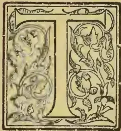

HE late Mr. John Brown was born at Udney, Aberdeenshire, on 17th October, 1826. He was educated as a Civil Engineer and served first on the staff of Mr. Gibbs of the Aberdeen Railway, and afterwards on the Railway Survey and Construction staff of Mr. John Miller of Edinburgh.

In the year 1848 he sailed for the East via the Cape to take up an appointment on an Indian Railway under Government. The vessel made a fast voyage, and on reaching Point-de-Galle, and finding that he had ample time, before his due date, Mr. Brown determined to visit Colombo and Kandy and see something of the Ceylon planting districts, before proceeding to India. This was probably very much owing to the fact that Mr. and Mrs. R. B. Tytler were passengers in the same vessel,—Mr. Tytler returning after having gone home to get married; and all he had to say about coffee in Ceylon no doubt influenced the young Engineer. Be that as it may, life and prospects in Ceylon proved so attractive, and there was such evident scope for the exercise of his own profession among the planters, that Mr. Brown determined to abandon his Indian engagement and to remain in the island. For some years Mr. Brown was very busy over engineering work in connection with the coffee enterprise, chiefly in Pussellawa. His first engagement was to under-

take the planning and erection of extensive works for coffee preparation on Rothseild, the property of the Messrs. Worms, which he brought to a successful conclusion. Mr. Brown's next and his largest undertaking was in connection with the late Mr. R. B. Tytler's giant coffee irrigation scheme, commonly known as the Rajawella Waterworks. On this Mr. Brown was occupied for six years, and the large turbine and pumping machinery erected at the side of the Mahaweliganga, in Dumbara, were, finally, a complete engineering success. Water in large volume was forced up to the top of the hill on the property; but the difficulty in distributing it over a sufficient area of the planted coffee, prevented the scheme from turning out eventually, the financial success anticipated for it. As this was one of the most notable engineering works ever undertaken in connection with the coffee enterprise of Ceylon, or indeed with tropical planting anywhere in the world, we extract from several issues of the *Ceylon Observer* of the "fifties" and "sixties", accounts of the progress and opening of the Waterworks:—

#### IRRIGATION APPLIED TO COFFEE PLANTING.

SOME of our readers travelling by the Colombo and Kandy coach may have observed lately sundry carts along the road laden with massive iron pipes, about nine feet long and of diameters varying from six to ten inches. These pipes form part of the Machinery intended for raising water to irrigate the portion of the Rajawella Estate belonging to Messrs. Morton and Tytler; and as considerable public interest and curiosity have been excited on the subject of these contemplated Water-works, we proceed to give some general account of them.

761------------------------------------------------

736THE TROPICAL AGRICULTURIST.[MAY 1, 1897.

The Rajawelle Estate, situated in the lower Doomberra valley, is known to lie within the line of country in which the S. W. Monsoon occasionally fails, and the result is that this Estate, which in moist seasons bears very heavy crops, loses in a very dry season from one-third to one-half of the crop on the trees. There are only two or three small streams in the property, and even these in very dry years occasionally cease to flow; but the Mahavilla Ganga forms the boundary of Rajawelle on the south-side, and as the Mahavilla affords at all seasons an abundant volume and fall of water, the idea occurred to the proprietors of the Estate, to make that river itself subservient to the purposes of irrigation. The problem practically was a serious and difficult one. The old Estate lies a mile and a half from the river in a straight line, and is divided from the new Estate by a ridge ascertained by actual survey to be 460 feet in vertical height. The power requisite for raising even a moderate quantity of water to this high elevation by a single lift, is very great; yet the necessity for employing a single lift could not be avoided except by substituting still more costly Machinery, such as a powerful Steam Engine half way up the hill. To this there were many practical objections. Accordingly it was resolved to throw up the whole quantity of water required, by means of the power obtainable from the river alone; and after consulting practical Engineers in England and Scotland, it was resolved to employ as the motive power *Whitelaw's Horizontal Water-wheel*. This Wheel, with the Pumps and connecting Machinery, has been accordingly manufactured by Messrs. Whitelaw at Glasgow, and the whole are on their way to Ceylon in the 'Coromandel.' The iron-piping (of the length of 6,250 feet and weighing 212) Tons intended for the conveyance of the water over the ridge was brought out by the 'Armais' some weeks ago; and we believe a great part has been forwarded to Rajawelle. The works at the latter place are in rapid progress. The great sluice, for supplying the water to the Wheel, is nearly cut. This sluice, which will be a small Canal when completed, is to be nearly three quarters of a mile in length, and eighteen feet broad by three feet deep,—discharging at least half a million of gallons of water per minute. As there are several rapids in this part of the Mahavilla Ganga (indicating of course a great declination in the bed of the river) a comparatively short extent of sluice gives a great fall;—consequently it is found that the three-quarters of a mile give a fall of some 24 feet. The large body of water supplied by this canal, with the fall of 24 feet, produces a very large amount of motive power; in fact it is calculated to be equal to a Steam Engine of about 200 Horse-power. We believe that a Steam Engine of this size would have cost more than the whole expense of the intended works,—independently of the objection that its working would have been very costly, whilst the Water-wheel is self-acting.

The Wheel will be quite a curiosity in its way. The Diameter is only 14 feet,—a size which would be considered small for any of the Water-wheels used on Coffee Estates for working Pulpers and Clerihew fans. We believe that the ordinary overshot Wheels used on Estates are about 16 feet in diameter; but the resulting power is seldom more than from 8 to 12 Horse-power. An overshot Wheel of 200 Horse-power, would require to be at least sixty feet in diameter; and a Wheel of such an unwieldy size would have required to be very favorably placed, as regards the supply of water and other circumstances, to be worked effectively. We remember seeing a sketch, in the *Illustrated News* last year, of a gigantic wheel of this description, lately erected at some Mines in Wales, but although the diameter was four or five times as great as that of the Rajawelle Water-wheel, the effective power was less. Mr. Whitelaw himself, in a letter published in the *Mechanic's Magazine* of May 6th 1854, speaking of this very Rajawelle Wheel, describes it as.

"A Water-wheel of 200 Horse-power, which I am making for Messrs. Gwynne & Co., Engineers, London, which is to work six single-acting pumps of 20 inches stroke and 8½ inches diameter, to raise

"water to a height of 460 feet for irrigating an Estate. When finished I believe, *no water-wheel in the world will be of greater power than this*; but be this as it may, it will be a large one."

The principle of Whitelaw's Wheel is peculiar and not very generally known. It is placed horizontally, and as a central opening for the ingress of the water from the sluice, which is supplied by a large induction pipe. The diameter of the pipe for supplying the Rajawelle Wheel is 76 inches, so that *a tall man with his hat on might stand upright in it!* This pipe will be always full; and even persons practically unacquainted with Hydro-dynamics, can readily understand that an enormous force must be exerted by a perpetual column of water six feet four inches in diameter and twenty-two feet in vertical height. The principle of action is somewhat complex in theory, though extremely simple in practice and result. It has been described as "centrifugal"; and so it is to a certain extent. The arms of the Wheel are curved and have orifices at the extremities; and the water, forced in through the central opening, rushes through these curved arms and out of the orifices; and Mr. Whitelaw describes the action as communicated by the water pressing on the sides of the arms as it rushes through and by the centrifugal force as it rushes out. But as we observe from the drawing which has been sent to us, that the diameter of the central opening in the Wheel is very much less than the diameter of the large supply pipe, we fancy that the action is greatly aided by the operation of another: valuable hydro-dynamical principle, viz. *that a force exerted upon a certain surface of water is multiplied when communicated through the water to a smaller surface*. The increase is in a known ratio, viz. inversely as the squares of the surfaces. This is the principle of the hydraulic press. It was by the application of this principle that Mr. Robert Stephenson raised the vast tubes of the Britannia Bridge. On a small scale, the action of a common "syringe" is precisely the same; and this perhaps is the humblest illustration of the principle.

The Rajawelle Wheel is to work three or more Pumps, which are upon the ordinary principle, and no further remarkable than for their size and strength. These pumps will deliver their water into the conduit or long iron piping laid over the ridge; and Messrs. Gwynne & Co. have guaranteed that the Machinery shall deliver 500 gallons of water per minute at the top of the ridge, which, as mentioned above is 460 feet in perpendicular height. To give an idea of the strength of the valves required in these pumps, it may be mentioned that the actual weight of the water in the conduit pipe when full, will be, in round numbers, over *seventy tons*; but as the pressure exerted by a column of water is proportionated only to its vertical height, the effective weight may be taken at one-tenth of that figure. A continual pressure however of even 7 or 8 tons upon pump-valves, calls for both stout material and good workmanship.

How much of the Rajawelle Estate can be watered efficiently by the amount of water above stated (500 gallons per minute) is a question which actual experiment alone can solve. Much difference of opinion exists on the subject. Some of Messrs. Tytler and Morton's friends are kind enough to assure them that the whole thing will be an utter failure! The Estate consists of 700 acres or thereabouts, of which 200 Acres (the old Estate) lie over the ridge, and 500 Acres (the new Estate) between the ridge and the river. Taking 600 trees to the acre on the old Estate, and 1,200 trees to the acre on the new the total number of trees may be set down at 720,000; and this happens to be exactly the number of gallons of water per 24 hours at the rate of 500 gallons per minute. In other words, if the whole Estate is to be watered at once, the quantity received by each tree would be only *one gallon* in the 24 hours; and this without allowing for loss by evaporation, &c. But we believe the intention is to water only 50 or 100 acres at a time; and it is calculated that in about a month, the greater part of the Estate would have received a supply equal to a heavy shower of rain. In 1853 the drought at Rajawelle lasted nearly

762------------------------------------------------

MAY 1, 1897.]THE TROPICAL AGRICULTURIST.737

five months; and experience is said to have shown that it is only when the trees have been more than a month or so without any supply of moisture that they begin to suffer materially. In June and July 1853, in the height of the drought we learn that Mr. Tytler tried the experiment of leading a small stream of water among a few acres of the old Coffee, and that the experiment was perfectly successful, though the stream itself had dried up before the drought was quite over. The watered trees filled their cherries, just as in a moist year, while the unwatered trees in the adjoining squares had fully half their berries light. And with regard to the supply of water, it should be mentioned that Gwynne & Co.'s engagement is that the quantity guaranteed shall be delivered at the top of the ridge. The conduit piping has stop-cocks at various intervals, and as a much greater quantity of water can be delivered by the same power at lower levels, the greater part of the new Estate can be supplied far more abundantly than on the above calculation. However actual experience will be the best test; and we learn that the works are expected to be in actual operation before the end of the present year. Mr. John Brown, formerly in the service of Messrs. Worms, is the Engineer employed on the spot; and under his efficient supervision the works are proceeding rapidly and satisfactorily.

#### THE RAJAWELLA WATER WORKS.

We are rejoiced to hear that the great irrigation works at the Rajawella estate were successfully tested on Saturday the 7th instant, the water being forced to the top of the hill, some 460 feet above the level of the Mahavilla ganga. We hope the unwanted elevation will not turn the old River's head. We heartily congratulate those concerned on the successful completion of what has been an anxious and costly work, and a great experiment. Its successful issue is of great importance to the future of Ceylon.

Later on, however, some of the machinery first erected was found unsuitable, for in the *Observer*, January 1859, we find the following:—

#### THE RAJAWELLA IRRIGATION WORKS.

"*Immense Hydraulic Engine.*—Messrs. Abernethy have just finished, at their works at Ferryhill, Aberdeen, a hydraulic engine of very great power. It is intended for an East India plantation, and its object is to pump water, for purposes of irrigation, on both sides of a hill whose altitude is 500 feet. It consists of twelve pumps, which act in sets, and will be driven by a water-wheel of 200 horse-power. The engine is calculated to lift water at the rate of 1,000 gallons a-minute. It is of massive construction and admirably finished workmanship. We (*Aberdeen Journal*) are not aware that any hydraulic engine of nearly equal power has yet been constructed in this country."

We have no doubt this is the machinery for Rajawella now on its way round the Cape. Mr. Brown, the Engineer, (who went home mainly with reference to this machinery) is already in the Island.

#### THE RAJAWELLA IRRIGATION MACHINERY.

The great pumps—probably the most powerful in the world—intended to force up water to the highest point of the Rajawella property—have arrived at Colombo in the *Ellon Castle*, and with the connected pipes and machinery are being landed and sent on to their destination under the superintendence of Mr. Brown, the Engineer. Some idea of the pumps may be formed from the fact that there is a pressure of 8 tons on each piston. It is expected that they will send water up to a height of some 450 feet—the highest point, above the river, of the fine estate for which they are intended. For the

sake of the continued and extended success of the Coffee enterprise in Ceylon, as well as out of regard for the spirited proprietors of the Rajawella property, we trust the experiment will be largely successful. The effects of full success can scarcely be estimated. On one estate it is calculated that in a year of drought it would make all the difference between an unremunerative gathering of light husky Coffee, and a bumper crop of full, bright, solid berries, yielding a profit of £10,000. For this year we are glad to hope that the Dumbara and many of the other lower estates are safe—long continued heat having been succeeded by copious showers of rain and occasionally hail—the latter being light and harmless. All that is wanted is moderate weather in June. By next year the great irrigation works will be in full play, placing, let us trust, the owners of the particular property beyond the reach of anxiety, and opening up a new era for Coffee Planting in Ceylon.

#### THE RAJAWELLA WATERWORKS.

It affords us much pleasure in announcing the final completion and success of this costly and spirited undertaking. By force-pumps of an ingenious construction, moved by a Turbine of 20 horse-power, water is raised along a pipe of a mile and a quarter in length, to a height of five hundred feet, sufficient in quantity to serve for the irrigation of eight hundred acres of Coffee. In the bold conception of the original idea, the patient perseverance in carrying it out, the overcoming of engineering difficulties as to the most suitable machinery and the erection of the ponderous pieces, and in the fortitude and faith which sunk thousand after thousand of pounds in an improved experiment, too much credit cannot be given to all parties concerned. It is an honor to the Island to have such a work to exhibit. We are assured there is no room any longer to doubt of its final success. The Pumps originally supplied by Gwynne & Co. were a failure, but another set, supplied by Abernethy & Co., of Aberdeen, work with a precision and ease comparable to clock work, and though the replacement cost £3,000, and the former contents of the pumping house lie a scattered heap of worthless iron, there is more than equivalent for all in the great fact that the property is independent of drought. The present season's very heavy crop is mature, and the beans that are picked are of well-filled quality, equal to the produce from any estate of the same elevation. The effect of the water applied in irrigation is plainly and immediately perceptible upon the drooping trees. They are kept fresh in aspect and the crop is sustained by circulation of the sap, which would stagnate in the absence of the moisture at the roots. It appears to us that the value of these works is not confined alone to the watering of the trees, most important though that view of their object be, but that in the carrying out of liquid manure, coupled with the digging of the soil, in such a warm district as Dumbara, not only would there be a saving of labor in manuring, but it would be impossible to predicate to what extent the quantity of produce might be increased.

Mr. Brown's skill and perseverance in overcoming the difficulties, incidental to so novel and trying an engineering enterprise, greatly impressed those who watched him. His quiet, resolute determination combined with great ability, carried him through where other men would have failed and established his reputation in Ceylon as a reliable, sagacious Engineer and a valuable colonist of the right type for a young plantation Country.

763------------------------------------------------

738THE TROPICAL AGRICULTURIST.[MAY 1, 1897.

The time had now come, indeed, for the young Engineer-planter, to begin planting on his own account, and accordingly Mr. Brown, who had now seen a good deal of the country, took up land for coffee planting in partnership and conjunction with Messrs. Norman Stewart and J. B. MacIntyre. Stewart, Brown and MacIntyre—as the partnership ran—opened and planted a group of estates in the Badulla district, the principal of which was known as Glen Alpine, and which, after yielding rich crops for several years, were sold in 1864 to a London Limited Company, entitled the Ouvah Coffee Company. This Company proved successful, and Mr. Brown was induced to join the Board as Managing Director. Under his care the Ouvah Coffee Company, as also the Spring Valley Coffee Company—in whose formation by the purchase of the famous Spring Valley Coffee plantation from Mr. Bauntyne, Mr. Brown had assisted—became very prosperous and paid large dividends for many years. To these was afterwards added the Hunasgeriya Estate Company; and in the year 1877, Mr. Brown and some friends started the Colombo Commercial Company, Ltd., which though intended mainly at first to act as Colombo Agents for the Coffee-growing Companies, has developed into an engineering and contracting as well as mercantile and planting concern of an importance far beyond Mr. Brown's original conception, thanks very much to the judicious management of this Colombo Company and to the impetus given by the prosperity of "tea"!

The latter portion of Mr. Brown's life was almost entirely devoted to the management of the several Companies, with which his name was identified, and the fact of his having successfully piloted them through the difficult times that followed the collapse of the coffee enterprise in the "eighties," and restored them to prosperity in tea, is sufficient evidence of the care and enterprise of his management. We believe that only one other Coffee Company succeeded in passing through the crisis brought about by the coffee fungus, *Hemileia vastatrix*, which practically ruined a great planting enterprise in Ceylon.

Mr. Brown had a decided faculty for invention, and, as a practical Engineer, he early found room for its application in a young planting colony just developing a new enterprise. He was responsible for many of the improvements made in Coffee-pulping machinery, his own Coffee Crusher and Pulper not being the least noticeable—and when attention passed from coffee to tea he introduced two more well-known machines in "the Desiccator"—a splendid tea-drying machine also used to prepare desiccated coconuts—and his "Triple Action Tea Roller." Both these machines have been warmly commended and have proved most successful, and considerably over

500 Desiccators were in use in Ceylon alone at the date of Mr. Brown's death. The Triple Action Tea Roller—highly praised for its work by planters best acquainted with it,—was unfortunate in being the cause of an action at law for infringement of patent taken by Mr. Wm. Jackson against Mr. Alfred Brown and the Colombo Commercial Company, the Agents for the machine. The case was carried to the Privy Council, when Mr. Jackson was unable to sustain his charge of infringement; but it must always be regretted that the Privy Council judgment was not pronounced until after Mr. John Brown's death.

Mr. Brown died from the result of an illness contracted in Ceylon in the early part of 1894. He left Colombo for England in poor health, accompanied by his eldest son, and contrary to all expectations he did not get benefit from the sea air, but gradually lost strength and died after reaching Alexandria, where he was landed from the steamer in order to secure experienced medical advice. He died at the Deaconesses' Hospital, and lies buried under an Aberdeen granite tomb in the Alexandria Cemetery:—

"Mr. J. Brown was born on 17th October 1826, married for the first time to Elizabeth Hall, 7th September 1858 and again to Elizabeth Wylie Abernethy on 18th June 1892. Died 18th March 1894. He left seven children, all by his first wife."

The subject of our Memoir cannot be described as having been a brilliant man; but the quality of his mind was solid and thoroughly practical. His success in life was mainly due to hard work, thoroughness and sincerity of purpose. Once having made up his mind as to the proper course to pursue—that so-and-so was the right thing to do or the right way to do it,—no one could turn him from his purpose, or persuade him to the contrary. In private life, Mr. Brown was most worthy. In respect of both the Coffee and Tea Planting Enterprises of Ceylon—in a connection extending over some 45 years—few men have left more practical or useful evidence of their presence than Mr. Brown. As an Engineer, an Inventor, a Proprietary Planter, a Managing Director, and Chairman of Companies, Mr. Brown took a prominent and successful position, and his name ought long to be remembered in the annals of the Planting, Engineering and Commercial development of Ceylon.

---

COFFEE IN PORTO RICO.—A New York exchange authority says:—"The Porto Rico coffee crop will, this season, according to advices received by leading merchants doing business with that island, fall short all of 66 2-3 per cent over the amount exported last season. This shortage will not in any way be felt in this market, as the importations are comparatively light from Porto Rico, their markets being those of France, Italy and England."

764------------------------------------------------

MAY 1, 1897.]THE TROPICAL AGRICULTURIST.739

## Agricultural Pests:

### WITH METHODS OF PREVENTION.

BY MISS E. A. ORMEROD,

(LATE CONSULTING ENTOMOLOGIST TO THE  
ROYAL AGRICULTURAL SOCIETY OF  
ENGLAND).

#### IV.

#### INJURIOUS MOTHS—METHODS OF PREVENTION.

In the case of the white cabbage butterflies, the caterpillars of which often do serious mischief in gardens, they have been found not to do so much harm in proportion to field cabbage, because the caterpillars choose a dry, well-sheltered place to change in. For this they crawl away from their food-plants, and hang themselves by a silken band under eaves, palings, or the like shelter, out of doors, or in any neglected corners in garden-sheds, where they are allowed accommodation, and much may be done to lessen amount of attack simply by tidiness. The collections of old brooms, bits of wood, and dry rubbish of every kind in which they shelter, are much better away, whether indoors or out; and a brush taken along angles and in corners and under stairs, ladders, beams, &c., in garden-sheds, will sometimes clear the chrysalids out by the handful. A search of this kind between the time of the first and second brood in summer, and some time between November and March, would do much good.

It is an excellent principle to keep down the effect of insect-attack by broad measures of agricultural treatment which will carry the plant well on away from the power of the insect; but at the same time it should not be forgotten that when there are a great number of large caterpillars or chrysalids plainly to be seen, and easily to be laid hold of—whether with fingers or by other means—the best thing to do is, forthwith, to lay hold of them.

There are not many kinds of butterfly caterpillars which are hurtful to crops in England; but amongst the hosts of different kinds of moth caterpillars that cause great loss, about the very largest of all, which is that of the death's head moth, is best got rid of by hand-picking. This sometimes does much harm to potatoes by feeding on the leafage.

The caterpillar usually hides by day, and feeds in the evening or at night; therefore, when great harm is found to be going on (either in this case or others like it) from an unseen enemy, it is well for some trustworthy person to watch at dusk or dawn for what is going forward, and with large creatures like these caterpillars a very small quantity of light will be enough to see them by as they gently move the leafage in feeding. When full-fed the caterpillar goes down into the ground to change; therefore, turning up the chrysalids is an easy measure of prevention with this potato-feeder.

The various kinds of attacks of moth caterpillars are so many, and the injuries they cause so great, that in whatever point we may select now for study, it seems at the cost of leaving out something else of importance; but in these short details, I have tried to draw attention to some four or five principles of preventing or remedying attack:—

One is taking away shelter (as in the case of cabbage caterpillars). Another, the possibility of hand-picking, shaking down, gathering, or whatever term we use for it, being so managed as to be a practicable and paying operation, instead of a ridiculous loss of time. Another is prevention of egg-laying on fruit bushes, by keeping them so properly pruned that there is no attraction of cracks and crevices. We have also noticed that the caterpillars may be smoked or poisoned in their burrows—a simple piece of knowledge, but yet one which, some few years ago, would have been of great service in saving coffee shrubs in one of our colonies. Further, we have noticed that, with webbing caterpillars, it is decidedly well, before we pay our visit, to see if the family are at home.

With the great increase of the fruit industry, we have now areas of thousands of trees where formerly these were counted by hundreds, and we have a consequent increase in amount of the attendant fruit-tree insect vermin. Where there is a large extent of plant growth of any kind, orchard trees or otherwise, affording food in their feeding condition, and shelter in their other stages, to special kinds of insects all the year round, and for successive years, these insects are sure to be present. This has been the case in such a marked and increased degree during the past few years, and in some of our fruit-growing localities, as to necessitate the adoption of some special measures of prevention suitable to the special habits of some of the kinds of caterpillars, and also of remedial applications suitable for sweeping them all off and destroying them together (whatever their other habits may be), when broadscale ravage on the leafage calls for broadscale clearance.

One very important division of caterpillars to which measures of prevention can be applied, is that of the "looper" caterpillars of various kinds of moths, of which the females are either totally wingless, or the wings are abortive to such a degree as to prevent them being of service in flying. Of these, two of the most hurtful kinds are the mottled umber (*Hybernia defoliaria*), and the too well-known winter moth, sometimes called the Evesham moth.

The method of life of both the above kinds is for the caterpillar to hatch in the spring, on the orchard trees on which the eggs have been laid, and feed on, or possibly fairly ravage, the leafage and all the soft growths, during a period which may be from about the end of March until the end of June. Then the caterpillars leave the trees, and go through the change to chrysalis state beneath them. This may be just about the surface of the ground, or a little below. From these the moths begin to come out in October or November, and the wingless female moths creep up the trees and deposit their eggs. This habit, if the moths only went up the trees during a special period, would put means of prevention at once in our hands. But even as it is, the infestation may be greatly reduced by putting bands of sticky material round the trunks, such as will either deter the moths from trying to go up, or hold them firm if they try to cross. This plan catches the moths by hundreds on each tree, but care must be taken lest the mixture applied should injure the bark. On the rugged, thick bark of old trees, where the outside is a mere dry dead coating, it is possible that even tar may be applied without doing harm, though not without risk.

But with young trees there is very great danger of serious injury, and sometimes great losses have taken place consequent on tar or grease being applied direct to the bark. The application soaks into the tissues, and the tree in such case perishes.

The safest way is to begin by passing a band of tough grease-proof paper, such as may be procured at very small cost from grocers, round the tree. This may be about seven inches wide, but the wider the better; the ends should overlap, and the paper be secured in its place by a piece of string being tied round near the upper and lower edges. On this the grease may be smeared. A flat bit of wood, like a paper-knife, is a convenient implement for spreading it with, and common cart-grease answers well as a cheap and effective application. Even, however, where the tree is protected, some care must be exercised in the choice of the "sticky" mixture selected, as some of the materials sold under the name of "axle-grease" contain petroleum residue, animal grease, or other components, which, like tar, would have very undesirable effects if (as I have myself seen to happen) they should soak through the supposed grease-proof paper to the bark.

The above treatment does much good, but does not answer perfectly, for the following reason. Though the great body of these moths come out from the middle of October to December, this period by no means includes the whole appearance. We find them still at the end of January, and the later brood may be found coming up towards the end of winter; and at the end of March another kind of moth, with wingless females, namely, the *Anisopteryx esicularia*,

765------------------------------------------------

740THE TROPICAL AGRICULTURIST.[MAY 1, 1897.

or March moth, which lays its eggs in bands embedded in down on the twigs, is (or vory likely is) also present.

These various moths, including besides what may be called those of common habits, such, that is, as moths which come on the wing to the tree, and of which the caterpillars, after feeding, spin up on the bark, or in any convenient shelter, may be counteracted in some degree by measures based on knowledge of their habits. The webs of those that make nests may be cut off and destroyed with the caterpillars, or (in the case of the small ermine moth) the chrysalids, within them. Cocoons covered with eggs, as in the case of the common vapourer moth, may be searched for and destroyed; and, similarly, the rings of eggs of the March moth and of the lackey moth, which resemble them in being laid in a band on twigs, may be got rid of in some degree by careful search, and pruning off the infested twigs where they can be reached. But for the most part these and various other means of prevention or remedy have to be applied, not as broad measures of treatment, but as special measures for each special attack, involving necessarily special outlay. For these reasons, that is, the pressing need which has long been felt of having some kind of application at hand which is cheap and sure in its action, and which can be brought to bear at once, when required, on any or all sorts of moth-caterpillars together (whatever their various natures or previous histories may have been), and will kill the whole collection of ravaging hordes at once, without damaging the leafage, the experiments have been made, which have resulted, in some of our fruit-growing districts, in the successful introduction of the method of spraying caterpillar-infested leafage with Paris-green, which has long been found serviceable in the United States and Canada.

Another very important division (taken agriculturally) is that of the surface caterpillars, so-called from their injurious operations being for the most part carried on near the surface of the ground.

The family of moths to which these belong is termed *Noctuidæ*, from the circumstance of many of them flying chiefly at night or in the dusk. The heart and dark moth, the caterpillar of which is almost as often found at turnip bulbs as that of the turnip moth; cabbage moth, the great yellow underwing, and some other kinds, the caterpillars of which more or less frequent the surface of the ground, do infinite harm, both in field and garden. In some cases, like the turnip moth caterpillars, they feed at, or below, the ground-level on almost every common root crop, or corn crop, they can reach; and when the weather is too severe in winter for them to continue feeding in the turnip bulbs, they simply go down deeper for a time, and, after coming up again to feed, turn to chrysalids in the coming in the following spring or early summer. Others, like the caterpillars of the cabbage moth, feed in the hearted cabbage, and turn to chrysalids in, or on, the surface of the ground before winter. But, whatever slight difference there may be in the habits of these various kinds of thick fleshy caterpillars, about an inch and a half long, which we only too often find either at the roots or on the leaves of the cabbage and turnip, this special point of their usually passing the winter under ground puts them very much in our power.

Before the caterpillar turns to the chrysalis, it makes a cell in the earth, in which it is protected from wet and sudden changes of temperature, or it seeks or prepares a safe resting-place for its change, or for a time; and so long as the caterpillars are thus protected no amount of cold to which they are here exposed will, as far as we know, do them the least harm. But if they are thrown out of these shelters to the influence of drying winds or hot sunshine, or to lie soddening helplessly on the surface in moist or muddy ground, or to being frozen in these states, then their constitution will not bear it.

If the caterpillars are turned up too soon, that is, either before they are torpid, or before they have changed to the chrysalis, they will simply go down

again. If the soil is turned up when they are gone down very deep, they will not be the worse for what has been done above them. Each worker must look a little for himself, for dates and habits differ with climate and other things; but a little careful observation made by tunning over the earth, so as to see where the creatures are, will be well repaid. They are quite large enough to be easily seen, if they are in numbers to need attention. This principle may be worked both in winter and summer—with caterpillars that turn to chrysalids under ground or in cocoons above ground, and with those that frequent leafage of trees or roots of grass, as well as those we have spoken of.

The common cabbage and turnip surface caterpillars will be found thus (or when time has elapsed for their change to take place), in chrysalis state, on or in the ground near where they fed.

The beet and mangold moth (silver Y moth) caterpillar spins a cocoon on, or not very far from, the plants it infested; and in all those cases, and scores of others, much good may be done by turning up the chrysalids, destroying the weeds they harbour in, and using all other methods of treatment, which a moment's thought will suggest, to destroy the pests.

Clearing all weeds that attract the moths is one method of preventing increase. The constantly increasing amount of insect attack is in part because of the constantly wider spread of cultivated land. There is a much greater amount of special crops, such as special insects feed on; and instead of there being, as in wild districts, perhaps, one plant in a hundred that may suit the caterpillar, there are districts all through the country where nine-tenths of the growth are its chosen food. If, therefore, in addition to the crop food, we let weed food collect in our borders, we add most needlessly to our troubles; and by clearing and burning these patches round garden and fields we may do a deal of good.

When attack is bad, the chief thing to trust to is fertilising dressing; but sometimes dressings of gas-lime on the land, and on the plants, will check attack to a serviceable extent. This has been found useful in the attack of caterpillar to hearted cabbage in the autumn. The gas-lime falls down among the leaves, and thus fills the parts where the caterpillars shelter by day, with what, to a certain extent, keeps them out, and is not pleasing to them.

It was formerly difficult to apply this knowledge practically; but now, looking at the variety of implements which have been recently introduced into this country, suitable for spraying or washing either orchard tree leafage or that of field crops, there would be no difficulty in experimenting, at least on orchard foliage, as to the effects of cold water in clearing off caterpillar presence.

The treatment for prevention of surface caterpillars may be shortly described thus:—Turn them up by cultivation where land is known to have been infested; and where catch-cropping is practised let the field be cleared of all food at least a fortnight before a new crop is put in; keep up the strength of the crop, but use remedies if you can—if they will be sure to destroy the grubs.

In a very large number of attacks, it is the worst possible practice to try to work directly on the grubs; you must counteract their mischief, rather than try to get (literally) hold of them; but with the large moth grubs, which are often one, instead of a score of hundreds, to a plant, the case is different.

For the same reason, birds help us much with some kinds of moth caterpillars. They can bore down, and draw out these large grubs, without the broadcast destruction which often follows on their services in searching for wireworm.

The crow, raven, jackdaw, rook, and partridge, are all said to be of use in clearing away the caterpillars of the turnip moth; and in the case of some of the swarms of small caterpillars which attack forest trees, especially the small green oak-leaf roller (*Tortrix viridana*), the flocks of birds which collect when great attack is going forward are our only helpers.

766------------------------------------------------

MAY 1, 1897.]THE TROPICAL AGRICULTURIST.741MR. J. B. FERGUSON ON COFFEE IN  
BRITISH CENTRAL AFRICA.

Mr. Ferguson, the coffee expert in the service of the African Lakes Corporation has paid a visit to Zomba and the neighbouring plantations, and has been kind enough to give us some notes on the subject of the impressions he has gained in British Central Africa.

Mr. Ferguson was unwilling to give a final opinion as to the future prospects of this Protectorate in the matter of coffee growing, on the ground that he had not yet completed his tour of the plantations, and also considers a longer residence in the country necessary. He has, however, visited most of those belonging to the African Lakes Corporation, both in the Shire Highlands and in Angouliland; the estates of Messrs. Buchanan Brothers, and also those of the principal traders and missionaries, and so far as he has gone his opinion is a favourable one, if shade and manure be supplied to the coffee.

He states that there is not a trace of coffee leaf disease in the country, and he does not attach much importance to the minor ills to which coffee is subject here. He mentioned three things however as worthy of attention, viz., the Borer Grub, want of Manuring, and Drought.

Mr. Ferguson informs us that, the British Central African borer is different from the Indian, inasmuch as the former ultimately becomes a beetle, the latter a fly. The presence of borer may be detected in several ways: dust from the holes is scattered on the ground round the base of the tree, and at the time of blossoming, after a shower of rain, the flowers open up immediately in the case of healthy trees, whereas in the case of trees affected with borer the blossoming "hangs fire."

Planters in this country simply employ boys to pull out the grubs with a piece of wire. Mr. Ferguson does not think this plan effective. He tried it on some trees at Mandala, but after having extracted the grub, he cut down the tree, divided it into sections, and found several other borers still in it in different stages of maturity. A tree that is bored is not in a healthy state, and probably some of the light berries may be produced from this cause. Mr. Ferguson, therefore, recommends that a tree with borers should be dug out at once and burnt, so that all the borers may be destroyed, otherwise the tree becomes a nursery of borers. The matured insect, in the form of a beetle, is said to appear generally at the beginning of the rains, therefore, the proper time to get rid of borers is during the dry season before the beetle appears, otherwise a fresh series of eggs will be deposited under the bark of the coffee tree and a new progeny established.

Drought, Mr. Ferguson thinks, might be successfully counteracted by efficient shade. He states that there is not so long a drought in Ceylon and India, as in B. C. A., as between wet season and wet season there are what are called "blossom showers," often amounting to several inches of rain; whereas, in most parts of British Central Africa there is very little rain between the wet seasons. Mr. Ferguson tells us that the principal shade trees grown in Ceylon and India are different varieties of the *ficus*, the best of which are of the *Banyan* species. There are about eleven different varieties of *Ficus*, some of them natives of British Central Africa, but all of them different from the Indian species. Good specimen may be seen in the Residency garden, Zomba. The banyan tree is of this species, and Mr. Ferguson was very emphatic in recommending it for shade purposes. He says it is very generally used in India, and the most valuable estates in Coorg are those shaded with it. The reason why this tree is a favourite is that the wood it is composed of contains a great amount of moisture, and has thus a cooling effect on its surroundings: again, the leaves fall off during the cool season, when shade is not required, and it is thus a source of manure, while, on the other hand, during the hot season it is always in full foliage and affords perfect shade,

and the peculiar formation of the branches prevent "drip," and tends to carry the rain falling on the tree down the main stem to the ground.

As to manuring, the manure generally applied in India and Ceylon is that obtained from cattle sheds and stables, also bone meal and poonac (oil cake). A small pit is dug near the tree, the manure placed in it, and then covered up again.

In a few cases recently where young planters have opened up estates in B. C. A., they have collected a great deal of the brushwood and branches together and burned them. The ashes have then been scattered on the plantations in small patches round each coffee tree, thrown on the surface. Mr. Ferguson condemns this practice. Ashes he considers a good manure when mixed with other manures into a compost, or when applied alone, but it should not be scattered on the surface of the ground, but in a pit near the tree, and then covered up or dug into the soil. If thrown about loosely the wind carries it away altogether, or it may be carried entirely off the plantation by a heavy shower, especially if the land is on slope,

Mr. Ferguson attaches great importance to shade. He says that not only does shade counteract long spells of drought, but, as in Coorg, it is a certain preventive of coffee leaf disease. He considers that there are trees indigenous to British Central Africa which might do for shade, but thinks it would be well to introduce seed of trees which have been found by experience to give admirable shade, such as the banyan tree from India.

*Note*:—As there appears to be some doubt as to the generally understood meaning of the word "Banyan" Tree, we have asked Mr. Alexander Whyte for information on this point, and he has been good enough to give us the following note:—"It is quite customary, both in India and Ceylon, to apply the term Banyan to other members of the genus of *Ficus* as well as to *Ficus Indica*, the true "banyan" tree. It is perhaps a loose way of speaking, yet I have seen it frequently in print and it has been used by distinguished authorities, e. g. Sir Emmerson Tennant, if I mistake not, while referring to *Ficus Religiosa*, speaks of it as the 'Sacred Banyan Tree,' though it has two other names well-known in India and Ceylon—'Pippul' Tree, or 'Booh' Tree. There is one word of caution I should like to give with regard to the opinions of coffee experts who come from other coffee growing countries to the Shire Highlands. It is impossible to suppose or expect that one who is new to this country, although with very large experience in coffee, can definitely say at once that what is good in India or Ceylon for coffee may be equally good in this country. Innumerable valuable hints and suggestions can be had from an experienced coffee grower from an outside country, but, at the same time, as the conditions may be so different, it is well not to adopt in too great a hurry the course which is taken in such other countries, as possibly further experience here might show that they require modification."

DISTRICT OF THE ARUWIMI,  
CENTRAL AFRICA.

This district is really an annex of that of the Stanley Falls. All that I have said of the one might be applied to the other. The portion between Bena-Kamba and Ba-oko, along the Lomami consists of sandy plains unsuitable for planting, so also with the banks of the lower Aruwimi, and here there are rapids also.....It would not do to cultivate coffee for export beyond the rapids or in the Nellé district. According to what is told us of this country, it is to the north of the grand forest what the Manyéma (grass region) is in the South:—Savannahs, very populous, well-cultivated by the natives, who belong to strong races and are susceptible of great improvement.

Here and there along the river between the Lomami tributary and the eastern frontier of the

767------------------------------------------------

742THE TROPICAL AGRICULTURIST.[MAY 1, 1897.

district cultivation might be attempted in well-chosen spots. The numerous ant-hills point to the existence of clay at least in the subsoil.....

At Basoko there are also some plantations, the importance of which rivals that of Stanley Falls. They are on the borders of a stream in clayey and alluvial soil. In spots, however, which the natives had cleared to grow manioc, and had abandoned, the coffee plants looked stunted, proving that the soil was not originally very fertile. At Basoko I saw 800 coffee bushes, 4 to 6 years old, 3 to  $3\frac{1}{2}$  metres high and nearly 2 metres wide; 270 cacao trees 4 to 5 years old and 3 to  $3\frac{1}{2}$  yards high,  $3\frac{1}{2}$  yards apart, and bearing abundantly. There were many more plants recently put out and also in nursery. From one of the coffee bushes planted in 1890 I saw the blacks who accompanied me, gather 23 Kilo (69 $\frac{1}{2}$  lbs.) of ripe berries and 5 of unripe ones. That was on the 23th January, and in December M. Hénan, the planter at the station had gathered 7 kilos.....

Some figures as to the cost of planting and cultivating may be interesting: it is difficult to estimate the cost of clearing as much of that was done by members of the staff (soldiers) in spare hours. At Basoko and at Coquilhatville, the clearing and preparing of the soil took 1,000 days, which I value at  $\frac{1}{4}$  franc each, i.e., frs. 250. For the maintenance of 100 hectares (250 acres) 250 men or women will be necessary, say  $300 \times 25 = 750$  days per hectare, ( $2\frac{1}{2}$  acres) that is an annual outlay of 200 francs per hectare.

Including all these expenses, then, each kilogramme ( $2\frac{1}{2}$  lb.) of coffee harvested in Upper Congo will have cost at most 20 centimes (about 2d.) for labour. I reckon it will have cost for expenses of administration, and direction, over-sight and other contingencies  $2\frac{1}{2}$  more. As for the cost of transport from Stanley Falls to Antwerp, when the railway is finished, they will not be quite  $4\frac{1}{2}$ , say 4d. The kilo of coffee arrived Antwerp will have cost nearly 1 frs. and can be sold for 2 to 2.20 francs, and we know that a plantation of 100 hectares would produce from the 6th year at least 150,000 kilos, of coffee. This is an ideal that it is possible to attain in many parts in the Congo.

I have also collected some figures upon Cacao. On one tree five years old, cultivated at Basoko, I counted 34 fruits, some fully, some half grown. Ten of these ripe ones contained 427 seeds in a dry state. The 34 fruits would have given about 1,200 grammes ( $2\frac{1}{2}$  lb.) of dry seed. The kilo of Congo cacao is valued at fr. 1.20; at that price a hectare ( $2\frac{1}{2}$  acres) of cacao trees planted 9 ft. apart, would bring in 1 kg.  $200 \times 800 = 960$  kilo. worth 1,152 frs. from the 5th year. It is decidedly less profitable than an equal area of coffee. As for the expenses of cultivation they are the same. If one takes into consideration the inherent difficulties in the cultivation of cacao (rich soil and sheltered situation needed, delicate seeds, difficulty of transplanting) it will be agreed that cacao is not so suitable for the Congo as the Liberian Coffee.

There is one other tree frequent in the sandy forests of the Aruwimi, that is the tree that gives the copal gum, the *Trachylobium*. It belongs to the Leguminosæ, has bifoliolate leaves, irregular pteals and is of coriaceous texture. The tree is freely found on the borders of streams and attains a height of about 30 ft. The station of Asoko buys on an average 600 kilos. of copal gum per month. Its value in Europe is very variable. The district could probably produce 20 tons a year, probably more.

During 1895, the district sent about 100 tons of Rubber, and the quantity might be doubled or trebled. Oil Palms are very frequent on the left bank of the river. "Raphia" and "panza" are also very abundant. Basoko station has also been well planted with fruit trees—citron, mango, papua &c.,

#### DISTRICT OF THE BANGALAS.

This district also presents vast sandy surfaces alternating with slimy and more fertile soils, but the clearing of the forest has disastrous effects, so that in 3 or 4 years, the good soil has often disappeared and white sand only remains..... But at Um-

anghi an agricultural station has rightly been planted, for there we find a clayey soil and many ant-hills. 5,000 coffee plants and 2,000 cacao are planted, and as the forest had been thoroughly cleared, plantains are planted for shade; the vigour of those bears witness to the fertility of the soil.....

The best shade for coffee is certainly secured by the partial clearing of the forest... Hence they have started a small plantation  $2\frac{1}{2}$  miles from Makolo quite in the forest.... But hitherto the labourers have had to walk there and back from Makolo, this, is a waste of time.... To keep the field clean, 3 women were set apart for every  $2\frac{1}{2}$  acres and had no other work; they even sweep up the dead leaves—an unnecessary work; I rather think it would be better to fork up the weeds and not to destroy them; on sloping land the washaway would be prevented....

The plantations altogether in this station comprised 230 acres of cleared land, 28 of which were at Makolo; 123 were planted with coffee and 25 with cacao. But many plants had been put out with only 2 leaves and should have remained longer in the nursery. An apparatus for cleaning the coffee by John Gordon & Co. has been sent here, but is not yet working.

Among the products cultivated by natives I notice the ground nut, sugar-cane, rice, manioc and beans.

The district produces 400 tons of Rubber annually. The forests are rich in oil-palms (*Élaïs*) *panza* and *raphia*, and there are also copal-producing trees..... —*British Central Africa Gazette*.

#### CRETE AND ITS PRODUCTS.

It has been placed to the credit of the late Emperor of Brazil that on being shown the fly-wheel of a certain steam-engine, and informed that it made over 300 revolutions per minute, he remarked that it was far ahead of his country, for they could only muster that number of Revolutions in a year; and so of Greece it may be remarked that many have been the Revolutions during the past hundred years, especially in Crete—one of those—

"Isles of Greece,

Where burning Sappho loved and sung"  
and to-day the whole of Europe and Great Britain is exceedingly perplexed as to what is to be the order of things in Crete, and in Greece itself, in the days to come. We can only express the hope that freedom and prosperity may be the outgrowth of the present imbroglio, for then horticulture and agriculture will flourish on this borderland of the East. As to the resources which these two are capable of yielding in freedom and peace it were difficult to say. The island lacks proper cultivation, is thinly populated, its exports are limited in value and number—olive oil, wine, raisins, soap, Locust-beans. Valonia, Almonds (shelled), and some Oranges. Of the products now shipped from the various Cretan ports, a fair proportion finds its way to this country—in the shape of olive-oil, raisins, Locust-beans, Valonia.—*Gardeners' Chronicle*.

ANOTHER BIG BRAZIL COFFEE SYNDICATE.— In a London paper dated April 10th, by the French mail, we find the following important paragraph. It would look as if "coffee" were going to be overdone as much as "tea":—

A large and extensive group of coffee plantations, situated in the San Manuel district of the State of San Paulo, have been sold to a Dutch syndicate for the purpose, it is believed, of flotation as a company on the European markets. The purchase price is stated to be £500,000. It is understood that negotiations are in progress for the purchase of other coffee estates in the same province by various syndicates, both English and Continental. The flotation of the Dumont Coffee Estates on the London market in the early autumn of last year has encouraged the undertaking of similar business in other quarters, and more than one flotation is expected at an early date.

768------------------------------------------------

MAY 1, 1897.]THE TROPICAL AGRICULTURIST.743

### THE REPORT ON THE CAWNPORE EXPERIMENTAL FARM

for 1895-96 has reached us. The Farm is under the immediate charge of the Principal of the Agricultural School at Cawnpore, who must be highly gratified with the praise bestowed on the farm by no less an authority than Dr. Voelcker; for the latter, in his report on the "Improvements in Indian Agriculture," records the following opinion:—"In fact, I was much pleased with the Cawnpore Farm, and was not prepared to find in India anything which so nearly came up to my idea of what an experimental station should be."

Among other matters which occupy the attention of the farm authorities is the distribution of implements, of which we read that there was a remarkable increase in the number distributed during the year. This is said to be due chiefly to the efforts of the representatives of the department in bringing the improved implements into prominence at the Agricultural Shows. We note that the implements were either sold or given out on hire, or for trial. Under the head of "Distribution of Seed," we find that between 20,000 and 30,000 lb. of seed were distributed during the year under report from the seed-store attached to the Farm; while under the head of Cattle, we have a note on the Veterinary Hospital, where the number of patients treated was 72, and the cases cured 70. The results in the latter case are naturally considered to have been encouraging. Among other interesting experiments are those with reference to Cotton Cultivation, and the various systems of conserving Cattle Manures, which are said to be likely in time to lead to some results of economic value.

We have only been able to refer to a few of the striking features in this Report, but our perusal of the document leaves us no room for surprise that so eminent an authority as Dr. Voelcker should have spoken in high terms of the Cawnpore Farm. When may we expect to see a like institution in Ceylon? Not while the Government do not provide a vote for such important work as the distribution of seeds and implements, and for the carrying out of useful experiments in connection with their Agricultural School. In this connection we would emphasise the importance of a Veterinary Hospital such as that referred to in the Report (worked, if possible, in connection with the Society for the Prevention of Cruelty to Animals, as in Bombay) seeing that the Government have a highly-paid Veterinary Surgeon, who is apparently not over-burdened with work or responsibilities. A veterinary hospital would not only be the means of popularizing European veterinary treatment, but would also afford a training ground for students of the Veterinary School whose opportunities for acquiring a practical training in the veterinary art must be very small. It is a matter for regret that the Government of Ceylon did not think of inviting an expert, such as Dr. Voelcker, to draw up a scheme of work for the Ceylon Agricultural School at the same time that he was reporting on the "Improvements in Indian Agriculture."

### THE ESTATES COMPANY OF UVA, LIMITED.

The annual ordinary general meeting of the above Company was held at the Company's Offices, No. 7 Queen Street, Fort, Colombo, at 12-30 p.m., on Saturday, 27th March, 1897.

The directors' report was as follows:—  
ACREAGE.

<table border="1">
<thead>
<tr>
<th></th>
<th>Tea in full bearing.</th>
<th>Tea in partial bearing.</th>
<th>Tea not in bearing.</th>
<th>Total Tea.</th>
</tr>
</thead>
<tbody>
<tr>
<td>Dammeria Group ..</td>
<td>436</td>
<td>29</td>
<td>110</td>
<td>575</td>
</tr>
<tr>
<td>Battawatte and Forest</td>
<td></td>
<td></td>
<td></td>
<td></td>
</tr>
<tr>
<td>  Hill .. ..</td>
<td>209</td>
<td>167</td>
<td>211</td>
<td>587</td>
</tr>
<tr>
<td>Gampaha .. ..</td>
<td>332</td>
<td>20</td>
<td>119</td>
<td>471</td>
</tr>
<tr>
<td></td>
<td>977</td>
<td>216</td>
<td>410</td>
<td>1,633</td>
</tr>
</tbody>
</table>

<table border="1">
<thead>
<tr>
<th></th>
<th>Other Products.</th>
<th>Timber Trees and Grass.</th>
<th>Forest and Waste land.</th>
<th>Total.</th>
</tr>
</thead>
<tbody>
<tr>
<td>Dammeria Group ..</td>
<td>43</td>
<td>23</td>
<td>502</td>
<td>1,143</td>
</tr>
<tr>
<td>Battawatte and Forest</td>
<td></td>
<td></td>
<td>141</td>
<td></td>
</tr>
<tr>
<td>  Hill .. ..</td>
<td>5</td>
<td>14</td>
<td></td>
<td>747</td>
</tr>
<tr>
<td>Gampaha .. ..</td>
<td>81</td>
<td>82</td>
<td>232</td>
<td>866</td>
</tr>
<tr>
<td></td>
<td>129</td>
<td>119</td>
<td>875</td>
<td>2,756</td>
</tr>
</tbody>
</table>

(Some coffee also remains amongst tea and timber trees on Gampaha and Battawatte Estates.)

The Directors have now the pleasure of submitting to the Shareholders the accounts for the past year.

The tea crop, which was estimated at 350,000 lb. amounted to 350,102 lb in addition to which 32,025 lb. were made from purchased leaf. Of the total quantity, viz: 382,127 lb. 372,818 lb. have been sold at a net average of about 48½ cents per lb. A reasonable valuation has been placed on the unsold portion of the crop, viz: 9,309 lb. The receipts for manufacturing tea for other estates amounted to R5,679.32.

The Coffee crop was slightly under the estimate of 970 bushels, having amounted only to 918 bushels, as against 3,070 bushels in 1895. As will be seen from the Working Account, the Cocoa and Cardamom crops slightly exceeded the estimates of 50 cwts and 500 lb respectively.

The expenditure on Working Account amounted to R148,451.80, which included the whole of the Salaries and Establishment charges on each of the Estates.

During the past year the Tea acreage was increased from 1,574 to 1,633 acres, partly by the planting up of land under other products and partly by opening up new land. A small addition of Acres. 12.3.18 has been made to the Dammeria Group by purchase of that extent of Crown land. The cost of these extensions, as also upkeep of the Tea fields not in bearing, amounting to R26,854.17, is added to the cost of the Estates. The cost of additions to Buildings and Machinery during the year amounted respectively to R10,307.60 and R10,530.80.

An issue of 99 shares of R500 each was made in terms of the Directors' Circular letter of 26th March last, these shares being taken up by the holders of the then existing shares at a premium of R100 per share. The paid up Capital of the Company is thus increased to R700,000 and a sum of R9,900, the premium on the new issue, is placed to credit of Profit and Loss account. The Directors recommend that this premium be transferred to Depreciation Account.

After making provision for ordinary depreciation of Buildings and Machinery a sum of R58,867.38 is available for distribution, which will be reduced to R48,967.38 by the transfer of the share premium as above referred to. The Directors recommend that a dividend of 7 per cent for the year be declared on the Capital as at 1st January, 1896, viz., R650,500. and that, in terms of the issue, a dividend of 3½ per cent be declared on the Capital last issued, v.z., R49,500. The payment of these dividends will absorb R47,267.50 and leave R1,699.88 to be carried forward to the current year's accounts.

95

769------------------------------------------------

744THE TROPICAL AGRICULTURIST.[MAY 1, 1897.

The question of improved outlets for both Battawatte and Gampaha has been engaging much of the attention of the Directors. An extension of the Madulsima road through Battawatte and Forest Hill, as a Grant-in-Aid road, is likely to be undertaken at an early date, while the Directors hope in a short time to have matters ripe for an application being sent in to Government for the very necessary extension of the Uda-Pussellawa road.

The crops estimated for the current year are 415,000 lb. Tea, 590 bushels Coffee, 60 ewts. Cocoa, and 600 lb. Cardamoms, while the estimated expenditure on Working Account, viz., Rs. 150,554, provides for the manufacture of 40,000 lb. Tea for another estate.

The outlay on Capital account, which is estimated at Rs. 13,922, will be for upkeep of the Tea fields giving no return and extension of the area under Tea, as also for additional coolie lines &c.

An extension of the Gampaha Factory is also in contemplation but for this no estimate is yet framed, while the cost of providing improved outlets for both Gampaha and Battawatte will probably have to be met

Messrs. Carlyon, Figg and Chas. Young having resigned their seats on the Board on leaving the Island, Messrs. A. Thomson, G. H. Alston and W.D. Gibbon were duly appointed to fill the respective vacancies. Mr. C. A. Beechman having also retired from the Board, Mr. E. J. Young was appointed in his stead, and that gentleman now retires by rotation.

The appointment of an Auditor rests with the meeting.—By order of the Directors,

WHITTALL & Co., Agents & Secretaries.

Colombo, 17th March, 1897.

#### CINNAMON SALES IN LONDON.

The particulars of the last quarterly sales of cinnamon, held in London on the 22nd ultimo, which we published in our last issue, afford gratifying evidence of the correctness of the anticipations in which we had indulged, of a permanent improvement in the value of, perhaps, the oldest of our staple exports. After a period of long, and almost ruinous, depression, our historical spice began looking up a year or two ago; and although it was feared, from the suddenness and extravagance of the first considerable rise, that the upward tendency was artificial—as indeed it was on that particular occasion—and would be only temporary, the prices which then ruled have been fairly well maintained. The speculative prices which certain medium marks secured, have of course not been realized since; but there has been no general drop. On the contrary, almost every sale since then has proved satisfactory to the producer; and the confidence we expressed, that it is a better demand, and not speculative operations, which first provoked keener competition, seems fully justified. The main reasons which point to this conclusion are that almost all the cinnamon brought to the hammer, is knocked down in the auction rooms, the balance finding ready buyers immediately after, at current or improved rates; and secondly, that the demand is pretty evenly distributed, and all sorts find buyers. Not only so, and not only that unsold lots scarcely ever have to be reserved for the next quarterly sales, as happened pretty frequently a few years ago, but the difference in price between fine and medium bark is not as pronounced as it used to be. For many years, and until about two years ago, fine pale cinnamon of the best known brands fetched quite double the prices of medium marks; and often even

more. Thus, we have known C. H. De S. (the De Soysa brand) realising for its firsts only 7d. to 8d., while Golua Pokuna would fetch 1s. 6d. to 1s. 7d. at the same sale. All this is now changed, and the relation of prices for barks which are pure and unadulterated, though they may differ greatly in thickness of quill and but little in quality of the spice, is more reasonable. Fancy prices for fancy makes are getting out of date; and the spice fetches about what it is really worth, with a reasonable allowance for more attractive appearance and the higher wages which have to be paid for the manufacture of fine quills. Thus, at the February sales the difference in price for Firsts ranged from 1s. to 1s. 6d.; for Seconds from 11½d. to 1s. 5d.; Thirds from 10½d. to 1s. 4d.; and Fourths from 10d. to 1s. 1d. Fine bark may be said roughly to have fetched about half as much again as ordinary quills, instead of double or more. Then, the grading of ordinary bark showing a very inappreciable difference, the difference in price, too, was correspondingly small—from 10d. for Fourths to 1s. for Firsts; while in finely quilled cinnamon, the difference being more appreciable, the prices ranged from 1s. 1d. to 1s. 6d. Again, the “unworked” cinnamon, which is sold as it is landed, without any manipulation in the Docks or Warehouses, and which the trade would not look at some years ago, was all competed for and sold at prices which approximated to those of ordinary bark, after they had undergone expensive unbaling, brushing-up and re-baling. From this last mentioned circumstance alone, we are justified in deducing a real demand, as the London monopolists were very strong some years ago in resisting the claim of exporters to have more frequent sales, and sales on samples drawn from one bale of each quality, instead of having every bale undone. So long as the demand was slack, producers were unable to enforce the last demand; but now unworked cinnamon seems to provoke as keen competition as worked spice; and what is more, prices have risen in face of infrequent sales. Our great staple tea has receded in price despite weekly auctions, while cinnamon, which had to abandon even monthly sales in deference to a ring in London, has risen. The fact is of importance in connection with the discussion on the fall of prices which tea has experienced, as it points to the supreme importance of the relation between supply and demand in regulating the market.

Turning to the catalogue we find that the old marks maintained their old pre-eminence, Golua Pokuna leading as usual, closely followed by Wester Seaton, Kimbulapitiya, and Mudaliyar Rajepakse's Kadirane properties. A. & Co. (Messrs De Mel's Ekelle property), G. De C. (the late Mr. Gabriel De Croos' brand) come next, and then the great “unworked,” led by the C. H. De S. marks. Of 1,248 bales offered, nearly 1,200 bales found buyers in the room; and it would be a mistake to suppose that the offerings were small. Although the quantity was short of that which was brought to the hammer in February last year, the catalogue of February 1896, it must be remarked, was exceptionally large. The February sales are generally light; and in 1895 they received only 766 bales or nearly 500 bales less than was sold last month. Since the sales, a firmer tone seems to prevail, so that the outlook is decidedly cheering, and proprietors have to be congratulated on the returning prosperity for which they had long to wait.

770------------------------------------------------

MAY 1, 1897.]THE TROPICAL AGRICULTURIST.745

The following is the report on the last sales from one of the leading firms in the trade in London :—

London, 25th Feb. '97.

CINNAMON.—The first auctions of the year were held on Monday last the 22nd instant when 1,248 bales Ceylon offered against 1,792 bales at the February 1896 sales. There was a good demand and about 1,200 bales were cleared in the room with capital competition. Ordinary to medium qualities of qnill sold steadily at par to 1/2 per lb. advance and the finer brands maintained the good advance established in November except a few bales of first and fourth sorts which sold at 1/2 to 1d. per lb. cheaper. Fine "worked" Ceylon sold: Firsts good to fine 1/ at 1/6; seconds 11½d. at 1/5; Thirds 10½d. at 1/4, and Fourths 10d. at 1/1.

The "unworked" spice sold (as landed) about 1,000 bales. Firsts ordinary to good 10½d. at 1/; Seconds 11d. at 11½d; Thirds 10d. at 11½d., and Fourths inferior to good 7½d. at 10d. per lb.

CHIPS &c.—48 bags sold at 3½d. and about 50 bags quillings &c., at 8d. at 10d. per lb.

1896. 1895. 1894.

Stock of Ceylon 2,453 bales against 4,583 3,885. 3,515  
The next sales are fixed for the 31st May.

### LIVING ON COCONUTS.

The value of the coconut as food is shown in a story from Pemba, Africa. One coconut, night and morning, kept a man alive for seven months under most cruel and trying circumstances. The man was a slave named Muftah, who ran away from his master an Arab, named Ali Bin Abdullah. His master recaptured him, then treated him with horrible cruelty. He was put in irons, which were welded on his flesh near the ankles, and the irons were attached by a bar to a cleft tree. For seven months was Muftah kept in this position, exposed to all changes of weather, enduring noon-day heat and evening chill the torments of insects and semi-starvation. A coconut, night and morning, was his only food and drink. He was eventually rescued by H.M.'s Consul at Pemba, Dr. O' Sullivan, who had him sent to Zanzibar. That he lived so long under such conditions is a matter of surprise, and speaks well for the food value of the coconut.—*Produce World*.

### PRODUCE AND PLANTING.

TEA BLENDING.—The development of tea planting has led to a similar growth in the business of tea dealing, especially in that department of it in which blending is made a conspicuous feature. While many of the old firms of tea dealers still maintain their trade and position, several comparatively new firms have entered into competition, making a great point of the art of judicious blending which they cultivate. The *Grocer*, recently describing the new premises of one of these firms which it states by the way, were only established quite recently, says:—"The floors are fireproof, and the different departments are admirably suited to the purposes for which they are intended. Goods delivered from the bonded warehouses are at once lifted by means of a crane fitted with the 'friction jigger' to the top or third floor, designated the receiving room. Here the teas are fed into cutters, which reduce the leaves to a uniform length and free them from extraneous matter. From these machines they pass through to the 'hopper' on the second floor. The capacity of the drum is about twelve chests, or some 1,200 lb, and this is directly connected with the mixing machine (of equal capacity) on the first floor by means of a capacious funnel. Thus it will be seen that as soon as the 'mixer' is cleared another parcel can be introduced in a few

moments, and a very large quantity of tea can be dealt with in a brief period. The ground floor forms the delivery department, and it is to this room that teas packed on the different floors and ready for delivery are conveyed in the powerful hydraulic lift. At the time of our visit the building was not out of the contractors' hands, but large numbers of employees were engaged on the various floors in the various processes involved in preparing the firm's packet and loose teas for the market. In the basement a six-horse-power nominal Crossley gas engine has been erected, and here also a circular saw is to be laid down in order to facilitate the work of chest making. Special arrangements have been made for keeping the rooms free from dust, and for drying labels rapidly by the provision of powerful fans, and the ventilation has been carried out on scientific principles." The firm referred to, it appears, "offer every facility to retailers to adopt the 'own name and label' system of trading, and they supply photographs of tea plantations for window display. The care they devote to blending is indicated by the fact that samples of the drinking-water used in almost all parts of the country are kept on the premises."

JUST ROMANTIC ENOUGH.—It is not surprising that the British youth yearns after a tea planter's life as he reads the glowing accounts given of it in some of the light literature of the day. Even the globe trotters are impressed with the glimpses they get. In a book called "Romantic India," just published by Mr. Heinemann, we find the author, a Frenchman, M. Andre Chevillon, indulging in a glowing sketch of a Ceylon tea garden proprietor. We knew that all tea garden proprietors in Ceylon are not "fat, gentle, pale," and that sitting in *chaises longues* with cigarette and book is not the lot of the "creeper," but the following description reads well:—"Yesterday," says M. Chevillon, on the railway, returning from the interior of the island, I met a Hollander; fat gentle, pale, peaceful of gesture, scanty of speech. Of the Dutch temperament there is left only the phlegm and softness; the sanguine flesh tint has disappeared under the heat. After five minutes he asked me my address that he might send me some flowers; for my pockets overflowing with roses, jasmines, mimosas, my admiration for the very great size of the floral display on every side had surprised him. After a time I learned that my man is a native of Ceylon, that he has tea plantations in the mountain, and lives with his family at Colombo. To-day I dine with him. His bungalow, situated in the cinamom gardens, is like a villa of some rich old Roman, deliciously bright and cool, immense halls separated by partitions of fragrant woods, carved and cut in fretwork, great wicker *chaises longues*, where one may recline all day with cigarette or book. The children pretty, but singularly pallid, a translucent, waxen tint, fined down and enfeebled by the climate; a household of servants, who seem very much beloved. Parents and children speak Cingalese to them."

THE BOARD OF TRADE RETURNS AND PRODUCE.—The striking feature of the Board of Trade returns of our foreign and colonial trade during February is that the declared value of the imports into the United Kingdom again shows an increase (£1,768,428), and the declared value of our exports of British and Irish produce and manufactures a decrease (£1,839,418) for the month. Striking increases are found under the head of duty-free and dutiable articles of food and drink, and represent *inter alia* increased imports of wheat from the United States and Turkey, flour from France, maize from Argentina, coffee from all sources of supply except Ceylon and Brazil, and tea from Ceylon and India.

COOLIE LABOUR IN THE WEST INDIES.—The official report referring to Jamaica is interesting alike for its statistics and its reference to the East Indian coolies there. There is a decline in the value of the exports from the figures of former years, the difference compared with 1894-95 amounting to £48,317

771------------------------------------------------

746THE TROPICAL AGRICULTURIST.[MAY 1, 1897.

Coffee, bananas, sugar, rum, and cocoa are the chief items that have declined, whilst the exports of oranges, grape fruit, ginger, lime juice, and pimento have expanded. It may be interesting to state as regards oranges that the total export in 1895-96 was 97,025,398, of the estimated value of £169,794 these figures exceeding the sum of the exports in the four preceding years by 12,062,751 in number and £44,319 in value. The island is thus continuing to reap the result of the misfortune which befell Florida in 1894. It appears that the East Indian population thrive in spite of the depression in the sugar industry, which has little if any effect on their average wages, the greater number being now employed on fruit-growing properties. One high-caste East Indian, formerly an immigrant, is now the possessor of over 2,800 acres of land, and has been elected a member of the parochial board of Trelawny. Over three hundred coolie adults with their families left for Calcutta in the Government vessel on May 18, 1895. Ninety-nine adults who had claimed and were entitled to free passages did not present themselves, and the ships had to be despatched short of the full complement. The amount of £3,139 was taken away in Treasury bills by eighty-nine families. A further instance of the prosperity and thrift of the East Indian population is shown in the increase of savings' bank depositors compared with 1894 of from 793 to 1,029, and of deposits from £13,958 to £22,680, notwithstanding the closing of several accounts by coolies.

A NEW CONSTITUENT OF INDIAN HEMP.—The hemp plant, *Cannabis saliva*, grown in temperate countries, produces a valuable fibre; but in India the fibre produced is of little use in the arts, and the plant appears to devote its energies mainly to the production of a resinous secretion, which, owing to its soporific properties, is a very valuable medicinal agent. The resin exudes from the plants, and is collected by men walking through the fields with long leathern gaiters, to which it sticks; it is known as "charas," while the tops of the plants collected with the resin on them, and matted together by pressure, form "hashish." Very many attempts have been made, says the *Imperial Institute Journal*, by chemists to isolate, from the various Indian hemp products, the principle to which their medicinal activity is due, with the result that many and very different substances have been from time to time regarded as the active principle. The most recent investigation of Indian hemp is that of Messrs. Wood, Spivey, and Easterfield (*Journal Chem. Society*, May, 1896), who obtained by fractional distillation of "charas" under a very low pressure a resinous substance to which they gave the name "Cannabinol." At ordinary temperatures "Cannabinol" is a viscous resin, melting to a thick oily liquid when the containing vessel is placed in warm water. The therapeutic action of this substance has been examined by Mr. Marshall, M.B., assistant to the Downing Professor of Medicine at Cambridge University (*Lancet*, Jan. 23, 1897). Mr. Marshall made two experiments with the drug upon himself, taking on the first occasion from 1 to 15 gram., and on the second a smaller quantity. The first dose did not cause sleep, but induced a peculiar state of delirium, accompanied by complete loss of memory and all sense of the passage of time. This state of delirium alternated with perfectly lucid intervals. On the second occasion the small dose taken produced similar effects in a milder form and for a shorter time, being followed by sleep, during which a series of visions were seen, usually of a grotesque character. The use of the drug seems quite unattended by any unpleasant after-effects such as are experienced with some other narcotics. It was tried on one patient suffering from insomnia with very good results. The terpenes obtained as a first fraction in the preparation of "Cannabinol" were also purified by Messrs. Wood, Spivey and Easterfield, and sent to Mr. Marshall for therapeutic experiment. They were found to act exactly like ordinary terpenes, so that they are not connected with the characteristic action of the hemp products.

PRODUCE FROM THE GOLD COAST COLONY.—The Gold Coast Colony is in a flourishing condition Notwithstanding the general unrest in the colony during the year 1895, owing to the Ashantee expedition, the total value of trade increased by £146,166, or roughly at the rate of 9 per cent., the total of exports and imports for the year being £1,809,340, contrasted with £1,663,173 in 1894. In 1895 the quantity of rubber exported from the Gold Coast increased by 1,000,000 lb, a total of 4,022,385 lb comparing with 3,027,527 lb, the values being £322,070 and £232,550 respectively. The year's output was the highest on record. Cacao, coffee, and kola nuts were imported in larger quantities.—*H. and C. Mail*, March 12.

## TAMIL COOLIES AND LABOUR SUPPLY.

To the Editor, *British North Borneo Herald*.

Sir,—In the issue of January 1st there is an article about the Indian labourer *i.e.* the Tamil coolie. You scarcely give him fair play when you say he is physically unable to perform heavy work, while towards the end of your article you say he is by no means a bad road maker and can cut drains; also you recommend him for earth works. These works are usually considered the heaviest you can put a coolie to perform. Evidently the writer of the article knows nothing whatever about the Tamil coolie. I have had several years experience with Tamil labour and have always found them capable of doing the heaviest work with ease and neatness which the Malay lacks.

Secondly, you talk of obtaining Tamil coolies through Agents. This would be a most unsatisfactory way, as planters in Ceylon always send their Kanganies to get the coolies who know which men are suitable to work on estates and not an agent who will pick up any coolies for the sake of his commission. I should suggest sending some one to Ceylon and from there taking a Kangany with him to the Indian Coast to pick the coolies. After the Tamils have once got a footing and find they are well treated others will follow, by sending a trustworthy Kangany back to fetch more each year as required.

The Dusun cannot be put on the same footing as the Cinghalese for felling and clearing; the latter is much quicker, lops better, and works steadier.—Yours, etc. E. WALKER.

Manpakad Estate, 27th January, 1897.

[The writer of the article had had long experience of each form of labour, Tamil, Chinese and Malay, and still maintains that individually the Tamil cannot or will not do as much earth cutting as a Malay. In other words it takes three Tamils to do the work performed by two Chinese or Malays. Coffee, hemp and rhea were specially excepted. Our correspondent overlooks the fact that as regards most of the estates and clearings there are no kanganies to send to India and neither tobacco planters nor woodcutters have as yet cared to employ Tamil labour. The "Agency" question is easily solved by the rejection of unfit coolies at the Agent's expense. Dusuns may be worse than Cinghalese as woodcutters but the men mostly employed on the East Coast are Sooloos, Javanese, Banjereze, &c. We should be glad if Mr. Walker would state whether he considers Tamils equal *man for man* to the Chinese. They are doubtless cheaper per head and bring wives and children who can also work. But experience in the Malay Peninsula shows that owing to their much greater laziness, liability to sickness, and less strong physique there is no appreciable saving by employing them. We are nevertheless glad that Mr. Walker has written as the Labour question in North Borneo cannot be too thoroughly discussed.—ED.]

PROGRESS IN NORTH BORNEO.—A correspondent writes:—"The mail brought out word that one of our principal Tobacco Companies was sending a manager out to open a coffee estate on one of their blocks of land. A Syndicate are about to bore for mineral oil on Province Dent."

772------------------------------------------------

MAY 1, 1897.]THE TROPICAL AGRICULTURIST.747

UPPER DIMBULA: ITS VEGETATION  
AND SCENIC BEAUTY:  
VARIETIES OF TIMBER-TREES; INCREASE  
OF BIRDS.

In the early days of coffee planting, Dimbula was divided into "Upper" and "Lower." In reality there was not much difference between the elevation above sea-level of the plantations in each division—Union and Bogahawatte ran as high as Louisa and Radella; but the approach to the one was from Kotmale, while the others had their outlet *via* Nuwara Eliya. There is no question now, however, as to the estates which run over 4,500 to 5,500 feet meriting for their district, the distinction of Upper Dimbula. We refer especially to those between Great Western and Nanuoya, above or on each side of the railway line; and the plantations along the headwaters or crowning the slopes between the Nanuoya and the Agraoya until we come under the shadow of Kirigalpotta or touch the far-extending Bopatalawa patanas.

It, on the one hand, the railway has done inestimable service in enabling lowcountry residents and visitors to enjoy some of our finest mountain scenery, how much is lost from the inclination to hurry through each district and to be contented with a glance at the general outline? The old Gampola and Ramboda and still more the Ramboda and Nuwara Eliya coaches were tedious and tiring in many ways; but what enjoyment they afforded in the details of mountain, stream and valley scenery, now seldom or never seen by the ordinary visitor or traveller. In the same way we may say, after a brief sojourn within its limits, how little is known of the attractions and scenic beauty of Upper Dimbula from a mere trip by the railway along the one side of it. To see and appreciate Dimbula (as well as the adjacent districts) nothing but a driving or riding (or to a less extent a bicycle) trip covering every mile of its "pucka" roads can suffice. In any case, let no one say they know anything of the district, until they have travelled by the Agraoya, up as far as the Agras road will take them; and from Lindula alongside the Dambagastalawa-oya past Kowlahena and Henfold, Maria and Lipakelle, Macduff and Cymru right into what Win. Smith used to call "Molesworth's Railway Gorge" at the foot of Elgin estate; and yet again until they have traversed the road between Matakelle and Lamiliere and along a series of plantations the Dimbuldanda-oya till they enter the fine avenue shaded by grevilleas or eucalypts on Lorne and Abbotsford and pass on to the Longden Road *en route* for Nuwara Eliya. This is becoming a favorite route for bicyclists who think nothing of running from the Sanatarium to Talawakele or as far as Hatton (a Colombo visitor and Rangoon friend did the 32 miles 2,000 feet down, in 4 hours the other day); but who, though they enjoy a shady avenue for several miles, are far too much occupied in engineering sharp turns—of which unfortunately there are too many—or in giving "ample room and verge enough" to bullock bandies—to find proper opportunity of looking at the scenery, much less studying the vegetation. And yet there is a great deal in both worthy of note. We think it a pity that in his recent visit to Dikoya and Maskeliya, His Excellency the Governor did not drive down the Longden Road through Dimbula to Hatton, rather than travel by rail. Very likely,

the drive is only reserved until the Dimbula district is properly honoured with a viceregal visit, on which occasion, we trust, all the main roads we have named will be traversed, and the district thereby properly appreciated. In some respects, there is no more delightful upcountry drive in the island than the one from Talawakele to Nuwara Eliya, or *vice versa*. There is mountain and river scenery—big falls, tumbling cataracts, smooth pools, and long reaches of shady stream—with diversified vegetation from the clumps of shrubby, yellow or giant bamboos, to the shady grevilleas, graceful acacias, and the towering gum trees—all breaking the monotony of tea fields dotted over, however, with cinchonas, and by the wayside with not a few coffee bushes, singly or in limited groves. Cultivated native fashion, but with the trees neatly trimmed, it has been quite a treat to see an appreciable number of coffee trees—not acres—on some of the plantations in blossom, bringing back recollections of the beautiful fields of snowy jessamine-like flower, to be succeeded by the plentiful ruddy cherries of "auld lang syne." Our higher districts, as a whole, are becoming wonderfully well-wooded—an advantage which many estates short of firewood sadly need—and this is especially the case in Upper Dimbula.

We suppose the experienced Manager of Mount Vernon is as favourable as ever he was to the grevilleas (the Queensland silky oak) dotted over his tea fields on account of the great benefit which their litter of leaves confers on the tea bushes, while the big trees in no other way do harm. The fertilizing material is indeed abundant, if we may judge by the roadside gatherings on Lorne and adjacent estates, where we were repeatedly reminded of Milton's line:—

"Thick as autumnal leaves that strew the brooks  
In Vallambrosa."

The bamboos have no such beneficial effect; but they are confined chiefly to clumps on the riverside, though some fine collections are found higher up in the ravines. The timber offers compensation for the sometimes troublesome litter:—the smaller bamboos split up making useful palings or garden fences; the larger ones a capital substitute for spouting, with many other means of turning the different sizes to use. Nothing, however, can be more picturesque in early morning or afternoon sun, than the glancing yellow Ceylon, Nilgiris or Himalayas, or the dark dark green Java, bamboos by the riverside in contrast with the prevailing plantation cultivation. All four kinds of bamboo are found on Abbotsford, and we suppose, we may say without any exaggeration that Abbotsford—thanks to the enterprise and enthusiasm of our relative and chief, the late A. M. Ferguson—is the best "timbered" or "wooded" tea plantation in the island? There are, as we said, some coffee bushes left and a very appreciable quantity dotted over the tea fields, of cinchona trees—alas, of no value unless the demand and prices increase and justify continued cultivation and bark-harvesting;—but these are nothing to the number and variety of timber trees. No census has ever been taken; but the experienced Manager, Mr. Fraser—himself an arboreal enthusiast—thinks there cannot be fewer than a score of varieties of Eucalypts, from the gigantic *Pauciflora*, running to 100 feet high and 8 to 9 feet in circumference, to the jarrah and red gum or the

773------------------------------------------------

748THE TROPICAL AGRICULTURIST.[MAY 1, 1897.

handsome swamp mahogany. Then among many other introductions, especially on Lower Abbotsford—there is a difference of about 1,500 feet altitude between the top and lowest part of the estate—there are notable, magnificent specimens of *Albizia moluccana*, umbrageous, lofty, massive, like so many grand beech or elm trees, and although not more than 15 years old, yet measuring up to 9 or 10 feet in circumference. The contrast between the cockscomb-like yellow grevillea flowers and the feathery white flower of the albizzia is very delightful. Of other trees we may mention several varieties of casuarina, pinus, cryptomeria, toons and allies, and acacia, the *Melanoxylon* especially, of which there are also fine belts on Dessford estate. Of individual ornamental trees there is enough for a botanic garden. Then, again, in garden cultivation, we believe the esteemed Superintendent of Hakgala Gardens sometime ago would not credit what he was told was to be seen on Abbotsford in the shape of Palm trees. And it is certainly very interesting to see, at 5,000 feet altitude, palm trees (albeit Australian in habitat) which might be taken at first sight for palmyras, 50 to 60 or 70 feet high, flourishing so freely that their reproductiveness in young palms from the dropping seed is likely to become a nuisance to the gardener or planter!

Nor have we mentioned all the advantages which have been secured in Dimbula and adjacent districts from the planting of timber, fuel or ornamental trees amidst the tea, in the gardens or in separate groves. "The songsters of the grove" have, as might be expected, very freely availed themselves of the cover and homes provided for them. "The singing of birds is again heard in the land"—heard over the 50,000 acres of primeval forest originally cleared to the last tree for coffee, cinchona or tea in this immense district. Not only so; but more bird visitors are finding their way up from the low country—attracted, no doubt, by the genial climate, garden-like culture, comfortable groves, and abundance of food. And here comes in the economic use of birds in destroying insect among other enemies of the planter and his staples. It has been an unusual and delightful treat to us at 5,000 feet to be wakened at sunrise by the multitudinous singing of birds outside our windows and away on the tree-tops, recalling the home cry in "Cymbeline":—

"Hark, hark! the lark at Heaven's gate sings,  
And Phœbus 'gins arise."

For lark, read blackbird, as the chief favourite in Upper Dimbula and indeed in all our higher regions up to and within Nuwara Eliya itself. Indeed, the tree and garden cultivation in the higher districts have brought the birds—for who ever saw or heard them in the Dimbula jungle?—or even in the higher jungles now. The lowcountry sparrow is even now found in Dimbula. We trust the process of establishing groves of timber or fuel trees, or of dotting these over the landscape and of introducing ornamental trees into the gardens and around the bungalows, in our planting districts—both high and medium and in its own way even in low districts,—may continue and extend more and more; and then we may be sure that the risk of any serious enemy to our tea or other products, springing up, will be greatly lessened.

Meantime, we commend to all visitors and travellers—not to speak of residents who move about from time to time—the advantage of be-

coming acquainted with the scenic and other beauties of our higher planting districts—Dimbula, Dikoya, and Maskeliya, not to speak of Udapus-sellawa—even as seen from the first-class roads which traverse so many of them in different directions.

#### ENEMIES OF CACAO.

We call attention to an interesting letter from Mr. Vander Poorten, who has had prolonged experience now as a cultivator of cacao. He refers to the letter in which Mr. Christie announced that the Governor had considerably agreed to call in a Specialist to report on the pest affecting the red species of cacao. No intimation is given as to where this Specialist is to be sought, and whether he is to be an Entomologist or Fungologist? We do not know, indeed, whether there has been a preliminary local enquiry, and whether such special talent and training as we may have in our midst has been consulted—or whether the Governor is acting, or has acted, simply on the request of the Planters' Association Committee, or of Mr. Christie as spokesman for a number of cacao planters? We ask these questions, because apart from the letter we publish today—the writer of which shows practical and scientific knowledge—we cannot find that Mr. E. E. Green of Pundaluoya has been consulted as to the "Specialist" required for "the cacao pest." Now, we know, a prophet is not without honour save in his own country; but seeing that Mr. Green has made for himself no undistinguished position among scientists at home, and remembering further that we have had in the course of the past thirty years, "specialists" come out to this colony, who proved decidedly bad bargains,—we should certainly have liked to see Mr. Green, as well as the Director of the Botanic Gardens, consulted as to the wise and proper course to be taken in the matter. Mr. Green himself, being the most modest of scientists, will deprecate what we have written; for, in answer to our enquiry, as to his knowledge of cacao enemies, he writes as follows:—

"From Mr. T. N. Christie's letter it appears that the specialist is required to investigate some one particular pest affecting the red variety of the cocoa. I am not quite sure to what disease he is referring. But if, as I suspect, it is of a fungoid nature, the services of a specialist (a cryptogamist) would certainly be necessary. I am certainly not qualified to advise in such a case. My particular studies have been entirely in the entomological line. Some few weeks ago Mr. Chas. Gibbon sent me some sections of diseased cocoa stems, together with some small boring beetles which he supposed to be the cause of the trouble. But an examination of the material showed me that the beetles were not accountable for the disease, but had been attracted by the decaying wood. The whole sap of the tree was diseased. I was unable to say whether the inquiry was due to unsuitable soil or to some fungoid disease; but it was certainly not caused by any insect enemy.

"Many thanks for your kind expressions of opinion upon my qualifications as an economic entomologist. It is a subject that has always interested me, and I have endeavoured to keep myself abreast of the progress and work done in this direction in other countries. But it is difficult for a private individual, unsupported by other funds or authority, to conduct the necessary experiments. Many of these—though expensive—must be unremunerative. We have very much to learn about the action of various insecticides and there can be no progress without many failures, for which a large margin should be allowed."

774------------------------------------------------

MAY 1, 1897.]THE TROPICAL AGRICULTURIST.749

We most heartily agree in the need of economic experiments in reference to the enemies of more than one of our staples, and we cannot at all understand why, before importing a Specialist (even though a Cryptogamist or Fungologist) advantage should not be taken by Government of Mr. Green's special qualifications to get him to visit the different cacao districts or estates afflicted with enemies and to report on the same. Mr. Green can be depended on to give an honest, as well as useful Report, and in the case of "Tomici perforans" as described by Mr. Vander Poorten, it is possible an enemy has to be dealt with that is peculiarly within the scope of Mr. Green's department, and yet which apparently produces results as serious as any arising from a fungoid enemy? It must be understood that we are not in the least opposed to a "Specialist" being got to deal with any disease outside the scope of Mr. Green's training after the necessity for the same is clearly shown; but we cannot help thinking an inspection and Report from the latter to Government ought to precede the importation—such Report probably indicating with scientific exactness what was really expected of the newcomer.

Still more, we have to point out for the information of Government that if a fungoid enemy is the trouble of the planters of red cacao, the proper course is, first, to send specimens of the fungus to the leading European authorities to identify, describe and possibly to tell us all that is known of its work elsewhere. We are able to assure the Government that this is what was done by the late Dr. Thwaites in reference to the coffee fungus: at the very onset he sent specimens to Messrs. Berkley and Cooke, the greatest living fungologists, who pronounced our great coffee enemy to be new to science, named it *Hemileia vastatrix* and recommended that its life history should be worked out. It was only then, that Professor Marshall Ward was got out as a Specialist, to study the fungus in its habitat and frame its life history, as he so successfully accomplished. Surely the same course is the wise one to follow now? It is, moreover, very unlikely that the cacao fungus should prove "new to science" and more probable that we should be told a great deal about it if specimens were sent to the proper quarter; for this reason, among others, that Dutch and German scientists have been investigating the "Enemies of Cacao" for many years with reference both to Java and Dutch Guiana.

#### LIBERIAN COFFEE IN SUMATRA.

We are glad to learn that Mr. Turing MacKenzie has returned to Sumatra with sufficient support from Ceylon to enable him to develope his valuable land concession for Liberian coffee, etc.

#### INDIARUBBER VS. GUTTAPERCHA.

As is well-known, both India rubber (in small quantities) and Gutta-percha (largely, are produced in B. N. Borneo, and those products are amongst the most important of the districts which the new railway is designed to tap. Apropos of this the following definitions of the difference between the two gums may be of interest:—"India rubber is of a soft, gummy nature, not very tenacious, astonishingly elastic. Gutta-percha is fibrous, extremely tenacious, and without much elasticity or flexibility. India rubber

once reduced to a liquid state by heat, appears like tar, and is unfit for further use. Gutta-percha may be melted and cooled any number of times without injury for future manufacture. India-rubber coming in contact with oily or fatty substances is soon decomposed and ruined. Gutta-percha is not decomposed by coming in contact with oily or fatty substances. India-rubber is ruined by coming in contact with sulphuric, muriatic, and other acids. Gutta-percha resists the action of these and nearly all acids. India-rubber is a conductor of heat, cold and electricity. Gutta-percha is a nonconductor of heat, cold, and electricity."—*N. B. Herald*.

#### PLANTING IN THE WYNAAD.

We call attention to a rather important advertisement (p. 499) sent us by a well-known experienced Wynaad planter, whose testimonials, as to practical ability and reputation, are of the most satisfactory description. Mr. Ryan not only reports first-class land to be freely and very cheaply available on leases of 12, 24, 48, or 99 years, and low Government assessments (not exceeding two rupees per annum on the cultivated acre); but he adds that "labour is cheap and plentiful"; and also an abundant supply of manure. All this should induce a rush of commissions to Mr. Ryan, and it indicates the prospect of Wynaad becoming an important competitor in respect of medium and common teas. But it will take some years yet, before it can come to the front to a serious extent.

#### AGRICULTURE IN CEYLON AND THE NUWARA ELIYA AGRI-HORTICULTURAL SHOW.

We direct attention to a discriminating notice of the recent Show, from a competent hand on another page. To say that such Exhibitions are of no use to natives as well as colonists—as a contemporary seems to have done—is to our mind, the very acme of blind prejudice or obstinate unbelief in the progress which every year witnesses around us. This action is on a par with quoting Mr. Coomaraswamy of all men as an authority on native agriculture! We suppose the same writer, if he lived in the "twenties" or "thirties," would have said it was of no use introducing potatoes into our hill-country, since the natives would never grow them. Or, no use for Mr. Nock to show his new vegetables at successive Shows, during the past twelve years, as nobody cared about them—while the fact is that natives by hundreds, if not thousands, have profited by his recent introductions from the West Indies, brought before many of them first as exhibits at Shows; while as regards "potatoes," "cabbages," and other ordinary English vegetables, who can say how much benefit has been conferred on the natives of Uva, Udupussellawa, Matnata, Ramboda, and other districts and the Tamil coolies throughout the planting region—by their gradual introduction from the "twenties" downwards. No better way again can be devised of bringing any new, or specially improved vegetable, fruit or other agricultural introduction before the general public—natives especially—than in Agri-Horticultural Shows. Not simply "society," or the well-dressed crowd of all classes, who pay for admission, take note of the exhibits. They are the talk of the bazaar, of the *hoi pouloi*, who

775------------------------------------------------

750THE TROPICAL AGRICULTURIST.[MAY 1, 1897.

crowd around the enclosure to get in at the end, of the many coolies who take an interest in master's "exhibits," prizes or misfortune, and altogether it is difficult to tell even in this somnolent land, how far the benefit of such Shows may extend among the people around us. Of course, we plead, in regard to more strictly native rural districts, for Exhibitions on a less imposing scale and more suited to the condition of the people.

In this connection we may refer again to the practical address of His Excellency the Governor at the Nuwara Eliya Show. We have generally been accused of giving too much attention to planting and agriculture in one form or other, and the series of volumes of our *Tropical Agriculturist* are evidence that we have not failed to do our duty by the land we live in or indeed by tropical lands generally. The *Agricultural School Magazine*, issued independently, as well as bound up with our monthly, deals more particularly with practical subjects within the scope of native readers, and let it never be forgotten that the Ceylonese are far and away in advance of Indian Agriculturists in their knowledge of English. We have again and again found native gentlemen making experiments with new products, or in improving old, through the guidance afforded them by their English reading in local or other publications. It is rather extraordinary to us that the Governor should be puzzled about the usefulness of an Agricultural School or College in Ceylon, seeing that His Excellency must know how highly favoured such institutions are by the Governments and experienced officials in India, where, there cannot be more scope or intelligence among the people that is freely available in Ceylon. Surely this island can afford and ought to have an Agricultural College as much as Madras? Here then is what is doing over the way according to the latest Madras papers:—

THE AGRICULTURAL COLLEGE.—The practical examination in Veterinary Science, Botany, Agriculture, Surveying and Levelling commenced on Friday, and was continued till Saturday. The examinations will be resumed on the 15th and be continued up to the 20th proximo, and will be followed up with the Theoretical examinations in the same subjects up to the end of April next, when the College will close for the summer recess.

If Sir West Ridgeway is therefore in any doubt as to how the local School or College should be conducted, can His Excellency do better than compare what has been done here with the course pursued in Madras? We earnestly desire that Conferences could be arranged between Indian and Ceylon officers in many departments of the public service—in the Police, Railway, the Postal-Telegraph, the Survey, P. W. D., Botanic Gardens, Technical and Agricultural Schools, to name only a few, and even without troubling the Revenue and Judicial branches. Only good could result from meeting for a fortnight or month once in two or three years to compare modes of working and results. That would certainly be a most practical way of improving local administration. In the meantime let us see what the Governor's Commission on the Agricultural School, is to bring forth. Who are its members and whom are they to examine? Should not one of the Commissioners be sent over to watch the present examinations, and generally to study the Madras Agricultural establishment and procedure?

### COOLIES—COOLIES—COOLIES!

Is likely to be a cry often heard in the present and coming two months. Mr. Ingramecotton, it will be observed, gives the Planters' Association exactly the information and advice we tendered sometime ago, namely that Bellary, Cuddapah and North Arcot (among Tamils and Telugus) are the only promising districts for an extra supply of coolies. The Immigration Agent should, at once, be deputed by Government to visit and report on these districts.

In our own planting districts, matters are rapidly coming to a head. A careful planter, not 100 miles from Kotagala, writes:—

"Crimping is of daily occurrence: kanganis go about and find out where they can get the highest advances and then give notice."

A merchant again sends us evidence of the extraordinary rates per head, leading proprietary planters, are prepared to pay for coolies; not far off R100 a head apparently. We are aware that planters who have never before been troubled about tunds, are worried this season. But how is it, on the other hand, that there are estates (in the older districts especially) on which advances have never been given or asked for? Is it on account of garden and other special privileges? If so should not something be done in this direction in other districts to keep Ramasami more "at home" and contented: how would it do to multiply boutiques—so that kanganis and coolies need not wander to the big central bazaars to hear all "the scandal" and to get tempted?

### DOGS AND JACKALS.

On a coconut plantation near Hanwella are two ordinary village watch-dogs. They are fond of hunting on their own account and have been known more than once to bring down and kill a jackal, probably when it was prowling about their master's fowlyard. Is this unusual?

### VARIOUS PLANTING NOTES.

CEYLON TEA EXPORTS.—We learn on the usual authority that the total shipments for March from Colombo equalled 9,125,000 lb; while the estimate for April is 9½ to 10 millions lb.

CINCHONA PROSPECTS.—We referred to these the other day as so poor that few planters in Ceylon cared even to allow their old trees to continue in existence. But here is a rather more reassuring report from the latest London *Chemist and Druggist*:—

Cinchona.—Since the last Amsterdam auctions several parcels have been sold privately at full prices. There has also been more demand for *Druggist* quill. In the Amsterdam market the opinions about cinchona bark are very conflicting, but the majority believe in a lasting improvement on account of the decreased receipts from Java, which, they maintain, will continue to dwindle. On the other hand there is also a party who say that the shipments are only kept down for a time, and that we shall be swamped again shortly; this, however is the minority, and the feeling generally has improved of late. The April auction will be a large one, about 6,000 bales, but still, if the March shipments are small (and this will be made known before the sale), a good result is expected. It is said that the German factories are working day and night to keep pace with the orders in hand, which clashes with the supposed existence of enormous stocks in their hands, about which they are always talking. At all events the consumption of quinine seems to have been enormous,

776------------------------------------------------

MAY 1, 1897.]THE TROPICAL AGRICULTURIST.751

### COCONUT PLANTING AT VETTUKKADU, JAFFNA.

Vettukkadu is a village of the Division of Punaryn, which is one of the Maniagarships into which the District of Jaffna is divided. It is about 12 miles by sea from Jaffna. About fifteen years ago, Dr. Candiah of the Civil Medical Department, now a pensioner, bought a piece of Crown land and planted it with coconuts with the result that he now gets a fair return for the money and labour expended. The example thus set has induced other Jaffnese to take to coconut planting in and about Vettukkadu. Some years ago, Mr. Casipillai of the local Bar, purchased an extent of Crown land, larger, I believe, than Dr. Candiah's and commenced planting. The estate formed is now under careful and systematic cultivation. It will come into full bearing a few years hence and there is every prospect of its proving to be a profitable investment. More recently, about 600 acres were purchased by a number of Jaffnese, who have already cleared about two-thirds of the extent. The planting of a portion of this extent, undertaken only last year, promises well, judging from the appearance of the plants. Reference was made in your columns some time last year to the land bought by Mr. Bastiampillai of the Fiscal's office, Batticaloa, who had the pluck and sagacity to send a gang of Moormen under Mohammed Ibrahim Kandu of Eravur. The Moorman, who took the work on contract, fulfilled it to the satisfaction of Mr. Bastiampillai, who now finds that he has had to spend less for clearing than the owners of adjoining lands.

It may be of interest to state what I have observed on a recent visit to Vettukkadu, that there is a considerable acreage of crown land to the south, east and west of the new clearings, quite as good, if not better, for purposes of coconut planting. The water is good, being found within a depth of 7 feet from the surface, even in the driest season—a point of great importance to the cultivator of the coconut which requires regular watering for a number of years.

The soil of Vettukkadu is regarded as specially adapted for coconut cultivation. The proximity of the village to Jaffna and the facility of communication by sea between the two places are recommendations which cannot be overlooked. The carriage of produce by carts from the estates along the central road as far as Elephant Pass is expensive. Vettukkadu is easily reached by boats and the transmission of produce from there must be comparatively cheap. Just as I am writing, a friend furnishes me with the information, which he avers to be true, that applications have been made by natives of Jaffna for about 200 acres of land to the south of the new clearings. I, for one, will not be surprised, if before long, the whole of that neck-shaped stretch of land known as Vettukkadu becomes one vast expanse of coconut groves.—*Cor.*, "Jaffna Catholic Guardian," March 27.

### COCONUT OIL IN AMERICA: DUTY DEMANDED.

The Eldorado Linseed Oil Works of San Francisco have filed a protest with the Committee, urging that a tariff of 2 cents per pound be imposed on coconut oil as follows:—"As we are conducting a prominent industry, which is of great importance to the Pacific coast, and for which we seek protection under the proposed tariff bill, we write you. We are engaged largely in the manufacture of coconut oil, and our factory is situated in West Berkeley, on the shores of the bay, where we give employment to a number of hands. This oil, under the present tariff, is free of duty, and is largely imported from India and the East Indies into the ports of the Atlantic seaboard. The raw material from which this oil is expressed is the coconut grown

in the South Sea Islands and brought here in a dried state, commonly known as copra. This business in which we are engaged is capable of great expansion were it not for the severe competition which we were obliged to meet from the imported oil, made by Indian labor. Under the early tariffs a duty of 10 per cent was imposed on the imported oil, but subsequently this duty was removed, the oil being classified as a nut oil, and entered free of duty. The oil is largely used in the manufacture of soap throughout the United States, and were sufficient protection afforded the industry we could make enough to supply the United States, and this protection would simply counteract the additional freight which we are obliged to pay for transportation to the Eastern markets. In fostering this industry you would be building up the commerce of the Pacific coast, inasmuch as the South Sea Island would furnish us with copra, taking, to a great extent our products in exchange, a trade which is now going to Germany, and which could thus be diverted to our shores. We address you this merely as preliminary, and would like your suggestions as to what steps should be taken, or, if you are willing to interest yourself in the matter, we will furnish you with sufficient data to fortify the position and make your demands appear reasonable. We believe that a duty of at least 2 cents per pound should be imposed on this article."—*New York Oil Reporter*, March 1.

### BRAZIL COFFEE NOTES.

We are glad to hear that the coffee plantations in Jujuy are giving splendid results, and so next year the fruit will be cultivated on a large scale in the northern provinces.—*Sport and Pastime*, Buenos Aires.

Some of the prominent planters in the northern districts of Sao Paulo, those served by the Paulista and Mogyana railways, will be much diminished. The reports from the new districts in the southern part of the state, those served by the Sorocabana railway, are still highly favorable.—*Rio News*.

### ARNTULLY ESTATE, JAMAICA.

This was the property of the late Mr. Wm. Sabonadiere. We now read in the *Colonies and India*:—

The future resident of Arntully Estate, Jamaica will be Mr. Hubert E. Eves, a son of Mr. C. Washington Eves, C.M.G., who recently left England, accompanied by his wife and family, for their new home. This is a further instance of the interest which Mr. Washington Eves takes in the island, and it is hoped that the property which Mr. Hubert Eves is now taking over may prove in every way successful, and become one of the best coffee estates in the island.

### RUBBER PLANTATIONS.

The cycling world will soon look with interest to "the Major's" advent at Lagos as a stimulus to increase rubber production. Surely the Straits might make a big move in this direction. A home paper says:—

The marvellously quick development of the in-lia-rubber industry at Lagos will, no doubt, incite other tropical portions of the Empire to emulation. In the course of a single year the exports of this commodity from Lagos increased from 5,867 lb. to 5,069,576 lb., a growth of trade probably without parallel. But the natives who obtain the rubber in the forests employ such wasteful and destructive methods of "tapping" that the supply is sure to dwindle away, as has hap-

96

777------------------------------------------------

752THE TROPICAL AGRICULTURIST.[MAY 1, 1897.

pened through the same cause on the upper waters of the Amazon. If, then, this young and most profitable industry is to become a permanent source for wealth, whether at Lagos or elsewhere, some methods of insuring constancy of supply must be adopted. There are no ways by which that might be accomplished. The rubber-producing forests could be leased on such conditions as would give the lessees personal interest in preventing destructive "tapping." Or, better still, as not confiscating native rights of free search, plantations might be established at suitable places. Once the trees reached maturity, they would continue to yield the precious juice for many years, if properly treated. Before science turned its attention to the matter, the invariable practice was to bleed a tree to death, and it is that barbarous method which still obtains at Lagos. But by a new and improved process, sufficient vitality is left in a "tapped" tree for complete recovery and future fruitfulness. There seems to be no reason, then, why rubber plantations should not make as profitable investments as tea or cinchona gardens.—*S. F. Press*, March 22.

#### EXTENSIVE PURCHASE OF GALLNUTS.

The Government Agent of the Province of Uva, Badulla, notified that he would receive offers for the purchase of 20,000 bushels, more or less first class aralu nuts on or before April 15th. We quote as follows from a paper by Mr. J. W. Modder, in the latest *Ceylon Forester* :—

The tree is most familiarly known all over the Island by its Sinhalese name of "Aralu-gaha." In Tamil it is called the "Kadaki-maram."

In commerce they are known as Chebulic myrobalans and are largely exported to Europe from India and even Ceylon. In the Southern Circle of Bombay the Forest Department is said to clear annually a nett profit of a lakh of Rupees by the sale of these fruits alone. The average annual export from Ceylon is valued at about R22,700 and very nearly the whole of this quantity is gathered in the Province of Uva. It is said that the Ceylon nuts are equal to the best Indian Myrobalans.

Uses of the fruits: The fruits are used for dyeing, tanning and medicine. Mixed with alum they give a yellow dye, and with iron clay a superior kind of ink. An oil is extracted from the kernel. Fruits which are over burnt or badly eaten by white ants and unfit for any other purpose when pounded and mixed with mortar strengthens the latter immensely. This addition is generally made to the mortar used for the foundations of large and valuable buildings.

Gall nuts bring the largest revenue under the head of "minor Forest produce" to the Department and there is no reason why the receipts under this head should not be still further increased by judicious treatment of these Forests departmentally with a view to improving the condition of the existing trees and assisting reproduction. The renters pay R3,500 on an average a year for the right to gather the nuts and make a large profit over the transaction, and there is no reason why the Department should not work the Gall Nut Forest profitably. Areas which yield gall nuts in the Uva, Eastern and Sabaragamuwa Provinces can be reserved and worked by a special staff.

#### PRODUCE AND PLANTING.

IN PRAISE OF ASSAM.—In the last *La Revue de Paris* Prince Henri of Orleans describes the final stage of his Mekong exploration, and in doing so he records some interesting facts concerning Assam tea-growing. He points out to his countrymen that there were three years ago close on 300,000 acres covered with tea-plants. This enormous tract of land was divided into 823 estates, employing regularly 300,000 labourers, as well as a floating population of 100,000 who are called in when necessary. The French Prince was

exceedingly struck by the prosperity of Assam. He visited a number of tea plantations, and pays a tribute to the sense and good management with which they were conducted. He points out, and we hope that he is correct, that each superintendent is paid somewhat over a thousand a year, and two coolies are supposed to be able to look after one acre while the plant is actually growing. He goes on to say that the gathering of the leaves takes place during six months of the year—from March to September—and in good years an acre can yield as much as nine hundred pounds of tea in twelve months. He warns those who are thinking of turning their attention to Assam tea planting that a considerable capital is required, for a tea plantation can only be said really to pay after three or four years of incessant labour. With reference to the labour questions which seems to have puzzled Prince Henry a little, he points out that the existing state of things in Assam seems to suit the people, and he dwells on the advantages of the hospitals and schools.

USEFUL KNOWLEDGE.—Mr. Christison is doing very useful work in the interests of tea by continuing his lectures on Indian tea and its manufacture in various parts of the country. Lecturing at Watford last week Mr. Christison gave his audience some interesting facts about Indian tea cultivation. He said in India there were in 1894 423,000 acres under tea cultivation, as against 305,000 in 1895 in Ceylon; and there were in other parts of the British Empire small pieces, bringing up the total area under cultivation in the Empire at the present time to probably 770,000 acres.

MAKING THE MOST OF IT.—In a handbill issued by a Glasgow firm of tea dealers the advertisers endeavour to score off the tea duty question. They say :—"It should be kept in mind that every pound weight of tea is charged with an Imperial tax (or duty) of 4d. Therefore, if you buy a pound of tea for 1s, you are paying 8d for tea, whilst the remaining 4d goes to the Imperial Government. If you pay 2s for your pound of tea, your contribution in the form of taxation is still only 4d, and you will get, if you deal with an honest firm, the full value of the remaining 1s 8d in tea of fine quality. We sell pure common tea at 1s per lb. (wonderful value for the money), because some people will have it, but we advise our customers to go in for quality, which is, after all, the true test of cheapness."

COFFEE CULTIVATION.—An effort is being made in India to stir up increasing interest in coffee cultivation, and the coffee planters of Southern India are urged to form an association at home for pushing the sale of coffee, and, in fact, to follow the example of those who represent the Indian and Ceylon tea industry. We have in previous issues pointed out the course which, in our opinion, would be likely to prove useful if a special move is to be made in Indian coffee, and we have also endeavoured to show some of the main difficulties in the way. Meantime, coffee cultivation generally is on the increase, and in British Central Africa alone rapid strides are being made. In 1891 the first few sacks were sent to the London market, and favourably reported on. In 1895 nearly 170 tons were exported, last year the total rose to 300 tons, and this year it is expected that there will be at least 600 tons. It is estimated that at the end of the century the export of coffee from the Shire highlands will amount to 2,000 tons, and the planters are agitating for the construction of a railway from Chiromo to Blantyre, in order to obviate the present difficulties of transport.

THE POSITION OF COCOA.—The advance in the price of cocoa from the lowest point in November last to the present date in Mincing Lane quotations has been about 6s to 10s per cwt., chiefly on the common and middling qualities of Jamaica, Grenada, Trinidad, other British West India, African, and San Domingo,

778------------------------------------------------

MAY 1, 1897.]THE TROPICAL AGRICULTURIST.753

Excepting those of Ceylon and Caracas, few or none of the finest growths now show any improvement in value, and cocoa between 54s and 64s remains at nearly the old level of depression. Before the recent rise took place, says the *Grocer*, cocoa was cheaper than it had been for five-and-twenty years previously, and though it may not become still dearer in a hurry, it is the generally received opinion that it can hardly undergo the severe depreciation it did in the past year. Descriptions which were next to unsaleable at from 35s to 45s per cwt are now worth 41s to 52s, and low defective grades that were disposable only at 25s to 32s have recently fetched 36s to 42s. The advancing market which has been witnessed this year so far is mainly accounted for by the constantly active demand for exportation to Germany, where the consumption has increased by 50 per cent, within the last year or two. The Germans prefer cocoa to coffee, esteeming the former to be the more nutritious article for their use, and as the commoner qualities have been best suited to their requirements, anything below a certain figure has been sure of finding a ready sale. Our export trade in cocoa with Germany has therefore been materially enlarged, and though no detailed official statistics are published, it may be calculated that the amount of cocoa shipped from the United Kingdom to that country is now twice what it was in 1896. Another favourable feature for holders is that the landings of cocoa in London since the opening of 1897 have been lighter than in 1896, comprising no more than 48,300 bags, in lieu of 50,600 bags; while the stock in the bonded warehouses, instead of being excessive, as hitherto, is 14,800 bags less than that in the former year.

**THE RUBBER FORESTS OF UPPER BURMA.**—The Assistant Conservator of Forests in Burma, Mr. H. N. Thompson, devotes a section of his last report to the rubber production of Upper Burma. It appears that in the Hukong valley the rubber tree is not a gregarious one; sometimes a family group of four or five trees may be seen, but as a rule a mature tree is found every 200 or 300 yards in the richer forests. When the tree is surrounded by dense shade it grows to enormous heights in order to get at the light, and some of those examined by Mr. Thompson were the largest trees of any species he had ever seen. In the thick forest he found no seedling in the ground; they were invariably growing at a great height on other trees and sending their roots down towards the ground, so that the roots finally formed great supports on which the main trunk rested, while the original tree on which the seedling was a parasite was destroyed. The difficulties of transport from the Hukong valley is increasing as the more accessible trees are being worked out. A Chinese has a practical monopoly of the trade here. The rubber is taken to Mogauug, a route across the mountains to Myitkina having been abandoned owing to the exactions of the Sana Kachins. The forests at the head of the Namkong are rich in rubber, and the tree attains a height of 200 ft., with an enormous girth. The Kachins go from far and near to collect the rubber in the dry season, and the chiefs levy toll on the produce as it passes down the rivers. The Chinese control the trade, selling provisions and cloth to the Kachins, who pay in rubber. The produce of the forests within the drainage area of the Tarou River goes to Assam, across the passes of the Patkoi mountains. The Nagas, having got in their crops in December, set off for the rubber forests, where they know every tree, the knowledge being in many cases passed on from father to son. Rubber in this district is said to be growing scarcer, and it often takes a man forty days to collect a coolie load, although the Singpho villages levy a tax on each collector. When first collected the rubber is very pure, but the Nagas have acquired the trick of adulterating it with earth and stones, so that Assam rubber is not regarded with favour in the Calcutta market. The rubber that goes to Rangnoon is also adulterated, the Chinese

being adepts in the art of concealing stones in it. Mr. Thompson thinks it useless to apply legislative protection and regulation to these rubber forests, unless the districts were taken over and administered directly, for the Singphos are extremely independent and own no masters while some of the chiefs told him they could not enforce rules or interfere with the collectors. But the protection of the trees growing within our own administrative sphere would be possible, though Kachin opposition would have to be dealt with.—*H. and C. Mail*, March 14.

## B. CENTRAL AFRICAN CURRENT CHAT.

A good waggon road is in course of construction from Zomba to the Upper River. To be a good level road it is necessary to keep lower down than the old Domasi road. It will probably pass close to Songani plantation which will give this district a road all the way to Blantyre, that is allowing it is kept clean. It is little good making a road in this country, if it is allowed to take care of itself for the future.

A curious coincidence happened on Deer. 30th at Mr. Lloyds plantation. In 40 minutes it rained 41 of an inch when there was a pause. The rain then came on again for another 40 minutes the gauge registering exactly 41.

The question of growing coffee profitably in Natal is again being revived. A correspondent of the Natal Farmers Magazine remarks that trees which were diseased are now by proper treatment, healthy and full of fruit. Shelter seems to be the main point to consider.

We hear of some record planting at Gala estate, Namadsi, 130 acres has already been planted, and other 70 which was cleared last year is now being pitted. *Gravillia Robusta* will probably be planted as a shade tree.

We deeply regret to hear of the death of Mr. John L. Nicoll from dysentery.

It will interest our readers to hear that the Rev. Mr. Murray who was so severely wounded by a leopard at the station in Agoniland in the beginning of last year is at present in South Africa lecturing on Nyasaland Missions. He had to go to England to get his eye properly attended to and is not even yet in the most robust health. He and his wife may be expected back in April.

A syndicate has been formed in Southern Hungary for the purpose of laying down large castor-oil plantations.

Lemon and Lime trees make excellent hedges and are recommended by the Queensland Department of Agriculture.

Belgium sends 600,000 cwts. of chicory to France yearly.—*Central African Planter*, Feb. 1.

## NYASA NEWS.

Mr. C. C. Bowring has given us the following notes of a recent journey up Lake Nyasa:—

“Going through Lake Malombe in the beginning of November, there was not a hippo to be seen. Returning in the end of December, however, there were literally dozens at the south end, near Mvera. They appeared to be mostly young animals, and showed no fear of our barge. Two or three repeatedly rose within thirty or forty yards of us.

On Christmas, Capt. Rhodes and the staff of the naval department gave a dinner at the naval depot, Fort Johnston. The “Adventure,” “Hala,” “Domira,” and “Monteith” had left only a day or two before, or we should have been over thirty in number. Capt. Beddoes, who sailed down in the dhow from Fort Maguire, took only 22 hours on the passage. The dinner was followed by fireworks and a native dance, which was continued late in the following day.

At Kotakota a football match was played between the Universities' Mission and the gunboat “Pioneer.” The Mission team gained an easy victory. Several Europeans played on each side, but the best player was undoubtedly one of the Mission teachers, who had been a prominent member of the native team at

779------------------------------------------------

754THE TROPICAL AGRICULTURIST.[MAY 1, 1897.

Zanzibar, where he had frequently played against crews of the various men-of-war.

On the north-east shore of Lake Nyasa the high mountains come down sheer into the lake, which is here very deep, no bottom being found at 300 fathoms.

The German station at Langenburg is a very smart looking fort. It is built of brick, and is painted white. When we were there the garrison had just returned from an expedition against the Wahehe which had been very successfully carried out. The garrisons of the various stations had, at a given date, advanced on the Wahehe from different directions. They captured large quantities of cattle, sheep, and goats.

Fort Hill, the recently formed Administration station, is situated about seven miles from Mwiniwanda's stockaded village on the road. It has a good boma, and is pleasantly situated at a height of about 4,300 feet above the sea-level. Coffee has been planted, but it is too early yet to say how it will succeed. Coffee which was planted, however, some ten years ago at Chirenje Mission station, the site of which is within a few miles of Fort Hill, promised well, I am told, up to the time it was abandoned.

Ranyara, the B.S.A.Co.'s station is just over the boundary. While I was there we sat down six to dinner on St. Andrew's Night. Mr. Forbes had just returned from a trip round the Chambezi, where he had secured some fine heads of puku and roan antelope. Mr. Young had also arrived at the station, having been to Senga, where he was hospitably treated by the Arabs."—*Central Africa Gazette*, February, 1, 1897.

#### CATERPILLARS AND TEA.

A Darjeeling correspondent writes us:—The caterpillar plague is fast spreading. On one garden here in about a week they caught and destroyed nearly 100,000. On one garden in Assam about 1,000 coolies are daily employed in destroying these pests. The weather here is now perfect. The March winds have died down, and we are having beautiful cloudless skies.—*Indian Planters' Gazette*, March 20.

#### NUWARA ELIYA AGRI-HORTICULTURAL SHOW.

(By one present, and competent to criticise.)

March 31, 1897.

Few people who have visited the Show at Nuwara Eliya can conscientiously deny that it was in almost every respect a great success, and that in some points it would have put many a European Show of the kind well to the shade. All the more redounds to the credit of its promoters, when it is considered the paucity of such undertakings in the island, and hence the difficulty in getting exhibitors generally to take as keen an interest in it as they otherwise would, everything as it were, being out of gear in the long lapse of time between these Shows. Still the number of entries was large, many having to be put down as "extra" when these could not conveniently come under the classes in the schedule. Yet it is somewhat surprising to hear, in a land-like ours, where agriculture is the mainstay of the population, some amongst us—Europeans they are also—express a feeling of general dissatisfaction if not disappointment at the whole concern; even one of our leading newspapers is pessimistic enough to contend that such Shows cannot have any beneficent effect on the agricultural instincts of the natives. But that is an argument which will not receive the favour of many of us. There are some people, it must be admitted, in Ceylon as everywhere else, who would find their tastes

more gratified at a *tableau vivant* or a boxing saloon than at a charming Exhibition of the most valuable and beautiful members of the vegetable kingdom, collected and brought together from different parts of the country:

"To me the meanest flower that blows can give

Thoughts that do often lie too deep for tears."

Such Exhibitions are, as a rule, the only opportunity many of us have of gaining any idea of what has been done, is being done, and yet remains to be done, by the agency of man in the way of improving fruits, flowers, and vegetables, as well as the livestock of the farm. It is impossible to realise the wonderful variety, the interest, the potentialities of new developments which still lie hidden in our soils, and nothing is better calculated to bring these out than the honest, open competition afforded by Shows to agriculturists and horticulturists alike, be they professional or amateur.

We have heard it remarked that the best feature of the Show at Nuwara Eliya was the unusually large number of exhibits in the (European) vegetable class; although vegetables, as well as fruits and flowers, indigenous to our own climate, were rather poorly represented. In the way of tropical fruits, a very interesting collection was that exhibited by the Royal Botanic Gardens, to which also the Show was indebted for a magnificent group of plants, covering an area of about 100 feet square, artistically arranged by Messrs. Nock and Macmillan, the gorgeous flowering plants therein being from Hakgalla Gardens, and the palms and foliage plants mainly from Peradeniya Gardens; but these, of course, were not for competition. The former Garden also sent for exhibition a choice selection of cut-flowers, as well as a selection of potato tubers, grown from seed imported from Sutton & Co., which were in themselves a worthy illustration of what can be done with good sorts by proper cultivation, even in a climate where spring eternal reigns.

In viewing the schedule and the exhibits generally, we were inclined to think that a few improvements in the arrangement of things were desired, and this, no doubt, will be considered on a future occasion. For instance, some of the judges, who really ought not to have seen the inside of the Show before the judging commenced, had actually to arrange the exhibits. All the judges had their work well cut out for them; but those in classes I to VIII., viz., Messrs. Willis, Nock, and Macmillan, had more than their share, being hard at it almost without a halt from 9 a.m. to 5 30 p.m.

#### RAMIE: HOW TO START A PLANTATION.

Those desirous of starting plantations of this valuable fibre-plant, so often alluded to in our columns, will find the following of interest. The Boyle Fibre Syndicate of London has obtained a concession of 5,000 acres from the Sultan of Johore. The soil is a loamy alluvial, clay subsoil, the annual rainfall is 97 inches spread over the whole year. A sketch of the system adopted will be of value:—

The method of cultivation is also a point upon which something requires to be said. The Government of France has expended much money upon the cultivation of ramie in Algeria, but while the production has been fairly satisfactory, it has been found necessary to reap the plants simultaneously over the whole area cultivated. In other words, the plants are treated as a crop. The prolific character of the plant, however, lends itself to a different treatment. By obtaining an estate of a suitable

780------------------------------------------------

MAY 1, 1897.]THE TROPICAL AGRICULTURIST.755

size and laying it out on a definite plan, much better results can be obtained. If it be assumed that an estate of 1,200 acres be cleared—preferably near a navigable river for obvious reasons—at least 900 can be put under cultivation, the remainder being needed for roads and access paths. Dividing this into suitably sized blocks, they can be filled with young plants. These blocks are arranged and the plants propagated in continuous succession, so that by the time the last block is ready, the plants in the first are ready for cutting. When they are 18 in. high no further cultivation is needed, and the plants will continue to grow for an indefinite period if occasionally thinned out. The advantage of this course over the crop system is that, by the latter, ripe, overripe, and immature stalks are cut indiscriminately, thus preventing any possibility of uniformity in the stalks or fibre. By the block system, on the contrary, only the plants which have attained a given maturity are cut, so that it is reasonable to expect a more uniform quality of fibre, in addition to which the machinery required is less, as it is constantly working on a regular supply, instead of at periods, owing to the intermittence of the supply.

The fibre which it is desired to obtain is embedded in the green stalk in a mass of gum or viscos sap, which is surrounded by the bark. Hitherto it has been the custom to strip the dried stalks by hand and ship the material to this and other countries in the form of ribbons. When so dried there is surrounding the fibre a brittle bark and a quantity of dried gum or resinous matter, which is insoluble in water. Both these substances require removal, and it is this which has hitherto been the fatal stumbling block. The ramie which comes from China, and bears the name of "China grass," is partially prepared by hand, the bark having been removed and the gum to some extent. Although the amount of cleansing needed is reduced, there is still some wanted, as the adherent gum must be all removed before the material can be successfully worked.

From what has been said, it is clear that there are two substances requiring removal, the bark and gum. Although attempts have been made to effect the cleansing in one operation, the experience of the past, and with other fibres, shows that a division of the process gives the best result. Just as in the case of flax the operations of retting and scutching are necessary to its perfect cleansing, so with ramie the double operation is the most effective. The difficulty has been to determine two points, namely, how to deal with the stems, and the character of the machine which can effect the operation. It has been shown that in drying the loss of weight is very great, and in addition to that the hardening of the gum renders it more difficult to remove. By the time the fibre is extracted not more than 5 per cent. of the green weight is obtained. It is not, therefore, surprising that attempts have been made to deal with the stalks in a green state, which is at once the most rational and economical plan. Many decorticators have tried, and we have, from time to time, described them; but the matter is one which requires more than the invention of a machine—it needs an organisation to use the machine to the best advantage. Such a machine has, it is claimed, been invented by Mr. J. M. Macdonald, and an inspection of it proves it to be simple, easily handled, and capable of ready repair—three points which are of supreme importance when it is desired to deal with the material at its place of growth.

The system, it is proposed to adopt, is to lay the land out on the block system, as described, and to place in the centre of each large block a set of decorticators of the Macdonald type, one of which is sufficient to treat the produce of five acres. Tramways are arranged to take the product to the decorticators, and not more than 250 yards will have to be traversed by the coolie after cutting the stems before reaching the tramway. From 50 to 60 tons per acre of stems can be grown in a year, and each coolie can easily cut 6 cwt. of stems per day. It is intended that daily cuttings shall be made, so that only matured stems will be treated, thus ensuring a uniformity of material, which is at present absent. As the block at-

tended to by each coolie is two acres in extent, the amount cut from it can be easily checked which will ensure each decorticator having sufficient work.

It is intended to treat the stems in their green state, first by decortication and then by immediately degumming. The advantage of this is two-fold. First, all the bark and stalks can be returned to the field in the form of ashes, as when dried they will be used for fuel. In this way the mineral nutrients are returned to the land, which, as we have seen, so freely gives them up. Second, the degumming takes place at a time when the gum is soft and fluid, thus enabling it to be removed by solvents of a weaker kind than are necessary when the stalks have dried. This is so obviously the right thing that it only requires saying that the risk of damage to the fibre will be much reduced. In the third place, the fibre will be shipped as cleaned flasse ready for use by the spinner at this side. Freight will thus be saved, the spinner will save the cost of preparation, and the land be enriched by those materials which are so beneficial to it and so useless to the manufacturer. It is estimated that the material in the form of degummed flasse will be placed in this country at a cost not exceeding £45 per ton, which leave a good profit to the grower.

The ideas on manuring are a little crude, i.e., burning the waste products so as to return the minerals. In the same circular from which we have quoted, it is stated that an annual crop of 4 cwts. removes the following huge amounts of plant food:

<table border="1">
<thead>
<tr>
<th></th>
<th></th>
<th>Contains.</th>
<th>Stalks.</th>
<th>Leaves.</th>
</tr>
<tr>
<th></th>
<th></th>
<th>per cent</th>
<th>per cent</th>
<th>per cent</th>
</tr>
</thead>
<tbody>
<tr>
<td>Nitrogen</td>
<td>370lb. of which Bark</td>
<td>15</td>
<td>29</td>
<td>55</td>
</tr>
<tr>
<td></td>
<td>X Fibre</td>
<td>10</td>
<td>60</td>
<td>25</td>
</tr>
<tr>
<td>Potash</td>
<td>252lb. "</td>
<td>10</td>
<td>60</td>
<td>25</td>
</tr>
<tr>
<td>Ph. Acid</td>
<td>156lb. "</td>
<td>..</td>
<td>..</td>
<td>..</td>
</tr>
<tr>
<td>Lime</td>
<td>758lb. "</td>
<td>3</td>
<td>10</td>
<td>87</td>
</tr>
</tbody>
</table>

There is no doubt that the methods to be employed save a great deal of loss in mineral, but the *burning* will cause a total loss of the far more valuable and expensive nitrogen.

An analysis given of the ash of green plants revealed that Lime was present to the extent of 30.82 parts in every hundred, Potash 11.8 and Phosphoric Acid 7.29.

We may add that Mr. J. M. Macdonald, the Managing Director of the Syndicate, with whom we are in communication, intends to remain in the Straits until the first hundred tons of flasse (fibre ready for spinning) are dispatched to England. Mr. Macdonald has further very kindly stated that he is ready to send us information of the progress of the estate in due course for the benefit of our readers. His present address is "Poste Restante," Singapore.—*British North Borneo Herald*, March 1.

### HIGH-GROWN TEA IN CEYLON IN 1887-1896.

The following report, by Mr. John Hughes, Agricultural Analyst, on a packet of Ceylon tea from a high-elevation garden, the tea of which he had analyzed ten years previously, ought to be interesting to planters:—

"I have been examining the tea you were so kind as to bring me the last time you called and have compared the results with the Pekoe Souchong sent in 1887:—

<table border="1">
<thead>
<tr>
<th></th>
<th>1887.</th>
<th>1896.</th>
</tr>
</thead>
<tbody>
<tr>
<td>Water lost at 212° F .. ..</td>
<td>7.30</td>
<td>3.60</td>
</tr>
<tr>
<td>Soluble extract .. ..</td>
<td>37.90</td>
<td>37.40</td>
</tr>
<tr>
<td>Mineral matters or ash.. ..</td>
<td>5.43</td>
<td>4.76</td>
</tr>
<tr>
<td>Nitrogen .. ..</td>
<td>4.40</td>
<td>4.51</td>
</tr>
</tbody>
</table>

The water is much less in 1896, the tea probably having been much more perfectly dried. The amount of extract as the result of infusion with boiling water, which was allowed to stand 10 minutes, is remarkably similar to that of 1887 tea as also is the percentage of nitrogen. The quantity of ash, however, is notably less about .75 in round numbers, and it is of a white appearance, rather than of the more usual *darker* color. I imagine, but I have not

781------------------------------------------------

756

THE TROPICAL AGRICULTURIST.

[MAY 1, 1897.

tested it analytically, that the percentage of potash and phosphates in this white ash is rather less and, if so, it would suggest exhaustion of the soil in these ingredients. Anyhow it would be of advantage to institute some comparative determinations of the proportions of potash and phosphates in tea made at different times of the year with a view of ascertaining the variation caused by atmospheric influences and soil exhaustion.

"From the specimens of leaves opened by hot water, it would appear that the plucking of 1896 is decidedly coarser, and the flavour of the tea is, in my opinion, as a consequence, not equal to that of 1887."

This report indicates a direction in which the Analytical Chemist should be able to help the planter as to the constituents wanting in his soil which would ensure a tea approved in the market.

CEYLON TEA, COFFEE AND COCONUT OIL IN AMERICA.

AMERICAN papers by this mail have a good deal that is of interest to Ceylon producers. In the first place, the *New York Grocer* of the 3rd March extends the following cordial welcome to our Commissioner and hearty congratulations on the increased business in Ceylon teas :-

Mr. William Mackenzie, the Ceylon Tea Commissioner, arrived from London by the steamer "Lucania" a week ago, and is exceedingly gratified at the great—in fact, wonderful—increase in the sale of Ceylon and Indian teas in this country. Direct shipments from the island of Ceylon for 1897 are three times as great as in 1896. The work of Messrs. Mackenzie and Blcchydeu in bringing machine-made teas to the notice of the American public has been so wisely directed and persistently pushed that we do not wonder that these teas are becoming popular all over the United States, especially in the Eastern and Middle States.

Next we may give the weekly report on tea as follows :-

Invoice business continues to be very slow, and the general tone of the market is rather easy than otherwise. There has been a marked increase in the direct shipments of tea from India and Ceylon to the United States. The exports from Ceylon to America from January 1st to January 26th were 64,866 pounds, against 10,415 pounds for same time in 1896.

The imports of tea for the calendar year 1896 were 83,965,317 pounds, valued at \$10,749,889, against in 1895, 97,883,061 pounds, valued at \$13,319,334. It came from the following countries :

<table border="0">
<thead>
<tr>
<th></th>
<th>1895—lb.</th>
<th>1896—lb.</th>
</tr>
</thead>
<tbody>
<tr>
<td>United Kingdom ..</td>
<td>3,696,192</td>
<td>3,784,299</td>
</tr>
<tr>
<td>British North America ..</td>
<td>574,427</td>
<td>564,354</td>
</tr>
<tr>
<td>China .. ..</td>
<td>51,458,868</td>
<td>46,176,355</td>
</tr>
<tr>
<td>East Indies .. ..</td>
<td>1,007,675</td>
<td>1,448,808</td>
</tr>
<tr>
<td>Japan .. ..</td>
<td>39,914,508</td>
<td>29,793,133</td>
</tr>
<tr>
<td>Other Asia and Oceanica ..</td>
<td>1,206,712</td>
<td>2,143,874</td>
</tr>
<tr>
<td>Other countries ..</td>
<td>24,669</td>
<td>54,494</td>
</tr>
<tr>
<td><b>Total..</b></td>
<td><b>97,883,051</b></td>
<td><b>83,965,317</b></td>
</tr>
</tbody>
</table>

Today at noon the Montgomery Auction and Commission Company will sell 5,023 packages, including 263 packages India and Coylon Pekoc—an unusually attractive assortment.

Then in the same paper we find a curious outburst affecting coffee :-

"WICKED JOURNALISM."—In the last issue of the *American Grocer* attention was called to the extreme sensationalism of certain newspapers. Since then we have had a glaring example of false—yes, deliberately wicked—statements calculated to foster prejudice, excite hatred, disrupt society, and destroy the integrity and power of its units. The New

York Journal of Saturday last makes the following statement :-

Coffee.

Total output of coffee (lb.)..... 650,000,000  
 Amount controlled by Coffee Trust (comprising the Arbuckle Company, of this city; the McLaughlin Mills, of Chicago, and the Woolson Spice Company, before the latter company was "acquired" by the Havemeyers) (lb.)..... 495,000,000  
 Profit of the Trust every year (at Mr. Arbuckle's figures of 1 cent a pound).... \$4,950,000  
 Profit of the Trust every year (at Mr. Havemeyer's figures of 3 cents a pound).... \$14,850,000  
 The above is evidently the work of one, whose estimates have for a purpose been made deliberately false.

COFFEE.—There never have been a Coffee Trust. The Arbuckles have been protected by United States patents and trade marks. Their distribution has not exceeded, if it has reached, 2,000 bags per day, or 95,000,000 pounds a year. Their importations at New York in 1896 were 757,091 bags. The total imports in 1896 were 630,000,000 pounds, and 642,000,000 pounds in 1895. This coffee is imported in a raw condition and loses about 16 per cent. in roasting, bringing the average yearly distribution for two years down to 534,000,000 pounds, distributed by 2,500 wholesale grocers and 220,000 retail store-keepers. A profit of 1 or 3 cents per pound is not extravagant, especially when it is a fact that coffee has been declining in price for two years, and has fallen 4 cents per pound within one year.

If the *Journal* believes that trusts are against public policy it will do better service for their overthrow by telling the truth, and thereby commanding respect for its statements.

And finally in an Oil Trade Journal there is a paragraph in connection with "Tariff Revision" which indicates a possible change that may affect our great native staple :-

COCONUT OIL.—R. Percy Keese, Brooklyn; "I do not know if your attention has been called to the article of coconut oil as one upon which a moderate duty could be well placed. At present it is free. There are about 10,000 tons per annum imported. It is used in the manufacture of white soap, taking the place of our domestic oils and greases, for the reason that it has the capacity for holding more water in the manufacture. It is a low-priced article, being only about 5 cents per pound, and a duty of 1 cent per pound would practically yield \$100,000 per year. It would not curtail the importation be particle, and therefore, the amount would nets a again to the revenue, and it would work no domestic upon any one, but would protect our hardship greases to some extent. I assume, of course, there will be a duty imposed on tallow."

ECHOES OF SCIENCE.

Chestnuts are an important article of food in France, more especially in the departments of Archdeche, Corsica, and Sardinia. The largest come from the Pyrenees. Roast chestnuts still hold 40 per cent of water, and boiled chestnuts 70 per cent, but dried chesnuts only 12 to 15 per cent. These contain as much nitrogen as wheat, and M. Balland, in a communication to the Académie des Sciences, Paris, think they might be used as a food for the Army,

A horticulturist of Southern France states that he can grow black and white grapes from the same vine. His method is to take two "sarments," or branches, one giving white, the other black, grapes, and rub the two ends together, then bind them lightly, before planting them in the ground. If this is carefully done, the vine will bear white and black, and even piebald grapes (half white, half-black) at the same time.—*Globe*,

782------------------------------------------------

MAY 1, 1897.]THE TROPICAL AGRICULTURIST.757

### JAVA COFFEE, TEA, RICE AND SPICES.

A general statement has been issued by the Rotterdam brokers concerning coffee tea, rice and spices during 1887 to 1896. This statement affords many interesting particulars. The world's production of coffee fluctuated in the last ten years between 7 and 12½ million bags of 60 kilos. Of this quantity Java (government and private cultivation together) delivered from 0.4 to 1.1 million, to which about 100,000 bags are to be added from Padang and Celebes. The Palimbang coffee, which is usually shipped to Singapore, is certainly taken up under the head of British East India coffee. It may thus be stated that the Dutch East Indies provide for about ten per cent of the wants of the world's consumption. It is striking that the Java production does not increase. The decrease of the Government's cultivation is a known fact, but it is another case as it concerns the private cultivation. In view of the numerous concessions granted a doubling of the production might have been expected. This has, however, not occurred, as the production of 1895-96 was nearly equal to that of 1886-87. The disease of the leaves must be regarded as a great factor in the small outturn. The imports of rice in Holland varied from 1887 to 1897 between 100,000 to 130,000 bags, of which Java had about the tenth part. The import of tea in Holland increased considerably, being in 1887-91 140,000 chests of 40 kilos., against 170,000 chests in 1892-96. In the former period Java tea represented the smallest portion, but in the latter this kind predominated. In 1896 there were against 68,300 chests China tea 102,000 chests Java tea. A considerable portion was again exported; but the consumption in 1896 amounted to respectively 41,500 and 30,200 chests. The consumption of China tea decreased gradually in this country, and Java tea increased. Five years ago the consumption was 50,300 and 15,500 chests respectively. This proves that the Java tea is more and more liked on the Dutch market and has, in fact, a good future.—*L. and C. Express*, March 12.

### PLANTING IN MYSORE.

From the Proceedings (just received) of the Annual General Meeting of the South Mysore Planters' Association we quote the following:—

**FAMINE.**—In this province I rejoice to say that grain crops have on the whole been better than could at one time have been reasonably hoped for, an exceptionally heavy fall of rain in late November having saved a considerable portion of the dry crops.

**THE PLAGUE.**—If this terrible pestilence should make its way into this province and into Mangalore and its neighbourhood, our labour supply will be very seriously affected. I trust the authorities in the latter place, bearing in mind the large quantities of coolies that come up to Mysore from S. Canara, will take such measures as are possible to prevent the spread of the disease.

**LABOUR.**—The supply has been more plentiful than for some years past, and I agree with the gentlemen who wrote from North Mysore that an opportunity is occurring to check the upward tendency of advances. Ghaute especially have come up in increasing numbers, but Tamil labour having proved generally unsatisfactory and untrustworth, has been less employed.

**RAILWAYS.**—It is gratifying to observe the forward policy of the Dewan with regard to Railways. He is fully aware of the immense advantages accruing from opening up the country, and is encouraged in his views by the increasing returns on the lines already existing in the province. The branch line from Shimoga to Birur is being made, and the Durbar have expressed a wish to construct a line between Arsikiri and Hassan at their own expense

and have submitted proposals to the Government of India regarding it.

**CARDAMOMS.**—Crops this season were very short and high prices have ruled. The Revenue Supt. has not as yet issued his report regarding the re-assessment, though it is now more than a year since he was deputed to make the enquiry.

“Coffee-stealing” is still a great grievance with our Mysore neighbours.

### THE TEA TRADE OF CHINA.

One of our Chinese tea buyers made the somewhat astonishing statement (in Ceylon) that the use of machinery made no alteration whatever in the flavour of China tea. Experiments in this direction have so far been too limited to justify such a dictum, and the interviewed one was probably unaware that only a few years ago, with some simple machinery, a China tea was—by Mr Pinches, an Indian planter on a visit to China—prepared in the Indian way, sent to Calcutta to be reported upon, and there valued by the brokers, who knew not whence it came, as a very high grade Indian tea. In more recent days the Foochow Tea Improvement Company (a small company with a high-sounding title, but with earnest men connected with it) have shown that, if desirable, the China flavour, once so dear to English palates, can be eliminated, and this before they have erected machinery of any kind, and merely by making some trifling alteration in the manipulation of the leaf in its earliest stages of fermentation—in fact, without any amended cultivation and without any patent rolling and firing machines. Until far more extended experiments have been made in China as to what can and what cannot be done with altered methods of cultivation and the introduction of machinery the “Times of Ceylon” is a little adrift in stating that under no circumstances can Ceylon-flavoured tea be produced in China. It is true that some of the existing tea districts in China are worn out and incapable of producing either a good or profitable tea under any circumstances, but at the same time it must be borne in mind that China is a large country, and that she probably contains as many square miles of suitable virgin tea lands as there are square acres of such in Ceylon. That, in the present benighted state of affairs, China can continue her tea trade at all is an open question. With likin and duty on their present scale it is more than doubtful that she can do so. With these two factors eliminated, in ten years she would probably be the sole tea-producing country in the world, as she once was even in the memory of man, and our good friends in Ceylon would do well to bear this in mind. There are many changes being wrought in China: those who guide her destinies may, even sooner than is generally anticipated, assist rather than athwart what ought to be her really most important industry, and then let other tea-producing countries look to themselves. If the Chinese Government saw fit to treat the tea industry of China as the British Government treats the tea industry of India and Ceylon she would actually collect more revenue; and by bringing money and imports into what are now semi-starved or half-depopulated districts, check the seeds of a rebellion that will result in her elimination as an Empire. China's statesmen are alive to the fact at last, and they may possibly take such prompt measure to save her tea trade as will give the “Times of Ceylon” something more to think of than the detail fact as to whether the precise flavour that they obtain on their teas in Ceylon can be imitated in China. Experts would probably advise China not to alter the flavour of her teas in imitation of Ceylon—the product of that island is doing for England what absinthe has done for France, so far as the health and physique of the population is concerned: pure China tea always was and always will be a wholesome beverage. No one can advance the same in reference to Ceylons. The point that China has to look to is that Ceylon tea is a cheap beverage, and China tea a comparatively dear one. Take off duty, likin,

783------------------------------------------------

758THE TROPICAL AGRICULTURIST.[MAY 1, 1897.

abolish steamer conferences, allow free use of machinery, fix a modest price for Government lands, and China will put a better and cheaper tea in London than ever Ceylon has done, and also her population will be the richer and increase their import buying power by very many millions of taels.—*China Mail*, March 25.

#### MINOR PRODUCTS.

It may at first sight seem inopportune to discuss minor agricultural products or at any rate to press them on the attention of capitalists and investors, at a time when tea is doing so much for the Colony, and when our own columns testify to efforts to further develop the great industry with which the prosperity of the island is closely interwoven. It has, however, been our endeavour always to discourage the setting of all our eggs in one basket; and this for reasons not wholly confined to the paramount consideration of supply and demand. The cry of over-production almost always follows large profits derived from any great enterprise, and not least from any great agricultural enterprise; but it is not the sensitiveness of the market alone which should influence producers. The greater liability to disease of large expanses of one cultivation—and, if not the greater susceptibility to attack, the greater facility with which any pest, whether insect or fungoid, must spread, without intervening cultivation to arrest the devastation—is a consideration which should always be kept in view. And among the noteworthy services rendered by the lamented Dr. Frimén to the island, must be reckoned the annual warnings he uttered against the increasing rush into tea, and the counsel that other products should receive encouragement even in *pukka* tea districts. We cannot recall a single Administration Report of our late Director of the Royal Botanic Gardens, which did not insist on the absolute necessity of avoiding sole dependence on one product, if the welfare of the individual proprietor, as well as the progress in prosperity of the island generally, be considered. It is not on these grounds alone that we press attention at this particular time to new products. We have in view other than the tea proprietary—though we, by no means, desire to exclude it; and we do not lose sight of the fact that, in coconuts and cinnamon in the low-country, and in cacao, cardamom (even cinchona and coffee, such as they are) upcountry, we have products which represent an immense capital and whose combined influence on the trade and commerce of the island cannot be mistaken or gainsaid. What we contend is that our resources are by no means exhausted in connection with the staples we have named. The soil and climate of the island are suited for other products; and capitalists—whether those engaged in the enterprises we have already enumerated, who may be anxious about a second string to their bow, or others whom local considerations and financial training may have deterred from the old products—may find remunerative employment for themselves and their money in the minor products we suggest.

The one which specially occurred to us, in connection with the rather sombre report of the Spinning and Weaving Company, is cotton. Why should not the island produce all the cotton it needs, within its own borders? At any rate, why should it not be independent of imports for the

raw material which is necessary to keep our solitary mill at work? The matter has been urged with great persistency by “Rambler” in our columns; and the following, from a planter who does not confine his energies to one product, and who has some knowledge of the Northern districts, is the text on which we should wish to say a few words today:—

“There are thousands of acres in the arid districts which are beyond the reach of the great irrigation works, but which, reasoning from analogy, should grow cotton splendidly. It would be a grand public service to bring these tracts into remunerative cultivation; and, as a first step, why should not the best of the dismissed Agricultural Instructors be encouraged, by free grants of land (and even of money under strict business conditions), to pioneer cotton, and set the example to the peasantry of making its cultivation pay?”

The suggestion is one which deserves the attention of the Governor who, we are glad to think, is fully convinced of the importance of official encouragement to agriculture, and whose little speech at the Agri-Horticultural Show at Nuwara Eliya indicated the practical bent of his mind. We have not lost sight of the failures and the successes connected with cotton cultivation in the year that the Spinning and Weaving Company started operations. The Directors imported seed from India, Egypt, and even America, we believe, and distributed small quantities for experimental purposes. We can recall very encouraging reports of yield and staple from the late Mr. Blackett, as the result of experiments in Dolosbage, from Dr. Stork at Heneratgodu, from more than one planter in Dumbara, as also from Ceylonese landowners in other parts of the country. But, so far as we know, no one experimented with the seed on fresh land or on an extensive scale, and, as a result, few, if any, repeated the experiment. The seed was put down for a catch crop, with tea or coconuts, or in some unoccupied corner of a large plantation. The experiment brought to light the destructiveness of the insect enemies with which cotton has to contend, the susceptibility of the plant, and especially the boll, to moisture, and the care that is necessary in harvesting and preparing the crop for transport. It is not surprising that the remunerativeness of the principal products overshadowed the subsidiary stranger. The profits were not dazzling; and men did not care to burden themselves with the petty details and worries of a product which did not yield better returns than the industries in which they were engaged. They did not care to be diverted from their large investments. The game was not worth the candle.

The case would, however, be different, if fresh ground were to be broken for the product; and if the Northern Railway is to be undertaken, it would be to the direct and immediate interest of the Government to provide against the running of empty trucks. The idea of utilizing the service of the youths who have been trained to agriculture in the Agricultural School, strikes us as a good one; but why should concession be confined to them? Let tenders be invited for the purchase of suitable blocks of land on easy terms of payment, on condition that a defined proportion of the land should be devoted to cotton cultivation. If the conditions be faithfully fulfilled, the last instalment might be remitted; or if an acreage in excess of the stipulated extent be devoted to cotton, a free grant of such

784------------------------------------------------

MAY 1, 1897.]THE TROPICAL AGRICULTURIST.759

excess might be offered. Let an impulse be given to the cultivation by such means and by accepting delivery of the cotton, on behalf of the Spinning and Weaving Company at the nearest Kachcheri, till there is a railway to Anuradhapura; and we are sure the Government will not be a loser by a liberal far-seeing policy. Both directly in the recovery of taxes, and indirectly in a larger revenue from imported food stuffs and in smaller expenditure on Hospitals and Dispensaries, it will reap a certain reward. And may the credit for its initiation be Governor Ridgeway's!

### PRODUCE IN GERMAN EAST AFRICA.

The Germans appear to be endeavouring to make the most of their possessions in East and West Africa, and appeals are consequently being made from time to time in Berlin for capital for new companies intended to carry on the work of afforestation and coffee and tobacco planting. The most of the money raised hitherto appears to have been allocated to the coffee industry, and to have been raised fairly easily. For example, a company to work the plantations in Victoria (Cumeroons) was recently floated in Germany, and the capital of 2,500,000 marks was over-subscribed by 700,000 marks. Other companies of a similar sort floated during the last three years have also been generally over-subscribed, capital only now being required for the plantations of Sakarra.

In German East Africa the Government has inaugurated a number of nurseries and experimental plantations of various descriptions. Coffee culture is considered to have prospered beyond the experimental stage, the last crop at Usamberre, for instance, having sold for an extraordinarily high price. The coffee bean is, therefore, excluded from the scheme of the experimental plantations, four of which have been established in the neighbourhood of Dar-es-Salaam, a coast town a little to the south of the Island of Zanzibar. Professor Woltmann, of Bonn, some time ago analysed specimens of soil taken from near Dar-es-Salaam, and found the ground unsuitable for the cultivation of many tropical plants; but, on the other hand, in the experimental plantation, located in the immediate neighbourhood of this place, vegetables are grown which find a ready sale, and young eucalyptus and palms are reared, which are subsequently removed and planted in the public thoroughfares of Dar-es-Salaam, or distributed among the other coast and interior stations, whither have also been sent consignments of seeds and young trees which, it is hoped, the local authorities will endeavour to carefully cultivate. The Karazini nurseries comprise 45 hectares of ground, mostly given over to the cultivation of cotton. At Msimbari Schamba coconut palms have been planted, one to the hectare, although this seems giving a great deal more ground to the tree than it really requires. These should begin to produce in their seventh year, and will continue to do so for from thirty to fifty years. During that period a net annual profit should result of three-quarters of a rupee per tree. A coconut palm plantation has also been established in close proximity to the powder magazine at Dar-es-Salaam; but the primary function of this appears to be the protection of the magazine from bush fires, which have hitherto been somewhat frequent in the locality. Mulberry planting, which had been tried in different parts of the colony, has now been discontinued in view of the unsatisfactory experience of planters in India.

More important than any of the above enterprises, however, are the Government plantations at Mohorro, situated south of the delta formed by the Rufidji River, and chiefly devoted to tobacco. The soil appears to be of a highly favourable character, and two Sumatra planters whose opinion is prominently quoted in the official return consider the tobacco

plants of Mohorro of a very high quality. The small quantity of plants, however—there were 27,000 in 1896—has not allowed of fermentation, and it has, therefore, not been possible to estimate the value of the crop. Indeed, it does not quite seem as though the tobacco would ferment successfully at all; for it is spoken of by Dr. Paul Neubaur, of Berlin, as a "non-fermentative." The same authority, however, states that many German tobacco merchants of consequence, whose names he mentions, are unanimous in the belief that the Mohorro tobacco has a very good future before it from a trade point of view. The soil in which it grows is good, plain, heavy, and eminently suitable. There is plenty of cheap timber easily accessible, and the plantation is at no great distance from the sea. These conditions, co-operating, with the fairly healthy climate, should make the working of the plantation a task of some promise. Last year's plants showed a fine and thin leaf of light colour, which, if it could only be brought to properly ferment, would, in the opinion of the Sumatra planters already referred to, be equal to a good Sumatra leaf. It must be admitted, however, that the most unsatisfactory experience gained in connection with the plantations at Lewah has considerably shaken confidence in tobacco culture in German East Africa. To re-establish this confidence is probably the reason why the Government is devoting itself with unusual ardour to the cultivation of the plant at Mohorro.

The skilled work appears to be in the hands of Chinese, 33 of whom were recently imported from Singapore, the more mechanical labour being performed by negroes, whose daily wages average about 16 pesa. The needs of the Chinese are being studied with a generosity which verges upon the lavish. A large house has been erected for their accommodation, and Mozambique pigs, Bombay ducks, and European chickens have been introduced into the settlement, apparently for their special benefit. Other structures which have recently made their appearance at Mohorro embrace stables, stores, and a large building intended to be devoted to the process of fermentation. Medical men consider the climate relatively good; but it is stated that one Chinaman has already died of fever, and that most of his fellow immigrants since their arrival have suffered from maladies of various sorts. The German officials, however, contrive to keep in fairly good health, and are now occupying themselves with planting experiments of divers description. Vanilla, gutta-percha, and coffee and among the products which it is being sought to place under cultivation; and for all of these the Government believes there is a profitable future. Meanwhile, it does not appear that individual enterprise is being encouraged to any extent, and with the exception of one or two sanguine persons, mostly of British nationality, traders continue to leave German East Africa severely alone.—*H. & C. Mail*, March 19.

NEW METHOD OF TREATING THE VANILLA POD.—A communication, dated 22nd May last, has been received at the Foreign Office from Mr. Courtenay Bennett, Her Majesty's Counsel at Reunion, enclosing extracts from the *Independent Creole* of Reunion, containing a paper read by M. Dolabartz, Manager in Reunion of the Credit Foncier Colonial, at a recent meeting of the Reunion Syndicate Agricole upon a new process of treating the vanilla pod:—According to M. Dolabartz the operation consists of drying the vanilla in an hermetically closed vessel by means of chloride of calcium in the proportion of about one kilog. for every kilog. of dried vanilla obtained. The chloride of calcium is not lost, as it can be easily regenerated by heating it in an iron or copper receptacle; one lot of chloride of calcium is thus sufficient for several processes if kept, after regeneration, in an hermetically closed vessel. According to information received, 2,981 kilogs. of raw vanilla will produce about a kilog. of prepared vanilla. It can be easily understood that vanilla dried in an air-tight vessel must lose much less vanilline than when dried by the ordinary process, by which it is exposed in the open air for several weeks. (*Board of Trade Journal*, August —*Kew Bulletin*, 1896.)

97

785------------------------------------------------

760THE TROPICAL AGRICULTURIST.[MAY 1, 1897.]INDIARUBBER IN GERMAN AFRICA.

In an official report on "The Products of the German Colonies and their Industrial Value," Dr. O. Warburg writes: In the export of caoutchouc only three of the German colonies of tropical Africa are of importance. Caoutchouc is the chief article of export from Cameroon and German East Africa. Although in tropical Africa a few other plants (*Vicus* and lately *Kickxia*) have furnished serviceable caoutchouc, in our colonies, rubber has been gained almost exclusively from the *Landolphias*, especially *L. Kirkii* and *L. Petersiana*, in East Africa, and *L. Comorensis* var. *florida*, in the Coast colonies. In the northern part of the Cameroon district only the milky juice of an unidentified tree is turned to account. The exports were:

<table>
<thead>
<tr>
<th colspan="3">TOGOLAND.</th>
</tr>
<tr>
<th></th>
<th>Pounds.</th>
<th>Value.</th>
</tr>
</thead>
<tbody>
<tr>
<td>In 1892 .. ..</td>
<td>81,400</td>
<td>$33,500</td>
</tr>
<tr>
<td>In 1893 .. ..</td>
<td>63,800</td>
<td>24,750</td>
</tr>
<tr>
<td>In 1894 .. ..</td>
<td>68,200</td>
<td>29,000</td>
</tr>
<tr>
<td>In 1895 (excluding first quarter) ..</td>
<td>41,000</td>
<td></td>
</tr>
</tbody>
</table>

[It must be taken into consideration that only a portion of the caoutchouc obtained in Togo is exported to German ports and that therefore the figures as given here are too low by half.]

<table>
<thead>
<tr>
<th colspan="3">CAMEROON.</th>
</tr>
</thead>
<tbody>
<tr>
<td>In 1892 .. ..</td>
<td>710,600</td>
<td>$256,000</td>
</tr>
<tr>
<td>In 1893 .. ..</td>
<td>910,800</td>
<td>356,750</td>
</tr>
<tr>
<td>In 1894 .. ..</td>
<td>880,000</td>
<td>326,000</td>
</tr>
<tr>
<th colspan="3">GERMAN EAST AFRICA.</th>
</tr>
<tr>
<td>In 1891 .. ..</td>
<td>521,000</td>
<td>$240,000</td>
</tr>
<tr>
<td>In 1892 .. ..</td>
<td>686,000</td>
<td>282,000</td>
</tr>
<tr>
<td>In 1893 .. ..</td>
<td>500,000</td>
<td>233,000</td>
</tr>
<tr>
<td>In 1894 .. ..</td>
<td>415,000</td>
<td>247,000</td>
</tr>
</tbody>
</table>

That this enormous quantity of 1,363,200 pounds to the value of \$602,000 can only be obtained by the destruction of countless caoutchouc trees, is plain, as no method excepting the cutting off of the trunks has as yet been discovered, and this indicates that before long the export must decrease unless heroic measures are adopted to check this wholesale destruction.

To obtain caoutchouc advantageously from plantations has so far proved a failure. The many experiments in other countries have found their followers here. In Togo the d'Almeida Brothers, last year, planted 1,500 Ceará rubber-trees, for shading their coffee-plants. The Kpeme Plantation Co. contemplate making a caoutchouc plantation in the vicinity of Togo. Experiments with these plants as shade trees in Cameroon (Victoria) had to be abandoned as they were damaging the coffee trees. The Pará caoutchouc tree is now being experimented with. In German East Africa Perrot planted, on the Mkulumuzi plantation, owned by the West German Trading and Plantation Co. 10,000 Ceará caoutchouc-trees, and the v. St. Paul plantation have put out 30,000 caoutchouc plants.

From other sources the exports of India-rubber from German East Africa are found to have been for 1894, as follows:

<table>
<thead>
<tr>
<th>To—</th>
<th>Pounds.</th>
<th>Rupees.</th>
</tr>
</thead>
<tbody>
<tr>
<td>Germany ..</td>
<td>156,115</td>
<td>181,905</td>
</tr>
<tr>
<td>Great Britain ..</td>
<td>17,600</td>
<td>25,766</td>
</tr>
<tr>
<td>Zanzibar ..</td>
<td>339,665</td>
<td>475,589</td>
</tr>
<tr>
<td>Total..</td>
<td>513,380</td>
<td>680,260</td>
</tr>
</tbody>
</table>

Converting the rupee at par this valuation would be equal to \$341,630, or at the present value in the United States currency, only \$157,833.—*India Rubber World*, March 10.

RUBBER RESOURCES OF SIERRA LEONE.

The India-rubber resources of the British protectorate of Sierra Leone, West Africa, received special attention from the colonial governor, Colonel Frederic Cardew, C.M.G., during his recent prolonged tour in the interior, an account of which has been presented to the legislative council and printed in the *Sierra Leone Weekly News*. It was the third tour undertaken by the governor within three years,

each over a different route, and involving in all same 1875 miles of travel. As a result, the extent and direction of the water-courses are now much better understood, and the extent of the forests more accurately known, especially in the valley of the Mano river, forming the boundary between Sierra Leone and Liberia. Much of the governor's latest route was through territory never before visited by white men.

"Though the indigenous products of the protectorate may not be superabundant," writes the governor, "still, I believe, partly from want of cheap means of transport, a lack of enterprise on the part of the traders, the ignorance of the natives in the methods of gathering and preparing their products, such as India-rubber, and palm-oil, and their paucity of wants, not nearly half the products of the country are ever brought to the markets. There are large tracts of forests with abundance of rubber and valuable timber awaiting exportation. They have been in no sense explored, and they only require intelligent and systematic methods for gathering the rubber to yield their wealth to the first comer who has the necessary enterprise."

Referring to a certain district traversed during his late tour, he says that the extent of forest land within it may be computed at not less than 600 square miles. Along the greater portion of his route the forest is of some eight to ten years' growth, the former cultivators of the soil having disappeared on account of the activity of slave-raidors at one time. But in many parts of the district virgin forests still exist. It is of particular interest, however, to learn that "even in the forests of recent growth there is an abundance of rubber. This is contrary to the accepted view that the permanent disappearance of the African rubber creepers is the inevitable result of the felling of the virgin forests. This was the opinion expressed by G. F. Scott Elliot, whose official report on the botany of Sierra Leone was reviewed in the *India Rubber World* of November 10, 1894.

Unfortunately Governor Cardew's enumeration of rubber-bearing species does not render their identification possible. He does not even quote the same local names as those given by Mr. Elliott, whose observations were made in a different district. The report continues:

"Three kinds of such [rubber] plants were pointed out to me. Two were vines called, respectively, in the Timni language "lilibue" and "nofe," and the third a tree called in the same language "kewatia." The "lilibue" yields the choicest rubber in the protectorate. In gathering it, incisions are made in the bark of the vine, which is not, however, always cut down. In the case of the "nofe" vine, it is invariably cut up into small pieces of about six inches in length, and thus completely destroyed. The "kewatia," i. e., the rubber tree, appears to grow rapidly, and in eight or ten years to attain a girth of from two to three feet, but the tree, however, like the "nofe," is also destroyed in the process of gathering its rubber; it is felled and the bark ringed at intervals of about six inches along the trunk. The rubber appears to be treated in a different way to that of the vines; the latter is coagulated with lime juice, but the rubber which exudes from the rings cut in the tree is placed in hot water, on the surface of which it coagulates, and is then cut into strips, which are formed into balls for the market."

The governor considers it absurd that large trees should be destroyed for a paltry few ounces, or even pounds, of rubber, and urges that steps be taken to instruct the natives in better methods of rubber gathering, before greater damage has been done to the forests. An account of the methods of preparing Pará rubber for market was published at the recent agricultural exhibition at Sierra Leone, and the authorities have since drawn up "an account of other processes which may be suitable to the rubber industry of this colony." The natives of some of the districts appear to be ignorant not only of methods of rubber gathering, but also

786------------------------------------------------

MAY 1, 1897.]THE TROPICAL AGRICULTURIST.761

of the value of rubber. "If the traders," says the governor, "who purchase the rubber and other indigenous products would inform the government in what direction they consider reforms should be introduced in the prevailing systems of gathering such produce, the government would, I feel sure, lend an attentive ear to their suggestions."

Sierra Leone rubber has long figured in the English market, and is regularly quoted in New York, although Sierra Leone grades have entered less into consumption in the United States, proportionately, than Accra and some other African sorts. Kramrisch & Co. (Liverpool) have supplied The India Rubber World with the following statement of the imports into Great Britain of Sierra Leone rubber for six years past, though it may be said that not all the rubber thus classified is the product of the Sierra Leone protectorate. The figures given are somewhat greater than the amounts credited to Sierra Leone in the British official trade reports:

<table>
<thead>
<tr>
<th></th>
<th>Pounds.</th>
<th></th>
<th>Pounds.</th>
</tr>
</thead>
<tbody>
<tr>
<td>In 1891....</td>
<td>2,275,840</td>
<td>....In 1894....</td>
<td>1,944,320</td>
</tr>
<tr>
<td>In 1892....</td>
<td>2,076,480</td>
<td>....In 1895....</td>
<td>2,222,080</td>
</tr>
<tr>
<td>In 1893....</td>
<td>2,352,000</td>
<td>....In 1896....</td>
<td>1,944,320</td>
</tr>
</tbody>
</table>

Kramrisch & Co. further report: "Rubber from Sierra Leone played an important role during the past year. The rubber coming from that district found increasing favor among manufacturers, but contrary to expectations the receipts from Sierra Leone decreased, causing a considerable advance in price. The arrivals of Sierra Leone rubber [in England] during the first six months of 1896 averaged about 110 tons per month, of which quantity a goodly proportion was of the "red" unsoaked kind. The average arrivals during the latter six months were only about 35 tons per month, of which only a trifling quantity consisted of that red quality most in demand. Prices for the latter have therefore steadily advanced, 2s 4½d. being the highest price paid."

In comparison with the figures given in the last paragraph, it may be added that for several years past the average monthly arrivals in England of Sierra Leone sorts have been 106 tons during the first half of the year, and 44 1/3 tons during the latter half.—*India Rubber World*, March 10.

#### NEW PRODUCTS FOR JAFFNA.

The raising of Tomatoes for sale by two farmers living in the Pt. Pedro district has suggested the question whether it would not be desirable to encourage the introduction of new products into our peninsula. It seems that for a year or two past the missionary living at Pt. Pedro has started a quantity of young tomato plants and distributed them to different men in the district, to experiment with. As a result this fruit has been plenty in the vicinity of Pt. Pedro for two years. The plants were set out in good soil and duly cared for, and with January fruit was gathered and sold, especially to Europeans, at ten cents a pound. What the yield has been this year we do not know, but during the past month about one hundred pounds have been bought at Udupiddi. A still larger amount must have been sold during January and February when the fruit was at its prime. With the hot weather the vines die off, or, if they survive, produce very small fruit.

This is only one new product. Others will suggest themselves to our readers. New fruits and vegetables might well be introduced into our peninsula, and with profit. There is no question but that better varieties of many of our vegetables might be cultivated to the advantage of all concerned. There are new kinds of Brinjals, Squashes and Beans that might well be tried, and that would be an improvement on the present varieties. Certain kinds of vegetables that grow in the temperate zone, might, in favourable localities, do fairly well; such as are now raised at the Kachcheri and in one or two other places.

Then as to fruit, we see no reason why the Florida or Sicily oranges should not be grown in Jaffna. Why should not the Mangosteen be raised here? Why should we not have a better

variety of the Pine apple and the Guava? And surely more can be done with the Grape than is being done at present. We believe there are several varieties of grape that might well be introduced into our peninsula.

It needs a little enterprise of course. Nothing can be done without some labor and cost, and undoubtedly the gains would be small at first. But in time it would be seen that Jaffna had been greatly benefitted by the introduction of these new kinds.

Again, the Government should encourage the farmers to experiment with new things, as is done in civilized countries. Seeds and plants should be distributed free for a year or two, or until it was seen that the farmers were really taking an interest in the growing of the new varieties. Prizes might well be offered for the best display of the new vegetables and fruits, at some public gathering. It would be a good idea to have an annual fair, or at least have one once in two or three years. It would, in our opinion, act as a stimulant and encourage the people to go out of the beaten track of the dead centuries. Progress would be the watchword instead of custom.—"Jaffna Morning Star," April 1.

#### LIBELS ON B. C. AFRICA.

##### PLANTING EXPERIENCE.

Our attention has been drawn to another of those malicious libels on B. C. A. which we regret to say have been so frequent of late. This one which disgraces two pages of the 7th November issue of "The Field" and is written by some worthy under the non-descriptive "Falcon" is one of the worst it has been our misfortune to peruse as "Falcon" as might be expected is one of those would-be Nimrods who come rushing up the river determined on slaughter, and after staying a month or so principally at Chiromo and Mlanje, get a slight touch of fever and then clear for dear life. After getting over their fright, (if this is ever possible) they consider themselves in the light of renowned travellers and quite in a position to criticise anything and everything pertaining to British Central Africa, although it is 100 to 1 that they have never been outside a radius of 30 miles.

"Falcon" after attracting the readers attention by explaining that he wishes to tell them the "plain unvarnished truth," (which by the way would be quite impossible for him to do considering his length of residence in the country) goes on to give his opinion on B. C. A. Coffee. "As a matter of fact," says the all-wise "Falcon," the slopes of the Mlanje range of mountains, once covered with heavy evergreen forests, have long since been denuded of them by the Mangauja tribe, who have for ages carried on the very wasteful system of cultivation known in India as koomree. The forest has been felled and burnt, as fast as it renewed itself, and a crop of Indian corn, or sorghum obtained from the soil at intervals of from six to ten years. The humus and more valuable soil has in this manner been removed, and washed away by the annual rains, leaving behind nothing but a very indifferent subsoil. It is in such soil as this that many of the planters have planted coffee, and the wretched appearance of the plants is sufficient proof of the worthlessness of the land. But even elsewhere the appearance of the coffee, under the most favourable conditions, and in good soil, is such as to convince anyone who has had practical experience of coffee in other lands, that in British Central Africa it has not found a congenial home. In some plantations borers are excessively bad, more than 50 per cent of the trees having been destroyed by them; in others the primaries die back from the cold winds that blow in winter.—With the development of mining enterprise wages must rise, and sooner or later leaf disease, which is rampant in the coffee estates in Usambara, will make its appearance."

Such is a sample of the kind of twaddle indulged in by this wiseacre, and from it our readers will be best able to judge how much the writer knows about coffee in B. C. A. Then comes the usual tirade on Blackwater fever and the cruel slaughter of game

787------------------------------------------------

762THE TROPICAL AGRICULTURIST.[MAY 1, 1897.

in B. C. A., but as usual a hundred times exaggerated. As his remarks mainly apply to Mlanje (probably he never visited any other district) we would draw his attention to one Mlanje plantation which last year yielded a crop of 30 tons, and other plantations gave good crops according to acreage, which does not look like "very indifferent sub-soil." Among our Planting community we have now a good few men who have had that "practical experience of coffee in other lands" which the writer talks about, and have come to the conclusion that coffee *has* found a "congenial home" in B. C. A. These men are not fools and would not have embarked on planting in this country unless they were firmly convinced of its great future.

But the proof of the pudding is in the eating of it, and the high prices realised for Nyasaland Coffee which we publish today gives the lie direct to "Falcon" and all his kind. "It is singular," say the London Brokers of the Zambezi Industrial Mission, "that although every effort is being made *all over the world* in coffee growing districts to produce fine quality, it is *quite the exception* that such a result as yours is obtained." The foregoing does not entirely correspond with "Falcon's" remark that in B. C. A. coffee has not found a congenial home.

The supremely ridiculous statement that in some plantations borers have destroyed 50 per cent of the trees, we can only put down to the fact that some naughty Planter must have been having his little joke at the expense of this innocent abroad. As for the cold winds we only wish there was a chance of them coming our way.

We cannot do better however than again quote our remarks which appeared in our August number in answer to Mr. Morgan's criticisms on B.C.A.—The only point which is really serious is the menace to our labour supply should gold be discovered. It is not however likely to be found in B.C.A. and should it be discovered in payable quantities in the B.S.A. Co.'s territory, a wise Administration could easily frame such regulations as would prevent the disorganization of our labour supply. The B.S.A. Territory, unlike the Rand, has a native population of millions to draw from so that it would not be necessary to recruit labourers in B.C.A. Such criticisms as Mr. Morgan's may do some good in keeping the wrong sort of man out of the country for B.C.A. is no place for "armchair" planters. Under a wise and beneficent government there can be no doubt that B.C.A. will become one of the foremost states in Africa. We have a unique geographical position, the country is at such an elevation as to make it fairly healthy and development will make it healthier still: we have high plateaus suitable for sanatoriums within easy reach of nearly every part of the protectorate; we have already got telegraphic communication and a railway is certain within the next three years. All that is required is capital and energy, the one without the other will not suffice, but the prospects for the two combined are of the best. In saying "all that is required" we are assuming that we have a government suited to the country. This however is at present by no means the case and the sooner the present provisional form of government is changed for a more permanent one with a properly organised civil service the better for the country.—*Central African Planter* Feb. 1.

#### STEAM PLOUGHING IN INDIA !

We observe from an official list of agricultural implements tried during the year 1893 that a steam cultivator costing Rs 4,000 was in use in Sarun District. A local indigo-planter reports that he saw it tried in very dirty lands which had not been cultivated for two years, and it brought out all the weeds and grass by the roots and thoroughly broke up the land. He also reports that he saw it tried on land in which there was no apparent moisture, and within 10 days of its use the moisture was at the surface.—*M. Mail*, April 6.

#### HILL TRAMWAYS COMMISSION.

We call attention to the letters from Government and the Report appended thereto of the above Commission. We have read the latter, and have only space and time to ask what practical good is to be served by such hastily got-up, imperfect and in some respects misleading documents. We have never in the whole history of Railway Commissions in Ceylon seen a State paper of a more uncertain if not perplexing character than the Report before us. This is, of course, owing to the wide scope of its Commission and the limited space of time afforded for inquiry and examination. That time would not be enough in our opinion, to do justice to any *one* of some half-dozen lines of tramway discussed and more or less reported on. The only line in fact, on which a useful Report might have been drawn up is that from Nanuoya to Nuwara Eliya and Kandapola, and here any practical result, it seems to us, is rendered impossible through the absence of an Engineer with experience in Electric Railways. The indenting for such an Engineer ought surely to have preceded the Commission. Both Mr. Mackintosh and Mr. Christie discuss questions connected with electric lines; but neither gentleman, we suppose, has had actual experience, and every year is witnessing great improvements on Electric lines. Then again the Hewaheta-Maturata line is thrown out of court as unworthy of consideration; while we should have considered a line from Peradeniya on the Deltota road towards Hewaheta a scheme which ought to be both possible and promising. But then the fact is that not one of the schemes named in this Report can be said to be fully or exhaustively treated. The Commission have apparently galloped over the country on paper and presented a Report which must be considered both cursory and imperfect, or very preliminary indeed.—Mr. Sanders signs the Report: how many meetings did he attend, and did he visit any of the districts concerned?

---

#### "RAMASAMI": OUR LABOUR SUPPLY.

(Communicated.)

We have so often been accustomed to the cry of wolf in the labour market that we have hitherto hesitated to credit the very serious reports which reach us from the various districts of the island as to the actual scarcity of coolies. Very many estates, it seems, could now profitably employ double the number they can muster, while not a few are striving to keep the estate in cultivation and overtake plucking with one-third the necessary force.

We have long prided ourselves on our usually ample supply of cheap labour and could afford to smile at the attempts of less favoured tropical colonies to compete with us in our special products; but a sad change has come over our prospects in this respect during the past two years.

"Ramasami," from being one of the most docile and industrious of men—the Scot of the East—has, in too many cases, degenerated into a thriftless, mustable vagrant, wandering from district to district in order to dodge his creditors and obtain fresh loans. The actual number of coolies in Ceylon is not so much short of requirements as that the muster of honest workers is out of all proportion to the number of idle loafers in the lines and bazaars.

788------------------------------------------------

MAY 1, 1897.]THE TROPICAL AGRICULTURIST.763

Now the case for this seems simple enough, viz.—Make it illegal to lend or rather to recover from an estate coolie more than, say, R10 or R20 and the thing is done. But we are not sanguine that the Government will be very ready to move in the matter, though certain enough that legislation in this direction would prove a boon to the planting interests and a much-needed protection to poor misguided Ramasami himself.

There are, however, other interests at stake which pull in a different direction, but we would fain hope that these—as described to us by an up-country correspondent—are somewhat exaggerated. “These vagrant kanganies,” he says, “are a fruitful source of profit to proctors, around whose doors crowds may daily be seen—seeking and obtaining advice how to act.”

Certain it seems that the good understanding which was wont to exist between the coolies and their doray now, as a rule, no longer exists, and until we can manage to deal with, and protect the labour force already in the country, it seems needless to talk of tapping new sources of supply.

It is against this growing demoralization that we would earnestly raise our voice. The cause is palpable enough. How best to counteract it is the question. Money, as usual, is at the root of the evil, *facilities for borrowing, reckless spending, ruinous and unscrupulous usury.*

What are called estate advances seem to have risen from an average of R20 a head two years ago to R50 at the present moment, and there seems every likelihood of this sum being doubled in a few months.

In former times, these advances were given by Superintendents for the express purpose of procuring labour from the Coast, and any breach of this understanding would have been treated as a case of obtaining money under false pretences. Now, alas! the Coast is seldom thought of, it is simply a case of “Show me your tundu.”

The Toolakan Jew is master of the situation, and it is at his instance that the ever-recurring move is made. The estate manager is helpless. At his wit's end to save the flush, he pays the exorbitant demands and staves off the evil day for a few months, till the Toolakan's interest again accumulates—when pastures new must, at all hazards, be sought. It is not the debt to the estate only, but the native money-lender that has to be reckoned with. The amount on the “tundu” may be only R1,000, but, as a rule, R500 “adium” is demanded.

## PERAK NOTES.

(*Perak Pioneer.*)

In February a Malay was killed by a tiger while working in his garden at Kota Stia.

Mr. Curtis, the tea planter from India, is anxious to acquire 5,000 acres of land for planting purposes in Perak.

Mr. J. J. Tait has planted 75 acres of coffee since October last at Tanjore Malim. He intends to put in a few acres of tobacco as an experiment.

Mr. A. T. D. Berrington, the Senior Magistrate, leaves for home via America tomorrow on long leave. Mr. C. Wray will probably act for him on the return of Mr. R. D. Hewett from leave until our new S.G. has been appointed when Mr. Watson will take up the acting appointment.

We regret to hear that owing to the Medical Adviser to the Colonial Office having declared Dr. Wheeler to be unfit for further service in the Equatorial region, he has been compelled to retire on pension.

## MINOR PRODUCTS.

CINCHONA.—The monthly London cinchona auctions held on Tuesday were of small extent. Five brokers offered bark, their catalogues containing the following quantities:—

<table>
<thead>
<tr>
<th></th>
<th>Packages</th>
<th>Packages</th>
</tr>
</thead>
<tbody>
<tr>
<td>Ceylon cinchona ..</td>
<td>46 of which</td>
<td>46 were sold</td>
</tr>
<tr>
<td>East Indian cinchona..</td>
<td>259</td>
<td>259</td>
</tr>
<tr>
<td>West African cinchona</td>
<td>198</td>
<td>198</td>
</tr>
<tr>
<td>Java cinchona ..</td>
<td>200</td>
<td>200</td>
</tr>
<tr>
<td></td>
<td>703</td>
<td>703</td>
</tr>
</tbody>
</table>

It will be seen that every package was disposed of; indeed, a much large quantity would probably have found buyers, for the tone was one of unusual animation, and an average advance of 10 per cent. on the last public sale rates was readily paid. The best lots realised a unit of 3d per lb., but the general run of the parcels scarcely reached that figure. The following are the quantities of bark purchased by the principal buyers:—

<table>
<thead>
<tr>
<th></th>
<th>lb.</th>
</tr>
</thead>
<tbody>
<tr>
<td>American factories ..</td>
<td>44,407</td>
</tr>
<tr>
<td>Messrs. Howards &amp; Sons ..</td>
<td>42,966</td>
</tr>
<tr>
<td>Auerbach factory ..</td>
<td>18,955</td>
</tr>
<tr>
<td>Imperial Quinine-works ..</td>
<td>11,720</td>
</tr>
<tr>
<td>Brunswick factory ..</td>
<td>6,536</td>
</tr>
<tr>
<td>Frankfort-on-M. and Stuttgart works</td>
<td>3,661</td>
</tr>
<tr>
<td>Various druggists and others ..</td>
<td>4,331</td>
</tr>
</tbody>
</table>

Total .. 132,576

CROTON-SEED.—A small parcel has been sold to arrive at 85s per cwt., the same figure as that paid at the last auctions. At auction 9 bags rather dark mixed seed were bought in 30s per cwt. being the highest bid forthcoming but the lot has since been sold privately at 75s per cwt.

KOLA.—The arrivals have been considerable lately, especially from the West coast of Africa, and a parcel of no fewer than 211 bags has been entered from Hamburg by the “Lapland.” There was a large supply at today's sales, but no business was done except in 3 packages common water-damaged rubbish, which sold without reserve at 1/2d per lb. For good West Indian 8d per lb. is asked.—*Chemist & Druggist*, March 20.

## A NEW CEYLON PLANTATION COMPANY.

The latest venture is the Oodoowerre Estates Company of Ceylon, Limited., the memorandum as well as articles of Association of which appears in the *Gazette*. The objects for which the Company is established are, among others, to purchase or otherwise acquire the Oodoowerre estate in the district of Badulla, or any part or parts thereof. To establish and maintain in the United Kingdom, in Ceylon, or elsewhere, stores, shops, places for the sale of tea, coffee, cocoa, and other articles of food, drink, or refreshment wholesale or retail, and to establish in any part or parts of the world agencies for carrying on or developing the business of the Company or any branch thereof. The nominal capital of the Company is R500,000, divided into 1,000 shares of R500 each, with power to increase or reduce the capital. The signatories are Herbert Tarrant, Katharine Tarrant., Jas. A. Henderson, A. O'Dell Figg, R. Huyshe Eliot, Annie Buckland Eliot and John C. Popham.

DISEASE OF NUTMEG TREES.—The Dutch-Indian Government—says the London *Chemist*—have under consideration the advisability of sending Dr. J. M. Janse, of the Java Botanic Gardens, to Menado and the Banda Islands to inquire into the disease that is affecting the nutmeg-trees, and into one which appears to be threatening the “cocoa” plantations.—We are not clear whether “coconut” or “cacao” plantations are here meant: we know Dutch scientists have been investigating disease in the cacao tree,

789------------------------------------------------

764THE TROPICAL AGRICULTURIST.[MAY 1, 1897.]MICA.

The Mica Manufacturing Company, Limited, has been formed with a capital of £80,000 in shares of £1 each, to acquire all the mineral rights of the Lake Girard Group of Mica properties, comprising about 1,700 acres, situated in the provinces of Ontario and Quebec, Canada. There has been spent about £70,000 in selecting, acquiring, opening up the properties, and establishing the business, and there has been sold, either in rough or prepared form, mica to the value of £40,000. The purchase price has been fixed at £63,000, of which £3,000 is payable in cash, and the balance in shares, or partly in shares and partly in cash, leaving 17,000 shares available for issue for the provision of working capital.—*Indian Planters' Gazette*, March 27.

THE RESULT OF THE DISAPPEARANCE OF FORESTS IN TRINIDAD.

It is pointed out in the *Bulletin of Miscellaneous Information* of the Royal Botanic Gardens, Trinidad, that the rainfall for that island is slowly but surely decreasing. The average rainfall for the decade 1862-71 was 66.715 inches; for the next decade (1872-81) it was 65.993, and for the third decade (1882-91) it was 65.037. The decrease indicated by the first and third values is 1.678 inches or 2.51 per cent during the thirty years from 1862 to 1891. Presuming that the same rate of decrease runs on for the next sixty years, Trinidad will then suffer from a rainfall diminished by about 8 inches. Mr. Hart points out that a rainfall decreasing at such a rate is alarming; and if the inference is carried on, it follows within that, a measurable distance of time Trinidad must become an arid desert as barren as the Great Sahara. The cause of the decrease is said to be the disappearance of the forests.—*Nature*.

[We doubt the inference altogether: perhaps the next 30 years may prove the "wet" cycle for Trinidad. Forests in Ceylon have been far more cleared than in Trinidad with no falling-off in total rain.—*Ed. T.A.*]

VARIOUS PLANTING NOTES.

PROGRESS IN TEA.—Apart from the large clearings in the Balangoda district of Messrs. Finlay, Muir & Co. (1,000 acres), Mr. Leaf (300 acres) and others, it is said that there are 2,000 acres ready to plant in the Kelani Valley this season.

CASTILLOA ELASTICA IN TRINIDAD.—Mr. J. H. Hart, F.L.S. Superintendent of the Botanic Gardens at Trinidad, writes:—"We have raised and sold some 10,000 *Castilloa* this year, and we have a plantation in Tobago, and one here ready for bleeding."—*Kew Bulletin*.

A SOUTHERN planter from Wynad, writing about Mr. James Ochterlony, and his command of capital, says:—"The standing monument of enterprise is the grand old Ochterlony Valley with its thousands of acres of coffee, tea and cinchona." The well known standing monument of another Ochterlony in Calcutta is a high tower—considerably less useful!—*Madras Times*, April 9.

A WELL-KNOWN FOOCHOW TEA PLANTER, Mr. Sing Put, has lately been travelling through Ceylon, garnering up-to-date information about tea growing, picking, and curing. The tea industry in the Foochow country has been seriously affected during the past few years by the enterprise of the Ceylon and Assam planters, and the Chinese are now apparently trying to pull themselves together to make headway again.—*London Echo*, March 18.

THE TEA CROP.—There seems an unusual area of tea pruned (lightly) this season upcountry; but the recent alternate showers and great heat will bring on all such very quickly, and, indeed, planters generally will be very busy with "flush" during April. We hear the old estates of the Gallaha Company in Nilambe and Hantane very highly spoken of, by impartial authorities, for their fine cover and jât of tea as well as the good crops promised. Gallaha Factory is one of the largest and most complete in the island.

THE RICE CROP PROSPECTS in the 14 chief rice-producing districts of Lower Burma is as follows:—The area under crop has decreased by 10,408 acres from the area reported last month. The area reported from Akyab is less by 31,154 acres than that of last month, while the area in Thatôn has increased by 38,078 acres, and there are small changes in several districts. The anna estimate in Prome has been raised to 14½ annas; in other districts the estimates are unchanged. The estimate of the exportable surplus is the same as that of last month.—*M. Mail*, April 7.

KAPOK has not been received in this country on a very large scale. It is not, however, quite unknown here. The following particulars have been received from a well-known firm in the City:—Messrs. Ide and Christie to Royal Gardens, Kew, 72, Mark Lane, London, E. C., September 23, 1896. Sir, In reply to your letter of the 24th instant, Kapok is coming here regularly to the extent of 100 bales a month from India and Ceylon. Today's value is 2½d. to 4d. per lb. The trade is not large, but may grow. Yours, &c. (Signed) Ide and Christie. Dr. Morris, C.E.G., Assistant Director, Royal Gardens, Kew.—*Kew Bulletin*.

"COFFEE GROWING"—is the subject of a brief paper in the Agricultural Gazette of New South Wales by an old Ceylon planter, Mr. C. Skelton. Mr. Skelton was pleased with a sample of coffee grown on the Clarence river; but said it would not pay unless 6 cwt. an acre could be got and even then be dreaded frosts. He gives practical advice to intending planters, and names "John Walker & Co." as the firm to supply all necessary machinery.—In Northern Queensland, rather than in New South Wales, we should expect to find a suitable region for coffee.

AFRICAN COFFEE.—Of late years the production of coffee in British Central Africa has considerably increased. In 1891, the first few sacks were sent to the London market, and favourably reported on. In 1895, nearly 170 tons were exported, last year the total rose to 300 tons, and this year it is expected that there will be at least 600 tons. It is estimated that at the end of the century the export of coffee from the Shire highlands will amount to 2,000 tons, and the planters are agitating for the construction of a railway from Chiromo to Blantyre, in order to obviate the present difficulties of transport.—*Daily Chronicle*, March 16.

CACAO DISEASE.—We are pleased to learn from Mr. R. S. Fraser of Warriapolla that the precaution of sending diseased parts of the attacked cacao trees in advance to high fungoid authorities is not to be lost sight of. The Director of Botanic Gardens will see to this if he has not already done so, and doubtless on the resulting report, will depend the decision as to a Cryptogamist or other specialist coming out to Ceylon. It is very mysterious at present how the "red" cacao suffers—decaying as individuals or in clumps; while the extraordinary thing is that a diseased tree if cut at the neck, very quickly throws up perfectly healthy shoots,

790------------------------------------------------

MAY 1, 1897.]THE TROPICAL AGRICULTURIST.765

**OUR LABOUR SUPPLY.**—The Planters' Association has sent round a Circular calling for information as to the wants of planters in respect of coolies—how many additional men, women and children would be taken on if made available. Meanwhile Colombo Agents and others have been getting a Circular from a firm at Patna offering to supply “good coolie labour” to Ceylon—no doubt on the same terms plus carriage as to Sylhet, Cachar, &c. !

**GAMBIER, COCONUTS, &c., IN THE STRAITS.**—From the Report on the Coast District for the year 1896 by Mr. C. D. Bowen, we quote :—

The increase in the number of small settlers in the vicinity of Port Dickson has been very marked, especially along the Lukut road ; a great many of these people are Japanese, who are about the best class of agricultural settlers. There was a very fair increase in the export of gambier, but a slight decrease in the export of pepper and tapioca. A block of 300 acres was alienated for the cultivation of coconuts and more land for this kind of cultivation is likely to be applied for during 1897. So much of the land along the coast has been taken up in former days for gambier that very little land for the cultivation of coconuts remains.

“**ALBIZZIA MOLUCCANA.**”—We are reminded that the first seed of this valuable tree introduced into Ceylon came from Mr. Mundt, Director of Botanic Gardens, Java, to Mr. Neate of Pussellawa—then of Nawalapitiya. Mr. Wm. Money of the Indian Civil Service—brother of Col. Money—and the clever author of “How to Govern a Colony,” first recommended Mr. Neate to get this seed and assured him if he planted up one or two hundred acres, there was “a fortune in it.” Unfortunately for himself, Mr. Neate merely grew a few trees at Nawalapitiya and distributed the rest of the seed. The timber of his oldest trees—some of them giants—was tested for tea boxes and found to be very suitable. The tree is one that grows readily at a variety of elevations.

**THE OODOOWERE COMPANY.**—So the old and almost classical property of Oodoowere is at length to give its name to a Limited Company. It was one of the earliest of Badulla Coffee estates opened. In 1858 Sir Henry Ward reported “the finest piece of young coffee I have seen in the whole island is on Mr. Bertlin's Oodoowere estate.” In 1865 after reporting Sir Hercules Robinson's first, and Major Skinner's farewell, visit to Haputale, we rode up the Pass from Haldummulla, through the first clearing of Gonamatava and on past Bandarawela down to Oodoowere where we passed the night in Mr. James Irvine's hospitable bungalow. Everything was flourishing then ; but Oodoowere had a big rest before it was put into tea and there are promising reserves.

**A FINE SPECIMEN OF COFFEE** grown from Guatemala seed, was received at this office, says the Hilo “Tribune,” from Mr. J. M. Horner's plantation at Kukaiau, from a four year old tree, which had upon the one primary received nearly 900 well developed coffee cherries, and there were forty such primaries on the same tree, fully three-quarters of a pound to the primary. Some of these primaries Mr. Horner informs us had 1,000 cherries, and says he will have twenty-five tons of coffee this year, and where all his trees from Guatemala seed he would have sixty tons from his plantation instead of about thirty tons. That is the way he replies to the difference and selection of seed. Side by side the Guatemala and wild coffee trees are growing, and the former produces eight times the amount of the latter. The growth of wood is in favour of Guatemala by long odds.—“Planters' Monthly.”

**A FAMOUS CACAO PLANTATION.**—Yattawatte has long been known as a leading “cacao walk” as they say in the West Indies, and Mr. Jas. Martin has been identified with it for the past seventeen years or so. We recall it when the property of Messrs. R. B. Downall and Col. Young in 1896. Mr. Motague Kirkward (of Japan) writes :—“My visit to the Yattawatte cocoa estate was very instructive, interesting, and delightful with such a good host as Mr. James Martin.”

**COTTON GROWING IN THE NORTH.**—With reference to our editorial deliverance on minor products and the prospects of cotton succeeding in the Northern districts, we learn that there is a large expanse of fine forestland from opposite Dutch Bay northwards. The “black cotton soil” of Mannar (identical with that in Tinnevelly) has always been famous. In fact the conditions here, as elsewhere, point to cultivation and civilisation advancing inland from the coast and there is far greater encouragement for settlement from Chilaw right on to Mannar and onwards from Puttalam to Anuradhapura, than there is in the miserably forbidding country North of Kurunegala.

**OUR LONDON TEA REPORT.**—We ought to have drawn special attention to the exceptionally interesting Report dated March 19th from Messrs. Gow, Wilson & Stanton. They give a most encouraging account of the re-exports of Ceylon tea from the United Kingdom, more especially to Holland, Denmark, South America, and South Africa. Their table shows that the total of the re-exports compare as follows :—

<table>
<thead>
<tr>
<th colspan="4">CEYLON.</th>
<th>lb.</th>
</tr>
</thead>
<tbody>
<tr>
<td>Total</td>
<td>1896</td>
<td>..</td>
<td>..</td>
<td>8,496,663</td>
</tr>
<tr>
<td>”</td>
<td>1895</td>
<td>..</td>
<td>..</td>
<td>7,147,071</td>
</tr>
<tr>
<td>”</td>
<td>1894</td>
<td>..</td>
<td>..</td>
<td>5,166,029</td>
</tr>
<tr>
<td>”</td>
<td>1893</td>
<td>..</td>
<td>..</td>
<td>4,112,232</td>
</tr>
<tr>
<td>”</td>
<td>1892</td>
<td>..</td>
<td>..</td>
<td>3,448,058</td>
</tr>
</tbody>
</table>

—while the total of Indian tea re-exported in 1896 was only 4,339,640 lb. We must refer to the “blue sheet” for details. The increase in 1896 over 1895 in the case of North America is not quite 400,000 lb. In the case of “Russia and Germany,” taken together, we get an increase of over 600,000 lb. in the same period.

**RUSSIA AND INDIAN TEA :**—Commenting upon the prohibition of the importation of Indian tea at Batoum, by the Russian authorities, the Calcutta *Englishman* of the 24th inst. says :—If we may go by precedent this pernicious example will not improbably be followed by many other countries. Of course we have the assurance that Great Britain, the largest market for Indian tea, will remain open, but nevertheless should the Indian product be interdicted by other European Governments the effect would infallibly be to seriously retard its expansion in other parts of the world. This is a matter which the Government of India cannot afford to ignore. Representations should be made by the British Foreign Office to the Tsar's Government against what looks not so much like a sanitary precaution as an attempt to inflict a serious commercial injury upon India. If we submit tamely to treatment of this kind there is no saying where Russia may stop. We call upon Government to take steps to combat this mischievous regulation, not even pausing at hinting its willingness to retaliate if it is persisted in. Russia is certainly vulnerable in regard to her enormous petroleum trade with India.

791------------------------------------------------

766THE TROPICAL AGRICULTURIST.[MAY 1, 1897.

**THE DUTY ON TEA.**—We have now arrived at that period of the year when Budget anticipations are the order of the day. Sanguine experts conjecture that the surplus will reach the highly satisfactory figure of two millions. If this calculation should prove to be accurate, those interested in the tea industry may fairly claim a remission of the impost which now presses so heavily on their produce. Tea yields a revenue of nearly four millions a year. It is generally looked upon as being one of the prime necessities of life. The bulk of the tea consumed is a British product. As we have reiteratedly pointed out, the duty is regarded by "the man in the street" as a tax on food, and nothing would be more popular at home than for the Ministry to take the line we have advocated of reducing or abolishing the impost. Anything that would benefit India at the present juncture now that she is the victim of plague and famine and consequent depression in business would be ungrudgingly allowed even by the many financial interests that always scramble for the crumbs which fall from the table of the Chancellor of the Exchequer in surplus years.

**CEMENT FLOORS.**—A novel kind of flooring has been provided in the power station of the Edison Electric Illuminating Company of Paterson, N.J., U.S.A. This floor consists of a huge casting of cement forming the undivided door of the entire station. The floor proper is 4 inches in thickness, but at intervals of 15 feet there is cast on the back or underside of this 4 inch web a beam 18 inches in depth and 9 inches in width, running crosswise of the station and resting upon the supporting piers of brick. The floor is further stiffened by longitudinal ribs 14 inches in depth, and tapering from 4 inches to 6 inches in width, placed 3 feet 6 inches apart, running between the heavier crosswise beams lengthwise of the station. These stiffening projections are a part of the main casting, so that the floor is virtually one immense casting of cement, with stiffening ribs on its underside, supported upon brick piers. The floor is completely fireproof, and is said to cost less by one-third than a floor involving the use of iron beams, while it affords a firm foothold, and presents a surface sufficiently smooth to be easily kept clean. It will be interesting to learn what effect oil will have upon it.—*Engineer*.

**A STANDARD OF TEAS.**—We read in the *American Grocer*, of March 10th that the recent Act of Congress, regulating the importation of tea, provides for a Board of Experts, whose duty will be to establish standards of grades:

We (*Grocer*) trust that this may prove a success, but our experience in having two experts fix a standard has not been encouraging. A sample of fancy Formosa Oolong, examined by four of the best experts in the trade, was differently valued by each, there being a difference of twenty and in one instance, forty cents per pound. Tastes vary, one estimating a certain flavour of great value, that another expert does not regard desirable. It is practically out of the question to fix standards by chemical analyses. Geisler, whose analyses of tea are reliable and extensive, says: "A strict relation between the chemical composition of the tea and the commercial value of the same, is therefore scarcely to be looked for, although the former would disclose at once that tea which is physiologically the best." There is very great variation in the amount of ash, particularly ash insoluble in acid. The soluble ash in one lot of green teas varied from 2.02 to 5.019; Coughou from 2.88 to 3.52; while the ash insoluble in acid varied from .32 to 1.31. It is the character of the infusion which concerns the consumer, and not the composition or style of the leaf, and yet these go a great way toward fixing price. Expert tea tasters are governed by strength, body, flavour, aroma and quality of the infusion in fixing value. To adjust standards will require the highest qualifications on the part of members of the Boards of Experts. Unfortunately the tea trade is not over-supplied with high class experts, therefore the Secretary of the Treasury needs to exercise great care in the selection of the seven men who will constitute the Board.

**PLANTING IN UGANDA.**—It is only seven years since Dr. Peters, the German explorer and agent, found Uganda destroyed by rival factions, and he sought to bring it within the German sphere. It became British, however, and is making astonishing progress. Even since 1894 the imports into the chief town have been more than quadrupled; and the exports have been advancing at a corresponding rate. As the natives of the Uganda kingdom are an advanced race they are offering an ever-widening market for manufactured articles in textiles and metals, including agricultural implements and industrial tools. Uganda is going to be a cotton, tea, tobacco, and coffee growing country.—*H. and C. Mail.*, March 26.

**DATES.**—In reference to the notes on Date Cultivation in Australia (*New Bulletin*, 1895, pp. 161-2) and Antigua (1896, pp. 26-28) the following brief account of what may be considered the normal growth of the tree will be useful for comparison:—Extract from the Report for the year 1894-95 on the Trade of the Kerman Consular District, Persian Beluchistan (F.O. 1896, Annual Series, No. 1671, p. 7). Dates grow to great perfection in many parts of the country, notably at Pahrāj and Fanoch. The output could be easily doubled by planting fresh palm groves. Date palms begin to yield at three years, and reach their prime at 30. A good crop for a single tree would be from 80 to 100 lb. They are fertilised by hand, one male tree supplying pollen for perhaps 40 female plants. The dates used for export are those that grow at the summit of the tree. From the action of the sun they become hard and dry, thus being easily packed. The lower branches remain soft, and are kept for local consumption.—*New Bulletin*.

**THE GOLD COAST.**—The general fiscal condition of the Gold Coast Colony, as described in a report just published by the Colonial Office, "was not only satisfactory but flourishing" during the last financial year. Revenue and trade increased, although there is no other colony in the Empire so lightly taxed. In the last six years about a million monkeys have been slaughtered on the Gold Coast for the sake of their skins; but the trade is decreasing, because the traders have to go further into the interior to find the monkeys they require. Last year over 99,000 skins, worth over £14,000, were exported. The land in the colony is not generally cultivated, though the soil is naturally rich and will produce almost any commodity. It abounds in the oil palm, mahogany, rubber, and kola trees, and many other valuable woods; but, chiefly on account of the absence of proper roads and the general ignorance of the natives, products which require a careful preparation of the soil and supervision have not been cultivated systematically. On the subject of communications, a passage from an address of the Governor to the Legislative Council is quoted:—"The conditions under which bulky produce is transported from the interior to the coast are such that, beyond a certain distance inland, products have no commercial value; a new producing sphere could be tapped if a railway of 50 or 60 miles in length were constructed, and trade could be further developed by the gradual extension of the line; it is therefore desirable to carry a railway inland from the place best adapted for development as a harbour. What that place shall be is the matter now under consideration." Trade roads also are being constructed and extended. The report concludes as follows:—"The colony has within it all the essentials for prosperity. Rich in gold, in valuable timber, in soil which will produce almost any commodity of trade value, it is already attracting the attention of capitalists, and with finances and trade in a satisfactory state there is no reason why it should not advance in material prosperity and bring wealth to English merchants and native producers and workers."—*London Times*,

792------------------------------------------------

MAY 1, 1897.]THE TROPICAL AGRICULTURIST.767

## PLUCKING, PRUNING AND PREPARATION OF TEA.

(Continued from page 712.)

### No. XXXVII.

Dikoya, Feb. 18.

I think all teas after a certain age lose flavour, and, unless there are young clearings coming on, the old flavour which younger estates have, cannot be maintained, except in very "stand-out" estates.

1. In this district labour is plentiful as a rule. I don't think plucking is coarse, but medium.

2. I do not think manuring injures flavour—the fact that the bushes are vigorous ought to give the reverse result.

3. This is rarely resorted to: one case I know, when this was done, gave very beneficial results, both as regards yield, and at the same time quality was maintained.

4. I do not consider attention to manufacture has been less careful—but the reverse.

Plucking is very important, and coarse and hard leaf should be carefully kept out of factory; but plenty of withering room is one of the great points of good manufacture.

5. We have been very well off for labour all the year.

6. I consider the last line of your query, *underlined*, is the chief cause of bad prices; they know we can't keep teas, and must sell, and won't bid more than they can help. L.

### No. XXXVIII.

Bardarawela, Feb. 19.

1. There is, I think, no doubt but coarser plucking has had a good deal to do with fall in prices, the craze in some instances being for a large yield per acre; this combined with supply exceeding demand, is to my mind greatly responsible for the fall in price.

2. I do not think manuring has anything to do with it. A number of estates that never saw manure in any shape or form shows no stand-out prices against those we know that are manured.

3. All teas for some months after pruning are thin poor liquor, whether the pruning has been severe or otherwise. I have not noticed any worse results from heavy pruning in this direction, than when medium pruning was resorted to. Where pruning is very light my experience is the bush throws out an abnormal quantity of bangy leaf, from which good tea cannot be made.

4. My experience is that preparation in the factory receives as much attention as it ever did. No doubt, careless or inadequate factory work would spoil the most carefully plucked leaf; this I consider seldom happens where withering accommodation and machinery is sufficient for requirements.

5. Shortness of labour has not, as far as I know, affected factory work in any way, as all the factories I know of are well equipped with machinery of the latest and most approved type. I have no hesitation in saying labour difficulties have to a great extent affected quality of leaf. Sunday plucking in the busy months has to be resorted to the quality of Sunday work, no matter how close the supervision may be, is not, as a rule, of a very high order.

6. Over-production and an absence of fresh markets for the increased supply is largely responsible for fall in prices; in a rising market we never hear of inferior quality. B.

### No. XXXIX.

Matale, Feb. 18.

I am of opinion that the fall in price of Ceylon teas may be attributed to the supply being in excess of demand, and that growers have found it pays them better to meet the demand for ordinary teas than to produce the finest teas for which so little has been paid in the London and the Colombo markets.

1. Planters have tried to meet the requirements of the buyers, judging these requirements by the prices they offered for the teas.

2. I am of opinion that manuring improves the quality as well as the yield of the tea, judging by the appearance of the leaf, both before and after it is manufactured, and therefore do not think that manure has anything to do with the fall in price. Though not an expert in tea tasting, I believe our ordinary teas are of as good value now as they were in 1892, only that the buyers won't give the price, as the stocks are larger, and they have no fear of the supply not being equal to the demand.

3. Nothing whatever to do with the fall in price. Severe pruning has frequently been found very beneficial to the tea bushes.

4. Sometimes, want of sufficient withering accommodation has been the cause of our teas not being quite so good as they would have been, had more withering space been available, but on the whole, I do not think less care is bestowed on the manufacture of our teas.

Enlarged and better equipped factories enable the Superintendents to exercise greater care, and produce with less trouble and certainly greater cleanliness, the teas of the present day, when compared with that of the past.

To your within-brackets query, I reply that the most careful attention in the factory, with the finest machinery available, be the individual in charge tea-maker or European Manager, good tea cannot be made from poor or coarse leaf; therefore the first step in the manufacture is careful plucking, and if the leaf be good, the climate and elevation suitable, the manufacture of good tea in most factories is assured.

5. Frequently short labor supply has prevented my getting round the estate with my pluckers in time to pluck the flush at the stage I should have liked to have it; the consequence is, the leaf was larger and did not give the same percentage of the finer teas. I have no doubt had I had more coolies, I would have gone more largely into the manuring question with the proprietors, and almost doubled the yield, but what is the use of producing leaf if you have to abandon the plucking of fields as have been done in this district for want of labor, on more occasions than one? For the present, I think, you have enough of the

TRUTH.

### No. XL

Teldeniya, Feb. 19.

I should have answered your first letter on manuring dated 26th December, and now I have yours of 12th inst. My views are—

1st. Manuring: I would not advocate it.

2nd. My experience in manuring tea is only confined to the last 6 months of 1896.

3rd. The field I manured never gave more than 260 lb. per acre before manuring. Although good work is being done in America and Russia, the supply is increasing much faster than the demand.

98

793------------------------------------------------

768THE TROPICAL AGRICULTURIST.[MAY 1, 1897.

Your letter of 12th inst. :—

In my opinion the teas turned out now are much better than formerly. People have more experience and all the coolies and tea-makers are thoroughly trained. My opinion is that most of the people pluck finer than they did a few years ago.

Severe pruning—cutting low down—adds to the yield but *not* to the *quality* of tea; the tea made from low pruned bushes is not in my opinion so good for a considerable time as tea made from bushes with a good *tap on them*.

I manured 50 acres; it was pruned in January and February and I commenced to apply the manure on 1st July and finished by 15th August: for the year from 1st January to 31st December, it gave 467 lb. per acre for the year, and from 1st July to 31st December, the date on which I commenced to apply the manure to the end of the year, the yield was 279 lb. per acre for the 6 months: 10 year old tea on old coffee land. This was the first trial of manuring tea on the estate: this is the result of a carefully kept record.

Now if you advocate manuring of tea with markets as these are at present I should say it would be a case of looking for a millstone to put round one's neck. I would say take what can be got *without* manuring until the demand exceeds the supply and any fields of old tea are falling off in yield. If people all go in for manuring—in place of 119,000,000 the output will soon reach 140 or 150 million—then the question will be the outlet for the extra quantity; there will be more demands for coolies, advances will reach R100 per head and prices will fall still lower.

There is no fault in the factory, the appliances are much better than they were some years ago, and the people in the Factory have more experience. If the leaf is fairly good and *well withered* there is little chance of its being spoiled in after work: the fault is not in the factory.

My shortness of labour supply, as far as my experience goes, has not affected the work either in field or factory. The last, and, I believe, the main cause of falling prices is neither more nor less than *over-production*. 1878.

#### NO. XLI.

#### Maskeliya.

The market is glutted with tea. Overproduction is the cause of the fall in prices. Were the output to drop fifty per cent, up would go the prices again!

1. Plucking receives as much attention as ever it did. The leaf is no coarser than 8 or 10 years ago. I am sure this cannot be blamed for low prices.

2. Manuring has little if anything to do with it, *if* the leaf is plucked in time.

3. Severe pruning—that is cutting the bushes down to a foot or so—is only done once in 8 or 9 years. The quality of tea made from recently pruned tea is always inferior for 6 months after the pruning, but I can't say that leaf from *cut-down* fields is worse in this respect than from the ordinary pruning.

4. Manufacture is as carefully done as ever it was. Coolies get expert at this work and take an interest in it. Most factories are now very well equipped with machinery, and the withering accommodation, as a rule, is ample.

5. Shortness of labour does not affect the work in the factory, although it does so pretty often in the field during the heavy flushing months; for few estates are so well supplied with labour that an additional force of 30 to 50

coolies would not be welcome in April-May and November-December.

#### TRAMWAY.

#### NO. XLII.

#### North of Kandy.

1. Coarse plucking is too palpable a cause in many cases to be disputed; and as this obtains largely in the lowcountry, the proportion of tea from which districts is increasing, the average for the whole island is naturally affected; where hard practical men find it pays, it is ridiculous for critics to condemn!

2. Not enough manuring has been done to affect injuriously the island's average.

3. Severe pruning in the majority of cases is only adopted where thought absolutely necessary—and it affects quality for a year or so after—so that it may *partially* account for fall in prices.

4. A good deal may be debited to half-trained, and badly trained tea-makers, who are far too common. "Ramasamy" well trained often proves more trustworthy; because he'll carry out master's orders and not *think*!

With regard to your parenthetical query here, good tea begins farther back than the field—for jât of seed is important too. But it's like tobacco, care must be exercised right through from seed nurseries to packing and shipment (ex apples!)

5. Not affected here by short labor.

- 9. a. Insufficient withering space when rushes of leaf come in.
- b. Too rapid firing.
- c. Night work and over-heated factories.
- d. Varieties of jât and consequent uneven withering through different textures in leaf.
- e. The *packet trade* at home; no one so far has remarked on this cutting down business.

N B.—Much of the Broken Pekoe of today is Broken Pek. Sou. Ask the brokers about this?

T. KOKO.

P.S.—We have yet to discover what special element in the soil gives flavor and point. Many have noticed in tasting at their factories that leaf from young tea in new land has more flavor than that from old (? or young) tea in old land.

If estates, with new clearings in forest or old chena, would manufacture a separate break from this young tea fields, I feel sure above would be found correct almost universally. Then let the chemist find out what manure will restore the best element to old lands, and let the machinery inventors perfect a cool fermenting chamber, and quality will improve. Saith the cynic: "And the *quantity* of good teas will increase . . . and prices will *not* increase proportionately! So it's supply and demand after all!!"—T.K.

#### XLIII.

1. Coarser plucking on the part of many at medium and lower elevations particularly, I think, have probably reduced prices and on these estates it is said to pay best.

2. I think it is generally admitted that manuring increases the yield without adding flavor to the teas and perhaps in some cases is thought to reduce the flavor.

3. If trees are cut down low they are forced into heavy flush at the expense of flavor.

4. Every care should be taken with the manufacture of tea in the factory, but coarse or indifferent leaf cannot be made into fine teas,

794------------------------------------------------

MAY 1, 1897.]THE TROPICAL AGRICULTURIST.769

but works, field and factory require constant attention to secure good results.

5. Perhaps in some cases shortness of labor no doubt has affected work in field and factory, But this could be made to affect quality or quantity, whichever was deemed desirable by those concerned.

6 & 7. I think perhaps coarse plucking and over-production has affected the market.

TEA BUSH.No. XLIV.

Nebada.

The three things named, *coarse plucking, style of pruning and manuring*, tending as they may all do to the production of large yields, must certainly open a wide door for the bringing in of low quality of tea. There can be no doubt that the object aimed at has been large yields. And there is also no doubt that it is only in favoured estates that such yields are consistent with high quality. The temptation of large production is, therefore, at the root of low average prices, because although large crops of poor teas *may* cause overproduction and bring prices to a ruinous level, the fact is that hitherto such crops have been profitable. All other considerations refer to minor points well within the control, and most efficiently controlled, by the generally good management existing in estates, aided by the supervision of competent visiting agents. There is always a high average for high class tea, and the average price in London is but the outcome of the planter's efforts to combine quantity with quality to the best advantage possible in the land he happens to be cultivating. That is what he will always do still, and we must stand or fall by the consequences.

M.

No. XLV.

Feb. 20.

1. Coarse plucking is not more general than formerly—rather the reverse, since more estates manufacture their own leaf in place of selling it.

2. Overstimulating manures have detracted greatly from quality of some 5 per cent of Ceylon estates.

3. Severe low pruning (necessitated by too close plucking and injudicious modes of pruning) has much to do with a falling off of quality.

4. There is, if anything, more intelligent attention to factory work than formerly.

5. Shortness of labour has caused inferior leaf to be brought in during the busy seasons on half the estates in Ceylon.

6. The market being better supplied is more critical of quality. The numbers of factories are not equal to their increased output. Demand is running on the stronger liquoring teas of India. The estates with worn-out soil do not produce as good a quality as when the tea was younger. This applies to a large area of the oldest coffee districts and the parts that have the heaviest rainfall.

M.

No. XLVI.

1. I think, as many, of the large tracts of tea in the lowcountry have gradually and year by year come into full bearing, the yield has been increased, throwing into the markets a large proportion of lowcountry leafed teas than were shipped when only a few estates commenced manufacturing. At times, too, say April-May

heavy flushes come on, and then the labour supply is inadequate, and *molens volens* course plucking has to be adopted.

2. I don't like manuring and I don't think it tends to improved quality; rather the reverse; in an indirect manner, for, if you have not sufficient labour to compete with the increased yield, you had much better leave manure alone.

3. Very possible; severe pruning is very much in vogue, and at the same time the roots are attacked with the mamoty, to say the least, heroic treatment.

4. Without doubt, not enough time is given to factory. Of course, good teas can be, so to speak, made in the field, but these, on the other hand, can be spoilt by want of attention in the factory: more attention wanted, too, to sorting and grading.

5. Personally I have always been well-off for labour, but this is going to be a greater trouble yet.

DIKOYA.

No. XLVII.

Feb. 20.

1, 2, and 3. All these mean a certain loss of strength and flavour, especially when combined.

1. Coarser plucking undoubtedly lowers the price by giving a large percentage of lower grade teas and lowering the price of higher grades through mixing in rolling.

2. Manuring tends to weaken the flavour and lessen the strength.

3. This affects prices similarly to No. 2, for say, 6 to 9 months from date of pruning.

4. This, in my opinion, has perhaps most to do with lower average prices.

Yes; careless or inadequate factory work will spoil the most carefully plucked leaf.

5. I do not think it has affected the price of my teas or factory work, but it has thrown field works back very prejudicially—such works as pruning, weeding, roading, draining etc.

6. Of course, overproduction and increased supply has also largely to do with falling-off in price.

D.

No. XLVIII.

Kandapola, Feb. 22, 1897.

I think the deeper the tap roots get into the sub-soil, thereby deriving inferior nourishment, the poorer the quality of leaf may become. This is only a surmise.

1. There is no doubt that plucking an estate once in 7 or 10 days is productive of a better quality of tea, than if rounds were allowed to run to 12 or 15 days. Coarser plucking may have something to say to the fall in price of Ceylon teas of late years.

2. I do not think manure, if applied once every three years, should affect the quality of tea.

3. I believe that a high bush gives a better quality of tea than a bush pruned down low.

4. Tea is practically made in the field in my opinion, but inadequate withering space or careless work may spoil the best leaf. I do not consider less attention to careful preparation in the factory has anything to do with the lower prices of Ceylon teas.

5. Shortness of labour, on the other hand, I do think may have, and probably has accounted for inferior quality of teas produced, therefore for lower prices.

6. Increased supply in competition at the sales very probably also accounts for the fall in price of Ceylon Teas.

G.

795------------------------------------------------

770THE TROPICAL AGRICULTURIST.[MAY 1, 1897.

PRUNING. PLUCKING AND PREPARATION OF TEA:

REVIEW OF LETTERS XXIX TO XXXVI.

The number of letters which have reached us on the above subject, and the necessity of publishing them as fast as the exigencies of space permit, impose on us the obligation of passing them in review before they become state, and emphasizing the points in them which merit attention. We now come to the letters commencing from No. 29. Of the letters which appeared on the former date, three deny coarser plucking and its responsibility for the fall in price—"Planter" from Maskeliya, "J." and "D"; but they admit that shortness of labour tells on the quality of the leaf plucked, and thereby on the tea manufactured with the result that prices are affected. But does not coarse plucking become a necessity when an estate can be compassed only once in 12 to 16 days instead of 7 to 8? There seems to be a consensus of opinion in favour of letting part of an estate go unplucked when labour is scarce, rather than delay plucking and damage the outturn of tea; but practice seems to differ from precept, if not invariably, in the majority of cases; for wherever shortness of labour is felt, it supplies an explanation of delayed plucking and inferior outturn. The fourth correspondent—"E.H.R." from Dikoya—expressly admits coarser plucking, and finds the explanation for it in the tendency of most estates to study the yield per acre, rather than the price per lb. But what is meant by yield? Is it gross yield in lb. of tea manufactured? Or net yield in profits? If the latter, our correspondence columns show that doubt is felt by experienced planters if the larger gross yield means a larger income. If it does not, and if it means even only the same income—the advantage of more restricted plucking is obvious on the ground of a lessened demand for labour, and smaller exports which might induce keener competition and better prices.

On the question of manuring there is no appreciable difference of opinion between the above-named for correspondents. "Planter," while holding that manuring does affect the tea to a certain extent, believes that the leaf of bad jât is improved in softness; and the evil effects of manure are neutralized by the production of a better leaf for manipulation. "E.H.R." believes that manuring can do harm only if there is not labour enough to an estate to cope with the heavier flush it induces. Given the labour, improved prices should follow increased crops. "J." has little experience of manuring; and "D." denies that manuring does harm; but frequent pruning, the last-mentioned contends, the chief factor in deterioration. "J." shares that view to a certain extent, as it is months before the effects of heavy pruning wear away; and so does "Planter;" but "E.H.R." does not quite concede the evil. It is an operation which becomes necessary sooner or later, and matters can be so arranged that only a small part of the estate need be subjected to drastic pruning in one year. The bulk of the leaf would thus be unaffected; but if the weak and insipid leaf of the heavily pruned bushes are not manufactured apart, they must even to a small extent, affect the bulk. All four correspondents are agreed on the delicacies of the Factory, whether as regards accommodation for withering, or attention to details. "J." feels certain that better teas could be turned out with more attention, as some planters "scarcely

look at the leaf in the baskets, and certainly do not overburden the factory with their presence." The duties and responsibilities of a tea planter who really seeks to do his best are far from light; but the temptation to leave too much to subordinates, and afterwards to believe that it can do no harm, should be resisted. "E.H.R." while asserting the scanty withering accommodation in most factories puts aside insufficient supervision, as the man who neglects indoor work will neglect outdoor work as well, and will not keep his place long. But is Nemesis always unerring? And until the evil is remedied, is not the mischief widespread? "Planter" asserts that in 75 per cent of factories, withering space is insufficient, and although bad jât, climate and soil cannot compete with good, justice cannot be done to the best leaf without the needful accommodation. The feeling seems very strong and very general that it is a false economy which denies withering space to factories.

The subsequent letters show similar divergence of statement on plucking; for, whereas "R.B." from Teldeniya and "V.A." deny that there is much, if any, change in plucking, or that it explains lower prices, "J.J." from Dimbula has no doubt that coarser plucking has much to do with lower prices, and "W.N." generally agrees with him. The leaning is towards record yields per acre; and when the Visiting Agent says a certain field must give so many lb. per acre, the Superintendent ceases to be a free agent. The last-mentioned correspondent regards proprietary planters the chief offenders, as they fancy coarse plucking, while superintendents generally pay greater attention to plucking than before. Having had no experience of manuring, he cannot speak of its effects; but the three other writers acquit it of all blame. "J.J." justifies his verdict by the dictum that the healthier a bush is, the better should be its leaf; "R.B." asks pertinently whether judicious manuring can do harm to any cultivation or crop, and whether an answer in the affirmative would not be tantamount to upholding the superiority of exhausted soils; while "V.A.," conceding that manuring may at first give lighter leaf, holds that with the improvement in wood, the leaf must improve in three or four months. Severe pruning is unequivocally condemned by three of the writers, and the fourth says that it is resorted to only after three prunings or so. There is, of course, a difference in practice between high and low country estates—the intervals on the former being three years, while the latter prune every year or eighteen months. On the question of preparation, too, the difference is as three to one. Three of the correspondents deny less attention in the factory, and plead the helplessness of the factory to produce good tea from weak sapless leaf, but the fourth questions due care and attention on the part of superintendents, who leave too much to teamakers who get slack in the absence of frequent visits. The evil influence of shortness of labour in inducing irregular plucking, is admitted even by those whose labour force is sufficient for all wants; but overproduction is regarded as the principal factor by men who may differ on other points. Some hold that teas vary with the seasons and a uniform quality is impossible throughout the year; others believe that age and absence of rest account for much of the deterioration which is inevitable. *Quere.*—Can science do nothing to check this deterioration?

796------------------------------------------------

MAY 1, 1897.]THE TROPICAL AGRICULTURIST.771

(Letters continued.)

XLIX.

Agrapatana, Feb. 22.

DEAR SIR,—It would need an essay to deal fully with your questions regarding tea prices, the fall in which is probably due to many causes in combination and seldom to one alone.

In the first place, the fall of the Ceylon average is probably due largely to the increasing quantity of low grade teas produced in proportion to the high grade ones.

The estates celebrated for producing high-priced teas have not, I think, lost much in their averages in the London market during the last two years. A slight fall there is certainly, but not a great one, and that fall, I consider, due to general over-production, the supply during the last 12 months being all along rather ahead of the demand.

There is a tendency towards coarse plucking stimulated by the proprietors and their Visiting Agents who are anxious to see increasing yields and by Managers who wish to brag of their great returns per acre; but after all the chief consideration is which method gives the greatest profit and that is frequently a matter of very nice calculation. I am myself convinced that the high-lying estates which have got flavour will pay best by giving most attention to the development of that characteristic and leaving the quantity to take care of itself.

I do not think manuring has affected prices one way or the other. Severe pruning has undoubtedly the greatest possible effect upon quality and I have known several estates at one time celebrated for their high prices lose all the quality which gained them those prices at one blow by pruning down the whole of the tea at once, and the market once lost is not easily regained.

The dominant factors in the production of tea of the best quality that each estate can procure are:—

1. 1. Attention to the constitution of the bush by careful cultivation and plucking.
2. 2. The care given to the kind of leaf plucked.
3. 3. The withering of that leaf evenly and quickly.

If these points are attended to, all the rest of the factory work comes easy and falls into its natural place, and as far as I have seen there is no want of attention in Ceylon factories.

Shortness of labour has probably prevented many estates from carrying out the conditions necessary to secure the best results and few superintendents, I expect, have the nerve to abandon for a time so much of their acreage as they are unable to deal with properly for the sake of maintaining their quality.—Yours faithfully,  
B.

No. LI.

Central Province, Feb. 22.

DEAR SIR,—In reply to your circular dated the 12th instant I should say:—

(1) The fall in the price of tea during the past 2 years is not due to coarser plucking. The fall previous to this may have been and was, in my opinion, largely due to a change in this direction in several districts where selective plucking did not give the equivalent in price that was lost in yield.

(2) Manuring unless when applied to add quantity to an already over-succulent growth, has not adversely affected quality. When the needs of the bush have been duly considered and allowed for in the manure, there has been a distinct improvement.

(3) I should think there are not two opinions in regard to this. Severe pruning seriously affects the quality of the tea. I cannot say, however, that this is more prevalent now than in previous years. Fields of hide-bound bushes here and there are yearly being treated in this fashion; old coffee-land tea gets more frequent touches of this treatment as the growth generally is more mangy of this class of tea, and more subject to the growth of lichens and other pests.

(4) There is certainly not less attention paid to careful preparation in the factory if anything it is more methodical. There is considerable doubt yet, I believe, as to the best methods of manufacture for any particular estate, and leaf, the many varying conditions of climate, factory position, &c., necessitating variety in the factory methods, apart altogether from the constantly varying claims upon us to meet the needs of consumers. There is a good deal of insufficient factory accommodation especially as regards withering space, and this to the extent prevalent does affect the quality of the tea. Without good leaf fine quality tea cannot be made; on the other hand there is much fine leaf that by no known process of manufacture can be turned into fine quality tea, climate and soil being largely responsible.

(5) Shortness of labour, I should think, does affect the quality of the tea during the rush in April and May; but beyond that taken as a whole there has been no very serious harm from this cause.

(6) In the older coffee districts, the absence of the necessary fertility is a main cause of the inferiority in the tea, and I should imagine it is having its effect in the lowcountry where a forcing climate would naturally tend to draw on the available supply too closely of a soil that is only ordinary in many instances, and produce flushes wanting in some of the essential elements, a most interesting question for the agricultural chemists. Long spells of very wet weather adversely affects tea, being probably destructive of nitrate-forming microbes so useful to all plants whose dominant element is nitrogen.  
D.

No. LI.

Lowcountry, Feb. 19.

I think shortness of labour has a good deal to do with fall in price, and incompetent and *unreliable* teamakers; also the desire of big out-turns.

Upcountry estates at fairly high elevations 4,000 to 6,000 ft., I don't think show much decrease in price, provided they have a good supply of labour, and can gather the flush regularly and systematically. Severe pruning gives weak tea for a time.  
C.

No. LII.

Dikoya Lower, Feb. 19.

1. I don't think that plucking is quite so coarse as formerly, on the whole.

2. Careful experiments lead me to believe that judicious manuring does not injure quality of liquor.

3. I know numerous cases where prices have gone down without any low cutting or hard pruning.

4. Men never were more anxious than now to produce good teas in their factories; and, on the whole, there never was more pains taken. Of course, the best leaf may be spoiled in factory; but no manufacture can give flavour.

797------------------------------------------------

772THE TROPICAL AGRICULTURIST.[MAY 1, 1897.

5. Shortness of labour has affected work considerably on some estates.

6 and 7. I believe that the chief reason of fall in average prices is greater competition, caused by increased supply. This has been demonstrated in some markets, where the price of fine broken pekoes has gone down to that of pekoe. D. K.

### PRUNING, PLUCKING AND PREPARATION OF TEA :

#### REVIEW OF LETTERS XXXVII TO XLIV.

In the batch of letters on the above subject commencing from No. 37, "L" from Dikoya, while claiming that the plucking in his district is medium, not coarse, labour being plentiful, ventures on the statement that all teas after a certain age lose flavour, and that unless young clearings maintain the reputation of the island, the old prestige cannot be sustained except in very "stand-out estates." If this contention, which move than one writer has put forth, be well founded—and it is explained by the absence of any wintering, without which the bush can obtain no rest from the unnatural treatment involved in continual plucking, varied by more or less severe pruning—the outlook for the tea enterprise would be very serious. But the apprehension of steady deterioration of our tea, year by year, is not justified by facts. There are teas, not of one or two estates, but of numbers, which have maintained their position for many years, whose prices have either fallen off but slightly in correspondence with over-production, or been maintained and advanced in the face of diminished competition. If, however, the fear be well-founded, that there must be general deterioration, as the age of the bushes increases, then the question of manuring assumes double importance. Primarily, the object of applying manurial substances to the soil, is to maintain or increase the yield; but if tea—are we not right in saying, unlike other vegetable products?—loses its flavour, too, in the course of time, surely the Agricultural Chemist should at once be applied to, to see if the decadence cannot be arrested and the flavour maintained or renewed. "B" from Bandarawela, on the contrary, feels no doubt that coarse plucking, in pursuance of the craze for a large yield per acre, has contributed to the fall in prices; and "Truth" from Matale leans to the same view, when he says that growers have found it pays them better to make ordinary teas than to produce the finest teas for which the prices are not attractive, while "1878" from Teldeniya insists not only that there is much finer plucking than ever before, but that the teas turned out are also much better, as a result of the larger experience in all branches of the industry which every one has from the coolies upwards. The main cause of the falling-off in price, in the opinion of this correspondent, one need not be surprised to learn, is over-production. He admits, however, that severe pruning spoils the quality, while adding to the yield, but the factory appliances he considers much better than before, and the experience of them the greater. He would assign no blame there, but he strongly condemns manuring, as tending to lower prices by increasing the sup-

ply and the need for more labour. But, surely, the advantage of manuring is not merely to increase the yield. The health, and even the very life, of the bush, must depend in many places on the renewal of the soil; and as for labour, would it not require more to open up and maintain new places if the old fail to maintain the supply and to respond to the demand? But beyond that, "Truth" is not singular in his belief that as manuring improves the leaf, it improves the quality of the tea as well; and "L" shares that view; while "B" cannot see that it damages the quality.

"L" holds that very severe pruning is seldom resorted to, and when it becomes necessary the result is wholesome; "B" shares this view to a great extent; and, while admitting that thin liquor follows pruning, whether medium or severe, for some months, has observed that the effect of light pruning is an abnormal quantity of bangy leaf. "Truth" acquits severe pruning of responsibility for bad prices, and "1878," like most planters, admits that the poor quality is only a temporary result. We have seen that the last-mentioned has no fault to find with the factory; "L" denies less care in the factory, and claims that it is greater; "B" is of much the same opinion, provided the accommodation and machinery are adequate to the wants of the estate; and "Truth" follows to the same effect, while insisting that the best machinery and the closest attention cannot produce good tea from indifferent leaf. Bad leaf may be due to weak bushes, but it is often explained by shortness of labour, which prevents "Truth" from asking for manure; for, as it is, he cannot get round the estate even with the flush.

"Tramway" from Maskeliya denies coarser plucking, or carelessness either in the field or the factory: he acquits manuring of responsibility for the fall in prices, where there is labour enough to meet the rush of leaf; severe pruning, down to a foot or so, he considers necessary only once in 8 or 9 years, and its evil effects on quality are transient; but he lays all the blame on over-production. Reduce the output, he says, to 50 per cent, and the prices will go up. It would seem to follow that, in his view, extension alone explains the excessive supplies he deplores. This view is not shared by "T. Koko," from the North of Kandy, who declares that coarse plucking, especially in the lowcountry, is too palpable a cause of low prices to be disputed; and if it pays it is not likely to be abandoned. Its remuneration is precisely the point about which practical men differ—the *non placets* asserting that the extra cost of labour, the withdrawal of labour from cultivation, wear and tear of machinery, cost of packing and transport, and the prospect of higher prices for better tea and smaller supplies, do not enter fully into the calculation. Manuring and severe pruning (except temporarily) are held free from blame; but half-trained and badly-trained tea-makers are held accountable for bad tea; while bad jât, insufficient withering space, too rapid firing, uneven withering from mixture of jâts and heated factories contribute to the fall. The responsibility of the packet trade for the fall is not easy to understand. Is its immediate effect not to promote consumption? And an enhanced demand should aid prices; but that the Chemist should find out what gives pungency and flavour to the tea, is a suggestion which has our ap-

798------------------------------------------------

MAY 1, 1897.]THE TROPICAL AGRICULTURIST.773

proval; for, we cannot believe that science cannot restore to a plant, through its food, the qualities it loses through exhaustion of the soil. "M" from Neboda and "Tea Bush" regard coarse plucking at medium and low elevations, and the ambition for large yields of tea per acre, responsible for low prices; but the practice is claimed to be profitable. If it is found to be so, it is unreasonable to expect its abandonment; for, it is on the real remunerativeness of the industry, and not on the reputation alone of the teas, that its continuance and development depend. If "Tea Bush" is correct in his opinion that manuring increases the yield, without adding to the flavour of the teas, and indeed while affecting it prejudicially, the necessity is all the more urgent of ascertaining whether the drawback cannot be remedied. If it cannot, the deterioration must continue, and the factory can do but little to improve teas if substance is lacking in the leaf. On the need of the utmost care in the supervision of the factory, there is as little divergence of opinion, as on the need of ample withering space and cool surroundings. Even those who assert that coarse plucking and large yields find favour because they pay, admit the probability that they may cease to be remunerative; and if quality becomes an object, the reform must begin with the soil, and it is not too early to start the investigation of the influence of soils and manures on the strength and flavour of the liquor.

(Letters continued.)

No. LIII.

DEAR SIR,—With reference to your queries as to the causes which have brought down the average prices of Ceylon teas:—

(1). That coarse plucking is one of the causes cannot be gainsaid. We see by the Colombo tea sales lists, lots of stuff sold at 8 cents and 9 cents—that proves coarse, if not careless, plucking. A greater cause of the low average, however, is, in my opinion, the much greater proportion of lowcountry, and, of course, inferior quality coming into the market.

(2). Manuring, if we know what to apply, ought to improve quality and thus raise the average. It is a well-known fact that the flavour of fruits is much improved by scientific culture, (for instance, the grape or pine-apple), and if fruits, why not leaf?

(3). Excessive cutting down (a pernicious system fortunately fast dying out) though it reduces the quantity, also reduces the quality for many months, and must contribute to lower the average.

(4). There is not, as a rule, the same watchful care over manufacture that was years ago. There are too many meets now to prepare for and attend. Large rollers do not make such good teas, nor so fine in appearance, as the smaller ones; but as this bears on fine and coarse alike, I do not see that the average should be much affected. There is much truth in the saying, that good tea is made in the field, but unequal withering or over-fermenting will turn out low grade teas, however fine the leaf.

(5). I have no personal experience of shortness of labour.

(6) and (7). That rubbishy stuff that goes in Colombo sales at 8 cents and 9 cents (largely the result of careless plucking though sometimes of shortness of labour) should be consigned to

the manure heap, or the boiler furnace, instead of going to depress our already very low average.  
—Yours &c., M. D.

Extract from a letter written a good many years ago:—On many estates pruning seems to have developed into a ruthless hacking down of the bushes which only their natural hardiness, their still being young, their strong deep feeding roots together with the finest of climates, enable most of them to survive and rally in spite of this execrable treatment erroneously called pruning. In the lowcountry I have seen beautiful fields of tea made very patchy in one year by this fashionable cutting down. Many bushes were killed outright. The half-dried stumps of many more, never regained their former luxuriance. This sort of hacking down is even more common in the hill country, though, attended with fewer fatal results.

At this present time you would not have far to go in some of the finest districts without seeing beautiful fields of four feet across tea bushes, being ruthlessly cut down with knife and saw to a few thick sticks, representing nine or twelve inches breadth instead of four feet. When you take into consideration the enormous quantity of material in excess of what is necessary thus cut down and thrown to waste, the shock to the bushes, likely to kill a number and render many others stunted and feeble, the time that must elapse before these thick leafless sticks can grow to a fair-sized plucking bush again, and the draft on the soil to make up the waste,—tell me if you can, good Messrs. Editors, C. O. and T. A., a single good and justifiable reason for such cutting down as that alluded to? Also tell me how many hardwood bushes you know in the vegetable kingdom that would live and thrive under it?

As tea gets older this wholesale, wasteful and destructive system will become more transparent and those who practice it now will discover their error with regret some day, or I am no.—ARBORCULTURIST.

[In pruning, as in most other matters there is, we suppose, a *via media*. We know that years ago Indian visitors strongly denounced the Ceylon system of pruning, on the grounds now stated. But somehow the system has been successful. In the case of jat approaching China, wonderful results have been obtained from low pruning and where high jat bushes have been plucked for a long period, or have run into seed and become scrubby, careful and experienced planters will act on the principle that to enable such trees to recover they must cut low,—down to a foot, say, instead of the orthodox eighteen inches. Will some of those who believe in and practise low pruning favour us with the philosophy of their system?—ED. T.A.]

From an Indian paper we quote:—

There are many who still use a murderous looking weapon, more like a billhook than a pruning knife, both for light and heavy pruning, but I think there is little doubt that the yield of their gardens would be increased by the introduction of small knives and careful pruning.

To begin, taking my own experience in three districts with new and old cultivation, and in a fourth with old cultivation only.

I have left the plants to grow till three feet high, and then plucked all above that height, and then the season after that pruned them down below every branch, in no case leaving more than 10 inches above the ground. The plucking over the 3 feet tends to thicken out the stem and strengthen the roots; while the cutting down so low forces the plant to throw up a number of stems from its roots while these are young; later on they will not sprout so readily.

The next year it will be found that there is already some breadth on the bush, and cutting 6 or 9 inches above the first year's cut and leaving 3 inches of new growth in succeeding years the bushes will both grow and yield well. I have always found those cut down lowest in the first year make

799------------------------------------------------

774THE TROPICAL AGRICULTURIST.[MAY 1, 1897.

the dest bushes in the end. Being by habit a tree, the most of the strength goes to the original stem if left long.

This style of pruning must be supplemented by very careful plucking at the beginning of the season, so that in the 3 inch new wood left there will not be a "plucking knot," this being *the* fatal thing to leave in a bush.

Now all this looks very simple, and the men using big knives and slashing across the bushes at a particular height for all of them, will argue that they cannot go wrong if they use a measuring stick, and cut to that every year, but not being great little tin gods, we cannot insist on each bush growing to order, nor can we be absolutely certain that every one has been correctly plucked, neither can we be sure that in the slashing a little too much or a good deal too little wood may be cut.

Year by year the bushes alter their character, though apparently having the same treatment. Now comes in the necessity for small knives and discriminating pruning.

This pruning can best be done by the women, and indeed *they* have the most interest in it as soon as they are got to understand that on their good work depends the amount of leaf got in the season. On my garden I have certain lines called by certain women's names, that have been pruned badly by the women. These lines are kept as "buksis" for them in the plucking season, and they don't like it at all.

The aim of the light pruning is to leave only straight wood, and not too much of that, taking out *all* plucking knots and crow's feet. The small *banjis* inside may be left alone; if they are taken out, the bushes will be just as full of them the next season, showing that some of the strength of the bush has been wasted in reforming them, and besides they form a protection to the bark from the sun. Neither should the leaves be taken off as they (with the small *banjis*) are the lungs of the plant, and stripping the bush only renders it more liable to disease. Pruning and plucking give shocks enough, without any necessity for emphasizing them.

#### LIV.

Dimbula, Feb. 24.

(1) Would you say how far you think Coarser Plucking of Leaf may have had to do with it?—More care is taken to secure good leaf now than was formerly the case, so this is not one of the reasons.

(2) Or the more prevalent attention to manuring tea?

In my opinion artificial manure does destroy "quality" in tea, while increasing quantity; but it has not been universally used. Many estates which have had none, and on which the management and style of manufacture remain unchanged, have nevertheless had their prices drop of late; so in addition to manuring there is some other agency at work.

(3) Or severe pruning—cutting the bushes too far down?

Severe or constant pruning is, in my humble opinion, a fatal error, and has possibly done as much to bring down prices as anything outside the factory.

(4) Or less attention to careful preparation in the factory?

No. The tendency seems to be to give manufacture a good deal more attention than it formerly got, but yet a large amount of poorly made teas is constantly put on the market, and the reason for this will be found among the following:—

I.—Want of sufficient factory room on machinery or both.

II.—Stinginess of Proprietor or Agent in not allowing sufficient funds to secure a suitable tea-maker.

III.—*Cheap* and therefore inefficient management, and cheap and nasty work to suit estimates framed by, say, Messrs. Jabez Barabas & Co., who want to show their "friends" how *economically* everything is done on Pitchi Kadu Tottum.

IV.—Inability on the part of the V. A. or Boss to give the young Superintendent a practical lesson in teamaking or show him his errors and how to make the most of his tea.

V.—Want of encouragement to Superintendents.

It seems strange at first sight that proprietors should be willing to let their tea suffer from any of the above-mentioned and easily preventible causes, but still many do so and the result is as might be expected. One can only suppose that absence from Ceylon or ignorance of the conditions necessary for producing a high-class tea prevent their grasping the true situation.

The day cannot be far distant now when it will be recognized as it should be, that the manufacture of high-class tea is, like brewing, work for an expert and that an estate Inspector is *worse* than useless unless he be a practical planter of wide and real experience—a trained taster and tea expert, and possessing a thorough knowledge of all machinery.

5. I should say a shortness of labor would affect prices to some extent, but not so much as shortness of factory room for instance.

6. A favorite complaint of some Agents is that tea "though well made, is not suited for the market," and if this is the case, agents should keep their Superintendents well posted up in what is wanted and so secure teas suited for the market and maximum prices for proprietors.

*To sum up:*—I think the deterioration of our teas arises from various causes, viz:—

*Age.*—We cannot make such a good article from bushes over 12 years as under. *Manure* as I have stated. *Severe pruning.* *Bad manufacture* from the causes mentioned.

B. P.

-----  
No. LV.

Balangoda, Feb., 25, 1897.

I do not think that either common plucking, manuring or pruning has much to do with lower averages. I think the chief reason is the larger area of low-grown tea now coming in, as compared with previous years, also the much larger quantities that have to be passed through small factories without sufficient power or machinery, and in consequence less carefully made. Rush of leaf and insufficient labor also all tend to lower averages.

Good leaf can most certainly be spoilt in factory.

-----  
No. LVI.

Central Province, Feb. 25.

DEAR SIR,—In my opinion the recent falling off in quality and consequently price of Ceylon tea is greatly due to insufficiently equipped factories, so far as both machinery and withering accommodation are concerned, especially the latter.

Very many estates in Ceylon have of late years been manured and in many cases the yield has increased from 350 lb. per acre to 500-600 lb.

800------------------------------------------------

MAY 1, 1897.]THE TROPICAL AGRICULTURIST.775

This large increase has been manufactured in the existing factories, which, although when built were ample for the requirements of the estate are now quite unequal to dealing with the greater quantity of leaf.

Although I am convinced that superintendence in the field is very necessary, I am equally sure that were more time spent in the factory, and the responsibility of manufacture not left so entirely in the hands of underpaid native tea-makers, the Ceylon average would not long remain at its present low level.—Yours, etc! G.B.K.

### PLÜCKING, PRUNING AND PREPARATION OF TEA.

#### REVIEW OF LETTERS XLV TO LII.

The letters, commencing from No. 45 disclose similar differences of statement on the question of coarse plucking to those already noted. "M" denies that coarse plucking is more general now than formerly—thereby implying that it has always been prevalent to a considerable extent; and he inclines to the view that plucking is finer now, and grounds his belief on the circumstance that more estates manufacture their own leaf, in place of selling it. But he admits that shortness of labour results in the plucking of inferior leaf, especially in busy seasons, on quite half the estates. "Dickoya" believes that lowcountry extensions, which are coming into full bearing year after year, have thrown into the market larger quantities than ever of coarse teas; and when heavy flushes come on, about April and May, an inadequate labour force compels coarser plucking. "D" asserts the combination of coarse plucking, manuring and heavy pruning, as tending to deterioration; while coarse plucking by itself accounts for a larger percentage of low-grade teas, and the lowering of the price of the higher grade, through mixing in rolling? "G." from Kandyapola, while admitting coarser plucking, and the evil influence of longer intervals than 7 to 10 days between pluckings, advances the theory that the deeper the tap root gets into the subsoil, the poorer the nourishment it provides the bush with; and that tells on the quality of the leaf. But do not the principal feeding roots radiate from the stem, and should not manuring, judiciously applied, counteract the evil effects of an aging bush and inferior subsoil? By judicious application, we do not mean only the provision of such constituents as the bush needs, with reference both to the treatment it undergoes and the character of the soil, but also the manner of applying the manure without needless injury to the roots which would aggravate the shock caused by continuous plucking. "G." disbelieves in any injurious effect on flavour, caused by manures, if applied once in three years. "D." on the contrary holds that "manuring tends to weaken the flavour, and lessen the strength of teas; but no reasons are alleged for this opinion, and we fail to see how treatment which is calculated to give tone and strength to the bush, can weaken the liquor drawn from the leaf. Injury to the flavour, by making it coarse and unpalatable, is intelligible, though it remains to be established that this result follows necessarily from the application of manures, whatever their constituents, and if it does follow that it is not transient. "M." and "Dickoya"

believe in such deterioration, but we should prefer to suspend our judgment until chemical tests have supplied data on which one could safely proceed; but manuring, as tending to produce leaf beyond the competency of pluckers, is quite another matter, and the experience on all estates cannot be the same. Severe pruning is condemned by all four writers, as telling injuriously on quality, while two expressly state that a high bush gives better tea than a low pruned one. "M." asserts more intelligent attention to factory work than before; "Dickoya" holds quite the opposite view—that not enough time is given to factory work—and he is supported by "M." who thinks less attention to preparation has perhaps most to do with disappointing prices; but "G." denies this, while holding inadequate withering space responsible for much harm. And there follow some suggestive letters—notably those by "B." from Agrapatana, and "D." from the Central Province. The former recognises the increasing proportion of low-grade teas, as one of the many causes that have contributed to the decline in prices, which, he affirms, is very slight in the higher priced teas. His contention supports our refusal in our last article to accept the theory of a natural deterioration of our teas from the age of the bushes; for, not only does he appeal to figures in proof that the fall in good teas is but slight, but he points out that that fall is easily explicable on the ground of over-production. While saying thus much, he has observed a tendency to over-plucking, stimulated by proprietors and Visiting Agents, anxious to see increasing yields, and by Managers who boast of returns per acre. "D," on the other hand, denies coarser plucking, though it operated at one time in places where selective plucking did not make up in profits for loss in yield. As "B." says, it is often a matter of nice calculation, whether coarse or fine plucking pays better; and we agree with him that high-yielding estates should not sacrifice flavour to yield. "C." ranges himself with "B." in the view that the fall in price in teas from high elevations is slight, when labour is not scarce. Scarcity of labour, he thinks, has a good deal to answer for, and so with "incompetent and unreliable tea-makers," and the desire for big outturns; while severe pruning gives weak tea only for a time. "D.K." agrees with the previous writer on the evil influence of short labour, and so do "D." and "B."—the last-mentioned adverting to the courage necessary in a superintendent to abandon plucking on a certain acreage, in order to maintain quality. Clearly, that is a matter in which the responsibility should rest on the Visiting Agent or the proprietor himself; but, then, the superintendent would be relieved of the responsibility of maintaining an adequate labour force. With the alternatives before him of a deficiency in the estimated yield and a falling-off in quality, the superintendent will more fully recognise the need of exercising the greatest tact and judgment in keeping together his labour force without encouraging reckless advances.

On the question of manuring, "B." denies that it has told on prices; while severe pruning, to his knowledge, when carried out too freely over an estate, has so affected quality, as to render recovery of the old reputation difficult. "D." holds the same view on manuring, except when over-succulent growth has been further sought to be stimulated. When the needs of a

99

801------------------------------------------------

776THE TROPICAL AGRICULTURIST.[MAY 1, 1897.

bush have been duly considered, there has been a distinct improvement in quality; and careful experiments by "D.K." have led him to the conclusion that manuring does not spoil quality. "B." summarises effectively the requirements of the day, in (1) attention to the constitution of the bush by careful cultivation and plucking; (2) care as to what leaf is plucked; and (3) even and quick withering. If these are attended to, factory work is rendered easy; and he has observed no want of attention in factories. "D." agrees in this; but thinks the requirements suited to varying conditions of climate, position of factory and the needs of consumers, are little understood; while insufficient accommodation is a considerable grievance. "D.K." too, testifies to the attention bestowed in factories. The views expressed by "D." on the absence of fertility in old worn-out soils, and the forcing climate of the low country, render authoritative advice on manuring, such as Mr. John Hughes tenders on the next page all the more urgent.

---

(Letters Continued.)

No. LVII.

Maskeliya Feb. 13.

(1) Coarser plucking does not affect the drop in prices; for all grades, coarse and fine, have gone down equally—indeed, if anything, the finer grades most.

(2) Neither does manuring affect prices so far as I can judge and I've done a good deal.

(3) This, in my opinion, does so. Low severe cutting down especially so, and *too frequent* prunings. This is an easy and simple method of increasing your yield; but it is long ere the wood matures sufficient to give a good class of tea.

(4) Far better and more elaborate machinery is now used in factories and much more (may I call it) scientific tea making brought to bear on the manufacturer now than of old: so I can't see well, how it could be from less care, speaking as a whole, that prices are affected. Of course, well-plucked leaf may be spoiled in factory, but this would apply to isolated cases only. Given a reduced output all over the world, prices would jump at once.

5 This last remarks under No. 4 applies twice.

6. Overproduction and the usual law of supply and demand are the factors.

See Kandapola tea and prices; as a rule, they allow the bushes to run as long as 3 years unpruned. The wood is old and well matured, and produces good liquor. I don't say this is possible everywhere—unfortunately, it is not so.

W. A.

---

No. LVIII.

Agrapatana, Feb. 27.

1. On some estates at lower elevations there is no doubt that coarser plucking has influenced the prices of tea, but I do not consider that at higher elevations the tendency has been to pluck coarser, but in many cases, the reverse.

2. I have never found manuring affect the quality of tea at this elevation, but that it rather improves it, if properly and judiciously done, though, of course, in certain soils and climates indiscriminate manuring may give yield only and reduce quality.

3. I believe severe pruning to be less prevalent than formerly and that, on the whole, more care is taken in this work.

4. I consider there is room for improvement in manufacture and, in some cases, want of more machinery to prevent night-work or more room for withering. With the rapid increase in acreage opened for tea, there has been corresponding increase in number of factories, and the necessary experience has been often missing to keep up with all this. Good tea is made both in field and factory and to show good results, and give good profits there should always be experienced management in the field and supervision by those who know how to make the most of this in the factory and direct those there.

5. At certain times of the year when the "rushes" come on, shortness of labor would, of course, affect the work in field and factory. It has not been so in my case, as I have always had sufficient supply of labor. But I know, that in some cases with all this increased tea coming on of late years, this has seriously affected the quality of the tea, but to what extent generally, I cannot say. As a matter of fact, I do not believe that the tea, made of recent years, has been worse than previously, in any well-ordered factory. I believe that I make better teas than ever I did and yet get lower prices. This is corroborated both by local and home reports on the teas, and I have no doubt very many others have found this to be the case. Is it not a fact that actual profits on estates per acre have been larger on most estates with increased yields, &c., than when highest prices ruled, and would it not be so now if exchange had not risen, and allowing for increased prices paid for estates, and it is for each one to find out what gives best profits per acre, allowing liberally in factory for all machinery and manufacture to secure best prices for leaf received there, and in field, for proper cultivation to keep up quality of leaf on trees. W. B. J.

---

No. LIX.

North Matale, Feb. 27.

1. (1) Overproduction more than anything.
2. (2) Have no experience in manuring tea—so did not answer first letter.
3. (3) Would not think so.
4. (4) Do (agreed).
5. (5) In a rush of leaf, the tea cannot be so good as generally we are then short-handed.
6. (6) No. M.

---

No. LX.

Rangala Feb. 16.

Manuring in this (medium) district very little; and only this year is one estate doing a good deal with artificial.

Re yours of 12th instant.—(1) I think bad and coarse plucking is one of the primary causes of Ceylon teas being so low in price. (2) and (3). With careful work, this has little to do with it. (Manuring may take off flavour, this I'll be better able to judge 12 months hence.) (4) *Manufacture*.—Want of care and attention has a great deal to do with poor teas.

Many factories are left to the charge of some cooly or teamaker, who is equally ignorant of the first principles of manufacture of tea. Green leaf comes to factory from fields and in a few days it is manufactured by rule of thumb into so-called tea and soon despatched. How some I have seen, finds a sale, I can't think. Such is the history of tea manufacture in a few factories I know!! S.

802------------------------------------------------

MAY 1, 1897.]THE TROPICAL AGRICULTURIST.777THE MANURING OF TEA ESTATES.

We have much pleasure in laying before our readers the following valuable review by Mr. John Hughes of the series of letters on Manuring of Tea which recently appeared in our columns. Mr. Hughes complains in a private note that many of the replies we received to our questions are rather vague and general, no details being given of actual results and cost as compared with increased yield. Such figures are absolutely necessary to the formation of a practical opinion for future guidance. However, Mr. Hughes enters very carefully into the whole question and his facts and figures, as well as practical counsel, cannot fail to be of much service to all careful and thoughtful tea planters in Ceylon and elsewhere. The Report is as follows:—

By the last mail the writer received a request from the Editor of the *Tropical Agriculturist* to review the 61 interesting communications that had been forwarded in reply to the Circular issued, asking for detailed information respecting the extent to which Manure had been applied to tea.

The general character of these replies appears to indicate that manuring is becoming much more general upon old estates, where tea has been substituted for coffee, but that upon really good soil and upon new estates, it has not yet been resorted to. This is quite what should be expected, and also shows the importance of considering the quality or chemical composition of the soil before incurring unnecessary expense.

In this country as recently as last summer in the potato experiments at Reading on Messrs. Sutton's trial plots, we had an illustration of the folly of applying certain manures to soils already fully supplied with phosphoric acid and potash. The increase in yield did not pay for the increase in the cost of production, and consequently was unremunerative. Therefore, before commencing any expensive system of manuring tea estates, it is essential to ascertain in what respect the soil needs assistance whether in regard to nitrogen, potash or phosphoric acid; for, in regard to Lime, we need not trouble to make inquiry as it is not specially required for tea.

Many of the writers of the replies state in a very positive manner that they would not think of manuring tea on good soil, and they are quite right both *practically* and *scientifically*.

It is rather curious to notice that some planters state that they object to manuring on the ground of fearing over production. One can understand the objection being raised upon the ground of want of labour, but it seems a novel idea to fear overproduction in a country where new estates are constantly being opened up. Whether manuring should be resorted to or not resolves itself into a matter of cost. In estimating the value of the increased yield of tea, it is however important to remember that it is not the *gross*, but the net extra value of the tea made that should be put against the cost of manuring. This was pointed out by the writer when reviewing the results of the manure experiments recorded in Mr. Bamber's book. Thus, if the ordinary yield of 400 lb. made tea per acre be increased to 600 lb., we must deduct the cost of picking, making, packing and carriage to the seaport, and not simply calculate that 200 lb., if sold in Colombo at 40 cents per lb., would realise R80.

At present it appears that manuring consists of two kinds, *bulky* and *concentrated*; the former being represented by cattle-dung and lime refuse, and the latter by bones, fish and castorcake.

The last mentioned are described somewhat erroneously by certain planters as *artificial*s, though nothing can be more natural than the remains of animal or vegetable productions as natural fertilisers. These three fertilisers are valuable according to their richness in phosphates of Lime and Nitrogen per 100 parts as follows:—

<table>
<thead>
<tr>
<th></th>
<th>Phosphates.</th>
<th>Nitrogen.</th>
</tr>
</thead>
<tbody>
<tr>
<td>Bone Meal</td>
<td>50 to 53</td>
<td>3½ to 4</td>
</tr>
<tr>
<td>Fish Meal</td>
<td>14 to 18</td>
<td>6 to 7½</td>
</tr>
<tr>
<td>White Castor</td>
<td>4 to 5</td>
<td>7 to 7½</td>
</tr>
<tr>
<td>Brown Castor</td>
<td>3 to 4</td>
<td>4 to 4½</td>
</tr>
</tbody>
</table>

It will be noticed that bones are highly phosphatic with comparatively little nitrogen, and that castor, especially the superior white quality, is highly nitrogenous and only very slightly phosphatic, while fish, which is often of very variable quality by reason of adulteration with sand, occupies a medium position.

With the aid of the local Analyst in Colombo, planters can always protect themselves at a slight cost against being imposed upon by the delivery of inferior materials. Sellers soon find out whether manures are subject to a careful and systematic examination by analysis, and will not run any risk with prudent buyers, for it is the careless and thoughtless buyer that is usually imposed upon.

Manuring will have to be done judiciously (if it is to be profitable), regularly and in small quantity, adapting the kind of manure to the requirements of the soil. If nitrogen only is required, castorcake, well crushed, will be one of the cheapest and most suitable. If phosphoric acid, so essential to the production of a quick growth of leaf, be required, a mixture of bone meal and superphosphate may be advantageously applied. If potash, the dominant mineral element in the ash of the leaf, be required, potash salts in the form of sulphate of potash should be supplied.

The use of nitrates, whether as nitrate of potash or as nitrate of soda, which apparently have been applied to a limited extent, should be discouraged, because of their great solubility and the known heavy rainfall of Ceylon. These salts readily dissolve in their own weight of water, so that their application must be attended with great risk in a country in which the rainfall is sometimes as much as 23 inches in 24 hours.

In this country, nitrate of soda is perhaps the most economical, concentrated, nitrogenous manure that can be employed upon spring sown crops, which have only a few months to complete their growth, and under a rainfall of only a few inches per month. The same remark may apply to the use of sulphate of ammonia and also to Peruvian guano, both of which are too soluble to be used in any quantity in tea fertilizers. Those acquainted with the hilly districts upon which tea is grown in Ceylon are aware of the terrible destruction caused by wind and wash and that the preservation of the original surface soil should be the first consideration of the careful superintendent. The richness of a soil in humus or vegetable mould is indicated in ordinary soils by the richness in nitrogen: the best Ceylon soils contain as much as 50 in 100 parts of dry soil, while the poor soils contain only 10 of nitrogen per 100 parts of dry soil. And as every 10 per cent represents in round numbers 2 tons per acre to the depth of one foot, it will be understood that the difference between the accumulated fertility of one soil in respect of only one constituent, namely nitrogen, as compared with another soil, may vary as much as from 2 tons to 10 tons.

803------------------------------------------------

778THE TROPICAL AGRICULTURIST.[MAY 1, 1897.

In the reply, marked 60, figures are given showing the effect of manure upon different plots of old coffee land 35 years old now in tea.

<table border="1">
<thead>
<tr>
<th></th>
<th colspan="5">per acre.</th>
</tr>
<tr>
<th></th>
<th>lb.</th>
<th>lb.</th>
<th>lb.</th>
<th>lb.</th>
<th>lb.</th>
</tr>
</thead>
<tbody>
<tr>
<td>Before Manuring</td>
<td>201</td>
<td>304</td>
<td>143</td>
<td>188</td>
<td>305</td>
</tr>
<tr>
<td>After Manuring</td>
<td>425</td>
<td>726</td>
<td>310</td>
<td>317</td>
<td>637</td>
</tr>
</tbody>
</table>

The writer states that "the experimental handling of artificial manures has given castoreake and crushed bone the laurels and realized nearly 100 per cent increase." This, however, is only the gross increase and we should like to have the nett value of the increased yield of tea, also the cost of the application of the manure before deciding whether to repeat the dressing the next season. These experiments are very useful, so far as they go; but for general guidance and to afford practical information, it will be necessary to furnish further details. The composition of made tea naturally varies considerably: in the first flush and young leaf there is more potash and phosphoric acid with but little lime: but as the leaf becomes older and larger as well as coarser, the figures for potash and phosphoric acid decline, while those for lime increase. According to the writer's analyses 500 lb. Ceylon pekoe souchong removes:—

<table border="0">
<tr>
<td>Organic Matters</td>
<td>..</td>
<td>441 lb.</td>
</tr>
<tr>
<td>Mineral Matters</td>
<td>..</td>
<td>29 "</td>
</tr>
</table>

The organic matter includes 19½ lb. of nitrogen, while the mineral matters include 11 lb. potash, 4 lb. phosphoric acid and 3 lb. lime.

These figures indicate the importance of bulky organic matter containing about 4 per cent of nitrogen and 5 per cent mineral matter. Hence the various kinds of crushed cakes naturally supply a manure specially adapted to the requirements of tea. If the freight would permit, it would be possible to send an excellent specially compounded manure direct from this country, and thus do away with the chance of local adulteration. To some extent this has already been done by planters who reside at home, and as several subsequent shipments have been made, the crop results extending over three years may fairly be assumed to be satisfactory. But in preparing any such special manures, it is essential, first of all to ascertain what the soil already can supply itself, and in what respect it requires assistance; otherwise the manures cannot be expected to be economical.

If the Railway authorities would enlarge the statement of their traffic returns and arrange that the quantities of bone meal, crushed cake, dried fish guano, superphosphate, chemical manures and nitrates were separately tabulated, very valuable information would be afforded to owners and managers of estates, as well as to those interested in the sale of such materials.—JOHN HUGHES, &c., District Agricultural Analyst for Herefordshire Analytical Laboratory, 79, Mark Lane, London. E. C.

**THE INDIAN TEA INDUSTRY: PROPOSED CENTRAL RECRUITING AGENCY.**—A meeting of representatives of the Tea Agency Houses was held at the Bengal Chamber of Commerce Rooms, Royal Exchange, to consider a scheme for the formation of a Central Recruiting Agency. There was a good attendance, and the Hon'ble Mr. Playfair occupied the chair. The Chairman stated, among other things, that the "annual outlay for importing labour the Chamber of Commerce estimate at R45 lakhs."—Prodigious R4,500,000!—and this amount, we take it, not in "advances" to be recovered, but all irrecoverable.

#### VARIOUS PLANTING NOTES.

**THE PROCEEDINGS OF THE AGRI-HORTICULTURAL SOCIETY OF MADRAS** for the last quarter 1896. This is no temporary body, but an established institution of 62 years' standing. We note that H.E. Sir Arthur Havelock is its present President. As might be expected, these proceedings show that a good deal of important work of a special character is being done and we can only regret that we have no similar institution in Ceylon to look after the interests of Agri-Horticulture in the Colony in a thoroughly business-like way.

**TEA CULTURE IN MAURITIUS.**—We are pleased to receive a letter from an old Ceylon planter with varied travelling experience like Mr. E. H. Edwards. A rumour, indeed, had reached Ceylon of his death and talking of coincidences, only yesterday did a Colombo merchant remark to us on his final disappearance, and behold, this morning's post shows that he (Mr. Edwards) is still in the land of the living, while he reports another ex-Ceylon planter, Mr. Corson, as very sanguine of the success of tea culture in the sugar island. We should have supposed that "sugar" would pay too well in a silver-using Colony to make it worth while to go after tea; but the growth of a certain quantity of leaf [for local sale and consumption ought to be profitable.—As for Mauritius rivaling Ceylon,—pooh!

**THE DALUKOLA TEA COMPANY, LIMITED**, may be congratulated upon their happy idea represented by the very handsome and taking Tin which they are issuing in commemoration of Her Majesty the Queen's record reign. It represents a golden sovereign, is about ten inches across and 1½ inches deep. The die is most excellently well cut, and faithfully reproduces the coin. The metal is the very finest steel plate; this was found necessary to stand the tremendous pressure of 20 tons in the hydraulic press in which the figure of the Queen's head is embossed. The work is executed by the foremost English firm in this class of work, and the result does them the greatest credit. The tin, filled with tea, retails at 2s, and will make an attractive window show. Over 30,000 of these tins have already been sold.—*Grocers' Journal*, March 20.

**METHYLATED SPIRIT IN INDIA.**—The quantity of spirit methylated in Bengal last year shows a considerable increase. In 1894-5 it was 54,282 gallons; in 1895-6 59,854 gallons. Methylated spirits are, of course, professedly imported or prepared for use in arts and manufactures and in chemistry, and in this idea the duty thereon is fixed at a low rate of 5 per cent., *ad valorem*. It has lately been shown, however, that spirit methylated with wood-naphtha can be manipulated into a drinkable spirit, and the Bengal administration have therefore taken under consideration a scheme for denaturing the spirit in a more effective way. The medium with which the spirit is to be rendered "completely and permanently unfit for human consumption" is "caoutchoucine," with which it is to be mixed. A horrible sort of eau-de-Cologne used once upon a time to be made in Calcutta. It was done up in bottles imitative of the well-known bottles of the celebrated "Farina," and the lady new-comer to India, inexperienced in the boxwallah's wares, was liable to think that she had picked up a bargain indeed—until she tried the "perfume" upon her pocket-handkerchief. This country-made eau-de-Cologne, the manufacture of which was formerly carried on to a large extent in Backergange, was prepared with spirit made from wood-naphtha; but, luckily, the manufacture of the indigenous eau-de-Cologne has almost ceased, and it is not thought worth while to make it a special matter.—*Chemist and Druggist*, March 20.

804------------------------------------------------

MAY 1, 1897.]THE TROPICAL AGRICULTURIST.779TEA REPORTS—AND TEA PROSPECTS.

A leading Colombo merchant said to us the other day that one consolation arising out of the present low prices for Ceylon teas must be the absolute discouragement they offer to the gentlemen or Syndicate who are so anxious to exploit machine-made China teas. With our low country teas selling so cheaply as they do at present, there cannot be much scope for bringing forward China, Japan or even Java teas in competition, and one result ought, therefore, to be to drive out still more China teas from the United Kingdom and Australasia, and to give Ceylon and Indian teas a little better chance of competing with China and Japan in North America.

This mail brings us the Annual Reports on the Tea Market (for 1896) of Messrs. Geo. White & Co., and Messrs. Wilson, Smithett & Co. From the former we quote the list of averages for Ceylon districts for each month, with Nuwara Eliya, Udapussellawa, Dimbula &c. 9 $\frac{1}{2}$ d average at the one end and Kurunegala, Polgahawela, Kegalla, &c, with 6d at the other. What is said in respect of "prospects" we quote in full as follows:—

PROSPECTS.

With every indication of a larger demand for British-grown tea from nearly all quarters of the globe, and a gradual extension of the Home consumption, the outlook is fairly favourable, especially as the present scale of values is moderate for all descriptions, and judging from the estimates, supplies from India and Ceylon for the current year, although heavier, are not likely to prove excessive.

It will be interesting however to observe the results of the introduction of machinery and modern systems of manufacture in the produce of China, although it is not considered probable that the amount shipped from that country to Great Britain will be augmented thereby, at all events for some time to come.

The vital point to those interested in the tea industries of India and Ceylon is the price which their productions will realize. The tendency is no doubt to a lower rather than a higher range. Writing on the 18th of March, 1887, we said, "The public has been accustomed to cheap (*i.e.*, low priced) tea, and the 1s 8d and 2s canisters have been reduced to 1s 4d and 1s 6d." Even allowing for 2d per lb. reduction in the Duty since then from 6d to 4d per lb., there has been a further marked decline in the retail price, a large proportion going into consumption at from 1s to 1s 4d per lb., while 1s 6d to 1s 8d per lb. is considered a liberal figure for the better kinds.

This tendency to a shrinkage in value, together with a possible higher rate of exchange, makes it more than ever a matter of necessity that the sale of British-grown tea should continue to be pushed in countries other than Great Britain with all possible vigour. Considerable progress has undoubtedly been made as regards Russia and the Continent generally, as well as in Canada and the United States.

To a great extent this result has been brought about by the good work done by both the India and Ceylon Tea Associations and those working in conjunction with them, but it is of paramount necessity that their efforts should be persisted in with even greater stress than heretofore.

From the Report of Messrs. Wilson Smithett & Co., we make the following quotations in the meantime:—

The weight of Ceylon Tea offered in auction between January 1st and December 31st, 1896, amounted to 92,000,000 lb., against about 80,000,000 lb. in 1895 and 74,000,000 lb. in 1894. The Average Price realised for that on Garden account being 8 $\frac{1}{2}$ d per lb., against 8 $\frac{3}{4}$ d in 1895, and 8 $\frac{1}{2}$ d in 1894.

Exports.—It is very gratifying to be able to notice the steady increase in the demand for Ceylon tea

from the various extraneous markets. During 1896 the exports of Ceylon were nearly double those of India. The direct shipment from Colombo to Australia and New Zealand alone shew an increase of 2,500,000 lb. compared with 1895 and, in addition to the re-exports from this country, which mark an increase of 1,100,000 lb. or more than 16 per cent. during 1896, compared with the previous year, a considerable quantity has been transshipped without being landed in London, principally for the American and Canadian markets. The Russian demand remains the principal factor in the development of the export trade, important orders from that quarter being now received almost every week in time to materially assist competition at the public auctions.

Quality during 1896 was, we consider, fully up to the average. During the early summer months there was, as usual, a large proportion of dull and pointless tea, but later on a very satisfactory standard was attained, and the October and November arrivals were mostly of excellent quality, combining fine flavour and good strength. Two defects in quality demanding the attention of planters have become much more pronounced of late: we refer to the increasing number of "tarry" and "minty" teas; the former characteristic seems to be attributable to the leaf getting smoked during manufacture; it is easily detected in the aroma of the dry leaf, and often spoils a tea of otherwise good flavour and quality. "Mintiness" is a defect which it is more difficult to locate; high-country teas are chiefly affected by it, and it is most noticeable during the arrivals of the early months of the year; the flavour, which is very pungent and pronounced, closely resembles that on the wild currant or "Ribes" of our own gardens, and has been attributed to *Eucalyptus* as well as to some small aromatic herb, which it is said the coolies casually pluck. It has this peculiarity, that it does not, as a rule, taint the tea throughout; frequently after one "minty" infusion, which must contain a foreign leaf, the flavour will only reappear occasionally in subsequent infusions.

Our list of estates this year comprises 656 which have sold 20,000 lb. and over on the London market under their own marks during 1895. An asterisk has been placed against those marks, which were either wholly or partially sold in Colombo, as the returns in those instances are, in all probability, incomplete on account of the re-marking of a large proportion of Colombo-bought tea.

The general average realised during 1896 for teas on garden account suffered a decline of  $\frac{3}{4}$ d per lb. compared with the previous year, and a glance at the results we have compiled will show this to be due to the lower range of prices current for common to ordinary kinds, the most important reductions being confined to low country estates, and to those where quantity rather than quality is aimed at; this feature of the market is more clearly noticeable in the results obtained in the various districts. Up-country gardens have, on the whole, well maintained their position, and many estates show a gratifying increase in the value of their produce.

The long list of Estate averages will be given in an early issue; but meantime we may quote a few of the more prominent as follows:—

200,000 to 500,000 lb.

(The three highest averages.)

<table border="1">
<thead>
<tr>
<th rowspan="2"></th>
<th rowspan="2"></th>
<th rowspan="2">About lb.</th>
<th colspan="2">Av. price per lb.</th>
</tr>
<tr>
<th>1896.</th>
<th>1895.</th>
</tr>
</thead>
<tbody>
<tr>
<td>St. Leonard's</td>
<td>H. H. ..</td>
<td>331,500</td>
<td>1s 2d</td>
<td>1s 1d</td>
</tr>
<tr>
<td>Campion</td>
<td>H. ..</td>
<td>280,500</td>
<td>1s 0<math>\frac{1}{2}</math>d</td>
<td>1s 0<math>\frac{1}{2}</math>d</td>
</tr>
<tr>
<td>Henfold</td>
<td>H. ..</td>
<td>231,500</td>
<td>1s 0</td>
<td>1s 0<math>\frac{1}{2}</math>d</td>
</tr>
<tr>
<td colspan="5" style="text-align:center;">100,000 to 200,000 lb.</td>
</tr>
<tr>
<td>Silver Kandy</td>
<td>H. H. ..</td>
<td>101,000</td>
<td>1s 2d</td>
<td>1s 1d</td>
</tr>
<tr>
<td>Goatfell</td>
<td>H. ..</td>
<td>173,500</td>
<td>1s 0<math>\frac{1}{2}</math>d</td>
<td>1s 0<math>\frac{1}{2}</math>d</td>
</tr>
<tr>
<td>Holmwood</td>
<td>H. ..</td>
<td>140,500</td>
<td>1s 0<math>\frac{1}{2}</math>d</td>
<td>1s 1d</td>
</tr>
<tr>
<td colspan="5" style="text-align:center;">50,000 to 100,000 lb.</td>
</tr>
<tr>
<td>Bramley</td>
<td>H. ..</td>
<td>73,500</td>
<td>1s 0</td>
<td>10<math>\frac{1}{2}</math>d</td>
</tr>
<tr>
<td>Carlabeck</td>
<td>H. ..</td>
<td>87,000</td>
<td>11<math>\frac{3}{4}</math>d</td>
<td>1s 0<math>\frac{1}{2}</math>d</td>
</tr>
<tr>
<td>Tilliconry</td>
<td>H. ..</td>
<td>95,500</td>
<td>11<math>\frac{1}{2}</math>d</td>
<td>10<math>\frac{1}{2}</math>d</td>
</tr>
<tr>
<td>Pita Ratmalie</td>
<td>H. ..</td>
<td>96,500</td>
<td>11<math>\frac{1}{2}</math>d</td>
<td>10<math>\frac{1}{2}</math>d</td>
</tr>
</tbody>
</table>

805------------------------------------------------

780THE TROPICAL AGRICULTURIST.[MAY 1, 1897.

<table border="1">
<thead>
<tr>
<th rowspan="2"></th>
<th colspan="2">About lb.</th>
<th colspan="2">Av. price per lb.</th>
</tr>
<tr>
<th>20,000 to</th>
<th>50,000 lb.</th>
<th>1896.</th>
<th>1895.</th>
</tr>
</thead>
<tbody>
<tr>
<td>Park</td>
<td>H. H. ..</td>
<td>37,000</td>
<td>1s</td>
<td>2½d</td>
</tr>
<tr>
<td>Excelsior</td>
<td>H. H. ..</td>
<td>23,500</td>
<td>1s</td>
<td>1d</td>
</tr>
<tr>
<td>St. John's</td>
<td>H. ..</td>
<td>31,000</td>
<td>1s</td>
<td>1½d 8½d</td>
</tr>
<tr>
<td>Ormidale</td>
<td>H. ..</td>
<td>36,500</td>
<td>1s</td>
<td>0¼d 1s 1¼d</td>
</tr>
</tbody>
</table>

Altogether the tone adopted in the London Tea reports is encouraging, at any rate for the immediate future, and it is quite clear that we cannot do better than to go on trying to conquer America and Russia for our teas.

#### COOLIES FROM NORTHERN INDIA.

LET not "Truth" (whose letter appears elsewhere) begin to crow until he has got his Bengali coolies and found them suitable for his work. "The proof of the pudding is in the eating thereof." Now, we know for a fact that every cooly entering Assam costs the planter R100 a head (irrecoverable) before a stroke of work is done. It will be strange if Ceylon can get coolies from the same region more cheaply.

But we have had an experience put before us gained by a Ceylon planter nearer home in India, which must be commended to the notice of "Truth." A Matale planter applied to a Madras Cooly and Planters' Agency whose advertisement declared their ability to supply coolies at a fixed rate per head. On 21st December last he got an answer that "advances and travelling expenses would amount to R11 per head, which must be remitted with order" besides the firm's commission of R10 per head. On 7th January R420 was remitted for 20 coolies. We have seen correspondence up to 3rd March in which various excuses are given; but we have not heard that the Matale planter up to this date has got either his coolies, or his money back. *Verb. sap.*

#### MATURATA :

##### SIR HENRY WARD AS A "V. A."

Recurring once again to the subject of the district that the Governor is about to honour with a visit, we may say that amongst the older planting divisions of the island Maturata has never seemed to us to quite take the position to which it is justly entitled. Looking at the richness of its soil and almost unequalled healthfulness of its breezy climate, one would have supposed that long ere now it would have been in the forefront of popularity. We have known Maturata intimately ever since the reign of the "Roses" on the one side and "Tip Thompson" on the other. Since the days of Robertson on Allecolleweve to the time when the old store echoed the melodious notes of "G.M.B." Ellaunlla, with its rich dark loam of unknown depth, is by no means easy of access but once the hospitable bungalow is reached, who could desire a more delightful highland home? On Mandara Nuwara poor Middleton found life was not worth living; yet "W.W.W." could cheerfully hunt the elk by day and dine luxuriously in full dress togs at night. A breezy but rather rough and rugged planting school is Mandara Nuwara, hugging close to the foot of Pedro for shelter; yet we know that Boreas blows there in fitful and unexpected gusts. Albeit, that land of mountain and cloud has turned out some notable men in its day. Here, that favourite son of fortune, "H.J.V." began his planting career; here also,

the astute Arnold White, fresh from Leadenhall Street, first learned which end of a coffee stump had to be inserted in the soil.

In 1857 that Prince of V.A.'s, Sir Henry Ward, visited the district and wrote his model report :—

"The Ford, below the Fort, inconvenient at all times, is dangerous, if not impassable, during many months of the year; while the District is rising, every day, in importance from the number of Estates already opened, and the excellence of a large belt of unsold Land, running parallel with Mr. Robertson's Coffee Plantation, the superior quality of which is admitted by the best judges. I know no part of the Island, in which the two great branches of Ceylon agriculture may be seen in such close juxtaposition, as at Maturata. The Valley, extended by artificial Terraces up every Ravine, down which water can be made to pass, on its way to the River below, presents a vast expanse of green, reaching to the very crest of the surrounding hills; while, wherever Paddy Cultivation ceases, Coffee cultivation begins. In the immediate vicinity of the villages, there are gardens, in which Onions, and Potatoes, grow luxuriantly: and I had the satisfaction of hearing the Planters bear uniform testimony to the conduct of their Kaudian neighbours, who appear to be a peaceable, thriving, and industrious Race, where not contaminated by Low Country Singhaless—the outcasts, generally, of their native Districts,—or forced into brawls by Coolies belonging to the Estates. I was much struck, myself, by their manner, and appearance;—the wonderful ingenuity, with which they have turned the smallest, supply of water to account;—their ready appreciation of the advantages, which the District will derive from the opening out of the Country;—and with the justice, and simplicity, of their views, under the novel circumstances in which they are placed.

"For Maturata, instead of being one of the most secluded spots in the Island, is rapidly becoming the centre of an important District. The transfer of the Court from Newera Ellia to the Fort, where I have authorised the erection of a Small Court house, and Bungalow,—the prospect of a Bandy Road to Kandy, which must be steadily kept in view,—the establishment of a Post Office, and a Police Station,—the Bazaar, which is growing up, on the site of the old fortifications;—the opening, consecutively, of twelve new Estates, with every appearance of adding largely to that number, so soon as the Surveyor General is enabled to bring fresh Land into the Market:—and the progress already made in tracing the Road into Ouvah, by the Elephant Plains, which will make this the shortest Route to Kandy for the Coffee from the Badulla, and Oode-Pusilawa, Estates,—all these are circumstances, that must materially influence the prospects of Maturata, and ensure its rapid progress in cultivation, and wealth.

"No greater mistake can be committed, than to suppose that, in facilitating this progress, the Government is consulting private, not public, interests. Public prosperity is but the result of the aggregate prosperity of all the great interests, that compose Society. "The Planter does his part, by turning the jungle into cultivated land, and connecting his clearing with the Main Road of the District, to which it belongs. But that Main Road is a Public Road;—at least, it becomes so, from the moment that the District contributes its quota to the Commercial movement, from which so large a portion of the Revenue is derived. It may be difficult to define the precise limits of public and private, responsibility. Men, who want help from the Government must be ready to do their part in the work proposed. But the Government should also be liberal in its aid; for nothing can be clearer than the fact, that, in Districts like Maturata, there are large Government Interests, as well as Native, and Planting, interests at stake.

"The Crown has still a considerable amount of Land to sell. That Land will not be bought unless

806------------------------------------------------

MAY 1, 1897.]THE TROPICAL AGRICULTURIST.781

a fair supply of labour can be secured;—and it is well ascertained that Coolies will not engage themselves upon Estates, where they are obliged to carry Coffee, from any distance to Kandy, and to bring back the Rice for their own consumption.

"To sell therefore, we must improve. Roads and Bridges, are as necessary as Surveys, to the profitable, disposal of Land. And my conviction is, that for many years to come, in the present position of Ceylon, the most certain mode of increasing the Revenue of the Island, is a judicious liberality in the use of the means, which it has. The Customs are the gauge of what is practicable, and what is right. So long as their increase corresponds with increasing expenditure, the Government is paid, indirectly for every shilling it lays out.

"With these views, I have urged upon the Surveyor General the immediate extension of his operations in the Maturatta District, with a view of dividing the Land in the vicinity of the Fort, into small building lots, and of bringing into the market, as soon as possible, some of the more valuable portion of the Coffee Land above it. I have also made a small grant of £80. for improving the communications with Newera Ellia, from whence the Estates draw many of their supplies; and, so soon as the Road from the Maha Oya is brought down to the Bridge over the Bilhool Oya, I shall propose to substitute an Iron Lattice Bridge, should those now on their way out to the Colony, be found to answer, for the small, and inconvenient structure, which though repaired by the Provincial Committee, was originally due to the liberality of the Father of the present Koralle of Wellegiriya, aided by a Kandian Priest."

Conscientious yet considerate, grand old Sir Harry never passed through a district without indicating the exact truth regarding its condition, possibilities and requirements. Mark how delicately he could touch upon the weak spots, as in the case of Rakwana where, he said, the coffee was "somewhat poor and thin." Here he had nothing but well-chosen words of praise, encouragement and practical sympathy. Well might the gentlemen, who in the present day inspect estates and quarterly repeat what must often be prosy platitudes, take a leaf out of Sir Harry's book, when their reports would at least, be more lively and prove more interesting reading.

The needs of the district are still the same and even more urgent than they were forty years ago; but with the development of tea, the claims of such a locality cannot much longer be overlooked. A light railway from Peradeniya through Nilambe, Deltota to Hewaheta seems feasible enough, *malgre* the Transways Commission; and we trust the matter will not be allowed to sleep till this otherwise favoured district gets due facilities for sending its rich returns to market.

DR. ROBERT HOGG, who died on the 14th ult. at the age of seventy-nine, was one of the foremost men in horticultural circles. Originally a partner in a large nursery, now forming the site upon which the Imperial Institute, the South Kensington Museum, and other buildings are placed, Hogg for many years conducted, either alone or in connexion with the late Mr. G. W. Johnson, a journal known as the *Cottage Gardener*, which gradually evolved into the *Journal of Horticulture*. But probably his greatest claim to the appreciation of his colleagues and of those who are to come after him was the production of the "Fruit Manual," a standard work of original research in the shape of a descriptive enumeration of fruits cultivated in this country, which has gone through several editions, and is as well known to fruit growers on the continent as it is here.—*London Athenæum*.

## CROPS IN JAMAICA.

The annual report on Jamaica, which the Colonial Office has just published, shows that the colony is, upon the whole, prosperous. The revenue during the financial year was £646,103 and the expenditure £626,934. There was an increase of £22,078 in revenue, mainly from increased imports. The public debt is £1,666,177, chiefly incurred in public works, especially railways, canals, and roads. It is stated that there is a growing desire to improve the quality as well as increase the quantity of the crops. The rate of increase in other products is greater than the decrease on sugar, and for this fruit is mainly accountable. The decline in the cultivation of sugar cane is persistent; the increase in coffee, ginger, cocoa, and tobacco has been great; and in bananas very much greater. Sugar last year was only 11 per cent of the total exports. The value of the imports last year was £2,288,946, against £2,191,745 the previous year, while the exports amounted to £1,873,105. About half the imports go from the United Kingdom, the United States coming closely behind. The trade with the latter is increasing rapidly, and American goods of many kinds are said to be supplanting English ones, partly due to greater enterprise of American manufacturers, but mainly to the greater facilities for trade with the United States. The population of the island is estimated at 690,667—*London Times*.

## MACHINE-MADE TEA.

### GOOD NEWS FROM AMERICA FOR CEYLON.

During a recent trip to Cincinnati, O., covering ten days, the writer was surprised to find that wherever tea was served it proved to be Ceylon or India tea, a fact indicative of the phenomenal progress made in their introduction. When consideration is given to the fact that China monopolized the tea markets of the United States for over 100 years and that Japan contributed over 40 per cent of the supply since 1875, then we realize the tremendous prejudice which the advocates of machine-made tea have to overcome, and are the better prepared to estimate and appreciate the rapid hold gained for machine-made tea in this country within two years. In 1894 the imports were 4,700,000 pounds, in 1896, 9,570,000 pounds—a gain of over 100 per cent.

No one can successfully deny that the bulk of the importations of China and Japan tea have been of medium and low grade, with a large volume of trash. The law just passed regulating importations of tea will check the imports of poor and trashy tea, and bring the attention of consumers more and more to a consideration of the merits of Ceylon and India tea.

It has been difficult to impress upon consumers that a much less quantity of machine-made tea is required to make a satisfactory infusion than of China and Japan sorts, but this lesson they are acquiring rapidly, and thus discovering the economical advantages arising from the use of Ceylon and India growths, besides becoming wedded to their flavour. None are more enthusiastic advocates of British-grown tea than many who a few years ago discredited them in many ways.

A few days ago an importer, in commenting upon the remarkable increase in direct shipments of tea from Ceylon to America—viz., 64,966 pounds from January 1st to 26th of this year, against 10,415 pounds for the same time in 1895—said: "That is nothing to what it will be a few years hence, when they will have this market."

We do not, however, entertain the idea that the teas of China and Japan will be entirely displaced, but we do believe that the enterprise, push, pluck and perseverance of the Ceylon and India tea-growers in seeking a market here will result in such an increase in the use of tea as a beverage that machine-made teas will dispute for first place

807------------------------------------------------

782THE TROPICAL AGRICULTURIST.[MAY 1, 1897.

with China. This is however, a very much more conservative view than many American dealers entertain.—*American Grocer*, March 10.

### SUNNYGAMA (CEYLON) TEA ESTATES CO., LD.

The following is from the report to be submitted to the shareholders at the fourth ordinary general meeting, to be held at the company's offices, No. 138, Leadenhall Street, E.C., on Monday next:—

The directors beg to submit the annual statement of accounts for the year ending December 31st last.

CROP.—This again shows a substantial increase over that of last year, while the price obtained also shows some improvement. Advices from the estates are of a very satisfactory nature, showing that every care is being paid to the culture of the existing gardens, while the extensions of the past three years are reported as most successful. The cost of these latter is being defrayed from the capital raised by the late issue of £5,000 in Preference shares, but as this amount is being rapidly expended it is proposed to issue a further portion of the £20,000 of these shares authorised to be issued, to develop the large area of freehold land still cultivated belonging to the company; of this due notice will be given to the shareholders. The higher rate for exchange ruling during the year has, it may be mentioned, added about  $\frac{1}{4}$ d per lb. of tea to the cost of production, and to this extent contracted the profits. Mr. R. B. Magor, one of your directors, retires by rotation, and, being eligible, offers himself for re-election.—*H. and C. Mail*, March, 26.

### THE COMING RUBBER BOOM.

Nothing seems more certain than that the great rubber industry will be partially paralysed through exhaustion of present sources of supplies, and that the fortunate owners of rubber plantations, be they few or many, will reap huge fortunes. It is this certainty, proved by the rubber statistics, which is at the bottom of the great efforts now being made to obtain plantations in Mexico and elsewhere, but chiefly in the former country. Mexico is the home of the *Castilloa elastica*, acknowledged to be the best of the rubber-yielding trees from the planter's point of view. *Hevea brasiliensis* gives the most valuable rubber—Para—now worth 3s. 7d. per lb., while that from the *Castilloa* only realises 2s. 4d. But the difference in value is greatly owing to the better methods of preparation which obtain in Brazil. When the *Castilloa* milk has been taken in hand by a skilful British chemist, as it shortly will be, we shall, without doubt, see a marked improvement, and the price will be levelled up to within measurable distance of that of "fine" Para. The prospects of the rubber planter in Mexico, even at present values, are more rosy than those of any other arboricultural industry. And this applies, more or less, to every country in which the *Castilloa elastica* will thrive. A profit of 300 per cent. in the eighth year is what the experts are promising, and the figures are based in one instance on a selling price of 1s. per pound for the rubber, and in another on 2s., the first being less than half the market value of *Castilloa* rubber in London to-day, and the second 4d. below it. That rubber can be grown cheaper than it can be purchased from the native collectors is an absolute fact, and it is obvious that the quality must be far superior to any wild product, except, perhaps, Para, the method of preparing which does not seem capable of improvement. For joint-stock enterprise the cultivation of rubber trees in Mexico offers a fine field, as there is no substitute for rubber worthy of the name, and small probability of there ever being one. At present adulteration is rife, greatly to the detriment of the trade. We hear of powdered flint and cement being used to eke out the supply, and the demand for old worn-out rubber goods is very great. The only apparent remedy for this disastrous state of things is cultivation on an enormous scale.—*The Colonies and India Mar.* 20;

### VARIOUS PLANTING NOTES.

COOLY DISTRICTS OF NORTHERN MADRAS.—It is rumoured—and we are very pleased to think correctly—that His Excellency the Governor has decided to send Mr. Ingramcotton on a visit to Bellary, Cudappah and the other cooly districts in North-Eastern Madras where distress if not famine is said to prevail, in order to enquire and report on the feasibility of drawing a supply of cooly labourers therefrom for Ceylon estates.

PLUCKING, PRUNING, AND PREPARATION OF TEA.—The Indian *Tea Planters Gazette* devotes the editorial in its issue of 10th April to this subject beginning as follows:—"The Editor of the *Ceylon Observer* has, we consider, conferred an undoubted benefit on the tea industry, not only in Ceylon, but throughout India generally, in issuing the sets of questions contained in the two circulars which he distributed to the planters throughout the island. The answers which have been received to the second set of questions are so instructive to all interested in tea, that we decided to reproduce them in our column, and we feel sure our tea-planter friends will appreciate the results of the efforts of our contemporary. The object of the enquiries was to elicit information, which would be helpful to planters in their endeavours, while securing from their estates the highest possible yield without injury to the bush, to maintain a high level of excellence for the tea they produce—in other words, to obtain the best possible prices." Our letters in answer to the circular are by no means all published, though pressure through an usual number of meetings and the holidays have recently delayed publication.

THE DESTRUCTION OF CEDARS.—The news that comes to us from various parts of the destruction of fine cedars like those at Goodwood should more than ever teach the need of yearly planting in parks. At one certain time some tree lover on a large estate plants a noble lot of cedars, but, as those who follow fail to keep up the stock, a great storm may some day destroy what all are so proud of. This could not happen to anything like the same extent if people went on planting young trees, not necessarily many kinds, but some like the cedar of Lebanon, that happens to do well in our climate, and have all the beauty and dignity that trees can have. The many catalogues issued help towards the neglect of the really precious trees by "bringing out" novelties from all parts of the world—absolutely improved trees; whilst the planting of such grand trees as the cedar of Lebanon and the ilex of Europe are often forgotten. A mistake in cedar planting is the fashion of planting isolated trees with great branches growing out on all sides. Just think of the enormous surface exposed to strong wind that these great trees and branches offer! In their own country, where cedars are naturally massed together, although the gales are severe, the trees are not destroyed by wind in anything like the same degree. The cedar of Lebanon is certainly very beautiful by itself in this "specimen" way, but we think it at least equally beautiful massed in groups or even in woods. We have seen excellent results from planting cedars in mixed woods, where they make straighter boles. In their own countries, in addition to being massed and grouped together, the soil is very often stony and rocky, the growth is slower, and the trees take a firmer hold, whereas in our rich river valleys, where the Lebanon cedar is often planted in an isolated way, the growth is softer, and the resistance to wind less. We feel sure that a more artistic and natural way of planting would lessen the accidents to which this noble tree is exposed.—*The Field*,

808------------------------------------------------

MAY 1, 1897.]THE TROPICAL AGRICULTURIST.783

THE HARBOUR OF COLOMBO, CEYLON; AND A PROPOSED RAILWAY TO CONNECT SOUTHERN INDIA WITH COLOMBO.

(Special Report for the "Ceylon Observer.")

On Tuesday, March 23, in the hall of the London Chamber of Commerce, Botolph House, Eastcheap, London, Mr. Donald Ferguson read a paper by Mr. JOHN FERGUSON on "THE HARBOUR OF COLOMBO, CEYLON, AND A PROPOSED RAILWAY TO CONNECT SOUTHERN INDIA WITH COLOMBO."

SIR ALBERT K. ROLLITT, M.P.\*

had to leave the chair soon after the opening of the meeting to attend to his Parliamentary duties, and his place in the chair was taken by Mr. Thomas Christy.† There were also present:—Sir Charles Lawson, Mr. Henry Kimber, M.P., Mr. S. B. Boulton (vice-president of the Chamber of Commerce), Aldn. Haddon, J.P., Capt. G. Green, Dr. George Colborne, Messrs. W. R. White, W. Martin Smith, R. Paulus, F.C.S., H. W. Cave, W. Martin Leake, S. J. Wilson, J. Hamilton, John Haddon, J. Davis Allen, J. B. Meredith, J. Fernando, F. J. Waring, C.M.G., J. Macarthur, J. L. Shand, A. B. Struthers, George W. Johnson (Colonial Office), Kenrie B. Murray (Secretary of the Chamber of Commerce), F. H. M. Corbet, John Kyle, J. Macintosh Smith, Zimer, F. E. Maekwood, Peck, the Secretary of the Ceylon Tea and Timber Syndicate, Ltd., McEwan, Donald Andrew, E. Hewell, H. Flindt, Robert White, L. Clerc, Montrose, C. Ralston-White, G. L. Stenning, H. L. Forbes, G. W. Christison, H. T. Gardiner, A. M. Ferguson, T. E. B. Skinner (late Postmaster-General, Ceylon), R. H. Ferguson, Bagshaw, C. Thynne, Y. B. Howard, George D. Jennings, Alfred Beeston, Alex. Ross, A. L. Hutchison, J. C. Roberts, &c., &c.

\* Rollit, Sir Albert Kaye, (Islington, South div.) s. o Mr. John Rollit, of Hull, solicitor, by Eliza, d. o Mr. Joseph Kave, of Huddersfield, architect. B. a Hull, 1842; educated at King's College, and the University of London, of which he is a Fellow and Member of the Senate (B.A. 1st class honour 1863, LL.B. 1st class honours Principles of Legislation, &c., 1864 LL.D. first and University gold medallist 1866); D.C.L. Durham 1891; m. 1872, Eleanor Anne, 2nd d. of the late William Bailey, J.P., of Winchstead Hall, Holderness, steamship owner at Hull, London, &c. (she died 1885). A solicitor in Mark Lane and at Hull, a prizeman of the Incorporated Law Society 1863. Is also a ship-owner at Hull, Newcastle, and London. Was sheriff of Hull 1875-6, and mayor 1883-4-5; Hon. Freeman of Hull; Elder Brother Trinity House, Hull; President of the Associated Chambers of Commerce, U.K.; chairman of the London Chamber of Commerce; president Hall Chamber of Commerce; president Municipal Corporation Association; F.R.A.S.; F.Z.S., member of the Committee of the British Association; Lieut.-Col. Engineer Militia (Humber div. Sub-marine Miners). Is J.P. co. of London, and D.L. London and Yorks. He was knighted in 1885. A "progressive and independent Conservative," and "through unionist," in favour of wide local government for Ireland.—30, Louvendes-square, S.W.; Dunster House, Mark-lane E.C.; Carlton, Constitutional, Savage, Ranelagh, and City Carlton Clubs; Cogan House, Hull; Cottingham, E. Yorkshire.—"Don."

† Mr. Christy is a fellow of the Linnean Society, and very specially interested in the development of new tropical products and lands.

The Paper (read by Mr. D. FERGUSON) was to the following effect:—

"THE HARBOUR OF COLOMBO, CEYLON; AND A PROPOSED RAILWAY TO CONNECT SOUTHERN INDIA WITH COLOMBO."\*

Paper by J. FERGUSON, Editor of the "Ceylon Observer" and "Tropical Agriculturist."

INTRODUCTION.

THE island of Ceylon is usually described as the first and most important of British Crown Colonies. It has an area of close on 25,000 square miles, and a population of over 3 millions. But two-thirds of the population are found in the South-west portion of the island; while extensive districts in the North-Central and Northern divisions have scarcely more than a few units to the square mile, although in ancient historical times these were the most populous and prosperous parts of the island. The ruins of the ancient capitals Anuradhapura and Polonnarnwa, show to what a pitch of prosperity the Sinhalese Buddhist kingdom before and after the Christian era had attained. This position the Sinhalese lost through the constant incursions of Tamils—alien in race and religion—from Southern India until—the bunds of their irrigation tanks cut, their towns devastated and destroyed,—the Sinhalese were forced back into the South and West of the island, and what were cultivated rice fields have, for many hundreds of years, been covered with heavy jungle.

The great Planting industry of Ceylon in tea, cacao, coffee, rubber, &c., is chiefly confined to the 4,000 square miles of mountain zone in the Central, South and adjacent lowcountry districts to the South and West. The natives cultivate cinnamon on the West coast, and coconut and other palms all round the coast, save for intervals on the North-West and North-East.

Apart from the ancient ruined cities, and the better-known central capital of Kandy, the island has long had three well-known towns or ports. The grand natural harbour of Trincomalee on the North-East coast may be counted among the half-dozen finest harbours in the world, and its possession for the Naval Headquarters in the East Indies, was a chief reason why, on the General Peace in 1815, England decided to give Holland the much richer and larger island of Java in exchange for Ceylon, which was then regarded, with Trincomalee, as very much the key to India. Then Point-de-Galle sprang rapidly into notice on the South of the island, as the Mail-steamer Port; while the Political and Commercial Capital was found in Colombo surrounded by country highly cultivated and a dense population, while Trincomalee had neither population nor cultivators to speak of in its neighbourhood.

Ceylon has always been closely associated with India, one of its ancient names describing it as "a pearl-drop on the brow of India"; while its people, the Sinhalese, originally came from the North of India; and the Tamils now settled in the North and East of the island are the same people as occupy all the Southern divisions of the Madras Presidency.

I will only say further, by way of introduction, that the construction of a first-class railway from Colombo to Kandy and its extension afterwards through the chief planting districts as well as another line South to Galle and Matara, consolidated the overshadowing importance to the island of Colombo as almost its sole export and import shipping port.

ADAM'S REEF AND ISLANDS.

As regards its geographical connection with India, I would point out that while the populous peninsula of Jaffna on the extreme North of the island

\* This paper is printed from the writer's first draft, and may, in some respects, differ a little from the finished copy read before, and to be published by the London Chamber of Commerce.—ED. T.A.

100

809------------------------------------------------

784THE TROPICAL AGRICULTURIST.[MAY 1, 1897.

is separated from India by the generally shallow Palk's Strait or Bay,—on the North west, the connection by means of detached islands and coral reefs is a much closer one with Indian territory. It begins at Mannar, an island separated by a narrow channel from the mainland—and South of which, I may mention, the famous Pearl Oyster Fisheries of Ceylon have taken place from time immemorial, and as we all hope, will one day soon be resumed. The island of Mannar is  $17\frac{1}{2}$  miles long, and after it we come on the series of coral reefs, sand-banks and tiny islands (numbering some 20 in all) known as "Adam's Bridge"—from the superstition (following a much older Hindu one in favour of a king of the monkeys) that here our first parents crossed when sent from the Garden of Eden to reside in Ceylon, Adam's Peak mountain being deemed further evidence—an old Muhammadan tradition which led to Arabi and his fellow Egyptian exiles being at first very much gratified when they learned that Ceylon was to be their place of banishment.

This Adam's Bridge extends a distance of 22 miles between the Ceylon island of Mannar and the island of Rameswaram, which appertains to India, and of this distance, half may be said to be spanned by tiny islands, while half is under water.

The island of Rameswaram itself is like that of Mannar about 17 miles long, and is chiefly notable for a famous Hindu temple, one of the four or five most noted shrines in all India for pilgrimages; although the pilgrim having to cross water and other discomforts in travelling at present, no doubt prevents Rameswaram being visited by more than a tithe of the devotees who crowd to more accessible shrines.

North of Rameswaram there is only the narrow Panban Channel, with a navigable width of 80 to 130 feet, separating the island from the mainland of India. Altogether the distance between the two mainlands is about 57 miles, 35 of these being occupied by the two islands and adjacent channels, and 22 by Adam's Reef or Bridge.

#### THE CENTRAL POSITION OF CEYLON, AND OF THE PORT OF COLOMBO.

I would now refer briefly to the very central position of Ceylon as to Southern Asia and Australasia and as between Africa, the Eastern Archipelago and the Far East. The port of Colombo, it will be observed from the map of Asia, is perhaps the most central and convenient in the Indian Ocean and the opening of the Suez Canal at once gave it a special importance in reference to Madras, Calcutta, Rangoon, the Straits and China as well as to Australian Ports.

I should like to mention one or two striking facts as to its immunity from storms and the favoured position of the island altogether (almost inclining one to think favourably of its claim to be allied with Eden!). They are as follows (quoted from Ferguson's "Ceylon in 1893") :—

"The situation of Ceylon in the Eastern World is peculiarly favoured in certain respects. The atmospheric disturbances which periodically agitate the Bay of Bengal, and carry, in hurricanes and cyclones, destruction to the shipping in the exposed Madras roadstead and the devoted Hooghly, seldom or never approach the north-eastern shores of this island. If Java and the rest of the Eastern Archipelago boast of a far richer soil than is to be found in Ceylon, it is owing to the volcanic agency which makes itself known at frequent intervals by eruptions and earthquakes, the utmost verge of whose waves just touches the eastern coast of the island at Batticalva and Trincomalee in scarcely perceptible undulations. On the west, again, Ceylon is equally beyond the region of the hurricanes which, extending from the Mozambique Channel, visit so often and so disastrously the coasts of Madagascar, Mauritius, and Zanzibar. The wind and rain-storms which usher in periodically the south-west and north-east monsoons, sometimes inflict slight damage on the coffee and rice crops, but

there is no comparison between the risks attaching to cultivation in Ceylon and those experienced by planters in Java and Mauritius."

The wind and rain storms which usher in the annual South-west and North-east monsoons have scarcely ever attained a dangerous force; and although they make it difficult sometimes to reach the harbours of Galle and Trincomalee, no such difficulty is experienced in reference to Colombo. It is no wonder, therefore, that after prolonged enquiry, surveys and reports as to the respective merits of Colombo and Galle, Sir Hercules Robinson (now Lord Rosmead) when Governor of Ceylon, on the final recommendation by the late Sir John Coode, decided that public money should be spent in giving Colombo (rather than Galle,) adequate protection and harbour accommodation for Mail as well as Commercial steamers and eventually as was hoped for the Navy as well.

The convenience of Colombo to the Imperial Government has been often proved for military purposes: troops thence have been readily transported to China and Labuan; during the Mutiny, Governor Sir Henry Ward sent nearly every British soldier in the island to aid Lord Canning; in 1863, the troop-ship "Himalaya" took the 50th Regiment on board at Colombo to suppress the Maori War in New Zealand; in 1879, the 57th Regiment was despatched at short notice to South Africa, followed by the 102nd transferred in the same way; in 1881 and later on the regiment stationed in Ceylon was utilized for Egypt. For wellnigh 50 years there has been no disturbance in the island calling for military attention: the Sinhalese are the most peaceable and loyal of British subjects.

Next let me mention that the port of Colombo is 900 miles from Bombay, 600 from Madras, 1,400 from Calcutta, 1,200 from Rangoon, 1,600 from Singapore, 2,500 from Mauritius, 4,000 from Natal, 2,200 from Aden and 3,000 from Freemantle, Western Australia. On the Malabar Coast of India, there is not a single harbour or port worthy of the name between Colombo and Bombay and the same is almost true on the Coromandel Coast up to the Hooghly, Madras being scarcely an exception.

#### COLOMBO HARBOUR WORKS.

On the 8th December 1875, the foundation stone of the first and principal Breakwater for the protection of Colombo Harbour was auspiciously laid by H. R. H. the Prince of Wales—then on his visit to India and Ceylon—Sir W. H. Gregory being Governor of the island. Sir John Coode planned and directed the work; Mr. John Kyle, M.I.C.E., (now of the new Dover Harbour Works) being Executive Engineer. In October 1876 when the Breakwater had been extended 350 ft. Colombo was visited by the late Duke of Buckingham, then Governor of Madras, and His Grace took a special interest in Sir John Coode's thoroughly solid, satisfactory work as contrasted with the cheap and unsubstantial harbour works constructed at Madras which had shortly before succumbed in a cyclonic storm, falling to pieces like a pack of cards. Looking at the spacious first-class harbour designed for Colombo, its central and commanding position and the absence of any good harbour in the Madras Presidency, the Duke of Buckingham declared that as the natural complement for its Harbour Works, Colombo ought to be connected with Southern India by a railway across Adam's Bridge. Governor Gregory favoured the scheme; but with the responsibility of the Harbour Works, and Railway Extensions in the Centre and South of the island, he could do nothing with the suggestion, nor could his successors for some 17 years. By the end of 1884, the South-west Breakwater, 4,150 feet long with a lighthouse at its terminus, was completed at a total cost—including foreshore reclamation and other allied work—of £705,000. This at once afforded full protection to Colombo Harbour for nine months out of twelve in the year, at any rate so far as allowing 24 buoys for first-class ocean-going steamers to be fixed under lee of the breakwater. Sir John Coode felt all along that

810------------------------------------------------

MAY 1, 1897.]THE TROPICAL AGRICULTURIST.785

his work would not be complete without another protecting arm for the harbour; and after his lamented death the design for this addition being entrusted to his firm (Messrs. Coode, Son & Matthews), Mr. Matthews visited Colombo, and as the result of his inquiry and inspection, the designs and estimates for two additional protecting arms—a Northern and North-Western breakwater—were sanctioned and these and allied works (as shown in the plan on the wall) are now under construction, Mr. J. H. Bostock being the Resident Engineer. These arms are to be 1,000 feet and 2,670 feet in length respectively, are to cost £527,000 and to be finished by 1901 A.D.

The foreshore all round the harbour is to be reclaimed and suitable coal depôts are to be established for the mail as well as commercial and naval vessels, leaving plenty of room (much required at present) for the import and export trade of the port, for passengers' jetties and other requirements of a first-class harbour. When these arms are completed, the Colombo Harbour will have two openings each 800 feet wide; and the area enclosed will be 660 acres, affording accommodation for quite a fleet of vessels of all sizes and grades, it being noted that the tendency of these days is for steamers to remain in port as short a time unloading, coaling and loading, as possible,—quick despatch being the test of a port's convenience and good management.

The total cost of these Harbour Works £1,250,000 has been guaranteed by the Colony, the steadily increasing income from port dues, pilotage, rent, etc., fully justifying the outlay. There are now few busier ports, than that of Colombo, and not being properly a terminal port, it is fittingly called the Clapham junction of mail steamers and passengers for the East and far South. It is the great meeting-place for the steamers of the Peninsular and Oriental Company, of the Orient S.N. Company, of the Messageries Maritimes, of the Norddeutscher L'oyds—all running to Australia and China as well as India; also of the British India S.N. Company with its complete Indian Coastings as well as Queensland Service; of Bibby's Liverpool, Marseilles and Rangoon line; of the Clan, City, Ducal, Ocean, and a great variety besides of British as well as foreign Steamer Companies. Every national flag is from time to time, displayed in the harbour, as many as 15 to 20 large ocean-going steamers occasionally arriving in one day. The aggregate inwards and outwards tonnage for Colombo now approximates to 6 million tons per annum.

One great advantage of Colombo harbour is the ease and safety of approach at nearly all seasons during night or day. The Colombo lighthouse stands 120 feet above sea level and the light is visible 18 miles off at sea. Harbour lights will mark the ends of the Breakwater arms and openings nearly 13 miles off. The average rise and fall of the tide is only about 18 inches.

#### GRAVING DOCK.

It was felt all along that without a Graving Dock, Colombo Harbour Works could never be considered complete, and after full consideration and negotiations between the Admiralty, the Colonial Office, the Treasury and the Government of Ceylon, it has just been decided (a few weeks ago) that a first-class Dock of the largest size be constructed at Colombo on a design by Messrs. Coode, Son and Matthews, 600 feet long by 62 to 85 ft. broad, 23 feet deep equal to taking in the largest ironclad afloat, at a cost of £318,000—half of which is to be provided by the Colony and half by the Imperial Treasury. The work is to be done by 1901 A.D. Colombo will then possess both the largest Artificial Harbour and Graving Dock in the world.

#### IMPERIAL IMPORTANCE OF COLOMBO.

After this, it is needless to dwell on the Imperial importance of this central port with its safe harbour and stores of coal—nearly 350,000 tons imported annually, at the most commanding point in the Indian Ocean. Modern batteries and guns for its defence have been already provided and it is anticipated, that, when the Dock is constructed, the East Indian Naval

Headquarters will be transferred from Trincomalee to Colombo. Thirty thousand passengers to or from all parts of the Eastern and Austral world pass through Colombo each year, and as to the local trade, the Ceylon Exports and Imports are now valued at £10 million sterling per annum, the former including 100 to 120 million lb. of tea, mainly shipped to London for consumption in the United Kingdom. Colombo has a population of 130,000 altogether spread over 11 square miles; it is one of the most beautiful and healthy of tropical towns, a good water supply being brought from a hilly district, 30 miles distant, into the City; while Mr. Mansergh, C.E., is engaged in designing improved Drainage and other Sanitary requirements. As to Railways, Ceylon has now 300 miles of first-class 5½-feet broad gauge line, the Northern terminus being Kurnegala, from whence a section of 71 miles is projected to the ancient capital, Anuradhapura; while between it and Jaffna a feeder line on 2½-feet gauge is recommended.

#### CONNECTION BETWEEN SOUTHERN INDIA AND CEYLON.

Turning now to Southern India, I may point out that there is a very close connection in trade and community of interests between the island and the mainland. Indeed, the great planting enterprise of Ceylon depends to a very large extent for its very existence on the free immigration of Tamil coolies from Southern India. These come over to the number of 120,000 every year, about 80,000 to 90,000 returning, and as many as from 300,000 to 400,000 of them altogether are employed in the island. This is besides a large number of traders, artificers, domestic servants, etc., coming to Colombo. These Indian coolies are all constantly coming and going—returning home to see relatives and invest their little savings. They often arrive a weak sickly people and with the good food and fine climate on the plantations often become a sturdy, sleek, happy class. Their favourite route used to be crossing at Pamban and by boats to Mannar and then walking down the long road to Matale; but of late years a daily steamer service between Tuticorin—by no means a convenient port—and Colombo, has tempted the larger number by that route, although they heartily dislike the sea.

Next a great quantity of rice is imported from Southern India—Ceylon not growing half enough to feed its town and immigrant population. There is also a large supply of other food products, live-stock, poultry, &c., from Southern India to Ceylon; and a certain quantity of raw material such as cotton. From Ceylon there is a large export to India, of areka (betel) nuts, copperah, coconut oil, &c.

#### COLOMBO AND AN INDO-CEYLON RAILWAY.

Travancore, a flourishing planting division in Southern India, may be considered an offshoot from Ceylon, its first planters having been trained in the island, and the natural market for its tea, &c., is Colombo—where there is now regularly established weekly public sales of tea. To all Anglo-Indians in the Madras Presidency—whether public officers, planters, missionaries or others—Colombo must become the favourite port; because there, they can get a steamer direct to almost any part of the world, which is not the case at Calcutta or even Bombay, while few steamers now call at Madras. With railway communication established between the Madras Presidency and Colombo, there cannot be a question that the latter would become the port for all the passenger traffic beyond seas; while such a line would carry all the coolies migrating to and fro, whose numbers to Ceylon especially, could not fail to increase very largely. At present, Ceylon planters would be glad of 50,000 to 100,000 more immigrants than they have and the requirements of the island are yearly increasing. Passengers in the shape of pilgrims for Rameswaram Temple, would certainly prove a growing item in the traffic of an Indo-Ceylon line. Colombo has already been made the Mail-port to a large extent for Madras and Rangoon and with a Railway all the foreign mails and passengers and a certain amount of goods for Southern India would pass through Colombo—a great advantage at such a time as this when

811------------------------------------------------

785THE TROPICAL AGRICULTURIST.[MAY 1, 1897.

the Bombay route is almost barred on account of the Plague.

Then from a Military and Imperial point of view, an Indo-Ceylon Junction Railway could not fail to be of much importance to British troops kept in the comparatively cool healthy barracks at Bangalore, or higher up on the Nilgiris, who could, if required, be carried by rail for shipment at Colombo to any part of the African, Austral, Asiatic, European or American world. The British Infantry Regiment now kept in detachments at different stations (mostly very hot) in Ceylon, might well be dispensed with or kept ready at Bangalore more especially in view of a full local Infantry Volunteer Corps, Volunteer Artillery and Mounted Foot Companies to back the Royal Artillery in charge of the Batteries. For local disturbance of any kind, there is absolutely no need of the British regiment.

Having thus shown the intimate trade and cooly relations between—and the great encouragement to connect Ceylon and Southern India by railway, I come to the question of the practical work required and the probable cost of the same.

#### THE INDO-CEYLON RAILWAY:—GAUGES.

The Standard Railway Gauge of India adopted by Lord Dalhousie is 5½ feet and Ceylon followed suit for its own Railways. But there are 700 miles of Railway on the metre-gauge in Southern India and there is only an extension of 100 miles from the town of Madura (60,000 people) through a populous district to Pamban required to complete the South Indian system. From Pamban there would then be unbroken communication by metre-gauge lines to the town of Madras serving all the Presidency territory between these points and across the Southern districts. In Ceylon there is no metre-gauge; but if the direct route from Mannar along the healthy open West Coast to Colombo\* were adopted, there would be no interference with any existing railway in the island and the metre-gauge (served it might be from workshops in Southern India) would find its own terminus in Colombo and its grand harbour. Such a line after the 100 miles to Pamban, would be 58 miles across the islands and reef to the mainland of Ceylon and about 140 from Mannar via Puttalam, Chilaw and Negombo into Colombo.\* One great advantage on the Ceylon side of this route is that a profitable local traffic—in passengers especially—would be commanded all the way from Colombo to Chilaw. At present a canal serves a good deal for goods but it is crossed at intervals by rivers and; cost the Government a good deal every year to keep open; while there are complaints about the long delay in the transport of produce, fruit, &c., by canal. Puttalam is the chief seat of the manufacture of salt, used in the island—a Government monopoly. The objections to this route is the number of rivers that require to be crossed, especially between Mannar and Puttalam, so that a diversion inland has been proposed here.\* At any rate some such route is the only one available for the metre-gauge and as affording the most direct and healthiest railway route between Southern India and Colombo.

There is another plan, however, for connecting India and Ceylon on the 5½-feet gauge, which has been constructed in Ceylon up to Kurunegala, while the Government favour an extension (through a country bare of people and traffic) to Anuradhapura.† There would then only remain about 60 miles to reach Mannar (via Madawachchi perhaps)—or 131 miles to make from Kurunegala on the 5½ feet line against 148 for the metre by the West

\* It has been proposed as an improvement that the line should run from Colombo to Puttalam or Dutch Bay, thence to Anuradhapura and then to Mannar. Several leading Civil Servants with experience of the districts favour this route and there is no special objection to it.—Ed. T.L.

† Moreover a very arid, poor country in which planters see little prospect of successful cultivation.—Ed. T.L.

Coast. One drawback to the inland route, apart from its circuitous nature (making Colombo 119 in place of 148 miles from Mannar) and the unhealthiness (fever and malarial country) of a long expanse of jungle, is found in the fact that the section of the Colombo and Kandy line required to be used from Polgahawela to Colombo (46 miles) is already wellnigh fully occupied with traffic; while an Indian through train service should be direct, free from interruptions, well-equipped and comfortable.

The still greater objection to a broad gauge connection is the long distance on which a broad gauge would have to be laid in India—some 200 miles—before the broad-gauge system was reached at Erode. It has been said that adopting the broad-gauge would connect Ceylon with all India; but this argument is of little value; because it is to serve Southern India up to Madras that Colombo Harbour is adapted; and there can be no inconvenience if uninterrupted railway travelling can be commanded on the metre-gauge between the cities of Colombo and Madras.

Of course, there is the third course of breaking gauge either on the Ceylon or Indian side, the broad being now in Ceylon and the metre in Southern India. Imperial authorities should, in that case, decide on the gauge for the actual crossing between Mannar and Pamban.

#### SURVEYS, REPORTS AND ESTIMATES

I have now to refer to the Surveys and Reports which have been made by Engineers with reference to an Indo-Ceylon Railway. On behalf of the Ceylon Government, Mr. F. J. Waring C.M.G., Chief Resident Engineer for Railway Extensions, in April 1894, made a "Report upon an inspection of the route for the proposed Indo-Ceylon Railway from Pamban to Tuladi near Mannar, and of the alternative routes by which a railway, if made, might be connected with the Ceylon Railway system." Mr. Waring's Report is a full and valuable one. Beginning at the Southernmost point of India, the results he arrived at may be summarized as follows:—

<table>
<tbody>
<tr>
<td>Pamban Channel crossing (including swing bridge 100 ft. wide) to cost ..</td>
<td>R450,000</td>
</tr>
<tr>
<td>Rameswaram island (50,000 devotees often at temples) 17½ miles at R55,000..</td>
<td>950,000</td>
</tr>
<tr>
<td>Adam's Bridge, 22 miles, 19 being islands, bridging between, 18,100 lineal yards of bridging, total cost ..</td>
<td>25,500,000</td>
</tr>
<tr>
<td>Mannar island, 17½ miles at R55,000 ..</td>
<td>960,000</td>
</tr>
<tr>
<td>Mannar Channel .. ..</td>
<td>520,000</td>
</tr>
</tbody>
</table>

Total for crossing from India to Ceylon about 58 miles R28,389,000 or at 1s 3d the rupee = £1,773,750. All on the 5½ feet gauge.

Before going further I may compare this estimate with that of Mr. E. C. SHADBOLT, Engineer-in-Chief, Madura-Pamban and other Railway Surveys, who examined and reported about the same time in April 1895 proceeding on the principle that the through line from Madura to Colombo would be on the metre-gauge; but allowing for a double line in the "crossing" from India to Ceylon. Mr. Shadbolt also allowed for a swing bridge 100 feet wide at Pamban, but he made heavy allowance for one mile of line on reef to reach the bridge. As regards this "crossing" we sum up as follows:—

<table>
<tbody>
<tr>
<td>Pamban reef 1 mile .. ..</td>
<td>R1,050,000</td>
</tr>
<tr>
<td>,, swing bridge 100 feet .. ..</td>
<td>R 300,000</td>
</tr>
<tr>
<td>Rameswaram island 20 miles .. ..</td>
<td>R1,000,000</td>
</tr>
<tr>
<td>Adam's Bridge 21 miles—building a solid line on the breakwater principle 12 feet high, 30 feet wide—in water, averaged depth 4 ft;—12 miles at R1,500,000; on low islands 6 miles at R1,100,000; on high islands 3 miles at R100,000..</td>
<td>R24,900,000</td>
</tr>
<tr>
<td>Mannar island 17 miles at R50,000 ..</td>
<td>R 850,000</td>
</tr>
</tbody>
</table>

Total for crossing bridge to Ceylon [ £1,756,000. ] .. .. or R28,100,000 A sum singularly near to Mr. Waring's—considering that the two Engineers adopted differing modes of crossing the reef and estimated for different gauges,

812------------------------------------------------

MAY 1, 1897.]THE TROPICAL AGRICULTURIST.787

Mr. Waring examined the country from Manaar or rather Taladi *via* Madawachchi and Anuradhapura to Kurunegala, a total of 132 miles which he would probably estimate to cost on light broad-gauge about R7,260,000—making a total of R35,640,000 for the Ceylon portion and the crossing on the broad-gauge; but to this would have to be added if the broad-gauge were adopted on the Indian side 100 miles of new line to Madura and alterations of lines for 38 miles to Dindigul and (in Mr. Shadbolt's opinion\*) next 100 miles new broad line to Palghaut—in all an outlay of about R17,000,000—making a total outlay of R52,640,000 (£3,290,000) for 487 miles and making the railway distance between the cities of Madras and Colombo by broad gauge 821 miles.

On the other hand, taking the metre-gauge as running from Madras to Madura, Mr. Shadbolt estimates for 100 miles to Pamban at R4,177,460; the "crossing" as above 58 miles at R28,100,000 and then for 145 miles from Mannar to Colombo, Mr. Shadbolt allowed R100,000 a mile—he not having been over the country, while Mr. Waring (following his assistant Mr. Oliver who surveyed part of the route) put it under R85,000 for a broad gauge. For a metre-gauge therefore, Mr. Shadbolt should find R65,000 per mile sufficient and we get for 149 miles (more accurate than 145) a total of R9,685,000—giving a grand total for 397 miles of R41,962,460 (£2,926,655) and the distance between the cities of Madras and Colombo by metre-gauge 650 miles.

Mr. Waring suggests a shorter route by a new broad gauge line being made between Dindigul and Kudimudi and a mixed rail utilised on each side. The distance from Madras to Colombo would then be about 714 miles. But we do not know how the Madras authorities would favour this proposal; whereas a line to Palghaut has actually been projected.

#### SUMMARY OF ARGUMENTS IN RE ROUTE, &c.

I would now briefly sum up what may be said about the route for an Indo-Colombo line:—

(1). That the Coast line from Manaar (possibly *via* Anuradhapura-Puttalam) to Colombo is by far the most direct and *healthiest* for through travellers.

(2). That it can be on metre-gauge without interfering with the established the Ceylon Railway system.

(3). That it can be constructed by a private Syndicate without adding to the financial responsibility of the Colony.

(4). That it will serve a very important coconut-growing country—part of it extremely populous—and also open up very desirable new land for palms, between Chilaw and Puttalam (and inland therefrom) which the natives are eager to buy.

(5). It will give ready access to the Pearl Fishery grounds (and also to Dutch Bay).

(6). Bring the coolies by a safe route and drop them at a depot North of the Kelani whence they can

\* Mr. Shadbolt's opinion is as follows:—

(1). The line must be on the metre gauge. The whole of Southern India is occupied by this gauge.

(2). The line must run direct to Colombo and not be hampered and depreciated by trying to work it in with existing lines.

(3). With regard to Adam's Bridge the shoals have a tendency to increase and become more stable and a form of construction should be adopted which would encourage this.—See "Report" for views on the water currents.

These are three points in which I fancy I (Mr. Shadbolt) differ essentially from Mr. Waring.

The following are matters of speculation rather than observation:—

(4). I believe the natural position of Colombo ensures it a future of immense importance. Its situation will make it for Asia what London is to Europe.

(5). The political value of the railway would be enormous with regard to the Far East in allowing the military resources of India to be concentrated at such a commanding point.

(6). The fear of Ceylon being administratively merged in India is absolutely puerile and rests on nothing. The idea of Madras annexing anything is almost unthinkable.

easily move to the upcountry line or afterwards be carried to Kalutara, etc.

(7). Such a line worked by a private Company under certain regulations as to charges, would give the Ceylon and Home Governments as well as the public a much-needed check (by way of comparison) on some of the existing Ceylon Government lines, as to outlay in upkeep, repairs, working expenses, etc.

(8). This Coast line would also enable us in Ceylon to compare the merits and demerits of the two gauges with reference to the opening of the North and East of the island.

(9). It should be a great advantage to have the same Syndicate making and working the line on both sides of the Adam's Bridge Viaduct.

(10). It is impossible for any impartial Anglo-Indian or Anglo-Ceylon resident to approve of the roundabout interior route from Manaar to Kurunegala, to Polgahawela and thence Colombo, with its unhealthy drawbacks for many months, as compared with the more direct sea-coast line for an Indo-Ceylon railway. How would it do to take *Anglo-Indian invalids* through the most feverish part of Ceylon?

(11). It is certain that a great part of the direct coast line will have eventually to be made even for *local traffic*. It will pay better than the line to Galle; and we all know how expensive it is to keep up a Canal crossed by rivers often in flood—and how slow the traffic is by boats. Steamers and coaches cannot overtake the passenger traffic between Colombo and Negombo and Chilaw, and steamers can run only to Kelaniya—3 to 4 miles from the heart of Colombo.

(12). There is, of course, the immense importance of a direct line from South India to the heart of Colombo with its grand, fully protected Harbour and Dock-to-be.

(13). And, also, the scope for settling some of the surplus population of South India in the region eastward from Manaar, Puttalam and Chilaw.

(14). As regards extending from Kurunegala Northwards, nearly every authority, who has thought of this, is agreed that a tramway (speed, 8 or 10 miles an hour) on the existing excellent North road would amply suffice to serve traffic and develop the country, as far as Jaffna.

#### TRAFFIC ESTIMATES.

I next come to Estimates of Traffic for the proposed line. These have never been the subject of a proper enquiry. The only published approximation is by Mr. Shadbolt, the Indian Engineer referred to. He first calculated that in order to secure a net return of 4 per cent. on his total estimated outlay from Madura to Colombo of R48,700,000, the gross receipts must amount to R3,900,000 per annum. But in the first place, I have shown that with corrections on the Ceylon side which Mr. Shadbolt never inspected, his total cost should be reduced to R41,962,460; and in the 2nd place, Mr. Shadbolt's estimate of the emigrants and immigrants—based on figures of some years back—is far below the mark of the present day; while, indeed, the number coming to Ceylon from South India is now likely every year to increase—the Ceylon planters at this moment wanting 50,000 to 100,000 more labourers. As regards goods traffic it is very difficult to form even a guess; but I should certainly expect Travancore and South India tea generally to find its way to the Colombo market by rail, as also a certain proportion of rice and other produce. Mr. Shadbolt took no account (as he points out) in his estimate of first-class passenger traffic, or of local traffic, both on the Indian and Ceylon side. Now for the line from Madura to Pamban by itself, there is an estimate of traffic showing a net return of 13.55 per cent. on the capital outlay. No doubt this takes account of pilgrims to Rameswaram and emigrants to Ceylon. On the Ceylon side, I am clear that a line from Colombo to Puttalam ought to yield 5 per cent. on its cost simply from local traffic. That being the case and looking to the many ways in which the convenience and utility of the junction line would be realized—in military movements for instance—I think it would be safe to say that a net minimum return of 3 per

813------------------------------------------------

788THE TROPICAL AGRICULTURIST.[MAY 1, 1897.

cent. might be anticipated on the total cost of a metre-gauge line from Madura to Colombo.

#### ANTICIPATED BENEFITS.

I would now attempt in a few words to summarize the benefits already indicated which would accrue from an Indo-Ceylon junction Railway to India, to Ceylon and to the Imperial Government. First, as to INDIA, we have a first-class Harbour made available for Southern India, which is without a single port of its own worthy of the name. Steamer communication with all parts of the world—even to the Pacific and East as well as South African Coasts—is maintained from Colombo. There is also a favourable market for South Indian produce, especially tea, coffee and rice. Next there is the beneficial outlet or its surplus population. Some of the Collectorates of the Madras Presidency are immensely indebted to Ceylon as it is: in the Madras famine of 1877, Ceylon saved as many lives of the famine-stricken as were probably rescued by all the other official and private relief applied. I think it is Sir Charles Bernard who has said that in Southern India there are several millions of people who, if they can get the equivalent of 2s 6d. per family per week, are well-off, but who, inasmuch as they often cannot make more than 1s 6d. are on the verge of scarcity and sometimes of famine. Now Ceylon not only wants an increased number of free immigrants; but it offers in its North-West and Central parts a great extent of land for gradual but permanent settlement to the overcrowded Tamils of Southern India,—a matter of immense importance to the Indian Government, since the distress and famine now prevailing in the North, may, any season, be experienced in the South as it was ten years ago.

The advantages to CEYLON are largely connected with a free and ample labour supply for its plantations, roads and other public works and for the taking up of waste land. An Indo-Ceylon Railway, in its saving of time, health and money to the poor coolies (as compared with the wearisome road and ferry route, and the troublesome steamer-crossing) would make no mean addition to the number of days' labour even without increased numbers. But these would be sure to come: a Planting Commissioner (Mr. E. J. Young) who went over the Madras Presidency some years ago and saw the chief authorities, made sure that unbroken railway communication was the one solution of a continuous labour difficulty—never more pressing than in the present year. Then, of course, unoccupied districts in Ceylon would benefit by development; while the port and market of Colombo could not fail to be directly benefitted when they became the chief outlet for the Madras Presidency.

Then as regards IMPERIAL interests, it might be enough to remind you how these are bound up with the advancement of British Dependencies. London secures all but an insignificant portion of the trade from Ceylon: the more that island is developed—and it has capabilities for supporting at least 8 to 10 in place of 3 millions of people—the more produce there will be to export, and the greater the demand for British goods—already very largely consumed by the native people of Ceylon. Anything, too, to relieve the pressure of population in India is a matter of Imperial importance. Mr. Chamberlain would find in an Indo-Ceylon railway a potent means of developing thousands of square miles of fine land now lying idle in the "public estate." But there are also the direct Imperial advantages from a Naval and Imperial point of view. To have a Naval basis in the Indian Ocean so convenient and secure as Colombo, facing the French in Madagascar, central for either the Malabar or Coromandel Coasts of India or for Burma and the Straits and commanding for Western Australia, would surely be an Imperial gain. Still more may be said in reference to military and strategic advantages; but on this I need merely quote Sir Charles Dilke when in a recent standard work he says:—"India under a better organization of Imperial Defence would become the Eastern centre of defence from which garrisons in half the world

would be aided and upon which, rather than upon home arsenals, they would depend for their supplies. \* \* \* The creation of an Eastern Woolwich is an Imperial need."

But any decision that India shall be the source of succour and supply for our Eastern Possessions raises at once the other question, at what point on her vast coast line are the succour and supply to be made available? With the map before him no one will challenge the proposition that, given railway connection between India and Ceylon,—so that men and war materiel may be passed into the island promptly and safely,—Colombo is the point where our vessels and stations in Southern and Eastern waters might best obtain repair and supply. Put it this way. Wherever the Eastern Woolwich, to borrow Sir Charles Dilke's apt phrase, may be placed, the Eastern Portsmouth should stand in the utmost south, an arm outstretched to succour. And the two should be made one by railway,—by the Indo-Ceylon Railway.

The other day at the Society of Arts, Sir Charles Dilke spoke of Ceylon as "an important strategic point" and that "the garrisons of many islands and coaling stations would have to be increased in time of war which would greatly add to the burden of the Navy at an inopportune moment." But this is just what railway communication with India would obviate, as troops could be poured into Colombo—a very important coaling station—whenever war threatened, without ever troubling the Navy.

I have tried to show that, financially and commercially, there is justification for undertaking an Indo-Ceylon junction railway; but it will now be seen to be something more than a sound business undertaking, it is a necessary factor in the defence of the Empire under the conditions imposed by the armed approximation of France from the south-westward and the extension of the Russo-French alliance eastward.

In a letter published a few months ago in a London paper, M. de Lanessan (late Governor-General of French Indo-China) writes:—"The important works done at Colombo give her (i.e. England) not only a port of call perfectly safe at all periods of the year, but also *the command of the most central points of all the Indian Ocean.*" M. de Lanessan, I hear, is an expert in matters of this sort, and his opinion on the strategic importance of our port ranks high among the arguments for the equipment of Colombo as a naval base on a scale commensurate with her geographical position; and for the construction (as a part of that experiment) of the Indo-Ceylon railway.

Finally we have had the expression of opinion of the present Governor of Ceylon—His Excellency Sir J. WEST RIDGEWAY K.C.B., K.C.S.I., who, in his Opening Speech to this Legislative Council on Oct. 26th, 1896, declared:—

"I believe that railway extension to the North will soon lead to railway communication with India, and railway communication with India will, I believe, remove any labour difficulty that may arise. I believe that railway communication with India would be good for trade, and that in time of war Indian trade would prefer the land route to Colombo to the risk and dangers of the sea passage across the Bay of Bengal."

It might not be easy to fit the work of a Syndicate or Company—especially if adopting the metre-gauge—into correspondence with the existing Ceylon Government lines. Permission to lay a third rail, and for running powers would be required. But I am led to believe that to a responsible body undertaking an independent metre-line all the way from Madura to Colombo, by the coast route, the Governor of Ceylon and his Councils would offer no objection especially if the proposal came on at an early date.

"Ways and means" always form an important part in the consideration of a great undertaking of this kind. It is a matter of recent history, I believe, that a Syndicate promoted by a Bombay mercantile house and leading men on the South India Railway made proposals for an Indo-Ceylon Railway to the India and Colonial Office authorities,

814------------------------------------------------

MAY 1, 1897.]THE TROPICAL AGRICULTURIST.789

and from the former, got a certain time-concession, now expired. A Syndicate or Company formed in this City of London with an intelligent appreciation of the benefits accruing from its work, ought, I should think, to be readily met by the Indian, Colonial and Home authorities. A joint guarantee of 3 per cent, the responsibility being divided between the Indian, Ceylon and Imperial Treasuries, ought not to be grudged and ought surely to suffice.

It has been suggested that as an Indo-Ceylon Railway would probably enable the Imperial authorities to station at Bangalore the British Infantry regiment now divided between Colombo and Trincomalee, so some financial aid towards the guarantee for the line might be got through the saving in the Military Contribution. Ceylon at present pays into the Imperial Treasury by way of Military Contribution about R1,600,000 (says £100,000) per annum. Part of this at least might be saved under the conditions already indicated and utilised to promote so useful a work for the Imperial, Indian and Ceylon interests as an Indo-Ceylon Railway.

While Indian and Ceylon Railways, in spite of many troubles, are—says a recent writer in the Indian press—paying literally “hand over fist,” it is anomalous that the English capitalist should continue to send his money for investment in South American and other such speculations. The fact probably is that in the City of London the promoter’s, the broker’s, and the gambling speculator’s interests lie in far more tempestuous waters than in the calm harbours of Indian railway enterprise. Where out of India and Ceylon will be found many thousands of miles of railways worked under an unimpeachable system of audit, and costing in operating expenses only about half of their entire earnings? And yet capital is shy of coming forward. Anything that the Governments of India and Ceylon can do to make it clear to the sensible English investor that in Indian railways there is a fair field for legitimate enterprise, will be a gain all round as well to the English capitalist as to the Indian taxpayer.

I send with this MSS. a copy of the Report of Mr. Waring, M.I.C.E., C.M.G., and also of that of Mr. Shadbolt, the Indian Engineer, with their diagrams and plans, as referred to in my paper, to lay on the table for the use of members. I also forward a map of Ceylon with the Railway lines constructed, surveyed and projected, duly marked,

J. FERGUSON.

Colombo, Ceylon, February 25th, 1897.

#### DISCUSSION.

THE CHAIRMAN:—I came here to learn, for it was quite sufficient for me to know that Mr. Ferguson of Colombo, had prepared the paper to be sure that there would be a great deal of information in it. (Hear, hear.) I think it will save a considerable amount of time if we do not follow the paper throughout. It is well-known to almost everybody in this room—because they are nearly all practical people, accustomed to trade with the East—that Colombo is a magnificent port. In the next place I think we can clear a good deal of ground if we do not follow the paper into the military question today. In the railway to unite Colombo with India, I think we shall find we have a sufficiently large field to cover this afternoon. Anyone looking at the map of Ceylon, and the map of Southern Asia, must see that Ceylon is the central point. Governments are not always in advance of the people, and the people themselves are not always ready to advance—especially people in new countries (and Ceylon is practically a new country). But Ceylon is ready for the new railway. If a railway could be made it is quite certain that it must pay. In America we see how much is being done to save a few hours, and sometimes even a few

minutes, in travel and transit. By this railway it is hoped to save days, and thus to bring Australia and Java and South and Central India into closer connection. There are so many practical people in the room, thoroughly conversant with this subject that I am sure you will be glad to hear them instead of myself. I may say, however, that I have heard that matters are rather more advanced than some of us had thought.

Mr. H. KIMBER, M.P.,\* said:—I have just returned from a journey to India, in the course of which I went over the ground with which the lecturer has dealt in his interesting paper. There is no doubt that a line such as he describes, connecting Ceylon with the mainland of India, and connecting it by a bridge, is rather a more serious undertaking than he contemplates. But undoubtedly it will eventually be an accomplished fact, and it will, I am sure, be for the benefit of commerce generally and of India and Ceylon in particular. (Hear, hear.) I have been a Director of the Southern Indian Railway for years, and this line would be a branch of our main line. The concession which Mr. Ferguson referred to, granted some three or four years ago, having expired, fresh negotiations are now before the Government. We have had meetings to confer on the subject and to get into practical shape a project for construction by feeder line Companies, with a view—one view—of getting the subscription of Indian and Ceylon and English capital. The propositions to the Government offered two alternatives—one to do it under a 3 per cent guarantee, and one to do it under a  $3\frac{1}{2}$  per cent qualified guarantee. In the first case (the 3 per cent) the terms can be obtained at the India Office: they were published last week in a Parliamentary return. The 3 per cent guarantee would be one by the Government, with certain conditions attached which I need not go into now. The  $3\frac{1}{2}$  per cent is a guarantee by the parent Company out of traffic, the details of which are in a statement which I have not got with me; and I prefer not to give them from memory. I think this brings the railway very near to accomplishment. I saw Sir West Ridgeway in passing through, and had some conversation with him as to the railways upon the Ceylon side. The heads of the Ceylon Government are bent upon railway construction, and there can be no doubt that there will be progress on the Ceylon side tending towards the Indian Coast. Sir West Ridgeway told me the question was one of gauge. I pressed upon him as to Mannar that he should make that with the metre gauge. As ours is metre-gauge, and the gauge extends up to Poona, it will be seen that if they want to run from Ceylon up to Bombay quickly it should be by one gauge, and that one the metre-gauge. The position on that side we must leave for the Ceylon Government. Prospects as regards traffic

\* Kimber, Henry. (*Wandsworth*.) s. of Mr. Joseph Kimber, of Canonbury. B. in London July, 1834; m. 1860, Mary Adelaide, d. of the late General Charles Dixon, R.E., of Rectory Grove, Clapham. Was admitted a solicitor in 1858, having previously taken the first prize of the Incorporated Law Society, and a second-class certificate in law at University College, London. Is a director of the South Indian Railway Co., chairman of the Natal Land and Colonization Co., and director of several colonization and other Companies. Is also a member of the Royal Colonial Institute. Has sat for Wandsworth since 1885. A “progressive Conservative.”—79, Lombard-st., E. C.; Lansdowne Lodge, West-hill, Wandsworth, S. W.; Carlton, City Carlton, St. Stephen’s and Constitutional Clubs.—“DOD,”

815------------------------------------------------

790THE TROPICAL AGRICULTURIST.[MAY 1, 1897.

on our (Indian) side are very good indeed. I don't suppose we have had a branch line which offers such good prospects in itself, even without the aid of a guarantee. (Hear, hear.) I left my big ship at Colombo and took a small ship to Tuticorin to see the approaches to the Indian coast. The distance from coast to coast (on the railway route) is, I think, about equal to the breadth of the English Channel from Dover to Calais. That is, of course, a formidable distance to get across. I saw not only Sir West Ridgeway, but also Sir Arthur Havelock and the Viceroy in Calcutta, and they all seem to look upon the Indo-Ceylon junction as a thing for future consideration entirely, not for the present. It would involve the making of a railway 20-odd miles across the water, and though it is true that for a great portion of that distance there are rocks and ground seldom more than seven or eight feet under the surface of the water, yet, even so, anyone with the slightest knowledge of engineering would know that it must be a formidable work. Then there comes a portion of very deep water, and how that is to be spanned is for engineers to explain. But the present suggestion is by steamers. A good port can be obtained on each side by steamers of considerable size. It is suggested that the existence of this ridge under water would afford in one monsoon protection on the one side, and in the other half of the year, during the other monsoon, the passage would be on the other side, by which the ships would be equally protected. So it is considered that the passage by water would be a tolerably easy one—considerably easier than the one of 150 miles that I made. It is altogether an undertaking of a most interesting character, and I am glad Mr. Ferguson of Colombo has brought it before us at this time, when discussion is taking place with a view to bringing the matter into practical shape. (Applause.)

Mr. F. J. WARING, C.M.G., said:—I spent some considerable time at Adam's Bridge, during which I made a survey of it. Mr. Ferguson was hardly correct in saying there was no "column".\* I saw there was; it was all sand. As to the depth of water, I took very careful soundings and there is a maximum depth in one place of 34 feet. About half the distance is of sand and sand islands, and the other half water. About the route for the connecting railway between Adam's Bridge and the rest of Ceylon, I have advocated a line from Mannar to Madawachchi, where it would connect with the proposed Northern railway. Travelling from Mannar to Puttalam the country is quite uninhabited and any line passing through that country would there cross rivers at their deltas, where they are very low and subject to very serious floods, I think.† The rainfall for several months is practically nil. The line down the centre of the island, recommended by a Commission sitting in Colombo, would pass through country with a better rainfall—country which was at one time in a high state of cultivation, as is evidenced by the ruined tanks by which it is covered. I do not wish to be understood as indicating any doubt as to the practicability of constructing a line between Mannar and India. I believe it to be perfectly practi-

cable. But there can be no doubt whatever that it would be very costly, and I fear that the colony of Ceylon would hardly undertake that at present, though I think—and I have spoken with many officials in Ceylon upon the subject, and I think the general impression among these officials is that the line will come—a line between Ceylon and India will come in the future, though possibly the present time is hardly ripe for it. There is one little point on which I should like to touch. I have been a great deal maligned. I have, I fear, the character of being a determined advocate of the broad-gauge, irrespective of any conditions whatsoever. That, sir, is not the case. I am not an advocate for broad or any other gauge. The gauge of a line should be a geographical question. But there is one thing I am opposed to, and that is a break of gauge. When once the gauge of a railway has been introduced into a country, after mature deliberation and great study of the question, I think that should be adhered to. We have in England the experience of the Great Western Railway. When it was constructed Mr. Brunel made light of break of gauge. History has shown us how great its evils are. It is no use to say there will be no difficulty in an independent line from Mannar down the coast. It would not be independent, I think. The majority of the passengers would be immigrant coolies, the bulk of whom go to the different estates upcountry. Taking them down from Puttalam to Colombo would be distinctly sending them out on their way. They would have to go back again to reach the upland estates. I think the cry for a branch-line from Puttalam to Kurrnegala would come at once, in order to save the coolies' travelling distance. (Hear, hear.)

Mr. F. H. M. CORBET:—We are once more greatly indebted to Mr. Ferguson. (Hear, hear.) The line may not be possible just at present, but it must come, and the sooner the better; and Mr. Ferguson has greatly helped to break the ground. (Hear, hear.) If there has to be a break of gauge we have to make it where it will cause the least inconvenience. Probably Puttalam would be the easier point. Even if goods were wanted upcountry their transhipment from Colombo would not be a very serious matter. The increase of passenger traffic between Puttalam and Colombo may be reckoned upon as a certainty. There is a thriving population between the two, and it leads itself to great increase should facilities for transport be given. Experience in Ceylon, has shown that within an exceedingly short time a population has clustered around railway stations, and has provided the traffic which the line was intended to serve, and as a rule, that has far exceeded the estimates formed at the outset. Everything in Ceylon has been in favour of railway construction. (Hear, hear.)

Mr. H. W. CAVE:—I think the railway should not go from Puttalam to Mannar; but as far north as possible. It would be the means of opening up the North-Central Province, which was, two hundred years ago, the support of millions of people. The district is now uncultivated; and, having recently spent considerable time in that part of the island, I express the opinion that if the railway were brought directly through the Province it would be the means of not merely bringing coolies to Colombo but would open up the whole of this Province. (Hear, hear.) No doubt if the railway were made, British enterprise would be the means of bringing the Province under cultivation once more. (Hear, hear.)

\* *Sic* in reporter's notes, but must be some blunder.—Ed. T.L.

† This is obviated by passing from Mannar via Annadhapura to Puttalam.—Ed. T.L.

816------------------------------------------------

MAY 1, 1897.]THE TROPICAL AGRICULTURIST.791

The CHAIRMAN, in moving a vote of thanks to the author and the reader of the paper, said :—Mr. John Ferguson has done wonderful work for Ceylon, and India as well. (Applause.) It is no light matter to get up all this information and these statistics and place them here in the City of London, and get together the practical men who are here today, and who thoroughly understand the evolution of this railway. It does seem an extraordinary thing : it is many years since I was in Ceylon—before there was a harbour there at all—and people were quite sure there could be no harbour made in Colombo with stones, because of the force of the sea. This has been got over, and here we have a small break in between two large masses of country, and with plenty of material—and we hear this afternoon that it is just a question of gauge! Surely, if the foundations can be got in—and we know in England wonderful foundations have been laid for breakwaters—if that can be done it won't matter if there are three lines of rails down, because if they can get one embankment down that can stand the gauges. As to whether they should end in India or Ceylon, that is quite a separate question hardly worthy of discussion. The great question is how we are to bridge over this small strait between the Continent and Ceylon, was to give Southern India the full advantage of the Harbour of Colombo. (Hear, hear.)

The vote of thanks was passed by acclamation, and Mr. DONALD FERGUSON briefly responded, the proceedings closing with the usual acknowledgment of the CHAIRMAN'S services.

We may add here extracts from some letters received by the writer of the Paper, by a recent mail :—

Sir Thomas Sutherland, Chairman of the P. & O. S. N. Company, in a kind note of apology for inability to be present, remarks :—

"I ought to have been at the meeting of the Chamber of Commerce today to hear your paper read ; but it has been impossible, for I have had so many things to do. As you have an excellent Chairman in Sir Albert Rollit—a man of encyclopaedic knowledge—my presence was the less necessary. Your idea lies undoubtedly in the future, it must come about."

Mr. Matthews (Harbour Works Consulting Engineer) is good enough to write us by the mail :—

"I had a most important engagement fixed for today with a gentleman from South Africa, who has come home to consult us, and so was unable to get away in order to attend the meeting of the Chamber of Commerce at which your paper was read. I gather, however, from a letter to hand from Mr. Kyle, that he was present. Mr. Kenrick Murray sent us some cards, and I am today writing him a letter of thanks, informing him that it was with great regret that I was unable to attend. Had I had a few days' longer notice, I might have made arrangements accordingly, but I was not aware until yesterday morning that your paper had been fixed to come off this afternoon. Had time permitted I might also have got up a cartoon plan for the lecture room. If you require a small scale plan of the Harbour Works to illustrate your paper—as no doubt it will be published—we shall be very pleased to supply the same if you will let us hear from you."

A Ceylon proprietary planter, present, writes :—

"The whole thing was, I think, a great success, and your paper highly approved of, as well it might, for it was a very able document, and must have taken a lot of work to compile. I have no doubt that the railway will follow in due course, but let us urge quickly, for there is no use waiting till we go back from want of labour on our tea estates, and so

let the island lose its name to a certain extent. Moreover, with this plague and famine, labour ought to be got on a very cheap scale for the work on the line."

Another ex-Ceylon resident writes :—

"On Tuesday I was in London and heard your paper read by Mr. D. W. F. It was a capital gathering, representative both of the City and Ceylon. The room was quite full and all listened attentively. Very pleasing references were made to yourself personally and the work you have done and there was a general feeling which found expression in some words that fell from the Chairman that the reading of the paper before the London Chamber of Commerce meant a definite step in helping to the carrying out of the scheme. One heard with pleasure the speeches of the Chairman, Mr. Kimber, M.P., Mr. Waring, Mr. Corbet, and Mr. Cave, though one regretted that others in the room, well qualified to speak, did not make an utterance. Mr. D. W. F. read the paper well, and Mr. A. M. F. helped us in following his comments by pointing to the map. The paper was followed with evident interest by all present."

Mr. D. W. Ferguson writes :—

"I was glad there was a good attendance, but sorry more did not speak. You will see what Mr. Kimber said about the intention of the S. I. R. to extend the line to Pamban. He also said the money had been deposited for it. I went to Spottiswoode's to try and get the Parliamentary paper he referred to, but the only one I could get (which I send) does not give anything about a new proposal. Mr. Corbet is anxious that your paper should be read before the Imperial Institute!"

One of the most sensible criticisms on the Lecture was that offered by a City merchant, who has never been in the East ; but who writes to us by this mail :—

"I listened to your paper on the 23rd inst. with much pleasure. It appears to me that you have made out a fine case for Colombo as the great Entrepot of the East. But if I might make the observation, there are two points which might be more fully dwelt upon, namely :—(1) The importance already of Colombo by reason of its own trade ; (2) The trade between India and Australia which greatly needs such a facility as Colombo (with the proposed railway) would provide."

Mr. H. W. Cave writing to a friend, says :—

"I greatly appreciated Mr. Ferguson's able paper. He dealt with the railway question in the clearest and most forcible manner, so that it was no trouble to grasp the points urged from considerations so various. I ventured on a very few remarks in favour of the Anuradhapura route. The seacoast route would benefit India most, but the inland route would do much more for Ceylon, both for the native and European population."

[Mr. Cave has not been up the Chilaw road to see its industry and population and the forest reserves towards Puttalam : a divergence thence to Anuradhapura would, however, meet his views.—Ed. T.A.]

The accomplished London Correspondent of the *Western Daily News* wrote of the lecture as follows :—

"The last lecture delivered at the London Chamber of Commerce for the season was prepared by Mr. John Ferguson, the proprietor of the *Ceylon Observer*, and was read by his cousin, Mr. Donald Ferguson. He impressed upon the audience the importance attached to a railway which would connect India with the "pearl island." With conciseness Mr. Ferguson had traced the social advantages it would give to residents in Madras, besides accelerating their mails. The Empire would benefit its construction, for Colombo was the best and most accessible harbour to the South of India, which served as a connecting link with England, South Africa, Australia, and the Chinese ports. It would also be of material importance to the island itself, for at present the tea planters found a difficulty in securing enough coolie labour. On the other hand, the Tamils in the South

101

817------------------------------------------------

792THE TROPICAL AGRICULTURIST.[MAY 1, 1897.]

of India were either starving or else had to tramp along a dusty road through the centre of the island. Having explained the necessity of a railway track, the lecturer traced two alternative courses the first along the western shore, bounding a fertile tract of land but hampered by the deltas of rivers; the second, a longer one, through the centre of the island. Mr. Cave, however, whose book on the ruined cities of Ceylon is commanding so good a sale, spoke on behalf of the second line on the ground that it would pass across a district which two thousand years ago had been one of the most fertile in the colony, and which he held would come under cultivation were it more easy of approach to the native."

#### THE INDO-CEYLON RAILWAY.

From the London Correspondent of a Colombo contemporary, we quote as follows:—

London, March 26.

We had a Field-day at the London Chamber of Commerce on Tuesday last on the subject of the proposed Indo-Ceylon Railway. The authorities of that institution evidently did not anticipate a large audience to hear Mr. Donald Ferguson read Mr. John Ferguson's paper: for they shut off half the Council Chamber by the moveable partition, and the result was that the scant space was inconveniently crowded. There was a goodly gathering of Ceylon men present, amongst them being Mr. T. E. B. Skinner, Mr. H. W. Cave, Mr. F. J. Waring, Mr. J. L. Shand, Mr. W. M. Leake, Mr. F. H. M. Corbet, Mr. A. L. Hutchinson, Mr. J. Hamilton, Mr. A. Ross, Mr. J. C. Roberts, Messrs. A. M. and D. Ferguson, &c., Sir Albert Rollitt occupied the chair at the opening of the meeting, but having engagements at the House of Commons he quickly made way for Mr. T. Christy, who had to admit that he came to the meeting simply as a learner.

#### MR. FERGUSON'S PAPER.

The paper ably set forth the advantages, both commercial and political, that the construction of the Railway would offer to all concerned, and as it will no doubt be published in extenso in Ceylon I need not deal further with it. The interest of the meeting centered in the speech of Mr. Henry Kimber, M.P., who, as a Director of the Great Southern India Railway, lately went over the ground, interviewing during his travels both Sir West Ridgeway and Sir Arthur Havelock. Speaking with full knowledge of his subject he announced that the scheme had now fallen into stronger hands and that its execution was nearer than most of us anticipated. He was further understood to say that his Company was prepared to construct the Indian portion of the new line as a branch of their system. Mr. Waring expressed an opinion, founded on personal observation, that there was no great engineering obstacle to bridging the straits, but the process would, he thought be a costly one. He also touched lightly on the vexed question of gauge, and playfully disclaimed the role of a thorough going opponent of narrow gauge lines: it was more the break of gauge to which he objected. But as was subsequently pointed out by Mr. Corbet, the Ceylon gauge being 5 feet, and the Southern India only one metre, if the two are to be made one line, there must be break of gauge somewhere for the coolies and for up-country traffic. Through goods from India sent for shipment for Colombo might indeed escape any break, if the metric gauge was continued from Manaar along the Coast to Colombo. Mr. H. W. Cave with his well-known predilections for the land of buried cities, laid stress on the importance of linking

up the Anuradhapura district with its fertile acres ready to support a teeming population now starving in Southern India.

From no quarter was there even a whisper of a doubt in regard to the eventual construction of the Railway or of its vast utility when constructed. And Mr. John Ferguson may be congratulated on having once more lent an effective helping hand towards the fulfilment of another great scheme tending to the further development of Ceylon.

#### VARIOUS PLANTING NOTES.

JAPAN.—As a result of brisk sales of tea during last year, probably in consequence of the unexpected small amount of production, there is now, says the *Japan Times* of March 27th, very little leaf left in the Yokohama market, and this is almost unfit for exportation. A remarkable appreciation of prices may therefore be expected when the new tea is ready, in the coming month.

PACKING OF TEA AT GARDENS is attracting the attention of the Indian Tea Association as its General Committee has received a communication, from the Committee of the Calcutta Tea Traders' Association, to the effect that a number of claims have been sent in to that Association during the past season for the particular kind of damage to tea known as "cheesiness," apparently resulting from the use of unseasoned wood for the boxes.

JAPANESE ENTERPRISE.—Mr. Shibusawa and a few other prominent capitalists of Tokiyo have a project on foot to establish a joint-stock emigration company, with a capital of 1,000,000 yen. The waste lands, stretching over 10,000 cho, in the districts of Kato and Kasai in Hokkaido, are to be put under cultivation by sending emigrants from the interior. The application made to the Government for renting the land has already been granted, so it now remains to have the company organized as soon as it is recognized by the authorities. Beans and wheat will be at first principally raised, but it is intended to ultimately plant other crops.

MR. KELWAY BAMBER having retired from the service of the Indian Government in order to join his father's analytical business in London, invites orders for analyses of soils, manures, &c. &c. and adds:—

My experiences in Assam tea districts and more recently in Kumaon will enable me to draw reliable conclusions from analysis and submit reports and recommendations, which would be of practical utility to planters. Besides work for individual gardens I shall be glad to try and elucidate any interesting questions affecting the tea trade generally, such as the chemical and other changes which occur in tea during the voyage home, when exposed to the high temperature and close atmosphere of the ship's hold.

INDIA-RUBBER.—Says *The Globe* of April 3—The prospectus is issued of the India-Rubber (Mexico) (Limited), with a capital of £406,000 in 400,000 ordinary and 6,000 deferred shares of £1 each. Subscriptions are now invited for 300,000 ordinary shares, and £200,000 7 per cent. first mortgage debentures. The company has been formed to acquire and develop an india-rubber plantation known as "La Esmeralda," in the district of Juquila, Oaxaca, Mexico, and also the india-rubber and chicle gum estates and plantation of "Llano de Juarez" in the district of Pochutla, Oaxaca. These two properties cover together 440 square miles, and are freehold; and it is estimated that there are upwards of 350,000 india-rubber trees available for tapping. The list opens on Monday.

818------------------------------------------------

MAY 1, 1897.]THE TROPICAL AGRICULTURIST.793Correspondence.

To the Editors.

AGRICULTURE IN ZANZIBAR.Friends' Industrial Mission,  
Pemba, Zanzibar, Feb. 24.

DEAR SIR,—I am in receipt of your *Tropical Agriculturist*, and offer my best thanks. I will endeavour from time to time to let you know what is going on here and what I am able to do in the way of agriculture. At present I have no land and do not expect to have for some months. Meanwhile I shall use my eyes to the best of my ability. Agriculture here is in a condition next door to hopeless—not the fault of soil or climate, but of the so-called agriculturists who are the slave owners. We await the "Anti-Slavery Crisis" and its result.—Yours truly,

THEODORE BURTT.

[The abolition of slavery, announced the other day, will delight Mr. Burtt.—Ed. T.A.]

JAVA AND JAPAN TEAS.

London, March 19.

DEAR SIR,—It appears I was wrong in thinking that the Exchange on Java bills was based on the market price of silver. I was misled by the information I got out of Whitaker, when looking for the weight and value of the various silver coins. I find that the Exchange for demand bills on Batavia is 11.90 florins for the pound sterling, or nearly par—the sovereign being worth both in Holland and Java 12.10 florins.

It is very fortunate for Ceylon that this is so, and it fully accounts for the slow progress Java has made in producing tea, for at a par exchange, it would not pay at present prices for the ordinary run of tea.

Of course, I knew where the Japan tea went to—but it is Ceylon that is the intruder and competitor on the Japan in the American market.—Yours truly, C. S.

CEYLON TEAS IN NEW ZEALAND.CARELESS PACKING—QUARTZ MIXED WITH TEA—  
DISCREDITING OUR TEAS—SHAME ON THE  
CULPRITS !

Dunedin, March 22.

DEAR SIR,—We enclose herewith a sample of Ceylon produce which we bought for tea. The writer has had 25 years' experience in the tea trade in Mincing Lane, London, and in the Colonies, and has never come across this kind of leaf. Will you kindly inform us what it is ? The consumption of Ceylon tea in New Zealand is very much greater than Indian tea and it is a great pity that such careless packing has taken place, and if continued, it will, no doubt, be detrimental to the future prospects of Ceylon teas.

Besides the quartz we forward, there were small lumps of dried earth and pieces of matting in the package. We could give you the name of the estate if required. We are large importers of Ceylon teas of all grades and shall instruct our Agents in Colombo to fight shy of this estate.—We are, Dear Sir, yours faithfully,  
pro. ARTHUR BRISCOE & CO.,  
J. H. BROOMHALL.

[We certainly think the name in such cases should be communicated to the Planters' Association and Chamber of Commerce ; and if any-

thing like wilful carelessness were proved, general publicity as a punishment should follow. It is a very serious matter to discredit our teas in countries where we aim at driving out inferior Chinese teas. The enclosure sent us contains quite an appreciable quantity of Ceylon quartz ! —Ed. T.A.]

ENEMIES OF CACAO.

Greenwood, March 25.

DEAR SIR,—With reference to the letter of the Hon. T. N. Christic, *re* Cacao Disease, I wish to point out that in your morning issue of 26th November 1894, you published a letter from me with the heading "*Enemies of the Cacao Tree*" in which I mention :

TO THE BARK AND WOOD.

"*Tomici perforans*,' a small beetle one-10th of an inch long, inserts its eggs in lower part of stem when the bark weeps and decays, getting, a claret colour in well-defined patches. The grub tunnels the trunk, the beetle the branches. Few trees survive their attack.

"I daresay that it would pay cacao planters to offer a good premium for the best way to prevent the destruction made by the little beetle '*Tomici perforans*' alone ; for it is yearly the cause of the destruction of a large number of trees."

I now wish to add that I still consider that only a prophylactic remedy can be successful and that the destruction of the infested trees do little good as "*Tomicus*" is to be found in other dead as well as live wood in large quantities.

I have two species of mature cacao trees, which, although having been planted as supplies amongst the old Criollos, (of which few are remaining), have never been touched by *Tomicus* nor by the black grub borer, and are flourishing in the open.

It is the reason for which I have not abandoned all hope for this cultivation in Ceylon ; for they will probably prove to be towards "*Tomicus*" what the American vine stock has proved to be towards "*Phylloxera*." It might be for the same cause that the cultivation of the Criollo kind has been formerly abandoned in Trinidad and the West Indies—anyhow, for its great liability to disease.

In your issue of Feb. 15, you mention in an article "*Visit of a Java estate proprietor*" that Mr. Van Sohn says : "*The cacao cultivation generally is not at all promising in Java any more than in Ceylon. Its worst enemy in Java is a BORING BEETLE.*"

It would be very interesting to know if it is the same "*Tomici*."—Yours truly,

A. VAN DER POORTEN.

TEA AND OTHER CULTURE IN  
MAURITIUS : MR. E. H. EDWARDS  
AND MR. CORSON TO THE FRONT.

Curepipe, Mauritius, April 2.

DEAR SIR,—I send you a cutting from "*The Planters and Commercial Gazette*" which may be of interest. Far be it from me to decry the island where I spent nearly twenty of the happiest years of my life, and where, after years of roaming, I would willingly end my days, but there is no doubt that the advantages for Tea Culture in Mauritius are very great. Land is in most instances cheaper, and the soil is undoubtedly better than in Ceylon, while, owing to the rapidly declining sugar industry, labor is becoming abundant.

819------------------------------------------------

794THE TROPICAL AGRICULTURIST.[MAY 1, 1897.

Up to the present time the Experimental Farm is the only place where tea has been cultivated; it has been planted in many places and grows well, but, as you know, a tea plant to pay requires something more than to be simply stuck into the ground.

Many of your readers will remember the Mr. Corson, spoken of in the cutting: he is most enthusiastic over tea culture in Mauritius and I think he has every reason to be so.—Yours faithfully,  
E. H. EDWARDS.

#### TEA CULTURE IN MAURITIUS

At the time that the Government of Mauritius decided to start experimental farms at Curepipe and elsewhere to test the suitability of soil and climate for the cultivation of products other than that of sugar, their action received the unqualified approval of all intelligent men interested in the agricultural success of the country.

It, however, now appears that beyond the essay made in the culture of tea little has been done. This is to be regretted, for beyond all question, there are many economic plants that could be grown to great advantage in Mauritius. It is true that at the Royal Gardens, Pamplemonses, there are specimens of many tropical and sub-tropical plants, but for some occult reasons, nothing has been, or is being done to encourage extended cultivation.

Shortly after the commencement of the Tea Experiment, the Government in a commendable liberal spirit, sanctioned the engagement of a competent tea-grower and preparer in the person of Mr. J. A. Corson. This engagement extended over a period of five years with an understanding, beyond the shadow of a doubt on Mr. Corson's part, that at the expiry of the time he should have the option of renewing his engagement for a similar term; but owing to a lamentable want of foresight in his own interests, Mr. Corson neglected to have the precise terms committed "to stamped paper." The first five years expired in December last, when he was told his services were to be dispensed with. A short time previous to this date the Government called for tenders for the lease of the farm, but although several offers were made, none came up to the requirements of Government, and matters remain in *statu quo* for another year.

The action of the Government in entirely ignoring Mr. Corson's alleged right to the option of a renewal of service may be wrong, looked at from a moral point of view; but we think the time has come when the cultivation of the farm should pass into other hands than those of Government, and thus obviate the necessity of the latter, by the sale of its teas, coming into competition with private enterprise.

The object of the farm, so far as tea is concerned has been attained. Mr. Corson has established beyond contention that tea can be grown in Mauritius as well as, if not better, than in the island of Ceylon and the provinces of India. His books show that the fields in full bearing yield 600 lb. per acre, and this, too, on poor soil—while the value of the prepared leaf is equally satisfactory. Mr. W. J. Lloyd, a tea-tester and valuer, of the firm, Messrs. Barry & Co., Calcutta, when passing through Mauritius, a short time since, tested the Farm's teas with the following result:

<table border="1">
<thead>
<tr>
<th></th>
<th></th>
<th>s.</th>
<th>d.</th>
<th>per lb.</th>
</tr>
</thead>
<tbody>
<tr>
<td>Broken Pekoe</td>
<td>15 per cent value</td>
<td>1</td>
<td>3</td>
<td>"</td>
</tr>
<tr>
<td>Pekoe</td>
<td>55 " "</td>
<td></td>
<td>10</td>
<td>"</td>
</tr>
<tr>
<td>Common</td>
<td>30 " "</td>
<td></td>
<td>6</td>
<td>"</td>
</tr>
</tbody>
</table>

or an average of 9.551. " per lb. The average for Ceylon teas for the last year was, we believe, 8d. per lb.

With such satisfactory results both as to yield and value, the cost of production only has to be considered. It has been said that the expenditure at the Experimental Farm has been very heavy considering the returns. This is so, but it must be borne in mind that Mr. Corson has been receiving the same amount of salary for looking after 20 acres as he would, had there

been 200; buildings have had to be erected and machinery purchased, the cost of which is scarcely fair to debit to two or three crops. Labor is nearly, if not quite, as cheap in Mauritius as it is in Ceylon, and the cost of transport from almost every part of the island is much cheaper.

Any further assistance on the part of Government in the shape of culture which would necessitate its teas coming into competition with private growers is unneeded and to be deprecated; so, without wishing to appear ungracious, we think it should retire from the field.

Our readers may think we make a very hazardous statement in saying that in ten years time the output of tea in Mauritius will exceed that of Ceylon. Everything points to the culture of tea as the salvation of Mauritius as it has been of the sister island. But planters must go cautiously to work and above all things, not rush badly prepared teas into foreign markets.

A knowledge of the cultivation and preparation of tea is not acquired in a day and when acquired, has to be carefully applied. Mr. Chalmers, of the well-known firm, Messrs. Chalmers, Guthrie & Co., in a small pamphlet which he has written on the planting, cultivation and manufacture of teas, says:—"It is often said that tea is made in the field, and this is true, in so far, that good carefully plucked leaf is the essential basis of good tea. Manufacture is, however, responsible for much, and many thousands of pounds sterling are lost annually to the owners of tea property through neglect in this department."

For the future success of the tea industry in Mauritius it is imperative that there should be some experienced person on the spot who may be consulted on the culture and preparation of the leaf not so much for the local market as for that of England, the Continent, and America. Some locally made teas which sell freely here, were valued by Mr. Lloyd at from 4d to 5d per lb. Were these to be sent to England, a bad impression would be created as to the character of tea the island could produce, and of the capability of the planter to prepare it.

Many persons who recognise the advantages to be obtained from tea culture, hesitate to embark in it for various reasons. The principal ones are, their ignorance of its culture and curing, and the expense of the necessary building and machinery.

The culture can with care be mastered by following the instructions of an experienced man: the preparation and machinery &c., run hand-in-hand. A central factory would relieve both large and small planters of all apprehension on the latter score. There is already the nucleus of one at the Experimental Farm, which Mr. Corson is prepared to enlarge to meet the requirements of planters within a radius of 6 miles of Curepipe provided he can make arrangements with the Government to have a personal interest in the farm beyond merely that of Superintendent. It will be a thousand pities if the industry be allowed to flag through the Government and Mr. Corson not being able to come to some mutually satisfactory accord; to lose Mr. Corson's services at the present time is to throw away the money that has already been put into the Farm.

#### TEA AND INSECTS.

Dartry, Campola, April 9.

DEAR SIR,—I send in a separate tin box some poochies that I found amongst my tea. They are most extraordinary looking things. Can you give me any information about them?—Yours faithfully,  
J. A. ROBERTS.

[Mr. Staniforth Green is good enough to report as follows on the insects sent to us:—"Belong to the family Fulgora. The species emit a white waxy secretion in the immature state, sometimes taking a cottony form. Westwood mentions in his modern classification of insects, that "this production is collected by the Chinese and employed in the manufacture of the fine white wax so much esteemed in the East Indies."

820------------------------------------------------

MAY 1, 1897.]THE TROPICAL AGRICULTURIST.795

They suck the pieces of stems and leaves, and in large numbers must do serious damage. The Frog Hopper, Frog Spit, or Cuckoo Spit, so well-known in England, is a member of the family."—ED T. A.]

### THE CACAO DISEASE.

DEAR SIR,—Mr. Vander Poorten's communication regarding the cacao weevil *Tomieus* and the remarks thereon of Mr. Martin, of Yattwatte, are of undoubted value to cacao planters, as presenting to them the separate experiences of two different planters. And if you can collect the views of several Ceylon planters on this important subject, such information cannot fail to bear upon the future successful cultivation of cacao in our island.

When at the drafting of our Committee's Annual Report the consideration of this cacao enemy cropped up, it was referred to a Sub-Committee composed of cacao planters; and it was then thought that the subject was worthy of fuller investigation and discussion than the time at our disposal then permitted us, for the report had to be presented to the meeting almost immediately. But the time is now opportune, I think, for the exchange at leisure of our different views; and the publication of the results of individual observation with regard to cacao and its latest enemy.

It has been suggested that it would be important to make a careful study of the insect. No doubt this is a necessary step. But I consider that there is even a more important study than the life history of the weevil; and that is the life history of the cacao plant itself. For men of experience are too apt to keep to their own views, and the practice of their own methods till an enemy suddenly appears and disturbs their self-confidence and repose. Inquiry then follows with the result that things taken for granted previously become open to legitimate discussion. It may be taken for granted in this connexion that the weevil, which has become a new terror to certain plantations, is by no means a stranger. But the further acquaintance and familiarity with the insect through a knowledge of its life history is little likely to benefit the cacao planter, unless the doomed plant is studied with as much care and more than even the enemy which attacks it.

My own view of it, if it is of any value to my planting brethren, is that *the insect is not the cause of death to the plant, but one of the consequences of it.* And I maintain that without the opinion of a scientist upon the plant itself, in the first instance, no man is warranted in arriving at the conclusion that the weevil is the cause of its death. I should expect the planter, who ascribes the death of the plant to the weevil to be able to exclude all other cases before he lays the charge at the door of the insect *Tomieus*.

If we proceed a step further in the investigation we may probably be told by scientists who have studied the habits of the insect that Tommy belongs to a class of insects which delight in decayed or decaying timber. In which case the question at issue will be whether Tommy has of a sudden changed his natural instinct in the matter of his diet from decaying bark and wood to fresh, green, sappy plants, or whether the plant have from age, exposure to too much sunlight, poverty of soil, over-manning, injury at the roots or their branches at the hand of man or other causes changed their condition from healthy and unpalatable wood to decaying and palatable matter; fit food for the worm! The

first step, therefore, in the investigation is to ascertain whether the tree attacked is healthy or decayed—dying—dead. When the planter first notices the weevil he also notices the fact that the tree has changed its condition and *per saltem* he arrives at the conclusion that "an enemy (*Tomieus*) hath done this thing." Now to argue by analogy one who meets with a carcass of an animal filled with maggots may, with equal reason cry: "Behold the maggot (here insert a sonorous aristocratic name to make it look learned)—behold the maggot hath killed the animal!"—Yours trnly, JAS. H. BARBER.

### SANITATION ON ESTATES: COOLY LINES.

Kandy, April 10.

DEAR SIR.—In calling attention to the enclosed letter from the Colonial Secretary, I would endeavour to impress upon every member of the Planting Community the importance of carrying out the injunctions referred to in a thorough manner. We can hardly estimate what a frightful calamity it would be if the Plague were to break out in our midst, and for every reason of interest as well as humanity, we should do our utmost to ward off the evil.—Yours faithfully, J. N. CAMPBELL,

Chairman, Planters' Association of Ceylon.

Colonial Secretary's Office, Colombo, 1st April.

Sir,—I am desired to inform you, as you are probably aware, that the attention of the Government and the energetic action of all local sanitary authorities have been specially directed at measures for the prevention of the introduction of the Plague and for its resistance if it should unhappily make its appearance in Ceylon.

2. The Governor feels that he can with confidence appeal to the proprietors of estates for their co-operation in seeing that their cooly lines are cleansed and whitewashed, inside and outside, and that all the drains in the neighbourhood of the lines are cleansed and kept in good sanitary condition. This duty is indeed imposed on Superintendents of estates by the section 20 of the Medical Wants Ordinance, No. 17 of 1880, and the Governor has no reason to suppose that it is not ordinarily observed. But at the present juncture it behoves those in charge of estates to adopt some extraordinary measures of sanitation and, with this view, a circular injunction is in course of issue by the Medical Department.

3. I am therefore to invite your attention to the subject and to ask the Association to use their influence and action in securing the adoption of such extraordinary measures.—I am, &c.,

(Signed) J. J. THORBURN, for Colonial Secretary.

To the Secretary to the Planters' Association, Kandy.

### LABOUR SUPPLY FROM NORTH INDIA.

DEAR SIR,—I enclose a letter (copy) re-labour which I have received from India. This is the only way to break the back of the present Canguy system and monopoly, I have no doubt we shall be able eventually to get this kind of labour down from Calcutta at 10 rupees a head which will make it far cheaper than the present. Then you save all head money and Canguies' names; the Zemindars at R40 a month, say looking after the lot.—Yours trnly, TRUTH.

April 11th.

*True Copy.*

Stephen, Dass & Co. Factors and Commission Agents, Indentors, Market and Produce Suppliers, Benares.

Benares, 3rd April 1897. Dear Sir,—We are in receipt of your kind favour of the 23rd ult. We are willing to supply you the coolies at R20 per head including our commission, females at R25. We trust that these rates will not be considered excessive now as labor is scarce, owing to the opening of

821------------------------------------------------

796THE TROPICAL AGRICULTURIST.[MAY 1, 1897.

new Railway and canal works. The Railway fare from Benares to Calcutta is about R7 and we have not yet heard from the B. I. S. N. Co. what they will charge to land coolies in Colombo, per head. There is also the Asiatic line they may take them cheaper. If you will instruct us, we will make the necessary inquiries for you. You required 150 coolies. We can give you the full number, duly registered and indentured for your Island. The coolies eat rice and they are a hardy race. We will require an advance of at least R2,500 to send them. Yours faithfully, (signed)

STEPHEN DASS & Co.

### CEYLON TEA IN RUSSIA.

Kandy, April 12.

SIR,—Mr. Rogivue, writing from Moscow on February 14/26 gives an account of a two months' tour undertaken by his agent, a Mr. Stromberg in the course of which some 28 towns in the Baltic Provinces, ranging in population from 7,000 to nearly 200,000, were visited. In each town Mr. Stromberg interviewed the principal tea dealers and others, and also distributed samples and brewed and distributed tea in the cup at the Hotels. He was unable, however, to undertake public lecturing for various police reasons which might perhaps be overcome with time and money. Mr. Stromberg's conclusions are that though few of the trade were willing to take up Ceylon tea they all admitted its good qualities, but some doubted it (sniting the Russian taste) and they would be certain to deal in it if either (1) they were regularly and frequently visited and promised and given the liberal assistance in advertising or (2) they were offered equal advantages as to credit with China tea and could get a bigger profit or (3) they experienced a demand coming from their customers, the public. Mr. Rogivue remarks:—

"Now Mr. Stromberg and I have both concluded, and I think you will also see from the report on this journey, that of the three conditions which in our opinion would ensure the more complete and full conversion of this country to Ceylon tea, the third (that of making the dealers feel a demand springing up among their customers) is the most hopeful and also the soundest and most enduring when accomplished, although it is the most difficult and the slowest to show any result.

"To do this I think we should increase our efforts to keep the name of Ceylon tea and its most conspicuous merits continually before the public by the newspaper announcements, as done in previous years, only on a more extensive scale if possible and by opening, wherever possible, new shops for special sale of *Pure Ceylon Tea* in packets (retail) and continuing my never-relaxing search for agents to undertake the exclusive sale of *Pure Ceylon Tea*."

Mr. Rogivue concludes his letter as follows:—  
"There is a matter to which I would beg the most earnest attention of all in Ceylon and that is, that from many independent sources I have heard complaints, among those who import your produce, that the quality of the tea is not what it used to be. I myself have noticed a falling-off in this respect, some marks which used to suit this market so well owing to their strength, and the appearance of the dry leaf being now so poor in both these respects that I have been obliged to give up importing them and find great difficulty in matching my old standards. As I have kept nearly all my old samples of teas I bought, I am able to make comparisons for a period extending over several years. The maintenance of the fine qualities which we advocate is naturally a vital question in the permanent conversion of new markets.

"I shall be very pleased to supply any Ceylon firm, who may desire it, with the addresses of direct importers of tea looked up by Mr. Stromberg."

Mr. Roguvie enclosed the following translation of a letter to a Russian newspaper dated 31st January, 1897:—

"Translation of a letter to the Editor appearing in the *Russkie Slovo* No. 30, 31st January, 1897 "To the best of my knowledge several newspapers have been lately advocating the closing of our ports to English ships in consequence of the Plague epidemic in India. Such an arbitrary measure is perhaps too strong, but it would not be at all too much to forbid, for the time being, the import of any food stuffs from India, such as for instance Ceylon Tea of which, according to the "Russian Telegraphic Agency," a large shipment has just been landed in Odessa. This tea is much appreciated and drunk amongst our people and is also, as I have heard, used to mix with other sorts of tea, not of Indian origin. We can very well do without this English product, for our friends, the Chinese, have always supplied us with their tea in sufficient quantities."—  
I am, sir, yours faithfully,  
A. PHILIP,  
Secretary, Thirty Committee.

### HILL TRAMWAYS COMMISSION.

Colonial Secretary's Office, Colombo, 12th April 1897.

SIR,—I am directed to forward to you the enclosed copy of a letter addressed to the Hon Mr. F. R. Saunders relative to the appointment of a Commission to report on Hill Tramways together with a copy of the report submitted by the Commission.—I am, sir, your obedient servant,  
J. J. THORBURN, for Colonial Secretary.

Colonial Secretary's Office, Colombo, 6th Feb. 1897.

Sir,—With reference to the letter addressed by me to Messrs. Christie, Mackintosh, and yourself, bearing date the 3rd instant, I am directed to transmit to you the accompanying Commission under the hand of His Excellency the Governor and the Public Seal of the Island, appointing you to enquire and to report on the construction of tramways in the Hill Provinces of Ceylon.

2. His Excellency will be glad if you will enquire and report:—(1) On the advisability of constructing tramways whether for steam, bullock or other traction in the hill districts; (2) on their probable cost; (3) on the probable financial result of their working; (4) whether they could be constructed on the grant-in-aid system, and whether it would be desirable to encourage their construction by the means of private enterprise or of public companies, and if so, the shape which such encouragement (otherwise than by a guarantee of interest) should take; (5) the roads, if any, on or alongside which such tramways should be constructed.

3. The Commission is empowered to order such surveys as may be necessary for the purpose of their enquiry.

I am, &c., (Sgd.) H. L. CRAWFORD, for Colonial Secretary.

The Hon Mr. F. R. Saunders, C.M.G.

### THE HILL TRAMWAYS COMMISSION.

The Commission has held sittings at Colombo Hatton, Badulla, and Nuwara Eliya, and in addition to obtaining information and arriving at a decision on certain general points connected with tramways and hill railways, it has inquired into the following specific schemes:—

- (a) Railway between Nanuoya and Nuwara Eliya, and an extension to Udapussellawa.
- (b) Scheme for the Dikoya district.
- (c) Do Dimbula district.
- (d) Do Badulla-Passara district.
- (e) Do. Pussellawa-Ramboda district.
- (f) Do. Hewaheta-Maturata district.

822------------------------------------------------

MAY 1, 1897.]THE TROPICAL AGRICULTURIST.797

Among the more general questions considered by the Commission the following may be noted:—

1. *The necessity for Hill Railways.*—Some of the witnesses, notably those in the Badulla and Udapussellawa districts, were inclined to regard increased railway facilities as being almost necessary, but the Commission's opinion, on the facts brought before it, is that in most districts the cart transport service is fairly efficient, and that railways, although desirable and wished for, cannot at present be said to be necessary.

2. *Tramway vs. Railway.*—Assuming as the definition of the former, a line having a grooved rail laid flush with the roadway, the Commission is of opinion that tramways are not suitable. The rail is a heavy and expensive one, and between the rails and on the outside of each rail paving stones or concrete would be necessary to maintain the evenness of the roadway and prevent a dangerous blocking of the groove. Apart, too, from the excessive cost involved by the use of a grooved rail, the Commission is of opinion that such rails are unsuited to the comparatively heavy, powerful engines required to work on the steep gradients and sharp curves which would prevail on all the lines.

3. *Nature of the Roads in the Hill Districts.*—Speaking generally, the Commission finds that the existing cart roads are not of a nature to be really serviceable as tracks for narrow-gauge railways. They abound in the sharpest of curves, and the gradients are so extremely steep, often for several miles on end, that, without deviations in the form of zig-zags, locomotives work without racks could not pull an appreciable load behind them. Working under the most favourable conditions, a locomotive on a gradient of 1 in 20 (and there are many miles much steeper than that) would, in addition to itself, pull less than twice its own weight, and in unfavourable weather much less, so that, after allowing for the weight of the vehicles the influence of curves, and a necessary margin to meet ordinary conditions, the actual net load moved would be small.

The Commission has not sufficient information before it to express a decided opinion on the suitability of rack railways to surmount the long steep inclines, but obviously they would be much more expensive in construction.

The laying of railways on the roads would to a great extent unsuit them for heavy traffic, and the witnesses have differed as to the importance to be attached to this, although upon the whole they inclined to view the boon of a railway as being worth the partial sacrifice of the roads.

The estate factories have all been built in relation to the existing cart roads, and were entirely fresh alignments selected for the railways, new approach roads would be required to enable the traffic to get to the railway. This however, does not apply in the case of the Badulla scheme.

4. *Gauge of the Hill Railways.*—The Commission's conclusion on this point unhesitatingly is that the gauge to be adopted should be that of 2 ft. 6 in., which affords great advantages over the narrower gauge in the matter of locomotive construction. It is true that in some cases, at all events, a 2 ft. gauge would be more economical and more easily suited to the sharp curves, but as the Kelani Valley line (if constructed) is to be on a 2 ft. 6 in. gauge (and probably a large section of the northern line), there can be no doubt that the general economy and convenience of adhering to one gauge for all the branch lines would far outweigh the saving which might be effected in some cases by adopting a narrower gauge.

5. *Rates to be charged for Freight and Passengers.*—At the earliest stage of the inquiry it was quite evident that if the rates for freight now ruling on the Nanuoya extension were adopted for any of the schemes under consideration, the estimates would in all cases show a prohibitive loss on working. Nor is this to be wondered at; the volume of traffic to be dealt with on these feeder lines is naturally very much smaller and running a much shorter average distance than that of the trunk line, while the

gradients to be surmounted are extremely adverse. It is obvious therefore that the cost both per train mile and per ton mile must be heavy. The Commission has taken as its basis of calculation the rates of cart hire ruling in the district from point to point, and all the witnesses and representative bodies have agreed that they are willing to pay these rates to the railway if constructed. The Commission recommends that such rates should be the ones charged until any line shows a substantial clear profit more than equal to the charges for interest and sinking fund. The Commission recommends that the passenger rates should be on the same scale as those levied on the Nanu-oya line, except in the case of the Nanu-oya-Nuwara Eliya section, where rather higher mileage rates should be charged.

6. *Prospects of obtaining all the existing Traffic.*—Experience in connection with some of the Ceylon Railways has shown that it is not always safe to rely on existing traffic finding its way to the railway. Once a railway has been constructed and its manifold advantages secured beyond recall, the traffic which was promised and reckoned upon has sometimes only in part been given to the railway. The Commission therefore recommends that the Government should refuse to enter upon any scheme unless the owners of the estates interested are prepared to agree that all their traffic will be placed upon the railway (at rates agreed upon), and, in order to give binding effect to the agreement, consent to the imposition of prohibitive road tolls on estate produce and supplies. It is gratifying to record that all the witnesses examined by the Commission readily recognized the fairness and desirability of such a precaution, and approved in their common interests of the proposal.

#### SPECIFIC SCHEMES INQUIRED INTO.

(a) *Nanuoya to Nuwara Eliya, and an Extension to Udapussellawa.*—This line would be approximately 18 miles in length (5½ to Nuwara Eliya and 12½ on to Ragalla). Two traces for a 2 ft. gauge line were made from Nanu-oya to Kandapola, the one by Mr. Waring and the other by the Public Works Department. Speaking of the section to Nuwara Eliya, the former adheres to the existing cart road, and its gradients consequently are so steep that a system of rack rails has to be introduced. There does not seem in this case to be any advantage gained by adhering to the road, and, indeed the Commission understands that Mr. Waring only did so in terms of his instructions. The other trace, which runs through Crown forest above the road, is unfortunately, not to be relied upon, and will have to be discarded. The Commission has asked that a new 2 ft. 6 in. trace be surveyed and staked out at once, and recommends that it should leave the Nanuoya station on the goods shed side only. This will involve passengers crossing by a subway, but will obviate the inconvenience and danger of having two lines crossing one another, both on steep inclines. The trace should follow the direction taken by the Public Works Department survey, and only utilize the one portion of the cart-road immediately below Blackpool bridge for a maximum distance of 40 chains. On entering the Nuwara Eliya basin it should trend to the right and pass round between the lake and the racecourse to a point below the Priory, where the station would be. This route (and site) is approved of by the witnesses examined, and it is convenient for the extension to Udapussellawa. That extension follows, with some deviations, the existing cart road the whole way to Ragalla, but it is understood that the first section—to Lover's Leap bridge—is not to encroach upon or injure the driving road. From Kandapola to Ragalla the road will have to be greatly given up to the railway. Of the various district schemes, this is the only one where the project of using the existing cart roads is feasible without extensive deviations. The road will be of great use nearly all the way, and between Lover's Leap bridge and Kandapola is well suited for a hill railway. From Kandapola down to Ragalla the road is steep, but a gradient of 1 in 26 can be got, and

823------------------------------------------------

798THE TROPICAL AGRICULTURIST.[MAY 1, 1897.

it is hoped few, if any, curves will be less than 100 ft. radius.

The Commission favours this project because it is undoubtedly desirable that the town of Nuwara Eliya should be connected with Nanuoya and as the roads are fairly suitable the continuation of the line to Ragalla will give it a traffic and a length favourable to its successful working. This, too, is the only one of the schemes in which the approximate length of the line can at present be determined.

The estates traffic is easily ascertainable, and the figures for it, up and down, are quite reliable. The Nuwara Eliya traffic is calculated from tally returns of the present road traffic, and is less reliable. The estimated cost of construction will probably be found to be fairly accurate, and it is unlikely that the working charges will, on the average, be much less than 3.30 per train mile to Nuwara Eliya, and 2.50 beyond.

(b) *Dikoya District Scheme.*—The roads in this district are far from suitable, and there is one section, at Wanarajah bridge, where the gradient is 1 in 16 for 500 ft., with a short bit of 1 in 13. It is considered certain that the railway would not get the traffic of the side valleys unless branches were constructed up all the roads; this necessitates a relatively large mileage to serve the district, and the short branches will add greatly to the cost of working, which has been placed at the high figure of 3.25 per train mile. Mr Harcourt Skrine brought before the Commission a scheme to run narrow gauge lines from Watawala station up the Maskeliya and Dikoya valleys. Taking advantage of the natural outlet of these districts, the suggested lines would be on easy gradients, and save the traffic climbing up to Hatton station. There would be much to recommend the adoption of such a scheme if the railway had not already been constructed to Hatton with the object of serving these districts. At present, when there are districts much more in need of increased railway facilities than Dikoya and Maskeliya, the commission would not be justified in suggesting the construction of an alternative outlet railway, even although it presented advantages over the existing outlet.

(c) *Dimbula District Scheme.*—This was a proposal to construct a line from Talawakele to Diyagama, 17 miles. The road is less unsuitable than the Dikoya roads, and the line, being without branches, could be more cheaply worked; but the mileage rates of cart hire are less than in Dikoya, and the revenue therefore is not so large as might have been expected. The Commission considers that this scheme will be found worthy of further investigation.

(d) *Badulla-Passara Scheme.*—The road between Bandarawela and Badulla was at once pronounced to be quite unsuitable (gradients of 1 in 15 abounding, and portions being as steep as 1 in 10 and 1 in 12), and it is evident that railway communication to these districts, which is much to be desired can only be given by adopting a trace independent of the roads.

The Commission strongly recommends that a survey should be made for a 2 ft. 6 in. gauge line, and until that is done the estimates of cost of construction and working must be considered as being but little better than guesses. The country is undoubtedly a very difficult one, and it is not possible to say what length of line might prove to be necessary to overcome the differences in elevation. The estimates of traffic and revenue are, particularly as regards the estates' share, quite reliable; but the question of the tonnage which at present travels between Madulsima and Batticaloa all finding its way to the railway would need to be a matter of definite understanding between the Government and the planters before the line was undertaken. The figures for last year show that about 600,000 lb. net of tea were shipped in 1896 from Batticaloa, out of an estimated total crop (Passara district) of 2,400,000 lb., while over 3,000 tons of Indian rice were imported at that port during the year.

Of all the schemes considered by the Commission, this Badulla scheme is the only one in which it is possible that any one might suggest an extension on the 5 ft. 6 in. gauge, and the Commission therefore thinks it well to point out that, while quite conscious of the evils of break of gauge on a continuation of a trunk line, or even a branch line, with heavy traffic requiring rapid transport, it is of opinion that for the types of branch lines coming within the scope of its inquiry, the inconveniences of break of gauge would be but little felt, and are far outweighed by the saving in first cost.

The fact that passengers have to change from one train to another is of no weight, as they often have to do so where there is no break of gauge.

The cost of transferring goods from one train to another is very small where labour is cheap and when the weight to be transferred does not exceed 20 to 40 tons per day, and that of easily handled goods. On this point attention is drawn to the evidence of Mr. Cantrell given before the Northern Railway Commission (Sessional Papers VI. of 1897, pp. 23 and 24).

There is no competition either in time or cost to be feared where consignors are prepared to have their roads barred for heavy traffic. On the freight rates per ton per mile, which vary from 30 to 75 cents, the cost of transferring will form a fractional charge.

In every scheme considered by the Commission it was clear that a standard gauge branch line would be so costly as to entirely preclude the possibility of its being constructed.

(e) *Passawaka-Ramboda Scheme.*—The scheme as originally presented to the Commission includes three lines; 1, Gampola to Ramboda; 2, Gampola to Pooprasie; 3, Ulapane to Lower Ramboda; but a slight investigation showed that no case could be made out for Nos. 2 and 3, and the suggested line from Gampola to Ramboda is the only one worthy of consideration. In the sketch estimate annexed it will be seen that financially this scheme is one of the best, if the bulk of the Pundalu-oya traffic finds its way to the railway at Ramboda. It is not, however, clear to the Commission that those who now use the railway at Gampola would all bind themselves to use it at Ramboda if the extreme rate of 75 cents per ton per mile were enforced, and this is the rate quoted by the District Planters' Association, on which the revenue of the scheme is based. The cost of this line is rendered somewhat more uncertain than the others owing to the crossing of the Mahaweli-ganga at Gampola, which would probably necessitate a new and expensive bridge. The nature and extent of the deviations would have to be ascertained before it is possible to state how much the mileage of the railway might exceed that of the road distance.

(f) *Hewaheta and Maturata Scheme.*—This scheme, requiring a long mileage for a comparatively small tonnage, would not bear investigation. In the figures furnished to the Commission the Lower Hewaheta traffic was entered at a much larger figure than the Commission could accept, but in the summary of the scheme that unduly large estimate has been included.

7. The commission concluded its inquiries regarding specific schemes with those just referred to, but in doing so the commission does not imply that there are no other schemes worthy of consideration, or that its inquiry was exhaustive.

It was necessary that certain schemes should be inquired into, and in a rough way, their respective merits set out, and this has been done.

There can be no doubt that what is now required and generally wished for is that one line should be undertaken, and hereafter, when the knowledge gained by its construction and working is available, that the other schemes should be more definitely considered.

For the reasons which have been given in the sections dealing with the specific schemes, the Commission's recommendations to Government are—

(1) The construction of a 2 ft. 6 in. gauge line from Nanu-oya to Nuwara Eliya and Udapussollawa, subject, so far as the latter section is concerned, to

824------------------------------------------------

MAY 1, 1897.]

THE TROPICAL AGRICULTURIST.

799

the conditions mentioned in paragraph 6 being adhered to.

(2) The survey for 2 ft. 6 in. gauge line from Bandarawela to Badulla and Passara.

March 24, 1897.

F. R. SAUNDERS.  
THOS. NORTH CHRISTIE.  
P. A. MACKINTOSH.

SKETCH ESTIMATE OF THE VARIOUS SCHEMES CONSIDERED BY THE COMMISSION.

<table border="1">
<thead>
<tr>
<th rowspan="2">Details.</th>
<th colspan="2">Nuwara Eliya and Uda Pussellawa.</th>
<th>Dikoya.</th>
<th>Dimbula.</th>
<th>Badulla and Passara.</th>
<th>Pussellawa.</th>
<th>Maturata.</th>
</tr>
<tr>
<th>Acres</th>
<th>Miles</th>
<th></th>
<th></th>
<th></th>
<th></th>
<th></th>
</tr>
</thead>
<tbody>
<tr>
<td>Acres in cultivation</td>
<td>9,877*</td>
<td></td>
<td>25,000†</td>
<td>24,071‡</td>
<td>27,103§</td>
<td>11,851†</td>
<td>—§</td>
</tr>
<tr>
<td>Estimated tea crop, 1897</td>
<td>2,200,000</td>
<td></td>
<td>11,000,000</td>
<td>19,000,000</td>
<td>5,861,625</td>
<td>4,799,635</td>
<td>4,346,400</td>
</tr>
<tr>
<td>Mileage of suggested railway</td>
<td>18</td>
<td></td>
<td>27</td>
<td>17</td>
<td>36</td>
<td>21</td>
<td>40</td>
</tr>
<tr>
<td>Rough approximation of cost, including rolling stock</td>
<td>810,000</td>
<td></td>
<td>1,485,000</td>
<td>850,000</td>
<td>2,160,000</td>
<td>1,050,000</td>
<td>2,000,000</td>
</tr>
<tr>
<td>Interest and sinking fund at 4 per cent.</td>
<td>32,400</td>
<td></td>
<td>59,400</td>
<td>34,000</td>
<td>86,400</td>
<td>42,000</td>
<td>80,000</td>
</tr>
<tr>
<td>Cost of working</td>
<td>73,475</td>
<td></td>
<td>130,767</td>
<td>92,284</td>
<td>146,016</td>
<td>85,176</td>
<td>148,720</td>
</tr>
<tr>
<td>Total yearly debit</td>
<td>105,875</td>
<td></td>
<td>190,167</td>
<td>126,284</td>
<td>232,416</td>
<td>127,176</td>
<td>228,720</td>
</tr>
<tr>
<td>Anticipated revenue</td>
<td>93,578</td>
<td></td>
<td>128,351</td>
<td>90,353</td>
<td>225,481</td>
<td>127,360</td>
<td>175,717</td>
</tr>
<tr>
<td>Net annual deficit</td>
<td>12,297</td>
<td></td>
<td>61,816</td>
<td>35,926</td>
<td>6,935</td>
<td>—</td>
<td>53,005</td>
</tr>
<tr>
<td>Net annual profit</td>
<td></td>
<td></td>
<td></td>
<td></td>
<td></td>
<td>184</td>
<td></td>
</tr>
</tbody>
</table>

\* Of this only 6,684 acres are in bearing, but as High Forest, with 1,300 acres in cultivation, the traffic of which would come on to the railway, is not included, the traffic as soon as the total acreage is in bearing will probably be quite 50 per cent. more than has been included in this estimate of receipts.

† Not the total acreage of the district, but only that which it is anticipated would use the railway.

‡ Of this only 23,348 in tea, and a large portion is not yet in bearing.

§ Not furnished by the District Planters' Association.

MEMORANDUM BY MR. P. A. MACKINTOSH.

Since the conclusion of the work of the Commission I have received from a well-known firm of Electrical Engineers in England, in reply to inquiries on my part, a list of electrical tramways or railways which they have equipped.

2. In this list there appears the case of the Bessbrook and Newry Railway, worked by electricity generated by water power through the medium of a turbine.

3. It has been in operation for 11½ years (although I had never heard of it, doubtless owing to its being such a short line), and it is claimed that it has throughout worked satisfactorily. The preponderance of the traffic is goods or minerals.

4. Some of the details connected with it I subjoin:—

- Length of line .. .. 3 miles 2.4 chains.
- Steepest gradient .. .. 1 in 50.
- Available fall of water .. .. 28 ft. [very little].
- Volume of flow of water per diem .. .. 3,000,000 gallons.
- Average tonnage of goods carried annually .. .. 16,000 to 17,000 tons.
- Average number of passengers carried annually .. .. 90,000 to 100,000.
- Speed of trains .. .. 6 to 9 miles an hour.
- Train mileage (in 1891) .. .. 21,468.
- of cost haulage per train mile, of which nearly 40 per cent. was for rental of water power (in 1891) 3.94d.

5. It is stated that being an example of one of the earliest lines to be operated by water power, it is somewhat out of date, although it has operated successfully throughout; and certainly the cost of haulage seems to be extremely low.

6. This case at once suggests the possibility of working the Nanu-oya to Nuwara Eliya line through the medium of a turbine situated near Blackpool, utilizing the Nanu-oya in a similar manner, but with any improvements that may be possible. In the same way, for the line from Nuwara Eliya to Kandapola a generating station might be situated on the Kandapola-oya near Lover's Leap, while the section from Kandapola to Ragalla might possibly be treated in a similar manner from the adjoining stream, the capacity of which I am not, however, so confident about.

7. I think the matter is worth the serious consideration of the Government, and if they desire it, I will, during the progress of the survey now being begun between Nanu oya and Ragalla, have systematic gaugings of the three streams referred to taken before the rains set in, and levels taken to ascertain the available head of water, with a view to obtaining estimates, on the completion of the survey, for the equipment of the line for being worked by electrical power generated by water power

P. ARTHUR MACKINTOSH.

Avisawella, March 30, 1897.

MEMORANDUM BY THE HON. T. N. CHRISTIE.

Although I do not think that a slow speed train ascending steep gradients round sharp curves at all lends itself to electrical propulsion, I concur in thinking that the water in the streams should be ganged, and, if it occasions no undue delay, the question of the feasibility and cost of the scheme reported upon.

It must be borne in mind that the system of having a driver for each vehicle would not suit Ceylon conditions. No vehicle could be trusted to descend the gradients of the Nuwara Eliya line unless it was under the control of a driver of the same standing as the drivers on our existing line: and were one such required for each vehicle, the cost would be great. A system in which every vehicle, or almost every vehicle, had its own motor and yet the whole train was under the complete control of one driver, would, I think, be essential.

March 31st, 1897.

THOS. NORTH CHRISTIE.

DEAFNESS.

An essay describing a really genuine Cure for Deafness, Ringing in Ears, &c., no matter how severe or long standing, will be sent post free.—Artificial Ear-drums and similar appliances entirely superseded. Address THOMAS KEMPE, VICTORIA CHAMBERS, 19, SOUTHAMPTON BUILDINGS, HOLBORN, LONDON.

102

825------------------------------------------------

800THE TROPICAL AGRICULTURIST.[MAY 1, 1897.DUTCH BAY V. HARE ISLAND AS COOLY QUARANTINE STATION.

We had only time recently to allude to the opening slip in Mr. Harcourt Skrine's long and, in the main, instructive as well as interesting letter. Clearly he knows as much about his subject as any one in or out of the island, unless it be Capt. Donnan and Mr. Ingrameotton. With Hare Island, Tuticorin, he has had an intimate personal acquaintance; but his statements about Dutch Bay, we infer, are made on hearsay and inference from popular notions of the locality and, therefore, as we said, his criticism and comparisons in this direction would have been better withheld, until the official Report on the recent official inspection and consultation had appeared. Nevertheless, it is quite possible that a useful purpose may be served by the appearance of Mr. Skrine's very full letter at the present moment when the whole subject is likely to be under the consideration of the Government.

Now, we do not profess to be in a position to discuss "Dutch Bay" in the familiar way in which Mr. Skrine treats of Hare Island. But we are certainly prepared to traverse some of his statements or inferences. He is probably unaware that while the richest coconut-growing and one of the most populous native regions in the island, lies between Negombo and Chilaw, beyond the latter station the same great industry has, of late years very rapidly extended in the direction of Puttalam. The Rajakadaluwa district on the Northern side of the Deduruoya is likely to be a specially favorite coconut district: it has been very largely taken up and estates seven years old and upwards are most promising. So much so, that the demand for land has carried wealthy enterprising natives and some Europeans well towards Puttalam; while our information goes to show that there is good soil and heavy forestland for some distance beyond that station. It is quite true that the annual rainfall of Chilaw does not exceed 54 inches and that of Puttalam 46 inches; but the coconut palm in many parts at least of those districts does not depend altogether on rainfall; for, there is water at no great depth in the soil—a brackish deposit in which the roots seem to luxuriate. So much for the character of the country in the Puttalam and Dutch Bay district and Mr. Skrine will understand that, personally, we should much prefer to see any line of railway run (not from Polgahawela or Kurunegala through a "miserable" country, but) from Colombo due North to Puttalam and Dutch Bay—a line that would pay splendidly for by far the greater part of the way, on its own local account. The cooly traffic would add to its success: coolies meant for upcountry would join at Kelani station, and there would be little difference in the journey, as Polgahawela is only a few feet above Colombo.

But this is all by the way. What we are chiefly concerned with today is to set Mr. Skrine right in reference to Colombo and the cooly traffic. It is not only absolutely wrong, but almost childish, to write of the press or intelligent public of the capital as being opposed to the use of this port for cooly traffic *per se*, or to suppose that any such motive as *odi profanum vulgus et arceo* has actuated any section of our community in desiring to see a convenient and suitable separate cooly port established

apart from the metropolis. Childish, we say, because there is assuredly no one in Colombo, official or unofficial, who has discussed this question, who is not as convinced as any planter can be, that on Cooly Immigration, more than on any other element, depends the prosperity of the Colony. Any policy calculated to check or discourage such immigration is only worthy of condemnation. But, on the other hand, let the planters remember that on the healthiness of Colombo—on steamers being able to call and go freely from this port with clean bills of health, depend issues of the greatest possible moment, directly affecting their great industry and equally striking at the prosperity of the island. Now, it is in the interests of both elements to the prosperity of the Colony—free immigration and unrestricted steamer freight—that we should like to see a separation effected through the establishment of a distinct Cooly Port. Suppose, for instance, the plague was reported to have reached Madras and to be extending farther South, that indeed a case had reached Colombo, and that therefore the need for extremely restrictive measures was recognised on all sides, would not the liability to interfere with the cooly traffic be vastly increased, no matter what local quarantine arrangements were made? And, on the other hand, would it not be a vast relief on such a (plague) crisis arriving, to feel that cooly immigration could not be prejudiced, because it had its own port, quarantine station, and depôts in the island at a point widely separated from the metropolis? Our illustration so far, is that of a case of plague arriving here, through no fault of the coolies; but suppose, on the other hand, that a case or cases of plague were directly traceable to the coolies, how much more serious a thousand times such immigration would then become, when associated with, or in the vicinity of, a city like Colombo, over-crowded and insanitary in many parts in spite of all that is being done—than if the plague cases appeared among coolies landing at Dutch Bay or any other similar isolated cooly port? But Mr. Harcourt Skrine will reply to this—as indeed he has already done—that we cannot divest ourselves of such traffic at this port: "the coolies" (like the poor) must be always with us—always coming and going by hundreds, if not thousands, to such a city as Colombo. That is very true; but of how far less importance that the ordinary cooly traffic of the city should be hampered, or even temporarily suspended altogether, than that the large and vital flow of Immigration for the plantations should come under the ban of the Port Surgeons of the great central Mail-steamer Port of the East. On due reflection, we think it will be found that the planters ought to lead the way in asking the Government to provide, if at all possible, a separate, convenient, and accessible port for their coolies to and from Southern India, so as to relieve all concerned of the risks attending the use of Colombo.

OUR ESTATE SUNDAY SCHOOL.

(Communicated.)

Our Estate Sunday School is unique, has been both peculiar and erratic, for although it now dates back for several years since it was founded, yet it has not always been active, given alas! to hibernate, as a supply of teachers failed. We have had times when the pulse of its life was

826------------------------------------------------

MAY 1, 1897.]THE TROPICAL AGRICULTURIST.801

thready and weak, and others marked by big bursts of enthusiasm, when a new rush of talent was fresh to the work, and zeal the predominant leaven. Then there have been visions of progress : a Christian peasantry with a Christian conscience about, and we have even effervesced in these halcyon days into a regular night school, and gone in for a lavish expenditure, in slates, first readers, chalk and a black board.

The youth of the Tamil race is, as a rule, bright, interesting and intelligent : is teachable, and can be led, and takes to a Sunday School at first out of pure curiosity, and when that curiosity is satisfied, deserts without a qualm. A new teacher on the old theme crowds the withering loft—which is the hallowed abode of our effort—and unless the teacher be wise, he may be misled, thinking that they are stretching out hands in the manner that used to be depicted as the attitude of the heathen on the cover of a juvenile missionary magazine we were supplied with in the distant past, and that they were thirsting and crying for knowledge. If the teachers' Tamil be halting that is rather an advantage. It keeps the children quieter and extends the reign of curiosity until they find out what he is talking about.

In our school every new teacher is allowed a free hand, all "isms" and "views" occupy the one platform, and opinion weighs nothing. When the teacher is very zealous, I find he generally begins at the beginning and the knowledge which the estate children have of the ante-diluvians is simply astonishing. Those whose policy in education is thorough, put in a lot of time over the Garden of Eden while "the father of all such as handle the harp and organ," and the "instructor of every artificer in brass and iron" are not unknown heroes. Life however, is short, and zeal often burns out, and it is not to be wondered at, that the later history of Israel is pretty much a blank, for the children's curiosity is easily satisfied, and there is a lot of dry stuff in the hoary past. We have had teachers who took instead, the times of Christ as their theme, and expounded the words of the Master ; but it is but scrappy knowledge the children have of the Divine Teacher, and His life on earth has been told only in part.

There has been a tendency in all the teachers—especially towards the end of their career when the school deserters were many—to fall back on "the terrors of the law" as persuaders, and when this has become very marked, I have always taken it to mean the shaking of the dust from off the feet, and the preliminary to leaving, I don't know that it does the children any harm—as a rule, the school had become very thin before these lightnings play the bolder spirits unabashed playing outside—but then there is such a satisfaction for the teacher to feel that when his message has been delivered and not taken much notice of, that some one will have to pay for that later on. The youthful Ramasami hears of the abode of the damned unmoved: in the world into which he was born terror stalks about day and night : destruction may overtake him here and now, so that a nemesis in the future is rather an improvement.

Our teachers have had many plans to keep up the flagging interest. Some have suggested "no Sunday School, no rice," and this has worked admirably, and perhaps if it had been persisted in as a steady policy, the children might now have been able to take high marks in Scripture knowledge; but it did not commend itself to all,

and indignation has been expressed at endeavouring to teach the children through the pangs of the stomach, rather than through the emotions of the heart.

To give an annual feast, the memory of whose richness, and the odour of whose savouriness was to permeate and influence the whole school year has been tried; but except for a few Sundays before the feast and one solitary Sunday after it, it might have been uncooked.

Picture books, and coloured tracts have been distributed : magic lanterns have been exhibited, and even a supreme effort made to win by a variety entertainment. This last was unique, and had a vista of such possibilities that I had a feeling—immediately suppressed of course—that it was not such a bad thing after all to be born a heathen. I had had a good deal of my moral grounding driven into me with a stick or slipper, and was made to march to school and prepare the lessons *volens volens*, and no sugar piece in the matter ; but here was my heathen horde, that used to have its rice stopped if it absented itself from school, soothed by sweets one day, pandered to by plaintains another, sustained by bread the next, and with the sure prospect of having its nakedness clothed later on, dancing ever before it. When a boy, I used to hear on high occasions in church, of "a feast of fat things" of "wines on the lees well refined," and wondered what in the world "wines on the lees, well refined" could possibly be, and have been wondering ever since. Can it be any thing like the above ? If so, I argue, that the circle has been rounded and the end is near. If the variety entertainment fails, what else is there to fall back on, except to shut the door of the withering shed for good and acknowledge defeat. But on second thoughts I won't ; as long as teachers can be got, the school *shall* remain open. It may not be a model school, nor run on any kind of lines likely to obtain the approval of the experienced, but our aim is limited, and if after many days there be but one from its number found heading for the higher life or any turning at all toward righteousness, it will be reward enough.

## THE CACAO PEST.

ITS NAME WAS NEVER HEARD:—WAS  
SILENCE WISE ?

"TROPICAL AGRICULTURE" of whatever branch, is well known to be an industry which involves many risks, but it has its compensations. For one thing it is unwise to prophesy about it; for, if "the swing of the pendulum" is unfavourable to the planter this year, it may be as much the other way later on. In the old coffee days it was not unusual to see the cultivator who was heavily indebted relieved of his worrying incubus by two or three good crops ; while there was the other side, too, in which money was lost hand over fist. Cacao, during its short career in the island, has not been free from similar vicissitudes. We have had low prices, succeeded by a halcyon time when those who had cacao gardens looked upon every other product of the East as not in the race with the "food for gods," and were inclined to think, that they had found at last the ideal tropical product. This season of bright-eyed hope was alas ! followed by collapse of prices ! markets slipped away from us. Countries, which had imported largely, began to export cacao, and from the top figures of 130s to 140s a cwt., the

827------------------------------------------------

802THE TROPICAL AGRICULTURIST.[MAY 1, 1897.

rates receded to 60s or less, and reports came from London, that some kinds could not be sold at all, except at a ruinous sacrifice. It was another lesson to the sanguine planter of the need of caution.

When prices got low, cacao was not so much heard of, and when there was the added horror of trees clothed in verdure, and often laden with clustering crop, going out in patches, there was less said about it than ever. Those men immediately concerned were shocked and surprised, and bustling about, set their brains a working to devise means for checkmating further inroads. Applications of white-wash, kerosine oil, tar, and insecticides had each their day; affected and dead trees were rooted out and burnt; "poochees" were hunted for; botanical authorities interviewed and questioned; inquiries made here and there, as to what others were doing, but nothing to any good purpose—and things were allowed to go on.

Through some occult reason the subject was tabooed in public; most people seemed to know of it and yet it was never discussed; and the press, which ought to have been supplied with the information, was singularly free from any comments on the new horror, and when it was referred to, it was not in a way to cause any alarm. Even the latest Report of the Planters' Association is quite mealy-mouthed in its short paragraph on cacao—the watered-down result of a rather pessimistic paper which had been sent in—so we hear—but voted by some cacao men as disturbing and extreme.

Has this conspiracy of silence been wise? Now the trouble in cacao is becoming so general and so serious, that a specialist has been promised by the Government to investigate and advise; but many cacao planters feel that his work—if full value were to be got from it—ought to have been completed by now, instead of all having yet to be done. Ignorance still reigns, trees go on dying, and many more are marked out for death; planters do not know what to do, and the Specialist, who is to help, is not yet above the horizon, there is only the promise of his coming; while our local Entomologist, notwithstanding his able work, is not offered the opportunity of inspecting estates affected! Of course, in a land like this, where the "poochie" is so much in evidence, and comes and goes according to its own laws and seasons, if the trouble affecting the cacao were a "poochie," hope was ever ready to suggest the possibility of a natural change of conditions, bringing about a cure, or at least a mitigation. Cacao property was depressed enough with the low prices, and to bring into any kind of prominence this obscure and unknown ravisher, about whom so little was definitely known, was thought as being unnecessarily to alarm the monied class, and deemed unwise. Still it was known that cacao was a sensitive and tender plant which demanded and quickly responded to care, and that the red variety—which is suffering most here—had all but disappeared from the West Indies years ago, and the planters ought to have been particularly awake to signs of weakness in that direction and been more open. The land was not barren of counsellors. Planters got so much advice as to what should be done, by people who were not a bit wiser than themselves, that they would have been kept busy all the year round if they had followed a tithe of it. What they wanted, however, was not empirical counsel. Some, we fancy, were

sick enough of experiments and would have been pleased to follow authoritative advisers. Had the Scientist, which the Planters' Association asked for a year or two ago, been appointed at that time, his services at present would have been invaluable. There would have been no hesitation in consulting him, and his quietly working out the life history of the cacao pest, would not have attracted half the attention of calling in a Specialist from home.

Now that His Excellency has so readily agreed to the employment of a cacao expert, we trust that there will be as little delay as possible in setting to work. We still think Mr. E. E. Green ought to be asked to give a preliminary report, or to consult with other local authorities; but, in any case, if a Specialist is to be got from England, we trust when he does come he will speedily get to the root of the matter, and put the puzzled and suffering cacao planter on the track of his enemy.

## THE BORING BEETLE INFESTING CACAO.

Under date the 13th instant, Mr. E. E. Green writes to us:—"Under separate cover I forward a bulletin from the U. S. Department of Agriculture. In it you will find a paper upon the *Scolytidae* of the United States. I have marked several passages that may be of interest to your readers as bearing upon the boring-beetle infesting our cacao,—which belongs to this family." We quote the passages marked by Mr. Green:—

### THE AMBROSIA BEETLES (*SCOLYTIDÆ*) OF THE UNITED STATES.

BY H. G. HUBBARD.

The term ambrosia beetles is here used as a convenient one to distinguish from the true bark-borers and bark-eaters the timber-boring Scolytidæ, which push their galleries deeply into the wood, and which feed upon a substance called "ambrosia."

The galleries of the bark-borers are superficial and lie within or just under the bark. The galleries of the ambrosia-eating beetles penetrate into the wood, and in all their ramifications are of uniform size and free from wood dust or other refuse.

Their food consists not of wood, but of certain minute and juicy fungi propagated on the walls of their galleries. The action of the fungus produces a stain in the wood, giving to the galleries the appearance of having been bored with a red-hot wire. These characteristic "black holes" serve to distinguish their work from that of all other deep-boring timber beetles.

All the growing parts of the fungus are extremely succulent and tender. When the plant is in active growth, the fungus appears upon the walls of the galleries like a coating of hoarfrost.

Various disturbances of the conditions necessary to its growth are apt to promote the ripening of the fungus, and this is a danger to which every colony of ambrosia beetles is exposed. If through any casualty the natural increase of a populous colony is checked, there results at once an overproduction of the ambrosia.

It accumulates, ripens, and discharges its spores, choking the galleries and often suffocating the remaining inhabitants in their own food material. The same results may sometimes be brought about by closing the outlets of the galleries through the bark, or by spraying into them kerosene or some other noxious liquid. The inmates of the colony are thereby thrown into a panic, the beetles rush hither and thither through the galleries, trampling upon and crushing young larvæ and eggs, breaking down the delicate lining of ambrosia on the walls of the brood chambers and puddling it into a kind of slush, which is pushed along and accumulated in the passage ways, completely stopping them in places. The breaking down of the food fungus follows and in a few days the

828------------------------------------------------

MAY 1, 1897.]THE TROPICAL AGRICULTURIST.803

galleries are filled with a paste-like mass of grannles or spores, or with threads of mycelium, in which the living insects are suffocated and destroyed.

**INJURIES CAUSED BY AMBROSIA BEETLES TO LIVING PLANTS.**—As a rule, populous colonies of these beetles and galleries so numerous and extensive as to be capable of doing serious harm are found only in trees, which before the attack began were sick unto death with maladies for which the timber beetles are in nowise responsible. The few species which enter the sapwood of vigorous trees do not form large colonies, and the effect upon the health of the tree is not appreciable. One or two species, it is true, have the habit of sapping the life of twigs or small branches with an encircling burrow, and a species of *Corthylus* does considerable injury in this way to young trees and to shrubbery in the forest.

**REMEDIES.**—From what has been said of the nature of the food of these beetles, it is evident that any method by which the entrances to their galleries in the bark can be closed will effectually put an end to the progress of their colonies.

Perhaps the best means of accomplishing this is by coating the trunks with dendrolene or raupenleim. A light brushing or spraying of the bark with creosote or kerosene will sometimes accomplish the same result, especially at the beginning of an attack. But this cannot be depended upon to permanently protect the trees.

#### COFFEE ON THE STRAITS: CEYLON PLANTERS TO THE FRONT.

We quote from Report by the Acting District Magistrate, Mr. B. Rerkelev Kuala Kangsar, for February:—"Walked to Choping where there is some very fine coffee, six years old, and a big area being planted, and on to Tepus and Blanja." Also from report by the Acting District Magistrate, Krian, Mr. R. C. Grey for February:—"On the 19th I drove to Alor Pongsu with the Collector of Land Revenue, and there met the penguhus of Bagan Serai and Briah, and some applicants for land in the direction of Briah. We walked to Kuala Briah, and then went up stream some distance by boat to see the lie of the country. The land here is all apparently suitable for *bendang* cultivation, and I am informed that further up stream good land for coffee may be found, but we were unable to go far up the river on this occasion." Also from report by the assistant district magistrate, Tanjong Malaim, Mr. Hamilton for February:—"Mr. Tait has planted about 75 acres of coffee since October. He is pushing on with further clearing rapidly. The estate looks very well, and the young plants healthy. He intends putting in a few acres of tobacco as a trial crop shortly. One hundred and seventy-four acres were demarcated during the month, leaving a total of 527 acres undemarcated. The most important item during the month was the prospecting done by Europeans on the Klanang Road. The land here, the excellence of which had hitherto been known solely to native planters (mostly Javanese), having satisfied the prospectors, two applications for five hundred acres each were put in by Messrs C. R. L. Learnouth and J. D. Toynbee. Very shortly after this Mr. W. Greig came down and, after careful prospecting, forwarded three more applications for 640 acres each, from Messrs. F. H. Wiggins, H. M. Picken (both of Ceylon), and himself, respectively. Thus the aggregate of applications from Europeans during the month amounted to 2,920 acres, and as these applications are all for land on the south side of the Langat, where no applications from Europeans have yet been received, the importance of this new accession to the planting interest of the district can hardly be overestimated. It will certainly make all the difference to Jugra, which with a road to Kuala Klang, may now certainly be expected before many years are passed to develop into fair-sized market town, supplying the needs of the agricultural population which is beginning to accumulate at Klanang, Morib and Batu on the coast, as well

as the inhabitants of the more thickly populated mukims of Bandar, Jarga, Telok Penglima Garang, and Tanjong Duablas. On Mouday (15th) I accompanied Messrs. Greig and Nissen, on a visit to Tanjong Ru. Arriving at this well-known point in the afternoon, after a long row and a walk along the sandy beach, we penetrated for upwards of a mile into the mangrove, but though we came upon small stretches of land where nibong and rattan were growing, the land appeared to be too low in this locality to grow anything but coconuts, and we had no time to reach the higher land in the interior of the island before nightfall, and so returned to Jugra. Next day (16) Messrs. Greig and Nissen visited Morib, and on Wednesday they went up by river to the river end of the Sungei Buaia Road and returned overland, reporting the upper end of the roads as being in a very bad state. I had no time to accompany them being engaged on the annual report. During the rest of the week Mr. Greig was prospecting at Klanang; Mr. Nissen returning to Klang on the 19th."

#### "TEA PRODUCING COMPANIES OF INDIA AND CEYLON."

Such is the title of a compact volume received by the mail from the compilers Messrs. Gow, Wilson & Stanton, the well-known Tea and Share Brokers of Rood Lane. The book is one of 172 pages octavo and as it shows the history and results so far of all the Indian and Ceylon Tea Companies, capitalised in sterling, it cannot fail to prove useful. From the preface we copy two sets of figures of interest:—

<table border="1">
<thead>
<tr>
<th></th>
<th>Acres under Tea.</th>
<th>Acres in bearing.</th>
<th>Labour employed.</th>
<th>Crop produced lbs.</th>
</tr>
</thead>
<tbody>
<tr>
<td>1895</td>
<td></td>
<td></td>
<td></td>
<td></td>
</tr>
<tr>
<td>Indian</td>
<td>450,000</td>
<td>375,000</td>
<td>600,000</td>
<td>135,500,000</td>
</tr>
<tr>
<td>Ceylon</td>
<td>305,900</td>
<td>262,000</td>
<td>290,000</td>
<td>98,000,000</td>
</tr>
<tr>
<td></td>
<td>755,000</td>
<td>637,000</td>
<td>890,000</td>
<td>233,500,000</td>
</tr>
</tbody>
</table>

The following is a summary of the capitalisation and of the working results of the year 1895 of 56 Indian Tea Companies, which may be said to be in *full working order*, and consequently their aggregate figures have a value as establishing some sort of a standard:—

<table border="1">
<thead>
<tr>
<th>Number of Companies</th>
<th>Extent of Cultivation Acres</th>
<th>Paid-up capital invested and debentures subscribed</th>
<th>Cost to company per acre</th>
<th>Crop produced lbs.</th>
<th>Av. lb. per acre</th>
<th>Total profit earned</th>
<th>Profit per lb. of Tea</th>
<th>Profit on capital employed</th>
</tr>
</thead>
<tbody>
<tr>
<td>56</td>
<td>152,547</td>
<td>6,907,000</td>
<td>45</td>
<td>58,476,182</td>
<td>425</td>
<td>538,349</td>
<td>2.21</td>
<td>7.157%</td>
</tr>
</tbody>
</table>

A similar representative table cannot be given for Ceylon, as so many of the Companies are interested in other products besides tea.

Another quotation is encouraging:—

In regard to the future of the industry, two features present themselves for consideration:—  
*First.*—It may be taken that there is a natural average increase in the consumption of tea in this country to the extent of from 4,000,000 to 5,000,000 lb. per annum, and *Secondly.*—That markets outside the United Kingdom are continually expanding in the use of Indian and Ceylon Tea.

Then follow the 100 pages with particulars of Indian Companies, while a second division deals with some 52 Ceylon Companies alphabetically arranged, giving as a rule capital, debentures, name of directors &c., history, situation and area, results and dividends, and about accounts, voting

829------------------------------------------------

804THE TROPICAL AGRICULTURIST.[MAY 1, 1897.

power, transfer forms, &c. We take the following notice from the *Home and Colonial Mail* :—

#### THE TEA-PRODUCING COMPANIES OF INDIA AND CEYLON.

Under the above title Messrs. Gow, Wilson, and Stanton, who are tea share brokers as well as tea brokers, have issued a handy volume, which will be of great value to investors in tea shares and all interested in tea. It gives the history and results of the tea-producing companies of India and Ceylon, which are capitalised in sterling. In a preface to the volume it is pointed out that about £35,000,000 of British capital is invested in tea, and the book gives the most interesting *personnel* and data based on the latest obtainable results of the working of these companies. Attention is called to the fact that tea companies have been seldom saddled with extravagant promotion expenses, that nearly all these tea concerns are directed by business men and not mere guinea pigs, and also that these companies place unusually full and lucid yearly accounts before shareholders. These and other facts concerning the development of the tea industry, known perhaps to many of our readers, but not to the general public, cannot fail to prove of the greatest value in stimulating the interest of the investing public in tea. The book is most welcome, and we congratulate Messrs. Gow, Wilson, and Stanton upon its compilation and issue. It is published at the price of one guinea.

We have grumblers sometimes about the price of a Ceylon Handbook and Directory of 1,200 to 1,500 pages; but we feel sure merchants and others do not grudge the guinea for this book of 172 pages.

#### KELANI VALLEY TEA ASSOCIATION, LIMITED.

The following is from the report of the board of directors, to be presented to the shareholders at their eleventh annual ordinary meeting, to be held at the office of the company on the 13th inst. The directors herewith submit to the shareholders the report and accounts of the company for the year ending December 31, 1896. During the past year no additions have been made to the company's acreage, but about 50 acres of native lands have recently been bought in order to obtain a satisfactory site, with good water power, for the new joint factory for Wereagalla and Parusella, which will shortly be erected in place of the factories now existing on the two estates, and which will tend to economise the cost of manufacture. The total crop secured from the four estates amounted to 6,38,145 lb., against an estimate of 566,000 lb., and showed an increase compared with that of 1895 of 40,950 lb. of tea, while the average yield for the four estates was 615 lb. an acre. The factories and machinery continue in efficient order, but as on previous occasions, the directors have written 10 per cent off their cost for depreciation, and the amount, £670 1s 6d, appears in the account. Although the crop is in excess of the estimate, and of that secured last year, the results of the company's working have not been so satisfactory as might have been expected, and show a considerable shrinkage from those realised in 1895, which is to be accounted for: 1. Owing to the Degaleessa tea having, for a time, not maintained its usual standard of quality. 2. By lower markets and higher rate of exchange. 3. By reduction in the Ceylon receipts from the manufacture of tea for neighbouring estates, and owing to rice having been supplied to the labour force at its approximate cost. The company's net profits for the year, after deducting the sum of £670 1s 6d written off for depreciation, amount to £1,664 13s 5d, which with £118 11s 8d brought forward from last account, leaves £1,783 5s 1d to be now dealt with, and this it is proposed to appropriate as follows: Amount as above, £1,783 5s 1d; interim dividend of 5 per cent paid in September absorbed £813 5s.—It is now proposed to pay a final dividend of 5 per cent. (free of income

tax), making 10 per cent for the year, £813 5s; leaving a balance to carry forward of £156 15s 1d. In accordance with the articles of association, Mr. Donald Andrew retires from the board, and being eligible offers himself for re-election. Mr. J. B. Lauric, C. A., offers himself for re-election as auditor. —*H. & C. Mail*, April 2.

#### THE STANDARD TEA COMPANY OF CEYLON, LIMITED.

Sixth Report of the Directors to the Shareholders. To be submitted at the general meeting, to be held on Wednesday, 14th April, 1897, at noon, at the Offices of the Company.

The Directors submit Statement of Accounts to 31st December, 1896. The Profit and Loss Account shows a profit on the working of the Estates in Ceylon of £12,317 11s 9d, which with amount brought forward from last year, less interest and home charges, shows a sum of £11,700 7s 11d available for division. In August 1896, the Directors, under the powers entrusted to them distributed an interim dividend for the six months ending 30th June, 1896, of 5 per cent. (10 per cent. per annum), absorbing £2,800. They now recommend a Dividend at the rate of 10 per cent. (making 15 per cent. for the year) absorbing £5,600; the placing £1,000 against depreciation; £1,500 to reserve; and the carrying forward to the next year £800 7s 11d. The results are not quite so favourable as last year, owing chiefly to less coffee and to higher Exchange. Still the Directors consider the results good, for it was always foreseen that coffee would sooner or later die out, and that Exchange was liable to be far less favourable.

The coffee produced in 1896 was about 321 cwts., which realised about £1,400, or less than half of the produce of 1895. The average Exchange for the Company as drawers in Colombo was 1/2 19-32nd against 1/1½ in 1895, and 1/1 13-32nd in 1894. The difference in 1896 unfavourably affected the accounts to the extent of about £1,000. The Tea from the Company's Uda Pussellawa properties sold during 1896 maintained in Mincing Lane the same distinguished position it has hitherto occupied. It realised more per lb. in 1896 than in 1895, though the market average for Ceylon Tea was lower. For this much credit is due to the Manager at St. Leonards.

Mr. NORMAN GRIEVE, who has had occasion to travel in the East, availed himself of the opportunity of visiting Ceylon and of inspecting the Company's properties. He reports well of them and of the Estate Managers he saw.

Coneygar of 176 acres, of which 169 acres are under Tea, has been bought from Colonel E. A. Butler, as from 1st January, 1897, or, perhaps, it would be more correct to say, that Colonel Butler has contracted to join and to sell his Estate to the Company for 350 shares of £10 fully paid. The Directors consider this a fair contract, and expect the place to work in well with Gordon and St. Leonards, between which Estate it is situated.

The Company's Properties at the close of 1896 were 3,290 acres, with 1,519 acres of tea considered in fully bearing, viz:—

in Uda Pussellawa—

<table>
<thead>
<tr>
<th></th>
<th>St. Leonards</th>
<th>Gouravilla</th>
<th>Tulloes</th>
<th>acres.</th>
<th>Tea bearing.</th>
</tr>
</thead>
<tbody>
<tr>
<td></td>
<td>726</td>
<td></td>
<td></td>
<td>238</td>
<td>"</td>
</tr>
<tr>
<td></td>
<td>Liddeedale</td>
<td></td>
<td></td>
<td>140</td>
<td>"</td>
</tr>
<tr>
<td></td>
<td>Eskdale</td>
<td></td>
<td></td>
<td>208</td>
<td>"</td>
</tr>
<tr>
<td></td>
<td>Gordon</td>
<td></td>
<td></td>
<td>154</td>
<td>"</td>
</tr>
<tr>
<td></td>
<td>Tulloes</td>
<td></td>
<td></td>
<td>165</td>
<td>"</td>
</tr>
</tbody>
</table>

in Up. Maskeliya—

<table>
<tbody>
<tr>
<td></td>
<td>Gouravilla</td>
<td></td>
<td></td>
<td></td>
<td></td>
</tr>
<tr>
<td></td>
<td>&amp; Up. Cruden</td>
<td>705</td>
<td>614</td>
<td>"</td>
<td>"</td>
</tr>
</tbody>
</table>

There are also 160 acres Tea in partial bearing, and some 601 acres in addition planted with Tea. On St. Leonards, Liddeedale, Gordon and Tulloes Estates there is still a certain amount of Coffee interspersed through the Tea.

Mr. ROBERT KAY-SHUTTLEWORTH, the Director who retires by rotation, being eligible, offers himself for re-election. By Order, A. TRAFFORD BROOKE, Secretary.

25, Fenchurch Street, London, 31st March, 1897.

830------------------------------------------------

MAY 1, 1897.]

THE TROPICAL AGRICULTURIST.

805

COLÔMBO PRICE CURRENT.

(Furnished by the Chamber of Commerce).

Colombo, April. 27th, 1897.

EXCHANGE ON LONDON: CLOSING RATES, Bank Selling Rates:—On demand 1/3 1-32; 4 months' sight 1/3 1-16; 6 months' sight 1/3 3-32. Bank Buying Rates:—Credits 3 months' sight 1/3 3-16; 6 months' sight 1/3 1/4 to 9-32. Docts 3 months' sight 1/3 7-32; 6 months' sight 1/3 9-23 to 5-16.

COFFEE.—Plantation Estate Parchment on the spot per bus., R16.25 Scarce. Estate Crops in Parchment, delivery no quotations. Plantation Estate Coffee, f.o.b. on the spot per cwt. R85.00 Scarce. Liberian parchment on the spot per bushel, R8.00 scarce. Native Coffee f.o.b. per cwt. R64.00.

TEA.—Average Prices ruling during the week Broken Pekoe, per lb. 46c. Pekoe per lb. 35c. Pekoe Sou-chong per lb. 28c. Broken mixed and Dust, per lb. 24c. Averages of Wednesday's sale.

CINCHONA BARK.—Per unit of Sulphate of Quinine per lb 03.

CARDAMOMS.—per lb, R2.50.

COCONUT OIL.—Mill oil per cwt. R13.25.

Dealers' oil per cwt. R13.00 Coconut oil in ordinary packages f.o.b. per ton R295.00

COPRA.—Per candy of 560 lb. R34.50

COCONUT CAKE: (Poonac) f.o.b. (Mill) per ton, R70.00

Cocoa.—Unpicked and undried, per cwt. R45.00.

COIR YARN.—Nos. 1 to 8 { Kogalla R18.00  
Colombo R16.00

CINNAMON.—Nos. 1 & 2 only f.o.b. 67c. Very scarce.

Do Ordinary Assortment, per lb. 63 1/4c do

EBONY.—per ton No sales.

PLUMBAGO:—Large Lumps per ton, R340 } Market  
Ordinary Lumps per ton, R32 } very firm  
Chips per ton, R180. Dust per ton, R120 } & ad'cing

RICE.—Soolye per bushel, { R3.70 to 3.75  
" per bag, { R9.80 to 11.05  
Pegu and Calcutta Calunda R10.00 to 11.15  
Coast Calunda per bushel, R3.73 to 4.25  
Muttusamba per bushel, R3.85 to R4.55.  
Kara per bushel, R3.65  
Ranzone Raw 3 bushel bag.—R11.50

FREIGHTS.

<table border="1">
<thead>
<tr>
<th rowspan="2">Cargo.</th>
<th colspan="2">Per ton</th>
<th colspan="2">London</th>
<th colspan="2">N. York</th>
<th colspan="2">Trieste</th>
<th colspan="2">Mar'les</th>
<th colspan="2">Hamb', Bremen &amp;c.</th>
</tr>
<tr>
<th>s.</th>
<th>d.</th>
<th>s.</th>
<th>d.</th>
<th>s.</th>
<th>d.</th>
<th>s.</th>
<th>d.</th>
<th>s.</th>
<th>d.</th>
<th>s.</th>
<th>d.</th>
</tr>
</thead>
<tbody>
<tr>
<td>Tea</td>
<td>20/</td>
<td></td>
<td>31/3</td>
<td></td>
<td>22/6</td>
<td></td>
<td>25</td>
<td></td>
<td>20/</td>
<td></td>
<td></td>
<td></td>
</tr>
<tr>
<td>Coconut Oil</td>
<td>..</td>
<td></td>
<td>31/3</td>
<td></td>
<td>22/6</td>
<td></td>
<td>25</td>
<td></td>
<td>20/</td>
<td></td>
<td></td>
<td></td>
</tr>
<tr>
<td>Plumbago</td>
<td>15/</td>
<td></td>
<td>31/3</td>
<td></td>
<td>22/6</td>
<td></td>
<td>25</td>
<td></td>
<td>20/</td>
<td></td>
<td></td>
<td></td>
</tr>
<tr>
<td>Coconuts in bags</td>
<td>..</td>
<td></td>
<td>31/3</td>
<td></td>
<td>22/6</td>
<td></td>
<td>25</td>
<td></td>
<td>20/</td>
<td></td>
<td></td>
<td></td>
</tr>
<tr>
<td>Other Cargo</td>
<td>17/6</td>
<td></td>
<td>31/3</td>
<td></td>
<td>22/6</td>
<td></td>
<td>25</td>
<td></td>
<td>20/</td>
<td></td>
<td></td>
<td></td>
</tr>
<tr>
<td>Broken Stowage</td>
<td>10/</td>
<td></td>
<td>..</td>
<td></td>
<td>..</td>
<td></td>
<td>..</td>
<td></td>
<td>..</td>
<td></td>
<td></td>
<td></td>
</tr>
<tr>
<td colspan="13">SAILERS.</td>
</tr>
<tr>
<td>Coconut Oil</td>
<td>..</td>
<td></td>
<td>30/</td>
<td></td>
<td>..</td>
<td></td>
<td>..</td>
<td></td>
<td>..</td>
<td></td>
<td></td>
<td></td>
</tr>
<tr>
<td>Plumbago</td>
<td>..</td>
<td></td>
<td>28/9</td>
<td></td>
<td>..</td>
<td></td>
<td>..</td>
<td></td>
<td>..</td>
<td></td>
<td></td>
<td></td>
</tr>
</tbody>
</table>

LOCAL MARKET.

By Mr. A. M. Chittambalam, 7, Baillie St., Fort Colombo, April 13th, 1897.

Garden Parchment:—Scarce per bushel  
Chetty do:—(Nominal) R15.25 to 13.50 do  
Native Coffee Scarce:—R65.00 to 66.00 per cwt  
do f.o.b. do:—R70.00 to 71.00 do  
Liberian Parchment, do Coffee R12.50 per bushel (nominal)  
do Coffee R63.00 to 64.00 per cwt  
CARDAMOMS.—R1.50 to 2 per lb (nominal)  
COCOA.—(nominal) R30.00 to 45.00 per cwt do  
RICE.—Market is quiet:—

Kazla (Scarce)  
Soolye R9.25 to 10 per bag  
Callunda (Scarce)  
Coast Callunda (Scarce) 3.75 to 3.87 per bushel  
Kara 3.68 to 3.80 do  
Muttusamba 3.75 to 4.25 do  
CINNAMON.—Quoted Nos. 1 to 4, at 62c and Nos. 1 and 66 cents per lb (nominal)  
CHIPS.—R55.00 to 87.50  
COCONUTS.—Ordinary R32 to 38 per 1,000 (nominal)  
do Selected 40 to 44 do do  
COCONUT OIL. 13.00 to 13.25 per cwt do

COPRA.—Market steady:—

<table border="1">
<tbody>
<tr>
<td>Kalpitiya</td>
<td>R41 to 42</td>
<td>per candy</td>
</tr>
<tr>
<td>Marawila</td>
<td>38 to 40</td>
<td>do</td>
</tr>
<tr>
<td>Cart Copra</td>
<td>33 to</td>
<td>do</td>
</tr>
<tr>
<td>POONAC.—Gingelly</td>
<td>90 to</td>
<td>ton</td>
</tr>
<tr>
<td>Chekku</td>
<td>95 to 10.</td>
<td>do</td>
</tr>
<tr>
<td>Mill (retail)</td>
<td>70 to 75</td>
<td>do</td>
</tr>
<tr>
<td>EBONY.—quotations at</td>
<td>R100 to R195</td>
<td>(nominal)</td>
</tr>
<tr>
<td>SATINWOOD.—cubic feet</td>
<td>2.00 to 2.25</td>
<td>do</td>
</tr>
<tr>
<td>HALMILLA.— do</td>
<td>1.25 to 1.50</td>
<td>do</td>
</tr>
<tr>
<td>KITUI. FIBRE.—Quoted at</td>
<td>R28.00</td>
<td>per cwt (nominal)</td>
</tr>
<tr>
<td colspan="3">PALMYRA FIBRE.—Quoted nominally:—</td>
</tr>
<tr>
<td colspan="3">Jaffna Black.—Cleaned (Scarce)</td>
</tr>
<tr>
<td>do Mixed</td>
<td>R16.00 to 17.00</td>
<td>per cwt.</td>
</tr>
<tr>
<td>Indian do</td>
<td>R7.00 to 9.00</td>
<td>do</td>
</tr>
<tr>
<td>Do Cleaned</td>
<td>10.00 to 14.00</td>
<td></td>
</tr>
<tr>
<td>SAPAN WOOD.—Quoted</td>
<td>45.00 to 50.00</td>
<td>per ton</td>
</tr>
<tr>
<td>KEROSINE OIL.—American</td>
<td>7.50 to 7.55</td>
<td>per case</td>
</tr>
<tr>
<td>do Bulk Russian</td>
<td>2.72 to 2.77</td>
<td>per tin</td>
</tr>
<tr>
<td>do Russian in Cases</td>
<td>R5.90 to 5.95</td>
<td>per case</td>
</tr>
<tr>
<td colspan="3">KAPOK.—Cleaned f. o. b.:—</td>
</tr>
<tr>
<td>do Uncleaned</td>
<td>R29.00 to 30.00</td>
<td>per cwt</td>
</tr>
<tr>
<td>Croton Seed</td>
<td>Scarce</td>
<td>do</td>
</tr>
<tr>
<td>Nux Vomica</td>
<td>2.50 to 3.00</td>
<td>do</td>
</tr>
</tbody>
</table>

CEYLON EXPORTS AND DISTRIBUTION 1896-97.

<table border="1">
<thead>
<tr>
<th rowspan="2">COUNTRIES.</th>
<th colspan="2">Coffee</th>
<th colspan="2">Cinchona.</th>
<th colspan="2">Tea.</th>
<th colspan="2">Cocoa</th>
<th colspan="2">Cinnamon.</th>
<th colspan="2">Coconut Oil</th>
<th rowspan="2">Plbago</th>
</tr>
<tr>
<th>Plan-tation</th>
<th>Total.</th>
<th>1897 B'nch &amp; Trunk lb</th>
<th>1896 lb.</th>
<th>1897 lb.</th>
<th>1896 lb.</th>
<th>cwt.</th>
<th>lb.</th>
<th>Chips lb.</th>
<th>1897 cwt.</th>
<th>1896 cwt.</th>
<th>1897 cwt.</th>
</tr>
</thead>
<tbody>
<tr>
<td>To United Kingdom</td>
<td>3774</td>
<td>3774</td>
<td>19041</td>
<td>29533808</td>
<td>26831004</td>
<td>14466</td>
<td>126902</td>
<td>425633</td>
<td>133977</td>
<td>19513</td>
<td>29916</td>
<td>49207</td>
<td></td>
</tr>
<tr>
<td>" Austria</td>
<td>247</td>
<td>249</td>
<td>..</td>
<td>1755</td>
<td>2295</td>
<td>..</td>
<td>..</td>
<td>5100</td>
<td>16500</td>
<td>1369</td>
<td>10425</td>
<td>..</td>
<td></td>
</tr>
<tr>
<td>" Belgium</td>
<td>..</td>
<td>1</td>
<td>..</td>
<td>2375</td>
<td>3449</td>
<td>53</td>
<td>..</td>
<td>23400</td>
<td>52610</td>
<td>..</td>
<td>904</td>
<td>9792</td>
<td></td>
</tr>
<tr>
<td>" France</td>
<td>599</td>
<td>599</td>
<td>..</td>
<td>18529</td>
<td>16785</td>
<td>121</td>
<td>..</td>
<td>20000</td>
<td>6160</td>
<td>..</td>
<td>2744</td>
<td>202</td>
<td></td>
</tr>
<tr>
<td>" Germany</td>
<td>115</td>
<td>115</td>
<td>..</td>
<td>54130</td>
<td>32795</td>
<td>54</td>
<td>26600</td>
<td>129945</td>
<td>134842</td>
<td>..</td>
<td>..</td>
<td>18095</td>
<td></td>
</tr>
<tr>
<td>" Holland</td>
<td>58</td>
<td>58</td>
<td>..</td>
<td>3705</td>
<td>1845</td>
<td>..</td>
<td>..</td>
<td>29900</td>
<td>38050</td>
<td>..</td>
<td>103</td>
<td>..</td>
<td></td>
</tr>
<tr>
<td>" Italy</td>
<td>..</td>
<td>..</td>
<td>..</td>
<td>102683</td>
<td>15957</td>
<td>..</td>
<td>..</td>
<td>25000</td>
<td>..</td>
<td>..</td>
<td>26</td>
<td>..</td>
<td></td>
</tr>
<tr>
<td>" Russia</td>
<td>..</td>
<td>..</td>
<td>..</td>
<td>3600</td>
<td>19140</td>
<td>..</td>
<td>..</td>
<td>..</td>
<td>..</td>
<td>..</td>
<td>208</td>
<td>..</td>
<td></td>
</tr>
<tr>
<td>" Spain</td>
<td>..</td>
<td>..</td>
<td>..</td>
<td>7699</td>
<td>..</td>
<td>..</td>
<td>..</td>
<td>..</td>
<td>..</td>
<td>..</td>
<td>..</td>
<td>..</td>
<td></td>
</tr>
<tr>
<td>" Sweden</td>
<td>..</td>
<td>..</td>
<td>..</td>
<td>1790</td>
<td>5562</td>
<td>..</td>
<td>..</td>
<td>..</td>
<td>..</td>
<td>..</td>
<td>..</td>
<td>..</td>
<td></td>
</tr>
<tr>
<td>" Turkey</td>
<td>25</td>
<td>25</td>
<td>..</td>
<td>163927</td>
<td>354321</td>
<td>..</td>
<td>31710</td>
<td>61</td>
<td>..</td>
<td>39643</td>
<td>12453</td>
<td>69</td>
<td></td>
</tr>
<tr>
<td>" India</td>
<td>25</td>
<td>25</td>
<td>..</td>
<td>3752955</td>
<td>3446709</td>
<td>60</td>
<td>25</td>
<td>..</td>
<td>11640</td>
<td>979</td>
<td>324</td>
<td>360</td>
<td></td>
</tr>
<tr>
<td>" Australia</td>
<td>1563</td>
<td>1591</td>
<td>178169</td>
<td>213201</td>
<td>90907</td>
<td>..</td>
<td>..</td>
<td>20000</td>
<td>..</td>
<td>10018</td>
<td>9513</td>
<td>25669</td>
<td></td>
</tr>
<tr>
<td>" America</td>
<td>..</td>
<td>..</td>
<td>..</td>
<td>57680</td>
<td>39634</td>
<td>..</td>
<td>..</td>
<td>..</td>
<td>..</td>
<td>..</td>
<td>..</td>
<td>..</td>
<td></td>
</tr>
<tr>
<td>" Africa</td>
<td>..</td>
<td>..</td>
<td>12555</td>
<td>114614</td>
<td>40075</td>
<td>..</td>
<td>..</td>
<td>..</td>
<td>..</td>
<td>..</td>
<td>..</td>
<td>..</td>
<td></td>
</tr>
<tr>
<td>" China</td>
<td>..</td>
<td>..</td>
<td>..</td>
<td>8050</td>
<td>31751</td>
<td>168</td>
<td>..</td>
<td>..</td>
<td>..</td>
<td>204</td>
<td>1623</td>
<td>..</td>
<td></td>
</tr>
<tr>
<td>" Singapore</td>
<td>..</td>
<td>..</td>
<td>..</td>
<td>..</td>
<td>2490</td>
<td>..</td>
<td>..</td>
<td>..</td>
<td>..</td>
<td>..</td>
<td>..</td>
<td>..</td>
<td></td>
</tr>
<tr>
<td>" Mauritius</td>
<td>..</td>
<td>..</td>
<td>..</td>
<td>..</td>
<td>33300</td>
<td>..</td>
<td>..</td>
<td>..</td>
<td>..</td>
<td>..</td>
<td>..</td>
<td>..</td>
<td></td>
</tr>
<tr>
<td>" Malta</td>
<td>..</td>
<td>..</td>
<td>..</td>
<td>..</td>
<td>..</td>
<td>..</td>
<td>..</td>
<td>..</td>
<td>..</td>
<td>..</td>
<td>..</td>
<td>..</td>
<td></td>
</tr>
<tr>
<td>Total exports from 1st Jan. 1897</td>
<td>6423</td>
<td>6452</td>
<td>209745</td>
<td>34044296</td>
<td>14927</td>
<td>14927</td>
<td>185297</td>
<td>684839</td>
<td>394139</td>
<td>87281</td>
<td>29916</td>
<td>49207</td>
<td>103748</td>
</tr>
<tr>
<td>do 27th April 1896</td>
<td>7314</td>
<td>7508</td>
<td>255614</td>
<td>31112881</td>
<td>14596</td>
<td>14596</td>
<td>115940</td>
<td>53391</td>
<td>31887</td>
<td>8379</td>
<td>10425</td>
<td>..</td>
<td>104408</td>
</tr>
<tr>
<td>do 1895</td>
<td>92994</td>
<td>23912</td>
<td>259486</td>
<td>26885860</td>
<td>13730</td>
<td>13730</td>
<td>160452</td>
<td>461845</td>
<td>216084</td>
<td>86230</td>
<td>..</td>
<td>..</td>
<td>57392</td>
</tr>
<tr>
<td>do 1894</td>
<td>8060</td>
<td>8145</td>
<td>697728</td>
<td>24087243</td>
<td>7789</td>
<td>7789</td>
<td>112519</td>
<td>415550</td>
<td>96682</td>
<td>93577</td>
<td>..</td>
<td>..</td>
<td>75314</td>
</tr>
</tbody>
</table>

831------------------------------------------------

806

THE TROPICAL AGRICULTURIST.

[MAY 1, 1897.]

MARKET RATES FOR OLD AND NEW PRODUCTS.

(From Lewis & Peat's Fortnightly Prices Current, London, April 7th, 1897.)

<table border="1">
<thead>
<tr>
<th colspan="2"></th>
<th>QUALITY.</th>
<th>QUOTATIONS.</th>
<th colspan="2"></th>
<th>QUALITY.</th>
<th>QUOTATIONS.</th>
</tr>
</thead>
<tbody>
<tr>
<td><b>ALDES, Socotrine</b></td>
<td>..</td>
<td>Fair to fine dry</td>
<td>44s a 120s</td>
<td><b>INDIARUBBER, (Contd).</b></td>
<td></td>
<td>Foul to good clean</td>
<td>1s 3d a 2s 3d</td>
</tr>
<tr>
<td>Zanzibar &amp; Hepath</td>
<td></td>
<td>Common to good</td>
<td>11s a 76s</td>
<td>Java, Sing. &amp; Penang</td>
<td></td>
<td>Good to fine Ball</td>
<td>2s 2d a 2s 6d</td>
</tr>
<tr>
<td><b>BEES' WAX,</b></td>
<td></td>
<td></td>
<td></td>
<td></td>
<td></td>
<td>Ordinary to fair Ball</td>
<td>1s 2d a 2s 1 1/2d</td>
</tr>
<tr>
<td>Zanzibar &amp; { White ..</td>
<td></td>
<td>Good to fine</td>
<td>£7 a £8</td>
<td></td>
<td></td>
<td>Low sandy Ball</td>
<td>10d a 1s 1d</td>
</tr>
<tr>
<td>Bombay { Yellow..</td>
<td></td>
<td>Fair</td>
<td>£6 a £6 10s</td>
<td><b>Mozambique</b></td>
<td></td>
<td>Sausage, fair to good</td>
<td>1s 4d a 2s 5 1/2d</td>
</tr>
<tr>
<td><b>MAURITIUS &amp; Madagascar..</b></td>
<td></td>
<td>Dark to good polish</td>
<td>£5 15s a £6 7/6</td>
<td></td>
<td></td>
<td>Liver and livery Ball</td>
<td>1s 3 1/2d a 2s 1 1/2d</td>
</tr>
<tr>
<td><b>CAMPHOR, China</b></td>
<td>..</td>
<td>Fair average quality</td>
<td>10s</td>
<td></td>
<td></td>
<td>Fr to fine pinky &amp; white</td>
<td>1s 11d a 2s 5d</td>
</tr>
<tr>
<td>Japan</td>
<td>..</td>
<td>nominal</td>
<td>110s</td>
<td><b>Madagascar</b></td>
<td></td>
<td>Fair to good black</td>
<td>1s 3d a 1s 10d</td>
</tr>
<tr>
<td><b>CARDAMOMS, Malabar..</b></td>
<td></td>
<td>Clipped, bold, bright, fine</td>
<td>3s a 3s 1d</td>
<td></td>
<td></td>
<td>Niggers, low to good</td>
<td>10d a 1s 5d</td>
</tr>
<tr>
<td>Ceylon.—Mysore</td>
<td>..</td>
<td>Middling, stalky &amp; lean</td>
<td>2s 6d a 2s 9d</td>
<td><b>INDIGO, E.I.</b></td>
<td>..</td>
<td>Bengal—</td>
<td></td>
</tr>
<tr>
<td>" Tellicherry..</td>
<td>..</td>
<td>Fair to fine plump</td>
<td>2s 6d a 3s 6d</td>
<td></td>
<td></td>
<td>Shipping mid to gd violet</td>
<td>4s 4d a 5s 1d</td>
</tr>
<tr>
<td>"</td>
<td>..</td>
<td>Seeds</td>
<td>3s a 3s 6d</td>
<td></td>
<td></td>
<td>Consuming mid. to gd.</td>
<td>3s 4d a 4s 1d</td>
</tr>
<tr>
<td>" Long</td>
<td>..</td>
<td>Good to fine</td>
<td>2s 9d a 3s</td>
<td></td>
<td></td>
<td>Ordinary to mid. good</td>
<td>2s 8d a 3s 2d</td>
</tr>
<tr>
<td>" Mangalore..</td>
<td>..</td>
<td>Brownish</td>
<td>2s 6d</td>
<td></td>
<td></td>
<td>Mid. to good Kurpah..</td>
<td>2s a 2s 10d</td>
</tr>
<tr>
<td>"</td>
<td>..</td>
<td>Shelly to good</td>
<td>2s a 2s 6d</td>
<td></td>
<td></td>
<td>Low to ordinary</td>
<td>1s 3d a 1s 11d</td>
</tr>
<tr>
<td><b>CASTOR OIL, Calcutta..</b></td>
<td></td>
<td>Med brown to good bold</td>
<td>3s 6d a 3s 9d</td>
<td><b>MACE</b></td>
<td>Bombay, &amp; Penang</td>
<td>Mid. to good Madras..</td>
<td>1s 4d a 2s 6d</td>
</tr>
<tr>
<td>Madras</td>
<td>..</td>
<td>1sts and 2nds</td>
<td>3 1/2d</td>
<td></td>
<td></td>
<td>Pale reddish to fine</td>
<td>1s 9d a 2s 9d</td>
</tr>
<tr>
<td><b>CHILLIES, Zanzibar</b></td>
<td>..</td>
<td></td>
<td></td>
<td></td>
<td></td>
<td>Ordinary to fair</td>
<td>1s 4d a 1s 6d</td>
</tr>
<tr>
<td><b>CINCHONA BARK.—</b></td>
<td></td>
<td>Dull to fine bright</td>
<td>20s a 37s 6d</td>
<td><b>MYRABOLANES, Madras</b></td>
<td></td>
<td>Chips and dark</td>
<td>1s 1d a 1s 6d</td>
</tr>
<tr>
<td>Ceylon</td>
<td>..</td>
<td>Ledgeriana Chips</td>
<td>1d a 3 1/2d</td>
<td></td>
<td></td>
<td>Dark to fine pale UG</td>
<td>3s 9d a 5s 6d</td>
</tr>
<tr>
<td></td>
<td>..</td>
<td>Crown, Renewed</td>
<td>2d a 4 1/2d</td>
<td><b>Bombay</b></td>
<td>..</td>
<td>Fair Coast</td>
<td>1s 9d</td>
</tr>
<tr>
<td></td>
<td>..</td>
<td>Org. Stem</td>
<td>1 1/2d a 3d</td>
<td></td>
<td></td>
<td>Jubbepe</td>
<td>4s a 7s</td>
</tr>
<tr>
<td></td>
<td>..</td>
<td>Hybrid Root</td>
<td>2 1/2d a 2 1/2d</td>
<td><b>Bengal</b></td>
<td>..</td>
<td>Bhimlies</td>
<td>4s 3d a 8s 6d</td>
</tr>
<tr>
<td></td>
<td>..</td>
<td>Chip</td>
<td>1 1/2d a 2d</td>
<td></td>
<td></td>
<td>Rhajpore, &amp;c.</td>
<td>1s a 7s</td>
</tr>
<tr>
<td><b>CINNAMON, Ceylon</b></td>
<td>1sts</td>
<td>Ordinary to fine quill..</td>
<td>11 1/2d a 1s 6d</td>
<td></td>
<td></td>
<td>Calcutta</td>
<td>1s a 6s</td>
</tr>
<tr>
<td>2nds</td>
<td>..</td>
<td>"</td>
<td>10 1/2d a 1s 5d</td>
<td><b>NUTMEGS—</b></td>
<td></td>
<td>3/4s to 5/7s</td>
<td>3s a 3s 2d</td>
</tr>
<tr>
<td>3rds</td>
<td>..</td>
<td>"</td>
<td>10 1/2d a 1s 4d</td>
<td>Bombay &amp; Penang</td>
<td></td>
<td>11/2s to 6/7s</td>
<td>1s 3d a 2s 11d</td>
</tr>
<tr>
<td>4ths</td>
<td>..</td>
<td>"</td>
<td>9 1/2d a 1s 1d</td>
<td></td>
<td></td>
<td>160s to 130s</td>
<td>5d a 1s 2d</td>
</tr>
<tr>
<td>Chips</td>
<td>..</td>
<td>Fair to good</td>
<td>3d a 3 1/2d</td>
<td><b>NUTS, ARECA</b></td>
<td>..</td>
<td>Ordinary to fair fresh</td>
<td>12s a 14s</td>
</tr>
<tr>
<td><b>CLOVES, Penang</b></td>
<td>..</td>
<td>Dull to fine bright bold</td>
<td>1 1/2d a 7d</td>
<td><b>NUX VOMICA, Bombay</b></td>
<td></td>
<td>Ordinary to middling..</td>
<td>3s a 6s 6d</td>
</tr>
<tr>
<td>Amboyna</td>
<td>..</td>
<td>Dull to fine</td>
<td>5d a 4 1/2d</td>
<td>Madras</td>
<td></td>
<td>Fair to good bold fresh</td>
<td>7s a 7s 6d</td>
</tr>
<tr>
<td>Zanzibar</td>
<td>..</td>
<td>Good and fine bright</td>
<td>27-16d a 2 1/2d</td>
<td></td>
<td></td>
<td>Small ordinary and fair</td>
<td>3s 6d</td>
</tr>
<tr>
<td>and Pemba</td>
<td>..</td>
<td>Common dull to fair</td>
<td>2d a 2 1/2d</td>
<td><b>OIL OF ANISEED</b></td>
<td>..</td>
<td>Fair merchantable</td>
<td>6s 9d a 6s 10 1/2d</td>
</tr>
<tr>
<td>Stems</td>
<td>..</td>
<td>Fair</td>
<td>1d</td>
<td><b>CASSIA</b></td>
<td>..</td>
<td>According to analysis..</td>
<td>6s 6d a 8s</td>
</tr>
<tr>
<td><b>COCULUS INDICUS</b></td>
<td>..</td>
<td>Fair</td>
<td>5s 6d</td>
<td><b>LEMONGRASS</b></td>
<td>..</td>
<td>Good flavour &amp; colour..</td>
<td>2 1/2d</td>
</tr>
<tr>
<td><b>COFFEE</b></td>
<td></td>
<td></td>
<td></td>
<td><b>NUTMEG</b></td>
<td>..</td>
<td>dingy to white</td>
<td>5 1/2d a 4d</td>
</tr>
<tr>
<td>Ceylon Plantation</td>
<td></td>
<td>Bold to fine bold colory</td>
<td>114s a 121s</td>
<td><b>CINNAMON</b></td>
<td>..</td>
<td>Ordinary to fair sweet..</td>
<td>1d a 1s 3d</td>
</tr>
<tr>
<td></td>
<td></td>
<td>Middling to fine mid</td>
<td>10s a 11s</td>
<td><b>CITRONELLE</b></td>
<td>..</td>
<td>Bright &amp; good flavour</td>
<td>1s 1 1/2d a 1s 2d</td>
</tr>
<tr>
<td></td>
<td></td>
<td>Low mid. and low grown</td>
<td>9s a 10s</td>
<td><b>ORCHIELLA WEED—</b></td>
<td></td>
<td></td>
<td></td>
</tr>
<tr>
<td></td>
<td></td>
<td>Smalls</td>
<td>1s a 10s</td>
<td>Ceylon</td>
<td>..</td>
<td>Mid. to fine not woody</td>
<td>10s a 12s 6d</td>
</tr>
<tr>
<td>Native</td>
<td>..</td>
<td>Good ordinary</td>
<td>60s a 7s</td>
<td>Zanzibar.</td>
<td>..</td>
<td>Picked clean flat leaf</td>
<td>10s a 15s</td>
</tr>
<tr>
<td>Liberian</td>
<td>..</td>
<td>Small to bold</td>
<td>5s a 7s</td>
<td></td>
<td></td>
<td>.. wiry Mozambique</td>
<td>10s a 11s</td>
</tr>
<tr>
<td><b>COCOA, Ceylon</b></td>
<td>..</td>
<td>Bold to fine bold</td>
<td>71s a 82s 6d</td>
<td><b>PEPPER - (Black)—</b></td>
<td></td>
<td>Fair to bold heavy</td>
<td>2 1/2d a 3d</td>
</tr>
<tr>
<td></td>
<td>..</td>
<td>Medium and fair</td>
<td>32s a 68s</td>
<td>Alleppe &amp; Tellicherry</td>
<td></td>
<td>Fair</td>
<td>2 1/2d a 2 15-16d</td>
</tr>
<tr>
<td></td>
<td>..</td>
<td>Frage to ordinary</td>
<td>10s a 60s</td>
<td>Singapore</td>
<td>..</td>
<td>Dull to fine</td>
<td>2 1/2d a 2 1/2d</td>
</tr>
<tr>
<td><b>COLOMBO ROOT...</b></td>
<td>..</td>
<td>Fair to good</td>
<td>20s a 22s 6d</td>
<td>Acheen &amp; W. C. Penang</td>
<td></td>
<td>Fair to fine bright bold</td>
<td>15s a 17s 6d</td>
</tr>
<tr>
<td></td>
<td></td>
<td></td>
<td></td>
<td></td>
<td></td>
<td>Middling to good small</td>
<td>3s 6d a 13s</td>
</tr>
<tr>
<td><b>COIR ROPE, Ceylon</b></td>
<td>..</td>
<td></td>
<td>nominal</td>
<td><b>PLUMBAGO, lump</b></td>
<td>..</td>
<td>Dull to fine bright</td>
<td>1s 6d a 8s 9d</td>
</tr>
<tr>
<td>Cochin</td>
<td>..</td>
<td>Ordinary to fair</td>
<td>£10 a £16</td>
<td></td>
<td></td>
<td>Ordinary to fine bright</td>
<td>2s a 6s</td>
</tr>
<tr>
<td><b>FIBRE, Brush</b></td>
<td>..</td>
<td>Ord. to fine long straight</td>
<td>£10 a £21</td>
<td><b>SAFFLOWER</b></td>
<td>..</td>
<td>Good to fine pinky</td>
<td>50s a 85s</td>
</tr>
<tr>
<td>Cochin</td>
<td>..</td>
<td>Ordinary to good clean</td>
<td>£15 a £21</td>
<td></td>
<td></td>
<td>Middling to fair</td>
<td>30s a 70s</td>
</tr>
<tr>
<td>Stuffing</td>
<td>..</td>
<td>Common to fine</td>
<td>£5 a £6 10s</td>
<td></td>
<td></td>
<td>Inferior and pickings</td>
<td>30s a 55s</td>
</tr>
<tr>
<td><b>COIR YARN, Ceylon</b></td>
<td>..</td>
<td>Common to superior</td>
<td>£12 a £26 10s</td>
<td><b>SANDAL WOOD—</b></td>
<td></td>
<td></td>
<td></td>
</tr>
<tr>
<td>Cochin</td>
<td>..</td>
<td>" very fine</td>
<td>£12 a £34</td>
<td>Bombay, Logs</td>
<td></td>
<td>Fair to fine flavour</td>
<td>£29 10s a £50</td>
</tr>
<tr>
<td>do.</td>
<td>..</td>
<td>Roping, fair to good</td>
<td>£10 10s a £13</td>
<td>Chips</td>
<td>..</td>
<td>..</td>
<td>5s a £3</td>
</tr>
<tr>
<td><b>CROTON SEEDS, sifted...</b></td>
<td>..</td>
<td>Fair to good</td>
<td>3s a 8s</td>
<td>Madras, Logs</td>
<td>..</td>
<td>Fair to good flavour</td>
<td>£30 a £50</td>
</tr>
<tr>
<td><b>CUTCH</b></td>
<td>..</td>
<td>Fair to fine dry</td>
<td>1s 3d a 32s 6d</td>
<td>Chips</td>
<td>..</td>
<td>Inferior to fine</td>
<td>£4 a £8</td>
</tr>
<tr>
<td><b>GINGER, Bengal, rough</b></td>
<td>..</td>
<td>Fair</td>
<td>15s 6d</td>
<td><b>SAPAN WOOD, Bombay</b></td>
<td>..</td>
<td>Lean to good</td>
<td>£4 a £5</td>
</tr>
<tr>
<td>Calicut, Cut A</td>
<td>..</td>
<td>Good to fine bold</td>
<td>36s 6d a 85s</td>
<td>Madras</td>
<td>..</td>
<td>Good average</td>
<td>£4 a £5 nom.</td>
</tr>
<tr>
<td>B &amp; C</td>
<td>..</td>
<td>Small and medium</td>
<td>31s a 60s</td>
<td>Manila</td>
<td>..</td>
<td>Rough &amp; rooty to good</td>
<td>£4 10s a £5 15s</td>
</tr>
<tr>
<td>Cochin Rough...</td>
<td>..</td>
<td>Common to fine bold</td>
<td>27s a 36s</td>
<td>Siam</td>
<td>..</td>
<td>bold smooth</td>
<td>£6 a 47</td>
</tr>
<tr>
<td>Japan</td>
<td>..</td>
<td>Small and D's</td>
<td>10s a 25s</td>
<td><b>SEEDLAC</b></td>
<td>..</td>
<td>Ord. dusty to gd. soluble</td>
<td>10s a 80s</td>
</tr>
<tr>
<td><b>GUM AMMONIACUM</b></td>
<td>..</td>
<td>Unsolit</td>
<td>18s</td>
<td><b>SENNA, Timnevelly</b></td>
<td>..</td>
<td>Good to fine bold green</td>
<td>1d a 8d</td>
</tr>
<tr>
<td><b>ANIMI, Zanzibar...</b></td>
<td>..</td>
<td>Sm. blocky to fine clean</td>
<td>17s a 36s 6d</td>
<td></td>
<td></td>
<td>Fair middling medium</td>
<td>2 1/2d a 4 1/2d</td>
</tr>
<tr>
<td></td>
<td>..</td>
<td>Picked fine pale in sorts</td>
<td>£10 7s 6d a £13</td>
<td><b>SHELLS, M. o'PEARL—</b></td>
<td></td>
<td>Common dark and small</td>
<td>1d a 2d</td>
</tr>
<tr>
<td></td>
<td>..</td>
<td>Part yellow and mixed</td>
<td>£7 17/6 a £10 10s</td>
<td>Bombay</td>
<td>..</td>
<td>Bold and A's</td>
<td>£4 17s 6d a £5</td>
</tr>
<tr>
<td></td>
<td>..</td>
<td>Bean and Pea size ditto</td>
<td>70s a £7 12/6</td>
<td></td>
<td></td>
<td>D's and B's</td>
<td>£4 10s a £5 15s</td>
</tr>
<tr>
<td></td>
<td>..</td>
<td>Amber and dk. red bold</td>
<td>£5 10s a £7 10s</td>
<td></td>
<td></td>
<td>Small</td>
<td>£3 15s a £4 5s</td>
</tr>
<tr>
<td></td>
<td>..</td>
<td>Med. &amp; bold glassy sorts</td>
<td>90s a 137s 6d</td>
<td></td>
<td></td>
<td>Small to bold</td>
<td>20s a 50s</td>
</tr>
<tr>
<td>Madagascar</td>
<td>..</td>
<td>Fair to good polish</td>
<td>£4 8s a £8</td>
<td></td>
<td></td>
<td>Mid. to fine blk not stony</td>
<td>7s a 8s</td>
</tr>
<tr>
<td></td>
<td>..</td>
<td>" red</td>
<td>£4 5s a £9</td>
<td></td>
<td></td>
<td>Stony and inferior</td>
<td>4s a 6s</td>
</tr>
<tr>
<td><b>ARABIC E. I. &amp; Aden</b></td>
<td>..</td>
<td>Ordinary to good pale</td>
<td>50s a 62s 6d</td>
<td><b>Mussel</b></td>
<td>..</td>
<td></td>
<td></td>
</tr>
<tr>
<td>Glatti</td>
<td>..</td>
<td>Pickings to fine pale</td>
<td>20s a 55s</td>
<td><b>TAMARINDS, Calcutta</b></td>
<td>..</td>
<td></td>
<td></td>
</tr>
<tr>
<td>Kurrachee..</td>
<td>..</td>
<td>Good and fine pale</td>
<td>55s a 65s</td>
<td>Madras</td>
<td>..</td>
<td></td>
<td></td>
</tr>
<tr>
<td></td>
<td>..</td>
<td>Reddish to pale selected</td>
<td>35s a 45s</td>
<td><b>TORTOISESHELL—</b></td>
<td></td>
<td></td>
<td></td>
</tr>
<tr>
<td>Madras</td>
<td>..</td>
<td>Dark to fine pale</td>
<td>37s 6d a 45s</td>
<td>Zanzibar and Bombay</td>
<td>..</td>
<td>Small to bold dark</td>
<td>16s a 22s 6d</td>
</tr>
<tr>
<td><b>ASSAFETIDA</b></td>
<td>..</td>
<td>Clean fr to gd. almonds</td>
<td>40s a 80s</td>
<td><b>TURMERIC, Bengal</b></td>
<td>..</td>
<td>mottle part heavy</td>
<td>10s a 10s 6d</td>
</tr>
<tr>
<td></td>
<td>..</td>
<td>Ord. stony and blocky</td>
<td>30s a 37s</td>
<td>Madras</td>
<td>..</td>
<td>Fair</td>
<td>14s a 15s</td>
</tr>
<tr>
<td><b>KINO</b></td>
<td>..</td>
<td>Fine bright</td>
<td>£45 a £55</td>
<td>Do.</td>
<td>..</td>
<td>Finger fair to fine bold</td>
<td>12s a 13s</td>
</tr>
<tr>
<td><b>MYRRH, picked</b></td>
<td>..</td>
<td>Fair to fine pale</td>
<td>82s 6d a 90s</td>
<td>Do.</td>
<td>..</td>
<td>Mixed midng. [bright</td>
<td>3s a 9s</td>
</tr>
<tr>
<td>Aden sorts</td>
<td>..</td>
<td>Middling to good</td>
<td>33s a 65s</td>
<td>Do.</td>
<td>..</td>
<td>Bulbs</td>
<td>12s</td>
</tr>
<tr>
<td><b>OLIBANUM, drop</b></td>
<td>..</td>
<td>Good to fine white</td>
<td>34s a 60s</td>
<td>Cochin</td>
<td>..</td>
<td>Finger</td>
<td>7s 6d a 8s</td>
</tr>
<tr>
<td></td>
<td>..</td>
<td>Middling to fair</td>
<td>20s a 31s</td>
<td></td>
<td></td>
<td>Bulbs</td>
<td></td>
</tr>
<tr>
<td></td>
<td>..</td>
<td>Low to good pale</td>
<td>11s a 12s 6d</td>
<td><b>VANILLOES—</b></td>
<td></td>
<td></td>
<td></td>
</tr>
<tr>
<td></td>
<td>..</td>
<td>Slightly foul to fine</td>
<td>1s 9d a 14s</td>
<td>Mauritius and { 1sts</td>
<td>..</td>
<td>Gd. crystallized 3/4 a 9 in.</td>
<td>19s 6d a 33s</td>
</tr>
<tr>
<td></td>
<td>..</td>
<td>Good to fine</td>
<td>1s 9d a 2s 4d</td>
<td>Bourbon { 2nds</td>
<td>..</td>
<td>Poxy &amp; reddish 4 1/2 a 8</td>
<td>17s a 22s</td>
</tr>
<tr>
<td><b>INDIARUBBER, Assam</b></td>
<td>..</td>
<td>Common to foul &amp; mxd.</td>
<td>3d a 1s 6d</td>
<td>Seychelles { 3rds</td>
<td>..</td>
<td>Lean and inferior</td>
<td>12s a 17s</td>
</tr>
<tr>
<td></td>
<td>..</td>
<td>Fair to good clean</td>
<td>1s 4d a 2s 1d</td>
<td></td>
<td></td>
<td>Fine, pure, bright</td>
<td>2s 4 1/2d</td>
</tr>
<tr>
<td>Rangoon</td>
<td>..</td>
<td>Common to fine</td>
<td>1s 1d a 1s 7d</td>
<td><b>VERMILION</b></td>
<td>..</td>
<td></td>
<td></td>
</tr>
<tr>
<td>Borneo</td>
<td>..</td>
<td></td>
<td></td>
<td><b>WAX, Japan, squares</b></td>
<td></td>
<td>Good white hard</td>
<td>30s a 40s</td>
</tr>
</tbody>
</table>

832------------------------------------------------

# THE AGRICULTURAL MAGAZINE, COLOMBO.

*Added as a Supplement Monthly to the "TROPICAL AGRICULTURIST."*

The following pages include the Contents of the *Agricultural Magazine* or May :—

Vol. VIII.]

MAY, 1897.

[No. 11.

## SEASON REPORTS FOR MARCH.

**ESTERN PROVINCE.**—Paddy. Preparations for Yala cultivation. Fruits and vegetables tend to be scarce and dear in many parts, though the supply of vegetables was fairly plentiful in Colombo.

The dry weather is to some extent interfering with Yala cultivation.

**Central Province.**—Paddy. Maha harvest being taken in or over, Yala cultivation commenced in many places. Crop fairly good.

**Northern Province.**—Paddy. Kalapokam crop taken and thrashing commenced in Jaffna, reaping going on in Mannar, outturn reported good though crop somewhat damaged by flies.

**Southern Province.**—Paddy. Yala going on in Galle, dry weather unfavourable to growth both here and in Hambantota. Tissa fields are ripe and in blossom.

**Eastern Province.**—Paddy. Early Munmari harvest on, and a commencement made with Pinwari. Caterpillars have done some damage to the young paddy. Prospects are however good. Cattle murain dying out in Batticaloa district, only cases of a mild type existing at present.

**North-Western Province.**—Paddy. Harvesting going on in most places and thrashing also begun; prospects generally good. Murrain in two Korales in the Kurunegala district.

**North-Central Province.**—Paddy. In some parts Yala ploughing and sowing is going on, while in others the last crop is not quite done with yet. Occasional cases of murrain in Nuwaragampalata.

**Province of Uva.**—Paddy. Preparation for Maha harvest is going on. Judging from appearances,

good crops are to be expected. Some foot and mouth disease in Yatikinda.

**Province of Sabaragamuwa.**—Paddy. In the Ratnapura and Kegalle districts the Maha harvest is closing and Yala cultivation commencing; prospects favourable generally.

## RAINFALL TAKEN AT THE SCHOOL OF AGRICULTURE DURING THE MONTH OF APRIL, 1897.

<table style="width: 100%; border-collapse: collapse;">
<tbody>
<tr>
<td>1</td><td>Thursday</td><td>..</td><td>Nil</td><td>19</td><td>Monday</td><td>..</td><td>1.78</td>
</tr>
<tr>
<td>2</td><td>Friday</td><td>..</td><td>Nil</td><td>20</td><td>Tuesday</td><td>..</td><td>.81</td>
</tr>
<tr>
<td>3</td><td>Saturday</td><td>..</td><td>.17</td><td>21</td><td>Wednesday</td><td>..</td><td>.33</td>
</tr>
<tr>
<td>4</td><td>Sunday</td><td>..</td><td>.17</td><td>22</td><td>Thursday</td><td>..</td><td>.40</td>
</tr>
<tr>
<td>5</td><td>Monday</td><td>..</td><td>.17</td><td>23</td><td>Friday</td><td>..</td><td>Nil</td>
</tr>
<tr>
<td>6</td><td>Tuesday</td><td>..</td><td>.02</td><td>24</td><td>Saturday</td><td>..</td><td>Nil</td>
</tr>
<tr>
<td>7</td><td>Wednesday</td><td>..</td><td>Nil</td><td>25</td><td>Sunday</td><td>..</td><td>.47</td>
</tr>
<tr>
<td>8</td><td>Thursday</td><td>..</td><td>Nil</td><td>26</td><td>Monday</td><td>..</td><td>1.00</td>
</tr>
<tr>
<td>9</td><td>Friday</td><td>..</td><td>.29</td><td>27</td><td>Tuesday</td><td>..</td><td>.88</td>
</tr>
<tr>
<td>10</td><td>Saturday</td><td>..</td><td>Nil</td><td>28</td><td>Wednesday</td><td>..</td><td>.63</td>
</tr>
<tr>
<td>11</td><td>Sunday</td><td>..</td><td>Nil</td><td>29</td><td>Thursday</td><td>..</td><td>Nil</td>
</tr>
<tr>
<td>12</td><td>Monday</td><td>..</td><td>Nil</td><td>30</td><td>Friday</td><td>..</td><td>Nil</td>
</tr>
<tr>
<td>13</td><td>Tuesday</td><td>..</td><td>Nil</td><td>1</td><td>Saturday</td><td>..</td><td>Nil</td>
</tr>
<tr>
<td>14</td><td>Wednesday</td><td>..</td><td>Nil</td><td></td><td></td><td></td><td></td>
</tr>
<tr>
<td>15</td><td>Thursday</td><td>..</td><td>4.70</td><td></td><td></td><td></td><td></td>
</tr>
<tr>
<td>16</td><td>Friday</td><td>..</td><td>Nil</td><td></td><td>Total..</td><td></td><td>11.82</td>
</tr>
<tr>
<td>17</td><td>Saturday</td><td>..</td><td>Nil</td><td></td><td>Mean..</td><td></td><td>.39</td>
</tr>
<tr>
<td>18</td><td>Sunday</td><td>..</td><td>Nil</td><td></td><td></td><td></td><td></td>
</tr>
</tbody>
</table>

Greatest amount of rainfall in any 24 hours on the 15th Thursday inches 4.70.

Recorded by A. R. JEREMIAH.

## KAFFIR CORN.

This cereal which has lately been brought to the notice of the agricultural public in Ceylon through the columns of the local *Examiner*, and concerning which we have received many enquiries, is really an old acquaintance under a new name.

Kaffir corn, also called Guinea corn or the Indian or great millet, is botanically known as *Sorghum vulgare*, and in India as "Jowari" and "Cholum." By the last name it must be familiar to many who at first imagined tha

833------------------------------------------------

808Supplement to the "Tropical Agriculturist."[MAY 1, 1897.

Kaffir corn was something new to the island, where though not systematically grown, it is found in one of its many varieties wherever there are Tamil settlements, as well as in native chena lands. Among the Sinhalese two varieties of it are known as "Idal-iringu" and "Kamal-iringu." Kaffir corn has become a favourite crop in America, Africa and the Australian Colonies, but a few notes regarding the plant as grown in India, and particularly in lower India, should prove useful to our readers.

Referring to "Jowari" or "Juar" Dr. Watt says:—"It is a cereal which, after rice, is perhaps the most valuable single article of food in this country. If Bengal (the great rice-eating province) be left out of consideration, Juar takes the first place as the staple of Indian diet, and ranks a long way before wheat, barley or Indian corn;" and again, "sorghum holds in India a position very much like that of oats in Scotland."

By the natives of India sorghum is regarded as more wholesome than wheat or rice, because more easily digestible. It is ground into meal and eaten as cakes or porridge, and as parched grain is also used in various ways.

Apart from the highly nutritious nature of the grain, which compares very favourably with rice and wheat, sorghum has many good qualities which have led to its extensive cultivation. It grows on most soils, even very poor ones, though soils like those of the black cotton soil of India give the best returns. The more trouble the cultivator takes to plough deeply and work up the soil, the better outcome is he likely to get, no doubt on account of the firmer roots sent out by the plant. In India sorghum is generally grown as a mixed crop with dhall, green gram, &c. The returns of cultivated crops shows that no less than 25,000,000 acres are devoted to sorghum alone. Taking 6 maunds per acre as the average yield of grain for all India, the total comes up to 150,000,000 maunds or 5,357,142 tons, practically all of which is consumed in the Presidency.

We might write a great deal about the excellence of sorghum both as a cereal grain and as a fodder plant, and how much it is esteemed as such wherever it has been grown. We consider it eminently suited for pure cultivation or for systematic mixed cultivation in most parts of the Island on all high and dry lands unsuitable for paddy. Under irrigation it should succeed admirably in the North and North-Central divisions of Ceylon. It behoves Government to place facilities in the way of cultivators obtaining seeds of the best varieties of sorghum obtainable from India as well as America, and to issue a bulletin giving full instructions regarding cultivation &c., so as to encourage the regular cultivation of this valuable plant by the natives. By such measures it will be doing much towards bringing a large proportion of the high lands now lying waste and in jungle in many provinces under the plough.

By adopting the cultivation of a crop like "Kaffir corn" the people will be made less dependent on their paddy crops which in turn is so dependent on a copious water supply. Our cultivators are much in need of another cereal, and that a dry land crop practically independent of a water supply, natural or

artificial. Kaffir-corn should suit them admirably and also give them better opportunities for practising improved methods of agriculture than the growing of "swamp-rice" affords them.

With the small opportunities for reaching the cultivating classes, we did what we could to bring "Kaffir-corn" to the notice of the villagers by distributing seed from the School of Agriculture some years ago. The small plantation which existed at the school then was established from seed obtained through the kindness of General La Touche at that time resident in Ceylon. There is just one instance how much the school could do if funds and the necessary "machinery" were available to induce the cultivators of Ceylon to better their position. The possibilities of agricultural improvement, we affirm, are very great in Ceylon, but the means of effecting such improvement is wanting.

#### OCCASIONAL NOTES.

We have had an enquiry with reference to the cultivation of mushrooms, and as the information which was supplied should be of interest to our readers, we give it below:—To grow a crop quickly, it is necessary to engender a moderately lasting artificial warmth in the material employed; yet, if possible, with moderate latent heat only. The place best adapted for their production is a rather damp godown or out-house; in this should be arranged a row of shelves at a short distance from the ground, on which the materials in which the mushrooms are to be grown should be placed to the depth of eighteen inches, and firmly beaten down. The compost best adapted for this purpose is made up as follows:—Fresh horse droppings six parts, cow dung two parts, sheep dung two parts, garden soil four parts, and fresh wood ashes one part. Before these are mixed they should be allowed to dry in the sun for two or three days to take off the excess moisture. After being mixed, and the bed made on the shelves as described above, they should be allowed to remain for five or six days till fermentation commences. As soon as a moderate heat is perceptible the spawn should be added, this is done by making holes in the surface, about 12 in. apart and 3 in. deep; in each of these a small quantity of spawn, about 2 in. square is inserted, after having first been dipped in tepid water; these should be slightly covered with the compost, and the whole beaten down firmly. After a month the beds should be covered with two inches of light rich soil, and the whole beaten down, and then well watered; it will now require no further attention, beyond occasionally watering the walls and floor of the room to promote a damp atmosphere. If properly managed the beds should commence bearing freely in about eight weeks from the time of spawning them. On the plains the best time to start a mushroom bed is from September to March; in the hills from April to October.

With reference to the introduction of new vegetables, lately discussed in connection with agricultural shows, it is interesting to find a record of the first attempt to grow potatoes

834------------------------------------------------

MAY 1, 1897.]Supplement to the "Tropical Agriculturist."809

in Ceylon mentioned in Digby's Fifty Years in a Crown Colony, vol. ii., page 218; the person referred to in the extract is Mr. J. F. Lorenz (father of Mr. C. A. Lorenz) who was at the time Magistrate of Matara. "During his tenure of office under Government he made several valuable reports on the agricultural condition of that part of the Island with which he was more intimately familiar, and Bennett, in his Ceylon and its Capabilities, mentions the fact that he was the first to try the cultivation of the potato in the Island."

We are glad to hear good accounts of Jadoo from the Superintendent of the Victoria Park to whom we sent a bale of the fibre. Mr. Alwis is greatly pleased with the results which have attended its use both in germination as well as ordinary growth. Among other plants on which the fibre was tried ferns showed up well, and Jadoo is found a particularly suitable medium for orchids. Mr. Alwis used the fibre with a due proportion of soil, and we have ourselves found that it is necessary to mix the two, as when pure, Jadoo would seem to become heated at our temperature. We would again remind those to whom we have supplied samples of the fibre that it must be well comminuted before use. As a mulch for plants grown in the open we found Jadoo answer admirably during the drought that preceded the late rains.

Mr. Cyril Barber who received his training at the School of Agriculture, and has been in charge of "The Grove" Ukuwella, left Ceylon on a holiday trip to England on the 14th ultimo. He returns in six months.

Mr. F. C. Fernando (son of Mr. Austin Fernando of Colombo) who was trained at the School of Agriculture, and afterwards joined the Forestry School, has been appointed Forest Guard at Anuradhapura. Mr. Fernando had a most creditable career in both the Agricultural and Forestry Schools, and we wish him all success.

The following is a list of the Agricultural students who were given appointments in the Forest Department: Messrs. Dissanayake, Tithonis, Kodippily, Rajapakse, Mendis, Ratnayake, Fernando, Handy, and Weerasuriya. Messrs. De Silva and Wijeyratne have also held acting appointments.

We have heard with regret of the death of Mr. J. A. Kodippily, one of the most promising of the students who were trained at the School of Agriculture. Mr. Kodippily was an officer of the Forest Department.

An Agri-Horticultural Show was held at Nuwara Eliya on the 26th and 27th of March, and, from all accounts, was a very successful exhibition. It is a matter for regret and discouragement to find that the Government could not have seen their way to allow agricultural students the modest concession of travelling free by rail to be present at the Show. The oftener agricultural Shows are held the better for the agricultural interests of the Colony, but we should wish to see a few more Shows organized solely in the

interests of the native agricultural industries, on the lines of the successful Show held at Dalugama some years ago under the patronage of the late Mr. George Wall.

#### CHEMICAL MANURES.

Not long ago one of the local papers pointed out the evils that may be expected to arise for the want of proper checks on the sale of manures. Fertilizers are essential for successful or continued cultivation of any product whatever, hence in purchasing them we naturally wish to have some guarantee of their purity in order to avoid disappointment afterward. The composition of chemical manures may, of course, differ in different samples from natural causes, and not through the interference of man. If the fertilizing power varies with their composition then the value of manures must likewise vary, and they must not be expected to have a fixed price. No country is free from the unscrupulous dealer, who taking advantage of the good faith of his customers, sells his stuffs at a price higher than their actual value; and if this deception is possible in other forms of merchandise, much more so is it in the manure trade, the quality and value of which is not easily made out. In spite of the addition of sand, earth, coal dust and other adulterants, manures can still be made to preserve the appearance, colour, fineness and even smell of pure articles, though these mixtures have very little value. It is said that in the early days of the manure industry artificial mixtures of no value whatever were fraudulently disposed of to ignorant farmers. Such useless substances not only caused temporary disappointment and failure to those who depended upon them, but brought discredit on the real stuffs which the fraudulent mixtures were intended to represent. Those who dealt in these "frauds" did not anticipate that prejudices once formed, particularly among the less educated, are not easily eradicated, and that they (the dealers) were helping to work their own ruin as well as that of the manure trade; and if a check had not been placed on these "frauds," it is quite possible that the use of chemical fertilizers would have been entirely abandoned by this. Wherever agriculture receives the protection of Government, as it does in every civilized country, there are special laws to regulate the sale of manures. Ceylon is one of the few countries that has no Government institution, which being concerned with all matters agricultural, can offer to give a correct opinion and valuation of manures at a moderate fee. And yet we have representative members of Council calling for the abolition of the present School of Agriculture, which far from being thus threatened, should be aided and re-organized, so that it might bring forth the same excellent results that are produced by similar institutions in other countries. What could be expected from an institution which has no funds to expend in procuring draught cattle, carts, implements, manures, seeds, plants and all the necessaries for making a successful Agricultural School? The wonder is how it has done its work in the absence of all these!

But to return to my subject. The purchasers of manures should not pay for them at random—at so much per cwt., but at a certain rate per unit of the important ingredients contained in

835------------------------------------------------

810Supplement to the "Tropical Agriculturist."[MAY 1, 1897.

them, in terms of guaranteed analyses which should be furnished by the vendor. The decision as to what manure suits particular crops and particular soils must rest with agricultural experts and institutions. Where fertilizers have to be mixed before use, it is important that those ingredients should not be brought together which will react upon each other so as to cause the loss of valuable manurial elements. Where stable manure is not obtainable or can only be obtained or applied at great cost, chemical fertilizers must of course be resorted to, though it is best that the two should be used together. Plants will not thrive the better for one essential element of plant food being in excess of the others but require them all in due proportion. By thoughtlessly adding a special fertilizer which might just be supplying the element which is already abundantly present in the soil, results wholly different from those expected will be got. Special manures will create a larger consumption of the elements of plant food in the soil and not supplied by the manure, so that the composition of the soil will be materially altered by its reserve materials being drawn upon. The effect of such special manuring is thus only of temporary benefit and ends by destroying the equilibrium, so to speak, of plant food in the soil, and so tending to interfere with the proper growth and development of the plant. To avoid such results intelligent cultivators have been making trials with different special manures, alone and mixed, but these experiments require to be carried out with the greatest possible care to be of any value. In the absence of any other agricultural establishment in Ceylon, I think the School of Agriculture (on a better site, and with average soil) should give itself up to energetically carry out experiments with different products. Given the chemical composition of the soil experimented upon, the result of these trials should provide a basis to work upon, and I am sure will be very acceptable and beneficial to the general agricultural community.

C. Z.

---

#### THE MERITS OF NATIVE DRUGS IN VETERINARY PRACTICE.

---

Certain drugs are commonly distinguished by the epithet "Native," and certain others "European." This is, in many instances, an arbitrary division, the crude drug being often termed "Native" and its refined preparation "European." Where the object of the refined preparation is to get rid of some deleterious substance or quality found in the crude drug, the former is, no doubt, preferable to the latter in proportion to the hurtful nature of the principle got rid of from the crude drug. In instances where a refined preparation contains the curative principle of the drug in an active and highly concentrated form and is intended to produce a prompt and sure effect, such a preparation is to be preferred especially in diseases which present urgent symptoms.

There are, however, many diseases of cattle, sheep and goats, in which it would be advantageous to use native drugs. Some vegetable drugs can be obtained almost at the very door of the villager without costing him a single

cent. In a fertile tropical country like Ceylon which abounds in vegetation of a vastly diverse nature, the number of native drugs obtainable for the treatment of cattle must certainly be great. Some of these are well known and are recognized even by European Veterinary Surgeons. There are others which are not so popular, and are known only to the native *vedarala*. Some insight into native medicine with a view to find out these drugs is highly desirable. For, although native treatment as generally practised is more empirical than rational, it cannot be denied that there are several drugs used by the *vedarala* which possess valuable healing properties. *Apropos* of this fact the following remarks occur, in a description of the native medicinal plants of Ceylon sent to the Colonial and Indian Exhibition of 1886:—"It must be admitted that the *materia medica* of the Sinhalese will compare favourably in many respects with the Pharmacopœia of the most enlightened countries of the West. Not only is every class of medicine well represented, and supplied in profusion by the boundless prodigality of nature in Eastern tropical climes, but some of the vegetable productions are valuable enough to deserve a place in the medicinal resources of Western science, while very many can easily and usefully replace the more expensive drugs of the same class which are imported into the Colony for use in hospitals."

Economy is an important consideration in the treatment of cattle. Things have to be done on a strictly commercial basis, and the question "Will it pay?" has to be seriously considered. The cattle-owner will find it an unprofitable concern when the cost of the medicines comes to more than the value of the sick animal. Even when the medicines do not cost quite so much, expensive drugs are undesirable, as the ox requires, for each dose, at least 15 or 20 times the quantity of medicine required for a human patient.

When a number of village cattle in a herd have to be treated, as in the case of an epizootic for instance, the owner can hardly afford to pay for expensive drugs; and where the percentage of cures will be necessarily small, as in a virulent outbreak of rinderpest, treatment with expensive drugs is out of the question altogether. For the small number of recoveries, which may be attributed to the action of the medicines administered, must bear the expense of the treatment of the whole number. It has, therefore, been recommended by veterinary surgeons in India that if anything like satisfactory results are to be obtained from the treatment of rinderpest, the drugs used must be as inexpensive as possible.

Native drugs are to be preferred for the treatment of cattle not only on the score of economy, but because they are much more easily accessible in out-of-the-way places. They can either be had from the jungle, or be purchased at the bazaar or boutiques. Under the class of bazaar medicines are also included mineral medicines in a more or less crude form.

Some vegetable drugs sold in the bazaar are, however, old and worthless. In the case of rare or valuable vegetable drugs that cannot be preserved raw for any length of time, it is desirable that some cheap standard preparations such as tinctures or extracts be made and preserved for use.

836------------------------------------------------

MAY 1, 1897.]Supplement to the "Tropical Agriculturist."811

Speaking generally, bazaar or native drugs are more bulky and have to be given in larger quantities than European drugs possessing similar therapeutical properties. This, so far from being a disadvantage, should be considered a desirable quality in medicines intended for cattle. The capacious and complex nature of their stomach and the bulky nature of the food they eat, suggest the advisability of giving bulky medicines to cattle.

In the treatment of horses, however, native drugs are not as useful as in bovine practice. Horse owners being, as a rule, comparatively wealthy they can afford to use the more expensive European medicines, and often prefer to do so. Some veterinary surgeons consider it a retrograde step to use bazaar medicines in equine practice, and there is now a tendency to employ such new therapeutical preparations as Antipyrim and Phenacetin.

In prescribing medicines for the dog bulky and crude drugs are objectionable, and the agents used should be as palatable in order to avoid the risk of their being expelled from the stomach.

E. T. HOOLE.

Anuradhapura, 22nd March, 1897.

#### DR. KOCH'S INVESTIGATIONS INTO THE CAUSE OF RINDERPEST.

In continuation of Dr. Koch's Reports given in the last issue of the *Agricultural Magazine*, we give the following two further communications referring to his researches into the cause and cure of Rinderpest, being the third and fourth of his reports upon the subject. The last contains results in regard to protective inoculation of the utmost importance to stock owners. We are again indebted to the *Agricultural Journal* of Cape Colony for the text of these reports, the date of the third report being January 31st, and that of the fourth, 10th February, 1897:—

##### DR. KOCH'S THIRD REPORT.

I have the honour to submit the following report upon the progress of my work on the Experimental Station at Kimberly. In my last account I had stated that I had inoculated two head of cattle with the cultivations given to me by Dr. Edington, and considered by him to contain the microbes of rinderpest. But it still remained for me to prove if the beasts operated upon were really susceptible to the disease. For this reason we inoculated them after the above mentioned period with rinderpest blood in our usual manner, with the result that on the fourth day an elevation of temperature appeared in the same way as noticed in all animals when thus inoculated. They now manifest the typical symptoms of rinderpest. There can be no doubt that these animals contracted the disease as a result of the inoculation, and I feel therefore justified in saying that Dr. Edington's microbes are not the cause of the cattle plague.

The inoculation experiments in sheep and goats were continued to the seventh generation, and in order to ascertain whether the disease produced was really rinderpest, I inoculated one heifer with the blood of an Angora of the second generation. This inoculation gave rinderpest to the animal, but though the course of the disease was rather a severe one, the beast recovered, and is

now again in good health. This raised the hope that the previous passage through goats may somewhat mitigate the disease in cattle, and I therefore infected four head of cattle respectively from a goat, an Angora, a merino and a Cape sheep, after the virus had passed five times through these animals. These four animals became diseased almost simultaneously after a surprisingly short period of incubation, and three of them have succumbed after an illness of seven and eight days.

The course of the disease in the two animals infected with the blood of the merino and Cape sheep was so violent and the pathological lesions as revealed by the *postmortem* examinations of such a severe nature, that I cannot believe in any attenuation of the disease as far as sheep is concerned, but am rather inclined to think that it would be cultivated in a more virulent form.

The hope that sheep may be used for the preparation of a vaccine proved therefore illusory, but on the other hand it seems not impossible that this increased virulence produces also a higher degree of immunity that is derived from the recovery from the natural infection, and that these animals may be more valuable for immunising experiments. Rather different was the result of the other two animals, which were inoculated with blood from an Angora and from a Cape goat, for the first one showed a high temperature only during five days, scarcely any diarrhoeic evacuations, and has now quite regained its health. The other one, into which I injected blood from the Cape goat, was a weak animal and did not recover; but on making the *postmortem* examination, I found that the pathological changes in the stomach and intestines were much less marked than in those animals infected with sheep blood.

In accordance with these observations, I think it probable that the rinderpest virus, after a repeated passage through goats, becomes actually but slowly attenuated, and I propose, therefore, to continue these experiments. As none of these small ruminants succumbed to the disease, I thought it advisable to destroy an animal for internal examination.

[The *postmortem* examination on the merino selected showed characteristic evidences of rinderpest.]

"Many farmers are of opinion, and this I have seen myself, that these animals may graze with diseased cattle without contracting rinderpest, while on the other hand some have reported that the pest had appeared in their flocks of sheep and goats, and carried them off in large numbers, after it had already disappeared amongst the large stock. My opinion on this subject is that sheep and goats at first contract rinderpest in such a mild form that it cannot be diagnosed, but that the pest gradually becomes more virulent through being constantly propagated through these animal's systems. Then the symptoms become naturally more distinct, and in some cases the disease may even take a fatal course.

For the purpose of mitigating the rinderpest virus by means of chemicals, I have been making the following experiments: I mixed rinderpest blood with glycerine in varying concentrations and also with phenol, and injected these mixtures hypodermically. As the animals treated in this

837------------------------------------------------

812Supplement to the "Tropical Agriculturist."[MAY 1, 1897.

manner did not contract rinderpest as a result from the inoculation, there can be doubt that even the glycerine exercised a destructive effect upon the rinderpest virus, a circumstance which is the more remarkable as almost all infective materials, particularly the small-pox lymph, are not destroyed by it, but even preserved. After a sufficiently long time had elapsed I injected virulent rinderpest blood, and this second inoculation produced, after the usual period of incubation, genuine rinderpest. The phenol-cow, however, remained healthy, and it is not impossible that the first injection had a protective influence. I therefore repeated this experiment, and hope soon to be able to report to you on the result. Being aware that distilled water destroys the red and white blood corpuscles, and thinking that it may possibly also injure the rinderpest contagion, I diluted rinderpest blood with this liquid in a proportion of 1:20, and inoculated one beast with this material. The animal thus operated upon showed the first symptoms of rinderpest later than usual, but the course of the disease was just as violent and its termination fatal. In order to find how far the dilution of the blood can be carried without damaging its infective qualities, I diluted fresh rinderpest blood with the so-called physiological CINA solution (0.6 per cent.) in a proportion of 1:500, and injected one cubic centimetre of this mixture. In spite of the extremely small quantity of infective material, which the animal received subcutaneously, viz., 1.500 c.cm. of blood, it contracted rinderpest after exactly the same time, and manifested the same malignant symptoms as those animals which had received 10 c.cm., a dose 5,000 times larger.

A most noteworthy experiment was the following:—I dried 10 c.cm. blood by the moderate temperature of 31 deg. C. during a period of four days, and after having dissolved it again in water I inoculated one head of cattle. This beast remained perfectly healthy, and I may therefore safely express the opinion that desiccation, even during such a short space of time, renders the rinderpest virus non-effective. This is highly important for the farming community, and I intend, therefore, making similar experiments with other media, particularly the skin and the faeces, in order to ascertain the influence which desiccation has upon them. I have already stated that blood, dried and dissolved again in the above-mentioned manner, did not produce any ill-effect upon the animal inoculated, and have now to add it also had no protective action, for the beast contracted rinderpest readily, when I subsequently inoculated it with fresh blood. Of all the animals which as yet have been suffering from rinderpest on the experimental station, four have recovered.

In my previous report I have already mentioned that they would serve for immunising experiments, but I thought it first necessary to convince myself if these animals were really perfectly safe against new infections. I therefore inoculated with rinderpest blood two "salted" animals and at the same time a fresh one. The result was, that the latter died of rinderpest, whilst the other two never evinced the least symptoms of the disease, not even the slightest rise of temperature. Having thus proved the thorough immunity of these animals, I drew from the stronger one a large quantity of blood and inoculated one beast with 100 c.cm. serum. After this animal, which on the next day

was inoculated hypodermically with 1.5 c.cm. of rinderpest blood, had remained well for six days, it was re-inoculated with a larger quantity of virus, viz., 1 c.cm. of rinderpest blood. Another animal was vaccinated with a mixture of both serum and blood, which previous to the operation was kept for one night in the ice-chest. This animal likewise did not show anything amiss during the next six days and was then on the seventh day inoculated with a large quantity of rinderpest blood. Both these animals withstood even the second inoculation without any injurious result. These experiments clearly demonstrate that the serum of immune animals possesses a certain protective power, but before having made further experiments it is not possible for me to say for how long a period this immunity will last and if this method can be carried out *in practi.* I have tried to communicate rinderpest to other animals than ruminants on a somewhat extensive scale, but have not found any other species of which I could with certainty express the opinion that they are liable to the pest.

With reference to birds I may state without any hesitation that they are not susceptible. We have experimented on fowls, doves, pigeons, guinea fowls, and a crane, but with negative results. An eagle and a secretary bird I have fed for weeks on intestines taken only from rinderpest animals, but I have not observed the slightest ill-effect upon either of them. Dogs proved themselves perfectly immune. I also did not succeed in giving the pest to donkeys. Rodents, such as mice, guinea-pigs, rabbits, are also not susceptible. In pigs only it seems as if it were possible to transmit infective material successfully, but our experiments in this respect are as yet not complete.

The arrangements on the experimental station have proved themselves to be perfect, for we had no case of spontaneous infection since reporting to you last.

Another visit to several rinderpest farms in the Free State, and a small and quickly checked outbreak of rinderpest in a suburb of Kimberley afforded me again a splendid opportunity of making further observations and of procuring new material for inoculation and examination.—

#### DR. KOCH'S FOURTH REPORT.

I have the honour to report herewith several important facts resulting from my investigations on the Rinderpest Experimental Station.

In my last report I was already in a position to inform you that blood serum of cattle which had already recovered from rinderpest had a certain immunising effect upon the healthy stock when inoculated with it.

Its protective properties, however, are not very great, for 100 c.cm. of such serum are required to protect an animal against an inoculation with a small dose of rinderpest blood. This immunity is in its nature merely a "passive" one, and will only last during a short period.

For protective inoculation on a large scale such serum is not applicable, but I succeeded in immunising within a fortnight several animals by means of a mixture of serum and virulent rinderpest blood to such a degree that they were enabled to withstand an injection of 20 c.cm. rinderpest blood, a ten thousandth part of which is a fatal dose.

From this fact I judge that the immunity of

838------------------------------------------------

MAY 1, 1897.]Supplement to the "Tropical Agriculturist."813

these animals is of much higher degree, and I believe it is an active immunity equal to that of a beast which has contracted rinderpest and recovered.

It is particularly important to know that only 20 ccm. of such serum are required to immunise one animal, and therefore one litre (nearly  $1\frac{3}{4}$  Imperial pint) suffices for fifty head.

My further investigations concerning this *modus operandi* will aim at finding

If this immunity is obtainable in a still shorter period.

If a still smaller dose of serum will suffice and if it may be attained with but one injection.

A second and equally important fact is that one is able to immunise healthy cattle with bile of such that have succumbed to rinderpest. In this case only one hypodermic injection of 10 c.cm. is sufficient.

This immunity sets in on the tenth day at latest, and is of such an extent even four weeks afterwards 40 ccm. of rinderpest blood could be injected without any injurious result. I therefore conclude that the immunity produced in such a manner is of an "active" nature.

The local result of an injection is merely a hard, somewhat painful swelling of a size of a man's fist, and which gradually disappears in the course of a few weeks, provided, however, that the bile is not in a state of decomposition as is not uncommon when an animal suffers from rinderpest. Under such circumstances an abscess may form, and which, however, does not seem to be detrimental to the process of immunisation.

Both these above-mentioned facts convince me that rinderpest can be eradicated with but little difficulty, and within a comparatively short time, by putting these methods into practice.

The method of immunising cattle with serum may be used in order to separate from infected areas those tracts of country which are still free from the scourge by means of forming a broad belt between them in which all the cattle are inoculated with the vaccine.

The protective properties of the bile will be of inestimable service in infected parts. Nearly every case of rinderpest supplies a greater or lesser quantity of vaccine for those animals which are still healthy.

I cannot but urge upon you the importance of bringing this method immediately to the notice of those cattle-owners whose animals are suffering from, or threatened with, the disease, as I am sure thousands of cattle may daily be saved by its application.

The *modus operandi* is very simple in both these methods, but it will nevertheless be desirable to teach as early as possible Veterinary Surgeons and other persons fitted for such work.

I am willing to give a course of instruction in the Experimental Station in Kimberley.

It may further be advisable to at once take into serious consideration the establishment in other parts of the country of branch stations of the Central Laboratory in Kimberley, to furnish them with the necessary equipment, and to appoint suitable persons to take charge of them.

With reference to your telegram dated 6th instant, I beg to add, that I do not consider it any more essential to experiment upon camels, as our

experiments performed on cattle have been so favourable.—(Signed) R. KOCH.

#### POTASH IN PLANTS AND THE NEED FOR SPECIAL POTASH FERTILIZERS.

Some months ago we referred to the belief that was gaining ground in agricultural circles that the value of potash in agriculture was not correctly estimated and that much benefit was to be expected from a more extended use of kainit and other special potash fertilizers. In countries where no particular use is made of ashes, it has been thought sufficient to use them for supplying all the potash that is considered necessary for cultivated plants. The amount of potash in woodashes and other refuse substances used for supplying this ingredient is never a uniform quantity. Thus wood ashes that are supposed to contain 5 per cent of pure potash are frequently found to have not more than 2 or 3 per cent, and the difference in the potash value of wood ashes cannot be detected by its appearance.

We have just been favoured with no less than three publications with reference to the value of potash in agriculture, two referring to the results obtained in the United States, and one dealing with experiments in Britain. In the last mentioned, entitled "Potash Manuring—its value to British Agriculture," the authors, Dr. Aikman and Prof. Wright, state that the necessity for potash manuring has not, hitherto, received the recognition that has been accorded in the case of other two important plant foods, and that they (the authors) have set themselves to examine the cause of this comparative neglect of the potash manures, and to consider how far the neglect is justifiable in view of the results of a number of recent experiments.

It has not yet been made quite clear what function potash exactly performs in the plant, but that no plant is able to grow without it has been proved again and again. Soda, which is an essential element of plant food, was at one time thought capable of replacing potash, but this was shown to be false. No other substance can replace potash which is a necessary constituent of all plants. It is a noteworthy fact that even in plants grown in the vicinity of the sea potash is more abundant than soda, although the latter salt is thirty times more abundant in sea-water than the former. The quantity of soda varies very considerably in plants according to circumstances, but nothing like the same variation is found in regard to potash. Its functions in the plant though not well understood are known to be important—more important than those of any other ash constituent except phosphoric acid. According to Liebig it plays an important part in the distribution of the carbohydrates throughout the plant. It is always to be found in the actively growing parts of vegetation, as in the growing buds and shoots, and exists in relatively large proportions in the seed. In wheat grain, for instance, potash forms 31 per cents of the ash, while in the stem it forms less than 14 per cent. In the ash of plants potash occurs chiefly in the form of phosphate, chloride, and carbonate. It is believed that

839------------------------------------------------

814Supplement to the "Tropical Agriculturist."[MAY 1, 1897.

most of the potash is absorbed in the form of sulphates and phosphates, and probably also as silicate. In whatever form it is absorbed it has at any rate been proved beyond doubt to be absolutely necessary for the growth of crops.

It is a generally accepted principle of manuring that potash manures need not be applied to clay soils which are considered to always contain a sufficiency of the constituent. Actual analyses and experiments on the field have shown, however, that this reasoning is not quite reliable. Though the presence of a fair proportion of clay in a soil may be accepted as a guarantee of the presence of potash, it is not always so. There are soils containing much clay that do not contain much potash. It has been found by experiments that potash manures produced a large increase of crop, though the field to which the manures were applied was of a stiff and clayey nature, such as would be described as a stiff clay loam.

Again, potash may be present without being effective. The ordinary methods of chemical analysis can determine the amount of potash in the soil, but of that amount it may happen that the greater proportion exists in a condition in which crops are unable to make use of it. The ordinary solvent agencies in the soil have but a limited power of dissolving insoluble compounds in which it chiefly exists, and that too only on the limited region of the soil particles with which they come into the most intimate contact. Hence a soil may be rich in potash, and yet that potash, or the greater part of it, may be quite unavailable, or be available in quite insufficient quantity for the needs of the growing crop which might, therefore, largely benefit by the application of an artificial potash manure. Before it can be safely concluded, from its composition only, that a soil will not be benefited by potash manures, it is necessary to know not only that the soil contains much potash, but that it contains it in a form in which it is readily available for the use of plants.

Some soils contain as much as 3 or 4 per cent and more of potash, while the soils which are generally poorest in this constituent are sandy and peaty soils, and these latter are generally found to produce a considerable increase of crop by the use of potash manures.

The variation in the amount of potash soluble in water in a soil usually ranges between a thousandth and a hundredth per cent. The remainder is usually present as hard insoluble compounds which are not available for the plant's needs, and only very gradually, with the lapse of time, become so. There are, however, certain compounds which, while not soluble in water, are believed to be more or less available for the plant. The water, in the soil by virtue of carbonic acid and certain other organic acids which are dissolved in it, has a greater solvent power on mineral substances than pure water, and this solvent power is further aided by the acid nature of the juices in plant roots. A striking instance of the power of roots to dissolve insoluble substances can be seen in nature by tracing the roots of such plants as ferns that appear to cling to the bare surface of rocks.

Dr. Bernard Dyer, who has been endeavoring to estimate the dissolving power of soil water and plant roots on mineral substances such as potash,

has come to the conclusion after a large number of determinations, that the sap acidity of roots is equal to a one per cent solution of citric acid. Testing certain soils with a solution of this strength he has found that the amount of potash available is very much greater than that indicated by testing it in pure water. Thus in two soils, in which the total amount of potash present was about  $1\frac{1}{2}$  per cent, the available potash was four thousandth and three hundredth of a per cent respectively. This is much more than could be dissolved by pure water, yet this result also shows that only a very small proportion of the total potash in the soil may be regarded as immediately available to plants. Of this small proportion available, it must be noted also that a loss by drainage of the soluble potash in the soil is constantly going on to a greater or less extent.

In our next issue we shall continue our notice of the interesting pamphlet referred to by Dr. Aikman and Prof. Wright, so as to place the latest informations with reference to potash in soils and potash manures at the disposal of our readers.

#### RUBBER GROWING.

*The Australian Tropiculturist* for March has a special article on this subject, referring to the industry as a new fortune-promising one and calling upon the Government to plant up all available coastal areas, since "flat alluvial river lands are regarded as the best soil for Indiarubber trees."

Regarding *Castilloa*, it is said that the tree thrives best in moist but not marshy forests, on a warm sandy clay."

"For each plant a hole should be dug 3 ft. in diameter, and 1 ft. deep, and filled with fine loamy soil to which a little sand has been added. The mixture should be well trodden down and watered night and morning for two days, when it is ready for the young *Castilloa*, which must be placed in its new bed at exactly the same depth as in the nursery; if it is weak, a stake support is very desirable."

To this might be added that the young plants should be at least 15 feet apart. But it cannot be reiterated too often that the locality must be a sheltered one.

A curious fact about the *Castilloa* is that frequently natural ropes of rubber are found hanging from the tree formed by the tapping of the bark by wood-peckers, the exudation of the creamy sap that coagulates as it trickles slowly down.

The method of harvesting the sap is as follows:—Immediately below the first branch a horizontal canal is cut, V shaped; from the point of the V downwards a perpendicular canal is cut till it joins another horizontal V, and so on down to the ground. The sap is guided into a receiver, and the water in it evaporates. Evaporation may be assisted by artificial heat, and coagulation is forced by an agent. Then Indiarubber is formed. The canals should be plastered with mud or clay, to protect the life of the tree.

The quantity of rubber produced from the sap depends largely on the coagulating agent used. Sixty per cent. ought to be converted into rubber. An ounce of alum in a pint of water (not Imperial pint) is a good agent; a weak alcoholic solution is better, because speedier.

840------------------------------------------------

MAY 1, 1897.]Supplement to the "Tropical Agriculturist."815

The commercial profits in the rubber trade are so enormous as almost to challenge belief. The traders who deal with the natives frequently purchase for mere civilised trumperies hundreds of pounds' worth of rubber; these sell at the last-named price to the merchants; what the merchants make would be difficult to estimate. So long as this system is open to the enterprise of the New Guinea pioneers trading in the interest of Melbourne and Sydney syndicates, *they* are not likely to trouble to preserve the trees!

As one object of this article is to show that rubber-cultivation may be more profitable in the long run than rubber-piracy, it is necessary to quote figures as to profits made by such cultivators. Here, unfortunately, one has to go to the other side of the world for starters. A typical estimate of a 500-acre rubber farm in Nicaragua made the eighth year's profits £44,337 10s! "And the yield increases every year, with no outlay except for weeding and harvesting."

This calculation could scarcely apply to Queensland, because the cost of even kanaka labor would be more than that of Nicaraguan. But in a plantation of trees planted 15 ft. apart, coffee, sugarcane, and other shade-loving plants, yielding yearly crops, might be sown.

The life of a rubber-tree has never been exactly stated, but the New York *World* mentioned in 1892:—

"Three young trees transplanted from the forest to a cultivated field in Soconusco, Mexico, are now said to be seven feet in diameter, and have yielded rubber for more than 35 years; the present product averaging more than 50 lb. of gum per year."

The average increase is estimated to be 1 lb. of rubber for each year of the tree's life, up to a certain age. Trees tapped in the wet season are said to yield five times as much milk as when tapped in the dry.

---

#### GENERAL ITEMS.

---

A correspondent writing on scour in calves to an Australian contemporary gives the following remedy:—"Take a two quart pot and fill it loosely with young gum leaves; pour in as much water as it will hold and boil for a quarter of an hour. Mix a tablespoonful of flour and one teaspoonful salt smoothly in as much of the infusion (when cool) as will half fill a lemonade bottle, and give it to the calf twice a day, a little less or more according to its age. I have never lost a calf under this treatment, though it may have to be continued several days or a week."

In a review of the agricultural progress of India in the *Indian Agriculturist*, we read that "The most important matter is the proper education of the agriculturist, for the Government of India still hold to the opinion expressed in

the opening resolution of 1881, and again in the resolutions convening the Conferences of 1890, 1893, and 1895-96, that no important reforms can be safely or widely introduced into the agricultural system without the general co-operation of the farming classes, from whom intelligent and willing aid cannot be expected 'until their education has been so directed as to enable them to appreciate, and where expedient to adopt, the results obtained by the systematic and continuous inquiries of experts.' This view has been strongly confirmed by the various Conferences which have recently discussed the question, and has been supported by all local governments and administrations."

In Agricultural Ledger No. 23 on iron ploughs we read that in a great many parts of the Madras Presidency, during the last 10 or 15 years, iron ploughs have come into use and are now generally preferred to the heavy country ploughs for bringing waste and under cultivation, as well as for clearing cultivated land of deep-rooted grasses at intervals of three years and upwards.

All ryots who have tried them are of opinion that with iron ploughs a given area can be ploughed much sooner than with the heavy wooden implement, while the cost of thoroughly clearing land with hand implements is R15 or R20 per acre, the cost by means of the iron plough is not more than one-fifth as much. Experienced ryots say that the productiveness of land is not materially increased by deep tillage with iron ploughs, in the first year after the ploughing, but that it is in subsequent years. Iron ploughs are, therefore, highly appreciated for the comparative cheapness and rapidity of their work, and are often hired by the ryot at about 6 annas a day, or from R10 to R15 if hired by the month....Many a man who has no land whatever purchases an iron plough simply with the intention of making a profit by hiring it to the ryots.

We have to acknowledge the receipt of the following:—Agricultural Journal of the Cape of Good Hope; Sugar Journal and Tropical Cultivator (Queensland); Agricultural Gazette of New South Wales; The Central African Planter; Australian Tropiculturist (Brisbane); Indian Agriculturist; Indian Agricultural Ledgers Nos. 39, 40 and 41; The Rural Californian; Agricultural Gazette (Barbadoes); The Ceylon Review; St. Thomas' College Magazine; Royal College Magazine; Our Boys; Report of the Department of Land Records, Agriculture, Madras; The Scottish Farmer; Journal of the Royal Agricultural Society, England; Proceedings of the Royal Physical Society; Proceedings of the Highland and Agricultural Society of Scotland.

We are in receipt of a copy of an elementary work on English Grammar, edited by Mr. L. E. Blazé, B.A. The little work supplies a decided want, and does credit to the author. We want more of these "indigenous" handbooks, written by competent authorities, and specially adapted to the requirements of the Ceylonese youth.

841------------------------------------------------

<!-- stage4: FAINT old-images-only -->

[Faint page: no legible print of its own could be verified; text withheld (stage 4 review list)]

This image is a scan of a blank page. The paper has a light beige or cream-colored tint. There are several small, dark specks scattered across the surface, which appear to be scanning artifacts or dust particles. No text, lines, or other markings are present on the page.

842------------------------------------------------

A faint, circular red stamp or seal impression is centered on the page. The stamp appears to be a circular seal with some illegible text or a logo inside, possibly a library or archival mark. The background is a light beige or cream color.

843------------------------------------------------

A black and white portrait of John Tyndall, a man with a mustache, wearing a suit and tie. The portrait is a head-and-shoulders view, showing him from the chest up. He has a high forehead, receding hair, and a prominent mustache. He is wearing a dark suit jacket over a light-colored shirt and a dark tie. The background is plain and light-colored.

JOHN TYNDALL.

844------------------------------------------------

# \* The TROPICAL AGRICULTURIST \*

## ◇ MONTHLY. ◇

Vol. XVI.]

COLOMBO, JUNE 1ST, 1897.

[No. 12.

### “PIONEERS OF THE PLANTING ENTERPRISE IN CEYLON.”

(Second Series.)

JOHN TYNDALL,

PIONEER PLANTER, VOYAGER AND EXPLORER; ALSO AS “JACK TYNDALL”—HUMOURIST AND RACONTEUR.

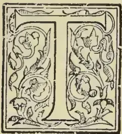

HE subject of our Memoir—universally known among his many friends, and indeed all over Ceylon, as “Jack Tyndall”—was educated at Elizabeth College, Guernsey, and H.E.I.C. Military College, Addiscombe. He came out to India in February 1845, and in the same year crossed over to Ceylon. He lived with Mr. G. S. Duff, Manager of the Oriental Bank, Colombo, for a month, and then took up a post on Sir John Wilson’s estate, Nilambe, as assistant under Mr. Louis Bird, where he remained for three years. Writing of this time, Mr. Tyndall says:—“My bungalow was called Polkavilla. In those days I did not kill myself with work, taking life remarkably easy, and I was much appreciated in consequence. These three years, I may say, were the happiest of my life; and I always look back to them with a feeling of great pleasure, and to my *Peria Durai* and his charming wife, Annie Bird, I attribute most of this by being thrown into their society.” Towards the middle of 1848 things began to look very “blue” and depressing in Ceylon; the value of Coffee depreciated; failures of well-doing and respected firms in Colombo and Kandy shook confidence in the Island’s prosperity, followed a short time after by what was called the “Kandy

Rebellion,” which might have been squashed—says Mr. Tyndall—by a dozen policemen, but led to troops being sent from India, and a foolish panic. “It was about this time that I went down to Galle for the purpose of meeting my sister and brother-in-law who were on their way to Hongkong. The steamer they were coming out by (P. & O., of course, the only line) broke down somewhere on the Alexandria side, and my stay was protracted from day to day in expectation of the Suez steamer’s arrival. (There was no telegraph in those early days.) Bogaars Hotel was then the chief hostelry (“Grand Oriental” not dreamt of), and though the proprietors did their best, the *cuisine* was not quite up to the mark, and with the house full of passengers, supplies fell short and complaints became day by day more aggravating. Amongst the hotel guests awaiting the steamer were Mr. W. W. Cargill, the chief originator of the Oriental Bank Corporation, Limited, and Mr. W. Ayrtton, then a renowned Bombay lawyer, on his way to Calcutta, and who afterwards became M.P. for the Tower Hamlets, and Commissioner for Public Works in the Palmerston-Gladstone Ministry. As I had become very intimate with them, one evening when the conversation had again turned on the wretched food supplied, I said, ‘Do you like snipe? for I know there is some good shooting in the paddy-fields away from

845------------------------------------------------

818THE TROPICAL AGRICULTURIST.[JUNE 1, 1897.

here, and I'll be bound to get some, and we will have a rare snipe curry.' 'By jingo,' said Ayrton, 'nothing could be better, Cargill and I are going out at daybreak to visit Paradua,' (then Lord Elphinstone's Sugar Estate). 'We will drop you by the way at what you may fancy is likely ground, and call for you at the same spot, and bring you back to Galle with, I hope, a good bag of snipe.' To all this I agreed, and having borrowed a gun from one of my Rifle Officer friends, and a good stock of ammunition, I joined my two new friends at gunfire in the morning, and after driving about 6 miles, I saw some very snipy-looking fields, got down, my companions promising to call for me about 11 o'clock on their way back. As I anticipated the birds were numerous, and I had capital sport, bagging altogether some 18 couple. Crossing the fields, in making for the high road, I got into a treacherous bit of green stuff, and before I knew where I was, I was up to my armpits in a kind of quicksand. After great trouble, with the assistance of some natives, I was extricated, nearly losing my gun, but relieved of my trousers and the boot and sock on one foot. In fact, when I regained the high road, I stood in a shirt, a short jacket, and one sock and one boot; and pretty well covered with baked mud over everything. The heat being fearful, I don't know how many *kurumbas* I drank, they were past counting. Presently, Cargill and Ayrton appeared, who nearly fainted with laughter at my appearance; but vowed and swore they would take the snipe in, but as for taking me it was impossible, they couldn't tolerate the idea. However, I rose quite equal to the occasion, and swore that if they didn't take me I would shoot their blooming horse if they attempted to drive off; so at last we came to a compromise, and we drove to Galle. On getting there we found the Australian boat had come in, and the verandah full of passengers. My two friends 'nipt' out like 'long dogs' fearing my presence. I called one of the *Appus* and told him to bring me one of his cloths. Getting this well wrapt round me toga-like, I descended from the trap with the huge bundle of snipe and gun, and at once became the cynosure of all eyes.

"This adventure had such an effect upon Cargill, that he told me he would give me an appointment in the Oriental Bank Corporation in Calcutta, and that I should go by the incoming steamer then overdue. That Ceylon and its planting business was a thing of the past, and he had taken such a fancy to me that he would push my fortune in a better enterprise. Of course, I jumped at the idea, wrote off some wonderful letters to dear old Louis, telling how I was situated, to all of which I in due course received replies congratulating

me on my desertion, and wishing me all sorts of luck, but I felt very guilty when I found myself next day on board the 'Ava,' and leaving all my much-loved friends behind, ignorant of my whereabouts. In due time we arrived at Calcutta, and I was made Deputy Accountant with R400 a month. The position into which I had been hoisted, and my fitness for it, cannot be better described than in the remarks made on the subject of the Oriental Bank Corporation by some scribbling Baboo in the *Englishman*. After praising up the noble building in Tank Square, its Manager, and Sub-manager to the masthead, he proceeded to vent a torrent of abuse on the Accountant, who, he said, called the native clerks under him 'Soors' and various other terms of reproach unfit for publication. He then proceeded to tackle the Deputy Accountant (myself). 'The Deputy Accountant doesn't know the Debit from the Credit side of the Ledger (perfectly true). He has lately purchased an air-gun, with which he destroys pariah dogs from the verandah of this institution, thereby bringing much disgrace on himself and compatriots.' After some eight months of routine work, diversified by trips to the Sundarbands, Budge Budge, and much festivity with old Addiscombe 'pals' at Dum Dum and Barrackpore, with occasional high jinks at Chandernagore, orders came over from Bombay to send somebody up to Tirhoot District to take charge of the produce in two large factories, which had been mortgaged to the Bank, the owner Colonel Pugh having failed. So, as I had some experience in Coffee, it was at once pronounced that I had an intimate knowledge of Indigo, Sugar, and Opium, and they appointed me to this duty, at which I was only too delighted, and a merry time I had in the Mozullerpore District, and fortunately acquitted myself admirably, more by good luck, than good management. A short time after my arrival, I had to render an inventory of all the Factories' belongings. This I did in great style, ending the list with 'Also an Alligator stuffed, 18 feet long, well suited for a Museum.' This fetched the Bombay Directors immensely, especially Harry Gordon. Having sent off to Calcutta a large instalment of produce, I proceeded with my excellent friend, the Manager, for a couple of months' sport in the Terai, where I saw the tiger for the first time, and had a most enjoyable trip. Shortly after my return, I sent off all the remaining produce and returned to Calcutta.

"By that time the Bank authorities had come to the idea that Nature never intended me for a Banker, so they supplied me with a 'Lieet migrare' and 6 months' pay; so I travelled down to Madras, and stopped with my uncle who then was commanding the Queen's Depot at Poona.

846------------------------------------------------

JUNE 1, 1897.]THE TROPICAL AGRICULTURIST.819

mallee, and was afterwards Sheriff of Madras. When there I met a man who had brought over horses from Australia, and after a time we became great friends. He proposed that I should join him in the purchase of a small craft to take back his three grooms to Melbourne, then proceed to his station in Brisbane, and then go to the South Sea Islands to load up with sandalwood, and then sail for China to sell it. Well, whether the 'Bittern,' a schooner of 45 tons, would not sail, or how it was, we were 126 days at sea, the last 22 days living on a wineglass of boiled rice per man (12 all told), but we had plenty of sugar, all other provisions had given out, some being damaged and thrown overboard. After being nearly wrecked in Shark's Bay on the north of Western Australia, we at last dropped our anchor off Freemantle, and there my journey came to an end, as after some weeks, whilst refitting 'the Bittern' which was all gone to pieces, I met my first wife, the daughter of the late Colonial Secretary of Western Australia, Peter Brown. We were married on the 1st August, 1850, and embarked shortly after for Madras; from there after some weeks' stay I returned to Ceylon, and here begins the second episode of my Ceylon life. I may as well add here that my friend and companion on the 'Bittern' got safely to Brisbane, and afterwards sold her in Sydney, and the last of her was on some reef off the New Hebrides. He afterwards went into business in Burma, and died there and a more cheerful and unselfish companion, upright and honourable, never lived than William Birrell. Peace be with him.

"On my return to Ceylon I found temporary employment on the Kelliewatte estate, the property of Donald Steward, afterwards proprietor of Tyspane, Kotmale. Dimbula was then but little planted up. Adjoining Kelliewatte was Bogahawatte, the then property of Jack Bannister, and a most excellent neighbour he was. He afterwards married Miss Thwaites, a very charming woman. On this side of the Dimbula river, there were only in those days the Union estate managed by James Wright, and Niagara partially opened. On the other side leading towards Nuwara Eliya was Wattegodde, then the property of William Fairholme and W. Johnston; beyond that Radella, the property of Fred and Edward Palliser; and farther on Palla Radella the estate of Andrew Hunter, a fine noble fellow he was, and universal favourite with everybody. The Lonisa estate was cleared and planted in this year (1850-51) up to 300 acres by James Wright of the 'Union' for Messrs. Odier. Some 100 acres of the Medecoombra forest had been felled by the Messrs. Worms, but for some reason they never planted it, allowing it to revert to chena; and a great deal of trouble it gave me in 1868 from its

crops of weeds, when this magnificent property came into the hands of my employers, the Ceylon Company, Limited, after they took over Messrs. Worms' properties in 1863-64. I left Kelliewatte in March 1851, and became assistant to Frank Sabonadière on the North Division of Delta. There I remained until May 1852, when I bought Glenloch from Mr. Simson, a Bombay Civil Servant. Previous to this I was on the point of purchasing Pooprassie, Pussellawa, a large acreage, about 200 acres opened, stores, bungalow, &c., &c., for £1500! Messrs. Gray & Co., of Bombay, were either the Proprietors or Agents (I forget which), but I was told to go and settle up matters with old 'Billy Thompson,' their Colombo Agent. Duff advised me to beat him down on his £1,500 figure, and I got as far as offering him £1,450. 'No,' said old Billy T., 'the price is £1,500, and there is a man coming here at 2 o'clock to buy it at that figure, but *I want you to buy it.* Now,' said he, 'I'll lend you the odd £50 to complete the purchase, as I want to do you a good turn, and you will make a fortune out of the place.' But I would not consent to this kind offer on his part. At 2 p.m., Mr. Segar of the hotel came in and stumped up the £1,500 on the spot, and I believe he did make a fortune out of it. I think I gave £4,250 for Glenloch. Estates were then rather a drug in the market, but the prosperity of the Island was at this time (1852) on a fair way to recovery. In 1854 I sold some 380 acres of forest land (60 acres planted) to John Northmore, and left for England in May, returning to Ceylon in February 1855 to Glenloch. Shortly after my return I planted some 40 acres additional to this property. We had admirable neighbours round about us:—my dear old friend, George Shirreff, next door on Helbodde, Frank Sabonadière on Delta, Capt. Reddie at Huntley Lodge, Lyon Fraser on Tavelantenne, and Jack Gordon (afterwards of George Stewart & Co.'s) on Wavendon. Besides these, Maurice Worms on Rothschild, Jabriel living chiefly in Colombo, and the 'Reverend John' on Melfort. Those were rare old days, and we saw much of one another, and nothing could equal the good fellowship which existed between us. Of all these there remain only Jack Gordon, and the 'Reverend John,' I believe, to show for the lot, always excepting John Northmore lately returned from Hatton very much alive. In 1856-57 I bought part of General Fraser's estate, Rangbodde, which I called 'Bluefields' after a Jamaica property of my uncle's. In the same year I was sent for by the Governor, Sir George Anderson, who informed me that he had received instructions from the then Secretary of State (Sir Ronndell Palmer\*) to do all he could to advance

\* More likely Sir John Pakington?—Ed. T. A.

847------------------------------------------------

820THE TROPICAL AGRICULTURIST.[JUNE 1, 1897.

my way in life, either in the C.C.S. or the Rifles. As I thought I was too old for the latter, and indifferent to the former, I declined Sir George's offer with thanks, but at the suggestion of Rawdon Power, then Colonial Secretary, he insisted on my being made J.P. for the Kandyan Districts ! Whilst at home in 1854 I was offered a Commission to go to the Crimea, but my wife would not hear of it. I was also offered the Command of a Tug Steamer to tow vessels up the Dardanelles, whereby a lot of money was made ; so much for chances in that noble profession which I never studied :— 'The art of getting on in the world.' During Sir Henry Ward's time I had the honor of receiving great kindness at his hands, and his last words to me on his leaving Government House to embark for Madras were :— 'That as soon as he could, he would give me the best appointment he could.' Alas ! at the end of another month he was no more, and the Government of India lost a great statesman and an able Governor when he died, and one who would have made a great name in India.

"A short time after this I sold Bluefields, and left for England. In 1864 I came out to Madras and had charge of large properties on the Nilgiris.\* Having on several occasions from my love of sport hazarded shooting trips into the most deadly malarious jungles, from which my health suffered to such an extent that I was only too glad to return to Ceylon, and taking charge of Meddecoombara, which then had 300 acres just planted, and which before I left grew to 1,500. At the end of 1870, I was made one of the Inspectors ("V.A's") of the Company, Mr. William Rollo being the other. I held this office until I left for England in 1884, terribly broken down in health. In 1870 I accompanied H.R.H. the Duke of Edinburgh on a shooting trip to the Trincomalee jungles, and received Sir Hercules Robinson's full approval !—and nothing else. I returned to Glenloch as a residence in 1870, and went home on six months' leave, in 1875, losing my beloved wife, a few days after landing, from bronchitis. I returned to Ceylon with my two daughters in the following November. In 1878 I came home for a few months to marry my present wife who was Miss Laura Darby, of Leap Castle, King's Co. Ireland. By my first wife I had four daughters, one of whom I lost in Ceylon in 1878. By my present wife we have four sons, and a daughter. It is a great wish of mine to return to Ceylon for a couple of months and revisit old scenes. Alas ! I shall find but very few of the friends

\* It was from this quarter that a Colombo businessman got an answer to certain enquiries from Mr. Tyndall, by teleg aph, in a form which became a common saying in Ceylon for many years, namely, "What a world it is, Mr. Venn!"—E.D.

of the olden days, but from the few that are left I do not doubt I should receive a hearty welcome. I can look back to my days of coffee planting in Ceylon with the greatest pleasure, for I enjoyed the life thoroughly."

So closes the neatly written *MISS.* sent us by Mr. Tyndall ; but he added below :— "I daresay I could write a good deal more, but I must be content with a skeleton sketch of one who enjoyed life socially, never had an enemy, but made many true friends. By-the-way I forgot to say that I was dreadfully ill in 1872 and went to Australia "for three months." We well remember that illness : Wm. Grant of Dikoya, very ill, occupied one end of the hospitable bungalow of John Lewis Gordon, in Stuart Place, Colpetty, when John Tyndall, supposed to be dying from abscess in the liver, was brought down from Pussellawa and placed in the opposite wing. His wonderful constitution and the indefatigable nursing of his devoted wife pulled Mr. Tyndall back from the grave, while Mr. Grant sank under his fever attack. Then the great object of all was to prevent Tyndall from realizing that his dear friend Grant had gone, lest it should depress and throw him back. This avoidance and all about the funeral were managed without the remaining patient having any suspicion. We were at Galle when poor Tyndall came down to take steamer to Australia : he was miserably weak and thin, but would insist on sitting about the centre of the big table where some 150 passengers were dining. Each course he had to refuse ; but still the servants pressed until, overcome at last, Tyndall so shouted, "No ! didn't I tell you" as attracted all eyes, but made him free of worry for the rest of the evening. He came back, after three months' absence, quite another man. One of the incidents we recall of his Visiting Agent days was his bringing to Colombo, and specially to the *Observer* Office, the news of Mr. Slorach—a well-known Engineer and Coffee Store Manager—having picked up a magnificent gem on his estate in Haputale, a stone of the finest water which he was bringing to Colombo, and that he (Mr. T.) had seen it. By-and-bye Mr. Slorach turned up, full of the fun, his gem being a big lump of "lime-stone"—considered so valuable on a coffee estate, however, as to well deserve the epithet of "precious stone." After leaving Ceylon finally in 1884, Mr. Tyndall was one of the earliest to open a London Agency for the sale and distribution of Ceylon teas, in conjunction with one or two more well-known Ceylon men, fixing his city headquarters in Billiter House. The Firm was said at one time to have the services of two baronets in securing orders and extending its influence. Then came

848------------------------------------------------

JUNE 1, 1897.]THE TROPICAL AGRICULTURIST.821

a story to Colombo of a strange placard that our old friend had stuck up in the lobby of his office which had brought down a remonstrance and protest from a London policeman on the beat. By this time, Mr. Tyndall had become the "Raconteur" of the *Ceylon Observer*, and many a passage in his planting, hunting and roving days has he; from time to time, described in our columns. He also forwarded to us the printed "placard" which had been the subject of remark among his friends and accompanied it with the following:—

"The enclosed may be of use to you, so I lose no time in sending it out. No Policeman ever appeared here, except to ask for a Christmas Box. I am on the best of terms with the Force. You will find this admirable policy yourself.—Yours sincerely,

JOHN TYNDALL."

The placard itself ran as follows:—

**NOTICE.**

**All Beggars and Pedlars entering this Office will be shot dead.**

Mr. Tyndall continued to attend to his London business up to a few months ago when he was laid aside by severe illness, from which, again, recovery was deemed very unlikely, if not impossible; but in a letter from him dated 6th May in the same clear neat hand, the writer was able to announce convalescence—after passing through severe influenza, pleurisy, &c—though he naively added:—"I naturally find that I don't pick up my strength as I did when I was forty years younger. However, with the constitution of a Wilson's "Bungalow buffalo, and a heart as young as a "two-year old, I hope to pull along a bit yet. I "am just going down to my brother-in-law's, at "Castle Fraser, Aberdeenshire, and with bracing "country air and the wine of the country, I hope "to be 'o'er all the ills of life, victorious'—immediately if not quicker"—and he winds up by hoping, very shortly, to send a contribution from "Raconteur" for the *Observer*.

Well past the allotted "three-score-and-ten," it will be judged that Mr. John Tyndall is a wonderful specimen of the early Pioneer Planter and Sportsman in Ceylon. That his vigour and hearty good spirits may long continue will be the wish of his many friends in Lanka as of all readers of the *Tropical Agriculturist* and *Ceylon Observer*.

**Agricultural Pests:**

WITH METHODS OF PREVENTION.

BY MISS E. A. ORMEROD,

(LATE CONSULTING ENTOMOLOGIST TO THE ROYAL AGRICULTURAL SOCIETY OF ENGLAND).

VI.

ORCHARD PESTS.

Attack of apple sawfly may be taken as an example of how easy it is, without observation, for an infestation which bears much resemblance to some other kind to escape requisite notice, *i.e.*, such notice as causes proper measures to be taken, instead of trouble and money being spent to no purpose on applications suited to another attack of which the chrysalis stage is passed in a different locality. Apple sawfly presence has long been known in this country, but so far as I am aware has been little observed, and it was not until the summer of 1891 that I had an opportunity of studying the characteristics. In many respects the attack of those caterpillars to the apple fruit much resembles that of the too well-known codlin moth caterpillars. It may, however, be certainly distinguished by the sawfly caterpillar having a greater number of sucker-feet beneath the body, that is, six pairs which, with the pair at the end of the tail, and the three pairs of claw-feet, make in all twenty. There is the further characteristic of the caterpillars possessing a most unpleasant bug-like smell. Thus they may be distinguished from the codlin moth caterpillar, the larva of the *Carpocapsa pomonella*.

With regard to methods of prevention. In the case of either of the attacks it is desirable to gather up and destroy prematurely fallen apples, which from their bored and injured state show that they have fallen from caterpillar presence within, and may, therefore, very likely be then infested. But beyond this, the chief means of prevention are on quite different principles. The codlin moth caterpillar (to a great extent), after leaving the little apples, creeps up the trees, and changes to the chrysalis state in crevices of the bark. The sawfly caterpillar, on the contrary, goes down into the ground to form its cocoons. It is, therefore, needless to point out that any amount of scraping, washing, and cleaning the bark is merely money thrown away, if all the while the enemies against whom these operations are directed are lying from two to six inches under the surface of the neighbouring ground.

The turnip sawfly (*Athalia spinarum*) sometimes causes overwhelming mischief; but this is not a regular yearly attack, by reason of rotation of crops, and because in regular course of autumn cultivation the cocoons are thrown up, or buried beneath their natural resting-places. The progress of the injury is very rapid. The bright orange sawflies lay their eggs in slits sown in the leaves. One female will lay over two hundred eggs. The eggs hatch in about five days; the time varies with the state of the weather; if warm and favourable, they will hatch sooner. The twenty two-footed grubs are greenish at first, then black, then slaty, and are full-grown in about three weeks, during which time they eat voraciously. They go down into the ground to change, and the new brood of sawflies in summer comes up, ready to lay eggs and start a new attack in about three weeks. With this attack we can, as with most others, do something by ensuring vigorous plant growth; but all methods that have been found useful to check attack will be found to be based on the special habits of the caterpillar. During its three weeks' life it changes its skin about once a week, and to manage this it must hold fast by means of the pair of sucker-feet at the end of its tail, to a leaf or stem, so as to have something to drag against in the struggle to get free of its cast coat. If it cannot do this it dies. Also it has only the

849------------------------------------------------

822THE TROPICAL AGRICULTURIST.[JUNE 1, 1897.

power of spinning a thread to let itself down, or to come home again by in passing alarms, during the first few days of its life. After that, if it falls to the ground, it can only return by crawling.

The remedies which are chiefly used all turn directly on these habits. The plan of driving sheep through an infested field, or of brushing the plants with boughs, either carried by hand or fixed on a scullery or, again of dragging a cart-robe over the plants, all turn on endeavouring to make the caterpillars loose their hold, which we see amounts, with a large proportion, to the same thing as killing them outright.

As in the case of turnip flea beetle, various kinds of dressings may be of use, such as lime, &c., if applied so that they stick to the insect and leafage; and also all measures to keep the earth moist enough to run on a good crop, and keep the sawfly from enjoyment of the full light, heat, and drought, in which it delights, will be of service.

There is one other kind to be noticed, because it differs greatly from those just named in its habits. It is the corn sawfly (*Cephus pygmaeus*) which feeds more especially within the wheat stalks; and its presence may be partially known by the blasted ear. This whitish maggot has only the rudiments of the three pairs of claw-feet; and when its work of mischief to us is done, it rests for the winter in a silken case, very near ground level, in the sawn through stalk. To prevent attack recurring, it is a perfect treatment to gather together the infested stubble and burn it. This is an exception to the usual form of life and place of change of sawfly larvae, and therefore must be treated differently; but there is the same principle to be followed as with caterpillars and chrysalids of other kinds of sawflies, and also of butterflies and moths; that is, firstly, to find out where they pass the winter, and then to turn them out from their shelters.

The amount of injury caused by sawfly caterpillars, and especially from time to time by those of the turnip sawfly, is so serious that a great deal has been written (of more or less use) on the subject; but in the short notes of the five kinds of attack mentioned above, it will be seen that whether as infestors of the forest tree or the garden fruit bush; as feeders within the firm fruit of the apple, or on the succulent leaves of the turnip, or carrying on their injurious work hidden within the growing wheat-straw; or, again, whether the larvae or caterpillars are possessed of 22 or 20 feet, or (for practical purposes) of no feet at all, there is one method of prevention applicable to them all—to turn out the cocoons and destroy them.

The families of the parasite wasp-flies are important to us, as a means of keeping the increase of other insects in check. One division of these is that of the Ichneumon flies. These are much like the Ichneumon parasite of the corn sawfly. They are lightly-made insects, with a longish body and abdomen; long legs; a small head with long horns, often having a ring of white on them; and an ovipositor, sometimes short, sometimes long, and often permanently extended like a large and long sting. With this they insert their eggs, for the most part into the grubs of other insects, but sometimes into their eggs, and occasionally into the chrysalids; and those kinds furnished with long ovipositors pierce with them through bark or solid wood, and thus insert their eggs into beetle grubs, or whatever their selected victim may be, which, although out of sight, their instinct tells them is within, ready to act as food to their maggots; and thus they give us help which nothing else affords.

In the case of corn-ears which are infested by aphides, many of the aphides, instead of being of the natural colour, green or yellow, brown or other tints, will be seen to be of a rich, brown, or almost black. These have been killed by the ichneumon. The female of the *Aphidius* inserts a single egg into abdomen of many aphides, one after the other, and the maggot, which hatches from the egg, consumes all that is eatable, until its life's end is reduced to a state which will not carry

on life any longer. Its uninvited guest goes through its changes within to an ichneumon fly, and presently quits the harned skin, which is distinguished, as just observed by its colour. Sometimes every aphid on a corn-ear is thus destroyed, and there are other kinds of allied parasite flies which help us similarly.

One of the forms of attack which is the plainest to be seen is that of the cabbage ichneumon fly. This little fly lays a vast number of eggs, sometimes more than sixty, in one caterpillar of the large cabbage butterfly. Here the maggots hatch and feed, avoiding by instinct such parts as the consumption of would cause a fatal loss, to the host, and, consequently, to the guest. The containing caterpillar—the live food, that is—meanwhile feeds and grows, not only until it attains its full size, but it may often be known from uninfested ones by its swollen appearance. It has not, however, power to turn to the chrysalis state: when the time for this comes, the maggots within pierce its skin, and each one spius for itself a small cocoon of yellow silk, in which it goes through its changes to the complete insect by the side of the dead body of the exhausted caterpillar. These little ichneumon flies are one of our protections against great increase of the caterpillars, and the small silken cocoons, which are easily seen when they lie together in masses on cabbage leaves, should never be destroyed.

Another kind of small ichneumon fly (*Hemiteles melanarius*), preys in the same way, by means of its maggots, inside the chrysalids of the greenveined cabbage butterfly. These infested chrysalids may be known by their dark brown colour, and should never be destroyed, as each one is a case—package, so to say—full of checks to a troublesome crop preyer.

All these ichneumon flies are very much alike in shape, and their wings are much veined.

The parasite wasp flies of the two other families, which are most important to us (*Chalcididae* and *Proctotrupidae*), are, for the most part, very small, with almost, or quite, veinless wings. The *Pteromalus puparum* is one of the kinds which destroys chrysalids of the large and small cabbage butterflies. This very small fly is stated to lay its eggs on the outside of the chrysalis, as soon as it has cast off its caterpillar skin, and is still soft and tender. The maggots from these eggs soon hatch and eat into the chrysalis, and sometimes as many as from two hundred to three hundred live thus in one chrysalis, where they change to the perfect parasite fly, and come out soon in summer to continue the useful work. In winter some remain in the chrysalis.

The use of these *Pteromali* is well shown by their work in North America, in checking increase of cabbage butterfly.

The small white cabbage butterfly made its appearance (or, at least, was first observed there) at Quebec about 1859, and gradually spread and caused much damage, but, for several years no parasite appeared to check it. In 1871—that is, about twelve years after the appearance of the butterfly—it was announced that the parasite we are now speaking of had appeared: the British parasite had followed the British butterfly, and was doing its appointed work. In 1875 it (the parasite) had become quite common in the State of New York; and later on it was observed to be still on the increase.

The great benefit gained by natural helpers of this kind has caused it to be suggested that we should rear them. This matter seems rather hard to manage; also we do not often benefit much by upsetting the regular balance appointed; but it is often in our power to follow up a hint of this kind, by remembering that when an out-of-the-way insect enemy has appeared, we may very likely be able also to introduce its regular check and leave the results to follow in due course. Sometimes, also a new infestation may be traced home to the country from which it came by means of its accompanying parasites. In the memorable appearance of the Hessian fly in this country, we had no clue to lead us to the

850------------------------------------------------

JUNE 1, 1897.]THE TROPICAL AGRICULTURIST.823

knowledge of whether it had come from America or from the Continent of Europe, until examination of its parasites showed that, with the exception of one kind common to both continents, the others were not American, but Russian.

The parasite flies of wheat midge show the shape of two other kinds of these minute flies. The *Macroglenes*, of the family of the *Chalcididæ*, is supposed, from its habits, to destroy the midge-grubs; and the *Platyyaster*, of the family of the *Proctotrupidæ*, has been watched in its operations of laying one egg in each midge-grub it attacks.

There are other kinds of parasites of nearly-allied kinds, which we have not space to enter on here; but the general principle of preserving a useful amount of them is so important that, though it is a very difficult matter to protect them, it is as well to be careful about setting on foot regular measures calculated to lessen their numbers. It may be doubted whether, in regard to help from parasitic insects, we do not suffer, rather than benefit, as much as is supposed, by great encouragement of birds. We cannot tell accurately what amount of the small parasite flies are taken as bird food, for their small bodies are probably soon digested; but it appears reasonable to suppose that as we know some birds take them, others also do so, and in this way do the reserve of helping. I would not for an instant suggest clearing away birds; but it would be well to bear in mind that the works of creation are founded on a principle of order, and of relationship of one part to another; and if we use such power as we may have to alter any detail, we are likely to suffer. We have altered the amount of food for insects by the enormous necessary increase in food crops; but it appears to me that to try to keep these insects in check by calling in birth-help in legions—which grub up the plants to be protected, and eat up the eaters of the insect foes, and likewise (when insect food fails the many mouths) betake themselves to the wheat-ears—is very much like bringing in the rats to drive out the mice.

The families of wasps, bees, and ants are included in another great section of this order, called the *aculeata*, because they, or most of them, are furnished with a sting, much resembling in appearance and pain of application a needle, known in Latin as *Acus*. These have been written on for so many years that we need not enter on them at length; but it is well to observe that the hive bees, the social wasps, and social ants, are remarkable for much of the work of the community being carried on neither by the males, nor as a regular thing by the large females, which are commonly known as queens, but by a large body of abortive females, or neuters, commonly known as "workers."

In the case of the Queen bee, we have a clear instance of the way in which different food and accommodation acts in altering, or rather, in fully developing the powers; and gain matter for thought, at least, from the fact that a precisely contrary treatment, such as compressing, starving, chilling, &c., brought about by common farming measures, will not (or probably may not) be without effect in stunting the growth and otherwise lessening attack.

---

#### PRODUCTS OF THE CITRUS TRIBE IN SICILY.

Reporting on the trade of Sicily, Mr. E. M. de Garston gives some interesting facts connected with the staple products, such as essence of Lemon and other produce of the Citrus family, the different trades dealing in these being of a very interesting character. The Lemon essence industry is a very important one in Sicily, where the abundance of raw material naturally renders the manufacture of the so-called oils of Lemon and Orange a very profitable undertaking; 37,941 kilos. of these essential oils were shipped during the year 1895, over 32,000 kilos. of which was taken by Great Britain,

Oil or essence of Lemon is obtained by pressing or bursting the oil-glands in the rind of the fruit, and this is done either by hand or by machinery; that obtained by the first process being by far the best in quality. In Palermo the essence is all pressed at night. The workmen are supplied with a certain quantity of rinds, divided into equal portions to each between so many gangs, each under the supervision of a foreman. Each man holds two sponges between the fingers of the left hand, and works the rind about in the best way to fracture the oil-vessels. This is caught in the sponges, which, when sufficiently charged with oil, are squeezed into an earthenware receiver; a considerable proportion of the product thus obtained consists of ordinary Lemon-juice left adhering to the rind, together with more or less of the Lemon-pulp. This, however being heavier than the essence, sinks to the bottom of the receptacle, and the essence remains on the top. As the first of these receivers becomes full, the workman blows the floating oil into the second jar through a species of channel formed in the side of the first, and when no more of the essential oil is transferable by blowing, the remaining essence which may yet be floating in the original receiver is carefully absorbed with a sponge, and thence squeezed into the second receptacle, which only contains pure essence.

The remainder, namely, the essential oil which may still have been left in the rinds, is by some manufacturers extracted by distillation, and forms a second quality of essence. By others, again, it is expressed by subjecting the partially exhausted rinds to mechanical pressure in bags. To ascertain, however, if the obtainable essence has been thoroughly squeezed out by the original hand process, the rinds are tested by a foreman, who presses the supposed exhausted peel into the flame of a candle, when, if any combustion is visible, it shows that the pressers have not done their work properly. The essence obtained by the foregoing process undergoes no further manipulation beyond being collected, and after careful filtration through filter-paper it is ready for shipment in the usual coppers of 100, 50, 25, 12, 5, and 2 lb. each. When freshly expressed it has a delicious smell of the fruit, which is greatly injured by distillation.

From the leaves, flowers, and fruits of the several species and varieties of the Citrus genus a large variety of products is obtained. The blossoms in their natural state serve to flavour drinks and sweetmeats. When distilled they yield two very much esteemed products, namely, orange flower-water and an essential oil known as Neroli. Moreover, when candied, they form a delicious sweet, much in vogue in some regions of Sicily. The orange flower-water is made of equal portions in weight of blossom and water, which yield on an average about one-fifth of the combined weight of water and flowers. Notwithstanding the abundance and excellent quality of the raw material, so to speak, still the best manufactories of Orange flower-water are to be found outside Italy. As to candied sweetmeat concocted out of the blossoms, it is doubtless more wholesome as well as more palatable than many other productions of the confectioner's art. The flowers in the first place are selected with care, weighed, immersed in cold water for twenty-four hours, after which they are dipped simply in cold water, re washed in cold, and finally spread out on a linen cloth or sheet to dry. When completely dry, they are laid out in low, wide dishes, each flower separate from its fellow, and are then sprinkled with double their weight in sugar, administered at intervals during a period of eight days or thereabouts. Moreover, during the same period the flowers should be frequently moved and kept in the shade; at the expiration of this time they are once more placed in the sun, whose rays dry them completely.

The raw juices of all the different varieties of the species of Citrus, except that of the Bergamot, are available for commerce; but the juice of the Lemon is the more highly prized, on account of the greater amount of acidity it contains. But the raw juice,

851------------------------------------------------

824THE TROPICAL AGRICULTURIST.[JUNE 1, 1897.

"Agro-crudo," however rich in acid particles, can never vie in this respect with the same juice in a concentrated form with the "Agro-cotto," in which form it enjoys besides a great superiority over uncondensed juice in durability and in reduction of volume. This concentrated juice is prepared in the following manner. It is first of all clarified by being left to stand, then boiled in large cauldrons of tinned copper, one-third full, and the boiling liquid frequently stirred with an iron rod having its head wrapped in common canvas, or in rags which have thus to keep the bottom of the boiler clear of all sediment; those necessary additions to the boiling liquid which the constant evaporation of the aqueous particles renders expedient are supplied by smaller supplementary boilers in which the liquid is kept sufficiently hot to hinder any interruption in the ebullition of the juice contained in the large vessels. When the required density is obtained, a point which is easily ascertained through the medium of the citrometer, it is poured into vats to cool, and finally drawn off through ordinary funnels into casks.

The adulteration of the acid or juice is facilitated by the ready absorption of certain well-known and easily-obtainable substances, which increase the weight of the acid-juice when concentrated. The most commonly employed substances for the purpose of adulteration are tartaric acid, chloride of sodium, and sulphuric acid. The methods employed in Sicily in order to detect the cheat, if not so scientific and perhaps less accurate than those in use in England, are at least inexpensive, simple, and sufficiently effective. Citrate of lime, which seems to be the safest form in which the acid principle can be conveyed, and is the substance whence the citric acid is directly manufactured, is now prepared to some extent in Italy, although up to within the last quarter of a century this preliminary process was considered impracticable from a remunerative point of view. A very well known authority on the subject laments in forcible terms the remissness and ignorance of his countrymen in Sicily, which alone permits foreigners to reap that harvest which Italians neglect to gather and garner for themselves. The objections raised in bygone days, from the supposed impossibility of procuring at home a sufficient quantity of proper chalk, have been shown to be utterly mistaken with respect to the production of citrate of lime. Objections of a similar nature are now mooted with regard to the production of citric acid, and have been partially disproved already by the establishment of a British firm in Messina, which has undertaken successfully the manufacture of citric acid in conjunction with tartaric acid.

With regard to the essential oil industry in Sicily, it is said to be both widespread and prosperous. Essence producers and exporters are numerous. The essential oils are derived from all varieties of the Citrus group, though they differ considerably in quality, that expressed from Bergamot being the best, and then follow the Lemon, Orange, and Citron, the relative value of the essence being in inverse order to that of the juices.

The mode of payment of the workmen engaged in expressing the essential oils is peculiar. Instead of being paid at a fixed rate per day or hour, or for the weight or number of rinds expressed, he is remunerated according to the amount of essence he succeeds in extracting out of a given weight of rinds.

It is stated that, though the bulk of the oil produced in, and exported from, Sicily is quite pure, yet it is sometimes adulterated with other essential oils, and sometimes with turpentine, or even with resins. The occurrence of these adulterations seems to have discredited and unsettled the market value, so that it became necessary, or at least expedient, in some cases to submit it to analytical test before exportation. Owing to these precautions, the character for genuineness of the Sicilian essential oils has been rodeemed, or rather maintained.—*John R. Jackson, New.—Gardeners' Chronicle.*

## PLANTING NOTES.

FRUIT FROM THE CAPE.—Since our last report the "fruit ships" have arrived from the Cape; the first, the "Seot" bringing 55 boxes of Pears and 294 boxes of white Grapes; the second, the *Avondale*, bringing in 559 boxes of white Grapes. We are informed that, with the exception of 30 boxes, these consignments turned out in good condition, and realised fair prices. The faulty boxes above noted were very over-ripe, and hardly saleable.—*Gardeners' Chronicle.*

LONGEVITY OF THE LARCH.—The *Chronique Agricole du Canton de Vaud* contains various records concerning the age attained in Switzerland by the Larch. There are at Mayens-de-Sion two old Larches which measure from 20 to 22 feet round the base, and 65 feet in height. Both are referred to in a plan of the grounds dated 1546, where they are mentioned as "the two Larches before the house." They were then a good age, and now are 351 years older. These years do not seem to have weakened them, as they are in full vigour. Another Larch is found on the Alp de Torrent, near Albinen; it is called the boundary-tree, as every hundred years the people of Albinen and Louécheles-Bains go out to it to re-mark the boundary. On its trunk a sort of niche has been cut in the bark, and on the exposed wood are engraven the dates from 1400 to 1700. Larch wood has considerable durability; the above journal mentions a châtelet at Louéche-les-Bains where the piece of wood which supports the ceiling is of Larch, and bears the date 1536.—*Gardeners' Chronicle.*

INSECT POLICE.—We take the following extract from an article of Mr. R. C. Perkins, published in a recent number of *Nature*, p. 499:—"The first importation of Coccinellidæ to destroy hordes of scale-insect in the Hawaiian Islands was made in 1890, when *Vedalia cardinalis* Muls, a native of Australia, was sent over by Mr. Albert Koebele. At that time many trees were in a deplorable condition from the attacks of *Iceya*, Monkey-pod trees being particularly badly infested—so much so that they were being largely cut down as the only recourse. The *Vedalia* was a complete success; it became perfectly naturalised, increased prodigiously for a time, practically cleared the trees, and then, as the *Iceya* became comparatively scarce, decreased in numbers, while at the present time it is evident that the number of the scale and its destroyer has arrived at a fixed proportion. Previously to its introduction here the same lady-bird had done excellent service in the fruit orchards of Lower California.... In many parts of the islands the Bananas and Palm-trees have been severely attacked by the larva of a species of *Pyralidina*. There is little doubt that in course of time this plague will be entirely kept under by a fine Chalcid (*Chalcis obscurata*, Walk.), introduced from China and Japan, which has already multiplied enormously at the expense of these caterpillars—so much so, indeed, that in many localities the trees have now entirely recovered. Again, within the last few years a Lamellicorn beetle (*Adoretus nmbrosus*) has been introduced from Japan. This insect speedily multiplied prodigiously, and soon destroyed nearly every Rose-tree in Honolulu, and subsequently attacked the foliage of many other trees. The cultivation of Roses—once a feature of the city—became impossible; while a remedy seemed hopeless. One day, however, Mr. Koebele discovered a parasitic fungus, and by cultivation of this, and infecting healthy beetles, soon spread it far and wide. Whether the fungus will prove entirely effective is not at present certain, but in any case it will be a most useful aid. The writer has seen the ground under trees, which were attacked literally strewn with dead beetles—all killed by the fungus—and beneath the surface of the soil the larvæ had likewise perished. It is at least certain, therefore, that myriads of the beetles were destroyed very shortly after the fungus was spread around by the individuals that had been infected."—*Gardeners' Chronicle.*

852------------------------------------------------

JUNE 1, 1897.]THE TROPICAL AGRICULTURIST.825THE MAYFIELD (DIMBULA) TEA CO. OF CEYLON, LIMITED.

Capital £100,000, in 5,000 6 per cent cumulative preference shares of £10 each (which have priority as to capital and dividend), and 5,000 ordinary shares of £10 each.

Present issue—3,300 per cent preference shares, and 3,300 ordinary shares of £10 each.

The purchase of the following tea estates has been arranged, viz.:—Mayfield and Chalmers, situated in the Dimbula district, and the Nicholaoya group, situated in the Matale district, comprising the following acreages and particulars:—

<table border="1">
<thead>
<tr>
<th>Estates.</th>
<th>Tea over five years.</th>
<th>Tea over three years.</th>
<th>Tea not yet in bearing.</th>
</tr>
</thead>
<tbody>
<tr>
<td>Mayfield ..</td>
<td>404 Acres.</td>
<td>12 Acres.</td>
<td>— Acres.</td>
</tr>
<tr>
<td>Chalmers ..</td>
<td>260 "</td>
<td>—</td>
<td>30 "</td>
</tr>
<tr>
<td>Nicholaoya ..</td>
<td>312 "</td>
<td>87 "</td>
<td>48 "</td>
</tr>
<tr>
<td></td>
<td>676 "</td>
<td>99 "</td>
<td>78 "</td>
</tr>
<tr>
<th>Estates.</th>
<th>Tea total.</th>
<th>Cardamoms.</th>
<th>Timber plauted.</th>
</tr>
<tr>
<td>Mayfield ..</td>
<td>416 Acres.</td>
<td>—</td>
<td>36 Acres.</td>
</tr>
<tr>
<td>Chalmers ..</td>
<td>290 "</td>
<td>—</td>
<td>—</td>
</tr>
<tr>
<td>Nicholaoya ..</td>
<td>447 "</td>
<td>15 Acres.</td>
<td>—</td>
</tr>
<tr>
<td></td>
<td>1,153 "</td>
<td>15 "</td>
<td>36 Acres.</td>
</tr>
<tr>
<th>Estates.</th>
<th>Forest.</th>
<th>Chena and Patana.</th>
<th>Total acres of estates.</th>
</tr>
<tr>
<td>Mayfield ..</td>
<td>88 Acres.</td>
<td>36 Acres.</td>
<td>576 Acres.</td>
</tr>
<tr>
<td>Chalmers ..</td>
<td>10 "</td>
<td>57 "</td>
<td>357 "</td>
</tr>
<tr>
<td>Nicholaoya ..</td>
<td>400 "</td>
<td>409 "</td>
<td>1,271 "</td>
</tr>
<tr>
<td></td>
<td>498 "</td>
<td>502 "</td>
<td>2,204 "</td>
</tr>
</tbody>
</table>

Mayfield and Chalmers are taken over as from the 1st of January last, and Nicholaoya from the 1st of July, 1896, the Company taking the benefit of the produce from these respective dates. The production of these estates for the current season is estimated at not less than 421,000 lb., which with the cardamoms may be expected to yield a net revenue of £5,450. As, however, there are 177 acres of tea not yet in full bearing, and as there is still a considerable area available for the planting of tea, the out-turn should be considerably increased year by year. The Company will acquire the three estates, machinery, and buildings for the sum of £63,000, the price fixed by the Vendor, which is considered not an excessive price, considering the good reputation of the estates. After payment of the purchase-money there will be left the sufficient sum of £3,000 for the general purposes of the Company. The Vendor pays all expenses of every description down to allotment. Taking the value of the uncultivated area and cardamoms at £5 per acre, and deducting the £3,000 for general purposes, the purchase price of the area under tea works out at about £50 per acre.

EDERAPOLLA TEA COMPANY OF CEYLON, LIMITED.

The following is from the report of the board of directors, to be presented to the shareholders at their first annual ordinary meeting to be held at the offices of the company, 16, Philpot Lane, E.C., on the 13th inst:—

The directors have pleasure in submitting to the shareholders the report and accounts of the company for the year ending December 31, 1896. The company was incorporated on November 29, 1895, and the prospectus issued on December 3, when the applications received for shares were far in excess of the number offered for public subscription.

Since the company acquired Ederapolla and Ardross Estates sundry native lands have been purchased, and the total acreage is now as follows:—Tea in full bearing, 471; partial bearing, 81; not in bearing, 48; clearings, 87½; Jungle, 189; Paddy Field, 7; Paddy, and Scrub, 10½; total, 894. The total

crop secured amounted to 358,324 lb. of tea, being 48,324 lb. over the estimate, and the average yield of the two estates was 640 lb. per acre. On Ardross 11 acres and on Ederapolla 33½ acres of jungle have been felled and burnt off for planting this year, and on both estates there are fine nurseries with abundance of plants for the company's requirements. The directors have had very satisfactory reports on the estates from Mr. Thomas Smith, of Barnagalla, who in his report of January 26 last, writes as follows:—"I consider the estates throughout the whole year have been worked to the very best advantage under the able management of Mr. Watt," and it affords the directors pleasure to endorse and confirm the opinion thus expressed of the services of their general manager. The company's net profit for the year amounts to £2,795 15s 10d; and this it is proposed to appropriate as follows:—Amount as above, £2,795 15s 10d; interim dividend of 5 per cent paid in September, £1,100. It is now proposed to pay a final dividend of 5 per cent (free of income tax,) making 10 per cent for the year, £1,100, and to write off half the preliminary expenses, £300 8s 1d; leaving a balance to carry forward of £295 7s 9d. In accordance with the articles of association, Mr. G. W. Paive retires from the board, and, being eligible, offers himself for re-election. Messrs. Cape and Dalgleish also offer themselves for re-election as auditors.—*H. and C. Mail*, April 2.

BANDARAPOLA CEYLON COMPANY, LIMITED.

The following is from the report of the board of directors, to be presented to the shareholders at their fourth annual ordinary meeting, to be held at the offices of the company on Wednesday, 14th inst:—

The directors have now the pleasure to submit to the shareholders the accounts and balance-sheet for the year ending December 31, 1896.

The net profits for the year in question amount to £2,438 3s 10d, to which has to be added £216 19s 4d brought forward from 1895 accounts, giving a total sum to be dealt with of £2,655 3s. An interim dividend of 5 per cent (free of income tax) on £16,000 paid in September, amounted to £800. It is now proposed to pay a final dividend of 5 per cent (also free of income tax) on £18,500, making 10 per cent for the year absorbing £925; and to write off for depreciation on old buildings and machinery £500; leaving a balance to carry forward to next account of £430 3s 2d.

During the past season the crops secured from the company's property amounted to 346,150 lb. of made tea and 142 cwt. 3 qr. 13 lb. of cocoa, as against 182,512 lb. made tea and 80 cwt. 3 qr. 13 lb. cocoa for the previous year, an increase which the directors considered extremely satisfactory. The price realised for the tea shows a slight falling off as compare with 1895, being 6 432d, as against 6 788d per lb. The old tea on Baudarapola, 286 acres, gave 867 lb per acre, and on the 98 acres of Muendeniya land, only three years old, and raised principally from seed at stake, has given 718 lb. per acre, a phenomenal return, and the 1895 planting promises equally well. For the current season the directors have sanctioned a further clearing of about 50 acres to be planted in tea, and this is being proceeded with by the Ceylon manager. During the severe rain storms experienced in the latter part of 1896 the foundations of the wheel-pit at the factory were carried away, the wheel-pit subsiding, and the wheel being considerably damaged. The directors are glad to report, however, that, through the energy and promptness of the Ceylon manager, the damage was to a great extent minimised, and they take this opportunity of recording their appreciation of the energy and capacity for overcoming difficulties displayed by Mr. Anderson under very trying circumstances. They are also indebted to the managers of neighbouring estates for their kind assistance on that occasion. All the damage has been repaired, and the erection of an engine and boiler

105

853------------------------------------------------

828THE TROPICAL AGRICULTURIST.[JUNE 1, 1897]

tasters, and has been sold at full market prices. It need scarcely be said that the experiment was due to British enterprise and capital.

#### AND IN VARIOUS COUNTRIES.

Much the same thing is going on in Johore, but it is obvious that such undertakings must feel their way warily. Natal has not yet entered the market as a tea-producing colony; but plauting on a small scale has been carried on there for some years, the output, which is of good strength and flavour, being locally disposed of. From Java to Jamaica is a far cry; but while most persons have heard of, if not tasted, the tea-grown in the former, few are aware that the plant once evinced a considerable liking for the soil and climate of the West India island. Experiments on an extensive scale are now being carried out in Brazil, the planters of which country are said to be fully convinced that tea can be profitably grown there. But the suggestion appears to have been first made, and the necessary capital found, by British residents, who have long had the subject under consideration, and who appear to have satisfied themselves of the hopefulness of the prospect. Both soil and climate are regarded as exceptionally favourable, as are the general conditions and cost of labour—the latter, indeed, being commonly the crux of the whole question. In their mere "tea-producing qualities" the provinces of Rio de Janeiro and Sao Paulo are spoken of as being fully equal to Ceylon, and satisfactory results have already been obtained from some of the plantations.

#### IN CALIFORNIA.

But the most interesting, and not perhaps the least promising, of recent trials in this direction are those which have for some time been in progress in South Carolina, under the auspices of the United States Department of Agriculture. Probably the first tea-bush grown in America was planted near Charleston by M. Michaux, a French botanist, in 1804. The failures to develop from this starting-point anything in the shape of a settled industry have been hitherto almost continuous. But there nevertheless exists a confident belief in America that all the tea required there will ultimately be produced in that country. Every fresh effort is regarded with enthusiasm, though the main hope seems to be based on the fact that the flora of the chief tea-producing countries of the East largely finds its counterpart in South Carolina. The tea grown there has proved of good flavour, but somewhat lacking in the "body" to which the wide use of Indian tea has accustomed ourselves. This, however, is considered to be less due to climate or soil than to a defective method of treating the leaf during the manufacturing stages. The necessary tea-seed is still imported from Asia, and the American Consuls at the Eastern tea ports are instructed to spare no efforts to secure the best that can be obtained. All these operations, therefore, can only be regarded as still occupying the experimental stage; and the same must be said of many successful trials of the same kind now going forward in Australia, Tasmania, and New Zealand.

#### THE LABOUR QUESTION.

For, to quote a local opinion, "there is labour to bestow on such a cultivation"—that is to say, no labour at the low rates of payment which only could be offered. And this is the governing condition of the entire question. Considerably more than a million native labourers are employed in the tea-growing industry of India and Ceylon, the pay of a coolie being about 8d. a day. Women and children receive from 4d. to 6d. The rates are equally low in China and Japan. It is obvious that European—still less British—labour cannot be diverted to tea-growing on any soil with the smallest prospect of financial success. The work of planting and manufacturing is neither heavy nor exhausting, and may be regarded as almost the natural heritage of the comparatively weak races engaged in it. Anglo-Saxon muscle and energy must find an outlet in other directions. Whether the Russians will succeed with their imported Chinese labour is an interesting question which time alone can answer. A new taste may ultimately prevail in regard to the flavour

of tea, and more delicate growths, yielding perhaps less body, again come into fashion. Commercial enterprise can be trusted to note any such change, but the close of the nineteenth century sees the tea industry of British India and Ceylon still steadily progressing.—*London Standard*.

#### ECHOES OF SCIENCE.

The exploitation of the "Kiekxia Africana," a rubber-bearing tree, promises to be important for the West African Colonies. At Lagos the milky juice evaporated gives a superior quality of rubber. All the colonies of the Gulf of Guinea possess this tree.

White mustard has been tried as a forage for cattle in Tunisia, and found to do well. It is relished by cattle, and contains a good deal of nourishment (88.2 per cent of water, 2.6 of protein matter, 0.41 fatty matter, 2.4 matter soluble in alcohol, 1.7 of starch, and 2.4 of cellulose with mineral matters).

With reference to "Manna," Mr. Timothy, of Tooting College, cites a passage in Daniele Bartoli's "Asia," where he describes the island of Ormuz as a barren waste without even thorns or birds—"but every morning a dew falls, which congeals into grains, has a very sweet taste, and is called "Manna." The tamarisk (*manifera*) grows in Arabia on sandy soils and brackish shores; therefore, Mr. Timothy thinks the manna of Ormuz may have been blown to the island from Oman, on the eastern shore of Arabia, across the Persian Gulf. This appears to confirm the belief that manna comes from the tamarisk, and is not a lichen.

#### PRODUCE AND PLANTING.

CHINA AND ITS TEA MANUFACTURE.—Every rumour about the awakening of the Chinese to the task of improving their position in the tea markets of the world naturally attracts attention in India and Ceylon. Is China about to start on a fresh tack, and use those imitative faculties with which the nation is credited?

The tea market has been won by Indian and Ceylon planters, and it must be held against all comers. There is undoubtedly a movement in China towards putting the commercial house in order, but the Chinese move slowly, and every day lost to them strengthens the hands of those who now have possession of the tea market.

BLENDED TEA.—We pointed out in a recent issue how expert tea blending has become a powerful factor in the tea trade, and that the art of judicious blending is cultivated very much more extensively now than formerly. The question of blended tea is one, says the *Produce Markets Review*, which calls forth a considerable amount of attention and enterprise on the part of the grocery trade, the demand having increased to an extent little dreamt of a few years since. The phenomenal growth of the blended tea trade as a whole shows that it answered a great public want. As a matter of fact there is an increasing necessity for general traders, such as the grocers have become, to buy everything ready for use. Further, the great fall in the price of tea and the consequent disproportionate diminution of the retail profit upon it, have increased the disinclination of the grocers to continue the disagreeable operation of blending in their own place. Ordinary buyers also find that a very great saving in capital is effected by ceasing to hold heavy stocks in bond, especially as the latter often deteriorate in value as teas are now made. Again, in former years people had only to consider one market—

854------------------------------------------------

JUNE 1, 1897.]THE TROPICAL AGRICULTURIST.827

that for China tea. Now they have in addition to study Indian and Ceylon kinds as well, and owing to the enormous extent of some of the districts, especially in India, there are infinitely more varieties in the character of tea than used to be the case. While these facts impose increased difficulties in the way of retail blending, they at the same time afford a far greater opportunity to the wholesale blender than he could possibly have had a few years ago; in fact, the increased number of markets and varieties gives just the opening required, and, coupled with the use of machinery and the other causes named above, mainly account for the increase in the trade. The standard for blending has also greatly risen and is more difficult for the retailers to meet, unless they work on a very large scale. Years ago ancestral methods of tea mixing were no doubt all very well; but they are useless in the present days of keen competition, especially as most of the teas and flavours that used to be the favourites are practically obsolete. The public may be left to judge for itself whether it is not the fact that the grocer in a fair way of business can supply, with a return to himself, teas 4d to 6d per pound, or say, 30 per cent, cheaper than those advertised at gigantic cost. Among the special points for the ordinary run of grocers to study in connection with this and other forms of competition is undoubtedly the purchase of properly blended tea.

INSULT TO INJURY.—When will a revision be made of the interesting information given in official publications about tea. No product is so maligned as tea. Indian and Ceylon kinds are usually ignored altogether, but a correspondent calls attention to an extract from a "Manual of Military Cooking" which is more than ordinarily awful. "Tea: That usually purchased for the Army is black congou from China, and of good medium quality. The following is a favourite and inexpensive mixture:—1 lb. of Moning congou,  $\frac{1}{4}$  lb. of Assam, and  $\frac{1}{4}$  lb of orange pekoe. It is often adulterated by the addition of the horse-chestnut, elm, willow, poplar, sloe, hawthorn, &c. Of these, the only leaves resembling it are those of the willow and sloe." Shades of Assam pioneers—the bare suggestion of sloe leaves and horse-chestnut in the same paragraph with Assam; but perhaps the compiler of this archaic stuff has lively remembrance of the cheap China tea once in vogue.—*H. and C. Mail*, April 2.

## CACAO AND COCOA BUTTER.

LONDON, April 1.

This letter ought properly to be headed "Chub-Echoes and Cocoa Nibs" this week, for I have heard a good deal more about

### COCOA

than tea during the last two or three days, having been in the company of a cocoa expert during a great part of the time. The cocoa manufacturers are all on the *qui vive* at present, a certain new maker whose name must be familiar to every person who opens any newspaper, but need not here be more explicitly referred to, having arisen among them, who is advertising so extensively and so unblushingly that all the old established firms are "sitting up" as the saying is. This gentleman or firm rather I suppose, for it is freely asserted there is a company behind, is calculated to be getting £20,000 a year by the sale of a brand of cocoa he pays £40,000 to advertise, and the consequence of this tremendous advertisement is that retail dealers are deluging the old established manufacturers with letters telling them as Demetrius id of old, that their trade is in danger. However, as my informant said, "working at such a heavy loss can't go on very long in the nature

of things, and ultimately we will all benefit by this immense booming of our article." This remark struck me as bearing on the great question of tea advertising so frequently referred to in the *Tropical Agriculturist* and I started on an enquiry as to how cocoa was pushed in new countries eliciting the following information which may be interesting. "When we introduced our cocoa into America," said the expert, "I gave our man a year to do it—to his disgust rather, for he had not been anticipating such a prolonged time of it over there, but—it was a year and a half before he got back. He travelled all over the states opening cocoa shows and starting demonstration lectures in every good-sized town, as well as advertising liberally in the papers. He couldn't work by advertisement alone. You need to show the good folks in America in a practical manner that what you've got to sell is worth buying. Now we've established a good market over there, and cocoa, which in this country in 1861 was only used in the proportion of one-eighth of a pound yearly per head of the population, is now gone up to rather more than a half of a pound annually per head. The advance of cocoa is slow certainly in comparison with tea, but it has all along been wonderfully steady. Another thing—the sale of *pure* as opposed to adulterated cocoas has also grown steadily. The public are beginning to know what good cocoa means now, and won't drink the mixtures of sugar starch and potatoes that used to be sold for cocoa."

In regard to the sale of

### COCOA BUTTER,

which is an article in considerable demand among the sweets manufacturers, it is rather curious to note the effect of the recent duty on the import of the butter into this country, a duty that was intended entirely to benefit the home manufacturers, but which has had precisely the opposite result. The duty has raised the price by two-pence a pound to the home manufacturers and chemists, who were dependent on the foreign makers for their supply, and has cheapened the market for the foreigner in his own country.—So much for protection.

## PROGRESS IN STRAITS.

KINTA.—Agriculture is making gradual but steady progress throughout the district. There are now seven estates alienated to European planters, and negotiations are pending for the granting of several other important concessions. Almost all these estates are being taken up for the cultivation of Liberian coffee, which has also been extensively and successfully planted upon land held by natives in all parts of the districts.—*Report, Commissioner of Lands*, 1896.

## B. C. AFRICA: TANGANYIKA.

Mr. John Gibbs, manager of the African Lakes Corporation, Ltd., recently returned from a journey to Lakes Tanganyika and Mweru. We are informed by Mr. Gibbs that he went up Tanganyika as far as Ujiji. It is probable that Mr. Andrew Law, the Company's agent on Tanganyika, will next May make a voyage up to Ujiji and the north end, and inland from there towards Lake Victoria Nyanza, so as to obtain particulars about the route from Tanganyika to Uganda. Mr. Gibbs informs us that while at Ujiji he saw English newspapers dated 24th October last, which had reached Ujiji

855------------------------------------------------

830THE TROPICAL AGRICULTURIST.[JUNE 1, 1897.

on the 3rd January, only some 72 days from London, which is a great improvement on the time taken in former days. We understand that the African Lakes Corporation are opening a store at Ujiji.

Mr. Gibbs also visited Lake Mweru, and, crossing that lake in Captain Weatherley's steel boat, spent a few days at Mr. Crawford's mission station in the Congo Free State.

On Saturday, the 20th February, a sale of cattle was held at Zomba, at which 90 beasts of various descriptions were disposed of, realising a total of £109. Cows with calves were sold for £2 each, heifers, 30s. each, bulls, £1, and bullocks, 23s.—*British Central Africa Gazette*, March 1.

### WHAT THE PEOPLE DRINK IN AMERICA.

A great deal of loose talk is indulged in by many unknowing ones as to what and how much the people drink, but few know the exact facts. We are pleased, therefore, to submit the following table of statistics, from the U. S. Agriculture Year Book, showing the consumption of tea, coffee, wines, distilled spirits, and malt liquors, in the United States since 1870, per capita of population:—

<table border="1">
<thead>
<tr>
<th>Year ending June 30</th>
<th>Tea Pounds.</th>
<th>Coffee Pounds.</th>
<th>Wines Gallons.</th>
<th>Dist. Spi- rits pr f gal.</th>
<th>Malt Liquors Gallons.</th>
</tr>
</thead>
<tbody>
<tr><td>1870..1.10</td><td>6.00</td><td>0.32</td><td>2.07</td><td>5.31</td></tr>
<tr><td>'71..1.14</td><td>7.91</td><td>.40</td><td>1.62</td><td>6.10</td></tr>
<tr><td>'72..1.46</td><td>7.28</td><td>.41</td><td>1.68</td><td>6.66</td></tr>
<tr><td>'73..1.53</td><td>6.87</td><td>.45</td><td>1.63</td><td>7.21</td></tr>
<tr><td>'74..1.27</td><td>6.59</td><td>.48</td><td>1.51</td><td>7.00</td></tr>
<tr><td>'75..1.44</td><td>7.08</td><td>.45</td><td>1.50</td><td>6.71</td></tr>
<tr><td>'76..1.35</td><td>7.33</td><td>.45</td><td>1.33</td><td>6.83</td></tr>
<tr><td>'77..1.23</td><td>6.94</td><td>.47</td><td>1.28</td><td>6.58</td></tr>
<tr><td>'78..1.33</td><td>6.24</td><td>.47</td><td>1.09</td><td>6.68</td></tr>
<tr><td>'79..1.21</td><td>7.42</td><td>.50</td><td>1.11</td><td>7.05</td></tr>
<tr><td>'80..1.39</td><td>8.78</td><td>.56</td><td>1.27</td><td>8.26</td></tr>
<tr><td>'81..1.54</td><td>8.25</td><td>.47</td><td>1.38</td><td>8.65</td></tr>
<tr><td>'82..1.47</td><td>8.30</td><td>.49</td><td>1.40</td><td>10.03</td></tr>
<tr><td>'83..1.30</td><td>8.91</td><td>.48</td><td>1.46</td><td>10.27</td></tr>
<tr><td>'84..1.09</td><td>9.26</td><td>.37</td><td>1.48</td><td>10.74</td></tr>
<tr><td>'85..1.18</td><td>9.60</td><td>.39</td><td>1.26</td><td>10.62</td></tr>
<tr><td>'86..1.37</td><td>9.36</td><td>.45</td><td>1.26</td><td>11.20</td></tr>
<tr><td>'87..1.49</td><td>8.53</td><td>.55</td><td>1.21</td><td>11.23</td></tr>
<tr><td>'88..1.40</td><td>6.81</td><td>.61</td><td>1.26</td><td>12.80</td></tr>
<tr><td>'89..1.29</td><td>9.16</td><td>.56</td><td>1.32</td><td>12.72</td></tr>
<tr><td>'90..1.33</td><td>7.83</td><td>.46</td><td>1.40</td><td>13.67</td></tr>
<tr><td>'91..1.29</td><td>7.99</td><td>.45</td><td>1.42</td><td>15.28</td></tr>
<tr><td>'92..1.37</td><td>9.61</td><td>.44</td><td>1.50</td><td>15.10</td></tr>
<tr><td>'93..1.32</td><td>8.24</td><td>.48</td><td>1.51</td><td>16.08</td></tr>
<tr><td>'94..1.34</td><td>8.01</td><td>.31</td><td>1.33</td><td>15.18</td></tr>
<tr><td>'95..1.38</td><td>9.22</td><td>.28</td><td>1.12</td><td>14.65</td></tr>
</tbody>
</table>

—*Dietetic and Hygienic Gazette*.

On the above, a very competent Ceylon writer now in America, writes:—"See how coffee and malt liquor, the drinks of the German and other European elements of population have increased, whereas spirits have fallen off, and Tea makes no progress although price is less than half of what it was 20 years ago."

### THE DELGOLLA ESTATE COMPANY, LIMITED.

#### DIRECTORS:

Wm. Duff Gibbon, Esq., Chairman; Edwin Spencer Fox, Esq.; Frank M. Laurie, Esq.

#### REPORT OF THE DIRECTORS,

To be submitted to the Annual General Meeting of the Shareholders to be held at the Registered

Office of the Company at Kandy, on Wednesday, 21st April, 1897, at 3 p.m.

The Directors have now to submit their report for the year ending 28th February, 1897, together with a statement of accounts showing the results of the Company's work for the past season.

It is recommended that the balance of R5,009.73 shown in the balance sheet be carried forward, and that no dividend be declared. It has been thought advisable to finally close the Organisation Account, and the total amount outstanding R694.66 is now therefore written off.

**COCOA.**—The heavy and continued rains of the autumn and latter portion of the year had a bad effect upon crop, and as a result there have been secured 409 cwt. out of an estimated yield of 475 cwt. Some of this came into the poor market of last year, but the larger portion is meeting the improved position which has recently been arrived at in the home market, and the last sales showed a very satisfactory result.

On Isabel Estate a good many bearing trees succumbed to the pest so prevalent in this and other districts, but upon Delgolla the loss has not been so heavy.

**LIBERIAN COFFEE** continues to be disappointing, and only about 25 cwt. were secured. It seems that the fears expressed before are to be fully realized in respect of this product, and that there is but little prospect of benefit from it in the future. Prices also discourage the cultivation.

**COCONUTS.**—The number of nuts obtained were about 9,550 in excess of the estimate, and 138,050 were secured on an estimate of 128,500 this being some 38,894 in excess of previous year, when 99,156 nuts were gathered. The show of nuts now on the trees in all stages of growth lead the Directors to believe that there will be a considerable increase in the yield of the coming season.

**TEA.**—In view of the Isabel estate consisting solely of cocoa, it was deemed advisable to plant tea where opportunity served, and this having had the approval of the Shareholders has been done. Some 50 acres have been hoed and drained, 45 of which are actually planted with good local jât, and the result so far is satisfactory. The Directors think it advisable that other 50 acres should be taken in hand in the coming season. The planting of tea will very much increase the value of this part of the Company's property.

**DIRECTORS.**—Mr. Frank M. Laurie retires from the Board in rotation, and being eligible offers himself for re-election.

Mr. E. S. Fox resigns his Directorship, and the appointment of a Director in his place rests with the meeting.

**AUDITOR.**—The election of Auditor for the ensuing year has also to be made by the meeting.

By order of the Board. J. MUNTON, Agent and Secretary.

#### MEMORANDUM OF CULTIVATED AREA—APPROXIMATE.

<table border="0">
<tr>
<td>309</td>
<td>acres old cocoa,</td>
<td>25 interspersed with Liberian Coffee, and 140 acres with coconuts.</td>
</tr>
<tr>
<td>16</td>
<td>acres Cocoa</td>
<td>6½ years old with Coconuts.</td>
</tr>
<tr>
<td>30</td>
<td>acres "</td>
<td>4 ; , and Liberian Coffee.</td>
</tr>
<tr>
<td>60</td>
<td>" "</td>
<td>3</td>
</tr>
<tr>
<td>25</td>
<td>" Coconuts</td>
<td>5 years " old with " Liberian " Coffee.</td>
</tr>
<tr>
<td>102</td>
<td>" "</td>
<td>60 acres of 7 years and 42 acres of 5 years, with Cocoa planted in 60 acres.</td>
</tr>
<tr>
<td>60</td>
<td>" Cocoa</td>
<td>at Isabel.</td>
</tr>
<tr>
<td>75</td>
<td>" Grass and old land,</td>
<td>of which 45 acres rea</td>
</tr>
</table>

677 acres.

### EXPORTS OF COTTONSEED OIL.

The following are the official returns of the exports of cottonseed oil, in gallons, during the month of January, 1896 and 1897, furnished by the Bureau of Statistics, Washington. Total gallons, 1897 2,891,213, 1896 1,156,564.—*Oil Paint and Drug Reporter*.

856------------------------------------------------

JUNE 1, 1897.]THE TROPICAL AGRICULTURIST.831QUEENSLAND AGRICULTURAL COLLEGE.

We have received a copy of the Prospectus of the Queensland Agricultural College, which is stated to owe its inception to a popular demand for increased energy in developing the latent resources of this semi-tropical dependency—a demand which goes to prove once again the healthy and enterprising state of public opinion which exists in the Southern Colonies and is bound up in the watchword "Advance Australia." The Section of Agriculture in Queensland was created an independent administrative Department in May 1896, with the Hon. A. J. Thynne as Minister in charge. Parliament voted the following sums for the use of the College:—An initial vote of £5,000 for the establishment; another vote of £1,400 for furniture and additions to the building, and £4,000 for salaries, apparatus, tools, stock, &c. The School is purely agricultural. The training, studies, and work of the teachers and pupils are all planned to the end that they may help young men to a knowledge of the methods and reasons of agricultural practice. The course of study, as given in the Prospectus, is as complete as it well can be, and the staff includes about a dozen Instructors. Considering the advanced constitution of the College, the belief of the promoters that it "will play an important part in the improvement of agriculture" in the Colony, is a reasonable one.

In any undertaking,—and particularly in an institution of this nature,—it is most important that there should be no mere temporary make-shift measures, no impediments arising from a grudging of funds, and that ample facilities should be given for allowing the influence of agricultural education to spread freely among those interested. We note that special provisions are made for the carrying out of practical experiments in the field. Such an admirable scheme is what might be expected where there is a qualified head to foster the cause of agricultural education, such as the Queensland Minister of Agriculture. Without the influence of an expert, and where it is left to the mercy of officers with no special qualifications, the cause is doomed to failure. Even in India there are Directors of Land Records and Agriculture, who are highly trained agricultural officers; but in Ceylon, —well, things are different.

We heartily wish the Queensland College a prosperous career, and that abundant success may crown its laudable efforts to improve the Agriculture of that rich and extensive Colony.

IMPRESSIONS OF A RAMBLE FROM YATIYANTOTA TO NAWALAPITIYA.

April 26.—If impressions of a ramble from Yatiyantota via Bulatkohopitiya up through part of Dolosbage on to the Nawalapitiya station is worth inserting, here you are. Leaving Yatiyantota by hackery, a drive of 15 miles or so brings you to Bulatkohopitiya, a small village with bazaars and the ever promiscuous arrack tavern standing on an elevated position inviting Ramasami and Appuhami to wet their whistle ere they trample their weary journey. I had a good view of Knavesmire estate which bids fair to rival Yataderia in the no distant future. I passed through Glenalla, that fine property of the Hon. the Legislative Member,—it is a pity though that the cart road goes no further, for I heard very unkind things said of the M.L.C. and his

"dog in the manger" policy, twig! Glenalla seems in all probability to have been the *ultima thule* aimed at, on that much agitated question of road extension, to join on the Dolosbage road at Meenagalla. If so I cannot wonder at the anathemas heaped on the Hon.'s head and shoulders. \* Going up further, past Waharaka through anything but a road, more like up and down draius, you get to a forest, on both sides of which lies old Damblagolla and Ugieside, looking fine covers of tea. A bit further and Havilland is reached. Here a most elaborate factory is in full swing with a fine show of the latest machinery. This place I remember in coffee when the Bros. Whitham were lords of the show. It never proved an *Eldorado* in the bean(!) like all Dolosbage, but in tea it can hold its own against many estates I know of. There the land is steep but the soil makes up for that. I now hurried on and pushed ahead till I got to Kelvin. Here the tea looks very encouraging: particularly the indigenous tea took my fancy. Originally planted from Horagalla and Seaforth, it has a very even jât throughout. I was told here my nearest way to Nawalapitiya was up through the bungalow facing down the other side to Seaforth, cutting off miles of a rugged road through Kellie Group on to Windsor Forest. Shades of evening made me decide on the nearest way out, so up we went and down a most precipitous hillside short-cut to Seaforth. Here the tea was looking its best, the old seed-bearers being well to the fore. Fearing darkness would overtake me, I had little time to see much, and on we went through some fine patanas, once the flourishing Nagasena. I wonder this estate, which has such a nice lay of land, has not been put into tea. Old Yakdessa forest on the other side looks as if it could make tea sing if only planted on it. Next I passed through Stow Easton, the "Fortune Killer," of the Brothers Hippesley, to think that £7,000 was sunk on this place or the bulk of it seems a dream. The coffee I hear snuffed out in 3 years or so. No wonder it did, there is not a vestige of soil on the two sides of the tavalam road which passes through the place. Some seed tea on very poor washed-out soil I came upon, which did not say much for its capabilities in growing tea. The upper parts which lie under a precipice ought, I think, to do well; but what I saw below will not make its owner fat. Next is Horagalla: here the tea seems growing on freer soil, although indifferent. The seed-bearers I passed through are looking remarkably well, the effects of manuring. The young tea shows up pretty fairly well, but not a patch on the teas I came through up to Seaforth. It was now quite 6 o'clock. Weary and worn I pulled my aching limbs or rather dragged them past a vast tract of patana for nearly 4 miles, when to my great relief, I landed on the cart road at Rambukpitiya, a small village bazaar. Judging from the sleek healthy appearance of the Moormen traders I should think this was a very flourishing little hamlet. 3 miles more and I was at the Central Hotel, Nawalapitiya, and oh! with what relish did I not quaff down that bottle of "Pilsener." A change and dinner and into bed till I was woke up with "Sar! I'm ready." 6 a.m.—into the train and off to Kurunegala. Will let you know of that historical feverish country in my next.—C.P.

BRAZIL COFFEE NOTES.

A communication to the *Commercio de S. Paulo* from Campo Alegre says that the coffee crop in that district, which has been a failure for the last three years, promises this year to be "very good," and will repay the planters for the sacrifices which they have made.—*Rio News*, March 9.

\* Absurd: the road has always been planned to go right on to the Nawalapitiya one and so it must.—Ed. T.A.

857------------------------------------------------

THE TROPICAL AGRICULTURIST.[JUNE 1, 1897.]U. S. COFFEE IMPORTS IN 1896.

The corrected report of the United States Bureau of Statistics makes the total imports, exports, etc., of coffee for the calendar year as follows:—

<table border="1">
<thead>
<tr>
<th rowspan="2">From—</th>
<th colspan="2">IMPORTS.</th>
</tr>
<tr>
<th>1895. Pounds.</th>
<th>1896. Pounds.</th>
</tr>
</thead>
<tbody>
<tr>
<td>United Kingdom ..</td>
<td>4,205,826</td>
<td>4,865,154</td>
</tr>
<tr>
<td>France ..</td>
<td>1,870,717</td>
<td>1,359,373</td>
</tr>
<tr>
<td>Germany ..</td>
<td>2,739,813</td>
<td>5,584,094</td>
</tr>
<tr>
<td>Netherlands ..</td>
<td>4,033,274</td>
<td>2,986,267</td>
</tr>
<tr>
<td>Other Europe ..</td>
<td>555,590</td>
<td>2,857,892</td>
</tr>
<tr>
<td>Central America ..</td>
<td>52,320,272</td>
<td>39,534,589</td>
</tr>
<tr>
<td>Mexico ..</td>
<td>31,961,939</td>
<td>19,641,868</td>
</tr>
<tr>
<td>West Indies ..</td>
<td>18,532,745</td>
<td>8,709,433</td>
</tr>
<tr>
<td>Brazil ..</td>
<td>426,579,035</td>
<td>447,603,739</td>
</tr>
<tr>
<td>Other South America ..</td>
<td>73,484,884</td>
<td>74,088,756</td>
</tr>
<tr>
<td>East Indies ..</td>
<td>16,166,002</td>
<td>16,648,642</td>
</tr>
<tr>
<td>Other Asia and Oceania ..</td>
<td>2,228,255</td>
<td>4,408,731</td>
</tr>
<tr>
<td>Africa ..</td>
<td>34,616</td>
<td>102,037</td>
</tr>
<tr>
<td>Other countries ..</td>
<td>2,625,351</td>
<td>1,510,927</td>
</tr>
<tr>
<td>Total ..</td>
<td>642,338,319</td>
<td>629,901,602</td>
</tr>
<tr>
<td>Value ..</td>
<td>$96,512,370</td>
<td>$79,999,590</td>
</tr>
<tr>
<td>Import cost per pound (cents) ..</td>
<td>15.02</td>
<td>12.70</td>
</tr>
<tr>
<td>Percentage of Brazil ..</td>
<td>66.4</td>
<td>71.06</td>
</tr>
<tr>
<td>Percentage of Asia and Africa, direct ..</td>
<td>2.8</td>
<td>3.3</td>
</tr>
</tbody>
</table>

The exports of coffee were 8,187,993 pounds in 1895 and 8,471,938 pounds in 1896, which, deducted from the imports, leaves the net imports, which are reckoned as consumptions, as follows:—

NET IMPORTS OR CONSUMPTION.

1895 (pounds).. 634,150,326 | 1896 (pounds).. 621,429,664

The above shows that consumption did not increase, although it was aided by a decline of 2.32 cents per pound on the average cost of the total imports. Taking the population at 70,000,000, the per capita consumption is 8.95 pounds. The above, on the basis of 131 pounds to the bag, represents an import of 4,743,738 bags, and compares with the Coffee Exchange statistics as follows:—

<table border="1">
<thead>
<tr>
<th></th>
<th>Bags.</th>
</tr>
</thead>
<tbody>
<tr>
<td>United States Bureau of Statistics ..</td>
<td>4,743,738</td>
</tr>
<tr>
<td>New York Coffee Exchange ..</td>
<td>4,588,496</td>
</tr>
<tr>
<td>Difference ..</td>
<td>155,242</td>
</tr>
</tbody>
</table>

This is a small difference between the Government statistics and those of the New York Coffee Exchange, in view of the arbitrary reduction into pounds of bags, bales, packages and barrels, varying from 60 to 200 pounds, as is necessary in the Exchange or private compilations. Besides, there are transhipments from one domestic port to another which are liable to be included in the arrivals or imports at both places.

The Coffee Exchange report of imports from Brazil is absolutely correct, and for the year 1896 compares with the Custom House figures as follows:

<table border="1">
<thead>
<tr>
<th></th>
<th>Bags.</th>
</tr>
</thead>
<tbody>
<tr>
<td>New York Coffee Exchange ..</td>
<td>3,416,592</td>
</tr>
<tr>
<td>U. S. Bureau of Statistics (131 lb. to bag) ..</td>
<td>3,416,823</td>
</tr>
<tr>
<td>Difference ..</td>
<td>231</td>
</tr>
</tbody>
</table>

This is a mere bagatelle and proves the correctness of both reports of the imports of coffee from a country furnishing over 71 per cent. of the total imports and shipping it in bags of uniform size. There is every reason to have confidence in the statistics of the New York Coffee Exchange.

The following statement shows the movement of coffee in Europe and the United States for 1896, as follows:

<table border="1">
<thead>
<tr>
<th></th>
<th>Bags.</th>
</tr>
</thead>
<tbody>
<tr>
<td>Stocks in Europe and United States, Jan. 1st, 1896 ..</td>
<td>1,675,160</td>
</tr>
<tr>
<td>Arrivals in United States and Europe ..</td>
<td>11,617,901</td>
</tr>
<tr>
<td>Total Supply ..</td>
<td>13,293,061</td>
</tr>
<tr>
<td>Less Stock, Jan. 1st, 1897 ..</td>
<td>1,630,970</td>
</tr>
<tr>
<td>Deliveries ..</td>
<td>11,662,091</td>
</tr>
<tr>
<td>Coffee Exchange Report ..</td>
<td>11,627,881</td>
</tr>
<tr>
<td>Difference * ..</td>
<td>34,210</td>
</tr>
</tbody>
</table>

The above shows the present annual requirements of Europe and the United States to be, in round numbers, 11,650,000 bags. In 1896 the receipts of coffee in Rio and Santos were 7,319,000 bags, equivalent to 62.82 per cent. of the total requirements of Europe and the United States, thus leaving only 37.18 per cent. to be met by Mexico, Central America, other parts of South America than Brazil, Africa and the East Indies.

During the period 1880-89 Brazil furnished 50 per cent. of the world's supply, since which time coffee-planting has so extended as to increase Brazil's contribution 25 per cent. more than it was six years ago. An extension of the industry has also taken place in Mexico, Central America, the United States of Colombia and Venezuela, so that a supply of 5,000,000 to 5,500,000 bags from those countries may reasonably be looked for. Last year all other countries exported to Europe and the United States about 4,000,000 bags.

It is apparent that the world's production of coffee is at present largely ahead of its requirements, and is likely to remain so until prices recede to a point low enough to retard the industry. Nothing but an extensive failure of the crops can prevent coffee ruling on a low basis for some years to come.—*American Grocer*, March 17.

THE COFFEE WAR.

The long-looked-for decision of Judge Morris, of the Court of Common Pleas, has been rendered in favor of the defendants, the Woolson Spice Company of Toledo, O. This suit was brought by T. J. Kuhn and the Arbuckle interest, who claimed that the Woolson Spice Company was selling coffee at a loss against the interests of the minority stockholders, and therefore a perpetual injunction was asked for, and that a receiver be appointed. Judge Morris holds that the matter of the price at which the company may sell its coffee strictly pertains to the internal management of the concern, and so long as they act in good faith the directors cannot be interfered with by the court which cannot restrain a corporation from selling at a low price, even though the minority stockholders can show that sound business discretion would dictate a different policy. The testimony, however, showed that the Woolsons were selling at a fair margin of profit. The application for a perpetual injunction was therefore denied. With regard to the other point, the court holds that the agreement of the majority stockholders to sell the product for a time at such a price as will drive a competitor out of business will not make the corporation an unlawful conspiracy against such competitor, nor liable for his actual loss, nor entitle him to relief in the courts. A competitor for public favor must bow to that law of trade that allows every man to dispose of his own property, in the ordinary course of business, on such terms as he sees fit. The motion for the appointment of a receiver was therefore overruled.—*American Grocer*, March 24.

\* Due to variation in European reports.

858------------------------------------------------

JUNE 1, 1897.]THE TROPICAL AGRICULTURIST.833

## PLUCKING, PRUNING AND PREPARATION OF TEA.

(Continued from page 776.)

### REVIEW OF LETTERS NO. LIII TO NO. LX.

In Letter No. 53, "B.P." from Dimbula enters very fully into the several questions on which information is desiderated—although, in a manner, he ignores the suggestions contained in our circular. He denies that coarser plucking is responsible for the fall in prices, as he believes that more care is taken now to secure good leaf than formerly; and herein he differs from "M.D." who holds that the injurious influence of coarse plucking cannot be gainsaid. This is attested by the Colombo Sales List which disclose sales at eight and nine cents per lb. If coarse or careless plucking is not responsible for such figures, the fault must be in the factory; but it is difficult to see how it can possibly pay to pluck, manufacture, pack and transport teas which fetch such prices, even if we take no count of the bad name they must give Ceylon teas, and the pressure they must cause in an already over-supplied market; and we agree in the drastic proposals of our correspondent in respect of such teas. "Balangoda" is not inclined to hold plucking, pruning or manuring much to blame, but thinks the fall in prices explicable by the larger area of low-grown teas, and the larger quantities which have to be passed through factories which are inadequate and imperfectly equipped. Rush of leaf and insufficient labour aggravate the mischief; and these he holds to be quite sufficient to account for the fall. "G.B.K." from the Central Province does not expressly name coarse plucking: and he is evidently able to find an explanation for the fall in other directions; and the main reason, in his view, is insufficiently equipped factories, both as respects machinery and withering accommodation. He instances increase of estates which have, by manuring, increased the yield per acre by 200 to 250 lb., and yet expect the factories which sufficed for the smaller quantity to be equal to the largely increased output. While quite prepared to admit that intelligent supervision is very necessary in the field, he insists that sufficient time is not spent by Superintendents in the factory, and that too much is left in the hands of underpaid native teamakers. If the "boss" on an estate considers factory work a matter of subsidiary importance, and visits the factory seldom, and even then hurriedly, it is not to be wondered if his delegate show no inclination to magnify his office. On the effect of manuring, as on the question of coarse plucking, "M.D." and "B.P." are clearly at issue. The latter feels no doubt that artificial manures, while increasing the quantity, has an evil influence on the quality—though he does not say in what respects and in what manner; but, inasmuch as quality has been affected where there has been no manuring, he refuses to hold manuring alone responsible for deterioration. We are not sure that it would not be more logical to acquit manuring altogether of blame, in the absence of definite evidence of the harm it has done or can do. "M.D." takes this view when he argues that manuring, if only the proper substances be applied, ought to improve quality, reasoning by analogy. The flavour of fruits is

known to be improved by scientific culture; if fruits, why not leaf? On the evil effects of severe pruning these two correspondents are agreed—"M.D." declaring it to be a pernicious system, which, however, is fast dying out; while "B.P." characterizes the practice as a fatal error which has done as much to bring down prices, as anything practised outside the factory. On the work of the factory, the two correspondents differ again—the last-mentioned denying less attention to manufacture; while "M.D." feels that there are too many "meets" and distractions to allow of the watchful care so necessary in tea. One thing seems clear to us that no Superintendent, who does not subordinate ease and pleasure to work, who does not do his best for his employer by active personal supervision of both field and factory work, can be said to be earning his salary, or to deserve to advance in his profession. Large rollers too, do not turn out as fine work as the smaller ones of old; and "B.P." holds the proprietor, rather than the Superintendent, responsible for low prices, and sets forth quite a catalogue of delinquencies, in insufficient space and machinery; stinginess in dealing with teamakers; cheap and insufficient management; inability of V.A.'s to give young Superintendents practical lessons in manufacture or to correct their errors; want of encouragement to good Superintendents. Indirectly, he hints that absenteeism is responsible for these blunders; and that an old bush cannot give as good tea as a young bush.

Of the next four letters the one from "W.B.J." of Agrapatana enters most fully into the questions propounded. Like "S." from Rangala, he is not inclined to acquit coarse plucking of responsibility; but he holds that it is chiefly practised in the low-country, as, at higher elevations, the tendency is to pluck even finer than before. On the other hand, "M." from North Matale is silent on plucking, holds over-production the principal offender, has no experience of manuring and acquits pruning and the factory, except when there is a rush of leaf; while "W.A." from Maskeliya expressly denies the evil influence of coarser plucking, as all grades have gone down, and perhaps the finer most. But surely, this is fallacious. We have seen that our best teas have not fallen off in price appreciably, that some maintain their old prices, and some have even advanced; and when the plucking is coarse, can it be said that the finer grades of the break are not also affected? It is gratifying to have from the same correspondent, as a result of a good deal of experience, the opinion that manuring does not affect prices prejudicially, while severe and too frequent pruning does, and is resorted to as a simple method of increasing the yield, without considering the slow replacement of the lost wood; and he instances Kandapola, where tea is allowed to run three years unpruned, with the result that prices are maintained. "W.B.J." goes even further on manuring, and holds that at his elevation it actually improves the quality, if judiciously practised; but he thinks severe pruning less prevalent than it used to be. "S." expects to be able to pronounce more confidently on the influence of manuring on flavour 12 months hence; but want of care and attention has, in his opinion, a great deal to do with poor teas. "W.B.J." shares the latter opinion; and, while admitting that the rapid increase in acreage has increased the number of factories, he doubts the adequacy of the accommodation supplied.

106

859------------------------------------------------

834THE TROPICAL AGRICULTURIST.[JUNE 1, 1897.

This deficiency, coupled with night work and lack of experience to keep pace with the growing demands for teamakers has had an evil influence; and the remedy should be efficient and close supervision in both field and factory. "W.A.", however, is sceptical about less care being responsible in any way for prices, seeing how much better, and more elaborate is the machinery now used in factories; but may not too much be left to improved appliances by those—only a few, it is to be hoped,—who are inclined to take things easy? "S." evidently thinks this happens in many factories in which the coolies and the teamaker are not adequately supervised. On the whole, "W.B.J." is not inclined to think our present teas, from any well-ordered factory, worse than those of previous years; and accepts the larger profits now, or recently, earned on most estates as evidence that the most profitable system is being pursued. But is that conclusion inevitable? Some planters hold strongly that a reduced output would benefit not only individual estates, but the local tea industry, generally, by inducing keener competition. But each must judge for himself.

(Letters Continued.)

NO. LXI.

[Some Colombo opinions, from Brokers and Merchants:—]

1. There seems to me no doubt that the coarser plucking in Ceylon has in a great measure been the cause of the gradual decline of the average. Of course, a planter knows what pays him best and he naturally adopts that policy, but it looks almost as if he were killing the goose with the golden egg.

Ceylon used to more than hold its own with India, but now India, with a larger export, has lately had a much higher average, which is due, in a great measure, I understand, to improved quality caused by finer plucking. Nos. 2 to 6 are questions which should be answered by planters themselves, and I do not think that a mere expert on the value of the tea should presume to criticise planting work. LEDGER.

NO. LXII.

I am strongly of opinion, and have been so for some time, that the value of our teas is greatly depreciated by want of sufficient attention to preparation in the factory.

The Superintendent of a large estate spends very little of his time in the factory, and the preparation of the tea is left to a native teamaker who simply works by rule of thumb.

This is where India beats us: no Ceylon teas come up to Indians in make and appearance. There European Factory Superintendents are largely employed.

Inadequate factory work will certainly spoil the best leaf that comes into a factory.

MERCHANT.

NO. LXIII.

1. I do not think coarser plucking has had much to do with the lower prices.

2. No, certainly not.

3. This not to a large extent.

4. Yes, certainly a great deal is due to this. Everything is left to the *Teamaker*. In old days men employed Kanacapulleys on R15 per month, and bossed him;—50 per cent of the new generation of planters employ teamakers who boss the durai!. Not *fine* plucking, but *careful*

plucking such; as is carried out by Mr. Megginson on St. John's; round the estate once in 9 days at outside; and far more attention to the bush for the first six months after pruning, and much more attention to the factory will remedy our poor prices provided we can obtain coolies to do the work. MERCHANT No. II.

NO. LXIV.

Coarser plucking undoubtedly has a lot to do with it; but played-out soil and the absence of manure is telling on the plants and will continue to do so until more attention is given to it. T.

NO. LXV.

Overproduction and higher exchange account for most of it. So long as producers can get remunerative prices for low grades they won't leave off going in for quantity.

No doubt, Indian planters have gone in for finer plucking and they have certain advantages—better soil, better weather for withering and, I think, better withering accommodation. I think Indian tea will always beat Ceylon tea in regard to leaf. W. S.

NO. LXVI.

In reply to your questions as to the causes which have brought down the prices for Ceylon teas, my humble opinion is as follows:—

1st. Coarser plucking is not the rule on estates, but quite the exception; greater care is taken in the field the last few years than formerly. When very coarse leaf comes into the factory it will seldom have any bad effect on the best teas as it all comes out in the sifting and is sold as *congou* and *red leaf*.

2nd. Manuring old tea and when unpruned, will not have any bad effect on the leaf, but manure applied to pruned trees does undoubtedly give a weaker tea in the cup for several pluckings.

3rd. Pruning.—This is a work that does *not* receive the attention it should. Trees are not *pruned* in our days!—they are cut down. An order is given to cut a field a foot, or 15 inches or 18 inches—the lower and more severe it is cut, the weaker the tea in the cup is for several pluckings. I have seen ten-year old tea cut down 9 inches to a foot. The reason given was: "to get good strong healthy branches"—well it took three years to grow the size the trees were when pruned, the pluckings all that time have been a loss, and the trees have not such good stems as they had previous to the heavy pruning. My humble opinion is that tea, ten years old and over, should never be pruned down below two feet and when pruned that height, every small twig should be cut off carefully and cross branches thinned out &c.,—that is, the tree should be *pruned* and not merely cut down and this can't be done properly under R9 to R10 per acre. Slashing away at the trees the severe way now carried on gives poor leaf till the tree has recovered its branches and foliage.

4th.—Preparation in Factories. There is greater care taken in factories than formerly. In fact sometimes too great a zeal is shown, and the teas may slightly deteriorate in consequence. What I mean is this: Young Planters are far too ready to be everlastingly tasting their teas, and they will then go to the teamaker, who goes to the coolie rolling and the coolie firing and give *fresh instructions*! This goes on daily in some

860------------------------------------------------

JUNE 1, 1897.]THE TROPICAL AGRICULTURIST.835

factories till the coolies do not know how to act! They do not know for two hours together if they are making proper teas or not. This causes factory-bulked teas to differ much in daily make and therefore in the bulk. If I find a carefully-made tea being made say on the first day of the month, I never bother the rolling or firing coolies. I find they will make the same tea right through the month if *not* interfered with. Coolies in factories are, as a rule, not only very careful if a certain work is given in their charge; but they are also very proud of doing the work. In this way—as I have shewn above—alone do I consider that some bad effect to bring down prices may occur. Teas from some factories that I know, fetched 1s and 1s 3d regularly in the home market a year or two ago and only get 8½d to 9½d now: this has nothing to do with the actual manufacture of those teas; the teas are as good as they ever were. It is the demand for that certain tea that has disappeared.

5th.—Shortness of Labour. The leaf has to be plucked every 8 to 9 days, and if this can be done regularly, the bud and two first leaves with that length of stem is taken, and another full leaf or sometimes half or three-quarter leaf, all make a good tea. Should the estate be short of labour and cannot get over the fields before the shoots get hard and bangy, it makes a most serious difference in the quality of the tea. It is very necessary for good quality tea to have lots of withering room. If withering room could be arranged so that one leaf did not lie on another, and when withered—sharp rolling, and firing, *no fermenting*—we should make better teas.

6th.—The causes for the fall in prices are overproduction, combination amongst buyers, and the ups and downs in the value of the rupee. It is quite evident that the home and local weekly market are always fully supplied with teas. It is quite the usual thing for buyers to go in a half each for a certain grade of tea, and also for buyers to agree that “if you buy the pekoe of that estate, I’ll take the other,” so there is no high bidding. It might be asked why Indian teas average better than Ceylon teas. It is because London buyers get orders from their constituents to “send a quality as near as possible to the last lot, our customers like it” and this will go on till one day the shop-keeper can’t get the exact tea he wants. So he blends and makes the best he can to suit, and the Indian and Ceylon will very soon be on an equal footing.

7th.—Undoubtedly, the Ceylon Tea Planters keep the pot boiling through Exchange! Take our local sales: the difference between 1s 2d and 1s 3d in the rupee makes a difference of fully 15 cents a lb. in the price we get for our teas,—where shall we be if the rupee stands at 1s 4d—Yours faithfully,

OLD DIMBOOLA.

March 6.

LXVII.

Hatton, March 20.

DEAR SIR,—In answer to your circular of 12th Feb. *re* Ceylon tea.

1st. I don’t think coarser plucking has been resorted to.

2nd. Manuring with eastorcake and bones is a great cause of prices coming down; this is my experience.

3rd. Generally, pruning is lighter than it was formerly.

4th. Less attention in factory may be in some cases.

5th. This is the great evil, short labor force. 6th and 7th, Overproduction and manure not properly applied. S.

LXVIII.

(1) I do not think coarse plucking has anything to do with it as most estates pluck finer or rather more carefully than they did a year or two ago.

(2) Not having manured to any extent I cannot express an opinion.

(3) Yes, I should say in some cases the severe pruning carried out has had a good deal to do with the fall in individual prices.

(4) I think more care is taken now than formerly in preparation.

(5) Not at all, as in my case I have plenty of labour.

(7) I think overproduction is the chief cause. “D.”

No. LXIX.

Kandy North, March 3.

DEAR SIR,—Your questions are stiff ones; on that account difficult to answer.

(1) Coarse plucking has nothing to do with it. The leaf plucked now-a-days is far finer than that plucked in earlier years—say ’84 or ’85.

(2) Don’t think manuring is to blame either. Manuring of tea is not carried on as a rule, on an estate very short of labour. Manure is generally applied in slack months as the harvesting of flush will permit.

(3.) This is a system not much in favor now-a-days—old soils do not grow wood fresh enough for this style of whittling.

(4.) Only teas with quality fetch a price now-a-days; given carefully plucked leaf of this sort; and with usual factory attention, those teas command their price no matter how graded.

Teas which command long prices are not, as a rule, handsome to look at.

Careful supervision is wanted both in field and factory.

(5) Have been fairly well off in this respect, far better off than in days when better prices obtained.

Were the London stock of teas only by millions less, I don’t think it would be a bold thing to state that we would soon be on a par again with prices ruling for Assams.—I am, yours faithfully,

“STILL ONE OF THE CREEPERS.”

LXX.

March 18.

DEAR SIR,—In reply to your questions as to the causes which have brought down the average price of Ceylon tea, I am of opinion that this may be attributed to,—

1st. Increased supply.

2nd. The falling-off in quality of high-grown teas from the older estates.

3rd. A larger proportion of low and medium grown teas.

Both plucking and manufacture have improved in this district of late years and this is shown by the averages obtained in 1895 as compared with the previous year; the Ceylon average for these two years was stationary, but several places in the Kelani Valley obtained better prices in ’95 than in ’94. Manuring and heavy pruning have not lowered prices in this district.

861------------------------------------------------

836THE TROPICAL AGRICULTURIST.[JUNE 1, 1897.

but have tended, more particularly, with a low jât, to improve the teas.—Yours truly,

A.C.K.

### PLUCKING, PRUNING AND PREPARATION OF TEA:

#### REVIEW OF LETTERS NOS. LXI TO LXX.

The first six letters in the previous batch constitute a departure, in some respects, from the character of the sixty letters which preceded them. The earlier replies to our questions were almost without exception from residents on estates. Among the six now under review are several Colombo opinions, from Brokers and Merchants. "Ledger" feels no doubt that coarser plucking explains in great measure the fall in average prices; and while he concedes to the planter the right to decide which system pays him best, he questions whether the goose which lays the golden egg is not being killed by excessive plucking. Ceylon, which had held its own against India, has now to be content with a lower average; while the rest which Indian tea bushes annually enjoy, should ensure them a longer life. "Merchant," on the other hand, is silent on plucking, but holds strongly that the value of our teas is greatly depreciated by want of sufficient attention in the factory. The superintendent of a large estate spends very little of his time in the factory; and the native teamaker simply works by rule of thumb; whereas in India European teamakers are employed, and hence the superiority in make and appearance of the teas produced there. Yet, when Mr. Mitchell and Sir John Grinlinton propounded a scheme for training tea-makers in the Technical School, where scientific and practical instruction might be combined, the Planters' Association rather douché the proposal with cold water; and it was dropped. "Merchant No. 2" does not think coarser plucking has had much to do with lower prices; but he, too, is emphatic against the system which leaves too much to the tea-maker, and contrasts the old *régime* under which the superintendent "bossed" the kanaekkapulle, and the present, under which 50 per cent of the *durais* are bossed by the tea-makers. Not fine, but careful, plucking once in nine days at most, attention to the bush for at least six months after pruning, and more care in the factory, are the remedies prescribed. "W. S." holds over-production and higher exchange responsible for the fall. That would be a reversal of the bi-metalist theory that gold prices would rise with the rise in exchange; but so long as quantity pays, the system which raises alarm concerning over-production will be followed. Both "W. S." and "Broker" recognise the influence of poor and worn-out soil in regard to which India has the advantage of us, backed up by annual wintering and more favourable climatic conditions. Some of these disadvantages should be sought to be overcome by systematic and intelligent manuring, and "Broker" expresses his belief in the necessity of greater attention to this remedy. "Old Dimbula," in a long and interesting letter, denies either that coarser plucking is the rule, or that when coarse leaf goes into the factory, it can have any bad effect generally on the good teas which are separated in the sifting. But may not the sharp jinee and the joint rolling and fermentation tell on the flavour?

The theory that manure produces a weaker tea from the pruned bush, and has no injurious effect on the liquor from old unpruned tea, is one that demands investigation, as it is not easy to understand why a bush weakened by pruning should not have tone given to it, and thereby to the leaf, by manuring. It is more easy to assent to the remarks on pruning, which deserve attention—condemning, as they do, the cutting down and hacking, misnamed pruning, which obtain so widely. Judicious pruning should seek to conserve the healthy wood, while removing small twigs and cross branches; and bushes ten years old and over, says our friend, should not be cut below two feet, as the old stems can never be replaced, and it is long before the bush under maltreatment can regain its branches and make a show of healthy flavoury foliage. So far from there being neglect in the factory, greater care than ever is bestowed on preparation. If anything, there is misguided over-zeal which leads to uncalled-for interference with the factory staff, instead of allowing it to work throughout a month, with similar leaf and under identical conditions, in accordance with instructions, which have produced good tea at the beginning of the month. Needless interference and fresh instructions prove puzzling, while they lessen their pride and interest in the work of the tea-maker and his helps. As a rule it is contended, that there is no falling-off in the teas, but the demand for particular manufactures has abated. Shortness of labour does tell on quality by bringing in hard and bany leaf; and also lack of withering accommodation; but when the market is fully supplied much is made of the slightest deterioration to account for prices which are mainly regulated by the demand.

"S" from Hatton and "A.C.K." deny the prevalence of coarse plucking; while "D" and "Still one of the Creepers" from Kandy North, maintain that coarse plucking has nothing to do with the fall in prices. The last-mentioned acquits manuring, as also heavy pruning, which is getting discredited especially on soils which refuse to grow fresh wood; but he bespeaks more careful supervision in field and factory, and believes that if the stocks in London were less, prices would improve. At present, only teas with quality fetch good prices, however graded, and the highest priced teas are not the handsomest. "A.C.K.," too, holds large supplies as the principal cause of the fall in prices, combined with the larger proportion of low and medium-grown teas which now find their way into the market. The view that the falling-off in quality of high-grown teas from the older estates has had any appreciable effect, is likely, we fancy, to be disputed; but much must depend on the definition of "high grown" and "older estates." Attention is drawn to the higher averages obtained in 1895 over 1894, in proof of improvement in plucking and manufacture; while manuring and heavy pruning have helped, rather than sent down, prices. While "D" refuses to express an opinion on manuring with limited experience, "S" is confident that "manuring with castorcake and bones is a great cause of prices coming down." We should have been glad of the facts and experiences on which this dictum is based, as manuring is now generally considered an essential of cultivation, and the two articles named are in almost universal use, presumably because they have been found helpful to the planter. "S" claims that pruning is lighter than it was, while attention to the factory has fallen

862------------------------------------------------

JUNE 1, 1897.]THE TROPICAL AGRICULTURIST.837

off; "D" holds severe pruning responsible to a great extent for bad prices, and believes that preparation commands greater attention than before. Both agree that overproduction is the chief cause. Altogether, the ten letters under review are not the least suggestive of the series, though they disclose at the same time a remarkable divergence of opinion on most points.

(Letters Continued.)

No. LXXI.

THE INFLUENCE OF TEA SEED IN  
REFERENCE TO INDIFFERENT TEAS.

20th April.

DEAR SIR,—In view of the discussion you recently started in your columns (and for which we are one and all very thankful to you), *re* fall in tea prices, and the different opinions you elicited as to its various causes which have been voluminously and fully ventilated,—has it ever entered the minds of any of your contributors that *tea seed*, from which estates were planted not long ago, and are still being planted may have a part to play in the output of indifferent teas, wanting in strength and flavor? Common sense speaks for itself. It is an admitted fact that weak, unhealthy, unnourished parents cannot and never could have healthy robust offspring. In like manner tea seed from bushes grown on wasted and worn out estates where other products had held sway for half a generation or more and the soil whereof was originally poor stuff, cannot possibly be expected to maintain healthy seed-bearers and be parents to healthy tea bushes. Where fertilizers can be cheaply applied year after year it may not be so. What about our steep outlying districts where communication is often only a narrow rugged bridle path for miles; these are all at a decided disadvantage. The seed from these seed-bearers must be and will be lacking in stamina, yet seed has been indiscriminately bought and a vast acreage planted. However good a jât may be if the parent trees are on exhausted soil and are poor specimens my humble opinion is that plants raised from such seed will remain tainted with poverty of sap;—manuring might give it a flicker which never can be upto much. The taint of the parents remains embedded: weak and debilitated as years roll by, they will never produce a healthy succulent flush, however nice an appearance the fields may present to the onlooker. At the infancy of tea in Ceylon, say 1880, there were but 3 or 4 places from which seed was procurable. The seed-bearers were about 6 and 7 years old and in their prime, the seed then and for a few years after might have been all that could have been desired and may be so now. I know these places and I was told they have had their seed-bearers planted on virgin soil, what about the worn-out places since sprung up some of them having seed-bearers? "Nous verrons." Every man before buying seed ought to satisfy himself that the seed he gets are not from seed-bearers planted on exhausted and worn-out soil, that is if he has a future to look forward to for producing a rich marketable tea full of strength and flavour. Don't touch seed-bearers on *old* coffee land which never even grew coffee for three years.

By the bye, can you kindly enlighten us as to whether the owner of a paddy-field, after his harvest is reaped, has power to prevent one going over his fields after snipe or say to shoot over

his field? Opinions differ—we have decided to make you our referee.

SNIPE.

[Surely, permission of the paddy-field owner has to be got: would "Snipe" allow his native neighbours hunt for hare in his tea-fields without leave asked and obtained?—ED. T.A.]

LXXII.

Passara, March 2, 1897.

(1). Of course, rough leaf plucking gives rubbish, but if leaf is plucked medium, and there is room on tats, the tea should be fairly good.

(2). Manuring, I believe, will spoil quality, especially artificial, as the flush comes on so rapidly and is always sappy.

(3). Severe pruning would not spoil quality if the bushes were not plucked so soon, if 10 leaves were left and then *knifed* across, I believe the effects of pruning, so far as quality goes, would be obviated. *I have proved this.*

(4). It is my full belief that *proprietors* err and severely so, in not employing highly-paid Europeans to make their tea, but the well-paid and experienced Manager is required just the same. Men must supervise all works: but no Assistant will remain stewing in a factory on R150. [I believe that this is a great reason why India has gone up; their estates are so large that *they always* have European supervision of best quality making their teas, etc., etc.] Only give them one month in factory and one in field, they are always bright and pert. At the same time if Ceylon proprietors order their managers into the factory and let natives supervise the field,—the results would be still more disastrous.

(5). Men must make up their minds when short of labour to abandon some fields or *only pluck* or rather tip the flush, never minding how many leaves are left; the present method of chasing 14 days' flush has for result rubbish. *First pluck fully developed leaf*—small shoots make tasteless tea; (2) have no end of room to lay leaf thin on tats. In wet weather, apply heat—but never until leaf has naturally withered for 10 hours at least; fire low. Employ better paid tea-makers, either *European* or high class natives,—be liberal with tat room. Good teas cost money and are worth it; the present mode of cheese-paring and demand for big crops will not pay. Except in poor jâts, avoid severe pruning, but all this will be no use without a better paid man employed in factory. Managers, at least conscientious men, are given far too much work in field, factory and office; they have found this out in *India*, hence their good prices.

R.

No. LXXIII.

Lower Ambagamuwa, March 6th.

1. Coarse plucking is undoubtedly the principal factor in reducing one's prices; but there is just this which some folk lay well to heart "I have quantity and that leaves me a miserable balance on the right side." I question this though! Experience has taught me that quantity when "weighed in the balance is found wanting." Not only are you frantically making efforts to *advertise* your estate, you are further materially helping to reduce the Ceylon average which must sooner or later tell on quantity producers. That coarse plucking has a good 5 per cent. of red leaf is an admitted fact and any percentage of reddish leaf in your break does for you. I have been a sinner but sinneth not now!

863------------------------------------------------

838THE TROPICAL AGRICULTURIST.[JUNE 1, 1897.

2. Manuring tea has always produced good results, a much more sappy leaf has been my experience after the manure has begun to act; I do not think it destroys flavor but this it does: it produces a far richer outturn, a dark black tea full of strength.

3. Pruning: I have always pinned my faith on a medium pruning, but that once in seven or eight years you require to cut down into the white wood is no new discovery; but this does not suggest a hacking down as I have noticed on some places; a judicious low pruning can with very little care be resorted to without injuring your bush, the white wood takes longer to respond to pruning, but when it once does, which is generally about the 3rd month from pruning, your bush presents quite a virgin look; I adopt manuring whilst I have this pruning going on; the flush from these fields is, as a rule, poor in liquor until such time as the new shoots attain the size of your ruling pencil (I do not know how big that is) but an ordinary ruling pencil; it takes a good 5 to 6 months before you have such wood; from thence on to 10 or 12 months it needs no pruning and your flushes are all that can be desired.

4. I am of opinion we are now far more advanced in the preparation of tea than we were 10 years ago when we realized 1s. 6d. average. Even now we can hold our own if more care is paid to the quality of leaf we manufacture. Teamaking begins in the field, so said the great teaman "Cameron."

5. Shortness of labour must and will tell; the only remedy is to cope with a sufficient acreage to keep in touch with your labor force and prune the balance, it is no use trying to haul it all in once in 3 weeks!! I pity the tea you manufacture from such leaf.

C.T.

No. LXXIV.

Kotagala, March 6.

DEAR SIR,—Replying to your questions in the issue of 2nd.

1. Coarse plucking is not sufficiently general to seriously affect the general average.

2. The same remark I think applies to manuring, individual cases might be affected by either treatment temporarily.

3. Severe pruning does affect the quality of the tea adversely for some time.

It is necessary to prune down some time and it is well to let good strong shoots up after this before tipping.

4. A great deal can be done with care and judgment in the factory, at the same time sufficient accommodation and proper arrangements are necessary. It is not so easy handling large quantities of leaf in a single factory, as it is to deal with a reasonable amount—whatever the accommodation may be.

5. The general average may be affected by shortness of labour during April and May, but not I think at other times. Apart from overproduction and increased supply in competition at sales, the soil after a few years seems to have lost something that it formerly possessed. Other things being equal I have noticed the tea from 3 to 5 years old has a point and quality in it that in many cases go off and do not come again. For one thing there is less "bloom." Of course the richer and less exposed to wind and wash the soil is, the longer the tea well be in shewing this falling-off. What is wanted is

an expert to experiment on different estates in Ceylon, something in the way Bamber seems to have done in India. He must be a first-class chemist.

W. H. M.

No. LXXV.

Kalutara, March 10.

DEAR SIR,—I find I have omitted to reply to your enquiries of 12th ulto., *re* decline in price of Ceylon teas. The subject is a very big order and I really cannot find the time to treat it as my experience would show me it deserves. Taking your headings, however, as they stand:

(1) Off flat land you cannot in the lowcountry or elsewhere expect much quality in the teas. In such cases I would go for a big yield. On a hilly place I would try and combine quality with quantity. You can't lay down a fixed rule, or generalise from the question you ask.

(2) I don't believe in these light artificial manures, they are "killing the goose," but proprietors expect bigger and bigger yields and we, as managers, are expected to give them.

(3) Pruning, as a rule, is certainly too heavy in the island, but there are many exceptions.

(4) To a certain extent. Men used to do the factory work themselves. Now many take it for granted they had nothing more to learn, and leave too much to tea makers. Yes, you can only make "the best of a bad jât" with badly plucked leaf—but it is equally easy to spoil good leaf by injudicious manipulation in the factory.

(5) Personally on this estate, I can't get the leaf I want, because we are largely dependent on Sinhalese labor, and they hang back unless they can pluck large averages. Thus, when we are shorthanded with Tamils, the Sinhalese will wait until they know they can pluck 30 lb. or 40 lb. off a certain field and then they come and pluck it, resulting in coarse leaf etc., etc. The remedy—is more Tamil labor when we can get it.

To sum up—an exhausting climate on a poor soil, and further exhausting bushes (which have not the rest of a winter as in India) by application of stimulating manures will, I greatly fear, land us in serious difficulties sooner or later. Under its present conditions I am no believer in the continuance of the enterprise and I was one of the earliest engaged in it.

MANAGER.

LXXVI.

High District, March.

DEAR SIR,—1. I don't think coarser plucking has had much to do with it. Some lowcountry Managers brag about their big yields, but they are a small proportion.

2. I have very little experience of manuring, some of my neighbours manure—with prices much the same as before manure was applied.

3. Good tea is never made after severe pruning and the longer the bushes run from pruning the better the tea.

4. Pluckers require a lot of attention, so do teamakers and factory hands: if neglected, prices will fall.

5. Shortness of labour has a lot to answer for. This estate has always been fairly well-supplied with coolies.

6. A much larger acreage now in bearing under 2,000 feet, which, as a rule, gives quantity, and not quality.

7. Too many cricket, tennis, and race meetings; also an oversupply of horses, which must be exercised.

P. A.

864------------------------------------------------

JUNE 1 1897.]THE TROPICAL AGRICULTURIST.839LXXVII.

Nawalapitiya, March 15.

DEAR SIR,—I have noted the opinion of some writers that we are plucking now no worse than we were wont to do 6 or 7 years back: this is not so. Some may who can, but there are others who have no other alternative left them and these are in the majority. 7 or 8 years ago we had an ample labour force to cope with our crops, and a gathering in of the harvest every 9th day the rule, not the exception. At present time the exigencies arising from an unavoidable source—a crippled supply of labour with extended cultivation—makes it an almost impossibility to gather in green leaf more than once a fortnight, and when the rush comes on for 3 weeks or more with the inevitable result. This is what makes the plucking coarse. I do not say that we pluck or take off much more than we did—bud 1st and 2nd leaf and  $\frac{1}{2}$  3rd leaf as of yore—but *these* same leaves which come off every 9th day, now come off every 15th, or in some instances every 21st day. Mark the difference of quality from such leaf manufactured! Here is where I come in with the remedy: those estates which cannot cope with all their crop for want of labour must resort to prune down to keep in touch with a 9-day plucking. When this is done, and which ought to be done, the question of over-production and glutting the market with rubbishy teas is practically solved. If we are to place 119,000,000 lb. of tea on the market now,—with a 9-day plucking, we cannot do much more than 104 or 109 million. With this difference flashed across to Mincing Lane, up goes the market. We may put in 120 or even 200 million of rubbish predominating, but with the present labour supply we cannot—decidedly cannot—put in a tea from a 9-day plucking.

Apart from this—factories purchasing leaf from natives! What an amount of injury is being done; in most cases it is left to a native to receive this leaf from Dick, Tom, and Harry, and the results can be better imagined than described. I have seen leaf in purchasing factories. It made me wince to think of our primitive days when we had to depend on manual power to roll our leaf. The quality of leaf I see and saw will no more roll under Ramasami's greasy hands and fingers than a desiccator fire-brick would. Thanks to heavy machinery (if it can be only withered)—the whole tea bush might be transported and rolled into tea, with results of overproduction! And no margin of profit, but a large debit in the no distant future and with it the ruin of a flourishing enterprise. It will be no use to individually try to rectify these evils. All must join hands to save Ceylon's reputation by manufacturing no more muck.

C. T.

LXXVIII.

Pundaluoya, March 19th.

DEAR SIR,—I can only repeat the opinion of the greater number of your correspondents that plucking and manufacture are carried on as carefully today as ever. Manuring is not sufficiently general to have appreciably affected prices. Heavy pruning, doubtless, affects quality for the time; but this has been a factor more or less from the beginning; and the general opinion appears to be that the increased yield more than balances the reduction in quality. However—as I do not manufacture my own teas—I am really scarcely qualified to give an opinion.

There is another question that I should like to see sifted out, viz:—the benefits or otherwise to be derived from the burying of prunings. One of your correspondents ridicules the practice on the ground that a plant could not make use of its own waste products. This might be true (though it is an open question) in the case of leaves, &c., shed naturally after the reabsorption of the sap. But in the case of prunings, the leaves and branches are cut off in their full vigour and must contain a large amount of plant-food capable of re-assimilation. And then there is the question of "soil ferments," to which so much attention is now being paid by scientific agriculturists. It has been clearly demonstrated that many substances, while not themselves available as plant-food, may, by their decay, set up fermentation, liberating the so-called "nitrifying organisms" and gases which help to make the inert nitrogen in the soil available for the use of plants. It is at least possible that the fermentation of buried prunings may do good in this way.

We have always heard that lime is prejudicial to the health of the tea plant. Has this been properly tested? It appears from recent papers\* on the subject, that "the introduction of lime into the soil . . . favours in a high degree the evolution and development of the nitrifying ferments" which—in the absence of lime—are hindered by the accumulation of free nitric acid resulting from their action. It seems possible that the bad effects said to have sometimes followed the burying of green prunings may be due to this want of lime.

There is at any rate one very appreciable advantage in the practice—if properly carried out, and that is the check that it gives to insect pests of all kinds. For this purpose it is, of course, essential that the work should be effected as soon after the pruning as possible.—Yours truly,  
E. E. G.

[We have heard of a little lime being used with buried prunings with most satisfactory results.—ED. T. A.]

LXXIX.

Peradeniya, March 30.

DEAR SIR,—1. I don't think that coarse plucking has much to do with the decrease in prices, but no doubt many estates, which used to go in for fine teas, now make a medium quality.

2. I have no experience of manured tea myself, but the general impression seems to be that manuring is rather inclined to detract from, than improve the quality of the leaf.

3. I don't think the pruning *usually* adopted is so severe as to damage the average quality of Ceylon tea.

4. I think as much care is bestowed on manufacture as ever. No doubt finest leaf can be spoilt by careless withering or manufacture, but, on the other hand it is impossible to make good tea from coarse or uneven leaf—the great secret of making good tea is to have even leaf and a good and even wither.

5. We have never been so short of labour as to affect our work seriously in field or factory

\* Bulletin of the Botanical Department, Jamaica, Nov. 96, p. 241. "Soil ferment important in Agriculture," by Dr. W. H. Wiley.

865------------------------------------------------

840THE TROPICAL AGRICULTURIST.[JUNE 1, 1897.

and have always had sufficient factory accommodation.

6. Here we have manufactured a similar quality of tea since 1891; and so far as our experience gained in Mincing Lane, goes, our teas are intrinsically the same as ever. I am, therefore, inclined to think that apart from overproduction and similar causes, the only cause that can be given for the average of our teas dropping below that of Indians is a change of taste in the London market. W.

### LXXX.

(1) Coarse plucking of leaf has got little to do with it, except in the heavy flushing months.

(2) Manuring with good tillage, in my opinion, improves the quality of the tea.

(3) Severe pruning affects quality adversely for a few months.

(4) I don't think the manufacture gets less attention than it did years ago: good tea cannot be made out of bad leaf, but good leaf may be spoiled by careless manipulation.

(5) Shortness of labour has affected the field work at times, especially in April and May.

(6) Supply, being in excess of demand, is in my opinion the principal cause of the falling-off.

A. C.

### LXXXI.

April 3.

DEAR SIR,—It is difficult to say what the exact reason is which has brought down the average price of Ceylon tea, but I have little doubt in the lowcountry coarser plucking has a good deal to do with it, as so many estates find quantity pays better than quality, though in Assam and Darjiling I have never seen finer and more regular plucking than is now carried on in most upcountry Ceylon estates.

(2) The amount of manuring gone in for in Ceylon is not, in my opinion, sufficient to reduce the average of the whole output of Ceylon.

(3) No, severe pruning will, of course, give weak liquored teas for a good many months after the bush has come into plucking; but this wears off the farther away the bush gets from pruning, and it must be remembered that in India, too, severe pruning is gone in for, when the bush requires it, and the same fall has not occurred in Indian prices.

(4) As one of those who hold that the tea is made in the field, I still believe a great deal could be done by the Manager or Superintendent, as he is called in Ceylon, being more in the factory himself and being able to drop in every now and again. At present this is impossible owing to the distance the bungalow very frequently is away from the factory, and the numerous duties, compared to those of an Indian man, he has to perform—field work, factory work, accountant and clerk. In India it is an unheard-of thing for the Manager to be his own clerk, a native writer is kept on a small salary of R15 to R20 per mensem, the Manager's more valuable time and energies being given wholly to his work. The distance the bungalow is very frequently away from the factory at once strikes an Indian planter, where if it was found necessary to build the factory some distance from the bungalow, the latter would at once be removed to within a stone's throw of the factory.

(5) Not at all.—Yours truly,

EX-INDIA PLANTER.

### LXXXII.

1. 1. Nothing.
2. 2. Nothing.
3. 3. Nothing.
4. 4. Everything. You bet.
5. 5. About 10 per cent leaf lost.
6. 6. Sport! Sport!! Sport!!!

The above ought to be of more value than all that has been written on the subject because it is undiluted. V. A.

### LXXXIII.

April 25.

DEAR SIR,—In reference to the interesting correspondence in your paper *re* tea prices, will you allow me to suggest a solid though unpalatable reason for the recent depreciation of prices:—In former years pure Ceylon tea was extensively advertised and "boomed" in Great Britain; this with the comparatively small supply created a rise of prices above the normal value. Now advertising of Ceylon tea at home seems to have practically ceased and the supply being larger, prices have gone down to their proper level—it is merely a case of supply and demand.

In my experience plucking has been finer, pruning as good, and manufacture more carefully attended to than formerly; still prices have decreased.

Indian teas were not "boomed" by bogus auction sales, etc., as ours were, so they have not had the rapid rise and fall in prices; their better soil, of course, gives them the advantage in the long run.

Can you inform us if the Company for the sale of pure Ceylon tea in packets is still in existence and, if so, how it is prospering?—Yours faithfully, SAHIB.

### LXXXIV.

Manuring Tea.—I consider every owner of manure applied to our tea bushes helps to increase the yield, but, the tea plant being unlike coffee, in that, it is a deep feeder, the best way to manure it is to dig a deep narrow hole, say 2½ by 6 ft. as near the tap root as possible, particularly in lowcountry where the bulk of the manure applied to the surface, either by digging or holing, is devoured by white ants who eat up as well every particle of organic matter, as a rule, within 6 inches of the surface. Coffee simply refused to grow in such land, and went out, long before leaf disease appeared in Ceylon, and no wonder when the white ants devoured everything but the tap root, and, in many instances, the very bark of the coffee trees was eaten by them. This accounts therefore, I think, for tea flourishing where coffee refused to grow. Seeing, therefore, that tea has practically no surface feeding roots, would it not be better to apply our manure as near the tap root as possible, particularly at low altitudes?

#### OLD TEA BUSH.

[This concludes the correspondence in answer to our two circulars and the same will now be published in a separate form for easy reference.—ED. T.A.]

### PLUCKING, PRUNING AND PREPARATION OF TEA:

#### REVIEW OF LETTERS LXXI TO LXXXIV.

WE have now to deal with the concluding letters of the series, on the important questions which we had placed before our readers, beginning

866------------------------------------------------

JUNE 1, 1897.]THE TROPICAL AGRICULTURIST.841

with the "R." from Passara, while admitting that rough plucking must give rubbish, believes that medium plucking should give good results if only there is withering space; "W.H.M." from Kotagala does not believe that coarse plucking is sufficiently general seriously to affect the general average; "Manager" from Kalntara counsels quantity off flat lands in the low-country, which cannot produce quality, leaving quality and quantity combined for hilly places; while "C.T." from Lower Ambagamuwa reckons coarse plucking as undoubtedly responsible for lower prices, and refuses to believe that the bigger gross yields really compensate for a lower average price. His experience is that coarse plucking gives about 5 per cent. of red leaf, and reddish leaf in a break "does for you." He has ceased to sin after his experience! Of manuring he speaks favourably, as giving a rich strong liquor from the sappy leaf it produces, without injuring flavour; and in this opinion he differs from "R." who condemns manuring, because he thinks it spoils quality, through hastening flush and producing a sappy leaf—which ought to be an object, one should think. "W.H.M." does not believe manuring general enough to affect prices one way or the other; while "Manager" deprecates light artificial manures, as tending to the big crops in which proprietors delight and which he considers equivalent to "killing the goose." Pruning, too, as generally practised, he regards as too heavy; and "W.H.M." agrees with him, as it spoils quality for some time; and they are both supported by "C.T." who pins his faith to medium pruning, but with the reservation that once in seven years the white wood has to be cut into. This, however, is different from the hacking down, which is practised in some places, and which is unreservedly condemned. Low pruning, even when judicious, delays crop, as the white wood takes long to respond; but when it does, say about the third month, the bush presents quite a virgin look. We can quite see that this result is hastened and aided by manuring; and herein "C.T." differs from some of the earlier correspondents who strangely held the tonic responsible for weak liquor. "R." holds that severe pruning would not spoil quality, if the bushes were not plucked too soon; and he has proved that "if 10 leaves were left and then knifed across," quality would not be prejudiced. In the opinion of the last-named, proprietors make a great mistake in not securing well-paid Europeans for the factory. The manager cannot be dispensed with for general oversight, but an assistant will not consent to be stowed in a factory on Rs 150 a month. If the estate be large enough to maintain two assistants, as is the case in India, they might be set to field and factory, turn about, with best results. "C.T." holds that we have advanced greatly in tea preparation during the past 10 years, but more care is necessary in the quality of the leaf that is manufactured; and on that shortness of labour tells. The remedy is to pluck only such acreage as can be comfortably compassed, and to prune the rest. "R." agrees that it is better to abandon some fields than to harvest 14 days' flush, and "Manager" leans to the same view—his experience with Sinhalese being that they hang back, and only come when there is heavy plucking. A larger force of Tannins is necessary to cope with this difficulty. "W.H.M." desiderates care and judgment in the factory, and an expert to inquire into the cause of the deterioration of tea as the bush ages and into the best means of

overcoming this drawback. "Manager" holds that the idea that everything that should be known about manufacture has already been learnt, is a serious drawback, and that, if it is true that good tea cannot be made of bad leaf, it is equally true that good leaf can easily be spoilt by injudicious manipulation. He is inclined to take a pessimistic view of the situation, caused by the application of stimulating manures to enfeebled bushes, in an exhausting climate on poor soil; but is not the generalisation hasty? There are bushes in the island 20 years old and more, which seem none the worse for continuous plucking.

"P.A.", from a high district, denies the evil in fluence of coarse plucking which is resorted to only by a minority in the low country; he has no experience of manuring, but his neighbours who practise manuring maintain old prices; severe pruning affects quality for a time, and therefore plucking should be deferred till the bush has recovered itself; both plucking and manufacture need constant oversight, and neglect of it at once tells on prices; so does shortness of labour; so do too many cricket, tennis and race meetings, and too many horses to exercise; while the growth of low country plantations, which produce quantity, rather than quality, tells on the average. "C.T." returns to the charge [is it the same "C.T."?] with a strong indictment against delayed plucking. The system of plucking may be the same as of old, but there is a difference between flush taken off every ninth day, and leaf plucked every 15th or 21st; and the resulting tea cannot be the same. With deterioration in quality, is accompanied avoidable excess in quantity. The restriction, by one man alone, to plucking only the flush he can properly overtake, will not stay the outturn of muck. United action alone can tell by reducing quantity, and thus helping prices. The mischief is aggravated by the purchase of leaf from natives, whose only object is quantity! "E.E.G." from Pundaluoya holds that plucking and manufacture have the same care now as ever before; that manuring is not sufficiently general to tell appreciably on the average; that heavy pruning, though it tells on quality temporarily, makes up for it by an improved yield. On the burial of prunings he offers some interesting and suggestive remarks which deserve attention, and on which we should like to have the opinion of competent authorities. We have never been in sympathy with those who express distrust of the waste products of a tree as food for that tree, as, in nature, the process of such assimilation must be of constant occurrence; but we can quite understand dead leaves and twigs harbouring fungi and insects which may prove injurious to a shrub, and also the utility of substances which, while guarding against these dangers, would hasten decomposition and otherwise render the plant food more easily assimilable by the bush. That lime can be injurious to plant life is well known, but it is so only in excess, or in special conditions of soil. In a stiff clayey soil, for instance, we do not see how it can be injurious to a tea-plant; and as a matter of fact we know it has been used with the best results in the case of buried prunings.

The last six letters do not suggest many new points, but illustrate rather the diversity of views and the difference in practice which the seventy-seven letters which preceded them exhibited. "V.A." however, arrests attention, alike by his brevity and his decision. Coarser plucking, manuring, severe pruning have had, in

107

867------------------------------------------------

842THE TROPICAL AGRICULTURIST.[JUNE 1, 1897.

his view, "nothing" to do with the fall in prices; less attention to manufacture "everything." The explanation, thereof, is "Sport! Sport!! Sport!!!" while shortness of labour accounts for the loss of about 10 per cent. leaf. The general verdict would seem to be that, if there could be another reduction of 10 per cent. through the same cause, prices would look up! "V.A." may be thought to prescribe hard measure for superintendents, but there can be little doubt that sport—an excellent tonic in its proper place—absorbs a little too much of the time of some men and boys alike, and that it is a sore temptation to those who have yet to learn self-control, self-denial and the merits of the *via media*. While "W." and "A.C." do not think that coarse plucking has had much to do with sending down prices, an "Ex-India Planter" has little doubt that coarser plucking in the lowcountry has had a great deal to do with it; but in the higher districts the plucking is not to be beaten for fineness and regularity by Assam or Darjiling. Severe pruning is only a temporary drawback, and is practised in India without permanent effects on prices; but the manager should be oftener than he is in the factory, and to enable him to drop in more frequently, his bungalow should be closer to the factory, and he should not be required to be his own clerk. "Sahib" thinks that prices have simply gone down to their proper level, now that Ceylon Tea has ceased to be a novelty in the United Kingdom, and has ceased to be boomed there by special advertisements. "Old Tea Bush" confines himself to the question how best to manure tea, and suggests that it be buried deep as near the taproot as possible, away from the attention of white ants; but do white ants devour all they attack and do they not leave behind a pulverized residuum which is easily taken up by the roots after a shower or two? Here endeth our review of the letters seriatim. We may have a few remarks to offer on them, as a whole, at an early date. Meanwhile we have to thank our numerous correspondents for the readiness with which they responded to our call.

We have already dealt with the series of most interesting and instructive letters, numbering eighty-three in all, on the above subject, as they appeared, in batches of eight to twelve, summarizing their more salient contents and offering such remarks on them as we thought were called for by the circumstances. No single letter, so far as we are aware, escaped our notice. It remains that we should take a general view now of the series as a whole, and indicate some of the chief points which the letters have brought out, or emphasized, in regard to the great industry with which the prosperity of the whole island is so intimately wound up. We do not pretend to offer an exhaustive review, or one which can in any way be regarded as authoritative. We know that among our readers are many men of high attainments, and of far greater special knowledge than we can lay claim to; and we have no doubt that practical planters, as not a few have already acknowledged, have noted the weakness and strength of the Tea Enterprise indicated by the letters under review—so full of knowledge and yet differing so widely, indicating such keen powers of observation and yet acknowledging the need of more light. Still, a few observations from the standpoint of a comparative outsider may not be out of place—especially when they are inspired by hearty sympathy with the enterprise and even a deep personal interest in it.

On the question of Plucking, the general conclusion at which we arrive is that, while shrewd and experienced planters differ, whether coarse plucking is on the increase or not, being chiefly guided in their opinion by the practice of their several districts, there is practical unanimity that the principal cause of the increase of the coarser qualities of teas, is the extension of estates in the lowcountry. The acreage under tea in the lowcountry has been extending much faster than in the hill districts, and as hot steamy places yield quicker and heavier flushes than those at high elevations, there has been a preponderance of teas of the lower qualities as compared with high-grown flavoury teas. Whether that fact supplies a full explanation of the fall in average prices may be doubted. It unquestionably explains the fall to some extent. Among the other causes must be mentioned the undoubted fact that a large number of estates go in for quantity, and the equally undoubted fact that scarcity of labour leads to delayed plucking by which much of the finest flush is lost. The latter fact is not of the planter's own making. Scarcity of labour leads to alternatives—the plucking of fields at longer intervals than one would of choice, and the abandoning of some fields for a season, with the immediate result of estimates running short. It can scarcely be expected that a superintendent would care to incur the latter risk, except under express instructions. It may be as much as his place is worth! Coarse plucking with a view to maintain a high rate of yield is matter of choice; and it has been defended on the ground that it pays. That the system is more renunerative than medium, or even fine, plucking, has been denied; but, clearly, there can be no hard and fast rule, and the plucking which pays best on one estate or in one district need not necessarily be more paying on another. It is useful, however, to remember that 10,000lb. at 6d may really leave less to the proprietor than 9,000lb. at 6½d. Against the gross gain—£6. 5s.—must be set the extra cost of plucking, manufacturing, packing and transport of 1,000lb. of tea which may swallow up the whole of the apparent gain. Apart from that, there is the influence to be reckoned on the market of a diminished output, and of an improved average quality. A reduction in the output of 1,000lb. here and 1,000lb. there, can scarcely affect the general average of prices for the whole island; but the reduction of the total exports by one-tenth, now that they have topped 100 million lb. would mean an appreciable quantity off the market.

The general consensus of opinion is against severe pruning which has been described as hacking, and which, we are glad to learn, finds fewer adherents year by year. It is admitted, however, that at intervals—the longer the interval the better for the bush—there must be a change from light pruning; but experienced planters distinguish between heavy pruning and cutting down or hacking. There is no change in the old belief that the liquor is weak for some time after pruning—the weakness and the duration corresponding to the severity of the pruning. Intimately connected with the influence of pruning is that of manuring, which some writers have stated has the same effect of weakening the liquor. The balance of authority seems to be against this view. Not only so, but also in favour of the opinion that the liquor is strengthened by the greater robustness of the bush which manure induces. This strikes us as the more reasonable view; and our explanation of

868------------------------------------------------

JUNE 1, 1897.]THE TROPICAL AGRICULTURIST.843

the alleged debilitating effect of manuring is that that effect is produced, not by the manure at all, but by its unskillful application, causing injury to the feeding roots. The majority of writers deny any evil effect on the flavour of tea by manuring, and claim that a sappy leaf, which a few planters condemn, produces a strong flavoury liquor. However that may be, there can be no question that manuring increases the crop; that preference is felt for bulky manures, if they can be got, over artificial; and that, although the good sense and habits of observation of our planters have protected them from disastrous blunders, a good deal yet remains to be learnt of the needs of our soils and the constituents of manures, before it can be claimed that our tea-fields are receiving the best treatment possible for crop and for flavour.

We now come to the final question of Preparation. There is no difference of opinion as to the absolute necessity of ample withering space and the general deficiency in regard to it. A good withering is essential to the manufacture of good tea; and most estates or factories are realising this fact, and making adequate provision. On the personal question, opinions seem to be fairly divided—some writers holding that as much care and attention are devoted to manufacture as ever before, while some are very strongly of opinion that the claims of sport are a bar to that earnest, habitual and close oversight of the factory, without which quality gradually deteriorates. Others again think that a more intelligent and better-paid class of tea-makers—preferably Europeans—are called for; but in this climate, continuous work in a heated Factory is not what the European would choose; and we see no reason why local talent should not be rendered equal to all factory needs. Of course, there must be strict and conscientious supervision. On the whole, nothing contained in the interesting correspondence we have dealt with, is calculated to cast doubt on the soundness and the permanency of the Tea Industry of the island, and, so far as we can see, it depends on proprietors and superintendents whether it shall take front rank in the competition with other countries. We should not despise the aid of science; we should not be above attention to the details of work, whether in field or factory; and, provided our labour supply does not fail us, we need be in no fear of over-production or of fluctuating exchange, though these may incommode tea, off and on, as they do all Eastern enterprise and chiefly agricultural enterprises.

#### PLANTING AND PLANTERS IN THE STRAITS.

NOTES: VISIT BY THE ACTING BRITISH RESIDENT TO THE COAST DISTRICT.

I left Seremban, with Mr. Aldworth, 7-30 a.m., 11th March, for Kuala Sawah by rail. We were met there by Mr. C. M. Cumming. Drove to his new land at Niato and arranged for sites on State land for his coolies and house. Visited his nurseries, through which elephants had walked two days before. Drove to Ribu and visited Mr. McClymont's estate thence on to Rantau and breakfasted with Mr. Cumming. Mr. Porcher called for me at 1-30 a.m. and drove me to Linsum. We walked over several fields and saw all the estate. At 4 p.m. I started for Pengkaln Kempas, stopped at the Malacca Towkay's tapioca and pepper estate at the 9th mile Jerak, and, after some conversation with Siew Hin, drove on to Linggi where I passed through some very fine kampongs. Reached Pengkaln Kempas at 6 p.m. and found Messrs. Bowen and Hooper (Contract Surveyor) waiting for me.

March 13th.—At Telok Kemang we got on to the cart road and rode on to Pasir Puteh, reaching Mr. Engler's clearing at 11 a.m. He was flying the red ensign in honour of my visit. His house is beautifully situated on a small hill facing the sea which, at this point, forms a bay, and at each end of the bay there is a belt of virgin forest standing higher than the intervening land. The shore of the bay is of marvelously white and fine coral sand such as I have only seen in the Cocos Islands. Mr Engler has already planted up 50 acres with an average of 52½ nuts to the acre. His methods of cultivation are very thorough, every particle of superfluous covering to the stem, fronds and nuts of the palm being removed so as to give no harbour to beetles, ants and other insects. The foot of each palm is kept picked and raked, and the result of these operations is apparent in the few old palms near his house which are bearing heavily. He is very anxious to extend his cultivation and I commend his methods to the notice of the Kuala Selangor Company, who would do well to induce him to join their syndicate. At 3 p.m. we rode on and passed through the following holdings of Europeans—viz., Mr. F. A. Swettenham's, the late Mr. Lister's, Messrs. Coates and Tunncliffe's, Mr. D. C. Neave's, Mr. Watkins', Mr. Douglas's, Mr. Keyscr's, Mr. McClymont's, Mrs. Neave's, Messrs. Cumming's, Porcher's, and Bagnall's, the Selangor Sanitarium, the Negri Sambilan Sanitarium, and Mr. Rowland's.

Mr. W. W. Bailey and Mr. C. R. Paterson (a Ceylon tea-planter) drove up while we were thus engaged, and as they were bound for Seremban we all went on together as far as Beranang, seven miles from Semeniyih and 16 from Seremban, where we remained for the night and our visitors went on to Seremban.

#### THE NATAL TEAS.

(By a Ceylon Planter.)

Mr. John Fraser has sent us through Mr. Gordon Frazer, samples of teas made by him on the Barragreen estate and for which he got the chief prizes at Johannesburg Exhibition. Messrs. A. H. Thompson & Co., Brokers, have courteously furnished the following report on these teas:—

<table border="1">
<thead>
<tr>
<th rowspan="2">DESCRIPTION.</th>
<th colspan="2">LONDON</th>
<th colspan="2">COLOMBO</th>
</tr>
<tr>
<th>VALUE.</th>
<th>@</th>
<th>EXCH.</th>
<th>1/3½</th>
</tr>
</thead>
<tbody>
<tr>
<td>Gold Orange Pekoe Leaf</td>
<td></td>
<td></td>
<td></td>
<td></td>
</tr>
<tr>
<td>Blackish small even well made with tip ..</td>
<td>1/</td>
<td>..</td>
<td>69</td>
<td></td>
</tr>
<tr>
<td>Liquor strong dark good quality.</td>
<td></td>
<td></td>
<td></td>
<td></td>
</tr>
<tr>
<td>Pekoe Leaf Blackish even well twisted few tips ..</td>
<td>8½-9</td>
<td>..</td>
<td>46-50</td>
<td></td>
</tr>
<tr>
<td>Liquor Brisk dark fair strength and quality.</td>
<td></td>
<td></td>
<td></td>
<td></td>
</tr>
<tr>
<td>Pekoe Souchong Leaf Blackish well made ..</td>
<td>7</td>
<td>..</td>
<td>38</td>
<td></td>
</tr>
<tr>
<td>Liquor strong dark little coarse.</td>
<td></td>
<td></td>
<td></td>
<td></td>
</tr>
</tbody>
</table>

Valuations are quite nominal as we have no quotations for Natal Teas on the market, but judging from the leaf and liquor we think them well worth the above.

The samples can be seen at the *Tropical Agriculturist* Office.

#### MEETING OF THE CEYLON RHEA FIBRE SYNDICATE.

TO BE WOUND UP.

A meeting of this local Syndicate was held at the office of Mr. E. John at Chatham Street on April 30, when it was decided to go into liquidation. The Syndicate started rhea cultivation on a small scale in the Kurunegala district, where about 12 acres were planted, R3,000 being sunk in the scheme, but there was a lack of confidence in the scheme, therefore the decision to wind up.

869------------------------------------------------

844THE TROPICAL AGRICULTURIST.[JUNE 1, 1897.BRITISH NORTH BORNEO NOTES.

Telegraph communication with Sandakan has been opened as far as Sinogal beyond Tamoi, on the Kinabatangan, since the early part of March. As Messrs. Apphn and Reynolds are on the spot, we may expect very shortly to hear that it is extended considerably. Mr. Reynolds has opened the Eastern Section as far as Imbok.

Rhea has been found growing in abundance at Koyah and a large sample has been asked for to transit to the Court at home. It appears to be *Rhea* (or *Bohmeria*) *nivea*.

Three fine specimens of orchids are on view at Messrs. John Little & Co.'s, says the *Singapore Free Press*. There is a *Dend Phal* var. *Hololeuca* which is said to be worth £50, there being but one other plant in England. An *Angreecum Sesquipedale* from Manila, and a fine *Cyp. Sanderianum* from Sarawak with ten flowers, are also shown by Mr. J. A. Pereira. It is somewhat remarkable that while Central Borneo and Sarawak abound in orchids of great beauty and variety, the species found in North Borneo are comparatively few and insignificant.—*British North Borneo Herald*, April 1.

ECONOMIC CURIOS.

The following are verbatim extracts from notebooks of students in economic botany which were submitted to a well-known lecture as an indication of the progress of his class:—1. "Catechu is used in diarrhoea, likewise to open and clean throats." 2. "Absinthe. It has been proved that a man who uses this liqueur in a great abundance is able to lose his mind soon." 3. "Coffee is pupped (pulped) in a machine." 4. "Liberian coffee was thought that it would withstand the insect ravishes."—*Chemist and Druggist*, April 24.

THE RUBBER FORESTS OF THE HUKONG VALLEY.

The report of Mr. H. N. Thompson, Assistant Conservator of Forests, on the Hukong Valley and Upper Namkong basin, contains much interesting information on the fauna and flora of that region. As Mr. O'Brien pointed in his report a few years ago on the rubber forests of Upper Burma, the tree in the Hukong Valley is not a gregarious one. Mr. Thompson tells us that it appears scattered generally through the dense evergreen forests, but nowhere does it reach the density per acre of an average teak forest. "Occasionally, a family group of four or five trees may be met with; these are very rare, indeed, and the usual thing is to come across a mature tree every 200 or 300 yards in the richer forests." At the headwaters of the Namkong Chaung the average was not quite one large tree to every two acres. When the tree is surrounded by dense shade, to get to the light it grows to enormous heights, and some of those seen by Mr. Thompson were the largest trees of any species he had ever seen. So exacting is its demand for light that no seedlings were in the soil, but were invariably growing at a great height from the ground on other trees. A few illustrations show the young seedling growing "up the stem of its host, encircling the latter with its aerial roots and sending them downwards towards the ground till they form great supports on which the main trunk of the fig stands; meanwhile the host is gradually killed off and eventually disappears altogether and the rubber tree is left standing on five or six even more thick aerial roots." The *figus elastica* appears to be able to accommodate itself to many varieties of soil, and apparently grows best at a considerable altitude. Thus, Mr. Thompson records, it grows in abundance on Loimaw hill at an altitude of 5,000 feet, and is

reported in various other high altitudes in that region. The Kachins say it does not grow where there is snowfall, but this seems doubtful.

The tract north of the Tanaikha is still the richest in the valley but the difficulties of transport are increasing as the more accessible trees have been worked out. Here a Chinaman Law Lawkha has a practical monopoly of the market. On the spot the price of rubber is two rupees per viss.\* A few years ago a trade route was started across the mountains to Myitkyina, but the trader who opened it was murdered, probably, Mr. Thompson thinks, at Law Lawkha's instigation, and the blackmail levied by the Sana Kachins has killed the trade on that route. Some of the rubber around the southern basin of the Tanaikha is supposed to be taken down the Chindwin to Chindat, but this seems doubtful. The natural and shortest route is down the Nampyu to Ra and Palawbum and thence by mules to either Laban or Tingring, and so by boats and mules to Kamaing and Mogaung. With regard to the output of this tract, i.e., from the forests lying at the sources of the Nampyu to the west of Maingkhwan, Mr. Thompson says it is very difficult to estimate it. No reliable information can be obtained from either the Singphos or the Chinese traders employed in buying it, as both parties are interested in keeping the real state of affairs dark. Of course the usual cry is that the forest is getting worked out, that they have now to search for indiarubber at great distances from the lines of export, and that consequently the duty levied by us ought to be reduced. The fact, however, still remains that the local Sawbwas have in no way whatever reduced the tax levied by them on rubber collected in their districts or passing through to other places. I questioned four of the most influential Chinamen living at Laban, and who are agents of the large Bhamo and Mandalay firms, as to the out-turn from this portion of the valley during the present season; but their statements were so very conflicting and contradictory that no reliance whatever could be placed in them, and under such circumstances it would be misleading to give any figures.....As a single instance of the contradictory statements given by the Kachins, I may say that they informed me repeatedly that the yield of a large unworked indiarubber tree in one season does not exceed ten viss—a very different figure from that usually given, and which of course is too low, as I have personally seen about double that quantity extracted from a large tree." The rubber forests at the headwaters of the Namkong Chaung are rich in rubber. The tree grows in abundance along the banks of the smaller streams and is also frequently met with on the higher slopes of the hills. On these hills Mr. Thompson found the *figus elastica* attaining as great a height as 200 feet and a girth round the outside of the aerial roots of 100 to 130 feet.

The only forest produce collected in the tracts examined by Mr. Thompson appears to be rubber, and the Kachins from far and near come in to collect it in the dry season. "During my visit to the Upper Namkong and Namkong basins, I twice came across 'octrois' built on the edge of the streams by Singphos from Palawbum and the Amber mines. Toll on all rubber brought down these streams from their headwaters was collected at these stations and none was allowed to pass unless this tax was paid. It was usually taken in kind and amounted to much as ten per cent, the collectors having to pay ten viss for every hundred collected by them. The Singphos from the Hukong Valley must have known that they were poaching in these forests, as they decamped as soon as they heard of my arrival." One local viss, it seems, is equal to one and a half standard viss, so the Chinamen must make a very good thing out of it. The Chinamen of the district are all engaged in the rubber-trade. "Great quantities of rice, silk pasos, gaungbaungs, etc., and stores, are kept by them and sold to the Kachins (at ruinous rates) who pay the price of the goods in indiarubber."

\* A viss 3.65 lb.

870------------------------------------------------

JUNE 1, 1897.]THE TROPICAL AGRICULTURIST.845

Every tree in the basins of the Loglai and Taron is known and their positions are pointed out from father to son. It may be taken as correct that the rubber collected in the forests north of the Gedu confluence goes to Assam, while that collected in the forests south of the Gedu goes down the Hukong Valley. All the rubber that goes to Assam is carried by Naga coolies, who can always be had after the crops have been gathered and who are probably more efficient when working in their own country than any other coolies in India. Taronku, the great rubber centre of the tract under notice, is situated at the Taron-Gedu confluence, and the most valuable portion of the forest lies up the Taron river to the Chaukkan pass, along the route traversed some years ago by Colonel Woodthorpe and Major Macgregor. At Taronku a fee of Re. 1.8 or three seers of rubber is levied on every man who wishes to cut rubber in the forest. Besides this fee, Mamyung village also collects tribute from the cutters passing through it. Rubber in this tract is getting scarce every year, as the trees are overworked, and it often takes a man no less than forty days to collect a coolie load of rubber. Most of the trees seen by Mr. Way's party had been tapped, and up the Loglai and Turong rivers the trees near the streams are either dead or dying from being overworked. Here the Singphos entirely control the Nagas and stand to them, says Mr. Thompson, in very much the same position as a tea-planter and his coolies. Their word is law and is enforced by a very few Singphos over a great number of Nagas. The number of rubber-cutters who leave their villages for the Turong forests is known, and even if they succeeded in evading the impost of the Singpho villages through which they pass, they would inevitably in the long run have to pay up. The rubber when first collected is fairly pure, but the Nagas have learnt from the native bunnias the trick of adulterating it with earth and stones, and so Assam rubber is not looked on with favour by Calcutta brokers. It may be added that the same applies to the rubber that finds its way into the Rangoon market, the Chinamen being adepts in skilfully concealing in the rubber earth and stone, principally the latter.—*Rangoon Gazette*.

#### TEA PLANTING IN SOUTHERN INDIA.

We continue to get glowing accounts of the region which is being developed for tea in North Travancore by Sir John Muir's Consolidated Company. The exact acreage taken up it is impossible at present to say; but the latest visitor to the spot, so experienced a planter as Mr. R. Morison of Kalutara, declares that his feeling was as if he were looking over Diambula in forest with a certain number of clearings. The land runs up to a higher elevation than we have in Ceylon; but the bulk is between 4,000 and 6,000 feet; and Mr. Morison is full of admiration of the forest and rich soil. Mr. Milne has got his work cut out for him; but progress is being made and there seems to be no expectation of labour going short. The expectation is that within a few years, 30,000 to 40,000 acres will be planted with tea in this region. Not only planting; but surveys, roadmaking and railway projecting are the order of the day in connection with this big Company's North Travancore land.

#### COCA AND COCAINE.

Prior to the discovery of cocaine and its wonderful anaesthetic properties, which promoted the development of the export of coca, its consumption was limited to the demand from a few provinces in the neighborhood of mining districts where nothing can be accomplished without it, for, when it fails, the laborers refuse to work. It is therefore an indispensable article for the exploitation of the mines of

Peru. Thus we see, that in order to work the mines of Huaygayoc, it is necessary to take there coca cultivated at Cajahamba and Huamalucho, situated on the banks of the Maranon River.

Twenty years ago the culture of coca was limited to the localities most favored by the climate and the low price of labor. In the province of Otuzco it was cultivated on a large scale, only on the farms of Choquinsongo and Saniamas, which supplied the local consumption and that of the mining districts of Salpo and Sayapullo. But an important change has since taken place in that province, which is, today, the greatest producer in the north of Peru, exceeding Huamacho and Cajahamba combined, in quantity and quality, notwithstanding the fact that most of the trees are young and do not yield a full crop; that is to say, they do not produce as yet a quintal per thousand plants, as is the case with those over six years old. This quantity is the average of the crop per year.

The following table shows the actual and approximate production of the province of Otuzco and the number of plants:—

<table border="1">
<thead>
<tr>
<th>Localities.</th>
<th>No. of Plants.</th>
<th>Annual Crop. Quintals.</th>
</tr>
</thead>
<tbody>
<tr>
<td>Choquinsongo ..</td>
<td>200,000</td>
<td>360</td>
</tr>
<tr>
<td>Huayobamba ..</td>
<td>600,000</td>
<td>800</td>
</tr>
<tr>
<td>Cayanchal and Saniamas ..</td>
<td>150,000</td>
<td>400</td>
</tr>
<tr>
<td>El Rajon ..</td>
<td>100,000</td>
<td>210</td>
</tr>
<tr>
<td>Llagueda ..</td>
<td>50,000</td>
<td>100</td>
</tr>
<tr>
<td>Sacamaca ..</td>
<td>300,000</td>
<td>300</td>
</tr>
<tr>
<td>Las Pampas and Callancas ..</td>
<td>600,000</td>
<td>1,000</td>
</tr>
<tr>
<td>Compin and Auxex ..</td>
<td>600,000</td>
<td>1,400</td>
</tr>
<tr>
<td>Chuquillanqui ..</td>
<td>100,000</td>
<td>100</td>
</tr>
<tr>
<td>Total</td>
<td>2,700,000</td>
<td>4,700</td>
</tr>
</tbody>
</table>

It will be seen by these figures that the total annual production amounts to 4,700 quintals (about 200,000 pounds), which, in a few years hence, when the plants are fully developed, will reach between ten and twelve thousand quintals.

There are two firms in Trujillo, who purchase coca for the manufactories of Lima; but, as they have the monopoly, being the only wholesale purchasers at auction, they put up or lower the price as they please; and as the firms in Lima pay 30 soles per quintal, delivered on board at Salaverry, they make a very profitable transaction. Mr. Genaro Risco, owner of a farm at Huayobamba, and Mr. Jose Antonio Delfin, at Cayanchal, intend to establish a manufactory of cocaine on their property, so as to be independent of that intolerable and ruinous monopoly, and inaugurate a wholesome trade competition.

In the Review *El Tiempo* the current price of cocaine in Lima is quoted at 60 centavos per gram; and as a quintal of coca yields from 8 to 12 ounces, according to locality and quality, it results that a quintal of coca leaves, costing between 15 and 20 soles, produces 181 soles' worth of cocaine; from that amount must be deducted the price of reactives; kerosene, caustic soda, sulphuric acid, carbonate of soda the cost of labor; but which still gives a handsome profit. The wages vary from 20 to 30 centavos, two meals, and a ration of coca per day. In some places, like Huayobamba and Sacamaca, the culture is done on shares, the laborers receiving half of the crop and delivering the coca dried and in bales. Excepting the farms at Chuquillanqui, situated on the banks of the river of that name, all the others are near the Usquil River, which joining the former at the foot of Huancay, form the Chicama River.

The best condition for the successful culture of coca is a temperature not lower than 21 degrees and not higher than 30 degrees. In regard to the altitude best adapted for its development, the farms of Callancas, Huayobamba, etc., are generally at a height of 3,000 or 4,000 feet above sea level; there are a few, however, at 5,000 feet, but their products are inferior. Those of Chuquillanqui and some others are at 2,000 feet.

871------------------------------------------------

846THE TROPICAL AGRICULTURIST.[JUNE 1, 1897.

The quality varies; the coca grown in a dry soil is better than that cultivated in damp localities, like that from Chuquillanqui, which, although reaching three or four feet in height, has not the same strength and properties as that from Callaneas and Huayobamba. There are about eighty small coca planters in Las Pampas and Callaneas; over one hundred in Compín, and scarcely twenty in Chuquillanqui; it is but a few years ago that the cultivation of the plant has been introduced in those places, and therefore too recently for its full development.—El Comercio, La Paz.—*Oil Paint and Drug Reporter.*

### COCONUT OIL.

THIS, the staple oil of the Colony, is in very small demand at present, and no sales can be made locally beyond what will satisfy a somewhat limited demand from India, the Straits and China.

The present depression is mainly, if not entirely, brought about by exceptionally abundant supplies of tallow in Europe and America—the chief competition with coconut oil in the manufacture of soap, candles &c., and the outlook is anything but reassuring to holders of coconut oil.

The stock of tallow in London under last advices was 52,211 casks, against 45,716 and 20,650 casks respectively at same period of 1896 and 1895. Spot prices in London of coconut oil and tallow in April of 1895-7 were :

<table>
<tbody>
<tr>
<td>1895</td>
<td>Ceylon</td>
<td>Coconut Oil</td>
<td>-</td>
<td>£23. 5</td>
</tr>
<tr>
<td>1896</td>
<td></td>
<td>do</td>
<td>-</td>
<td>22.15</td>
</tr>
<tr>
<td>1897</td>
<td></td>
<td>do</td>
<td>-</td>
<td>22. 0</td>
</tr>
<tr>
<td>1895</td>
<td>Tallow</td>
<td>(good mutton)</td>
<td>-</td>
<td>23. 0</td>
</tr>
<tr>
<td>1896</td>
<td></td>
<td>do</td>
<td>-</td>
<td>19.15</td>
</tr>
<tr>
<td>1897</td>
<td></td>
<td>do</td>
<td>-</td>
<td>19. 5</td>
</tr>
</tbody>
</table>

It will be noticed at once that while the price for tallow has receded £3.15 per ton, Ceylon coconut oil only shows a decline of £1.5 per ton. This is mainly due to exceptionally small stocks of coconut oil being held in London of late years, not exceeding on an average 600 tons, and if any important quantity was shipped to the United Kingdom, prices would in all likelihood run down almost to a par with those for tallow. As we go to press telegraphic advices quote coconut oil on spot nominal £21.10, no sales and prices tending downwards. Only once within the last ten years has the spot price of coconut oil in London been lower than it is at present, this was in October 1892 when the price was £21.5.

Our exports of coconut oil (taken from Ceylon Chamber of Commerce returns) to India the Straits and China were :

<table>
<tbody>
<tr>
<td>6,260 tons in</td>
<td>-</td>
<td>1896</td>
</tr>
<tr>
<td>1,859 „</td>
<td>-</td>
<td>1895</td>
</tr>
<tr>
<td>1,407 „</td>
<td>-</td>
<td>1894</td>
</tr>
<tr>
<td>7,663 „</td>
<td>-</td>
<td>1893</td>
</tr>
<tr>
<td>against exports to Europe and America of</td>
<td></td>
<td></td>
</tr>
<tr>
<td>10,650 tons in</td>
<td>-</td>
<td>1896</td>
</tr>
<tr>
<td>16,740 „</td>
<td>-</td>
<td>1895</td>
</tr>
<tr>
<td>22,809 „</td>
<td>-</td>
<td>1894</td>
</tr>
<tr>
<td>11,747 „</td>
<td>-</td>
<td>1893</td>
</tr>
</tbody>
</table>

The Eastern markets (especially Calcutta) are very important ones as the foregoing figures show; yet it is to Europe and America that we must still look for the chief offtake of coconut oil, and so long as competing products, such as tallow and palm oil, are in abundant supply there, so long, we fear, must we look for a weak market and low prices on this side.

It is true that the manufacture of desiccated coconut is increasing steadily, and it may be noted that the exports for 1896 are 2,000,000 lb. in excess of these for 1894, but the consumption of coconuts which this increase represents, is not of sufficient importance to tell on the market for copra when oil is depressed in the main consuming countries through successful competition of other oils and greases. So far as we can see relief is not likely to be forthcoming in the near future, if tallow continues to flow into the consuming markets in such qualities as to prevent any appreciable diminution of stocks. Growers of coconuts must therefore, we fear, be prepared to receive on the average lower prices in 1897 than they have been accustomed to receive in recent years.

### BULKING OF TEA.

(From Our London Letter.)

LONDON, April 9.

THE CEYLON ASSOCIATION IN LONDON AND

THE INDIAN TEA ASSOCIATION (LONDON)

have this week been called upon once more to deal with complaints of the indifferent

#### BULKING OF TEA

offered for public sale—in many instances the entire absence of bulking. The loudest complaint came to the Ceylon and Indian Associations through the London Tea Brokers' Association from the London Wholesale Tea Dealers. The Committee of the Tea Dealers' Association passed a resolution which stated that the requirements of the clause in the public sale conditions which declared that "these teas have been inspected, and bulked (if necessary)" had not been carried out in a great many cases. The Committee added that they must insist on this condition being faithfully observed, and that in the event of any parcel not having been bulked in the Indian Warehouse a statement to the effect that it had been bulked in India and Ceylon, and inspected in London, should be inserted in the catalogue. The Tea Brokers' Association sent this resolution on to the Ceylon Association in London, and the Indian Association. Mr. W. G. Price, the Secretary to the Tea Brokers, also received a letter on the subject from Messrs. J. Tefley and Company, who stated that they had had many complaints of great irregularity in the bulking of Ceylon tea, and quoted from a letter written by one of their agents which said that irregularities had been of "such frequent occurrence as to call for imperative action on the part of the wholesale trade." "Nothing," the letter went on to say, "can be more destructive of confidence in the merchant, or create a greater feeling of insecurity in the mind of the buyer, than a false sample—which, in plain English, is what careless or neglected bulking amounts to." Mr. T. J. Lipton goes farther than this, for he has circularised the buying-over workers, vowing that he will, in future, decline to look at any "bought-overs" unless the teas are guaranteed as having been bulked in London, and asking that no samples shall be submitted of teas that are not thus guaranteed.

A meeting of the Tea and Produce Committee of the Ceylon Association was held on Monday to consider the matter, the members present being Messrs. J. Hamilton, W. Herbert Anderson, W. J. Thompson, T. Stretch, F. H. M. Corbet, A. L. Hutchison, J. L. Shand, W. M. Leake, G. White, A. Brooke, A. G. Stanton, S. J. Wilson and C. J. Scott. It was decided "to invite the

872------------------------------------------------

JUNE 1, 1897.]THE TROPICAL AGRICULTURIST.847

attention of importers of Ceylon tea to the imperative necessity for complying with the conditions of the clause referred to, so that buyers may operate with the fullest confidence in the future." The Committee pointed out that inasmuch as careless or neglected bulking of necessity involves unreliable samples, the complaint is undoubtedly a serious one; and they regretted to find on inquiry that the complaint was not altogether unfounded. The Committee of the Indian Tea Association have called the attention of importers of Indian tea to the matter.

Before this letter reaches you, Messrs. Gow, Wilson & Stanton's work on the

TEA PRODUCING COMPANIES OF INDIA AND CEYLON

will be in your possession. I had a talk with Mr. Wilson today about the book, further supplies of which are being loudly called for from the publishers. Mr. Wilson tells me that the main object of the book—which is to bring to the notice of the public the fact that there is a very large field for investment of capital in the tea-producing industry—seems likely to be attained, judging by the large amount of notice it has attracted in the London and provincial newspapers. Lengthy notices have appeared in the *Manchester Guardian*, the *Newcastle Daily Chronicle*, the *Statist*, the *Dundee Advertiser*, the *Scotsman*, the *London Telegraph* and the *Money Market Review*, and shorter notices in scores of other papers in all parts of the country. This bold advertisement of the British-grown-tea enterprise must do good. The *Economist*, in the course of a very friendly review, remark that the authors do not offer any opinion as to the extent to which the new areas steadily being brought into cultivation both in India and Ceylon are likely to affect the relations of supply and demand. In its leading article last Saturday the *Financial Times* names the compilation "The Tea 'Burdett'" and deals at great length with the tea industry from the investor's point of view. Speaking from this point of view Messrs. Gow, Wilson & Stanton mention several features shown by tea companies as being especially satisfactory. The statement of this side of the case, says the *Financial Times*, is undoubtedly correct as regards by far the greater numbers of these companies, though an exception could be pointed out here and there. It may be objected against the book that it only brings the history of the large majority of the companies up to the end of 1895, but it was impossible to do more than this, except in one or two cases, since the reports of most of them for 1896 will not be issued until May or July next. For last year the consumption of Ceylon tea is given at 80,294,000 lb., or 35 per cent of the total. All this, says the *Financial Times*, is very reassuring for holders of India and Ceylon producing companies' shares; and almost equally so is the increase in consumption of tea per head of the population. In fact, we have almost as good a right now to be called a nation of tea-drinkers as we have to be called a nation of beer-drinkers.

THE ACME TEA CHEST COMPANY are likely to send out their Assistant Manager, Mr. H. J. Stewart Brown, to exploit Ceylon. The Acme is taking wonderfully in India and is becoming a big industry as may be seen from the extract given elsewhere entitled "New Industry for Glasgow."

TEA BULKING.

A recent mail brings us news of a great outcry from the Associated Wholesale Tea-dealers in London against the carelessness displayed in respect of the bulking of Ceylon tea offered at public sale. The Tea and Produce Committee of the Ceylon Association in London have met to investigate the charge, and have practically entered a plea of "Guilty" on behalf of their clients—or at any rate of some of them. Of course, neglect of bulking is a very serious matter, as everybody is aware who knows anything of the method of operations in the tea trade. Bulking in London is a very costly thing, and though only an unscrupulous importer would, to save charges, deliberately violate established conditions of sale, it has come out in the inquiry made by the Ceylon Association Committee that there is sometimes a certain looseness of statement as to whether parcels of tea have really gone through the bulking process before leaving Ceylon. The long-suffering wholesalers do well to be angry when they come across more than a stray instance or two in which sample and bulk seem to be almost entire strangers to one another; but they cannot complain of the spirit in which they have been met by the Ceylon Association (and by the Indian Association, for Indian tea was complained of, too). No doubt the representations of the Association will receive due consideration in the proper quarter.

THE PANAWAL TEA COMPANY, LIMITED.

Report of the Directors of the Panawal Tea Company, Limited, to be presented to the Shareholders at the Fifth Annual Ordinary General Meeting, to be held on Friday, 23rd April, 1897, at the Office of the Company, 39, Victoria Street, Westminster, S. W., at 3 o'clock in the afternoon.

The Directors have the pleasure to submit the General Balance Sheet and Profit and Loss Account for the year ending December 31st, 1896, duly audited:—

<table>
<thead>
<tr>
<th></th>
<th>£</th>
<th>s.</th>
<th>d.</th>
<th>£</th>
<th>s.</th>
<th>d.</th>
</tr>
</thead>
<tbody>
<tr>
<td>The net amount at credit of profit and loss account, including balance brought forward at 31st December, 1895, after providing for General Expenses, Directors' and Auditors' Fees.</td>
<td></td>
<td></td>
<td></td>
<td>2,035</td>
<td>12</td>
<td>11</td>
</tr>
<tr>
<td>An interim Dividend of 4 per cent. on the Ordinary Shares for the half-year ending 30th June, was paid 3rd October, 1896, amounting to.....</td>
<td>680</td>
<td>0</td>
<td>0</td>
<td></td>
<td></td>
<td></td>
</tr>
<tr>
<td>It is proposed to pay a final Dividend on the Ordinary Shares from 1st July to 31st December, 1896, at the rate of 4 per cent. (making a distribution for the year of 8 per cent. free of Income Tax), which will absorb.....</td>
<td>680</td>
<td>0</td>
<td>0</td>
<td></td>
<td></td>
<td></td>
</tr>
<tr>
<td>Dividends on the 7 per cent. Cumulative Preference Shares were paid for 1896 in full, amounting to.....</td>
<td>371</td>
<td>0</td>
<td>0</td>
<td></td>
<td></td>
<td></td>
</tr>
<tr>
<td>It is proposed to write off part of the cost of New Extensions. Machinery, &amp;c.. completed during the year.....</td>
<td>213</td>
<td>17</td>
<td>7</td>
<td></td>
<td></td>
<td></td>
</tr>
<tr>
<td>Leaving to be carried forward to next year a balance of.....</td>
<td>90</td>
<td>15</td>
<td>4</td>
<td></td>
<td></td>
<td></td>
</tr>
</tbody>
</table>

The Directors recommend the distribution of a dividend at the rate of 4 per cent. on the Ordinary Shares of the Company from 1st July to 31st December, 1896, making, with the Interim dividend paid to 30th June,

873------------------------------------------------

848THE TROPICAL AGRICULTURIST,[JUNE 1, 1897.

1896, a distribution at the rate of 8 per cent. for the year.

The acreage of the Company's properties on 31st December last was:—

<table>
<tr>
<td>Tea in full bearing .. ..</td>
<td>510</td>
</tr>
<tr>
<td>Do. in partial bearing.. ..</td>
<td>67½</td>
</tr>
<tr>
<td>Do. under two years old .. ..</td>
<td>100½</td>
</tr>
<tr>
<td>Do. do. one year old .. ..</td>
<td>16</td>
</tr>
<tr>
<td>Jungle .. ..</td>
<td>363½</td>
</tr>
<tr>
<td></td>
<td>1,057½</td>
</tr>
</table>

The Directors consider the result of the year's working to be on the whole favourable, having regard to the serious rise in exchange and the somewhat lower price realised for the Company's tea during the year. The loss occasioned by the rise in exchange during the year represents over 2 per cent. on the Ordinary Share Capital of the Company. The fall in prices and the deficit in the yield, as compared with the estimated crop, may be attributed to the abnormal rainfall, which was 50 inches over the average. The crop realised for 1896 was 279,191 lb., as against an estimate of 290,000 and a yield of 260,352 lb. in 1895. The cost of tea f.o.b. Colombo was 23½ cents per lb. The new central factory is now approaching completion, and it is hoped that when in working order it will effect an improvement in the quality of the tea and a reduction in the cost of manufacture. The Interests Deposits stand in the Balance Sheet at £1,520. These deposits the Company is in a position to pay off out of part of the profits realized on the recent sale of the Rangeuma Estate, and they have accordingly given notice to do so on or before the 30th June next.

#### HILL TRAMWAYS FOR ESTATES IN CEYLON.

If any further evidence were required of the unreliableness of the Report so hastily compiled by the so-called Hill Tramways Commission, it is afforded in the proceedings at a recent meeting of the Udapussellawa Planters' Association. If there was one line more than another which might be deemed ripe for report, owing to previous prolonged investigation, it is that of the proposed Nannoya-Nuwara-Eliya-Kandapola Tramway. The Commissioners must have had all the information collected by their predecessors before them; and yet if Messrs. E. E. Nicol and E. J. Brown are to be relied on—and their Resolution on the subject was carried unanimously—a very large portion of the traffic of the districts was omitted altogether from the Estimates adopted by the Commission! This is scarcely credible—and we have not time as we write to verify the charge propounded by the Udapussellawa planters; but if it holds good, of course the Commission's Report falls to the ground as worthless; while if our Udapussellawa friends should be mistaken, it would, at least, show a great want of clearness in compilation when such an almost unprecedented charge could be formulated. The planters allege that all the Nuwara Eliya traffic is omitted and also the traffic of the Nuwara Eliya and Kandapola estates! If this can really be demonstrated, it must prove fatal to the Commission's Report which had then better be laid on one side for correction and revision generally.

Revision is the more necessary; because it is evident that several other districts have had less than justice done to them. We ourselves hold the Commissioners to be too hasty in condemning offhand the Peradeniya-Deltota-Hewadeta Tramway. If laid on the existing road as far, at any rate, as a central point like Deltota itself, it should show a remunerative margin. Now, again we have the report of proceedings held by

residents in the Northern Districts meeting at Teldeniya and they make out a very fair *prima facie* case for reconsideration, although the Commission was in too great a hurry to wait for their information. Delay in this case is accounted for by the scattered nature of the districts concerned. This Northern or North-Eastern road tramway is, perhaps, one of the most promising yet propounded; and altogether, we trust the Governor will see his way in due season, to reopen the Enquiry and afford an opportunity for a more careful and correct Report on the subject of Hill Tramways.

#### A TEA COMPANY AMALGAMATION.

We observe that meetings of shareholders of the Nedeem, Kumai, Chengmari, Baintbari and Toorsa Tea Companies have been convened for the 15th instant with a view to sanctioning their transfer to a London Company to be formed with a capital of £400,000, of which only £360,000 will, in the first instance, be called up. The capital of this Company will be divided into two-thirds 5 per cent. cumulative preference and one-third ordinary shares.

The properties to be taken up are:—

<table>
<thead>
<tr>
<th></th>
<th>Total area.</th>
<th>Area under plant.</th>
<th>Price. £</th>
</tr>
</thead>
<tbody>
<tr>
<td>Nedeem ..</td>
<td>3,781</td>
<td>2,018</td>
<td>245,000</td>
</tr>
<tr>
<td>Chengmari ..</td>
<td>6,188</td>
<td>1,432</td>
<td>9,000</td>
</tr>
<tr>
<td>Kumai ..</td>
<td>2,089</td>
<td>656</td>
<td>36,000</td>
</tr>
<tr>
<td>Baintbari ..</td>
<td>910</td>
<td>383</td>
<td>12,000</td>
</tr>
<tr>
<td>Dalgaon ..</td>
<td>2,200</td>
<td>1,001</td>
<td>30,000</td>
</tr>
<tr>
<td>Toorsa ..</td>
<td>8,288</td>
<td>535</td>
<td>25,000</td>
</tr>
<tr>
<td></td>
<td>23,456</td>
<td>6,025</td>
<td>338,000</td>
</tr>
<tr>
<td>Working capital .. ..</td>
<td></td>
<td></td>
<td>22,000</td>
</tr>
<tr>
<td></td>
<td></td>
<td></td>
<td>£360,000</td>
</tr>
</tbody>
</table>

In addition to the 6,025 acres under cultivation, a further extension of 1,025 acres is contemplated in 1897, and it is estimated that a further 5,000 acres are available for planting. The price to be paid works out £56 per acre under tea. The profits from the Nedeem, Chengmari, Kumai and Baintbari Companies for the last three years have been:—

<table>
<thead>
<tr>
<th></th>
<th>R</th>
</tr>
</thead>
<tbody>
<tr>
<td>1894 .. ..</td>
<td>298,011</td>
</tr>
<tr>
<td>1895 .. ..</td>
<td>234,278</td>
</tr>
<tr>
<td>1896 .. ..</td>
<td>271,937</td>
</tr>
</tbody>
</table>

which have been divided in dividends and applied to extensions. The Nedeem Company has paid a dividend of 20 per cent some years past, and is considered one of the finest gardens in the Dooms. Taking exchange at 1s 3d. the amount required to pay the preference dividend on the new company will be R192,000 so that it will be seen that these shares are amply secured. The amount to be paid for each garden works out per share about as under:—

<table>
<thead>
<tr>
<th></th>
<th>R</th>
</tr>
</thead>
<tbody>
<tr>
<td>Nedeem .. ..</td>
<td>390</td>
</tr>
<tr>
<td>Chengmari .. ..</td>
<td>310</td>
</tr>
<tr>
<td>Kumai .. ..</td>
<td>313</td>
</tr>
<tr>
<td>Baintbari .. ..</td>
<td>120</td>
</tr>
</tbody>
</table>

These figures compare favourably with present prices here. The new Company will be called the Nedeem Tea Company and should be a most successful one. Amalgamation, such as these, are steps in the right direction in the tea industry. The reserve capital of £40,000 is intended to be applied to developing the Dalgaon and Toorsa concerns. The present shareholders will have the right of retaining one-third of their interest if they desire to do so—*Capital*.

874------------------------------------------------

JUNE 1, 1897.]THE TROPICAL AGRICULTURIST.849BRITISH NORTH BORNEO.

A special meeting of members of the London Chamber of Commerce was held on 7th inst. at Botolph House, when Mr. W. B. Pryer, formerly senior resident, British North Borneo Company's service, and recently manager of the North Borneo Development Company, delivered an address on "Prospects of Commercial Development and Planting in British North Borneo." Mr. James Chambers (vice-president of the Chamber) took the chair.

Mr. Pryer, having described the geographical features of the island and climate, particularly in its northern part, said that, owing to immigration of different nationalities, there could be no doubt that the population would be a very mixed and confusing one, but also without much doubt that the Hukks from South China would form the main bulk of it. Sandakan Bay claimed to be one of the finest harbours in the world, rivaling Rio and Sydney; several rivers, creeks and waterways ran into it, giving access to a large area of fertile land. As the rivers which ran to the north and south of Sandakan all had bars at their mouths, their trade and produce had to be carried in shallow draught steamers, and transhipped at Sandakan, which, therefore, had a large future before it. Forest produce included indiarubber, gutta-percha, birds'-nests, beeswax, camphir, dammar, rattans and timber. Indiarubber, gutta-percha and rattans had been largely exterminated in many of the districts where once they were abundant, so that now there was even difficulty in getting seeds for their proper cultivation, which was to be regretted, as, if planted and looked after in a proper way, they were an extremely remunerative and very inexpensive crop to raise. Every dollar invested in doing this a few years ago would have been worth twenty now. Timber was more likely to attract the attention of capitalists. The greater part of North Borneo was virgin forest, and it has been calculated that the amount of good timber per acre averaged about 200 tons. The best kind was known as billian or ironwood, which was in considerable request in China for piles and beams, whilst it was said to be unsurpassed for railway sleepers, and there was likely to be a huge demand for it when railway making commenced in China in earnest. In the south-east part of the country there were very extensive coal fields, and outcrops of coal occurred in several other places right across to Sandakan Bay. Gold existed over a considerable area up the Segama River and inland from Darval Bay, but, so far, the quantity obtained had been small. Diamonds and other precious stones had been found two or three times in different parts of the territory, as well as specimens of cinnabar, copper, antimony, arsenical silver, and other metals. A hill of mica had been discovered up the Labuk, and it was impossible to say what the real mineral wealth of the country was until its centre part had been more thoroughly explored. Indications of petroleum oil occurred in two or three places, and exploring rights had recently been granted. Should oil be found it would give a tremendous fillip to the country. It had been said by people who knew the country and its resources best that North Borneo was the least crowded and most promising of any British possession that now offered a field for the employment of British youth and British capital, and it was without question in its soil that the future prosperity of the country and of all connected with it chiefly laid. As many of the country's products specially lent themselves to manufacture, they would, no doubt, soon see springing up, in the most advantageous positions, sugar-mills, coconut and cotton-seed oil mills, cotton ginning works, additional sawmills, paper-making works, fruit canning works, and many others. There was no reason why North Borneo should not have as many people to the square mile as Java, with its 22,000,000 inhabitants. To show what could be done, he mentioned an estate twelve miles north of Sandakan, started five years ago, where there was at that time nothing but virgin forest. Today there were over 1,000 people there, some of them getting their livelihood from

wages, others cultivating the soil on their own account, while over a space of some 1,500 acres the forest trees had been replaced by valuable produce-yielding plants. What had been done on the 1,500 acres could be done, and would be done, sooner or later, on an indefinite number of similar areas in the country. In time Borneo would be the chief supplier of cotton to China and Japan and of sugar to the Hongkong refineries; would supplant the Philippines as the chief producers of Manila hemp; run Singapore hard in the export of copra, sago, tapioca, and gambier, and he also hoped that North Borneo would be one of the main contributors to the world's supply of indiarubber. The cultivation of these articles offered, as far as human foresight could go, the safest and best of investments. The main need in connection with the country, it seemed to him, was actual proof that such was the case, and when it was made clear from actual demonstration that coffee, copra, land and other things, under proper management, were almost as safe as Consols, and out and away more remunerative, there would be no lack of capital forthcoming.

A discussion took place on Mr. Pryer's interesting paper, and the meeting closed with a vote of thanks for the same.—*L. & G. C. Express*, April 9.

"HARD TIMES AND DRINK."

Under this heading, the American *Grocer* of March 24th has the following interesting review:—

COFFEE.

Measured by the number of gallons of the beverage consumed, coffee ranks next to beer as a popular beverage. The net importations for ten years and per capita consumption has been as follows:—

<table border="1">
<thead>
<tr>
<th>Year.</th>
<th>Pounds.</th>
<th>Av. import cost—cents</th>
<th>per capita Pounds.</th>
</tr>
</thead>
<tbody>
<tr>
<td>1887 .. ..</td>
<td>500,819,587</td>
<td>10.7</td>
<td>8.53</td>
</tr>
<tr>
<td>1888 .. ..</td>
<td>408,562,775</td>
<td>14.0</td>
<td>6.81</td>
</tr>
<tr>
<td>1889 .. ..</td>
<td>561,132,100</td>
<td>13.0</td>
<td>9.16</td>
</tr>
<tr>
<td>1890 .. ..</td>
<td>490,161,900</td>
<td>16.0</td>
<td>7.83</td>
</tr>
<tr>
<td>1891 .. ..</td>
<td>511,011,459</td>
<td>*19.0</td>
<td>7.99</td>
</tr>
<tr>
<td>1892 .. ..</td>
<td>629,671,748</td>
<td>*20.0</td>
<td>9.61</td>
</tr>
<tr>
<td>1893 .. ..</td>
<td>551,395,250</td>
<td>14.0</td>
<td>8.24</td>
</tr>
<tr>
<td>1894 .. ..</td>
<td>517,068,994</td>
<td>16.4</td>
<td>8.01</td>
</tr>
<tr>
<td>1895 .. ..</td>
<td>643,234,766</td>
<td>14.7</td>
<td>9.22</td>
</tr>
<tr>
<td>1896 .. ..</td>
<td>572,671,840</td>
<td>14.6</td>
<td>8.04</td>
</tr>
</tbody>
</table>

\* Overvalued by reason of depreciation of Brazilian paper currency.

All coffee is imported in the raw bean, and on the average loss 16 per cent in roasting, and allowing for which leaves a net consumption in 1896 of 481,044,346 pounds. The import cost was \$83,534,366, or 14.6 per pound. Coffee retailed in 1896 from 20 to 36 cents per pound, and averaged about 25 cents. Assuming that one pound of coffee makes two gallons of infusion, we have a year's consumption of 962,088,692 gallons at a cost of \$120,261,086.

TEA.

The per capita consumption of tea does not increase; in fact, is less than it was twenty-five years ago, when it averaged one and one-half pounds, against one and three-tenths pounds in 1896. The net imports, assumed to represent consumption have for ten years past been as follows:—

<table border="1">
<thead>
<tr>
<th>Year.</th>
<th>Net imports. Pounds.</th>
<th>Av. import cost, per lb. cents.</th>
<th>Consump'n per capita Pounds.</th>
</tr>
</thead>
<tbody>
<tr>
<td>1887 .. ..</td>
<td>87,481,186</td>
<td>18.7</td>
<td>1.49</td>
</tr>
<tr>
<td>1888 .. ..</td>
<td>83,944,517</td>
<td>15.8</td>
<td>1.40</td>
</tr>
<tr>
<td>1889 .. ..</td>
<td>79,192,253</td>
<td>16.0</td>
<td>1.29</td>
</tr>
<tr>
<td>1890 .. ..</td>
<td>83,494,956</td>
<td>15.0</td>
<td>1.33</td>
</tr>
<tr>
<td>1891 .. ..</td>
<td>82,395,924</td>
<td>17.0</td>
<td>1.29</td>
</tr>
<tr>
<td>1892 .. ..</td>
<td>89,610,741</td>
<td>16.0</td>
<td>1.37</td>
</tr>
<tr>
<td>1893 .. ..</td>
<td>88,131,088</td>
<td>16.0</td>
<td>1.32</td>
</tr>
<tr>
<td>1894 .. ..</td>
<td>91,801,565</td>
<td>15.1</td>
<td>1.34</td>
</tr>
<tr>
<td>1895 .. ..</td>
<td>96,437,042</td>
<td>13.5</td>
<td>1.38</td>
</tr>
<tr>
<td>1896 .. ..</td>
<td>93,340,248</td>
<td>13.5</td>
<td>1.31</td>
</tr>
</tbody>
</table>

198

875------------------------------------------------

850THE TROPICAL AGRICULTURIST.[JUNE 1, 1897.

The import cost of the tea received in 1896 was \$15,585,741. The retail cost was at least double this or \$31,171,482. Ranhofer, *chef* at Delmonico's, uses four gallons of water to one pound of black, and three gallons to one pound of green tea. Others estimate 200 cups to the pound, and some only 100. India and Ceylon tea will make fully 50 per cent. more of infusion than can be made from the best China and Japan sorts; in fact, sixteen gallons of proper strength are made from one pound of leaf. It is safe to say that one pound of tea as ordinarily brewed will make five gallons of beverage, on which basis there was last year a total consumption of 466,701,240 gallons, costing 6 3-5 cents per gallon, thus making tea the cheapest of all beverages in general use. If machine-made (Ceylon or India) tea is used, a gallon of good tea will cost the consumer from 3 to 5 cents per gallon.

COCOA, CHOCOLATE, ETC.

The 1896 imports of crude cocoa, leaves and shells, amounted to 23,276,597 pounds, valued at \$2,387,078. Of manufactured cocoa there were 1,244,309 pounds imported, valued at \$110,219, or a total import of cocoa and preparations valued at \$2,797,327, deducting from which \$166,415 worth re-exported, we have as the import cost of the cocoa imported \$2,630,912. A large part of this is used for confectionary and other purposes than a beverage, but it is safe to estimate that the retail cost of the chocolate and cocoa used as a beverage does not exceed \$3,000,000.

THE TOTAL DRINK BILL.

Bringing together into one group, we find that the United States consumed in 1896, alcoholic and non-alcoholic stimulants to the value of \$1,016,126,400 as follows:—

<table>
<thead>
<tr>
<th></th>
<th>Dollars.</th>
</tr>
</thead>
<tbody>
<tr>
<td>Alcoholic drinks .. .. .</td>
<td>861,693,832</td>
</tr>
<tr>
<td>Non-alcoholic Stimulants—</td>
<td></td>
</tr>
<tr>
<td>Coffee .. .. .</td>
<td>120,261,086</td>
</tr>
<tr>
<td>Tea .. .. .</td>
<td>31,171,482</td>
</tr>
<tr>
<td>Cocoa .. .. .</td>
<td>3,000,000</td>
</tr>
<tr>
<td>Total .. .. .</td>
<td>1,016,126,400</td>
</tr>
</tbody>
</table>

The above represents a yearly per capita expenditure for beverages of \$14.31 for the 71,000,000 inhabitants of the United States, or 4 cents per day. Evidently hard times have cut down the appetite for beverages of all kinds, and render distilleries hazardous industries. Breweries and coffee mills are far better property.

PLANTING IN SUMATRA.

British capital has found a home in almost every part of the world where it can earn for its owners even bread and cheese, but, as far as we know, the industrial wealth of the Dutch Indies has not received any stimulus from English enterprise. This is certainly not because there is no scope for profitable investment in the rubber, tobacco, or coffee industries of the island of Sumatra, so much as that when the Hollander has a good thing he likes to keep it to himself—as we see every day in the Transvaal.

The cycle trade is making us all very cosmopolitan in our tastes, for we must have rubber to keep the great Dunlop Company earning dividends (as long as may be) on its famous five millions of capital, and the world's supply of this very useful gum is certainly not on the increase. On the East Coast of Sumatra the rubber-tree flourishes, and there can be no doubt that before long an enormous trade will be developed. The natives tap the wild trees, and have been in the habit of exporting considerable quantities of rubber gathered in this wasteful and unskillful manner; but of late years systematic planting and cultivation of the trees has been practised, and in the Tandjong Kassaui district already many fine estates have thus been formed. Some idea of the profitable nature of the trade may be obtained when we say that 100,000 trees produce at a low estimate an annual revenue—after deducting expenses—of from £25,000 to £30,000.

Coffee, which in Sumatra is free from disease, is also a staple product of the island, and, no doubt, the fortunes which, a few years back, were made in Ceylon

out of its cultivation will be repeated in Sumatra. Taking the yield of each tree as only three pounds, an estate of 300,000 trees should give an annual profit of well over £10,000. Ramie and tobacco are both profitable crops, and it is said that petroleum will also be found shortly among the large exports of the island. Meanwhile, the Dutch companies which are working in Sumatara appear to have been very profitable investments for the dwellers by the Zuyder Zee, as may be seen by the following list of shares dealt in at Amsterdam—

Premium on Shares.  
per cent.

<table>
<tbody>
<tr>
<td>Amsterdam Deli Comp. Aand ..</td>
<td>.. 378</td>
</tr>
<tr>
<td>Deli Batavia Maatschappij Aand ..</td>
<td>.. 325</td>
</tr>
<tr>
<td>„ Cult. Mij. Aronsburg Aand ..</td>
<td>.. 34½</td>
</tr>
<tr>
<td>„ Maatschappij Aand ..</td>
<td>.. 595</td>
</tr>
<tr>
<td>„ Tab. Mij. -pref. Aand ..</td>
<td>.. 8</td>
</tr>
<tr>
<td>„ Langkat Tabak Mij C. v. A. Nom. gor. K.</td>
<td>11</td>
</tr>
<tr>
<td>Medan Tab. Mij. Aand ..</td>
<td>.. 98</td>
</tr>
<tr>
<td>Padang Tabak Mij. Aand ..</td>
<td>.. 9</td>
</tr>
<tr>
<td>Senembah Mij. Aand ..</td>
<td>.. 388½</td>
</tr>
<tr>
<td>Serdang Tabak Mij. Aand ..</td>
<td>.. 15</td>
</tr>
</tbody>
</table>

The field appears to afford considerable scope for British enterprise, and, provided the management of the plantations is associated with partial Dutch control, so as to cope with the natural exclusiveness of the Government, large dividends should be raised by similar companies which our countrymen may properly establish, and which we hear, efforts will shortly be made to organise and offer for subscription.—*Sketch*, March 24.

PLANTING PROSPECTS IN BRITISH CENTRAL AFRICA.

An interesting account of planting and prospects of coffee in British Central Africa and German Territory has been supplied to a representative of the *Ceylon Observer* in an interview with Mr. E. Von den Hoff, a gentleman who had been prospecting for several years in Central Africa, and arrived here recently.

COFFEE,

at Blantyre and Zomba, has been a failure in Mr. Von Hoff's opinion. The first crop is always very good, but the crops after that are uncertain, and for three or four years sometimes there is no margin of profit. Almost everybody has been trying to form Companies as soon as coffee fields are opened, and one could rent out a 200-acre plantation for £100, crop and all. The first crops being so very good, a great many people were induced to settle there.

[All this differs so much from the Reports of Sir H. Johnston, and our own correspondents, Messrs. Moir and Brown, as well as the Nyassaland Company's Manager, that we must await further information.—*Ed. T.A.*]

TRANSPORT AND LABOUR.

Transport is miserable and costly; labour is also difficult to get, and has to be got from great distances from the interior. Wages are low, and 4s a month and 1 yd. of cloth a week is the usual wage. Very great many planters pay in calico. The labour is procured from different districts in the Nyassa and each head costs about 10s to get down. There were men who carried on work in that direction and they used to bring down 500 to 600 at a time for different planters. They had to send coffee by carriers a good distance to Katongo on the Shire River and load into river boats and pass into the Zambezi to Chinde where it was loaded on larger German boats and taken to Beira for transshipment to Europe.

SOIL AND CLIMATE.

The soil is not very good where estates have been opened. It is a medium quality around Blantyre, and in the interior rather remarkable as regards soil. It is not a country for white men to stay in. I have been away up to Tanganyika and have crossed it and saw nothing in land fit for white settlers. There was plenty of fever—blackwater fever of a dangerous type, and affecting natives also at times. I went up with a caravan to the interior to prospect for coffee-land, and found one portion on the Northern

876------------------------------------------------

JUNE 1, 1897.]THE TROPICAL AGRICULTURIST.851

Nyassa very good for the purpose, but transport will cost so much that it will not pay to open up land there. Labour there was also very poor; the people there do not know how to work properly; they have their banana and manioc plots and remain contented, doing no work. Regarding rainfall in B. C. A. the rains commence in October and continue to December and sometimes commence as early as September. Five months generally in the year they have rain and then no rain at all. The dry season is very bad and the weather very much hotter than in Colombo. There is water in plenty with such large rivers in Blantyre itself, and water is the chief mode of transport.

COFFEE DISEASE.

The trees come into bearing three years after planting, and the first crop is very good, but the following crops are uncertain. Coffee disease has also broken out, the branches dying off completely and trees gradually dying off; they could not account for it though some experts have been trying to find out the cause. Some planters cut out their five or six year old trees, when attacked with the disease, about a foot and a half completely, and new branches come up, the trees being quite bushy like tea. Trees occasionally recover when attacked but a great many die off. On most estates in British Central Africa the disease has appeared. The estates opened up show a large number on paper. Though a good many persons have been trying to form Companies, nothing has been done. The estates are all owned by private owners. At present you can buy land 200 acres in coffee and 300 unplanted, with buildings, etc., and well laid out for £2,000. Most of these estates have their pulping and other machinery, and every year new machinery is being imported. [And yet we are to believe the estates leave no margin of profit!—Ed. C. O.]

The coffee is of very good quality and they got the best prices of any coffee in the world, realising £115 per ton in England. What with transport and other difficulties the planters do not get more than £60, a good lot being eaten up by middlemen, transport agents, etc.

EXPORTS.

In Tanga (German possession) they have all this while exported only about 200 bags coffee, land being planted about four years ago. They have greater difficulty in the matter of transport and labour.

In Blantyre it was not so bad, but at times great difficulty was experienced in the matter of food there being so many people about.

SUGAR PLANTATIONS.

Several Companies have started sugarcane plantations and very large tracts have been opened out, and they are doing very well. These are chiefly in Portuguese territory on the Lower Zambezi, tracts larger than the coffee estates opened in B. C. A. They must have at least about 1,500 to 2,000 acres in course of cultivation, and there is a very large factory and new machinery ordered from Natal to double the output of the sugar factories, so that they are having double their sugar crops. Two Companies were started—one English and one Portuguese—two years ago, and they are in full swing now. In the matter of export they find things easier and they also do not pay import duty on goods imported, and that is the reason why their plantations are easier.

LIBERIAN COFFEE

has just been planted on the lower portion of the Zambezi by the Portuguese and the prospects are good.

Mr. Hoff leaves this evening by B.I. boat for Tuticorin and Madras, proceeding later on to Rangoon.

THE TEA CROP ESTIMATES FOR 1897—BY DISTRICTS.

By applying to the Chairmen and Secretaries of the various District Associations, we have been enabled to add to the estimates of the current tea crop furnished to the

Planters' Association Committee, the acreages in each case on which they were based. From these again we have worked out the average yield for each district, taking only, of course, the tea in bearing into account. From two districts alone—Nilambe and Pundaluoya—have we failed to get the required acreage returns. It will be observed that without these two districts and native gardens, the total area cultivated, in our table, is 314,776 acres and in bearing 246,901, showing 68,875 acres of young tea. It will be remembered that a certain amount has to be added to all these figures to get the exact totals for the island. But meantime the vast majority of districts are fairly represented. It will be observed that the maximum average yield per acre is 567 lb. for the Kelani Valley; while Udapussellawa—strange to say—gives the minimum in 331 lb. We should suspect some blunder here; but we must go by the figures published and sent to us. Dimbula and Dikoya are wonderfully close in their averages—457 and 459 lb. respectively. The table is as follows:—

<table border="1">
<thead>
<tr>
<th>District.</th>
<th>Acres Cultivated.</th>
<th>Acres in Bearing.</th>
<th>Estimate of Crop for 1897 lb.</th>
<th>Average lb. per Acre.</th>
</tr>
</thead>
<tbody>
<tr>
<td>Ambagamuwa</td>
<td>.. 13,862</td>
<td>12,565</td>
<td>5,416,000</td>
<td>431</td>
</tr>
<tr>
<td>Badulla</td>
<td>.. 12,348</td>
<td>9,121</td>
<td>3,461,625</td>
<td>379</td>
</tr>
<tr>
<td>Balangoda</td>
<td>.. 5,011</td>
<td>2,211</td>
<td>881,000</td>
<td>375</td>
</tr>
<tr>
<td>Dikoya</td>
<td>.. 27,577</td>
<td>25,261</td>
<td>11,600,000</td>
<td>459</td>
</tr>
<tr>
<td>Dimbula</td>
<td>.. 45,059</td>
<td>42,232</td>
<td>19,323,510</td>
<td>457</td>
</tr>
<tr>
<td>Dolosage and Yakkessa</td>
<td>.. 15,927*</td>
<td>*</td>
<td>5,726,000</td>
<td></td>
</tr>
<tr>
<td>Haputale</td>
<td>.. 13,794</td>
<td>9,556</td>
<td>3,618,250</td>
<td>378</td>
</tr>
<tr>
<td>Kalutara</td>
<td>.. 14,000</td>
<td>12,000</td>
<td>5,000,000</td>
<td>416</td>
</tr>
<tr>
<td>Kelani Valley</td>
<td>.. 28,303</td>
<td>22,956</td>
<td>13,621,200</td>
<td>567</td>
</tr>
<tr>
<td>Kotmale</td>
<td>.. 8,262</td>
<td>7,643</td>
<td>2,853,000</td>
<td>373</td>
</tr>
<tr>
<td>Maskeliya</td>
<td>.. 18,806</td>
<td>18,128</td>
<td>7,143,500</td>
<td>394</td>
</tr>
<tr>
<td>Maturata</td>
<td>.. 6,160</td>
<td>5,100</td>
<td>1,833,400</td>
<td>359</td>
</tr>
<tr>
<td>Upper Hewaheta</td>
<td>.. 3,899</td>
<td>3,436</td>
<td>1,463,350</td>
<td>425</td>
</tr>
<tr>
<td>Lower Hewaheta</td>
<td>.. 3,771</td>
<td>3,355</td>
<td>1,050,000</td>
<td>313</td>
</tr>
<tr>
<td>Nuwara Eliya</td>
<td>.. 5,672</td>
<td>4,600</td>
<td>1,922,600</td>
<td>417</td>
</tr>
<tr>
<td>Northern Districts</td>
<td>.. 39,178</td>
<td>34,217</td>
<td>14,114,981</td>
<td>412</td>
</tr>
<tr>
<td>Nilambe</td>
<td>.. ..</td>
<td>.. ..</td>
<td>2,000,000</td>
<td></td>
</tr>
<tr>
<td>Passara</td>
<td>.. 10,000</td>
<td>7,000</td>
<td>2,800,000</td>
<td>400</td>
</tr>
<tr>
<td>Pussellawa</td>
<td>.. 17,845</td>
<td>16,135</td>
<td>6,534,600</td>
<td>404</td>
</tr>
<tr>
<td>Pundaluoya</td>
<td>.. ..</td>
<td>.. ..</td>
<td>1,395,000</td>
<td></td>
</tr>
<tr>
<td>Rakwana</td>
<td>.. 4,000</td>
<td>3,565</td>
<td>1,284,600</td>
<td>360</td>
</tr>
<tr>
<td>Udapussellawa</td>
<td>.. 9,877</td>
<td>6,684</td>
<td>2,203,000</td>
<td>331</td>
</tr>
<tr>
<td>Udagama</td>
<td>.. 1,425</td>
<td>1,136</td>
<td>525,000</td>
<td>462</td>
</tr>
<tr>
<td>Native and unestimated</td>
<td>.. ..</td>
<td>.. ..</td>
<td>4,000,000</td>
<td></td>
</tr>
<tr>
<td></td>
<td>314,776</td>
<td>246,901</td>
<td>119,120,616</td>
<td></td>
</tr>
</tbody>
</table>

\* Insufficient figures furnished to give correct area of tea not in bearing.

It scarcely looks from our Export table so far, as if the total estimated crop for 1897 was to be fully secured? Up to 27th April, our exports of tea are rather over 34 million lb. or 3 million in advance of same date last year; but the excess must be 11 millions over 1896, to give us a total crop of 119 million lb. for 1897. Everything depends on the current quarter, the second, which is always out busiest in the shipments of tea.

PICKINGS WITH A LOCAL APPLICATION.

COFFEE is advancing in popularity in the Mackay district of Queensland. There is little doubt, says the *Queenslander*, that its cultivation will go a long way towards saving the Mackay planters who cannot make sugar-growing pay. It is well-known—bitter experience has taught the lesson over and over

877------------------------------------------------

852THE TROPICAL AGRICULTURIST.[JUNE 1, 1897.

again—that it is impossible to continue for many years taking one kind of crop from the land without returning to it in the form of manure the constituents which that crop specially draws from the soil. This is already becoming apparent on some sugar lands in the Mackay district, and therefore it is well for farmers to learn all they can about coffee, for which the locality is declared by an old Ceylon planter, to be admirably adapted. With annually diminishing yield, and grub and other pests by the cane to contend with, the planter would be in a sad plight were there no opening for him to continue his occupation in some form or other. Coffee seems to present this opening.

From the "Mercury" we gather some particulars of the present position of the budding

#### COFFEE INDUSTRY AT MACKAY.

For many years past Mr Costello, at Millicent, near Habana, has grown coffee on a commercial scale, and at the present time he has some 35 acres under crop, the splendid coffee from which finds a ready sale in the town. But the attractions of cane-growing appear to have kept others from following his example, and until recently no attempt has been made to extend the industry. However, the failure of coffee in Ceylon and other places, and the rapid rise in the value of the staple, led more or less directly to Mr. John Dansey, a Ceylon coffee planter, visiting Mackay about twenty months ago. With a natural leaning towards the crop of which he had so much experience, he saw in the climate and rainfall and soil of this district an excellent opportunity of establishing coffee-growing on a large and payable scale. A company having a capital of £6,000 was registered in July last year, and acquired some 300 acres at Mount Jukes, Mr. Dansey being entrusted with the work of opening up the estate. Notime time was lost, and the necessary buildings were erected, the machinery ordered from Ceylon, which machinery will be here in the course of a month, and a nursery of young coffee plants made. Seed was obtained from all available sources, considerable amounts being taken from locally-grown trees. There is now an a nursery of a hundred thousand plants, which number will be doubled next year, and these have made such progress that planting out has been commenced, and in a few weeks twenty-eight acres will be carrying young trees. In addition to this area planted by the coffee Company, private individuals have planted in the vicinity of Mount Jukes some forty acres on the Bowen road about an equal amount will be put in shortly, while down at Plane Creek small areas are also being put under the same crop. Then the company proposes to increase its area by fifty acres each year, until the whole of the available coffee land on the estate is planted up.

The General Exploration the Land Syndicate, Limited, intend to go in for

#### COFFEE IN BRITISH CENTRAL AFRICA,

after a favourable report by a Mr. Barclay, an experienced Nilgery planter, and in order to mitigate the ravages of the "borer" and secure other advantages, the planting is to be done under shade. But how? "By planting Liberian coffee among the Arahica"—so that the "shade" as well the crop will give a return.

Among what may be termed

#### ARTIFICIAL FODDERS

suitable for dairy cows coconut meal is said to have a high value. This fodder is now extensively used in European dairying countries, particularly Sweden and Denmark, where it has become indispensable where stock are kept. The meal has lately been introduced into New South Wales, where it is sold in Sydney in cwt. bags at 5s per cwt. This coconut meal is said to be more largely used in Denmark and Sweden than linseed cake or bran, and is regarded as a very valuable food, not only for cows but for horses, pigs, and poultry. Coconut meal forms part of the daily ration of horses, from 3lb. to 6lb. being added to chaff, according to the size of the horse and its work. Mixed with skim milk it is said to be splendid for fattening pigs. Young poultry fatten very rapidly on coconut meal, which, under proper conditions of feeding, gives better results than grain.

New avenues for the disposal of an over-abundant

#### MAIZE CROP

are always welcome to growers of that cereal, but we doubt whether the latest discovery will meet with general approval in Queensland. It is said that a Chicago man has discovered a process for manufacturing white powdered sugar from corn. The actual tests were made some time since, and were entirely successful. The Chicago Sugar Refining Company is now turning out an article of powdered sugar, made wholly from corn, that is equal to anything on the market. It is a secret process, and the statement is made that it is expected to eventually make all grades, even to a yellow sugar. This new sugar has been put upon the market at about 1½d per lb. less than the "trust" price. It is not of quite so fine a grain as the regular powdered sugar, but this is claimed as an advantage, as it will not cake or become lumpy. It possesses 97 per cent of saccharine strength, against 98 per cent of the regular powdered sugar. The foes that beset the path of the poor sugar cane-grower are multiplying. First beet, now corn; what next?

The industry of

#### RABBIT PRESERVING

and exporting has attained such dimensions in the South that it is a question whether the benefit derived from the rodent is not greater than the harm it has done. Rabbits have certainly reduced the capacity of the land for carrying sheep and cattle, but their capture has provided work for probably a larger section of the population than have been driven out by their depredations. Some idea of the magnitude of the trade in Victoria alone may be gathered from the fact that last week there was a danger of the cold stores at Flinders street, Melbourne, becoming blocked with rabbits. Although 96,000 had just been shipped in two steamers for England, there remained in store 150,000 rabbits, and the number was being added to at the rate of 10,000 or 12,000 a day.

A project for the establishment of a meat and rabbit preserving factory in the Mount Gambier district is being warmly taken up, and it is expected that business will begin in April and that 2,000,000 rabbits will be sent from the neighbourhood during the coming season. So that South Australia is also entering into the rabbit business in earnest.

#### BATTALGALLA ESTATE COMPANY.

The seventh annual report of the Battalgalla Estate Company, Limited, is issued, with balance sheet. Here again the 1895 standard is happily maintained. The Directors in their report state that they are pleased to be able again to give a satisfactory account of the Company's working for the past year. There has been an appreciable increase in the yield of tea, the total quantity manufactured having been 222,281 lb. against 170,560 lb. the previous year. The average selling price in London has been 9.62d against 10.44d the previous year, and in Colombo 5.50d against 6.25d. Out of the crop the Company sold in London 174,580 lb. realising net £6,274 16s 3d and in Colombo 43,655 lb. realising net R16,610.20. These figures compare with 126,951 lb. realising net £4,967 9s 6d, and 39,958 lb. realising net R17,904.33 in 1895. Exchange has ruled higher during the year. The original £1,000 debentures having expired were duly paid off. A fresh amount of £10,000 has been authorised, of which £1,000 were issued in replacement of above. The remaining £6,000 will only be issued in the event of fresh property being acquired at some future date. The usual 10 per cent has been deducted from factory account, and £295 from the estimated value of the Asiatic Produce Company's shares owned by the Company. A 5 per cent dividend was paid in October, and 10 per cent is now proposed—15 per cent for the year, same as 1895.—£101 12s forward. The board consists of Messrs. E. H. Hancock, Charles A. Reiss and Adolf Zimmern. The first gentleman retires by rotation, and offers himself for re-election. Local "Times," April 29.

878------------------------------------------------

JUNE 1, 1897.]THE TROPICAL AGRICULTURIST.853TOBACCO AND CEYLON PLANTERS.

(From a South Indian Expert)

I have read, with great interest, the various opinions expressed upon tobacco past and future in Ceylon. These opinions call, as you suggest, for a reply from me. A good deal appeared from me under the above heading, in your March and April issues of the *Tropical Agriculturist*.

When comparing your planters' opinions with my own, interested readers must feel that my statements were correct and are justified by facts. With all due deference, most of the writers, who give their experience, show a lack of that practical knowledge of the subject, necessary to make this industry a success.

So far as I am aware (I am open to correction,)—from information gained in the island, from men who were interested in the late Ceylon Tobacco Coy.—tobacco was a success and a great success, so long as the expert or experts from Sumatra had anything to do with it, and failed when, after these men severed their connection, the Coy. worked without them. At all events, there is a startling difference in the prices obtained. Mr. Vollar, whose name has been identified with tobacco from the first, and whose opinion deserves the greatest consideration, says:—"There is no doubt we can grow first-rate cigar tobacco, but so far we have failed in the curing of the tobacco, &c." Now, neither the soil nor the cultivation has to do with the curing of the leaf; this is a process only, and one that is essential after the leaf is harvested. Tobacco is not tobacco until the leaf is cured and fermented. It is obvious therefore, that to be successful, special knowledge is necessary, and like most things, such special knowledge is not obtainable from books. Bad curing will make the best leaf worthless, while good curing will often convert inferior leaf into good smokable tobacco, though possessing the attributes of inferior leaf. Then again "(1) Too tight rolling; (2) Leaf too strong and coarse; (3) lignoring down; (4) and certain ingredients to improve flavour, &c." are hardly faults of cultivation and could easily be overcome by practical knowledge.

Tobacco necessarily requires attention to business; perhaps more so than any other product, in its handling on the field and off, and the planter who prefers "Tennis, and Mounted Fut" had better not try tobacco, for he will surely fail and fail badly.

The trade at home pay for cigars what they are worth and not what they cost. Rs 15 per 1000 t.o.b. would represent a very poor cigar whether from India or Ceylon, and would, even at that price, find a small sale only. There is no demand for a coarse cigar; what is required is one that is well made, mild in flavour, pleasant in aroma, packed well and manufactured with consideration to the peculiar requirements of the country to which they are to be exported; for such there is a large and increasing demand, and profitable prices are offered and obtained.

It is purely a question of practical knowledge of planting, curing and manufacturing, coupled with an intimate knowledge of the trade.

THE PATIAGAMA CINCHONA CO., LTD.

The annual general meeting of this Company was held at the office of Messrs. Bois Bros. & Co.

Colombo, on 1st May, when the following annual Report was adopted:—

"The Directors herewith beg to submit their Fifteenth Annual Report:—The estimate of Tea for the past year was 60,000 lb.; but the actual crop has fallen somewhat short of this quantity, being only 57,431 lb. which was sold in Colombo at an average rate of 49.43 cents per lb. On a reference to the annexed account, it will be seen that the actual working of the year shows a small margin of Rs 1,942.95. The Directors recommend that the balance now at credit of Profit and Loss Account should be appropriated in reduction of Suspense Account, which represents the loss incurred in working the Estate previous to 1890 whilst the Tea was coming into bearing; and they trust the Shareholders will approve of this recommendation. The Shareholders have to appoint a Director in place of Mr. C. E. H. Symons, whose term of office has expired; and it will also be necessary to appoint an Auditor for 1897.—By order, Bois Bros. & Co., Agents & Secretaries."

A special general meeting followed when the following special resolution was passed:—

"That the Directors be empowered to issue mortgage debenture bonds to the extent of £5,000 sterling, bearing interest at the rate of 7 per cent per annum, for the purpose of paying off the existing debentures aggregating £1,000, and to provide funds for the cost of planting tea on the Company's estate."

SALE OF RUNUPITIYA MILLS, NEGOMBO.

Messrs. Baker & Hall have just sold Runupitiya Mills (bought only the other day) to the Ceylon Tea Plantations Company, which is now an extensive owner of coconut property.

Since writing the above, a correspondent writes:—

"It is the intention of the Company to use the mills as a central depot for their coconut business, their interests in the Negombo district being gradually extended. The mills are said to be capable of turning out 1,000 chests of desiccated coconut and a large quantity of oil monthly."

NEW INDUSTRY FOR GLASGOW.

In about three weeks hence there will be started at Polmadie what is practically a new industry not only in that district but in Glasgow. The manufacture of steel tea chests will form the chief business, and will be carried on by the Acme Tea Chest Company, Limited, at what will become known as the Glasgow Steel Works. In a small way a commencement was made about three years ago in John Street with the manufacture of packages, but so great has the demand now become for the steel tea chests that it was necessary to erect extensive works. After tea growers in India and Ceylon were persuaded to give the new invention a trial, no fewer than 150,000 chests were sent abroad in one year, and during the year closing, which is the third of the company's existence, 300,000 chests have been sent to India and Ceylon. When the new works are in full operation it is hoped that the produce will be something like 1,200,000 tea chests per annum; and that there will be such a demand seems assured when it is remembered that some 5,000,000 chests are used every year, without Japan, and that tea-growers everywhere admit the advantages of the patent boxes over the wooden chests. The new industry will consequently before long give employment to between 500 and 600 workmen, including mechanics, joiners, sawyers, and labourers. Should all go well, it is also proposed that the company produce their own steel plates, as meantime the plates coming from Wales are found irregular as regards hardness and softness. The features of the new steel chest may be summed up thus:—That the same size

879------------------------------------------------

854THE TROPICAL AGRICULTURIST.[JUNE 1, 1897.]

carries much more than the old wood chest, the freight is less, the tea is delivered in fresher and better condition in London, and the saving to the grower is considerable. When the chest is made up it has a very neat and clean appearance, and resembles very much an average sized safe. The fact that 1,000 "Acme" chests will bring home 106,000 lb. of tea, while 1,176 wooden lead-lined chests, of the same outside measurement, will be required for the same quantity, demonstrates clearly one advantage of "Acmes" over wooden chests. A saving of about 1s 6½d per 100 lb. of tea arises from using the "Acme" chests. The manufacture of the chests was this week described to a party of pressmen, who were shown over the new establishment. Of course the chests are not made up here, but are sent abroad packed flat in strong wooden cases, holding from 10 to 100, and at the tea gardens they are constructed, the process of putting a chest together occupying only three minutes. The preparation of the plates is an interesting process, and simplicity characterises the whole invention. The top and bottom are of wood, lined with thin metal. The whole surface of the chest inside and out is coated with a solution of lead and tin. After being pickled in acid and washed the sheets are passed through an ingenious machine which performs coating automatically. The sheets are then trimmed to gauge by guillotine machines and taken to the large press, which at one stroke practically makes the body of the chest; between the dies of this chest the plate is stamped and shaped under a pressure of some 250 tons, and when it issues it can be bent in half a minute by hand into the form of a chest, and closed by the patent fastening made simultaneously by the same machine. As they come from the machine, the plates may be shipped off to Ceylon, where they are made into tea chests by the most unskilled of the natives. As regards strength, lightness, and durability, the steel chests far surpass the old wooden ones, and a great matter is that leakage is impossible. At Polmadie entirely new machinery has been laid down, and the company will find great advantage in having the Caledonian Railway siding running into the works. Coal, for instance, may be placed at the furnace doors from the waggons, while the goods will be conveniently despatched. There is an installation of electric light throughout the works. Mr. James T. Tullis is chairman of the directors, Mr. P. Sturatt Brown managing director, and the other directors include Mr. James Couper, jun., and Mr. John Bennie.—*British Daily Mail*, April 2.

## EMPIRE AND TEAPOT; IN AN INDIAN TEA GARDEN.

(BY W. R. LAWSON).

### Darjeeling.

Tea has become a great cosmopolitan industry. India alone supplies the world with over one hundred million pounds of it every year, which, valued at a moderate average of a shilling per pound, amounts to five millions sterling. Perhaps two out of the five millions are distributed in England in dividends on tea shares.

To India itself tea has been an incalculable boon. Like jute, it is almost a monopoly, and districts of Bengal have been enriched by it which might never have been good for anything else. Assam and the whole frontier country east of Darjeeling were almost impenetrable jungle until the pioneer tea-planters bowed their way in, and transformed the jungle into a garden.

Calcutta as a port owes a great deal to tea. Practically the whole output of the Assam and Darjeeling gardens passes through it, and for the shippers it is a profitable business. One firm in Calcutta ships thirteen million pounds a year—a huge business in itself, and leading to many other valuable contingencies. A member of an old Calcutta firm remarked to me a few days ago. "I sometimes wonder where we should have been if new lines of business like

tea and jute had not opened up so providentially for us. It is only five-and-twenty years since I joined this firm, and today we are dealing in hardly a single thing that I began with. They are changing all the time, and we have to change along with them."

Tea plantations are now scattered all over India though by far the largest area of them is in the Brahmaputra Valley running up through Assam. Very fine tea is grown on the Nilgiri mountains, on the west side of Madras province, and not far from the Wynad gold fields. When

### THE FATE OF THE GOLD FIELDS.

still trembled in the balance, some of the pioneer companies, with commendable forethought, provided themselves with large areas of waste land for planting. If the quartz failed them they thought they might find some compensation in tea or coffee.

On the north side of Calcutta the tea gardens most easily reached are those of Darjeeling. They can be included in the regular Darjeeling trip, now the greatest trial that most tourists find in India. You can start from Calcutta by an afternoon train on the Eastern Bengal Railway, dine on a ferry boat, crossing the Ganges at Damorkdea, and breakfast next morning in full view of the Himalayas.

From Saraghat, on the left bank of the river, you travel on a metre-gauge line—the Northern Bengal—to Sibguri, where you change again on to the 2ft. gauge mountain line. This later line—one of the few successes that Calcutta finance has yet scored off its own bat—rises about 8,000 ft. in less than fifty miles. It eorkscrews round and round the mountain sides, curling itself into loops, and cutting track above track, until you can look down on three or four of them in successive terraces.

The Canadian Pacific may show some bits of equal magnificent engineering in the Rockies, but it has no such long continuous climb as there is on the Himalayan Railway. The nearest approach to its wonderful scenery is on the Mexican Railway between the city of Mexico and Vera Cruz, where precipitous mountains have to be scaled by cutting track above track in winding terraces. It lacks, however, the glorious background of the Abode of Snow. The foothills of the Himalayas have a prolific vegetation, the endless variety of which taxed even the descriptive power of Sir Joseph Hooker. The terai, or flat land skirting the foothills, is

### A FAMOUS GRASS COUNTRY,

at least by repute, for in this year of universal drought most of it is as dry and dusty as a brickfield. From the terai the little railway climbs first through a semi-tropical belt of ferns and acacias, with feathery bamboos waving over them. Gradually orange trees, lemons, banyans, and cotton trees mingle with the bamboos. Many of them are hung with creepers radiant with bright coloured orchids and convolvulus.

This orchid belt covers the lower valleys and extends from 1,000ft. to 4,000ft. up the mountains. Then a third belt begins quite distinct from either of the lower ones. European trees—oak, beech, and maple—intermingle with palms and fig trees, while the ground is carpeted in many parts with European mosses. In this half-tropical, half-European belt we find the tea gardens. Wild tea bushes have shown here and there among the brushwood all the way up. Now and then on a patch of clearing beside a railway station or a native village a young garden may have been seen struggling into existence. But that sort of tea is only for home use. The growers pick it as it comes, dry it in the sun, and in any case are sure of a strong flavour, which is what they most appreciate.

Scientific tea-growing has yet to come. From 2,000 ft. or 3,000 ft. up we may have been passing tea gardens all the time, but they are not visible from the railway. They only come in sight when we rise high enough to look back on them from the crest of a mountain that may have taken us hours to scale. Then the panorama which unfolds itself is superb. Between dense black masses of jungle broad

880------------------------------------------------

JUNE 1, 1897.]THE TROPICAL AGRICULTURIST.855

stretches of bright green flash out in the sunlight. In some cases an entire mountain side has been cleared, and acres of tea bushes are already in leaf. Elsewhere clearing has just begun. Twenty or thirty acres have been cut out of the jungle, and the first planting hardly shows as yet above ground. This year another big cut will be made in to the jungle, and twenty or thirty acres more will be planted. A tea garden in a good district is always extending itself, always.

DRIVING BACK THE PRIMEVAL FOREST, and adding to the countless rows of green bushes.

At Kursslong, about twenty miles from Darjeeling—that is, on the lower side of the mountains—we get into the heart of an old and well-developed tea district. It is one of the oldest in India, its first garden having been started about 1856. Whole valleys have been cleared and planted, acre has been added to acre till the area of some of them is to be reckoned by square miles. Whole lakhs of rupees had been laid out on some of them, and as a rule well laid out. They are no longer gardens, but "tea estates," and when the proprietors got too rich or too lazy they had themselves converted into limited liability companies, with directors in Calcutta or London, and brokers running after their shares. The manager of a large tea estate generally finds life worth living even in these high latitudes. His white-washed bungalow, perched on a commanding ridge, is conspicuous for miles around. Sloping lawns and bits of garden give it a homely look, and at the same time guard it from miscellaneous intrusion.

But there is one ugly feature it seems never able to get rid of—its galvanised iron roof. Neither slate nor tile is ever to be seen here. It would cost a ransom to bring them up from the terai, and so people do without them. Churches, hotels, Government offices are all roofed with the glistening white iron sheets, which make sunlight hideous. On the tea estates entire houses, or rather sheds, are made of them. The manager's bungalow probably overlooks a hollow crowded with galvanised iron buildings. There will be a group of "firing-houses," where the tea is "fired," or dried, a row of sheds for stores or workshops, an engine-house, with a long, iron chimney, stables for a score or two of hill ponies, and a crowd of huts for the coolies. The headquarters of a large tea estate may form a very considerable village, and it has to be held under very strict rule.

#### LABOUR IS A SERIOUS ITEM

in the production of good tea. Nearly all the gardens having been formed in what was one desolate, uninhabited jungle, no local labour was to be found. It had to be imported from distant parts of Bengal, and though hundreds of thousands of coolies have migrated to Darjeeling and Assam, the cry is still for more. Tea planting extends year after year, and the supply of labour cannot keep pace with it. Special laws have to be passed to facilitate the recruiting of coolies in the populous parts of the country, and that has become an important business of itself. I travelled lately from Patna to Benares with a free-spoken York-shireman, who described himself as a labour agent. He had got a telegram that morning from a tea planter in Assam asking him to send up seventy or eighty coolies at once. He was now on his way to execute the order, and he described to me minutely how it would be done.

He had several recruiting depôts in Oudh, and the North-West, where coolies are thickest. Each depôt had its recruiting agent, who picked up men in the street or on the road wherever he could find them. They were kept till the agent went round, as he was now doing, to draft a new lot. He would select the number he needed, and have them medically examined. Then he would take them before the nearest magistrate and have their agreements read over to them in his presence, the magistrate's duty being to see that they understood the agreements and made them of their own free will. The next step was to rig them out in warm clothes adapted to the hills, and to rig their

families also. Finally, they were all put on board a train, with a personal conductor, and sent on to their destination. Usually they engage for three years, and many of them re-engage for a second term. The majority, however, grow home-sick, and return to their native villages to starve.

—*Daily Mail* April 2.

#### VARIOUS PLANTING NOTES.

CROTON-SEED remains scarce. Two small parcels, totalling seven bags, have come to hand from Colombo, and will probably be offered for sale next Thursday.—*Chemist and Druggist*, April 24.

TAMARINDS.—The first arrival of the new crop *Barbados tamarinds* was offered at auction, but little demand was shown, and the whole supply, consisting of 175 barrels of fine quality, was bought in at 16s. per cwt. Twenty casks of dark *East Indian* tamarinds were also bought in at 9s. 6d. per cwt.—*Chemist & Druggist*, April 10.

THE PRUNING OF TEA.—An old Ceylon Planter at home, who has read the recent correspondence on this subject with interest, thinks that sufficient attention has not been given to the evil effects of gormandizers, which on some estates are allowed to shoot up, to the detriment of the tea bush.

CHANGE OF ADDRESS.—WE are requested to state that from and after the 5th inst. the registered address of the Ceylon Tea Plantations Company, Limited, Central Tea Company of Ceylon, Limited, Digalla Ceylon Tea Estate Company, Limited, Ceylon Proprietary Tea Estates Company, Limited, Travancore Tea Estates Company, Limited, and Selangor Coffee Company, Limited, which have hitherto been 21, Mincing Lane, E.C., will be 20, Eastcheap, E.C.—*H. and C. Mail*, April 2.

NATAL FIBRE.—We (South Africa) have had a call from Mr. D. W. Watt of the Natal Fibre Extracting Company, who is shortly returning to the Garden Colony after a successful business sojourn on this side. Mr. Watt tells us that certain Glasgow folk to whom he submitted specimens of Natal fibre declared the same to be the finest they had ever seen. He is taking back with him a decorticating machine with which he hopes to begin work immediately on his arrival in the Colony.

THE MAYFIELD TEA ESTATES COMPANY.—Notwithstanding the adverse criticism in city papers, this Company has been, we hear, successfully floated, as indeed might be fully expected. The Dimbula estates—Mayfield and Chalmers—are, of course, first-class properties and we hear such accounts of the young tea on virgin forestland on Nicholoya and of the handsome reserves still on that place, as show that in this Matale place also, a very good purchase has been made.

DR. P. C. PLUGGE, Professor of Pharmacology at the University of Groningen, Holland, is about—says *Chemist and Druggist*—to undertake a journey to Java for the purpose of making certain pharmacological investigations in the Buitenzorg Botanical Gardens. The Professor intends to devote special attention to research into the properties of Indian medicinal-plants, and to gather a supply of material for further investigations after his return to Holland. Professor Plugge was formerly engaged as a pharmacologist in the service of the Government of Japan.

881------------------------------------------------

856THE TROPICAL AGRICULTURIST.JUNE 1. 1897.

A VERY IMPORTANT SHIPMENT OF TROPICAL fruit has been made by the Queensland Government—the first of its kind—as an experiment; and very shortly the consignment will be here. The fruit includes mangoes and pineapples, and these are of the finest description. It is to be hoped that the consignments will arrive in good condition. The Queen has graciously consented to accept some specimens of the fruit, and, if all goes well, some will be forwarded to Her Majesty. The fruit is coming by the “Jemma.” The mangoes are from Townsville, and the pines from Brisbane. The fruit is gathered in a nearly ripe state, and it will now be seen whether it is possible, by careful packing and by taking every precaution, to convey tropical fruits from Australia to England in the same way that oranges can undoubtedly be sent. *European Mail*, April 7.

PRIVATE ESTATES IN JAVA.—For some years the Colonial reports—says the *L. and C. Express*—contain a list of the number and value of the private estates in Java with a specification of the owners, whether Europeans, Chinese, natives, and foreign Orientals. The report of 1895 mentioned that the estates of the Europeans amounted to 29, of the Chinese to 22½, and those of natives and foreign Orientals to 2 million guilders. Since then a modified list has been issued. Successively a number of estates have been converted into limited companies, and the following figures are now mentioned:—Estates of limited companies 16, of Europeans 16, of Chinese 18, of native and foreign Orientals 2½ million guilders. A fault in this statement is that it does not show which of the limited companies are managed by Europeans and which by Chinese.

THE CACAO DISEASE IN MATALE.—Mr. James R. Martin, who has prolonged experience in Yattawatte, writes a reassuring letter on the subject to our evening contemporary. We quote as follows:—

“This disease has existed amongst cocoa in Ceylon for the last 10 years, but in many instances the estates where it first appeared are now doing well and giving good crops. The acreage under cocoa has certainly not increased since 1893, but the crop for the last year was the largest on record by a good deal, and the official estimate for the present year exceeds that. I remember quite well the scare about *Helopeltis*. Cocoa planters were then reminded of the fate of cinchona, and were told that the product was ‘doomed’ and that they were ‘rained men;’ but those expressions merely preceded the five most prosperous years the product has known. No doubt the assistance of an expert will be a great advantage in cocoa and other cultivations, a fact that Mr. Christie has suddenly awoke to.”—Since quoting this, the important letter which will be found on our 5th page has reached us from Mr. J. H. Barber. It will be seen that Mr. Barber discusses the point raised by Mr. VanderPoorten and that he is inclined to the view which Mr. E. E. Green expressed on the stem sent to him by Mr. Gibbon. Still, here is what another cacao grower writes to us:—

“With a specialist on the horizon, to say whether the pest is a poochie or a fungus would not be wise. All the same if it is not a poochie I’ll be surprised. It is remarkable how vigorous the suckers come up, if the attack is not too low down after the tree has been cut down.”

Now, surely our friend knows how “Specialists” are divided and subdivided now-a-days—he has read of the *surant* who refused to be called a Scientist, Naturalist or even an Entomologist: he only knew of one species of beetles—a subdivision of Coleoptera? Now we have in our midst a working Entomologist—why are his services not availed of?

COOLIES AND PLANTERS.—There can be no doubt of the scarcity of coolies in many directions in the planting districts, and the tricky cheating disposition which is spreading among both kanganis and coolies is much to be deplored. It will inevitably spread much farther too, unless strongly discouraged and repressed, no matter at what immediate cost, by the planters themselves. Here is an illustration: a kangani interviews a planter about bringing him a gang of coolies; but first their debts must be paid—these debts consist, say, of R1,000 to the estate they were on and R1,000 of outside boutique and chetty debts. The latter must be paid and the money is wanted for them; but inasmuch as the estate Superintendent refused a “tundu,” he, the kangani, having given proper notice, does not mean to pay the R1,000 due to the estate—but will let the owner whistle for it! Fortunately, the Manager applied to was one of a good old school who at once hooted the kangani making this dishonest proposal, out of his presence and off the estate. But are there any Superintendents—hard up for coolies it may be—who would entertain a dishonourable and dishonest proposal of this kind? We trust not. On the other hand what about the refusing of “tundus”—is that right or even wise when application is made in the proper way? We think not; for the risk is thus run of losing both coolies and advances—the only remedy being a civil action—and we all know what that is worth.

“A GENTLEMAN OF JAPAN”—is the heading of an article reproduced in a tiny circular from the Canadian *Grocer*. We quote as follows:—

Mr. H. Komada, Kobe, Japan, manager of the Japan Tea Exporting Association, arrived in Montreal a few days ago to visit their Canadian representatives, Morrow & Ewing, Montreal. Mr. Komada is the founder of the Japan Tea Traders’ Association and takes an active interest in its affairs. The association has over one and a quarter million members. In fact, every proprietor and dealer in teas in Japan is required by law to join and obey the bylaws of the association. Mr. Komada says that the Japanese tea merchants are much exercised over the enormous strides which have been made by Ceylon teas in Canada during the last year or so. The advertisements in the Canadian *Grocer* had interested the trade here in Ceylon teas, and were creating a feeling against China and Japan makes. By constant repetition the trade all over Canada were beginning to believe things about Japan teas that were not altogether fair. Buyers were in consequence turning to Ceylons, and the demand for Japan teas had fallen off very much. Wholesale merchants and dealers who were pushing other makes a year ago were now advertising to the consumer all over Canada nothing but “pure Ceylon teas.” The matter had come before the Japan association, and some action would be taken to counteract these influences. It was quite true, he said, that in Ceylon teas were made by machinery, while in Japan they were still made by hand, but he explained that as the Japanese were a very cleanly people there would be no danger of dirt entering their makes, or of disease being communicated. He admitted, however, that the Chinese teas were often very dirty. In fact, he added, that the Chinese were very dirty, and prepared their teas as much with their feet as with their hands.

He found that there were a great many inferior Japan teas coming to this market. They were not shipped by the desire of the Japanese themselves, but by foreign firms. They were what is known as third pickings, and the foreign houses ordered these to get low-priced teas. The Japanese at home would not use them, and they were trying to prevent foreign houses buying and exporting them. Handling of low-priced teas injured the dealers who bought the early pickings at higher prices,

882------------------------------------------------

JUNE 1, 1897.]THE TROPICAL AGRICULTURIST.857

### THE STANDARD TEA COMPANY OF CEYLON.

The sixth ordinary general meeting of the shareholders of the Standard Tea Company of Ceylon, Limited, was held at the Registered Office of the Company, 25, Fenchurch Street, London, on Wednesday, the 14th day of April at 12 o'clock, noon.

Among those who were present were Messrs. Alex. Brooke (in the chair), William Rollo, Henry Atkinson, R. A. Bosanquet, John Anderson (of Gorthie), Frederick Hadden, Edward S. Grigson, Thos. S. Grigson, S. Wilson, Geo. Seton, Geo. Stehn, Jas. Mackintosh Smith.

The SECRETARY (Mr. A. Trafford Brooke) read the notice convening the meeting.

The CHAIRMAN said:—Gentlemen, you will, I fancy, take the accounts and report as read in the usual way. You will note the Directors recommend the same dividend as last year, though you have not had the same profits, owing to the increase in the tea not quite compensating for the falling-off in coffee, and the rise in the rate of exchange in 1896. The increase in tea has, however, done pretty well towards filling up the gap. Our first year the income from coffee and bark was nearly half our total income this year the coffee gives about 5 per cent towards total income. It is therefore satisfactory that the tea has done so well, and you see by the report that we have a good deal of land still only partially bearing, or not bearing at all. The exchange has not treated us as well this year as in 1894 and 1895. The close connection of Ceylon with India made us a sufferer in exchange, and the severe famine there did us no good even in the matter of labour in which some thought it might help. It seems a little strange that it should be such an anxiety to Ceylon Planters to obtain labour, while the anxiety of Indian rulers is to find labour for their teeming population. The Ceylon Association and H.E. the Governor have, however, this matter in hand, and it may be hoped they will persuade the Indian rulers into measures to overcome the conservatism of the Northern coolies. I suppose it will not be a much greater difficulty to induce such coolies to come to Ceylon now than it was at first to obtain Tamil labour. The high rate of exchange has been somewhat artificial. Money has been very dear out in the East. In the old days the Exchange Banks and others would have purchased and shipped silver to relieve the tightness, but this cannot be done now for the Indian mints being closed it cannot be coined into rupees, so that practically the only way to relieve the scarcity of money was by remittance by Indian Council bills at a high exchange. While our Indian currency, the rupee, is made so much dearer, our tea rivals in China, who have full use of cheap silver, gained 12 per cent on us and 12 per cent on 8d. tea is a penny per lb. That penny is a substantial bonus to the Chinese tea producer. I do not know that I have more to say except that the Ceylon management has continued to give satisfaction. You may hear something upon this subject from Mr. Norman Grieve. Of the purchase of Conygar I need say little beyond what is told you in the report. The Directors believe it will prove a fair purchase; it is wedged in between our Gordon and St. Leonards estates. I shall be happy to answer any question that any shareholder may put to me, and I now beg leave to move that the report and accounts be received and adopted.

Mr. NORMAN GRIEVE said:—Mr. Chairman and gentlemen, I have much pleasure in seconding the adoption of this report, and I should like in a few words to state the impression I have gained by being out in Ceylon. Of course I saw a great many changes in point of view of labour. Everything is wonderfully altered since I was there. I can see dangers in some quarters and considerable difficulties which will have to be contended with in others. So far as our properties are concerned, I carried away the impression we had very much less to fear than many of our neighbours. I have had occasion to visit a number of estates belonging to other companies during my stay in Ceylon, and in no quarter did I find that

any property was more efficiently managed or possessed better managers. In the matter of management I can see difficulties in many places. There are a large number of experienced men who have come home, and consequently there is a considerable tightness in the market for able managers. We, however, have, I am glad to say, in Mr. Bagot and Mr. Craib and the other gentlemen who manage our estates a most efficient staff. In proof of this you need not go further than the report, when you consider that we have not only shown good results, but have increased the price of tea since last year. I think I do not speak too highly of our manager on St. Leonards; his value to the company is great. There are of course drawbacks here and there. All superintendents have now a very anxious time in the management of their labour. Every district has to contend with unscrupulous people who are increasing the advances on coolies in a most reckless way; but this system I regard as tantamount to a rise of wages. It has this advantage—the screw can be put on more easily. When the time comes if you make a specific advance in the rate of wages, it is very difficult to make a reduction. On this advance system there is a possibility of going back to the old system again and dropping the advance. I do not think that on our estates we have suffered as badly as many other places I visited, and I believe this is due to the excellent managers we have on our properties. There is a great feeling of clannishness amongst coolies, and when they are under a man whom they thoroughly trust they are not so willing to move from estate to estate. I can speak with the greatest confidence with regard to the future of the properties. I think that this company can contemplate with comparative equanimity the possibility of difficulty in the money market, exchange, or the prices of tea, as compared with many other undertakings. I was much struck in St. Leonards with the very large amount of undeveloped land. We have a very large area, which has hitherto been under coffee, which is now under tea. Similar land, on an adjoining estate is giving as much as 600 lb. to 700 lb. per acre. I should certainly advocate the dismissal of coffee soon because it is a vanishing quantity. I should therefore devote the whole of the valuable area to tea, and not postpone any longer than is necessary the day when it will be bearing tea. We have a valuable and an increasing valuable property to deal with, and I think this company is very much to be congratulated on the position in which it stands. We shall have, like everybody else, to be careful and economical, and endeavour in every possible way to keep down the cost of production. The men we have in charge of our property are alive to this necessity, and are unsurpassed by any I came across during my travels in Ceylon. I have much pleasure in again seconding this motion.

The CHAIRMAN:—Before I put this motion to the meeting I ask any shareholder for remarks or enquiries.

Mr. SETON:—Mr. Chairman, I should like to ask what probability there is of these £6 paid shares, which constitute the chief part of the capital of the Company being paid up in full. Of course, I am quite aware that if we do not want money, there is no object in calling it up, but if they could be paid up without injuring the financial position of the Company, I think the shares would have a greater value on the market.

The CHAIRMAN:—When we started our Company, it was with rather large ideas. We thought we should buy many more estates and that we should call up this reserve, or unpaid liability and use it in paying for these estates never obtained. The ideas of Ceylon estate owners went rapidly far ahead of ours, and we have done very little towards buying property on the scale at one time contemplated with Conygar, the Vendor, stipulated for, and we agreed to pay him in shares. So for the present I do not see that there is much probability that we shall call up that liability.

Mr. HADDEN:—Mr. Chairman, if I am in order,

109

883------------------------------------------------

58THE TROPICAL AGRICULTURIST.[JUNE 1, 1897.

I should like to know what the Reserve fund is invested in?

THE CHAIRMAN:—The Reserve Fund has been used to pay off our debts and is invested in the estates and we have benefitted by it by saving interest and increased profits. Compare the cost of the estates in the balance sheet £75,000 with the paid-up capital £56,000. If we had not had that £7,500 we should have been owing *pro tanto* more on Debentures on mortgage or something, and you would have been paying interest on it.

A SHAREHOLDER:—I see the price of the St. Leonards tea was higher in 1896 than in 1895—was the quantity as great?

THE CHAIRMAN:—The quantity increased also. The Maskeliya is not so satisfactory, as we had an increased quantity and a smaller net result there.

Mr. SETON:—I note, Mr. Chairman, we do not see details of actual crops gathered in. They are not mentioned in the Report.

THE CHAIRMAN:—We never have mentioned it.

Mr. SETON:—Then the shareholders have not the pleasure of seeing whether they have increased or decreased their tea crops.

THE CHAIRMAN:—They have increased very steadily, indeed you can see that the large proportion of our increase is in tea. The crops of tea were 602,000 this year, 572,000 last.

THE SHAREHOLDER:—Nothing to be ashamed of that is clear.

THE CHAIRMAN:—If there is no other shareholder who wishes to ask any question I beg to move that the report and accounts be adopted. Those in favour—those against.

The motion was carried unanimously.

THE CHAIRMAN:—I propose that a dividend of ten per cent free of Income Tax on the £56,000 paid-up capital be declared, which, with the interim dividend distributed 5th August, 1896, makes 15 per cent for the year 1896; that this final dividend be payable on and after 15th April; that £1,000 be written off for depreciation; that £1,500 be placed to Reserve, and that £800 7s 11d be carried forward to the year 1897.

Mr. ROLLO:—I have much pleasure in seconding that.

THE CHAIRMAN:—The motion has been proposed and seconded, those in favour—those against. The motion was carried unanimously.

Mr. EDWARD S. GRIGSON:—I have much pleasure in proposing that Mr. Robert Kay-Shuttleworth, the retiring director, be and hereby is re-elected a director of this Company.

Mr. ANDERSON:—I beg to second that.

THE CHAIRMAN:—It is proposed that Mr. Robert Kay-Shuttleworth be re-elected a director. Those in favour—those against. The motion was carried unanimously.

THE CHAIRMAN:—I have a letter from him expressing very great regret that he is not here today. He is unfortunately detained by severe sickness of his wife, in San Remo, and I beg to thank you in his name for your re-election.

A SHAREHOLDER:—I beg to propose that Messrs. McAniff and Davis, Chartered Accountants, be elected Accountants of the Company.

A SHAREHOLDER:—I have much pleasure in seconding that.

THE CHAIRMAN:—It has been proposed and seconded that Messrs. McAniff and Davis be elected Auditors of the Company.

Those in favour kindly intimate the same in the usual way.

The motion was carried unanimously.

THE CHAIRMAN:—Gentlemen, that ends the business of our ordinary meeting; and we now become an extraordinary general meeting.

#### EXTRAORDINARY GENERAL MEETING.

THE CHAIRMAN:—I propose that the capital of the Company be increased to £150,000 by the creation of 5,000 new shares of £10 each.

Mr. W. ROLLO:—I beg to second that

THE CHAIRMAN:—Gentlemen, it looks a little bit inconsistent, after my remarks to the shareholders, that we should propose to increase our capital at the time when we intimated we saw no immediate use for money, and the only estates we have lately bought we paid for in duly paid shares. We think, however, that times may change, and it might be better to be authorised to leave the option of this extra capital.

The motion was put to the meeting and carried unanimously.

THE CHAIRMAN:—This, gentlemen, concludes our business.

Mr. R. A. BOSANQUET:—Before we close this meeting I should like to be allowed to say a few words. I am sure it is quite a pleasure to hear this favourable report; sometimes things look all *couleur-de-rose* and sometimes we see clouds ahead. I have listened with much interest to Mr. Norman Grieve, and it has made me wish that I too might visit Ceylon again; but, perhaps, sometimes it is as well not to get too close to these difficulties. I wish to propose a vote of thanks to the Chairman and directors and to couple with it that of the eminent Agents in Ceylon whose services to the Company are and have been great, Messrs. Geo. Stuart & Co., and I have no objection also to include the estate managers.

Mr. I. MACKINTOSH SMITH:—I have much pleasure in seconding this.

The motion was put to the meeting and carried unanimously.

THE CHAIRMAN:—I thank you for myself and my colleagues, the estate superintendents and for Messrs. George Stuart & Co., but there is a gentleman here, Mr. Thomas Grigson, who can more appropriately reply for the last.

Mr. GRIGSON:—After all that has been said it is not necessary I should occupy your time beyond thanking you very much for the Resolution you have passed. To hear of Mr. Grieve's visit to Ceylon shows a favorable prospect for the operations of the Company in the future.

The proceedings then terminated.

#### THE EDERAPOLA TEA COMPANY OF CEYLON, LIMITED.

The first annual ordinary meeting of the Ederapolla Tea Company of Ceylon, Limited, was held at the office of the company, 16, Philpot, Lane, E.C., on Tuesday, April 13th, 1897, at 2 o'clock p.m., Mr. G. W. W. Paine (chairman), presiding.

Notice convening the meeting having been read by the secretary, the chairman said he supposed they could take the report and accounts as read. He had very little information to give the shareholders on this occasion, it being their first general meeting since the formation of the company. They had had sundry tempting offers made to them to purchase land recently developed, but they preferred to purchase virgin soil and develop gradually for themselves. As the shareholders would notice in the report they had already purchased some native lands adjoining their properties, and they intended, as opportunity arose, to extend their boundaries by the acquisition of any suitable native or Crown lands that might be for sale in their vicinity.

The chairman considered the dividend of 10 per cent a very good one for the first year's working, considering the rate of exchange had been against them. With a more favourable rate of exchange and a better tea market they would hope for an improving dividend. The quality of the tea had much improved since the company had taken over the estates, and great credit was due to Mr. Watt for his continual and successful exertion to improve the quality of the tea. Mr. Paine then gave particulars as to the new clearings, and no questions being forthcoming the following resolutions were put to the meeting and carried unanimously.

Proposed by Mr. G. PAINE, seconded by Mr. PORTER:—"That the reports and accounts as presented to the shareholders be received and adopted."

Proposed by Mr. PAINE, seconded by Mr. MACMARTIN:—"That a final dividend of 5 per

884------------------------------------------------

JUNE 1, 1897.]THE TROPICAL AGRICULTURIST.859

cent. (free of income tax), making 10 per cent. for the year, be declared, payable forthwith."

Proposed by Mr. PORTER, seconded by Mr. SIMPSON:—"That Mr. G. W. Paine be re-elected a director."

Proposed by Mr. STOCKS, seconded by Mr. J. C. ANDERSON:—"That Messrs. Cape and Dalgleish be re-elected auditors for the ensuing year."

Proposed by Mr. G. W. PAINE, seconded by Mr. SIMPSON:—"That a vote of thanks be and is hereby given to the Ceylon and London staffs for their efficient working of the Company's properties and business."

Proposed by Mr. ANDREWS, seconded by Mr. SIMPSON:—"That a vote of thanks be and is hereby given to the chairman and directors of the company."

In responding, the Chairman mentioned incidentally that there was a considerable enquiry for their shares at £14 per £10 share, and the proceedings were then brought to a close.

#### THE BANDARAPOLA CEYLON TEA CO., LD

The fourth annual ordinary meeting of the Bandarapola Ceylon Company, Limited, was held at the office of the Company, 16, Philpot Lane, E.C., on Wednesday, April 14, 1897, at 2.30 p.m., Mr. G. W. Paine in the chair.

Owing to very few shareholders being present the proceedings assumed a formal character, and the following resolutions were passed unanimously.

Proposed by Mr. G. W. PAINE, seconded by Mr. C. J. SCOTT:—"That the report and accounts as presented to the shareholders be received and adopted."

Proposed by Mr. G. W. PAINE, seconded by Sir George A. PILKINGTON:—"That a final dividend of 5 per cent. (free of income tax) be declared, payable forthwith, making in all 10 per cent. for the year."

Proposed by Mr. G. W. PAYNE, seconded by Mr. H. FRASER:—"That Mr. C. J. Scott be re-elected a director of the Company."

Proposed by Mr. GEO. G. ANDERSON, seconded by Mr. D. ANDREW:—"That Mr. John Dalgleish, C.A., be re-elected auditor for the ensuing year."

Proposed by Mr. G. W. PAYNE, seconded by Mr. H. FRASER:—"That a vote of thanks be given to the Ceylon and London staffs for their efficient working of the company's property and business."

Proposed by Mr. D. ANDREW, seconded by Mr. W. D. CAMPBELL:—"That a vote of thanks be, and is hereby, given to the chairman and directors of the Company."

The proceedings then terminated.

#### THE NAHALMA TEA ESTATES CO., LD.

The third annual ordinary general meeting of the shareholders of the Nahalma Tea Estates Company, Limited, was held at the offices of the Company, 39, Victoria Street, Westminster, on Tuesday last.

The chair was occupied by Mr. Arthur Marshall, Chairman of the Directors.

The Secretary having read the notice convening the meeting, and the minutes of the previous meeting having been read and confirmed, the Chairman moved the adoption of the report, which, he remarked, spoke for itself. The proposal was seconded by Mr. FORSYTH, and carried unanimously.

Mr. ABERNETHY proposed, and Mr. S. MACBEE seconded, the payment of a dividend at the rate of 2 per cent. on the ordinary shares, making 6 per cent. for the year. The resolution was carried.

The CHAIRMAN then proposed and Mr. ABERNETHY seconded the re-election of Mr. FORSYTH, the director retiring by rotation. The resolution was carried *nem con.*

Mr. BATTEN proposed the re-election of the auditors of the Company Messrs. Fox, Sissons, & Co., and the proposal, having been seconded by Mr. FORSYTH, was carried unanimously.

The proceedings closed with a vote of thanks to the Chairman.

#### CEYLON TEA

#### LIMITED.

Report of the Directors to be submitted at the Tenth Annual Ordinary General Meeting of Shareholders to be held at the Office of the Company, on Thursday, 29th April, 1897.

The Directors have the pleasure to submit the General Balance Sheet and Profit and Loss Account for the year ending 31st December, 1896, duly audited.

<table style="width: 100%; border-collapse: collapse;">
<thead>
<tr>
<th style="text-align: left;"></th>
<th style="text-align: right;">£.</th>
<th style="text-align: right;">s.</th>
<th style="text-align: right;">d.</th>
<th style="text-align: right;">£.</th>
<th style="text-align: right;">s.</th>
<th style="text-align: right;">d.</th>
</tr>
</thead>
<tbody>
<tr>
<td>The net amount at Credit of Profit and Loss Account, including balance brought forward at 31st December, 1895, and after providing for General Expenses, Directors' Fees, Income Tax, &amp;c. in</td>
<td style="text-align: right;">50,652</td>
<td style="text-align: right;">16</td>
<td style="text-align: right;">1</td>
<td></td>
<td></td>
<td></td>
</tr>
</tbody>
</table>

An interim Dividend of 7 per cent. on the Ordinary Shares was paid 28th October, 1896, amounting to .. 11,716 12 0

It is proposed to pay a final Dividend of 8 per cent. on the Ordinary Shares (making 15 per cent. in all, free of income Tax) which will absorb .. 13,390 8 0

Dividends on the 7 per cent. Preference Shares were paid for 1896 (less Income Tax), amounting to .. 5,486 17 3

It is proposed to add to Reserve Fund .. 14,542 14 9

It is proposed to write off for Depreciation .. 4,000 0 0

And to carry forward to next year a balance of .. 1,516 4 1

£50,652 16 1

The Directors are pleased to be in a position to recommend a total Dividend of 15 per cent on the Ordinary Shares, this being the tenth consecutive year in which a like dividend has been declared. It is proposed to write off for Depreciation the sum of £4,000, and to add £14,542 14s 9d to the Reserve Fund, which, with the addition of £457 5s 3d derived from profits on Sale of Investments during the year, will stand at £85,000. The yield of tea was 470 lb. per acre over plucking area of 7,998 acres have and this is the largest average outturn the estates given since the formation of the Company. The yield for 1895 was 437 lb. per acre. The crop for 1896 was as under:—

<table style="width: 100%; border-collapse: collapse;">
<thead>
<tr>
<th style="text-align: left;">Estate tea</th>
<th style="text-align: left;">Bought leaf tea</th>
<th style="text-align: left;">for others.</th>
<th style="text-align: left;">Total.</th>
</tr>
<tr>
<th style="text-align: left;">lb.</th>
<th style="text-align: left;">lb.</th>
<th style="text-align: left;">lb.</th>
<th style="text-align: left;">lb.</th>
</tr>
</thead>
<tbody>
<tr>
<td>3,763,167</td>
<td>505,586</td>
<td>1,214,843</td>
<td>5,483,596</td>
</tr>
</tbody>
</table>

The gross price realized for the Company's teas sold in London was 8.14d as against 8.09d per lb. in 1895. The average rate of exchange during the year was unfavourable, compared with that for 1895, being 1s 2.3.6.7.4d as against 1s 1.3.5.2d. Appended to this Report will be found a statement of annual crops, acreages in bearing, yields per acre, profits earned, and amounts set aside for Reserve Fund and Depreciation for the last ten years, also a statement of the properties held by the Company at 31st December 1896.

From the Coconut Estates 875,570 nuts were harvested, and the outturn from the Mill at Sirangapathe was 3,016 cwts. of Copra and 3,540 cwts. of Fibre. Another Mill is being erected on the Mawatte Estate, and as the various Coconut Estates come into bearing, satisfactory profits from this portion of the Reserve investment may be looked for.

Mr. H. V. Masefield has been appointed Ceylon Manager in place of Mr. G. A. Talbot, who has retired from that position and joined the Board of the Company. The Directors again cordially desire to express their satisfaction with the work performed by the staff in Ceylon and London during the year. Under the Articles of Association, Mr. David Reid vacates his seat on the Board and Mr. G. A. Talbot,

885------------------------------------------------

860

THE TROPICAL AGRICULTURIST.

[JUNE 1, 1897.

who has been elected since the last general meeting, also retires, but both being eligible, offer themselves for re-election.

ACREAGES OF TEA ESTATES AT 31ST DECEMBER 1896.

<table border="1">
<thead>
<tr>
<th>Estates.</th>
<th>Districts.</th>
<th>Tea in bearing 1896.</th>
<th>Tea not in bearing.</th>
<th>Tea clearings planted 1896</th>
<th>Jungle and Timber clearings.</th>
<th>Patena and Waste.</th>
<th>Total Acreage.</th>
</tr>
</thead>
<tbody>
<tr><td>Mariawatte..</td><td>Gampola..</td><td>467</td><td>4</td><td>..</td><td>94</td><td>1</td><td>566</td></tr>
<tr><td>Atgalla ..</td><td>do ..</td><td>291</td><td>81</td><td>44</td><td>97</td><td>18</td><td>531</td></tr>
<tr><td>Dunedin</td><td>Kelani Valley</td><td>417</td><td>..</td><td>21</td><td>87</td><td>..</td><td>525</td></tr>
<tr><td>Dewalakande</td><td>do ..</td><td>481</td><td>..</td><td>..</td><td>169</td><td>..</td><td>650</td></tr>
<tr><td>Sambawatte..</td><td>Yackdessa</td><td>360</td><td>16</td><td>..</td><td>274</td><td>25</td><td>657</td></tr>
<tr><td>Mudamuna..</td><td>K. Valley..</td><td>391</td><td>..</td><td>..</td><td>83</td><td>..</td><td>474</td></tr>
<tr><td>Ingoya ..</td><td>do ..</td><td>250</td><td>127</td><td>51</td><td>428</td><td>..</td><td>859</td></tr>
<tr><td>Wallaha ..</td><td>Dimbula..</td><td>247</td><td>..</td><td>..</td><td>23</td><td>20</td><td>290</td></tr>
<tr><td>Tillyrie ..</td><td>Bogawan-talawa..</td><td>572</td><td>..</td><td>34</td><td>148</td><td>2</td><td>756</td></tr>
<tr><td>Scrubs ..</td><td>N'Eliya ..</td><td>107</td><td>..</td><td>4</td><td>30</td><td>10</td><td>151</td></tr>
<tr><td>Alton ..</td><td>Muskeliya..</td><td>413</td><td>..</td><td>..</td><td>33</td><td>12</td><td>458</td></tr>
<tr><td>Tangakeliy..</td><td>Dimbula..</td><td>823</td><td>..</td><td>..</td><td>44</td><td>43</td><td>910</td></tr>
<tr><td>Waverley ..</td><td>do ..</td><td>364</td><td>..</td><td>..</td><td>..</td><td>4</td><td>368</td></tr>
<tr><td>East Holyrood</td><td>do ..</td><td>687</td><td>..</td><td>..</td><td>..</td><td>46</td><td>733</td></tr>
<tr><td>Lochiel ..</td><td>do ..</td><td>373</td><td>..</td><td>37</td><td>45</td><td>35</td><td>490</td></tr>
<tr><td>Rosita ..</td><td>do ..</td><td>230</td><td>..</td><td>..</td><td>49</td><td>19</td><td>298</td></tr>
<tr><td>West Holyrood</td><td>do ..</td><td>500</td><td>..</td><td>..</td><td>16</td><td>1</td><td>517</td></tr>
<tr><td>Yoxford ..</td><td>do ..</td><td>421</td><td>..</td><td>20</td><td>21</td><td>13</td><td>478</td></tr>
<tr><td>Glenlyon ..</td><td>do ..</td><td>604</td><td>1</td><td>..</td><td>23</td><td>8</td><td>636</td></tr>
<tr><td>Polmont ..</td><td>do ..</td><td>..</td><td>..</td><td>..</td><td>47</td><td>..</td><td>47</td></tr>
<tr>
<td colspan="2">Total acreages ..</td>
<td>7,998</td>
<td>229</td>
<td>214</td>
<td>1,714</td>
<td>257</td>
<td>10,412</td>
</tr>
</tbody>
</table>

ACREAGES OF COCONUT ESTATE.

<table border="1">
<thead>
<tr>
<th rowspan="2">Estates.</th>
<th rowspan="2">Provinces.</th>
<th colspan="5">Coconuts.</th>
<th rowspan="2">Total acreager.</th>
</tr>
<tr>
<th>In bearing.</th>
<th>Not in bearing.</th>
<th>Other products.</th>
<th>Jungle.</th>
<th>Patena and Waste.</th>
</tr>
</thead>
<tbody>
<tr><td>Andigama ..</td><td>North</td><td>..</td><td>552</td><td>77</td><td>950</td><td>35</td><td>914</td></tr>
<tr><td>Mawatte ..</td><td>do ..</td><td>60</td><td>397</td><td>10</td><td>29</td><td>8</td><td>504</td></tr>
<tr><td>Jakwila ..</td><td>do ..</td><td>..</td><td>339</td><td>19</td><td>..</td><td>4</td><td>343</td></tr>
<tr><td>Sirangapathe</td><td>Western</td><td>280</td><td>188</td><td>36</td><td>..</td><td>7</td><td>521</td></tr>
<tr>
<td colspan="2">Total acreage ..</td>
<td>340</td>
<td>1476</td>
<td>133</td>
<td>279</td>
<td>51</td>
<td>2282</td>
</tr>
</tbody>
</table>

THE RANGALLA TEA COMPANY OF CEYLON.

Report of the Directors for the year ending 31st December, 1896, to be submitted at the annual general meeting of shareholders, to be held at the Offices of the Company on Wednesday, 21st April, 1897.

The Directors have the pleasure to submit the balance sheet and profit and loss account to 31st December, 1896, duly audited.

The nett profit, including the balance of £952 5s 10d brought forward from

last account, amount to £2,724 14 7  
 The final dividend for the year 1895 was paid on 9th April, 1896 amounting to .. £880  
 An interim dividend for the year 1896 was paid on 24th Sept. amounting to .. 660

1,540 0 0

leaving a sum of.. £1,181 14 7

Which it is proposed to apply as follows:—

In payment of a final dividend of 5 per cent for 1896—free of income tax— (making 8 per cent for the year £1,100 0 0  
 Balance to be carried forward to 1897 account .. 84 14 7

£1,181 14 7

The Company's produce has been disposed of as follows:—

6,740 lb. tea sold in Bombay and Colombo.  
 221,620 " " London.

228,360 lb. tea sold, realizing £6,219 3 9

5,262 lb. cardamoms gross = 4,842 lb. net, sold in Ceylon, realizing 594 2 1

Total £6,813 5 10

The sales of tea show a nett average price per lb. of 6.54 pence, being equal to say 45 rupee cents per lb. Exchange for the Company's drafts during the year has averaged 1/2 17.32, as against an average Exchange for 1895 of 1 1 5.16, the difference thus materially and adversely affecting the profit.

The acreage of the Estate is as follows:—

Tea in full bearing .. 591½ acres.  
 " " partial bearing .. 63 "  
 " not in bearing .. 61½ "  
 Cardamoms .. 56 "  
 Grass and Fuel Timber .. 25 "  
 Forest and Waste Land .. 444 "

Total 1,241 acres.

The yield of tea per acre has been 380 lb.. as against 340 lb. for 1895.

During the year, an additional expenditure of £166 17s 1d has been incurred on capital account for tea clearings, whilst the sum of £81 5s 1d has been realised by the sale of tea plants. The capital expenditure has again been reduced by writing off £300 for depreciation of machinery, and this policy should be continued.

Manning has been a great success, both in regard to yield and in the improved appearance of the tea bushes, and it is intended to treat 216 acres during the present season.

The prospects for the current year are quite satisfactory, the estimated yield being 250,000 lb. of made tea, and 1,500 lb. dry cardamoms, the estate Manager's latest advices reporting 5,000 lb. tea and 800 lb. cardamoms in excess of last year. All hands were busy plucking, and the labour was proving sufficient.

THE POONAGALLA VALLEY CEYLON COMPANY, LD.

Report of the board of Directors to be presented to the Shareholders at their First Annual Ordinary Meeting, to be held at the Office of the Company, 16, Philpot Lane, London, E.C., on Wednesday, the 28th April 1897, at 2.30 p.m.

The Directors have pleasure in submitting to the Shareholders the Report and Accounts of the Company for the year ending 31st December 1896.

The net profits for the year amount to £1,831 8s 2d, and this it is proposed to appropriate as follows:—

Amount as above .. £1,831 8 2  
 An Interim Dividend of 3 per cent (free of Income Tax) paid in Sept. amounted to .. £525 0 0  
 It is now proposed to pay a Final Dividend of 3 per cent (also free of Income Tax) making 6 per cent for the year absorbing .. 525 0 0  
 To write off the whole of the Preliminary Expenses .. 119 6 1

1,469 6 1

Leaving a balance to carry forward to next account of .. £362 2 1

The Company was incorporated on the 26th October 1895, and the Prospectus issued on the 30th of that month, when the applications for the Share and Debenture Capital were considerably in excess of the amount offered for public subscription.

Since the Company acquired the properties from Sir George Pilkington, a small addition of about 20 acres has been purchased from Government, the land in question adjoining Udahena Estate, and the tota

886------------------------------------------------

JUNE 1, 1897]THE TROPICAL AGRICULTURIST.861

acreage, as shown in the December Estate Reports, now stands as follows:—

<table border="1">
<thead>
<tr>
<th></th>
<th>Tea in bearing.</th>
<th>Not in bearing.</th>
<th>New clearings.</th>
<th>Tea &amp; Coffee.</th>
<th></th>
</tr>
</thead>
<tbody>
<tr>
<td>Lunugalla</td>
<td>228</td>
<td>..</td>
<td>47</td>
<td>69</td>
<td>48</td>
</tr>
<tr>
<td>Udahena</td>
<td>140</td>
<td>63</td>
<td>59</td>
<td>30</td>
<td>10</td>
</tr>
<tr>
<td>Cabragalla</td>
<td>120</td>
<td>23</td>
<td>..</td>
<td>30</td>
<td>25</td>
</tr>
<tr>
<td>Poonagalla</td>
<td>117</td>
<td>110</td>
<td>13</td>
<td>..</td>
<td>25</td>
</tr>
<tr>
<td></td>
<td>605</td>
<td>196</td>
<td>119</td>
<td>129</td>
<td>108</td>
</tr>
<tr>
<th></th>
<th>Ravines and Waste.</th>
<th>Jungle and Patna.</th>
<th>Fuel Trees</th>
<th>Nurseries.</th>
<th>Total</th>
</tr>
<tr>
<td>Lunugalla</td>
<td>17</td>
<td>363</td>
<td>40</td>
<td>8</td>
<td>820</td>
</tr>
<tr>
<td>Udahena</td>
<td>10</td>
<td>322</td>
<td>19</td>
<td>..</td>
<td>653</td>
</tr>
<tr>
<td>Cabragalla</td>
<td>17</td>
<td>..</td>
<td>10</td>
<td>..</td>
<td>225</td>
</tr>
<tr>
<td>Poonagalla</td>
<td>..</td>
<td>613</td>
<td>7</td>
<td>3</td>
<td>888</td>
</tr>
<tr>
<td></td>
<td>44</td>
<td>1298</td>
<td>76</td>
<td>11</td>
<td>2586</td>
</tr>
</tbody>
</table>

The total crops secured amounted to 204,763 lb. of tea and 1,651 $\frac{3}{4}$  bushels parchment coffee (or 337 cwts. 2 qrs. 8 lb. as shipped) against Estimates of 200,000 lb. and 1,230 bushels respectively. As coffee will, without doubt, before very long cease to be a source of revenue to the Company, the Directors have thought it expedient to instruct their Managers to plant tea under all the coffee on the Company's Estates, so that when the latter product dies out, as seems inevitable, the former may be well on its way to supply its place. Where desirable, the Managers have been instructed to apply stimulating manure to such of the coffee as appears to warrant a moderate expenditure, with a view to obtaining in the meantime the most that can be secured from the trees. The Directors have recently had satisfactory Reports on the Estates from Mr. A. T. Rettie. The properties appear to be in good heart, and the Board have authorised the erection of wire shoots where necessary, recognising that any labour-saving appliances are very desirable, and tend to economy in working the Estates. The first of these shoots has been successfully erected between Udahena and Lunugalla Estates, and is working in a very satisfactory manner.

## HIGHLAND TEA COMPANY OF CEYLON.

### REPORT OF THE BOARD OF DIRECTORS

To be presented to the Shareholders at their First Annual Ordinary Meeting to be held at the Office of the Company, 16, Philpot Lane, London, E.C., on Wednesday, 28th April, 1897, at 3-30 p.m. The Directors have pleasure in submitting to the Shareholders the Report and Accounts of the Company for the year ending 31st December, 1896. The Company was incorporated on the 6th April, 1896, and the Prospectus issued on the 11th of that month, when the Shares offered for public subscription were largely over applied for. As mentioned in the Prospectus, the Estates were taken over by the Company as from 1st January, 1896, and the Accounts now presented therefore cover a period of twelve months.

The net profits for the year amount to £2,905 4s. 3d., which it is proposed to appropriate as follows:—

<table>
<tbody>
<tr>
<td>Amount as above</td>
<td>£2,905 4 3</td>
</tr>
<tr>
<td>An interim dividend of 4 per cent. (free of income tax) paid in September absorbed</td>
<td>£1,280 0 0</td>
</tr>
<tr>
<td>It is now proposed to pay a final dividend of 3 per cent. (also free of income tax), making 7 per cent. for the year, amounting to ...</td>
<td>960 0 0</td>
</tr>
<tr>
<td>To write off half the preliminary expenses</td>
<td>261 1 10</td>
</tr>
<tr>
<td></td>
<td>2,501 1 10</td>
</tr>
<tr>
<td>Leaving a balance carry forward to next account</td>
<td>£404 2 5</td>
</tr>
</tbody>
</table>

The total Crop secured during the year amounted to 195,020 lb., being about 357 lb. per acre over the Tea-producing area of the two Estates, an average which the Directors hope to see considerably increased in the near future. No acquisitions have been made since the Company took over the Properties, and the total acreage therefore remains as stated in the Prospectus. The Directors have arranged with Mr. R. C. Grant, of Yuillefield, to visit and report on the Company's Estates once a quarter. His last visits to the Properties were early in February when he was able to report that all Estate Works were being carried on in a satisfactory and efficient manner. A new Bungalow will be erected on Chrystler's Farm Estate during the current year, this being a very necessary addition to the Estate Buildings, which was foreshadowed in the Prospectus. In accordance with the Articles of Association the Shareholders will be invited to fix a sum for the Directors' remuneration.

[For report of the Eastern Produce and Estates Co.—see Notes from the Metropolis, 2nd page.—Ed. T.L.]

## THE KELANI VALLEY TEA ASSOCIATION, LIMITED.

The eleventh annual ordinary meeting of the Kelani Valley Tea Association, Limited was held at the office of the Company, 16, Philpot Lane, E.C., on Tuesday, April 13, 1897 at twelve noon, Mr. G. W. Paine in the chair.

Before proceeding with the business in hand Mr. Paine said that at the desire of the board he took the first opportunity of expressing their great regret at the recent death of Mr. John Anderson, their late secretary and colleague, and practically the founder of the Company, and after some sympathetic remarks, concluded by proposing that a vote of sympathy be accorded to the family of their late friend, which was seconded and carried unanimously, the secretaries being desired to convey the resolution to the family.

Notice convening the meeting having been read, and the report and accounts having been taken as read, the chairman then alluded to the report as not being so favourable as previous reports had been, and dealt with the reasons given in the present report for the shrinkage of profits as compared with those earned in 1895. He mentioned that in addition to the loss of profit occasioned by a higher rate of exchange and a lower market for their teas, there had been a further leakage caused by an error of judgment on the part of their manager, Mr. Mitchell, in entrusting the manufacture of Degalessa Tea to an assistant with not sufficient experience, an unfortunate accident which the directors took immediate steps to correct as soon as the error was discovered.

The CHAIRMAN then stated that the loss of revenue had practically occurred during the last half of the year, for when the accounts were made up in September for the purpose of declaring an interim dividend, the profits then apparent showed a return on the capital of about 20 per cent. per annum, without, however, deducting the usual percentage for depreciation. The increased expenditure over that incurred in 1895 was due, he said to the cost of manufacturing the extra crop of 40,960 lb. of tea, to manuring 200 acres, and, as before mentioned, to the higher rate of exchange, in order to lessen the amount of Mr. Mitchell's work and responsibilities the directors had given independent charge of Weregalla and Parusella to their sub-manager, Mr. Wyness, and they had every hope that the new arrangement would be for the benefit of the company, and with a view of saving the cost—already a severe item—of firewood, the directors had secured 50 acres of land near the river, where a new factory for Weregalla and Parusella was to be erected, which would be worked to a great extent by water power, and thus reduce expenditure on fuel.

The chairman then intimated that either he or Mr. Porter, the managing director, would be pre-

887------------------------------------------------

862THE TROPICAL AGRICULTURIST.[JUNE 1, 1897.

pared to answer any questions the shareholders might put to them, when Mr. Mennell said that after the explanations given by the chairman he had little to ask, but he thought Mr. Mitchell deserved great blame for the falling off in quality of the tea, and after Mr. Dodds had referred to the same subject the following resolution was then proposed by the chairman, seconded by Mr. Davies, and carried unanimously: "That the report and accounts, as presented to the shareholders, be received and adopted."

Mr. G. W. Paine proposed, seconded by Mr. Andrew, "That a final dividend of 5 per cent (free of income tax), making 10 per cent for the year, be declared, payable forthwith." Carried unanimously.

On the motion of Mr. Paine, seconded by the Hon. D. A. C. Scott, Mr. D. Andrew was re-elected a director of the company.

Mr. Dodds proposed, Mr. Mennell seconded, and it was carried unanimously, that Mr. James B. Laurie be re-elected auditor for the ensuing year.

A vote of thanks was also passed to the chairman and directors, and Mr. Paine having replied to the compliment, the proceedings then terminated.

#### VARIOUS PLANTING NOTES.

**COFFEE.**—The coffee market has been demoralised by the heavy output from Brazil. The downward movement in prices has been very severe, the kinds of coffee undergoing the greatest depreciation being those below 90s. per cwt., the lower the grade the severest being the fall, which in extreme cases has amounted to nearly 16s from the highest point in January; good Santos, which was then worth 51s to 55s for "future" delivery, having recently been sacrificed at 37s 6d to 40s per cwt.—*H. & C. Mail* April 23.

**"TIMEHURI."**—The Journal of the Royal Agricultural and Commercial Society of British Guiana has just reached us for December, 1896—with Contents; Papers.—Other Times, other Manners, by the Editor: Migratory Birds in British Guiana, by J. J. Quelch, B.Sc. (Lond.), C.M.Z.S.; A Literary Half-hour, by W. Alleyne Ireland; Tobacco Cultivation and Manufacture, by H. B. Van Ree; Some Notes upon Fly Fishing in British Guiana, by "Oxon."; Up the Cuyuni in 1857, by William Hithouck; On the Potaro, by C. A. Lloyd; Early English Colonies in Trinidad, by Hon. N. Darnell Davis; Reports of Society's Meetings, from July to December, 1896.

**PLANTING IN THE STRAITS.**—In the Annual Report of the Perak Museum we read:—An interesting series of samples from the Trans African sugar estate, was presented by Mr. F. Pulsford. Specimens of cleaned Perak grown ramie fibre, and many other vegetable products were added to the collection. Amongst these mention may be made of some particularly well cured liberian coffee from an estate near Gopeng, contributed by Mr. F. D. Osborne. This coffee has been fetching a better price in Singapore than any other produced in the Straits. The high value placed on it is due to its colour and not to any superiority of the bean. The Liberian coffee grown on the hill at Waterloo estate apparently has a finer bean than any from the plains. Some trees planted by Mr. Cecil Wray, in 1880-1, are well grown, vigorous bushes in full bearing, while trees of four years old planted by Sir Graeme Elphinstone, on land cleared twelve years previously, compare most favourably with bushes of the same age on the low lands planted on newly cleared forest land. The collection of Perak woods now numbers 207 examples. It is of more than ordinary interests as it shews that there are so many fine and handsome woods in the jungles besides the four or five kinds known to Europeans.

**DIMBULA, April 23.**—The Labour question all-important now and for some time in all its various heads and ramifications. It includes all others—plucking, pruning, manuring and everything. It is the "be all and end all" of planting prosperity now and always. And the question of most importance that can occupy your mind and the pith of the *T.A.* is the settlement (a settlement) of an efficient supply of coolies. On a small acreage like mine here the question does not show itself so much, but I have seen lush not very far off on a London Company's estate that might have been shorn with a grass hook, and men get desperate when these things happen!

**LIFE IN PALERMO, SICILY.**—Some of our readers may remember Mr. J. R. W. Pigott, when a planter on Aluwihare, Matala. He afterwards entered into the service of the Foreign Office as an Agent in British East Africa at Mombasa, and from there he has been promoted to the British Consulate, Palermo, Sicily. From a letter of Mr. Pigott, dated 30th April, we quote some interesting paragraphs as follows:—

"Tea is practically unobtainable here. In one shop Horniman's pure tea is sold, but it is not good and is very expensive.

"I came here last October, having left East Africa in May last just after our rebellion was put an end to. In October 1895 I had a bad attack of congestion of the lungs and applied for six months' furlough in the spring. Lord Salisbury then telegraphed to me that owing to my long service in East Africa he had decided to appoint me to a European post and offered me the Consulate for Sicily to reside at Palermo, which, of course, I accepted as in duty bound. Palermo is, as you know, a lovely place; but the inhabitants are, as a rule, great ruffians and do not compare favourably with my East African friends. There are very few English residents here, and of those all who are able to do so go away for four or five months every year in the summer."

**TEA CROP PROSPECTS OF INDIA.**—The *Indian Planter's Gazette* of May 1st has the following deliverance:—

As yet it is too early to do anything but make a guess at what the season is likely to be, but rumours are floating about that there is to be a huge increase in the crop of this year, although, upon what grounds this calculation is made, it would be difficult to say. The latter end of 1896 was abnormally dry, and up to date the rainfall has been very scant in the tea districts generally, and the result must inevitably be short output. Up to date we have no hesitation in saying that the amount of tea made is not anything like up to last year's; and even if rain does now come it will take the bushes a full month to recover the broiling they have had. Anyone visiting the tea districts must be struck by the want of leaf on the bushes, and unless the plant is in vigorous health, the only outlook is poor quantity and poor quality. It looks as if the season in the three districts were now a days be coming more assimilated to that of Calcutta and Lower Bengal, for it is only within the last few years that there has been what we might call a distinct lull between the "*Chola*" and "*Burra Bausats*," and there is no doubt that this is telling upon many of the older gardens, and when to this has to be added a period of drought of unusual length, the idea naturally is a short crop, i.e., from old tea, for in writing thus we do not take into account the young tea that is coming into bearing, and of which, no doubt, there will be several million pounds. Last season's rainfall was short in all the districts, and what was perhaps more felt, was its uneven distribution. The outlook for all kinds of crops is very depressing, unless there is a good monsoon, and the scarcity of water is being already felt in some parts, more than the shortness of food supplies.

888------------------------------------------------

JUNE 1, 1897.]THE TROPICAL AGRICULTURIST.853

**BROKEN TEA AS A DRUG IN THE MARKET.**—In our circular of 25th May last year we drew the attention of producers to the contracting value of small leaf broken pekoes, and, as the course of the market since then has fully confirmed our remarks, we would again point out the importance of reducing the percentages of small leaf pekoe fannings, often invoiced as broken pekoe, small fannings, and broken teas of all descriptions. A clean *leafy* broken pekoe with some make, and as free as is possible from an admixture of fannings, is to be aimed at, and a good deal can be done towards reducing the proportion of the latter grade by more attention to withering and care in assorting. These remarks apply more especially to those gardens and districts where large crops of ordinary consumming quality are produced. The reason for the receding value of small brokens, a situation which in all probability will become more marked as we proceed, is easily explained, when it is understood that the large and yearly increasing exports to foreign markets from Calcutta, Ceylon, and London, consist practically of leafy tea only, i.e., pekoe and souchongs, thus leaving a comparative over-supply of small broken leaf kinds for home consumption.—*Messrs. Carrett's Calcutta Tea Report*, May 5.

**FJI AND ITS FUTURE.**—A correspondent long resident in Fiji writes about its prospects as follows:—

Sir J. B. Thurston's death was a sad one. He was a hard-working Governor. For the Colony's sake I think it is a good thing that a man of entirely new blood like Sir G. O'Brien has been appointed as Governor to Fiji. The Colony will never go ahead till the Government alters all their land and labour regulations. All the land belongs to the natives and they are not allowed to sell nor even to lease without Government sanction and then only for short periods of about 10 to 15 years; I think the latter is the term fixed by Ordinance. There are tens of thousands of acres of jungle which are not likely to be used by natives. Some of this ought to be surveyed and given out *free* to would-be *bona fide* planters if they agreed to cultivate. Unless something of this sort is done they will not get people to go there and invest. The natives ought to be encouraged to go to work, especially the *rising* generation. As I have often stated it is absurd that Fiji with its native population of say 100,000, a large proportion of whom ought to work, should have to import labourers from Bengal, Solomons, Hebrides, and Line Islands. There are difficulties of course, but if the question were properly managed the natives should do most of the work required by the few planters at present in the group. The missionary influence is very strong and all those in authority hitherto have fought shy of interfering with it in any way.

But surely the missionary influence is not against the people working; only we suppose the Fijians—like the Sinhalese—as a rule prefer to be their own masters, doing as much or as little as may suit themselves.

"THE CULTURED PLANTER" is the title of a "skit" contributed to the *Indian Planters' Gazette* in which a tea planter of the old school is approached by the impersonation of the modern class of young Assistants and an amusing interview winds up as follows:—The younger man speaking:—

"We who speak unto you, the nature of whose being we have already defined unto you, require many reforms and ameliorations in our lives as tea-planters, and we consider that tea estates being in such a healthy condition as present statistics prove them to be, that now is the time to bring our wants and desires before those whose business it is to superintend our welfare. We desire more substantial remuneration for the risking of our precious lives in this deadly climate; we desire compensation for cutting ourselves adrift from the

society of our fellowmen, sometimes to live upon gardens a score or so of miles away from another European; we desire that considering our expensive education, and the superior intellectual attainments, which we bring to bear upon the science of tea that first-class libraries should be provided at the cost of the company, in every Superintendent's bungalow; that these should include the classics, poets, histories, literatures, biographies, rare volumes of prints, not forgetting a current supply of light novels and books of the day, so that the taste of any moment can be gratified. Regarding the last named we suggest that a monthly box direct from Mudie's, would admirably serve the purpose. "We desire bungalows of uniform perfection, with all the latest improvements of architecture, and artistically decorated, so that our taste in art may not perforce deteriorate by the distressing vision of white-washed walls. We desire a billiard room for every bungalow, and a table of the best procurable; the room of course to be fitted up with all the necessary luxuries, regardless of cost; so shall we maintain our skill at the art of handling a cue, and be fit to compete with our fellowmen when we return to the outer world of civilisation. So also shall our hands and thoughts find occupation during the long, dark, lonely evenings of the cold weather. "We require pianos for all—Erard's or Broadwood's for choice—and band instruments with of course a good European band-master, would be a pleasant addition to every large estate. The bandsman could be selected from the coolies, and at our dinners the strains of a well-trained band would be a soothing accompaniment to the rhythmical measure of the punkah. "We need very urgently punkah-pulling machines guaranteed not to get out of order, a tower clock to be erected near each factory with the same necessary qualifications as the punkah-machines, and punkahs for the tea-house so constructed that they have no effect upon anything except human beings. "We desire bicycles to be provided for everyone, as well as a good supply of horses, a dog cart and barouche and pair, for each man, so that during the hot weather he need not have the exertion of driving himself, also a motor car. We need first-class servants, especially cooks and butlers, supplied free of charge, and an extra supply kept upon each garden in case of emergencies arising; a large ice-machine for each estate is a *sine qua non*, and a matter deeply affecting the health of the Europeans. What would Mr. Labouchere say did he but know that inhuman Directors of tea companies have actually hitherto failed to provide their European *employees* with this necessity of life in the plains of India? The omission is preposterous, and we earnestly charge you to publish the facts in the public newspapers so that the oversight may be immediately remedied, by act of Parliament, if need be."

"One moment," I broke in "forgive my interrupting you, but don't you think all these requirements of modern planters is rather a large order? If you were to go at it more gently now, suggesting, let us say, a billiard table to be provided for each estate, and after getting that to ask for something further, there might perhaps be some chance of getting one or two of the more sensible suggestions taken into consideration; but to go at it hammer and tongs as you

"Ancient Relict of Antiquity," thundered my visitor; "we selected you as our mortal mouthpiece, not as a critic of what modern cultured planters should or should not consider necessary to their welfare! Do not presume to interpolate your pragmatical observations! Be it borne in upon your limited knowledge, that billiard tables and the necessary accessories *have* already been supplied to several estates in Assam at the cost of the company. This is a step in the right direction, and our modest request is that the custom should become universal. "In addition to the needs we have already enumerated we require a steam-laundry, so that our shirt-fronts may be properly starched and ironed; we also desire—but I could stand no more, and fled from the room, leaving him to vanish to whence he came.

889------------------------------------------------

864THE TROPICAL AGRICULTURIST,[JUNE 1, 1896]

"TIMEHRI."—The only matter to notice in the latest number of this British Guiana Magazine, is a Report on Economic Products exhibited at the Horticultural Show of 1896. But there is really nothing new to us in the report itself—only it is interesting to see the list of products actually shown, which we quote as follows:—(making a few exceptions as to details):—

Class E. Economic Products. Section I.—Open to Amateur Exhibitors. Coffee (cleaned).—The sample to which we awarded first prize was an excellent sample of creole coffee of almost perfect colour and very well cleaned, its only defect being in some irregularity of the sizes of the beans. That to which the second prize was awarded was distinctly inferior to the former, but still was a sample of high class coffee of not such perfect colour, and not quite so well cleaned. The other samples exhibited were of inferior colour, and in many cases the beans were very imperfectly cleaned. We would impress upon cultivators that if ever this Colony is to again attain eminence in coffee production, it is essential for every care to be exercised so as to obtain coffee of good colour, perfectly cleaned and even in size of bean, especially avoiding the presence of broken beans.

Coffee, Liberian (cleaned).—We cannot accord to this the same praise as to the exhibit of creole coffee. The sample to which the first prize was given was distinctly the best shown, but all were inferior to samples we have previously examined of this product.

Cocoa Beans, (cured).—This class of exhibits was distinctly inferior to the similar exhibits in the Show of 1895. In that Show the first prize was given to an exhibit of fairly cleaned regular sized beans, having a fair break, but somewhat dark in colour. The second prize—ample closely approached the first in quality and we had some little difficulty in making an award between them. We are inclined to ascribe the falling off in general quality of this class of exhibits to weather conditions, unfavourable for the production of fine full sized beans.

Kola.—Three exhibitors only competed. Two which received prizes, sent samples of good colour, well dried, and of fair size. The third, although undoubtedly the finest sample as regards size of the nut, undoubtedly had been spoilt in colour during curing.

Rice, Cornmeal, Plantain Meal, Cassava Meal Farine, Arrowroot, Tapioca, Tous-les Mois.—Never a taking looking starch, the samples exhibited did not add to its reputation; Other Starches. Vanilla.—Two samples exhibited, unfortunately the finer of the two was spoilt by the oil with which it had been dressed having turned rancid; Honey, Tobacco.—This class of exhibits showed us that as last year the curing of tobacco is not understood in this Colony. A faint odour of ammonia, the origin of which is open to conjecture, is not an improvement to leaf tobacco; a mouldy condition again is not usually considered to be typical of merit in tobacco, and these two appeared to be the points at which the majority of the exhibitors aimed. The first prize only was awarded and to a sample in which these points were not present. Cayenne Pepper, Guinea Pepper, Black Pepper, Essence of Pepper, Pimento, Dried Ginger, Pickles, Hot Sauce, Chutnee, Curry Powder, Guava Jelly, Other Jellies, Prepared Chocolate, Crushed Food.

Section II. Open to Artisans and Labourers only.—Preserves, Jellies, Pickles or Hot Sauce, Coffee (cleaned), Liberian Coffee, Cocoa, Rice, Corn, Starch, Leaf Tobacco, Raw Cotton (cleaned). A letter was received from Mr. Norman Forster, Manchester, stating it was his intention to cultivate jute in British Guiana, if he gets a land concession.

RHEA FIBRE: ITS CULTIVATION AND MANUFACTURE.—A paper was read before the Indian Section of the Society of Arts at the Imperial Exhibition, London, by Mr. Thomas Barra-

clough, said that any new raw material be a subject of interest to those engaged in industry and manufacture. It might also be of importance to the country as a whole. Therefore he held that no suggestion of material should be scouted or scorned, although he knew that there were a number of people in the world who thought that nothing was of importance. It appeared to him that there were three conditions which any new material must comply with if it was to be of use. 1. It must be a fairly plentiful supply of it, actually or prospectively. It was no use talking with any material of which only a small quantity could be produced annually. 2. It must be capable of manipulation, so as to get it into the form of yarn or thread that it might be woven on to the weaver to be woven into a textile. Of course it was possible that some machinery might be required, and thus an opportunity would be given to inventors. There must be no absolute bar to the manipulation of the material. 3. The cost must not be excessive as compared with existing materials, except in cases where the material discovered might be possessed of some special beauty or characteristic of its own. Mr. Barraclough, the outset of his paper, said he thought he could be able to show that rhea fibre complied with the three conditions laid down by the man. He maintained that it was the strongest fibre known, and the longest of all textile fibres, with a brilliancy or lustre superior to all other fibres. In certain classes of goods only an expert can distinguish between silk and ramie (a generally used name for rhea). After discussing the best methods of cultivation, Mr. Barraclough inquired into the causes of the failure of the fibre. This he attributed largely to ignorance of its nature and requirements by planters. Climate and soil also had been unsuitable, and the treatment mistaken. The so-called drying machines had further contributed to failure because in removing the skin they had removed the internal pith or wood, producing what were called in the trade "ribbons." Similarly a large proportion of the cleaning processes injuriously affected the strength and lustre of the fibre, making it harsh and difficult to dye. Mr. Barraclough said that ramie could never supersede silk, although the conjoint use of the two materials indicated daily. Ramie might, however, be expected to supplant flax in certain descriptions of goods, while in mixed woollen goods it would play an important part. Everything pointed to a gradual but certain development. A discussion, in which Mr. S. G. Lane-Fox Macdonald, and others took part, the chief said that the difference of opinion which had been expressed as to the best manner of preparing ramie for textile use would perhaps be fruitless. As to its cost, it must not be expected to come into something like the cost of cotton. He thought it important that the development of ramie should take place on the farm where it was grown. This he said, speaking from general principles, was to avoid freight and to ensure that there was much to be done in the development of this fibre. Manufacturers might give it up in spite of the disappointment of twenty years, but must pursue the question, and be trusted the result would be satisfactory.

890------------------------------------------------

JUNE 1 1897.]THE TROPICAL AGRICULTURIST.865IMPERIAL CEYLON TEA ESTATES,  
LIMITED.

REPORT OF THE DIRECTORS to be submitted at the Annual Ordinary General Meeting of Shareholders, to be held at the Company's Offices, 9th, Fenchurch Avenue, London. E.C., on Thursday, 22nd April, at 3 o'clock. The Directors have pleasure in submitting the General Balance Sheet and Profit and Loss Account to the end of 1896, duly audited.

The nett amount at credit of Profit and Loss Account is .. £3993 4 10

It is proposed to pay a Dividend of 5 per cent (free of Income Tax) on the three issues of Shares from the respective dates that they rank for dividend, viz :—

Shares :—Nos. 1—5,215, from 1st Jan. to 31st December, 1896.

Shares :—Nos. 5,216—7,200, from 1st March to 31st December, 1896

Shares :—Nos. 7,201—9,000, from 1st June to 31st December, 1896.

This will absorb .. £3,959 11 8 and the balance will be carried forward.

The result of the Company's operations has not been as satisfactory as was originally anticipated. This is partly due to the disappointing working of the Mottingham and Binoya Estates from the 1st July, 1895, until they passed into the actual possession of the Company, and partly to the high level of exchange during the year, as compared with the moderate prices ruling in the Tea market, in addition to which, the change in Proprietorship and Superintendence of the several Estates, acquired since the Company's formation has somewhat disarranged the working, and affected the profits.

The Company's properties, however, are now all in thorough working order, and the Colombo Agents report favourably of the prospects of the present season. The Directors are satisfied that the Shareholders may look with confidence to much better results in the future than is shown by the first year's working.

The following is the total acreage of tea, &c., forest and waste land, and the crops secured to end of 1896 :—

<table border="1">
<thead>
<tr>
<th></th>
<th>Tea Acreage.</th>
<th>Coffee Acreage.</th>
<th>Forest Waste.</th>
</tr>
</thead>
<tbody>
<tr>
<td>Binoya .. ..</td>
<td>441</td>
<td>—</td>
<td>458</td>
</tr>
<tr>
<td>Mottingham .. ..</td>
<td>221</td>
<td>—</td>
<td>37</td>
</tr>
<tr>
<td>Edinburgh .. ..</td>
<td>382</td>
<td>—</td>
<td>50</td>
</tr>
<tr>
<td>St. Vigeans .. ..</td>
<td>185</td>
<td>—</td>
<td>—</td>
</tr>
<tr>
<td>Friedland .. ..</td>
<td>163</td>
<td>—</td>
<td>2</td>
</tr>
<tr>
<td>Nonpareil .. ..</td>
<td>200</td>
<td>200</td>
<td>149</td>
</tr>
<tr>
<td></td>
<td>1,592</td>
<td>200</td>
<td>696</td>
</tr>
<tr>
<th></th>
<th>Tea Crop in lbs.</th>
<th>Coffee, in bushels.</th>
<th>Cinchona in lb.</th>
</tr>
<tr>
<td>Binoya .. ..</td>
<td>211,990</td>
<td>—</td>
<td>—</td>
</tr>
<tr>
<td>Mottingham .. ..</td>
<td>105,328</td>
<td>—</td>
<td>—</td>
</tr>
<tr>
<td>Edinburgh .. ..</td>
<td>132,378</td>
<td>34</td>
<td>—</td>
</tr>
<tr>
<td>St. Vigeans .. ..</td>
<td>51,215</td>
<td>—</td>
<td>—</td>
</tr>
<tr>
<td>Friedland .. ..</td>
<td>41,522</td>
<td>—</td>
<td>—</td>
</tr>
<tr>
<td>Nonpareil .. ..</td>
<td>—</td>
<td>863 13-16</td>
<td>39,260</td>
</tr>
<tr>
<td></td>
<td>542,443</td>
<td>897 13-16</td>
<td>39,260</td>
</tr>
</tbody>
</table>

The tea crop figures represent the quantity despatched by each estate, from the date on which it was taken over by the Company.

THE ALLIANCE TEA COMPANY OF  
CEYLON. LIMITED.

The Directors have pleasure in submitting the general balance sheet and profit and loss account for the year ending 31st December 1896, duly audited.

<table border="1">
<thead>
<tr>
<th></th>
<th>£</th>
<th>s.</th>
<th>d.</th>
<th>£</th>
<th>s.</th>
<th>d.</th>
</tr>
</thead>
<tbody>
<tr>
<td>The net amount at credit of profit and loss account, including the balance brought forward, is ..</td>
<td></td>
<td></td>
<td></td>
<td>5,120</td>
<td>10</td>
<td>8</td>
</tr>
<tr>
<td>An interim dividend of 5 per cent was paid on 17th Sept. amounting to ..</td>
<td></td>
<td>2,500</td>
<td>0</td>
<td>0</td>
<td></td>
<td></td>
</tr>
<tr>
<td>It is now proposed to pay a final dividend of 5 per cent (making in all 10 per cent per annum, free of Income Tax), which will absorb ..</td>
<td></td>
<td>2,500</td>
<td>0</td>
<td>0</td>
<td></td>
<td></td>
</tr>
<tr>
<td>and to carry forward to next year a balance of ..</td>
<td></td>
<td>120</td>
<td>10</td>
<td>8</td>
<td></td>
<td></td>
</tr>
<tr>
<td></td>
<td></td>
<td></td>
<td></td>
<td>5,120</td>
<td>10</td>
<td>8</td>
</tr>
</tbody>
</table>

As will be seen from the accounts, the directors have acquired—for the very moderate sum of £541 16s—the Kehelgama estate, adjoining Aherdeen. The property is 322 acres in extent and will be valuable for Aherdeen as a Timber Reserve. The capital expenditure has been further increased by outlays on tea clearings, buildings, &c., amounting to £1,615 5s 2d, against which the directors have written off £300 for depreciation of machinery, &c. The directors have also entered into arrangements for the purchase, as from the 1st January last, from the Dunkeld Estate Company, Limited, of the Dunkeld Estate, in the district of Dikoya and adjoining the Company's Elstree property. This should prove an advantageous arrangement, as Dunkeld is a valuable tea garden and is very centrally situated for working in with the Company's other estates.

The average exchange for the year has been 1s 2 31-64d as compared with 1s 1 29-64d last season, and this has materially increased the sterling amount of the estate expenditure.

The following is the total acreage of tea now in bearing, forest and waste land, and the crops secured in 1896.

<table border="1">
<thead>
<tr>
<th></th>
<th>Tea in Bearing.</th>
<th>Forest, Waste, Grass.</th>
<th>lb. of Tea.</th>
</tr>
</thead>
<tbody>
<tr>
<td>Aberdeen ..</td>
<td>387</td>
<td>93</td>
<td>137,545</td>
</tr>
<tr>
<td>Calsay ..</td>
<td>351</td>
<td>36</td>
<td>109,260</td>
</tr>
<tr>
<td>Luccombe ..</td>
<td>717</td>
<td>200</td>
<td>245,030</td>
</tr>
<tr>
<td>Glcneagles ..</td>
<td>222</td>
<td>—</td>
<td>90,442</td>
</tr>
<tr>
<td>Uda Radella ..</td>
<td>450</td>
<td>105</td>
<td>167,368</td>
</tr>
<tr>
<td>Thornfield ..</td>
<td>255</td>
<td>35</td>
<td>133,147</td>
</tr>
<tr>
<td>Kehelgama ..</td>
<td>—</td>
<td>322</td>
<td>—</td>
</tr>
<tr>
<td>Total ..</td>
<td>2,382</td>
<td>791</td>
<td>882,792</td>
</tr>
</tbody>
</table>

As compared with last year these figures show that the tea in bearing has been increased by 143 acres, and the production of tea by 58,294 lb. The reports from the Agents and Managers in Ceylon, continue to be of a satisfactory character, and the directors look forward with confidence to a favorable result from the present year's working.

MANGOES IN ENGLAND.

"Imperialist" in the *Colonies and India* writes :—The consignment of tropical fruit from Queensland to the Agency here arrived in excellent condition so far as the mangos went, but the pineapples, unfortunately, were spoiled. There were about sixteen cases in all, and one case of mangos in fine condition was sent to the Queen. Cases of the other mangos went to Mr. Cham-

891------------------------------------------------

866THE TROPICAL AGRICULTURIST.[JUNE 1, 1897.

state. The fruit was put in a cool chamber, and it seems to have been overlooked that in the cool chamber any article remains in *statu quo*, and thus the fruit arrived exactly as it left, unripe, and naturally after the voyage this unripeness could not be remedied. However, the fact that the mangos came in a satisfactory state is gratifying, and shows that, if the fruit is gathered in really good condition, it can evidently be imported here in a state fit for market.

### COCONUT CULTIVATION IN SAMOA.

The single exportable staple for which Samoa is eminently adapted, and the one upon which all its business at present rests, is the coconut (*Cocos nucifera*). It is to Samoa what cotton and corn are to the United States; all that grain, meat, and wool are to the Australian Colonies. The export of the copra alone, save with trifling and inappreciable exception; represents the entire agricultural productive capacity of Samoa, and through this source all the money that trade and commerce bring into the islands finds its way. The United States Consul-General at Apia says that if the coconut crop were an absolute failure for a single year, the entire export of the kingdom would not amount to more than £1,200 and this illustration will adequately represent the prime importance of this single article to the country and its needs. The accepted method is to plant the coconuts in rows forty feet apart, setting the trees thirty feet in the row. The coconut loves the sunshine and free circulation of the air, and to flourish in perfection it should stand on the outer verge of the shore, its roots striking into the sea water, its branches or palms tossing in the breeze. The lowlands of the beach in the Samoan Islands are more or less covered with the groves, while on the mountains or highlands no tree is found. The smaller size of the trees and the poorer yield is plainly to be noticed on lands at an elevation of from 400 to 600 feet situated at as short a distance as 2½ and 8 miles from the shore. Standing immediately on the beach the tree inclines outward over the water; growing inland it points by its leaning in the most direct way to the sea. The nuts ripen throughout the year, hanging in clusters close in and around the stems of the palm branches, which spread about on all sides, and reach upward from the clustered head forming the top of the tree. The height of the trees, is from 30 to 80 feet. The trees come into bearing at the sixth year on suitable soil, and are believed to reach the full limit of production at from 15 to 20 years of age. Many groves known to be 30 and 40 years of age are now bearing in undiminished abundance, and they so continue to do to a great age. Persons who profess to be able to determine the age of trees by the marks left on the bark where the branches have successively fallen, estimate in this way that many still vigorous trees are 70 and 80 years of age. The habit of the coconut to reach out over the water, seems to be a provision of nature for its propagation and distribution. The nuts falling into the sea will float for weeks in the bitterly brackish waters of the tropical seas without injury to the germinating quality. Once thrown upon the warm sands of a beach, or tossed by a wave upon a reef above the surface, it soon puts forth its palm from the smaller end, while from the round and larger end the tender roots strike into the soil or decayed coral, as the case may be. Many lagoons which have risen within living memory, and which for years remained without sign of vegetation are now covered with the coconut, although hundreds of miles from other islands. The value of the coconut is not confined to the single export product, copra. The tree and its products are devoted to many uses. The wood in the green state is very porous and spongy, having consequently a great degree of resistance to rifle shot. In the native wars in the past it was much em-

ployed in the building of defensive works. When thoroughly seasoned it lasts for a long time underground, and is valuable for all purposes for which posts are employed. The oil enters in many forms into the domestic uses of the natives. It forms the basis of all their liniments and emollients in their pharmacopœia. The nut is one of the standard articles of diet. Breadfruit, taro, bananas, and coconuts form the staple articles of food, ranking in importance in the order mentioned. The fibre furnishes all the sennet, or braided twine and rope, for all uses. The leaves of the great branches, which dry rapidly, are used for kindling, for torches, and light and firing for the household. It is generally estimated that an acre of land should yield, when the trees have reached the period of full bearing, about half a ton of commercial copra. Copra "making" is at best a slow and laborious process, and is effected as the nuts ripen, from about the middle of April till the middle of October or early part of November—that is during the dry season, but the making is more active in July, August, and September. A boy or man, with a piece of sennet about eighteen inches in length, looped on either foot, will climb the slender, swaying tree with as much ease and rapidity as if it were a ladder. The notches or corrugated surface of the bark catches the bit of sennet between the feet, while the weight of the body pressing downward, clamps as it were the hollow of the feet firmly on either side of the trunk. By this means the tree is ascended by a series of jumps. The climber with a big knife cuts away the matured nuts, which cluster close about the butts of the branches. As they fall they are gathered into piles about the base of the trees. On the plantations they are gathered into baskets slung on donkeys, or swung on poles borne by two men, to be finally piled into great heaps near the copra shed. The nuts are not husked, the thick outer husk having become hard and brown, like wood. They are dextrously split in two by an axe, and the hard white flesh is cut out with a large knife. Nothing remains but to spread it on mats or boards in the sun. When cured it is thrown into a heap in the shed, where it remains until placed in sacks to be carried out to a small boat, which in turn transfers it to the small schooner or cutter lying in deep water, and from this in turn it is again taken to be stored elsewhere, or transferred to the deep sea vessel for its final voyage. Copra yields perhaps a greater per-centage of oil than any other of the great oil-producing staples under the modern process, whereby it is mixed with water, heated, and subjected to two pressings, giving as high as 62 and 64 per cent. of pure oil. The coconut crop of 1894 was by far the largest ever known in the island, and the extent of the increase is illustrated by the fact that while the export of copra in 1891 amounted to 4,842 tons, in 1892 to 4,871 tons, and in 1893 to 4,602 tons, it rose in 1894 to 6,214 tons, an increase of 1,612 tons over the year before—an increase of about 33 per cent over the years 1891 and 1892. In the trading stations in Samoa enormous profits are made in the copra trade.—*Journal of the Society of Arts*, April 9.

### AMSTERDAM CINCHONA-MARKET.

Our correspondent writes that the Amsterdam cinchona-market remains extremely firm. All the lots bought in at the last auctions have since been sold at prices fully equalling the unit-rate at the auctions. There appears to have been an error in the figures of the Java shipments in March as first telegraphed. A corrected message gives the March exports at 578,000 half-kilos instead of 350,000. At the next auctions on May 6th at least 5,834 packages of bark (possibly moro) will be offered for sale. The feeling in the market is firm, and higher prices are expected.—*Chemist and Druggist*, April 17.

### RAISING DUTY ON NATAL TIMBER.

Hitherto black wattle poles from Natal have been admitted into the Transvaal on a 1½ per cent. duty. This (says the *Comet*) has suddenly

892------------------------------------------------

JUNE 1, 1897.]THE TROPICAL AGRICULTURIST.867

been raised to 7½ per cent. without further notification than a demand at the Customhouse for the increased duty. In such matters the authorities might be reasonably expected to give importers adequate notice, instead of springing such a change upon them without any warning.—*Natal Mercury*, April 2.

#### TEA CROP ESTIMATES AND DISTRICTS.

The difficulty attending the estimating of the tea crop for districts that may be said to run into, or overlap, each other, may be judged from the following extract of a letter sent to us by Mr. Alex. Wardrop of New Forest, Deltota:—

"Referring to your letter of 24th April, I have collected statistics of acreage under tea in the Nilambe district, which show a total of 1,875 acres of tea in bearing and 640 acres not in bearing. I would point out, however, that probably all the Upper Nilambe estates have already been included in the Pussellawa return, as these places belong to that P.A. as do also some in Ramboda and others near Gampola. The Pussellawa district, as defined in the Directory, cannot claim anything like the 17,000 odd acres in tea with which it is credited in the published returns."

Of course, the Committee of the Planters' Association in calling for crop estimates must have taken care to define the several districts. It would be safest, we think, to follow the Estates Directory as it is in everybody's hand and one estimator could not then fail to know what the other was doing.

#### TEAS IN UNITED STATES: REPORT PREPARED BY A COMMISSION OF EXPERTS.

The following has been sent to us by our Tea Commissioner in America:—

It will be remembered that under the Act of Congress approved March 2nd, 1897, and entitled "An act to prevent the importation of impure and unwholesome tea," it was provided that a board of seven tea experts should be appointed by the Secretary of the Treasury to establish standards in advance of the tea season for the guidance of the tea examiners at the various ports. The following gentlemen were appointed upon this board:—E. A. Schoyer, of E. A. Schoyer & Co., Chicago; A. B. Upham, of Sprague, Warner & Co., Chicago; H. G. Woodworth, of Robinson & Woodworth, Boston. A. P. Irwin, of Irwin McBride, Catherwood & Co., Philadelphia; Wm. P. Roome, of Wm. P. Roome & Co., New York; Thos. A. Phelan, of Geo. W. Lane & Co., New York; R. B. Bain of San Francisco. The law provided that a Chairman should be elected by the board, to whom all communications should be directed, and upon the first meeting of the board in the Appraiser's Office, in this city. Thos. A. Phelan was elected Chairman. Mr. Phelan in an interview with a representative of this journal yesterday summarized the work of the board as follows:

"The Board devoted itself to the establishing of standards the whole of last week and have established the following standards:—

- No. 1—Formosa Oolong.
- No. 2—Foochow Oolong.
- No. 3—Amoy Oolong.
- No. 4—North China Congou.
- No. 5—South China Congou.
- No. 6—India Tea.
- No. 7—Ceylon Tea.

"In each of these standards the maximum percentage of dust and fannings must be of limited amount to be settled latter. This percentage of dust and fannings is liable to be made up of extraneous matter.

No. 8.—Pingsuey green tea.

"As this standard is of better make or style than was necessary to represent the quality of infusion the rule must be specially emphasized to examine with reference to liquor and infused leaf only.

No. 9.—(A) Country green tea.

No. 10.—(B) Country green tea.

No. 11.—Japan tea, pan fired.

No. 12.—Japan tea, sundried.

No. 13.—Japan tea, basket fired.

"Dust and fannings, in the last three mentioned standards, are not to exceed a limited amount, to be settled latter.

No. 14.—Japan tea, dust or fannings.

No. 15.—Scented orange Pekoe.

No. 16.—Capers.

"It is understood that the comparison of the standards with teas delivered must be made upon the drawing of the tea as well as the appearance of the leaf after infusion, and that little or no consideration will be given to the make or style or color of the teas in the dry leaf.

"The standards selected for Oolong, including Formosa, Foochow and Amoy teas, are about two grades above the very lowest quality that has heretofore been admitted, so that hereafter anything under what would be called good common to fair Oolong will be excluded. The same applies to Congou teas as well as to India and Ceylon.

"Great care was given to the selection of standards for Pingsuey green tea, as this is a kind of tea which has heretofore been mixed with spurious leaf and has had an excessive amount of coloring matter, making it unfit for use. The standard selected is absolutely pure, having entire freedom from any scum, and it also has a clean green leaf after infusion, so that such a tea in the future will be free from all objection and have some merit. The same applies to the two standards selected for country green teas, which practically exclude all the kinds known as low grade of Shanghai packed, excepting, perhaps, the very best of this description. It will also exclude what is known as 'Smoky Tychow teas,' with scum in the liquor.

"The Japan tea standards represent about two grades above the lowest quality heretofore admitted and might be called in the trade as good common to low medium grade. They are free from any objection in drawing quality or scum, or exhausted leaf. The same applies to the dust or fannings which will probably exclude about 1-4 to 1-3 of the amount of dust and fannings previously admitted, including all with excessive coloring matter and scum.

"The standards selected for scented orange Pekoe and capers are of the very finest quality and have no objectionable characteristics.

"It is to be hoped that the Tea Examiners at the three ports of entry, Chicago, New York and San Francisco, will be men of such character as to be thoroughly reliable in order to make this law effective. Upon these three men will depend whether this bill will be a success in carrying out the object of providing for the American people teas absolutely pure and without objection. If they do their duty the finest crop of tea that has ever come to America will be in the possession of the American people next season, beginning June 1st."

#### PRUNING, PLUCKING AND PREPARATION OF TEA.

DOOARS, April 17.—Preparation in the factory is now more carefully supervised, and, owing to improved machinery and good buildings, carried out in a more systematic manner. To make good tea there can be no hard and fast line drawn between field work and factory work. The greater the care taken from the pruning of the bush in the cold weather up to the time it is packed, the better the quality is likely to be. No one has yet discovered, and I don't think ever will, a system whereby leaf which has been grown on sickly bushes due to bad pruning and bad cultivation

893------------------------------------------------

868THE TROPICAL AGRICULTURIST.[JUNE 1, 1897.

tion, or allowed to become old, before being taken off can be made into tea of good quality in the factory. Carelessness in the factory may spoil good leaf, but, as a rule, I think the factory gets more than its fair share of supervision in the plucking season. When we think of the number of hands employed in the field as compared with the factory, at least 10 to 1, probably 15 to 1, and very often one European in the factory and one in the field only, the deficiency of supervision of the latter becomes more apparent. Again, in the field, in plucking each bush should be plucked according to its growth, and every individual shoot in the same way, so as to secure evenness of quality. Leaf plucked unevenly upsets nearly every stage of manufacture. Young leaf withers more quickly, rolls easier, ferments more quickly than older leaf, hence if we attempt to do what we should for the young leaf, we do not treat the older properly and *vice versa*. Again in the factory we deal with three or four mannds of leaf at a time, and so many of the machines are now automatic that less supervision is required than in the old days of hand rolling and *chula* firing. The weak point in this district lies, I think, in the plucking, not only as regards quality, but also in regard to quantity.—*Indian Planters' Gazette*.

#### NATAL TEA.

Mr. J. Fraser, the lately-appointed manager of the Barrow-Green Tea Estate, Natal, is to be congratulated on the successes he has scored with his teas. The Barrow-Green teas took first prize in all three classes, viz., golden pekoe, orange pekoe, and pekoe souehong; and also the gold medal for the best exhibit of teas of all kinds. The judge in his report says:—"Upon the general quality of the first prize teas, I think it shows a distinct advance. The teas are well made, the leaf is young, and the liquor strong, and there is an absence of the usual herby flavour so prevalent in teas from Natal. A special prize is awarded, notwithstanding that only one competitor exhibits in this class. A full set of teas also exhibited but no competitor. I think a prize (or at any rate some recognition) should be awarded considerable trouble and expense having been incurred by the exhibitor, who could not foresee that others would not compete." Mr. Fraser's success is all the more gratifying to him, inasmuch as he is a new arrival. He only reached Natal from Ceylon, on February 28th; but on hearing that an exhibition was to be held here a fortnight ahead, he proceeded without the loss of an hour to prepare his samples which are now on exhibition, although when Mr. Fraser arrived the leaf had not been plucked nor even the cases made. Mr. Fraser's energy has happily been well rewarded.—*South African Republic*, March 18.

#### THE VALUE OF AGRICULTURAL EDUCATION IN INDIA: A HINT FOR THE LOCAL GOVERNMENT.

The Government of Bombay have (says the *Times of India*) taken a most prudent and necessary step for the encouragement of agriculture. It will be remembered that the Famine Commission recommended—in accordance with the declared policy of Government—that the Revenue Department, the officers of which are intimately concerned with the agricultural interests of the country, should contain a leaven of officers possessing some knowledge of agricultural science and practice. Since then a conference has been held presided over by Mr. Chatfield, Director of Public Instruction, and including among its members the Director of Agriculture, Sir E. Buck, the Secretary to the Government of India, in the Revenue and Agricultural Departments, and Mr. Ozanne, the recommendations of which were

adopted by the Government of Lord Sandhurst. The result has been the declaration that Government is ready to place holders of the agricultural diploma, according to the higher standard now to be exacted, on a par with graduates of the University for employment in the Revenue Department. Says the *Times of India*:—"we congratulate the Government on having taken the shortest road to revive interest in agricultural study and to obtain for the Revenue Department a body of men instructed, and therefore likely to be interested, in a science, the practical importance of which to the interests of the people can hardly be exaggerated."

We think it high time that our local Government thought of placing the Colombo Agricultural College on a proper footing, instead of allowing it to languish as it has been doing for lack of proper support and a liberal policy. Below we give recommendations with reference to Agricultural Education in India.

#### THE AGRICULTURAL EDUCATION POLICY IN INDIA.

Among the recommendations made by the Committees appointed to confer with Sir Edward Buek at the instance of the Government of India are the following:—

That agriculture should not appear as a separate subject in the curriculum of rural primary schools, but that the effort should be to impart an elementary knowledge of it in the group "object lessons and elementary science" which group should be made a *compulsory* subject.

That agriculture should be recognised as a separate optional subject for boys after they have passed the Fourth Standard, and that until properly qualified teachers become available, the study of a text-book of agriculture in Lower Secondary schools will be better than nothing.

That the first necessary step is to provide for the training of the teachers of Lower Secondary and Primary rural schools, and that to this end every training institution, where such teachers are trained should have on its staff a master qualified to teach agriculture and have attached to it a school garden.

That to secure an adequate supply of trained teachers for the rural Primary and Lower Secondary schools, an agricultural class should be developed in selected educational institutions where the general education will be carried on up to the Upper Secondary Examination, and special education in agriculture up to the intermediate standard. Such classes will need a small demonstrational farm for teaching purposes.

That the early establishment of experimental farms as separate organizations, and designed for carrying on agricultural investigations, is desirable.

That a list of the principal agricultural defects of different districts should be drawn up, and that these should be gradually investigated in the order of their importance.

TEST-SOLUTION FOR CINCHONA ALKALOIDS.—A mixture of equal parts of a 10-per-cent solution of sodium thiosulphate and a 5-per-cent solution of copper sulphate. Add this drop by drop to the liquid to be tested. In presence of quinine, quindine, cinchonine, or cinchonidine, a yellow, amorphous precipitate is formed within a minute.—*Joworowski*.

894------------------------------------------------

JUNE 1, 1897.]THE TROPICAL AGRICULTURIST.869

### THE NEED OF THE DAY IN CEYLON: "A DEPARTMENT OF AGRICULTURE."

Ceylon, although ahead in much, is still behind in a good deal as compared with its neighbours. So much of our prosperity depends on Agriculture, that one would naturally conclude the Government would see to it that every kind of scientific assistance was rendered to those who are engaged in the work, and when difficulties arose, or a blight of any kind threatened the prosperity of any of its branches, that there was a Department of Agriculture to which men might go for expert advice. But as we all know, this is not so. Just at present there is considerable anxiety as to where the cacao pest may land its planters and those dependent on the industry. It may be something else later on; indeed there is much even now that ought to be studied in respect of our tea and coconuts, not to speak of minor, new and untried products. India has its Agricultural Department and special officials—so has Java, where indeed all the cadets for the Covenanted Civil Service have to acquire a special grounding in Agricultural knowledge before they are allowed to take up revenue or administrative work. In Java, moreover, there is a considerable scientific staff ready at all times to turn its clear light on obscure causes of destruction, and to work out the life history of enemies of products as well as to suggest and experiment with remedies. But here we have not even an Entomologist in the Government service to verify a "poochee"—much less an allowance made to a competent Entomologist available on the spot—but have to depend on the gracious services of private observers who have taken to the study for pure love of it.

When one thinks how much money is at stake in connection with the Agriculture of Ceylon; how every race which people this island are more or less employed in it; how even the very stability of the Government depends on its prosperity, it is passing strange that so little is done to guard its interests or guide its destinies. When an Entomologist was asked for by the Planters' Association, the request was refused, and it is only when the steed has been stolen that our authorities bestir themselves and endeavour to lock the door, by promising to import a specialist to ferret out the reason for the large mortality in cacao, but without the proper preliminary inquiry by Messrs. Willis and Green to show in what direction—if any—the services of a scientist from Europe is necessary.

A London merchant, who has interests in cacao in Ceylon, has been writing out, regarding the Government Reports which the Republic of the United States issue from its Departments of Agriculture, for the advice and guidance of fruit-growers there. These Reports are extremely practical, and explain how insect pests or fungoid growths—special enemies of the American fruit-growers—can successfully be combated; and for the lazy or unbelieving, there are photographs of "struck" and barren-looking trees which have been uncared for, to compare with other vigorous and cropladen ones which have been regularly sprayed. It is an object lesson which carries conviction, and the fruit-grower if his garden or plantation be a failure, has himself to thank for the want of success. For he is not left as is the cacao, the tea and coconut planter in Ceylon to puzzle out what ought to be done:—that has been scientifically worked out for him, and he is directed as the case may

be to spray the stricken trees with kerosine, preparations of arsenic, sulphate of copper, with lime and water, &c., &c. The fruit-grower of America knows now that if he neglects the insecticides and fungicides, his time and labour will be wasted, and that spraying at insect or fungoid enemies, must be regarded as a regular and necessary part of a fruit-grower's work. There is nothing new nor wonderful in this: it is as true now as it was when "Adam delved and Eve span" that "in the sweat of thy face" are cacao and fruit, like all other products, to be reaped.

In the Ceylon crusade against the cacao pest, men seem to be all at sixes and sevens. That it is a fungus is the belief of some, while others hold it is a beetle; and as for remedies, the white-wash and tar brushes have been much in evidence, and after that too often comes alas! the saw and the furnace. Cacao culture here is a comparatively small affair as compared with tea or coconuts; but it is an extra string to the bow of the island's prosperity, and is not grown without profit. If the men who are interested in it only knew what to do, there would be a determined effort to do it; but they light their enemy in the dark, waste their strength in wild blows at nothing—and many are so sick of experiments that they are letting things take their course till the expert promised, has arrived, studied and spoken. Had there been a Department of Agriculture to turn to or even an Entomologist to examine carefully, experiment and then advise, this weary waiting might have been avoided, and less treasure lost. Scientific advisers are the need of the day.

As if to emphasize the lesson sought to be enforced on His Excellency the Governor and his Executive in the foregoing, we have now to direct attention to the instructive letter of Mr. A. Van Der Poorten, in which that accomplished cacao planter gives his experience of enemies of his product. He apologises most unnecessarily for his imperfect expression in a language not his own; but would that all our English cacao planters could tell us as much and as clearly as this Belgian gentleman. The indebtedness of the Ceylon Planting Enterprise in times past to gentlemen who owed their birth to the Continent of Europe, for valuable observations benefitting the community as a whole, is well-recognised and historic. The accomplished compiler of the "Enemies of the Coffee Plant"—long a most useful and standard work—was the late Mr. Nietner of Pundaluooya, a Prussian. The letters of Mr. G. A. Cruwell (Cruvelli) in the *Observer* on coffee planting here and in other lands, added much to our information in times past, and other planters could be mentioned to whom Mr. Van Der Poorten is a most worthy successor. He shows very clearly where and when he should have been glad of the aid of a scientist in trying to understand fully, and to combat the particular enemy of his trees; and we can simply repeat that it must be deemed a lasting disgrace to the Government of Sir Arthur Havelock that it should have refused the Planters' Association the aid of an Entomologist at the time a special appeal for one was made. Now, we have a Governor whose fault—if fault it be—is to act perhaps too impulsively and with a desire to have affairs which require a good deal of consideration and careful inquiry, cleared out of hand right off, in the minimum of time. The Hills

895------------------------------------------------

870THE TROPICAL AGRICULTURIST.[JUNE 1, 1897.

Tramway Commission (with a Chairman and leading unofficial member who only had a few weeks to spare in the island after their appointment is a case in point—and so, to some extent, is the offhand promise of a “specialist for cacao disease” without any proper attempt at defining what he is to do. There is time, however, to have both these slips—failings on the right side, we confess—rectified and good then can only result. We should certainly like Sir West Ridgeway to consider how this great Agricultural Colony can secure a Scientific Staff such as Java, or more than one of the fruit-growing States of America—say California—is favoured with. Would it be considered dreadfully heretical to advise the reduction of our nine Government Agencies into four or five Collectories, and the devotion of the salaries and allowances so saved, to the establishment of an Agricultural Department and Scientific Staff to deal specially with the enemies to which all our food, fruit or other commercial products, are subject? We have often pressed this view on successive Governors and the longer we live in the island and watch what is being done in India, in Java, in New South Wales and Queensland, and in the United States of America,—the more we feel the necessity for the development of a truly active Agricultural and Planting policy on the part of the Government of Ceylon. How to make two blades of grass grow where only one grew before,—how to increase the fruitfulness of cacao, Liberian coffee, coconuts, &c., by showing how enemies can be fought and got rid of—is, after all, a far more useful service than the devising of better means of collecting revenue, or the watching over land applications, encroachments and sales. Since the abolition of the only semblance of land revenue assessment and collections in Ceylon, what have our nine Government Agents to do of any importance that would not be disposed of by two or three Collectors from Southern India? A thousand worries and trifles affecting Kachcheri routine, do not and ought not to count in such a case.

#### TOBACCO CULTIVATION IN JAFFNA.

(Communicated.)

Tobacco is cultivated in different parts of our Peninsula, mainly in country plots where the soil is most adapted. Though the use of tobacco is strongly condemned by many; yet we find no decrease either in its cultivation or use to any appreciable amount. There can be no doubt that the cultivation of tobacco in Jaffna is steadily advancing as may clearly be known from two facts viz., the fact that extensive tracts of land which were at one time left in a state of chronic uncultivation, unsubjected to the plough or hoe, have now been developed and turned into fruitful tobacco gardens; and the fact that a large quantity of tobacco as well as cigars is sent occasionally from Jaffna to the Metropolis, Galle, Malabar Coasts and other emporiums.

The cultivation of tobacco plants requires as careful study and attention as any others. In tobacco plants there are different kinds, of which the following are well-known to our tobacco planters. (*Choniam* (of which there are two species white and black) *Anniceathan*, *Thattian* and *Kulayan*. The young plants are obtained from seeds, which are smaller than the mustard seed. They are at first reared in the nursery for about a month and a half. Then they are planted in parallel straight lines, care being taken to preserve a distance of a couple of cubits between two plants. The time of planting usually begins in November and continues till February. Before plant-

ing, the ground should be well manured, ploughed and hoed, the manures used being cowdung, green leaves of plants such as *Karilay Poovarasu* etc. After planting, the next thing to be done is watering. While young the plants should be watered daily; but after they attain a couple of months growth they are watered every other day. The plants then grow up day by day assimilating the manure, the air, and the water and spreading their leaves all round the stem, till they reach the stage of blossoming. At this stage the most essential part that should inevitably be performed in growing tobacco, is topping. It is usually best done by cutting off the heads of the plants beyond a certain limited number of leaves, which vary between 10 and 14. As the result of topping, secondaries will make their appearance at the joints of each leaf, and unless these be carefully pulled off the total amount of money labor and time spent on it would be of no avail. The very object of topping is to make the leaves increase in length breadth and thickness. The task of pulling off the secondaries is as necessary as that of topping. This is done usually thrice until the plants attain their full growth. The rain at this time is unwelcome to the plants, since it washes off the sap and tears away the leaves. A bumper tobacco crop in its state of full development is indeed very pleasant to look at. The signs of full development are some colored marks, or spots on the leaves. The leaves are then cut off with a part of the stem and subjected to the manifold processes of curing. It should be noticed that like tea and coffee, paddy and other plants, the tobacco plant is not free from the attacks of disease or worms. The most destructive of the latter are the *Allukanavan* and the *Arrakottian*.

If careful attention is paid to the manuring planting and pruning of the tobacco plants they are sure to grow well and be remunerative.—*Patriot*.

#### FACTS, FIGURES, AND THEORIES ON THE DECLINE OF CHINESE TEA. INDIA AND CEYLON AS COMPETITORS. DECAYED TEA PORTS.

(FROM OUR SPECIAL SHANGHAI CORRESPONDENT.)

The history of commerce presents few examples of a national industry having to pass through such an ordeal as the China tea trade is now undergoing. Year by year for the greater part of a generation it has declined, until now it is a mere shadow of its former self. But beyond the fact of the decline we know little either as to its extent or as to its economic effects on the Chinese tea growers. How they have adapted themselves to the disastrous change, or if they have paid any attention to it, is a mystery. Whether or not they have found new markets elsewhere in place of those lost to them in Western Europe is open to dispute. Whether or not they have reduced the tea growing area is a question differently answered by various authorities. All we can make sure of is that the British tea trade with China is rapidly shrinking up.

The present season (1896-97) so far from holding out any hope of improvement exhibits more rapid retrogression than ever. With one solitary exception every port of shipment exhibits a decrease. The exports to Great Britain from the commencement of the season to the middle of January fell from 42,362,000 lb. to 37,336,000 lb. The northern, central, and Southern districts have all the same tale to repeat of reduced demand. The Hankow and Shanghai shipments, which take the lead in quantity, lost nearly three million pounds as compared with the corresponding period of 1895-96, their aggregate to date having been only 18,410,000 lb. against 21,317,000 lb. The central districts shipping by Foochow are more than two million pounds short—12,749,000 lb., against 14,676,000 lb. The Southern districts shipping from Canton and Macao are over one million lb. short—an aggregate to date of 6,317,000 lb., against 7,368,000 lb. on the corresponding period of last season.

896------------------------------------------------

JUNE 1, 1897.]THE TROPICAL AGRICULTURIST.871

So far as concerns our own market these figures only bear out what was already matter of general knowledge. They cause no surprise as some of the other figures do. China was supposed to be finding compensation in America for her losses in Europe, but that turns out to be

A FOND DELUSION.

This season's shipments to the United States and Canada have fallen off to almost as large an extent as those to Great Britain. They aggregate up to the middle of January 49,755,000 lb., or fully 3,000,000 less than the corresponding aggregate of last year, which was 53,128,000 lb. China's final resort is Russia, but here again we encounter a sharp shrinkage—at least in the shipments to Odessa. Their total for the season has so far been only 22,949,000 lb.—fully 4,000,000 lbs. less than last year's total of 27,240,000 lbs. More tea may have gone overland to Siberia, but that is hardly likely in view of the growing diversion of Russian trade from the overland to the sea route.

The tone of recent official reports on the tea trade is generally speaking, bad. The Imperial Commissioner of Customs at Hankow predicted some time ago that the tea trade with England would decrease year by year, which it has done. He also expressed his belief that if India and Ceylon tea can be produced to suit the Russian taste, the Russian trade will likewise go. The Foochow Commissioner says of his district that in the preceding ten years the tea trade had declined 50 per cent., "chiefly owing to depreciation in quality." Foochow had become a mere by-port, and its foreign colony had shrunk to a few hundreds; the actual census was 350. The amount of business done by them was no longer half what it had been, and the foreigners employed in the Arsenal and other public institutions had been almost entirely supplanted by natives. The melancholy conclusion he came to was that present indications for the tea industry "are more than discouraging."

Amoy is another of the dried up tea ports from which a voice of lamentation has been raised. In the official review of its Customs the writer observes that "exports have increased or maintained a sound average, with the exception of a serious decline in tea. Careless cultivation and dishonest packing had already killed the Congou trade of Amoy in 1881; now local Oolongs are hardly worth the cost of shipment." Only a demand for low-priced teas kept the market alive at all, and that was being threatened by Japan. As a tea port the principal use of Amoy was the

MARKETING OF FORMOSA TEAS,

which are transshipped there. This Commissioner gives a welcome indication of how the case is regarded by the Chinese themselves. "Strangely enough," he says, "the natives appear to view the ruin of this important trade with absolute indifference, and without moving a finger to retrieve their position."

But for an example of the utter ruin and decay which may overtake a once flourishing port, Whampoa is the place to go to. In the days of the old tea clippers Whampoa was the rendezvous for the annual tea race to London. Situated in a bend of the Pearl river, a few miles below Canton, it was a very convenient place for ships to finish loading at, and equally convenient to start from. They could drop down the river in a few hours and get clear away to sea. They were great days those of the Agamemnon and the other tea clippers racing home, with a £500 bonus waiting for the captain of the first arrival. I steamed past Whampoa lately in the moonlight, and found it a picture of desolation. Not an ocean-going ship lay in its beautiful bay, and hardly a sound was to be heard from the shore. Poor Whampoa looked like a city of the dead.

A good many explanations have been offered of the phlegmatic resignation with which the Chinamen bear what any other people would consider a national disaster. Most of them are conjectural, but one or two have a plausible appearance. It is affirmed that the heavy decline shown in the tea exports is to some extent misleading. These returns are made by the Imperial Maritime Customs, and cover only teas

shipped in foreign bottoms for foreign account. Teas passing through the native Customs are not included, any record made of them being taken by the native authorities, who keep it to themselves. Recently the native junks have competed strongly with the foreign steamers for tea freights, and have undoubtedly been securing a larger share of them. Part of the decrease shown at inland ports may therefore be only a transfer from one channel of export to another.

Another theory with more substance in it is that it took a long while for much of the loss to reach the tea growers. During the intermediate stage the greater part of it fell on the merchants and the middlemen. This explanation is contended by the well-known fact that for years past

TEA EXPORTING HAS BEEN A LOSING BUSINESS.

The trade reports of the native tea markets all agree on that point. In a review of the last Canton season it is said "The result was again disastrous to shippers in spite of the fact that teas were laid down cheaper than ever known before." Teas shipped from Ningpo during the same season were of inferior quality and adulterated as well, the result being that "of the thirty odd native hongs engaged in the Pingsuey tea trade, not more than four or five made any profit at all. The rest are reported to have lost sums varying from 5,000 to 8,000 dollars."

In view of the many interests involved in this tea question, I have taken every opportunity here of making local inquiries regarding it. English shippers at Shanghai and Canton have favoured me with their views, which, as a rule, are decidedly pessimist. One whom I met at Canton had been in the trade over 20 years, and he considered it irrecoverably gone. The competition of India, Ceylon, and Japan was growing too keen for the Chinamen, who would not wake up to it till too late. Others took a more hopeful view, and anticipated a revival not only so, but they thought it might come comparatively soon. So far the new producers have had everything on their side—virgin ground, ample capital, skilled management, and all the best mechanical appliances for curing the tea. The Chinamen, on the other hand, had been handicapped by worn out ground, no capital, little or no technical skill, and no mechanical assistance.

It is by no means out of the question for the Chinese tea growers to retrieve themselves, and turn the tables on their Indian competitors. A first step in that direction is already being taken in some of the tea districts where "firing," that is, drying the leaves by machinery, is being introduced. The drying is done in half the time that the Chinese method of sun-drying required, and at half the cost. When plants which have outgrown themselves and become stale are renewed, Chinese tea may recover much of the fine flavour it has lost. More careful sorting and packing, less adulteration, and a return to the straightforward business methods of early days will all help to rehabilitate its damaged credit. The Chinese tea grower is not played out yet any more than the Caucasian is, but it is about time for him to turn over a new tea leaf.—*Dundee Advertiser*.

MR. RHODES AS COFFEE PLANTER.

The rumour that Mr. Rhodes is going to apply his many-sided mind to coffee growing on a colossal scale in the Shire Highlands of Central Africa, is causing a good deal of interest amongst those who are already engaged in the industry in that part of the world. It would be singular if Mr. Rhodes should really return, in the zenith of his fortunes—so far as money-making is concerned—to an occupation which he attempted with scant success at the outset of his colonial career. Long years ago he was a coffee planter in Natal, but discarded the life for the more exciting one of diamond hunting at Kimberley.—*Daily Chronicle*, April 10.

897------------------------------------------------

872THE TROPICAL AGRICULTURIST.[JUNE 1, 1897.NUWARA ELIYA TEA ESTATES COMPANY, LIMITED.

Report of the directors to be presented to the first annual general meeting of shareholders to be held on Friday, the 30th April, 1897, at the offices of the Agents, Messrs. Frith, Sands & Co., Winchester House, Old Broad Street, London, E.C., at 12 o'clock noon precisely.

The directors beg to submit to the shareholders the balance sheet and profit and loss account up to 31st December, 1896.

The accounts show a surplus of £9,910 0s 10d from which debenture interest £1,590 is deducted, leaving a balance of £8,320 0s 10d. An interim dividend of 4 per cent. was paid in September, 1896 which absorbed £4,053 6s 8d. The Directors now propose to pay a final dividend, making 6 per cent. for the year, on the four issues of shares from the respective dates that they rank for dividend, viz. :—

<table border="0">
<thead>
<tr>
<th></th>
<th>£</th>
<th>s.</th>
<th>d.</th>
<th>£</th>
<th>s.</th>
<th>d.</th>
</tr>
</thead>
<tbody>
<tr>
<td>Shares Nos. 1—3,300, from 1st Jan. to 31st Dec., 1896, at 6 per cent per ann.</td>
<td>1,980</td>
<td>0</td>
<td>0</td>
<td></td>
<td></td>
<td></td>
</tr>
<tr>
<td>Less Interim Dividend paid..</td>
<td>1,320</td>
<td>0</td>
<td>0</td>
<td></td>
<td></td>
<td></td>
</tr>
<tr>
<td></td>
<td></td>
<td></td>
<td></td>
<td>660</td>
<td>0</td>
<td>0</td>
</tr>
<tr>
<td>" 3,301—11,500, from 1st Feb. to 31st Dec. 1896, at 6 per cent per ann.</td>
<td>4,510</td>
<td>0</td>
<td>0</td>
<td></td>
<td></td>
<td></td>
</tr>
<tr>
<td>Less Interim Dividend paid..</td>
<td>2,733</td>
<td>6</td>
<td>8</td>
<td></td>
<td></td>
<td></td>
</tr>
<tr>
<td></td>
<td></td>
<td></td>
<td></td>
<td>1,776</td>
<td>13</td>
<td>4</td>
</tr>
<tr>
<td>" 11,501—13,700, from 1st July to 31st Dec. 1896, at 6 per cent per ann.</td>
<td></td>
<td></td>
<td></td>
<td>660</td>
<td>0</td>
<td>0</td>
</tr>
<tr>
<td>" 13,701—15,870, from 1st Nov. to 31st Dec. 1896, at 6 per cent per ann.</td>
<td></td>
<td></td>
<td></td>
<td>217</td>
<td>0</td>
<td>0</td>
</tr>
<tr>
<td>This will absorb .. ..</td>
<td></td>
<td></td>
<td></td>
<td>£3,313</td>
<td>13</td>
<td>4</td>
</tr>
</tbody>
</table>

Of the balance, £953 0s 10d, it is proposed to apply £300 to a Sinking Fund against the premium paid for leases, and £653 0s 10d towards the liquidation of the sum of £1,109 2s 1d, the amount of the formation expenses of the Company.

The crop of tea from the Company's estates amounted to 565,692 lb. of which 335,675 lb. was manufactured at the various factories on the properties, and green leaf, representing 31,860 lb. Tea, for which accommodation for manufacture was not available at the time, was sold to a neighbouring estate : 1,843 lb. Tea was also made from purchased leaf. The cost of manufacture and placing on steamer at Colombo was 4.88d per lb. The average exchange for the year was 1s 2 $\frac{1}{4}$ d., and the average gross sale price of the tea 10.30d. In addition to the tea crop, about 220 bushels of coffee, and 76,340 lb. of Cinchona bark were gathered and sold in Colombo.

The Company acquired at first only the estates of Park and Concordia; since then several other properties have been purchased as detail in the accompanying statement of acreage. As shown in this statement, 2,171 acres are now under tea in various stages, and the estimate for 1897 is for an outturn of about 180 lb. per acre for the area in full bearing, and about 250 lb. from that in partial bearing.

The policy of the directors, which has been ably carried out by the Manager in Ceylon during the past year, has been to effect such alterations and improvements in the general condition of the estates and factories as will ensure the best possible results in the future.

With this view extensions were completed during the year to the factories at Naseby and Parkestates, and commenced to those on Pedro and Court Lodge, while entirely new factories, on Portwood and Concordia, are now practically finished. The want of these materially affected the first year's profits.

The General Manager reports that all the estates are now in thorough order, and anticipates much improved results in the current year. This is borne out by telegrams giving figures of yields very largely in excess of those to same date last year.

STATEMENT OF APPROXIMATE ACREAGES REFERRED TO IN THE REPORT.

<table border="0">
<thead>
<tr>
<th>Estates.</th>
<th>Tea in full bearing.</th>
<th>Partial bearing.</th>
<th>Not in bearing.</th>
<th>Jungle.</th>
<th>Patna Scrub and Waste.</th>
<th>Fuel Trees.</th>
<th>Total.</th>
</tr>
</thead>
<tbody>
<tr>
<td>Park ..</td>
<td>161</td>
<td>7</td>
<td>20</td>
<td>—</td>
<td>10</td>
<td>3</td>
<td>201</td>
</tr>
<tr>
<td>Concordia..</td>
<td>80</td>
<td>102</td>
<td>46</td>
<td>2</td>
<td>—</td>
<td>6</td>
<td>236</td>
</tr>
<tr>
<td>Portwood..</td>
<td>260</td>
<td>—</td>
<td>40</td>
<td>43</td>
<td>170</td>
<td>—</td>
<td>513</td>
</tr>
<tr>
<td>Pedro ..</td>
<td>213</td>
<td>—</td>
<td>116</td>
<td>43</td>
<td>2</td>
<td>—</td>
<td>374</td>
</tr>
<tr>
<td>Kenmare ..</td>
<td>113</td>
<td>7</td>
<td>38</td>
<td>28</td>
<td>46</td>
<td>—</td>
<td>232</td>
</tr>
<tr>
<td>Hillside ..</td>
<td>137</td>
<td>—</td>
<td>99</td>
<td>25</td>
<td>4</td>
<td>—</td>
<td>265</td>
</tr>
<tr>
<td>Court Lodge</td>
<td>302</td>
<td>24</td>
<td>42</td>
<td>—</td>
<td>10</td>
<td>4</td>
<td>382</td>
</tr>
<tr>
<td>Lovers' Leap ..</td>
<td>80</td>
<td>44</td>
<td>—</td>
<td>—</td>
<td>—</td>
<td>6</td>
<td>130</td>
</tr>
<tr>
<td>Fairylane (Lease) ..</td>
<td>52</td>
<td>—</td>
<td>—</td>
<td>—</td>
<td>20</td>
<td>—</td>
<td>72</td>
</tr>
<tr>
<td>Naseby ..</td>
<td>87</td>
<td>27</td>
<td>39</td>
<td>12</td>
<td>6</td>
<td>—</td>
<td>171</td>
</tr>
<tr>
<td>Hazelwood (Lease) ..</td>
<td>38</td>
<td>—</td>
<td>—</td>
<td>—</td>
<td>—</td>
<td>—</td>
<td>38</td>
</tr>
<tr>
<td></td>
<td>1,523</td>
<td>211</td>
<td>440</td>
<td>153</td>
<td>268</td>
<td>19</td>
<td>2,614</td>
</tr>
</tbody>
</table>

VARIOUS PLANTING NOTES.

COFFEE IN NEW SOUTH WALES.—A Sydney merchant writes :—“There is a little boom on about trying coffee on some of our Northern rivers' lands—about the Richmond : on the flats they grow maize and sugar, but they have hill lands, too.”

THE MOST EXPENSIVE PRODUCT in the world is said to be the charcoal thread which is employed for incandescent lamps. It is chiefly manufactured in Paris. It is sold wholesale by the gramme (15 $\frac{1}{2}$  grains). In reducing its price to the basis of pounds weight, it is found that the filaments for lamps of twenty candles are worth £1.600 per lb., and that for lamps of thirty candles they are worth £2,400 per lb. The former have a diameter of twenty thousandths of a millimetre (millimetre=0.0394 in.), and the latter four and a half thousandths of a millimetre. The filaments for lamps of three candles are so light that it would require nearly 1,500,000 of them to weigh 1 lb. As the length of each is 10 em. (3.937 in.), their total length would be 187 miles.—*Egyptian Gazette*, April 9.

CHINA AND JAPAN TEAS.—It will be seen from the following return that 6 million lb. less of China tea have gone to Great Britain in the season now closing than in 1895-6. To Russia—that is Odessa—the decrease is nearly 5 $\frac{1}{4}$  million lb. To North America there is a comparative falling-off of nearly 5 $\frac{1}{2}$  million lb. of China and 5 $\frac{1}{4}$  million lb. of Japan teas. The total figures in the China papers are as follows :—

<table border="0">
<thead>
<tr>
<th></th>
<th>1896-97 lb.</th>
<th>1895-96 lb.</th>
</tr>
</thead>
<tbody>
<tr>
<td>Export from China to Great Britain ..</td>
<td>37,444,332</td>
<td>43,503,555</td>
</tr>
<tr>
<td>Export from China to United States and Canada</td>
<td>50,548,770</td>
<td>55,959,010</td>
</tr>
<tr>
<td>Export from China to Odessa</td>
<td>22,949,123</td>
<td>27,240,863</td>
</tr>
<tr>
<td>Export from Japan to United States and Canada</td>
<td>42,526,802</td>
<td>48,223,444</td>
</tr>
</tbody>
</table>

898------------------------------------------------

JUNE 1, 1897.]THE TROPICAL AGRICULTURIST.873

## Correspondence.

To the Editor.

### MANURING OF TEA ESTATES AND MR. JOHN HUGHES' REMARKS.

DEAR SIR,—The net value on the increased tea yield will temporarily drop to one set of factors, but is not touched on another. Cultivation with artificial manures may be a means to one of two ends, bush-making or crop, and to take the latter with no care of the former is but caterpillar policy! A heavy pruning, followed by application of manure previous to a season of a "rush of leaf" will, of course, aggravate the poor liquoring teas primary flushes give. But such drastic measures are to be followed by bush-training and how to "tip back" etc is another tale. Say the cover of tea over area has thus been a tained pruning is only necessary at greater intervals of time, your second application of £ s. d. comes on six months after the 2nd pruning and can it be otherwise than that better leaf will be obtained from the improved *wood*? I have had better results from an application costing R5 an acre than where I have spent twice the amount and this is yet another tale.

It is difficult when writing on a subject such as this to refrain from running into other than the immediate factors and these major tactics of agriculture are a cheap enough education when one may read what Messrs. Hughes, Bamber and Cochrane have to say and so keep a tea farmer from blundering in his work; and to be versed in a little elementary chemistry and geology facilitates a ready understanding of their writings.

"REPLY MARKED OO."

### BHANG AS A FEBRIFUGE.

Colombo, April 27th 1897.

DEAR SIR,—In the *Ceylon Observer* of Saturday (24th inst.) inquiry is made by D.F. (page 2nd "An Olio") from some medical man as to whether "bhang" is used as a febrifuge, and mention is made of what Knox, in his "Historical Relation of the Island of Ceylon," says about it. I have referred to Knox's book and find the statement in the place indicated (page 154). After Knox's escape from Kandy, he proceeded Northwards and had to drink of the water of tanks in the Vanni which he describes graphic ally—"having no springs, we were fain to drink of ponds of rain water, wherein the cattle lie and tumble, which would be so thick and muddy, that the very filth would hang in our beards when we drank." He goes on to say that he had been accustomed "to drink pure spring water only," but the bad water he was compelled to drink brought on "violent favors and agues." He learned, however, of "an antidote and counter-poison against the filthy venomous water," which is thus described:—"It is only a dry leaf; they call it in *Portuguese, Banga*, beaten to powder with some of the country *jaggory*, and this we eat morning and evening upon an empty stomach. It intoxicates the brain, and makes one giddy, without any other operation by stool or vomit."

A good account of Indian hemp or gunjah may be found in the "Bengal Dispensatory and Pharmacopoeia by W. B. O'Shaughnessy, M.D.,

Professor of Materia Medica in the Medical College, Calcutta," published in 1841. This work was the basis of the "Pharmacopoeia of India" by Dr. Edward John Waring, published by the authority of the Government of India, in 1868. The "Pharmacopoeia of India" gives the therapeutic uses of Indian hemp, but it is not stated that it is used in fevers. Dr. O'Shaughnessy (afterwards Knighted in acknowledgment of his great services for projecting and carrying out the system of electric telegraphs in India) gives a more detailed account of the medicinal uses of Indian hemp, and states the properties which are assigned to it by Sanserit, Arabian, and Persian writers and by modern European authors. No mention is made of its use in fevers.

The intoxicating properties of Indian hemp or gunjah were well known, but there was uncertainty as to its medicinal virtues. Dr. O'Shaughnessy made many experiments to ascertain the action of the drug on man and animals, and he gave it to some patients. On one patient, it had the remarkable effect of producing a cataleptic fit. Dr. O'Shaughnessy's investigations satisfied him that it is a useful remedy in some diseases, and his recommendations led to its introduction into European medical practice.—Yours faithfully,  
JAMES LOOS, M.D., Retired Colonial Surgeon.

### TEA PLUCKING.

May 5th, 1897.

DEAR SIR,—As regards the letters on tea plucking, etc., I should like to know whether it has been ever proved that coarse plucking gives a larger yield than good medium.

Take this instance: Mariawatte pluck their famous 100 acres once a week, to get in 4 pluckings a month, and the leaf they get off it by this means is certainly *good medium*. Supposing, however, they changed their system to 10 days plucking, they would only get in 3 rounds instead of 4 in the month, they would get coarse leaf, and *ceteris paribus* would they get a bigger yield at the end of the year than they are doing now? Observe they lose a round a month, and the bushes would get far too high, and I imagine it would be a case of "far too lightly plucked" by the V. A. at the end of the year.

The yield would be bigger for the first 2 or 3 months; but afterwards!!

This must be the opinion of most men or why are they so anxious to have abundant labour?

The answer is because they want to keep well up with the flush, *bully* the bushes, and get their estimates. S.

### CACAO CULTIVATION IN CEYLON AND ITS ENEMIES.

Greenwood, Madawellatenne.

DEAR SIR,—I fully agree with your forcible article "The Cacao Pest" (see page 801) I must, however, take personal exception to your remark:—"The press, which ought to have been supplied with the information, was singularly free from any comment, etc."—As far back as July 28th, 1890, you published a letter from me under the "nom de plume" *Eldorado*, mentioning the first cacao disease, about which even a greater reticence was observed, and which was never investigated by a scientist, but which I had good reason to put down to a root Mycelium and not to *Helopeltis* which was often absent in fields badly attacked. This disease

111

899------------------------------------------------

874THE TROPICAL AGRICULTURIST.[JUNE 1, 1897.

which I have shown to have been the cause of the abandonment of *one-third* of the then cultivated area and which had such a fatal influence on crops, virtually disappeared in this district since 1893. It is in January 1892 that I noticed here the first serious attack of about 30 trees in a lump, by an insect which I then identified as "*Tomiei Perforans*"—with apologies to Mr. Barber for my audacity to still use what, to his ears, is a "sonorous, aristocratic name, to make it look learned."—Before, the attack was sporadic and seldom fatal; but this time these trees, which were among the best in my garden, vigorous and healthy, of 12 years of age, growing in deep alluvial soil, fairly shaded, nearly all succumbed. *Criollos* they were, but since then among the large yearly increase of trees attacked, there was the same proportion of hybrids and many *Forasteros*.

In his interesting and sarcastic letter which appeared in your issue of 12th inst., Mr. Barber pleads the case of "*Tommy*" as he prefers to call the beetle.

He has evidently read "*The Agricultural Pests of India*" by Surg.-Gen. E. Balfour and assimilates the information therein contained: "*Tomiei*.—The species of the genera *Hylesinus*, *Scolytus* and *Tomicus* are small beetles, but numerous and common. *Tomiei* chiefly affect bamboos and are very destructive to them. The *Hylesini* also attack the bamboo, but not so vigorously as their smaller brethren, the *Tomici*, and both are detected by the powdery excremented matter which they and their larvae throw out. One small species of *Hylesinus* in great numbers attacks the dead wood of the chee pine, and when hatched underneath the bark, they bore in all directions, the tendency, however, being to reach the centre of the log. They do not attack living trees nor logs that have had their bark stripped off. *Tomicus perforans* monographus, in 1860, attacked the beer barrels in the Commissariat stores of Burma and Lower Bengal, and the contents oozed out from a multitude of pores, causing great loss. The soldiers gave the insect an apt name—they called it *Tippling Tommy*."

I have had a similar experience here in 1882 with two hogsheads of wine stored in a locked place. After two weeks I found one empty, and of the other,  $\frac{1}{4}$  had oozed out through a great many drillings made by *Tommy*. I now cowdunged the wood on arrival.

Mr. B. writes that "the question at issue will be whether *Tommy* has of a sudden changed his natural instinct in the matter of his diet from decaying bark and wood to *fresh, green, sappy plants*," etc. It is clear that Mr. B.'s multifarious occupations have not allowed him to investigate the case with his usual acumen, for he would have found that his client *Tommy* not only attacks cacao trees, without visible tare, but also the very sappy *Dadap* tree.

He further states:—"When the planter first notices the *weevil* (sic) he also notices the fact that the tree has changed its condition and *per saltem* he arrives at the conclusion that "an enemy (*Tomicus*) hath done this thing." Well, if not *Tomicus*, find the enemy! He exists, for it cannot be supposed that under 20 years of age the cacao tree should be decrepit here when it only attains majority at that age in other countries.

From his above statement I infer that it may be new to Mr. B. that a metamorphosis does precede the appearance of the beetle. It is the

grub, which issues from the microscopic egg deposited in the bark, which does the greatest damage. It is only when the grub is at work in the wood that its presence is disclosed. How much time the grub is at work I leave to the scientist to discover. To my knowledge, planters have given up the hope to find a remedy, because having applied some, they found soon that the disease broke out under the application; but this was no proof of its inefficiency for the eggs had been laid or had hatched at the time of the application or even the grub had begun drilling. The trials of the supposed prophylactic remedies must be made therefore in a very methodic way.

I have remarked that the beetles born in the trees are of a very different appearance to those which tunnel the branches (the latter being the same as the *Tippling Tommy*) but their greater sturdiness might be due to development.

As to Mr. Barber's view "*that the insect is not the cause of death to the plant, but one of the consequences of it*" (the italics are his), I maintain that the insect being always present before, at and after decease of the victim, the circumstantial evidence points to him as being the murderer if no other cause of death can be brought forward. And would Mr. B. acquit the man who would plead that the victim he slew was decrepit?

I join issue with *Tomicus*'s champion in asking for light, practical light, and scientific light, but the latter cannot be given in the form of a diagnosis but only after a serious and long study by a trained entomologist. I do certainly think that Mr. Green would be *the man*.

The damage done is already very large on many plantations and the increase has no check. In this district (Kurunegala), I know several places where tea, Liberian coffee and coconuts are being planted in view of a complete destruction of the cacao.

Craving your indulgence for my ungrammatical English.—I am, dear sir, yours truly,  
A. VAN DER POORTEN.

#### THE COCONUT PALM IN THE GODAVARI (KISTNA) DISTRICT.

SIR,—About the period that you discovered that the first of my Christian names was not Ananias after I had been remarking that Godavari coconut trees produced 200, 300, and rarely 500 nuts per tree per annum, surprise was expressed that the *small inferior nut* should be planted at all in this part of the world. Could you kindly tell me in what way, though smaller, this nut is inferior; as local tradition has it that the smaller nut is more flavoursome, and the only quality in favour of the larger nut is the far larger quantity of juice (milk). I should like to know what is the Ceylon market value of the large nut, for it seems to me that, if only 70 large nuts can be grown per annum against 300 small nuts, unless the large nut has more than four times the market value of the small nut, the smaller one is more profitable. I have said four times, but probably it should be six or seven times owing to the larger extent of land occupied by the greater number of trees to produce an equal number of nuts, not to speak of the nurture of a greater number of trees.—I am, dear sir, yours faithfully,

A. N. LUSHINGTON (Kistna District.)

[Ceylon coconuts this year have mostly run about R30 per thousand—what are Mr. Lushington's prices? But is it not the case that in speaking of 200 nuts and upwards per tree per annum, apart from the smaller size, Mr. Lushington's

900------------------------------------------------

JUNE 1, 1897.]THE TROPICAL AGRICULTURIST.875

ton's experience is of a few trees—and not even a few acres each with 80 trees per acre? In Ceylon we can show wonderful results from a few trees or small gardens, but our statistics are based on plantations of from 100 up to 500 acres each.—ED. T.A.]

#### OUR AMERICAN TEA COMMISSIONER AND HIS GOOD WORK.

New York, April 1.

DEAR SIR,—I send you a copy of the report prepared by experts for the new tea standards here. Dust and Fannings are to have a bad time.

I also enclose a few of our advertisements for this week.

I note that in his speech at the Planters' meeting, Mr. Sackville said "*Canada has for many years been receiving funds from the Thirty Committee and its predecessor the Tea Fund.*" is this correct? Many years? Did the *Tea Fund* give anything for Canada? The *Committee* did not begin subscribing till late in 1895.—Yours truly,  
WM. MACKENZIE.

P.S.—Fear of a duty may partly account for the increase. Be that as it may, Sheppard's tea circular gives the following figures:—

Direct shipments to North America from London of Ceylon and Indian teas.

Jan. and Feb. 1896 ... 262,000 lb.

" " 1897 ... 1,202,000 lb.

" " papers show now a large *direct shipment* increase from Colombo.

[The report on the new tea standards will be found in another column. The advertisements are of the usual attractive character, one being from the "*Youth's Companion*" regarding which our Commissioner remarks that it is the "*second dearest paper in America, the "Lady's Home Journal"*" being the first. This advertisement costs about £48 an issue in this paper. Nearly all homes take those papers. As to the direct shipments of tea from Colombo the last table of exports and distribution issued by the Chamber of Commerce shows that the export to America this year up to 27th April was 213,201 lb. as against 90,907 lb. in 1896.—ED. T.A.]

#### "ROSES—ROSES—ALL THE WAY."

Upcountry, 15th May.

DEAR SIR,—That letter on Rose Culture by "*Practical Horticulturist*" is most interesting and ought to be of great use to all amateur rose-growers. There are acres and acres of abandoned land that might be turned into rose gardens, and gallons of perfume might be distilled therefrom; all we want is some capitalist to take the initiative in planting acres of roses, and then get an expert to show us how to extract the valuable attar of roses. The climate of Ceylon is so diversified that the resources of the island as to New Products are endless; in favoured spots plums of sorts, figs, raisin, vines &c. might be grown most profitably.—Truly yours,

UPCOUNTRY.

#### PLUCKING TEA IN APRIL: A GOOD THING BUT REQUIRING MORE COOLIES? !

DEAR SIR,—To continue my letter of the 5th inst., I am convinced that were all estates to have sufficient labour to keep the bushes closely plucked in April and May, the result would be that the Ceylon output would be 15 to 20 per cent higher than it is at present, so perhaps it is as well we

can't get sufficient coolies though the quality would be better if it could be manufactured. Again had we sufficient labour in those 2 months, what would we do with the coolies in the non-flushing months?

It is in April and May that the cry is for coolies; in most other months there is an oversufficiency. Now there is a well-known estate that has solved its labour difficulty. It prunes the *whole* of the tea in February, March and April; there is therefore no work in April, and the tea comes into bearing from June onwards, when better prices prevail, and they have an even output throughout the year. Surely that is solving the difficulty!

All estates (below 1,200 ft. where they mostly prune once a year) might not care to do this, though it seems a sane idea, but at any rate men ought to try and get a *minimum* of their tea in full bearing in April, and not prune so much in July and August so as to get a *maximum* of tea in bearing in April which they can't possibly pluck or manufacture properly. Some men lose about 30 per cent of their yield by this means, they leave so much on the bushes, that the tea has to be pruned before it would flush again. So they go on year after year, crying out for labour in April, and wanting to lend coolies half the other months.—Yours faithfully,  
S.

P.S.—Once a bush gets out of hand it is *doomed*, and has to be pruned, it will give fine results for a few weeks, then comes the "*banjy*" and then the knife. Besides a man who builds a factory for say 100,000 lb. of tea doesn't supply machinery and withering accommodation for say 35,000 in 2 months.—S.

#### TEA PLUCKING IN APRIL: A COUNTERBLAST.

May 17.

SIR,—In your issue of 11th instant there is a letter signed "*S.*" on the subject of "*Plucking tea in April.*"

Half the output of Ceylon is produced at an elevation of 4,000 ft. or upwards where rushes of leaf are so very exceptional that there is little or no difficulty in securing the whole lot!

That the other half of Ceylon could turn out an extra 30 or 40 million lb. annually I don't believe, but even were this possible, I think it a wise dispensation of Providence that the labour question steps in to save those lowcountry men from ruining themselves and their bushes by such awful overproduction. Were all estates to follow the advice of "*S.*" and have no work whatever during April (as per that well-known estate which is evidently managed by a man smart enough to take advantage of his neighbour's idiosyncrasies and doubtless makes them pay through the nose for his labour during that month) we should be in a nice fix, as though Ramasamy can appreciate taking it easy as much as any one, he'd look somewhat askance when told he'd have a month's holiday at his own expense and that there really was no pay whatever for April in Ceylon as by "*S.*" established.

The idea of pruning the whole of an estate either below or above 1,200 ft. all at once is a most insane idea; but I know there are men, or machines, who believe in and do this. The result is 3 days' work a week for months and then 7 days a week are not sufficient for the rest of the year. At one time the tea is simply rubbish and at another far above anything it ever fetches and yet we are told this is the way to maintain an even output throughout the year!

901------------------------------------------------

876THE TROPICAL AGRICULTURIST.[JUNE 1, 1897.

Distribute your pruning throughout the year both in the low and upcountry; send your advances to the Coast and covet neither your neighbour's ox nor ass and if I mistake not you'll sleep the sleep of the just and earn a decent dividend.—Yours faithfully,  
FARMER.

### THE LABOUR QUESTION.

#### CEYLON PLANTING DISTRICTS—"AFTER EIGHT YEARS."

SIR,—It is long since I wrote you, but I wish to say another word or two about the LABOUR MATTER. Commenting on my last letter you say "Whenever coolies are very scarce—at a high premium—the Law and the Law Courts go wrong somehow in the planters' estimation." That may be. But at the present time I *absolutely deny that there is any scarcity of labour in Ceylon*. It may be that the Government is short of coolies. The disgraceful state of the main roads in the planting districts points directly to this conclusion. But the planters are certainly not short-handed. I have been travelling constantly for two months, and I have not seen a single estate weedy—nor have I heard of flush being lost, but I have seen ravines being cleaned, and roads being titivated. True, it is the dry season when weeds are not in evidence; but, dry or wet, these are not works that would be carried on if labour was scarce. As to the "Law and the Law Courts going wrong" they went so very wrong under the presidency of the Ilbert Judge\* that we got the Penal Code which was supposed to put everything so very plainly, that the punishment so exactly fitted the crime, as to make it impossible for the veriest tyro of a Police Magistrate to make an error. The Penal Code is still in force, is it not? And still a cooly has but to appeal to secure a reversal of a well-deserved sentence. Scarcity of labour is a very good cry for those—and there are always some—who cannot get coolies, but as a matter of fact it is all *mon vil et mademoiselle Elise Martin*! A kink in the judicial brain accounts largely for the trouble, as it did in the time of the Ilbert bill, when labour was certainly not scarce.

That coolies are *unsettled* all over the country, and that "advances" have gone up to scandalous figures, is only too true, but many causes contribute to this state of affairs. Among others I would mention creepers, conductors, tea-makers, the operations of a certain large firm, and, not least of all, want of loyal co-operation among the planters themselves. I was much struck at the isolated sort of way in which neighbouring men were working, and talking to an old friend on the matter I was reminding him how in '78 and '79, after the famine, when the chetties were trying to keep up the price of rice, we all combined, and each District Association fixed the price from month to month until rice fell to its normal figure. "Those days are past," he said, "there's no cohesion and no cooperation among planters nowadays. It's each for himself and the devil take the hindmost." "But surely the P. A. could regulate to some extent the rate of advances?" "No good, old man; no good. The P. A. is only a talking shop." Ichabod! I thought; and was sad.

I have not come into contact with the creeper; but what I have read about him has made me

feel towards him much as Mr. Potter of Texas felt towards Dukes and Dudes. However, whatever his personality, the fact of his position being an irresponsible one is quite sufficient for a kangany to make capital out of and turn to his own advantage. It appears to me, too, that planters as a rule—of course there are exceptions—are not in touch with their kanganies as they used to be, and that far more is left to the conductor and the tea-maker than was in years gone by. I was very much astonished at the advance in the position of these two servants of the estate since my day. And to my mind this largely accounts for the "tricky and cheating disposition which is spreading among kanganies and coolies." These words I quote from a recent *Observer*; of course Ramasamy will get the better of his master if he can in fair fight; but I submit that as a rule he is not, or *was not*, of a "tricky and cheating disposition." This he gets from the conductor and the tea-maker. These gentry read the newspapers, discuss them with the kanganies and concoct schemes for raising advances, sharing the spoil between them. Emisaries from—say Balangoda—who are sent on the crimp, as often as not work through the tea-maker who, needless to say, is not any poorer by the transaction; of this I am well assured. Other kanganies who are not anxious to leave a comfortable district for the hardships of new clearing work feel, nevertheless, that they are left out in the cold in the matter of advances, and I know of one district where many head kanganies are banded together in a sort of union to force up advances. An old planter the other day told me that he knew that thousands and thousands of rupees given out as "Coast advances" went only to enrich local boutique-keepers. It is a thousand pities that some big head kangany can't be "jugged" for obtaining money under false pretences; but to hope for such things is like crying for the moon. In view of the free credit given to kanganies, of the absolute lack of security in the matter of Coast advances, and of the fact that no interest is charged on such loans, the planter is entitled to special protection in such cases as the following which I quote from the *Observer* of 31st March: "A kangany interviews a planter about bringing him a gang2 of coolies; but first their debts must be paid, these debts consist say of R1,000 to the estate they were on, and R1,000 of outside boutique and chetty debts. "*The latter must be paid and the money is wanted for them*; but inasmuch as the estate Superintendent refused a tundu, he, the kangani, having given proper notice, does not mean to pay the R1,000 due to the estate—but will let the owner whistle for it?" *Possibly* the Superintendent committed an error of judgment in refusing the "tundu." *Certainly* the kangani deliberately contemplated a crime (*morally*) in evading his debt, though *legally* he was only approachable by civil action. It would be interesting to know how long that R1,000 had been outstanding without interest: also how much the kangani had made in lending it. I remember a case coming before me once in which one cooly had a claim against another for an incredible sum. All the kanganies were witnesses and thought it unjust that the defendant should appeal to master. I found that the poor wretch had paid his debt over and over and over again: but it had originally been outstanding for three months and the interest had been agreed on at the rate of 50 cents. per rupee per month, or 600 per cent per annum!!!

\* No—Mr. Ilbert was not a Judge, but legal member of the Viceroy's Council, and it was the "Ilbert bill" that made him known.—Ed. T.A.

902------------------------------------------------

JUNE 1, 1897.]THE TROPICAL AGRICULTURIST.877

Of course I ruled that the debt had been paid; but my decision, though acquiesced in, was considered by the kanganes as hard lines on the insurer! One of the most successful head kanganes I ever knew charged his coolies 15 per cent per annum on their debts, and kept his books perfectly.

In the *Ceylon Observer* of 2nd April you have a column headed

"COOLIES—COOLIES—COOLIES."

When things arrive at such a pitch, surely the P. A. can—and should—take the matter up and legislate for itself and its members at all events. In 1879 it reduced wages and head money all over the country,—why not tackle advances in 1897?

"Every member of this Association pledges himself to reduce his outstanding advances as speedily as possible, and in future never to have on his books advances at a higher rate than R20 per head of his total labour force." I maintain that this is quite feasible. Let "Jack Campbell" thus signalise his first year of office and earn the gratitude of his brother planters.

#### WILD MAN OF THE WOODS.

#### THE TREATMENT OF RAMIE OR RHEA FIBRE.

(To the Editor of the *British Trade Journal*.)

SIR,—I am exceedingly pleased to gather from F. C. T.'s letter, dated Foochow, December 18th, 1896, that the Ramie-growing district of China is likely to be opened up. China is a grand field for ramie, rhea, or China grass culture. We should be pleased to open up with any capitalists willing to start a plant in China. We should recommend the degumming process to be carried on whilst the ribbons are yet moist. We are willing to provide decorticating machinery, degumming plant, and teach our process of flassing to a substantial company, and take our payment in shares.

We could supply our patent machinery in any quantity, and would undertake to act as brokers or contract for the material. There are many advantages in flassing on the estate before the gum has time to harden:—(1) It is much easier to do; (2) The quality of the fibre is better; (3) There is a great saving in freight.

We shall be glad to hear from F. C. T.—Your faithfully,  
EDWARDS RADCLYFFE.  
(The Ramie Syndicate, Ltd.)

(To the Editor of the *British Trade Journal*.)

SIR,—I have worked for years at rhea. I have spent therein thousands of pounds. My work and my money have brought me the clear conviction that if a machine is used to treat rhea, the result is a damaged article. If chemicals of any kind are used, the result is equally fatal. The time within which the damage will declare itself is uncertain, but it is latent, and will become active. Therefore, I have adhered to my system of hand-labour, and of excluding the use of any acid or caustic, relying for my solvent on water only, used according to my patent process, as described in paper enclosed.

Thus only can the cultivation of rhea be carried out by small proprietors so as to give them a crop which will be more remunerative than any other. The decorticating of rhea is specially suited to small cultivators, because women and children do this work better than any machine, because by hand-labour the whole of the fibre is obtained, and nevertheless the cost is less than that of any machine I know of. My subsequent treatment is of the simplest kind, and should be compared with the skilled labour, the chemical knowledge and manifold displacements required by processes involving the necessity for expensive plant and experts to control it.

I write with confidence respecting decorticating, as a company of which I was one of the largest share-

holders imported from China hundreds of tons of rhea ribbon decorticated by the use of water only (in the form of condensed steam), and they arrived perfect in quality, and with every particle of fibre left intact.—Yours, &c, EDWARD CASPER.

#### PLANTING NOTES.

MR. JAS. A. GAMMIE of Mungpoo, Darjiling, who did so much in the early days of the cinchona enterprise in promoting cultivation and in the manufacture of the alkaloids for the Indian Government, is about to leave India.

CENTRAL TRAVANCORE: PEERMAAD, 9th May. —*Weather*.—Rainfall for April, 4-25. Rainfall for year to date, 10-50. *Crops*.—Tea flushing hard. Every available cooly on plucking. *General Health*.—Good. *Labour*.—Somewhat short. —*Planting Opinion*, May 15.

THE RHEA FIBRE TREATMENT CO. has appointed Messrs. A. Whitley & Co. Sole Agents in Ceylon for the purpose of purchasing any rhea ribbons that may come into the market. We hope there will soon be an appreciable supply. Ceylon can grow any quantity of rhea or ramie.

COFFEE IN BRAZIL.—A statement has been for some time current—says the latest *Rio* paper—that another important coffee plantation in São Paulo has been sold to foreigners, the price mentioned being £200,000. As the reports are contradictory, we have been waiting for details and names, but thus far without success.

RAMIE.—Mr. Barraclough in his lecture on "Ramie" at the Society of Arts, tried hard to steer clear of controversial matter; but—says the London correspondent of *The Indian Engineer*—in the discussion that followed, the advocates of the various systems went at it hammer-and-tongs, and were only stopped by the merciful time limit, or they would have been still going at it now.

COFFEE PLANTING PROGRESS IN SUMATRA.—Our correspondent writes:—"Here (district Serdang) all are busy planting. Two years ago there were 3 coffee estates in the district. Today there are 23 and land is hardly to be got. There is a Coffee Planters' Association, one of whose rules is a fine for non-attendance unless a proxy or excuse for absence is sent!"

COCOA AND THE BROKERS.—Some weeks ago we had occasion to point out how the price of coffee, among other products, could be sensibly raised by direct sale to the large grocers, instead of through the usual channel of public auction. This is what the *Produce World* says on the matter as regards cocoa:—"In proof of what we have written in previous numbers that there surely remains yet something to be done in the matter of bringing the planter and consumer more directly into touch with one another, it may be noted that a company has lately started with the idea of selling to the consumer at the lowest possible prices, reports that they have been successful in placing among other articles cocoa at the rate of 84s to 85s per cwt. of identically the same quality as that which has been offered and sold at the public auctions in Mincing Lane at as low a figure as 50s. Undoubtedly there are many difficulties the company referred to will have to encounter before they are able to get this method of trading into an easy style of working. It nevertheless shows quite clearly that the middlemen are to a very great extent to be dispensed with entirely, and we beg to tender our heartiest congratulations to the Company in question on their new method of sale.—*Planting Opinion*, May 15.

903------------------------------------------------

878THE TROPICAL AGRICULTURIST.[JUNE 1, 1897.

**ITALIAN CORAL.**—The coral industry, which is of considerable importance in Italy, from the maritime point of view, also employs both capital and labour for working up the raw material procured by the fishermen. Leghorn and Naples, and particularly the former, are the great centres of the coral-working industry. There are no complicated processes, it being only necessary to select from the rough material the better qualities according to colour, and the better portions of such qualities, and to form them into beads of various shapes to suit different markets. The work is almost entirely done by girls, who saw, turn, file and polish the raw material. Prices vary greatly according to the shades of colour and to the size of bead of uniform shade which can be produced. "Of late years the average price has fallen considerably," says Mr. FitzGerald Law, Commercial Attaché, "owing to the increased production of what are considered inferior qualities, but the price of the best-coloured coral remains very high, reaching exceptionally to as much as £12 per ounce." The exports of coral, rough and worked, amounted in 1895 to somewhat over £1,000,000 sterling. About 60 per cent. of the exportation is to British India, and the demand for the African market is said to be most promising for the future.—*Journal of the Society of Arts*, April 9.

**AGRICULTURE AND PLANTING IN BRAZIL.**—One of the most elaborately prepared volumes that reach us year by year, is a bulky paper-covered quarto (about 500 pages) from San Paulo, entitled this time:—

Relatorio Annual do Instituto Agronomico do Estado de S. Paulo (Brazil) em Campinas 1894 e 1895 Volume VII. e VIII. Publicado Pelo Director Dr. Phil. F. W. Dafert M.A., Com a collaboracao dos Srs. F. M. Draenert e L. Rivinius e dos Membros do Instituto, San Paulo, Brazil.

The index shows—apart from Administration—chapters on Agricultural Chemistry; experiments with Coffee (accompanied by a series of engravings of the bush); Viticulture; Veterinary; Hygiene; Commercial and Industrial; Meteorology; Rural Economy, &c. The statistics are very elaborate: the letter press is all in Portuguese. There is a great deal about coffee and sugar preparing machinery with detailed illustrations. The whole reflects great credit on the Brazilian, or San Paulo, authorities and their officers.

**LIBERIAN COFFEE.**—The production and export of Liberian coffee is becoming a subject of great concern to the farmers of the Republic. The phenomenal increase in its production is worthy of consideration. The coffee exported during the fiscal year, 1896, amounted to 600,000 pounds, while the exports for the year ended June 30th, 1896, amounted to 3,000,000 pounds. Farmers, merchants, and people generally have turned their attention to coffee growing. While no American ships touch at any Liberian port, yet more than one-fifteenth of the coffee produced is shipped to the United States *via* Liverpool. Coffee is the largest export, yet palm oil, palm kernels, piassava, and rubber are shipped in great quantities. It is asserted that if ships from the United States touched at Monrovia, Bassa, and Cape Palmas, half of the imports would be American, and, in turn, the exports would go to the United States, as the people, with the exception of the few Europeans residing in Liberia, prefer American produce. The reason for this preference is that the people are immigrants from the United States, and in habit and life are American. It is stated that a direct line of steamers from New York or Boston, touching at Monrovia once in two months, would be a paying enterprise.—*Journal of the Society of Arts*.

**PLUCKING AND PRUNING OF TEA.**—An old "V. A." writes to us:—

"To show you the depravity of planting human nature I may tell you that I meet planters who believe that the letters you have published on Manuring and Plucking and Pruning tea are mostly manufactured on the premises—as there is so much they don't appreciate in them! The bulk of the creeper and assistant-dom of the present day is far more interested in the district tennis and golf tournaments than discussions of subjects they are paid to become masters of."

We are obliged to our friend and fully empower him to refer any septic to a visit to our office where the MSS. of the 150 to 170 letters printed can be produced for his benefit. But planters who do not care much for their work or its improvement, are just those who are most likely to eail on any excuse, however forced. Here, however, is what Mr. John Hughes of Mark Lane—one of the most competent authorities—writes to us by last mail:—

"Plucking and Pruning discussion is of real interest and has a genuine ring about it. Have written a letter to London Ceylon Association Tea Committee drawing special attention to the matter."

**FORAGE PLANTS.**—In the Report on Natal Botanic Gardens for the year 1896, by J. Medley Wood, A.L.S., Curator, which has just reached us, we find several interesting paragraphs:—

Mr. F. Lamson Scribner, the United States Agrostologist, says:—

"I send you by mail today a small sample of seed of one of our native forage plants *Atriplex canescens*, James, locally known as 'Shad Scale,' 'White Sage,' or 'Sweet Sage.' It was formerly one of the chief reliances of the cattle men on the arid plains from Western Texas to Arizona, but has now become almost extinct, occurring only on steep cliffs and in protected situations where cattle and sheep cannot reach it." This plant will have a fair trial here and will be noticed in a future report.

*Desmodium tortuosum*, "Florida Beggar Weed."—In September I received from the same gentleman a packet of seed of this plant about which he says that it is "A wild forage plant highly esteemed in the subtropical portion of the United States. It produces a fodder of fine quality in large quantities, and grows best on sandy soils containing lime. On cultivated lands it grows often 8 to 10 feet high. The haulms, though woody, are eaten by cattle and working stock of all kinds. Beggar Weed makes an excellent green manure. In Florida it is extensively used as a renewer of worn lands. It promises to be a plant of much agricultural value in the warmer countries." This seed was sown at once on receipt, and the plants are now from 12 to 15 inches high, and growing vigorously, seed will most likely be obtained from it for distribution, and I quite expect to be again told that "cattle will not eat it," but farmers must surely understand that cattle require a little management before they will take to a plant so different from their ordinary food plants as these are, but a little care and trouble will soon overcome the difficulty, as I know from personal experience.

Mr. Nock of Hakgalla gives his opinion of the plant for Ceylon, in a letter as follows:—

"The paragraph about 'Florida beggar weed' is interesting. I have a few seedlings planted here for trial, which have only just been planted out; but one should soon be able to see if it is likely to suit Ceylon."

## DEAFNESS.

An essay describing a really genuine Cure for Deafness Ringing in Ears, &c., no matter how severe or long-standing, will be sent post free.—Artificial Eardrums and similar appliances entirely superseded. Address THOMAS KEMPE, VICTORIA CHAMBERS, 19, SOUTHAMPTON BUILDINGS, HOLBORN, LONDON.

904------------------------------------------------

JUNE 1, 1897.]

THE TROPICAL AGRICULTURIST.

879

COLOMBO PRICE CURRENT.

(Furnished by the Chamber of Commerce.)

Colombo, May 25th, 1897.

EXCHANGE ON LONDON: CLOSING RATES, Bank Selling Rates:—On demand 1/2 11-32 to 3/4; 4 months' sight 1/2 13-32; 6 months' sight 1/2 7-16. Bank Buying Rates:—

COFFEE.—Plantation Estate Parchment on the spot per bus., R16-25 Very scarce. Estate Crops in Parchment, delivery no quotations. Plantation Estate Coffee, f.o.b. on the spot per cwt. R86-50 Very scarce. Liberian parchment on the spot per bushel, R3-00. Native Coffee f.o.b. per cwt. R65-00 Nominal.

TEA.—Average Prices ruling during the week Broken Pekoe, per lb. 38c. Pekoe per lb. 33c. Pekoe Sou-chong per lb. 27c. Broken mixed and Dust, per lb. 22c. Averages of Wednesday's sale.

CINCHONA BARK.—Per unit of Sulphate of Quinine per lb 3 3/4c.

CARDAMOMS.—per lb, R2-50.

COCONUT OIL.—Mill oil per cwt. R13-25.

Dealers' oil per cwt. R13-00 Coconut oil in ordinary packages f.o.b. per ton R296-25.

COPRA.—Per candy of 560 lb. R42-00

COCONUT CAKE: (Poonac) f.o.b. (Mill) per ton, R72-50 No sales.

Cocoa.—Unpicked and undried, per cwt. R43-00.

COIR YARN.—Nos. 1 to 8 { Kogalla R18-00
{ Colombo R16-50

CINNAMON.—Nos. 1 & 2 only f.o.b. 68 1/2c. 63 1/2c.
Do Ordinary Assortment, per lb.

EBONY.—per ton No sales.

PLUMBAGO:—Large Lumps per ton, R350

Ordinary Lumps per ton, R330

Chips per ton, R180. Dust per ton, R130

RICE.—Soolye per bushel, { R3-90 to 4-10

,, per bag, { R10-00 to 11-25

Pegu and Calcutta Calunda R10-50 to 11-25

Coast Calunda per bushel, R3-85 to 4-30

Muttusamba per bushel, R3-85 to R4-65.

Kara per bushel,

Rangoon Raw 3 bushel bag —R11-25

FREIGHTS.

Cargo.

Table with 5 columns: Cargo, Per ton London s. d., Per str. N. York s. d., Per str. Trieste s. d., Per str. Mar'illes s. d., Per str. Hamb' s. d., Bremen &c. s. d.

LOCAL MARKET.

By Mr. A. M. Chittambalam, 7, Baillie St., Fort. Colombo May 26th, 1897.

Garden Parchment:— Scar per bushel

Chetty do:— (Nominal) R. 3 25 to 13-50 do

Native Coffee:— 51-00 to 55-00

do f.o.b. do:— R62-00 to 63-00 do

Liberian Parchment, R12-50 per bushel (nominal)

do Coffee R63-00 to 64-00 per cwt

CARDAMOMS.— R1-50 to 2-50 per lb (nominal)

COCOA.—(nominal) R32-00 to 41-50 per cwt do

RICE.—Market is quiet:—

Kazla (Scarce)

Soolye (nominal) R9-50 to 10-50 per bag

Callunda (Scarce)

Coast Callunda (Scarce) 3-75 to 3-87 per bushel

Kara 3-75 to 3-87 do

Muttusamba 3-87 to 4-25 do

CINNAMON.—Quoted Nos. 1 to 4, at 65c and Nos. 1 and 69 cents per lb (nominal)

CHIPS.—R55-00 to 87-50

COCONUTS.—Ordinary R32 to 38 per 1,000 (nominal)

do Selected 40 to 44 do do

COCONUT OIL, 13-00 to 13-25 per cwt do

COPRA.—Market steady:—

Kalpiiya R41 to 42 per candy

Marawila 38 to 40 do

Cart Copra 33 to do

POONAC.—Gingelly 90 to 95 do ton

Chekku 95 to 100 do

Mill (retail) 70 to 75 do

EBONY.—quotations at R100 to R195 (nominal)

SATINWOOD.—cubic feet 2-00 to 2-25 do

HALMILLA.— do 1-25 to 1-50 do

KITUL FIBRE.—Quoted at R28-00 per cwt (nominal)

PALMYRA FIBRE.—Quoted nominally:—

Jaffna Black.—Clean (scarce)

do Mixed R16-00 to 17-00 per cwt.

Indian do R7-00 to 9-00 do

Do Cleaned 10-00 to 14-00

SAPAN WOOD.—Quoted 45-00 to 50 per ton

KEROSINE OIL.—American 7-70 to 7-75 per case

do Bulk Russian 2-68 to 2-73 per tin

do Russian in Cases R5-90 to 5-95 per case

KAPOK.—Cleaned f. o. b.:— R29-00 to 30-00 per cwt

do Uncleaned (new) R5 to 6 do (nominal)

Croton Seed Scarce

Nux Vomica 2-50 to 3-00 do

CEYLON EXPORTS AND DISTRIBUTION. 1896-97.

Large table with columns for Country, Export types (Tea, Cocoa, Cinchona, Coffee), and export values for 1896 and 1897.

905------------------------------------------------

<!-- stage4: ACCEPT_TABLE vsplitV/V_002:240+241+242+243+244 -->

8THE TROPICAL AGRICULTURIST.

[JUNE 1, 1897.

MARKET RATES FOR OLD AND NEW PRODUCTS.*(in Lewis & Peat's Fortnightly Prices Current, London, May 5th, 1897.)*

QUALITY.

QUOTATIONS.

QUALITY.

QUOTATIONS.

<table border="1">
<tbody>
<tr>
<td></td>
<td>air to fine dry</td>
<td>...</td>
<td>44s a 120s</td>
</tr>
<tr>
<td></td>
<td>Common to good</td>
<td>...</td>
<td>11s a 76s</td>
</tr>
<tr>
<td>WAX,</td>
<td></td>
<td></td>
<td></td>
</tr>
<tr>
<td>Zanzibar &amp; { White ...</td>
<td>Good to fine</td>
<td>...</td>
<td>£7 a £8</td>
</tr>
<tr>
<td>Bombay { Yellow...</td>
<td>Fair</td>
<td>..</td>
<td>£6 a £6 10s</td>
</tr>
<tr>
<td>Mauritius &amp; Madagascar...</td>
<td>Dark to good palish</td>
<td>..</td>
<td>£5 15s a £6 7</td>
</tr>
<tr>
<td>CAMPHOR, China ...</td>
<td>Fair average quality</td>
<td>...</td>
<td>105s</td>
</tr>
<tr>
<td>Japan ..</td>
<td>" "</td>
<td>..</td>
<td>110s</td>
</tr>
<tr>
<td>CARDAMOMS, Malabar..</td>
<td>Clipped, bold, bright, fine</td>
<td></td>
<td>3s a 3s 1d</td>
</tr>
<tr>
<td></td>
<td>Middling, stalky &amp; lean</td>
<td></td>
<td>2s 6d a 2s 9d</td>
</tr>
<tr>
<td>Ceylon.—Mysore ...</td>
<td>Fair to fine plump</td>
<td>..</td>
<td>2s 6d a 3s 6d</td>
</tr>
<tr>
<td></td>
<td>Seeds</td>
<td>...</td>
<td>3s a 3s 1d</td>
</tr>
<tr>
<td>" Tellicherry...</td>
<td>Good to fine</td>
<td>...</td>
<td>2s 9d a 3s</td>
</tr>
<tr>
<td></td>
<td>Brownish</td>
<td>..</td>
<td>2s 6d</td>
</tr>
<tr>
<td>" Long ...</td>
<td>Shelly to good</td>
<td>...</td>
<td>2s a 2s 6d</td>
</tr>
<tr>
<td>" Mangalore...</td>
<td>Med brown to good bold</td>
<td></td>
<td>3s 6d a 3s 9d</td>
</tr>
<tr>
<td>CASTOR OIL, Calcutta..</td>
<td>1sts and 2nds</td>
<td>...</td>
<td>3½d a 4½d</td>
</tr>
<tr>
<td></td>
<td>Madras ...</td>
<td>...</td>
<td>3½d</td>
</tr>
<tr>
<td>CHILLIES, Zanzibar ...</td>
<td>Dull to fine bright</td>
<td>..</td>
<td>20s a 37s 6d</td>
</tr>
<tr>
<td>CINCHONA BARK.—</td>
<td></td>
<td></td>
<td></td>
</tr>
<tr>
<td>Ceylon ...</td>
<td>Ledgeriana Chips</td>
<td>...</td>
<td>1d a 3½d</td>
</tr>
<tr>
<td></td>
<td>Crown, Renewed</td>
<td>..</td>
<td>2d a 4½d</td>
</tr>
<tr>
<td></td>
<td>Org. Stem</td>
<td></td>
<td>1¼d a 3d</td>
</tr>
<tr>
<td></td>
<td>Hybrid Root</td>
<td>...</td>
<td>2½d a 2½d</td>
</tr>
<tr>
<td></td>
<td>Chip</td>
<td>...</td>
<td>1¼d a 2d</td>
</tr>
<tr>
<td>CINNAMON, Ceylon 1sts</td>
<td>Ordinary to fine quill...</td>
<td></td>
<td>11½d a 1s 6d</td>
</tr>
<tr>
<td></td>
<td>" "</td>
<td>...</td>
<td>10½d a 1s 5d</td>
</tr>
<tr>
<td></td>
<td>" "</td>
<td>..</td>
<td>10½d a 1s 4d</td>
</tr>
<tr>
<td></td>
<td>" "</td>
<td>..</td>
<td>9½d a 1s 1d</td>
</tr>
<tr>
<td></td>
<td>Chips</td>
<td>..</td>
<td>2½d a 3d</td>
</tr>
<tr>
<td>CLOVES, Penang ...</td>
<td>Dull to fine bright bold</td>
<td></td>
<td>4¼d a 9½d</td>
</tr>
<tr>
<td></td>
<td>Dull to fine</td>
<td>...</td>
<td>3d a 4½d</td>
</tr>
<tr>
<td></td>
<td>Zanzibar } Good and fine bright</td>
<td>..</td>
<td>27-16d a 2¾d</td>
</tr>
<tr>
<td></td>
<td>and Pemba } Common dull to fair</td>
<td>..</td>
<td>2¾d a 2¾d</td>
</tr>
<tr>
<td></td>
<td>Stems</td>
<td>..</td>
<td>1d</td>
</tr>
<tr>
<td>COCULUS INDICUS ...</td>
<td>Fair</td>
<td>..</td>
<td>3s 6d</td>
</tr>
<tr>
<td>COFFEE</td>
<td></td>
<td></td>
<td></td>
</tr>
<tr>
<td>Ceylon Plantation</td>
<td>Bold to fine bold colory</td>
<td></td>
<td>114s a 120s</td>
</tr>
<tr>
<td></td>
<td>Middling to fine mid</td>
<td>..</td>
<td>108s a 113s</td>
</tr>
<tr>
<td></td>
<td>Low mid. and low grown</td>
<td></td>
<td>98s a 106s</td>
</tr>
<tr>
<td></td>
<td>Smalls</td>
<td>...</td>
<td>94s a 100s</td>
</tr>
<tr>
<td></td>
<td>Native</td>
<td>...</td>
<td>65s a 80s</td>
</tr>
<tr>
<td></td>
<td>Liberian</td>
<td>...</td>
<td>55s a 70s</td>
</tr>
<tr>
<td>COCO, Ceylon ..</td>
<td>Bold to fine bold</td>
<td>...</td>
<td>75s a 84s</td>
</tr>
<tr>
<td></td>
<td>Medium and fair</td>
<td>...</td>
<td>62s a 70s</td>
</tr>
<tr>
<td></td>
<td>Triage to ordinary</td>
<td>...</td>
<td>40s a 60s</td>
</tr>
<tr>
<td>COLOMBO ROOT...</td>
<td>Fair to good</td>
<td>..</td>
<td>20s a 22s 6d</td>
</tr>
</tbody>
</table>

<table border="1">
<tbody>
<tr>
<td><b>COIR ROPE</b>, Ceylon ..</td>
<td>Ordinary to fair ..</td>
<td>nominal £10 a £16</td>
</tr>
<tr>
<td></td>
<td>Cochin ..</td>
<td>Ord. to fine long straight ..</td>
<td>£10 a £21</td>
</tr>
<tr>
<td><b>FIBRE</b>, Brush ..</td>
<td>Cochin ..</td>
<td>Ordinary to good clean ..</td>
<td>£15 a £21</td>
</tr>
<tr>
<td></td>
<td>Stuffing ..</td>
<td>Common to fine ..</td>
<td>£5 a £6 10s</td>
</tr>
<tr>
<td><b>COIR YARN</b>, Ceylon ..</td>
<td>Common to superior ..</td>
<td>£12 a £26 10s</td>
</tr>
<tr>
<td></td>
<td>Cochin ..</td>
<td>" " very fine ..</td>
<td>£12 a £34</td>
</tr>
<tr>
<td></td>
<td>do. ..</td>
<td>Roping, fair to good ..</td>
<td>£10 10s a £13</td>
</tr>
<tr>
<td><b>CROTON SEEDS</b>, sifted...</td>
<td>Fair to good ..</td>
<td>8s a 8s</td>
</tr>
<tr>
<td><b>CUTCH</b> ... ..</td>
<td>Fair to fine dry ..</td>
<td>9s 3d a 32s 6d</td>
</tr>
<tr>
<td><b>GINGER</b>, Bengal, rough</td>
<td>Fair ..</td>
<td>15s 6d</td>
</tr>
<tr>
<td></td>
<td>Calicut, Cut A</td>
<td>Good to fine bold ..</td>
<td>70s a 85s</td>
</tr>
<tr>
<td></td>
<td>B &amp; C</td>
<td>Small and medium ..</td>
<td>31s a 68s 6d</td>
</tr>
<tr>
<td></td>
<td>Cochin Rough...</td>
<td>Common to fine bold ..</td>
<td>27s 6d a 36s</td>
</tr>
<tr>
<td></td>
<td>Japan ..</td>
<td>Small and D's ..</td>
<td>10s a 26s 6d</td>
</tr>
<tr>
<td><b>GUM AMMONIACUM</b> ...</td>
<td>Unsplit ..</td>
<td>15s</td>
</tr>
<tr>
<td></td>
<td>Sm. blocky to fine clean</td>
<td>17s a 36s 6d</td>
</tr>
<tr>
<td><b>ANIMI</b>, Zanzibar...</td>
<td>Picked fine pale in sorts</td>
<td>£10 7s 6d a £</td>
</tr>
<tr>
<td></td>
<td>Part yellow and mixed</td>
<td>£7 17/6 a £10</td>
</tr>
<tr>
<td></td>
<td>Bean and Pea size ditto</td>
<td>70s a £7 12/6</td>
</tr>
<tr>
<td></td>
<td>Amber and dk. red bold</td>
<td>£5 10s a £7</td>
</tr>
<tr>
<td></td>
<td>Med. &amp; bold glassy sorts</td>
<td>90s a 137s 6d</td>
</tr>
<tr>
<td></td>
<td>Madagascar ...</td>
<td>Fair to good palish ..</td>
<td>£4 8s a £8</td>
</tr>
<tr>
<td></td>
<td></td>
<td>" " red ..</td>
<td>£4 5s a £9</td>
</tr>
<tr>
<td><b>ARABIC E. I. &amp; Aden</b> ...</td>
<td>Ordinary to good pale</td>
<td>40s a 62s 6d</td>
</tr>
<tr>
<td></td>
<td>Ghatti ...</td>
<td>Pickings to fine pale ..</td>
<td>20s a 55s</td>
</tr>
<tr>
<td></td>
<td>Kurrachee..</td>
<td>Good and fine pale ..</td>
<td>55s a 65s</td>
</tr>
<tr>
<td></td>
<td></td>
<td>Reddish to pale selected</td>
<td>35s a 45s</td>
</tr>
<tr>
<td></td>
<td>Madras ...</td>
<td>Dark to fine pale ..</td>
<td>35s a 40s</td>
</tr>
<tr>
<td><b>ASSAFETIDA</b> ...</td>
<td>Clean fr to gd. almonds</td>
<td>40s a 80s</td>
</tr>
<tr>
<td></td>
<td>Ord. stony and blocky</td>
<td>30s a 37s</td>
</tr>
<tr>
<td></td>
<td>Fine bright ..</td>
<td>£45 a £55</td>
</tr>
<tr>
<td><b>KINO</b> ..</td>
<td>Fair to fine pale ..</td>
<td>82s 6d a 90s</td>
</tr>
<tr>
<td><b>MYRRH</b>, picked ...</td>
<td>Middling to good ..</td>
<td>33s a 65s</td>
</tr>
<tr>
<td></td>
<td>Aden sorts</td>
<td>Good to fine white ..</td>
<td>34s a 60s</td>
</tr>
<tr>
<td><b>OLIBANUM</b>, drop ..</td>
<td>Middling to fair ..</td>
<td>20s a 31s</td>
</tr>
<tr>
<td></td>
<td>pickings</td>
<td>Low to good pale ..</td>
<td>1s a 12s 6d</td>
</tr>
<tr>
<td></td>
<td>siftings</td>
<td>Slightly foul to fine ..</td>
<td>9s 6d a 14s</td>
</tr>
<tr>
<td><b>INDIARUBBER</b>, Assam ..</td>
<td>Good to fine ..</td>
<td>1s 9d a 2s 4d</td>
</tr>
<tr>
<td></td>
<td>Common to foul &amp; mxd.</td>
<td>3d a 1s 6d</td>
</tr>
<tr>
<td></td>
<td>Fair to good clean ..</td>
<td>1s 4d a 2s 1d</td>
</tr>
<tr>
<td></td>
<td>Rangoon ...</td>
<td>Common to fine ..</td>
<td>1s 1d a 1s 7d</td>
</tr>
<tr>
<td></td>
<td>Borneo ...</td>
<td></td>
<td></td>
</tr>
</tbody>
</table>

INDIARUBBER, (Contd).

Java, Sing. & Penang

<table>
<tr>
<td>Foul to good clean ..</td>
<td>1s 3d a 2s 3d</td>
</tr>
<tr>
<td>Good to fine Ball ..</td>
<td>2s 2d a 2s 6d</td>
</tr>
<tr>
<td>Ordinary to fair Ball ..</td>
<td>1s 2d a 2s 1<math>\frac{3}{4}</math>d</td>
</tr>
<tr>
<td>Low sandy Ball ..</td>
<td>10d a 1s 1d</td>
</tr>
<tr>
<td>Sausage, fair to good ..</td>
<td>1s 4d a 2s 5<math>\frac{1}{2}</math>d</td>
</tr>
<tr>
<td>Liver and livery Ball ..</td>
<td>1s 3<math>\frac{1}{2}</math>d a 2s 1<math>\frac{1}{2}</math>d</td>
</tr>
<tr>
<td>Fr. to fine pinky &amp; white ..</td>
<td>1s 11d a 2s 5d</td>
</tr>
<tr>
<td>Fair to good black ..</td>
<td>1s 3d a 1s 10d</td>
</tr>
<tr>
<td>Niggers, low to good ..</td>
<td>10d a 1s 5d</td>
</tr>
</table>

INDIGO, E.I.

<table>
<tr>
<td>... Bengal--</td>
<td></td>
</tr>
<tr>
<td>Shipping mid to gd violet</td>
<td>4s 4d a 5s 1d</td>
</tr>
<tr>
<td>Consuming mid. to gd.</td>
<td>3s 4d a 4s 1d</td>
</tr>
<tr>
<td>Ordinary to mid. good</td>
<td>2s 8d a 3s 2d</td>
</tr>
<tr>
<td>Mid. to good Kurpah...</td>
<td>2s a 2s 10d</td>
</tr>
<tr>
<td>Low to ordinary ..</td>
<td>1s 3d a 1s 11d</td>
</tr>
<tr>
<td>Mid. to good Madras..</td>
<td>1s 4d a 2s 6d</td>
</tr>
</table>

MACE, Bombay, & Penang

<table>
<tr>
<td>Pale reddish to fine ..</td>
<td>1s 9d a 2s 9d</td>
</tr>
<tr>
<td>Ordinary to fair ..</td>
<td>1s 4d a 1s 8d</td>
</tr>
<tr>
<td>Chips and dark ..</td>
<td>1s 1d a 1s 6d</td>
</tr>
</table>

MYRABOLANES, Madras

<table>
<tr>
<td>Dark to fine pale UG ..</td>
<td>3s 9d a 5s 6d</td>
</tr>
<tr>
<td>Fair Coast ..</td>
<td>4s 9d</td>
</tr>
</table>

Bombay ..

<table>
<tr>
<td>Jubblepore ..</td>
<td>4s a 7s</td>
</tr>
<tr>
<td>Bhimlies ..</td>
<td>4s 3d a 8s 6d</td>
</tr>
<tr>
<td>Rhajpore, &amp;c. ..</td>
<td>4s a 7s</td>
</tr>
</table>

Bengal ..

<table>
<tr>
<td>Calcutta ..</td>
<td>4s a 6s</td>
</tr>
</table>

NUTMEGS—

<table>
<tr>
<td>64's to 57's ..</td>
<td>3s a 3s 2d</td>
</tr>
</table>

Bombay & Penang

<table>
<tr>
<td>112's to 67's ..</td>
<td>1s 3d a 2s 11d</td>
</tr>
<tr>
<td>160's to 130's ..</td>
<td>8d a 1s 2d</td>
</tr>
</table>

NUTS, ARECA ..

<table>
<tr>
<td>Ordinary to fair fresh...</td>
<td>12s a 14s</td>
</tr>
</table>

NUX VOMICA, Bombay

<table>
<tr>
<td>Ordinary to middling...</td>
<td>6s a 6s 6d</td>
</tr>
</table>

Madras

<table>
<tr>
<td>Fair to good bold fresh ..</td>
<td>7s a 7s 6d</td>
</tr>
<tr>
<td>Small ordinary and fair ..</td>
<td>6s 6d</td>
</tr>
</table>

OIL OF ANISEED ..

<table>
<tr>
<td>Fair merchantable ..</td>
<td>6s 7<math>\frac{1}{2}</math>d</td>
</tr>
</table>

CASSIA ..

<table>
<tr>
<td>According to analysis..</td>
<td>6s 6d a 8s</td>
</tr>
</table>

LEMONGRASS ..

<table>
<tr>
<td>Good flavour &amp; colour...</td>
<td>2<math>\frac{5}{8}</math>d</td>
</tr>
</table>

NUTMEG ..

<table>
<tr>
<td>Dingy to white ..</td>
<td>3<math>\frac{1}{4}</math>d a 4d</td>
</tr>
</table>

CINNAMON ..

<table>
<tr>
<td>Ordinary to fair sweet...</td>
<td>4d a 1s 3d</td>
</tr>
</table>

CITRONELLE ..

<table>
<tr>
<td>Bright &amp; good flavour ..</td>
<td>1s 1<math>\frac{1}{2}</math>d a 1s 2d</td>
</tr>
</table>

ORCHELLA WEED—

Ceylon ..

<table>
<tr>
<td>Mid. to fine not woody ..</td>
<td>10s a 12s 6d</td>
</tr>
</table>

Zanzibar. ..

<table>
<tr>
<td>Picked clean flat leaf ..</td>
<td>10s a 15s</td>
</tr>
</table>

,, wiry Mozambique

PEPPER - (Black)—

Alleppe & Tellicherry

<table>
<tr>
<td>Fair to bold heavy ..</td>
<td>2<math>\frac{1}{4}</math>d a 3<math>\frac{1}{4}</math>d</td>
</tr>
</table>

Singapore

<table>
<tr>
<td>Fair ..</td>
<td>2 15-16d a 3<math>\frac{1}{2}</math>d</td>
</tr>
</table>

Acheen & W. C. Penang

<table>
<tr>
<td>Dull to fine ..</td>
<td>2<math>\frac{1}{4}</math>d a 2<math>\frac{3}{4}</math>d</td>
</tr>
</table>

PLUMBAGO, lump ..

<table>
<tr>
<td>Fair to fine bright bold</td>
<td>15s a 17s 6d</td>
</tr>
</table>

<table>
<tr>
<td>Middling to good small</td>
<td>3s 6d a 13s</td>
</tr>
</table>

chips ..

<table>
<tr>
<td>Dull to fine bright</td>
<td>1s 6d a 8s 9d</td>
</tr>
</table>

dust ..

<table>
<tr>
<td>Ordinary to fine bright</td>
<td>2s a 6s</td>
</tr>
</table>

SAFFLOWER ..

<table>
<tr>
<td>Good to fine pinky ..</td>
<td>80s a 85s</td>
</tr>
</table>

<table>
<tr>
<td>Middling to fair ..</td>
<td>60s a 70s</td>
</tr>
</table>

<table>
<tr>
<td>Inferior and pickings ..</td>
<td>50s a 55s</td>
</tr>
</table>

SANDAL WOOD—

Bombay, Logs

<table>
<tr>
<td>Fair to fine flavour ..</td>
<td>£29 10s a £50</td>
</tr>
</table>

<table border="1">
<tbody>
<tr>
<td></td>
<td>Chips</td>
<td>...</td>
<td>...</td>
<td>5s a £3</td>
</tr>
<tr>
<td></td>
<td>Madras, Logs</td>
<td>Fair to good flavour</td>
<td>..</td>
<td>£30 a £50</td>
</tr>
<tr>
<td></td>
<td>Chips</td>
<td>Inferior to fine</td>
<td>..</td>
<td>£4 a £8</td>
</tr>
<tr>
<td>SAPAN WOOD, Bombay</td>
<td></td>
<td>Lean to good</td>
<td>...</td>
<td>£4 a £5</td>
</tr>
<tr>
<td></td>
<td>Madras</td>
<td>Good average</td>
<td>...</td>
<td>£4 a £5 nom.</td>
</tr>
<tr>
<td></td>
<td>Manila</td>
<td>Rough &amp; rooty to good</td>
<td></td>
<td>£4 10s a £5 15s</td>
</tr>
<tr>
<td></td>
<td>Siam</td>
<td>bold smooth</td>
<td>...</td>
<td>£6 a £7</td>
</tr>
<tr>
<td>SEEDLAC</td>
<td>..</td>
<td>Ord. dusty to gd. soluble</td>
<td></td>
<td>70s a 80s</td>
</tr>
<tr>
<td>SENNA, Tinnevelly</td>
<td>..</td>
<td>Good to fine bold green</td>
<td></td>
<td>4d a 8d</td>
</tr>
<tr>
<td></td>
<td></td>
<td>Fair middling medium</td>
<td></td>
<td>2½d a 4½d</td>
</tr>
<tr>
<td></td>
<td></td>
<td>Common dark and small</td>
<td></td>
<td>1d a 2d</td>
</tr>
<tr>
<td>SHELLS, M. o'PEARL—</td>
<td></td>
<td></td>
<td></td>
<td></td>
</tr>
<tr>
<td></td>
<td>Bombay</td>
<td>Bold and A's</td>
<td>... ..</td>
<td>£4 15s a £4 17/6</td>
</tr>
<tr>
<td></td>
<td></td>
<td>D's and B's</td>
<td>... ..</td>
<td>£4 10s a £5 15s</td>
</tr>
<tr>
<td></td>
<td></td>
<td>Small</td>
<td>... ..</td>
<td>£3 15s a £4 5s</td>
</tr>
<tr>
<td></td>
<td>Mussel</td>
<td>Small to bold</td>
<td>...</td>
<td>20s a 50s</td>
</tr>
<tr>
<td>TAMARINDS, Calcutta...</td>
<td></td>
<td>Mid. to fine bl'k not stony</td>
<td></td>
<td>7s a 8s</td>
</tr>
<tr>
<td></td>
<td>Madras</td>
<td>Stony and inferior</td>
<td>..</td>
<td>4s a 6s</td>
</tr>
<tr>
<td>TORTOISESHELL—</td>
<td></td>
<td></td>
<td></td>
<td></td>
</tr>
<tr>
<td></td>
<td>Zanzibar and Bombay</td>
<td>Small to bold dark</td>
<td rowspan="2">{</td>
<td rowspan="2">16s a 22s 6d</td>
</tr>
<tr>
<td></td>
<td></td>
<td>mottle part heavy</td>
</tr>
<tr>
<td>TURMERIC, Bengal</td>
<td>..</td>
<td>Fair</td>
<td>...</td>
<td>10s a 10s 6d</td>
</tr>
<tr>
<td></td>
<td>Madras</td>
<td>Finger fair to fine bold</td>
<td></td>
<td>14s a 15s</td>
</tr>
<tr>
<td></td>
<td>Do.</td>
<td>Mixed midlng. [bright</td>
<td></td>
<td>12s a 13s</td>
</tr>
<tr>
<td></td>
<td>Do.</td>
<td>Bulbs</td>
<td>.. ..</td>
<td>8s a 9s</td>
</tr>
<tr>
<td></td>
<td>Cochin</td>
<td>Finger</td>
<td>.. ..</td>
<td>12s</td>
</tr>
<tr>
<td></td>
<td></td>
<td>Bulbs</td>
<td>... ..</td>
<td>7s 6d a 8s</td>
</tr>
<tr>
<td>VANILLOES—</td>
<td></td>
<td></td>
<td></td>
<td></td>
</tr>
<tr>
<td></td>
<td>Mauritius and</td>
<td>1sts Gd. crsallized 3½ a 9 in.</td>
<td></td>
<td>19s 6d a 33s</td>
</tr>
<tr>
<td></td>
<td>Bourbon</td>
<td>2nds Foxy &amp; reddish 4½ a 8</td>
<td></td>
<td>17s a 22s</td>
</tr>
<tr>
<td></td>
<td>Seychelles</td>
<td>3rds Lean and inferior</td>
<td>..</td>
<td>12s a 17s</td>
</tr>
<tr>
<td>VERMILION</td>
<td>...</td>
<td>Fine, pure, bright</td>
<td>...</td>
<td>2s 4½d</td>
</tr>
<tr>
<td>WAX, Japan, squares</td>
<td></td>
<td>Good white hard</td>
<td>...</td>
<td>39s a 40s</td>
</tr>
</tbody>
</table>

906------------------------------------------------

# THE AGRICULTURAL MAGAZINE, COLOMBO.

*Added as a Supplement Monthly to the "TROPICAL AGRICULTURIST."*

The following pages include the Contents of the *Agricultural Magazine* for June:—

Vol. VIII.]

JUNE, 1897.

[No. 12.

## SEASON REPORTS FOR APRIL.

### WESTERN PROVINCE.—Paddy.

The usual preparation for Yala has in some villages been delayed in the Colombo district; preparations in progress in Negombo district; in Kalutara district, sowing over, except in Rayigan. Korale, where it is going on, and with the favourable weather the plants are looking well. A good harvest may be looked for in the Western Province. Rain fell in most parts during the month. Vegetable supply good in Colombo and Rayigan Korale, but bad in Negombo and the Pasdum Korale. Fruits generally scarce except in the Rayigan Korale.

*Central Province.*—Paddy in various early stages, crop prospects considered good, but it is too soon to form an opinion. Rainfall sufficient: in Matale 9.09 in. registered.

*Northern Province.*—Paddy. Kalapokam 1897, paddy being threshed. Moderate amount of rain; in Jaffna 1.04 in. registered, in Mannar 2.71 in. Cutting and curing of tobacco going on in Jaffna and Mannar. Prospects of tobacco in Mullaitivu not so good as last year, owing to damage by previous rains.

*Southern Province.*—Paddy. Yala cultivation in progress. Rainfall plentiful, in Galle 13.77 in. registered. Fruit and vegetable supply good in Galle district but poor in Hambantota.

*Eastern Province.*—Paddy. Great damage caused by floods. 3,000 acres of ripe paddy under water in South Batticaloa. Sowing of about 5,000 delayed and 600 bushels paddy prepared for sowing will not be fit for the purpose, so that fresh seed paddy will have to be prepared. Cattle murrain decreasing in North Batticaloa. Damage in Trincomalee comparatively little, but there has

been an outbreak of cattle murrain which, however, is reported to be on the decrease.

*North-Western Province.*—Paddy. Maha harvest nearly over and preparations going on for Yala. Rainfall good, and health of cattle satisfactory.

*North-Central Province.*—Paddy. Yala cultivation commenced in most parts; rain plentiful and tanks well supplied. Rainfall at Anuradhapura 7.13 in. A few occasional cases of murrain in Kalagam Pattu and Tamankaduwa.

*Uva Province.*—Paddy. Sowing for Maha almost over. Rainfall 10.2 in Badulla. The crop of Indian corn is fair.

*Sabaragamuwa Province.*—Paddy. Maha harvest almost over and Yala cultivation being taken up. Prospects are satisfactory. In Ambanpitiya in the Kegalle district the rainfall registered was 21.14 in., and in Ruwanwella 11.89 in.

## RAINFALL TAKEN AT THE SCHOOL OF AGRICULTURE DURING THE MONTH OF MAY, 1897.

<table style="width: 100%; border-collapse: collapse;">
<tbody>
<tr>
<td>1</td><td>Saturday</td><td>..</td><td>Nil</td><td>19</td><td>Wednesday</td><td>..</td><td>Nil</td>
</tr>
<tr>
<td>2</td><td>Sunday</td><td>..</td><td>2.55</td><td>20</td><td>Thursday</td><td>..</td><td>Nil</td>
</tr>
<tr>
<td>3</td><td>Monday</td><td>..</td><td>1.25</td><td>21</td><td>Friday</td><td>..</td><td>Nil</td>
</tr>
<tr>
<td>4</td><td>Tuesday</td><td>..</td><td>Nil</td><td>22</td><td>Saturday</td><td>..</td><td>Nil</td>
</tr>
<tr>
<td>5</td><td>Wednesday</td><td>..</td><td>Nil</td><td>23</td><td>Sunday</td><td>..</td><td>.09</td>
</tr>
<tr>
<td>6</td><td>Thursday</td><td>..</td><td>Nil</td><td>24</td><td>Monday</td><td>..</td><td>Nil</td>
</tr>
<tr>
<td>7</td><td>Friday</td><td>..</td><td>Nil</td><td>25</td><td>Tuesday</td><td>..</td><td>.43</td>
</tr>
<tr>
<td>8</td><td>Saturday</td><td>..</td><td>Nil</td><td>26</td><td>Wednesday</td><td>..</td><td>1.59</td>
</tr>
<tr>
<td>9</td><td>Sunday</td><td>..</td><td>.08</td><td>27</td><td>Thursday</td><td>..</td><td>Nil</td>
</tr>
<tr>
<td>10</td><td>Monday</td><td>..</td><td>Nil</td><td>28</td><td>Friday</td><td>..</td><td>.38</td>
</tr>
<tr>
<td>11</td><td>Tuesday</td><td>..</td><td>Nil</td><td>29</td><td>Saturday</td><td>..</td><td>1.23</td>
</tr>
<tr>
<td>12</td><td>Wednesday</td><td>..</td><td>.07</td><td>30</td><td>Sunday</td><td>..</td><td>1.76</td>
</tr>
<tr>
<td>13</td><td>Thursday</td><td>..</td><td>.40</td><td>31</td><td>Monday</td><td>..</td><td>.17</td>
</tr>
<tr>
<td>14</td><td>Friday</td><td>..</td><td>Nil</td><td>1</td><td>Tuesday</td><td>..</td><td>1.02</td>
</tr>
<tr>
<td>15</td><td>Saturday</td><td>..</td><td>Nil</td><td></td><td></td><td></td><td></td>
</tr>
<tr>
<td>16</td><td>Sunday</td><td>..</td><td>Nil</td><td></td><td></td><td></td><td></td>
</tr>
<tr>
<td>17</td><td>Monday</td><td>..</td><td>Nil</td><td></td><td>Total</td><td>..</td><td>11.02</td>
</tr>
<tr>
<td>18</td><td>Tuesday</td><td>..</td><td>Nil</td><td></td><td>Mean</td><td>..</td><td>.35</td>
</tr>
</tbody>
</table>

Greatest amount of rainfall in any 24 hours on the 2nd Sunday inches 2.55.

Recorded by A. R. JEREMIAH.

907------------------------------------------------

382Supplement to the "Tropical Agriculturist."[JUNE 1, 1897.KAFFIR CORN.

The above is the name by which Sorghum vulgare is known in South Africa. In the United States it is called broom corn (compare the Sinhalese name "Edal" iringu), in the West Indies Guinea corn, in India as Juar or Jowari and Cholum. Kaffir corn has the advantage over other cereals of thriving and giving large crops in hot arid regions. In Syria, North Africa, and the Soudan, where it is called *Dhurra*, it is the chief sustenance of the people, and is also considered a necessary diet for horses. In addition to its valuable use as a food, a kind of beer is made in Africa from the malted grain, and the leaves and young stems form excellent fodder for animals, whilst the stalks are sometimes used for manufacturing sugar. The flour of the seeds is very white and makes good bread, and the panicles, after the removal of the seed, becomes hard and rigid, and are used extensively in America and even England, for the manufacture of brooms and clothes brushes. Numerous varieties of the plant are now cultivated extensively in all the warmer regions of the earth under various names.

Sorghum will grow and yield a crop in nearly every soil, but the most suitable is a rich light sandy loam, well drained and not too moist. The climate should be a dry one, and to obtain large crops the temperature should never fall below 60° F. Kaffir corn stands drought remarkably well, so that the hot and dry districts are well adapted to its growth.

The land having been ploughed and harrowed so as to bring it to a good tilth, the seed is sown in furrows, or drilled in by the means of one of the useful seed drills now made by the manufacturers of agricultural implements. The lines or furrows for the seed should be from three-and-a-half to four feet apart, and the plants should be thinned out after they have sprouted, so that the seedlings may not be less than twelve inches apart in the rows. As soon as the corn is a few inches high, the field must be thoroughly weeded, and a second weeding may be necessary later on, or a light plough or cultivator may be run between the rows so as to turn up the soil and destroy the weeds. Very soon the plants will cover the land by their luxuriant foliage which grows with such rapidity. The best season for sowing is June, and crops may be reaped in four or five months afterwards; although when grown under favourable conditions, returns have been got in three months. When the corn has arrived at maturity, it is harvested by cutting off the ears near the top of the stem and then carrying them in baskets to the house or shed. The ears are kept in heaps for a few days, and afterwards they are spread on the floor of the building, and the grain is threshed out by means of a flail. In some parts of the East, Sorghum, like rice, is threshed by bullocks being made to tread on it, and this process dates far back into primitive times. Indeed, in some Eastern countries, agricultural systems and manufacturing processes have been handed down unchanged from remote ages to modern times; descriptions by ancient writers of the every-day life of the people being in some instances faithful delineations of what is seen at the present time.

The crop of Kaffir corn from an acre of land varies considerably fifty bushels, however, may be considered as a good average return. But double that quantity is by no means an unusual crop on good soil.

OCCASIONAL NOTES.

The present month will witness the 60th anniversary of the reign of Her Gracious Majesty the Queen, who through her wise policy and even by her noble example has done much to encourage and advance the peaceful art of agriculture. It was during Her Majesty's reign that Agricultural Colleges were founded, and we would fain hope that this "Jubilee year" will see the adoption of a liberal policy (too long delayed) for agricultural education in this Colony.

The present number brings the 8th volume of the Agricultural Magazine to a close, and we again thank our subscribers for their kind support and the press for its patronage.

With this issue we forward to those of our subscribers who we venture to think take a special interest in the School of Agriculture, copies of "Addresses on Agricultural Education in Ceylon," being a reprint from the *Ceylon Observer* of the Prize-day Speeches delivered at the School of Agriculture, Colombo, since the founding of the institution.

Our correspondent "Traveller" is doing good service to the school in contributing a series of Notes in which he declares his intention of reviewing the past work of the institution. We trust his contributions will serve the desired end, to place fact in their proper light.

Dr. Henning's instructions how to inoculate for rinderpest are most welcome, and are clear enough to encourage some of our enterprising stock-owners to operate on their own cattle.

THE SLAUGHTER OF CATTLE.

The *Australian Tropiculturist and Stockbreeder* is publishing a series of prize-essays on this subject which is of more than ordinary interest to us, and we therefore take over from the valuable pages of the paper referred to the following essay by W. J. Evans, who writes briefly and to the point:—

To deal fully with this subject it is well to describe the treatment to which cattle are subjected previous to slaughtering. To preserve the good colour and keeping qualities of the meat it is necessary that all cattle, whether very fat or not, should be given rest for at least an hour in some place or shed near to the slaughter-house. Food should be withheld from them for the same period, but in no case longer than three hours. Water should, for drinking purposes, be always plentifully provided. The quality of a carcass is greatly reduced if the animal is slaughtered in a heated condition; the fat, when cold, appears of a bloody hue, caused by the presence of a quantity

908------------------------------------------------

JUNE 1, 1897.]Supplement to the "Tropical Agriculturist."883

of blood, which should be absent; and as blood is the first thing to become putrid the necessity of slaughtering cattle in a cool condition, and consequent thorough bleeding, is obvious. The flesh of a healthy and well-fed animal is of a bright colour and firm to the touch. The fat should be of a yellowish white, and without blood stains.

It is unnecessary to state that every animal slaughtered is not always of the primest quality; although such animals cannot be condemned as unfit for food. The lean flesh of such inferior beasts is pale and flabby, while the fat is of a bloody appearance. To improve the colour, bleeding is often resorted to. This is done by either cutting the tail or the large vein of the neck by means of a small circular blade inserted in a handle of steel. When the operator is satisfied that a sufficient quantity of blood has been drawn from the animal, the flow of blood is stopped by sewing up the wound. Although unlawful, it is a treatment that aged rams and ill-fed calves very often undergo. It is an old custom, and a very cruel one, causing unnecessary suffering to the animal, as there is strong reason to believe that this treatment is useless for the purpose to which it is intended. In the case of calves, a good meal of milk, given to them about an hour previously, will do all that can be done to whiten the flesh, and is, of course, the most humane treatment possible.

In slaughtering it should be the object of the butcher to cause as little suffering as possible to the animal. Much depends upon the skill of the operator in felling, especially in the use of the pole-axe. The pole-axe is an efficient instrument when skillfully used, but such skill is not always forthcoming in every butcher. There is, besides, a certain amount of danger accompanying the use of the pole-axe; should the animal not fall at the first blow, and the head rope be, perhaps, not too strong, the consequent struggles of the animal may result in its breaking loose, when, if it should turn "wild," the butcher and his assistants may expect a lively, and very often unpleasant time. This is the old method of felling, but we have now a very simple and effective instrument, namely, "Greener's Humane Killer," a bell-shaped apparatus, made so as to be held on the forehead of the animal by the hand, and in which is inserted a small bullet cartridge, which when discharged cause instantaneous death. It is by far the quickest method, as it does away with the necessity of pithing. The animal should be bled immediately it falls. This is done by partially cutting the large artery leading from the heart and lying just at the point of the lung cavity. The knife should not enter the cavity, as, in such case, a quantity of blood flows in and smears the inside parts. Beasts are also bled by cutting the throat from ear to ear; this is not a good plan, bleeding by the heart artery is by far the best and most effective for bullocks. Calves and sheep are treated in this form by the neck veins; this is done to prevent the necessity of trimming the shoulder parts, the extreme neck parts in the case of calves and sheep being of the least value.

In dressing, the skin should be taken off and offal taken out as quickly as possible for, in all weather, the sooner a carcase can get cold the better.

In wiping the carcase a cloth rung out of very hot water should be used. In no case should a quantity of cold water be used over a carcase, as it tends to give it a dull appearance and renders it more liable to get putrid if kept for a period. The following rules may be summed up as a guide to thorough slaughtering, viz.:—1. Proper rest for the animal; 2. Instantaneous death in felling; 3. Thorough bleeding; and 4. Quick despatch in dressing."

---

### PREPARATIONS FROM MANIOC OR CASSAVA.

---

Manioc, the tuberous roots of *Manihot utilisima*, is generally consumed by the people of this country after cleaning and boiling, and few know of other and more wholesome preparations.

In order to prepare what is known as *Cassava meal*, the tubers, after having been washed, are divested of their dark coloured rind by being peeled with sharp knives. The peeled roots are then reduced to a coarse meal by being pressed against a rapidly-revolving wheel covered with a copper or tin grating surface, or they may be rubbed down to meal by means of a flat tin grater nailed on a board. In the latter case, however, the operation is very laborious, but still a large proportion of the Cassava meal made in the island of Dominica and elsewhere is prepared in this tedious way; the natives fix the large flat grater against a tub, and, leaning over it with tubers in each hand, they grate quickly and rhythmically to the sound of a drum, and it is said that they are encouraged to extra exertions by the stimulating influence of inspiring local songs, and more often than not by large portions of intoxicating drinks! The pulp which is produced is put into bags and pressed so as to force out the poisonous juice. The Indians of South America and Dominica do the pressing by means of curious baskets called "matapies." These baskets are made of plaited strips of the long smooth stems of a native plant closely allied to that producing arrowroot.

When empty the matapie is long and narrow, but when filled with the grated roots it becomes short and thick. It is then hung to the branch of a tree and heavy weights are attached to the lower end. The baskets then become longer, and by the constricting pressure most of the juice is forced out. Afterwards the meal is sifted by means of sieves, which separate the woody fibres and the small portions of the roots that have not been properly grated. The meal is then dried rapidly in large, shallow, flat iron pans set in masonry, with a flue passing underneath so as to conduct the heat from a wood-fire. The meal is spread thinly in the pan and constantly moved backwards and forwards with a wooden rake. The heat must not be so great as to brown the meal, the object being not to bake the product but to dry it. In the process of drying any remaining traces of the highly-poisonous juice are rapidly dissipated. "Cassava bread" is the name given to the thin round cakes made of the wet meal and dried on hot plates or on flat pieces of tin held over the fire.

909------------------------------------------------

884Supplement to the "Tropical Agriculturist."[JUNE 1, 1897.

Cassava starch is considered a very superior quality of starch, and as it can be made cheaply, it should prove a suitable occupation for the natives of this country. The method of preparation is very simple. The grated Cassava meal is stirred up with water, and then passed through sieves. This is done several times so as to wash the starch clean, and the mesh of the sieves is decreased in size after each working, so as to leave the starch free from any foreign substance. After the last washing the water is allowed to remain for a time, when the starch will settle at the bottom of the vessel. The clean fluid at the top is then drawn off or decanted, and the starch is dried in the sun.

Another preparation from manioc is what is familiar to all householders as *tapioca*. In describing the preparation of Cassava meal it will be remembered that the juice had to be forced out of the rasped roots by pressure. Now if this poisonous juice be allowed to settle, a considerable quantity of very fine starch will be deposited. The juice is poured off and the starch is heated on tin plates or in flat iron pans; the starch grains then swell up and burst and become agglutinated together, thus forming the tapioca of commerce, which is a large export from Brazil. The starch grains having been ruptured by the heat, they are partly soluble in water, and for this reason tapioca is especially valuable as food in cases of weak digestion.

There is still another product of manioc, and that is the substance known as *Cassareep*. The poisonous juice of the tubers of the bitter variety of Manioc, and which is invariably thrown away, is convertible into this substance which is of considerable value. The juice is simply boiled down until it becomes of the consistence and appearance of molasses. In this condition it is a powerful antiseptic, and it is capable of preserving all kinds of meal in a fresh condition for considerable periods. It is the basis of many celebrated sauces and of the well-known "pepper pot" of the West Indies. Thus by reason of the boiling process the poisonous juice is convertible into a wholesome food product, for which there is usually a ready sale in England and elsewhere. As the juice of the bitter Cassava contains so much of poisonous prussic acid, the greatest care must be taken to keep it away from children and animals. Many deaths have brought about by carelessness in the disposal of the juice, so that too great precaution cannot be taken to prevent accidents. It may be mentioned that the Indians of Guiana use the chillies known as "red pepper" steeped in rum as an antidote to the poison.

---

#### NOTES FROM A TRAVELLER'S DIARY.

So much has of late been talked about and written on the subject of agricultural education in this island, that I think it the duty of every one, who takes any interest in it, and who knows something about it, to express his views clearly on the subject, so as to keep the public well informed of the *pros* and *cons* of the question.

The Agriculturist, whether planter or "goyiya," has to direct his attention to the soil, and it is

necessary for him to know what is its nature before he sets to work to cultivate it. It is not my intention to write a treatise on soils, but anybody who is acquainted with what is taught about soils in text-books on Agriculture, will admit that all scientific facts regarding them, explained in as simple a manner as possible, will be of immense benefit and interest to those who have to do with the soil.

Again as Agriculture is the art of cultivating the soil so as to produce crops from the various plants of use to man, it is necessary for the cultivator to have a knowledge of all that concerns the life of a plant. Some knowledge of Botany, therefore, will also be of material benefit and interest to him. And so with other subjects allied to Agriculture, and which go to constitute a complete course of study as imparted in Agricultural Schools and Colleges.

Propagation of plants; climate as affecting the growth of various crops, manures, rotation of crops, drainage, irrigation, tillage operations, pruning, budding and grafting, treatment of cattle in health and disease, &c., are subjects about which the Agriculturist ought to know something. A knowledge of all these will at least enable him to go about with his eyes open, while the influence that he could exercise on the people among whom he moves, is from an educational point of view, incalculable.

Perhaps much of what I have said so far may appear to be out of place in dealing with the question of the Agricultural School of this island, which is at present engaging the serious attention of Government. So much ignorance, however, has recently been displayed even in the very first principles of Agricultural education by some of the leading men of the island, in whose hands the welfare of the people lies, that it is but right I think that the public should be given an idea of the kind of knowledge which is imparted under the subject of Agriculture.

The present agitation for the "mending or ending" of the Colombo School of Agriculture originated, as we all know, on a motion by the Hon. the Tamil Member of the Legislative Council, in which he wanted to make out that the Agricultural School was an unqualified failure, and that, therefore, it should be done away with. If I remember right, it was then mentioned that "English Agriculture" was of no use to this island, and that the natives knew more about the cultivation of coconuts and other crops than Englishmen. As instances it was mentioned that an Englishman once ordered his coconut trees to be washed with soap and water, and that an Agricultural student did not know the distance at which coconuts should be planted!

All these utterances were at the time considered to be amusing enough and merely put down to ignorance of the real state of affairs. Matters, however, have now turned serious, and from all that I could gather there are many others who are adopting the ideas of the Hon. the Tamil Member, and who are bent upon making an end of the School of

910------------------------------------------------

JUNE 1, 1897.]Supplement to the "Tropical Agriculturist."885

Agriculture. It must, however, be encouraging to those who are immediately concerned in the welfare of this useful institution, to know that we have a wise, shrewd and far-seeing ruler, who will not be easily led away by the crude ideas of others. H.E. the Governor, however, does not yet appear to have been informed of all that has been done by the Agricultural School. In his speech at the late Agri-Horticultural Show at Nuwara Eliya, His Excellency alluded to the School of Agriculture, and we were told that a Commission had been appointed to inquire whether the School should be "ended or mended." It is also satisfactory to find that His Excellency is convinced that some system of Agricultural education is necessary for this island, and such a system, he hopes, will be devised by the Commission.

I do not say that the Agricultural School has so far been altogether a success. There are many useful things which it might have done, and upon which I mean to comment later on. But it is at the same time incorrect and unfair to say that the School has altogether been a failure. It will then be of interest to inquire at this stage what the School has done so far, and to what extent it has been of benefit to this island.

We will begin with coconuts, as this product was prominently referred to in the Legislative Council by the Hon. the Tamil Member stating that the Agricultural students had not been taught how to plant them. It will be of interest to those concerned to learn that a very useful pamphlet on coconut plantation has been compiled in Sinhalese, and published some years ago by a student of the Colombo School of Agriculture. This pamphlet fully deals with the subject. I know personally that many a native planter has been greatly benefited by this little work. The Sinhalese press spoke very highly in its favour. The improved system of coconut cultivation at present noticeable in some parts of the island, especially in native gardens, is, I make bold to say, in a great measure due to influence of the School of Agriculture. An alarm was raised in some quarters of the island some time ago that the coconut palm was attacked by a serious leaf disease which threatened to destroy it altogether. The School of Agriculture promptly came to the front on this occasion, and by careful investigation and publication of much useful information on the subject, soon dispelled all fear of any such possible calamity and gave an impetus to more liberal cultivation. One of the oldest and most experienced journalists of the day then wrote a leader on the "Progress of Agriculture," in which he highly complimented Mr. Green, the founder of the School of Agriculture.

"TRAVELLER."

---

#### INSECT PESTS. (Continued).

Insects are remarkable for the fecundity of each species as well as for the great number of species. If all the progeny from a single pair of almost any species of insect were allowed to survive long enough to procreate, but very few years would

elapse in a land before that particular species would quite exterminate itself with all that it fed upon, so immensely superabundant would it have become. The myriads upon myriads of locusts which overrun this country are known to all, and yet these locusts cannot be called remarkably prolific insects. The number of eggs they lay is small compared to the number laid by many other insects; at the most it is not over one hundred and fifty. The number of individuals which might arise from one aphid during the course of a single season is almost incalculable. It amounts to billions of billions, numbers entirely beyond human comprehension. If, according to Dr. J. A. Lintner, in speaking of the Hop Aphid (*Phorodon humili*), every individual should attain maturity and produce its full complement of young (which, however, can happily never occur in nature), we should have as the number in the twelfth brood alone, disregarding those of all the preceding broods (thirteen broods in one season have been observed) no less than 10,000,000,000,000,000,000,000 (ten sextillions) of individuals. Figures in a case like this fail to convey any adequate conception.

The writer quoted, to impress the enormity of the number, makes the following computation, using space and the velocity of light, which is about eleven and one-fifth million miles per minute as his measures: "Were the brood marshalled in line with ten individuals to the linear inch touching one another, the procession would extend to the sun (a space which light traverses in eight minutes) and beyond it to the nearest fixed star (traversed by light only in six years) and still onward in space beyond the most distant star that the strongest telescope may bring to our view, to a point so inconceivably remote that the light could only reach us from it in twenty-five hundred years!"

Aphides are small insects and an individual inflicts but an infinitely small drain on the sap of a plant. But when this drain is magnified a million times, the loss to the plant is sadly apparent. The number of aphides infesting a certain cherry tree, ten feet in height, was once estimated to be twelve millions, or more than seven times the total population of Cape Colony. The number which are often seen congregated on a single head of cabbage must be over one hundred thousand.

#### VORACITY AND DESTRUCTIVENESS OF INSECTS.

Not alone are insects remarkable for their incalculable numbers, but for their extraordinary voracity and rapid growth as well. Mr. L. Trouvelot, a French naturalist, in studying one of the silk worms (*Telea polyphemus*, Cram.) found that the larva when full grown weighed four thousand one hundred and forty times as much as it did when hatched from the egg; and that during its growth it had consumed food to the amount of eighty-six thousand times its original weight. If a man grew in a similar proportion, he would weigh twelve tons and consume two hundred and fifty tons of food. Another writer mentions a flesh-feeding larva which consumed two hundred times its weight in one day, and a certain caterpillar which increased in weight ten thousand times in thirty days. The losses incurred through the ravages of insects are

911------------------------------------------------

886Supplement to the "Tropical Agriculturist."[JUNE 1, 1897.

enormous. In 1893, the estimated losses to grain crops in the Cape caused by "locusts and other plagues" were nearly twenty per cent. of the harvest for mealies (Indian corn), about fourteen per cent. for wheat, and from seven to twelve per cent. in the case of other cereals. Some of this loss was due to diseases, but probably insects were responsible for a loss of at least ten per cent. of the total harvests, and for very much more in the case of mealies.

The annual loss through insect ravages in the United States is said to average one-tenth of the crops. Mr. B. D. Walsh, at one time State Entomologist of Illinois, thirty years ago estimated that insects annually inflicted a loss of no less than sixty million pounds sterling in the country, and subsequent writers think his estimate a moderate one. Most certainly these great losses to the agriculturist cannot be entirely checked, but to some extent they are preventable, and to this extent they should be prevented.

---

#### POTASH MANURES AND THE NEED FOR SPECIAL POTASH FERTILIZERS.

---

Many experiments may be quoted which show that active potash manures produce increase of crops on soils that already contain potash in plenty. Hence, though a deficiency in a soil necessarily points to its requirement in the manure, the presence of abundant potash in the soil by no means proves that potash manuring is unnecessary. Medium soils and clay soils may, in many cases, require potash manures, just as surely as light soils and peaty soils; and, without actual experiment, the assumption that potash manures are not required does not appear, in view of these experiments, to be warranted in regard to any soil.

And even in soils where farmyard manure has been liberally applied, there is no sufficient ground for assuming that artificial potash manures, in readily available forms, may not be applied with advantage.

In the popular assumption that potash manures are not required on clay soils, the fact has been overlooked that the nature of the manure required is determined in much greater degree by the kind of crop grown than by the character of the soil. All kinds of ordinary soils possess, in greater or less measure, the chemical constitution and physical characters that are required for the growth of any crops that are suitable to the existing conditions of climate. But it has been proved by numerous practical experiments and observations that crops differ greatly in their power of utilizing the several constituents contained in the soil. Some crops have a difficulty, in most soils, in providing themselves with enough nitrogen, some in providing themselves with enough phosphoric acid; others are unable to obtain sufficient potash. It follows that the substance which plants take up influence and produces the greatest increase of yield when applied to them in readily available forms in manure.

There are various sources from which the soil may be replenished and the crops provided with potash. In the first place there is farmyard manure produced by the consumption of cakes and other foods rich in potash. Were the supply of

potash from this source abundant enough and cheap enough, none other would be required. But great as is the total quantity of farmyard manure that is available, it is not adequate for the purpose. The straw or litter which is generally associated with cattle manure contains a considerable percentage of mineral food. The ash ingredients in straw amount to about 5 per cent or about 112 lbs. per ton, of which 15 to 30 per cent is potash. Taking the mean of a very large number of analyses of farmyard manure, it may be said that in the ash of well-rotted dung, the amount of potash is from 5 to 7 per cent, that is, one ton of manure contains only from 9 to 15 lbs. of potash. Heiden calculates that 25 tons of farmyard manure would not suffice to restore the potash removed by an ordinary rotation of crops sold off the land, even if every ounce of potash in the manure were to find its way into the roots of the crops, which is not possible. More probably nearly double that quantity would be required to make good the loss. It is hardly necessary to say that so large an application of manure is very rarely customary, and that in general farming practice there is a large deficit to be made good by the application of artificial manures. This is especially the case in this country where litter, which supplies the bulk of the potash of farmyard manure, is practically entirely absent, and where the manure generally purchased has, as a rule, suffered much from exposure to sun and rain.

Moreover, on many soils and especially on light sandy and on peaty soils, the policy of an enlightened management would aim beyond the mere restoration to the soil of the potash removed by the produce of the land carried off it. As they are always deficient in potash, it is a necessary condition of good cultivation, if any steps towards their improvement are to be taken, to endeavour to enrich them by adding to their deficient stock of phosphoric acid and potash. For such a purpose applications of farmyard manure alone are insufficient.

The chief commercial manures which are sources of potash are kainit, chloride of potash, and sulphate of potash. We shall refer to these and give full details regarding composition, price, &c., in our next, but in the meantime would wish to refer to the use of potash manures as a means of enriching cultivated soils in another sense.

A very important aspect of potash manuring is that connected with the growth of certain leguminous crops, and their method of obtaining nitrogen. It is only within the last few years that the very important discovery has been made that certain kinds of plants are able to draw upon the air for their stock of nitrogen. Hence, a very cheap way of manuring land with nitrogen is to grow such crops, and then plough them in, so that the nitrogen they obtain from the air in the course of their growth may be added to the soil, and thus furnish a store of nitrogen for other plants which do not possess this property. Such plants, however, in order to grow luxuriantly, require to be well supplied with the two mineral ingredients, potash and phosphoric acid. To manure such crops with costly nitrogenous manures is simply to waste money, and to neglect one of the best means at our command of enriching the soil in nitrogen. The growth of leguminous crops, therefore, is a valuable

912------------------------------------------------

JUNE 1, 1897.]Supplement to the "Tropical Agriculturist."887

means of manuring the soil with nitrogen. The more the growth of these nitrogen-collecting crops is promoted, by the application of liberal quantities of potash and phosphatic manures, the greater will be the quantity of nitrogen drawn from the air.

It was on this principle that the famous experiments of Dr. Schultz-Lupitz in Germany were based. He grew leguminous crops on light soils, and, by a liberal application of potash and phosphates, he enriched the soils not only in these minerals, but also in the nitrogen collected by the crops from the air, and thus succeeded in converting poor and barren soils into soils of fine fertility, capable of growing very good crops of suitable kinds.

It would be difficult to exaggerate the importance of this discovery for the future of agriculture. It is well known that what is called the "condition" of soils, or their capacity for growing large crops, is in very great measure dependent on the amount of nitrogen they contain. No substance in soils is more generally deficient, and none is more easily exhausted. While mineral substances such as potash and phosphoric acid are firmly held by soils, nitrogen, in the form of nitrates, is washed largely into the drains every winter. In all regularly cropped soils, unless heavily manured, the nitrogen suffers a steady decline, and the soil becomes constantly less productive. The nitrogen can of course be restored by frequent and abundant manuring, but this can only be done at a great expense. No other manurial substance costs so much as nitrogen, and none is so apt to be wasted in the application; hence enormous sums are paid every year for nitrate of soda, sulphate of ammonia, and other manures intended to supply the soil with nitrogen. But it has now been shown that the nitrogen in soils can be very largely increased without any such expenditure. The growth of suitable leguminous crops, such as clovers and vetches, is a certain means to that end. These crops can be grown successfully on most soils without nitrogenous manures, provided they be supplied with abundant potash and phosphoric acid. Large crops can thus be obtained, and whether they be consumed on the land or cut and removed from it, the root residue left in the fields enriches the surface soil so much in nitrogen that its fertility and productive capacity are greatly increased. The effect of the growth of a good crop of clover in promoting the subsequent growth of a large crop of wheat has been long known, Schultz-Lupitz has clearly shown that the same principle may be applied not only to assist the growth of one particular crop, but also to raise more permanently the condition of the soil, and thus to convert worthless soil into fruitful fields. The use, therefore, of potash and phosphatic manures applied to the clover and vetch is not only the production of an increase of these crops, it is also a means of adding, without further expense in manures, a large addition of nitrogen to the soil in the valuable form of an accumulation of organic matter capable in great part of rapid decay, and thus of accumulating such a store of fertility as will result in the subsequent production of large crops.

## FRUIT CULTURE.

[The Department of Agriculture of Cape Colony has lately issued a "Manual of Practical Orchard Work" by P. MacOwen and Eustace Pillans. The subject of fruit culture is most admirably treated of in this little work, and, as we consider (what everyone will readily admit) that there is a great deal of ignorance of what may be called the first principles of fruit culture in this country, we have compiled a paper on the subject from the Manual referred to, and have no doubt that many landowners will be thankful for the valuable information which we are able to offer them.—Ed. A.M.]

### *The Artificial Character of Modern Fruit Trees.*

1. Cultivation implies, first, a previous knowledge of the nature and constitution of the living being we propose to care for, and secondly, a previous knowledge of the soil and atmosphere in which it holds its dual life. It is only by such preknowledge that the cultivator can suit the conditions of growth to the wants of the thing to be grown, and thus place it in the best possible position for fulfilling the history of its life. Nothing short of this work, done of set purpose and as the outcome of exact knowledge, can be called *cultivation*.

2. But it is something more than this. It is not enough to reproduce plants in the precise form in which they exist in nature. Firstly, the cultivator, for his own benefit, aims at guiding and controlling the growth of certain plants so as to make them develop very differently from their normal original condition. Thus in one plant he endeavours to obtain seeds of large size and bland taste, in another the effort is to do away with seeds as far as possible and produce a large succulent fruit, in others, shortening of the axial growth, and great enlargement of the leaves is aimed at. The plant then with certain limits is, like clay in the hands of the potter, capable of being remodelled, by causing this or that organ to take on an excessive and unusual development, without at the same time interfering with the balance of functions necessary for its general health. This complex art is one great part of *cultivation*. To practise it with success obviously demands something more than the loose, popular notions of plant-life, which are picked up without special study or thought, or come by imitating the traditional methods of our neighbours.

3. Secondly,—For many hundreds of years a close watch has been kept upon the seedlings arising in the reproduction of all cultivated plants. Whenever a sport or other chance variation has appeared, presenting characters of a desirable kind, the gardener has quickly to detect it, and to give it permanence by such methods as budding and grafting which are unfortunately almost unknown in Ceylon. And this continual watchfulness, awaiting the chance of betterment by natural variation has produced the kinds of fruits approved and cultivated all over the world, so that in fruit culture as with all knowledge, we are today the heirs of countless benefactors who have preceded us and handed down to us their best results. It must, therefore, be always borne in mind that the objects of our culture are distinctly artificial products obtained by centuries of selection and variation, and do not exist as natural forms of vegetation, nor can they put up with the conditions that suffice for the latter. As soon as skilled care ceases they cannot escape deterioration

913------------------------------------------------

888Supplement to the "Tropical Agriculturist."[JUNE 1, 1897.

and ultimately dying out. And this indispensable skilled care is orchard work or fruit culture—a special branch of cultivation which requires a special knowledge of principles and practice.

(To be continued.)

#### DR. KOCH'S RINDERPEST CURE.

The following is a reprint of a report (for which we are indebted to the *Agricultural Journal* published by the Department of Agriculture of the Cape of Good Hope) by Mr. Otto Henning, who assisted Dr. Koch during his investigations into rinderpest. Mr. Henning has lost no time in ascertaining the proper method of applying Dr. Koch's system of inoculation, and his report gives a very clear idea of the manner of operating, and we are sure our readers will be glad of the information with which we are able to supply them:—

*Inoculation.*—When rinderpest breaks out amongst a herd, the best plan is to inoculate with the bile at once.

*Description of Inoculation.*—The bile must be taken from an animal that has suffered severely or died from rinderpest. The latter is better, but then the bile should be taken as soon as the animal dies, and, above all, before decomposition has set in.

*Removal of the Bile.*—To remove the bile the animal must be laid on its left side. Afterwards the skin and flesh along the left side must be cut through with a clean, sharp knife. A man sitting across the chest of the animal must now hold and raise the ribs with his right hand. By doing this the gall bladder, which is located immediately under the right ribs, becomes visible. After this the same man must, with his left hand (which must be clean), take hold of the gall-bladder at the bottom and raise it slightly.

A second man, with a small clean knife in his right hand, and in his left a clean cup or glass, now removes the bile in the following manner: Putting the cup against the gall-bladder, let a small incision be made with the knife, so that the fluid can flow into the receptacle. Great care must be taken that no blood or yellow water, that may perhaps be among the diseased intestines, runs along with the bile. The man who cuts through the skin and flesh to get at the bladder must also take care that he does not cut into the stomach or intestines, otherwise the fluid in the gall-bladder will become unfit for use.

Bile suitable for inoculation should be dark or dark-green, and must not have an offensive smell. Yellow or dark-brown bile, and which contains shreds of the gall-bladder, is poisonous and unsuitable. Bile which gets mixed with the intestines on removal can naturally not be used.

The quantity of bile necessary for inoculation is 10 cubic centimetres—that is, one-third of an ounce, or about a third of a tablespoonful. If less than this quantity is used the result is uncertain.

The following day there is a swelling on the spot where the injection has taken place, which gradually disappears in the course of a week or two. This is sometimes bigger than a man's fist.

Sores only occur when the hands or instruments of the operators are dirty, or when the bile smells badly.

The quantity necessary to inoculate a beast effectively being so great, syringes must be used. And, therefore, I am sorry to say that these must be first imported. The Free State Government has cabled to Germany for some thousands, and their arrival will immediately be made known, so that farmers can carry out the inoculation in the proper manner.

*How to Make the Injection.*—The animal must be thrown upon the ground and its legs tied. The best place to inject is between the front legs, as there the skin is thin and loose.

The syringe is filled with gall, and the needle is then stuck deep into the skin, so that the point lies loosely between the skin and the flesh. The bile is then slowly injected and the hole made by the needle pressed together by the thumb and second finger of the left hand. The needle is then withdrawn and the fluid under the skin well rubbed in, so that it cannot escape through the incision in the skin, which would make the inoculation ineffective.

I have to add that this mode of inoculation will only prove effective in the case of animals which have not yet had the disease. It is useless for infected animals.

Professor Koch has not yet concluded his experiments, and he hopes in about a month's time to make known other methods of salting animals. By that time syringes will probably have arrived, and it will afford me much pleasure to prepare the inoculating fluid and personally instruct farmers how to use it.

N.B.—It is of great importance that all sick animals, whether they show symptoms of infection before or after inoculation, shall be immediately isolated from healthy animals, as animals inoculated with the bile are not immune until after about ten days.

#### SOME CROP NOTES.

*Tobacco.*—There is no crop grown which varies so much in quality, because of the soil upon which it is grown and the fertilizers used, as tobacco. For a leaf of high quality for smoking purposes it is essential that the soil be light and rich in vegetable matter. A low, rich clayey soil will produce a rank and heavy crop, but will not produce tobacco of fine quality. The fine gold-leaf tobacco of North Carolina, so highly prized for cigarettes, is grown upon a light gravelly soil. A red clay produces sometimes a fine, rich mahogany-coloured leaf of high value. Limestone soils, too, will produce tobacco of high grade.

The heaviest crops, though not the highest in quality, are grown after a leguminous crop such as beans. The next year with proper fertilizing the same land will bring a crop of higher value. Potash is of the utmost importance to tobacco, which consumes large quantities of it; but in order to obtain a leaf that will burn well, all the forms of potash salts which contain chlorine, such as the muriate (chloride) and kainit, must be avoided. The sulphate of potash is the form in which potash should be provided. Stable manure is preferably applied to the crop preceding tobacco, rather than directly to the latter. The most suitable fertilizer for tobacco should contain of available phosphoric acid, 7 per cent; potash,

914------------------------------------------------

JUNE 1, 1897 ]Supplement to the "Tropical Agriculturist."889

10 per cent; nitrogen  $3\frac{1}{2}$  per cent. The use of dried blood manure upon tobacco has given very profitable results.

As most tobacco is used for smoking purposes, the chief aim of the grower is to obtain a leaf with good burning qualities. Heavy loam—clay or peat soils will not do this. This plant being of tropical origin, a warm soil is essential, and one with but moderate quantities of organic matter produces the leaf of finest texture. Rank organic manures, tankage, fish, &c., must be avoided, as well as all materials containing chlorine.

#### GENERAL ITEMS.

The *Gazette of India* contains a series of lengthy Resolutions dealing with the recommendations of the Agricultural Conferences held in 1893 and in 1895-96. One of these—the sixth deals with the subject of agricultural education in country schools. For the present the Government of India consider the following conclusion to be justified by the discussions which have been held:—(1) That agricultural degrees, diplomas, or certificates should be placed on the same footing as corresponding literary or science degrees, etc., in qualifying for admission to Government appointments, and more particularly those connected with land-revenue administration; (2) that there should be not more than four institutions giving a high-class diploma, viz., at Madras, Calcutta, Bombay, and some places in the North-Western Provinces, and that these should be utilized by other provinces; (3) that the diploma should eventually be compulsory in the case of certain appointments, e.g., agricultural teachers at training schools, assistants to the Director of Agriculture, etc.; (4) that the practical instruction of candidates for certain subordinate appointments at a school-class or an experimental farm should be further considered; (5) that the special school course leading up to the agricultural diploma, degree or certificate, is required; (6) that the practice of allowing school-masters either before or after appointment to pass through a course of a few months on a Government farm is one which deserves consideration.

The Department of Land Records and Agriculture in the North-West Provinces and Oudh have issued a bulletin on a new method of tree planting, in which it is advised that when one to two year-old trees are planted out, the roots should be cut back to stubs about an inch long, and the trunk pruned to a branchless whip of from one to three feet high. It is said that by this system the roots grow directly downwards and avoid the drought which is so disastrous to young plants when planted out in the ordinary method. It is directed that the roots be cut cleanly in a horizontal plane, a hole two inches in diameter be drilled in the ground and the earth trampled close round it. Experiments at the Botanical Gardens, Saharanpore, have proved that the new system answers admirably for fruit trees, such as the apple, pear, vine, peach, and plum, provided they are operated on *when dormant*. It is not recommended for ever-green fruit trees, such as mangoes, leechis, oranges, loquats, etc.

The attention that is paid at Birmingham to the encouragement of the art of preserving eggs is as commendable as the methods for attaining the end in view are various and peculiar.

This year the winning collection had been simply wiped over with white of egg, and marvellously sweet and fresh their yolks and whites looked, considering that they had reposed at Bingley Hall since August 1st. Twelve months ago the prize dozen had only been rubbed with butter, wrapped in paper, and packed in lime, such processes being simplicity itself and proving conclusively that the disagreeable methods of coating the shell with olive oil and with beeswax are superfluous and unnecessary. It may be added that the second prize collection this year was merely coated with white of egg and packed in flour.

Lord Arthur Cecil writes as follows in the *Lire Stock Journal Almanac* for 1897 with reference to the shoeing of horses:—

First of all, then, the one golden law to be observed is that nothing whatever should be cut or rasped from the under surface of the healthy foot, beyond the loose flaps which occasionally become detached from the frog. In a contracted or unhealthy foot it may be necessary occasionally to open the heels a little, but the less this is done the better.

Secondly, the whole of the surface of the bottom of the wall of the foot should be protected by iron, though the heels should have room to expand. Nothing, in my opinion, is so injurious to the foot as too closely-fitting shoes.

Lastly, as regards shoeing, it is a mistake to suppose that the knife or rasp should *never* be applied anywhere. Horses' feet do not all grow exactly rightly—owing, I believe, to over-civilisation—and each foot requires individual study in rasping or paring round the edges to reproduce the wonderful equality and rotundity of the natural foot, which generations of domestication have as much lost as human finger-nails must have altered from talons.

The *Veterinary Journal* referring to rinderpest wrote lately as follows:—

"Various observers have stated that they have discovered organisms which they consider the cause of the disease. Semner describes a streptococcus liquefying gelatine; Metchnikoff, a short bacillus with rounded ends, found in the intestinal ulcers and in the blood; Lawreljoff, spore-bearing bacilli, which in cultures are transformed into isolated micrococci or arranged in chains, and he states that inoculation with these cultures induced rinderpest. Dr. Lionel Beale described a granular matter, which he considered to be living particles—germinal matter. He also thought that they constituted the morbid poison. But up to the present time there is no unanimity amongst observers as to what kind of microbe is the pathogenic one; we must, however, conclude that the disease is of a microbic origin, and, as in some other diseases, that an anti-toxin or antitomaine may be discovered. Let us hope that Prof. Koch will succeed in making this discovery, and thus gain the further admiration of the scientific world."

Since this was written Dr. Koch's discovery has been made.

The following is the Constitution of the Department of Agriculture, Queensland, which no one will dare say is undermanned:—

Minister of Agriculture ... The Hon. A. J. Thynne,  
M.L.C.

Under-Secretary in Agriculture

... P. M'Lean.

915------------------------------------------------

890Supplement to the "Tropical Agriculturist."[JUNE 1, 1897.

<table>
<tr>
<td>Instructor</td>
<td>..</td>
<td>E. M. Shelton, B.Sc.</td>
</tr>
<tr>
<td>Colonial Botanist</td>
<td>..</td>
<td>F. M. Bailey, F.L.S.</td>
</tr>
<tr>
<td>Government Entomolo- gist</td>
<td>..</td>
<td>Henry Tryon.</td>
</tr>
<tr>
<td>Curator, Botanical Gar- dens</td>
<td>..</td>
<td>Philip MacMahon.</td>
</tr>
<tr>
<td>Overscers of Nurseries</td>
<td>..</td>
<td>E. Cowley and D. Buchanan.</td>
</tr>
<tr>
<td>Fruit Expert</td>
<td>..</td>
<td>A. H. Benson.</td>
</tr>
<tr>
<td>Chief Clerk</td>
<td>..</td>
<td>Ernest Scriven.</td>
</tr>
<tr>
<td>Chief Inspector of Stock and Registrar of Brands</td>
<td>..</td>
<td>P. R. Gordon.</td>
</tr>
<tr>
<td>Deputy do</td>
<td>..</td>
<td>J. E. de Villers.</td>
</tr>
<tr>
<td>Director of Stock Insti- tute and Government Bacteriologist</td>
<td>..</td>
<td>C. J. Pound, F.R.M.S.</td>
</tr>
<tr>
<td>Veterinary Inspector</td>
<td>..</td>
<td>W.C. Quinnel, M.R.C.V.S.</td>
</tr>
</table>

The strength of the Victoria Regia has been demonstrated by the fact that it has borne the infant son of Lord and Lady Leamington, who has been photographed while sitting on a leaf of this giant lily, the diameter of which was found by measurement to be 4 ft. 6 in. Another child photographed in the same position was found to weigh 51 lbs.

It is a popular idea that the seeds of many plants pass unharmed through the digestive canal

of birds, and, being voided with the excrements, reach the ground in a peculiarly favourable condition for germination; and this is generally believed to be especially the case of the mistletoe, the seeds, in this case, being deposited on the branches of the tree on which the mistletoe is parasitic. In a paper contributed to the *Transactions* of the Linnean Society, Mr. F. W. Keeble shows that this is at all events not universally the case with the *Loranthaceæ*, especially with the Cingalese species of *Loranthus*. The species of this genus with tubular flowers which are natives of Ceylon are ornithophilous (visited by birds, the bird most effective in their pollination being a honey-bird, a species of *Nectarinia*). In the large-flowered species, the buds remain closed; but, when tapped, the corolla-lobes fly open with an explosion, and the pollen is scattered. The closing of the flower-buds appears to serve the purpose of protecting the pollen against rain, while the violent expulsion of the pollen aids in its carriage by the visiting birds, their beaks being frequently found to be covered with pollen after visiting the flowers. When the fruit is ripe, the bird eats the succulent portion only, wiping out the seeds with its beak on to a branch of the tree, to which they thus become attached by their viscid coating. If swallowed, the seeds are found to be digested and destroyed. —*Nature*.

916------------------------------------------------

# ONE OF OUR COLONIAL "UNDEVELOPED ESTATES."

## MAP OF CEYLON

![A detailed historical map of Ceylon (Sri Lanka) showing its administrative provinces and railway networks. The map is divided into Northern, North Central, North Western, Central, South Western, South, and Southern Provinces. Major cities like Colombo, Kandy, and Galle are marked. A legend in the top right corner defines railway line styles: solid for completed, dashed for in course of construction, dotted for surveyed/estimated, dash-dot for officially investigated, and long-dashed for private enterprise. A scale bar at the bottom indicates 58 miles per inch. The map is framed by an ornate border.](8480cc81d2351f1abd259b181f4f52dd_2_img.webp)

**REFERENCES**  
 Railways completed —————  
 in course of construction - - - - -  
 surveyed, estimated and officially investigated .....  
 projected by private enterprise - - - - -

Private enterprise is also prepared to construct a line from Colombo to the Kelani Valley, as well as to bring Jaffna into communication with the Colombo and Mannar Lines.

Miles 20 20 10 0 20 40 60 80  
 SCALE OF 58 MILES TO AN INCH

S. K. L. W. T. W.,  
 Photo Engraver

"THE EDEN OF THE EASTERN WAVE."

OBSERVER

917------------------------------------------------

THE OLDEST PAPER IN THE COLONY, ENLARGED TO 8 PAGES,  
AND THE FIRST NEWSPAPER, INDEPENDENT OF GOVERNMENT, PUBLISHED IN CEYLON  
HAVING BEEN COMMENCED IN FEBRUARY, 1834.

---

# THE CEYLON OBSERVER

COMMERCIAL ADVERTISER AND AGRICULTURAL RECORD.  
WITH COMMERCIAL REPORTS: LONDON AND LOCAL TEA REPORTS AND SALES;  
AND ANNUAL SHEET ALMANACS.

"There is no better medium for advertising in Ceylon, to give it its due, than the "Ceylon Observer," \* \* \* The "Ceylon Observer," certainly leads the way."—*The Advertisers' A.B.C.*

**PUBLISHED DAILY**  
AT NO. 19, BAILLIE STREET, FORT, COLOMBO.

---

## OVERLAND CEYLON OBSERVER

This popular weekly "*resume*" of Ceylon News gives regularly full Commercial Intelligence regarding the conditions and prospects of Ceylon Produce and Estate Crops, as well as all the Island news of general interest.

Those having Ceylon interests and Ceylon people going home generally order the Overland "Ceylon Observer" to keep themselves "*au courant*" with what transpires in the Island.

**PUBLISHED WEEKLY**  
AT NO. 19, BAILLIE STREET, FORT, COLOMBO.

---

THE MOST COMPLETE WORK OF ITS KIND PUBLISHED.

## FERGUSON'S CEYLON HANDBOOK AND DIRECTORY

OF  
Mercantile, Planting and General Information.

THE ATTENTION OF BUSINESS MEN OF ALL KINDS is called to the unrivalled advertising advantages offered in this publication, which is not only PLANTERS' VADZ-MECUM but the MOST COMPLETE BOOK OF REFERENCE for everyone engaged in Ceylon trade. As no Business Establishment in Ceylon, House doing business with Ceylon, or large Estates can afford to be without it, the advantages of advertising in the Directory are obvious.

A. M. & J. FERGUSON, 19, BAILLIE STREET, FORT, COLOMBO.

---

Specimens of Daily and Weekly and Advertising Charges may be had from

918------------------------------------------------

Supplement to the "Tropical Agriculturist."

# EXPORTS OF CEYLON PRODUCE FROM COLOMBO AND GALLE DURING THE PAST TEN YEARS.

(Amended by the Chamber of Commerce.)

COMPILED AS FROM 1st JANUARY TO 31st DECEMBER IN EACH YEAR.

<table border="1">
<thead>
<tr>
<th rowspan="2"></th>
<th colspan="3">COFFEE, CWT.</th>
<th rowspan="2">CIN- CHONA. Branch &amp; Trunk. lb.</th>
<th rowspan="2">TEA. lb.</th>
<th rowspan="2">Cocoa. Cwt.</th>
<th rowspan="2">Card- amoms. lb.</th>
<th colspan="2">CINNAMON.</th>
<th rowspan="2">Coco- nut Oil Cwt.</th>
<th rowspan="2">Copra. Cwt.</th>
<th rowspan="2">Desic- cated Coconut. lb.</th>
<th rowspan="2">Coconut Poonac. Cwt.</th>
<th rowspan="2">Coco- nuts. Cwt.</th>
<th rowspan="2">Plumb- ago. Cwt.</th>
<th colspan="3">COIR CWT.</th>
<th rowspan="2">Ebony. Cwt.</th>
<th rowspan="2">Deer Horns Cwt.</th>
<th rowspan="2">Sapan- wood. Cwt.</th>
<th rowspan="2">Palmyr Fibre. Cwt.</th>
<th rowspan="2">Kitul Fibre. Cwt.</th>
<th rowspan="2">Citron- ella Oil. lb.</th>
<th rowspan="2">Cinnamon Oil. oz.</th>
</tr>
<tr>
<th>Plan- tation.</th>
<th>Native.</th>
<th>Total.</th>
<th>Bales lb.</th>
<th>Chips lb.</th>
<th>Rope.</th>
<th>Yarn.</th>
<th>Fibre.</th>
</tr>
</thead>
<tbody>
<tr>
<td>Total Exports from 1st Jan. to 31st Dec. 1896</td>
<td>31,882</td>
<td>865</td>
<td>22,747</td>
<td>1,809,560</td>
<td>108,141,412</td>
<td>31,300</td>
<td>452,595</td>
<td>2,223,865</td>
<td>808,502</td>
<td>343,797</td>
<td>50,049</td>
<td>1,060,359</td>
<td>19,358</td>
<td>13,858,881</td>
<td>340,491</td>
<td>10,343</td>
<td>68,326</td>
<td>56,516</td>
<td>6,664</td>
<td>...</td>
<td>9,560</td>
<td>18,757</td>
<td>2,071</td>
<td>11,32,141</td>
<td>132,057</td>
</tr>
<tr>
<td>Do. do. do. 1895</td>
<td>00,070</td>
<td>3,991</td>
<td>63,920</td>
<td>921,085</td>
<td>97,030,871</td>
<td>27,420</td>
<td>374,635</td>
<td>2,189,527</td>
<td>920,136</td>
<td>384,140</td>
<td>30,765</td>
<td>8,551,073</td>
<td>174,175</td>
<td>10,800,712</td>
<td>334,921</td>
<td>12,082</td>
<td>90,112</td>
<td>77,226</td>
<td>7,240</td>
<td>..</td>
<td>8,327</td>
<td>26,565</td>
<td>3,530</td>
<td>1,182,255</td>
<td>78,587</td>
</tr>
<tr>
<td>Do. do. do. 1894</td>
<td>31,65</td>
<td>652</td>
<td>32,205</td>
<td>2,497,616</td>
<td>84,591,714</td>
<td>21,110</td>
<td>306,317</td>
<td>1,869,005</td>
<td>657,726</td>
<td>487,571</td>
<td>30,642</td>
<td>5,722,202</td>
<td>165,156</td>
<td>8,202,693</td>
<td>339,521</td>
<td>14,416</td>
<td>91,746</td>
<td>57,738</td>
<td>8,393</td>
<td>457</td>
<td>5,191</td>
<td>22,257</td>
<td>2,277</td>
<td>938,471</td>
<td>68,150</td>
</tr>
<tr>
<td>Do. do. do. 1893</td>
<td>52,539</td>
<td>2,651</td>
<td>55,190</td>
<td>3,571,325</td>
<td>84,406,064</td>
<td>30,658</td>
<td>428,210</td>
<td>1,895,267</td>
<td>867,115</td>
<td>389,712</td>
<td>44,023</td>
<td>6,414,068</td>
<td>188,538</td>
<td>14,079,028</td>
<td>337,605</td>
<td>7,819</td>
<td>81,831</td>
<td>56,404</td>
<td>6,381</td>
<td>319</td>
<td>6,078</td>
<td>35,004</td>
<td>2,417</td>
<td>968,530</td>
<td>140,334</td>
</tr>
<tr>
<td>Do. do. do. 1892</td>
<td>40,604</td>
<td>2,630</td>
<td>43,143</td>
<td>6,793,320</td>
<td>71,153,657</td>
<td>17,327</td>
<td>372,510</td>
<td>1,847,538</td>
<td>615,155</td>
<td>550,077</td>
<td>34,590</td>
<td>3,849,721</td>
<td>204,106</td>
<td>6,727,386</td>
<td>420,761</td>
<td>7,895</td>
<td>101,375</td>
<td>43,445</td>
<td>5,934</td>
<td>724</td>
<td>10,704</td>
<td>†</td>
<td>2,491</td>
<td>844,502</td>
<td>106,303</td>
</tr>
<tr>
<td>Do. do. do. 1891</td>
<td>81,225</td>
<td>5,407</td>
<td>86,632</td>
<td>5,679,339</td>
<td>68,274,420</td>
<td>20,532</td>
<td>422,109</td>
<td>2,309,774</td>
<td>518,204</td>
<td>460,521</td>
<td>45,660</td>
<td>416,330</td>
<td>102,210</td>
<td>6,699,403</td>
<td>400,268</td>
<td>10,576</td>
<td>60,699</td>
<td>37,897</td>
<td>3,539</td>
<td>1,735</td>
<td>2,577</td>
<td>...</td>
<td>1,899</td>
<td>703,972</td>
<td>122,835</td>
</tr>
<tr>
<td>Do. do. do. 1890</td>
<td>83,005</td>
<td>4,004</td>
<td>80,009</td>
<td>8,728,836</td>
<td>46,901,554</td>
<td>15,981</td>
<td>387,940</td>
<td>1,804,514</td>
<td>441,447</td>
<td>362,690</td>
<td>120,502</td>
<td>†</td>
<td>145,085</td>
<td>11,907,960</td>
<td>385,754</td>
<td>9,379</td>
<td>75,030</td>
<td>35,967</td>
<td>9,373</td>
<td>2,288</td>
<td>1,259</td>
<td>...</td>
<td>2,307</td>
<td>900,042</td>
<td>108,787</td>
</tr>
<tr>
<td>Do. do. do. 1889</td>
<td>83,300</td>
<td>4,789</td>
<td>88,082</td>
<td>9,283,729</td>
<td>34,648,085</td>
<td>19,054</td>
<td>361,224</td>
<td>2,010,006</td>
<td>562,543</td>
<td>356,576</td>
<td>38,384</td>
<td>...</td>
<td>130,237</td>
<td>5,004,541</td>
<td>475,516</td>
<td>9,778</td>
<td>82,183</td>
<td>31,856</td>
<td>3,572</td>
<td>1,968</td>
<td>1,080</td>
<td>...</td>
<td>2,771</td>
<td>641,405</td>
<td>100,234</td>
</tr>
<tr>
<td>Do. do. do. 1888</td>
<td>131,40</td>
<td>8,172</td>
<td>139,633</td>
<td>12,607,146</td>
<td>24,381,206</td>
<td>13,159</td>
<td>287,724</td>
<td>1,685,184</td>
<td>473,840</td>
<td>366,974</td>
<td>138,578</td>
<td>...</td>
<td>103,182</td>
<td>5,197,704</td>
<td>225,731</td>
<td>8,701</td>
<td>82,040</td>
<td>23,299</td>
<td>12,177</td>
<td>2,434</td>
<td>2,756</td>
<td>...</td>
<td>1,703</td>
<td>650,967</td>
<td>141,118</td>
</tr>
<tr>
<td>Do. do. do. 1887</td>
<td>169,275</td>
<td>8,569</td>
<td>177,844</td>
<td>12,599,847</td>
<td>13,800,545</td>
<td>16,301</td>
<td>314,918</td>
<td>1,634,602</td>
<td>342,416</td>
<td>314,842</td>
<td>137,853</td>
<td>...</td>
<td>101,081</td>
<td>10,712,407</td>
<td>239,078</td>
<td>9,610</td>
<td>70,148</td>
<td>22,750</td>
<td>15,366</td>
<td>2,203</td>
<td>7,625</td>
<td>..</td>
<td>941</td>
<td>551,780</td>
<td>38,042</td>
</tr>
</tbody>
</table>

† No records previous to 1891. ‡ No records previous to 1891.

## DISTRIBUTION FOR 1895 AND 1896.

<table border="1">
<thead>
<tr>
<th rowspan="2">COUNTRIES.</th>
<th colspan="3">Coffee : Cwt.</th>
<th colspan="2">Cinchona.</th>
<th colspan="2">Tea.</th>
<th rowspan="2">Cocoa. Cwt.</th>
<th rowspan="2">Carda- moms. lb.</th>
<th colspan="2">Cinnamon.</th>
<th colspan="2">Coconut Oil.</th>
<th rowspan="2">Copra. Cwt.</th>
<th rowspan="2">Desiccated Coconut lb.</th>
<th rowspan="2">Poonac. Cwt.</th>
<th rowspan="2">Coco- nuts. No.</th>
<th colspan="2">Plumbago.</th>
<th colspan="3">Coir : Cwt.</th>
<th rowspan="2">Ebony Cwt.</th>
<th rowspan="2">Sapan- wood. Cwt.</th>
<th rowspan="2">Palmyr Fibre. Cwt.</th>
<th rowspan="2">Kitul Fibre. Cwt.</th>
<th rowspan="2">Citron- ella Oil. lb.</th>
<th rowspan="2">Cinna- mon Oil. Oz.</th>
</tr>
<tr>
<th>Plan- tation</th>
<th>Na- tive.</th>
<th>Total</th>
<th>1896 Branch &amp; Trunk lb.</th>
<th>1895 Branch &amp; Trunk lb.</th>
<th>1896 lb.</th>
<th>1895 lb.</th>
<th>Bales. lb.</th>
<th>Chips. lb.</th>
<th>1896 Cwt.</th>
<th>1895 Cwt.</th>
<th>1896 Cwt.</th>
<th>1895 Cwt.</th>
<th>Rope</th>
<th>Yarn.</th>
<th>Fibre.</th>
</tr>
</thead>
<tbody>
<tr>
<td>To U.K. ...</td>
<td>12680</td>
<td>149</td>
<td>12629</td>
<td>1014786</td>
<td>642939</td>
<td>93936361</td>
<td>85753339</td>
<td>28840</td>
<td>174766</td>
<td>967756</td>
<td>298382</td>
<td>91710</td>
<td>149191</td>
<td>12394</td>
<td>8490040</td>
<td>3762</td>
<td>12253476</td>
<td>115358</td>
<td>122273</td>
<td>57</td>
<td>50564</td>
<td>36604</td>
<td>5132</td>
<td>4526</td>
<td>10471</td>
<td>1982</td>
<td>923200</td>
<td>78775</td>
</tr>
<tr>
<td>" Austria...</td>
<td>487</td>
<td>...</td>
<td>487</td>
<td>...</td>
<td>...</td>
<td>31556</td>
<td>5335</td>
<td>97</td>
<td>...</td>
<td>7400</td>
<td>87020</td>
<td>24313</td>
<td>25838</td>
<td>...</td>
<td>81859</td>
<td>2695</td>
<td>16725</td>
<td>...</td>
<td>...</td>
<td>...</td>
<td>561</td>
<td>45</td>
<td>...</td>
<td>1080</td>
<td>197</td>
<td>...</td>
<td>5553</td>
<td>...</td>
</tr>
<tr>
<td>" Belgium</td>
<td>27</td>
<td>...</td>
<td>27</td>
<td>...</td>
<td>90728</td>
<td>31695</td>
<td>12253</td>
<td>147</td>
<td>2000</td>
<td>77400</td>
<td>76604</td>
<td>3314</td>
<td>5610</td>
<td>14126</td>
<td>51901</td>
<td>78997</td>
<td>...</td>
<td>19551</td>
<td>19300</td>
<td>...</td>
<td>1847</td>
<td>4457</td>
<td>1188</td>
<td>...</td>
<td>2339</td>
<td>...</td>
<td>...</td>
<td>...</td>
</tr>
<tr>
<td>" France ...</td>
<td>1372</td>
<td>...</td>
<td>1372</td>
<td>6478</td>
<td>7900</td>
<td>72185</td>
<td>49536</td>
<td>375</td>
<td>3000</td>
<td>62214</td>
<td>4909</td>
<td>120</td>
<td>404</td>
<td>771</td>
<td>14042</td>
<td>...</td>
<td>...</td>
<td>2005</td>
<td>433</td>
<td>...</td>
<td>659</td>
<td>20</td>
<td>162</td>
<td>...</td>
<td>...</td>
<td>...</td>
<td>641</td>
<td>770</td>
</tr>
<tr>
<td>" Germany</td>
<td>566</td>
<td>6</td>
<td>572</td>
<td>...</td>
<td>...</td>
<td>130402</td>
<td>281578</td>
<td>886</td>
<td>96871</td>
<td>522056</td>
<td>153048</td>
<td>17141</td>
<td>13822</td>
<td>9292</td>
<td>408105</td>
<td>50535</td>
<td>1009620</td>
<td>43069</td>
<td>37540</td>
<td>...</td>
<td>3472</td>
<td>6870</td>
<td>...</td>
<td>3823</td>
<td>4739</td>
<td>47</td>
<td>55492</td>
<td>16781</td>
</tr>
<tr>
<td>" Holland</td>
<td>76</td>
<td>...</td>
<td>76</td>
<td>...</td>
<td>20474</td>
<td>6120</td>
<td>15833</td>
<td>...</td>
<td>...</td>
<td>...</td>
<td>...</td>
<td>400</td>
<td>401</td>
<td>...</td>
<td>140960</td>
<td>...</td>
<td>10010</td>
<td>701</td>
<td>4069</td>
<td>...</td>
<td>656</td>
<td>347</td>
<td>40</td>
<td>...</td>
<td>798</td>
<td>...</td>
<td>...</td>
<td>...</td>
</tr>
<tr>
<td>" Italy</td>
<td>20</td>
<td>...</td>
<td>20</td>
<td>5059</td>
<td>21647</td>
<td>10770</td>
<td>8556</td>
<td>6</td>
<td>...</td>
<td>133566</td>
<td>135968</td>
<td>1917</td>
<td>908</td>
<td>...</td>
<td>1800</td>
<td>2024</td>
<td>...</td>
<td>424</td>
<td>140</td>
<td>...</td>
<td>2145</td>
<td>29</td>
<td>112</td>
<td>...</td>
<td>...</td>
<td>...</td>
<td>...</td>
<td>...</td>
</tr>
<tr>
<td>" Russia</td>
<td>178</td>
<td>20</td>
<td>196</td>
<td>...</td>
<td>...</td>
<td>246233</td>
<td>333548</td>
<td>...</td>
<td>...</td>
<td>...</td>
<td>...</td>
<td>61</td>
<td>...</td>
<td>...</td>
<td>...</td>
<td>...</td>
<td>...</td>
<td>21</td>
<td>...</td>
<td>...</td>
<td>...</td>
<td>...</td>
<td>...</td>
<td>...</td>
<td>...</td>
<td>...</td>
<td>...</td>
<td>...</td>
</tr>
<tr>
<td>" Spain</td>
<td>...</td>
<td>...</td>
<td>...</td>
<td>...</td>
<td>...</td>
<td>54685</td>
<td>64285</td>
<td>...</td>
<td>...</td>
<td>192330</td>
<td>27720</td>
<td>208</td>
<td>101</td>
<td>...</td>
<td>...</td>
<td>...</td>
<td>...</td>
<td>...</td>
<td>...</td>
<td>...</td>
<td>...</td>
<td>81</td>
<td>...</td>
<td>...</td>
<td>...</td>
<td>...</td>
<td>...</td>
<td>...</td>
</tr>
<tr>
<td>" Sweden...</td>
<td>52</td>
<td>...</td>
<td>62</td>
<td>...</td>
<td>...</td>
<td>16395</td>
<td>750</td>
<td>...</td>
<td>...</td>
<td>299</td>
<td>112</td>
<td>402</td>
<td>...</td>
<td>...</td>
<td>3610</td>
<td>...</td>
<td>...</td>
<td>195</td>
<td>...</td>
<td>...</td>
<td>...</td>
<td>...</td>
<td>...</td>
<td>...</td>
<td>...</td>
<td>...</td>
<td>...</td>
<td>...</td>
</tr>
<tr>
<td>" Turkey</td>
<td>1</td>
<td>...</td>
<td>1</td>
<td>...</td>
<td>...</td>
<td>17304</td>
<td>15017</td>
<td>...</td>
<td>...</td>
<td>...</td>
<td>...</td>
<td>...</td>
<td>...</td>
<td>...</td>
<td>...</td>
<td>50900</td>
<td>...</td>
<td>...</td>
<td>...</td>
<td>...</td>
<td>...</td>
<td>40</td>
<td>...</td>
<td>...</td>
<td>...</td>
<td>...</td>
<td>...</td>
<td>...</td>
</tr>
<tr>
<td>" India</td>
<td>254</td>
<td>2</td>
<td>256</td>
<td>1379</td>
<td>...</td>
<td>924272</td>
<td>831070</td>
<td>5</td>
<td>172501</td>
<td>...</td>
<td>...</td>
<td>86796</td>
<td>14744</td>
<td>9149</td>
<td>...</td>
<td>345</td>
<td>3044</td>
<td>800</td>
<td>506</td>
<td>53</td>
<td>3072</td>
<td>87</td>
<td>...</td>
<td>131</td>
<td>...</td>
<td>42</td>
<td>13564</td>
<td>29340</td>
</tr>
<tr>
<td>" Australia</td>
<td>5285</td>
<td>649</td>
<td>5934</td>
<td>...</td>
<td>...</td>
<td>11062832</td>
<td>9379561</td>
<td>107</td>
<td>...</td>
<td>9308</td>
<td>18648</td>
<td>2441</td>
<td>1983</td>
<td>...</td>
<td>93557</td>
<td>...</td>
<td>...</td>
<td>1568</td>
<td>871</td>
<td>369</td>
<td>2429</td>
<td>6238</td>
<td>...</td>
<td>...</td>
<td>11</td>
<td>...</td>
<td>10506</td>
<td>...</td>
</tr>
<tr>
<td>" America</td>
<td>558</td>
<td>...</td>
<td>558</td>
<td>277378</td>
<td>136501</td>
<td>718600</td>
<td>393527</td>
<td>436</td>
<td>2187</td>
<td>121800</td>
<td>...</td>
<td>76540</td>
<td>148532</td>
<td>1814</td>
<td>1021162</td>
<td>...</td>
<td>2700</td>
<td>156261</td>
<td>149789</td>
<td>...</td>
<td>2100</td>
<td>597</td>
<td>...</td>
<td>...</td>
<td>202</td>
<td>...</td>
<td>107338</td>
<td>4411</td>
</tr>
<tr>
<td>" Africa</td>
<td>8</td>
<td>...</td>
<td>8</td>
<td>...</td>
<td>...</td>
<td>142073</td>
<td>150490</td>
<td>...</td>
<td>...</td>
<td>35000</td>
<td>5600</td>
<td>4</td>
<td>166</td>
<td>...</td>
<td>1200</td>
<td>...</td>
<td>510006</td>
<td>502</td>
<td>...</td>
<td>246</td>
<td>...</td>
<td>131</td>
<td>...</td>
<td>...</td>
<td>...</td>
<td>...</td>
<td>247</td>
<td>...</td>
</tr>
<tr>
<td>" China</td>
<td>226</td>
<td>11</td>
<td>237</td>
<td>4480</td>
<td>...</td>
<td>370480</td>
<td>321431</td>
<td>...</td>
<td>200</td>
<td>77400</td>
<td>...</td>
<td>4277</td>
<td>1262</td>
<td>...</td>
<td>5147</td>
<td>...</td>
<td>2400</td>
<td>6</td>
<td>...</td>
<td>35</td>
<td>...</td>
<td>...</td>
<td>...</td>
<td>...</td>
<td>...</td>
<td>...</td>
<td>1552</td>
<td>...</td>
</tr>
<tr>
<td>" Sio'pore</td>
<td>7</td>
<td>...</td>
<td>7</td>
<td>...</td>
<td>...</td>
<td>93445</td>
<td>34351</td>
<td>469</td>
<td>1067</td>
<td>17336</td>
<td>500</td>
<td>34133</td>
<td>21178</td>
<td>2503</td>
<td>...</td>
<td>...</td>
<td>...</td>
<td>...</td>
<td>...</td>
<td>9458</td>
<td>781</td>
<td>560</td>
<td>...</td>
<td>...</td>
<td>...</td>
<td>...</td>
<td>14048</td>
<td>...</td>
</tr>
<tr>
<td>" Mauritius</td>
<td>85</td>
<td>28</td>
<td>113</td>
<td>...</td>
<td>896</td>
<td>124254</td>
<td>186096</td>
<td>...</td>
<td>...</td>
<td>...</td>
<td>...</td>
<td>...</td>
<td>...</td>
<td>...</td>
<td>...</td>
<td>...</td>
<td>...</td>
<td>...</td>
<td>...</td>
<td>125</td>
<td>...</td>
<td>...</td>
<td>...</td>
<td>...</td>
<td>...</td>
<td>...</td>
<td>...</td>
<td>...</td>
</tr>
<tr>
<td>" Malta</td>
<td>...</td>
<td>...</td>
<td>...</td>
<td>...</td>
<td>...</td>
<td>151750</td>
<td>103265</td>
<td>...</td>
<td>...</td>
<td>...</td>
<td>...</td>
<td>...</td>
<td>...</td>
<td>...</td>
<td>...</td>
<td>...</td>
<td>...</td>
<td>...</td>
<td>...</td>
<td>...</td>
<td>...</td>
<td>...</td>
<td>...</td>
<td>...</td>
<td>...</td>
<td>...</td>
<td>...</td>
<td>...</td>
</tr>
<tr>
<td>Total Exports from 1st Jan. to 31st Dec. 1896.</td>
<td>21882</td>
<td>865</td>
<td>22747</td>
<td>1309560</td>
<td>921085</td>
<td>108141412</td>
<td>97939871</td>
<td>31366</td>
<td>452595</td>
<td>2223865</td>
<td>808502</td>
<td>343797</td>
<td>384140</td>
<td>50049</td>
<td>10603596</td>
<td>138358</td>
<td>13858681</td>
<td>340491</td>
<td>334921</td>
<td>10343</td>
<td>68326</td>
<td>56516</td>
<td>6664</td>
<td>9560</td>
<td>18757</td>
<td>2071</td>
<td>1132141</td>
<td>132057</td>
</tr>
</tbody>
</table>

Chamber of Commerce,  
Colombo 5th January, 1897.

C. E. H. SYMONS, Secretary.

919------------------------------------------------

<!-- stage4: FAINT old-images-only -->

[Faint page: no legible print of its own could be verified; text withheld (stage 4 review list)]

920------------------------------------------------

# TEA, COFFEE, CINCHONA, COCOA, AND CARDAMOM SALES.

NO. 21.]

COLOMBO, [JUNE 8, 1896.

} PRICE:—12½ cents each 3 copies  
} 30 cents; 6. copies ¾ rupee.

## COLOMBO SALES OF TEA.

### LARGE LOTS.

[MESSRS. A. H. THOMPSON & Co.—41,963 lb.]

<table border="1">
<thead>
<tr>
<th>Lot.</th>
<th>Box.</th>
<th>Pkgs.</th>
<th>Name.</th>
<th>lb.</th>
<th>c.</th>
</tr>
</thead>
<tbody>
<tr>
<td>1</td>
<td>Agra Elbedde</td>
<td>1 27 hf-ch</td>
<td>bro or pek</td>
<td>1512</td>
<td>79 bid</td>
</tr>
<tr>
<td>2</td>
<td></td>
<td>2 35 do</td>
<td>or pek</td>
<td>1750</td>
<td>52 bid</td>
</tr>
<tr>
<td>3</td>
<td></td>
<td>3 35 do</td>
<td>or pek</td>
<td>1750</td>
<td>51 bid</td>
</tr>
<tr>
<td>4</td>
<td>A E</td>
<td>4 11 do</td>
<td>sou</td>
<td>528</td>
<td>34</td>
</tr>
<tr>
<td>6</td>
<td></td>
<td>6 6 do</td>
<td>dust</td>
<td>456</td>
<td>34</td>
</tr>
<tr>
<td>7</td>
<td>St Leonards on Sea</td>
<td>7 16 ch</td>
<td>bro pek</td>
<td>1600</td>
<td>47 bid</td>
</tr>
<tr>
<td>8</td>
<td></td>
<td>8 11 do</td>
<td>pekoe</td>
<td>990</td>
<td>35</td>
</tr>
<tr>
<td>11</td>
<td>A G</td>
<td>11 6 do</td>
<td>pek fans</td>
<td>648</td>
<td>27</td>
</tr>
<tr>
<td>12</td>
<td></td>
<td>12 7 do</td>
<td>son</td>
<td>695</td>
<td>21 bid</td>
</tr>
<tr>
<td>13</td>
<td>H G</td>
<td>13 8 hf-ch</td>
<td>dust</td>
<td>720</td>
<td>27</td>
</tr>
<tr>
<td>14</td>
<td>P B</td>
<td>14 3 ch</td>
<td>dust</td>
<td>420</td>
<td>28</td>
</tr>
<tr>
<td>15</td>
<td>Comar</td>
<td>15 28 hf-ch</td>
<td>bro pek</td>
<td>1400</td>
<td>43</td>
</tr>
<tr>
<td>16</td>
<td></td>
<td>16 17 do</td>
<td>pekoe</td>
<td>1020</td>
<td>35 bid</td>
</tr>
<tr>
<td>17</td>
<td></td>
<td>17 9 do</td>
<td>pek son</td>
<td>640</td>
<td>29</td>
</tr>
<tr>
<td>19</td>
<td>A G C</td>
<td>19 14 ch</td>
<td>pek son</td>
<td>1260</td>
<td>29</td>
</tr>
<tr>
<td>31</td>
<td>Vogan</td>
<td>31 28 do</td>
<td>bro pek</td>
<td>2800</td>
<td>52 bid</td>
</tr>
<tr>
<td>32</td>
<td></td>
<td>32 30 do</td>
<td>pekoe</td>
<td>2700</td>
<td>44</td>
</tr>
<tr>
<td>33</td>
<td></td>
<td>33 23 do</td>
<td>pek son</td>
<td>1955</td>
<td>36</td>
</tr>
<tr>
<td>34</td>
<td></td>
<td>34 24 do</td>
<td>sou</td>
<td>1920</td>
<td>34</td>
</tr>
<tr>
<td>35</td>
<td>Hornsey</td>
<td>35 9 do</td>
<td>sou</td>
<td>945</td>
<td>34</td>
</tr>
<tr>
<td>41</td>
<td>K</td>
<td>41 23 hf-ch</td>
<td>sou</td>
<td>1150</td>
<td>34</td>
</tr>
<tr>
<td>42</td>
<td>M E</td>
<td>42 17 ch</td>
<td>bro pek</td>
<td>1700</td>
<td>36</td>
</tr>
<tr>
<td>43</td>
<td></td>
<td>43 16 do</td>
<td>bro tea</td>
<td>1440</td>
<td>15</td>
</tr>
<tr>
<td>44</td>
<td>Elston</td>
<td>44 32 do</td>
<td>pe son No. 2</td>
<td>2560</td>
<td>33</td>
</tr>
<tr>
<td>49</td>
<td>E S</td>
<td>49 6 do</td>
<td>bro son</td>
<td>600</td>
<td>25</td>
</tr>
<tr>
<td>51</td>
<td>Hornsey</td>
<td>51 9 do</td>
<td>pek son</td>
<td>945</td>
<td>36</td>
</tr>
</tbody>
</table>

[MESSRS. SOMERVILLE & Co., 90,420 lb.]

<table border="1">
<thead>
<tr>
<th>Lot.</th>
<th>Box.</th>
<th>Pkgs.</th>
<th>Name.</th>
<th>lb.</th>
<th>c.</th>
</tr>
</thead>
<tbody>
<tr>
<td>1</td>
<td>Wilpita</td>
<td>261 8 ch</td>
<td>bro pek</td>
<td>800</td>
<td>43</td>
</tr>
<tr>
<td>2</td>
<td></td>
<td>262 7 do</td>
<td>pekoe</td>
<td>700</td>
<td>34 bid</td>
</tr>
<tr>
<td>3</td>
<td></td>
<td>263 9 do</td>
<td>pek son</td>
<td>855</td>
<td>32</td>
</tr>
<tr>
<td>7</td>
<td>Deniyaya</td>
<td>267 18 do</td>
<td>bro pek</td>
<td>1980</td>
<td>45</td>
</tr>
<tr>
<td>8</td>
<td></td>
<td>268 9 do</td>
<td>pekoe</td>
<td>900</td>
<td>37</td>
</tr>
<tr>
<td>9</td>
<td></td>
<td>269 5 do</td>
<td>pek son</td>
<td>500</td>
<td>34</td>
</tr>
<tr>
<td>11</td>
<td>D M R</td>
<td>271 5 do</td>
<td>dust</td>
<td>650</td>
<td>30</td>
</tr>
<tr>
<td>12</td>
<td>Carney</td>
<td>272 25 hf-ch</td>
<td>bro pek</td>
<td>1250</td>
<td>47</td>
</tr>
<tr>
<td>13</td>
<td></td>
<td>273 36 do</td>
<td>pek oe</td>
<td>1800</td>
<td>37</td>
</tr>
<tr>
<td>14</td>
<td></td>
<td>274 20 do</td>
<td>pek son</td>
<td>1000</td>
<td>34</td>
</tr>
<tr>
<td>16</td>
<td>Minna</td>
<td>276 28 do</td>
<td>bro pek</td>
<td>1680</td>
<td>63</td>
</tr>
<tr>
<td>17</td>
<td></td>
<td>277 23 ch</td>
<td>pekoe</td>
<td>1610</td>
<td>45 bid</td>
</tr>
<tr>
<td>18</td>
<td></td>
<td>278 13 do</td>
<td>pek son</td>
<td>1170</td>
<td>36 bid</td>
</tr>
<tr>
<td>19</td>
<td></td>
<td>279 8 do</td>
<td>bro mix</td>
<td>800</td>
<td>28</td>
</tr>
<tr>
<td>21</td>
<td>Yarrow</td>
<td>281 56 hf-ch</td>
<td>bro pek</td>
<td>3136</td>
<td>45</td>
</tr>
<tr>
<td>22</td>
<td></td>
<td>282 65 do</td>
<td>pekoe</td>
<td>3250</td>
<td>36 bid</td>
</tr>
<tr>
<td>23</td>
<td>Y, in est. mark</td>
<td>283 23 do</td>
<td>dust</td>
<td>1610</td>
<td>29</td>
</tr>
<tr>
<td>25</td>
<td>Depedene</td>
<td>285 72 do</td>
<td>bro pek</td>
<td>3960</td>
<td>45</td>
</tr>
<tr>
<td>26</td>
<td></td>
<td>286 93 do</td>
<td>or pek</td>
<td>4650</td>
<td>38 bid</td>
</tr>
<tr>
<td>27</td>
<td></td>
<td>287 116 do</td>
<td>pekoe</td>
<td>5300</td>
<td>36</td>
</tr>
<tr>
<td>28</td>
<td></td>
<td>288 61 do</td>
<td>pek son</td>
<td>3050</td>
<td>33</td>
</tr>
<tr>
<td>29</td>
<td></td>
<td>289 5 do</td>
<td>dust</td>
<td>400</td>
<td>29</td>
</tr>
<tr>
<td>31</td>
<td>Dotala</td>
<td>291 18 do</td>
<td>or pek</td>
<td>810</td>
<td>54 bid</td>
</tr>
<tr>
<td>32</td>
<td></td>
<td>292 19 do</td>
<td>bro pek</td>
<td>1140</td>
<td>56</td>
</tr>
<tr>
<td>33</td>
<td></td>
<td>293 10 ch</td>
<td>pekoe</td>
<td>900</td>
<td>46</td>
</tr>
<tr>
<td>42</td>
<td>Ovoca, A I</td>
<td>2 25 do</td>
<td>bro or pek</td>
<td>2500</td>
<td>55 bid</td>
</tr>
<tr>
<td>43</td>
<td></td>
<td>3 12 do</td>
<td>or pek</td>
<td>1086</td>
<td>44 bid</td>
</tr>
<tr>
<td>44</td>
<td></td>
<td>4 14 do</td>
<td>pekoe</td>
<td>1260</td>
<td>37 bid</td>
</tr>
<tr>
<td>45</td>
<td></td>
<td>5 18 do</td>
<td>pek son</td>
<td>1800</td>
<td>35 bid</td>
</tr>
<tr>
<td>46</td>
<td></td>
<td>6 18 do</td>
<td>dust</td>
<td>1710</td>
<td>30</td>
</tr>
<tr>
<td>47</td>
<td>Mahattenne</td>
<td>7 24 do</td>
<td>bro pek</td>
<td>2400</td>
<td>48</td>
</tr>
<tr>
<td>48</td>
<td></td>
<td>8 16 do</td>
<td>pekoe</td>
<td>1000</td>
<td>35</td>
</tr>
<tr>
<td>49</td>
<td></td>
<td>9 7 do</td>
<td>pek son</td>
<td>700</td>
<td>31</td>
</tr>
<tr>
<td>50</td>
<td></td>
<td>10 5 do</td>
<td>dust</td>
<td>500</td>
<td>26</td>
</tr>
<tr>
<td>51</td>
<td>Allakolla</td>
<td>11 42 hf-ch</td>
<td>bro pek</td>
<td>2520</td>
<td>48</td>
</tr>
<tr>
<td>52</td>
<td></td>
<td>12 15 ch</td>
<td>pekoe</td>
<td>1500</td>
<td>36 bid</td>
</tr>
<tr>
<td>53</td>
<td></td>
<td>13 12 do</td>
<td>pek son</td>
<td>1140</td>
<td>33</td>
</tr>
<tr>
<td>55</td>
<td>Castle</td>
<td>15 10 hf-ch</td>
<td>bro pek</td>
<td>500</td>
<td>39</td>
</tr>
<tr>
<td>57</td>
<td></td>
<td>17 10 do</td>
<td>pek son</td>
<td>500</td>
<td>30</td>
</tr>
<tr>
<td>59</td>
<td>Annandale</td>
<td>19 5 ch</td>
<td>fans</td>
<td>425</td>
<td>37 bid</td>
</tr>
<tr>
<td>68</td>
<td>Mourovia</td>
<td>27 13 hf-ch</td>
<td>bro pek</td>
<td>650</td>
<td>48</td>
</tr>
<tr>
<td>69</td>
<td></td>
<td>28 18 ch</td>
<td>pekoe</td>
<td>1800</td>
<td>35 bid</td>
</tr>
<tr>
<td>70</td>
<td></td>
<td>29 5 do</td>
<td>pek son</td>
<td>500</td>
<td>31</td>
</tr>
<tr>
<td>71</td>
<td></td>
<td>30 5 do</td>
<td>fans</td>
<td>500</td>
<td>33</td>
</tr>
<tr>
<td>73</td>
<td>T S A</td>
<td>32 10 hf-ch</td>
<td>bro pek</td>
<td>500</td>
<td>35 bid</td>
</tr>
<tr>
<td>74</td>
<td></td>
<td>33 17 do</td>
<td>bro tea</td>
<td>816</td>
<td>13</td>
</tr>
<tr>
<td>75</td>
<td></td>
<td>34 6 do</td>
<td>dust</td>
<td>540</td>
<td>27</td>
</tr>
<tr>
<td>76</td>
<td>Pelawatte</td>
<td>35 4 ch</td>
<td>bro pek</td>
<td>450</td>
<td>43</td>
</tr>
<tr>
<td>77</td>
<td></td>
<td>36 4 do</td>
<td>pekoe</td>
<td>425</td>
<td>34</td>
</tr>
<tr>
<td>78</td>
<td></td>
<td>37 13 do</td>
<td>pek son</td>
<td>1300</td>
<td>33</td>
</tr>
</tbody>
</table>

[MR. E. JOHN.—167,354 lb.]

<table border="1">
<thead>
<tr>
<th>Lot.</th>
<th>Box.</th>
<th>Pkgs.</th>
<th>Name</th>
<th>lb.</th>
<th>c.</th>
</tr>
</thead>
<tbody>
<tr>
<td>1</td>
<td>Ohio</td>
<td>313 4 ch</td>
<td>bro pek</td>
<td>420</td>
<td>40 bid</td>
</tr>
<tr>
<td>2</td>
<td></td>
<td>315 5 do</td>
<td>pekoe</td>
<td>450</td>
<td>34 bid</td>
</tr>
<tr>
<td>3</td>
<td></td>
<td>317 7 do</td>
<td>pek son</td>
<td>602</td>
<td>31 bid</td>
</tr>
<tr>
<td>5</td>
<td>T &amp; T Co., in estate mark</td>
<td>321 34 do</td>
<td>bro pek</td>
<td>3100</td>
<td>36</td>
</tr>
<tr>
<td>6</td>
<td></td>
<td>323 25 do</td>
<td>pekoe</td>
<td>2250</td>
<td>33</td>
</tr>
<tr>
<td>8</td>
<td></td>
<td>327 4 do</td>
<td>bro pek fans</td>
<td>500</td>
<td>27</td>
</tr>
<tr>
<td>9</td>
<td>Gonavy</td>
<td>329 20 do</td>
<td>bro pek</td>
<td>2240</td>
<td>56</td>
</tr>
<tr>
<td>10</td>
<td></td>
<td>331 15 do</td>
<td>pekoe</td>
<td>1530</td>
<td>47</td>
</tr>
<tr>
<td>11</td>
<td></td>
<td>333 12 do</td>
<td>pek son</td>
<td>1080</td>
<td>39</td>
</tr>
<tr>
<td>12</td>
<td>Wewesse</td>
<td>335 30 hf-ch</td>
<td>bro pek</td>
<td>1650</td>
<td>47</td>
</tr>
<tr>
<td>13</td>
<td></td>
<td>337 25 do</td>
<td>pekoe</td>
<td>1375</td>
<td>40</td>
</tr>
<tr>
<td>14</td>
<td></td>
<td>339 27 do</td>
<td>pek son</td>
<td>1350</td>
<td>35</td>
</tr>
<tr>
<td>16</td>
<td>Udapusselawa</td>
<td>343 18 do</td>
<td>bro or pek</td>
<td>1080</td>
<td>47 bid</td>
</tr>
<tr>
<td>17</td>
<td></td>
<td>345 20 do</td>
<td>pekoe</td>
<td>1000</td>
<td>39</td>
</tr>
<tr>
<td>18</td>
<td></td>
<td>347 6 do</td>
<td>son</td>
<td>540</td>
<td>withd'n</td>
</tr>
<tr>
<td>19</td>
<td>Madultenaa</td>
<td>349 13 ch</td>
<td>bro pek</td>
<td>1300</td>
<td>52</td>
</tr>
<tr>
<td>20</td>
<td></td>
<td>351 12 do</td>
<td>pekoe</td>
<td>1200</td>
<td>39</td>
</tr>
<tr>
<td>21</td>
<td></td>
<td>353 12 do</td>
<td>pek son</td>
<td>1200</td>
<td>31</td>
</tr>
<tr>
<td>22</td>
<td>B A B</td>
<td>355 7 hf-ch</td>
<td>bro or pek</td>
<td>420</td>
<td>33</td>
</tr>
<tr>
<td>23</td>
<td>Eila</td>
<td>357 77 ch</td>
<td>bro pek</td>
<td>6545</td>
<td>45</td>
</tr>
<tr>
<td>24</td>
<td></td>
<td>359 44 do</td>
<td>pekoe</td>
<td>3740</td>
<td>3</td>
</tr>
<tr>
<td>25</td>
<td></td>
<td>361 26 do</td>
<td>pek son</td>
<td>2210</td>
<td>33</td>
</tr>
<tr>
<td>26</td>
<td>Verelapatna</td>
<td>363 37 do</td>
<td>bro pek</td>
<td>4070</td>
<td>57</td>
</tr>
<tr>
<td>27</td>
<td></td>
<td>365 42 do</td>
<td>pekoe</td>
<td>4203</td>
<td>47</td>
</tr>
<tr>
<td>28</td>
<td></td>
<td>367 17 do</td>
<td>pek son</td>
<td>1700</td>
<td>39</td>
</tr>
<tr>
<td>30</td>
<td>St. John's</td>
<td>371 23 do</td>
<td>bro or pek</td>
<td>2760</td>
<td>11 bid</td>
</tr>
<tr>
<td>31</td>
<td></td>
<td>373 34 hf-ch</td>
<td>or pek</td>
<td>1768</td>
<td>89</td>
</tr>
<tr>
<td>32</td>
<td></td>
<td>375 32 do</td>
<td>or pek</td>
<td>1664</td>
<td>70 bid</td>
</tr>
<tr>
<td>33</td>
<td></td>
<td>377 19 ch</td>
<td>pekoe</td>
<td>2128</td>
<td>63</td>
</tr>
<tr>
<td>34</td>
<td></td>
<td>379 11 do</td>
<td>pek son</td>
<td>1166</td>
<td>59</td>
</tr>
<tr>
<td>35</td>
<td>Rondura</td>
<td>381 22 do</td>
<td>bro pek</td>
<td>2310</td>
<td>45</td>
</tr>
<tr>
<td>36</td>
<td></td>
<td>383 27 do</td>
<td>pekoe</td>
<td>2430</td>
<td>34</td>
</tr>
<tr>
<td>37</td>
<td></td>
<td>385 23 do</td>
<td>p k son</td>
<td>2805</td>
<td>30</td>
</tr>
<tr>
<td>38</td>
<td>Mocha</td>
<td>387 30 do</td>
<td>bro pek</td>
<td>3150</td>
<td>62</td>
</tr>
<tr>
<td>39</td>
<td></td>
<td>389 25 do</td>
<td>pekoe</td>
<td>2375</td>
<td>50</td>
</tr>
<tr>
<td>40</td>
<td></td>
<td>391 18 do</td>
<td>pek son</td>
<td>1530</td>
<td>44</td>
</tr>
<tr>
<td>41</td>
<td>Turin</td>
<td>393 13 do</td>
<td>bro or pek</td>
<td>1430</td>
<td>45</td>
</tr>
<tr>
<td>42</td>
<td></td>
<td>395 26 do</td>
<td>bro pek</td>
<td>2600</td>
<td>64</td>
</tr>
<tr>
<td>43</td>
<td></td>
<td>397 54 do</td>
<td>pekoe</td>
<td>5400</td>
<td>43</td>
</tr>
<tr>
<td>44</td>
<td></td>
<td>399 27 do</td>
<td>pek son</td>
<td>2700</td>
<td>35</td>
</tr>
<tr>
<td>46</td>
<td></td>
<td>403 5 do</td>
<td>dust</td>
<td>450</td>
<td>31</td>
</tr>
<tr>
<td>47</td>
<td>Brownlow</td>
<td>405 24 do</td>
<td>bro pek</td>
<td>2760</td>
<td>49 bid</td>
</tr>
<tr>
<td>48</td>
<td></td>
<td>407 37 do</td>
<td>pekoe</td>
<td>4070</td>
<td>41 bid</td>
</tr>
<tr>
<td>50</td>
<td></td>
<td>411 7 hf-ch</td>
<td>fans</td>
<td>525</td>
<td>38</td>
</tr>
<tr>
<td>51</td>
<td>E T K</td>
<td>413 25 do</td>
<td>pekoe</td>
<td>1250</td>
<td>26</td>
</tr>
<tr>
<td>52</td>
<td></td>
<td>415 8 do</td>
<td>dust</td>
<td>640</td>
<td>30</td>
</tr>
<tr>
<td>54</td>
<td>Dickapittia</td>
<td>419 18 ch</td>
<td>bro pek</td>
<td>1980</td>
<td>48 bid</td>
</tr>
<tr>
<td>55</td>
<td></td>
<td>421 23 do</td>
<td>pekoe</td>
<td>2600</td>
<td>39</td>
</tr>
<tr>
<td>56</td>
<td></td>
<td>423 5 do</td>
<td>pek son</td>
<td>500</td>
<td>34</td>
</tr>
<tr>
<td>59</td>
<td>Callander</td>
<td>429 25 hf-ch</td>
<td>bro or pek</td>
<td>1500</td>
<td>59 bid</td>
</tr>
<tr>
<td>60</td>
<td></td>
<td>431 22 do</td>
<td>pekoe</td>
<td>1100</td>
<td>56 bid</td>
</tr>
<tr>
<td>61</td>
<td></td>
<td>433 14 do</td>
<td>pek son</td>
<td>672</td>
<td>45 bid</td>
</tr>
<tr>
<td>64</td>
<td>Perrindatty</td>
<td>439 6 ch</td>
<td>pekoe</td>
<td>660</td>
<td>40</td>
</tr>
<tr>
<td>66</td>
<td>Claremont</td>
<td>444 19 hf-ch</td>
<td>bro pek</td>
<td>1045</td>
<td>48</td>
</tr>
<tr>
<td>67</td>
<td></td>
<td>445 28 ch</td>
<td>pekoe</td>
<td>2520</td>
<td>38</td>
</tr>
<tr>
<td>68</td>
<td></td>
<td>447 10 do</td>
<td>pek son</td>
<td>850</td>
<td>34</td>
</tr>
<tr>
<td>71</td>
<td>Hiralouvah</td>
<td>453 4 do</td>
<td>br p No. 1</td>
<td>401</td>
<td>41</td>
</tr>
<tr>
<td>74</td>
<td></td>
<td>459 9 do</td>
<td>bro mix</td>
<td>765</td>
<td>32</td>
</tr>
<tr>
<td>75</td>
<td>Yahalakele</td>
<td>461 6 hf-ch</td>
<td>bro tea</td>
<td>420</td>
<td>28</td>
</tr>
<tr>
<td>76</td>
<td>Wattabedde</td>
<td>463 14 ch</td>
<td>bro pek</td>
<td>1540</td>
<td>50 bid</td>
</tr>
<tr>
<td>77</td>
<td>Ardlaw &amp; Wishford</td>
<td>465 22 hf-ch</td>
<td>or pek</td>
<td>900</td>
<td>57</td>
</tr>
<tr>
<td>78</td>
<td></td>
<td>467 31 do</td>
<td>br or pe No. 1</td>
<td>1612</td>
<td>66</td>
</tr>
<tr>
<td>79</td>
<td></td>
<td>469 25 do</td>
<td>do No. 2</td>
<td>1600</td>
<td>49</td>
</tr>
<tr>
<td>80</td>
<td></td>
<td>471 25 ch</td>
<td>pekoe</td>
<td>2250</td>
<td>44</td>
</tr>
<tr>
<td>81</td>
<td>Eadella</td>
<td>473 12 do</td>
<td>bro pek</td>
<td>1200</td>
<td>38</td>
</tr>
<tr>
<td>82</td>
<td></td>
<td>475 15 do</td>
<td>pekoe</td>
<td>1350</td>
<td>32</td>
</tr>
<tr>
<td>83</td>
<td></td>
<td>477 9 do</td>
<td>pek son</td>
<td>720</td>
<td>27</td>
</tr>
<tr>
<td>84</td>
<td>Agra Ouvah</td>
<td>479 49 hf-ch</td>
<td>bro or pek</td>
<td>3185</td>
<td>75 bid</td>
</tr>
<tr>
<td>85</td>
<td></td>
<td>481 35 do</td>
<td>or pek</td>
<td>2103</td>
<td>56</td>
</tr>
<tr>
<td>86</td>
<td></td>
<td>483 13 ch</td>
<td>pekoe</td>
<td>1300</td>
<td>47</td>
</tr>
<tr>
<td>87</td>
<td>Glasgow</td>
<td>485 25 do</td>
<td>bro or pek</td>
<td>1950</td>
<td>82</td>
</tr>
<tr>
<td>88</td>
<td></td>
<td>487 21 do</td>
<td>or pek</td>
<td>1260</td>
<td>53</td>
</tr>
<tr>
<td>89</td>
<td></td>
<td>489 16 do</td>
<td>pekoe</td>
<td>1520</td>
<td>51</td>
</tr>
<tr>
<td>90</td>
<td></td>
<td>491 12 do</td>
<td>dust</td>
<td>1200</td>
<td>34</td>
</tr>
<tr>
<td>92</td>
<td>Agar's Land</td>
<td>495 56 hf-ch</td>
<td>bro pek</td>
<td>2300</td>
<td rowspan="2">withd'n</td>
</tr>
<tr>
<td>93</td>
<td></td>
<td>497 24 do</td>
<td>or pek fans</td>
<td>1200</td>
</tr>
<tr>
<td>94</td>
<td>Chapelton</td>
<td>499 4 ch</td>
<td>bro mix</td>
<td>400</td>
<td>21</td>
</tr>
<tr>
<td>96</td>
<td>Dickapittia</td>
<td>5 21 do</td>
<td>bro pek</td>
<td>2310</td>
<td>46 bid</td>
</tr>
<tr>
<td>97</td>
<td></td>
<td>5 21 do</td>
<td>pekoe</td>
<td>2101</td>
<td>37 bid</td>
</tr>
<tr>
<td>98</td>
<td></td>
<td>7 6 do</td>
<td>pek son</td>
<td>600</td>
<td>33</td>
</tr>
<tr>
<td>101</td>
<td>H S, in estate mark</td>
<td>13 7 do</td>
<td>bro pek</td>
<td>735</td>
<td>33 bid</td>
</tr>
<tr>
<td>102</td>
<td></td>
<td>15 5 do</td>
<td>pekoe</td>
<td>500</td>
<td>31</td>
</tr>
<tr>
<td>103</td>
<td></td>
<td>17 20 do</td>
<td>son</td>
<td>1700</td>
<td>23</td>
</tr>
<tr>
<td>104</td>
<td></td>
<td>19 6 hf-ch</td>
<td>dust</td>
<td>510</td>
<td>28</td>
</tr>
<tr>
<td>105</td>
<td></td>
<td>21 7 bag</td>
<td>red leaf</td>
<td>490</td>
<td>16</td>
</tr>
</tbody>
</table>

921------------------------------------------------

2CEYLON PRODUCE SALES LIST.

<table border="1">
<thead>
<tr>
<th>Lot.</th>
<th>Box.</th>
<th>Pkgs.</th>
<th>Names.</th>
<th>lb.</th>
<th>c.</th>
</tr>
</thead>
<tbody>
<tr>
<td>106</td>
<td>Oakfield</td>
<td>23 11 ch</td>
<td>bro pek</td>
<td>1100</td>
<td>43</td>
</tr>
<tr>
<td>107</td>
<td></td>
<td>25 12 do</td>
<td>pekoe</td>
<td>1200</td>
<td>41</td>
</tr>
<tr>
<td>108</td>
<td></td>
<td>27 8 do</td>
<td>pek sou</td>
<td>800</td>
<td>35</td>
</tr>
<tr>
<td>122</td>
<td>Nartuel</td>
<td>55 9 hf-ch</td>
<td>bro pek No. 2</td>
<td>450</td>
<td>18 bid</td>
</tr>
<tr>
<td>123</td>
<td></td>
<td>57 9 do</td>
<td>pekoe</td>
<td>423</td>
<td>21</td>
</tr>
<tr>
<td>124</td>
<td></td>
<td>59 10 do</td>
<td>pek sou</td>
<td>450</td>
<td>19</td>
</tr>
</tbody>
</table>

[MESSRS. FORBES & WALKER.—368,100 lb.]

<table border="1">
<thead>
<tr>
<th>Lot.</th>
<th>Box.</th>
<th>Pkgs.</th>
<th>Name.</th>
<th>lb.</th>
<th>c.</th>
</tr>
</thead>
<tbody>
<tr>
<td>10</td>
<td>G O W</td>
<td>558 9 ch</td>
<td>pek sou</td>
<td>780</td>
<td>14</td>
</tr>
<tr>
<td>16</td>
<td>Harrington</td>
<td>570 15 do</td>
<td>or pek</td>
<td>1725</td>
<td>63</td>
</tr>
<tr>
<td>17</td>
<td></td>
<td>572 12 do</td>
<td>pekoe</td>
<td>1260</td>
<td>43</td>
</tr>
<tr>
<td>18</td>
<td></td>
<td>574 4 do</td>
<td>pek sou</td>
<td>400</td>
<td>39</td>
</tr>
<tr>
<td>19</td>
<td></td>
<td>576 3 do</td>
<td>dust</td>
<td>480</td>
<td>30</td>
</tr>
<tr>
<td>20</td>
<td>Udagoda</td>
<td>578 18 do</td>
<td>bro pek</td>
<td>1890</td>
<td>36</td>
</tr>
<tr>
<td>21</td>
<td></td>
<td>580 27 do</td>
<td>pekoe</td>
<td>2700</td>
<td>33</td>
</tr>
<tr>
<td>22</td>
<td></td>
<td>582 8 do</td>
<td>pek sou</td>
<td>760</td>
<td>29</td>
</tr>
<tr>
<td>25</td>
<td>Ritmi</td>
<td>588 9 hf-ch</td>
<td>bro pek</td>
<td>486</td>
<td>55</td>
</tr>
<tr>
<td>26</td>
<td></td>
<td>590 11 do</td>
<td>pekoe</td>
<td>594</td>
<td>44</td>
</tr>
<tr>
<td>29</td>
<td>Great Valley</td>
<td>596 19 ch</td>
<td>bropek</td>
<td>1045</td>
<td>60</td>
</tr>
<tr>
<td>30</td>
<td></td>
<td>598 22 do</td>
<td>or pek</td>
<td>1210</td>
<td>44</td>
</tr>
<tr>
<td>31</td>
<td></td>
<td>600 42 do</td>
<td>pekoe</td>
<td>3780</td>
<td>39</td>
</tr>
<tr>
<td>32</td>
<td></td>
<td>602 17 do</td>
<td>pek sou</td>
<td>1445</td>
<td>34</td>
</tr>
<tr>
<td>33</td>
<td></td>
<td>604 11 do</td>
<td>son</td>
<td>935</td>
<td>30</td>
</tr>
<tr>
<td>34</td>
<td>Glencorse</td>
<td>606 35 do</td>
<td>bro pek</td>
<td>3500</td>
<td>50</td>
</tr>
<tr>
<td>35</td>
<td></td>
<td>608 18 do</td>
<td>pekoe</td>
<td>1620</td>
<td>40</td>
</tr>
<tr>
<td>36</td>
<td></td>
<td>610 17 do</td>
<td>pek sou</td>
<td>1360</td>
<td>32</td>
</tr>
<tr>
<td>39</td>
<td>Thedden</td>
<td>616 21 do</td>
<td>bro pek</td>
<td>2100</td>
<td>48</td>
</tr>
<tr>
<td>40</td>
<td></td>
<td>618 25 do</td>
<td>pekoe</td>
<td>2250</td>
<td>37</td>
</tr>
<tr>
<td>43</td>
<td>Geragama</td>
<td>624 8 do</td>
<td>bro pek</td>
<td>830</td>
<td>49 bid</td>
</tr>
<tr>
<td>44</td>
<td></td>
<td>626 13 do</td>
<td>pekoe</td>
<td>1300</td>
<td>37</td>
</tr>
<tr>
<td>45</td>
<td></td>
<td>628 5 do</td>
<td>pek sou</td>
<td>500</td>
<td>34</td>
</tr>
<tr>
<td>46</td>
<td></td>
<td>630 4 do</td>
<td>fannings</td>
<td>520</td>
<td>30</td>
</tr>
<tr>
<td>47</td>
<td>Holton</td>
<td>632 30 do</td>
<td>bro pek</td>
<td>3000</td>
<td>53</td>
</tr>
<tr>
<td>48</td>
<td></td>
<td>634 17 do</td>
<td>pekoe</td>
<td>1700</td>
<td>40</td>
</tr>
<tr>
<td>51</td>
<td>Kelaneiya</td>
<td>640 30 do</td>
<td>bro pek</td>
<td>2550</td>
<td>63</td>
</tr>
<tr>
<td>52</td>
<td></td>
<td>642 30 do</td>
<td>pekoe</td>
<td>3000</td>
<td>44</td>
</tr>
<tr>
<td>53</td>
<td>Radella</td>
<td>644 24 do</td>
<td>bro pek</td>
<td>2400</td>
<td>66</td>
</tr>
<tr>
<td>54</td>
<td></td>
<td>646 18 do</td>
<td>pekoe</td>
<td>1620</td>
<td>49</td>
</tr>
<tr>
<td>55</td>
<td></td>
<td>648 13 do</td>
<td>pek sou</td>
<td>1170</td>
<td>41</td>
</tr>
<tr>
<td>57</td>
<td>Midlothian</td>
<td>652 30 hf-ch</td>
<td>or pek</td>
<td>1800</td>
<td>51</td>
</tr>
<tr>
<td>58</td>
<td></td>
<td>654 14 do</td>
<td>pekoe</td>
<td>770</td>
<td>45</td>
</tr>
<tr>
<td>59</td>
<td>Sorana</td>
<td>656 26 do</td>
<td>bro pek</td>
<td>1300</td>
<td>61</td>
</tr>
<tr>
<td>60</td>
<td></td>
<td>658 18 ch</td>
<td>pekoe</td>
<td>1620</td>
<td>40</td>
</tr>
<tr>
<td>61</td>
<td></td>
<td>660 7 do</td>
<td>pek sou</td>
<td>595</td>
<td>33</td>
</tr>
<tr>
<td>63</td>
<td>Dunbar</td>
<td>664 22 hf ch</td>
<td>or pek</td>
<td>924</td>
<td>65</td>
</tr>
<tr>
<td>64</td>
<td></td>
<td>666 22 do</td>
<td>bro pek</td>
<td>1100</td>
<td>53 bid</td>
</tr>
<tr>
<td>65</td>
<td></td>
<td>668 16 ch</td>
<td>pekoe</td>
<td>1280</td>
<td>43 bid</td>
</tr>
<tr>
<td>66</td>
<td></td>
<td>670 23 do</td>
<td>pek sou</td>
<td>1955</td>
<td>37 bid</td>
</tr>
<tr>
<td>67</td>
<td>Chesterford</td>
<td>672 22 do</td>
<td>bro pek</td>
<td>2200</td>
<td>53</td>
</tr>
<tr>
<td>68</td>
<td></td>
<td>674 22 do</td>
<td>pekoe</td>
<td>2200</td>
<td>41</td>
</tr>
<tr>
<td>69</td>
<td></td>
<td>676 22 do</td>
<td>pek sou</td>
<td>2200</td>
<td>34</td>
</tr>
<tr>
<td>70</td>
<td>Cairnforth</td>
<td>678 24 hf-ch</td>
<td>bro or pek</td>
<td>1440</td>
<td>55 bid</td>
</tr>
<tr>
<td>71</td>
<td></td>
<td>680 32 do</td>
<td>or pek</td>
<td>1600</td>
<td>58 bid</td>
</tr>
<tr>
<td>72</td>
<td></td>
<td>682 21 do</td>
<td>pekoe</td>
<td>1050</td>
<td>39</td>
</tr>
<tr>
<td>73</td>
<td>Meemoraoya</td>
<td>684 25 do</td>
<td>bro pek</td>
<td>1000</td>
<td>38</td>
</tr>
<tr>
<td>74</td>
<td></td>
<td>689 35 do</td>
<td>pekoe</td>
<td>1400</td>
<td>33</td>
</tr>
<tr>
<td>77</td>
<td>Tunisgalla</td>
<td>692 26 do</td>
<td>bro pek</td>
<td>1430</td>
<td>47</td>
</tr>
<tr>
<td>78</td>
<td></td>
<td>694 23 do</td>
<td>pekoe</td>
<td>1250</td>
<td>40</td>
</tr>
<tr>
<td>79</td>
<td>Talgaswela</td>
<td>696 5 ch</td>
<td>br pe No. 2</td>
<td>550</td>
<td>41</td>
</tr>
<tr>
<td>80</td>
<td></td>
<td>698 14 do</td>
<td>pekoe</td>
<td>1260</td>
<td>35</td>
</tr>
<tr>
<td>81</td>
<td></td>
<td>700 30 do</td>
<td>pek sou</td>
<td>2550</td>
<td>32</td>
</tr>
<tr>
<td>81</td>
<td>Springkell</td>
<td>706 7 do</td>
<td>dust</td>
<td>560</td>
<td>30</td>
</tr>
<tr>
<td>85</td>
<td>Rockside</td>
<td>708 29 do</td>
<td>pekoe</td>
<td>2900</td>
<td>48</td>
</tr>
<tr>
<td>86</td>
<td></td>
<td>710 25 do</td>
<td>pek sou</td>
<td>2500</td>
<td>38</td>
</tr>
<tr>
<td>87</td>
<td></td>
<td>712 18 do</td>
<td>dust</td>
<td>2700</td>
<td>34</td>
</tr>
<tr>
<td>88</td>
<td>Q R S T</td>
<td>714 10 do</td>
<td></td>
<td></td>
<td></td>
</tr>
<tr>
<td>89</td>
<td>St. Heliers</td>
<td>716 11 hf ch</td>
<td>bro tea</td>
<td>1335</td>
<td>15</td>
</tr>
<tr>
<td>90</td>
<td></td>
<td>716 26 do</td>
<td>bro or pek</td>
<td>1482</td>
<td>52</td>
</tr>
<tr>
<td>91</td>
<td></td>
<td>718 16 ch</td>
<td>pekoe</td>
<td>1600</td>
<td>38</td>
</tr>
<tr>
<td>91</td>
<td></td>
<td>720 4 do</td>
<td>pek sou</td>
<td>400</td>
<td>33</td>
</tr>
<tr>
<td>92</td>
<td>Brechin</td>
<td>722 25 do</td>
<td>bro pek</td>
<td>2750</td>
<td>59 bid</td>
</tr>
<tr>
<td>96</td>
<td>S M A</td>
<td>730 4 do</td>
<td></td>
<td></td>
<td></td>
</tr>
<tr>
<td>95</td>
<td></td>
<td>730 1 hf-ch</td>
<td>bro pek</td>
<td>457</td>
<td>28 bid</td>
</tr>
<tr>
<td>100</td>
<td>Horagaskelle</td>
<td>734 7 ch</td>
<td>sou</td>
<td>630</td>
<td>17</td>
</tr>
<tr>
<td>102</td>
<td></td>
<td>738 7 hf-ch</td>
<td>bro pek</td>
<td>448</td>
<td>45</td>
</tr>
<tr>
<td>104</td>
<td>Ambalawa</td>
<td>742 15 do</td>
<td>pek sou</td>
<td>876</td>
<td>34</td>
</tr>
<tr>
<td>105</td>
<td></td>
<td>746 10 do</td>
<td>bro or pek</td>
<td>550</td>
<td>36</td>
</tr>
<tr>
<td>106</td>
<td></td>
<td>748 24 do</td>
<td>bro pek</td>
<td>1296</td>
<td>45</td>
</tr>
<tr>
<td>107</td>
<td></td>
<td>750 18 do</td>
<td>pekoe</td>
<td>846</td>
<td>38</td>
</tr>
<tr>
<td>107</td>
<td></td>
<td>752 24 do</td>
<td>pek sou</td>
<td>960</td>
<td>34</td>
</tr>
<tr>
<td>109</td>
<td>Knivesmire</td>
<td>756 45 ch</td>
<td>bro pek</td>
<td>4950</td>
<td>44</td>
</tr>
<tr>
<td>110</td>
<td></td>
<td>755 68 do</td>
<td>nekoe</td>
<td>6120</td>
<td>37</td>
</tr>
<tr>
<td>111</td>
<td></td>
<td>760 40 do</td>
<td>pek sou</td>
<td>3200</td>
<td>32</td>
</tr>
<tr>
<td>112</td>
<td></td>
<td>762 13 do</td>
<td>sou</td>
<td>1040</td>
<td>29</td>
</tr>
<tr>
<td>113</td>
<td></td>
<td>764 4 do</td>
<td>pek fans</td>
<td>400</td>
<td>30</td>
</tr>
<tr>
<td>114</td>
<td></td>
<td>766 5 hf-ch</td>
<td>dust</td>
<td>425</td>
<td>29</td>
</tr>
<tr>
<td>121</td>
<td>Ascot</td>
<td>780 28 do</td>
<td>bro pek</td>
<td>2800</td>
<td>46</td>
</tr>
<tr>
<td>122</td>
<td></td>
<td>782 25 do</td>
<td>pekoe</td>
<td>2250</td>
<td>37</td>
</tr>
<tr>
<td>123</td>
<td></td>
<td>784 15 do</td>
<td>pek sou</td>
<td>1235</td>
<td>33</td>
</tr>
<tr>
<td>124</td>
<td>Tymawr</td>
<td>786 37 hf-ch</td>
<td>bro pek</td>
<td>1850</td>
<td>78</td>
</tr>
<tr>
<td>125</td>
<td></td>
<td>788 49 do</td>
<td>pekoe</td>
<td>2205</td>
<td>56</td>
</tr>
<tr>
<td>126</td>
<td></td>
<td>790 40 do</td>
<td>pek sou</td>
<td>2000</td>
<td>46</td>
</tr>
<tr>
<td>135</td>
<td>Ambalangoda</td>
<td>808 11 do</td>
<td>bro pek</td>
<td>1100</td>
<td>45</td>
</tr>
<tr>
<td>136</td>
<td></td>
<td>810 14 do</td>
<td>pekoe</td>
<td>1370</td>
<td>36</td>
</tr>
</tbody>
</table>

<table border="1">
<thead>
<tr>
<th>Lot.</th>
<th>Box.</th>
<th>Pkgs.</th>
<th>Name.</th>
<th>lb.</th>
<th>c.</th>
</tr>
</thead>
<tbody>
<tr>
<td>139</td>
<td>Deaculla</td>
<td>816 35 hf-ch</td>
<td>bro pek</td>
<td>2100</td>
<td>60</td>
</tr>
<tr>
<td>141</td>
<td>Malvern</td>
<td>820 19 do</td>
<td>pekoe</td>
<td>1425</td>
<td>42</td>
</tr>
<tr>
<td>142</td>
<td></td>
<td>828 13 do</td>
<td>pek sou</td>
<td>975</td>
<td>36</td>
</tr>
<tr>
<td>143</td>
<td></td>
<td>824 8 do</td>
<td>dust</td>
<td>640</td>
<td>31</td>
</tr>
<tr>
<td>144</td>
<td>Stamford Hill</td>
<td>826 22 do</td>
<td>bro pek</td>
<td>2640</td>
<td>52</td>
</tr>
<tr>
<td>145</td>
<td></td>
<td>828 21 do</td>
<td>do</td>
<td>2520</td>
<td>52 bid</td>
</tr>
<tr>
<td>146</td>
<td></td>
<td>830 12 do</td>
<td>pekoe</td>
<td>1080</td>
<td>40</td>
</tr>
<tr>
<td>148</td>
<td>Polatagama</td>
<td>834 33 do</td>
<td>bro pek</td>
<td>3300</td>
<td>52</td>
</tr>
<tr>
<td>149</td>
<td></td>
<td>836 24 do</td>
<td>pekoe</td>
<td>2400</td>
<td>36</td>
</tr>
<tr>
<td>150</td>
<td></td>
<td>838 13 do</td>
<td>pek sou</td>
<td>1300</td>
<td>32</td>
</tr>
<tr>
<td>151</td>
<td></td>
<td>840 8 do</td>
<td>fannings</td>
<td>800</td>
<td>37</td>
</tr>
<tr>
<td>152</td>
<td>Maha Uva</td>
<td>842 20 do</td>
<td>bro or pek</td>
<td>1300</td>
<td>53</td>
</tr>
<tr>
<td>153</td>
<td></td>
<td>844 30 do</td>
<td>or pek</td>
<td>1772</td>
<td>60</td>
</tr>
<tr>
<td>154</td>
<td></td>
<td>846 43 ch</td>
<td>pekoe</td>
<td>4300</td>
<td>48</td>
</tr>
<tr>
<td>155</td>
<td></td>
<td>848 9 do</td>
<td>pek sou</td>
<td>765</td>
<td>42</td>
</tr>
<tr>
<td>156</td>
<td>Damneria</td>
<td>850 62 do</td>
<td>bro or pek</td>
<td>6820</td>
<td>50 bid</td>
</tr>
<tr>
<td>157</td>
<td></td>
<td>852 75 do</td>
<td>pekoe</td>
<td>7500</td>
<td>46</td>
</tr>
<tr>
<td>158</td>
<td></td>
<td>854 6 do</td>
<td>pek sou</td>
<td>600</td>
<td>39</td>
</tr>
<tr>
<td>159</td>
<td></td>
<td>856 7 do</td>
<td>dust</td>
<td>700</td>
<td>31</td>
</tr>
<tr>
<td>160</td>
<td>D M</td>
<td>858 4 do</td>
<td>bro or pek</td>
<td>440</td>
<td>45</td>
</tr>
<tr>
<td>161</td>
<td></td>
<td>860 6 do</td>
<td>pekoe</td>
<td>600</td>
<td>33</td>
</tr>
<tr>
<td>168</td>
<td>Palliagodde</td>
<td>874 14 do</td>
<td>bro pek</td>
<td>1400</td>
<td>44</td>
</tr>
<tr>
<td>169</td>
<td></td>
<td>886 17 do</td>
<td>do</td>
<td>1700</td>
<td>45 bid</td>
</tr>
<tr>
<td>170</td>
<td></td>
<td>878 20 do</td>
<td>pekoe</td>
<td>1800</td>
<td>38</td>
</tr>
<tr>
<td>171</td>
<td></td>
<td>880 13 do</td>
<td>pek sou</td>
<td>1235</td>
<td>34</td>
</tr>
<tr>
<td>172</td>
<td>Tommagong</td>
<td>882 57 hf-ch</td>
<td>bro pek</td>
<td>3420</td>
<td>56</td>
</tr>
<tr>
<td>173</td>
<td></td>
<td>884 33 ch</td>
<td>pokoe</td>
<td>3135</td>
<td>67</td>
</tr>
<tr>
<td>174</td>
<td></td>
<td>886 25 do</td>
<td>pek sou</td>
<td>2375</td>
<td>53</td>
</tr>
<tr>
<td>175</td>
<td>Arapolakande</td>
<td>888 55 do</td>
<td>bro pek</td>
<td>5500</td>
<td>50</td>
</tr>
<tr>
<td>176</td>
<td></td>
<td>890 60 do</td>
<td>pekoe</td>
<td>5100</td>
<td>37</td>
</tr>
<tr>
<td>177</td>
<td></td>
<td>892 14 do</td>
<td>pek sou</td>
<td>1400</td>
<td>33</td>
</tr>
<tr>
<td>178</td>
<td></td>
<td>894 4 do</td>
<td>dust</td>
<td>440</td>
<td>28</td>
</tr>
<tr>
<td>180</td>
<td>Beausijour</td>
<td>898 8 do</td>
<td>bro pek</td>
<td>800</td>
<td>41</td>
</tr>
<tr>
<td>181</td>
<td></td>
<td>900 35 do</td>
<td>pekoe</td>
<td>3150</td>
<td>35</td>
</tr>
<tr>
<td>182</td>
<td></td>
<td>902 7 do</td>
<td>fannings</td>
<td>665</td>
<td>31</td>
</tr>
<tr>
<td>184</td>
<td>M B O in es-</td>
<td>906 6 do</td>
<td>bro mix</td>
<td>570</td>
<td>14</td>
</tr>
<tr>
<td>186</td>
<td>tate mark</td>
<td>910 36 do</td>
<td>bro pek</td>
<td>3420</td>
<td>50</td>
</tr>
<tr>
<td>187</td>
<td>Lochiel</td>
<td>912 20 do</td>
<td>pekoe</td>
<td>1600</td>
<td>44</td>
</tr>
<tr>
<td>189</td>
<td>C O E B</td>
<td>916 24 do</td>
<td>bro mix</td>
<td>2160</td>
<td>19</td>
</tr>
<tr>
<td>190</td>
<td></td>
<td>918 13 do</td>
<td>pek No. 2</td>
<td>1300</td>
<td>19</td>
</tr>
<tr>
<td>191</td>
<td>Castlereagh</td>
<td>920 12 do</td>
<td>bro pek</td>
<td>1200</td>
<td>62</td>
</tr>
<tr>
<td>192</td>
<td></td>
<td>922 21 do</td>
<td>pekoe</td>
<td>1890</td>
<td>42 bid</td>
</tr>
<tr>
<td>193</td>
<td></td>
<td>924 18 do</td>
<td>pek No. 2</td>
<td>1620</td>
<td>38</td>
</tr>
<tr>
<td>194</td>
<td></td>
<td>926 12 do</td>
<td>pek sou</td>
<td>960</td>
<td>34</td>
</tr>
<tr>
<td>198</td>
<td>Y</td>
<td>934 32 do</td>
<td>pek fans</td>
<td>3840</td>
<td>27</td>
</tr>
<tr>
<td>199</td>
<td></td>
<td>936 7 do</td>
<td>bro tea</td>
<td>735</td>
<td>20</td>
</tr>
<tr>
<td>205</td>
<td>I N G in es-</td>
<td>948 5 do</td>
<td>bro tea</td>
<td>500</td>
<td>26</td>
</tr>
<tr>
<td>206</td>
<td>tate mark</td>
<td>950 20 hf-ch</td>
<td>dust</td>
<td>1500</td>
<td>30</td>
</tr>
<tr>
<td>207</td>
<td></td>
<td>952 4 ch</td>
<td>red leaf</td>
<td>400</td>
<td>16</td>
</tr>
<tr>
<td>208</td>
<td>Naseby</td>
<td>954 31 hf-ch</td>
<td>bro pek</td>
<td>2015</td>
<td>74</td>
</tr>
<tr>
<td>209</td>
<td></td>
<td>956 30 do</td>
<td>pekoe</td>
<td>1800</td>
<td>54 bid</td>
</tr>
<tr>
<td>212</td>
<td>Aston</td>
<td>962 30 ch</td>
<td>bro pek</td>
<td>3000</td>
<td>47 bid</td>
</tr>
<tr>
<td>213</td>
<td></td>
<td>964 47 do</td>
<td>pekoe</td>
<td>4230</td>
<td>43 bid</td>
</tr>
<tr>
<td>214</td>
<td></td>
<td>966 25 hf-ch</td>
<td>fannings</td>
<td>1875</td>
<td>33 bid</td>
</tr>
<tr>
<td>215</td>
<td></td>
<td>968 35 ch</td>
<td>pek dust</td>
<td>4200</td>
<td>31</td>
</tr>
<tr>
<td>216</td>
<td>Heeloya</td>
<td>970 12 do</td>
<td>bro pek</td>
<td>1200</td>
<td>46 bid</td>
</tr>
<tr>
<td>217</td>
<td></td>
<td>972 12 do</td>
<td>pekoe</td>
<td>1200</td>
<td>42</td>
</tr>
<tr>
<td>218</td>
<td></td>
<td>974 12 do</td>
<td>pek sou</td>
<td>1200</td>
<td>35</td>
</tr>
<tr>
<td>220</td>
<td>W H</td>
<td>978 14 ch</td>
<td>bro pek</td>
<td>1400</td>
<td>42</td>
</tr>
<tr>
<td>221</td>
<td></td>
<td>980 10 do</td>
<td>pekoe</td>
<td>1000</td>
<td>37</td>
</tr>
<tr>
<td>222</td>
<td></td>
<td>982 15 do</td>
<td>pek sou</td>
<td>1500</td>
<td>32</td>
</tr>
<tr>
<td>223</td>
<td>Dehegalla</td>
<td>984 34 hf-ch</td>
<td>bro pek</td>
<td>1700</td>
<td>55</td>
</tr>
<tr>
<td>224</td>
<td></td>
<td>986 33 do</td>
<td>pkoe</td>
<td>1670</td>
<td>41</td>
</tr>
<tr>
<td>225</td>
<td>Tonacombe</td>
<td>988 33 do</td>
<td>or pek</td>
<td>3300</td>
<td>54</td>
</tr>
<tr>
<td>226</td>
<td></td>
<td>990 27 ch</td>
<td>bro pek</td>
<td>3240</td>
<td>54</td>
</tr>
<tr>
<td>227</td>
<td></td>
<td>992 44 do</td>
<td>pekoe</td>
<td>4400</td>
<td>43</td>
</tr>
<tr>
<td>228</td>
<td></td>
<td>994 11 do</td>
<td>pek sou</td>
<td>1045</td>
<td>37</td>
</tr>
<tr>
<td>232</td>
<td>Hethersett</td>
<td>2 19 do</td>
<td>or pek</td>
<td>1824</td>
<td>55 bid</td>
</tr>
<tr>
<td>233</td>
<td>P D M in es-</td>
<td>4 9 do</td>
<td>sou</td>
<td>720</td>
<td>30</td>
</tr>
<tr>
<td>234</td>
<td>tate mark</td>
<td>6 20 do</td>
<td>bro pek</td>
<td>2000</td>
<td>45</td>
</tr>
<tr>
<td>235</td>
<td>Vernlupitiya</td>
<td>8 13 do</td>
<td>pekoe</td>
<td>1170</td>
<td>37</td>
</tr>
<tr>
<td>236</td>
<td></td>
<td>10 6 do</td>
<td>pek sou</td>
<td>540</td>
<td>34</td>
</tr>
<tr>
<td>237</td>
<td></td>
<td>12 16 hf-ch</td>
<td>sou</td>
<td>800</td>
<td>31</td>
</tr>
<tr>
<td>238</td>
<td></td>
<td>14 7 do</td>
<td>pek dust</td>
<td>420</td>
<td>31</td>
</tr>
<tr>
<td>240</td>
<td>Middleton</td>
<td>18 40 ch</td>
<td>bro pek</td>
<td>4480</td>
<td>55 bid</td>
</tr>
<tr>
<td>241</td>
<td></td>
<td>20 23 do</td>
<td>pekoe</td>
<td>2116</td>
<td>49</td>
</tr>
<tr>
<td>244</td>
<td>Denmark Hill</td>
<td>26 11 do</td>
<td>or pek</td>
<td>1056</td>
<td>55 bid</td>
</tr>
<tr>
<td>245</td>
<td>Walton</td>
<td>28 4 do</td>
<td>bro pek</td>
<td>448</td>
<td>55</td>
</tr>
<tr>
<td>246</td>
<td></td>
<td>30 14 do</td>
<td>pekoe</td>
<td>1768</td>
<td>43</td>
</tr>
<tr>
<td>274</td>
<td></td>
<td>32 6 do</td>
<td>pek sou</td>
<td>672</td>
<td>35</td>
</tr>
<tr>
<td>249</td>
<td>Munamal</td>
<td>36 6 do</td>
<td>bro pek</td>
<td>596</td>
<td>43</td>
</tr>
<tr>
<td>255</td>
<td>Monkswood</td>
<td>48 30 do</td>
<td>bro pek</td>
<td>3450</td>
<td>73</td>
</tr>
<tr>
<td>256</td>
<td></td>
<td>50 100 hf-ch</td>
<td>or pek</td>
<td>5000</td>
<td>66</td>
</tr>
<tr>
<td>257</td>
<td></td>
<td>52 25 ch</td>
<td>pek sou</td>
<td>2520</td>
<td>50</td>
</tr>
<tr>
<td>258</td>
<td>P in estate</td>
<td>54 15 hf-ch</td>
<td>bro pek</td>
<td>750</td>
<td>30</td>
</tr>
<tr>
<td>260</td>
<td>Beansijour</td>
<td>58 8 ch</td>
<td>fannings</td>
<td>760</td>
<td>30</td>
</tr>
<tr>
<td>261</td>
<td>Ellawatte</td>
<td>60 7 do</td>
<td>pek sou</td>
<td>700</td>
<td>34</td>
</tr>
<tr>
<td>262</td>
<td>Lowlands</td>
<td>62 7 do</td>
<td>pekoe</td>
<td>630</td>
<td>34</td>
</tr>
<tr>
<td>263</td>
<td>Galapitakande</td>
<td>64 5 do</td>
<td>pek sou</td>
<td>500</td>
<td>34</td>
</tr>
<tr>
<td>264</td>
<td>Moragalla</td>
<td>66 4 do</td>
<td>fannings</td>
<td>448</td>
<td>30</td>
</tr>
<tr>
<td>266</td>
<td>Langdale</td>
<td>70 25 do</td>
<td>bro pek</td>
<td>3000</td>
<td>52 bid</td>
</tr>
<tr>
<td>267</td>
<td></td>
<td>72 29 do</td>
<td>pekoe</td>
<td>2900</td>
<td>45</td>
</tr>
<tr>
<td>268</td>
<td></td>
<td>74 5 do</td>
<td>pek sou</td>
<td>475</td>
<td>42</td>
</tr>
</tbody>
</table>

922------------------------------------------------

CEYLON PRODUCE SALES LIST.

3

SMALL LOTS.

MESSRS. SOMERVILLE & CO.

<table border="1">
<thead>
<tr>
<th>Lot</th>
<th>Box.</th>
<th>Pkgs.</th>
<th>Name</th>
<th>lb.</th>
<th>c.</th>
</tr>
</thead>
<tbody>
<tr><td>4</td><td>Wilpita</td><td>264</td><td>3 ch sou</td><td>270</td><td>25</td></tr>
<tr><td>5</td><td>Wilpita</td><td>265</td><td>2 do fans</td><td>290</td><td>27</td></tr>
<tr><td>6</td><td></td><td>266</td><td>1 do red leaf</td><td>85</td><td>16</td></tr>
<tr><td>10</td><td>D M R</td><td>270</td><td>1 do unas</td><td>110</td><td>29</td></tr>
<tr><td>15</td><td>Carney</td><td>275</td><td>3 hf-ch bro fans</td><td>150</td><td>30</td></tr>
<tr><td>20</td><td>Minna</td><td>280</td><td>3 do dust</td><td>270</td><td>25</td></tr>
<tr><td>24</td><td>Y. in est. mark</td><td>284</td><td>6 do bro mix</td><td>270</td><td>16</td></tr>
<tr><td>30</td><td>Depedene</td><td>290</td><td>2 do red leaf</td><td>110</td><td>17</td></tr>
<tr><td>34</td><td>Dotala</td><td>294</td><td>3 ch pek sou</td><td>300</td><td>35 bid</td></tr>
<tr><td>35</td><td></td><td>295</td><td>1 do pek fans</td><td>120</td><td>26</td></tr>
<tr><td>36</td><td>W</td><td>296</td><td>1 do bro pek</td><td>80</td><td>41</td></tr>
<tr><td>37</td><td></td><td>297</td><td>1 do pekoe</td><td>80</td><td>30</td></tr>
<tr><td>38</td><td></td><td>298</td><td>1 do</td><td></td><td></td></tr>
<tr><td>39</td><td></td><td>299</td><td>1 hf-ch pek sou</td><td>150</td><td>28</td></tr>
<tr><td>40</td><td>I C</td><td>300</td><td>2 ch dust</td><td>200</td><td>25</td></tr>
<tr><td>41</td><td></td><td>1</td><td>1 hf-ch pek dust</td><td>75</td><td>30</td></tr>
<tr><td>54</td><td>Allakolla</td><td>14</td><td>2 do dust</td><td>150</td><td>25</td></tr>
<tr><td>56</td><td>Castle</td><td>16</td><td>7 do pekoe</td><td>350</td><td>33</td></tr>
<tr><td>58</td><td></td><td>18</td><td>1 do fans</td><td>65</td><td>27</td></tr>
<tr><td>67</td><td>Monrovia</td><td>26</td><td>5 do bro pek</td><td>250</td><td>50</td></tr>
<tr><td>72</td><td></td><td>31</td><td>1 ch pek dust</td><td>55</td><td>25</td></tr>
<tr><td>79</td><td>D C S</td><td>38</td><td>2 hf-ch unas</td><td>142</td><td>28</td></tr>
<tr><td>80</td><td>W</td><td>39</td><td>1 ch unas</td><td>116</td><td>28</td></tr>
<tr><td>81</td><td>E G</td><td>40</td><td>3 hf-ch fans</td><td>210</td><td>31</td></tr>
<tr><td>82</td><td></td><td>41</td><td>1 do dust</td><td>90</td><td>26</td></tr>
</tbody>
</table>

[MESSRS. A. H. THOMPSON & CO.]

<table border="1">
<thead>
<tr>
<th>Lot.</th>
<th>Box.</th>
<th>Pkgs.</th>
<th>Name</th>
<th>lb.</th>
<th>c.</th>
</tr>
</thead>
<tbody>
<tr><td>5</td><td>A E</td><td>5</td><td>1 hf-ch fans</td><td>54</td><td>43</td></tr>
<tr><td>9</td><td>St. Leonards on Sea</td><td>9</td><td>1 ch dust</td><td>130</td><td>26</td></tr>
<tr><td>10</td><td>A G</td><td>10</td><td>3 do bro pek</td><td>300</td><td>28 bid</td></tr>
<tr><td>18</td><td>Comar</td><td>18</td><td>1 hf-ch dust</td><td>60</td><td>27</td></tr>
<tr><td>20</td><td>A G C</td><td>20</td><td>2 ch dust</td><td>300</td><td>26</td></tr>
<tr><td>21</td><td>X X X</td><td>21</td><td>1 do unas</td><td>120</td><td>18</td></tr>
<tr><td>22</td><td>Woodend</td><td>22</td><td>3 do congou</td><td>270</td><td>19</td></tr>
<tr><td>26</td><td>B D</td><td>26</td><td>3 do bro pek</td><td>336</td><td>32 bid</td></tr>
<tr><td>27</td><td></td><td>27</td><td>2 do</td><td></td><td>20 bid</td></tr>
<tr><td>28</td><td></td><td>28</td><td>1 hf-ch pekoe</td><td>230</td><td></td></tr>
<tr><td>29</td><td></td><td>29</td><td>1 ch unas</td><td>90</td><td>18 bid</td></tr>
<tr><td>30</td><td></td><td>30</td><td>3 hf-ch fans</td><td>250</td><td>out</td></tr>
<tr><td>36</td><td>Hornsey</td><td>36</td><td>2 do dust</td><td>134</td><td>27</td></tr>
<tr><td>37</td><td></td><td>37</td><td>3 ch bro tea</td><td>300</td><td>18</td></tr>
<tr><td>38</td><td>K</td><td>38</td><td>3 do fans</td><td>270</td><td>25</td></tr>
<tr><td>39</td><td></td><td>39</td><td>4 hf-ch dust</td><td>255</td><td>28</td></tr>
<tr><td>40</td><td></td><td>40</td><td>3 do dust</td><td>360</td><td>30</td></tr>
<tr><td>52</td><td>Hornsey</td><td>52</td><td>5 do bro pek fans</td><td>375</td><td>40</td></tr>
<tr><td>53</td><td></td><td>53</td><td>2 do bro tea</td><td>200</td><td>18</td></tr>
<tr><td>53</td><td></td><td>53</td><td>3 do fans</td><td>270</td><td>25</td></tr>
</tbody>
</table>

[MR. E. JOHN.]

<table border="1">
<thead>
<tr>
<th>Lot.</th>
<th>Box.</th>
<th>Pkgs.</th>
<th>Name.</th>
<th>lb.</th>
<th>c.</th>
</tr>
</thead>
<tbody>
<tr><td>4</td><td>Ohio</td><td>319</td><td>1 hf-ch fans</td><td>66</td><td>26</td></tr>
<tr><td>7</td><td>T &amp; T Co., in estate mark</td><td>325</td><td>3 ch pek sou</td><td>270</td><td>26</td></tr>
<tr><td>15</td><td>Wewesse</td><td>341</td><td>3 hf-ch fans</td><td>180</td><td>37</td></tr>
<tr><td>29</td><td>Verelapatna</td><td>369</td><td>4 do dust</td><td>320</td><td>31</td></tr>
<tr><td>45</td><td>Turin</td><td>401</td><td>1 do bro mix</td><td>63</td><td>23</td></tr>
<tr><td>49</td><td>Brownlow</td><td>409</td><td>2 ch congou</td><td>192</td><td>26</td></tr>
<tr><td>53</td><td>M R</td><td>417</td><td>3 hf-ch dust</td><td>240</td><td>29</td></tr>
<tr><td>57</td><td>Dickapittia</td><td>425</td><td>1 ch sou</td><td>95</td><td>27</td></tr>
<tr><td>58</td><td></td><td>427</td><td>1 do dust</td><td>150</td><td>29</td></tr>
<tr><td>62</td><td>Callander</td><td>435</td><td>2 hf-ch dust</td><td>74</td><td>29</td></tr>
<tr><td>63</td><td>Perrindotty</td><td>437</td><td>6 do bro pek</td><td>336</td><td>51</td></tr>
<tr><td>65</td><td></td><td>441</td><td>3 do pek sou</td><td>306</td><td>35</td></tr>
<tr><td>69</td><td>Claremont</td><td>449</td><td>1 ch bro tea</td><td>95</td><td>14</td></tr>
<tr><td>70</td><td></td><td>451</td><td>4 hf-ch dust</td><td>320</td><td>31</td></tr>
<tr><td>72</td><td>Hiralouvah</td><td>455</td><td>1 ch fans</td><td>127</td><td>29</td></tr>
<tr><td>73</td><td></td><td>457</td><td>1 hf-ch dust</td><td>70</td><td>27</td></tr>
<tr><td>91</td><td>L. in est. mark</td><td>493</td><td>4 do unas</td><td>232</td><td>27</td></tr>
<tr><td>95</td><td>Chapelton</td><td>1</td><td>3 do dust</td><td>270</td><td>25</td></tr>
<tr><td>99</td><td>Dickapittia</td><td>9</td><td>2 ch sou</td><td>190</td><td>27</td></tr>
<tr><td>100</td><td></td><td>11</td><td>2 do dust</td><td>155</td><td>28</td></tr>
<tr><td>109</td><td>Oakfield</td><td>29</td><td>2 do dust</td><td>200</td><td>28</td></tr>
<tr><td>125</td><td>Nartnel</td><td>61</td><td>2 hf-ch fans</td><td>120</td><td>19</td></tr>
</tbody>
</table>

[MESSRS. FORBES & WALKER.]

<table border="1">
<thead>
<tr>
<th>Lot.</th>
<th>Box.</th>
<th>Pkgs.</th>
<th>Name.</th>
<th>lb.</th>
<th>c.</th>
</tr>
</thead>
<tbody>
<tr><td>1</td><td>O M</td><td>540</td><td>2 ch bro pek</td><td>216</td><td>28</td></tr>
<tr><td>2</td><td></td><td>542</td><td>1 do pekoe</td><td>47</td><td>27</td></tr>
<tr><td>3</td><td></td><td>544</td><td>1 do pek sou</td><td>76</td><td>23</td></tr>
<tr><td>4</td><td></td><td>546</td><td>3 do dust</td><td>273</td><td>22</td></tr>
<tr><td>5</td><td>G A S</td><td>548</td><td>3 hf-ch bro pek</td><td>145</td><td>38</td></tr>
<tr><td>6</td><td></td><td>550</td><td>5 do pekoe</td><td>250</td><td>27</td></tr>
<tr><td>7</td><td></td><td>552</td><td>1 do pek sou</td><td>100</td><td>21</td></tr>
<tr><td>8</td><td>G O W</td><td>554</td><td>1 ch</td><td></td><td></td></tr>
<tr><td>9</td><td></td><td>556</td><td>3 hf-ch bro pek</td><td>250</td><td>27</td></tr>
<tr><td>11</td><td></td><td>560</td><td>2 ch pekoe</td><td>300</td><td>26</td></tr>
<tr><td>12</td><td>N A</td><td>562</td><td>1 do pekoe</td><td>80</td><td>24</td></tr>
<tr><td>13</td><td></td><td>564</td><td>2 do red leaf</td><td>200</td><td>14</td></tr>
<tr><td>14</td><td></td><td>566</td><td>1 hf-ch bro mix</td><td>50</td><td>15</td></tr>
<tr><td>15</td><td></td><td>568</td><td>1 ch congou</td><td>100</td><td>18</td></tr>
<tr><td>23</td><td>Udagoda</td><td>584</td><td>2 do pek fans</td><td>240</td><td>27</td></tr>
<tr><td>24</td><td></td><td>586</td><td>1 do bro tea</td><td>105</td><td>17</td></tr>
<tr><td>27</td><td>Ritni</td><td>592</td><td>1 hf-ch pek sou</td><td>55</td><td>33</td></tr>
<tr><td>28</td><td></td><td>594</td><td>1 do dust</td><td>68</td><td>27</td></tr>
<tr><td>37</td><td>Glencorse</td><td>612</td><td>2 ch pek fans</td><td>276</td><td>31</td></tr>
<tr><td>38</td><td></td><td>614</td><td>1 do dust</td><td>170</td><td>27</td></tr>
<tr><td>41</td><td>Thedden</td><td>620</td><td>3 do pek sou</td><td>270</td><td>31</td></tr>
<tr><td>42</td><td></td><td>624</td><td>1 do dust</td><td>150</td><td>26</td></tr>
<tr><td>49</td><td>Holton</td><td>636</td><td>2 do pek sou</td><td>190</td><td>32</td></tr>
<tr><td>50</td><td></td><td>638</td><td>1 do bro mix</td><td>100</td><td>23</td></tr>
<tr><td>56</td><td>Raddella</td><td>650</td><td>2 do dust</td><td>260</td><td>32</td></tr>
<tr><td>62</td><td>Sorana</td><td>662</td><td>1 do do</td><td>111</td><td>28</td></tr>
<tr><td>75</td><td>Meemoraoya</td><td>688</td><td>6 hf-ch pekoc</td><td>240</td><td>27</td></tr>
<tr><td>76</td><td></td><td>690</td><td>2 do dust</td><td>130</td><td>28</td></tr>
<tr><td>82</td><td>Springkell</td><td>702</td><td>1 ch bro mix</td><td>100</td><td>16</td></tr>
<tr><td>83</td><td></td><td>704</td><td>3 do pek fans</td><td>240</td><td>32</td></tr>
<tr><td>93</td><td>S E M</td><td>724</td><td>2 do bro pek</td><td>230</td><td>28</td></tr>
<tr><td>94</td><td></td><td>726</td><td>2 do pekoc</td><td>211</td><td>25</td></tr>
<tr><td>95</td><td></td><td>728</td><td>1 do pek fans</td><td>121</td><td>19</td></tr>
<tr><td>97</td><td>S M A</td><td>732</td><td>1 ch</td><td></td><td></td></tr>
<tr><td>99</td><td></td><td>736</td><td>1 hf-ch pekoc</td><td>140</td><td>24</td></tr>
<tr><td>101</td><td>Horagaskelle</td><td>740</td><td>2 ch dust</td><td>300</td><td>18</td></tr>
<tr><td>103</td><td></td><td>744</td><td>7 hf-ch pekoc</td><td>398</td><td>32</td></tr>
<tr><td>108</td><td>Ambalawa</td><td>754</td><td>2 do bro mix</td><td>120</td><td>15</td></tr>
<tr><td>137</td><td>Ambalangoda</td><td>812</td><td>5 do congou</td><td>200</td><td>24</td></tr>
<tr><td>138</td><td></td><td>814</td><td>3 ch pek sou</td><td>270</td><td>30</td></tr>
<tr><td>140</td><td>Deanculla</td><td>818</td><td>3 do dust</td><td>200</td><td>27</td></tr>
<tr><td>147</td><td>Stamford Hill</td><td>832</td><td>3 do bro mix</td><td>235</td><td>30</td></tr>
<tr><td>179</td><td>A G</td><td>896</td><td>1 do dust</td><td>100</td><td>30</td></tr>
<tr><td>183</td><td>Bcausijour</td><td>904</td><td>3 do bro tea</td><td>235</td><td>26</td></tr>
<tr><td>185</td><td>M B O in estate mark</td><td>908</td><td>1 do dust</td><td>140</td><td>27</td></tr>
<tr><td>188</td><td>Lochiel</td><td>914</td><td>1 hf-ch dust</td><td>77</td><td>20</td></tr>
<tr><td>195</td><td>Castlercagh</td><td>928</td><td>2 ch pek son</td><td>180</td><td>32</td></tr>
<tr><td>196</td><td></td><td>930</td><td>2 hf-ch pek fans</td><td>140</td><td>44</td></tr>
<tr><td>197</td><td></td><td>932</td><td>3 do dust</td><td>249</td><td>29</td></tr>
<tr><td>200</td><td>Y</td><td>938</td><td>1 ch bro mix</td><td>90</td><td>14</td></tr>
<tr><td>203</td><td>K</td><td>944</td><td>3 do red leaf</td><td>345</td><td>14</td></tr>
<tr><td>204</td><td></td><td>946</td><td>1 do pek son</td><td>100</td><td>33</td></tr>
<tr><td>210</td><td>Naseby</td><td>958</td><td>1 do dust</td><td>170</td><td>23</td></tr>
<tr><td>211</td><td></td><td>960</td><td>6 hf-ch pek son</td><td>360</td><td>44</td></tr>
<tr><td>219</td><td>Heeloya</td><td>976</td><td>3 ch dust</td><td>300</td><td>39</td></tr>
<tr><td>239</td><td>Verulupitiya</td><td>2</td><td>2 hf-ch do</td><td>160</td><td>29</td></tr>
<tr><td>242</td><td>Middleton</td><td>16</td><td>4 hf-ch dust</td><td>320</td><td>33</td></tr>
<tr><td>243</td><td></td><td>22</td><td>1 ch pek sou</td><td>75</td><td>36</td></tr>
<tr><td>248</td><td>Walton</td><td>24</td><td>2 hf-ch dust</td><td>300</td><td>33</td></tr>
<tr><td>250</td><td>Munamal</td><td>34</td><td>1 ch dust</td><td>112</td><td>28</td></tr>
<tr><td>251</td><td></td><td>38</td><td>3 do pekoe</td><td>217</td><td>32</td></tr>
<tr><td>252</td><td></td><td>40</td><td>4 do son</td><td>375</td><td>26</td></tr>
<tr><td>253</td><td></td><td>42</td><td>1 do fannings</td><td>115</td><td>23</td></tr>
<tr><td>254</td><td></td><td>44</td><td>1 do</td><td></td><td></td></tr>
<tr><td>259</td><td>P in estate mark</td><td>46</td><td>1 hf-ch unassorted dust</td><td>130</td><td>30</td></tr>
<tr><td>265</td><td>Midlotian</td><td>59</td><td>1 ch pekoe</td><td>129</td><td>29</td></tr>
<tr><td>269</td><td>Langdale</td><td>68</td><td>1 ch pekoe</td><td>50</td><td>21</td></tr>
<tr><td></td><td></td><td>76</td><td>1 do dust</td><td>55</td><td>33</td></tr>
<tr><td></td><td></td><td></td><td></td><td>160</td><td>22</td></tr>
</tbody>
</table>

CEYLON COFFEE SALES IN LONDON.

(From Our Commercial Correspondent)

MINCING LANE, May 15, 1896.

Marks and prices of CEYLON COFFEE sold in Mincing Lane up to 15th May :—

Ex "City of Calcutta,"—Kew, 1 cask 102s; 4 casks 107s: 1b 93s; 1 bag 103s. PB, 1t 118s. T, 1b 82s. K in estate mark, 1t 94s.

Ex "Cheshire"—Gonamotava, 1c 1b 34s 6d: 3 bags 100s. Ambawelle, 1b 104s; 1c 1t 103s; 1b 90s; 1b 101s; 1b 73s.

923------------------------------------------------

<!-- stage4: ACCEPT r2J/J_002:100 -->

4

CEYLON PRODUCE SALES LIST.

CEYLON COCOA SALES IN LONDON.

(From Our Commercial Correspondent.)

MINCING LANE, May 15.

- Ex "Clan Maclean"—MAKM DMA&Co, in estate mark, 20 bags 46s,
- Ex "Arabia"—DMA&Co. in estate mark, 30 bags 44s.
- Ex "Statesman"—Warriapolla, 15 bags 60s; 19 bags 70s 6d;
- 3 bags 36s 6d; 3 bags 28s 6d. Suduganga, 27 bags 70s 6d;
- 2 bags 36s 6d, 2 bags 28s 6d.
- Ex "Benvenue"—HJ, 15 bags 48s 6d; 2 bags s d 40s.
- Ex "Clan Maclean"—HJ, 5 bags s d 40s 6d.

CEYLON CARDAMOM SALES IN LONDON.

MINCING LANE, May

- Ex "Clan Cameron"—Mysore cardamoms HJ, 2c 2s; 4c 1s 10d. Malabar cardamoms, HJ, 4c 1s 11d. Cardamoms No. 1 HJ, 3c 1s 10d. Mysore cardamoms, 2, HJ, 3c 2s.
- Ex "Clan Maclean"—HJ, Esperanza, 13c 2s 4d; 12c 1s 9d; 2c s d 1s 10d; 2c 1s 11d; 2c 1s 10d.
- Ex "Statesman"—Duckwari, 3c 3s 1d; 1c 2s 2d; 1c 2s 4d; 2c 2s 1d; 1c 1s 10d; 1c 1s 11d; 1c 1s 9d; 2c seed 2s 10d.
- Ex "Clan Murray"—Kolo seeds, M in estate mark, 1c 9d.

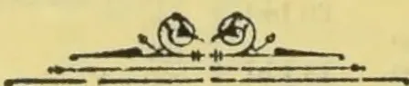

OBSERVER PRINTING WORKS.

924------------------------------------------------

# TEA, COFFEE, CINCHONA, COCOA, AND CARDAMOM SALES.

NO. 22.]

COLOMBO, JUNE 15, 1896.

PRICE:—12½ cents each 3 copies  
30 cents; 6 copies ½ rupee.

## COLOMBO SALES OF TEA.

### LARGE LOTS.

[MESSRS. A. H. THOMPSON & Co.—54,927 lb.]

<table border="1">
<thead>
<tr>
<th>Lot.</th>
<th>Box.</th>
<th>pkgs.</th>
<th>Name.</th>
<th>lb.</th>
<th>c.</th>
</tr>
</thead>
<tbody>
<tr><td>1</td><td>Ahamud</td><td>1</td><td>8 hf-ch</td><td>bro pek</td><td>400 40</td></tr>
<tr><td>2</td><td></td><td>2</td><td>8 do</td><td>pekoe</td><td>400 30</td></tr>
<tr><td>3</td><td></td><td>3</td><td>8 do</td><td>pek sou</td><td>400 25</td></tr>
<tr><td>17</td><td>Vilgoda</td><td>17</td><td>5 ch</td><td>dust</td><td>755 28</td></tr>
<tr><td>18</td><td>Balgownie</td><td>18</td><td>9 do</td><td>bro pek</td><td>900 41</td></tr>
<tr><td>19</td><td></td><td>19</td><td>14 do</td><td>pekoe</td><td>1120 36</td></tr>
<tr><td>20</td><td></td><td>20</td><td>8 do</td><td>pek sou</td><td>720 32</td></tr>
<tr><td>21</td><td></td><td>21</td><td>9 do</td><td>bro mix</td><td>765 26</td></tr>
<tr><td>23</td><td>Battalgalla</td><td>23</td><td>12 ch</td><td>bro sou</td><td>1260 40</td></tr>
<tr><td>27</td><td>M O</td><td>27</td><td>20 do</td><td>pek sou</td><td>1900 30</td></tr>
<tr><td>28</td><td>Pambagama</td><td>28</td><td>5 ch</td><td>bro tea</td><td>500 18</td></tr>
<tr><td>29</td><td></td><td>29</td><td>16 hf-ch</td><td>dust</td><td>1440 28</td></tr>
<tr><td>30</td><td></td><td>30</td><td>12 ch</td><td>fans</td><td>1200 30</td></tr>
<tr><td>32</td><td>P B</td><td>32</td><td>3 do</td><td>dust</td><td>450 26</td></tr>
<tr><td>36</td><td>M F</td><td>36</td><td>7 ch</td><td>sou</td><td>560 31</td></tr>
<tr><td>37</td><td>Comar</td><td>37</td><td>30 hf-ch</td><td>bro pek</td><td>1500 43</td></tr>
<tr><td>38</td><td></td><td>38</td><td>18 do</td><td>pekoe</td><td>1080 35</td></tr>
<tr><td>39</td><td></td><td>39</td><td>17 do</td><td>pekoe</td><td>1020 34 bid</td></tr>
<tr><td>40</td><td></td><td>40</td><td>12 do</td><td>pep sou</td><td>720 30</td></tr>
<tr><td>42</td><td>D</td><td>42</td><td>4 ch</td><td>pek fans</td><td>475 29</td></tr>
<tr><td>44</td><td>A G C</td><td>44</td><td>8 do</td><td>pek sou</td><td>720 32</td></tr>
<tr><td>46</td><td></td><td>46</td><td>7 do</td><td>congou</td><td>630 29</td></tr>
<tr><td>50</td><td>M L</td><td>50</td><td>6 ch</td><td>bro pek</td><td>660 50 bid</td></tr>
<tr><td>53</td><td>St. Leonards on Sea</td><td>53</td><td>16 ch</td><td>bro pek</td><td>1600 46</td></tr>
<tr><td>58</td><td>Charlie Hill</td><td>58</td><td>8 hf-ch</td><td>bro pek</td><td>400 43</td></tr>
<tr><td>59</td><td></td><td>59</td><td>13 do</td><td>pekoe</td><td>650 35</td></tr>
<tr><td>60</td><td></td><td>60</td><td>24 do</td><td>pek sou</td><td>1260 32</td></tr>
<tr><td>61</td><td></td><td>61</td><td>10 do</td><td>sou</td><td>500 30</td></tr>
<tr><td>63</td><td>Springwood</td><td>63</td><td>15 ch</td><td>bro mix</td><td>1575 22</td></tr>
<tr><td>64</td><td>Digdola</td><td>64</td><td>20 do</td><td>bro pek</td><td>1800 47</td></tr>
<tr><td>65</td><td></td><td>65</td><td>27 do</td><td>pekoe</td><td>2430 36</td></tr>
<tr><td>66</td><td></td><td>66</td><td>9 do</td><td>pek sou</td><td>810 31</td></tr>
<tr><td>67</td><td></td><td>67</td><td>6 do</td><td>fans</td><td>540 26</td></tr>
<tr><td>68</td><td></td><td>68</td><td>4 do</td><td>dust</td><td>560 27</td></tr>
<tr><td>69</td><td>Bogahatenne</td><td>69</td><td>15 ch</td><td>sou</td><td>1345 21</td></tr>
<tr><td>72</td><td>M L C</td><td>72</td><td>25 hf-ch</td><td>sou</td><td>1125 31</td></tr>
<tr><td>74</td><td>Elston</td><td>74</td><td>72 ch</td><td>pe sou No. 2</td><td>5760 33</td></tr>
<tr><td>75</td><td></td><td>75</td><td>27 hf-ch</td><td>dust</td><td>1890 26</td></tr>
</tbody>
</table>

[MR. E. JOHN.—150,638 lb.]

<table border="1">
<thead>
<tr>
<th>Lot.</th>
<th>Box.</th>
<th>Pkgs.</th>
<th>Name</th>
<th>lb.</th>
<th>c.</th>
</tr>
</thead>
<tbody>
<tr><td>1</td><td>Maryland</td><td>63</td><td>5 ch</td><td>bro pek</td><td>550 44</td></tr>
<tr><td>2</td><td></td><td>65</td><td>5 do</td><td>pekoe</td><td>525 35</td></tr>
<tr><td>3</td><td>Razeen</td><td>67</td><td>29 hf-ch</td><td>bro pek</td><td>1595 45</td></tr>
<tr><td>4</td><td></td><td>69</td><td>35 do</td><td>pekoe</td><td>1575 36</td></tr>
<tr><td>5</td><td></td><td>71</td><td>18 do</td><td>pek sou</td><td>792 34</td></tr>
<tr><td>8</td><td>Peakside</td><td>77</td><td>21 do</td><td>bro pek</td><td>1260 51</td></tr>
<tr><td>9</td><td></td><td>79</td><td>13 do</td><td>or pek</td><td>900 61</td></tr>
<tr><td>10</td><td></td><td>81</td><td>47 do</td><td>pekoe</td><td>2350 46</td></tr>
<tr><td>11</td><td></td><td>83</td><td>20 do</td><td>pek sou</td><td>1000 36</td></tr>
<tr><td>12</td><td></td><td>85</td><td>9 do</td><td>dust</td><td>540 32</td></tr>
<tr><td>13</td><td>Agra Ouvah</td><td>87</td><td>52 do</td><td>bro or pek</td><td>3380 77</td></tr>
<tr><td>14</td><td></td><td>89</td><td>32 do</td><td>or pek</td><td>1920 57</td></tr>
<tr><td>15</td><td></td><td>91</td><td>13 ch</td><td>pekoe</td><td>1300 49</td></tr>
<tr><td>16</td><td>Blackburn</td><td>93</td><td>20 do</td><td>bro pek</td><td>2200 37</td></tr>
<tr><td>17</td><td></td><td>95</td><td>20 do</td><td>pekoe</td><td>2200 32</td></tr>
<tr><td>20</td><td>Anchor, in est. mark</td><td>101</td><td>37 do</td><td>bro or pek</td><td>3515 64</td></tr>
<tr><td>21</td><td></td><td>103</td><td>14 do</td><td>or pek</td><td>1050 48</td></tr>
<tr><td>22</td><td></td><td>105</td><td>15 do</td><td>pekoe</td><td>1350 46</td></tr>
<tr><td>23</td><td>Ivies</td><td>107</td><td>19 hf-ch</td><td>bro pek</td><td>950 47</td></tr>
<tr><td>24</td><td></td><td>109</td><td>12 ch</td><td>pekoe</td><td>1030 36</td></tr>
<tr><td>25</td><td></td><td>111</td><td>8 do</td><td>pek sou</td><td>720 31</td></tr>
<tr><td>28</td><td>Broadlands</td><td>117</td><td>50 hf-ch</td><td>bro pek</td><td>2750 39 bid</td></tr>
<tr><td>29</td><td></td><td>119</td><td>26 ch</td><td>pekoe</td><td>2340 33 bid</td></tr>
<tr><td>30</td><td></td><td>121</td><td>25 do</td><td>pek sou</td><td>1750 32</td></tr>
<tr><td>31</td><td></td><td>123</td><td>6 do</td><td>bro tea</td><td>420 27</td></tr>
<tr><td>33</td><td>Cleveland</td><td>127</td><td>25 hf-ch</td><td>bro pek</td><td>1500 74 bid</td></tr>
<tr><td>34</td><td></td><td>129</td><td>42 do</td><td>pekoe</td><td>2310 52 bid</td></tr>
<tr><td>37</td><td>Kanangana</td><td>135</td><td>47 ch</td><td>bro pek</td><td>4700 40 bid</td></tr>
<tr><td>38</td><td></td><td>137</td><td>21 do</td><td>pekoe</td><td>1890 34</td></tr>
<tr><td>39</td><td></td><td>139</td><td>9 do</td><td>pek sou</td><td>810 30</td></tr>
<tr><td>40</td><td></td><td>141</td><td>6 do</td><td>dust</td><td>840 25</td></tr>
<tr><td>41</td><td></td><td>143</td><td>6 do</td><td>fans</td><td>600 27</td></tr>
<tr><td>46</td><td>L</td><td>153</td><td>16 do</td><td>pek sou</td><td>1280 27</td></tr>
<tr><td>47</td><td></td><td>155</td><td>8 hf-ch</td><td>dust</td><td>720 26</td></tr>
<tr><td>48</td><td>Mocha</td><td>157</td><td>30 ch</td><td>bro pek</td><td>3150 65</td></tr>
<tr><td>49</td><td></td><td>159</td><td>24 do</td><td>pekoe</td><td>2400 54</td></tr>
<tr><td>50</td><td></td><td>161</td><td>17 do</td><td>pek sou</td><td>1530 47</td></tr>
<tr><td>54</td><td>Templestowe</td><td>169</td><td>31 do</td><td>or pek</td><td>3100 58</td></tr>
</tbody>
</table>

<table border="1">
<thead>
<tr>
<th>Lot.</th>
<th>Box.</th>
<th>pkgs.</th>
<th>Name.</th>
<th>lb.</th>
<th>c.</th>
</tr>
</thead>
<tbody>
<tr><td>55</td><td>171</td><td>33 ch</td><td>pekoe</td><td>2970</td><td>42</td></tr>
<tr><td>56</td><td>173</td><td>41 do</td><td>pek sou</td><td>3485</td><td>36</td></tr>
<tr><td>57</td><td>175</td><td>6 do</td><td>dust</td><td>840</td><td>30</td></tr>
<tr><td>58</td><td>Alnoor</td><td>177</td><td>35 hf-ch</td><td>bro pek</td><td>1650 43 bid</td></tr>
<tr><td>59</td><td></td><td>179</td><td>23 do</td><td>pekoe</td><td>1150 35</td></tr>
<tr><td>60</td><td></td><td>181</td><td>17 do</td><td>pek sou</td><td>950 34</td></tr>
<tr><td>61</td><td></td><td>183</td><td>7 do</td><td>fans</td><td>490 34</td></tr>
<tr><td>62</td><td>Ferndale</td><td>185</td><td>11 ch</td><td>bro or pek</td><td>1210 48</td></tr>
<tr><td>63</td><td></td><td>187</td><td>10 do</td><td>bro pek</td><td>1000 45</td></tr>
<tr><td>64</td><td></td><td>189</td><td>27 do</td><td>pekoe</td><td>2430 39</td></tr>
<tr><td>65</td><td>New Tunisgalla</td><td>191</td><td>43 hf-ch</td><td>bro pek</td><td>2490 42 bid</td></tr>
<tr><td>66</td><td></td><td>193</td><td>37 do</td><td>pekoe</td><td>1850 43</td></tr>
<tr><td>67</td><td>Ottery &amp; Stamford Hill</td><td>195</td><td>26 ch</td><td>bro pek</td><td>2600 78</td></tr>
<tr><td>68</td><td></td><td>197</td><td>23 do</td><td>or pek</td><td>1955 67</td></tr>
<tr><td>69</td><td></td><td>199</td><td>59 do</td><td>pekoe</td><td>5310 48</td></tr>
<tr><td>77</td><td>Ardlaw &amp; Wishford</td><td>203</td><td>30 hf-ch</td><td>bro pek</td><td>1470 50</td></tr>
<tr><td>72</td><td></td><td>205</td><td>24 do</td><td>br or pe No.1</td><td>1296 74</td></tr>
<tr><td>73</td><td></td><td>207</td><td>21 ch</td><td>pekoe</td><td>1932 45</td></tr>
<tr><td>74</td><td>O</td><td>209</td><td>12 do</td><td>br or pe No.2</td><td>1512 49</td></tr>
<tr><td>75</td><td>Tarf</td><td>211</td><td>10 do</td><td>bro pek</td><td>1150 37</td></tr>
<tr><td>76</td><td></td><td>213</td><td>13 do</td><td>pekoe</td><td>1430 35</td></tr>
<tr><td>77</td><td></td><td>215</td><td>5 do</td><td>pek sou</td><td>500 30</td></tr>
<tr><td>79</td><td>Eadella</td><td>219</td><td>16 do</td><td>bro pek</td><td>1600 37</td></tr>
<tr><td>80</td><td></td><td>221</td><td>22 do</td><td>pekoe</td><td>1930 32</td></tr>
<tr><td>81</td><td></td><td>223</td><td>10 do</td><td>pek sou</td><td>800 29</td></tr>
<tr><td>82</td><td>Glentilt</td><td>225</td><td>51 do</td><td>bro pek</td><td>5355 52 bid</td></tr>
<tr><td>83</td><td></td><td>227</td><td>31 do</td><td>pekoe</td><td>3100 43 bid</td></tr>
<tr><td>84</td><td></td><td>229</td><td>8 do</td><td>pek sou</td><td>720 40</td></tr>
<tr><td>85</td><td></td><td>231</td><td>4 do</td><td>fans</td><td>600 31</td></tr>
<tr><td>86</td><td>Madultenna</td><td>233</td><td>12 do</td><td>bro pek</td><td>1200 49</td></tr>
<tr><td>87</td><td></td><td>235</td><td>16 do</td><td>br pe No.2</td><td>1600 40</td></tr>
<tr><td>88</td><td>Tientsin</td><td>237</td><td>54 hf-ch</td><td>bro or pek</td><td>2700 71</td></tr>
<tr><td>89</td><td></td><td>239</td><td>23 ch</td><td>pekoe</td><td>2250 46</td></tr>
<tr><td>90</td><td></td><td>241</td><td>9 do</td><td>pek sou</td><td>810 41</td></tr>
<tr><td>91</td><td></td><td>243</td><td>8 hf-ch</td><td>dust</td><td>600 36</td></tr>
<tr><td>97</td><td>Lameliere</td><td>255</td><td>35 ch</td><td>bro pek</td><td>3350 58 bid</td></tr>
<tr><td>98</td><td></td><td>257</td><td>34 do</td><td>pekoe</td><td>3332 43 bid</td></tr>
<tr><td>99</td><td></td><td>259</td><td>26 do</td><td>pek sou</td><td>2548 38</td></tr>
<tr><td>100</td><td></td><td>261</td><td>5 hf-ch</td><td>pek fans</td><td>425 33</td></tr>
</tbody>
</table>

[MESSRS. SOMERVILLE & Co., 203,653 lb.]

<table border="1">
<thead>
<tr>
<th>Lot.</th>
<th>Box.</th>
<th>Pkgs.</th>
<th>Name.</th>
<th>lb.</th>
<th>c.</th>
</tr>
</thead>
<tbody>
<tr><td>1</td><td>Roseneath</td><td>45</td><td>35 hf-ch</td><td>bro pek</td><td>1925 45</td></tr>
<tr><td>2</td><td></td><td>46</td><td>13 ch</td><td>pekoe</td><td>1170 37</td></tr>
<tr><td>3</td><td></td><td>47</td><td>15 do</td><td>pek sou</td><td>1350 33</td></tr>
<tr><td>4</td><td>A G L</td><td>48</td><td>24 do</td><td>bro or pek</td><td>2400 43</td></tr>
<tr><td>5</td><td></td><td>49</td><td>12 do</td><td>or pek</td><td>1020 48</td></tr>
<tr><td>6</td><td></td><td>50</td><td>49 do</td><td>pekoe</td><td>4165 36</td></tr>
<tr><td>7</td><td></td><td>50</td><td>49 do</td><td>pekoe</td><td>4165 36</td></tr>
<tr><td>8</td><td></td><td>52</td><td>9 do</td><td>pek sou</td><td>765 30</td></tr>
<tr><td>9</td><td></td><td>53</td><td>10 do</td><td>fannings</td><td>1000 34</td></tr>
<tr><td>10</td><td></td><td>54</td><td>8 do</td><td>dust</td><td>1120 28</td></tr>
<tr><td>11</td><td>Minna</td><td>55</td><td>29 hf-ch</td><td>bro pek</td><td>1740 70</td></tr>
<tr><td>12</td><td></td><td>56</td><td>22 ch</td><td>pekoe</td><td>1540 47</td></tr>
<tr><td>13</td><td></td><td>57</td><td>15 do</td><td>pek sou</td><td>1350 40</td></tr>
<tr><td>14</td><td>Inchstelly and Woodthorpe</td><td>58</td><td>11 do</td><td>bro pek</td><td>1210 51</td></tr>
<tr><td>15</td><td></td><td>59</td><td>15 do</td><td>pekoe</td><td>1200 39</td></tr>
<tr><td>16</td><td></td><td>60</td><td>19 do</td><td>pek sou</td><td>1425 35</td></tr>
<tr><td>20</td><td>Nugawela</td><td>61</td><td>30 hf-ch</td><td>or pek</td><td>1800 50</td></tr>
<tr><td>21</td><td></td><td>65</td><td>47 do</td><td>pekoe</td><td>2535 39</td></tr>
<tr><td>22</td><td></td><td>66</td><td>6 ch</td><td>pek sou</td><td>510 34</td></tr>
<tr><td>23</td><td>Beverley</td><td>67</td><td>22 hf-ch</td><td>pek dust</td><td>1650 33</td></tr>
<tr><td>24</td><td>Lonach</td><td>68</td><td>62 do</td><td>bro pek</td><td>3100 52</td></tr>
<tr><td>25</td><td></td><td>69</td><td>31 ch</td><td>pekoe</td><td>2945 39</td></tr>
<tr><td>26</td><td></td><td>70</td><td>19 do</td><td>pek sou</td><td>1615 35</td></tr>
<tr><td>27</td><td>Penrith</td><td>71</td><td>64 do</td><td>bro pek</td><td>6400 63</td></tr>
<tr><td>28</td><td></td><td>72</td><td>43 do</td><td>pekoe</td><td>3440 41</td></tr>
<tr><td>29</td><td></td><td>73</td><td>41 do</td><td>pek sou</td><td>3690 35</td></tr>
<tr><td>32</td><td>Ivanhoe</td><td>76</td><td>30 hf-ch</td><td>bro pek</td><td>1500 56</td></tr>
<tr><td>33</td><td></td><td>77</td><td>35 ch</td><td>pekoe</td><td>3150 45</td></tr>
<tr><td>34</td><td></td><td>78</td><td>10 do</td><td>pek sou</td><td>900 38</td></tr>
<tr><td>36</td><td>Yarrow</td><td>80</td><td>48 hf-ch</td><td>bro pek</td><td>2338 46</td></tr>
<tr><td>37</td><td></td><td>81</td><td>63 do</td><td>pekoe</td><td>3400 36</td></tr>
<tr><td>38</td><td>Irex</td><td>82</td><td>16 ch</td><td>bro pek</td><td>1600 44</td></tr>
<tr><td>39</td><td></td><td>83</td><td>9 do</td><td>bro pek</td><td>355 35</td></tr>
<tr><td>40</td><td></td><td>84</td><td>9 do</td><td>pek sou</td><td>900 31</td></tr>
<tr><td>41</td><td>Malveren</td><td>85</td><td>26 hf-ch</td><td>bro pek</td><td>1430 37 bid</td></tr>
<tr><td>42</td><td></td><td>86</td><td>34 do</td><td>pekoe</td><td>1870 33</td></tr>
<tr><td>43</td><td>Kelani</td><td>87</td><td>50 do</td><td>bro pek</td><td>2750 63</td></tr>
<tr><td>44</td><td></td><td>88</td><td>30 ch</td><td>pekoe</td><td>2700 38</td></tr>
<tr><td>45</td><td></td><td>89</td><td>17 hf-ch</td><td>pek sou</td><td>850 34</td></tr>
<tr><td>48</td><td>Lyndhurst</td><td>92</td><td>16 ch</td><td>bro pek</td><td>1600 47 bid</td></tr>
<tr><td>49</td><td></td><td>93</td><td>20 do</td><td>pekoe</td><td>1700 36</td></tr>
<tr><td>50</td><td></td><td>94</td><td>30 do</td><td>pek sou</td><td>2400 32 bid</td></tr>
<tr><td>53</td><td>Lyndhurst</td><td>97</td><td>17 do</td><td>bro pek</td><td>1700 46</td></tr>
<tr><td>54</td><td></td><td>98</td><td>21 do</td><td>pekoe</td><td>1735 39</td></tr>
</tbody>
</table>

925------------------------------------------------

2

CEYLON PRODUCE SALES LIST.

<table border="1">
<thead>
<tr>
<th>Lot.</th>
<th>Box.</th>
<th>Pkgs.</th>
<th>Name.</th>
<th>lb.</th>
<th>c.</th>
</tr>
</thead>
<tbody>
<tr><td>55</td><td>99</td><td>26 ch</td><td>pek sou</td><td>2080</td><td>34</td></tr>
<tr><td>56</td><td>100</td><td>5 do</td><td>sou</td><td>425</td><td>27</td></tr>
<tr><td>58 T S</td><td>102</td><td>10 hf-ch</td><td>bro pek</td><td>500</td><td>47 bid</td></tr>
<tr><td>60 N I T</td><td>104</td><td>9 ch</td><td>bro pe fans</td><td>1080</td><td>40</td></tr>
<tr><td>61</td><td>105</td><td>13 do</td><td>unassorted</td><td>1170</td><td>29</td></tr>
<tr><td>63 Chelankande</td><td>107</td><td>4 do</td><td>fannings</td><td>440</td><td>31</td></tr>
<tr><td>65 Raygam</td><td>109</td><td>43 do</td><td>bro pek</td><td>4300</td><td>54</td></tr>
<tr><td>66</td><td>110</td><td>24 do</td><td>pekoe</td><td>2040</td><td>41</td></tr>
<tr><td>67</td><td>111</td><td>27 do</td><td>pek sou</td><td>2295</td><td>36</td></tr>
<tr><td>68 Panapitiya</td><td>112</td><td>18 hf-ch</td><td>bro pek</td><td>1060</td><td>35 bid</td></tr>
<tr><td>69 White Cross</td><td>113</td><td>32 ch</td><td>bro pek</td><td>3200</td><td>43</td></tr>
<tr><td>70</td><td>114</td><td>26 do</td><td>pekoe</td><td>2600</td><td>35</td></tr>
<tr><td>71</td><td>115</td><td>15 do</td><td>pek sou</td><td>1425</td><td>30</td></tr>
<tr><td>74 T S A</td><td>118</td><td>10 hf-ch</td><td>bro pek</td><td>500</td><td>39 bid</td></tr>
<tr><td>75 Chetuole</td><td>119</td><td>8 ch</td><td>pek sou</td><td>800</td><td>33</td></tr>
<tr><td>76</td><td>120</td><td>15 hf-ch</td><td>dust</td><td>1125</td><td>31</td></tr>
<tr><td>77 Hagalla</td><td>121</td><td>36 do</td><td>bro pek</td><td>2160</td><td>42</td></tr>
<tr><td>78</td><td>122</td><td>31 do</td><td>pekoe</td><td>1550</td><td>37</td></tr>
<tr><td>79</td><td>123</td><td>10 ch</td><td>pek sou</td><td>1000</td><td>34</td></tr>
<tr><td>80 Castlemilk</td><td>124</td><td>6 do</td><td>bro mix</td><td>510</td><td>31</td></tr>
<tr><td>81 If in estate mark</td><td>125</td><td>22 do</td><td>bro pek</td><td>2200</td><td>44 bid</td></tr>
<tr><td>82</td><td>126</td><td>27 do</td><td>pekoe</td><td>2430</td><td>34</td></tr>
<tr><td>83 Warriatenne</td><td>127</td><td>29 do</td><td>bro pek</td><td>2900</td><td>39</td></tr>
<tr><td>84</td><td>128</td><td>32 do</td><td>pekoe</td><td>3200</td><td>40</td></tr>
<tr><td>85</td><td>129</td><td>11 do</td><td>pek sou</td><td>935</td><td>31</td></tr>
<tr><td>86</td><td>137</td><td>30 hf-ch</td><td>dust</td><td>2235</td><td>24 bid</td></tr>
<tr><td>92 Morowa To-tum</td><td>136</td><td>8 ch</td><td>bro pek</td><td>800</td><td>39 bid</td></tr>
<tr><td>93</td><td>137</td><td>10 hf-ch</td><td>or pek</td><td>500</td><td>41</td></tr>
<tr><td>95</td><td>139</td><td>10 do</td><td>pek sou</td><td>500</td><td>31</td></tr>
<tr><td>98 Madura</td><td>142</td><td>4 ch</td><td>bro pek</td><td>450</td><td>43 bid</td></tr>
<tr><td>99</td><td>143</td><td>4 do</td><td>or pek</td><td>425</td><td>35 bid</td></tr>
<tr><td>102 G</td><td>146</td><td>18 do</td><td>bro pek</td><td>1890</td><td>37 bid</td></tr>
<tr><td>107 Wentworth</td><td>151</td><td>12 hf-ch</td><td>bro pek</td><td>1320</td><td>49 bid</td></tr>
<tr><td>108 Kew</td><td>152</td><td>13 do</td><td>bro or pek</td><td>754</td><td>86</td></tr>
<tr><td>109</td><td>153</td><td>19 do</td><td>bro pek</td><td>1140</td><td>57</td></tr>
<tr><td>110</td><td>154</td><td>21 ch</td><td>or pek</td><td>1050</td><td>66</td></tr>
<tr><td>111</td><td>155</td><td>36 do</td><td>pekoe</td><td>3312</td><td>58</td></tr>
<tr><td>112</td><td>156</td><td>16 do</td><td>pek sou</td><td>1520</td><td>43</td></tr>
<tr><td>113 Deniyagama</td><td>157</td><td>10 hf-ch</td><td>bro or pek</td><td>540</td><td>39</td></tr>
<tr><td>114</td><td>158</td><td>28 ch</td><td>bro pek</td><td>2940</td><td>42</td></tr>
<tr><td>115</td><td>159</td><td>15 do</td><td>pekoe</td><td>1350</td><td>33</td></tr>
<tr><td>116</td><td>160</td><td>9 do</td><td>pek sou</td><td>720</td><td>30</td></tr>
<tr><td>117 Ravenscraig</td><td>161</td><td>28 hf-ch</td><td>bro pek</td><td>1400</td><td>49 bid</td></tr>
<tr><td>118</td><td>162</td><td>42 do</td><td>pekoe</td><td>2100</td><td>38</td></tr>
<tr><td>119</td><td>163</td><td>8 do</td><td>pek sou</td><td>400</td><td>31 bid</td></tr>
<tr><td>121 Benveula</td><td>165</td><td>32 do</td><td>bro pek</td><td>1600</td><td>40</td></tr>
<tr><td>122</td><td>166</td><td>12 do</td><td>pekoe</td><td>600</td><td>33</td></tr>
<tr><td>123</td><td>167</td><td>7 ch</td><td>pek sou</td><td>700</td><td>30</td></tr>
<tr><td>125 B F</td><td>169</td><td>9 hf-ch</td><td>bro mix</td><td>540</td><td>32</td></tr>
<tr><td>126</td><td>170</td><td>4 do</td><td>dust</td><td>409</td><td>27</td></tr>
<tr><td>127 Surrey</td><td>171</td><td>20 do</td><td>or pek</td><td>1060</td><td>66 bid</td></tr>
<tr><td>132 Sirisanda</td><td>176</td><td>12 hf-ch</td><td>bro pek</td><td>720</td><td>47</td></tr>
<tr><td>133</td><td>177</td><td>25 do</td><td>pekoe</td><td>1250</td><td>36</td></tr>
<tr><td>134</td><td>178</td><td>38 do</td><td>pek sou</td><td>1900</td><td>32</td></tr>
<tr><td>137</td><td>181</td><td>5 do</td><td>dust</td><td>403</td><td>28</td></tr>
<tr><td>142 Salawe</td><td>186</td><td>13 ch</td><td>bro pek</td><td>1300</td><td>42 bid</td></tr>
<tr><td>143</td><td>187</td><td>11 do</td><td>pekoe</td><td>1045</td><td>39 bid</td></tr>
<tr><td>144</td><td>188</td><td>38 do</td><td>pek sou</td><td>3420</td><td>33</td></tr>
<tr><td>145</td><td>189</td><td>15 do</td><td>sou</td><td>1275</td><td>30</td></tr>
<tr><td>146</td><td>190</td><td>4 do</td><td>bro mix</td><td>420</td><td>26</td></tr>
<tr><td>147</td><td>191</td><td>5 do</td><td>fannings</td><td>600</td><td>28</td></tr>
<tr><td>149 Minua</td><td>193</td><td>23 do</td><td>pekoe</td><td>1610</td><td>45 bid</td></tr>
<tr><td>150</td><td>194</td><td>39 do</td><td>bro or pek</td><td>3900</td><td>56</td></tr>
<tr><td>151</td><td>195</td><td>12 do</td><td>or pek</td><td>1080</td><td>46</td></tr>
<tr><td>152</td><td>196</td><td>13 do</td><td>pekoe</td><td>1170</td><td>39</td></tr>
<tr><td>153</td><td>197</td><td>1° do</td><td>pek sou</td><td>1140</td><td>37</td></tr>
</tbody>
</table>

[MESSRS. FORBES & WALKER.—369,711 lb.]

<table border="1">
<thead>
<tr>
<th>Lot.</th>
<th>Box.</th>
<th>Pkgs.</th>
<th>Name.</th>
<th>lb.</th>
<th>c.</th>
</tr>
</thead>
<tbody>
<tr><td>2 M</td><td>80</td><td>6 ch</td><td>pekoe</td><td>552</td><td>49</td></tr>
<tr><td>4 M, in estate mark</td><td>84</td><td>9 ch</td><td>pek sou</td><td>790</td><td>19</td></tr>
<tr><td>7</td><td>90</td><td>19 hf-ch</td><td>dust</td><td>1710</td><td>18</td></tr>
<tr><td>8 W W</td><td>92</td><td>5 ch</td><td>bro mix</td><td>475</td><td>21</td></tr>
<tr><td>10 Thedden</td><td>96</td><td>8 do</td><td>bro pek</td><td>800</td><td>42</td></tr>
<tr><td>11</td><td>98</td><td>23 do</td><td>pekoe</td><td>2070</td><td>36</td></tr>
<tr><td>15 Augusta</td><td>106</td><td>17 do</td><td>bro pek</td><td>1870</td><td>46</td></tr>
<tr><td>16</td><td>108</td><td>14 do</td><td>pekoe</td><td>1400</td><td>39</td></tr>
<tr><td>17</td><td>110</td><td>15 do</td><td>pek sou</td><td>1350</td><td>36</td></tr>
<tr><td>18 M C</td><td>112</td><td>15 do</td><td>dust</td><td>1823</td><td>25</td></tr>
<tr><td>20 Kirindi</td><td>116</td><td>12 ch</td><td>bro pek</td><td>1320</td><td>47 bid</td></tr>
<tr><td>21</td><td>118</td><td>15 do</td><td>pekoe</td><td>1200</td><td>40</td></tr>
<tr><td>22</td><td>120</td><td>20 do</td><td>pek sou</td><td>1500</td><td>35</td></tr>
<tr><td>25 Ranawella</td><td>126</td><td>7 do</td><td>bro pek</td><td>770</td><td>48</td></tr>
<tr><td>26</td><td>128</td><td>9 do</td><td>pekoe</td><td>720</td><td>40</td></tr>
<tr><td>27</td><td>130</td><td>11 do</td><td>pek sou</td><td>825</td><td>35</td></tr>
<tr><td>29 D B R</td><td>134</td><td>11 ch</td><td>bro mix</td><td>1100</td><td>29</td></tr>
<tr><td>30</td><td>136</td><td>3 do</td><td>dust</td><td>450</td><td>28</td></tr>
<tr><td>31 B D W</td><td>138</td><td>35 do</td><td>bro pek</td><td>4200</td><td>38 bid</td></tr>
<tr><td>32</td><td>140</td><td>33 hf-ch</td><td>bro pek</td><td>2310</td><td>33 bid</td></tr>
<tr><td>33 Agraoya</td><td>142</td><td>37 do</td><td>bro pek</td><td>2035</td><td>49</td></tr>
<tr><td>34</td><td>144</td><td>25 ch</td><td>pekoe</td><td>2125</td><td>36</td></tr>
</tbody>
</table>

<table border="1">
<thead>
<tr>
<th>Lot.</th>
<th>Box.</th>
<th>Pkgs.</th>
<th>Name.</th>
<th>lb.</th>
<th>c.</th>
</tr>
</thead>
<tbody>
<tr><td>35</td><td>146</td><td>11 ch</td><td>pek sou</td><td>1045</td><td>32</td></tr>
<tr><td>38 Gallawatte</td><td>152</td><td>7 do</td><td>pek fans</td><td>700</td><td>29</td></tr>
<tr><td>41 Chesterford</td><td>158</td><td>36 do</td><td>bro pek</td><td>3600</td><td>48 bid</td></tr>
<tr><td>42</td><td>160</td><td>31 do</td><td>pekoe</td><td>3100</td><td>39 bid</td></tr>
<tr><td>43</td><td>162</td><td>28 do</td><td>pek sou</td><td>2800</td><td>34</td></tr>
<tr><td>47 Weoya</td><td>170</td><td>55 hf-ch</td><td>bro pek</td><td>3025</td><td>51</td></tr>
<tr><td>48</td><td>172</td><td>60 do</td><td>pekoe</td><td>3000</td><td>37</td></tr>
<tr><td>49</td><td>174</td><td>52 do</td><td>pek sou</td><td>2385</td><td>32</td></tr>
<tr><td>50 Dunkeld</td><td>176</td><td>21 ch</td><td>bro pek</td><td>2310</td><td>59</td></tr>
<tr><td>51</td><td>178</td><td>32 hf-ch</td><td>or pek</td><td>1600</td><td>55</td></tr>
<tr><td>52</td><td>180</td><td>20 ch</td><td>pekoe</td><td>2000</td><td>42</td></tr>
<tr><td>53 D K D</td><td>182</td><td>4 do</td><td>br pe No. 2</td><td>500</td><td>40</td></tr>
<tr><td>54</td><td>184</td><td>6 do</td><td>dust</td><td>960</td><td>31</td></tr>
<tr><td>61 Pallagodde</td><td>198</td><td>21 ch</td><td>bro pek</td><td>2190</td><td>48</td></tr>
<tr><td>62</td><td>200</td><td>22 do</td><td>pekoe</td><td>1930</td><td>40</td></tr>
<tr><td>63</td><td>202</td><td>19 do</td><td>pek sou</td><td>1805</td><td>35</td></tr>
<tr><td>64 High Forest</td><td>204</td><td>100 hf-ch</td><td>bro pek</td><td>5600</td><td>51 bid</td></tr>
<tr><td>65</td><td>206</td><td>75 do</td><td>pekoe</td><td>3750</td><td>50</td></tr>
<tr><td>66</td><td>208</td><td>25 do</td><td>pek sou</td><td>1250</td><td>41</td></tr>
<tr><td>73 Dea Ella</td><td>222</td><td>50 do</td><td>bro pek</td><td>2750</td><td>42</td></tr>
<tr><td>74</td><td>224</td><td>40 do</td><td>pekoe</td><td>2000</td><td>34</td></tr>
<tr><td>75</td><td>226</td><td>15 do</td><td>pek sou</td><td>750</td><td>32</td></tr>
<tr><td>76</td><td>228</td><td>6 do</td><td>dust</td><td>450</td><td>28</td></tr>
<tr><td>77 Hayes</td><td>230</td><td>104 hf-ch</td><td>bro pek</td><td>5200</td><td>43</td></tr>
<tr><td>78</td><td>232</td><td>70 do</td><td>dekoe</td><td>3150</td><td>36</td></tr>
<tr><td>79</td><td>234</td><td>74 do</td><td>pek sou</td><td>3330</td><td>33</td></tr>
<tr><td>80</td><td>236</td><td>8 do</td><td>dust</td><td>400</td><td>30</td></tr>
<tr><td>83 O M</td><td>242</td><td>6 ch</td><td>dust</td><td>552</td><td>18</td></tr>
<tr><td>85 Iddagodde</td><td>246</td><td>16 do</td><td>bro pek</td><td>1600</td><td>48</td></tr>
<tr><td>86</td><td>248</td><td>21 do</td><td>pekoe</td><td>2160</td><td>38</td></tr>
<tr><td>87</td><td>250</td><td>20 do</td><td>pek sou</td><td>1700</td><td>33</td></tr>
<tr><td>89 Morankande</td><td>254</td><td>30 do</td><td>bro pek</td><td>3000</td><td>42</td></tr>
<tr><td>90</td><td>256</td><td>29 do</td><td>pekoe</td><td>2900</td><td>37</td></tr>
<tr><td>91</td><td>258</td><td>48 do</td><td>pek sou</td><td>4800</td><td>33</td></tr>
<tr><td>92 Ganapalla</td><td>260</td><td>182 hf ch</td><td>bro pek</td><td>9150</td><td>42</td></tr>
<tr><td>93</td><td>262</td><td>94 ch</td><td>pekoe</td><td>7520</td><td>33</td></tr>
<tr><td>94</td><td>264</td><td>40 do</td><td>pek sou</td><td>3200</td><td>30</td></tr>
<tr><td>95</td><td>266</td><td>7 do</td><td>dust</td><td>980</td><td>26</td></tr>
<tr><td>96 Massena</td><td>268</td><td>20 hf-ch</td><td>or pek</td><td>1000</td><td>40</td></tr>
<tr><td>97</td><td>270</td><td>20 do</td><td>pekoe</td><td>1600</td><td>34</td></tr>
<tr><td>98 Galkadua</td><td>272</td><td>15 ch</td><td>bro pek</td><td>1500</td><td>42</td></tr>
<tr><td>99</td><td>274</td><td>15 do</td><td>pekoe</td><td>1500</td><td>35</td></tr>
<tr><td>100</td><td>276</td><td>12 do</td><td>pek sou</td><td>1200</td><td>31</td></tr>
<tr><td>106 C</td><td>288</td><td>11 do</td><td>sou</td><td>1045</td><td>30</td></tr>
<tr><td>112 Ragalla</td><td>300</td><td>4 do</td><td>dust</td><td>440</td><td>35</td></tr>
<tr><td>114 A M B</td><td>304</td><td>30 do</td><td>bro pek sou</td><td>2460</td><td>23</td></tr>
<tr><td>115</td><td>306</td><td>11 do</td><td>fans</td><td>1320</td><td>29</td></tr>
<tr><td>116 B, in estate mark</td><td>308</td><td>5 ch</td><td>sou</td><td>450</td><td>29</td></tr>
<tr><td>117</td><td>310</td><td>11 do</td><td>dust</td><td>1540</td><td>30</td></tr>
<tr><td>118 Arapolakande</td><td>312</td><td>52 ch</td><td>bro pek</td><td>4940</td><td>40 bid</td></tr>
<tr><td>119</td><td>314</td><td>53 do</td><td>pekoe</td><td>4240</td><td>35</td></tr>
<tr><td>120</td><td>316</td><td>12 do</td><td>pek sou</td><td>1200</td><td>32</td></tr>
<tr><td>122 Carlabeck</td><td>320</td><td>13 ch</td><td>pek sou</td><td>1300</td><td>56</td></tr>
<tr><td>123</td><td>322</td><td>10 hf-ch</td><td>bro pek fan</td><td>750</td><td>47</td></tr>
<tr><td>124 Scrubs</td><td>324</td><td>12 ch</td><td>or pek</td><td>1200</td><td>77</td></tr>
<tr><td>125</td><td>326</td><td>25 do</td><td>bro pek</td><td>2750</td><td>59</td></tr>
<tr><td>126</td><td>328</td><td>25 do</td><td>pekoe</td><td>2375</td><td>53</td></tr>
<tr><td>127</td><td>330</td><td>12 do</td><td>pek sou</td><td>1140</td><td>48</td></tr>
<tr><td>128 Koladenia</td><td>332</td><td>4 ch</td><td>bro tea</td><td>504</td><td>28</td></tr>
<tr><td>129 Vellaioya</td><td>334</td><td>8 do</td><td>bro tea</td><td>760</td><td>21</td></tr>
<tr><td>130 Ambalakande</td><td>336</td><td>12 do</td><td>bro pek</td><td>1080</td><td>55</td></tr>
<tr><td>131</td><td>338</td><td>17 do</td><td>pekoe</td><td>1530</td><td>39</td></tr>
<tr><td>132</td><td>340</td><td>7 do</td><td>pek sou</td><td>700</td><td>36</td></tr>
<tr><td>134 St. Heliers</td><td>344</td><td>18 hf-ch</td><td>bro or pek</td><td>990</td><td>49</td></tr>
<tr><td>135</td><td>346</td><td>12 ch</td><td>pekoe</td><td>1200</td><td>39</td></tr>
<tr><td>136</td><td>348</td><td>4 do</td><td>pek sou</td><td>400</td><td>34</td></tr>
<tr><td>138 Glencorse</td><td>352</td><td>37 do</td><td>bro pek</td><td>3700</td><td>43</td></tr>
<tr><td>139</td><td>356</td><td>20 do</td><td>pekoe</td><td>1800</td><td>38</td></tr>
<tr><td>140</td><td>356</td><td>20 do</td><td>pek sou</td><td>1600</td><td>33</td></tr>
<tr><td>141</td><td>358</td><td>3 do</td><td>pek fans</td><td>420</td><td>28</td></tr>
<tr><td>144 M K</td><td>364</td><td>6 ch</td><td>pekoe</td><td>675</td><td>32</td></tr>
<tr><td>145</td><td>366</td><td>8 do</td><td>pek sou</td><td>800</td><td>17</td></tr>
<tr><td>147 Deaculla</td><td>370</td><td>35 hf ch</td><td>bro pek</td><td>2100</td><td>62</td></tr>
<tr><td>148</td><td>372</td><td>21 ch</td><td>pekoe</td><td>1575</td><td>46</td></tr>
<tr><td>149 M A H</td><td>394</td><td>5 do</td><td>congou</td><td>500</td><td>18</td></tr>
<tr><td>157 Elamana</td><td>390</td><td>17 do</td><td>bro pek</td><td>1700</td><td>45 bid</td></tr>
<tr><td>158</td><td>392</td><td>20 do</td><td>pekoe</td><td>1800</td><td>37</td></tr>
<tr><td>159</td><td>394</td><td>8 do</td><td>pek sou</td><td>720</td><td>34</td></tr>
<tr><td>160 Middleton</td><td>396</td><td>21 ch</td><td>bro pek</td><td>2100</td><td>70</td></tr>
<tr><td>161</td><td>398</td><td>14 do</td><td>pekoe</td><td>1330</td><td>51</td></tr>
<tr><td>162</td><td>400</td><td>6 do</td><td>pek sou</td><td>540</td><td>46</td></tr>
<tr><td>163 Kandapolla</td><td>402</td><td>12 do</td><td>bro pek</td><td>1440</td><td>55 bid</td></tr>
<tr><td>164</td><td>404</td><td>25 hf-ch</td><td>dust</td><td>1860</td><td>35</td></tr>
<tr><td>165 Allington</td><td>406</td><td>27 do</td><td>or pek</td><td>1350</td><td>40 bid</td></tr>
<tr><td>166 M</td><td>408</td><td>20 ch</td><td>bro pek sou</td><td>1009</td><td>21</td></tr>
<tr><td>167 K</td><td>410</td><td>6 do</td><td>1 hf-ch</td><td>660</td><td>36</td></tr>
<tr><td>168 B D W</td><td>412</td><td>60 ch</td><td>pek sou</td><td>5474</td><td>20 bid</td></tr>
<tr><td>169 M K M A N</td><td>414</td><td>5 do</td><td>1 hf-ch</td><td>550</td><td>23</td></tr>
<tr><td>170 Ellaoya</td><td>416</td><td>31 do</td><td>or pek</td><td>2976</td><td>47 bid</td></tr>
<tr><td>171</td><td>418</td><td>25 do</td><td>pek sou</td><td>2250</td><td>35</td></tr>
<tr><td>172 Gallawatte</td><td>420</td><td>42 ch</td><td>bro pok</td><td>4200</td><td>43 bid</td></tr>
<tr><td>173</td><td>422</td><td>21 do</td><td>pekoe</td><td>1890</td><td>33</td></tr>
<tr><td>174</td><td>424</td><td>8 do</td><td>pek sou</td><td>800</td><td>32</td></tr>
</tbody>
</table>

926------------------------------------------------

CEYLON PRODUCE SALES LIST.

3

<table border="1">
<thead>
<tr>
<th>Lot.</th>
<th>Box.</th>
<th>Pkgs.</th>
<th>Name.</th>
<th>lb.</th>
<th>c.</th>
</tr>
</thead>
<tbody>
<tr><td>175</td><td>426</td><td>8 ch</td><td>dust</td><td>800</td><td>28</td></tr>
<tr><td>176 Tonacombe</td><td>428</td><td>30 do</td><td>or pek</td><td>3000</td><td>55</td></tr>
<tr><td>177</td><td>430</td><td>25 do</td><td>bro pek</td><td>3000</td><td>53</td></tr>
<tr><td>178</td><td>432</td><td>45 do</td><td>pekoe</td><td>4500</td><td>44</td></tr>
<tr><td>179</td><td>434</td><td>12 do</td><td>pek sou</td><td>1140</td><td>37</td></tr>
<tr><td>180</td><td>436</td><td>13 do</td><td>dust</td><td>1170</td><td>31</td></tr>
<tr><td>181 Clyde</td><td>438</td><td>36 do</td><td>bro pek</td><td>3780</td><td>42</td></tr>
<tr><td>182</td><td>440</td><td>26 do</td><td>pekoe</td><td>2600</td><td>34</td></tr>
<tr><td>183</td><td>442</td><td>18 do</td><td>pek sou</td><td>1710</td><td>32</td></tr>
<tr><td>184</td><td>444</td><td>4 do</td><td>dust</td><td>560</td><td>27</td></tr>
<tr><td>188 K K G H</td><td>452</td><td>10 hf-ch</td><td>sou</td><td>500</td><td>30</td></tr>
<tr><td>189 Castlercagh</td><td>454</td><td>12 ch</td><td>bro pek</td><td>1200</td><td>62</td></tr>
<tr><td>190</td><td>456</td><td>12 do</td><td>or pek</td><td>1080</td><td>50 bid</td></tr>
<tr><td>191</td><td>458</td><td>12 do</td><td>pekoe</td><td>1080</td><td>41</td></tr>
<tr><td>192</td><td>460</td><td>12 do</td><td>pek No. 2</td><td>1080</td><td>37</td></tr>
<tr><td>193</td><td>462</td><td>10 hf-ch</td><td>pek sou</td><td>800</td><td>34</td></tr>
<tr><td>196 Augusta</td><td>468</td><td>26 ch</td><td>bro pek</td><td>2360</td><td>45</td></tr>
<tr><td>197</td><td>470</td><td>22 do</td><td>pekoe</td><td>2200</td><td>38</td></tr>
<tr><td>198</td><td>472</td><td>19 do</td><td>pek sou</td><td>1710</td><td>35</td></tr>
<tr><td>200</td><td>476</td><td>7 do</td><td>dust</td><td>980</td><td>29</td></tr>
<tr><td>201 Weyunga-watte</td><td>478</td><td>15 ch</td><td>bro pek</td><td>1500</td><td>51</td></tr>
<tr><td>202</td><td>480</td><td>26 do</td><td>pek No. 1</td><td>2340</td><td>46</td></tr>
<tr><td>203</td><td>482</td><td>17 do</td><td>pek ,, 2</td><td>1445</td><td>38</td></tr>
<tr><td>204</td><td>484</td><td>6 do</td><td>pek sou</td><td>570</td><td>35</td></tr>
<tr><td>206 Holton</td><td>488</td><td>14 ch</td><td>bro pek</td><td>1400</td><td>57</td></tr>
<tr><td>207</td><td>490</td><td>16 do</td><td>pkoe</td><td>1520</td><td>38</td></tr>
<tr><td>208</td><td>492</td><td>6 do</td><td>pek sou</td><td>570</td><td>34</td></tr>
<tr><td>210 Monktonwyld</td><td>496</td><td>7 ch</td><td>bro pek</td><td>700</td><td>41 bid</td></tr>
<tr><td>211</td><td>498</td><td>7 do</td><td>pekoe</td><td>665</td><td>38</td></tr>
<tr><td>212</td><td>500</td><td>8 do</td><td>pek sou</td><td>640</td><td>34</td></tr>
<tr><td>216 Carfax</td><td>508</td><td>18 ch</td><td>bro or pek</td><td>1974</td><td>47 bid</td></tr>
<tr><td>217</td><td>510</td><td>19 do</td><td>or pek</td><td>1974</td><td>52</td></tr>
<tr><td>218</td><td>512</td><td>5 do</td><td>bro pek</td><td>550</td><td>35</td></tr>
<tr><td>219</td><td>514</td><td>19 do</td><td>pekoe</td><td>1805</td><td>42</td></tr>
<tr><td>220</td><td>516</td><td>3 do</td><td>dust</td><td>480</td><td>23</td></tr>
<tr><td>221 St. Heliers</td><td>518</td><td>26 hf-ch</td><td>bro or pck</td><td>1430</td><td>49</td></tr>
<tr><td>222</td><td>520</td><td>18 ch</td><td>pekoe</td><td>1800</td><td>37</td></tr>
<tr><td>233 Ellawatte</td><td>544</td><td>25 ch</td><td>bro pek</td><td>2625</td><td>54</td></tr>
<tr><td>234</td><td>546</td><td>44 do</td><td>pekoe</td><td>4400</td><td>42</td></tr>
<tr><td>235</td><td>548</td><td>8 do</td><td>pek sou</td><td>800</td><td>37</td></tr>
<tr><td>247 Wolleyfield</td><td>572</td><td>4 ch</td><td>bro pek</td><td>420</td><td>37</td></tr>
</tbody>
</table>

SMALL LOTS.

[MR. E. JOHN.]

<table border="1">
<thead>
<tr>
<th>Lot.</th>
<th>Box.</th>
<th>Pkgs.</th>
<th>Name.</th>
<th>lb.</th>
<th>c.</th>
</tr>
</thead>
<tbody>
<tr><td>6 Razeen</td><td>73</td><td>2 hf-ch</td><td>fans</td><td>130</td><td>30</td></tr>
<tr><td>7</td><td>75</td><td>1 do</td><td>dust</td><td>86</td><td>27</td></tr>
<tr><td>18 Clontarf</td><td>97</td><td>2 ch</td><td>sou</td><td>142</td><td>25</td></tr>
<tr><td>19</td><td>99</td><td>2 do</td><td>dust</td><td>200</td><td>27</td></tr>
<tr><td>26 Ivies</td><td>113</td><td>4 hf-ch</td><td>fans</td><td>220</td><td>34</td></tr>
<tr><td>27</td><td>115</td><td>1 do</td><td>dust</td><td>80</td><td>26</td></tr>
<tr><td>32 Broadlands</td><td>125</td><td>3 do</td><td>dust</td><td>240</td><td>25</td></tr>
<tr><td>35 Cleveland</td><td>131</td><td>6 do</td><td>pek sou</td><td>300</td><td>46</td></tr>
<tr><td>36</td><td>133</td><td>2 do</td><td>dust</td><td>170</td><td>41</td></tr>
<tr><td>70 Ottery &amp; Stamford Hill</td><td>201</td><td>1 ch</td><td>dust</td><td>141</td><td>34</td></tr>
<tr><td>78 Yapame</td><td>217</td><td>2 do</td><td>dust</td><td>194</td><td>30</td></tr>
<tr><td>92 P T E</td><td>245</td><td>3 do</td><td>bro mix</td><td>300</td><td>15</td></tr>
<tr><td>93</td><td>247</td><td>2 hf-ch</td><td>dust</td><td>168</td><td>27</td></tr>
<tr><td>94 Chapelton</td><td>249</td><td>3 do</td><td>du3t</td><td>285</td><td>20</td></tr>
<tr><td>95 R</td><td>251</td><td>3 do</td><td>pekoe</td><td>120</td><td>33</td></tr>
<tr><td>96</td><td>253</td><td>4 do</td><td>pek sou</td><td>180</td><td>30</td></tr>
</tbody>
</table>

[MESSRS. A. H. THOMPSON & Co.]

<table border="1">
<thead>
<tr>
<th>Lot.</th>
<th>Box.</th>
<th>Pkgs.</th>
<th>Name</th>
<th>lb.</th>
<th>c.</th>
</tr>
</thead>
<tbody>
<tr><td>4 Ahamud</td><td>4</td><td>2 hf-ch</td><td>fans</td><td>125</td><td>28</td></tr>
<tr><td>5</td><td>5</td><td>2 do</td><td>fans</td><td>100</td><td>19</td></tr>
<tr><td>6</td><td>6</td><td>2 do</td><td>congou</td><td>100</td><td>18</td></tr>
<tr><td>7 Bulatwella</td><td>7</td><td>4 ch</td><td>bro tea</td><td>360</td><td>14</td></tr>
<tr><td>14 A &amp; F L</td><td>14</td><td>2 do</td><td>dust</td><td>160</td><td>29</td></tr>
<tr><td>15</td><td>15</td><td>1 do</td><td>red leaf</td><td>55</td><td>14</td></tr>
<tr><td>16</td><td>16</td><td>4 do</td><td>pek fans</td><td>320</td><td>34</td></tr>
<tr><td>22 Balgownie</td><td>22</td><td>1 ch</td><td>dust</td><td>130</td><td>29</td></tr>
<tr><td>24 Battalgalla</td><td>24</td><td>3 do</td><td>bro tea</td><td>300</td><td>15</td></tr>
<tr><td>25</td><td>25</td><td>4 do</td><td>dust</td><td>360</td><td>38</td></tr>
<tr><td>26 F &amp; R</td><td>26</td><td>4 hf-ch</td><td>pek sou</td><td>200</td><td>withd'n.</td></tr>
<tr><td>31 P B</td><td>31</td><td>2 ch</td><td>red leaf</td><td>180</td><td>14</td></tr>
<tr><td>35 M F</td><td>35</td><td>2 hf-ch</td><td>dust</td><td>170</td><td>27</td></tr>
<tr><td>41 Comar</td><td>41</td><td>4 do</td><td>dust</td><td>304</td><td>27</td></tr>
<tr><td>43 D</td><td>43</td><td>1 ch</td><td>dust</td><td>105</td><td>28</td></tr>
<tr><td>45 A G C</td><td>45</td><td>2 ch</td><td>dust</td><td>300</td><td>25</td></tr>
<tr><td>47 X X X</td><td>47</td><td>1 do</td><td>unas</td><td>120</td><td>18</td></tr>
<tr><td>48 Woodend</td><td>48</td><td>2 do</td><td>red leaf</td><td>180</td><td>14</td></tr>
<tr><td>49</td><td>49</td><td>3 do</td><td>bro mix</td><td>360</td><td>14</td></tr>
<tr><td>54 B D</td><td>54</td><td>3 do</td><td>bro pek</td><td>336</td><td>35</td></tr>
<tr><td>55</td><td>55</td><td>2 do</td><td></td><td></td><td></td></tr>
<tr><td></td><td></td><td>1 hf-ch</td><td>pekoe</td><td>280</td><td>30</td></tr>
<tr><td>56</td><td>56</td><td>1 ch</td><td>unas</td><td>90</td><td>24</td></tr>
<tr><td>57</td><td>57</td><td>3 do</td><td>fans</td><td>250</td><td>36</td></tr>
<tr><td>62 Charlie Hill</td><td>62</td><td>6 hf-ch</td><td>fans</td><td>360</td><td>30</td></tr>
</tbody>
</table>

<table border="1">
<thead>
<tr>
<th>Lt.</th>
<th>Box.</th>
<th>Pkgs.</th>
<th>Names.</th>
<th>lb.</th>
<th>c.</th>
</tr>
</thead>
<tbody>
<tr><td>70 Bogahatenne</td><td>70</td><td>3 hf-ch</td><td>fans</td><td>150</td><td>30</td></tr>
<tr><td>71</td><td>71</td><td>4 do</td><td>dust</td><td>302</td><td>13</td></tr>
<tr><td>73 M L C</td><td>73</td><td>3 do</td><td>red leaf</td><td>150</td><td>15</td></tr>
</tbody>
</table>

MESSRS. SOMERVILLE & Co.

<table border="1">
<thead>
<tr>
<th>Lot</th>
<th>Box.</th>
<th>Pkgs.</th>
<th>Name</th>
<th>lb.</th>
<th>c.</th>
</tr>
</thead>
<tbody>
<tr><td>17 Inchistelly &amp; Woodthorpe</td><td>61</td><td>1 ch</td><td>sou</td><td>70</td><td>30</td></tr>
<tr><td>18</td><td>62</td><td>1 hf-ch</td><td>red leaf</td><td>54</td><td>16</td></tr>
<tr><td>19</td><td>63</td><td>2 do</td><td>dust</td><td>160</td><td>25</td></tr>
<tr><td>30 Penrith</td><td>74</td><td>1 ch</td><td>dust</td><td>160</td><td>27</td></tr>
<tr><td>31</td><td>75</td><td>1 do</td><td>bro pek fans</td><td>125</td><td>31</td></tr>
<tr><td>35 Ivanhoe</td><td>79</td><td>4 do</td><td>sou</td><td>360</td><td>30</td></tr>
<tr><td>46 Kelani</td><td>90</td><td>4 hf-ch</td><td>fans</td><td>240</td><td>32</td></tr>
<tr><td>47</td><td>91</td><td>2 do</td><td>dust</td><td>160</td><td>38</td></tr>
<tr><td>51 Lyndhurst</td><td>95</td><td>2 ch</td><td>sou</td><td>170</td><td>26</td></tr>
<tr><td>52</td><td>96</td><td>2 do</td><td>dust</td><td>170</td><td>29</td></tr>
<tr><td>57</td><td>101</td><td>4 do</td><td>dust</td><td>340</td><td>29</td></tr>
<tr><td>59 N I T</td><td>103</td><td>4 hf-ch</td><td>dust</td><td>360</td><td>28</td></tr>
<tr><td>62</td><td>106</td><td>1 do</td><td>red leaf</td><td>45</td><td>14</td></tr>
<tr><td>64 Cholankande</td><td>108</td><td>3 do</td><td>dust</td><td>285</td><td>28</td></tr>
<tr><td>72 White Cross</td><td>116</td><td>2 ch</td><td>bro tea</td><td>190</td><td>14</td></tr>
<tr><td>73</td><td>117</td><td>1 do</td><td>fans</td><td>140</td><td>28</td></tr>
<tr><td>87 Rattota</td><td>131</td><td>6 hf-ch</td><td>pekoe</td><td>300</td><td>30 bid</td></tr>
<tr><td>91 California</td><td>135</td><td>1 ch</td><td></td><td></td><td></td></tr>
<tr><td></td><td></td><td>1 hf-ch</td><td>bro pek dust</td><td>180</td><td>34 bid</td></tr>
<tr><td>94 Morowa Totum</td><td>138</td><td>7 do</td><td>pekoe</td><td>350</td><td>31 bid</td></tr>
<tr><td>96</td><td>140</td><td>2 do</td><td>sou</td><td>98</td><td>24</td></tr>
<tr><td>97</td><td>141</td><td>3 do</td><td>fans</td><td>150</td><td>28</td></tr>
<tr><td>100 Matara</td><td>144</td><td>3 ch</td><td>pekoe</td><td>270</td><td>31</td></tr>
<tr><td>101</td><td>145</td><td>3 do</td><td>pek sou</td><td>285</td><td>28</td></tr>
<tr><td>120 Ravenscraig</td><td>164</td><td>4 hf-ch</td><td>dust</td><td>300</td><td>26</td></tr>
<tr><td>124 Benveula</td><td>168</td><td>1 ch</td><td>dust</td><td>100</td><td>26</td></tr>
<tr><td>131 Sirisanda</td><td>175</td><td>16 box</td><td>or pek</td><td>176</td><td>R1.03</td></tr>
<tr><td>135</td><td>179</td><td>5 hf-ch</td><td></td><td></td><td></td></tr>
<tr><td></td><td></td><td>1 ch</td><td>fans</td><td>350</td><td>31</td></tr>
<tr><td>136</td><td>180</td><td>1 hf-ch</td><td>congou</td><td>56</td><td>21</td></tr>
<tr><td>138</td><td>182</td><td>5 do</td><td>bro mix</td><td>234</td><td>15</td></tr>
<tr><td>13 R V K</td><td>183</td><td>1 ch</td><td></td><td></td><td></td></tr>
<tr><td></td><td></td><td>1 hf-ch</td><td>bro pek</td><td>150</td><td></td></tr>
<tr><td>140</td><td>184</td><td>1 ch</td><td>pekoe</td><td>92</td><td></td></tr>
<tr><td>141</td><td>185</td><td>4 do</td><td>pek sou</td><td>349</td><td></td></tr>
<tr><td>148 Salawe</td><td>192</td><td>2 do</td><td>dust</td><td>320</td><td></td></tr>
</tbody>
</table>

[MESSRS. FORBES & WALKER.]

<table border="1">
<thead>
<tr>
<th>Lot.</th>
<th>Box.</th>
<th>Pkgs.</th>
<th>Name.</th>
<th>lb.</th>
<th>c.</th>
</tr>
</thead>
<tbody>
<tr><td>1 M</td><td>78</td><td>1 ch</td><td>bro pek</td><td>102</td><td>62</td></tr>
<tr><td>3 M, in estate mark</td><td>82</td><td>3 hf-ch</td><td>bro pek</td><td>150</td><td>35</td></tr>
<tr><td>5</td><td>86</td><td>3 do</td><td>fans No. 1</td><td>210</td><td>25</td></tr>
<tr><td>6</td><td>88</td><td>2 do</td><td>dust No. 1</td><td>180</td><td>26</td></tr>
<tr><td>9 W W</td><td>94</td><td>2 ch</td><td>fans</td><td>280</td><td>24</td></tr>
<tr><td>12 Thedden</td><td>100</td><td>3 do</td><td>pek sou</td><td>270</td><td>28</td></tr>
<tr><td>13</td><td>102</td><td>1 do</td><td>sou</td><td>90</td><td>15</td></tr>
<tr><td>14</td><td>104</td><td>1 do</td><td>dust</td><td>150</td><td>26</td></tr>
<tr><td>19 M S</td><td>114</td><td>4 do</td><td>dust</td><td>350</td><td>19</td></tr>
<tr><td>23 Kirindi</td><td>122</td><td>2 ch</td><td>sou</td><td>140</td><td>29</td></tr>
<tr><td>24</td><td>124</td><td>2 do</td><td>dust</td><td>160</td><td>27</td></tr>
<tr><td>28 Ranawella</td><td>132</td><td>1 do</td><td>dust</td><td>81</td><td>26</td></tr>
<tr><td>36 Agraoya</td><td>148</td><td>2 do</td><td>dust</td><td>160</td><td>28</td></tr>
<tr><td>37 Gallawatte</td><td>150</td><td>3 ch</td><td>sou</td><td>300</td><td>23</td></tr>
<tr><td>44 Goraka</td><td>164</td><td>3 ch</td><td>bro pek</td><td>300</td><td>48</td></tr>
<tr><td>45</td><td>166</td><td>3 do</td><td>pekoe</td><td>300</td><td>35</td></tr>
<tr><td>46</td><td>168</td><td>3 do</td><td>pek sou</td><td>300</td><td>34</td></tr>
<tr><td>51 O M</td><td>238</td><td>1 ch</td><td>bro pek</td><td>85</td><td>29</td></tr>
<tr><td>52</td><td>240</td><td>1 do</td><td>sou</td><td>67</td><td>23</td></tr>
<tr><td>54</td><td>244</td><td>1 do</td><td>red leaf</td><td>88</td><td>withd'n.</td></tr>
<tr><td>58 Iddagodde</td><td>252</td><td>2 do</td><td>dust</td><td>260</td><td>25</td></tr>
<tr><td>101 Galkadua</td><td>278</td><td>3 hf ch</td><td>dust</td><td>225</td><td>29</td></tr>
<tr><td>102 Alkaduva</td><td>280</td><td>1 ch</td><td>sou</td><td>100</td><td>17</td></tr>
<tr><td>107 Kelvin</td><td>290</td><td>3 do</td><td>dust</td><td>300</td><td>26</td></tr>
<tr><td>108 Midlands</td><td>292</td><td>2 do</td><td>sou</td><td>160</td><td>30</td></tr>
<tr><td>109</td><td>294</td><td>1 do</td><td>red leaf</td><td>85</td><td>15</td></tr>
<tr><td>110</td><td>296</td><td>5 hf-ch</td><td>pek dust</td><td>375</td><td>29</td></tr>
<tr><td>111 Pantiya</td><td>298</td><td>3 ch</td><td>dust</td><td>390</td><td>27</td></tr>
<tr><td>113 R W</td><td>302</td><td>1 do</td><td>dust</td><td>129</td><td>28</td></tr>
<tr><td>121 Arapolakande</td><td>318</td><td>3 ch</td><td>dust</td><td>330</td><td>28</td></tr>
<tr><td>133 Amblakande</td><td>342</td><td>2 do</td><td>fans</td><td>240</td><td>35</td></tr>
<tr><td>137 St. Heliers</td><td>350</td><td>2 ch</td><td>bro tea</td><td>204</td><td>15</td></tr>
<tr><td>142 Glencorse</td><td>360</td><td>1 do</td><td>dust</td><td>175</td><td>23</td></tr>
<tr><td>143 M K</td><td>362</td><td>1 do</td><td>bro pek</td><td>120</td><td>27</td></tr>
<tr><td>146</td><td>368</td><td>2 do</td><td>bro pek dust</td><td>340</td><td>23</td></tr>
<tr><td>150 K W D, in est. mark</td><td>376</td><td>2 hf-ch</td><td>bro pek dust</td><td>156</td><td>28</td></tr>
<tr><td>151</td><td>378</td><td>2 ch</td><td>bro tea</td><td>198</td><td>25</td></tr>
<tr><td>185 K K G H</td><td>446</td><td>5 do</td><td>bro pek</td><td>275</td><td>41</td></tr>
<tr><td>186</td><td>448</td><td>4 do</td><td>pekoe</td><td>220</td><td>40</td></tr>
<tr><td>187</td><td>450</td><td>3 do</td><td>pek sou</td><td>150</td><td>32</td></tr>
<tr><td>194 Castlereagh</td><td>464</td><td>2 do</td><td>pek fans</td><td>140</td><td>42</td></tr>
<tr><td>195</td><td>466</td><td>2 do</td><td>dust</td><td>160</td><td>29</td></tr>
<tr><td>199 Augusta</td><td>474</td><td>4 ch</td><td>sou</td><td>360</td><td>31</td></tr>
</tbody>
</table>

927------------------------------------------------

4CEYLON PRODUCE SALES LIST.

<table border="1">
<thead>
<tr>
<th>Lot.</th>
<th>Box.</th>
<th>Pkgs.</th>
<th>Name.</th>
<th>lb.</th>
<th>c.</th>
</tr>
</thead>
<tbody>
<tr>
<td>209 Monktonwyld</td>
<td>494</td>
<td>1 ch</td>
<td>bro or pek</td>
<td>90</td>
<td>40</td>
</tr>
<tr>
<td>213</td>
<td>502</td>
<td>1 hf-ch</td>
<td>dust</td>
<td>80</td>
<td>27</td>
</tr>
<tr>
<td>236 Ellawatte</td>
<td>550</td>
<td>4 ch</td>
<td>dust</td>
<td>360</td>
<td>29</td>
</tr>
<tr>
<td>241 K, in estate mark</td>
<td>560</td>
<td>1 hf-ch</td>
<td>pek sou</td>
<td>50</td>
<td>23</td>
</tr>
<tr>
<td>242</td>
<td>562</td>
<td>1 ch</td>
<td>pek sou</td>
<td>50</td>
<td>23</td>
</tr>
<tr>
<td></td>
<td></td>
<td>1 hf-ch</td>
<td>bro tea</td>
<td>150</td>
<td>13</td>
</tr>
<tr>
<td>243 K, in estate mark</td>
<td>564</td>
<td>1 hf-ch</td>
<td>fans</td>
<td>60</td>
<td>14</td>
</tr>
<tr>
<td>244</td>
<td>566</td>
<td>1 ch</td>
<td>pek dust</td>
<td>180</td>
<td>22</td>
</tr>
<tr>
<td>245</td>
<td>568</td>
<td>2 do</td>
<td>dust</td>
<td>340</td>
<td>21</td>
</tr>
<tr>
<td>246</td>
<td>570</td>
<td>3 do</td>
<td>red leaf</td>
<td>274</td>
<td>14</td>
</tr>
<tr>
<td>248 Wolleyfield</td>
<td>574</td>
<td>3 do</td>
<td>pekoe</td>
<td>235</td>
<td>27</td>
</tr>
<tr>
<td>249</td>
<td>576</td>
<td>3 do</td>
<td>pek sou</td>
<td>285</td>
<td>23</td>
</tr>
<tr>
<td>250</td>
<td>578</td>
<td>2 do</td>
<td>sou</td>
<td>180</td>
<td>17</td>
</tr>
<tr>
<td>251</td>
<td>580</td>
<td>1 hf-ch</td>
<td>dust</td>
<td>68</td>
<td>23</td>
</tr>
</tbody>
</table>

CEYLON COFFEE SALES IN LONDON.*(From Our Commercial Correspondent)*

MINCING LANE, May 22, 1896.

Marks and prices of CEYLON COFFEE sold in Mincing Lane up to 22nd May :—

Ex "Statesman"—Wiharagalla, 1b 1c 110s; 1c 1b 104s 6d; 1b 90s; 1b 116s.

Ex "Wanderer"—WHG S, 1b 64s.

CEYLON COCOA SALES IN LONDON.*(From Our Commercial Correspondent.)*

MINCING LANE, May 22.

Ex "Clan Maclean"—Alloowihare, 50 bags 64s; 14 bags 52s; 8 bags 36s 6d; 2 bags 10s; 15 bags 29s 6d. Dickeria, 4 bags 45s; 2 bags 37s; 1 bag 35s.

Ex "Pectan"—Alloowiharie, 24 bags 52s.

Ex "Senator"—North Matale, 50 bag 46s.

Ex "Jumna"—Elmshurst, 4 bags 31s. Glenalpin, 2 bags (s d) 40s 6d; 11 bags 31s.

Ex "Cheshire"—Udapolla, 56 bags 50s; 2 bags 35s 6d; 1 bag s d 32s.

Ex "Statesman"—Gangarooa, 77 bags 53s 6d; 6 bags 45s.

Ex "Clan Graham"—DMA&Co. in estate mark, 15 bags 50s.

OBSERVER PRINTING WORKS.

928------------------------------------------------

# TEA, COFFEE, CINCHONA, COCOA, AND CARDAMOM SALES.

NO. 23.]

COLOMBO, JUNE 22, 1896.

PRICE:—12½ cents each 3 copies  
30 cents; 6 copies ½ rupee.

## COLOMBO SALES OF TEA.

### LARGE LOTS.

[MESSRS. A. H. THOMPSON & Co.—535,529 lb.]

<table border="1">
<thead>
<tr>
<th>Lot.</th>
<th>Box.</th>
<th>Pkgs.</th>
<th>Name.</th>
<th>lb.</th>
<th>c.</th>
</tr>
</thead>
<tbody>
<tr><td>1</td><td>Kalkande</td><td>1 25</td><td>hf-ch bro pek</td><td>1250</td><td>50 bid</td></tr>
<tr><td>2</td><td></td><td>2 30</td><td>do pekoe No. 1</td><td>1500</td><td>42</td></tr>
<tr><td>3</td><td></td><td>3 16</td><td>do pek sou</td><td>800</td><td>35</td></tr>
<tr><td>4</td><td></td><td>4 14</td><td>do dust</td><td>840</td><td>29</td></tr>
<tr><td>6</td><td></td><td>6 20</td><td>do pekoe No. 2</td><td>1000</td><td>37</td></tr>
<tr><td>7</td><td>Oolloowatte</td><td>7 18</td><td>ch bro pek</td><td>1980</td><td>41 bid</td></tr>
<tr><td>8</td><td></td><td>8 22</td><td>do pekoe</td><td>2200</td><td>33 bid</td></tr>
<tr><td>9</td><td>St. Leonards on Sea</td><td>9 11</td><td>ch bro pek</td><td>1100</td><td>44 bid</td></tr>
<tr><td>10</td><td></td><td>10 13</td><td>do pekoe</td><td>1170</td><td>34 bid</td></tr>
<tr><td>13</td><td>B &amp; D</td><td>13 9</td><td>do dust</td><td>1260</td><td>26</td></tr>
<tr><td>19</td><td>Vogan</td><td>19 26</td><td>ch bro pek</td><td>2470</td><td>50 bid</td></tr>
<tr><td>20</td><td></td><td>20 28</td><td>do pekoe</td><td>2380</td><td>40</td></tr>
<tr><td>21</td><td></td><td>21 20</td><td>do pek sou</td><td>1700</td><td>36</td></tr>
<tr><td>22</td><td></td><td>22 13</td><td>do sou</td><td>1040</td><td>32</td></tr>
<tr><td>23</td><td></td><td>23 19</td><td>do unas</td><td>1520</td><td>33</td></tr>
<tr><td>24</td><td></td><td>24 24</td><td>hf-ch dust</td><td>1680</td><td>29</td></tr>
<tr><td>25</td><td>CH</td><td>25 10</td><td>hf-ch sou</td><td>500</td><td>28</td></tr>
<tr><td>26</td><td>AG</td><td>26 11</td><td>ch sou</td><td>974</td><td>25</td></tr>
<tr><td>27</td><td>ABL</td><td>27 8</td><td>do fans</td><td>720</td><td>out</td></tr>
<tr><td>28</td><td>Court Lodge</td><td>28 122</td><td>hf-ch bro or pek</td><td>7808</td><td>70</td></tr>
<tr><td>29</td><td></td><td>29 65</td><td>do or pek</td><td>3250</td><td>76</td></tr>
<tr><td>30</td><td></td><td>30 14</td><td>ch bro pek</td><td>896</td><td>68</td></tr>
<tr><td>37</td><td>Ugieside</td><td>37 7</td><td>do bro mix</td><td>770</td><td>27</td></tr>
<tr><td>50</td><td>Myraganga</td><td>50 10</td><td>do fans</td><td>1300</td><td>31</td></tr>
<tr><td>53</td><td>AGC</td><td>53 13</td><td>ch pe sou No. 2</td><td>1170</td><td>32</td></tr>
<tr><td>54</td><td></td><td>54 5</td><td>do congou</td><td>450</td><td>28</td></tr>
<tr><td>60</td><td>Relugas</td><td>60 5</td><td>do dust</td><td>600</td><td>26</td></tr>
<tr><td>61</td><td>D</td><td>61 5</td><td>do dust</td><td>475</td><td>27</td></tr>
<tr><td>62</td><td></td><td>62 6</td><td>do pek fans</td><td>480</td><td>30</td></tr>
<tr><td>65</td><td>Nahaveena</td><td>65 21</td><td>hf-ch bro pek</td><td>1050</td><td>47</td></tr>
<tr><td>66</td><td></td><td>66 8</td><td>do pekoe</td><td>400</td><td>43</td></tr>
<tr><td>67</td><td></td><td>67 10</td><td>do pek sou</td><td>500</td><td>38</td></tr>
<tr><td>69</td><td>Mandara</td><td>69 10</td><td>ch pekoe</td><td>1000</td><td>49</td></tr>
<tr><td>72</td><td>Newara</td><td>72 9</td><td>do dust</td><td>720</td><td>29</td></tr>
<tr><td>75</td><td>Warwick</td><td>75 5</td><td>do dust</td><td>750</td><td>18</td></tr>
<tr><td>77</td><td>CR E</td><td>77 9</td><td>hf-ch pekoe</td><td>450</td><td>30</td></tr>
<tr><td>78</td><td>Airy Hill</td><td>78 52</td><td>do bro pek</td><td>2860</td><td>51</td></tr>
<tr><td>79</td><td>Mukeloya</td><td>79 56</td><td>do or pek</td><td>3080</td><td>48</td></tr>
<tr><td>80</td><td></td><td>80 39</td><td>do pekoe</td><td>1950</td><td>42</td></tr>
<tr><td>81</td><td></td><td>81 35</td><td>do pek sou</td><td>2100</td><td>35</td></tr>
<tr><td>82</td><td></td><td>82 12</td><td>do dust</td><td>960</td><td>28</td></tr>
<tr><td>83</td><td>Victoria</td><td>83 17</td><td>ch bro pek</td><td>1700</td><td>40 bid</td></tr>
<tr><td>84</td><td></td><td>84 41</td><td>do pekoe</td><td>3485</td><td>53 bid</td></tr>
<tr><td>85</td><td></td><td>85 10</td><td>do pek sou</td><td>950</td><td>31</td></tr>
<tr><td>88</td><td>D, in est. mark</td><td>88 15</td><td>hf-ch bro pek fans</td><td>930</td><td>31</td></tr>
<tr><td>89</td><td>Rakwana</td><td>89 13</td><td>ch dust</td><td>2060</td><td>25</td></tr>
<tr><td>90</td><td>G</td><td>98 9</td><td>hf-ch dust</td><td>765</td><td>25</td></tr>
</tbody>
</table>

[MR. E. JOHN.—149,731 lb.]

<table border="1">
<thead>
<tr>
<th>Lot.</th>
<th>Box.</th>
<th>Pkgs.</th>
<th>Name.</th>
<th>lb.</th>
<th>c.</th>
</tr>
</thead>
<tbody>
<tr><td>4</td><td>Dartry</td><td>267 11</td><td>ch bro mix</td><td>1100</td><td>24</td></tr>
<tr><td>8</td><td>Wewesse</td><td>275 31</td><td>hf-ch bro pek</td><td>1705</td><td>51</td></tr>
<tr><td>9</td><td></td><td>277 27</td><td>do pekoe</td><td>1485</td><td>37 bid</td></tr>
<tr><td>10</td><td></td><td>279 28</td><td>do pek sou</td><td>1400</td><td>35</td></tr>
<tr><td>12</td><td>PHP in estate mark</td><td>283 13</td><td>ch bro or pek</td><td>1365</td><td>54 bid</td></tr>
<tr><td>13</td><td></td><td>285 21</td><td>do or pek</td><td>1890</td><td>42 bid</td></tr>
<tr><td>14</td><td></td><td>287 27</td><td>do pekoe</td><td>2160</td><td>34 bid</td></tr>
<tr><td>17</td><td>Caledonia</td><td>293 13</td><td>do bro pek</td><td>1300</td><td>42</td></tr>
<tr><td>18</td><td></td><td>295 12</td><td>do pekoe</td><td>1140</td><td>32</td></tr>
<tr><td>19</td><td></td><td>297 11</td><td>do pek son</td><td>1045</td><td>30</td></tr>
<tr><td>23</td><td>Gonavy</td><td>305 40</td><td>do bro pek</td><td>4480</td><td>59</td></tr>
<tr><td>24</td><td></td><td>307 27</td><td>do pekoe</td><td>2754</td><td>48</td></tr>
<tr><td>25</td><td></td><td>309 22</td><td>do pek sou</td><td>1980</td><td>38</td></tr>
<tr><td>28</td><td>Panilkande</td><td>315 6</td><td>hf-ch bro pek</td><td>420</td><td>30</td></tr>
<tr><td>31</td><td>Callander</td><td>321 28</td><td>do bro or pe</td><td>1680</td><td>53 bid</td></tr>
<tr><td>32</td><td></td><td>323 24</td><td>do pekoe</td><td>1248</td><td>49 bid</td></tr>
<tr><td>33</td><td></td><td>325 16</td><td>do pek sou</td><td>800</td><td>38 bid</td></tr>
<tr><td>36</td><td>Oakfield</td><td>331 16</td><td>ch bro pek</td><td>1600</td><td>42 bid</td></tr>
<tr><td>37</td><td></td><td>333 17</td><td>do pekoe</td><td>1700</td><td>40</td></tr>
<tr><td>38</td><td></td><td>335 16</td><td>do pek sou</td><td>1600</td><td>34 bid</td></tr>
<tr><td>40</td><td>Anchor in estate mark</td><td>339 27</td><td>do bro or pek</td><td>2700</td><td>65</td></tr>
<tr><td>41</td><td></td><td>341 16</td><td>do pek sou</td><td>1440</td><td>42</td></tr>
<tr><td>42</td><td></td><td>343 10</td><td>do fannings</td><td>1200</td><td>35</td></tr>
<tr><td>43</td><td>St. John's</td><td>345 17</td><td>do bro or pek</td><td>2040</td><td>R1.01</td></tr>
<tr><td>44</td><td></td><td>347 50</td><td>hf-ch or pek</td><td>2700</td><td>R1.00</td></tr>
<tr><td>45</td><td></td><td>349 14</td><td>ch pekoe</td><td>1568</td><td>75</td></tr>
<tr><td>46</td><td></td><td>351 18</td><td>hf-ch pek fans</td><td>1584</td><td>51</td></tr>
<tr><td>47</td><td>Mocha</td><td>353 14</td><td>ch bro pek</td><td>1470</td><td>68</td></tr>
<tr><td>48</td><td></td><td>355 15</td><td>do pekoe</td><td>1500</td><td>55</td></tr>
<tr><td>49</td><td></td><td>357 13</td><td>do pek sou</td><td>1170</td><td>47</td></tr>
<tr><td>50</td><td></td><td>359 9</td><td>do fannings</td><td>1260</td><td>35</td></tr>
<tr><td>51</td><td>Whyddon</td><td>361 23</td><td>do bro pek</td><td>2300</td><td>61</td></tr>
</tbody>
</table>

<table border="1">
<thead>
<tr>
<th>Lot.</th>
<th>Box.</th>
<th>Pkgs.</th>
<th>Name.</th>
<th>lb.</th>
<th>c.</th>
</tr>
</thead>
<tbody>
<tr><td>52</td><td></td><td>363 21</td><td>ch pekoe</td><td>2100</td><td>47</td></tr>
<tr><td>53</td><td></td><td>365 12</td><td>do pek sou</td><td>1200</td><td>36</td></tr>
<tr><td>54</td><td>Poilakande</td><td>381 64</td><td>hf-ch bro pek</td><td>3822</td><td>44 bid</td></tr>
<tr><td>55</td><td></td><td>383 48</td><td>ch pekoe</td><td>4320</td><td>38 bid</td></tr>
<tr><td>50</td><td></td><td>385 48</td><td>do pek sou</td><td>3840</td><td>33</td></tr>
<tr><td>57</td><td></td><td>287 8</td><td>hf-ch dust</td><td>717</td><td>29</td></tr>
<tr><td>59</td><td>Logan</td><td>391 28</td><td>ch bro pek</td><td>2660</td><td>41 bid</td></tr>
<tr><td>60</td><td></td><td>393 21</td><td>do pekoe</td><td>1890</td><td>33 bid</td></tr>
<tr><td>61</td><td></td><td>395 9</td><td>do pek sou</td><td>765</td><td>50</td></tr>
<tr><td>65</td><td>Agra Ouvah</td><td>403 12</td><td>do pek sou</td><td>1200</td><td>43</td></tr>
<tr><td>66</td><td></td><td>405 12</td><td>do pek fans</td><td>1080</td><td>34</td></tr>
<tr><td>67</td><td>Agra Ouvah</td><td>407 52</td><td>hf-ch br or pek</td><td>3330</td><td>57</td></tr>
<tr><td>68</td><td></td><td>409 32</td><td>do or pek</td><td>1920</td><td>57</td></tr>
<tr><td>69</td><td></td><td>411 13</td><td>ch pekoe</td><td>1300</td><td>52</td></tr>
<tr><td>70</td><td>Glasgow</td><td>413 31</td><td>do br or pek</td><td>2418</td><td>87</td></tr>
<tr><td>71</td><td></td><td>415 21</td><td>do or pek</td><td>1260</td><td>55</td></tr>
<tr><td>72</td><td></td><td>417 20</td><td>do pekoe</td><td>1900</td><td>51</td></tr>
<tr><td>73</td><td></td><td>419 16</td><td>do pek sou</td><td>1600</td><td>41</td></tr>
<tr><td>75</td><td>Keenagaha Ellu</td><td>423 5</td><td>do bro mix</td><td>450</td><td>out</td></tr>
<tr><td>82</td><td>Orangefield</td><td>437 7</td><td>ch bro pek</td><td>700</td><td>42 bid</td></tr>
<tr><td>83</td><td></td><td>439 6</td><td>do or pek</td><td>570</td><td>33</td></tr>
<tr><td>84</td><td></td><td>441 19</td><td>do pekoe</td><td>1900</td><td>31</td></tr>
<tr><td>85</td><td></td><td>443 4</td><td>do pek sou</td><td>420</td><td>27</td></tr>
<tr><td>87</td><td></td><td>447 4</td><td>do bro sou</td><td>400</td><td>12 bid</td></tr>
<tr><td>90</td><td>NewTunisgalla</td><td>453 8</td><td>hf-ch bro pek</td><td>455</td><td>45</td></tr>
<tr><td>91</td><td></td><td>455 15</td><td>do pekoe</td><td>750</td><td>36 bid</td></tr>
<tr><td>92</td><td>Lenawatte</td><td>457 7</td><td>ch bro pek</td><td>700</td><td>41</td></tr>
<tr><td>93</td><td></td><td>459 5</td><td>do pekoe</td><td>500</td><td>34</td></tr>
<tr><td>96</td><td>Glassaugh</td><td>465 41</td><td>hf-ch bro pek</td><td>2255</td><td>89</td></tr>
<tr><td>97</td><td></td><td>467 36</td><td>ch pekoe</td><td>3240</td><td>57</td></tr>
<tr><td>98</td><td></td><td>469 22</td><td>do pek sou</td><td>1870</td><td>49</td></tr>
<tr><td>99</td><td>Birnam</td><td>471 20</td><td>do pek sou</td><td>1400</td><td>45</td></tr>
<tr><td>102</td><td>Madultenna</td><td>477 12</td><td>do pekoe</td><td>1200</td><td>36</td></tr>
<tr><td>103</td><td></td><td>479 12</td><td>do pek sou</td><td>1200</td><td>32</td></tr>
<tr><td>104</td><td>Maddagedera</td><td>481 70</td><td>do bro pek</td><td>7000</td><td>57</td></tr>
<tr><td>105</td><td></td><td>483 41</td><td>do pekoe</td><td>3895</td><td>37 bid</td></tr>
<tr><td>106</td><td></td><td>485 27</td><td>do pek sou</td><td>2295</td><td>33</td></tr>
<tr><td>107</td><td>Henegama</td><td>487 10</td><td>hf-ch dust</td><td>750</td><td>23</td></tr>
<tr><td>108</td><td>Loughton</td><td>489 32</td><td>do bro pek</td><td>1600</td><td rowspan="3">} with'n</td></tr>
<tr><td>109</td><td></td><td>491 45</td><td>do pekoe</td><td>2250</td></tr>
<tr><td>111</td><td></td><td>495 9</td><td>do sou</td><td>450</td></tr>
</tbody>
</table>

[MESSRS. SOMERVILLE & Co., 220,227 lb.]

<table border="1">
<thead>
<tr>
<th>Lot.</th>
<th>Box.</th>
<th>Pkgs.</th>
<th>Name.</th>
<th>lb.</th>
<th>c.</th>
</tr>
</thead>
<tbody>
<tr><td>2</td><td></td><td>202 9</td><td>do fans</td><td>720</td><td>26</td></tr>
<tr><td>3</td><td></td><td>203 6</td><td>do dust</td><td>540</td><td>23</td></tr>
<tr><td>5</td><td>L</td><td>205 15</td><td>do dust</td><td>1275</td><td>27</td></tr>
<tr><td>6</td><td></td><td>206 14</td><td>ch bro mix</td><td>1330</td><td>19</td></tr>
<tr><td>7</td><td>Kananka</td><td>207 27</td><td>do bro pek</td><td>2835</td><td>43</td></tr>
<tr><td>8</td><td></td><td>208 28</td><td>do pekoe</td><td>2800</td><td>34</td></tr>
<tr><td>9</td><td></td><td>209 30</td><td>do pe sou</td><td>2549</td><td>30</td></tr>
<tr><td>10</td><td></td><td>210 19</td><td>do fans</td><td>1900</td><td>33</td></tr>
<tr><td>11</td><td></td><td>211 8</td><td>do bro tea</td><td>680</td><td>14</td></tr>
<tr><td>12</td><td></td><td>212 4</td><td>do dust</td><td>520</td><td>26</td></tr>
<tr><td>13</td><td>MV</td><td>213 21</td><td>hf-ch dust</td><td>1827</td><td>28</td></tr>
<tr><td>14</td><td>California</td><td>214 4</td><td>ch bro pek</td><td>450</td><td>41</td></tr>
<tr><td></td><td></td><td>1 hf-ch</td><td></td><td></td><td></td></tr>
<tr><td>15</td><td></td><td>215 7</td><td>ch pekoe</td><td>700</td><td>33</td></tr>
<tr><td>16</td><td></td><td>216 6</td><td>do pek sou</td><td>600</td><td>39</td></tr>
<tr><td>18</td><td>Minna</td><td>218 30</td><td>hf-ch bro pek</td><td>1800</td><td>63</td></tr>
<tr><td>19</td><td></td><td>219 22</td><td>ch pek e</td><td>1540</td><td>45</td></tr>
<tr><td>20</td><td></td><td>220 9</td><td>do pek sou</td><td>810</td><td>40</td></tr>
<tr><td>21</td><td>Mahattenne</td><td>221 18</td><td>do bro pek</td><td>1800</td><td>42</td></tr>
<tr><td>22</td><td></td><td>222 9</td><td>do pekoe</td><td>900</td><td>33</td></tr>
<tr><td>23</td><td></td><td>223 16</td><td>do pek sou</td><td>1600</td><td>30</td></tr>
<tr><td>25</td><td>Ukuwela</td><td>225 44</td><td>do bro pek</td><td>4400</td><td>41</td></tr>
<tr><td>26</td><td></td><td>226 30</td><td>do pekoe</td><td>3000</td><td>34</td></tr>
<tr><td>27</td><td></td><td>227 13</td><td>do pek sou</td><td>1235</td><td>30</td></tr>
<tr><td>29</td><td>Koorooologalla</td><td>229 18</td><td>do bro pek</td><td>1800</td><td>52</td></tr>
<tr><td>30</td><td></td><td>230 10</td><td>do pekoe</td><td>1000</td><td>37</td></tr>
<tr><td>32</td><td>Marigold</td><td>232 27</td><td>hf-ch bro pek</td><td>1566</td><td>69</td></tr>
<tr><td>33</td><td></td><td>233 36</td><td>do pekoe</td><td>1872</td><td>48</td></tr>
<tr><td>34</td><td></td><td>234 32</td><td>do pek sou</td><td>1536</td><td>40</td></tr>
<tr><td>37</td><td>Burnside</td><td>237 22</td><td>do bro pek</td><td>1100</td><td>47</td></tr>
<tr><td>38</td><td></td><td>238 36</td><td>do pekoe</td><td>1800</td><td>37</td></tr>
<tr><td>39</td><td></td><td>239 10</td><td>do pek sou</td><td>500</td><td>32</td></tr>
<tr><td>41</td><td>Haraugalla</td><td>241 31</td><td>ch bro pek</td><td>3100</td><td>43 bid</td></tr>
<tr><td>42</td><td></td><td>242 65</td><td>do pekoe</td><td>5550</td><td>34 bid</td></tr>
<tr><td>43</td><td></td><td>243 27</td><td>do pek sou</td><td>2295</td><td>31</td></tr>
<tr><td>44</td><td></td><td>244 10</td><td>do dust</td><td>800</td><td>27</td></tr>
<tr><td>45</td><td>Paradise</td><td>245 20</td><td>hf-ch bro pek</td><td>1180</td><td>45 bid</td></tr>
<tr><td>46</td><td></td><td>246 7</td><td>ch pekoe</td><td>672</td><td>33 bid</td></tr>
<tr><td>47</td><td></td><td>247 22</td><td>do pek sou</td><td>2200</td><td>31</td></tr>
<tr><td>48</td><td></td><td>248 11</td><td>do sou</td><td>1023</td><td>29</td></tr>
<tr><td>51</td><td>Neuchatel</td><td>251 32</td><td>do bro pek</td><td>3520</td><td>46 bid</td></tr>
<tr><td>52</td><td></td><td>252 27</td><td>do pekoe</td><td>2295</td><td>36 bid</td></tr>
<tr><td>53</td><td></td><td>253 29</td><td>do pek sou</td><td>2030</td><td>31</td></tr>
<tr><td>54</td><td></td><td>254 3</td><td>do dust</td><td>510</td><td>29</td></tr>
<tr><td>57</td><td>Citrus</td><td>257 6</td><td>do bro pek</td><td>600</td><td>44</td></tr>
<tr><td>58</td><td></td><td>258 16</td><td>do pekoe</td><td>1000</td><td>34</td></tr>
<tr><td>59</td><td></td><td>259 5</td><td>do pek sou</td><td>475</td><td>30</td></tr>
<tr><td>65</td><td>Neboda Group</td><td>265 23</td><td>do bro pek</td><td>2415</td><td>45 bid</td></tr>
</tbody>
</table>

929------------------------------------------------

2CEYLON PRODUCE SALES LIST.

<table border="1">
<thead>
<tr>
<th>Lot.</th>
<th>Box.</th>
<th>Pkgs.</th>
<th>Name.</th>
<th>lb.</th>
<th>c.</th>
<th>Lot.</th>
<th>Box.</th>
<th>Pkgs.</th>
<th>Name.</th>
<th>lb.</th>
<th>c.</th>
</tr>
</thead>
<tbody>
<tr>
<td>66</td>
<td>266</td>
<td>23 ch</td>
<td>pekoe</td>
<td>2300</td>
<td>36 bid</td>
<td>8</td>
<td>596</td>
<td>66 hf-ch</td>
<td>or pek</td>
<td>2640</td>
<td>47</td>
</tr>
<tr>
<td>67</td>
<td>267</td>
<td>12 do</td>
<td>pek son</td>
<td>1080</td>
<td>32 bid</td>
<td>10</td>
<td>600</td>
<td>37 do</td>
<td>pekoe</td>
<td>1776</td>
<td>36</td>
</tr>
<tr>
<td>70</td>
<td colspan="2">R T in estate mark</td>
<td>270 12 do</td>
<td>bro pek</td>
<td>1320</td>
<td>11</td>
<td colspan="2">Grove Hill</td>
<td>602 15 ch</td>
<td>bro pek</td>
<td>1335</td>
</tr>
<tr>
<td>71</td>
<td>271</td>
<td>21 do</td>
<td>bro pek</td>
<td>1890</td>
<td>42 bid</td>
<td>12</td>
<td>604</td>
<td>17 do</td>
<td>pekoe</td>
<td>2430</td>
<td>35</td>
</tr>
<tr>
<td>72</td>
<td>272</td>
<td>23 do</td>
<td>pekoe</td>
<td>1932</td>
<td>36 bid</td>
<td>13</td>
<td>606</td>
<td>23 do</td>
<td>bro pek</td>
<td>2360</td>
<td>67</td>
</tr>
<tr>
<td>73</td>
<td>273</td>
<td>19 do</td>
<td>pek son</td>
<td>1615</td>
<td>34 bid</td>
<td>14</td>
<td>608</td>
<td>18 do</td>
<td>pokoe</td>
<td>1620</td>
<td>48</td>
</tr>
<tr>
<td>76</td>
<td>276</td>
<td>6 do</td>
<td>red leaf</td>
<td>540</td>
<td>17</td>
<td>15</td>
<td>610</td>
<td>14 do</td>
<td>pek son</td>
<td>1260</td>
<td>39</td>
</tr>
<tr>
<td>77</td>
<td colspan="2">Alakolla</td>
<td>277 68 hf-ch</td>
<td>bro pek</td>
<td>4080</td>
<td>17</td>
<td colspan="2">Rockside</td>
<td>614 15 ch</td>
<td>bro pek</td>
<td>1650</td>
</tr>
<tr>
<td>78</td>
<td>278</td>
<td>28 ch</td>
<td>pekoe</td>
<td>2800</td>
<td>36</td>
<td>18</td>
<td>616</td>
<td>10 do</td>
<td>pekoe</td>
<td>1000</td>
<td>49</td>
</tr>
<tr>
<td>79</td>
<td>279</td>
<td>20 do</td>
<td>pek son</td>
<td>1900</td>
<td>32</td>
<td>19</td>
<td colspan="2">Gonawella</td>
<td>618 7 do</td>
<td>pek son</td>
<td>700</td>
</tr>
<tr>
<td>82</td>
<td colspan="2">Marymount</td>
<td>282 8 hf-ch</td>
<td>pekoe</td>
<td>400</td>
<td>20</td>
<td>620</td>
<td>38 do</td>
<td>bro pek</td>
<td>3800</td>
<td>41</td>
</tr>
<tr>
<td>85</td>
<td colspan="2">Forest Hill</td>
<td>285 15 do</td>
<td>bro pek</td>
<td>1650</td>
<td>21</td>
<td>622</td>
<td>12 do</td>
<td>pekoe</td>
<td>1080</td>
<td>34</td>
</tr>
<tr>
<td>86</td>
<td>286</td>
<td>28 do</td>
<td>pekoe</td>
<td>2660</td>
<td>35 bid</td>
<td>22</td>
<td>624</td>
<td>7 do</td>
<td>pek son</td>
<td>630</td>
<td>32</td>
</tr>
<tr>
<td>87</td>
<td colspan="2">Mousakande</td>
<td>287 12 do</td>
<td>bro pek</td>
<td>1320</td>
<td>25</td>
<td colspan="2">Choughleigh</td>
<td>630 17 ch</td>
<td>bro pek</td>
<td>1785</td>
</tr>
<tr>
<td>88</td>
<td>288</td>
<td>23 do</td>
<td>pekoe</td>
<td>2300</td>
<td>35 bid</td>
<td>26</td>
<td>623</td>
<td>12 do</td>
<td>pokoe</td>
<td>1140</td>
<td>37 bid</td>
</tr>
<tr>
<td>89</td>
<td colspan="2">Hatton</td>
<td>289 37 hf-ch</td>
<td>bro pek</td>
<td>2035</td>
<td>27</td>
<td>634</td>
<td>9 do</td>
<td>pek son</td>
<td>810</td>
<td>33 bid</td>
</tr>
<tr>
<td>90</td>
<td>290</td>
<td>37 ch</td>
<td>pekoe</td>
<td>3420</td>
<td>51</td>
<td>28</td>
<td>636</td>
<td>6 do</td>
<td>sou</td>
<td>510</td>
<td>30 bid</td>
</tr>
<tr>
<td>91</td>
<td>291</td>
<td>26 do</td>
<td>pek son</td>
<td>2340</td>
<td>38</td>
<td>30</td>
<td colspan="2">Great Valley</td>
<td>640 25 hf-ch</td>
<td>bro pek</td>
<td>1375</td>
</tr>
<tr>
<td>98</td>
<td colspan="2">Ketadola</td>
<td>298 5 do</td>
<td>bro pek</td>
<td>550</td>
<td>31</td>
<td>642</td>
<td>23 ch</td>
<td>or pek</td>
<td>1265</td>
<td>44</td>
</tr>
<tr>
<td>99</td>
<td>299</td>
<td>6 do</td>
<td>pekoe</td>
<td>600</td>
<td>32</td>
<td>32</td>
<td>644</td>
<td>38 do</td>
<td>pekoe</td>
<td>3420</td>
<td>39</td>
</tr>
<tr>
<td>100</td>
<td>300</td>
<td>8 do</td>
<td>pek son</td>
<td>720</td>
<td>29</td>
<td>33</td>
<td>646</td>
<td>16 do</td>
<td>pek son</td>
<td>1360</td>
<td>34</td>
</tr>
<tr>
<td>104</td>
<td colspan="2">GA Ceylon</td>
<td>4 6 do</td>
<td>sou</td>
<td>474</td>
<td>34</td>
<td colspan="2">R M T, in est. mark</td>
<td>648 7 ch</td>
<td>bro pek</td>
<td>735</td>
</tr>
<tr>
<td></td>
<td></td>
<td>1 hf-ch</td>
<td></td>
<td></td>
<td></td>
<td>35</td>
<td>650</td>
<td>8 do</td>
<td>pekoe</td>
<td>720</td>
<td>37</td>
</tr>
<tr>
<td>107</td>
<td colspan="2">Deniyaya</td>
<td>7 17 ch</td>
<td>bro pek</td>
<td>1870</td>
<td>36</td>
<td>652</td>
<td>7 do</td>
<td>pek son</td>
<td>630</td>
<td>33</td>
</tr>
<tr>
<td>108</td>
<td>8</td>
<td>11 do</td>
<td>pekoe</td>
<td>1100</td>
<td>41</td>
<td>39</td>
<td colspan="2">Talgaswela</td>
<td>658 31 ch</td>
<td>bro pek</td>
<td>2790</td>
</tr>
<tr>
<td>109</td>
<td>9</td>
<td>7 do</td>
<td>pek son</td>
<td>700</td>
<td>35</td>
<td>40</td>
<td>660</td>
<td>19 do</td>
<td>pekoe</td>
<td>1710</td>
<td>39</td>
</tr>
<tr>
<td>112</td>
<td colspan="2">H I S in x mark</td>
<td>12 21 do</td>
<td>fans</td>
<td>2295</td>
<td>41</td>
<td>662</td>
<td>30 do</td>
<td>pek son</td>
<td>2550</td>
<td>32</td>
</tr>
<tr>
<td>116</td>
<td colspan="2">Providence</td>
<td>16 9 hf-ch</td>
<td>bro pek</td>
<td>504</td>
<td>42</td>
<td colspan="2">Waitalawa</td>
<td>664 70 hf ch</td>
<td>bro pek</td>
<td>3500</td>
</tr>
<tr>
<td>120</td>
<td colspan="2">Malgamoya</td>
<td>20 7 ch</td>
<td>bro pek</td>
<td>740</td>
<td>43</td>
<td>666</td>
<td>124 do</td>
<td>pekoe</td>
<td>6200</td>
<td>40</td>
</tr>
<tr>
<td>122</td>
<td>22</td>
<td>8 do</td>
<td>pek son</td>
<td>800</td>
<td>29</td>
<td>44</td>
<td>668</td>
<td>25 do</td>
<td>pek son</td>
<td>1250</td>
<td>34</td>
</tr>
<tr>
<td>123</td>
<td>23</td>
<td>21 hf-ch</td>
<td>son</td>
<td>1040</td>
<td>21</td>
<td>45</td>
<td>670</td>
<td>7 do</td>
<td>dust</td>
<td>595</td>
<td>31</td>
</tr>
<tr>
<td>124</td>
<td colspan="2">Monrovia</td>
<td>24 15 do</td>
<td>bro pek</td>
<td>750</td>
<td>46</td>
<td colspan="2">Nagagalla</td>
<td>672 26 do</td>
<td>bro pek</td>
<td>1300</td>
</tr>
<tr>
<td>125</td>
<td>25</td>
<td>14 ch</td>
<td>pekoe</td>
<td>1400</td>
<td>35</td>
<td>47</td>
<td>674</td>
<td>83 do</td>
<td>pekoe</td>
<td>4150</td>
<td>39</td>
</tr>
<tr>
<td>126</td>
<td>26</td>
<td>4 do</td>
<td>pek son</td>
<td>400</td>
<td>30</td>
<td>48</td>
<td>676</td>
<td>10 do</td>
<td>pek son</td>
<td>500</td>
<td>33</td>
</tr>
<tr>
<td>127</td>
<td>27</td>
<td>5 do</td>
<td>fans</td>
<td>500</td>
<td>30</td>
<td>50</td>
<td>682</td>
<td>20 ch</td>
<td>bro pek</td>
<td>1100</td>
<td>41</td>
</tr>
<tr>
<td>130</td>
<td colspan="2">Morawa Totum</td>
<td>30 4 do</td>
<td>or pek</td>
<td>450</td>
<td>51</td>
<td>682</td>
<td>50 do</td>
<td>pekoe</td>
<td>4500</td>
<td>36</td>
</tr>
<tr>
<td>132</td>
<td colspan="2">Bogahagoda-watte</td>
<td>32 10 do</td>
<td>bro pek</td>
<td>1100</td>
<td>52</td>
<td>684</td>
<td>20 do</td>
<td>pek son</td>
<td>1700</td>
<td>32</td>
</tr>
<tr>
<td>133</td>
<td>33</td>
<td>8 do</td>
<td>pekoe</td>
<td>800</td>
<td>31</td>
<td>53</td>
<td>686</td>
<td>8 do</td>
<td>sou</td>
<td>560</td>
<td>28</td>
</tr>
<tr>
<td>134</td>
<td>34</td>
<td>8 hf-ch</td>
<td>pek son</td>
<td>400</td>
<td>29</td>
<td>54</td>
<td>688</td>
<td>6 do</td>
<td>pek fans</td>
<td>600</td>
<td>34</td>
</tr>
<tr>
<td>135</td>
<td colspan="2">Warriatenne</td>
<td>35 30 do</td>
<td>dust</td>
<td>2235</td>
<td>55</td>
<td colspan="2">Northcove</td>
<td>690 7 ch</td>
<td>cougou</td>
<td>560</td>
</tr>
<tr>
<td>137</td>
<td colspan="2">E P in estate mark</td>
<td>37 5 ch</td>
<td>pekoe</td>
<td>450</td>
<td>57</td>
<td>694</td>
<td>7 do</td>
<td>dust</td>
<td>569</td>
<td>36</td>
</tr>
<tr>
<td>138</td>
<td>38</td>
<td>6 do</td>
<td>sou</td>
<td>480</td>
<td>27</td>
<td>58</td>
<td colspan="2">Tymawr</td>
<td>696 32 hf ch</td>
<td>bro pek</td>
<td>1600</td>
</tr>
<tr>
<td>139</td>
<td colspan="2">Waluwa</td>
<td>39 20 do</td>
<td>bro pek</td>
<td>2200</td>
<td>59</td>
<td>698</td>
<td>52 do</td>
<td>pekoe</td>
<td>2340</td>
<td>56</td>
</tr>
<tr>
<td>140</td>
<td>40</td>
<td>11 do</td>
<td>pek son</td>
<td>750</td>
<td>26</td>
<td>60</td>
<td colspan="2">Napier</td>
<td>700 36 do</td>
<td>pek son</td>
<td>1800</td>
</tr>
<tr>
<td>141</td>
<td colspan="2">A G L</td>
<td>41 27 do</td>
<td>bro or pek</td>
<td>2700</td>
<td>63</td>
<td>706</td>
<td>10 do</td>
<td>bro pek</td>
<td>1100</td>
<td>60</td>
</tr>
<tr>
<td>142</td>
<td>42</td>
<td>12 do</td>
<td>or pek</td>
<td>1020</td>
<td>45</td>
<td>64</td>
<td>708</td>
<td>11 do</td>
<td>pekoe</td>
<td>1012</td>
<td>46</td>
</tr>
<tr>
<td>143</td>
<td>43</td>
<td>59 do</td>
<td>pekoe</td>
<td>5015</td>
<td>35</td>
<td>65</td>
<td>710</td>
<td>7 do</td>
<td>pek son</td>
<td>616</td>
<td>39</td>
</tr>
<tr>
<td>144</td>
<td>44</td>
<td>9 do</td>
<td>pek son</td>
<td>765</td>
<td>30</td>
<td>67</td>
<td colspan="2">Udabage</td>
<td>714 20 do</td>
<td>bro pek</td>
<td>1200</td>
</tr>
<tr>
<td>146</td>
<td>46</td>
<td>8 do</td>
<td>dust</td>
<td>1120</td>
<td>27</td>
<td>68</td>
<td>716</td>
<td>29 do</td>
<td>pekoe</td>
<td>1595</td>
<td>39</td>
</tr>
<tr>
<td>147</td>
<td>47</td>
<td>7 do</td>
<td>fannings</td>
<td>700</td>
<td>33</td>
<td>69</td>
<td>718</td>
<td>35 do</td>
<td>pek son</td>
<td>1925</td>
<td>34</td>
</tr>
<tr>
<td>148</td>
<td colspan="2">Ukuwella</td>
<td>48 33 do</td>
<td>bro pek</td>
<td>3300</td>
<td>70</td>
<td>720</td>
<td>19 do</td>
<td>sou</td>
<td>1045</td>
<td>32</td>
</tr>
<tr>
<td>149</td>
<td>49</td>
<td>27 do</td>
<td>pekoe</td>
<td>2700</td>
<td>34</td>
<td>73</td>
<td>726</td>
<td>48 ch</td>
<td>bro pek</td>
<td>5040</td>
<td>42</td>
</tr>
<tr>
<td>150</td>
<td>50</td>
<td>20 do</td>
<td>pek son</td>
<td>1900</td>
<td>31</td>
<td>74</td>
<td>728</td>
<td>44 do</td>
<td>pekoe</td>
<td>4400</td>
<td>38</td>
</tr>
<tr>
<td>157</td>
<td colspan="2">Eilandhu</td>
<td>57 12 do</td>
<td>bro pek</td>
<td>1320</td>
<td>75</td>
<td>730</td>
<td>9 do</td>
<td>pek son</td>
<td>855</td>
<td>35</td>
</tr>
<tr>
<td>158</td>
<td>58</td>
<td>12 do</td>
<td>pekoe</td>
<td>1260</td>
<td>33</td>
<td>76</td>
<td>732</td>
<td>8 do</td>
<td>cougou</td>
<td>800</td>
<td>29</td>
</tr>
<tr>
<td>160</td>
<td colspan="2">Ilukettia</td>
<td>60 10 do</td>
<td>bro pek</td>
<td>1000</td>
<td>77</td>
<td>734</td>
<td>9 hf-ch</td>
<td>dust</td>
<td>675</td>
<td>26</td>
</tr>
<tr>
<td>161</td>
<td>61</td>
<td>6 do</td>
<td>pekoe</td>
<td>600</td>
<td>32</td>
<td>78</td>
<td colspan="2">Nahaveena</td>
<td>736 107 do</td>
<td>bro pek</td>
<td>5350</td>
</tr>
<tr>
<td>162</td>
<td>62</td>
<td>5 do</td>
<td>pek son</td>
<td>500</td>
<td>30</td>
<td>79</td>
<td>738</td>
<td>38 do</td>
<td>pekoe</td>
<td>1900</td>
<td>47</td>
</tr>
<tr>
<td>165</td>
<td colspan="2">Earlston</td>
<td>64 10 do</td>
<td>dust</td>
<td>890</td>
<td>80</td>
<td>740</td>
<td>50 do</td>
<td>pek son</td>
<td>2497</td>
<td>39</td>
</tr>
<tr>
<td>166</td>
<td>65</td>
<td>7 hf-ch</td>
<td>fans</td>
<td>420</td>
<td>34</td>
<td>81</td>
<td>744</td>
<td>5 do</td>
<td>dust</td>
<td>400</td>
<td>26</td>
</tr>
<tr>
<td>167</td>
<td colspan="2">D B G</td>
<td>67 5 do</td>
<td>dust</td>
<td>400</td>
<td>83</td>
<td colspan="2">Dambagalla</td>
<td>746 31 do</td>
<td>bro pek</td>
<td>1765</td>
</tr>
<tr>
<td>169</td>
<td colspan="2">I P</td>
<td>69 21 do</td>
<td>dust</td>
<td>1785</td>
<td>84</td>
<td>748</td>
<td>14 do</td>
<td>pekoe</td>
<td>630</td>
<td>39</td>
</tr>
<tr>
<td>170</td>
<td>70</td>
<td>36 ch</td>
<td>pek son</td>
<td>2880</td>
<td>30</td>
<td>88</td>
<td colspan="2">Harrington</td>
<td>756 17 ch</td>
<td>or pek</td>
<td>2040</td>
</tr>
<tr>
<td>171</td>
<td colspan="2">A B I</td>
<td>71 4 do</td>
<td>fans</td>
<td>400</td>
<td>89</td>
<td>758</td>
<td>12 do</td>
<td>pekoe</td>
<td>1320</td>
<td>46</td>
</tr>
<tr>
<td>172</td>
<td colspan="2">Yellebende</td>
<td>72 9 do</td>
<td>bro pek</td>
<td>960</td>
<td>90</td>
<td>760</td>
<td>4 do</td>
<td>pek son</td>
<td>420</td>
<td>37</td>
</tr>
<tr>
<td>173</td>
<td>73</td>
<td>12 do</td>
<td>pekoe</td>
<td>1080</td>
<td>34 bid</td>
<td>91</td>
<td colspan="2">Rowley</td>
<td>762 107 box</td>
<td>bro pek</td>
<td>2140</td>
</tr>
<tr>
<td>174</td>
<td>74</td>
<td>7 do</td>
<td>pek son</td>
<td>595</td>
<td>31</td>
<td>92</td>
<td>764</td>
<td>34 hf-ch</td>
<td>pekoe</td>
<td>1700</td>
<td>38</td>
</tr>
<tr>
<td>176</td>
<td colspan="2">Alpitikande</td>
<td>76 19 do</td>
<td>bro pek</td>
<td>1900</td>
<td>94</td>
<td colspan="2">Gallawatte</td>
<td>768 30 ch</td>
<td>bro pek</td>
<td>3000</td>
</tr>
<tr>
<td>177</td>
<td>77</td>
<td>19 do</td>
<td>pekoe</td>
<td>1710</td>
<td>35</td>
<td>95</td>
<td>770</td>
<td>17 do</td>
<td>pekoe</td>
<td>1530</td>
<td>35</td>
</tr>
<tr>
<td>178</td>
<td>78</td>
<td>24 do</td>
<td>pek son</td>
<td>2040</td>
<td>33</td>
<td>98</td>
<td colspan="2">Ellaoya</td>
<td>776 14 ch</td>
<td>bro pek</td>
<td>1568</td>
</tr>
<tr>
<td>186</td>
<td colspan="2">Vilpita</td>
<td>86 6 do</td>
<td>bro pek</td>
<td>600</td>
<td>99</td>
<td>778</td>
<td>13 do</td>
<td>pek fans</td>
<td>1495</td>
<td>35</td>
</tr>
<tr>
<td>187</td>
<td>87</td>
<td>7 do</td>
<td>pekoe</td>
<td>790</td>
<td>33 bid</td>
<td>100</td>
<td colspan="2">Farnham</td>
<td>780 36 hf-ch</td>
<td>bro pek</td>
<td>1980</td>
</tr>
<tr>
<td>188</td>
<td>88</td>
<td>9 do</td>
<td>pek son</td>
<td>858</td>
<td>31</td>
<td>101</td>
<td>782</td>
<td>32 do</td>
<td>or pek</td>
<td>1440</td>
<td>40</td>
</tr>
<tr>
<td>191</td>
<td>91</td>
<td>4 do</td>
<td>fans</td>
<td>532</td>
<td>26</td>
<td>102</td>
<td>784</td>
<td>17 do</td>
<td>pekoe</td>
<td>680</td>
<td>34</td>
</tr>
<tr>
<td>192</td>
<td colspan="2">P</td>
<td>92 10 hf-ch</td>
<td>bro pek</td>
<td>590</td>
<td>103</td>
<td>786</td>
<td>25 do</td>
<td>pek son</td>
<td>1160</td>
<td>33</td>
</tr>
<tr>
<td></td>
<td></td>
<td>1 ch</td>
<td></td>
<td></td>
<td></td>
<td>105</td>
<td colspan="2">Malvern</td>
<td>790 30 do</td>
<td>bro pek</td>
<td>1800</td>
</tr>
<tr>
<td>193</td>
<td>93</td>
<td>9 hf-ch</td>
<td>pekoe</td>
<td>540</td>
<td>34</td>
<td>106</td>
<td colspan="2">Deaculla</td>
<td>792 32 hf-ch</td>
<td>bro pek</td>
<td>1920</td>
</tr>
<tr>
<td></td>
<td></td>
<td>1 ch</td>
<td></td>
<td></td>
<td></td>
<td>107</td>
<td>794</td>
<td>41 ch</td>
<td>pekoe</td>
<td>3075</td>
<td>44</td>
</tr>
<tr>
<td>194</td>
<td>94</td>
<td>10 hf-ch</td>
<td>pek son</td>
<td>680</td>
<td>31</td>
<td>108</td>
<td>796</td>
<td>6 hf-ch</td>
<td>dust</td>
<td>480</td>
<td>31</td>
</tr>
<tr>
<td>196</td>
<td>96</td>
<td>18 do</td>
<td>pekoe</td>
<td>720</td>
<td>43 bid</td>
<td>109</td>
<td colspan="2">Errollwood</td>
<td>798 13 ch</td>
<td>bro pek</td>
<td>1495</td>
</tr>
<tr>
<td>200</td>
<td colspan="2">Ingeriya</td>
<td>100 23 do</td>
<td>bro pek</td>
<td>1196</td>
<td>110</td>
<td>800</td>
<td>19 hf-ch</td>
<td>or pek</td>
<td>760</td>
<td>75</td>
</tr>
<tr>
<td>201</td>
<td>101</td>
<td>18 do</td>
<td>pekoe</td>
<td>864</td>
<td>36</td>
<td>111</td>
<td>802</td>
<td>38 ch</td>
<td>pekoe</td>
<td>3090</td>
<td>54</td>
</tr>
<tr>
<td>202</td>
<td>102</td>
<td>40 do</td>
<td>pek son</td>
<td>1760</td>
<td>31</td>
<td>112</td>
<td>804</td>
<td>10 do</td>
<td>pek son</td>
<td>1100</td>
<td>50</td>
</tr>
<tr>
<td>203</td>
<td>103</td>
<td>8 hf-ch</td>
<td>pek fans</td>
<td>520</td>
<td>35</td>
<td>114</td>
<td>808</td>
<td>6 hf ch</td>
<td>dust</td>
<td>510</td>
<td>29</td>
</tr>
<tr>
<td>206</td>
<td colspan="2">F A in estate mark</td>
<td>106 10 ch</td>
<td>bro tea</td>
<td>1150</td>
<td>115</td>
<td colspan="2">Monkswood</td>
<td>810 25 ch</td>
<td>bro pek</td>
<td>2875</td>
</tr>
<tr>
<td>207</td>
<td>107</td>
<td>3 do</td>
<td>dust</td>
<td>450</td>
<td>29</td>
<td>116</td>
<td>812</td>
<td>91 hf-ch</td>
<td>or pek</td>
<td>4550</td>
</tr>
<tr>
<td>208</td>
<td>108</td>
<td>6 do</td>
<td>bro tea</td>
<td>690</td>
<td>36</td>
<td>117</td>
<td>814</td>
<td>23 ch</td>
<td>pek son</td>
<td>2070</td>
</tr>
<tr>
<td></td>
<td></td>
<td></td>
<td></td>
<td></td>
<td></td>
<td>118</td>
<td>816</td>
<td>20 hf-ch</td>
<td>fans</td>
<td>1200</td>
</tr>
<tr>
<td></td>
<td></td>
<td></td>
<td></td>
<td></td>
<td></td>
<td>119</td>
<td>818</td>
<td>20 do</td>
<td>dust</td>
<td>1600</td>
</tr>
<tr>
<td></td>
<td></td>
<td></td>
<td></td>
<td></td>
<td></td>
<td>120</td>
<td colspan="2">Barkindale</td>
<td>820 19 ch</td>
<td>bro pek</td>
<td>2280</td>
</tr>
<tr>
<td></td>
<td></td>
<td></td>
<td></td>
<td></td>
<td></td>
<td>121</td>
<td>822</td>
<td>14 do</td>
<td>pekoe</td>
<td>1260</td>
<td>47</td>
</tr>
<tr>
<td></td>
<td></td>
<td></td>
<td></td>
<td></td>
<td></td>
<td>123</td>
<td colspan="2">Hethersett</td>
<td>826 51 hf-ch</td>
<td>bro or pek</td>
<td>3315</td>
</tr>
<tr>
<td></td>
<td></td>
<td></td>
<td></td>
<td></td>
<td></td>
<td>124</td>
<td>828</td>
<td>39 ch</td>
<td>or pek</td>
<td>3744</td>
</tr>
<tr>
<td></td>
<td></td>
<td></td>
<td></td>
<td></td>
<td></td>
<td>125</td>
<td>830</td>
<td>7 do</td>
<td>or pek</td>
<td>672</td>
</tr>
<tr>
<td></td>
<td></td>
<td></td>
<td></td>
<td></td>
<td></td>
<td>126</td>
<td>832</td>
<td>25 do</td>
<td>pekoe</td>
<td>2520</td>
</tr>
<tr>
<td></td>
<td></td>
<td></td>
<td></td>
<td></td>
<td></td>
<td>127</td>
<td>834</td>
<td>18 do</td>
<td>pek son</td>
<td>1476</td>
</tr>
<tr>
<td></td>
<td></td>
<td></td>
<td></td>
<td></td>
<td></td>
<td>128</td>
<td>836</td>
<td>4 do</td>
<td>pek fans</td>
<td>643</td>
</tr>
</tbody>
</table>

[MESSRS. FORBES & WALKER.—369,711 lb.]

930------------------------------------------------

CEYLON PRODUCE SALES LIST.

3

<table border="1">
<thead>
<tr>
<th>Lt.</th>
<th>Box.</th>
<th>Pkgs.</th>
<th>Names.</th>
<th>lb.</th>
<th>c.</th>
</tr>
</thead>
<tbody>
<tr><td>129</td><td>Langdale</td><td>838 14 ch</td><td>bro pek</td><td>1680</td><td>64</td></tr>
<tr><td>130</td><td></td><td>840 20 do</td><td>pekoe</td><td>2000</td><td>47</td></tr>
<tr><td>135</td><td>Lyegrove</td><td>850 12 do</td><td>or pek</td><td>1200</td><td>44</td></tr>
<tr><td>136</td><td></td><td>852 18 do</td><td>bro pek</td><td>1980</td><td>43</td></tr>
<tr><td>137</td><td></td><td>854 9 do</td><td>pekoe</td><td>900</td><td>36</td></tr>
<tr><td>138</td><td></td><td>856 11 do</td><td>pek sou</td><td>1100</td><td>33</td></tr>
<tr><td>144</td><td>I K V</td><td>868 11 ch</td><td>bro mix</td><td>1232</td><td>21</td></tr>
<tr><td>146</td><td>New Peacock</td><td>872 17 do</td><td>pek fans</td><td>1275</td><td>30</td></tr>
<tr><td>147</td><td>Springkell</td><td>874 8 do</td><td>dust</td><td>640</td><td>29</td></tr>
<tr><td>149</td><td>Matale</td><td>878 18 ch</td><td>bro pek</td><td>1800</td><td>47</td></tr>
<tr><td>150</td><td></td><td>880 24 do</td><td>pekoe</td><td>2160</td><td>36</td></tr>
<tr><td>153</td><td>Torwood</td><td>886 107 ch</td><td>bro pek</td><td>10486</td><td>43 bid</td></tr>
<tr><td>154</td><td></td><td>890 17 do</td><td>pek No. 1</td><td>1530</td><td>37</td></tr>
<tr><td>155</td><td></td><td>890 60 do</td><td>pek No. 2</td><td>4800</td><td>33</td></tr>
<tr><td>156</td><td></td><td>892 35 do</td><td>pek sou</td><td>2890</td><td>32</td></tr>
<tr><td>157</td><td></td><td>894 11 do</td><td>dust</td><td>825</td><td>29</td></tr>
<tr><td>158</td><td>C O E B</td><td>896 10 ch</td><td>pek No. 2</td><td>1000</td><td>17</td></tr>
<tr><td>159</td><td></td><td>898 35 do</td><td>pek sou</td><td>3010</td><td>16</td></tr>
<tr><td>160</td><td>Morlands</td><td>900 18 hf-ch</td><td>bro pek</td><td>1080</td><td>67</td></tr>
<tr><td>161</td><td></td><td>902 12 ch</td><td>pekoe</td><td>1200</td><td>53</td></tr>
<tr><td>162</td><td></td><td>904 6 do</td><td>pek sou</td><td>600</td><td>38</td></tr>
<tr><td>166</td><td>S S S</td><td>912 6 ch</td><td>red leaf</td><td>576</td><td>20</td></tr>
<tr><td>167</td><td>Doonevale</td><td>914 18 do</td><td>bro pek</td><td>1800</td><td>40</td></tr>
<tr><td>168</td><td></td><td>916 34 do</td><td>pekoe</td><td>3060</td><td>34</td></tr>
<tr><td>172</td><td>Peacock Hill</td><td>924 7 ch</td><td>pek fans</td><td>525</td><td>26</td></tr>
<tr><td>175</td><td>Hope</td><td>930 7 do</td><td>pekoe</td><td>630</td><td>withd'n</td></tr>
<tr><td>183</td><td>U P A S</td><td>946 4 ch</td><td>pekoe</td><td>400</td><td>32</td></tr>
<tr><td>186</td><td>Geragama</td><td>952 7 do</td><td>bro pek</td><td>770</td><td>57</td></tr>
<tr><td>187</td><td></td><td>954 14 do</td><td>pekoe</td><td>1400</td><td>40</td></tr>
<tr><td>188</td><td></td><td>956 5 do</td><td>pek sou</td><td>500</td><td>33</td></tr>
<tr><td>195</td><td>Freds Ruhe</td><td>970 29 ch</td><td>bro pek</td><td>3045</td><td>52</td></tr>
<tr><td>196</td><td></td><td>972 25 do</td><td>pekoe</td><td>2375</td><td>41</td></tr>
<tr><td>197</td><td></td><td>974 12 do</td><td>pek sou</td><td>1140</td><td>34</td></tr>
<tr><td>203</td><td>Crathie</td><td>986 8 ch</td><td>sou</td><td>720</td><td>23</td></tr>
<tr><td>204</td><td></td><td>988 4 do</td><td>fans</td><td>400</td><td>30</td></tr>
<tr><td>205</td><td></td><td>990 8 do</td><td>dust</td><td>800</td><td>28</td></tr>
<tr><td>206</td><td>St. Heliers</td><td>992 22 hf-ch</td><td>bro or pek</td><td>1210</td><td>48 bid</td></tr>
<tr><td>207</td><td></td><td>994 11 ch</td><td>nekoe</td><td>1000</td><td>37</td></tr>
<tr><td>209</td><td>Roeberry</td><td>998 61 do</td><td>bro pek</td><td>6100</td><td>45 bid</td></tr>
<tr><td>210</td><td></td><td>1000 77 do</td><td>pekoe</td><td>7110</td><td>37</td></tr>
<tr><td>211</td><td></td><td>2 32 do</td><td>pek sou</td><td>2910</td><td>35</td></tr>
<tr><td>212</td><td></td><td>4 14 do</td><td>sou</td><td>1260</td><td>31</td></tr>
<tr><td>213</td><td></td><td>6 6 do</td><td>fans</td><td>600</td><td>27</td></tr>
<tr><td>214</td><td>Knavesmire</td><td>8 35 ch</td><td>pekoe</td><td>3150</td><td>35</td></tr>
<tr><td>215</td><td></td><td>10 29 do</td><td>pek sou</td><td>2030</td><td>30</td></tr>
<tr><td>218</td><td>N</td><td>16 16 do</td><td>bro tea</td><td>2080</td><td>29</td></tr>
<tr><td>219</td><td>Midlothian</td><td>18 18 hf-ch</td><td>or pek</td><td>1080</td><td>52</td></tr>
<tr><td>220</td><td></td><td>20 15 do</td><td>pekoe</td><td>825</td><td>41</td></tr>
<tr><td>221</td><td></td><td>12 14 do</td><td>pek sou</td><td>835</td><td>38</td></tr>
<tr><td>233</td><td>Naseby</td><td>26 20 do</td><td>bro pek</td><td>1200</td><td>73</td></tr>
<tr><td>234</td><td></td><td>28 15 do</td><td>pekoe</td><td>750</td><td>57</td></tr>
<tr><td>235</td><td>A</td><td>30 16 ch</td><td>bro pek dust</td><td></td><td></td></tr>
<tr><td></td><td></td><td></td><td>No. 1</td><td>2400</td><td>26</td></tr>
<tr><td>226</td><td></td><td>32 7 ch</td><td></td><td></td><td></td></tr>
<tr><td></td><td></td><td>1 hf-ch</td><td>dust No. 1</td><td>1135</td><td>25</td></tr>
<tr><td>227</td><td></td><td>3 3 ch</td><td>dust No. 2</td><td>450</td><td>25</td></tr>
<tr><td>228</td><td>Heeloya</td><td>36 21 do</td><td>bro pek</td><td>2100</td><td>44</td></tr>
<tr><td>229</td><td></td><td>38 22 do</td><td>pekoe</td><td>2200</td><td>40</td></tr>
<tr><td>230</td><td></td><td>40 21 do</td><td>pek sou</td><td>2100</td><td>34</td></tr>
<tr><td>232</td><td>Galphele</td><td>44 17 hf-ch</td><td>bro pek</td><td>1020</td><td>54</td></tr>
<tr><td>233</td><td></td><td>46 23 do</td><td>pekoe</td><td>1150</td><td>41</td></tr>
<tr><td>234</td><td></td><td>48 19 do</td><td>pek sou</td><td>950</td><td>38</td></tr>
<tr><td>237</td><td>Wattagalla</td><td>54 36 ch</td><td>bro or pek</td><td>3960</td><td>44 bid</td></tr>
<tr><td>538</td><td></td><td>56 12 do</td><td>or pek</td><td>1320</td><td>59</td></tr>
<tr><td>539</td><td></td><td>58 64 do</td><td>pekoe</td><td>7040</td><td>39 bid</td></tr>
<tr><td>240</td><td></td><td>60 20 do</td><td>pek sou</td><td>2000</td><td>34</td></tr>
<tr><td>241</td><td></td><td>62 5 hf-ch</td><td>pek dust</td><td>450</td><td>28</td></tr>
<tr><td>242</td><td>Killarney</td><td>64 30 do</td><td>or pek</td><td>1650</td><td>50</td></tr>
<tr><td>243</td><td></td><td>66 28 do</td><td>bro or pek</td><td>1320</td><td>66</td></tr>
<tr><td>244</td><td></td><td>68 14 do</td><td>pekoe</td><td>728</td><td>42</td></tr>
<tr><td>245</td><td></td><td>70 5 ch</td><td>pek sou</td><td>450</td><td>37</td></tr>
<tr><td>247</td><td>Ganapalla</td><td>74 108 hf-ch</td><td>bro pek</td><td>5400</td><td>41</td></tr>
<tr><td>248</td><td></td><td>76 40 ch</td><td>pekoe</td><td>3200</td><td>35</td></tr>
<tr><td>249</td><td></td><td>78 25 do</td><td>pek sou</td><td>2000</td><td>30</td></tr>
<tr><td>250</td><td></td><td>80 7 hf-ch</td><td>dust</td><td>560</td><td>26</td></tr>
<tr><td>251</td><td>Weoya</td><td>82 77 ch</td><td>bro pek</td><td>8085</td><td>43</td></tr>
<tr><td>252</td><td></td><td>84 53 do</td><td>pekoe</td><td>4770</td><td>34</td></tr>
<tr><td>253</td><td></td><td>86 20 do</td><td>pek No. 2</td><td>2000</td><td>33</td></tr>
<tr><td>254</td><td></td><td>88 56 do</td><td>pek sou</td><td>4760</td><td>31</td></tr>
<tr><td>255</td><td></td><td>90 9 do</td><td>bro pek fan</td><td>1080</td><td>33</td></tr>
<tr><td>256</td><td></td><td>92 10 do</td><td>pek dust</td><td>1400</td><td>27</td></tr>
<tr><td>257</td><td>Dunkeld</td><td>94 13 ch</td><td>bro pek</td><td>1430</td><td>62</td></tr>
<tr><td>258</td><td></td><td>95 6 do</td><td>do No. 2</td><td>750</td><td>36</td></tr>
<tr><td>259</td><td></td><td>98 37 hf-ch</td><td>or pek</td><td>1800</td><td>55</td></tr>
<tr><td>260</td><td></td><td>100 15 ch</td><td>pekoe</td><td>1500</td><td>43</td></tr>
<tr><td>261</td><td>Maha Uva</td><td>102 48 hf-ch</td><td>bro or pek</td><td>3120</td><td>54</td></tr>
<tr><td>262</td><td></td><td>104 31 do</td><td>or pek</td><td>1848</td><td>68</td></tr>
<tr><td>263</td><td></td><td>106 24 ch</td><td>pekoe</td><td>2400</td><td>51</td></tr>
<tr><td>264</td><td></td><td>108 26 do</td><td>pek sou</td><td>2210</td><td>43</td></tr>
<tr><td>266</td><td></td><td>112 5 do</td><td>dust</td><td>420</td><td>28</td></tr>
<tr><td>267</td><td>Battawatte</td><td>114 67 do</td><td>bro pek</td><td>6735</td><td>52</td></tr>
<tr><td>268</td><td></td><td>116 4 do</td><td>bro or pek</td><td>404</td><td>48</td></tr>
<tr><td>269</td><td></td><td>118 50 do</td><td>pekoe</td><td>5030</td><td>38</td></tr>
<tr><td>270</td><td></td><td>120 26 do</td><td>pek sou</td><td>2620</td><td>32</td></tr>
<tr><td>271</td><td></td><td>122 4 do</td><td>bro pek fan</td><td>403</td><td>31</td></tr>
<tr><td>272</td><td></td><td>124 4 do</td><td>dust</td><td>403</td><td>27</td></tr>
<tr><td>273</td><td>Ruanwella</td><td>126 36 hf-ch</td><td>bro or pek</td><td>1980</td><td>42</td></tr>
</tbody>
</table>

<table border="1">
<thead>
<tr>
<th>Lot.</th>
<th>Box.</th>
<th>Pkgs.</th>
<th>Name.</th>
<th>lb.</th>
<th>c.</th>
</tr>
</thead>
<tbody>
<tr><td>274</td><td>128</td><td>57 hf-ch</td><td>bro pek</td><td>3120</td><td>42</td></tr>
<tr><td>275</td><td>130</td><td>54 ch</td><td>pekoe</td><td>5130</td><td>34</td></tr>
<tr><td>276</td><td>132</td><td>10 do</td><td>pek sou</td><td>950</td><td>31</td></tr>
<tr><td>279</td><td>138</td><td>7 do</td><td>dust</td><td>595</td><td>27</td></tr>
<tr><td>286</td><td>Erracht</td><td>152 51 do</td><td>bro pek</td><td>4590</td><td>46</td></tr>
<tr><td>287</td><td></td><td>154 40 do</td><td>pekoe</td><td>3400</td><td>39</td></tr>
<tr><td>288</td><td>Dea Ella</td><td>156 48 do</td><td>bro pek</td><td>2640</td><td>42</td></tr>
<tr><td>289</td><td></td><td>158 36 do</td><td>pekoe</td><td>1800</td><td>34</td></tr>
<tr><td>290</td><td></td><td>160 16 do</td><td>pek sou</td><td>800</td><td>31</td></tr>
<tr><td>294</td><td>Ascot</td><td>168 8 ch</td><td>bro or pek</td><td>960</td><td>50</td></tr>
<tr><td>295</td><td></td><td>170 22 do</td><td>bro pek</td><td>2200</td><td>43</td></tr>
<tr><td>296</td><td></td><td>172 24 do</td><td>pekoe</td><td>2160</td><td>36</td></tr>
<tr><td>297</td><td></td><td>174 16 do</td><td>pek sou</td><td>1520</td><td>32</td></tr>
<tr><td>298</td><td></td><td>176 6 do</td><td>pek fans</td><td>450</td><td>30</td></tr>
<tr><td>299</td><td>Middleton</td><td>178 14 ch</td><td>bro pek</td><td>1400</td><td>72</td></tr>
<tr><td>300</td><td></td><td>180 6 do</td><td>pekoe</td><td>570</td><td>47</td></tr>
<tr><td>309</td><td>D K</td><td>198 5 ch</td><td>bro pek</td><td>500</td><td>39</td></tr>
<tr><td>323</td><td>Castlereagh</td><td>226 12 do</td><td>bro pek</td><td>1200</td><td>65</td></tr>
<tr><td>324</td><td></td><td>228 12 do</td><td>pekoe</td><td>1080</td><td>47</td></tr>
<tr><td>325</td><td></td><td>230 10 do</td><td>pek sou</td><td>800</td><td>33</td></tr>
<tr><td>328</td><td>Ireby</td><td>236 40 hf-ch</td><td>bro pek</td><td>2400</td><td>73</td></tr>
<tr><td>329</td><td></td><td>238 14 ch</td><td>pekoe</td><td>1260</td><td>52</td></tr>
<tr><td>330</td><td></td><td>240 7 do</td><td>pek sou</td><td>630</td><td>38</td></tr>
<tr><td>333</td><td>B T N</td><td>246 6 hf-ch</td><td>dust</td><td>564</td><td>26</td></tr>
<tr><td>334</td><td>New Galway</td><td>248 8 do</td><td>bro pek</td><td>440</td><td>80</td></tr>
<tr><td>335</td><td></td><td>250 15 do</td><td>pekoe</td><td>750</td><td>50</td></tr>
<tr><td>336</td><td>Tonacome</td><td>252 25 ch</td><td>or pek</td><td>2500</td><td>61</td></tr>
<tr><td>337</td><td></td><td>254 11 do</td><td>bro pek</td><td>1320</td><td>54</td></tr>
<tr><td>338</td><td></td><td>256 37 do</td><td>pekoe</td><td>3700</td><td>43</td></tr>
<tr><td>339</td><td></td><td>258 12 do</td><td>pek sou</td><td>1140</td><td>36</td></tr>
<tr><td>342</td><td>G</td><td>264 4 do</td><td>dust</td><td>580</td><td>26</td></tr>
<tr><td>349</td><td>G</td><td>278 10 hf-ch</td><td>pek No. 1</td><td>560</td><td>47 bid</td></tr>
<tr><td>350</td><td></td><td>280 11 do</td><td>pek No. 2</td><td>560</td><td>43 bid</td></tr>
<tr><td>351</td><td>Chesterford</td><td>282 36 ch</td><td>bro pek</td><td>3600</td><td>46 bid</td></tr>
<tr><td>352</td><td></td><td>284 31 do</td><td>pekoe</td><td>3100</td><td>38 bid</td></tr>
<tr><td>355</td><td>Downside</td><td>290 12 hf-ch</td><td>bro pek</td><td>600</td><td>43</td></tr>
<tr><td>357</td><td></td><td>294 9 do</td><td>pek son</td><td>450</td><td>34</td></tr>
<tr><td>361</td><td>Galatota</td><td>302 10 do</td><td>pekoe</td><td>500</td><td rowspan="2">} withheld'n</td></tr>
<tr><td>362</td><td></td><td>304 12 do</td><td>pek sou</td><td>600</td></tr>
<tr><td>364</td><td>Muamam</td><td>308 5 ch</td><td></td><td></td><td></td></tr>
<tr><td></td><td></td><td>1 hf-ch</td><td>bro pek</td><td>550</td><td>42</td></tr>
<tr><td>865</td><td></td><td>5 ch</td><td>pekoe</td><td>470</td><td>32</td></tr>
<tr><td>367</td><td>D in estate</td><td></td><td></td><td></td><td></td></tr>
<tr><td></td><td>mark</td><td>314 9 do</td><td>pek dust</td><td>900</td><td>32</td></tr>
<tr><td>368</td><td>E P</td><td>316 6 do</td><td>bro pek</td><td>550</td><td>27</td></tr>
<tr><td>369</td><td></td><td>318 5 do</td><td>pekoe</td><td>450</td><td>28</td></tr>
<tr><td>376</td><td>Denmark Hill</td><td>332 24 ch</td><td>bro or pek</td><td>1560</td><td>54 bid</td></tr>
<tr><td>377</td><td></td><td>334 18 do</td><td>or pek</td><td>1728</td><td>57</td></tr>
<tr><td>378</td><td></td><td>336 11 do</td><td>do</td><td>1056</td><td>55</td></tr>
<tr><td>379</td><td></td><td>338 14 do</td><td>pekoe</td><td>1260</td><td>45</td></tr>
<tr><td>380</td><td></td><td>340 8 do</td><td>pek sou</td><td>656</td><td>43</td></tr>
<tr><td>382</td><td>I N G in es-</td><td></td><td></td><td></td><td></td></tr>
<tr><td></td><td>tate mark</td><td>344 30 do</td><td>bro pek</td><td>3000</td><td>44</td></tr>
<tr><td>383</td><td></td><td>346 27 do</td><td>pekoe</td><td>2565</td><td>38</td></tr>
<tr><td>384</td><td></td><td>348 24 do</td><td>pek sou</td><td>2160</td><td>34</td></tr>
</tbody>
</table>

SMALL LOTS.

[MESSRS. A. H. THOMPSON & Co.]

<table border="1">
<thead>
<tr>
<th>Lot.</th>
<th>Box.</th>
<th>Pkgs.</th>
<th>Name</th>
<th>lb.</th>
<th>c.</th>
</tr>
</thead>
<tbody>
<tr><td>5</td><td>Kalkande</td><td>5 6 hf-ch</td><td>fans</td><td>300</td><td>34</td></tr>
<tr><td>11</td><td>St. Leonard on Sea</td><td>11 1 ch</td><td>dust</td><td>130</td><td>25</td></tr>
<tr><td></td><td></td><td>12 1 do</td><td>bro mix</td><td>100</td><td>21</td></tr>
<tr><td>12</td><td></td><td>12 1 hf-ch</td><td>unas</td><td>116</td><td>26</td></tr>
<tr><td>34</td><td>R, in estate mark</td><td>34 1 box</td><td>dust</td><td>37</td><td>26</td></tr>
<tr><td>35</td><td></td><td>35 2 ch</td><td>dust</td><td>280</td><td>26</td></tr>
<tr><td>36</td><td>Ugieside</td><td>56 2 do</td><td>red leaf</td><td>192</td><td>14</td></tr>
<tr><td>51</td><td>Myragang</td><td>51 3 ch</td><td>sou</td><td>295</td><td>24 bid</td></tr>
<tr><td>52</td><td>D</td><td>55 2 do</td><td>dust</td><td>300</td><td>25</td></tr>
<tr><td>55</td><td>A G C</td><td>56 1 do</td><td>unas</td><td>120</td><td>17</td></tr>
<tr><td>56</td><td>X X X</td><td>63 2 do</td><td>dust</td><td>300</td><td>23</td></tr>
<tr><td>63</td><td>Woodend</td><td>64 1 do</td><td>pek fans</td><td>100</td><td>16</td></tr>
<tr><td>64</td><td></td><td>68 1 hf-ch</td><td>dust</td><td>80</td><td>25</td></tr>
<tr><td>68</td><td>Nahaveena</td><td></td><td></td><td></td><td></td></tr>
<tr><td>70</td><td>Mandara Newe-</td><td>70 1 ch</td><td>sou</td><td>100</td><td>36</td></tr>
<tr><td></td><td>ra</td><td>71 3 do</td><td>dust</td><td>300</td><td>30</td></tr>
<tr><td>71</td><td></td><td>73 6 hf-ch</td><td>sou</td><td>300</td><td>26</td></tr>
<tr><td>73</td><td>C R E</td><td>74 4 do</td><td>sou No. 2</td><td>200</td><td>25</td></tr>
<tr><td>74</td><td></td><td>76 2 do</td><td>bro pek</td><td>100</td><td>36</td></tr>
<tr><td>76</td><td>Airy Hill</td><td>86 1 ch</td><td>fans</td><td>85</td><td>28</td></tr>
<tr><td>86</td><td>Victoria</td><td>87 1 do</td><td>dust</td><td>80</td><td>25</td></tr>
</tbody>
</table>

[MR. E. JOHN.]

<table border="1">
<thead>
<tr>
<th>Lot.</th>
<th>Box.</th>
<th>Pkgs.</th>
<th>Name.</th>
<th>lb.</th>
<th>c.</th>
</tr>
</thead>
<tbody>
<tr><td>1</td><td>K</td><td>263 4 hf-ch</td><td>fannings</td><td>160</td><td>14</td></tr>
<tr><td>2</td><td></td><td>265 1 do</td><td>pekoe</td><td>40</td><td>27</td></tr>
<tr><td>3</td><td>K, B T in es-</td><td>266 6 do</td><td>bro tea</td><td>240</td><td>out</td></tr>
<tr><td></td><td>tate mark</td><td>281 2 do</td><td>fannings</td><td>120</td><td>33</td></tr>
<tr><td>11</td><td>Wewesse</td><td></td><td></td><td></td><td></td></tr>
<tr><td>15</td><td>P H P in es-</td><td>289 2 ch</td><td>dust</td><td>240</td><td>34</td></tr>
<tr><td></td><td>tate mark</td><td>291 1 do</td><td>bro mix</td><td>100</td><td>26</td></tr>
<tr><td>16</td><td></td><td>299 1 do</td><td>bro pek fan</td><td>104</td><td>28</td></tr>
<tr><td>20</td><td>Caledonia</td><td>301 1 ch</td><td>dust</td><td>150</td><td>26</td></tr>
<tr><td>21</td><td></td><td></td><td></td><td></td><td></td></tr>
</tbody>
</table>

931------------------------------------------------

4

CEYLON PRODUCE SALES LIST.

<table border="1">
<thead>
<tr>
<th>Lot.</th>
<th>Box.</th>
<th>Pkgs.</th>
<th>Name.</th>
<th>lb.</th>
<th>c.</th>
</tr>
</thead>
<tbody>
<tr><td>22</td><td>303</td><td>4 do</td><td>red leaf</td><td>360</td><td>14</td></tr>
<tr><td>26 Gonavy</td><td>311</td><td>2 hf-ch</td><td>pek fans</td><td>160</td><td>32</td></tr>
<tr><td>27</td><td>313</td><td>1 ch</td><td>dust</td><td>100</td><td>27</td></tr>
<tr><td>29 Panilkande</td><td>317</td><td>4 hf-ch</td><td>or pek</td><td>280</td><td>41</td></tr>
<tr><td>30</td><td>319</td><td>5 do</td><td>sou</td><td>300</td><td>27</td></tr>
<tr><td>34 Callander</td><td>327</td><td>2 do</td><td>fannings</td><td>104</td><td>31</td></tr>
<tr><td>35</td><td>329</td><td>3 do</td><td>dust</td><td>117</td><td>28</td></tr>
<tr><td>29 Oakfield</td><td>337</td><td>2 ch</td><td>dust</td><td>250</td><td>27</td></tr>
<tr><td>58 Poilakande</td><td>339</td><td>6 hf-ch</td><td>fannings</td><td>392</td><td>28</td></tr>
<tr><td>62 Logan</td><td>397</td><td>3 ch</td><td>bro tea</td><td>222</td><td>26</td></tr>
<tr><td>63</td><td>399</td><td>1 hf-ch</td><td>pek fans</td><td>70</td><td>26</td></tr>
<tr><td>64</td><td>401</td><td>2 ch</td><td>dust</td><td>300</td><td>27</td></tr>
<tr><td>76 Keenagaha</td><td></td><td></td><td></td><td></td><td></td></tr>
<tr><td>  Ella</td><td>425</td><td>1 ch</td><td>do</td><td>150</td><td>25</td></tr>
<tr><td>77</td><td>427</td><td>1 do</td><td>red leaf</td><td>90</td><td>19</td></tr>
<tr><td>80 Esperanza</td><td>433</td><td>4 hf-ch</td><td>dust</td><td>320</td><td rowspan="2">} withd'n.</td></tr>
<tr><td>81</td><td>435</td><td>2 do</td><td>congou</td><td>92</td></tr>
<tr><td>88 Orangefield</td><td>449</td><td>2 do</td><td>bro fans</td><td>210</td><td>20</td></tr>
<tr><td>89</td><td>451</td><td>1 do</td><td>dust</td><td>160</td><td>26</td></tr>
<tr><td>94 Lenawatte</td><td>461</td><td>1 do</td><td>pek son</td><td>100</td><td>24</td></tr>
<tr><td>95</td><td>463</td><td>1 hf-ch</td><td>pek dust</td><td>85</td><td>25</td></tr>
<tr><td>100 M R</td><td>473</td><td>2 ch</td><td>bro mix</td><td>290</td><td>16</td></tr>
<tr><td>101</td><td>475</td><td>4 hf-ch</td><td>dust</td><td>320</td><td>29</td></tr>
</tbody>
</table>

MESSRS. SOMERVILLE & CO.

<table border="1">
<thead>
<tr>
<th>Lot</th>
<th>Box.</th>
<th>Pkgs.</th>
<th>Name</th>
<th>lb.</th>
<th>c.</th>
</tr>
</thead>
<tbody>
<tr><td>1 S L G</td><td>201</td><td>5 hf-ch</td><td>sou</td><td>275</td><td>22</td></tr>
<tr><td>4</td><td>204</td><td>6 do</td><td>red leaf</td><td>330</td><td>26</td></tr>
<tr><td>17 California</td><td>217</td><td>1 ch</td><td>bro pek dust</td><td>180</td><td>26</td></tr>
<tr><td></td><td></td><td>1 hf-ch</td><td></td><td></td><td></td></tr>
<tr><td>24 Mahattenne</td><td>224</td><td>1 ch</td><td>dust</td><td>100</td><td>26</td></tr>
<tr><td>28 Ukuwella</td><td>228</td><td>1 do</td><td>bro pek fans</td><td>70</td><td>33</td></tr>
<tr><td>31 Koorooloogalla</td><td>231</td><td>2 do</td><td>dust</td><td>300</td><td>29</td></tr>
<tr><td>35 Marigold</td><td>235</td><td>4 hf-ch</td><td>bro mix</td><td>200</td><td>32</td></tr>
<tr><td>36</td><td>236</td><td>3 do</td><td>bro pek fans</td><td>213</td><td>39</td></tr>
<tr><td>40 Burnside</td><td>240</td><td>1 do</td><td>dust</td><td>60</td><td>26</td></tr>
<tr><td>49 Paradise</td><td>249</td><td>1 ch</td><td>dust</td><td>159</td><td>26</td></tr>
<tr><td>50</td><td>250</td><td>2 do</td><td>red leaf</td><td>204</td><td>16</td></tr>
<tr><td>55 N T</td><td>255</td><td>1 hf-ch</td><td>pekoe No. 2</td><td>50</td><td>30</td></tr>
<tr><td>56</td><td>256</td><td>1 do</td><td>broken</td><td>50</td><td>21</td></tr>
<tr><td>60 Citrus</td><td>260</td><td>4 ch</td><td>fans</td><td>396</td><td>29</td></tr>
<tr><td>61</td><td>261</td><td>1 do</td><td>dust</td><td>160</td><td>27</td></tr>
<tr><td>62 H A</td><td>262</td><td>1 do</td><td>fannings</td><td>71</td><td>20</td></tr>
<tr><td>63</td><td>263</td><td>1 do</td><td>bro tea</td><td>87</td><td>22</td></tr>
<tr><td>64 P D A</td><td>264</td><td>1 do</td><td>unassorted</td><td>100</td><td>29</td></tr>
<tr><td>74 R T in estate</td><td></td><td></td><td></td><td></td><td></td></tr>
<tr><td>  mark</td><td>274</td><td>2 do</td><td>dust</td><td>240</td><td>28</td></tr>
<tr><td>75</td><td>275</td><td>2 do</td><td>bro mix</td><td>180</td><td>24</td></tr>
<tr><td>80 Allakolla</td><td>280</td><td>3 hf-ch</td><td>dust</td><td>225</td><td>26</td></tr>
<tr><td>81 Marymount</td><td>281</td><td>5 do</td><td>bro pek</td><td>250</td><td>37</td></tr>
<tr><td>83</td><td>283</td><td>7 do</td><td>pek sou</td><td>350</td><td>20</td></tr>
<tr><td>84</td><td>284</td><td>2 do</td><td>dust</td><td>130</td><td>25</td></tr>
<tr><td>92 Hatton</td><td>292</td><td>3 do</td><td>dust</td><td>240</td><td>30</td></tr>
<tr><td>98</td><td>293</td><td>1 do</td><td>bro tea</td><td>50</td><td>20</td></tr>
<tr><td>94 S</td><td>294</td><td>4 do</td><td>dust</td><td>320</td><td>28</td></tr>
<tr><td>95</td><td>295</td><td>1 do</td><td>bro tea</td><td>50</td><td>20</td></tr>
<tr><td>96 A</td><td>296</td><td>3 do</td><td>dust</td><td>240</td><td>28</td></tr>
<tr><td>97</td><td>297</td><td>1 do</td><td>bro tea</td><td>50</td><td>19</td></tr>
<tr><td>101 Ketadola</td><td>1</td><td>1 ch</td><td>sou</td><td>84</td><td>22</td></tr>
<tr><td>102</td><td>2</td><td>2 do</td><td>pek fans</td><td>212</td><td>28</td></tr>
<tr><td>103 G A, Ceylon</td><td>3</td><td>4 do</td><td>pek sou</td><td>328</td><td>29</td></tr>
<tr><td>105 Aadneven</td><td>5</td><td>1 do</td><td>bro pek</td><td>110</td><td>61</td></tr>
<tr><td>106</td><td>6</td><td>2 do</td><td>pekoe</td><td>200</td><td>46</td></tr>
<tr><td>110 D M R</td><td>10</td><td>3 do</td><td>sou</td><td>285</td><td>29</td></tr>
<tr><td>111</td><td>11</td><td>2 do</td><td>dust</td><td>260</td><td>29</td></tr>
<tr><td>117 Providence</td><td>17</td><td>7 hf-ch</td><td>pekoe</td><td>350</td><td>34</td></tr>
<tr><td>118</td><td>18</td><td>2 do</td><td>pek sou</td><td>100</td><td>28</td></tr>
<tr><td>119</td><td>19</td><td>1 do</td><td>dust</td><td>42</td><td>26</td></tr>
<tr><td>121 Malgamoya</td><td>21</td><td>7 do</td><td>pekoe</td><td>300</td><td>33</td></tr>
<tr><td>128 Monrovia</td><td>28</td><td>1 ch</td><td>pek dust</td><td>75</td><td>26</td></tr>
<tr><td>129 Morawa Totum</td><td>29</td><td>5 hf-ch</td><td>bro or pek</td><td>275</td><td>44</td></tr>
<tr><td>131</td><td>31</td><td>7 do</td><td>pekoe</td><td>350</td><td>34</td></tr>
<tr><td>136 E P in estate</td><td></td><td></td><td></td><td></td><td></td></tr>
<tr><td>  mark</td><td>36</td><td>3 ch</td><td>bro pek</td><td>300</td><td>34</td></tr>
<tr><td>145 A G L</td><td>45</td><td>2 do</td><td>or dust</td><td>220</td><td>33</td></tr>
<tr><td>151 Ukuwela</td><td>51</td><td>1 do</td><td>bro tea</td><td>90</td><td>14</td></tr>
<tr><td>152</td><td>52</td><td>3 do</td><td>bro pek fans</td><td>210</td><td>34</td></tr>
<tr><td>153 O T</td><td>53</td><td>3 do</td><td>bro pek</td><td>360</td><td>31</td></tr>
<tr><td>154</td><td>54</td><td>1 hf-ch</td><td>pekoe</td><td>53</td><td>29</td></tr>
<tr><td>155</td><td>55</td><td>2 ch</td><td>pek sou</td><td>190</td><td>27</td></tr>
<tr><td>156</td><td>56</td><td>4 hf-ch</td><td>dust</td><td>330</td><td>20</td></tr>
<tr><td>159 Eilandhu</td><td>59</td><td>2 ch</td><td>bro tea</td><td>144</td><td>26</td></tr>
<tr><td>163 Illukettia</td><td>63</td><td>2 do</td><td>bro tea</td><td>200</td><td>20</td></tr>
<tr><td>164 Earlston</td><td>64</td><td>2 do</td><td>congou</td><td>180</td><td>32</td></tr>
<tr><td>168 D B G</td><td>68</td><td>2 do</td><td>bro mix</td><td>200</td><td>18</td></tr>
<tr><td>175 Yellebende</td><td>75</td><td>2 hf-ch</td><td>dust</td><td>160</td><td>26</td></tr>
<tr><td>189 Vilpita</td><td>89</td><td>1 ch</td><td>sou</td><td>90</td><td>24</td></tr>
<tr><td>190</td><td>90</td><td>3 do</td><td>red leaf</td><td>255</td><td>22</td></tr>
<tr><td>195 P</td><td>95</td><td>2 do</td><td>bro mix</td><td>230</td><td>18</td></tr>
<tr><td></td><td></td><td>1 hf-ch</td><td></td><td></td><td></td></tr>
<tr><td>204 Ingoriya</td><td>104</td><td>5 do</td><td>bro mix</td><td>265</td><td>25</td></tr>
<tr><td>205 Beverley</td><td>105</td><td>5 do</td><td>pek dust</td><td>375</td><td>35</td></tr>
<tr><td>209 F A in estate</td><td></td><td></td><td></td><td></td><td></td></tr>
<tr><td>  mark</td><td>109</td><td>1 ch</td><td>dust</td><td>150</td><td>27</td></tr>
</tbody>
</table>

[MESSRS. FORBES & WALKER.]

<table border="1">
<thead>
<tr>
<th>Lot.</th>
<th>Box.</th>
<th>Pkgs.</th>
<th>Name.</th>
<th>lb.</th>
<th>c.</th>
</tr>
</thead>
<tbody>
<tr><td>1 D B</td><td>582</td><td>3 ch</td><td>dust</td><td>240</td><td>25</td></tr>
<tr><td>2 Kakiriskonde</td><td>584</td><td>4 do</td><td>bro pek</td><td>360</td><td>47</td></tr>
<tr><td>4</td><td>588</td><td>2 do</td><td>pek sou</td><td>160</td><td>31</td></tr>
<tr><td>5</td><td>590</td><td>1 do</td><td>sou</td><td>80</td><td>26</td></tr>
<tr><td>6</td><td>592</td><td>1 do</td><td>pek dust</td><td>70</td><td>28</td></tr>
<tr><td>9 Ellekande</td><td>598</td><td>8 hf-ch</td><td>bro pek</td><td>360</td><td>60</td></tr>
<tr><td>16 Radella</td><td>612</td><td>2 ch</td><td>dust</td><td>260</td><td>31</td></tr>
<tr><td>23 Gonawella</td><td>626</td><td>2 do</td><td>fans</td><td>240</td><td>28</td></tr>
<tr><td>24</td><td>628</td><td>1 do</td><td>dust</td><td>150</td><td>26</td></tr>
<tr><td>29 Choughleigh</td><td>638</td><td>3 hf-ch</td><td>dust</td><td>237</td><td>26 bid</td></tr>
<tr><td>37 R M T, in estate</td><td></td><td></td><td></td><td></td><td></td></tr>
<tr><td>  mark</td><td>654</td><td>1 ch</td><td>sou</td><td>90</td><td>26</td></tr>
<tr><td>38</td><td>656</td><td>1 do</td><td>dust</td><td>140</td><td>28</td></tr>
<tr><td>49 Nugagalla</td><td>678</td><td>4 hf-ch</td><td>dust</td><td>340</td><td>29</td></tr>
<tr><td>56 Northcove</td><td>692</td><td>4 ch</td><td>sou</td><td>360</td><td>27</td></tr>
<tr><td>66 Napier</td><td>712</td><td>2 hf ch</td><td>dust</td><td>176</td><td>27</td></tr>
<tr><td>71 Udabage</td><td>722</td><td>2 do</td><td>bro mix</td><td>110</td><td>14</td></tr>
<tr><td>72</td><td>724</td><td>6 do</td><td>dust</td><td>360</td><td>27</td></tr>
<tr><td>81 Nahaveena</td><td>742</td><td>2 do</td><td>congou</td><td>100</td><td>28</td></tr>
<tr><td>85 Dambagalla</td><td>750</td><td>3 hf-ch</td><td>pek sou</td><td>135</td><td>33</td></tr>
<tr><td>86</td><td>752</td><td>2 do</td><td>sou</td><td>90</td><td>31</td></tr>
<tr><td>87</td><td>754</td><td>1 do</td><td>dust</td><td>85</td><td>28</td></tr>
<tr><td>91 Rowley</td><td>766</td><td>4 do</td><td>pek sou</td><td>200</td><td>32</td></tr>
<tr><td>104 Farnham</td><td>788</td><td>2 do</td><td>dust</td><td>180</td><td>27</td></tr>
<tr><td>113 Errowillwood</td><td>806</td><td>5 do</td><td>bro tea</td><td>300</td><td>34</td></tr>
<tr><td>122 Barkindale</td><td>824</td><td>1 ch</td><td>pek sou</td><td>85</td><td>36</td></tr>
<tr><td>131 Langdale</td><td>842</td><td>3 do</td><td>pek sou</td><td>255</td><td>39</td></tr>
<tr><td>132</td><td>844</td><td>1 hf-ch</td><td>pek sou</td><td>58</td><td>23</td></tr>
<tr><td>133</td><td>846</td><td>1 ch</td><td>fans</td><td>140</td><td>29</td></tr>
<tr><td>134</td><td>848</td><td>1 do</td><td>dust</td><td>170</td><td>28</td></tr>
<tr><td>139 Lyegrove</td><td>858</td><td>2 do</td><td>dust</td><td>200</td><td>28</td></tr>
<tr><td>140 C L, in estate</td><td></td><td></td><td></td><td></td><td></td></tr>
<tr><td>  mark</td><td>860</td><td>2 do</td><td>pekoe</td><td>140</td><td>29</td></tr>
<tr><td>141</td><td>862</td><td>4 do</td><td>pek sou</td><td>340</td><td>25</td></tr>
<tr><td>145 New Peacock</td><td>870</td><td>2 ch</td><td>bro mix</td><td>90</td><td>21</td></tr>
<tr><td>148 Springkell</td><td>876</td><td>3 do</td><td>pek fans</td><td>240</td><td>30</td></tr>
<tr><td>151 Matale</td><td>882</td><td>2 ch</td><td>fans</td><td>260</td><td>28</td></tr>
<tr><td>152</td><td>884</td><td>1 do</td><td>dust</td><td>85</td><td>26</td></tr>
<tr><td>163 Morlands</td><td>906</td><td>3 ch</td><td>sou</td><td>300</td><td>33</td></tr>
<tr><td>164</td><td>908</td><td>4 hf-ch</td><td>dust</td><td>320</td><td>32</td></tr>
<tr><td>165</td><td>910</td><td>2 do</td><td>fans</td><td>120</td><td>30</td></tr>
<tr><td>167 Doonevale</td><td>918</td><td>4 ch</td><td>fans</td><td>330</td><td>27</td></tr>
<tr><td>170</td><td>920</td><td>1 do</td><td>dust</td><td>140</td><td>26</td></tr>
<tr><td>171 Peacock Hill</td><td>922</td><td>6 hf-ch</td><td>bro mix</td><td>270</td><td>23</td></tr>
<tr><td>173 Hope</td><td>926</td><td>2 ch</td><td>bro pek</td><td>200</td><td rowspan="2">} withd'n</td></tr>
<tr><td>174</td><td>928</td><td>3 do</td><td>or pek</td><td>300</td></tr>
<tr><td>176</td><td>932</td><td>4 do</td><td>bro pek sou</td><td>360</td><td>29</td></tr>
<tr><td>177 Poonagalla</td><td>934</td><td>1 do</td><td>red leaf</td><td>110</td><td>26</td></tr>
<tr><td>182 U P A S</td><td>944</td><td>3 do</td><td>bro pek</td><td>300</td><td>43</td></tr>
<tr><td>184</td><td>948</td><td>3 do</td><td>pek sou</td><td>255</td><td>30</td></tr>
<tr><td>185</td><td>958</td><td>1 hf-ch</td><td>pek dust</td><td>65</td><td>27</td></tr>
<tr><td>189 Geragama</td><td>958</td><td>3 ch</td><td>congou</td><td>300</td><td>28</td></tr>
<tr><td>190</td><td>960</td><td>1 do</td><td>fans</td><td>130</td><td>28</td></tr>
<tr><td>198 W A</td><td>996</td><td>2 ch</td><td></td><td></td><td></td></tr>
<tr><td></td><td></td><td>1 hf-ch</td><td>bro mix</td><td>254</td><td>26</td></tr>
<tr><td>208 St. Heliers</td><td>996</td><td>4 ch</td><td>dust</td><td>320</td><td>28</td></tr>
<tr><td>216 Kuavesmire</td><td>12</td><td>5 do</td><td>pek sou</td><td>350</td><td>27</td></tr>
<tr><td>217 N</td><td>14</td><td>1 do</td><td>unas</td><td>90</td><td>35</td></tr>
<tr><td>222 Midlothian</td><td>24</td><td>4 hf-ch</td><td>fans</td><td>320</td><td>30</td></tr>
<tr><td>231 Heeloya</td><td>42</td><td>2 do</td><td>dust</td><td>163</td><td>28</td></tr>
<tr><td>235 Galphele</td><td>50</td><td>1 do</td><td>sou</td><td>50</td><td>27</td></tr>
<tr><td>236</td><td>52</td><td>1 do</td><td>dust</td><td>80</td><td>28</td></tr>
<tr><td>246 Killarney</td><td>72</td><td>2 ch</td><td>dust</td><td>196</td><td>27</td></tr>
<tr><td>265 Maha Uva</td><td>110</td><td>1 hf-ch</td><td>congou</td><td>56</td><td>28</td></tr>
<tr><td>277 Ruanwella</td><td>134</td><td>1 do</td><td>congou</td><td>53</td><td>23</td></tr>
<tr><td>278</td><td>136</td><td>2 ch</td><td>red leaf</td><td>150</td><td>20</td></tr>
<tr><td>291 Dea Ella</td><td>162</td><td>1 do</td><td>pekoe</td><td>50</td><td>31</td></tr>
<tr><td>292 L, in estate</td><td></td><td></td><td></td><td></td><td></td></tr>
<tr><td>  mark</td><td>164</td><td>1 box</td><td>bro pek</td><td>20</td><td>37</td></tr>
<tr><td>301 Middleton</td><td>182</td><td>2 do</td><td>pek sou</td><td>180</td><td>37</td></tr>
<tr><td>310 D K</td><td>200</td><td>2 ch</td><td>pekoe</td><td>180</td><td>30</td></tr>
<tr><td>311</td><td>202</td><td>2 do</td><td>pek sou</td><td>170</td><td>27</td></tr>
<tr><td>312</td><td>204</td><td>2 hf-ch</td><td>dust</td><td>150</td><td>28</td></tr>
<tr><td>313</td><td>206</td><td>4 do</td><td>fannings</td><td>240</td><td>23</td></tr>
<tr><td>314 D</td><td>208</td><td>4 do</td><td>sou</td><td>200</td><td>28</td></tr>
<tr><td>316 M</td><td>210</td><td>7 ch</td><td>sou</td><td>335</td><td>32</td></tr>
<tr><td>316 M M</td><td>212</td><td>3 do</td><td>pek sou</td><td>308</td><td>31</td></tr>
<tr><td>317</td><td>214</td><td>2 do</td><td>sou</td><td>154</td><td>25</td></tr>
<tr><td>318 R</td><td>216</td><td>3 ch</td><td>or pek</td><td>270</td><td>33</td></tr>
<tr><td>319 M L</td><td>218</td><td>7 hf-ch</td><td>bro pek</td><td>350</td><td>42</td></tr>
<tr><td>320 W</td><td>220</td><td>3 ch</td><td>bro pek</td><td>251</td><td>38</td></tr>
<tr><td>321</td><td>222</td><td>2 do</td><td>pek sou</td><td>210</td><td>24</td></tr>
<tr><td>322</td><td>224</td><td>2 do</td><td>pek dust</td><td>300</td><td>17</td></tr>
<tr><td>326 Castlereagh</td><td>232</td><td>2 hf-ch</td><td>pek fans</td><td>140</td><td>38</td></tr>
<tr><td>327</td><td>234</td><td>3 do</td><td>dust</td><td>240</td><td>31</td></tr>
<tr><td>331 B T N</td><td>242</td><td>2 do</td><td>sou</td><td>120</td><td>27</td></tr>
<tr><td>332</td><td>244</td><td>4 do</td><td>bro mix</td><td>200</td><td>20</td></tr>
<tr><td>340 G</td><td>260</td><td>4 ch</td><td>sou</td><td>320</td><td>24</td></tr>
<tr><td>341</td><td>262</td><td>1 do</td><td>pek dust</td><td>140</td><td>27</td></tr>
<tr><td>343 G</td><td>266</td><td>1 do</td><td>bro pek</td><td>84</td><td>33</td></tr>
<tr><td>356 Downside</td><td>292</td><td>6 do</td><td>pekoe</td><td>300</td><td>35</td></tr>
<tr><td>358</td><td>296</td><td>2 do</td><td>sou</td><td>100</td><td>24</td></tr>
<tr><td>359</td><td>298</td><td>1 do</td><td>dust</td><td>80</td><td>25</td></tr>
<tr><td>381 Denmark Hill</td><td>342</td><td>2 do</td><td>pek fans</td><td>322</td><td></td></tr>
</tbody>
</table>

932------------------------------------------------

# TEA, COFFEE, CINCHONA, COCOA, AND CARDAMOM SALES.

NO. 24.]

COLOMBO, JUNE 29, 1896.

PRICE:—12½ cents each 3 copies  
30 cents; 6 copies ½ rupee.

## COLOMBO SALES OF TEA.

### LARGE LOTS.

[MESSRS. A. H. THOMPSON & CO.—63,413 lb.]

<table border="1">
<thead>
<tr>
<th>Lot.</th>
<th>Box.</th>
<th>Pkgs.</th>
<th>Name.</th>
<th>lb.</th>
<th>c.</th>
</tr>
</thead>
<tbody>
<tr><td>1</td><td>G</td><td>1 9 hf-ch</td><td>dust</td><td>765</td><td>24 bid</td></tr>
<tr><td>3</td><td>A E</td><td>3 9 do</td><td>pekoe</td><td>450</td><td>47</td></tr>
<tr><td>6</td><td>J F</td><td>6 5 ch</td><td>bro pek</td><td>500</td><td>42 bid</td></tr>
<tr><td>7</td><td>Elston</td><td>7 49 do</td><td>pe sou No. 2</td><td>3920</td><td>32</td></tr>
<tr><td>8</td><td></td><td>8 5 do</td><td>bro mix</td><td>500</td><td>30</td></tr>
<tr><td>9</td><td></td><td>9 20 do</td><td>cougou</td><td>1800</td><td>31</td></tr>
<tr><td>10</td><td>S</td><td>10 5 do</td><td>bro tea</td><td>500</td><td>22</td></tr>
<tr><td>11</td><td>D</td><td>11 7 do</td><td>bro mix</td><td>665</td><td>out</td></tr>
<tr><td>12</td><td>S T</td><td>12 4 ch</td><td>pek sou</td><td>400</td><td>26</td></tr>
<tr><td>14</td><td>St. Leonard on Sea</td><td>14 11 ch</td><td>bro pek</td><td>1100</td><td>45</td></tr>
<tr><td>15</td><td>Bomiria</td><td>15 8 do</td><td>dust</td><td>1224</td><td>23</td></tr>
<tr><td>16</td><td>Osington</td><td>16 15 ch</td><td>bro pek</td><td>1650</td><td>48</td></tr>
<tr><td>17</td><td></td><td>17 30 do</td><td>pekoe</td><td>3000</td><td>35</td></tr>
<tr><td>18</td><td></td><td>18 7 do</td><td>pek sou</td><td>1700</td><td>31</td></tr>
<tr><td>20</td><td>Manickwatte</td><td>20 13 do</td><td>bro pek</td><td>1300</td><td>45</td></tr>
<tr><td>21</td><td></td><td>21 6 do</td><td>pekoe</td><td>600</td><td>35</td></tr>
<tr><td>24</td><td>Ratnattenne</td><td>24 12 do</td><td>bro pek</td><td>1080</td><td>44</td></tr>
<tr><td>25</td><td></td><td>25 18 do</td><td>pekoe</td><td>1620</td><td>34</td></tr>
<tr><td>28</td><td>A T</td><td>28 4 ch</td><td>bro pek</td><td>500</td><td>41 bid</td></tr>
<tr><td>29</td><td></td><td>29 6 do</td><td>pekoe</td><td>624</td><td>31 bid</td></tr>
<tr><td>36</td><td>Sapitiyagoda</td><td>36 25 do</td><td>bro pek</td><td>2750</td><td>56</td></tr>
<tr><td>37</td><td></td><td>37 25 ch</td><td>pekoe</td><td>2250</td><td>49</td></tr>
<tr><td>38</td><td></td><td>38 37 do</td><td>pek sou</td><td>3700</td><td>42 bid</td></tr>
<tr><td>39</td><td></td><td>39 8 do</td><td>sou</td><td>800</td><td>31</td></tr>
<tr><td>41</td><td>D</td><td>41 5 hf-ch</td><td>dust</td><td>475</td><td>26</td></tr>
<tr><td>42</td><td>Springwood</td><td>42 18 ch</td><td>bro mix</td><td>1800</td><td>22</td></tr>
<tr><td>47</td><td>Henegaha</td><td>47 7 do</td><td>sou</td><td>633</td><td>20</td></tr>
<tr><td>58</td><td>Victoria</td><td>58 17 do</td><td>bro pek</td><td>1700</td><td>42</td></tr>
<tr><td>59</td><td></td><td>59 41 do</td><td>pekoe</td><td>3485</td><td>34</td></tr>
<tr><td>60</td><td>Mahanilu</td><td>60 22 ch</td><td>sou</td><td>1760</td><td>36</td></tr>
<tr><td>61</td><td>Laboodoowee</td><td>61 20 hf-ch</td><td>bro pek</td><td>1000</td><td>30 bid</td></tr>
<tr><td>62</td><td></td><td>62 20 do</td><td>pekoe</td><td>1000</td><td>25 bid</td></tr>
<tr><td>63</td><td></td><td>63 20 do</td><td>pek sou</td><td>1000</td><td>21 bid</td></tr>
<tr><td>65</td><td>K G H</td><td>65 14 do</td><td>bro pek</td><td>700</td><td>31 bid</td></tr>
<tr><td>66</td><td></td><td>66 20 ch</td><td>pekoe</td><td>1900</td><td>30</td></tr>
<tr><td>67</td><td></td><td>67 6 do</td><td>sou</td><td>570</td><td>21</td></tr>
<tr><td>68</td><td>Battalgalla</td><td>68 12 hf-ch</td><td>pek sou</td><td>1260</td><td>36</td></tr>
<tr><td>69</td><td></td><td>69 5 do</td><td>fans</td><td>450</td><td>27</td></tr>
<tr><td>70</td><td>II</td><td>70 8 ch</td><td></td><td></td><td></td></tr>
<tr><td></td><td></td><td>1 hf-ch</td><td>bro pek</td><td>945</td><td>28</td></tr>
<tr><td>71</td><td>G</td><td>71 20 ch</td><td>pek dust</td><td>1600</td><td>out</td></tr>
<tr><td>73</td><td>R W</td><td>73 10 do</td><td>dust</td><td>1500</td><td>12 bid</td></tr>
</tbody>
</table>

[MESSRS. FORBES & WALKER.—383,319 lb.]

<table border="1">
<thead>
<tr>
<th>Lot.</th>
<th>Box.</th>
<th>Pkgs.</th>
<th>Name.</th>
<th>lb.</th>
<th>c.</th>
</tr>
</thead>
<tbody>
<tr><td>7</td><td>G O W</td><td>362 6 do</td><td>pek sou</td><td>710</td><td>14</td></tr>
<tr><td>8</td><td></td><td>364 5</td><td></td><td></td><td></td></tr>
<tr><td></td><td></td><td>1 hf-ch</td><td>bro mix</td><td>480</td><td>14</td></tr>
<tr><td>18</td><td>Avoca</td><td>374 5 ch</td><td>pek sou</td><td>500</td><td>59</td></tr>
<tr><td>18</td><td>Ritni</td><td>384 9 hf-ch</td><td>pekoe</td><td>450</td><td>40</td></tr>
<tr><td>19</td><td>Macaldenia</td><td>386 40 do</td><td>bro pek</td><td>2195</td><td>58</td></tr>
<tr><td>20</td><td></td><td>388 19 ch</td><td>pekoe</td><td>1900</td><td>47</td></tr>
<tr><td>21</td><td></td><td>390 19 do</td><td>pek No. 2</td><td>1900</td><td>37</td></tr>
<tr><td>22</td><td>H A T, in estate mark</td><td>392 13 ch</td><td></td><td></td><td></td></tr>
<tr><td></td><td></td><td>1 hf-ch</td><td>bro pek</td><td>1455</td><td>30</td></tr>
<tr><td>24</td><td></td><td>396 8 do</td><td>dust</td><td>592</td><td>29</td></tr>
<tr><td>25</td><td>Mukulana</td><td>398 12 ch</td><td>fans</td><td>1500</td><td>36</td></tr>
<tr><td>26</td><td></td><td>400 13 do</td><td>dust</td><td>2080</td><td>27</td></tr>
<tr><td>27</td><td></td><td>402 5 do</td><td>sou</td><td>500</td><td>27</td></tr>
<tr><td>35</td><td>Chesterford</td><td>418 22 ch</td><td>bro pek</td><td>2200</td><td>45 bid</td></tr>
<tr><td>36</td><td></td><td>420 24 do</td><td>pekoe</td><td>2400</td><td>36</td></tr>
<tr><td>37</td><td></td><td>422 21 do</td><td>pek sou</td><td>2100</td><td>33</td></tr>
<tr><td>38</td><td>Coneygar</td><td>424 21 hf ch</td><td>bro pek</td><td>1260</td><td>66</td></tr>
<tr><td>39</td><td></td><td>426 11 ch</td><td>pekoe</td><td>1100</td><td>58</td></tr>
<tr><td>40</td><td></td><td>428 9 do</td><td>pek sou</td><td>810</td><td>49</td></tr>
<tr><td>42</td><td>Blackstone</td><td>432 34 do</td><td>bro pek</td><td>3400</td><td>51</td></tr>
<tr><td>43</td><td></td><td>434 25 do</td><td>or pek</td><td>2250</td><td>42 bid</td></tr>
<tr><td>44</td><td></td><td>436 19 do</td><td>pekoe</td><td>1710</td><td>35 bid</td></tr>
<tr><td>45</td><td>Blackstone</td><td>438 24 ch</td><td>pek sou</td><td>2160</td><td>32</td></tr>
<tr><td>46</td><td></td><td>440 11 do</td><td>bro tea</td><td>1100</td><td>31</td></tr>
<tr><td>47</td><td></td><td>442 6 do</td><td>pek dust</td><td>720</td><td>31</td></tr>
<tr><td>48</td><td>I E</td><td>444 6 do</td><td>bro pek</td><td>600</td><td>44</td></tr>
<tr><td>49</td><td></td><td>446 8 do</td><td>pekoe</td><td>720</td><td>38</td></tr>
<tr><td>50</td><td></td><td>448 6 do</td><td>pek sou</td><td>510</td><td>31</td></tr>
<tr><td>58</td><td>A</td><td>464 5 do</td><td>dust</td><td>750</td><td>17</td></tr>
<tr><td>59</td><td>Dunbar</td><td>466 20 hf-ch</td><td>or pek</td><td>840</td><td>72</td></tr>
<tr><td>60</td><td></td><td>468 20 do</td><td>bro pek</td><td>1000</td><td>54</td></tr>
<tr><td>61</td><td></td><td>470 17 ch</td><td>pekoe</td><td>1360</td><td>41</td></tr>
<tr><td>62</td><td></td><td>472 26 do</td><td>pek sou</td><td>2210</td><td>37</td></tr>
</tbody>
</table>

<table border="1">
<thead>
<tr>
<th>Lot.</th>
<th>Box.</th>
<th>Pkgs.</th>
<th>Name.</th>
<th>lb.</th>
<th>c.</th>
</tr>
</thead>
<tbody>
<tr><td>63</td><td>Daphne</td><td>474 5 ch</td><td>bro pek</td><td>500</td><td>43</td></tr>
<tr><td>64</td><td></td><td>476 5 do</td><td>bro pek</td><td>525</td><td>42</td></tr>
<tr><td>65</td><td></td><td>478 10 do</td><td>pekoe</td><td>1000</td><td>35</td></tr>
<tr><td>66</td><td></td><td>480 12 do</td><td>pek sou</td><td>1080</td><td>32</td></tr>
<tr><td>67</td><td></td><td>482 4 do</td><td>fans</td><td>400</td><td>32</td></tr>
<tr><td>73</td><td>Yatiyana</td><td>494 7 ch</td><td>bro pek</td><td>420</td><td>44</td></tr>
<tr><td>74</td><td></td><td>496 11 do</td><td>pekoe</td><td>605</td><td>34</td></tr>
<tr><td>80</td><td>Polatagama</td><td>508 47 ch</td><td>bro pek</td><td>4700</td><td>53</td></tr>
<tr><td>81</td><td></td><td>510 29 do</td><td>pekoe</td><td>2900</td><td>36</td></tr>
<tr><td>82</td><td></td><td>512 18 do</td><td>pek sou</td><td>1800</td><td>23</td></tr>
<tr><td>83</td><td></td><td>514 11 do</td><td>fans</td><td>1100</td><td>35</td></tr>
<tr><td>84</td><td>Bloomfield</td><td>516 41 do</td><td>flowery pek</td><td>4100</td><td>53</td></tr>
<tr><td>85</td><td></td><td>518 33 do</td><td>pekoe</td><td>3300</td><td>41</td></tr>
<tr><td>86</td><td></td><td>520 17 do</td><td>pek sou</td><td>1530</td><td>35</td></tr>
<tr><td>87</td><td></td><td>522 40 do</td><td>unas</td><td>4000</td><td>35</td></tr>
<tr><td>88</td><td></td><td>524 13 do</td><td>pek fans</td><td>975</td><td>39</td></tr>
<tr><td>89</td><td>Hayes</td><td>526 103 hf-ch</td><td>bro pek</td><td>5150</td><td>43</td></tr>
<tr><td>90</td><td></td><td>528 70 do</td><td>pekoe</td><td>3150</td><td>36</td></tr>
<tr><td>91</td><td></td><td>530 75 do</td><td>pek sou</td><td>2375</td><td>32</td></tr>
<tr><td>92</td><td></td><td>532 8 do</td><td>dust</td><td>400</td><td>29</td></tr>
<tr><td>93</td><td>Clunza</td><td>534 35 ch</td><td>bro pek</td><td>3150</td><td>43</td></tr>
<tr><td>94</td><td></td><td>536 37 do</td><td>pekoe</td><td>3330</td><td>34</td></tr>
<tr><td>95</td><td></td><td>538 35 do</td><td>pek sou</td><td>2910</td><td>32</td></tr>
<tr><td>96</td><td></td><td>540 4 do</td><td>fans</td><td>449</td><td>39</td></tr>
<tr><td>98</td><td></td><td>544 7 do</td><td></td><td></td><td></td></tr>
<tr><td></td><td></td><td>1 hf-ch</td><td>dust</td><td>1120</td><td>27</td></tr>
<tr><td>100</td><td>Pailagodie</td><td>546 12 ch</td><td>bro pek</td><td>1200</td><td>56</td></tr>
<tr><td>101</td><td></td><td>550 11 do</td><td>pekoe</td><td>990</td><td>49</td></tr>
<tr><td>102</td><td></td><td>552 13 do</td><td>pek sou</td><td>1235</td><td>38</td></tr>
<tr><td>103</td><td>Sandringham</td><td>554 64 ch</td><td>bro pek</td><td>7040</td><td>76</td></tr>
<tr><td>104</td><td></td><td>556 42 do</td><td>or pek</td><td>4200</td><td>59 bid</td></tr>
<tr><td>105</td><td></td><td>558 66 do</td><td>pekoe</td><td>5910</td><td>59 bid</td></tr>
<tr><td>106</td><td></td><td>560 10 hf ch</td><td>dust</td><td>900</td><td>39</td></tr>
<tr><td>107</td><td>Caskichen</td><td>662 11 ch</td><td>unas</td><td>1100</td><td>34</td></tr>
<tr><td>108</td><td>Heeloya</td><td>564 24 do</td><td>bro pek</td><td>2100</td><td>51</td></tr>
<tr><td>109</td><td></td><td>566 27 do</td><td>pekoe</td><td>2700</td><td>59</td></tr>
<tr><td>110</td><td></td><td>568 27 do</td><td>pek sou</td><td>2700</td><td>35</td></tr>
<tr><td>112</td><td>Mayfair</td><td>572 3 ch</td><td>bro mix</td><td></td><td></td></tr>
<tr><td></td><td></td><td></td><td>No. 1</td><td>420</td><td>22</td></tr>
<tr><td>119</td><td>Bandara-wella</td><td>586 39 hf-ch</td><td>bro or pek</td><td>2535</td><td>77 bid</td></tr>
<tr><td>120</td><td></td><td>588 56 do</td><td>or pek</td><td>2270</td><td>54 bid</td></tr>
<tr><td>121</td><td>B D W</td><td>590 18 ch</td><td>fans</td><td>1870</td><td>25</td></tr>
<tr><td>122</td><td></td><td>592 15 do</td><td>dust</td><td>1823</td><td>23 bid</td></tr>
<tr><td>123</td><td>Tedgs-wella</td><td>594 23 ch</td><td>bro pek</td><td>1170</td><td>59</td></tr>
<tr><td>124</td><td></td><td>596 19 do</td><td>pekoe</td><td>950</td><td>35</td></tr>
<tr><td>125</td><td></td><td>598 17 do</td><td>pek sou</td><td>1445</td><td>32</td></tr>
<tr><td>128</td><td>S K M</td><td>604 5 ch</td><td>pek sou</td><td>489</td><td>17</td></tr>
<tr><td>134</td><td>Tavalantenne</td><td>616 16 ch</td><td>bro pek</td><td>1100</td><td>52</td></tr>
<tr><td>135</td><td></td><td>618 9 do</td><td>pekoe</td><td>915</td><td>36</td></tr>
<tr><td>136</td><td></td><td>620 7 do</td><td>pek sou</td><td>635</td><td>34</td></tr>
<tr><td>137</td><td>Ambakande</td><td>622 15 do</td><td>bro pek</td><td>1350</td><td>52</td></tr>
<tr><td>138</td><td></td><td>624 18 do</td><td>pekoe</td><td>1620</td><td>38</td></tr>
<tr><td>139</td><td></td><td>626 10 do</td><td>pek sou</td><td>1000</td><td>35</td></tr>
<tr><td>143</td><td>H, in estate mark</td><td>634 4 ch</td><td></td><td></td><td></td></tr>
<tr><td></td><td></td><td>1 hf-ch</td><td>unas</td><td>475</td><td>25</td></tr>
<tr><td>145</td><td>M R S</td><td>638 8 ch</td><td>dust</td><td>763</td><td>19</td></tr>
<tr><td>153</td><td>Serubs</td><td>654 12 ch</td><td>or pek</td><td>1200</td><td>39</td></tr>
<tr><td>154</td><td></td><td>656 19 do</td><td>bro pek</td><td>2090</td><td>62</td></tr>
<tr><td>155</td><td></td><td>658 23 do</td><td>pekoe</td><td>2185</td><td>53</td></tr>
<tr><td>156</td><td></td><td>660 12 do</td><td>pek sou</td><td>1140</td><td>42</td></tr>
<tr><td>157</td><td>C B</td><td>662 15 ch</td><td>bro pek</td><td>1500</td><td>54</td></tr>
<tr><td>158</td><td></td><td>664 18 do</td><td>pekoe</td><td>1800</td><td>46</td></tr>
<tr><td>166</td><td>Elkaoya</td><td>680 27 ch</td><td>or pek</td><td>2599</td><td>47</td></tr>
<tr><td>167</td><td></td><td>682 21 do</td><td>pekoe</td><td>1890</td><td>33 bid</td></tr>
<tr><td>168</td><td>Middleton</td><td>684 30 do</td><td>bro pek</td><td>2540</td><td>54 bid</td></tr>
<tr><td>169</td><td></td><td>686 18 do</td><td>pekoe</td><td>1710</td><td>47</td></tr>
<tr><td>172</td><td>Cairnforth</td><td>692 52 hf-ch</td><td>bro pek</td><td>2560</td><td>55</td></tr>
<tr><td>173</td><td></td><td>694 46 do</td><td>pekoe</td><td>2330</td><td>51</td></tr>
<tr><td>174</td><td></td><td>696 23 do</td><td>pek sou</td><td>1932</td><td>38 bid</td></tr>
<tr><td>175</td><td></td><td>698 8 ch</td><td>sou</td><td>720</td><td>21</td></tr>
<tr><td>178</td><td>Stisted</td><td>704 51 hf-ch</td><td>bro pek</td><td>3315</td><td>52</td></tr>
<tr><td>179</td><td></td><td>706 27 do</td><td>pekoe</td><td>1620</td><td>37</td></tr>
<tr><td>180</td><td></td><td>708 18 do</td><td>pek sou</td><td>960</td><td>35</td></tr>
<tr><td>181</td><td></td><td>710 10 do</td><td>dust</td><td>800</td><td>29</td></tr>
<tr><td>182</td><td>Tunisgalla</td><td>712 43 do</td><td>bro pek</td><td>2370</td><td>48</td></tr>
<tr><td>183</td><td></td><td>714 76 do</td><td>pekoe</td><td>3300</td><td>36</td></tr>
<tr><td>184</td><td></td><td>716 39 do</td><td>unas</td><td>4450</td><td>34</td></tr>
<tr><td>185</td><td>Bandaraeliya</td><td>718 30 do</td><td>bro pek</td><td>1500</td><td>63 bid</td></tr>
<tr><td>186</td><td></td><td>720 18 do</td><td>or pek</td><td>1080</td><td>63 bid</td></tr>
<tr><td>187</td><td></td><td>722 22 do</td><td>pekoe</td><td>1540</td><td>49</td></tr>
<tr><td>188</td><td></td><td>724 36 do</td><td>pek sou</td><td>1800</td><td>44 bid</td></tr>
<tr><td>189</td><td></td><td>726 7 do</td><td>pek fans</td><td>560</td><td>39</td></tr>
<tr><td>190</td><td>Verulupitiya</td><td>728 9 ch</td><td>bro pek</td><td>900</td><td>43</td></tr>
<tr><td>191</td><td></td><td>730 7 do</td><td>pekoe</td><td>630</td><td>35</td></tr>
<tr><td>192</td><td></td><td>732 5 do</td><td>pek sou</td><td>450</td><td>33</td></tr>
<tr><td>193</td><td></td><td>734 17 hf-ch</td><td>sou</td><td>850</td><td>37</td></tr>
<tr><td>194</td><td></td><td>736 8 do</td><td>bro mix</td><td>400</td><td>20</td></tr>
<tr><td>196</td><td>Atherfield</td><td>740 10 ch</td><td>bro pek</td><td>1000</td><td>42</td></tr>
<tr><td>197</td><td></td><td>742 7 do</td><td>pekoe</td><td>630</td><td>35</td></tr>
<tr><td>200</td><td></td><td>748 11 hf-ch</td><td>sou</td><td>540</td><td>31</td></tr>
</tbody>
</table>

933------------------------------------------------

2

CEYLON PRODUCE SALES LIST.

<table border="1">
<thead>
<tr>
<th>Lot.</th>
<th>Box.</th>
<th>Pkgs.</th>
<th>Name.</th>
<th>lb.</th>
<th>c.</th>
</tr>
</thead>
<tbody>
<tr>
<td>203</td>
<td>P D M, in estate mark</td>
<td>754 8 ch</td>
<td>son</td>
<td>640</td>
<td>33</td>
</tr>
<tr>
<td>204</td>
<td>Atherfield</td>
<td>756 63 hf-ch</td>
<td>son</td>
<td>3150</td>
<td>32</td>
</tr>
<tr>
<td>205</td>
<td></td>
<td>758 16 do</td>
<td>bro mix</td>
<td>800</td>
<td>34</td>
</tr>
<tr>
<td>206</td>
<td></td>
<td>760 18 do</td>
<td>pek dust</td>
<td>1080</td>
<td>30</td>
</tr>
<tr>
<td>207</td>
<td></td>
<td>762 9 do</td>
<td>dust</td>
<td>720</td>
<td>28</td>
</tr>
<tr>
<td>208</td>
<td>Melrose</td>
<td>764 18 ch</td>
<td>bro pek</td>
<td>1980</td>
<td>44</td>
</tr>
<tr>
<td>209</td>
<td></td>
<td>766 14 do</td>
<td>pekoe</td>
<td>1160</td>
<td>26</td>
</tr>
<tr>
<td>210</td>
<td></td>
<td>768 11 do</td>
<td>pek sou</td>
<td>1100</td>
<td>32</td>
</tr>
<tr>
<td>211</td>
<td>Castlereagh</td>
<td>774 12 do</td>
<td>bro pek</td>
<td>1200</td>
<td>65</td>
</tr>
<tr>
<td>214</td>
<td></td>
<td>776 12 do</td>
<td>or pek</td>
<td>1080</td>
<td>46 bid</td>
</tr>
<tr>
<td>215</td>
<td></td>
<td>778 20 do</td>
<td>pekoe</td>
<td>1800</td>
<td>43</td>
</tr>
<tr>
<td>216</td>
<td></td>
<td>780 10 do</td>
<td>pek sou</td>
<td>800</td>
<td>36</td>
</tr>
<tr>
<td>223</td>
<td>B D W G</td>
<td>794 13 hf-ch</td>
<td>dust</td>
<td>1170</td>
<td>31</td>
</tr>
<tr>
<td>225</td>
<td>B D W A</td>
<td>798 16 do</td>
<td>bro tea</td>
<td>1120</td>
<td>33</td>
</tr>
<tr>
<td>226</td>
<td>Meddetenne</td>
<td>800 23 do</td>
<td>bro pek</td>
<td>1265</td>
<td>46</td>
</tr>
<tr>
<td>227</td>
<td></td>
<td>802 12 ch</td>
<td>pekoe</td>
<td>1200</td>
<td>35</td>
</tr>
<tr>
<td>228</td>
<td></td>
<td>804 13 do</td>
<td>pek sou</td>
<td>1170</td>
<td>32</td>
</tr>
<tr>
<td>231</td>
<td>Agraoya</td>
<td>810 50 hf-ch</td>
<td>bro pek</td>
<td>2750</td>
<td>50</td>
</tr>
<tr>
<td>232</td>
<td></td>
<td>812 19 ch</td>
<td>pekoe</td>
<td>1615</td>
<td>37</td>
</tr>
<tr>
<td>233</td>
<td></td>
<td>814 8 do</td>
<td>pek sou</td>
<td>760</td>
<td>32</td>
</tr>
<tr>
<td>235</td>
<td>Choughleigh</td>
<td>818 17 do</td>
<td>bro pek</td>
<td>1785</td>
<td>47 bid</td>
</tr>
<tr>
<td>236</td>
<td></td>
<td>820 12 do</td>
<td>pekoe</td>
<td>1140</td>
<td>37 bid</td>
</tr>
<tr>
<td>238</td>
<td>Sinnapitiya</td>
<td>824 6 ch</td>
<td>bro mix</td>
<td>450</td>
<td>27</td>
</tr>
<tr>
<td>255</td>
<td>Galapita-kande</td>
<td>858 13 ch</td>
<td>bro pek</td>
<td>1265</td>
<td>66</td>
</tr>
<tr>
<td>256</td>
<td></td>
<td>860 24 do</td>
<td>pekoe</td>
<td>2400</td>
<td>46</td>
</tr>
<tr>
<td>257</td>
<td></td>
<td>862 2 do</td>
<td>pek sou</td>
<td>400</td>
<td>38</td>
</tr>
<tr>
<td>259</td>
<td>Pedro</td>
<td>866 27 do</td>
<td>bro or pek</td>
<td>3105</td>
<td>96</td>
</tr>
<tr>
<td>260</td>
<td></td>
<td>868 18 do</td>
<td>pekoe</td>
<td>1710</td>
<td>50</td>
</tr>
<tr>
<td>261</td>
<td></td>
<td>870 10 do</td>
<td>pek sou</td>
<td>750</td>
<td>47</td>
</tr>
<tr>
<td>262</td>
<td></td>
<td>872 5 do</td>
<td>dust</td>
<td>800</td>
<td>24</td>
</tr>
<tr>
<td>265</td>
<td>Patiagama</td>
<td>878 16 ch</td>
<td>bro or pek</td>
<td>1760</td>
<td>61</td>
</tr>
<tr>
<td>266</td>
<td></td>
<td>886 11 do</td>
<td>bro pek</td>
<td>1100</td>
<td>56</td>
</tr>
<tr>
<td>267</td>
<td></td>
<td>882 12 do</td>
<td>pekoe</td>
<td>1200</td>
<td>45</td>
</tr>
<tr>
<td>270</td>
<td>Sorana</td>
<td>888 21 hf-ch</td>
<td>bro pek</td>
<td>1050</td>
<td>48</td>
</tr>
<tr>
<td>271</td>
<td></td>
<td>890 16 ch</td>
<td></td>
<td></td>
<td></td>
</tr>
<tr>
<td>272</td>
<td></td>
<td>892 1 hf-ch</td>
<td>pekoe</td>
<td>1490</td>
<td>36</td>
</tr>
<tr>
<td></td>
<td></td>
<td>892 8 ch</td>
<td></td>
<td></td>
<td></td>
</tr>
<tr>
<td></td>
<td></td>
<td>1 hf-ch</td>
<td>pek sou</td>
<td>730</td>
<td>31</td>
</tr>
<tr>
<td>291</td>
<td>Ellakande</td>
<td>930 39 hf-ch</td>
<td>pekoe</td>
<td>1872</td>
<td>37</td>
</tr>
<tr>
<td>292</td>
<td></td>
<td>932 37 ch</td>
<td>pek sou</td>
<td>2590</td>
<td>33</td>
</tr>
<tr>
<td>293</td>
<td></td>
<td>931 6 do</td>
<td>unas</td>
<td>552</td>
<td>33</td>
</tr>
<tr>
<td>297</td>
<td>Nilloomally</td>
<td>942 8 do</td>
<td>pekoe</td>
<td>860</td>
<td>43</td>
</tr>
<tr>
<td>300</td>
<td>T</td>
<td>948 7 do</td>
<td>bro pek</td>
<td>770</td>
<td>47</td>
</tr>
<tr>
<td>301</td>
<td></td>
<td>950 8 do</td>
<td>pekoe</td>
<td>760</td>
<td>46</td>
</tr>
<tr>
<td>302</td>
<td></td>
<td>952 7 do</td>
<td>pek sou</td>
<td>560</td>
<td>30</td>
</tr>
<tr>
<td>305</td>
<td>G O, in estate mark</td>
<td>956 13 hf-ch</td>
<td>son</td>
<td>585</td>
<td>37</td>
</tr>
<tr>
<td>306</td>
<td>Lillawatte</td>
<td>960 12 ch</td>
<td>son</td>
<td>1200</td>
<td>25</td>
</tr>
<tr>
<td>307</td>
<td>Neddumpara</td>
<td>962 14 hf ch</td>
<td>dust</td>
<td>1050</td>
<td>25 bid</td>
</tr>
<tr>
<td>308</td>
<td>Munamal</td>
<td>964 5</td>
<td></td>
<td></td>
<td></td>
</tr>
<tr>
<td></td>
<td></td>
<td>1 hf-ch</td>
<td>unas</td>
<td>500</td>
<td>29</td>
</tr>
<tr>
<td>312</td>
<td>Clyde</td>
<td>972 65 ch</td>
<td>bro pek</td>
<td>6500</td>
<td>43</td>
</tr>
<tr>
<td>313</td>
<td></td>
<td>974 56 do</td>
<td>pekoe</td>
<td>4750</td>
<td>35</td>
</tr>
<tr>
<td>314</td>
<td></td>
<td>976 46 do</td>
<td>pek sou</td>
<td>4140</td>
<td>31</td>
</tr>
<tr>
<td>315</td>
<td></td>
<td>978 10 do</td>
<td>dust</td>
<td>1400</td>
<td>29</td>
</tr>
</tbody>
</table>

[MR. E. JOHN.—210,227 lb.]

<table border="1">
<thead>
<tr>
<th>Lot.</th>
<th>Box.</th>
<th>Pkgs.</th>
<th>Name.</th>
<th>lb.</th>
<th>c.</th>
</tr>
</thead>
<tbody>
<tr>
<td>4</td>
<td>T &amp; T Co. in estate mark</td>
<td>495 41 ch</td>
<td>bro pek</td>
<td>4100</td>
<td>36</td>
</tr>
<tr>
<td>5</td>
<td></td>
<td>497 35 do</td>
<td>pekoe</td>
<td>3150</td>
<td>31</td>
</tr>
<tr>
<td>6</td>
<td></td>
<td>499 6 do</td>
<td>pek sou</td>
<td>540</td>
<td>27</td>
</tr>
<tr>
<td>7</td>
<td></td>
<td>1 4 do</td>
<td>bro pek fan</td>
<td>500</td>
<td>25</td>
</tr>
<tr>
<td>8</td>
<td></td>
<td>3 5 do</td>
<td>pek lust</td>
<td>700</td>
<td>18</td>
</tr>
<tr>
<td>11</td>
<td>Ardlaw and Wishford</td>
<td>9 16 do</td>
<td>bro p No. 1</td>
<td>1840</td>
<td>67</td>
</tr>
<tr>
<td>12</td>
<td></td>
<td>11 16 do</td>
<td>pekoe</td>
<td>1520</td>
<td>44</td>
</tr>
<tr>
<td>13</td>
<td>O</td>
<td>13 6 do</td>
<td>unassorted</td>
<td>600</td>
<td>34</td>
</tr>
<tr>
<td>14</td>
<td></td>
<td>15 9 do</td>
<td>bro p No. 2</td>
<td>1125</td>
<td>48</td>
</tr>
<tr>
<td>15</td>
<td>Glanrhos</td>
<td>17 22 do</td>
<td>bro pek</td>
<td>2090</td>
<td>50</td>
</tr>
<tr>
<td>16</td>
<td></td>
<td>19 51 do</td>
<td>pekoe</td>
<td>3825</td>
<td>40</td>
</tr>
<tr>
<td>17</td>
<td></td>
<td>21 22 do</td>
<td>pek sou</td>
<td>1650</td>
<td>35</td>
</tr>
<tr>
<td>18</td>
<td>Whyddon</td>
<td>23 13 do</td>
<td>bro pek</td>
<td>1300</td>
<td>58</td>
</tr>
<tr>
<td>19</td>
<td></td>
<td>25 12 do</td>
<td>pekoe</td>
<td>1200</td>
<td>46</td>
</tr>
<tr>
<td>20</td>
<td></td>
<td>29 12 do</td>
<td>pek sou</td>
<td>1200</td>
<td>40</td>
</tr>
<tr>
<td>21</td>
<td>Templestowe</td>
<td>29 35 do</td>
<td>or pek</td>
<td>3500</td>
<td>51 bid</td>
</tr>
<tr>
<td>22</td>
<td></td>
<td>31 40 do</td>
<td>pekoe</td>
<td>3600</td>
<td>47 bid</td>
</tr>
<tr>
<td>23</td>
<td></td>
<td>33 21 do</td>
<td>pek sou</td>
<td>1785</td>
<td>37</td>
</tr>
<tr>
<td>26</td>
<td>Coslanda</td>
<td>39 79 do</td>
<td>bro pek</td>
<td>7900</td>
<td>45 bid</td>
</tr>
<tr>
<td>27</td>
<td></td>
<td>41 33 do</td>
<td>pekoe</td>
<td>3500</td>
<td>36 bid</td>
</tr>
<tr>
<td>28</td>
<td></td>
<td>43 19 do</td>
<td>pek sou</td>
<td>1900</td>
<td>23 bid</td>
</tr>
<tr>
<td>29</td>
<td></td>
<td>45 4 do</td>
<td>bro mix</td>
<td>400</td>
<td>24</td>
</tr>
<tr>
<td>30</td>
<td></td>
<td>47 10 do</td>
<td>pek dust</td>
<td>1500</td>
<td>30</td>
</tr>
<tr>
<td>34</td>
<td>B K</td>
<td>55 18 hf-ch</td>
<td>dust</td>
<td>1763</td>
<td>26</td>
</tr>
<tr>
<td>35</td>
<td>M T</td>
<td>57 4 ch</td>
<td></td>
<td></td>
<td></td>
</tr>
<tr>
<td></td>
<td></td>
<td>1 hf-ch</td>
<td>bro pek</td>
<td>503</td>
<td>35 bid</td>
</tr>
<tr>
<td>38</td>
<td></td>
<td>63 5 ch</td>
<td>pek fans</td>
<td>575</td>
<td>15 bid</td>
</tr>
<tr>
<td>39</td>
<td></td>
<td>65 15 do</td>
<td>pek dust</td>
<td>2250</td>
<td>21</td>
</tr>
<tr>
<td>41</td>
<td>Agra Ouyah</td>
<td>69 54 hf-ch</td>
<td>bro or pek</td>
<td>3510</td>
<td>79</td>
</tr>
<tr>
<td>42</td>
<td></td>
<td>71 29 do</td>
<td>or pek</td>
<td>1740</td>
<td>56</td>
</tr>
<tr>
<td>43</td>
<td></td>
<td>73 14 ch</td>
<td>pekoe</td>
<td>1400</td>
<td>49</td>
</tr>
</tbody>
</table>

[MESSRS. SOMERVILLE & Co., 142,763 lb]

<table border="1">
<thead>
<tr>
<th>Lot.</th>
<th>Box.</th>
<th>Pkgs.</th>
<th>Name.</th>
<th>lb.</th>
<th>c.</th>
</tr>
</thead>
<tbody>
<tr>
<td>1</td>
<td>Kennington</td>
<td>111 15 ch</td>
<td>son</td>
<td>1425</td>
<td>30</td>
</tr>
<tr>
<td>3</td>
<td></td>
<td>113 8 hf-ch</td>
<td>dust</td>
<td>640</td>
<td>28</td>
</tr>
<tr>
<td>4</td>
<td>L B K</td>
<td>114 8 ch</td>
<td>red leaf</td>
<td>720</td>
<td>16</td>
</tr>
<tr>
<td>5</td>
<td>Vspa</td>
<td>118 6 do</td>
<td>pek dust</td>
<td>960</td>
<td>29</td>
</tr>
<tr>
<td>8</td>
<td>W. Tenne</td>
<td>118 7 do</td>
<td>bro pek</td>
<td>630</td>
<td>55</td>
</tr>
<tr>
<td>9</td>
<td></td>
<td>119 9 do</td>
<td>pekoe</td>
<td>810</td>
<td>35 bid</td>
</tr>
<tr>
<td>10</td>
<td></td>
<td>120 18 do</td>
<td>pek sou</td>
<td>1620</td>
<td>32</td>
</tr>
<tr>
<td>14</td>
<td>Labugama</td>
<td>124 29 hf-ch</td>
<td>bro pek</td>
<td>1100</td>
<td>48</td>
</tr>
<tr>
<td>15</td>
<td></td>
<td>125 20 ch</td>
<td>pekoe</td>
<td>1800</td>
<td>37</td>
</tr>
<tr>
<td>16</td>
<td></td>
<td>126 15 do</td>
<td>pek sou</td>
<td>1350</td>
<td>32</td>
</tr>
<tr>
<td>17</td>
<td>Arslena</td>
<td>127 49 hf-ch</td>
<td>bro pek</td>
<td>2000</td>
<td>48</td>
</tr>
<tr>
<td>18</td>
<td></td>
<td>128 49 do</td>
<td>pekoe</td>
<td>2450</td>
<td>37</td>
</tr>
<tr>
<td>19</td>
<td></td>
<td>129 36 do</td>
<td>pek sou</td>
<td>1800</td>
<td>34</td>
</tr>
<tr>
<td>20</td>
<td>Lomach</td>
<td>131 50 do</td>
<td>bro pek</td>
<td>2950</td>
<td>51</td>
</tr>
<tr>
<td>21</td>
<td></td>
<td>131 32 ch</td>
<td>pekoe</td>
<td>3040</td>
<td>37</td>
</tr>
<tr>
<td>22</td>
<td></td>
<td>132 17 do</td>
<td>pek sou</td>
<td>1530</td>
<td>33</td>
</tr>
<tr>
<td>23</td>
<td>Nugawela</td>
<td>133 21 hf-ch</td>
<td>or pek</td>
<td>1260</td>
<td>48</td>
</tr>
<tr>
<td>24</td>
<td></td>
<td>134 25 do</td>
<td>pekoe</td>
<td>1375</td>
<td>37</td>
</tr>
<tr>
<td>25</td>
<td></td>
<td>135 12 ch</td>
<td>pek sou</td>
<td>1020</td>
<td>34</td>
</tr>
<tr>
<td>27</td>
<td>Zululand</td>
<td>137 4 do</td>
<td>bro pek</td>
<td>400</td>
<td>46</td>
</tr>
<tr>
<td>28</td>
<td></td>
<td>138 10 do</td>
<td>pekoe</td>
<td>1000</td>
<td>32</td>
</tr>
<tr>
<td>29</td>
<td></td>
<td>139 7 do</td>
<td>pek sou</td>
<td>700</td>
<td>29</td>
</tr>
<tr>
<td>45</td>
<td>Malvern</td>
<td>140 9 do</td>
<td>bro pek</td>
<td>495</td>
<td>41</td>
</tr>
<tr>
<td>46</td>
<td></td>
<td>141 27 do</td>
<td>pekoe</td>
<td>1485</td>
<td>31 bid</td>
</tr>
<tr>
<td>47</td>
<td></td>
<td>157 10 do</td>
<td>pek sou</td>
<td>550</td>
<td>29</td>
</tr>
<tr>
<td>49</td>
<td></td>
<td>159 8 do</td>
<td>fans</td>
<td>440</td>
<td>29 bid</td>
</tr>
<tr>
<td>51</td>
<td>New Peradeniya</td>
<td>161 27 do</td>
<td>bro pek</td>
<td>2970</td>
<td>52</td>
</tr>
<tr>
<td>52</td>
<td></td>
<td>162 31 do</td>
<td>pekoe</td>
<td>2480</td>
<td>39</td>
</tr>
<tr>
<td>53</td>
<td></td>
<td>163 45 do</td>
<td>pek sou</td>
<td>3375</td>
<td>33</td>
</tr>
<tr>
<td>55</td>
<td>Roseneath</td>
<td>165 48 hf-ch</td>
<td>bro pek</td>
<td>2640</td>
<td>46</td>
</tr>
<tr>
<td>56</td>
<td></td>
<td>166 15 ch</td>
<td>pekoe</td>
<td>1350</td>
<td>36</td>
</tr>
<tr>
<td>57</td>
<td></td>
<td>167 19 do</td>
<td>pek sou</td>
<td>1710</td>
<td>32</td>
</tr>
<tr>
<td>58</td>
<td>Hapagasmulla</td>
<td>168 7 do</td>
<td>bro pek</td>
<td>735</td>
<td>50</td>
</tr>
<tr>
<td>59</td>
<td></td>
<td>169 6 do</td>
<td>pekoe</td>
<td>582</td>
<td>37</td>
</tr>
</tbody>
</table>

934------------------------------------------------

CEYLON PRODUCE SALES LIST.

3

<table border="1">
<thead>
<tr>
<th>Lot.</th>
<th>Box.</th>
<th>Pkgs.</th>
<th>Names.</th>
<th>lb.</th>
<th>c.</th>
</tr>
</thead>
<tbody>
<tr><td>60</td><td>170</td><td>12 ch</td><td>pek son</td><td>1140</td><td>34</td></tr>
<tr><td>64 Penrith</td><td>174</td><td>40 do</td><td>bro pek</td><td>4000</td><td>50 bid</td></tr>
<tr><td>65</td><td>175</td><td>26 do</td><td>pekoe</td><td>2080</td><td>26 bid</td></tr>
<tr><td>66</td><td>176</td><td>24 do</td><td>pek son</td><td>2160</td><td>32 bid</td></tr>
<tr><td>70 Alutkelle</td><td>180</td><td>10 hf-ch</td><td>bro pek</td><td>600</td><td>ort</td></tr>
<tr><td>71</td><td>181</td><td>16 do</td><td>pekoe</td><td>800</td><td>31</td></tr>
<tr><td>72</td><td>182</td><td>12 do</td><td>pek son</td><td>600</td><td>28</td></tr>
<tr><td>76 Glenalla</td><td>186</td><td>16 ch</td><td>bro or pek</td><td>1600</td><td>44</td></tr>
<tr><td>77</td><td>187</td><td>16 do</td><td>or pek</td><td>1440</td><td>53</td></tr>
<tr><td>78</td><td>188</td><td>32 do</td><td>pekoe</td><td>2880</td><td>34</td></tr>
<tr><td>79</td><td>189</td><td>38 do</td><td>pek son</td><td>3420</td><td>32</td></tr>
<tr><td>80</td><td>190</td><td>6 do</td><td>fans</td><td>600</td><td>31</td></tr>
<tr><td>81</td><td>191</td><td>3 do</td><td>dust</td><td>450</td><td>28</td></tr>
<tr><td>83 Bittacy</td><td>193</td><td>29 do</td><td>bro pek</td><td>2900</td><td>52</td></tr>
<tr><td>84</td><td>194</td><td>19 do</td><td>pekoe</td><td>1710</td><td>40 bid</td></tr>
<tr><td>92 Rayigam</td><td>202</td><td>24 do</td><td>bro pek</td><td>2400</td><td>46</td></tr>
<tr><td>93</td><td>203</td><td>13 do</td><td>pekoe</td><td>1105</td><td>38</td></tr>
<tr><td>94</td><td>204</td><td>10 do</td><td>pek son</td><td>850</td><td>34</td></tr>
<tr><td>95</td><td>205</td><td>9 do</td><td>sou</td><td>720</td><td>31</td></tr>
<tr><td>96 Benvenla</td><td>206</td><td>34 hf-ch</td><td>bro pek</td><td>1700</td><td>41</td></tr>
<tr><td>97</td><td>207</td><td>20 do</td><td>pekoe</td><td>1000</td><td>32 bid</td></tr>
<tr><td>98</td><td>208</td><td>10 ch</td><td>pek son</td><td>1000</td><td>29</td></tr>
<tr><td>99 Bollagalla</td><td>209</td><td>30 do</td><td>bro pek</td><td>2700</td><td>47</td></tr>
<tr><td>100</td><td>210</td><td>18 do</td><td>pekoe</td><td>1440</td><td>37</td></tr>
<tr><td>101</td><td>211</td><td>7 do</td><td>pek son</td><td>665</td><td>35</td></tr>
<tr><td>104 Uda</td><td>214</td><td>15 do</td><td>bro son</td><td>1575</td><td>25</td></tr>
<tr><td>105</td><td>215</td><td>15 do</td><td>sou</td><td>1345</td><td>23</td></tr>
<tr><td>106 G</td><td>216</td><td>18 do</td><td>bro pek</td><td>1890</td><td>38</td></tr>
<tr><td>107 Kew</td><td>217</td><td>18 hf-ch</td><td>or pek</td><td>900</td><td>66</td></tr>
<tr><td>108</td><td>218</td><td>8 do</td><td>bro or pek</td><td>464</td><td>86</td></tr>
<tr><td>109</td><td>219</td><td>18 do</td><td>bro pek</td><td>1080</td><td>53</td></tr>
<tr><td>110</td><td>220</td><td>34 ch</td><td>pekoe</td><td>3128</td><td>54</td></tr>
<tr><td>111</td><td>221</td><td>14 do</td><td>pek son</td><td>1330</td><td>42</td></tr>
<tr><td>112</td><td>222</td><td>8 hf-ch</td><td>dust</td><td>680</td><td>30</td></tr>
<tr><td>116 V in estate mark</td><td>226</td><td>12 ch</td><td>bro pek</td><td>1200</td><td>43</td></tr>
<tr><td>117</td><td>227</td><td>20 do</td><td>pekoe</td><td>2000</td><td>33</td></tr>
<tr><td>118</td><td>228</td><td>6 do</td><td>pek son</td><td>575</td><td>31</td></tr>
<tr><td>119</td><td>229</td><td>4 do</td><td>fans</td><td>420</td><td>28</td></tr>
<tr><td>121 Hatdowa</td><td>231</td><td>57 do</td><td>bro pek</td><td>2850</td><td>39</td></tr>
<tr><td>122</td><td>232</td><td>55 hf-ch</td><td>pekoe</td><td>2750</td><td>34</td></tr>
<tr><td>123</td><td>233</td><td>61 ch</td><td>pek son</td><td>4635</td><td>30</td></tr>
<tr><td>124</td><td>234</td><td>8 do</td><td>bro mix</td><td>400</td><td>29</td></tr>
<tr><td>126 H in estate mark</td><td>236</td><td>8 hf-ch</td><td>dust</td><td>655</td><td>27</td></tr>
<tr><td>127 T E in estate mark</td><td>237</td><td>10 do</td><td>bro pek</td><td>500</td><td>35</td></tr>
<tr><td>128 Ovoa, AI</td><td>238</td><td>23 ch</td><td>bro or pek</td><td>2300</td><td>62</td></tr>
<tr><td>129</td><td>239</td><td>13 do</td><td>pekoe</td><td>1235</td><td>46</td></tr>
<tr><td>130</td><td>240</td><td>18 do</td><td>pek fans</td><td>1350</td><td>34</td></tr>
</tbody>
</table>

SMALL LOTS.

[MESSRS. A. H. THOMPSON & Co.]

<table border="1">
<thead>
<tr>
<th>Lot.</th>
<th>Box.</th>
<th>Pkgs.</th>
<th>Name</th>
<th>lb.</th>
<th>c.</th>
</tr>
</thead>
<tbody>
<tr><td>2 A E</td><td>2</td><td>7 hf-ch</td><td>or pek</td><td>592</td><td>75 bid</td></tr>
<tr><td>4 A E</td><td>4</td><td>3 do</td><td>sou</td><td>174</td><td>36</td></tr>
<tr><td>5</td><td>5</td><td>3 do</td><td>pek dust</td><td>228</td><td>32 bid</td></tr>
<tr><td>13 S T</td><td>13</td><td>2 ch</td><td>sou</td><td>200</td><td>25</td></tr>
<tr><td>19 Ossington</td><td>19</td><td>1 do</td><td>dust</td><td>177</td><td>22</td></tr>
<tr><td>22 Manikwatte</td><td>22</td><td>1 do</td><td>dust</td><td>110</td><td>25</td></tr>
<tr><td>26 M F</td><td>26</td><td>4 hf-ch</td><td>dust</td><td>300</td><td>24 bid</td></tr>
<tr><td>27</td><td>27</td><td>1 do</td><td>sou</td><td>80</td><td>32</td></tr>
<tr><td>30 A T</td><td>30</td><td>2 ch</td><td>pek son</td><td>200</td><td>26</td></tr>
<tr><td>31</td><td>31</td><td>1 do</td><td>bro mix</td><td>130</td><td>17 bid</td></tr>
<tr><td>32</td><td>32</td><td>1 do</td><td>dust</td><td>75</td><td>24 bid</td></tr>
<tr><td>40 Sapitiyagodde</td><td>40</td><td>2 do</td><td>red leaf</td><td>200</td><td>17</td></tr>
<tr><td>43 Henegaha</td><td>43</td><td>1 ch</td><td>bro or pek</td><td>160</td><td>44</td></tr>
<tr><td>44</td><td>44</td><td>1 hf-ch</td><td>or pek</td><td>224</td><td>43</td></tr>
<tr><td>45</td><td>45</td><td>3 do</td><td>bro pek</td><td>180</td><td>32</td></tr>
<tr><td>46</td><td>46</td><td>3 ch</td><td>pekoe</td><td>315</td><td>21 bid</td></tr>
<tr><td>48</td><td>48</td><td>2 do</td><td>fans</td><td>217</td><td>14</td></tr>
<tr><td>49</td><td>49</td><td>4 do</td><td>dust</td><td>380</td><td>15 bid</td></tr>
<tr><td>50</td><td>50</td><td>4 hf-ch</td><td>dust</td><td>302</td><td>14</td></tr>
<tr><td>51 C R E</td><td>51</td><td>1 ch</td><td>or pek</td><td>104</td><td>40</td></tr>
<tr><td>52 Crea</td><td>52</td><td>2 hf-ch</td><td>pek son</td><td>110</td><td>20</td></tr>
<tr><td>53</td><td>53</td><td>3 do</td><td>sou</td><td>148</td><td>25</td></tr>
<tr><td>54</td><td>54</td><td>1 ch</td><td>bro tea</td><td>85</td><td>14</td></tr>
<tr><td>55</td><td>55</td><td>2 do</td><td>dust</td><td>300</td><td rowspan="3">out.</td></tr>
<tr><td>56</td><td>56</td><td>1 do</td><td>dust</td><td>125</td></tr>
<tr><td>57</td><td>57</td><td>4 hf-ch</td><td>dust</td><td>320</td></tr>
<tr><td>64 Laboodoowa</td><td>64</td><td>2 do</td><td>fans</td><td>100</td><td rowspan="2">32 bid</td></tr>
<tr><td>72 S S</td><td>72</td><td>1 ch</td><td>bro pek</td><td>126</td></tr>
</tbody>
</table>

MESSRS. SOMERVILLE & Co.

<table border="1">
<thead>
<tr>
<th>Lot</th>
<th>Box.</th>
<th>Pkgs.</th>
<th>Name</th>
<th>lb.</th>
<th>c.</th>
</tr>
</thead>
<tbody>
<tr><td>2 Kennington</td><td>112</td><td>7 hf-ch</td><td>bro tea</td><td>350</td><td>21</td></tr>
<tr><td>6 R M N</td><td>116</td><td>1 do</td><td>bro pek</td><td>50</td><td>30</td></tr>
<tr><td>7</td><td>117</td><td>1 do</td><td>pekoe</td><td>50</td><td>25</td></tr>
</tbody>
</table>

<table border="1">
<thead>
<tr>
<th>Lot.</th>
<th>Box.</th>
<th>Pkgs.</th>
<th>Name.</th>
<th>lb.</th>
<th>c.</th>
</tr>
</thead>
<tbody>
<tr><td>11 W. Tenne</td><td>121</td><td>4 ch</td><td>congou</td><td>337</td><td>26</td></tr>
<tr><td>12</td><td>122</td><td>1 do</td><td>pek dust</td><td>133</td><td>28</td></tr>
<tr><td>13</td><td>123</td><td>1 do</td><td>dust</td><td>120</td><td>28</td></tr>
<tr><td>26 Nugawela Castle</td><td>136</td><td>2 hf-ch</td><td>dust</td><td>170</td><td>30</td></tr>
<tr><td>30</td><td>140</td><td>2 do</td><td>bro pek</td><td>100</td><td>44</td></tr>
<tr><td>31</td><td>141</td><td>2 do</td><td>pekoe</td><td>100</td><td>32</td></tr>
<tr><td>32</td><td>142</td><td>1 do</td><td>pek son</td><td>50</td><td>28</td></tr>
<tr><td>33</td><td>143</td><td>1 do</td><td>fans</td><td>44</td><td>27</td></tr>
<tr><td>34 Errenavila</td><td>144</td><td>2 do</td><td>bro pek</td><td>120</td><td>36</td></tr>
<tr><td>35</td><td>145</td><td>6 do</td><td>pekoe</td><td>300</td><td>32</td></tr>
<tr><td>36</td><td>146</td><td>1 do</td><td>pek son</td><td>32</td><td>25</td></tr>
<tr><td>37</td><td>147</td><td>1 do</td><td>fans</td><td>41</td><td>25</td></tr>
<tr><td>38</td><td>148</td><td>1 do</td><td>dust</td><td>60</td><td>20</td></tr>
<tr><td>39 K O S</td><td>149</td><td>1 do</td><td>bro pek</td><td>66</td><td>40</td></tr>
<tr><td>40</td><td>150</td><td>6 do</td><td>pekoe</td><td>311</td><td>31</td></tr>
<tr><td>50 Malvern</td><td>160</td><td>4 do</td><td>dust</td><td>220</td><td>26</td></tr>
<tr><td>54 New Peradeniya</td><td>164</td><td>3 ch</td><td>sou</td><td>210</td><td>28</td></tr>
<tr><td>61 Hapugasmulle</td><td>171</td><td>3 do</td><td>sou</td><td>270</td><td>39</td></tr>
<tr><td>62</td><td>172</td><td>1 do</td><td>fans</td><td>105</td><td>25</td></tr>
<tr><td>63</td><td>173</td><td>1 do</td><td>dust</td><td>150</td><td>28</td></tr>
<tr><td>67 Penrith</td><td>177</td><td>2 do</td><td>dust</td><td>320</td><td>26</td></tr>
<tr><td>68</td><td>178</td><td>1 do</td><td>pek fans</td><td>130</td><td>28</td></tr>
<tr><td>69</td><td>179</td><td>1 do</td><td>bro tea</td><td>85</td><td>16</td></tr>
<tr><td>73 Alutkelle</td><td>183</td><td>2 hf-ch</td><td>fans</td><td>112</td><td>25</td></tr>
<tr><td>82 Glenalla</td><td>192</td><td>2 ch</td><td>congou</td><td>180</td><td>21</td></tr>
<tr><td>85 Bittacy</td><td>195</td><td>4 do</td><td>pek son</td><td>360</td><td>26</td></tr>
<tr><td>86</td><td>196</td><td>3 do</td><td>dust</td><td>255</td><td>28</td></tr>
<tr><td>102 Bollagala</td><td>212</td><td>2 do</td><td>bro tea</td><td>240</td><td>29</td></tr>
<tr><td>103</td><td>213</td><td>1 do</td><td>dust</td><td>140</td><td>27</td></tr>
<tr><td>120 V in estate mark</td><td>220</td><td>1 do</td><td>dust</td><td>160</td><td>26</td></tr>
<tr><td>125 Hatdowa</td><td>225</td><td>5 do</td><td>dust</td><td>325</td><td>25</td></tr>
</tbody>
</table>

[MR. E. JOHN.]

<table border="1">
<thead>
<tr>
<th>Lot.</th>
<th>Box.</th>
<th>Pkgs.</th>
<th>Name.</th>
<th>lb.</th>
<th>c.</th>
</tr>
</thead>
<tbody>
<tr><td>1 C N</td><td>489</td><td>4 ch</td><td>bro tea</td><td>380</td><td>22</td></tr>
<tr><td>3 P K T</td><td>493</td><td>4 do</td><td>congou</td><td>356</td><td>18</td></tr>
<tr><td>9 T T &amp; Co. in est. mark</td><td>5</td><td>4 do</td><td>sou</td><td>360</td><td>16</td></tr>
<tr><td>10 Ardlaw &amp; Wishford</td><td>7</td><td>4 do</td><td>or pek</td><td>380</td><td>65</td></tr>
<tr><td>24</td><td>35</td><td>2 do</td><td>dust</td><td>280</td><td>32</td></tr>
<tr><td>25 Templestowe</td><td>37</td><td>1 do</td><td>bro mix</td><td>100</td><td>16</td></tr>
<tr><td>26 M T</td><td>59</td><td>3 do</td><td>pekoe No. 1</td><td>285</td><td>32</td></tr>
<tr><td>37</td><td>61</td><td>3 do</td><td>pek son</td><td>270</td><td>23</td></tr>
<tr><td>40</td><td>67</td><td>2 do</td><td>bro mix</td><td>260</td><td>18</td></tr>
<tr><td>50 Orange Field</td><td>87</td><td>1 do</td><td>or pek</td><td>95</td><td>34</td></tr>
<tr><td>51</td><td>89</td><td>1 do</td><td>bro pek</td><td>100</td><td>27</td></tr>
<tr><td>52</td><td>93</td><td>2 do</td><td>pek son</td><td>210</td><td>26</td></tr>
<tr><td>54</td><td>95</td><td>2 do</td><td>sou</td><td>200</td><td>20</td></tr>
<tr><td>55</td><td>97</td><td>2 do</td><td>bro son</td><td>200</td><td>15</td></tr>
<tr><td>58 Esperanza</td><td>103</td><td>4 hf-ch</td><td>dust</td><td>320</td><td>26</td></tr>
<tr><td>59</td><td>105</td><td>2 do</td><td>congou</td><td>92</td><td>26</td></tr>
<tr><td>65 R L</td><td>123</td><td>5 do</td><td>pekoe son</td><td>365</td><td>29</td></tr>
<tr><td>69</td><td>125</td><td>1 do</td><td>dust</td><td>150</td><td>26</td></tr>
<tr><td>80 Lawrence</td><td>147</td><td>1 do</td><td>bro mix</td><td>100</td><td>23</td></tr>
<tr><td>81</td><td>149</td><td>1 hf-ch</td><td>dust</td><td>85</td><td>17</td></tr>
<tr><td>82</td><td>151</td><td>2 do</td><td>fluff</td><td>150</td><td>11</td></tr>
<tr><td>86 Dickapitia</td><td>159</td><td>1 ch</td><td>dust</td><td>155</td><td>26</td></tr>
<tr><td>90 Acrawatte</td><td>167</td><td>2 hf-ch</td><td>pek dust</td><td>150</td><td>28</td></tr>
<tr><td>93 H S in estate mark</td><td>173</td><td>4 bags</td><td>red leaf</td><td>280</td><td>13</td></tr>
<tr><td>105 Otterey and Stamford Hill</td><td>197</td><td>1 ch</td><td>sou</td><td>94</td><td>30</td></tr>
<tr><td>107 Narinel</td><td>201</td><td>8 hf-ch</td><td>pekoe</td><td>376</td><td>18</td></tr>
<tr><td>112 Suriakande</td><td>211</td><td>2 ch</td><td>bro mix</td><td>200</td><td>19</td></tr>
<tr><td>113 Templestowe</td><td>213</td><td>1 do</td><td>dust</td><td>140</td><td>26</td></tr>
<tr><td>128 Glentilt</td><td>243</td><td>1 ch</td><td>pek son</td><td>270</td><td>36</td></tr>
<tr><td>152 Calander</td><td>309</td><td>2 qr.-ch</td><td>dust</td><td>75</td><td>26</td></tr>
</tbody>
</table>

[MESSRS. FORBES & WALKER.]

<table border="1">
<thead>
<tr>
<th>Lot.</th>
<th>Box.</th>
<th>Pkgs.</th>
<th>Name.</th>
<th>lb.</th>
<th>c.</th>
</tr>
</thead>
<tbody>
<tr><td>3 G A S</td><td>354</td><td>2 hf-ch</td><td>bro pek</td><td>100</td><td>40</td></tr>
<tr><td>4</td><td>356</td><td>4 do</td><td>pekoe</td><td>200</td><td>31</td></tr>
<tr><td>5</td><td>358</td><td>3 do</td><td>pek son</td><td>141</td><td>26</td></tr>
<tr><td>6 G O W</td><td>360</td><td>1 ch</td><td>pekoe</td><td>150</td><td>27</td></tr>
<tr><td>9 M E, in estate mark</td><td>366</td><td>1 ch</td><td>bro pek</td><td>85</td><td>31</td></tr>
<tr><td>10</td><td>368</td><td>1 do</td><td>pekoe</td><td>65</td><td>25</td></tr>
<tr><td>11</td><td>370</td><td>2 do</td><td>sou</td><td>180</td><td>18</td></tr>
<tr><td>12</td><td>372</td><td>2 do</td><td>bro tea</td><td>314</td><td>withd'n.</td></tr>
<tr><td>14 Avoca</td><td>376</td><td>4 hf ch</td><td>bro pek fan</td><td>300</td><td>41</td></tr>
<tr><td>15 D E C</td><td>375</td><td>3 do</td><td>pek dust</td><td>150</td><td>30</td></tr>
<tr><td>16</td><td>380</td><td>5 do</td><td>red leaf</td><td>250</td><td>17</td></tr>
<tr><td>17 Rimi</td><td>382</td><td>6 do</td><td>bro pek</td><td>390</td><td>48</td></tr>
<tr><td>23 H A T, in estate mark</td><td>394</td><td>1 ch</td><td>pek son</td><td>100</td><td>27</td></tr>
<tr><td>28 L, in estate mark</td><td>404</td><td>1 hf-ch</td><td>bro pek</td><td>69</td><td>38</td></tr>
<tr><td>29</td><td>406</td><td>2 do</td><td>pek son</td><td>134</td><td>29</td></tr>
<tr><td>41 Goneygar</td><td>430</td><td>2 hf-ch</td><td>fans</td><td>160</td><td>6</td></tr>
</tbody>
</table>

935------------------------------------------------

4CEYLON PRODUCE SALES LIST.

<table border="1">
<thead>
<tr>
<th>Lot.</th>
<th>Box.</th>
<th>Pkgs.</th>
<th>Name.</th>
<th>lb.</th>
<th>c.</th>
</tr>
</thead>
<tbody>
<tr>
<td>53 I E</td>
<td>454</td>
<td>2 hf-ch</td>
<td>red leaf</td>
<td>170</td>
<td>17</td>
</tr>
<tr>
<td>54</td>
<td>456</td>
<td>1 do</td>
<td>unas</td>
<td>33</td>
<td>22</td>
</tr>
<tr>
<td>55 M</td>
<td>458</td>
<td>3 do</td>
<td>pek No. 1</td>
<td>285</td>
<td>60</td>
</tr>
<tr>
<td>56 A</td>
<td>460</td>
<td>2 ch</td>
<td>pek sou</td>
<td>174</td>
<td>23</td>
</tr>
<tr>
<td>57</td>
<td>462</td>
<td>4 do</td>
<td>sou</td>
<td>348</td>
<td>16</td>
</tr>
<tr>
<td>68 Taplne</td>
<td>484</td>
<td>2 do</td>
<td>congou</td>
<td>170</td>
<td>20</td>
</tr>
<tr>
<td>69</td>
<td>486</td>
<td>2 do</td>
<td>dust</td>
<td>270</td>
<td>26</td>
</tr>
<tr>
<td>75 Yatiyana</td>
<td>498</td>
<td>5 do</td>
<td>pek sou</td>
<td>225</td>
<td>27</td>
</tr>
<tr>
<td>76</td>
<td>500</td>
<td>2 hf-ch</td>
<td>unas</td>
<td>100</td>
<td>22</td>
</tr>
<tr>
<td>77 K B</td>
<td>502</td>
<td>3 ch</td>
<td>dust</td>
<td>390</td>
<td>26</td>
</tr>
<tr>
<td>78 Pingravia</td>
<td>504</td>
<td>3 hf-ch</td>
<td>dust</td>
<td>276</td>
<td>28</td>
</tr>
<tr>
<td>79 R A W</td>
<td>506</td>
<td>2 do</td>
<td>dust</td>
<td>140</td>
<td>27</td>
</tr>
<tr>
<td>97 Clunes</td>
<td>542</td>
<td>1 ch</td>
<td>bro mix</td>
<td>120</td>
<td>22</td>
</tr>
<tr>
<td>99</td>
<td>546</td>
<td>1 do</td>
<td></td>
<td></td>
<td></td>
</tr>
<tr>
<td></td>
<td></td>
<td>1 hf-ch</td>
<td>red leaf</td>
<td>110</td>
<td>17</td>
</tr>
<tr>
<td>111 Heeloya</td>
<td>570</td>
<td>2 do</td>
<td>dust</td>
<td>160</td>
<td>27</td>
</tr>
<tr>
<td>113 Mayfair</td>
<td>574</td>
<td>3 ch</td>
<td>bo mix No. 2</td>
<td>240</td>
<td>16</td>
</tr>
<tr>
<td>114</td>
<td>576</td>
<td>1 do</td>
<td>dust</td>
<td>185</td>
<td>17</td>
</tr>
<tr>
<td>115</td>
<td>578</td>
<td>2 do</td>
<td>fluff</td>
<td>160</td>
<td>11</td>
</tr>
<tr>
<td>126 S E M</td>
<td>600</td>
<td>2 ch</td>
<td>bro pek</td>
<td>244</td>
<td>32</td>
</tr>
<tr>
<td>127</td>
<td>602</td>
<td>1 do</td>
<td>pekoe</td>
<td>100</td>
<td>26</td>
</tr>
<tr>
<td>129</td>
<td>606</td>
<td>1 do</td>
<td>bro fans</td>
<td>117</td>
<td>25</td>
</tr>
<tr>
<td>144 H, in estate mark</td>
<td>636</td>
<td>1 ch</td>
<td>dust</td>
<td>100</td>
<td>25</td>
</tr>
<tr>
<td>159 C B</td>
<td>666</td>
<td>3 do</td>
<td>pek sou</td>
<td>300</td>
<td>38</td>
</tr>
<tr>
<td>160</td>
<td>668</td>
<td>3 hf-ch</td>
<td>bro pek dust</td>
<td>225</td>
<td>30</td>
</tr>
<tr>
<td>170 Middleton</td>
<td>688</td>
<td>1 ch</td>
<td>pek sou</td>
<td>75</td>
<td>37</td>
</tr>
<tr>
<td>171</td>
<td>690</td>
<td>2 do</td>
<td>dust</td>
<td>300</td>
<td>27</td>
</tr>
<tr>
<td>176 Cairnforth</td>
<td>700</td>
<td>3 hf-ch</td>
<td>fans</td>
<td>210</td>
<td>29</td>
</tr>
<tr>
<td>177</td>
<td>702</td>
<td>5 do</td>
<td>dust</td>
<td>335</td>
<td>25 bid</td>
</tr>
<tr>
<td>195 Verulapitiya</td>
<td>738</td>
<td>3 do</td>
<td>pek dust</td>
<td>180</td>
<td>27</td>
</tr>
<tr>
<td>198 Atherfield</td>
<td>744</td>
<td>4 ch</td>
<td>pek sou</td>
<td>360</td>
<td>28</td>
</tr>
<tr>
<td>199</td>
<td>746</td>
<td>3 hf-ch</td>
<td>bro mix</td>
<td>150</td>
<td>25</td>
</tr>
<tr>
<td>201</td>
<td>750</td>
<td>3 do</td>
<td>pek dust</td>
<td>180</td>
<td>30</td>
</tr>
<tr>
<td>202</td>
<td>752</td>
<td>1 do</td>
<td>dust</td>
<td>80</td>
<td>29</td>
</tr>
<tr>
<td>211 Melrose</td>
<td>779</td>
<td>3 ch</td>
<td>sou</td>
<td>270</td>
<td>29</td>
</tr>
<tr>
<td>212</td>
<td>772</td>
<td>3 do</td>
<td>dust</td>
<td>240</td>
<td>28</td>
</tr>
<tr>
<td>217 Castlereagh</td>
<td>782</td>
<td>1 hf-ch</td>
<td>pek fans</td>
<td>70</td>
<td>35</td>
</tr>
<tr>
<td>218</td>
<td>784</td>
<td>1 do</td>
<td>du2t</td>
<td>80</td>
<td>28</td>
</tr>
<tr>
<td>224 BDW G</td>
<td>796</td>
<td>1 do</td>
<td>rad leaf</td>
<td>50</td>
<td>15</td>
</tr>
<tr>
<td>229 Meddetenne</td>
<td>806</td>
<td>1 ch</td>
<td>fans</td>
<td>120</td>
<td>23</td>
</tr>
<tr>
<td>230</td>
<td>808</td>
<td>1 do</td>
<td>dust</td>
<td>150</td>
<td>27</td>
</tr>
<tr>
<td>234 Agraoya</td>
<td>816</td>
<td>4 do</td>
<td>dust</td>
<td>300</td>
<td>26</td>
</tr>
<tr>
<td>237 Chonghleigh</td>
<td>822</td>
<td>3 do</td>
<td>dust</td>
<td>237</td>
<td>29</td>
</tr>
<tr>
<td>239 Sinnapitiya</td>
<td>826</td>
<td>4 hf-ch</td>
<td>pek sou</td>
<td>280</td>
<td>26</td>
</tr>
<tr>
<td>250 Galapitakanda</td>
<td>834</td>
<td>2 ch</td>
<td>dust</td>
<td>180</td>
<td>35</td>
</tr>
<tr>
<td>268 Patiaguna</td>
<td>844</td>
<td>2 do</td>
<td>pek sou</td>
<td>220</td>
<td>40</td>
</tr>
<tr>
<td>269</td>
<td>856</td>
<td>1 do</td>
<td>dust</td>
<td>160</td>
<td>25</td>
</tr>
<tr>
<td>273 Sorana</td>
<td>874</td>
<td>2 hf-ch</td>
<td>red leaf</td>
<td>90</td>
<td>19</td>
</tr>
<tr>
<td>274 S</td>
<td>886</td>
<td>1 do</td>
<td>bro tea</td>
<td>42</td>
<td>18</td>
</tr>
<tr>
<td>275 K J</td>
<td>898</td>
<td>5 do</td>
<td>bro pek</td>
<td>348</td>
<td>38</td>
</tr>
<tr>
<td>276</td>
<td>900</td>
<td>2 do</td>
<td>pekoe</td>
<td>100</td>
<td>35</td>
</tr>
<tr>
<td>294 Ellicande</td>
<td>936</td>
<td>5 do</td>
<td>sou</td>
<td>325</td>
<td>29</td>
</tr>
<tr>
<td>295</td>
<td>938</td>
<td>3 hf-ch</td>
<td>red leaf</td>
<td>150</td>
<td>17</td>
</tr>
<tr>
<td>296</td>
<td>940</td>
<td>3 do</td>
<td>dust</td>
<td>240</td>
<td>25</td>
</tr>
<tr>
<td>298 Nilloomally</td>
<td>944</td>
<td>1 ch</td>
<td>pek sou</td>
<td>110</td>
<td>35</td>
</tr>
<tr>
<td>299</td>
<td>946</td>
<td>1 do</td>
<td>dust</td>
<td>150</td>
<td>30</td>
</tr>
<tr>
<td>300 T</td>
<td>954</td>
<td>3 do</td>
<td>son</td>
<td>240</td>
<td>33</td>
</tr>
<tr>
<td>304</td>
<td>956</td>
<td>2 hf-ch</td>
<td>dust</td>
<td>160</td>
<td>26</td>
</tr>
<tr>
<td>309 Munamal</td>
<td>966</td>
<td>1 ch</td>
<td>fans</td>
<td>88</td>
<td>27</td>
</tr>
<tr>
<td>310</td>
<td>968</td>
<td>1 do</td>
<td>dust No. 1</td>
<td>125</td>
<td>26</td>
</tr>
<tr>
<td>311</td>
<td>970</td>
<td>1 do</td>
<td>dust No. 2</td>
<td>150</td>
<td>27</td>
</tr>
</tbody>
</table>

## CEYLON CARDAMOM SALES IN LONDON.

(From Our Commercial Correspondent.)

MINCING LANE, May 29, 1896.

Ex "Clan McNab" Duckwari, 1c 3s 4d; 2c 3s 3d; 1c 2s 4d; 2c 2s 7d; 4c 2s 6d; 2c 2s 1d; 2c 2s 4d; 2c 2s 3d; 2c 2s 4d; 3c 2s 3d; 4c 1s 11d; 1c seeds 2s 1d. HJ in estate mark, Mylore cardamoms, 2c 2s 4d; 3c 2s 3d. HJ, Mysore cardamoms, 5c 1s 11d. HJ, Pera cardamoms 4c 2s 2d; 1c 1s 9d. KAS & Co., 6c 2s 4d; 1c 1s 11d; 1c 1s 9d; 1c 2s 2d; 1c 1s 10d. Knuckles, 1c 3s; 2c 2s 6d; 3c 2s 3d; 1c 2s; 2c 4s 11d.

Ex "Clan Campbell"—Vicarton, 1c 2s 4d; 2c 2s 2d; 1c 2s; 1c 1s 9d.

Ex "Nerite"—M in estate mark, Altwood, Mysore, 4c 2s 3d; 4c 2s.

Ex "Clan Mackinnon"—AL 1, Malabar cardamoms, 2c 1s 11d. AL, Malabar seeds, 2c seeds 3s 1d; 4c seeds 3s 2d.

## CEYLON CINNAMON SALES IN LONDON.

(From Our Commercial Correspondent.)

MINCING LANE, June 5.

Ex "Clan McLean"—ASGP in estate mark, Kaderane, 12b 1s 1d; 17b 10½d; 5b and 1 parcel 9½d; 10b 9d; 12b 8½d; 1 box broken, 9½d; 1 bag broken pieces 9d; 12 bags clpgs. 8d. CHdeS, Kuruwitte, 6b 10½d; 3b 10d, 12b 10d; 9b 9½d; 12b 9½d; 6b 9d; 8b 8½d; 1 parcel 8½d; 1 bag 9½d; 11 bags ctgs.

9d. CHdeS, Kandevalle 4b 10d, 9b 9½d; 1b 9½d 3b 8½d. CHdeS Ratmalane, 1b 10½d; 2b 9½d; 4b 9d; 1b 8½d. CHdeS, TPW in estate mark, 1b 10d; 2b 9½d; 1b 9d.

Ex "Lancelot"—CHdeS Innegaltinduwe, 3b 10d; 2b 9½d; 1b 9d. CHdeS, DWK in estate mark, 2b 9½d; 4b 10d. CHdeS, Morotto, 10b 10½d; 10b 9½d; 3b 9½d; 3b 8½d. CHdeS, Salawa, 12b 10½d; 9b 9½d; 5b 9½d; 3b 8½d. CHdeS, Kaderane, 10b 10½d; 7b 10d; 6b 9½d; 3b 8½d. CHdeS, PKW, 2b 10½d; 6b 9½d; 4b 9½d; 3b 8½d. CHdeS, Kiripittiya, 3b 10½d; 3b 9½d; 1b 9d.

Ex "Ben Lomond"—FSWS in estate mark, Kaderane, 7b 1s 1d; 11b 1s; 6b 11½d; 4b 11d; 1b 9½d; 1b 9d; 1 box broken 9d. FSK in estate mark, Kaderane, 5b 1s 1d; 8b 1s; 12b 11½d 2b 9½d; 8b 9d; 1b 8½d; 1 box broken 9d. AP&Co. in estate mark, 1b and 1 parcel 9d; 1b and 1 parcel 8½d; 1b and 1 parcel 7½d; 1b and 1 parcel 7½d; 3 bags bark 3d; 1 parcel 8½d; 1 parcel 9d; 1b 8d; 1 parcel 7d; 14 bags and chips 3d; 1 bag dust 1½d.

Ex "Naimshire"—FSWS in estate mark, Kaderane 4b 1s 1d; 9b 1s; 11b 11d; 3b 9½d; 6b 9d; 1 bag broken 9½d; 1 bag ctgs. 9½d; 2 bags clpgs. oil dam. 8d; 1 bag broken and chips 9½d; 2 bags clpgs. 9½d. FSK in estate mark, Kaderane, 1 parcel and 1b 1s 1d; 4b 1s; 5b 11d; 2b 9½d; 7b 9d; 1 bag broken 9d; 1 bag broken and quills 9½d; 3 bags clpgs. 9d; 2 bags clpgs, oil dam. 8d; 1 bag clpgs. 9½d.

Ex "Diomed"—Ekelle Plantation, DR in estate mark, 23b 10d; 34b 9½d; 93b 8½d.

Ex "Nerite"—Korahena estate, JDSB in estate mark, Kaderane Plantation, 6b 1s 1d; 1b and 1 parcel 1s 2d; 6b 1s; 4b 11½d; 1b 11d; 1 bag broken 9½d. JDSB in estate mark Kaderane, 7b 1s 1d; 13b 1s; 11d 11½d; 9b and 1 parcel 11d; 2b and 1 parcel 10½d; 1 parcel 9½d; 1 bag broken 9d. J in estate mark, Kaderane 2b 11d; 2b 10½d; 5b 10d; 3b 9½d; 1b and 1 parcel 8½d; 1 bag broken 9d. JDSB in estate mark, 1 bag broken pieces 9½d; 13 bags ctgs. 8½d; 2 bags O ctgs. 8½d.

Ex "Clan Mackinnon"—GDC, Ekelle, 22b 11d; 17b 10½d; 6b 11d; 30b 10d; 11b 9d; 11b 8½d; 1 box 9d. MAC, 26b 8½d; 2b 7d; 3b 8d.

Ex "Clan Maclean"—MAC, 18b 7½d; 3b 7d.

Ex "Bellorophon"—MAC, 7b 7d; 2b 3d.

Ex "Clan Campbell"—DA in estate mark, 2b 9d; 13b 8½d. D, in estate mark, 15b 9d; 8b 8½d; 5b 8d; 7b 7½d.

Ex "Bulawayo"—Ekelle Plantation, DR in estate mark, 60b 10½d; 120b 9½d; 30b 8½d.

Ex "Cheshire"—B 314 in estate mark, Ekelle Plantation, 12b 10½d.

Ex "Staffordshire"—F in estate mark, Ekelle Plantation, 9b 9½d.

Ex "Malta"—SS in estate mark, Ekelle Plantation, 50b 9½d.

Ex "Pensit"—R&Co., Ekelle Plantation, 20b 10½d.

Ex "Simla"—DR in estate mark, Ekelle Plantation, 6b 10d.

Ex "Bernalder"—A&S 1043 in estate mark, Ekelle Plantation, 6b 10½d.

Ex "Yorkshire"—CP 207 J in estate mark, Ekelle Plantation, 42b 10d. CHdeS, Koottariavalle, 12b 10d.

Ex "Glenartney"—B 307 in estate mark, Ekelle Plantation, 8b 10½d. F in estate mark, Ekelle, 6b 10d.

Ex "Shropshire"—CP 27 J in estate mark, Ekelle Plantation, 6b 10d.

Ex "Glamorganshire"—CP 385 J in estate mark, 6b 10d.

Ex "Kaisow"—SS&Co. in estate mark, Ekelle Plantation, 20b 10½d.

## CEYLON COCOA SALES IN LONDON.

(From Our Commercial Correspondent)

MINCING LANE, June 5, 1896.

Ex "Statesman"—Eadella, 32 bags 52s. Gangaroowa, 6 bags 37s.

Ex "Nerite"—Morankande, 19 bags 53s; 6 bags 43s; 20 bags 46s 6d. Meegama, 2 bags 36s 6d; 3 bags 39s. MLM, 6 bags 34s.

Ex "Borneo"—HK in estate mark, 1 bag 37s; 1 bag 42s; 3 bags 45s 6d; 1 bag 38.

Ex "Clan Campbell"—Morankande, 11 bags 37s 6d; 8 bags 35s 6d; 5 bags 35s; 3 bags 22s; 22 bags 34s.

Ex "Nerite"—Belgodde, 2c 46s 6d.

Ex "Lancashire"—Belgodde, 3c 46s 6d.

Ex "Musician"—Morankande, 17 bags 52s.

Ex "Glenorchy"—Beredewelle 14 bags 53s 6d.

936------------------------------------------------

# TEA, COFFEE, CINCHONA, COCOA, AND CARDAMOM SALES.

NO. 25.]

COLOMBO, JULY 6, 1896.

PRICE:—12½ cents each 3 copies  
30 cents; 6 copies ½ rupee.

## COLOMBO SALES OF TEA.

### LARGE LOTS.

[MESSRS. A. H. THOMPSON & Co.—63,091 lb.]

<table border="1">
<thead>
<tr>
<th>Lot.</th>
<th>Box.</th>
<th>Pkgs.</th>
<th>Name.</th>
<th>lb.</th>
<th>c.</th>
</tr>
</thead>
<tbody>
<tr><td>1</td><td>Kalkande</td><td>1 11 hf-ch</td><td>bro pek</td><td>550</td><td>53</td></tr>
<tr><td>2</td><td></td><td>2 16 do</td><td>pekoe</td><td>800</td><td>47</td></tr>
<tr><td>3</td><td></td><td>3 12 do</td><td>pek sou</td><td>600</td><td>37</td></tr>
<tr><td>4</td><td></td><td>4 12 do</td><td>pek No. 2</td><td>600</td><td>43</td></tr>
<tr><td>5</td><td></td><td>5 8 do</td><td>bro mix</td><td>400</td><td>25</td></tr>
<tr><td>6</td><td>Vogan</td><td>6 24 ch</td><td>bro pek</td><td>2400</td><td>50 bid</td></tr>
<tr><td>7</td><td></td><td>7 23 do</td><td>pekoe</td><td>2520</td><td>41 bid</td></tr>
<tr><td>8</td><td></td><td>8 23 do</td><td>pe sou</td><td>2070</td><td>35</td></tr>
<tr><td>9</td><td></td><td>9 14 do</td><td>sou</td><td>1120</td><td>31</td></tr>
<tr><td>10</td><td></td><td>10 16 do</td><td>unas</td><td>1360</td><td>34</td></tr>
<tr><td>12</td><td>Dehiowita</td><td>12 5 do</td><td>dust</td><td>725</td><td>26</td></tr>
<tr><td>14</td><td>A T</td><td>14 4 do</td><td>bro pek</td><td>500</td><td>30 bid</td></tr>
<tr><td>15</td><td></td><td>15 6 do</td><td>pekoe</td><td>624</td><td>24 bid</td></tr>
<tr><td>16</td><td>A G C</td><td>16 15 ch</td><td>pek sou</td><td>1350</td><td>31</td></tr>
<tr><td>17</td><td></td><td>17 8 do</td><td>congou</td><td>720</td><td>28</td></tr>
<tr><td>18</td><td></td><td>18 3 do</td><td>dust</td><td>450</td><td>24</td></tr>
<tr><td>20</td><td>D</td><td>20 7 ch</td><td>pek fans</td><td>600</td><td>27</td></tr>
<tr><td>21</td><td></td><td>21 5 do</td><td>dust</td><td>475</td><td>26</td></tr>
<tr><td>22</td><td>Woodend</td><td>22 20 do</td><td>bro pek</td><td>2000</td><td>40 bid</td></tr>
<tr><td>23</td><td></td><td>23 13 do</td><td>pekoe</td><td>1300</td><td>35 bid</td></tr>
<tr><td>24</td><td></td><td>24 13 do</td><td>pek sou</td><td>1170</td><td>30 bid</td></tr>
<tr><td>31</td><td>A K</td><td>31 16 do</td><td>or pek</td><td>1440</td><td>54</td></tr>
<tr><td>32</td><td></td><td>32 12 do</td><td>bro pek</td><td>1200</td><td>43 bid</td></tr>
<tr><td>33</td><td>Rakwana</td><td>33 21 ch</td><td>bro pek</td><td>2142</td><td>40</td></tr>
<tr><td>34</td><td></td><td>34 20 do</td><td>pekoe</td><td>1900</td><td>31 bid</td></tr>
<tr><td>35</td><td></td><td>35 10 do</td><td>pek sou</td><td>1000</td><td>29 bid</td></tr>
<tr><td>36</td><td></td><td>36 11 do</td><td>sou</td><td>1100</td><td>26 bid</td></tr>
<tr><td>37</td><td></td><td>37 25 do</td><td>dust</td><td>3750</td><td>26 bid</td></tr>
<tr><td>38</td><td></td><td>38 28 hf-ch</td><td>fans</td><td>1940</td><td>29 bid</td></tr>
<tr><td>43</td><td>K D</td><td>43 6 ch</td><td>bro pek</td><td>600</td><td>30 bid</td></tr>
<tr><td>48</td><td>Engurukande</td><td>48 55 box</td><td>pekoe</td><td>770</td><td>36</td></tr>
<tr><td>49</td><td>Elston</td><td>49 37 ch</td><td>pe sou No. 2</td><td>2775</td><td>31</td></tr>
<tr><td>50</td><td>Court Lodge</td><td>50 12 do</td><td>bro pek</td><td>1320</td><td>68</td></tr>
<tr><td>51</td><td></td><td>51 12 hf-ch</td><td>bro pek</td><td>768</td><td>68</td></tr>
<tr><td>52</td><td></td><td>52 14 ch</td><td>pekoe</td><td>1260</td><td>60</td></tr>
<tr><td>53</td><td></td><td>53 30 hf-ch</td><td>pekoe</td><td>1560</td><td>62</td></tr>
<tr><td>54</td><td></td><td>54 11 ch</td><td>pek sou</td><td>990</td><td>46</td></tr>
<tr><td>55</td><td></td><td>55 24 hf-ch</td><td>pek sou</td><td>1152</td><td>46</td></tr>
<tr><td>56</td><td></td><td>56 11 do</td><td>dust</td><td>924</td><td>30</td></tr>
<tr><td>57</td><td>Hornsey</td><td>57 10 ch</td><td>pek sou</td><td>1050</td><td>35</td></tr>
<tr><td>59</td><td>K</td><td>59 14 hf ch</td><td>bro pek</td><td>700</td><td>37</td></tr>
<tr><td>60</td><td>D</td><td>60 7 ch</td><td>bro mix</td><td>655</td><td>18</td></tr>
<tr><td>61</td><td>G</td><td>61 10 hf-ch</td><td>pek dust</td><td>800</td><td>16</td></tr>
<tr><td>64</td><td>X Y</td><td>64 11 do</td><td>pek sou</td><td>1100</td><td>28</td></tr>
<tr><td>66</td><td>G W</td><td>66 5 ch</td><td>bro tea</td><td>475</td><td>out</td></tr>
<tr><td>68</td><td>H</td><td>68 10 do</td><td>pek dust</td><td>800</td><td>15 bid</td></tr>
<tr><td>69</td><td>P A</td><td>69 9 do</td><td>dust</td><td>765</td><td>23 bid</td></tr>
</tbody>
</table>

[MESSRS. SOMERVILLE & Co., 208,056 lb.]

<table border="1">
<thead>
<tr>
<th>Lot.</th>
<th>Box.</th>
<th>Pkgs.</th>
<th>Name.</th>
<th>lb.</th>
<th>c.</th>
</tr>
</thead>
<tbody>
<tr><td>1</td><td>Mahagodde</td><td>241 9 ch</td><td>bro pek</td><td>950</td><td>40</td></tr>
<tr><td>2</td><td></td><td>242 20 do</td><td>pekoe</td><td>2000</td><td>31</td></tr>
<tr><td>4</td><td>S in estate mark</td><td>244 23 do</td><td>bro tea</td><td>2300</td><td>24</td></tr>
<tr><td>5</td><td></td><td>245 6 do</td><td>fans</td><td>660</td><td>30</td></tr>
<tr><td>6</td><td></td><td>246 18 hf-ch</td><td>dust</td><td>1440</td><td>25 bid</td></tr>
<tr><td>11</td><td>Ukuwella</td><td>251 30 do</td><td>bro pek</td><td>3000</td><td>43</td></tr>
<tr><td>12</td><td></td><td>252 22 do</td><td>pekoe</td><td>2200</td><td>33</td></tr>
<tr><td>13</td><td></td><td>253 14 do</td><td>pek sou</td><td>1330</td><td>31</td></tr>
<tr><td>16</td><td>RCTF in est. mark</td><td>256 17 do</td><td>bro pek</td><td>1700</td><td>38</td></tr>
<tr><td>17</td><td></td><td>257 17 do</td><td>pekoe</td><td>1530</td><td>32</td></tr>
<tr><td>18</td><td></td><td>258 24 do</td><td>sou</td><td>1920</td><td>29</td></tr>
<tr><td>20</td><td>Arslena</td><td>260 32 hf-ch</td><td>bro pek</td><td>1600</td><td>49</td></tr>
<tr><td>21</td><td></td><td>261 37 do</td><td>pekoe</td><td>1850</td><td>39</td></tr>
<tr><td>22</td><td></td><td>262 27 do</td><td>pek sou</td><td>1350</td><td>32</td></tr>
<tr><td>26</td><td>Mahawatte</td><td>266 12 do</td><td>bro or pek</td><td>720</td><td>40</td></tr>
<tr><td>27</td><td></td><td>267 18 do</td><td>or pek</td><td>990</td><td>36</td></tr>
<tr><td>28</td><td></td><td>268 11 do</td><td>pekoe</td><td>605</td><td>33</td></tr>
<tr><td>31</td><td>Pelawatte</td><td>271 17 ch</td><td>bro pek</td><td>1875</td><td>42</td></tr>
<tr><td>32</td><td></td><td>272 14 do</td><td>pekoe</td><td>1470</td><td>34</td></tr>
<tr><td>36</td><td>Kehelwatte</td><td>276 13 do</td><td>bro pek</td><td>1300</td><td>43 bid</td></tr>
<tr><td>37</td><td></td><td>277 17 do</td><td>pekoe</td><td>1530</td><td>33 bid</td></tr>
<tr><td>38</td><td></td><td>278 8 do</td><td>pek sou</td><td>729</td><td>32</td></tr>
<tr><td>40</td><td></td><td>280 24 hf-ch</td><td>bro pek</td><td>1200</td><td>42 bid</td></tr>
<tr><td>41</td><td></td><td>281 33 do</td><td>pekoe</td><td>1650</td><td>36 bid</td></tr>
<tr><td>45</td><td>Morningside</td><td>285 20 ch</td><td>bro pek</td><td>2000</td><td>45 bid</td></tr>
<tr><td>46</td><td></td><td>286 14 do</td><td>pekoe</td><td>1400</td><td>38 bid</td></tr>
</tbody>
</table>

<table border="1">
<thead>
<tr>
<th>Lot.</th>
<th>Box.</th>
<th>Pkgs.</th>
<th>Name.</th>
<th>lb.</th>
<th>c.</th>
</tr>
</thead>
<tbody>
<tr><td>47</td><td>237</td><td>18 ch</td><td>pe sou No 1</td><td>1800</td><td>33</td></tr>
<tr><td>48</td><td>288</td><td>6 do</td><td>pe sou No 2</td><td>570</td><td>30</td></tr>
<tr><td>51</td><td>G W</td><td>291 13 do</td><td>sou</td><td>1040</td><td>30</td></tr>
<tr><td>55</td><td>Surrey</td><td>295 18 do</td><td>bro or pek</td><td>1930</td><td>46</td></tr>
<tr><td>56</td><td>Harangalla</td><td>296 21 do</td><td>bro pek</td><td>2310</td><td>50</td></tr>
<tr><td>57</td><td></td><td>297 23 do</td><td>pekoe</td><td>2185</td><td>42</td></tr>
<tr><td>58</td><td></td><td>298 9 do</td><td>pek sou</td><td>900</td><td>30</td></tr>
<tr><td>60</td><td>Dunkeld</td><td>300 17 do</td><td>bro pek</td><td>1870</td><td>49 bid</td></tr>
<tr><td>61</td><td></td><td>1 6 do</td><td>pekoe</td><td>600</td><td>23 bid</td></tr>
<tr><td>62</td><td>Koorooloogalla</td><td>2 14 do</td><td>bro pek</td><td>1400</td><td>43</td></tr>
<tr><td>63</td><td></td><td>3 15 do</td><td>pekoe</td><td>1500</td><td>42</td></tr>
<tr><td>64</td><td></td><td>4 8 do</td><td>pek sou</td><td>800</td><td>36</td></tr>
<tr><td>65</td><td></td><td>5 8 do</td><td>bro pek A</td><td>800</td><td>51</td></tr>
<tr><td>66</td><td></td><td>6 5 do</td><td>pek fans</td><td>511</td><td>34</td></tr>
<tr><td>69</td><td>A H</td><td>9 8 hf-ch</td><td>bro pek</td><td>400</td><td>41</td></tr>
<tr><td>70</td><td></td><td>10 8 do</td><td>pek sou</td><td>400</td><td>27</td></tr>
<tr><td>71</td><td>Allakolla</td><td>11 50 do</td><td>bro pek</td><td>3000</td><td>44</td></tr>
<tr><td>72</td><td></td><td>12 36 do</td><td>pekoe</td><td>1800</td><td>37</td></tr>
<tr><td>73</td><td></td><td>13 15 ch</td><td>pek sou</td><td>1425</td><td>31</td></tr>
<tr><td>76</td><td>Ukuwela</td><td>16 24 do</td><td>bro pek</td><td>2400</td><td>43</td></tr>
<tr><td>77</td><td></td><td>17 18 do</td><td>pekoe</td><td>1800</td><td>33</td></tr>
<tr><td>78</td><td></td><td>18 14 do</td><td>pek sou</td><td>1330</td><td>31</td></tr>
<tr><td>80</td><td>G A Ceylon</td><td>20 6 hf-ch</td><td>dust</td><td>480</td><td>26</td></tr>
<tr><td>83</td><td>Kew</td><td>23 9 do</td><td>bro pek</td><td>540</td><td>53</td></tr>
<tr><td>84</td><td></td><td>24 10 do</td><td>or pek</td><td>500</td><td>68</td></tr>
<tr><td>85</td><td></td><td>25 14 ch</td><td>pekoe</td><td>1288</td><td>51</td></tr>
<tr><td>86</td><td></td><td>26 6 do</td><td>pek sou</td><td>570</td><td>42</td></tr>
<tr><td>87</td><td></td><td>27 6 hf-ch</td><td>fans</td><td>438</td><td>23 bid</td></tr>
<tr><td>88</td><td>Maligattenne</td><td>28 7 ch</td><td>bro pek</td><td>700</td><td>42</td></tr>
<tr><td>89</td><td></td><td>29 8 do</td><td>pekoe</td><td>800</td><td>33</td></tr>
<tr><td>90</td><td></td><td>30 8 do</td><td>pek sou</td><td>720</td><td>28</td></tr>
<tr><td>93</td><td>Salawe</td><td>33 7 do</td><td>bro pek</td><td>700</td><td>44</td></tr>
<tr><td>94</td><td></td><td>34 6 do</td><td>pekoe</td><td>570</td><td>35</td></tr>
<tr><td>95</td><td></td><td>35 20 do</td><td>pek sou</td><td>1800</td><td>32</td></tr>
<tr><td>96</td><td></td><td>36 11 do</td><td>unas</td><td>935</td><td>31</td></tr>
<tr><td>98</td><td></td><td>38 3 do</td><td>dust</td><td>450</td><td>26</td></tr>
<tr><td>99</td><td>Kelani</td><td>39 61 hf-ch</td><td>bro pek</td><td>3355</td><td>58</td></tr>
<tr><td>100</td><td></td><td>40 32 ch</td><td>pekoe</td><td>2880</td><td>37</td></tr>
<tr><td>101</td><td></td><td>41 6 do</td><td>pek sou</td><td>540</td><td>31</td></tr>
<tr><td>102</td><td></td><td>42 10 hf-ch</td><td>fans</td><td>600</td><td>33 bid</td></tr>
<tr><td>104</td><td>Orion</td><td>44 30 ch</td><td>pek sou</td><td>2850</td><td>32</td></tr>
<tr><td>105</td><td></td><td>45 13 do</td><td>dust</td><td>975</td><td>27</td></tr>
<tr><td>106</td><td>Gampolawatte</td><td>46 15 do</td><td>pek sou</td><td>1425</td><td>31 bid</td></tr>
<tr><td>107</td><td></td><td>47 8 do</td><td>dust</td><td>600</td><td>27</td></tr>
<tr><td>108</td><td>N I T</td><td>48 26 do</td><td>unas</td><td>2340</td><td>27</td></tr>
<tr><td>109</td><td>Vineit</td><td>49 16 do</td><td>bro pek</td><td>1600</td><td>45</td></tr>
<tr><td>110</td><td></td><td>50 14 do</td><td>pekoe</td><td>1400</td><td>36</td></tr>
<tr><td>111</td><td>Zululand</td><td>51 5 do</td><td>bro pek</td><td>500</td><td>42</td></tr>
<tr><td>112</td><td></td><td>52 12 do</td><td>pekoe</td><td>1200</td><td>33</td></tr>
<tr><td>113</td><td></td><td>53 8 do</td><td>pek sou</td><td>800</td><td>29</td></tr>
<tr><td>114</td><td>Chetaole</td><td>54 7 do</td><td>pek sou</td><td>700</td><td>34</td></tr>
<tr><td>115</td><td></td><td>55 8 hf-ch</td><td>dust</td><td>600</td><td>27</td></tr>
<tr><td>116</td><td></td><td>56 9 ch</td><td>red leaf</td><td>500</td><td>26</td></tr>
<tr><td>117</td><td>Sirisanda</td><td>57 13 hf-ch</td><td>bro pek</td><td>780</td><td>50</td></tr>
<tr><td>118</td><td></td><td>58 27 do</td><td>pekoe</td><td>1350</td><td>25</td></tr>
<tr><td>119</td><td></td><td>59 24 do</td><td>pek sou</td><td>1200</td><td>31</td></tr>
<tr><td>129</td><td>M R in estate mark</td><td>69 10 ch</td><td>bro tea</td><td>1050</td><td>46</td></tr>
<tr><td>130</td><td>Penrith</td><td>70 32 do</td><td>bro pek</td><td>3200</td><td>53</td></tr>
<tr><td>131</td><td></td><td>71 20 do</td><td>pekoe</td><td>1600</td><td>38</td></tr>
<tr><td>132</td><td></td><td>72 17 do</td><td>pek sou</td><td>1530</td><td>32</td></tr>
<tr><td>134</td><td>Yarrow</td><td>74 59 hf-ch</td><td>bro pek</td><td>3304</td><td>49</td></tr>
<tr><td>135</td><td></td><td>75 56 do</td><td>pekoe</td><td>2800</td><td>39</td></tr>
<tr><td>136</td><td>Y</td><td>76 6 do</td><td>dust</td><td>420</td><td>27</td></tr>
<tr><td>137</td><td>Narangoda</td><td>77 17 ch</td><td>bro pek</td><td>1700</td><td>42</td></tr>
<tr><td>138</td><td></td><td>78 32 do</td><td>pekoe</td><td>3040</td><td>38</td></tr>
<tr><td>139</td><td></td><td>79 15 do</td><td>pek sou</td><td>1350</td><td>32</td></tr>
<tr><td>140</td><td>Wariattenne</td><td>80 38 do</td><td>bro pek</td><td>4240</td><td>41 bid</td></tr>
<tr><td>141</td><td></td><td>1 hf-ch</td><td></td><td></td><td></td></tr>
<tr><td>142</td><td></td><td>81 13 ch</td><td>or pek</td><td>1105</td><td>38 bid</td></tr>
<tr><td>143</td><td></td><td>82 30 do</td><td>pekoe</td><td>3000</td><td>38 bid</td></tr>
<tr><td>144</td><td></td><td>83 7 do</td><td>pek sou</td><td>700</td><td>29 bid</td></tr>
<tr><td>145</td><td></td><td>84 34 hf-ch</td><td>dust</td><td>2550</td><td>26 bid</td></tr>
<tr><td>146</td><td></td><td>85 27 do</td><td>pek fans</td><td>1860</td><td>32 bid</td></tr>
<tr><td>149</td><td>Morowa Totum</td><td>89 29 do</td><td>bro pek</td><td>1450</td><td>42</td></tr>
<tr><td>150</td><td></td><td>90 12 ch</td><td>pekoe</td><td>1080</td><td>35 bid</td></tr>
<tr><td>151</td><td></td><td>91 10 hf-ch</td><td>dust</td><td>750</td><td>29</td></tr>
<tr><td>159</td><td>Crohamhurst</td><td>98 25 do</td><td>bro pek</td><td>2750</td><td>40 bid</td></tr>
<tr><td>160</td><td></td><td>99 21 do</td><td>or pek</td><td>2100</td><td>40 bid</td></tr>
<tr><td>161</td><td></td><td>100 32 do</td><td>pekoe</td><td>2935</td><td>39 bid</td></tr>
<tr><td>165</td><td>Deniyagama</td><td>1 hf-ch</td><td></td><td></td><td></td></tr>
<tr><td>166</td><td></td><td>104 18 do</td><td>bro pek</td><td>1080</td><td>39 bid</td></tr>
<tr><td>167</td><td></td><td>105 14 do</td><td>pekoe</td><td>1400</td><td>with'd'n</td></tr>
<tr><td>168</td><td></td><td>106 26 hf ch</td><td>pek sou</td><td>1300</td><td>29</td></tr>
<tr><td>173</td><td>H T</td><td>107 5 do</td><td>sou</td><td>505</td><td>18 bid</td></tr>
<tr><td>175</td><td>H J S</td><td>112 8 do</td><td>fans</td><td>440</td><td>30</td></tr>
<tr><td>176</td><td></td><td>114 12 do</td><td>pekoe</td><td>600</td><td>30</td></tr>
<tr><td>178</td><td>Lyndhurst</td><td>115 19 do</td><td>pek sou</td><td>950</td><td>32</td></tr>
<tr><td>179</td><td></td><td>117 20 ch</td><td>bro pek</td><td>2000</td><td>46</td></tr>
<tr><td>180</td><td></td><td>118 24 do</td><td>pekoe</td><td>2040</td><td>39</td></tr>
<tr><td>181</td><td></td><td>119 29 do</td><td>pek sou</td><td>2320</td><td>32</td></tr>
<tr><td>182</td><td></td><td>120 5 do</td><td>sou</td><td>425</td><td>27</td></tr>
</tbody>
</table>

937------------------------------------------------

2

CEYLON PRODUCE SALES LIST.

[MESSRS. FORBES & WALKER.—352,518 lb.]

<table border="1">
<thead>
<tr>
<th>Lot.</th>
<th>Box.</th>
<th>Pkgs.</th>
<th>Name.</th>
<th>lb.</th>
<th>c.</th>
</tr>
</thead>
<tbody>
<tr>
<td>5</td>
<td>988</td>
<td>5 ch</td>
<td>bro pek</td>
<td>580</td>
<td>35</td>
</tr>
<tr>
<td>7</td>
<td>992</td>
<td>4 do</td>
<td>pek son</td>
<td>405</td>
<td>25</td>
</tr>
<tr>
<td>11</td>
<td>1000</td>
<td>11 hf-ch</td>
<td>fans</td>
<td>880</td>
<td>27</td>
</tr>
<tr>
<td>12</td>
<td>2</td>
<td>11 ch</td>
<td>bro mix</td>
<td>1210</td>
<td>25</td>
</tr>
<tr>
<td>13</td>
<td>4</td>
<td>8 hf-ch</td>
<td>dust</td>
<td>760</td>
<td>25</td>
</tr>
<tr>
<td>14</td>
<td>6</td>
<td>40 do</td>
<td>bro pek</td>
<td>2400</td>
<td>40 bid</td>
</tr>
<tr>
<td>15</td>
<td>8</td>
<td>12 ch</td>
<td>pekoe</td>
<td>1200</td>
<td>39</td>
</tr>
<tr>
<td>17</td>
<td>12</td>
<td>12 do</td>
<td>pekoe</td>
<td>1200</td>
<td>34</td>
</tr>
<tr>
<td>19</td>
<td>16</td>
<td>43 hf-ch</td>
<td>bro pek</td>
<td>2570</td>
<td>42</td>
</tr>
<tr>
<td>20</td>
<td>18</td>
<td>27 do</td>
<td>pekoe</td>
<td>1350</td>
<td>37</td>
</tr>
<tr>
<td>21</td>
<td>20</td>
<td>6 ch</td>
<td>bro pek</td>
<td>600</td>
<td>46</td>
</tr>
<tr>
<td>22</td>
<td>22</td>
<td>5 do</td>
<td>pekoe</td>
<td>500</td>
<td>46</td>
</tr>
<tr>
<td>23</td>
<td>24</td>
<td>5 do</td>
<td>pek son</td>
<td>500</td>
<td>38</td>
</tr>
<tr>
<td>24</td>
<td>26</td>
<td>6 do</td>
<td>sou</td>
<td>600</td>
<td>32</td>
</tr>
<tr>
<td>25</td>
<td>28</td>
<td>5 do</td>
<td>fans</td>
<td>500</td>
<td>34</td>
</tr>
<tr>
<td>28</td>
<td>34</td>
<td>17 do</td>
<td>bro pek</td>
<td>1785</td>
<td>38</td>
</tr>
<tr>
<td>29</td>
<td>36</td>
<td>26 do</td>
<td>pekoe</td>
<td>2600</td>
<td>31</td>
</tr>
<tr>
<td>30</td>
<td>38</td>
<td>6 do</td>
<td>pek son</td>
<td>570</td>
<td>28</td>
</tr>
<tr>
<td>32</td>
<td>42</td>
<td>30 do</td>
<td>bro pek</td>
<td>3300</td>
<td>64</td>
</tr>
<tr>
<td>33</td>
<td>44</td>
<td>19 do</td>
<td>pekoe</td>
<td>1995</td>
<td>40 bid</td>
</tr>
<tr>
<td>34</td>
<td>46</td>
<td>5 do</td>
<td>pek son</td>
<td>500</td>
<td>34</td>
</tr>
<tr>
<td>35</td>
<td>50</td>
<td>21 hf-ch</td>
<td>bro pek</td>
<td>1155</td>
<td>62</td>
</tr>
<tr>
<td>37</td>
<td>52</td>
<td>16 do</td>
<td>or pek</td>
<td>880</td>
<td>42</td>
</tr>
<tr>
<td>38</td>
<td>54</td>
<td>39 ch</td>
<td>nekoe</td>
<td>3510</td>
<td>36</td>
</tr>
<tr>
<td>39</td>
<td>56</td>
<td>19 do</td>
<td>pek son</td>
<td>1615</td>
<td>33</td>
</tr>
<tr>
<td>40</td>
<td>58</td>
<td>5 do</td>
<td>dust</td>
<td>425</td>
<td>27</td>
</tr>
<tr>
<td>41</td>
<td>60</td>
<td>17 do</td>
<td>bro pek</td>
<td>1700</td>
<td>58</td>
</tr>
<tr>
<td>42</td>
<td>62</td>
<td>5 do</td>
<td>or pek</td>
<td>500</td>
<td>49</td>
</tr>
<tr>
<td>43</td>
<td>64</td>
<td>17 do</td>
<td>pekoe</td>
<td>1530</td>
<td>35</td>
</tr>
<tr>
<td>44</td>
<td>66</td>
<td>14 do</td>
<td>pek son</td>
<td>1190</td>
<td>30</td>
</tr>
<tr>
<td>45</td>
<td>68</td>
<td>27 hf-ch</td>
<td>bro pek</td>
<td>1350</td>
<td>56</td>
</tr>
<tr>
<td>46</td>
<td>70</td>
<td>23 do</td>
<td>or pek</td>
<td>966</td>
<td>70</td>
</tr>
<tr>
<td>47</td>
<td>72</td>
<td>17 ch</td>
<td>pekoe</td>
<td>1360</td>
<td>46</td>
</tr>
<tr>
<td>48</td>
<td>74</td>
<td>27 do</td>
<td>pek son</td>
<td>2295</td>
<td>37</td>
</tr>
<tr>
<td>49</td>
<td>76</td>
<td>8 do</td>
<td>bro mix</td>
<td>800</td>
<td>28</td>
</tr>
<tr>
<td>51</td>
<td>80</td>
<td>23 do</td>
<td>bro pek</td>
<td>2300</td>
<td>64 bid</td>
</tr>
<tr>
<td>52</td>
<td>82</td>
<td>15 do</td>
<td>pekoe</td>
<td>1350</td>
<td>45 bid</td>
</tr>
<tr>
<td>53</td>
<td>84</td>
<td>10 do</td>
<td>pek son</td>
<td>900</td>
<td>34 bid</td>
</tr>
<tr>
<td>55</td>
<td>88</td>
<td>121 hf-ch</td>
<td>bro pek</td>
<td>6050</td>
<td>50</td>
</tr>
<tr>
<td>56</td>
<td>90</td>
<td>112 do</td>
<td>pekoe</td>
<td>5640</td>
<td>40</td>
</tr>
<tr>
<td>57</td>
<td>92</td>
<td>9 do</td>
<td>congon</td>
<td>450</td>
<td>33</td>
</tr>
<tr>
<td>58</td>
<td>94</td>
<td>15 ch</td>
<td>pek son</td>
<td>1280</td>
<td>25</td>
</tr>
<tr>
<td>59</td>
<td>96</td>
<td>10 do</td>
<td>red leaf</td>
<td>860</td>
<td>20</td>
</tr>
<tr>
<td>60</td>
<td>98</td>
<td>5 do</td>
<td>dust</td>
<td>600</td>
<td>25</td>
</tr>
<tr>
<td>61</td>
<td>100</td>
<td>36 hf-ch</td>
<td>bro pek</td>
<td>1980</td>
<td>46 bid</td>
</tr>
<tr>
<td>62</td>
<td>102</td>
<td>68 do</td>
<td>bro pek</td>
<td>3400</td>
<td>35</td>
</tr>
<tr>
<td>63</td>
<td>104</td>
<td>60 ch</td>
<td>pek son</td>
<td>4475</td>
<td>25</td>
</tr>
<tr>
<td>64</td>
<td>106</td>
<td>19 hf-ch</td>
<td>pek son</td>
<td>950</td>
<td>28</td>
</tr>
<tr>
<td>89</td>
<td>138</td>
<td>6 ch</td>
<td>bro pek dust</td>
<td></td>
<td></td>
</tr>
<tr>
<td></td>
<td></td>
<td></td>
<td>No. 1</td>
<td>900</td>
<td>26</td>
</tr>
<tr>
<td>81</td>
<td>140</td>
<td>5 do</td>
<td>dust No. 1</td>
<td>750</td>
<td>25</td>
</tr>
<tr>
<td>82</td>
<td>142</td>
<td>3 do</td>
<td>dust</td>
<td>450</td>
<td>20</td>
</tr>
<tr>
<td>83</td>
<td>144</td>
<td>5 do</td>
<td>bro pek</td>
<td>525</td>
<td>out</td>
</tr>
<tr>
<td>85</td>
<td>154</td>
<td>10 do</td>
<td>pek son</td>
<td>900</td>
<td>29</td>
</tr>
<tr>
<td>91</td>
<td>160</td>
<td>76 hf-ch</td>
<td>bro pek</td>
<td>4100</td>
<td>44</td>
</tr>
<tr>
<td>92</td>
<td>162</td>
<td>56 do</td>
<td>pekoe</td>
<td>2520</td>
<td>37</td>
</tr>
<tr>
<td>93</td>
<td>164</td>
<td>52 do</td>
<td>pek son</td>
<td>2080</td>
<td>30</td>
</tr>
<tr>
<td>94</td>
<td>166</td>
<td>94 box</td>
<td>bro pek</td>
<td>1880</td>
<td>58</td>
</tr>
<tr>
<td>95</td>
<td>168</td>
<td>30 hf-ch</td>
<td>pekoe</td>
<td>1500</td>
<td>42</td>
</tr>
<tr>
<td>96</td>
<td>170</td>
<td>18 ch</td>
<td>bro pek</td>
<td>2070</td>
<td>77</td>
</tr>
<tr>
<td>97</td>
<td>172</td>
<td>63 do</td>
<td>or pek</td>
<td>3155</td>
<td>65</td>
</tr>
<tr>
<td>98</td>
<td>174</td>
<td>16 do</td>
<td>pek son</td>
<td>1440</td>
<td>48</td>
</tr>
<tr>
<td>99</td>
<td>176</td>
<td>11 ch</td>
<td>bro pek</td>
<td>1160</td>
<td>37</td>
</tr>
<tr>
<td>100</td>
<td>178</td>
<td>13 do</td>
<td>pekoe</td>
<td>1170</td>
<td>29</td>
</tr>
<tr>
<td>101</td>
<td>180</td>
<td>8 do</td>
<td>pek son</td>
<td>640</td>
<td>27</td>
</tr>
<tr>
<td>102</td>
<td>184</td>
<td>35 hf-ch</td>
<td>bro pek</td>
<td>2100</td>
<td>46 bid</td>
</tr>
<tr>
<td>104</td>
<td>186</td>
<td>22 ch</td>
<td>or pek</td>
<td>990</td>
<td>40</td>
</tr>
<tr>
<td>105</td>
<td>188</td>
<td>21 do</td>
<td>pekoe</td>
<td>1050</td>
<td>37</td>
</tr>
<tr>
<td>106</td>
<td>190</td>
<td>23 do</td>
<td>pek son</td>
<td>1035</td>
<td>31</td>
</tr>
<tr>
<td>107</td>
<td>192</td>
<td>38 ch</td>
<td>bro pek</td>
<td>4180</td>
<td>50</td>
</tr>
<tr>
<td>108</td>
<td>194</td>
<td>31 do</td>
<td>pekoe</td>
<td>3100</td>
<td>49 bid</td>
</tr>
<tr>
<td>109</td>
<td>196</td>
<td>13 do</td>
<td>pek son</td>
<td>1300</td>
<td>33</td>
</tr>
<tr>
<td>110</td>
<td>198</td>
<td>4 do</td>
<td>congon</td>
<td>400</td>
<td>26</td>
</tr>
<tr>
<td>111</td>
<td>200</td>
<td>6 do</td>
<td>dust</td>
<td>450</td>
<td>26</td>
</tr>
<tr>
<td>112</td>
<td>202</td>
<td>26 do</td>
<td>pek son</td>
<td>1950</td>
<td>36</td>
</tr>
<tr>
<td>114</td>
<td>206</td>
<td>25 hf-ch</td>
<td>bro pek</td>
<td>1250</td>
<td>82</td>
</tr>
<tr>
<td>115</td>
<td>208</td>
<td>34 do</td>
<td>pekoe</td>
<td>1530</td>
<td>59</td>
</tr>
<tr>
<td>116</td>
<td>210</td>
<td>25 do</td>
<td>pek son</td>
<td>1125</td>
<td>43</td>
</tr>
<tr>
<td>117</td>
<td>212</td>
<td>32 do</td>
<td>congon</td>
<td>1600</td>
<td>35</td>
</tr>
<tr>
<td>118</td>
<td>214</td>
<td>9 do</td>
<td>bro pe dust</td>
<td>630</td>
<td>22</td>
</tr>
<tr>
<td>119</td>
<td>216</td>
<td>13 do</td>
<td>dust</td>
<td>1040</td>
<td>27</td>
</tr>
<tr>
<td>122</td>
<td>222</td>
<td>5 ch</td>
<td>dust</td>
<td>755</td>
<td>28</td>
</tr>
<tr>
<td>123</td>
<td>224</td>
<td>28 hf-ch</td>
<td>bro or pek</td>
<td>1540</td>
<td>54</td>
</tr>
<tr>
<td>124</td>
<td>226</td>
<td>13 ch</td>
<td>pekoe</td>
<td>1300</td>
<td>40</td>
</tr>
<tr>
<td>125</td>
<td>228</td>
<td>6 do</td>
<td>pek son</td>
<td>600</td>
<td>34</td>
</tr>
<tr>
<td>126</td>
<td>230</td>
<td>15 do</td>
<td>bro pek</td>
<td>1650</td>
<td>64</td>
</tr>
<tr>
<td>127</td>
<td>232</td>
<td>16 do</td>
<td>pekoe</td>
<td>1440</td>
<td>54</td>
</tr>
<tr>
<td>128</td>
<td>234</td>
<td>5 do</td>
<td>pek son</td>
<td>450</td>
<td>10</td>
</tr>
<tr>
<td>129</td>
<td>242</td>
<td>21 ch</td>
<td>bro or pek</td>
<td>2310</td>
<td>51</td>
</tr>
<tr>
<td>130</td>
<td>244</td>
<td>49 do</td>
<td>pekoe</td>
<td>4165</td>
<td>41</td>
</tr>
<tr>
<td>134</td>
<td>246</td>
<td>25 do</td>
<td>pek son</td>
<td>2125</td>
<td>34</td>
</tr>
<tr>
<td>135</td>
<td>248</td>
<td>70 ch</td>
<td>bro or pek</td>
<td>7700</td>
<td>56</td>
</tr>
<tr>
<td>136</td>
<td>250</td>
<td>81 do</td>
<td>pekoe</td>
<td>8100</td>
<td>48</td>
</tr>
<tr>
<td>137</td>
<td>252</td>
<td>7 do</td>
<td>pek son</td>
<td>700</td>
<td>40</td>
</tr>
</tbody>
</table>

<table border="1">
<thead>
<tr>
<th>Lot.</th>
<th>Box.</th>
<th>Pkgs.</th>
<th>Names.</th>
<th>lb.</th>
<th>c.</th>
</tr>
</thead>
<tbody>
<tr>
<td>138</td>
<td>254</td>
<td>10 ch</td>
<td>dust</td>
<td>1000</td>
<td>29</td>
</tr>
<tr>
<td>139</td>
<td>256</td>
<td>5 do</td>
<td>bro or pek</td>
<td>550</td>
<td>43</td>
</tr>
<tr>
<td>140</td>
<td>258</td>
<td>7 do</td>
<td>pekoe</td>
<td>700</td>
<td>36</td>
</tr>
<tr>
<td>141</td>
<td>260</td>
<td>15 ch</td>
<td>bro pek</td>
<td>1650</td>
<td>58</td>
</tr>
<tr>
<td>142</td>
<td>262</td>
<td>27 hf ch</td>
<td>or pek</td>
<td>1350</td>
<td>51</td>
</tr>
<tr>
<td>143</td>
<td>264</td>
<td>13 ch</td>
<td>pekoe</td>
<td>1300</td>
<td>40</td>
</tr>
<tr>
<td>144</td>
<td>266</td>
<td>32 do</td>
<td>bro pek</td>
<td>3200</td>
<td>50</td>
</tr>
<tr>
<td>145</td>
<td>268</td>
<td>24 do</td>
<td>pekoe</td>
<td>2400</td>
<td>35</td>
</tr>
<tr>
<td>146</td>
<td>270</td>
<td>11 do</td>
<td>pek son</td>
<td>1100</td>
<td>30</td>
</tr>
<tr>
<td>147</td>
<td>272</td>
<td>21 do</td>
<td>fans</td>
<td>2100</td>
<td>40</td>
</tr>
<tr>
<td>148</td>
<td>274</td>
<td>3 do</td>
<td>dust</td>
<td>450</td>
<td>28</td>
</tr>
<tr>
<td>154</td>
<td>286</td>
<td>50 do</td>
<td>bro pek</td>
<td>4250</td>
<td>53</td>
</tr>
<tr>
<td>155</td>
<td>288</td>
<td>35 do</td>
<td>pekoe</td>
<td>2975</td>
<td>36</td>
</tr>
<tr>
<td>156</td>
<td>290</td>
<td>28 ch</td>
<td>bro pek</td>
<td>4180</td>
<td>70 bid</td>
</tr>
<tr>
<td>157</td>
<td>292</td>
<td>23 do</td>
<td>or pek</td>
<td>2300</td>
<td>59</td>
</tr>
<tr>
<td>158</td>
<td>294</td>
<td>33 do</td>
<td>pekoe</td>
<td>2970</td>
<td>48 bid</td>
</tr>
<tr>
<td>159</td>
<td>296</td>
<td>10 ch</td>
<td>bro pek</td>
<td>1100</td>
<td>50</td>
</tr>
<tr>
<td>160</td>
<td>298</td>
<td>15 do</td>
<td>pekoe</td>
<td>1710</td>
<td>40</td>
</tr>
<tr>
<td>161</td>
<td>300</td>
<td>11 do</td>
<td>pek son</td>
<td>1045</td>
<td>34</td>
</tr>
<tr>
<td>163</td>
<td>304</td>
<td>47 hf-ch</td>
<td>bro pek</td>
<td>2820</td>
<td>84 bid</td>
</tr>
<tr>
<td>164</td>
<td>306</td>
<td>52 ch</td>
<td>pekoe</td>
<td>3090</td>
<td>61 bid</td>
</tr>
<tr>
<td>165</td>
<td>308</td>
<td>31 do</td>
<td>pek son</td>
<td>2945</td>
<td>56</td>
</tr>
<tr>
<td>166</td>
<td>310</td>
<td>73 hf-ch</td>
<td>bro pek</td>
<td>3650</td>
<td>44</td>
</tr>
<tr>
<td>167</td>
<td>312</td>
<td>20 ch</td>
<td>pekoe</td>
<td>2700</td>
<td>34</td>
</tr>
<tr>
<td>168</td>
<td>314</td>
<td>19 do</td>
<td>pek son</td>
<td>900</td>
<td>30</td>
</tr>
<tr>
<td>169</td>
<td>316</td>
<td>30 ch</td>
<td>bro pek</td>
<td>2850</td>
<td>52</td>
</tr>
<tr>
<td>170</td>
<td>318</td>
<td>11 do</td>
<td>pekoe</td>
<td>935</td>
<td>45</td>
</tr>
<tr>
<td>171</td>
<td>320</td>
<td>5 do</td>
<td>pek son</td>
<td>450</td>
<td>34</td>
</tr>
<tr>
<td>172</td>
<td>322</td>
<td>4 do</td>
<td>dust</td>
<td>560</td>
<td>26</td>
</tr>
<tr>
<td>173</td>
<td>324</td>
<td>38 ch</td>
<td>bro pek</td>
<td>8800</td>
<td>44</td>
</tr>
<tr>
<td>174</td>
<td>326</td>
<td>102 do</td>
<td>pekoe</td>
<td>8160</td>
<td>36 bid</td>
</tr>
<tr>
<td>175</td>
<td>328</td>
<td>26 do</td>
<td>pek son</td>
<td>2600</td>
<td>31</td>
</tr>
<tr>
<td>176</td>
<td>330</td>
<td>6 do</td>
<td>dust</td>
<td>660</td>
<td>25</td>
</tr>
<tr>
<td>178</td>
<td>332</td>
<td>30 ch</td>
<td>bro pek</td>
<td>2850</td>
<td>50</td>
</tr>
<tr>
<td>179</td>
<td>336</td>
<td>10 do</td>
<td>pekoe</td>
<td>850</td>
<td>45</td>
</tr>
<tr>
<td>181</td>
<td>340</td>
<td>3 do</td>
<td>dust</td>
<td>420</td>
<td>27</td>
</tr>
<tr>
<td>183</td>
<td>344</td>
<td>31 hf-ch</td>
<td>bro pek</td>
<td>1 05</td>
<td>48</td>
</tr>
<tr>
<td>184</td>
<td>346</td>
<td>25 ch</td>
<td>pek No. 1</td>
<td>2250</td>
<td>43</td>
</tr>
<tr>
<td>185</td>
<td>348</td>
<td>15 do</td>
<td>pek No. 2</td>
<td>1275</td>
<td>35</td>
</tr>
<tr>
<td>186</td>
<td>350</td>
<td>5 do</td>
<td>pek son</td>
<td>475</td>
<td>32</td>
</tr>
<tr>
<td>189</td>
<td>356</td>
<td>39 ch</td>
<td>bro pek</td>
<td>3000</td>
<td>44</td>
</tr>
<tr>
<td>190</td>
<td>358</td>
<td>28 do</td>
<td>pekoe</td>
<td>2660</td>
<td>35</td>
</tr>
<tr>
<td>191</td>
<td>360</td>
<td>36 do</td>
<td>pek son</td>
<td>2580</td>
<td>31</td>
</tr>
<tr>
<td>194</td>
<td>366</td>
<td>7 hf-ch</td>
<td>dust</td>
<td>560</td>
<td>25</td>
</tr>
<tr>
<td>195</td>
<td>368</td>
<td>14 ch</td>
<td>bro pek</td>
<td>1400</td>
<td>36</td>
</tr>
<tr>
<td>196</td>
<td>370</td>
<td>17 do</td>
<td>pekoe</td>
<td>1530</td>
<td>28</td>
</tr>
<tr>
<td>197</td>
<td>372</td>
<td>10 do</td>
<td>pek son</td>
<td>800</td>
<td>24</td>
</tr>
<tr>
<td>198</td>
<td>374</td>
<td>27 hf-ch</td>
<td>bro pek</td>
<td>1520</td>
<td>48 bid</td>
</tr>
<tr>
<td>199</td>
<td>376</td>
<td>30 do</td>
<td>pekoe</td>
<td>1650</td>
<td>38 bid</td>
</tr>
<tr>
<td>200</td>
<td>378</td>
<td>36 do</td>
<td>pek son</td>
<td>1980</td>
<td>33</td>
</tr>
<tr>
<td>201</td>
<td>380</td>
<td>15 do</td>
<td>sou</td>
<td>990</td>
<td>30</td>
</tr>
<tr>
<td>202</td>
<td>382</td>
<td>34 ch</td>
<td>or pek</td>
<td>3400</td>
<td>56</td>
</tr>
<tr>
<td>203</td>
<td>384</td>
<td>26 do</td>
<td>bro pek</td>
<td>3120</td>
<td>50</td>
</tr>
<tr>
<td>204</td>
<td>386</td>
<td>60 do</td>
<td>pekoe</td>
<td>6000</td>
<td>45</td>
</tr>
<tr>
<td>205</td>
<td>388</td>
<td>16 do</td>
<td>pek son</td>
<td>1520</td>
<td>36</td>
</tr>
<tr>
<td>206</td>
<td>390</td>
<td>5 hf-ch</td>
<td>dust</td>
<td>450</td>
<td>27</td>
</tr>
<tr>
<td>207</td>
<td>392</td>
<td>7 ch</td>
<td>bro pek</td>
<td>650</td>
<td>38</td>
</tr>
<tr>
<td>209</td>
<td>396</td>
<td>7 do</td>
<td>pek son</td>
<td>590</td>
<td>25</td>
</tr>
<tr>
<td>212</td>
<td>402</td>
<td>13 do</td>
<td>bro pek</td>
<td>4730</td>
<td>42</td>
</tr>
<tr>
<td>213</td>
<td>404</td>
<td>74 do</td>
<td>pekoe</td>
<td>6240</td>
<td>34</td>
</tr>
<tr>
<td>214</td>
<td>406</td>
<td>34 do</td>
<td>pek son</td>
<td>2380</td>
<td>30</td>
</tr>
<tr>
<td>215</td>
<td>408</td>
<td>7 do</td>
<td>sou</td>
<td>490</td>
<td>27</td>
</tr>
<tr>
<td>217</td>
<td>412</td>
<td>5 hf-ch</td>
<td>dust</td>
<td>425</td>
<td>25</td>
</tr>
<tr>
<td>218</td>
<td>414</td>
<td>23 ch</td>
<td>pek son</td>
<td>1840</td>
<td>30</td>
</tr>
<tr>
<td>220</td>
<td>418</td>
<td>36 do</td>
<td>bro pek</td>
<td>3780</td>
<td>54</td>
</tr>
<tr>
<td>221</td>
<td>420</td>
<td>40 ch</td>
<td>pekoe</td>
<td>4000</td>
<td>37 bid</td>
</tr>
<tr>
<td>222</td>
<td>422</td>
<td>18 do</td>
<td>pek son</td>
<td>1020</td>
<td>31</td>
</tr>
<tr>
<td>223</td>
<td>424</td>
<td>4 do</td>
<td>pek fans</td>
<td>600</td>
<td>27</td>
</tr>
<tr>
<td>224</td>
<td>426</td>
<td>4 ch</td>
<td>bro pek</td>
<td>495</td>
<td>77</td>
</tr>
<tr>
<td>225</td>
<td>428</td>
<td>12 do</td>
<td>bro pe No. 2</td>
<td>2 950</td>
<td>46</td>
</tr>
<tr>
<td>226</td>
<td>430</td>
<td>18 do</td>
<td>fans</td>
<td>1080</td>
<td>36</td>
</tr>
<tr>
<td>227</td>
<td>432</td>
<td>8 do</td>
<td>dust</td>
<td>696</td>
<td>26</td>
</tr>
<tr>
<td>228</td>
<td>434</td>
<td>49 hf-ch</td>
<td>bro or pek</td>
<td>3430</td>
<td>46 bid</td>
</tr>
<tr>
<td>229</td>
<td>436</td>
<td>29 ch</td>
<td>bro pek</td>
<td>3480</td>
<td>54 bid</td>
</tr>
<tr>
<td>230</td>
<td>438</td>
<td>23 do</td>
<td>pekoe</td>
<td>2300</td>
<td>43 bid</td>
</tr>
<tr>
<td>231</td>
<td>440</td>
<td>10 do</td>
<td>pek fans</td>
<td>1300</td>
<td>28 bid</td>
</tr>
<tr>
<td>232</td>
<td>442</td>
<td>15 hf-ch</td>
<td>pek dust</td>
<td>900</td>
<td>26 bid</td>
</tr>
<tr>
<td>242</td>
<td>444</td>
<td>14 hf-ch</td>
<td>bro pek</td>
<td>695</td>
<td>34</td>
</tr>
<tr>
<td>243</td>
<td>446</td>
<td>11 do</td>
<td>pekoe</td>
<td>550</td>
<td>27</td>
</tr>
</tbody>
</table>

[MR. E. JOHN.—175,299 lb.]

<table border="1">
<thead>
<tr>
<th>Lot.</th>
<th>Box.</th>
<th>Pkgs.</th>
<th>Name</th>
<th>lb.</th>
<th>c.</th>
</tr>
</thead>
<tbody>
<tr>
<td>2</td>
<td>514</td>
<td>10 ch</td>
<td>bro or pek</td>
<td>1760</td>
<td>46</td>
</tr>
<tr>
<td>3</td>
<td>516</td>
<td>17 do</td>
<td>bro pek</td>
<td>1100</td>
<td>42</td>
</tr>
<tr>
<td>4</td>
<td>518</td>
<td>14 do</td>
<td>pekoe</td>
<td>1400</td>
<td>38</td>
</tr>
<tr>
<td>5</td>
<td>520</td>
<td>7 do</td>
<td>pek son</td>
<td>630</td>
<td>34</td>
</tr>
</tbody>
</table>

938------------------------------------------------

CEYLON PRODUCE SALES LIST.

3

<table border="1">
<thead>
<tr>
<th>Lot.</th>
<th>Box.</th>
<th>Pkgs.</th>
<th>Name.</th>
<th>lb.</th>
<th>c.</th>
</tr>
</thead>
<tbody>
<tr><td>7</td><td>Hunugalla</td><td>323</td><td>9 ch</td><td>pek sou</td><td>900 30</td></tr>
<tr><td>8</td><td></td><td>325</td><td>3 do</td><td>fannings</td><td>480 26</td></tr>
<tr><td>13</td><td>Gonavy</td><td>337</td><td>28 do</td><td>bro pek</td><td>3156 59 bid</td></tr>
<tr><td>15</td><td></td><td>339</td><td>17 do</td><td>pekoe</td><td>1734 46</td></tr>
<tr><td>16</td><td></td><td>341</td><td>15 do</td><td>pek sou</td><td>1350 41</td></tr>
<tr><td>19</td><td>Eila</td><td>347</td><td>95 do</td><td>bro pek</td><td>8075 43 bid</td></tr>
<tr><td>20</td><td></td><td>349</td><td>63 do</td><td>pekoe</td><td>5355 34 bid</td></tr>
<tr><td>21</td><td></td><td>35</td><td>43 do</td><td>pek sou</td><td>3655 31</td></tr>
<tr><td>22</td><td>Kanangama</td><td>353</td><td>47 do</td><td>bro pek</td><td>4790 42</td></tr>
<tr><td>23</td><td></td><td>355</td><td>30 do</td><td>pekoe</td><td>2700 33</td></tr>
<tr><td>24</td><td></td><td>357</td><td>13 do</td><td>pek sou</td><td>1170 30</td></tr>
<tr><td>25</td><td></td><td>359</td><td>9 do</td><td>fannings</td><td>855 30</td></tr>
<tr><td>26</td><td></td><td>361</td><td>4 do</td><td>dust</td><td>560 25</td></tr>
<tr><td>28</td><td>Stinsford</td><td>365</td><td>53 hf-ch</td><td>bro pek</td><td>2650 58</td></tr>
<tr><td>29</td><td></td><td>367</td><td>62 do</td><td>pekoe</td><td>2790 43</td></tr>
<tr><td>30</td><td></td><td>369</td><td>28 do</td><td>pek sou</td><td>1260 33</td></tr>
<tr><td>34</td><td>Ivies</td><td>377</td><td>33 do</td><td>bro pek</td><td>1650 46</td></tr>
<tr><td>35</td><td></td><td>379</td><td>19 ch</td><td>pekoe</td><td>1710 34</td></tr>
<tr><td>36</td><td></td><td>381</td><td>11 do</td><td>pek sou</td><td>990 31</td></tr>
<tr><td>37</td><td></td><td>383</td><td>8 hf-ch</td><td>fannings</td><td>450 30</td></tr>
<tr><td>40</td><td>P H P in es-tate mark</td><td>389</td><td>13 ch</td><td>br or pek</td><td>1365 64</td></tr>
<tr><td>41</td><td></td><td>391</td><td>12 do</td><td>or pek</td><td>1950 47</td></tr>
<tr><td>42</td><td></td><td>393</td><td>27 do</td><td>pekoe</td><td>2160 40</td></tr>
<tr><td>43</td><td>New Tumisgalla</td><td>395</td><td>12 hf-ch</td><td>bro pek</td><td>720 56</td></tr>
<tr><td>44</td><td></td><td>397</td><td>63 do</td><td>pekoe</td><td>3150 37</td></tr>
<tr><td>45</td><td></td><td>399</td><td>29 do</td><td>sou</td><td>1450 31</td></tr>
<tr><td>48</td><td>Murraythwaite</td><td>405</td><td>5 ch</td><td>sou</td><td>400 27</td></tr>
<tr><td>51</td><td>St. John's</td><td>411</td><td>13 do</td><td>bro or pek</td><td>1560 R1.07</td></tr>
<tr><td>52</td><td></td><td>413</td><td>28 hf-ch</td><td>or pek</td><td>1568 R1.00</td></tr>
<tr><td>53</td><td></td><td>415</td><td>9 do</td><td>pekoe</td><td>1098 73</td></tr>
<tr><td>54</td><td></td><td>417</td><td>8 do</td><td>pek sou</td><td>848 55</td></tr>
<tr><td>61</td><td>Mocha</td><td>431</td><td>26 do</td><td>bro pek</td><td>2730 64</td></tr>
<tr><td>62</td><td></td><td>433</td><td>19 do</td><td>pekoe</td><td>1900 59</td></tr>
<tr><td>63</td><td></td><td>435</td><td>15 do</td><td>pek sou</td><td>1350 48</td></tr>
<tr><td>64</td><td>Rondura</td><td>437</td><td>16 do</td><td>bro pek</td><td>1680 43</td></tr>
<tr><td>65</td><td></td><td>439</td><td>30 do</td><td>pekoe</td><td>2700 33</td></tr>
<tr><td>66</td><td></td><td>441</td><td>29 do</td><td>pek sou</td><td>2465 31</td></tr>
<tr><td>67</td><td></td><td>443</td><td>10 do</td><td>bro tea</td><td>1060 23</td></tr>
<tr><td>68</td><td></td><td>445</td><td>15 do</td><td>dust</td><td>1260 25</td></tr>
<tr><td>69</td><td>Ardlaw and Wi hford</td><td>447</td><td>16 do</td><td>bro or pek</td><td>1920 65 bid</td></tr>
<tr><td>70</td><td></td><td>449</td><td>12 do</td><td>bro pek</td><td>1260 47</td></tr>
<tr><td>71</td><td>O</td><td>451</td><td>6 do</td><td>unassorted</td><td>690 35</td></tr>
<tr><td>72</td><td>Clontarf</td><td>453</td><td>38 do</td><td>pekoe</td><td>3420 36 bid</td></tr>
<tr><td>73</td><td></td><td>455</td><td>28 do</td><td>pek sou</td><td>2380 33</td></tr>
<tr><td>79</td><td>Brownlow</td><td>467</td><td>19 do</td><td>bro pek</td><td>2030 57</td></tr>
<tr><td>80</td><td></td><td>469</td><td>21 do</td><td>or pek</td><td>2205 48</td></tr>
<tr><td>81</td><td></td><td>471</td><td>7 do</td><td>pekoe</td><td>700 42</td></tr>
<tr><td>82</td><td></td><td>473</td><td>6 do</td><td>pek sou</td><td>600 35</td></tr>
<tr><td>83</td><td></td><td>475</td><td>6 hf-ch</td><td>dust</td><td>450 27</td></tr>
<tr><td>84</td><td>Logan</td><td>477</td><td>24 do</td><td>bro pek</td><td>2250 43</td></tr>
<tr><td>85</td><td></td><td>479</td><td>15 do</td><td>pekoe</td><td>1250 34</td></tr>
<tr><td>86</td><td></td><td>481</td><td>11 do</td><td>pek sou</td><td>935 29</td></tr>
<tr><td>89</td><td>Turin</td><td>487</td><td>13 do</td><td>br or pek</td><td>1430 42</td></tr>
<tr><td>91</td><td></td><td>491</td><td>27 do</td><td>or pek</td><td>2760 50</td></tr>
<tr><td>92</td><td></td><td>493</td><td>53 do</td><td>pekoe</td><td>5390 41</td></tr>
<tr><td>93</td><td></td><td>495</td><td>32 do</td><td>pek sou</td><td>2200 33</td></tr>
<tr><td>94</td><td></td><td>497</td><td>6 hf-ch</td><td>dust</td><td>540 26</td></tr>
<tr><td>95</td><td>Nahavilla</td><td>499</td><td>16 ch</td><td>bro pek</td><td>1650 61 bid</td></tr>
<tr><td>96</td><td></td><td>1</td><td>29 do</td><td>pekoe</td><td>2000 43 bid</td></tr>
<tr><td>97</td><td></td><td>3</td><td>5 do</td><td>pek sou</td><td>500 37</td></tr>
<tr><td>99</td><td>Glasgow</td><td>7</td><td>38 do</td><td>br or pek</td><td>2964 55</td></tr>
<tr><td>100</td><td></td><td>9</td><td>27 do</td><td>or pek</td><td>1620 54</td></tr>
<tr><td>101</td><td></td><td>11</td><td>19 do</td><td>pekoe</td><td>1805 47</td></tr>
<tr><td>102</td><td>A</td><td>13</td><td>4 do</td><td>dust</td><td>500 20</td></tr>
<tr><td>103</td><td>Pusselawa, H</td><td>15</td><td>17 do</td><td>bro pek</td><td>1700 36</td></tr>
<tr><td>104</td><td>Flint in estate mark, Ceylon</td><td>17</td><td>21 do</td><td>bro pek</td><td>2100 46</td></tr>
<tr><td>105</td><td></td><td>19</td><td>14 do</td><td>bro p No. 2</td><td>1470 33 bid</td></tr>
<tr><td>106</td><td></td><td>21</td><td>17 do</td><td>pekoe</td><td>1445 37 bid</td></tr>
<tr><td>107</td><td></td><td>23</td><td>11 do</td><td>pek sou</td><td>1055 29</td></tr>
<tr><td>108</td><td></td><td>25</td><td>32 do</td><td>bro tea</td><td>3040 18 bid</td></tr>
<tr><td>199</td><td>C</td><td>27</td><td>4 do</td><td>dust</td><td>560 20</td></tr>
<tr><td>110</td><td>Madultenna</td><td>29</td><td>13 do</td><td>bro pek</td><td>1300 47</td></tr>
<tr><td>111</td><td></td><td>31</td><td>12 do</td><td>br p No. 2</td><td>1200 33</td></tr>
<tr><td>112</td><td>E</td><td>33</td><td>4 do</td><td>dust</td><td>560 21 bid</td></tr>
<tr><td>113</td><td>Wewesse</td><td>35</td><td>34 hf-ch</td><td>bro pek</td><td>1570 50</td></tr>
<tr><td>114</td><td></td><td>37</td><td>29 do</td><td>pekoe</td><td>1555 42</td></tr>
<tr><td>115</td><td></td><td>39</td><td>30 do</td><td>pek sou</td><td>1500 34</td></tr>
<tr><td>117</td><td>Eadella</td><td>43</td><td>9 ch</td><td>bro pek</td><td>900 38</td></tr>
<tr><td>118</td><td></td><td>45</td><td>11 do</td><td>pekoe</td><td>990 29</td></tr>
<tr><td>119</td><td></td><td>47</td><td>7 do</td><td>pek sou</td><td>560 27</td></tr>
<tr><td>121</td><td>Alnoor</td><td>51</td><td>32 hf-ch</td><td>bro pek</td><td>1600 43</td></tr>
<tr><td>122</td><td></td><td>53</td><td>22 do</td><td>pekoe</td><td>1100 34</td></tr>
<tr><td>123</td><td></td><td>55</td><td>17 do</td><td>pe sou</td><td>850 31</td></tr>
<tr><td>124</td><td></td><td>57</td><td>8 do</td><td>fannings</td><td>560 31</td></tr>
<tr><td>125</td><td>Nartnel</td><td>59</td><td>8 do</td><td>br pe No. 2</td><td>400 21</td></tr>
<tr><td>127</td><td></td><td>63</td><td>8 do</td><td>pe sou</td><td>460 19 bid</td></tr>
<tr><td>129</td><td>Blackburn</td><td>67</td><td>14 ch</td><td>bro pek</td><td>1540 37</td></tr>
<tr><td>130</td><td></td><td>69</td><td>10 do</td><td>pekoe (B)</td><td>1000 30</td></tr>
<tr><td>131</td><td>B B</td><td>71</td><td>7 do</td><td>pekoe</td><td>770 25</td></tr>
<tr><td>132</td><td></td><td>73</td><td>4 do</td><td>bro tea</td><td>400 15</td></tr>
<tr><td>133</td><td></td><td>75</td><td>5 hf-ch</td><td>dust</td><td>400 23</td></tr>
</tbody>
</table>

SMALL LOTS.

[MESSRS. A. H. THOMPSON & Co.]

<table border="1">
<thead>
<tr>
<th>Lot.</th>
<th>Box.</th>
<th>Pkgs.</th>
<th>Name</th>
<th>lb.</th>
<th>c.</th>
</tr>
</thead>
<tbody>
<tr><td>11</td><td>Delhiowita</td><td>11</td><td>3 ch</td><td>congou</td><td>240 24</td></tr>
<tr><td>13</td><td>M F</td><td>13</td><td>4 hf-ch</td><td>dust</td><td>300 25</td></tr>
<tr><td>19</td><td>D</td><td>19</td><td>1 ch</td><td>red leaf</td><td>65 14</td></tr>
<tr><td>25</td><td>Woodend</td><td>25</td><td>3 do</td><td>bro mix</td><td>255 15</td></tr>
<tr><td>39</td><td>K. Dola</td><td>39</td><td>2 hf-ch</td><td>bro pek</td><td>103 39</td></tr>
<tr><td>40</td><td></td><td>40</td><td>3 do</td><td>pekoe</td><td>150 30</td></tr>
<tr><td>41</td><td></td><td>41</td><td>1 do</td><td>pek sou</td><td>50 25</td></tr>
<tr><td>42</td><td></td><td>42</td><td>1 do</td><td>fans</td><td>45 28</td></tr>
<tr><td>44</td><td>E S</td><td>44</td><td>3 hf-ch</td><td>bro or pek</td><td>159 48</td></tr>
<tr><td>45</td><td></td><td>45</td><td>2 do</td><td>pekoe</td><td>106 33</td></tr>
<tr><td>46</td><td></td><td>46</td><td>1 do</td><td>sou</td><td>65 22</td></tr>
<tr><td>47</td><td></td><td>47</td><td>2 do</td><td>bro sou</td><td>187 22</td></tr>
<tr><td>58</td><td>Hornsey</td><td>58</td><td>4 ch</td><td>fan</td><td>360 25</td></tr>
<tr><td>65</td><td>N</td><td>65</td><td>5 hf-ch</td><td>fans</td><td>325 26 bid</td></tr>
<tr><td>67</td><td>G C</td><td>67</td><td>2 ch</td><td>bro pek</td><td>200 out</td></tr>
</tbody>
</table>

[MR. E. JOHN.]

<table border="1">
<thead>
<tr>
<th>Lot.</th>
<th>Box.</th>
<th>Pkgs.</th>
<th>Name.</th>
<th>lb.</th>
<th>c.</th>
</tr>
</thead>
<tbody>
<tr><td>6</td><td>Ferndale</td><td>321</td><td>2 do</td><td>dust</td><td>200 29</td></tr>
<tr><td>17</td><td>Gonavy</td><td>343</td><td>1 do</td><td>pek fans</td><td>80 26</td></tr>
<tr><td>18</td><td></td><td>345</td><td>1 ch</td><td>dust</td><td>100 26</td></tr>
<tr><td>27</td><td>Kanangama</td><td>363</td><td>2 do</td><td>congou</td><td>180 18</td></tr>
<tr><td>31</td><td>S F D</td><td>371</td><td>4 hf-ch</td><td>pe fans</td><td>240 33</td></tr>
<tr><td>32</td><td></td><td>373</td><td>3 do</td><td>dust</td><td>255 27</td></tr>
<tr><td>33</td><td></td><td>375</td><td>3 do</td><td>congou</td><td>125 26</td></tr>
<tr><td>38</td><td>Ivies</td><td>385</td><td>1 ch</td><td></td><td></td></tr>
<tr><td></td><td></td><td></td><td>1 hf-ch</td><td>congou</td><td>130 24</td></tr>
<tr><td>39</td><td></td><td>387</td><td>1 ch</td><td>red leaf</td><td>70 with'd'n</td></tr>
<tr><td>46</td><td>New Tumisgalla</td><td>401</td><td>3 hf-ch</td><td>congou</td><td>135 26</td></tr>
<tr><td>47</td><td></td><td>403</td><td>4 do</td><td>dust</td><td>325 29</td></tr>
<tr><td>49</td><td>Murraythwaite</td><td>175</td><td>1 ch</td><td></td><td></td></tr>
<tr><td></td><td></td><td></td><td>2 hf-ch</td><td>dust</td><td>300 26</td></tr>
<tr><td>50</td><td>Anamallai</td><td>409</td><td>2 do</td><td>dust</td><td>170 27</td></tr>
<tr><td>74</td><td>Clontarf</td><td>457</td><td>1 ch</td><td>sou</td><td>65 25</td></tr>
<tr><td>75</td><td></td><td>459</td><td>2 do</td><td>dust</td><td>250 24</td></tr>
<tr><td>76</td><td>Cruden</td><td>461</td><td>3 hf-ch</td><td>bro mix</td><td>180 28</td></tr>
<tr><td>77</td><td></td><td>463</td><td>1 do</td><td>pek fans</td><td>50 38</td></tr>
<tr><td>78</td><td></td><td>465</td><td>1 do</td><td>dust</td><td>50 26</td></tr>
<tr><td>87</td><td>Logan</td><td>483</td><td>1 do</td><td>bro tea</td><td>45 27</td></tr>
<tr><td>88</td><td></td><td>485</td><td>2 do</td><td>dust</td><td>160 27</td></tr>
<tr><td>98</td><td>Nahavilla</td><td>5</td><td>2 hf ch</td><td>dust</td><td>180 26</td></tr>
<tr><td>116</td><td>Wewesse</td><td>41</td><td>3 do</td><td>fannings</td><td>180 44</td></tr>
<tr><td>120</td><td>G</td><td>49</td><td>2 ch</td><td></td><td></td></tr>
<tr><td></td><td></td><td></td><td>1 hf-ch</td><td>dust</td><td>323 18 bid</td></tr>
<tr><td>126</td><td>Nartnel</td><td>61</td><td>8 do</td><td>pekoe</td><td>384 19</td></tr>
<tr><td>128</td><td></td><td>65</td><td>2 do</td><td>fannings</td><td>112 18</td></tr>
</tbody>
</table>

MESSRS. SOMERVILLE & CO.

<table border="1">
<thead>
<tr>
<th>Lot</th>
<th>Box.</th>
<th>Pkgs.</th>
<th>Name</th>
<th>lb.</th>
<th>c.</th>
</tr>
</thead>
<tbody>
<tr><td>8</td><td>Mahagodde</td><td>243</td><td>1 ch</td><td>fans</td><td>110 27</td></tr>
<tr><td>14</td><td>Ukuwela</td><td>254</td><td>2 do</td><td>bro tea</td><td>190 27</td></tr>
<tr><td>15</td><td></td><td>255</td><td>2 hf-ch</td><td>bro pek fans</td><td>140 37</td></tr>
<tr><td>19</td><td>R C T F in est. mark</td><td>259</td><td>3 do</td><td>dust</td><td>225 27</td></tr>
<tr><td>23</td><td>Arslena</td><td>263</td><td>6 do</td><td>dust</td><td>300 26</td></tr>
<tr><td>24</td><td>K</td><td>264</td><td>4 do</td><td>dust</td><td>320 27</td></tr>
<tr><td>25</td><td></td><td>265</td><td>6 do</td><td>congou</td><td>300 25</td></tr>
<tr><td>29</td><td>Mahawatte</td><td>269</td><td>2 do</td><td>dust</td><td>160 26</td></tr>
<tr><td>30</td><td></td><td>270</td><td>4 do</td><td>sou</td><td>280 26</td></tr>
<tr><td>33</td><td>H X X X</td><td>273</td><td>2 ch</td><td>bro pek</td><td>200 36</td></tr>
<tr><td>34</td><td></td><td>274</td><td>1 do</td><td>pokoe</td><td>100 32</td></tr>
<tr><td>35</td><td></td><td>275</td><td>1 do</td><td>pek sou</td><td>100 27</td></tr>
<tr><td>39</td><td>Kehelwatte</td><td>279</td><td>2 do</td><td>dust</td><td>200 25</td></tr>
<tr><td>42</td><td></td><td>282</td><td>5 hf-ch</td><td>pek sou</td><td>256 32</td></tr>
<tr><td>43</td><td></td><td>283</td><td>6 do</td><td>sou</td><td>300 28</td></tr>
<tr><td>44</td><td></td><td>284</td><td>2 do</td><td>dust</td><td>160 26</td></tr>
<tr><td>49</td><td>Morningside</td><td>289</td><td>2 ch</td><td>fans</td><td>220 29</td></tr>
<tr><td>50</td><td></td><td>290</td><td>1 do</td><td>red leaf</td><td>95 21</td></tr>
<tr><td>52</td><td>G W</td><td>292</td><td>1 do</td><td>red leaf</td><td>80 17</td></tr>
<tr><td>53</td><td></td><td>293</td><td>6 do</td><td>fans</td><td>360 36</td></tr>
<tr><td>54</td><td></td><td>294</td><td>5 do</td><td>dust</td><td>340 23</td></tr>
<tr><td>59</td><td>Harangalla</td><td>299</td><td>3 ch</td><td>dust</td><td>255 27</td></tr>
<tr><td>67</td><td>B</td><td>7</td><td>2 do</td><td>bro tea</td><td>200 19</td></tr>
<tr><td>68</td><td></td><td>8</td><td>2 do</td><td>dust</td><td>360 27</td></tr>
<tr><td>74</td><td>Allakolla</td><td>14</td><td>4 hf-ch</td><td>dust</td><td>300 26</td></tr>
<tr><td>75</td><td></td><td>15</td><td>3 do</td><td>red leaf</td><td>150 14</td></tr>
<tr><td>79</td><td>Ukuwela</td><td>19</td><td>3 do</td><td>bro pek fans</td><td>210 36</td></tr>
<tr><td>81</td><td>Roseneath</td><td>21</td><td>2 ch</td><td>red leaf</td><td>150 16</td></tr>
<tr><td>82</td><td></td><td>22</td><td>2 hf-ch</td><td>dust</td><td>180 21</td></tr>
<tr><td>91</td><td>Maligatenne</td><td>31</td><td>3 ch</td><td>bro sou</td><td>270 25</td></tr>
<tr><td>92</td><td></td><td>32</td><td>1 do</td><td>dust</td><td>110 27</td></tr>
<tr><td>97</td><td>Salaawe</td><td>37</td><td>3 do</td><td>bro mix</td><td>315 29</td></tr>
<tr><td>103</td><td>Kelani</td><td>43</td><td>3 hf-ch</td><td>dust</td><td>240 26</td></tr>
<tr><td>120</td><td>Sirisanda</td><td>60</td><td>2 do</td><td>bro pek fans</td><td>100 37</td></tr>
<tr><td>121</td><td></td><td>61</td><td>4 do</td><td>fans</td><td>188 29</td></tr>
</tbody>
</table>

939------------------------------------------------

4CEYLON PRODUCE SALES LIST.

<table border="1">
<thead>
<tr>
<th>Lot.</th>
<th>Box.</th>
<th>pkgs.</th>
<th>Name.</th>
<th>lb.</th>
<th>c.</th>
</tr>
</thead>
<tbody>
<tr>
<td>122</td>
<td>62</td>
<td>3 hf-ch</td>
<td>congou</td>
<td>152</td>
<td>29</td>
</tr>
<tr>
<td>123</td>
<td>63</td>
<td>4 do</td>
<td>bro mix</td>
<td>179</td>
<td>20</td>
</tr>
<tr>
<td>124</td>
<td>64</td>
<td>5 do</td>
<td>dust</td>
<td>397</td>
<td>25</td>
</tr>
<tr>
<td>125</td>
<td>M R in est. mark</td>
<td>65</td>
<td>5 do</td>
<td>bro pek</td>
<td>325</td>
<td>40</td>
</tr>
<tr>
<td>126</td>
<td>66</td>
<td>3 do</td>
<td>pekoe</td>
<td>159</td>
<td>32</td>
</tr>
<tr>
<td>127</td>
<td>67</td>
<td>3 do</td>
<td>pek sou</td>
<td>138</td>
<td>29</td>
</tr>
<tr>
<td>128</td>
<td>68</td>
<td>3 do</td>
<td>dust</td>
<td>203</td>
<td>27</td>
</tr>
<tr>
<td>133</td>
<td>Penrith</td>
<td>73</td>
<td>1 ch</td>
<td>dust</td>
<td>170</td>
<td>27</td>
</tr>
<tr>
<td>146</td>
<td>RVK</td>
<td>86</td>
<td>1 do</td>
<td>bro pek</td>
<td>150</td>
<td>30</td>
</tr>
<tr>
<td></td>
<td></td>
<td>1 hf-ch</td>
<td></td>
<td></td>
<td></td>
</tr>
<tr>
<td>147</td>
<td>87</td>
<td>1 ch</td>
<td>pek</td>
<td>92</td>
<td>23</td>
</tr>
<tr>
<td>148</td>
<td>88</td>
<td>3 do</td>
<td>pek sou</td>
<td>334</td>
<td>20</td>
</tr>
<tr>
<td></td>
<td></td>
<td>1 hf-ch</td>
<td></td>
<td></td>
<td></td>
</tr>
<tr>
<td>169</td>
<td>H-T</td>
<td>108</td>
<td>1 do</td>
<td>bro pek</td>
<td>60</td>
<td>37</td>
</tr>
<tr>
<td>170</td>
<td></td>
<td>109</td>
<td>1 ch</td>
<td>pekoe</td>
<td>70</td>
<td>31</td>
</tr>
<tr>
<td>171</td>
<td></td>
<td>110</td>
<td>1 do</td>
<td>pek sou</td>
<td>150</td>
<td>26</td>
</tr>
<tr>
<td></td>
<td></td>
<td>1 hf-ch</td>
<td></td>
<td></td>
<td></td>
</tr>
<tr>
<td>172</td>
<td></td>
<td>111</td>
<td>1 do</td>
<td>dust</td>
<td>80</td>
<td>25</td>
</tr>
<tr>
<td>174</td>
<td>H J S</td>
<td>113</td>
<td>7 do</td>
<td>bro pek</td>
<td>350</td>
<td>42</td>
</tr>
<tr>
<td>177</td>
<td></td>
<td>116</td>
<td>4 do</td>
<td>dust</td>
<td>300</td>
<td>24</td>
</tr>
<tr>
<td>182</td>
<td>Lyndhurst</td>
<td>121</td>
<td>8 ch</td>
<td>dust</td>
<td>255</td>
<td>27</td>
</tr>
</tbody>
</table>

[MESSRS. FORBES & WALKER.

<table border="1">
<thead>
<tr>
<th>Lot.</th>
<th>Box.</th>
<th>Pkgs.</th>
<th>Name.</th>
<th>lb.</th>
<th>c.</th>
</tr>
</thead>
<tbody>
<tr>
<td>1</td>
<td>Hopewell</td>
<td>980</td>
<td>2 ch</td>
<td>bro pek</td>
<td>200</td>
<td>60</td>
</tr>
<tr>
<td>2</td>
<td></td>
<td>982</td>
<td>1 do</td>
<td>pekoe</td>
<td>101</td>
<td>38</td>
</tr>
<tr>
<td>3</td>
<td></td>
<td>984</td>
<td>1 do</td>
<td></td>
<td></td>
<td></td>
</tr>
<tr>
<td></td>
<td></td>
<td>1 hf-ch</td>
<td>pek sou</td>
<td>154</td>
<td>35</td>
</tr>
<tr>
<td>4</td>
<td></td>
<td>986</td>
<td>1 ch</td>
<td>congou</td>
<td>93</td>
<td>27</td>
</tr>
<tr>
<td>6</td>
<td>Muttu Wappa</td>
<td>990</td>
<td>3 do</td>
<td>pekoe</td>
<td>345</td>
<td>28</td>
</tr>
<tr>
<td>8</td>
<td></td>
<td>994</td>
<td>2 do</td>
<td>fans</td>
<td>260</td>
<td>23</td>
</tr>
<tr>
<td>9</td>
<td></td>
<td>996</td>
<td>2 do</td>
<td>congou</td>
<td>190</td>
<td>23</td>
</tr>
<tr>
<td>10</td>
<td></td>
<td>998</td>
<td>1 do</td>
<td>sou</td>
<td>95</td>
<td>19</td>
</tr>
<tr>
<td>16</td>
<td>Walton</td>
<td>10</td>
<td>1 ch</td>
<td>pekoe</td>
<td>112</td>
<td>38</td>
</tr>
<tr>
<td>18</td>
<td></td>
<td>14</td>
<td>3 do</td>
<td>dust</td>
<td>240</td>
<td>26</td>
</tr>
<tr>
<td>26</td>
<td>Carendon</td>
<td>30</td>
<td>2 do</td>
<td>congou</td>
<td>160</td>
<td>29</td>
</tr>
<tr>
<td>27</td>
<td></td>
<td>32</td>
<td>1 do</td>
<td>dust</td>
<td>143</td>
<td>27</td>
</tr>
<tr>
<td>31</td>
<td>Udagoda</td>
<td>40</td>
<td>1 ch</td>
<td>pek fans</td>
<td>120</td>
<td>30</td>
</tr>
<tr>
<td>35</td>
<td>Brechin</td>
<td>48</td>
<td>3 do</td>
<td>dust</td>
<td>300</td>
<td>31</td>
</tr>
<tr>
<td>50</td>
<td>DBR</td>
<td>78</td>
<td>2 do</td>
<td>dust</td>
<td>300</td>
<td>27</td>
</tr>
<tr>
<td>54</td>
<td>Radella</td>
<td>86</td>
<td>2 ch</td>
<td>dust</td>
<td>260</td>
<td>28</td>
</tr>
<tr>
<td>65</td>
<td>M</td>
<td>108</td>
<td>2 do</td>
<td>bro pek</td>
<td>220</td>
<td>29</td>
</tr>
<tr>
<td>66</td>
<td></td>
<td>110</td>
<td>1 do</td>
<td>pekoe</td>
<td>98</td>
<td>26</td>
</tr>
<tr>
<td>67</td>
<td></td>
<td>112</td>
<td>1 do</td>
<td>pek sou</td>
<td>91</td>
<td>21</td>
</tr>
<tr>
<td>68</td>
<td></td>
<td>114</td>
<td>1 do</td>
<td>fans</td>
<td>123</td>
<td>25</td>
</tr>
<tr>
<td>69</td>
<td></td>
<td>116</td>
<td>2 do</td>
<td>dust</td>
<td>300</td>
<td>18</td>
</tr>
<tr>
<td>70</td>
<td></td>
<td>118</td>
<td>2 do</td>
<td>red leaf</td>
<td>178</td>
<td>14</td>
</tr>
<tr>
<td>71</td>
<td>L, in estate mark</td>
<td>120</td>
<td>1 hf-ch</td>
<td>bro pek</td>
<td>35</td>
<td>37</td>
</tr>
<tr>
<td>72</td>
<td></td>
<td>122</td>
<td>1 ch</td>
<td>pek sou</td>
<td>64</td>
<td>30</td>
</tr>
<tr>
<td>73</td>
<td></td>
<td>124</td>
<td>1 hf-ch</td>
<td>dust</td>
<td>54</td>
<td>26</td>
</tr>
<tr>
<td>74</td>
<td>A</td>
<td>126</td>
<td>3 ch</td>
<td>bro pek</td>
<td>301</td>
<td>26</td>
</tr>
<tr>
<td>75</td>
<td></td>
<td>328</td>
<td>3 do</td>
<td>pek No. 1</td>
<td>300</td>
<td>32</td>
</tr>
<tr>
<td>76</td>
<td></td>
<td>130</td>
<td>1 hf-ch</td>
<td>pek No. 2</td>
<td>60</td>
<td>22</td>
</tr>
<tr>
<td>77</td>
<td></td>
<td>132</td>
<td>2 do</td>
<td>pek sou</td>
<td>168</td>
<td>15</td>
</tr>
<tr>
<td>78</td>
<td></td>
<td>134</td>
<td>2 ch</td>
<td>fans</td>
<td>212</td>
<td>18</td>
</tr>
<tr>
<td>79</td>
<td></td>
<td>136</td>
<td>1 hf-ch</td>
<td>fans No. 2</td>
<td>60</td>
<td>14</td>
</tr>
<tr>
<td>84</td>
<td>A O</td>
<td>146</td>
<td>2 ch</td>
<td>pekoe</td>
<td>202</td>
<td>24</td>
</tr>
<tr>
<td>85</td>
<td></td>
<td>148</td>
<td>1 do</td>
<td>son</td>
<td>100</td>
<td>18</td>
</tr>
<tr>
<td>86</td>
<td></td>
<td>150</td>
<td>1 hf-ch</td>
<td>congou</td>
<td>42</td>
<td>21</td>
</tr>
<tr>
<td>87</td>
<td></td>
<td>152</td>
<td>2 ch</td>
<td>red leaf</td>
<td>176</td>
<td>14</td>
</tr>
<tr>
<td>89</td>
<td>A O S</td>
<td>156</td>
<td>3 do</td>
<td>bro tea</td>
<td>261</td>
<td rowspan="2">14</td>
</tr>
<tr>
<td>90</td>
<td></td>
<td>158</td>
<td>1 do</td>
<td>congou</td>
<td>90</td>
</tr>
<tr>
<td>102</td>
<td>Lowlands</td>
<td>182</td>
<td>1 do</td>
<td>fans</td>
<td>114</td>
<td>27</td>
</tr>
</tbody>
</table>

<table border="1">
<thead>
<tr>
<th>Lot</th>
<th>Box.</th>
<th>Pkgs.</th>
<th>Name</th>
<th>lb.</th>
<th>c.</th>
</tr>
</thead>
<tbody>
<tr>
<td>113</td>
<td>Deaculla</td>
<td>204</td>
<td>2 ch</td>
<td>bro mix</td>
<td>150</td>
<td>30</td>
</tr>
<tr>
<td>120</td>
<td>Middleton</td>
<td>218</td>
<td>2 do</td>
<td></td>
<td></td>
<td></td>
</tr>
<tr>
<td></td>
<td></td>
<td>1 hf-ch</td>
<td>bro pek</td>
<td>240</td>
<td>57</td>
</tr>
<tr>
<td>121</td>
<td></td>
<td>2 ch</td>
<td>pekoe</td>
<td>190</td>
<td>45</td>
</tr>
<tr>
<td>129</td>
<td>Stafford</td>
<td>236</td>
<td>3 do</td>
<td>fans</td>
<td>240</td>
<td>31</td>
</tr>
<tr>
<td>130</td>
<td></td>
<td>238</td>
<td>1 do</td>
<td>dust</td>
<td>90</td>
<td>27</td>
</tr>
<tr>
<td>131</td>
<td></td>
<td>240</td>
<td>1 do</td>
<td>bromix</td>
<td>120</td>
<td>31</td>
</tr>
<tr>
<td>149</td>
<td>Polatagama</td>
<td>276</td>
<td>3 ch</td>
<td>pek fans</td>
<td>300</td>
<td>22</td>
</tr>
<tr>
<td>162</td>
<td>N</td>
<td>302</td>
<td>2 do</td>
<td>unas</td>
<td>180</td>
<td>38</td>
</tr>
<tr>
<td>177</td>
<td>Koladenia</td>
<td>332</td>
<td>4 do</td>
<td>red leaf</td>
<td>300</td>
<td>13</td>
</tr>
<tr>
<td>180</td>
<td>Lochill</td>
<td>338</td>
<td>4 do</td>
<td>pek sou</td>
<td>360</td>
<td>32</td>
</tr>
<tr>
<td>182</td>
<td>Lunugalla</td>
<td>342</td>
<td>2 ch</td>
<td>red leaf</td>
<td>150</td>
<td>26</td>
</tr>
<tr>
<td>187</td>
<td>Weyunga- watte</td>
<td>352</td>
<td>2 ch</td>
<td>dust</td>
<td>160</td>
<td>27</td>
</tr>
<tr>
<td>188</td>
<td>Oxford</td>
<td>354</td>
<td>6 hf-ch</td>
<td>bro or pek</td>
<td>360</td>
<td>45</td>
</tr>
<tr>
<td>192</td>
<td></td>
<td>362</td>
<td>2 ch</td>
<td>sou</td>
<td>160</td>
<td>25</td>
</tr>
<tr>
<td>193</td>
<td></td>
<td>364</td>
<td>1 hf-ch</td>
<td>pek dust</td>
<td>60</td>
<td>31</td>
</tr>
<tr>
<td>202</td>
<td>Kurundu- watte</td>
<td>394</td>
<td>4 ch</td>
<td>pekoe</td>
<td>360</td>
<td>29</td>
</tr>
<tr>
<td>210</td>
<td></td>
<td>398</td>
<td>2 do</td>
<td>sou</td>
<td>140</td>
<td>21</td>
</tr>
<tr>
<td>211</td>
<td></td>
<td>400</td>
<td>1 do</td>
<td>pek fan</td>
<td>100</td>
<td>25</td>
</tr>
<tr>
<td>216</td>
<td>Knavesmire</td>
<td>410</td>
<td>1 ch</td>
<td>bro tea</td>
<td>70</td>
<td>22</td>
</tr>
<tr>
<td>219</td>
<td></td>
<td>416</td>
<td>4 do</td>
<td>sou</td>
<td>280</td>
<td>27</td>
</tr>
<tr>
<td>238</td>
<td>Wolleyfield</td>
<td>454</td>
<td>3 ch</td>
<td>bro pek</td>
<td>315</td>
<td>41</td>
</tr>
<tr>
<td>239</td>
<td></td>
<td>456</td>
<td>3 do</td>
<td>pekoe</td>
<td>270</td>
<td>31</td>
</tr>
<tr>
<td>240</td>
<td></td>
<td>458</td>
<td>2 do</td>
<td>pek sou</td>
<td>190</td>
<td>26</td>
</tr>
<tr>
<td>241</td>
<td></td>
<td>460</td>
<td>2 do</td>
<td>sou</td>
<td>186</td>
<td>19</td>
</tr>
<tr>
<td>244</td>
<td>Hurstpier- point</td>
<td>466</td>
<td>1 hf ch</td>
<td>congou</td>
<td>40</td>
<td>24</td>
</tr>
<tr>
<td>245</td>
<td></td>
<td>468</td>
<td>1 do</td>
<td>dust No. 1</td>
<td>58</td>
<td>29</td>
</tr>
<tr>
<td>246</td>
<td></td>
<td>470</td>
<td>1 do</td>
<td>dust No. 2</td>
<td>55</td>
<td>20</td>
</tr>
<tr>
<td>254</td>
<td>Munamal</td>
<td>486</td>
<td>4 ch</td>
<td>bro pek</td>
<td>394</td>
<td>45</td>
</tr>
<tr>
<td>255</td>
<td></td>
<td>488</td>
<td>3 do</td>
<td></td>
<td></td>
<td></td>
</tr>
<tr>
<td></td>
<td></td>
<td>1 hf-ch</td>
<td>pekoe</td>
<td>316</td>
<td>33</td>
</tr>
<tr>
<td>256</td>
<td></td>
<td>490</td>
<td>3 ch</td>
<td>congou</td>
<td>267</td>
<td>24</td>
</tr>
<tr>
<td>257</td>
<td>G</td>
<td>492</td>
<td>1 do</td>
<td>bro tea</td>
<td>100</td>
<td>29</td>
</tr>
</tbody>
</table>

CEYLON COFFEE SALES IN LONDON.*(From our Commercial Correspondent.)*

MINCING LANE, June 12, 1896.

Marks and prices of CEYLON COFFEE sold in Mincing Lane up to 12th June:—

Ex "Shropshire"—Cabragalla, 1c 1t 110s 6d; 3c 107s; 1t 74s; 1 bag 94s.

Ex "Clan Campbell"—Kotiyagalla, 2c 1b 113s; 1c 1b 106s; 1b 95s; 1b 127s; 1 bag (sweepings) 60s. KTG, 1b 85s; 1b 88s 6d; 1b 109s; 4 bags 64s; 1 bag 60s.

CEYLON CARDAMOM SALES IN LONDON,*(From Our Commercial Correspondent.)*

Ex "Shropshire"—Katooloya, 9c 2s 2d; 2c 1s 10d; 6c 1s 11d. Galaha, 1c 2s 9d; 3c 2s 4d; 2c 2s 2d; 2c 2s: 2c 1s 10d. Vedehette, 3c 2s 7d; 5c 2s 5d; 3c 2s 1d; 4c 2s; 3c 1s 9d.

Ex "Clan MacNab"—OBEC in estate mark, Naranghena, 7c 2s 2d; 3c 1s 11d; 1c 1s 9d. Duckwari, 2c 2s 7d.

Ex "Clan Gordon,"—Delpotonoya, 2c 2s 11d; 3c 2s 7d; 1c 2s 6d; 5c 2s 1d; 2c 2s 3d; 1c 1s 9d.

OBSERVER PRINTING WORKS.

940------------------------------------------------

# TEA, COFFEE, CINCHONA, COCOA, AND CARDAMOM SALES.

**NO. 26.]**

COLOMBO, JULY 13, 1896.

PRICE:—12½ cents each 3 copies  
30 cents; 6 copies ½ rupee.

## COLOMBO SALES OF TEA.

### LARGE LOTS.

[MESSRS. A. H. THOMPSON & Co.—39,625 lb.]

<table border="1">
<thead>
<tr>
<th>Lot.</th>
<th>Box.</th>
<th>Pkgs.</th>
<th>Name.</th>
<th>lb.</th>
<th>c.</th>
</tr>
</thead>
<tbody>
<tr>
<td>1</td>
<td>St. Leonards on Sea</td>
<td>1 15 ch</td>
<td>bro pek</td>
<td>1500</td>
<td>55</td>
</tr>
<tr>
<td>2</td>
<td></td>
<td>2 14 do</td>
<td>pekoe</td>
<td>1260</td>
<td>33</td>
</tr>
<tr>
<td>3</td>
<td>Nahaveena</td>
<td>3 20 hf-ch</td>
<td>bro pek</td>
<td>1000</td>
<td>53</td>
</tr>
<tr>
<td>4</td>
<td></td>
<td>4 9 do</td>
<td>pekoe</td>
<td>450</td>
<td>47</td>
</tr>
<tr>
<td>5</td>
<td></td>
<td>5 11 do</td>
<td>pek sou</td>
<td>550</td>
<td>39</td>
</tr>
<tr>
<td>7</td>
<td>W E</td>
<td>7 7 ch</td>
<td>red leaf</td>
<td>630</td>
<td>15</td>
</tr>
<tr>
<td>10</td>
<td></td>
<td>10 15 do</td>
<td>bro mix</td>
<td>1275</td>
<td>19</td>
</tr>
<tr>
<td>11</td>
<td>A G C</td>
<td>11 11 do</td>
<td>pek sou</td>
<td>990</td>
<td>32</td>
</tr>
<tr>
<td>12</td>
<td></td>
<td>12 6 do</td>
<td>congou</td>
<td>540</td>
<td>30</td>
</tr>
<tr>
<td>16</td>
<td>X</td>
<td>16 5 do</td>
<td>bro mix</td>
<td>425</td>
<td>18</td>
</tr>
<tr>
<td>17</td>
<td></td>
<td>17 5 do</td>
<td>red leaf</td>
<td>450</td>
<td>18</td>
</tr>
<tr>
<td>18</td>
<td>Woodend</td>
<td>18 16 ch</td>
<td>bro pek</td>
<td>1600</td>
<td>45</td>
</tr>
<tr>
<td>19</td>
<td></td>
<td>19 13 do</td>
<td>pekoe</td>
<td>1300</td>
<td>36</td>
</tr>
<tr>
<td>20</td>
<td>R. Dola</td>
<td>20 8 do</td>
<td>dust</td>
<td>1224</td>
<td>22</td>
</tr>
<tr>
<td>22</td>
<td>Elston</td>
<td>22 46 ch</td>
<td>pe sou No. 2</td>
<td>3450</td>
<td>31</td>
</tr>
<tr>
<td>24</td>
<td></td>
<td>24 4 do</td>
<td>dust</td>
<td>520</td>
<td>25</td>
</tr>
<tr>
<td>25</td>
<td></td>
<td>25 16 do</td>
<td>congou</td>
<td>1440</td>
<td>28</td>
</tr>
<tr>
<td>26</td>
<td>A K</td>
<td>26 12 do</td>
<td>bro pek</td>
<td>1200</td>
<td>44</td>
</tr>
<tr>
<td>27</td>
<td>Pinwatte</td>
<td>27 10 ch</td>
<td>pek dust</td>
<td>1500</td>
<td>20 bid</td>
</tr>
<tr>
<td>29</td>
<td>Nildakande</td>
<td>29 3 do</td>
<td>dust</td>
<td>420</td>
<td>out</td>
</tr>
<tr>
<td>34</td>
<td>Ahamud</td>
<td>34 13 hf-ch</td>
<td>pek sou</td>
<td>660</td>
<td>28</td>
</tr>
<tr>
<td>38</td>
<td>U V</td>
<td>38 16 ch</td>
<td>pek sou</td>
<td>1520</td>
<td>32</td>
</tr>
<tr>
<td>39</td>
<td>K T Y</td>
<td>39 9 hf-ch</td>
<td>bro tea</td>
<td>630</td>
<td>18</td>
</tr>
<tr>
<td>41</td>
<td>Knockholt</td>
<td>41 32 do</td>
<td>bro pek</td>
<td>1760</td>
<td>58</td>
</tr>
<tr>
<td>42</td>
<td></td>
<td>42 37 ch</td>
<td>pekoe</td>
<td>3700</td>
<td>45 bid</td>
</tr>
<tr>
<td>43</td>
<td></td>
<td>43 40 hf-ch</td>
<td>pek sou</td>
<td>2900</td>
<td>35</td>
</tr>
<tr>
<td>45</td>
<td>C M</td>
<td>45 4 ch</td>
<td>bro mix</td>
<td>476</td>
<td>12</td>
</tr>
<tr>
<td>46</td>
<td>Engurankande</td>
<td>46 4 ch</td>
<td>bro pek</td>
<td>500</td>
<td>39</td>
</tr>
<tr>
<td>47</td>
<td></td>
<td>47 6 do</td>
<td>pekoe</td>
<td>624</td>
<td>31</td>
</tr>
<tr>
<td>48</td>
<td>Nugathana</td>
<td>48 6 do</td>
<td>bro pek</td>
<td>600</td>
<td>45 bid</td>
</tr>
<tr>
<td>49</td>
<td></td>
<td>49 7 do</td>
<td>pekoe</td>
<td>700</td>
<td>31 bid</td>
</tr>
<tr>
<td>50</td>
<td></td>
<td>50 4 do</td>
<td>dust</td>
<td>420</td>
<td>25 bid</td>
</tr>
</tbody>
</table>

[MR. E. JOHN.—119,380 lb.]

<table border="1">
<thead>
<tr>
<th>Lot.</th>
<th>Box.</th>
<th>Pkgs.</th>
<th>Name.</th>
<th>lb.</th>
<th>c.</th>
</tr>
</thead>
<tbody>
<tr>
<td>1</td>
<td>T &amp; T Co., in estate mark</td>
<td>77 70 hf-ch</td>
<td>bro pek</td>
<td>3500</td>
<td>37</td>
</tr>
<tr>
<td>2</td>
<td></td>
<td>79 27 ch</td>
<td>pekoe</td>
<td>2430</td>
<td>32</td>
</tr>
<tr>
<td>5</td>
<td></td>
<td>85 3 do</td>
<td>bro pek fans</td>
<td>420</td>
<td>26</td>
</tr>
<tr>
<td>7</td>
<td>Hiralouvah</td>
<td>89 3 do</td>
<td>bro pek No. 1</td>
<td>402</td>
<td>40</td>
</tr>
<tr>
<td>9</td>
<td></td>
<td>103 12 ch</td>
<td>bro mix</td>
<td>1020</td>
<td>37</td>
</tr>
<tr>
<td>17</td>
<td>Broadlands</td>
<td>119 59 hf-ch</td>
<td>bro pek</td>
<td>2950</td>
<td>45</td>
</tr>
<tr>
<td>18</td>
<td></td>
<td>121 50 do</td>
<td>bro pek</td>
<td>2750</td>
<td>45</td>
</tr>
<tr>
<td>19</td>
<td></td>
<td>123 26 ch</td>
<td>pekoe</td>
<td>2080</td>
<td>39</td>
</tr>
<tr>
<td>20</td>
<td></td>
<td>125 24 do</td>
<td>pek sou</td>
<td>1680</td>
<td>33</td>
</tr>
<tr>
<td>21</td>
<td></td>
<td>127 7 do</td>
<td>bro tea</td>
<td>490</td>
<td>31</td>
</tr>
<tr>
<td>23</td>
<td>P H P, in est. mark</td>
<td>131 13 do</td>
<td>br or pek</td>
<td>1326</td>
<td>57 bid</td>
</tr>
<tr>
<td>24</td>
<td></td>
<td>133 21 do</td>
<td>or pek</td>
<td>1785</td>
<td>49</td>
</tr>
<tr>
<td>25</td>
<td></td>
<td>135 26 do</td>
<td>pekoe</td>
<td>2080</td>
<td>41</td>
</tr>
<tr>
<td>26</td>
<td>Bandarawatte</td>
<td>137 25 hf-ch</td>
<td>bro pek</td>
<td>1500</td>
<td>42</td>
</tr>
<tr>
<td>27</td>
<td></td>
<td>139 17 do</td>
<td>pekoe</td>
<td>850</td>
<td>34 bid</td>
</tr>
<tr>
<td>28</td>
<td></td>
<td>441 17 do</td>
<td>pek sou</td>
<td>850</td>
<td>32</td>
</tr>
<tr>
<td>29</td>
<td>Glasgow</td>
<td>143 25 ch</td>
<td>bro or pek</td>
<td>1950</td>
<td>75</td>
</tr>
<tr>
<td>30</td>
<td></td>
<td>145 18 hf-ch</td>
<td>or pek</td>
<td>1080</td>
<td>62</td>
</tr>
<tr>
<td>31</td>
<td></td>
<td>147 12 ch</td>
<td>pekoe</td>
<td>1140</td>
<td>45 bid</td>
</tr>
<tr>
<td>32</td>
<td>Digdola</td>
<td>149 33 hf-ch</td>
<td>bro pek</td>
<td>1650</td>
<td>56</td>
</tr>
<tr>
<td>33</td>
<td></td>
<td>151 25 ch</td>
<td>pekoe</td>
<td>2000</td>
<td>35</td>
</tr>
<tr>
<td>34</td>
<td></td>
<td>153 12 do</td>
<td>pek sou</td>
<td>1170</td>
<td>32</td>
</tr>
<tr>
<td>35</td>
<td></td>
<td>155 5 do</td>
<td>dust</td>
<td>650</td>
<td>27</td>
</tr>
<tr>
<td>36</td>
<td>Oakfield</td>
<td>157 31 do</td>
<td>bro pek</td>
<td>3400</td>
<td>37 bid</td>
</tr>
<tr>
<td>37</td>
<td></td>
<td>159 23 do</td>
<td>pekoe</td>
<td>2300</td>
<td>36 bid</td>
</tr>
<tr>
<td>38</td>
<td></td>
<td>161 17 do</td>
<td>pek sou</td>
<td>1500</td>
<td>32 bid</td>
</tr>
<tr>
<td>39</td>
<td>H S</td>
<td>163 15 do</td>
<td>sou</td>
<td>1275</td>
<td>30</td>
</tr>
<tr>
<td>44</td>
<td>G T</td>
<td>173 9 do</td>
<td>congou</td>
<td>900</td>
<td>32</td>
</tr>
<tr>
<td>45</td>
<td>Maddagedera</td>
<td>175 50 do</td>
<td>bro pek</td>
<td>5000</td>
<td>52</td>
</tr>
<tr>
<td>46</td>
<td></td>
<td>177 27 do</td>
<td>pekoe</td>
<td>2565</td>
<td>39</td>
</tr>
<tr>
<td>47</td>
<td></td>
<td>179 21 do</td>
<td>pek sou</td>
<td>1785</td>
<td>36</td>
</tr>
<tr>
<td>48</td>
<td>Pati Rajah</td>
<td>181 10 do</td>
<td>bro pek</td>
<td>1100</td>
<td>62</td>
</tr>
<tr>
<td>49</td>
<td></td>
<td>183 18 do</td>
<td>pekoe</td>
<td>1800</td>
<td>40</td>
</tr>
<tr>
<td>51</td>
<td>K</td>
<td>187 10 hf-ch</td>
<td>pek sou</td>
<td>400</td>
<td>19</td>
</tr>
<tr>
<td>52</td>
<td>Tientsin</td>
<td>189 52 do</td>
<td>bro or pek</td>
<td>2600</td>
<td>75</td>
</tr>
<tr>
<td>53</td>
<td></td>
<td>191 32 ch</td>
<td>pekoe</td>
<td>2880</td>
<td>46 bid</td>
</tr>
<tr>
<td>54</td>
<td></td>
<td>193 6 do</td>
<td>pek sou</td>
<td>540</td>
<td>40</td>
</tr>
<tr>
<td>55</td>
<td></td>
<td>195 6 hf-ch</td>
<td>dust</td>
<td>420</td>
<td>36</td>
</tr>
<tr>
<td>56</td>
<td>Allington</td>
<td>197 26 do</td>
<td>bro pek</td>
<td>1480</td>
<td>42</td>
</tr>
</tbody>
</table>

<table border="1">
<thead>
<tr>
<th>Lot</th>
<th>Box.</th>
<th>Pkgs.</th>
<th>Name</th>
<th>lb.</th>
<th>c.</th>
</tr>
</thead>
<tbody>
<tr>
<td>57</td>
<td>199</td>
<td>34 hf-ch</td>
<td>pekoe</td>
<td>1700</td>
<td>36</td>
</tr>
<tr>
<td>58</td>
<td>201</td>
<td>22 do</td>
<td>pek sou</td>
<td>1100</td>
<td>32</td>
</tr>
<tr>
<td>60</td>
<td>205</td>
<td>29 do</td>
<td>or pek</td>
<td>1450</td>
<td>42</td>
</tr>
<tr>
<td>65</td>
<td>Eadella</td>
<td>215 21 ch</td>
<td>bro pek</td>
<td>2100</td>
<td>49</td>
</tr>
<tr>
<td>66</td>
<td></td>
<td>217 19 ch</td>
<td>pekoe</td>
<td>1710</td>
<td>35</td>
</tr>
<tr>
<td>67</td>
<td></td>
<td>219 12 do</td>
<td>pek sou</td>
<td>960</td>
<td>30</td>
</tr>
<tr>
<td>68</td>
<td>Glanrhoe</td>
<td>221 26 do</td>
<td>bro pek</td>
<td>2340</td>
<td>58</td>
</tr>
<tr>
<td>69</td>
<td></td>
<td>223 20 do</td>
<td>pekoe</td>
<td>1400</td>
<td>45</td>
</tr>
<tr>
<td>70</td>
<td></td>
<td>225 15 ch</td>
<td>pek sou</td>
<td>1350</td>
<td>35</td>
</tr>
<tr>
<td>71</td>
<td></td>
<td>227 10 do</td>
<td>sou</td>
<td>700</td>
<td>32</td>
</tr>
<tr>
<td>72</td>
<td></td>
<td>229 14 do</td>
<td>bro pek fans</td>
<td>1400</td>
<td>42</td>
</tr>
<tr>
<td>73</td>
<td></td>
<td>231 4 do</td>
<td>dust</td>
<td>560</td>
<td>27</td>
</tr>
<tr>
<td>74</td>
<td>St. Alban's</td>
<td>233 25 do</td>
<td>bro pek</td>
<td>3625</td>
<td>44</td>
</tr>
<tr>
<td>75</td>
<td></td>
<td>335 42 do</td>
<td>pekoe</td>
<td>4180</td>
<td>37</td>
</tr>
<tr>
<td>76</td>
<td></td>
<td>237 9 do</td>
<td>pek sou</td>
<td>810</td>
<td>31</td>
</tr>
<tr>
<td>86</td>
<td>Ettapolla</td>
<td>257 14 hf-ch</td>
<td>bro pek</td>
<td>784</td>
<td>44</td>
</tr>
<tr>
<td>87</td>
<td></td>
<td>259 33 do</td>
<td>pekoe</td>
<td>1845</td>
<td>36</td>
</tr>
</tbody>
</table>

[MESSRS. SOMERVILLE & Co., 181,848 lb.]

<table border="1">
<thead>
<tr>
<th>Lot.</th>
<th>Box.</th>
<th>Pkgs.</th>
<th>Name.</th>
<th>lb.</th>
<th>c.</th>
</tr>
</thead>
<tbody>
<tr>
<td>2</td>
<td>Deniyaya</td>
<td>123 14 ch</td>
<td>bro pek</td>
<td>1540</td>
<td rowspan="3">withd'n</td>
</tr>
<tr>
<td>3</td>
<td></td>
<td>124 8 do</td>
<td>pekoe</td>
<td>800</td>
</tr>
<tr>
<td>4</td>
<td></td>
<td>125 4 do</td>
<td>pek sou</td>
<td>400</td>
</tr>
<tr>
<td>6</td>
<td>A G L</td>
<td>127 30 do</td>
<td>bro or pek</td>
<td>300</td>
<td>45</td>
</tr>
<tr>
<td>7</td>
<td></td>
<td>128 20 do</td>
<td>or pek</td>
<td>1700</td>
<td>46</td>
</tr>
<tr>
<td>8</td>
<td></td>
<td>129 50 do</td>
<td>pekoe</td>
<td>4250</td>
<td>34 bid</td>
</tr>
<tr>
<td>9</td>
<td></td>
<td>130 50 do</td>
<td>pekoe</td>
<td>4250</td>
<td>36</td>
</tr>
<tr>
<td>10</td>
<td></td>
<td>130 10 do</td>
<td>pek sou</td>
<td>850</td>
<td>30</td>
</tr>
<tr>
<td>11</td>
<td></td>
<td>131 10 do</td>
<td>fannings</td>
<td>1000</td>
<td>34</td>
</tr>
<tr>
<td>12</td>
<td></td>
<td>132 7 do</td>
<td>dust</td>
<td>980</td>
<td>27</td>
</tr>
<tr>
<td>13</td>
<td>Carney</td>
<td>133 14 hf-ch</td>
<td>bro pek</td>
<td>700</td>
<td>55</td>
</tr>
<tr>
<td>14</td>
<td></td>
<td>134 23 do</td>
<td>pekoe</td>
<td>1150</td>
<td>42</td>
</tr>
<tr>
<td>15</td>
<td></td>
<td>135 16 do</td>
<td>pek sou</td>
<td>800</td>
<td>34</td>
</tr>
<tr>
<td>16</td>
<td></td>
<td>136 9 do</td>
<td>fans</td>
<td>450</td>
<td>34</td>
</tr>
<tr>
<td>17</td>
<td>Lonach</td>
<td>137 49 ch</td>
<td>bro pek</td>
<td>2450</td>
<td>60</td>
</tr>
<tr>
<td>18</td>
<td></td>
<td>138 27 ch</td>
<td>pekoe</td>
<td>2565</td>
<td>43</td>
</tr>
<tr>
<td>19</td>
<td></td>
<td>139 15 do</td>
<td>pek sou</td>
<td>1350</td>
<td>35</td>
</tr>
<tr>
<td>20</td>
<td>Benveula</td>
<td>140 25 hf-ch</td>
<td>bro pek</td>
<td>1250</td>
<td>44</td>
</tr>
<tr>
<td>21</td>
<td></td>
<td>141 15 do</td>
<td>pekoe</td>
<td>750</td>
<td>34</td>
</tr>
<tr>
<td>23</td>
<td></td>
<td>143 8 do</td>
<td>bro mix</td>
<td>800</td>
<td>24</td>
</tr>
<tr>
<td>24</td>
<td>Nugawela</td>
<td>144 11 do</td>
<td>bro pek</td>
<td>660</td>
<td rowspan="3">withd'n</td>
</tr>
<tr>
<td>25</td>
<td></td>
<td>145 29 do</td>
<td>pekoe</td>
<td>1595</td>
</tr>
<tr>
<td>28</td>
<td></td>
<td>148 7 do</td>
<td>bro pek fans</td>
<td>455</td>
</tr>
<tr>
<td>29</td>
<td>Irex</td>
<td>149 12 ch</td>
<td>bro pek</td>
<td>1200</td>
<td>50</td>
</tr>
<tr>
<td>30</td>
<td></td>
<td>150 9 do</td>
<td>pekoe</td>
<td>855</td>
<td>39</td>
</tr>
<tr>
<td>31</td>
<td></td>
<td>151 8 do</td>
<td>pek sou</td>
<td>800</td>
<td>33</td>
</tr>
<tr>
<td>34</td>
<td>White Cross</td>
<td>154 27 do</td>
<td>bro pek</td>
<td>2700</td>
<td>49</td>
</tr>
<tr>
<td>35</td>
<td></td>
<td>155 19 do</td>
<td>pekoe</td>
<td>1900</td>
<td>36</td>
</tr>
<tr>
<td>36</td>
<td></td>
<td>156 10 do</td>
<td>pek sou</td>
<td>950</td>
<td>33</td>
</tr>
<tr>
<td>39</td>
<td>Kelani</td>
<td>159 54 hf-ch</td>
<td>bro pek</td>
<td>2970</td>
<td>59</td>
</tr>
<tr>
<td>40</td>
<td></td>
<td>160 19 do</td>
<td>pekoe</td>
<td>1710</td>
<td>40</td>
</tr>
<tr>
<td>41</td>
<td></td>
<td>161 7 do</td>
<td>pek sou</td>
<td>630</td>
<td>31</td>
</tr>
<tr>
<td>42</td>
<td></td>
<td>162 9 do</td>
<td>fans</td>
<td>540</td>
<td>37</td>
</tr>
<tr>
<td>44</td>
<td>Ivanhoe</td>
<td>164 19 do</td>
<td>bro pek</td>
<td>950</td>
<td>58</td>
</tr>
<tr>
<td>45</td>
<td></td>
<td>165 22 ch</td>
<td>pekoe</td>
<td>1980</td>
<td>53</td>
</tr>
<tr>
<td>46</td>
<td></td>
<td>166 12 do</td>
<td>pek sou</td>
<td>1030</td>
<td>40</td>
</tr>
<tr>
<td>49</td>
<td></td>
<td>169 8 hf-ch</td>
<td>fans</td>
<td>640</td>
<td>37</td>
</tr>
<tr>
<td>50</td>
<td></td>
<td>170 10 do</td>
<td>dust</td>
<td>700</td>
<td>25</td>
</tr>
<tr>
<td>51</td>
<td>G L A</td>
<td>171 25 ch</td>
<td>pek sou</td>
<td>2125</td>
<td>30</td>
</tr>
<tr>
<td>52</td>
<td></td>
<td>172 12 do</td>
<td>sou</td>
<td>1200</td>
<td>28</td>
</tr>
<tr>
<td>53</td>
<td></td>
<td>173 8 do</td>
<td>bro mix</td>
<td>720</td>
<td>18</td>
</tr>
<tr>
<td>55</td>
<td>Kudaganga</td>
<td>175 13 do</td>
<td>bro pek</td>
<td>1456</td>
<td>53</td>
</tr>
<tr>
<td>56</td>
<td></td>
<td>176 6 ch</td>
<td>pekoe</td>
<td>600</td>
<td>35</td>
</tr>
<tr>
<td>57</td>
<td></td>
<td>177 10 do</td>
<td>pek sou</td>
<td>1000</td>
<td>33</td>
</tr>
<tr>
<td>58</td>
<td></td>
<td>178 8 do</td>
<td>unas</td>
<td>800</td>
<td>33</td>
</tr>
<tr>
<td>59</td>
<td></td>
<td>179 4 do</td>
<td>bro tea</td>
<td>440</td>
<td>40</td>
</tr>
<tr>
<td>61</td>
<td>L L in estate mark</td>
<td>181 18 do</td>
<td>pek sou</td>
<td>1800</td>
<td>26</td>
</tr>
<tr>
<td>62</td>
<td>Matara</td>
<td>182 12 do</td>
<td>bro pek</td>
<td>1224</td>
<td>40 bid</td>
</tr>
<tr>
<td>63</td>
<td></td>
<td>183 30 do</td>
<td>pekoe</td>
<td>2700</td>
<td>34 bid</td>
</tr>
<tr>
<td>64</td>
<td></td>
<td>184 30 do</td>
<td>pek sou</td>
<td>2737</td>
<td>27 bid</td>
</tr>
<tr>
<td>65</td>
<td></td>
<td>185 15 hf-ch</td>
<td>dust</td>
<td>1125</td>
<td>25</td>
</tr>
<tr>
<td>66</td>
<td>Mourowa</td>
<td>186 26 do</td>
<td>bro pek</td>
<td>1300</td>
<td>44</td>
</tr>
<tr>
<td>67</td>
<td></td>
<td>187 29 ch</td>
<td>pekoe</td>
<td>2755</td>
<td>38</td>
</tr>
<tr>
<td>67a</td>
<td></td>
<td>187 12 do</td>
<td>pek sou</td>
<td>1200</td>
<td>34</td>
</tr>
<tr>
<td>68</td>
<td></td>
<td>188 10 do</td>
<td>fans</td>
<td>1000</td>
<td>31</td>
</tr>
<tr>
<td>70</td>
<td>Morowaka</td>
<td>190 14 do</td>
<td>bro pek</td>
<td>1470</td>
<td>43 bid</td>
</tr>
<tr>
<td>71</td>
<td></td>
<td>191 30 do</td>
<td>pekoe</td>
<td>2400</td>
<td>36</td>
</tr>
<tr>
<td>72</td>
<td></td>
<td>192 18 do</td>
<td>pek sou</td>
<td>1476</td>
<td>30</td>
</tr>
<tr>
<td>73</td>
<td></td>
<td>193 6 hf-ch</td>
<td>dust</td>
<td>450</td>
<td>25</td>
</tr>
<tr>
<td>74</td>
<td>Walahandu</td>
<td>194 47 ch</td>
<td>bro pek</td>
<td>4700</td>
<td>58</td>
</tr>
<tr>
<td>75</td>
<td></td>
<td>195 27 do</td>
<td>pekoe</td>
<td>2680</td>
<td>39</td>
</tr>
<tr>
<td>76</td>
<td></td>
<td>196 19 do</td>
<td>pek sou</td>
<td>1710</td>
<td>34</td>
</tr>
<tr>
<td>78</td>
<td></td>
<td>198 4 ch</td>
<td>fans</td>
<td>400</td>
<td>31</td>
</tr>
<tr>
<td>79</td>
<td></td>
<td>199 3 do</td>
<td>pek dust</td>
<td>510</td>
<td>27</td>
</tr>
<tr>
<td>80</td>
<td>L</td>
<td>200 6 hf-ch</td>
<td>dust</td>
<td>510</td>
<td>27</td>
</tr>
<tr>
<td>81</td>
<td></td>
<td>201 6 ch</td>
<td>bro mix</td>
<td>570</td>
<td>20</td>
</tr>
<tr>
<td>82</td>
<td>Waduwa</td>
<td>202 15 do</td>
<td>bro pek</td>
<td>1530</td>
<td>35</td>
</tr>
</tbody>
</table>

941------------------------------------------------

2CEYLON PRODUCE SALES LIST.

<table border="1">
<thead>
<tr>
<th>Lot.</th>
<th>Box.</th>
<th>Pkgs.</th>
<th>Names.</th>
<th>lb.</th>
<th>c.</th>
</tr>
</thead>
<tbody>
<tr><td>83</td><td>203</td><td>19 hf-ch</td><td>pekoe</td><td>950</td><td>33 bid</td></tr>
<tr><td>84</td><td>204</td><td>19 do</td><td>pekoe sou</td><td>950</td><td>38 bid</td></tr>
<tr><td>85</td><td></td><td></td><td></td><td></td><td></td></tr>
<tr><td>85</td><td>205</td><td>24 do</td><td>bro pek</td><td>2400</td><td>45</td></tr>
<tr><td></td><td>206</td><td>21 do</td><td>pekoe</td><td>2100</td><td>35</td></tr>
<tr><td>87</td><td>207</td><td>19 do</td><td>pek sou</td><td>1805</td><td>31</td></tr>
<tr><td>89</td><td></td><td></td><td></td><td></td><td></td></tr>
<tr><td>89</td><td>209</td><td>19 do</td><td>bro pek</td><td>1900</td><td>55</td></tr>
<tr><td>90</td><td>210</td><td>12 do</td><td>pekoe</td><td>1020</td><td>39</td></tr>
<tr><td>91</td><td>211</td><td>10 ch</td><td>pek sou</td><td>640</td><td>34</td></tr>
<tr><td>92</td><td>212</td><td>9 do</td><td>sou</td><td>720</td><td>34</td></tr>
<tr><td>96</td><td>216</td><td>27 hf-ch</td><td>pek</td><td>1350</td><td>34</td></tr>
<tr><td>103</td><td>223</td><td>29 do</td><td>pek sou</td><td>2150</td><td>31 bid</td></tr>
<tr><td>104</td><td></td><td></td><td></td><td></td><td></td></tr>
<tr><td>104</td><td>224</td><td>36 hf-ch</td><td>bro pek</td><td>2160</td><td>43</td></tr>
<tr><td>105</td><td>225</td><td>22 ch</td><td>bro pek</td><td>2530</td><td>44</td></tr>
<tr><td>107</td><td>227</td><td>37 ch</td><td>or pek</td><td>3700</td><td>44</td></tr>
<tr><td>108</td><td>228</td><td>21 do</td><td>pekoe</td><td>2100</td><td>43 bid</td></tr>
<tr><td>109</td><td>229</td><td>32 do</td><td>pek sou</td><td>2900</td><td>38 bid</td></tr>
<tr><td>111</td><td>231</td><td>10 do</td><td>fans</td><td>1150</td><td>32 bid</td></tr>
<tr><td>113</td><td>233</td><td>5 do</td><td>bro pek No. 1</td><td>550</td><td>44</td></tr>
<tr><td>114</td><td>234</td><td>6 do</td><td>bro pek No. 2</td><td>625</td><td>34 bid</td></tr>
<tr><td>115</td><td>235</td><td>5 do</td><td>sou</td><td>450</td><td>25 bid</td></tr>
<tr><td>117</td><td>237</td><td>17 do</td><td>bro pek</td><td>1700</td><td rowspan="2">} withd'n</td></tr>
<tr><td>118</td><td>238</td><td>12 do</td><td>pekoe</td><td>1200</td></tr>
<tr><td>120</td><td>240</td><td>34 do</td><td>pek sou</td><td>2584</td><td>32</td></tr>
<tr><td>121</td><td>241</td><td>16 hf-ch</td><td>dust</td><td>1280</td><td>27</td></tr>
<tr><td>122</td><td>242</td><td>19 do</td><td>bro pek</td><td>950</td><td>59</td></tr>
<tr><td>123</td><td>243</td><td>12 do</td><td>pekoe</td><td>576</td><td>40</td></tr>
<tr><td>124</td><td>244</td><td>26 do</td><td>pek sou</td><td>1170</td><td>34</td></tr>
<tr><td>125</td><td>245</td><td>7 do</td><td>dust</td><td>420</td><td>41</td></tr>
<tr><td>127</td><td>247</td><td>25 ch</td><td>bro pek</td><td>2750</td><td>60</td></tr>
<tr><td>128</td><td>248</td><td>14 do</td><td>pekoe</td><td>1400</td><td>42</td></tr>
<tr><td>129</td><td>249</td><td>7 do</td><td>pek sou</td><td>700</td><td>35</td></tr>
<tr><td>132</td><td>252</td><td>15 hf-ch</td><td>bro pek</td><td>900</td><td>64</td></tr>
<tr><td>133</td><td>253</td><td>45 do</td><td>pekoe</td><td>2475</td><td>43</td></tr>
<tr><td>134</td><td>254</td><td>8 ch</td><td>pek sou</td><td>680</td><td>36</td></tr>
<tr><td>136</td><td>256</td><td>14 do</td><td>bro pek fans</td><td>890</td><td>46 bid</td></tr>
<tr><td>137</td><td>257</td><td>5 do</td><td>bro pek</td><td>520</td><td>37 bid</td></tr>
<tr><td>138</td><td>258</td><td>7 ch</td><td>pekoe</td><td>644</td><td>29</td></tr>
<tr><td>139</td><td>259</td><td>9 do</td><td>pek sou</td><td>841</td><td>23</td></tr>
<tr><td>140</td><td>260</td><td>6 do</td><td>fans</td><td>645</td><td>20</td></tr>
<tr><td>149</td><td>269</td><td>18 hf-ch</td><td>bro pek</td><td>900</td><td>54</td></tr>
<tr><td>150</td><td>270</td><td>20 do</td><td>pekoe</td><td>1000</td><td>42</td></tr>
<tr><td>151</td><td>271</td><td>17 do</td><td>pek sou</td><td>850</td><td>35</td></tr>
<tr><td>154</td><td>274</td><td>52 do</td><td>bro pek</td><td>3120</td><td>53</td></tr>
<tr><td>155</td><td>275</td><td>22 ch</td><td>pekoe</td><td>1980</td><td>43</td></tr>
<tr><td>156</td><td>276</td><td>24 do</td><td>pek sou</td><td>2160</td><td>36</td></tr>
<tr><td>158</td><td>278</td><td>7 do</td><td>dust</td><td>560</td><td>29</td></tr>
<tr><td>160</td><td>280</td><td>53 do</td><td>bro pek</td><td>5830</td><td>38</td></tr>
<tr><td>161</td><td>281</td><td>30 hf-ch</td><td>bro or pek</td><td>1650</td><td>65</td></tr>
<tr><td>162</td><td>282</td><td>21 do</td><td>pekoe</td><td>1050</td><td>48</td></tr>
<tr><td>163</td><td>283</td><td>12 ch</td><td>pek sou</td><td>1140</td><td>37</td></tr>
</tbody>
</table>

[MESSRS. FORBES & WALKER.—435,744 lb.]

<table border="1">
<thead>
<tr>
<th>Lot.</th>
<th>Box.</th>
<th>Pkgs.</th>
<th>Name.</th>
<th>lb.</th>
<th>c.</th>
</tr>
</thead>
<tbody>
<tr><td>7</td><td>M W</td><td>508</td><td>4 ch</td><td>dust</td><td>615 18</td></tr>
<tr><td>10</td><td>Trewardena</td><td>514</td><td>4 do</td><td>bro pek</td><td>420 46</td></tr>
<tr><td>11</td><td></td><td>516</td><td>10 do</td><td>pekoe</td><td>1000 31</td></tr>
<tr><td>15</td><td>Kosgalla</td><td>524</td><td>31 hf-ch</td><td>bro pek</td><td>1960 44</td></tr>
<tr><td>16</td><td></td><td>526</td><td>35 do</td><td>pekoe</td><td>1750 34</td></tr>
<tr><td>17</td><td></td><td>528</td><td>34 do</td><td>pek sou</td><td>1700 31</td></tr>
<tr><td>18</td><td>Angusta</td><td>530</td><td>22 ch</td><td>bro pek</td><td>2420 50</td></tr>
<tr><td>19</td><td></td><td>532</td><td>19 do</td><td>pekoe</td><td>1900 42</td></tr>
<tr><td>20</td><td></td><td>534</td><td>17 do</td><td>pek sou</td><td>1530 37</td></tr>
<tr><td>22</td><td></td><td>538</td><td>4 do</td><td>dust</td><td>560 27</td></tr>
<tr><td>22</td><td>Harrington</td><td>540</td><td>17 ch</td><td>or pek</td><td>1955 65</td></tr>
<tr><td>24</td><td></td><td>542</td><td>12 do</td><td>pekoe</td><td>1260 46</td></tr>
<tr><td>25</td><td></td><td>544</td><td>4 do</td><td>pek sou</td><td>400 37</td></tr>
<tr><td>27</td><td></td><td>548</td><td>3 do</td><td>dust</td><td>480 29</td></tr>
<tr><td>28</td><td>Hethersett</td><td>550</td><td>63 hf-ch</td><td>bro or pek</td><td>3717 64</td></tr>
<tr><td>29</td><td></td><td>552</td><td>13 ch</td><td>or pek</td><td>1243 70</td></tr>
<tr><td>30</td><td></td><td>554</td><td>19 do</td><td>pekoe</td><td>1786 59</td></tr>
<tr><td>31</td><td></td><td>556</td><td>11 do</td><td>pek sou</td><td>924 50</td></tr>
<tr><td>32</td><td>Macle</td><td>560</td><td>17 ch</td><td>bro pek</td><td>1700 45</td></tr>
<tr><td>34</td><td></td><td>562</td><td>19 do</td><td>pekoe</td><td>1710 39</td></tr>
<tr><td>37</td><td>M R</td><td>568</td><td>12 ch</td><td>1 hf-ch</td><td>dust 1650 20</td></tr>
<tr><td>36</td><td>Bandarawella</td><td>570</td><td>28 do</td><td>bro or pek</td><td>1820 72 bid</td></tr>
<tr><td>39</td><td></td><td>572</td><td>23 do</td><td>or pek</td><td>1256 60</td></tr>
<tr><td>40</td><td></td><td>574</td><td>28 do</td><td>do</td><td>1680 59</td></tr>
<tr><td>41</td><td>Talgaswela</td><td>576</td><td>20 ch</td><td>bro pek</td><td>1800 54</td></tr>
<tr><td>42</td><td></td><td>578</td><td>9 do</td><td>bro pe No. 2</td><td>990 44</td></tr>
<tr><td>43</td><td></td><td>580</td><td>18 do</td><td>pekoe</td><td>1440 36</td></tr>
<tr><td>44</td><td></td><td>582</td><td>25 do</td><td>pek sou</td><td>2125 32</td></tr>
<tr><td>45</td><td></td><td>584</td><td>5 do</td><td>dust</td><td>700 27</td></tr>
<tr><td>46</td><td>Blairgowrie</td><td>586</td><td>9 ch</td><td>bro pek</td><td>972 55 bid</td></tr>
<tr><td>47</td><td></td><td>588</td><td>10 do</td><td>pekoe</td><td>890 48</td></tr>
<tr><td>48</td><td></td><td>590</td><td>7 do</td><td>pek sou</td><td>636 35</td></tr>
<tr><td>50</td><td>Rockside</td><td>594</td><td>27 do</td><td>pek No. 2</td><td>2700 54</td></tr>
<tr><td>51</td><td></td><td>596</td><td>24 do</td><td>pek sou</td><td>2400 45</td></tr>
<tr><td>52</td><td></td><td>598</td><td>4 do</td><td>bro mix</td><td>400 30</td></tr>
<tr><td>53</td><td></td><td>600</td><td>12 do</td><td>pek fans</td><td>1560 41</td></tr>
</tbody>
</table>

<table border="1">
<thead>
<tr>
<th>Lot.</th>
<th>Box.</th>
<th>Pkgs.</th>
<th>Name.</th>
<th>lb.</th>
<th>c.</th>
</tr>
</thead>
<tbody>
<tr><td>54</td><td>Nahaveena</td><td>602</td><td>74 hf-ch</td><td>bro pek</td><td>3700 53</td></tr>
<tr><td>55</td><td></td><td>604</td><td>33 do</td><td>pekoe</td><td>1650 49</td></tr>
<tr><td>56</td><td></td><td>606</td><td>41 do</td><td>pek sou</td><td>2050 43</td></tr>
<tr><td>59</td><td>O M</td><td>612</td><td>9 ch</td><td>mixed</td><td>655 withd'n.</td></tr>
<tr><td>61</td><td>W F, in estate mark</td><td>616</td><td>9 ch</td><td>bro mix</td><td>810 29</td></tr>
<tr><td>62</td><td></td><td>618</td><td>5 do</td><td>pek fans</td><td>450 39</td></tr>
<tr><td>65</td><td>Pantiya</td><td>624</td><td>6 do</td><td>dust</td><td>780 26</td></tr>
<tr><td>71</td><td>Melrose</td><td>636</td><td>40 do</td><td>bro pek</td><td>4400 42</td></tr>
<tr><td>72</td><td></td><td>638</td><td>50 do</td><td>pekoe</td><td>3000 36</td></tr>
<tr><td>73</td><td></td><td>640</td><td>8 do</td><td>pek sou</td><td>800 33</td></tr>
<tr><td>74</td><td>Shannon</td><td>642</td><td>14 hf-ch</td><td>bro pek</td><td>700 49</td></tr>
<tr><td>75</td><td></td><td>644</td><td>11 ch</td><td>pekoe</td><td>770 34</td></tr>
<tr><td>79</td><td>Ascot</td><td>652</td><td>39 do</td><td>bro pek</td><td>3900 43</td></tr>
<tr><td>80</td><td></td><td>654</td><td>32 do</td><td>pekoe</td><td>2720 35</td></tr>
<tr><td>81</td><td></td><td>656</td><td>8 do</td><td>pek sou</td><td>760 35</td></tr>
<tr><td>84</td><td>Deaculla</td><td>662</td><td>30 hf-ch</td><td>bro pek</td><td>1800 74</td></tr>
<tr><td>85</td><td></td><td>664</td><td>24 ch</td><td>pekoe</td><td>1800 50</td></tr>
<tr><td>90</td><td>Agraoya</td><td>674</td><td>21 do</td><td>bro pek</td><td>2100 53</td></tr>
<tr><td>91</td><td></td><td>676</td><td>17 do</td><td>pekoe</td><td>1445 41</td></tr>
<tr><td>92</td><td></td><td>678</td><td>7 do</td><td>pek sou</td><td>665 34</td></tr>
<tr><td>93</td><td>S F M</td><td>680</td><td>5 do</td><td>pek sou</td><td></td></tr>
<tr><td></td><td></td><td></td><td></td><td>No. 1</td><td>515 20</td></tr>
<tr><td>95</td><td>Naseby</td><td>684</td><td>20 hf-ch</td><td>bro pek</td><td>1100 76</td></tr>
<tr><td>96</td><td></td><td>686</td><td>16 do</td><td>pekoe</td><td>800 56</td></tr>
<tr><td>99</td><td>Roebery</td><td>692</td><td>35 ch</td><td>bro pek</td><td>3500 50</td></tr>
<tr><td>100</td><td></td><td>694</td><td>40 do</td><td>pekoe</td><td>4000 44</td></tr>
<tr><td>101</td><td></td><td>696</td><td>15 do</td><td>pek sou</td><td>1500 37</td></tr>
<tr><td>103</td><td></td><td>700</td><td>7 do</td><td>sou</td><td>560 32</td></tr>
<tr><td>104</td><td>Amblakande</td><td>702</td><td>13 ch</td><td>bro pek</td><td>1170 53</td></tr>
<tr><td>105</td><td></td><td>704</td><td>13 do</td><td>pekoe</td><td>1170 44</td></tr>
<tr><td>106</td><td></td><td>706</td><td>7 do</td><td>pek sou</td><td>700 37</td></tr>
<tr><td>108</td><td>Arapolakan-</td><td>710</td><td>35 ch</td><td>bro pek</td><td>3800 45 bid</td></tr>
<tr><td></td><td>de</td><td>712</td><td>43 do</td><td>pekoe</td><td>3440 35</td></tr>
<tr><td>110</td><td></td><td>714</td><td>8 do</td><td>pek sou</td><td>800 31</td></tr>
<tr><td>112</td><td>Doomba</td><td>718</td><td>7 do</td><td>bro tea</td><td>882 28</td></tr>
<tr><td>113</td><td></td><td>720</td><td>5 do</td><td>red leaf</td><td>509 18</td></tr>
<tr><td>117</td><td>Dromoland</td><td>728</td><td>13 do</td><td>pek sou</td><td>1105 34</td></tr>
<tr><td>118</td><td></td><td>730</td><td>3 do</td><td>dust</td><td>435 26</td></tr>
<tr><td>120</td><td>Ingurugalla</td><td>734</td><td>10 ch</td><td>bro tea</td><td>1200 29</td></tr>
<tr><td>125</td><td>Labookelle</td><td>744</td><td>4 do</td><td>bro tea</td><td>400 18</td></tr>
<tr><td>126</td><td>C O E B</td><td>746</td><td>22 hf-ch</td><td>dust</td><td>1760 26</td></tr>
<tr><td>127</td><td>W H R</td><td>748</td><td>7 ch</td><td>bro pek</td><td>805 46</td></tr>
<tr><td>128</td><td></td><td>750</td><td>6 do</td><td>pekoe</td><td>540 43</td></tr>
<tr><td>129</td><td></td><td>752</td><td>12 hf-ch</td><td>pekoe</td><td>660 43</td></tr>
<tr><td>131</td><td></td><td>756</td><td>11 ch</td><td>dust</td><td>1760 27</td></tr>
<tr><td>133</td><td>Odewella</td><td>760</td><td>6 do</td><td>bro mix</td><td>480 16</td></tr>
<tr><td>134</td><td>Torwood</td><td>762</td><td>30 do</td><td>bro pek</td><td>2940 53</td></tr>
<tr><td>135</td><td></td><td>764</td><td>65 do</td><td>pekoe</td><td>5525 36</td></tr>
<tr><td>136</td><td></td><td>766</td><td>23 do</td><td>pek sou</td><td>1840 32</td></tr>
<tr><td>137</td><td></td><td>768</td><td>6 do</td><td>sou</td><td>510 27</td></tr>
<tr><td>138</td><td></td><td>770</td><td>10 do</td><td>dust</td><td>1200 27</td></tr>
<tr><td>139</td><td>Vellaioya</td><td>772</td><td>20 ch</td><td>bro tea</td><td>2000 25</td></tr>
<tr><td>140</td><td>Beausejour</td><td>774</td><td>25 do</td><td>bro pek</td><td>2500 46</td></tr>
<tr><td>141</td><td></td><td>776</td><td>35 do</td><td>pekoe</td><td>3150 35</td></tr>
<tr><td>142</td><td></td><td>778</td><td>5 do</td><td>fans</td><td>475 28</td></tr>
<tr><td>143</td><td></td><td>780</td><td>3 do</td><td>dust</td><td>420 25</td></tr>
<tr><td>144</td><td>Carlabeck</td><td>782</td><td>9 do</td><td>pek sou</td><td>945 55</td></tr>
<tr><td>145</td><td></td><td>784</td><td>8 hf-ch</td><td>bro pe fans</td><td>600 42 bid</td></tr>
<tr><td>149</td><td>Doonevale</td><td>792</td><td>14 ch</td><td>bro pek</td><td>1400 44</td></tr>
<tr><td>150</td><td></td><td>794</td><td>24 do</td><td>pekoe</td><td>2160 33 bid</td></tr>
<tr><td>153</td><td>M B O, in est. mark</td><td>800</td><td>8 ch</td><td>bro mix</td><td>760 18</td></tr>
<tr><td>155</td><td>Kirimettia</td><td>804</td><td>7 do</td><td>unas</td><td>630 37</td></tr>
<tr><td>156</td><td>Weyunga-</td><td>806</td><td>25 hf-ch</td><td>bro pek</td><td>1375 51</td></tr>
<tr><td></td><td>watte</td><td>808</td><td>23 ch</td><td>pek No. 1</td><td>2870 47</td></tr>
<tr><td>157</td><td></td><td>810</td><td>15 do</td><td>pek No. 2</td><td>1275 42</td></tr>
<tr><td>158</td><td></td><td>812</td><td>7 do</td><td>pek sou</td><td>665 36</td></tr>
<tr><td>159</td><td>Tanawatte</td><td>816</td><td>41 ch</td><td>pek fans</td><td>3690 21</td></tr>
<tr><td>162</td><td>A P K</td><td>818</td><td>20 do</td><td>bro pek</td><td>2000 42</td></tr>
<tr><td>163</td><td></td><td>820</td><td>18 do</td><td>pekoe</td><td>1440 35</td></tr>
<tr><td>164</td><td></td><td>822</td><td>4 do</td><td>pek sou</td><td>400 30</td></tr>
<tr><td>165</td><td>Denmark Hill</td><td>824</td><td>40 ch</td><td>bro or pek</td><td>2360 67</td></tr>
<tr><td>166</td><td></td><td>826</td><td>8 do</td><td>or pek</td><td>760 72</td></tr>
<tr><td>167</td><td></td><td>828</td><td>11 do</td><td>pekoe</td><td>1035 58</td></tr>
<tr><td>168</td><td></td><td>830</td><td>7 do</td><td>pek sou</td><td>588 51</td></tr>
<tr><td>170</td><td>Fairfax</td><td>834</td><td>36 ch</td><td>bro pek</td><td>3636 34</td></tr>
<tr><td>171</td><td></td><td>836</td><td>17 do</td><td>pekoe</td><td>1530 36 bid</td></tr>
<tr><td>172</td><td></td><td>838</td><td>13 do</td><td>pek sou</td><td>1170 32</td></tr>
<tr><td>173</td><td>Radella</td><td>840</td><td>23 do</td><td>bro pek</td><td>2300 73</td></tr>
<tr><td>174</td><td></td><td>842</td><td>15 do</td><td>pek sou</td><td>900 39</td></tr>
<tr><td>175</td><td>Maha Uva</td><td>844</td><td>7 ch</td><td>14 hf ch</td><td>bro or pek 1400 51</td></tr>
<tr><td></td><td></td><td>846</td><td>27 do</td><td>or pek</td><td>1620 66</td></tr>
<tr><td>176</td><td></td><td>848</td><td>23 ch</td><td>pekoe</td><td>2360 60</td></tr>
<tr><td>177</td><td></td><td>850</td><td>27 do</td><td>pek sou</td><td>2295 46</td></tr>
<tr><td>179</td><td>Hayes</td><td>852</td><td>107 hf-ch</td><td>bro pek</td><td>5350 45</td></tr>
<tr><td>180</td><td></td><td>854</td><td>67 do</td><td>pekoe</td><td>3015 38</td></tr>
<tr><td>181</td><td></td><td>856</td><td>38 do</td><td>pek sou</td><td>1710 38</td></tr>
<tr><td>182</td><td></td><td>858</td><td>8 do</td><td>dust</td><td>400 28</td></tr>
<tr><td>183</td><td>High Forest</td><td>860</td><td>141 hf-ch</td><td>bro pek</td><td>7890 61</td></tr>
<tr><td>184</td><td></td><td>862</td><td>110 do</td><td>pekoe</td><td>5500 55</td></tr>
<tr><td>185</td><td></td><td>864</td><td>36 do</td><td>pek sou</td><td>1800 40</td></tr>
<tr><td>186</td><td>Ruanwella</td><td>866</td><td>31 do</td><td>bro or pek</td><td>1860 45</td></tr>
</tbody>
</table>

942------------------------------------------------

CEYLON PRODUCE SALES LIST.

3

<table border="1">
<thead>
<tr>
<th>Lot.</th>
<th>pkgs.</th>
<th>Name.</th>
<th>lb.</th>
<th>c.</th>
</tr>
</thead>
<tbody>
<tr><td>187</td><td>868 38 hf-ch</td><td>bro pek</td><td>2280</td><td>42</td></tr>
<tr><td>188</td><td>870 57 ch</td><td>pekoe</td><td>5130</td><td>39</td></tr>
<tr><td>189</td><td>872 8 do</td><td>pek sou</td><td>720</td><td>30</td></tr>
<tr><td>190</td><td>874 6 do</td><td>dust</td><td>510</td><td>26</td></tr>
<tr><td>191 Kirklees</td><td>876 30 hf-ch</td><td>bro or pek</td><td>1800</td><td>77</td></tr>
<tr><td>192</td><td>878 40 do</td><td>or pek</td><td>2000</td><td>74</td></tr>
<tr><td>193</td><td>880 24 ch</td><td>pekoe</td><td>2160</td><td>61</td></tr>
<tr><td>194</td><td>882 22 do</td><td>pek sou</td><td>1980</td><td>46</td></tr>
<tr><td>195 Sandringham</td><td>884 38 do</td><td>bro pek</td><td>4180</td><td>73</td></tr>
<tr><td>196</td><td>886 33 do</td><td>pekoe</td><td>2970</td><td>55</td></tr>
<tr><td>197 Walpita</td><td>888 14 hf-ch</td><td>bro pek</td><td>840</td><td>44</td></tr>
<tr><td>198</td><td>890 10 ch</td><td>pekoe</td><td>1000</td><td>32</td></tr>
<tr><td>199</td><td>892 9 do</td><td>pek sou</td><td>900</td><td>28</td></tr>
<tr><td>203 Caxton</td><td>900 15 do</td><td>bro pek</td><td>1500</td><td>40</td></tr>
<tr><td>204</td><td>902 18 do</td><td>pekoe</td><td>1440</td><td>35 bid</td></tr>
<tr><td>205</td><td>904 8 do</td><td>pek sou</td><td>720</td><td>29 bid</td></tr>
<tr><td>206 Castlereagh</td><td>906 12 ch</td><td>bro pek</td><td>1200</td><td>70</td></tr>
<tr><td>207</td><td>908 12 do</td><td>or pek</td><td>1080</td><td>50</td></tr>
<tr><td>208</td><td>910 17 do</td><td>pekoe</td><td>1530</td><td>40</td></tr>
<tr><td>209</td><td>912 8 do</td><td>pek sou</td><td>640</td><td>34</td></tr>
<tr><td>212 C P H Galle, in estate mark</td><td>918 24 hf-ch</td><td>bro pek</td><td>1440</td><td>44</td></tr>
<tr><td>213</td><td>920 20 do</td><td>pekoe</td><td>1000</td><td>30</td></tr>
<tr><td>214</td><td>922 8 do</td><td>pek sou</td><td>400</td><td>28</td></tr>
<tr><td>216 A O</td><td>926 5 ch</td><td>bro pek</td><td>525</td><td>23</td></tr>
<tr><td>224 Weoya</td><td>942 80 ch</td><td>bro pek</td><td>8000</td><td>47</td></tr>
<tr><td>225</td><td>944 57 do</td><td>pekoe</td><td>5130</td><td>34</td></tr>
<tr><td>226</td><td>946 52 do</td><td>pek sou</td><td>4680</td><td>31</td></tr>
<tr><td>227</td><td>948 7 do</td><td>fans</td><td>735</td><td>33</td></tr>
<tr><td>228</td><td>950 4 do</td><td>dust</td><td>600</td><td>26</td></tr>
<tr><td>233 Galkadua</td><td>960 15 ch</td><td>bro pek</td><td>1500</td><td>46</td></tr>
<tr><td>234</td><td>962 13 do</td><td>pekoe</td><td>1300</td><td>33</td></tr>
<tr><td>235</td><td>964 9 do</td><td>pek sou</td><td>900</td><td>30</td></tr>
<tr><td>239 Scrubs</td><td>972 8 ch</td><td>pek son</td><td>760</td><td>49</td></tr>
<tr><td>241</td><td>976 4 do</td><td>dust</td><td>600</td><td>28</td></tr>
<tr><td>245 Tonacombe</td><td>984 23 do</td><td>or pek</td><td>2300</td><td>69</td></tr>
<tr><td>246</td><td>986 18 do</td><td>bro pek</td><td>2160</td><td>55</td></tr>
<tr><td>247</td><td>988 41 do</td><td>pekoe</td><td>4100</td><td>54</td></tr>
<tr><td>248</td><td>990 12 do</td><td>pek sou</td><td>1080</td><td>40</td></tr>
<tr><td>249</td><td>992 8 hf-ch</td><td>dust</td><td>720</td><td>28</td></tr>
<tr><td>250 Farnham</td><td>994 56 do</td><td>bro pek</td><td>2520</td><td>50 bid</td></tr>
<tr><td>251</td><td>996 22 do</td><td>or pek</td><td>924</td><td>47</td></tr>
<tr><td>252</td><td>998 37 do</td><td>pekoe</td><td>1554</td><td>39</td></tr>
<tr><td>253</td><td>1000 35 do</td><td>pek sou</td><td>1400</td><td>35</td></tr>
<tr><td>254</td><td>2 11 do</td><td>bro tea</td><td>440</td><td>27</td></tr>
<tr><td>260 Halton</td><td>14 12 ch</td><td>bro pek</td><td>1200</td><td>54</td></tr>
<tr><td>261</td><td>16 12 do</td><td>bro pek</td><td>1200</td><td>52</td></tr>
<tr><td>262</td><td>18 17 do</td><td>pekoe</td><td>1615</td><td>39</td></tr>
<tr><td>263</td><td>20 6 do</td><td>pek son</td><td>570</td><td>34</td></tr>
<tr><td>269 Munamal</td><td>32 5 ch</td><td>unas</td><td>450</td><td>29</td></tr>
<tr><td>270 Geragama</td><td>34 4 do</td><td>bro pek</td><td>440</td><td>53</td></tr>
<tr><td>271</td><td>36 4 do</td><td>or pek</td><td>400</td><td>42</td></tr>
<tr><td>272</td><td>30 12 do</td><td>pekoe</td><td>1200</td><td>40</td></tr>
<tr><td>273</td><td>40 7 do</td><td>pek sou</td><td>700</td><td>36</td></tr>
<tr><td>276 Patiagama</td><td>46 13 ch</td><td>bro or pek</td><td>1430</td><td>65</td></tr>
<tr><td>277</td><td>48 8 do</td><td>bro pek</td><td>800</td><td>62</td></tr>
<tr><td>278</td><td>50 11 do</td><td>pekoe</td><td>1100</td><td>50</td></tr>
<tr><td>281 A-M B</td><td>56 17 ch</td><td>bro pek son</td><td>1394</td><td>24</td></tr>
<tr><td>282</td><td>58 8 do</td><td>fans</td><td>896</td><td>18</td></tr>
<tr><td>283</td><td>60 6 do</td><td>red leaf</td><td>540</td><td>18</td></tr>
<tr><td>284 Langdale</td><td>62 17 ch</td><td>bro pek</td><td>2040</td><td>70</td></tr>
<tr><td>285</td><td>64 19 do</td><td>pekoe</td><td>1900</td><td>57</td></tr>
</tbody>
</table>

SMALL LOTS.

[MESSRS. A. H. THOMPSON & Co.]

<table border="1">
<thead>
<tr>
<th>Lot.</th>
<th>Box.</th>
<th>Pkgs.</th>
<th>Name</th>
<th>lb.</th>
<th>c.</th>
</tr>
</thead>
<tbody>
<tr><td>6 W E</td><td>6</td><td>1 ch</td><td>fans</td><td>100</td><td>18</td></tr>
<tr><td>8</td><td>8</td><td>2 do</td><td>dust</td><td>300</td><td>25</td></tr>
<tr><td>9</td><td>9</td><td>1 do</td><td>congou</td><td>90</td><td>19</td></tr>
<tr><td>13 A G C</td><td>13</td><td>2 do</td><td>dust</td><td>300</td><td>23</td></tr>
<tr><td>14 X X X</td><td>14</td><td>1 do</td><td>unas</td><td>120</td><td>16</td></tr>
<tr><td>15 X</td><td>15</td><td>1 ch</td><td>congou</td><td>90</td><td>21</td></tr>
<tr><td>21 G</td><td>21</td><td>4 hf-ch</td><td>bro pek</td><td>180</td><td>30 bid</td></tr>
<tr><td>23 Elston</td><td>23</td><td>3 ch</td><td>bro mix</td><td>300</td><td>29</td></tr>
<tr><td>28 Nildankande</td><td>28</td><td>3 do</td><td>pek dust</td><td>396</td><td>25</td></tr>
<tr><td>30</td><td>30</td><td>2 do</td><td>dust No. 2</td><td>300</td><td>15</td></tr>
<tr><td>31 C</td><td>31</td><td>2 do</td><td>bro pek</td><td>200</td><td>29 bid</td></tr>
<tr><td>32 Ahamud</td><td>32</td><td>6 hf-ch</td><td>bro pek</td><td>300</td><td>44</td></tr>
<tr><td>33</td><td>33</td><td>6 do</td><td>pekoe</td><td>800</td><td>33</td></tr>
<tr><td>35</td><td>35</td><td>3 do</td><td>fans</td><td>200</td><td>15</td></tr>
<tr><td>36</td><td>36</td><td>2 do</td><td>congou</td><td>115</td><td>20</td></tr>
<tr><td>37 N T</td><td>37</td><td>5 do</td><td>fans</td><td>325</td><td>26</td></tr>
<tr><td>40 D</td><td>40</td><td>4 ch</td><td>fans</td><td>320</td><td>28</td></tr>
</tbody>
</table>

[MR. E. JOHN.]

<table border="1">
<thead>
<tr>
<th>Lot.</th>
<th>Box.</th>
<th>Pkgs.</th>
<th>Name.</th>
<th>lb.</th>
<th>c.</th>
</tr>
</thead>
<tbody>
<tr><td>8 T &amp; T Co., in estate mark</td><td>81</td><td>4 ch</td><td>pek sou</td><td>360</td><td>25</td></tr>
</tbody>
</table>

<table border="1">
<thead>
<tr>
<th>Lot.</th>
<th>Box.</th>
<th>Pkgs.</th>
<th>Name.</th>
<th>lb.</th>
<th>c.</th>
</tr>
</thead>
<tbody>
<tr><td>4</td><td>83</td><td>1 ch</td><td>sou</td><td>90</td><td>21</td></tr>
<tr><td>6</td><td>87</td><td>1 do</td><td>pek dust</td><td>140</td><td>25</td></tr>
<tr><td>8 Hiralouvah</td><td>101</td><td>1 do</td><td>fans</td><td>136</td><td>37</td></tr>
<tr><td>10</td><td>105</td><td>2 do</td><td></td><td></td><td></td></tr>
<tr><td></td><td></td><td>2 hf-ch</td><td>unas</td><td>323</td><td>24</td></tr>
<tr><td>11</td><td>107</td><td>1 do</td><td>dust</td><td>72</td><td>26</td></tr>
<tr><td>15 Cataratenne</td><td>115</td><td>2 ch</td><td>dust</td><td>170</td><td>26</td></tr>
<tr><td>22 Broadlands</td><td>129</td><td>4 hf-ch</td><td>dust</td><td>320</td><td>26</td></tr>
<tr><td>40 H S</td><td>165</td><td>4 do</td><td>dust</td><td>340</td><td>24</td></tr>
<tr><td>41</td><td>167</td><td>5 bags</td><td>red leaf</td><td>360</td><td>17</td></tr>
<tr><td>42</td><td>169</td><td>1 bag</td><td>fluff</td><td>77</td><td>11</td></tr>
<tr><td>43 G T</td><td>171</td><td>4 hf-ch</td><td>dust</td><td>380</td><td>26</td></tr>
<tr><td>50 Pati Rajah</td><td>185</td><td>4 ch</td><td>pek sou</td><td>360</td><td>29</td></tr>
<tr><td>59 Allington</td><td>203</td><td>3 hf-ch</td><td>dust</td><td>240</td><td>27</td></tr>
<tr><td>61</td><td>207</td><td>1 do</td><td>red leaf</td><td>55</td><td>18</td></tr>
<tr><td>88 Osburne</td><td>261</td><td>3 ch</td><td>bro tea</td><td>306</td><td>14</td></tr>
</tbody>
</table>

MESSRS. SOMERVILLE & Co.

<table border="1">
<thead>
<tr>
<th>Lot</th>
<th>Box.</th>
<th>Pkgs.</th>
<th>Name</th>
<th>lb.</th>
<th>c.</th>
</tr>
</thead>
<tbody>
<tr><td>5 Deniyaya</td><td>126</td><td>1 ch</td><td>dust</td><td>130</td><td>withd'n</td></tr>
<tr><td>22 Benveula</td><td>142</td><td>1 do</td><td>dust No. 1</td><td>100</td><td>27</td></tr>
<tr><td>22a</td><td>142a</td><td>1 do</td><td>dust No. 2</td><td>100</td><td>25</td></tr>
<tr><td>23</td><td>148</td><td>8 do</td><td>bro mix</td><td>800</td><td>24</td></tr>
<tr><td>26 Nugawela</td><td>146</td><td>4 do</td><td>pek sou</td><td>340</td><td rowspan="2">} withd'n</td></tr>
<tr><td>27</td><td>147</td><td>4 do</td><td>bro mix</td><td>360</td></tr>
<tr><td>31 Irex</td><td>152</td><td>2 do</td><td>dust</td><td>200</td><td>24</td></tr>
<tr><td>38 White Cross</td><td>158</td><td>1 do</td><td>fans</td><td>140</td><td>28</td></tr>
<tr><td>43 Kelani</td><td>163</td><td>2 hf-ch</td><td>dust</td><td>160</td><td>27</td></tr>
<tr><td>47 Ivanhoe</td><td>167</td><td>2 ch</td><td>sou</td><td>180</td><td>34</td></tr>
<tr><td>48</td><td>186</td><td>4 do</td><td>bro mix</td><td>360</td><td>25</td></tr>
<tr><td>54 T C A in est. mark</td><td>174</td><td>1 do</td><td>red leaf</td><td>112</td><td>16</td></tr>
<tr><td>60 Kudaganga</td><td>180</td><td>1 do</td><td>congou</td><td>92</td><td>26</td></tr>
<tr><td>69 Monrovia</td><td>189</td><td>2 do</td><td>pek dust</td><td>270</td><td>25</td></tr>
<tr><td>88 Ratwatte Cocoa Company</td><td>208</td><td>1 do</td><td>dust</td><td>80</td><td>26</td></tr>
<tr><td>92 Rayigam Co., Limited</td><td>212</td><td>3 do</td><td>sou</td><td>240</td><td>29</td></tr>
<tr><td></td><td></td><td>2 do</td><td>bro pek fans</td><td>160</td><td>26</td></tr>
<tr><td>93 Cholankandei</td><td>213</td><td>1 do</td><td>bro mix</td><td>110</td><td>21</td></tr>
<tr><td>94</td><td>214</td><td>3 do</td><td>fans</td><td>210</td><td>26</td></tr>
<tr><td>95</td><td>215</td><td>1 do</td><td>dust</td><td>100</td><td>25</td></tr>
<tr><td>96 Eston</td><td>216</td><td>27 do</td><td>pek</td><td>1350</td><td>34</td></tr>
<tr><td>97 Kosgahahena</td><td>217</td><td>3 do</td><td>bro pek</td><td>170</td><td>44</td></tr>
<tr><td>98</td><td>218</td><td>6 do</td><td>pokoe</td><td>360</td><td>32</td></tr>
<tr><td>99</td><td>219</td><td>2 do</td><td>pek sou</td><td>120</td><td>27</td></tr>
<tr><td>100</td><td>220</td><td>2 do</td><td>congou</td><td>95</td><td>24</td></tr>
<tr><td>101</td><td>221</td><td>1 do</td><td>fans</td><td>55</td><td>26</td></tr>
<tr><td>102</td><td>222</td><td>1 do</td><td>bro tea</td><td>50</td><td>25</td></tr>
<tr><td>110 Frierne</td><td>230</td><td>4 ch</td><td>sou</td><td>360</td><td>33 bid</td></tr>
<tr><td>112 W</td><td>232</td><td>2 hf-ch</td><td>unas</td><td>103</td><td>28</td></tr>
<tr><td>126 Ingeriya</td><td>246</td><td>2 hf-ch</td><td>dust</td><td>176</td><td>25</td></tr>
<tr><td>130 Deniyaya</td><td>250</td><td>3 ch</td><td>dust</td><td>390</td><td>28</td></tr>
<tr><td>131</td><td>251</td><td>1 do</td><td>unas</td><td>100</td><td>28</td></tr>
<tr><td>135 Nugawela</td><td>255</td><td>4 do</td><td>bro mix</td><td>360</td><td>24</td></tr>
<tr><td>141 Jumboowatte</td><td>261</td><td>3 do</td><td>dust</td><td>240</td><td>23</td></tr>
<tr><td>142</td><td>262</td><td>1 do</td><td>pekoe A</td><td>89</td><td>27</td></tr>
<tr><td>143</td><td>263</td><td>1 do</td><td>fans A</td><td>73</td><td>20</td></tr>
<tr><td>144 C M in estate mark</td><td>264</td><td>1 do</td><td>pekoe</td><td>74</td><td>26</td></tr>
<tr><td>145</td><td>265</td><td>1 hf-ch</td><td>dust</td><td>37</td><td>25</td></tr>
<tr><td>146 M W in estate mark</td><td>266</td><td>1 ch</td><td>bro pek</td><td>109</td><td>66</td></tr>
<tr><td>148 A G</td><td>268</td><td>1 hf ch</td><td>red leaf</td><td>48</td><td>17</td></tr>
<tr><td>152 Arduthie</td><td>272</td><td>2 do</td><td>sou</td><td>110</td><td>20</td></tr>
<tr><td>153</td><td>273</td><td>3 do</td><td>dust</td><td>225</td><td>26</td></tr>
<tr><td>157 Glencoe</td><td>277</td><td>3 ch</td><td>red leaf</td><td>270</td><td>15</td></tr>
<tr><td>159</td><td>279</td><td>3 do</td><td>sou</td><td>270</td><td>24</td></tr>
</tbody>
</table>

[MESSRS. FORBES & WALKER.]

<table border="1">
<thead>
<tr>
<th>Lot.</th>
<th>Box.</th>
<th>Pkgs.</th>
<th>Name.</th>
<th>lb.</th>
<th>c.</th>
</tr>
</thead>
<tbody>
<tr><td>1 M W</td><td>496</td><td>1 hf-ch</td><td>pekoe</td><td>55</td><td>25</td></tr>
<tr><td>2</td><td>498</td><td>1 ch</td><td>pek sou</td><td>100</td><td>24</td></tr>
<tr><td>3</td><td>500</td><td>1 do</td><td>sou</td><td>110</td><td>18</td></tr>
<tr><td>4</td><td>502</td><td>1 do</td><td>bro sou</td><td>110</td><td>14</td></tr>
<tr><td>5</td><td>504</td><td>3 do</td><td>bro tea</td><td>300</td><td>14</td></tr>
<tr><td>6</td><td>506</td><td>1 hf-ch</td><td>fans</td><td>60</td><td>26</td></tr>
<tr><td>8 M</td><td>510</td><td>3 ch</td><td>pek No. 1</td><td>271</td><td>46</td></tr>
<tr><td>9 Trewardena</td><td>512</td><td>3 do</td><td>or pek</td><td>300</td><td>37</td></tr>
<tr><td>12</td><td>518</td><td>2 do</td><td>pek sou</td><td>210</td><td>27</td></tr>
<tr><td>13</td><td>520</td><td>2 do</td><td>bro tea</td><td>180</td><td>18</td></tr>
<tr><td>14 K H L</td><td>522</td><td>3 ch</td><td>bro mix</td><td>270</td><td>22</td></tr>
<tr><td>21 Augusta</td><td>536</td><td>2 do</td><td>sou</td><td>180</td><td>30</td></tr>
<tr><td>26 Harrington</td><td>546</td><td>1 ch</td><td>sou</td><td>100</td><td>33</td></tr>
<tr><td>32 Hethersett</td><td>558</td><td>2 do</td><td>pek fans</td><td>340</td><td>28</td></tr>
<tr><td>35 L C, in estate mark</td><td>564</td><td>3 ch</td><td>bro tea</td><td>360</td><td>18</td></tr>
<tr><td>36</td><td>566</td><td>4 do</td><td>red leaf</td><td>360</td><td>14</td></tr>
<tr><td>49 Blairgowrie</td><td>592</td><td>1 do</td><td>dust</td><td>141</td><td>26</td></tr>
<tr><td>57 Nahaveena</td><td>608</td><td>3 hf-ch</td><td>dust</td><td>225</td><td>26</td></tr>
<tr><td>58</td><td>610</td><td>1 do</td><td>congou</td><td>40</td><td>30</td></tr>
</tbody>
</table>

943------------------------------------------------

4CEYLON PRODUCE SALES LIST.

<table border="1">
<thead>
<tr>
<th>Lot.</th>
<th>Box.</th>
<th>Pkgs.</th>
<th>Name.</th>
<th>lb.</th>
<th>c.</th>
</tr>
</thead>
<tbody>
<tr>
<td>60 O M</td>
<td>614</td>
<td>1 ch</td>
<td>fans</td>
<td>71</td>
<td>withd'n.</td>
</tr>
<tr>
<td>66 Ragalla</td>
<td>626</td>
<td>3 do</td>
<td>bro mix</td>
<td>360</td>
<td>34</td>
</tr>
<tr>
<td>67 J H S, in estate mark</td>
<td>628</td>
<td>1 hf-ch</td>
<td>or pek</td>
<td>56</td>
<td>44</td>
</tr>
<tr>
<td>68</td>
<td>630</td>
<td>1 do</td>
<td>pekoe</td>
<td>58</td>
<td>42</td>
</tr>
<tr>
<td>69</td>
<td>632</td>
<td>3 ch</td>
<td>unas</td>
<td>300</td>
<td>34</td>
</tr>
<tr>
<td>70</td>
<td>634</td>
<td>1 hf-ch</td>
<td>dust</td>
<td>44</td>
<td>26</td>
</tr>
<tr>
<td>76 W O P</td>
<td>646</td>
<td>2 ch</td>
<td>bro pek</td>
<td>224</td>
<td>45</td>
</tr>
<tr>
<td>77</td>
<td>648</td>
<td>2 do</td>
<td>pekoe</td>
<td>180</td>
<td>36</td>
</tr>
<tr>
<td>78</td>
<td>650</td>
<td>1 do</td>
<td>pek sou</td>
<td>80</td>
<td>34</td>
</tr>
<tr>
<td>82 Ascot</td>
<td>658</td>
<td>5 hf-ch</td>
<td>pek fan</td>
<td>350</td>
<td>27</td>
</tr>
<tr>
<td>83</td>
<td>660</td>
<td>3 ch</td>
<td>dust</td>
<td>270</td>
<td>26</td>
</tr>
<tr>
<td>94 S E M</td>
<td>682</td>
<td>2 do</td>
<td>dust No. 1</td>
<td>274</td>
<td>23</td>
</tr>
<tr>
<td>97 Naseby</td>
<td>688</td>
<td>3 hf-ch</td>
<td>pek sou</td>
<td>150</td>
<td>45</td>
</tr>
<tr>
<td>98</td>
<td>690</td>
<td>2 do</td>
<td>dust</td>
<td>184</td>
<td>28</td>
</tr>
<tr>
<td>102 Roebery</td>
<td>698</td>
<td>3 ch</td>
<td>fans</td>
<td>300</td>
<td>28</td>
</tr>
<tr>
<td>107 Amblakande</td>
<td>708</td>
<td>2 do</td>
<td>fans</td>
<td>240</td>
<td>29</td>
</tr>
<tr>
<td>111 Arapolakan- de</td>
<td>716</td>
<td>3 ch</td>
<td>dust</td>
<td>330</td>
<td>26</td>
</tr>
<tr>
<td>114 Dromoland</td>
<td>722</td>
<td>1 do</td>
<td>bro or pek</td>
<td>105</td>
<td>45</td>
</tr>
<tr>
<td>115</td>
<td>724</td>
<td>1 do</td>
<td>or pek</td>
<td>95</td>
<td>40</td>
</tr>
<tr>
<td>116</td>
<td>726</td>
<td>1 do</td>
<td>pekoe</td>
<td>90</td>
<td>34</td>
</tr>
<tr>
<td>119</td>
<td>732</td>
<td>1 do</td>
<td>red leaf dust</td>
<td>155</td>
<td>withd'n.</td>
</tr>
<tr>
<td>121 L, in estate mark</td>
<td>736</td>
<td>3 ch</td>
<td>bro tea</td>
<td>330</td>
<td>18</td>
</tr>
<tr>
<td>132 A G</td>
<td>738</td>
<td>3 do</td>
<td>bro tea</td>
<td>300</td>
<td>22</td>
</tr>
<tr>
<td>123</td>
<td>740</td>
<td>1 do</td>
<td>dust</td>
<td>120</td>
<td>26</td>
</tr>
<tr>
<td>124 C, in estate mark</td>
<td>742</td>
<td>3 ch</td>
<td>bro tea</td>
<td>300</td>
<td>18</td>
</tr>
<tr>
<td>130 W H R</td>
<td>754</td>
<td>1 do</td>
<td>pek sou</td>
<td>85</td>
<td>37</td>
</tr>
<tr>
<td>132</td>
<td>758</td>
<td>3 do</td>
<td>dust</td>
<td>300</td>
<td>27</td>
</tr>
<tr>
<td>146 Norwood</td>
<td>786</td>
<td>1 do</td>
<td>pek sou</td>
<td>97</td>
<td>38</td>
</tr>
<tr>
<td>147</td>
<td>788</td>
<td>1 do</td>
<td>sou</td>
<td>100</td>
<td>32</td>
</tr>
<tr>
<td>148</td>
<td>790</td>
<td>1 do</td>
<td>bro tea</td>
<td>88</td>
<td>18</td>
</tr>
<tr>
<td>151 Wevekellie</td>
<td>996</td>
<td>3 do</td>
<td>bro tea</td>
<td>330</td>
<td>25</td>
</tr>
<tr>
<td>152</td>
<td>798</td>
<td>2 ch</td>
<td>dust</td>
<td>240</td>
<td>26</td>
</tr>
<tr>
<td>154 M B O, in est. mark</td>
<td>802</td>
<td>1 hf-ch</td>
<td>dust</td>
<td>77</td>
<td>26</td>
</tr>
<tr>
<td>160 Weyunga- watte</td>
<td>814</td>
<td>2 do</td>
<td>dust</td>
<td>160</td>
<td>27</td>
</tr>
<tr>
<td>169 Denmark Hill</td>
<td>832</td>
<td>2 ch</td>
<td>pek fans</td>
<td>340</td>
<td>30</td>
</tr>
<tr>
<td>200 Walpita</td>
<td>894</td>
<td>1 do</td>
<td>sou</td>
<td>100</td>
<td>19</td>
</tr>
<tr>
<td>201</td>
<td>896</td>
<td>2 do</td>
<td>fans</td>
<td>220</td>
<td>24</td>
</tr>
<tr>
<td>202</td>
<td>898</td>
<td>1 do</td>
<td>mixed</td>
<td>100</td>
<td>27</td>
</tr>
<tr>
<td>210 Castlereagh</td>
<td>914</td>
<td>3 hf-ch</td>
<td>bro fans</td>
<td>210</td>
<td>35</td>
</tr>
<tr>
<td>211</td>
<td>916</td>
<td>2 do</td>
<td>dust</td>
<td>160</td>
<td>27</td>
</tr>
<tr>
<td>215 C P H Galle, in estate mark</td>
<td>924</td>
<td>6 hf-ch</td>
<td>congou</td>
<td>301</td>
<td>23</td>
</tr>
<tr>
<td>217 Muttu Wappa</td>
<td>928</td>
<td>1 box</td>
<td></td>
<td></td>
<td></td>
</tr>
<tr>
<td></td>
<td></td>
<td>2 hf-ch</td>
<td>bro pek</td>
<td>123</td>
<td>40</td>
</tr>
<tr>
<td>218</td>
<td>930</td>
<td>3 ch</td>
<td>pekoe</td>
<td>313</td>
<td>28</td>
</tr>
<tr>
<td>229</td>
<td>952</td>
<td>2 do</td>
<td>bro pek</td>
<td>200</td>
<td>37</td>
</tr>
<tr>
<td>230</td>
<td>954</td>
<td>3 do</td>
<td>pekoe</td>
<td>270</td>
<td>27</td>
</tr>
<tr>
<td>231</td>
<td>956</td>
<td>1 do</td>
<td>pek sou</td>
<td>100</td>
<td>21</td>
</tr>
<tr>
<td>232</td>
<td>958</td>
<td>1 do</td>
<td>fans</td>
<td>130</td>
<td>16</td>
</tr>
<tr>
<td>236 Galkadua</td>
<td>966</td>
<td>2 hf-ch</td>
<td>dust</td>
<td>150</td>
<td>25</td>
</tr>
<tr>
<td>237 G S</td>
<td>968</td>
<td>2 ch</td>
<td>sou</td>
<td>200</td>
<td>16</td>
</tr>
<tr>
<td>238 Scrubs</td>
<td>970</td>
<td>3 do</td>
<td>or pek fans</td>
<td>390</td>
<td>37 bid</td>
</tr>
<tr>
<td>240</td>
<td>974</td>
<td>2 do</td>
<td>bro tea</td>
<td>220</td>
<td>34</td>
</tr>
<tr>
<td>255 D R, in estate mark</td>
<td>4</td>
<td>1 hf-ch</td>
<td>pekoe</td>
<td>47</td>
<td>36</td>
</tr>
</tbody>
</table>

<table border="1">
<thead>
<tr>
<th>Lot.</th>
<th>Box.</th>
<th>Pkgs.</th>
<th>Name</th>
<th>lb.</th>
<th>c.</th>
</tr>
</thead>
<tbody>
<tr>
<td>256</td>
<td>6</td>
<td>1 do</td>
<td>congou</td>
<td>46</td>
<td>33</td>
</tr>
<tr>
<td>264 Halton</td>
<td>22</td>
<td>2 ch</td>
<td>bro mix</td>
<td>190</td>
<td>25</td>
</tr>
<tr>
<td>265</td>
<td>24</td>
<td>5 hf-ch</td>
<td>dust</td>
<td>375</td>
<td>27</td>
</tr>
<tr>
<td>266 Munamal</td>
<td>26</td>
<td>3 ch</td>
<td></td>
<td></td>
<td></td>
</tr>
<tr>
<td></td>
<td></td>
<td>1 hf-ch</td>
<td>bro pek</td>
<td>350</td>
<td>46</td>
</tr>
<tr>
<td>267</td>
<td>28</td>
<td>3 ch</td>
<td>pekoe</td>
<td>270</td>
<td>34</td>
</tr>
<tr>
<td>268</td>
<td>30</td>
<td>2 do</td>
<td>sou</td>
<td>170</td>
<td>39</td>
</tr>
<tr>
<td>274 Geragama</td>
<td>42</td>
<td>1 ch</td>
<td>congou</td>
<td>100</td>
<td>28</td>
</tr>
<tr>
<td>275</td>
<td>44</td>
<td>1 do</td>
<td>fans</td>
<td>130</td>
<td>27</td>
</tr>
<tr>
<td>279 Patiagama</td>
<td>52</td>
<td>2 do</td>
<td>pek sou</td>
<td>220</td>
<td>35</td>
</tr>
<tr>
<td>280</td>
<td>54</td>
<td>1 do</td>
<td>dust</td>
<td>160</td>
<td>28</td>
</tr>
<tr>
<td>286 Langdale</td>
<td>66</td>
<td>3 ch</td>
<td>pek sou</td>
<td>285</td>
<td>40</td>
</tr>
<tr>
<td>287</td>
<td>68</td>
<td>1 do</td>
<td>dust</td>
<td>155</td>
<td>28</td>
</tr>
</tbody>
</table>

CEYLON COFFEE SALES IN LONDON.

(From Our Commercial Correspondent).

MINCING LANE, June 19, 1896.

Marks and prices of CEYLON COFFEE sold in Mincing Lane up to 19th June:—

Ex "Duke of Argyll"—Kirkoswald, 1b 110s; 1c 99s; 1c 1b 104s; 1b 125s; 1b s d 86; 1 bag s d 93s. T KO, 1b 80s. KO, 1b 88s; 1b s d 95s. Bridwell, 1b 112s; 1c 113s 6d; 1c 1t 108s 6d; 1b 87s; 1b 125s; 2 bags (s d) 97s. T BW, 1b 80s. BW, 1b 85s.

Ex "Karamania"—Gowerakellie, 1c 106s; 3c 97s.

CEYLON COCOA SALES IN LONDON.

(From Our Commercial Correspondent.)

MINCING LANE, June 19.

Ex "Clan Sinclair"—KK, 157 bags 45s.  
Ex "Benvenue"—North Matale, 72 bags 52s.  
Ex "Oolong"—Yattewatte, 133 bags 63s 6d; 5 bags 36s 6d.  
Ross, 33 bags 60s; 2 bags 35s.  
Ex "Shropshire"—Maousava, 19 bags 49s; 10 bags 54s 6d; 1 bag 38s; 4 bags 27s 6d.  
Ex "Cheshire"—Old Haloya, 8 bags 48s; 1 bag 38s; 1 bag 27s. Kepitigala, 4 bags 51s; 6 bags 50s; 1 bag 42s; 5 bags 52s 6d; 4 bags 46s 6d; 9 bags 52s 6d; 1 bag 43s; 2 bags 33s 6d.  
Lower Haloya, 6 bags 50s 6d; 2 bags 34s.  
Ex "Shropshire"—Rajawella cocoa, 33 bags 62s; 4 bags 44s; 3 bags 37s.  
Ex "Ben Lomond"—Eadella, 47 bags 45s.

OBSERVER PRINTING WORKS.

944------------------------------------------------

# TEA, COFFEE, CINCHONA, COCOA, AND CARDAMOM SALES.

NO. 27.]

COLOMBO, JULY 20, 1896.

{ PRICE:—12½ cents each 3 copies  
30 cents; 6 copies ½ rupee.

## COLOMBO SALES OF TEA.

### LARGE LOTS.

[MESSRS. A. M. GEPP & CO.—9,350 lb.]

<table border="1">
<thead>
<tr>
<th>Lot.</th>
<th>pkgs.</th>
<th>Name.</th>
<th>lb.</th>
<th>c.</th>
</tr>
</thead>
<tbody>
<tr>
<td>1 Cranley</td>
<td>1 40 ch</td>
<td>bro pek</td>
<td>4400</td>
<td>71 bid</td>
</tr>
<tr>
<td>2</td>
<td>3 35 do</td>
<td>pekoe</td>
<td>3150</td>
<td>49 bid</td>
</tr>
<tr>
<td>3</td>
<td>5 15 do</td>
<td>pek sou</td>
<td>1350</td>
<td>44</td>
</tr>
<tr>
<td>4</td>
<td>7 6 hf-ch</td>
<td>dust</td>
<td>450</td>
<td>32 bid</td>
</tr>
</tbody>
</table>

[MESSRS. A. H. THOMPSON & CO.—60,918 lb.]

<table border="1">
<thead>
<tr>
<th>Lot.</th>
<th>Box.</th>
<th>Pkgs.</th>
<th>Name.</th>
<th>lb.</th>
<th>c.</th>
</tr>
</thead>
<tbody>
<tr>
<td>1 Kalkande</td>
<td>1 14 hf-ch</td>
<td>bro pek</td>
<td>700</td>
<td>53</td>
</tr>
<tr>
<td>2</td>
<td>2 15 do</td>
<td>pekoe No. 1</td>
<td>750</td>
<td>43 bid</td>
</tr>
<tr>
<td>3</td>
<td>3 11 do</td>
<td>do No. 2</td>
<td>550</td>
<td>39 bid</td>
</tr>
<tr>
<td>6</td>
<td>6 12 do</td>
<td>son</td>
<td>600</td>
<td>32</td>
</tr>
<tr>
<td>7</td>
<td>7 11 do</td>
<td>bro mix</td>
<td>605</td>
<td>28</td>
</tr>
<tr>
<td>11 Warwick</td>
<td>11 7 hf-ch</td>
<td>pek sou</td>
<td>420</td>
<td>44</td>
</tr>
<tr>
<td>13 K W</td>
<td>13 15 ch</td>
<td>pekoe</td>
<td>1500</td>
<td>34</td>
</tr>
<tr>
<td>14 Kirimitia</td>
<td>14 8 do</td>
<td>pekoe</td>
<td>576</td>
<td>28</td>
</tr>
<tr>
<td>16 A, in estate mark</td>
<td>16 30 hf-ch</td>
<td>pek dust</td>
<td>2400</td>
<td>27</td>
</tr>
<tr>
<td>17 J F</td>
<td>17 8 do</td>
<td>bro pek</td>
<td>400</td>
<td>40</td>
</tr>
<tr>
<td>18 B &amp; D</td>
<td>18 6 ch</td>
<td>dust</td>
<td>900</td>
<td>25</td>
</tr>
<tr>
<td>19 K</td>
<td>19 6 do</td>
<td>bro pek</td>
<td>600</td>
<td>29 bid</td>
</tr>
<tr>
<td>23 Lower Dikoya</td>
<td>23 36 hf-ch</td>
<td>bro pek</td>
<td>1980</td>
<td>47</td>
</tr>
<tr>
<td>24</td>
<td>24 25 do</td>
<td>pekoe</td>
<td>1500</td>
<td>34 bid</td>
</tr>
<tr>
<td>42 Sapitiyagodde</td>
<td>42 34 do</td>
<td>bro pek</td>
<td>3440</td>
<td>53</td>
</tr>
<tr>
<td>43</td>
<td>43 51 do</td>
<td>pekoe</td>
<td>5100</td>
<td>43 bid</td>
</tr>
<tr>
<td>44</td>
<td>44 24 do</td>
<td>pek sou</td>
<td>2160</td>
<td>37 bid</td>
</tr>
<tr>
<td>45 Elston</td>
<td>45 48 ch</td>
<td>pek son No 2</td>
<td>3360</td>
<td>33</td>
</tr>
<tr>
<td>46 V K N, in estate mark</td>
<td>46 6 ch</td>
<td>bro pek</td>
<td>690</td>
<td>37 bid</td>
</tr>
<tr>
<td>47</td>
<td>47 7 do</td>
<td>pekoe</td>
<td>700</td>
<td>31 bid</td>
</tr>
<tr>
<td>48</td>
<td>48 4 do</td>
<td>dust</td>
<td>420</td>
<td>23 bid</td>
</tr>
<tr>
<td>49 A B C, in estate mark</td>
<td>49 13 hf-ch</td>
<td>pek sou</td>
<td>760</td>
<td>20 bid</td>
</tr>
<tr>
<td>50 V G</td>
<td>56 7 do</td>
<td>congou</td>
<td>630</td>
<td>23</td>
</tr>
<tr>
<td>57</td>
<td>57 26 do</td>
<td>bro tea</td>
<td>2340</td>
<td>32</td>
</tr>
<tr>
<td>58</td>
<td>58 16 ch</td>
<td>pek fans</td>
<td>1760</td>
<td>24</td>
</tr>
<tr>
<td>59</td>
<td>59 8 hf-ch</td>
<td>pek dust</td>
<td>720</td>
<td>25</td>
</tr>
<tr>
<td>60 Thiashola (Nilgiri)</td>
<td>60 31 do</td>
<td>mmas</td>
<td>1550</td>
<td>37</td>
</tr>
<tr>
<td>62 S T</td>
<td>62 5 ch</td>
<td>son</td>
<td>435</td>
<td>25</td>
</tr>
<tr>
<td>64 Springwood</td>
<td>64 5 do</td>
<td>bro mix</td>
<td>475</td>
<td>24</td>
</tr>
</tbody>
</table>

[MR. E. JOHN.—181,310 lb.]

<table border="1">
<thead>
<tr>
<th>Lot.</th>
<th>Box.</th>
<th>Pkgs.</th>
<th>Name</th>
<th>lb.</th>
<th>c.</th>
</tr>
</thead>
<tbody>
<tr>
<td>1 Faithlie</td>
<td>263 18 ch</td>
<td>son</td>
<td>1710</td>
<td>35</td>
</tr>
<tr>
<td>2</td>
<td>265 6 do</td>
<td>bro tea</td>
<td>600</td>
<td>29</td>
</tr>
<tr>
<td>6</td>
<td>273 6 do</td>
<td>dust</td>
<td>480</td>
<td>30</td>
</tr>
<tr>
<td>7 Poilakande</td>
<td>275 48 hf-ch</td>
<td>bro pek</td>
<td>2555</td>
<td>60</td>
</tr>
<tr>
<td>8</td>
<td>277 40 ch</td>
<td>pekoe</td>
<td>3600</td>
<td>43</td>
</tr>
<tr>
<td>9</td>
<td>279 45 do</td>
<td>pek sou</td>
<td>3600</td>
<td>36</td>
</tr>
<tr>
<td>14 Ardlaw &amp; Wishford</td>
<td>289 15 do</td>
<td>bro or pek</td>
<td>1650</td>
<td>75</td>
</tr>
<tr>
<td>15</td>
<td>291 13 do</td>
<td>bro pek</td>
<td>1391</td>
<td>52 bid</td>
</tr>
<tr>
<td>16</td>
<td>293 5 do</td>
<td>pekoe</td>
<td>500</td>
<td>47</td>
</tr>
<tr>
<td>17 Hunngalla</td>
<td>295 22 do</td>
<td>bro pek</td>
<td>2200</td>
<td>45</td>
</tr>
<tr>
<td>18</td>
<td>297 9 do</td>
<td>pekoe</td>
<td>900</td>
<td>36</td>
</tr>
<tr>
<td>19</td>
<td>299 8 do</td>
<td>pek sou</td>
<td>800</td>
<td>32</td>
</tr>
<tr>
<td>21 Ottery &amp; Stamford Hill</td>
<td>303 22 do</td>
<td>bro pek</td>
<td>2200</td>
<td>81</td>
</tr>
<tr>
<td>22</td>
<td>305 18 do</td>
<td>or pek</td>
<td>1530</td>
<td>74</td>
</tr>
<tr>
<td>23</td>
<td>307 34 do</td>
<td>pekoe</td>
<td>3060</td>
<td>51</td>
</tr>
<tr>
<td>25 Eila</td>
<td>311 46 do</td>
<td>bro pek</td>
<td>3910</td>
<td>55</td>
</tr>
<tr>
<td>26</td>
<td>313 30 do</td>
<td>pekoe</td>
<td>2550</td>
<td>38 bid</td>
</tr>
<tr>
<td>27</td>
<td>315 15 do</td>
<td>pek sou</td>
<td>1275</td>
<td>34</td>
</tr>
<tr>
<td>28 Ivies</td>
<td>317 18 hf-ch</td>
<td>bro pek</td>
<td>900</td>
<td>61</td>
</tr>
<tr>
<td>29</td>
<td>319 15 ch</td>
<td>pekoe</td>
<td>1350</td>
<td>38 bid</td>
</tr>
<tr>
<td>30</td>
<td>321 10 do</td>
<td>pek sou</td>
<td>900</td>
<td>31 bid</td>
</tr>
<tr>
<td>33 Whyddon</td>
<td>327 12 do</td>
<td>bro pek</td>
<td>1260</td>
<td>73</td>
</tr>
<tr>
<td>34</td>
<td>329 12 do</td>
<td>pekoe</td>
<td>1260</td>
<td>55</td>
</tr>
<tr>
<td>35</td>
<td>331 12 do</td>
<td>pek sou</td>
<td>1200</td>
<td>47</td>
</tr>
<tr>
<td>33 Glentilt</td>
<td>333 41 do</td>
<td>bro pek</td>
<td>4305</td>
<td>63</td>
</tr>
<tr>
<td>37</td>
<td>335 23 do</td>
<td>pekoe</td>
<td>2275</td>
<td>48</td>
</tr>
<tr>
<td>39</td>
<td>339 4 do</td>
<td>fans</td>
<td>680</td>
<td>28</td>
</tr>
<tr>
<td>40 Kanangama</td>
<td>341 45 do</td>
<td>bro pek</td>
<td>4500</td>
<td>42</td>
</tr>
<tr>
<td>41</td>
<td>343 24 do</td>
<td>pekoe</td>
<td>2160</td>
<td>32 bid</td>
</tr>
<tr>
<td>42</td>
<td>345 5 do</td>
<td>pek sou</td>
<td>450</td>
<td>23</td>
</tr>
<tr>
<td>43</td>
<td>347 6 do</td>
<td>fans</td>
<td>570</td>
<td>26</td>
</tr>
<tr>
<td>44</td>
<td>349 4 do</td>
<td>dust</td>
<td>560</td>
<td>24</td>
</tr>
<tr>
<td>45 Lameliere</td>
<td>351 23 ch</td>
<td>bro pek</td>
<td>2478</td>
<td>64</td>
</tr>
<tr>
<td>46</td>
<td>353 21 do</td>
<td>pekoe</td>
<td>1934</td>
<td>52</td>
</tr>
<tr>
<td>47</td>
<td>355 16 do</td>
<td>pek sou</td>
<td>1430</td>
<td>42</td>
</tr>
<tr>
<td>49 St. John's</td>
<td>359 13 do</td>
<td>bro or pek</td>
<td>1560</td>
<td>11 11</td>
</tr>
</tbody>
</table>

<table border="1">
<thead>
<tr>
<th>Lot.</th>
<th>Box.</th>
<th>Pkgs.</th>
<th>Name.</th>
<th>lb.</th>
<th>c.</th>
</tr>
</thead>
<tbody>
<tr>
<td>50</td>
<td>361 54 hf-ch</td>
<td>or pek</td>
<td>2484</td>
<td>11 11</td>
</tr>
<tr>
<td>51</td>
<td>363 12 ch</td>
<td>pekoe</td>
<td>1260</td>
<td>81</td>
</tr>
<tr>
<td>52</td>
<td>365 12 do</td>
<td>pek sou</td>
<td>1020</td>
<td>63</td>
</tr>
<tr>
<td>59 S H N</td>
<td>379 5 do</td>
<td>dust</td>
<td>500</td>
<td>24 bid</td>
</tr>
<tr>
<td>61 Anchor, in est. mark</td>
<td>383 23 do</td>
<td>bro or pek</td>
<td>2800</td>
<td>69</td>
</tr>
<tr>
<td>62</td>
<td>385 16 do</td>
<td>or pek</td>
<td>1232</td>
<td>55</td>
</tr>
<tr>
<td>63</td>
<td>387 12 hf-ch</td>
<td>dust</td>
<td>1030</td>
<td>29</td>
</tr>
<tr>
<td>64 Pati Rajah</td>
<td>389 10 ch</td>
<td>bro pek</td>
<td>900</td>
<td>51</td>
</tr>
<tr>
<td>65</td>
<td>391 8 do</td>
<td>pekoe</td>
<td>576</td>
<td>38</td>
</tr>
<tr>
<td>66</td>
<td>393 11 do</td>
<td>pek sou</td>
<td>792</td>
<td>23</td>
</tr>
<tr>
<td>68 Maryland</td>
<td>397 6 do</td>
<td>bro pek</td>
<td>660</td>
<td>44</td>
</tr>
<tr>
<td>69</td>
<td>399 6 do</td>
<td>pekoe</td>
<td>630</td>
<td>35</td>
</tr>
<tr>
<td colspan="6" style="text-align: center;">Invoice No. 38.</td>
</tr>
<tr>
<td>72 Agra Ouvah</td>
<td>405 60 hf-ch</td>
<td>bro or pek</td>
<td>3900</td>
<td>87</td>
</tr>
<tr>
<td>73</td>
<td>407 29 do</td>
<td>or pek</td>
<td>1740</td>
<td>63</td>
</tr>
<tr>
<td>74</td>
<td>409 10 ch</td>
<td>pekoe</td>
<td>1900</td>
<td>55</td>
</tr>
<tr>
<td>75 Agra Ouvah</td>
<td>411 10 do</td>
<td>pek sou</td>
<td>1000</td>
<td>45</td>
</tr>
<tr>
<td>76</td>
<td>413 13 do</td>
<td>pek fans</td>
<td>1196</td>
<td>34</td>
</tr>
<tr>
<td colspan="6" style="text-align: center;">Invoice No. 39.</td>
</tr>
<tr>
<td>77 Agra Ouvah</td>
<td>415 65 hf-ch</td>
<td>bro or pek</td>
<td>4225</td>
<td>83</td>
</tr>
<tr>
<td>78</td>
<td>417 31 do</td>
<td>or pek</td>
<td>1705</td>
<td>61</td>
</tr>
<tr>
<td>79</td>
<td>419 11 ch</td>
<td>pekoe</td>
<td>1100</td>
<td>55</td>
</tr>
<tr>
<td>80 Logan</td>
<td>421 17 do</td>
<td>bro pek</td>
<td>1632</td>
<td>47</td>
</tr>
<tr>
<td>81</td>
<td>423 19 do</td>
<td>pekoe</td>
<td>1710</td>
<td>37 bid</td>
</tr>
<tr>
<td>82</td>
<td>425 9 do</td>
<td>pek sou</td>
<td>765</td>
<td>22</td>
</tr>
<tr>
<td>86 Chapelton</td>
<td>433 6 do</td>
<td>bro mix</td>
<td>710</td>
<td>24</td>
</tr>
<tr>
<td>87</td>
<td>435 9 do</td>
<td>dust</td>
<td>755</td>
<td>23</td>
</tr>
<tr>
<td>89 Rangbodde</td>
<td>439 35 do</td>
<td>dust</td>
<td>4200</td>
<td>30</td>
</tr>
<tr>
<td>90</td>
<td>441 13 do</td>
<td>congou</td>
<td>975</td>
<td>31</td>
</tr>
<tr>
<td>101 Bandarawatte</td>
<td>463 24 ch</td>
<td>bro pek</td>
<td>2280</td>
<td>46</td>
</tr>
<tr>
<td>102</td>
<td>465 12 do</td>
<td>pekoe</td>
<td>1080</td>
<td>33 bid</td>
</tr>
<tr>
<td>103 Birnam</td>
<td>467 8 do</td>
<td>pek sou</td>
<td>560</td>
<td>51</td>
</tr>
<tr>
<td>104 Turin</td>
<td>469 12 do</td>
<td>or pek</td>
<td>1320</td>
<td>44</td>
</tr>
<tr>
<td>105</td>
<td>471 12 do</td>
<td>bro pek</td>
<td>1200</td>
<td>57</td>
</tr>
<tr>
<td>106</td>
<td>473 12 do</td>
<td>pekoe</td>
<td>1200</td>
<td>47</td>
</tr>
<tr>
<td>107</td>
<td>475 12 do</td>
<td>pek sou</td>
<td>1200</td>
<td>34</td>
</tr>
<tr>
<td>110 Kotnagedera</td>
<td>481 31 do</td>
<td>bro pek</td>
<td>3100</td>
<td>52</td>
</tr>
<tr>
<td>111</td>
<td>483 28 do</td>
<td>pekoe</td>
<td>2800</td>
<td>39</td>
</tr>
<tr>
<td>112</td>
<td>485 25 do</td>
<td>pek sou</td>
<td>2375</td>
<td>33</td>
</tr>
<tr>
<td>118 Mocha</td>
<td>497 31 do</td>
<td>bro pek</td>
<td>3255</td>
<td>71</td>
</tr>
<tr>
<td>119</td>
<td>499 29 do</td>
<td>pekoe</td>
<td>2755</td>
<td>54</td>
</tr>
<tr>
<td>120</td>
<td>1 19 do</td>
<td>pek sou</td>
<td>170</td>
<td>49</td>
</tr>
<tr>
<td>121</td>
<td>3 13 do</td>
<td>pek sou No. 2</td>
<td>1620</td>
<td>41</td>
</tr>
<tr>
<td>122</td>
<td>5 6 do</td>
<td>fans</td>
<td>810</td>
<td>30 bid</td>
</tr>
<tr>
<td>123 Westhall</td>
<td>7 9 do</td>
<td>bro mix</td>
<td>810</td>
<td>20</td>
</tr>
<tr>
<td>124 Ormidale</td>
<td>9 25 hf-ch</td>
<td>or pek</td>
<td>1250</td>
<td>11 08</td>
</tr>
<tr>
<td>125</td>
<td>11 55 boxes</td>
<td>bro or pek</td>
<td>1100</td>
<td>11 35</td>
</tr>
<tr>
<td>126</td>
<td>13 33 hf-ch</td>
<td>pekoe</td>
<td>1650</td>
<td>75</td>
</tr>
<tr>
<td>127</td>
<td>15 13 do</td>
<td>pek sou</td>
<td>650</td>
<td>70</td>
</tr>
<tr>
<td>128</td>
<td>17 7 do</td>
<td>dust</td>
<td>525</td>
<td>54</td>
</tr>
<tr>
<td>129 H S, in estate mark</td>
<td>19 13 ch</td>
<td>bro pek</td>
<td>1365</td>
<td>30 bid</td>
</tr>
<tr>
<td>130</td>
<td>21 7 do</td>
<td>pekoe</td>
<td>700</td>
<td>31 bid</td>
</tr>
<tr>
<td>131</td>
<td>23 8 do</td>
<td>pek sou</td>
<td>720</td>
<td>31</td>
</tr>
<tr>
<td>132</td>
<td>25 14 do</td>
<td>son</td>
<td>1190</td>
<td>30</td>
</tr>
<tr>
<td>133</td>
<td>27 8 hf-ch</td>
<td>dust</td>
<td>680</td>
<td>25</td>
</tr>
<tr>
<td>134</td>
<td>29 8 do</td>
<td>red leaf</td>
<td>684</td>
<td>20</td>
</tr>
<tr>
<td>135 N</td>
<td>31 11 ch</td>
<td>son</td>
<td>1100</td>
<td>32 bid</td>
</tr>
<tr>
<td>141 Wewesse</td>
<td>43 21 hf-ch</td>
<td>bro pek</td>
<td>1155</td>
<td>55</td>
</tr>
<tr>
<td>142</td>
<td>45 22 do</td>
<td>pekoe</td>
<td>1210</td>
<td>53</td>
</tr>
<tr>
<td>143</td>
<td>47 20 do</td>
<td>pek sou</td>
<td>1010</td>
<td>45</td>
</tr>
<tr>
<td>141</td>
<td>49 6 do</td>
<td>dust</td>
<td>480</td>
<td>23</td>
</tr>
</tbody>
</table>

[MESSRS. SOMERVILLE & CO., 203,533 lb.]

<table border="1">
<thead>
<tr>
<th>Lot</th>
<th>Box.</th>
<th>Pkgs.</th>
<th>Name</th>
<th>lb.</th>
<th>c.</th>
</tr>
</thead>
<tbody>
<tr>
<td>1 Bogahagode-watte</td>
<td>1 8 ch</td>
<td>bro pek</td>
<td>880</td>
<td>41</td>
</tr>
<tr>
<td>5 Patulpuna</td>
<td>6 15 hf-ch</td>
<td>bro pek</td>
<td>825</td>
<td>42</td>
</tr>
<tr>
<td>6</td>
<td>6 11 do</td>
<td>pekoe</td>
<td>550</td>
<td>33</td>
</tr>
<tr>
<td>13 California</td>
<td>13 4 ch</td>
<td>bro pek</td>
<td>450</td>
<td>45</td>
</tr>
<tr>
<td>14</td>
<td>1 1 hf-ch</td>
<td>pekoe</td>
<td>700</td>
<td>35</td>
</tr>
<tr>
<td>15</td>
<td>15 7 do</td>
<td>pek sou</td>
<td>700</td>
<td>30</td>
</tr>
<tr>
<td>18 Battagalla</td>
<td>18 50 hf-ch</td>
<td>dust</td>
<td>3750</td>
<td>30</td>
</tr>
<tr>
<td>25 Mahattenne</td>
<td>25 17 ch</td>
<td>bro pek</td>
<td>1700</td>
<td>50</td>
</tr>
<tr>
<td>26</td>
<td>26 42 do</td>
<td>pekoe</td>
<td>1200</td>
<td>38</td>
</tr>
<tr>
<td>32 Inchstelly &amp; Woodthorpe</td>
<td>32 10 do</td>
<td>bro pek</td>
<td>1960</td>
<td>55 bid</td>
</tr>
<tr>
<td>33</td>
<td>33 13 do</td>
<td>pekoe</td>
<td>1040</td>
<td>41 bid</td>
</tr>
<tr>
<td>34</td>
<td>34 15 do</td>
<td>pek sou</td>
<td>1050</td>
<td>35 bid</td>
</tr>
<tr>
<td>41 Minna</td>
<td>41 52 do</td>
<td>bro pek</td>
<td>3120</td>
<td>63</td>
</tr>
<tr>
<td>42</td>
<td>42 69 ch</td>
<td>pekoe</td>
<td>3120</td>
<td>67</td>
</tr>
<tr>
<td>43</td>
<td>43 23 ch</td>
<td>pek sou</td>
<td>4930</td>
<td>50</td>
</tr>
<tr>
<td>45</td>
<td>44 11 do</td>
<td>bro mix</td>
<td>2520</td>
<td>44</td>
</tr>
<tr>
<td>46</td>
<td>45 11 hf-ch</td>
<td>dust</td>
<td>1100</td>
<td>31</td>
</tr>
<tr>
<td>47 Barnside</td>
<td>46 17 do</td>
<td>bro pek</td>
<td>930</td>
<td>35</td>
</tr>
<tr>
<td>48</td>
<td>47 25 do</td>
<td>pekoe</td>
<td>850</td>
<td>53</td>
</tr>
</tbody>
</table>

945------------------------------------------------

2CEYLON PRODUCE SALES LIST.

<table border="1">
<thead>
<tr>
<th>Lot.</th>
<th>Box.</th>
<th>Pkgs.</th>
<th>Name.</th>
<th>lb.</th>
<th>c.</th>
<th>Lot.</th>
<th>Box.</th>
<th>Pkgs.</th>
<th>Name.</th>
<th>lb.</th>
<th>c.</th>
</tr>
</thead>
<tbody>
<tr>
<td>51</td>
<td>Mirigama</td>
<td>50 24 ch</td>
<td>bro pek</td>
<td>2440</td>
<td>41 bid</td>
<td>25</td>
<td></td>
<td>118 45 ch</td>
<td>pekoe</td>
<td>4050</td>
<td>43</td>
</tr>
<tr>
<td>52</td>
<td></td>
<td>51 16 hf-ch</td>
<td>bro pek No 2</td>
<td>800</td>
<td>32 bid</td>
<td>26</td>
<td></td>
<td>120 20 do</td>
<td>pek sou</td>
<td>1700</td>
<td>34</td>
</tr>
<tr>
<td>53</td>
<td></td>
<td>52 13 do</td>
<td>pekoe</td>
<td>540</td>
<td>32 bid</td>
<td>27</td>
<td>Ranawela</td>
<td>122 6 do</td>
<td>bro pek</td>
<td>600</td>
<td>63</td>
</tr>
<tr>
<td>54</td>
<td></td>
<td>53 42 do</td>
<td>pek sou</td>
<td>3820</td>
<td>28</td>
<td>28</td>
<td></td>
<td>124 7 do</td>
<td>pekoe</td>
<td>560</td>
<td>49</td>
</tr>
<tr>
<td>55</td>
<td></td>
<td>54 12 do</td>
<td>dust</td>
<td>960</td>
<td>24 bid</td>
<td>29</td>
<td></td>
<td>126 9 do</td>
<td>pek sou</td>
<td>630</td>
<td>36</td>
</tr>
<tr>
<td>56</td>
<td>H in estate mark</td>
<td>55 30 ch</td>
<td>bro pek</td>
<td>3000</td>
<td>47</td>
<td>31</td>
<td>Kirindi</td>
<td>130 14 ch</td>
<td>bro pek</td>
<td>1400</td>
<td>66</td>
</tr>
<tr>
<td>57</td>
<td></td>
<td>56 19 do</td>
<td>pekoe</td>
<td>1710</td>
<td>35 bid</td>
<td>32</td>
<td></td>
<td>132 19 do</td>
<td>pekoe</td>
<td>1520</td>
<td>51</td>
</tr>
<tr>
<td>58</td>
<td></td>
<td>57 26 do</td>
<td>pek sou</td>
<td>2600</td>
<td>31 bid</td>
<td>33</td>
<td></td>
<td>134 25 do</td>
<td>pek sou</td>
<td>1750</td>
<td>35</td>
</tr>
<tr>
<td>64</td>
<td>T H W in est. mark</td>
<td>63 12 do</td>
<td>bro pek</td>
<td>1200</td>
<td>45</td>
<td>42</td>
<td>Pansalatenne</td>
<td>152 31 do</td>
<td>bro pek</td>
<td>3255</td>
<td>49 bid</td>
</tr>
<tr>
<td>65</td>
<td></td>
<td>64 20 do</td>
<td>pekoe</td>
<td>2000</td>
<td>35</td>
<td>43</td>
<td></td>
<td>154 41 do</td>
<td>pekoe</td>
<td>4100</td>
<td>40</td>
</tr>
<tr>
<td>66</td>
<td></td>
<td>65 12 do</td>
<td>pek sou</td>
<td>1185</td>
<td>29</td>
<td>44</td>
<td></td>
<td>156 5 do</td>
<td>pek sou</td>
<td>475</td>
<td>34</td>
</tr>
<tr>
<td>69</td>
<td>Alutgama</td>
<td>68 13 do</td>
<td>bro pek</td>
<td>1340</td>
<td>35 bid</td>
<td>46</td>
<td>St. Kildu</td>
<td>160 30 ch</td>
<td>bro pek</td>
<td>2700</td>
<td>46 bid</td>
</tr>
<tr>
<td>70</td>
<td></td>
<td>69 24 do</td>
<td>pekoe</td>
<td>1070</td>
<td>31 bid</td>
<td>47</td>
<td></td>
<td>162 18 do</td>
<td>pekoe</td>
<td>1440</td>
<td>36 bid</td>
</tr>
<tr>
<td>78</td>
<td>M V</td>
<td>77 13 hf-ch</td>
<td>dust</td>
<td>1053</td>
<td>26 bid</td>
<td>48</td>
<td></td>
<td>164 7 do</td>
<td>pek sou</td>
<td>665</td>
<td>34</td>
</tr>
<tr>
<td>79</td>
<td>Neuchatel</td>
<td>78 27 ch</td>
<td>bro pek</td>
<td>2700</td>
<td>51</td>
<td>49</td>
<td>B D W A</td>
<td>166 5 do</td>
<td>dust</td>
<td>475</td>
<td>26 bid</td>
</tr>
<tr>
<td>80</td>
<td></td>
<td>79 25 do</td>
<td>pekoe</td>
<td>1875</td>
<td>40</td>
<td>50</td>
<td></td>
<td>168 6 hf-ch</td>
<td>mix tea</td>
<td>420</td>
<td>42</td>
</tr>
<tr>
<td>81</td>
<td></td>
<td>80 18 do</td>
<td>pek sou</td>
<td>1260</td>
<td>34</td>
<td>51</td>
<td>Crathie</td>
<td>170 9 do</td>
<td>eongou</td>
<td>450</td>
<td>30</td>
</tr>
<tr>
<td>82</td>
<td>New Peradeniya</td>
<td>81 20 do</td>
<td>bro pek</td>
<td>2100</td>
<td>60</td>
<td>55</td>
<td></td>
<td>178 12 ch</td>
<td>pek sou</td>
<td>1050</td>
<td>37</td>
</tr>
<tr>
<td>83</td>
<td></td>
<td>82 26 do</td>
<td>pekoe</td>
<td>2080</td>
<td>42 bid</td>
<td>57</td>
<td></td>
<td>182 7 do</td>
<td>dust</td>
<td>770</td>
<td>35</td>
</tr>
<tr>
<td>84</td>
<td></td>
<td>83 35 do</td>
<td>pek sou</td>
<td>2625</td>
<td>36</td>
<td>59</td>
<td>Stisted</td>
<td>186 46 hf-ch</td>
<td>bro pek</td>
<td>2930</td>
<td>54</td>
</tr>
<tr>
<td>87</td>
<td>Citrus</td>
<td>86 8 ch</td>
<td>bro pek</td>
<td>800</td>
<td>45</td>
<td>60</td>
<td></td>
<td>188 33 do</td>
<td>pekoe</td>
<td>2145</td>
<td>52</td>
</tr>
<tr>
<td>88</td>
<td></td>
<td>87 10 do</td>
<td>pekoe</td>
<td>967</td>
<td>36</td>
<td>61</td>
<td></td>
<td>190 28 do</td>
<td>pek sou</td>
<td>1400</td>
<td>37</td>
</tr>
<tr>
<td>93</td>
<td>Monsakande</td>
<td>92 18 do</td>
<td>pekoe</td>
<td>1670</td>
<td>35</td>
<td>62</td>
<td>Crathie</td>
<td>192 11 ch</td>
<td>pek sou</td>
<td>990</td>
<td>37</td>
</tr>
<tr>
<td>98</td>
<td>Forest Hill</td>
<td>97 9 do</td>
<td>bro pek</td>
<td>954</td>
<td>52</td>
<td>64</td>
<td>Concordia</td>
<td>196 40 do</td>
<td>bro pek</td>
<td>4600</td>
<td>94</td>
</tr>
<tr>
<td>99</td>
<td></td>
<td>98 7 do</td>
<td>pekoe</td>
<td>672</td>
<td>39</td>
<td>65</td>
<td></td>
<td>198 38 do</td>
<td>pekoe</td>
<td>3800</td>
<td>62</td>
</tr>
<tr>
<td>100</td>
<td></td>
<td>99 6 do</td>
<td>pek sou</td>
<td>545</td>
<td>23</td>
<td>66</td>
<td></td>
<td>200 26 do</td>
<td>pek sou</td>
<td>2600</td>
<td>54</td>
</tr>
<tr>
<td>106</td>
<td>N K</td>
<td>105 12 do</td>
<td>bro tea</td>
<td>1080</td>
<td>25</td>
<td>69</td>
<td></td>
<td>206 3 do</td>
<td>dust</td>
<td>514</td>
<td>38</td>
</tr>
<tr>
<td>108</td>
<td>Castlemilk</td>
<td>107 7 hf-ch</td>
<td>dust</td>
<td>595</td>
<td>29</td>
<td>70</td>
<td>C H, in estate mark</td>
<td>230 12 ch</td>
<td>son</td>
<td>1200</td>
<td>33</td>
</tr>
<tr>
<td>114</td>
<td>Penrith</td>
<td>113 43 ch</td>
<td>bro pek</td>
<td>4300</td>
<td>53</td>
<td>71</td>
<td>C H</td>
<td>210 15 ch</td>
<td>dust</td>
<td>1200</td>
<td>29</td>
</tr>
<tr>
<td>115</td>
<td></td>
<td>114 34 do</td>
<td>pekoe</td>
<td>2720</td>
<td>40</td>
<td>72</td>
<td></td>
<td>212 12 do</td>
<td>red leaf</td>
<td>1200</td>
<td>25</td>
</tr>
<tr>
<td>116</td>
<td></td>
<td>115 29 do</td>
<td>pek sou</td>
<td>2465</td>
<td>35</td>
<td>75</td>
<td>Springkell</td>
<td>218 7 do</td>
<td>dust</td>
<td>560</td>
<td>33</td>
</tr>
<tr>
<td>119</td>
<td>Maria</td>
<td>118 6 do</td>
<td>bro pek</td>
<td>600</td>
<td>45</td>
<td>77</td>
<td>Matale</td>
<td>222 15 ch</td>
<td>bro pek</td>
<td>1560</td>
<td>49</td>
</tr>
<tr>
<td>120</td>
<td></td>
<td>119 13 do</td>
<td>pekoe</td>
<td>1300</td>
<td>35</td>
<td>78</td>
<td></td>
<td>224 18 do</td>
<td>pekoe</td>
<td>1620</td>
<td>40</td>
</tr>
<tr>
<td>125</td>
<td>E</td>
<td>124 6 hf-ch</td>
<td>mas</td>
<td>600</td>
<td>35</td>
<td>82</td>
<td>Hylton</td>
<td>232 11 do</td>
<td>bro pek</td>
<td>1100</td>
<td>51</td>
</tr>
<tr>
<td>128</td>
<td>Wattegama</td>
<td>127 14 ch</td>
<td>bro or pek</td>
<td>1400</td>
<td>43 bid</td>
<td>83</td>
<td></td>
<td>234 13 do</td>
<td>pekoe</td>
<td>1170</td>
<td>40</td>
</tr>
<tr>
<td>129</td>
<td></td>
<td>128 15 do</td>
<td>bro pek</td>
<td>1500</td>
<td>48</td>
<td>85</td>
<td>St. Heliers</td>
<td>238 41 hf-ch</td>
<td>bro or pek</td>
<td>2245</td>
<td>54</td>
</tr>
<tr>
<td>130</td>
<td></td>
<td>129 22 hf-ch</td>
<td>or pek</td>
<td>924</td>
<td>48 bid</td>
<td>86</td>
<td></td>
<td>240 14 ch</td>
<td>pekoe</td>
<td>1400</td>
<td>41</td>
</tr>
<tr>
<td>131</td>
<td></td>
<td>130 32 ch</td>
<td>pekoe</td>
<td>2720</td>
<td>38</td>
<td>87</td>
<td></td>
<td>242 4 do</td>
<td>pek sou</td>
<td>400</td>
<td>36</td>
</tr>
<tr>
<td>132</td>
<td></td>
<td>131 31 do</td>
<td>pek sou</td>
<td>2790</td>
<td>32 bid</td>
<td>95</td>
<td>Dunbir</td>
<td>253 15 ch</td>
<td>pek sou</td>
<td>1350</td>
<td>35</td>
</tr>
<tr>
<td>136</td>
<td>Roseneath</td>
<td>135 52 do</td>
<td>bro pek</td>
<td>2860</td>
<td>49</td>
<td>99</td>
<td>Amblangodda</td>
<td>266 11 do</td>
<td>bro pek</td>
<td>1101</td>
<td>43</td>
</tr>
<tr>
<td>137</td>
<td></td>
<td>136 15 ch</td>
<td>pekoe</td>
<td>1350</td>
<td>39</td>
<td>100</td>
<td></td>
<td>268 16 do</td>
<td>pekoe</td>
<td>1440</td>
<td>36</td>
</tr>
<tr>
<td>138</td>
<td></td>
<td>137 19 do</td>
<td>pek sou</td>
<td>1710</td>
<td>32</td>
<td>101</td>
<td></td>
<td>270 7 do</td>
<td>pek sou</td>
<td>630</td>
<td>33</td>
</tr>
<tr>
<td>140</td>
<td>Sirisanda</td>
<td>139 18 hf-ch</td>
<td>bro pek</td>
<td>1080</td>
<td>55</td>
<td>103</td>
<td>P D M, in est. mark</td>
<td>274 11 ch</td>
<td>son</td>
<td>880</td>
<td>33</td>
</tr>
<tr>
<td>141</td>
<td></td>
<td>140 32 do</td>
<td>pekoe</td>
<td>1600</td>
<td>37</td>
<td>104</td>
<td></td>
<td>276 7 hf-ch</td>
<td>dust</td>
<td>490</td>
<td>29</td>
</tr>
<tr>
<td>142</td>
<td></td>
<td>141 51 do</td>
<td>pek sou</td>
<td>2550</td>
<td>34</td>
<td>107</td>
<td>Ellaoya</td>
<td>282 8 ch</td>
<td>bro pek</td>
<td>896</td>
<td>60</td>
</tr>
<tr>
<td>145</td>
<td></td>
<td>144 6 do</td>
<td>dust</td>
<td>438</td>
<td>28</td>
<td>108</td>
<td></td>
<td>284 17 do</td>
<td>or pek</td>
<td>1682</td>
<td>58</td>
</tr>
<tr>
<td>146</td>
<td>M P in est. mark</td>
<td>145 20 do</td>
<td>bro pek</td>
<td>1120</td>
<td>45</td>
<td>109</td>
<td></td>
<td>286 19 do</td>
<td>pek sou</td>
<td>1710</td>
<td>40</td>
</tr>
<tr>
<td>147</td>
<td></td>
<td>146 11 do</td>
<td>pekoe</td>
<td>594</td>
<td>35</td>
<td>110</td>
<td></td>
<td>288 8 do</td>
<td>pek fans</td>
<td>920</td>
<td>36</td>
</tr>
<tr>
<td>151</td>
<td>Mahattenne</td>
<td>150 8 ch</td>
<td>bro pek</td>
<td>800</td>
<td>49 bid</td>
<td>111</td>
<td>Errollwood</td>
<td>290 13 ch</td>
<td>bro pek</td>
<td>1430</td>
<td>75</td>
</tr>
<tr>
<td>152</td>
<td></td>
<td>151 5 do</td>
<td>pekoe</td>
<td>500</td>
<td>41</td>
<td>112</td>
<td></td>
<td>292 14 hf-ch</td>
<td>or pek</td>
<td>560</td>
<td>79</td>
</tr>
<tr>
<td>153</td>
<td></td>
<td>152 14 do</td>
<td>pek sou</td>
<td>1490</td>
<td>35</td>
<td>113</td>
<td></td>
<td>294 25 ch</td>
<td>pekoe</td>
<td>2800</td>
<td>52</td>
</tr>
<tr>
<td>164</td>
<td>Kananka</td>
<td>163 24 do</td>
<td>bro pek</td>
<td>2520</td>
<td>49</td>
<td>114</td>
<td></td>
<td>296 16 hf-ch</td>
<td>pek sou</td>
<td>800</td>
<td>42</td>
</tr>
<tr>
<td>165</td>
<td></td>
<td>164 32 do</td>
<td>pekoe</td>
<td>3200</td>
<td>37</td>
<td>124</td>
<td>Dunkeld</td>
<td>316 19 ch</td>
<td>bro pek</td>
<td>1995</td>
<td>63</td>
</tr>
<tr>
<td>166</td>
<td></td>
<td>165 29 do</td>
<td>pek sou</td>
<td>2465</td>
<td>32</td>
<td>125</td>
<td></td>
<td>318 23 hf-ch</td>
<td>or pek</td>
<td>1400</td>
<td>55</td>
</tr>
<tr>
<td>167</td>
<td></td>
<td>166 26 do</td>
<td>fans</td>
<td>2600</td>
<td>57</td>
<td>126</td>
<td></td>
<td>320 16 ch</td>
<td>pekoe</td>
<td>1600</td>
<td>29</td>
</tr>
<tr>
<td>168</td>
<td></td>
<td>167 3 do</td>
<td>dust</td>
<td>402</td>
<td>27</td>
<td>128</td>
<td>D K D</td>
<td>324 8 do</td>
<td>bro pek No 2</td>
<td>1000</td>
<td>42</td>
</tr>
<tr>
<td>170</td>
<td>Kew</td>
<td>169 10 hf-ch</td>
<td>bro or pek</td>
<td>560</td>
<td>90</td>
<td>129</td>
<td></td>
<td>326 6 do</td>
<td>mas</td>
<td>720</td>
<td>35</td>
</tr>
<tr>
<td>171</td>
<td></td>
<td>170 14 do</td>
<td>or pek</td>
<td>700</td>
<td>86</td>
<td>131</td>
<td></td>
<td>330 5 do</td>
<td>red leaf</td>
<td>550</td>
<td>24</td>
</tr>
<tr>
<td>172</td>
<td></td>
<td>171 12 do</td>
<td>bro pek</td>
<td>720</td>
<td>67</td>
<td>132</td>
<td></td>
<td>332 6 do</td>
<td>dust</td>
<td>960</td>
<td>29</td>
</tr>
<tr>
<td>173</td>
<td></td>
<td>172 27 ch</td>
<td>pekoe</td>
<td>2484</td>
<td>53</td>
<td>138</td>
<td>High Forest</td>
<td>344 67 hf-ch</td>
<td>bro pek</td>
<td>3752</td>
<td>61</td>
</tr>
<tr>
<td>174</td>
<td></td>
<td>173 11 do</td>
<td>pek sou</td>
<td>1045</td>
<td>44</td>
<td>139</td>
<td></td>
<td>346 48 do</td>
<td>pekoe</td>
<td>2100</td>
<td>55</td>
</tr>
<tr>
<td>175</td>
<td></td>
<td>174 5 do</td>
<td>sou</td>
<td>560</td>
<td>34</td>
<td>140</td>
<td></td>
<td>348 23 do</td>
<td>pek sou</td>
<td>1150</td>
<td>42</td>
</tr>
<tr>
<td>176</td>
<td></td>
<td>175 4 do</td>
<td>bro tea</td>
<td>400</td>
<td>18</td>
<td>141</td>
<td>Dea Ella</td>
<td>350 48 do</td>
<td>bro pek</td>
<td>2640</td>
<td>44</td>
</tr>
<tr>
<td>178</td>
<td>Labugama</td>
<td>177 24 hf-ch</td>
<td>bro pek</td>
<td>1320</td>
<td>49 bid</td>
<td>142</td>
<td></td>
<td>352 38 do</td>
<td>pekoe</td>
<td>1900</td>
<td>36</td>
</tr>
<tr>
<td>179</td>
<td></td>
<td>178 20 ch</td>
<td>pekoe</td>
<td>2000</td>
<td>37</td>
<td>143</td>
<td></td>
<td>354 12 do</td>
<td>pek sou</td>
<td>600</td>
<td>32</td>
</tr>
<tr>
<td>180</td>
<td></td>
<td>179 20 do</td>
<td>pek sou</td>
<td>1800</td>
<td>33</td>
<td>145</td>
<td>Clunes</td>
<td>358 54 ch</td>
<td>bro pek</td>
<td>5400</td>
<td>49</td>
</tr>
<tr>
<td>182</td>
<td>Alpitikande</td>
<td>181 17 do</td>
<td>bro pek</td>
<td>1700</td>
<td>49</td>
<td>146</td>
<td></td>
<td>360 47 do</td>
<td>pekoe</td>
<td>4230</td>
<td>37</td>
</tr>
<tr>
<td>183</td>
<td></td>
<td>182 26 do</td>
<td>pekoe</td>
<td>2080</td>
<td>41</td>
<td>1.7</td>
<td></td>
<td>362 12 do</td>
<td>1 hf-ch</td>
<td>pek sou</td>
<td>1130</td>
<td>32</td>
</tr>
<tr>
<td>184</td>
<td></td>
<td>183 16 do</td>
<td>pek sou</td>
<td>1200</td>
<td>36</td>
<td>148</td>
<td></td>
<td>364 4 do</td>
<td>dust</td>
<td>560</td>
<td>27</td>
</tr>
<tr>
<td>189</td>
<td>Gintota</td>
<td>188 6 do</td>
<td>pekoe</td>
<td>540</td>
<td>35</td>
<td>150</td>
<td>Err. cht</td>
<td>368 63 hf-ch</td>
<td>bro pek</td>
<td>3409</td>
<td>54</td>
</tr>
<tr>
<td>190</td>
<td></td>
<td>189 15 hf-ch</td>
<td>or pek fans</td>
<td>1060</td>
<td>29 bid</td>
<td>151</td>
<td></td>
<td>370 52 ch</td>
<td>pekoe</td>
<td>4160</td>
<td>39</td>
</tr>
<tr>
<td>191</td>
<td>Bollagalla</td>
<td>190 27 ch</td>
<td>bro pek</td>
<td>2430</td>
<td>45</td>
<td>152</td>
<td></td>
<td>372 20 hf-ch</td>
<td>pek sou</td>
<td>1200</td>
<td>34</td>
</tr>
<tr>
<td>192</td>
<td></td>
<td>191 15 do</td>
<td>pekoe</td>
<td>1200</td>
<td>40</td>
<td>153</td>
<td></td>
<td>374 22 ch</td>
<td>fans</td>
<td>889</td>
<td>37</td>
</tr>
<tr>
<td>193</td>
<td></td>
<td>192 7 do</td>
<td>pek sou</td>
<td>635</td>
<td>33</td>
<td>154</td>
<td></td>
<td>376 9 do</td>
<td>dust</td>
<td>1330</td>
<td>25</td>
</tr>
<tr>
<td>196</td>
<td>Paiyagalla</td>
<td>195 43 do</td>
<td>pekoe</td>
<td>2810</td>
<td>33</td>
<td>155</td>
<td></td>
<td>378 4 do</td>
<td>bro mix</td>
<td>400</td>
<td>20</td>
</tr>
<tr>
<td>197</td>
<td></td>
<td>196 12 hf-ch</td>
<td>dust</td>
<td>960</td>
<td>24 bid</td>
<td>156</td>
<td>T G</td>
<td>380 16 do</td>
<td>pek sou</td>
<td>1561</td>
<td>33</td>
</tr>
<tr>
<td>199</td>
<td>Malvern</td>
<td>198 23 do</td>
<td>bro pek</td>
<td>1265</td>
<td>42</td>
<td>161</td>
<td>H</td>
<td>390 7 do</td>
<td>dust</td>
<td>1040</td>
<td>14</td>
</tr>
<tr>
<td>200</td>
<td></td>
<td>199 42 do</td>
<td>pekoe</td>
<td>2310</td>
<td>34</td>
<td>162</td>
<td>Freds Ruhe</td>
<td>392 32 ch</td>
<td>bro pek</td>
<td>3200</td>
<td>54</td>
</tr>
<tr>
<td>203</td>
<td>Kumbugama</td>
<td>202 12 do</td>
<td>dust</td>
<td>960</td>
<td>24 bid</td>
<td>1.3</td>
<td></td>
<td>394 20 do</td>
<td>pekoe</td>
<td>2700</td>
<td>39</td>
</tr>
<tr>
<td>204</td>
<td>F F in estate mark</td>
<td>203 8 ch</td>
<td>bro tea</td>
<td>920</td>
<td>38</td>
<td>164</td>
<td>W A</td>
<td>395 16 do</td>
<td>pek sou</td>
<td>1110</td>
<td>35</td>
</tr>
<tr>
<td>205</td>
<td></td>
<td>204 3 do</td>
<td>dust</td>
<td>450</td>
<td>29</td>
<td>165</td>
<td>Doruakande</td>
<td>398 6 do</td>
<td>pekoe</td>
<td>630</td>
<td>36</td>
</tr>
<tr>
<td colspan="12">[MESSRS. FORBES &amp; WALKER.—362,772 lb.]</td>
</tr>
<tr>
<th>Lot.</th>
<th>Box.</th>
<th>Pkgs.</th>
<th>Name.</th>
<th>lb.</th>
<th>c.</th>
<th>Lot.</th>
<th>Box.</th>
<th>Pkgs.</th>
<th>Name.</th>
<th>lb.</th>
<th>c.</th>
</tr>
<tr>
<td>13</td>
<td>Chesterford</td>
<td>94 25 ch</td>
<td>bro pek</td>
<td>3500</td>
<td>55</td>
<td>169</td>
<td></td>
<td>406 12 do</td>
<td>pekoe</td>
<td>1080</td>
<td>39</td>
</tr>
<tr>
<td>14</td>
<td></td>
<td>96 36 do</td>
<td>pekoe</td>
<td>3660</td>
<td>43</td>
<td>170</td>
<td></td>
<td>408 12 do</td>
<td>pek sou</td>
<td>1020</td>
<td>33</td>
</tr>
<tr>
<td>15</td>
<td></td>
<td>98 29 do</td>
<td>pek sou</td>
<td>2900</td>
<td>35</td>
<td>171</td>
<td></td>
<td>410 11 hf-ch</td>
<td>fans</td>
<td>600</td>
<td>38</td>
</tr>
<tr>
<td>23</td>
<td>Great Valley</td>
<td>114 17 do</td>
<td>bro pek</td>
<td>935</td>
<td>75</td>
<td>172</td>
<td>Chalmers</td>
<td>412 7 ch</td>
<td>sou</td>
<td>500</td>
<td>33</td>
</tr>
<tr>
<td>24</td>
<td></td>
<td>116 16 do</td>
<td>or pek</td>
<td>850</td>
<td>50</td>
<td>174</td>
<td></td>
<td>416 5 do</td>
<td>dust</td>
<td>730</td>
<td>26</td>
</tr>
<tr>
<td></td>
<td></td>
<td></td>
<td></td>
<td></td>
<td></td>
<td>175</td>
<td></td>
<td>418 6 hf-ch</td>
<td>dust</td>
<td>510</td>
<td>27</td>
</tr>
<tr>
<td></td>
<td></td>
<td></td>
<td></td>
<td></td>
<td></td>
<td>180</td>
<td>Ganapalla</td>
<td>428 182 do</td>
<td>bro pek</td>
<td>9110</td>
<td>45</td>
</tr>
<tr>
<td></td>
<td></td>
<td></td>
<td></td>
<td></td>
<td></td>
<td>181</td>
<td></td>
<td>430 47 ch</td>
<td>pekoe</td>
<td>3760</td>
<td>36</td>
</tr>
<tr>
<td></td>
<td></td>
<td></td>
<td></td>
<td></td>
<td></td>
<td>182</td>
<td></td>
<td>432 20 do</td>
<td>pek sou</td>
<td>1600</td>
<td>32</td>
</tr>
<tr>
<td></td>
<td></td>
<td></td>
<td></td>
<td></td>
<td></td>
<td>183</td>
<td></td>
<td>434 15 do</td>
<td>fans</td>
<td>1300</td>
<td>34</td>
</tr>
<tr>
<td></td>
<td></td>
<td></td>
<td></td>
<td></td>
<td></td>
<td>184</td>
<td></td>
<td>436 10 hf-ch</td>
<td>dust</td>
<td>800</td>
<td>24</td>
</tr>
<tr>
<td></td>
<td></td>
<td></td>
<td></td>
<td></td>
<td></td>
<td>185</td>
<td>Killarney</td>
<td>438 45 do</td>
<td>bro or pek</td>
<td>2925</td>
<td>19 bid</td>
</tr>
</tbody>
</table>

946------------------------------------------------

CEYLON PRODUCE SALES LIST.

3

<table border="1">
<thead>
<tr>
<th>Lot</th>
<th>Box.</th>
<th>Pkgs.</th>
<th>Name</th>
<th>lb.</th>
<th>c.</th>
</tr>
</thead>
<tbody>
<tr><td>186</td><td>440</td><td>22</td><td>hf-ch or pek</td><td>1166</td><td>64</td></tr>
<tr><td>187</td><td>442</td><td>17</td><td>do pekoe</td><td>884</td><td>53</td></tr>
<tr><td>188</td><td>444</td><td>30</td><td>do or pek</td><td>1560</td><td>44</td></tr>
<tr><td>189</td><td>446</td><td>30</td><td>do pekoe</td><td>1500</td><td>38</td></tr>
<tr><td>192</td><td>452</td><td>43</td><td>do bro pek</td><td>2580</td><td>75</td></tr>
<tr><td>193</td><td>454</td><td>13</td><td>ch pekoe</td><td>1170</td><td>56</td></tr>
<tr><td>194</td><td>450</td><td>7</td><td>do pek son</td><td>630</td><td>46</td></tr>
<tr><td>196</td><td>460</td><td>5</td><td>hf-ch dust</td><td>400</td><td>33</td></tr>
<tr><td>201</td><td>470</td><td>13</td><td>ch bro pek</td><td>1170</td><td>49 bid</td></tr>
<tr><td>202</td><td>472</td><td>4</td><td>do do No. 2</td><td>440</td><td>37 bid</td></tr>
<tr><td>203</td><td>474</td><td>10</td><td>do pekoe</td><td>900</td><td>39</td></tr>
<tr><td>204</td><td>476</td><td>24</td><td>do pek son</td><td>2040</td><td>34</td></tr>
<tr><td>205</td><td>478</td><td>19</td><td>hf ch bro pek</td><td>950</td><td>64</td></tr>
<tr><td>206</td><td>480</td><td>54</td><td>do pekoe</td><td>2700</td><td>49</td></tr>
<tr><td>209</td><td>486</td><td>48</td><td>do bro pek</td><td>2400</td><td>64</td></tr>
<tr><td>210</td><td>488</td><td>79</td><td>do pekoe</td><td>3950</td><td>43</td></tr>
<tr><td>211</td><td>490</td><td>15</td><td>do pek son</td><td>750</td><td>34</td></tr>
<tr><td>212</td><td>492</td><td>5</td><td>do dust</td><td>425</td><td>23</td></tr>
<tr><td>215</td><td>498</td><td>17</td><td>hf-ch dust</td><td>1190</td><td>30</td></tr>
<tr><td>216</td><td>500</td><td>5</td><td>ch congou</td><td>540</td><td>29</td></tr>
<tr><td>217</td><td>502</td><td>15</td><td>do bro pek</td><td>1500</td><td>45</td></tr>
<tr><td>218</td><td>504</td><td>14</td><td>do pekoe</td><td>1260</td><td>34 bid</td></tr>
<tr><td>219</td><td>506</td><td>8</td><td>do fans</td><td>760</td><td>28</td></tr>
<tr><td>222</td><td>512</td><td>10</td><td>ch dust</td><td>1500</td><td>30</td></tr>
<tr><td>224</td><td>516</td><td>20</td><td>do bro pek</td><td>2300</td><td>86</td></tr>
<tr><td>225</td><td>518</td><td>62</td><td>hf-ch or pek</td><td>3100</td><td>66</td></tr>
<tr><td>226</td><td>520</td><td>14</td><td>ch pek son</td><td>1260</td><td>50</td></tr>
<tr><td>227</td><td>522</td><td>11</td><td>hf-ch fans</td><td>682</td><td>54</td></tr>
<tr><td>228</td><td>524</td><td>5</td><td>ch bro mix</td><td>600</td><td>42</td></tr>
<tr><td>229</td><td>526</td><td>10</td><td>hf ch dust</td><td>780</td><td>34</td></tr>
<tr><td>230</td><td>528</td><td>24</td><td>do pek son</td><td>1080</td><td>31</td></tr>
<tr><td>232</td><td>532</td><td>68</td><td>do bro or pek</td><td>3740</td><td>70</td></tr>
<tr><td>233</td><td>534</td><td>50</td><td>ch or pek</td><td>4500</td><td>69</td></tr>
<tr><td>234</td><td>536</td><td>20</td><td>do pekoe</td><td>2060</td><td>54</td></tr>
<tr><td>237</td><td>542</td><td>25</td><td>ch bro or pek</td><td>2750</td><td>53 bid</td></tr>
<tr><td>238</td><td>544</td><td>25</td><td>do bro pek</td><td>2125</td><td>59</td></tr>
<tr><td>239</td><td>546</td><td>26</td><td>do pekoe</td><td>2340</td><td>48 bid</td></tr>
<tr><td>249</td><td>566</td><td>6</td><td>ch bro pek fan</td><td>770</td><td>41</td></tr>
<tr><td>238</td><td>604</td><td>71</td><td>hf-ch or pek</td><td>2840</td><td>51</td></tr>
<tr><td>269</td><td>606</td><td>20</td><td>do bro or pek</td><td>1100</td><td>56</td></tr>
<tr><td>270</td><td>608</td><td>48</td><td>do pekoe</td><td>2160</td><td>38</td></tr>
<tr><td>271</td><td>610</td><td>15</td><td>ch pek son</td><td>975</td><td>34</td></tr>
<tr><td>272</td><td>612</td><td>74</td><td>hf-ch bro pek</td><td>4440</td><td>79</td></tr>
<tr><td>273</td><td>614</td><td>10</td><td>ch pek son</td><td>1050</td><td>49</td></tr>
<tr><td>274</td><td>616</td><td>29</td><td>hf-ch dust</td><td>2320</td><td>37</td></tr>
<tr><td>239</td><td>623</td><td>5</td><td>ch fans</td><td>580</td><td>23</td></tr>
<tr><td>251</td><td>630</td><td>3</td><td>ch dust</td><td>427</td><td>25</td></tr>
<tr><td>255</td><td>638</td><td>5</td><td>do bro mix</td><td>475</td><td>42</td></tr>
<tr><td>258</td><td>644</td><td>32</td><td>hf-ch bro pek</td><td>1600</td><td>62</td></tr>
<tr><td>259</td><td>646</td><td>32</td><td>ch pekoe</td><td>2880</td><td>37</td></tr>
<tr><td>290</td><td>648</td><td>14</td><td>do pek son</td><td>1190</td><td>33</td></tr>
<tr><td>293</td><td>654</td><td>4</td><td>ch pek dust</td><td>400</td><td>25</td></tr>
<tr><td>294</td><td>656</td><td>22</td><td>do bro pek</td><td>2310</td><td>65</td></tr>
<tr><td>295</td><td>658</td><td>37</td><td>do pekoe</td><td>3700</td><td>50</td></tr>
<tr><td>296</td><td>660</td><td>7</td><td>do pek son</td><td>700</td><td>29</td></tr>
<tr><td>298</td><td>664</td><td>58</td><td>hf ch bro pek</td><td>3190</td><td>62</td></tr>
<tr><td>299</td><td>666</td><td>20</td><td>do pekoe</td><td>900</td><td>51</td></tr>
<tr><td>300</td><td>668</td><td>12</td><td>do pek : ou</td><td>480</td><td>46</td></tr>
<tr><td>303</td><td>674</td><td>18</td><td>ch son</td><td>1800</td><td>52</td></tr>
<tr><td>304</td><td>676</td><td>17</td><td>do fans</td><td>1700</td><td>26</td></tr>
<tr><td>305</td><td>678</td><td>10</td><td>hf-ch dust</td><td>909</td><td>26</td></tr>
<tr><td>306</td><td>680</td><td>64</td><td>ch bro pek</td><td>6080</td><td>88</td></tr>
<tr><td>307</td><td>682</td><td>20</td><td>do pekoe</td><td>2700</td><td>40</td></tr>
<tr><td>308</td><td>684</td><td>40</td><td>do pek son</td><td>3200</td><td>34</td></tr>
<tr><td>309</td><td>686</td><td>3</td><td>do dust</td><td>525</td><td>27</td></tr>
<tr><td>310</td><td>688</td><td>3</td><td>do pek fans</td><td>414</td><td>33</td></tr>
</tbody>
</table>

SMALL LOTS.

[MESSRS. A. H. THOMPSON & Co.]

<table border="1">
<thead>
<tr>
<th>Lot.</th>
<th>Box.</th>
<th>Pkgs.</th>
<th>Name</th>
<th>lb.</th>
<th>c.</th>
</tr>
</thead>
<tbody>
<tr><td>4</td><td>4</td><td>5</td><td>hf-ch dust</td><td>350</td><td>27</td></tr>
<tr><td>5</td><td>5</td><td>2</td><td>do fans</td><td>100</td><td>34</td></tr>
<tr><td>8</td><td>8</td><td>6</td><td>do pek son</td><td>300</td><td>33</td></tr>
<tr><td>9</td><td>9</td><td>1</td><td>ch bro or pek</td><td>100</td><td>50</td></tr>
<tr><td>10</td><td>10</td><td>1</td><td>do bro pek</td><td>98</td><td>35</td></tr>
<tr><td>12</td><td>12</td><td>3</td><td>hf-ch dust</td><td>240</td><td>27</td></tr>
<tr><td>15</td><td>15</td><td>1</td><td>ch pek son</td><td>75</td><td>25</td></tr>
<tr><td>27</td><td>27</td><td>3</td><td>ch son</td><td>289</td><td>19 bid</td></tr>
<tr><td>28</td><td>28</td><td>1</td><td>do pek son</td><td>70</td><td>32 bid</td></tr>
<tr><td>29</td><td>29</td><td>1</td><td>do son</td><td>100</td><td>29 bid</td></tr>
<tr><td>30</td><td>30</td><td>3</td><td>do son</td><td>240</td><td>30 bid</td></tr>
<tr><td>31</td><td>31</td><td>4</td><td>do dust</td><td>340</td><td>23 bid</td></tr>
<tr><td>50</td><td>50</td><td>1</td><td>ch unas</td><td>70</td><td>27 bid</td></tr>
<tr><td>51</td><td>51</td><td>2</td><td>do dust</td><td>200</td><td>20 bid</td></tr>
<tr><td>52</td><td>52</td><td>1</td><td>hf-ch red leaf</td><td>40</td><td>13</td></tr>
<tr><td>61</td><td>61</td><td>4</td><td>d pek son</td><td>368</td><td>26</td></tr>
<tr><td>63</td><td>63</td><td>1</td><td>d red leaf</td><td>86</td><td>13</td></tr>
</tbody>
</table>

[MR. E. JOHN.]

<table border="1">
<thead>
<tr>
<th>Lot.</th>
<th>Box.</th>
<th>Pkgs.</th>
<th>Name.</th>
<th>lb.</th>
<th>c.</th>
</tr>
</thead>
<tbody>
<tr><td>3</td><td>267</td><td>1</td><td>ch bro pek fans</td><td>115</td><td>41</td></tr>
<tr><td>4</td><td>269</td><td>1</td><td>do pek fans</td><td>115</td><td>30</td></tr>
<tr><td>5</td><td>271</td><td>2</td><td>do unas</td><td>212</td><td>33</td></tr>
<tr><td>10</td><td>281</td><td>4</td><td>hf-ch dust</td><td>310</td><td>27</td></tr>
<tr><td>11</td><td>283</td><td>5</td><td>do fans</td><td>270</td><td>30</td></tr>
<tr><td>12</td><td>285</td><td>3</td><td>bags flaff</td><td>255</td><td>12</td></tr>
<tr><td>13</td><td>287</td><td>4</td><td>ch bro mix</td><td>364</td><td>24</td></tr>
<tr><td>20</td><td>301</td><td>4</td><td>do red leaf</td><td>380</td><td>20</td></tr>
<tr><td>24</td><td>309</td><td>1</td><td>do dust</td><td>161</td><td>28</td></tr>
<tr><td>31</td><td>323</td><td>5</td><td>hf-ch fans</td><td>275</td><td>30</td></tr>
<tr><td>32</td><td>325</td><td>4</td><td>do dust</td><td>240</td><td>25</td></tr>
<tr><td>33</td><td>337</td><td>4</td><td>ch pek son</td><td>330</td><td>40</td></tr>
<tr><td>48</td><td>357</td><td>3</td><td>do pek fans</td><td>255</td><td>28</td></tr>
<tr><td>69</td><td>381</td><td>1</td><td>do unas</td><td>117</td><td>34</td></tr>
<tr><td>67</td><td>395</td><td>1</td><td>do red leaf</td><td>60</td><td>15</td></tr>
<tr><td>70</td><td>401</td><td>1</td><td>hf-ch dust</td><td>86</td><td>25</td></tr>
<tr><td>71</td><td>403</td><td>3</td><td>do dust</td><td>240</td><td>26</td></tr>
<tr><td>83</td><td>427</td><td>2</td><td>ch bro tea</td><td>160</td><td>24</td></tr>
<tr><td>84</td><td>429</td><td>2</td><td>hf-ch dust</td><td>170</td><td>25</td></tr>
<tr><td>83</td><td>431</td><td>2</td><td>do unas</td><td>160</td><td>28</td></tr>
<tr><td>88</td><td>437</td><td>1</td><td>ch red leaf</td><td>95</td><td>out</td></tr>
<tr><td>91</td><td>443</td><td>1</td><td>hf-ch bro or pek</td><td>43</td><td>77</td></tr>
<tr><td>92</td><td>445</td><td>1</td><td>do or pek</td><td>35</td><td>54</td></tr>
<tr><td>93</td><td>447</td><td>1</td><td>ch bro pek</td><td>88</td><td>50</td></tr>
<tr><td>94</td><td>449</td><td>1</td><td>do pekoe</td><td>76</td><td>43</td></tr>
<tr><td>95</td><td>451</td><td>1</td><td>do pek son</td><td>105</td><td>36</td></tr>
<tr><td>96</td><td>453</td><td>1</td><td>hf-ch pek fans</td><td>51</td><td>37</td></tr>
<tr><td>97</td><td>455</td><td>1</td><td>do dust</td><td>48</td><td>27</td></tr>
<tr><td>98</td><td>457</td><td>1</td><td>do bro mix</td><td>47</td><td>28</td></tr>
<tr><td>99</td><td>459</td><td>5</td><td>do unas</td><td>275</td><td>30</td></tr>
<tr><td>103</td><td>477</td><td>1</td><td>ch bro mix</td><td>110</td><td>25</td></tr>
<tr><td>109</td><td>479</td><td>2</td><td>hf-ch dust</td><td>180</td><td>26</td></tr>
<tr><td>113</td><td>487</td><td>2</td><td>do dust</td><td>155</td><td>26</td></tr>
<tr><td>136</td><td>53</td><td>3</td><td>hf-ch bro mix</td><td>330</td><td>26</td></tr>
<tr><td>145</td><td>51</td><td>2</td><td>do red leaf</td><td>90</td><td>15</td></tr>
<tr><td>146</td><td>53</td><td>1</td><td>do fans</td><td>65</td><td>39</td></tr>
<tr><td>147</td><td>55</td><td>1</td><td>ch bro pek son</td><td>95</td><td>26</td></tr>
<tr><td>148</td><td>57</td><td>2</td><td>do son</td><td>160</td><td>24</td></tr>
<tr><td>149</td><td>59</td><td>1</td><td>do dust</td><td>150</td><td>26</td></tr>
</tbody>
</table>

MESSRS. SOMERVILLE & CO.

<table border="1">
<thead>
<tr>
<th>Lot.</th>
<th>Box.</th>
<th>Pkgs.</th>
<th>Name.</th>
<th>lb.</th>
<th>c.</th>
</tr>
</thead>
<tbody>
<tr><td>2</td><td>2</td><td>3</td><td>ch pekoe</td><td>300</td><td>30 bid</td></tr>
<tr><td>3</td><td>3</td><td>4</td><td>hf-ch pek son</td><td>200</td><td>26 bid</td></tr>
<tr><td>4</td><td>4</td><td>1</td><td>ch bro mix</td><td>150</td><td>25</td></tr>
<tr><td>7</td><td>7</td><td>7</td><td>hf-ch pek son</td><td>350</td><td>30</td></tr>
<tr><td>8</td><td>8</td><td>1</td><td>do son</td><td>45</td><td>25</td></tr>
<tr><td>9</td><td>9</td><td>7</td><td>do bro pek</td><td>385</td><td>41</td></tr>
<tr><td>10</td><td>10</td><td>5</td><td>do pekoe</td><td>350</td><td>33</td></tr>
<tr><td>11</td><td>11</td><td>3</td><td>do pekoe son</td><td>150</td><td>29</td></tr>
<tr><td>12</td><td>12</td><td>1</td><td>do son</td><td>50</td><td>24</td></tr>
<tr><td>16</td><td>16</td><td>1</td><td>ch bro pek dust</td><td>112</td><td>26</td></tr>
<tr><td>17</td><td>17</td><td>1</td><td>do bro mix</td><td>95</td><td>16</td></tr>
<tr><td>19</td><td>19</td><td>3</td><td>ch dust</td><td>360</td><td>27</td></tr>
<tr><td>20</td><td>20</td><td>2</td><td>do bro mix</td><td>180</td><td>25</td></tr>
<tr><td>27</td><td>27</td><td>3</td><td>ch pek son</td><td>300</td><td>31</td></tr>
<tr><td>28</td><td>28</td><td>4</td><td>hf-ch bro pek</td><td>200</td><td>57 bid</td></tr>
<tr><td>29</td><td>29</td><td>4</td><td>do pek</td><td>180</td><td>42 bid</td></tr>
<tr><td>30</td><td>30</td><td>5</td><td>do pek son</td><td>200</td><td>33 bid</td></tr>
<tr><td>31</td><td>31</td><td>1</td><td>do son</td><td>37</td><td>15</td></tr>
<tr><td>35</td><td>35</td><td>1</td><td>do son</td><td>73</td><td>27</td></tr>
<tr><td>36</td><td>36</td><td>1</td><td>do red leaf</td><td>54</td><td>15</td></tr>
<tr><td>49</td><td>48</td><td>0</td><td>do pek son</td><td>300</td><td>32</td></tr>
<tr><td>50</td><td>49</td><td>1</td><td>do dust</td><td>60</td><td>26</td></tr>
<tr><td>59</td><td>58</td><td>2</td><td>do bro pek</td><td>100</td><td>45</td></tr>
<tr><td>60</td><td>59</td><td>2</td><td>do pekoe</td><td>100</td><td>32</td></tr>
<tr><td>61</td><td>60</td><td>3</td><td>do pek son</td><td>150</td><td>29</td></tr>
<tr><td>62</td><td>61</td><td>1</td><td>do bro mix</td><td>50</td><td>22</td></tr>
<tr><td>63</td><td>62</td><td>2</td><td>do dust</td><td>110</td><td>17</td></tr>
<tr><td>67</td><td>66</td><td>1</td><td>ch bro mix</td><td>93</td><td>14</td></tr>
<tr><td>63</td><td>67</td><td>1</td><td>do dust</td><td>150</td><td>25</td></tr>
<tr><td>77</td><td>76</td><td>2</td><td>ch red leaf</td><td>188</td><td>17</td></tr>
<tr><td>85</td><td>84</td><td>3</td><td>hf-ch son</td><td>210</td><td>29</td></tr>
<tr><td>86</td><td>85</td><td>2</td><td>do dust</td><td>160</td><td>26</td></tr>
<tr><td>89</td><td>83</td><td>4</td><td>do pek son</td><td>359</td><td>29</td></tr>
<tr><td>90</td><td>89</td><td>3</td><td>do fans</td><td>300</td><td>30</td></tr>
<tr><td>91</td><td>90</td><td>2</td><td>do dust</td><td>269</td><td>26</td></tr>
<tr><td>92</td><td>91</td><td>3</td><td>do bro pek</td><td>318</td><td>52</td></tr>
<tr><td>94</td><td>93</td><td>2</td><td>do pek son</td><td>180</td><td>32</td></tr>
<tr><td>95</td><td>94</td><td>4</td><td>hf-ch dust</td><td>360</td><td>27</td></tr>
<tr><td>96</td><td>95</td><td>2</td><td>ch congou</td><td>166</td><td>27</td></tr>
<tr><td>97</td><td>96</td><td>1</td><td>hf-ch red leaf</td><td>50</td><td>15</td></tr>
<tr><td>101</td><td>100</td><td>1</td><td>ch dust</td><td>90</td><td>26</td></tr>
<tr><td>102</td><td>101</td><td>1</td><td>do red leaf</td><td>84</td><td>15</td></tr>
<tr><td>103</td><td>102</td><td>2</td><td>do congou</td><td>165</td><td>27</td></tr>
<tr><td>104</td><td>103</td><td>1</td><td>hf-ch bro pek</td><td>65</td><td>40</td></tr>
<tr><td>105</td><td>104</td><td>1</td><td>do dust</td><td>56</td><td>26</td></tr>
<tr><td>107</td><td>106</td><td>3</td><td>ch bro mix</td><td>234</td><td>30</td></tr>
</tbody>
</table>

947------------------------------------------------

4

CEYLON PRODUCE SALES LIST.

<table border="1">
<thead>
<tr>
<th>Lot.</th>
<th>Box.</th>
<th>Pkgs.</th>
<th>Name.</th>
<th>lb.</th>
<th>c.</th>
</tr>
</thead>
<tbody>
<tr>
<td>110 S in estate mark</td>
<td>109</td>
<td>1 do</td>
<td>or pek</td>
<td>89</td>
<td>36</td>
</tr>
<tr>
<td>111</td>
<td>110</td>
<td>1 do</td>
<td>bro pek fans</td>
<td>77</td>
<td>41</td>
</tr>
<tr>
<td>112</td>
<td>111</td>
<td>1 do</td>
<td>pek fans</td>
<td>128</td>
<td>40</td>
</tr>
<tr>
<td>113</td>
<td>112</td>
<td>2 do</td>
<td>dust</td>
<td>262</td>
<td>28</td>
</tr>
<tr>
<td>117 Penrith</td>
<td>116</td>
<td>1 ch</td>
<td>dust</td>
<td>160</td>
<td>25</td>
</tr>
<tr>
<td>118</td>
<td>117</td>
<td>1 do</td>
<td>fannings</td>
<td>125</td>
<td>28</td>
</tr>
<tr>
<td>121 Mount Pleasant</td>
<td>120</td>
<td>5 hf-ch</td>
<td>bro pek</td>
<td>275</td>
<td>43</td>
</tr>
<tr>
<td>122</td>
<td>121</td>
<td>5 do</td>
<td>pekoe</td>
<td>250</td>
<td>34</td>
</tr>
<tr>
<td>123</td>
<td>122</td>
<td>5 ch</td>
<td>son</td>
<td>240</td>
<td>28</td>
</tr>
<tr>
<td>124</td>
<td>123</td>
<td>1 do</td>
<td>fans</td>
<td>90</td>
<td>25</td>
</tr>
<tr>
<td>126 E</td>
<td>125</td>
<td>2 do</td>
<td>son</td>
<td>120</td>
<td>26</td>
</tr>
<tr>
<td>127</td>
<td>126</td>
<td>1 hf-ch</td>
<td>dust</td>
<td>48</td>
<td>25</td>
</tr>
<tr>
<td>139 Sirisande</td>
<td>138</td>
<td>23 boxes</td>
<td>bro or pek</td>
<td>253</td>
<td>R1-10</td>
</tr>
<tr>
<td>143</td>
<td>142</td>
<td>6 hf-ch</td>
<td>fans</td>
<td>284</td>
<td>33</td>
</tr>
<tr>
<td>144</td>
<td>143</td>
<td>4 do</td>
<td>bro mix</td>
<td>177</td>
<td>18</td>
</tr>
<tr>
<td>148 M P in est. mark</td>
<td>147</td>
<td>7 do</td>
<td>pek son</td>
<td>322</td>
<td>30</td>
</tr>
<tr>
<td>149</td>
<td>148</td>
<td>5 do</td>
<td>bro pek fans</td>
<td>320</td>
<td>29</td>
</tr>
<tr>
<td>150</td>
<td>149</td>
<td>3 do</td>
<td>dust</td>
<td>240</td>
<td>24</td>
</tr>
<tr>
<td>154 Mahattenne</td>
<td>153</td>
<td>1 ch</td>
<td>dust</td>
<td>100</td>
<td>24</td>
</tr>
<tr>
<td>169 Kananka</td>
<td>168</td>
<td>1 ch</td>
<td>bro tea</td>
<td>95</td>
<td>14</td>
</tr>
<tr>
<td>177 Kew</td>
<td>176</td>
<td>3 hf-ch</td>
<td>dust</td>
<td>255</td>
<td>27</td>
</tr>
<tr>
<td>181 Labugama</td>
<td>180</td>
<td>1 ch</td>
<td>pekoe fans</td>
<td>100</td>
<td>33</td>
</tr>
<tr>
<td>194 Bollagalla</td>
<td>193</td>
<td>1 do</td>
<td>bro tea</td>
<td>120</td>
<td>29</td>
</tr>
<tr>
<td>195</td>
<td>191</td>
<td>1 do</td>
<td>dust</td>
<td>112</td>
<td>25</td>
</tr>
<tr>
<td>198 S</td>
<td>197</td>
<td>2 do</td>
<td>pek son</td>
<td>236</td>
<td>26</td>
</tr>
<tr>
<td></td>
<td></td>
<td>1 hf-ch</td>
<td></td>
<td></td>
<td></td>
</tr>
<tr>
<td>201 Malvern</td>
<td>200</td>
<td>2 do</td>
<td>fans</td>
<td>110</td>
<td>27</td>
</tr>
<tr>
<td>202</td>
<td>201</td>
<td>2 do</td>
<td>dust</td>
<td>110</td>
<td>25</td>
</tr>
</tbody>
</table>

[MESSRS FORBES & WALKER.

<table border="1">
<thead>
<tr>
<th>Lot.</th>
<th>Box.</th>
<th>Pkgs.</th>
<th>Name.</th>
<th>lb.</th>
<th>c.</th>
</tr>
</thead>
<tbody>
<tr>
<td>1 Kellebokka</td>
<td>70</td>
<td>3 ch</td>
<td>son</td>
<td>300</td>
<td>25</td>
</tr>
<tr>
<td>2 Radaga, G A S</td>
<td>72</td>
<td>1 hf-ch</td>
<td>bro pek</td>
<td>50</td>
<td>41</td>
</tr>
<tr>
<td>3</td>
<td>74</td>
<td>1 do</td>
<td>pekoe</td>
<td>50</td>
<td>33</td>
</tr>
<tr>
<td>4</td>
<td>76</td>
<td>1 do</td>
<td>pek son</td>
<td>50</td>
<td>25</td>
</tr>
<tr>
<td>5 G O W</td>
<td>78</td>
<td>3 do</td>
<td>bro pek</td>
<td>150</td>
<td>37</td>
</tr>
<tr>
<td>6</td>
<td>80</td>
<td>4 do</td>
<td>pekoe</td>
<td>290</td>
<td>31</td>
</tr>
<tr>
<td>7</td>
<td>82</td>
<td>6 do</td>
<td>bro mix</td>
<td>235</td>
<td>18</td>
</tr>
<tr>
<td>8</td>
<td>84</td>
<td>5 ch</td>
<td>pek son</td>
<td>265</td>
<td>16</td>
</tr>
<tr>
<td>16 Chesterford</td>
<td>100</td>
<td>3 ch</td>
<td>bro tea</td>
<td>300</td>
<td>26</td>
</tr>
<tr>
<td>17</td>
<td>102</td>
<td>2 do</td>
<td>dust</td>
<td>300</td>
<td>25</td>
</tr>
<tr>
<td>18 Goraka</td>
<td>104</td>
<td>2 do</td>
<td>bro pek</td>
<td>200</td>
<td>20</td>
</tr>
<tr>
<td>19</td>
<td>106</td>
<td>2 do</td>
<td>pekoe</td>
<td>260</td>
<td>38</td>
</tr>
<tr>
<td>20</td>
<td>108</td>
<td>2 do</td>
<td>pek son</td>
<td>200</td>
<td>33</td>
</tr>
<tr>
<td>21</td>
<td>110</td>
<td>1 do</td>
<td>congou</td>
<td>100</td>
<td>27</td>
</tr>
<tr>
<td>22</td>
<td>112</td>
<td>1 do</td>
<td>dust</td>
<td>100</td>
<td>25</td>
</tr>
<tr>
<td>30 Ranawella</td>
<td>128</td>
<td>1 ch</td>
<td>son</td>
<td>57</td>
<td>28</td>
</tr>
<tr>
<td>34 Kirindi</td>
<td>136</td>
<td>2 do</td>
<td>son</td>
<td>140</td>
<td>28</td>
</tr>
<tr>
<td>35</td>
<td>138</td>
<td>1 do</td>
<td>dust</td>
<td>80</td>
<td>25</td>
</tr>
<tr>
<td>36</td>
<td>140</td>
<td>1 do</td>
<td>red leaf</td>
<td>72</td>
<td>14</td>
</tr>
<tr>
<td>45 Pansalatenne</td>
<td>158</td>
<td>3 ch</td>
<td>congou</td>
<td>300</td>
<td>28</td>
</tr>
<tr>
<td>52 B D W A</td>
<td>172</td>
<td>3 hf-ch</td>
<td>dust</td>
<td>270</td>
<td>25</td>
</tr>
<tr>
<td>53</td>
<td>174</td>
<td>5 do</td>
<td>fans</td>
<td>350</td>
<td>24</td>
</tr>
<tr>
<td>54 Crathie</td>
<td>176</td>
<td>2 ch</td>
<td>pekoe</td>
<td>190</td>
<td>37</td>
</tr>
<tr>
<td>56</td>
<td>180</td>
<td>2 do</td>
<td>son</td>
<td>180</td>
<td>28</td>
</tr>
<tr>
<td>58</td>
<td>184</td>
<td>1 do</td>
<td>fans</td>
<td>105</td>
<td>31</td>
</tr>
<tr>
<td>63 Crathie</td>
<td>194</td>
<td>2 ch</td>
<td>dust</td>
<td>240</td>
<td>27</td>
</tr>
<tr>
<td>67 Concordia</td>
<td>202</td>
<td>1 do</td>
<td>son</td>
<td>74</td>
<td>42</td>
</tr>
<tr>
<td>68</td>
<td>204</td>
<td>2 do</td>
<td>fans</td>
<td>280</td>
<td>50</td>
</tr>
<tr>
<td>73 Springkell</td>
<td>214</td>
<td>5 hf-ch</td>
<td>son</td>
<td>250</td>
<td>39</td>
</tr>
<tr>
<td>74</td>
<td>216</td>
<td>1 ch</td>
<td>bro mix</td>
<td>90</td>
<td>15</td>
</tr>
<tr>
<td>76</td>
<td>220</td>
<td>1 do</td>
<td>pek fans</td>
<td>80</td>
<td>31</td>
</tr>
<tr>
<td>79 Matale</td>
<td>226</td>
<td>2 do</td>
<td>son</td>
<td>180</td>
<td>23</td>
</tr>
<tr>
<td>80</td>
<td>228</td>
<td>1 hf-ch</td>
<td>dust</td>
<td>85</td>
<td>25</td>
</tr>
<tr>
<td>81</td>
<td>230</td>
<td>3 ch</td>
<td>fans</td>
<td>260</td>
<td>28</td>
</tr>
<tr>
<td>84 Hylton</td>
<td>236</td>
<td>1 do</td>
<td>unas</td>
<td>105</td>
<td>35</td>
</tr>
<tr>
<td>88 St. Heliers</td>
<td>244</td>
<td>1 do</td>
<td>bro tea</td>
<td>110</td>
<td>15</td>
</tr>
<tr>
<td>89</td>
<td>246</td>
<td>3 hf-ch</td>
<td>dust</td>
<td>225</td>
<td>26</td>
</tr>
<tr>
<td>90 Goraka</td>
<td>248</td>
<td>1 ch</td>
<td>bro tea</td>
<td>100</td>
<td>26</td>
</tr>
<tr>
<td>96 K</td>
<td>260</td>
<td>1 do</td>
<td>bro mix</td>
<td>92</td>
<td>23</td>
</tr>
<tr>
<td>97 G</td>
<td>262</td>
<td>1 do</td>
<td></td>
<td></td>
<td></td>
</tr>
<tr>
<td></td>
<td>264</td>
<td>4 hf-ch</td>
<td>red leaf</td>
<td>284</td>
<td>15</td>
</tr>
<tr>
<td></td>
<td></td>
<td>3 ch</td>
<td></td>
<td></td>
<td></td>
</tr>
<tr>
<td></td>
<td></td>
<td>1 hf-ch</td>
<td>congou</td>
<td>291</td>
<td>25</td>
</tr>
<tr>
<td>102 Ambalangodda</td>
<td>272</td>
<td>3 ch</td>
<td>dust</td>
<td>300</td>
<td>26</td>
</tr>
<tr>
<td>105 P D M, in est. mark</td>
<td>278</td>
<td>4 hf-ch</td>
<td>bro pek fans</td>
<td>200</td>
<td>42</td>
</tr>
<tr>
<td>106</td>
<td>290</td>
<td>5 do</td>
<td>bro mix</td>
<td>325</td>
<td>24</td>
</tr>
<tr>
<td>115 Errol.wood</td>
<td>298</td>
<td>2 do</td>
<td>bro tea</td>
<td>110</td>
<td>32</td>
</tr>
<tr>
<td>116</td>
<td>300</td>
<td>3 do</td>
<td>dust</td>
<td>240</td>
<td>2</td>
</tr>
<tr>
<td>117 E</td>
<td>302</td>
<td>2 ch</td>
<td>bro tea</td>
<td>230</td>
<td>27</td>
</tr>
<tr>
<td>127 Dunkeld</td>
<td>322</td>
<td>1 do</td>
<td>fluff</td>
<td>63</td>
<td>withd'n.</td>
</tr>
<tr>
<td>130 D K D</td>
<td>328</td>
<td>3 ch</td>
<td>pek son</td>
<td>315</td>
<td>33</td>
</tr>
<tr>
<td>144 Dea Ella</td>
<td>356</td>
<td>5 hf-ch</td>
<td>dust</td>
<td>375</td>
<td>26</td>
</tr>
<tr>
<td>149 Chunes</td>
<td>366</td>
<td>4 ch</td>
<td>red leaf</td>
<td>260</td>
<td>16</td>
</tr>
<tr>
<td>157 M M</td>
<td>382</td>
<td>2 do</td>
<td>bro pek</td>
<td>221</td>
<td>30</td>
</tr>
<tr>
<td>158</td>
<td>384</td>
<td>1 do</td>
<td>pekoe</td>
<td>100</td>
<td>29</td>
</tr>
<tr>
<td>159</td>
<td>386</td>
<td>2 do</td>
<td>pek son</td>
<td>194</td>
<td>21</td>
</tr>
</tbody>
</table>

<table border="1">
<thead>
<tr>
<th>Lot.</th>
<th>Box.</th>
<th>Pkgs.</th>
<th>Names.</th>
<th>lb.</th>
<th>c.</th>
</tr>
</thead>
<tbody>
<tr>
<td>160 M</td>
<td>388</td>
<td>2 ch</td>
<td>pekoe</td>
<td>184</td>
<td>27</td>
</tr>
<tr>
<td>166 W A</td>
<td>400</td>
<td>2 do</td>
<td></td>
<td></td>
<td></td>
</tr>
<tr>
<td></td>
<td></td>
<td>1 hf-ch</td>
<td>bro mix</td>
<td>260</td>
<td>26</td>
</tr>
<tr>
<td>167</td>
<td>402</td>
<td>3 do</td>
<td>dust</td>
<td>270</td>
<td>27</td>
</tr>
<tr>
<td>173 Chalmers</td>
<td>414</td>
<td>3 ch</td>
<td>unas</td>
<td>240</td>
<td>35</td>
</tr>
<tr>
<td>176 Beauvais</td>
<td>420</td>
<td>1 hf-ch</td>
<td>bro pek</td>
<td>50</td>
<td>25</td>
</tr>
<tr>
<td>177</td>
<td>422</td>
<td>1 do</td>
<td>pekoe</td>
<td>56</td>
<td>43</td>
</tr>
<tr>
<td>178</td>
<td>424</td>
<td>1 do</td>
<td>pek son</td>
<td>60</td>
<td>39</td>
</tr>
<tr>
<td>179</td>
<td>426</td>
<td>1 do</td>
<td>dust</td>
<td>62</td>
<td>26</td>
</tr>
<tr>
<td>190 K</td>
<td>448</td>
<td>2 ch</td>
<td>pek son</td>
<td>200</td>
<td>36</td>
</tr>
<tr>
<td>191</td>
<td>450</td>
<td>1 do</td>
<td>dust</td>
<td>190</td>
<td>28</td>
</tr>
<tr>
<td>195 Ireby</td>
<td>458</td>
<td>3 hf-ch</td>
<td>fans</td>
<td>210</td>
<td>42</td>
</tr>
<tr>
<td>207 Nugagal'a</td>
<td>482</td>
<td>7 do</td>
<td>pek son</td>
<td>350</td>
<td>32</td>
</tr>
<tr>
<td>208</td>
<td>484</td>
<td>3 do</td>
<td>dust</td>
<td>255</td>
<td>26</td>
</tr>
<tr>
<td>213 D</td>
<td>494</td>
<td>3 ch</td>
<td>bro mix</td>
<td>315</td>
<td>15</td>
</tr>
<tr>
<td>214 Lochiel</td>
<td>496</td>
<td>5 hf-ch</td>
<td>pek son</td>
<td>225</td>
<td>32</td>
</tr>
<tr>
<td>220 E II</td>
<td>508</td>
<td>2 ch</td>
<td>peks ou</td>
<td>202</td>
<td>34</td>
</tr>
<tr>
<td>221</td>
<td>510</td>
<td>2 do</td>
<td>red leaf</td>
<td>152</td>
<td>22</td>
</tr>
<tr>
<td>231 M</td>
<td>530</td>
<td>4 hf-ch</td>
<td>bro pek son</td>
<td>244</td>
<td>30</td>
</tr>
<tr>
<td>250 Sandringham</td>
<td>568</td>
<td>1 do</td>
<td>pekoe</td>
<td>50</td>
<td>46</td>
</tr>
<tr>
<td>251</td>
<td>570</td>
<td>1 do</td>
<td>pek son</td>
<td>50</td>
<td>41</td>
</tr>
<tr>
<td>252</td>
<td>572</td>
<td>2 ch</td>
<td>unas</td>
<td>244</td>
<td>33</td>
</tr>
<tr>
<td>282 Rangalla</td>
<td>632</td>
<td>1 ch</td>
<td>bro pek</td>
<td>103</td>
<td>40</td>
</tr>
<tr>
<td>283</td>
<td>634</td>
<td>1 do</td>
<td>dust</td>
<td>159</td>
<td>25</td>
</tr>
<tr>
<td>284 N F</td>
<td>636</td>
<td>2 do</td>
<td>son</td>
<td>196</td>
<td>29</td>
</tr>
<tr>
<td>286 Munamal</td>
<td>640</td>
<td>2 ch</td>
<td>pek son</td>
<td>200</td>
<td>30</td>
</tr>
<tr>
<td>287</td>
<td>642</td>
<td>3 do</td>
<td>unas</td>
<td>270</td>
<td>35</td>
</tr>
<tr>
<td>291 Sorana</td>
<td>650</td>
<td>2 do</td>
<td>red leaf</td>
<td>150</td>
<td>24</td>
</tr>
<tr>
<td>292</td>
<td>652</td>
<td>1 do</td>
<td></td>
<td></td>
<td></td>
</tr>
<tr>
<td></td>
<td></td>
<td>1 hf-ch</td>
<td>dust</td>
<td>200</td>
<td>25</td>
</tr>
<tr>
<td>297 Ellawatte</td>
<td>662</td>
<td>3 do</td>
<td>dust</td>
<td>270</td>
<td>25</td>
</tr>
<tr>
<td>301 Dambagalla</td>
<td>670</td>
<td>5 do</td>
<td>son</td>
<td>225</td>
<td>34</td>
</tr>
<tr>
<td>302</td>
<td>672</td>
<td>1 do</td>
<td>dust</td>
<td>85</td>
<td>28</td>
</tr>
<tr>
<td>311 Glencorse</td>
<td>690</td>
<td>2 ch</td>
<td>son</td>
<td>224</td>
<td>19</td>
</tr>
</tbody>
</table>

CEYLON COFFEE SALES IN LONDON.

(From Our Commercial Correspondent)

MINCING LANE, June 26, 1896.

Marks and prices of CEYLON COFFEE sold in Mincing Lane up to 26th June :—

Ex "Lancashire"—Pittarat Malle, 1b 107s; 1b 104s; 4c 103s; 1c 93s; 1b 129s; 1t 84s. Gonaumotava, 6c 1t 110s; 10c 1t 105s; 1b 88s; 1t 1b 129s 6d; 1c 118s; 2c 1b 65s 6d; 5 bags 103s 6d.

CEYLON COCOA SALES IN LONDON.

MINCING LANE, June 26, 1896.

Ex "Duke of Argyll"—North Matale, 107 bags 65s; 10 bags (s d) 43s. Alloowiharie, 46 bags 60s; 1 bag 45s; 2 bags 36s; 5 bags 30s 6d. Dickeria, 8 bags 58s 6d.

Ex "India"—Mukalane A, 32 bags 57s; 3 bags 36s. Victoria A, 6 bags 52s 6d.

Ex "Ping Suey"—Yattawatte, 73 bags 62s; 13 bags 35s 6d. Palli, 47 bags 56s. 7 bags 34s.

Ex "Oolong"—Palli, 42 bags 58s; 2 bags 34s. Amba, 24 bags 60s; 1 bag 24s.

Ex "Nerite"—Beredewelle COC, 37 bags 56s; 1 bag 45s; 2 bags 44s; 2 bags 37s; 2 bag 25s.

Ex "Clan Campbell"—Beredewelle COC, 12 bags 57s, 1 bag 28s.

Ex "Clan Ross"—MAC 2, 5 bags (s d) 23s.

Ex "Yorkshire"—Kandekelle, 25 bags 42s.

Ex "Lancashire"—Kandekelle, 7 bags 42s.

CEYLON CARDAMOM SALES IN LONDON.

MINCING LANE, June 26, 1896.

Ex "Clan Drummond"—F in estate mark, 2c 2s; 2c 1s 11d; 1c 1s 7d; 1c seeds 2s 8d.

Ex "India"—Gallantenne, 3c 2s 10d; 6c 2s 7d; 1c 2s 2d; 6c 2s; 1c 2s 6d. Gonawella, 13c 2s 2d; 2c 2s; 6c 1s 10d; 3c 1s 8d.

Ex "Shropshire"—Midlands, 1c 2s 6d; 5c 2s 3d; 2c 2s; 2c 2s 10d; 3c 1s 8d. Waringalla, 7c 2s 6d; 9c 2s; 3c 1s 9d; 2c 1s 7d.

Ex "Clan Gordon"—OBEC in estate mark, Naranghena, 1c 1s 8d; 1 bag seeds 2s 9d. OBEC in estate mark, Nilloomally, 2c 1s 10d; 3c 1s 9d. Kinnckles, 1c 2s 10d; 2c 2s 6d; 4c 2s 2d; 4c 1s 10d; 1c seeds 2s 8d.

OBSERVER PRINTING WORKS.

948------------------------------------------------

# TEA, COFFEE, CINCHONA, COCOA, AND CARDAMOM SALES.

NO. 28.]

COLOMBO, JULY 27, 1896.

PRICE:—12½ cents each 3 copies  
30 cents; 6 copies ½ rupee.

## COLOMBO SALES OF TEA.

### LARGE LOTS.

[MESSRS. A. H. THOMPSON & Co.—83,047 lb.]

<table border="1">
<thead>
<tr>
<th>Lot.</th>
<th>Box.</th>
<th>Pkgs.</th>
<th>Name.</th>
<th>lb.</th>
<th>c.</th>
</tr>
</thead>
<tbody>
<tr>
<td>1</td>
<td>1</td>
<td>12 ch</td>
<td>son</td>
<td>960</td>
<td>34</td>
</tr>
<tr>
<td>3</td>
<td>4</td>
<td>do</td>
<td>dust</td>
<td>600</td>
<td>26</td>
</tr>
<tr>
<td>4</td>
<td>4</td>
<td>34 ch</td>
<td>bro pek</td>
<td>3230</td>
<td>63</td>
</tr>
<tr>
<td>5</td>
<td>5</td>
<td>40 do</td>
<td>pekoe</td>
<td>3600</td>
<td>44</td>
</tr>
<tr>
<td>6</td>
<td>6</td>
<td>34 do</td>
<td>pek son</td>
<td>3060</td>
<td>28</td>
</tr>
<tr>
<td>7</td>
<td colspan="5">Peria Ganga-watte, Invoice No. 4</td>
</tr>
<tr>
<td>8</td>
<td>7</td>
<td>14 hf ch</td>
<td>bro or pek</td>
<td>938</td>
<td>57</td>
</tr>
<tr>
<td>9</td>
<td>3</td>
<td>10 ch</td>
<td>or pek</td>
<td>820</td>
<td>54</td>
</tr>
<tr>
<td>11</td>
<td>9</td>
<td>6 do</td>
<td>pek son</td>
<td>402</td>
<td>36</td>
</tr>
<tr>
<td>12</td>
<td>11</td>
<td>5 hf-ch</td>
<td>dust</td>
<td>450</td>
<td>28</td>
</tr>
<tr>
<td>13</td>
<td colspan="5">Peria Ganga-watte, Invoice No. 5</td>
</tr>
<tr>
<td>14</td>
<td>12</td>
<td>28 hf-ch</td>
<td>bro or pek</td>
<td>1876</td>
<td>56</td>
</tr>
<tr>
<td>15</td>
<td>13</td>
<td>17 ch</td>
<td>or pek</td>
<td>1394</td>
<td>54</td>
</tr>
<tr>
<td>16</td>
<td>14</td>
<td>19 do</td>
<td>pek son</td>
<td>197</td>
<td>35</td>
</tr>
<tr>
<td>17</td>
<td>15</td>
<td>10 hf-ch</td>
<td>fans</td>
<td>630</td>
<td>38</td>
</tr>
<tr>
<td>18</td>
<td>16</td>
<td>6 do</td>
<td>dust</td>
<td>630</td>
<td>29</td>
</tr>
<tr>
<td>19</td>
<td>17</td>
<td>18 ch</td>
<td>bro pek</td>
<td>1800</td>
<td>43</td>
</tr>
<tr>
<td>23</td>
<td>18</td>
<td>15 do</td>
<td>pekoe</td>
<td>1500</td>
<td>34</td>
</tr>
<tr>
<td>25</td>
<td>19</td>
<td>13 do</td>
<td>pek son</td>
<td>1300</td>
<td>31</td>
</tr>
<tr>
<td>27</td>
<td>23</td>
<td>4 do</td>
<td>pek son</td>
<td>400</td>
<td>38</td>
</tr>
<tr>
<td>29</td>
<td colspan="5">M L C, in estate mark</td>
</tr>
<tr>
<td>30</td>
<td>25</td>
<td>7 do</td>
<td></td>
<td></td>
<td></td>
</tr>
<tr>
<td>31</td>
<td>24</td>
<td>hf ch</td>
<td>son</td>
<td>1675</td>
<td>32</td>
</tr>
<tr>
<td>32</td>
<td>27</td>
<td>9 do</td>
<td>fans</td>
<td>655</td>
<td>14</td>
</tr>
<tr>
<td>33</td>
<td colspan="5">St. Leonards on Sea</td>
</tr>
<tr>
<td>34</td>
<td>29</td>
<td>9 ch</td>
<td>bro pek</td>
<td>900</td>
<td>49</td>
</tr>
<tr>
<td>35</td>
<td>30</td>
<td>11 do</td>
<td>pekoe</td>
<td>990</td>
<td>35</td>
</tr>
<tr>
<td>36</td>
<td>33</td>
<td>5 do</td>
<td>bro pek</td>
<td>533</td>
<td>45</td>
</tr>
<tr>
<td>37</td>
<td>34</td>
<td>14 ch</td>
<td>bro or pek</td>
<td>1490</td>
<td>45</td>
</tr>
<tr>
<td>38</td>
<td>35</td>
<td>21 do</td>
<td>bro pek</td>
<td>1890</td>
<td>65</td>
</tr>
<tr>
<td>39</td>
<td>36</td>
<td>23 do</td>
<td>pekoe</td>
<td>2070</td>
<td>44</td>
</tr>
<tr>
<td>40</td>
<td>37</td>
<td>20 do</td>
<td>pek son</td>
<td>1700</td>
<td>38</td>
</tr>
<tr>
<td>41</td>
<td>38</td>
<td>22 do</td>
<td>son</td>
<td>1760</td>
<td>34</td>
</tr>
<tr>
<td>42</td>
<td>39</td>
<td>25 hf-ch</td>
<td>dust</td>
<td>1750</td>
<td>23</td>
</tr>
<tr>
<td>43</td>
<td colspan="5">A B C, in est. mark</td>
</tr>
<tr>
<td>44</td>
<td>40</td>
<td>13 hf-ch</td>
<td>pek son</td>
<td>760</td>
<td>18 bid</td>
</tr>
<tr>
<td>45</td>
<td>43</td>
<td>10 ch</td>
<td>bro pek</td>
<td>1000</td>
<td>46</td>
</tr>
<tr>
<td>46</td>
<td>44</td>
<td>5 do</td>
<td>pekoe</td>
<td>500</td>
<td>39</td>
</tr>
<tr>
<td>47</td>
<td>46</td>
<td>4 ch</td>
<td>dust</td>
<td>480</td>
<td>25</td>
</tr>
<tr>
<td>48</td>
<td>49</td>
<td>10 do</td>
<td>pek fans</td>
<td>1300</td>
<td>28 bid</td>
</tr>
<tr>
<td>49</td>
<td>51</td>
<td>5 do</td>
<td>pek fans</td>
<td>400</td>
<td>32 bid</td>
</tr>
<tr>
<td>50</td>
<td>52</td>
<td>12 ch</td>
<td>pek son</td>
<td>1080</td>
<td>35</td>
</tr>
<tr>
<td>51</td>
<td>54</td>
<td>7 do</td>
<td>congou</td>
<td>630</td>
<td>32</td>
</tr>
<tr>
<td>52</td>
<td>55</td>
<td>12 do</td>
<td>pekoe</td>
<td>1200</td>
<td>39</td>
</tr>
<tr>
<td>53</td>
<td>56</td>
<td>12 do</td>
<td>pek son</td>
<td>1050</td>
<td>34</td>
</tr>
<tr>
<td>54</td>
<td colspan="5">Woodend</td>
</tr>
<tr>
<td>55</td>
<td>59</td>
<td>25 hf-ch</td>
<td>pekoe</td>
<td>1500</td>
<td>33 bid</td>
</tr>
<tr>
<td>56</td>
<td>63</td>
<td>3 ch</td>
<td>pek fans</td>
<td>414</td>
<td>22 bid</td>
</tr>
<tr>
<td>57</td>
<td colspan="5">Engurankande</td>
</tr>
<tr>
<td>58</td>
<td>85</td>
<td>1 ch</td>
<td></td>
<td></td>
<td></td>
</tr>
<tr>
<td>59</td>
<td>7</td>
<td>hf-ch</td>
<td>pekoe</td>
<td>459</td>
<td>43</td>
</tr>
<tr>
<td>60</td>
<td>66</td>
<td>3 ch</td>
<td>son</td>
<td>409</td>
<td>27</td>
</tr>
<tr>
<td>61</td>
<td>3</td>
<td>hf-ch</td>
<td>dust</td>
<td>400</td>
<td>26</td>
</tr>
<tr>
<td>62</td>
<td>8</td>
<td>do</td>
<td>bro pek</td>
<td>3300</td>
<td>45</td>
</tr>
<tr>
<td>63</td>
<td colspan="5">Dikmukalane</td>
</tr>
<tr>
<td>64</td>
<td>70</td>
<td>30 ch</td>
<td></td>
<td></td>
<td></td>
</tr>
<tr>
<td>65</td>
<td colspan="5">N</td>
</tr>
<tr>
<td>66</td>
<td>71</td>
<td>4 ch</td>
<td>fans</td>
<td>495</td>
<td>30</td>
</tr>
<tr>
<td>67</td>
<td>72</td>
<td>11 do</td>
<td>bro mix</td>
<td>995</td>
<td>17 bid</td>
</tr>
<tr>
<td>68</td>
<td>73</td>
<td>12 do</td>
<td>pek son</td>
<td>1200</td>
<td>40</td>
</tr>
<tr>
<td>69</td>
<td colspan="5">S S, in estate mark</td>
</tr>
<tr>
<td>70</td>
<td>75</td>
<td>15 hf-ch</td>
<td>bro pek</td>
<td>840</td>
<td>43 bid</td>
</tr>
<tr>
<td>71</td>
<td>76</td>
<td>20 do</td>
<td>pekoe</td>
<td>2000</td>
<td>35 bid</td>
</tr>
<tr>
<td>72</td>
<td>77</td>
<td>12 do</td>
<td>pek son</td>
<td>1119</td>
<td>30 bid</td>
</tr>
<tr>
<td>73</td>
<td>78</td>
<td>10 do</td>
<td>bro pek</td>
<td>500</td>
<td>37 bid</td>
</tr>
<tr>
<td>74</td>
<td>79</td>
<td>8 do</td>
<td>pekoe</td>
<td>449</td>
<td>31</td>
</tr>
<tr>
<td>75</td>
<td>81</td>
<td>16 ch</td>
<td>pek fans</td>
<td>1760</td>
<td>22</td>
</tr>
<tr>
<td>76</td>
<td>82</td>
<td>9 do</td>
<td>pekoe</td>
<td>900</td>
<td>33</td>
</tr>
<tr>
<td>77</td>
<td>84</td>
<td>7 do</td>
<td>pekoe</td>
<td>420</td>
<td>28 bid</td>
</tr>
<tr>
<td>78</td>
<td>85</td>
<td>96 hf-ch</td>
<td>or pek pek</td>
<td>5760</td>
<td>74</td>
</tr>
<tr>
<td>79</td>
<td>86</td>
<td>40 do</td>
<td>or pek</td>
<td>2000</td>
<td>75 bid</td>
</tr>
<tr>
<td>80</td>
<td>87</td>
<td>24 do</td>
<td>bro pek</td>
<td>1440</td>
<td>67</td>
</tr>
<tr>
<td>81</td>
<td>88</td>
<td>15 ch</td>
<td>pekoe</td>
<td>1220</td>
<td>55</td>
</tr>
<tr>
<td>82</td>
<td>89</td>
<td>12 do</td>
<td>pek son</td>
<td>960</td>
<td>49</td>
</tr>
<tr>
<td>83</td>
<td>90</td>
<td>1 do</td>
<td></td>
<td></td>
<td></td>
</tr>
<tr>
<td>84</td>
<td>6</td>
<td>hf-ch</td>
<td>pek fads</td>
<td>646</td>
<td>35</td>
</tr>
</tbody>
</table>

[MR. E. JOHN.—237,048 lb.]

<table border="1">
<thead>
<tr>
<th>Lot.</th>
<th>Box.</th>
<th>Pkgs.</th>
<th>Name</th>
<th>lb.</th>
<th>c.</th>
</tr>
</thead>
<tbody>
<tr>
<td>1</td>
<td>61</td>
<td>15 ch</td>
<td>son</td>
<td>1350</td>
<td>36</td>
</tr>
<tr>
<td>2</td>
<td>4</td>
<td>do</td>
<td>fans</td>
<td>480</td>
<td>31</td>
</tr>
<tr>
<td>3</td>
<td>13</td>
<td>ch</td>
<td>dust</td>
<td>1040</td>
<td>26</td>
</tr>
<tr>
<td>4</td>
<td>67</td>
<td>9 hf-ch</td>
<td>bro tea</td>
<td>920</td>
<td>21</td>
</tr>
</tbody>
</table>

<table border="1">
<thead>
<tr>
<th>Lot.</th>
<th>Box.</th>
<th>Pkgs.</th>
<th>Name.</th>
<th>lb.</th>
<th>c.</th>
</tr>
</thead>
<tbody>
<tr>
<td>5</td>
<td>69</td>
<td>5 ch</td>
<td>pek son</td>
<td>450</td>
<td>39</td>
</tr>
<tr>
<td>6</td>
<td>71</td>
<td>8 hf-ch</td>
<td>dust</td>
<td>650</td>
<td>28</td>
</tr>
<tr>
<td>9</td>
<td>77</td>
<td>4 ch</td>
<td>bro pek</td>
<td>410</td>
<td>63 bid</td>
</tr>
<tr>
<td>10</td>
<td>71</td>
<td>7 do</td>
<td>pekoe</td>
<td>595</td>
<td>52 bid</td>
</tr>
<tr>
<td>11</td>
<td>81</td>
<td>6 do</td>
<td>pek son</td>
<td>570</td>
<td>44 bid</td>
</tr>
<tr>
<td>12</td>
<td colspan="5">T &amp; T Co., in estate mark</td>
</tr>
<tr>
<td>13</td>
<td>83</td>
<td>60 hf-ch</td>
<td></td>
<td></td>
<td></td>
</tr>
<tr>
<td>14</td>
<td>15</td>
<td>ch</td>
<td>bro pek</td>
<td>4500</td>
<td>28 bid</td>
</tr>
<tr>
<td>15</td>
<td>36</td>
<td>do</td>
<td>pekoe</td>
<td>3240</td>
<td>29</td>
</tr>
<tr>
<td>16</td>
<td>87</td>
<td>6 do</td>
<td>pek son</td>
<td>540</td>
<td>26</td>
</tr>
<tr>
<td>17</td>
<td>91</td>
<td>4 do</td>
<td>bro pek fans</td>
<td>480</td>
<td>withd'n</td>
</tr>
<tr>
<td>18</td>
<td>93</td>
<td>12 do</td>
<td>bro pek</td>
<td>1200</td>
<td>48</td>
</tr>
<tr>
<td>19</td>
<td>95</td>
<td>15 do</td>
<td>pekoe</td>
<td>1500</td>
<td>39 bid</td>
</tr>
<tr>
<td>21</td>
<td>97</td>
<td>10 do</td>
<td>pek son</td>
<td>1000</td>
<td>35</td>
</tr>
<tr>
<td>22</td>
<td>101</td>
<td>16 hf-ch</td>
<td>bro pek</td>
<td>800</td>
<td>52</td>
</tr>
<tr>
<td>23</td>
<td>103</td>
<td>9 ch</td>
<td>pekoe</td>
<td>810</td>
<td>38</td>
</tr>
<tr>
<td>25</td>
<td>105</td>
<td>10 do</td>
<td>pek son</td>
<td>750</td>
<td>35</td>
</tr>
<tr>
<td>26</td>
<td>109</td>
<td>17 hf-ch</td>
<td>bro pek</td>
<td>1020</td>
<td>61</td>
</tr>
<tr>
<td>27</td>
<td>111</td>
<td>8 do</td>
<td>or pek</td>
<td>400</td>
<td>63</td>
</tr>
<tr>
<td>28</td>
<td>113</td>
<td>33 do</td>
<td>pekoe</td>
<td>1650</td>
<td>51</td>
</tr>
<tr>
<td>32</td>
<td>115</td>
<td>12 do</td>
<td>pek son</td>
<td>600</td>
<td>36</td>
</tr>
<tr>
<td>33</td>
<td>123</td>
<td>62 do</td>
<td>bro pek</td>
<td>3100</td>
<td>52 bid</td>
</tr>
<tr>
<td>34</td>
<td>125</td>
<td>25 do</td>
<td>or pek</td>
<td>1125</td>
<td>64</td>
</tr>
<tr>
<td>35</td>
<td>127</td>
<td>61 do</td>
<td>pek son</td>
<td>3050</td>
<td>40</td>
</tr>
<tr>
<td>37</td>
<td>129</td>
<td>33 do</td>
<td>or pek fans</td>
<td>1900</td>
<td>55</td>
</tr>
<tr>
<td>38</td>
<td>131</td>
<td>14 ch</td>
<td>pekoe</td>
<td>1400</td>
<td>38</td>
</tr>
<tr>
<td>39</td>
<td>133</td>
<td>15 do</td>
<td>pek son</td>
<td>1398</td>
<td>34</td>
</tr>
<tr>
<td>40</td>
<td>135</td>
<td>34 do</td>
<td>or pek</td>
<td>3230</td>
<td>63</td>
</tr>
<tr>
<td>41</td>
<td>137</td>
<td>43 do</td>
<td>pekoe</td>
<td>3440</td>
<td>46</td>
</tr>
<tr>
<td>42</td>
<td>139</td>
<td>23 do</td>
<td>pek son</td>
<td>1840</td>
<td>38</td>
</tr>
<tr>
<td>43</td>
<td>141</td>
<td>69 do</td>
<td>bro pek</td>
<td>5365</td>
<td>50</td>
</tr>
<tr>
<td>44</td>
<td>143</td>
<td>68 do</td>
<td>pekoe</td>
<td>5780</td>
<td>38</td>
</tr>
<tr>
<td>45</td>
<td>145</td>
<td>44 do</td>
<td>pek son</td>
<td>3740</td>
<td>33</td>
</tr>
<tr>
<td>46</td>
<td>147</td>
<td>20 do</td>
<td>son</td>
<td>1500</td>
<td>30</td>
</tr>
<tr>
<td>47</td>
<td>149</td>
<td>14 do</td>
<td>fans</td>
<td>1190</td>
<td>35</td>
</tr>
<tr>
<td>48</td>
<td>151</td>
<td>22 do</td>
<td>dust</td>
<td>5040</td>
<td>28</td>
</tr>
<tr>
<td>49</td>
<td>153</td>
<td>47 do</td>
<td>bro pek</td>
<td>4700</td>
<td>40</td>
</tr>
<tr>
<td>50</td>
<td>155</td>
<td>8 do</td>
<td>pekoe</td>
<td>720</td>
<td>30</td>
</tr>
<tr>
<td>51</td>
<td>157</td>
<td>6 do</td>
<td>pek fans</td>
<td>570</td>
<td>28</td>
</tr>
<tr>
<td>52</td>
<td>161</td>
<td>6 do</td>
<td>dust</td>
<td>840</td>
<td>26</td>
</tr>
<tr>
<td>53</td>
<td>175</td>
<td>11 do</td>
<td>bro pek</td>
<td>1045</td>
<td>39</td>
</tr>
<tr>
<td>54</td>
<td>177</td>
<td>33 do</td>
<td>pekoe</td>
<td>2970</td>
<td>31</td>
</tr>
<tr>
<td>55</td>
<td>179</td>
<td>14 do</td>
<td>pek son</td>
<td>1260</td>
<td>23</td>
</tr>
<tr>
<td>56</td>
<td>183</td>
<td>5 do</td>
<td>fans</td>
<td>475</td>
<td>23</td>
</tr>
<tr>
<td>57</td>
<td>185</td>
<td>3 do</td>
<td>dust</td>
<td>420</td>
<td>24</td>
</tr>
<tr>
<td>58</td>
<td>189</td>
<td>65 hf-ch</td>
<td>bro pek</td>
<td>3575</td>
<td>56</td>
</tr>
<tr>
<td>59</td>
<td>199</td>
<td>77 do</td>
<td>pekoe</td>
<td>3850</td>
<td>43</td>
</tr>
<tr>
<td>60</td>
<td>193</td>
<td>42 do</td>
<td>pek son</td>
<td>1890</td>
<td>36</td>
</tr>
<tr>
<td>61</td>
<td>195</td>
<td>8 do</td>
<td>pek fans</td>
<td>400</td>
<td>35</td>
</tr>
<tr>
<td>62</td>
<td>199</td>
<td>6 do</td>
<td>dust</td>
<td>420</td>
<td>25</td>
</tr>
<tr>
<td>63</td>
<td>231</td>
<td>47 hf-ch</td>
<td>bro or pek</td>
<td>2585</td>
<td>52</td>
</tr>
<tr>
<td>64</td>
<td>233</td>
<td>16 ch</td>
<td>pekoe</td>
<td>1520</td>
<td>39</td>
</tr>
<tr>
<td>65</td>
<td>239</td>
<td>5 hf-ch</td>
<td>dust</td>
<td>400</td>
<td>26</td>
</tr>
<tr>
<td>66</td>
<td>241</td>
<td>16 do</td>
<td>bro pek</td>
<td>880</td>
<td>64</td>
</tr>
<tr>
<td>67</td>
<td>243</td>
<td>29 do</td>
<td>pekoe</td>
<td>1450</td>
<td>46</td>
</tr>
<tr>
<td>68</td>
<td>245</td>
<td>15 do</td>
<td>pek son</td>
<td>750</td>
<td>37</td>
</tr>
<tr>
<td>69</td>
<td>247</td>
<td>13 ch</td>
<td>bro pek</td>
<td>1300</td>
<td>45</td>
</tr>
<tr>
<td>70</td>
<td>249</td>
<td>9 do</td>
<td>pekoe</td>
<td>900</td>
<td>36</td>
</tr>
<tr>
<td>71</td>
<td>251</td>
<td>9 do</td>
<td>pek son</td>
<td>990</td>
<td>30</td>
</tr>
<tr>
<td>72</td>
<td>255</td>
<td>4 do</td>
<td>fans</td>
<td>530</td>
<td>26</td>
</tr>
<tr>
<td>73</td>
<td>257</td>
<td>14 do</td>
<td>pek fans</td>
<td>1120</td>
<td>39</td>
</tr>
<tr>
<td>74</td>
<td>259</td>
<td>11 do</td>
<td>unas</td>
<td>935</td>
<td>33</td>
</tr>
<tr>
<td>75</td>
<td>261</td>
<td>10 do</td>
<td>bro tea</td>
<td>700</td>
<td>31</td>
</tr>
<tr>
<td>76</td>
<td>265</td>
<td>3 do</td>
<td>dust</td>
<td>455</td>
<td>27</td>
</tr>
<tr>
<td>77</td>
<td>281</td>
<td>34 do</td>
<td>bro pek</td>
<td>3740</td>
<td>64 bid</td>
</tr>
<tr>
<td>78</td>
<td>283</td>
<td>41 do</td>
<td>or pek</td>
<td>4305</td>
<td>50 bid</td>
</tr>
<tr>
<td>79</td>
<td>285</td>
<td>16 do</td>
<td>pekoe</td>
<td>1600</td>
<td>43 bid</td>
</tr>
<tr>
<td>80</td>
<td>287</td>
<td>15 do</td>
<td>pek son</td>
<td>1425</td>
<td>38</td>
</tr>
<tr>
<td>81</td>
<td>293</td>
<td>16 hf-ch</td>
<td>fans</td>
<td>1200</td>
<td>34</td>
</tr>
<tr>
<td>82</td>
<td>305</td>
<td>17 do</td>
<td>dust</td>
<td>1530</td>
<td>30</td>
</tr>
<tr>
<td>83</td>
<td>305</td>
<td>5 do</td>
<td>dust</td>
<td>425</td>
<td>26</td>
</tr>
<tr>
<td>84</td>
<td>307</td>
<td>7 do</td>
<td>fans</td>
<td>490</td>
<td>42</td>
</tr>
<tr>
<td>85</td>
<td>309</td>
<td>6 ch</td>
<td>red leaf</td>
<td>540</td>
<td>26</td>
</tr>
<tr>
<td>86</td>
<td>311</td>
<td>36 do</td>
<td>pekoe</td>
<td>3240</td>
<td>41 bid</td>
</tr>
<tr>
<td>87</td>
<td>313</td>
<td>13 do</td>
<td>pek son</td>
<td>1105</td>
<td>35</td>
</tr>
<tr>
<td>88</td>
<td>319</td>
<td>7 ch</td>
<td>son</td>
<td>630</td>
<td>35</td>
</tr>
<tr>
<td>89</td>
<td>321</td>
<td>13 hf-ch</td>
<td>bro mix</td>
<td>975</td>
<td>27</td>
</tr>
<tr>
<td>90</td>
<td>323</td>
<td>10 do</td>
<td>fans</td>
<td>900</td>
<td>28</td>
</tr>
<tr>
<td>91</td>
<td>325</td>
<td>12 do</td>
<td>bro pek</td>
<td>630</td>
<td>58</td>
</tr>
<tr>
<td>92</td>
<td>327</td>
<td>27 do</td>
<td>pekoe</td>
<td>1350</td>
<td>46</td>
</tr>
<tr>
<td>93</td>
<td>329</td>
<td>21 do</td>
<td>pek son</td>
<td>1050</td>
<td>39</td>
</tr>
<tr>
<td>94</td>
<td>337</td>
<td>43 do</td>
<td>bro or pek</td>
<td>2666</td>
<td>70</td>
</tr>
<tr>
<td>95</td>
<td>339</td>
<td>26 do</td>
<td>pekoe</td>
<td>1352</td>
<td>61</td>
</tr>
<tr>
<td>96</td>
<td>341</td>
<td>19 do</td>
<td>pek son</td>
<td>950</td>
<td>52</td>
</tr>
<tr>
<td>97</td>
<td>343</td>
<td>27 do</td>
<td>bro pek</td>
<td>1296</td>
<td>47</td>
</tr>
<tr>
<td>98</td>
<td>345</td>
<td>43 do</td>
<td>pekoe</td>
<td>1849</td>
<td>34 bid</td>
</tr>
<tr>
<td>99</td>
<td>347</td>
<td>24 do</td>
<td>pek son</td>
<td>108</td>
<td>34 bid</td>
</tr>
<tr>
<td>100</td>
<td>355</td>
<td>17 ch</td>
<td>bro pek</td>
<td>1700</td>
<td>49</td>
</tr>
<tr>
<td>101</td>
<td>357</td>
<td>13 do</td>
<td>bro pek No. 2</td>
<td>1300</td>
<td>43</td>
</tr>
<tr>
<td>102</td>
<td>359</td>
<td>3 do</td>
<td>dust</td>
<td>450</td>
<td>25</td>
</tr>
<tr>
<td>103</td>
<td colspan="5">A S T Co., in estate mark</td>
</tr>
<tr>
<td>104</td>
<td>367</td>
<td>40 hf-ch</td>
<td>bro or pek</td>
<td>2360</td>
<td>79</td>
</tr>
</tbody>
</table>

949------------------------------------------------

2CEYLON PRODUCE SALES LIST.

<table border="1">
<thead>
<tr>
<th>Lot.</th>
<th>Box.</th>
<th>Pkgs.</th>
<th>Names.</th>
<th>lb.</th>
<th>c.</th>
<th>Lot.</th>
<th>Box.</th>
<th>Pkgs.</th>
<th>Name.</th>
<th>lb.</th>
<th>c.</th>
</tr>
</thead>
<tbody>
<tr>
<td>155</td>
<td>369</td>
<td>26 ch</td>
<td>pekoe</td>
<td>2370</td>
<td>49 bid</td>
<td>82</td>
<td>Bloomfield</td>
<td>854</td>
<td>37 ch</td>
<td>flowery pek</td>
<td>3700</td>
<td>64</td>
</tr>
<tr>
<td>156</td>
<td>Glanrhos</td>
<td>371 21 do</td>
<td>bro pek</td>
<td>1890</td>
<td>54 bid</td>
<td>83</td>
<td></td>
<td>856</td>
<td>9 do</td>
<td>pekoe No. 1</td>
<td>900</td>
<td>48</td>
</tr>
<tr>
<td>157</td>
<td></td>
<td>373 29 do</td>
<td>pekoe</td>
<td>2030</td>
<td>41</td>
<td>84</td>
<td></td>
<td>858</td>
<td>10 do</td>
<td>do No. 2</td>
<td>1000</td>
<td>46</td>
</tr>
<tr>
<td>158</td>
<td></td>
<td>375 13 do</td>
<td>pek sou</td>
<td>910</td>
<td>35</td>
<td>85</td>
<td></td>
<td>860</td>
<td>26 do</td>
<td>pekoe</td>
<td>2600</td>
<td>48</td>
</tr>
<tr>
<td>159</td>
<td></td>
<td>377 8 do</td>
<td>sou</td>
<td>560</td>
<td>32</td>
<td>86</td>
<td></td>
<td>862</td>
<td>17 do</td>
<td>pek son</td>
<td>1700</td>
<td>44</td>
</tr>
<tr>
<td>160</td>
<td></td>
<td>379 5 do</td>
<td>bro pek fans</td>
<td>500</td>
<td>36</td>
<td>87</td>
<td></td>
<td>864</td>
<td>12 do</td>
<td>pek fans</td>
<td>900</td>
<td>31</td>
</tr>
<tr>
<td>162</td>
<td>Eadella</td>
<td>383 13 do</td>
<td>bro pek</td>
<td>1300</td>
<td>46</td>
<td>88</td>
<td>Maha Uva</td>
<td>866</td>
<td>26 hf-ch</td>
<td>bro or pek</td>
<td>1820</td>
<td>55</td>
</tr>
<tr>
<td>163</td>
<td></td>
<td>385 12 do</td>
<td>pekoe</td>
<td>1080</td>
<td>35</td>
<td>89</td>
<td></td>
<td>868</td>
<td>31 do</td>
<td>or pek</td>
<td>1860</td>
<td>64</td>
</tr>
<tr>
<td>164</td>
<td></td>
<td>387 8 do</td>
<td>pek son</td>
<td>640</td>
<td>32</td>
<td>90</td>
<td></td>
<td>870</td>
<td>30 ch</td>
<td>pekoe</td>
<td>3000</td>
<td>55</td>
</tr>
<tr>
<td>165</td>
<td>Glasgow</td>
<td>389 34 do</td>
<td>bro or pek</td>
<td>2550</td>
<td>71 bid</td>
<td>91</td>
<td></td>
<td>872</td>
<td>20 do</td>
<td>pek son</td>
<td>1700</td>
<td>49</td>
</tr>
<tr>
<td>166</td>
<td></td>
<td>391 25 do</td>
<td>or pek</td>
<td>1500</td>
<td>56 bid</td>
<td>93</td>
<td>Gampaha</td>
<td>876</td>
<td>33 ch</td>
<td>pek son</td>
<td>3300</td>
<td>48</td>
</tr>
<tr>
<td>167</td>
<td></td>
<td>393 18 do</td>
<td>pekoe</td>
<td>1310</td>
<td>50</td>
<td>94</td>
<td></td>
<td>878</td>
<td>12 do</td>
<td>pek fans</td>
<td>1050</td>
<td>33</td>
</tr>
<tr>
<td>170</td>
<td>Dartry</td>
<td>399 5 do</td>
<td>bro tea</td>
<td>580</td>
<td>29</td>
<td>96</td>
<td>Battawatte</td>
<td>882</td>
<td>66 do</td>
<td>bro pek</td>
<td>6600</td>
<td>54 bid</td>
</tr>
<tr>
<td>171</td>
<td>Dickapittia</td>
<td>401 29 do</td>
<td>bro pek</td>
<td>3190</td>
<td>54</td>
<td>97</td>
<td></td>
<td>884</td>
<td>44 do</td>
<td>pekoe</td>
<td>4400</td>
<td>43 bid</td>
</tr>
<tr>
<td>172</td>
<td></td>
<td>403 28 do</td>
<td>pekoe</td>
<td>2884</td>
<td>48</td>
<td>98</td>
<td></td>
<td>886</td>
<td>23 do</td>
<td>pek son</td>
<td>2300</td>
<td>37</td>
</tr>
<tr>
<td>173</td>
<td></td>
<td>405 8 do</td>
<td>pek sou</td>
<td>500</td>
<td>40</td>
<td>99</td>
<td></td>
<td>888</td>
<td>4 do</td>
<td>dust</td>
<td>400</td>
<td>26</td>
</tr>
<tr>
<td>176</td>
<td>Nahavilla</td>
<td>411 17 do</td>
<td>bro pek</td>
<td>1785</td>
<td>66 bid</td>
<td>100</td>
<td></td>
<td>890</td>
<td>4 do</td>
<td>bro pek fan</td>
<td>400</td>
<td>32</td>
</tr>
<tr>
<td>177</td>
<td></td>
<td>414 28 do</td>
<td>pekoe</td>
<td>2800</td>
<td>53</td>
<td>101</td>
<td>Battawatte</td>
<td>892</td>
<td>54 ch</td>
<td>bro pek</td>
<td>5400</td>
<td>55 bid</td>
</tr>
<tr>
<td>178</td>
<td></td>
<td>415 5 do</td>
<td>pek sou</td>
<td>500</td>
<td>44</td>
<td>103</td>
<td></td>
<td>896</td>
<td>40 do</td>
<td>pekoe</td>
<td>4000</td>
<td>43 bid</td>
</tr>
<tr>
<td>180</td>
<td>Glassaugh</td>
<td>419 45 hf-ch</td>
<td>bro pek</td>
<td>2475</td>
<td>72 bid</td>
<td>104</td>
<td></td>
<td>898</td>
<td>17 do</td>
<td>pek son</td>
<td>1700</td>
<td>36</td>
</tr>
<tr>
<td>181</td>
<td></td>
<td>421 28 ch</td>
<td>pekoe</td>
<td>2520</td>
<td>61</td>
<td>105</td>
<td></td>
<td>900</td>
<td>4 do</td>
<td>dust</td>
<td>400</td>
<td>27</td>
</tr>
<tr>
<td>182</td>
<td></td>
<td>423 14 do</td>
<td>pek sou</td>
<td>1190</td>
<td>50</td>
<td>107</td>
<td>Dea Ella</td>
<td>904</td>
<td>36 hf-ch</td>
<td>bro pek</td>
<td>1950</td>
<td>48</td>
</tr>
<tr>
<td>183</td>
<td></td>
<td>425 7 hf-ch</td>
<td>dust</td>
<td>525</td>
<td>30</td>
<td>108</td>
<td></td>
<td>906</td>
<td>24 do</td>
<td>pekoe</td>
<td>1200</td>
<td>37</td>
</tr>
<tr>
<td>187</td>
<td>Landlands</td>
<td>433 51 ch</td>
<td>bro pek</td>
<td>5630</td>
<td>41</td>
<td>109</td>
<td></td>
<td>908</td>
<td>11 do</td>
<td>pek son</td>
<td>550</td>
<td>33</td>
</tr>
<tr>
<td>188</td>
<td></td>
<td>435 12 do</td>
<td>br pe No. 2</td>
<td>1226</td>
<td>31 bid</td>
<td>111</td>
<td>Ruanwella</td>
<td>912</td>
<td>20 do</td>
<td>bro or pek</td>
<td>1200</td>
<td>46</td>
</tr>
<tr>
<td>189</td>
<td></td>
<td>437 72 do</td>
<td>pekoe</td>
<td>7200</td>
<td>26 bid</td>
<td>112</td>
<td></td>
<td>914</td>
<td>17 ch</td>
<td>bro pek</td>
<td>1700</td>
<td>46</td>
</tr>
<tr>
<td>190</td>
<td></td>
<td>439 23 do</td>
<td>pek sou</td>
<td>2075</td>
<td>32</td>
<td>113</td>
<td></td>
<td>916</td>
<td>40 do</td>
<td>pekoe</td>
<td>3600</td>
<td>37 b</td>
</tr>
<tr>
<td>191</td>
<td>Alnoor</td>
<td>441 31 hf-ch</td>
<td>bro pek</td>
<td>1550</td>
<td>44 bid</td>
<td>116</td>
<td></td>
<td>922</td>
<td>5 do</td>
<td>dust</td>
<td>425</td>
<td>25</td>
</tr>
<tr>
<td>192</td>
<td></td>
<td>443 22 do</td>
<td>pekoe</td>
<td>1100</td>
<td>36 bid</td>
<td>118</td>
<td>Pallegodde</td>
<td>926</td>
<td>21 ch</td>
<td>bro pek</td>
<td>1995</td>
<td>66</td>
</tr>
<tr>
<td>193</td>
<td></td>
<td>445 16 do</td>
<td>pek son</td>
<td>500</td>
<td>34 bid</td>
<td>119</td>
<td></td>
<td>928</td>
<td>26 do</td>
<td>pekoe</td>
<td>2340</td>
<td>52</td>
</tr>
<tr>
<td>194</td>
<td></td>
<td>447 9 do</td>
<td>fans</td>
<td>630</td>
<td>32 bid</td>
<td>120</td>
<td></td>
<td>930</td>
<td>22 do</td>
<td>pek son</td>
<td>2090</td>
<td>39</td>
</tr>
<tr>
<td colspan="12">[MESSRS. FORBES &amp; WALKER.—384,267 lb.]</td>
</tr>
<tr>
<th>Lot.</th>
<th colspan="2">pkgs.</th>
<th>Name.</th>
<th>lb.</th>
<th>c.</th>
<th>Lot.</th>
<th colspan="2">pkgs.</th>
<th>Name.</th>
<th>lb.</th>
<th>c.</th>
</tr>
<tr>
<td>3</td>
<td colspan="2">Tavalamten-</td>
<td></td>
<td></td>
<td></td>
<td>124</td>
<td colspan="2">Caskieben</td>
<td></td>
<td></td>
<td></td>
</tr>
<tr>
<td></td>
<td colspan="2">ne</td>
<td></td>
<td></td>
<td></td>
<td>125</td>
<td colspan="2"></td>
<td></td>
<td></td>
<td></td>
</tr>
<tr>
<td>4</td>
<td></td>
<td>696 5 ch</td>
<td>bro pek</td>
<td>550</td>
<td>52</td>
<td>127</td>
<td colspan="2">Chesterford</td>
<td></td>
<td></td>
<td></td>
</tr>
<tr>
<td>6</td>
<td></td>
<td>698 6 do</td>
<td>pekoe</td>
<td>630</td>
<td>45</td>
<td>130</td>
<td colspan="2"></td>
<td></td>
<td></td>
<td></td>
</tr>
<tr>
<td>11</td>
<td>Abbotsleigh</td>
<td>702 4 do</td>
<td>dust</td>
<td>600</td>
<td>26</td>
<td>131</td>
<td colspan="2"></td>
<td></td>
<td></td>
<td></td>
</tr>
<tr>
<td>12</td>
<td>P</td>
<td>712 8 do</td>
<td>red leaf</td>
<td>890</td>
<td>23</td>
<td>138</td>
<td>N</td>
<td>966</td>
<td>17 do</td>
<td>bro tea</td>
<td>2210</td>
<td>27</td>
</tr>
<tr>
<td>13</td>
<td></td>
<td>714 8 do</td>
<td>bro pek</td>
<td>800</td>
<td>68</td>
<td>139</td>
<td>I K V</td>
<td>968</td>
<td>6 ch</td>
<td>bro mix</td>
<td>672</td>
<td>25</td>
</tr>
<tr>
<td>14</td>
<td></td>
<td>716 19 do</td>
<td>pekoe</td>
<td>1900</td>
<td>47</td>
<td>141</td>
<td>Coneygar</td>
<td>972</td>
<td>18 do</td>
<td>bro pek</td>
<td>1080</td>
<td>72</td>
</tr>
<tr>
<td>15</td>
<td>Rockside</td>
<td>718 9 do</td>
<td>dust</td>
<td>1170</td>
<td>28</td>
<td>142</td>
<td></td>
<td>974</td>
<td>9 ch</td>
<td>pekoe</td>
<td>900</td>
<td>62</td>
</tr>
<tr>
<td>16</td>
<td></td>
<td>720 20 ch</td>
<td>pekoe</td>
<td>2000</td>
<td>54</td>
<td>145</td>
<td>Arapolakan-</td>
<td>980</td>
<td>45 ch</td>
<td>bro pek</td>
<td>4560</td>
<td>51</td>
</tr>
<tr>
<td>17</td>
<td></td>
<td>722 18 do</td>
<td>pek son</td>
<td>1500</td>
<td>48</td>
<td></td>
<td></td>
<td>982</td>
<td>59 do</td>
<td>pekoe</td>
<td>4720</td>
<td>36</td>
</tr>
<tr>
<td>18</td>
<td></td>
<td>724 6 do</td>
<td>pek fans</td>
<td>708</td>
<td>45</td>
<td>146</td>
<td></td>
<td>984</td>
<td>16 do</td>
<td>pek son</td>
<td>1600</td>
<td>33</td>
</tr>
<tr>
<td>19</td>
<td>Radella</td>
<td>726 10 do</td>
<td>dust</td>
<td>1500</td>
<td>33</td>
<td>147</td>
<td></td>
<td>986</td>
<td>4 do</td>
<td>dust</td>
<td>440</td>
<td>26</td>
</tr>
<tr>
<td>20</td>
<td></td>
<td>728 15 do</td>
<td>bro pek</td>
<td>1500</td>
<td>63</td>
<td>148</td>
<td>Morland</td>
<td>992</td>
<td>13 hf-ch</td>
<td>bro pek</td>
<td>780</td>
<td>71</td>
</tr>
<tr>
<td>21</td>
<td></td>
<td>730 8 do</td>
<td>pekoe</td>
<td>720</td>
<td>50</td>
<td>151</td>
<td></td>
<td>994</td>
<td>7 ch</td>
<td>pekoe</td>
<td>700</td>
<td>51</td>
</tr>
<tr>
<td>22</td>
<td>Andradeniya</td>
<td>732 7 do</td>
<td>pek son</td>
<td>630</td>
<td>42</td>
<td>152</td>
<td></td>
<td>998</td>
<td>4 do</td>
<td>sou</td>
<td>400</td>
<td>42</td>
</tr>
<tr>
<td>23</td>
<td></td>
<td>736 14 ch</td>
<td>bro pek</td>
<td>1400</td>
<td>60</td>
<td>159</td>
<td>Torwood</td>
<td>8</td>
<td>45 ch</td>
<td>bro pek</td>
<td>4275</td>
<td>49 bid</td>
</tr>
<tr>
<td>24</td>
<td></td>
<td>738 9 do</td>
<td>pekoe</td>
<td>900</td>
<td>38</td>
<td>160</td>
<td></td>
<td>10</td>
<td>19 do</td>
<td>pek No. 1</td>
<td>1710</td>
<td>38</td>
</tr>
<tr>
<td>26</td>
<td>Dambagalla</td>
<td>742 30 hf-ch</td>
<td>bro pek</td>
<td>1650</td>
<td>59</td>
<td>161</td>
<td></td>
<td>12</td>
<td>38 do</td>
<td>pek No. 2</td>
<td>2350</td>
<td>36</td>
</tr>
<tr>
<td>27</td>
<td></td>
<td>744 10 do</td>
<td>pekoe</td>
<td>450</td>
<td>50</td>
<td>162</td>
<td></td>
<td>14</td>
<td>13 do</td>
<td>pek son</td>
<td>936</td>
<td>31</td>
</tr>
<tr>
<td>34</td>
<td>Grove Hill</td>
<td>758 11 ch</td>
<td>bro pek</td>
<td>1001</td>
<td>49</td>
<td>163</td>
<td></td>
<td>16</td>
<td>5 do</td>
<td>dust</td>
<td>600</td>
<td>27</td>
</tr>
<tr>
<td>35</td>
<td></td>
<td>760 25 do</td>
<td>pekoe</td>
<td>1975</td>
<td>38</td>
<td>165</td>
<td>Cairn Hill</td>
<td>20</td>
<td>13 ch</td>
<td>bro pek</td>
<td>1500</td>
<td>44</td>
</tr>
<tr>
<td>36</td>
<td></td>
<td>762 4 do</td>
<td>dust</td>
<td>556</td>
<td>30</td>
<td>166</td>
<td></td>
<td>22</td>
<td>12 do</td>
<td>pekoe</td>
<td>1050</td>
<td>34</td>
</tr>
<tr>
<td>37</td>
<td>Brechin</td>
<td>764 25 do</td>
<td>bro pek</td>
<td>2750</td>
<td>68</td>
<td>167</td>
<td></td>
<td>24</td>
<td>9 do</td>
<td>pek son</td>
<td>720</td>
<td>30</td>
</tr>
<tr>
<td>38</td>
<td></td>
<td>766 18 do</td>
<td>pekoe</td>
<td>1800</td>
<td>49</td>
<td>171</td>
<td>Kabragalla</td>
<td>32</td>
<td>46 hf-ch</td>
<td>bro tea</td>
<td>2300</td>
<td>22</td>
</tr>
<tr>
<td>41</td>
<td>Augusta</td>
<td>772 21 ch</td>
<td>bro pek</td>
<td>2400</td>
<td>50 bid</td>
<td>172</td>
<td>A P K</td>
<td>34</td>
<td>5 ch</td>
<td>bro pek</td>
<td>475</td>
<td>43</td>
</tr>
<tr>
<td>42</td>
<td></td>
<td>774 21 do</td>
<td>pekoe</td>
<td>1890</td>
<td>46</td>
<td>173</td>
<td></td>
<td>36</td>
<td>5 do</td>
<td>pekoe</td>
<td>400</td>
<td>33</td>
</tr>
<tr>
<td>43</td>
<td></td>
<td>776 23 do</td>
<td>pek son</td>
<td>2070</td>
<td>37</td>
<td>174</td>
<td>Castlereagh</td>
<td>38</td>
<td>15 do</td>
<td>bro pek</td>
<td>1500</td>
<td>68</td>
</tr>
<tr>
<td>45</td>
<td></td>
<td>780 4 do</td>
<td>dust</td>
<td>560</td>
<td>26</td>
<td>175</td>
<td></td>
<td>40</td>
<td>12 do</td>
<td>or pek</td>
<td>1080</td>
<td>51</td>
</tr>
<tr>
<td>46</td>
<td>T S R</td>
<td>782 14 hf-ch</td>
<td>fans</td>
<td>788</td>
<td>33</td>
<td>176</td>
<td></td>
<td>42</td>
<td>19 do</td>
<td>pekoe</td>
<td>1710</td>
<td>40</td>
</tr>
<tr>
<td>47</td>
<td>Stafford</td>
<td>784 11 ch</td>
<td>bro pek</td>
<td>1210</td>
<td>80</td>
<td>177</td>
<td></td>
<td>44</td>
<td>19 do</td>
<td>pek son</td>
<td>800</td>
<td>34</td>
</tr>
<tr>
<td>48</td>
<td></td>
<td>786 10 do</td>
<td>pekoe</td>
<td>900</td>
<td>62</td>
<td>180</td>
<td>Y</td>
<td>56</td>
<td>7 ch</td>
<td>bro tea</td>
<td>735</td>
<td>25</td>
</tr>
<tr>
<td>52</td>
<td>Rambodde</td>
<td>794 59 do</td>
<td>bro or pek</td>
<td>3245</td>
<td>60</td>
<td>181</td>
<td></td>
<td>52</td>
<td>23 do</td>
<td>pek fan</td>
<td>2645</td>
<td>32</td>
</tr>
<tr>
<td>53</td>
<td></td>
<td>796 50 do</td>
<td>pekoe</td>
<td>2500</td>
<td>49</td>
<td>183</td>
<td>Tonacombe</td>
<td>56</td>
<td>32 do</td>
<td>or pek</td>
<td>3200</td>
<td>66</td>
</tr>
<tr>
<td>54</td>
<td></td>
<td>798 29 do</td>
<td>pek son</td>
<td>1305</td>
<td>40</td>
<td>184</td>
<td></td>
<td>58</td>
<td>23 do</td>
<td>bro pek</td>
<td>2760</td>
<td>60</td>
</tr>
<tr>
<td>55</td>
<td></td>
<td>800 5 do</td>
<td>fans</td>
<td>450</td>
<td>29</td>
<td>185</td>
<td></td>
<td>60</td>
<td>31 do</td>
<td>pekoe</td>
<td>3100</td>
<td>54</td>
</tr>
<tr>
<td>56</td>
<td>Udabage</td>
<td>802 2 hf-ch</td>
<td>bro pek</td>
<td>1260</td>
<td>50</td>
<td>186</td>
<td></td>
<td>62</td>
<td>10 do</td>
<td>pek son</td>
<td>900</td>
<td>44</td>
</tr>
<tr>
<td>57</td>
<td></td>
<td>804 35 do</td>
<td>pekoe</td>
<td>1925</td>
<td>41</td>
<td>193</td>
<td>Cottagunga</td>
<td>76</td>
<td>5 do</td>
<td>fans</td>
<td>600</td>
<td>37</td>
</tr>
<tr>
<td>58</td>
<td></td>
<td>806 38 do</td>
<td>pek son</td>
<td>2090</td>
<td>38</td>
<td>194</td>
<td></td>
<td>78</td>
<td>5 do</td>
<td>dust</td>
<td>750</td>
<td>28</td>
</tr>
<tr>
<td>59</td>
<td></td>
<td>808 17 do</td>
<td>sou</td>
<td>935</td>
<td>30</td>
<td>195</td>
<td>C</td>
<td>80</td>
<td>10 ch</td>
<td>son</td>
<td>950</td>
<td>30</td>
</tr>
<tr>
<td>60</td>
<td>Ingnruggalla</td>
<td>810 15 do</td>
<td>bro pek</td>
<td>1500</td>
<td>59</td>
<td>201</td>
<td>Pingarawa</td>
<td>92</td>
<td>5 hf-ch</td>
<td>dust</td>
<td>450</td>
<td>28</td>
</tr>
<tr>
<td>61</td>
<td></td>
<td>812 16 do</td>
<td>pekoe</td>
<td>1520</td>
<td>47</td>
<td>206</td>
<td>Atherfield</td>
<td>102</td>
<td>12 ch</td>
<td>bro pek</td>
<td>1200</td>
<td>47</td>
</tr>
<tr>
<td>62</td>
<td></td>
<td>814 26 do</td>
<td>pek son</td>
<td>2340</td>
<td>36</td>
<td>207</td>
<td></td>
<td>104</td>
<td>6 do</td>
<td>pekoe</td>
<td>540</td>
<td>37</td>
</tr>
<tr>
<td>63</td>
<td>I N G, in estate</td>
<td>816 4 do</td>
<td>bro mix</td>
<td>400</td>
<td>27</td>
<td>209</td>
<td></td>
<td>108</td>
<td>57 do</td>
<td>sou</td>
<td>2850</td>
<td>33</td>
</tr>
<tr>
<td></td>
<td>mark</td>
<td>818 5 do</td>
<td>fans</td>
<td>590</td>
<td>39</td>
<td>210</td>
<td></td>
<td>110</td>
<td>9 do</td>
<td>bro mix</td>
<td>450</td>
<td>34</td>
</tr>
<tr>
<td>64</td>
<td></td>
<td>820 17 hf-ch</td>
<td>dust</td>
<td>1275</td>
<td>28</td>
<td>211</td>
<td></td>
<td>112</td>
<td>17 do</td>
<td>dust</td>
<td>1360</td>
<td>28</td>
</tr>
<tr>
<td>65</td>
<td></td>
<td>822 24 do</td>
<td>bro pek</td>
<td>1440</td>
<td>67 bid</td>
<td>212</td>
<td>Verulapitiya</td>
<td>114</td>
<td>41 ch</td>
<td>bro pek</td>
<td>4100</td>
<td>47</td>
</tr>
<tr>
<td>66</td>
<td>Barkindale</td>
<td>824 8 ch</td>
<td>pekoe</td>
<td>720</td>
<td>62</td>
<td>213</td>
<td></td>
<td>116</td>
<td>21 do</td>
<td>pekoe</td>
<td>1890</td>
<td>40</td>
</tr>
<tr>
<td>67</td>
<td></td>
<td>828 14 hf-ch</td>
<td>sou</td>
<td>630</td>
<td>35</td>
<td>214</td>
<td></td>
<td>118</td>
<td>12 do</td>
<td>pek son</td>
<td>1080</td>
<td>36</td>
</tr>
<tr>
<td>69</td>
<td>G O</td>
<td>830 51 ch</td>
<td>bro pek</td>
<td>5100</td>
<td>60</td>
<td>215</td>
<td></td>
<td>120</td>
<td>35 hf-ch</td>
<td>sou</td>
<td>1650</td>
<td>33</td>
</tr>
<tr>
<td>70</td>
<td>Polatagama</td>
<td>832 32 do</td>
<td>pekoe</td>
<td>3200</td>
<td>35</td>
<td>217</td>
<td></td>
<td>124</td>
<td>10 do</td>
<td>dust</td>
<td>800</td>
<td>28</td>
</tr>
<tr>
<td>71</td>
<td></td>
<td>834 23 do</td>
<td>pek son</td>
<td>2500</td>
<td>33</td>
<td>218</td>
<td>Tymawr</td>
<td>126</td>
<td>18 do</td>
<td>bro pek</td>
<td>900</td>
<td>50 bid</td>
</tr>
<tr>
<td>72</td>
<td></td>
<td>836 36 do</td>
<td>fans</td>
<td>3690</td>
<td>44</td>
<td>219</td>
<td></td>
<td>128</td>
<td>20 hf-ch</td>
<td>pekoe</td>
<td>900</td>
<td>64</td>
</tr>
<tr>
<td>73</td>
<td></td>
<td>838 4 do</td>
<td>pek fans</td>
<td>460</td>
<td>34</td>
<td>220</td>
<td></td>
<td>139</td>
<td>13 do</td>
<td>pek son</td>
<td>585</td>
<td>50</td>
</tr>
<tr>
<td>74</td>
<td></td>
<td>840 4 do</td>
<td>bro mix</td>
<td>400</td>
<td>31</td>
<td>224</td>
<td>Lowlands</td>
<td>148</td>
<td>9 ch</td>
<td>bro pek</td>
<td>900</td>
<td>43</td>
</tr>
<tr>
<td>76</td>
<td></td>
<td>844 37 ch</td>
<td>bro pek</td>
<td>3700</td>
<td>46 bid</td>
<td>225</td>
<td></td>
<td>149</td>
<td>9 do</td>
<td>pekoe</td>
<td>810</td>
<td>34</td>
</tr>
<tr>
<td>77</td>
<td>Weoya</td>
<td>846 29 do</td>
<td>pekoe</td>
<td>2610</td>
<td>54 bid</td>
<td>226</td>
<td></td>
<td>142</td>
<td>5 do</td>
<td>pek son</td>
<td>400</td>
<td>30</td>
</tr>
<tr>
<td>78</td>
<td></td>
<td>848 22 do</td>
<td>pek son</td>
<td>1760</td>
<td>30</td>
<td>234</td>
<td>Ellaoya</td>
<td>158</td>
<td>21 do</td>
<td>or pek</td>
<td>2016</td>
<td>57</td>
</tr>
<tr>
<td>79</td>
<td></td>
<td>850 7 do</td>
<td>bro pek fans</td>
<td>700</td>
<td>23 bid</td>
<td>235</td>
<td></td>
<td>160</td>
<td>10 do</td>
<td>pek son</td>
<td>900</td>
<td>38</td>
</tr>
<tr>
<td>80</td>
<td></td>
<td>852 3 do</td>
<td>pek dust</td>
<td>450</td>
<td>26</td>
<td>236</td>
<td></td>
<td>162</td>
<td>4 do</td>
<td>pek fans</td>
<td>460</td>
<td>37</td>
</tr>
<tr>
<td>81</td>
<td></td>
<td></td>
<td></td>
<td></td>
<td></td>
<td>237</td>
<td></td>
<td>164</td>
<td>5 do</td>
<td>dust</td>
<td>800</td>
<td>22 bid</td>
</tr>
</tbody>
</table>

950------------------------------------------------

CEYLON PRODUCE SALES LIST.

3

<table border="1">
<thead>
<tr>
<th>Lot.</th>
<th>Box.</th>
<th>Pkgs.</th>
<th>Name.</th>
<th>lb.</th>
<th>c.</th>
</tr>
</thead>
<tbody>
<tr><td>241</td><td>Ederapolla</td><td>170</td><td>37 ch</td><td>bro pek</td><td>3700 46</td></tr>
<tr><td>241</td><td></td><td>172</td><td>65 do</td><td>pekoe</td><td>5260 38</td></tr>
<tr><td>242</td><td></td><td>174</td><td>36 do</td><td>pek son</td><td>2880 34</td></tr>
<tr><td>243</td><td></td><td>176</td><td>6 do</td><td>son</td><td>450 31</td></tr>
<tr><td>244</td><td></td><td>178</td><td>6 hf ch</td><td>dust</td><td>480 27</td></tr>
<tr><td>245</td><td>Middleton, W, in estate mark</td><td>180</td><td>14 ch</td><td>bro or pek</td><td>1445 54</td></tr>
<tr><td>246</td><td></td><td>182</td><td>8 ch</td><td>bro pek</td><td>667 54</td></tr>
<tr><td>247</td><td></td><td>184</td><td>26 ch</td><td>pek No. 1</td><td>2043 43</td></tr>
<tr><td>248</td><td></td><td>186</td><td>12 ch</td><td>pek No. 2</td><td>1029 38</td></tr>
<tr><td>251</td><td>Middleton</td><td>192</td><td>27 ch</td><td>bro pek</td><td>2700 72</td></tr>
<tr><td>252</td><td></td><td>194</td><td>39 do</td><td>pekoe</td><td>3705 52</td></tr>
<tr><td>260</td><td>Ardross</td><td>210</td><td>23 ch</td><td>bro pek</td><td>2300 57</td></tr>
<tr><td>261</td><td></td><td>212</td><td>26 do</td><td>pekoe</td><td>2340 37</td></tr>
<tr><td>262</td><td></td><td>214</td><td>19 do</td><td>pek son</td><td>1520 35</td></tr>
<tr><td>265</td><td>Scrubs</td><td>226</td><td>12 do</td><td>or pek</td><td>1200 77</td></tr>
<tr><td>269</td><td></td><td>228</td><td>24 do</td><td>bro pek</td><td>2640 65</td></tr>
<tr><td>270</td><td></td><td>236</td><td>25 do</td><td>pekoe</td><td>2375 54</td></tr>
<tr><td>271</td><td>Carlabeck</td><td>232</td><td>6 ch</td><td>pek son</td><td>660 55</td></tr>
<tr><td>272</td><td></td><td>234</td><td>6 hf-ch</td><td>bro pek fans</td><td>450 44</td></tr>
<tr><td>273</td><td>B, in estate mark</td><td>230</td><td>15 ch</td><td>pekoe</td><td>1000 44 bid</td></tr>
<tr><td>274</td><td>E P, in estate mark</td><td>238</td><td>9 ch</td><td>pek son</td><td>740 31 bid</td></tr>
<tr><td>279</td><td>Choughleigh</td><td>245</td><td>15 do</td><td>bro pek</td><td>1575 51 bid</td></tr>
<tr><td>280</td><td></td><td>250</td><td>10 do</td><td>pekoe</td><td>900 42</td></tr>
<tr><td>281</td><td></td><td>252</td><td>9 do</td><td>pek son</td><td>840 37 bid</td></tr>
<tr><td>191</td><td>Blackstone</td><td>272</td><td>20 do</td><td>bro pek</td><td>2000 52 bid</td></tr>
<tr><td>292</td><td></td><td>274</td><td>30 do</td><td>or pek</td><td>2700 50</td></tr>
<tr><td>293</td><td></td><td>279</td><td>17 do</td><td>pekoe</td><td>1530 41 bid</td></tr>
<tr><td>294</td><td></td><td>275</td><td>20 do</td><td>pek son</td><td>1800 36</td></tr>
<tr><td>295</td><td></td><td>280</td><td>9 do</td><td>bro tea</td><td>900 26</td></tr>
<tr><td>296</td><td></td><td>282</td><td>6 do</td><td>pek dust</td><td>720 28</td></tr>
<tr><td>297</td><td>Lyegrove</td><td>284</td><td>12 ch</td><td>or pek</td><td>1200 49</td></tr>
<tr><td>298</td><td></td><td>285</td><td>17 do</td><td>bro pek</td><td>1870 50</td></tr>
<tr><td>299</td><td></td><td>288</td><td>9 do</td><td>pekoe</td><td>900 40</td></tr>
<tr><td>300</td><td></td><td>290</td><td>10 do</td><td>pek son</td><td>1000 35</td></tr>
<tr><td>302</td><td>Agraoya</td><td>294</td><td>18 ch</td><td>bro pek</td><td>1800 53 bid</td></tr>
<tr><td>303</td><td></td><td>295</td><td>12 do</td><td>pekoe</td><td>1020 41</td></tr>
<tr><td>315</td><td>Deaculla</td><td>329</td><td>47 hf-ch</td><td>bro pek</td><td>2820 67 bid</td></tr>
<tr><td>316</td><td></td><td>322</td><td>31 ch</td><td>pekoe</td><td>2325 51</td></tr>
<tr><td>317</td><td></td><td>324</td><td>18 do</td><td>pek son</td><td>1350 44</td></tr>
<tr><td>319</td><td></td><td>328</td><td>3 do</td><td>dust</td><td>480 28</td></tr>
<tr><td>320</td><td>Stisted</td><td>330</td><td>31 hf-ch</td><td>bro pek</td><td>2015 54</td></tr>
<tr><td>321</td><td></td><td>332</td><td>19 do</td><td>pekoe</td><td>1235 49</td></tr>
<tr><td>322</td><td></td><td>334</td><td>15 do</td><td>pek son</td><td>750 37</td></tr>
<tr><td>323</td><td>Clyde</td><td>336</td><td>66 ch</td><td>bro pek</td><td>6000 45</td></tr>
<tr><td>324</td><td></td><td>338</td><td>43 do</td><td>pekoe</td><td>4085 37</td></tr>
<tr><td>325</td><td></td><td>340</td><td>82 do</td><td>pek son</td><td>2880 34</td></tr>
<tr><td>326</td><td></td><td>342</td><td>8 do</td><td>bro mix</td><td>760 28</td></tr>
<tr><td>327</td><td></td><td>344</td><td>5 do</td><td>dust</td><td>1120 25</td></tr>
<tr><td>333</td><td>Tomnageng</td><td>356</td><td>23 hf-ch</td><td>bro pek</td><td>1380 51</td></tr>
<tr><td>334</td><td></td><td>358</td><td>23 ch</td><td>pekoe</td><td>2300 75</td></tr>
<tr><td>335</td><td></td><td>360</td><td>17 do</td><td>pek son</td><td>1520 63</td></tr>
<tr><td>336</td><td>Havilland</td><td>362</td><td>11 ch</td><td>bro mix</td><td>990 26 bid</td></tr>
<tr><td>337</td><td></td><td>364</td><td>5 hf-ch</td><td>dust</td><td>400 25</td></tr>
<tr><td>340</td><td>Wolfeield</td><td>388</td><td>4 ch</td><td>bro pek</td><td>420 36</td></tr>
<tr><td>354</td><td>Meemorooya</td><td>398</td><td>39 hf ch</td><td>bro pek</td><td>1560 41</td></tr>
<tr><td>355</td><td></td><td>400</td><td>64 do</td><td>pekoe</td><td>2500 35</td></tr>
<tr><td>358</td><td>Lillawatte</td><td>406</td><td>8 ch</td><td>son</td><td>800 26</td></tr>
</tbody>
</table>

[MESSRS. SOMERVILLE & Co., lb 283,040]

<table border="1">
<thead>
<tr>
<th>Lot</th>
<th>Box.</th>
<th>Pkgs.</th>
<th>Name</th>
<th>lb.</th>
<th>c.</th>
</tr>
</thead>
<tbody>
<tr><td>1</td><td>Depedene</td><td>211</td><td>35 hf-ch</td><td>bro pek</td><td>3025 46</td></tr>
<tr><td>2</td><td></td><td>212</td><td>65 do</td><td>or pekoe</td><td>3150 40</td></tr>
<tr><td>3</td><td></td><td>213</td><td>72 do</td><td>pekoe</td><td>3090 34 bid</td></tr>
<tr><td>4</td><td></td><td>214</td><td>44 do</td><td>pek son</td><td>2200 33</td></tr>
<tr><td>5</td><td></td><td>215</td><td>6 do</td><td>dust</td><td>480 28</td></tr>
<tr><td>7</td><td>Kennington</td><td>217</td><td>10 ch</td><td>son</td><td>950 32 bid</td></tr>
<tr><td>8</td><td></td><td>218</td><td>2 ch</td><td>dust</td><td>460 25</td></tr>
<tr><td>9</td><td>Ukuwela</td><td>219</td><td>40 ch</td><td>bro pek</td><td>4000 53</td></tr>
<tr><td>10</td><td></td><td>220</td><td>35 do</td><td>pekoe</td><td>3500 38 bid</td></tr>
<tr><td>11</td><td></td><td>221</td><td>20 do</td><td>pek son</td><td>2000 33</td></tr>
<tr><td>13</td><td>Hatton</td><td>223</td><td>20 hf-ch</td><td>bro pek</td><td>1430 32</td></tr>
<tr><td>14</td><td></td><td>224</td><td>29 ch</td><td>pekoe</td><td>2610 53 bid</td></tr>
<tr><td>15</td><td></td><td>225</td><td>17 do</td><td>pek son</td><td>1530 42</td></tr>
<tr><td>23</td><td>Allakolla</td><td>263</td><td>60 do</td><td>bro pek</td><td>4140 47 bid</td></tr>
<tr><td>24</td><td></td><td>264</td><td>27 ch</td><td>pekoe</td><td>2700 37 bid</td></tr>
<tr><td>25</td><td></td><td>265</td><td>23 do</td><td>pek son</td><td>2185 34</td></tr>
<tr><td>28</td><td>Marigobl</td><td>248</td><td>34 hf-ch</td><td>bro pek</td><td>1440 75 bid</td></tr>
<tr><td>29</td><td></td><td>239</td><td>33 do</td><td>pekoe</td><td>1782 53 bid</td></tr>
<tr><td>30</td><td></td><td>240</td><td>26 do</td><td>pek son</td><td>1300 46 bid</td></tr>
<tr><td>31</td><td></td><td>241</td><td>14 do</td><td>son</td><td>688 40</td></tr>
<tr><td>34</td><td>Harangalla</td><td>214</td><td>27 ch</td><td>bro pek</td><td>3025 51 bid</td></tr>
<tr><td>35</td><td></td><td>245</td><td>30 ch</td><td>pekoe</td><td>2550 41 bid</td></tr>
<tr><td>36</td><td></td><td>246</td><td>6 do</td><td>pek son</td><td>600 32 bid</td></tr>
<tr><td>37</td><td></td><td>247</td><td>6 hf-ch</td><td>dust</td><td>480 27 bid</td></tr>
</tbody>
</table>

<table border="1">
<thead>
<tr>
<th>Lot.</th>
<th>Box.</th>
<th>Pkgs.</th>
<th>Name.</th>
<th>lb.</th>
<th>c.</th>
</tr>
</thead>
<tbody>
<tr><td>38</td><td>Benvenla</td><td>248</td><td>32 hf-ch</td><td>bro pek</td><td>1000 46</td></tr>
<tr><td>39</td><td></td><td>249</td><td>16 do</td><td>pekoe</td><td>800 35</td></tr>
<tr><td>40</td><td></td><td>250</td><td>10 ch</td><td>pek son</td><td>1000 31</td></tr>
<tr><td>42</td><td></td><td>253</td><td>4 do</td><td>red leaf</td><td>400 22</td></tr>
<tr><td>53</td><td>H G L</td><td>263</td><td>5 do</td><td>dust</td><td>750 25</td></tr>
<tr><td>54</td><td>Kelani</td><td>264</td><td>50 hf-ch</td><td>bro pek</td><td>2700 58</td></tr>
<tr><td>55</td><td></td><td>265</td><td>37 ch</td><td>pekoe</td><td>3330 36 bid</td></tr>
<tr><td>56</td><td></td><td>266</td><td>7 do</td><td>pek son</td><td>630 33</td></tr>
<tr><td>57</td><td></td><td>267</td><td>13 hf-ch</td><td>fans</td><td>780 41</td></tr>
<tr><td>60</td><td>W A P S</td><td>270</td><td>11 do</td><td>bro pek</td><td>605 41</td></tr>
<tr><td>61</td><td></td><td>271</td><td>11 do</td><td>pekoe</td><td>495 36</td></tr>
<tr><td>70</td><td>White Cross</td><td>280</td><td>35 ch</td><td>bro pek</td><td>3500 47</td></tr>
<tr><td>71</td><td></td><td>281</td><td>25 do</td><td>pekoe</td><td>2500 36 bid</td></tr>
<tr><td>72</td><td></td><td>282</td><td>11 do</td><td>pek son</td><td>1045 32</td></tr>
<tr><td>75</td><td>Wilpita</td><td>285</td><td>5 do</td><td>bro pek</td><td>500 48</td></tr>
<tr><td>76</td><td></td><td>286</td><td>6 do</td><td>pekoe</td><td>600 36</td></tr>
<tr><td>77</td><td></td><td>287</td><td>10 do</td><td>pek son</td><td>950 32</td></tr>
<tr><td>81</td><td>Lonach</td><td>291</td><td>56 hf-ch</td><td>bro pek</td><td>3300 55 bid</td></tr>
<tr><td>82</td><td></td><td>292</td><td>27 ch</td><td>pekoe</td><td>2565 41</td></tr>
<tr><td>83</td><td></td><td>293</td><td>16 do</td><td>pek son</td><td>1440 35</td></tr>
<tr><td>85</td><td>D G in estate mark</td><td>295</td><td>10 hf-ch</td><td>dust</td><td>880 25</td></tr>
<tr><td>86</td><td>Malvern</td><td>296</td><td>17 ch</td><td>bro pek</td><td>1700 45 bid</td></tr>
<tr><td>87</td><td></td><td>297</td><td>23 do</td><td>pek son</td><td>2300 34</td></tr>
<tr><td>88</td><td>Galkolua</td><td>298</td><td>40 do</td><td>bro pek</td><td>4200 50</td></tr>
<tr><td>89</td><td></td><td>299</td><td>23 do</td><td>pekoe</td><td>1923 45</td></tr>
<tr><td>90</td><td></td><td>300</td><td>49 do</td><td>pek son</td><td>4405 39</td></tr>
<tr><td>91</td><td></td><td>1</td><td>5 do</td><td>son</td><td>440 30</td></tr>
<tr><td>95</td><td>Bittacy</td><td>5</td><td>32 do</td><td>bro pek</td><td>3200 57</td></tr>
<tr><td>96</td><td></td><td>6</td><td>15 do</td><td>pekoe</td><td>1275 48</td></tr>
<tr><td>101</td><td>Yarrow</td><td>10</td><td>55 hf-ch</td><td>bro pek</td><td>3080 52</td></tr>
<tr><td>101</td><td></td><td>11</td><td>67 do</td><td>pekoe</td><td>2850 39 bid</td></tr>
<tr><td>102</td><td>Hatdowa</td><td>12</td><td>20 ch</td><td>bro pek</td><td>2000 51 bid</td></tr>
<tr><td>103</td><td></td><td>13</td><td>23 do</td><td>pekoe</td><td>1840 38 bid</td></tr>
<tr><td>104</td><td></td><td>14</td><td>29 do</td><td>pek son</td><td>2320 33</td></tr>
<tr><td>107</td><td>Weywelta- lowa</td><td>17</td><td>8 hf-ch</td><td>bro tea</td><td>400 30</td></tr>
<tr><td>108</td><td></td><td>15</td><td>18 do</td><td>dust</td><td>1440 25</td></tr>
<tr><td>109</td><td>Diyanibukelle</td><td>19</td><td>7 do</td><td>bro or pek</td><td>483 75</td></tr>
<tr><td>110</td><td></td><td>20</td><td>34 do</td><td>bro pek</td><td>2312 60</td></tr>
<tr><td>111</td><td></td><td>21</td><td>26 ch</td><td>pekoe</td><td>2860 55</td></tr>
<tr><td>112</td><td></td><td>22</td><td>8 do</td><td>pek son</td><td>760 52</td></tr>
<tr><td>115</td><td></td><td>26</td><td>5 do</td><td>bro pek fans</td><td>645 38</td></tr>
<tr><td>117</td><td>N I T</td><td>27</td><td>5 do</td><td>unas No 1</td><td>500 30</td></tr>
<tr><td>118</td><td></td><td>28</td><td>15 do</td><td>unas</td><td>1350 28</td></tr>
<tr><td>122</td><td>Peria Kande- kettia</td><td>32</td><td>47 do</td><td>bro pek</td><td>5875 44</td></tr>
<tr><td>123</td><td></td><td>33</td><td>31 do</td><td>pekoe</td><td>3536 37 bid</td></tr>
<tr><td>124</td><td></td><td>34</td><td>10 do</td><td>pek son</td><td>1000 34</td></tr>
<tr><td>126</td><td></td><td>36</td><td>9 do</td><td>dust</td><td>675 31</td></tr>
<tr><td>127</td><td>Yspa</td><td>37</td><td>6 do</td><td>pek dust</td><td>960 29</td></tr>
<tr><td>129</td><td>R in estate mark</td><td>39</td><td>24 do</td><td>bro pek</td><td>2400 46</td></tr>
<tr><td>130</td><td></td><td>40</td><td>27 do</td><td>pekoe</td><td>2430 34 bid</td></tr>
<tr><td>131</td><td></td><td>41</td><td>30 do</td><td>pek son</td><td>2737 39 bid</td></tr>
<tr><td>132</td><td>L B K</td><td>42</td><td>11 do</td><td>red leaf</td><td>950 16</td></tr>
<tr><td>135</td><td>Glenalla</td><td>45</td><td>15 do</td><td>bro or pek</td><td>1560 49 bid</td></tr>
<tr><td>136</td><td></td><td>46</td><td>17 do</td><td>or pek</td><td>1530 52 bid</td></tr>
<tr><td>137</td><td></td><td>47</td><td>31 do</td><td>pekoe</td><td>2790 35 bid</td></tr>
<tr><td>138</td><td></td><td>48</td><td>31 do</td><td>pek son</td><td>2790 34 bid</td></tr>
<tr><td>143</td><td>G W</td><td>55</td><td>6 do</td><td>son</td><td>480 31</td></tr>
<tr><td>147</td><td>Rayigam</td><td>57</td><td>20 do</td><td>bro pek</td><td>2000 52</td></tr>
<tr><td>148</td><td></td><td>58</td><td>11 do</td><td>pekoe</td><td>935 44</td></tr>
<tr><td>149</td><td></td><td>59</td><td>9 do</td><td>pek son</td><td>765 34</td></tr>
<tr><td>150</td><td>Scarborough</td><td>60</td><td>13 hf-ch</td><td>bro pek</td><td>780 36</td></tr>
<tr><td>151</td><td></td><td>61</td><td>26 ch</td><td>pekoe</td><td>2210 49</td></tr>
<tr><td>152</td><td></td><td>62</td><td>8 do</td><td>pek son</td><td>760 44</td></tr>
<tr><td>153</td><td></td><td>63</td><td>13 do</td><td>or pek</td><td>1040 66</td></tr>
<tr><td>155</td><td></td><td>65</td><td>8 hf-ch</td><td>fans</td><td>560 45</td></tr>
<tr><td>156</td><td>Penrith</td><td>66</td><td>20 ch</td><td>bro pek</td><td>2000 53 bid</td></tr>
<tr><td>157</td><td></td><td>67</td><td>14 do</td><td>pekoe</td><td>1120 38 bid</td></tr>
<tr><td>158</td><td></td><td>68</td><td>13 do</td><td>pek son</td><td>1195 25</td></tr>
<tr><td>159</td><td>New Perade- niya</td><td>69</td><td>21 do</td><td>bro pek</td><td>2100 58 bid</td></tr>
<tr><td>160</td><td></td><td>70</td><td>26 do</td><td>pekoe</td><td>2080 41 bid</td></tr>
<tr><td>161</td><td></td><td>71</td><td>37 do</td><td>pek son</td><td>2590 36</td></tr>
<tr><td>165</td><td>Ukuwela</td><td>75</td><td>25 do</td><td>bro pek</td><td>2500 49</td></tr>
<tr><td>166</td><td></td><td>76</td><td>21 do</td><td>pekoe</td><td>2100 34 bid</td></tr>
<tr><td>167</td><td></td><td>77</td><td>14 do</td><td>pek son</td><td>1400 33</td></tr>
<tr><td>173</td><td>A G I</td><td>83</td><td>9 do</td><td>or pek No. 1</td><td>765 30</td></tr>
<tr><td>175</td><td></td><td>85</td><td>24 do</td><td>bro or pek</td><td>2400 47</td></tr>
<tr><td>176</td><td></td><td>86</td><td>35 do</td><td>pekoe No. 1</td><td>2975 37</td></tr>
<tr><td>177</td><td></td><td>87</td><td>20 do</td><td>pekoe No. 2</td><td>2465 55</td></tr>
<tr><td>178</td><td></td><td>88</td><td>10 do</td><td>pek son</td><td>850 31</td></tr>
<tr><td>179</td><td></td><td>89</td><td>4 do</td><td>fans No 1</td><td>400 37</td></tr>
<tr><td>182</td><td></td><td>92</td><td>6 do</td><td>dust</td><td>840 26</td></tr>
<tr><td>183</td><td>S in estate mark</td><td>93</td><td>29 do</td><td>bro tea</td><td>2000 20</td></tr>
<tr><td>184</td><td></td><td>94</td><td>7 do</td><td>fans</td><td>700 34</td></tr>
<tr><td>185</td><td></td><td>95</td><td>9 hf-ch</td><td>dust</td><td>720 25</td></tr>
<tr><td>188</td><td>B F</td><td>98</td><td>8 do</td><td>bro mix</td><td>528 34</td></tr>
<tr><td>190</td><td></td><td>100</td><td>5 do</td><td>pek fans</td><td>400 32</td></tr>
<tr><td>191</td><td>G B</td><td>101</td><td>5 do</td><td>bro tea</td><td>600 28</td></tr>
<tr><td>192</td><td></td><td>102</td><td>57 do</td><td>dust</td><td>8550 28</td></tr>
<tr><td>193</td><td>I P</td><td>103</td><td>20 do</td><td>pek son</td><td>1500 24</td></tr>
<tr><td>196</td><td>R X</td><td>106</td><td>5 hf-ch</td><td>dust</td><td>450 26</td></tr>
<tr><td>200</td><td></td><td>110</td><td>6 do</td><td>bro pek fans</td><td>420 32</td></tr>
</tbody>
</table>

951------------------------------------------------

4

CEYLON PRODUCE SALES LIST.

<table border="1">
<thead>
<tr>
<th>Lot.</th>
<th>Box.</th>
<th>Pkgs.</th>
<th>Name.</th>
<th>lb.</th>
<th>c.</th>
</tr>
</thead>
<tbody>
<tr>
<td>203 A B L</td>
<td>113</td>
<td>5 ch</td>
<td>pekoe</td>
<td>700</td>
<td>16</td>
</tr>
<tr>
<td>211 T in estate mark</td>
<td>121</td>
<td>7 do</td>
<td>bro pek</td>
<td>770</td>
<td>40</td>
</tr>
<tr>
<td>216 Tallegalle-kande</td>
<td>126</td>
<td>12 do</td>
<td>dust</td>
<td>720</td>
<td>32</td>
</tr>
<tr>
<td>218 AA MC in est. mark</td>
<td>128</td>
<td>11 do</td>
<td>or pek</td>
<td>550</td>
<td>66</td>
</tr>
<tr>
<td></td>
<td>129</td>
<td>27 do</td>
<td>bro pek</td>
<td>1350</td>
<td>58</td>
</tr>
<tr>
<td>221</td>
<td>131</td>
<td>6 do</td>
<td>dust</td>
<td>480</td>
<td>26</td>
</tr>
<tr>
<td>225 RCTF in est. mark</td>
<td>135</td>
<td>22 ch</td>
<td>bro pek</td>
<td>2200</td>
<td>38</td>
</tr>
<tr>
<td></td>
<td>136</td>
<td>19 do</td>
<td>pekoe</td>
<td>1710</td>
<td>34</td>
</tr>
<tr>
<td>226</td>
<td>137</td>
<td>16 do</td>
<td>pek sou</td>
<td>1440</td>
<td>30</td>
</tr>
<tr>
<td>233 Scarborough</td>
<td>143</td>
<td>6 do</td>
<td>red leaf</td>
<td>510</td>
<td>34</td>
</tr>
<tr>
<td>234 Lyndhurst</td>
<td>144</td>
<td>28 hf-ch</td>
<td>bro pek</td>
<td>1400</td>
<td>53</td>
</tr>
<tr>
<td>235</td>
<td>145</td>
<td>30 do</td>
<td>pekoe</td>
<td>1710</td>
<td>41</td>
</tr>
<tr>
<td>236</td>
<td>146</td>
<td>36 do</td>
<td>pek sou</td>
<td>1620</td>
<td>34</td>
</tr>
<tr>
<td>239 Lyndur</td>
<td>149</td>
<td>51 do</td>
<td>bro pek</td>
<td>2550</td>
<td>53</td>
</tr>
<tr>
<td>240</td>
<td>150</td>
<td>54 do</td>
<td>pekoe</td>
<td>2130</td>
<td>39</td>
</tr>
<tr>
<td>241</td>
<td>151</td>
<td>53 do</td>
<td>pek sou</td>
<td>2385</td>
<td>34</td>
</tr>
<tr>
<td>242</td>
<td>152</td>
<td>10 do</td>
<td>sou</td>
<td>450</td>
<td>29</td>
</tr>
<tr>
<td>243</td>
<td>153</td>
<td>6 do</td>
<td>dust</td>
<td>510</td>
<td>27</td>
</tr>
<tr>
<td>244 Salawa</td>
<td>154</td>
<td>14 ch</td>
<td>bro pek</td>
<td>1400</td>
<td>53</td>
</tr>
<tr>
<td>245</td>
<td>155</td>
<td>9 do</td>
<td>bro pek No 2</td>
<td>855</td>
<td>45</td>
</tr>
<tr>
<td>246</td>
<td>156</td>
<td>14 do</td>
<td>pekoe</td>
<td>1260</td>
<td>37</td>
</tr>
<tr>
<td>247</td>
<td>157</td>
<td>16 do</td>
<td>pek sou</td>
<td>1360</td>
<td>34</td>
</tr>
<tr>
<td>250 Sirisanda</td>
<td>160</td>
<td>12 hf-ch</td>
<td>bro pek</td>
<td>720</td>
<td>59</td>
</tr>
<tr>
<td>251</td>
<td>161</td>
<td>15 do</td>
<td>pekoe</td>
<td>750</td>
<td>37</td>
</tr>
<tr>
<td>252</td>
<td>162</td>
<td>29 do</td>
<td>pek sou</td>
<td>1450</td>
<td>34</td>
</tr>
<tr>
<td>256</td>
<td>166</td>
<td>8 do</td>
<td>dust</td>
<td>583</td>
<td>26</td>
</tr>
<tr>
<td>257 Narangoda</td>
<td>167</td>
<td>8 ch</td>
<td>bro pek</td>
<td>800</td>
<td>42</td>
</tr>
<tr>
<td>258</td>
<td>168</td>
<td>11 do</td>
<td>pekoe</td>
<td>1045</td>
<td>36</td>
</tr>
<tr>
<td>259</td>
<td>169</td>
<td>10 do</td>
<td>pek sou</td>
<td>900</td>
<td>33</td>
</tr>
<tr>
<td>260</td>
<td>170</td>
<td>9 do</td>
<td>sou</td>
<td>810</td>
<td>30</td>
</tr>
<tr>
<td>261</td>
<td>171</td>
<td>12 hf-ch</td>
<td>dust</td>
<td>960</td>
<td>26</td>
</tr>
</tbody>
</table>

SMALL LOTS.

[MESSRS. A. H. THOMPSON & Co.]

<table border="1">
<thead>
<tr>
<th>Lot.</th>
<th>Box.</th>
<th>Pkgs.</th>
<th>Name</th>
<th>lb.</th>
<th>c.</th>
</tr>
</thead>
<tbody>
<tr>
<td>2 Glengariffe</td>
<td>2</td>
<td>2 ch</td>
<td>red leaf</td>
<td>160</td>
<td>16</td>
</tr>
<tr>
<td>0 Peria Ganga-watte, Invoice No. 4</td>
<td>10</td>
<td>4 hf-ch</td>
<td>fans</td>
<td>252</td>
<td>41</td>
</tr>
<tr>
<td>20 Handroo</td>
<td>20</td>
<td>2 ch</td>
<td>dust</td>
<td>260</td>
<td>25</td>
</tr>
<tr>
<td>21</td>
<td>21</td>
<td>1 do</td>
<td>bro mix</td>
<td>100</td>
<td>13</td>
</tr>
<tr>
<td>22</td>
<td>22</td>
<td>1 do</td>
<td>bro tea</td>
<td>70</td>
<td>14</td>
</tr>
<tr>
<td>24 Hornsey</td>
<td>24</td>
<td>3 ch</td>
<td>fans</td>
<td>228</td>
<td>25</td>
</tr>
<tr>
<td>26 M L C, in est. mark</td>
<td>26</td>
<td>1 ch</td>
<td>red leaf</td>
<td>95</td>
<td>13</td>
</tr>
<tr>
<td>28 O M</td>
<td>28</td>
<td>1 do</td>
<td>bro mix</td>
<td>71</td>
<td>12</td>
</tr>
<tr>
<td>31 St. Leonards on Sea</td>
<td>31</td>
<td>2 ch</td>
<td>bro mix</td>
<td>200</td>
<td>31</td>
</tr>
<tr>
<td>32</td>
<td>32</td>
<td>1 do</td>
<td>dust</td>
<td>70</td>
<td>25</td>
</tr>
<tr>
<td>41 A B C, in estate mark</td>
<td>41</td>
<td>1 do</td>
<td>pekoe</td>
<td>70</td>
<td>30</td>
</tr>
<tr>
<td>42</td>
<td>42</td>
<td>2 do</td>
<td>dust</td>
<td>200</td>
<td>25</td>
</tr>
<tr>
<td>45 Manickwatte</td>
<td>45</td>
<td>1 ch</td>
<td>dust</td>
<td>95</td>
<td>25</td>
</tr>
<tr>
<td>47 Relugas</td>
<td>47</td>
<td>1 hf-ch</td>
<td>red leaf</td>
<td>57</td>
<td>18</td>
</tr>
<tr>
<td>48 D</td>
<td>48</td>
<td>3 ch</td>
<td>sou</td>
<td>289</td>
<td>20</td>
</tr>
<tr>
<td>50 P</td>
<td>50</td>
<td>4 do</td>
<td>red leaf</td>
<td>340</td>
<td>16</td>
</tr>
<tr>
<td>53 A G C</td>
<td>53</td>
<td>2 do</td>
<td>dust</td>
<td>300</td>
<td>22</td>
</tr>
<tr>
<td>57 Woodend</td>
<td>57</td>
<td>2 do</td>
<td>red leaf</td>
<td>180</td>
<td>16</td>
</tr>
<tr>
<td>58</td>
<td>58</td>
<td>4 do</td>
<td>bro mix</td>
<td>340</td>
<td>18</td>
</tr>
<tr>
<td>60 Ingurankande</td>
<td>60</td>
<td>3 ch</td>
<td>pek sou</td>
<td>240</td>
<td>29 bid</td>
</tr>
<tr>
<td>61 Mahanilu</td>
<td>61</td>
<td>4 do</td>
<td>red leaf</td>
<td>320</td>
<td>15</td>
</tr>
<tr>
<td>62 D L</td>
<td>62</td>
<td>3 ch</td>
<td>1 hf-ch</td>
<td>339</td>
<td>28 bid</td>
</tr>
<tr>
<td>64 K, in estate mark</td>
<td>64</td>
<td>2 ch</td>
<td>bro or pek</td>
<td>328</td>
<td>66</td>
</tr>
<tr>
<td>67</td>
<td>67</td>
<td>2 hf-ch</td>
<td>dust</td>
<td>116</td>
<td>withd'n.</td>
</tr>
<tr>
<td>69 Dikmunkalune</td>
<td>69</td>
<td>2 do</td>
<td>red leaf</td>
<td>100</td>
<td>15</td>
</tr>
<tr>
<td>74 Battalgalla</td>
<td>74</td>
<td>4 ch</td>
<td>fans</td>
<td>360</td>
<td>25</td>
</tr>
<tr>
<td>80 Elston</td>
<td>80</td>
<td>1 do</td>
<td>pekoe</td>
<td>80</td>
<td>40</td>
</tr>
<tr>
<td>91 O M</td>
<td>91</td>
<td>1 ch</td>
<td>2 hf-ch</td>
<td>261</td>
<td>out</td>
</tr>
<tr>
<td>92</td>
<td>92</td>
<td>1 do</td>
<td>red leaf</td>
<td>44</td>
<td>12</td>
</tr>
</tbody>
</table>

[MR. E. JOHN.]

<table border="1">
<thead>
<tr>
<th>Lot.</th>
<th>Box.</th>
<th>Pkgs.</th>
<th>Name.</th>
<th>lb.</th>
<th>c.</th>
</tr>
</thead>
<tbody>
<tr>
<td>7 Theresia</td>
<td>73</td>
<td>1 ch</td>
<td>bro mix</td>
<td>90</td>
<td>withd'n</td>
</tr>
<tr>
<td>8 Kolapatna</td>
<td>75</td>
<td>2 do</td>
<td>sou</td>
<td>180</td>
<td>60</td>
</tr>
<tr>
<td>15 T &amp; T Co., in est. mark</td>
<td>89</td>
<td>2 do</td>
<td>sou</td>
<td>180</td>
<td>17</td>
</tr>
<tr>
<td>20 Oakfield</td>
<td>99</td>
<td>2 do</td>
<td>dust</td>
<td>190</td>
<td>27</td>
</tr>
<tr>
<td>24 Weymouth</td>
<td>107</td>
<td>1 do</td>
<td>dust</td>
<td>85</td>
<td>23</td>
</tr>
<tr>
<td>29 Peakside</td>
<td>117</td>
<td>2 hf-ch</td>
<td>fans</td>
<td>120</td>
<td>37</td>
</tr>
<tr>
<td>30</td>
<td>119</td>
<td>4 do</td>
<td>dust</td>
<td>240</td>
<td>26</td>
</tr>
<tr>
<td>31</td>
<td>121</td>
<td>6 do</td>
<td>red leaf</td>
<td>360</td>
<td>20</td>
</tr>
<tr>
<td>50 Kanangama</td>
<td>159</td>
<td>4 do</td>
<td>fans</td>
<td>320</td>
<td>26</td>
</tr>
</tbody>
</table>

<table border="1">
<thead>
<tr>
<th>Lot</th>
<th>Box.</th>
<th>Pkgs.</th>
<th>Name</th>
<th>lb.</th>
<th>c.</th>
</tr>
</thead>
<tbody>
<tr>
<td>61</td>
<td>181</td>
<td>2 ch</td>
<td>pek fans</td>
<td>190</td>
<td>22</td>
</tr>
<tr>
<td>64</td>
<td>187</td>
<td>3 do</td>
<td>congou</td>
<td>270</td>
<td>15</td>
</tr>
<tr>
<td>69 S F D</td>
<td>197</td>
<td>2 hf-ch</td>
<td>congou</td>
<td>110</td>
<td>30</td>
</tr>
<tr>
<td>71</td>
<td>201</td>
<td>4 do</td>
<td>red leaf</td>
<td>300</td>
<td>withd'n</td>
</tr>
<tr>
<td>77 Cleveland</td>
<td>213</td>
<td>4 do</td>
<td>bro pek</td>
<td>240</td>
<td>75</td>
</tr>
<tr>
<td>78</td>
<td>215</td>
<td>3 do</td>
<td>or pek</td>
<td>138</td>
<td>78</td>
</tr>
<tr>
<td>79</td>
<td>217</td>
<td>2 ch</td>
<td>pekoe</td>
<td>190</td>
<td>62</td>
</tr>
<tr>
<td>80</td>
<td>219</td>
<td>3 do</td>
<td>pek sou</td>
<td>285</td>
<td>50</td>
</tr>
<tr>
<td>81</td>
<td>221</td>
<td>1 hf-ch</td>
<td>dust</td>
<td>30</td>
<td>25</td>
</tr>
<tr>
<td>82 G, in est. mark</td>
<td>223</td>
<td>1 ch</td>
<td>bro pek</td>
<td>100</td>
<td>out</td>
</tr>
<tr>
<td>83</td>
<td>225</td>
<td>1 hf-ch</td>
<td>pekoe</td>
<td>50</td>
<td>out</td>
</tr>
<tr>
<td>84</td>
<td>227</td>
<td>1 ch</td>
<td>fans</td>
<td>91</td>
<td>out</td>
</tr>
<tr>
<td>85</td>
<td>329</td>
<td>3 do</td>
<td>red leaf</td>
<td>270</td>
<td>15</td>
</tr>
<tr>
<td>88 Claremont</td>
<td>235</td>
<td>4 do</td>
<td>pek sou</td>
<td>360</td>
<td>32</td>
</tr>
<tr>
<td>89</td>
<td>237</td>
<td>4 do</td>
<td>bro tea</td>
<td>360</td>
<td>19</td>
</tr>
<tr>
<td>97 Hunugalla</td>
<td>253</td>
<td>1 do</td>
<td>sou</td>
<td>100</td>
<td>25</td>
</tr>
<tr>
<td>102 Yahalakele</td>
<td>263</td>
<td>3 do</td>
<td>red leaf</td>
<td>270</td>
<td>20</td>
</tr>
<tr>
<td>104 Anamallai</td>
<td>267</td>
<td>2 hf-ch</td>
<td>dust</td>
<td>170</td>
<td>25</td>
</tr>
<tr>
<td>115 Brownlow</td>
<td>289</td>
<td>4 ch</td>
<td>sou</td>
<td>380</td>
<td>35</td>
</tr>
<tr>
<td>116</td>
<td>291</td>
<td>1 do</td>
<td>congou</td>
<td>85</td>
<td>22</td>
</tr>
<tr>
<td>119 Kehagalla</td>
<td>297</td>
<td>2 do</td>
<td>sou</td>
<td>190</td>
<td>27</td>
</tr>
<tr>
<td>120</td>
<td>299</td>
<td>3 do</td>
<td>bro mix</td>
<td>285</td>
<td>15</td>
</tr>
<tr>
<td>121</td>
<td>301</td>
<td>2 hf-ch</td>
<td>fans</td>
<td>180</td>
<td>25</td>
</tr>
<tr>
<td>122 P T E</td>
<td>303</td>
<td>3 ch</td>
<td>bro mix</td>
<td>300</td>
<td>18</td>
</tr>
<tr>
<td>128 Clontarf</td>
<td>315</td>
<td>3 do</td>
<td>dust</td>
<td>360</td>
<td>25</td>
</tr>
<tr>
<td>129 Cullodeu</td>
<td>317</td>
<td>3 do</td>
<td>red leaf</td>
<td>270</td>
<td>18</td>
</tr>
<tr>
<td>136 Goodwood</td>
<td>331</td>
<td>6 hf-ch</td>
<td>bro or pek</td>
<td>360</td>
<td>48</td>
</tr>
<tr>
<td>137</td>
<td>333</td>
<td>1 do</td>
<td>bro mix</td>
<td>62</td>
<td>26</td>
</tr>
<tr>
<td>138</td>
<td>335</td>
<td>3 do</td>
<td>dust</td>
<td>270</td>
<td>26</td>
</tr>
<tr>
<td>145 Razeen</td>
<td>349</td>
<td>2 do</td>
<td>fans</td>
<td>144</td>
<td>27</td>
</tr>
<tr>
<td>146</td>
<td>351</td>
<td>3 do</td>
<td>bro tea</td>
<td>120</td>
<td>18</td>
</tr>
<tr>
<td>147</td>
<td>353</td>
<td>1 do</td>
<td>dust</td>
<td>100</td>
<td>25</td>
</tr>
<tr>
<td>161 Glanrhos</td>
<td>381</td>
<td>3 ch</td>
<td>dust</td>
<td>420</td>
<td>26</td>
</tr>
<tr>
<td>161a</td>
<td></td>
<td>1 do</td>
<td>dust</td>
<td>140</td>
<td>24</td>
</tr>
<tr>
<td>174 Dickapittia</td>
<td>407</td>
<td>2 do</td>
<td>sou</td>
<td>190</td>
<td>32</td>
</tr>
<tr>
<td>175</td>
<td>409</td>
<td>2 do</td>
<td>dust</td>
<td>290</td>
<td>25</td>
</tr>
<tr>
<td>179 Nahavilla</td>
<td>417</td>
<td>3 hf-ch</td>
<td>dust</td>
<td>270</td>
<td>27</td>
</tr>
<tr>
<td>184 W H R, in est. mark</td>
<td>427</td>
<td>3 ch</td>
<td>red leaf</td>
<td>327</td>
<td rowspan="3">} withd'n</td>
</tr>
<tr>
<td>185</td>
<td>429</td>
<td>1 hf-ch</td>
<td>fans</td>
<td>70</td>
</tr>
<tr>
<td>186</td>
<td>431</td>
<td>1 do</td>
<td>fluff</td>
<td>78</td>
</tr>
</tbody>
</table>

MESSRS. SOMERVILLE & Co.

<table border="1">
<thead>
<tr>
<th>Lot.</th>
<th>Box.</th>
<th>Pkgs.</th>
<th>Name.</th>
<th>lb.</th>
<th>c.</th>
</tr>
</thead>
<tbody>
<tr>
<td>6 Depedene</td>
<td>216</td>
<td>2 hf-ch</td>
<td>red leaf</td>
<td>110</td>
<td>13</td>
</tr>
<tr>
<td>8A Kennington</td>
<td>218</td>
<td>4 do</td>
<td>bro tea</td>
<td>209</td>
<td>19</td>
</tr>
<tr>
<td>12 Ukuwela</td>
<td>222</td>
<td>3 do</td>
<td>bro pek fans</td>
<td>210</td>
<td>32</td>
</tr>
<tr>
<td>16 H</td>
<td>226</td>
<td>1 do</td>
<td>dust</td>
<td>80</td>
<td>26</td>
</tr>
<tr>
<td>17</td>
<td>227</td>
<td>1 do</td>
<td>bro tea</td>
<td>50</td>
<td>20</td>
</tr>
<tr>
<td>26 Allakolla</td>
<td>536</td>
<td>4 do</td>
<td>dust</td>
<td>300</td>
<td>26</td>
</tr>
<tr>
<td>27</td>
<td>237</td>
<td>1 do</td>
<td>red leaf</td>
<td>50</td>
<td>18</td>
</tr>
<tr>
<td>32 Marigold</td>
<td>242</td>
<td>5 do</td>
<td>bro pek fans</td>
<td>350</td>
<td>49</td>
</tr>
<tr>
<td>33</td>
<td>243</td>
<td>1 do</td>
<td>pek dust</td>
<td>86</td>
<td>28</td>
</tr>
<tr>
<td>41 Benveula</td>
<td>251</td>
<td>2 ch</td>
<td>dust No 1</td>
<td>200</td>
<td>27</td>
</tr>
<tr>
<td>43 K</td>
<td>253</td>
<td>7 hf-ch</td>
<td>unas</td>
<td>353</td>
<td>32</td>
</tr>
<tr>
<td>44 S L G</td>
<td>254</td>
<td>1 hf-ch</td>
<td>sou</td>
<td>50</td>
<td>23</td>
</tr>
<tr>
<td>45</td>
<td>255</td>
<td>3 do</td>
<td>sou No. 2</td>
<td>156</td>
<td>21</td>
</tr>
<tr>
<td>46</td>
<td>256</td>
<td>2 do</td>
<td>dust No 2</td>
<td>160</td>
<td>24</td>
</tr>
<tr>
<td>47</td>
<td>255</td>
<td>1 do</td>
<td>dust</td>
<td>90</td>
<td>26</td>
</tr>
<tr>
<td>48 S</td>
<td>258</td>
<td>3 do</td>
<td>dust</td>
<td>240</td>
<td>25</td>
</tr>
<tr>
<td>49</td>
<td>259</td>
<td>1 do</td>
<td>bro tea</td>
<td>50</td>
<td>22</td>
</tr>
<tr>
<td>50 A</td>
<td>260</td>
<td>1 do</td>
<td>dust</td>
<td>80</td>
<td>26</td>
</tr>
<tr>
<td>51</td>
<td>261</td>
<td>1 do</td>
<td>bro tea</td>
<td>50</td>
<td>21</td>
</tr>
<tr>
<td>52 H G L</td>
<td>262</td>
<td>2 ch</td>
<td>sou</td>
<td>220</td>
<td>out</td>
</tr>
<tr>
<td>58 Kelani</td>
<td>268</td>
<td>2 hf-ch</td>
<td>bro mix</td>
<td>100</td>
<td>16</td>
</tr>
<tr>
<td>59</td>
<td>269</td>
<td>2 do</td>
<td>dust</td>
<td>160</td>
<td>25</td>
</tr>
<tr>
<td>62 W A P S</td>
<td>272</td>
<td>4 do</td>
<td>pek sou</td>
<td>200</td>
<td>26 bid</td>
</tr>
<tr>
<td>73 White Cross</td>
<td>283</td>
<td>2 ch</td>
<td>bro tea</td>
<td>199</td>
<td>14</td>
</tr>
<tr>
<td>74</td>
<td>284</td>
<td>1 do</td>
<td>fans</td>
<td>140</td>
<td>26</td>
</tr>
<tr>
<td>78 Wilpita</td>
<td>288</td>
<td>2 do</td>
<td>sou</td>
<td>180</td>
<td>27</td>
</tr>
<tr>
<td>79</td>
<td>289</td>
<td>3 do</td>
<td>fans</td>
<td>375</td>
<td>25</td>
</tr>
<tr>
<td>80</td>
<td>290</td>
<td>4 do</td>
<td>bro mix</td>
<td>340</td>
<td>21</td>
</tr>
<tr>
<td>84 DG in estate mark</td>
<td>294</td>
<td>1 do</td>
<td>red leaf</td>
<td>75</td>
<td>15</td>
</tr>
<tr>
<td>92 Galkolua</td>
<td>2</td>
<td>2 hf-ch</td>
<td>dust</td>
<td>247</td>
<td>25</td>
</tr>
<tr>
<td>93</td>
<td>3</td>
<td>3 ch</td>
<td>red leaf</td>
<td>310</td>
<td>19</td>
</tr>
<tr>
<td>94</td>
<td>4</td>
<td>1 hf-ch</td>
<td>unas</td>
<td>60</td>
<td>34</td>
</tr>
<tr>
<td>97 Bittacy</td>
<td>7</td>
<td>3 ch</td>
<td>pek sou</td>
<td>270</td>
<td>42</td>
</tr>
<tr>
<td>98</td>
<td>8</td>
<td>2 hf-ch</td>
<td>dust</td>
<td>170</td>
<td>26</td>
</tr>
<tr>
<td>99</td>
<td>9</td>
<td>1 ch</td>
<td>bro mix</td>
<td>100</td>
<td>15</td>
</tr>
<tr>
<td>105 Hatdawa</td>
<td>15</td>
<td>3 do</td>
<td>dust</td>
<td>240</td>
<td>25</td>
</tr>
<tr>
<td>106</td>
<td>16</td>
<td>2 do</td>
<td>bro mix</td>
<td>200</td>
<td>15</td>
</tr>
<tr>
<td>113 Diyanilakelle</td>
<td>23</td>
<td>3 hf-ch</td>
<td>dust</td>
<td>270</td>
<td>29</td>
</tr>
<tr>
<td>114</td>
<td>24</td>
<td>2 ch</td>
<td>bro tea</td>
<td>240</td>
<td>32</td>
</tr>
<tr>
<td>115 N I T</td>
<td>25</td>
<td>4 do</td>
<td>dust</td>
<td>360</td>
<td>25</td>
</tr>
<tr>
<td></td>
<td></td>
<td>1 hf-ch</td>
<td></td>
<td></td>
<td></td>
</tr>
<tr>
<td>119</td>
<td>29</td>
<td>1 ch</td>
<td>red leaf</td>
<td>140</td>
<td>12</td>
</tr>
<tr>
<td></td>
<td></td>
<td>1 hf-ch</td>
<td></td>
<td></td>
<td></td>
</tr>
<tr>
<td>120 B G</td>
<td>30</td>
<td>4 do</td>
<td>sou</td>
<td>340</td>
<td>30</td>
</tr>
<tr>
<td>121</td>
<td>31</td>
<td>3 do</td>
<td>congou</td>
<td>225</td>
<td>24 bid</td>
</tr>
<tr>
<td>125 Peria Kande-kettia</td>
<td>55</td>
<td>3 ch</td>
<td>bro mix</td>
<td>300</td>
<td>22</td>
</tr>
<tr>
<td>133 B G</td>
<td>43</td>
<td>1 hf-ch</td>
<td>bro pek</td>
<td>36</td>
<td>43</td>
</tr>
<tr>
<td>134</td>
<td>44</td>
<td>1 do</td>
<td>or pek</td>
<td>60</td>
<td>43</td>
</tr>
</tbody>
</table>

952------------------------------------------------

CEYLON PRODUCE SALES LIST.

5

<table border="1">
<thead>
<tr>
<th>Lot.</th>
<th>Box.</th>
<th>Pkgs.</th>
<th>Name</th>
<th>lb.</th>
<th>c.</th>
</tr>
</thead>
<tbody>
<tr><td>130</td><td>Glenalla</td><td>49</td><td>1 ch</td><td>congou</td><td>90 25</td></tr>
<tr><td>140</td><td></td><td>50</td><td>2 do</td><td>dust</td><td>300 25</td></tr>
<tr><td>141</td><td></td><td>51</td><td>2 do</td><td>fannings</td><td>200 33</td></tr>
<tr><td>142</td><td></td><td>52</td><td>2 do</td><td>red leaf</td><td>200 14</td></tr>
<tr><td>144</td><td>G W</td><td>54</td><td>1 hf-ch</td><td>red leaf</td><td>50 14</td></tr>
<tr><td>145</td><td></td><td>55</td><td>4 ch</td><td>fans</td><td>240 31</td></tr>
<tr><td>146</td><td></td><td>56</td><td>4 do</td><td>dust</td><td>272 26</td></tr>
<tr><td>154</td><td>Scarborough</td><td>64</td><td>4 hf-ch</td><td>dust</td><td>350 28</td></tr>
<tr><td>162</td><td>New Peradeniya</td><td>72</td><td>3 ch</td><td>sou</td><td>210 38</td></tr>
<tr><td>163</td><td></td><td>73</td><td>1 hf-ch</td><td>dust</td><td>50 25</td></tr>
<tr><td>164</td><td></td><td>74</td><td>1 do</td><td>red leaf</td><td>50 15</td></tr>
<tr><td>165</td><td>Ukuwela</td><td>78</td><td>1 do</td><td>bro tea</td><td>90 25</td></tr>
<tr><td>169</td><td></td><td>79</td><td>4 do</td><td>bro pek fans</td><td>280 34</td></tr>
<tr><td>174</td><td>A G L</td><td>84</td><td>2 do</td><td>or pek No. 2</td><td>170 46</td></tr>
<tr><td>180</td><td></td><td>90</td><td>2 do</td><td>fans No. 2</td><td>200 32</td></tr>
<tr><td>181</td><td></td><td>91</td><td>2 do</td><td>or dust</td><td>240 34</td></tr>
<tr><td>189</td><td>B F</td><td>99</td><td>3 do</td><td>dust</td><td>366 24</td></tr>
<tr><td>194</td><td>I P</td><td>104</td><td>5 do</td><td>dust</td><td>375 25</td></tr>
<tr><td>195</td><td>R X</td><td>105</td><td>1 do</td><td>bro t-o</td><td>73 30</td></tr>
<tr><td>197</td><td></td><td>198</td><td>4 do</td><td>unas</td><td>224 36</td></tr>
<tr><td>198</td><td></td><td>168</td><td>4 do</td><td>pekoe</td><td>206 37</td></tr>
<tr><td>199</td><td></td><td>109</td><td>4 do</td><td>sou</td><td>200 28</td></tr>
<tr><td>201</td><td>A B L</td><td>111</td><td>2 ch</td><td>fans</td><td>200 out</td></tr>
<tr><td>202</td><td></td><td>112</td><td>1 do</td><td>unas</td><td>50 out</td></tr>
<tr><td>204</td><td>Chethole</td><td>3</td><td>3 do</td><td>pek sou</td><td>30 30 bid</td></tr>
<tr><td>205</td><td></td><td>1</td><td>5 do</td><td>dust</td><td>375 26</td></tr>
<tr><td>206</td><td>Kapuhena</td><td>116</td><td>2 do</td><td>bro pek</td><td>199 37</td></tr>
<tr><td>207</td><td></td><td>117</td><td>2 do</td><td>pekoe</td><td>204 39</td></tr>
<tr><td>208</td><td></td><td>118</td><td>1 do</td><td>pek sou</td><td>87 23</td></tr>
<tr><td>209</td><td></td><td>119</td><td>2 do</td><td>fans</td><td>174 26</td></tr>
<tr><td>210</td><td></td><td>120</td><td>1 do</td><td>dust</td><td>95 24</td></tr>
<tr><td>212</td><td>Tiu estate mark</td><td>122</td><td>3 do</td><td>bro tea</td><td>210 21</td></tr>
<tr><td>213</td><td></td><td>223</td><td>1 do</td><td>unas</td><td>90 21</td></tr>
<tr><td>214</td><td>Moncrieff</td><td>124</td><td>1 do</td><td>pekoe</td><td>60 43</td></tr>
<tr><td>215</td><td>Tallegalle-kande</td><td>125</td><td>4 hf-ch</td><td>bro pek</td><td>240 47</td></tr>
<tr><td>217</td><td></td><td>127</td><td>1 hf-ch</td><td>dust</td><td>82 15</td></tr>
<tr><td>202</td><td>AA M C in est. mark</td><td>130</td><td>2 do</td><td>pekoe</td><td>140 35</td></tr>
<tr><td>228</td><td>R C T F in estate mark</td><td>138</td><td>1 do</td><td>fans</td><td>112 18</td></tr>
<tr><td>229</td><td></td><td>139</td><td>4 hf-ch</td><td>dust</td><td>320 24</td></tr>
<tr><td>230</td><td>R V K</td><td>140</td><td>1 ch</td><td>bro pek</td><td>195 36</td></tr>
<tr><td></td><td></td><td></td><td>2 hf-ch</td><td></td><td></td></tr>
<tr><td>231</td><td></td><td>141</td><td>1 do</td><td>pekoe</td><td>95 30</td></tr>
<tr><td>232</td><td></td><td>142</td><td>4 do</td><td>pekoe sou</td><td>295 24</td></tr>
<tr><td>237</td><td>Lyndhurst</td><td>147</td><td>3 hf-ch</td><td>souchong</td><td>360 30</td></tr>
<tr><td>238</td><td></td><td>148</td><td>2 do</td><td>dust</td><td>142 27</td></tr>
<tr><td>248</td><td>Salawa</td><td>158</td><td>2 ch</td><td>dust</td><td>300 26</td></tr>
<tr><td>249</td><td>Sirisande</td><td>159</td><td>12 boxes</td><td>or pek</td><td>182 R1-15</td></tr>
<tr><td>253</td><td></td><td>163</td><td>4 hf-ch</td><td>fannings</td><td>153 34</td></tr>
<tr><td>254</td><td></td><td>164</td><td>3 do</td><td>congou</td><td>103 27</td></tr>
<tr><td>255</td><td></td><td>165</td><td>5 do</td><td>bro mix</td><td>219 22</td></tr>
</tbody>
</table>

MESSRS. FORBES & WALKER.

<table border="1">
<thead>
<tr>
<th>Lot.</th>
<th>Box.</th>
<th>Pkgs.</th>
<th>Name.</th>
<th>lb.</th>
<th>c.</th>
</tr>
</thead>
<tbody>
<tr><td>5</td><td>Tavalamtenne</td><td>700</td><td>3 ch</td><td>pek sou</td><td>285 33</td></tr>
<tr><td>7</td><td></td><td>704</td><td>1 hf-ch</td><td>congou</td><td>56 25</td></tr>
<tr><td>8</td><td>A B</td><td>706</td><td>1 ch</td><td>bro pek</td><td>110 36</td></tr>
<tr><td>9</td><td></td><td>708</td><td>1 do</td><td>pekoe</td><td>100 33</td></tr>
<tr><td>10</td><td>Abbotsleigh</td><td>710</td><td>3 do</td><td>congou</td><td>300 36</td></tr>
<tr><td>22</td><td>Radella</td><td>734</td><td>2 do</td><td>dust</td><td>260 25</td></tr>
<tr><td>25</td><td>Andrandeniya</td><td>740</td><td>2 ch</td><td>pek sou</td><td>200 34</td></tr>
<tr><td>28</td><td>Pambagalla</td><td>746</td><td>6 hf-ch</td><td>pek sou</td><td>240 46</td></tr>
<tr><td>29</td><td></td><td>748</td><td>3 do</td><td>dust</td><td>270 26</td></tr>
<tr><td>30</td><td>A</td><td>750</td><td>1 box</td><td>bro pek</td><td>15 47</td></tr>
<tr><td>31</td><td></td><td>752</td><td>1 hf-ch</td><td>pek sou</td><td>70 35</td></tr>
<tr><td>32</td><td></td><td>754</td><td>1 do</td><td>pek fans</td><td>47 31</td></tr>
<tr><td>33</td><td></td><td>756</td><td>1 box</td><td>red leaf</td><td>13 13</td></tr>
<tr><td>39</td><td>Brechin</td><td>768</td><td>3 ch</td><td>pek sou</td><td>300 47</td></tr>
<tr><td>40</td><td></td><td>770</td><td>3 hf-ch</td><td>dust</td><td>255 30</td></tr>
<tr><td>44</td><td>Augusta</td><td>778</td><td>3 ch</td><td>sou</td><td>270 33</td></tr>
<tr><td>49</td><td>Stafford</td><td>788</td><td>3 do</td><td>pek sou</td><td>270 53</td></tr>
<tr><td>50</td><td></td><td>790</td><td>2 do</td><td>fans</td><td>160 41</td></tr>
<tr><td>51</td><td></td><td>792</td><td>1 do</td><td>dust</td><td>90 26</td></tr>
<tr><td>68</td><td>Barkindale</td><td>826</td><td>1 ch</td><td>pek sou</td><td>90 48</td></tr>
<tr><td>75</td><td>Polatagama</td><td>840</td><td>2 do</td><td>dust</td><td>300 26</td></tr>
<tr><td>92</td><td>Maha Uva</td><td>874</td><td>3 ch</td><td>dust</td><td>255 27</td></tr>
<tr><td>95</td><td>Battawatte</td><td>880</td><td>2 do</td><td>bro or pek</td><td>260 55</td></tr>
<tr><td>102</td><td></td><td>894</td><td>3 do</td><td>bro or pek</td><td>300 52</td></tr>
<tr><td>106</td><td></td><td>902</td><td>3 do</td><td>bro pek fans</td><td>300 29</td></tr>
<tr><td>110</td><td>Dea Ella</td><td>910</td><td>4 hf-ch</td><td>bro tea</td><td>200 27</td></tr>
<tr><td>114</td><td>Ruanwella</td><td>918</td><td>4 ch</td><td>pek sou</td><td>360 33</td></tr>
<tr><td>115</td><td></td><td>920</td><td>1 do</td><td>bro tea</td><td>90 25</td></tr>
<tr><td>117</td><td></td><td>924</td><td>1 do</td><td>congou</td><td>90 24</td></tr>
<tr><td>126</td><td>Caskieben</td><td>942</td><td>3 do</td><td>pek sou</td><td>285 43</td></tr>
<tr><td>128</td><td></td><td>946</td><td>2 hf-ch</td><td>pek fans</td><td>130 27</td></tr>
<tr><td>132</td><td>S</td><td>954</td><td>3 ch</td><td></td><td></td></tr>
<tr><td></td><td></td><td></td><td>1 hf-ch</td><td>pekoe</td><td>350 29</td></tr>
</tbody>
</table>

<table border="1">
<thead>
<tr>
<th>Lot.</th>
<th>Box.</th>
<th>Pkgs.</th>
<th>Name.</th>
<th>lb.</th>
<th>c.</th>
</tr>
</thead>
<tbody>
<tr><td>133</td><td></td><td>956</td><td>3 ch</td><td>sou</td><td>250 17</td></tr>
<tr><td>134</td><td></td><td>958</td><td>1 do</td><td>dust</td><td>150 15</td></tr>
<tr><td>135</td><td>M M</td><td>960</td><td>3 do</td><td>bro pek</td><td>357 31</td></tr>
<tr><td>136</td><td></td><td>962</td><td>2 do</td><td>pekoe</td><td>165 25</td></tr>
<tr><td>137</td><td></td><td>964</td><td>1 do</td><td>pek sou</td><td>93 20</td></tr>
<tr><td>143</td><td>Coneygar</td><td>976</td><td>3 do</td><td>pek sou</td><td>270 49</td></tr>
<tr><td>144</td><td></td><td>978</td><td>1 hf-ch</td><td>fans</td><td>80 27</td></tr>
<tr><td>155</td><td>Morlands</td><td>996</td><td>3 ch</td><td>pek sou</td><td>300 38</td></tr>
<tr><td>155</td><td></td><td>1000</td><td>2 hf-ch</td><td>dust</td><td>170 23</td></tr>
<tr><td>156</td><td></td><td>2</td><td>1 ch</td><td>fans</td><td>90 29</td></tr>
<tr><td>157</td><td></td><td>4</td><td>2 do</td><td>red leaf</td><td>176 21</td></tr>
<tr><td>164</td><td>Lanugalla</td><td>18</td><td>2 do</td><td>red leaf</td><td>160 27</td></tr>
<tr><td>168</td><td>Cairn Hill</td><td>26</td><td>2 ch</td><td>fans</td><td>240 32</td></tr>
<tr><td>169</td><td></td><td>33</td><td>1 do</td><td>dust</td><td>140 25</td></tr>
<tr><td>170</td><td>Poongalla</td><td>30</td><td>1 ch</td><td>red leaf</td><td>120 24</td></tr>
<tr><td>178</td><td>Castlereagh</td><td>46</td><td>3 hf-ch</td><td>pek fans</td><td>210 38</td></tr>
<tr><td>179</td><td></td><td>48</td><td>3 do</td><td>dust</td><td>240 26</td></tr>
<tr><td>182</td><td>V</td><td>54</td><td>2 ch</td><td>red leaf</td><td>230 14</td></tr>
<tr><td>187</td><td>G</td><td>64</td><td>4 do</td><td>sou</td><td>330 26</td></tr>
<tr><td>188</td><td></td><td>66</td><td>2 do</td><td>pek dust</td><td>270 25</td></tr>
<tr><td>189</td><td></td><td>68</td><td>2 do</td><td>dust</td><td>290 25</td></tr>
<tr><td>190</td><td>K G</td><td>70</td><td>2 do</td><td>red leaf</td><td>202 19</td></tr>
<tr><td>191</td><td>Cottaganga</td><td>72</td><td>4 ch</td><td>pek sou</td><td>360 40</td></tr>
<tr><td>192</td><td></td><td>72</td><td>1 do</td><td>bro tea</td><td>100 14</td></tr>
<tr><td>196</td><td>Galaha</td><td>82</td><td>1 do</td><td>bro pek</td><td>73 47</td></tr>
<tr><td>197</td><td>Hauteville</td><td>84</td><td>1 do</td><td>unas</td><td>90 41</td></tr>
<tr><td>198</td><td></td><td>86</td><td>2 do</td><td></td><td></td></tr>
<tr><td></td><td></td><td></td><td>1 hf-ch</td><td>fans</td><td>282 41</td></tr>
<tr><td>199</td><td>K B</td><td>88</td><td>1 ch</td><td></td><td></td></tr>
<tr><td></td><td></td><td></td><td>1 hf-ch</td><td>dust</td><td>200 26</td></tr>
<tr><td>200</td><td>Middlelands</td><td>90</td><td>3 do</td><td>pek dust</td><td>115 27</td></tr>
<tr><td>202</td><td>Ragalla</td><td>94</td><td>5 ch</td><td>bro mix</td><td>360 36</td></tr>
<tr><td>203</td><td>R A W</td><td>96</td><td>4 hf-ch</td><td>sou</td><td>300 28 bid</td></tr>
<tr><td>204</td><td></td><td>98</td><td>1 ch</td><td></td><td></td></tr>
<tr><td></td><td></td><td></td><td>1 hf-ch</td><td>fans</td><td>180 33</td></tr>
<tr><td>205</td><td></td><td>100</td><td>4 do</td><td>dust</td><td>230 26</td></tr>
<tr><td>208</td><td>Atherfield</td><td>106</td><td>3 ch</td><td>pek sou</td><td>270 34</td></tr>
<tr><td>216</td><td>Verulapitiya</td><td>122</td><td>6 hf-ch</td><td>bro mix</td><td>300 33</td></tr>
<tr><td>221</td><td>Tymawr</td><td>132</td><td>1 do</td><td>sou</td><td>50 42</td></tr>
<tr><td>222</td><td></td><td>134</td><td>1 do</td><td>bro pek dust</td><td>70 34</td></tr>
<tr><td>223</td><td></td><td>136</td><td>1 do</td><td>dust</td><td>80 26</td></tr>
<tr><td>227</td><td>Lowlands</td><td>144</td><td>1 ch</td><td>fans</td><td>120 35</td></tr>
<tr><td>228</td><td></td><td>146</td><td>1 do</td><td>dust</td><td>140 24</td></tr>
<tr><td>229</td><td>W O P</td><td>148</td><td>3 do</td><td>red leaf</td><td>212 19</td></tr>
<tr><td>230</td><td>R W P, in est. mark</td><td>150</td><td>1 hf-ch</td><td>bro dust</td><td>62 24</td></tr>
<tr><td>231</td><td></td><td>152</td><td>1 do</td><td>dust</td><td>62 24</td></tr>
<tr><td>232</td><td></td><td>154</td><td>1 ch</td><td>bro tea</td><td>100 28</td></tr>
<tr><td>233</td><td>Ellaoya</td><td>156</td><td>3 do</td><td>bro pek</td><td>336 65</td></tr>
<tr><td>238</td><td></td><td>166</td><td>2 do</td><td>bro mix</td><td>160 17</td></tr>
<tr><td>239</td><td>M A H</td><td>168</td><td>1 do</td><td>congou</td><td>100 25</td></tr>
<tr><td>249</td><td>Middleton, W in estate mark</td><td>188</td><td>1 hf-ch</td><td>pek sou</td><td>67 30</td></tr>
<tr><td>250</td><td></td><td>190</td><td>3 do</td><td>bro tea</td><td>225 27</td></tr>
<tr><td>253</td><td>Middleton</td><td>196</td><td>1 ch</td><td>dust</td><td>150 26</td></tr>
<tr><td>259</td><td>A, in estate mark</td><td>208</td><td>1 ch</td><td>pekoe</td><td>100 40</td></tr>
<tr><td>263</td><td>Ardross</td><td>216</td><td>4 do</td><td>sou</td><td>280 27</td></tr>
<tr><td>264</td><td></td><td>218</td><td>3 do</td><td>fans</td><td>270 31</td></tr>
<tr><td>265</td><td></td><td>220</td><td>4 hf-ch</td><td>dust</td><td>320 26</td></tr>
<tr><td>266</td><td>W L</td><td>222</td><td>1 ch</td><td>bro pek</td><td>87 43</td></tr>
<tr><td>267</td><td></td><td>224</td><td>2 do</td><td>pekoe</td><td>176 33</td></tr>
<tr><td>289</td><td>Chouleigh</td><td>254</td><td>4 ch</td><td>sou</td><td>340 33</td></tr>
<tr><td>283</td><td></td><td>256</td><td>3 hf-ch</td><td>dust</td><td>225 27</td></tr>
<tr><td>301</td><td>Lyegrove</td><td>292</td><td>1 do</td><td>dust</td><td>150 25</td></tr>
<tr><td>304</td><td>Agraoya</td><td>298</td><td>4 do</td><td>pek sou</td><td>360 37</td></tr>
<tr><td>305</td><td></td><td>300</td><td>3 do</td><td>bro mix</td><td>270 18</td></tr>
<tr><td>306</td><td></td><td>302</td><td>4 hf-ch</td><td>dust</td><td>330 26</td></tr>
<tr><td>318</td><td>Deaculla</td><td>326</td><td>3 ch</td><td>bro mix</td><td>240 30</td></tr>
<tr><td>338</td><td>Radaga, G A S</td><td>366</td><td>1 hf-ch</td><td>bro pek</td><td>50 34</td></tr>
<tr><td>339</td><td></td><td>368</td><td>1 do</td><td>pekoe</td><td>50 30</td></tr>
<tr><td>340</td><td></td><td>370</td><td>1 do</td><td>pek sou</td><td>50 25</td></tr>
<tr><td>341</td><td>G O W</td><td>372</td><td>1 do</td><td>bro pek</td><td>50 27</td></tr>
<tr><td>342</td><td></td><td>374</td><td>1 ch</td><td></td><td></td></tr>
<tr><td></td><td></td><td></td><td>1 hf-ch</td><td>pekoe</td><td>130 26</td></tr>
<tr><td>343</td><td></td><td>376</td><td>2 do</td><td>bro mix</td><td>100 14</td></tr>
<tr><td>344</td><td></td><td>378</td><td>1 ch</td><td>pek sou</td><td>80 18</td></tr>
<tr><td>345</td><td>R W</td><td>380</td><td>1 do</td><td>pekoe</td><td>70 23</td></tr>
<tr><td>346</td><td></td><td>382</td><td>2 do</td><td>sou</td><td>200 15</td></tr>
<tr><td>347</td><td></td><td>384</td><td>1 do</td><td>congou</td><td>90 15</td></tr>
<tr><td>348</td><td>A L R M</td><td>386</td><td>1 hf-ch</td><td>pekoe</td><td>50 25</td></tr>
<tr><td>350</td><td>Wolleyfield</td><td>390</td><td>3 ch</td><td>pekoe</td><td>259 28</td></tr>
<tr><td>351</td><td></td><td>392</td><td>4 do</td><td>pek sou</td><td>380 28</td></tr>
<tr><td>352</td><td></td><td>394</td><td>2 do</td><td>sou</td><td>173 28</td></tr>
<tr><td>353</td><td></td><td>396</td><td>1 hf-ch</td><td>dust</td><td>64 28</td></tr>
<tr><td>356</td><td>Meemoraoya</td><td>402</td><td>7 do</td><td>sou</td><td>280 20</td></tr>
<tr><td>357</td><td></td><td>404</td><td>6 do</td><td>dust</td><td>380 27</td></tr>
<tr><td>359</td><td>Lillawatte</td><td>408</td><td>1 ch</td><td>dust</td><td>100 25</td></tr>
</tbody>
</table>

953------------------------------------------------

<!-- stage4: ACCEPT r2J/J_002:101 -->

6CEYLON PRODUCE SALES LIST.CEYLON COFFEE SALES IN LONDON.CEYLON COCOA SALES IN LONDON.*From Our Commercial Correspondent)*

MINCING LANE, July 3, 1896.

Marks and prices of CEYLON COFFEE sold in Mincing Lane up to 3rd July:—

Ex "Golconda"—Gowerakellie, 4c 1b 114s 6d; 8c 1b 106s; 1c 1b 97s; 1c 135s. GKET in estate mark, 1c 88s. GKE, 1c 48s; 3 bags 104s. Niabedda 1t 112s; 4c 1t 108s; 7c 103s 6d; 1c 126s; 2 bags 103s. NBT in estate mark, 2c 84s 6d. Meeriabedde, 1t 114s; 2c 112s 6d; 3c 105s 6d; 1b 95s; 1b 120s 6d; 1 bag 100s. MBT in estate mark, 1b 85 6d. MB, 1b 95s. Mahakande, 1b 109s; 2c 107s 6d; 3c 1t 103s; 1b 92s; 1b 120s 6d; 1 bag 100s. MKT in estate mark, 1t 80s.

*(From Our Commercial Correspondent).*

MINCING LANE, July 3, 1896.

Ex "India"—Warriapolla, 12 bags 57s; 37 bags 71s; 5 bags; 40s 6d. WP, 9 bags 44s 6d. Suduganga, 72 bags 71s; 2 bags (sd) 45s; 3 bags 46s; 2 bags 39s; 7 bags 30s 6d. Pitakand Group, 1, 5 bags 48s.

Ex "Lancashire"—Asgeria A, 40 bags 61s 6d. Maragalla, 26 bags 54s; 1 bag (sd) 38s; 2 bags 25s; 1 bag (s d) 27s. Alloowihare, 37 bags 65s; 1 bag (s d rpkd.) 39s 6d. Pandappe, 1 bag (s d) 39s 6d; 1 bag 37s. Kandekelle, 20 bags 28s.

Ex "Idzumi Maru"—Dynevor, 41 bags 45s 6d; 26 bags 40s 6d; 2 bags 35s 6d. Marakona, 1 bag 36s.

Ex "India"—The Bandarapolla Ceylon Co., Ltd., 25 bags 47s; 2 bags 36s; 1 bag 41s.

Ex "Ping Suey"—Battagolla, 17 bags 55s; 4 bags 37s. W, 4 bags 44s; 1 bag 36s.

OBSERVER PRINTING WORKS.

954------------------------------------------------

# TEA, COFFEE, CINCHONA, COCOA, AND CARDAMOM SALES.

NO. 29.]

COLOMBO, AUGUST 3, 1896.

{ PRICE:—12½ cents each 3 copies  
30 cents; 6 copies ½ rupee.

## COLOMBO SALES OF TEA.

### LARGE LOTS.

[MESSRS. A. H. THOMPSON & Co.—38,284 lb.]

<table border="1">
<thead>
<tr>
<th>Lot.</th>
<th>Box.</th>
<th>Pkgs.</th>
<th>Name.</th>
<th>lb.</th>
<th>c.</th>
</tr>
</thead>
<tbody>
<tr>
<td>1 Springwood</td>
<td>1</td>
<td>15 ch</td>
<td>bro mix</td>
<td>1425</td>
<td>23</td>
</tr>
<tr>
<td>Balgownie</td>
<td>2</td>
<td>9 do</td>
<td>bro pek</td>
<td>990</td>
<td>41</td>
</tr>
<tr>
<td>3</td>
<td>3</td>
<td>14 do</td>
<td>pekoe</td>
<td>1120</td>
<td>54</td>
</tr>
<tr>
<td>4</td>
<td>4</td>
<td>6 do</td>
<td>pek son</td>
<td>450</td>
<td>30</td>
</tr>
<tr>
<td>5</td>
<td>5</td>
<td>13 do</td>
<td>bro mix</td>
<td>1105</td>
<td>25</td>
</tr>
<tr>
<td>7 Elston</td>
<td>7</td>
<td>51 ch</td>
<td>pek sou No 2</td>
<td>3570</td>
<td>33</td>
</tr>
<tr>
<td>8 N C</td>
<td>8</td>
<td>10 hf-ch</td>
<td>bro pek</td>
<td>500</td>
<td>37</td>
</tr>
<tr>
<td>9 Mandara</td>
<td>9</td>
<td>11 ch</td>
<td>pekoe</td>
<td>1100</td>
<td>56</td>
</tr>
<tr>
<td>Newara</td>
<td>13</td>
<td>8 hf-ch</td>
<td>pekoe</td>
<td>440</td>
<td>29 bid</td>
</tr>
<tr>
<td>13 S S, in estate</td>
<td>14</td>
<td>5 ch</td>
<td>bro tea</td>
<td>425</td>
<td>16</td>
</tr>
<tr>
<td>mark</td>
<td>15</td>
<td>6 do</td>
<td>bro mix</td>
<td>570</td>
<td>18</td>
</tr>
<tr>
<td>15 Hoolo</td>
<td>30</td>
<td>6 ch</td>
<td>dust</td>
<td>480</td>
<td>24 bid</td>
</tr>
<tr>
<td>33 D</td>
<td>33</td>
<td>7 do</td>
<td>dust</td>
<td>655</td>
<td>25</td>
</tr>
<tr>
<td>34 C—D</td>
<td>34</td>
<td>6 hf-ch</td>
<td>bre or pek</td>
<td>420</td>
<td>41 bid</td>
</tr>
<tr>
<td>35</td>
<td>35</td>
<td>7 do</td>
<td>pekoe</td>
<td>420</td>
<td>34 bid</td>
</tr>
<tr>
<td>37</td>
<td>37</td>
<td>13 do</td>
<td>son</td>
<td>760</td>
<td>18 bid</td>
</tr>
<tr>
<td>46 Dehiowita</td>
<td>46</td>
<td>6 ch</td>
<td>congou</td>
<td>510</td>
<td>20</td>
</tr>
<tr>
<td>48 D L</td>
<td>48</td>
<td>3 do</td>
<td>pek fans</td>
<td>414</td>
<td>out</td>
</tr>
<tr>
<td>49 G T</td>
<td>49</td>
<td>8 ch</td>
<td>bro pek</td>
<td>1250</td>
<td>36</td>
</tr>
<tr>
<td>50 D C E</td>
<td>50</td>
<td>15 do</td>
<td>dust</td>
<td>1275</td>
<td>22 bid</td>
</tr>
<tr>
<td>51 Sapitiyagodde</td>
<td>51</td>
<td>17 ch</td>
<td>bro pek</td>
<td>1650</td>
<td>51 bid</td>
</tr>
<tr>
<td>52</td>
<td>52</td>
<td>14 do</td>
<td>or pek</td>
<td>1400</td>
<td>46 bid</td>
</tr>
<tr>
<td>53 S T</td>
<td>53</td>
<td>5 do</td>
<td>pek sou</td>
<td>435</td>
<td>22 bid</td>
</tr>
</tbody>
</table>

[MR. E. JOHN.—133,656 lb.]

<table border="1">
<thead>
<tr>
<th>Lot.</th>
<th>Box.</th>
<th>Pkgs.</th>
<th>Name</th>
<th>lb.</th>
<th>c.</th>
</tr>
</thead>
<tbody>
<tr>
<td>1 M</td>
<td>449</td>
<td>4 ch</td>
<td>bro pek</td>
<td>420</td>
<td>36</td>
</tr>
<tr>
<td>6</td>
<td>459</td>
<td>6 do</td>
<td>bro mix</td>
<td>642</td>
<td>14</td>
</tr>
<tr>
<td>7</td>
<td>461</td>
<td>3 do</td>
<td>dust</td>
<td>450</td>
<td>20</td>
</tr>
<tr>
<td>8 K</td>
<td>462</td>
<td>11 hf-ch</td>
<td>pek sou</td>
<td>440</td>
<td>21</td>
</tr>
<tr>
<td>9 Glasgow</td>
<td>464</td>
<td>16 ch</td>
<td>pe son (B)</td>
<td>1600</td>
<td>41</td>
</tr>
<tr>
<td>10</td>
<td>466</td>
<td>11 do</td>
<td>dust</td>
<td>1100</td>
<td>29 bid</td>
</tr>
<tr>
<td>11 Gonavy</td>
<td>468</td>
<td>31 do</td>
<td>bro pek</td>
<td>3472</td>
<td>63</td>
</tr>
<tr>
<td>12</td>
<td>470</td>
<td>22 do</td>
<td>pekoe</td>
<td>2112</td>
<td>51</td>
</tr>
<tr>
<td>13</td>
<td>472</td>
<td>19 do</td>
<td>pek son</td>
<td>1596</td>
<td>45</td>
</tr>
<tr>
<td>15 Ardlaw and</td>
<td>476</td>
<td>12 do</td>
<td>bro or pek</td>
<td>1320</td>
<td>68</td>
</tr>
<tr>
<td>Wishford</td>
<td>478</td>
<td>14 do</td>
<td>bro pek</td>
<td>1495</td>
<td>58</td>
</tr>
<tr>
<td>16 Suriakande</td>
<td>480</td>
<td>60 hf-ch</td>
<td>bro pek</td>
<td>3300</td>
<td>70</td>
</tr>
<tr>
<td>18</td>
<td>482</td>
<td>43 do</td>
<td>or pek</td>
<td>4085</td>
<td>58</td>
</tr>
<tr>
<td>19</td>
<td>484</td>
<td>13 do</td>
<td>pek sou</td>
<td>1170</td>
<td>46</td>
</tr>
<tr>
<td>23 Tientsin</td>
<td>493</td>
<td>31 hf-ch</td>
<td>bro or pek</td>
<td>1550</td>
<td>75</td>
</tr>
<tr>
<td>24</td>
<td>495</td>
<td>20 ch</td>
<td>pekoe</td>
<td>1800</td>
<td>50</td>
</tr>
<tr>
<td>25</td>
<td>497</td>
<td>5 do</td>
<td>pek sou</td>
<td>450</td>
<td>44</td>
</tr>
<tr>
<td>26 Rondura</td>
<td>499</td>
<td>14 do</td>
<td>bro pek</td>
<td>1400</td>
<td>43</td>
</tr>
<tr>
<td>27</td>
<td>1</td>
<td>27 do</td>
<td>pekoe</td>
<td>2430</td>
<td>33 bid</td>
</tr>
<tr>
<td>28</td>
<td>3</td>
<td>20 do</td>
<td>pek sou</td>
<td>1700</td>
<td>30 bid</td>
</tr>
<tr>
<td>29 Coslanda</td>
<td>5</td>
<td>47 do</td>
<td>bro pek</td>
<td>4700</td>
<td>58</td>
</tr>
<tr>
<td>30</td>
<td>7</td>
<td>30 do</td>
<td>pekoe</td>
<td>3000</td>
<td>42</td>
</tr>
<tr>
<td>31</td>
<td>9</td>
<td>24 do</td>
<td>pek sou</td>
<td>2400</td>
<td>37</td>
</tr>
<tr>
<td>33</td>
<td>13</td>
<td>8 do</td>
<td>pek dust</td>
<td>1200</td>
<td>35</td>
</tr>
<tr>
<td>34 Allington</td>
<td>15</td>
<td>14 hf-ch</td>
<td>bro pek</td>
<td>770</td>
<td>41 bid</td>
</tr>
<tr>
<td>35</td>
<td>17</td>
<td>22 do</td>
<td>pekoe</td>
<td>1100</td>
<td>34 bid</td>
</tr>
<tr>
<td>36</td>
<td>19</td>
<td>12 do</td>
<td>pek sou</td>
<td>600</td>
<td>30 bid</td>
</tr>
<tr>
<td>37</td>
<td>21</td>
<td>19 do</td>
<td>or pek</td>
<td>940</td>
<td>39</td>
</tr>
<tr>
<td>40 Ivies</td>
<td>27</td>
<td>15 do</td>
<td>pekoe</td>
<td>1350</td>
<td>33 bid</td>
</tr>
<tr>
<td>41</td>
<td>29</td>
<td>10 do</td>
<td>pek sou</td>
<td>900</td>
<td>33</td>
</tr>
<tr>
<td>42 Anchor, in es-</td>
<td>31</td>
<td>34 do</td>
<td>bro or pek</td>
<td>1870</td>
<td>63</td>
</tr>
<tr>
<td>tate mark</td>
<td>33</td>
<td>13 ch</td>
<td>or pek</td>
<td>975</td>
<td>50</td>
</tr>
<tr>
<td>43</td>
<td>35</td>
<td>18 hf-ch</td>
<td>pekoe</td>
<td>900</td>
<td>48</td>
</tr>
<tr>
<td>44 Eila</td>
<td>37</td>
<td>30 ch</td>
<td>pekoe</td>
<td>2550</td>
<td>38</td>
</tr>
<tr>
<td>46 N K T Co.</td>
<td>39</td>
<td>14 ch</td>
<td>bro pek</td>
<td>1400</td>
<td>61 bid</td>
</tr>
<tr>
<td>47</td>
<td>41</td>
<td>30 hf-ch</td>
<td>pekoe</td>
<td>1650</td>
<td>48</td>
</tr>
<tr>
<td>48 Kanangama</td>
<td>43</td>
<td>24 ch</td>
<td>pekoe</td>
<td>2160</td>
<td>33 bid</td>
</tr>
<tr>
<td>49 Orange Field</td>
<td>45</td>
<td>6 do</td>
<td>or pek</td>
<td>600</td>
<td>37</td>
</tr>
<tr>
<td>50</td>
<td>47</td>
<td>5 do</td>
<td>bro pek</td>
<td>525</td>
<td>46</td>
</tr>
<tr>
<td>51</td>
<td>49</td>
<td>9 do</td>
<td>pekoe</td>
<td>900</td>
<td>32</td>
</tr>
<tr>
<td>55 Keenagaha Ella</td>
<td>57</td>
<td>9 do</td>
<td>bro mix</td>
<td>810</td>
<td>31</td>
</tr>
<tr>
<td>57 Agra Ouvah</td>
<td>61</td>
<td>62 hf-ch</td>
<td>bro or pek</td>
<td>4030</td>
<td>79 bid</td>
</tr>
<tr>
<td>58</td>
<td>63</td>
<td>31 do</td>
<td>or pek</td>
<td>1705</td>
<td>65</td>
</tr>
<tr>
<td>59</td>
<td>65</td>
<td>11 ch</td>
<td>pekoe</td>
<td>1100</td>
<td>53</td>
</tr>
<tr>
<td>63 A S T, in es-</td>
<td>73</td>
<td>26 ch</td>
<td>pekoe</td>
<td>2340</td>
<td>43 bid</td>
</tr>
<tr>
<td>tate mark</td>
<td>75</td>
<td>12 do</td>
<td>bro pek</td>
<td>1200</td>
<td>43 bid</td>
</tr>
<tr>
<td>64 Turin</td>
<td>77</td>
<td>34 do</td>
<td>pekoe</td>
<td>3400</td>
<td>44</td>
</tr>
<tr>
<td>65</td>
<td>79</td>
<td>16 do</td>
<td>pek son</td>
<td>1600</td>
<td>35</td>
</tr>
<tr>
<td>66</td>
<td>85</td>
<td>6 hf-ch</td>
<td>dust</td>
<td>510</td>
<td>25</td>
</tr>
<tr>
<td>69 M R</td>
<td></td>
<td></td>
<td></td>
<td></td>
<td></td>
</tr>
</tbody>
</table>

<table border="1">
<thead>
<tr>
<th>Lot.</th>
<th>Box.</th>
<th>Pkgs.</th>
<th>Name.</th>
<th>lb.</th>
<th>c.</th>
</tr>
</thead>
<tbody>
<tr>
<td>71 Clontarf</td>
<td>89</td>
<td>27 ch</td>
<td>bro pek</td>
<td>2565</td>
<td>40 bid</td>
</tr>
<tr>
<td>72</td>
<td>91</td>
<td>38 do</td>
<td>pekoe</td>
<td>3420</td>
<td>37 bid</td>
</tr>
<tr>
<td>73 W H G</td>
<td>93</td>
<td>3 do</td>
<td>fluff</td>
<td>420</td>
<td>12</td>
</tr>
<tr>
<td>74 Maddagedera</td>
<td>95</td>
<td>41 do</td>
<td>bro pek</td>
<td>4100</td>
<td>53 bid</td>
</tr>
<tr>
<td>75</td>
<td>97</td>
<td>27 do</td>
<td>pekoe</td>
<td>2565</td>
<td>40 bid</td>
</tr>
<tr>
<td>76</td>
<td>99</td>
<td>22 do</td>
<td>pek sou</td>
<td>1870</td>
<td>35</td>
</tr>
<tr>
<td>79 Henegama</td>
<td>105</td>
<td>13 hf-ch</td>
<td>dust</td>
<td>975</td>
<td>25</td>
</tr>
<tr>
<td>81 H S in estate</td>
<td></td>
<td></td>
<td></td>
<td></td>
<td></td>
</tr>
<tr>
<td>mark</td>
<td>109</td>
<td>13 ch</td>
<td>bro pek</td>
<td>1865</td>
<td>30 bid</td>
</tr>
<tr>
<td>82</td>
<td>111</td>
<td>7 do</td>
<td>pekoe</td>
<td>700</td>
<td>30 bid</td>
</tr>
<tr>
<td>83 Eila</td>
<td>113</td>
<td>36 do</td>
<td>bro pek</td>
<td>3050</td>
<td>66</td>
</tr>
<tr>
<td>84</td>
<td>115</td>
<td>32 do</td>
<td>pekoe</td>
<td>2560</td>
<td>40</td>
</tr>
<tr>
<td>85</td>
<td>117</td>
<td>11 do</td>
<td>pek sou</td>
<td>880</td>
<td>33 bid</td>
</tr>
<tr>
<td>87</td>
<td>121</td>
<td>7 do</td>
<td>fannings</td>
<td>620</td>
<td>36</td>
</tr>
<tr>
<td>88</td>
<td>123</td>
<td>4 do</td>
<td>dust</td>
<td>450</td>
<td>25</td>
</tr>
<tr>
<td>93 B K</td>
<td>133</td>
<td>18 hf-ch</td>
<td>dust</td>
<td>1690</td>
<td>24</td>
</tr>
<tr>
<td>97 Logan</td>
<td>141</td>
<td>19 ch</td>
<td>bro pek</td>
<td>1090</td>
<td>52</td>
</tr>
<tr>
<td>98</td>
<td>143</td>
<td>18 do</td>
<td>pekoe</td>
<td>1620</td>
<td>33 bid</td>
</tr>
<tr>
<td>99</td>
<td>145</td>
<td>7 do</td>
<td>pek sou</td>
<td>670</td>
<td>34</td>
</tr>
<tr>
<td>101 P H K</td>
<td>149</td>
<td>8 do</td>
<td>bro mix</td>
<td>616</td>
<td>20</td>
</tr>
<tr>
<td>102 Blackburn</td>
<td>151</td>
<td>19 do</td>
<td>bro pek</td>
<td>2090</td>
<td>42 bid</td>
</tr>
<tr>
<td>103</td>
<td>153</td>
<td>17 do</td>
<td>pekoe</td>
<td>1700</td>
<td>32 bid</td>
</tr>
<tr>
<td>104 Ferndale</td>
<td>155</td>
<td>15 do</td>
<td>bro or pek</td>
<td>1710</td>
<td>52</td>
</tr>
<tr>
<td>105</td>
<td>157</td>
<td>11 ch</td>
<td>bro pek</td>
<td>1155</td>
<td>63</td>
</tr>
<tr>
<td>106</td>
<td>159</td>
<td>18 ch</td>
<td>pekoe</td>
<td>1300</td>
<td>50</td>
</tr>
<tr>
<td>109 Invercauld</td>
<td>165</td>
<td>14 hf-ch</td>
<td>or pek</td>
<td>770</td>
<td>51</td>
</tr>
<tr>
<td>(Travancore)</td>
<td>167</td>
<td>37 do</td>
<td>pekoe</td>
<td>1665</td>
<td>40</td>
</tr>
<tr>
<td>110</td>
<td></td>
<td></td>
<td></td>
<td></td>
<td></td>
</tr>
</tbody>
</table>

[MESSRS. SOMERVILLE & Co., lb 182,678.]

<table border="1">
<thead>
<tr>
<th>Lot.</th>
<th>Box.</th>
<th>Pkgs.</th>
<th>Name</th>
<th>lb.</th>
<th>c.</th>
</tr>
</thead>
<tbody>
<tr>
<td>2 K</td>
<td>173</td>
<td>10 hf-ch</td>
<td>congou</td>
<td>500</td>
<td>26</td>
</tr>
<tr>
<td>8 Penrhos</td>
<td>179</td>
<td>10 do</td>
<td>pekoe</td>
<td>660</td>
<td>44</td>
</tr>
<tr>
<td>9</td>
<td>180</td>
<td>13 do</td>
<td>pek sou</td>
<td>715</td>
<td>34</td>
</tr>
<tr>
<td>13 J</td>
<td>184</td>
<td>9 do</td>
<td>bro pek</td>
<td>450</td>
<td>48</td>
</tr>
<tr>
<td>14</td>
<td>185</td>
<td>14 do</td>
<td>pekoe</td>
<td>700</td>
<td>38</td>
</tr>
<tr>
<td>15</td>
<td>186</td>
<td>23 do</td>
<td>pek sou</td>
<td>1150</td>
<td>33</td>
</tr>
<tr>
<td>16</td>
<td>187</td>
<td>9 do</td>
<td>son</td>
<td>450</td>
<td>28</td>
</tr>
<tr>
<td>18 Eilandhu</td>
<td>189</td>
<td>12 do</td>
<td>bro pek</td>
<td>1320</td>
<td>55</td>
</tr>
<tr>
<td>19</td>
<td>190</td>
<td>12 do</td>
<td>pekoe</td>
<td>1260</td>
<td>34</td>
</tr>
<tr>
<td>21 Ukuwela</td>
<td>192</td>
<td>20 ch</td>
<td>bro pek</td>
<td>2000</td>
<td>53</td>
</tr>
<tr>
<td>22</td>
<td>193</td>
<td>18 do</td>
<td>pekoe</td>
<td>1800</td>
<td>37</td>
</tr>
<tr>
<td>23</td>
<td>194</td>
<td>12 do</td>
<td>pek sou</td>
<td>1200</td>
<td>32</td>
</tr>
<tr>
<td>25 Koorooloogalla</td>
<td>196</td>
<td>12 do</td>
<td>bro pek</td>
<td>1184</td>
<td>60</td>
</tr>
<tr>
<td>26</td>
<td>197</td>
<td>8 do</td>
<td>pekoe</td>
<td>797</td>
<td>43</td>
</tr>
<tr>
<td>27</td>
<td>198</td>
<td>4 do</td>
<td>pek sou</td>
<td>400</td>
<td>36</td>
</tr>
<tr>
<td>31 Arslena</td>
<td>202</td>
<td>35 hf-ch</td>
<td>bro pek</td>
<td>1750</td>
<td>56</td>
</tr>
<tr>
<td>32</td>
<td>203</td>
<td>39 do</td>
<td>pekoe</td>
<td>1950</td>
<td>43</td>
</tr>
<tr>
<td>33</td>
<td>204</td>
<td>23 do</td>
<td>pek sou</td>
<td>1150</td>
<td>34</td>
</tr>
<tr>
<td>35 Peria Kande-</td>
<td></td>
<td></td>
<td></td>
<td></td>
<td></td>
</tr>
<tr>
<td>kettia</td>
<td>206</td>
<td>34 ch</td>
<td>bro pek</td>
<td>4250</td>
<td>45</td>
</tr>
<tr>
<td>36</td>
<td>207</td>
<td>20 do</td>
<td>pekoe</td>
<td>2050</td>
<td>39</td>
</tr>
<tr>
<td>37</td>
<td>208</td>
<td>10 do</td>
<td>pek sou</td>
<td>1000</td>
<td>34</td>
</tr>
<tr>
<td>39</td>
<td>210</td>
<td>8 do</td>
<td>dust</td>
<td>600</td>
<td>27</td>
</tr>
<tr>
<td>40 Hagalla</td>
<td>211</td>
<td>46 hf-ch</td>
<td>bro pek</td>
<td>2760</td>
<td></td>
</tr>
<tr>
<td>41</td>
<td>212</td>
<td>38 do</td>
<td>pekoe</td>
<td>1900</td>
<td>41</td>
</tr>
<tr>
<td>42</td>
<td>213</td>
<td>14 do</td>
<td>pek sou</td>
<td>1400</td>
<td>35</td>
</tr>
<tr>
<td>43</td>
<td>214</td>
<td>7 do</td>
<td>bro mix</td>
<td>840</td>
<td>27</td>
</tr>
<tr>
<td>49 E P D W in</td>
<td>220</td>
<td>6 do</td>
<td>son</td>
<td>402</td>
<td>20</td>
</tr>
<tr>
<td>est. mark</td>
<td>221</td>
<td>15 ch</td>
<td>bro pek</td>
<td>1200</td>
<td>54</td>
</tr>
<tr>
<td>Annandale</td>
<td>222</td>
<td>28 do</td>
<td>pekoe</td>
<td>2380</td>
<td>42</td>
</tr>
<tr>
<td>50</td>
<td>223</td>
<td>15 do</td>
<td>pek sou</td>
<td>1350</td>
<td>36</td>
</tr>
<tr>
<td>51</td>
<td>225</td>
<td>7 do</td>
<td>dust</td>
<td>644</td>
<td>26</td>
</tr>
<tr>
<td>52</td>
<td>226</td>
<td>12 do</td>
<td>fannings</td>
<td>816</td>
<td>46</td>
</tr>
<tr>
<td>54</td>
<td>227</td>
<td>12 do</td>
<td>red leaf</td>
<td>1020</td>
<td>30</td>
</tr>
<tr>
<td>55 Orion</td>
<td>232</td>
<td>96 hf-ch</td>
<td>pekoe</td>
<td>4860</td>
<td>41</td>
</tr>
<tr>
<td>56</td>
<td>229</td>
<td>7 do</td>
<td>dust</td>
<td>525</td>
<td>26</td>
</tr>
<tr>
<td>59 Gampola-</td>
<td>230</td>
<td>15 do</td>
<td>pekoe</td>
<td>750</td>
<td>43</td>
</tr>
<tr>
<td>watte</td>
<td></td>
<td></td>
<td></td>
<td></td>
<td></td>
</tr>
<tr>
<td>60 New Perade-</td>
<td>231</td>
<td>21 ch</td>
<td>bro pek</td>
<td>2205</td>
<td>55 bid</td>
</tr>
<tr>
<td>niya</td>
<td>232</td>
<td>26 do</td>
<td>pekoe</td>
<td>2880</td>
<td>42</td>
</tr>
<tr>
<td>61</td>
<td>233</td>
<td>26 do</td>
<td>pekoe</td>
<td>2050</td>
<td>42</td>
</tr>
<tr>
<td>62</td>
<td>234</td>
<td>44 do</td>
<td>pek sou</td>
<td>3300</td>
<td>34</td>
</tr>
<tr>
<td>63 W G</td>
<td>236</td>
<td>15 do</td>
<td>pek sou</td>
<td>1275</td>
<td>30 bid</td>
</tr>
<tr>
<td>65</td>
<td>237</td>
<td>17 do</td>
<td>bro pek sou</td>
<td>1594</td>
<td>25 bid</td>
</tr>
<tr>
<td>66</td>
<td>239</td>
<td>36 hf-ch</td>
<td>bro pek</td>
<td>1980</td>
<td>44</td>
</tr>
<tr>
<td>68 Frome</td>
<td>240</td>
<td>21 do</td>
<td>pekoe</td>
<td>1850</td>
<td>36</td>
</tr>
<tr>
<td>69</td>
<td>243</td>
<td>20 ch</td>
<td>bro pek</td>
<td>2100</td>
<td>44 bid</td>
</tr>
<tr>
<td>72 White Cross</td>
<td>244</td>
<td>13 do</td>
<td>pekoe</td>
<td>1300</td>
<td>36</td>
</tr>
<tr>
<td>73</td>
<td>245</td>
<td>9 do</td>
<td>pek sou</td>
<td>855</td>
<td>30</td>
</tr>
<tr>
<td>74</td>
<td>246</td>
<td>28 do</td>
<td>bro pek</td>
<td>3136</td>
<td>60 bid</td>
</tr>
<tr>
<td>75 Wentworth</td>
<td>247</td>
<td>30 do</td>
<td>pekoe</td>
<td>3000</td>
<td>46 bid</td>
</tr>
<tr>
<td>76</td>
<td>248</td>
<td>20 do</td>
<td>pek sou</td>
<td>1700</td>
<td>36</td>
</tr>
<tr>
<td>77</td>
<td>249</td>
<td>32 hf-ch</td>
<td>bro pek</td>
<td>1660</td>
<td>49 bid</td>
</tr>
<tr>
<td>78 Arslena</td>
<td>250</td>
<td>33 do</td>
<td>pekoe</td>
<td>1900</td>
<td>30</td>
</tr>
<tr>
<td>79</td>
<td>251</td>
<td>34 do</td>
<td>pek sou</td>
<td>1700</td>
<td>30</td>
</tr>
<tr>
<td>80</td>
<td></td>
<td></td>
<td></td>
<td></td>
<td></td>
</tr>
</tbody>
</table>

955------------------------------------------------

CEYLON PRODUCE SALES LIST.

<table border="1">
<thead>
<tr>
<th>Lot.</th>
<th>Box.</th>
<th>Pkgs.</th>
<th>Name.</th>
<th>lb.</th>
<th>c.</th>
</tr>
</thead>
<tbody>
<tr><td>81</td><td>Ellatenne</td><td>252</td><td>27 hf-ch</td><td>bro pek</td><td>1620 52</td></tr>
<tr><td>82</td><td></td><td>253</td><td>30 do</td><td>pekoe</td><td>1650 42 bid</td></tr>
<tr><td>83</td><td></td><td>254</td><td>17 do</td><td>pek sou</td><td>855 34</td></tr>
<tr><td>84</td><td>Pelawatte</td><td>255</td><td>4 ch</td><td>bro e't</td><td>440 46</td></tr>
<tr><td>86</td><td></td><td>257</td><td>15 do</td><td>pek sou</td><td>1500 33</td></tr>
<tr><td>89</td><td>Arslena</td><td>260</td><td>8 hf-ch</td><td>dust</td><td>400 25</td></tr>
<tr><td>90</td><td>G L A</td><td>261</td><td>21 do</td><td>or pek</td><td>1200 52 bid</td></tr>
<tr><td>91</td><td>Arslena</td><td>262</td><td>30 do</td><td>bro pek</td><td>1500 56</td></tr>
<tr><td>92</td><td></td><td>263</td><td>33 do</td><td>pekoe</td><td>1900 43</td></tr>
<tr><td>93</td><td></td><td>264</td><td>31 do</td><td>pek sou</td><td>1550 36</td></tr>
<tr><td>94</td><td>Surrey</td><td>265</td><td>31 ch</td><td>bro pek</td><td>3400 43 bid</td></tr>
<tr><td>95</td><td></td><td>266</td><td>23 do</td><td>pekoe</td><td>2300 38 bid</td></tr>
<tr><td>96</td><td></td><td>267</td><td>17 do</td><td>pek sou</td><td>1500 33 bid</td></tr>
<tr><td>88</td><td>Kehelwatte</td><td>269</td><td>6 do</td><td>dust</td><td>643 25</td></tr>
<tr><td>99</td><td>Killebedda</td><td>270</td><td>1 hf-ch</td><td>bro pek</td><td>730 32</td></tr>
<tr><td></td><td></td><td></td><td>6 ch</td><td></td><td></td></tr>
<tr><td></td><td></td><td></td><td>1 hf-ch</td><td></td><td></td></tr>
<tr><td>100</td><td></td><td>271</td><td>6 do</td><td>unas</td><td>600 32</td></tr>
<tr><td>102</td><td>Harangalla</td><td>273</td><td>25 do</td><td>bro pek</td><td>2750 51 bid</td></tr>
<tr><td>103</td><td></td><td>274</td><td>27 do</td><td>pekoe</td><td>2565 41</td></tr>
<tr><td>104</td><td></td><td>275</td><td>30 do</td><td>pek sou</td><td>2350 42</td></tr>
<tr><td>108</td><td>Minna</td><td>279</td><td>45 hf-ch</td><td>bro pek</td><td>2700 65</td></tr>
<tr><td>109</td><td></td><td>280</td><td>29 ch</td><td>pekoe</td><td>2030 45 bid</td></tr>
<tr><td>110</td><td></td><td>281</td><td>12 do</td><td>pek s u</td><td>1080 36 bid</td></tr>
<tr><td>111</td><td></td><td>282</td><td>6 do</td><td>bro mix</td><td>600 26 bid</td></tr>
<tr><td>116</td><td>Monrovia</td><td>287</td><td>20 do</td><td>bro pek</td><td>1000 48 bid</td></tr>
<tr><td>117</td><td></td><td>288</td><td>24 ch</td><td>pekoe</td><td>2280 38</td></tr>
<tr><td>118</td><td></td><td>289</td><td>8 do</td><td>pek sou</td><td>800 32</td></tr>
<tr><td>119</td><td></td><td>290</td><td>7 do</td><td>fans</td><td>700 30</td></tr>
<tr><td>121</td><td>Morningside</td><td>292</td><td>20 do</td><td>bro pek</td><td>2000 45 bid</td></tr>
<tr><td>122</td><td>Glenadla</td><td>293</td><td>15 ch</td><td>bro or pek</td><td>1500 52 bid</td></tr>
<tr><td>123</td><td></td><td>294</td><td>17 do</td><td>or pek</td><td>1530 63</td></tr>
<tr><td>124</td><td></td><td>295</td><td>31 do</td><td>pekoe</td><td>2790 36 bid</td></tr>
<tr><td>125</td><td></td><td>296</td><td>31 do</td><td>pek sou</td><td>2790 34 bid</td></tr>
<tr><td>126</td><td>S in estate</td><td></td><td></td><td></td><td></td></tr>
<tr><td></td><td>mark</td><td>297</td><td>20 do</td><td>bro tea</td><td>2060 22 bid</td></tr>
<tr><td>128</td><td>Earlston</td><td>299</td><td>5 do</td><td>dust</td><td>400 27</td></tr>
<tr><td>130</td><td>Morowo</td><td></td><td></td><td></td><td></td></tr>
<tr><td></td><td>Totum</td><td>1</td><td>17 do</td><td>bro pek</td><td>1921 40</td></tr>
<tr><td>131</td><td></td><td>2</td><td>25 do</td><td>pekoe</td><td>2250 37 bid</td></tr>
<tr><td>132</td><td></td><td>3</td><td>20 do</td><td>pek sou</td><td>1780 33</td></tr>
<tr><td>133</td><td></td><td>4</td><td>7 do</td><td>pek fans</td><td>560 29 bid</td></tr>
<tr><td>134</td><td>Irex</td><td>5</td><td>10 do</td><td>bro pek</td><td>1000 57</td></tr>
<tr><td>135</td><td></td><td>6</td><td>5 do</td><td>pekoe</td><td>665 35</td></tr>
<tr><td>136</td><td></td><td>5</td><td>12 do</td><td>pek sou</td><td>1200 33</td></tr>
<tr><td>138</td><td>Sirisanda</td><td>9</td><td>11 hf-ch</td><td>bro pek</td><td>660 51 bid</td></tr>
<tr><td>139</td><td></td><td>10</td><td>2 do</td><td>pekoe</td><td>1050 39</td></tr>
<tr><td>140</td><td></td><td>11</td><td>25 do</td><td>pek sou</td><td>1250 34</td></tr>
<tr><td>144</td><td>Matara</td><td>15</td><td>30 ch</td><td>bro pek</td><td>3289 39 bid</td></tr>
<tr><td>145</td><td></td><td>16</td><td>13 do</td><td>pekoe</td><td>1105 39</td></tr>
<tr><td>146</td><td></td><td>17</td><td>8 do</td><td>pek sou</td><td>569 34 bid</td></tr>
<tr><td>147</td><td></td><td>18</td><td>11 do</td><td>sou</td><td>990 28 bid</td></tr>
<tr><td>152</td><td>Neboda</td><td>23</td><td>50 ch</td><td>bro pek</td><td>5360 out</td></tr>
<tr><td>153</td><td></td><td>24</td><td>47 do</td><td>pekoe</td><td>4230 33 bid</td></tr>
<tr><td>154</td><td></td><td>25</td><td>20 do</td><td>pek sou</td><td>1700 } out</td></tr>
<tr><td>155</td><td></td><td>26</td><td>7 do</td><td>dust</td><td>490 }</td></tr>
<tr><td>156</td><td>S Maskeliya</td><td></td><td></td><td></td><td></td></tr>
<tr><td></td><td>in est. mark</td><td>27</td><td>33 hf-ch</td><td>pek fans</td><td>2520 39</td></tr>
<tr><td>157</td><td>Penrith</td><td>28</td><td>14 ch</td><td>pekoe</td><td>1120 42</td></tr>
<tr><td>158</td><td>R W</td><td>29</td><td>10 do</td><td>dust</td><td>1500 14</td></tr>
</tbody>
</table>

[MESSRS. FORBES & WALKER.—319,588 lb.]

<table border="1">
<thead>
<tr>
<th>Lot.</th>
<th>pkgs.</th>
<th>Name.</th>
<th>lb.</th>
<th>c.</th>
</tr>
</thead>
<tbody>
<tr><td>1</td><td>P</td><td>410</td><td>9 ch</td><td>sou</td><td>945 33 bid</td></tr>
<tr><td>2</td><td></td><td>412</td><td>11 do</td><td>dust</td><td>1540 26</td></tr>
<tr><td>3</td><td></td><td>414</td><td>4 do</td><td>dust</td><td>680 25</td></tr>
<tr><td>9</td><td>M K N</td><td>426</td><td>3 do</td><td>dust</td><td>400 24</td></tr>
<tr><td>14</td><td>C M G</td><td>436</td><td>11 do</td><td>dust</td><td>1545 21</td></tr>
<tr><td>15</td><td>B G, in estate</td><td></td><td></td><td></td><td></td></tr>
<tr><td></td><td>mark</td><td>438</td><td>10 do</td><td>bro mix</td><td>895 22</td></tr>
<tr><td></td><td></td><td></td><td>1 hf-ch</td><td></td><td></td></tr>
<tr><td>16</td><td>R M T, in est.</td><td></td><td></td><td></td><td></td></tr>
<tr><td></td><td>mark</td><td>440</td><td>5 ch</td><td>bro pek</td><td>530 46</td></tr>
<tr><td>21</td><td>Midlothian</td><td>4</td><td>0 15 hf-ch</td><td>bro pek</td><td>975 61</td></tr>
<tr><td>22</td><td></td><td>452</td><td>26 do</td><td>or pek</td><td>1560 61</td></tr>
<tr><td>23</td><td></td><td>454</td><td>23 do</td><td>pekoe</td><td>1265 53</td></tr>
<tr><td>24</td><td></td><td>456</td><td>13 do</td><td>pek sou</td><td>715 45</td></tr>
<tr><td>30</td><td>Great Valley</td><td>468</td><td>18 do</td><td>bro pek</td><td>990 76</td></tr>
<tr><td>31</td><td></td><td>470</td><td>15 do</td><td>or pek</td><td>825 57 bid</td></tr>
<tr><td>32</td><td></td><td>472</td><td>15 ch</td><td>pekoe</td><td>1350 42</td></tr>
<tr><td>33</td><td></td><td>474</td><td>10 do</td><td>pek sou</td><td>850 35</td></tr>
<tr><td>34</td><td>Lochiel</td><td>476</td><td>47 hf-ch</td><td>bro pek</td><td>2350 55</td></tr>
<tr><td>35</td><td></td><td>478</td><td>11 ch</td><td>pekoe</td><td>990 41</td></tr>
<tr><td></td><td>Weyunga-</td><td></td><td></td><td></td><td></td></tr>
<tr><td></td><td>watte</td><td>482</td><td>28 hf-ch</td><td>bro pek</td><td>1540 50</td></tr>
<tr><td>38</td><td></td><td>484</td><td>27 ch</td><td>pekoe No. 1</td><td>2430 46 bid</td></tr>
<tr><td>39</td><td></td><td>486</td><td>16 do</td><td>do No. 2</td><td>1360 40 bid</td></tr>
<tr><td>40</td><td></td><td>488</td><td>6 do</td><td>pek sou</td><td>570 34</td></tr>
<tr><td>42</td><td>Udabage</td><td>492</td><td>48 hf-ch</td><td>bro pek</td><td>2580 48</td></tr>
<tr><td>43</td><td></td><td>494</td><td>63 do</td><td>pekoe</td><td>3465 39</td></tr>
<tr><td>44</td><td></td><td>496</td><td>49 do</td><td>pek sou</td><td>2695 36</td></tr>
<tr><td>45</td><td></td><td>498</td><td>27 do</td><td>sou</td><td>1485 31</td></tr>
<tr><td>48</td><td>L L</td><td>504</td><td>10 do</td><td>bro pek</td><td>490 46</td></tr>
<tr><td>51</td><td>R</td><td>510</td><td>5 ch</td><td>fans</td><td>450 16</td></tr>
<tr><td>53</td><td>G B A</td><td>514</td><td>25 do</td><td>bro or pek</td><td>2750 65</td></tr>
</tbody>
</table>

<table border="1">
<thead>
<tr>
<th>Lot.</th>
<th>Box.</th>
<th>Pkgs.</th>
<th>Name.</th>
<th>lb.</th>
<th>c.</th>
</tr>
</thead>
<tbody>
<tr><td>54</td><td></td><td>516</td><td>27 ch</td><td>pekoe</td><td>2700 52</td></tr>
<tr><td>55</td><td></td><td>520</td><td>4 do</td><td>pek sou</td><td>400 43</td></tr>
<tr><td>60</td><td>St. Helen</td><td>523</td><td>118 hf-ch</td><td>bro pek</td><td>7080 43</td></tr>
<tr><td>61</td><td></td><td>530</td><td>51 do</td><td>pekoe</td><td>2550 38</td></tr>
<tr><td>62</td><td></td><td>532</td><td>26 do</td><td>pek sou</td><td>1300 33</td></tr>
<tr><td>63</td><td></td><td>534</td><td>10 do</td><td>pek dust</td><td>800 25</td></tr>
<tr><td>64</td><td>Harrington</td><td>536</td><td>16 ch</td><td>or pek</td><td>1840 66 bid</td></tr>
<tr><td>65</td><td></td><td>538</td><td>10 do</td><td>pekoe</td><td>1050 49 bid</td></tr>
<tr><td>68</td><td>Patiagama</td><td>544</td><td>14 dobro</td><td>or pek</td><td>1510 60</td></tr>
<tr><td>69</td><td></td><td>546</td><td>9 do</td><td>or pek</td><td>900 57</td></tr>
<tr><td>70</td><td></td><td>548</td><td>11 do</td><td>pekoe</td><td>1100 48</td></tr>
<tr><td>74</td><td>Hayes</td><td>556</td><td>70 hf-ch</td><td>bro pek</td><td>3500 50</td></tr>
<tr><td>75</td><td></td><td>558</td><td>44 do</td><td>pekoe</td><td>1980 39</td></tr>
<tr><td>76</td><td></td><td>560</td><td>30 do</td><td>pek sou</td><td>1350 34</td></tr>
<tr><td>82</td><td>High Forest</td><td>572</td><td>112 hf-ch</td><td>bro pek</td><td>6272 64</td></tr>
<tr><td>83</td><td></td><td>574</td><td>68 do</td><td>pekoe</td><td>3400 59</td></tr>
<tr><td>84</td><td></td><td>576</td><td>28 do</td><td>pek sou</td><td>1410 45</td></tr>
<tr><td>85</td><td>Dammeria</td><td>578</td><td>61 ch</td><td>bro or pek</td><td>6710 60 bid</td></tr>
<tr><td>86</td><td></td><td>580</td><td>67 do</td><td>pekoe</td><td>6700 48 bid</td></tr>
<tr><td>87</td><td></td><td>582</td><td>8 do</td><td>pek sou</td><td>800 46</td></tr>
<tr><td>89</td><td></td><td>586</td><td>8 hf-ch</td><td>dust</td><td>800 27</td></tr>
<tr><td>90</td><td></td><td>588</td><td>4 ch</td><td>bro or pek</td><td>440 46</td></tr>
<tr><td>91</td><td></td><td>590</td><td>4 do</td><td>pekoe</td><td>400 37</td></tr>
<tr><td>92</td><td>Erracht</td><td>592</td><td>41 do</td><td>bro pek</td><td>3690 61</td></tr>
<tr><td>93</td><td></td><td>594</td><td>31 do</td><td>pekoe</td><td>2480 37</td></tr>
<tr><td>94</td><td>Galphele</td><td>596</td><td>17 hf-ch</td><td>bro pek</td><td>1020 56</td></tr>
<tr><td>95</td><td></td><td>598</td><td>22 do</td><td>pekoe</td><td>1100 46</td></tr>
<tr><td>96</td><td></td><td>600</td><td>14 do</td><td>pek sou</td><td>700 37</td></tr>
<tr><td>97</td><td>Ganapalla</td><td>602</td><td>160 hf-ch</td><td>bro pek</td><td>8000 44</td></tr>
<tr><td>98</td><td></td><td>604</td><td>60 ch</td><td>pekoe</td><td>4860 32</td></tr>
<tr><td>99</td><td></td><td>606</td><td>23 do</td><td>pek sou</td><td>1840 29</td></tr>
<tr><td>100</td><td></td><td>608</td><td>8 do</td><td>dust</td><td>1120 21</td></tr>
<tr><td>101</td><td>Wattagalla</td><td>610</td><td>21 ch</td><td>bro or pek</td><td>2310 54</td></tr>
<tr><td>102</td><td></td><td>621</td><td>76 do</td><td>pekoe</td><td>6460 47 bid</td></tr>
<tr><td>103</td><td></td><td>614</td><td>36 do</td><td>pek sou</td><td>3060 40</td></tr>
<tr><td>104</td><td></td><td>616</td><td>7 hf-ch</td><td>pek dust</td><td>631 27</td></tr>
<tr><td>105</td><td>Heeloya</td><td>618</td><td>12 ch</td><td>bro pek</td><td>1200 55</td></tr>
<tr><td>106</td><td></td><td>620</td><td>11 do</td><td>pekoe</td><td>1109 44 bid</td></tr>
<tr><td>107</td><td></td><td>622</td><td>10 do</td><td>pek sou</td><td>1000 34</td></tr>
<tr><td>109</td><td>Dunbar</td><td>626</td><td>24 hf-ch</td><td>or pek</td><td>1008 73</td></tr>
<tr><td>110</td><td></td><td>628</td><td>25 do</td><td>bro pek</td><td>1256 61</td></tr>
<tr><td>111</td><td></td><td>630</td><td>19 ch</td><td>pekoe</td><td>1520 47 bid</td></tr>
<tr><td>112</td><td></td><td>632</td><td>13 do</td><td>pek sou</td><td>1170 34</td></tr>
<tr><td>113</td><td>D B R</td><td>634</td><td>5 do</td><td>bro mix</td><td>560 27</td></tr>
<tr><td>114</td><td>Hethersett</td><td>636</td><td>13 do</td><td>bro or pek</td><td>1430 68 bid</td></tr>
<tr><td>115</td><td></td><td>638</td><td>5 do</td><td>or pek</td><td>480 78</td></tr>
<tr><td>116</td><td></td><td>640</td><td>8 do</td><td>pekoe</td><td>736 55</td></tr>
<tr><td>119</td><td>Wevagoda</td><td>646</td><td>16 ch</td><td>bro pek</td><td>1289 41</td></tr>
<tr><td>120</td><td></td><td>648</td><td>16 do</td><td>pekoe</td><td>1120 32</td></tr>
<tr><td>121</td><td></td><td>650</td><td>16 do</td><td>pek sou</td><td>1040 28</td></tr>
<tr><td>123</td><td>Doomba</td><td>664</td><td>4 do</td><td>bro pek</td><td>460 46</td></tr>
<tr><td>132</td><td>C O E B</td><td>672</td><td>7 ch</td><td>pek sou</td><td>760 31</td></tr>
<tr><td>133</td><td>Dromoland</td><td>674</td><td>9 do</td><td>pek sou</td><td>765 34</td></tr>
<tr><td>135</td><td>Beausejour</td><td>678</td><td>16 do</td><td>bro pek</td><td>1690 46</td></tr>
<tr><td>136</td><td></td><td>680</td><td>19 do</td><td>pekoe</td><td>1710 32</td></tr>
<tr><td>137</td><td></td><td>682</td><td>8 do</td><td>fans</td><td>760 29</td></tr>
<tr><td>140</td><td>P</td><td>688</td><td>16 ch</td><td>sou</td><td>1689 33</td></tr>
<tr><td>141</td><td></td><td>690</td><td>6 do</td><td>dust No 2</td><td>1020 24</td></tr>
<tr><td>144</td><td>Amblakande</td><td>696</td><td>10 do</td><td>bro pek</td><td>990 62</td></tr>
<tr><td>145</td><td></td><td>698</td><td>13 do</td><td>pekoe</td><td>1170 42</td></tr>
<tr><td>146</td><td></td><td>700</td><td>6 do</td><td>pek sou</td><td>600 35</td></tr>
<tr><td>148</td><td>East Holy-</td><td></td><td></td><td></td><td></td></tr>
<tr><td></td><td>rood</td><td>704</td><td>14 ch</td><td>bro or pek</td><td>1540 61</td></tr>
<tr><td>149</td><td></td><td>706</td><td>19 do</td><td>bro pek</td><td>1615 63</td></tr>
<tr><td>150</td><td></td><td>708</td><td>16 do</td><td>pekoe</td><td>1440 50</td></tr>
<tr><td>151</td><td>Polwatta</td><td>710</td><td>7 do</td><td>bro pek</td><td>665 45</td></tr>
<tr><td>152</td><td></td><td>712</td><td>8 do</td><td>pekoe</td><td>640 34</td></tr>
<tr><td>171</td><td>Glencorse</td><td>750</td><td>20 ch</td><td>bro pek</td><td>1900 58</td></tr>
<tr><td>172</td><td></td><td>752</td><td>12 do</td><td>pekoe</td><td>1080 37</td></tr>
<tr><td>173</td><td></td><td>754</td><td>12 do</td><td>pek sou</td><td>960 33</td></tr>
<tr><td>178</td><td>Clunes</td><td>764</td><td>43 do</td><td>bro pek</td><td>2150 53</td></tr>
<tr><td>179</td><td></td><td>766</td><td>25 ch</td><td>pekoe</td><td>2250 38</td></tr>
<tr><td>180</td><td></td><td>768</td><td>7 do</td><td>pek sou</td><td>630 31</td></tr>
<tr><td>181</td><td>Verulapitiya</td><td>770</td><td>20 do</td><td>bro pek</td><td>2000 46</td></tr>
<tr><td>182</td><td></td><td>772</td><td>10 do</td><td>pekoe</td><td>900 36</td></tr>
<tr><td>183</td><td></td><td>774</td><td>6 do</td><td>pek sou</td><td>540 32</td></tr>
<tr><td>184</td><td></td><td>776</td><td>10 hf-ch</td><td>sou</td><td>509 30</td></tr>
<tr><td>187</td><td>Shannon</td><td>782</td><td>7 ch</td><td>bro pek</td><td>630 57</td></tr>
<tr><td>188</td><td></td><td>784</td><td>14 do</td><td>pekoe</td><td>980 38</td></tr>
<tr><td>189</td><td></td><td>786</td><td>12 do</td><td>pek sou</td><td>672 32 bid</td></tr>
<tr><td>197</td><td>Anningkande</td><td>802</td><td>34 do</td><td>bro pek</td><td>3740 53</td></tr>
<tr><td>198</td><td></td><td>804</td><td>26 do</td><td>pekoe</td><td>2600 42</td></tr>
<tr><td>200</td><td></td><td>808</td><td>6 hf-ch</td><td>dust</td><td>450 26</td></tr>
<tr><td>201</td><td>Ascot</td><td>810</td><td>15 ch</td><td>bro or pek</td><td>900 51</td></tr>
<tr><td>202</td><td></td><td>812</td><td>25 do</td><td>bro pek</td><td>2500 44</td></tr>
<tr><td>203</td><td></td><td>814</td><td>22 do</td><td>pekoe</td><td>1980 38</td></tr>
<tr><td>208</td><td>Rowley</td><td>824</td><td>71 box</td><td>bro pek</td><td>1420 71</td></tr>
<tr><td>209</td><td></td><td>826</td><td>22 hf-ch</td><td>pekoe</td><td>1100 55</td></tr>
<tr><td>213</td><td>Gallawatte</td><td>834</td><td>31 ch</td><td>bro pek</td><td>3100 45</td></tr>
<tr><td>214</td><td></td><td>836</td><td>14 do</td><td>pekoe</td><td>1260 36</td></tr>
<tr><td>215</td><td></td><td>838</td><td>10 do</td><td>pek sou</td><td>1000 32</td></tr>
<tr><td>216</td><td>Talgaswela</td><td>840</td><td>16 do</td><td>bro pek</td><td>1440 66</td></tr>
<tr><td>218</td><td></td><td>844</td><td>12 do</td><td>pekoe</td><td>1020 38</td></tr>
<tr><td>219</td><td></td><td>846</td><td>10 do</td><td>pek sou</td><td>850 34</td></tr>
<tr><td>220</td><td>Daphne</td><td>848</td><td>6 do</td><td>bro pek</td><td>615 52</td></tr>
<tr><td>221</td><td></td><td>850</td><td>10 do</td><td>pekoe</td><td>950 36</td></tr>
<tr><td>222</td><td></td><td>852</td><td>11 do</td><td>pek sou</td><td>990 31</td></tr>
</tbody>
</table>

956------------------------------------------------

<!-- stage4: ACCEPT_TABLE vsplitV/V_002:245+246+247+248+249 -->

CEYLON PRODUCE SALES LIST.

3

<table border="1">
<thead>
<tr>
<th>Lot.</th>
<th>Box.</th>
<th>Pkgs.</th>
<th>Name.</th>
<th>lb.</th>
<th>c.</th>
</tr>
</thead>
<tbody>
<tr>
<td>223</td>
<td>854</td>
<td>5 ch</td>
<td>congou</td>
<td>420</td>
<td>27</td>
</tr>
<tr>
<td>231</td>
<td>Horagaskelle</td>
<td>870 9 hf.ch</td>
<td>bro pek</td>
<td>552</td>
<td>42</td>
</tr>
<tr>
<td>233</td>
<td>874</td>
<td>14 do</td>
<td>pek sou</td>
<td>790</td>
<td>31</td>
</tr>
<tr>
<td>235</td>
<td>Arapolakan-</td>
<td></td>
<td></td>
<td></td>
<td></td>
</tr>
<tr>
<td></td>
<td>de</td>
<td>878 40 ch</td>
<td>bro pek</td>
<td>3800</td>
<td>55</td>
</tr>
<tr>
<td>236</td>
<td>880</td>
<td>50 do</td>
<td>pekoe</td>
<td>4000</td>
<td>37</td>
</tr>
<tr>
<td>237</td>
<td>882</td>
<td>17 do</td>
<td>pek sou</td>
<td>1700</td>
<td>32</td>
</tr>
<tr>
<td>238</td>
<td>884</td>
<td>5 do</td>
<td>dust</td>
<td>550</td>
<td>25</td>
</tr>
<tr>
<td>239</td>
<td>Torwood</td>
<td>886 29 ch</td>
<td>bro pek</td>
<td>2697</td>
<td>59</td>
</tr>
<tr>
<td>240</td>
<td>888</td>
<td>15 do</td>
<td>pekoe</td>
<td>1245</td>
<td>34</td>
</tr>
<tr>
<td>243</td>
<td>Castlereagh</td>
<td>894 23 do</td>
<td>bro pek</td>
<td>2300</td>
<td>66</td>
</tr>
<tr>
<td>244</td>
<td>896</td>
<td>15 do</td>
<td>pekoe</td>
<td>1350</td>
<td>40</td>
</tr>
<tr>
<td>248</td>
<td>B D W P</td>
<td>904 25 hf-ch</td>
<td>bro pe No 2</td>
<td>1250</td>
<td>48</td>
</tr>
<tr>
<td>249</td>
<td>906</td>
<td>21 do</td>
<td>bro pek fan</td>
<td>1260</td>
<td>43</td>
</tr>
<tr>
<td>250</td>
<td>908</td>
<td>8 do</td>
<td>dust</td>
<td>696</td>
<td>26</td>
</tr>
<tr>
<td>251</td>
<td>B D W A</td>
<td>910 9 do</td>
<td>mix tea</td>
<td>630</td>
<td>41</td>
</tr>
<tr>
<td>252</td>
<td>Gallawatte</td>
<td>912 15 ch</td>
<td>bro pek</td>
<td>1350</td>
<td>51</td>
</tr>
<tr>
<td>253</td>
<td>914</td>
<td>9 do</td>
<td>or pek</td>
<td>810</td>
<td>45</td>
</tr>
<tr>
<td>254</td>
<td>916</td>
<td>13 do</td>
<td>pekoe</td>
<td>1170</td>
<td>36</td>
</tr>
<tr>
<td>260</td>
<td>Cairnforth</td>
<td>928 15 ch</td>
<td>bro pek</td>
<td>1650</td>
<td>55 b'd</td>
</tr>
<tr>
<td>261</td>
<td>930</td>
<td>29 do</td>
<td>or pek</td>
<td>2610</td>
<td>53 bid</td>
</tr>
<tr>
<td>262</td>
<td>932</td>
<td>18 do</td>
<td>pekoe</td>
<td>1670</td>
<td>40</td>
</tr>
<tr>
<td>263</td>
<td>934</td>
<td>8 do</td>
<td>fans</td>
<td>500</td>
<td>27 bid</td>
</tr>
<tr>
<td>264</td>
<td>Ruanwella</td>
<td>936 40 ch</td>
<td>pekoe</td>
<td>3600</td>
<td>37</td>
</tr>
<tr>
<td>265</td>
<td>Ellekande</td>
<td>938 26 hf-ch</td>
<td>pekoe</td>
<td>1170</td>
<td>37</td>
</tr>
<tr>
<td>266</td>
<td>940</td>
<td>21 ch</td>
<td>unas</td>
<td>1785</td>
<td>33 bid</td>
</tr>
<tr>
<td>267</td>
<td>942</td>
<td>38 do</td>
<td>pek sou</td>
<td>2660</td>
<td>33</td>
</tr>
<tr>
<td>268</td>
<td>944</td>
<td>10 do</td>
<td>sou</td>
<td>600</td>
<td>30</td>
</tr>
<tr>
<td>270</td>
<td>948</td>
<td>3 do</td>
<td>dust</td>
<td>450</td>
<td>25</td>
</tr>
<tr>
<td>271</td>
<td>Munamal</td>
<td>950 6 ch</td>
<td></td>
<td></td>
<td></td>
</tr>
<tr>
<td></td>
<td></td>
<td>1 hf ch</td>
<td>bro pek</td>
<td>652</td>
<td>43</td>
</tr>
<tr>
<td>273</td>
<td>954</td>
<td>4 ch</td>
<td></td>
<td></td>
<td></td>
</tr>
<tr>
<td></td>
<td></td>
<td>1 hf-ch</td>
<td>pek sou</td>
<td>439</td>
<td>32</td>
</tr>
<tr>
<td>277</td>
<td>B D W</td>
<td>962 26 ch</td>
<td>sou</td>
<td>2580</td>
<td>29</td>
</tr>
<tr>
<td>278</td>
<td>Ellaoya</td>
<td>964 5 do</td>
<td>dust</td>
<td>800</td>
<td>23</td>
</tr>
<tr>
<td>280</td>
<td>M, in estate</td>
<td></td>
<td></td>
<td></td>
<td></td>
</tr>
<tr>
<td></td>
<td>mark</td>
<td>968 5 ch</td>
<td>pekoe</td>
<td>476</td>
<td>31</td>
</tr>
<tr>
<td>281</td>
<td>Agraoya</td>
<td>970 18 do</td>
<td>bro pek</td>
<td>1800</td>
<td>53</td>
</tr>
<tr>
<td>282</td>
<td>M A</td>
<td>972 39 ch</td>
<td>bro tea</td>
<td>2145</td>
<td>28</td>
</tr>
<tr>
<td>283</td>
<td></td>
<td>974 19 hf-ch</td>
<td>dust</td>
<td>1520</td>
<td>25</td>
</tr>
</tbody>
</table>

## SMALL LOTS.

### [MESSRS. A. H. THOMPSON & Co.]

<table border="1">
<thead>
<tr>
<th>Lot.</th>
<th></th>
<th>Box.</th>
<th>Pkgs.</th>
<th>Name</th>
<th>lb.</th>
<th>c.</th>
</tr>
</thead>
<tbody>
<tr>
<td>6</td>
<td>Balgownie</td>
<td>6</td>
<td>1 ch</td>
<td>dust</td>
<td>130</td>
<td>25</td>
</tr>
<tr>
<td>10</td>
<td>Mandara Newera</td>
<td>10</td>
<td>1 do</td>
<td>pek sou</td>
<td>100</td>
<td>39</td>
</tr>
<tr>
<td>11</td>
<td></td>
<td>11</td>
<td>1 do</td>
<td>red leaf</td>
<td>100</td>
<td>22</td>
</tr>
<tr>
<td>12</td>
<td></td>
<td>12</td>
<td>3 do</td>
<td>dust</td>
<td>300</td>
<td>27</td>
</tr>
<tr>
<td>16</td>
<td>S T</td>
<td>16</td>
<td>2 hf-ch</td>
<td>bro or pek</td>
<td>100</td>
<td>61</td>
</tr>
<tr>
<td>17</td>
<td></td>
<td>17</td>
<td>2 do</td>
<td>bro pek</td>
<td>106</td>
<td>43</td>
</tr>
<tr>
<td>18</td>
<td></td>
<td>18</td>
<td>1 do</td>
<td>pekoe</td>
<td>50</td>
<td>36</td>
</tr>
<tr>
<td>29</td>
<td>Hooloo</td>
<td>29</td>
<td>1 ch</td>
<td>bro tea</td>
<td>112</td>
<td>18 bid</td>
</tr>
<tr>
<td>31</td>
<td>K G K</td>
<td>31</td>
<td>4 do</td>
<td>bro mix</td>
<td>384</td>
<td>16 bid</td>
</tr>
<tr>
<td>32</td>
<td>D</td>
<td>32</td>
<td>1 hf-ch</td>
<td>red leaf</td>
<td>40</td>
<td>19</td>
</tr>
<tr>
<td>36</td>
<td>C-D</td>
<td>36</td>
<td>3 ch</td>
<td>pek sou</td>
<td>300</td>
<td>29 bid</td>
</tr>
<tr>
<td>44</td>
<td>R, in estate mark</td>
<td>44</td>
<td>2 hf-ch</td>
<td>unas</td>
<td>100</td>
<td>28</td>
</tr>
<tr>
<td>45</td>
<td></td>
<td>45</td>
<td>1 do</td>
<td>dust</td>
<td>36</td>
<td>24</td>
</tr>
<tr>
<td>47</td>
<td>Dehiowita</td>
<td>47</td>
<td>2 ch</td>
<td>dust</td>
<td>290</td>
<td>24</td>
</tr>
<tr>
<td></td>
<td>S T</td>
<td>54</td>
<td>1 do</td>
<td>sou</td>
<td>85</td>
<td>19</td>
</tr>
</tbody>
</table>

### [MR. E. JOHN.]

<table border="1">
<thead>
<tr>
<th>Lot.</th>
<th></th>
<th>Box.</th>
<th>Pkgs.</th>
<th>Name.</th>
<th>lb.</th>
<th>c.</th>
</tr>
</thead>
<tbody>
<tr>
<td>2</td>
<td>M</td>
<td>451</td>
<td>1 ch</td>
<td>pekoe</td>
<td>95</td>
<td>27</td>
</tr>
<tr>
<td>3</td>
<td></td>
<td>453</td>
<td>1 do</td>
<td>pek sou</td>
<td>87</td>
<td>26</td>
</tr>
<tr>
<td>4</td>
<td></td>
<td>455</td>
<td>1 do</td>
<td>sou</td>
<td>93</td>
<td>22</td>
</tr>
<tr>
<td>5</td>
<td></td>
<td>457</td>
<td>1 do</td>
<td>fannings</td>
<td>120</td>
<td>21</td>
</tr>
<tr>
<td>14</td>
<td>Gonavy</td>
<td>474</td>
<td>1 hf-ch</td>
<td>pek tans</td>
<td>80</td>
<td>26</td>
</tr>
<tr>
<td>20</td>
<td>Suriakande</td>
<td>486</td>
<td>4 ch</td>
<td>sou</td>
<td>340</td>
<td>40</td>
</tr>
<tr>
<td>21</td>
<td></td>
<td>488</td>
<td>1 do</td>
<td>bro mix</td>
<td>100</td>
<td>22</td>
</tr>
<tr>
<td>22</td>
<td></td>
<td>490</td>
<td>3 hf-ch</td>
<td>dust</td>
<td>270</td>
<td>24</td>
</tr>
<tr>
<td>32</td>
<td>Coslande</td>
<td>11</td>
<td>3 ch</td>
<td>bro mix</td>
<td>300</td>
<td>25</td>
</tr>
<tr>
<td>38</td>
<td>Allington</td>
<td>23</td>
<td>2 hf-ch</td>
<td>red leaf</td>
<td>110</td>
<td>19</td>
</tr>
<tr>
<td>39</td>
<td></td>
<td>25</td>
<td>2 do</td>
<td>dust</td>
<td>160</td>
<td>25</td>
</tr>
<tr>
<td>52</td>
<td>Orange Field</td>
<td>51</td>
<td>2 ch</td>
<td>pek sou</td>
<td>210</td>
<td>26</td>
</tr>
<tr>
<td>53</td>
<td></td>
<td>53</td>
<td>1 do</td>
<td>dust</td>
<td>150</td>
<td>25</td>
</tr>
<tr>
<td>54</td>
<td></td>
<td>55</td>
<td>2 do</td>
<td>bro tea</td>
<td>200</td>
<td>17</td>
</tr>
<tr>
<td>56</td>
<td>Keenagaha Ella</td>
<td>59</td>
<td>1 do</td>
<td>dust</td>
<td>150</td>
<td>24</td>
</tr>
<tr>
<td>67</td>
<td>Turin</td>
<td>81</td>
<td>2 do</td>
<td>dust</td>
<td>180</td>
<td>26</td>
</tr>
<tr>
<td>68</td>
<td>M R</td>
<td>83</td>
<td>1 ch</td>
<td>bro mix</td>
<td>100</td>
<td>19</td>
</tr>
<tr>
<td>70</td>
<td></td>
<td>87</td>
<td>5 hf-ch</td>
<td>fannings</td>
<td>350</td>
<td>39</td>
</tr>
<tr>
<td>77</td>
<td>Maddagedera</td>
<td>101</td>
<td>1 ch</td>
<td>fannings</td>
<td>110</td>
<td>28</td>
</tr>
<tr>
<td>78</td>
<td>Henegama</td>
<td>103</td>
<td>2 hf-ch</td>
<td>bro mix</td>
<td>120</td>
<td>21</td>
</tr>
<tr>
<td>80</td>
<td>Troup</td>
<td>107</td>
<td>1 ch</td>
<td>red leaf</td>
<td>95</td>
<td>15</td>
</tr>
<tr>
<td>86</td>
<td>Eila</td>
<td>119</td>
<td>2 do</td>
<td>sou</td>
<td>160</td>
<td>28</td>
</tr>
<tr>
<td>94</td>
<td>Happy Valley</td>
<td>135</td>
<td>4 do</td>
<td>bro pek</td>
<td>240</td>
<td>56</td>
</tr>
<tr>
<td>95</td>
<td></td>
<td>137</td>
<td>1 do</td>
<td>pekoe</td>
<td>60</td>
<td>47</td>
</tr>
</tbody>
</table>

<table border="1">
<thead>
<tr>
<th>Lot</th>
<th>Box.</th>
<th>Pkgs.</th>
<th>Name</th>
<th>lb.</th>
<th>c.</th>
</tr>
</thead>
<tbody>
<tr>
<td>96</td>
<td>139</td>
<td>1 ch</td>
<td>pek sou</td>
<td>60</td>
<td>40</td>
</tr>
<tr>
<td>100 Logan</td>
<td>147</td>
<td>1 do</td>
<td>dust</td>
<td>150</td>
<td>26</td>
</tr>
<tr>
<td>107 Ferndale</td>
<td>161</td>
<td>3 do</td>
<td></td>
<td></td>
<td></td>
</tr>
<tr>
<td></td>
<td></td>
<td>1 hf-ch</td>
<td>pek sou</td>
<td>325</td>
<td>36</td>
</tr>
<tr>
<td>108</td>
<td>163</td>
<td>2 ch</td>
<td>dust</td>
<td>230</td>
<td>27</td>
</tr>
<tr>
<td>111 Invercauld (Travancore)</td>
<td>169</td>
<td>2 hf-ch</td>
<td>dust</td>
<td>160</td>
<td>25</td>
</tr>
</tbody>
</table>

**MESSRS. SOMERVILLE & CO.**

<table border="1">
<thead>
<tr>
<th>Lot.</th>
<th>Box.</th>
<th>Pkgs.</th>
<th>Name.</th>
<th>lb.</th>
<th>c.</th>
</tr>
</thead>
<tbody>
<tr>
<td>1 K</td>
<td>172</td>
<td>5 hf-ch</td>
<td>dust</td>
<td>390</td>
<td>22</td>
</tr>
<tr>
<td>3 D</td>
<td>174</td>
<td>2 do</td>
<td>sou</td>
<td>110</td>
<td>26</td>
</tr>
<tr>
<td>4</td>
<td>175</td>
<td>1 do</td>
<td>congou</td>
<td>50</td>
<td>26</td>
</tr>
<tr>
<td>5</td>
<td>176</td>
<td>2 do</td>
<td>dust</td>
<td>140</td>
<td>23</td>
</tr>
<tr>
<td>6 Penrhos</td>
<td>177</td>
<td>5 do</td>
<td>or pek</td>
<td>250</td>
<td>54</td>
</tr>
<tr>
<td>7</td>
<td>178</td>
<td>5 do</td>
<td>bro pek</td>
<td>325</td>
<td>55</td>
</tr>
<tr>
<td>10</td>
<td>181</td>
<td>1 do</td>
<td>dust</td>
<td>78</td>
<td>25</td>
</tr>
<tr>
<td>11 R C in estate mark</td>
<td>182</td>
<td>do</td>
<td>pekoe</td>
<td>100</td>
<td>31 bid</td>
</tr>
<tr>
<td>12</td>
<td>183</td>
<td>5 do</td>
<td>bro mix</td>
<td>275</td>
<td>18 bid</td>
</tr>
<tr>
<td>17 J</td>
<td>188</td>
<td>6 do</td>
<td>pek fans</td>
<td>360</td>
<td>31</td>
</tr>
<tr>
<td>20 Eilandhu</td>
<td>191</td>
<td>1 ch</td>
<td>bro tea</td>
<td>90</td>
<td>27</td>
</tr>
<tr>
<td>24 Ukuwella</td>
<td>195</td>
<td>1 hf-ch</td>
<td>bro pek fans</td>
<td>70</td>
<td>29</td>
</tr>
<tr>
<td>28 B</td>
<td>199</td>
<td>1 ch</td>
<td>bro tea</td>
<td>103</td>
<td>23</td>
</tr>
<tr>
<td>29</td>
<td>200</td>
<td>1 do</td>
<td>fans</td>
<td>122</td>
<td>29</td>
</tr>
<tr>
<td>30</td>
<td>201</td>
<td>1 do</td>
<td>pek dust</td>
<td>150</td>
<td>26</td>
</tr>
<tr>
<td>34 A S A</td>
<td>205</td>
<td>4 hf-ch</td>
<td>dust</td>
<td>200</td>
<td>24</td>
</tr>
<tr>
<td>38 Peria Kande- kettia</td>
<td>209</td>
<td>3 ch</td>
<td>bro mix</td>
<td>300</td>
<td>19</td>
</tr>
<tr>
<td>44 Hagalla</td>
<td>215</td>
<td>3 hf-ch</td>
<td>dust</td>
<td>240</td>
<td>24</td>
</tr>
<tr>
<td>45</td>
<td>216</td>
<td>3 do</td>
<td>pek fans</td>
<td>150</td>
<td>36</td>
</tr>
<tr>
<td>46 Cholandkande</td>
<td>217</td>
<td>2 ch</td>
<td>fans</td>
<td>160</td>
<td>27</td>
</tr>
<tr>
<td>47</td>
<td>218</td>
<td>1 do</td>
<td>dust</td>
<td>90</td>
<td>24</td>
</tr>
<tr>
<td>48</td>
<td>219</td>
<td>1 do</td>
<td>bro mix</td>
<td>95</td>
<td>27</td>
</tr>
<tr>
<td>53 Annandale</td>
<td>224</td>
<td>5 do</td>
<td>or pek</td>
<td>360</td>
<td>48 bid</td>
</tr>
<tr>
<td>64 New Perade- niya</td>
<td>235</td>
<td>5 do</td>
<td>sou</td>
<td>350</td>
<td>27</td>
</tr>
<tr>
<td>67 W G</td>
<td>238</td>
<td>4 do</td>
<td>congou</td>
<td>332</td>
<td>26 bid</td>
</tr>
<tr>
<td>70 Frome</td>
<td>241</td>
<td>8 hf-ch</td>
<td>pek sou</td>
<td>360</td>
<td>30</td>
</tr>
<tr>
<td>71</td>
<td>242</td>
<td>2 do</td>
<td>dust</td>
<td>160</td>
<td>24</td>
</tr>
<tr>
<td>85 Pelawatte</td>
<td>256</td>
<td>3 ch</td>
<td>pekoe</td>
<td>315</td>
<td>36</td>
</tr>
<tr>
<td>87</td>
<td>258</td>
<td>3 do</td>
<td>sou</td>
<td>274</td>
<td>26</td>
</tr>
<tr>
<td>88</td>
<td>259</td>
<td>2 do</td>
<td>dust</td>
<td>176</td>
<td>24</td>
</tr>
<tr>
<td>97 Kehelwatte</td>
<td>268</td>
<td>1 do</td>
<td>unas</td>
<td>95</td>
<td>34</td>
</tr>
<tr>
<td>101 Killebedda</td>
<td>272</td>
<td>3 do</td>
<td>bro tea</td>
<td>330</td>
<td>10 bid</td>
</tr>
<tr>
<td>105 Harangalla</td>
<td>276</td>
<td>3 do</td>
<td>pek sou</td>
<td>300</td>
<td>29</td>
</tr>
<tr>
<td>106</td>
<td>277</td>
<td>2 hf-ch</td>
<td>fans</td>
<td>130</td>
<td>30</td>
</tr>
<tr>
<td>107</td>
<td>278</td>
<td>2 do</td>
<td>dust</td>
<td>320</td>
<td>25</td>
</tr>
<tr>
<td>120 Monrovia</td>
<td>291</td>
<td>1 ch</td>
<td>pekoe dust</td>
<td>135</td>
<td>24</td>
</tr>
<tr>
<td>127 Earlston</td>
<td>298</td>
<td>1 do</td>
<td>congou</td>
<td>100</td>
<td>31</td>
</tr>
<tr>
<td>129</td>
<td>300</td>
<td>3 do</td>
<td>fans</td>
<td>180</td>
<td>37</td>
</tr>
<tr>
<td>137 Irex</td>
<td>8</td>
<td>1 do</td>
<td>dust</td>
<td>100</td>
<td>24</td>
</tr>
<tr>
<td>141 Sirisanda</td>
<td>12</td>
<td>3 hf-ch</td>
<td>fans</td>
<td>150</td>
<td>31 bid</td>
</tr>
<tr>
<td>142</td>
<td>13</td>
<td>2 do</td>
<td>bro mix</td>
<td>87</td>
<td>19</td>
</tr>
<tr>
<td>143</td>
<td>14</td>
<td>1 do</td>
<td>dust</td>
<td>160</td>
<td>25</td>
</tr>
<tr>
<td>159 Beverley</td>
<td>30</td>
<td>5 hf-ch</td>
<td>dust</td>
<td>375</td>
<td>28</td>
</tr>
<tr>
<td>160</td>
<td>31</td>
<td>5 do</td>
<td>red leaf</td>
<td>225</td>
<td>16</td>
</tr>
</tbody>
</table>

# MESSRS. FORBES & WALKER.

<table border="1">
<thead>
<tr>
<th>Lot.</th>
<th></th>
<th>Box.</th>
<th>Pkgs.</th>
<th>Name.</th>
<th>lb.</th>
<th>c.</th>
</tr>
</thead>
<tbody>
<tr>
<td>6</td>
<td>M K N</td>
<td>420</td>
<td>4 do</td>
<td>bro pek</td>
<td>353</td>
<td>39</td>
</tr>
<tr>
<td>7</td>
<td></td>
<td>422</td>
<td>3 do</td>
<td>pek sou</td>
<td>184</td>
<td>25</td>
</tr>
<tr>
<td>8</td>
<td></td>
<td>424</td>
<td>1 do</td>
<td>fans</td>
<td>82</td>
<td>22</td>
</tr>
<tr>
<td>17</td>
<td>R M T, in est. mark</td>
<td>442</td>
<td>4 ch</td>
<td>pekoe</td>
<td>360</td>
<td>38</td>
</tr>
<tr>
<td>18</td>
<td></td>
<td>444</td>
<td>3 do</td>
<td>pek sou</td>
<td>270</td>
<td>33</td>
</tr>
<tr>
<td>19</td>
<td></td>
<td>446</td>
<td>1 do</td>
<td>sou</td>
<td>95</td>
<td>28</td>
</tr>
<tr>
<td>20</td>
<td></td>
<td>448</td>
<td>1 do</td>
<td>dust</td>
<td>109</td>
<td>27</td>
</tr>
<tr>
<td>25</td>
<td>Midlothian</td>
<td>458</td>
<td>4 hf-ch</td>
<td>fans</td>
<td>320</td>
<td>26</td>
</tr>
<tr>
<td>26</td>
<td>Ritni, in estate mark</td>
<td>460</td>
<td>5 ch</td>
<td>bro pek</td>
<td>300</td>
<td>51</td>
</tr>
<tr>
<td>27</td>
<td></td>
<td>462</td>
<td>7 hf-ch</td>
<td>pekoe</td>
<td>350</td>
<td>42</td>
</tr>
<tr>
<td>28</td>
<td></td>
<td>464</td>
<td>1 do</td>
<td>pek sou</td>
<td>46</td>
<td>32</td>
</tr>
<tr>
<td>29</td>
<td></td>
<td>466</td>
<td>1 do</td>
<td>dust</td>
<td>81</td>
<td>25</td>
</tr>
<tr>
<td>36</td>
<td>Lochiel</td>
<td>480</td>
<td>2 ch</td>
<td>pek sou</td>
<td>180</td>
<td>31</td>
</tr>
<tr>
<td>41</td>
<td>Weyunga- watte</td>
<td>490</td>
<td>3 do</td>
<td>dust</td>
<td>240</td>
<td>25</td>
</tr>
<tr>
<td>46</td>
<td>Udabage</td>
<td>500</td>
<td>5 hf-ch</td>
<td>bro mix</td>
<td>250</td>
<td>20</td>
</tr>
<tr>
<td>47</td>
<td></td>
<td>502</td>
<td>6 do</td>
<td>dust</td>
<td>360</td>
<td>25</td>
</tr>
<tr>
<td>49</td>
<td>L L</td>
<td>506</td>
<td>8 do</td>
<td>pekoe</td>
<td>384</td>
<td>35</td>
</tr>
<tr>
<td>50</td>
<td></td>
<td>508</td>
<td>6 do</td>
<td>pek sou</td>
<td>288</td>
<td>32</td>
</tr>
<tr>
<td>52</td>
<td>K</td>
<td>512</td>
<td>1 ch</td>
<td>bro or pek</td>
<td>107</td>
<td>52</td>
</tr>
<tr>
<td>56</td>
<td>G B A</td>
<td>520</td>
<td>3 do</td>
<td>dust</td>
<td>300</td>
<td>26</td>
</tr>
<tr>
<td>57</td>
<td>Galatota</td>
<td>522</td>
<td>2 hf-ch</td>
<td>bro pek</td>
<td>110</td>
<td>55</td>
</tr>
<tr>
<td>58</td>
<td></td>
<td>524</td>
<td>3 do</td>
<td>pekoe</td>
<td>150</td>
<td>30</td>
</tr>
<tr>
<td>59</td>
<td></td>
<td>526</td>
<td>3 do</td>
<td>pek sou</td>
<td>150</td>
<td>28</td>
</tr>
<tr>
<td>66</td>
<td>Harrington</td>
<td>540</td>
<td>2 ch</td>
<td>pek sou</td>
<td>200</td>
<td>38</td>
</tr>
<tr>
<td>67</td>
<td></td>
<td>542</td>
<td>1 do</td>
<td>sou</td>
<td>90</td>
<td>32</td>
</tr>
<tr>
<td>71</td>
<td>Patiagama</td>
<td>550</td>
<td>2 do</td>
<td>pek sou</td>
<td>220</td>
<td>33</td>
</tr>
<tr>
<td>72</td>
<td></td>
<td>552</td>
<td>2 do</td>
<td>dust</td>
<td>320</td>
<td>26</td>
</tr>
<tr>
<td>73</td>
<td>Q L</td>
<td>554</td>
<td>2 do</td>
<td>pekoe</td>
<td>180</td>
<td>34</td>
</tr>
<tr>
<td>77</td>
<td>Hayes</td>
<td>562</td>
<td>4 hf-ch</td>
<td>dust</td>
<td>200</td>
<td>26</td>
</tr>
</tbody>
</table>

957------------------------------------------------

4CEYLON PRODUCE SALES LIST.

<table border="1">
<thead>
<tr>
<th>Lot.</th>
<th>Box.</th>
<th>Pkgs.</th>
<th>Names.</th>
<th>lb.</th>
<th>c.</th>
</tr>
</thead>
<tbody>
<tr><td>93</td><td>Damneria</td><td>534</td><td>3 hf-ch</td><td>sou</td><td>180 30</td></tr>
<tr><td>108</td><td>Heeloya</td><td>624</td><td>2 do</td><td>dust</td><td>160 26</td></tr>
<tr><td>117</td><td>Hethersett</td><td>642</td><td>4 ch</td><td>pek sou</td><td>320 45</td></tr>
<tr><td>118</td><td></td><td>644</td><td>2 hf-ch</td><td>bro fans</td><td>172 34</td></tr>
<tr><td>122</td><td>Wevagoda</td><td>652</td><td>2 ch</td><td>pek dust</td><td>220 25</td></tr>
<tr><td>123</td><td>New Galway</td><td>654</td><td>4 hf-ch</td><td>bro pek</td><td>920 77</td></tr>
<tr><td>124</td><td></td><td>656</td><td>7 do</td><td>pekoe</td><td>350 56</td></tr>
<tr><td>125</td><td></td><td>658</td><td>1 do</td><td>pek sou</td><td>45 43</td></tr>
<tr><td>126</td><td></td><td>660</td><td>1 do</td><td>dust</td><td>75 23</td></tr>
<tr><td>127</td><td>Doomba</td><td>662</td><td>1 do</td><td>bro or pek</td><td>50 69</td></tr>
<tr><td>129</td><td></td><td>666</td><td>2 ch</td><td>or pek</td><td>170 41</td></tr>
<tr><td>130</td><td></td><td>668</td><td>4 do</td><td>pekoe</td><td>340 35</td></tr>
<tr><td>131</td><td></td><td>670</td><td>3 do</td><td>pek sou</td><td>235 31</td></tr>
<tr><td>133</td><td>Dromoland</td><td>676</td><td>1 ch</td><td>red leaf</td><td>150 with'd'n.</td></tr>
<tr><td>138</td><td>A G</td><td>684</td><td>3 do</td><td>bro tea</td><td>270 21</td></tr>
<tr><td>139</td><td></td><td>686</td><td>2 do</td><td>du-t</td><td>240 26</td></tr>
<tr><td>143</td><td>Kol denia</td><td>694</td><td>3 ch</td><td>bro tea</td><td>378 25</td></tr>
<tr><td>147</td><td>Amblakande</td><td>702</td><td>3 do</td><td>dust</td><td>270 23</td></tr>
<tr><td>153</td><td>Polwatta</td><td>714</td><td>2 do</td><td>pek sou</td><td>180 26</td></tr>
<tr><td>154</td><td></td><td>716</td><td>1 hf-ch</td><td>dust</td><td>69 35</td></tr>
<tr><td>255</td><td>L. in estate</td><td></td><td></td><td></td><td></td></tr>
<tr><td></td><td>mark</td><td>718</td><td>1 hf-ch</td><td>bro pek</td><td>37 40</td></tr>
<tr><td>156</td><td></td><td>720</td><td>1 ch</td><td>pek sou</td><td>63 29</td></tr>
<tr><td>157</td><td></td><td>722</td><td>1 hf-ch</td><td>dust</td><td>52 25</td></tr>
<tr><td>185</td><td>Verulapitiya</td><td>778</td><td>1 do</td><td>bro mix</td><td>59 31</td></tr>
<tr><td>186</td><td></td><td>780</td><td>1 do</td><td>dust</td><td>80 25</td></tr>
<tr><td>190</td><td>Shannon</td><td>788</td><td>1 ch</td><td>dust</td><td>116 40</td></tr>
<tr><td>199</td><td>Anninukande</td><td>806</td><td>1 ch</td><td>red leaf</td><td>100 21</td></tr>
<tr><td>204</td><td>Ascot</td><td>816</td><td>5 hf-ch</td><td>pek fan</td><td>350 28</td></tr>
<tr><td>210</td><td>Rowley</td><td>828</td><td>5 do</td><td>pek sou</td><td>250 42</td></tr>
<tr><td>211</td><td></td><td>830</td><td>1 do</td><td>red leaf</td><td>70 21</td></tr>
<tr><td>212</td><td></td><td>832</td><td>2 do</td><td>dust</td><td>100 27</td></tr>
<tr><td>217</td><td>Talgaswela</td><td>842</td><td>3 ch</td><td>bro pek No. 2</td><td>330 40</td></tr>
<tr><td>224</td><td>Daphne</td><td>856</td><td>4 do</td><td>fan</td><td>350 30</td></tr>
<tr><td>225</td><td></td><td>858</td><td>2 do</td><td>dust</td><td>236 26</td></tr>
<tr><td>232</td><td>Horagaskelle</td><td>872</td><td>7 hf ch</td><td>pekoe</td><td>370 34</td></tr>
<tr><td>234</td><td></td><td>876</td><td>1 do</td><td>bro mix</td><td>60 25</td></tr>
<tr><td>241</td><td>Torwood</td><td>890</td><td>3 ch</td><td>sou</td><td>210 23</td></tr>
<tr><td>242</td><td></td><td>892</td><td>3 do</td><td>dust</td><td>360 26</td></tr>
<tr><td>245</td><td>Castlereagh</td><td>898</td><td>4 ch</td><td>pek sou</td><td>320 32</td></tr>
<tr><td>246</td><td></td><td>900</td><td>3 hf-ch</td><td>pek fans</td><td>210 41</td></tr>
<tr><td>247</td><td></td><td>902</td><td>3 do</td><td>dust</td><td>240 25</td></tr>
<tr><td>255</td><td>Gallawatte</td><td>918</td><td>2 ch</td><td>pek sou</td><td>200 31</td></tr>
<tr><td>256</td><td></td><td>920</td><td>1 hf-ch</td><td>sou</td><td>60 22</td></tr>
<tr><td>257</td><td></td><td>922</td><td>1 do</td><td>pek fans</td><td>50 30</td></tr>
</tbody>
</table>

<table border="1">
<thead>
<tr>
<th>Lot.</th>
<th>Box.</th>
<th>Pkgs.</th>
<th>Name.</th>
<th>lb.</th>
<th>c.</th>
</tr>
</thead>
<tbody>
<tr><td>258</td><td>924</td><td>2 ch</td><td>fans</td><td>200 26</td></tr>
<tr><td>259</td><td>926</td><td>2 do</td><td>dust</td><td>200 25</td></tr>
<tr><td>269</td><td>Ellekande</td><td>946</td><td>3 do</td><td>red leaf</td><td>255 24</td></tr>
<tr><td>272</td><td>Munamal</td><td>952</td><td>1 ch</td><td>unas</td><td>90 36</td></tr>
<tr><td>274</td><td></td><td>956</td><td>3 do</td><td>congou</td><td>270 23</td></tr>
<tr><td>275</td><td></td><td>958</td><td>1 do</td><td>fans</td><td>122 26</td></tr>
<tr><td>276</td><td></td><td>960</td><td>1 do</td><td>dust</td><td>140 25</td></tr>
<tr><td>279</td><td>M. in estate</td><td></td><td></td><td></td><td></td></tr>
<tr><td></td><td>mark</td><td>966</td><td>3 ch</td><td>bro pek</td><td>312 38</td></tr>
</tbody>
</table>

CEYLON COFFEE SALES IN LONDON.*(From Our Commercial Correspondent)*

MINCING LANE, July 10, 1896.

Marks and prices of CEYLON COFFEE sold in Mincing Lane up to 10th July:—

Ex "Historian"—Sarnia, 2c 1t 10s; 1b 76s; 1 bag 80s. PB, 1b 92s. T, 1c 95s.

CEYLON COCOA SALES IN LONDON.*(From Our Commercial Correspondent).*

MINCING LANE, July 10, 1896.

Ex "Lancashire"—KRDG 1, 20 bags 54s.

Ex "Idzumi Maru"—Si igalla, 2 bags 30.

CEYLON CARDAMOM SALES IN LONDON.

MINCING LANE, July 19, 1896.

*(From our Commercial Correspondent).*

Ex "Idzumi Maru"—Nella Colla, Ceylon, 2c 2s 5d; 6c 2s 1d; 2c 1s 8d; 1c 2s 9d.

OBSERVER PRINTING WORKS.

958------------------------------------------------

# TEA, COFFEE, CINCHONA, COCOA, AND CARDAMOM SALES.

NO. 30.]

COLOMBO, AUGUST 10, 1896.

} PRICE:—12½ cents each 3 copies  
30 cents; 6 copies ½ rupee.

## COLOMBO SALES OF TEA.

### LARGE LOTS.

[MESSRS. A. H. THOMPSON & Co.—30,666 lb.]

<table border="1">
<thead>
<tr>
<th>ot.</th>
<th>Box.</th>
<th>Pkgs.</th>
<th>Name.</th>
<th>lb.</th>
<th>c.</th>
</tr>
</thead>
<tbody>
<tr>
<td>1 Battalgalla</td>
<td>1 10</td>
<td>ch</td>
<td>pek sou</td>
<td>1000</td>
<td>38</td>
</tr>
<tr>
<td>3 Oolloowatte</td>
<td>3 6</td>
<td>do</td>
<td>bro pek</td>
<td>600</td>
<td>42</td>
</tr>
<tr>
<td>4</td>
<td>4 8</td>
<td>do</td>
<td>pekoe</td>
<td>720</td>
<td>31 bid</td>
</tr>
<tr>
<td>7 Vogan</td>
<td>7 22</td>
<td>ch</td>
<td>bro pek</td>
<td>1980</td>
<td>63</td>
</tr>
<tr>
<td>8</td>
<td>8 25</td>
<td>do</td>
<td>pekoe</td>
<td>2250</td>
<td>43 bid</td>
</tr>
<tr>
<td>9</td>
<td>9 22</td>
<td>do</td>
<td>pek son</td>
<td>1980</td>
<td>37</td>
</tr>
<tr>
<td>10 Millagahalande</td>
<td>10 8</td>
<td>eh</td>
<td></td>
<td></td>
<td></td>
</tr>
<tr>
<td></td>
<td>4</td>
<td>hf-ch</td>
<td>pekoe</td>
<td>1000</td>
<td>29 bid</td>
</tr>
<tr>
<td>Woodend</td>
<td>11 22</td>
<td>eh</td>
<td>bro pek</td>
<td>2200</td>
<td>44 bid</td>
</tr>
<tr>
<td></td>
<td>12 14</td>
<td>do</td>
<td>pekoe</td>
<td>1400</td>
<td>42</td>
</tr>
<tr>
<td>Ugieside</td>
<td>16 14</td>
<td>do</td>
<td>bro mix</td>
<td>1330</td>
<td>28</td>
</tr>
<tr>
<td>A G C</td>
<td>17 6</td>
<td>do</td>
<td>pek sou</td>
<td>540</td>
<td>31</td>
</tr>
<tr>
<td>18</td>
<td>18 5</td>
<td>do</td>
<td>congou</td>
<td>450</td>
<td>29</td>
</tr>
<tr>
<td>9</td>
<td>19 3</td>
<td>do</td>
<td>dust</td>
<td>450</td>
<td>25</td>
</tr>
<tr>
<td>1 Hoolo</td>
<td>21 6</td>
<td>ch</td>
<td>dust</td>
<td>480</td>
<td>25</td>
</tr>
<tr>
<td>23 Ossington</td>
<td>23 16</td>
<td>do</td>
<td>bro pek</td>
<td>1760</td>
<td>49 bid</td>
</tr>
<tr>
<td>24</td>
<td>24 34</td>
<td>do</td>
<td>pekoe</td>
<td>3400</td>
<td>36 bid</td>
</tr>
<tr>
<td>25</td>
<td>25 20</td>
<td>do</td>
<td>pek sou</td>
<td>2000</td>
<td>31</td>
</tr>
<tr>
<td>30 E B</td>
<td>30 12</td>
<td>hf-ch</td>
<td>pek sou</td>
<td>760</td>
<td>20</td>
</tr>
<tr>
<td>31 F, in estate mark</td>
<td>31 17</td>
<td>do</td>
<td>bro tea</td>
<td>875</td>
<td>20 bid</td>
</tr>
<tr>
<td>32 K G A</td>
<td>32 5</td>
<td>ch</td>
<td>bro pek</td>
<td>525</td>
<td>45 bid</td>
</tr>
<tr>
<td>33</td>
<td>33 10</td>
<td>do</td>
<td>pekoe</td>
<td>1000</td>
<td>33 bid</td>
</tr>
<tr>
<td>34</td>
<td>34 8</td>
<td>do</td>
<td>pek sou</td>
<td>760</td>
<td>29 bid</td>
</tr>
<tr>
<td>35</td>
<td>35 7</td>
<td>do</td>
<td>sou</td>
<td>655</td>
<td>25</td>
</tr>
</tbody>
</table>

[MESSRS. FORBES & WALKER.—337,764 lb.]

<table border="1">
<thead>
<tr>
<th>Lot.</th>
<th>pkgs.</th>
<th>Name.</th>
<th>lb.</th>
<th>c.</th>
</tr>
</thead>
<tbody>
<tr>
<td>12 M</td>
<td>998 5</td>
<td>ch</td>
<td>bro pek</td>
<td>510 37</td>
</tr>
<tr>
<td>16</td>
<td>6 5</td>
<td>do</td>
<td>dust</td>
<td>750 21</td>
</tr>
<tr>
<td>17</td>
<td>8 5</td>
<td>do</td>
<td>sou</td>
<td>430 20</td>
</tr>
<tr>
<td>19 Macaldenia</td>
<td>12 33</td>
<td>ch</td>
<td>bro pek</td>
<td>1815 66</td>
</tr>
<tr>
<td>20</td>
<td>14 16</td>
<td>do</td>
<td>pek No. 1</td>
<td>1600 57</td>
</tr>
<tr>
<td>21</td>
<td>16 13</td>
<td>do</td>
<td>do No. 2</td>
<td>1300 44</td>
</tr>
<tr>
<td>22 H A T, in est. mark</td>
<td>18 7</td>
<td>ch</td>
<td>bro pek</td>
<td>770 30</td>
</tr>
<tr>
<td>25 Carendon</td>
<td>24 6</td>
<td>do</td>
<td>bro pek</td>
<td>600 59</td>
</tr>
<tr>
<td>26</td>
<td>26 5</td>
<td>do</td>
<td>pekoe</td>
<td>500 44</td>
</tr>
<tr>
<td>28</td>
<td>30 4</td>
<td>do</td>
<td>sou</td>
<td>400 32</td>
</tr>
<tr>
<td>29</td>
<td>32 4</td>
<td>do</td>
<td>fans</td>
<td>400 40</td>
</tr>
<tr>
<td>31 Langdale</td>
<td>36 15</td>
<td>ch</td>
<td>bro pek</td>
<td>1800 61</td>
</tr>
<tr>
<td>32</td>
<td>38 20</td>
<td>do</td>
<td>pekoe</td>
<td>2000 51</td>
</tr>
<tr>
<td>36 Elfindale</td>
<td>46 17</td>
<td>do</td>
<td>pek sou</td>
<td>1700 27</td>
</tr>
<tr>
<td>37</td>
<td>48 13</td>
<td>do</td>
<td>pek fans</td>
<td>1300 18</td>
</tr>
<tr>
<td>39 Walton</td>
<td>52 46</td>
<td>do</td>
<td>bro pek</td>
<td>2760 64</td>
</tr>
<tr>
<td>40</td>
<td>54 29</td>
<td>do</td>
<td>pekoe</td>
<td>1740 41</td>
</tr>
<tr>
<td>44 Udagoda</td>
<td>62 19</td>
<td>ch</td>
<td>bro pek</td>
<td>1995 41</td>
</tr>
<tr>
<td>45</td>
<td>64 29</td>
<td>do</td>
<td>pekoe</td>
<td>2900 32</td>
</tr>
<tr>
<td>46</td>
<td>66 6</td>
<td>do</td>
<td>pek sou</td>
<td>570 29</td>
</tr>
<tr>
<td>49 Dehegalle</td>
<td>72 46</td>
<td>ch</td>
<td>bro pek</td>
<td>2300 66</td>
</tr>
<tr>
<td>50</td>
<td>74 63</td>
<td>hf-ch</td>
<td>pekoe</td>
<td>3510 50</td>
</tr>
<tr>
<td>51</td>
<td>76 14</td>
<td>do</td>
<td>congou</td>
<td>700 35</td>
</tr>
<tr>
<td>53 Dehegalle</td>
<td>80 47</td>
<td>ch</td>
<td>bro pek</td>
<td>2820 65</td>
</tr>
<tr>
<td>54</td>
<td>82 46</td>
<td>do</td>
<td>pekoe</td>
<td>2760 49</td>
</tr>
<tr>
<td>59 Pausalattenne</td>
<td>92 19</td>
<td>do</td>
<td>bro pek</td>
<td>1995 46</td>
</tr>
<tr>
<td>60</td>
<td>94 17</td>
<td>do</td>
<td>pekoe</td>
<td>1700 42</td>
</tr>
<tr>
<td>61</td>
<td>96 18</td>
<td>do</td>
<td>pek sou</td>
<td>1710 34</td>
</tr>
<tr>
<td>62</td>
<td>92 10</td>
<td>do</td>
<td>congou</td>
<td>1000 29</td>
</tr>
<tr>
<td>63</td>
<td>100 9</td>
<td>hf-ch</td>
<td>dust</td>
<td>675 26</td>
</tr>
<tr>
<td>64 Chesterford</td>
<td>102 49</td>
<td>ch</td>
<td>bro pek</td>
<td>4900 57</td>
</tr>
<tr>
<td>65</td>
<td>104 43</td>
<td>do</td>
<td>pekoe</td>
<td>4300 42</td>
</tr>
<tr>
<td>66</td>
<td>106 33</td>
<td>do</td>
<td>pek sou</td>
<td>3300 34</td>
</tr>
<tr>
<td>70 K K G H</td>
<td>114 11</td>
<td>hf-ch</td>
<td>sou</td>
<td>550 32</td>
</tr>
<tr>
<td>71 S K</td>
<td>116 30</td>
<td>ch</td>
<td>bro pek</td>
<td>2700 50</td>
</tr>
<tr>
<td>72 Meddetenne</td>
<td>118 18</td>
<td>hf-ch</td>
<td>bro pek</td>
<td>1080 52</td>
</tr>
<tr>
<td>73</td>
<td>120 9</td>
<td>ch</td>
<td></td>
<td></td>
</tr>
<tr>
<td></td>
<td>1</td>
<td>hf-ch</td>
<td>pekoe</td>
<td>935 41</td>
</tr>
<tr>
<td>74</td>
<td>122 6</td>
<td>eh</td>
<td>pek sou</td>
<td>540 35</td>
</tr>
<tr>
<td>79 Waltrim</td>
<td>132 21</td>
<td>ch</td>
<td>bro or pek</td>
<td>2100 48</td>
</tr>
<tr>
<td>80</td>
<td>134 25</td>
<td>do</td>
<td>pekoe</td>
<td>2250 38</td>
</tr>
<tr>
<td>81 Napier</td>
<td>136 12</td>
<td>ch</td>
<td>bro pek</td>
<td>1238 66</td>
</tr>
<tr>
<td>82</td>
<td>138 15</td>
<td>do</td>
<td>pekoe</td>
<td>1370 52</td>
</tr>
<tr>
<td>83</td>
<td>140 11</td>
<td>do</td>
<td>pek sou</td>
<td>944 38</td>
</tr>
<tr>
<td>85 Polatagam</td>
<td>144 52</td>
<td>ch</td>
<td>bro pek</td>
<td>5200 51</td>
</tr>
<tr>
<td>86</td>
<td>146 41</td>
<td>do</td>
<td>nekoe</td>
<td>4100 34</td>
</tr>
<tr>
<td>87</td>
<td>148 23</td>
<td>do</td>
<td>pek sou</td>
<td>2300 30</td>
</tr>
<tr>
<td>88</td>
<td>150 33</td>
<td>do</td>
<td>fans</td>
<td>3800 42</td>
</tr>
<tr>
<td>89 Weoya</td>
<td>152 42</td>
<td>do</td>
<td>bro pek</td>
<td>4200 50</td>
</tr>
<tr>
<td>90</td>
<td>154 34</td>
<td>do</td>
<td>pekoe</td>
<td>3060 34</td>
</tr>
<tr>
<td>91</td>
<td>156 23</td>
<td>do</td>
<td>pek sou</td>
<td>2070 30</td>
</tr>
</tbody>
</table>

<table border="1">
<thead>
<tr>
<th>Lot</th>
<th>Box.</th>
<th>Pkgs.</th>
<th>Name</th>
<th>lb.</th>
<th>c.</th>
</tr>
</thead>
<tbody>
<tr>
<td>92</td>
<td>158</td>
<td>18 ch</td>
<td>fans</td>
<td>1800</td>
<td>28</td>
</tr>
<tr>
<td>93</td>
<td>160</td>
<td>4 do</td>
<td>pek dust</td>
<td>600</td>
<td>25</td>
</tr>
<tr>
<td>94 Dunkeld</td>
<td>162</td>
<td>14 hf-ch</td>
<td>bro pek</td>
<td>1540</td>
<td>62</td>
</tr>
<tr>
<td>95</td>
<td>164</td>
<td>24 do</td>
<td>or pek</td>
<td>1200</td>
<td>54</td>
</tr>
<tr>
<td>96</td>
<td>166</td>
<td>14 ch</td>
<td>pekoe</td>
<td>1500</td>
<td>42</td>
</tr>
<tr>
<td>97 D K D</td>
<td>168</td>
<td>4 do</td>
<td>bro pe No 2</td>
<td>480</td>
<td>41</td>
</tr>
<tr>
<td>98 Dea Ella</td>
<td>170</td>
<td>46 hf-ch</td>
<td>bro pek</td>
<td>2530</td>
<td>48</td>
</tr>
<tr>
<td>99</td>
<td>172</td>
<td>37 do</td>
<td>pekoe</td>
<td>1850</td>
<td>36</td>
</tr>
<tr>
<td>100</td>
<td>174</td>
<td>13 do</td>
<td>pek sou</td>
<td>650</td>
<td>32</td>
</tr>
<tr>
<td>102 Ruanwella</td>
<td>178</td>
<td>20 do</td>
<td>bro or pek</td>
<td>1200</td>
<td>45 bid</td>
</tr>
<tr>
<td>103</td>
<td>180</td>
<td>20 ch</td>
<td>bro pek</td>
<td>2900</td>
<td>44</td>
</tr>
<tr>
<td>104</td>
<td>182</td>
<td>35 do</td>
<td>pekoe</td>
<td>3150</td>
<td>36</td>
</tr>
<tr>
<td>106</td>
<td>186</td>
<td>5 do</td>
<td>dust</td>
<td>425</td>
<td>25</td>
</tr>
<tr>
<td>107 Morankande</td>
<td>188</td>
<td>34 ch</td>
<td>bro pek</td>
<td>3400</td>
<td>47 bid</td>
</tr>
<tr>
<td>108</td>
<td>190</td>
<td>47 do</td>
<td>pekoe</td>
<td>4700</td>
<td>37</td>
</tr>
<tr>
<td>109</td>
<td>192</td>
<td>47 do</td>
<td>pek sou</td>
<td>4700</td>
<td>33</td>
</tr>
<tr>
<td>111 Carfax</td>
<td>196</td>
<td>38 do</td>
<td>unas</td>
<td>3800</td>
<td>34</td>
</tr>
<tr>
<td>112 W</td>
<td>198</td>
<td>6 ch</td>
<td>bro or pek</td>
<td>672</td>
<td>66</td>
</tr>
<tr>
<td>113</td>
<td>200</td>
<td>9 do</td>
<td>or pek</td>
<td>792</td>
<td>65</td>
</tr>
<tr>
<td>116</td>
<td>206</td>
<td>4 do</td>
<td>pek sou</td>
<td>400</td>
<td>43</td>
</tr>
<tr>
<td>117 C R D</td>
<td>208</td>
<td>5 ch</td>
<td>dust</td>
<td>500</td>
<td>26</td>
</tr>
<tr>
<td>132 Ederapolla</td>
<td>238</td>
<td>39 do</td>
<td>bro pek</td>
<td>3800</td>
<td>43</td>
</tr>
<tr>
<td>133</td>
<td>240</td>
<td>71 do</td>
<td>pekoe</td>
<td>5325</td>
<td>36</td>
</tr>
<tr>
<td>134</td>
<td>242</td>
<td>47 do</td>
<td>pek sou</td>
<td>3760</td>
<td>32</td>
</tr>
<tr>
<td>135</td>
<td>244</td>
<td>7 do</td>
<td>sou</td>
<td>525</td>
<td>30</td>
</tr>
<tr>
<td>136</td>
<td>246</td>
<td>8 do</td>
<td>bro mix</td>
<td>784</td>
<td>22</td>
</tr>
<tr>
<td>137</td>
<td>248</td>
<td>7 hf-ch</td>
<td>dust</td>
<td>560</td>
<td>26</td>
</tr>
<tr>
<td>138 Ellaoya</td>
<td>250</td>
<td>4 ch</td>
<td>bro pek</td>
<td>448</td>
<td>64</td>
</tr>
<tr>
<td>139</td>
<td>252</td>
<td>18 do</td>
<td>or pek</td>
<td>1728</td>
<td>52 bid</td>
</tr>
<tr>
<td>140</td>
<td>254</td>
<td>19 do</td>
<td>pek sou</td>
<td>1710</td>
<td>35</td>
</tr>
<tr>
<td>141 Stisted</td>
<td>256</td>
<td>27 hf-ch</td>
<td>bro pek</td>
<td>1755</td>
<td>58</td>
</tr>
<tr>
<td>142</td>
<td>258</td>
<td>19 do</td>
<td>pekoe</td>
<td>1235</td>
<td>47</td>
</tr>
<tr>
<td>143</td>
<td>260</td>
<td>13 do</td>
<td>pek sou</td>
<td>715</td>
<td>35</td>
</tr>
<tr>
<td>144</td>
<td>262</td>
<td>6 do</td>
<td>dust</td>
<td>480</td>
<td>28</td>
</tr>
<tr>
<td>146 G P M, in est. mark</td>
<td>266</td>
<td>22 ch</td>
<td>bro or pek</td>
<td>1320</td>
<td>51 bid</td>
</tr>
<tr>
<td>147</td>
<td>268</td>
<td>21 do</td>
<td>or pek</td>
<td>1176</td>
<td>66 bid</td>
</tr>
<tr>
<td>148</td>
<td>270</td>
<td>64 do</td>
<td>pekoe</td>
<td>3520</td>
<td>49 bid</td>
</tr>
<tr>
<td>149</td>
<td>272</td>
<td>74 do</td>
<td>do No. 2</td>
<td>4070</td>
<td>47</td>
</tr>
<tr>
<td>150</td>
<td>274</td>
<td>52 hf-ch</td>
<td>sou</td>
<td>2860</td>
<td>42</td>
</tr>
<tr>
<td>151</td>
<td>276</td>
<td>7 do</td>
<td>pek fans</td>
<td>595</td>
<td>32</td>
</tr>
<tr>
<td>152</td>
<td>278</td>
<td>11 do</td>
<td>red leaf</td>
<td>605</td>
<td>20</td>
</tr>
<tr>
<td>153 Katooloya</td>
<td>280</td>
<td>31 ch</td>
<td>bro tea</td>
<td>2480</td>
<td>withd'n.</td>
</tr>
<tr>
<td>158 Pantiya</td>
<td>290</td>
<td>12 do</td>
<td>red leaf</td>
<td>1020</td>
<td>21</td>
</tr>
<tr>
<td>159</td>
<td>292</td>
<td>6 do</td>
<td>dust</td>
<td>780</td>
<td>24</td>
</tr>
<tr>
<td>160 Tonacombe</td>
<td>294</td>
<td>15 ch</td>
<td>or pek</td>
<td>1500</td>
<td>78</td>
</tr>
<tr>
<td>161</td>
<td>296</td>
<td>12 do</td>
<td>bro pek</td>
<td>1440</td>
<td>77</td>
</tr>
<tr>
<td>162</td>
<td>298</td>
<td>36 do</td>
<td>pekoe</td>
<td>3600</td>
<td>59</td>
</tr>
<tr>
<td>163</td>
<td>300</td>
<td>12 do</td>
<td>pek sou</td>
<td>1200</td>
<td>49</td>
</tr>
<tr>
<td>164 Galapitakande</td>
<td>302</td>
<td>12 ch</td>
<td>bro pek</td>
<td>1260</td>
<td>65</td>
</tr>
<tr>
<td>165</td>
<td>304</td>
<td>19 do</td>
<td>pekoe</td>
<td>1900</td>
<td>51</td>
</tr>
<tr>
<td>171 St. Heliers</td>
<td>316</td>
<td>28 hf-ch</td>
<td>bro or pek</td>
<td>1540</td>
<td>49 bid</td>
</tr>
<tr>
<td>72</td>
<td>318</td>
<td>7 ch</td>
<td>pekoe</td>
<td>700</td>
<td>38</td>
</tr>
<tr>
<td>177 K S</td>
<td>328</td>
<td>4 do</td>
<td>bro pek</td>
<td>400</td>
<td>35</td>
</tr>
<tr>
<td>181 Coreen</td>
<td>336</td>
<td>12 hf-ch</td>
<td>dust</td>
<td>88</td>
<td>23</td>
</tr>
<tr>
<td>182 Doramakande</td>
<td>338</td>
<td>18 ch</td>
<td>bro pek</td>
<td>1800</td>
<td>57</td>
</tr>
<tr>
<td>183</td>
<td>340</td>
<td>12 do</td>
<td>pekoe</td>
<td>1080</td>
<td>35</td>
</tr>
<tr>
<td>184</td>
<td>342</td>
<td>12 do</td>
<td>pek sou</td>
<td>1020</td>
<td>30</td>
</tr>
<tr>
<td>186 D K</td>
<td>346</td>
<td>4 do</td>
<td>bro pek</td>
<td>400</td>
<td>35</td>
</tr>
<tr>
<td>191 Naseby</td>
<td>356</td>
<td>22 hf-ch</td>
<td>bro pek</td>
<td>1210</td>
<td>88</td>
</tr>
<tr>
<td>192</td>
<td>358</td>
<td>18 do</td>
<td>pekoe</td>
<td>810</td>
<td>72</td>
</tr>
<tr>
<td>194 Oxford</td>
<td>362</td>
<td>46 ch</td>
<td>bro pek</td>
<td>4600</td>
<td>44 bid</td>
</tr>
<tr>
<td>195</td>
<td>364</td>
<td>35 do</td>
<td>pekoe</td>
<td>3325</td>
<td>36 bid</td>
</tr>
<tr>
<td>196</td>
<td>366</td>
<td>34 do</td>
<td>pek sou</td>
<td>2729</td>
<td>32</td>
</tr>
<tr>
<td>198</td>
<td>370</td>
<td>6 do</td>
<td>dust</td>
<td>720</td>
<td>25</td>
</tr>
<tr>
<td>199 M B O, in estate mark</td>
<td>372</td>
<td>8 ch</td>
<td>sou</td>
<td>640</td>
<td>20</td>
</tr>
<tr>
<td>200</td>
<td>374</td>
<td>9 do</td>
<td>bro mix</td>
<td>810</td>
<td>20</td>
</tr>
<tr>
<td>202 Torwood</td>
<td>378</td>
<td>41 do</td>
<td>bro pek</td>
<td>3608</td>
<td>48 bid</td>
</tr>
<tr>
<td>203</td>
<td>380</td>
<td>16 do</td>
<td>pekoe No. 1</td>
<td>1376</td>
<td>38</td>
</tr>
<tr>
<td>204</td>
<td>382</td>
<td>25 do</td>
<td>do</td>
<td>2125</td>
<td>36</td>
</tr>
<tr>
<td>205</td>
<td>384</td>
<td>24 do</td>
<td>pek sou</td>
<td>1920</td>
<td>31</td>
</tr>
<tr>
<td>208 S S S</td>
<td>390</td>
<td>4 do</td>
<td>bro tea</td>
<td>416</td>
<td>33</td>
</tr>
<tr>
<td>210 Doonevale</td>
<td>394</td>
<td>16 ch</td>
<td>bro pek</td>
<td>1600</td>
<td>45</td>
</tr>
<tr>
<td>211</td>
<td>396</td>
<td>24 do</td>
<td>pekoe</td>
<td>2160</td>
<td>32 bid</td>
</tr>
<tr>
<td>212</td>
<td>398</td>
<td>8 do</td>
<td>fans</td>
<td>760</td>
<td>27</td>
</tr>
<tr>
<td>213</td>
<td>400</td>
<td>5 do</td>
<td>dust</td>
<td>700</td>
<td>95</td>
</tr>
<tr>
<td>215 Yoxford</td>
<td>404</td>
<td>5 do</td>
<td>pek fans</td>
<td>600</td>
<td>42</td>
</tr>
<tr>
<td>216</td>
<td>406</td>
<td>4 do</td>
<td>fans</td>
<td>480</td>
<td>33</td>
</tr>
<tr>
<td>217</td>
<td>408</td>
<td>3 do</td>
<td>dust</td>
<td>420</td>
<td>30</td>
</tr>
<tr>
<td>219 Knavesmire</td>
<td>412</td>
<td>36 ch</td>
<td>bro pek</td>
<td>3780</td>
<td>46</td>
</tr>
<tr>
<td>220</td>
<td>414</td>
<td>110 do</td>
<td>pekoe</td>
<td>8250</td>
<td>36</td>
</tr>
<tr>
<td>221</td>
<td>416</td>
<td>89 do</td>
<td>pek sou</td>
<td>1785</td>
<td>32</td>
</tr>
<tr>
<td>222</td>
<td>418</td>
<td>12 do</td>
<td>pek sou</td>
<td>720</td>
<td>32</td>
</tr>
<tr>
<td>223</td>
<td>420</td>
<td>33 do</td>
<td>sou</td>
<td>1650</td>
<td>29</td>
</tr>
<tr>
<td>225 Denmark Hill</td>
<td>424</td>
<td>6 ch</td>
<td>bro or pek</td>
<td>660</td>
<td>72</td>
</tr>
<tr>
<td>229 Pedro</td>
<td>432</td>
<td>16 do</td>
<td>bro or pek</td>
<td>1840</td>
<td>83</td>
</tr>
<tr>
<td>230</td>
<td>434</td>
<td>5 do</td>
<td>bro pek</td>
<td>660</td>
<td>60 bid</td>
</tr>
<tr>
<td>132</td>
<td>436</td>
<td>13 do</td>
<td>pekoe</td>
<td>1170</td>
<td>66 bid</td>
</tr>
<tr>
<td>232</td>
<td>438</td>
<td>17 do</td>
<td>pek sou</td>
<td>1360</td>
<td>52 bid</td>
</tr>
<tr>
<td>233</td>
<td>440</td>
<td>5 do</td>
<td>fans</td>
<td>800</td>
<td>43</td>
</tr>
</tbody>
</table>

959------------------------------------------------

2CEYLON PRODUCE SALES LIST.

<table border="1">
<thead>
<tr>
<th>Lot.</th>
<th>Box.</th>
<th>Pkgs.</th>
<th>Name.</th>
<th>lb.</th>
<th>c.</th>
</tr>
</thead>
<tbody>
<tr>
<td>236</td>
<td>St. Neots</td>
<td>446 23 ch</td>
<td>bro or pek</td>
<td>2645</td>
<td>47 bid</td>
</tr>
<tr>
<td>237</td>
<td></td>
<td>448 18 do</td>
<td>or pek No 1</td>
<td>1500</td>
<td>55 bid</td>
</tr>
<tr>
<td>238</td>
<td></td>
<td>450 26 do</td>
<td>do ,, 2</td>
<td>2340</td>
<td>49 bid</td>
</tr>
<tr>
<td>239</td>
<td></td>
<td>452 19 do</td>
<td>bro pek</td>
<td>2090</td>
<td>43 bid</td>
</tr>
<tr>
<td>240</td>
<td></td>
<td>454 24 do</td>
<td>pekoe</td>
<td>2160</td>
<td>42 bid</td>
</tr>
<tr>
<td>241</td>
<td>X</td>
<td>456 10 ch</td>
<td>red leaf</td>
<td>900</td>
<td>19</td>
</tr>
<tr>
<td>242</td>
<td>Farnham</td>
<td>458 38 hf-ch</td>
<td>bro pek</td>
<td>1824</td>
<td>55</td>
</tr>
<tr>
<td>243</td>
<td></td>
<td>460 26 do</td>
<td>or pek</td>
<td>1154</td>
<td>45</td>
</tr>
<tr>
<td>244</td>
<td></td>
<td>462 29 do</td>
<td>pekoe</td>
<td>1305</td>
<td>36</td>
</tr>
<tr>
<td>245</td>
<td></td>
<td>464 23 do</td>
<td>pek sou</td>
<td>1035</td>
<td>32</td>
</tr>
<tr>
<td>248</td>
<td>Gampaha</td>
<td>470 56 hf-ch</td>
<td>bro or pek</td>
<td>3080</td>
<td>70 bid</td>
</tr>
<tr>
<td>249</td>
<td></td>
<td>472 45 ch</td>
<td>or pek</td>
<td>4050</td>
<td>62</td>
</tr>
<tr>
<td>250</td>
<td></td>
<td>474 10 do</td>
<td>pekoe</td>
<td>1000</td>
<td>56</td>
</tr>
<tr>
<td>251</td>
<td></td>
<td>476 18 do</td>
<td>pek sou</td>
<td>1800</td>
<td>46</td>
</tr>
<tr>
<td>258</td>
<td>Clyde</td>
<td>490 35 ch</td>
<td>bro pek</td>
<td>3150</td>
<td>51</td>
</tr>
<tr>
<td>259</td>
<td></td>
<td>492 60 do</td>
<td>pekoe</td>
<td>5100</td>
<td>37</td>
</tr>
<tr>
<td>260</td>
<td></td>
<td>494 8 do</td>
<td>pek sou</td>
<td>720</td>
<td>30</td>
</tr>
<tr>
<td>261</td>
<td></td>
<td>496 6 do</td>
<td>dust</td>
<td>840</td>
<td>25</td>
</tr>
<tr>
<td>262</td>
<td>Choughleigh</td>
<td>498 9 ch</td>
<td>pek sou</td>
<td>810</td>
<td>35 bid</td>
</tr>
<tr>
<td>263</td>
<td>M'Kelle</td>
<td>500 27 do</td>
<td>bro or pek</td>
<td>2700</td>
<td>50</td>
</tr>
<tr>
<td>264</td>
<td></td>
<td>502 40 do</td>
<td>or pek</td>
<td>4000</td>
<td>56</td>
</tr>
<tr>
<td>265</td>
<td></td>
<td>504 30 do</td>
<td>pekoe</td>
<td>3000</td>
<td>33 bid</td>
</tr>
</tbody>
</table>

[MR. E. JOHN.—105,334 lb.]

<table border="1">
<thead>
<tr>
<th>Lot.</th>
<th>Box.</th>
<th>Pkgs.</th>
<th>Name</th>
<th>lb.</th>
<th>c.</th>
</tr>
</thead>
<tbody>
<tr>
<td>7</td>
<td>P H P, in estate mark</td>
<td>183 4 ch</td>
<td>dust</td>
<td>480</td>
<td>34</td>
</tr>
<tr>
<td>9</td>
<td>Esperanza</td>
<td>187 13 hf-ch</td>
<td>bro or pek</td>
<td>676</td>
<td>49</td>
</tr>
<tr>
<td>10</td>
<td></td>
<td>189 20 do</td>
<td>pekoe</td>
<td>920</td>
<td>38</td>
</tr>
<tr>
<td>12</td>
<td>Alnoor</td>
<td>193 33 do</td>
<td>bro pek</td>
<td>1650</td>
<td>54</td>
</tr>
<tr>
<td>13</td>
<td></td>
<td>195 20 do</td>
<td>pekoe</td>
<td>1000</td>
<td>37 bid</td>
</tr>
<tr>
<td>14</td>
<td></td>
<td>197 16 do</td>
<td>pek sou</td>
<td>800</td>
<td>33</td>
</tr>
<tr>
<td>15</td>
<td></td>
<td>199 6 do</td>
<td>fans</td>
<td>420</td>
<td>34</td>
</tr>
<tr>
<td>18</td>
<td>Razeen</td>
<td>205 43 do</td>
<td>pekoe</td>
<td>1849</td>
<td>38</td>
</tr>
<tr>
<td>19</td>
<td></td>
<td>207 24 do</td>
<td>pek sou</td>
<td>1050</td>
<td>33</td>
</tr>
<tr>
<td>20</td>
<td>Pati Rajah</td>
<td>209 9 ch</td>
<td>bro pek</td>
<td>990</td>
<td>60</td>
</tr>
<tr>
<td>21</td>
<td></td>
<td>211 15 do</td>
<td>pekoe</td>
<td>1500</td>
<td>43</td>
</tr>
<tr>
<td>22</td>
<td>Gonavy</td>
<td>213 25 do</td>
<td>bro pek</td>
<td>2500</td>
<td>63</td>
</tr>
<tr>
<td>23</td>
<td></td>
<td>215 15 do</td>
<td>pekoe</td>
<td>1440</td>
<td>54</td>
</tr>
<tr>
<td>24</td>
<td></td>
<td>217 13 do</td>
<td>pek sou</td>
<td>1692</td>
<td>44</td>
</tr>
<tr>
<td>27</td>
<td>N K, in estate mark</td>
<td>223 31 do</td>
<td>bro tea</td>
<td>2805</td>
<td>18 bid</td>
</tr>
<tr>
<td>28</td>
<td>Mocha</td>
<td>225 21 do</td>
<td>bro pek</td>
<td>2205</td>
<td>67 bid</td>
</tr>
<tr>
<td>29</td>
<td></td>
<td>227 21 do</td>
<td>pekoe</td>
<td>1995</td>
<td>50 bid</td>
</tr>
<tr>
<td>30</td>
<td></td>
<td>229 16 do</td>
<td>pek sou</td>
<td>1360</td>
<td>45</td>
</tr>
<tr>
<td>31</td>
<td>Glentilt</td>
<td>231 19 do</td>
<td>bro pek</td>
<td>1995</td>
<td>63 bid</td>
</tr>
<tr>
<td>32</td>
<td></td>
<td>233 18 do</td>
<td>pekoe</td>
<td>1800</td>
<td>48 bid</td>
</tr>
<tr>
<td>33</td>
<td></td>
<td>235 5 do</td>
<td>pek sou</td>
<td>450</td>
<td>42</td>
</tr>
<tr>
<td>35</td>
<td>St. John's</td>
<td>239 25 hf-ch</td>
<td>bro or pek</td>
<td>1400</td>
<td>R115</td>
</tr>
<tr>
<td>36</td>
<td></td>
<td>241 24 do</td>
<td>or pek</td>
<td>1152</td>
<td>R115</td>
</tr>
<tr>
<td>37</td>
<td></td>
<td>243 25 do</td>
<td>pekoe</td>
<td>1250</td>
<td>55</td>
</tr>
<tr>
<td>38</td>
<td></td>
<td>245 18 do</td>
<td>pek fans</td>
<td>1368</td>
<td>53</td>
</tr>
<tr>
<td>39</td>
<td>Ivies</td>
<td>247 25 do</td>
<td>bro pek</td>
<td>1125</td>
<td>57</td>
</tr>
<tr>
<td>40</td>
<td></td>
<td>249 13 ch</td>
<td>pekoe</td>
<td>1170</td>
<td>33</td>
</tr>
<tr>
<td>41</td>
<td></td>
<td>251 10 do</td>
<td>pek sou</td>
<td>960</td>
<td>32 bid</td>
</tr>
<tr>
<td>45</td>
<td>C N</td>
<td>259 5 do</td>
<td>bro tea</td>
<td>500</td>
<td>25</td>
</tr>
<tr>
<td>46</td>
<td>Glasgow</td>
<td>261 36 do</td>
<td>bro or pek</td>
<td>2700</td>
<td>78</td>
</tr>
<tr>
<td>47</td>
<td></td>
<td>263 20 hf-ch</td>
<td>or pek</td>
<td>1200</td>
<td>55 bid</td>
</tr>
<tr>
<td>48</td>
<td></td>
<td>265 15 ch</td>
<td>pekoe</td>
<td>1425</td>
<td>50</td>
</tr>
<tr>
<td>49</td>
<td>Kotnagedera</td>
<td>267 29 do</td>
<td>bro pek</td>
<td>2600</td>
<td>52</td>
</tr>
<tr>
<td>50</td>
<td></td>
<td>269 21 do</td>
<td>pekoe</td>
<td>2100</td>
<td>36 bid</td>
</tr>
<tr>
<td>51</td>
<td></td>
<td>271 17 do</td>
<td>pek sou</td>
<td>1700</td>
<td>32</td>
</tr>
<tr>
<td>53</td>
<td>Talawakellie</td>
<td>275 5 do</td>
<td>bro mix</td>
<td>525</td>
<td>26</td>
</tr>
<tr>
<td>58</td>
<td>T &amp; T Co., in estate mark</td>
<td>285 32 do</td>
<td>bro pek</td>
<td>3200</td>
<td>34</td>
</tr>
<tr>
<td>59</td>
<td></td>
<td>287 29 do</td>
<td>pekoe</td>
<td>2610</td>
<td>29</td>
</tr>
<tr>
<td>62</td>
<td>Dambadeniya</td>
<td>293 27 do</td>
<td>bro pek</td>
<td>3117</td>
<td>49 bid</td>
</tr>
<tr>
<td>63</td>
<td></td>
<td>295 11 do</td>
<td>br pek No. 2</td>
<td>1459</td>
<td>29 bid</td>
</tr>
<tr>
<td>64</td>
<td></td>
<td>297 27 do</td>
<td>pekoe</td>
<td>2750</td>
<td>33 bid</td>
</tr>
<tr>
<td>65</td>
<td>Anchor, in est. mark</td>
<td>299 19 do</td>
<td>bro or pek</td>
<td>1995</td>
<td>64</td>
</tr>
<tr>
<td>66</td>
<td></td>
<td>301 21 do</td>
<td>pekoe</td>
<td>2100</td>
<td>50</td>
</tr>
<tr>
<td>67</td>
<td></td>
<td>303 11 do</td>
<td>pek sou</td>
<td>1045</td>
<td>44</td>
</tr>
<tr>
<td>68</td>
<td></td>
<td>305 8 do</td>
<td>pek fans</td>
<td>960</td>
<td>42</td>
</tr>
<tr>
<td>69</td>
<td>St. Neot's</td>
<td>307 24 do</td>
<td>bro or pek</td>
<td>2760</td>
<td>49 bid</td>
</tr>
<tr>
<td>70</td>
<td></td>
<td>309 19 do</td>
<td>or pek No. 1</td>
<td>1900</td>
<td>55 bid</td>
</tr>
<tr>
<td>71</td>
<td></td>
<td>311 27 do</td>
<td>or pek No. 2</td>
<td>2430</td>
<td>49 bid</td>
</tr>
<tr>
<td>72</td>
<td></td>
<td>313 19 do</td>
<td>bro pek</td>
<td>2090</td>
<td>42 bid</td>
</tr>
<tr>
<td>73</td>
<td></td>
<td>315 27 do</td>
<td>pekoe</td>
<td>2430</td>
<td>40 bid</td>
</tr>
<tr>
<td>74</td>
<td>A S T Co., in estate mark</td>
<td>317 50 hf-ch</td>
<td>bro pek</td>
<td>2800</td>
<td>57 bid</td>
</tr>
<tr>
<td>75</td>
<td></td>
<td>319 35 do</td>
<td>or pek</td>
<td>1750</td>
<td>62 bid</td>
</tr>
<tr>
<td>76</td>
<td>Glanrhos</td>
<td>321 17 ch</td>
<td>bro pek</td>
<td>1530</td>
<td>55</td>
</tr>
<tr>
<td>77</td>
<td></td>
<td>323 28 do</td>
<td>pekoe</td>
<td>1960</td>
<td>44</td>
</tr>
<tr>
<td>78</td>
<td></td>
<td>325 15 do</td>
<td>pek sou</td>
<td>1050</td>
<td>37</td>
</tr>
<tr>
<td>79</td>
<td></td>
<td>327 7 do</td>
<td>sou</td>
<td>490</td>
<td>33</td>
</tr>
<tr>
<td>80</td>
<td>P T L, A</td>
<td>329 35 hf-ch</td>
<td>bro pek</td>
<td>1750</td>
<td>46 bid</td>
</tr>
<tr>
<td>81</td>
<td></td>
<td>331 59 do</td>
<td>pekoe</td>
<td>1950</td>
<td>37 bid</td>
</tr>
<tr>
<td>82</td>
<td>Ardlow &amp; Wishford</td>
<td>333 27 do</td>
<td>or pek</td>
<td>1080</td>
<td>57 bid</td>
</tr>
<tr>
<td>83</td>
<td></td>
<td>335 8 do</td>
<td>br or pe No. 1</td>
<td>400</td>
<td>R1106</td>
</tr>
<tr>
<td>84</td>
<td></td>
<td>337 19 ch</td>
<td>bro or pek</td>
<td>2090</td>
<td>59</td>
</tr>
<tr>
<td>85</td>
<td></td>
<td>339 6 do</td>
<td>pekoe</td>
<td>576</td>
<td>52</td>
</tr>
<tr>
<td>86</td>
<td>P T L, B</td>
<td>341 22 hf-ch</td>
<td>bro pek</td>
<td>1100</td>
<td>57 bid</td>
</tr>
<tr>
<td>87</td>
<td></td>
<td>343 38 do</td>
<td>pekoe</td>
<td>1900</td>
<td>45 bid</td>
</tr>
<tr>
<td>88</td>
<td>Glasgow</td>
<td>345 11 ch</td>
<td>dust</td>
<td>1100</td>
<td>30</td>
</tr>
</tbody>
</table>

[MESSRS. SOMERVILLE & Co., lb 133,310.]

<table border="1">
<thead>
<tr>
<th>Lot</th>
<th>Box.</th>
<th>Pkgs.</th>
<th>Name</th>
<th>lb.</th>
<th>c.</th>
</tr>
</thead>
<tbody>
<tr>
<td>1</td>
<td>Malgattenne</td>
<td>32 5 ch</td>
<td>bro pek</td>
<td>525</td>
<td>42 bid</td>
</tr>
<tr>
<td>2</td>
<td></td>
<td>33 6 do</td>
<td>pekoe</td>
<td>600</td>
<td>36</td>
</tr>
<tr>
<td>3</td>
<td></td>
<td>34 7 do</td>
<td>pek sou</td>
<td>630</td>
<td>29</td>
</tr>
<tr>
<td>7</td>
<td>Illukettia</td>
<td>38 11 do</td>
<td>bro pek</td>
<td>1210</td>
<td>48</td>
</tr>
<tr>
<td>8</td>
<td></td>
<td>32 6 do</td>
<td>pekoe</td>
<td>900</td>
<td>34</td>
</tr>
<tr>
<td>9</td>
<td></td>
<td>40 7 do</td>
<td>pek sou</td>
<td>630</td>
<td>30</td>
</tr>
<tr>
<td>16</td>
<td>H J S</td>
<td>47 10 do</td>
<td>bro pek</td>
<td>500</td>
<td>49</td>
</tr>
<tr>
<td>18</td>
<td></td>
<td>49 21 do</td>
<td>pek sou</td>
<td>1050</td>
<td>32</td>
</tr>
<tr>
<td>20</td>
<td>W'tenne</td>
<td>51 6 ch</td>
<td>bro pek</td>
<td>540</td>
<td>55</td>
</tr>
<tr>
<td>21</td>
<td></td>
<td>52 9 do</td>
<td>pekoe</td>
<td>810</td>
<td>40</td>
</tr>
<tr>
<td>22</td>
<td></td>
<td>52 13 do</td>
<td>pek sou</td>
<td>1170</td>
<td>34</td>
</tr>
<tr>
<td>23</td>
<td>U'da</td>
<td>54 20 hf-ch</td>
<td>or pek</td>
<td>1200</td>
<td>57</td>
</tr>
<tr>
<td>25</td>
<td>A G L</td>
<td>56 22 ch</td>
<td>pekoe</td>
<td>1870</td>
<td>34 bid</td>
</tr>
<tr>
<td>28</td>
<td>White Cross</td>
<td>59 13 do</td>
<td>bro pek</td>
<td>1495</td>
<td>45 bid</td>
</tr>
<tr>
<td>29</td>
<td></td>
<td>60 14 do</td>
<td>pekoe</td>
<td>1232</td>
<td>38</td>
</tr>
<tr>
<td>30</td>
<td></td>
<td>61 7 do</td>
<td>pek sou</td>
<td>700</td>
<td>33</td>
</tr>
<tr>
<td>33</td>
<td>Malvern</td>
<td>64 14 do</td>
<td>bro pek</td>
<td>770</td>
<td>46</td>
</tr>
<tr>
<td>34</td>
<td></td>
<td>65 43 do</td>
<td>pekoe</td>
<td>2365</td>
<td>34</td>
</tr>
<tr>
<td>38</td>
<td>Moolgama</td>
<td>69 9 do</td>
<td>fans</td>
<td>555</td>
<td>36</td>
</tr>
<tr>
<td>40</td>
<td>Benveula</td>
<td>71 30 do</td>
<td>bro pek</td>
<td>1500</td>
<td>48</td>
</tr>
<tr>
<td>41</td>
<td></td>
<td>72 17 do</td>
<td>pekoe</td>
<td>850</td>
<td>35</td>
</tr>
<tr>
<td>42</td>
<td></td>
<td>73 6 ch</td>
<td>pek sou</td>
<td>600</td>
<td>30</td>
</tr>
<tr>
<td>45</td>
<td>Attabagie</td>
<td>76 36 hf-ch</td>
<td>bro or pek</td>
<td>1980</td>
<td>51</td>
</tr>
<tr>
<td>46</td>
<td></td>
<td>77 18 do</td>
<td>or pek</td>
<td>510</td>
<td>48 bid</td>
</tr>
<tr>
<td>47</td>
<td></td>
<td>78 48 ch</td>
<td>pekoe</td>
<td>4080</td>
<td>37</td>
</tr>
<tr>
<td>48</td>
<td></td>
<td>79 9 do</td>
<td>pek sou</td>
<td>765</td>
<td>33</td>
</tr>
<tr>
<td>49</td>
<td></td>
<td>80 10 hf-ch</td>
<td>fans</td>
<td>550</td>
<td>35</td>
</tr>
<tr>
<td>51</td>
<td>H in estate mark</td>
<td>82 26 do</td>
<td>bro pek</td>
<td>1430</td>
<td>44</td>
</tr>
<tr>
<td>52</td>
<td></td>
<td>83 27 ch</td>
<td>pekoe</td>
<td>2430</td>
<td>34</td>
</tr>
<tr>
<td>53</td>
<td></td>
<td>84 30 do</td>
<td>pek sou</td>
<td>2737</td>
<td>30</td>
</tr>
<tr>
<td>54</td>
<td>Rothes</td>
<td>85 18 hf-ch</td>
<td>bro pek</td>
<td>900</td>
<td>60 bid</td>
</tr>
<tr>
<td>59</td>
<td>Cosgahawella</td>
<td>90 7 do</td>
<td>bro pek</td>
<td>420</td>
<td>42</td>
</tr>
<tr>
<td>65</td>
<td>Deniyagama</td>
<td>96 7 ch</td>
<td>bro or pek</td>
<td>770</td>
<td>41 bid</td>
</tr>
<tr>
<td>66</td>
<td></td>
<td>97 27 do</td>
<td>bro pek</td>
<td>2430</td>
<td>54</td>
</tr>
<tr>
<td>67</td>
<td></td>
<td>98 16 do</td>
<td>pekoe</td>
<td>1360</td>
<td>42 bid</td>
</tr>
<tr>
<td>68</td>
<td>Wattegama</td>
<td>99 56 do</td>
<td>bro pek</td>
<td>5600</td>
<td>41 bid</td>
</tr>
<tr>
<td>69</td>
<td></td>
<td>100 25 do</td>
<td>pekoe</td>
<td>2250</td>
<td>37 bid</td>
</tr>
<tr>
<td>70</td>
<td>Penrith</td>
<td>101 33 do</td>
<td>bro pek</td>
<td>3300</td>
<td>59</td>
</tr>
<tr>
<td>71</td>
<td></td>
<td>102 34 do</td>
<td>pekoe</td>
<td>2720</td>
<td>40</td>
</tr>
<tr>
<td>72</td>
<td></td>
<td>103 30 do</td>
<td>pek sou</td>
<td>2550</td>
<td>34</td>
</tr>
<tr>
<td>75</td>
<td>T Matale in est. mark</td>
<td>106 10 hf-ch</td>
<td>pek fans</td>
<td>1150</td>
<td>31 bid</td>
</tr>
<tr>
<td>76</td>
<td>Kelani</td>
<td>107 64 do</td>
<td>bro pek</td>
<td>3520</td>
<td>54 bid</td>
</tr>
<tr>
<td>77</td>
<td></td>
<td>108 36 ch</td>
<td>pekoe</td>
<td>3240</td>
<td>37</td>
</tr>
<tr>
<td>78</td>
<td></td>
<td>109 10 do</td>
<td>pek sou</td>
<td>960</td>
<td>34</td>
</tr>
<tr>
<td>81</td>
<td>Maharagode</td>
<td>112 33 do</td>
<td>bro pek</td>
<td>3780</td>
<td>38</td>
</tr>
<tr>
<td>82</td>
<td>Mahagoda</td>
<td>113 5 do</td>
<td>bro pek</td>
<td>550</td>
<td>40 bid</td>
</tr>
<tr>
<td>83</td>
<td></td>
<td>114 15 do</td>
<td>pekoe</td>
<td>1500</td>
<td>33</td>
</tr>
<tr>
<td>85</td>
<td>Playagama</td>
<td>116 27 do</td>
<td>bro pek</td>
<td>2700</td>
<td>39 bid</td>
</tr>
<tr>
<td>86</td>
<td>A T in est. mark</td>
<td>117 19 hf-ch</td>
<td>or pek</td>
<td>950</td>
<td>36 bid</td>
</tr>
<tr>
<td>87</td>
<td>Rayigam</td>
<td>118 21 ch</td>
<td>bro pek</td>
<td>2100</td>
<td>58</td>
</tr>
<tr>
<td>88</td>
<td></td>
<td>119 17 do</td>
<td>pekoe</td>
<td>1445</td>
<td>40</td>
</tr>
<tr>
<td>89</td>
<td></td>
<td>120 22 do</td>
<td>pek sou</td>
<td>1570</td>
<td>33</td>
</tr>
<tr>
<td>91</td>
<td>M'Kande</td>
<td>122 23 do</td>
<td>bro pek</td>
<td>2576</td>
<td>37 bid</td>
</tr>
<tr>
<td>92</td>
<td>Gouanambil</td>
<td>123 11 hf-ch 1 box</td>
<td>bro pek</td>
<td>755</td>
<td>46 bid</td>
</tr>
<tr>
<td>93</td>
<td></td>
<td>124 30 hf-ch</td>
<td>pekoe</td>
<td>1793</td>
<td>35 bid</td>
</tr>
<tr>
<td>94</td>
<td></td>
<td>125 22 do</td>
<td>pek sou</td>
<td>1210</td>
<td>32 bid</td>
</tr>
<tr>
<td>95</td>
<td></td>
<td>126 21 do</td>
<td>pek fans</td>
<td>1400</td>
<td>36</td>
</tr>
<tr>
<td>96</td>
<td></td>
<td>127 14 hf-ch 1 box</td>
<td>bro mix</td>
<td>947</td>
<td>19 bid</td>
</tr>
<tr>
<td>98</td>
<td>Vincent</td>
<td>129 12 ch</td>
<td>bro pek</td>
<td>1200</td>
<td>48</td>
</tr>
<tr>
<td>99</td>
<td></td>
<td>130 12 do</td>
<td>pekoe</td>
<td>1200</td>
<td>34 bid</td>
</tr>
<tr>
<td>100</td>
<td>N I T</td>
<td>131 4 do</td>
<td>unas No. 1</td>
<td>400</td>
<td>33</td>
</tr>
<tr>
<td>101</td>
<td></td>
<td>132 16 do</td>
<td>unas</td>
<td>1440</td>
<td>23</td>
</tr>
<tr>
<td>107</td>
<td>Kew</td>
<td>138 8 hf-ch</td>
<td>bro or pek</td>
<td>448</td>
<td>95 bid</td>
</tr>
<tr>
<td>108</td>
<td></td>
<td>139 14 do</td>
<td>or pek</td>
<td>700</td>
<td>76 bid</td>
</tr>
<tr>
<td>109</td>
<td></td>
<td>140 12 do</td>
<td>bro pek</td>
<td>720</td>
<td>61</td>
</tr>
<tr>
<td>110</td>
<td></td>
<td>141 23 ch</td>
<td>pekoe</td>
<td>2116</td>
<td>53 bid</td>
</tr>
<tr>
<td>111</td>
<td></td>
<td>142 9 do</td>
<td>pek sou</td>
<td>855</td>
<td>41 bid</td>
</tr>
<tr>
<td>112</td>
<td>Dolosbagie</td>
<td>143 20 do</td>
<td>bro pek</td>
<td>1970</td>
<td>45</td>
</tr>
<tr>
<td>113</td>
<td></td>
<td>144 41 do</td>
<td>pekoe</td>
<td>3280</td>
<td>39 bid</td>
</tr>
<tr>
<td>111</td>
<td>Camillah</td>
<td>145 12 do</td>
<td>bro pek</td>
<td>1260</td>
<td>47 bid</td>
</tr>
<tr>
<td>115</td>
<td></td>
<td>146 6 do</td>
<td>pekoe</td>
<td>600</td>
<td>39</td>
</tr>
<tr>
<td>116</td>
<td></td>
<td>147 7 do</td>
<td>pek sou</td>
<td>700</td>
<td>22</td>
</tr>
<tr>
<td>122</td>
<td>New Pera-deniya</td>
<td>153 21 do</td>
<td>bro pek</td>
<td>2205</td>
<td>56 bid</td>
</tr>
<tr>
<td>123</td>
<td>Dotala</td>
<td>154 18 hf-ch</td>
<td>or pek</td>
<td>810</td>
<td>60</td>
</tr>
<tr>
<td>124</td>
<td></td>
<td>155 18 do</td>
<td>bro pek</td>
<td>1180</td>
<td>62</td>
</tr>
<tr>
<td>125</td>
<td></td>
<td>156 9 ch</td>
<td>pekoe</td>
<td>555</td>
<td>47</td>
</tr>
<tr>
<td>134</td>
<td>Harangalla</td>
<td>165 25 do</td>
<td>bro pek</td>
<td>2750</td>
<td>51 bid</td>
</tr>
<tr>
<td>136</td>
<td>Bomeria</td>
<td>167 12 do</td>
<td>sou</td>
<td>1288</td>
<td>18</td>
</tr>
<tr>
<td>139</td>
<td>I P</td>
<td>170 18 do</td>
<td>pek sou</td>
<td>1386</td>
<td>33</td>
</tr>
<tr>
<td>140</td>
<td></td>
<td>171 9 hf-ch</td>
<td>dust</td>
<td>684</td>
<td>26</td>
</tr>
<tr>
<td>142</td>
<td>D G</td>
<td>173 5 ch</td>
<td>bro tea</td>
<td>425</td>
<td>20 bid</td>
</tr>
<tr>
<td>143</td>
<td></td>
<td>174 6 hf-ch</td>
<td>dust</td>
<td>540</td>
<td>25</td>
</tr>
<tr>
<td>144</td>
<td></td>
<td>175 12 do</td>
<td>fans</td>
<td>780</td>
<td>34</td>
</tr>
</tbody>
</table>

960------------------------------------------------

CEYLON PRODUCE SALES LIST.

3

SMALL LOTS.

[MESSRS. A. H. THOMPSON & Co.]

<table border="1">
<thead>
<tr>
<th>Lot.</th>
<th>Box.</th>
<th>Pkgs.</th>
<th>Name</th>
<th>lb.</th>
<th>c.</th>
</tr>
</thead>
<tbody>
<tr>
<td>2 Battalgalla</td>
<td>2</td>
<td>3 ch</td>
<td>fans</td>
<td>270</td>
<td>26</td>
</tr>
<tr>
<td>5 Oolloowatte</td>
<td>5</td>
<td>3 do</td>
<td>bro mix</td>
<td>270</td>
<td>24</td>
</tr>
<tr>
<td>6</td>
<td>6</td>
<td>2 hf-ch</td>
<td>dust</td>
<td>129</td>
<td>24</td>
</tr>
<tr>
<td>13 Woodend</td>
<td>13</td>
<td>1 ch</td>
<td>dust</td>
<td>150</td>
<td>25</td>
</tr>
<tr>
<td>14 X</td>
<td>14</td>
<td>1 do</td>
<td>red leaf</td>
<td>90</td>
<td>19</td>
</tr>
<tr>
<td>15 Ugieside</td>
<td>15</td>
<td>2 do</td>
<td>dust</td>
<td>300</td>
<td>25</td>
</tr>
<tr>
<td>20 X X X</td>
<td>20</td>
<td>1 do</td>
<td>red leaf</td>
<td>120</td>
<td>17</td>
</tr>
<tr>
<td>22 K G K</td>
<td>22</td>
<td>4 do</td>
<td>bro mix</td>
<td>384</td>
<td>14 bid</td>
</tr>
<tr>
<td>26 Ossington</td>
<td>26</td>
<td>1 do</td>
<td>bro mix</td>
<td>105</td>
<td>15</td>
</tr>
<tr>
<td>27</td>
<td>27</td>
<td>2 do</td>
<td>dust</td>
<td>305</td>
<td>24</td>
</tr>
<tr>
<td>28 O</td>
<td>28</td>
<td>1 do</td>
<td>unas</td>
<td>77</td>
<td>28</td>
</tr>
<tr>
<td>29 D</td>
<td>29</td>
<td>5 ch</td>
<td>pek fans</td>
<td>360</td>
<td>34</td>
</tr>
</tbody>
</table>

MESSRS. FORBES & WALKER.

<table border="1">
<thead>
<tr>
<th>Lot.</th>
<th>Box.</th>
<th>Pkgs.</th>
<th>Name</th>
<th>lb.</th>
<th>c.</th>
</tr>
</thead>
<tbody>
<tr>
<td>3 Hopewell</td>
<td>980</td>
<td>1 do</td>
<td>bro pek</td>
<td>104</td>
<td>61</td>
</tr>
<tr>
<td>4</td>
<td>982</td>
<td>1 do</td>
<td>pekoe</td>
<td>101</td>
<td>46</td>
</tr>
<tr>
<td>5</td>
<td>984</td>
<td>1 do</td>
<td>pek sou</td>
<td>100</td>
<td>36</td>
</tr>
<tr>
<td>6</td>
<td>986</td>
<td>1 do</td>
<td>congou</td>
<td>91</td>
<td>30</td>
</tr>
<tr>
<td>13 M, in est. mark</td>
<td>1000</td>
<td>3 ch</td>
<td>pekoe</td>
<td>264</td>
<td>30</td>
</tr>
<tr>
<td>14</td>
<td>2</td>
<td>2 do</td>
<td>fans</td>
<td>240</td>
<td>36</td>
</tr>
<tr>
<td>15</td>
<td>4</td>
<td>2 do</td>
<td>dust No. 1</td>
<td>230</td>
<td>25</td>
</tr>
<tr>
<td>15</td>
<td>10</td>
<td>2 do</td>
<td>red leaf</td>
<td>160</td>
<td>20</td>
</tr>
<tr>
<td>23 H A T, in est. mark</td>
<td>20</td>
<td>4 hf-ch</td>
<td>dust</td>
<td>320</td>
<td>25</td>
</tr>
<tr>
<td>24 BBB, in est. mark</td>
<td>22</td>
<td>2 ch</td>
<td>dust</td>
<td>18</td>
<td>22</td>
</tr>
<tr>
<td>27 Carendon</td>
<td>28</td>
<td>3 do</td>
<td>pek sou</td>
<td>300</td>
<td>35</td>
</tr>
<tr>
<td>30</td>
<td>34</td>
<td>3 do</td>
<td>congou</td>
<td>242</td>
<td>28</td>
</tr>
<tr>
<td>33 Langdale</td>
<td>40</td>
<td>3 do</td>
<td>pek sou</td>
<td>270</td>
<td>40</td>
</tr>
<tr>
<td>34</td>
<td>42</td>
<td>1 do</td>
<td>fans</td>
<td>120</td>
<td>32</td>
</tr>
<tr>
<td>35</td>
<td>44</td>
<td>1 do</td>
<td>dust</td>
<td>130</td>
<td>26</td>
</tr>
<tr>
<td>38 Elfindale</td>
<td>50</td>
<td>4 do</td>
<td>dust</td>
<td>360</td>
<td>25</td>
</tr>
<tr>
<td>41 Walton</td>
<td>56</td>
<td>6 do</td>
<td>pek sou</td>
<td>360</td>
<td>36</td>
</tr>
<tr>
<td>42</td>
<td>58</td>
<td>7 do</td>
<td>pek sou</td>
<td>385</td>
<td>33</td>
</tr>
<tr>
<td>43</td>
<td>60</td>
<td>2 do</td>
<td>dust</td>
<td>161</td>
<td>26</td>
</tr>
<tr>
<td>47 Udagoda</td>
<td>68</td>
<td>1 ch</td>
<td>pek fans</td>
<td>115</td>
<td>27</td>
</tr>
<tr>
<td>48</td>
<td>70</td>
<td>1 do</td>
<td>bro tea</td>
<td>105</td>
<td>23</td>
</tr>
<tr>
<td>52 Dehegalle</td>
<td>73</td>
<td>2 hf-ch</td>
<td>dust</td>
<td>160</td>
<td>24</td>
</tr>
<tr>
<td>55</td>
<td>84</td>
<td>3 do</td>
<td>congou</td>
<td>180</td>
<td>34</td>
</tr>
<tr>
<td>56</td>
<td>86</td>
<td>1 ch</td>
<td>dust</td>
<td>100</td>
<td>25</td>
</tr>
<tr>
<td>57 E, in est. mark</td>
<td>83</td>
<td>1 ch</td>
<td>bro mix</td>
<td>102</td>
<td>20</td>
</tr>
<tr>
<td>58</td>
<td>90</td>
<td>1 do</td>
<td>pek dust</td>
<td>117</td>
<td>25</td>
</tr>
<tr>
<td>67 K K G H</td>
<td>108</td>
<td>3 hf-ch</td>
<td>bro pek</td>
<td>165</td>
<td>63</td>
</tr>
<tr>
<td>68</td>
<td>110</td>
<td>7 do</td>
<td>pekoe</td>
<td>378</td>
<td>41</td>
</tr>
<tr>
<td>69</td>
<td>112</td>
<td>6 do</td>
<td>pek sou</td>
<td>300</td>
<td>35</td>
</tr>
<tr>
<td>75 Meddetenne</td>
<td>124</td>
<td>1 hf-ch</td>
<td>fans</td>
<td>60</td>
<td>28</td>
</tr>
<tr>
<td>76</td>
<td>126</td>
<td>1 ch</td>
<td>dust</td>
<td>150</td>
<td>26</td>
</tr>
<tr>
<td>77</td>
<td>128</td>
<td>1 do</td>
<td></td>
<td></td>
<td></td>
</tr>
<tr>
<td>78</td>
<td>130</td>
<td>1 hf-ch</td>
<td>congou</td>
<td>135</td>
<td>25</td>
</tr>
<tr>
<td>84</td>
<td>142</td>
<td>1 ch</td>
<td>red leaf</td>
<td>80</td>
<td>22</td>
</tr>
<tr>
<td>101 Napier</td>
<td>142</td>
<td>3 hf-ch</td>
<td>dust</td>
<td>252</td>
<td>26</td>
</tr>
<tr>
<td>105 Dea Ella</td>
<td>176</td>
<td>4 do</td>
<td>fans</td>
<td>240</td>
<td>34</td>
</tr>
<tr>
<td>105 Ruanwella</td>
<td>184</td>
<td>4 ch</td>
<td>pek sou</td>
<td>360</td>
<td>29</td>
</tr>
<tr>
<td>110 Morankande</td>
<td>194</td>
<td>3 hf-ch</td>
<td>pek fans</td>
<td>240</td>
<td>27</td>
</tr>
<tr>
<td>114 W</td>
<td>202</td>
<td>3 ch</td>
<td>bro pek</td>
<td>232</td>
<td>42</td>
</tr>
<tr>
<td>115</td>
<td>204</td>
<td>4 do</td>
<td>pekoe</td>
<td>360</td>
<td>47</td>
</tr>
<tr>
<td>145 D, in est. mark</td>
<td>264</td>
<td>3 ch</td>
<td>pek dust</td>
<td>300</td>
<td>24</td>
</tr>
<tr>
<td>154 Debatgama</td>
<td>282</td>
<td>1 do</td>
<td>dust</td>
<td>140</td>
<td>25</td>
</tr>
<tr>
<td>155 Midlands</td>
<td>284</td>
<td>1 do</td>
<td>sou</td>
<td>99</td>
<td>34</td>
</tr>
<tr>
<td>156</td>
<td>286</td>
<td>1 do</td>
<td>red leaf</td>
<td>70</td>
<td>19</td>
</tr>
<tr>
<td>157</td>
<td>288</td>
<td>4 hf ch</td>
<td>dust</td>
<td>300</td>
<td>26</td>
</tr>
<tr>
<td>166 Galapitakande</td>
<td>306</td>
<td>3 ch</td>
<td>pek sou</td>
<td>300</td>
<td>39</td>
</tr>
<tr>
<td>167</td>
<td>308</td>
<td>1 do</td>
<td>dust</td>
<td>90</td>
<td>25</td>
</tr>
<tr>
<td>168 G</td>
<td>310</td>
<td>3 do</td>
<td>sou</td>
<td>255</td>
<td>23</td>
</tr>
<tr>
<td>169</td>
<td>312</td>
<td>1 do</td>
<td>dust</td>
<td>150</td>
<td>24</td>
</tr>
<tr>
<td>170</td>
<td>314</td>
<td>1 do</td>
<td>bro sou</td>
<td>91</td>
<td>29</td>
</tr>
<tr>
<td>173 M M</td>
<td>320</td>
<td>3 ch</td>
<td>bro pek</td>
<td>339</td>
<td>32</td>
</tr>
<tr>
<td>174</td>
<td>322</td>
<td>3 do</td>
<td>pekoe</td>
<td>300</td>
<td>29</td>
</tr>
<tr>
<td>175</td>
<td>324</td>
<td>2 do</td>
<td>sou</td>
<td>200</td>
<td>18</td>
</tr>
<tr>
<td>176</td>
<td>326</td>
<td>1 do</td>
<td>dust</td>
<td>140</td>
<td>withd'n</td>
</tr>
<tr>
<td>178 K S</td>
<td>330</td>
<td>3 do</td>
<td>pekoe</td>
<td>276</td>
<td>27</td>
</tr>
<tr>
<td>179</td>
<td>332</td>
<td>2 do</td>
<td>fans</td>
<td>220</td>
<td>24</td>
</tr>
<tr>
<td>180</td>
<td>334</td>
<td>3 do</td>
<td>sou</td>
<td>249</td>
<td>18</td>
</tr>
<tr>
<td>185 Doranakande</td>
<td>344</td>
<td>4 hf-ch</td>
<td>dust</td>
<td>300</td>
<td>26</td>
</tr>
<tr>
<td>187 D K</td>
<td>348</td>
<td>2 ch</td>
<td>pekoe</td>
<td>180</td>
<td>31</td>
</tr>
<tr>
<td>188</td>
<td>350</td>
<td>2 do</td>
<td>pek sou</td>
<td>170</td>
<td>28</td>
</tr>
<tr>
<td>189 Avoca</td>
<td>352</td>
<td>2 ch</td>
<td>pek sou</td>
<td>210</td>
<td>55</td>
</tr>
<tr>
<td>190</td>
<td>354</td>
<td>3 hf-ch</td>
<td>bro pek fan</td>
<td>225</td>
<td>44</td>
</tr>
<tr>
<td>193 G C</td>
<td>360</td>
<td>3 ch</td>
<td>red leaf</td>
<td>345</td>
<td>18</td>
</tr>
<tr>
<td>197 Oxford</td>
<td>368</td>
<td>1 do</td>
<td>sou</td>
<td>80</td>
<td>26</td>
</tr>
<tr>
<td>201 M B O, in estate mark</td>
<td>376</td>
<td>1 hf-ch</td>
<td>dust</td>
<td>60</td>
<td>18</td>
</tr>
<tr>
<td>206 Torwood</td>
<td>386</td>
<td>2 ch</td>
<td>sou</td>
<td>160</td>
<td>25</td>
</tr>
<tr>
<td>207</td>
<td>388</td>
<td>1 do</td>
<td>dust</td>
<td>120</td>
<td>26</td>
</tr>
<tr>
<td>209 S S S</td>
<td>392</td>
<td>4 do</td>
<td>red leaf</td>
<td>296</td>
<td>20</td>
</tr>
<tr>
<td>214 Dewalakande</td>
<td>402</td>
<td>1 ch</td>
<td>pekoe</td>
<td>80</td>
<td>36</td>
</tr>
<tr>
<td>218 Yoxford</td>
<td>410</td>
<td>2 do</td>
<td>dust</td>
<td>300</td>
<td>28</td>
</tr>
<tr>
<td>224 Knavesmire</td>
<td>422</td>
<td>4 hf-ch</td>
<td>dust</td>
<td>320</td>
<td>25</td>
</tr>
<tr>
<td>226 Denmark Hill</td>
<td>426</td>
<td>3 ch</td>
<td>or pek</td>
<td>288</td>
<td>72</td>
</tr>
<tr>
<td>227</td>
<td>428</td>
<td>4 do</td>
<td>pekoe</td>
<td>368</td>
<td>62</td>
</tr>
<tr>
<td>228</td>
<td>430</td>
<td>2 do</td>
<td>pek sou</td>
<td>160</td>
<td>44</td>
</tr>
<tr>
<td>246 Farnham</td>
<td>468</td>
<td>3 hf-ch</td>
<td>bro pek fan</td>
<td>216</td>
<td>28</td>
</tr>
<tr>
<td>247</td>
<td>468</td>
<td>3 ch</td>
<td>dust</td>
<td>300</td>
<td>27</td>
</tr>
</tbody>
</table>

[MR. E. JOHN.]

<table border="1">
<thead>
<tr>
<th>Lot.</th>
<th>Box.</th>
<th>Pkgs.</th>
<th>Name.</th>
<th>lb.</th>
<th>c.</th>
</tr>
</thead>
<tbody>
<tr>
<td>6 P H P, in est. mark</td>
<td>181</td>
<td>2 ch</td>
<td>bro mix</td>
<td>130</td>
<td>31</td>
</tr>
<tr>
<td>8 Warleigh</td>
<td>185</td>
<td>2 hf-ch</td>
<td>or pek</td>
<td>86</td>
<td>withd'n</td>
</tr>
<tr>
<td>11 Esperanza</td>
<td>191</td>
<td>2 do</td>
<td>dust</td>
<td>160</td>
<td>25</td>
</tr>
<tr>
<td>16 Marguerita</td>
<td>201</td>
<td>4 do</td>
<td>red leaf</td>
<td>224</td>
<td>30</td>
</tr>
<tr>
<td>17</td>
<td>203</td>
<td>3 do</td>
<td>dust</td>
<td>270</td>
<td>26</td>
</tr>
<tr>
<td>25 Gonomy</td>
<td>219</td>
<td>1 do</td>
<td>pek fans</td>
<td>80</td>
<td>31</td>
</tr>
<tr>
<td>26</td>
<td>221</td>
<td>1 do</td>
<td>dust</td>
<td>100</td>
<td>25</td>
</tr>
<tr>
<td>34 Glentilt</td>
<td>237</td>
<td>3 do</td>
<td>unas</td>
<td>120</td>
<td>33</td>
</tr>
<tr>
<td>42 Ivies</td>
<td>253</td>
<td>5 do</td>
<td>fans</td>
<td>225</td>
<td>31</td>
</tr>
<tr>
<td>43</td>
<td>255</td>
<td>3 do</td>
<td>dust</td>
<td>180</td>
<td>25</td>
</tr>
<tr>
<td>44</td>
<td>257</td>
<td>3 ch</td>
<td>congou</td>
<td>255</td>
<td>28</td>
</tr>
<tr>
<td>52 Kotuagedera</td>
<td>273</td>
<td>2 hf-ch</td>
<td>dust</td>
<td>160</td>
<td>25</td>
</tr>
<tr>
<td>54 Suntravalle</td>
<td>277</td>
<td>1 do</td>
<td>sou</td>
<td>40</td>
<td>31</td>
</tr>
<tr>
<td>55</td>
<td>279</td>
<td>1 do</td>
<td>fans</td>
<td>60</td>
<td>37</td>
</tr>
<tr>
<td>56</td>
<td>281</td>
<td>3 do</td>
<td>dust</td>
<td>240</td>
<td>30</td>
</tr>
<tr>
<td>57 E L G</td>
<td>283</td>
<td>3 ch</td>
<td>red leaf</td>
<td>240</td>
<td>13</td>
</tr>
<tr>
<td>60 T &amp; T Co., in estate mark</td>
<td>289</td>
<td>3 do</td>
<td>pek sou</td>
<td>270</td>
<td>19</td>
</tr>
<tr>
<td>61</td>
<td>291</td>
<td>1 do</td>
<td>sou</td>
<td>90</td>
<td>21</td>
</tr>
</tbody>
</table>

MESSRS. SOMERVILLE & CO.

<table border="1">
<thead>
<tr>
<th>Lot.</th>
<th>Box.</th>
<th>Pkgs.</th>
<th>Name.</th>
<th>lb.</th>
<th>c.</th>
</tr>
</thead>
<tbody>
<tr>
<td>4 Maligattenne</td>
<td>35</td>
<td>3 ch</td>
<td>bro pek</td>
<td>240</td>
<td>20</td>
</tr>
<tr>
<td>5</td>
<td>36</td>
<td>1 hf-ch</td>
<td>dust No. 1</td>
<td>61</td>
<td>25</td>
</tr>
<tr>
<td>6</td>
<td>37</td>
<td>1 do</td>
<td>dust No. 2</td>
<td>70</td>
<td>20</td>
</tr>
<tr>
<td>10 Illukettia</td>
<td>41</td>
<td>3 ch</td>
<td>bro mix</td>
<td>300</td>
<td>22</td>
</tr>
<tr>
<td>11</td>
<td>42</td>
<td>1 do</td>
<td>dust</td>
<td>120</td>
<td>26</td>
</tr>
<tr>
<td>17 H J S</td>
<td>48</td>
<td>4 hf-ch</td>
<td>pekoe</td>
<td>200</td>
<td>38</td>
</tr>
<tr>
<td>19</td>
<td>50</td>
<td>4 do</td>
<td>red leaf</td>
<td>200</td>
<td>15</td>
</tr>
<tr>
<td>24 A G L</td>
<td>55</td>
<td>1 ch</td>
<td>or pek</td>
<td>85</td>
<td>42</td>
</tr>
<tr>
<td>26</td>
<td>57</td>
<td>2 hf-ch</td>
<td>dust</td>
<td>150</td>
<td>26</td>
</tr>
<tr>
<td>27 P G</td>
<td>58</td>
<td>2 ch</td>
<td>mae</td>
<td>163</td>
<td>36</td>
</tr>
<tr>
<td>31 White Cross</td>
<td>62</td>
<td>2 ch</td>
<td>bro tea</td>
<td>180</td>
<td>20</td>
</tr>
<tr>
<td>32</td>
<td>63</td>
<td>1 do</td>
<td>fannings</td>
<td>150</td>
<td>25</td>
</tr>
<tr>
<td>35 Malvern</td>
<td>66</td>
<td>3 hf-ch</td>
<td>sou</td>
<td>165</td>
<td>28</td>
</tr>
<tr>
<td>36 Moolgama</td>
<td>67</td>
<td>3 do</td>
<td>red leaf</td>
<td>135</td>
<td>20</td>
</tr>
<tr>
<td>37</td>
<td>68</td>
<td>1 do</td>
<td>unas pek</td>
<td>54</td>
<td>36</td>
</tr>
<tr>
<td>39</td>
<td>70</td>
<td>2 do</td>
<td>congou</td>
<td>102</td>
<td>27</td>
</tr>
<tr>
<td>43 Benveula</td>
<td>74</td>
<td>1 ch</td>
<td>dust No. 2</td>
<td>100</td>
<td>23</td>
</tr>
<tr>
<td>44</td>
<td>75</td>
<td>2 do</td>
<td>bro mix</td>
<td>200</td>
<td>20</td>
</tr>
<tr>
<td>50 Attabagie</td>
<td>81</td>
<td>2 hf-ch</td>
<td>dust</td>
<td>150</td>
<td>26</td>
</tr>
<tr>
<td>55 Rothes</td>
<td>86</td>
<td>5 do</td>
<td>pek sou</td>
<td>200</td>
<td>39 bid</td>
</tr>
<tr>
<td>56</td>
<td>87</td>
<td>2 do</td>
<td>sou</td>
<td>80</td>
<td>32 bid</td>
</tr>
<tr>
<td>57</td>
<td>88</td>
<td>2 do</td>
<td>dust</td>
<td>140</td>
<td>28</td>
</tr>
<tr>
<td>58 A &amp; F L</td>
<td>89</td>
<td>2 do</td>
<td>pek sou</td>
<td>180</td>
<td>withd'n.</td>
</tr>
<tr>
<td>60 Cosgahawella</td>
<td>91</td>
<td>4 do</td>
<td>pekoe</td>
<td>200</td>
<td>33</td>
</tr>
<tr>
<td>61</td>
<td>92</td>
<td>5 do</td>
<td>bro tea</td>
<td>265</td>
<td>16</td>
</tr>
<tr>
<td>62</td>
<td>93</td>
<td>2 do</td>
<td>dust</td>
<td>132</td>
<td>25</td>
</tr>
<tr>
<td>63 M R</td>
<td>94</td>
<td>1 ch</td>
<td>bro or pek</td>
<td>100</td>
<td>47</td>
</tr>
<tr>
<td>64</td>
<td>95</td>
<td>2 hf-ch</td>
<td>bro pek</td>
<td>120</td>
<td>45</td>
</tr>
<tr>
<td>73 Penrith</td>
<td>104</td>
<td>2 ch</td>
<td>pek fans</td>
<td>230</td>
<td>29</td>
</tr>
<tr>
<td>74</td>
<td>105</td>
<td>1 do</td>
<td>dust</td>
<td>155</td>
<td>25</td>
</tr>
<tr>
<td>79 Kelani</td>
<td>110</td>
<td>6 hf-ch</td>
<td>fans</td>
<td>360</td>
<td>36</td>
</tr>
<tr>
<td>80</td>
<td>111</td>
<td>3 do</td>
<td>dust</td>
<td>240</td>
<td>25</td>
</tr>
<tr>
<td>84 Mahagoda</td>
<td>115</td>
<td>1 ch</td>
<td>pek sou</td>
<td>110</td>
<td>22</td>
</tr>
<tr>
<td>90 Rayigam</td>
<td>121</td>
<td>3 do</td>
<td>sou</td>
<td>240</td>
<td>29</td>
</tr>
<tr>
<td>97</td>
<td>128</td>
<td>3 hf ch</td>
<td>dust</td>
<td>250</td>
<td>25</td>
</tr>
<tr>
<td>102 H T</td>
<td>133</td>
<td>1 hf-ch</td>
<td>bro pek</td>
<td>36</td>
<td>41</td>
</tr>
<tr>
<td>103</td>
<td>134</td>
<td>1 ch</td>
<td>bro pek A</td>
<td>80</td>
<td>40</td>
</tr>
<tr>
<td>104</td>
<td>135</td>
<td>1 do</td>
<td>pekoe</td>
<td>80</td>
<td>34</td>
</tr>
<tr>
<td>105</td>
<td>136</td>
<td>2 do</td>
<td>pek sou</td>
<td>200</td>
<td>27</td>
</tr>
<tr>
<td>106</td>
<td>137</td>
<td>1 do</td>
<td>dust</td>
<td>100</td>
<td>25</td>
</tr>
<tr>
<td>117 B</td>
<td>148</td>
<td>2 do</td>
<td>fans</td>
<td>200</td>
<td>12</td>
</tr>
<tr>
<td>118</td>
<td>149</td>
<td>1 do</td>
<td>unas</td>
<td>50</td>
<td>29</td>
</tr>
<tr>
<td>126 Dotala</td>
<td>157</td>
<td>3 do</td>
<td>pek sou</td>
<td>300</td>
<td>33 bid</td>
</tr>
<tr>
<td>127</td>
<td>158</td>
<td>1 do</td>
<td>pekoe fans</td>
<td>130</td>
<td>33</td>
</tr>
<tr>
<td>128 R T N S</td>
<td>159</td>
<td>1 do</td>
<td>bro pek</td>
<td>90</td>
<td>40</td>
</tr>
<tr>
<td>129</td>
<td>160</td>
<td>1 hf-ch</td>
<td>pekoe</td>
<td>35</td>
<td>34</td>
</tr>
<tr>
<td>130</td>
<td>161</td>
<td>1 ch</td>
<td>pek sou</td>
<td>80</td>
<td>30</td>
</tr>
<tr>
<td>131</td>
<td>162</td>
<td>1 hf-ch</td>
<td>unas</td>
<td>30</td>
<td>30</td>
</tr>
<tr>
<td>132</td>
<td>163</td>
<td>1 do</td>
<td>red leaf</td>
<td>25</td>
<td>20</td>
</tr>
<tr>
<td>133</td>
<td>164</td>
<td>1 ch</td>
<td>dust</td>
<td>142</td>
<td>24</td>
</tr>
<tr>
<td>135 G V</td>
<td>166</td>
<td>1 hf-ch</td>
<td>or pek</td>
<td>55</td>
<td>37</td>
</tr>
<tr>
<td>137 G</td>
<td>168</td>
<td>2 ch</td>
<td>dust</td>
<td>290</td>
<td>25 bid</td>
</tr>
<tr>
<td>138 K</td>
<td>169</td>
<td>3 do</td>
<td>bro tea</td>
<td>330</td>
<td>16</td>
</tr>
<tr>
<td>141 Beverley</td>
<td>172</td>
<td>4 hf-ch</td>
<td>sou</td>
<td>200</td>
<td>30</td>
</tr>
</tbody>
</table>

CEYLON COCOA SALES IN LONDON.

(From Our Commercial Correspondent).

MINCING LANE, July 17, 1896.

Ex "Glenshiel"—Palli, 150 bags 58s; 28 bags 37s; 2 bags 44s 6d. Amba, 31 bags 60s; 2 bags 31s. Medagodde, 3 bags 37s 6d; 1 bag 39s. Yattawatte, 145 bags 58s; 15 bags 36s 6d. 1 bag (s d) 31s.

Ex "Historian"—Rajawelle cocoa, 24 bags 63s; 4 bags 37s.

Ex "Idzumi Marn"—Hylton OO, 53 bags 54s 6d. HYLS, 17 bags 46s 6d. Sirigalla, 9 bags 50s.

OBSERVER PRINTING WORKS.

961------------------------------------------------

<!-- stage4: FAINT old-images-only -->

[Faint page: no legible print of its own could be verified; text withheld (stage 4 review list)]

This image is a scan of a blank page. The paper has a light beige or cream-colored tint. There are some very faint, blurry vertical lines and small dark spots scattered across the surface, which appear to be scanning artifacts or imperfections in the paper itself. No text, drawings, or other markings are present.

962------------------------------------------------

# TEA, COFFEE, CINCHONA, COCOA, AND CARDAMOM SALES.

NO. 31.]

COLOMBO, AUGUST 17, 1896.

} PRICE:—12½ cents each 3 copies  
30 cents; 6 copies ½ rupee.

## COLOMBO SALES OF TEA.

### LARGE LOTS.

[MESSRS. A. H. THOMPSON & Co.—33,541 lb.]

<table border="1">
<thead>
<tr>
<th>Lot.</th>
<th>Box.</th>
<th>Pkgs.</th>
<th>Name.</th>
<th>lb.</th>
<th>c.</th>
</tr>
</thead>
<tbody>
<tr>
<td>3</td>
<td>Ahamud</td>
<td>3</td>
<td>8 hf-ch pek son</td>
<td>400</td>
<td>29</td>
</tr>
<tr>
<td>5</td>
<td>F H M, in est. mark</td>
<td>5</td>
<td>6 ch bro pek fan</td>
<td>600</td>
<td>25</td>
</tr>
<tr>
<td>6</td>
<td></td>
<td>6</td>
<td>5 do pek fans</td>
<td>500</td>
<td>24</td>
</tr>
<tr>
<td>7</td>
<td>St. Leonards on Sea</td>
<td>7</td>
<td>13 ch bro pek</td>
<td>1300</td>
<td>50 bid</td>
</tr>
<tr>
<td>8</td>
<td></td>
<td>8</td>
<td>10 do pekoe</td>
<td>900</td>
<td>34</td>
</tr>
<tr>
<td>11</td>
<td>Victoria</td>
<td>11</td>
<td>15 ch bro pek</td>
<td>1350</td>
<td>44 bid</td>
</tr>
<tr>
<td>12</td>
<td></td>
<td>12</td>
<td>26 do pekoe</td>
<td>2080</td>
<td>36</td>
</tr>
<tr>
<td>13</td>
<td></td>
<td>13</td>
<td>6 do pek son</td>
<td>540</td>
<td>28</td>
</tr>
<tr>
<td>16</td>
<td>Nahaveena</td>
<td>16</td>
<td>26 hf-ch bro pek</td>
<td>1300</td>
<td>53</td>
</tr>
<tr>
<td>17</td>
<td></td>
<td>17</td>
<td>8 do pekoe</td>
<td>400</td>
<td>46</td>
</tr>
<tr>
<td>18</td>
<td></td>
<td>18</td>
<td>13 do pek son</td>
<td>650</td>
<td>38</td>
</tr>
<tr>
<td>20</td>
<td>Court Lodge</td>
<td>20</td>
<td>54 do bro or pek</td>
<td>3240</td>
<td>66 bid</td>
</tr>
<tr>
<td>21</td>
<td>Ossington</td>
<td>21</td>
<td>54 ch pekoe</td>
<td>3460</td>
<td>34 bid</td>
</tr>
<tr>
<td>22</td>
<td>Comar</td>
<td>22</td>
<td>26 hf-ch bro pek</td>
<td>3430</td>
<td>45</td>
</tr>
<tr>
<td>23</td>
<td></td>
<td>23</td>
<td>16 ch pekoe</td>
<td>1120</td>
<td>34 bid</td>
</tr>
<tr>
<td>24</td>
<td></td>
<td>24</td>
<td>9 hf-ch pek son</td>
<td>540</td>
<td>19</td>
</tr>
<tr>
<td>28</td>
<td>Elston</td>
<td>28</td>
<td>60 ch pek son</td>
<td>4500</td>
<td>32</td>
</tr>
<tr>
<td>29</td>
<td></td>
<td>29</td>
<td>4 do bro mix</td>
<td>440</td>
<td>31</td>
</tr>
<tr>
<td>30</td>
<td></td>
<td>30</td>
<td>4 do dust</td>
<td>520</td>
<td>25</td>
</tr>
<tr>
<td>31</td>
<td></td>
<td>31</td>
<td>11 do congou</td>
<td>1100</td>
<td>30</td>
</tr>
<tr>
<td>32</td>
<td>Ketapola</td>
<td>32</td>
<td>5 ch 1 hf-ch bro pek</td>
<td>604</td>
<td>48</td>
</tr>
<tr>
<td>33</td>
<td></td>
<td>33</td>
<td>6 ch pekoe</td>
<td>557</td>
<td>32</td>
</tr>
<tr>
<td>38</td>
<td>Carleton</td>
<td>38</td>
<td>22 hf-ch bro pek</td>
<td>1305</td>
<td>38 bid</td>
</tr>
<tr>
<td>39</td>
<td>Oaklands</td>
<td>39</td>
<td>29 ch sou</td>
<td>2639</td>
<td>17 bid</td>
</tr>
<tr>
<td>40</td>
<td>Yatadola</td>
<td>40</td>
<td>38 do bro pek</td>
<td>3770</td>
<td>39 bid</td>
</tr>
</tbody>
</table>

[MR. E. JOHN.—99,101 lb.]

<table border="1">
<thead>
<tr>
<th>Lot.</th>
<th>Box.</th>
<th>Pkgs.</th>
<th>Name.</th>
<th>lb.</th>
<th>c.</th>
</tr>
</thead>
<tbody>
<tr>
<td>6</td>
<td>Madultenna</td>
<td>373</td>
<td>12 ch bro pek</td>
<td>1200</td>
<td>59</td>
</tr>
<tr>
<td>7</td>
<td></td>
<td>375</td>
<td>16 do pek son</td>
<td>1600</td>
<td>32 bid</td>
</tr>
<tr>
<td>8</td>
<td>Whyddon</td>
<td>377</td>
<td>12 do bro pek</td>
<td>1200</td>
<td>72</td>
</tr>
<tr>
<td>9</td>
<td></td>
<td>379</td>
<td>12 do pekoe</td>
<td>1200</td>
<td>54</td>
</tr>
<tr>
<td>10</td>
<td></td>
<td>381</td>
<td>12 do pek son</td>
<td>1200</td>
<td>49</td>
</tr>
<tr>
<td>16</td>
<td>Glentilt</td>
<td>393</td>
<td>21 do bro pek</td>
<td>2205</td>
<td>65</td>
</tr>
<tr>
<td>17</td>
<td></td>
<td>395</td>
<td>11 do pekoe</td>
<td>1100</td>
<td>51</td>
</tr>
<tr>
<td>20</td>
<td>Agar's Land</td>
<td>401</td>
<td>58 hf-ch bro pek</td>
<td>2610</td>
<td>51 bid</td>
</tr>
<tr>
<td>21</td>
<td></td>
<td>403</td>
<td>14 do or pek</td>
<td>630</td>
<td>56 bid</td>
</tr>
<tr>
<td>22</td>
<td></td>
<td>405</td>
<td>77 do pekoe</td>
<td>3575</td>
<td>40 bid</td>
</tr>
<tr>
<td>23</td>
<td></td>
<td>407</td>
<td>98 do pek son</td>
<td>4900</td>
<td>35 bid</td>
</tr>
<tr>
<td>24</td>
<td></td>
<td>409</td>
<td>56 do sou</td>
<td>2800</td>
<td>34 bid</td>
</tr>
<tr>
<td>25</td>
<td></td>
<td>411</td>
<td>12 do dust</td>
<td>720</td>
<td>27 bid</td>
</tr>
<tr>
<td>2</td>
<td>Digdola</td>
<td>415</td>
<td>15 ch bro pek</td>
<td>1500</td>
<td>49 bid</td>
</tr>
<tr>
<td>23</td>
<td></td>
<td>417</td>
<td>32 do pekoe</td>
<td>2560</td>
<td>35 bid</td>
</tr>
<tr>
<td>24</td>
<td></td>
<td>419</td>
<td>11 hf-ch bro pek fans</td>
<td>660</td>
<td>34</td>
</tr>
<tr>
<td>32</td>
<td>Blackburn</td>
<td>425</td>
<td>9 ch bro pek</td>
<td>990</td>
<td>37 bid</td>
</tr>
<tr>
<td>33</td>
<td></td>
<td>427</td>
<td>13 do pekoe</td>
<td>1310</td>
<td>33 bid</td>
</tr>
<tr>
<td>33</td>
<td>Doonbinda</td>
<td>433</td>
<td>10 do bro pek</td>
<td>1030</td>
<td>65</td>
</tr>
<tr>
<td>37</td>
<td></td>
<td>435</td>
<td>11 do pekoe</td>
<td>1100</td>
<td>54</td>
</tr>
<tr>
<td>33</td>
<td></td>
<td>437</td>
<td>6 do pek son</td>
<td>576</td>
<td>47</td>
</tr>
<tr>
<td>41</td>
<td>E T K</td>
<td>441</td>
<td>26 hf-ch pekoe</td>
<td>1300</td>
<td>38 bid</td>
</tr>
<tr>
<td>41</td>
<td></td>
<td>443</td>
<td>9 do dust</td>
<td>720</td>
<td>25</td>
</tr>
<tr>
<td>42</td>
<td>H S in estate mark</td>
<td>445</td>
<td>10 ch son</td>
<td>850</td>
<td>29</td>
</tr>
<tr>
<td>43</td>
<td></td>
<td>447</td>
<td>5 hf-ch dust</td>
<td>425</td>
<td>25</td>
</tr>
<tr>
<td>44</td>
<td></td>
<td>449</td>
<td>12 bags red leaf</td>
<td>840</td>
<td>16</td>
</tr>
<tr>
<td>46</td>
<td>Tientsin</td>
<td>453</td>
<td>32 hf-ch bro or pek</td>
<td>1760</td>
<td>73</td>
</tr>
<tr>
<td>47</td>
<td></td>
<td>455</td>
<td>23 ch pekoe</td>
<td>2070</td>
<td>46 bid</td>
</tr>
<tr>
<td>48</td>
<td></td>
<td>457</td>
<td>5 do pek son</td>
<td>450</td>
<td>44</td>
</tr>
<tr>
<td>49</td>
<td></td>
<td>459</td>
<td>5 hf-ch bro pek fans</td>
<td>560</td>
<td>44</td>
</tr>
<tr>
<td>57</td>
<td>Laneliere</td>
<td>475</td>
<td>21 do bro pek</td>
<td>2205</td>
<td>60 bid</td>
</tr>
<tr>
<td>58</td>
<td></td>
<td>477</td>
<td>20 do pekoe</td>
<td>1800</td>
<td>48 bid</td>
</tr>
<tr>
<td>59</td>
<td></td>
<td>479</td>
<td>16 do pek son</td>
<td>1360</td>
<td>39</td>
</tr>
<tr>
<td>62</td>
<td>A</td>
<td>485</td>
<td>12 do pekoe</td>
<td>1200</td>
<td>42</td>
</tr>
<tr>
<td>63</td>
<td></td>
<td>487</td>
<td>4 do unas</td>
<td>400</td>
<td>32</td>
</tr>
<tr>
<td>64</td>
<td>Dartry</td>
<td>489</td>
<td>8 do bro mix</td>
<td>720</td>
<td>31</td>
</tr>
<tr>
<td>66</td>
<td>Eadella</td>
<td>493</td>
<td>13 do bro pek</td>
<td>1300</td>
<td>47</td>
</tr>
<tr>
<td>67</td>
<td></td>
<td>495</td>
<td>12 do pekoe</td>
<td>1080</td>
<td>36</td>
</tr>
<tr>
<td>63</td>
<td></td>
<td>497</td>
<td>7 do pek son</td>
<td>560</td>
<td>31</td>
</tr>
<tr>
<td>69</td>
<td>G P</td>
<td>499</td>
<td>6 do dust</td>
<td>762</td>
<td>23</td>
</tr>
<tr>
<td>70</td>
<td>Kolapatna</td>
<td>1</td>
<td>7 hf-ch pekoe</td>
<td>595</td>
<td>40 bid</td>
</tr>
<tr>
<td>75</td>
<td>M</td>
<td>11</td>
<td>3 ch pek dust No.1</td>
<td>550</td>
<td rowspan="2">} with'd'n.</td>
</tr>
<tr>
<td>76</td>
<td></td>
<td>13</td>
<td>6 do pek dust</td>
<td>900</td>
</tr>
<tr>
<td>77</td>
<td>N K, in estate mark</td>
<td>15</td>
<td>69 hf-ch bro tea</td>
<td>3770</td>
<td>18 bid</td>
</tr>
<tr>
<td>78</td>
<td>Maryland</td>
<td>17</td>
<td>17 ch bro pek</td>
<td>440</td>
<td>42 bid</td>
</tr>
<tr>
<td>79</td>
<td></td>
<td>19</td>
<td>4 do pekoe</td>
<td>420</td>
<td>30 bid</td>
</tr>
<tr>
<td>86</td>
<td>S T N</td>
<td>33</td>
<td>82 hf-ch bro tea.</td>
<td>3815</td>
<td>19 bid</td>
</tr>
</tbody>
</table>

[MESSRS. FORBES & WALKER.—231,352 lb.]

<table border="1">
<thead>
<tr>
<th>Lot.</th>
<th>Pkgs.</th>
<th>Name.</th>
<th>lb.</th>
<th>c.</th>
</tr>
</thead>
<tbody>
<tr>
<td>1</td>
<td>Springkell</td>
<td>506 8 hf-ch son</td>
<td>400</td>
<td>45</td>
</tr>
<tr>
<td>4</td>
<td>Giova</td>
<td>512 10 hf-ch bro pek</td>
<td>500</td>
<td>44</td>
</tr>
<tr>
<td>5</td>
<td></td>
<td>514 8 do pekoe</td>
<td>400</td>
<td>34</td>
</tr>
<tr>
<td>6</td>
<td></td>
<td>516 9 do pek son</td>
<td>405</td>
<td>32</td>
</tr>
<tr>
<td>12</td>
<td>C H</td>
<td>528 10 do red leaf</td>
<td>1000</td>
<td>23</td>
</tr>
<tr>
<td>17</td>
<td>Carberry</td>
<td>538 25 do bro pek</td>
<td>2500</td>
<td>54</td>
</tr>
<tr>
<td>18</td>
<td></td>
<td>540 25 do pekoe</td>
<td>2250</td>
<td>39</td>
</tr>
<tr>
<td>19</td>
<td>Yatiyana</td>
<td>542 9 ch bro pek</td>
<td>540</td>
<td>49</td>
</tr>
<tr>
<td>20</td>
<td></td>
<td>544 13 do pekoe</td>
<td>715</td>
<td>36</td>
</tr>
<tr>
<td>33</td>
<td>Thadden</td>
<td>570 11 do pek son</td>
<td>990</td>
<td>32</td>
</tr>
<tr>
<td>35</td>
<td></td>
<td>574 4 do dust</td>
<td>610</td>
<td>24</td>
</tr>
<tr>
<td>36</td>
<td>Arriross</td>
<td>576 20 do bro pek</td>
<td>2000</td>
<td>57</td>
</tr>
<tr>
<td>37</td>
<td></td>
<td>578 20 do pekoe</td>
<td>1800</td>
<td>57</td>
</tr>
<tr>
<td>38</td>
<td></td>
<td>589 24 do pek son</td>
<td>1920</td>
<td>33</td>
</tr>
<tr>
<td>40</td>
<td></td>
<td>584 4 do fans</td>
<td>400</td>
<td>31</td>
</tr>
<tr>
<td>42</td>
<td>Nahaveena</td>
<td>588 118 hf-ch bro pek</td>
<td>5900</td>
<td>59</td>
</tr>
<tr>
<td>43</td>
<td></td>
<td>590 36 do pekoe</td>
<td>1800</td>
<td>44</td>
</tr>
<tr>
<td>44</td>
<td></td>
<td>592 61 do pek son</td>
<td>3050</td>
<td>40</td>
</tr>
<tr>
<td>46</td>
<td></td>
<td>596 9 do dust</td>
<td>675</td>
<td>29</td>
</tr>
<tr>
<td>47</td>
<td>Augusta</td>
<td>598 27 ch bro pek</td>
<td>2700</td>
<td>52</td>
</tr>
<tr>
<td>48</td>
<td></td>
<td>600 20 do pekoe</td>
<td>2000</td>
<td>41</td>
</tr>
<tr>
<td>49</td>
<td></td>
<td>602 16 do pek son</td>
<td>1440</td>
<td>36</td>
</tr>
<tr>
<td>50</td>
<td></td>
<td>604 4 do dust</td>
<td>560</td>
<td>29</td>
</tr>
<tr>
<td>51</td>
<td>Midland</td>
<td>606 10 ch bro tea</td>
<td>1000</td>
<td>22</td>
</tr>
<tr>
<td>52</td>
<td></td>
<td>608 4 do fans</td>
<td>410</td>
<td>22</td>
</tr>
<tr>
<td>53</td>
<td></td>
<td>608 6 do dust</td>
<td>450</td>
<td>26</td>
</tr>
<tr>
<td>54</td>
<td>Ambalangodda</td>
<td>618 4 do bro pek</td>
<td>440</td>
<td>66</td>
</tr>
<tr>
<td>55</td>
<td></td>
<td>620 15 do pekoe</td>
<td>1550</td>
<td>46</td>
</tr>
<tr>
<td>59</td>
<td></td>
<td>622 10 do pek son</td>
<td>700</td>
<td>41</td>
</tr>
<tr>
<td>65</td>
<td>Deaculla</td>
<td>634 50 hf-ch bro pek</td>
<td>1800</td>
<td>71</td>
</tr>
<tr>
<td>66</td>
<td></td>
<td>636 24 ch pekoe</td>
<td>1800</td>
<td>48</td>
</tr>
<tr>
<td>67</td>
<td>Ascot</td>
<td>638 27 do bro pek</td>
<td>2700</td>
<td>46</td>
</tr>
<tr>
<td>68</td>
<td></td>
<td>640 20 do pekoe</td>
<td>1800</td>
<td>37</td>
</tr>
<tr>
<td>69</td>
<td></td>
<td>642 17 do pek son</td>
<td>1530</td>
<td>34</td>
</tr>
<tr>
<td>70</td>
<td>Mcrose</td>
<td>644 21 ch bro pek</td>
<td>2310</td>
<td>46</td>
</tr>
<tr>
<td>71</td>
<td></td>
<td>646 17 do pekoe</td>
<td>1710</td>
<td>37</td>
</tr>
<tr>
<td>72</td>
<td></td>
<td>648 14 do pek son</td>
<td>1400</td>
<td>33</td>
</tr>
<tr>
<td>73</td>
<td>Elemana</td>
<td>650 8 ch pek son</td>
<td>800</td>
<td>34</td>
</tr>
<tr>
<td>74</td>
<td></td>
<td>652 6 do sou</td>
<td>450</td>
<td>32</td>
</tr>
<tr>
<td>75</td>
<td></td>
<td>654 5 do 1 hf-ch fans</td>
<td>570</td>
<td>29</td>
</tr>
<tr>
<td>77</td>
<td>Shannon</td>
<td>658 12 ch pekoe</td>
<td>840</td>
<td>38</td>
</tr>
<tr>
<td>78</td>
<td></td>
<td>660 8 do pek son</td>
<td>445</td>
<td>30</td>
</tr>
<tr>
<td>81</td>
<td>Middleton, W in estate mark</td>
<td>665 5 ch 1 hf-ch bro or pek</td>
<td>555</td>
<td>61</td>
</tr>
<tr>
<td>83</td>
<td></td>
<td>670 12 ch pek No. 1</td>
<td>900</td>
<td>62</td>
</tr>
<tr>
<td>87</td>
<td>R C W, in est. mark</td>
<td>678 41 hf-ch bro or pek</td>
<td>2140</td>
<td>53 bid</td>
</tr>
<tr>
<td>88</td>
<td>Galkadua</td>
<td>680 11 ch bro pek</td>
<td>1100</td>
<td>47</td>
</tr>
<tr>
<td>89</td>
<td></td>
<td>682 8 do pekoe</td>
<td>800</td>
<td>34</td>
</tr>
<tr>
<td>90</td>
<td></td>
<td>684 8 do pek son</td>
<td>800</td>
<td>30</td>
</tr>
<tr>
<td>98</td>
<td>Ganapalla</td>
<td>700 103 do bro pek</td>
<td>5150</td>
<td>44</td>
</tr>
<tr>
<td>99</td>
<td></td>
<td>702 35 do pekoe</td>
<td>2975</td>
<td>33</td>
</tr>
<tr>
<td>100</td>
<td></td>
<td>704 21 do pek son</td>
<td>1600</td>
<td>30</td>
</tr>
<tr>
<td>101</td>
<td></td>
<td>706 15 do bro pek fans</td>
<td>1500</td>
<td>29</td>
</tr>
<tr>
<td>102</td>
<td>Kirklees</td>
<td>708 35 hf-ch bro or pek</td>
<td>2100</td>
<td>80</td>
</tr>
<tr>
<td>103</td>
<td></td>
<td>710 23 ch or pek</td>
<td>2300</td>
<td>80</td>
</tr>
<tr>
<td>104</td>
<td></td>
<td>712 24 do pekoe</td>
<td>2280</td>
<td>59</td>
</tr>
<tr>
<td>105</td>
<td></td>
<td>714 28 do pek son</td>
<td>2520</td>
<td>48</td>
</tr>
<tr>
<td>107</td>
<td></td>
<td>718 8 do dust</td>
<td>680</td>
<td>31</td>
</tr>
<tr>
<td>108</td>
<td>High Forest</td>
<td>720 37 hf-ch bro pek</td>
<td>2072</td>
<td>68</td>
</tr>
<tr>
<td>109</td>
<td></td>
<td>722 30 do pekoe</td>
<td>1500</td>
<td>54</td>
</tr>
<tr>
<td>110</td>
<td></td>
<td>724 20 do pek son</td>
<td>1000</td>
<td>46</td>
</tr>
<tr>
<td>111</td>
<td></td>
<td>726 16 ch pek dust</td>
<td>1280</td>
<td>30</td>
</tr>
<tr>
<td>112</td>
<td>Hayes</td>
<td>728 70 hf-ch bro pek</td>
<td>3500</td>
<td>48</td>
</tr>
<tr>
<td>113</td>
<td></td>
<td>730 41 do pekoe</td>
<td>1935</td>
<td>39</td>
</tr>
<tr>
<td>114</td>
<td></td>
<td>732 29 do pek son</td>
<td>1305</td>
<td>33</td>
</tr>
<tr>
<td>116</td>
<td>Ranawela</td>
<td>736 5 ch bro pek</td>
<td>525</td>
<td>57</td>
</tr>
<tr>
<td>117</td>
<td></td>
<td>738 6 do pekoe</td>
<td>480</td>
<td>39</td>
</tr>
<tr>
<td>118</td>
<td></td>
<td>740 8 do pek son</td>
<td>660</td>
<td>34</td>
</tr>
<tr>
<td>121</td>
<td>Kirindi</td>
<td>746 16 ch bro pek</td>
<td>1650</td>
<td>58</td>
</tr>
<tr>
<td>122</td>
<td></td>
<td>748 19 do pekoe</td>
<td>1520</td>
<td>41</td>
</tr>
<tr>
<td>123</td>
<td></td>
<td>750 24 do pek son</td>
<td>1800</td>
<td>36</td>
</tr>
<tr>
<td>127</td>
<td>Weyagoda</td>
<td>758 11 ch bro pek</td>
<td>1060</td>
<td>40</td>
</tr>
<tr>
<td>128</td>
<td></td>
<td>760 7 do pekoe</td>
<td>580</td>
<td>31</td>
</tr>
<tr>
<td>129</td>
<td></td>
<td>762 5 do sou</td>
<td>430</td>
<td>25</td>
</tr>
<tr>
<td>130</td>
<td></td>
<td>764 12 do pek fans</td>
<td>900</td>
<td>25</td>
</tr>
</tbody>
</table>

963------------------------------------------------

2CEYLON PRODUCE SALES LIST.

<table border="1">
<thead>
<tr>
<th>Lot</th>
<th>Box.</th>
<th>Pkgs.</th>
<th>Name</th>
<th>lb.</th>
<th>c.</th>
<th>Lot.</th>
<th>Box.</th>
<th>Pkgs.</th>
<th>Name</th>
<th>lb.</th>
<th></th>
</tr>
</thead>
<tbody>
<tr>
<td>133</td>
<td>C L, in estate mark</td>
<td>770 10 ch</td>
<td>son</td>
<td>1000</td>
<td>31</td>
<td>33</td>
<td>White Cross</td>
<td>208 28 ch</td>
<td>bro pek</td>
<td>2940</td>
<td>46</td>
</tr>
<tr>
<td>134</td>
<td></td>
<td>772 12 do</td>
<td>red leaf</td>
<td>1080</td>
<td>28</td>
<td>34</td>
<td></td>
<td>209 23 do</td>
<td>pekoe</td>
<td>2024</td>
<td>36</td>
</tr>
<tr>
<td>135</td>
<td>Court Lodge</td>
<td>774 33 ch</td>
<td>bro or pek</td>
<td>3630</td>
<td>76 bid</td>
<td>35</td>
<td></td>
<td>210 11 do</td>
<td>pek sou</td>
<td>990</td>
<td>33</td>
</tr>
<tr>
<td>136</td>
<td></td>
<td>776 28 hf-ch</td>
<td>or pek</td>
<td>1456</td>
<td>76</td>
<td>39</td>
<td>Carney</td>
<td>214 23 hf-ch</td>
<td>pekoe</td>
<td>1150</td>
<td>39</td>
</tr>
<tr>
<td>137</td>
<td></td>
<td>778 15 ch</td>
<td>pekoe</td>
<td>1260</td>
<td>69</td>
<td>40</td>
<td></td>
<td>215 12 do</td>
<td>pek sou</td>
<td>600</td>
<td>34</td>
</tr>
<tr>
<td>138</td>
<td></td>
<td>780 5 hf-ch</td>
<td>pek fans</td>
<td>450</td>
<td>56</td>
<td>41</td>
<td></td>
<td>216 13 do</td>
<td>bro fans</td>
<td>650</td>
<td>43</td>
</tr>
<tr>
<td>139</td>
<td>Ellekande</td>
<td>782 83 do</td>
<td>or pek</td>
<td>3320</td>
<td>56</td>
<td>42</td>
<td>Uda</td>
<td>217 26 do</td>
<td>bro or pek</td>
<td>1820</td>
<td>50 bid</td>
</tr>
<tr>
<td>140</td>
<td></td>
<td>784 18 do</td>
<td>bro or pek</td>
<td>990</td>
<td>64 bid</td>
<td>43</td>
<td></td>
<td>218 24 do</td>
<td>or pek</td>
<td>1200</td>
<td>55 bid</td>
</tr>
<tr>
<td>141</td>
<td></td>
<td>786 31 do</td>
<td>pekoe</td>
<td>1364</td>
<td>39</td>
<td>44</td>
<td>D K, in estate mark</td>
<td>219 8 ch</td>
<td>bro pek</td>
<td>850</td>
<td>51 bid</td>
</tr>
<tr>
<td>142</td>
<td></td>
<td>788 7 ch</td>
<td>unas</td>
<td>630</td>
<td>37</td>
<td>45</td>
<td>Oya</td>
<td>220 20 hf-ch</td>
<td>or pek</td>
<td>1200</td>
<td>57 bid</td>
</tr>
<tr>
<td>143</td>
<td>Dunkeld</td>
<td>790 16 do</td>
<td>pekoe</td>
<td>1000</td>
<td>38</td>
<td>46</td>
<td>Marigold</td>
<td>221 14 do</td>
<td>bro pek</td>
<td>896</td>
<td>81</td>
</tr>
<tr>
<td>144</td>
<td>Castlereagh</td>
<td>792 21 do</td>
<td>bro pek</td>
<td>2100</td>
<td>59</td>
<td>47</td>
<td></td>
<td>222 21 do</td>
<td>pekoe</td>
<td>1050</td>
<td>57</td>
</tr>
<tr>
<td>145</td>
<td></td>
<td>794 12 do</td>
<td>or pek</td>
<td>1080</td>
<td>47</td>
<td>48</td>
<td></td>
<td>223 18 do</td>
<td>pek sou</td>
<td>936</td>
<td>50</td>
</tr>
<tr>
<td>146</td>
<td></td>
<td>796 18 do</td>
<td>pekoe</td>
<td>1620</td>
<td>40</td>
<td>49</td>
<td></td>
<td>224 8 do</td>
<td>sou</td>
<td>400</td>
<td>44</td>
</tr>
<tr>
<td>147</td>
<td></td>
<td>798 6 do</td>
<td>pek sou</td>
<td>480</td>
<td>35</td>
<td>51</td>
<td>Paradise</td>
<td>226 11 do</td>
<td>bro pek</td>
<td>605</td>
<td>54</td>
</tr>
<tr>
<td>154</td>
<td>Cairn Hill</td>
<td>812 11 ch</td>
<td>bro pek</td>
<td>1110</td>
<td>41</td>
<td>52</td>
<td></td>
<td>227 18 ch</td>
<td>pekoe</td>
<td>1746</td>
<td>34 bid</td>
</tr>
<tr>
<td>155</td>
<td></td>
<td>814 11 do</td>
<td>pekoe</td>
<td>990</td>
<td>34</td>
<td>53</td>
<td></td>
<td>228 7 do</td>
<td>pek sou</td>
<td>763</td>
<td>30</td>
</tr>
<tr>
<td>156</td>
<td></td>
<td>816 7 do</td>
<td>pek sou</td>
<td>560</td>
<td>32</td>
<td>55</td>
<td>P, in estate mark</td>
<td>230 5 do</td>
<td>do</td>
<td></td>
<td></td>
</tr>
<tr>
<td>160</td>
<td>Beausejour</td>
<td>824 12 ch</td>
<td>bro pek</td>
<td>1200</td>
<td>45</td>
<td></td>
<td></td>
<td>1 1 hf-ch</td>
<td>unassorted</td>
<td>594</td>
<td>28</td>
</tr>
<tr>
<td>161</td>
<td></td>
<td>826 15 do</td>
<td>pekoe</td>
<td>1250</td>
<td>33</td>
<td>65</td>
<td>Lonach</td>
<td>240 55 do</td>
<td>bro pek</td>
<td>2750</td>
<td>56</td>
</tr>
<tr>
<td>162</td>
<td>Scrubs</td>
<td>828 11 ch</td>
<td>or pek</td>
<td>1110</td>
<td>78</td>
<td>66</td>
<td></td>
<td>241 21 ch</td>
<td>pekoe</td>
<td>1995</td>
<td>41</td>
</tr>
<tr>
<td>163</td>
<td></td>
<td>830 19 do</td>
<td>bro pek</td>
<td>2090</td>
<td>67</td>
<td>67</td>
<td></td>
<td>242 11 do</td>
<td>pek sou</td>
<td>990</td>
<td>34</td>
</tr>
<tr>
<td>164</td>
<td></td>
<td>832 19 do</td>
<td>pekoe</td>
<td>1805</td>
<td>54</td>
<td>68</td>
<td>Inchstelly and Woodthorpe</td>
<td>243 8 do</td>
<td>bro pek</td>
<td>840</td>
<td>57</td>
</tr>
<tr>
<td>167</td>
<td>Meddecoombra</td>
<td>838 5 ch</td>
<td>red leaf</td>
<td>425</td>
<td>14</td>
<td>69</td>
<td></td>
<td>244 10 do</td>
<td>pekoe</td>
<td>800</td>
<td>41</td>
</tr>
<tr>
<td>168</td>
<td></td>
<td>840 10 do</td>
<td>congon</td>
<td>950</td>
<td>26</td>
<td>70</td>
<td></td>
<td>245 12 do</td>
<td>pek sou</td>
<td>900</td>
<td>35</td>
</tr>
<tr>
<td>169</td>
<td>V O</td>
<td>842 12 do</td>
<td>bro tea</td>
<td>1200</td>
<td>22</td>
<td>73</td>
<td>Ivanhoe</td>
<td>248 13 hf-ch</td>
<td>bro pek</td>
<td>650</td>
<td>70</td>
</tr>
<tr>
<td>170</td>
<td>W'Bedde</td>
<td>844 35 do</td>
<td>bro or pek</td>
<td>3116</td>
<td>56 bid</td>
<td>74</td>
<td></td>
<td>249 17 ch</td>
<td>pekoe</td>
<td>1530</td>
<td>45 bid</td>
</tr>
<tr>
<td>171</td>
<td>Knavesmire</td>
<td>846 21 ch</td>
<td>bro pek</td>
<td>2205</td>
<td>45</td>
<td>75</td>
<td></td>
<td>250 6 do</td>
<td>pek sou</td>
<td>540</td>
<td>37</td>
</tr>
<tr>
<td>172</td>
<td></td>
<td>848 49 do</td>
<td>pekoe</td>
<td>3675</td>
<td>35</td>
<td>78</td>
<td>Morowa Totum</td>
<td>253 18 hf-ch</td>
<td>bro pek</td>
<td>900</td>
<td>11</td>
</tr>
<tr>
<td>173</td>
<td></td>
<td>850 14 do</td>
<td>pek sou</td>
<td>840</td>
<td>31</td>
<td>79</td>
<td></td>
<td>254 30 do</td>
<td>br pek No. 2</td>
<td>1800</td>
<td>39 bid</td>
</tr>
<tr>
<td>174</td>
<td></td>
<td>852 8 hf-ch</td>
<td>son</td>
<td>400</td>
<td>28</td>
<td>83</td>
<td>Narangoda</td>
<td>258 9 do</td>
<td>bro pek</td>
<td>909</td>
<td>44</td>
</tr>
<tr>
<td>176</td>
<td>Ambakande</td>
<td>856 10 ch</td>
<td>bro pek</td>
<td>500</td>
<td>56</td>
<td>84</td>
<td></td>
<td>259 12 do</td>
<td>pekoe</td>
<td>1140</td>
<td>37</td>
</tr>
<tr>
<td>177</td>
<td></td>
<td>858 14 do</td>
<td>pekoe</td>
<td>1260</td>
<td>40</td>
<td>85</td>
<td></td>
<td>260 9 do</td>
<td>pek sou</td>
<td>810</td>
<td>31</td>
</tr>
<tr>
<td>178</td>
<td></td>
<td>860 7 do</td>
<td>pek sou</td>
<td>700</td>
<td>34</td>
<td>86</td>
<td>W G</td>
<td>261 11 do</td>
<td>bro mix</td>
<td>1100</td>
<td>31 bid</td>
</tr>
<tr>
<td>180</td>
<td>Waltrim</td>
<td>864 21 do</td>
<td>bro or pek</td>
<td>2110</td>
<td>46 bid</td>
<td>87</td>
<td></td>
<td>262 11 hf-ch</td>
<td>dust</td>
<td>990</td>
<td>26 bid</td>
</tr>
<tr>
<td>181</td>
<td>Ederapolla</td>
<td>866 47 ch</td>
<td>pek sou</td>
<td>3760</td>
<td>32</td>
<td>88</td>
<td></td>
<td>263 11 ch</td>
<td>br pek sou</td>
<td>902</td>
<td>25 bid</td>
</tr>
<tr>
<td>182</td>
<td>E</td>
<td>868 8 hf-ch</td>
<td>bro pek</td>
<td>400</td>
<td>24 bid</td>
<td>89</td>
<td>Panapitiya</td>
<td>264 7 hf-ch</td>
<td>bro pek</td>
<td>420</td>
<td>39</td>
</tr>
<tr>
<td>183</td>
<td>Errolwood</td>
<td>870 8 ch</td>
<td>bro pek</td>
<td>880</td>
<td>80</td>
<td>90</td>
<td></td>
<td>265 9 do</td>
<td>pekoe</td>
<td>540</td>
<td>32</td>
</tr>
<tr>
<td>185</td>
<td></td>
<td>874 16 do</td>
<td>pekoe</td>
<td>1520</td>
<td>53</td>
<td>91</td>
<td>Cosgahawella</td>
<td>266 7 do</td>
<td>bro pek</td>
<td>420</td>
<td>40</td>
</tr>
<tr>
<td>186</td>
<td></td>
<td>876 8 do</td>
<td>pek sou</td>
<td>720</td>
<td>40</td>
<td>92</td>
<td></td>
<td>267 10 ch</td>
<td>pekoe</td>
<td>1000</td>
<td>29</td>
</tr>
<tr>
<td>190</td>
<td>Bandarawella</td>
<td>884 58 hf-ch</td>
<td>bro or pek</td>
<td>3248</td>
<td>65 bid</td>
<td>96</td>
<td></td>
<td>271 4 do</td>
<td>bro tea</td>
<td>400</td>
<td>14</td>
</tr>
<tr>
<td>191</td>
<td></td>
<td>886 16 ch</td>
<td>or pek</td>
<td>1600</td>
<td>57</td>
<td>97</td>
<td>Reygill</td>
<td>272 25 do</td>
<td>bro or pek</td>
<td>2970</td>
<td>41 bid</td>
</tr>
<tr>
<td>192</td>
<td>Walpita</td>
<td>888 11 hf-ch</td>
<td>bro pek</td>
<td>660</td>
<td>45</td>
<td>98</td>
<td></td>
<td>273 26 do</td>
<td>bro pek</td>
<td>3930</td>
<td>42</td>
</tr>
<tr>
<td>193</td>
<td></td>
<td>890 0 ch</td>
<td>pekoe</td>
<td>1000</td>
<td>32 bid</td>
<td>99</td>
<td></td>
<td>274 18 do</td>
<td>pekoe</td>
<td>1600</td>
<td>36 bid</td>
</tr>
<tr>
<td>194</td>
<td></td>
<td>892 9 do</td>
<td>pek sou</td>
<td>500</td>
<td>30</td>
<td>106</td>
<td>Mirigama</td>
<td>281 41 do</td>
<td>bro pek</td>
<td>4070</td>
<td>41 bid</td>
</tr>
<tr>
<td>195</td>
<td>Holton</td>
<td>900 18 do</td>
<td>bro pek</td>
<td>1800</td>
<td>60</td>
<td>107</td>
<td></td>
<td>282 33 do</td>
<td>pekoe</td>
<td>2970</td>
<td>33</td>
</tr>
<tr>
<td></td>
<td></td>
<td>6 do</td>
<td>bro pek</td>
<td>660</td>
<td>42</td>
<td>108</td>
<td>P T P, in estate mark</td>
<td>283 24 do</td>
<td>pekoe</td>
<td>2460</td>
<td>42</td>
</tr>
<tr>
<td>199</td>
<td></td>
<td>902 14 do</td>
<td>pekoe</td>
<td>1330</td>
<td>38</td>
<td>109</td>
<td>Bogahagoda-watte</td>
<td>284 4 do</td>
<td>bro pek</td>
<td>440</td>
<td>29 bid</td>
</tr>
<tr>
<td>202</td>
<td>Kekaneiya</td>
<td>908 32 ch</td>
<td>bro pek</td>
<td>2720</td>
<td>57</td>
<td>111</td>
<td>F G L, Dim-bula, est. mark</td>
<td>286 24 do</td>
<td>or pek</td>
<td>2460</td>
<td>51 bid</td>
</tr>
<tr>
<td>203</td>
<td></td>
<td>910 28 do</td>
<td>pekoe</td>
<td>2800</td>
<td>46</td>
<td>112</td>
<td>Matara</td>
<td>287 29 hf-ch</td>
<td>bro or pek</td>
<td>1740</td>
<td>39 bid</td>
</tr>
<tr>
<td>206</td>
<td>Talgaswela</td>
<td>916 22 do</td>
<td>bro pek</td>
<td>1980</td>
<td>62</td>
<td>113</td>
<td></td>
<td>288 17 do</td>
<td>bro pek</td>
<td>1850</td>
<td>40 bid</td>
</tr>
<tr>
<td>207</td>
<td></td>
<td>918 4 do</td>
<td>do No. 2</td>
<td>440</td>
<td>41</td>
<td>115</td>
<td>Maria</td>
<td>290 8 ch</td>
<td>bro pek</td>
<td>800</td>
<td>47</td>
</tr>
<tr>
<td>208</td>
<td></td>
<td>920 13 do</td>
<td>pekoe</td>
<td>1105</td>
<td>40</td>
<td>117</td>
<td></td>
<td>292 30 do</td>
<td>pek sou</td>
<td>3000</td>
<td>30</td>
</tr>
<tr>
<td>209</td>
<td></td>
<td>922 7 do</td>
<td>pek sou</td>
<td>595</td>
<td>34</td>
<td>119</td>
<td>Maria</td>
<td>294 14 do</td>
<td>pekoe</td>
<td>1400</td>
<td>32 bid</td>
</tr>
<tr>
<td>217</td>
<td>Great Valley</td>
<td>938 18 hf-ch</td>
<td>bro pek</td>
<td>980</td>
<td>71</td>
<td>121</td>
<td>Kumbagama</td>
<td>296 18 do</td>
<td>bro pek</td>
<td>1800</td>
<td>37 bid</td>
</tr>
<tr>
<td>218</td>
<td></td>
<td>940 16 do</td>
<td>or pek</td>
<td>880</td>
<td>56</td>
<td>122</td>
<td>Waduwa</td>
<td>297 21 do</td>
<td>bro pek</td>
<td>2331</td>
<td>37 bid</td>
</tr>
<tr>
<td>219</td>
<td></td>
<td>942 15 do</td>
<td>pekoe</td>
<td>1350</td>
<td>45</td>
<td>123</td>
<td>Depedene</td>
<td>298 24 hf-ch</td>
<td>bro pek</td>
<td>1870</td>
<td>41 bid</td>
</tr>
<tr>
<td>220</td>
<td></td>
<td>944 10 do</td>
<td>pek sou</td>
<td>850</td>
<td>34 bid</td>
<td>124</td>
<td></td>
<td>299 42 do</td>
<td>or pek</td>
<td>2100</td>
<td>41</td>
</tr>
<tr>
<td>225</td>
<td>C R D</td>
<td>954 6 ch</td>
<td>dust</td>
<td>600</td>
<td>26</td>
<td>125</td>
<td></td>
<td>300 48 do</td>
<td>pekoe</td>
<td>2400</td>
<td>35</td>
</tr>
<tr>
<td></td>
<td></td>
<td>5 do</td>
<td>dust</td>
<td>500</td>
<td>27</td>
<td>126</td>
<td></td>
<td>1 31 do</td>
<td>pek sou</td>
<td>1550</td>
<td>81</td>
</tr>
<tr>
<td>226</td>
<td>Ingurugalla</td>
<td>956 9 do</td>
<td>bro pek</td>
<td>900</td>
<td>72</td>
<td>127</td>
<td></td>
<td>2 5 do</td>
<td>dust</td>
<td>400</td>
<td>26</td>
</tr>
<tr>
<td>227</td>
<td></td>
<td>953 16 do</td>
<td>pekoe</td>
<td>1440</td>
<td>40</td>
<td>134</td>
<td>Yarrow</td>
<td>9 44 hf-ch</td>
<td>bro pek</td>
<td>2464</td>
<td>51</td>
</tr>
<tr>
<td>228</td>
<td></td>
<td>960 20 do</td>
<td>pek sou</td>
<td>1800</td>
<td>34</td>
<td>135</td>
<td></td>
<td>10 58 do</td>
<td>pekoe</td>
<td>2900</td>
<td>41</td>
</tr>
<tr>
<td>231</td>
<td>S</td>
<td>966 18 ch</td>
<td>bro tea</td>
<td>1494</td>
<td>16</td>
<td>136</td>
<td></td>
<td>11 10 ch</td>
<td>dust</td>
<td>700</td>
<td>28</td>
</tr>
<tr>
<td>232</td>
<td>Udabage</td>
<td>968 21 hf-ch</td>
<td>bro pek</td>
<td>1260</td>
<td>47</td>
<td>137</td>
<td>Galkolna</td>
<td>12 13 do</td>
<td>do</td>
<td></td>
<td></td>
</tr>
<tr>
<td>233</td>
<td></td>
<td>970 34 do</td>
<td>pekoe</td>
<td>1870</td>
<td>37</td>
<td></td>
<td></td>
<td>1 1 hf-ch</td>
<td>bro pek</td>
<td>1415</td>
<td>49</td>
</tr>
<tr>
<td>234</td>
<td></td>
<td>972 25 do</td>
<td>pek sou</td>
<td>1375</td>
<td>32</td>
<td>138</td>
<td></td>
<td>13 8 ch</td>
<td>pekoe</td>
<td>675</td>
<td>36 bid</td>
</tr>
<tr>
<td>235</td>
<td></td>
<td>974 19 do</td>
<td>dust</td>
<td>1045</td>
<td>29</td>
<td>139</td>
<td></td>
<td>14 16 do</td>
<td>pek sou</td>
<td>1440</td>
<td>35</td>
</tr>
<tr>
<td>237</td>
<td>M tale</td>
<td>978 22 ch</td>
<td>bro pek</td>
<td>2200</td>
<td>47</td>
<td>143</td>
<td>Moragaha</td>
<td>18 12 do</td>
<td>bro pek</td>
<td>1200</td>
<td>50</td>
</tr>
<tr>
<td>238</td>
<td></td>
<td>980 23 do</td>
<td>pekoe</td>
<td>2240</td>
<td>39</td>
<td>144</td>
<td></td>
<td>19 10 do</td>
<td>pekoe</td>
<td>1060</td>
<td>35</td>
</tr>
<tr>
<td>242</td>
<td>Dambagalla</td>
<td>988 73 hf-ch</td>
<td>bro pek</td>
<td>4380</td>
<td>60</td>
<td>145</td>
<td></td>
<td>20 5 do</td>
<td>pek sou</td>
<td>500</td>
<td>31</td>
</tr>
<tr>
<td>243</td>
<td></td>
<td>990 24 do</td>
<td>pekoe</td>
<td>1200</td>
<td>49</td>
<td>146</td>
<td></td>
<td>21 4 do</td>
<td>dust</td>
<td>448</td>
<td>35</td>
</tr>
<tr>
<td>244</td>
<td></td>
<td>992 10 do</td>
<td>pek sou</td>
<td>450</td>
<td>45</td>
<td>147</td>
<td>Romania</td>
<td>22 6 do</td>
<td>bro pek</td>
<td>600</td>
<td>52</td>
</tr>
<tr>
<td colspan="12">[MESSRS. SOMERVILLE &amp; Co., lb 222,842.]</td>
</tr>
<tr>
<th>Lot.</th>
<th>Box.</th>
<th>Pkgs.</th>
<th>Name</th>
<th>lb.</th>
<th>c.</th>
<th>Lot.</th>
<th>Box.</th>
<th>Pkgs.</th>
<th>Name</th>
<th>lb.</th>
<th></th>
</tr>
<tr>
<td>2</td>
<td>California</td>
<td>177 7 ch</td>
<td>pekoe</td>
<td>665</td>
<td>34</td>
<td>148</td>
<td></td>
<td>23 13 do</td>
<td>pekoe</td>
<td>1300</td>
<td>35</td>
</tr>
<tr>
<td>6</td>
<td>Citrus</td>
<td>181 8 do</td>
<td>bro pek</td>
<td>800</td>
<td>48</td>
<td>149</td>
<td></td>
<td>24 8 do</td>
<td>pek sou</td>
<td>800</td>
<td>28</td>
</tr>
<tr>
<td>7</td>
<td></td>
<td>182 11 do</td>
<td>pekoe</td>
<td>1107</td>
<td>34</td>
<td>151</td>
<td>Ovoca, A I</td>
<td>26 50 do</td>
<td>bro or pek</td>
<td>3300</td>
<td>66</td>
</tr>
<tr>
<td>11</td>
<td>Dessford Ceylon</td>
<td>186 4 do</td>
<td>do</td>
<td></td>
<td></td>
<td>152</td>
<td></td>
<td>27 12 do</td>
<td>pekoe</td>
<td>1200</td>
<td>50</td>
</tr>
<tr>
<td></td>
<td></td>
<td>1 hf-ch</td>
<td>pek sou</td>
<td>422</td>
<td>32 bid</td>
<td>157</td>
<td>Annandale</td>
<td>32 9 do</td>
<td>pekoe</td>
<td>810</td>
<td>39 bid</td>
</tr>
<tr>
<td>13</td>
<td>Uknwela</td>
<td>188 46 ch</td>
<td>bro pek</td>
<td>4600</td>
<td>70</td>
<td>159</td>
<td>Pussetenne</td>
<td>34 14 do</td>
<td>bro pek</td>
<td>1470</td>
<td>51</td>
</tr>
<tr>
<td>14</td>
<td></td>
<td>189 35 do</td>
<td>pekoe</td>
<td>3500</td>
<td>36</td>
<td>160</td>
<td></td>
<td>35 15 do</td>
<td>pekoe</td>
<td>1600</td>
<td>41</td>
</tr>
<tr>
<td>15</td>
<td></td>
<td>190 20 do</td>
<td>pek sou</td>
<td>2000</td>
<td>33</td>
<td>161</td>
<td></td>
<td>36 7 do</td>
<td>pek sou</td>
<td>720</td>
<td>34</td>
</tr>
<tr>
<td>21</td>
<td>Ellatenne</td>
<td>196 60 do</td>
<td>bro pek</td>
<td>3000</td>
<td>33 bid</td>
<td>163</td>
<td></td>
<td>38 10 do</td>
<td>or pek</td>
<td>950</td>
<td>54</td>
</tr>
<tr>
<td>22</td>
<td></td>
<td>197 18 do</td>
<td>pekoe</td>
<td>1620</td>
<td>30 bid</td>
<td>167</td>
<td>Scarborough</td>
<td>42 5 hf-ch</td>
<td>pekoe</td>
<td>495</td>
<td>57</td>
</tr>
<tr>
<td>23</td>
<td></td>
<td>198 15 do</td>
<td>pek sou</td>
<td>1350</td>
<td>26 bid</td>
<td>168</td>
<td></td>
<td>43 6 ch</td>
<td>pek sou</td>
<td>552</td>
<td>45</td>
</tr>
<tr>
<td>24</td>
<td>Woodland</td>
<td>199 10 do</td>
<td>bro pek</td>
<td>1000</td>
<td>46 bid</td>
<td>171</td>
<td>Alpitikande</td>
<td>46 27 do</td>
<td>bro pek</td>
<td>2700</td>
<td rowspan="3">out</td>
</tr>
<tr>
<td>25</td>
<td></td>
<td>200 9 do</td>
<td>pekoe</td>
<td>855</td>
<td>35 bid</td>
<td>172</td>
<td></td>
<td>47 28 do</td>
<td>pekoe</td>
<td>2240</td>
</tr>
<tr>
<td>26</td>
<td></td>
<td>201 6 do</td>
<td>pek sou</td>
<td>570</td>
<td>29 bid</td>
<td>173</td>
<td></td>
<td>48 8 do</td>
<td>pek sou</td>
<td>600</td>
</tr>
<tr>
<td>29</td>
<td>Surrey</td>
<td>204 7 hf-ch</td>
<td>bro or pek</td>
<td>420</td>
<td>55 bid</td>
<td>176</td>
<td>Nenchatel</td>
<td>51 20 do</td>
<td>bro pek</td>
<td>2000</td>
<td>50</td>
</tr>
<tr>
<td>30</td>
<td></td>
<td>205 29 do</td>
<td>bro pek</td>
<td>1595</td>
<td>50 bid</td>
<td>178</td>
<td></td>
<td>53 24 do</td>
<td>pekoe</td>
<td>1800</td>
<td>39</td>
</tr>
<tr>
<td>31</td>
<td></td>
<td>206 50 do</td>
<td>pekoe</td>
<td>2500</td>
<td>50 bid</td>
<td>179</td>
<td></td>
<td>54 18 do</td>
<td>pek sou</td>
<td>1260</td>
<td>34</td>
</tr>
<tr>
<td>32</td>
<td></td>
<td>207 31 ch</td>
<td>pek sou</td>
<td>2635</td>
<td>40 bid</td>
<td>181</td>
<td></td>
<td>56 3 do</td>
<td>dust</td>
<td>480</td>
<td>27</td>
</tr>
</tbody>
</table>

964------------------------------------------------

CEYLON PRODUCE SALES LIST.

3

<table border="1">
<thead>
<tr>
<th>Lot.</th>
<th>Box.</th>
<th>Pkgs.</th>
<th>Name.</th>
<th>lb.</th>
<th>c.</th>
</tr>
</thead>
<tbody>
<tr><td>184</td><td>59</td><td>21 hf-ch</td><td>bro pek</td><td>1055</td><td>54</td></tr>
<tr><td>185</td><td>60</td><td>18 do</td><td>pekoe</td><td>864</td><td>39 bid</td></tr>
<tr><td>186</td><td>61</td><td>36 do</td><td>pek sou</td><td>1656</td><td>33</td></tr>
<tr><td>187</td><td>62</td><td>12 do</td><td>pek fans</td><td>720</td><td>41</td></tr>
<tr><td>189</td><td>64</td><td>16 ch</td><td>bro pek</td><td>1600</td><td>50 bid</td></tr>
<tr><td>190</td><td>65</td><td>21 do</td><td>pekoe</td><td>1785</td><td>38</td></tr>
<tr><td>191</td><td>66</td><td>23 do</td><td>pek sou</td><td>1840</td><td>33</td></tr>
<tr><td>197</td><td>72</td><td>17 do</td><td>bro pek</td><td>1530</td><td>46 bid</td></tr>
<tr><td>198</td><td>73</td><td>14 do</td><td>pekoe</td><td>1120</td><td>35</td></tr>
<tr><td>199</td><td>74</td><td>5 do</td><td>pek sou</td><td>475</td><td>32</td></tr>
<tr><td>214</td><td>89</td><td>28 do</td><td>bro pek</td><td>2800</td><td>47 bid</td></tr>
<tr><td>215</td><td>90</td><td>17 do</td><td>pekoe</td><td>1360</td><td>35 bid</td></tr>
<tr><td>216</td><td>91</td><td>16 do</td><td>pek sou</td><td>1280</td><td>30 bid</td></tr>
<tr><td>218</td><td>93</td><td>10 do</td><td>bro mix</td><td>1000</td><td>24</td></tr>
<tr><td>221</td><td>95</td><td>45 do</td><td>bro pek</td><td>4950</td><td>46</td></tr>
<tr><td>222</td><td>97</td><td>39 do</td><td>pekoe</td><td>3850</td><td>35 bid</td></tr>
<tr><td>223</td><td>98</td><td>35 do</td><td>pek sou</td><td>1740</td><td>30</td></tr>
<tr><td>224</td><td>99</td><td>18 hf-ch</td><td>or pek</td><td>510</td><td>48 bid</td></tr>
<tr><td>225</td><td>100</td><td>22 ch</td><td>pekoe</td><td>1870</td><td>35</td></tr>
<tr><td>226</td><td>101</td><td>7 do</td><td>bro pek</td><td>695</td><td rowspan="2">} out</td></tr>
<tr><td>227</td><td>102</td><td>6 do</td><td>pekoc</td><td>570</td></tr>
<tr><td>229</td><td>104</td><td>12 do</td><td>bro pek</td><td>1200</td><td>42</td></tr>
<tr><td>230</td><td>105</td><td>21 do</td><td>pekoe</td><td>1890</td><td>32 bid</td></tr>
<tr><td>231</td><td>106</td><td>15 do</td><td>sou</td><td>1350</td><td>29 bid</td></tr>
</tbody>
</table>

SMALL LOTS.

[MESSRS. A. H. THOMPSON & CO.]

<table border="1">
<thead>
<tr>
<th>Lot.</th>
<th>Box.</th>
<th>Pkgs.</th>
<th>Name</th>
<th>lb.</th>
<th>c.</th>
</tr>
</thead>
<tbody>
<tr><td>1</td><td>1</td><td>6 hf-ch</td><td>bro pek</td><td>300</td><td>44 bid</td></tr>
<tr><td>2</td><td>2</td><td>6 do</td><td>pekoe</td><td>300</td><td>32</td></tr>
<tr><td>4</td><td>4</td><td>2 do</td><td>fans</td><td>125</td><td>22</td></tr>
<tr><td>9</td><td>9</td><td>2 ch</td><td>bro mix</td><td>200</td><td>27</td></tr>
<tr><td>10</td><td>10</td><td>1 do</td><td>fans</td><td>100</td><td>27</td></tr>
<tr><td>14</td><td>14</td><td>1 do</td><td>fans</td><td>106</td><td>26</td></tr>
<tr><td>15</td><td>15</td><td>2 hf-ch</td><td>fans</td><td>180</td><td>25</td></tr>
<tr><td>19</td><td>19</td><td>2 do</td><td>dust</td><td>150</td><td>23</td></tr>
<tr><td>25</td><td>25</td><td>2 ch</td><td>dust</td><td>200</td><td>25</td></tr>
<tr><td>26</td><td>26</td><td>3 do</td><td>sou</td><td>253</td><td>17 bid</td></tr>
<tr><td>27</td><td>27</td><td>2 do</td><td>sou</td><td>160</td><td>29</td></tr>
<tr><td>34</td><td>34</td><td>3 do</td><td>pek sou</td><td>312</td><td>29</td></tr>
<tr><td>35</td><td>35</td><td>4 ch</td><td>pek sou</td><td>360</td><td rowspan="3">} out</td></tr>
<tr><td>36</td><td>36</td><td>3 do</td><td>congou</td><td>270</td></tr>
<tr><td>37</td><td>37</td><td>2 do</td><td>dust</td><td>300</td></tr>
</tbody>
</table>

[MR. E. JOHN.]

<table border="1">
<thead>
<tr>
<th>Lot.</th>
<th>Box.</th>
<th>Pkgs.</th>
<th>Name</th>
<th>lb.</th>
<th>c.</th>
</tr>
</thead>
<tbody>
<tr><td>1</td><td>363</td><td>3 ch</td><td>bro pek</td><td>270</td><td>45</td></tr>
<tr><td>2</td><td>365</td><td>3 do</td><td>pekoe</td><td>270</td><td>34</td></tr>
<tr><td>3</td><td>367</td><td>4 do</td><td>pek sou</td><td>340</td><td>30</td></tr>
<tr><td>4</td><td>369</td><td>1 do</td><td>red leaf</td><td>90</td><td>16</td></tr>
<tr><td>5</td><td>371</td><td>1 ch</td><td>dust</td><td>100</td><td>23</td></tr>
<tr><td>18</td><td>397</td><td>4 ch</td><td>pek sou</td><td>360</td><td>40</td></tr>
<tr><td>19</td><td>399</td><td>3 do</td><td>fans</td><td>330</td><td>27</td></tr>
<tr><td>26</td><td>413</td><td>4 hf-ch</td><td>red leaf</td><td>240</td><td>17</td></tr>
<tr><td>30</td><td>421</td><td>2 do</td><td>dust</td><td>180</td><td>25</td></tr>
<tr><td>31</td><td>423</td><td>1 box</td><td>flowery pek } 4 R7 golden tips</td><td></td><td></td></tr>
<tr><td>34</td><td>429</td><td>6 hf-ch</td><td>pek sou</td><td>360</td><td>26</td></tr>
<tr><td>35</td><td>431</td><td>4 do</td><td>dust</td><td>320</td><td>25</td></tr>
<tr><td>39</td><td>439</td><td>1 ch</td><td>dust</td><td>113</td><td>27</td></tr>
<tr><td>45</td><td>451</td><td>1 bag</td><td>pluff</td><td>90</td><td>10 bid</td></tr>
<tr><td>60</td><td>481</td><td>2 ch</td><td>pek fans</td><td>170</td><td>30</td></tr>
<tr><td>61</td><td>483</td><td>4 hf-ch</td><td>or pek</td><td>180</td><td>58</td></tr>
<tr><td>65</td><td>491</td><td>3 ch</td><td>bro tea</td><td>312</td><td>22</td></tr>
<tr><td>71</td><td>5</td><td>3 do</td><td>bro pek</td><td>330</td><td rowspan="4">} with- d'n.</td></tr>
<tr><td>72</td><td>5</td><td>2 do</td><td>pekoe</td><td>220</td></tr>
<tr><td>73</td><td>7</td><td>2 do</td><td>fans</td><td>240</td></tr>
<tr><td>74</td><td>9</td><td>1 do</td><td>sou</td><td>97</td></tr>
<tr><td>90</td><td>41</td><td>2 ch</td><td>bro tea</td><td>170</td><td>23</td></tr>
<tr><td>91</td><td>43</td><td>1 do</td><td>dust</td><td>148</td><td>25</td></tr>
<tr><td>97</td><td>55</td><td>4 hf ch</td><td>dust</td><td>300</td><td>55</td></tr>
</tbody>
</table>

MESSRS. FORBES & WALKER.

<table border="1">
<thead>
<tr>
<th>Lot.</th>
<th>Box.</th>
<th>Pkgs.</th>
<th>Name.</th>
<th>lb.</th>
<th>c.</th>
</tr>
</thead>
<tbody>
<tr><td>2</td><td>508</td><td>3 hf-ch</td><td>dust</td><td>240</td><td>26</td></tr>
<tr><td>3</td><td>510</td><td>1 do</td><td>pek fans</td><td>80</td><td>29</td></tr>
<tr><td>7</td><td>518</td><td>3 hf-ch</td><td>fans</td><td>150</td><td>26</td></tr>
<tr><td>8</td><td>520</td><td>1 do</td><td>pek fans</td><td>50</td><td>22</td></tr>
<tr><td>9</td><td>522</td><td>2 do</td><td>bro tea</td><td>110</td><td>17</td></tr>
<tr><td>13</td><td>530</td><td>5 do</td><td>pekoe</td><td>250</td><td>34</td></tr>
<tr><td>14</td><td>532</td><td>1 do</td><td>pek sou</td><td>50</td><td>30</td></tr>
<tr><td>15</td><td>534</td><td>1 do</td><td>sou</td><td>50</td><td>29</td></tr>
<tr><td>16</td><td>536</td><td>4 do</td><td>pek fans</td><td>200</td><td>27</td></tr>
<tr><td>21</td><td>546</td><td>5 hf-ch</td><td>pek sou</td><td>250</td><td>29</td></tr>
<tr><td>22</td><td>548</td><td>1 do</td><td>dust</td><td>72</td><td>26</td></tr>
<tr><td>23</td><td>550</td><td>1 hf-ch</td><td>bro pek</td><td>50</td><td>37</td></tr>
</tbody>
</table>

<table border="1">
<thead>
<tr>
<th>Lot.</th>
<th>Box.</th>
<th>Pkgs.</th>
<th>Name.</th>
<th>lb.</th>
<th>c.</th>
</tr>
</thead>
<tbody>
<tr><td>24</td><td>552</td><td>1 ch</td><td>pekoe</td><td>50</td><td>23</td></tr>
<tr><td>25</td><td>554</td><td>1 hf-ch</td><td>pek sou</td><td>50</td><td>20</td></tr>
<tr><td>26</td><td>556</td><td>2 do</td><td>bro pek</td><td>100</td><td>36</td></tr>
<tr><td>27</td><td>558</td><td>3 do</td><td>pekoe</td><td>150</td><td>31</td></tr>
<tr><td>28</td><td>560</td><td>2 ch</td><td>pek sou</td><td>160</td><td>16</td></tr>
<tr><td>29</td><td>562</td><td>1 do</td><td>unas</td><td>80</td><td>17</td></tr>
<tr><td>30</td><td>564</td><td>3 do</td><td></td><td></td><td></td></tr>
<tr><td>31</td><td>566</td><td>1 hf-ch</td><td>bro mix</td><td>295</td><td>17</td></tr>
<tr><td>32</td><td>568</td><td>2 ch</td><td>bro pek</td><td>200</td><td>50</td></tr>
<tr><td>33</td><td>572</td><td>2 do</td><td>pekoe</td><td>200</td><td>40</td></tr>
<tr><td>34</td><td>572</td><td>3 do</td><td>sou</td><td>300</td><td>18</td></tr>
<tr><td>39</td><td>582</td><td>5 do</td><td>sou</td><td>350</td><td>29</td></tr>
<tr><td>41</td><td>586</td><td>3 hf-ch</td><td>dust</td><td>240</td><td>26</td></tr>
<tr><td>45</td><td>594</td><td>1 do</td><td>congou</td><td>20</td><td>29</td></tr>
<tr><td>54</td><td>612</td><td>1 do</td><td>sou</td><td>60</td><td>27</td></tr>
<tr><td>55</td><td>614</td><td>3 do</td><td>bro mix</td><td>150</td><td>19</td></tr>
<tr><td>56</td><td>616</td><td>4 do</td><td>dust</td><td>380</td><td>25</td></tr>
<tr><td>60</td><td>624</td><td>1 ch</td><td>dust</td><td>80</td><td>26</td></tr>
<tr><td>61</td><td>626</td><td>1 do</td><td>bro pek</td><td>100</td><td>45</td></tr>
<tr><td>62</td><td>628</td><td>2 do</td><td>pekoe</td><td>180</td><td>33</td></tr>
<tr><td>63</td><td>630</td><td>1 do</td><td>unas</td><td>83</td><td>31</td></tr>
<tr><td>64</td><td>632</td><td>1 do</td><td>dust</td><td>60</td><td>27</td></tr>
<tr><td>76</td><td>656</td><td>3 ch</td><td>bro pek</td><td>300</td><td>58</td></tr>
<tr><td>79</td><td>662</td><td>2 do</td><td>dust</td><td>180</td><td>30</td></tr>
<tr><td>82</td><td>668</td><td>3 ch</td><td></td><td></td><td></td></tr>
<tr><td>84</td><td>672</td><td>1 hf-ch</td><td>bro pek</td><td>278</td><td>68</td></tr>
<tr><td>85</td><td>674</td><td>4 ch</td><td>pekoe No. 2</td><td>300</td><td>45</td></tr>
<tr><td>86</td><td>676</td><td>1 hf-ch</td><td>pek sou</td><td>46</td><td>31</td></tr>
<tr><td>91</td><td>686</td><td>2 do</td><td>bro tea</td><td>118</td><td>23</td></tr>
<tr><td>92</td><td>688</td><td>2 do</td><td>dust</td><td>150</td><td>27</td></tr>
<tr><td>106</td><td>716</td><td>1 ch</td><td>sou</td><td>100</td><td>15</td></tr>
<tr><td>115</td><td>734</td><td>2 ch</td><td>pek sou</td><td>250</td><td>48</td></tr>
<tr><td>119</td><td>742</td><td>4 hf-ch</td><td>dust</td><td>200</td><td>26</td></tr>
<tr><td>120</td><td>744</td><td>1 do</td><td>sou</td><td>41</td><td>27</td></tr>
<tr><td>124</td><td>752</td><td>1 do</td><td>dust</td><td>80</td><td>26</td></tr>
<tr><td>125</td><td>754</td><td>3 ch</td><td>sou</td><td>210</td><td>27</td></tr>
<tr><td>126</td><td>756</td><td>2 do</td><td>dust</td><td>180</td><td>26</td></tr>
<tr><td>131</td><td>766</td><td>1 do</td><td>red leaf</td><td>71</td><td>16</td></tr>
<tr><td>132</td><td>768</td><td>1 do</td><td>pek dust</td><td>100</td><td>26</td></tr>
<tr><td>148</td><td>800</td><td>3 hf-ch</td><td>red leaf</td><td>60</td><td>20</td></tr>
<tr><td>149</td><td>802</td><td>1 ch</td><td>pek fans</td><td>210</td><td>36</td></tr>
<tr><td>150</td><td>804</td><td>2 do</td><td>dust</td><td>160</td><td>27</td></tr>
<tr><td>151</td><td>806</td><td>1 ch</td><td>bro pek</td><td>72</td><td>43</td></tr>
<tr><td>152</td><td>808</td><td>1 do</td><td>pekoe</td><td>52</td><td>32</td></tr>
<tr><td>153</td><td>810</td><td>1 hf-ch</td><td>pek sou</td><td>40</td><td>30</td></tr>
<tr><td>157</td><td>818</td><td>1 ch</td><td>bro tea</td><td>64</td><td>15</td></tr>
<tr><td>158</td><td>820</td><td>2 do</td><td>fans</td><td>240</td><td>29</td></tr>
<tr><td>159</td><td>822</td><td>1 do</td><td>dust</td><td>140</td><td>25</td></tr>
<tr><td>165</td><td>834</td><td>1 ch</td><td>red leaf</td><td>70</td><td>23</td></tr>
<tr><td>166</td><td>836</td><td>4 ch</td><td>bro or pek</td><td>360</td><td>39</td></tr>
<tr><td>175</td><td>854</td><td>1 do</td><td>pekoe</td><td>90</td><td>33</td></tr>
<tr><td>179</td><td>862</td><td>1 hf-ch</td><td>dust</td><td>90</td><td>24</td></tr>
<tr><td>184</td><td>872</td><td>1 ch</td><td>sou</td><td>90</td><td>26</td></tr>
<tr><td>187</td><td>878</td><td>8 hf-ch</td><td>or pek</td><td>320</td><td>84</td></tr>
<tr><td>188</td><td>880</td><td>1 do</td><td>sou</td><td>40</td><td>33</td></tr>
<tr><td>189</td><td>882</td><td>1 do</td><td>dust</td><td>80</td><td>27</td></tr>
<tr><td>195</td><td>894</td><td>1 do</td><td>bro tea</td><td>55</td><td>20</td></tr>
<tr><td>196</td><td>896</td><td>2 ch</td><td>fans</td><td>220</td><td>25</td></tr>
<tr><td>197</td><td>898</td><td>1 do</td><td>sou</td><td>100</td><td>20</td></tr>
<tr><td>199a</td><td>904</td><td>2 ch</td><td>mixed</td><td>200</td><td>28</td></tr>
<tr><td>200</td><td>906</td><td>3 do</td><td>pekoe</td><td>380</td><td>35</td></tr>
<tr><td>201</td><td>908</td><td>3 do</td><td>pek sou</td><td>285</td><td>31</td></tr>
<tr><td>204</td><td>912</td><td>3 do</td><td>dust</td><td>225</td><td>26</td></tr>
<tr><td>205</td><td>914</td><td>2 do</td><td>sou</td><td>200</td><td>30</td></tr>
<tr><td>210</td><td>924</td><td>2 do</td><td>dust</td><td>230</td><td>25</td></tr>
<tr><td>211</td><td>926</td><td>1 hf-ch</td><td>sou</td><td>25</td><td>25</td></tr>
<tr><td>212</td><td>928</td><td>1 do</td><td>dust</td><td>64</td><td>25</td></tr>
<tr><td>213</td><td>930</td><td>1 ch</td><td>bro pek</td><td>81</td><td>42</td></tr>
<tr><td>214</td><td>932</td><td>1 do</td><td>pekoe</td><td>68</td><td>32</td></tr>
<tr><td>215</td><td>934</td><td>1 hf-ch</td><td>pek sou</td><td>45</td><td>29</td></tr>
<tr><td>216</td><td>936</td><td>1 do</td><td>bro mix</td><td>47</td><td>20</td></tr>
<tr><td>221</td><td>942</td><td>1 do</td><td>dust</td><td>35</td><td>18</td></tr>
<tr><td>222</td><td>948</td><td>2 ch</td><td>red leaf</td><td>22</td><td>16</td></tr>
<tr><td>223</td><td>950</td><td>4 do</td><td>red leaf</td><td>240</td><td>16</td></tr>
<tr><td>224</td><td>952</td><td>3 do</td><td>red leaf</td><td>150</td><td>15</td></tr>
<tr><td>229</td><td>962</td><td>2 do</td><td>red leaf</td><td>180</td><td>21</td></tr>
<tr><td>236</td><td>976</td><td>1 ch</td><td>red leaf</td><td>110</td><td>16</td></tr>
<tr><td>239</td><td>982</td><td>4 hf-ch</td><td>dust</td><td>240</td><td>24</td></tr>
<tr><td>240</td><td>984</td><td>1 ch</td><td>sou</td><td>80</td><td>31</td></tr>
<tr><td>241</td><td>986</td><td>1 hf-ch</td><td>dust</td><td>85</td><td>26</td></tr>
<tr><td>245</td><td>994</td><td>2 ch</td><td>fans</td><td>240</td><td>28</td></tr>
<tr><td>245</td><td>994</td><td>2 hf-ch</td><td>sou</td><td>90</td><td>38</td></tr>
</tbody>
</table>

MESSRS. SOMERVILLE & CO.

<table border="1">
<thead>
<tr>
<th>Lot.</th>
<th>Box.</th>
<th>Pkgs.</th>
<th>Name.</th>
<th>lb.</th>
<th>c.</th>
</tr>
</thead>
<tbody>
<tr><td>1</td><td>4</td><td>4 ch</td><td>bro pek</td><td>390</td><td>43</td></tr>
<tr><td>3</td><td>178</td><td>3 do</td><td></td><td></td><td></td></tr>
<tr><td>4</td><td>179</td><td>1 hf-ch</td><td>pek sou</td><td>340</td><td>28</td></tr>
<tr><td>5</td><td>180</td><td>1 do</td><td>bro pek dust</td><td>75</td><td>23</td></tr>
<tr><td>8</td><td>183</td><td>1 ch</td><td>bro mix</td><td>80</td><td>19</td></tr>
<tr><td>8</td><td>183</td><td>3 do</td><td>fannings</td><td>300</td><td>03</td></tr>
</tbody>
</table>

965------------------------------------------------

4CEYLON PRODUCE SALES LIST.

<table border="1">
<thead>
<tr>
<th>Lot.</th>
<th>Box.</th>
<th>Pkgs.</th>
<th>Name.</th>
<th>lb.</th>
<th>c.</th>
</tr>
</thead>
<tbody>
<tr><td>9</td><td>184</td><td>1 do</td><td>dust</td><td>153</td><td>27</td></tr>
<tr><td>10</td><td>185</td><td>1 do</td><td>fannings</td><td>100</td><td>21</td></tr>
<tr><td>16</td><td>191</td><td>2 do</td><td>bro tea</td><td>200</td><td>22 bid</td></tr>
<tr><td>27</td><td>202</td><td>3 do</td><td>red leaf</td><td>300</td><td>15</td></tr>
<tr><td>28</td><td>203</td><td>1 do</td><td>dust</td><td>120</td><td>28</td></tr>
<tr><td>36</td><td>211</td><td>1 do</td><td>bro tea</td><td>90</td><td>15</td></tr>
<tr><td>37</td><td>212</td><td>1 do</td><td>fannings</td><td>150</td><td>29</td></tr>
<tr><td>38</td><td>213</td><td>4 hf-ch</td><td>bro pek</td><td>200</td><td>55</td></tr>
<tr><td>50</td><td>225</td><td>4 hf-ch</td><td>bro pek fans</td><td>280</td><td>44</td></tr>
<tr><td>54</td><td>229</td><td>1 ch</td><td>dust</td><td>103</td><td>24</td></tr>
<tr><td>56</td><td>231</td><td>3 hf-ch</td><td>red leaf</td><td>153</td><td>19</td></tr>
<tr><td>57</td><td>232</td><td>4 do</td><td>bro pek</td><td>208</td><td>50</td></tr>
<tr><td>58</td><td>233</td><td>5 do</td><td>pekoe</td><td>250</td><td>35</td></tr>
<tr><td>59</td><td>234</td><td>8 do</td><td>pek sou</td><td>384</td><td>31</td></tr>
<tr><td>60</td><td>235</td><td>9 do</td><td>sou</td><td>396</td><td>29</td></tr>
<tr><td>61</td><td>236</td><td>1 ch</td><td>bro mix</td><td>90</td><td>21</td></tr>
<tr><td>62</td><td>237</td><td>3 do</td><td>dust</td><td>360</td><td>24</td></tr>
<tr><td>63</td><td>238</td><td>4 do</td><td>red leaf</td><td>360</td><td>17</td></tr>
<tr><td>64</td><td>239</td><td>3 do</td><td>bro tea</td><td>330</td><td>13</td></tr>
<tr><td>71</td><td>246</td><td>1 do</td><td>sou</td><td>70</td><td>25</td></tr>
<tr><td>72</td><td>247</td><td>2 do</td><td>dust</td><td>150</td><td>25</td></tr>
<tr><td>76</td><td>251</td><td>3 do</td><td>sou</td><td>270</td><td>31</td></tr>
<tr><td>77</td><td>252</td><td>4 do</td><td>bro mix</td><td>180</td><td>22</td></tr>
<tr><td>92</td><td>268</td><td>4 hf-ch</td><td>dust</td><td>380</td><td>21</td></tr>
<tr><td>94</td><td>269</td><td>2 do</td><td>fannings</td><td>116</td><td>25</td></tr>
<tr><td>95</td><td>270</td><td>2 do</td><td>unassorted</td><td>100</td><td>26</td></tr>
<tr><td>110</td><td>285</td><td>1 do</td><td>pek sou</td><td>100</td><td>27</td></tr>
<tr><td>116</td><td>291</td><td>1 do</td><td>pekoe</td><td>100</td><td>33</td></tr>
<tr><td>118</td><td>293</td><td>14 do</td><td>bro pek</td><td>100</td><td>48</td></tr>
<tr><td>120</td><td>295</td><td>1 do</td><td>dust</td><td>100</td><td>24</td></tr>
<tr><td>128</td><td>3</td><td>1 hf-ch</td><td>red leaf</td><td>55</td><td>15</td></tr>
<tr><td>140</td><td>15</td><td>1 ch</td><td>sou</td><td>90</td><td>25</td></tr>
<tr><td>141</td><td>16</td><td>1 do</td><td>red leaf</td><td>100</td><td>16</td></tr>
<tr><td>142</td><td>17</td><td>1 hf-ch</td><td>dust</td><td>80</td><td>23</td></tr>
<tr><td>150</td><td>25</td><td>1 ch</td><td>dust</td><td>100</td><td>25</td></tr>
<tr><td>153</td><td>28</td><td>2 hf-ch</td><td>bro pek</td><td>138</td><td>67</td></tr>
<tr><td>154</td><td>29</td><td>1 ch</td><td>pekoe</td><td>103</td><td>55</td></tr>
<tr><td>155</td><td>30</td><td>1 do</td><td>sou</td><td>94</td><td>47</td></tr>
<tr><td>156</td><td>31</td><td>7 hf-ch</td><td>bro pek</td><td>350</td><td>56</td></tr>
<tr><td>158</td><td>33</td><td>3 ch</td><td>pek sou</td><td>225</td><td>34</td></tr>
<tr><td>162</td><td>37</td><td>1 do</td><td>dust</td><td>100</td><td>26</td></tr>
<tr><td>164</td><td>39</td><td>2 hf-ch</td><td>fannings</td><td>180</td><td>36</td></tr>
<tr><td>165</td><td>40</td><td>5 do</td><td>bro pek</td><td>315</td><td>65</td></tr>
<tr><td>166</td><td>41</td><td>5 do</td><td>or pek</td><td>220</td><td>71</td></tr>
<tr><td>169</td><td>44</td><td>2 box</td><td>dust</td><td>54</td><td>23</td></tr>
<tr><td>170</td><td>45</td><td>1 box</td><td>red leaf</td><td>43</td><td>15</td></tr>
<tr><td>174</td><td>49</td><td>2 ch</td><td>fannings</td><td>200</td><td>cont</td></tr>
<tr><td>175</td><td>50</td><td>1 do</td><td>or pek dust</td><td>120</td><td></td></tr>
<tr><td>177</td><td>52</td><td>4 do</td><td>or pek</td><td>320</td><td>50</td></tr>
<tr><td>180</td><td>57</td><td>3 do</td><td>bro pek fas</td><td>345</td><td>37</td></tr>
<tr><td>182</td><td>57</td><td>4 do</td><td>pekoe</td><td>340</td><td>36</td></tr>
<tr><td>183</td><td>58</td><td>4 do</td><td>pek sou</td><td>250</td><td>27 bid</td></tr>
<tr><td>188</td><td>63</td><td>3 hf-ch</td><td>unassorted</td><td>156</td><td>33</td></tr>
<tr><td>192</td><td>67</td><td>3 ch</td><td>sou</td><td>240</td><td>26</td></tr>
<tr><td></td><td>68</td><td>3 do</td><td>dust</td><td>255</td><td>26</td></tr>
<tr><td></td><td>69</td><td>3 hf-ch</td><td>bro pekoe</td><td>150</td><td>43</td></tr>
<tr><td></td><td>70</td><td>3 do</td><td>pekoe</td><td>150</td><td>32</td></tr>
</tbody>
</table>

<table border="1">
<thead>
<tr>
<th>Lot.</th>
<th>Box.</th>
<th>Pkgs.</th>
<th>Name.</th>
<th>lb.</th>
<th>c.</th>
</tr>
</thead>
<tbody>
<tr><td>196</td><td>71</td><td>3 do</td><td>pek sou</td><td>150</td><td>28</td></tr>
<tr><td>217</td><td>92</td><td>2 do</td><td>dust</td><td>257</td><td>24</td></tr>
<tr><td>219</td><td>94</td><td>1 do</td><td>red leaf</td><td>80</td><td>14</td></tr>
<tr><td>232</td><td>107</td><td>2 do</td><td>dust</td><td>170</td><td>22</td></tr>
<tr><td>233</td><td>108</td><td>2 ch</td><td>fannings</td><td>224</td><td>18</td></tr>
</tbody>
</table>

CEYLON COFFEE SALES IN LONDON.*From Our Commercial Correspondent*

MINCING LANE, July 24, 1896.

Marks and prices of CEYLON COFFEE sold in Mincing Lane up to 24th July:—

Ex "Staffordshire"—Pittarat Malle, 1b 108s; 2c 1b 106s; 1c 1b 99s; 1b 126s; 1b 80s.

Ex "Barrister"—Leangawella, 2c 10s; 5c 102s 6d; 1b 85s; 1b 101s.

Ex "Orient"—Kahagalla, 1c 1b 111s; 4c 106s; 1c 96s.

CEYLON COCOA SALES IN LONDON.*(From Our Commercial Correspondent).*

MINCING LANE, July 24, 1896.

Ex "Historian"—Warriapolla, 31 bags 38s 6d; 12 bags 70s 6d; 1 bag (s d) 44s; 7 bags 45s 6d; 3 bags 40s.

Ex "Land Carriage"—VG in estate mark, 5 bags 54s 6d.

Ex "Orient"—Palli, 300 bags 59s 6d; 13 bags (s d) 57s 6d; 17 bags (s d) 57s 6d; 43 bags 34s 6d.

Ex "Barrister"—Hylton OO, 15 bags 56s; 5 bags (s d) 37s.

HYL S, 1 bag 32s.

Ex "Teenkai"—Amba, 6 bags 34s. Yattawatte, 206 bags 58s; 25 bags 33s.

CEYLON CARDAMOM SALES IN LONDON.*From our Commercial Correspondent.*

MINCING LANE, July 24, 1896.

Ex "Staffordshire"—Delpotonoya, 3 bags 2s 10d; 4 bags 2s 6d; 9 bags 2s 1c; 1 bag 2s; 1 bag 2s 9d.

Ex "Teenkai"—Gavatenne, 14c 2s 3d; 4c 2s; 4c 1s 10d; 2c 1s 9d; 1 bag seeds 2s 6d. Nawanagalla, 1c 2s 11d; 4c 2s 6d; 1c 1s 11d; 8c 2s 1d; 1c 1s 9d; 3c 2s 1d; 1c seeds 2s 9d. Deyanella, 2c 1s 8d; 1c 2s 10d.

Ex "Clara Gordon"—Knuckles Group C, 2c 2s 2d.

OBSERVER PRINTING WORKS.

966------------------------------------------------

# TEA, COFFEE, CINCHONA, COCOA, AND CARDAMOM SALES.

NO. 32.]

COLOMBO, AUGUST 21, 1896.

{ PRICE:—12½ cents each 3 copies  
30 cents; 6 copies ½ rupee.

## COLOMBO SALES OF TEA.

### LARGE LOTS.

[MESSRS. A. H. THOMPSON & Co.—66,341 lb.]

<table border="1">
<thead>
<tr>
<th>Lot.</th>
<th>Box.</th>
<th>Pkgs.</th>
<th>Name.</th>
<th>lb.</th>
<th>c.</th>
</tr>
</thead>
<tbody>
<tr><td>1</td><td>B &amp; D</td><td>1 4 ch</td><td>dust</td><td>690</td><td>25</td></tr>
<tr><td>2</td><td>Vogan</td><td>2 24 hf-ch</td><td>bro or pek</td><td>1320</td><td>46</td></tr>
<tr><td>3</td><td></td><td>3 21 ch</td><td>bro pek</td><td>1390</td><td>67</td></tr>
<tr><td>4</td><td></td><td>4 27 do</td><td>pekoe</td><td>2430</td><td>47</td></tr>
<tr><td>5</td><td></td><td>5 20 do</td><td>pek sou</td><td>1700</td><td>37</td></tr>
<tr><td>6</td><td></td><td>6 25 do</td><td>sou</td><td>2000</td><td>33</td></tr>
<tr><td>12</td><td>Vilgoda</td><td>12 9 ch</td><td>dust</td><td>1350</td><td>22</td></tr>
<tr><td>14</td><td>O R D, in est. mark</td><td>14 7 ch</td><td>fans</td><td>720</td><td>20</td></tr>
<tr><td>20</td><td>B P C</td><td>20 10 hf-ch</td><td>pekoe</td><td>430</td><td>23 bid</td></tr>
<tr><td>21</td><td>Manickwatte</td><td>21 7 ch</td><td>bro pek</td><td>734</td><td>46</td></tr>
<tr><td>22</td><td></td><td>22 5 do</td><td>pekoe</td><td>435</td><td>36</td></tr>
<tr><td>23</td><td>Myraganga</td><td>23 26 do</td><td>bro or pek</td><td>2360</td><td>53 bid</td></tr>
<tr><td>24</td><td></td><td>24 16 do</td><td>or pek</td><td>1520</td><td>43 bid</td></tr>
<tr><td>25</td><td></td><td>25 26 do</td><td>bro pek</td><td>2600</td><td>50</td></tr>
<tr><td>26</td><td></td><td>26 17 do</td><td>pekoe</td><td>1530</td><td>40</td></tr>
<tr><td>27</td><td></td><td>27 17 do</td><td>pek son</td><td>1445</td><td>35</td></tr>
<tr><td>29</td><td></td><td>29 7 do</td><td>pek fans</td><td>910</td><td>34</td></tr>
<tr><td>30</td><td>Sapitiyagodde</td><td>30 16 hf-ch</td><td>bro or pek</td><td>1040</td><td>55</td></tr>
<tr><td>31</td><td></td><td>31 32 ch</td><td>or pek</td><td>3200</td><td>52</td></tr>
<tr><td>32</td><td></td><td>32 16 do</td><td>bro pek</td><td>1563</td><td>54</td></tr>
<tr><td>33</td><td></td><td>33 21 do</td><td>pekoe</td><td>1390</td><td>45</td></tr>
<tr><td>34</td><td></td><td>34 18 do</td><td>pek sou</td><td>1620</td><td>41</td></tr>
<tr><td>35</td><td></td><td>35 3 do</td><td>dust</td><td>465</td><td>27</td></tr>
<tr><td>41</td><td>Warwick</td><td>41 12 hf-ch</td><td>pek sou</td><td>600</td><td>47</td></tr>
<tr><td>43</td><td>Mandara Newera</td><td>43 5 ch</td><td>pekoe</td><td>500</td><td>54</td></tr>
<tr><td>46</td><td>Court Lodge</td><td>46 35 hf-ch</td><td>or pek</td><td>1730</td><td>65 bid</td></tr>
<tr><td>47</td><td>Ratnattenne</td><td>47 8 ch</td><td>bro or pek</td><td>440</td><td>42</td></tr>
<tr><td>48</td><td></td><td>48 10 do</td><td>pekoe</td><td>550</td><td>33</td></tr>
<tr><td>51</td><td>S T</td><td>51 4 do</td><td>pekoe</td><td>400</td><td>31 bid</td></tr>
<tr><td>52</td><td></td><td>52 6 do</td><td></td><td></td><td></td></tr>
<tr><td></td><td></td><td>1 hf-ch</td><td>pek sou</td><td>600</td><td>23 bid</td></tr>
<tr><td>55</td><td>A D</td><td>55 9 do</td><td>pekoe</td><td>445</td><td>29</td></tr>
<tr><td>56</td><td>Buttalgalla</td><td>56 11 ch</td><td>pek sou</td><td>1155</td><td>36</td></tr>
<tr><td>58</td><td>N D</td><td>58 10 do</td><td></td><td></td><td></td></tr>
<tr><td></td><td></td><td>1 hf-ch</td><td>sou</td><td>1040</td><td>20 bid</td></tr>
<tr><td>59</td><td></td><td>59 5 do</td><td>dust</td><td>424</td><td>22 bid</td></tr>
<tr><td>60</td><td>Arra Tenne</td><td>60 5 ch</td><td>bro pek</td><td>530</td><td>25 bid</td></tr>
<tr><td>61</td><td></td><td>61 5 do</td><td>pekoe</td><td>400</td><td>28 bid</td></tr>
<tr><td>62</td><td></td><td>62 5 do</td><td>pek sou</td><td>400</td><td>25 bid</td></tr>
<tr><td>70</td><td>Elston</td><td>70 57 ch</td><td>ek sou No. 2</td><td>4560</td><td>33</td></tr>
<tr><td>75</td><td>Bogahawatte</td><td>75 5 ch</td><td>dust</td><td>825</td><td>21 bid</td></tr>
</tbody>
</table>

[MESSRS. FORBES & WALKER.—234,934 lb.]

<table border="1">
<thead>
<tr>
<th>Lot.</th>
<th>Box.</th>
<th>Pkgs.</th>
<th>Name</th>
<th>lb.</th>
<th>c.</th>
</tr>
</thead>
<tbody>
<tr><td>4</td><td>M</td><td>2 3 ch</td><td>dust</td><td>450</td><td>19</td></tr>
<tr><td>7</td><td>New Peacock</td><td>8 17 do</td><td>pek fans</td><td>1275</td><td>25</td></tr>
<tr><td>11</td><td>Kakiriskande</td><td>16 6 do</td><td>bro pek</td><td>600</td><td>55</td></tr>
<tr><td>12</td><td></td><td>18 6 do</td><td>pekoe</td><td>540</td><td>37</td></tr>
<tr><td>16</td><td>Knavesmire</td><td>26 30 hf-ch</td><td>pek sou</td><td>1800</td><td>33</td></tr>
<tr><td>17</td><td>Waitalawa</td><td>23 31 do</td><td>bro pek</td><td>1650</td><td>63</td></tr>
<tr><td>18</td><td></td><td>30 52 do</td><td>pekoe</td><td>2600</td><td>41</td></tr>
<tr><td>19</td><td></td><td>32 10 do</td><td>pek sou</td><td>500</td><td>37</td></tr>
<tr><td>21</td><td>Nugagalla</td><td>36 20 do</td><td>bro pek</td><td>1000</td><td>58</td></tr>
<tr><td>22</td><td></td><td>33 51 do</td><td>pekoe</td><td>2550</td><td>43</td></tr>
<tr><td>23</td><td></td><td>40 10 do</td><td>pek sou</td><td>500</td><td>36</td></tr>
<tr><td>29</td><td>Pansalattenne</td><td>52 27 ch</td><td>bro pek</td><td>2335</td><td>55</td></tr>
<tr><td>30</td><td></td><td>54 9 do</td><td>pekoe</td><td>900</td><td>41</td></tr>
<tr><td>31</td><td></td><td>56 10 do</td><td>pek sou</td><td>950</td><td>36</td></tr>
<tr><td>36</td><td>G B A, in estate mark</td><td>68 18 ch</td><td>bro pek</td><td>1800</td><td>67</td></tr>
<tr><td>37</td><td></td><td>68 14 do</td><td>pekoe</td><td>1400</td><td>51</td></tr>
<tr><td>38</td><td></td><td>70 11 do</td><td>pek sou</td><td>990</td><td>42</td></tr>
<tr><td>42</td><td>Munamal</td><td>73 4 do</td><td>bro pek</td><td>400</td><td>42</td></tr>
<tr><td>47</td><td>R. dell</td><td>88 25 ch</td><td>bro pek</td><td>2500</td><td>63</td></tr>
<tr><td>48</td><td></td><td>90 21 do</td><td>pekoe</td><td>1390</td><td>48</td></tr>
<tr><td>49</td><td></td><td>92 12 do</td><td>pek sou</td><td>1030</td><td>45</td></tr>
<tr><td>51</td><td>K I L</td><td>96 4 do</td><td>bro mix</td><td>440</td><td>23</td></tr>
<tr><td>54</td><td>Oolapane</td><td>102 30 ch</td><td>bro pek</td><td>3000</td><td>46</td></tr>
<tr><td>55</td><td></td><td>104 23 do</td><td>pekoe</td><td>2660</td><td>42</td></tr>
<tr><td>56</td><td></td><td>105 30 do</td><td>pek sou</td><td>2400</td><td>34</td></tr>
<tr><td>58</td><td></td><td>110 5 hf-ch</td><td>dust</td><td>400</td><td>27</td></tr>
<tr><td>59</td><td>Freds Ruhe</td><td>112 25 ch</td><td>bro pek</td><td>2500</td><td>56</td></tr>
<tr><td>60</td><td></td><td>114 29 do</td><td>pekoe</td><td>2600</td><td>40 bid</td></tr>
<tr><td>61</td><td></td><td>116 12 do</td><td>pek sou</td><td>1080</td><td>35</td></tr>
<tr><td>62</td><td>W A</td><td>118 5 do</td><td>pekoe</td><td>500</td><td>35</td></tr>
<tr><td>65</td><td>I K V</td><td>124 5 ch</td><td>bro mix</td><td>560</td><td>23</td></tr>
<tr><td>69</td><td>G O, in estate mark</td><td>132 14 hf-ch</td><td>bro mix</td><td>630</td><td>33</td></tr>
<tr><td>71</td><td>Stafford</td><td>136 8 do</td><td>bro pek</td><td>850</td><td>78</td></tr>
<tr><td>72</td><td></td><td>138 8 do</td><td>pekoe</td><td>700</td><td>62</td></tr>
</tbody>
</table>

<table border="1">
<thead>
<tr>
<th>Lot.</th>
<th>Box.</th>
<th>Pkgs.</th>
<th>Name.</th>
<th>lb.</th>
<th>c.</th>
</tr>
</thead>
<tbody>
<tr><td>6</td><td>Amblakande</td><td>146 11 ch</td><td>bro pek</td><td>990</td><td>57</td></tr>
<tr><td>77</td><td></td><td>148 13 do</td><td>pekoe</td><td>1170</td><td>41</td></tr>
<tr><td>78</td><td></td><td>150 6 do</td><td>pek sou</td><td>600</td><td>34</td></tr>
<tr><td>88</td><td>Tavalantenne</td><td>170 5 do</td><td>bro pek</td><td>550</td><td>51</td></tr>
<tr><td>89</td><td></td><td>172 4 do</td><td>pekoe</td><td>420</td><td>40</td></tr>
<tr><td>91</td><td>Blackstone</td><td>176 19 ch</td><td>bro pek</td><td>1900</td><td>56</td></tr>
<tr><td>92</td><td></td><td>178 19 do</td><td>or pek</td><td>1710</td><td>44</td></tr>
<tr><td>93</td><td></td><td>180 12 do</td><td>pekoe</td><td>1080</td><td>39</td></tr>
<tr><td>94</td><td></td><td>182 13 do</td><td>pek sou</td><td>1170</td><td>34</td></tr>
<tr><td>95</td><td></td><td>184 7 do</td><td>bro tea</td><td>630</td><td>25</td></tr>
<tr><td>97</td><td>Atherfield</td><td>183 12 ch</td><td>bro pek</td><td>1200</td><td>44</td></tr>
<tr><td>98</td><td></td><td>190 6 do</td><td>pekoe</td><td>540</td><td>35</td></tr>
<tr><td>99</td><td></td><td>192 5 do</td><td>pek sou</td><td>450</td><td>34</td></tr>
<tr><td>100</td><td></td><td>194 43 hf-ch</td><td>sou</td><td>2150</td><td>32</td></tr>
<tr><td>101</td><td></td><td>196 8 do</td><td>bro mix</td><td>400</td><td>32</td></tr>
<tr><td>102</td><td></td><td>198 12 do</td><td>dust</td><td>950</td><td>23</td></tr>
<tr><td>106</td><td>Lowlands</td><td>206 9 do</td><td>bro pek</td><td>900</td><td>47</td></tr>
<tr><td>107</td><td></td><td>208 11 do</td><td>pekoe</td><td>990</td><td>33</td></tr>
<tr><td>108</td><td></td><td>210 6 do</td><td>pek sou</td><td>480</td><td>33</td></tr>
<tr><td>111</td><td>M A H</td><td>216 6 do</td><td>congou</td><td>600</td><td>26</td></tr>
<tr><td>112</td><td>Deaculla</td><td>218 37 ch</td><td>bro pek</td><td>2220</td><td>70</td></tr>
<tr><td>113</td><td></td><td>220 21 do</td><td>pekoe</td><td>1575</td><td>49</td></tr>
<tr><td>114</td><td></td><td>222 18 do</td><td>pek sou</td><td>130</td><td>44</td></tr>
<tr><td>116</td><td>Verulapitiya</td><td>223 12 ch</td><td>bro pek</td><td>1200</td><td>46 bid</td></tr>
<tr><td>117</td><td></td><td>223 7 do</td><td>pekoe</td><td>630</td><td>39</td></tr>
<tr><td>118</td><td></td><td>230 5 do</td><td>pek sou</td><td>450</td><td>33</td></tr>
<tr><td>119</td><td></td><td>232 11 hf-ch</td><td>sou</td><td>550</td><td>32</td></tr>
<tr><td>120</td><td></td><td>234 5 do</td><td>dust</td><td>400</td><td>27</td></tr>
<tr><td>121</td><td>Middleton</td><td>236 28 ch</td><td>bro pek</td><td>2300</td><td>72</td></tr>
<tr><td>122</td><td></td><td>238 27 do</td><td>pekoe</td><td>2565</td><td>50</td></tr>
<tr><td>124</td><td>Killarney</td><td>242 30 hf-ch</td><td>bro or pek</td><td>1800</td><td>64 bid</td></tr>
<tr><td>125</td><td></td><td>244 20 do</td><td>or pek</td><td>1000</td><td>67 bid</td></tr>
<tr><td>126</td><td></td><td>246 19 do</td><td>pekoe</td><td>950</td><td>49 b. d</td></tr>
<tr><td>127</td><td></td><td>248 10 do</td><td>pek sou</td><td>900</td><td>46</td></tr>
<tr><td>129</td><td>Caskieben</td><td>252 16 ch</td><td>flowery pek</td><td>1600</td><td>65</td></tr>
<tr><td>130</td><td></td><td>254 10 do</td><td>pekoe</td><td>1030</td><td>50</td></tr>
<tr><td>131</td><td></td><td>256 4 do</td><td>pek sou</td><td>400</td><td>41</td></tr>
<tr><td>134</td><td>Letchemy</td><td>262 18 hf-ch</td><td>dust</td><td>1440</td><td>31</td></tr>
<tr><td>136</td><td>Morlands</td><td>263 9 do</td><td>bro pek</td><td>540</td><td>63 bid</td></tr>
<tr><td>137</td><td></td><td>268 5 ch</td><td>pekoe</td><td>500</td><td>50</td></tr>
<tr><td>144</td><td>Weyunga- watte</td><td>232 22 hf-ch</td><td>bro pek</td><td>1320</td><td>53</td></tr>
<tr><td>145</td><td></td><td>234 22 ch</td><td>pek No. 1</td><td>2090</td><td>51</td></tr>
<tr><td>146</td><td></td><td>236 14 do</td><td>do ,, 2</td><td>1190</td><td>40</td></tr>
<tr><td>147</td><td></td><td>238 5 do</td><td>pek sou</td><td>475</td><td>34</td></tr>
<tr><td>149</td><td>Waverley</td><td>292 6 ch</td><td>fans</td><td>720</td><td>32</td></tr>
<tr><td>150</td><td>Oxford</td><td>294 26 do</td><td>bro pek</td><td>2600</td><td>47 bid</td></tr>
<tr><td>151</td><td></td><td>296 21 do</td><td>pekoe</td><td>1995</td><td>40</td></tr>
<tr><td>152</td><td></td><td>298 19 do</td><td>pek sou</td><td>1520</td><td>34</td></tr>
<tr><td>155</td><td>Arapolakan- de</td><td>304 35 ch</td><td>bro pek</td><td>3325</td><td>58</td></tr>
<tr><td>156</td><td></td><td>306 50 do</td><td>pekoe</td><td>4000</td><td>40</td></tr>
<tr><td>157</td><td></td><td>308 7 do</td><td>pek son</td><td>700</td><td>32</td></tr>
<tr><td>158</td><td></td><td>310 4 do</td><td>dust</td><td>420</td><td>29</td></tr>
<tr><td>159</td><td>Torwood</td><td>312 31 ch</td><td>bro pek</td><td>3833</td><td>51</td></tr>
<tr><td>160</td><td></td><td>314 7 do</td><td>pekoe No. 1</td><td>616</td><td>40</td></tr>
<tr><td>161</td><td></td><td>316 14 do</td><td>do No. 2</td><td>1190</td><td>56</td></tr>
<tr><td>164</td><td>Lillawatte</td><td>322 13 do</td><td>pekoe</td><td>1300</td><td>33</td></tr>
<tr><td>165</td><td></td><td>324 14 do</td><td>sou</td><td>1400</td><td>50</td></tr>
<tr><td>167</td><td>N N</td><td>328 4 ch</td><td>bro mix</td><td>480</td><td>18</td></tr>
<tr><td>179</td><td>B. in estate mark</td><td>352 10 ch</td><td>pekoe</td><td>1000</td><td>33 bid</td></tr>
<tr><td>180</td><td>E P, in estate mark</td><td>354 9 ch</td><td>pek son</td><td>740</td><td>28 bid</td></tr>
<tr><td>181</td><td>Glencorse</td><td>356 19 do</td><td>bro pek</td><td>1805</td><td>57</td></tr>
<tr><td>182</td><td></td><td>358 12 do</td><td>pekoe</td><td>1020</td><td>38</td></tr>
<tr><td>183</td><td></td><td>360 13 do</td><td>pek son</td><td>975</td><td>34</td></tr>
<tr><td>186</td><td>Lyegrove</td><td>366 10 ch</td><td>or pek</td><td>980</td><td>45</td></tr>
<tr><td>187</td><td></td><td>368 14 do</td><td>bro pek</td><td>1652</td><td>46</td></tr>
<tr><td>188</td><td></td><td>370 9 do</td><td>pekoe</td><td>810</td><td>37</td></tr>
<tr><td>189</td><td></td><td>372 9 do</td><td>pek son</td><td>792</td><td>34</td></tr>
<tr><td>194</td><td>Polatagama</td><td>382 30 ch</td><td>bro pek</td><td>2350</td><td>56</td></tr>
<tr><td>195</td><td></td><td>384 25 do</td><td>pekoe</td><td>2470</td><td>36</td></tr>
<tr><td>196</td><td></td><td>386 19 do</td><td>pek sou</td><td>1710</td><td>33</td></tr>
<tr><td>197</td><td></td><td>388 8 do</td><td>fans</td><td>800</td><td>38</td></tr>
<tr><td>198</td><td></td><td>390 9 do</td><td>pek fans</td><td>810</td><td>32</td></tr>
<tr><td>199</td><td></td><td>392 5 do</td><td>dust</td><td>700</td><td>27</td></tr>
<tr><td>200</td><td>Maha Uva</td><td>394 29 hf-ch</td><td>bro or pek</td><td>1740</td><td>52</td></tr>
<tr><td>201</td><td></td><td>396 37 do</td><td>or pek</td><td>2072</td><td>66</td></tr>
<tr><td>202</td><td></td><td>398 36 ch</td><td>pekoe</td><td>3600</td><td>56</td></tr>
<tr><td>203</td><td></td><td>400 50 do</td><td>pek sou</td><td>2550</td><td>46</td></tr>
<tr><td>206</td><td>I ea El</td><td>406 33 hf-ch</td><td>bro pek</td><td>1815</td><td>47</td></tr>
<tr><td>207</td><td></td><td>408 28 do</td><td>pekoe</td><td>1400</td><td>37</td></tr>
<tr><td>208</td><td></td><td>410 12 do</td><td>pek sou</td><td>600</td><td>32</td></tr>
<tr><td>210</td><td>Clunes</td><td>414 54 do</td><td>bro pek</td><td>2700</td><td>54</td></tr>
<tr><td>211</td><td></td><td>416 24 ch</td><td>pekoe</td><td>2160</td><td>40</td></tr>
<tr><td>212</td><td></td><td>418 5 do</td><td>pek son</td><td>450</td><td>33</td></tr>
<tr><td>213</td><td>Ranawella</td><td>420 19 hf-ch</td><td>bro or pek</td><td>1140</td><td>43</td></tr>
<tr><td>214</td><td></td><td>422 18 ch</td><td>bro pek</td><td>1800</td><td>42</td></tr>
<tr><td>215</td><td></td><td>424 51 do</td><td>pekoe</td><td>4590</td><td>37</td></tr>
<tr><td>217</td><td></td><td>428 5 do</td><td>dust</td><td>425</td><td>24</td></tr>
<tr><td>219</td><td>Tonaconibe</td><td>432 19 ch</td><td>or pek</td><td>1950</td><td>78</td></tr>
</tbody>
</table>

967------------------------------------------------

2

CEYLON PRODUCE SALES LIST.

<table border="1">
<thead>
<tr>
<th>Lot.</th>
<th>Box.</th>
<th>Pkgs.</th>
<th>Name.</th>
<th>lb.</th>
<th>c.</th>
</tr>
</thead>
<tbody>
<tr><td>220</td><td>434</td><td>10 ch</td><td>bro pek</td><td>1200</td><td>74</td></tr>
<tr><td>221</td><td>436</td><td>26 do</td><td>pekoe</td><td>2600</td><td>60</td></tr>
<tr><td>222</td><td>438</td><td>12 do</td><td>pek sou</td><td>1200</td><td>51</td></tr>
<tr><td>224 Putupaula</td><td>442</td><td>50 do</td><td>bro pek</td><td>5000</td><td>58</td></tr>
<tr><td>225</td><td>444</td><td>40 do</td><td>pekoe</td><td>3600</td><td>38 bid</td></tr>
<tr><td>226</td><td>446</td><td>17 do</td><td>pek sou</td><td>1530</td><td>33</td></tr>
<tr><td>227 Farnham</td><td>448</td><td>30 hf-ch</td><td>bro pek</td><td>1620</td><td>52</td></tr>
<tr><td>228</td><td>450</td><td>23 do</td><td>or pek</td><td>966</td><td>46</td></tr>
<tr><td>229</td><td>452</td><td>29 do</td><td>pekoe</td><td>1305</td><td>37</td></tr>
<tr><td>230</td><td>454</td><td>19 do</td><td>pek sou</td><td>798</td><td>33</td></tr>
<tr><td>234 Nedumpara</td><td>462</td><td>25 do</td><td>pek sou</td><td>1125</td><td>29</td></tr>
<tr><td>238 Daphne</td><td>470</td><td>6 ch</td><td>bro pek</td><td>610</td><td>46</td></tr>
<tr><td>239</td><td>472</td><td>8 do</td><td>pekoe</td><td>800</td><td>35</td></tr>
<tr><td>240</td><td>474</td><td>8 do</td><td>pek sou</td><td>720</td><td>31</td></tr>
<tr><td>242</td><td>478</td><td>4 do</td><td>fans</td><td>400</td><td>32</td></tr>
<tr><td>246 B, in estate</td><td></td><td></td><td></td><td></td><td></td></tr>
<tr><td>mark</td><td>486</td><td>5 ch</td><td>bro tea</td><td>500</td><td>19</td></tr>
<tr><td>247 Tempestowe</td><td>488</td><td>8 do</td><td>or pek</td><td>800</td><td>46 bid</td></tr>
<tr><td>248 M T, in estate</td><td></td><td></td><td></td><td></td><td></td></tr>
<tr><td>mark</td><td>490</td><td>20 ch</td><td>pek sou</td><td>1730</td><td>32</td></tr>
<tr><td>249 B D W</td><td>492</td><td>22 do</td><td>dust</td><td>1760</td><td>26</td></tr>
<tr><td>251 Ellekande</td><td>496</td><td>54 hf-ch</td><td>pekoe</td><td>2430</td><td>39</td></tr>
<tr><td>252</td><td>498</td><td>35 ch</td><td>pek sou</td><td>2450</td><td>35</td></tr>
<tr><td>253</td><td>500</td><td>17 do</td><td>sou</td><td>1190</td><td>32</td></tr>
<tr><td>254</td><td>502</td><td>10 hf-ch</td><td>pek fans</td><td>720</td><td>30</td></tr>
<tr><td>260 Sorana</td><td>514</td><td>46 do</td><td>bro pek</td><td>2300</td><td>64</td></tr>
<tr><td>261</td><td>516</td><td>36 ch</td><td></td><td></td><td></td></tr>
<tr><td></td><td></td><td>3 hf-ch</td><td>pekoe</td><td>3390</td><td>40</td></tr>
<tr><td>262</td><td>518</td><td>13 ch</td><td></td><td></td><td></td></tr>
<tr><td></td><td></td><td>9 hf-ch</td><td>pek sou</td><td>1510</td><td>34</td></tr>
<tr><td>267 Ireby</td><td>528</td><td>57 do</td><td>bro pek</td><td>2850</td><td>73</td></tr>
<tr><td>268</td><td>530</td><td>14 ch</td><td>pekoe</td><td>1260</td><td>54</td></tr>
<tr><td>269</td><td>532</td><td>7 do</td><td>pek sou</td><td>560</td><td>44</td></tr>
<tr><td>271 M Kelle</td><td>536</td><td>16 do</td><td>pekoe</td><td>1600</td><td>33</td></tr>
<tr><td>272 W</td><td>538</td><td>14 do</td><td>pekoe</td><td>1400</td><td>32</td></tr>
<tr><td>273 Wattawella</td><td>540</td><td>3 ch</td><td>dust</td><td>450</td><td>27</td></tr>
<tr><td>275 Geragama</td><td>544</td><td>18 do</td><td>bro pek</td><td>1800</td><td>54</td></tr>
<tr><td>276</td><td>546</td><td>21 do</td><td>pekoe</td><td>1890</td><td>40</td></tr>
<tr><td>277</td><td>548</td><td>9 do</td><td>pek sou</td><td>810</td><td>33</td></tr>
</tbody>
</table>

[MESSRS. SOMERVILLE & Co., 209,065 lb.]

<table border="1">
<thead>
<tr>
<th>Lot.</th>
<th>Box.</th>
<th>Pkgs.</th>
<th>Name.</th>
<th>lb.</th>
<th>c.</th>
</tr>
</thead>
<tbody>
<tr><td>1 L</td><td>111</td><td>6 hf-ch</td><td>dust</td><td>510</td><td>27</td></tr>
<tr><td>2</td><td>112</td><td>5 ch</td><td>bro mix</td><td>475</td><td>19</td></tr>
<tr><td>3 Sirisanda</td><td>113</td><td>17 hf ch</td><td>bro pek</td><td>1026</td><td>54</td></tr>
<tr><td>4</td><td>114</td><td>32 do</td><td>pekoe</td><td>1608</td><td>37</td></tr>
<tr><td>5</td><td>115</td><td>57 do</td><td>pek sou</td><td>2850</td><td>34</td></tr>
<tr><td>9</td><td>119</td><td>8 do</td><td>dust</td><td>635</td><td>27</td></tr>
<tr><td>10 Deniyaya</td><td>120</td><td>23 ch</td><td>bro pek</td><td>2530</td><td>61</td></tr>
<tr><td>11</td><td>121</td><td>13 do</td><td>pekoe</td><td>1300</td><td>41</td></tr>
<tr><td>12</td><td>122</td><td>10 do</td><td>pek sou</td><td>1000</td><td>36</td></tr>
<tr><td>16 Arslena</td><td>126</td><td>23 hf-ch</td><td>bro pek</td><td>1150</td><td>54</td></tr>
<tr><td>17</td><td>127</td><td>29 do</td><td>pekoe</td><td>1450</td><td>41</td></tr>
<tr><td>18</td><td>128</td><td>23 do</td><td>pek sou</td><td>1150</td><td>35</td></tr>
<tr><td>20 Ukuwela</td><td>130</td><td>29 ch</td><td>bro pek</td><td>2900</td><td>27 bid</td></tr>
<tr><td>21</td><td>131</td><td>21 do</td><td>pekoe</td><td>2100</td><td>34</td></tr>
<tr><td>22</td><td>132</td><td>12 do</td><td>pek sou</td><td>1200</td><td>33</td></tr>
<tr><td>24 Rosneath</td><td>134</td><td>54 hf-ch</td><td>bro pek</td><td>2970</td><td>48 bid</td></tr>
<tr><td>25</td><td>135</td><td>17 ch</td><td>pekoe</td><td>1530</td><td>36 bid</td></tr>
<tr><td>26</td><td>136</td><td>21 do</td><td>pek sou</td><td>1890</td><td>33</td></tr>
<tr><td>29 Labugama</td><td>139</td><td>20 do</td><td>bro pek</td><td>1100</td><td>48</td></tr>
<tr><td>30</td><td>140</td><td>20 ch</td><td>pekoe</td><td>1800</td><td>37</td></tr>
<tr><td>31</td><td>141</td><td>17 do</td><td>pek sou</td><td>1360</td><td>32</td></tr>
<tr><td>32 Harangalla</td><td>142</td><td>30 ch</td><td>bro pek</td><td>3300</td><td>54</td></tr>
<tr><td>33</td><td>143</td><td>29 do</td><td>pekoe</td><td>2755</td><td>39</td></tr>
<tr><td>34</td><td>144</td><td>5 do</td><td>pek sou</td><td>500</td><td>32</td></tr>
<tr><td>37 Alpitikande</td><td>147</td><td>27 do</td><td>bro pek</td><td>2700</td><td>50</td></tr>
<tr><td>38</td><td>148</td><td>28 do</td><td>pekoe</td><td>2240</td><td>40</td></tr>
<tr><td>39</td><td>149</td><td>8 do</td><td>pek sou</td><td>600</td><td>33</td></tr>
<tr><td>42 Benveula</td><td>152</td><td>36 hf-ch</td><td>bro pek</td><td>1500</td><td>46 bid</td></tr>
<tr><td>43</td><td>153</td><td>15 do</td><td>pekoe</td><td>750</td><td>35</td></tr>
<tr><td>44</td><td>152</td><td>6 ch</td><td>pek sou</td><td>600</td><td>30</td></tr>
<tr><td>47 Malvern</td><td>157</td><td>24 hf-ch</td><td>bro pek</td><td>1320</td><td>43</td></tr>
<tr><td>48</td><td>158</td><td>26 do</td><td>pekoe</td><td>1430</td><td>35</td></tr>
<tr><td>49</td><td>159</td><td>9 do</td><td>pek sou</td><td>495</td><td>29</td></tr>
<tr><td>51 Nugawella</td><td>161</td><td>20 do</td><td>bro or pek</td><td>1260</td><td>45 bid</td></tr>
<tr><td>52</td><td>162</td><td>20 do</td><td>or pek</td><td>1100</td><td>49 bid</td></tr>
<tr><td>53</td><td>163</td><td>63 do</td><td>pekoe</td><td>3150</td><td>40</td></tr>
<tr><td>54</td><td>164</td><td>11 do</td><td>pek sou</td><td>935</td><td>35</td></tr>
<tr><td>55</td><td>165</td><td>6 do</td><td>dust</td><td>480</td><td>28</td></tr>
<tr><td>57 Mahattenne</td><td>167</td><td>18 ch</td><td>bro pek</td><td>1800</td><td>42 bid</td></tr>
<tr><td>58</td><td>168</td><td>12 do</td><td>pekoe</td><td>1200</td><td>35 bid</td></tr>
<tr><td>59</td><td>169</td><td>12 do</td><td>pek sou</td><td>1200</td><td>31</td></tr>
<tr><td>61 Wilpita</td><td>171</td><td>4 do</td><td>bro pek</td><td>400</td><td rowspan="3">} out</td></tr>
<tr><td>62</td><td>172</td><td>4 do</td><td>pekoe</td><td>400</td></tr>
<tr><td>63</td><td>173</td><td>5 do</td><td>pek sou</td><td>475</td></tr>
<tr><td>65 Burnside</td><td>178</td><td>12 hf-ch</td><td>pekoe</td><td>600</td><td>47</td></tr>
<tr><td>78 B G H</td><td>188</td><td>7 ch</td><td>bro pek</td><td>695</td><td>38 bid</td></tr>
<tr><td>79</td><td>189</td><td>6 do</td><td>pekoe</td><td>570</td><td>out</td></tr>
<tr><td>81 White Cross</td><td>191</td><td>6 do</td><td>bro pek</td><td>600</td><td>46 bid</td></tr>
<tr><td>82</td><td>192</td><td>4 do</td><td>bro or pek</td><td>440</td><td>47 bid</td></tr>
<tr><td>83</td><td>193</td><td>8 do</td><td>pekoe</td><td>760</td><td rowspan="2">} out</td></tr>
<tr><td>84</td><td>194</td><td>8 do</td><td>pek sou</td><td>720</td></tr>
<tr><td>85 New Peradeniya</td><td>195</td><td>21 do</td><td>bro pek</td><td>2206</td><td>59</td></tr>
</tbody>
</table>

<table border="1">
<thead>
<tr>
<th>Lot</th>
<th>Box.</th>
<th>Pkgs.</th>
<th>Name</th>
<th>lb.</th>
<th>c.</th>
</tr>
</thead>
<tbody>
<tr><td>86</td><td>196</td><td>26 ch</td><td>pekoe</td><td>2080</td><td>42</td></tr>
<tr><td>87</td><td>197</td><td>38 do</td><td>pek sou</td><td>2850</td><td>35</td></tr>
<tr><td>90 Eilandhu</td><td>200</td><td>12 do</td><td>bro pek</td><td>1320</td><td>46 bid</td></tr>
<tr><td>91</td><td>201</td><td>12 do</td><td>pekoe</td><td>1260</td><td>35</td></tr>
<tr><td>93 Forest Hill</td><td>203</td><td>12 do</td><td>bro pek</td><td>1308</td><td>52</td></tr>
<tr><td>94</td><td>204</td><td>22 do</td><td>pekoe</td><td>2024</td><td>39</td></tr>
<tr><td>96</td><td>206</td><td>5 hf-ch</td><td>fans</td><td>410</td><td>30</td></tr>
<tr><td>97 Mousakande</td><td>207</td><td>9 ch</td><td>bro pek</td><td>963</td><td>52</td></tr>
<tr><td>98</td><td>208</td><td>15 do</td><td>pekoe</td><td>1380</td><td>39</td></tr>
<tr><td>101 Hapugas-malle</td><td>211</td><td>9 do</td><td>bro pek</td><td>590</td><td>51</td></tr>
<tr><td>102</td><td>212</td><td>5 do</td><td>pekoe</td><td>500</td><td>50</td></tr>
<tr><td>103</td><td>213</td><td>12 do</td><td>pek sou</td><td>1200</td><td>40</td></tr>
<tr><td>107 Rothes</td><td>217</td><td>18 hf-ch</td><td>bro pek</td><td>900</td><td>65 bid</td></tr>
<tr><td>108</td><td>218</td><td>23 do</td><td>pekoe</td><td>920</td><td>52</td></tr>
<tr><td>111 A T in est.</td><td></td><td></td><td></td><td></td><td></td></tr>
<tr><td>mark</td><td>221</td><td>19 do</td><td>or pek</td><td>970</td><td>35</td></tr>
<tr><td>116 E</td><td>226</td><td>7 do</td><td>mas</td><td>850</td><td>32 bid</td></tr>
<tr><td>119 Kinnigton</td><td>229</td><td>10 ch</td><td>son</td><td>900</td><td>27</td></tr>
<tr><td>120</td><td>230</td><td>4 do</td><td>bro tea</td><td>400</td><td>20</td></tr>
<tr><td>121</td><td>231</td><td>4 do</td><td>dust</td><td>600</td><td>23</td></tr>
<tr><td>122 Glenalla</td><td>232</td><td>13 do</td><td>bro or pek</td><td>1300</td><td>48 bid</td></tr>
<tr><td>123</td><td>233</td><td>17 do</td><td>or pek</td><td>1530</td><td>45 bid</td></tr>
<tr><td>124</td><td>234</td><td>27 do</td><td>pekoe</td><td>2430</td><td>35</td></tr>
<tr><td>125</td><td>235</td><td>19 do</td><td>pek sou</td><td>1710</td><td>32</td></tr>
<tr><td>130 Glencoe</td><td>240</td><td>32 hf-ch</td><td>bro pek</td><td>1920</td><td rowspan="3">} out</td></tr>
<tr><td>131</td><td>241</td><td>20 ch</td><td>pekoe</td><td>1800</td></tr>
<tr><td>132</td><td>242</td><td>18 do</td><td>pek sou</td><td>1620</td></tr>
<tr><td>134</td><td>244</td><td>5 hf-ch</td><td>dust</td><td>400</td><td></td></tr>
<tr><td>135 Kananka</td><td>245</td><td>10 ch</td><td>bro pek</td><td>1050</td><td>46 bid</td></tr>
<tr><td>136</td><td>246</td><td>17 do</td><td>pekoe</td><td>1700</td><td>36 bid</td></tr>
<tr><td>137</td><td>247</td><td>9 do</td><td>pek sou</td><td>900</td><td>33</td></tr>
<tr><td>138</td><td>248</td><td>14 do</td><td>fans</td><td>1400</td><td>41</td></tr>
<tr><td>141 Kosgahahena</td><td>251</td><td>7 hf-ch</td><td>bro pek</td><td>420</td><td>34</td></tr>
<tr><td>147 Hatton</td><td>257</td><td>17 do</td><td>bro pek</td><td>935</td><td>77</td></tr>
<tr><td>148</td><td>258</td><td>18 ch</td><td>pekoe</td><td>1620</td><td>53</td></tr>
<tr><td>149</td><td>259</td><td>13 do</td><td>pek sou</td><td>1170</td><td>42</td></tr>
<tr><td>156 Kocroolo-galla</td><td>266</td><td>10 do</td><td>bro pek</td><td>1000</td><td>62</td></tr>
<tr><td>157</td><td>267</td><td>5 do</td><td>pekoe</td><td>500</td><td>44</td></tr>
<tr><td>161 Menrovia</td><td>271</td><td>21 hf-ch</td><td>bro pek</td><td>1050</td><td>47 bid</td></tr>
<tr><td>162</td><td>272</td><td>24 ch</td><td>pekoe</td><td>2280</td><td>37 bid</td></tr>
<tr><td>163</td><td>273</td><td>8 do</td><td>pek sou</td><td>800</td><td>28 bid</td></tr>
<tr><td>164</td><td>274</td><td>5 do</td><td>fans</td><td>500</td><td>30</td></tr>
<tr><td>166 Ovoca, A 1</td><td>276</td><td>20 do</td><td>bro or pek</td><td>2200</td><td>65</td></tr>
<tr><td>167</td><td>277</td><td>13 do</td><td>pek sou</td><td>1235</td><td>42</td></tr>
<tr><td>168 F A</td><td>278</td><td>4 do</td><td>bro tea</td><td>460</td><td>out</td></tr>
<tr><td>172 Woodlands</td><td>282</td><td>10 do</td><td>bro pek</td><td>1000</td><td>48 bid</td></tr>
<tr><td>173</td><td>283</td><td>9 do</td><td>pekoe</td><td>855</td><td>36 bid</td></tr>
<tr><td>174 Penrith</td><td>284</td><td>34 do</td><td>bro pek</td><td>3400</td><td>54</td></tr>
<tr><td>175</td><td>285</td><td>30 do</td><td>pekoe</td><td>2400</td><td>33</td></tr>
<tr><td>176</td><td>286</td><td>24 do</td><td>pek sou</td><td>2040</td><td>33</td></tr>
<tr><td>179 Pine Hill</td><td>289</td><td>19 hf-ch</td><td>dust</td><td>1425</td><td>29</td></tr>
<tr><td>180 Yspa</td><td>290</td><td>4 ch</td><td>dust</td><td>600</td><td>23</td></tr>
<tr><td>181 Hooloogas-totte</td><td>291</td><td>29 do</td><td>bro pek</td><td>2900</td><td>62</td></tr>
<tr><td>182</td><td>292</td><td>24 do</td><td>or pek</td><td>2420</td><td>50 bid</td></tr>
<tr><td>183</td><td>293</td><td>37 do</td><td>pekoe</td><td>3300</td><td>48 bid</td></tr>
<tr><td>185</td><td>295</td><td>3 do</td><td>dust</td><td>450</td><td>29</td></tr>
<tr><td>190 Salawa</td><td>300</td><td>11 do</td><td>bro pek</td><td>1100</td><td>56</td></tr>
<tr><td>191</td><td>1</td><td>10 do</td><td>bro pek No. 2</td><td>950</td><td>42</td></tr>
<tr><td>192</td><td>2</td><td>10 do</td><td>pekoe</td><td>900</td><td>36</td></tr>
<tr><td>193</td><td>3</td><td>14 do</td><td>pek sou</td><td>1190</td><td>34</td></tr>
<tr><td>195 Ambagamda</td><td>5</td><td>21 do</td><td>bro pek</td><td>2310</td><td>33 bid</td></tr>
<tr><td>196</td><td>6</td><td>3 do</td><td>dust</td><td>450</td><td>22 bid</td></tr>
<tr><td>197</td><td>7</td><td>5 do</td><td>pek dust</td><td>650</td><td>26</td></tr>
<tr><td>198 Yallabedde</td><td>8</td><td>22 hf-ch</td><td>bro pek</td><td>1305</td><td>41 bid</td></tr>
<tr><td>199</td><td>9</td><td>12 ch</td><td>pek sou</td><td>1065</td><td>27 bid</td></tr>
<tr><td>200</td><td>10</td><td>29 do</td><td>sou</td><td>2639</td><td>21</td></tr>
<tr><td>201</td><td>11</td><td>8 do</td><td>dust</td><td>1120</td><td>21 bid</td></tr>
<tr><td>202</td><td>12</td><td>10 do</td><td>pek dust</td><td>1300</td><td>25 bid</td></tr>
<tr><td>203 Mahawatte</td><td>13</td><td>12 hf-ch</td><td>bro pek</td><td>720</td><td>44 bid</td></tr>
<tr><td>204</td><td>14</td><td>20 do</td><td>or pek</td><td>1100</td><td>34 bid</td></tr>
<tr><td>205</td><td>15</td><td>9 do</td><td>pekoe</td><td>495</td><td>out</td></tr>
<tr><td>208 N B</td><td>18</td><td>6 ch</td><td>dust</td><td>600</td><td>26</td></tr>
<tr><td>210 Orion</td><td>20</td><td>113 hf-ch</td><td>bro pek</td><td>5050</td><td>51</td></tr>
<tr><td>211</td><td>21</td><td>101 do</td><td>pekoe</td><td>3050</td><td>41</td></tr>
<tr><td>212</td><td>22</td><td>34 ch</td><td>pek sou</td><td>3400</td><td>35</td></tr>
<tr><td>213</td><td>23</td><td>6 hf-ch</td><td>dust</td><td>420</td><td>27</td></tr>
<tr><td>214 Gampola-watte</td><td>24</td><td>14 do</td><td>bro pek</td><td>700</td><td>51</td></tr>
<tr><td>215</td><td>25</td><td>12 do</td><td>pekoe</td><td>600</td><td>41</td></tr>
<tr><td>216</td><td>26</td><td>8 ch</td><td>pek sou</td><td>800</td><td>35</td></tr>
<tr><td>218 K V</td><td>28</td><td>7 do</td><td>fluff dust</td><td>950</td><td rowspan="5">} 20 bid</td></tr>
<tr><td>219</td><td>29</td><td>7 do</td><td>do</td><td>950</td></tr>
<tr><td>220</td><td>30</td><td>7 do</td><td>do</td><td>950</td></tr>
<tr><td>221</td><td>31</td><td>7 do</td><td>do</td><td>950</td></tr>
<tr><td>222</td><td>32</td><td>6 do</td><td>do</td><td>840</td></tr>
<tr><td>224 Chorleigh</td><td>34</td><td>52 do</td><td>bro pek</td><td>5200</td><td>38 bid</td></tr>
<tr><td>225</td><td>35</td><td>83 do</td><td>pekoe</td><td>6640</td><td>34 bid</td></tr>
<tr><td>226 Keston</td><td>36</td><td>24 do</td><td>bro pek</td><td>2448</td><td>42 bid</td></tr>
</tbody>
</table>

[MR. E. JOHN.—173,551 lb.]

<table border="1">
<thead>
<tr>
<th>Lot.</th>
<th>Box.</th>
<th>Pkgs.</th>
<th>Name.</th>
<th>lb.</th>
<th>c.</th>
</tr>
</thead>
<tbody>
<tr><td>4 Hiracuvah</td><td>63</td><td>11 ch</td><td>pek sou</td><td>935</td><td>46</td></tr>
<tr><td>7 Lenawatte</td><td>69</td><td>8 do</td><td>bro pek</td><td>1175</td><td>46</td></tr>
</tbody>
</table>

968------------------------------------------------

CEYLON PRODUCE SALES LIST.

3

<table border="1">
<thead>
<tr>
<th>Lot.</th>
<th>Box.</th>
<th>Pkgs.</th>
<th>Name.</th>
<th>lb.</th>
<th>c.</th>
</tr>
</thead>
<tbody>
<tr>
<td>8</td>
<td>71</td>
<td>7 ch</td>
<td>pekoe</td>
<td>591</td>
<td>35</td>
</tr>
<tr>
<td>12 N K, in estate mark</td>
<td>79</td>
<td>7 do</td>
<td>dust</td>
<td>647</td>
<td>22</td>
</tr>
<tr>
<td>13 Oakfield</td>
<td>81</td>
<td>10 do</td>
<td>bro pek</td>
<td>1060</td>
<td>46</td>
</tr>
<tr>
<td>14</td>
<td>83</td>
<td>14 do</td>
<td>pekoe</td>
<td>1260</td>
<td>38 bid</td>
</tr>
<tr>
<td>15</td>
<td>85</td>
<td>11 do</td>
<td>pek sou</td>
<td>1012</td>
<td>35</td>
</tr>
<tr>
<td>17 Poilakande</td>
<td>89</td>
<td>41 hf-ch</td>
<td></td>
<td></td>
<td></td>
</tr>
<tr>
<td></td>
<td>91</td>
<td>1 box</td>
<td>bro pek</td>
<td>2476</td>
<td>54</td>
</tr>
<tr>
<td>18</td>
<td>93</td>
<td>36 ch</td>
<td>pekoe</td>
<td>3272</td>
<td>39 bid</td>
</tr>
<tr>
<td>19</td>
<td>93</td>
<td>36 ch</td>
<td>pek sou</td>
<td>2925</td>
<td>33</td>
</tr>
<tr>
<td>22 Callander</td>
<td>99</td>
<td>26 do</td>
<td>bro or pek</td>
<td>1612</td>
<td>70</td>
</tr>
<tr>
<td>23</td>
<td>101</td>
<td>17 do</td>
<td>pekoe</td>
<td>884</td>
<td>60</td>
</tr>
<tr>
<td>24</td>
<td>103</td>
<td>16 do</td>
<td>pek sou</td>
<td>800</td>
<td>51</td>
</tr>
<tr>
<td>27 Mocha</td>
<td>109</td>
<td>13 ch</td>
<td>bro pek</td>
<td>1365</td>
<td>74</td>
</tr>
<tr>
<td>28</td>
<td>111</td>
<td>11 do</td>
<td>pekoe</td>
<td>1045</td>
<td>53 bid</td>
</tr>
<tr>
<td>29</td>
<td>113</td>
<td>10 do</td>
<td>pek sou</td>
<td>850</td>
<td>44 bid</td>
</tr>
<tr>
<td>30</td>
<td>115</td>
<td>4 do</td>
<td>fannings</td>
<td>540</td>
<td>35</td>
</tr>
<tr>
<td>31 Eila</td>
<td>117</td>
<td>39 do</td>
<td>bro pek</td>
<td>3315</td>
<td>61</td>
</tr>
<tr>
<td>32</td>
<td>119</td>
<td>33 do</td>
<td>pekoe</td>
<td>2640</td>
<td>40</td>
</tr>
<tr>
<td>33</td>
<td>121</td>
<td>10 do</td>
<td>pek sou</td>
<td>800</td>
<td>34</td>
</tr>
<tr>
<td>34</td>
<td>123</td>
<td>8 do</td>
<td>fannings</td>
<td>720</td>
<td>41</td>
</tr>
<tr>
<td>35 Broadlands</td>
<td>125</td>
<td>39 hf-ch</td>
<td>bro pek</td>
<td>1950</td>
<td>43 bid</td>
</tr>
<tr>
<td>36</td>
<td>127</td>
<td>17 ch</td>
<td>pekoe</td>
<td>1360</td>
<td>35 bid</td>
</tr>
<tr>
<td>37</td>
<td>129</td>
<td>17 do</td>
<td>pek sou</td>
<td>1105</td>
<td>32</td>
</tr>
<tr>
<td>46 Templestowe</td>
<td>147</td>
<td>30 do</td>
<td>or pek</td>
<td>2550</td>
<td>65</td>
</tr>
<tr>
<td>47</td>
<td>149</td>
<td>39 do</td>
<td>pekoe</td>
<td>3120</td>
<td>47</td>
</tr>
<tr>
<td>48</td>
<td>151</td>
<td>20 do</td>
<td>pek sou</td>
<td>1600</td>
<td>35 bid</td>
</tr>
<tr>
<td>49 Maddegedera</td>
<td>153</td>
<td>49 do</td>
<td>bro pek</td>
<td>4900</td>
<td>55</td>
</tr>
<tr>
<td>50</td>
<td>155</td>
<td>32 do</td>
<td>pekoe</td>
<td>2880</td>
<td>40</td>
</tr>
<tr>
<td>51</td>
<td>157</td>
<td>25 do</td>
<td>pek sou</td>
<td>2125</td>
<td>35</td>
</tr>
<tr>
<td>54 Henegama</td>
<td>163</td>
<td>7 hf-ch</td>
<td>dust</td>
<td>525</td>
<td>27</td>
</tr>
<tr>
<td>55 N</td>
<td>165</td>
<td>8 do</td>
<td>pek sou</td>
<td>800</td>
<td>31</td>
</tr>
<tr>
<td>57 E T K</td>
<td>169</td>
<td>27 hf-ch</td>
<td>pekoe</td>
<td>1350</td>
<td>44</td>
</tr>
<tr>
<td>58</td>
<td>171</td>
<td>6 do</td>
<td>dust</td>
<td>480</td>
<td>30</td>
</tr>
<tr>
<td>59</td>
<td>173</td>
<td>26 do</td>
<td>pekoe</td>
<td>1300</td>
<td>37</td>
</tr>
<tr>
<td>60 Bandarawatte</td>
<td>175</td>
<td>14 do</td>
<td>bro pek</td>
<td>770</td>
<td>43 bid</td>
</tr>
<tr>
<td>61</td>
<td>177</td>
<td>22 do</td>
<td>pekoe</td>
<td>1100</td>
<td>34 bid</td>
</tr>
<tr>
<td>62</td>
<td>179</td>
<td>12 do</td>
<td>pek sou</td>
<td>600</td>
<td>31</td>
</tr>
<tr>
<td>63 Agra Ouvah</td>
<td>181</td>
<td>61 do</td>
<td>bro or pek</td>
<td>3965</td>
<td>82</td>
</tr>
<tr>
<td>64</td>
<td>183</td>
<td>28 do</td>
<td>or pek</td>
<td>1540</td>
<td>57 bid</td>
</tr>
<tr>
<td>65</td>
<td>185</td>
<td>31 do</td>
<td>pekoe</td>
<td>1705</td>
<td>51</td>
</tr>
<tr>
<td>66</td>
<td>187</td>
<td>18 do</td>
<td>pek sou</td>
<td>990</td>
<td>47</td>
</tr>
<tr>
<td>67</td>
<td>189</td>
<td>12 ch</td>
<td>pe fans</td>
<td>1104</td>
<td>34</td>
</tr>
<tr>
<td>68 Ashdean</td>
<td>191</td>
<td>14 do</td>
<td>bro pek</td>
<td>1400</td>
<td>57</td>
</tr>
<tr>
<td>69</td>
<td>193</td>
<td>26 do</td>
<td>pekoe</td>
<td>2340</td>
<td>43</td>
</tr>
<tr>
<td>77 Oxdown</td>
<td>209</td>
<td>50 hf-ch</td>
<td>bro pek</td>
<td>2800</td>
<td>56 bid</td>
</tr>
<tr>
<td>83 Marguerita</td>
<td>221</td>
<td>11 do</td>
<td>red lea</td>
<td>616</td>
<td>28</td>
</tr>
<tr>
<td>84</td>
<td>223</td>
<td>5 ch</td>
<td>dust</td>
<td>445</td>
<td>25</td>
</tr>
<tr>
<td>93 Alnoor</td>
<td>241</td>
<td>28 hf-ch</td>
<td>bro pek</td>
<td>1400</td>
<td>46</td>
</tr>
<tr>
<td>94</td>
<td>243</td>
<td>16 do</td>
<td>pekoe</td>
<td>800</td>
<td>38</td>
</tr>
<tr>
<td>95</td>
<td>245</td>
<td>14 do</td>
<td>pe sou</td>
<td>700</td>
<td>32</td>
</tr>
<tr>
<td>96</td>
<td>247</td>
<td>6 do</td>
<td>fannings</td>
<td>420</td>
<td>33 bid</td>
</tr>
<tr>
<td>97 A</td>
<td>249</td>
<td>35 do</td>
<td>bro pek</td>
<td>1750</td>
<td>48 bid</td>
</tr>
<tr>
<td>98 F &amp; K</td>
<td>251</td>
<td>11 ch</td>
<td>bro pek</td>
<td>1100</td>
<td>48 bid</td>
</tr>
<tr>
<td>99</td>
<td>253</td>
<td>16 hf-ch</td>
<td>pekoe</td>
<td>800</td>
<td>39 bid</td>
</tr>
<tr>
<td>100 Galtopa</td>
<td>255</td>
<td>19 ch</td>
<td>bro pek</td>
<td>2100</td>
<td>40 bid</td>
</tr>
<tr>
<td>101</td>
<td>257</td>
<td>17 do</td>
<td>br pe No. 2</td>
<td>1830</td>
<td>34 bid</td>
</tr>
<tr>
<td>102</td>
<td>259</td>
<td>16 do</td>
<td>pekoe</td>
<td>1630</td>
<td>35 b d</td>
</tr>
<tr>
<td>103</td>
<td>261</td>
<td>17 do</td>
<td>pe sou</td>
<td>1615</td>
<td>30 bid</td>
</tr>
<tr>
<td>107 Wewesse</td>
<td>209</td>
<td>17 hf-ch</td>
<td>bro pek</td>
<td>935</td>
<td>46 bid</td>
</tr>
<tr>
<td>108 W</td>
<td>271</td>
<td>21 ch</td>
<td>bro pek fans</td>
<td>2100</td>
<td>40</td>
</tr>
<tr>
<td>109 S T, in estate mark</td>
<td>273</td>
<td>33 hf-ch</td>
<td>bro pe</td>
<td>1495</td>
<td>50 bid</td>
</tr>
<tr>
<td>110 H S</td>
<td>275</td>
<td>13 ch</td>
<td>bro pek</td>
<td>1365</td>
<td>32</td>
</tr>
<tr>
<td>111</td>
<td>277</td>
<td>7 do</td>
<td>pekoe</td>
<td>700</td>
<td>28</td>
</tr>
<tr>
<td>112 Brownlow</td>
<td>279</td>
<td>39 do</td>
<td>bro pek</td>
<td>3900</td>
<td>63 bid</td>
</tr>
<tr>
<td>113</td>
<td>281</td>
<td>42 do</td>
<td>or pek</td>
<td>3990</td>
<td>48 bid</td>
</tr>
<tr>
<td>114</td>
<td>283</td>
<td>23 do</td>
<td>pekoe</td>
<td>2070</td>
<td>46</td>
</tr>
<tr>
<td>115</td>
<td>285</td>
<td>13 do</td>
<td>pe sou</td>
<td>1530</td>
<td>39</td>
</tr>
<tr>
<td>122 Mariana</td>
<td>299</td>
<td>61 do</td>
<td>bro pek</td>
<td>6675</td>
<td>40</td>
</tr>
<tr>
<td>123</td>
<td>301</td>
<td>77 hf-ch</td>
<td>pekoe</td>
<td>4235</td>
<td>32 bid</td>
</tr>
<tr>
<td>124</td>
<td>303</td>
<td>79 do</td>
<td>pek sou</td>
<td>3930</td>
<td>28 bid</td>
</tr>
<tr>
<td>125 Stinsford</td>
<td>305</td>
<td>72 do</td>
<td>bro pek</td>
<td>3960</td>
<td>65</td>
</tr>
<tr>
<td>126</td>
<td>307</td>
<td>32 do</td>
<td>pekoe</td>
<td>4100</td>
<td>39</td>
</tr>
<tr>
<td>127</td>
<td>309</td>
<td>33 do</td>
<td>pek sou</td>
<td>1485</td>
<td>34</td>
</tr>
<tr>
<td>131 Agras land</td>
<td>317</td>
<td>58 do</td>
<td>bro pek</td>
<td>2610</td>
<td>53 bid</td>
</tr>
<tr>
<td>132</td>
<td>319</td>
<td>77 do</td>
<td>pekoe</td>
<td>3575</td>
<td>41 bid</td>
</tr>
<tr>
<td>133 Nartnel</td>
<td>321</td>
<td>12 do</td>
<td>br pe No. 2</td>
<td>600</td>
<td>out</td>
</tr>
<tr>
<td>134</td>
<td>323</td>
<td>22 do</td>
<td>pekoe</td>
<td>1056</td>
<td>24 bid</td>
</tr>
<tr>
<td>135</td>
<td>325</td>
<td>17 do</td>
<td>pe son</td>
<td>782</td>
<td>22 bid</td>
</tr>
</tbody>
</table>

SMALL LOTS.

[MESSRS. A. H. THOMPSON & Co.]

<table border="1">
<thead>
<tr>
<th>Lot.</th>
<th>pkgs.</th>
<th>Name.</th>
<th>lb.</th>
<th>c.</th>
</tr>
</thead>
<tbody>
<tr>
<td>1 Vilgoda</td>
<td>11</td>
<td>6 hf-ch</td>
<td>bro tea</td>
<td>360</td>
</tr>
<tr>
<td>13 O R D, in est. mark</td>
<td>13</td>
<td>3 ch</td>
<td>bro mix</td>
<td>270</td>
</tr>
<tr>
<td>15 D</td>
<td>15</td>
<td>3 do</td>
<td>sou</td>
<td>233</td>
</tr>
<tr>
<td>16 A G C</td>
<td>16</td>
<td>4 do</td>
<td>pek sou</td>
<td>360</td>
</tr>
<tr>
<td>17</td>
<td>17</td>
<td>3 do</td>
<td>congou</td>
<td>276</td>
</tr>
<tr>
<td>18</td>
<td>18</td>
<td>2 do</td>
<td>dust</td>
<td>300</td>
</tr>
</tbody>
</table>

<table border="1">
<thead>
<tr>
<th>Lot.</th>
<th>Box.</th>
<th>Pkgs.</th>
<th>Name.</th>
<th>lb.</th>
<th>c.</th>
</tr>
</thead>
<tbody>
<tr>
<td>19 B P C</td>
<td>19</td>
<td>5 ch</td>
<td>bro pek</td>
<td>270</td>
<td>36</td>
</tr>
<tr>
<td>28 Myraganga</td>
<td>28</td>
<td>3 do</td>
<td>red leaf</td>
<td>255</td>
<td>15</td>
</tr>
<tr>
<td>38 Relugas</td>
<td>38</td>
<td>2 do</td>
<td>sou</td>
<td>136</td>
<td>30</td>
</tr>
<tr>
<td>39</td>
<td>39</td>
<td>1 hf-ch</td>
<td>red leaf</td>
<td>57</td>
<td>13</td>
</tr>
<tr>
<td>40</td>
<td>40</td>
<td>3 ch</td>
<td>dust</td>
<td>339</td>
<td>24</td>
</tr>
<tr>
<td>42 Warwick</td>
<td>42</td>
<td>4 do</td>
<td>dust</td>
<td>320</td>
<td>30</td>
</tr>
<tr>
<td>44 Mandara Newera</td>
<td>44</td>
<td>1 ch</td>
<td>pek sou</td>
<td>160</td>
<td>34</td>
</tr>
<tr>
<td>45</td>
<td>45</td>
<td>3 do</td>
<td>dust</td>
<td>300</td>
<td>31</td>
</tr>
<tr>
<td>49 Ratnatenne</td>
<td>49</td>
<td>6 ch</td>
<td>pek sou</td>
<td>350</td>
<td>28</td>
</tr>
<tr>
<td>50 S T</td>
<td>50</td>
<td>1 do</td>
<td>bro pek</td>
<td>100</td>
<td>37 bid</td>
</tr>
<tr>
<td>53</td>
<td>53</td>
<td>2 hf-ch</td>
<td>pek dust</td>
<td>190</td>
<td>25</td>
</tr>
<tr>
<td>54 A D</td>
<td>54</td>
<td>6 do</td>
<td>bro pek</td>
<td>300</td>
<td>33 bid</td>
</tr>
<tr>
<td>57 Battalgalla</td>
<td>57</td>
<td>4 ch</td>
<td>fans</td>
<td>360</td>
<td>25</td>
</tr>
</tbody>
</table>

[MR. E. JOHN.]

<table border="1">
<thead>
<tr>
<th>Lot.</th>
<th>Box.</th>
<th>Pkgs.</th>
<th>Name</th>
<th>lb.</th>
<th>c.</th>
</tr>
</thead>
<tbody>
<tr>
<td>1 Farm</td>
<td>57</td>
<td>3 hf-ch</td>
<td>dust</td>
<td>231</td>
<td>27</td>
</tr>
<tr>
<td>2 Murraythwaite</td>
<td>59</td>
<td>3 ch</td>
<td>sou</td>
<td>240</td>
<td>27</td>
</tr>
<tr>
<td>3</td>
<td>61</td>
<td>1 do</td>
<td>dust</td>
<td>150</td>
<td>25</td>
</tr>
<tr>
<td>5 Hiralouah</td>
<td>65</td>
<td>1 do</td>
<td>fannings</td>
<td>115</td>
<td>33</td>
</tr>
<tr>
<td>6</td>
<td>67</td>
<td>3 hf-ch</td>
<td>dust</td>
<td>231</td>
<td>31 bid</td>
</tr>
<tr>
<td>9 Lenawatt</td>
<td>73</td>
<td>3 ch</td>
<td>pek sou</td>
<td>270</td>
<td>28</td>
</tr>
<tr>
<td>10</td>
<td>75</td>
<td>1 hf-ch</td>
<td>dust</td>
<td>52</td>
<td>25</td>
</tr>
<tr>
<td>11</td>
<td>77</td>
<td>2 ch</td>
<td>bro mix</td>
<td>163</td>
<td>23</td>
</tr>
<tr>
<td>16 Oakfield</td>
<td>87</td>
<td>1 do</td>
<td>dust</td>
<td>155</td>
<td>27</td>
</tr>
<tr>
<td>20 Poilakande</td>
<td>95</td>
<td>4 hf-ch</td>
<td>bro pek fans</td>
<td>256</td>
<td>33</td>
</tr>
<tr>
<td>21</td>
<td>97</td>
<td>3 do</td>
<td>dust</td>
<td>270</td>
<td>28</td>
</tr>
<tr>
<td>25 Callander</td>
<td>105</td>
<td>2 do</td>
<td>fannings</td>
<td>126</td>
<td>35</td>
</tr>
<tr>
<td>26</td>
<td>107</td>
<td>4 do</td>
<td>dust</td>
<td>140</td>
<td>29</td>
</tr>
<tr>
<td>38 Broadlands</td>
<td>131</td>
<td>6 ch</td>
<td>bro tea</td>
<td>330</td>
<td>29</td>
</tr>
<tr>
<td>39</td>
<td>133</td>
<td>4 hf-ch</td>
<td>dust</td>
<td>320</td>
<td>26</td>
</tr>
<tr>
<td>52 Maddagedera</td>
<td>159</td>
<td>2 ch</td>
<td>bro pek fans</td>
<td>230</td>
<td>33</td>
</tr>
<tr>
<td>53 Henegama</td>
<td>161</td>
<td>1 hf-ch</td>
<td>bro mix</td>
<td>65</td>
<td>20</td>
</tr>
<tr>
<td>56 P T E</td>
<td>167</td>
<td>3 do</td>
<td>dust</td>
<td>240</td>
<td>28</td>
</tr>
<tr>
<td>86 Yahalakella</td>
<td>227</td>
<td>4 do</td>
<td>pek fans</td>
<td>340</td>
<td>33 bid</td>
</tr>
<tr>
<td>116 Brownlow</td>
<td>287</td>
<td>5 hf-ch</td>
<td>fannings</td>
<td>375</td>
<td>30</td>
</tr>
<tr>
<td>117</td>
<td>289</td>
<td>4 do</td>
<td>dust</td>
<td>360</td>
<td>25</td>
</tr>
<tr>
<td>118 Lawrence</td>
<td>291</td>
<td>1 ch</td>
<td>bro mix</td>
<td>100</td>
<td>26</td>
</tr>
<tr>
<td>119</td>
<td>293</td>
<td>1 hf-ch</td>
<td>dust No. 2</td>
<td>80</td>
<td>15</td>
</tr>
<tr>
<td>120</td>
<td>295</td>
<td>1 do</td>
<td>red leaf</td>
<td>50</td>
<td>14</td>
</tr>
<tr>
<td>121</td>
<td>297</td>
<td>1 do</td>
<td>fluff</td>
<td>65</td>
<td>out</td>
</tr>
<tr>
<td>128 S F D</td>
<td>311</td>
<td>4 do</td>
<td>pek fans</td>
<td>240</td>
<td>32</td>
</tr>
<tr>
<td>129</td>
<td>313</td>
<td>4 do</td>
<td>dust</td>
<td>320</td>
<td>28</td>
</tr>
<tr>
<td>130</td>
<td>315</td>
<td>3 do</td>
<td>congou</td>
<td>120</td>
<td>25</td>
</tr>
<tr>
<td>136 Nartnel</td>
<td>327</td>
<td>2 do</td>
<td>fannings</td>
<td>116</td>
<td>18</td>
</tr>
</tbody>
</table>

MESSRS. SOMERVILLE & Co.

<table border="1">
<thead>
<tr>
<th>Lot</th>
<th>Box.</th>
<th>Pkgs.</th>
<th>Name</th>
<th>lb.</th>
<th>c.</th>
</tr>
</thead>
<tbody>
<tr>
<td>6 Sirisanda</td>
<td>116</td>
<td>7 hf-ch</td>
<td>fannings</td>
<td>350</td>
<td>31</td>
</tr>
<tr>
<td>7</td>
<td>117</td>
<td>5 do</td>
<td>congou</td>
<td>272</td>
<td>25</td>
</tr>
<tr>
<td>8</td>
<td>118</td>
<td>7 do</td>
<td>bro mix</td>
<td>312</td>
<td>21</td>
</tr>
<tr>
<td>13 Deniyaya</td>
<td>123</td>
<td>1 ch</td>
<td>sou</td>
<td>95</td>
<td>29</td>
</tr>
<tr>
<td>14 D M R</td>
<td>124</td>
<td>2 do</td>
<td>unassorted</td>
<td>220</td>
<td>32</td>
</tr>
<tr>
<td>15</td>
<td>125</td>
<td>2 do</td>
<td>dust</td>
<td>260</td>
<td>32</td>
</tr>
<tr>
<td>19</td>
<td>129</td>
<td>2 do</td>
<td>dust</td>
<td>109</td>
<td>24</td>
</tr>
<tr>
<td>23 Uknwela</td>
<td>133</td>
<td>2 do</td>
<td>bro tea</td>
<td>200</td>
<td>23</td>
</tr>
<tr>
<td>27 Roseneath</td>
<td>137</td>
<td>2 do</td>
<td>red leaf</td>
<td>180</td>
<td>18</td>
</tr>
<tr>
<td>28</td>
<td>138</td>
<td>1 do</td>
<td>dust</td>
<td>150</td>
<td>24</td>
</tr>
<tr>
<td>35 Harangalla</td>
<td>145</td>
<td>2 do</td>
<td>fannings</td>
<td>260</td>
<td>29</td>
</tr>
<tr>
<td>36</td>
<td>146</td>
<td>2 do</td>
<td>dust</td>
<td>170</td>
<td>25</td>
</tr>
<tr>
<td>40 Alpitikande</td>
<td>150</td>
<td>2 do</td>
<td>fannings</td>
<td>200</td>
<td>33</td>
</tr>
<tr>
<td>41</td>
<td>151</td>
<td>1 do</td>
<td>or pek dust</td>
<td>150</td>
<td>28</td>
</tr>
<tr>
<td>45 Benveula</td>
<td>155</td>
<td>1 do</td>
<td>dust No. 1</td>
<td>100</td>
<td>28</td>
</tr>
<tr>
<td>46</td>
<td>156</td>
<td>1 do</td>
<td>dust No. 2</td>
<td>100</td>
<td>23</td>
</tr>
<tr>
<td>50 Malvern</td>
<td>160</td>
<td>1 hf-ch</td>
<td>fannings</td>
<td>55</td>
<td>29</td>
</tr>
<tr>
<td>56 Nugawella</td>
<td>166</td>
<td>2 do</td>
<td>bro mix</td>
<td>180</td>
<td>23</td>
</tr>
<tr>
<td>60 Mahatenne</td>
<td>170</td>
<td>2 do</td>
<td>dust</td>
<td>200</td>
<td>22</td>
</tr>
<tr>
<td>64 Wilpita</td>
<td>174</td>
<td>1 do</td>
<td>sou</td>
<td>90</td>
<td rowspan="2">} out</td>
</tr>
<tr>
<td>65</td>
<td>175</td>
<td>3 do</td>
<td>fannings</td>
<td>375</td>
</tr>
<tr>
<td>66</td>
<td>176</td>
<td>4 ch</td>
<td>bro mix</td>
<td>320</td>
<td rowspan="2">} out</td>
</tr>
<tr>
<td>67 Burnside</td>
<td>177</td>
<td>7 hf-ch</td>
<td>bro pek</td>
<td>350</td>
</tr>
<tr>
<td>69</td>
<td>179</td>
<td>2 do</td>
<td>pek sou</td>
<td>100</td>
<td>32</td>
</tr>
<tr>
<td>70 OO</td>
<td>180</td>
<td>2 hf-ch</td>
<td>bro pek</td>
<td>100</td>
<td>50</td>
</tr>
<tr>
<td>71</td>
<td>181</td>
<td>5 do</td>
<td>pekoe</td>
<td>215</td>
<td>35</td>
</tr>
<tr>
<td></td>
<td>182</td>
<td>7 do</td>
<td>pek sou</td>
<td>303</td>
<td>29</td>
</tr>
<tr>
<td>73</td>
<td>183</td>
<td>2 do</td>
<td>fannings</td>
<td>110</td>
<td>25</td>
</tr>
<tr>
<td>74</td>
<td>184</td>
<td>1 do</td>
<td>red leaf</td>
<td>40</td>
<td>20</td>
</tr>
<tr>
<td>75 A in estate mark</td>
<td>185</td>
<td>2 do</td>
<td>bro pek</td>
<td>110</td>
<td>42</td>
</tr>
<tr>
<td>76</td>
<td>166</td>
<td>2 ch</td>
<td>pekoe</td>
<td>180</td>
<td>36</td>
</tr>
<tr>
<td>77</td>
<td>187</td>
<td>2 do</td>
<td>pek sou</td>
<td>270</td>
<td>32</td>
</tr>
<tr>
<td>80 B G H</td>
<td>190</td>
<td>4 hf-ch</td>
<td>dust</td>
<td>333</td>
<td>19 bid</td>
</tr>
<tr>
<td>88 New Pera-deniya</td>
<td>198</td>
<td>3 ch</td>
<td>sou</td>
<td>210</td>
<td>27</td>
</tr>
<tr>
<td></td>
<td>199</td>
<td>3 do</td>
<td>dust</td>
<td>240</td>
<td>26</td>
</tr>
<tr>
<td>92 Eilandhu</td>
<td>202</td>
<td>1 do</td>
<td>bro tea</td>
<td>70</td>
<td>27</td>
</tr>
<tr>
<td>95 Forest Hill</td>
<td>205</td>
<td>4 do</td>
<td>pek sou</td>
<td>364</td>
<td>33</td>
</tr>
<tr>
<td>99 Mousakande</td>
<td>209</td>
<td>3 do</td>
<td>pek sou</td>
<td>373</td>
<td>33</td>
</tr>
<tr>
<td>160</td>
<td>210</td>
<td>3 hf-ch</td>
<td>fannings</td>
<td>246</td>
<td>28</td>
</tr>
<tr>
<td>104 Hapugasmulle</td>
<td>214</td>
<td>1 ch</td>
<td>sou</td>
<td>96</td>
<td>29</td>
</tr>
<tr>
<td>105</td>
<td>215</td>
<td>1 do</td>
<td>fannings</td>
<td>110</td>
<td>29</td>
</tr>
<tr>
<td>106</td>
<td>216</td>
<td>1 do</td>
<td>dust</td>
<td>150</td>
<td>27</td>
</tr>
<tr>
<td>109 Rothes</td>
<td>219</td>
<td>5 hf-ch</td>
<td>pek sou</td>
<td>200</td>
<td>42</td>
</tr>
</tbody>
</table>

969------------------------------------------------

4

CEYLON PRODUCE SALES LIST.

<table border="1">
<thead>
<tr>
<th>Lot.</th>
<th>Box.</th>
<th>Pkgs.</th>
<th>Names.</th>
<th>lb.</th>
<th>c.</th>
</tr>
</thead>
<tbody>
<tr><td>110</td><td>220</td><td>2 hf-ch</td><td>sou</td><td>80</td><td>34</td></tr>
<tr><td>112 St. Leys</td><td>222</td><td>1 do</td><td>red leaf</td><td>56</td><td rowspan="2">} with'd'n.</td></tr>
<tr><td>113</td><td>223</td><td>1 sack</td><td>fluff</td><td>96</td></tr>
<tr><td>114 Evalgoila</td><td>224</td><td>1 hf-ch</td><td>fans</td><td>80</td><td>27</td></tr>
<tr><td>115</td><td>225</td><td>1 do</td><td>dust</td><td>91</td><td>23</td></tr>
<tr><td>117 E</td><td>227</td><td>1 ch</td><td>dust</td><td>35</td><td>25</td></tr>
<tr><td>118</td><td>228</td><td>1 do</td><td>sou</td><td>60</td><td>27</td></tr>
<tr><td>126 Glenalla</td><td>236</td><td>1 do</td><td>dust</td><td>150</td><td>26</td></tr>
<tr><td>127</td><td>237</td><td>2 do</td><td>congou</td><td>181</td><td>24</td></tr>
<tr><td>128</td><td>233</td><td>2 do</td><td>fans</td><td>200</td><td>31</td></tr>
<tr><td>129</td><td>239</td><td>1 do</td><td>red leaf</td><td>100</td><td>15</td></tr>
<tr><td>133 Glencoe</td><td>243</td><td>3 do</td><td>sou</td><td>270</td><td>out.</td></tr>
<tr><td>139 Kananka</td><td>249</td><td>1 do</td><td>congou</td><td>75</td><td>24</td></tr>
<tr><td>140</td><td>250</td><td>3 do</td><td>dust</td><td>396</td><td>26</td></tr>
<tr><td>142 Kosgabahena</td><td>252</td><td>7 hf-ch</td><td>pekoe</td><td>350</td><td>29</td></tr>
<tr><td>143</td><td>253</td><td>3 do</td><td>pek sou</td><td>150</td><td>21</td></tr>
<tr><td>144</td><td>254</td><td>2 do</td><td>fans</td><td>120</td><td>20</td></tr>
<tr><td>145</td><td>255</td><td>2 do</td><td>sou</td><td>100</td><td>20</td></tr>
<tr><td>146</td><td>256</td><td>1 do</td><td>bro tea</td><td>69</td><td>15</td></tr>
<tr><td>150 H</td><td>260</td><td>2 do</td><td>dust</td><td>160</td><td>28</td></tr>
<tr><td>151</td><td>261</td><td>1 do</td><td>bro tea</td><td>60</td><td>13</td></tr>
<tr><td>154 A</td><td>263</td><td>1 do</td><td>dust</td><td>80</td><td>26</td></tr>
<tr><td>155</td><td>265</td><td>2 do</td><td>bro tea</td><td>100</td><td>21</td></tr>
<tr><td>158 Koorooloo-galla</td><td>263</td><td>2 ch</td><td>pek sou</td><td>200</td><td>35</td></tr>
<tr><td>157</td><td>263</td><td>2 do</td><td>fans</td><td>212</td><td>29</td></tr>
<tr><td>163</td><td>270</td><td>1 do</td><td>pek dust</td><td>130</td><td>28</td></tr>
<tr><td>165 Monrovia</td><td>275</td><td>1 do</td><td>do</td><td>135</td><td>25</td></tr>
<tr><td>169 F A</td><td>279</td><td>2 do</td><td>dust</td><td>280</td><td>out.</td></tr>
<tr><td>170 Cholankande</td><td>280</td><td>1 do</td><td>fans</td><td>120</td><td>23</td></tr>
<tr><td>171</td><td>281</td><td>1 hf-ch</td><td>dust</td><td>90</td><td>25</td></tr>
<tr><td>177 Penrith</td><td>287</td><td>1 ch</td><td>dust</td><td>150</td><td>27</td></tr>
<tr><td>178</td><td>288</td><td>1 do</td><td>pek fans</td><td>125</td><td>29</td></tr>
<tr><td>184 Hooloogas-totte</td><td>294</td><td>2 do</td><td>fans</td><td>230</td><td>32</td></tr>
<tr><td>186 R T N S</td><td>293</td><td>1 hf-ch</td><td>bro pek</td><td>35</td><td>31</td></tr>
<tr><td>187</td><td>297</td><td>1 do</td><td>pek sou</td><td>35</td><td>25</td></tr>
<tr><td>188</td><td>298</td><td>1 do</td><td>dust</td><td>45</td><td>22</td></tr>
<tr><td>189</td><td>299</td><td>2 ch</td><td>unassorted</td><td>180</td><td rowspan="2">} with'd'n</td></tr>
<tr><td>194 Salawa</td><td>4</td><td>2 do</td><td>dust</td><td>300</td><td>27</td></tr>
<tr><td>206 Mahawatte</td><td>16</td><td>2 do</td><td>dust</td><td>130</td><td>25</td></tr>
<tr><td>207</td><td>17</td><td>1 do</td><td>sou</td><td>70</td><td>15</td></tr>
<tr><td>209 A N E K in est. mark</td><td>19</td><td>1 hf-ch</td><td>dust</td><td>70</td><td>23</td></tr>
<tr><td>217 Gampolawatte</td><td>27</td><td>1 hf-ch</td><td>dust</td><td>75</td><td>26</td></tr>
<tr><td>227 Allakolla</td><td>37</td><td>3 do</td><td>dust</td><td>225</td><td>24</td></tr>
</tbody>
</table>

MESSRS. FORBES & WALKER.

<table border="1">
<thead>
<tr>
<th>Lot.</th>
<th>Box.</th>
<th>Pkgs.</th>
<th>Name.</th>
<th>lb.</th>
<th>c.</th>
</tr>
</thead>
<tbody>
<tr><td>1 M</td><td>996</td><td>2 ch</td><td></td><td></td><td></td></tr>
<tr><td></td><td></td><td>1 hf-ch</td><td>bro pek</td><td>252</td><td>39</td></tr>
<tr><td>2</td><td>998</td><td>1 do</td><td>pekoe</td><td>48</td><td>28</td></tr>
<tr><td>3</td><td>1000</td><td>1 ch</td><td></td><td></td><td></td></tr>
<tr><td></td><td></td><td>1 hf-ch</td><td>fans</td><td>180</td><td>27</td></tr>
<tr><td>5</td><td>4</td><td>2 ch</td><td>red leaf</td><td>130</td><td>15</td></tr>
<tr><td>6 New Peacock</td><td>6</td><td>4 hf-ch</td><td>bro mix</td><td>150</td><td>20</td></tr>
<tr><td>8 Goraka</td><td>10</td><td>3 ch</td><td>bro pek</td><td>336</td><td>44</td></tr>
<tr><td>9</td><td>12</td><td>3 do</td><td>pekoe</td><td>315</td><td>34</td></tr>
<tr><td>10</td><td>14</td><td>2 do</td><td>pek sou</td><td>210</td><td>30</td></tr>
<tr><td>13 Kakriskande</td><td>20</td><td>2 do</td><td>pek sou</td><td>180</td><td>30</td></tr>
<tr><td>14</td><td>22</td><td>1 hf-ch</td><td>dust</td><td>40</td><td>29</td></tr>
<tr><td>15 P</td><td>24</td><td>2 ch</td><td>pekoe</td><td>200</td><td>28</td></tr>
<tr><td>20 Waitalawa</td><td>34</td><td>3 hf-ch</td><td>dust</td><td>270</td><td>31</td></tr>
<tr><td>24 Nugagalla</td><td>42</td><td>3 do</td><td>dust</td><td>240</td><td>28</td></tr>
<tr><td>25 N, in estate mark</td><td>44</td><td>1 ch</td><td>pekoe</td><td>300</td><td>35</td></tr>
<tr><td>26</td><td>46</td><td>4 hf ch</td><td>do</td><td>200</td><td>31</td></tr>
<tr><td>27 Deltota</td><td>48</td><td>1 ch</td><td>bro mix</td><td>110</td><td>23</td></tr>
<tr><td>28</td><td>50</td><td>1 do</td><td>bro tea</td><td>110</td><td>28</td></tr>
<tr><td>32 Pansalatenne</td><td>58</td><td>3 do</td><td>congou</td><td>300</td><td>28</td></tr>
<tr><td>33</td><td>60</td><td>2 do</td><td>fans</td><td>220</td><td>31</td></tr>
<tr><td>34</td><td>62</td><td>5 hf-ch</td><td>dust</td><td>375</td><td>28</td></tr>
<tr><td>35 S B A, in estate mark</td><td>64</td><td>1 do</td><td>bro or pek</td><td>60</td><td>50</td></tr>
<tr><td>39</td><td>72</td><td>4 ch</td><td>sou</td><td>360</td><td>34</td></tr>
<tr><td>40</td><td>74</td><td>1 do</td><td>fans</td><td>100</td><td>33</td></tr>
<tr><td>41</td><td>76</td><td>2 do</td><td>dust</td><td>220</td><td>28</td></tr>
<tr><td>43 Munamal</td><td>80</td><td>2 ch</td><td>pekoe</td><td>188</td><td>30</td></tr>
<tr><td>44</td><td>82</td><td>3 do</td><td>pek sou</td><td>264</td><td>29</td></tr>
<tr><td>45</td><td>84</td><td>1 do</td><td>unas</td><td>90</td><td>28</td></tr>
<tr><td>46</td><td>86</td><td>1 hf-ch</td><td>dust</td><td>72</td><td>27</td></tr>
<tr><td>50 Radella</td><td>94</td><td>2 ch</td><td>dust</td><td>260</td><td>29</td></tr>
<tr><td>52 Mutthuwappa</td><td>93</td><td>5 hf-ch</td><td>pek sou</td><td>250</td><td>30</td></tr>
<tr><td>53 Oolapine</td><td>100</td><td>6 do</td><td>bro or pek</td><td>360</td><td>45</td></tr>
<tr><td>57</td><td>108</td><td>1 ch</td><td>sou</td><td>80</td><td>26</td></tr>
<tr><td>63 W A</td><td>120</td><td>2 do</td><td>bro mixed</td><td>200</td><td>20</td></tr>
<tr><td>64</td><td>122</td><td>3 hf-ch</td><td>dust</td><td>270</td><td>28</td></tr>
<tr><td>66 L, in estate mark</td><td>126</td><td>1 ch</td><td>bro pek</td><td>76</td><td>36</td></tr>
<tr><td>67</td><td>128</td><td>2 do</td><td>pek sou</td><td>128</td><td>26</td></tr>
<tr><td>68 G O, in estate mark</td><td>130</td><td>7 hf-ch</td><td>sou</td><td>315</td><td>37</td></tr>
<tr><td>70 Weligoda</td><td>134</td><td>5 do</td><td>bro tea</td><td>200</td><td>14</td></tr>
<tr><td>73 Stafford</td><td>140</td><td>3 ch</td><td>pek sou</td><td>270</td><td>54</td></tr>
<tr><td>74</td><td>142</td><td>1 do</td><td>fans</td><td>120</td><td>38</td></tr>
<tr><td>75</td><td>144</td><td>1 do</td><td>dust</td><td>90</td><td>29</td></tr>
</tbody>
</table>

<table border="1">
<thead>
<tr>
<th>Lot.</th>
<th>Box.</th>
<th>Pkgs.</th>
<th>Name.</th>
<th>lb.</th>
<th>c.</th>
</tr>
</thead>
<tbody>
<tr><td>90 Tavaluntenne</td><td>174</td><td>3 ch</td><td>pek sou</td><td>285</td><td>34</td></tr>
<tr><td>96 Blackstone</td><td>186</td><td>3 do</td><td>pek dust</td><td>360</td><td>27</td></tr>
<tr><td>100 Lowlands</td><td>212</td><td>1 do</td><td>fans</td><td>120</td><td>31</td></tr>
<tr><td>110</td><td>214</td><td>1 do</td><td>dust</td><td>140</td><td>25</td></tr>
<tr><td>115 Deaculla</td><td>224</td><td>4 hf-ch</td><td>dust</td><td>320</td><td>33</td></tr>
<tr><td>123 Middleton</td><td>241</td><td>3 ch</td><td>pek sou</td><td>285</td><td>42</td></tr>
<tr><td>128 Killarney</td><td>250</td><td>2 hf ch</td><td>dust</td><td>196</td><td>26</td></tr>
<tr><td>132 Caskieben</td><td>253</td><td>3 ch</td><td>unas</td><td>300</td><td>37</td></tr>
<tr><td>133</td><td>260</td><td>3 hf-ch</td><td>pek fans</td><td>210</td><td>31</td></tr>
<tr><td>135 Letchemy</td><td>264</td><td>5 do</td><td>bro mix</td><td>250</td><td>19</td></tr>
<tr><td>138 Morlands</td><td>270</td><td>3 ch</td><td>pek sou</td><td>300</td><td>39</td></tr>
<tr><td>139</td><td>272</td><td>3 do</td><td>sou</td><td>300</td><td>32</td></tr>
<tr><td>140</td><td>274</td><td>1 hf-ch</td><td>dust</td><td>81</td><td>28</td></tr>
<tr><td>141</td><td>276</td><td>1 do</td><td>fans</td><td>60</td><td>28</td></tr>
<tr><td>142 Peacock Hill</td><td>278</td><td>4 do</td><td>bro mix</td><td>180</td><td>30</td></tr>
<tr><td>143</td><td>280</td><td>5 ch</td><td>pek fans</td><td>375</td><td>28</td></tr>
<tr><td>148 Weyunga-watte</td><td>290</td><td>2 hf-ch</td><td>dust</td><td>160</td><td>28</td></tr>
<tr><td>153 Oxford</td><td>300</td><td>2 ch</td><td>sou</td><td>160</td><td>22</td></tr>
<tr><td>154</td><td>302</td><td>3 do</td><td>dust</td><td>360</td><td>27</td></tr>
<tr><td>162 Torwood</td><td>318</td><td>1 do</td><td>dust</td><td>120</td><td>26</td></tr>
<tr><td>163 Lillawatte</td><td>320</td><td>3 do</td><td>bro pek</td><td>300</td><td>44</td></tr>
<tr><td>166</td><td>326</td><td>2 do</td><td>dust</td><td>200</td><td>26</td></tr>
<tr><td>178 P, in estate mark</td><td>350</td><td>1 ch</td><td>bro mix</td><td>93</td><td>21</td></tr>
<tr><td>184 Glencorse</td><td>362</td><td>2 do</td><td>pek fans</td><td>269</td><td>31</td></tr>
<tr><td>185</td><td>364</td><td>1 do</td><td>dust</td><td>160</td><td>28</td></tr>
<tr><td>190 Lyegrove</td><td>374</td><td>1 do</td><td>dust</td><td>155</td><td>27</td></tr>
<tr><td>191 Panalilkande</td><td>376</td><td>4 hf-ch</td><td>bro pek</td><td>200</td><td>44</td></tr>
<tr><td>192</td><td>378</td><td>4 do</td><td>pekoe</td><td>200</td><td>33</td></tr>
<tr><td>193</td><td>380</td><td>4 do</td><td>sou</td><td>200</td><td>23</td></tr>
<tr><td>204 Maha Uva</td><td>402</td><td>1 ch</td><td>congou</td><td>53</td><td>21</td></tr>
<tr><td>205</td><td>404</td><td>4 do</td><td>dust</td><td>20</td><td>28</td></tr>
<tr><td>209 Dea Ella</td><td>412</td><td>4 do</td><td>dust</td><td>360</td><td>27</td></tr>
<tr><td>216 Ruanwella</td><td>226</td><td>4 do</td><td>pek sou</td><td>260</td><td>30</td></tr>
<tr><td>218</td><td>428</td><td>1 do</td><td>bro tea</td><td>95</td><td>20</td></tr>
<tr><td>223 Tonacombe</td><td>440</td><td>3 ch</td><td>dust</td><td>270</td><td>31</td></tr>
<tr><td>231 Farnham</td><td>456</td><td>3 hf-ch</td><td>bro pek fan</td><td>201</td><td>33</td></tr>
<tr><td>232</td><td>458</td><td>3 do</td><td>bro mix</td><td>156</td><td>21</td></tr>
<tr><td>233</td><td>460</td><td>1 ch</td><td>dust</td><td>100</td><td>23</td></tr>
<tr><td>241 Daphne</td><td>476</td><td>2 do</td><td>congou</td><td>180</td><td>21</td></tr>
<tr><td>243</td><td>480</td><td>1 do</td><td>dust</td><td>108</td><td>28</td></tr>
<tr><td>244 H, in estate mark</td><td>482</td><td>3 ch</td><td></td><td></td><td></td></tr>
<tr><td></td><td></td><td>1 hf-ch</td><td>nnas</td><td>314</td><td>30</td></tr>
<tr><td>245 Oakfield</td><td>484</td><td>1 ch</td><td>dust</td><td>250</td><td>26</td></tr>
<tr><td></td><td></td><td>1 hf-ch</td><td></td><td></td><td></td></tr>
<tr><td>250 R, in estate mark</td><td>494</td><td>3 ch</td><td>pek fan</td><td>360</td><td>26</td></tr>
<tr><td>255 Ellekande</td><td>504</td><td>2 hf-ch</td><td>red leaf</td><td>100</td><td>29</td></tr>
<tr><td>256 Wolleyfield</td><td>506</td><td>3 ch</td><td>bro pek</td><td>365</td><td>42</td></tr>
<tr><td>257</td><td>508</td><td>4 do</td><td>pekoe</td><td>380</td><td>30</td></tr>
<tr><td>250</td><td>510</td><td>2 do</td><td>pek sou</td><td>200</td><td>27</td></tr>
<tr><td>259</td><td>512</td><td>2 do</td><td>sou</td><td>25</td><td>23</td></tr>
<tr><td>263 Sorana</td><td>520</td><td>2 ch</td><td></td><td></td><td></td></tr>
<tr><td></td><td></td><td>1 hf-ch</td><td>red leaf</td><td>200</td><td>29</td></tr>
<tr><td>264</td><td>522</td><td>3 do</td><td>dust</td><td>228</td><td>25</td></tr>
<tr><td>265 G O</td><td>524</td><td>3 do</td><td>sou</td><td>135</td><td>30</td></tr>
<tr><td>266 N</td><td>526</td><td>2 ch</td><td>bro tea</td><td>260</td><td>26</td></tr>
<tr><td>270 Ireby</td><td>534</td><td>3 hf-ch</td><td>dust</td><td>240</td><td>24</td></tr>
<tr><td>274 Wattawella</td><td>542</td><td>1 ch</td><td>pek fans</td><td>125</td><td>40</td></tr>
<tr><td>278 Geragama</td><td>550</td><td>4 do</td><td>sou</td><td>310</td><td>27</td></tr>
<tr><td>279</td><td>552</td><td>3 do</td><td>fans</td><td>390</td><td>23</td></tr>
</tbody>
</table>

CEYLON COFFEE SALES IN LONDON.

From Our Commercial Correspondent)

MINCING LANE, July 31, 1896.

Marks and prices of CEYLON COFFEE sold in Mincing Lane up to 31st July:  
 Ex "Clan Macalister" Craig, 3c 104s; 1c 88s; 1c 71s.  
 Ex "Teenkai"—O, 2c 1b 92s DC, 1 bag 53s 6d; 3 bags 54s 6d. Blackwood, 2c 104s; 1c 1t 98s; 1b 89s; b 99s BKW T, 1t 72s. BKW I, 1b 72s.  
 Ex "Orient"—Nabedda, 1b 116s; 3c 114s; 6c 107s; 1c 98s; 1c 126s. NBT in estate mark, 1c 1b 88s; 1 bag 106s.  
 Ex "Karrama d.c"—Gowerakellie PB, 1t 110a.

CEYLON COCOA SALES IN LONDON.

(From Our Commercial Correspondent).

MINCING LANE, July 31, 1896.

Ex "Staffordshire"—Keenakellie, 2 bags 28s. Pathergalla, 1 bag 28s. Kunmaradola, 35 bags 58s; 2 bags 29s 6d.  
 Ex "Orient"—Maismore, 14 bags 34s 6d. OEC in estate mark Mahaberia, Ceylon, 2 bags (s d) 42s; 6 bags 50s 6d; 4 bags 23s.  
 Ex "Teenkai"—OBEC in estate mark, Kondesalle, Ceylon, 1 bag 29s. Palli, 20 bags 60s; 220 bags 59s; 80 bags 59s; 25 bags 61s; 53 bags 40s. Monerakelle 3 bags 50s 6d; 1 bag 33s IMK, 6 bags 36s 6d.

OBSEVYAR PRINTING WORKS.

970------------------------------------------------

# TEA, COFFEE, CINCHONA, COCOA, AND CARDAMOM SALES.

NO. 33.]

COLOMBO, AUGUST 31, 1896.

PRICE:—12½ cents each 3 copies  
30 cents; 6 copies ½ rupee.

## COLOMBO SALES OF TEA.

### LARGE LOTS.

[MESSRS. A. H. THOMPSON & Co.—60,279 lb.]

<table border="1">
<thead>
<tr>
<th>Lot.</th>
<th>Box.</th>
<th>Pkgs.</th>
<th>Name.</th>
<th>lb.</th>
<th>c.</th>
</tr>
</thead>
<tbody>
<tr><td>1</td><td>K</td><td>1</td><td>20 hf-ch</td><td>red leaf</td><td>1100 20</td></tr>
<tr><td>4</td><td></td><td>4</td><td>9 do</td><td>dust</td><td>765 25</td></tr>
<tr><td>5</td><td>Springwood</td><td>5</td><td>16 ch</td><td>bro mix</td><td>1440 19</td></tr>
<tr><td>6</td><td>Kalkande</td><td>6</td><td>13 hf-ch</td><td>bro pek</td><td>650 49</td></tr>
<tr><td>7</td><td></td><td>7</td><td>13 do</td><td>pek No. 1</td><td>650 40</td></tr>
<tr><td>10</td><td></td><td>10</td><td>9 do</td><td>,, ,, 2</td><td>450 38</td></tr>
<tr><td>11</td><td></td><td>11</td><td>8 do</td><td>sou</td><td>400 31</td></tr>
<tr><td>13</td><td>M L C, in estate mark</td><td>13</td><td>6 ch</td><td>sou</td><td>480 33</td></tr>
<tr><td>16</td><td>Myraganga</td><td>16</td><td>26 do</td><td>bro or pek</td><td>2356 54 bid</td></tr>
<tr><td>17</td><td></td><td>17</td><td>16 do</td><td>or pek</td><td>1520 41 bid</td></tr>
<tr><td>18</td><td>Pambagama</td><td>18</td><td>19 ch</td><td>pek fans</td><td>2090 30</td></tr>
<tr><td>19</td><td></td><td>19</td><td>23 do</td><td>dust</td><td>2070 27</td></tr>
<tr><td>22</td><td>Sapitiyagodde</td><td>22</td><td>21 hf-ch</td><td>bro or pek</td><td>1365 52</td></tr>
<tr><td>23</td><td></td><td>23</td><td>25 ch</td><td>or pek</td><td>2500 42 bid</td></tr>
<tr><td>24</td><td></td><td>24</td><td>9 do</td><td>bro pek</td><td>918 46</td></tr>
<tr><td>25</td><td></td><td>25</td><td>10 do</td><td>pekoe</td><td>930 41</td></tr>
<tr><td>26</td><td></td><td>26</td><td>12 do</td><td>pek sou</td><td>1030 33</td></tr>
<tr><td>27</td><td></td><td>27</td><td>4 do</td><td>pek fans</td><td>500 33</td></tr>
<tr><td>30</td><td>Ingurankande</td><td>30</td><td>5 ch</td><td>or pek</td><td>500 out</td></tr>
<tr><td>31</td><td></td><td>31</td><td>15 do</td><td>pekoe</td><td>830 out</td></tr>
<tr><td>32</td><td></td><td>32</td><td>5 do</td><td>pek sou</td><td>400 28</td></tr>
<tr><td>33</td><td>A</td><td>33</td><td>6 hf-ch</td><td>bro pek</td><td>300 32</td></tr>
<tr><td>34</td><td>Kandawewe</td><td>34</td><td>25 ch</td><td>bro pek</td><td>2775 33 bid</td></tr>
<tr><td>35</td><td></td><td>35</td><td>52 do</td><td>or pek</td><td>5200 33 bid</td></tr>
<tr><td>36</td><td></td><td>36</td><td>32 do</td><td>pekoe</td><td>2860 33 bid</td></tr>
<tr><td>37</td><td></td><td>37</td><td>83 do</td><td>pek sou</td><td>6640 33 bid</td></tr>
<tr><td>38</td><td>Mountpaya</td><td>38</td><td>9 ch</td><td>bro pek</td><td>1025 36</td></tr>
<tr><td>39</td><td></td><td>39</td><td>7 do</td><td>pekoe</td><td>665 33</td></tr>
<tr><td>40</td><td></td><td>40</td><td>21 hf-ch</td><td>pek sou</td><td>1050 28</td></tr>
<tr><td>41</td><td></td><td>41</td><td>5 ch</td><td>fans</td><td>525 24</td></tr>
<tr><td>42</td><td></td><td>42</td><td>7 do</td><td>dust</td><td>762 25</td></tr>
<tr><td>44</td><td>K D</td><td>44</td><td>4 do</td><td>pekoe</td><td>400 37</td></tr>
<tr><td>45</td><td></td><td>45</td><td>6 do</td><td></td><td></td></tr>
<tr><td></td><td></td><td>1</td><td>hf-ch</td><td>pek sou</td><td>600 26 bid</td></tr>
<tr><td>46</td><td>Arra Tenne</td><td>46</td><td>6 ch</td><td>pekoe</td><td>400 43</td></tr>
<tr><td>48</td><td></td><td>48</td><td>5 do</td><td>pek sou</td><td>500 26 bid</td></tr>
<tr><td>49</td><td></td><td>49</td><td>5 do</td><td>sou</td><td>500 25 bid</td></tr>
<tr><td>51</td><td>Hiragalla</td><td>51</td><td>21 do</td><td>bro or pek</td><td>1260 41 bid</td></tr>
<tr><td>52</td><td></td><td>52</td><td>45 hf-ch</td><td>or pek</td><td>2025 45 bid</td></tr>
<tr><td>53</td><td></td><td>53</td><td>22 do</td><td>pekoe</td><td>1053 out</td></tr>
<tr><td>54</td><td></td><td>54</td><td>17 do</td><td>pek sou</td><td>782 26</td></tr>
<tr><td>55</td><td>Elston</td><td>55</td><td>51 ch</td><td>pe sou No. 2</td><td>400 33</td></tr>
</tbody>
</table>

[MR. E. JOHN.—124,873 lb.]

<table border="1">
<thead>
<tr>
<th>Lot.</th>
<th>Box.</th>
<th>Pkgs.</th>
<th>Name.</th>
<th>lb.</th>
<th>c.</th>
</tr>
</thead>
<tbody>
<tr><td>2</td><td>Orange Field</td><td>231</td><td>7 ch</td><td>bro pek</td><td>735 42</td></tr>
<tr><td>3</td><td></td><td>333</td><td>13 do</td><td>pekoe</td><td>1300 30 bid</td></tr>
<tr><td>8</td><td>Allington</td><td>343</td><td>9 hf-ch</td><td>bro pek</td><td>495 33 bid</td></tr>
<tr><td>9</td><td></td><td>345</td><td>14 do</td><td>pekoe</td><td>700 34</td></tr>
<tr><td>10</td><td></td><td>347</td><td>9 do</td><td>pek sou</td><td>450 26 bid</td></tr>
<tr><td>13</td><td></td><td>353</td><td>15 do</td><td>or pek</td><td>750 36 bid</td></tr>
<tr><td>14</td><td>Kanangama</td><td>355</td><td>62 ch</td><td>bro pek</td><td>6200 42 bid</td></tr>
<tr><td>15</td><td></td><td>357</td><td>35 do</td><td>pekoe</td><td>3150 36</td></tr>
<tr><td>16</td><td></td><td>359</td><td>14 do</td><td>pe sou</td><td>1260 31</td></tr>
<tr><td>18</td><td></td><td>363</td><td>11 do</td><td>pe fans</td><td>1045 27</td></tr>
<tr><td>19</td><td></td><td>365</td><td>5 do</td><td>dust</td><td>700 24</td></tr>
<tr><td>21</td><td>Ottery &amp; Stamford Hill</td><td>269</td><td>35 do</td><td>bro pek</td><td>3500 70 bid</td></tr>
<tr><td>22</td><td></td><td>371</td><td>27 do</td><td>or pek</td><td>2295 69</td></tr>
<tr><td>23</td><td></td><td>373</td><td>48 do</td><td>pekoe</td><td>4320 49 bid</td></tr>
<tr><td>26</td><td>Gonavy</td><td>379</td><td>20 do</td><td>bro pek</td><td>2240 59 bid</td></tr>
<tr><td>27</td><td></td><td>381</td><td>13 do</td><td>pekoe</td><td>1248 45 bid</td></tr>
<tr><td>28</td><td></td><td>383</td><td>11 do</td><td>pek sou</td><td>924 38 bid</td></tr>
<tr><td>29</td><td>Glasgow</td><td>385</td><td>35 do</td><td>bro or pek</td><td>2675 67 bid</td></tr>
<tr><td>30</td><td></td><td>387</td><td>18 do</td><td>or pek</td><td>1050 54</td></tr>
<tr><td>31</td><td></td><td>389</td><td>15 do</td><td>pekoe</td><td>1425 46</td></tr>
<tr><td>35</td><td>Yahalakela</td><td>397</td><td>16 do</td><td>unassorted</td><td>1300 30</td></tr>
<tr><td>38</td><td></td><td>403</td><td>5 do</td><td>dust</td><td>750 25</td></tr>
<tr><td>39</td><td>Ferndale</td><td>405</td><td>7 do</td><td>br or pek</td><td>750 93</td></tr>
<tr><td>40</td><td></td><td>407</td><td>7 do</td><td>bro pek</td><td>700 77</td></tr>
<tr><td>41</td><td></td><td>409</td><td>12 do</td><td>pekoe</td><td>1200 46</td></tr>
<tr><td>44</td><td>Claremont</td><td>415</td><td>44 hf-ch</td><td>br or pek</td><td>2420 48</td></tr>
<tr><td>45</td><td></td><td>417</td><td>7 do</td><td>pekoe</td><td>665 35</td></tr>
<tr><td>46</td><td>New Tunis-galla</td><td>419</td><td>10 do</td><td>bro pek</td><td>550 62</td></tr>
<tr><td>47</td><td></td><td>421</td><td>17 do</td><td>pekoe</td><td>850 43</td></tr>
<tr><td>48</td><td></td><td>423</td><td>8 do</td><td>pek sou</td><td>400 33</td></tr>
<tr><td>52</td><td>Hunugalla</td><td>431</td><td>3 ch</td><td>fans</td><td>420 24</td></tr>
<tr><td>53</td><td>Coslande</td><td>433</td><td>17 do</td><td>br or pek</td><td>1955 50</td></tr>
<tr><td>54</td><td></td><td>435</td><td>6 do</td><td>or pek</td><td>540 58</td></tr>
<tr><td>55</td><td></td><td>437</td><td>23 do</td><td>pekoe</td><td>2300 41</td></tr>
</tbody>
</table>

<table border="1">
<thead>
<tr>
<th>Lot.</th>
<th>Box.</th>
<th>Pkgs.</th>
<th>Name.</th>
<th>lb.</th>
<th>c.</th>
</tr>
</thead>
<tbody>
<tr><td>56</td><td>439</td><td>35 ch</td><td>pek sou</td><td>3500</td><td>35</td></tr>
<tr><td>57</td><td>441</td><td>5 do</td><td>bro mix</td><td>500</td><td>25</td></tr>
<tr><td>58</td><td>443</td><td>5 do</td><td>pek dust</td><td>750</td><td>28</td></tr>
<tr><td>59</td><td>T &amp; T Co., estate mark</td><td>445</td><td>10 do</td><td>bro pek</td><td>1000 24</td></tr>
<tr><td>60</td><td></td><td>447</td><td>22 do</td><td>pekoe</td><td>1980 29</td></tr>
<tr><td>61</td><td>Homadola</td><td>449</td><td>47 hf-ch</td><td>bro pek</td><td>2350 40 bid</td></tr>
<tr><td>62</td><td></td><td>451</td><td>20 ch</td><td>pekoe</td><td>1800 34</td></tr>
<tr><td>64</td><td>Agra Ouvah</td><td>455</td><td>28 hf-ch</td><td>or pek</td><td>1540 57</td></tr>
<tr><td>66</td><td>Agrawatte</td><td>459</td><td>12 ch</td><td>br or pek</td><td>1320 64 bid</td></tr>
<tr><td>67</td><td></td><td>461</td><td>16 do</td><td>pekoe</td><td>1360 47</td></tr>
<tr><td>68</td><td></td><td>463</td><td>13 do</td><td>pek sou</td><td>1235 40</td></tr>
<tr><td>69</td><td>Chapelton</td><td>465</td><td>6 do</td><td>bro mix</td><td>570 26</td></tr>
<tr><td>70</td><td></td><td>467</td><td>7 hf-ch</td><td>dust</td><td>595 25</td></tr>
<tr><td>71</td><td>Dickapitiya</td><td>469</td><td>28 ch</td><td>br or pek</td><td>3080 59</td></tr>
<tr><td>72</td><td></td><td>471</td><td>22 do</td><td>pekoe</td><td>2200 47</td></tr>
<tr><td>73</td><td></td><td>473</td><td>4 do</td><td>pek sou</td><td>400 37</td></tr>
<tr><td>75</td><td>Nahavilla</td><td>477</td><td>15 do</td><td>bro pek</td><td>1575 48 bid</td></tr>
<tr><td>76</td><td></td><td>479</td><td>22 do</td><td>pekoe</td><td>2200 46 bid</td></tr>
<tr><td>77</td><td></td><td>481</td><td>5 do</td><td>pek sou</td><td>500 36</td></tr>
<tr><td>80</td><td>G T</td><td>487</td><td>9 do</td><td>cougou</td><td>900 29</td></tr>
<tr><td>81</td><td>Glentilt</td><td>489</td><td>23 do</td><td>bro pek</td><td>2450 67</td></tr>
<tr><td>82</td><td></td><td>491</td><td>13 do</td><td>pekoe</td><td>1300 45 bid</td></tr>
<tr><td>83</td><td>L, in estate mark</td><td>493</td><td>8 hf-ch</td><td>unassorted</td><td>499 out</td></tr>
<tr><td>84</td><td>Eadella</td><td>495</td><td>12 ch</td><td>bro pek</td><td>1200 44 bid</td></tr>
<tr><td>85</td><td></td><td>497</td><td>12 do</td><td>pekoe</td><td>1050 37</td></tr>
<tr><td>86</td><td></td><td>499</td><td>7 do</td><td>pek sou</td><td>560 33</td></tr>
<tr><td>87</td><td></td><td>1</td><td>10 do</td><td>fannings</td><td>1200 36 bid</td></tr>
<tr><td>88</td><td>R A</td><td>3</td><td>19 do</td><td>br tea</td><td>1740 20</td></tr>
<tr><td>89</td><td></td><td>5</td><td>6 do</td><td>dust</td><td>743 out</td></tr>
<tr><td>94</td><td>Anchor, in estate mark</td><td>15</td><td>16 do</td><td>bro or pek</td><td>1600 66</td></tr>
<tr><td>95</td><td></td><td>17</td><td>14 do</td><td>or pek</td><td>1050 50</td></tr>
<tr><td>101</td><td>M F</td><td>29</td><td>30 do</td><td>bro tea</td><td>2715 20</td></tr>
<tr><td>102</td><td>N B</td><td>31</td><td>9 do</td><td>sou</td><td>990 43</td></tr>
<tr><td>103</td><td></td><td>33</td><td>8 do</td><td>dust</td><td>1280 34</td></tr>
<tr><td>104</td><td>Eswatte</td><td>35</td><td>15 do</td><td>bro pek</td><td>1500 43</td></tr>
<tr><td>105</td><td></td><td>37</td><td>12 do</td><td>pekoe</td><td>1080 37</td></tr>
<tr><td>106</td><td></td><td>39</td><td>6 do</td><td>pek sou</td><td>540 33</td></tr>
<tr><td>107</td><td>C L I</td><td>41</td><td>39 do</td><td>bro tea</td><td>4185 20</td></tr>
<tr><td>108</td><td>O</td><td>43</td><td>30 hf-ch</td><td>pek dust</td><td>2100 24 bid</td></tr>
<tr><td>109</td><td></td><td>45</td><td>33 do</td><td>pek fans</td><td>1980 out</td></tr>
</tbody>
</table>

[MESSRS. SOMERVILLE & Co., 149,872 lb.]

<table border="1">
<thead>
<tr>
<th>Lot.</th>
<th>Box.</th>
<th>Pkgs.</th>
<th>Name.</th>
<th>lb.</th>
<th>c.</th>
</tr>
</thead>
<tbody>
<tr><td>4</td><td>Depedene</td><td>44</td><td>21 hf-ch</td><td>bro pek</td><td>1155 38 bid</td></tr>
<tr><td>5</td><td></td><td>45</td><td>33 do</td><td>or pek</td><td>1650 35</td></tr>
<tr><td>6</td><td></td><td>46</td><td>31 do</td><td>pekoe</td><td>1550 31 bid</td></tr>
<tr><td>7</td><td></td><td>47</td><td>8 do</td><td>pek sou</td><td>400 24 bid</td></tr>
<tr><td>13</td><td>H G L</td><td>53</td><td>15 ch</td><td>pekoe</td><td>1275 33 bid</td></tr>
<tr><td>15</td><td>Attabagie</td><td>55</td><td>44 hf-ch</td><td>bro or pek</td><td>2420 47</td></tr>
<tr><td>16</td><td></td><td>56</td><td>20 do</td><td>or pek</td><td>900 47</td></tr>
<tr><td>17</td><td></td><td>57</td><td>41 do</td><td>pekoe</td><td>3485 36</td></tr>
<tr><td>18</td><td></td><td>58</td><td>13 ch</td><td>pek sou</td><td>1105 33</td></tr>
<tr><td>19</td><td></td><td>59</td><td>6 do</td><td>fans</td><td>600 32</td></tr>
<tr><td>21</td><td></td><td>61</td><td>9 do</td><td>dust</td><td>675 28</td></tr>
<tr><td>22</td><td>Bittacy</td><td>62</td><td>11 do</td><td>bro pek</td><td>1100 66</td></tr>
<tr><td>23</td><td></td><td>63</td><td>7 do</td><td>pekoe</td><td>595 48</td></tr>
<tr><td>30</td><td>Frome</td><td>70</td><td>20 do</td><td>bro pek</td><td>1200 46</td></tr>
<tr><td>31</td><td></td><td>71</td><td>11 do</td><td>pekoe</td><td>550 36</td></tr>
<tr><td>33</td><td>White Cross</td><td>73</td><td>12 ch</td><td>bro pek</td><td>1260 46</td></tr>
<tr><td>34</td><td></td><td>74</td><td>8 do</td><td>pekoe</td><td>760 36</td></tr>
<tr><td>35</td><td></td><td>75</td><td>7 do</td><td>pek sou</td><td>630 32</td></tr>
<tr><td>37</td><td>G</td><td>77</td><td>12 do</td><td>dust</td><td>1632 14</td></tr>
<tr><td>39</td><td>New Pera-deniya</td><td>79</td><td>20 do</td><td>bro pek</td><td>2100 53</td></tr>
<tr><td>40</td><td></td><td>80</td><td>25 do</td><td>pekoe</td><td>2000 49 bid</td></tr>
<tr><td>41</td><td></td><td>81</td><td>31 do</td><td>pek sou</td><td>2325 35</td></tr>
<tr><td>43</td><td></td><td>83</td><td>5 do</td><td>fans</td><td>475 29</td></tr>
<tr><td>44</td><td>Irex</td><td>84</td><td>14 do</td><td>bro pek</td><td>1400 52</td></tr>
<tr><td>45</td><td></td><td>85</td><td>10 do</td><td>pekoe</td><td>950 36</td></tr>
<tr><td>46</td><td></td><td>86</td><td>10 do</td><td>pek sou</td><td>1000 33</td></tr>
<tr><td>48</td><td>Ukuwela</td><td>88</td><td>22 do</td><td>bro pek</td><td>2200 47</td></tr>
<tr><td>49</td><td></td><td>89</td><td>16 do</td><td>pekoe</td><td>1600 36</td></tr>
<tr><td>50</td><td></td><td>90</td><td>12 do</td><td>pek sou</td><td>1200 33</td></tr>
<tr><td>52</td><td>Kelan</td><td>92</td><td>55 hf-ch</td><td>bro pek</td><td>3025 55</td></tr>
<tr><td>53</td><td></td><td>93</td><td>28 ch</td><td>pekoe</td><td>2320 57</td></tr>
<tr><td>54</td><td></td><td>94</td><td>7 do</td><td>pek sou</td><td>630 33</td></tr>
<tr><td>57</td><td>Hatanga la</td><td>97</td><td>7 do</td><td>bro or pek</td><td>770 45</td></tr>
<tr><td>58</td><td></td><td>98</td><td>17 do</td><td>or pek</td><td>1615 57</td></tr>
<tr><td>59</td><td></td><td>99</td><td>25 do</td><td>pekoe</td><td>2375 38</td></tr>
<tr><td>60</td><td></td><td>100</td><td>4 do</td><td>pek sou</td><td>400 31</td></tr>
<tr><td>63</td><td>S V in estate mark</td><td>103</td><td>5 do</td><td>dust</td><td>750 27</td></tr>
<tr><td>64</td><td></td><td>104</td><td>6 do</td><td>fans</td><td>720 33</td></tr>
<tr><td>65</td><td></td><td>105</td><td>7 do</td><td>red leaf</td><td>770 20</td></tr>
<tr><td>66</td><td>Sirisanda</td><td>106</td><td>8 hf-ch</td><td>bro pek</td><td>480 55</td></tr>
<tr><td>67</td><td></td><td>107</td><td>15 do</td><td>pekoe</td><td>750 48</td></tr>
<tr><td>68</td><td></td><td>108</td><td>39 do</td><td>pek sou</td><td>1250 35</td></tr>
</tbody>
</table>

971------------------------------------------------

2CEYLON PRODUCE SALES LIST.

<table border="1">
<thead>
<tr>
<th>Lot.</th>
<th>Box.</th>
<th>Pkgs.</th>
<th>Name.</th>
<th>lb.</th>
<th>c.</th>
<th>Lot</th>
<th>Box.</th>
<th>Pkgs.</th>
<th>Name</th>
<th>lb.</th>
<th>c.</th>
</tr>
</thead>
<tbody>
<tr>
<td>72</td>
<td>Morowa Tetum</td>
<td>112 30</td>
<td>ch bro pek</td>
<td>2300</td>
<td>41</td>
<td>55</td>
<td></td>
<td>698 25</td>
<td>ch pekoe</td>
<td>2510</td>
<td>47</td>
</tr>
<tr>
<td>73</td>
<td></td>
<td>113 33</td>
<td>do pekoe</td>
<td>2940</td>
<td>33</td>
<td>59</td>
<td>Coneygar</td>
<td>670 22</td>
<td>hf-ch bro pek</td>
<td>720</td>
<td>76</td>
</tr>
<tr>
<td>74</td>
<td></td>
<td>114 12</td>
<td>do pek son</td>
<td>1063</td>
<td>29</td>
<td>60</td>
<td></td>
<td>672 17</td>
<td>ch pekoe</td>
<td>700</td>
<td>69</td>
</tr>
<tr>
<td>75</td>
<td>Matara</td>
<td>115 18</td>
<td>do bro pek</td>
<td>1710</td>
<td>42</td>
<td>63</td>
<td>Breehin</td>
<td>678 1</td>
<td>do bro pek</td>
<td>2015</td>
<td>68</td>
</tr>
<tr>
<td>76</td>
<td></td>
<td>116 19</td>
<td>do pekoe</td>
<td>1520</td>
<td>38</td>
<td>64</td>
<td></td>
<td>670 37</td>
<td>do pekoe</td>
<td>1620</td>
<td>50</td>
</tr>
<tr>
<td>77</td>
<td></td>
<td>117 29</td>
<td>do pek son</td>
<td>2435</td>
<td>33 bid</td>
<td>65</td>
<td></td>
<td>682 27</td>
<td>do pek son</td>
<td>406</td>
<td>42</td>
</tr>
<tr>
<td>78</td>
<td>I P</td>
<td>118 38</td>
<td>do pek son</td>
<td>2850</td>
<td>33</td>
<td>78</td>
<td>B, 'n estate</td>
<td></td>
<td></td>
<td></td>
<td></td>
</tr>
<tr>
<td>79</td>
<td>D B G</td>
<td>119 7</td>
<td>do bro mix</td>
<td>700</td>
<td>20</td>
<td></td>
<td>mark</td>
<td>705 10</td>
<td>ch dust</td>
<td>1460</td>
<td>28</td>
</tr>
<tr>
<td>80</td>
<td></td>
<td>120 9</td>
<td>do fans</td>
<td>900</td>
<td>34</td>
<td>79</td>
<td></td>
<td>710 6</td>
<td>do son</td>
<td>540</td>
<td>23</td>
</tr>
<tr>
<td>81</td>
<td></td>
<td>121 13</td>
<td>hf-ch dust</td>
<td>1040</td>
<td>26</td>
<td>80</td>
<td>East Holyrood</td>
<td>712 29</td>
<td>do bro pek</td>
<td>3190</td>
<td>65</td>
</tr>
<tr>
<td>82</td>
<td>Katadola</td>
<td>122 7</td>
<td>ch bro pek</td>
<td>735</td>
<td>44 bid</td>
<td>81</td>
<td></td>
<td>714 20</td>
<td>do or pek</td>
<td>1700</td>
<td>59</td>
</tr>
<tr>
<td>83</td>
<td></td>
<td>123 8</td>
<td>do pekoe</td>
<td>800</td>
<td>35</td>
<td>82</td>
<td></td>
<td>716 16</td>
<td>do pekoe</td>
<td>1430</td>
<td>50</td>
</tr>
<tr>
<td>84</td>
<td></td>
<td>124 11</td>
<td>do pek son</td>
<td>490</td>
<td>30</td>
<td>83</td>
<td>C O E B</td>
<td>718 9</td>
<td>do pek son</td>
<td>900</td>
<td>36</td>
</tr>
<tr>
<td>85</td>
<td>Mirigama</td>
<td>125 22</td>
<td>do bro pek</td>
<td>2170</td>
<td>42</td>
<td>84</td>
<td></td>
<td>720 16</td>
<td>hf-ch dust</td>
<td>1250</td>
<td>28</td>
</tr>
<tr>
<td>86</td>
<td></td>
<td>126 29</td>
<td>do or pek</td>
<td>2320</td>
<td>36</td>
<td>86</td>
<td>New Galway</td>
<td>724 8</td>
<td>do pekoe</td>
<td>460</td>
<td>50</td>
</tr>
<tr>
<td>87</td>
<td>Uda</td>
<td>127 20</td>
<td>hf-ch or pek</td>
<td>1200</td>
<td>49 bid</td>
<td>88</td>
<td>Choughleigh</td>
<td>728 13</td>
<td>ch bro pek</td>
<td>1300</td>
<td>47 bid</td>
</tr>
<tr>
<td>88</td>
<td>D</td>
<td>128 8</td>
<td>ch bro pek</td>
<td>880</td>
<td>48 bid</td>
<td>89</td>
<td></td>
<td>730 8</td>
<td>do pekoe</td>
<td>760</td>
<td>37 bid</td>
</tr>
<tr>
<td>94</td>
<td>M'kande</td>
<td>131 23</td>
<td>do bro pek</td>
<td>2300</td>
<td>38</td>
<td>90</td>
<td></td>
<td>732 7</td>
<td>do pek son</td>
<td>630</td>
<td>35 bid</td>
</tr>
<tr>
<td>95</td>
<td>Deniyagama</td>
<td>135 27</td>
<td>hf-ch bro or pek</td>
<td>1610</td>
<td>47 bid</td>
<td>91</td>
<td></td>
<td>734 9</td>
<td>do do</td>
<td>810</td>
<td>34 bid</td>
</tr>
<tr>
<td>96</td>
<td></td>
<td>136 22</td>
<td>ch bro pek</td>
<td>1320</td>
<td>54 bid</td>
<td>110</td>
<td>Polatagama</td>
<td>752 37</td>
<td>do bro pek</td>
<td>3700</td>
<td>58</td>
</tr>
<tr>
<td>97</td>
<td></td>
<td>137 14</td>
<td>do pekoe</td>
<td>1190</td>
<td>41 bid</td>
<td>101</td>
<td></td>
<td>754 10</td>
<td>do pekoe</td>
<td>2850</td>
<td>37</td>
</tr>
<tr>
<td>98</td>
<td>M S</td>
<td>138 5</td>
<td>do bro pek</td>
<td>520</td>
<td>42</td>
<td>102</td>
<td></td>
<td>756 18</td>
<td>do pek son</td>
<td>1710</td>
<td>34</td>
</tr>
<tr>
<td>99</td>
<td></td>
<td>139 13</td>
<td>do pekoe</td>
<td>1300</td>
<td>35 bid</td>
<td>103</td>
<td></td>
<td>758 22</td>
<td>do fans</td>
<td>2200</td>
<td>41</td>
</tr>
<tr>
<td>100</td>
<td></td>
<td>140 9</td>
<td>do pek son</td>
<td>841</td>
<td>27</td>
<td>104</td>
<td></td>
<td>760 5</td>
<td>do pek fans</td>
<td>475</td>
<td>33</td>
</tr>
<tr>
<td>101</td>
<td></td>
<td>141 6</td>
<td>do fans</td>
<td>645</td>
<td>20 bid</td>
<td>105</td>
<td>Weoya</td>
<td>762 45</td>
<td>ch bro pek</td>
<td>4500</td>
<td>58</td>
</tr>
<tr>
<td>102</td>
<td>Rayigam</td>
<td>142 28</td>
<td>do bro pek</td>
<td>2660</td>
<td>54</td>
<td>106</td>
<td></td>
<td>764 31</td>
<td>do pekoe</td>
<td>2780</td>
<td>38</td>
</tr>
<tr>
<td>103</td>
<td></td>
<td>143 29</td>
<td>do pekoe</td>
<td>2465</td>
<td>29</td>
<td>107</td>
<td></td>
<td>766 23</td>
<td>do pek son</td>
<td>2070</td>
<td>33</td>
</tr>
<tr>
<td>104</td>
<td></td>
<td>144 8</td>
<td>do pek son</td>
<td>680</td>
<td>34</td>
<td>108</td>
<td></td>
<td>768 21</td>
<td>do fans</td>
<td>2100</td>
<td>40</td>
</tr>
<tr>
<td>105</td>
<td></td>
<td>145 5</td>
<td>do pek fans</td>
<td>475</td>
<td>34</td>
<td>110</td>
<td>Maha Uva</td>
<td>772 7</td>
<td>ch bro or pek</td>
<td>420</td>
<td>52</td>
</tr>
<tr>
<td>106</td>
<td>Ingrogalla</td>
<td>146 8</td>
<td>do bro pek</td>
<td>800</td>
<td>62</td>
<td>111</td>
<td></td>
<td>774 10</td>
<td>hf-ch or pek</td>
<td>560</td>
<td>65</td>
</tr>
<tr>
<td>107</td>
<td></td>
<td>147 11</td>
<td>do pekoe</td>
<td>999</td>
<td>43</td>
<td>112</td>
<td></td>
<td>776 9</td>
<td>ch pekoe</td>
<td>900</td>
<td>57</td>
</tr>
<tr>
<td>108</td>
<td></td>
<td>148 13</td>
<td>do pek son</td>
<td>1170</td>
<td>35</td>
<td>113</td>
<td></td>
<td>778 7</td>
<td>do pek son</td>
<td>595</td>
<td>46</td>
</tr>
<tr>
<td>109</td>
<td>Reygill</td>
<td>149 58</td>
<td>do pek son</td>
<td>4750</td>
<td>33 bid</td>
<td>114</td>
<td>Gampaha</td>
<td>780 25</td>
<td>ch bro or pek</td>
<td>2750</td>
<td>75</td>
</tr>
<tr>
<td>110</td>
<td>ella</td>
<td>150 50</td>
<td>hf-ch bro tea</td>
<td>2500</td>
<td>24 bid</td>
<td>115</td>
<td></td>
<td>782 29</td>
<td>do or pek</td>
<td>3510</td>
<td>58 bid</td>
</tr>
<tr>
<td>111</td>
<td>X X X in est. mark</td>
<td>151 46</td>
<td>ch son</td>
<td>2300</td>
<td>20 bid</td>
<td>116</td>
<td></td>
<td>784 11</td>
<td>do pekoe</td>
<td>1100</td>
<td>53</td>
</tr>
<tr>
<td>112</td>
<td>L P K</td>
<td>152 7</td>
<td>do unassorted</td>
<td>630</td>
<td>30</td>
<td>117</td>
<td></td>
<td>786 20</td>
<td>do pek son</td>
<td>2000</td>
<td>50</td>
</tr>
<tr>
<td>113</td>
<td></td>
<td>153 7</td>
<td>do red leaf</td>
<td>630</td>
<td>18</td>
<td>118</td>
<td>Battawatte</td>
<td>788 46</td>
<td>ch bro pek</td>
<td>4600</td>
<td>63</td>
</tr>
<tr>
<td>114</td>
<td></td>
<td>154 4</td>
<td>do fans</td>
<td>440</td>
<td>36</td>
<td>119</td>
<td></td>
<td>790 6</td>
<td>do bro or pek</td>
<td>600</td>
<td>65</td>
</tr>
<tr>
<td>115</td>
<td></td>
<td>155 9</td>
<td>do dust</td>
<td>1350</td>
<td>26</td>
<td>120</td>
<td></td>
<td>792 11</td>
<td>do pekoe</td>
<td>1100</td>
<td>45</td>
</tr>
<tr>
<td>116</td>
<td>L P G</td>
<td>156 12</td>
<td>do bro pek fans</td>
<td>1320</td>
<td>37</td>
<td>121</td>
<td></td>
<td>794 11</td>
<td>do pek son</td>
<td>1100</td>
<td>40</td>
</tr>
<tr>
<td>117</td>
<td></td>
<td>157 9</td>
<td>do dust</td>
<td>1520</td>
<td>26</td>
<td>122</td>
<td>Dammeria</td>
<td>796 44</td>
<td>ch bro or pek</td>
<td>4840</td>
<td>70</td>
</tr>
<tr>
<td>121</td>
<td>Mahawatte</td>
<td>161 12</td>
<td>hf-ch bro pek</td>
<td>720</td>
<td>45</td>
<td>123</td>
<td></td>
<td>798 36</td>
<td>do pekoe</td>
<td>3600</td>
<td>54</td>
</tr>
<tr>
<td>122</td>
<td></td>
<td>162 20</td>
<td>do or pek</td>
<td>1100</td>
<td>34</td>
<td>124</td>
<td></td>
<td>800 5</td>
<td>do pek son</td>
<td>500</td>
<td>48</td>
</tr>
<tr>
<td>123</td>
<td></td>
<td>163 9</td>
<td>do pekoe</td>
<td>495</td>
<td>30</td>
<td>125</td>
<td></td>
<td>802 4</td>
<td>do dust</td>
<td>400</td>
<td>39</td>
</tr>
<tr>
<td>128</td>
<td>B T W</td>
<td>165 23</td>
<td>ch pek son</td>
<td>2700</td>
<td>33 bid</td>
<td>128</td>
<td>Hayes</td>
<td>808 18</td>
<td>hf-ch bro pek</td>
<td>900</td>
<td>46</td>
</tr>
<tr>
<td>129</td>
<td>Ukuwela</td>
<td>169 29</td>
<td>do bro pek</td>
<td>2900</td>
<td>46 bid</td>
<td>129</td>
<td></td>
<td>810 45</td>
<td>do or pek</td>
<td>2250</td>
<td>49</td>
</tr>
<tr>
<td>132</td>
<td>A P W in est. mark</td>
<td>172 4</td>
<td>do bro pek</td>
<td>400</td>
<td>39 bid</td>
<td>130</td>
<td></td>
<td>812 26</td>
<td>do pekoe</td>
<td>1170</td>
<td>39</td>
</tr>
<tr>
<td>133</td>
<td></td>
<td>173 4</td>
<td>do or pek</td>
<td>460</td>
<td>26 bid</td>
<td>131</td>
<td></td>
<td>814 28</td>
<td>do pek son</td>
<td>1260</td>
<td>34</td>
</tr>
<tr>
<td>134</td>
<td></td>
<td>174 5</td>
<td>do pekoe</td>
<td>475</td>
<td>30 bid</td>
<td>133</td>
<td>Erracht</td>
<td>818 51</td>
<td>ch bro pek</td>
<td>4590</td>
<td>53</td>
</tr>
<tr>
<td>138</td>
<td>Benvenla</td>
<td>178 36</td>
<td>hf-ch bro pek</td>
<td>1800</td>
<td>45 bid</td>
<td>134</td>
<td></td>
<td>820 49</td>
<td>do pekoe</td>
<td>3920</td>
<td>39</td>
</tr>
<tr>
<td>142</td>
<td>W D S</td>
<td>182 10</td>
<td>ch bro pek</td>
<td>1000</td>
<td>43 bid</td>
<td>135</td>
<td></td>
<td>822 27</td>
<td>do pek son</td>
<td>2100</td>
<td>35</td>
</tr>
<tr>
<td>143</td>
<td></td>
<td>183 9</td>
<td>do pekoe</td>
<td>875</td>
<td>34 bid</td>
<td>136</td>
<td></td>
<td>824 24</td>
<td>do fans</td>
<td>2160</td>
<td>41</td>
</tr>
<tr>
<td>144</td>
<td>M P in est. mark</td>
<td>184 20</td>
<td>hf-ch bro pek</td>
<td>1089</td>
<td>42</td>
<td>137</td>
<td></td>
<td>826 10</td>
<td>hf-ch dust</td>
<td>800</td>
<td>26</td>
</tr>
<tr>
<td>145</td>
<td></td>
<td>185 10</td>
<td>do pekoe</td>
<td>500</td>
<td>31</td>
<td>138</td>
<td>Kirklees</td>
<td>828 45</td>
<td>hf-ch bro or pek</td>
<td>2700</td>
<td>75 bid</td>
</tr>
<tr>
<td>149</td>
<td>Mahattenne</td>
<td>189 18</td>
<td>ch bro pek</td>
<td>1860</td>
<td>45 bid</td>
<td>139</td>
<td></td>
<td>830 15</td>
<td>ch or pek</td>
<td>1500</td>
<td>74 bid</td>
</tr>
<tr>
<td>152</td>
<td>Ovoca A1</td>
<td>192 17</td>
<td>ch bro or pek</td>
<td>1755</td>
<td>64 bid</td>
<td>140</td>
<td></td>
<td>832 31</td>
<td>do pekoe</td>
<td>2945</td>
<td>56</td>
</tr>
<tr>
<td>153</td>
<td></td>
<td>193 12</td>
<td>do pekoe</td>
<td>1200</td>
<td>46 bid</td>
<td>141</td>
<td></td>
<td>834 25</td>
<td>do pek son</td>
<td>2240</td>
<td>48</td>
</tr>
<tr>
<td></td>
<td></td>
<td></td>
<td></td>
<td></td>
<td></td>
<td>144</td>
<td>St. Columbkille</td>
<td>840 9</td>
<td>ch bro pek</td>
<td>990</td>
<td>53</td>
</tr>
<tr>
<td></td>
<td></td>
<td></td>
<td></td>
<td></td>
<td></td>
<td>145</td>
<td></td>
<td>842 20</td>
<td>do pekoe</td>
<td>2850</td>
<td>42</td>
</tr>
<tr>
<td></td>
<td></td>
<td></td>
<td></td>
<td></td>
<td></td>
<td>146</td>
<td></td>
<td>844 15</td>
<td>do pek son</td>
<td>1425</td>
<td>36</td>
</tr>
<tr>
<td></td>
<td></td>
<td></td>
<td></td>
<td></td>
<td></td>
<td>147</td>
<td></td>
<td>846 6</td>
<td>do scuchong</td>
<td>570</td>
<td>33</td>
</tr>
<tr>
<td></td>
<td></td>
<td></td>
<td></td>
<td></td>
<td></td>
<td>148</td>
<td></td>
<td>848 28</td>
<td>do pek fans</td>
<td>1080</td>
<td>40</td>
</tr>
<tr>
<td></td>
<td></td>
<td></td>
<td></td>
<td></td>
<td></td>
<td>149</td>
<td></td>
<td>850 6</td>
<td>do dust</td>
<td>450</td>
<td>28</td>
</tr>
<tr>
<td></td>
<td></td>
<td></td>
<td></td>
<td></td>
<td></td>
<td>150</td>
<td>Talgaswela</td>
<td>852 32</td>
<td>ch bro pek</td>
<td>2880</td>
<td>62</td>
</tr>
<tr>
<td></td>
<td></td>
<td></td>
<td></td>
<td></td>
<td></td>
<td>151</td>
<td></td>
<td>854 4</td>
<td>do br pe No. 2</td>
<td>440</td>
<td>40</td>
</tr>
<tr>
<td></td>
<td></td>
<td></td>
<td></td>
<td></td>
<td></td>
<td>152</td>
<td></td>
<td>856 9</td>
<td>do pekoe</td>
<td>765</td>
<td>42</td>
</tr>
<tr>
<td></td>
<td></td>
<td></td>
<td></td>
<td></td>
<td></td>
<td>153</td>
<td></td>
<td>858 7</td>
<td>do pek son</td>
<td>595</td>
<td>35</td>
</tr>
<tr>
<td></td>
<td></td>
<td></td>
<td></td>
<td></td>
<td></td>
<td>155</td>
<td>Heeleya</td>
<td>864 19</td>
<td>ch bro pek</td>
<td>1900</td>
<td>64</td>
</tr>
<tr>
<td></td>
<td></td>
<td></td>
<td></td>
<td></td>
<td></td>
<td>157</td>
<td></td>
<td>866 18</td>
<td>do pekoe</td>
<td>1800</td>
<td>44</td>
</tr>
<tr>
<td></td>
<td></td>
<td></td>
<td></td>
<td></td>
<td></td>
<td>158</td>
<td></td>
<td>868 18</td>
<td>do pek son</td>
<td>1800</td>
<td>36</td>
</tr>
<tr>
<td></td>
<td></td>
<td></td>
<td></td>
<td></td>
<td></td>
<td>160</td>
<td>Ganapalla</td>
<td>872 87</td>
<td>hf-ch bro pek</td>
<td>4350</td>
<td>46</td>
</tr>
<tr>
<td></td>
<td></td>
<td></td>
<td></td>
<td></td>
<td></td>
<td>161</td>
<td></td>
<td>874 44</td>
<td>ch pekoe</td>
<td>3520</td>
<td>34</td>
</tr>
<tr>
<td></td>
<td></td>
<td></td>
<td></td>
<td></td>
<td></td>
<td>162</td>
<td></td>
<td>876 18</td>
<td>do pek son</td>
<td>1440</td>
<td>32</td>
</tr>
<tr>
<td></td>
<td></td>
<td></td>
<td></td>
<td></td>
<td></td>
<td>163</td>
<td></td>
<td>878 16</td>
<td>do br pek fan</td>
<td>1600</td>
<td>34</td>
</tr>
<tr>
<td></td>
<td></td>
<td></td>
<td></td>
<td></td>
<td></td>
<td>164</td>
<td></td>
<td>880 12</td>
<td>hf-ch dust</td>
<td>960</td>
<td>24</td>
</tr>
<tr>
<td></td>
<td></td>
<td></td>
<td></td>
<td></td>
<td></td>
<td>165</td>
<td>Midlothian</td>
<td>882 7</td>
<td>hf-ch bro pek</td>
<td>455</td>
<td>69</td>
</tr>
<tr>
<td></td>
<td></td>
<td></td>
<td></td>
<td></td>
<td></td>
<td>166</td>
<td></td>
<td>884 17</td>
<td>do or pek</td>
<td>935</td>
<td>57</td>
</tr>
<tr>
<td></td>
<td></td>
<td></td>
<td></td>
<td></td>
<td></td>
<td>167</td>
<td></td>
<td>886 12</td>
<td>do pekoe</td>
<td>660</td>
<td>47</td>
</tr>
<tr>
<td></td>
<td></td>
<td></td>
<td></td>
<td></td>
<td></td>
<td>168</td>
<td></td>
<td>888 8</td>
<td>do pek son</td>
<td>440</td>
<td>43</td>
</tr>
<tr>
<td></td>
<td></td>
<td></td>
<td></td>
<td></td>
<td></td>
<td>170</td>
<td>Castlereagh</td>
<td>892 20</td>
<td>ch bro pek</td>
<td>2000</td>
<td>66</td>
</tr>
<tr>
<td></td>
<td></td>
<td></td>
<td></td>
<td></td>
<td></td>
<td>171</td>
<td></td>
<td>894 12</td>
<td>do pek or</td>
<td>1080</td>
<td>47</td>
</tr>
<tr>
<td></td>
<td></td>
<td></td>
<td></td>
<td></td>
<td></td>
<td>172</td>
<td></td>
<td>896 18</td>
<td>do pekoe</td>
<td>1620</td>
<td>41</td>
</tr>
<tr>
<td></td>
<td></td>
<td></td>
<td></td>
<td></td>
<td></td>
<td>173</td>
<td></td>
<td>898 7</td>
<td>do pek son</td>
<td>560</td>
<td>37</td>
</tr>
<tr>
<td></td>
<td></td>
<td></td>
<td></td>
<td></td>
<td></td>
<td>176</td>
<td>Weyungawatte</td>
<td>904 15</td>
<td>hf-ch bro or pek</td>
<td>1080</td>
<td>60</td>
</tr>
<tr>
<td></td>
<td></td>
<td></td>
<td></td>
<td></td>
<td></td>
<td>177</td>
<td></td>
<td>906 20</td>
<td>ch or pek</td>
<td>1800</td>
<td>55</td>
</tr>
<tr>
<td></td>
<td></td>
<td></td>
<td></td>
<td></td>
<td></td>
<td>178</td>
<td></td>
<td>908 14</td>
<td>do pekoe</td>
<td>1190</td>
<td>41</td>
</tr>
<tr>
<td></td>
<td></td>
<td></td>
<td></td>
<td></td>
<td></td>
<td>179</td>
<td></td>
<td>910 6</td>
<td>do pek son</td>
<td>570</td>
<td>35</td>
</tr>
<tr>
<td></td>
<td></td>
<td></td>
<td></td>
<td></td>
<td></td>
<td>181</td>
<td>Ascot</td>
<td>914 17</td>
<td>hf-ch bro or pek</td>
<td>1020</td>
<td>50</td>
</tr>
<tr>
<td></td>
<td></td>
<td></td>
<td></td>
<td></td>
<td></td>
<td>182</td>
<td></td>
<td>916 18</td>
<td>ch bro pek</td>
<td>1800</td>
<td>54</td>
</tr>
<tr>
<td></td>
<td></td>
<td></td>
<td></td>
<td></td>
<td></td>
<td>183</td>
<td></td>
<td>918 18</td>
<td>do pekoe</td>
<td>1530</td>
<td>37</td>
</tr>
<tr>
<td></td>
<td></td>
<td></td>
<td></td>
<td></td>
<td></td>
<td>184</td>
<td></td>
<td>920 7</td>
<td>hf-ch pek fans</td>
<td>490</td>
<td>34</td>
</tr>
<tr>
<td></td>
<td></td>
<td></td>
<td></td>
<td></td>
<td></td>
<td>186</td>
<td>Gallawatte</td>
<td>924 23</td>
<td>ch bro pek</td>
<td>2070</td>
<td>49</td>
</tr>
<tr>
<td></td>
<td></td>
<td></td>
<td></td>
<td></td>
<td></td>
<td>187</td>
<td></td>
<td>926 21</td>
<td>do or pek</td>
<td>1890</td>
<td>40</td>
</tr>
<tr>
<td></td>
<td></td>
<td></td>
<td></td>
<td></td>
<td></td>
<td>188</td>
<td></td>
<td>928 12</td>
<td>do pekoe</td>
<td>1080</td>
<td>33</td>
</tr>
<tr>
<td></td>
<td></td>
<td></td>
<td></td>
<td></td>
<td></td>
<td>190</td>
<td>Chesterford</td>
<td>932 41</td>
<td>ch bro pek</td>
<td>4100</td>
<td>57</td>
</tr>
<tr>
<td></td>
<td></td>
<td></td>
<td></td>
<td></td>
<td></td>
<td>191</td>
<td></td>
<td>934 32</td>
<td>do pekoe</td>
<td>3200</td>
<td>42</td>
</tr>
<tr>
<td></td>
<td></td>
<td></td>
<td></td>
<td></td>
<td></td>
<td>192</td>
<td></td>
<td>936 32</td>
<td>do pek son</td>
<td>3200</td>
<td>36</td>
</tr>
</tbody>
</table>

[MESSRS. FORBES & WALKER.—332,830 lb.]

<table border="1">
<thead>
<tr>
<th>Lot.</th>
<th>Box.</th>
<th>Pkgs.</th>
<th>Name</th>
<th>lb.</th>
<th>c.</th>
</tr>
</thead>
<tbody>
<tr>
<td>1</td>
<td>A</td>
<td>554 4</td>
<td>ch bro pek</td>
<td>440</td>
<td>27</td>
</tr>
<tr>
<td>2</td>
<td></td>
<td>556 13</td>
<td>do pekoe</td>
<td>1276</td>
<td>23</td>
</tr>
<tr>
<td>4</td>
<td></td>
<td>560 5</td>
<td>do fans</td>
<td>703</td>
<td>24</td>
</tr>
<tr>
<td>5</td>
<td></td>
<td>562 18</td>
<td>do dust</td>
<td>2320</td>
<td>26</td>
</tr>
<tr>
<td>11</td>
<td>Ragalala</td>
<td>574 4</td>
<td>ch bro mix</td>
<td>480</td>
<td>55</td>
</tr>
<tr>
<td>12</td>
<td></td>
<td>576 4</td>
<td>do fans</td>
<td>480</td>
<td>43</td>
</tr>
<tr>
<td>13</td>
<td></td>
<td>578 6</td>
<td>hf-ch fans</td>
<td>480</td>
<td>41</td>
</tr>
<tr>
<td>14</td>
<td></td>
<td>580 6</td>
<td>do dust</td>
<td>540</td>
<td>26</td>
</tr>
<tr>
<td>15</td>
<td>Galphele</td>
<td>582 15</td>
<td>ch bro pek</td>
<td>960</td>
<td>53</td>
</tr>
<tr>
<td>16</td>
<td></td>
<td>584 22</td>
<td>do pekoe</td>
<td>1100</td>
<td>42</td>
</tr>
<tr>
<td>17</td>
<td></td>
<td>586 15</td>
<td>hf-ch pek son</td>
<td>750</td>
<td>36</td>
</tr>
<tr>
<td>20</td>
<td>Jambugaha</td>
<td>592 8</td>
<td>do pek son</td>
<td>400</td>
<td>30</td>
</tr>
<tr>
<td>21</td>
<td></td>
<td>594 8</td>
<td>do son</td>
<td>400</td>
<td>25</td>
</tr>
<tr>
<td>23</td>
<td>Downside</td>
<td>598 17</td>
<td>do bro pek</td>
<td>850</td>
<td>45</td>
</tr>
<tr>
<td>24</td>
<td></td>
<td>600 10</td>
<td>do pekoe</td>
<td>500</td>
<td>38</td>
</tr>
<tr>
<td>25</td>
<td></td>
<td>602 8</td>
<td>do pek son</td>
<td>460</td>
<td>32</td>
</tr>
<tr>
<td>28</td>
<td>Hethersett</td>
<td>608 12</td>
<td>do bro or pek</td>
<td>1314</td>
<td>76</td>
</tr>
<tr>
<td>29</td>
<td></td>
<td>610 14</td>
<td>do or pek</td>
<td>1274</td>
<td>80</td>
</tr>
<tr>
<td>30</td>
<td></td>
<td>612 7</td>
<td>do pekoe</td>
<td>658</td>
<td>62</td>
</tr>
<tr>
<td>31</td>
<td></td>
<td>614 6</td>
<td>do pek son</td>
<td>504</td>
<td>55</td>
</tr>
<tr>
<td>33</td>
<td>Kelaneiya</td>
<td>618 45</td>
<td>ch bro pek</td>
<td>3525</td>
<td>57</td>
</tr>
<tr>
<td>34</td>
<td></td>
<td>620 44</td>
<td>do pekoe</td>
<td>4400</td>
<td>40 bid</td>
</tr>
<tr>
<td>37</td>
<td>Great Valley</td>
<td>626 12</td>
<td>ch pek son</td>
<td>1020</td>
<td>36</td>
</tr>
<tr>
<td>38</td>
<td></td>
<td>628 16</td>
<td>do son</td>
<td>1360</td>
<td>31</td>
</tr>
<tr>
<td>39</td>
<td></td>
<td>630 10</td>
<td>do pek son</td>
<td>850</td>
<td>26</td>
</tr>
<tr>
<td>43</td>
<td>Stisted</td>
<td>638 39</td>
<td>hf-ch bro pek</td>
<td>2535</td>
<td>67</td>
</tr>
<tr>
<td>44</td>
<td></td>
<td>640 24</td>
<td>do pekoe</td>
<td>1560</td>
<td>48</td>
</tr>
<tr>
<td>45</td>
<td></td>
<td>642 20</td>
<td>do pek son</td>
<td>1100</td>
<td>42</td>
</tr>
<tr>
<td>54</td>
<td>Palmerston</td>
<td>660 28</td>
<td>hf ch bro pek</td>
<td>1510</td>
<td>73</td>
</tr>
<tr>
<td>55</td>
<td></td>
<td>662 17</td>
<td>ch pekoe</td>
<td>1275</td>
<td>52</td>
</tr>
<tr>
<td>56</td>
<td></td>
<td>664 12</td>
<td>do pek son</td>
<td>900</td>
<td>43</td>
</tr>
<tr>
<td>57</td>
<td>Roeberry</td>
<td>666 8</td>
<td>do bro pek</td>
<td>2800</td>
<td>60</td>
</tr>
</tbody>
</table>

972------------------------------------------------

CEYLON PRODUCE SALES LIST.

3

<table border="1">
<thead>
<tr>
<th>Lot.</th>
<th>Box.</th>
<th>Pkgs</th>
<th>Names.</th>
<th>lb.</th>
<th>c.</th>
</tr>
</thead>
<tbody>
<tr><td>191</td><td>940</td><td>3 ch</td><td>dust</td><td>450</td><td>27</td></tr>
<tr><td>200 S.</td><td>952</td><td>4 do</td><td>pek</td><td>400</td><td>24</td></tr>
<tr><td>208 A S</td><td>968</td><td>8 ch</td><td>dust</td><td>1200</td><td>18</td></tr>
<tr><td>209 Scrubs</td><td>970</td><td>6 ch</td><td>pek sou</td><td>570</td><td>46</td></tr>
<tr><td>212 Lochiel</td><td>976</td><td>22 ch</td><td>bro pek</td><td>2260</td><td>59</td></tr>
<tr><td>213</td><td>978</td><td>24 do</td><td>pekoe</td><td>2040</td><td>43</td></tr>
<tr><td>215 Agraoya</td><td>982</td><td>31 hf-ch</td><td>bro pek</td><td>1705</td><td>58</td></tr>
<tr><td>216</td><td>984</td><td>10 ch</td><td>pekoe</td><td>850</td><td>40</td></tr>
<tr><td>217</td><td>986</td><td>5 do</td><td>pek sou</td><td>450</td><td>32</td></tr>
<tr><td>223 B N</td><td>998</td><td>4 ch</td><td>dust</td><td>400</td><td>27</td></tr>
<tr><td>224 M O B</td><td>1000</td><td>6 ch</td><td>dust</td><td>599</td><td>27</td></tr>
<tr><td>225 C B N</td><td>102</td><td>7 ch</td><td>pek fans</td><td>695</td><td>27</td></tr>
<tr><td>228 Bandara Eliya</td><td>8</td><td>30 hf-ch</td><td>bro pek</td><td>1800</td><td>67</td></tr>
<tr><td>229</td><td>10</td><td>34 do</td><td>or pek</td><td>1700</td><td>71 bid</td></tr>
<tr><td>230</td><td>12</td><td>27 do</td><td>pekoe</td><td>1350</td><td>45 bid</td></tr>
<tr><td>231 Walton</td><td>14</td><td>32 hf-ch</td><td>bro pek</td><td>1920</td><td>55</td></tr>
<tr><td>232</td><td>16</td><td>11 do</td><td>pekoe</td><td>840</td><td>39</td></tr>
<tr><td>234 Anningkanda</td><td>20</td><td>27 ch</td><td>bro pek</td><td>2970</td><td>53</td></tr>
<tr><td>235</td><td>22</td><td>20 do</td><td>pekoe</td><td>2000</td><td>45</td></tr>
<tr><td>236</td><td>24</td><td>13 do</td><td>pek sou</td><td>1300</td><td>37</td></tr>
<tr><td>237</td><td>26</td><td>6 hf-ch</td><td>dust</td><td>450</td><td>27</td></tr>
<tr><td>238 Meddetenne</td><td>28</td><td>24 hf-ch</td><td>bro pek</td><td>1440</td><td>43</td></tr>
<tr><td>239</td><td>30</td><td>11 ch</td><td>pekoe</td><td>1100</td><td>36</td></tr>
<tr><td>240</td><td>32</td><td>4 do</td><td></td><td></td><td></td></tr>
<tr><td></td><td></td><td>1 hf-ch</td><td>pek sou</td><td>415</td><td>33</td></tr>
<tr><td>246 G</td><td>44</td><td>32 hf-ch</td><td>bro pek</td><td>1920</td><td>55 bid</td></tr>
<tr><td>247</td><td>46</td><td>20 ch</td><td>pekoe</td><td>1800</td><td>40 bid</td></tr>
<tr><td>248</td><td>48</td><td>18 do</td><td>pek sou</td><td>1620</td><td>36</td></tr>
<tr><td>258 C M Keliya, in estate mark</td><td>68</td><td>39 ch</td><td>bro pek</td><td>3900</td><td>67 bid</td></tr>
<tr><td></td><td>70</td><td>37 do</td><td>or pek</td><td>3330</td><td>46 bid</td></tr>
<tr><td>259 B D W A</td><td>72</td><td>12 hf-ch</td><td>mix tea</td><td>840</td><td>41</td></tr>
<tr><td>261 B D W P</td><td>74</td><td>63 do</td><td>bro pek</td><td>3400</td><td>54</td></tr>
<tr><td>262</td><td>76</td><td>22 do</td><td>do No. 2</td><td>1100</td><td>45</td></tr>
<tr><td>263</td><td>78</td><td>18 do</td><td>fans</td><td>1030</td><td>42</td></tr>
<tr><td>264</td><td>80</td><td>7 do</td><td>dust</td><td>609</td><td>27</td></tr>
<tr><td>67 A C B S</td><td>86</td><td>8 ch</td><td>dust</td><td>1185</td><td>14</td></tr>
<tr><td>271 K'galla</td><td>94</td><td>6 ch</td><td>bro pek</td><td>620</td><td>51</td></tr>
<tr><td>272</td><td>96</td><td>6 do</td><td>pekoe</td><td>600</td><td>35</td></tr>
<tr><td>273 N, in estate mark</td><td>98</td><td>5 ch</td><td>bro sou</td><td>500</td><td>24</td></tr>
<tr><td></td><td>100</td><td>8 do</td><td>bro tea</td><td>784</td><td>23</td></tr>
<tr><td>274 Denmark Hill</td><td>102</td><td>8 do</td><td>bro or pek</td><td>896</td><td>75</td></tr>
<tr><td>275</td><td>104</td><td>8 do</td><td>or pek</td><td>728</td><td>80</td></tr>
<tr><td>276</td><td>106</td><td>5 do</td><td>pekoe</td><td>470</td><td>57 bid</td></tr>
<tr><td>277</td><td>112</td><td>29 ch</td><td>pekoe</td><td>2610</td><td>42</td></tr>
<tr><td>280 Freds Ruhe</td><td>118</td><td>33 do</td><td>bro pek</td><td>2970</td><td>55</td></tr>
<tr><td>283 Clyde</td><td>120</td><td>44 do</td><td>pekoe</td><td>3740</td><td>37</td></tr>
<tr><td>284</td><td>122</td><td>5 do</td><td>pek sou</td><td>450</td><td>33</td></tr>
<tr><td>285</td><td>124</td><td>4 do</td><td>dust</td><td>560</td><td>25</td></tr>
<tr><td>286 Verulapitiya</td><td>128</td><td>12 ch</td><td>bro pek</td><td>1200</td><td>45 bid</td></tr>
<tr><td>288 Bunbar</td><td>132</td><td>19 hf-ch</td><td>or pek</td><td>793</td><td>73</td></tr>
<tr><td>290</td><td>134</td><td>20 do</td><td>bro pek</td><td>1000</td><td>63</td></tr>
<tr><td>291</td><td>136</td><td>16 ch</td><td>pekoe</td><td>1280</td><td>46</td></tr>
<tr><td>292</td><td>138</td><td>18 do</td><td>pek sou</td><td>1410</td><td>38</td></tr>
<tr><td>293</td><td></td><td></td><td></td><td></td><td></td></tr>
<tr><td>299 K, in estate mark</td><td>150</td><td>12 ch</td><td>bro mix</td><td>1200</td><td>21</td></tr>
<tr><td>300 Putupaula</td><td>152</td><td>36 do</td><td>bro pek</td><td>3780</td><td>56</td></tr>
<tr><td>301</td><td>154</td><td>37 do</td><td>pekoe</td><td>3700</td><td>38 bid</td></tr>
<tr><td>302</td><td>156</td><td>12 do</td><td>pek sou</td><td>1140</td><td>34</td></tr>
<tr><td>303</td><td>158</td><td>18 hf-ch</td><td>dust</td><td>1260</td><td>29</td></tr>
</tbody>
</table>

SMALL LOTS.

[MESSRS. A. H. THOMPSON & Co.]

<table border="1">
<thead>
<tr>
<th>Lot.</th>
<th>pkgs.</th>
<th>Name.</th>
<th>lb.</th>
<th>c.</th>
</tr>
</thead>
<tbody>
<tr><td>2 K</td><td>2</td><td>5 hf-ch</td><td>bro pek fans</td><td>375 30</td></tr>
<tr><td>3</td><td>3</td><td>2 do</td><td>fans</td><td>140 30</td></tr>
<tr><td>8 Kalkande</td><td>8</td><td>5 hf-ch</td><td>pek sou</td><td>230 30</td></tr>
<tr><td>9</td><td>9</td><td>3 do</td><td>dust</td><td>180 25</td></tr>
<tr><td>12</td><td>12</td><td>5 do</td><td>bro mix</td><td>275 20</td></tr>
<tr><td>14 M L C, in estate mark</td><td>14</td><td>4 ch</td><td>red leaf</td><td>380 22</td></tr>
<tr><td>15 Mahanilu</td><td>15</td><td>3 do</td><td>sou</td><td>270 30</td></tr>
<tr><td>23 Sapitiyagodde</td><td>23</td><td>1 hf-ch</td><td>red leaf</td><td>60 15</td></tr>
<tr><td>29 Engurakan-de</td><td>29</td><td>5 do</td><td>bro pek</td><td>270 37 bid</td></tr>
<tr><td>43 K D</td><td>43</td><td>1 ch</td><td>bro pek</td><td>100 37</td></tr>
<tr><td>47 Arrattenne</td><td>47</td><td>3 do</td><td>pekoe</td><td>300 33 bid</td></tr>
<tr><td>50</td><td>50</td><td>1 do</td><td>dust</td><td>100 23</td></tr>
</tbody>
</table>

[MR. E. JOHN.]

<table border="1">
<thead>
<tr>
<th>Lot.</th>
<th>Box.</th>
<th>Pkgs.</th>
<th>Name</th>
<th>lb.</th>
<th>c.</th>
</tr>
</thead>
<tbody>
<tr><td>1 Anamallai</td><td>329</td><td>1 hf-ch</td><td>dust</td><td>85</td><td>25</td></tr>
<tr><td>4 Orange Field</td><td>335</td><td>2 ch</td><td>pek sou</td><td>200</td><td>25</td></tr>
<tr><td>5</td><td>337</td><td>1 do</td><td>bro fans</td><td>110</td><td>18</td></tr>
<tr><td>6</td><td>339</td><td>1 do</td><td>dust</td><td>155</td><td>20</td></tr>
<tr><td>7</td><td>341</td><td>2 do</td><td>bro tea</td><td>200</td><td>19</td></tr>
<tr><td>11 Allington</td><td>349</td><td>1 hf-ch</td><td>dust</td><td>80</td><td>24</td></tr>
<tr><td>12</td><td>351</td><td>1 do</td><td>red leaf</td><td>55</td><td>17</td></tr>
<tr><td>17 Kanangama</td><td>361</td><td>2 ch</td><td>fannings</td><td>170</td><td>19</td></tr>
<tr><td>20</td><td>367</td><td>1 do</td><td>congou</td><td>85</td><td>22</td></tr>
</tbody>
</table>

<table border="1">
<thead>
<tr>
<th>Lot.</th>
<th>Box.</th>
<th>Pkgs.</th>
<th>Name.</th>
<th>lb.</th>
<th>c.</th>
</tr>
</thead>
<tbody>
<tr><td>34 Ottery &amp; Stamford Hill</td><td>375</td><td>1 ch</td><td>sou</td><td>100</td><td>32</td></tr>
<tr><td>25</td><td>377</td><td>1 do</td><td>dust</td><td>135</td><td>27</td></tr>
<tr><td>32 A</td><td>391</td><td>3 do</td><td>bro or pek</td><td>330</td><td>59</td></tr>
<tr><td>33</td><td>393</td><td>3 do</td><td>pekoe</td><td>300</td><td>44</td></tr>
<tr><td>34 Yahalakella</td><td>395</td><td>4 do</td><td>pekoe</td><td>360</td><td>35</td></tr>
<tr><td>36</td><td>399</td><td>4 do</td><td>pek fans</td><td>340</td><td>32</td></tr>
<tr><td>37</td><td>401</td><td>3 do</td><td>br tea</td><td>225</td><td>25 bid</td></tr>
<tr><td>42 Ferndale</td><td>411</td><td>3 do</td><td>pek sou</td><td>270</td><td>39</td></tr>
<tr><td>43</td><td>413</td><td>1 do</td><td>dust</td><td>80</td><td>27</td></tr>
<tr><td>49 New Tunisgalla</td><td>425</td><td>2 hf-ch</td><td>sou</td><td>160</td><td>26</td></tr>
<tr><td>50</td><td>427</td><td>3 do</td><td>dust</td><td>217</td><td>25</td></tr>
<tr><td>51 Hunugalla</td><td>429</td><td>1 ch</td><td>sou</td><td>80</td><td>21</td></tr>
<tr><td>63 Homadola</td><td>453</td><td>4 do</td><td>pek sou</td><td>300</td><td>25</td></tr>
<tr><td>74 Dickapitiya</td><td>475</td><td>1 ch</td><td>dust</td><td>140</td><td>25</td></tr>
<tr><td>78 Nahavilla</td><td>483</td><td>2 hf-ch</td><td>dust</td><td>130</td><td>25</td></tr>
<tr><td>79 G T</td><td>835</td><td>4 do</td><td>dust</td><td>372</td><td>26</td></tr>
</tbody>
</table>

MESSRS. SOMERVILLE & Co.

<table border="1">
<thead>
<tr>
<th>Lot</th>
<th>Box.</th>
<th>Pkgs.</th>
<th>Name</th>
<th>lb.</th>
<th>c.</th>
</tr>
</thead>
<tbody>
<tr><td>1 J D M</td><td>41</td><td>3 ch</td><td>bro pek</td><td>150</td><td>42</td></tr>
<tr><td>2</td><td>42</td><td>3 do</td><td>pekoe</td><td>150</td><td>36</td></tr>
<tr><td>3</td><td>43</td><td>4 do</td><td>pek sou</td><td>200</td><td>30</td></tr>
<tr><td>8 Depedene</td><td>48</td><td>2 hf-ch</td><td>dust</td><td>160</td><td>24</td></tr>
<tr><td>9</td><td>49</td><td>2 do</td><td>red leaf</td><td>110</td><td>20</td></tr>
<tr><td>10 A B L</td><td>50</td><td>3 do</td><td>fans</td><td>300</td><td>21</td></tr>
<tr><td>11</td><td>51</td><td>3 do</td><td>dust</td><td>210</td><td>14</td></tr>
<tr><td>12 A G L</td><td>52</td><td>2 ch</td><td>or pek</td><td>170</td><td>38</td></tr>
<tr><td>14</td><td>54</td><td>2 hf-ch</td><td>dust</td><td>150</td><td>26</td></tr>
<tr><td>20 Attabagie</td><td>60</td><td>2 ch</td><td>or dust</td><td>130</td><td>49</td></tr>
<tr><td>24 Bittacy</td><td>64</td><td>3 do</td><td>pek sou</td><td>270</td><td>33</td></tr>
<tr><td>25</td><td>65</td><td>1 hf-ch</td><td>dust</td><td>85</td><td>28</td></tr>
<tr><td>32 Frome</td><td>72</td><td>6 do</td><td>pek sou</td><td>270</td><td>31</td></tr>
<tr><td>36 White Cross</td><td>76</td><td>1 ch</td><td>bro tea</td><td>90</td><td>19</td></tr>
<tr><td>33 Wattekelly</td><td>78</td><td>1 do</td><td>congou</td><td>110</td><td>21</td></tr>
<tr><td>42 New Peradeniya</td><td>82</td><td>3 do</td><td>sou</td><td>210</td><td>23</td></tr>
<tr><td>47 Irex</td><td>87</td><td>1 do</td><td>dust</td><td>100</td><td>20</td></tr>
<tr><td>51 Ukuwela</td><td>91</td><td>2 do</td><td>bro tea</td><td>180</td><td>24</td></tr>
<tr><td>55 Kelani</td><td>95</td><td>6 hf-ch</td><td>bro pek fans</td><td>300</td><td>35</td></tr>
<tr><td>56</td><td>96</td><td>2 do</td><td>dust</td><td>100</td><td>24</td></tr>
<tr><td>61 Harrangalla</td><td>101</td><td>2 ch</td><td>fans</td><td>240</td><td>23</td></tr>
<tr><td>62</td><td>102</td><td>1 do</td><td>ped dust</td><td>160</td><td>26</td></tr>
<tr><td>69 Sirisanda</td><td>109</td><td>6 hf-ch</td><td>fans</td><td>360</td><td>29</td></tr>
<tr><td>70</td><td>110</td><td>4 do</td><td>bro mix</td><td>188</td><td>19</td></tr>
<tr><td>71</td><td>111</td><td>4 do</td><td>dust</td><td>320</td><td>26</td></tr>
<tr><td>89 L S G</td><td>129</td><td>1 do</td><td>bro pek</td><td>63</td><td>39</td></tr>
<tr><td>90</td><td>130</td><td>1 ch</td><td>pekoe</td><td>90</td><td>29</td></tr>
<tr><td>91</td><td>131</td><td>2 do</td><td>sou</td><td>150</td><td>23</td></tr>
<tr><td>92</td><td>132</td><td>1 do</td><td>bro pek dust</td><td>118</td><td>22</td></tr>
<tr><td>93</td><td>133</td><td>1 do</td><td>dust</td><td>161</td><td>14 bid</td></tr>
<tr><td></td><td></td><td>1 hf-ch</td><td></td><td></td><td></td></tr>
<tr><td>118 R V K</td><td>158</td><td>1 ch</td><td>bro pek</td><td>133</td><td>35</td></tr>
<tr><td></td><td></td><td>1 hf-ch</td><td></td><td></td><td></td></tr>
<tr><td>119</td><td>159</td><td>1 ch</td><td>pekoe</td><td>70</td><td>23</td></tr>
<tr><td>120</td><td>160</td><td>3 do</td><td>pek sou</td><td>230</td><td>24</td></tr>
<tr><td>121 Marymount</td><td>164</td><td>3 hf-ch</td><td>bro pek</td><td>150</td><td>32</td></tr>
<tr><td>125</td><td>165</td><td>6 do</td><td>pekoe</td><td>349</td><td>25</td></tr>
<tr><td></td><td></td><td>1 ch</td><td></td><td></td><td></td></tr>
<tr><td>126</td><td>166</td><td>1 hf-ch</td><td>unas</td><td>50</td><td>23</td></tr>
<tr><td>127</td><td>167</td><td>1 do</td><td>dust</td><td>67</td><td>18</td></tr>
<tr><td>135 A P W</td><td>175</td><td>4 do</td><td>pekoe sou</td><td>340</td><td>21 bid</td></tr>
<tr><td>136</td><td>176</td><td>1 do</td><td>sou</td><td>90</td><td>25 bid</td></tr>
<tr><td>137</td><td>177</td><td>3 do</td><td>fans</td><td>375</td><td>25 bid</td></tr>
<tr><td>139 R T in est. mark</td><td>179</td><td>1 do</td><td>bro mix</td><td>100</td><td>24</td></tr>
<tr><td>140</td><td>180</td><td>1 do</td><td>dust</td><td>120</td><td>24</td></tr>
<tr><td>141</td><td>181</td><td>2 do</td><td>red leaf</td><td>200</td><td>19</td></tr>
<tr><td>146 M P in est. mark</td><td>186</td><td>5 hf-ch</td><td>pek sou</td><td>210</td><td>29</td></tr>
<tr><td>147</td><td>187</td><td>4 do</td><td>bro pek fans</td><td>240</td><td>27</td></tr>
<tr><td>148</td><td>188</td><td>1 do</td><td>dust</td><td>80</td><td>24</td></tr>
</tbody>
</table>

MESSRS. FORBES & WALKER.

<table border="1">
<thead>
<tr>
<th>Lot.</th>
<th>Box.</th>
<th>Pkgs.</th>
<th>Name.</th>
<th>lb.</th>
<th>c.</th>
</tr>
</thead>
<tbody>
<tr><td>1 A</td><td>558</td><td>4 ch</td><td>pek sou</td><td>260</td><td>26</td></tr>
<tr><td>6 Tunisgalla</td><td>564</td><td>2 hf-ch</td><td>pekoe</td><td>100</td><td>31</td></tr>
<tr><td>7 C</td><td>566</td><td>1 ch</td><td>pek sou</td><td>70</td><td>37</td></tr>
<tr><td>8</td><td>568</td><td>1 do</td><td>do</td><td>67</td><td></td></tr>
<tr><td>9 K B</td><td>570</td><td>1 do</td><td>dust</td><td>130</td><td>25</td></tr>
<tr><td>10 Pingarawa</td><td>572</td><td>3 hf-ch</td><td>dust</td><td>270</td><td>28</td></tr>
<tr><td>18 Jambugaha</td><td>585</td><td>2 do</td><td>bro pek</td><td>110</td><td>49</td></tr>
<tr><td>19</td><td>586</td><td>2 do</td><td>pekoe</td><td>103</td><td>38</td></tr>
<tr><td>22</td><td>596</td><td>1 do</td><td>dust</td><td>70</td><td>15</td></tr>
<tr><td>26 Downside</td><td>604</td><td>1 do</td><td>dust</td><td>75</td><td>25</td></tr>
<tr><td>27</td><td>606</td><td>4 do</td><td>sou</td><td>200</td><td>25</td></tr>
<tr><td>32 Hethersett</td><td>616</td><td>2 ch</td><td>pek fans</td><td>152</td><td>39</td></tr>
<tr><td>35 Kelaneiya</td><td>622</td><td>2 do</td><td>sou</td><td>200</td><td>30</td></tr>
<tr><td>36</td><td>624</td><td>2 do</td><td>dust</td><td>230</td><td>24</td></tr>
<tr><td>46 Stisted</td><td>644</td><td>2 hf-ch</td><td>dust</td><td>160</td><td>28</td></tr>
</tbody>
</table>

973------------------------------------------------

4CEYLON PRODUCE SALES LIST.

<table border="1">
<thead>
<tr>
<th>Lot.</th>
<th>Box.</th>
<th>Pkgs.</th>
<th>Name.</th>
<th>lb.</th>
<th>c.</th>
<th>Lot.</th>
<th>Box.</th>
<th>Pkgs.</th>
<th>Name.</th>
<th>lb.</th>
<th>c.</th>
</tr>
</thead>
<tbody>
<tr>
<td>61</td>
<td>Coneygar</td>
<td>674</td>
<td>3 ch</td>
<td>pek sou</td>
<td>270</td>
<td>52</td>
<td>202</td>
<td>A S</td>
<td>956</td>
<td>3 do</td>
<td>bro pek</td>
<td>330</td>
<td>26</td>
</tr>
<tr>
<td>62</td>
<td></td>
<td>676</td>
<td>1 hf-ch</td>
<td>fans</td>
<td>80</td>
<td>28</td>
<td>203</td>
<td></td>
<td>958</td>
<td>1 do</td>
<td>pekoe</td>
<td>100</td>
<td>25</td>
</tr>
<tr>
<td>66</td>
<td>Brechin</td>
<td>684</td>
<td>2 ch</td>
<td>dust</td>
<td>200</td>
<td>27</td>
<td>204</td>
<td></td>
<td>960</td>
<td>1 do</td>
<td>pek sou</td>
<td>65</td>
<td>23</td>
</tr>
<tr>
<td>67</td>
<td>Woodslee</td>
<td>686</td>
<td>6 hf-ch</td>
<td>bro pek</td>
<td>300</td>
<td>40</td>
<td>205</td>
<td></td>
<td>962</td>
<td>1 do</td>
<td>congou</td>
<td>67</td>
<td>23</td>
</tr>
<tr>
<td>68</td>
<td></td>
<td>688</td>
<td>6 do</td>
<td>pekoe</td>
<td>300</td>
<td>23</td>
<td>206</td>
<td></td>
<td>964</td>
<td>1 do</td>
<td>fans</td>
<td>98</td>
<td>15</td>
</tr>
<tr>
<td>69</td>
<td></td>
<td>690</td>
<td>7 do</td>
<td>pek sou</td>
<td>350</td>
<td>28</td>
<td>207</td>
<td></td>
<td>966</td>
<td>1 do</td>
<td>fans No. 2</td>
<td>95</td>
<td>14</td>
</tr>
<tr>
<td>70</td>
<td></td>
<td>692</td>
<td>2 do</td>
<td>sou</td>
<td>100</td>
<td>16</td>
<td>210</td>
<td>Scrubs</td>
<td>972</td>
<td>2 ch</td>
<td>bro tea</td>
<td>220</td>
<td>24</td>
</tr>
<tr>
<td>71</td>
<td></td>
<td>694</td>
<td>1 do</td>
<td>fans</td>
<td>50</td>
<td>26</td>
<td>211</td>
<td></td>
<td>974</td>
<td>2 do</td>
<td>dust</td>
<td>300</td>
<td>23</td>
</tr>
<tr>
<td>72</td>
<td></td>
<td>696</td>
<td>2 do</td>
<td>dust</td>
<td>140</td>
<td>25</td>
<td>214</td>
<td>Lochiel</td>
<td>930</td>
<td>3 ch</td>
<td>pek sou</td>
<td>255</td>
<td>33</td>
</tr>
<tr>
<td>73</td>
<td>R M T, in est. mark</td>
<td>698</td>
<td>3 ch</td>
<td>bro pek</td>
<td>324</td>
<td>42</td>
<td>218</td>
<td>Agraoya</td>
<td>983</td>
<td>4 do</td>
<td>unas</td>
<td>360</td>
<td>19</td>
</tr>
<tr>
<td>74</td>
<td></td>
<td>700</td>
<td>3 do</td>
<td>pekoe</td>
<td>285</td>
<td>35</td>
<td>219</td>
<td></td>
<td>990</td>
<td>2 hf-ch</td>
<td>dust</td>
<td>150</td>
<td>26</td>
</tr>
<tr>
<td>75</td>
<td></td>
<td>702</td>
<td>3 do</td>
<td>pek sou</td>
<td>270</td>
<td>30</td>
<td>226</td>
<td>D N</td>
<td>4</td>
<td>2 ch</td>
<td>dust</td>
<td>205</td>
<td>25</td>
</tr>
<tr>
<td>76</td>
<td></td>
<td>704</td>
<td>1 do</td>
<td>sou</td>
<td>90</td>
<td>27</td>
<td>227</td>
<td>M C</td>
<td>6</td>
<td>4 do</td>
<td>dust No. 2</td>
<td>336</td>
<td>29</td>
</tr>
<tr>
<td>77</td>
<td></td>
<td>706</td>
<td>1 do</td>
<td>dust</td>
<td>92</td>
<td>24</td>
<td>233</td>
<td>Walton</td>
<td>18</td>
<td>5 hf-ch</td>
<td>pek sou</td>
<td>275</td>
<td>33</td>
</tr>
<tr>
<td>85</td>
<td>New Galway</td>
<td>722</td>
<td>4 hf-ch</td>
<td>bro pek</td>
<td>20</td>
<td>72</td>
<td>241</td>
<td>Meddetenne</td>
<td>34</td>
<td>1 do</td>
<td>fans</td>
<td>70</td>
<td>31</td>
</tr>
<tr>
<td>87</td>
<td></td>
<td>726</td>
<td>1 do</td>
<td>pek sou</td>
<td>45</td>
<td>33</td>
<td>242</td>
<td></td>
<td>36</td>
<td>1 ch</td>
<td>dust</td>
<td>150</td>
<td>25</td>
</tr>
<tr>
<td>92</td>
<td>Choughleigh</td>
<td>736</td>
<td>5 ch</td>
<td>sou</td>
<td>255</td>
<td>28</td>
<td>249</td>
<td>M</td>
<td>50</td>
<td>1 do</td>
<td>fans</td>
<td>109</td>
<td>23</td>
</tr>
<tr>
<td>93</td>
<td></td>
<td>738</td>
<td>3 do</td>
<td>dust</td>
<td>225</td>
<td>27</td>
<td>250</td>
<td>C</td>
<td>52</td>
<td>1 do</td>
<td>pek sou</td>
<td>100</td>
<td>34</td>
</tr>
<tr>
<td>94</td>
<td>M, in est. mark</td>
<td>740</td>
<td>2 ch</td>
<td>bro pek</td>
<td>200</td>
<td>32</td>
<td>265</td>
<td>M</td>
<td>82</td>
<td>4 ch</td>
<td>congou</td>
<td>328</td>
<td>33</td>
</tr>
<tr>
<td>95</td>
<td></td>
<td>742</td>
<td>2 do</td>
<td>pekoe</td>
<td>180</td>
<td>28</td>
<td>266</td>
<td>A C B S</td>
<td>84</td>
<td>1 do</td>
<td>unas No. 1</td>
<td>100</td>
<td>30</td>
</tr>
<tr>
<td>96</td>
<td></td>
<td>744</td>
<td>2 do</td>
<td>pek sou</td>
<td>180</td>
<td>24</td>
<td>278</td>
<td>Denmark Hill</td>
<td>108</td>
<td>4 do</td>
<td>pek sou</td>
<td>336</td>
<td>50 bid</td>
</tr>
<tr>
<td>97</td>
<td></td>
<td>746</td>
<td>2 do</td>
<td>sou</td>
<td>180</td>
<td>24</td>
<td>279</td>
<td></td>
<td>110</td>
<td>2 do</td>
<td>pek fans</td>
<td>182</td>
<td>40</td>
</tr>
<tr>
<td>98</td>
<td></td>
<td>748</td>
<td>1 do</td>
<td>pek fans</td>
<td>130</td>
<td>23</td>
<td>287</td>
<td>Clyde</td>
<td>126</td>
<td>1 ch</td>
<td>pekoe</td>
<td>60</td>
<td>withd'n.</td>
</tr>
<tr>
<td>99</td>
<td></td>
<td>750</td>
<td>2 do</td>
<td>red leaf</td>
<td>200</td>
<td>20</td>
<td>294</td>
<td>Munamal</td>
<td>140</td>
<td>2 do</td>
<td>bro pek</td>
<td>200</td>
<td>46</td>
</tr>
<tr>
<td>109</td>
<td>Weoya</td>
<td>770</td>
<td>2 ch</td>
<td>dust</td>
<td>300</td>
<td>25</td>
<td>295</td>
<td></td>
<td>142</td>
<td>1 ch</td>
<td></td>
<td></td>
<td></td>
</tr>
<tr>
<td>126</td>
<td>D M</td>
<td>804</td>
<td>2 do</td>
<td>bro or pek</td>
<td>220</td>
<td>50</td>
<td></td>
<td></td>
<td>1 hf-ch</td>
<td>pekoe</td>
<td>144</td>
<td>33</td>
</tr>
<tr>
<td>127</td>
<td></td>
<td>806</td>
<td>2 do</td>
<td>pekoe</td>
<td>200</td>
<td>37</td>
<td>296</td>
<td></td>
<td>2 ch</td>
<td>pek sou</td>
<td>174</td>
<td>50</td>
</tr>
<tr>
<td>132</td>
<td>Hayes</td>
<td>816</td>
<td>4 hf-ch</td>
<td>dust</td>
<td>200</td>
<td>25</td>
<td>297</td>
<td></td>
<td>1 hf-ch</td>
<td>unas</td>
<td>43</td>
<td>28</td>
</tr>
<tr>
<td>142</td>
<td>Kirklees</td>
<td>836</td>
<td>3 ch</td>
<td>congou</td>
<td>300</td>
<td>27</td>
<td>293</td>
<td></td>
<td>3 ch</td>
<td>congou</td>
<td>225</td>
<td>26</td>
</tr>
<tr>
<td>143</td>
<td></td>
<td>838</td>
<td>2 do</td>
<td>pek fans</td>
<td>230</td>
<td>44</td>
<td>301</td>
<td>Putupaula</td>
<td>160</td>
<td>3 do</td>
<td>congou</td>
<td>270</td>
<td>28</td>
</tr>
<tr>
<td>159</td>
<td>Heeloya</td>
<td>870</td>
<td>1 hf-ch</td>
<td>dust</td>
<td>80</td>
<td>25</td>
<td></td>
<td></td>
<td></td>
<td></td>
<td></td>
<td></td>
<td></td>
</tr>
<tr>
<td>169</td>
<td>Midlothian</td>
<td>890</td>
<td>4 do</td>
<td>fans</td>
<td>320</td>
<td>26</td>
<td></td>
<td></td>
<td></td>
<td></td>
<td></td>
<td></td>
<td></td>
</tr>
<tr>
<td>174</td>
<td>Castlereagh</td>
<td>900</td>
<td>3 do</td>
<td>pek fans</td>
<td>210</td>
<td>41</td>
<td></td>
<td></td>
<td></td>
<td></td>
<td></td>
<td></td>
<td></td>
</tr>
<tr>
<td>175</td>
<td></td>
<td>902</td>
<td>3 do</td>
<td>dust</td>
<td>240</td>
<td>24</td>
<td></td>
<td></td>
<td></td>
<td></td>
<td></td>
<td></td>
<td></td>
</tr>
<tr>
<td>180</td>
<td>Weyungawat- te</td>
<td>912</td>
<td>2 hf-ch</td>
<td>dust</td>
<td>170</td>
<td>26</td>
<td></td>
<td></td>
<td></td>
<td></td>
<td></td>
<td></td>
<td></td>
</tr>
<tr>
<td>185</td>
<td>Ascot</td>
<td>922</td>
<td>4 do</td>
<td>dust</td>
<td>360</td>
<td>27</td>
<td></td>
<td></td>
<td></td>
<td></td>
<td></td>
<td></td>
<td></td>
</tr>
<tr>
<td>189</td>
<td>Gallawatte</td>
<td>930</td>
<td>2 ch</td>
<td>pek sou</td>
<td>200</td>
<td>28</td>
<td></td>
<td></td>
<td></td>
<td></td>
<td></td>
<td></td>
<td></td>
</tr>
<tr>
<td>193</td>
<td>Chesterford</td>
<td>938</td>
<td>2 do</td>
<td>bro tea</td>
<td>200</td>
<td>25</td>
<td></td>
<td></td>
<td></td>
<td></td>
<td></td>
<td></td>
<td></td>
</tr>
<tr>
<td>195</td>
<td>M M</td>
<td>944</td>
<td>3 do</td>
<td>bro pek</td>
<td>330</td>
<td>39</td>
<td></td>
<td></td>
<td></td>
<td></td>
<td></td>
<td></td>
<td></td>
</tr>
<tr>
<td>196</td>
<td></td>
<td>945</td>
<td>2 do</td>
<td>pekoe</td>
<td>180</td>
<td>28</td>
<td></td>
<td></td>
<td></td>
<td></td>
<td></td>
<td></td>
<td></td>
</tr>
<tr>
<td>197</td>
<td></td>
<td>946</td>
<td>1 do</td>
<td>congou</td>
<td>90</td>
<td>23</td>
<td></td>
<td></td>
<td></td>
<td></td>
<td></td>
<td></td>
<td></td>
</tr>
<tr>
<td>198</td>
<td></td>
<td>948</td>
<td>1 do</td>
<td>pek sou</td>
<td>90</td>
<td>23</td>
<td></td>
<td></td>
<td></td>
<td></td>
<td></td>
<td></td>
<td></td>
</tr>
<tr>
<td>199</td>
<td>S</td>
<td>950</td>
<td>2 ch</td>
<td>bro pek</td>
<td>200</td>
<td>25</td>
<td></td>
<td></td>
<td></td>
<td></td>
<td></td>
<td></td>
<td></td>
</tr>
<tr>
<td>201</td>
<td></td>
<td>954</td>
<td>2 do</td>
<td>sou</td>
<td>174</td>
<td>20</td>
<td></td>
<td></td>
<td></td>
<td></td>
<td></td>
<td></td>
<td></td>
</tr>
</tbody>
</table>

CEYLON COFFEE SALES IN LONDON.

*From Our Commercial Correspondent.*

MINCING LANE, August 7, 1896.

Marks and prices of CEYLON COFFEE sold in Mincing Lane up to 7th Aug. :—

Ex "Senator"—Haputale, 3c 1b 109s; 15c 104s; 3c 1b 93s 6d; 1c 115s; 1c 65s; 6 bags 102s 6d. Roehampton, 3c 108s 10c 103s 6d; 1c 93s; 1c 1b 114s; 1c 70s; 1 bag 99s. Thotulagalla, 2c 100s; 5c 191s 6d; 7c 102s; 2c 94s 6d; 1c 1b 121; 1c 80s; 2 bags 101s; 1 bag (sweepings) 48s.

OBSERVER PRINTING WORKS.

974------------------------------------------------

# TEA, COFFEE, CINCHONA, COCOA, AND CARDAMOM SALES.

NO. 34.]

COLOMBO, SEPTEMBER 7, 1896.

PRICE:—12½ cents each 3 copies  
30 cents; 6 copies ½ rupee.

## COLOMBO SALES OF TEA.

### LARGE LOTS.

[MESSRS. A. H. THOMPSON & Co.—31,836 lb.]

<table border="1">
<thead>
<tr>
<th>Lot.</th>
<th>Box.</th>
<th>Pkgs.</th>
<th>Name.</th>
<th>lb.</th>
<th>c.</th>
</tr>
</thead>
<tbody>
<tr>
<td>1</td>
<td>Balgownie</td>
<td>1 13 ch</td>
<td>bro pek</td>
<td>1300</td>
<td>45</td>
</tr>
<tr>
<td>2</td>
<td></td>
<td>2 15 do</td>
<td>or pek</td>
<td>1200</td>
<td>35</td>
</tr>
<tr>
<td>3</td>
<td></td>
<td>3 10 do</td>
<td>pek sou</td>
<td>900</td>
<td>30</td>
</tr>
<tr>
<td>4</td>
<td></td>
<td>4 8 do</td>
<td>bro mix</td>
<td>680</td>
<td>23</td>
</tr>
<tr>
<td>6</td>
<td>Yogan</td>
<td>6 23 do</td>
<td>br. pek</td>
<td>2070</td>
<td>62</td>
</tr>
<tr>
<td>7</td>
<td></td>
<td>7 28 do</td>
<td>pekoe</td>
<td>2520</td>
<td>44 bid</td>
</tr>
<tr>
<td>8</td>
<td></td>
<td>8 21 do</td>
<td>pek sou</td>
<td>1890</td>
<td>39</td>
</tr>
<tr>
<td>13</td>
<td>Sapitiyagodde</td>
<td>13 20 hf-ch</td>
<td>bro or pek</td>
<td>1300</td>
<td>54</td>
</tr>
<tr>
<td>14</td>
<td></td>
<td>14 25 ch</td>
<td>or pek</td>
<td>2500</td>
<td>48</td>
</tr>
<tr>
<td>15</td>
<td></td>
<td>15 18 do</td>
<td>bro pek</td>
<td>1800</td>
<td>52</td>
</tr>
<tr>
<td>16</td>
<td></td>
<td>16 20 do</td>
<td>pekoe</td>
<td>1800</td>
<td>44</td>
</tr>
<tr>
<td>17</td>
<td></td>
<td>17 20 do</td>
<td>pek sou</td>
<td>1810</td>
<td>42</td>
</tr>
<tr>
<td>23</td>
<td>Elpaha</td>
<td>23 1 do</td>
<td>bro pek</td>
<td>164</td>
<td>24 bid</td>
</tr>
<tr>
<td></td>
<td></td>
<td>1 hf-ch</td>
<td></td>
<td></td>
<td></td>
</tr>
<tr>
<td>31</td>
<td></td>
<td>31 4 ch</td>
<td>pekoe dust</td>
<td>480</td>
<td>24</td>
</tr>
<tr>
<td>32</td>
<td>Ketapola</td>
<td>32 7 do</td>
<td>bro pek</td>
<td>735</td>
<td>38</td>
</tr>
<tr>
<td>33</td>
<td></td>
<td>33 5 do</td>
<td>pek sou</td>
<td>555</td>
<td>27</td>
</tr>
<tr>
<td>34</td>
<td></td>
<td>34 5 do</td>
<td>dust</td>
<td>450</td>
<td>23</td>
</tr>
</tbody>
</table>

[MR. E. JOHN.—114,135 lb.]

<table border="1">
<thead>
<tr>
<th>Lot.</th>
<th>Box.</th>
<th>Pkgs.</th>
<th>Name.</th>
<th>lb.</th>
<th>c.</th>
</tr>
</thead>
<tbody>
<tr>
<td>1</td>
<td>Ella</td>
<td>47 41 ch</td>
<td>bro pek</td>
<td>3485</td>
<td>52 bid</td>
</tr>
<tr>
<td>2</td>
<td></td>
<td>49 27 do</td>
<td>pekoe</td>
<td>2160</td>
<td>36</td>
</tr>
<tr>
<td>3</td>
<td></td>
<td>51 9 do</td>
<td>pek sou</td>
<td>720</td>
<td>33</td>
</tr>
<tr>
<td>4</td>
<td></td>
<td>53 9 do</td>
<td>dust</td>
<td>1080</td>
<td>23</td>
</tr>
<tr>
<td>5</td>
<td>Madultenna</td>
<td>55 12 do</td>
<td>bro pek</td>
<td>1240</td>
<td>52 bid</td>
</tr>
<tr>
<td>6</td>
<td></td>
<td>57 12 do</td>
<td>pekoe</td>
<td>1200</td>
<td>36</td>
</tr>
<tr>
<td>7</td>
<td></td>
<td>59 12 do</td>
<td>pek sou</td>
<td>1200</td>
<td>32</td>
</tr>
<tr>
<td>8</td>
<td></td>
<td>61 20 hf-ch</td>
<td>bro pe No. 2</td>
<td>1000</td>
<td>42</td>
</tr>
<tr>
<td>9</td>
<td>B A B</td>
<td>63 4 ch</td>
<td>bro or pek</td>
<td>500</td>
<td>35</td>
</tr>
<tr>
<td>10</td>
<td>Lameliere</td>
<td>65 18 do</td>
<td>bro pek</td>
<td>1590</td>
<td>59 bid</td>
</tr>
<tr>
<td>11</td>
<td>Glaurohos</td>
<td>67 17 do</td>
<td>bro pek</td>
<td>1530</td>
<td>53 bid</td>
</tr>
<tr>
<td>12</td>
<td></td>
<td>69 31 do</td>
<td>pekoe</td>
<td>2170</td>
<td>41</td>
</tr>
<tr>
<td>13</td>
<td></td>
<td>71 15 do</td>
<td>pe sou</td>
<td>1050</td>
<td>24</td>
</tr>
<tr>
<td>14</td>
<td></td>
<td>73 11 do</td>
<td>sou</td>
<td>825</td>
<td>22</td>
</tr>
<tr>
<td>15</td>
<td></td>
<td>75 13 do</td>
<td>bro pek fans</td>
<td>1235</td>
<td>45</td>
</tr>
<tr>
<td>16</td>
<td></td>
<td>77 4 do</td>
<td>dust</td>
<td>160</td>
<td>27</td>
</tr>
<tr>
<td>18</td>
<td>Gonavy</td>
<td>81 27 do</td>
<td>bro pek</td>
<td>2362</td>
<td>60</td>
</tr>
<tr>
<td>19</td>
<td></td>
<td>83 19 do</td>
<td>pekoe</td>
<td>1596</td>
<td>49</td>
</tr>
<tr>
<td>20</td>
<td></td>
<td>85 17 do</td>
<td>pek sou</td>
<td>1224</td>
<td>40</td>
</tr>
<tr>
<td>21</td>
<td>Homadola</td>
<td>87 28 hf-ch</td>
<td>bro pek</td>
<td>1400</td>
<td>45</td>
</tr>
<tr>
<td>22</td>
<td></td>
<td>89 22 ch</td>
<td>pekoe</td>
<td>1980</td>
<td>36</td>
</tr>
<tr>
<td>23</td>
<td></td>
<td>91 7 do</td>
<td>pe sou</td>
<td>630</td>
<td>31</td>
</tr>
<tr>
<td>24</td>
<td>Digdola</td>
<td>93 32 do</td>
<td>pekoe</td>
<td>2560</td>
<td>35 bid</td>
</tr>
<tr>
<td>25</td>
<td>Invercauld</td>
<td>95 15 hf-ch</td>
<td>or pek</td>
<td>825</td>
<td rowspan="2">} with'd'n</td>
</tr>
<tr>
<td>26</td>
<td></td>
<td>97 41 do</td>
<td>pekoe</td>
<td>1815</td>
</tr>
<tr>
<td>28</td>
<td>Rondura</td>
<td>101 15 ch</td>
<td>bro pek</td>
<td>1500</td>
<td>47 bid</td>
</tr>
<tr>
<td>29</td>
<td></td>
<td>103 25 do</td>
<td>pekoe</td>
<td>2250</td>
<td>35 bid</td>
</tr>
<tr>
<td>30</td>
<td></td>
<td>105 18 do</td>
<td>pek sou</td>
<td>1580</td>
<td>32</td>
</tr>
<tr>
<td>31</td>
<td></td>
<td>107 13 do</td>
<td>bro tea</td>
<td>1300</td>
<td>23</td>
</tr>
<tr>
<td>32</td>
<td></td>
<td>109 5 do</td>
<td>fannings</td>
<td>550</td>
<td>33</td>
</tr>
<tr>
<td>33</td>
<td></td>
<td>111 9 do</td>
<td>dust</td>
<td>720</td>
<td>26</td>
</tr>
<tr>
<td>34</td>
<td>R in estate mark</td>
<td>113 9 do</td>
<td>pekoe</td>
<td>900</td>
<td>28</td>
</tr>
<tr>
<td>35</td>
<td>Ivies</td>
<td>115 23 hf-ch</td>
<td>bro pek</td>
<td>1150</td>
<td>56</td>
</tr>
<tr>
<td>36</td>
<td></td>
<td>117 17 ch</td>
<td>pekoe</td>
<td>1530</td>
<td>36</td>
</tr>
<tr>
<td>37</td>
<td></td>
<td>119 13 do</td>
<td>pek sou</td>
<td>1170</td>
<td>33</td>
</tr>
<tr>
<td>41</td>
<td>St. John's</td>
<td>127 32 hf-ch</td>
<td>bro or pek</td>
<td>1792</td>
<td>Rl. 20</td>
</tr>
<tr>
<td>42</td>
<td></td>
<td>129 45 do</td>
<td>or pek</td>
<td>2160</td>
<td>Rl. 12</td>
</tr>
<tr>
<td>43</td>
<td></td>
<td>131 22 do</td>
<td>pekoe</td>
<td>1100</td>
<td>87</td>
</tr>
<tr>
<td>44</td>
<td></td>
<td>133 21 do</td>
<td>pek sou</td>
<td>966</td>
<td>64</td>
</tr>
<tr>
<td>45</td>
<td>Broadlands</td>
<td>135 39 do</td>
<td>bro pek</td>
<td>1950</td>
<td>42 bid</td>
</tr>
<tr>
<td>46</td>
<td>Faithlie</td>
<td>137 16 ch</td>
<td>sou</td>
<td>1600</td>
<td>37</td>
</tr>
<tr>
<td>47</td>
<td></td>
<td>139 5 do</td>
<td>bro tea</td>
<td>500</td>
<td>27</td>
</tr>
<tr>
<td>50</td>
<td>C in estate mark</td>
<td>147 5 hf-ch</td>
<td>pek dust</td>
<td>495</td>
<td>27</td>
</tr>
<tr>
<td>52</td>
<td>Glasgow</td>
<td>151 30 ch</td>
<td>bro or pek</td>
<td>2250</td>
<td>77</td>
</tr>
<tr>
<td>53</td>
<td></td>
<td>153 35 do</td>
<td>do</td>
<td>2625</td>
<td>69 bid</td>
</tr>
<tr>
<td>54</td>
<td></td>
<td>155 19 do</td>
<td>or pek</td>
<td>1140</td>
<td>56</td>
</tr>
<tr>
<td>55</td>
<td></td>
<td>157 17 do</td>
<td>pekoe</td>
<td>1615</td>
<td>51</td>
</tr>
<tr>
<td>56</td>
<td>Agra Ouvah</td>
<td>159 55 hf-ch</td>
<td>bro or pek</td>
<td>3575</td>
<td>82</td>
</tr>
<tr>
<td>57</td>
<td></td>
<td>161 32 ch</td>
<td>or pek</td>
<td>1600</td>
<td>53</td>
</tr>
<tr>
<td>58</td>
<td></td>
<td>163 12 do</td>
<td>pekoe</td>
<td>1140</td>
<td>54</td>
</tr>
<tr>
<td>60</td>
<td>Agra's Land</td>
<td>167 21 hf-ch</td>
<td>or pek</td>
<td>1050</td>
<td>61</td>
</tr>
<tr>
<td>61</td>
<td></td>
<td>169 34 do</td>
<td>bro pek</td>
<td>1700</td>
<td>61</td>
</tr>
<tr>
<td>62</td>
<td></td>
<td>171 31 do</td>
<td>pekoe</td>
<td>1395</td>
<td>45</td>
</tr>
<tr>
<td>63</td>
<td></td>
<td>173 30 do</td>
<td>pek sou</td>
<td>1500</td>
<td>40</td>
</tr>
<tr>
<td>64</td>
<td></td>
<td>175 20 do</td>
<td>sou</td>
<td>1000</td>
<td>36</td>
</tr>
<tr>
<td>65</td>
<td>Brownlow</td>
<td>177 21 ch</td>
<td>bro pek</td>
<td>2205</td>
<td>66</td>
</tr>
<tr>
<td>66</td>
<td></td>
<td>179 25 do</td>
<td>or pek</td>
<td>2375</td>
<td>52</td>
</tr>
<tr>
<td>67</td>
<td></td>
<td>181 10 do</td>
<td>pekoe</td>
<td>850</td>
<td>47</td>
</tr>
<tr>
<td>68</td>
<td></td>
<td>183 7 do</td>
<td>pek sou</td>
<td>595</td>
<td>39</td>
</tr>
<tr>
<td>69</td>
<td>Kotuagedera</td>
<td>185 26 do</td>
<td>bro pek</td>
<td>2600</td>
<td>46 bid</td>
</tr>
</tbody>
</table>

<table border="1">
<thead>
<tr>
<th>Lot.</th>
<th>Box.</th>
<th>Pkgs.</th>
<th>Names.</th>
<th>lb.</th>
<th>c.</th>
</tr>
</thead>
<tbody>
<tr>
<td>70</td>
<td>187</td>
<td>22 ch</td>
<td>pekoe</td>
<td>2200</td>
<td>38</td>
</tr>
<tr>
<td>71</td>
<td>189</td>
<td>15 do</td>
<td>pek sou</td>
<td>1600</td>
<td>33</td>
</tr>
<tr>
<td>73</td>
<td>Ayr</td>
<td>193 65 hf-ch</td>
<td>bro pek</td>
<td>3250</td>
<td>59</td>
</tr>
<tr>
<td>74</td>
<td></td>
<td>195 35 ch</td>
<td>pekoe</td>
<td>3150</td>
<td>37</td>
</tr>
<tr>
<td>75</td>
<td></td>
<td>197 21 do</td>
<td>pek sou</td>
<td>1575</td>
<td>34</td>
</tr>
<tr>
<td>77</td>
<td>Talawakelle</td>
<td>201 9 hf-ch</td>
<td>br or pek</td>
<td>490</td>
<td>12</td>
</tr>
<tr>
<td>78</td>
<td></td>
<td>203 13 do</td>
<td>bro pek</td>
<td>744</td>
<td>67</td>
</tr>
<tr>
<td>79</td>
<td></td>
<td>205 13 do</td>
<td>pekoe</td>
<td>644</td>
<td>60</td>
</tr>
<tr>
<td>86</td>
<td>Alnoor</td>
<td>219 22 hf-ch</td>
<td>do</td>
<td>1100</td>
<td>49</td>
</tr>
<tr>
<td>87</td>
<td></td>
<td>221 15 do</td>
<td>pekoe</td>
<td>750</td>
<td>37</td>
</tr>
<tr>
<td>88</td>
<td></td>
<td>223 12 do</td>
<td>pek sou</td>
<td>600</td>
<td>36</td>
</tr>
<tr>
<td>90</td>
<td>Belmont</td>
<td>227 8 ch</td>
<td>br or pek</td>
<td>800</td>
<td>43 bid</td>
</tr>
<tr>
<td>91</td>
<td></td>
<td>229 12 hf-ch</td>
<td>or pek</td>
<td>600</td>
<td>54 bid</td>
</tr>
</tbody>
</table>

[MESSRS. SOMERVILLE & Co., 165,862 lb.]

<table border="1">
<thead>
<tr>
<th>Lot.</th>
<th>Box.</th>
<th>Pkgs.</th>
<th>Name.</th>
<th>lb.</th>
<th>c.</th>
</tr>
</thead>
<tbody>
<tr>
<td>1</td>
<td>G W</td>
<td>210 6 ch</td>
<td>sou</td>
<td>430</td>
<td>34</td>
</tr>
<tr>
<td>5</td>
<td>Morningside</td>
<td>205 8 do</td>
<td>bro pek</td>
<td>800</td>
<td>47</td>
</tr>
<tr>
<td>6</td>
<td></td>
<td>206 6 do</td>
<td>pekoe</td>
<td>600</td>
<td>57</td>
</tr>
<tr>
<td>7</td>
<td></td>
<td>207 7 do</td>
<td>pek sou</td>
<td>700</td>
<td>34</td>
</tr>
<tr>
<td>12</td>
<td>Corney</td>
<td>212 16 hf-ch</td>
<td>pekoe</td>
<td>800</td>
<td>35</td>
</tr>
<tr>
<td>13</td>
<td></td>
<td>213 14 do</td>
<td>pek sou</td>
<td>700</td>
<td>35</td>
</tr>
<tr>
<td>14</td>
<td>A P Godalle</td>
<td>214 16 ch</td>
<td>unas</td>
<td>1600</td>
<td>30 bid</td>
</tr>
<tr>
<td>16</td>
<td>Benveula</td>
<td>216 29 hf-ch</td>
<td>bro pek</td>
<td>1450</td>
<td>47</td>
</tr>
<tr>
<td>17</td>
<td></td>
<td>217 16 do</td>
<td>pekoe</td>
<td>800</td>
<td>34</td>
</tr>
<tr>
<td>18</td>
<td></td>
<td>218 7 ch</td>
<td>pek sou</td>
<td>760</td>
<td>32</td>
</tr>
<tr>
<td>21</td>
<td>White Cross</td>
<td>221 15 do</td>
<td>bro pek</td>
<td>1575</td>
<td>48</td>
</tr>
<tr>
<td>22</td>
<td></td>
<td>222 11 do</td>
<td>pekoe</td>
<td>1045</td>
<td>37</td>
</tr>
<tr>
<td>23</td>
<td></td>
<td>223 6 do</td>
<td>pek sou</td>
<td>540</td>
<td>32</td>
</tr>
<tr>
<td>25</td>
<td>Malvern</td>
<td>225 16 hf-ch</td>
<td>bro pek</td>
<td>850</td>
<td>44</td>
</tr>
<tr>
<td>26</td>
<td></td>
<td>226 35 do</td>
<td>pekoe</td>
<td>1925</td>
<td>34</td>
</tr>
<tr>
<td>30</td>
<td>Minna</td>
<td>230 65 do</td>
<td>bro pek</td>
<td>3900</td>
<td>64</td>
</tr>
<tr>
<td>31</td>
<td></td>
<td>231 43 ch</td>
<td>pekoe</td>
<td>2010</td>
<td>48</td>
</tr>
<tr>
<td>32</td>
<td></td>
<td>232 22 do</td>
<td>pek sou</td>
<td>1980</td>
<td>40</td>
</tr>
<tr>
<td>33</td>
<td></td>
<td>233 9 do</td>
<td>bro mix</td>
<td>900</td>
<td>28 bid</td>
</tr>
<tr>
<td>34</td>
<td></td>
<td>234 6 hf-ch</td>
<td>dust</td>
<td>540</td>
<td>26</td>
</tr>
<tr>
<td>35</td>
<td>New Peradeniya</td>
<td>235 21 ch</td>
<td>bro pek</td>
<td>2205</td>
<td>57</td>
</tr>
<tr>
<td>36</td>
<td></td>
<td>236 27 do</td>
<td>pekoe</td>
<td>2160</td>
<td>42</td>
</tr>
<tr>
<td>37</td>
<td></td>
<td>237 29 do</td>
<td>pek sou</td>
<td>2175</td>
<td>36</td>
</tr>
<tr>
<td>40</td>
<td>Allaklla</td>
<td>240 57 hf ch</td>
<td>bro pek</td>
<td>3420</td>
<td>48</td>
</tr>
<tr>
<td>41</td>
<td></td>
<td>241 17 ch</td>
<td>pekoe</td>
<td>1700</td>
<td>37</td>
</tr>
<tr>
<td>42</td>
<td></td>
<td>242 12 do</td>
<td>pek sou</td>
<td>1140</td>
<td>34</td>
</tr>
<tr>
<td>45</td>
<td>Y T E</td>
<td>245 13 do</td>
<td>bro pek fans</td>
<td>780</td>
<td>29 bid</td>
</tr>
<tr>
<td>46</td>
<td>Wattegama</td>
<td>246 44 ch</td>
<td>bro pek</td>
<td>4460</td>
<td>50</td>
</tr>
<tr>
<td>47</td>
<td></td>
<td>247 37 do</td>
<td>or pek</td>
<td>3330</td>
<td>46 bid</td>
</tr>
<tr>
<td>48</td>
<td></td>
<td>248 26 do</td>
<td>pekoe</td>
<td>2600</td>
<td>38</td>
</tr>
<tr>
<td>49</td>
<td></td>
<td>249 26 do</td>
<td>pek sou</td>
<td>2440</td>
<td>34</td>
</tr>
<tr>
<td>50</td>
<td>H, Dikoya in est. mark</td>
<td>250 10 hf-ch</td>
<td>pek fans</td>
<td>600</td>
<td>28 bid</td>
</tr>
<tr>
<td>52</td>
<td>Kew</td>
<td>252 14 do</td>
<td>or pek</td>
<td>700</td>
<td>55</td>
</tr>
<tr>
<td>53</td>
<td></td>
<td>253 12 do</td>
<td>bro pek</td>
<td>720</td>
<td>54 bid</td>
</tr>
<tr>
<td>54</td>
<td></td>
<td>254 25 ch</td>
<td>pekoe</td>
<td>2360</td>
<td>53</td>
</tr>
<tr>
<td>55</td>
<td></td>
<td>255 12 do</td>
<td>pek sou</td>
<td>1140</td>
<td>41</td>
</tr>
<tr>
<td>56</td>
<td>Maharagodde</td>
<td>256 31 do</td>
<td>bro pek</td>
<td>3340</td>
<td>33</td>
</tr>
<tr>
<td></td>
<td></td>
<td>1 hf-ch</td>
<td></td>
<td></td>
<td></td>
</tr>
<tr>
<td>57</td>
<td></td>
<td>257 45 ch</td>
<td>pek sou</td>
<td>4515</td>
<td>28</td>
</tr>
<tr>
<td>64</td>
<td>Amblagaila</td>
<td>264 25 do</td>
<td>bro pek</td>
<td>2775</td>
<td>40 bid</td>
</tr>
<tr>
<td>65</td>
<td></td>
<td>265 34 do</td>
<td>pekoe</td>
<td>3035</td>
<td>33 bid</td>
</tr>
<tr>
<td>66</td>
<td></td>
<td>266 23 do</td>
<td>pek sou</td>
<td>2660</td>
<td>28</td>
</tr>
<tr>
<td>67</td>
<td>Kudaganga</td>
<td>267 11 do</td>
<td>bro pek</td>
<td>1210</td>
<td>51</td>
</tr>
<tr>
<td>68</td>
<td></td>
<td>268 6 do</td>
<td>pekoe</td>
<td>600</td>
<td>36</td>
</tr>
<tr>
<td>69</td>
<td></td>
<td>269 11 do</td>
<td>pek sou</td>
<td>1045</td>
<td>34</td>
</tr>
<tr>
<td>70</td>
<td></td>
<td>270 4 do</td>
<td>bro tea</td>
<td>440</td>
<td>35</td>
</tr>
<tr>
<td>73</td>
<td>Kosgoda</td>
<td>273 22 do</td>
<td>bro pek</td>
<td>2332</td>
<td>38 bid</td>
</tr>
<tr>
<td>75</td>
<td>Dundee</td>
<td>275 10 hf ch</td>
<td>or pek fans</td>
<td>600</td>
<td>29 bid</td>
</tr>
<tr>
<td>76</td>
<td>M'Kande</td>
<td>276 29 ch</td>
<td>pek sou</td>
<td>2455</td>
<td>31 bid</td>
</tr>
<tr>
<td>81</td>
<td>Bidbury</td>
<td>281 18 hf-ch</td>
<td>bro pek</td>
<td>990</td>
<td>61</td>
</tr>
<tr>
<td>82</td>
<td></td>
<td>282 20 do</td>
<td>pekoe</td>
<td>900</td>
<td>48</td>
</tr>
<tr>
<td>83</td>
<td></td>
<td>283 14 do</td>
<td>pek sou</td>
<td>700</td>
<td>40</td>
</tr>
<tr>
<td></td>
<td>D A in est. mark</td>
<td>284 44 hf-ch</td>
<td>dust</td>
<td>3720</td>
<td>25</td>
</tr>
<tr>
<td>85</td>
<td>Roseueath</td>
<td>285 50 do</td>
<td>bro pek</td>
<td>2750</td>
<td>47</td>
</tr>
<tr>
<td>86</td>
<td></td>
<td>286 13 ch</td>
<td>pekoe</td>
<td>1170</td>
<td>36 bid</td>
</tr>
<tr>
<td>87</td>
<td></td>
<td>287 19 do</td>
<td>pek sou</td>
<td>1710</td>
<td>34</td>
</tr>
<tr>
<td>89</td>
<td>N'Galla</td>
<td>290 59 hf-ch</td>
<td>pekoe sou</td>
<td>2655</td>
<td>34</td>
</tr>
<tr>
<td>90</td>
<td>K</td>
<td>290 5 ch</td>
<td>fannings</td>
<td>475</td>
<td>32</td>
</tr>
<tr>
<td>91</td>
<td></td>
<td>291 8 do</td>
<td>sou</td>
<td>800</td>
<td>25 bid</td>
</tr>
<tr>
<td>92</td>
<td></td>
<td>292 6 do</td>
<td>dust</td>
<td>600</td>
<td>26</td>
</tr>
<tr>
<td>93</td>
<td>New Valley</td>
<td>293 20 do</td>
<td>bro or pek</td>
<td>2200</td>
<td>69</td>
</tr>
<tr>
<td>94</td>
<td></td>
<td>294 20 do</td>
<td>or pek</td>
<td>2900</td>
<td>58</td>
</tr>
<tr>
<td>95</td>
<td></td>
<td>295 25 do</td>
<td>pekoe</td>
<td>2250</td>
<td>51</td>
</tr>
<tr>
<td>96</td>
<td></td>
<td>296 13 do</td>
<td>pek sou</td>
<td>1105</td>
<td>42</td>
</tr>
<tr>
<td>97</td>
<td>Hagalla</td>
<td>297 27 hf-ch</td>
<td>bro pek</td>
<td>1620</td>
<td>45</td>
</tr>
<tr>
<td>98</td>
<td></td>
<td>298 21 do</td>
<td>pekoe</td>
<td>1050</td>
<td>38</td>
</tr>
<tr>
<td>99</td>
<td></td>
<td>299 7 ch</td>
<td>pek son</td>
<td>700</td>
<td>33</td>
</tr>
<tr>
<td>100</td>
<td>Peria Kande kettia</td>
<td>300 22 do</td>
<td>bro pek</td>
<td>2750</td>
<td>48</td>
</tr>
<tr>
<td>101</td>
<td></td>
<td>1 19 do</td>
<td>pekoe</td>
<td>1976</td>
<td>38</td>
</tr>
<tr>
<td>102</td>
<td></td>
<td>2 8 do</td>
<td>pek sou</td>
<td>800</td>
<td>33</td>
</tr>
</tbody>
</table>

975------------------------------------------------

2

CEYLON PRODUCE SALES LIST.

<table border="1">
<thead>
<tr>
<th>Lot.</th>
<th>Box.</th>
<th>Pkgs.</th>
<th>Name.</th>
<th>lb.</th>
<th>c.</th>
</tr>
</thead>
<tbody>
<tr><td>104</td><td>4</td><td>6 hf-ch</td><td>dust</td><td>450</td><td>31</td></tr>
<tr><td>105 Kandegama</td><td>5</td><td>25 ch</td><td>bro pek</td><td>2750</td><td>35 bid</td></tr>
<tr><td>106</td><td>6</td><td>26 do</td><td>pekoe</td><td>2470</td><td>30</td></tr>
<tr><td>107 W G</td><td>7</td><td>5 do</td><td>fannings</td><td>500</td><td>31</td></tr>
<tr><td>108</td><td>8</td><td>7 do</td><td>son</td><td>840</td><td>23</td></tr>
<tr><td>109</td><td>9</td><td>8 do</td><td>dust</td><td>680</td><td>26</td></tr>
<tr><td>110 B G</td><td>10</td><td>8 do</td><td>brc pek</td><td>880</td><td>out</td></tr>
<tr><td>117 D M</td><td>17</td><td>6 do</td><td>pek sou</td><td>600</td><td>23 bid</td></tr>
<tr><td></td><td></td><td>1 hf-ch</td><td></td><td></td><td></td></tr>
<tr><td>120 Nahakettia</td><td>20</td><td>25 ch</td><td>bro pek</td><td>2500</td><td>53</td></tr>
<tr><td>121</td><td>21</td><td>50 do</td><td>pekoe</td><td>5000</td><td>47</td></tr>
<tr><td>122</td><td>22</td><td>15 do</td><td>pek sou</td><td>1350</td><td>37</td></tr>
<tr><td>123 Rayigam</td><td>23</td><td>17 do</td><td>bro pek</td><td>1700</td><td>50 bid</td></tr>
<tr><td>124</td><td>24</td><td>15 do</td><td>pekoe</td><td>1275</td><td>37 bid</td></tr>
<tr><td>125 Penrith</td><td>25</td><td>24 do</td><td>bro pek</td><td>2400</td><td>53 bid</td></tr>
<tr><td>126</td><td>26</td><td>21 do</td><td>pekoe</td><td>1680</td><td>38 bid</td></tr>
<tr><td>127</td><td>27</td><td>15 do</td><td>pek sou</td><td>1273</td><td>34</td></tr>
<tr><td>129 Ukuwela</td><td>29</td><td>29 do</td><td>bro pek</td><td>2900</td><td>46 bid</td></tr>
<tr><td>130 Patulpana</td><td>30</td><td>9 hf-ch</td><td>bro pek</td><td>495</td><td>34 bid</td></tr>
<tr><td>134 Lyndhurst</td><td>34</td><td>15 ch</td><td>bro pek</td><td>1500</td><td>50</td></tr>
<tr><td>135</td><td>35</td><td>20 do</td><td>pekoe</td><td>1700</td><td>37 bid</td></tr>
<tr><td>136</td><td>36</td><td>22 do</td><td>pek sou</td><td>1650</td><td>34</td></tr>
</tbody>
</table>

[MESSRS. FORBES & WALKER.—179,596 lb.]

<table border="1">
<thead>
<tr>
<th>Lot.</th>
<th>Box.</th>
<th>Pkgs.</th>
<th>Name</th>
<th>lb.</th>
<th>c.</th>
</tr>
</thead>
<tbody>
<tr><td>7 P</td><td>174</td><td>12 hf-ch</td><td>bro pek</td><td>600</td><td>30</td></tr>
<tr><td>14 Kosgalla</td><td>188</td><td>27 hf-ch</td><td>bro pek</td><td>1512</td><td>43</td></tr>
<tr><td>15</td><td>190</td><td>26 do</td><td>pekoe</td><td>1300</td><td>34</td></tr>
<tr><td>16</td><td>192</td><td>24 do</td><td>pek sou</td><td>1200</td><td>30</td></tr>
<tr><td>26 Rockside</td><td>212</td><td>25 hf-ch</td><td>bro pek</td><td>1250</td><td>40 bid</td></tr>
<tr><td>27</td><td>214</td><td>5 ch</td><td>bro mix</td><td>500</td><td>25</td></tr>
<tr><td>28</td><td>216</td><td>3 do</td><td>dust</td><td>450</td><td>29</td></tr>
<tr><td>29</td><td>218</td><td>12 do</td><td>br pe fans</td><td>1560</td><td>48</td></tr>
<tr><td>30 Norton</td><td>220</td><td>8 ch</td><td>bro pek</td><td>800</td><td>44 bid</td></tr>
<tr><td>31</td><td>222</td><td>11 do</td><td>pekoe</td><td>1012</td><td>34 bid</td></tr>
<tr><td>35 P G M, in estate</td><td></td><td></td><td></td><td></td><td></td></tr>
<tr><td>mark</td><td>230</td><td>12 hf-ch</td><td>bro or pek</td><td>720</td><td>61</td></tr>
<tr><td>36</td><td>232</td><td>15 do</td><td>or pek</td><td>840</td><td>65</td></tr>
<tr><td>37</td><td>234</td><td>42 do</td><td>pekoe</td><td>2352</td><td>48</td></tr>
<tr><td>38</td><td>236</td><td>62 do</td><td>do No. 2</td><td>3472</td><td>45</td></tr>
<tr><td>39</td><td>238</td><td>28 do</td><td>sou</td><td>1512</td><td>39</td></tr>
<tr><td>40</td><td>240</td><td>7 do</td><td>bro pek fans</td><td>504</td><td>34</td></tr>
<tr><td>41</td><td>242</td><td>10 do</td><td>pek fans</td><td>870</td><td>29</td></tr>
<tr><td>42 Augusta</td><td>244</td><td>22 ch</td><td>bro pek</td><td>2310</td><td>53</td></tr>
<tr><td>43</td><td>246</td><td>17 do</td><td>pekoe</td><td>1615</td><td>45</td></tr>
<tr><td>44</td><td>248</td><td>14 do</td><td>pek sou</td><td>1260</td><td>40</td></tr>
<tr><td>46</td><td>252</td><td>4 do</td><td>dust</td><td>560</td><td>28</td></tr>
<tr><td>47 Grea Valley</td><td>254</td><td>26 hf-ch</td><td>bro pek</td><td>1430</td><td>68 bid</td></tr>
<tr><td>48</td><td>256</td><td>20 do</td><td>or pek</td><td>1100</td><td>58</td></tr>
<tr><td>49</td><td>258</td><td>20 ch</td><td>pekoe</td><td>1800</td><td>47</td></tr>
<tr><td>50</td><td>260</td><td>13 do</td><td>pek sou</td><td>1170</td><td>36</td></tr>
<tr><td>51</td><td>262</td><td>7 hf ch</td><td>dust</td><td>595</td><td>26</td></tr>
<tr><td>52 Udabage</td><td>264</td><td>20 hf-ch</td><td>bro pek</td><td>1200</td><td>46</td></tr>
<tr><td>53</td><td>266</td><td>26 do</td><td>pekoe</td><td>1430</td><td>37</td></tr>
<tr><td>54</td><td>268</td><td>31 do</td><td>pek sou</td><td>1705</td><td>33</td></tr>
<tr><td>55</td><td>270</td><td>13 do</td><td>sou</td><td>715</td><td>28</td></tr>
<tr><td>56 Pansalattenne</td><td>272</td><td>31 ch</td><td>bro pek</td><td>3255</td><td>53</td></tr>
<tr><td>57</td><td>274</td><td>13 do</td><td>pekoe</td><td>1300</td><td>40 bid</td></tr>
<tr><td>58</td><td>276</td><td>16 do</td><td>pek sou</td><td>1520</td><td>35</td></tr>
<tr><td>62 Galpitakande</td><td>284</td><td>11 ch</td><td>bro pek</td><td>1155</td><td>63 bid</td></tr>
<tr><td>63</td><td>286</td><td>16 do</td><td>pekoe</td><td>1600</td><td>48</td></tr>
<tr><td>66 Amblangoda</td><td>292</td><td>7 ch</td><td>bro pek</td><td>700</td><td>60 bid</td></tr>
<tr><td>67</td><td>294</td><td>8 do</td><td>pekoe</td><td>720</td><td>48</td></tr>
<tr><td>68</td><td>296</td><td>6 do</td><td>pek sou</td><td>480</td><td>41</td></tr>
<tr><td>69 Melrose</td><td>298</td><td>17 ch</td><td>bro pek</td><td>1870</td><td>50</td></tr>
<tr><td>70</td><td>300</td><td>13 do</td><td>pekoe</td><td>1300</td><td>40 bid</td></tr>
<tr><td>71</td><td>302</td><td>14 do</td><td>pek sou</td><td>1400</td><td>34</td></tr>
<tr><td>73 C R D</td><td>306</td><td>4 ch</td><td>red leaf</td><td>400</td><td>20</td></tr>
<tr><td>78 Ellaoya</td><td>316</td><td>18 ch</td><td>or pek</td><td>1723</td><td>55 bid</td></tr>
<tr><td>79</td><td>318</td><td>14 do</td><td>pek sou</td><td>1260</td><td>37</td></tr>
<tr><td>80</td><td>320</td><td>8 do</td><td>pek fans</td><td>920</td><td>36</td></tr>
<tr><td>81 Rowley</td><td>322</td><td>25 hf-ch</td><td>bro pek</td><td>1250</td><td>65</td></tr>
<tr><td>82</td><td>324</td><td>18 do</td><td>pekoe</td><td>990</td><td>49</td></tr>
<tr><td>83 C</td><td>326</td><td>6 ch</td><td>son</td><td>570</td><td>25</td></tr>
<tr><td>87 Dunkeld</td><td>334</td><td>19 ch</td><td>bro pek</td><td>1995</td><td>67</td></tr>
<tr><td>88</td><td>336</td><td>16 do</td><td>or pek</td><td>1440</td><td>54 bid</td></tr>
<tr><td>89</td><td>338</td><td>15 do</td><td>pekoe</td><td>1575</td><td>43</td></tr>
<tr><td>90 D K D</td><td>340</td><td>7 ch</td><td>unas</td><td>770</td><td>36</td></tr>
<tr><td>92</td><td>344</td><td>4 do</td><td>red leaf</td><td>440</td><td>18</td></tr>
<tr><td>93</td><td>346</td><td>3 do</td><td>dust</td><td>480</td><td>28</td></tr>
<tr><td>94</td><td>348</td><td>6 do</td><td>br pe No. 2</td><td>720</td><td>46</td></tr>
<tr><td>95 Dammeria</td><td>350</td><td>25 ch</td><td>br or pek</td><td>2750</td><td>73</td></tr>
<tr><td>96</td><td>352</td><td>22 do</td><td>pekoe</td><td>2200</td><td>51</td></tr>
<tr><td>104 High Forest</td><td>368</td><td>56 hf-ch</td><td>bro pek</td><td>3136</td><td>75</td></tr>
<tr><td>105</td><td>370</td><td>34 do</td><td>pekoe</td><td>1700</td><td>57</td></tr>
<tr><td>106</td><td>372</td><td>18 do</td><td>pek sou</td><td>810</td><td>50</td></tr>
<tr><td>107 Rnanwella</td><td>374</td><td>21 hf-ch</td><td>br or pek</td><td>1260</td><td>43</td></tr>
<tr><td>108</td><td>376</td><td>33 do</td><td>bro pek</td><td>2090</td><td>43</td></tr>
<tr><td>109</td><td>378</td><td>44 ch</td><td>pekoe</td><td>3960</td><td>36</td></tr>
<tr><td>110 Kirklees</td><td>389</td><td>15 ch</td><td>or pek</td><td>1500</td><td>78</td></tr>
<tr><td>111 Massena</td><td>382</td><td>19 hf-ch</td><td>or pek</td><td>950</td><td>47</td></tr>
<tr><td>112</td><td>384</td><td>18 do</td><td>pekoe</td><td>900</td><td>34</td></tr>
<tr><td>113 Peria Ganga</td><td></td><td></td><td></td><td></td><td></td></tr>
<tr><td>Watte, in est.</td><td></td><td></td><td></td><td></td><td></td></tr>
<tr><td>mark</td><td>386</td><td>15 ch</td><td>or pek</td><td>1710</td><td>53 bid</td></tr>
</tbody>
</table>

<table border="1">
<thead>
<tr>
<th>Lot.</th>
<th>Box.</th>
<th>Pkgs.</th>
<th>Name.</th>
<th>lb.</th>
<th>c.</th>
</tr>
</thead>
<tbody>
<tr><td>114</td><td>388</td><td>46 hf-ch</td><td>br or pek</td><td>3082</td><td>53 bid</td></tr>
<tr><td>115</td><td>390</td><td>14 ch</td><td>pek sou</td><td>1344</td><td>34</td></tr>
<tr><td>116</td><td>392</td><td>9 hf-ch</td><td>fans</td><td>585</td><td>38</td></tr>
<tr><td>117</td><td>394</td><td>9 do</td><td>dust</td><td>810</td><td>29</td></tr>
<tr><td>118 Bandarawella</td><td>396</td><td>50 boxes</td><td>br or pek</td><td>800</td><td>63</td></tr>
<tr><td>119 Ingurugalla</td><td>398</td><td>5 ch</td><td>bro pek</td><td>500</td><td>40</td></tr>
<tr><td>120</td><td>400</td><td>5 do</td><td>pekoe</td><td>435</td><td>33</td></tr>
<tr><td>127 Labookellie</td><td>414</td><td>5 ch</td><td>bro pek</td><td>525</td><td>50</td></tr>
<tr><td>129</td><td>418</td><td>11 do</td><td>pekoe</td><td>1001</td><td>33</td></tr>
<tr><td>131 L, in estate</td><td></td><td></td><td></td><td></td><td></td></tr>
<tr><td>mark</td><td>422</td><td>4 ch</td><td>bro tea</td><td>420</td><td>19</td></tr>
<tr><td>133 Norwood</td><td>426</td><td>4 ch</td><td>dust</td><td>608</td><td>30</td></tr>
<tr><td>134 Ingoya</td><td>428</td><td>13 ch</td><td>dust</td><td>1820</td><td>25</td></tr>
<tr><td>136 Sembawatte</td><td>432</td><td>10 ch</td><td>dust</td><td>1400</td><td>24</td></tr>
<tr><td>137</td><td>434</td><td>6 do</td><td>bro tea</td><td>570</td><td>16</td></tr>
<tr><td>138 C O E B</td><td>436</td><td>16 ch</td><td>bro mix</td><td>1440</td><td>22</td></tr>
<tr><td>139 Doonevale</td><td>438</td><td>10 ch</td><td>bro pek</td><td>1000</td><td>45</td></tr>
<tr><td>140</td><td>440</td><td>15 do</td><td>pekoe</td><td>1350</td><td>34</td></tr>
<tr><td>145 Vellaioya</td><td>450</td><td>10 ch</td><td>bro tea</td><td>1000</td><td>20</td></tr>
<tr><td>146 Roeberry</td><td>452</td><td>20 ch</td><td>bro pek</td><td>2900</td><td>68</td></tr>
<tr><td>147</td><td>454</td><td>22 do</td><td>pekoe</td><td>1980</td><td>51</td></tr>
<tr><td>148</td><td>456</td><td>6 do</td><td>pek sou</td><td>540</td><td>43</td></tr>
<tr><td>153 Brunswick</td><td>466</td><td>12 hf-ch</td><td>young hyson</td><td>600</td><td>58</td></tr>
<tr><td>154</td><td>468</td><td>14 do</td><td>hyson</td><td>700</td><td>50</td></tr>
<tr><td>155</td><td>470</td><td>17 do</td><td>hyson No. 2</td><td>850</td><td>38</td></tr>
<tr><td>156</td><td>472</td><td>8 do</td><td>young hyson</td><td></td><td></td></tr>
<tr><td></td><td></td><td></td><td>fannings</td><td>450</td><td>36</td></tr>
<tr><td></td><td></td><td></td><td>twankey</td><td>455</td><td>25</td></tr>
<tr><td>157</td><td>474</td><td>7 do</td><td>bro pek</td><td>1100</td><td>R1</td></tr>
<tr><td>158 Naseby</td><td>476</td><td>20 hf-ch</td><td>pekoe</td><td>765</td><td>74</td></tr>
<tr><td>159</td><td>478</td><td>17 do</td><td>sou</td><td>1000</td><td>15</td></tr>
<tr><td>161 M S</td><td>482</td><td>10 ch</td><td>dust</td><td>560</td><td>15</td></tr>
<tr><td>163</td><td>486</td><td>4 do</td><td>pekoe</td><td>700</td><td>24</td></tr>
<tr><td>165 M M</td><td>496</td><td>7 ch</td><td>or pek</td><td>1650</td><td>78</td></tr>
<tr><td>166 Tonacombe</td><td>492</td><td>30 hf-ch</td><td>bro pek</td><td>1350</td><td>73</td></tr>
<tr><td>167</td><td>494</td><td>20 do</td><td>pekoe</td><td>2400</td><td>60</td></tr>
<tr><td>168</td><td>496</td><td>24 ch</td><td>pek sou</td><td>1200</td><td>44 bid</td></tr>
<tr><td>169</td><td>498</td><td>12 do</td><td>or pek</td><td>1680</td><td>63</td></tr>
<tr><td>170 Harrington</td><td>500</td><td>14 ch</td><td>pekoe</td><td>1260</td><td>45</td></tr>
<tr><td>171</td><td>502</td><td>12 do</td><td>pek sou</td><td>500</td><td>39</td></tr>
<tr><td>172</td><td>504</td><td>5 do</td><td>dust</td><td>450</td><td>28</td></tr>
<tr><td>173</td><td>506</td><td>3 do</td><td>bro pek</td><td>1880</td><td>62</td></tr>
<tr><td>176 Ellawatte</td><td>512</td><td>18 ch</td><td>pekoe</td><td>3000</td><td>48</td></tr>
<tr><td>177</td><td>514</td><td>30 do</td><td>pek sou</td><td>600</td><td>39</td></tr>
<tr><td>178</td><td>516</td><td>6 do</td><td>bro pek</td><td>640</td><td>45</td></tr>
<tr><td>180 Meemoraoya</td><td>520</td><td>16 hf-ch</td><td>pekoe</td><td>1160</td><td>34</td></tr>
<tr><td>181</td><td>522</td><td>29 do</td><td>bro pek</td><td>2520</td><td>46</td></tr>
<tr><td>184 Knavesmire</td><td>528</td><td>24 ch</td><td>pekoe</td><td>3680</td><td>36</td></tr>
<tr><td>185</td><td>530</td><td>46 do</td><td>pek sou</td><td>2210</td><td>33</td></tr>
<tr><td>186</td><td>532</td><td>34 do</td><td>br pek sou</td><td>3610</td><td>22 b</td></tr>
<tr><td>189 P</td><td>538</td><td>38 ch</td><td></td><td></td><td></td></tr>
<tr><td>194 M P, in est.</td><td></td><td></td><td></td><td></td><td></td></tr>
<tr><td>mark</td><td>548</td><td>9 ch</td><td>pek dust</td><td>1340</td><td>26</td></tr>
<tr><td>197 A R T</td><td>554</td><td>5 ch</td><td>or pek</td><td>500</td><td>38 b</td></tr>
<tr><td>198</td><td>556</td><td>8 do</td><td>pekoe</td><td>700</td><td>31 b</td></tr>
<tr><td>199</td><td>558</td><td>5 do</td><td>pek con</td><td>500</td><td>28 bi</td></tr>
<tr><td>200</td><td>560</td><td>5 do</td><td>sou</td><td>500</td><td>25</td></tr>
<tr><td>202 B P</td><td>564</td><td>10 hf-ch</td><td>pekoe</td><td>430</td><td>30</td></tr>
</tbody>
</table>

SMALL LOTS.

[MR. E. JOHN.]

<table border="1">
<thead>
<tr>
<th>Lot.</th>
<th>Box.</th>
<th>Pkgs.</th>
<th>Name</th>
<th>lb.</th>
<th>c.</th>
</tr>
</thead>
<tbody>
<tr><td>17 Dalkey</td><td>79</td><td>7 hf-ch</td><td>pekoe</td><td>350</td><td>30</td></tr>
<tr><td>38 Ivies</td><td>121</td><td>1 ch</td><td>congon</td><td>85</td><td>27</td></tr>
<tr><td>39</td><td>123</td><td>4 hf ch</td><td>fannings</td><td>180</td><td>29</td></tr>
<tr><td>40</td><td>125</td><td>2 do</td><td>dust</td><td>150</td><td>25</td></tr>
<tr><td>48 Faithlie</td><td>141</td><td>5 do</td><td>or pek fans</td><td>300</td><td>46</td></tr>
<tr><td>49</td><td>143</td><td>2 do</td><td>dust</td><td>160</td><td>23</td></tr>
<tr><td>51 C in estate</td><td></td><td></td><td></td><td></td><td></td></tr>
<tr><td>mark</td><td>149</td><td>1 ch</td><td>dust</td><td>224</td><td>18</td></tr>
<tr><td></td><td></td><td>1 hf-ch</td><td>bro mix</td><td>168</td><td>19</td></tr>
<tr><td>59 L A T</td><td>165</td><td>2 ch</td><td>dust</td><td>160</td><td>26</td></tr>
<tr><td>72 Kotuagedera</td><td>191</td><td>2 hf-ch</td><td>do</td><td>340</td><td>26</td></tr>
<tr><td>76 Ayr</td><td>199</td><td>4 do</td><td>fannings</td><td>70</td><td>46</td></tr>
<tr><td>83 M R</td><td>213</td><td>1 do</td><td>dust</td><td>170</td><td>26</td></tr>
<tr><td>84</td><td>215</td><td>2 do</td><td>fannings</td><td>250</td><td>34</td></tr>
<tr><td>89 Alnoor</td><td>225</td><td>5 do</td><td></td><td></td><td></td></tr>
</tbody>
</table>

[MESSRS. A. H. THOMPSON & Co.]

<table border="1">
<thead>
<tr>
<th>Lot.</th>
<th>pkgs.</th>
<th>Name.</th>
<th>lb.</th>
<th>c.</th>
</tr>
</thead>
<tbody>
<tr><td>5 Balgownie</td><td>5</td><td>1 ch</td><td>dust</td><td>130</td><td>25</td></tr>
<tr><td>9 V R</td><td>9</td><td>2 hf ch</td><td>or pek</td><td>100</td><td>38</td></tr>
<tr><td>10</td><td>10</td><td>1 do</td><td>dust</td><td>50</td><td>25</td></tr>
<tr><td>11 Ugieside</td><td>11</td><td>2 ch</td><td>dust</td><td>330</td><td>25</td></tr>
<tr><td>12</td><td>12</td><td>4 do</td><td>bro mix</td><td>380</td><td>24 bid</td></tr>
<tr><td>18 Sapitiyagodde</td><td>18</td><td>3 do</td><td>pek fans</td><td>330</td><td>29</td></tr>
<tr><td>19</td><td>19</td><td>2 do</td><td>dust</td><td>310</td><td>26</td></tr>
<tr><td>20 Mahaousa</td><td>20</td><td>1 do</td><td>or pek</td><td>100</td><td>49</td></tr>
<tr><td>21</td><td>21</td><td>1 do</td><td>pekoe</td><td>100</td><td>43</td></tr>
<tr><td>22</td><td>22</td><td>1 do</td><td>pek sou</td><td>100</td><td>39</td></tr>
<tr><td>24 Elpaha</td><td>24</td><td>1 do</td><td>pekoe</td><td>53</td><td>30</td></tr>
<tr><td>25</td><td>25</td><td>1 hf-ch</td><td>son</td><td>107</td><td>19 bid</td></tr>
<tr><td>26</td><td>26</td><td>2 ch</td><td>bro mix</td><td>207</td><td>16</td></tr>
<tr><td></td><td></td><td>1 box</td><td></td><td></td><td></td></tr>
</tbody>
</table>

976------------------------------------------------

CEYLON PRODUCE SALES LIST.

3

<table border="1">
<thead>
<tr>
<th>Lot.</th>
<th>Box.</th>
<th>Pkgs.</th>
<th>Name.</th>
<th>lb.</th>
<th>c.</th>
<th>Lot</th>
<th>Box.</th>
<th>Pkgs.</th>
<th>Name</th>
<th>lb.</th>
<th>c.</th>
</tr>
</thead>
<tbody>
<tr>
<td>27</td>
<td>27</td>
<td>1 ch</td>
<td>red leaf</td>
<td>79</td>
<td>15</td>
<td>8</td>
<td>P</td>
<td>176</td>
<td>2 hf-ch</td>
<td>pekoe</td>
<td>100</td>
<td>23</td>
</tr>
<tr>
<td>28</td>
<td>28</td>
<td>1 do</td>
<td>unassorted</td>
<td>90</td>
<td>0 bid</td>
<td>9</td>
<td>M K N</td>
<td>178</td>
<td>3 ch</td>
<td>bro pek</td>
<td>299</td>
<td>31</td>
</tr>
<tr>
<td>30</td>
<td>30</td>
<td>2 do</td>
<td>bro pek dust</td>
<td>300</td>
<td>25</td>
<td>10</td>
<td></td>
<td>180</td>
<td>3 do</td>
<td>pek sou</td>
<td>215</td>
<td>25</td>
</tr>
<tr>
<td>35</td>
<td>Ketapola</td>
<td>35</td>
<td>1 do</td>
<td>pekoe</td>
<td>161</td>
<td>11</td>
<td></td>
<td>182</td>
<td>1 do</td>
<td>bro tea</td>
<td>69</td>
<td>19</td>
</tr>
<tr>
<td></td>
<td></td>
<td>1 hf-ch</td>
<td></td>
<td></td>
<td></td>
<td>12</td>
<td></td>
<td>184</td>
<td>2 do</td>
<td>dust</td>
<td>287</td>
<td>22</td>
</tr>
</tbody>
</table>

MESSRS. SOMERVILLE & CO.

<table border="1">
<thead>
<tr>
<th>Lot.</th>
<th>Box.</th>
<th>Pkgs.</th>
<th>Name</th>
<th>lb.</th>
<th>c.</th>
</tr>
</thead>
<tbody>
<tr>
<td>2</td>
<td>G W</td>
<td>202</td>
<td>1 ch</td>
<td>red leaf</td>
<td>72</td>
<td>20</td>
</tr>
<tr>
<td>3</td>
<td></td>
<td>203</td>
<td>3 hf-ch</td>
<td>fannings</td>
<td>180</td>
<td>31</td>
</tr>
<tr>
<td>4</td>
<td></td>
<td>204</td>
<td>2 do</td>
<td>dust</td>
<td>140</td>
<td>27</td>
</tr>
<tr>
<td>8</td>
<td>Morningside</td>
<td>208</td>
<td>5 ch</td>
<td>dust</td>
<td>130</td>
<td>26</td>
</tr>
<tr>
<td>9</td>
<td></td>
<td>209</td>
<td>1 do</td>
<td>red leaf</td>
<td>95</td>
<td>19</td>
</tr>
<tr>
<td>10</td>
<td>Carney</td>
<td>210</td>
<td>5 do</td>
<td>bro or pek</td>
<td>250</td>
<td>40</td>
</tr>
<tr>
<td>11</td>
<td></td>
<td>211</td>
<td>7 hf-ch</td>
<td>bro pek</td>
<td>350</td>
<td>53</td>
</tr>
<tr>
<td>15</td>
<td>A P Godalle</td>
<td>215</td>
<td>2 do</td>
<td>dust</td>
<td>142</td>
<td>13</td>
</tr>
<tr>
<td>19</td>
<td>Benvuela</td>
<td>310</td>
<td>1 ch</td>
<td>dust No. 2</td>
<td>100</td>
<td>25</td>
</tr>
<tr>
<td>20</td>
<td></td>
<td>221</td>
<td>3 do</td>
<td>red leaf</td>
<td>300</td>
<td>15</td>
</tr>
<tr>
<td>24</td>
<td>White Cross</td>
<td>224</td>
<td>1 do</td>
<td>bro tea</td>
<td>90</td>
<td>15</td>
</tr>
<tr>
<td>27</td>
<td>Malvern</td>
<td>227</td>
<td>1 hf-ch</td>
<td>sou</td>
<td>55</td>
<td>25</td>
</tr>
<tr>
<td>23</td>
<td></td>
<td>228</td>
<td>4 do</td>
<td>fans</td>
<td>220</td>
<td>33</td>
</tr>
<tr>
<td>29</td>
<td></td>
<td>229</td>
<td>4 do</td>
<td>dust</td>
<td>220</td>
<td>25</td>
</tr>
<tr>
<td>38</td>
<td>New Pera-eniya</td>
<td>238</td>
<td>3 ch</td>
<td>sou</td>
<td>210</td>
<td>27</td>
</tr>
<tr>
<td>36</td>
<td></td>
<td>239</td>
<td>4 hf-ch</td>
<td>dust</td>
<td>320</td>
<td>26</td>
</tr>
<tr>
<td>43</td>
<td>Allakolla</td>
<td>243</td>
<td>3 do</td>
<td>dust</td>
<td>225</td>
<td>25</td>
</tr>
<tr>
<td>51</td>
<td>Kew</td>
<td>521</td>
<td>7 do</td>
<td>bro or pek</td>
<td>392</td>
<td>R1.09</td>
</tr>
<tr>
<td>71</td>
<td>Kudaganga</td>
<td>271</td>
<td>1 ch</td>
<td>congou</td>
<td>82</td>
<td>23</td>
</tr>
<tr>
<td>72</td>
<td></td>
<td>272</td>
<td>1 do</td>
<td>dust</td>
<td>145</td>
<td>23</td>
</tr>
<tr>
<td>74</td>
<td>R C in estate mark</td>
<td>274</td>
<td>3 hf-ch</td>
<td>bro mix</td>
<td>165</td>
<td>16</td>
</tr>
<tr>
<td>77</td>
<td>SK in estate mark</td>
<td>277</td>
<td>1 do</td>
<td>bro pek</td>
<td>60</td>
<td>40</td>
</tr>
<tr>
<td>78</td>
<td></td>
<td>278</td>
<td>1 ch</td>
<td>pekoe</td>
<td>70</td>
<td>33</td>
</tr>
<tr>
<td>79</td>
<td></td>
<td>279</td>
<td>1 do</td>
<td>pek sou</td>
<td>150</td>
<td>28</td>
</tr>
<tr>
<td>80</td>
<td></td>
<td>280</td>
<td>1 hf-ch</td>
<td>dust</td>
<td>70</td>
<td>25</td>
</tr>
<tr>
<td>88</td>
<td>Roseneath</td>
<td>288</td>
<td>2 ch</td>
<td>red leaf</td>
<td>160</td>
<td>18</td>
</tr>
<tr>
<td>103</td>
<td>Peria Kande-kettia</td>
<td>3</td>
<td>2 do</td>
<td>sou</td>
<td>230</td>
<td>23</td>
</tr>
<tr>
<td>111</td>
<td>Chetnole</td>
<td>11</td>
<td>3 do</td>
<td>pek sou</td>
<td>300</td>
<td>32</td>
</tr>
<tr>
<td>112</td>
<td></td>
<td>12</td>
<td>3 hf-ch</td>
<td>dust</td>
<td>225</td>
<td>26</td>
</tr>
<tr>
<td>113</td>
<td>D</td>
<td>13</td>
<td>1 ch</td>
<td>dust</td>
<td>108</td>
<td>18 bid</td>
</tr>
<tr>
<td>114</td>
<td>D M</td>
<td>14</td>
<td>1 do</td>
<td>or pek</td>
<td>252</td>
<td>33 bid</td>
</tr>
<tr>
<td>115</td>
<td></td>
<td>15</td>
<td>3 hf-ch</td>
<td>bro pek</td>
<td>170</td>
<td>38</td>
</tr>
<tr>
<td>116</td>
<td></td>
<td>16</td>
<td>2 ch</td>
<td>pekoe</td>
<td>200</td>
<td>30</td>
</tr>
<tr>
<td>118</td>
<td></td>
<td>18</td>
<td>2 po</td>
<td>bro pek fans</td>
<td>200</td>
<td>out</td>
</tr>
<tr>
<td>119</td>
<td></td>
<td>19</td>
<td>4 hf-ch</td>
<td>pek dust</td>
<td>221</td>
<td>25</td>
</tr>
<tr>
<td>128</td>
<td>Penrith</td>
<td>28</td>
<td>1 ch</td>
<td>dust</td>
<td>155</td>
<td>25</td>
</tr>
<tr>
<td>131</td>
<td>Patulpana</td>
<td>31</td>
<td>7 hf-ch</td>
<td>pekoe</td>
<td>350</td>
<td>32</td>
</tr>
<tr>
<td>132</td>
<td></td>
<td>32</td>
<td>2 do</td>
<td>pek sou</td>
<td>109</td>
<td>27</td>
</tr>
<tr>
<td>133</td>
<td>Batgodde</td>
<td>33</td>
<td>4 ch</td>
<td>fans</td>
<td>340</td>
<td>35</td>
</tr>
<tr>
<td>137</td>
<td>Lyndhurst</td>
<td>37</td>
<td>4 do</td>
<td>sou</td>
<td>320</td>
<td>29</td>
</tr>
<tr>
<td>138</td>
<td></td>
<td>38</td>
<td>3 do</td>
<td>dust</td>
<td>255</td>
<td>29</td>
</tr>
</tbody>
</table>

MESSRS. FORBES & WALKER.

<table border="1">
<thead>
<tr>
<th>Lot.</th>
<th>Box.</th>
<th>Pkgs.</th>
<th>Name.</th>
<th>lb.</th>
<th>c.</th>
</tr>
</thead>
<tbody>
<tr>
<td>1</td>
<td>M, in estate mark</td>
<td>162</td>
<td>1 ch</td>
<td>bro pek</td>
<td>125</td>
<td>38</td>
</tr>
<tr>
<td>2</td>
<td></td>
<td>164</td>
<td>2 hf-ch</td>
<td>pekoe</td>
<td>91</td>
<td>31</td>
</tr>
<tr>
<td>3</td>
<td></td>
<td>166</td>
<td>1 ch</td>
<td>fans No. 1</td>
<td>125</td>
<td>39</td>
</tr>
<tr>
<td>4</td>
<td></td>
<td>168</td>
<td>2 do</td>
<td>red leaf</td>
<td>129</td>
<td>15</td>
</tr>
<tr>
<td>5</td>
<td></td>
<td>170</td>
<td>1 do</td>
<td>bro tea</td>
<td>90</td>
<td>14</td>
</tr>
<tr>
<td>6</td>
<td></td>
<td>172</td>
<td>1 do</td>
<td>dust</td>
<td>220</td>
<td>25</td>
</tr>
<tr>
<td></td>
<td></td>
<td></td>
<td>hf-ch</td>
<td>dust</td>
<td></td>
<td></td>
</tr>
</tbody>
</table>

<table border="1">
<tbody>
<tr>
<td>17</td>
<td>Mutthuwappa Radaga</td>
<td>186</td>
<td>3 ch</td>
<td>bro pek</td>
<td>50</td>
<td>41</td>
</tr>
<tr>
<td>18</td>
<td></td>
<td>194</td>
<td>1 hf-ch</td>
<td>pekoe</td>
<td>50</td>
<td>30</td>
</tr>
<tr>
<td>19</td>
<td></td>
<td>196</td>
<td>1 do</td>
<td>pek sou</td>
<td>50</td>
<td>24</td>
</tr>
<tr>
<td>20</td>
<td>A L R M</td>
<td>200</td>
<td>1 hf-ch</td>
<td>bro pek</td>
<td>59</td>
<td>33</td>
</tr>
<tr>
<td>1</td>
<td></td>
<td>202</td>
<td>1 ch</td>
<td>pekoe</td>
<td>180</td>
<td>23</td>
</tr>
<tr>
<td>22</td>
<td></td>
<td>204</td>
<td>2 hf-ch</td>
<td>pek sou</td>
<td>210</td>
<td>19</td>
</tr>
<tr>
<td>23</td>
<td></td>
<td>206</td>
<td>1 ch</td>
<td>bro mix</td>
<td>189</td>
<td>19</td>
</tr>
<tr>
<td>24</td>
<td>R W</td>
<td>208</td>
<td>2 ch</td>
<td>sou</td>
<td>209</td>
<td>19</td>
</tr>
<tr>
<td>25</td>
<td></td>
<td>210</td>
<td>2 do</td>
<td>congou</td>
<td>189</td>
<td>24</td>
</tr>
<tr>
<td>45</td>
<td>Augusta</td>
<td>250</td>
<td>1 ch</td>
<td>sou</td>
<td>99</td>
<td>33</td>
</tr>
<tr>
<td>59</td>
<td>Pansalattenne</td>
<td>278</td>
<td>2 ch</td>
<td>fans</td>
<td>220</td>
<td>35</td>
</tr>
<tr>
<td>60</td>
<td></td>
<td>280</td>
<td>3 do</td>
<td>congou</td>
<td>300</td>
<td>29</td>
</tr>
<tr>
<td>61</td>
<td></td>
<td>282</td>
<td>4 hf-ch</td>
<td>dust</td>
<td>300</td>
<td>26</td>
</tr>
<tr>
<td>64</td>
<td>Galpitakande</td>
<td>288</td>
<td>3 ch</td>
<td>pek sou</td>
<td>300</td>
<td>39</td>
</tr>
<tr>
<td>65</td>
<td></td>
<td>290</td>
<td>1 do</td>
<td>dust</td>
<td>99</td>
<td>25</td>
</tr>
<tr>
<td>84</td>
<td>Debatagama</td>
<td>328</td>
<td>1 ch</td>
<td>dust</td>
<td>140</td>
<td>25</td>
</tr>
<tr>
<td>85</td>
<td>Midlands</td>
<td>330</td>
<td>3 hf-ch</td>
<td>pek dust</td>
<td>225</td>
<td>23</td>
</tr>
<tr>
<td>86</td>
<td>Pantiya</td>
<td>332</td>
<td>2 ch</td>
<td>dust</td>
<td>269</td>
<td>25</td>
</tr>
<tr>
<td>91</td>
<td>D K D</td>
<td>342</td>
<td>1 ch</td>
<td>pek sou</td>
<td>100</td>
<td>34</td>
</tr>
<tr>
<td>97</td>
<td>Dammeria</td>
<td>354</td>
<td>3 ch</td>
<td>pek sou</td>
<td>309</td>
<td>45</td>
</tr>
<tr>
<td>98</td>
<td></td>
<td>356</td>
<td>3 do</td>
<td>dust</td>
<td>300</td>
<td>28</td>
</tr>
<tr>
<td>121</td>
<td>Ingurugalla</td>
<td>402</td>
<td>3 ch</td>
<td>red leaf</td>
<td>270</td>
<td>18</td>
</tr>
<tr>
<td>122</td>
<td>A G</td>
<td>404</td>
<td>4 ch</td>
<td>bro tea</td>
<td>360</td>
<td>26</td>
</tr>
<tr>
<td>123</td>
<td></td>
<td>406</td>
<td>1 do</td>
<td>dust</td>
<td>105</td>
<td>26</td>
</tr>
<tr>
<td>124</td>
<td>Kabragalla</td>
<td>408</td>
<td>3 hf-ch</td>
<td>pekoe</td>
<td>150</td>
<td>38</td>
</tr>
<tr>
<td>125</td>
<td>Doomba</td>
<td>410</td>
<td>3 ch</td>
<td>bro tea</td>
<td>378</td>
<td>27</td>
</tr>
<tr>
<td>126</td>
<td>Dromoland</td>
<td>412</td>
<td>2 ch</td>
<td>dust</td>
<td>250</td>
<td>27</td>
</tr>
<tr>
<td>128</td>
<td>Labookellie</td>
<td>416</td>
<td>4 ch</td>
<td>or pek</td>
<td>361</td>
<td>44</td>
</tr>
<tr>
<td>130</td>
<td>Koladenia</td>
<td>420</td>
<td>3 ch</td>
<td>bro tea</td>
<td>378</td>
<td>24</td>
</tr>
<tr>
<td>132</td>
<td>Norwood</td>
<td>424</td>
<td>2 ch</td>
<td>bro tea</td>
<td>168</td>
<td>20</td>
</tr>
<tr>
<td>135</td>
<td>I-goya</td>
<td>430</td>
<td>2 ch</td>
<td>bro tea</td>
<td>199</td>
<td>17</td>
</tr>
<tr>
<td>141</td>
<td>Doonevale</td>
<td>442</td>
<td>2 ch</td>
<td>fans</td>
<td>190</td>
<td>20</td>
</tr>
<tr>
<td>142</td>
<td></td>
<td>444</td>
<td>1 do</td>
<td>dust</td>
<td>140</td>
<td>26</td>
</tr>
<tr>
<td>143</td>
<td></td>
<td>446</td>
<td>1 do</td>
<td>bro tea</td>
<td>85</td>
<td>19</td>
</tr>
<tr>
<td>144</td>
<td>Lunnugalla</td>
<td>448</td>
<td>1 hf-ch</td>
<td>red leaf</td>
<td>80</td>
<td>25</td>
</tr>
<tr>
<td>149</td>
<td>Roeberry</td>
<td>458</td>
<td>2 ch</td>
<td>fans</td>
<td>260</td>
<td>27</td>
</tr>
<tr>
<td>160</td>
<td>M S</td>
<td>480</td>
<td>2 ch</td>
<td>bro pek</td>
<td>220</td>
<td>22</td>
</tr>
<tr>
<td>162</td>
<td></td>
<td>484</td>
<td>1 do</td>
<td>fans</td>
<td>120</td>
<td>24</td>
</tr>
<tr>
<td>164</td>
<td>M M</td>
<td>488</td>
<td>2 ch</td>
<td>bro pek</td>
<td>227</td>
<td>26</td>
</tr>
<tr>
<td>174</td>
<td>Lillawatte</td>
<td>508</td>
<td>1 ch</td>
<td>red leaf</td>
<td>100</td>
<td>15</td>
</tr>
<tr>
<td>175</td>
<td></td>
<td>510</td>
<td>3 hf-ch</td>
<td>dust</td>
<td>360</td>
<td>27</td>
</tr>
<tr>
<td>179</td>
<td>Ellawatte</td>
<td>518</td>
<td>2 hf-ch</td>
<td>dust</td>
<td>180</td>
<td>26</td>
</tr>
<tr>
<td>182</td>
<td>Meemoraoya</td>
<td>524</td>
<td>4 hf-ch</td>
<td>pek sou</td>
<td>160</td>
<td>29</td>
</tr>
<tr>
<td>183</td>
<td></td>
<td>526</td>
<td>1 do</td>
<td>dust</td>
<td>70</td>
<td>25</td>
</tr>
<tr>
<td>187</td>
<td>Knavesuire</td>
<td>534</td>
<td>2 ch</td>
<td>pek fans</td>
<td>210</td>
<td>29</td>
</tr>
<tr>
<td>188</td>
<td></td>
<td>536</td>
<td>2 do</td>
<td>dust</td>
<td>170</td>
<td>25</td>
</tr>
<tr>
<td>190</td>
<td>G W</td>
<td>540</td>
<td>1 ch</td>
<td>bro pek</td>
<td>69</td>
<td>50</td>
</tr>
<tr>
<td>191</td>
<td>K</td>
<td>542</td>
<td>1 ch</td>
<td>pek sou</td>
<td>79</td>
<td>25</td>
</tr>
<tr>
<td>192</td>
<td>M P, in est. mark</td>
<td>544</td>
<td>1 ch</td>
<td>unas</td>
<td>100</td>
<td>36</td>
</tr>
<tr>
<td>193</td>
<td></td>
<td>546</td>
<td>5 hf-ch</td>
<td>br pek fans</td>
<td>345</td>
<td>32</td>
</tr>
<tr>
<td>195</td>
<td>W W</td>
<td>550</td>
<td>1 ch</td>
<td>bro mix</td>
<td>95</td>
<td>32</td>
</tr>
<tr>
<td>196</td>
<td></td>
<td>552</td>
<td>2 hf-ch</td>
<td>fans</td>
<td>170</td>
<td>24</td>
</tr>
<tr>
<td>201</td>
<td>B P</td>
<td>562</td>
<td>5 hf-ch</td>
<td>bro pek</td>
<td>270</td>
<td>36</td>
</tr>
<tr>
<td>203</td>
<td>G</td>
<td>566</td>
<td>3 ch</td>
<td>pek dust</td>
<td>390</td>
<td>25</td>
</tr>
<tr>
<td>204</td>
<td>B C</td>
<td>568</td>
<td>1 ch</td>
<td>pekoe</td>
<td>100</td>
<td>42</td>
</tr>
<tr>
<td>205</td>
<td>B B</td>
<td>570</td>
<td>2 ch</td>
<td>pekoe</td>
<td>155</td>
<td>37</td>
</tr>
</tbody>
</table>

OBSERVER PRINTING WORKS.

977------------------------------------------------

<!-- stage4: FAINT old-images-only -->

[Faint page: no legible print of its own could be verified; text withheld (stage 4 review list)]

This image shows a blank, aged page with a light beige or cream color. The surface has a subtle texture and slight discoloration, characteristic of old paper. There are no markings, text, or illustrations on the page.

978------------------------------------------------

# TEA, COFFEE, CINCHONA, COCOA, AND CARDAMOM SALES.

NO. 35.]

COLOMBO, SEPTEMBER 77, 1896.

PRICE:—12½ cents each 3 copies  
30 cents; 6 copies ½ rupee.

## COLOMBO SALES OF TEA.

### LARGE LOTS.

[MESSRS. A. H. THOMPSON & Co.—36,502 lb.]

<table border="1">
<thead>
<tr>
<th>Lot.</th>
<th>Box.</th>
<th>Pkgs.</th>
<th>Name.</th>
<th>lb.</th>
<th>c.</th>
</tr>
</thead>
<tbody>
<tr>
<td>9 K</td>
<td>9</td>
<td>8 hf-ch</td>
<td>red leaf</td>
<td>480</td>
<td>16</td>
</tr>
<tr>
<td>14 Elston</td>
<td>14</td>
<td>37 ch</td>
<td>pe sou No. 2</td>
<td>2960</td>
<td>34</td>
</tr>
<tr>
<td>16</td>
<td>16</td>
<td>4 do</td>
<td>dust</td>
<td>520</td>
<td>26</td>
</tr>
<tr>
<td>17</td>
<td>17</td>
<td>10 do</td>
<td></td>
<td></td>
<td></td>
</tr>
<tr>
<td></td>
<td></td>
<td>1 hf-ch</td>
<td>sou</td>
<td>1040</td>
<td>22</td>
</tr>
<tr>
<td>18</td>
<td>18</td>
<td>5 do</td>
<td>dust</td>
<td>424</td>
<td>20 bid</td>
</tr>
<tr>
<td>19 P</td>
<td>19</td>
<td>8 do</td>
<td>pekoe</td>
<td>440</td>
<td>31 bid</td>
</tr>
<tr>
<td>34 Vilgoda</td>
<td>34</td>
<td>5 do</td>
<td>pek dust</td>
<td>750</td>
<td>24</td>
</tr>
<tr>
<td>45 Horusey</td>
<td>54</td>
<td>13 ch</td>
<td>pek sou</td>
<td>1365</td>
<td>44</td>
</tr>
<tr>
<td>46</td>
<td>46</td>
<td>5 do</td>
<td>fans</td>
<td>450</td>
<td>31</td>
</tr>
</tbody>
</table>

[MR. E. JOHN.—103,227 lb.]

<table border="1">
<thead>
<tr>
<th>Lot.</th>
<th>Box.</th>
<th>Pkgs.</th>
<th>Name.</th>
<th>lb.</th>
<th>c.</th>
</tr>
</thead>
<tbody>
<tr>
<td>3 Keenagaha Ella</td>
<td>235</td>
<td>13 ch</td>
<td>pek sou</td>
<td>1105</td>
<td>50</td>
</tr>
<tr>
<td></td>
<td>237</td>
<td>5 do</td>
<td>bro mix</td>
<td>475</td>
<td>33</td>
</tr>
<tr>
<td>4 Esperanza</td>
<td>241</td>
<td>9 hf-ch</td>
<td>bro or pek</td>
<td>468</td>
<td>47 bid</td>
</tr>
<tr>
<td></td>
<td>243</td>
<td>24 do</td>
<td>pekoe</td>
<td>1104</td>
<td>40</td>
</tr>
<tr>
<td>14 Poilakande</td>
<td>257</td>
<td>37 hf-ch</td>
<td>bro pek</td>
<td>2207</td>
<td>57</td>
</tr>
<tr>
<td>15</td>
<td>259</td>
<td>31 ch</td>
<td></td>
<td></td>
<td></td>
</tr>
<tr>
<td></td>
<td></td>
<td>1 hf-ch</td>
<td>pekoe</td>
<td>2837</td>
<td>42</td>
</tr>
<tr>
<td>16</td>
<td>261</td>
<td>33 ch</td>
<td>pe sou</td>
<td>2640</td>
<td>36</td>
</tr>
<tr>
<td>19 T BT D, in estate mark</td>
<td>267</td>
<td>60 hf-ch</td>
<td>bro pek</td>
<td>3000</td>
<td>ont</td>
</tr>
<tr>
<td></td>
<td>269</td>
<td>18 ch</td>
<td>pekoe</td>
<td>1620</td>
<td>ont</td>
</tr>
<tr>
<td>21 Mocha</td>
<td>271</td>
<td>21 do</td>
<td>bro pek</td>
<td>2205</td>
<td>71 bid</td>
</tr>
<tr>
<td></td>
<td>273</td>
<td>18 do</td>
<td>pekoe</td>
<td>1620</td>
<td>59</td>
</tr>
<tr>
<td></td>
<td>275</td>
<td>15 do</td>
<td>pe son</td>
<td>1200</td>
<td>46</td>
</tr>
<tr>
<td>23 Tientsin</td>
<td>277</td>
<td>31 hf-ch</td>
<td>bro or pek</td>
<td>1550</td>
<td>72</td>
</tr>
<tr>
<td>24</td>
<td>279</td>
<td>19 ch</td>
<td>pekoe</td>
<td>1710</td>
<td>51</td>
</tr>
<tr>
<td>25</td>
<td>281</td>
<td>6 do</td>
<td>pek sou</td>
<td>540</td>
<td>46</td>
</tr>
<tr>
<td>26 P</td>
<td>283</td>
<td>12 ch</td>
<td>fannings</td>
<td>1030</td>
<td>19 bid</td>
</tr>
<tr>
<td>30 Agra Ouvab</td>
<td>289</td>
<td>58 hf-ch</td>
<td>bro or pek</td>
<td>3596</td>
<td>78</td>
</tr>
<tr>
<td>31</td>
<td>291</td>
<td>32 do</td>
<td>or pek</td>
<td>1600</td>
<td>63</td>
</tr>
<tr>
<td>32</td>
<td>293</td>
<td>12 do</td>
<td>pekoe</td>
<td>1140</td>
<td>56</td>
</tr>
<tr>
<td>33 Blackburn</td>
<td>295</td>
<td>21 ch</td>
<td>bro pek</td>
<td>2310</td>
<td>40</td>
</tr>
<tr>
<td>34</td>
<td>297</td>
<td>23 do</td>
<td>pekoe</td>
<td>2300</td>
<td>33</td>
</tr>
<tr>
<td>36 B B</td>
<td>301</td>
<td>4 do</td>
<td>bro tea</td>
<td>400</td>
<td>19</td>
</tr>
<tr>
<td>38 Turin</td>
<td>305</td>
<td>13 do</td>
<td></td>
<td></td>
<td></td>
</tr>
<tr>
<td></td>
<td></td>
<td>1 hf-ch</td>
<td>bro pek</td>
<td>1350</td>
<td>53</td>
</tr>
<tr>
<td>39</td>
<td>307</td>
<td>14 ch</td>
<td>pekoe</td>
<td>1400</td>
<td>44</td>
</tr>
<tr>
<td>40</td>
<td>309</td>
<td>12 do</td>
<td>pek sou</td>
<td>1200</td>
<td>36</td>
</tr>
<tr>
<td>42 Maddagedera</td>
<td>313</td>
<td>50 do</td>
<td>bro pek</td>
<td>5000</td>
<td>58</td>
</tr>
<tr>
<td>43</td>
<td>315</td>
<td>32 do</td>
<td>pekoe</td>
<td>2880</td>
<td>41</td>
</tr>
<tr>
<td>44</td>
<td>317</td>
<td>25 do</td>
<td>pek sou</td>
<td>2125</td>
<td>36</td>
</tr>
<tr>
<td>47 Henegama</td>
<td>323</td>
<td>6 hf-ch</td>
<td>dust</td>
<td>450</td>
<td>26</td>
</tr>
<tr>
<td>48 a Digdola</td>
<td>327</td>
<td>5 do</td>
<td>bro or pek</td>
<td>485</td>
<td>59</td>
</tr>
<tr>
<td>49</td>
<td>329</td>
<td>6 ch</td>
<td>bro pek</td>
<td>540</td>
<td>47</td>
</tr>
<tr>
<td>50</td>
<td>331</td>
<td>38 do</td>
<td>pekoe</td>
<td>3040</td>
<td>37</td>
</tr>
<tr>
<td>51</td>
<td>333</td>
<td>7 do</td>
<td>br pe fans</td>
<td>700</td>
<td>33</td>
</tr>
<tr>
<td>53 Ettapolla</td>
<td>357</td>
<td>12 hf-ch</td>
<td>bro pek</td>
<td>672</td>
<td>42</td>
</tr>
<tr>
<td>54</td>
<td>359</td>
<td>21 do</td>
<td>pekoe</td>
<td>1176</td>
<td>34</td>
</tr>
<tr>
<td>55 V C, in estate mark</td>
<td>361</td>
<td>31 ch</td>
<td>bro pek</td>
<td>3100</td>
<td>40 bid</td>
</tr>
<tr>
<td>56</td>
<td>363</td>
<td>11 do</td>
<td>pekoe</td>
<td>990</td>
<td>34 bid</td>
</tr>
<tr>
<td>57 T O L</td>
<td>365</td>
<td>45 do</td>
<td>bro tea</td>
<td>3825</td>
<td>20</td>
</tr>
<tr>
<td>58 J T</td>
<td>367</td>
<td>4 do</td>
<td>dust</td>
<td>440</td>
<td>20</td>
</tr>
<tr>
<td>64 Rayigam</td>
<td>379</td>
<td>16 do</td>
<td>bro pek</td>
<td>1680</td>
<td>43 bid</td>
</tr>
<tr>
<td>65 L O L</td>
<td>381</td>
<td>29 do</td>
<td>bro mix</td>
<td>3032</td>
<td>20</td>
</tr>
<tr>
<td>72 M</td>
<td>395</td>
<td>16 do</td>
<td>bro pek</td>
<td>1600</td>
<td>40 bid</td>
</tr>
<tr>
<td>73 Glassaugh</td>
<td>397</td>
<td>39 hf-ch</td>
<td>bro pek</td>
<td>2145</td>
<td>84</td>
</tr>
<tr>
<td>74</td>
<td>399</td>
<td>24 do</td>
<td>pekoe</td>
<td>2160</td>
<td>65</td>
</tr>
<tr>
<td>75</td>
<td>401</td>
<td>9 do</td>
<td>pek sou</td>
<td>765</td>
<td>50</td>
</tr>
<tr>
<td>76 Ormidale</td>
<td>403</td>
<td>30 boxes</td>
<td>bro or pek</td>
<td>600 R1 41</td>
<td></td>
</tr>
<tr>
<td>77</td>
<td>405</td>
<td>14 hf-ch</td>
<td>or pek</td>
<td>700 R1 01 bid</td>
<td></td>
</tr>
<tr>
<td>78</td>
<td>407</td>
<td>18 do</td>
<td>pekoe</td>
<td>900</td>
<td>76</td>
</tr>
<tr>
<td>79</td>
<td>409</td>
<td>8 do</td>
<td>pek son</td>
<td>400</td>
<td>65</td>
</tr>
<tr>
<td>81 F W</td>
<td>413</td>
<td>8 do</td>
<td>or pek</td>
<td>400</td>
<td>37</td>
</tr>
<tr>
<td>85 Yahalakelle</td>
<td>421</td>
<td>4 do</td>
<td>dust</td>
<td>600</td>
<td>29</td>
</tr>
<tr>
<td>88 Goodwood</td>
<td>427</td>
<td>14 do</td>
<td>pekoe</td>
<td>700</td>
<td>44</td>
</tr>
</tbody>
</table>

[MESSRS. SOMERVILLE & Co., 162,316 lb.]

<table border="1">
<thead>
<tr>
<th>Lot.</th>
<th>Box.</th>
<th>Pkgs.</th>
<th>Name.</th>
<th>lb.</th>
<th>c.</th>
</tr>
</thead>
<tbody>
<tr>
<td>1 Monrovia</td>
<td>41</td>
<td>10 hf-ch</td>
<td>bro pek</td>
<td>500</td>
<td>53</td>
</tr>
<tr>
<td>2</td>
<td>42</td>
<td>23 ch</td>
<td>pekoe</td>
<td>2185</td>
<td>37</td>
</tr>
<tr>
<td>3</td>
<td>43</td>
<td>6 do</td>
<td>pek sou</td>
<td>600</td>
<td>32</td>
</tr>
<tr>
<td>4</td>
<td>44</td>
<td>6 do</td>
<td>fans</td>
<td>600</td>
<td>29</td>
</tr>
<tr>
<td>6 White Cross</td>
<td>46</td>
<td>15 do</td>
<td>bro pek</td>
<td>1575</td>
<td>48</td>
</tr>
<tr>
<td>7</td>
<td>47</td>
<td>11 do</td>
<td>pekoe</td>
<td>1045</td>
<td>37</td>
</tr>
<tr>
<td>8</td>
<td>48</td>
<td>9 do</td>
<td>pek sou</td>
<td>810</td>
<td>34</td>
</tr>
</tbody>
</table>

<table border="1">
<thead>
<tr>
<th>Lot.</th>
<th>Box.</th>
<th>Pkgs.</th>
<th>Name.</th>
<th>lb.</th>
<th>c.</th>
</tr>
</thead>
<tbody>
<tr>
<td>11 Arslena</td>
<td>51</td>
<td>35 hf-ch</td>
<td>bro pek</td>
<td>1750</td>
<td>51</td>
</tr>
<tr>
<td>12</td>
<td>52</td>
<td>43 do</td>
<td>pekoe</td>
<td>2150</td>
<td>40</td>
</tr>
<tr>
<td>13</td>
<td>53</td>
<td>36 do</td>
<td>pek sou</td>
<td>1800</td>
<td>34</td>
</tr>
<tr>
<td>15 Lonach</td>
<td>55</td>
<td>59 do</td>
<td>bro pek</td>
<td>2950</td>
<td>59</td>
</tr>
<tr>
<td>16</td>
<td>56</td>
<td>56 ch</td>
<td>pekoe</td>
<td>2185</td>
<td>41</td>
</tr>
<tr>
<td>17</td>
<td>57</td>
<td>11 do</td>
<td>pek son</td>
<td>990</td>
<td>35</td>
</tr>
<tr>
<td>18 Yarrow</td>
<td>53</td>
<td>67 hf-ch</td>
<td>bro pek</td>
<td>3752</td>
<td>50</td>
</tr>
<tr>
<td>19</td>
<td>59</td>
<td>81 do</td>
<td>pekoe</td>
<td>4050</td>
<td>39</td>
</tr>
<tr>
<td>21 Ivanhoe</td>
<td>61</td>
<td>19 ch</td>
<td>pekoe</td>
<td>1710</td>
<td>60</td>
</tr>
<tr>
<td>22</td>
<td>62</td>
<td>6 do</td>
<td>pek sou</td>
<td>540</td>
<td>44</td>
</tr>
<tr>
<td>24</td>
<td>64</td>
<td>8 hf-ch</td>
<td>dust</td>
<td>560</td>
<td>30</td>
</tr>
<tr>
<td>25 G</td>
<td>65</td>
<td>16 do</td>
<td>bro or pek</td>
<td>960</td>
<td>66</td>
</tr>
<tr>
<td>26</td>
<td>66</td>
<td>11 ch</td>
<td>pekoe</td>
<td>990</td>
<td>48</td>
</tr>
<tr>
<td>32 Annandale</td>
<td>72</td>
<td>12 do</td>
<td>bro pek</td>
<td>960</td>
<td>54</td>
</tr>
<tr>
<td>33</td>
<td>73</td>
<td>24 do</td>
<td>pekoe</td>
<td>1920</td>
<td>42</td>
</tr>
<tr>
<td>34</td>
<td>74</td>
<td>8 do</td>
<td>pek sou</td>
<td>680</td>
<td>37</td>
</tr>
<tr>
<td>35</td>
<td>75</td>
<td>9 hf-ch</td>
<td>fans</td>
<td>585</td>
<td>44</td>
</tr>
<tr>
<td>36 Ratwatte Cocoa Co. Ltd.</td>
<td>76</td>
<td>25 ch</td>
<td>bro pek</td>
<td>2500</td>
<td>46</td>
</tr>
<tr>
<td></td>
<td>77</td>
<td>21 do</td>
<td>pekoe</td>
<td>2100</td>
<td>37</td>
</tr>
<tr>
<td></td>
<td>78</td>
<td>16 do</td>
<td>pek son</td>
<td>1600</td>
<td>33</td>
</tr>
<tr>
<td>40 Pussetenne</td>
<td>80</td>
<td>13 do</td>
<td>bro pek</td>
<td>1365</td>
<td>51 bid</td>
</tr>
<tr>
<td></td>
<td>81</td>
<td>9 do</td>
<td>or pek</td>
<td>855</td>
<td>48 bid</td>
</tr>
<tr>
<td></td>
<td>82</td>
<td>14 do</td>
<td>pekoe</td>
<td>1400</td>
<td>43</td>
</tr>
<tr>
<td></td>
<td>83</td>
<td>8 do</td>
<td>bro pek</td>
<td>720</td>
<td>35</td>
</tr>
<tr>
<td>46 AA MC in est. mark</td>
<td>86</td>
<td>23 hf-ch</td>
<td>bro pek</td>
<td>1150</td>
<td>58</td>
</tr>
<tr>
<td></td>
<td>87</td>
<td>12 do</td>
<td>or pek</td>
<td>600</td>
<td>65</td>
</tr>
<tr>
<td></td>
<td>88</td>
<td>31 do</td>
<td>pekoe</td>
<td>1550</td>
<td>40 bid</td>
</tr>
<tr>
<td></td>
<td>89</td>
<td>5 do</td>
<td>dust</td>
<td>400</td>
<td>26</td>
</tr>
<tr>
<td>50 H H</td>
<td>90</td>
<td>6 ch</td>
<td>pekoe</td>
<td>570</td>
<td>ont</td>
</tr>
<tr>
<td>57 Ukuwela</td>
<td>97</td>
<td>31 do</td>
<td>bro pek</td>
<td>3100</td>
<td>47</td>
</tr>
<tr>
<td></td>
<td>98</td>
<td>25 do</td>
<td>pekoe</td>
<td>2500</td>
<td>37</td>
</tr>
<tr>
<td></td>
<td>99</td>
<td>14 do</td>
<td>pek sou</td>
<td>1400</td>
<td>34</td>
</tr>
<tr>
<td>62 Nugawella</td>
<td>102</td>
<td>20 hf-ch</td>
<td>or pek</td>
<td>1160</td>
<td>59</td>
</tr>
<tr>
<td></td>
<td>103</td>
<td>14 do</td>
<td>do</td>
<td>770</td>
<td>57</td>
</tr>
<tr>
<td></td>
<td>104</td>
<td>34 do</td>
<td>pekoe</td>
<td>1700</td>
<td>44</td>
</tr>
<tr>
<td></td>
<td>105</td>
<td>9 do</td>
<td>pek sou</td>
<td>765</td>
<td>35</td>
</tr>
<tr>
<td>65 Ravenscraig</td>
<td>108</td>
<td>20 hf-ch</td>
<td>bro pek</td>
<td>1000</td>
<td>48</td>
</tr>
<tr>
<td></td>
<td>109</td>
<td>33 do</td>
<td>pekoe</td>
<td>1650</td>
<td>36</td>
</tr>
<tr>
<td>74 Morningside</td>
<td>144</td>
<td>20 ch</td>
<td>bro pk</td>
<td>2000</td>
<td>46 bid</td>
</tr>
<tr>
<td>75 Glenalla</td>
<td>115</td>
<td>15 do</td>
<td>bro or pek</td>
<td>1500</td>
<td>48</td>
</tr>
<tr>
<td></td>
<td>116</td>
<td>13 do</td>
<td>bro or pek</td>
<td>1300</td>
<td>49 bid</td>
</tr>
<tr>
<td></td>
<td>117</td>
<td>17 do</td>
<td>or pek</td>
<td>1530</td>
<td>45 bid</td>
</tr>
<tr>
<td>83 Ellatenne</td>
<td>123</td>
<td>14 hf-ch</td>
<td>bro pek</td>
<td>784</td>
<td>44</td>
</tr>
<tr>
<td></td>
<td>125</td>
<td>21 do</td>
<td>pekoe</td>
<td>1050</td>
<td>35 bid</td>
</tr>
<tr>
<td></td>
<td>125</td>
<td>17 do</td>
<td>pek son</td>
<td>935</td>
<td>31 bid</td>
</tr>
<tr>
<td>86 Penrith</td>
<td>126</td>
<td>19 ch</td>
<td>bro pek</td>
<td>1909</td>
<td>55</td>
</tr>
<tr>
<td></td>
<td>127</td>
<td>20 do</td>
<td>pekoe</td>
<td>1600</td>
<td>44</td>
</tr>
<tr>
<td></td>
<td>128</td>
<td>17 do</td>
<td>pek son</td>
<td>1445</td>
<td>36</td>
</tr>
<tr>
<td>88 I P</td>
<td>130</td>
<td>19 hf-ch</td>
<td>dust</td>
<td>1463</td>
<td>28</td>
</tr>
<tr>
<td>91 G</td>
<td>131</td>
<td>5 ch</td>
<td>bro tea</td>
<td>475</td>
<td>32</td>
</tr>
<tr>
<td></td>
<td>132</td>
<td>4 do</td>
<td>pek dust</td>
<td>400</td>
<td>26</td>
</tr>
<tr>
<td>93 GA Ceylon</td>
<td>133</td>
<td>5 do</td>
<td>bro pek No. 2</td>
<td>420</td>
<td>35</td>
</tr>
<tr>
<td>94 Uda</td>
<td>134</td>
<td>8 do</td>
<td>bro pek</td>
<td>880</td>
<td>48 bid</td>
</tr>
<tr>
<td></td>
<td>135</td>
<td>23 do</td>
<td>pek son</td>
<td>2300</td>
<td>35 bid</td>
</tr>
<tr>
<td>96 Vincent</td>
<td>136</td>
<td>12 do</td>
<td>bro pek</td>
<td>1200</td>
<td>48</td>
</tr>
<tr>
<td></td>
<td>137</td>
<td>12 do</td>
<td>sou</td>
<td>1200</td>
<td>34</td>
</tr>
<tr>
<td>99 Weluwa</td>
<td>139</td>
<td>22 do</td>
<td>bro pek</td>
<td>2339</td>
<td>out</td>
</tr>
<tr>
<td>100</td>
<td>140</td>
<td>29 do</td>
<td>pek son</td>
<td>2465</td>
<td>32 bid</td>
</tr>
<tr>
<td>106 Keston</td>
<td>146</td>
<td>25 do</td>
<td>bro pek</td>
<td>2750</td>
<td>35 bid</td>
</tr>
<tr>
<td></td>
<td>147</td>
<td>9 do</td>
<td>pekoe</td>
<td>900</td>
<td>30 bid</td>
</tr>
<tr>
<td>111 Frierne</td>
<td>151</td>
<td>15 ch</td>
<td>bro pek</td>
<td>1650</td>
<td>48 bid</td>
</tr>
<tr>
<td></td>
<td>152</td>
<td>45 hf-ch</td>
<td>or pek</td>
<td>2025</td>
<td>51 bid</td>
</tr>
<tr>
<td>112</td>
<td>153</td>
<td>24 ch</td>
<td>pekoe</td>
<td>2400</td>
<td>41 bid</td>
</tr>
<tr>
<td>114</td>
<td>154</td>
<td>29 do</td>
<td>pek sou</td>
<td>2175</td>
<td>36 bid</td>
</tr>
<tr>
<td>122 Yellabedde</td>
<td>162</td>
<td>65 hf-ch</td>
<td>bro pek</td>
<td>3575</td>
<td>39 bid</td>
</tr>
<tr>
<td></td>
<td>163</td>
<td>28 do</td>
<td>pekoe</td>
<td>1400</td>
<td>37 bid</td>
</tr>
<tr>
<td></td>
<td>164</td>
<td>56 do</td>
<td>pek sou</td>
<td>2795</td>
<td>31 bid</td>
</tr>
<tr>
<td></td>
<td>165</td>
<td>8 ch</td>
<td>dust</td>
<td>1120</td>
<td>15 bid</td>
</tr>
<tr>
<td>126 Labugama</td>
<td>166</td>
<td>25 hf ch</td>
<td>bro pek</td>
<td>1250</td>
<td>51</td>
</tr>
<tr>
<td></td>
<td>167</td>
<td>18 ch</td>
<td>pekoe</td>
<td>1620</td>
<td>41</td>
</tr>
<tr>
<td></td>
<td>168</td>
<td>16 do</td>
<td>pek son</td>
<td>1280</td>
<td>33</td>
</tr>
<tr>
<td>128 Deniyagama</td>
<td>170</td>
<td>23 do</td>
<td>bro or pek</td>
<td>2668</td>
<td>47 bid</td>
</tr>
<tr>
<td></td>
<td>171</td>
<td>37 do</td>
<td>or pek</td>
<td>3330</td>
<td>37 bid</td>
</tr>
<tr>
<td></td>
<td>172</td>
<td>35 do</td>
<td>bro pek</td>
<td>3860</td>
<td>41 bid</td>
</tr>
<tr>
<td></td>
<td>173</td>
<td>35 do</td>
<td>pekoe</td>
<td>3035</td>
<td>34</td>
</tr>
<tr>
<td></td>
<td></td>
<td>1 hf-ch</td>
<td></td>
<td></td>
<td></td>
</tr>
<tr>
<td>134</td>
<td>174</td>
<td>78 ch</td>
<td>pek sou</td>
<td>6995</td>
<td>33</td>
</tr>
<tr>
<td>135 Mirigama</td>
<td>175</td>
<td>32 do</td>
<td>bro pek</td>
<td>3250</td>
<td>39 bid</td>
</tr>
<tr>
<td></td>
<td>176</td>
<td>36 do</td>
<td>pekoe</td>
<td>3060</td>
<td>34</td>
</tr>
<tr>
<td>137 Dehigahawell</td>
<td>177</td>
<td>7 do</td>
<td>pek dust</td>
<td>1035</td>
<td>out</td>
</tr>
<tr>
<td>138</td>
<td>178</td>
<td>6 do</td>
<td>dust</td>
<td>936</td>
<td>out</td>
</tr>
</tbody>
</table>

[MESSRS. FORBES & WALKER.—270,407 lb.]

<table border="1">
<thead>
<tr>
<th>Lot.</th>
<th>Box.</th>
<th>Pkgs.</th>
<th>Name</th>
<th>lb.</th>
<th>c.</th>
</tr>
</thead>
<tbody>
<tr>
<td>2 Ellekande</td>
<td>574</td>
<td>78 hf-ch</td>
<td>or pek</td>
<td>3120</td>
<td>62</td>
</tr>
<tr>
<td>3</td>
<td>576</td>
<td>16 do</td>
<td>bro or pek</td>
<td>830</td>
<td>69</td>
</tr>
<tr>
<td>4</td>
<td>578</td>
<td>77 do</td>
<td>pekoe</td>
<td>346</td>
<td>45</td>
</tr>
<tr>
<td>5</td>
<td>580</td>
<td>ch</td>
<td>pek sou</td>
<td>2100</td>
<td>36</td>
</tr>
</tbody>
</table>

979------------------------------------------------

2CEYLON PRODUCE SALES LIST.

<table border="1">
<thead>
<tr>
<th>Lot.</th>
<th>Box.</th>
<th>Pkgs.</th>
<th>Name.</th>
<th>lb.</th>
<th>c.</th>
</tr>
</thead>
<tbody>
<tr><td>7</td><td>584</td><td>11 hf-ch</td><td>pek fans</td><td>792</td><td>31</td></tr>
<tr><td>9</td><td>588</td><td>11 ch</td><td>bro or pek</td><td>1100</td><td>52</td></tr>
<tr><td>10</td><td>590</td><td>5 do</td><td>bro pek</td><td>450</td><td>45</td></tr>
<tr><td>11</td><td>592</td><td>22 do</td><td>pekoe</td><td>1980</td><td>40</td></tr>
<tr><td>15</td><td></td><td></td><td>G B A, in est.</td><td></td><td></td></tr>
<tr><td></td><td>600</td><td>8 ch</td><td>bro pek</td><td>829</td><td>69</td></tr>
<tr><td>16</td><td>602</td><td>7 do</td><td>pekoe</td><td>666</td><td>50</td></tr>
<tr><td>17</td><td>604</td><td>6 do</td><td>pek sou</td><td>540</td><td>42</td></tr>
<tr><td>20</td><td>610</td><td>24 hf-ch</td><td>bro pek</td><td>1320</td><td>66</td></tr>
<tr><td>21</td><td>612</td><td>13 ch</td><td>pekoe</td><td>1300</td><td>51</td></tr>
<tr><td>22</td><td>614</td><td>13 do</td><td>do No. 2</td><td>1300</td><td>43</td></tr>
<tr><td>23</td><td></td><td></td><td>H A T, in est.</td><td></td><td></td></tr>
<tr><td></td><td>616</td><td>5 ch</td><td>bro pek</td><td>550</td><td>31</td></tr>
<tr><td>25</td><td>620</td><td>18 do</td><td>bro pek</td><td>2160</td><td>66</td></tr>
<tr><td>26</td><td>622</td><td>18 do</td><td>pekoe</td><td>1800</td><td>50</td></tr>
<tr><td>43</td><td>656</td><td>41 ch</td><td>bro pek</td><td>4100</td><td>56</td></tr>
<tr><td>44</td><td>658</td><td>34 do</td><td>pekoe</td><td>3060</td><td>40</td></tr>
<tr><td>45</td><td>660</td><td>9 do</td><td>sou</td><td>740</td><td>30</td></tr>
<tr><td>46</td><td></td><td></td><td>G B, in estate</td><td></td><td></td></tr>
<tr><td></td><td>662</td><td>6 ch</td><td>dust</td><td>900</td><td>23</td></tr>
<tr><td>47</td><td>664</td><td>29 hf-ch</td><td>bro or pek</td><td>1595</td><td>58</td></tr>
<tr><td>48</td><td>666</td><td>7 ch</td><td>pekoe</td><td>700</td><td>41</td></tr>
<tr><td>49</td><td>668</td><td>4 do</td><td>pek sou</td><td>400</td><td>35</td></tr>
<tr><td>50</td><td>670</td><td>10 do</td><td>bro pek</td><td>900</td><td>55</td></tr>
<tr><td>51</td><td>672</td><td>13 do</td><td>pekoe</td><td>1170</td><td>42</td></tr>
<tr><td>52</td><td>674</td><td>6 do</td><td>pek sou</td><td>600</td><td>35</td></tr>
<tr><td>54</td><td>678</td><td>13 do</td><td>bro or pek</td><td>1430</td><td>65</td></tr>
<tr><td>55</td><td>680</td><td>5 do</td><td>or pek</td><td>500</td><td>63</td></tr>
<tr><td>56</td><td>682</td><td>7 do</td><td>pekoe</td><td>700</td><td>47</td></tr>
<tr><td>59</td><td>688</td><td>38 hf-ch</td><td>bro or pek</td><td>1904</td><td rowspan="2">withd'n.</td></tr>
<tr><td>60</td><td>690</td><td>33 do</td><td>bro pek</td><td>1980</td></tr>
<tr><td>61</td><td>692</td><td>62 do</td><td>or pek</td><td>3100</td><td></td></tr>
<tr><td>62</td><td>694</td><td>26 ch</td><td>pek No. 2</td><td>3600</td><td>33</td></tr>
<tr><td>63</td><td>696</td><td>9 do</td><td>sou</td><td>810</td><td>29</td></tr>
<tr><td>64</td><td>698</td><td>6 do</td><td>bro pek</td><td>654</td><td>39</td></tr>
<tr><td>65</td><td>700</td><td>6 do</td><td>pekoe</td><td>600</td><td>27</td></tr>
<tr><td>67</td><td>704</td><td>6 do</td><td>mixed</td><td>540</td><td>16</td></tr>
<tr><td>69</td><td>708</td><td>7 ch</td><td>pekoe</td><td>700</td><td>37</td></tr>
<tr><td>70</td><td>710</td><td>7 do</td><td>pek sou</td><td>700</td><td>33</td></tr>
<tr><td>74</td><td>718</td><td>30 do</td><td>bro mix</td><td>1800</td><td>29</td></tr>
<tr><td>79</td><td>728</td><td>32 do</td><td>bro pek</td><td>1920</td><td>69</td></tr>
<tr><td>80</td><td>730</td><td>24 do</td><td>pekoe</td><td>1800</td><td>51</td></tr>
<tr><td>86</td><td>742</td><td>10 hf-ch</td><td>dust</td><td>900</td><td>25</td></tr>
<tr><td>88</td><td>746</td><td>7 do</td><td>fans</td><td>490</td><td>20</td></tr>
<tr><td>90</td><td>750</td><td>33 ch</td><td>bro pek</td><td>3135</td><td>56</td></tr>
<tr><td>91</td><td>752</td><td>5 do</td><td>do No. 2</td><td>550</td><td>42</td></tr>
<tr><td>91</td><td>754</td><td>9 do</td><td>pekoe</td><td>810</td><td>42</td></tr>
<tr><td>93</td><td>756</td><td>7 do</td><td>pek sou</td><td>595</td><td>36</td></tr>
<tr><td>94</td><td>758</td><td>5 do</td><td>dust</td><td>700</td><td>28</td></tr>
<tr><td>97</td><td>764</td><td>51 ch</td><td>bro pek</td><td>4845</td><td>55</td></tr>
<tr><td>98</td><td>766</td><td>5 do</td><td>pek No. 1</td><td>425</td><td>37 bid</td></tr>
<tr><td>99</td><td>768</td><td>55 do</td><td>pekoe</td><td>4400</td><td>38</td></tr>
<tr><td>100</td><td>770</td><td>20 do</td><td>pek sou</td><td>2000</td><td>35</td></tr>
<tr><td>101</td><td>772</td><td>4 do</td><td>dust</td><td>440</td><td>25</td></tr>
<tr><td>102</td><td>774</td><td>6 do</td><td>pek sou</td><td>660</td><td>56</td></tr>
<tr><td>103</td><td>776</td><td>8 do</td><td>bro pek fan</td><td>600</td><td>56</td></tr>
<tr><td>104</td><td>778</td><td>24 ch</td><td>bro pek</td><td>2160</td><td>46</td></tr>
<tr><td>105</td><td>780</td><td>14 do</td><td>pekoe</td><td>1118</td><td>34</td></tr>
<tr><td>106</td><td>782</td><td>14 do</td><td>pek sou</td><td>1050</td><td>31</td></tr>
<tr><td>112</td><td>794</td><td>11 do</td><td>bro pek</td><td>935</td><td>63</td></tr>
<tr><td>113</td><td>796</td><td>11 do</td><td>pekoe</td><td>1100</td><td>45</td></tr>
<tr><td>116</td><td>802</td><td>16 ch</td><td>bro pek</td><td>1600</td><td>46 bid</td></tr>
<tr><td>117</td><td>804</td><td>15 do</td><td>pekoe</td><td>1425</td><td>36 bid</td></tr>
<tr><td>118</td><td>806</td><td>13 do</td><td>pek sou</td><td>1040</td><td>33</td></tr>
<tr><td>120</td><td>810</td><td>35 hf-ch</td><td>bro pek</td><td>1750</td><td>63</td></tr>
<tr><td>121</td><td>812</td><td>22 ch</td><td>pekoe</td><td>1980</td><td>42</td></tr>
<tr><td>122</td><td>814</td><td>11 do</td><td>pek sou</td><td>880</td><td>36</td></tr>
<tr><td>126</td><td>822</td><td>17 hf-ch</td><td>bro pek</td><td>850</td><td>45</td></tr>
<tr><td>127</td><td>824</td><td>37 do</td><td>or pek</td><td>1850</td><td>48 bid</td></tr>
<tr><td>128</td><td>826</td><td>24 do</td><td>pekoe</td><td>1080</td><td>37</td></tr>
<tr><td>129</td><td>828</td><td>12 do</td><td>pek sou</td><td>540</td><td>33</td></tr>
<tr><td>140</td><td>850</td><td>12 hf-ch</td><td>bro or pek</td><td>600</td><td>63</td></tr>
<tr><td>141</td><td>852</td><td>25 ch</td><td>bro pek</td><td>2375</td><td>62</td></tr>
<tr><td>142</td><td>854</td><td>20 do</td><td>pekoe</td><td>1800</td><td>40</td></tr>
<tr><td>143</td><td>856</td><td>8 do</td><td>pek sou</td><td>720</td><td>35</td></tr>
<tr><td>144</td><td>858</td><td>15 hf-ch</td><td>bro pek fans</td><td>825</td><td>48</td></tr>
<tr><td>145</td><td>860</td><td>6 do</td><td>dust</td><td>450</td><td>29</td></tr>
<tr><td>146</td><td>862</td><td>38 ch</td><td>bro pek</td><td>3800</td><td>57</td></tr>
<tr><td>147</td><td>864</td><td>39 do</td><td>pekoe</td><td>3705</td><td>37</td></tr>
<tr><td>148</td><td>866</td><td>22 do</td><td>pek sou</td><td>2090</td><td>34</td></tr>
<tr><td>149</td><td>868</td><td>18 do</td><td>fans</td><td>1800</td><td>43</td></tr>
<tr><td>151</td><td>872</td><td>22 do</td><td>bro or pek</td><td>2200</td><td>57</td></tr>
<tr><td>152</td><td>874</td><td>17 do</td><td>bro pek</td><td>1615</td><td>61</td></tr>
<tr><td>153</td><td>876</td><td>19 do</td><td>pekoe</td><td>1710</td><td>45</td></tr>
<tr><td>154</td><td>878</td><td>20 do</td><td>pek sou</td><td>1900</td><td>38</td></tr>
<tr><td>155</td><td>880</td><td>45 hf-ch</td><td>bro pek</td><td>2520</td><td>78 bid</td></tr>
<tr><td>156</td><td>882</td><td>50 do</td><td>pekoe</td><td>2500</td><td>66</td></tr>
<tr><td>157</td><td>884</td><td>20 do</td><td>pek sou</td><td>900</td><td>57</td></tr>
<tr><td>167</td><td>904</td><td>21 do</td><td>bro pek</td><td>1260</td><td>44</td></tr>
<tr><td>168</td><td>906</td><td>24 do</td><td>pekoe</td><td>1320</td><td>37</td></tr>
<tr><td>169</td><td>908</td><td>21 do</td><td>pek sou</td><td>1155</td><td>33</td></tr>
<tr><td>170</td><td>910</td><td>10 do</td><td>sou</td><td>750</td><td>28</td></tr>
<tr><td>172</td><td></td><td></td><td>C P H, Galle</td><td></td><td></td></tr>
<tr><td></td><td>914</td><td>18 hf-ch</td><td>bro pek</td><td>1030</td><td>46 bid</td></tr>
<tr><td>173</td><td>916</td><td>31 do</td><td>pekoe</td><td>1550</td><td>31</td></tr>
<tr><td>174</td><td>918</td><td>16 do</td><td>pek sou</td><td>800</td><td>30</td></tr>
</tbody>
</table>

<table border="1">
<thead>
<tr>
<th>Lot.</th>
<th>Box.</th>
<th>Pkgs.</th>
<th>Name</th>
<th>lb.</th>
<th>c.</th>
</tr>
</thead>
<tbody>
<tr><td>176</td><td>L C</td><td>922 20 hf-ch</td><td>bro pek</td><td>1100</td><td>40 bid</td></tr>
<tr><td>177</td><td></td><td>924 6 ch</td><td>pekoe</td><td>570</td><td>33</td></tr>
<tr><td>178</td><td></td><td>926 11 do</td><td>pek sou</td><td>1045</td><td>29 bid</td></tr>
<tr><td>179</td><td>E</td><td>928 27 hf-ch</td><td>bro pek</td><td>1620</td><td>42</td></tr>
<tr><td>180</td><td></td><td>930 17 ch</td><td>pek sou</td><td>1615</td><td>27 bid</td></tr>
<tr><td>181</td><td>Doranakande</td><td>932 24 do</td><td>bro pek</td><td>2160</td><td>60</td></tr>
<tr><td>182</td><td></td><td>934 15 do</td><td>pekoe</td><td>1350</td><td>35</td></tr>
<tr><td>183</td><td></td><td>936 13 do</td><td>pek sou</td><td>1105</td><td>33</td></tr>
<tr><td>186</td><td></td><td>942 9 do</td><td>bro pek</td><td>900</td><td>36</td></tr>
<tr><td>187</td><td>A R T</td><td>944 8 ch</td><td>pekoe</td><td>700</td><td>32</td></tr>
<tr><td>188</td><td></td><td>946 5 do</td><td>pek sou</td><td>500</td><td>23 bid</td></tr>
<tr><td>189</td><td>Glengariff</td><td>948 7 ch</td><td>unas</td><td>581</td><td>20</td></tr>
<tr><td>190</td><td>Ellaoya</td><td>950 19 do</td><td>or pek</td><td>1728</td><td>55</td></tr>
<tr><td>191</td><td>Galkadua</td><td>9 2 14 do</td><td>bro pek</td><td>1409</td><td>43 bid</td></tr>
<tr><td>192</td><td></td><td>954 10 do</td><td>pekoe</td><td>1000</td><td>33 bid</td></tr>
<tr><td>193</td><td></td><td>956 8 do</td><td>pek sou</td><td>800</td><td>30</td></tr>
<tr><td>195</td><td>G</td><td>960 4 do</td><td>bro pek</td><td>400</td><td>35</td></tr>
<tr><td>200</td><td>M'uva</td><td>970 25 do</td><td>bro or pek</td><td>2500</td><td>59</td></tr>
<tr><td>201</td><td></td><td>972 21 do</td><td>pekoe</td><td>2100</td><td>59</td></tr>
<tr><td>202</td><td></td><td>976 9 do</td><td>pek sou</td><td>900</td><td>46</td></tr>
<tr><td>204</td><td>P G M in est.</td><td></td><td></td><td></td><td></td></tr>
<tr><td></td><td>mark</td><td>978 13 hf-ch</td><td>bro or pek</td><td>780</td><td>65</td></tr>
<tr><td>205</td><td></td><td>980 17 do</td><td>or pek</td><td>935</td><td>72</td></tr>
<tr><td>206</td><td></td><td>982 32 do</td><td>pekoe</td><td>1728</td><td>51</td></tr>
<tr><td>227</td><td></td><td>984 44 do</td><td>pekoe No. 2</td><td>2420</td><td>46</td></tr>
<tr><td>208</td><td></td><td>986 22 do</td><td>sou</td><td>1100</td><td>38</td></tr>
<tr><td>209</td><td></td><td>988 7 do</td><td>pek fans</td><td>630</td><td>30</td></tr>
<tr><td>211</td><td>Crathie</td><td>992 5 ch</td><td>sou</td><td>450</td><td>34</td></tr>
<tr><td>214</td><td></td><td>998 4 do</td><td>dust</td><td>480</td><td>29</td></tr>
<tr><td>215</td><td>Farnham</td><td>1000 31 do</td><td>bro pek</td><td>1705</td><td>54</td></tr>
<tr><td>216</td><td></td><td>2 18 hf-ch</td><td>or pek</td><td>756</td><td>47</td></tr>
<tr><td>217</td><td></td><td>4 35 do</td><td>pekoe</td><td>1575</td><td>40</td></tr>
<tr><td>218</td><td></td><td>6 22 do</td><td>pek sou</td><td>924</td><td>35</td></tr>
<tr><td>221</td><td>Ederapolla</td><td>12 39 do</td><td>bro pek</td><td>1950</td><td>46 bid</td></tr>
<tr><td>222</td><td>Milliapoo</td><td>14 40 ch</td><td>bro pek</td><td>4600</td><td>35 bid</td></tr>
<tr><td>223</td><td></td><td>16 63 hf-ch</td><td>pek</td><td>3465</td><td>34 bid</td></tr>
<tr><td>224</td><td></td><td>18 49 do</td><td>pek sou</td><td>2695</td><td>32 bid</td></tr>
<tr><td>225</td><td></td><td>20 27 do</td><td>sou</td><td>1485</td><td>29 bid</td></tr>
<tr><td>226</td><td>BDW B</td><td>22 24 do</td><td>bro pek</td><td>1320</td><td>44 bid</td></tr>
<tr><td>227</td><td></td><td>24 32 do</td><td>pekoe</td><td>2880</td><td>36</td></tr>
<tr><td>228</td><td>Killarney</td><td>2 22 do</td><td>or pek</td><td>1100</td><td>73 bid</td></tr>
<tr><td>229</td><td></td><td>23 39 do</td><td>bro or pek</td><td>2340</td><td>66</td></tr>
<tr><td>230</td><td></td><td>30 21 do</td><td>pekoe</td><td>1050</td><td>54</td></tr>
<tr><td>231</td><td>Hewaheta</td><td>32 42 ch</td><td>bro pek</td><td>4480</td><td>52 bid</td></tr>
<tr><td>232</td><td></td><td>34 21 do</td><td>pekoe</td><td>1470</td><td>45 bid</td></tr>
<tr><td>233</td><td></td><td>36 20 do</td><td>pek sou</td><td>1800</td><td>41 bid</td></tr>
<tr><td>238</td><td>Glencorse</td><td>46 23 do</td><td>bro pek</td><td>2300</td><td>59</td></tr>
<tr><td>239</td><td></td><td>48 14 do</td><td>pekoe</td><td>1190</td><td>41</td></tr>
<tr><td>240</td><td></td><td>50 18 do</td><td>pek sou</td><td>1440</td><td>35</td></tr>
<tr><td>243</td><td>Holton</td><td>56 17 do</td><td>bro pek</td><td>1695</td><td>54</td></tr>
<tr><td>244</td><td></td><td>58 12 do</td><td>pekoe</td><td>1140</td><td>39</td></tr>
<tr><td>248</td><td>Cairnhill</td><td>66 9 do</td><td>bro pek</td><td>900</td><td>48</td></tr>
<tr><td>249</td><td></td><td>68 9 do</td><td>pekoe</td><td>810</td><td>35</td></tr>
<tr><td>250</td><td></td><td>70 6 do</td><td>pek sou</td><td>480</td><td>31</td></tr>
<tr><td>253</td><td>Munamal</td><td>76 5 do</td><td>bro pek</td><td>501</td><td>42</td></tr>
</tbody>
</table>

SMALL LOTS.

[MESSRS. A. H. THOMPSON & Co.]

<table border="1">
<thead>
<tr>
<th>Lot.</th>
<th>Pkgs.</th>
<th>Name.</th>
<th>lb.</th>
<th>c.</th>
</tr>
</thead>
<tbody>
<tr><td>10</td><td>D C</td><td>10 2 do</td><td>bro pek</td><td>180 55</td></tr>
<tr><td>11</td><td></td><td>11 4 do</td><td>pekoe</td><td>280 39</td></tr>
<tr><td>12</td><td></td><td>12 4 do</td><td>pek sou</td><td>224 31</td></tr>
<tr><td>15</td><td>Elston</td><td>15 3 do</td><td>bro mix</td><td>330 30</td></tr>
<tr><td>31</td><td>R, in estate</td><td></td><td></td><td></td></tr>
<tr><td></td><td>mark</td><td>31 2 hf-ch</td><td>unas</td><td>116 26</td></tr>
<tr><td>32</td><td></td><td>32 1 do</td><td>dust</td><td>24 36</td></tr>
</tbody>
</table>

[MR. E. JOHN.]

<table border="1">
<thead>
<tr>
<th>Lot.</th>
<th>Box.</th>
<th>Pkgs.</th>
<th>Name</th>
<th>lb.</th>
<th>c.</th>
</tr>
</thead>
<tbody>
<tr><td>1</td><td>Theresia</td><td>231 2 ch</td><td>pek sou</td><td>150</td><td>45</td></tr>
<tr><td>2</td><td></td><td>233 3 hf-ch</td><td>dust</td><td>255</td><td>25</td></tr>
<tr><td>5</td><td>Keenagaha</td><td></td><td></td><td></td><td></td></tr>
<tr><td></td><td>Ella</td><td>239 1 ch</td><td>dust</td><td>160</td><td>27</td></tr>
<tr><td>8</td><td>Esperanza</td><td>245 1 hf-ch</td><td>congou</td><td>40</td><td>23</td></tr>
<tr><td>9</td><td></td><td>247 1 do</td><td>dust</td><td>80</td><td>29</td></tr>
<tr><td>17</td><td>Poilakande</td><td>263 4 hf-ch</td><td>dust</td><td>303</td><td>31</td></tr>
<tr><td>18</td><td></td><td>265 3 do</td><td>bro pek fans</td><td>190</td><td>44</td></tr>
<tr><td>28</td><td>Aadneven</td><td>285 1 do</td><td>dust</td><td>93</td><td>29</td></tr>
<tr><td>29</td><td></td><td>287 1 ch</td><td>red leaf</td><td>110</td><td>15</td></tr>
<tr><td>35</td><td>B B</td><td>299 2 do</td><td>pek sou</td><td>200</td><td>29</td></tr>
<tr><td>37</td><td></td><td>303 4 hf-ch</td><td>dust</td><td>319</td><td>26</td></tr>
<tr><td>41</td><td>Turin</td><td>311 2 do</td><td>dust</td><td>180</td><td>27</td></tr>
<tr><td>45</td><td>Maddagedera</td><td>319 2 ch</td><td>bro pek fans</td><td>230</td><td>41</td></tr>
<tr><td>46</td><td>Henegama</td><td>321 1 hf-ch</td><td>bro mix</td><td>65</td><td>30</td></tr>
<tr><td>48</td><td>Kinagoda</td><td>325 1 ch</td><td>red leaf</td><td>80</td><td>20</td></tr>
<tr><td>52</td><td>Digdola</td><td>335 2 do</td><td>dust</td><td>250</td><td>30</td></tr>
<tr><td>66</td><td>N K, in estate</td><td></td><td></td><td></td><td></td></tr>
<tr><td></td><td>mark</td><td>333 1 do</td><td>red leaf</td><td>86</td><td>21</td></tr>
</tbody>
</table>

980------------------------------------------------

CEYLON PRODUCE SALES LIST.

3

<table border="1">
<thead>
<tr>
<th>Lot</th>
<th>Box.</th>
<th>Pkgs.</th>
<th>Name.</th>
<th>lb.</th>
<th>c.</th>
</tr>
</thead>
<tbody>
<tr>
<td>80</td>
<td>411</td>
<td>2 ch</td>
<td>dust</td>
<td>140</td>
<td>50</td>
</tr>
<tr>
<td>82</td>
<td>415</td>
<td>7 do</td>
<td>pek sou</td>
<td>350</td>
<td>32</td>
</tr>
<tr>
<td>86</td>
<td>423</td>
<td>3 do</td>
<td>bro or pek</td>
<td>180</td>
<td>43</td>
</tr>
<tr>
<td>87</td>
<td>425</td>
<td>7 do</td>
<td>bro pek</td>
<td>363</td>
<td>52</td>
</tr>
<tr>
<td>89</td>
<td>429</td>
<td>6 do</td>
<td>pek sou</td>
<td>300</td>
<td>39</td>
</tr>
<tr>
<td>90</td>
<td>431</td>
<td>1 do</td>
<td>bro mix</td>
<td>34</td>
<td>19</td>
</tr>
<tr>
<td>91</td>
<td>433</td>
<td>1 do</td>
<td>dust</td>
<td>90</td>
<td>30</td>
</tr>
</tbody>
</table>

MESSRS. SOMERVILLE & CO.

<table border="1">
<thead>
<tr>
<th>Lot.</th>
<th>Box.</th>
<th>Pkgs.</th>
<th>Name</th>
<th>lb.</th>
<th>c.</th>
</tr>
</thead>
<tbody>
<tr>
<td>5</td>
<td>45</td>
<td>1 ch</td>
<td>dust</td>
<td>130</td>
<td>27</td>
</tr>
<tr>
<td>9</td>
<td>49</td>
<td>1 do</td>
<td>br tea</td>
<td>90</td>
<td>19</td>
</tr>
<tr>
<td>10</td>
<td>50</td>
<td>1 do</td>
<td>dust</td>
<td>150</td>
<td>20</td>
</tr>
<tr>
<td>14</td>
<td>54</td>
<td>6 hf-ch</td>
<td>dust</td>
<td>300</td>
<td>22</td>
</tr>
<tr>
<td>20</td>
<td>60</td>
<td>6 do</td>
<td>bro pek</td>
<td>300</td>
<td>69</td>
</tr>
<tr>
<td>23</td>
<td>63</td>
<td>3 ch</td>
<td>sou</td>
<td>270</td>
<td>37</td>
</tr>
<tr>
<td>27</td>
<td>67</td>
<td>3 do</td>
<td>pek sou</td>
<td>300</td>
<td>38</td>
</tr>
<tr>
<td>28</td>
<td>68</td>
<td>2 do</td>
<td>sou</td>
<td>200</td>
<td>31</td>
</tr>
<tr>
<td>29</td>
<td>69</td>
<td>1 hf-ch</td>
<td>pek fans</td>
<td>65</td>
<td>41</td>
</tr>
<tr>
<td>30</td>
<td>70</td>
<td>1 do</td>
<td>fans</td>
<td>70</td>
<td>27</td>
</tr>
<tr>
<td>31</td>
<td>71</td>
<td>2 do</td>
<td>dust</td>
<td>170</td>
<td>25</td>
</tr>
<tr>
<td>39</td>
<td>79</td>
<td>1 hf-ch</td>
<td>dust</td>
<td>80</td>
<td>25</td>
</tr>
<tr>
<td>44</td>
<td>84</td>
<td>2 hf-ch</td>
<td>fans</td>
<td>140</td>
<td>33</td>
</tr>
<tr>
<td>45</td>
<td>85</td>
<td>1 ch</td>
<td>dust</td>
<td>100</td>
<td>28</td>
</tr>
<tr>
<td>51</td>
<td>91</td>
<td>4 do</td>
<td>dust</td>
<td>338</td>
<td>22</td>
</tr>
<tr>
<td>52</td>
<td>92</td>
<td>3 do</td>
<td>bro pek</td>
<td>150</td>
<td>43</td>
</tr>
<tr>
<td>53</td>
<td>93</td>
<td>3 ch</td>
<td>pekoe</td>
<td>300</td>
<td>36</td>
</tr>
<tr>
<td>54</td>
<td>94</td>
<td>3 do</td>
<td>pek sou</td>
<td>300</td>
<td>29</td>
</tr>
<tr>
<td>55</td>
<td>95</td>
<td>1 hf ch</td>
<td>bro pek dust</td>
<td>75</td>
<td>26</td>
</tr>
<tr>
<td>56</td>
<td>96</td>
<td>1 do</td>
<td>bro mix</td>
<td>50</td>
<td>16</td>
</tr>
<tr>
<td>60</td>
<td>100</td>
<td>2 ch</td>
<td>bro tea</td>
<td>190</td>
<td>20</td>
</tr>
<tr>
<td>61</td>
<td>101</td>
<td>2 do</td>
<td>bro pek fans</td>
<td>140</td>
<td>30</td>
</tr>
<tr>
<td>66</td>
<td>106</td>
<td>2 hf-ch</td>
<td>du-t</td>
<td>150</td>
<td>28</td>
</tr>
<tr>
<td>67</td>
<td>107</td>
<td>1 ch</td>
<td>bro mix</td>
<td>85</td>
<td>20</td>
</tr>
<tr>
<td>70</td>
<td>110</td>
<td>1 hf-ch</td>
<td>bro pek</td>
<td>50</td>
<td>40</td>
</tr>
<tr>
<td>71</td>
<td>111</td>
<td>1 do</td>
<td>pekoe</td>
<td>50</td>
<td>33</td>
</tr>
<tr>
<td>72</td>
<td>112</td>
<td>1 do</td>
<td>pek sou</td>
<td>60</td>
<td>27</td>
</tr>
<tr>
<td>73</td>
<td>113</td>
<td>1 do</td>
<td>dust</td>
<td>50</td>
<td>28</td>
</tr>
<tr>
<td>98</td>
<td>138</td>
<td>1 do</td>
<td>dust</td>
<td>100</td>
<td>36</td>
</tr>
<tr>
<td>129</td>
<td>169</td>
<td>1 do</td>
<td>fans</td>
<td>120</td>
<td>25</td>
</tr>
<tr>
<td>139</td>
<td>179</td>
<td>3 hf-ch</td>
<td>bro pek</td>
<td>195</td>
<td>40</td>
</tr>
<tr>
<td>140</td>
<td>180</td>
<td>3 do</td>
<td>pekoe</td>
<td>165</td>
<td>31</td>
</tr>
<tr>
<td>141</td>
<td>181</td>
<td>5 do</td>
<td>pek sou</td>
<td>267</td>
<td>27</td>
</tr>
<tr>
<td>142</td>
<td>182</td>
<td>1 do</td>
<td>fans</td>
<td>62</td>
<td>27</td>
</tr>
</tbody>
</table>

MESSRS. FORBES & WALKER.

<table border="1">
<thead>
<tr>
<th>Lot.</th>
<th>Box.</th>
<th>Pkgs.</th>
<th>Name.</th>
<th>lb.</th>
<th>c.</th>
</tr>
</thead>
<tbody>
<tr>
<td>1</td>
<td>572</td>
<td>4 ch</td>
<td>unas</td>
<td>340</td>
<td>27</td>
</tr>
<tr>
<td>6</td>
<td>582</td>
<td>1 do</td>
<td>un s</td>
<td>102</td>
<td>40</td>
</tr>
<tr>
<td>8</td>
<td>586</td>
<td>1 do</td>
<td>red leaf</td>
<td>60</td>
<td>19</td>
</tr>
<tr>
<td>12</td>
<td>594</td>
<td>3 do</td>
<td>pek sou</td>
<td>270</td>
<td>32</td>
</tr>
<tr>
<td>13</td>
<td>596</td>
<td>2 do</td>
<td>sou</td>
<td>190</td>
<td>22</td>
</tr>
<tr>
<td>14</td>
<td>598</td>
<td>1 do</td>
<td>dust</td>
<td>150</td>
<td>25</td>
</tr>
<tr>
<td>18</td>
<td>606</td>
<td>2 ch</td>
<td>sou</td>
<td>180</td>
<td>33</td>
</tr>
<tr>
<td>19</td>
<td>608</td>
<td>1 do</td>
<td>dust</td>
<td>120</td>
<td>29</td>
</tr>
<tr>
<td>24</td>
<td>618</td>
<td>3 hf-ch</td>
<td>dust</td>
<td>240</td>
<td>27</td>
</tr>
<tr>
<td>27</td>
<td>624</td>
<td>3 ch</td>
<td>pek sou</td>
<td>270</td>
<td>44</td>
</tr>
<tr>
<td>28</td>
<td>626</td>
<td>1 do</td>
<td>dust</td>
<td>150</td>
<td>28</td>
</tr>
<tr>
<td>33</td>
<td>636</td>
<td>1 ch</td>
<td>bro pek</td>
<td>159</td>
<td>57</td>
</tr>
<tr>
<td>34</td>
<td>638</td>
<td>1 ch</td>
<td>pekoe</td>
<td>158</td>
<td>45</td>
</tr>
<tr>
<td>35</td>
<td>640</td>
<td>1 ch</td>
<td>pek sou</td>
<td>99</td>
<td>38</td>
</tr>
<tr>
<td>36</td>
<td>642</td>
<td>1 do</td>
<td>congou</td>
<td>85</td>
<td>29</td>
</tr>
<tr>
<td>37</td>
<td>644</td>
<td>3 ch</td>
<td>bro pek</td>
<td>300</td>
<td>56</td>
</tr>
<tr>
<td>38</td>
<td>646</td>
<td>2 do</td>
<td>pekoe</td>
<td>200</td>
<td>45</td>
</tr>
<tr>
<td>39</td>
<td>648</td>
<td>1 do</td>
<td>pek sou</td>
<td>100</td>
<td>38</td>
</tr>
<tr>
<td>40</td>
<td>650</td>
<td>3 do</td>
<td>sou</td>
<td>300</td>
<td>30</td>
</tr>
<tr>
<td>41</td>
<td>652</td>
<td>1 do</td>
<td>fans</td>
<td>100</td>
<td>31</td>
</tr>
<tr>
<td>42</td>
<td>654</td>
<td>2 do</td>
<td>congou</td>
<td>159</td>
<td>26</td>
</tr>
<tr>
<td>53</td>
<td>676</td>
<td>1 ch</td>
<td>red leaf</td>
<td>100</td>
<td>19</td>
</tr>
<tr>
<td>57</td>
<td>684</td>
<td>1 do</td>
<td>pek sou</td>
<td>110</td>
<td>44</td>
</tr>
<tr>
<td>58</td>
<td>686</td>
<td>1 do</td>
<td>dust</td>
<td>160</td>
<td>29</td>
</tr>
<tr>
<td>66</td>
<td>702</td>
<td>3 do</td>
<td>congou</td>
<td>285</td>
<td>27</td>
</tr>
<tr>
<td>68</td>
<td>706</td>
<td>6 do</td>
<td>bro pek</td>
<td>360</td>
<td>45</td>
</tr>
<tr>
<td>71</td>
<td>712</td>
<td>1 do</td>
<td>sou</td>
<td>100</td>
<td>26</td>
</tr>
</tbody>
</table>

<table border="1">
<thead>
<tr>
<th>Lot.</th>
<th>Box.</th>
<th>Pkgs.</th>
<th>Name.</th>
<th>lb.</th>
<th>c.</th>
</tr>
</thead>
<tbody>
<tr>
<td>72</td>
<td>714</td>
<td>2 do</td>
<td>fans</td>
<td>220</td>
<td>30</td>
</tr>
<tr>
<td>73</td>
<td>716</td>
<td>1 do</td>
<td>dust</td>
<td>160</td>
<td>28</td>
</tr>
<tr>
<td>87</td>
<td>744</td>
<td>1 hf-ch</td>
<td>congou</td>
<td>50</td>
<td>26</td>
</tr>
<tr>
<td>89</td>
<td>748</td>
<td>6 do</td>
<td>bro mix</td>
<td>330</td>
<td>20</td>
</tr>
<tr>
<td>95</td>
<td>760</td>
<td>3 ch</td>
<td>bro pek</td>
<td>285</td>
<td>39</td>
</tr>
<tr>
<td>96</td>
<td>762</td>
<td>3 do</td>
<td>pekoe</td>
<td>276</td>
<td>29</td>
</tr>
<tr>
<td>107</td>
<td>784</td>
<td>2 do</td>
<td>dust</td>
<td>240</td>
<td>28</td>
</tr>
<tr>
<td>114</td>
<td>798</td>
<td>1 do</td>
<td>sou</td>
<td>100</td>
<td>24</td>
</tr>
<tr>
<td>115</td>
<td>800</td>
<td>1 do</td>
<td>dust</td>
<td>115</td>
<td>23</td>
</tr>
<tr>
<td>119</td>
<td>803</td>
<td>3 do</td>
<td>dust</td>
<td>360</td>
<td>28</td>
</tr>
<tr>
<td>123</td>
<td>816</td>
<td>4 hf-ch</td>
<td>pek fans</td>
<td>250</td>
<td>41</td>
</tr>
<tr>
<td>124</td>
<td>818</td>
<td>3 do</td>
<td>dust</td>
<td>240</td>
<td>27</td>
</tr>
<tr>
<td>125</td>
<td>820</td>
<td>1 do</td>
<td>bro mix</td>
<td>80</td>
<td>19</td>
</tr>
<tr>
<td>130</td>
<td>830</td>
<td>4 hf-ch</td>
<td>dust</td>
<td>200</td>
<td>28</td>
</tr>
<tr>
<td>150</td>
<td>870</td>
<td>4 ch</td>
<td>pek fans</td>
<td>350</td>
<td>35</td>
</tr>
<tr>
<td>171</td>
<td>912</td>
<td>3 do</td>
<td>bro mix</td>
<td>165</td>
<td>17</td>
</tr>
<tr>
<td>175</td>
<td>920</td>
<td>4 hf-ch</td>
<td>congou</td>
<td>192</td>
<td>24</td>
</tr>
<tr>
<td>184</td>
<td>938</td>
<td>5 do</td>
<td>dust</td>
<td>300</td>
<td>26</td>
</tr>
<tr>
<td>185</td>
<td>946</td>
<td>5 do</td>
<td>fans</td>
<td>300</td>
<td>32</td>
</tr>
<tr>
<td>194</td>
<td>958</td>
<td>1 ch</td>
<td>bro pek dust</td>
<td>75</td>
<td>26</td>
</tr>
<tr>
<td>196</td>
<td>960</td>
<td>3 do</td>
<td>pekoe</td>
<td>256</td>
<td>30</td>
</tr>
<tr>
<td>197</td>
<td>964</td>
<td>2 do</td>
<td>pek son</td>
<td>170</td>
<td>25</td>
</tr>
<tr>
<td>198</td>
<td>966</td>
<td>1 hf-ch</td>
<td>dust</td>
<td>53</td>
<td>26</td>
</tr>
<tr>
<td>199</td>
<td>968</td>
<td>1 ch</td>
<td>S</td>
<td>166</td>
<td>15</td>
</tr>
<tr>
<td>203</td>
<td>976</td>
<td>2 ch</td>
<td>pek dust</td>
<td>290</td>
<td>28</td>
</tr>
<tr>
<td>210</td>
<td>990</td>
<td>5 hf-ch</td>
<td>red leaf</td>
<td>259</td>
<td>20</td>
</tr>
<tr>
<td>211</td>
<td>994</td>
<td>3 ch</td>
<td>bro mix</td>
<td>255</td>
<td>24</td>
</tr>
<tr>
<td>213</td>
<td>996</td>
<td>2 do</td>
<td>fans</td>
<td>200</td>
<td>39</td>
</tr>
<tr>
<td>219</td>
<td>8</td>
<td>4 hf-ch</td>
<td>bro pek fans</td>
<td>272</td>
<td>34</td>
</tr>
<tr>
<td>220</td>
<td>10</td>
<td>2 ch</td>
<td>dust</td>
<td>209</td>
<td>20</td>
</tr>
<tr>
<td>234</td>
<td>38</td>
<td>3 do</td>
<td>bro pek</td>
<td>315</td>
<td>41</td>
</tr>
<tr>
<td>235</td>
<td>40</td>
<td>2 do</td>
<td>pekoe</td>
<td>285</td>
<td>32</td>
</tr>
<tr>
<td>236</td>
<td>42</td>
<td>2 ch</td>
<td>pek sou</td>
<td>260</td>
<td>28</td>
</tr>
<tr>
<td>237</td>
<td>44</td>
<td>1 do</td>
<td>sou</td>
<td>90</td>
<td>24</td>
</tr>
<tr>
<td>241</td>
<td>52</td>
<td>2 do</td>
<td>pek fans</td>
<td>260</td>
<td>39</td>
</tr>
<tr>
<td>242</td>
<td>54</td>
<td>1 do</td>
<td>dust</td>
<td>160</td>
<td>28</td>
</tr>
<tr>
<td>245</td>
<td>60</td>
<td>3 ch</td>
<td>pek sou</td>
<td>235</td>
<td>34</td>
</tr>
<tr>
<td>246</td>
<td>62</td>
<td>3 do</td>
<td>dust</td>
<td>225</td>
<td>28</td>
</tr>
<tr>
<td>347</td>
<td>64</td>
<td>1 do</td>
<td>bro mix</td>
<td>95</td>
<td>26</td>
</tr>
<tr>
<td>251</td>
<td>72</td>
<td>1 ch</td>
<td>fans</td>
<td>120</td>
<td>29</td>
</tr>
<tr>
<td>252</td>
<td>74</td>
<td>1 do</td>
<td>dust</td>
<td>140</td>
<td>26</td>
</tr>
<tr>
<td>254</td>
<td>78</td>
<td>3 do</td>
<td>unas</td>
<td>286</td>
<td>28</td>
</tr>
</tbody>
</table>

CEYLON COFFEE SALES IN LONDON.

From Our Commercial Correspondent)

MINCING LANE, August, 21 1896.

Marks and prices of CEYLON COFFEE sold in Mincing Lane up to 21st August:—  
 Ex "Yorkshire"—Mausagalla, 4c 1t 106s; 3c 101s; 3c 92s; 1t 1b 113s 6d; 2t 74s 6d.  
 Ex "Mahatta"—Craig, 2c 1t 95s 6d; 5c 1b 104s 6d; 2c 1b 98s 6d; 1b 106s; 1t 1b 81s 6d.  
 Ex "Teenkai"—DC in estate mark, 1 bag swpgs. 55s.  
 Ex "Yorkshire"—Gonumotava 13c 1t 104s; 2c 1b 94s 6d; 2b 121s 6d; 1t 1b 117s 6d; 1c 1t 2b 84s 6d; 6 bags 106s; 1 bag 82s; 3c 104s 6d; 7c 99s 6d; 1c 1b 100s; 1t 87s; 1t 110s. 1t 107s; 1c 83s; 3 bags 101s 6d.

CEYLON COCOA SALES IN LONDON.

Ex "Clan Macalister"—Sundry Marks, 75 bags 51s; 29 bags 41s. Warriapolla, 10 bags 58s; 23 bags 69s 6d; 4 bags 46s; 3 bags 37s; 8 bags 27s. Rajawelle Cocoa, 32 bags 64s; 1 bag 40s (sd); 3 bags 30s.  
 Ex "Clam"—Delgolla, 47 bags 58s 6d; 14 bags 44s 6d; 1 bag 40s.  
 Ex "Yorkshire"—HK in estate mark, 8 bags 46s; 2 bags 26s. Pitakande, 5 bags 49s; 1 bag 36s; 1 bag 32s. Kunnardola, 20 bags 61s; 14 bags 61s; 3 bags 37s 6d. Asgeria A. 34 bags 61s. Maragalla, 33 bags 60; 5 bags 37s. Kepitigalla, 21 bags 55s 6d; 4 bags 37s 6d.  
 Ex "Staffordshire"—Kepitigalla 1A, 4 bags 45s.  
 Ex "Idzumi Maru"—Sirigalla, 10 bags 53s.

OBSERVER PRINTING WORKS.

981------------------------------------------------

<!-- stage4: FAINT old-images-only -->

[Faint page: no legible print of its own could be verified; text withheld (stage 4 review list)]

This image shows a blank, aged page with a light beige or cream color. The surface has a subtle texture and slight discoloration, characteristic of old paper. There are no markings, text, or illustrations on the page.

982------------------------------------------------

# TEA, COFFEE, CINCHONA, COCOA, AND CARDAMOM SALES.

NO. 36.]

COLOMBO, SEPTEMBER 21, 1896.

{ PRICE:—12½ cents each 3 copies  
30 cents; 6 copies ½ rupee.

## COLOMBO SALES OF TEA.

### LARGE LOTS.

[MESSRS. A. H. THOMPSON & Co.—87,183 lb.]

<table border="1">
<thead>
<tr>
<th>Lot.</th>
<th>Box.</th>
<th>Pkgs.</th>
<th>Name.</th>
<th>lb.</th>
<th>c.</th>
</tr>
</thead>
<tbody>
<tr><td>1</td><td>Nahaveena</td><td>1 21</td><td>hf-ch bro pek</td><td>1150</td><td>57</td></tr>
<tr><td>2</td><td></td><td>2 11</td><td>do pekoe</td><td>550</td><td>43</td></tr>
<tr><td>3</td><td></td><td>3 10</td><td>do pek sou</td><td>500</td><td>40</td></tr>
<tr><td>9</td><td>Vogan</td><td>9 26</td><td>hf-ch bro or pek</td><td>1439</td><td>50 bid</td></tr>
<tr><td>10</td><td></td><td>10 27</td><td>ch bro pek</td><td>2565</td><td>66</td></tr>
<tr><td>11</td><td></td><td>11 32</td><td>do pekoe</td><td>2830</td><td>43 bid</td></tr>
<tr><td>12</td><td></td><td>12 24</td><td>do pek sou</td><td>2160</td><td>36 bid</td></tr>
<tr><td>16</td><td>Sapitiyagodde</td><td>16 20</td><td>ch bro or pek</td><td>1300</td><td>54</td></tr>
<tr><td>17</td><td></td><td>17 48</td><td>do or pek</td><td>4800</td><td>47</td></tr>
<tr><td>18</td><td></td><td>18 17</td><td>do bro pek</td><td>1734</td><td>55</td></tr>
<tr><td>19</td><td></td><td>19 24</td><td>do pekoe</td><td>2232</td><td>39 bid</td></tr>
<tr><td>20</td><td></td><td>20 23</td><td>do pek sou</td><td>2520</td><td>37</td></tr>
<tr><td>24</td><td>Woodend</td><td>24 13</td><td>do bro pek</td><td>1300</td><td>47 bid</td></tr>
<tr><td>25</td><td></td><td>25 14</td><td>do pekoe</td><td>1400</td><td>40 bid</td></tr>
<tr><td>26</td><td></td><td>26 16</td><td>do pek sou</td><td>1440</td><td>34 bid</td></tr>
<tr><td>28</td><td>Comar</td><td>28 13</td><td>hf-ch bro pek</td><td>975</td><td>45</td></tr>
<tr><td>29</td><td></td><td>29 13</td><td>do pekoe</td><td>845</td><td>34</td></tr>
<tr><td>30</td><td></td><td>30 9</td><td>do pek sou</td><td>540</td><td>29</td></tr>
<tr><td>34</td><td>Leonards on Sea</td><td>34 11</td><td>ch bro pek</td><td>1160</td><td>58</td></tr>
<tr><td>35</td><td></td><td>35 6</td><td>do pekoe</td><td>540</td><td>37</td></tr>
<tr><td>37</td><td>Bambrakelly and Del</td><td>37 55</td><td>hf-ch bro pek</td><td>3025</td><td>68 bid</td></tr>
<tr><td>38</td><td></td><td>38 29</td><td>ch pekoe</td><td>2755</td><td>47 bid</td></tr>
<tr><td>39</td><td></td><td>39 6</td><td>do pek sou</td><td>600</td><td>37</td></tr>
<tr><td>42</td><td>Myraganga</td><td>42 23</td><td>ch bro or pek</td><td>2530</td><td>54</td></tr>
<tr><td>43</td><td></td><td>43 16</td><td>do or pek</td><td>1520</td><td>45</td></tr>
<tr><td>44</td><td></td><td>44 53</td><td>do bro pek</td><td>5300</td><td>53</td></tr>
<tr><td>45</td><td></td><td>45 36</td><td>do pekoe</td><td>3240</td><td>38 bid</td></tr>
<tr><td>46</td><td></td><td>46 34</td><td>do pek sou</td><td>2890</td><td>34 bid</td></tr>
<tr><td>47</td><td></td><td>47 5</td><td>do fans</td><td>650</td><td>29</td></tr>
<tr><td>49</td><td>Mandara Newera</td><td>49 4</td><td>ch pekoe</td><td>400</td><td>48</td></tr>
<tr><td>56</td><td>A T, in estate mark</td><td>56 4</td><td>ch pekoe</td><td>400</td><td>32 bid</td></tr>
<tr><td>57</td><td></td><td>57 5</td><td>do pek sou</td><td>500</td><td>28</td></tr>
<tr><td>63</td><td>A G C</td><td>63 4</td><td>do dust</td><td>600</td><td>25</td></tr>
<tr><td>64</td><td>Ossington</td><td>64 10</td><td>do bro pek</td><td>1100</td><td>46 bid</td></tr>
<tr><td>65</td><td></td><td>65 17</td><td>do pekoe</td><td>1700</td><td>36 bid</td></tr>
<tr><td>66</td><td></td><td>66 11</td><td>do pek sou</td><td>1100</td><td>31 bid</td></tr>
<tr><td>74</td><td>Elston</td><td>74 37</td><td>do pe sou No. 2</td><td>2960</td><td>33 bid</td></tr>
<tr><td>75</td><td>Sapitiyagodde</td><td>75 39</td><td>hf-ch bro or pek</td><td>2750</td><td>57</td></tr>
<tr><td>76</td><td></td><td>76 45</td><td>do or pek</td><td>2025</td><td>45 bid</td></tr>
<tr><td>77</td><td></td><td>77 27</td><td>ch bro pek</td><td>2700</td><td>56 bid</td></tr>
<tr><td>78</td><td></td><td>78 24</td><td>do pekoe</td><td>2400</td><td>45 bid</td></tr>
<tr><td>79</td><td></td><td>79 30</td><td>do pek sou</td><td>2700</td><td>33 bid</td></tr>
</tbody>
</table>

[MR. E. JOHN.—137,065 lb.]

<table border="1">
<thead>
<tr>
<th>Lot.</th>
<th>Box.</th>
<th>Pkgs.</th>
<th>Name.</th>
<th>lb.</th>
<th>c.</th>
</tr>
</thead>
<tbody>
<tr><td>5</td><td>Oakfield</td><td>443 4</td><td>ch bro pek</td><td>432</td><td>37 bid</td></tr>
<tr><td>6</td><td></td><td>445 19</td><td>do pekoe</td><td>1710</td><td>36 bid</td></tr>
<tr><td>7</td><td></td><td>447 6</td><td>do pek sou</td><td>540</td><td>32 bid</td></tr>
<tr><td>9</td><td>N W M</td><td>451 22</td><td>do bro tea</td><td>2600</td><td>19 bid</td></tr>
<tr><td>10</td><td>W G L</td><td>453 21</td><td>do bro mix</td><td>1755</td><td>19 bid</td></tr>
<tr><td>11</td><td></td><td>455 5</td><td>do dust</td><td>593</td><td>18 bid</td></tr>
<tr><td>12</td><td>Ottery &amp; Stamford Hil</td><td>457 26</td><td>do bro pek</td><td>2600</td><td>70</td></tr>
<tr><td>13</td><td></td><td>459 16</td><td>do or pek</td><td>1360</td><td>69</td></tr>
<tr><td>14</td><td></td><td>461 40</td><td>do pekoe</td><td>3600</td><td>50 bid</td></tr>
<tr><td>17</td><td>D M</td><td>467 11</td><td>do pek sou</td><td>990</td><td>33</td></tr>
<tr><td>18</td><td></td><td>469 10</td><td>do fannings B</td><td>1000</td><td>32</td></tr>
<tr><td>19</td><td>Gonavy</td><td>471 13</td><td>do pekoe</td><td>1248</td><td>46</td></tr>
<tr><td>20</td><td>Glentilt</td><td>473 20</td><td>do bro pekoe</td><td>2100</td><td>66</td></tr>
<tr><td>21</td><td></td><td>475 12</td><td>do pekoe</td><td>1200</td><td>46 bid</td></tr>
<tr><td>22</td><td></td><td>477 6</td><td>do pek sou</td><td>540</td><td>41</td></tr>
<tr><td>24</td><td>Lamcliere</td><td>481 26</td><td>do bro pek B</td><td>2730</td><td>66</td></tr>
<tr><td>25</td><td></td><td>483 24</td><td>do pekoe</td><td>2160</td><td>51</td></tr>
<tr><td>26</td><td></td><td>485 21</td><td>do pek sou</td><td>1785</td><td>43</td></tr>
<tr><td>33</td><td>S J</td><td>499 6</td><td>do bro pek</td><td>672</td><td>37 bid</td></tr>
<tr><td>34</td><td></td><td>1 9</td><td>do pekoe</td><td>810</td><td>32 bid</td></tr>
<tr><td>42</td><td>Mocha</td><td>17 17</td><td>do bro pek</td><td>1785</td><td>71</td></tr>
<tr><td>43</td><td></td><td>39 12</td><td>do pekoe</td><td>1140</td><td>55</td></tr>
<tr><td>44</td><td></td><td>21 12</td><td>do pek sou</td><td>1020</td><td>46</td></tr>
<tr><td>45</td><td></td><td>23 5</td><td>do fannings</td><td>600</td><td>40</td></tr>
<tr><td>46</td><td>Anchor in estate mark</td><td>25 19</td><td>do bro or pek</td><td>1900</td><td>63</td></tr>
<tr><td>47</td><td></td><td>27 13</td><td>do pekoe</td><td>1235</td><td>47</td></tr>
<tr><td>48</td><td></td><td>29 10</td><td>do pek sou</td><td>950</td><td>42</td></tr>
<tr><td>49</td><td></td><td>31 12</td><td>hf-ch dust</td><td>1044</td><td>20</td></tr>
<tr><td>50</td><td>Whyddon</td><td>33 12</td><td>ch bro pek</td><td>1200</td><td>66</td></tr>
<tr><td>51</td><td></td><td>35 12</td><td>do pekoe</td><td>1200</td><td>50</td></tr>
</tbody>
</table>

<table border="1">
<thead>
<tr>
<th>Lot.</th>
<th>Box.</th>
<th>Pkgs.</th>
<th>Name.</th>
<th>lb.</th>
<th>c.</th>
</tr>
</thead>
<tbody>
<tr><td>52</td><td>Stinsford</td><td>37 65</td><td>hf-ch bro pek</td><td>3575</td><td>70</td></tr>
<tr><td>53</td><td></td><td>39 62</td><td>do pekoe</td><td>100</td><td>46</td></tr>
<tr><td>54</td><td></td><td>41 19</td><td>do pek sou</td><td>855</td><td>37</td></tr>
<tr><td>56</td><td>S F D</td><td>45 5</td><td>do dust</td><td>400</td><td>27</td></tr>
<tr><td>58</td><td>H</td><td>49 14</td><td>ch pek sou</td><td>1400</td><td>25</td></tr>
<tr><td>70</td><td>Mariawatte</td><td>73 11</td><td>do choicest eeylon No. 3 oolong</td><td>473</td><td>39 bid</td></tr>
<tr><td>71</td><td>Callander</td><td>75 25</td><td>do bro or pek</td><td>1550</td><td>70</td></tr>
<tr><td>72</td><td></td><td>77 19</td><td>do pekoe</td><td>988</td><td>52 bid</td></tr>
<tr><td>73</td><td></td><td>79 17</td><td>do pek sou</td><td>850</td><td>47 bid</td></tr>
<tr><td>76</td><td>Maryland</td><td>85 4</td><td>ch bro pek</td><td>440</td><td>40</td></tr>
<tr><td>77</td><td></td><td>87 4</td><td>do pekoe</td><td>420</td><td>33</td></tr>
<tr><td>79</td><td>Agra Ouvah</td><td>91 6</td><td>do pe sou</td><td>570</td><td>43</td></tr>
<tr><td>80</td><td></td><td>93 12</td><td>hf-ch pek fans</td><td>972</td><td>42</td></tr>
<tr><td>85</td><td>H S in estate mark</td><td>103 16</td><td>ch son</td><td>1360</td><td>31</td></tr>
<tr><td>86</td><td></td><td>105 7</td><td>hf-ch dust</td><td>595</td><td>26</td></tr>
<tr><td>87</td><td></td><td>107 6</td><td>lags red leaf</td><td>420</td><td>21</td></tr>
<tr><td>89</td><td>Turin</td><td>111 8</td><td>ch bro or pek</td><td>880</td><td>42</td></tr>
<tr><td>90</td><td></td><td>113 15</td><td>do pekoe</td><td>1490</td><td>43</td></tr>
<tr><td>91</td><td></td><td>115 7</td><td>do hf-ch pe sou</td><td>758</td><td>34</td></tr>
<tr><td>96</td><td>Nahavilla</td><td>125 15</td><td>do bro pek</td><td>1575</td><td>60 bid</td></tr>
<tr><td>97</td><td>Glasgow</td><td>127 33</td><td>do bro or pek</td><td>2475</td><td>68</td></tr>
<tr><td>98</td><td></td><td>129 18</td><td>do or pek</td><td>1080</td><td>59</td></tr>
<tr><td>99</td><td></td><td>131 16</td><td>do pekoe</td><td>1520</td><td>47</td></tr>
<tr><td>100</td><td>Old Made-gama</td><td>133 54</td><td>hf-ch bro pek</td><td>3240</td><td>43 bid</td></tr>
<tr><td>101</td><td></td><td>135 56</td><td>do pekoe</td><td>1800</td><td>37</td></tr>
<tr><td>104</td><td>D N D, in estate mark</td><td>141 12</td><td>ch son</td><td>960</td><td>34</td></tr>
<tr><td>105</td><td></td><td>143 9</td><td>do bro mix</td><td>900</td><td>18</td></tr>
<tr><td>107</td><td></td><td>147 8</td><td>hf-ch dust</td><td>720</td><td>26</td></tr>
<tr><td>108</td><td>Patij Rajah</td><td>149 20</td><td>ch bro pek</td><td>2200</td><td>66</td></tr>
<tr><td>109</td><td></td><td>151 16</td><td>do pekoe</td><td>1600</td><td>43</td></tr>
<tr><td>110</td><td></td><td>153 10</td><td>do pek sou</td><td>900</td><td>36</td></tr>
<tr><td>112</td><td>Alnoor</td><td>157 19</td><td>hf-ch bro pek</td><td>950</td><td>49</td></tr>
<tr><td>113</td><td></td><td>159 11</td><td>do pekoe</td><td>550</td><td>38</td></tr>
<tr><td>114</td><td></td><td>161 10</td><td>do pek sou</td><td>500</td><td>34</td></tr>
<tr><td>117</td><td>Eadella</td><td>167 12</td><td>ch bro pek</td><td>1200</td><td>46</td></tr>
<tr><td>118</td><td></td><td>169 12</td><td>do pekoe</td><td>1850</td><td>36</td></tr>
<tr><td>119</td><td></td><td>171 6</td><td>do pek sou</td><td>480</td><td>23</td></tr>
<tr><td>128</td><td>Madultenne</td><td>159 14</td><td>do bro pek</td><td>1400</td><td>53</td></tr>
<tr><td>129</td><td></td><td>181 12</td><td>do pekoe</td><td>1200</td><td>37</td></tr>
<tr><td>130</td><td></td><td>193 12</td><td>do pek sou</td><td>1200</td><td>33</td></tr>
<tr><td>131</td><td>Penryhn</td><td>195 26</td><td>do bro pek</td><td>2902</td><td>41 bid</td></tr>
<tr><td>132</td><td></td><td>197 19</td><td>do pekoe</td><td>1805</td><td>34 bid</td></tr>
<tr><td>133</td><td></td><td>199 26</td><td>do pek sou</td><td>2640</td><td>30 bid</td></tr>
<tr><td>134</td><td>Weymonth</td><td>201 21</td><td>hf-ch bro pek</td><td>1050</td><td>35</td></tr>
<tr><td>135</td><td></td><td>203 6</td><td>ch pek No. 1</td><td>510</td><td>35</td></tr>
<tr><td>136</td><td></td><td>205 4</td><td>do pek No. 2</td><td>400</td><td>32</td></tr>
<tr><td>137</td><td></td><td>210 5</td><td></td><td></td><td></td></tr>
<tr><td>140</td><td>Eswatte</td><td>213 15</td><td>ch hf-ch pek sou</td><td>480</td><td>32</td></tr>
<tr><td>141</td><td></td><td>215 12</td><td>do bro pek</td><td>1500</td><td>47 bid</td></tr>
<tr><td>142</td><td></td><td>217 7</td><td>do pekoe</td><td>1080</td><td>37</td></tr>
<tr><td>143</td><td>Birnam</td><td>219 13</td><td>hf-ch pek sou</td><td>630</td><td>32</td></tr>
<tr><td>146</td><td>Dartry</td><td>225 26</td><td>ch bro pek</td><td>910</td><td>38 bid</td></tr>
<tr><td>147</td><td></td><td>227 24</td><td>do pekoe</td><td>2860</td><td>58</td></tr>
<tr><td>148</td><td></td><td>229 14</td><td>do pek sou</td><td>2400</td><td>47</td></tr>
<tr><td></td><td></td><td></td><td></td><td>1330</td><td>38</td></tr>
</tbody>
</table>

[MESSRS. FORBES & WALKER.—352,173 lb.]

<table border="1">
<thead>
<tr>
<th>Lot.</th>
<th>Box.</th>
<th>Pkgs.</th>
<th>Name.</th>
<th>lb.</th>
<th>c.</th>
</tr>
</thead>
<tbody>
<tr><td>2</td><td>M, in estate mark</td><td>82 7</td><td>ch pekoe No. 1</td><td>680</td><td>33</td></tr>
<tr><td>5</td><td></td><td>85 3</td><td>do dust</td><td>450</td><td>25</td></tr>
<tr><td>11</td><td>Ranawella</td><td>100 6</td><td>ch bro pek</td><td>600</td><td>58</td></tr>
<tr><td>12</td><td></td><td>102 7</td><td>do pekoe</td><td>560</td><td>41</td></tr>
<tr><td>13</td><td></td><td>104 7</td><td>do pek sou</td><td>525</td><td>34</td></tr>
<tr><td>15</td><td>Kirindi</td><td>108 20</td><td>do bro pek</td><td>2000</td><td>58</td></tr>
<tr><td>16</td><td></td><td>110 23</td><td>do pekoe</td><td>1840</td><td>40 bid</td></tr>
<tr><td>17</td><td></td><td>112 24</td><td>do pek sou</td><td>1800</td><td>34</td></tr>
<tr><td>25</td><td>Nahaveena</td><td>128 86</td><td>hf-ch bro pek</td><td>4300</td><td>57</td></tr>
<tr><td>26</td><td></td><td>130 41</td><td>do pekoe</td><td>2050</td><td>43</td></tr>
<tr><td>27</td><td></td><td>132 37</td><td>do pek sou</td><td>1850</td><td>41</td></tr>
<tr><td>28</td><td></td><td>134 6</td><td>do dust</td><td>450</td><td>27</td></tr>
<tr><td>29</td><td>Great Valley</td><td>136 12</td><td>hf-ch bro pek</td><td>660</td><td>70</td></tr>
<tr><td>30</td><td></td><td>138 10</td><td>do or pek</td><td>550</td><td>56</td></tr>
<tr><td>31</td><td></td><td>140 8</td><td>ch pekoe</td><td>800</td><td>45</td></tr>
<tr><td>32</td><td></td><td>142 8</td><td>do pek sou</td><td>720</td><td>35</td></tr>
<tr><td>33</td><td>Tavalamtemne</td><td>144 5</td><td>ch bro pek</td><td>550</td><td>47</td></tr>
<tr><td>34</td><td></td><td>146 4</td><td>do pekoe</td><td>420</td><td>39</td></tr>
<tr><td>36</td><td>Elfindale</td><td>150 6</td><td>do pek sou</td><td>600</td><td>34</td></tr>
<tr><td>37</td><td></td><td>152 6</td><td>do fans</td><td>600</td><td>23</td></tr>
<tr><td>39</td><td>St. Helen</td><td>156 59</td><td>hf-ch bro pek</td><td>3540</td><td>48</td></tr>
<tr><td>40</td><td></td><td>158 32</td><td>do pekoe</td><td>1600</td><td>40</td></tr>
<tr><td>41</td><td></td><td>160 17</td><td>do pek sou</td><td>765</td><td>33</td></tr>
<tr><td>42</td><td></td><td>162 7</td><td>do dust</td><td>560</td><td>27</td></tr>
<tr><td>43</td><td>Rambodde</td><td>164 42</td><td>do br or pek</td><td>2310</td><td>52</td></tr>
<tr><td>44</td><td></td><td>166 33</td><td>do pekoe</td><td>1650</td><td>40</td></tr>
<tr><td>45</td><td></td><td>168 18</td><td>do pek sou</td><td>810</td><td>34</td></tr>
</tbody>
</table>

983------------------------------------------------

2

CEYLON PRODUCE SALES LIST.

<table border="1">
<thead>
<tr>
<th>Lot.</th>
<th>Box.</th>
<th>Pkgs.</th>
<th>Name.</th>
<th>lb.</th>
<th>c.</th>
<th>222</th>
<th>522</th>
<th>17</th>
<th>ch</th>
<th>pekoe</th>
<th>1530</th>
<th>34</th>
</tr>
</thead>
<tbody>
<tr>
<td>45</td>
<td>Hylton</td>
<td>172</td>
<td>9 ch</td>
<td>bro pek</td>
<td>900</td>
<td>45 bid</td>
<td>223</td>
<td>524</td>
<td>6</td>
<td>do</td>
<td>fans</td>
<td>570</td>
<td>35</td>
</tr>
<tr>
<td>48</td>
<td></td>
<td>174</td>
<td>12 do</td>
<td>pekoe</td>
<td>960</td>
<td>36 bid</td>
<td>225</td>
<td>528</td>
<td>3</td>
<td>do</td>
<td>dust</td>
<td>420</td>
<td>26</td>
</tr>
<tr>
<td>51</td>
<td>Matale</td>
<td>183</td>
<td>16 do</td>
<td>bro pek</td>
<td>1060</td>
<td>48</td>
<td>227</td>
<td>532</td>
<td>10</td>
<td>ch</td>
<td>bro pek</td>
<td>1000</td>
<td>47</td>
</tr>
<tr>
<td>52</td>
<td></td>
<td>182</td>
<td>22 do</td>
<td>pekoe</td>
<td>1760</td>
<td>38</td>
<td>229</td>
<td>534</td>
<td>14</td>
<td>do</td>
<td>pekoe</td>
<td>1260</td>
<td>34</td>
</tr>
<tr>
<td>61</td>
<td>Coneygar</td>
<td>200</td>
<td>9 hf-ch</td>
<td>bro pek</td>
<td>540</td>
<td>81</td>
<td>233</td>
<td>536</td>
<td>7</td>
<td>do</td>
<td>fans</td>
<td>665</td>
<td>35</td>
</tr>
<tr>
<td>62</td>
<td></td>
<td>202</td>
<td>6 ch</td>
<td>pekoe</td>
<td>600</td>
<td>63</td>
<td>238</td>
<td>544</td>
<td>11</td>
<td>ch</td>
<td>pek fans</td>
<td>1265</td>
<td>34</td>
</tr>
<tr>
<td>64</td>
<td>Barkindale</td>
<td>206</td>
<td>10 do</td>
<td>bro pek</td>
<td>1400</td>
<td>71</td>
<td>239</td>
<td>554</td>
<td>48</td>
<td>do</td>
<td>br or pek</td>
<td>2880</td>
<td>82 bid</td>
</tr>
<tr>
<td>65</td>
<td></td>
<td>208</td>
<td>8 do</td>
<td>pekoe</td>
<td>640</td>
<td>48 bid</td>
<td>240</td>
<td>556</td>
<td>26</td>
<td>ch</td>
<td>or pek</td>
<td>2340</td>
<td>80 bid</td>
</tr>
<tr>
<td>68</td>
<td>Springkell</td>
<td>211</td>
<td>10 hf-ch</td>
<td>son</td>
<td>500</td>
<td>42</td>
<td>241</td>
<td>558</td>
<td>29</td>
<td>hf-ch</td>
<td>bro pek</td>
<td>2320</td>
<td>56 bid</td>
</tr>
<tr>
<td>72</td>
<td>Agraoya</td>
<td>222</td>
<td>18 do</td>
<td>bro pek</td>
<td>900</td>
<td>61</td>
<td>242</td>
<td>560</td>
<td>25</td>
<td>ch</td>
<td>pekoe</td>
<td>2375</td>
<td>63 bid</td>
</tr>
<tr>
<td>74</td>
<td></td>
<td>226</td>
<td>11 do</td>
<td>pekoe</td>
<td>925</td>
<td>41</td>
<td>243</td>
<td>562</td>
<td>13</td>
<td>hf-ch</td>
<td>fans</td>
<td>910</td>
<td>50 bid</td>
</tr>
<tr>
<td>76</td>
<td>Ellaoya</td>
<td>220</td>
<td>7 ch</td>
<td>bro pek</td>
<td>784</td>
<td>59</td>
<td>244</td>
<td>564</td>
<td>19</td>
<td>ch</td>
<td>bro or pek</td>
<td>2090</td>
<td>76</td>
</tr>
<tr>
<td>77</td>
<td></td>
<td>222</td>
<td>15 do</td>
<td>or pek</td>
<td>1440</td>
<td>50</td>
<td>245</td>
<td>566</td>
<td>17</td>
<td>do</td>
<td>or pek</td>
<td>1445</td>
<td>80</td>
</tr>
<tr>
<td>78</td>
<td></td>
<td>224</td>
<td>19 do</td>
<td>pek son</td>
<td>900</td>
<td>35</td>
<td>246</td>
<td>568</td>
<td>10</td>
<td>do</td>
<td>pekoe</td>
<td>900</td>
<td>65</td>
</tr>
<tr>
<td>79</td>
<td>Lyegrove</td>
<td>236</td>
<td>4 do</td>
<td>or pek</td>
<td>400</td>
<td>48</td>
<td>247</td>
<td>570</td>
<td>8</td>
<td>do</td>
<td>pek son</td>
<td>640</td>
<td>51</td>
</tr>
<tr>
<td>80</td>
<td></td>
<td>238</td>
<td>6 do</td>
<td>bro pek</td>
<td>768</td>
<td>46</td>
<td>248</td>
<td>572</td>
<td>11</td>
<td>do</td>
<td>fans</td>
<td>1650</td>
<td>39</td>
</tr>
<tr>
<td>81</td>
<td></td>
<td>240</td>
<td>8 do</td>
<td>pekoe</td>
<td>460</td>
<td>41</td>
<td>249</td>
<td>574</td>
<td>46</td>
<td>hf-ch</td>
<td>bro pek</td>
<td>2300</td>
<td>64</td>
</tr>
<tr>
<td>82</td>
<td></td>
<td>242</td>
<td>6 do</td>
<td>pek son</td>
<td>540</td>
<td>37</td>
<td>253</td>
<td>576</td>
<td>19</td>
<td>do</td>
<td>pekoe</td>
<td>855</td>
<td>41</td>
</tr>
<tr>
<td>84</td>
<td>Meddetenne</td>
<td>246</td>
<td>8 hf-ch</td>
<td>bro pek</td>
<td>1800</td>
<td>49</td>
<td>254</td>
<td>584</td>
<td>11</td>
<td>ch</td>
<td>pek fans</td>
<td>660</td>
<td>38</td>
</tr>
<tr>
<td>85</td>
<td></td>
<td>248</td>
<td>19 ch</td>
<td>pekoe</td>
<td>1000</td>
<td>40 bid</td>
<td>255</td>
<td>586</td>
<td>9</td>
<td>ch</td>
<td>son</td>
<td>900</td>
<td>34</td>
</tr>
<tr>
<td>92</td>
<td>R C W, in est.</td>
<td></td>
<td></td>
<td></td>
<td></td>
<td></td>
<td>257</td>
<td>588</td>
<td>8</td>
<td>ch</td>
<td>red leaf</td>
<td>800</td>
<td>24</td>
</tr>
<tr>
<td>95</td>
<td>Pemberten</td>
<td>262</td>
<td>8 ch</td>
<td>bro or pek</td>
<td>800</td>
<td>45 bid</td>
<td>258</td>
<td>592</td>
<td>18</td>
<td>hf-ch</td>
<td>bro pek</td>
<td>1080</td>
<td>43 bid</td>
</tr>
<tr>
<td>100</td>
<td>Walton</td>
<td>278</td>
<td>20 do</td>
<td>bro pek</td>
<td>1200</td>
<td>46</td>
<td>267</td>
<td>594</td>
<td>9</td>
<td>hf-ch</td>
<td>bro pek</td>
<td>445</td>
<td>41 bid</td>
</tr>
<tr>
<td>101</td>
<td></td>
<td>280</td>
<td>9 do</td>
<td>pekoe</td>
<td>540</td>
<td>35</td>
<td>268</td>
<td>612</td>
<td>58</td>
<td>ch</td>
<td>bro pek</td>
<td>5220</td>
<td>57</td>
</tr>
<tr>
<td>105</td>
<td>Lowlands</td>
<td>288</td>
<td>8 ch</td>
<td>bro pek</td>
<td>860</td>
<td>47</td>
<td>269</td>
<td>614</td>
<td>37</td>
<td>do</td>
<td>pekoe</td>
<td>2775</td>
<td>36</td>
</tr>
<tr>
<td>106</td>
<td></td>
<td>290</td>
<td>8 do</td>
<td>pekoe</td>
<td>720</td>
<td>37</td>
<td>270</td>
<td>616</td>
<td>15</td>
<td>do</td>
<td>pek son</td>
<td>1680</td>
<td>33</td>
</tr>
<tr>
<td>107</td>
<td></td>
<td>292</td>
<td>5 do</td>
<td>pek son</td>
<td>460</td>
<td>31</td>
<td>271</td>
<td>618</td>
<td>13</td>
<td>do</td>
<td>fans</td>
<td>1500</td>
<td>38</td>
</tr>
<tr>
<td>110</td>
<td>North Cove</td>
<td>298</td>
<td>5 do</td>
<td>congou</td>
<td>400</td>
<td>39</td>
<td>273</td>
<td>620</td>
<td>3</td>
<td>do</td>
<td>dust</td>
<td>420</td>
<td>26</td>
</tr>
<tr>
<td>116</td>
<td>Hayes</td>
<td>310</td>
<td>17 hf-ch</td>
<td>bro pek</td>
<td>850</td>
<td>44 bid</td>
<td>274</td>
<td>624</td>
<td>28</td>
<td>hf-ch</td>
<td>or pekoe</td>
<td>1540</td>
<td>67 bid</td>
</tr>
<tr>
<td>117</td>
<td></td>
<td>312</td>
<td>37 do</td>
<td>or pek</td>
<td>1850</td>
<td>48</td>
<td>275</td>
<td>626</td>
<td>24</td>
<td>do</td>
<td>bro pek</td>
<td>1560</td>
<td>72</td>
</tr>
<tr>
<td>118</td>
<td></td>
<td>314</td>
<td>37 do</td>
<td>do</td>
<td>1850</td>
<td></td>
<td>276</td>
<td>628</td>
<td>40</td>
<td>ch</td>
<td>pkoe</td>
<td>4060</td>
<td>58</td>
</tr>
<tr>
<td>119</td>
<td></td>
<td>316</td>
<td>24 do</td>
<td>pekoe</td>
<td>1080</td>
<td>39 bid</td>
<td>277</td>
<td>630</td>
<td>47</td>
<td>hf-ch</td>
<td>bro pek</td>
<td>2750</td>
<td>69</td>
</tr>
<tr>
<td>120</td>
<td></td>
<td>318</td>
<td>12 do</td>
<td>nek son</td>
<td>540</td>
<td>33 bid</td>
<td>278</td>
<td>632</td>
<td>13</td>
<td>ch</td>
<td>pekoe</td>
<td>1170</td>
<td>52</td>
</tr>
<tr>
<td>122</td>
<td>High Forest</td>
<td>322</td>
<td>15 hf-ch</td>
<td>bro pek</td>
<td>2520</td>
<td>78</td>
<td>281</td>
<td>634</td>
<td>7</td>
<td>do</td>
<td>pek son</td>
<td>560</td>
<td>46</td>
</tr>
<tr>
<td>123</td>
<td>Dea Ella</td>
<td>324</td>
<td>52 hf-ch</td>
<td>bro pek</td>
<td>2860</td>
<td>46 bid</td>
<td>283</td>
<td>640</td>
<td>18</td>
<td>ch</td>
<td>bro mix</td>
<td>2310</td>
<td>28</td>
</tr>
<tr>
<td>124</td>
<td></td>
<td>326</td>
<td>41 do</td>
<td>pekoe</td>
<td>2050</td>
<td>36</td>
<td>284</td>
<td>644</td>
<td>8</td>
<td>do</td>
<td>pek son</td>
<td>790</td>
<td>32</td>
</tr>
<tr>
<td>125</td>
<td></td>
<td>328</td>
<td>18 do</td>
<td>pek son</td>
<td>900</td>
<td>33</td>
<td>285</td>
<td>646</td>
<td>14</td>
<td>ch</td>
<td>bro pek</td>
<td>1540</td>
<td>48</td>
</tr>
<tr>
<td>127</td>
<td>Maha Uva</td>
<td>332</td>
<td>24 do</td>
<td>bro or pek</td>
<td>4440</td>
<td>51 bid</td>
<td>288</td>
<td>648</td>
<td>10</td>
<td>do</td>
<td>pekoe</td>
<td>1060</td>
<td>40</td>
</tr>
<tr>
<td>128</td>
<td></td>
<td>334</td>
<td>39 do</td>
<td>or pek</td>
<td>1624</td>
<td>60 bid</td>
<td>289</td>
<td>650</td>
<td>9</td>
<td>do</td>
<td>pek son</td>
<td>800</td>
<td>35</td>
</tr>
<tr>
<td>129</td>
<td></td>
<td>336</td>
<td>16 ch</td>
<td>pekoe</td>
<td>2600</td>
<td>54</td>
<td>290</td>
<td>654</td>
<td>48</td>
<td>ch</td>
<td>bro pek</td>
<td>4800</td>
<td>out</td>
</tr>
<tr>
<td>130</td>
<td></td>
<td>338</td>
<td>19 do</td>
<td>pek son</td>
<td>1615</td>
<td>45</td>
<td>291</td>
<td>656</td>
<td>35</td>
<td>ch</td>
<td>bro pek</td>
<td>3500</td>
<td>47 bid</td>
</tr>
<tr>
<td>132</td>
<td>Pelutagama</td>
<td>350</td>
<td>39 ch</td>
<td>bro pek</td>
<td>3409</td>
<td>53</td>
<td>292</td>
<td>658</td>
<td>54</td>
<td>do</td>
<td>pekoe</td>
<td>4820</td>
<td>35 bid</td>
</tr>
<tr>
<td>137</td>
<td></td>
<td>352</td>
<td>31 do</td>
<td>pekoe</td>
<td>2945</td>
<td>36</td>
<td>293</td>
<td>660</td>
<td>48</td>
<td>do</td>
<td>pek son</td>
<td>3300</td>
<td>32 bid</td>
</tr>
<tr>
<td>138</td>
<td></td>
<td>354</td>
<td>24 do</td>
<td>pek son</td>
<td>2280</td>
<td>32</td>
<td>294</td>
<td>662</td>
<td>4</td>
<td>do</td>
<td>bro pek fan</td>
<td>460</td>
<td>30</td>
</tr>
<tr>
<td>139</td>
<td></td>
<td>356</td>
<td>31 do</td>
<td>tans</td>
<td>3100</td>
<td>38</td>
<td>295</td>
<td>664</td>
<td>45</td>
<td>ch</td>
<td>bro pek</td>
<td>4560</td>
<td>58</td>
</tr>
<tr>
<td>141</td>
<td>Erracht</td>
<td>360</td>
<td>22 ch</td>
<td>bro or pek</td>
<td>2090</td>
<td>53</td>
<td>296</td>
<td>666</td>
<td>38</td>
<td>do</td>
<td>pekoe</td>
<td>3610</td>
<td>37 bid</td>
</tr>
<tr>
<td>142</td>
<td></td>
<td>362</td>
<td>15 do</td>
<td>bro pek</td>
<td>1620</td>
<td>66</td>
<td>297</td>
<td>668</td>
<td>20</td>
<td>do</td>
<td>pek son</td>
<td>1960</td>
<td>33</td>
</tr>
<tr>
<td>143</td>
<td></td>
<td>364</td>
<td>18 do</td>
<td>pekoe</td>
<td>1260</td>
<td>43</td>
<td>298</td>
<td>672</td>
<td>11</td>
<td>ch</td>
<td>orange pek</td>
<td>1100</td>
<td>74</td>
</tr>
<tr>
<td>144</td>
<td></td>
<td>366</td>
<td>13 do</td>
<td>do No. 2</td>
<td>1019</td>
<td>42</td>
<td>299</td>
<td>674</td>
<td>20</td>
<td>do</td>
<td>bro pek</td>
<td>2210</td>
<td>65</td>
</tr>
<tr>
<td>145</td>
<td></td>
<td>368</td>
<td>13 do</td>
<td>pek son</td>
<td>910</td>
<td>37</td>
<td>300</td>
<td>676</td>
<td>22</td>
<td>do</td>
<td>pekoe</td>
<td>2090</td>
<td>51 bid</td>
</tr>
<tr>
<td>150</td>
<td>Pallagodde</td>
<td>378</td>
<td>15 ch</td>
<td>bro or pek</td>
<td>1300</td>
<td>49 bid</td>
<td>301</td>
<td>678</td>
<td>40</td>
<td>hf-ch</td>
<td>bro or pek</td>
<td>2200</td>
<td>58</td>
</tr>
<tr>
<td>151</td>
<td></td>
<td>380</td>
<td>14 do</td>
<td>bro pek</td>
<td>1350</td>
<td>60</td>
<td>302</td>
<td>680</td>
<td>27</td>
<td>ch</td>
<td>orange pek</td>
<td>2700</td>
<td>54 bid</td>
</tr>
<tr>
<td>152</td>
<td></td>
<td>382</td>
<td>15 do</td>
<td>pekoe</td>
<td>1620</td>
<td>40</td>
<td>303</td>
<td>682</td>
<td>5</td>
<td>do</td>
<td>bro pek</td>
<td>550</td>
<td>40</td>
</tr>
<tr>
<td>153</td>
<td></td>
<td>384</td>
<td>18 do</td>
<td>pek son</td>
<td>1710</td>
<td>36</td>
<td>304</td>
<td>684</td>
<td>23</td>
<td>do</td>
<td>pekoe</td>
<td>2185</td>
<td>37 bid</td>
</tr>
<tr>
<td>154</td>
<td>Morankande</td>
<td>386</td>
<td>22 ch</td>
<td>bro pek</td>
<td>2200</td>
<td>57</td>
<td>305</td>
<td>702</td>
<td>16</td>
<td>ch</td>
<td>bro or pek</td>
<td>1639</td>
<td>75</td>
</tr>
<tr>
<td>155</td>
<td></td>
<td>388</td>
<td>21 do</td>
<td>pekoe</td>
<td>2100</td>
<td>41</td>
<td>306</td>
<td>704</td>
<td>25</td>
<td>do</td>
<td>bro pek</td>
<td>2300</td>
<td>66</td>
</tr>
<tr>
<td>156</td>
<td></td>
<td>390</td>
<td>25 do</td>
<td>pek son</td>
<td>2500</td>
<td>35</td>
<td>307</td>
<td>706</td>
<td>20</td>
<td>do</td>
<td>pekoe</td>
<td>1980</td>
<td>53</td>
</tr>
<tr>
<td>163</td>
<td>Géragama</td>
<td>404</td>
<td>18 d</td>
<td>bro pek</td>
<td>1800</td>
<td>57</td>
<td>308</td>
<td>708</td>
<td>8</td>
<td>do</td>
<td>pek son</td>
<td>760</td>
<td>46</td>
</tr>
<tr>
<td>164</td>
<td></td>
<td>406</td>
<td>15 do</td>
<td>pekoe</td>
<td>1225</td>
<td>39</td>
<td>309</td>
<td>710</td>
<td>10</td>
<td>do</td>
<td>orange pek</td>
<td>900</td>
<td>59</td>
</tr>
<tr>
<td>165</td>
<td></td>
<td>408</td>
<td>9 do</td>
<td>pek son</td>
<td>810</td>
<td>34</td>
<td>310</td>
<td>722</td>
<td>14</td>
<td>ch</td>
<td>bro pek</td>
<td>1540</td>
<td>65</td>
</tr>
<tr>
<td>167</td>
<td>Freds Ruhe</td>
<td>412</td>
<td>35 ch</td>
<td>bro pek</td>
<td>3360</td>
<td>52</td>
<td>311</td>
<td>724</td>
<td>10</td>
<td>do</td>
<td>pekoe</td>
<td>1000</td>
<td>44</td>
</tr>
<tr>
<td>168</td>
<td></td>
<td>414</td>
<td>35 do</td>
<td>pekoe</td>
<td>3150</td>
<td>41</td>
<td>312</td>
<td>730</td>
<td>5</td>
<td>ch</td>
<td>fannings</td>
<td>506</td>
<td>22</td>
</tr>
<tr>
<td>169</td>
<td></td>
<td>416</td>
<td>18 do</td>
<td>pek son</td>
<td>1620</td>
<td>33</td>
<td colspan="7">[MESSRS. SOMERVILLE &amp; CO., 242,018 lb.]</td>
</tr>
<tr>
<td>170</td>
<td>Venture</td>
<td>420</td>
<td>12 ch</td>
<td>bro pek</td>
<td>1050</td>
<td>46</td>
<td>Lot.</td>
<td>Box.</td>
<td>Pkgs.</td>
<td>Name.</td>
<td>lb.</td>
<td>c.</td>
</tr>
<tr>
<td>171</td>
<td></td>
<td>422</td>
<td>14 do</td>
<td>pekoe</td>
<td>1120</td>
<td>37</td>
<td>1</td>
<td>P</td>
<td>191</td>
<td>3 ch</td>
<td>bro pek</td>
<td>500</td>
<td>42</td>
</tr>
<tr>
<td>172</td>
<td>Neddumpara</td>
<td>424</td>
<td>10 hf-ch</td>
<td>pek son</td>
<td>450</td>
<td>32</td>
<td>2</td>
<td></td>
<td>19</td>
<td>4 hf-ch</td>
<td>pekoe</td>
<td>540</td>
<td>33 bid</td>
</tr>
<tr>
<td>173</td>
<td></td>
<td>426</td>
<td>20 do</td>
<td>dust</td>
<td>1560</td>
<td>25</td>
<td>3</td>
<td></td>
<td>193</td>
<td>1 ch</td>
<td>pek son</td>
<td>660</td>
<td>32</td>
</tr>
<tr>
<td>174</td>
<td>Vernlapitiya</td>
<td>428</td>
<td>23 ch</td>
<td>bro pek</td>
<td>2300</td>
<td>47</td>
<td>4</td>
<td>Citrus</td>
<td>194</td>
<td>9 ch</td>
<td>bro pek</td>
<td>875</td>
<td>45</td>
</tr>
<tr>
<td>175</td>
<td></td>
<td>430</td>
<td>14 do</td>
<td>pekoe</td>
<td>1260</td>
<td>41</td>
<td>5</td>
<td></td>
<td>195</td>
<td>10 do</td>
<td>pekoe</td>
<td>1000</td>
<td>33 bid</td>
</tr>
<tr>
<td>176</td>
<td></td>
<td>432</td>
<td>9 do</td>
<td>pek son</td>
<td>810</td>
<td>34</td>
<td>9</td>
<td>R C T F in est.</td>
<td></td>
<td></td>
<td></td>
<td></td>
<td></td>
</tr>
<tr>
<td>177</td>
<td></td>
<td>434</td>
<td>11 hf-ch</td>
<td>son</td>
<td>550</td>
<td>32</td>
<td>mark</td>
<td>199</td>
<td>19 do</td>
<td>bro pek</td>
<td>1900</td>
<td>42</td>
<td></td>
</tr>
<tr>
<td>178</td>
<td></td>
<td>438</td>
<td>7 do</td>
<td>dust</td>
<td>560</td>
<td>27</td>
<td>10</td>
<td></td>
<td>200</td>
<td>17 do</td>
<td>pekoe</td>
<td>1530</td>
<td>36</td>
<td></td>
</tr>
<tr>
<td>180</td>
<td>Atherfield</td>
<td>440</td>
<td>7 ch</td>
<td>bro pek</td>
<td>700</td>
<td>47</td>
<td>11</td>
<td></td>
<td>201</td>
<td>13 do</td>
<td>son</td>
<td>1170</td>
<td>32</td>
<td></td>
</tr>
<tr>
<td>184</td>
<td></td>
<td>446</td>
<td>25 hf-ch</td>
<td>son</td>
<td>1250</td>
<td>32</td>
<td>13</td>
<td>Benvenfa</td>
<td>203</td>
<td>28 hf-ch</td>
<td>bro pek</td>
<td>1400</td>
<td>53</td>
<td></td>
</tr>
<tr>
<td>186</td>
<td></td>
<td>450</td>
<td>11 do</td>
<td>dust</td>
<td>880</td>
<td>28</td>
<td>14</td>
<td></td>
<td>204</td>
<td>17 do</td>
<td>pekoe</td>
<td>850</td>
<td>37</td>
<td></td>
</tr>
<tr>
<td>189</td>
<td>Theydon Bois</td>
<td>456</td>
<td>5 ch</td>
<td>pekoe</td>
<td>400</td>
<td>39</td>
<td>15</td>
<td>Walahandhwa</td>
<td>205</td>
<td>7 ch</td>
<td>pek son</td>
<td>700</td>
<td>30</td>
<td></td>
</tr>
<tr>
<td>190</td>
<td></td>
<td>458</td>
<td>6 do</td>
<td>pek son</td>
<td>480</td>
<td>33</td>
<td>19</td>
<td></td>
<td>209</td>
<td>34 do</td>
<td>bro pek</td>
<td>3400</td>
<td>65</td>
<td></td>
</tr>
<tr>
<td>194</td>
<td>Palmerston</td>
<td>468</td>
<td>24 hf ch</td>
<td>bro pek</td>
<td>1320</td>
<td>74</td>
<td>20</td>
<td></td>
<td>210</td>
<td>26 do</td>
<td>pekoe</td>
<td>2600</td>
<td>41</td>
<td></td>
</tr>
<tr>
<td>195</td>
<td>Queensland</td>
<td>468</td>
<td>13 ch</td>
<td>pekoe</td>
<td>975</td>
<td>49</td>
<td>21</td>
<td>S P A</td>
<td>211</td>
<td>6 do</td>
<td>pek son</td>
<td>810</td>
<td>34</td>
<td></td>
</tr>
<tr>
<td>199</td>
<td></td>
<td>474</td>
<td>12 do</td>
<td>bro pek</td>
<td>1080</td>
<td>72</td>
<td>22</td>
<td></td>
<td>212</td>
<td>3 do</td>
<td>dust</td>
<td>470</td>
<td>30</td>
<td></td>
</tr>
<tr>
<td>200</td>
<td></td>
<td>476</td>
<td>14 do</td>
<td>or pek</td>
<td>1400</td>
<td>61</td>
<td>23</td>
<td></td>
<td>213</td>
<td>4 do</td>
<td>fannings</td>
<td>400</td>
<td>33</td>
<td></td>
</tr>
<tr>
<td>209</td>
<td></td>
<td>478</td>
<td>53 do</td>
<td>pekoe</td>
<td>4505</td>
<td>47</td>
<td>24</td>
<td>Nenchatel</td>
<td>214</td>
<td>5 do</td>
<td>unas</td>
<td>500</td>
<td>34</td>
<td></td>
</tr>
<tr>
<td>201</td>
<td>Harlow</td>
<td>480</td>
<td>13 do</td>
<td>pek son</td>
<td>1049</td>
<td>40</td>
<td>26</td>
<td></td>
<td>216</td>
<td>18 do</td>
<td>bro pek</td>
<td>1620</td>
<td>52</td>
<td></td>
</tr>
<tr>
<td>202</td>
<td></td>
<td>484</td>
<td>28 ch</td>
<td>bro pek</td>
<td>2912</td>
<td>48 bid</td>
<td>27</td>
<td></td>
<td>217</td>
<td>22 do</td>
<td>pekoe</td>
<td>1650</td>
<td>37 bid</td>
<td></td>
</tr>
<tr>
<td>204</td>
<td>Y K E, in est.</td>
<td></td>
<td></td>
<td></td>
<td></td>
<td></td>
<td>29</td>
<td>Blairavon</td>
<td>219</td>
<td>14 do</td>
<td>bro pek</td>
<td>1400</td>
<td>41</td>
<td></td>
</tr>
<tr>
<td>209</td>
<td>Morlands</td>
<td>486</td>
<td>20 ch</td>
<td>bro pek</td>
<td>1426</td>
<td>48 bid</td>
<td>30</td>
<td></td>
<td>220</td>
<td>22 do</td>
<td>pekoe</td>
<td>2090</td>
<td>57 bid</td>
<td></td>
</tr>
<tr>
<td>210</td>
<td></td>
<td>496</td>
<td>9 do</td>
<td>bro pek</td>
<td>450</td>
<td>75</td>
<td>31</td>
<td>Woodthorpe and</td>
<td>221</td>
<td>16 do</td>
<td>pek son</td>
<td>1510</td>
<td>40 bid</td>
<td></td>
</tr>
<tr>
<td>211</td>
<td></td>
<td>498</td>
<td>6 do</td>
<td>pekoe</td>
<td>690</td>
<td>48</td>
<td>34</td>
<td>Inchstelly</td>
<td>224</td>
<td>9 do</td>
<td>bro pek</td>
<td>800</td>
<td>59</td>
<td></td>
</tr>
<tr>
<td>214</td>
<td>Vellaioya</td>
<td>506</td>
<td>11 ch</td>
<td>bro tea</td>
<td>1140</td>
<td>19</td>
<td colspan="7"></td>
</tr>
<tr>
<td>215</td>
<td>Weyunga-</td>
<td></td>
<td></td>
<td></td>
<td></td>
<td></td>
<td colspan="7"></td>
</tr>
<tr>
<td>watte</td>
<td></td>
<td>508</td>
<td>18 hf-ch</td>
<td>bro or pek</td>
<td>1080</td>
<td>55</td>
<td colspan="7"></td>
</tr>
<tr>
<td>216</td>
<td></td>
<td>510</td>
<td>19 ch</td>
<td>or pek</td>
<td>1716</td>
<td>55</td>
<td colspan="7"></td>
</tr>
<tr>
<td>217</td>
<td></td>
<td>512</td>
<td>13 do</td>
<td>pekoe</td>
<td>1105</td>
<td>44</td>
<td colspan="7"></td>
</tr>
<tr>
<td>218</td>
<td></td>
<td>514</td>
<td>5 do</td>
<td>pek son</td>
<td>475</td>
<td>32</td>
<td colspan="7"></td>
</tr>
<tr>
<td>220</td>
<td>Dromokand</td>
<td>518</td>
<td>8 do</td>
<td>pek son</td>
<td>680</td>
<td>35</td>
<td colspan="7"></td>
</tr>
<tr>
<td>221</td>
<td>Beansejour</td>
<td>520</td>
<td>13 do</td>
<td>bro pek</td>
<td>1300</td>
<td>47</td>
<td colspan="7"></td>
</tr>
</tbody>
</table>

984------------------------------------------------

CEYLON PRODUCE SALES LIST.

3

<table border="1">
<thead>
<tr>
<th>Lot.</th>
<th>Box.</th>
<th>Pkgs.</th>
<th>Name.</th>
<th>lb.</th>
<th>c.</th>
</tr>
</thead>
<tbody>
<tr><td>35</td><td>225</td><td>10 ch</td><td>pekoe</td><td>860</td><td>40</td></tr>
<tr><td>36</td><td>225</td><td>10 do</td><td>pek sou</td><td>750</td><td>34</td></tr>
<tr><td>40 Charlie Hill</td><td>230</td><td>8 hf-ch</td><td>pekoe</td><td>400</td><td>37</td></tr>
<tr><td>41</td><td>231</td><td>12 do</td><td>pek sou</td><td>600</td><td>32</td></tr>
<tr><td>44 Alpitikande</td><td>234</td><td>7 ch</td><td>bro or pek</td><td>700</td><td>45 bid</td></tr>
<tr><td>45</td><td>235</td><td>6 do</td><td>bro pek</td><td>570</td><td>47 bid</td></tr>
<tr><td>46</td><td>236</td><td>12 do</td><td>pekoe</td><td>960</td><td>37 bid</td></tr>
<tr><td>49 Hatton</td><td>239</td><td>18 hf-ch</td><td>bro pek</td><td>990</td><td>81</td></tr>
<tr><td>50</td><td>240</td><td>13 ch</td><td>pekoe</td><td>1620</td><td>50</td></tr>
<tr><td>51</td><td>241</td><td>11 do</td><td>pek sou</td><td>990</td><td>45</td></tr>
<tr><td>53 Malvern</td><td>243</td><td>21 hf-ch</td><td>bro pek</td><td>1155</td><td>35 bid</td></tr>
<tr><td>59</td><td>248</td><td>32 do</td><td>pekoe</td><td>1760</td><td>32 bid</td></tr>
<tr><td>63</td><td>255</td><td>4 ch</td><td>pek dust</td><td>600</td><td>27</td></tr>
<tr><td>65 Galkolna</td><td>255</td><td>11 do</td><td>bro pek</td><td>1150</td><td>44 bid</td></tr>
<tr><td>67</td><td>257</td><td>9 do</td><td>pek sou</td><td>810</td><td>34 bid</td></tr>
<tr><td>70 Ukuwela</td><td>260</td><td>26 do</td><td>bro pek</td><td>2600</td><td>46 bid</td></tr>
<tr><td>71</td><td>261</td><td>20 do</td><td>pekoe</td><td>2000</td><td>34 bid</td></tr>
<tr><td>72</td><td>262</td><td>12 do</td><td>pek sou</td><td>1205</td><td>32</td></tr>
<tr><td>75 White Cross</td><td>265</td><td>14 do</td><td>bro pek</td><td>1470</td><td>46 bid</td></tr>
<tr><td>76</td><td>265</td><td>11 do</td><td>pekoe</td><td>1045</td><td>36 bid</td></tr>
<tr><td>77</td><td>267</td><td>10 do</td><td>pek sou</td><td>900</td><td>32 bid</td></tr>
<tr><td>79 Koorooloogalla</td><td>269</td><td>8 do</td><td>bro pek</td><td>774</td><td>65</td></tr>
<tr><td>80</td><td>270</td><td>6 do</td><td>pek</td><td>585</td><td>45</td></tr>
<tr><td>84 Hatdowa</td><td>274</td><td>21 do</td><td>bro pek</td><td>1995</td><td>53</td></tr>
<tr><td>85</td><td>275</td><td>14 do</td><td>pekoe</td><td>1120</td><td>36</td></tr>
<tr><td>86</td><td>276</td><td>14 do</td><td>pek sou</td><td>1120</td><td>33</td></tr>
<tr><td>88 Ingrogalla</td><td>278</td><td>7 do</td><td>bro pek</td><td>760</td><td>53</td></tr>
<tr><td>89</td><td>279</td><td>10 do</td><td>pekoe</td><td>890</td><td>41</td></tr>
<tr><td>90</td><td>280</td><td>13 do</td><td>pek sou</td><td>1170</td><td>34 bid</td></tr>
<tr><td>91 I N G in est. mark</td><td>281</td><td>5 do</td><td>bro mix</td><td>590</td><td>27</td></tr>
<tr><td>92</td><td>282</td><td>9 do</td><td>dust</td><td>675</td><td>28 bid</td></tr>
<tr><td>93</td><td>283</td><td>4 do</td><td>fans</td><td>400</td><td>40</td></tr>
<tr><td>94 New Peradeniya</td><td>284</td><td>29 do</td><td>bro pek</td><td>2560</td><td>45 bid</td></tr>
<tr><td>95</td><td>285</td><td>16 do</td><td>pekoe</td><td>1664</td><td>36 bid</td></tr>
<tr><td>96</td><td>286</td><td>6 do</td><td>pek sou</td><td>609</td><td>32 bid</td></tr>
<tr><td>99 F A in estate mark</td><td>289</td><td>13 do</td><td>bro tea</td><td>1495</td><td>36 bid</td></tr>
<tr><td>101 Rayigam</td><td>291</td><td>22 do</td><td>bro pek</td><td>2200</td><td>53</td></tr>
<tr><td>102</td><td>292</td><td>27 do</td><td>pekoe</td><td>2295</td><td>37 bid</td></tr>
<tr><td>103</td><td>293</td><td>11 do</td><td>pek sou</td><td>935</td><td>33 bid</td></tr>
<tr><td>104</td><td>294</td><td>6 do</td><td>bro pek fans</td><td>510</td><td>37</td></tr>
<tr><td>105</td><td>295</td><td>3 do</td><td>dust</td><td>495</td><td>26</td></tr>
<tr><td>106 Hagalla</td><td>295</td><td>25 hf-ch</td><td>bro pek</td><td>1590</td><td>45 bid</td></tr>
<tr><td>107</td><td>297</td><td>19 do</td><td>pekoe</td><td>950</td><td>37 bid</td></tr>
<tr><td>108</td><td>298</td><td>6 ch</td><td>pek sou</td><td>660</td><td>31 bid</td></tr>
<tr><td>109 Great Hall</td><td>299</td><td>31 hf ch</td><td>bro pek</td><td>2040</td><td>33 bid</td></tr>
<tr><td>110</td><td>300</td><td>36 do</td><td>pekoe</td><td>1500</td><td>31 bid</td></tr>
<tr><td>111 Northbrooks</td><td>1</td><td>17 ch</td><td>bro pek</td><td>1690</td><td>51 bid</td></tr>
<tr><td>112 Matara</td><td>2</td><td>63 hf-ch</td><td>bro pek</td><td>340</td><td>37 bid</td></tr>
<tr><td>113</td><td>3</td><td>42 do</td><td>pekoe</td><td>2100</td><td>withd'n</td></tr>
<tr><td>114</td><td>4</td><td>57 do</td><td>pek sou</td><td>2795</td><td>31 bid</td></tr>
<tr><td>115</td><td>5</td><td>99 ch</td><td>sou</td><td>8550</td><td>out</td></tr>
<tr><td>116</td><td>6</td><td>20 do</td><td>dust</td><td>160</td><td>2 bid</td></tr>
<tr><td>117 Harangalla</td><td>7</td><td>18 do</td><td>bro or pek</td><td>1890</td><td>48</td></tr>
<tr><td>118</td><td>8</td><td>15 do</td><td>or pek</td><td>1350</td><td>63</td></tr>
<tr><td>119</td><td>9</td><td>33 do</td><td>pekoe</td><td>5135</td><td>39</td></tr>
<tr><td>120</td><td>10</td><td>5 do</td><td>pek sou</td><td>500</td><td>33</td></tr>
<tr><td>121</td><td>11</td><td>5 do</td><td>dust</td><td>700</td><td>28</td></tr>
<tr><td>122</td><td>12</td><td>23 do</td><td>bro pek</td><td>2668</td><td>42 bid</td></tr>
<tr><td>123</td><td>13</td><td>46 do</td><td>or pek</td><td>5050</td><td>45 bid</td></tr>
<tr><td>124</td><td>14</td><td>19 do</td><td>pekoe</td><td>1805</td><td>36 bid</td></tr>
<tr><td>125</td><td>15</td><td>29 do</td><td>pek sou</td><td>2175</td><td>32 bid</td></tr>
<tr><td>126 Kelani</td><td>16</td><td>50 hf-ch</td><td>bro pek</td><td>2750</td><td>59</td></tr>
<tr><td>127</td><td>17</td><td>47 ch</td><td>pekoe</td><td>2350</td><td>36</td></tr>
<tr><td>128</td><td>18</td><td>6 do</td><td>pek sou</td><td>540</td><td>33</td></tr>
<tr><td>129</td><td>19</td><td>10 hf ch</td><td>fans</td><td>600</td><td>39</td></tr>
<tr><td>130 Morowa Totum</td><td>20</td><td>29 do</td><td>bro pek</td><td>1450</td><td>40</td></tr>
<tr><td>131</td><td>21</td><td>26 do</td><td>pekoe</td><td>1070</td><td>34 bid</td></tr>
<tr><td>132 Ambagamuwa</td><td>22</td><td>40 ch</td><td>bro pek</td><td>4000</td><td>26 bid</td></tr>
<tr><td>133</td><td>23</td><td>29 do</td><td>pek sou</td><td>2465</td><td>32 bid</td></tr>
<tr><td>134 Wattagoda</td><td>24</td><td>27 hf-ch</td><td>bro pek</td><td>1620</td><td>54 bid</td></tr>
<tr><td>135</td><td>25</td><td>21 do</td><td>pekoe</td><td>1470</td><td>50</td></tr>
<tr><td>136</td><td>26</td><td>20 ch</td><td>pek sou</td><td>1800</td><td>41 bid</td></tr>
<tr><td>137</td><td>27</td><td>8 hf-ch</td><td>pek fans</td><td>670</td><td>29 bid</td></tr>
<tr><td>140 Mey Mulgama</td><td>30</td><td>33 do</td><td>bro pek</td><td>1848</td><td>45 bid</td></tr>
<tr><td>141</td><td>31</td><td>53 do</td><td>pekoe</td><td>2560</td><td>36 bid</td></tr>
<tr><td>142 R in estate mark</td><td>32</td><td>29 do</td><td>bro pek</td><td>1595</td><td>47 bid</td></tr>
<tr><td>143</td><td>33</td><td>35 do</td><td>pekoe</td><td>1750</td><td>33 bid</td></tr>
<tr><td>144</td><td>34</td><td>31 do</td><td>pek sou</td><td>1550</td><td>34</td></tr>
<tr><td>146 D in estate mark</td><td>36</td><td>4 do</td><td>dust</td><td>400</td><td>26</td></tr>
<tr><td>147 W G</td><td>37</td><td>9 ch</td><td>pek sou</td><td>900</td><td>29 bid</td></tr>
<tr><td>148</td><td>38</td><td>6 do</td><td>red leaf</td><td>540</td><td>24 bid</td></tr>
<tr><td>149</td><td>39</td><td>9 do</td><td>dust</td><td>765</td><td>25 bid</td></tr>
<tr><td>150 G</td><td>40</td><td>8 do</td><td>sou</td><td>890</td><td>26 bid</td></tr>
<tr><td>152 Wipilta</td><td>42</td><td>4 do</td><td>bro pek</td><td>400</td><td>40 bid</td></tr>
<tr><td>153</td><td>43</td><td>12 do</td><td>pekoe</td><td>1200</td><td>31 bid</td></tr>
<tr><td>156 M N</td><td>46</td><td>18 hf-ch</td><td>dust</td><td>1440</td><td>26 bid</td></tr>
<tr><td>157 W T</td><td>47</td><td>18 ch</td><td>bro or pek</td><td>1980</td><td>49 bid</td></tr>
<tr><td>158 Monrovia</td><td>43</td><td>10 hf-ch</td><td>bro pek</td><td>500</td><td>45 bid</td></tr>
<tr><td>168 Maguranwelle Kelley</td><td>58</td><td>23 hf-ch</td><td>bro or pek</td><td>1150</td><td>52 bid</td></tr>
<tr><td>169</td><td>59</td><td>31 do</td><td>or pek</td><td>1550</td><td>40 bid</td></tr>
<tr><td>170</td><td>60</td><td>24 do</td><td>pekoe</td><td>1200</td><td>32 bid</td></tr>
</tbody>
</table>

<table border="1">
<thead>
<tr>
<th>Lot.</th>
<th>Box.</th>
<th>Pkgs.</th>
<th>Name.</th>
<th>lb.</th>
<th>c.</th>
</tr>
</thead>
<tbody>
<tr><td>177 Warriatenne</td><td>67</td><td>27 hf-ch</td><td>bro pek</td><td>2700</td><td rowspan="4">withd</td></tr>
<tr><td>178</td><td>68</td><td>39 do</td><td>or pek</td><td>1755</td></tr>
<tr><td>179</td><td>69</td><td>31 do</td><td>pekoe</td><td>1550</td></tr>
<tr><td>180</td><td>70</td><td>30 ch</td><td>pek sou</td><td>2760</td></tr>
<tr><td>183 Graceland</td><td>73</td><td>14 do</td><td>bro pek</td><td>1100</td><td rowspan="5">withd'n</td></tr>
<tr><td>184</td><td>74</td><td>5 do</td><td>or pek</td><td>425</td></tr>
<tr><td>185</td><td>75</td><td>10 do</td><td>pekoe</td><td>1000</td></tr>
<tr><td>186</td><td>76</td><td>9 do</td><td>pek sou</td><td>740</td></tr>
<tr><td>189 NIT</td><td>79</td><td>5 do</td><td>unas No 1</td><td>450</td><td>35</td></tr>
<tr><td>190</td><td>80</td><td>23 do</td><td>do do</td><td>1955</td><td>23</td></tr>
<tr><td>192 Ingeriya</td><td>82</td><td>26 hf-ch</td><td>bro pek</td><td>1300</td><td>47 bid</td></tr>
<tr><td>193</td><td>83</td><td>39 do</td><td>pekoe</td><td>1440</td><td>37</td></tr>
<tr><td>194</td><td>84</td><td>11 do</td><td>pek sou</td><td>506</td><td>32</td></tr>
<tr><td>195 Marowaka</td><td>85</td><td>35 ch</td><td>bro pek</td><td>3465</td><td>43 bid</td></tr>
<tr><td>196</td><td>86</td><td>30 do</td><td>pekoe</td><td>3000</td><td>33</td></tr>
<tr><td>197</td><td>87</td><td>20 do</td><td>pek sou</td><td>2700</td><td></td></tr>
<tr><td>203 ALA, Doloshage mark</td><td>93</td><td>32 do</td><td>bro pk</td><td>3520</td><td>32 bid</td></tr>
<tr><td>204</td><td>94</td><td>32 hf-ch</td><td>or pek</td><td>1590</td><td>41 bid</td></tr>
<tr><td>205 R mania</td><td>98</td><td>11 hf-ch</td><td>bro pek</td><td>650</td><td>44</td></tr>
<tr><td>206</td><td>99</td><td>19 do</td><td>pekoe</td><td>1045</td><td>35</td></tr>
<tr><td>210</td><td>100</td><td>12 do</td><td>pek sou</td><td>660</td><td>32</td></tr>
<tr><td>211</td><td>101</td><td>7 do</td><td>pek fans</td><td>420</td><td>23 bid</td></tr>
<tr><td>214 Lyndhurst</td><td>104</td><td>26 do</td><td>bro pek</td><td>1300</td><td>51</td></tr>
<tr><td>215</td><td>105</td><td>35 do</td><td>pekoe</td><td>1575</td><td>33</td></tr>
<tr><td>216</td><td>106</td><td>35 do</td><td>pek sou</td><td>1100</td><td>33</td></tr>
<tr><td>219 Mahatenne</td><td>109</td><td>20 do</td><td>bro pek</td><td>2000</td><td>47</td></tr>
<tr><td>220</td><td>110</td><td>11 do</td><td>pekoe</td><td>1100</td><td>35 bid</td></tr>
<tr><td>221</td><td>111</td><td>14 do</td><td>pek sou</td><td>3400</td><td>32</td></tr>
<tr><td>224 Sirisanda</td><td>114</td><td>40 boxes</td><td>or pek</td><td>440</td><td>32 bid</td></tr>
<tr><td>225</td><td>115</td><td>20 hf-ch</td><td>bro pek</td><td>1200</td><td>53 bid</td></tr>
<tr><td>226</td><td>116</td><td>27 do</td><td>pekoe</td><td>1350</td><td>33</td></tr>
<tr><td>227</td><td>117</td><td>27 do</td><td>pek sou</td><td>1350</td><td>33</td></tr>
<tr><td>232 Dehigahaweila</td><td>122</td><td>7 ch</td><td>pek dust</td><td>1030</td><td>22</td></tr>
<tr><td>233</td><td>123</td><td>6 do</td><td>dust</td><td>936</td><td>20</td></tr>
<tr><td>234 D</td><td>124</td><td>10 do</td><td>unas</td><td>960</td><td>32 bid</td></tr>
</tbody>
</table>

SMALL LOTS.

[MESSRS. A. H. THOMPSON & Co.]

<table border="1">
<thead>
<tr>
<th>Lot.</th>
<th>Pkgs.</th>
<th>Name.</th>
<th>lb.</th>
<th>c.</th>
</tr>
</thead>
<tbody>
<tr><td>4 Nahaveena</td><td>1</td><td>1 hf-ch dust</td><td>75</td><td>26</td></tr>
<tr><td>13 Manickwatte</td><td>13</td><td>2 do bro pek</td><td>220</td><td>40</td></tr>
<tr><td>14</td><td>14</td><td>2 do pekoe</td><td>180</td><td>35</td></tr>
<tr><td>15</td><td>15</td><td>1 do dust</td><td>90</td><td>25</td></tr>
<tr><td>21 Sapitiyagodde</td><td>21</td><td>1 do red leaf</td><td>60</td><td>19</td></tr>
<tr><td>22</td><td>22</td><td>5 ch pek fans</td><td>300</td><td>23</td></tr>
<tr><td>23</td><td>23</td><td>3 do dust</td><td>255</td><td>27</td></tr>
<tr><td>27 Woodend</td><td>27</td><td>2 do dust</td><td>300</td><td>23</td></tr>
<tr><td>31 C mar</td><td>32</td><td>1 hf-ch mas</td><td>80</td><td>31</td></tr>
<tr><td>32</td><td>32</td><td>1 do dust</td><td>110</td><td>25</td></tr>
<tr><td>33 D</td><td>33</td><td>3 ch son</td><td>270</td><td>19</td></tr>
<tr><td>36 St. Leonards on Sea</td><td>36</td><td>1 ch bro mix</td><td>100</td><td>31</td></tr>
<tr><td>40 Bambakelly &amp; well</td><td>40</td><td>2 do dust</td><td>320</td><td>25</td></tr>
<tr><td>41</td><td>41</td><td>5 hf-ch bro pek fans</td><td>325</td><td>36</td></tr>
<tr><td>48 Myraganga</td><td>48</td><td>3 ch red leaf</td><td>255</td><td>19</td></tr>
<tr><td>50 Mandara Newera</td><td>50</td><td>2 ch dust</td><td>200</td><td>28</td></tr>
<tr><td>51 Blackwater</td><td>51</td><td>1 do bro or pek</td><td>100</td><td>62</td></tr>
<tr><td>52</td><td>52</td><td>3 do pekoe</td><td>235</td><td>38</td></tr>
<tr><td>53 Warwick</td><td>53</td><td>1 do pek sou</td><td>90</td><td>44</td></tr>
<tr><td>54</td><td>54</td><td>2 do dust</td><td>150</td><td>28</td></tr>
<tr><td>55 A I, in est. mark</td><td>55</td><td>3 ch bro pek</td><td>360</td><td>39 bid</td></tr>
<tr><td>58 M F</td><td>58</td><td>1 hf-ch dust</td><td>85</td><td>25</td></tr>
<tr><td>59</td><td>59</td><td>1 ch son</td><td>80</td><td>33</td></tr>
<tr><td>61 A G C</td><td>61</td><td>3 do pek sou</td><td>270</td><td>31</td></tr>
<tr><td>62</td><td>62</td><td>3 do congou</td><td>270</td><td>27</td></tr>
<tr><td>67 Ossington</td><td>67</td><td>1 do bro mix</td><td>81</td><td>16</td></tr>
<tr><td>68</td><td>68</td><td>1 do dust</td><td>120</td><td>24</td></tr>
</tbody>
</table>

[MR. E. JOHN.]

<table border="1">
<thead>
<tr>
<th>Lot.</th>
<th>Box.</th>
<th>Pkgs.</th>
<th>Name</th>
<th>lb.</th>
<th>c.</th>
</tr>
</thead>
<tbody>
<tr><td>1 Osborne</td><td>435</td><td>ch</td><td>bro tea</td><td>210</td><td>17</td></tr>
<tr><td>2</td><td>437</td><td>do</td><td>dust</td><td>160</td><td>29</td></tr>
<tr><td>3 A</td><td>439</td><td>3 do</td><td>massorted</td><td>330</td><td>37</td></tr>
<tr><td>4</td><td>441</td><td>2 hf-ch</td><td>fannings</td><td>124</td><td>33</td></tr>
<tr><td>8 Oakfield</td><td>449</td><td>1 ch</td><td>dust</td><td>90</td><td>27</td></tr>
<tr><td>15 Ottery &amp; Stamford Hill</td><td>463</td><td>1 do</td><td>sou</td><td>100</td><td>37</td></tr>
<tr><td>16</td><td>465</td><td>2 do</td><td>bro mix</td><td>180</td><td>19</td></tr>
<tr><td>23 Glentilt</td><td>479</td><td>2 do</td><td>fannings</td><td>330</td><td>29</td></tr>
<tr><td>27 Lumeliere</td><td>487</td><td>3 hf-ch</td><td>pek fans</td><td>255</td><td>30</td></tr>
<tr><td>35 Allington</td><td>3</td><td>4 do</td><td>bro pek</td><td>225</td><td>40</td></tr>
<tr><td>36</td><td>5</td><td>3 do</td><td>or pek</td><td>150</td><td>36</td></tr>
<tr><td>37</td><td>7</td><td>7 do</td><td>pekoe</td><td>350</td><td>32</td></tr>
<tr><td>38</td><td>9</td><td>5 do</td><td>pek sou</td><td>230</td><td>30</td></tr>
<tr><td>39</td><td>11</td><td>1 do</td><td>pe sou No. 2</td><td>50</td><td>28</td></tr>
<tr><td>40</td><td>13</td><td>1 do</td><td>dust</td><td>80</td><td>26</td></tr>
<tr><td>41</td><td>15</td><td>1 do</td><td>bro mix</td><td>50</td><td>16</td></tr>
<tr><td>55 S F D</td><td>43</td><td>4 do</td><td>fannings</td><td>240</td><td>33</td></tr>
</tbody>
</table>

985------------------------------------------------

4

CEYLON PRODUCE SALES LIST.

<table border="1">
<thead>
<tr>
<th>Lot.</th>
<th>Box.</th>
<th>Pkgs.</th>
<th>Name.</th>
<th>lb.</th>
<th>c.</th>
</tr>
</thead>
<tbody>
<tr>
<td>57</td>
<td>47</td>
<td>2 hf-ch</td>
<td>congou</td>
<td>80</td>
<td>29</td>
</tr>
<tr>
<td>61 P H P, in estate mark</td>
<td>55</td>
<td>2 ch</td>
<td>bro mix</td>
<td>190</td>
<td>28</td>
</tr>
<tr>
<td></td>
<td>57</td>
<td>2 do</td>
<td>dust</td>
<td>240</td>
<td>32</td>
</tr>
<tr>
<td>62</td>
<td></td>
<td></td>
<td></td>
<td></td>
<td></td>
</tr>
<tr>
<td>68 Mariawatte</td>
<td>69</td>
<td>11 boxes</td>
<td>choicest Ceylon No. 1 oolong</td>
<td>198</td>
<td>67 bid</td>
</tr>
<tr>
<td></td>
<td></td>
<td></td>
<td>do No. 2 do</td>
<td>300</td>
<td>53 bid</td>
</tr>
<tr>
<td>69</td>
<td>71</td>
<td>6 hf-ch</td>
<td>do No. 2 do</td>
<td>300</td>
<td>53 bid</td>
</tr>
<tr>
<td>74 Callander</td>
<td>81</td>
<td>2 qr-ch</td>
<td>dust</td>
<td>70</td>
<td>31</td>
</tr>
<tr>
<td>78 Farm</td>
<td>89</td>
<td>2 do</td>
<td>dust</td>
<td>192</td>
<td>27</td>
</tr>
<tr>
<td>81 P T E</td>
<td>95</td>
<td>2 ch</td>
<td>bro mix</td>
<td>200</td>
<td>19</td>
</tr>
<tr>
<td>82</td>
<td>97</td>
<td>3 hf-ch</td>
<td>dust</td>
<td>255</td>
<td>29</td>
</tr>
<tr>
<td>83</td>
<td>99</td>
<td>1 do</td>
<td>fannings</td>
<td>70</td>
<td>41</td>
</tr>
<tr>
<td>84 Chapelton</td>
<td>101</td>
<td>4 do</td>
<td>dust</td>
<td>340</td>
<td>27</td>
</tr>
<tr>
<td>88 H S, in estate mark</td>
<td>109</td>
<td>1 bag</td>
<td>fluff</td>
<td>72</td>
<td>13</td>
</tr>
<tr>
<td>92 Turin</td>
<td>117</td>
<td>2 hf-ch</td>
<td>dust</td>
<td>180</td>
<td>27</td>
</tr>
<tr>
<td>93 Kaliagalla</td>
<td>119</td>
<td>1 do</td>
<td>sou</td>
<td>38</td>
<td>28</td>
</tr>
<tr>
<td>94</td>
<td>121</td>
<td>1 ch</td>
<td>bro mix</td>
<td>95</td>
<td>18</td>
</tr>
<tr>
<td>95</td>
<td>123</td>
<td>2 hf-ch</td>
<td>fannings</td>
<td>108</td>
<td>25</td>
</tr>
<tr>
<td>102 Old Made-gama</td>
<td>137</td>
<td>2 do</td>
<td>pek sou</td>
<td>106</td>
<td>29</td>
</tr>
<tr>
<td>103</td>
<td>139</td>
<td>5 do</td>
<td>dust</td>
<td>382</td>
<td>28</td>
</tr>
<tr>
<td>106 D N D, in estate mark</td>
<td>145</td>
<td>3 ch</td>
<td>fannings</td>
<td>360</td>
<td>28</td>
</tr>
<tr>
<td>111 Pati Rajah</td>
<td>155</td>
<td>3 do</td>
<td>fannings</td>
<td>300</td>
<td>41</td>
</tr>
<tr>
<td>115 Alnoor</td>
<td>163</td>
<td>4 hf-ch</td>
<td>fannings</td>
<td>280</td>
<td>28</td>
</tr>
<tr>
<td>116</td>
<td>165</td>
<td>2 do</td>
<td>unassorted</td>
<td>128</td>
<td>31</td>
</tr>
<tr>
<td>120 W, in estate mark</td>
<td>173</td>
<td>1 pakge and 20½ lb pakts)</td>
<td>pekoe (40 lb and 20½ lb pakts)</td>
<td>50</td>
<td>45</td>
</tr>
<tr>
<td>138 Weymouth</td>
<td>209</td>
<td>1 ch</td>
<td>fannings</td>
<td>94</td>
<td>27</td>
</tr>
<tr>
<td>139</td>
<td>211</td>
<td>1 do</td>
<td>dust</td>
<td>148</td>
<td>26</td>
</tr>
<tr>
<td>144 Mahagalla</td>
<td>221</td>
<td>1 do</td>
<td>bro mix</td>
<td>70</td>
<td>18</td>
</tr>
<tr>
<td>145</td>
<td>223</td>
<td>1 hf-ch</td>
<td>dust</td>
<td>90</td>
<td>27</td>
</tr>
<tr>
<td>149 Dartry</td>
<td>231</td>
<td>4 do</td>
<td>dust</td>
<td>320</td>
<td>30</td>
</tr>
</tbody>
</table>

MESSRS. SOMERVILLE & Co.

<table border="1">
<thead>
<tr>
<th>Lot.</th>
<th>Box.</th>
<th>Pkgs.</th>
<th>Name</th>
<th>lb.</th>
<th>c.</th>
</tr>
</thead>
<tbody>
<tr>
<td>6 Citrns</td>
<td>196</td>
<td>3 ch</td>
<td>fans</td>
<td>300</td>
<td>28 bid</td>
</tr>
<tr>
<td>7</td>
<td>197</td>
<td>1 do</td>
<td>dust</td>
<td>156</td>
<td>23</td>
</tr>
<tr>
<td>8 P D A</td>
<td>19</td>
<td>1 do</td>
<td>unas</td>
<td>100</td>
<td>31</td>
</tr>
<tr>
<td>12 RCTF, in est. mark</td>
<td>202</td>
<td>2 hf-ch</td>
<td>dust</td>
<td>180</td>
<td>26</td>
</tr>
<tr>
<td>16 Benveula</td>
<td>206</td>
<td>1 ch</td>
<td>dust No 1</td>
<td>100</td>
<td>26</td>
</tr>
<tr>
<td>17</td>
<td>207</td>
<td>1 do</td>
<td>bro mix</td>
<td>110</td>
<td>18</td>
</tr>
<tr>
<td>18 K</td>
<td>208</td>
<td>2 hf-ch</td>
<td>unas</td>
<td>100</td>
<td>33</td>
</tr>
<tr>
<td>25 S P A</td>
<td>215</td>
<td>1 ch</td>
<td>red leaf</td>
<td>100</td>
<td>23</td>
</tr>
<tr>
<td>32 Blairavon</td>
<td>222</td>
<td>2 do</td>
<td>bro tea</td>
<td>190</td>
<td>18</td>
</tr>
<tr>
<td>33</td>
<td>223</td>
<td>1 do</td>
<td>dust</td>
<td>120</td>
<td>27</td>
</tr>
<tr>
<td>37 Woodthorpe</td>
<td>227</td>
<td>1 do</td>
<td>sou</td>
<td>70</td>
<td>28</td>
</tr>
<tr>
<td>38</td>
<td>228</td>
<td>1 do</td>
<td>red leaf</td>
<td>65</td>
<td>17</td>
</tr>
<tr>
<td>39 Charlie Hill</td>
<td>229</td>
<td>5 hf-ch</td>
<td>bro pek</td>
<td>250</td>
<td>44 bid</td>
</tr>
<tr>
<td>42</td>
<td>232</td>
<td>5 do</td>
<td>sou</td>
<td>250</td>
<td>28</td>
</tr>
<tr>
<td>43</td>
<td>233</td>
<td>3 do</td>
<td>pek fans</td>
<td>180</td>
<td>38</td>
</tr>
<tr>
<td>47 Alpitikande</td>
<td>237</td>
<td>3 ch</td>
<td>pek sou</td>
<td>235</td>
<td>33</td>
</tr>
<tr>
<td>48</td>
<td>238</td>
<td>2 do</td>
<td>fans</td>
<td>240</td>
<td>28</td>
</tr>
<tr>
<td>52 H</td>
<td>242</td>
<td>1 hf-ch</td>
<td>dust</td>
<td>80</td>
<td>27</td>
</tr>
<tr>
<td>53</td>
<td>243</td>
<td>1 do</td>
<td>bro tea</td>
<td>50</td>
<td>21</td>
</tr>
<tr>
<td>54 S</td>
<td>244</td>
<td>2 do</td>
<td>dust</td>
<td>160</td>
<td>27</td>
</tr>
<tr>
<td>55</td>
<td>245</td>
<td>1 do</td>
<td>bro tea</td>
<td>50</td>
<td>20</td>
</tr>
<tr>
<td>56 A</td>
<td>246</td>
<td>2 do</td>
<td>dust</td>
<td>160</td>
<td>27</td>
</tr>
<tr>
<td>57</td>
<td>247</td>
<td>1 do</td>
<td>bro tea</td>
<td>50</td>
<td>20</td>
</tr>
<tr>
<td>61 Malvern</td>
<td>251</td>
<td>1 do</td>
<td>sou</td>
<td>55</td>
<td>25</td>
</tr>
<tr>
<td>62</td>
<td>252</td>
<td>1 do</td>
<td>fans</td>
<td>55</td>
<td>34</td>
</tr>
<tr>
<td>64 M X</td>
<td>254</td>
<td>2 do</td>
<td>bro mix</td>
<td>180</td>
<td>19</td>
</tr>
<tr>
<td>66 Galkolua</td>
<td>256</td>
<td>4 ch</td>
<td>pekoe</td>
<td>340</td>
<td>39</td>
</tr>
<tr>
<td>68</td>
<td>258</td>
<td>1 do</td>
<td>sou</td>
<td>90</td>
<td>30</td>
</tr>
<tr>
<td>69</td>
<td>259</td>
<td>1 do</td>
<td>red leaf</td>
<td>75</td>
<td>19</td>
</tr>
<tr>
<td>73 Ukuwela</td>
<td>263</td>
<td>2 do</td>
<td>bro tea</td>
<td>190</td>
<td>20</td>
</tr>
<tr>
<td>74</td>
<td>264</td>
<td>2 do</td>
<td>bro pek fans</td>
<td>140</td>
<td>28</td>
</tr>
<tr>
<td>78 White Cross</td>
<td>268</td>
<td>1 do</td>
<td>bro tea</td>
<td>90</td>
<td>19</td>
</tr>
<tr>
<td>81 Koorooloo-galle</td>
<td>271</td>
<td>3 do</td>
<td>pek sou</td>
<td>300</td>
<td>35</td>
</tr>
<tr>
<td>82</td>
<td>272</td>
<td>1 do</td>
<td>fans</td>
<td>97</td>
<td>85</td>
</tr>
<tr>
<td>83 B</td>
<td>273</td>
<td>2 do</td>
<td>bro tea</td>
<td>212</td>
<td>22</td>
</tr>
<tr>
<td>87 Hatdowa</td>
<td>277</td>
<td>1 do</td>
<td>dust</td>
<td>145</td>
<td>26</td>
</tr>
<tr>
<td>97 Peria Kande-kettia</td>
<td>287</td>
<td>1 do</td>
<td>sou</td>
<td>110</td>
<td>25</td>
</tr>
<tr>
<td>98</td>
<td>288</td>
<td>4 do</td>
<td>dust</td>
<td>300</td>
<td>30</td>
</tr>
<tr>
<td>100 F A in est. mark</td>
<td>290</td>
<td>2 do</td>
<td>dust</td>
<td>300</td>
<td>26</td>
</tr>
<tr>
<td>138 Barnagalla</td>
<td>28</td>
<td>1 do</td>
<td>pekoe</td>
<td>90</td>
<td>37</td>
</tr>
<tr>
<td>139</td>
<td>29</td>
<td>1 do</td>
<td>pek sou</td>
<td>08</td>
<td>32</td>
</tr>
<tr>
<td>145 M K N</td>
<td>35</td>
<td>3 do</td>
<td>pek sou</td>
<td>215</td>
<td>28</td>
</tr>
<tr>
<td>151 G</td>
<td>41</td>
<td>3 do</td>
<td>dust</td>
<td>240</td>
<td>23 bid</td>
</tr>
<tr>
<td>154 Wilpita</td>
<td>44</td>
<td>4 do</td>
<td>bro mix</td>
<td>380</td>
<td>22</td>
</tr>
<tr>
<td>155</td>
<td>45</td>
<td>1 do</td>
<td>dust</td>
<td>110</td>
<td>26</td>
</tr>
<tr>
<td>176 W</td>
<td>66</td>
<td>2 hf-ch</td>
<td>unas</td>
<td>105</td>
<td>28</td>
</tr>
<tr>
<td>187 Derby</td>
<td>77</td>
<td>2 do</td>
<td>dust</td>
<td>160</td>
<td>27</td>
</tr>
<tr>
<td>188</td>
<td>78</td>
<td>2 do</td>
<td>sou</td>
<td>130</td>
<td>18</td>
</tr>
<tr>
<td>191 N I T</td>
<td>81</td>
<td>2 hf-ch</td>
<td>red leaf</td>
<td>140</td>
<td>15</td>
</tr>
<tr>
<td>212 Romania</td>
<td>102</td>
<td>1 do</td>
<td>dust</td>
<td>80</td>
<td>25</td>
</tr>
<tr>
<td>213</td>
<td>103</td>
<td>1 do</td>
<td>congou</td>
<td>55</td>
<td>25</td>
</tr>
<tr>
<td>217 Lyndlmrst</td>
<td>107</td>
<td>4 do</td>
<td>sou</td>
<td>180</td>
<td>28</td>
</tr>
<tr>
<td>218</td>
<td>108</td>
<td>3 do</td>
<td>dust</td>
<td>255</td>
<td>29</td>
</tr>
</tbody>
</table>

<table border="1">
<thead>
<tr>
<th>Lot</th>
<th>Box.</th>
<th>Pkgs.</th>
<th>Name.</th>
<th>lb.</th>
<th>c.</th>
</tr>
</thead>
<tbody>
<tr>
<td>322 Mahattenne</td>
<td>112</td>
<td>2 ch</td>
<td>dust</td>
<td>200</td>
<td>24</td>
</tr>
<tr>
<td>223</td>
<td>113</td>
<td>1 do</td>
<td>red leaf</td>
<td>190</td>
<td>15</td>
</tr>
<tr>
<td>227 Suisanda</td>
<td>117</td>
<td>1 hf-ch</td>
<td>son</td>
<td>57</td>
<td>25</td>
</tr>
<tr>
<td>228</td>
<td>118</td>
<td>3 do</td>
<td>congou</td>
<td>165</td>
<td>21</td>
</tr>
<tr>
<td>229</td>
<td>119</td>
<td>3 do</td>
<td>dust</td>
<td>226</td>
<td>27</td>
</tr>
<tr>
<td>230</td>
<td>120</td>
<td>3 do</td>
<td>fans</td>
<td>150</td>
<td>28</td>
</tr>
<tr>
<td>231</td>
<td>121</td>
<td>2 do</td>
<td>bro mix</td>
<td>138</td>
<td>19</td>
</tr>
<tr>
<td>235 D</td>
<td>125</td>
<td>1 ch</td>
<td>son</td>
<td>90</td>
<td>25</td>
</tr>
</tbody>
</table>

MESSRS. FORBES & WALKER.

<table border="1">
<thead>
<tr>
<th>Lot.</th>
<th>Box.</th>
<th>Pkgs.</th>
<th>Name.</th>
<th>lb.</th>
<th>c.</th>
</tr>
</thead>
<tbody>
<tr>
<td>1 M, in estate mark</td>
<td>80</td>
<td>1 ch</td>
<td>bro pek</td>
<td>85</td>
<td>37</td>
</tr>
<tr>
<td>3</td>
<td>84</td>
<td>2 do</td>
<td>pek sou</td>
<td>174</td>
<td>26</td>
</tr>
<tr>
<td>4</td>
<td>86</td>
<td>2 do</td>
<td>fans</td>
<td>240</td>
<td>28</td>
</tr>
<tr>
<td>6</td>
<td>90</td>
<td>1 do</td>
<td>red leaf</td>
<td>66</td>
<td>15</td>
</tr>
<tr>
<td>14 Ranawella</td>
<td>106</td>
<td>1 do</td>
<td>son</td>
<td>61</td>
<td>28</td>
</tr>
<tr>
<td>18 Kirindi</td>
<td>114</td>
<td>2 do</td>
<td>son</td>
<td>140</td>
<td>28</td>
</tr>
<tr>
<td>19</td>
<td>116</td>
<td>2 do</td>
<td>dust</td>
<td>168</td>
<td>27</td>
</tr>
<tr>
<td>20</td>
<td>118</td>
<td>1 do</td>
<td>red leaf</td>
<td>70</td>
<td>18</td>
</tr>
<tr>
<td>2 Yatiyana</td>
<td>120</td>
<td>1 hf-ch</td>
<td>or pek</td>
<td>50</td>
<td>31</td>
</tr>
<tr>
<td>22</td>
<td>122</td>
<td>4 do</td>
<td>bro pek</td>
<td>224</td>
<td>49</td>
</tr>
<tr>
<td>23</td>
<td>124</td>
<td>6 do</td>
<td>pekoe</td>
<td>330</td>
<td>33</td>
</tr>
<tr>
<td>24</td>
<td>126</td>
<td>3 do</td>
<td>pek sou</td>
<td>150</td>
<td>31</td>
</tr>
<tr>
<td>35 Tayalantenne</td>
<td>148</td>
<td>2 ch</td>
<td>pek sou</td>
<td>190</td>
<td>33</td>
</tr>
<tr>
<td>38 Elfindale</td>
<td>154</td>
<td>3 do</td>
<td>dust</td>
<td>270</td>
<td>26</td>
</tr>
<tr>
<td>46 Rambodde</td>
<td>170</td>
<td>3 hf-ch</td>
<td>fans</td>
<td>270</td>
<td>28</td>
</tr>
<tr>
<td>49 Hylton</td>
<td>176</td>
<td>1 ch</td>
<td>sou</td>
<td>80</td>
<td>30</td>
</tr>
<tr>
<td>50</td>
<td>178</td>
<td>1 do</td>
<td>dust</td>
<td>85</td>
<td>26</td>
</tr>
<tr>
<td>53 Matale</td>
<td>184</td>
<td>1 ch</td>
<td>sou</td>
<td>80</td>
<td>31</td>
</tr>
<tr>
<td>54</td>
<td>186</td>
<td>1 do</td>
<td>fans</td>
<td>120</td>
<td>31</td>
</tr>
<tr>
<td>55</td>
<td>188</td>
<td>1 do</td>
<td>dust</td>
<td>85</td>
<td>27</td>
</tr>
<tr>
<td>56 B T N</td>
<td>190</td>
<td>1 hf-ch</td>
<td>bro pek</td>
<td>30</td>
<td>48</td>
</tr>
<tr>
<td>57</td>
<td>192</td>
<td>1 do</td>
<td>pekoe</td>
<td>35</td>
<td>40</td>
</tr>
<tr>
<td>58</td>
<td>194</td>
<td>1 do</td>
<td>sou</td>
<td>55</td>
<td>30</td>
</tr>
<tr>
<td>59</td>
<td>196</td>
<td>3 do</td>
<td>bro mix</td>
<td>145</td>
<td>21</td>
</tr>
<tr>
<td>60</td>
<td>198</td>
<td>3 do</td>
<td>dust</td>
<td>255</td>
<td>28</td>
</tr>
<tr>
<td>63 Coneygar</td>
<td>204</td>
<td>3 ch</td>
<td>pek sou</td>
<td>270</td>
<td>53</td>
</tr>
<tr>
<td>65 Barkindale</td>
<td>210</td>
<td>1 do</td>
<td>pek sou</td>
<td>70</td>
<td>38</td>
</tr>
<tr>
<td>67 M, P in est mark</td>
<td>212</td>
<td>7 hf-ch</td>
<td>unas</td>
<td>358</td>
<td>33</td>
</tr>
<tr>
<td>69 Springkell</td>
<td>216</td>
<td>3 ch</td>
<td>bro mix</td>
<td>240</td>
<td>12</td>
</tr>
<tr>
<td>70</td>
<td>218</td>
<td>2 do</td>
<td>dust</td>
<td>160</td>
<td>26</td>
</tr>
<tr>
<td>71</td>
<td>220</td>
<td>2 do</td>
<td>pek fans</td>
<td>100</td>
<td>33</td>
</tr>
<tr>
<td>73 Agraoya</td>
<td>224</td>
<td>6 hf-ch</td>
<td>bro pek No. 2</td>
<td>360</td>
<td>50</td>
</tr>
<tr>
<td>75</td>
<td>228</td>
<td>3 ch</td>
<td>pek sou</td>
<td>270</td>
<td>35</td>
</tr>
<tr>
<td>83 Lyegrove</td>
<td>244</td>
<td>1 do</td>
<td>dust</td>
<td>150</td>
<td>withd'n.</td>
</tr>
<tr>
<td>86 Meddetenne</td>
<td>250</td>
<td>4 ch</td>
<td>pek sou</td>
<td>300</td>
<td>33</td>
</tr>
<tr>
<td>93 Pemberton</td>
<td>264</td>
<td>6 hf-ch</td>
<td>bro pek</td>
<td>300</td>
<td>48</td>
</tr>
<tr>
<td>94</td>
<td>268</td>
<td>4 ch</td>
<td>pekoe</td>
<td>360</td>
<td>57</td>
</tr>
<tr>
<td>96</td>
<td>270</td>
<td>1 do</td>
<td>fans</td>
<td>110</td>
<td rowspan="2">35</td>
</tr>
<tr>
<td>97</td>
<td>272</td>
<td>1 hf-ch</td>
<td>fans</td>
<td>70</td>
</tr>
<tr>
<td>98</td>
<td>274</td>
<td>1 ch</td>
<td>dust</td>
<td>150</td>
<td>27</td>
</tr>
<tr>
<td>99</td>
<td>276</td>
<td>1 hf-ch</td>
<td>red leaf</td>
<td>55</td>
<td>15</td>
</tr>
<tr>
<td>102 Walton</td>
<td>282</td>
<td>6 do</td>
<td>pek sou</td>
<td>330</td>
<td>31</td>
</tr>
<tr>
<td>103</td>
<td>284</td>
<td>3 ch</td>
<td>dust</td>
<td>240</td>
<td>26</td>
</tr>
<tr>
<td>104 S B &amp; C, 391</td>
<td></td>
<td></td>
<td></td>
<td></td>
<td></td>
</tr>
<tr>
<td>in est. mark</td>
<td>286</td>
<td>1 ch</td>
<td>bro pek</td>
<td>100</td>
<td>41</td>
</tr>
<tr>
<td>108 Lowlands</td>
<td>294</td>
<td>2 do</td>
<td>fans</td>
<td>240</td>
<td>38</td>
</tr>
<tr>
<td>109</td>
<td>296</td>
<td>1 do</td>
<td>dust</td>
<td>140</td>
<td>withd'n.</td>
</tr>
<tr>
<td>114 E</td>
<td>305</td>
<td>3 hf-ch</td>
<td>bro tea</td>
<td>135</td>
<td>29</td>
</tr>
<tr>
<td>112 Hayes</td>
<td>320</td>
<td>3 hf-ch</td>
<td>dust</td>
<td>150</td>
<td>26</td>
</tr>
<tr>
<td>126 Den Ella</td>
<td>330</td>
<td>6 do</td>
<td>bro tea</td>
<td>300</td>
<td>23</td>
</tr>
<tr>
<td>131 Maha Uva</td>
<td>340</td>
<td>2 ch</td>
<td>dust</td>
<td>174</td>
<td>26</td>
</tr>
<tr>
<td>140 Polatagama</td>
<td>358</td>
<td>4 do</td>
<td>pek fans</td>
<td>360</td>
<td>29</td>
</tr>
<tr>
<td>157 S</td>
<td>392</td>
<td>4 ch</td>
<td>unas</td>
<td>360</td>
<td>31</td>
</tr>
<tr>
<td>166 Monsakelle</td>
<td>410</td>
<td>2 ch</td>
<td>bro mix</td>
<td>160</td>
<td>22</td>
</tr>
<tr>
<td>170 W A</td>
<td>410</td>
<td>1 do</td>
<td>bro mix</td>
<td>95</td>
<td>24</td>
</tr>
<tr>
<td>179 Werulapitiya</td>
<td>436</td>
<td>4 hf-ch</td>
<td>bro mix</td>
<td>240</td>
<td>26</td>
</tr>
<tr>
<td>182 Atherfield</td>
<td>442</td>
<td>4 ch</td>
<td>pekoe</td>
<td>360</td>
<td>39</td>
</tr>
<tr>
<td>183</td>
<td>444</td>
<td>4 do</td>
<td>pek sou</td>
<td>360</td>
<td>32</td>
</tr>
<tr>
<td>185</td>
<td>448</td>
<td>5 hf-ch</td>
<td>bro mix</td>
<td>360</td>
<td>27</td>
</tr>
<tr>
<td>187</td>
<td>452</td>
<td>1 box</td>
<td>golden tips</td>
<td>6 R5</td>
<td>66</td>
</tr>
<tr>
<td>188 Theydon Bois</td>
<td>454</td>
<td>3 ch</td>
<td>bro pek</td>
<td>279</td>
<td>48</td>
</tr>
<tr>
<td>191</td>
<td>460</td>
<td>1 do</td>
<td>congou</td>
<td>65</td>
<td>25</td>
</tr>
<tr>
<td>192</td>
<td>462</td>
<td>5 hf-ch</td>
<td>red leaf</td>
<td>300</td>
<td>withd'n.</td>
</tr>
<tr>
<td>193</td>
<td>464</td>
<td>2 ch</td>
<td>dust</td>
<td>192</td>
<td>26</td>
</tr>
<tr>
<td>196 Palmerston</td>
<td>470</td>
<td>3 do</td>
<td>pek sou</td>
<td>225</td>
<td>43</td>
</tr>
<tr>
<td>197</td>
<td>472</td>
<td>2 do</td>
<td>dust</td>
<td>160</td>
<td>30</td>
</tr>
<tr>
<td>202 Queensland</td>
<td>482</td>
<td>4 hf-ch</td>
<td>dust</td>
<td>300</td>
<td>28</td>
</tr>
<tr>
<td>205 P G A</td>
<td>488</td>
<td>3 do</td>
<td>bro pek</td>
<td>150</td>
<td>45</td>
</tr>
<tr>
<td>206</td>
<td>490</td>
<td>2 ch</td>
<td>pekoe</td>
<td>210</td>
<td>34</td>
</tr>
<tr>
<td>207</td>
<td>492</td>
<td>1 do</td>
<td>pek sou</td>
<td>100</td>
<td>30</td>
</tr>
<tr>
<td>208 Poonagalla</td>
<td>494</td>
<td>1 ch</td>
<td>red leaf</td>
<td>80</td>
<td>25</td>
</tr>
<tr>
<td>211 Morlands</td>
<td>500</td>
<td>2 do</td>
<td>pek s u</td>
<td>200</td>
<td>35</td>
</tr>
<tr>
<td>212</td>
<td>502</td>
<td>1 hf-ch</td>
<td>fans</td>
<td>55</td>
<td>27</td>
</tr>
<tr>
<td>213</td>
<td>504</td>
<td>1 do</td>
<td>dust</td>
<td>80</td>
<td>27</td>
</tr>
<tr>
<td>219 Weynnga-watte</td>
<td>516</td>
<td>2 hf-ch</td>
<td>dust</td>
<td>170</td>
<td>23</td>
</tr>
<tr>
<td>226 Koladenia</td>
<td>530</td>
<td>2 do</td>
<td>bro tea</td>
<td>252</td>
<td>28</td>
</tr>
<tr>
<td>230 Doonevale</td>
<td>538</td>
<td>4 do</td>
<td>bro tea</td>
<td>340</td>
<td>24</td>
</tr>
<tr>
<td>231</td>
<td>540</td>
<td>2 do</td>
<td>dust</td>
<td>250</td>
<td>26</td>
</tr>
<tr>
<td>232 Y</td>
<td>542</td>
<td>1 ch</td>
<td>bro tea</td>
<td>115</td>
<td>25 bid</td>
</tr>
<tr>
<td>250 Dambagalla</td>
<td>578</td>
<td>7 hf-ch</td>
<td>pek sou</td>
<td>250</td>
<td>43</td>
</tr>
</tbody>
</table>

986------------------------------------------------

CEYLON PRODUCE SALES LIST.5

<table border="1">
<thead>
<tr>
<th>Lot</th>
<th>Box.</th>
<th>Pkgs.</th>
<th>Name</th>
<th>lb.</th>
<th>c.</th>
</tr>
</thead>
<tbody>
<tr>
<td>251</td>
<td>580</td>
<td>3 hf-ch</td>
<td>sou</td>
<td>120</td>
<td>41</td>
</tr>
<tr>
<td>252</td>
<td>582</td>
<td>1 do</td>
<td>dnst</td>
<td>85</td>
<td>23</td>
</tr>
<tr>
<td>256 P, in estate mark</td>
<td>590</td>
<td>6 do</td>
<td>pekoe</td>
<td>300</td>
<td>32</td>
</tr>
<tr>
<td>259 Hurstpier-point</td>
<td>596</td>
<td>7 hf-ch</td>
<td>pekoe</td>
<td>350</td>
<td>32</td>
</tr>
<tr>
<td>260</td>
<td>598</td>
<td>1 do</td>
<td>congou</td>
<td>45</td>
<td>27</td>
</tr>
<tr>
<td>261</td>
<td>600</td>
<td>1 do</td>
<td>dnst</td>
<td>48</td>
<td>25</td>
</tr>
<tr>
<td>262</td>
<td>602</td>
<td>1 do</td>
<td>red leaf</td>
<td>60</td>
<td>21</td>
</tr>
<tr>
<td>272 O</td>
<td>622</td>
<td>1 ch</td>
<td>bro mix</td>
<td>100</td>
<td>30</td>
</tr>
<tr>
<td>279 Ireby</td>
<td>636</td>
<td>4 hf-ch</td>
<td>fans</td>
<td>280</td>
<td>48</td>
</tr>
<tr>
<td>280 A T, in estate mark</td>
<td>280</td>
<td>1 ch</td>
<td>unas</td>
<td>95</td>
<td>26</td>
</tr>
<tr>
<td>282 A S</td>
<td>642</td>
<td>4 ch</td>
<td>bro pek</td>
<td>395</td>
<td>40</td>
</tr>
<tr>
<td>287 Melrose</td>
<td>652</td>
<td>3 ch</td>
<td>sou</td>
<td>270</td>
<td>29</td>
</tr>
<tr>
<td>296 Putupaula</td>
<td>670</td>
<td>2 hf-ch</td>
<td>dust</td>
<td>100</td>
<td>26</td>
</tr>
<tr>
<td>324 Brechin</td>
<td>724</td>
<td>2 ch</td>
<td>pek sou</td>
<td>200</td>
<td>43</td>
</tr>
<tr>
<td>325</td>
<td>728</td>
<td>2 do</td>
<td>dust</td>
<td>150</td>
<td>27</td>
</tr>
<tr>
<td>327 Mutthu-wappa</td>
<td>732</td>
<td>3 ch</td>
<td>sou</td>
<td>320</td>
<td>19</td>
</tr>
</tbody>
</table>

CEYLON COFFEE SALES IN LONDON.*From our Commercial Correspondent).*

MINCING LANE, August 28, 1896.

Marks and prices of CEYLON COFFEE sold in Mincing Lane up to 28th Aug.:

Ex "Dictator"—Alnwick, 1t 10s; 5c 9s; 1c 1b 90s 6d; 1b 9s; 1b 70s; 1 bag 91s.  
 Ex "Historian"—Sarnia, 2c 1b 92s.  
 Ex "Orotavi"—Gordon, 1c 10s; 2c 1t 104s; 2t 9s; 1b 116s; 1 bag 99s. GDT in estate mark, 1b 81s.  
 Ex "Glengarry"—Pingurawa, 1c 1t 103s 6d; 5c 1t 1b 95s 6d; 1t 82s; 1b 97s 6d; 1t 75s; 2c 1b 93s 6d; 3 bags 67s.  
 Ex "Simla"—Mahakande, 1c 100s; 2c 1t 106s; 1c 94s; 1b 116s. Idulgashena, 1b 106s; 1c 1b 103s 6d; 1t 96s; 1b 117s. Needwood, 1t 110s; 2c 1t 106s 6d; 1c 94s; 1b 116s.  
 Ex "Yorkshire"—Broughton, 1b 106s; 4c 103s 6d; 1c 95s; 1t 117s.

CEYLON COCOA SALES IN LONDON.*(From Our Commercial Correspondent)*

MINCING LANE, August, 28 1896.

Ex "Clam"—OBEC in estate mark, Mahaberia, Ceylon, 66 bags 47s; 15 bags 50s; 3 bags 35s.

Ex "Teen Kai"—OBEC in estate mark. Kondesalle, IF, 9 bags 39s

Ex "Dictator"—Palli, 28 bags 32s. P, 16 bags 53s; 2 bags 27s. Amba, 20 bags 64s; 25 bags 63s 6d; 3 bags 33s. Monerakelle, 9 bags 30s 6d; 3 bags 30s 6d. Elmhurst, 20 bags 57s; 4 bags 31s. Victoria, 20 bags 60s 6d; 36 bags 60; 6 bags 29s. Glenalpin, 19 bags 56s; 4 bags 59s. Yattawatte, 45 bags 58s 6d; 10 bags 37s; 15 bags 30s; 10 bags 37s 6d.

Ex "Clan Macalister"—Udapolla, 23 bags 52s; 52 bags 53s; 4 bags 34s 6d; 1 bag 36s.

Ex "Mahiratta"—Sirigalla, 65 bags 58s; 4 bags (s d) 33s 6d; 3 bags 34s.

Ex "Clan Mackay"—North Matale, 1 bag (s d) 36s. KK, 20 bags 35s; 19 bags 35s; 3 bags (s d) 40s; 3 bags (s d) 25s.

Ex "Yorkshire"—Alloowiharie. 13 bags 36s 6d; 10 bags 45s; 10 bags 30s 6d. Dickeria, 1 bag 39s; 3 bags 32s. Owella, 1 bag 37s. Rssebury, 48 bags 60s 6d; 2 bags 34s; 2 bags 33s 6d. Meegama, 17 bags 55s; 1 bag 35s; 1 bag 33s 6d. Mukalane, 16 bags 55s 6d; 1 bag 35s; 1 bag 37s.

Ex "Benvenue"—North Matale, 70 bags 69s 6d.

Ex "Staffordshire"—Armagh, 11 bags 54s 6d; 1 bag 31s Mukalane. 3 bags (s d) 40s 6d; 1 bag (s d) 31s; 25 bags 54s 6d; 11 bags (s d) 41s 6d.

Ex "Glenorchy"—Beredewelle, 14 bags 58s.

CEYLON CARDAMOM SALES IN LONDON.*(From Our Commercial Correspondent).*

MINCING LANE, August 28, 1896.

Ex "Clan Sinclair"—M in estate mark, 1c 3s; 2c 3s; 2c 2s 7d; 7c 2s 8d; 2c 2s 4d; 1 bag seeds 2s 6d.

Ex "Staffordshire"—Katooloya D, Lebanon, 2c seeds 3s; 1 bag 3s.

Ex "Orient"—Duckwari, 2c 3s 6d; 5c 2s 11d; 1c 2s 7d; 6c 2s 9d; 3c 2s 4d.

Ex "Ningchow"—Delpotonoya, 1c 2s 7s.

GODFREY PRINTING WORKS.

987------------------------------------------------

<!-- stage4: FAINT old-images-only -->

[Faint page: no legible print of its own could be verified; text withheld (stage 4 review list)]

This image is a scan of a blank page. The paper has a light beige or cream-colored tint. There are some very faint, blurry marks and artifacts scattered across the surface, which appear to be from the scanning process or the texture of the paper itself. No text, lines, or other graphical elements are present.

988------------------------------------------------

<!-- stage4: ACCEPT_TABLE vsplitV/V_003:0+1+2+3+4 -->

# TEA, COFFEE, CINCHONA, COCOA, AND CARDAMOM SALES.

---

NO. 37.

COLOMBO, SEPTEMBER 28, 1896.

{ PRICE:—12½ cents each 3 copies  
30 cents: 6 copies ¼ rupee.

# COLOMBO SALES OF TEA.

## LARGE LOTS.

[MESSRS. A. H. THOMPSON & Co.—61,407 lb.]

<table border="1">
<thead>
<tr>
<th>Lot.</th>
<th></th>
<th>Box.</th>
<th>Pkgs.</th>
<th>Name.</th>
<th>lb.</th>
<th>c.</th>
</tr>
</thead>
<tbody>
<tr>
<td>1</td>
<td>Dromore</td>
<td>1</td>
<td>12 ch</td>
<td>bro pek</td>
<td>1200</td>
<td>62 bid</td>
</tr>
<tr>
<td>2</td>
<td></td>
<td>2</td>
<td>14 do</td>
<td>pekoe</td>
<td>1400</td>
<td>54</td>
</tr>
<tr>
<td>3</td>
<td></td>
<td>3</td>
<td>13 do</td>
<td>pek sou</td>
<td>1300</td>
<td>44</td>
</tr>
<tr>
<td>5</td>
<td>Vogan</td>
<td>5</td>
<td>27 ch</td>
<td>bro pek</td>
<td>2565</td>
<td>63</td>
</tr>
<tr>
<td>6</td>
<td></td>
<td>6</td>
<td>32 do</td>
<td>pekoe</td>
<td>2880</td>
<td>42 bid</td>
</tr>
<tr>
<td>7</td>
<td></td>
<td>7</td>
<td>32 do</td>
<td>pekoe</td>
<td>2880</td>
<td>42 bid</td>
</tr>
<tr>
<td>8</td>
<td></td>
<td>8</td>
<td>28 do</td>
<td>pek sou</td>
<td>2520</td>
<td>37</td>
</tr>
<tr>
<td>9</td>
<td></td>
<td>9</td>
<td>24 do</td>
<td>pek sou</td>
<td>2160</td>
<td>36</td>
</tr>
<tr>
<td></td>
<td>Relugas</td>
<td>10</td>
<td>5 ch</td>
<td>sou</td>
<td>425</td>
<td>28</td>
</tr>
<tr>
<td>20</td>
<td>Sapitiyagodde</td>
<td>20</td>
<td>13 do</td>
<td>bro or pek</td>
<td>845</td>
<td>56</td>
</tr>
<tr>
<td>21</td>
<td></td>
<td>21</td>
<td>48 do</td>
<td>or pek</td>
<td>2640</td>
<td>42</td>
</tr>
<tr>
<td>22</td>
<td></td>
<td>22</td>
<td>11 ch</td>
<td>bro pek</td>
<td>1100</td>
<td>52</td>
</tr>
<tr>
<td>23</td>
<td></td>
<td>23</td>
<td>39 do</td>
<td>pekoe</td>
<td>3627</td>
<td>41</td>
</tr>
<tr>
<td>24</td>
<td></td>
<td>24</td>
<td>18 do</td>
<td>pek sou</td>
<td>1656</td>
<td>35</td>
</tr>
<tr>
<td>32</td>
<td>Myraganga</td>
<td>32</td>
<td>36 do</td>
<td>pekoe</td>
<td>3240</td>
<td>37</td>
</tr>
<tr>
<td>33</td>
<td></td>
<td>33</td>
<td>34 do</td>
<td>pek sou</td>
<td>2890</td>
<td>34</td>
</tr>
<tr>
<td>34</td>
<td>Mahanilu</td>
<td>34</td>
<td>5 ch</td>
<td>sou</td>
<td>425</td>
<td>35</td>
</tr>
<tr>
<td>35</td>
<td>Bambrakelly &amp; Dell</td>
<td>35</td>
<td>29 ch</td>
<td>pekoe</td>
<td>425</td>
<td>45 bid</td>
</tr>
<tr>
<td>38</td>
<td>Dehiowite</td>
<td>38</td>
<td>3 do</td>
<td>dust</td>
<td>435</td>
<td>27</td>
</tr>
<tr>
<td>39</td>
<td>Springwood</td>
<td>39</td>
<td>13 do</td>
<td>bro mix</td>
<td>1330</td>
<td>20</td>
</tr>
<tr>
<td>40</td>
<td>Mukelana</td>
<td>40</td>
<td>10 ch</td>
<td>bro pek</td>
<td>1100</td>
<td>44</td>
</tr>
<tr>
<td>41</td>
<td></td>
<td>41</td>
<td>16 do</td>
<td>pekoe</td>
<td>1600</td>
<td>35 bid</td>
</tr>
<tr>
<td>42</td>
<td></td>
<td>42</td>
<td>12 do</td>
<td>pek sou</td>
<td>1100</td>
<td>31</td>
</tr>
<tr>
<td>44</td>
<td>A T E</td>
<td>44</td>
<td>4 do</td>
<td>pekoe</td>
<td>400</td>
<td>33</td>
</tr>
<tr>
<td>45</td>
<td>Oolloowatte</td>
<td>45</td>
<td>18 ch</td>
<td>bro pek</td>
<td>1800</td>
<td>47 bid</td>
</tr>
<tr>
<td>46</td>
<td></td>
<td>46</td>
<td>20 do</td>
<td>pekoe</td>
<td>1800</td>
<td>36 bid</td>
</tr>
</tbody>
</table>

[MR. E. JOHN.—74,426 lb.

<table border="1">
<thead>
<tr>
<th>Lot.</th>
<th></th>
<th>Box.</th>
<th>Pkgs.</th>
<th>Name.</th>
<th>lb.</th>
<th>c.</th>
</tr>
</thead>
<tbody>
<tr>
<td>1</td>
<td>V</td>
<td>233</td>
<td>20 ch</td>
<td>sou</td>
<td>1600</td>
<td>30 bid</td>
</tr>
<tr>
<td>2</td>
<td></td>
<td>235</td>
<td>22 hf-ch</td>
<td>dust</td>
<td>1540</td>
<td>27</td>
</tr>
<tr>
<td>3</td>
<td></td>
<td>237</td>
<td>21 ch</td>
<td>unassorted</td>
<td>1680</td>
<td>34</td>
</tr>
<tr>
<td>4</td>
<td>Homadola</td>
<td>239</td>
<td>52 hf-ch</td>
<td>bro pek</td>
<td>2600</td>
<td>45</td>
</tr>
<tr>
<td>5</td>
<td></td>
<td>241</td>
<td>49 do</td>
<td>pekoe</td>
<td>2205</td>
<td>36</td>
</tr>
<tr>
<td>6</td>
<td></td>
<td>243</td>
<td>21 do</td>
<td>pek sou</td>
<td>1050</td>
<td>32</td>
</tr>
<tr>
<td>8</td>
<td></td>
<td>247</td>
<td>29 do</td>
<td>bro pek fns</td>
<td>1885</td>
<td>23</td>
</tr>
<tr>
<td>9</td>
<td>St. John's</td>
<td>249</td>
<td>35 hf-ch</td>
<td>bro or pek</td>
<td>1890</td>
<td>R1.07</td>
</tr>
<tr>
<td>10</td>
<td></td>
<td>251</td>
<td>41 do</td>
<td>or pek</td>
<td>1804</td>
<td>R1.00</td>
</tr>
<tr>
<td>11</td>
<td></td>
<td>253</td>
<td>30 do</td>
<td>pekoe</td>
<td>1440</td>
<td>80</td>
</tr>
<tr>
<td>12</td>
<td></td>
<td>255</td>
<td>18 do</td>
<td>pek sou</td>
<td>1224</td>
<td>50</td>
</tr>
<tr>
<td>13</td>
<td>Kanangama</td>
<td>257</td>
<td>34 ch</td>
<td>bro pek</td>
<td>3400</td>
<td>38 bid</td>
</tr>
<tr>
<td>14</td>
<td></td>
<td>259</td>
<td>19 do</td>
<td>pekoe</td>
<td>1710</td>
<td>33</td>
</tr>
<tr>
<td>16</td>
<td></td>
<td>233</td>
<td>6 do</td>
<td>pek fans</td>
<td>600</td>
<td>18</td>
</tr>
<tr>
<td>20</td>
<td>Coslanda</td>
<td>271</td>
<td>10 do</td>
<td>bro or pek</td>
<td>1100</td>
<td>50</td>
</tr>
<tr>
<td>21</td>
<td></td>
<td>273</td>
<td>5 do</td>
<td>or pek</td>
<td>450</td>
<td>58</td>
</tr>
<tr>
<td>22</td>
<td></td>
<td>275</td>
<td>10 do</td>
<td>pekoe</td>
<td>1000</td>
<td>40</td>
</tr>
<tr>
<td>23</td>
<td></td>
<td>277</td>
<td>18 do</td>
<td>pek sou</td>
<td>1800</td>
<td>33 bid</td>
</tr>
<tr>
<td>24</td>
<td></td>
<td>279</td>
<td>4 do</td>
<td>bro mix</td>
<td>400</td>
<td>21</td>
</tr>
<tr>
<td>25</td>
<td></td>
<td>281</td>
<td>3 do</td>
<td>pek dust</td>
<td>450</td>
<td>27</td>
</tr>
<tr>
<td>26</td>
<td>Broadlands</td>
<td>283</td>
<td>43 hf-ch</td>
<td>bro pek</td>
<td>2150</td>
<td>43 bid</td>
</tr>
<tr>
<td>27</td>
<td></td>
<td>285</td>
<td>18 ch</td>
<td>pekoe</td>
<td>1440</td>
<td>32 bid</td>
</tr>
<tr>
<td>28</td>
<td></td>
<td>287</td>
<td>15 do</td>
<td>pek sou</td>
<td>975</td>
<td>31</td>
</tr>
<tr>
<td>31</td>
<td>Clonliffe</td>
<td>293</td>
<td>34 hf-ch</td>
<td>bro pek</td>
<td>2058</td>
<td>42 bid</td>
</tr>
<tr>
<td>32</td>
<td></td>
<td>295</td>
<td>45 do</td>
<td>pekoe</td>
<td>2429</td>
<td>33 bid</td>
</tr>
<tr>
<td>33</td>
<td></td>
<td>297</td>
<td>32 ch</td>
<td>pek sou</td>
<td>3018</td>
<td>30 bid</td>
</tr>
<tr>
<td>35</td>
<td>Orange Field</td>
<td>301</td>
<td>6 do</td>
<td>bro pek</td>
<td>630</td>
<td>34 bid</td>
</tr>
<tr>
<td>36</td>
<td></td>
<td>303</td>
<td>12 do</td>
<td>pekoe</td>
<td>1200</td>
<td>28 bid</td>
</tr>
<tr>
<td>40</td>
<td>New Tunisgalla</td>
<td>311</td>
<td>12 hf-ch</td>
<td>bro pek</td>
<td>660</td>
<td>53</td>
</tr>
<tr>
<td>41</td>
<td></td>
<td>313</td>
<td>22 do</td>
<td>pekoe</td>
<td>1100</td>
<td>39</td>
</tr>
<tr>
<td>45</td>
<td>Hunugalla</td>
<td>321</td>
<td>26 ch</td>
<td>bro pek</td>
<td>2600</td>
<td>43 bid</td>
</tr>
<tr>
<td>46</td>
<td></td>
<td>323</td>
<td>21 do</td>
<td>pekoe</td>
<td>2100</td>
<td>36</td>
</tr>
<tr>
<td>47</td>
<td></td>
<td>325</td>
<td>16 do</td>
<td>pe sou</td>
<td>1555</td>
<td>31</td>
</tr>
<tr>
<td>49</td>
<td></td>
<td>329</td>
<td>3 do</td>
<td>fans</td>
<td>420</td>
<td>28</td>
</tr>
<tr>
<td>50</td>
<td>Claremont</td>
<td>331</td>
<td>26 hf-ch</td>
<td>bro or pek</td>
<td>1430</td>
<td>46</td>
</tr>
<tr>
<td>51</td>
<td></td>
<td>333</td>
<td>6 ch</td>
<td>pekoe</td>
<td>570</td>
<td>34 bid</td>
</tr>
<tr>
<td>52</td>
<td></td>
<td>335</td>
<td>7 do</td>
<td>pek sou</td>
<td>630</td>
<td>32</td>
</tr>
<tr>
<td>53</td>
<td></td>
<td>337</td>
<td>12 do</td>
<td>bro tea</td>
<td>960</td>
<td>20</td>
</tr>
<tr>
<td>55</td>
<td>B B</td>
<td>341</td>
<td>19 do</td>
<td>bro pek</td>
<td>2095</td>
<td>42 bid</td>
</tr>
<tr>
<td>56</td>
<td></td>
<td>343</td>
<td>17 do</td>
<td>pek e</td>
<td>1690</td>
<td>out</td>
</tr>
<tr>
<td>57</td>
<td>Tientsin</td>
<td>345</td>
<td>37 hf-ch</td>
<td>bro or pek</td>
<td>1850</td>
<td>70</td>
</tr>
<tr>
<td>58</td>
<td></td>
<td>347</td>
<td>25 ch</td>
<td>pekoe</td>
<td>2250</td>
<td>44 bid</td>
</tr>
<tr>
<td>59</td>
<td></td>
<td>349</td>
<td>6 do</td>
<td>pek fans</td>
<td>540</td>
<td>36</td>
</tr>
<tr>
<td>61</td>
<td>V P</td>
<td>353</td>
<td>8 hf-ch</td>
<td>bro mix</td>
<td>400</td>
<td>28 bid</td>
</tr>
<tr>
<td>62</td>
<td>S W M, in estate mark</td>
<td>355</td>
<td>19 ch</td>
<td>bro tea</td>
<td>1852</td>
<td>19 bid</td>
</tr>
<tr>
<td>64</td>
<td>Yahalakelle</td>
<td>359</td>
<td>9 do</td>
<td>fans</td>
<td>810</td>
<td>37</td>
</tr>
<tr>
<td>68</td>
<td>H V S, in estate mark</td>
<td>367</td>
<td>20 ch</td>
<td></td>
<td></td>
<td></td>
</tr>
<tr>
<td></td>
<td></td>
<td></td>
<td>21 hf-ch</td>
<td>pek sou</td>
<td>3050</td>
<td>31 bid</td>
</tr>
</tbody>
</table>

[MESSRS. FORBES & WALKER.—304,837 lb.]

<table border="1">
<thead>
<tr>
<th>Lot.</th>
<th>Box.</th>
<th>Pkgs.</th>
<th>Name</th>
<th>lb.</th>
<th>c.</th>
</tr>
</thead>
<tbody>
<tr>
<td>2 G O, in estate mark</td>
<td>736</td>
<td>14 hf-ch</td>
<td>sou</td>
<td>570</td>
<td>34</td>
</tr>
<tr>
<td>3</td>
<td>738</td>
<td>11 do</td>
<td>bro mix</td>
<td>495</td>
<td>33</td>
</tr>
<tr>
<td>7 Udagoda</td>
<td>746</td>
<td>22 ch</td>
<td>bro pek</td>
<td>2310</td>
<td>36 bid</td>
</tr>
<tr>
<td>8</td>
<td>748</td>
<td>33 do</td>
<td>pekoe</td>
<td>3300</td>
<td>31</td>
</tr>
<tr>
<td>9</td>
<td>750</td>
<td>6 do</td>
<td>pek sou</td>
<td>570</td>
<td>28</td>
</tr>
<tr>
<td>14 Ardross</td>
<td>760</td>
<td>7 do</td>
<td>sou</td>
<td>490</td>
<td>25</td>
</tr>
<tr>
<td>16</td>
<td>764</td>
<td>8 hf-ch</td>
<td>fans</td>
<td>480</td>
<td>31</td>
</tr>
<tr>
<td>19 Clove</td>
<td>770</td>
<td>8 do</td>
<td>pekoe</td>
<td>400</td>
<td>37</td>
</tr>
<tr>
<td>23 G K</td>
<td>778</td>
<td>13 ch</td>
<td>dust</td>
<td>1820</td>
<td>26</td>
</tr>
<tr>
<td>24</td>
<td>780</td>
<td>16 do</td>
<td>bro tea</td>
<td>1600</td>
<td>28</td>
</tr>
<tr>
<td>29 Kikiriskande</td>
<td>790</td>
<td>6 do</td>
<td>bro pek</td>
<td>600</td>
<td>56</td>
</tr>
<tr>
<td>30</td>
<td>792</td>
<td>5 do</td>
<td>pekoe</td>
<td>450</td>
<td>39</td>
</tr>
<tr>
<td>32 Boralapitiya</td>
<td>796</td>
<td>10 ch</td>
<td>bro pk</td>
<td>1100</td>
<td>42</td>
</tr>
<tr>
<td>34</td>
<td>800</td>
<td>14 do</td>
<td>pek sou</td>
<td>1400</td>
<td>28</td>
</tr>
<tr>
<td>35</td>
<td>802</td>
<td>6 do</td>
<td></td>
<td></td>
<td></td>
</tr>
<tr>
<td></td>
<td></td>
<td>6 hf-ch</td>
<td>sou</td>
<td>900</td>
<td>19</td>
</tr>
<tr>
<td>38 M V</td>
<td>808</td>
<td>12 do</td>
<td>fans</td>
<td>990</td>
<td>29</td>
</tr>
<tr>
<td>39</td>
<td>810</td>
<td>7 do</td>
<td>dust</td>
<td>630</td>
<td>27</td>
</tr>
<tr>
<td>40</td>
<td>812</td>
<td>10 do</td>
<td>bro mix</td>
<td>1000</td>
<td>24</td>
</tr>
<tr>
<td>42 Radelle</td>
<td>816</td>
<td>25 ch</td>
<td>bro pek</td>
<td>2500</td>
<td>64 bid</td>
</tr>
<tr>
<td>43</td>
<td>818</td>
<td>23 do</td>
<td>pekoe</td>
<td>2070</td>
<td>48</td>
</tr>
<tr>
<td>44</td>
<td>820</td>
<td>10 do</td>
<td>pek sou</td>
<td>900</td>
<td>40</td>
</tr>
<tr>
<td>46 Augusta</td>
<td>824</td>
<td>33 ch</td>
<td>bro pek</td>
<td>3300</td>
<td>53</td>
</tr>
<tr>
<td>47</td>
<td>826</td>
<td>21 do</td>
<td>pekoe</td>
<td>1995</td>
<td>42</td>
</tr>
<tr>
<td>48</td>
<td>828</td>
<td>15 do</td>
<td>pek sou</td>
<td>1350</td>
<td>39</td>
</tr>
<tr>
<td>49</td>
<td>830</td>
<td>4 do</td>
<td>dust</td>
<td>560</td>
<td>28</td>
</tr>
<tr>
<td>50 Clyde</td>
<td>832</td>
<td>30 ch</td>
<td>bro pek</td>
<td>2700</td>
<td>63</td>
</tr>
<tr>
<td>51</td>
<td>834</td>
<td>31 do</td>
<td>pekoe</td>
<td>2790</td>
<td>40</td>
</tr>
<tr>
<td>52</td>
<td>836</td>
<td>10 do</td>
<td>pek sou</td>
<td>1000</td>
<td>33</td>
</tr>
<tr>
<td>53</td>
<td>838</td>
<td>4 do</td>
<td>dust</td>
<td>600</td>
<td>27</td>
</tr>
<tr>
<td>54 Choughleigh</td>
<td>840</td>
<td>13 ch</td>
<td>bro pek</td>
<td>1300</td>
<td>46 bid</td>
</tr>
<tr>
<td>55</td>
<td>842</td>
<td>6 do</td>
<td>pekoe</td>
<td>570</td>
<td>38 bid</td>
</tr>
<tr>
<td>56</td>
<td>844</td>
<td>8 do</td>
<td>pek sou</td>
<td>630</td>
<td>34</td>
</tr>
<tr>
<td>59 Waitalawa</td>
<td>850</td>
<td>37 hf-ch</td>
<td>bro pek</td>
<td>1850</td>
<td>62</td>
</tr>
<tr>
<td>60</td>
<td>852</td>
<td>57 do</td>
<td>pekoe</td>
<td>2850</td>
<td>44</td>
</tr>
<tr>
<td>61</td>
<td>854</td>
<td>13 do</td>
<td>pek sou</td>
<td>650</td>
<td>35</td>
</tr>
<tr>
<td>63 Nugagalla</td>
<td>858</td>
<td>16 hf-ch</td>
<td>bro pek</td>
<td>800</td>
<td>62</td>
</tr>
<tr>
<td>64</td>
<td>860</td>
<td>51 do</td>
<td>pekoe</td>
<td>2550</td>
<td>45</td>
</tr>
</tbody>
</table>

<table border="1">
<tbody>
<tr><td>65</td><td></td><td>862</td><td>9</td><td>do</td><td>pek sou</td><td>450</td><td>35</td></tr>
<tr><td>67</td><td>Neddumpara</td><td>866</td><td>33</td><td>do</td><td>pek sou</td><td>1485</td><td>28 bid</td></tr>
<tr><td>69</td><td>Galphele</td><td>870</td><td>18</td><td>hf-ch</td><td>bro pek</td><td>900</td><td>57</td></tr>
<tr><td>70</td><td></td><td>872</td><td>24</td><td>do</td><td>pekoe</td><td>1080</td><td>47</td></tr>
<tr><td>71</td><td></td><td>874</td><td>15</td><td>do</td><td>pek sou</td><td>675</td><td>36</td></tr>
<tr><td>74</td><td>Talgaswela</td><td>880</td><td>25</td><td>ch</td><td>bro pek</td><td>2375</td><td>58</td></tr>
<tr><td>75</td><td></td><td>882</td><td>5</td><td>do</td><td>pekoe</td><td>450</td><td>32</td></tr>
<tr><td>76</td><td></td><td>884</td><td>5</td><td>do</td><td>pek sou</td><td>450</td><td>37</td></tr>
<tr><td>77</td><td>Kekunagalla</td><td>886</td><td>18</td><td>hf-ch</td><td>bro pek</td><td>925</td><td>42 bid</td></tr>
<tr><td>78</td><td></td><td>888</td><td>10</td><td>ch</td><td>pekoe</td><td>950</td><td>33 bid</td></tr>
<tr><td>80</td><td>Melrose</td><td>892</td><td>12</td><td>do</td><td>bro pek</td><td>1320</td><td>51</td></tr>
<tr><td>81</td><td></td><td>894</td><td>8</td><td>do</td><td>pekoe</td><td>800</td><td>41</td></tr>
<tr><td>82</td><td></td><td>896</td><td>5</td><td>do</td><td>pek sou</td><td>500</td><td>34</td></tr>
<tr><td>83</td><td>R S T</td><td>898</td><td>6</td><td>ch</td><td>dust</td><td>715</td><td>19</td></tr>
<tr><td>84</td><td>Anningkande</td><td>900</td><td>22</td><td>do</td><td>bro pek</td><td>2420</td><td>57</td></tr>
<tr><td>85</td><td></td><td>904</td><td>16</td><td>do</td><td>pekoe</td><td>1600</td><td>47</td></tr>
<tr><td>86</td><td>Ascot</td><td>904</td><td>27</td><td>ch</td><td>bro pek</td><td>2700</td><td>50</td></tr>
<tr><td>87</td><td></td><td>906</td><td>26</td><td>do</td><td>pekoe</td><td>2210</td><td>38 bid</td></tr>
<tr><td>88</td><td></td><td>908</td><td>12</td><td>do</td><td>pek sou</td><td>1080</td><td>34</td></tr>
<tr><td>89</td><td></td><td>910</td><td>7</td><td>hf-ch</td><td>pek fans</td><td>455</td><td>33</td></tr>
<tr><td>90</td><td>Malvern</td><td>912</td><td>30</td><td>do</td><td>bro pek</td><td>1800</td><td>67</td></tr>
<tr><td>91</td><td></td><td>914</td><td>22</td><td>ch</td><td>pekoe</td><td>1650</td><td>49</td></tr>
<tr><td>92</td><td></td><td>916</td><td>10</td><td>do</td><td>pek sou</td><td>750</td><td>38</td></tr>
<tr><td>93</td><td></td><td>918</td><td>5</td><td>do</td><td>dust</td><td>400</td><td>28</td></tr>
<tr><td>95</td><td>Gallawatte</td><td>922</td><td>17</td><td>do</td><td>bro pek</td><td>1530</td><td>48 bid</td></tr>
<tr><td>96</td><td></td><td>924</td><td>18</td><td>do</td><td>or pek</td><td>1670</td><td>40</td></tr>
<tr><td>97</td><td></td><td>926</td><td>6</td><td>do</td><td>pekoe</td><td>540</td><td>36</td></tr>
<tr><td>107</td><td>S N</td><td>946</td><td>8</td><td>ch</td><td>dust</td><td>739</td><td>20</td></tr>
<tr><td>103</td><td>Q F, in estate mark</td><td>948</td><td>7</td><td>ch</td><td>pek dust</td><td>782</td><td>27</td></tr>
<tr><td>109</td><td>B N</td><td>950</td><td>6</td><td>do</td><td>dust</td><td>572</td><td>26</td></tr>
<tr><td>110</td><td>Gonawella</td><td>952</td><td>24</td><td>do</td><td>bro pek</td><td>2400</td><td>45</td></tr>
<tr><td>111</td><td></td><td>954</td><td>6</td><td>do</td><td>pekoe</td><td>540</td><td>35</td></tr>
<tr><td>123</td><td>Ederapolla</td><td>978</td><td>7</td><td>do</td><td>pek fan</td><td>770</td><td>37</td></tr>
<tr><td>124</td><td>Dunkeld</td><td>980</td><td>18</td><td>ch</td><td>bro pek</td><td>1800</td><td>64</td></tr>
<tr><td>125</td><td></td><td>982</td><td>17</td><td>do</td><td>or pek</td><td>1360</td><td>53 bid</td></tr>
<tr><td>126</td><td></td><td>984</td><td>14</td><td>do</td><td>pekoe</td><td>1400</td><td>42</td></tr>
<tr><td>127</td><td>Bloomfield</td><td>986</td><td>49</td><td>ch</td><td>flowery pek</td><td>4200</td><td>66</td></tr>
<tr><td>128</td><td></td><td>988</td><td>38</td><td>do</td><td>pekoe</td><td>3610</td><td>46</td></tr>
<tr><td>129</td><td></td><td>990</td><td>15</td><td>do</td><td>pek sou</td><td>1425</td><td>38</td></tr>
<tr><td>130</td><td></td><td>992</td><td>9</td><td>do</td><td>pek fans</td><td>630</td><td>31</td></tr>
<tr><td>131</td><td>Battawatte</td><td>994</td><td>25</td><td>hf-ch</td><td>bro pek</td><td>1250</td><td>53 bid</td></tr>
<tr><td>133</td><td></td><td>998</td><td>32</td><td>do</td><td>pekoe</td><td>1600</td><td>43 bid</td></tr>
<tr><td>134</td><td></td><td>1000</td><td>10</td><td>do</td><td>pek sou</td><td>500</td><td>33 bid</td></tr>
<tr><td>138</td><td>Gampaha</td><td>1008</td><td>21</td><td>do</td><td>bro or pek</td><td>2310</td><td>80</td></tr>
<tr><td>139</td><td></td><td>1010</td><td>36</td><td>do</td><td>or pek</td><td>3240</td><td>61</td></tr>
<tr><td>140</td><td></td><td>1012</td><td>10</td><td>do</td><td>pekoe</td><td>1000</td><td>52</td></tr>
<tr><td>141</td><td></td><td>1014</td><td>19</td><td>do</td><td>pek sou</td><td>1930</td><td>46</td></tr>
<tr><td>142</td><td>Clunes</td><td>1016</td><td>13</td><td>hf-ch</td><td>bro or pek</td><td>715</td><td>60</td></tr>
<tr><td>143</td><td></td><td>1018</td><td>30</td><td>do</td><td>bro pek</td><td>1500</td><td>62</td></tr>
<tr><td>144</td><td></td><td>1020</td><td>19</td><td>ch</td><td>pekoe</td><td>1710</td><td>49</td></tr>
<tr><td>145</td><td></td><td>1022</td><td>26</td><td>hf-ch</td><td>bro pek fan</td><td>1560</td><td>42</td></tr>
</tbody>
</table>

989------------------------------------------------

2CEYLON PRODUCE SALES LIST.

<table border="1">
<thead>
<tr>
<th>Lot.</th>
<th>Box.</th>
<th>Pkgs.</th>
<th>Name.</th>
<th>lb.</th>
<th>c.</th>
</tr>
</thead>
<tbody>
<tr>
<td>146</td>
<td>High Forest</td>
<td>24 45 hf ch</td>
<td>bro pek</td>
<td>2520</td>
<td>83</td>
</tr>
<tr>
<td>147</td>
<td></td>
<td>26 26 do</td>
<td>pekoe</td>
<td>1300</td>
<td>53</td>
</tr>
<tr>
<td>148</td>
<td></td>
<td>28 12 do</td>
<td>pek sou</td>
<td>540</td>
<td>43</td>
</tr>
<tr>
<td>150</td>
<td>Hayes</td>
<td>32 24 hf-ch</td>
<td>pekoe</td>
<td>1080</td>
<td>39</td>
</tr>
<tr>
<td>153</td>
<td>Labookellie</td>
<td>38 8 ch</td>
<td>pekoe</td>
<td>728</td>
<td>31</td>
</tr>
<tr>
<td>155</td>
<td>East Holy- rood</td>
<td>42 46 ch</td>
<td>bro pek</td>
<td>5960</td>
<td>69</td>
</tr>
<tr>
<td>156</td>
<td></td>
<td>44 23 do</td>
<td>or pek</td>
<td>1955</td>
<td>60</td>
</tr>
<tr>
<td>157</td>
<td></td>
<td>46 23 do</td>
<td>pekoe</td>
<td>2070</td>
<td>53</td>
</tr>
<tr>
<td>158</td>
<td>Ingurugalla</td>
<td>48 6 do</td>
<td>pek sou</td>
<td>540</td>
<td>28</td>
</tr>
<tr>
<td>159</td>
<td></td>
<td>50 6 do</td>
<td>bro tea</td>
<td>720</td>
<td>31</td>
</tr>
<tr>
<td>163</td>
<td>Norwood</td>
<td>58 3 ch</td>
<td>dust</td>
<td>468</td>
<td>27</td>
</tr>
<tr>
<td>164</td>
<td>Lochiel</td>
<td>60 17 do</td>
<td>bro pek</td>
<td>1700</td>
<td>52 bid</td>
</tr>
<tr>
<td>165</td>
<td></td>
<td>62 22 do</td>
<td>pekoe</td>
<td>1870</td>
<td>44 bid</td>
</tr>
<tr>
<td>167</td>
<td></td>
<td>66 5 do</td>
<td>dust</td>
<td>700</td>
<td>27</td>
</tr>
<tr>
<td>168</td>
<td>Condegalla</td>
<td>68 6 hf-ch</td>
<td>bro pek fans</td>
<td>501</td>
<td>29</td>
</tr>
<tr>
<td>169</td>
<td>C, in estate mark</td>
<td>70 4 ch</td>
<td>bro tea</td>
<td>420</td>
<td>15</td>
</tr>
<tr>
<td>170</td>
<td>Castlereagh</td>
<td>72 28 ch</td>
<td>bro pek</td>
<td>2800</td>
<td>60</td>
</tr>
<tr>
<td>171</td>
<td></td>
<td>74 12 do</td>
<td>or pek</td>
<td>1080</td>
<td>46</td>
</tr>
<tr>
<td>172</td>
<td></td>
<td>76 21 do</td>
<td>pekoe</td>
<td>1890</td>
<td>39</td>
</tr>
<tr>
<td>173</td>
<td></td>
<td>78 10 do</td>
<td>pek sou</td>
<td>800</td>
<td>35</td>
</tr>
<tr>
<td>178</td>
<td>Ganpalla</td>
<td>88 92 hf-ch</td>
<td>bro pek</td>
<td>4600</td>
<td>55</td>
</tr>
<tr>
<td>179</td>
<td></td>
<td>90 35 ch</td>
<td>pekoe</td>
<td>2800</td>
<td>37</td>
</tr>
<tr>
<td>180</td>
<td></td>
<td>92 22 do</td>
<td>pek sou</td>
<td>1760</td>
<td>33</td>
</tr>
<tr>
<td>181</td>
<td></td>
<td>94 17 do</td>
<td>pek fans</td>
<td>1700</td>
<td>40</td>
</tr>
<tr>
<td>182</td>
<td>Stafford</td>
<td>96 5 ch</td>
<td>bro pek</td>
<td>550</td>
<td>77</td>
</tr>
<tr>
<td>187</td>
<td>Amblankande</td>
<td>106 10 do</td>
<td>bro pek</td>
<td>900</td>
<td>55</td>
</tr>
<tr>
<td>188</td>
<td></td>
<td>108 13 do</td>
<td>pekoe</td>
<td>1170</td>
<td>41</td>
</tr>
<tr>
<td>189</td>
<td></td>
<td>110 5 do</td>
<td>pek sou</td>
<td>500</td>
<td>36</td>
</tr>
<tr>
<td>191</td>
<td>Patiagama</td>
<td>114 11 ch</td>
<td>bro or pek</td>
<td>1210</td>
<td>65</td>
</tr>
<tr>
<td>192</td>
<td></td>
<td>116 7 do</td>
<td>or pek</td>
<td>700</td>
<td>61</td>
</tr>
<tr>
<td>193</td>
<td></td>
<td>118 8 do</td>
<td>pekoe</td>
<td>800</td>
<td>47</td>
</tr>
<tr>
<td>195</td>
<td>Hylton</td>
<td>122 9 ch</td>
<td>bro pek</td>
<td>900</td>
<td>48</td>
</tr>
<tr>
<td>196</td>
<td></td>
<td>124 12 do</td>
<td>pekoe</td>
<td>960</td>
<td>39</td>
</tr>
<tr>
<td>197</td>
<td>Galapana</td>
<td>126 21 box</td>
<td>bro or pek</td>
<td>420</td>
<td>50</td>
</tr>
<tr>
<td>198</td>
<td></td>
<td>128 11 ch</td>
<td>bro pek</td>
<td>1100</td>
<td>48</td>
</tr>
<tr>
<td>199</td>
<td></td>
<td>130 14 hf-ch</td>
<td>or pek</td>
<td>630</td>
<td>52</td>
</tr>
<tr>
<td>200</td>
<td></td>
<td>132 10 ch</td>
<td>pekoe</td>
<td>900</td>
<td>42</td>
</tr>
<tr>
<td>201</td>
<td></td>
<td>134 8 do</td>
<td>pek sou</td>
<td>610</td>
<td>54</td>
</tr>
<tr>
<td>205</td>
<td>Monkton- wyld</td>
<td>142 6 ch</td>
<td>bro pek</td>
<td>600</td>
<td>48</td>
</tr>
<tr>
<td>207</td>
<td></td>
<td>146 5 do</td>
<td>pekoe</td>
<td>450</td>
<td>42</td>
</tr>
<tr>
<td>214</td>
<td>Kelaneiya</td>
<td>160 23 ch</td>
<td>bro pek</td>
<td>1955</td>
<td>61</td>
</tr>
<tr>
<td>215</td>
<td></td>
<td>162 20 do</td>
<td>pekoe</td>
<td>2000</td>
<td>44 bid</td>
</tr>
<tr>
<td>219</td>
<td>Arupolakan- de</td>
<td>170 37 ch</td>
<td>bro pek</td>
<td>3515</td>
<td>62</td>
</tr>
<tr>
<td>220</td>
<td></td>
<td>172 55 do</td>
<td>pekoe</td>
<td>4400</td>
<td>39</td>
</tr>
<tr>
<td>221</td>
<td></td>
<td>174 13 do</td>
<td>pek sou</td>
<td>1300</td>
<td>34</td>
</tr>
<tr>
<td>222</td>
<td></td>
<td>176 5 do</td>
<td>dust</td>
<td>525</td>
<td>26</td>
</tr>
<tr>
<td>223</td>
<td>Oxford</td>
<td>178 11 ch</td>
<td>bro pek</td>
<td>1100</td>
<td>47</td>
</tr>
<tr>
<td>224</td>
<td></td>
<td>180 10 do</td>
<td>pekoe</td>
<td>900</td>
<td>37</td>
</tr>
<tr>
<td>225</td>
<td></td>
<td>182 9 do</td>
<td>pek sou</td>
<td>720</td>
<td>32</td>
</tr>
<tr>
<td>228</td>
<td>Torwood</td>
<td>188 26 do</td>
<td>bro pek</td>
<td>2470</td>
<td>50</td>
</tr>
<tr>
<td>229</td>
<td></td>
<td>190 14 do</td>
<td>pekoe No. 1</td>
<td>1260</td>
<td>37</td>
</tr>
<tr>
<td>230</td>
<td></td>
<td>192 14 do</td>
<td>do</td>
<td>2 1260</td>
<td>35</td>
</tr>
<tr>
<td>231</td>
<td></td>
<td>194 9 do</td>
<td>pek sou</td>
<td>792</td>
<td>26</td>
</tr>
<tr>
<td>232</td>
<td>C O B</td>
<td>196 10 ch</td>
<td>pek sou</td>
<td>1000</td>
<td>34</td>
</tr>
<tr>
<td>233</td>
<td>Y K E</td>
<td>198 42 do</td>
<td>bro pek</td>
<td>4387</td>
<td>40 bid</td>
</tr>
<tr>
<td>234</td>
<td>T W S</td>
<td>200 17 do</td>
<td>pekoe</td>
<td>1555</td>
<td>35 bid</td>
</tr>
<tr>
<td>235</td>
<td>Knavesmire</td>
<td>202 27 do</td>
<td>bro pek</td>
<td>2565</td>
<td>44 bid</td>
</tr>
<tr>
<td>236</td>
<td></td>
<td>204 66 do</td>
<td>pekoe</td>
<td>4950</td>
<td>37</td>
</tr>
<tr>
<td>237</td>
<td></td>
<td>206 30 do</td>
<td>pek sou</td>
<td>1950</td>
<td>32</td>
</tr>
<tr>
<td>238</td>
<td></td>
<td>208 10 do</td>
<td>sou</td>
<td>600</td>
<td>26</td>
</tr>
<tr>
<td>240</td>
<td></td>
<td>212 6 hf-ch</td>
<td>dust</td>
<td>480</td>
<td>26</td>
</tr>
<tr>
<td>241</td>
<td>M A</td>
<td>214 20 ch</td>
<td>bro tea</td>
<td>1200</td>
<td>24</td>
</tr>
<tr>
<td>242</td>
<td></td>
<td>216 8 hf-ch</td>
<td>dust</td>
<td>640</td>
<td>26</td>
</tr>
<tr>
<td>243</td>
<td>Bandara Eliya</td>
<td>218 40 hf-ch</td>
<td>bro pek</td>
<td>2400</td>
<td>69 bid</td>
</tr>
<tr>
<td>244</td>
<td></td>
<td>220 76 do</td>
<td>or pek</td>
<td>3800</td>
<td>61 bid</td>
</tr>
<tr>
<td>245</td>
<td></td>
<td>222 50 do</td>
<td>pekoe</td>
<td>2500</td>
<td>49 bid</td>
</tr>
<tr>
<td>246</td>
<td>B E</td>
<td>224 49 do</td>
<td>pek sou</td>
<td>2150</td>
<td>28 bid</td>
</tr>
<tr>
<td>247</td>
<td></td>
<td>226 16 do</td>
<td>pek fans</td>
<td>1250</td>
<td>29 bid</td>
</tr>
<tr>
<td>248</td>
<td></td>
<td>228 13 do</td>
<td>dust</td>
<td>1040</td>
<td>26</td>
</tr>
<tr>
<td>249</td>
<td>I K V</td>
<td>230 5 ch</td>
<td>bro mix</td>
<td>560</td>
<td>24</td>
</tr>
<tr>
<td>250</td>
<td>P T E</td>
<td>232 15 do</td>
<td>pek sou</td>
<td>1425</td>
<td>25</td>
</tr>
<tr>
<td>251</td>
<td>Langdale</td>
<td>234 14 do</td>
<td>bro pek</td>
<td>1680</td>
<td>65</td>
</tr>
<tr>
<td>252</td>
<td></td>
<td>236 16 do</td>
<td>pekoe</td>
<td>1600</td>
<td>48 bid</td>
</tr>
<tr>
<td>254</td>
<td>K, Boganwan- takawa</td>
<td>240 45 hf-ch</td>
<td>bro pek</td>
<td>2475</td>
<td>55</td>
</tr>
<tr>
<td>255</td>
<td></td>
<td>242 78 do</td>
<td>or pek</td>
<td>4035</td>
<td>62 bid</td>
</tr>
<tr>
<td>256</td>
<td>R V S</td>
<td>244 8 ch</td>
<td>bro pek</td>
<td>800</td>
<td>39</td>
</tr>
<tr>
<td>257</td>
<td></td>
<td>246 13 do</td>
<td>pekoe</td>
<td>1235</td>
<td>33</td>
</tr>
<tr>
<td>259</td>
<td>Sorana</td>
<td>250 69 hf-ch</td>
<td>bro pek</td>
<td>3450</td>
<td>66</td>
</tr>
<tr>
<td>260</td>
<td></td>
<td>252 48 ch</td>
<td>1 hf-ch</td>
<td>4370</td>
<td>37</td>
</tr>
<tr>
<td>261</td>
<td></td>
<td>254 28 ch</td>
<td>pek sou</td>
<td>2125</td>
<td>33</td>
</tr>
<tr>
<td>264</td>
<td>Cranston</td>
<td>260 47 do</td>
<td>bro pek</td>
<td>2820</td>
<td>60 bid</td>
</tr>
<tr>
<td>265</td>
<td></td>
<td>262 23 ch</td>
<td>or pek</td>
<td>2070</td>
<td>60 bid</td>
</tr>
<tr>
<td>266</td>
<td></td>
<td>264 21 do</td>
<td>pekoe</td>
<td>1995</td>
<td>43 bid</td>
</tr>
<tr>
<td>267</td>
<td></td>
<td>266 18 do</td>
<td>pek sou</td>
<td>1620</td>
<td>39 bid</td>
</tr>
<tr>
<td>268</td>
<td>Burnside</td>
<td>268 14 hf-ch</td>
<td>bro pek</td>
<td>700</td>
<td>50</td>
</tr>
<tr>
<td>269</td>
<td></td>
<td>270 22 do</td>
<td>pekoe</td>
<td>1100</td>
<td>38</td>
</tr>
<tr>
<td>272</td>
<td>Caxton, Kalu- tara, in est. mark</td>
<td>276 32 hf-ch</td>
<td>bro pek</td>
<td>1920</td>
<td>41 bid</td>
</tr>
</tbody>
</table>

<table border="1">
<thead>
<tr>
<th>Lot.</th>
<th>Box.</th>
<th>Pkgs.</th>
<th>Name.</th>
<th>lb.</th>
<th>c.</th>
</tr>
</thead>
<tbody>
<tr>
<td>273</td>
<td></td>
<td>278 30 ch</td>
<td>or pek</td>
<td>3220</td>
<td>44</td>
</tr>
<tr>
<td>279</td>
<td>Munamal</td>
<td>290 5 do</td>
<td>bro pek</td>
<td>464</td>
<td>33</td>
</tr>
<tr>
<td colspan="6" style="text-align: center;">MESSRS. SOMERVILLE &amp; CO.—168,770 lb.</td>
</tr>
<tr>
<th>Lot.</th>
<th>Box.</th>
<th>Pkgs.</th>
<th>Name</th>
<th>lb.</th>
<th>c.</th>
</tr>
<tr>
<td>1</td>
<td>K T B</td>
<td>131 10 ch</td>
<td>sou</td>
<td>1000</td>
<td>23</td>
</tr>
<tr>
<td>4</td>
<td>H J S</td>
<td>134 9 hf-ch</td>
<td>bro pek</td>
<td>450</td>
<td>47</td>
</tr>
<tr>
<td>6</td>
<td></td>
<td>136 15 hf-ch</td>
<td>pek sou</td>
<td>750</td>
<td>32</td>
</tr>
<tr>
<td>9</td>
<td>Zuhuland</td>
<td>139 8 ch</td>
<td>bro pek</td>
<td>800</td>
<td>50</td>
</tr>
<tr>
<td>10</td>
<td></td>
<td>140 11 ch</td>
<td>pekoe</td>
<td>1100</td>
<td>26</td>
</tr>
<tr>
<td>11</td>
<td></td>
<td>141 7 ch</td>
<td>pek sou</td>
<td>700</td>
<td>32</td>
</tr>
<tr>
<td>12</td>
<td>S L G</td>
<td>142 8 hf-ch</td>
<td>sou No. 2</td>
<td>400</td>
<td>21</td>
</tr>
<tr>
<td>13</td>
<td></td>
<td>143 94 dc</td>
<td>sou No. 1</td>
<td>480</td>
<td>22</td>
</tr>
<tr>
<td>14</td>
<td></td>
<td>144 51 do</td>
<td>dust No. 2</td>
<td>400</td>
<td>26</td>
</tr>
<tr>
<td>21</td>
<td>Ukuwela</td>
<td>151 23 ch</td>
<td>bro pek</td>
<td>2300</td>
<td>47 bid</td>
</tr>
<tr>
<td>22</td>
<td></td>
<td>152 17 ch</td>
<td>pekoe</td>
<td>1700</td>
<td>36 bid</td>
</tr>
<tr>
<td>23</td>
<td></td>
<td>153 12 ch</td>
<td>pek sou</td>
<td>1200</td>
<td>31 bid</td>
</tr>
<tr>
<td>29</td>
<td>Arslena</td>
<td>159 28 hf-ch</td>
<td>bro pek</td>
<td>1400</td>
<td>51</td>
</tr>
<tr>
<td>30</td>
<td></td>
<td>160 31 hf-ch</td>
<td>pekoe</td>
<td>1550</td>
<td>39</td>
</tr>
<tr>
<td>31</td>
<td></td>
<td>161 27 hf-ch</td>
<td>pek sou</td>
<td>1350</td>
<td>34</td>
</tr>
<tr>
<td>32</td>
<td>New Pera- deniya</td>
<td>162 25 ch</td>
<td>bro pek</td>
<td>2500</td>
<td>54 bid</td>
</tr>
<tr>
<td>33</td>
<td></td>
<td>163 25 ch</td>
<td>pekoe</td>
<td>2240</td>
<td>41 bid</td>
</tr>
<tr>
<td>34</td>
<td></td>
<td>164 34 ch</td>
<td>pek sou</td>
<td>2550</td>
<td>33 bid</td>
</tr>
<tr>
<td>37</td>
<td>Killin in estate mark</td>
<td>167 17 hf-ch</td>
<td>bro pek</td>
<td>850</td>
<td>43 bid</td>
</tr>
<tr>
<td>38</td>
<td></td>
<td>168 8 ch</td>
<td>pekoe</td>
<td>760</td>
<td>35</td>
</tr>
<tr>
<td>39</td>
<td></td>
<td>169 7 ch</td>
<td>pek sou</td>
<td>630</td>
<td>31</td>
</tr>
<tr>
<td>42</td>
<td>Irex</td>
<td>172 13 ch</td>
<td>bro pek</td>
<td>1300</td>
<td>50</td>
</tr>
<tr>
<td>43</td>
<td></td>
<td>173 8 ch</td>
<td>pekoe</td>
<td>760</td>
<td>38</td>
</tr>
<tr>
<td>44</td>
<td></td>
<td>174 7 ch</td>
<td>pek sou</td>
<td>700</td>
<td>32</td>
</tr>
<tr>
<td>47</td>
<td>Deniyaya</td>
<td>177 17 ch</td>
<td>bro pek</td>
<td>1870</td>
<td>62</td>
</tr>
<tr>
<td>48</td>
<td></td>
<td>178 11 ch</td>
<td>pekoe</td>
<td>1100</td>
<td>41</td>
</tr>
<tr>
<td>49</td>
<td></td>
<td>179 6 ch</td>
<td>pek sou</td>
<td>600</td>
<td>35</td>
</tr>
<tr>
<td>50</td>
<td>D M R</td>
<td>180 6 ch</td>
<td>unas</td>
<td>660</td>
<td>30</td>
</tr>
<tr>
<td>52</td>
<td>Glenalla</td>
<td>182 10 ch</td>
<td>or pek No. 1</td>
<td>900</td>
<td></td>
</tr>
<tr>
<td>53</td>
<td></td>
<td>183 24 do</td>
<td>bro or pek</td>
<td>2400</td>
<td>51</td>
</tr>
<tr>
<td>54</td>
<td></td>
<td>184 17 do</td>
<td>or pek</td>
<td>1530</td>
<td>48</td>
</tr>
<tr>
<td>55</td>
<td></td>
<td>185 23 do</td>
<td>pek sou</td>
<td>2070</td>
<td>37</td>
</tr>
<tr>
<td>56</td>
<td></td>
<td>186 18 do</td>
<td>pek sou</td>
<td>1620</td>
<td>34</td>
</tr>
<tr>
<td>61</td>
<td>St. Catherine</td>
<td>191 18 hf-ch</td>
<td>bro pek</td>
<td>1010</td>
<td>44 bid</td>
</tr>
<tr>
<td>63</td>
<td></td>
<td>193 20 do</td>
<td>pekoe</td>
<td>900</td>
<td>36</td>
</tr>
<tr>
<td>64</td>
<td></td>
<td>194 12 do</td>
<td>pekoe sou</td>
<td>480</td>
<td>33</td>
</tr>
<tr>
<td>67</td>
<td>Hapugas mulle</td>
<td>197 7 ch</td>
<td>bro pekoe</td>
<td>770</td>
<td>50</td>
</tr>
<tr>
<td>69</td>
<td></td>
<td>199 9 ch</td>
<td>pekoe sou</td>
<td>882</td>
<td>35</td>
</tr>
<tr>
<td>73</td>
<td>Nahakettia</td>
<td>203 20 ch</td>
<td>bro pek</td>
<td>2000</td>
<td>55</td>
</tr>
<tr>
<td>74</td>
<td></td>
<td>204 37 do</td>
<td>pekoe</td>
<td>3700</td>
<td>45</td>
</tr>
<tr>
<td>75</td>
<td></td>
<td>205 15 do</td>
<td>pek sou</td>
<td>1350</td>
<td>36</td>
</tr>
<tr>
<td>76</td>
<td>H in estate mark</td>
<td>206 15 ch</td>
<td>bro pek</td>
<td>1560</td>
<td>41 bid</td>
</tr>
<tr>
<td>77</td>
<td></td>
<td>207 22 ch</td>
<td>pek</td>
<td>1980</td>
<td>34</td>
</tr>
<tr>
<td>78</td>
<td></td>
<td>208 9 ch</td>
<td>pek sou</td>
<td>900</td>
<td>30 bid</td>
</tr>
<tr>
<td>79</td>
<td>Kennington</td>
<td>209 10 ch</td>
<td>souchong</td>
<td>900</td>
<td>30</td>
</tr>
<tr>
<td>80</td>
<td></td>
<td>210 2 ch</td>
<td>hf-ch dust</td>
<td>460</td>
<td>25</td>
</tr>
<tr>
<td>82</td>
<td>Surrey</td>
<td>212 65 boxes</td>
<td>pek</td>
<td>1300</td>
<td>43</td>
</tr>
<tr>
<td>83</td>
<td>W N</td>
<td>213 18 hf-ch</td>
<td>dust</td>
<td>1440</td>
<td>27</td>
</tr>
<tr>
<td>84</td>
<td>Penrith</td>
<td>214 31 ch</td>
<td>bro pek</td>
<td>3100</td>
<td>62</td>
</tr>
<tr>
<td>85</td>
<td></td>
<td>215 23 ch</td>
<td>pek</td>
<td>1840</td>
<td>39</td>
</tr>
<tr>
<td>86</td>
<td></td>
<td>216 19 ch</td>
<td>pek sou</td>
<td>1615</td>
<td>34</td>
</tr>
<tr>
<td>89</td>
<td>B T W</td>
<td>219 23 ch</td>
<td>pek sou</td>
<td>300</td>
<td>34 bid</td>
</tr>
<tr>
<td>90</td>
<td>Wilpita</td>
<td>220 4 ch</td>
<td>bro pek</td>
<td>400</td>
<td>40</td>
</tr>
<tr>
<td>91</td>
<td></td>
<td>221 12 ch</td>
<td>pek</td>
<td>1200</td>
<td>30 bid</td>
</tr>
<tr>
<td>92</td>
<td>Ingeriya</td>
<td>222 26 hf-ch</td>
<td>bro pek</td>
<td>1300</td>
<td>49</td>
</tr>
<tr>
<td>93</td>
<td>Ella</td>
<td>223 38 ch</td>
<td>pek sou</td>
<td>2600</td>
<td>33 bid</td>
</tr>
<tr>
<td>101</td>
<td>Glencoe</td>
<td>229 26 ch</td>
<td>bro pek</td>
<td>1560</td>
<td>62</td>
</tr>
<tr>
<td>102</td>
<td></td>
<td>230 15 ch</td>
<td>pek</td>
<td>1350</td>
<td>40</td>
</tr>
<tr>
<td>103</td>
<td></td>
<td>231 12 ch</td>
<td>pek sou</td>
<td>1080</td>
<td>34</td>
</tr>
<tr>
<td>108</td>
<td>Chetnole</td>
<td>236 6 ch</td>
<td>pek sou</td>
<td>600</td>
<td>33</td>
</tr>
<tr>
<td>109</td>
<td>D B G</td>
<td>227 4 ch</td>
<td>bro mix</td>
<td>400</td>
<td>20</td>
</tr>
<tr>
<td>110</td>
<td>I P</td>
<td>238 33 ch</td>
<td>pek sou</td>
<td>2508</td>
<td>32</td>
</tr>
<tr>
<td>113</td>
<td>R X</td>
<td>241 9 hf-ch</td>
<td>bro pek fans</td>
<td>540</td>
<td>32</td>
</tr>
<tr>
<td>120</td>
<td>Northbrooks</td>
<td>248 30 ch</td>
<td>orange pek</td>
<td>2580</td>
<td>42 bid</td>
</tr>
<tr>
<td>121</td>
<td>Goonambil</td>
<td>349 15 hf-ch</td>
<td>bro pek</td>
<td>975</td>
<td>47</td>
</tr>
<tr>
<td>122</td>
<td></td>
<td>250 30 hf-ch</td>
<td>pek</td>
<td>1800</td>
<td>36</td>
</tr>
<tr>
<td>123</td>
<td></td>
<td>251 27 hf-ch</td>
<td>pek sou</td>
<td>1485</td>
<td>32</td>
</tr>
<tr>
<td>124</td>
<td></td>
<td>253 8 do</td>
<td>pek fans</td>
<td>520</td>
<td>29</td>
</tr>
<tr>
<td>125</td>
<td>Gampola- watte</td>
<td>253 17 hf-ch</td>
<td>bro pek</td>
<td>850</td>
<td>50</td>
</tr>
<tr>
<td>126</td>
<td></td>
<td>254 12 hf-ch</td>
<td>pekoe</td>
<td>600</td>
<td>41</td>
</tr>
<tr>
<td>129</td>
<td>Orion</td>
<td>257 71 hf-ch</td>
<td>bro pek</td>
<td>3550</td>
<td>55</td>
</tr>
<tr>
<td>130</td>
<td></td>
<td>258 68 hf-ch</td>
<td>pekoe</td>
<td>3400</td>
<td>41</td>
</tr>
<tr>
<td>131</td>
<td></td>
<td>259 10 hf-ch</td>
<td>7 ch</td>
<td>1260</td>
<td>34</td>
</tr>
<tr>
<td>132</td>
<td></td>
<td>260 5 hf-ch</td>
<td>dust</td>
<td>400</td>
<td>27</td>
</tr>
<tr>
<td>133</td>
<td>Ovoca A 1</td>
<td>261 16 ch</td>
<td>bro or pek</td>
<td>1760</td>
<td>61 bid</td>
</tr>
<tr>
<td>134</td>
<td></td>
<td>262 13 ch</td>
<td>pek</td>
<td>1300</td>
<td>45 bid</td>
</tr>
<tr>
<td>135</td>
<td></td>
<td>263 22 hf-ch</td>
<td>pek fans</td>
<td>1430</td>
<td>38</td>
</tr>
<tr>
<td>136</td>
<td>Ballagalla</td>
<td>264 20 ch</td>
<td>bro pek</td>
<td>1900</td>
<td>45</td>
</tr>
<tr>
<td>137</td>
<td></td>
<td>265 11 ch</td>
<td>pekoe</td>
<td>880</td>
<td>35</td>
</tr>
<tr>
<td>138</td>
<td></td>
<td>266 5 ch</td>
<td>pek sou</td>
<td>475</td>
<td>31</td>
</tr>
<tr>
<td>141</td>
<td>Depedene</td>
<td>269 12 hf-ch</td>
<td>bro pek</td>
<td>660</td>
<td>40</td>
</tr>
<tr>
<td>142</td>
<td></td>
<td>270 18 hf-ch</td>
<td>or pek</td>
<td>900</td>
<td>36</td>
</tr>
<tr>
<td>143</td>
<td></td>
<td>271 18 hf-ch</td>
<td>pekoe</td>
<td>900</td>
<td>33</td>
</tr>
</tbody>
</table>

990------------------------------------------------

CEYLON PRODUCE SALES LIST.

3

<table border="1">
<thead>
<tr>
<th>Lot.</th>
<th>Box.</th>
<th>Pkgs.</th>
<th>Name.</th>
<th>lb.</th>
<th>c.</th>
</tr>
</thead>
<tbody>
<tr>
<td>144</td>
<td>272</td>
<td>13</td>
<td>hf-ch pek sou</td>
<td>650</td>
<td>30</td>
</tr>
<tr>
<td>147</td>
<td>275</td>
<td>32</td>
<td>hf-ch bro pek</td>
<td>1940</td>
<td>55 bid</td>
</tr>
<tr>
<td>148</td>
<td>276</td>
<td>27</td>
<td>ch or pekoe</td>
<td>2700</td>
<td>53 bid</td>
</tr>
<tr>
<td>149</td>
<td colspan="2">Rakwana in estate mark</td>
<td>277 23 ch bro pek</td>
<td>2290</td>
<td>46 bid</td>
</tr>
<tr>
<td>150</td>
<td colspan="2">T T T in estate mark</td>
<td>278 16 hf-ch bro pek</td>
<td>880</td>
<td>33 bid</td>
</tr>
<tr>
<td>151</td>
<td>279</td>
<td>15</td>
<td>do pek</td>
<td>720</td>
<td>31 bid</td>
</tr>
<tr>
<td>157</td>
<td>285</td>
<td>48</td>
<td>ch bro pek</td>
<td>5280</td>
<td>41 bid</td>
</tr>
<tr>
<td>158</td>
<td>285</td>
<td>48</td>
<td>do bro pek</td>
<td>5280</td>
<td>41 bid</td>
</tr>
<tr>
<td>159</td>
<td>286</td>
<td>82</td>
<td>do souchong</td>
<td>7380</td>
<td>29 bid</td>
</tr>
<tr>
<td>160</td>
<td>286</td>
<td>82</td>
<td>ch</td>
<td></td>
<td></td>
</tr>
<tr>
<td></td>
<td></td>
<td>1</td>
<td>hf-ch sou</td>
<td>7430</td>
<td>29 bid</td>
</tr>
<tr>
<td>161</td>
<td>287</td>
<td>83</td>
<td>ch bro pek</td>
<td>3230</td>
<td>44</td>
</tr>
</tbody>
</table>

SMALL LOTS.

[MESSRS. A. H. THOMPSON & Co.]

<table border="1">
<thead>
<tr>
<th>Lot.</th>
<th>Pkgs.</th>
<th>Name.</th>
<th>lb.</th>
<th>c.</th>
</tr>
</thead>
<tbody>
<tr>
<td>4</td>
<td>4</td>
<td>1 ch dust</td>
<td>100</td>
<td>26</td>
</tr>
<tr>
<td>11</td>
<td>11</td>
<td>2 ch dust</td>
<td>250</td>
<td>25</td>
</tr>
<tr>
<td>12</td>
<td>12</td>
<td>1 hf-ch red leaf</td>
<td>66</td>
<td>16</td>
</tr>
<tr>
<td>25</td>
<td>25</td>
<td>3 ch pek fans</td>
<td>216</td>
<td>31</td>
</tr>
<tr>
<td>26</td>
<td>26</td>
<td>2 do dust</td>
<td>180</td>
<td>26</td>
</tr>
<tr>
<td>27</td>
<td>27</td>
<td>1 hf-ch bro mix</td>
<td>52</td>
<td>34</td>
</tr>
<tr>
<td>36</td>
<td>36</td>
<td>1 do bro pek fans</td>
<td>125</td>
<td>30</td>
</tr>
<tr>
<td>37</td>
<td>37</td>
<td>4 do congou</td>
<td>340</td>
<td>19</td>
</tr>
<tr>
<td>43</td>
<td>43</td>
<td>2 ch bro pek</td>
<td>360</td>
<td>42</td>
</tr>
</tbody>
</table>

[MR. E. JOHN.]

<table border="1">
<thead>
<tr>
<th>Lot.</th>
<th>Box.</th>
<th>Pkgs.</th>
<th>Name</th>
<th>lb.</th>
<th>c.</th>
</tr>
</thead>
<tbody>
<tr>
<td>7</td>
<td>245</td>
<td>5</td>
<td>do son</td>
<td>250</td>
<td>24</td>
</tr>
<tr>
<td>15</td>
<td>261</td>
<td>3</td>
<td>ch pek son</td>
<td>270</td>
<td>26</td>
</tr>
<tr>
<td>17</td>
<td>265</td>
<td>2</td>
<td>do fans</td>
<td>150</td>
<td>17</td>
</tr>
<tr>
<td>18</td>
<td>267</td>
<td>2</td>
<td>do dust</td>
<td>280</td>
<td>25</td>
</tr>
<tr>
<td>19</td>
<td>269</td>
<td>1</td>
<td>do congou</td>
<td>85</td>
<td>23</td>
</tr>
<tr>
<td>29</td>
<td>289</td>
<td>5</td>
<td>hf-ch bro tea</td>
<td>300</td>
<td>22</td>
</tr>
<tr>
<td>30</td>
<td>291</td>
<td>3</td>
<td>do dust</td>
<td>240</td>
<td>26</td>
</tr>
<tr>
<td>34</td>
<td>299</td>
<td>1</td>
<td>do dust</td>
<td>85</td>
<td>26</td>
</tr>
<tr>
<td>37</td>
<td>305</td>
<td>2</td>
<td>ch pek sou</td>
<td>210</td>
<td>26</td>
</tr>
<tr>
<td>38</td>
<td>307</td>
<td>1</td>
<td>do bro fans</td>
<td>100</td>
<td>21</td>
</tr>
<tr>
<td>39</td>
<td>309</td>
<td>2</td>
<td>do bro sou</td>
<td>200</td>
<td>19</td>
</tr>
<tr>
<td>42</td>
<td>315</td>
<td>7</td>
<td>hf-ch pek sou</td>
<td>350</td>
<td>32</td>
</tr>
<tr>
<td>43</td>
<td>317</td>
<td>1</td>
<td>do sou</td>
<td>50</td>
<td>22</td>
</tr>
<tr>
<td>44</td>
<td>319</td>
<td>1</td>
<td>do dust</td>
<td>66</td>
<td>27</td>
</tr>
<tr>
<td>48</td>
<td>327</td>
<td>1</td>
<td>ch sou</td>
<td>100</td>
<td>20</td>
</tr>
<tr>
<td>54</td>
<td>339</td>
<td>3</td>
<td>hf-ch dust</td>
<td>240</td>
<td>27</td>
</tr>
<tr>
<td>60</td>
<td>351</td>
<td>5</td>
<td>do bro pek fans</td>
<td>350</td>
<td>43</td>
</tr>
<tr>
<td>63</td>
<td>357</td>
<td>5</td>
<td>do pekoe</td>
<td>222</td>
<td>19 bid</td>
</tr>
<tr>
<td>65</td>
<td>361</td>
<td>2</td>
<td>ch red leaf</td>
<td>160</td>
<td>21</td>
</tr>
<tr>
<td>66</td>
<td>363</td>
<td>3</td>
<td>do bro tea</td>
<td>225</td>
<td>25</td>
</tr>
<tr>
<td>67</td>
<td>365</td>
<td>1</td>
<td>do dust</td>
<td>150</td>
<td>26</td>
</tr>
</tbody>
</table>

[MESSRS. SOMERVILLE & Co.]

<table border="1">
<thead>
<tr>
<th>Lot.</th>
<th>Box.</th>
<th>Pkgs.</th>
<th>Name.</th>
<th>lb.</th>
<th>c.</th>
</tr>
</thead>
<tbody>
<tr>
<td>2</td>
<td>132</td>
<td>2</td>
<td>ch bro mix</td>
<td>170</td>
<td>29</td>
</tr>
<tr>
<td>3</td>
<td>133</td>
<td>5</td>
<td>hf-ch pek dust</td>
<td>375</td>
<td>27</td>
</tr>
<tr>
<td>5</td>
<td>135</td>
<td>5</td>
<td>do pekoe</td>
<td>250</td>
<td>35</td>
</tr>
<tr>
<td>7</td>
<td>137</td>
<td>1</td>
<td>do red leaf</td>
<td>50</td>
<td>20</td>
</tr>
<tr>
<td>8</td>
<td>138</td>
<td>2</td>
<td>do dust</td>
<td>150</td>
<td>20</td>
</tr>
<tr>
<td>15</td>
<td>145</td>
<td>5</td>
<td>do fans</td>
<td>400</td>
<td>26</td>
</tr>
<tr>
<td>16</td>
<td>146</td>
<td>3</td>
<td>do dust</td>
<td>270</td>
<td>withd'n</td>
</tr>
<tr>
<td>24</td>
<td>154</td>
<td>2</td>
<td>hf-ch bro pek fans</td>
<td>140</td>
<td>30</td>
</tr>
<tr>
<td>25</td>
<td>155</td>
<td>3</td>
<td>ch sou</td>
<td>240</td>
<td>30</td>
</tr>
<tr>
<td>26</td>
<td>156</td>
<td>1</td>
<td>hf-ch red leaf</td>
<td>53</td>
<td>20</td>
</tr>
<tr>
<td>27</td>
<td>157</td>
<td>2</td>
<td>do fans</td>
<td>120</td>
<td>29</td>
</tr>
<tr>
<td>28</td>
<td>158</td>
<td>2</td>
<td>do dust</td>
<td>140</td>
<td>27</td>
</tr>
<tr>
<td>35</td>
<td>165</td>
<td>4</td>
<td>ch sou</td>
<td>280</td>
<td>28</td>
</tr>
<tr>
<td>36</td>
<td>166</td>
<td>2</td>
<td>do red leaf</td>
<td>140</td>
<td>19</td>
</tr>
<tr>
<td>40</td>
<td>170</td>
<td>1</td>
<td>do bro mix</td>
<td>85</td>
<td>15</td>
</tr>
<tr>
<td>41</td>
<td>171</td>
<td>1</td>
<td>hf-ch dust</td>
<td>73</td>
<td>27</td>
</tr>
<tr>
<td>45</td>
<td>175</td>
<td>1</td>
<td>ch red leaf</td>
<td>100</td>
<td>18</td>
</tr>
<tr>
<td>46</td>
<td>176</td>
<td>1</td>
<td>do dust</td>
<td>100</td>
<td>23</td>
</tr>
<tr>
<td>51</td>
<td>181</td>
<td>2</td>
<td>do dust</td>
<td>260</td>
<td>30</td>
</tr>
<tr>
<td>57</td>
<td>187</td>
<td>1</td>
<td>do dust</td>
<td>150</td>
<td>27</td>
</tr>
<tr>
<td>58</td>
<td>188</td>
<td>1</td>
<td>do fans</td>
<td>100</td>
<td>29</td>
</tr>
<tr>
<td>59</td>
<td>189</td>
<td>1</td>
<td>do congou</td>
<td>90</td>
<td>26</td>
</tr>
<tr>
<td>60</td>
<td>190</td>
<td>1</td>
<td>do red leaf</td>
<td>160</td>
<td>20</td>
</tr>
<tr>
<td>62</td>
<td>192</td>
<td>3</td>
<td>hf-ch or pek</td>
<td>135</td>
<td>53 bid</td>
</tr>
<tr>
<td>65</td>
<td>195</td>
<td>1</td>
<td>do dust</td>
<td>80</td>
<td>27</td>
</tr>
<tr>
<td>66</td>
<td>196</td>
<td>1</td>
<td>do mas</td>
<td>52</td>
<td>34</td>
</tr>
<tr>
<td>68</td>
<td>198</td>
<td>3</td>
<td>ch pekoe</td>
<td>270</td>
<td>41</td>
</tr>
<tr>
<td>70</td>
<td>200</td>
<td>1</td>
<td>do sou</td>
<td>882</td>
<td>28</td>
</tr>
<tr>
<td>71</td>
<td>201</td>
<td>1</td>
<td>do fans</td>
<td>105</td>
<td>32</td>
</tr>
<tr>
<td>72</td>
<td>202</td>
<td>2</td>
<td>do dust</td>
<td>290</td>
<td>27</td>
</tr>
<tr>
<td>81</td>
<td>211</td>
<td>2</td>
<td>do bro tea</td>
<td>180</td>
<td>22</td>
</tr>
<tr>
<td>87</td>
<td>217</td>
<td>1</td>
<td>ch dust</td>
<td>160</td>
<td>27</td>
</tr>
<tr>
<td>88</td>
<td>218</td>
<td>1</td>
<td>do pek fans</td>
<td>125</td>
<td>38</td>
</tr>
</tbody>
</table>

<table border="1">
<thead>
<tr>
<th>Lot.</th>
<th>Box.</th>
<th>Pkgs.</th>
<th>Name.</th>
<th>lb.</th>
<th>c.</th>
</tr>
</thead>
<tbody>
<tr>
<td>104</td>
<td>232</td>
<td>3</td>
<td>hf-ch dust</td>
<td>240</td>
<td>30</td>
</tr>
<tr>
<td>111</td>
<td>239</td>
<td>2</td>
<td>hf-ch s uchong</td>
<td>100</td>
<td>25</td>
</tr>
<tr>
<td>112</td>
<td>240</td>
<td>3</td>
<td>hf-ch dust</td>
<td>270</td>
<td>27</td>
</tr>
<tr>
<td>127</td>
<td colspan="2">Gampolawatte</td>
<td>555 1 ch pek sou</td>
<td>100</td>
<td>33</td>
</tr>
<tr>
<td>128</td>
<td>256</td>
<td>1</td>
<td>hf-ch dust</td>
<td>80</td>
<td>27</td>
</tr>
<tr>
<td>139</td>
<td>267</td>
<td>2</td>
<td>ch bro tea</td>
<td>130</td>
<td>25</td>
</tr>
<tr>
<td>140</td>
<td>268</td>
<td>1</td>
<td>ch dust</td>
<td>100</td>
<td>26</td>
</tr>
<tr>
<td>145</td>
<td>273</td>
<td>2</td>
<td>hf-ch dust</td>
<td>160</td>
<td>27</td>
</tr>
<tr>
<td>146</td>
<td>274</td>
<td>1</td>
<td>hf-ch red leaf</td>
<td>55</td>
<td>19</td>
</tr>
<tr>
<td>152</td>
<td>280</td>
<td>1</td>
<td>ch fannings</td>
<td>110</td>
<td>27</td>
</tr>
<tr>
<td>153</td>
<td>281</td>
<td>1</td>
<td>ch dust</td>
<td>90</td>
<td>25</td>
</tr>
<tr>
<td>154</td>
<td>282</td>
<td>1</td>
<td>ch bro mixed</td>
<td>100</td>
<td>22</td>
</tr>
<tr>
<td>155</td>
<td colspan="2">B G in estate mark</td>
<td>283 3 hf-ch fannings</td>
<td>213</td>
<td>37</td>
</tr>
<tr>
<td>156</td>
<td>284</td>
<td>2</td>
<td>ch dust</td>
<td>188</td>
<td>30</td>
</tr>
<tr>
<td>162</td>
<td colspan="2">R T in estate mark</td>
<td>288 2 ch bro mixed</td>
<td>200</td>
<td>27</td>
</tr>
<tr>
<td>163</td>
<td>289</td>
<td>3</td>
<td>ch dust</td>
<td>360</td>
<td>27</td>
</tr>
</tbody>
</table>

MESSRS. FORBES & WALKER.

<table border="1">
<thead>
<tr>
<th>Lot.</th>
<th>Box.</th>
<th>Pkgs.</th>
<th>Name.</th>
<th>lb.</th>
<th>c.</th>
</tr>
</thead>
<tbody>
<tr>
<td>1</td>
<td>734</td>
<td>3</td>
<td>ch red leaf</td>
<td>210</td>
<td>15</td>
</tr>
<tr>
<td>4</td>
<td>740</td>
<td>2</td>
<td>do pek sou</td>
<td>169</td>
<td>21</td>
</tr>
<tr>
<td>5</td>
<td>742</td>
<td>2</td>
<td>do dust No. 1</td>
<td>264</td>
<td>27</td>
</tr>
<tr>
<td>6</td>
<td>744</td>
<td>3</td>
<td>do dust</td>
<td>330</td>
<td>27</td>
</tr>
<tr>
<td>10</td>
<td>752</td>
<td>1</td>
<td>ch pek fans</td>
<td>120</td>
<td>29</td>
</tr>
<tr>
<td>15</td>
<td>762</td>
<td>2</td>
<td>do bro mix</td>
<td>180</td>
<td>19</td>
</tr>
<tr>
<td>17</td>
<td>766</td>
<td>3</td>
<td>hf-ch dust</td>
<td>240</td>
<td>27</td>
</tr>
<tr>
<td>18</td>
<td>768</td>
<td>7</td>
<td>do bro pek</td>
<td>350</td>
<td>44</td>
</tr>
<tr>
<td>20</td>
<td>772</td>
<td>7</td>
<td>do pek sou</td>
<td>315</td>
<td>33</td>
</tr>
<tr>
<td>21</td>
<td>774</td>
<td>1</td>
<td>do bro tea</td>
<td>50</td>
<td>20</td>
</tr>
<tr>
<td>22</td>
<td>776</td>
<td>1</td>
<td>do pek fans</td>
<td>50</td>
<td>22</td>
</tr>
<tr>
<td>31</td>
<td>794</td>
<td>1</td>
<td>ch</td>
<td></td>
<td></td>
</tr>
<tr>
<td></td>
<td></td>
<td>1</td>
<td>hf-ch pek sou</td>
<td>145</td>
<td>32</td>
</tr>
<tr>
<td>33</td>
<td>798</td>
<td>3</td>
<td>ch pekoe</td>
<td>309</td>
<td>32</td>
</tr>
<tr>
<td>36</td>
<td>804</td>
<td>1</td>
<td>hf-ch pek fans</td>
<td>51</td>
<td>24</td>
</tr>
<tr>
<td>37</td>
<td>806</td>
<td>1</td>
<td>ch dust</td>
<td>145</td>
<td>26</td>
</tr>
<tr>
<td>41</td>
<td>814</td>
<td>2</td>
<td>do congou</td>
<td>190</td>
<td>24</td>
</tr>
<tr>
<td>45</td>
<td>822</td>
<td>2</td>
<td>do dust</td>
<td>269</td>
<td>27</td>
</tr>
<tr>
<td>57</td>
<td>846</td>
<td>4</td>
<td>ch sou</td>
<td>320</td>
<td>29</td>
</tr>
<tr>
<td>58</td>
<td>848</td>
<td>3</td>
<td>hf-ch dust</td>
<td>228</td>
<td>27</td>
</tr>
<tr>
<td>62</td>
<td>856</td>
<td>3</td>
<td>do dust</td>
<td>270</td>
<td>28</td>
</tr>
<tr>
<td>66</td>
<td>864</td>
<td>3</td>
<td>do dust</td>
<td>240</td>
<td>23</td>
</tr>
<tr>
<td>68</td>
<td>868</td>
<td>8</td>
<td>do pek sou</td>
<td>360</td>
<td>28 bid</td>
</tr>
<tr>
<td>72</td>
<td>876</td>
<td>2</td>
<td>do dust</td>
<td>150</td>
<td>27</td>
</tr>
<tr>
<td>73</td>
<td>878</td>
<td>1</td>
<td>do sou</td>
<td>45</td>
<td>26</td>
</tr>
<tr>
<td>79</td>
<td>890</td>
<td>4</td>
<td>ch mas</td>
<td>390</td>
<td>26 bid</td>
</tr>
<tr>
<td>94</td>
<td>920</td>
<td>1</td>
<td>do bro mix</td>
<td>75</td>
<td>28</td>
</tr>
<tr>
<td>98</td>
<td>923</td>
<td>3</td>
<td>do pek fans</td>
<td>300</td>
<td>28</td>
</tr>
<tr>
<td>99</td>
<td>930</td>
<td>3</td>
<td>do dust</td>
<td>300</td>
<td>27</td>
</tr>
<tr>
<td>100</td>
<td colspan="2">L, in estate mark</td>
<td>932 2 ch bro pek</td>
<td>69</td>
<td>38</td>
</tr>
<tr>
<td>101</td>
<td>934</td>
<td>1</td>
<td>do pek sou</td>
<td>101</td>
<td>23</td>
</tr>
<tr>
<td>102</td>
<td>936</td>
<td>1</td>
<td>hf-ch dust</td>
<td>52</td>
<td>27</td>
</tr>
<tr>
<td>103</td>
<td>938</td>
<td>2</td>
<td>ch bro pek</td>
<td>200</td>
<td>34</td>
</tr>
<tr>
<td>104</td>
<td>938</td>
<td>3</td>
<td>do pekoe</td>
<td>270</td>
<td>28</td>
</tr>
<tr>
<td>105</td>
<td>942</td>
<td>3</td>
<td>do congou</td>
<td>261</td>
<td>20</td>
</tr>
<tr>
<td>106</td>
<td>944</td>
<td>1</td>
<td>do sou</td>
<td>95</td>
<td>17</td>
</tr>
<tr>
<td>112</td>
<td>956</td>
<td>3</td>
<td>ch pek sou</td>
<td>270</td>
<td>29</td>
</tr>
<tr>
<td>113</td>
<td>958</td>
<td>1</td>
<td>do fans</td>
<td>130</td>
<td>29</td>
</tr>
<tr>
<td>114</td>
<td colspan="2">Mutthuwap-pa</td>
<td>960 2 ch pekoe</td>
<td>226</td>
<td>27</td>
</tr>
<tr>
<td>115</td>
<td>962</td>
<td>3</td>
<td>do pek sou</td>
<td>309</td>
<td>25</td>
</tr>
<tr>
<td>116</td>
<td>964</td>
<td>3</td>
<td>do sou</td>
<td>251</td>
<td>20</td>
</tr>
<tr>
<td>117</td>
<td>966</td>
<td>2</td>
<td>do bro tea</td>
<td>200</td>
<td>18</td>
</tr>
<tr>
<td>118</td>
<td>968</td>
<td>1</td>
<td>ch bro pek</td>
<td>112</td>
<td>49</td>
</tr>
<tr>
<td>119</td>
<td>970</td>
<td>3</td>
<td>do pekoe</td>
<td>315</td>
<td>34</td>
</tr>
<tr>
<td>120</td>
<td>972</td>
<td>1</td>
<td>do pek sou</td>
<td>105</td>
<td>32</td>
</tr>
<tr>
<td>121</td>
<td>974</td>
<td>4</td>
<td>do sou</td>
<td>320</td>
<td>29</td>
</tr>
<tr>
<td>122</td>
<td>976</td>
<td>4</td>
<td>do dust</td>
<td>320</td>
<td>27</td>
</tr>
<tr>
<td>132</td>
<td>996</td>
<td>7</td>
<td>hf-ch bro or pek</td>
<td>350</td>
<td>55</td>
</tr>
<tr>
<td>151</td>
<td>34</td>
<td>3</td>
<td>ch bro pek</td>
<td>315</td>
<td>40</td>
</tr>
<tr>
<td>152</td>
<td>36</td>
<td>2</td>
<td>do or pek</td>
<td>182</td>
<td>34</td>
</tr>
<tr>
<td>154</td>
<td>40</td>
<td>2</td>
<td>hf-ch red leaf</td>
<td>132</td>
<td>22</td>
</tr>
<tr>
<td>160</td>
<td>52</td>
<td>1</td>
<td>ch bro pek</td>
<td>105</td>
<td>50</td>
</tr>
<tr>
<td>161</td>
<td>54</td>
<td>2</td>
<td>do bro tea</td>
<td>172</td>
<td>21</td>
</tr>
<tr>
<td>162</td>
<td>56</td>
<td>1</td>
<td>do sou</td>
<td>102</td>
<td>28</td>
</tr>
<tr>
<td>166</td>
<td>64</td>
<td>2</td>
<td>do pek sou</td>
<td>170</td>
<td>31</td>
</tr>
<tr>
<td>174</td>
<td>80</td>
<td>3</td>
<td>hf-ch pek fans</td>
<td>210</td>
<td>41</td>
</tr>
<tr>
<td>175</td>
<td>82</td>
<td>3</td>
<td>do dust</td>
<td>240</td>
<td>27</td>
</tr>
<tr>
<td>176</td>
<td>84</td>
<td>1</td>
<td>ch pek sou</td>
<td>100</td>
<td>26</td>
</tr>
<tr>
<td>177</td>
<td>86</td>
<td>1</td>
<td>do dust</td>
<td>150</td>
<td>26</td>
</tr>
<tr>
<td>183</td>
<td>98</td>
<td>4</td>
<td>do pekoe</td>
<td>380</td>
<td>62</td>
</tr>
<tr>
<td>184</td>
<td>100</td>
<td>1</td>
<td>do pek sou</td>
<td>90</td>
<td>52</td>
</tr>
<tr>
<td>185</td>
<td>102</td>
<td>1</td>
<td>do dust</td>
<td>90</td>
<td>26</td>
</tr>
<tr>
<td>186</td>
<td>104</td>
<td>1</td>
<td>do bro mix</td>
<td>120</td>
<td>39</td>
</tr>
<tr>
<td>190</td>
<td>112</td>
<td>1</td>
<td>ch sou</td>
<td>100</td>
<td>29</td>
</tr>
<tr>
<td>194</td>
<td>120</td>
<td>1</td>
<td>do dust</td>
<td>150</td>
<td>28</td>
</tr>
<tr>
<td>202</td>
<td>136</td>
<td>1</td>
<td>do sou</td>
<td>80</td>
<td>28</td>
</tr>
<tr>
<td>203</td>
<td>138</td>
<td>4</td>
<td>hf-ch dust</td>
<td>320</td>
<td>28</td>
</tr>
<tr>
<td>204</td>
<td colspan="2">Mon'ton-wyld</td>
<td>140 18 box bro or pek</td>
<td>360</td>
<td>58</td>
</tr>
<tr>
<td>206</td>
<td>144</td>
<td>8</td>
<td>hf-ch or pek</td>
<td>360</td>
<td>52</td>
</tr>
<tr>
<td>208</td>
<td>148</td>
<td>4</td>
<td>ch pek sou</td>
<td>320</td>
<td>33</td>
</tr>
</tbody>
</table>

991------------------------------------------------

4CEYLON PRODUCE SALES LIST.

<table border="1">
<tbody>
<tr><td>260</td><td>150</td><td>1 ch</td><td>sou</td><td>80</td><td>28</td></tr>
<tr><td>210</td><td>152</td><td>2 hf-ch</td><td>dust</td><td>160</td><td>28</td></tr>
<tr><td>216</td><td>Kelaneiya</td><td>164</td><td>1 ch</td><td>sou</td><td>100</td><td>34</td></tr>
<tr><td>217</td><td></td><td>166</td><td>1 do</td><td>red leaf</td><td>100</td><td>20</td></tr>
<tr><td>215</td><td></td><td>168</td><td>1 do</td><td>dust</td><td>115</td><td>27</td></tr>
<tr><td>226</td><td>Oxford</td><td>184</td><td>1 do</td><td>sou</td><td>80</td><td>26</td></tr>
<tr><td>227</td><td></td><td>186</td><td>2 do</td><td>dust</td><td>240</td><td>28</td></tr>
<tr><td>230</td><td>Knivesmire</td><td>210</td><td>3 ch</td><td>bro pek fans</td><td>330</td><td>36</td></tr>
<tr><td>253</td><td>Langdale</td><td>238</td><td>3 do</td><td>pek sou</td><td>270</td><td>36</td></tr>
<tr><td>358</td><td>H &amp; H</td><td>258</td><td>8 hf-ch</td><td>pek sou</td><td>368</td><td>34</td></tr>
<tr><td>252</td><td>Sorana</td><td>256</td><td>2 ch</td><td></td><td></td><td></td></tr>
<tr><td></td><td></td><td>1 hf-ch</td><td>red leaf</td><td>240</td><td>22</td><td></td></tr>
<tr><td>293</td><td></td><td>253</td><td>1 ch</td><td></td><td></td><td></td></tr>
<tr><td></td><td></td><td>1 hf-ch</td><td>dust</td><td>225</td><td>27</td><td></td></tr>
<tr><td>270</td><td>Burnside</td><td>276</td><td>5 hf-ch</td><td>pek sou</td><td>250</td><td>31</td></tr>
<tr><td>271</td><td></td><td>274</td><td>1 do</td><td>dust</td><td>60</td><td>27</td></tr>
<tr><td>280</td><td>Munamal</td><td>292</td><td>3 do</td><td>pekoe</td><td>261</td><td>26</td></tr>
<tr><td>251</td><td></td><td>294</td><td>4 do</td><td>mins</td><td>350</td><td>25</td></tr>
<tr><td>252</td><td></td><td>296</td><td>1 do</td><td>dust</td><td>140</td><td>27</td></tr>
<tr><td>253</td><td></td><td>298</td><td>2 do</td><td>congou</td><td>154</td><td>22</td></tr>
</tbody>
</table>

Ex "Cheshire"—Kahagalla, 1c 102s; 1t 94s. Gonamotava, 1t 110s; 5c 1b 104s 6d; 3c 95s 6d; 1c 1b 81s 6d; 1b (sd) 77s; 3 bags 100s 6d.

## CEYLON COCOA SALFS IN LONDON.

Ex "Benledi"—Suduganga, OBEC in estate mark, 74 bags 78s; 4 bags 44s; 4 bags 36s. Kondesalle, Ceylon, 20 bags 63s 6d; 23 bags 63s 6d; 37 bags 53s 6d; 6 bags 22s; 13 bags 22s. Rajawelle cocoa, 102 bags 68s; 8 bags 35s 6d.

Ex "Statesman"—OBEC in estate mark, Kondesalle, Ceylon, OF, 20 bags 57s.

Ex "Yorkshire"—Ratwatte cocoa, London, 25 bags 58s 6d; North Matale, 6 bags 54s; 11 bags 54s 6d; 27 bags 30s 6d. KK, 16 bags 22s.

Ex "Shropshire"—Middlemarch London, Ceylon cocoa, 15 bags 50s 6d.

Ex "Port Victor"—Warriapolla, 25 bags 58s 6d.

Ex "Agapanthus"—Marakona, 20 bags 56s.

Ex "Lancashire"—Kepitigalla, Criollo, 8 bags 58s.

Ex "Borneo"—HYLS, 8 bags 45s 6d. HK I in estate mark, 8 bags 53s.

Ex "Clan Campbell"—Morankande, 5 bags 49s; 4 bags 45s.

Ex "Staffordshire"—Kepitigalla, 13 bags 49s; 2 bags 44s 6d.

Ex "Arabia"—DB&Co., in estate mark, London, 15 bags 51s.

Ex "Glenshiel"—Medagodde 1, 14 bags 52s.

## CEYLON COFFEE SALES IN LONDON.

(From Our Commercial Correspondent.)

MINCING LANE, **SEP. 24, 1896.**

Marks and prices of CEYLON COFFEE sold in Mincing Lane up to 4th Sept. :—

Ex "Hector"—GA Ouvah, 2c 118s; 5c 1b 101s; 1c 89s; 1c 111s.

OBSERVER PRINTING WORKS.

992------------------------------------------------

# TEA, COFFEE, CINCHONA, COCOA, AND CARDAMOM SALES.

NO. 38.

COLOMBO, OCTOBER 5, 1896.

PRICE:—12½ cents each 3 copies  
30 cents; 6 copies ½ rupee.

## COLOMBO SALES OF TEA.

### LARGE LOTS.

[MESSRS. A. H. THOMPSON & CO.—45,200 lb.]

<table border="1">
<thead>
<tr>
<th>Lot.</th>
<th>Box.</th>
<th>Pkgs.</th>
<th>Name.</th>
<th>lb.</th>
<th>c.</th>
</tr>
</thead>
<tbody>
<tr><td>9</td><td>Battalgalla</td><td>9 11 ch</td><td>pek son</td><td>1155</td><td>41</td></tr>
<tr><td>10</td><td></td><td>10 7 do</td><td>fans</td><td>630</td><td>26</td></tr>
<tr><td>11</td><td>Halloowella</td><td>11 9 do</td><td>or pek</td><td>855</td><td>52</td></tr>
<tr><td>12</td><td></td><td>12 15 do</td><td>pekoe</td><td>1050</td><td>37</td></tr>
<tr><td>13</td><td></td><td>13 16 do</td><td>pek sou</td><td>1280</td><td>34</td></tr>
<tr><td>14</td><td></td><td>14 5 do</td><td>sou</td><td>400</td><td>29</td></tr>
<tr><td>15</td><td></td><td>15 4 do</td><td>dust</td><td>560</td><td>25</td></tr>
<tr><td>16</td><td></td><td>16 12 do</td><td>fans</td><td>1236</td><td>39</td></tr>
<tr><td>18</td><td>T, in estate mark</td><td>18 17 ch</td><td>pek sou</td><td>1615</td><td>29</td></tr>
<tr><td>19</td><td>Kalkande</td><td>19 10 hf-ch</td><td>bro pek</td><td>500</td><td>50</td></tr>
<tr><td>20</td><td></td><td>20 8 do</td><td>pekoe No. 1</td><td>400</td><td>42</td></tr>
<tr><td>27</td><td>Ugieside</td><td>27 3 do</td><td>dust</td><td>450</td><td>27</td></tr>
<tr><td>28</td><td></td><td>28 7 do</td><td>bro mix</td><td>665</td><td>30</td></tr>
<tr><td>34</td><td>A G C</td><td>34 10 ch</td><td>pek sou</td><td>900</td><td>32</td></tr>
<tr><td>36</td><td></td><td>36 3 do</td><td>dust</td><td>450</td><td>26</td></tr>
<tr><td>33</td><td>Mukelana</td><td>33 10 ch</td><td>bro pek</td><td>1100</td><td>49</td></tr>
<tr><td>39</td><td></td><td>39 17 do</td><td>pekoe</td><td>1700</td><td>34</td></tr>
<tr><td>42</td><td>Sapitiyagodde</td><td>42 18 do</td><td>bro or pek</td><td>1170</td><td>54</td></tr>
<tr><td>43</td><td></td><td>43 40 do</td><td>or pek</td><td>2200</td><td>46</td></tr>
<tr><td>44</td><td></td><td>44 13 ch</td><td>bro pek</td><td>1326</td><td>52</td></tr>
<tr><td>45</td><td></td><td>45 21 do</td><td>pekoe</td><td>1932</td><td>47</td></tr>
<tr><td>46</td><td></td><td>46 20 do</td><td>pek sou</td><td>1800</td><td>37</td></tr>
<tr><td>52</td><td>Handroo</td><td>52 9 ch</td><td>bro pek</td><td>900</td><td>48</td></tr>
<tr><td>53</td><td></td><td>53 11 do</td><td>pekoe</td><td>1100</td><td>30</td></tr>
<tr><td>54</td><td></td><td>54 16 do</td><td>pek sou</td><td>1440</td><td>25</td></tr>
<tr><td>60</td><td>M C L</td><td>60 14 ch</td><td>sou</td><td>1400</td><td>21</td></tr>
<tr><td>61</td><td>Kirimetia</td><td>61 10 do</td><td>pekoe</td><td>1010</td><td>34 bid</td></tr>
</tbody>
</table>

[MESSRS. SOMERVILLE & CO.—138,439 lb.]

<table border="1">
<thead>
<tr>
<th>Lot.</th>
<th>Box.</th>
<th>Pkgs.</th>
<th>Name</th>
<th>lb.</th>
<th>c.</th>
</tr>
</thead>
<tbody>
<tr><td>1</td><td>ABI</td><td>1 56 ch</td><td>pek No. 1</td><td>4826</td><td>35</td></tr>
<tr><td></td><td></td><td>1 hf-ch</td><td></td><td></td><td></td></tr>
<tr><td>2</td><td></td><td>2 30 ch</td><td>pekoe</td><td>2550</td><td>32</td></tr>
<tr><td>3</td><td></td><td>3 14 do</td><td>pek sou</td><td>1190</td><td>30</td></tr>
<tr><td>4</td><td></td><td>4 12 hf-ch</td><td>dust</td><td>900</td><td>28</td></tr>
<tr><td>5</td><td></td><td>5 6 do</td><td>dust No. 2</td><td>480</td><td>26</td></tr>
<tr><td>6</td><td></td><td>6 20 do</td><td>fans</td><td>1100</td><td>31</td></tr>
<tr><td>10</td><td>Attabagie</td><td>10 51 do</td><td>bro or pek</td><td>2805</td><td>42</td></tr>
<tr><td>11</td><td></td><td>11 50 do</td><td>do</td><td>2750</td><td>42</td></tr>
<tr><td>12</td><td></td><td>12 37 do</td><td>or pekoe</td><td>1665</td><td>45</td></tr>
<tr><td>13</td><td></td><td>13 25 do</td><td>pekoe</td><td>2125</td><td>36</td></tr>
<tr><td>14</td><td></td><td>14 25 do</td><td>pekoe</td><td>2125</td><td>36</td></tr>
<tr><td>15</td><td></td><td>15 1 ch</td><td>or dust</td><td>425</td><td>34</td></tr>
<tr><td></td><td></td><td>5 hf-ch</td><td></td><td></td><td></td></tr>
<tr><td>16</td><td></td><td>16 7 do</td><td>dust</td><td>595</td><td>27</td></tr>
<tr><td>17</td><td>Forest Hill</td><td>17 11 ch</td><td>bro pek</td><td>1144</td><td>53</td></tr>
<tr><td>18</td><td></td><td>18 20 do</td><td>pekoe</td><td>1800</td><td>38</td></tr>
<tr><td>19</td><td></td><td>19 8 do</td><td>pek sou</td><td>720</td><td>33</td></tr>
<tr><td>20</td><td>Mousakande</td><td>20 11 do</td><td>bro pek</td><td>1144</td><td>52</td></tr>
<tr><td>21</td><td></td><td>21 21 do</td><td>pekoe</td><td>1890</td><td>38</td></tr>
<tr><td>22</td><td></td><td>22 8 do</td><td>pek sou</td><td>720</td><td>32</td></tr>
<tr><td>23</td><td>Lonach</td><td>23 55 hf-ch</td><td>bro pek</td><td>2750</td><td>59</td></tr>
<tr><td>24</td><td></td><td>24 24 ch</td><td>pekoe</td><td>2280</td><td>39</td></tr>
<tr><td>25</td><td></td><td>25 11 do</td><td>pek sou</td><td>990</td><td>33</td></tr>
<tr><td>26</td><td>Benvenla</td><td>26 27 hf-ch</td><td>bro pek</td><td>1350</td><td>50</td></tr>
<tr><td>27</td><td></td><td>27 12 do</td><td>pekoe</td><td>600</td><td>35</td></tr>
<tr><td>28</td><td></td><td>28 4 ch</td><td>pek sou</td><td>400</td><td>31</td></tr>
<tr><td>32</td><td>Ukuwela</td><td>32 33 do</td><td>bro pek</td><td>3300</td><td>47</td></tr>
<tr><td>33</td><td></td><td>33 29 do</td><td>pekoe</td><td>2900</td><td>35 bid</td></tr>
<tr><td>34</td><td></td><td>34 14 do</td><td>pek sou</td><td>1300</td><td>29 bid</td></tr>
<tr><td>36</td><td>White Cross</td><td>36 20 do</td><td>bro pek</td><td>2100</td><td>49 bid</td></tr>
<tr><td>37</td><td></td><td>37 13 do</td><td>pekoe</td><td>1235</td><td>36 bid</td></tr>
<tr><td>38</td><td></td><td>38 6 do</td><td>lek sou</td><td>540</td><td>31 bid</td></tr>
<tr><td>40</td><td>GA, Ceylon</td><td>40 5 do</td><td>pek sou</td><td>430</td><td>24</td></tr>
<tr><td>41</td><td></td><td>41 5 do</td><td>bro mix</td><td>400</td><td>17</td></tr>
<tr><td>42</td><td>Roseneath</td><td>42 55 hf-ch</td><td>bro pek</td><td>3025</td><td>48</td></tr>
<tr><td>43</td><td></td><td>43 18 ch</td><td>pekoe</td><td>1620</td><td>36</td></tr>
<tr><td>44</td><td></td><td>44 22 do</td><td>pek sou</td><td>1980</td><td>31</td></tr>
<tr><td>48</td><td>Ellattenne</td><td>48 6 hf-ch</td><td>bro pek</td><td>402</td><td>36 bid</td></tr>
<tr><td>49</td><td></td><td>49 21 do</td><td>pekoe</td><td>1050</td><td>36 bid</td></tr>
<tr><td>50</td><td></td><td>50 17 do</td><td>pek sou</td><td>935</td><td>30 bid</td></tr>
<tr><td>52</td><td>Dankettia</td><td>52 10 ch</td><td>pekoe</td><td>1000</td><td>28 bid</td></tr>
<tr><td></td><td></td><td>1 hf-ch</td><td></td><td></td><td></td></tr>
<tr><td>54</td><td></td><td>54 7 do</td><td>dust</td><td>620</td><td>15 bid</td></tr>
<tr><td>55</td><td>White Cross</td><td>55 16 ch</td><td>bro pek</td><td>1760</td><td>45 bid</td></tr>
<tr><td>56</td><td></td><td>56 10 do</td><td>pekoe</td><td>1025</td><td>35</td></tr>
<tr><td></td><td></td><td>1 box</td><td></td><td></td><td></td></tr>
<tr><td>57</td><td></td><td>57 8 ch</td><td>pek sou</td><td>786</td><td>30</td></tr>
<tr><td></td><td></td><td>1 box</td><td></td><td></td><td></td></tr>
<tr><td>59</td><td>M M in est. mark</td><td>59 20 hf-ch</td><td>or pek</td><td>1200</td><td>48 bid</td></tr>
</tbody>
</table>

<table border="1">
<thead>
<tr>
<th>Lot.</th>
<th>Box.</th>
<th>Pkgs.</th>
<th>Name.</th>
<th>lb.</th>
<th>c.</th>
</tr>
</thead>
<tbody>
<tr><td>60</td><td>Rayigam</td><td>60 21 ch</td><td>bro pek</td><td>2100</td><td>51</td></tr>
<tr><td>61</td><td></td><td>61 17 do</td><td>pekoe</td><td>1445</td><td>37</td></tr>
<tr><td>62</td><td></td><td>62 15 do</td><td>pek son</td><td>1275</td><td>33</td></tr>
<tr><td>63</td><td>Vineit</td><td>63 12 do</td><td>bro pek</td><td>1200</td><td>50</td></tr>
<tr><td>64</td><td></td><td>64 12 do</td><td>pekoe</td><td>1200</td><td>33 bid</td></tr>
<tr><td>65</td><td></td><td>65 12 do</td><td>pek sou</td><td>1200</td><td>30</td></tr>
<tr><td>66</td><td>Elston</td><td>66 50 do</td><td>pek sou</td><td>3500</td><td>30 bid</td></tr>
<tr><td>67</td><td>Mukulane</td><td>67 22 do</td><td>bro pek</td><td>1980</td><td>56</td></tr>
<tr><td>68</td><td></td><td>68 34 do</td><td>pekoe</td><td>3400</td><td>37 bid</td></tr>
<tr><td>69</td><td></td><td>69 16 do</td><td>pek sou</td><td>1600</td><td>32 bid</td></tr>
<tr><td>70</td><td></td><td>70 4 do</td><td>sou</td><td>440</td><td>23</td></tr>
<tr><td>71</td><td></td><td>71 5 do</td><td>fans</td><td>625</td><td>37</td></tr>
<tr><td>72</td><td></td><td>72 9 do</td><td>dust</td><td>1280</td><td>26</td></tr>
<tr><td>73</td><td></td><td>73 4 do</td><td>red leaf</td><td>400</td><td>16</td></tr>
<tr><td>74</td><td>Amkande</td><td>74 15 do</td><td>pek sou</td><td>1545</td><td>18 bid</td></tr>
<tr><td>75</td><td>G L A</td><td>75 4 do</td><td>bro tea</td><td>448</td><td>35</td></tr>
<tr><td>76</td><td></td><td>76 9 hf-ch</td><td>dust</td><td>765</td><td>23</td></tr>
<tr><td>77</td><td>Minna</td><td>77 72 do</td><td>bro pek</td><td>4320</td><td>73</td></tr>
<tr><td>78</td><td></td><td>78 41 ch</td><td>pekoe</td><td>2870</td><td>44</td></tr>
<tr><td>79</td><td></td><td>79 20 do</td><td>pek sou</td><td>1800</td><td>38</td></tr>
<tr><td>81</td><td></td><td>81 10 do</td><td>bro mix</td><td>1000</td><td>26</td></tr>
<tr><td>82</td><td>Udawatte</td><td>82 16 hf-ch</td><td>bro pek</td><td>880</td><td>44</td></tr>
<tr><td>83</td><td></td><td>83 11 ch</td><td>or pek</td><td>990</td><td>42</td></tr>
<tr><td>84</td><td></td><td>84 22 do</td><td>pek sou</td><td>1760</td><td>30 bid</td></tr>
<tr><td>85</td><td>Bittacy</td><td>85 10 do</td><td>bro pek</td><td>1000</td><td>71</td></tr>
<tr><td>86</td><td></td><td>86 6 do</td><td>pekoe</td><td>510</td><td>49</td></tr>
<tr><td>90</td><td>X</td><td>90 11 do</td><td>bro mix</td><td>1100</td><td>27 bid</td></tr>
<tr><td>91</td><td></td><td>91 11 hf-ch</td><td>dust</td><td>990</td><td>26</td></tr>
<tr><td>92</td><td>Kew</td><td>92 8 do</td><td>bro or pek</td><td>448</td><td>93</td></tr>
<tr><td>93</td><td></td><td>93 17 do</td><td>or pek H</td><td>850</td><td>71</td></tr>
<tr><td>94</td><td></td><td>94 14 do</td><td>bro pek</td><td>840</td><td>58</td></tr>
<tr><td>95</td><td></td><td>95 26 ch</td><td>pekoe</td><td>2392</td><td>55</td></tr>
<tr><td>96</td><td></td><td>96 19 do</td><td>pek sou</td><td>1045</td><td>40</td></tr>
<tr><td>97</td><td></td><td>97 6 hf-ch</td><td>dust</td><td>510</td><td>27</td></tr>
<tr><td>100</td><td>AA MC in est. mark</td><td>100 17 do</td><td>pekoe</td><td>859</td><td>34 bid</td></tr>
<tr><td>101</td><td></td><td>101 38 do</td><td>sou</td><td>760</td><td>with'n</td></tr>
<tr><td>102</td><td>Kurundwatte</td><td>102 80 do</td><td>pekoc</td><td>4000</td><td>35 bid</td></tr>
<tr><td>105</td><td>H</td><td>105 18 do</td><td>bro pek</td><td>1000</td><td>43 bid</td></tr>
<tr><td>106</td><td>H in estate mark</td><td>106 15 do</td><td>bro pek</td><td>1500</td><td>out</td></tr>
<tr><td>107</td><td></td><td>107 9 ch</td><td>pek sou</td><td>900</td><td>„</td></tr>
<tr><td>108</td><td>MP in est. mark</td><td>108 17 hf-ch</td><td>bro pek</td><td>918</td><td>„</td></tr>
<tr><td>109</td><td></td><td>109 9 do</td><td>pekoe</td><td>468</td><td>30 bid</td></tr>
<tr><td>111</td><td></td><td>111 7 do</td><td>bro pek fans</td><td>420</td><td>27</td></tr>
<tr><td>114</td><td>W</td><td>114 12 ch</td><td>pekoe</td><td>1200</td><td>30 bid</td></tr>
<tr><td>115</td><td>D C in est. mark</td><td>115 3 do</td><td>pek fans</td><td>1273</td><td>29 bid</td></tr>
<tr><td></td><td></td><td>11 hf-ch</td><td></td><td></td><td></td></tr>
<tr><td>116</td><td>Morankinda</td><td>116 19 ch</td><td>bro pek</td><td>1995</td><td>42 bid</td></tr>
<tr><td>117</td><td></td><td>117 23 do</td><td>pekoe</td><td>2185</td><td>35 bid</td></tr>
<tr><td>118</td><td></td><td>118 24 do</td><td>pek sou</td><td>2230</td><td>31 bid</td></tr>
</tbody>
</table>

[MESSRS. FORBES & WALKER.—188,866 lb.]

<table border="1">
<thead>
<tr>
<th>Lot.</th>
<th>Box.</th>
<th>Pkgs.</th>
<th>Name.</th>
<th>lb.</th>
<th>c.</th>
</tr>
</thead>
<tbody>
<tr><td>5</td><td>Bickley</td><td>308 7 hf-ch</td><td>sou</td><td>420</td><td>32</td></tr>
<tr><td>6</td><td></td><td>310 6 do</td><td>dust</td><td>420</td><td>27</td></tr>
<tr><td>7</td><td>Andradeniya</td><td>312 8 ch</td><td>bro pek</td><td>500</td><td>54</td></tr>
<tr><td>8</td><td></td><td>314 6 do</td><td>pekoe</td><td>600</td><td>39</td></tr>
<tr><td>10</td><td>SS</td><td>318 12 do</td><td>1 hf-ch</td><td>sou</td><td>1221 21 bid</td></tr>
<tr><td>13</td><td>Ritni, in estate mark</td><td>324 7 hf-ch</td><td>bro pek</td><td>420</td><td>57</td></tr>
<tr><td>14</td><td></td><td>326 10 do</td><td>pekoe</td><td>500</td><td>59</td></tr>
<tr><td>15</td><td>Brechin</td><td>328 14 ch</td><td>bro pek</td><td>1540</td><td>65</td></tr>
<tr><td>16</td><td>Horagaskelle</td><td>330 8 hf-ch</td><td>bro pek</td><td>504</td><td>42</td></tr>
<tr><td>18</td><td></td><td>334 11 do</td><td>pek sou</td><td>604</td><td>30</td></tr>
<tr><td>19</td><td>Harrington</td><td>336 14 ch</td><td>bro or pek</td><td>1610</td><td>68</td></tr>
<tr><td>20</td><td></td><td>338 12 do</td><td>pekoe</td><td>1200</td><td>48</td></tr>
<tr><td>21</td><td></td><td>340 5 do</td><td>pek sou</td><td>450</td><td>40</td></tr>
<tr><td>22</td><td>Dunbar</td><td>342 24 hf-ch</td><td>or pek</td><td>1008</td><td>68</td></tr>
<tr><td>23</td><td></td><td>344 19 do</td><td>bro pek</td><td>950</td><td>70</td></tr>
<tr><td>24</td><td></td><td>346 16 ch</td><td>pekoe</td><td>1488</td><td>49</td></tr>
<tr><td>25</td><td></td><td>348 11 do</td><td>pek sou</td><td>935</td><td>37</td></tr>
<tr><td>27</td><td>Court Lodge</td><td>352 26 ch</td><td>bro or pek</td><td>2000</td><td>75</td></tr>
<tr><td>28</td><td></td><td>354 34 hf-ch</td><td>or pek</td><td>1700</td><td>70</td></tr>
<tr><td>29</td><td></td><td>356 9 ch</td><td>pekoe</td><td>730</td><td>59</td></tr>
<tr><td>30</td><td></td><td>358 7 do</td><td>pek fans</td><td>588</td><td>36</td></tr>
<tr><td>31</td><td>Great Valley</td><td>360 29 do</td><td>bro pek</td><td>1595</td><td>64</td></tr>
<tr><td>32</td><td></td><td>362 24 do</td><td>or pek</td><td>1300</td><td>6</td></tr>
<tr><td>33</td><td></td><td>364 20 do</td><td>pekoe</td><td>2000</td><td>44</td></tr>
<tr><td>3</td><td></td><td>366 15 do</td><td>pek sou</td><td>1350</td><td>35</td></tr>
<tr><td>35</td><td></td><td>368 5 do</td><td>dust</td><td>425</td><td>28</td></tr>
<tr><td>36</td><td>Macaldeniya</td><td>370 11 hf-ch</td><td>bro pek</td><td>605</td><td>69</td></tr>
<tr><td>37</td><td></td><td>372 6 ch</td><td>pekoe No. 1</td><td>600</td><td>54</td></tr>
<tr><td>38</td><td></td><td>374 8 do</td><td>do No. 2</td><td>800</td><td>45</td></tr>
<tr><td>42</td><td>Ellawatte</td><td>382 13 do</td><td>bro pek</td><td>1365</td><td>66</td></tr>
<tr><td>43</td><td></td><td>384 20 do</td><td>pekoe</td><td>2000</td><td>46</td></tr>
<tr><td>44</td><td></td><td>386 5 do</td><td>pek sou</td><td>500</td><td>39</td></tr>
</tbody>
</table>

993------------------------------------------------

CEYLON PRODUCE SALES LIST.

2

<table border="1">
<thead>
<tr>
<th>Lot.</th>
<th>Box.</th>
<th>Pkgs.</th>
<th>Name.</th>
<th>lb.</th>
<th>c.</th>
</tr>
</thead>
<tbody>
<tr><td>46</td><td>Stisted</td><td>390</td><td>31 hf-ch</td><td>bro pek</td><td>2015 62</td></tr>
<tr><td>47</td><td></td><td>392</td><td>17 do</td><td>pekoe</td><td>1020 48</td></tr>
<tr><td>48</td><td></td><td>394</td><td>16 do</td><td>pek sou</td><td>880 38</td></tr>
<tr><td>55</td><td>Udabage</td><td>403</td><td>15 do</td><td>bro pek</td><td>900 47 bid</td></tr>
<tr><td>56</td><td></td><td>410</td><td>26 do</td><td>pekoe</td><td>1430 35</td></tr>
<tr><td>57</td><td></td><td>412</td><td>28 do</td><td>pek sou</td><td>1540 32</td></tr>
<tr><td>58</td><td></td><td>414</td><td>15 do</td><td>sou</td><td>825 29</td></tr>
<tr><td>61</td><td>Pansalattenne</td><td>420</td><td>28 ch</td><td>bro pek</td><td>2940 52</td></tr>
<tr><td>62</td><td></td><td>422</td><td>19 do</td><td>pekoe</td><td>1900 41</td></tr>
<tr><td>63</td><td></td><td>424</td><td>17 do</td><td>pek sou</td><td>1615 36</td></tr>
<tr><td>64</td><td></td><td>426</td><td>7 do</td><td>congou</td><td>700 27</td></tr>
<tr><td>65</td><td></td><td>428</td><td>7 do</td><td>fannings</td><td>770 37</td></tr>
<tr><td>66</td><td></td><td>430</td><td>6 do</td><td>dust</td><td>450 28</td></tr>
<tr><td>67</td><td>Carberry</td><td>432</td><td>63 cb</td><td>bro pek</td><td>6300 57</td></tr>
<tr><td>68</td><td></td><td>434</td><td>40 do</td><td>pekoe</td><td>3600 37</td></tr>
<tr><td>73</td><td>Kurunduwatte</td><td>444</td><td>4 do</td><td>bro pek</td><td>400 36</td></tr>
<tr><td>84</td><td>Killarney</td><td>463</td><td>19 hf-ch</td><td>or pek</td><td>912 70</td></tr>
<tr><td>85</td><td></td><td>468</td><td>35 do</td><td>bro or pek</td><td>2100 66</td></tr>
<tr><td>86</td><td></td><td>470</td><td>12 do</td><td>pekoe</td><td>624 45</td></tr>
<tr><td>87</td><td></td><td>472</td><td>7 ch</td><td>pek sou</td><td>700 40</td></tr>
<tr><td>89</td><td>Polatagauna</td><td>476</td><td>44 do</td><td>bro pek</td><td>4150 53</td></tr>
<tr><td>90</td><td></td><td>478</td><td>42 do</td><td>pekoe</td><td>3780 36</td></tr>
<tr><td>91</td><td></td><td>480</td><td>32 do</td><td>pek sou</td><td>3040 30</td></tr>
<tr><td>92</td><td></td><td>482</td><td>33 do</td><td>fans</td><td>3135 40</td></tr>
<tr><td>93</td><td></td><td>484</td><td>6 do</td><td>pek fans</td><td>570 29</td></tr>
<tr><td>94</td><td></td><td>486</td><td>6 do</td><td>dust</td><td>870 26</td></tr>
<tr><td>95</td><td>Battawatte</td><td>488</td><td>19 ch</td><td>bro pek</td><td>1900 59</td></tr>
<tr><td>96</td><td></td><td>490</td><td>15 do</td><td>pek No. 2</td><td>1500 36 bid</td></tr>
<tr><td>97</td><td></td><td>492</td><td>5 do</td><td>pek sou</td><td>500 37</td></tr>
<tr><td>98</td><td>Cluns</td><td>494</td><td>13 hf-ch</td><td>br or pek</td><td>715 65</td></tr>
<tr><td>99</td><td></td><td>496</td><td>20 do</td><td>bro pek</td><td>1000 63</td></tr>
<tr><td>100</td><td></td><td>498</td><td>12 do</td><td>pekoe</td><td>1080 41</td></tr>
<tr><td>101</td><td></td><td>500</td><td>17 do</td><td>pek sou</td><td>1530 36</td></tr>
<tr><td>102</td><td></td><td>502</td><td>22 do</td><td>bro pek fan</td><td>1320 46</td></tr>
<tr><td>103</td><td>Erracht</td><td>504</td><td>18 ch</td><td>bro pek</td><td>1710 63</td></tr>
<tr><td>104</td><td></td><td>506</td><td>14 do</td><td>bro or pek</td><td>1260 48</td></tr>
<tr><td>105</td><td></td><td>508</td><td>26 do</td><td>pekoe</td><td>2080 42</td></tr>
<tr><td>106</td><td></td><td>510</td><td>15 do</td><td>pek sou</td><td>1200 36</td></tr>
<tr><td>107</td><td></td><td>512</td><td>12 do</td><td>pek fans</td><td>1080 36</td></tr>
<tr><td>108</td><td></td><td>514</td><td>6 do</td><td>dust</td><td>900 27</td></tr>
<tr><td>115</td><td>Ederapolla</td><td>528</td><td>36 ch</td><td>pek sou</td><td>2700 34</td></tr>
<tr><td>116</td><td></td><td>530</td><td>22 do</td><td>pekoe</td><td>1760 38</td></tr>
<tr><td>117</td><td></td><td>532</td><td>7 do</td><td>sou</td><td>525 31</td></tr>
<tr><td>118</td><td></td><td>534</td><td>4 do</td><td>bro mix</td><td>400 22 bid</td></tr>
<tr><td>119</td><td></td><td>536</td><td>11 hf-ch</td><td>fans</td><td>605 37</td></tr>
<tr><td>121</td><td>M A H</td><td>540</td><td>5 ch</td><td>congou</td><td>500 24</td></tr>
<tr><td>122</td><td>B D W P</td><td>542</td><td>15 hf ch</td><td>bro pe No. 2</td><td>750 48</td></tr>
<tr><td>123</td><td></td><td>544</td><td>14 do</td><td>bro pek fans</td><td>840 46</td></tr>
<tr><td>124</td><td></td><td>546</td><td>5 do</td><td>dust</td><td>435 28</td></tr>
<tr><td>131</td><td>C, in estate</td><td>560</td><td>11 ch</td><td>pek sou</td><td>1045 27</td></tr>
<tr><td>132</td><td>unedin</td><td>562</td><td>20 hf-ch</td><td>bro or pek</td><td>1100 58</td></tr>
<tr><td>133</td><td></td><td>564</td><td>23 ch</td><td>bro pek</td><td>2300 57</td></tr>
<tr><td>134</td><td></td><td>566</td><td>113 hf-ch</td><td>pekoe</td><td>4520 36 bid</td></tr>
<tr><td>135</td><td></td><td>568</td><td>10 ch</td><td>pek sou</td><td>760 31 bid</td></tr>
<tr><td>136</td><td></td><td>570</td><td>11 do</td><td>pek fans</td><td>1100 37</td></tr>
<tr><td>139</td><td>Weyunga-</td><td>576</td><td>19 hf-ch</td><td>bro or pek</td><td>1140 57</td></tr>
<tr><td>140</td><td>watte</td><td>578</td><td>21 ch</td><td>or pek</td><td>1890 54</td></tr>
<tr><td>141</td><td></td><td>630</td><td>21 do</td><td>pekoe</td><td>1785 42 bid</td></tr>
<tr><td>142</td><td></td><td>582</td><td>5 do</td><td>pek sou</td><td>475 35</td></tr>
<tr><td>145</td><td>Vellaioya</td><td>588</td><td>5 do</td><td>dust</td><td>600 27</td></tr>
<tr><td>146</td><td></td><td>590</td><td>18 do</td><td>bro tea</td><td>1800 18</td></tr>
<tr><td>147</td><td>Labookellie</td><td>592</td><td>8 ch</td><td>pekoe</td><td>728 30</td></tr>
<tr><td>148</td><td>St. Heliers</td><td>594</td><td>33 hf-ch</td><td>bro or pek</td><td>1683 56</td></tr>
<tr><td>149</td><td></td><td>596</td><td>13 ch</td><td>pekoe</td><td>1300 39</td></tr>
<tr><td>150</td><td></td><td>598</td><td>4 do</td><td>pek sou</td><td>400 33</td></tr>
<tr><td>153</td><td>Rowley</td><td>604</td><td>29 hf-ch</td><td>bro pek</td><td>1450 73</td></tr>
<tr><td>154</td><td></td><td>606</td><td>21 do</td><td>pekoe</td><td>1050 51</td></tr>
<tr><td>158</td><td>Ellaoya</td><td>614</td><td>19 ch</td><td>or pek</td><td>124 52</td></tr>
<tr><td>159</td><td></td><td>616</td><td>13 do</td><td>pek sou</td><td>1170 37</td></tr>
<tr><td>160</td><td></td><td>618</td><td>7 do</td><td>pek fans</td><td>805 40</td></tr>
<tr><td>161</td><td>Kirklees</td><td>620</td><td>36 hf-ch</td><td>bro or pek</td><td>2160 85 bid</td></tr>
<tr><td>162</td><td></td><td>622</td><td>12 ch</td><td>or pek</td><td>1200 67 bid</td></tr>
<tr><td>163</td><td></td><td>624</td><td>28 do</td><td>pekoe</td><td>2660 54</td></tr>
<tr><td>164</td><td></td><td>626</td><td>14 do</td><td>pek sou</td><td>1260 45</td></tr>
<tr><td>166</td><td></td><td>630</td><td>6 do</td><td>dust</td><td>510 30</td></tr>
<tr><td>168</td><td>Doomba</td><td>634</td><td>13 ch</td><td>or pek</td><td>1235 49 bid</td></tr>
<tr><td>169</td><td></td><td>636</td><td>8 do</td><td>pekoe</td><td>720 38</td></tr>
<tr><td>170</td><td></td><td>638</td><td>6 do</td><td>pek sou</td><td>570 33</td></tr>
<tr><td>173</td><td>Carendon</td><td>644</td><td>17 hf-ch</td><td>bro pek</td><td>1020 81</td></tr>
<tr><td>174</td><td></td><td>646</td><td>17 ch</td><td>pekoe</td><td>1700 49 bid</td></tr>
<tr><td>175</td><td></td><td>648</td><td>8 do</td><td>pek sou</td><td>720 42</td></tr>
<tr><td>177</td><td>Amblangoda</td><td>652</td><td>6 ch</td><td>bro pek</td><td>660 58</td></tr>
<tr><td>178</td><td></td><td>654</td><td>10 do</td><td>pekoe</td><td>900 48</td></tr>
<tr><td>179</td><td></td><td>656</td><td>7 do</td><td>pek sou</td><td>560 36</td></tr>
<tr><td>181</td><td></td><td>660</td><td>13 ch</td><td>bro pek</td><td>1300 44 bid</td></tr>
<tr><td>182</td><td></td><td>662</td><td>6 do</td><td>pekoe</td><td>570 38</td></tr>
<tr><td>185</td><td>M M</td><td>668</td><td>9 ch</td><td>bro pek</td><td>1044 26 bid</td></tr>
<tr><td>186</td><td></td><td>670</td><td>4 do</td><td>pekoe</td><td>400 22 bid</td></tr>
<tr><td>191</td><td>Kakunagalla</td><td>680</td><td>18 hf-ch</td><td>bro pek</td><td>925 out</td></tr>
<tr><td>192</td><td></td><td>682</td><td>10 ch</td><td>pekoe</td><td>950 28 bid</td></tr>
<tr><td>194</td><td></td><td>684</td><td>12 ch</td><td>bro or pek</td><td>1200 70</td></tr>
<tr><td>195</td><td></td><td>688</td><td>23 do</td><td>or pek</td><td>2530 70</td></tr>
<tr><td>196</td><td></td><td>690</td><td>22 do</td><td>pekoe</td><td>2090 51</td></tr>
<tr><td>197</td><td></td><td>692</td><td>6 do</td><td>pek sou</td><td>570 44</td></tr>
<tr><td>205</td><td>M P R</td><td>708</td><td>9 hf-ch</td><td>dust</td><td>675 27</td></tr>
</tbody>
</table>

[MR. E. JOHN.—161,695 lb.

<table border="1">
<thead>
<tr>
<th>Lot.</th>
<th>Box.</th>
<th>Pkgs.</th>
<th>Name.</th>
<th>lb.</th>
<th>c.</th>
</tr>
</thead>
<tbody>
<tr><td>3</td><td>Homadola</td><td>373</td><td>19 ch</td><td>bro pek</td><td>1900 42</td></tr>
<tr><td>4</td><td></td><td>375</td><td>15 do</td><td>or pek</td><td>1200 42 b</td></tr>
<tr><td>5</td><td></td><td>377</td><td>16 do</td><td>nekoe</td><td>1360 3</td></tr>
<tr><td>6</td><td></td><td>379</td><td>8 do</td><td>pek sou</td><td>688 31</td></tr>
<tr><td>8</td><td>Orange Field</td><td>383</td><td>6 do</td><td>bro pek</td><td>630 38</td></tr>
<tr><td>9</td><td>Gonavy</td><td>385</td><td>27 do</td><td>bro pek</td><td>2862 61</td></tr>
<tr><td>10</td><td></td><td>387</td><td>19 do</td><td>pekoe</td><td>1634 48</td></tr>
<tr><td>11</td><td></td><td>389</td><td>16 do</td><td>pek sou</td><td>1200 37</td></tr>
<tr><td>14</td><td>Eila</td><td>395</td><td>37 do</td><td>bro pek</td><td>314 58</td></tr>
<tr><td>15</td><td></td><td>397</td><td>18 do</td><td>pekoe</td><td>144 37 bid</td></tr>
<tr><td>16</td><td></td><td>399</td><td>6 do</td><td>pek sou</td><td>48 33</td></tr>
<tr><td>17</td><td></td><td>401</td><td>5 do</td><td>fans</td><td>450 38</td></tr>
<tr><td>18</td><td>Anchor, in est.</td><td>403</td><td>21 do</td><td>bro or pek</td><td>2100 67</td></tr>
<tr><td>19</td><td>mark</td><td>405</td><td>20 do</td><td>or pek</td><td>1500 52</td></tr>
<tr><td>20</td><td>Templestowe</td><td>407</td><td>34 do</td><td>or pek</td><td>3230 67</td></tr>
<tr><td>21</td><td></td><td>409</td><td>38 do</td><td>pekoe</td><td>3230</td></tr>
<tr><td>22</td><td></td><td>411</td><td>21 do</td><td>pek sou</td><td>1680</td></tr>
<tr><td>23</td><td></td><td>413</td><td>7 do</td><td>dust</td><td>980</td></tr>
<tr><td>25</td><td>Glentilt</td><td>417</td><td>26 do</td><td>bro pek</td><td>2730 6</td></tr>
<tr><td>26</td><td></td><td>419</td><td>16 do</td><td>pekoe</td><td>1600 47</td></tr>
<tr><td>30</td><td>Gonavy</td><td>427</td><td>26 do</td><td>bro pek</td><td>2756 61</td></tr>
<tr><td>31</td><td></td><td>429</td><td>17 do</td><td>pekoe</td><td>1462 46</td></tr>
<tr><td>32</td><td></td><td>431</td><td>13 do</td><td>pek sou</td><td>975 36</td></tr>
<tr><td>33</td><td>Peakside</td><td>433</td><td>33 hf-ch</td><td>bro pek</td><td>1980 66</td></tr>
<tr><td>34</td><td></td><td>435</td><td>16 do</td><td>bro or pek</td><td>800 61</td></tr>
<tr><td>35</td><td></td><td>437</td><td>41 do</td><td>pekoe</td><td>2050 46</td></tr>
<tr><td>36</td><td></td><td>439</td><td>18 do</td><td>pek sou</td><td>900 36</td></tr>
<tr><td>38</td><td>Nahavilla</td><td>443</td><td>13 ch</td><td>bro pek</td><td>1365 63</td></tr>
<tr><td>39</td><td></td><td>445</td><td>21 do</td><td>pekoe</td><td>2100 50</td></tr>
<tr><td>40</td><td></td><td>447</td><td>5 do</td><td>pek sou</td><td>500 41</td></tr>
<tr><td>42</td><td>G B</td><td>451</td><td>7 do</td><td>sou</td><td>525 35</td></tr>
<tr><td>43</td><td></td><td>453</td><td>13 hf-ch</td><td>bro mix</td><td>910 24</td></tr>
<tr><td>44</td><td></td><td>455</td><td>6 do</td><td>fans</td><td>480 28</td></tr>
<tr><td>45</td><td>Ayr</td><td>457</td><td>54 do</td><td>bro pek</td><td>2700 59</td></tr>
<tr><td>46</td><td></td><td>459</td><td>36 dh</td><td>pekoe</td><td>3240 38</td></tr>
<tr><td>47</td><td></td><td>461</td><td>26 do</td><td>pek sou</td><td>1950 31</td></tr>
<tr><td>49</td><td>Brownlow</td><td>465</td><td>30 do</td><td>bro pek</td><td>3360 60</td></tr>
<tr><td>50</td><td></td><td>467</td><td>33 do</td><td>or pek</td><td>3531 51</td></tr>
<tr><td>51</td><td></td><td>469</td><td>18 do</td><td>pekoe</td><td>1890 46</td></tr>
<tr><td>52</td><td></td><td>471</td><td>7 do</td><td>pek sou</td><td>679 39</td></tr>
<tr><td>53</td><td>Meeriatenna</td><td>477</td><td>15 hf-ch</td><td>bro pek</td><td>930 65</td></tr>
<tr><td>56</td><td></td><td>479</td><td>10 do</td><td>pekoe</td><td>520 52</td></tr>
<tr><td>57</td><td></td><td>481</td><td>9 do</td><td>pek sou</td><td>450 45</td></tr>
<tr><td>59</td><td>Bidsford</td><td>485</td><td>24 do</td><td>bro pek</td><td>1439 40 bid</td></tr>
<tr><td>60</td><td></td><td>487</td><td>65 do</td><td>or pek</td><td>3575 36 bid</td></tr>
<tr><td>61</td><td></td><td>489</td><td>36 do</td><td>pekoe</td><td>1786 33 bid</td></tr>
<tr><td>62</td><td>Turin</td><td>493</td><td>25 ch</td><td>bro pek</td><td>2500 56 bid</td></tr>
<tr><td>63</td><td></td><td>495</td><td>23 do</td><td>pekoe</td><td>2300 46</td></tr>
<tr><td>64</td><td></td><td>497</td><td>24 do</td><td>pek sou</td><td>2400 33 bid</td></tr>
<tr><td>66</td><td>Chapelton</td><td>1</td><td>5 hf-ch</td><td>dust</td><td>420 27</td></tr>
<tr><td>67</td><td>Lickapitiya</td><td>3</td><td>27 ch</td><td>bro pek</td><td>2835 51 bid</td></tr>
<tr><td>68</td><td></td><td>5</td><td>19 do</td><td>pekoe</td><td>1900 45</td></tr>
<tr><td>69</td><td></td><td>7</td><td>4 do</td><td>pek sou</td><td>400 38</td></tr>
<tr><td>71</td><td>Elston</td><td>11</td><td>43 do</td><td>pe sou No. 2</td><td>3655 32</td></tr>
<tr><td>72</td><td></td><td>13</td><td>15 do</td><td>congou</td><td>1350 29</td></tr>
<tr><td>73</td><td>H S, in estate</td><td>15</td><td>10 do</td><td>sou</td><td>850 31</td></tr>
<tr><td>74</td><td></td><td>17</td><td>6 hf-ch</td><td>dust</td><td>510 25</td></tr>
<tr><td>75</td><td></td><td>19</td><td>6 bags</td><td>red leaf</td><td>560 20</td></tr>
<tr><td>76</td><td>Uda Pusselawa G</td><td>21</td><td>23 hf-ch</td><td>bro or pek</td><td>1265 61 bid</td></tr>
<tr><td>77</td><td>Murraythwaite</td><td>23</td><td>13 ch</td><td>bro pek</td><td>1300 45</td></tr>
<tr><td>78</td><td></td><td>25</td><td>17 do</td><td>pekoe</td><td>1360 35</td></tr>
<tr><td>80</td><td>Razeen</td><td>29</td><td>25 hf-ch</td><td>bro pek</td><td>1250 64</td></tr>
<tr><td>81</td><td></td><td>31</td><td>41 do</td><td>pekoe</td><td>145 39</td></tr>
<tr><td>82</td><td></td><td>33</td><td>20 do</td><td>pek sou</td><td>800 34</td></tr>
<tr><td>86</td><td>C N</td><td>41</td><td>8 ch</td><td>bro tea</td><td>800 27</td></tr>
<tr><td>87</td><td>Glasgow</td><td>43</td><td>10 do</td><td>pek sou</td><td>1000 44</td></tr>
<tr><td>88</td><td></td><td>45</td><td>8 do</td><td>dust</td><td>800 29</td></tr>
<tr><td>89</td><td>Belmont</td><td>47</td><td>14 do</td><td>bro pek</td><td>1400 56 bid</td></tr>
<tr><td>91</td><td>M L, in estate</td><td>51</td><td>19 do</td><td>bro pek</td><td>1895 44 bid</td></tr>
<tr><td>98</td><td>Esperanza</td><td>65</td><td>50 do</td><td>bro or pek</td><td>2600 45 bid</td></tr>
<tr><td>99</td><td>Bloomfield</td><td>67</td><td>33 ch</td><td>pekoe</td><td>3300 43 bid</td></tr>
<tr><td>100</td><td>Wariattenne</td><td>69</td><td>38 do</td><td>bro pek</td><td>4240 43 bid</td></tr>
<tr><td>101</td><td>Kebelwatte</td><td>71</td><td>13 ch</td><td>bro pek</td><td>2500 46 bid</td></tr>
<tr><td>102</td><td></td><td>73</td><td>17 ch</td><td>pekoe</td><td>1530 35 bid</td></tr>
<tr><td>103</td><td>Eadella</td><td>75</td><td>15 do</td><td>bro pek</td><td>1500 49</td></tr>
<tr><td>104</td><td></td><td>77</td><td>12 do</td><td>pekoe</td><td>1080 34 bid</td></tr>
<tr><td>105</td><td></td><td>79</td><td>7 do</td><td>pek sou</td><td>560 32</td></tr>
<tr><td>106</td><td>B</td><td>81</td><td>16 do</td><td>bro sou</td><td>1520 30 bid</td></tr>
<tr><td>107</td><td>Ferndale</td><td>83</td><td>9 do</td><td>bro or pek</td><td>900 72 bid</td></tr>
<tr><td>108</td><td></td><td>85</td><td>9 do</td><td>bro pek</td><td>900 58 bid</td></tr>
<tr><td>109</td><td></td><td>87</td><td>15 do</td><td>pekoe</td><td>1530 47</td></tr>
<tr><td>112</td><td>Suduganga</td><td>93</td><td>17 hf-ch</td><td>bro pek</td><td>935 50</td></tr>
<tr><td>113</td><td></td><td>95</td><td>7 ch</td><td>pekoe</td><td>630 38</td></tr>
<tr><td>116</td><td>Blackburn</td><td>101</td><td>16 do</td><td>bro pek</td><td>1760 38 bid</td></tr>
<tr><td>117</td><td></td><td>103</td><td>18 do</td><td>pekoe</td><td>1800 33</td></tr>
<tr><td>118</td><td>N B</td><td>105</td><td>11 do</td><td>sou</td><td>1100 48</td></tr>
<tr><td>119</td><td></td><td>107</td><td>10 do</td><td>dust</td><td>1500 30</td></tr>
<tr><td>120</td><td>Warripolla</td><td>109</td><td>28 hf-ch</td><td>bro pek</td><td>1540 54</td></tr>
<tr><td>121</td><td></td><td>111</td><td>10 ch</td><td>pekoe</td><td>900 39</td></tr>
<tr><td>122</td><td></td><td>113</td><td>6 do</td><td>pek sou</td><td>540 36</td></tr>
</tbody>
</table>

994------------------------------------------------

CEYLON PRODUCE SALES LIST.

3

SMALL LOTS.

[MESSRS. A. H. THOMPSON & Co.]

<table border="1">
<thead>
<tr>
<th>Lot.</th>
<th>Pkgs.</th>
<th>Name.</th>
<th>lb.</th>
<th>c.</th>
</tr>
</thead>
<tbody>
<tr>
<td>1</td>
<td>1</td>
<td>1 hf-ch bro pek</td>
<td>50</td>
<td>39</td>
</tr>
<tr>
<td>2</td>
<td>2</td>
<td>5 do pkoe</td>
<td>250</td>
<td>28</td>
</tr>
<tr>
<td>3</td>
<td>3</td>
<td>1 do fans</td>
<td>50</td>
<td>23</td>
</tr>
<tr>
<td>4</td>
<td>4</td>
<td>1 do dust</td>
<td>50</td>
<td>25</td>
</tr>
<tr>
<td>5</td>
<td>5</td>
<td>1 do bro or pek</td>
<td>65</td>
<td>51</td>
</tr>
<tr>
<td>6</td>
<td>6</td>
<td>4 do bro pek</td>
<td>240</td>
<td>50</td>
</tr>
<tr>
<td>7</td>
<td>7</td>
<td>4 do pekoe</td>
<td>200</td>
<td>42</td>
</tr>
<tr>
<td>8</td>
<td>8</td>
<td>4 do pek sou</td>
<td>200</td>
<td>42</td>
</tr>
<tr>
<td>17</td>
<td>17</td>
<td>4 ch red leaf</td>
<td>360</td>
<td>15</td>
</tr>
<tr>
<td>21</td>
<td>21</td>
<td>6 hf-ch pekoe No. 2</td>
<td>300</td>
<td>38</td>
</tr>
<tr>
<td>22</td>
<td>22</td>
<td>7 do pek sou</td>
<td>350</td>
<td>32</td>
</tr>
<tr>
<td>23</td>
<td>23</td>
<td>6 do sou</td>
<td>300</td>
<td>30</td>
</tr>
<tr>
<td>24</td>
<td>24</td>
<td>2 do bro pek fans</td>
<td>100</td>
<td>34</td>
</tr>
<tr>
<td>25</td>
<td>25</td>
<td>3 do bro mix</td>
<td>165</td>
<td>20</td>
</tr>
<tr>
<td>26</td>
<td>26</td>
<td>2 do dust</td>
<td>140</td>
<td>28</td>
</tr>
<tr>
<td>35</td>
<td>35</td>
<td>2 ch congou</td>
<td>180</td>
<td>29</td>
</tr>
<tr>
<td>37</td>
<td>37</td>
<td>1 do unas</td>
<td>120</td>
<td>18</td>
</tr>
<tr>
<td></td>
<td>47</td>
<td>4 do dust</td>
<td>360</td>
<td>26</td>
</tr>
<tr>
<td>48</td>
<td>48</td>
<td>1 do pek fans</td>
<td>360</td>
<td>29</td>
</tr>
<tr>
<td>55</td>
<td>55</td>
<td>2 ch bro tea</td>
<td>160</td>
<td>15</td>
</tr>
<tr>
<td>55a</td>
<td>55a</td>
<td>1 do dust</td>
<td>130</td>
<td>20</td>
</tr>
<tr>
<td>56</td>
<td>56</td>
<td>2 do pekoe</td>
<td>200</td>
<td>26</td>
</tr>
<tr>
<td>57</td>
<td>57</td>
<td>1 ch or pek</td>
<td>96</td>
<td>39</td>
</tr>
<tr>
<td>58</td>
<td>58</td>
<td>3 hf-ch or pek</td>
<td>180</td>
<td>44</td>
</tr>
<tr>
<td>59</td>
<td>59</td>
<td>4 do or pek</td>
<td>225</td>
<td>57</td>
</tr>
</tbody>
</table>

[MR. E. JOHN.]

<table border="1">
<thead>
<tr>
<th>Lot.</th>
<th>Box.</th>
<th>Pkgs.</th>
<th>Name</th>
<th>lb.</th>
<th>c.</th>
</tr>
</thead>
<tbody>
<tr>
<td>1</td>
<td>369</td>
<td>3 hf-ch</td>
<td>bro pek</td>
<td>180</td>
<td>61</td>
</tr>
<tr>
<td>2</td>
<td>371</td>
<td>1 do</td>
<td>pekoe</td>
<td>60</td>
<td>40</td>
</tr>
<tr>
<td>7</td>
<td>351</td>
<td>2 ch</td>
<td>sou</td>
<td>172</td>
<td>23</td>
</tr>
<tr>
<td>12</td>
<td>331</td>
<td>1 do</td>
<td>pek fans</td>
<td>154</td>
<td>27</td>
</tr>
<tr>
<td>13</td>
<td>393</td>
<td>1 do</td>
<td>sou</td>
<td>68</td>
<td>20</td>
</tr>
<tr>
<td>24</td>
<td>415</td>
<td>3 do</td>
<td>bro mix</td>
<td>300</td>
<td>18</td>
</tr>
<tr>
<td>37</td>
<td>441</td>
<td>5 hf-ch</td>
<td>bro pek fans</td>
<td>300</td>
<td>40</td>
</tr>
<tr>
<td>41</td>
<td>449</td>
<td>2 do</td>
<td>dust</td>
<td>180</td>
<td>27</td>
</tr>
<tr>
<td>48</td>
<td>463</td>
<td>4 do</td>
<td>dust</td>
<td>340</td>
<td>25</td>
</tr>
<tr>
<td>53</td>
<td>473</td>
<td>4 hf-ch</td>
<td>fans</td>
<td>380</td>
<td>31</td>
</tr>
<tr>
<td>54</td>
<td>475</td>
<td>4 do</td>
<td>dust</td>
<td>340</td>
<td>27</td>
</tr>
<tr>
<td>58</td>
<td>483</td>
<td>2 do</td>
<td>dust</td>
<td>70</td>
<td>27</td>
</tr>
<tr>
<td>65</td>
<td>499</td>
<td>4 do</td>
<td>dust</td>
<td>360</td>
<td>27</td>
</tr>
<tr>
<td>70</td>
<td>9</td>
<td>1 ch</td>
<td>dust</td>
<td>145</td>
<td>27</td>
</tr>
<tr>
<td>79</td>
<td>27</td>
<td>2 do</td>
<td>sou</td>
<td>160</td>
<td>29</td>
</tr>
<tr>
<td>83</td>
<td>35</td>
<td>5 hf-ch</td>
<td>bro tea</td>
<td>225</td>
<td>19</td>
</tr>
<tr>
<td>84</td>
<td>37</td>
<td>3 do</td>
<td>fans</td>
<td>204</td>
<td>28</td>
</tr>
<tr>
<td>85</td>
<td>39</td>
<td>1 ch</td>
<td>dust</td>
<td>100</td>
<td>26</td>
</tr>
<tr>
<td>90</td>
<td>49</td>
<td>6 hf-ch</td>
<td>pek sou</td>
<td>240</td>
<td>22</td>
</tr>
<tr>
<td>110</td>
<td>89</td>
<td>3 ch</td>
<td>pek sou</td>
<td>270</td>
<td>39</td>
</tr>
<tr>
<td>111</td>
<td>91</td>
<td>1 do</td>
<td></td>
<td></td>
<td></td>
</tr>
<tr>
<td></td>
<td></td>
<td>1 hf-ch</td>
<td>dust</td>
<td>140</td>
<td>28</td>
</tr>
<tr>
<td>114</td>
<td>97</td>
<td>4 ch</td>
<td>pek son</td>
<td>360</td>
<td>34</td>
</tr>
<tr>
<td>115</td>
<td>99</td>
<td>2 hf-ch</td>
<td>dust</td>
<td>160</td>
<td>27</td>
</tr>
<tr>
<td>123</td>
<td>115</td>
<td>1 ch</td>
<td>sou</td>
<td>90</td>
<td>28</td>
</tr>
<tr>
<td>124</td>
<td>117</td>
<td>2 hf-ch</td>
<td>dust</td>
<td>160</td>
<td>28</td>
</tr>
</tbody>
</table>

[MESSRS. SOMERVILLE & Co.]

<table border="1">
<thead>
<tr>
<th>Lot.</th>
<th>Box.</th>
<th>Pkgs.</th>
<th>Name.</th>
<th>lb.</th>
<th>c.</th>
</tr>
</thead>
<tbody>
<tr>
<td>7</td>
<td>7</td>
<td>2 ch</td>
<td>or pek</td>
<td>170</td>
<td>32</td>
</tr>
<tr>
<td>8</td>
<td>8</td>
<td>3 hf-ch</td>
<td>fans</td>
<td>165</td>
<td>19</td>
</tr>
<tr>
<td>9</td>
<td>9</td>
<td>3 do</td>
<td>dust</td>
<td>210</td>
<td>16</td>
</tr>
<tr>
<td>29</td>
<td>29</td>
<td>1 ch</td>
<td>dust No. 1</td>
<td>100</td>
<td>26</td>
</tr>
<tr>
<td>30</td>
<td>30</td>
<td>2 do</td>
<td>bro mix</td>
<td>200</td>
<td>20</td>
</tr>
<tr>
<td>31</td>
<td>31</td>
<td>4 hf-ch</td>
<td>pek dust</td>
<td>300</td>
<td>29</td>
</tr>
<tr>
<td>35</td>
<td>35</td>
<td>3 do</td>
<td>bro pek fans</td>
<td>210</td>
<td>29</td>
</tr>
<tr>
<td>39</td>
<td>39</td>
<td>1 ch</td>
<td>bro tea</td>
<td>95</td>
<td>17 bid</td>
</tr>
<tr>
<td>45</td>
<td>45</td>
<td>1 do</td>
<td>red leaf</td>
<td>92</td>
<td>18</td>
</tr>
<tr>
<td>46</td>
<td>46</td>
<td>2 hf-ch</td>
<td>dust</td>
<td>150</td>
<td>20</td>
</tr>
<tr>
<td>47</td>
<td>47</td>
<td>1 bag</td>
<td>fluff</td>
<td>90</td>
<td>withd'n</td>
</tr>
<tr>
<td>51</td>
<td>51</td>
<td>5 hf-ch</td>
<td>bro pek</td>
<td>262</td>
<td>31 bid</td>
</tr>
<tr>
<td>53</td>
<td>53</td>
<td>2 do</td>
<td>pek sou</td>
<td>100</td>
<td>24</td>
</tr>
<tr>
<td>58</td>
<td>58</td>
<td>1 ch</td>
<td>bro tea</td>
<td>86</td>
<td>17</td>
</tr>
<tr>
<td>80</td>
<td>80</td>
<td>3 hf-ch</td>
<td>dust</td>
<td>270</td>
<td>26</td>
</tr>
<tr>
<td></td>
<td></td>
<td>1 ch</td>
<td>pek sou</td>
<td>100</td>
<td>36</td>
</tr>
<tr>
<td>88</td>
<td>88</td>
<td>1 hf-ch</td>
<td>dust</td>
<td>85</td>
<td>27</td>
</tr>
<tr>
<td>89</td>
<td>89</td>
<td>1 do</td>
<td>bro mix</td>
<td>55</td>
<td>20</td>
</tr>
<tr>
<td>98</td>
<td>98</td>
<td>1 ch</td>
<td>red leaf</td>
<td>97</td>
<td>17</td>
</tr>
<tr>
<td>99</td>
<td>99</td>
<td>6 hf-ch</td>
<td>orange pek</td>
<td>300</td>
<td>60</td>
</tr>
<tr>
<td>103</td>
<td>103</td>
<td>2 ch</td>
<td>red leaf</td>
<td>200</td>
<td>17</td>
</tr>
<tr>
<td>104</td>
<td>104</td>
<td>1 do</td>
<td>bro tea</td>
<td>100</td>
<td>22</td>
</tr>
<tr>
<td>104A</td>
<td>105</td>
<td>1 do</td>
<td>dust</td>
<td>100</td>
<td>20</td>
</tr>
<tr>
<td>110</td>
<td>110</td>
<td>5 hf-ch</td>
<td>pek sou</td>
<td>230</td>
<td>26 bid</td>
</tr>
<tr>
<td>112</td>
<td>112</td>
<td>2 do</td>
<td>dust</td>
<td>160</td>
<td>25</td>
</tr>
<tr>
<td>113</td>
<td>113</td>
<td>3 do</td>
<td>or pek</td>
<td>135</td>
<td>44 bid</td>
</tr>
<tr>
<td>119</td>
<td>119</td>
<td>1 ch</td>
<td>fans</td>
<td>700</td>
<td>26</td>
</tr>
<tr>
<td>120</td>
<td>120</td>
<td>3 do</td>
<td>congou</td>
<td>285</td>
<td>24 bid</td>
</tr>
<tr>
<td>121</td>
<td>121</td>
<td>2 do</td>
<td>dust</td>
<td>300</td>
<td>25</td>
</tr>
</tbody>
</table>

MESSRS. FORBES & WALKER.

<table border="1">
<thead>
<tr>
<th>Lot.</th>
<th>Box.</th>
<th>Pkgs.</th>
<th>Name.</th>
<th>c.</th>
</tr>
</thead>
<tbody>
<tr>
<td>1</td>
<td colspan="4">O B E C, in est.</td>
</tr>
<tr>
<td></td>
<td>300</td>
<td>3 ch</td>
<td>pek fan</td>
<td>300 35</td>
</tr>
<tr>
<td>2</td>
<td>302</td>
<td>1 do</td>
<td>bro mix</td>
<td>90 19</td>
</tr>
<tr>
<td>3</td>
<td>304</td>
<td>1 do</td>
<td>dust</td>
<td>135 27</td>
</tr>
<tr>
<td>4</td>
<td>Buckley 306</td>
<td>6 hf-ch</td>
<td>pek sou</td>
<td>360 33</td>
</tr>
<tr>
<td>9</td>
<td>Andradeniya 316</td>
<td>2 ch</td>
<td>pek sou</td>
<td>200 29</td>
</tr>
<tr>
<td>11</td>
<td>S S 320</td>
<td>4 do</td>
<td>dust</td>
<td>320 20</td>
</tr>
<tr>
<td>12</td>
<td>S 322</td>
<td>1 do</td>
<td>dust</td>
<td>89 20</td>
</tr>
<tr>
<td>17</td>
<td>Horagaskelle 332</td>
<td>7 hf-ch</td>
<td>pekoe</td>
<td>378 33</td>
</tr>
<tr>
<td>26</td>
<td>D B R 350</td>
<td>3 ch</td>
<td>bro mix</td>
<td>215 25</td>
</tr>
<tr>
<td>39</td>
<td colspan="4">H A T, in estate</td>
</tr>
<tr>
<td></td>
<td>376</td>
<td>3 ch</td>
<td>bro pek</td>
<td>330 29</td>
</tr>
<tr>
<td>40</td>
<td>378</td>
<td>1 do</td>
<td>pek sou</td>
<td>80 25</td>
</tr>
<tr>
<td>41</td>
<td>380</td>
<td>2 hf-ch</td>
<td>dust</td>
<td>160 27</td>
</tr>
<tr>
<td>45</td>
<td>Ellawatte 388</td>
<td>2 do</td>
<td>dust</td>
<td>180 23</td>
</tr>
<tr>
<td>49</td>
<td>Stisted 396</td>
<td>2 do</td>
<td>dust</td>
<td>160 28</td>
</tr>
<tr>
<td>50</td>
<td>398</td>
<td>1 do</td>
<td>unas</td>
<td>47 32</td>
</tr>
<tr>
<td>51</td>
<td colspan="4">R M T, in est.</td>
</tr>
<tr>
<td></td>
<td>400</td>
<td>3 ch</td>
<td>bro pek</td>
<td>330 40</td>
</tr>
<tr>
<td>52</td>
<td>402</td>
<td>3 do</td>
<td>pekoe</td>
<td>291 34</td>
</tr>
<tr>
<td>53</td>
<td>404</td>
<td>3 do</td>
<td>pek sou</td>
<td>291 29</td>
</tr>
<tr>
<td>54</td>
<td>406</td>
<td>1 do</td>
<td>sou</td>
<td>130 26</td>
</tr>
<tr>
<td>59</td>
<td>Udabage 416</td>
<td>4 hf-ch</td>
<td>bro pek fans</td>
<td>240 30</td>
</tr>
<tr>
<td>60</td>
<td>418</td>
<td>4 do</td>
<td>dust</td>
<td>240 26</td>
</tr>
<tr>
<td>74</td>
<td>Kurunduwatte 446</td>
<td>3 ch</td>
<td>pekoe</td>
<td>230 27</td>
</tr>
<tr>
<td>75</td>
<td>448</td>
<td>5 do</td>
<td>pek sou</td>
<td>390 24</td>
</tr>
<tr>
<td>76</td>
<td>450</td>
<td>3 do</td>
<td>sou</td>
<td>245 20</td>
</tr>
<tr>
<td>77</td>
<td>Radaga G A S 452</td>
<td>1 hf-ch</td>
<td>bro pek</td>
<td>50 35</td>
</tr>
<tr>
<td>78</td>
<td>454</td>
<td>1 do</td>
<td>pekoe</td>
<td>50 29</td>
</tr>
<tr>
<td>79</td>
<td>456</td>
<td>1 do</td>
<td>pek sou</td>
<td>50 23</td>
</tr>
<tr>
<td>80</td>
<td>A L R M 458</td>
<td>2 hf-ch</td>
<td>bro pek</td>
<td>100 33</td>
</tr>
<tr>
<td>81</td>
<td>460</td>
<td>1 ch</td>
<td></td>
<td></td>
</tr>
<tr>
<td></td>
<td></td>
<td>2 hf-ch</td>
<td>pekoe</td>
<td>190 25</td>
</tr>
<tr>
<td>82</td>
<td>462</td>
<td>3 ch</td>
<td>pek sou</td>
<td>255 18</td>
</tr>
<tr>
<td>83</td>
<td>464</td>
<td>3 ch</td>
<td></td>
<td></td>
</tr>
<tr>
<td></td>
<td></td>
<td>1 hf-ch</td>
<td>bro mix</td>
<td>230 19</td>
</tr>
<tr>
<td>88</td>
<td>Killarney 474</td>
<td>3 do</td>
<td>dust</td>
<td>255 26</td>
</tr>
<tr>
<td>120</td>
<td>C R D 538</td>
<td>3 ch</td>
<td>red leaf</td>
<td>300 19</td>
</tr>
<tr>
<td>125</td>
<td>Pantiya 554</td>
<td>2 ch</td>
<td>dust</td>
<td>260 25</td>
</tr>
<tr>
<td>129</td>
<td>Ragalla 556</td>
<td>2 do</td>
<td>bro mix</td>
<td>240 35</td>
</tr>
<tr>
<td>130</td>
<td>Robgill 558</td>
<td>3 hf-ch</td>
<td>dust</td>
<td>240 28</td>
</tr>
<tr>
<td>137</td>
<td>Dandukelawa 572</td>
<td>4 ch</td>
<td>or pek</td>
<td>344 41</td>
</tr>
<tr>
<td>138</td>
<td>574</td>
<td>3 do</td>
<td>pek sou</td>
<td>270 28</td>
</tr>
<tr>
<td>143</td>
<td>Weyunga-watte 584</td>
<td>2 hf-ch</td>
<td>dust</td>
<td>170 26</td>
</tr>
<tr>
<td>144</td>
<td>Vellaioya 586</td>
<td>2 ch</td>
<td>pek sou</td>
<td>180 28</td>
</tr>
<tr>
<td>151</td>
<td>St. Heliers 600</td>
<td>3 hf-ch</td>
<td>dust</td>
<td>219 28</td>
</tr>
<tr>
<td>152</td>
<td colspan="4">S, in estate</td>
</tr>
<tr>
<td></td>
<td>602</td>
<td>4 do</td>
<td>fans</td>
<td>307 30</td>
</tr>
<tr>
<td>155</td>
<td>Rowley 603</td>
<td>4 do</td>
<td>pek sou</td>
<td>200 37</td>
</tr>
<tr>
<td>156</td>
<td>610</td>
<td>3 do</td>
<td>dust</td>
<td>150 28</td>
</tr>
<tr>
<td>157</td>
<td>612</td>
<td>1 do</td>
<td>red leaf</td>
<td>50 22</td>
</tr>
<tr>
<td>165</td>
<td>Kirklees 628</td>
<td>2 ch</td>
<td>pek fans</td>
<td>210 40</td>
</tr>
<tr>
<td>167</td>
<td>Doomba 632</td>
<td>6 hf-ch</td>
<td>bro or pek</td>
<td>300</td>
</tr>
<tr>
<td>171</td>
<td>640</td>
<td>3 ch</td>
<td>fans</td>
<td>330</td>
</tr>
<tr>
<td>172</td>
<td>642</td>
<td>2 do</td>
<td>bro tea</td>
<td>252 30</td>
</tr>
<tr>
<td>176</td>
<td>Clarendon 650</td>
<td>2 hf-ch</td>
<td>sou</td>
<td>100 35</td>
</tr>
<tr>
<td>180</td>
<td>Amblangoda 653</td>
<td>1 ch</td>
<td>dust</td>
<td>80 28</td>
</tr>
<tr>
<td>183</td>
<td>H L 664</td>
<td>2 do</td>
<td></td>
<td></td>
</tr>
<tr>
<td></td>
<td></td>
<td>1 hf-ch</td>
<td>bro pek</td>
<td>242 34</td>
</tr>
<tr>
<td>184</td>
<td>666</td>
<td>2 ch</td>
<td></td>
<td></td>
</tr>
<tr>
<td></td>
<td></td>
<td>1 hf-ch</td>
<td>pek sou</td>
<td>246 25</td>
</tr>
<tr>
<td>187</td>
<td>M M 672</td>
<td>1 ch</td>
<td>pek sou</td>
<td>100 18</td>
</tr>
<tr>
<td>188</td>
<td>674</td>
<td>2 do</td>
<td>dust</td>
<td>265 22</td>
</tr>
<tr>
<td>189</td>
<td>676</td>
<td>4 hf-ch</td>
<td>dust</td>
<td>340 25</td>
</tr>
<tr>
<td>190</td>
<td>678</td>
<td>1 ch</td>
<td>congou</td>
<td>95 18</td>
</tr>
<tr>
<td>193</td>
<td>D C 684</td>
<td>4 ch</td>
<td>unas</td>
<td>390 24</td>
</tr>
<tr>
<td>193</td>
<td>Wolleyfield 694</td>
<td>3 do</td>
<td>bro pek</td>
<td>300 38</td>
</tr>
<tr>
<td>199</td>
<td>696</td>
<td>3 do</td>
<td>pekoe</td>
<td>285 27</td>
</tr>
<tr>
<td>200</td>
<td>698</td>
<td>3 do</td>
<td>pek s u</td>
<td>200 25</td>
</tr>
<tr>
<td>201</td>
<td>700</td>
<td>1 do</td>
<td>sou</td>
<td>90 20</td>
</tr>
<tr>
<td>206</td>
<td>M P K 710</td>
<td>2 hf-ch</td>
<td>red leaf</td>
<td>100 20</td>
</tr>
</tbody>
</table>

CEYLON COFFEE SALES IN LONDON.

From our Commercial Correspondent).

MINCING LANE, Sept. 11, 1896.

Marks and prices of CEYLON COFFEE sold in Mincing Lane up to 11th Sept. :-

Ex "Bengal"--JB Ouvah, 1c 1b 100s; 8c 1b 97s 6d; 2c 88s. Tulloes, 1b 1c 1t 101s; 1c 89s; 1b 109s. TLT in estate mark, 1b 75s. Gordon, 1c 1t 105s 6d; 2c 98s; 1b 120s; 1 bag 98s. GDT in estate mark, 1b 73s. Morar, 1c 92s; 1c 88s; 1b 76s; 1b 91s. MRT in estate mark, 1b 67s 6d. MR, 1b 67s 6d.

Ex "Cheshire"--St. Leonards, 4c 1b 101s; 5c 1b 97s 6d; 1t 113s; 1 bag 98s; 1 bag (s d) 94s. SLT in estate mark, 1t 77s.

995------------------------------------------------

4CEYLON PRODUCE SALES LIST.

Ex "Moyune"—Arnhall, 1b 96s; 1c 1b 93s 6d; 1c 1b 82s 1b 90s. TAH in estate mark, 1b 53s. Ampittiakande, 1t 93s; 3c 96s 6d; 1b 87s; 1b 95s. TAK in estate mark, 1b 55s. Thotulagalla, 1c 105s; 6c 1b 100s 6d; 1c 1b 96s 6d; 1c 119s; 1 bag 100s. TIG in estate mark, 1c 75s. TG, 1t 68s 6d.

Ex "Simla"—Gowerakellie, 1c 1b 89s. Niabedda, 1c 110s; 6c 105s 5d; 5c 97s; 1c 120s.

Ex "Cheshire"—Wiharagalla, 1c 111s; 1b 120s. Niabedda, 3c 104s; 5c 96s 6d; 1c 112s.

## CEYLON COCOA SALES IN LONDON.

(From Our Commercial Correspondent)

MINCING LANE, Sept. 11, 1896.

Ex "Hector"—Marakona, 1 bag 33s.

Ex "Yorkshire"—North Matale, 56 bags 75s.

Ex "India"—North Matale, 14 bags 57s.

Ex "Glencarn"—DMA&Co. LO in estate mark, 5 bags 43s; 27 bags 2s 6d.

Ex "Dunera"—OBEC in estate mark, Kondesalle, Ceylon, 1F, 30 bags 53s 6d.

Ex "Cheshire"—Kumaradola, 24 bags 60s; 1 bag (s d) 41s; 4 bags 35s Kepitigalla, 6 bags 41s; 7 bags 36s 6d; 7 bags 35s.

## CEYLON CARDAMOM SALES IN LONDON.

Ex "Benledi"—Knuckles, 1c 3s 3d; 2c 2s 11d; 1c 2s 7d; 1c 2s 3d; 1c seed 3s 1d; 1c seed 2s 9d.

Ex "Cheshire"—Vicarton, 1c 3s; 1c 2s 5d; 1c 2s 5d; 1c 2s 1d; 1 pocket 3s 1d.

Ex "Clan Macalister"—Delpotenoya, 1c 3s.

Ex "Clan Gordon"—Delpotenoya, 2c 3s.

Ex "Idzumi Maru"—Nella Oola, 1c 3s 4d.

Ex "Arabia"—A, Wewelmadde, 2c 2s 6d.

Ex "India"—Gonawalla, Mysore cardamoms, 2c 2s 9d.

## CEYLON CINNAMON SALES IN LONDON.

Ex "Mahratta"—ASGP in estate mark, Kaderane, 14b 1s 4d; 27b 1s 2d; 18b 1s 1d; 4b 1s; 6b 11d; 18b 10½d; 12b 10d; 6b 9½d; 1 box 10d; 9 bags clpgs. 8½d.

Ex "Glengarry"—FSWS in estate mark, Kaderane, 1 parcel 1s 2d; 6b 1s 2d; 1b 1s 1d; 1b entry and mouldy 1s; 28b 1s 1d; 5b 1s; 1b entry and mouldy 11½d; 3b 11d; 7b 10d; 3b 9d; 1 box 10d. FSK Kaderane, 1b 1s 3d; 7b 1s 2d; 18b 1s 1d; 15b 1s; 1b entry and mouldy 10½d; 4b 11d; 6b 10d; 1b entry and mouldy 9½d; 1b 9d; 1 box 9½d. TDSK in estate mark, Kaderane, 11b 1s 2d; 1b entry and mouldy 1s 1d; 16b 1s 1d; 1b entry and mouldy 1s; 10b 1s; 2b and 1 parcel 11d; 1b 10½d; 1 bag 10d. JRIKP in estate mark, 5b 1s; 1b entry and mouldy, 11d; 9b 11d; 8b 10½d; 6b 10d; 4b 9d; 1 parcel 8½d; 1 bag 10d.

Ex "Shropshire"—CP(272)3 in estate mark, 10b 10½d.

Ex "Simla"—GDC, Ekelle, 10b 11d.

Ex "Bullmouth"—FSK, Kaderane, 3b 11d.

Ex "Glenartney"—JRRP in estate mark, 8b 10d.

Ex "Oruba"—AISG1P in estate mark, 5b 1s 2d; 6b 10½d. FISWIS in estate mark, 5b 1s.

Ex "Diomed"—DR in estate mark, Ekelle Plantation, 30b 9½d.

Ex "Cheshire"—Ekelle Plantation, DR in estate mark, 13b 10½d; 30b 10d; 43b 9½d; 6b 9d; 4b 8½d. D in estate mark, Ekelle Plantation 2b 11½d; 20b 10d; 16b 9½d; 10b 9d.

Ex "Neslor"—AP&Cs. in estate mark, 1b 9d; 27 bags chips 3d; 3 bags bark and chips 3½d; 5 bags bark 3½d.

Ex "Clan Mackay"—CHdeS, Kandevalle, 12b 10½d; 6b 10d; 15b 9½d. CHdeS, Rustoora, 5b 10½d; 6b 10d; 12b 9½d. CHdeS, Ratmalane, 5b 10½d; 7b 10d; 5b 9½d. CHdeS, Koottariava 5b 10½d; 8b 10d; 4b 9½d. CHdeS, Morotta, 4b 10½d; 6b 10d; 3b 9½d. CHdeS, Kiripittiya, 1b 9½d.

Ex "Agapanthus"—ASD DD, Kaderane Plantation, 5b 1s 1d; 6b 11½d; 4b 11d; 5b 10½d; 2b 9½d. A&Co., Ekelle, 18b 1s 1d; 18b 1s; 5b 1s 1d; 9b 10½d; 3b 9½d. R, Kaderane Plantation, 12b 10d; 13b 9½d; 4b 9d. D, Kaderane Plantation, 1b 10½d; 2b 10d. 2b 9½d; 1b 9.

OBSERVER PRINTING WORKS.

996------------------------------------------------

# TEA, COFFEE, CINCHONA, COCOA, AND CARDAMOM SALES.

NO. 39.

COLOMBO, OCTOBER 12, 1896.

PRICE:—12½ cents each 3 copies  
30 cents; 6 copies ½ rupee.

## COLOMBO SALES OF TEA.

### LARGE LOTS.

[MESSRS. A. H. THOMPSON & Co.—49,143 lb.]

<table border="1">
<thead>
<tr>
<th>Lot.</th>
<th>Box.</th>
<th>Pkgs.</th>
<th>Name.</th>
<th>lb.</th>
<th>c.</th>
</tr>
</thead>
<tbody>
<tr>
<td>1 Newry</td>
<td>1</td>
<td>25 ch</td>
<td>bro pek</td>
<td>2500</td>
<td>62</td>
</tr>
<tr>
<td>2</td>
<td>2</td>
<td>23 do</td>
<td>pekoe</td>
<td>2300</td>
<td>45 bid</td>
</tr>
<tr>
<td>3</td>
<td>3</td>
<td>24 do</td>
<td>pek sou</td>
<td>2400</td>
<td>36</td>
</tr>
<tr>
<td>4 Nahalma</td>
<td>4</td>
<td>58 ch</td>
<td>sou</td>
<td>5220</td>
<td>26 bid</td>
</tr>
<tr>
<td>5</td>
<td>5</td>
<td>20 do</td>
<td>dust</td>
<td>1600</td>
<td>24</td>
</tr>
<tr>
<td>6 X, in estate mark</td>
<td>6</td>
<td>20 ch</td>
<td>sou</td>
<td>1720</td>
<td>28</td>
</tr>
<tr>
<td>7</td>
<td>7</td>
<td>28 hf-ch</td>
<td>dust</td>
<td>2240</td>
<td>24</td>
</tr>
<tr>
<td>11 M C</td>
<td>11</td>
<td>14 hf-ch</td>
<td>bro mix</td>
<td>770</td>
<td>20</td>
</tr>
<tr>
<td>14 Hornsey</td>
<td>14</td>
<td>9 ch</td>
<td>sou</td>
<td>945</td>
<td>41</td>
</tr>
<tr>
<td>15</td>
<td>15</td>
<td>5 do</td>
<td>fans</td>
<td>450</td>
<td>27</td>
</tr>
<tr>
<td>16 K</td>
<td>16</td>
<td>10 do</td>
<td>pekoe</td>
<td>1010</td>
<td>33</td>
</tr>
<tr>
<td>17 K D G</td>
<td>17</td>
<td>5 ch</td>
<td></td>
<td></td>
<td></td>
</tr>
<tr>
<td></td>
<td></td>
<td>2 hf-ch</td>
<td>sou</td>
<td>555</td>
<td>21</td>
</tr>
<tr>
<td>18 Castlereagh</td>
<td>18</td>
<td>5 ch</td>
<td>bro pek</td>
<td>508</td>
<td>55</td>
</tr>
<tr>
<td>29 Vogan</td>
<td>29</td>
<td>27 ch</td>
<td>bro pek</td>
<td>2565</td>
<td>60</td>
</tr>
<tr>
<td>30</td>
<td>30</td>
<td>28 do</td>
<td>pekce</td>
<td>2520</td>
<td>43 bid</td>
</tr>
<tr>
<td>31</td>
<td>31</td>
<td>21 do</td>
<td>pek sou</td>
<td>1890</td>
<td>36</td>
</tr>
<tr>
<td>32 A, in estate mark</td>
<td>32</td>
<td>5 ch</td>
<td>bro pek</td>
<td>600</td>
<td>37 bid</td>
</tr>
<tr>
<td>33</td>
<td>33</td>
<td>4 do</td>
<td>pekoe</td>
<td>400</td>
<td>28 bid</td>
</tr>
<tr>
<td>34</td>
<td>34</td>
<td>5 do</td>
<td>pek sou</td>
<td>500</td>
<td>24 bid</td>
</tr>
<tr>
<td>35 Kirimettia</td>
<td>35</td>
<td>9 do</td>
<td>pekoe</td>
<td>648</td>
<td>30 bid</td>
</tr>
<tr>
<td>36 Ahamud</td>
<td>36</td>
<td>11 hf-ch</td>
<td>bro pek</td>
<td>550</td>
<td>41</td>
</tr>
<tr>
<td>37</td>
<td>37</td>
<td>8 do</td>
<td>pekoe</td>
<td>400</td>
<td>28 bid</td>
</tr>
<tr>
<td>38</td>
<td>38</td>
<td>9 do</td>
<td>pek sou</td>
<td>450</td>
<td>24 bid</td>
</tr>
<tr>
<td>40 G, in estate mark</td>
<td>40</td>
<td>6 ch</td>
<td>pek fans</td>
<td>690</td>
<td>20 bid</td>
</tr>
<tr>
<td>42</td>
<td>42</td>
<td>6 ch</td>
<td>bro tea</td>
<td>630</td>
<td>15 bid</td>
</tr>
</tbody>
</table>

[MR. E. JOHN.—111,959 lb.]

<table border="1">
<thead>
<tr>
<th>Lot.</th>
<th>Box.</th>
<th>Pkgs.</th>
<th>Name.</th>
<th>lb.</th>
<th>c.</th>
</tr>
</thead>
<tbody>
<tr>
<td>1 G</td>
<td>119</td>
<td>16 ch</td>
<td>sou</td>
<td>1440</td>
<td>24</td>
</tr>
<tr>
<td>4 A D C, in estate mark</td>
<td>125</td>
<td>24 do</td>
<td>bro mix</td>
<td>2320</td>
<td>17 bid</td>
</tr>
<tr>
<td>5 Ally Addy</td>
<td>127</td>
<td>9 do</td>
<td>bro pek</td>
<td>900</td>
<td>63 bid</td>
</tr>
<tr>
<td>6</td>
<td>129</td>
<td>15 do</td>
<td>pekoe</td>
<td>1350</td>
<td>47 bid</td>
</tr>
<tr>
<td>7</td>
<td>131</td>
<td>11 do</td>
<td>pek sou</td>
<td>880</td>
<td>35 bid</td>
</tr>
<tr>
<td>8 Castlebar</td>
<td>133</td>
<td>24 hf-ch</td>
<td>or pek</td>
<td>1320</td>
<td>46 bid</td>
</tr>
<tr>
<td>9</td>
<td>135</td>
<td>34 ch</td>
<td>pekoe</td>
<td>3400</td>
<td>37 bid</td>
</tr>
<tr>
<td>10</td>
<td>137</td>
<td>16 do</td>
<td>pek sou</td>
<td>1600</td>
<td>33 bid</td>
</tr>
<tr>
<td>11 Eila</td>
<td>139</td>
<td>33 do</td>
<td>bro pek</td>
<td>2805</td>
<td>54</td>
</tr>
<tr>
<td>12</td>
<td>141</td>
<td>19 do</td>
<td>pekoe</td>
<td>1520</td>
<td>36 bid</td>
</tr>
<tr>
<td>13</td>
<td>143</td>
<td>8 do</td>
<td>pek sou</td>
<td>640</td>
<td>34</td>
</tr>
<tr>
<td>14 Ivies</td>
<td>145</td>
<td>24 hf-ch</td>
<td>bro pek</td>
<td>1200</td>
<td>55 bid</td>
</tr>
<tr>
<td>15</td>
<td>147</td>
<td>33 do</td>
<td>pekoe</td>
<td>1485</td>
<td>36</td>
</tr>
<tr>
<td>16</td>
<td>149</td>
<td>24 do</td>
<td>pek sou</td>
<td>1080</td>
<td>32</td>
</tr>
<tr>
<td>17</td>
<td>151</td>
<td>8 do</td>
<td>fans</td>
<td>400</td>
<td>37</td>
</tr>
<tr>
<td>20 St. John's</td>
<td>157</td>
<td>24 do</td>
<td>bro or pek</td>
<td>1320</td>
<td>R1.20</td>
</tr>
<tr>
<td>21</td>
<td>159</td>
<td>30 do</td>
<td>or pek</td>
<td>1320</td>
<td>R1.00</td>
</tr>
<tr>
<td>22</td>
<td>161</td>
<td>20 do</td>
<td>pekoe</td>
<td>960</td>
<td>85</td>
</tr>
<tr>
<td>23</td>
<td>163</td>
<td>27 do</td>
<td>pek sou</td>
<td>1242</td>
<td>65</td>
</tr>
<tr>
<td>24 Broadlands</td>
<td>165</td>
<td>51 do</td>
<td>bro pek</td>
<td>2550</td>
<td>43</td>
</tr>
<tr>
<td>25</td>
<td>167</td>
<td>21 ch</td>
<td>pekoe</td>
<td>1680</td>
<td>35</td>
</tr>
<tr>
<td>26</td>
<td>169</td>
<td>19 do</td>
<td>pek sou</td>
<td>1235</td>
<td>31 bid</td>
</tr>
<tr>
<td>27</td>
<td>171</td>
<td>8 do</td>
<td>bro tea</td>
<td>450</td>
<td>22</td>
</tr>
<tr>
<td>29 Mocha</td>
<td>175</td>
<td>20 do</td>
<td>bro pek</td>
<td>2200</td>
<td>73</td>
</tr>
<tr>
<td>30</td>
<td>177</td>
<td>17 do</td>
<td>pekce</td>
<td>1700</td>
<td>59</td>
</tr>
<tr>
<td>31</td>
<td>179</td>
<td>13 do</td>
<td>pek sou</td>
<td>1170</td>
<td>46</td>
</tr>
<tr>
<td>32 Bridgewater</td>
<td>181</td>
<td>26 hf ch</td>
<td>pekoe</td>
<td>1430</td>
<td>38 bid</td>
</tr>
<tr>
<td>33</td>
<td>183</td>
<td>15 do</td>
<td>pek sou</td>
<td>825</td>
<td>29 bid</td>
</tr>
<tr>
<td>34 Agra Ouvah</td>
<td>185</td>
<td>59 do</td>
<td>bro or pek</td>
<td>3540</td>
<td>83</td>
</tr>
<tr>
<td>35</td>
<td>187</td>
<td>39 do</td>
<td>or pek</td>
<td>1950</td>
<td>70</td>
</tr>
<tr>
<td>36</td>
<td>189</td>
<td>13 ch</td>
<td>pekoe</td>
<td>1235</td>
<td>57</td>
</tr>
<tr>
<td>37 Glasgow</td>
<td>191</td>
<td>60 do</td>
<td>bro or pek</td>
<td>4500</td>
<td>74</td>
</tr>
<tr>
<td>33</td>
<td>193</td>
<td>31 do</td>
<td>or pek</td>
<td>1860</td>
<td>62</td>
</tr>
<tr>
<td>39</td>
<td>195</td>
<td>18 do</td>
<td>pekoe</td>
<td>1710</td>
<td>50</td>
</tr>
<tr>
<td>40 Fathlie</td>
<td>197</td>
<td>10 do</td>
<td>sou</td>
<td>1000</td>
<td>33</td>
</tr>
<tr>
<td>47 Blackburn</td>
<td>211</td>
<td>16 do</td>
<td>bro pek</td>
<td>1760</td>
<td>37 bid</td>
</tr>
<tr>
<td>48 M, in estate mark</td>
<td>213</td>
<td>18 do</td>
<td>pekoe</td>
<td>1620</td>
<td>28 bid</td>
</tr>
<tr>
<td>49 M L, in estate mark</td>
<td>215</td>
<td>19 do</td>
<td>bro pek</td>
<td>1895</td>
<td>46</td>
</tr>
<tr>
<td>50 W D B</td>
<td>217</td>
<td>6 do</td>
<td></td>
<td></td>
<td></td>
</tr>
<tr>
<td></td>
<td></td>
<td>1 hf-ch</td>
<td>dust</td>
<td>823</td>
<td>26</td>
</tr>
<tr>
<td>52 G B S T</td>
<td>221</td>
<td>7 ch</td>
<td>bro pek</td>
<td>749</td>
<td>34 bid</td>
</tr>
<tr>
<td>53</td>
<td>223</td>
<td>10 do</td>
<td>pek sou</td>
<td>909</td>
<td>out</td>
</tr>
<tr>
<td>55 A D, in estate mark</td>
<td>277</td>
<td>7 do</td>
<td></td>
<td></td>
<td></td>
</tr>
<tr>
<td></td>
<td></td>
<td>1 hf-ch</td>
<td>dust</td>
<td>1135</td>
<td>out</td>
</tr>
<tr>
<td>56 A</td>
<td>229</td>
<td>3 ch</td>
<td>dust</td>
<td>450</td>
<td>19 bid</td>
</tr>
<tr>
<td>57 Maddagedera</td>
<td>231</td>
<td>49 do</td>
<td>bro pek</td>
<td>4900</td>
<td>55</td>
</tr>
<tr>
<td>58</td>
<td>233</td>
<td>34 do</td>
<td>pekoe</td>
<td>5060</td>
<td>36 bid</td>
</tr>
<tr>
<td>59</td>
<td>235</td>
<td>23 do</td>
<td>pek sou</td>
<td>1955</td>
<td>32 bid</td>
</tr>
</tbody>
</table>

<table border="1">
<thead>
<tr>
<th>Lot.</th>
<th>Box.</th>
<th>Pkgs.</th>
<th>Name</th>
<th>lb.</th>
<th>c.</th>
</tr>
</thead>
<tbody>
<tr>
<td>62 Henegama</td>
<td>241</td>
<td>7 hf-ch</td>
<td>dust</td>
<td>525</td>
<td>29</td>
</tr>
<tr>
<td>63 C R A B</td>
<td>243</td>
<td>35 ch</td>
<td>bro pek</td>
<td>3801</td>
<td>35 bid</td>
</tr>
<tr>
<td>72 Agar's Land</td>
<td>259</td>
<td>22 hf-ch</td>
<td>pekoe</td>
<td>990</td>
<td>38 bid</td>
</tr>
<tr>
<td>73</td>
<td>261</td>
<td>21 do</td>
<td>pek sou</td>
<td>1050</td>
<td>34 bid</td>
</tr>
<tr>
<td>74</td>
<td>263</td>
<td>15 do</td>
<td>sou</td>
<td>750</td>
<td>30 bid</td>
</tr>
<tr>
<td>75</td>
<td>265</td>
<td>12 do</td>
<td>dust</td>
<td>720</td>
<td>27</td>
</tr>
<tr>
<td>77 W H G</td>
<td>269</td>
<td>4 ch</td>
<td>sou</td>
<td>400</td>
<td>42</td>
</tr>
<tr>
<td>80 Hiralouyah</td>
<td>275</td>
<td>37 hf-ch</td>
<td>bro pek</td>
<td>1961</td>
<td>60</td>
</tr>
<tr>
<td>81</td>
<td>277</td>
<td>28 ch</td>
<td>pekoe</td>
<td>2380</td>
<td>48</td>
</tr>
<tr>
<td>82</td>
<td>279</td>
<td>15 do</td>
<td>pek sou</td>
<td>1275</td>
<td>39</td>
</tr>
<tr>
<td>85 G, in est. mark</td>
<td>285</td>
<td>9 do</td>
<td>fans</td>
<td>747</td>
<td>out</td>
</tr>
<tr>
<td>86 O, in est. mark</td>
<td>287</td>
<td>20 do</td>
<td>fans</td>
<td>1696</td>
<td>out</td>
</tr>
<tr>
<td>87 L, in est. mark</td>
<td>289</td>
<td>18 do</td>
<td>fans</td>
<td>1528</td>
<td>out</td>
</tr>
<tr>
<td>88 Alnoor</td>
<td>291</td>
<td>35 hf-ch</td>
<td>bro pek</td>
<td>1250</td>
<td>52</td>
</tr>
<tr>
<td>89</td>
<td>293</td>
<td>16 do</td>
<td>pekoe</td>
<td>800</td>
<td>38</td>
</tr>
<tr>
<td>90</td>
<td>295</td>
<td>12 do</td>
<td>pek sou</td>
<td>600</td>
<td>34</td>
</tr>
<tr>
<td>91 H V S, in est. mark</td>
<td>297</td>
<td>20 ch</td>
<td>pek sou</td>
<td>2000</td>
<td>28 bid</td>
</tr>
</tbody>
</table>

MESSRS. SOMERVILLE & Co.—150,437 lb.

<table border="1">
<thead>
<tr>
<th>Lot.</th>
<th>Box.</th>
<th>Pkgs.</th>
<th>Name</th>
<th>lb.</th>
<th>c.</th>
</tr>
</thead>
<tbody>
<tr>
<td>1 L</td>
<td>131</td>
<td>7 hf-ch</td>
<td>dust</td>
<td>595</td>
<td>28</td>
</tr>
<tr>
<td>2</td>
<td>132</td>
<td>5 ch</td>
<td>bro mix</td>
<td>475</td>
<td>19</td>
</tr>
<tr>
<td>3 Earlston</td>
<td>133</td>
<td>6 hf-ch</td>
<td>dust</td>
<td>480</td>
<td>31</td>
</tr>
<tr>
<td>5 Leighton</td>
<td>135</td>
<td>27 ch</td>
<td>bro pek</td>
<td>2335</td>
<td>53</td>
</tr>
<tr>
<td>6</td>
<td>136</td>
<td>19 do</td>
<td>pekoe</td>
<td>1900</td>
<td>45 bid</td>
</tr>
<tr>
<td>7 Kelani</td>
<td>137</td>
<td>76 hf-ch</td>
<td>bro pek</td>
<td>3800</td>
<td>55</td>
</tr>
<tr>
<td>8</td>
<td>138</td>
<td>80 do</td>
<td>pekoe</td>
<td>3600</td>
<td>37</td>
</tr>
<tr>
<td>9</td>
<td>139</td>
<td>13 do</td>
<td>pek sou</td>
<td>650</td>
<td>31</td>
</tr>
<tr>
<td>10</td>
<td>140</td>
<td>16 do</td>
<td>fans</td>
<td>880</td>
<td>36</td>
</tr>
<tr>
<td>11</td>
<td>141</td>
<td>5 do</td>
<td>dust</td>
<td>400</td>
<td>27</td>
</tr>
<tr>
<td>12 Ovoca AI</td>
<td>142</td>
<td>23 ch</td>
<td>bro or pek</td>
<td>2530</td>
<td>64</td>
</tr>
<tr>
<td>13</td>
<td>143</td>
<td>15 do</td>
<td>pekoe sou</td>
<td>1500</td>
<td>41</td>
</tr>
<tr>
<td>14 Pine Hill</td>
<td>144</td>
<td>52 hf-ch</td>
<td>bro pek</td>
<td>2912</td>
<td>51 bid</td>
</tr>
<tr>
<td>15</td>
<td>145</td>
<td>43 ch</td>
<td>pekoe</td>
<td>3360</td>
<td>38 bid</td>
</tr>
<tr>
<td>16 Harangalla</td>
<td>146</td>
<td>24 do</td>
<td>bro or pek</td>
<td>2520</td>
<td>46</td>
</tr>
<tr>
<td>17</td>
<td>147</td>
<td>18 do</td>
<td>or pek</td>
<td>1620</td>
<td>54</td>
</tr>
<tr>
<td>18</td>
<td>148</td>
<td>36 do</td>
<td>pekoe</td>
<td>3420</td>
<td>38 bid</td>
</tr>
<tr>
<td>19</td>
<td>149</td>
<td>5 do</td>
<td>pek sou</td>
<td>500</td>
<td>31</td>
</tr>
<tr>
<td>20</td>
<td>150</td>
<td>5 do</td>
<td>dust</td>
<td>700</td>
<td>29</td>
</tr>
<tr>
<td>21 Comra</td>
<td>151</td>
<td>25 hf-ch</td>
<td>bro pek</td>
<td>1250</td>
<td>44</td>
</tr>
<tr>
<td>22</td>
<td>152</td>
<td>10 ch</td>
<td>pekoe</td>
<td>1000</td>
<td>33</td>
</tr>
<tr>
<td>26 White Cross</td>
<td>156</td>
<td>12 do</td>
<td>bro pek</td>
<td>1260</td>
<td>48</td>
</tr>
<tr>
<td>27</td>
<td>157</td>
<td>9 do</td>
<td>pekoe</td>
<td>855</td>
<td>35</td>
</tr>
<tr>
<td>28</td>
<td>158</td>
<td>6 do</td>
<td>pek sou</td>
<td>540</td>
<td>30</td>
</tr>
<tr>
<td>29 Arslena</td>
<td>159</td>
<td>40 hf-ch</td>
<td>bro pek</td>
<td>2000</td>
<td>51</td>
</tr>
<tr>
<td>30</td>
<td>160</td>
<td>42 do</td>
<td>pekoe</td>
<td>2100</td>
<td>40</td>
</tr>
<tr>
<td>31</td>
<td>161</td>
<td>28 do</td>
<td>pek sou</td>
<td>1400</td>
<td>31</td>
</tr>
<tr>
<td>32 G L A</td>
<td>162</td>
<td>4 ch</td>
<td>bro tea</td>
<td>400</td>
<td>36</td>
</tr>
<tr>
<td>38 Uda</td>
<td>168</td>
<td>7 hf-ch</td>
<td>bro or pek</td>
<td>420</td>
<td>55 bid</td>
</tr>
<tr>
<td>39 Bogahagoda-watte</td>
<td>169</td>
<td>7 ch</td>
<td>bro pek</td>
<td>830</td>
<td>40</td>
</tr>
<tr>
<td></td>
<td></td>
<td>1 hf-ch</td>
<td></td>
<td></td>
<td></td>
</tr>
<tr>
<td>40</td>
<td>170</td>
<td>12 ch</td>
<td>pekoe</td>
<td>1070</td>
<td>31 bid</td>
</tr>
<tr>
<td>43 Morankinde</td>
<td>173</td>
<td>19 do</td>
<td>bro pek</td>
<td>1995</td>
<td>52</td>
</tr>
<tr>
<td>44</td>
<td>174</td>
<td>23 do</td>
<td>pekoe</td>
<td>2185</td>
<td>37</td>
</tr>
<tr>
<td>45</td>
<td>175</td>
<td>24 do</td>
<td>pek sou</td>
<td>2280</td>
<td>34</td>
</tr>
<tr>
<td>51 Morawa Totum</td>
<td>181</td>
<td>49 do</td>
<td>bro pek</td>
<td>5390</td>
<td>39 bid</td>
</tr>
<tr>
<td>52</td>
<td>182</td>
<td>58 do</td>
<td>pek sou</td>
<td>5220</td>
<td>26 bid</td>
</tr>
<tr>
<td>55 G B</td>
<td>185</td>
<td>15 do</td>
<td>dust</td>
<td>2250</td>
<td>26</td>
</tr>
<tr>
<td>57 Alutkelle</td>
<td>187</td>
<td>9 hf-ch</td>
<td>bro pek</td>
<td>504</td>
<td>38 bid</td>
</tr>
<tr>
<td>58</td>
<td>188</td>
<td>10 do</td>
<td>pekoe</td>
<td>500</td>
<td>30</td>
</tr>
<tr>
<td>59</td>
<td>189</td>
<td>9 do</td>
<td>sou</td>
<td>432</td>
<td>25 bid</td>
</tr>
<tr>
<td>62 Warriattenne</td>
<td>192</td>
<td>56 do</td>
<td>bro or pek</td>
<td>3080</td>
<td>52 bid</td>
</tr>
<tr>
<td>63</td>
<td>193</td>
<td>27 do</td>
<td>bro pek</td>
<td>1500</td>
<td>47 bid</td>
</tr>
<tr>
<td>64 Yarrow</td>
<td>194</td>
<td>66 do</td>
<td>bro pek</td>
<td>3696</td>
<td>55</td>
</tr>
<tr>
<td>65</td>
<td>195</td>
<td>50 do</td>
<td>pekoe</td>
<td>2500</td>
<td rowspan="2">} 39</td>
</tr>
<tr>
<td>66</td>
<td>196</td>
<td>50 do</td>
<td>pekoe</td>
<td>2500</td>
</tr>
<tr>
<td>67 Y in estate mark</td>
<td>197</td>
<td>12 do</td>
<td>dust</td>
<td>840</td>
<td>28</td>
</tr>
<tr>
<td>68 P A R Co. in est. mark</td>
<td>198</td>
<td>50 ch</td>
<td>bro pek</td>
<td>5000</td>
<td>37</td>
</tr>
<tr>
<td>69</td>
<td>199</td>
<td>55 hf-ch</td>
<td>bro pek</td>
<td>2875</td>
<td>37</td>
</tr>
<tr>
<td>70 Penwith</td>
<td>200</td>
<td>32 ch</td>
<td>bro pek</td>
<td>3200</td>
<td>56</td>
</tr>
<tr>
<td>71</td>
<td>201</td>
<td>24 do</td>
<td>pekoe</td>
<td>1920</td>
<td>40</td>
</tr>
<tr>
<td>72</td>
<td>202</td>
<td>18 do</td>
<td>pek sou</td>
<td>1530</td>
<td>33</td>
</tr>
<tr>
<td>75 K</td>
<td>203</td>
<td>5 do</td>
<td>fannings</td>
<td>460</td>
<td>30</td>
</tr>
<tr>
<td>80 Mahagodde</td>
<td>210</td>
<td>17 do</td>
<td>pekoe</td>
<td>1700</td>
<td>28 bid</td>
</tr>
<tr>
<td>83 M M in estate mark</td>
<td>213</td>
<td>30 ch</td>
<td>bro pek</td>
<td>3040</td>
<td>34 bid</td>
</tr>
<tr>
<td></td>
<td></td>
<td>1 hf-ch</td>
<td></td>
<td></td>
<td></td>
</tr>
<tr>
<td>84</td>
<td>214</td>
<td>12 ch</td>
<td>pekoe</td>
<td>1200</td>
<td>31 bid</td>
</tr>
<tr>
<td>86 FF Avisawela</td>
<td>216</td>
<td>17 hf-ch</td>
<td>bro pek</td>
<td>918</td>
<td>37 bid</td>
</tr>
<tr>
<td>87</td>
<td>217</td>
<td>9 do</td>
<td>pekoe</td>
<td>468</td>
<td>33</td>
</tr>
<tr>
<td>89 Rayigam</td>
<td>219</td>
<td>14 ch</td>
<td>bro pek</td>
<td>1400</td>
<td>52</td>
</tr>
<tr>
<td>90</td>
<td>220</td>
<td>14 do</td>
<td>pekoe</td>
<td>1190</td>
<td>26</td>
</tr>
<tr>
<td>91</td>
<td>221</td>
<td>6 do</td>
<td>pek sou</td>
<td>510</td>
<td>33</td>
</tr>
<tr>
<td>92</td>
<td>222</td>
<td>5 do</td>
<td>bro pek fans</td>
<td>500</td>
<td>37</td>
</tr>
<tr>
<td>93</td>
<td>223</td>
<td>4 do</td>
<td>dust</td>
<td>450</td>
<td>26</td>
</tr>
<tr>
<td>94 Pussetenne</td>
<td>224</td>
<td>15 do</td>
<td>bro pek</td>
<td>1575</td>
<td>49 bid</td>
</tr>
</tbody>
</table>

997------------------------------------------------

2

CEYLON PRODUCE SALES LIST.

<table border="1">
<thead>
<tr>
<th>Lot.</th>
<th>Box.</th>
<th>Pkgs.</th>
<th>Name.</th>
<th>lb.</th>
<th>c.</th>
<th>Lot.</th>
<th>Box.</th>
<th>Pkgs.</th>
<th>Name.</th>
<th>lb.</th>
<th>c.</th>
</tr>
</thead>
<tbody>
<tr>
<td>95</td>
<td>225</td>
<td>10 ch</td>
<td>or pek</td>
<td>900</td>
<td>58</td>
<td>140</td>
<td>990</td>
<td>14 ch</td>
<td>pekoe</td>
<td>1260</td>
<td>34 bid</td>
</tr>
<tr>
<td>96</td>
<td>226</td>
<td>17 do</td>
<td>pekoe</td>
<td>1615</td>
<td>39 bid</td>
<td>141</td>
<td>992</td>
<td>13 do</td>
<td>pek sou</td>
<td>1105</td>
<td>30</td>
</tr>
<tr>
<td>97</td>
<td>227</td>
<td>17 do</td>
<td>pek sou</td>
<td>936</td>
<td>33 bid</td>
<td>144</td>
<td>998</td>
<td>19 do</td>
<td>bro or pek</td>
<td>2128</td>
<td>73</td>
</tr>
<tr>
<td>101</td>
<td>231</td>
<td>36 hf-ch</td>
<td>bro pek</td>
<td>1800</td>
<td>53</td>
<td>145</td>
<td>1000</td>
<td>16 do</td>
<td>or pek</td>
<td>1456</td>
<td>76</td>
</tr>
<tr>
<td>102</td>
<td>232</td>
<td>46 do</td>
<td>pekoe</td>
<td>2970</td>
<td>38</td>
<td>146</td>
<td>2</td>
<td>10 do</td>
<td>pekoe</td>
<td>980</td>
<td>62</td>
</tr>
<tr>
<td>103</td>
<td>233</td>
<td>55 do</td>
<td>pek sou</td>
<td>2200</td>
<td>31</td>
<td>147</td>
<td>4</td>
<td>11 do</td>
<td>pek sou</td>
<td>946</td>
<td>48</td>
</tr>
<tr>
<td>104</td>
<td>234</td>
<td>11 do</td>
<td>sou</td>
<td>440</td>
<td>25 bid</td>
<td>149</td>
<td>8</td>
<td>10 ch</td>
<td>bro pek</td>
<td>950</td>
<td>54</td>
</tr>
<tr>
<td>107</td>
<td>237</td>
<td>10 ch</td>
<td>or pek</td>
<td>1050</td>
<td>45 bid</td>
<td>150</td>
<td>10</td>
<td>8 do</td>
<td>pekoe</td>
<td>780</td>
<td>36</td>
</tr>
<tr>
<td>108</td>
<td>238</td>
<td>13 do</td>
<td>bro pek</td>
<td>1300</td>
<td>40</td>
<td>153</td>
<td>16</td>
<td>18 do</td>
<td>bro pek</td>
<td>1710</td>
<td>54</td>
</tr>
<tr>
<td>109</td>
<td>239</td>
<td>15 do</td>
<td>pekoe</td>
<td>1425</td>
<td>35</td>
<td>154</td>
<td>18</td>
<td>11 do</td>
<td>pekoe</td>
<td>1045</td>
<td>36</td>
</tr>
<tr>
<td>110</td>
<td>240</td>
<td>14 do</td>
<td>pek sou</td>
<td>1190</td>
<td>30</td>
<td>155</td>
<td>20</td>
<td>5 do</td>
<td>pek sou</td>
<td>475</td>
<td>30</td>
</tr>
<tr>
<td>112</td>
<td>242</td>
<td>29 do</td>
<td>pekoe</td>
<td>2900</td>
<td>36</td>
<td>164</td>
<td>38</td>
<td>44 ch</td>
<td>bro pek</td>
<td>3960</td>
<td>57</td>
</tr>
<tr>
<td>113</td>
<td>243</td>
<td>14 do</td>
<td>pek sou</td>
<td>1460</td>
<td>30</td>
<td>165</td>
<td>40</td>
<td>13 do</td>
<td>do No. 2</td>
<td>1430</td>
<td>40</td>
</tr>
<tr>
<td>114</td>
<td>244</td>
<td>4 do</td>
<td>bro pek</td>
<td>400</td>
<td>35</td>
<td>166</td>
<td>42</td>
<td>11 do</td>
<td>pekoe</td>
<td>990</td>
<td>38</td>
</tr>
<tr>
<td>115</td>
<td>245</td>
<td>4 do</td>
<td>pekoe No 1</td>
<td>400</td>
<td>28</td>
<td>167</td>
<td>44</td>
<td>7 do</td>
<td>pek sou</td>
<td>630</td>
<td>35</td>
</tr>
<tr>
<td>116</td>
<td>246</td>
<td>5 do</td>
<td>pek No. 2</td>
<td>500</td>
<td>24</td>
<td>168</td>
<td>46</td>
<td>42 ch</td>
<td>bro pek</td>
<td>3990</td>
<td>52</td>
</tr>
<tr>
<td>124</td>
<td>254</td>
<td>30 do</td>
<td>or pek</td>
<td>2580</td>
<td>38 bid</td>
<td>169</td>
<td>48</td>
<td>25 do</td>
<td>pekoe</td>
<td>2250</td>
<td>33</td>
</tr>
<tr>
<td>125</td>
<td>255</td>
<td>115 ch</td>
<td>pek sou</td>
<td>1034</td>
<td>32 bid</td>
<td>170</td>
<td>50</td>
<td>24 do</td>
<td>pek sou</td>
<td>2160</td>
<td>28 bid</td>
</tr>
<tr>
<td></td>
<td></td>
<td></td>
<td></td>
<td></td>
<td></td>
<td>171</td>
<td>52</td>
<td>37 do</td>
<td>fans</td>
<td>3515</td>
<td>40</td>
</tr>
</tbody>
</table>

[MESSRS. FORBES & WALKER.—262,383 lb.]

<table border="1">
<thead>
<tr>
<th>Lot.</th>
<th>Box.</th>
<th>Pkgs.</th>
<th>Name.</th>
<th>lb.</th>
<th>c.</th>
</tr>
</thead>
<tbody>
<tr>
<td>3</td>
<td>716</td>
<td>35 ch</td>
<td>pek sou</td>
<td>3000</td>
<td>16</td>
</tr>
<tr>
<td>6</td>
<td>722</td>
<td>17 do</td>
<td>bro dust</td>
<td>2380</td>
<td>27</td>
</tr>
<tr>
<td>8</td>
<td>726</td>
<td>25 hf-ch</td>
<td>bro pek</td>
<td>1500</td>
<td>53</td>
</tr>
<tr>
<td>9</td>
<td>728</td>
<td>11 ch</td>
<td>pekoe</td>
<td>660</td>
<td>36</td>
</tr>
<tr>
<td>12</td>
<td>734</td>
<td>7 do</td>
<td>bro pek</td>
<td>805</td>
<td>53</td>
</tr>
<tr>
<td>13</td>
<td>736</td>
<td>5 do</td>
<td>pekoe</td>
<td>525</td>
<td>41</td>
</tr>
<tr>
<td>14</td>
<td>738</td>
<td>6 do</td>
<td>pek sou</td>
<td>600</td>
<td>32</td>
</tr>
<tr>
<td>15</td>
<td>740</td>
<td>10 do</td>
<td>bro or pek</td>
<td>1000</td>
<td>53</td>
</tr>
<tr>
<td>17</td>
<td>744</td>
<td>18 do</td>
<td>bro pek</td>
<td>1620</td>
<td>38</td>
</tr>
<tr>
<td>21</td>
<td>752</td>
<td>20 ch</td>
<td>pekoe</td>
<td>2000</td>
<td>49</td>
</tr>
<tr>
<td>23</td>
<td>756</td>
<td>5 do</td>
<td>bro pek fan</td>
<td>650</td>
<td>46</td>
</tr>
<tr>
<td>24</td>
<td>758</td>
<td>23 hf-ch</td>
<td>bro pek</td>
<td>1380</td>
<td>61</td>
</tr>
<tr>
<td>25</td>
<td>760</td>
<td>19 do</td>
<td>or pek</td>
<td>950</td>
<td>58</td>
</tr>
<tr>
<td>26</td>
<td>762</td>
<td>43 do</td>
<td>pekoe</td>
<td>1935</td>
<td>41</td>
</tr>
<tr>
<td>27</td>
<td>764</td>
<td>29 do</td>
<td>pek sou</td>
<td>1450</td>
<td>32</td>
</tr>
<tr>
<td>29</td>
<td>768</td>
<td>39 do</td>
<td>bro pek</td>
<td>1950</td>
<td>44</td>
</tr>
<tr>
<td>30</td>
<td>770</td>
<td>5 hf-ch</td>
<td>dust</td>
<td>450</td>
<td>37</td>
</tr>
<tr>
<td>33</td>
<td>776</td>
<td>16 ch</td>
<td>pekoe No. 2</td>
<td>1600</td>
<td>26</td>
</tr>
<tr>
<td>34</td>
<td>778</td>
<td>7 do</td>
<td>pek sou</td>
<td>No. 2 630</td>
<td>21</td>
</tr>
<tr>
<td>35</td>
<td>780</td>
<td>4 do</td>
<td>fans</td>
<td>540</td>
<td>28</td>
</tr>
<tr>
<td>36</td>
<td>782</td>
<td>5 do</td>
<td>red leaf</td>
<td>500</td>
<td>16</td>
</tr>
<tr>
<td>38</td>
<td>786</td>
<td>4 do</td>
<td>dust</td>
<td>600</td>
<td>26</td>
</tr>
<tr>
<td>39</td>
<td>788</td>
<td>26 hf-ch</td>
<td>bro pek</td>
<td>1430</td>
<td>59</td>
</tr>
<tr>
<td>40</td>
<td>790</td>
<td>13 ch</td>
<td>pekoe</td>
<td>1105</td>
<td>38</td>
</tr>
<tr>
<td>47</td>
<td>804</td>
<td>24 ch</td>
<td>bro or pek</td>
<td>2640</td>
<td>76</td>
</tr>
<tr>
<td>48</td>
<td>806</td>
<td>14 do</td>
<td>pekoe</td>
<td>1330</td>
<td>67</td>
</tr>
<tr>
<td>49</td>
<td>808</td>
<td>11 do</td>
<td>pek sou</td>
<td>880</td>
<td>53</td>
</tr>
<tr>
<td>50</td>
<td>810</td>
<td>6 do</td>
<td>fans</td>
<td>900</td>
<td>36</td>
</tr>
<tr>
<td>51</td>
<td>812</td>
<td>18 ch</td>
<td>or pek</td>
<td>1800</td>
<td>73</td>
</tr>
<tr>
<td>52</td>
<td>814</td>
<td>12 do</td>
<td>bro pek</td>
<td>1440</td>
<td>68</td>
</tr>
<tr>
<td>53</td>
<td>816</td>
<td>40 do</td>
<td>pekoe</td>
<td>4000</td>
<td>56</td>
</tr>
<tr>
<td>54</td>
<td>818</td>
<td>10 do</td>
<td>pek sou</td>
<td>1000</td>
<td>45</td>
</tr>
<tr>
<td>56</td>
<td>822</td>
<td>3 ch</td>
<td>pek dust</td>
<td>405</td>
<td>26</td>
</tr>
<tr>
<td>60</td>
<td>830</td>
<td>3 do</td>
<td>dust</td>
<td>450</td>
<td>14</td>
</tr>
<tr>
<td>70</td>
<td>850</td>
<td>18 ch</td>
<td>bro pek</td>
<td>1800</td>
<td>66</td>
</tr>
<tr>
<td>71</td>
<td>852</td>
<td>15 do</td>
<td>or pek</td>
<td>1200</td>
<td>65</td>
</tr>
<tr>
<td>72</td>
<td>854</td>
<td>14 do</td>
<td>pekoe</td>
<td>1400</td>
<td>42</td>
</tr>
<tr>
<td>73</td>
<td>856</td>
<td>11 ch</td>
<td>bro pe No 2</td>
<td>1265</td>
<td>42</td>
</tr>
<tr>
<td>76</td>
<td>862</td>
<td>5 do</td>
<td>dust</td>
<td>775</td>
<td>28</td>
</tr>
<tr>
<td>77</td>
<td>864</td>
<td>21 ch</td>
<td>bro or pek</td>
<td>2310</td>
<td>66</td>
</tr>
<tr>
<td>78</td>
<td>866</td>
<td>20 do</td>
<td>pekoe</td>
<td>2000</td>
<td>56</td>
</tr>
<tr>
<td>81</td>
<td>872</td>
<td>4 do</td>
<td>bro or pek</td>
<td>440</td>
<td>49</td>
</tr>
<tr>
<td>82</td>
<td>874</td>
<td>5 do</td>
<td>pekoe</td>
<td>500</td>
<td>36</td>
</tr>
<tr>
<td>87</td>
<td>884</td>
<td>40 do</td>
<td>bro pek</td>
<td>2240</td>
<td>76</td>
</tr>
<tr>
<td>88</td>
<td>886</td>
<td>26 do</td>
<td>pekoe</td>
<td>1300</td>
<td>60</td>
</tr>
<tr>
<td>89</td>
<td>888</td>
<td>10 do</td>
<td>pek sou</td>
<td>450</td>
<td>47</td>
</tr>
<tr>
<td>90</td>
<td>890</td>
<td>42 ch</td>
<td>bro pek</td>
<td>4200</td>
<td>44</td>
</tr>
<tr>
<td>91</td>
<td>892</td>
<td>58 do</td>
<td>pekoe</td>
<td>4640</td>
<td>34 bid</td>
</tr>
<tr>
<td>92</td>
<td>894</td>
<td>14 do</td>
<td>pek sou</td>
<td>1260</td>
<td>29 bid</td>
</tr>
<tr>
<td>93</td>
<td>896</td>
<td>10 do</td>
<td>fans No. 1</td>
<td>1000</td>
<td>36</td>
</tr>
<tr>
<td>94</td>
<td>898</td>
<td>14 do</td>
<td>dust</td>
<td>1190</td>
<td>27</td>
</tr>
<tr>
<td>95</td>
<td>900</td>
<td>8 do</td>
<td>fans No 2</td>
<td>800</td>
<td>36</td>
</tr>
<tr>
<td>108</td>
<td>926</td>
<td>34 ch</td>
<td>bro pek</td>
<td>3230</td>
<td>55 bid</td>
</tr>
<tr>
<td>109</td>
<td>928</td>
<td>50 do</td>
<td>pekoe</td>
<td>4250</td>
<td>38</td>
</tr>
<tr>
<td>110</td>
<td>930</td>
<td>22 do</td>
<td>pek sou</td>
<td>2090</td>
<td>32</td>
</tr>
<tr>
<td>111</td>
<td>932</td>
<td>3 do</td>
<td>dust</td>
<td>420</td>
<td>28</td>
</tr>
<tr>
<td>116</td>
<td>942</td>
<td>67 hf-ch</td>
<td>bro pek</td>
<td>3350</td>
<td>65</td>
</tr>
<tr>
<td>117</td>
<td>944</td>
<td>39 do</td>
<td>pekoe</td>
<td>1560</td>
<td>46</td>
</tr>
<tr>
<td>118</td>
<td>946</td>
<td>20 do</td>
<td>pek sou</td>
<td>800</td>
<td>42</td>
</tr>
<tr>
<td>120</td>
<td>950</td>
<td>18 do</td>
<td>bro pek fan</td>
<td>1080</td>
<td>45</td>
</tr>
<tr>
<td>121</td>
<td>952</td>
<td>35 do</td>
<td>bro pek</td>
<td>1925</td>
<td>96</td>
</tr>
<tr>
<td>122</td>
<td>954</td>
<td>22 do</td>
<td>pekoe</td>
<td>990</td>
<td>73</td>
</tr>
<tr>
<td>123</td>
<td>956</td>
<td>6 ch</td>
<td>pek sou</td>
<td>540</td>
<td>27</td>
</tr>
<tr>
<td>124</td>
<td>958</td>
<td>5 do</td>
<td>bro tea</td>
<td>600</td>
<td>28</td>
</tr>
<tr>
<td>129</td>
<td>968</td>
<td>9 do</td>
<td>bro mix</td>
<td>900</td>
<td>27</td>
</tr>
<tr>
<td>130</td>
<td>970</td>
<td>6 do</td>
<td>fans</td>
<td>720</td>
<td>27</td>
</tr>
<tr>
<td>131</td>
<td>972</td>
<td>6 do</td>
<td>unas</td>
<td>540</td>
<td>36</td>
</tr>
<tr>
<td>133</td>
<td>976</td>
<td>29 ch</td>
<td>bro pek</td>
<td>2900</td>
<td>61</td>
</tr>
<tr>
<td>134</td>
<td>978</td>
<td>23 do</td>
<td>or pek</td>
<td>2070</td>
<td>49</td>
</tr>
<tr>
<td>135</td>
<td>980</td>
<td>29 do</td>
<td>pekoe</td>
<td>2610</td>
<td>39</td>
</tr>
<tr>
<td>136</td>
<td>982</td>
<td>9 do</td>
<td>pek sou</td>
<td>760</td>
<td>32</td>
</tr>
<tr>
<td>139</td>
<td>988</td>
<td>23 do</td>
<td>bro pek</td>
<td>2070</td>
<td>51 bid</td>
</tr>
</tbody>
</table>

<table border="1">
<thead>
<tr>
<th>Lot.</th>
<th>Box.</th>
<th>Pkgs.</th>
<th>Name.</th>
<th>lb.</th>
<th>c.</th>
</tr>
</thead>
<tbody>
<tr>
<td>174</td>
<td>58</td>
<td>29 hf-ch</td>
<td>bro pek</td>
<td>1660</td>
<td>66</td>
</tr>
<tr>
<td>175</td>
<td>60</td>
<td>6 ch</td>
<td>pekoe</td>
<td>2200</td>
<td>44</td>
</tr>
<tr>
<td>176</td>
<td>62</td>
<td>3 do</td>
<td>pekoe No. 2</td>
<td>600</td>
<td>41</td>
</tr>
<tr>
<td>177</td>
<td>64</td>
<td>6 ch</td>
<td>pek sou</td>
<td>1250</td>
<td>37</td>
</tr>
<tr>
<td>178</td>
<td>66</td>
<td>8 do</td>
<td>dust</td>
<td>596</td>
<td>27</td>
</tr>
<tr>
<td>180</td>
<td>70</td>
<td>5 do</td>
<td>bro pek fans</td>
<td>800</td>
<td>42</td>
</tr>
<tr>
<td>181</td>
<td>72</td>
<td>8 hf-ch</td>
<td>pekoe (b)</td>
<td>900</td>
<td>39</td>
</tr>
<tr>
<td>182</td>
<td>74</td>
<td>44 do</td>
<td>bro pek</td>
<td>2420</td>
<td>46</td>
</tr>
<tr>
<td>183</td>
<td>76</td>
<td>35 do</td>
<td>pekoe</td>
<td>1750</td>
<td>36</td>
</tr>
<tr>
<td>185</td>
<td>80</td>
<td>16 do</td>
<td>pek sou</td>
<td>800</td>
<td>31</td>
</tr>
<tr>
<td>186</td>
<td>82</td>
<td>16 ch</td>
<td>bro pek</td>
<td>1600</td>
<td>71</td>
</tr>
<tr>
<td>187</td>
<td>84</td>
<td>24 do</td>
<td>bro or pek</td>
<td>1760</td>
<td>43</td>
</tr>
<tr>
<td>188</td>
<td>86</td>
<td>28 do</td>
<td>bro pek</td>
<td>2400</td>
<td>48</td>
</tr>
<tr>
<td>189</td>
<td>88</td>
<td>6 do</td>
<td>pekoe</td>
<td>2380</td>
<td>37</td>
</tr>
<tr>
<td>190</td>
<td>90</td>
<td>21 ch</td>
<td>dust</td>
<td>510</td>
<td>27</td>
</tr>
<tr>
<td>191</td>
<td>92</td>
<td>20 hf-ch</td>
<td>bro pek</td>
<td>1260</td>
<td>47</td>
</tr>
<tr>
<td>196</td>
<td>102</td>
<td>9 do</td>
<td>pekoe</td>
<td>1000</td>
<td>36</td>
</tr>
<tr>
<td>197</td>
<td>104</td>
<td>12 ch</td>
<td>bro pek</td>
<td>1044</td>
<td>25 bid</td>
</tr>
<tr>
<td>200</td>
<td>110</td>
<td>1 hf-ch</td>
<td>sou</td>
<td>1221</td>
<td>17</td>
</tr>
<tr>
<td>201</td>
<td>112</td>
<td>12 ch</td>
<td>bro pek</td>
<td>1080</td>
<td>54</td>
</tr>
<tr>
<td>202</td>
<td>114</td>
<td>17 do</td>
<td>pekoe</td>
<td>1530</td>
<td>39</td>
</tr>
<tr>
<td>203</td>
<td>116</td>
<td>5 do</td>
<td>pek sou</td>
<td>500</td>
<td>34</td>
</tr>
<tr>
<td>204</td>
<td>118</td>
<td>17 ch</td>
<td>bro pek</td>
<td>1700</td>
<td>65</td>
</tr>
<tr>
<td>205</td>
<td>120</td>
<td>20 do</td>
<td>pekoe</td>
<td>1800</td>
<td>59</td>
</tr>
<tr>
<td>207</td>
<td>124</td>
<td>70 hf-ch</td>
<td>pek sou</td>
<td>900</td>
<td>40 bid</td>
</tr>
<tr>
<td>208</td>
<td>126</td>
<td>60 do</td>
<td>bro pek</td>
<td>3500</td>
<td>63</td>
</tr>
<tr>
<td>209</td>
<td>128</td>
<td>41 ch</td>
<td>pekoe</td>
<td>3000</td>
<td>46 bid</td>
</tr>
<tr>
<td>210</td>
<td>130</td>
<td>31 ch</td>
<td>bro pek</td>
<td>4130</td>
<td>53 bid</td>
</tr>
<tr>
<td>211</td>
<td>132</td>
<td>18 do</td>
<td>pekoe</td>
<td>2480</td>
<td>46 bid</td>
</tr>
<tr>
<td>212</td>
<td>134</td>
<td>45 hf-ch</td>
<td>pek sou</td>
<td>1800</td>
<td>19 bid</td>
</tr>
<tr>
<td>213</td>
<td>136</td>
<td>23 hf-ch</td>
<td>pek fan</td>
<td>2595</td>
<td>37 bid</td>
</tr>
<tr>
<td>214</td>
<td>138</td>
<td>41 ch</td>
<td>pek sou</td>
<td>1150</td>
<td>28</td>
</tr>
<tr>
<td>215</td>
<td>140</td>
<td>1 hf-ch</td>
<td>bro pek</td>
<td>3825</td>
<td>41</td>
</tr>
<tr>
<td>216</td>
<td>142</td>
<td>11 ch</td>
<td>pekoe</td>
<td>1100</td>
<td>31 bid</td>
</tr>
<tr>
<td>217</td>
<td>144</td>
<td>16 do</td>
<td>pek sou</td>
<td>1440</td>
<td>27</td>
</tr>
<tr>
<td>218</td>
<td>146</td>
<td>14 hf-ch</td>
<td>dust</td>
<td>1120</td>
<td>25 bid</td>
</tr>
<tr>
<td>219</td>
<td>148</td>
<td>20 hf-ch</td>
<td>bro or pek</td>
<td>1200</td>
<td>59</td>
</tr>
<tr>
<td>220</td>
<td>150</td>
<td>22 ch</td>
<td>or pek</td>
<td>2090</td>
<td>53</td>
</tr>
<tr>
<td>221</td>
<td>152</td>
<td>20 do</td>
<td>pekoe</td>
<td>1700</td>
<td>41 bid</td>
</tr>
<tr>
<td>227</td>
<td>164</td>
<td>5 do</td>
<td>pek sou</td>
<td>500</td>
<td>34</td>
</tr>
<tr>
<td>228</td>
<td>166</td>
<td>8 ch</td>
<td>or pek</td>
<td>800</td>
<td>48</td>
</tr>
<tr>
<td>229</td>
<td>168</td>
<td>16 ch</td>
<td>bro pek</td>
<td>1680</td>
<td>out</td>
</tr>
<tr>
<td>230</td>
<td>170</td>
<td>11 do</td>
<td>bro or pek</td>
<td>1232</td>
<td>73</td>
</tr>
<tr>
<td>231</td>
<td>172</td>
<td>10 do</td>
<td>or pek</td>
<td>910</td>
<td>76</td>
</tr>
<tr>
<td>232</td>
<td>174</td>
<td>6 ch</td>
<td>pekoe</td>
<td>588</td>
<td>62</td>
</tr>
<tr>
<td>234</td>
<td>178</td>
<td>7 do</td>
<td>pek sou</td>
<td>602</td>
<td>50</td>
</tr>
<tr>
<td>239</td>
<td>188</td>
<td>33 hf-ch</td>
<td>bro or pek</td>
<td>1980</td>
<td>65 bid</td>
</tr>
<tr>
<td>240</td>
<td>190</td>
<td>5 ch</td>
<td>dust</td>
<td>654</td>
<td>19</td>
</tr>
<tr>
<td>249</td>
<td>208</td>
<td>13 ch</td>
<td>bro pek</td>
<td>1300</td>
<td>36</td>
</tr>
<tr>
<td>250</td>
<td>210</td>
<td>5 do</td>
<td>bro pek</td>
<td>523</td>
<td>33</td>
</tr>
<tr>
<td>253</td>
<td>216</td>
<td>1 hf-ch</td>
<td>unas</td>
<td>782</td>
<td>27</td>
</tr>
<tr>
<td>254</td>
<td>218</td>
<td>4 do</td>
<td>pekoe</td>
<td>400</td>
<td>34</td>
</tr>
<tr>
<td>255</td>
<td>220</td>
<td>27 do</td>
<td>bro pek</td>
<td>2565</td>
<td>46</td>
</tr>
<tr>
<td>256</td>
<td>222</td>
<td>40 do</td>
<td>pekoe</td>
<td>3000</td>
<td>35</td>
</tr>
<tr>
<td>259</td>
<td>228</td>
<td>29 do</td>
<td>pek sou</td>
<td>1740</td>
<td>29</td>
</tr>
<tr>
<td></td>
<td>238</td>
<td>26 hf-ch</td>
<td>bro or pek</td>
<td>1820</td>
<td>51 bid</td>
</tr>
</tbody>
</table>

SMALL LOTS.

[MESSRS. A. H. THOMPSON & Co.]

<table border="1">
<thead>
<tr>
<th>Lot.</th>
<th>Pkgs.</th>
<th>Name.</th>
<th>lb.</th>
<th>c.</th>
</tr>
</thead>
<tbody>
<tr>
<td>12</td>
<td>12</td>
<td>4 hf-ch</td>
<td>pek fans</td>
<td>280</td>
</tr>
<tr>
<td>13</td>
<td>26</td>
<td>4 do</td>
<td>dust</td>
<td>360</td>
</tr>
<tr>
<td>19</td>
<td>19</td>
<td>3 do</td>
<td>pekoe</td>
<td>150</td>
</tr>
<tr>
<td>20</td>
<td>20</td>
<td>1 ch</td>
<td>pekoe</td>
<td>67</td>
</tr>
</tbody>
</table>

998------------------------------------------------

CEYLON PRODUCE SALES LIST.

3

<table border="1">
<thead>
<tr>
<th>Lot</th>
<th>Box.</th>
<th>Pkgs.</th>
<th>Name.</th>
<th>lb.</th>
<th>c.</th>
</tr>
</thead>
<tbody>
<tr>
<td>22</td>
<td>22</td>
<td>1 hf-ch</td>
<td>bro pek</td>
<td>40</td>
<td>38</td>
</tr>
<tr>
<td>23</td>
<td>23</td>
<td>2 do</td>
<td>pekoe</td>
<td>140</td>
<td>26</td>
</tr>
<tr>
<td>24</td>
<td>24</td>
<td>1 box</td>
<td>unas</td>
<td>25</td>
<td>18</td>
</tr>
<tr>
<td>25 Woodend</td>
<td>25</td>
<td>1 ch</td>
<td>congou</td>
<td>90</td>
<td>25</td>
</tr>
<tr>
<td>26 Hoolo</td>
<td>26</td>
<td>2 do</td>
<td>bro mix</td>
<td>180</td>
<td>23</td>
</tr>
<tr>
<td>27</td>
<td>27</td>
<td>1 do</td>
<td>fans</td>
<td>130</td>
<td>31</td>
</tr>
<tr>
<td>28 Vogan</td>
<td>28</td>
<td>4 hf-ch</td>
<td></td>
<td></td>
<td></td>
</tr>
<tr>
<td></td>
<td></td>
<td>1 box</td>
<td>bro or pek</td>
<td>250</td>
<td>50</td>
</tr>
<tr>
<td>39 Ahamud</td>
<td>39</td>
<td>2 hf-ch</td>
<td>dust</td>
<td>175</td>
<td>14</td>
</tr>
<tr>
<td>41 G, in est. mark</td>
<td>41</td>
<td>2 do</td>
<td>dust</td>
<td>200</td>
<td>25</td>
</tr>
<tr>
<td>50 K</td>
<td>50</td>
<td>3 do</td>
<td>pekoe</td>
<td>216</td>
<td>25</td>
</tr>
</tbody>
</table>

[MR. E. JOHN.]

<table border="1">
<thead>
<tr>
<th>Lot.</th>
<th>Box.</th>
<th>Pkgs.</th>
<th>Name</th>
<th>lb.</th>
<th>c.</th>
</tr>
</thead>
<tbody>
<tr>
<td>2 G</td>
<td>121</td>
<td>2 ch</td>
<td>bro tea</td>
<td>212</td>
<td>20</td>
</tr>
<tr>
<td>3</td>
<td>123</td>
<td>1 do</td>
<td>red leaf</td>
<td>72</td>
<td>17</td>
</tr>
<tr>
<td>18 Ivies</td>
<td>153</td>
<td>2 hf-ch</td>
<td>dust</td>
<td>150</td>
<td>28</td>
</tr>
<tr>
<td>19</td>
<td>155</td>
<td>5 do</td>
<td>congou</td>
<td>200</td>
<td>24</td>
</tr>
<tr>
<td>28 Broadlands</td>
<td>173</td>
<td>4 do</td>
<td>dust</td>
<td>320</td>
<td>27</td>
</tr>
<tr>
<td>41 Faithlie</td>
<td>199</td>
<td>3 ch</td>
<td>bro tea</td>
<td>300</td>
<td>20</td>
</tr>
<tr>
<td>42</td>
<td>201</td>
<td>1 do</td>
<td>bro pek fans</td>
<td>105</td>
<td>42</td>
</tr>
<tr>
<td>43</td>
<td>203</td>
<td>3 hf-ch</td>
<td>dust</td>
<td>240</td>
<td>27</td>
</tr>
<tr>
<td>44 M R</td>
<td>205</td>
<td>1 ch</td>
<td>bro mix</td>
<td>100</td>
<td>18</td>
</tr>
<tr>
<td>45</td>
<td>207</td>
<td>2 hf-ch</td>
<td>dust</td>
<td>160</td>
<td>28</td>
</tr>
<tr>
<td>46</td>
<td>209</td>
<td>2 do</td>
<td>fans</td>
<td>140</td>
<td>38</td>
</tr>
<tr>
<td>51 M</td>
<td>219</td>
<td>1 do</td>
<td>dust</td>
<td>85</td>
<td>25</td>
</tr>
<tr>
<td>54 G B S T</td>
<td>225</td>
<td>2 ch</td>
<td>dust</td>
<td>206</td>
<td>23</td>
</tr>
<tr>
<td>60 Madgededera</td>
<td>237</td>
<td>2 do</td>
<td>bro pek fans</td>
<td>230</td>
<td>30</td>
</tr>
<tr>
<td>61 Henegama</td>
<td>239</td>
<td>1 do</td>
<td>bro mix</td>
<td>110</td>
<td>26</td>
</tr>
<tr>
<td>76 Agar's Land</td>
<td>267</td>
<td>2 hf-ch</td>
<td>red leaf</td>
<td>130</td>
<td>18</td>
</tr>
<tr>
<td>78 W H G</td>
<td>271</td>
<td>3 do</td>
<td>dust</td>
<td>255</td>
<td>28</td>
</tr>
<tr>
<td>79</td>
<td>273</td>
<td>3 do</td>
<td>fans</td>
<td>255</td>
<td>35</td>
</tr>
<tr>
<td>83 Hiralouvah</td>
<td>281</td>
<td>2 do</td>
<td>dust</td>
<td>154</td>
<td>27</td>
</tr>
<tr>
<td>84</td>
<td>283</td>
<td>4 ch</td>
<td>unas</td>
<td>395</td>
<td>20</td>
</tr>
</tbody>
</table>

[MESSRS. SOMERVILLE & CO.]

<table border="1">
<thead>
<tr>
<th>Lot.</th>
<th>Box.</th>
<th>pkgs.</th>
<th>Name.</th>
<th>lb.</th>
<th>c.</th>
</tr>
</thead>
<tbody>
<tr>
<td>4 Earlston</td>
<td>134</td>
<td>4 hf-ch</td>
<td>fanns</td>
<td>240</td>
<td>37</td>
</tr>
<tr>
<td>23 Comar</td>
<td>153</td>
<td>3 ch</td>
<td>pek sou</td>
<td>270</td>
<td>25</td>
</tr>
<tr>
<td>24</td>
<td>154</td>
<td>1 do</td>
<td>dust</td>
<td>160</td>
<td>26</td>
</tr>
<tr>
<td>25</td>
<td>155</td>
<td>3 sacks</td>
<td>red leaf</td>
<td>120</td>
<td>14</td>
</tr>
<tr>
<td>33 G L A</td>
<td>163</td>
<td>3 ch</td>
<td>dust</td>
<td>240</td>
<td>24</td>
</tr>
<tr>
<td>34 G</td>
<td>164</td>
<td>1 do</td>
<td>bro pek fans</td>
<td>110</td>
<td>35</td>
</tr>
<tr>
<td>35</td>
<td>165</td>
<td>1 do</td>
<td>fans</td>
<td>90</td>
<td>32</td>
</tr>
<tr>
<td>36</td>
<td>166</td>
<td>1 hf-ch</td>
<td>dust</td>
<td>48</td>
<td>28</td>
</tr>
<tr>
<td>37 L S G</td>
<td>167</td>
<td>1 ch</td>
<td>dust</td>
<td>164</td>
<td>16</td>
</tr>
<tr>
<td></td>
<td></td>
<td>1 hf-ch</td>
<td></td>
<td></td>
<td></td>
</tr>
<tr>
<td>41 Bogahagoda-watte</td>
<td>171</td>
<td>4 ch</td>
<td>pek sou</td>
<td>320</td>
<td>27</td>
</tr>
<tr>
<td>42</td>
<td>172</td>
<td>2 do</td>
<td>fans</td>
<td>200</td>
<td>27</td>
</tr>
<tr>
<td>46 Morankinde</td>
<td>176</td>
<td>3 do</td>
<td>congou</td>
<td>285</td>
<td>25</td>
</tr>
<tr>
<td>47 W</td>
<td>177</td>
<td>1 hf-ch</td>
<td>bro pek</td>
<td>60</td>
<td>40</td>
</tr>
<tr>
<td>48</td>
<td>178</td>
<td>1 ch</td>
<td>pekoe</td>
<td>70</td>
<td>33</td>
</tr>
<tr>
<td>49</td>
<td>179</td>
<td>2 do</td>
<td>pek son</td>
<td>170</td>
<td>25</td>
</tr>
<tr>
<td>50</td>
<td>180</td>
<td>1 hf-ch</td>
<td>dust</td>
<td>80</td>
<td>27</td>
</tr>
<tr>
<td>53 P</td>
<td>183</td>
<td>5 do</td>
<td>pek fans</td>
<td>473</td>
<td>27 bid</td>
</tr>
<tr>
<td>54 G B</td>
<td>184</td>
<td>2 do</td>
<td>bro tea</td>
<td>200</td>
<td>18</td>
</tr>
<tr>
<td>56 S</td>
<td>186</td>
<td>2 ch</td>
<td>dust</td>
<td>300</td>
<td>22 bid</td>
</tr>
<tr>
<td>60 Alutkelle</td>
<td>190</td>
<td>3 hf-ch</td>
<td>fans</td>
<td>150</td>
<td>29</td>
</tr>
<tr>
<td>61</td>
<td>191</td>
<td>1 do</td>
<td>dust</td>
<td>74</td>
<td>27</td>
</tr>
<tr>
<td>73 Penrith</td>
<td>203</td>
<td>1 ch</td>
<td>dust</td>
<td>160</td>
<td>26</td>
</tr>
<tr>
<td>74</td>
<td>204</td>
<td>1 do</td>
<td>pek fans</td>
<td>125</td>
<td>31</td>
</tr>
<tr>
<td>79 Mahagodde</td>
<td>209</td>
<td>2 do</td>
<td>bro pek</td>
<td>220</td>
<td>40</td>
</tr>
<tr>
<td>81</td>
<td>211</td>
<td>1 do</td>
<td>fans</td>
<td>110</td>
<td>26</td>
</tr>
<tr>
<td>82</td>
<td>212</td>
<td>1 do</td>
<td>dust</td>
<td>160</td>
<td>26</td>
</tr>
<tr>
<td>85 MM in est. mark</td>
<td>215</td>
<td>2 do</td>
<td>dust</td>
<td>300</td>
<td>26</td>
</tr>
<tr>
<td>88 FF Avisawela</td>
<td>218</td>
<td>5 hf-ch</td>
<td>pek sou</td>
<td>230</td>
<td>27</td>
</tr>
<tr>
<td>98 Pussetenne</td>
<td>228</td>
<td>3 do</td>
<td>fans</td>
<td>210</td>
<td>31</td>
</tr>
<tr>
<td>99</td>
<td>229</td>
<td>2 do</td>
<td>dust</td>
<td>150</td>
<td>26</td>
</tr>
<tr>
<td>100</td>
<td>230</td>
<td>1 ch</td>
<td>bro mixed</td>
<td>120</td>
<td>29</td>
</tr>
<tr>
<td></td>
<td></td>
<td>1 hf ch</td>
<td></td>
<td></td>
<td></td>
</tr>
<tr>
<td>105 Lyndhurst</td>
<td>235</td>
<td>4 do</td>
<td>dust</td>
<td>340</td>
<td>27</td>
</tr>
<tr>
<td>106 Salawe</td>
<td>236</td>
<td>1 ch</td>
<td>flowery pek</td>
<td>125</td>
<td>75</td>
</tr>
<tr>
<td>111</td>
<td>241</td>
<td>3 do</td>
<td>bro mix</td>
<td>324</td>
<td>25</td>
</tr>
<tr>
<td>117 Kosgahahena</td>
<td>227</td>
<td>3 do</td>
<td>sou No. 1</td>
<td>300</td>
<td>21</td>
</tr>
<tr>
<td>118</td>
<td>248</td>
<td>1 do</td>
<td>sou No. 2</td>
<td>150</td>
<td>18</td>
</tr>
<tr>
<td></td>
<td></td>
<td>1 hf-ch</td>
<td></td>
<td></td>
<td></td>
</tr>
<tr>
<td>119</td>
<td>249</td>
<td>1 ch</td>
<td>bro tea</td>
<td>120</td>
<td>16</td>
</tr>
<tr>
<td>120</td>
<td>250</td>
<td>1 do</td>
<td>fans</td>
<td>175</td>
<td>20</td>
</tr>
<tr>
<td></td>
<td></td>
<td>1 hf-ch</td>
<td></td>
<td></td>
<td></td>
</tr>
<tr>
<td>121 Bibulgodella</td>
<td>251</td>
<td>2 do</td>
<td>bro pek</td>
<td>100</td>
<td>32</td>
</tr>
<tr>
<td>122</td>
<td>252</td>
<td>1 do</td>
<td>pekoe No 1</td>
<td>50</td>
<td>24</td>
</tr>
<tr>
<td>123</td>
<td>253</td>
<td>2 do</td>
<td>pekoe No. 2</td>
<td>100</td>
<td>22</td>
</tr>
</tbody>
</table>

MESSRS. FORBES & WALKER.

<table border="1">
<thead>
<tr>
<th>Lot.</th>
<th>Box.</th>
<th>Pkgs.</th>
<th>Name.</th>
<th>lb.</th>
<th>c.</th>
</tr>
</thead>
<tbody>
<tr>
<td>1 S</td>
<td>712</td>
<td>3 ch</td>
<td>pekoe</td>
<td>315</td>
<td>22</td>
</tr>
<tr>
<td>2</td>
<td>714</td>
<td>1 do</td>
<td>sou</td>
<td>100</td>
<td>19</td>
</tr>
<tr>
<td>4 S L</td>
<td>718</td>
<td>2 do</td>
<td>bro pek</td>
<td>200</td>
<td>35</td>
</tr>
<tr>
<td>5</td>
<td>720</td>
<td>3 do</td>
<td>bro fans</td>
<td>330</td>
<td>34</td>
</tr>
<tr>
<td>7 C</td>
<td>724</td>
<td>4 hf-ch</td>
<td>pekoe</td>
<td>200</td>
<td>28</td>
</tr>
</tbody>
</table>

<table border="1">
<thead>
<tr>
<th>Lot.</th>
<th>Box.</th>
<th>Pkgs.</th>
<th>Name.</th>
<th>lb.</th>
<th>c.</th>
</tr>
</thead>
<tbody>
<tr>
<td>10 Walton</td>
<td>730</td>
<td>3 ch</td>
<td>pek sou</td>
<td>165</td>
<td>33</td>
</tr>
<tr>
<td>11</td>
<td>732</td>
<td>1 do</td>
<td>dust</td>
<td>80</td>
<td>27</td>
</tr>
<tr>
<td>16 Thedden</td>
<td>742</td>
<td>4 ch</td>
<td>bro pek</td>
<td>360</td>
<td>49</td>
</tr>
<tr>
<td>18</td>
<td>746</td>
<td>2 do</td>
<td>pek son</td>
<td>180</td>
<td>29</td>
</tr>
<tr>
<td>19</td>
<td>748</td>
<td>2 do</td>
<td>sou</td>
<td>160</td>
<td>19</td>
</tr>
<tr>
<td>20</td>
<td>750</td>
<td>1 ch</td>
<td>dust</td>
<td>150</td>
<td>28</td>
</tr>
<tr>
<td>22 Rockside</td>
<td>754</td>
<td>3 ch</td>
<td>bro mix</td>
<td>500</td>
<td>21</td>
</tr>
<tr>
<td>28 St. Helen</td>
<td>766</td>
<td>2 hf-ch</td>
<td>dust</td>
<td>160</td>
<td>26</td>
</tr>
<tr>
<td>31 New Galway</td>
<td>772</td>
<td>4 do</td>
<td>bro pek</td>
<td>220</td>
<td>87</td>
</tr>
<tr>
<td>32</td>
<td>774</td>
<td>6 do</td>
<td>pekoe</td>
<td>300</td>
<td>56</td>
</tr>
<tr>
<td>37 Berragalla</td>
<td>784</td>
<td>3 ch</td>
<td>bro mix</td>
<td>300</td>
<td>18</td>
</tr>
<tr>
<td>41 Agraoya</td>
<td>792</td>
<td>4 do</td>
<td>pek sou</td>
<td>360</td>
<td>35</td>
</tr>
<tr>
<td>42</td>
<td>794</td>
<td>1 do</td>
<td>bro mix</td>
<td>90</td>
<td>19</td>
</tr>
<tr>
<td>43</td>
<td>796</td>
<td>4 do</td>
<td>dust</td>
<td>320</td>
<td>29</td>
</tr>
<tr>
<td>55 G</td>
<td>820</td>
<td>2 ch</td>
<td>sou</td>
<td>160</td>
<td>24</td>
</tr>
<tr>
<td>57 K S</td>
<td>824</td>
<td>3 do</td>
<td>bro pek</td>
<td>300</td>
<td>25</td>
</tr>
<tr>
<td>58</td>
<td>826</td>
<td>2 do</td>
<td>pekoe</td>
<td>190</td>
<td>22</td>
</tr>
<tr>
<td>59</td>
<td>828</td>
<td>1 do</td>
<td>sou</td>
<td>90</td>
<td>14</td>
</tr>
<tr>
<td>61 Galatota</td>
<td>832</td>
<td>4 hf-ch</td>
<td>bro pek</td>
<td>220</td>
<td>38</td>
</tr>
<tr>
<td>62</td>
<td>834</td>
<td>7 do</td>
<td>pekoe</td>
<td>385</td>
<td>26</td>
</tr>
<tr>
<td>63</td>
<td>836</td>
<td>5 do</td>
<td>pek sou</td>
<td>275</td>
<td>20</td>
</tr>
<tr>
<td>64</td>
<td>838</td>
<td>1 do</td>
<td>dust</td>
<td>55</td>
<td>14</td>
</tr>
<tr>
<td>65 A, in estate mark</td>
<td>840</td>
<td>2 ch</td>
<td>pek dust</td>
<td>235</td>
<td>33</td>
</tr>
<tr>
<td>66 F, in estate mark</td>
<td>842</td>
<td>2 hf-ch</td>
<td>dust</td>
<td>193</td>
<td>20</td>
</tr>
<tr>
<td>67 N F</td>
<td>844</td>
<td>2 ch</td>
<td>dust</td>
<td>263</td>
<td>22</td>
</tr>
<tr>
<td>74 D K D</td>
<td>858</td>
<td>3 do</td>
<td>red leaf</td>
<td>270</td>
<td>19</td>
</tr>
<tr>
<td>75</td>
<td>860</td>
<td>2 do</td>
<td>pek son</td>
<td>170</td>
<td>36</td>
</tr>
<tr>
<td>79 Dammeria</td>
<td>868</td>
<td>3 ch</td>
<td>pek sou</td>
<td>300</td>
<td>46</td>
</tr>
<tr>
<td>80</td>
<td>870</td>
<td>3 do</td>
<td>dust</td>
<td>300</td>
<td>31</td>
</tr>
<tr>
<td>96 Ruanwella</td>
<td>902</td>
<td>2 ch</td>
<td>red leaf</td>
<td>200</td>
<td>20</td>
</tr>
<tr>
<td>97 P, in estate mark</td>
<td>904</td>
<td>1 do</td>
<td>bro mix</td>
<td>98</td>
<td>30 bid</td>
</tr>
<tr>
<td>98 Ambawella</td>
<td>906</td>
<td>1 do</td>
<td></td>
<td></td>
<td></td>
</tr>
<tr>
<td></td>
<td></td>
<td>1 hf-ch</td>
<td>pekoe</td>
<td>134</td>
<td>53</td>
</tr>
<tr>
<td>99 N N</td>
<td>908</td>
<td>3 ch</td>
<td>pekoe</td>
<td>300</td>
<td>39</td>
</tr>
<tr>
<td>100</td>
<td>910</td>
<td>1 do</td>
<td>pek sou</td>
<td>100</td>
<td>34</td>
</tr>
<tr>
<td>101</td>
<td>912</td>
<td>2 do</td>
<td>dust</td>
<td>300</td>
<td>28</td>
</tr>
<tr>
<td>102</td>
<td>914</td>
<td>1 do</td>
<td>bro mix</td>
<td>120</td>
<td>19</td>
</tr>
<tr>
<td>103 D, in estate mark</td>
<td>916</td>
<td>2 ch</td>
<td>pek dust</td>
<td>200</td>
<td>27</td>
</tr>
<tr>
<td>104 Kelvin</td>
<td>918</td>
<td>1 do</td>
<td>congou</td>
<td>60</td>
<td>23</td>
</tr>
<tr>
<td>105</td>
<td>920</td>
<td>1 do</td>
<td>red leaf</td>
<td>100</td>
<td>17</td>
</tr>
<tr>
<td>106</td>
<td>922</td>
<td>1 do</td>
<td>do</td>
<td>75</td>
<td>18</td>
</tr>
<tr>
<td>107 Debatgama</td>
<td>924</td>
<td>1 do</td>
<td>dust</td>
<td>140</td>
<td>26</td>
</tr>
<tr>
<td>119 Dambagalla</td>
<td>948</td>
<td>6 hf-ch</td>
<td>sou</td>
<td>240</td>
<td>42</td>
</tr>
<tr>
<td>125 Ingurugalla</td>
<td>960</td>
<td>3 ch</td>
<td>red leaf</td>
<td>270</td>
<td>19</td>
</tr>
<tr>
<td>126 Kirrimettia</td>
<td>962</td>
<td>1 ch</td>
<td>bro pek</td>
<td>90</td>
<td>36</td>
</tr>
<tr>
<td>127</td>
<td>964</td>
<td>1 do</td>
<td>pekoe</td>
<td>90</td>
<td>32</td>
</tr>
<tr>
<td>132 Beaumont</td>
<td>974</td>
<td>3 do</td>
<td>red leaf</td>
<td>309</td>
<td>28</td>
</tr>
<tr>
<td>137 Castlereagh</td>
<td>984</td>
<td>4 hf-ch</td>
<td>pek fans</td>
<td>280</td>
<td>32</td>
</tr>
<tr>
<td>138</td>
<td>986</td>
<td>3 do</td>
<td>dust</td>
<td>240</td>
<td>27</td>
</tr>
<tr>
<td>142 Doranakande</td>
<td>994</td>
<td>5 do</td>
<td>dust</td>
<td>375</td>
<td>27</td>
</tr>
<tr>
<td>143</td>
<td>996</td>
<td>8 do</td>
<td>fans</td>
<td>360</td>
<td>29</td>
</tr>
<tr>
<td>148 Hethersett</td>
<td>6</td>
<td>3 do</td>
<td>fans</td>
<td>258</td>
<td>34</td>
</tr>
<tr>
<td>151 Holton</td>
<td>12</td>
<td>2 ch</td>
<td>pek sou</td>
<td>190</td>
<td>31</td>
</tr>
<tr>
<td>152</td>
<td>14</td>
<td>2 do</td>
<td>dust</td>
<td>150</td>
<td>29</td>
</tr>
<tr>
<td>156</td>
<td>22</td>
<td>2 do</td>
<td>bro mix</td>
<td>190</td>
<td>25</td>
</tr>
<tr>
<td>157</td>
<td>24</td>
<td>2 do</td>
<td>dust</td>
<td>150</td>
<td>28</td>
</tr>
<tr>
<td>172 Polatagama</td>
<td>54</td>
<td>3 ch</td>
<td>pek fans</td>
<td>279</td>
<td>27</td>
</tr>
<tr>
<td>179 Battawatta</td>
<td>68</td>
<td>1 hf-ch</td>
<td>pek No 2 (b)</td>
<td>50</td>
<td>45</td>
</tr>
<tr>
<td>184 Dea Ella</td>
<td>78</td>
<td>5 do</td>
<td>dust</td>
<td>375</td>
<td>28</td>
</tr>
<tr>
<td>192 Old Made-gama</td>
<td>94</td>
<td>2 hf-ch</td>
<td>dust</td>
<td>100</td>
<td>28</td>
</tr>
<tr>
<td>195 Harrington</td>
<td>100</td>
<td>2 ch</td>
<td>dust</td>
<td>300</td>
<td>29</td>
</tr>
<tr>
<td>198 S S</td>
<td>106</td>
<td>4 do</td>
<td>dust</td>
<td>320</td>
<td>withd'n.</td>
</tr>
<tr>
<td>199 S</td>
<td>108</td>
<td>1 do</td>
<td>dust</td>
<td>89</td>
<td>do</td>
</tr>
<tr>
<td>206 Roeberry</td>
<td>122</td>
<td>3 ch</td>
<td>fans</td>
<td>300</td>
<td>34</td>
</tr>
<tr>
<td>222 Weyunga-watte</td>
<td>154</td>
<td>2 hf-ch</td>
<td>dust</td>
<td>170</td>
<td>27</td>
</tr>
<tr>
<td>223 G C</td>
<td>156</td>
<td>2 ch</td>
<td>red leaf</td>
<td>182</td>
<td>18</td>
</tr>
<tr>
<td>233 Denmark Hill</td>
<td>176</td>
<td>2 hf-ch</td>
<td>dust</td>
<td>172</td>
<td>35</td>
</tr>
<tr>
<td>237 O F, in est. mark</td>
<td>184</td>
<td>1 ch</td>
<td>bro sou</td>
<td>106</td>
<td>17</td>
</tr>
<tr>
<td></td>
<td>186</td>
<td>1 do</td>
<td>dust</td>
<td>113</td>
<td>25</td>
</tr>
<tr>
<td>238 Radaga, G A S</td>
<td>192</td>
<td>1 hf-ch</td>
<td>bro pek</td>
<td>41</td>
<td>37</td>
</tr>
<tr>
<td></td>
<td>194</td>
<td>2 do</td>
<td>pekoe</td>
<td>97</td>
<td>27</td>
</tr>
<tr>
<td>242</td>
<td>196</td>
<td>1 do</td>
<td>pek sou</td>
<td>44</td>
<td>22</td>
</tr>
<tr>
<td>243</td>
<td>198</td>
<td>1 hf-ch</td>
<td>bro pek</td>
<td>50</td>
<td>38</td>
</tr>
<tr>
<td>244 A L R M</td>
<td>200</td>
<td>2 do</td>
<td>pekoe</td>
<td>100</td>
<td>26</td>
</tr>
<tr>
<td>246</td>
<td>202</td>
<td>2 do</td>
<td>pek sou</td>
<td>170</td>
<td>18</td>
</tr>
<tr>
<td>247</td>
<td>204</td>
<td>1 ch</td>
<td></td>
<td></td>
<td></td>
</tr>
<tr>
<td></td>
<td></td>
<td>1 hf-ch</td>
<td>unas</td>
<td>130</td>
<td>15</td>
</tr>
<tr>
<td>248</td>
<td>206</td>
<td>1 do</td>
<td>bro mix</td>
<td>50</td>
<td>14</td>
</tr>
<tr>
<td>251 Munamal</td>
<td>212</td>
<td>2 ch</td>
<td>congou</td>
<td>157</td>
<td>17</td>
</tr>
<tr>
<td>252</td>
<td>214</td>
<td>1 do</td>
<td>dust</td>
<td>230</td>
<td>26</td>
</tr>
<tr>
<td>257 Knavesmire</td>
<td>224</td>
<td>3 ch</td>
<td>bro pek fan</td>
<td>180</td>
<td>33</td>
</tr>
<tr>
<td>258</td>
<td>226</td>
<td>2 hf-ch</td>
<td>dust</td>
<td>160</td>
<td>27</td>
</tr>
</tbody>
</table>

999------------------------------------------------

4CEYLON PRODUCE SALES LIST.CEYLON COFFEE SALES IN LONDON.

*(From our Commercial Correspondent).*

MINCING LANE, Sept. 18, 1896.

Marks and prices of CEYLON COFFEE sold in Mincing Lane up to 18th Sept. :—

Ex "Ben Lawers"—OBEC in estate mark; Delmar, 1b 103s; 4c 102s 6d; 4c 1t 96s; 1t 100s. 1c 84s; 2 bags 93s.

Ex "Moyune"—Roehampton, 1b 101s; 2c 96s 6d; 1c 90s; 1b 96s; 1b 71s.

Ex "Musician"—Haputale, 1c 1t 107s 6d; 1t 105s; 1c 74s; 3 bags 97s. HPT in estate mark, 11 bags 55s. HT in estate mark, 7 bags 38s. Leangawella. 1c 101s; 5c 98s; 2c 1b 98s; 2c 89s; 1b 97s; 3 bags 95s 6d. LGWT in estate mark, 1c 74s. L in estate mark, 6 bags 67s; 7 bags 58s.

CEYLON COCOA SALES IN LONDON.

*(From Our Commercial Correspondent.)*

MINCING LANE, Sept. 18, 1896.

Ex "Moyune"—Ross, 67 bags 58s; 9 bags 36s; 4 bags 42s 5 bags 29s 6d.

Ex "Asia"—Dynevor, 10 bags 54s; 10 bags 37s; 3 bags 35s.

Ex "Ben Lawers"—OBK.C in estate mark, Kondesalle. Ceylon, 78 bags 57s 6d; 38 bags 49s; 1 bag (s d) 32s; 3 bags 28s; 2 bags 54s; 1 bag 44s; 7 bags 40s.

Ex "Yorkshire"—Keenakelle, 5 bags 25s; 2 bags 24s 6d. Patheragalla T, 2 bags 24s 6d.

OBSERVER PRINTING WORKS.

1000------------------------------------------------

# TEA, COFFEE, CINCHONA, COCOA, AND CARDAMOM SALES.

NO. 40.

COLOMBO, OCTOBER 19, 1896.

PRICE:—12½ cents each 3 copies  
30 cents; 6 copies ½ rupee.

## COLOMBO SALES OF TEA.

### LARGE LOTS.

[MESSRS. A. H. THOMPSON & Co.—58,939 lb.]

<table border="1">
<thead>
<tr>
<th>Lot.</th>
<th>Box.</th>
<th>Pkgs.</th>
<th>Name.</th>
<th>lb.</th>
<th>c.</th>
</tr>
</thead>
<tbody>
<tr><td>1</td><td>Dehiowita</td><td>1 6</td><td>ch pekoe No. 2</td><td>540</td><td>17</td></tr>
<tr><td>3</td><td>Bottalgalla</td><td>3 11</td><td>ch pek sou</td><td>1155</td><td>40</td></tr>
<tr><td>4</td><td></td><td>4 5</td><td>ch fans</td><td>450</td><td>27</td></tr>
<tr><td>5</td><td>Balgownie</td><td>5 12</td><td>ch bro pek</td><td>1200</td><td>41</td></tr>
<tr><td>6</td><td></td><td>6 19</td><td>do pekoe</td><td>1520</td><td>32</td></tr>
<tr><td>7</td><td></td><td>7 6</td><td>do pek sou</td><td>540</td><td>28</td></tr>
<tr><td>8</td><td></td><td>8 5</td><td>do bromix</td><td>425</td><td>18</td></tr>
<tr><td>10</td><td>H S</td><td>10 5</td><td>do dust</td><td>550</td><td>28</td></tr>
<tr><td>11</td><td>Nahalma</td><td>11 58</td><td>do sou</td><td>5220</td><td>25 bid</td></tr>
<tr><td>12</td><td>Pambagama</td><td>12 14</td><td>hf-ch dust</td><td>1120</td><td>25</td></tr>
<tr><td>14</td><td>Sapitiyagodde</td><td>14 19</td><td>ch bro or pek</td><td>1200</td><td>58</td></tr>
<tr><td>15</td><td></td><td>15 45</td><td>do or pek</td><td>3125</td><td>49</td></tr>
<tr><td>16</td><td></td><td>16 21</td><td>do bro pek</td><td>2205</td><td>61</td></tr>
<tr><td>17</td><td></td><td>17 25</td><td>do pekce</td><td>2300</td><td>49</td></tr>
<tr><td>18</td><td></td><td>18 22</td><td>do pek sou</td><td>2002</td><td>43</td></tr>
<tr><td>23</td><td>Nahayeen</td><td>23 21</td><td>hf-ch bro pek</td><td>1050</td><td>56</td></tr>
<tr><td>24</td><td></td><td>24 9</td><td>do pekoe</td><td>450</td><td>48</td></tr>
<tr><td>25</td><td></td><td>25 11</td><td>do pek sou</td><td>550</td><td>40</td></tr>
<tr><td>27</td><td>Thiashola</td><td>27 8</td><td>do bro pek</td><td>408</td><td>40 bid</td></tr>
<tr><td>28</td><td></td><td>28 11</td><td>do pekoe</td><td>550</td><td>32 bid</td></tr>
<tr><td>29</td><td></td><td>29 12</td><td>do pek sou</td><td>600</td><td>30 bid</td></tr>
<tr><td>31</td><td>Nelampathy in estate mark</td><td>31 26</td><td>box pekoe</td><td>650</td><td>30</td></tr>
<tr><td>34</td><td>A</td><td>34 5</td><td>ch bro pek</td><td>600</td><td>38</td></tr>
<tr><td>35</td><td></td><td>35 4</td><td>do pekoe</td><td>400</td><td>28</td></tr>
<tr><td>36</td><td></td><td>36 5</td><td>do pek sou</td><td>500</td><td>28 bid</td></tr>
<tr><td>37</td><td>A M</td><td>37 8</td><td>hf-ch pekoe</td><td>400</td><td>27</td></tr>
<tr><td>38</td><td></td><td>38 9</td><td>do pek sou</td><td>450</td><td>28</td></tr>
<tr><td>39</td><td>M L C</td><td>39 15</td><td>ch sou</td><td>1275</td><td>28</td></tr>
<tr><td>54</td><td>G</td><td>54 6</td><td>do pekoe fans</td><td>690</td><td>out</td></tr>
<tr><td>55</td><td></td><td>55 6</td><td>do bro tea</td><td>630</td><td>14 bid</td></tr>
<tr><td>56</td><td>St. Leonards on sea</td><td>56 7</td><td>do bro pek</td><td>700</td><td>49</td></tr>
<tr><td>61</td><td>D N</td><td>61 8</td><td>do bro pek</td><td>800</td><td>40 bid</td></tr>
<tr><td>62</td><td></td><td>62 13</td><td>do pekoe</td><td>1235</td><td>32 bid</td></tr>
<tr><td>69</td><td>K O S</td><td>69 8</td><td>do pekoe</td><td>423</td><td>30 bid</td></tr>
</tbody>
</table>

[MESSRS. FORBES & WALKER.—338,214 lb.]

<table border="1">
<thead>
<tr>
<th>Lot.</th>
<th>Box.</th>
<th>Pkgs.</th>
<th>Name.</th>
<th>lb.</th>
<th>c.</th>
</tr>
</thead>
<tbody>
<tr><td>2</td><td>New Peacock</td><td>232 14</td><td>hf-ch pek fans</td><td>1050</td><td>30</td></tr>
<tr><td>11</td><td>Rockside</td><td>250 50</td><td>hf-ch pek No. 1</td><td>2500</td><td>54</td></tr>
<tr><td>12</td><td></td><td>252 50</td><td>do pek No. 2</td><td>2500</td><td>49</td></tr>
<tr><td>15</td><td>Harrington</td><td>258 11</td><td>ch or pek</td><td>1232</td><td>57</td></tr>
<tr><td>16</td><td></td><td>260 9</td><td>do pekoe</td><td>900</td><td>51</td></tr>
<tr><td>18</td><td>Weyungawatte</td><td>264 13</td><td>do pekoe</td><td>1105</td><td>40 bid</td></tr>
<tr><td>24</td><td>Great Valley</td><td>276 24</td><td>hf-ch bro pek</td><td>1320</td><td>60 bid</td></tr>
<tr><td>25</td><td></td><td>278 18</td><td>do or pek</td><td>990</td><td>59 bid</td></tr>
<tr><td>26</td><td></td><td>280 17</td><td>ch pekoe</td><td>1700</td><td>42</td></tr>
<tr><td>27</td><td></td><td>282 6</td><td>do pek sou</td><td>540</td><td>36</td></tr>
<tr><td>28</td><td>Maskeliya</td><td>284 45</td><td>hf ch bro or pek</td><td>2250</td><td>59 bid</td></tr>
<tr><td>29</td><td></td><td>286 39</td><td>ch or pek</td><td>3900</td><td>53</td></tr>
<tr><td>30</td><td></td><td>288 20</td><td>do pekoe</td><td>2000</td><td>42</td></tr>
<tr><td>31</td><td></td><td>291 37</td><td>do pek sou</td><td>3330</td><td>38</td></tr>
<tr><td>32</td><td></td><td>292 10</td><td>hf-ch dust</td><td>750</td><td>29</td></tr>
<tr><td>34</td><td>Palmerston</td><td>296 29</td><td>hf-ch bro pek</td><td>1595</td><td>73</td></tr>
<tr><td>35</td><td></td><td>293 22</td><td>ch pekoe</td><td>1760</td><td>54</td></tr>
<tr><td>36</td><td></td><td>300 7</td><td>do pek sou</td><td>525</td><td>42</td></tr>
<tr><td>37</td><td>Neddumpara</td><td>302 22</td><td>hf-ch pek sou</td><td>990</td><td>28</td></tr>
<tr><td>38</td><td>Sunnycroft</td><td>304 11</td><td>ch pek sou</td><td>990</td><td>30</td></tr>
<tr><td>40</td><td></td><td>308 4</td><td>do dust</td><td>600</td><td>26</td></tr>
<tr><td>41</td><td>Blairgowrie</td><td>310 23</td><td>ch or pek</td><td>2254</td><td>68</td></tr>
<tr><td>42</td><td></td><td>312 12</td><td>do pekoe</td><td>960</td><td>53</td></tr>
<tr><td>43</td><td></td><td>314 6</td><td>do pek sou</td><td>588</td><td>41</td></tr>
<tr><td>44</td><td>Carberry</td><td>316 26</td><td>do bro pek</td><td>2600</td><td>57</td></tr>
<tr><td>45</td><td></td><td>318 24</td><td>do pekoe</td><td>2160</td><td>37</td></tr>
<tr><td>46</td><td></td><td>320 15</td><td>do pek sou</td><td>1350</td><td>31</td></tr>
<tr><td>47</td><td>Langdale</td><td>322 20</td><td>do bro pek</td><td>2400</td><td>63</td></tr>
<tr><td>48</td><td></td><td>324 22</td><td>do pekoe</td><td>2300</td><td>53</td></tr>
<tr><td>49</td><td></td><td>326 5</td><td>do pek sou</td><td>450</td><td>46</td></tr>
<tr><td>51</td><td>Glengariff</td><td>330 24</td><td>hf-ch bro pek</td><td>1200</td><td>54 bid</td></tr>
<tr><td>52</td><td></td><td>332 25</td><td>do or pekoe</td><td>1075</td><td>50 bid</td></tr>
<tr><td>53</td><td></td><td>334 16</td><td>ch pekoe</td><td>1040</td><td>38 bid</td></tr>
<tr><td>54</td><td></td><td>336 40</td><td>do pek sou</td><td>2120</td><td>30 bid</td></tr>
<tr><td>56</td><td></td><td>340 9</td><td>hf-ch dust</td><td>675</td><td>30</td></tr>
<tr><td>57</td><td>Matale</td><td>342 9</td><td>ch bro pek</td><td>900</td><td>45</td></tr>
<tr><td>58</td><td></td><td>344 10</td><td>do pekoe</td><td>800</td><td>37</td></tr>
<tr><td>61</td><td>N</td><td>350 15</td><td>do bro tea</td><td>1950</td><td>29</td></tr>
<tr><td>62</td><td>Torwood</td><td>352 22</td><td>do bro pek</td><td>2090</td><td>51</td></tr>
<tr><td>63</td><td></td><td>354 29</td><td>do pekoe</td><td>2610</td><td>36</td></tr>
<tr><td>64</td><td></td><td>356 12</td><td>do pek sou</td><td>1080</td><td>30</td></tr>
<tr><td>65</td><td></td><td>358 5</td><td>do dust</td><td>600</td><td>29</td></tr>
</tbody>
</table>

<table border="1">
<thead>
<tr>
<th>Lot.</th>
<th>Box.</th>
<th>Pkgs.</th>
<th>Name</th>
<th>lb.</th>
<th>c.</th>
</tr>
</thead>
<tbody>
<tr><td>69</td><td>Arapolakande</td><td>366 44</td><td>ch bro pek</td><td>3960</td><td>52 bid</td></tr>
<tr><td>70</td><td></td><td>363 59</td><td>do pekoe</td><td>4720</td><td>36</td></tr>
<tr><td>71</td><td></td><td>370 10</td><td>do pek sou</td><td>1000</td><td>29</td></tr>
<tr><td>72</td><td></td><td>372 4</td><td>do dust</td><td>440</td><td>25</td></tr>
<tr><td>71</td><td>M B O in est.</td><td></td><td></td><td></td><td></td></tr>
<tr><td></td><td>mark</td><td>376 16</td><td>do bro mix</td><td>1440</td><td>13</td></tr>
<tr><td>77</td><td>Oxford</td><td>332 32</td><td>do bro pek</td><td>3200</td><td>44</td></tr>
<tr><td>78</td><td></td><td>384 17</td><td>do pekoe</td><td>1530</td><td>36</td></tr>
<tr><td>79</td><td></td><td>386 8</td><td>do pek sou</td><td>640</td><td>30</td></tr>
<tr><td>80</td><td></td><td>388 3</td><td>do dust</td><td>450</td><td>28</td></tr>
<tr><td>85</td><td>M</td><td>393 4</td><td>do bro pek</td><td>464</td><td>25 bid</td></tr>
<tr><td>87</td><td></td><td>402 7</td><td>do pek sou</td><td>590</td><td>out</td></tr>
<tr><td>90</td><td></td><td>403 11</td><td>do dust No. 1</td><td>1430</td><td>23</td></tr>
<tr><td>102</td><td>Weoya</td><td>432 89</td><td>do bro pek</td><td>7200</td><td>47 bid</td></tr>
<tr><td>103</td><td></td><td>434 48</td><td>do pekoe</td><td>3690</td><td>34</td></tr>
<tr><td>104</td><td></td><td>436 38</td><td>do pek sou</td><td>2660</td><td>29</td></tr>
<tr><td>105</td><td></td><td>433 39</td><td>do fans</td><td>3000</td><td>38</td></tr>
<tr><td>106</td><td></td><td>440 4</td><td>do dust</td><td>600</td><td>27</td></tr>
<tr><td>107</td><td>Hayes</td><td>442 15</td><td>hf-ch bro pek</td><td>900</td><td>44</td></tr>
<tr><td>108</td><td></td><td>444 37</td><td>do or pek</td><td>1850</td><td>46</td></tr>
<tr><td>109</td><td></td><td>446 23</td><td>do pek</td><td>1035</td><td>34</td></tr>
<tr><td>111</td><td>Clunes</td><td>459 14</td><td>hf-ch br or pk No 1</td><td>770</td><td>62</td></tr>
<tr><td>112</td><td></td><td>452 21</td><td>do " No 2</td><td>1155</td><td>33 bid</td></tr>
<tr><td>113</td><td></td><td>454 22</td><td>do bro pek</td><td>1100</td><td>56</td></tr>
<tr><td>114</td><td></td><td>456 15</td><td>ch pekoe</td><td>1370</td><td>35 bid</td></tr>
<tr><td>115</td><td></td><td>458 13</td><td>do pek sou</td><td>1170</td><td>33</td></tr>
<tr><td>116</td><td></td><td>460 7</td><td>do dust</td><td>595</td><td>27</td></tr>
<tr><td>118</td><td>Battawatte</td><td>461 23</td><td>hf-ch bro pek</td><td>1400</td><td>63</td></tr>
<tr><td>119</td><td></td><td>466 45</td><td>do pekoe</td><td>2250</td><td>48</td></tr>
<tr><td>120</td><td>Massena</td><td>468 10</td><td>hf-ch or pek</td><td>500</td><td>52</td></tr>
<tr><td>121</td><td></td><td>470 10</td><td>do pekoe</td><td>500</td><td>33</td></tr>
<tr><td>127</td><td>Killarney</td><td>482 12</td><td>hf-ch or pek</td><td>575</td><td>71</td></tr>
<tr><td>128</td><td></td><td>484 33</td><td>do bro or pek</td><td>1850</td><td>62</td></tr>
<tr><td>134</td><td>B F B</td><td>495 21</td><td>hf ch dust</td><td>1575</td><td>27</td></tr>
<tr><td>135</td><td></td><td>493 12</td><td>do unassorted</td><td>600</td><td>25</td></tr>
<tr><td>136</td><td>Deaculla</td><td>500 20</td><td>ch bro pek</td><td>1200</td><td>63</td></tr>
<tr><td>137</td><td></td><td>502 21</td><td>do pekoe</td><td>1575</td><td>51</td></tr>
<tr><td>138</td><td>Gallawatte</td><td>504 18</td><td>do bro pek</td><td>1620</td><td>52</td></tr>
<tr><td>139</td><td></td><td>506 18</td><td>do or pek</td><td>1620</td><td>43</td></tr>
<tr><td>140</td><td></td><td>508 20</td><td>do pekoe</td><td>1870</td><td>33</td></tr>
<tr><td>141</td><td></td><td>510 13</td><td>do pek sou</td><td>1300</td><td>30</td></tr>
<tr><td>142</td><td>B D W</td><td>512 7</td><td>do bro fans</td><td>950</td><td>24</td></tr>
<tr><td>147</td><td>Ellaoya</td><td>522 6</td><td>do bro pek</td><td>672</td><td>52</td></tr>
<tr><td>148</td><td></td><td>524 12</td><td>do or pek</td><td>1152</td><td>44</td></tr>
<tr><td>149</td><td></td><td>526 8</td><td>do pek sou</td><td>720</td><td>30</td></tr>
<tr><td>150</td><td>Vellaioya</td><td>528 20</td><td>do sou</td><td>1991</td><td>29 bid</td></tr>
<tr><td>151</td><td>R C W in est.</td><td></td><td></td><td></td><td></td></tr>
<tr><td></td><td>mark</td><td>530 38</td><td>do bro or pek</td><td>3970</td><td>41</td></tr>
<tr><td>152</td><td>B D W</td><td>532 30</td><td>do bro pek</td><td>3150</td><td>33 bid</td></tr>
<tr><td>153</td><td></td><td>534 15</td><td>do bro or pek</td><td>1575</td><td>36 bid</td></tr>
<tr><td>154</td><td></td><td>536 6</td><td>do or pek</td><td>570</td><td>52</td></tr>
<tr><td>155</td><td></td><td>538 27</td><td>do pek sou</td><td>1435</td><td>27 bid</td></tr>
<tr><td>157</td><td>W'bedde</td><td>542 13</td><td>do bro or pek</td><td>1158</td><td>52</td></tr>
<tr><td>158</td><td>Galphele</td><td>544 27</td><td>hf-ch bro pek</td><td>1485</td><td>57</td></tr>
<tr><td>159</td><td></td><td>545 37</td><td>do pekoe</td><td>1665</td><td>52</td></tr>
<tr><td>160</td><td></td><td>548 24</td><td>do pek sou</td><td>1080</td><td>36</td></tr>
<tr><td>163</td><td>C</td><td>554 11</td><td>ch sou</td><td>1045</td><td>24</td></tr>
<tr><td>164</td><td>Coneygar</td><td>556 7</td><td>hf-ch bro pek</td><td>420</td><td>80</td></tr>
<tr><td>165</td><td></td><td>558 5</td><td>ch pekoe</td><td>510</td><td>61</td></tr>
<tr><td>168</td><td>Nahaveena</td><td>564 80</td><td>hf-ch bro pek</td><td>4900</td><td>58</td></tr>
<tr><td>168</td><td></td><td>566 32</td><td>do pek</td><td>1690</td><td>59</td></tr>
<tr><td>170</td><td></td><td>568 41</td><td>do pek sou</td><td>2050</td><td>40</td></tr>
<tr><td>180</td><td>Freds Ruhe</td><td>588 34</td><td>do bro pek</td><td>3470</td><td>51</td></tr>
<tr><td>181</td><td></td><td>590 30</td><td>do pekoe</td><td>2700</td><td>35</td></tr>
<tr><td>182</td><td></td><td>592 11</td><td>do pek sou</td><td>990</td><td>30</td></tr>
<tr><td>188</td><td>A</td><td>604 5</td><td>do pek No. 1</td><td>449</td><td>25</td></tr>
<tr><td>191</td><td></td><td>610 19</td><td>do dust No. 1</td><td>2900</td><td>18 bid</td></tr>
<tr><td>194</td><td>Morlands</td><td>616 15</td><td>hf-ch bro pek</td><td>750</td><td>70</td></tr>
<tr><td>195</td><td></td><td>618 11</td><td>ch pekoe</td><td>1100</td><td>48</td></tr>
<tr><td>196</td><td></td><td>620 4</td><td>do pek sou</td><td>400</td><td>37</td></tr>
<tr><td>201</td><td>M C</td><td>630 19</td><td>do bro or pek</td><td>1710</td><td>29 bid</td></tr>
<tr><td>202</td><td></td><td>632 13</td><td>do pekoe</td><td>1105</td><td>22 bid</td></tr>
<tr><td>203</td><td>Clyde</td><td>634 34</td><td>do bro pek</td><td>3230</td><td>58</td></tr>
<tr><td>204</td><td>Y</td><td>636 14</td><td>do pek fans</td><td>1680</td><td>25 bid</td></tr>
<tr><td>205</td><td>Lowlands</td><td>638 8</td><td>do bro pek</td><td>800</td><td>44</td></tr>
<tr><td>206</td><td></td><td>640 8</td><td>do pekoe</td><td>720</td><td>33 bid</td></tr>
<tr><td>207</td><td></td><td>642 5</td><td>do pek sou</td><td>400</td><td>28 bid</td></tr>
<tr><td>216</td><td>Atherfield</td><td>660 10</td><td>do bro pek</td><td>1000</td><td>51</td></tr>
<tr><td>217</td><td></td><td>662 6</td><td>do pekoe</td><td>540</td><td>38</td></tr>
<tr><td>219</td><td></td><td>666 24</td><td>hf-ch sou</td><td>1200</td><td>29</td></tr>
<tr><td>221</td><td></td><td>570 10</td><td>do dust</td><td>800</td><td>28</td></tr>
<tr><td>222</td><td>Verulupittiya</td><td>672 19</td><td>ch bro pek</td><td>1900</td><td>51</td></tr>
<tr><td>223</td><td></td><td>672 13</td><td>do pek</td><td>1170</td><td>37</td></tr>
<tr><td>224</td><td></td><td>676 11</td><td>do pek sou</td><td>990</td><td>33</td></tr>
<tr><td>225</td><td></td><td>678 16</td><td>hf-ch sou</td><td>800</td><td>29</td></tr>
<tr><td>228</td><td>Kirindi</td><td>684 23</td><td>ch bro pek</td><td>2300</td><td>53</td></tr>
<tr><td>229</td><td></td><td>686 23</td><td>do pekoe</td><td>1840</td><td>39</td></tr>
<tr><td>230</td><td></td><td>688 32</td><td>do pekoe</td><td>2400</td><td>31</td></tr>
<tr><td>234</td><td>Ranawella</td><td>696 7</td><td>do bro pek</td><td>700</td><td>55</td></tr>
<tr><td>235</td><td></td><td>693 7</td><td>do pekoe</td><td>560</td><td>39</td></tr>
<tr><td>236</td><td></td><td>700 10</td><td>do pek sou</td><td>750</td><td>30</td></tr>
<tr><td>240</td><td>Maligattenne</td><td>708 4</td><td>do bro pek</td><td>400</td><td>50 bid</td></tr>
</tbody>
</table>

1001------------------------------------------------

2

CEYLON PRODUCE SALES LIST.

<table border="1">
<thead>
<tr>
<th>Lot.</th>
<th>Box.</th>
<th>Pkgs.</th>
<th>Name.</th>
<th>lb.</th>
<th>c.</th>
</tr>
</thead>
<tbody>
<tr>
<td>241</td>
<td>710</td>
<td>5 ch</td>
<td>pekoe</td>
<td>400</td>
<td>36 bid</td>
</tr>
<tr>
<td>242</td>
<td>712</td>
<td>6 do</td>
<td>pek sou</td>
<td>450</td>
<td>30</td>
</tr>
<tr>
<td>245 A, in estate mark</td>
<td>718</td>
<td>11 ch</td>
<td>pek sou</td>
<td>1064</td>
<td>19 bid</td>
</tr>
<tr>
<td>246</td>
<td>720</td>
<td>4 do</td>
<td>fans</td>
<td>481</td>
<td>14 bid</td>
</tr>
<tr>
<td>247 B C</td>
<td>722</td>
<td>22 do</td>
<td>bro pekoe</td>
<td>1880</td>
<td>39 bid</td>
</tr>
<tr>
<td>248 Pansala tenne</td>
<td>724</td>
<td>31 do</td>
<td>bro pekoe</td>
<td>3255</td>
<td>55</td>
</tr>
<tr>
<td>249</td>
<td>726</td>
<td>24 do</td>
<td>pekoe</td>
<td>2100</td>
<td>39</td>
</tr>
<tr>
<td>250</td>
<td>728</td>
<td>20 do</td>
<td>pek sou</td>
<td>1900</td>
<td>34</td>
</tr>
<tr>
<td>251</td>
<td>730</td>
<td>6 do</td>
<td>fans</td>
<td>660</td>
<td>40</td>
</tr>
<tr>
<td>252</td>
<td>732</td>
<td>5 do</td>
<td>congoa</td>
<td>500</td>
<td>25</td>
</tr>
<tr>
<td>253</td>
<td>734</td>
<td>7 hf-ch</td>
<td>dust</td>
<td>525</td>
<td>26</td>
</tr>
<tr>
<td>254 Ireby</td>
<td>736</td>
<td>47 do</td>
<td>bro pekoe</td>
<td>2820</td>
<td>68 bid</td>
</tr>
<tr>
<td>255</td>
<td>738</td>
<td>17 ch</td>
<td>pekoe</td>
<td>1530</td>
<td>55</td>
</tr>
<tr>
<td>256</td>
<td>740</td>
<td>9 do</td>
<td>pek sou</td>
<td>810</td>
<td>45</td>
</tr>
<tr>
<td>258 S N in estate mark</td>
<td>744</td>
<td>11 do</td>
<td>pekoe</td>
<td>1045</td>
<td>32</td>
</tr>
<tr>
<td>259 Earlsconrt in estate mark</td>
<td>746</td>
<td>9 hf-ch</td>
<td>bro or pekoe</td>
<td>540</td>
<td>50 bid</td>
</tr>
<tr>
<td>260</td>
<td>748</td>
<td>16 do</td>
<td>or pek</td>
<td>80</td>
<td>73 bid</td>
</tr>
<tr>
<td>261</td>
<td>750</td>
<td>11 ch</td>
<td>pekoe</td>
<td>825</td>
<td>51</td>
</tr>
<tr>
<td>262</td>
<td>752</td>
<td>11 do</td>
<td>pek sou</td>
<td>880</td>
<td>33 bid</td>
</tr>
<tr>
<td>263 Harstead</td>
<td>754</td>
<td>9 do</td>
<td>or pekoe</td>
<td>900</td>
<td>50</td>
</tr>
<tr>
<td>264</td>
<td>756</td>
<td>14 do</td>
<td>bro pekoe</td>
<td>1400</td>
<td>52</td>
</tr>
<tr>
<td>265</td>
<td>758</td>
<td>8 do</td>
<td>pekoe</td>
<td>615</td>
<td>45</td>
</tr>
<tr>
<td>266</td>
<td>760</td>
<td>36 hf-ch</td>
<td>pek sou</td>
<td>1800</td>
<td>31 bid</td>
</tr>
<tr>
<td>270 Geragama</td>
<td>768</td>
<td>24 do</td>
<td>bro pek</td>
<td>2400</td>
<td>57</td>
</tr>
<tr>
<td>271</td>
<td>770</td>
<td>17 do</td>
<td>pekoe</td>
<td>1700</td>
<td>49</td>
</tr>
<tr>
<td>272</td>
<td>772</td>
<td>8 do</td>
<td>pek sou</td>
<td>720</td>
<td>31</td>
</tr>
<tr>
<td>275 Cairn Hill</td>
<td>778</td>
<td>7 do</td>
<td>bro pek</td>
<td>700</td>
<td>43</td>
</tr>
<tr>
<td>276</td>
<td>780</td>
<td>7 do</td>
<td>pekoe</td>
<td>630</td>
<td>32</td>
</tr>
<tr>
<td>281 Alton</td>
<td>790</td>
<td>25 hf-ch</td>
<td>sou</td>
<td>1150</td>
<td>26</td>
</tr>
<tr>
<td>289 K K G H</td>
<td>806</td>
<td>10 hf-ch</td>
<td>bro pek</td>
<td>500</td>
<td>52</td>
</tr>
<tr>
<td>293 Sorana</td>
<td>811</td>
<td>23 do</td>
<td>bro or pek</td>
<td>1150</td>
<td>57</td>
</tr>
<tr>
<td>294</td>
<td>816</td>
<td>11 do</td>
<td>or pekoe</td>
<td>550</td>
<td>40</td>
</tr>
<tr>
<td>295</td>
<td>818</td>
<td>33 do</td>
<td>pekoe</td>
<td>1485</td>
<td>35</td>
</tr>
<tr>
<td>296</td>
<td>820</td>
<td>9 ch</td>
<td>pek sou</td>
<td>765</td>
<td>28</td>
</tr>
<tr>
<td>298 Sorana</td>
<td>824</td>
<td>11 hf-ch</td>
<td>bro or pek</td>
<td>No 2 550</td>
<td>47</td>
</tr>
<tr>
<td>306</td>
<td>828</td>
<td>13 do</td>
<td>pekoe No. 2</td>
<td>555</td>
<td>30</td>
</tr>
<tr>
<td>305 P'ringanga-watte in es-mark</td>
<td>834</td>
<td>21 ch</td>
<td>or pekoe</td>
<td>2499</td>
<td>58 bid</td>
</tr>
<tr>
<td>304</td>
<td>836</td>
<td>42 hf-ch</td>
<td>bre or pek</td>
<td>3150</td>
<td>52 bid</td>
</tr>
<tr>
<td>305</td>
<td>838</td>
<td>15 ch</td>
<td>pek sou</td>
<td>1440</td>
<td>35</td>
</tr>
<tr>
<td>306</td>
<td>840</td>
<td>19 hf-ch</td>
<td>fans</td>
<td>1387</td>
<td>40</td>
</tr>
<tr>
<td>307</td>
<td>842</td>
<td>11 ch</td>
<td>dust</td>
<td>1109</td>
<td>28</td>
</tr>
<tr>
<td>308 Middleton</td>
<td>844</td>
<td>16 do</td>
<td>pekoe</td>
<td>144</td>
<td>57</td>
</tr>
<tr>
<td>309</td>
<td>846</td>
<td>21 do</td>
<td>pek sou</td>
<td>1995</td>
<td>42</td>
</tr>
<tr>
<td>311 P, in estate mark</td>
<td>850</td>
<td>5 do</td>
<td>unassorted</td>
<td>474</td>
<td>27</td>
</tr>
</tbody>
</table>

[MR. E. JOHN.—184,289 lb.

<table border="1">
<thead>
<tr>
<th>Lot.</th>
<th>Box.</th>
<th>Pkgs.</th>
<th>Name.</th>
<th>lb.</th>
<th>c.</th>
</tr>
</thead>
<tbody>
<tr>
<td>5</td>
<td>307</td>
<td>2 ch</td>
<td>dust</td>
<td>450</td>
<td>20</td>
</tr>
<tr>
<td>10</td>
<td>317</td>
<td>7 ch</td>
<td>bro pek</td>
<td>680</td>
<td>42</td>
</tr>
<tr>
<td>11</td>
<td>319</td>
<td>6 do</td>
<td>pekoe</td>
<td>540</td>
<td>26</td>
</tr>
<tr>
<td>15</td>
<td>327</td>
<td>5 ch</td>
<td>dust</td>
<td>594</td>
<td>16 bid</td>
</tr>
<tr>
<td>17</td>
<td>331</td>
<td>15 ch</td>
<td>bro pek</td>
<td>1350</td>
<td>51</td>
</tr>
<tr>
<td>18</td>
<td>333</td>
<td>21 do</td>
<td>pekoe</td>
<td>1680</td>
<td>33</td>
</tr>
<tr>
<td>19</td>
<td>335</td>
<td>17 do</td>
<td>pek sou</td>
<td>1530</td>
<td>30</td>
</tr>
<tr>
<td>22</td>
<td>341</td>
<td>17 ch</td>
<td>or pek</td>
<td>1360</td>
<td>42</td>
</tr>
<tr>
<td>23</td>
<td>343</td>
<td>7 do</td>
<td>bro pek</td>
<td>700</td>
<td>31 bid</td>
</tr>
<tr>
<td>24</td>
<td>345</td>
<td>36 ch</td>
<td>bro pek</td>
<td>3960</td>
<td>57</td>
</tr>
<tr>
<td>25</td>
<td>347</td>
<td>33 do</td>
<td>pekoe</td>
<td>3300</td>
<td>45</td>
</tr>
<tr>
<td>26</td>
<td>349</td>
<td>21 do</td>
<td>pek sou</td>
<td>1995</td>
<td>40</td>
</tr>
<tr>
<td>27</td>
<td>351</td>
<td>6 do</td>
<td>bro tea</td>
<td>630</td>
<td>32</td>
</tr>
<tr>
<td>29</td>
<td>355</td>
<td>13 ch</td>
<td>pek dust</td>
<td>1936</td>
<td>out</td>
</tr>
<tr>
<td>30 N E M, in estate mark</td>
<td>357</td>
<td>41 ch</td>
<td>bro pek</td>
<td>4305</td>
<td>18 bid</td>
</tr>
<tr>
<td>31</td>
<td>359</td>
<td>18 hf-ch</td>
<td>bro pek</td>
<td>1080</td>
<td>30 bid</td>
</tr>
<tr>
<td>32</td>
<td>361</td>
<td>21 ch</td>
<td>pekoe</td>
<td>1800</td>
<td>30</td>
</tr>
<tr>
<td>33</td>
<td>363</td>
<td>12 ch</td>
<td>bro or pek</td>
<td>1260</td>
<td>40 bid</td>
</tr>
<tr>
<td>34</td>
<td>365</td>
<td>16 do</td>
<td>or pek</td>
<td>1520</td>
<td>40 bid</td>
</tr>
<tr>
<td>35</td>
<td>367</td>
<td>30 do</td>
<td>pekoe</td>
<td>2700</td>
<td>33</td>
</tr>
<tr>
<td>36</td>
<td>369</td>
<td>32 ch</td>
<td>bro pek</td>
<td>3360</td>
<td>66</td>
</tr>
<tr>
<td>37</td>
<td>371</td>
<td>27 do</td>
<td>pekoe</td>
<td>2430</td>
<td>46</td>
</tr>
<tr>
<td>38</td>
<td>373</td>
<td>21 do</td>
<td>pek sou</td>
<td>1785</td>
<td>39</td>
</tr>
<tr>
<td>40</td>
<td>377</td>
<td>25 ch</td>
<td>pekoe</td>
<td>2250</td>
<td>40 bid</td>
</tr>
<tr>
<td>41</td>
<td>379</td>
<td>38 hf-ch</td>
<td>bro pek</td>
<td>2261</td>
<td>50 bid</td>
</tr>
<tr>
<td>42</td>
<td>381</td>
<td>37 ch</td>
<td>1 hf-ch pekoe</td>
<td>3370</td>
<td>40</td>
</tr>
<tr>
<td>43</td>
<td>383</td>
<td>28 ch</td>
<td>pek sou</td>
<td>2233</td>
<td>33</td>
</tr>
<tr>
<td>46</td>
<td>389</td>
<td>72 hf-ch</td>
<td>bro or pek</td>
<td>4320</td>
<td>83</td>
</tr>
<tr>
<td>47</td>
<td>391</td>
<td>44 do</td>
<td>or pek</td>
<td>2200</td>
<td>60 bid</td>
</tr>
<tr>
<td>48</td>
<td>393</td>
<td>14 ch</td>
<td>pekoe</td>
<td>1330</td>
<td>55</td>
</tr>
<tr>
<td>53 P R, in estate mark</td>
<td>403</td>
<td>24 hf-ch</td>
<td>bro or pek</td>
<td>1680</td>
<td>36 bid</td>
</tr>
<tr>
<td>54</td>
<td>405</td>
<td>41 do</td>
<td>pekoe</td>
<td>1845</td>
<td>36 bid</td>
</tr>
<tr>
<td>55</td>
<td>407</td>
<td>10 ch</td>
<td>bro pek</td>
<td>1093</td>
<td>60 bid</td>
</tr>
<tr>
<td>56</td>
<td>409</td>
<td>13 do</td>
<td>pekoe</td>
<td>1233</td>
<td>51</td>
</tr>
<tr>
<td>57</td>
<td>411</td>
<td>5 do</td>
<td>pek sou</td>
<td>478</td>
<td>43</td>
</tr>
<tr>
<td>59</td>
<td>415</td>
<td>36 ch</td>
<td>bro pek</td>
<td>3816</td>
<td>55 bid</td>
</tr>
</tbody>
</table>

<table border="1">
<thead>
<tr>
<th>Lot</th>
<th>Box.</th>
<th>Pkgs.</th>
<th>Name</th>
<th>lb.</th>
<th>c.</th>
</tr>
</thead>
<tbody>
<tr>
<td>60</td>
<td>417</td>
<td>23 ch</td>
<td>pekoe</td>
<td>1973</td>
<td>45 bid</td>
</tr>
<tr>
<td>61</td>
<td>419</td>
<td>21 do</td>
<td>pek sou</td>
<td>1575</td>
<td>36</td>
</tr>
<tr>
<td>64 Maryland</td>
<td>425</td>
<td>5 do</td>
<td>bro pek</td>
<td>550</td>
<td>43</td>
</tr>
<tr>
<td>65</td>
<td>427</td>
<td>5 do</td>
<td>pekoe</td>
<td>525</td>
<td>32</td>
</tr>
<tr>
<td>66 Glentilt</td>
<td>429</td>
<td>31 ch</td>
<td>bro pek</td>
<td>3255</td>
<td>56 bid</td>
</tr>
<tr>
<td>67</td>
<td>431</td>
<td>22 do</td>
<td>pekoe</td>
<td>2200</td>
<td>47</td>
</tr>
<tr>
<td>68</td>
<td>433</td>
<td>8 do</td>
<td>pek sou</td>
<td>720</td>
<td>39</td>
</tr>
<tr>
<td>69</td>
<td>435</td>
<td>4 do</td>
<td>fans</td>
<td>660</td>
<td>29</td>
</tr>
<tr>
<td>75 Tientsin</td>
<td>447</td>
<td>14 hf-ch</td>
<td>bro or pek</td>
<td>2200</td>
<td>68</td>
</tr>
<tr>
<td>76</td>
<td>449</td>
<td>32 ch</td>
<td>pekoe</td>
<td>2880</td>
<td>43 bid</td>
</tr>
<tr>
<td>77</td>
<td>451</td>
<td>9 do</td>
<td>pek sou</td>
<td>810</td>
<td>39</td>
</tr>
<tr>
<td>78 B N</td>
<td>453</td>
<td>4 ch</td>
<td>dust</td>
<td>405</td>
<td>27</td>
</tr>
<tr>
<td>79 W F</td>
<td>455</td>
<td>5 hf-ch</td>
<td>dust</td>
<td>475</td>
<td>25</td>
</tr>
<tr>
<td>80 E T K</td>
<td>457</td>
<td>11 ch</td>
<td>pekoe</td>
<td>1210</td>
<td>45</td>
</tr>
<tr>
<td>82 Brownlow</td>
<td>461</td>
<td>29 ch</td>
<td>bro pek</td>
<td>3248</td>
<td>58 bid</td>
</tr>
<tr>
<td>83</td>
<td>463</td>
<td>28 do</td>
<td>or pek</td>
<td>2996</td>
<td>48 bid</td>
</tr>
<tr>
<td>84</td>
<td>465</td>
<td>16 do</td>
<td>pekoe</td>
<td>1600</td>
<td>45</td>
</tr>
<tr>
<td>85</td>
<td>467</td>
<td>6 do</td>
<td>pek sou</td>
<td>582</td>
<td>38</td>
</tr>
<tr>
<td>87</td>
<td>471</td>
<td>6 hf-ch</td>
<td>dust</td>
<td>504</td>
<td>30</td>
</tr>
<tr>
<td>88 Kotuwagedere</td>
<td>473</td>
<td>27 ch</td>
<td>bro pek</td>
<td>2700</td>
<td>40 bid</td>
</tr>
<tr>
<td>89</td>
<td>475</td>
<td>24 do</td>
<td>pekoe</td>
<td>2400</td>
<td>35</td>
</tr>
<tr>
<td>90</td>
<td>477</td>
<td>16 do</td>
<td>pek sou</td>
<td>1600</td>
<td>29</td>
</tr>
<tr>
<td>92 Logan</td>
<td>481</td>
<td>26 ch</td>
<td>bro pek</td>
<td>2600</td>
<td>46 bid</td>
</tr>
<tr>
<td>93</td>
<td>483</td>
<td>19 do</td>
<td>pekoe</td>
<td>1710</td>
<td>35 bid</td>
</tr>
<tr>
<td>94</td>
<td>485</td>
<td>20 do</td>
<td>pek sou</td>
<td>1800</td>
<td>29 bid</td>
</tr>
<tr>
<td>96</td>
<td>489</td>
<td>3 do</td>
<td>dust</td>
<td>420</td>
<td>27</td>
</tr>
<tr>
<td>99 G T</td>
<td>495</td>
<td>9 ch</td>
<td>congou</td>
<td>900</td>
<td>34</td>
</tr>
<tr>
<td>100 P</td>
<td>497</td>
<td>32 ch</td>
<td>bro pek</td>
<td>3200</td>
<td>out</td>
</tr>
<tr>
<td>101 Ketawela</td>
<td>499</td>
<td>7 ch</td>
<td>bro pek</td>
<td>749</td>
<td>32 bid</td>
</tr>
<tr>
<td>102</td>
<td>501</td>
<td>10 do</td>
<td>pek sou</td>
<td>909</td>
<td>out</td>
</tr>
<tr>
<td>103</td>
<td>503</td>
<td>12 do</td>
<td>bro mix</td>
<td>1180</td>
<td>16 bid</td>
</tr>
<tr>
<td>104 Ukuwella</td>
<td>505</td>
<td>40 ch</td>
<td>bro pek</td>
<td>4000</td>
<td>40</td>
</tr>
<tr>
<td>105 L A C, in estate mark</td>
<td>507</td>
<td>20 ch</td>
<td>1 hf-ch</td>
<td>bro pek</td>
<td>1845</td>
<td>41 bid</td>
</tr>
<tr>
<td>106 M O, in estate mark</td>
<td>509</td>
<td>23 ch</td>
<td>pek sou</td>
<td>2182</td>
<td>29</td>
</tr>
<tr>
<td>107 Medetenne</td>
<td>511</td>
<td>12 ch</td>
<td>pekoe</td>
<td>1200</td>
<td>36 bid</td>
</tr>
<tr>
<td>108 Sorana</td>
<td>513</td>
<td>16 ch</td>
<td>1 hf-ch</td>
<td>pekoe</td>
<td>1490</td>
<td>34 bid</td>
</tr>
<tr>
<td>109</td>
<td>515</td>
<td>112 hf-ch</td>
<td>pekoe</td>
<td>5500</td>
<td>42</td>
</tr>
<tr>
<td>110 Cairnhill</td>
<td>517</td>
<td>17 ch</td>
<td>pekoe</td>
<td>1530</td>
<td>30 bid</td>
</tr>
<tr>
<td>111 Pellewatta</td>
<td>519</td>
<td>14 ch</td>
<td>pekoe</td>
<td>1470</td>
<td>35</td>
</tr>
<tr>
<td>112 Ukuwella</td>
<td>521</td>
<td>14 ch</td>
<td>pek sou</td>
<td>1400</td>
<td>28</td>
</tr>
<tr>
<td>113 Narangoda</td>
<td>523</td>
<td>15 ch</td>
<td>pek sou</td>
<td>1350</td>
<td>28 bid</td>
</tr>
<tr>
<td>114 Logan</td>
<td>525</td>
<td>15 ch</td>
<td>pekoe</td>
<td>1350</td>
<td>33</td>
</tr>
<tr>
<td>115 S E S</td>
<td>527</td>
<td>25 ch</td>
<td>bro tea</td>
<td>3000</td>
<td>26</td>
</tr>
<tr>
<td>116 A K</td>
<td>529</td>
<td>42 ch</td>
<td>pekoe</td>
<td>4125</td>
<td>29</td>
</tr>
<tr>
<td>117 Ormidale</td>
<td>531</td>
<td>58 boxes</td>
<td>bro or pek</td>
<td>1160</td>
<td>21-5 bid</td>
</tr>
<tr>
<td>118</td>
<td>533</td>
<td>20 hf-ch</td>
<td>or pek</td>
<td>1000</td>
<td>92 bid</td>
</tr>
<tr>
<td>119</td>
<td>535</td>
<td>30 do</td>
<td>pekoe</td>
<td>1500</td>
<td>62 bid</td>
</tr>
<tr>
<td>120</td>
<td>537</td>
<td>16 do</td>
<td>pek sou</td>
<td>800</td>
<td>52 bid</td>
</tr>
<tr>
<td>122 N</td>
<td>541</td>
<td>29 ch</td>
<td>bro mix</td>
<td>2900</td>
<td>29</td>
</tr>
<tr>
<td>123 Elston</td>
<td>543</td>
<td>39 ch</td>
<td>pe sou No. 2</td>
<td>3315</td>
<td>29</td>
</tr>
<tr>
<td>124 H &amp; H</td>
<td>545</td>
<td>18 ch</td>
<td>bro mix</td>
<td>1930</td>
<td>15 bid</td>
</tr>
<tr>
<td>125 Chapelton</td>
<td>547</td>
<td>5 ch</td>
<td>bro mix</td>
<td>500</td>
<td>22</td>
</tr>
<tr>
<td>127 O N, in estate mark</td>
<td>551</td>
<td>57 ch</td>
<td>pek sou</td>
<td>5676</td>
<td>28 bid</td>
</tr>
</tbody>
</table>

MESSRS. SOMERVILLE & CO.—168,524 lb.

<table border="1">
<thead>
<tr>
<th>Lot.</th>
<th>Box.</th>
<th>Pkgs.</th>
<th>Name</th>
<th>lb.</th>
<th>c.</th>
</tr>
</thead>
<tbody>
<tr>
<td>1 E</td>
<td>261</td>
<td>13 ch</td>
<td>unas</td>
<td>1300</td>
<td>30</td>
</tr>
<tr>
<td>10 Rothes</td>
<td>270</td>
<td>18 hf-ch</td>
<td>bro pek</td>
<td>864</td>
<td>81</td>
</tr>
<tr>
<td>11</td>
<td>271</td>
<td>18 do</td>
<td>pekoe</td>
<td>720</td>
<td>56</td>
</tr>
<tr>
<td>12</td>
<td>272</td>
<td>8 do</td>
<td>pek sou</td>
<td>360</td>
<td>47</td>
</tr>
<tr>
<td>13 Beauvenla</td>
<td>273</td>
<td>31 hf-ch</td>
<td>bro pek</td>
<td>1550</td>
<td>48</td>
</tr>
<tr>
<td>14</td>
<td>274</td>
<td>21 do</td>
<td>pekoe</td>
<td>1050</td>
<td>35 bid</td>
</tr>
<tr>
<td>15</td>
<td>275</td>
<td>8 ch</td>
<td>pek sou</td>
<td>800</td>
<td>27</td>
</tr>
<tr>
<td>19 Marigold</td>
<td>279</td>
<td>36 hf-ch</td>
<td>bro pek</td>
<td>2232</td>
<td>77</td>
</tr>
<tr>
<td>20</td>
<td>280</td>
<td>44 do</td>
<td>pekoe</td>
<td>2290</td>
<td>52</td>
</tr>
<tr>
<td>21</td>
<td>281</td>
<td>30 do</td>
<td>pek sou</td>
<td>1560</td>
<td>49</td>
</tr>
<tr>
<td>22</td>
<td>282</td>
<td>14 do</td>
<td>sou</td>
<td>700</td>
<td>44</td>
</tr>
<tr>
<td>25</td>
<td>285</td>
<td>6 do</td>
<td>bro pe fan</td>
<td>408</td>
<td>46</td>
</tr>
<tr>
<td>26 Lonach</td>
<td>286</td>
<td>76 hf-ch</td>
<td>bro pek</td>
<td>3800</td>
<td>55</td>
</tr>
<tr>
<td>27</td>
<td>287</td>
<td>33 ch</td>
<td>pekoe</td>
<td>3135</td>
<td>37</td>
</tr>
<tr>
<td>28</td>
<td>288</td>
<td>16 do</td>
<td>pek sou</td>
<td>1440</td>
<td>31</td>
</tr>
<tr>
<td>29 Ivanhoe</td>
<td>289</td>
<td>13 hf-ch</td>
<td>bro pek</td>
<td>650</td>
<td>71</td>
</tr>
<tr>
<td>30</td>
<td>290</td>
<td>25 ch</td>
<td>pekoe</td>
<td>2250</td>
<td>60</td>
</tr>
<tr>
<td>31</td>
<td>291</td>
<td>14 do</td>
<td>pek sou</td>
<td>1260</td>
<td>47</td>
</tr>
<tr>
<td>32</td>
<td>292</td>
<td>7 hf-ch</td>
<td>dust</td>
<td>560</td>
<td>29</td>
</tr>
<tr>
<td>33</td>
<td>293</td>
<td>19 do</td>
<td>bro mix</td>
<td>950</td>
<td>31</td>
</tr>
<tr>
<td>34 Nenchatel</td>
<td>294</td>
<td>16 ch</td>
<td>bro pek</td>
<td>1440</td>
<td>51</td>
</tr>
<tr>
<td>35</td>
<td>295</td>
<td>25 do</td>
<td>pekoe</td>
<td>2000</td>
<td>37</td>
</tr>
<tr>
<td>36</td>
<td>296</td>
<td>34 do</td>
<td>pek sou</td>
<td>2380</td>
<td>30 bid</td>
</tr>
<tr>
<td>37</td>
<td>297</td>
<td>15 do</td>
<td>fans</td>
<td>1500</td>
<td>43</td>
</tr>
<tr>
<td>39 Natal</td>
<td>299</td>
<td>5 ch</td>
<td>pek No. 2</td>
<td>450</td>
<td>34</td>
</tr>
<tr>
<td>41 Kanauka</td>
<td>301</td>
<td>15 ch</td>
<td>bro pek</td>
<td>1650</td>
<td>46</td>
</tr>
<tr>
<td>42</td>
<td>302</td>
<td>24 do</td>
<td>pekoe</td>
<td>2400</td>
<td>34</td>
</tr>
<tr>
<td>43</td>
<td>303</td>
<td>10 do</td>
<td>pek sou</td>
<td>950</td>
<td>28</td>
</tr>
<tr>
<td>44</td>
<td>304</td>
<td>18 do</td>
<td>fans</td>
<td>1800</td>
<td>35</td>
</tr>
<tr>
<td>46</td>
<td>306</td>
<td>3 do</td>
<td>dust</td>
<td>450</td>
<td>27</td>
</tr>
<tr>
<td>47 Koorooloogalla</td>
<td>307</td>
<td>16 ch</td>
<td>bro pek</td>
<td>1600</td>
<td>61</td>
</tr>
<tr>
<td>48</td>
<td>308</td>
<td>10 do</td>
<td>pekoe</td>
<td>900</td>
<td>45</td>
</tr>
<tr>
<td>49 Allakolla</td>
<td>309</td>
<td>63 hf-ch</td>
<td>bro pek</td>
<td>3780</td>
<td>46</td>
</tr>
</tbody>
</table>

1002------------------------------------------------

CEYLON PRODUCE SALES LIST.

3

<table border="1">
<thead>
<tr>
<th>Lot</th>
<th>Box.</th>
<th>Pkgs.</th>
<th>Name.</th>
<th>lb.</th>
<th>c.</th>
</tr>
</thead>
<tbody>
<tr><td>50</td><td>10</td><td>20 ch</td><td>pekoe</td><td>2000</td><td>38</td></tr>
<tr><td>51</td><td>11</td><td>13 do</td><td>pek sou</td><td>1235</td><td>28 bid</td></tr>
<tr><td>53</td><td>13</td><td>9 ch</td><td>bro pek</td><td>900</td><td>43</td></tr>
<tr><td>54</td><td>14</td><td>10 do</td><td>pekoe</td><td>1000</td><td>31</td></tr>
<tr><td>56</td><td>16</td><td>11 hf-ch</td><td>bro pek</td><td>605</td><td>45</td></tr>
<tr><td>57</td><td>17</td><td>10 ch</td><td>pekoe</td><td>960</td><td>34</td></tr>
<tr><td>59</td><td></td><td></td><td>P, in estate mark</td><td></td><td></td></tr>
<tr><td>62</td><td>19</td><td>19 ch</td><td>unas</td><td>1995</td><td>27</td></tr>
<tr><td>63</td><td>22</td><td>4 ch</td><td>bro pek</td><td>400</td><td>40</td></tr>
<tr><td>64</td><td>23</td><td>6 do</td><td>pekoe</td><td>600</td><td>30</td></tr>
<tr><td>67</td><td>24</td><td>5 do</td><td>pek sou</td><td>550</td><td>26</td></tr>
<tr><td>68</td><td>27</td><td>14 ch</td><td>Illukettia</td><td></td><td></td></tr>
<tr><td>69</td><td>23</td><td>10 hf-ch</td><td>bro pek</td><td>1605</td><td>40</td></tr>
<tr><td>70</td><td>29</td><td>7 ch</td><td>pekoe</td><td>1010</td><td>27</td></tr>
<tr><td>77</td><td>30</td><td>5 hf-ch</td><td>pek son</td><td>755</td><td>24</td></tr>
<tr><td>78</td><td>37</td><td>29 ch</td><td>bro mix</td><td>509</td><td>15</td></tr>
<tr><td>79</td><td>38</td><td>20 ch</td><td>bro pek</td><td>3045</td><td>47</td></tr>
<tr><td>88</td><td>39</td><td>11 do</td><td>pekoe</td><td>1900</td><td>36</td></tr>
<tr><td>89</td><td>39</td><td>11 do</td><td>pek sou</td><td>990</td><td>29</td></tr>
<tr><td>90</td><td>43</td><td>16 ch</td><td>bro or pek</td><td>1760</td><td>70</td></tr>
<tr><td>91</td><td>49</td><td>32 do</td><td>or pek</td><td>3200</td><td>57</td></tr>
<tr><td>92</td><td>50</td><td>30 do</td><td>pekoe</td><td>2700</td><td>43</td></tr>
<tr><td>94</td><td>51</td><td>17 do</td><td>pek sou</td><td>1445</td><td>41</td></tr>
<tr><td>95</td><td>52</td><td>5 ch</td><td>fans</td><td>600</td><td>34</td></tr>
<tr><td>96</td><td>54</td><td>14 do</td><td>unas</td><td>1190</td><td>18</td></tr>
<tr><td>97</td><td>55</td><td>14 ch</td><td>bro pek</td><td>1258</td><td>56</td></tr>
<tr><td>98</td><td>56</td><td>26 do</td><td>pekoe</td><td>2080</td><td>40</td></tr>
<tr><td>99</td><td>57</td><td>8 do</td><td>pek sou</td><td>680</td><td>37</td></tr>
<tr><td>100</td><td>58</td><td>17 do</td><td>br pek fan</td><td>1020</td><td>45</td></tr>
<tr><td>101</td><td>59</td><td>7 do</td><td>dust</td><td>595</td><td>25</td></tr>
<tr><td>102</td><td>60</td><td>7 ch</td><td>fans</td><td>770</td><td>32</td></tr>
<tr><td>103</td><td>61</td><td>7 do</td><td>dust</td><td>560</td><td>23</td></tr>
<tr><td>111</td><td>62</td><td>5 ch</td><td>bro tea</td><td>425</td><td>14</td></tr>
<tr><td>112</td><td>71</td><td>13 ch</td><td>bro pek</td><td>1300</td><td>50</td></tr>
<tr><td>114</td><td>72</td><td>17 do</td><td>pekoe</td><td>1360</td><td>40</td></tr>
<tr><td>115</td><td></td><td></td><td>Inchstelly and Woodthorpe</td><td></td><td></td></tr>
<tr><td>116</td><td>74</td><td>10 ch</td><td>bro pek</td><td>1000</td><td>58</td></tr>
<tr><td>120</td><td>75</td><td>10 do</td><td>pekoe</td><td>800</td><td>38</td></tr>
<tr><td>121</td><td>76</td><td>14 do</td><td>pek sou</td><td>1050</td><td>30</td></tr>
<tr><td>122</td><td>80</td><td>26 hf-ch</td><td>bro pek</td><td>1300</td><td>48</td></tr>
<tr><td>123</td><td>81</td><td>31 ch</td><td>pekoe</td><td>2945</td><td>37</td></tr>
<tr><td>125</td><td>82</td><td>8 do</td><td>pek sou</td><td>880</td><td>26</td></tr>
<tr><td>126</td><td>83</td><td>7 do</td><td>fans</td><td>700</td><td>29</td></tr>
<tr><td>129</td><td>85</td><td>6 ch</td><td>bro pek</td><td>595</td><td>37</td></tr>
<tr><td>130</td><td>86</td><td>12 do</td><td>pekoe</td><td>1200</td><td>23</td></tr>
<tr><td>131</td><td>89</td><td>17 ch</td><td>pekoe</td><td>1700</td><td>23</td></tr>
<tr><td>132</td><td>90</td><td>28 ch</td><td>bro pek</td><td>3500</td><td>46</td></tr>
<tr><td>133</td><td>91</td><td>23 do</td><td>pekoe</td><td>2392</td><td>39</td></tr>
<tr><td>134</td><td>92</td><td>9 do</td><td>pek sou</td><td>900</td><td>30</td></tr>
<tr><td>135</td><td>94</td><td>7 hf-ch</td><td>dust</td><td>525</td><td>27</td></tr>
<tr><td>136</td><td>95</td><td>20 ch</td><td>pek sou</td><td>1520</td><td>30</td></tr>
<tr><td>137</td><td>96</td><td>19 hf-ch</td><td>dust</td><td>1444</td><td>27</td></tr>
<tr><td>138</td><td>97</td><td>28 ch</td><td>bro pek</td><td>2800</td><td>43</td></tr>
<tr><td>139</td><td>98</td><td>14 do</td><td>pekoe</td><td>1120</td><td>36</td></tr>
<tr><td>144</td><td>99</td><td>12 do</td><td>pek sou</td><td>960</td><td>28</td></tr>
<tr><td>145</td><td></td><td></td><td>R C T F, in estate mark</td><td></td><td></td></tr>
<tr><td>146</td><td>104</td><td>22 ch</td><td>bro pek</td><td>2200</td><td>25</td></tr>
<tr><td>149</td><td>105</td><td>17 do</td><td>pekoe</td><td>1580</td><td>22 bid</td></tr>
<tr><td>150</td><td>106</td><td>15 do</td><td>pek sou</td><td>1350</td><td>20 bid</td></tr>
<tr><td>151</td><td>109</td><td>16 ch</td><td>bro pek</td><td>1600</td><td>36 bid</td></tr>
<tr><td>152</td><td>110</td><td>21 do</td><td>pekoe</td><td>2100</td><td>out</td></tr>
<tr><td>153</td><td>111</td><td>10 do</td><td>pek sou</td><td>1000</td><td></td></tr>
<tr><td>155</td><td>112</td><td>18 ch</td><td>bro pek</td><td>1890</td><td>44</td></tr>
<tr><td>156</td><td>113</td><td>18 do</td><td>pekoe</td><td>1800</td><td>29 bid</td></tr>
<tr><td>159</td><td>115</td><td>9 hf-ch</td><td>bro pek</td><td>450</td><td>39</td></tr>
<tr><td>160</td><td>116</td><td>11 do</td><td>pekoe</td><td>495</td><td>29</td></tr>
<tr><td>161</td><td>119</td><td>19 hf-ch</td><td>bro pek</td><td>930</td><td>50</td></tr>
<tr><td>162</td><td>120</td><td>22 do</td><td>pekoe</td><td>1056</td><td>36</td></tr>
<tr><td>163</td><td>121</td><td>16 do</td><td>pek sou</td><td>736</td><td>31</td></tr>
<tr><td>164</td><td>122</td><td>9 do</td><td>unas</td><td>450</td><td>34</td></tr>
<tr><td>166</td><td>123</td><td>11 do</td><td>pek fans</td><td>632</td><td>37</td></tr>
<tr><td>167</td><td>124</td><td>19 do</td><td>bro mix</td><td>1045</td><td>22</td></tr>
<tr><td>168</td><td>126</td><td>41 hf-ch</td><td>bro pek</td><td>2050</td><td>60</td></tr>
<tr><td>171</td><td>127</td><td>28 do</td><td>pekoe</td><td>2520</td><td>38</td></tr>
<tr><td>172</td><td>128</td><td>30 ch</td><td>pek sou</td><td>2400</td><td>32</td></tr>
<tr><td>173</td><td>131</td><td>39 hf-ch</td><td>bro pek</td><td>1950</td><td>45 bid</td></tr>
<tr><td>174</td><td>132</td><td>35 do</td><td>pekoe</td><td>1750</td><td>34</td></tr>
<tr><td>175</td><td>133</td><td>26 do</td><td>pek sou</td><td>1300</td><td>31</td></tr>
<tr><td>176</td><td>136</td><td>8 ch</td><td>dust</td><td>1160</td><td>26</td></tr>
<tr><td>177</td><td>136</td><td>14 hf-ch</td><td>bro pek</td><td>770</td><td>43</td></tr>
<tr><td>178</td><td>137</td><td>1 do</td><td>pekoe</td><td>900</td><td>30</td></tr>
<tr><td>179</td><td>138</td><td>8 do</td><td>pek sou</td><td>400</td><td>28</td></tr>
</tbody>
</table>

SMALL LOTS.

[MESSRS. A. H. THOMPSON & Co.]

<table border="1">
<thead>
<tr>
<th>Lot.</th>
<th>Pkgs.</th>
<th>Name.</th>
<th>lb.</th>
<th>c.</th>
</tr>
</thead>
<tbody>
<tr><td>2</td><td>2</td><td>2 ch</td><td>bro pek fans</td><td>250 25</td></tr>
<tr><td>9</td><td>9</td><td>2 do</td><td>dust</td><td>260 27</td></tr>
<tr><td>13</td><td>13</td><td>4 do</td><td>congou</td><td>360 20</td></tr>
<tr><td>19</td><td>19</td><td>2 do</td><td>dust</td><td>180 26</td></tr>
<tr><td>20</td><td>20</td><td>3 do</td><td>pekoe fans</td><td>216 28</td></tr>
</tbody>
</table>

<table border="1">
<thead>
<tr>
<th>Lot.</th>
<th>Box.</th>
<th>Pkgs.</th>
<th>Name.</th>
<th>lb.</th>
<th>c.</th>
</tr>
</thead>
<tbody>
<tr><td>26</td><td>Nahaveena</td><td>26</td><td>1 hf-ch</td><td>dust</td><td>75 26</td></tr>
<tr><td>30</td><td>Thiashola</td><td>20</td><td>1 do</td><td>gun powder</td><td>60 out</td></tr>
<tr><td>32</td><td>Nelampathy</td><td></td><td></td><td></td><td></td></tr>
<tr><td>33</td><td>in est. mark</td><td>32</td><td>12</td><td>boxes sou</td><td>300 24 bid</td></tr>
<tr><td>40</td><td>M L C</td><td>33</td><td>2</td><td>boxes pek dust</td><td>50 out</td></tr>
<tr><td>57</td><td>St. Leonards</td><td>40</td><td>2 ch</td><td>red leaf</td><td>170 15</td></tr>
<tr><td>58</td><td>on sea</td><td>57</td><td>4 do</td><td>pekoe</td><td>380 33 bid</td></tr>
<tr><td>59</td><td></td><td>58</td><td>3 do</td><td>pekoe sou</td><td>270 26 bid</td></tr>
<tr><td>60</td><td></td><td>59</td><td>1 do</td><td>bro mixed</td><td>100 15</td></tr>
<tr><td>63</td><td>K O S</td><td>60</td><td>1 do</td><td>fans</td><td>89 27</td></tr>
<tr><td></td><td></td><td>63</td><td>1 do</td><td>bro pek</td><td>65 36</td></tr>
</tbody>
</table>

[MR. E. JOHN.]

<table border="1">
<thead>
<tr>
<th>Lot.</th>
<th>Box.</th>
<th>Pkgs.</th>
<th>Name</th>
<th>lb.</th>
<th>c.</th>
</tr>
</thead>
<tbody>
<tr><td>1</td><td>K</td><td>299</td><td>4 hf-ch</td><td>pek sou</td><td>160 14</td></tr>
<tr><td>2</td><td>Yahalakelle</td><td>301</td><td>4 ch</td><td>pek fans</td><td>340 29</td></tr>
<tr><td>3</td><td></td><td>303</td><td>2 do</td><td>bro tea</td><td>150 19</td></tr>
<tr><td>4</td><td></td><td>305</td><td>1 do</td><td>red leaf</td><td>85 15</td></tr>
<tr><td>7</td><td>Wanarajah</td><td>311</td><td>3 ch</td><td>or pek</td><td>226 } out</td></tr>
<tr><td>8</td><td></td><td>313</td><td>1 do</td><td>pekoe</td><td>87 }</td></tr>
<tr><td>9</td><td></td><td>315</td><td>1 do</td><td>pek sou</td><td>90 }</td></tr>
<tr><td>12</td><td>Lenawatte</td><td>321</td><td>4 ch</td><td>pek sou</td><td>334 24</td></tr>
<tr><td>13</td><td></td><td>323</td><td>2 do</td><td>bro mix</td><td>122 20</td></tr>
<tr><td>14</td><td></td><td>325</td><td>1 hf-ch</td><td>dust</td><td>83 27</td></tr>
<tr><td>20</td><td>Digdola</td><td>337</td><td>3 ch</td><td>br pe fans</td><td>300 38</td></tr>
<tr><td>21</td><td></td><td>339</td><td>2 do</td><td>dust</td><td>280 26</td></tr>
<tr><td>23</td><td>Dartry</td><td>353</td><td>3 hf-ch</td><td>dust</td><td>255 23</td></tr>
<tr><td>39</td><td>Lameliere</td><td>375</td><td>2 ch</td><td>pek fans</td><td>170 27</td></tr>
<tr><td>44</td><td>Poilakande</td><td>385</td><td>3 hf-ch</td><td></td><td></td></tr>
<tr><td>45</td><td></td><td>387</td><td>1 box</td><td>dust</td><td>285 26</td></tr>
<tr><td>58</td><td>Doonhinda</td><td>413</td><td>5 hf-ch</td><td>br pe fans</td><td>300 34</td></tr>
<tr><td>62</td><td>Gonavy</td><td>421</td><td>2 hf-ch</td><td>dust</td><td>160 28</td></tr>
<tr><td>63</td><td></td><td>421</td><td>2 ch</td><td>pek fans</td><td>296 28</td></tr>
<tr><td>81</td><td>E T K</td><td>423</td><td>1 do</td><td>dust</td><td>175 25</td></tr>
<tr><td>86</td><td>Brownlow</td><td>459</td><td>4 hf-ch</td><td>dust</td><td>320 23</td></tr>
<tr><td>91</td><td>Kotuagedera</td><td>469</td><td>4 hf-ch</td><td>fans</td><td>300 29</td></tr>
<tr><td>95</td><td>Logan</td><td>479</td><td>1 hf-ch</td><td>dust</td><td>80 26</td></tr>
<tr><td>97</td><td></td><td>487</td><td>2 ch</td><td>bro tea</td><td>170 20</td></tr>
<tr><td>98</td><td>G T</td><td>491</td><td>2 do</td><td>br pe fans</td><td>300 38</td></tr>
<tr><td>121</td><td>Ormidale</td><td>493</td><td>3 hf-ch</td><td>dust</td><td>255 23</td></tr>
<tr><td>126</td><td>Chapelton</td><td>39</td><td>4 hf-ch</td><td>dust</td><td>280 38 bid</td></tr>
<tr><td></td><td></td><td>49</td><td>3 hf-ch</td><td>dust</td><td>276 27</td></tr>
</tbody>
</table>

[MESSRS. SOMERVILLE & Co.]

<table border="1">
<thead>
<tr>
<th>Lot.</th>
<th>Box.</th>
<th>Pkgs.</th>
<th>Name.</th>
<th>lb.</th>
<th>c.</th>
</tr>
</thead>
<tbody>
<tr><td>2</td><td>E</td><td>262</td><td>2 ch</td><td>sou</td><td>185</td></tr>
<tr><td>3</td><td></td><td>263</td><td>1 do</td><td>dust</td><td>100 26</td></tr>
<tr><td>4</td><td>Mount Pleasant</td><td>264</td><td>7 hf-ch</td><td>bro pek</td><td>385 43</td></tr>
<tr><td>5</td><td></td><td>265</td><td>6 do</td><td>pekoe</td><td>300 36</td></tr>
<tr><td>6</td><td></td><td>266</td><td>4 do</td><td>sou</td><td>192</td></tr>
<tr><td>7</td><td></td><td>267</td><td>1 do</td><td>congou</td><td>38</td></tr>
<tr><td>8</td><td></td><td>268</td><td>1 do</td><td>fans</td><td>60 26</td></tr>
<tr><td>9</td><td>Dessford, Ceylon</td><td>269</td><td>7 hf-ch</td><td>congou</td><td>371 23</td></tr>
<tr><td>17</td><td>Benvuela</td><td>277</td><td>1 ch</td><td>dust No. 1</td><td>100 26</td></tr>
<tr><td>18</td><td></td><td>278</td><td>1 do</td><td>dust No. 2</td><td>100 22</td></tr>
<tr><td>23</td><td>Marigold</td><td>283</td><td>3 hf-ch</td><td>unas</td><td>159 43</td></tr>
<tr><td>24</td><td></td><td>283</td><td>2 do</td><td>bro mix</td><td>96 30</td></tr>
<tr><td>38</td><td>Neuchatel</td><td>298</td><td>2 do</td><td>dust</td><td>300 23</td></tr>
<tr><td>40</td><td>Natal</td><td>300</td><td>3 chest</td><td>pe so No. 2</td><td>195 27</td></tr>
<tr><td>45</td><td>Kananka</td><td>5</td><td>1 ch</td><td>congou</td><td>78 17</td></tr>
<tr><td>52</td><td>Allakolla</td><td>12</td><td>5 hf-ch</td><td>dust</td><td>375 25</td></tr>
<tr><td>55</td><td>Citrus</td><td>15</td><td>3 ch</td><td>fans</td><td>300 30</td></tr>
<tr><td>58</td><td>Paradise</td><td>18</td><td>5 hf-ch</td><td>sou</td><td>280 23</td></tr>
<tr><td>60</td><td>P, in est. mark</td><td>20</td><td>1 ch</td><td>dust</td><td>145 25</td></tr>
<tr><td>61</td><td></td><td>21</td><td>1 hf-ch</td><td>red leaf</td><td>43 14</td></tr>
<tr><td>65</td><td></td><td>25</td><td>1 ch</td><td>br pe dust</td><td>140 27</td></tr>
<tr><td>66</td><td></td><td>26</td><td>1 do</td><td>bro mix</td><td>95 18</td></tr>
<tr><td>71</td><td>Illukettia</td><td>31</td><td>1 ch</td><td>dust</td><td>140 25</td></tr>
<tr><td>80</td><td>White Cross</td><td>40</td><td>2 ch</td><td>bro tea</td><td>180 15</td></tr>
<tr><td>81</td><td></td><td>44</td><td>1 do</td><td>dust</td><td>160 26</td></tr>
<tr><td>82</td><td>Malvern</td><td>42</td><td>5 hf-ch</td><td>pek sou</td><td>275 20</td></tr>
<tr><td>83</td><td></td><td>48</td><td>6 do</td><td>fannings</td><td>330 28</td></tr>
<tr><td>84</td><td></td><td>44</td><td>7 do</td><td>dust</td><td>335 25</td></tr>
<tr><td>93</td><td>N I T</td><td>53</td><td>4 ch</td><td>unas No. 1</td><td>360 28</td></tr>
<tr><td>102</td><td>Castlemilk</td><td>62</td><td>4 ch</td><td>sou</td><td>320 26</td></tr>
<tr><td>113</td><td>Alpitikande</td><td>73</td><td>5 ch</td><td>pek sou</td><td>375 27</td></tr>
<tr><td>117</td><td>Inchstelly &amp; Woodthorpe</td><td>77</td><td>1 ch</td><td>sou</td><td>70 23</td></tr>
<tr><td>118</td><td></td><td>78</td><td>2 do</td><td>dust</td><td>160 25</td></tr>
<tr><td>119</td><td></td><td>79</td><td>1 hf-ch</td><td>red leaf</td><td>39 15</td></tr>
<tr><td>124</td><td>Monrovia</td><td>84</td><td>2 ch</td><td>pek dust</td><td>270 25</td></tr>
<tr><td>127</td><td>Wilpita</td><td>87</td><td>3 ch</td><td>bro mix</td><td>285 15</td></tr>
<tr><td>128</td><td></td><td>88</td><td>1 do</td><td>dust</td><td>110 25</td></tr>
<tr><td>133</td><td>Peria Kande-kettia</td><td>93</td><td>2 ch</td><td>sou</td><td>220 24</td></tr>
<tr><td>140</td><td>Hatdowa</td><td>100</td><td>1 ch</td><td>dust</td><td>165 26</td></tr>
<tr><td>141</td><td></td><td>101</td><td>2 do</td><td>bro mix</td><td>200 14</td></tr>
<tr><td>142</td><td></td><td>102</td><td>2 do</td><td>red leaf</td><td>160 14</td></tr>
<tr><td>143</td><td></td><td>103</td><td>2 do</td><td>unas</td><td>180 21</td></tr>
<tr><td>147</td><td>R C T F</td><td>107</td><td>3 ch</td><td>fans</td><td>300 14</td></tr>
</tbody>
</table>

1003------------------------------------------------

4CEYLON PRODUCE SALES LIST.

<table border="1">
<thead>
<tr>
<th>Lot.</th>
<th>Box.</th>
<th>Pkgs.</th>
<th>Name.</th>
<th>lb.</th>
<th>c.</th>
</tr>
</thead>
<tbody>
<tr>
<td></td>
<td>108</td>
<td>3 hf-ch</td>
<td>dust</td>
<td>320</td>
<td>20</td>
</tr>
<tr>
<td>Eilanditu</td>
<td>114</td>
<td>1 ch</td>
<td>bro tea</td>
<td>90</td>
<td>20</td>
</tr>
<tr>
<td>B, in est. mark</td>
<td>117</td>
<td>5 hf-ch</td>
<td>pek sou</td>
<td>240</td>
<td>25</td>
</tr>
<tr>
<td></td>
<td>118</td>
<td>2 do</td>
<td>fans</td>
<td>112</td>
<td>28</td>
</tr>
<tr>
<td>Ingeriya</td>
<td>125</td>
<td>4 hf-ch</td>
<td>dust</td>
<td>320</td>
<td>25</td>
</tr>
<tr>
<td>Labugama</td>
<td>129</td>
<td>1 ch</td>
<td>fans</td>
<td>110</td>
<td>37</td>
</tr>
<tr>
<td>Sirisanda</td>
<td>130</td>
<td>22 boxes</td>
<td>or pek</td>
<td>242</td>
<td>82 bid</td>
</tr>
<tr>
<td></td>
<td>134</td>
<td>4 ch</td>
<td>dust</td>
<td>320</td>
<td>26</td>
</tr>
<tr>
<td>G L</td>
<td>135</td>
<td>2 ch</td>
<td>br pe sou</td>
<td>220</td>
<td>20</td>
</tr>
<tr>
<td>omini</td>
<td>139</td>
<td>1 hf-ch</td>
<td>dust</td>
<td>80</td>
<td>25</td>
</tr>
<tr>
<td></td>
<td>140</td>
<td>1 do</td>
<td>congou</td>
<td>55</td>
<td>18</td>
</tr>
</tbody>
</table>

MESSRS FORBES & WALKER.

<table border="1">
<thead>
<tr>
<th>Lot.</th>
<th>Box.</th>
<th>Pkgs.</th>
<th>Name.</th>
<th>lb.</th>
<th>c.</th>
</tr>
</thead>
<tbody>
<tr>
<td>1 New Peacock</td>
<td>230</td>
<td>7 hf-ch</td>
<td>bro mix</td>
<td>315</td>
<td>18</td>
</tr>
<tr>
<td>3 Carendon</td>
<td>234</td>
<td>2 ch</td>
<td>bro pek</td>
<td>200</td>
<td>42</td>
</tr>
<tr>
<td>4</td>
<td>236</td>
<td>2 do</td>
<td>pekoe</td>
<td>200</td>
<td>39</td>
</tr>
<tr>
<td>5</td>
<td>238</td>
<td>2 do</td>
<td>pek sou</td>
<td>200</td>
<td>35</td>
</tr>
<tr>
<td>6</td>
<td>240</td>
<td>3 do</td>
<td>sou</td>
<td>300</td>
<td>29</td>
</tr>
<tr>
<td>7</td>
<td>242</td>
<td>4 do</td>
<td>fans</td>
<td>200</td>
<td>31</td>
</tr>
<tr>
<td>8</td>
<td>243</td>
<td>1 do</td>
<td>congou</td>
<td>91</td>
<td>20</td>
</tr>
<tr>
<td>13 K H L</td>
<td>254</td>
<td>4 ch</td>
<td>bro mix</td>
<td>340</td>
<td>18</td>
</tr>
<tr>
<td>14 B B B</td>
<td>256</td>
<td>2 do</td>
<td>dust</td>
<td>180</td>
<td>26</td>
</tr>
<tr>
<td>17 Harrington</td>
<td>262</td>
<td>2 do</td>
<td>dust</td>
<td>300</td>
<td>30</td>
</tr>
<tr>
<td>33 Maskeliya</td>
<td>294</td>
<td>5 hf-ch</td>
<td>bro pek fans</td>
<td>300</td>
<td>33</td>
</tr>
<tr>
<td>39 Sunnycroft</td>
<td>306</td>
<td>2 ch</td>
<td>congou</td>
<td>180</td>
<td>20</td>
</tr>
<tr>
<td>56 Langdale</td>
<td>328</td>
<td>2 do</td>
<td>dust</td>
<td>300</td>
<td>30</td>
</tr>
<tr>
<td>55 Glengariff</td>
<td>338</td>
<td>4 do</td>
<td>dust</td>
<td>380</td>
<td>15</td>
</tr>
<tr>
<td>59 Matale</td>
<td>346</td>
<td>1 do</td>
<td>sou</td>
<td>80</td>
<td>25</td>
</tr>
<tr>
<td>60</td>
<td>348</td>
<td>1 do</td>
<td>fannings</td>
<td>120</td>
<td>28</td>
</tr>
<tr>
<td>66 Koladenia</td>
<td>360</td>
<td>3 do</td>
<td>bro tea</td>
<td>378</td>
<td>28</td>
</tr>
<tr>
<td>67 Dewalakane</td>
<td>362</td>
<td>3 do</td>
<td>pek fans</td>
<td>225</td>
<td>28</td>
</tr>
<tr>
<td>68</td>
<td>364</td>
<td>3 do</td>
<td>bro tea</td>
<td>225</td>
<td>21</td>
</tr>
<tr>
<td>73 M B O in est. mark</td>
<td>374</td>
<td>3 do</td>
<td>sou</td>
<td>270</td>
<td>14</td>
</tr>
<tr>
<td>75</td>
<td>378</td>
<td>3 hf-ch</td>
<td>dust</td>
<td>195</td>
<td>18</td>
</tr>
<tr>
<td>76 Labookellie</td>
<td>380</td>
<td>3 do</td>
<td>bro tea</td>
<td>315</td>
<td>12</td>
</tr>
<tr>
<td>86 M</td>
<td>400</td>
<td>1 do</td>
<td>pekoe</td>
<td>360</td>
<td>18</td>
</tr>
<tr>
<td>88</td>
<td>404</td>
<td>2 do</td>
<td>sou</td>
<td>172</td>
<td>24</td>
</tr>
<tr>
<td>91</td>
<td>410</td>
<td>1 hf-ch</td>
<td>dust No 2</td>
<td>390</td>
<td>14</td>
</tr>
<tr>
<td>97 L in estate mark</td>
<td>422</td>
<td>1 hf-ch</td>
<td>bro pek</td>
<td>38</td>
<td>34</td>
</tr>
<tr>
<td>98</td>
<td>424</td>
<td>2 ch</td>
<td>pek sou</td>
<td>127</td>
<td>21</td>
</tr>
<tr>
<td>99</td>
<td>426</td>
<td>1 hf-ch</td>
<td>dust</td>
<td>53</td>
<td>26</td>
</tr>
<tr>
<td>100 H D</td>
<td>428</td>
<td>2 do</td>
<td>dust</td>
<td>146</td>
<td>24</td>
</tr>
<tr>
<td>101 K W</td>
<td>430</td>
<td>1 ch</td>
<td>dust</td>
<td>123</td>
<td>26</td>
</tr>
<tr>
<td>110 Hayes</td>
<td>448</td>
<td>4 hf-ch</td>
<td>dust</td>
<td>200</td>
<td>27</td>
</tr>
<tr>
<td>117 Battawatte</td>
<td>462</td>
<td>3 do</td>
<td>bro or pek</td>
<td>150</td>
<td>56</td>
</tr>
<tr>
<td>122 M F</td>
<td>472</td>
<td>2 do</td>
<td>dust</td>
<td>170</td>
<td>26</td>
</tr>
<tr>
<td>123</td>
<td>474</td>
<td>3 ch</td>
<td>sou</td>
<td>240</td>
<td>33</td>
</tr>
<tr>
<td>129 K</td>
<td>486</td>
<td>2 ch</td>
<td>dust</td>
<td>300</td>
<td>27</td>
</tr>
<tr>
<td>133 Galkadua</td>
<td>494</td>
<td>4 hf-ch</td>
<td>dust</td>
<td>285</td>
<td>26</td>
</tr>
<tr>
<td>143 B D W</td>
<td>514</td>
<td>4 do</td>
<td>pek dust</td>
<td>360</td>
<td>26</td>
</tr>
<tr>
<td>144 Erlsmere</td>
<td>516</td>
<td>4 do</td>
<td>bro pek fans</td>
<td>300</td>
<td>30</td>
</tr>
<tr>
<td>145</td>
<td>518</td>
<td>4 do</td>
<td>bro pek fans</td>
<td>304</td>
<td>29 bid</td>
</tr>
<tr>
<td>146</td>
<td>520</td>
<td>1 do</td>
<td>congou</td>
<td>95</td>
<td>26</td>
</tr>
<tr>
<td>156 B D W</td>
<td>540</td>
<td>2 hf-ch</td>
<td>dust</td>
<td>126</td>
<td>29</td>
</tr>
<tr>
<td>161 Galphele</td>
<td>550</td>
<td>2 do</td>
<td>dust</td>
<td>160</td>
<td>27</td>
</tr>
<tr>
<td>162</td>
<td>552</td>
<td>1 do</td>
<td>sou</td>
<td>45</td>
<td>22</td>
</tr>
<tr>
<td>166 Coneygar</td>
<td>560</td>
<td>3 ch</td>
<td>pek fans</td>
<td>270</td>
<td>56</td>
</tr>
<tr>
<td>167</td>
<td>562</td>
<td>1 hf-ch</td>
<td>fannings</td>
<td>160</td>
<td>30</td>
</tr>
<tr>
<td>171 Nahaveena</td>
<td>570</td>
<td>1 ch</td>
<td>dust</td>
<td>375</td>
<td>27</td>
</tr>
<tr>
<td>183 W M</td>
<td>596</td>
<td>1 hf-ch</td>
<td>bro pek</td>
<td>90</td>
<td>20</td>
</tr>
<tr>
<td>184 M M</td>
<td>598</td>
<td>1 hf-ch</td>
<td>bro pek</td>
<td>38</td>
<td>29</td>
</tr>
<tr>
<td>185</td>
<td>598</td>
<td>4 ch</td>
<td>pek sou</td>
<td>314</td>
<td>17</td>
</tr>
<tr>
<td>186</td>
<td>600</td>
<td>2 do</td>
<td>fans</td>
<td>176</td>
<td>15</td>
</tr>
<tr>
<td>187 A</td>
<td>602</td>
<td>4 do</td>
<td>bro pek</td>
<td>341</td>
<td>30</td>
</tr>
<tr>
<td>189</td>
<td>609</td>
<td>1 do</td>
<td>pek No. 2</td>
<td>100</td>
<td>23</td>
</tr>
<tr>
<td>190</td>
<td>608</td>
<td>3 do</td>
<td>fans</td>
<td>305</td>
<td>24</td>
</tr>
<tr>
<td>192 S</td>
<td>612</td>
<td>2 do</td>
<td>bro pek</td>
<td>158</td>
<td>26</td>
</tr>
<tr>
<td>193</td>
<td>614</td>
<td>2 do</td>
<td>fannings</td>
<td>236</td>
<td>18</td>
</tr>
<tr>
<td>197 Morlands</td>
<td>622</td>
<td>2 hf-ch</td>
<td>dust</td>
<td>160</td>
<td>28</td>
</tr>
<tr>
<td>198</td>
<td>624</td>
<td>2 do</td>
<td>fans</td>
<td>110</td>
<td>35</td>
</tr>
<tr>
<td>199 Peacock Hill</td>
<td>626</td>
<td>3 do</td>
<td>bro mix</td>
<td>135</td>
<td>17</td>
</tr>
<tr>
<td>200</td>
<td>628</td>
<td>5 do</td>
<td>pek fans</td>
<td>375</td>
<td>28</td>
</tr>
<tr>
<td>208 Lowlands</td>
<td>644</td>
<td>1 ch</td>
<td>fans</td>
<td>120</td>
<td>28</td>
</tr>
<tr>
<td>208</td>
<td>646</td>
<td>1 do</td>
<td>dust</td>
<td>140</td>
<td>25</td>
</tr>
<tr>
<td>210</td>
<td>648</td>
<td>1 do</td>
<td>red leaf</td>
<td>100</td>
<td>12</td>
</tr>
<tr>
<td>218 Atherfield</td>
<td>664</td>
<td>4 do</td>
<td>pek sou</td>
<td>360</td>
<td>33</td>
</tr>
<tr>
<td>220</td>
<td>668</td>
<td>2 hf-ch</td>
<td>bro mix</td>
<td>120</td>
<td>25</td>
</tr>
</tbody>
</table>

<table border="1">
<thead>
<tr>
<th>Lot.</th>
<th>Box.</th>
<th>Pkgs.</th>
<th>Name.</th>
<th>lb.</th>
<th>c.</th>
</tr>
</thead>
<tbody>
<tr>
<td>226 Verulapitiya</td>
<td>680</td>
<td>2 hf-ch</td>
<td>bro mix</td>
<td>120</td>
<td>25</td>
</tr>
<tr>
<td>227</td>
<td>682</td>
<td>4 do</td>
<td>dust</td>
<td>320</td>
<td>27</td>
</tr>
<tr>
<td>231 Kirindi</td>
<td>690</td>
<td>3 ch</td>
<td>sou</td>
<td>210</td>
<td>24</td>
</tr>
<tr>
<td>232</td>
<td>692</td>
<td>3 do</td>
<td>dust</td>
<td>255</td>
<td>27</td>
</tr>
<tr>
<td>233</td>
<td>694</td>
<td>1 do</td>
<td>red leaf</td>
<td>68</td>
<td>15</td>
</tr>
<tr>
<td>237 Ranawella</td>
<td>702</td>
<td>1 do</td>
<td>sou</td>
<td>70</td>
<td>24</td>
</tr>
<tr>
<td>238</td>
<td>704</td>
<td>1 do</td>
<td>dust</td>
<td>80</td>
<td>27</td>
</tr>
<tr>
<td>239</td>
<td>706</td>
<td>1 hf-ch</td>
<td>red leaf</td>
<td>33</td>
<td>13</td>
</tr>
<tr>
<td>243 Maligattenne</td>
<td>714</td>
<td>1 ch</td>
<td>sou</td>
<td>70</td>
<td>24</td>
</tr>
<tr>
<td>244</td>
<td>716</td>
<td>1 do</td>
<td>red leaf</td>
<td>52</td>
<td>13</td>
</tr>
<tr>
<td>257 Ireby</td>
<td>742</td>
<td>4 hf-ch</td>
<td>dust</td>
<td>320</td>
<td>28</td>
</tr>
<tr>
<td>273 Geragama</td>
<td>774</td>
<td>1 ch</td>
<td>souchong</td>
<td>90</td>
<td>24</td>
</tr>
<tr>
<td>274</td>
<td>776</td>
<td>1 do</td>
<td>fans</td>
<td>130</td>
<td>27</td>
</tr>
<tr>
<td>277 Cairn Hill</td>
<td>782</td>
<td>4 do</td>
<td>pek sou</td>
<td>320</td>
<td>28</td>
</tr>
<tr>
<td>278</td>
<td>784</td>
<td>1 do</td>
<td>fans</td>
<td>120</td>
<td>28</td>
</tr>
<tr>
<td>279</td>
<td>786</td>
<td>1 do</td>
<td>dust</td>
<td>140</td>
<td>26</td>
</tr>
<tr>
<td>280</td>
<td>788</td>
<td>1 do</td>
<td>red leaf</td>
<td>90</td>
<td>12</td>
</tr>
<tr>
<td>282 Alton</td>
<td>792</td>
<td>6 hf-ch</td>
<td>red leaf</td>
<td>309</td>
<td>13</td>
</tr>
<tr>
<td>290 K K G H</td>
<td>808</td>
<td>6 do</td>
<td>pekoe</td>
<td>300</td>
<td>34</td>
</tr>
<tr>
<td>291</td>
<td>810</td>
<td>3 do</td>
<td>pekoe sou</td>
<td>150</td>
<td>31</td>
</tr>
<tr>
<td>292</td>
<td>812</td>
<td>3 do</td>
<td>souchong</td>
<td>150</td>
<td>26</td>
</tr>
<tr>
<td>297 Sorana</td>
<td>822</td>
<td>2 ch</td>
<td>red leaf</td>
<td>230</td>
<td>18</td>
</tr>
<tr>
<td></td>
<td></td>
<td>1 hf-ch</td>
<td></td>
<td></td>
<td></td>
</tr>
<tr>
<td>299 Sorana</td>
<td>826</td>
<td>7 do</td>
<td>or pek No. 2</td>
<td>350</td>
<td>38</td>
</tr>
<tr>
<td>301</td>
<td>830</td>
<td>4 ch</td>
<td>pek sou No. 2</td>
<td>349</td>
<td>26</td>
</tr>
<tr>
<td>302</td>
<td>832</td>
<td>2 do</td>
<td>dust</td>
<td>250</td>
<td>26</td>
</tr>
<tr>
<td>310 P, in estate mark</td>
<td>848</td>
<td>3 do</td>
<td>bro pekoe</td>
<td>330</td>
<td>56 bid</td>
</tr>
</tbody>
</table>

CEYLON COFFEE SALES IN LONDON.

(From our Commercial Correspondent).

MINCING LANE, Sept. 25, 1896.

Marks and prices of CEYLON COFFEE sold in Mincing Lane up to 25th Sept. :—

Ex "Chancellor"—Craig, 1t 100s; 3c 97s; 3c 1b 94s; 1t 96s; 1c 67s. TMK, 1c 1b 58s; 1t 62s; 1t 48s; 1 bag 2s.

Ex "Shropshire"—Sarnia, 2c 1b 104s 6d; 2s 1b 56s 6d; 1b 82s; 1b 103s; 1b 92s; 1 bag 93s. ST&LC S in estate mark, 4 bags 57s. ST&LC S in estate mark, 6 bags 57s.

Ex "Bengal"—Gordon, 1 bag 5wpgs. 42s.

CEYLON COCOA SALES IN LONDON.

(From Our Commercial Correspondent)

MINCING LANE, Sept. 25, 1896.

Ex "Ben Lawers"—Warriapolla, 13 bags (s d 1st class) 55s 6d; 7 bags (s d) 51s 6d; 4 bags (s d 1st class) 51s; 9 bags 61s 6d; 3 bags (s d 1st class) 50s; 2 bags 50s; 2 bags (s d) 44s; 8 bags 55s; 1 bag (s d) 46s, 3 bags 37s 6d; 7 bags 28s 6d; 1 bag (s d 1st class) 45s. Suduganga, 24s bags (s d) 60s 6d; 7 bags (s d) 37s; 2 bags (s d) 23s; 3 bags 28s 6d; 5 bags (s d) 26s 6d; 4 bags (s d 2nd class) 45s; 1 bag (s d 2nd class) 36s.

Ex "Ben Lawers"—Palli, 7 bags 35s.

Ex "Dictator"—B, Elmshurst, 2 bags 42s.

Ex "Asia"—Kandekelle, 9 bags 33s 6d.

Ex "Clan Mackay"—Kandekelle, 22 bags (s d) 26s 6d. Hentimalie, 1 bag (s d) 30s.

Ex "Cheshire"—HGA in estate mark, 53 bags 41; 28 bags (s d) 35s 6d.

Ex "Cowrie"—DMA&Co. in estate mark, 1 bag 35s; 4 bags 34s.

CEYLON CARDAMOM SALES IN LONDON.

(From Our Commercial Correspondent.)

MINCING LANE, Sept. 25, 1896.

Ex "Cheshire"—N, 2c 2s 11d; 2c 2s 10d; 1c 2s 8d 1c 2s 5d; 1c 1s 10d.

OBSERVER PRINTING WORKS.

1004------------------------------------------------

# TEA, COFFEE, CINCHONA, COCOA, AND CARDAMOM SALES.

NO. 41.

COLOMBO, OCTOBER 26, 1896.

PRICE:—12½ cents each 3 copies  
30 cents; 6 copies ½ rupee.

## COLOMBO SALES OF TEA.

### LARGE LOTS.

[MESSRS. A. H. THOMPSON & Co.—70,450 lb.]

<table border="1">
<thead>
<tr>
<th>Lot.</th>
<th>Box.</th>
<th>Pkgs.</th>
<th>Name.</th>
<th>lb.</th>
<th>c.</th>
</tr>
</thead>
<tbody>
<tr><td>1</td><td>B &amp; D</td><td>1 9 ch</td><td>pek sou</td><td>900</td><td>33</td></tr>
<tr><td>2</td><td></td><td>2 6 do</td><td>dust</td><td>700</td><td>27</td></tr>
<tr><td>3</td><td></td><td>3 5 do</td><td>bro pek fans</td><td>690</td><td>33</td></tr>
<tr><td>5</td><td>Agra Elbedde</td><td>5 14 hf-ch</td><td>pek sou</td><td>700</td><td>45 bid</td></tr>
<tr><td>6</td><td></td><td>6 34 do</td><td>pekoe</td><td>1700</td><td>55 bid</td></tr>
<tr><td>7</td><td></td><td>7 23 do</td><td>bro pek</td><td>1311</td><td>67</td></tr>
<tr><td>8</td><td></td><td>8 14 do</td><td>bro or pek</td><td>798</td><td>96</td></tr>
<tr><td>13</td><td>Woodend</td><td>13 24 ch</td><td>bro pek</td><td>2400</td><td>52</td></tr>
<tr><td>14</td><td></td><td>14 23 do</td><td>pekoe</td><td>2300</td><td>37 bid</td></tr>
<tr><td>15</td><td>Sapitiyagodde</td><td>15 8 do</td><td>bro or pek</td><td>960</td><td>58</td></tr>
<tr><td>16</td><td></td><td>16 26 do</td><td>or pek</td><td>2600</td><td>49</td></tr>
<tr><td>17</td><td></td><td>17 11 do</td><td>bro pek</td><td>1122</td><td>53</td></tr>
<tr><td>18</td><td></td><td>18 19 hf-ch</td><td>bro or pek</td><td>1045</td><td>50</td></tr>
<tr><td>19</td><td></td><td>19 26 ch</td><td>pekoe</td><td>2392</td><td>43</td></tr>
<tr><td>20</td><td></td><td>20 39 hf-ch</td><td>do</td><td>1950</td><td>withd'n.</td></tr>
<tr><td>21</td><td></td><td>21 17 ch</td><td>pek son</td><td>1581</td><td>36</td></tr>
<tr><td>26</td><td>Manickwatte</td><td>26 7 do</td><td>bro pek</td><td>784</td><td>43</td></tr>
<tr><td>27</td><td></td><td>27 5 do</td><td>pekoe</td><td>450</td><td>32</td></tr>
<tr><td>31</td><td>Relugas</td><td>31 4 do</td><td>dust</td><td>500</td><td>26</td></tr>
<tr><td>35</td><td>Myraganga</td><td>35 31 do</td><td>bro or pek</td><td>3410</td><td>51</td></tr>
<tr><td>36</td><td></td><td>36 22 do</td><td>or pek</td><td>2090</td><td>45</td></tr>
<tr><td>37</td><td></td><td>37 63 do</td><td>bro pek</td><td>6600</td><td>47</td></tr>
<tr><td>38</td><td></td><td>38 46 do</td><td>pekoe</td><td>4140</td><td>33</td></tr>
<tr><td>39</td><td></td><td>39 37 do</td><td>pek son</td><td>3145</td><td>36</td></tr>
<tr><td>40</td><td></td><td>40 8 do</td><td>fans</td><td>1040</td><td>36</td></tr>
<tr><td>42</td><td>Vogan</td><td>42 25 ch</td><td>bro pek</td><td>2375</td><td>56 bid</td></tr>
<tr><td>43</td><td></td><td>43 24 do</td><td>or pek</td><td>2160</td><td>42 bid</td></tr>
<tr><td>44</td><td></td><td>44 16 do</td><td>pekoe</td><td>1440</td><td>41</td></tr>
<tr><td>45</td><td></td><td>45 12 do</td><td>pek son</td><td>960</td><td rowspan="2">} withd'n</td></tr>
<tr><td>46</td><td></td><td>46 23 do</td><td>son</td><td>1840</td></tr>
<tr><td>47</td><td></td><td>47 22 hf-ch</td><td>dust</td><td>1540</td><td>28</td></tr>
<tr><td>48</td><td></td><td>48 13 do</td><td>nnas</td><td>1040</td><td>withd'n.</td></tr>
<tr><td>49</td><td></td><td>49 10 do</td><td>bro pek fans</td><td>1000</td><td>41</td></tr>
<tr><td>53</td><td>A, in estate mark</td><td>53 5 ch</td><td>bro pek</td><td>600</td><td>38</td></tr>
<tr><td>54</td><td></td><td>54 4 do</td><td>pekoe</td><td>400</td><td>27 bid</td></tr>
<tr><td>56</td><td>Battalgalla</td><td>56 12 do</td><td>pek son</td><td>1260</td><td>37</td></tr>
<tr><td>59</td><td>Maha Wela</td><td>59 11 hf-ch</td><td>pekoe</td><td>733</td><td>37 bid</td></tr>
<tr><td>60</td><td></td><td>60 6 ch</td><td>pek sno</td><td>570</td><td>18 bid</td></tr>
<tr><td>62</td><td>K</td><td>62 8 hf-ch</td><td>pekoe</td><td>423</td><td>27 bid</td></tr>
</tbody>
</table>

MESSRS. SOMERVILLE & Co.—181,717 lb.

<table border="1">
<thead>
<tr>
<th>Lot.</th>
<th>Box.</th>
<th>Pkgs.</th>
<th>Name.</th>
<th>lb.</th>
<th>c.</th>
</tr>
</thead>
<tbody>
<tr><td>1</td><td>Kennington</td><td>151 10 ch</td><td>sou</td><td>900</td><td>27</td></tr>
<tr><td>9</td><td>L B K</td><td>159 12 do</td><td>red leaf</td><td>1030</td><td>18</td></tr>
<tr><td>10</td><td>Hatton</td><td>160 25 hf-ch</td><td>bro pek</td><td>1375</td><td>82</td></tr>
<tr><td>11</td><td></td><td>161 29 ch</td><td>pekoe</td><td>2610</td><td>54</td></tr>
<tr><td>12</td><td></td><td>162 13 do</td><td>pek son</td><td>1170</td><td>46</td></tr>
<tr><td>15</td><td>New Pera-deniya</td><td>165 23 do</td><td>bro pek</td><td>2300</td><td>59</td></tr>
<tr><td></td><td></td><td>166 25 do</td><td>pekoe</td><td>2000</td><td>38</td></tr>
<tr><td>17</td><td></td><td>167 34 do</td><td>pek son</td><td>2550</td><td>31</td></tr>
<tr><td></td><td></td><td>25 hf-ch</td><td>or pek</td><td>1375</td><td>57</td></tr>
<tr><td></td><td></td><td>170 39 do</td><td>br or pek</td><td>2343</td><td>51</td></tr>
<tr><td>21</td><td></td><td>171 66 do</td><td>pekoe</td><td>3300</td><td>41</td></tr>
<tr><td>22</td><td></td><td>172 12 ch</td><td>pek son</td><td>1020</td><td>33</td></tr>
<tr><td>25</td><td>Ukuwela</td><td>175 29 do</td><td>bro pek</td><td>2900</td><td>46</td></tr>
<tr><td>26</td><td></td><td>176 26 do</td><td>pekoe</td><td>2600</td><td>36</td></tr>
<tr><td>27</td><td></td><td>177 14 do</td><td>pek son</td><td>1400</td><td>29</td></tr>
<tr><td>29</td><td>Minna</td><td>179 45 hf-ch</td><td>bro pek</td><td>2700</td><td>71</td></tr>
<tr><td>30</td><td></td><td>180 22 ch</td><td>pekoe</td><td>2020</td><td>46</td></tr>
<tr><td>31</td><td></td><td>181 15 do</td><td>pek son</td><td>1350</td><td>40</td></tr>
<tr><td>32</td><td></td><td>182 6 do</td><td>bro mixed</td><td>600</td><td>21 bid</td></tr>
<tr><td>34</td><td>Killin in est. mark</td><td>184 23 hf-ch</td><td>bro pek</td><td>1150</td><td>33</td></tr>
<tr><td>35</td><td></td><td>185 10 ch</td><td>pekoe</td><td>950</td><td>23</td></tr>
<tr><td>36</td><td></td><td>186 7 do</td><td>pek son</td><td>630</td><td>28</td></tr>
<tr><td>39</td><td>Moragalla</td><td>189 11 do</td><td>bro pek</td><td>1160</td><td>39 bid</td></tr>
<tr><td>40</td><td></td><td>190 9 do</td><td>pekoe</td><td>900</td><td>30</td></tr>
<tr><td>41</td><td></td><td>191 5 do</td><td>pek son</td><td>500</td><td>28</td></tr>
<tr><td>43</td><td></td><td>192 7 do</td><td>pek dust</td><td>784</td><td>25</td></tr>
<tr><td>44</td><td>Pelawatte</td><td>194 13 do</td><td>bro pek</td><td>1430</td><td>38 bid</td></tr>
<tr><td>45</td><td></td><td>195 9 do</td><td>pekoe</td><td>945</td><td>35</td></tr>
<tr><td>47</td><td>Kew</td><td>197 18 hf-ch</td><td>or pek</td><td>900</td><td>74</td></tr>
<tr><td>48</td><td></td><td>198 14 do</td><td>bro pek</td><td>840</td><td>57</td></tr>
<tr><td>49</td><td></td><td>199 23 ch</td><td>pekoe</td><td>2116</td><td>60</td></tr>
<tr><td>50</td><td></td><td>200 8 do</td><td>pek son</td><td>760</td><td>45</td></tr>
<tr><td>51</td><td></td><td>201 6 do</td><td>bro tea</td><td>600</td><td>17</td></tr>
<tr><td>52</td><td>Harangalla</td><td>202 26 do</td><td>bro or pek</td><td>2730</td><td>41</td></tr>
<tr><td>53</td><td></td><td>203 17 do</td><td>or pek</td><td>1520</td><td>55</td></tr>
<tr><td>54</td><td></td><td>204 48 do</td><td>pekoe</td><td>4560</td><td>39</td></tr>
</tbody>
</table>

<table border="1">
<thead>
<tr>
<th>Lot.</th>
<th>Box.</th>
<th>Pkgs.</th>
<th>Name</th>
<th>lb.</th>
<th>c.</th>
</tr>
</thead>
<tbody>
<tr><td>55</td><td>205</td><td>8 ch</td><td>pek sou</td><td>800</td><td>29</td></tr>
<tr><td>56</td><td>206</td><td>6 do</td><td>dust</td><td>870</td><td>28</td></tr>
<tr><td>57</td><td>Tellisgalla</td><td>207 18 do</td><td>bro pek</td><td>1806</td><td>48</td></tr>
<tr><td>58</td><td>Mahattenne</td><td>208 27 do</td><td>bro pek</td><td>2700</td><td>45 bid</td></tr>
<tr><td>59</td><td></td><td>209 18 do</td><td>pekoe</td><td>1800</td><td>35</td></tr>
<tr><td>60</td><td></td><td>210 18 do</td><td>pek son</td><td>1800</td><td>20 bid</td></tr>
<tr><td>61</td><td>White Cross</td><td>211 6 do</td><td>pek son</td><td>540</td><td>28</td></tr>
<tr><td>63</td><td>H J S</td><td>213 16 hf-ch</td><td>bro pek</td><td>500</td><td>38 bid</td></tr>
<tr><td>65</td><td></td><td>215 24 do</td><td>pek son</td><td>1200</td><td>39</td></tr>
<tr><td>65</td><td>Galkolua</td><td>217 23 ch</td><td>bro pek</td><td>2410</td><td>45</td></tr>
<tr><td>68</td><td></td><td>218 15 do</td><td>pekoe</td><td>1275</td><td>38</td></tr>
<tr><td>69</td><td>Ukuwela</td><td>219 42 do</td><td>bro pek</td><td>4200</td><td>46</td></tr>
<tr><td>70</td><td></td><td>220 33 do</td><td>pekoe</td><td>2300</td><td>36</td></tr>
<tr><td>71</td><td></td><td>221 14 do</td><td>pek son</td><td>1400</td><td>29</td></tr>
<tr><td>73</td><td>White Cross</td><td>223 13 do</td><td>bro pek</td><td>1365</td><td>46</td></tr>
<tr><td>74</td><td></td><td>224 10 do</td><td>pekoe</td><td>950</td><td>36</td></tr>
<tr><td>75</td><td></td><td>225 6 do</td><td>pek son</td><td>540</td><td>28</td></tr>
<tr><td>77</td><td>Ovoca A1</td><td>227 19 do</td><td>bro pek</td><td>1995</td><td>62</td></tr>
<tr><td>78</td><td></td><td>228 18 do</td><td>pekoe</td><td>1800</td><td>44</td></tr>
<tr><td>79</td><td>Hagalla</td><td>229 34 hf-ch</td><td>bro pek</td><td>2040</td><td>39 bid</td></tr>
<tr><td>80</td><td></td><td>230 23 do</td><td>pekoe</td><td>1400</td><td>37</td></tr>
<tr><td>81</td><td></td><td>231 11 ch</td><td>pek son</td><td>1100</td><td>29</td></tr>
<tr><td>82</td><td></td><td>232 4 do</td><td>bro mix</td><td>480</td><td>23</td></tr>
<tr><td>83</td><td></td><td>233 5 do</td><td>fans</td><td>600</td><td>34</td></tr>
<tr><td>84</td><td>Inrogalla</td><td>234 19 do</td><td>bro pek</td><td>1900</td><td>53</td></tr>
<tr><td>85</td><td></td><td>235 27 do</td><td>pekoe</td><td>2439</td><td>42</td></tr>
<tr><td>86</td><td></td><td>236 26 do</td><td>pek son</td><td>2340</td><td>33</td></tr>
<tr><td>92</td><td>Deniya</td><td>242 23 do</td><td>bro pek</td><td>2530</td><td>53</td></tr>
<tr><td>93</td><td></td><td>243 13 do</td><td>pekoe</td><td>1300</td><td>39</td></tr>
<tr><td>94</td><td></td><td>244 6 do</td><td>pek son</td><td>600</td><td>34</td></tr>
<tr><td>97</td><td>D M R</td><td>247 6 do</td><td>nnas</td><td>660</td><td>24</td></tr>
<tr><td>98A</td><td></td><td>248A 10 do</td><td>fanns</td><td>1200</td><td>28</td></tr>
<tr><td>99</td><td>F A in estate mark</td><td>249 3 do</td><td>dust</td><td>450</td><td>27</td></tr>
<tr><td>100</td><td>Glenalla</td><td>250 12 do</td><td>bro or pek</td><td>1200</td><td>53</td></tr>
<tr><td>101</td><td></td><td>251 10 do</td><td>or pek</td><td>900</td><td>55</td></tr>
<tr><td>102</td><td></td><td>252 14 do</td><td>pekoe</td><td>1260</td><td>40</td></tr>
<tr><td>103</td><td></td><td>253 19 do</td><td>pek son</td><td>1710</td><td>34</td></tr>
<tr><td>107</td><td>G L A</td><td>257 22 do</td><td>pek son</td><td>1760</td><td>30</td></tr>
<tr><td>112</td><td>Hapugasmulle</td><td>262 8 do</td><td>bro pek</td><td>880</td><td>52</td></tr>
<tr><td>114</td><td></td><td>264 11 do</td><td>pek son</td><td>1078</td><td>34</td></tr>
<tr><td>118</td><td>Rattota</td><td>265 6 hf-ch</td><td>bro pek</td><td>402</td><td>49</td></tr>
<tr><td>119</td><td></td><td>269 21 do</td><td>pekoe</td><td>1050</td><td>33</td></tr>
<tr><td>120</td><td></td><td>270 17 do</td><td>pek son</td><td>930</td><td>29</td></tr>
<tr><td>121</td><td>G</td><td>271 4 ch</td><td>pekoe son</td><td>400</td><td>41</td></tr>
<tr><td>123</td><td>Rayigam</td><td>273 21 do</td><td>bro pek</td><td>2100</td><td>53</td></tr>
<tr><td>124</td><td></td><td>274 21 do</td><td>pekoe</td><td>1785</td><td>39</td></tr>
<tr><td>125</td><td>Craigmount</td><td>275 20 hf-ch</td><td>bro pek</td><td>1200</td><td>48</td></tr>
<tr><td>126</td><td>Bollagalla</td><td>276 24 ch</td><td>bro pek</td><td>230</td><td>48</td></tr>
<tr><td>127</td><td></td><td>277 14 do</td><td>pekoe</td><td>1120</td><td>36</td></tr>
<tr><td>128</td><td></td><td>278 5 do</td><td>pek son</td><td>475</td><td>28</td></tr>
<tr><td>129</td><td>J H P</td><td>279 7 do</td><td>pekoe</td><td>630</td><td>24</td></tr>
<tr><td>129A</td><td></td><td>279A 5 do</td><td>sou</td><td>459</td><td>22</td></tr>
<tr><td>131</td><td>Tallegalle-kande</td><td>284 7 do</td><td>bro pek</td><td>420</td><td>37</td></tr>
<tr><td>135</td><td></td><td>285 21 do</td><td>pekoe</td><td>1260</td><td>26</td></tr>
<tr><td>137</td><td>Narangoda</td><td>287 10 do</td><td>bro pek</td><td>950</td><td>50</td></tr>
<tr><td>138</td><td></td><td>288 12 do</td><td>pekoe</td><td>1030</td><td>33</td></tr>
<tr><td>139</td><td></td><td>289 9 do</td><td>pekoe son</td><td>810</td><td>59</td></tr>
<tr><td>141</td><td>S T</td><td>291 6 hf-ch</td><td>dust</td><td>510</td><td>25</td></tr>
<tr><td>142</td><td>Roseneath</td><td>292 46 do</td><td>bro pek</td><td>2530</td><td>48</td></tr>
<tr><td>143</td><td></td><td>293 18 ch</td><td>pekoe</td><td>1620</td><td>37</td></tr>
<tr><td>144</td><td></td><td>294 19 do</td><td>pek son</td><td>1710</td><td>30</td></tr>
<tr><td>145</td><td>Ellattenne</td><td>295 7 ch</td><td>bro pek</td><td>770</td><td>45 bid</td></tr>
<tr><td>146</td><td>P M</td><td>296 12 do</td><td>pekoe</td><td>1260</td><td>26</td></tr>
<tr><td>149</td><td>Waduwa</td><td>299 15 do</td><td>bro or pek</td><td>1500</td><td>45</td></tr>
<tr><td>151</td><td></td><td>1 13 hf-ch</td><td>pekoe</td><td>585</td><td>31 bid</td></tr>
<tr><td>153</td><td></td><td>3 15 do</td><td>fans</td><td>1065</td><td>25 bid</td></tr>
<tr><td>154</td><td></td><td>4 10 do</td><td>dust</td><td>700</td><td>25</td></tr>
<tr><td>155</td><td>D P</td><td>5 7 ch</td><td>pekoe</td><td>735</td><td>26</td></tr>
<tr><td>156</td><td>T T</td><td>6 31 hf-ch</td><td>sou</td><td>1550</td><td>39 bid</td></tr>
<tr><td>157</td><td>P</td><td>7 10 ch</td><td>or pek</td><td>900</td><td>26</td></tr>
<tr><td>162</td><td>K</td><td>12 10 do</td><td>pek son</td><td>900</td><td>22</td></tr>
<tr><td>163</td><td>Penrith</td><td>13 31 do</td><td>bro pek</td><td>3100</td><td>56</td></tr>
<tr><td>164</td><td></td><td>14 23 do</td><td>pekoe</td><td>1810</td><td>41</td></tr>
<tr><td>165</td><td></td><td>15 18 do</td><td>pek son</td><td>1539</td><td>33</td></tr>
<tr><td>168</td><td>Matara</td><td>18 18 do</td><td>bro pek</td><td>1800</td><td>35 bid</td></tr>
<tr><td>169</td><td></td><td>19 11 hf-ch</td><td>pekoe</td><td>495</td><td>out</td></tr>
<tr><td>170</td><td></td><td>20 12 ch</td><td>pek son</td><td>1180</td><td>18 bid</td></tr>
<tr><td>171</td><td></td><td>21 15 hf-ch</td><td>dust</td><td>1195</td><td>26</td></tr>
<tr><td>180</td><td>Yspa</td><td>30 5 ch</td><td>pek dust</td><td>800</td><td>27</td></tr>
<tr><td>182</td><td>Sirisanda</td><td>31 39 hf-ch</td><td>bro pek</td><td>1950</td><td>45 bid</td></tr>
</tbody>
</table>

[MESSRS. FORBES & WALKER.—345,006 lb.]

<table border="1">
<thead>
<tr>
<th>Lot.</th>
<th>Box.</th>
<th>Pkgs.</th>
<th>Name.</th>
<th>lb.</th>
<th>c.</th>
</tr>
</thead>
<tbody>
<tr><td>1</td><td>G O in estate mark</td><td>852 30 hf-ch</td><td>sou</td><td>1200</td><td>34</td></tr>
<tr><td>2</td><td></td><td>854 21 do</td><td>bro mix</td><td>945</td><td>32</td></tr>
<tr><td>3</td><td>E'findale</td><td>856 6 ch</td><td>fans</td><td>600</td><td>16</td></tr>
<tr><td>4</td><td></td><td>858 4 do</td><td>dust</td><td>400</td><td>26</td></tr>
<tr><td>5</td><td>Havilland</td><td>860 17 do</td><td>bro mix</td><td>1530</td><td>17</td></tr>
</tbody>
</table>

1005------------------------------------------------

2.CEYLON PRODUCE SALES LIST.

<table border="1">
<thead>
<tr>
<th>Lot.</th>
<th>Box.</th>
<th>Pkgs.</th>
<th>Name.</th>
<th>lb.</th>
<th>c.</th>
<th>Lot.</th>
<th>Box.</th>
<th>Pkgs.</th>
<th>Name.</th>
<th>lb.</th>
<th>c.</th>
</tr>
</thead>
<tbody>
<tr>
<td>7 A M B</td>
<td>864</td>
<td>31 ch</td>
<td>bro pek sou</td>
<td>2480</td>
<td>18</td>
<td>155 Bloomfield</td>
<td>160</td>
<td>12 hf-ch</td>
<td>pek fans</td>
<td>900</td>
<td>30</td>
</tr>
<tr>
<td>8</td>
<td>866</td>
<td>13 do</td>
<td>fans</td>
<td>1365</td>
<td>20</td>
<td>156 Dammeria</td>
<td>162</td>
<td>23 ch</td>
<td>bro or pek</td>
<td>2530</td>
<td>69</td>
</tr>
<tr>
<td>9</td>
<td>868</td>
<td>9 do</td>
<td>red leaf</td>
<td>720</td>
<td>15</td>
<td>157</td>
<td>164</td>
<td>17 do</td>
<td>pekoe</td>
<td>1700</td>
<td>57</td>
</tr>
<tr>
<td>10 Bickley</td>
<td>870</td>
<td>54 hf-ch</td>
<td>bro pek</td>
<td>2970</td>
<td>53</td>
<td>158</td>
<td>166</td>
<td>4 do</td>
<td>pek sou</td>
<td>400</td>
<td>47</td>
</tr>
<tr>
<td>11</td>
<td>872</td>
<td>26 do</td>
<td>pekoe</td>
<td>1820</td>
<td>49</td>
<td>159</td>
<td>168</td>
<td>4 do</td>
<td>dust</td>
<td>400</td>
<td>30</td>
</tr>
<tr>
<td>12 Augusta</td>
<td>874</td>
<td>34 ch</td>
<td>bro pek</td>
<td>3400</td>
<td>52</td>
<td>161 D M</td>
<td>172</td>
<td>4 de</td>
<td>pekoe</td>
<td>400</td>
<td>34</td>
</tr>
<tr>
<td>13</td>
<td>876</td>
<td>25 do</td>
<td>pekoe</td>
<td>2375</td>
<td>38 bid</td>
<td>163 Pattawatte</td>
<td>176</td>
<td>38 hf-ch</td>
<td>bro pek</td>
<td>1900</td>
<td>65</td>
</tr>
<tr>
<td>14</td>
<td>878</td>
<td>13 do</td>
<td>pek sou</td>
<td>1170</td>
<td>33</td>
<td>166</td>
<td>182</td>
<td>19 ch</td>
<td>bro or pek</td>
<td>1710</td>
<td>52</td>
</tr>
<tr>
<td>15</td>
<td>888</td>
<td>3 do</td>
<td>dust</td>
<td>420</td>
<td>28</td>
<td>167</td>
<td>184</td>
<td>18 do</td>
<td>bro pek</td>
<td>1710</td>
<td>58</td>
</tr>
<tr>
<td>16 Udagoda</td>
<td>882</td>
<td>21 ch</td>
<td>br5 pek</td>
<td>2205</td>
<td>37</td>
<td>168</td>
<td>186</td>
<td>43 do</td>
<td>pekoe</td>
<td>3225</td>
<td>39</td>
</tr>
<tr>
<td>17</td>
<td>884</td>
<td>26 do</td>
<td>pekoe</td>
<td>2600</td>
<td>29 bid</td>
<td>169</td>
<td>188</td>
<td>19 do</td>
<td>pek sou</td>
<td>1280</td>
<td>32</td>
</tr>
<tr>
<td>18 Kelaneiya</td>
<td>890</td>
<td>32 do</td>
<td>bro pek</td>
<td>2720</td>
<td>56 bid</td>
<td>170 Ruanwella</td>
<td>190</td>
<td>28 ch</td>
<td>bro pek</td>
<td>2800</td>
<td>38 bid</td>
</tr>
<tr>
<td>19</td>
<td>892</td>
<td>27 do</td>
<td>pekoe</td>
<td>2700</td>
<td>44</td>
<td>171</td>
<td>192</td>
<td>44 do</td>
<td>pekoe</td>
<td>3520</td>
<td>32</td>
</tr>
<tr>
<td>20 Radella</td>
<td>898</td>
<td>43 do</td>
<td>bro pek</td>
<td>4300</td>
<td>60</td>
<td>172</td>
<td>194</td>
<td>11 do</td>
<td>pek sou</td>
<td>990</td>
<td>28 bid</td>
</tr>
<tr>
<td>21</td>
<td>900</td>
<td>39 do</td>
<td>pekoe</td>
<td>3510</td>
<td>47</td>
<td>174</td>
<td>198</td>
<td>6 do</td>
<td>dust</td>
<td>510</td>
<td>25</td>
</tr>
<tr>
<td>22</td>
<td>902</td>
<td>18 do</td>
<td>pek sou</td>
<td>1620</td>
<td>41</td>
<td>175 Galkadua</td>
<td>200</td>
<td>25 ch</td>
<td>bro pek</td>
<td>2500</td>
<td>40 bid</td>
</tr>
<tr>
<td>23 Kakiriskande</td>
<td>906</td>
<td>5 ch</td>
<td>bro pek</td>
<td>550</td>
<td>46</td>
<td>176</td>
<td>202</td>
<td>20 do</td>
<td>pekoe</td>
<td>2000</td>
<td>30 bid</td>
</tr>
<tr>
<td>24 Oolupane</td>
<td>914</td>
<td>23 do</td>
<td>bro or pek</td>
<td>2300</td>
<td>47 bid</td>
<td>177</td>
<td>204</td>
<td>12 do</td>
<td>pek sou</td>
<td>1200</td>
<td>26 bid</td>
</tr>
<tr>
<td>25</td>
<td>916</td>
<td>18 do</td>
<td>or pek</td>
<td>1620</td>
<td>57</td>
<td>179 Walpola</td>
<td>208</td>
<td>33 ch</td>
<td>bro pek</td>
<td>3465</td>
<td>55</td>
</tr>
<tr>
<td>26</td>
<td>918</td>
<td>14 do</td>
<td>pekoe</td>
<td>1260</td>
<td>42</td>
<td>180</td>
<td>210</td>
<td>32 do</td>
<td>pekoe</td>
<td>3040</td>
<td>37</td>
</tr>
<tr>
<td>27</td>
<td>920</td>
<td>6 do</td>
<td>pek sou</td>
<td>480</td>
<td>33</td>
<td>181 Choughtleigh</td>
<td>212</td>
<td>12 hf-ch</td>
<td>bro pek</td>
<td>1296</td>
<td>46 bid</td>
</tr>
<tr>
<td>28 S B A, in est.</td>
<td>922</td>
<td>5 hf-ch</td>
<td>dust</td>
<td>400</td>
<td>27</td>
<td>182</td>
<td>214</td>
<td>7 ch</td>
<td>pekoe</td>
<td>665</td>
<td>36 bid</td>
</tr>
<tr>
<td>mark</td>
<td>924</td>
<td>16 ch</td>
<td>bro pek</td>
<td>1760</td>
<td>63</td>
<td>183</td>
<td>216</td>
<td>7 do</td>
<td>pek sou</td>
<td>630</td>
<td>35</td>
</tr>
<tr>
<td>38</td>
<td>926</td>
<td>21 do</td>
<td>pekoe</td>
<td>2100</td>
<td>48</td>
<td>186 H L, in est.</td>
<td>222</td>
<td>14 ch</td>
<td></td>
<td></td>
<td></td>
</tr>
<tr>
<td>39</td>
<td>928</td>
<td>13 do</td>
<td>pek sou</td>
<td>1170</td>
<td>40</td>
<td>mark</td>
<td>224</td>
<td>1 hf-ch</td>
<td>bro pek</td>
<td>1410</td>
<td>24 bid</td>
</tr>
<tr>
<td>40</td>
<td>930</td>
<td>7 do</td>
<td>sou</td>
<td>630</td>
<td>29</td>
<td>187</td>
<td>224</td>
<td>6 ch</td>
<td></td>
<td></td>
<td></td>
</tr>
<tr>
<td>41 Glencorse</td>
<td>934</td>
<td>36 ch</td>
<td>bro pek</td>
<td>3600</td>
<td>52 bid</td>
<td>188</td>
<td>226</td>
<td>9 do</td>
<td>pekoe</td>
<td>647</td>
<td>20 bid</td>
</tr>
<tr>
<td>42</td>
<td>936</td>
<td>19 do</td>
<td>pekoe</td>
<td>1710</td>
<td>40 bid</td>
<td>189 Scrubs</td>
<td>228</td>
<td>13 ch</td>
<td>dust</td>
<td>795</td>
<td>out</td>
</tr>
<tr>
<td>43</td>
<td>938</td>
<td>24 do</td>
<td>pek sou</td>
<td>1920</td>
<td>34</td>
<td>190</td>
<td>230</td>
<td>24 do</td>
<td>bro or pek</td>
<td>1300</td>
<td>71</td>
</tr>
<tr>
<td>44 Springkell</td>
<td>946</td>
<td>5 hf-ch</td>
<td>dust</td>
<td>400</td>
<td>29</td>
<td>191</td>
<td>232</td>
<td>24 do</td>
<td>or pek</td>
<td>2640</td>
<td>65</td>
</tr>
<tr>
<td>45 Dea Culla</td>
<td>950</td>
<td>30 do</td>
<td>bro pek</td>
<td>1800</td>
<td>70</td>
<td>193 M A, in estate</td>
<td>236</td>
<td>15 ch</td>
<td>pekoe</td>
<td>2280</td>
<td>62</td>
</tr>
<tr>
<td>46</td>
<td>952</td>
<td>11 ch</td>
<td>pekoe</td>
<td>825</td>
<td>50</td>
<td>mark</td>
<td>236</td>
<td>7 hf-ch</td>
<td>bro tea</td>
<td>900</td>
<td>15</td>
</tr>
<tr>
<td>47</td>
<td>954</td>
<td>6 do</td>
<td>pek sou</td>
<td>450</td>
<td>44</td>
<td>194</td>
<td>238</td>
<td>7 ch</td>
<td>dust</td>
<td>560</td>
<td>26</td>
</tr>
<tr>
<td>48 C R D</td>
<td>962</td>
<td>4 ch</td>
<td>red leaf</td>
<td>400</td>
<td>24</td>
<td>195 Carlabeck</td>
<td>240</td>
<td>7 ch</td>
<td>pek sou</td>
<td>770</td>
<td>57</td>
</tr>
<tr>
<td>49 Ederapolla</td>
<td>964</td>
<td>26 do</td>
<td>pek sou</td>
<td>1950</td>
<td>32</td>
<td>196</td>
<td>242</td>
<td>8 hf-ch</td>
<td>bro pek fan</td>
<td>600</td>
<td>40 bid</td>
</tr>
<tr>
<td>50</td>
<td>968</td>
<td>11 do</td>
<td>pek fan</td>
<td>1160</td>
<td>33</td>
<td>198 Lochiel</td>
<td>246</td>
<td>25 ch</td>
<td>bro pek</td>
<td>2375</td>
<td>53 bid</td>
</tr>
<tr>
<td>51</td>
<td>970</td>
<td>8 hf-ch</td>
<td>dust</td>
<td>640</td>
<td>27</td>
<td>199</td>
<td>248</td>
<td>32 do</td>
<td>pekoe</td>
<td>2720</td>
<td>43 bid</td>
</tr>
<tr>
<td>52 Meddetteune</td>
<td>972</td>
<td>26 do</td>
<td>bro pek</td>
<td>1560</td>
<td>52</td>
<td>203 Norwood</td>
<td>256</td>
<td>3 do</td>
<td>dust</td>
<td>456</td>
<td>28</td>
</tr>
<tr>
<td>53</td>
<td>974</td>
<td>14 ch</td>
<td>pekoe</td>
<td>1400</td>
<td>40</td>
<td>205 Dooucvale</td>
<td>260</td>
<td>18 ch</td>
<td>bro pek</td>
<td>1710</td>
<td>45</td>
</tr>
<tr>
<td>54</td>
<td>976</td>
<td>7 do</td>
<td>pek sou</td>
<td>630</td>
<td>32</td>
<td>206</td>
<td>262</td>
<td>17 do</td>
<td>pekoe</td>
<td>1530</td>
<td>33</td>
</tr>
<tr>
<td>55</td>
<td>980</td>
<td>3 do</td>
<td>dust</td>
<td>450</td>
<td>27</td>
<td>208</td>
<td>266</td>
<td>6 do</td>
<td>tau s</td>
<td>580</td>
<td>30</td>
</tr>
<tr>
<td>56 Lyegrove</td>
<td>982</td>
<td>10 do</td>
<td>or pek</td>
<td>1000</td>
<td>42</td>
<td>212 Weyunga-</td>
<td>274</td>
<td>14 hf-ch</td>
<td>bro or pek</td>
<td>840</td>
<td>58</td>
</tr>
<tr>
<td>57</td>
<td>984</td>
<td>13 do</td>
<td>bro pek</td>
<td>1534</td>
<td>47 bid</td>
<td>watte</td>
<td>276</td>
<td>17 ch</td>
<td>or pek</td>
<td>1530</td>
<td>51</td>
</tr>
<tr>
<td>58</td>
<td>986</td>
<td>8 do</td>
<td>pekoe</td>
<td>736</td>
<td>38</td>
<td>214</td>
<td>278</td>
<td>14 do</td>
<td>pekoe</td>
<td>1190</td>
<td>41</td>
</tr>
<tr>
<td>59</td>
<td>988</td>
<td>8 do</td>
<td>pek sou</td>
<td>720</td>
<td>33</td>
<td>215</td>
<td>280</td>
<td>5 do</td>
<td>pek sou</td>
<td>500</td>
<td>36</td>
</tr>
<tr>
<td>60 Agra Ouah</td>
<td>992</td>
<td>22 hf-ch</td>
<td>bro pek</td>
<td>1210</td>
<td>58</td>
<td>217 L, in estate</td>
<td>284</td>
<td>6 ch</td>
<td>bro tea</td>
<td>630</td>
<td>14</td>
</tr>
<tr>
<td>61</td>
<td>994</td>
<td>13 ch</td>
<td>pekoe</td>
<td>1105</td>
<td>39</td>
<td>mark</td>
<td>286</td>
<td>32 do</td>
<td>bro pek</td>
<td>3200</td>
<td>58</td>
</tr>
<tr>
<td>62 Gallawatte</td>
<td>1000</td>
<td>15 do</td>
<td>bro pek</td>
<td>1500</td>
<td>50 bid</td>
<td>Castlereagh</td>
<td>288</td>
<td>30 do</td>
<td>pekoe</td>
<td>2700</td>
<td>43</td>
</tr>
<tr>
<td>63</td>
<td>2</td>
<td>13 do</td>
<td>or pek</td>
<td>1170</td>
<td>42 bid</td>
<td>226</td>
<td>290</td>
<td>8 do</td>
<td>pek sou</td>
<td>640</td>
<td>34</td>
</tr>
<tr>
<td>64 Ellaoya</td>
<td>8</td>
<td>24 ch</td>
<td>or pek</td>
<td>2304</td>
<td>47 bid</td>
<td>228 Dorenakan-</td>
<td>296</td>
<td>20 hf-ch</td>
<td>bro pek</td>
<td>1000</td>
<td>36</td>
</tr>
<tr>
<td>65</td>
<td>10</td>
<td>14 do</td>
<td>pek sou</td>
<td>1260</td>
<td>35</td>
<td>de</td>
<td>298</td>
<td>32 do</td>
<td>bro pek</td>
<td>1600</td>
<td>48</td>
</tr>
<tr>
<td>66 Talagaswela</td>
<td>12</td>
<td>27 do</td>
<td>bro pek</td>
<td>2430</td>
<td>55 bid</td>
<td>229 Downsider</td>
<td>300</td>
<td>23 do</td>
<td>pekoe</td>
<td>1150</td>
<td>36</td>
</tr>
<tr>
<td>67</td>
<td>14</td>
<td>6 do</td>
<td>do No. 2</td>
<td>660</td>
<td>42</td>
<td>226</td>
<td>302</td>
<td>14 do</td>
<td>pek sou</td>
<td>700</td>
<td>29</td>
</tr>
<tr>
<td>68</td>
<td>16</td>
<td>6 do</td>
<td>pekoe</td>
<td>540</td>
<td>37</td>
<td>229 Dunbar</td>
<td>308</td>
<td>19 do</td>
<td>bro pek</td>
<td>958</td>
<td>77</td>
</tr>
<tr>
<td>69 New Gallaway</td>
<td>22</td>
<td>9 hf-ch</td>
<td>pekoe</td>
<td>450</td>
<td>60</td>
<td>230</td>
<td>310</td>
<td>26 do</td>
<td>or pek</td>
<td>1170</td>
<td>72</td>
</tr>
<tr>
<td>95 C M P in estate</td>
<td>40</td>
<td>9 ch</td>
<td>bro or pek</td>
<td>540</td>
<td>67</td>
<td>231</td>
<td>312</td>
<td>18 ch</td>
<td>pekoe</td>
<td>1710</td>
<td>56</td>
</tr>
<tr>
<td>mark</td>
<td>42</td>
<td>16 do</td>
<td>or pek</td>
<td>880</td>
<td>69</td>
<td>232</td>
<td>314</td>
<td>13 do</td>
<td>pek sou</td>
<td>1170</td>
<td>40</td>
</tr>
<tr>
<td>96</td>
<td>44</td>
<td>36 hf-ch</td>
<td>pekoe</td>
<td>1980</td>
<td>54</td>
<td>235 D B R</td>
<td>320</td>
<td>3 ch</td>
<td>dust</td>
<td>405</td>
<td>29</td>
</tr>
<tr>
<td>97</td>
<td>46</td>
<td>48 do</td>
<td>pekoe No 2</td>
<td>2610</td>
<td>45</td>
<td>236 Brechin</td>
<td>322</td>
<td>13 do</td>
<td>bro pek</td>
<td>1430</td>
<td>58</td>
</tr>
<tr>
<td>98</td>
<td>48</td>
<td>32 do</td>
<td>sou</td>
<td>1760</td>
<td>46</td>
<td>237</td>
<td>324</td>
<td>8 do</td>
<td>pekoe</td>
<td>840</td>
<td>46</td>
</tr>
<tr>
<td>99</td>
<td>52</td>
<td>4 ch</td>
<td>bro pek</td>
<td>440</td>
<td>50</td>
<td>240 R S T</td>
<td>330</td>
<td>4 ch</td>
<td>bro pek</td>
<td>440</td>
<td>out</td>
</tr>
<tr>
<td>101 Tavalamtenne</td>
<td>54</td>
<td>7 do</td>
<td>pekoe</td>
<td>735</td>
<td>36</td>
<td>247 Patiagama</td>
<td>344</td>
<td>9 ch</td>
<td>bro or pek</td>
<td>990</td>
<td>64</td>
</tr>
<tr>
<td>102</td>
<td>58</td>
<td>3 do</td>
<td>dust</td>
<td>450</td>
<td>28</td>
<td>248</td>
<td>346</td>
<td>7 do</td>
<td>or pek</td>
<td>700</td>
<td>62</td>
</tr>
<tr>
<td>103 St. Helen</td>
<td>60</td>
<td>18 hf-ch</td>
<td>bro pek</td>
<td>1080</td>
<td>56</td>
<td>249</td>
<td>348</td>
<td>8 do</td>
<td>pekoe</td>
<td>800</td>
<td>48</td>
</tr>
<tr>
<td>104</td>
<td>62</td>
<td>23 do</td>
<td>or pek</td>
<td>1035</td>
<td>58</td>
<td>251 Queensland</td>
<td>352</td>
<td>14 ch</td>
<td>or pek</td>
<td>1330</td>
<td>59</td>
</tr>
<tr>
<td>105</td>
<td>64</td>
<td>60 do</td>
<td>pekoe</td>
<td>2700</td>
<td>40</td>
<td>252</td>
<td>354</td>
<td>48 do</td>
<td>pekoe</td>
<td>4080</td>
<td>51</td>
</tr>
<tr>
<td>106</td>
<td>66</td>
<td>45 do</td>
<td>pek sou</td>
<td>2025</td>
<td>29</td>
<td>259 St. Heliers</td>
<td>368</td>
<td>37 hf ch</td>
<td>bro or pek</td>
<td>1887</td>
<td>55</td>
</tr>
<tr>
<td>107 Harrington</td>
<td>70</td>
<td>14 ch</td>
<td>or pek</td>
<td>1568</td>
<td>58</td>
<td>260</td>
<td>370</td>
<td>20 ch</td>
<td>pekoe</td>
<td>1800</td>
<td>44</td>
</tr>
<tr>
<td>108</td>
<td>72</td>
<td>12 do</td>
<td>pekoe</td>
<td>1200</td>
<td>51</td>
<td>261</td>
<td>372</td>
<td>6 do</td>
<td>pek sou</td>
<td>540</td>
<td>37</td>
</tr>
<tr>
<td>109 Daphne</td>
<td>78</td>
<td>11 do</td>
<td>bro pek</td>
<td>1100</td>
<td>43 bid</td>
<td>263 S K</td>
<td>376</td>
<td>26 hf-ch</td>
<td>bro or pek</td>
<td>1820</td>
<td>52 bid</td>
</tr>
<tr>
<td>110</td>
<td>80</td>
<td>15 do</td>
<td>pekoe</td>
<td>1445</td>
<td>34</td>
<td>264 Atherfield</td>
<td>378</td>
<td>24 do</td>
<td>sou</td>
<td>1200</td>
<td>29</td>
</tr>
<tr>
<td>111</td>
<td>82</td>
<td>11 do</td>
<td>pek sou</td>
<td>990</td>
<td>28</td>
<td>265 Chalmers</td>
<td>380</td>
<td>5 ch</td>
<td>pek sou</td>
<td>400</td>
<td>39</td>
</tr>
<tr>
<td>112</td>
<td>86</td>
<td>8 do</td>
<td>fannings</td>
<td>800</td>
<td>30</td>
<td>266</td>
<td>382</td>
<td>6 do</td>
<td>sou</td>
<td>480</td>
<td>30</td>
</tr>
<tr>
<td>113 Waitalawa</td>
<td>90</td>
<td>60 hf-ch</td>
<td>bro pek</td>
<td>3000</td>
<td>63</td>
<td>267</td>
<td>384</td>
<td>1 do</td>
<td>dust</td>
<td>425</td>
<td>28</td>
</tr>
<tr>
<td>114</td>
<td>92</td>
<td>96 do</td>
<td>pekoe</td>
<td>4500</td>
<td>43</td>
<td>268 M C</td>
<td>386</td>
<td>19 ch</td>
<td>bro or pek</td>
<td>1710</td>
<td>31</td>
</tr>
<tr>
<td>115</td>
<td>94</td>
<td>20 do</td>
<td>pek sou</td>
<td>1000</td>
<td>33</td>
<td>269</td>
<td>388</td>
<td>13 do</td>
<td>pekoe</td>
<td>1105</td>
<td>25</td>
</tr>
<tr>
<td>116</td>
<td>96</td>
<td>6 do</td>
<td>dust</td>
<td>540</td>
<td>28</td>
<td>270 Y</td>
<td>390</td>
<td>14 do</td>
<td>pek fans</td>
<td>1680</td>
<td>30 bid</td>
</tr>
<tr>
<td>117 Nugagalla</td>
<td>98</td>
<td>28 do</td>
<td>bro pek</td>
<td>1400</td>
<td>63</td>
<td>271 Great Valley</td>
<td>392</td>
<td>30 hf-ch</td>
<td>bro pek</td>
<td>1650</td>
<td>54</td>
</tr>
<tr>
<td>118</td>
<td>100</td>
<td>62 do</td>
<td>pekoe</td>
<td>3100</td>
<td>44</td>
<td>272</td>
<td>394</td>
<td>24 do</td>
<td>or pek</td>
<td>1320</td>
<td>48</td>
</tr>
<tr>
<td>119</td>
<td>102</td>
<td>8 do</td>
<td>pek sou</td>
<td>400</td>
<td>32</td>
<td>273</td>
<td>396</td>
<td>18 ch</td>
<td>pekoe</td>
<td>1800</td>
<td>40</td>
</tr>
<tr>
<td>120 K M</td>
<td>106</td>
<td>5 ch</td>
<td>bro pek</td>
<td>530</td>
<td>35</td>
<td>274</td>
<td>398</td>
<td>10 do</td>
<td>pek sou</td>
<td>900</td>
<td>38</td>
</tr>
<tr>
<td>121 Rambodde</td>
<td>120</td>
<td>34 hf-ch</td>
<td>or pek</td>
<td>1700</td>
<td>40</td>
<td>275 B B B</td>
<td>400</td>
<td>14 do</td>
<td>pek sou</td>
<td>1190</td>
<td>20 bid</td>
</tr>
<tr>
<td>122</td>
<td>122</td>
<td>40 do</td>
<td>bro or pek</td>
<td>2200</td>
<td>49</td>
<td>276 Ascot</td>
<td>402</td>
<td>6 ch</td>
<td>bro or pek</td>
<td>600</td>
<td>42</td>
</tr>
<tr>
<td>123</td>
<td>124</td>
<td>15 do</td>
<td>pek sou</td>
<td>675</td>
<td>50</td>
<td>277</td>
<td>404</td>
<td>33 do</td>
<td>bro pek</td>
<td>3300</td>
<td>46</td>
</tr>
<tr>
<td>124 Udabage</td>
<td>128</td>
<td>17 do</td>
<td>bro pek</td>
<td>1020</td>
<td>48 bid</td>
<td>278</td>
<td>406</td>
<td>34 do</td>
<td>pekoe</td>
<td>2890</td>
<td>36</td>
</tr>
<tr>
<td>125</td>
<td>130</td>
<td>36 do</td>
<td>bro pek</td>
<td>1980</td>
<td>36 bid</td>
<td>279</td>
<td>408</td>
<td>11 do</td>
<td>fans</td>
<td>1210</td>
<td>35</td>
</tr>
<tr>
<td>126</td>
<td>132</td>
<td>32 do</td>
<td>pek sou</td>
<td>1760</td>
<td>30</td>
<td>280 K, in estate</td>
<td>410</td>
<td>7 hf-ch</td>
<td>fans</td>
<td>525</td>
<td>27 bid</td>
</tr>
<tr>
<td>127</td>
<td>134</td>
<td>11 do</td>
<td>sou</td>
<td>605</td>
<td>25</td>
<td>mark</td>
<td>412</td>
<td>4 ch</td>
<td>bro pek</td>
<td>464</td>
<td>32</td>
</tr>
<tr>
<td>128</td>
<td>138</td>
<td>8 do</td>
<td>fans</td>
<td>480</td>
<td>24</td>
<td>M</td>
<td>416</td>
<td>7 do</td>
<td>pek sou</td>
<td>590</td>
<td>14 bid</td>
</tr>
<tr>
<td>129 Meemoracya</td>
<td>140</td>
<td>28 do</td>
<td>bro pek</td>
<td>800</td>
<td>40 bid</td>
<td>283</td>
<td>420</td>
<td>9 do</td>
<td>sou</td>
<td>630</td>
<td>25</td>
</tr>
<tr>
<td>130</td>
<td>142</td>
<td>41 do</td>
<td>pekoe</td>
<td>1640</td>
<td>35 bid</td>
<td>285 Ardross</td>
<td>420</td>
<td>9 do</td>
<td></td>
<td></td>
<td></td>
</tr>
<tr>
<td>131 Hopton</td>
<td>146</td>
<td>14 ch</td>
<td>bro pek</td>
<td>1540</td>
<td>67 bid</td>
<td></td>
<td></td>
<td></td>
<td></td>
<td></td>
<td></td>
</tr>
<tr>
<td>132</td>
<td>148</td>
<td>17 do</td>
<td>pekoe</td>
<td>1700</td>
<td>51</td>
<td></td>
<td></td>
<td></td>
<td></td>
<td></td>
<td></td>
</tr>
<tr>
<td>133</td>
<td>150</td>
<td>9 do</td>
<td>pek sou</td>
<td>810</td>
<td>41 bid</td>
<td></td>
<td></td>
<td></td>
<td></td>
<td></td>
<td></td>
</tr>
<tr>
<td>134</td>
<td>152</td>
<td>6 do</td>
<td>sou</td>
<td>540</td>
<td>36</td>
<td></td>
<td></td>
<td></td>
<td></td>
<td></td>
<td></td>
</tr>
</tbody>
</table>

1006------------------------------------------------

CEYLON PRODUCE SALES LIST.

3

<table border="1">
<thead>
<tr>
<th>Lot.</th>
<th>Box.</th>
<th>Pkgs.</th>
<th>Name</th>
<th>lb.</th>
<th>c.</th>
</tr>
</thead>
<tbody>
<tr><td>288</td><td>Haley</td><td>426 18 ch</td><td>pek son</td><td>1980</td><td>out</td></tr>
<tr><td>290</td><td>Hol on</td><td>430 18 do</td><td>bro pek</td><td>1710</td><td>48</td></tr>
<tr><td>291</td><td></td><td>432 13 do</td><td>pekoe</td><td>1235</td><td>36</td></tr>
<tr><td>294</td><td>A</td><td>438 19 ch</td><td>dust No. 1</td><td>2350</td><td>24 bid</td></tr>
<tr><td>295</td><td>W W</td><td>440 13 do</td><td>sou</td><td>1040</td><td>24</td></tr>
<tr><td>296</td><td>Bramley</td><td>442 11 hf-ch</td><td>bro tea</td><td>594</td><td>26 bid</td></tr>
<tr><td>297</td><td></td><td>444 7 do</td><td>dust</td><td>686</td><td>27</td></tr>
<tr><td>298</td><td>A L B</td><td>446 5 ch</td><td>pek son</td><td>425</td><td>20 bid</td></tr>
<tr><td>307</td><td>Polatagama</td><td>464 47 do</td><td>bro pek</td><td>4465</td><td>51 bid</td></tr>
<tr><td>308</td><td></td><td>466 49 do</td><td>pokoe</td><td>4410</td><td>34</td></tr>
<tr><td>309</td><td></td><td>468 33 do</td><td>pek sou</td><td>2970</td><td>28</td></tr>
<tr><td>310</td><td></td><td>470 32 do</td><td>fans</td><td>3040</td><td>39</td></tr>
<tr><td>311</td><td>Pallagodde</td><td>472 33 ch</td><td>bro or pek</td><td>3300</td><td>50 bid</td></tr>
<tr><td>312</td><td></td><td>474 37 do</td><td>bro pek</td><td>3515</td><td>56 bid</td></tr>
<tr><td>313</td><td></td><td>476 45 do</td><td>pekoe</td><td>4050</td><td>39</td></tr>
<tr><td>315</td><td>Trewardena</td><td>480 5 ch</td><td>bro pek</td><td>525</td><td>out</td></tr>
<tr><td>316</td><td></td><td>482 8 do</td><td>pekoc</td><td>800</td><td>26 bid</td></tr>
<tr><td>323</td><td>Oolapane</td><td>496 14 hf-ch</td><td>bro or pek</td><td>700</td><td>62</td></tr>
<tr><td>324</td><td></td><td>498 29 do</td><td>or pek</td><td>1305</td><td>57</td></tr>
<tr><td>325</td><td></td><td>500 17 ch</td><td>bro pk</td><td>1700</td><td>47</td></tr>
<tr><td>326</td><td></td><td>502 17 do</td><td>pekoe</td><td>1500</td><td>40</td></tr>
<tr><td>327</td><td></td><td>504 13 do</td><td>pek sou</td><td>1040</td><td>34</td></tr>
<tr><td>328</td><td></td><td>506 6 hf-ch</td><td>dust</td><td>480</td><td>23</td></tr>
<tr><td>330</td><td>Glengariffe</td><td>510 24 hf-ch</td><td>bro pek</td><td>1200</td><td>56</td></tr>
<tr><td>331</td><td></td><td>512 25 do</td><td>or pek</td><td>1075</td><td>50</td></tr>
<tr><td>332</td><td></td><td>514 16 ch</td><td>pekoe</td><td>1040</td><td>38</td></tr>
<tr><td>333</td><td></td><td>516 40 hf-ch</td><td>pek sou</td><td>2120</td><td>32</td></tr>
<tr><td>334</td><td>Carney</td><td>518 14 do</td><td>pek sou</td><td>700</td><td>32 bid</td></tr>
</tbody>
</table>

[MR. E. JOHN.—184,922 lb.

<table border="1">
<thead>
<tr>
<th>Lot.</th>
<th>Box.</th>
<th>Pkgs.</th>
<th>Name.</th>
<th>lb.</th>
<th>c.</th>
</tr>
</thead>
<tbody>
<tr><td>3</td><td>A</td><td>57 8 hf-ch</td><td>br or pek</td><td></td><td></td></tr>
<tr><td></td><td></td><td></td><td>No. 1</td><td>480</td><td>55 bid</td></tr>
<tr><td>4</td><td></td><td>59 10 ch</td><td>pekoe</td><td>900</td><td>50</td></tr>
<tr><td>5</td><td></td><td>61 4 do</td><td>unassorted</td><td>412</td><td>33</td></tr>
<tr><td>6</td><td>Oakfield</td><td>63 7 do</td><td>bro pek</td><td>781</td><td>49</td></tr>
<tr><td>7</td><td></td><td>65 9 do</td><td>pekoe</td><td>837</td><td>38</td></tr>
<tr><td>8</td><td></td><td>67 7 do</td><td>pek son</td><td>630</td><td>33</td></tr>
<tr><td>10</td><td>Homadola</td><td>71 17 do</td><td>bro pek</td><td>1700</td><td>31 bid</td></tr>
<tr><td>11</td><td></td><td>73 15 do</td><td>pekoe</td><td>1350</td><td>29</td></tr>
<tr><td>12</td><td></td><td>75 7 do</td><td>pek sou</td><td>630</td><td>27</td></tr>
<tr><td>14</td><td></td><td>79 4 do</td><td>dust</td><td>600</td><td>26</td></tr>
<tr><td>15</td><td>Ottery &amp; Stamford Hill</td><td>81 46 do</td><td>bro pek</td><td>4600</td><td>66</td></tr>
<tr><td>16</td><td></td><td>83 32 do</td><td></td><td></td><td></td></tr>
<tr><td></td><td></td><td>1 hf-ch</td><td>or pek</td><td>2776</td><td>68</td></tr>
<tr><td>17</td><td></td><td>85 70 ch</td><td>pek</td><td>6300</td><td>48</td></tr>
<tr><td>22</td><td>Attabagie</td><td>95 17 hf-ch</td><td>bro pek</td><td>918</td><td>32 bid</td></tr>
<tr><td>23</td><td></td><td>97 6 ch</td><td>pek</td><td>540</td><td>30</td></tr>
<tr><td>24</td><td></td><td>99 5 do</td><td>pek sou</td><td>400</td><td>26</td></tr>
<tr><td>26</td><td></td><td>103 10 hf-ch</td><td>fanings</td><td>550</td><td>31</td></tr>
<tr><td>27</td><td></td><td>105 11 do</td><td>du t</td><td>919</td><td>27</td></tr>
<tr><td>28</td><td>A G L</td><td>107 30 ch</td><td>pek</td><td>2550</td><td>28 bid</td></tr>
<tr><td>29</td><td></td><td>109 5 do</td><td>pek son</td><td>425</td><td>24 bid</td></tr>
<tr><td>30</td><td>Weymouth</td><td>111 11 do</td><td>bro pek</td><td>1100</td><td>46</td></tr>
<tr><td>31</td><td></td><td>113 11 do</td><td>pek</td><td>880</td><td>32</td></tr>
<tr><td>32</td><td></td><td>115 7 do</td><td>pek sou</td><td>525</td><td>27</td></tr>
<tr><td>37</td><td>Alnoor</td><td>125 26 hf-ch</td><td>bro pek</td><td>1300</td><td>50</td></tr>
<tr><td>38</td><td></td><td>127 16 do</td><td>pek</td><td>800</td><td>36</td></tr>
<tr><td>40</td><td></td><td>131 8 do</td><td>fans.</td><td>560</td><td>36</td></tr>
<tr><td>43</td><td>Patij Rajah</td><td>137 24 ch</td><td>bro pek</td><td>2640</td><td>54</td></tr>
<tr><td>44</td><td></td><td>139 17 do</td><td>pek</td><td>1700</td><td>39</td></tr>
<tr><td>45</td><td></td><td>141 6 do</td><td>pek sou</td><td>540</td><td>33</td></tr>
<tr><td>47</td><td>Ferndale</td><td>145 16 do</td><td>br or pek</td><td>1600</td><td>65 bid</td></tr>
<tr><td>48</td><td></td><td>147 12 do</td><td>bro pek</td><td>1200</td><td>57</td></tr>
<tr><td>49</td><td></td><td>149 30 do</td><td>pek</td><td>3000</td><td>46 bid</td></tr>
<tr><td>57</td><td>Keenagaha Ella</td><td>165 15 do</td><td>pek son</td><td>1275</td><td>41</td></tr>
<tr><td>58</td><td></td><td>167 5 do</td><td>bro mix.</td><td>500</td><td>30</td></tr>
<tr><td>60</td><td>Stinsford</td><td>171 70 hf-ch</td><td>bro pek</td><td>3850</td><td>60</td></tr>
<tr><td>61</td><td></td><td>173 57 do</td><td>pek</td><td>2850</td><td>40</td></tr>
<tr><td>62</td><td></td><td>175 21 do</td><td>pak sou</td><td>945</td><td>35</td></tr>
<tr><td>66</td><td>Cleveland</td><td>183 22 do</td><td>bro pek</td><td>1210</td><td>75</td></tr>
<tr><td>67</td><td></td><td>185 36 do</td><td>pek</td><td>1800</td><td>57</td></tr>
<tr><td>71</td><td>Rondura</td><td>193 24 ch</td><td>pek son</td><td>2040</td><td>29</td></tr>
<tr><td>72</td><td></td><td>195 10 do</td><td>fan</td><td>1000</td><td>30</td></tr>
<tr><td>73</td><td></td><td>197 9 hf-ch</td><td>dust</td><td>720</td><td>26</td></tr>
<tr><td>74</td><td>Mocha</td><td>199 25 ch</td><td>bro pek</td><td>2750</td><td>66</td></tr>
<tr><td>75</td><td></td><td>201 20 do</td><td>pek</td><td>2000</td><td>53</td></tr>
<tr><td>76</td><td></td><td>203 13 do</td><td>pek sou</td><td>1170</td><td>49</td></tr>
<tr><td>77</td><td></td><td>205 7 do</td><td>fan</td><td>910</td><td>32</td></tr>
<tr><td>78</td><td>Eila</td><td>207 40 do</td><td>bro pek</td><td>3400</td><td>55</td></tr>
<tr><td>79</td><td></td><td>209 17 do</td><td>pek</td><td>1445</td><td>38</td></tr>
<tr><td>80</td><td></td><td>211 13 do</td><td>pek son</td><td>1235</td><td>30</td></tr>
<tr><td>81</td><td></td><td>213 8 do</td><td>fans</td><td>720</td><td>36</td></tr>
<tr><td>82</td><td></td><td>215 10 ch</td><td>dust</td><td>1200</td><td>27</td></tr>
<tr><td>95</td><td>M</td><td>241 30 hf-ch</td><td>bro pek</td><td>1500</td><td>26</td></tr>
<tr><td>96</td><td></td><td>243 18 ch</td><td>pek</td><td>1620</td><td>24 bid</td></tr>
<tr><td>98</td><td>Glasgow</td><td>247 60 do</td><td>bro or pek</td><td>4500</td><td>67 bid</td></tr>
<tr><td>99</td><td></td><td>249 26 do</td><td>orange pek</td><td>1560</td><td>62</td></tr>
<tr><td>100</td><td></td><td>251 18 do</td><td>pek</td><td>1710</td><td>49</td></tr>
<tr><td>101</td><td>Agra Ouvah</td><td>253 12 do</td><td>pek son</td><td>1140</td><td>47</td></tr>
<tr><td>102</td><td></td><td>255 20 hf-ch</td><td>pek fan.</td><td>1560</td><td>38</td></tr>
<tr><td>103</td><td></td><td>257 5 do</td><td>dust</td><td>470</td><td>28</td></tr>
<tr><td>104</td><td>L A C</td><td>259 20 ch</td><td></td><td></td><td></td></tr>
<tr><td></td><td></td><td>1 hf-ch</td><td>bro pek</td><td>1845</td><td>41 bid</td></tr>
</tbody>
</table>

<table border="1">
<thead>
<tr>
<th>Lot.</th>
<th>Box.</th>
<th>Pkgs.</th>
<th>Name.</th>
<th>lb.</th>
<th>c.</th>
</tr>
</thead>
<tbody>
<tr><td>106</td><td></td><td>263 3 ch</td><td>pek dust</td><td>450</td><td>12</td></tr>
<tr><td>107</td><td>Madlagedera</td><td>265 46 do</td><td>bro pek</td><td>4,600</td><td>52</td></tr>
<tr><td>108</td><td></td><td>267 28 do</td><td>pek</td><td>2520</td><td>37</td></tr>
<tr><td>109</td><td></td><td>269 20 do</td><td>pek sou</td><td>1700</td><td>34</td></tr>
<tr><td>112</td><td></td><td>275 4 do</td><td>dust</td><td>560</td><td>26</td></tr>
<tr><td>113</td><td>Blackburn</td><td>277 33 do</td><td>bro pek</td><td>3630</td><td>37</td></tr>
<tr><td>114</td><td></td><td>279 13 do</td><td></td><td></td><td></td></tr>
<tr><td></td><td></td><td>10 hf-ch</td><td>pek</td><td>1850</td><td>30</td></tr>
<tr><td>116</td><td>Glassaugh</td><td>283 56 do</td><td>bro pek</td><td>3080</td><td>80</td></tr>
<tr><td>117</td><td></td><td>285 37 ch</td><td>pekoe</td><td>3330</td><td>58</td></tr>
<tr><td>118</td><td></td><td>287 15 do</td><td>pek son</td><td>1275</td><td>47</td></tr>
<tr><td>119</td><td></td><td>289 6 hf-ch</td><td>dust</td><td>450</td><td>30</td></tr>
<tr><td>120</td><td>H S</td><td>291 8 do</td><td>bro pek</td><td>840</td><td>33</td></tr>
<tr><td>122</td><td></td><td>295 11 ch</td><td>sou</td><td>935</td><td>23</td></tr>
<tr><td>123</td><td></td><td>297 5 hf-ch</td><td>dust</td><td>425</td><td>23</td></tr>
<tr><td>124</td><td></td><td>299 7 bgs</td><td>red leaf</td><td>490</td><td>14</td></tr>
<tr><td>127</td><td>P T E</td><td>305 6 hf-ch</td><td>dust</td><td>480</td><td>28</td></tr>
<tr><td>132</td><td></td><td>315 9 ch</td><td>unassorted</td><td>782</td><td>16</td></tr>
<tr><td>133</td><td>D H</td><td>317 3 do</td><td>pek dust</td><td>450</td><td>16</td></tr>
<tr><td>134</td><td>H L</td><td>319 3 do</td><td>pek dust</td><td>459</td><td>15 bid</td></tr>
<tr><td>135</td><td>Franklands</td><td>321 5 do</td><td>or pek</td><td>450</td><td>56</td></tr>
<tr><td>136</td><td></td><td>323 4 do</td><td>bro pk No 2</td><td>400</td><td>36</td></tr>
<tr><td>137</td><td></td><td>325 9 do</td><td>pek</td><td>765</td><td>32</td></tr>
<tr><td>138</td><td></td><td>327 6 do</td><td>pek sou</td><td>480</td><td>29</td></tr>
<tr><td>139</td><td>Rondura</td><td>329 12 ch</td><td>br or pek.</td><td>1260</td><td>42</td></tr>
<tr><td>140</td><td></td><td>331 16 ch</td><td>or pek</td><td>1220</td><td>43</td></tr>
<tr><td>141</td><td>Gallander</td><td>333 29 hf-ch</td><td>bro or pek</td><td>1,798</td><td>out</td></tr>
<tr><td>142</td><td></td><td>335 18 do</td><td>pek son</td><td>936</td><td>54</td></tr>
<tr><td>143</td><td></td><td>337 12 do</td><td>pek sou</td><td>624</td><td>47</td></tr>
<tr><td>144</td><td></td><td>339 13 ch</td><td>bro pek</td><td>1300</td><td>57 bid</td></tr>
<tr><td>145</td><td></td><td>341 15 do</td><td>pek</td><td>1200</td><td>28 bid</td></tr>
<tr><td>148</td><td>Eadella</td><td>347 17 do</td><td>bro pek</td><td>1700</td><td>43 bid</td></tr>
<tr><td>149</td><td></td><td>349 13 do</td><td>pekoe</td><td>1170</td><td>30 bid</td></tr>
<tr><td>150</td><td></td><td>351 7 do</td><td>pek sou</td><td>560</td><td>28</td></tr>
<tr><td>154</td><td></td><td>359 30 hf-ch</td><td>fau.</td><td>1500</td><td>25 bid</td></tr>
<tr><td>156</td><td>J M R</td><td>363 6 ch</td><td>bro pek</td><td>630</td><td>39</td></tr>
<tr><td>157</td><td></td><td>365 11 do</td><td>pekoe</td><td>1100</td><td>26 bid</td></tr>
<tr><td>164</td><td></td><td>379 19 ch</td><td>bro or pek</td><td>1900</td><td>65</td></tr>
<tr><td>165</td><td></td><td>381 14 do</td><td>pek</td><td>1330</td><td>46</td></tr>
<tr><td>166</td><td></td><td>383 8 do</td><td>pek sou</td><td>760</td><td>45</td></tr>
<tr><td>167</td><td></td><td>385 10 do</td><td>pek fan</td><td>1200</td><td>37</td></tr>
<tr><td>168</td><td>V in estate mark</td><td>387 31 do</td><td>bro pek</td><td>3100</td><td>40 bid</td></tr>
<tr><td>169</td><td>B C R in estate mark</td><td>389 40 do</td><td>pek sou</td><td>4236</td><td>26 bid</td></tr>
<tr><td>170</td><td>B C P</td><td>391 23 do</td><td>bro tea</td><td>2616</td><td>17 bid</td></tr>
<tr><td>171</td><td>Turin</td><td>393 17 do</td><td>or pek</td><td>1870</td><td>45</td></tr>
<tr><td>172</td><td></td><td>395 8 do</td><td>bro pek</td><td>801</td><td>49 bid</td></tr>
<tr><td>173</td><td></td><td>397 52 do</td><td>pekoe</td><td>5200</td><td>33 bid</td></tr>
<tr><td>174</td><td></td><td>399 9 do</td><td>pek sou</td><td>810</td><td>35</td></tr>
</tbody>
</table>

SMALL LOTS.

[MESSRS. A. H. THOMPSON & Co.]

<table border="1">
<thead>
<tr>
<th>Lot.</th>
<th>Pkgs.</th>
<th>Name.</th>
<th>lb.</th>
<th>c.</th>
</tr>
</thead>
<tbody>
<tr><td>4</td><td>Agra Elbedde</td><td>4 4 hf-ch</td><td>dust</td><td>300 31 bid</td></tr>
<tr><td>22</td><td>Sapitiyagodde</td><td>22 1 ch</td><td>red leaf</td><td>116 15</td></tr>
<tr><td>23</td><td></td><td>23 1 do</td><td>bro tea</td><td>67 29</td></tr>
<tr><td>24</td><td></td><td>24 1 do</td><td>dust</td><td>164 24</td></tr>
<tr><td>25</td><td></td><td>25 3 do</td><td>pek fans</td><td>234 30</td></tr>
<tr><td>28</td><td>Manickwatte</td><td>28 1 ch</td><td>dust</td><td>90 26</td></tr>
<tr><td>29</td><td>Relugas</td><td>29 2 do</td><td>sou</td><td>170 27 bid</td></tr>
<tr><td>30</td><td></td><td>30 1 hf-ch</td><td>red leaf</td><td>55 14</td></tr>
<tr><td>32</td><td>D</td><td>32 3 ch</td><td>sou</td><td>267 19 bid</td></tr>
<tr><td>41</td><td>Myraganga</td><td>41 4 do</td><td>red leaf</td><td>360 16</td></tr>
<tr><td>55</td><td>A, in estate mark</td><td>55 2 ch</td><td>pek sou</td><td>200 23 bid</td></tr>
<tr><td>57</td><td>Battalgalla</td><td>57 4 do</td><td>fans</td><td>360 27</td></tr>
<tr><td>61</td><td>Maha Wela</td><td>61 1 ch</td><td>bro pek fans</td><td>103 25</td></tr>
<tr><td>63</td><td>Warwick</td><td>63 1 do</td><td>pek son</td><td>90 40</td></tr>
<tr><td>64</td><td></td><td>64 2 do</td><td>dust</td><td>300 23</td></tr>
<tr><td>65</td><td>Mandara Newera</td><td>65 2 ch</td><td>pek sou</td><td>90 39</td></tr>
<tr><td>66</td><td></td><td>66 3 do</td><td>dust</td><td>300 28</td></tr>
<tr><td>67</td><td></td><td>67 1 do</td><td>red leaf</td><td>90 21</td></tr>
<tr><td>68</td><td>Woodend</td><td>68 2 ch</td><td>dust</td><td>280 27</td></tr>
<tr><td>69</td><td></td><td>69 1 do</td><td>red leaf</td><td>90 14</td></tr>
</tbody>
</table>

[MR. E. JOHN.]

<table border="1">
<thead>
<tr>
<th>Lot.</th>
<th>Box.</th>
<th>Pkgs.</th>
<th>Name.</th>
<th>lb.</th>
<th>c.</th>
</tr>
</thead>
<tbody>
<tr><td>1</td><td>P H P in estate mark</td><td>53 1 ch</td><td>bro pek mix</td><td>105</td><td>25</td></tr>
<tr><td></td><td></td><td>55 2 do</td><td>dust</td><td>240</td><td>27</td></tr>
<tr><td>2</td><td>Oakfield</td><td>69 1 do</td><td>dust</td><td>90</td><td>26</td></tr>
<tr><td>13</td><td>Homadola</td><td>77 1 do</td><td>sou</td><td>90</td><td>16</td></tr>
<tr><td>18</td><td>Ottery and Stamford Hill</td><td>87 3 do</td><td>sou</td><td>282</td><td>36</td></tr>
<tr><td></td><td></td><td>89 2 do</td><td>dust</td><td>260</td><td>27</td></tr>
<tr><td>19</td><td>R S</td><td>91 2 do</td><td>bro mix</td><td>138</td><td>15</td></tr>
<tr><td>21</td><td></td><td>93 1 bag</td><td>fluff</td><td>82</td><td>13</td></tr>
<tr><td>25</td><td>Attabagie</td><td>101 1 ch</td><td>bro mix</td><td>75</td><td>8</td></tr>
<tr><td>33</td><td>Weymouth</td><td>117 1 do</td><td>dust</td><td>174</td><td></td></tr>
</tbody>
</table>

1007------------------------------------------------

4

CEYLON PRODUCE SALES LIST.

<table border="1">
<thead>
<tr>
<th>Lot</th>
<th>Box.</th>
<th>Pkgs.</th>
<th>Name.</th>
<th>lb.</th>
<th>c.</th>
</tr>
</thead>
<tbody>
<tr><td>34</td><td>119</td><td>1 ch</td><td>unas</td><td>90</td><td>24</td></tr>
<tr><td>35</td><td>121</td><td>1 do</td><td>congou</td><td>76</td><td>18</td></tr>
<tr><td>26</td><td>123</td><td>1 do</td><td>fans</td><td>115</td><td>26</td></tr>
<tr><td>39</td><td>129</td><td>7 hf-ch</td><td>pek sou</td><td>350</td><td>29</td></tr>
<tr><td>41</td><td>133</td><td>1 ch</td><td>pekoe</td><td>95</td><td>26</td></tr>
<tr><td>42</td><td>135</td><td>2 hf-ch</td><td>dust</td><td>170</td><td>27</td></tr>
<tr><td>46</td><td>143</td><td>3 ch</td><td>fans</td><td>300</td><td>32</td></tr>
<tr><td>50</td><td>151</td><td>2 do</td><td>dust</td><td>250</td><td>30</td></tr>
<tr><td>59</td><td>169</td><td>1 do</td><td>unas</td><td>85</td><td>26</td></tr>
<tr><td>63</td><td>177</td><td>2 hf-ch</td><td>fans</td><td>190</td><td>25</td></tr>
<tr><td>64</td><td>179</td><td>4 do</td><td>dust</td><td>20</td><td>26</td></tr>
<tr><td>65</td><td>181</td><td>2 do</td><td>congou</td><td>21</td><td></td></tr>
<tr><td>68</td><td>187</td><td>5 do</td><td>pek sou</td><td>250</td><td>3</td></tr>
<tr><td>69</td><td>189</td><td>1 do</td><td>red leaf</td><td>60</td><td>14</td></tr>
<tr><td>70</td><td>191</td><td>3 do</td><td>dust</td><td>240</td><td>29</td></tr>
<tr><td>89</td><td>229</td><td>4 hf-ch</td><td>bro pek</td><td>220</td><td>34</td></tr>
<tr><td>90</td><td>231</td><td>5 do</td><td>pekoe</td><td>250</td><td>30</td></tr>
<tr><td>91</td><td>233</td><td>2 do</td><td>pek sou</td><td>100</td><td>27</td></tr>
<tr><td>92</td><td>235</td><td>4 do</td><td>or pek</td><td>200</td><td>33</td></tr>
<tr><td>93</td><td>237</td><td>1 do</td><td>bro mix</td><td>50</td><td>14</td></tr>
<tr><td>94</td><td>239</td><td>1 do</td><td>dust</td><td>80</td><td>26</td></tr>
<tr><td>97</td><td>245</td><td>2 ch</td><td>pek</td><td>286</td><td>16</td></tr>
<tr><td>105</td><td>261</td><td>2 do</td><td>dust</td><td>134</td><td>15</td></tr>
<tr><td>110</td><td>271</td><td>2 do</td><td>bro pek fans</td><td>230</td><td>29</td></tr>
<tr><td>111</td><td>273</td><td>1 do</td><td>bro mix</td><td>120</td><td>24</td></tr>
<tr><td>115</td><td>281</td><td>4 hf-ch</td><td>dust</td><td>320</td><td>25</td></tr>
<tr><td>121</td><td></td><td></td><td>H S in estate</td><td></td><td></td></tr>
<tr><td></td><td>293</td><td>2 ch</td><td>pek</td><td>200</td><td>25</td></tr>
<tr><td>126</td><td>303</td><td>3 ch</td><td>bro mix</td><td>300</td><td>14</td></tr>
<tr><td>128</td><td>307</td><td>4 hf ch</td><td>fans</td><td>280</td><td>37</td></tr>
<tr><td>129</td><td>309</td><td>1 ch</td><td>unas</td><td>100</td><td>28</td></tr>
<tr><td>130</td><td>311</td><td>4 do</td><td>red leaf</td><td>360</td><td>18</td></tr>
<tr><td>131</td><td>313</td><td>3 hf-ch</td><td>dust</td><td>255</td><td>29</td></tr>
<tr><td>146</td><td>343</td><td>3 ch</td><td>sou</td><td>240</td><td>26</td></tr>
<tr><td>147</td><td>345</td><td>1 do</td><td>dust</td><td>150</td><td>26</td></tr>
<tr><td>155</td><td>361</td><td>2 do</td><td>pek dust</td><td>300</td><td>15</td></tr>
<tr><td>158</td><td>367</td><td>1 ch</td><td>pek sou</td><td>105</td><td>20</td></tr>
<tr><td>159</td><td>369</td><td>2 do</td><td>bro tea</td><td>190</td><td>15</td></tr>
<tr><td>160</td><td>371</td><td>2 do</td><td>pek No. 2</td><td>210</td><td>23</td></tr>
<tr><td>161</td><td>373</td><td>2 do</td><td>Congou</td><td>185</td><td>18</td></tr>
<tr><td>162</td><td>375</td><td>1 do</td><td>mnassorted</td><td>105</td><td>18</td></tr>
<tr><td>163</td><td>277</td><td>1 do</td><td>dust</td><td>155</td><td>20</td></tr>
<tr><td>175</td><td>401</td><td>4 hf-ch</td><td>dust</td><td>380</td><td>29</td></tr>
<tr><td>176</td><td>403</td><td>1 ch</td><td>bro mixed</td><td>100</td><td>18</td></tr>
<tr><td>177</td><td>405</td><td>2 hf-ch</td><td>pek fan</td><td>174</td><td>32</td></tr>
</tbody>
</table>

[MESSRS. SOMERVILLE & CO.]

<table border="1">
<thead>
<tr>
<th>Lot.</th>
<th>Box.</th>
<th>Pkgs.</th>
<th>Name.</th>
<th>lb.</th>
<th>c.</th>
</tr>
</thead>
<tbody>
<tr><td>2</td><td>152</td><td>2 ch</td><td>bro tea</td><td>140</td><td>22</td></tr>
<tr><td>3</td><td>153</td><td>4 hf-ch</td><td>dust</td><td>300</td><td>27</td></tr>
<tr><td>5</td><td>155</td><td>2 do</td><td>dust</td><td>160</td><td>27</td></tr>
<tr><td>6</td><td>156</td><td>1 do</td><td>bro tea</td><td>50</td><td>16</td></tr>
<tr><td>7</td><td>157</td><td>1 do</td><td>dust</td><td>80</td><td>28</td></tr>
<tr><td>8</td><td>158</td><td>1 do</td><td>bro tea</td><td>50</td><td>16</td></tr>
<tr><td>13</td><td>163</td><td>1 do</td><td>dust</td><td>80</td><td>27</td></tr>
<tr><td>14</td><td>164</td><td>1 do</td><td>bro tea</td><td>50</td><td>16</td></tr>
<tr><td>18</td><td></td><td></td><td>New Pera-</td><td></td><td></td></tr>
<tr><td></td><td>168</td><td>3 ch</td><td>deniya son</td><td>210</td><td>23</td></tr>
<tr><td>23</td><td>173</td><td>5 hf-ch</td><td>Nugawella dust</td><td>375</td><td>28</td></tr>
<tr><td>24</td><td>174</td><td>1 do</td><td>bro mix</td><td>85</td><td>16</td></tr>
<tr><td>28</td><td>178</td><td>2 do</td><td>br pek fans</td><td>140</td><td>30</td></tr>
<tr><td>33</td><td>183</td><td>4 do</td><td>Minua dust</td><td>360</td><td>28</td></tr>
<tr><td>37</td><td></td><td></td><td>K in estate</td><td></td><td></td></tr>
<tr><td></td><td>187</td><td>1 ch</td><td>bro mix</td><td>80</td><td>15</td></tr>
<tr><td>38</td><td>188</td><td>1 hf-ch</td><td>dust</td><td>70</td><td>28</td></tr>
<tr><td>42</td><td>192</td><td>3 ch</td><td>Moragalla mix tea</td><td>308</td><td>20</td></tr>
<tr><td>46</td><td>196</td><td>6 hf-ch</td><td>Kew bro or pek</td><td>536</td><td>98</td></tr>
<tr><td>62</td><td>212</td><td>1 ch</td><td>White Cross bro tea</td><td>95</td><td>14</td></tr>
<tr><td>64</td><td>214</td><td>5 hf-ch</td><td>H J S bekoe</td><td>250</td><td>33</td></tr>
<tr><td>66</td><td>216</td><td>1 do</td><td>red leaf dust</td><td>70</td><td>15</td></tr>
<tr><td>72</td><td>222</td><td>4 ch</td><td>Ukuwela bro tea</td><td>280</td><td>30</td></tr>
<tr><td>76</td><td>226</td><td>1 do</td><td>White Cross bro tea</td><td>90</td><td>16</td></tr>
<tr><td>95</td><td>245</td><td>1 do</td><td>Deniya sou</td><td>100</td><td>26</td></tr>
<tr><td>96</td><td>246</td><td>3 do</td><td>D M R dust</td><td>390</td><td>31</td></tr>
<tr><td>98</td><td></td><td></td><td>F A in estate</td><td></td><td></td></tr>
<tr><td></td><td>248</td><td>1 do</td><td>mark bro tea</td><td>115</td><td>30</td></tr>
<tr><td>104</td><td>254</td><td>2 do</td><td>Glenalla fans</td><td>200</td><td>29</td></tr>
<tr><td>105</td><td>255</td><td>1 do</td><td>dust</td><td>150</td><td>27</td></tr>
<tr><td>106</td><td>256</td><td>1 do</td><td>dongou</td><td>90</td><td>20</td></tr>
<tr><td>113</td><td>263</td><td>3 ch</td><td>Hapugamulle pekoe</td><td>285</td><td>36</td></tr>
<tr><td>115</td><td>265</td><td>1 do</td><td>sou</td><td>92</td><td>23</td></tr>
<tr><td>116</td><td>266</td><td>1 do</td><td>fans</td><td>105</td><td>33</td></tr>
<tr><td>117</td><td>267</td><td>1 do</td><td>dust</td><td>140</td><td>28</td></tr>
<tr><td>122</td><td>272</td><td>1 hf-ch</td><td>G dust</td><td>90</td><td>27</td></tr>
<tr><td>136</td><td></td><td></td><td>Tallegalle-</td><td></td><td></td></tr>
<tr><td></td><td>286</td><td>1 do</td><td>kande dust</td><td>100</td><td>15</td></tr>
<tr><td>140</td><td>290</td><td>3 do</td><td>Narangoda fans</td><td>150</td><td>33</td></tr>
<tr><td>147</td><td>297</td><td>3 do</td><td>Ravenscraig dust</td><td>225</td><td>26</td></tr>
<tr><td>148</td><td></td><td></td><td>R C in est.</td><td></td><td></td></tr>
<tr><td></td><td>298</td><td>4 do</td><td>mark bro mix</td><td>220</td><td>15</td></tr>
<tr><td>150</td><td>300</td><td>6 do</td><td>Waduwa or pek</td><td>360</td><td>31 bid</td></tr>
<tr><td>152</td><td>2</td><td>2 ch</td><td>1 hf-ch pek sou</td><td>236</td><td>21 bid</td></tr>
</tbody>
</table>

<table border="1">
<thead>
<tr>
<th>Lot.</th>
<th>Box.</th>
<th>Pkgs.</th>
<th>Name</th>
<th>lb.</th>
<th>c.</th>
</tr>
</thead>
<tbody>
<tr><td>158</td><td></td><td></td><td>U P Co. in est.</td><td></td><td></td></tr>
<tr><td></td><td>8</td><td>2 do</td><td>mark bro pek</td><td>120</td><td>31</td></tr>
<tr><td>159</td><td>9</td><td>3 do</td><td>pekoe</td><td>150</td><td>28</td></tr>
<tr><td>160</td><td>10</td><td>5 do</td><td>pek sou</td><td>240</td><td>27</td></tr>
<tr><td>161</td><td>11</td><td>5 do</td><td>dust</td><td>370</td><td>26</td></tr>
<tr><td>166</td><td>16</td><td>1 ch</td><td>Penith dust</td><td>160</td><td>26</td></tr>
<tr><td>167</td><td>17</td><td>2 do</td><td>fans</td><td>250</td><td>31</td></tr>
<tr><td>172</td><td>22</td><td>1 do</td><td>R V E bro pek</td><td>100</td><td>28</td></tr>
<tr><td>173</td><td>23</td><td>1 do</td><td>pekoe</td><td>75</td><td>24</td></tr>
<tr><td>174</td><td>24</td><td>2 do</td><td>pek sou</td><td>200</td><td>20</td></tr>
<tr><td>174A</td><td>24A</td><td>1 hf-ch</td><td>pek sou</td><td>36</td><td>18</td></tr>
<tr><td>175</td><td></td><td></td><td>O T in estate</td><td></td><td></td></tr>
<tr><td></td><td>25</td><td>2 ch</td><td>mark bro pek</td><td>126</td><td>37</td></tr>
<tr><td>176</td><td>26</td><td>1 hf-ch</td><td>pekoe</td><td>46</td><td>26</td></tr>
<tr><td>177</td><td>27</td><td>1 ch</td><td>pek sou</td><td>84</td><td>24</td></tr>
<tr><td>178</td><td>28</td><td>1 hf ch</td><td>sen</td><td>45</td><td>16</td></tr>
<tr><td>179</td><td>29</td><td>1 ch</td><td>dust</td><td>99</td><td>25</td></tr>
<tr><td>181</td><td>31</td><td>3 ch</td><td>Yspa bro pek fans</td><td>390</td><td>50</td></tr>
</tbody>
</table>

MESSRS. FORBES & WALKER.

<table border="1">
<thead>
<tr>
<th>Lot.</th>
<th>Box.</th>
<th>Pkgs.</th>
<th>Name.</th>
<th>lb.</th>
<th>c.</th>
</tr>
</thead>
<tbody>
<tr><td>6</td><td>862</td><td>4 hf-ch</td><td>Havilland dust</td><td>320</td><td>26</td></tr>
<tr><td>18</td><td>886</td><td>4 ch</td><td>Udagode pek sou</td><td>380</td><td>26</td></tr>
<tr><td>19</td><td>888</td><td>1 do</td><td>pek fan</td><td>130</td><td>26</td></tr>
<tr><td>22</td><td>894</td><td>1 do</td><td>Kelaneiya sou</td><td>100</td><td>31</td></tr>
<tr><td>23</td><td>896</td><td>1 do</td><td>dust</td><td>115</td><td>26</td></tr>
<tr><td>27</td><td>904</td><td>3 do</td><td>Radella dust</td><td>390</td><td>28</td></tr>
<tr><td>29</td><td>908</td><td>4 ch</td><td>Kakiriskande pekoe</td><td>335</td><td>31</td></tr>
<tr><td>30</td><td>910</td><td>1 do</td><td>pek sou</td><td>100</td><td>27</td></tr>
<tr><td>31</td><td>912</td><td>1 do</td><td>dust</td><td>80</td><td>30</td></tr>
<tr><td>41</td><td></td><td></td><td>S B A, in est.</td><td></td><td></td></tr>
<tr><td></td><td>932</td><td>3 ch</td><td>mark last</td><td>360</td><td>27</td></tr>
<tr><td>45</td><td>940</td><td>3 do</td><td>Glencorse pek fans</td><td>360</td><td>32</td></tr>
<tr><td>46</td><td>942</td><td>2 do</td><td>son</td><td>186</td><td>15</td></tr>
<tr><td>47</td><td>944</td><td>2 do</td><td>dust</td><td>336</td><td>26</td></tr>
<tr><td>49</td><td>948</td><td>1 hf-ch</td><td>Springkell pek fans</td><td>75</td><td>30</td></tr>
<tr><td>53</td><td>956</td><td>3 ch</td><td>Dea Cu la dust</td><td>240</td><td>29</td></tr>
<tr><td>54</td><td>958</td><td>1 hf-ch</td><td>bro mix</td><td>80</td><td>26</td></tr>
<tr><td>58</td><td>966</td><td>2 do</td><td>Ederapolla bro mix</td><td>270</td><td>18</td></tr>
<tr><td>64</td><td>978</td><td>2 do</td><td>Meddetenne bro pek fans</td><td>220</td><td>31</td></tr>
<tr><td>70</td><td>990</td><td>1 ch</td><td>Lyegrove dust</td><td>150</td><td>26</td></tr>
<tr><td>73</td><td>996</td><td>4 do</td><td>Agra Oya pek sou</td><td>260</td><td>29</td></tr>
<tr><td>74</td><td>998</td><td>2 do</td><td>bro mix</td><td>180</td><td>18</td></tr>
<tr><td>77</td><td>4</td><td>2 ch</td><td>Gallawatte pekoe</td><td>180</td><td>33</td></tr>
<tr><td>78</td><td>6</td><td>3 do</td><td>pek s u</td><td>300</td><td>30</td></tr>
<tr><td>84</td><td>18</td><td>4 do</td><td>Talgaswella pek sou</td><td>360</td><td>30</td></tr>
<tr><td>85</td><td>20</td><td>4 hf-ch</td><td>New galway bro pek</td><td>220</td><td>74</td></tr>
<tr><td>87</td><td>24</td><td>1 do</td><td>pek fans</td><td>45</td><td>37</td></tr>
<tr><td>100</td><td></td><td></td><td>C P M, in est.</td><td></td><td></td></tr>
<tr><td></td><td>50</td><td>4 hf-ch</td><td>mark dust</td><td>360</td><td>28</td></tr>
<tr><td>103</td><td></td><td></td><td>Tavalamten-</td><td></td><td></td></tr>
<tr><td></td><td>56</td><td>4 ch</td><td>ne pek sou</td><td>380</td><td>23</td></tr>
<tr><td>109</td><td>68</td><td>4 hf-ch</td><td>St. Helen dust</td><td>320</td><td>26</td></tr>
<tr><td>112</td><td>74</td><td>2 ch</td><td>Harrington pek sou</td><td>190</td><td>34</td></tr>
<tr><td>113</td><td>76</td><td>1 do</td><td>dust</td><td>150</td><td>29</td></tr>
<tr><td>117</td><td>84</td><td>4 do</td><td>Daphne congou</td><td>339</td><td>21</td></tr>
<tr><td>119</td><td>88</td><td>2 do</td><td>dust</td><td>236</td><td>29</td></tr>
<tr><td>127</td><td>104</td><td>4 hf-ch</td><td>Nugagalla dust</td><td>360</td><td>28</td></tr>
<tr><td>129</td><td>108</td><td>2 ch</td><td>K M pekoe</td><td>170</td><td>26</td></tr>
<tr><td>130</td><td>110</td><td>1 do</td><td>bro mix</td><td>105</td><td>15</td></tr>
<tr><td>131</td><td>112</td><td>2 do</td><td>dust</td><td>300</td><td>18</td></tr>
<tr><td>132</td><td>114</td><td>1 hf-ch</td><td>B T N sou</td><td>60</td><td>21</td></tr>
<tr><td>133</td><td>116</td><td>2 do</td><td>bro mix</td><td>100</td><td>16</td></tr>
<tr><td>134</td><td>118</td><td>2 do</td><td>dust</td><td>190</td><td>26</td></tr>
<tr><td>138</td><td>126</td><td>2 do</td><td>Rambodde fans</td><td>170</td><td>20</td></tr>
<tr><td>144</td><td>138</td><td>5 hf-ch</td><td>Udabage bro mix</td><td>275</td><td>14</td></tr>
<tr><td>147</td><td>144</td><td>6 do</td><td>Meemoraoya pek sou</td><td>240</td><td>23</td></tr>
<tr><td>152</td><td>154</td><td>3 ch</td><td>Hoptou dust</td><td>360</td><td>28</td></tr>
<tr><td>153</td><td>156</td><td>3 do</td><td>fans</td><td>300</td><td>35</td></tr>
<tr><td>154</td><td>158</td><td>3 do</td><td>dust</td><td>285</td><td>20</td></tr>
<tr><td>160</td><td>170</td><td>3 do</td><td>D M bro or pek</td><td>330</td><td>46</td></tr>
<tr><td>162</td><td>174</td><td>3 hf-ch</td><td>Battawatte bro or pek</td><td>150</td><td>61</td></tr>
<tr><td>164</td><td>178</td><td>4 do</td><td>pekoe</td><td>200</td><td>42</td></tr>
<tr><td>165</td><td>180</td><td>5 do</td><td>pek sou</td><td>250</td><td>38</td></tr>
<tr><td>173</td><td>196</td><td>4 ch</td><td>Ruanwella fans</td><td>380</td><td>22</td></tr>
<tr><td>178</td><td>206</td><td>4 hf-ch</td><td>Galkadua dust</td><td>285</td><td>26</td></tr>
<tr><td>184</td><td>218</td><td>3 ch</td><td>Choughleigh sou</td><td>240</td><td>27</td></tr>
<tr><td>185</td><td>220</td><td>2 hf-ch</td><td>dust</td><td>154</td><td>27</td></tr>
<tr><td>192</td><td>234</td><td>2 ch</td><td>scrubs dust</td><td>30</td><td>29</td></tr>
<tr><td>197</td><td>244</td><td>1 hf-ch</td><td>Poonagalla red leaf</td><td>50</td><td>24</td></tr>
<tr><td>200</td><td>250</td><td>2 ch</td><td>Lochiel pek sou</td><td>180</td><td>34</td></tr>
<tr><td>201</td><td>252</td><td>2 do</td><td>Norwood sou</td><td>194</td><td>27</td></tr>
<tr><td>202</td><td>254</td><td>1 do</td><td>bro tea</td><td>84</td><td>16</td></tr>
<tr><td>204</td><td>258</td><td>1 do</td><td>Lennegalla red leaf</td><td>110</td><td>22</td></tr>
<tr><td>207</td><td>264</td><td>3 do</td><td>Doonevale pek sou</td><td>285</td><td>25</td></tr>
<tr><td>209</td><td>268</td><td>1 do</td><td>dust</td><td>140</td><td>28</td></tr>
<tr><td>210</td><td>270</td><td>2 do</td><td>Dromoland dust</td><td>290</td><td>27</td></tr>
<tr><td>211</td><td>272</td><td>1 do</td><td>red leaf</td><td>155</td><td>16</td></tr>
<tr><td>216</td><td>282</td><td>2 hf-ch</td><td>Weyungawatte dust</td><td>170</td><td>27</td></tr>
<tr><td>221</td><td>292</td><td>4 do</td><td>Castlereagh pek fans</td><td>280</td><td>31</td></tr>
<tr><td>222</td><td>294</td><td>3 do</td><td>dust</td><td>240</td><td>26</td></tr>
<tr><td>227</td><td>304</td><td>2 do</td><td>Downside sou</td><td>150</td><td>23</td></tr>
<tr><td>228</td><td>306</td><td>3 do</td><td>dust</td><td>175</td><td>25</td></tr>
</tbody>
</table>

1008------------------------------------------------

CEYLON PRODUCE SALES LIST.5

<table border="1">
<thead>
<tr>
<th>Lot.</th>
<th>Box.</th>
<th>Pkgs.</th>
<th>Name.</th>
<th>lb</th>
<th>c.</th>
</tr>
</thead>
<tbody>
<tr>
<td>233 D BR</td>
<td>316</td>
<td>3 ch</td>
<td>bro mix</td>
<td>330</td>
<td>22</td>
</tr>
<tr>
<td>234</td>
<td>318</td>
<td>3 do</td>
<td>fans</td>
<td>345</td>
<td>31</td>
</tr>
<tr>
<td>238 Brechin</td>
<td>326</td>
<td>1 do</td>
<td>pek sou</td>
<td>70</td>
<td>30</td>
</tr>
<tr>
<td>239</td>
<td>328</td>
<td>1 do</td>
<td>dust</td>
<td>100</td>
<td>28</td>
</tr>
<tr>
<td>241 R S T</td>
<td>332</td>
<td>3 do</td>
<td>pekoe</td>
<td>280</td>
<td>17</td>
</tr>
<tr>
<td>250 Patiagama</td>
<td>350</td>
<td>3 do</td>
<td>pek sou</td>
<td>330</td>
<td>38</td>
</tr>
<tr>
<td>253 Queensland</td>
<td>356</td>
<td>1 do</td>
<td>unas</td>
<td>80</td>
<td>17</td>
</tr>
<tr>
<td>254</td>
<td>358</td>
<td>2 hf-ch</td>
<td>dust</td>
<td>150</td>
<td>28</td>
</tr>
<tr>
<td>262 St Heliers</td>
<td>374</td>
<td>3 do</td>
<td>bro tea</td>
<td>264</td>
<td>16</td>
</tr>
<tr>
<td>282 M</td>
<td>414</td>
<td>4 do</td>
<td>pekoe</td>
<td>360</td>
<td>25</td>
</tr>
<tr>
<td>284</td>
<td>418</td>
<td>2 do</td>
<td>sou</td>
<td>172</td>
<td>16 bid</td>
</tr>
<tr>
<td>286 Ardross</td>
<td>422</td>
<td>3 do</td>
<td>fans</td>
<td>300</td>
<td>32</td>
</tr>
<tr>
<td>287</td>
<td>424</td>
<td>3 hf-ch</td>
<td>dust</td>
<td>240</td>
<td>26</td>
</tr>
<tr>
<td>289 N P</td>
<td>428</td>
<td>7 do</td>
<td>pek sou</td>
<td>315</td>
<td>19 bid</td>
</tr>
<tr>
<td>292 Holton</td>
<td>434</td>
<td>4 ch</td>
<td>pek sou</td>
<td>380</td>
<td>27</td>
</tr>
<tr>
<td>293</td>
<td>436</td>
<td>3 do</td>
<td>dust</td>
<td>225</td>
<td>28</td>
</tr>
<tr>
<td>303 L H K</td>
<td>456</td>
<td>4 do</td>
<td>pek sou</td>
<td>310</td>
<td>20</td>
</tr>
<tr>
<td>314 B V A</td>
<td>478</td>
<td>2 do</td>
<td>sou</td>
<td>200</td>
<td>16 bid</td>
</tr>
<tr>
<td>317 Trewardena</td>
<td>484</td>
<td>2 do</td>
<td>pek sou</td>
<td>210</td>
<td>22</td>
</tr>
<tr>
<td>318</td>
<td>486</td>
<td>3 do</td>
<td>bro tea</td>
<td>285</td>
<td>17</td>
</tr>
<tr>
<td>319</td>
<td>488</td>
<td>1 do</td>
<td>fans</td>
<td>105</td>
<td>27</td>
</tr>
<tr>
<td>320</td>
<td>490</td>
<td>2 do</td>
<td>congou</td>
<td>190</td>
<td>16</td>
</tr>
<tr>
<td>321</td>
<td>492</td>
<td>1 hf-ch</td>
<td>dust</td>
<td>60</td>
<td>25</td>
</tr>
<tr>
<td>322</td>
<td>494</td>
<td>1 do</td>
<td>pekoe</td>
<td>50</td>
<td>27</td>
</tr>
<tr>
<td>323 O G A</td>
<td>503</td>
<td>1 en</td>
<td>bro tea</td>
<td>94</td>
<td>27</td>
</tr>
</tbody>
</table>

CEYLON COFFEE SALES IN LONDON.

(From Our Commercial Correspondent.)

MINCING LANE, Sept. 26, 1896.

Marks and prices of CEYLON COFFEE sold in Mincing Lane up to 26th Sept. :—

Ex "Britannia"—Idulgashena, 1t 101s; 1t 94s; 1b 104s. IHT in estate mark, 1b 75s. Haldummulu, 1b 101s; 1c 100s; 1b 91s; 1b 103s. HMT in estate mark, 1b 75s. GA Ouvah, 1c 102s; 6c 95s; 3c 91s; 1c 86s; 1c 99s; 1c 78s; 1 bag 80s.

Ex "Shropshire"—Gouamotava, 1c 112s; 6c 103s 6d; 2c 1b 94s 6d; 1c 86s; 3 bags 100s.

Ex "Bengal"—PB JB Ouvath in estate mark, 1c 93s.

Ex "Dietator"—PB JB Ouvath in estate mark, 1t 98s.

CEYLON COCOA SALES IN LONDON.

Ex "Chancellor"—Beredewelle, COC, 47 bags 61s; 1 bag 40s; 2 bags 21s; 3 bags 35s 6d. Briagastenne, 13 bags 57s; 2 bags 35s. Ka'ugalla, 28 bags 51s; 8 bags 38s; 2 bags 38s. Sirigalla; London, 29 bags 57s 6d; 67 bags 53s; 3 bags (s d) 34s 6d; 4 bags 21s.

Ex "Merkara"—Monerakelle, 7 bags 32s 6d; 1 bag 35s. MK, 4 bags 30s.

Ex "Barrister"—HYLS in estate mark, 5 bags 45s 6d.

Ex "Clan Macleod"—Anniwattle, 9 bags (entry. dam.) 48s; 2 bags 44s.

Ex "Beulawers"—Rajawelle cocoa, 7 bags 60s; 3 bags 48s; 5 bags 26s 6d.

Ex "Shropshire"—Rockhill, 13 bags 57s 6d; 1 bag 50s; 5 bags 32s. Maousava, 21 bags 61s 6d; 1 bag 50s; 6 bags 51s; 7 bags 28s 6d.

Ex "Idzuni Maru"—Sirigalla, D, 9 bags 41s 6d.

OBSERVER PRINTING WORKS.

1009------------------------------------------------

This image is a scan of a blank page. The background is a uniform light beige or off-white color. There are several very faint, blurry marks scattered across the page, which appear to be scanning artifacts or dust. A small, distinct dark smudge is visible near the center of the page. No text, lines, or other graphical elements are present.

1010------------------------------------------------

# TEA, COFFEE, CINCHONA, COCOA, AND CARDAMOM SALES.

NO. 42.

COLOMBO, NOVEMBER 2, 1896.

{ PRICE:—12½ cents each 3 copies  
30 cents; 6 copies ¾ rupee.

## COLOMBO SALES OF TEA.

### LARGE LOTS.

[MESSRS. A. H. THOMPSON & Co.—70,450 lb.]

<table border="1">
<thead>
<tr>
<th>Lot.</th>
<th>Box.</th>
<th>Pkgs.</th>
<th>Name.</th>
<th>lb.</th>
<th>c.</th>
</tr>
</thead>
<tbody>
<tr>
<td>1</td>
<td>1</td>
<td>11 hf-ch</td>
<td>bro or pek</td>
<td>605</td>
<td>40 bid</td>
</tr>
<tr>
<td>2</td>
<td>2</td>
<td>12 do</td>
<td>pekoe</td>
<td>660</td>
<td>34 bid</td>
</tr>
<tr>
<td>3</td>
<td>3</td>
<td>10 do</td>
<td>pek sou</td>
<td>500</td>
<td>26 bid</td>
</tr>
<tr>
<td>4</td>
<td>4</td>
<td>10 ch</td>
<td>bro mix</td>
<td>950</td>
<td>15</td>
</tr>
<tr>
<td>5</td>
<td>5</td>
<td>15 hf-ch</td>
<td>bro pek</td>
<td>750</td>
<td>48</td>
</tr>
<tr>
<td>6</td>
<td>6</td>
<td>15 do</td>
<td>pekoe</td>
<td>750</td>
<td>39</td>
</tr>
<tr>
<td>7</td>
<td>7</td>
<td>8 do</td>
<td>pekoe No. 2</td>
<td>400</td>
<td>35</td>
</tr>
<tr>
<td>9</td>
<td>9</td>
<td>10 ch</td>
<td>pek sou</td>
<td>1050</td>
<td>43</td>
</tr>
<tr>
<td>11</td>
<td>11</td>
<td>8 do</td>
<td></td>
<td></td>
<td></td>
</tr>
<tr>
<td>12</td>
<td>12</td>
<td>3 hf-ch</td>
<td>son</td>
<td>884</td>
<td>17 bid</td>
</tr>
<tr>
<td>13</td>
<td>13</td>
<td>1 hf-ch</td>
<td>bro mix</td>
<td>880</td>
<td>13 bid</td>
</tr>
<tr>
<td>14</td>
<td>14</td>
<td>20 do</td>
<td>bro pek</td>
<td>1000</td>
<td>60 bid</td>
</tr>
<tr>
<td>15</td>
<td>15</td>
<td>20 do</td>
<td>pekoe</td>
<td>1000</td>
<td>44 bid</td>
</tr>
<tr>
<td>18</td>
<td>18</td>
<td>8 do</td>
<td>pek sou</td>
<td>400</td>
<td>37 bid</td>
</tr>
<tr>
<td>22</td>
<td>18</td>
<td>9 ch</td>
<td>pekoe</td>
<td>620</td>
<td>30 bid</td>
</tr>
<tr>
<td>23</td>
<td>22</td>
<td>23 do</td>
<td>pekoe</td>
<td>2300</td>
<td>35 bid</td>
</tr>
<tr>
<td>24</td>
<td>23</td>
<td>6 ch</td>
<td>bro mix</td>
<td>570</td>
<td>21</td>
</tr>
<tr>
<td>25</td>
<td>24</td>
<td>18 do</td>
<td>pek fans</td>
<td>2160</td>
<td>42</td>
</tr>
<tr>
<td>26</td>
<td>25</td>
<td>10 ch</td>
<td>pekoe</td>
<td>960</td>
<td>48</td>
</tr>
<tr>
<td>27</td>
<td>26</td>
<td>24 do</td>
<td>pekoo</td>
<td>2160</td>
<td>40 bid</td>
</tr>
<tr>
<td>28</td>
<td>27</td>
<td>42 do</td>
<td></td>
<td></td>
<td></td>
</tr>
<tr>
<td></td>
<td>28</td>
<td>1 hf-ch</td>
<td>pek sou</td>
<td>3820</td>
<td>30 bid</td>
</tr>
<tr>
<td></td>
<td>28</td>
<td>8 do</td>
<td>pekoe</td>
<td>423</td>
<td>out</td>
</tr>
</tbody>
</table>

[MESSRS. FORBES & WALKER.—365,203 lb.]

<table border="1">
<thead>
<tr>
<th>Lot.</th>
<th>Box.</th>
<th>Pkgs.</th>
<th>Name.</th>
<th>lb.</th>
<th>c.</th>
</tr>
</thead>
<tbody>
<tr>
<td>1</td>
<td>520</td>
<td>5 ch</td>
<td>bro mix</td>
<td>560</td>
<td>21</td>
</tr>
<tr>
<td>2</td>
<td>522</td>
<td>10 do</td>
<td>pek fans</td>
<td>1200</td>
<td>25</td>
</tr>
<tr>
<td>3</td>
<td>524</td>
<td>21 ch</td>
<td>pekoe No. 2</td>
<td>2100</td>
<td>40</td>
</tr>
<tr>
<td>4</td>
<td>526</td>
<td>22 do</td>
<td>pek sou</td>
<td>2200</td>
<td>41</td>
</tr>
<tr>
<td>5</td>
<td>528</td>
<td>10 do</td>
<td>bro pek fan</td>
<td>1300</td>
<td>40</td>
</tr>
<tr>
<td>6</td>
<td>520</td>
<td>5 do</td>
<td>bro mix</td>
<td>500</td>
<td>18</td>
</tr>
<tr>
<td>7</td>
<td>532</td>
<td>6 do</td>
<td>dust</td>
<td>900</td>
<td>28</td>
</tr>
<tr>
<td>8</td>
<td>534</td>
<td>39 ch</td>
<td>bro pek</td>
<td>3900</td>
<td>55</td>
</tr>
<tr>
<td>9</td>
<td>536</td>
<td>28 do</td>
<td>pekoe</td>
<td>2520</td>
<td>38</td>
</tr>
<tr>
<td>10</td>
<td>538</td>
<td>9 do</td>
<td>pek sou</td>
<td>810</td>
<td>33</td>
</tr>
<tr>
<td>11</td>
<td>540</td>
<td>17 ch</td>
<td>bro tea</td>
<td>1530</td>
<td>24</td>
</tr>
<tr>
<td>18</td>
<td>554</td>
<td>28 hf-ch</td>
<td>bro pek</td>
<td>1568</td>
<td>42</td>
</tr>
<tr>
<td>19</td>
<td>556</td>
<td>25 do</td>
<td>pekoe</td>
<td>1300</td>
<td>32</td>
</tr>
<tr>
<td>20</td>
<td>558</td>
<td>24 do</td>
<td>pek sou</td>
<td>1200</td>
<td>26</td>
</tr>
<tr>
<td>22</td>
<td>562</td>
<td>22 ch</td>
<td>bro pek</td>
<td>2640</td>
<td>67</td>
</tr>
<tr>
<td>23</td>
<td>564</td>
<td>28 do</td>
<td>pekoe</td>
<td>2500</td>
<td>50</td>
</tr>
<tr>
<td>25</td>
<td>568</td>
<td>27 ch</td>
<td>bro pek</td>
<td>2565</td>
<td>58</td>
</tr>
<tr>
<td>26</td>
<td>570</td>
<td>32 do</td>
<td>pekoe</td>
<td>2720</td>
<td>39</td>
</tr>
<tr>
<td>27</td>
<td>572</td>
<td>15 do</td>
<td>pek sou</td>
<td>1425</td>
<td>28</td>
</tr>
<tr>
<td>29</td>
<td>574</td>
<td>3 do</td>
<td>dust</td>
<td>450</td>
<td>26</td>
</tr>
<tr>
<td>30</td>
<td>576</td>
<td>58 do</td>
<td>bro or pek</td>
<td>3248</td>
<td>17</td>
</tr>
<tr>
<td>31</td>
<td>578</td>
<td>38 ch</td>
<td>bro pek</td>
<td>3301</td>
<td>29</td>
</tr>
<tr>
<td>36</td>
<td>580</td>
<td>4 ch</td>
<td>bro pek</td>
<td>412</td>
<td>53</td>
</tr>
<tr>
<td>37</td>
<td>590</td>
<td>5 ch</td>
<td>dust</td>
<td>740</td>
<td>29</td>
</tr>
<tr>
<td>38</td>
<td>592</td>
<td>6 do</td>
<td>son</td>
<td>558</td>
<td>22</td>
</tr>
<tr>
<td>39</td>
<td>594</td>
<td>20 do</td>
<td>or pek</td>
<td>2000</td>
<td>67</td>
</tr>
<tr>
<td>40</td>
<td>596</td>
<td>15 do</td>
<td>bro pek</td>
<td>1800</td>
<td>66</td>
</tr>
<tr>
<td>41</td>
<td>598</td>
<td>30 do</td>
<td>pekoe</td>
<td>3000</td>
<td>52</td>
</tr>
<tr>
<td>43</td>
<td>600</td>
<td>5 do</td>
<td>pek sou</td>
<td>500</td>
<td>42</td>
</tr>
<tr>
<td>44</td>
<td>604</td>
<td>5 ch</td>
<td>pekoe</td>
<td>525</td>
<td>32</td>
</tr>
<tr>
<td>45</td>
<td>608</td>
<td>18 hf-ch</td>
<td>bro pek</td>
<td>1080</td>
<td>55</td>
</tr>
<tr>
<td>46</td>
<td>610</td>
<td>15 do</td>
<td>or pek</td>
<td>825</td>
<td>47</td>
</tr>
<tr>
<td>47</td>
<td>612</td>
<td>10 ch</td>
<td>pekoe</td>
<td>1000</td>
<td>39</td>
</tr>
<tr>
<td>48</td>
<td>614</td>
<td>6 do</td>
<td>pek sou</td>
<td>540</td>
<td>32</td>
</tr>
<tr>
<td>49</td>
<td>616</td>
<td>22 do</td>
<td>bro pek</td>
<td>2420</td>
<td>57</td>
</tr>
<tr>
<td>50</td>
<td>618</td>
<td>36 do</td>
<td>pekoe</td>
<td>3600</td>
<td>40</td>
</tr>
<tr>
<td>54</td>
<td>620</td>
<td>9 do</td>
<td>unai</td>
<td>796</td>
<td>25</td>
</tr>
<tr>
<td>57</td>
<td>632</td>
<td>30 ch</td>
<td>bro pek</td>
<td>3150</td>
<td>53</td>
</tr>
<tr>
<td>58</td>
<td>634</td>
<td>16 do</td>
<td>pekoe</td>
<td>1600</td>
<td>39</td>
</tr>
<tr>
<td>59</td>
<td>636</td>
<td>16 do</td>
<td>pek sou</td>
<td>1520</td>
<td>32</td>
</tr>
<tr>
<td>60</td>
<td>638</td>
<td>4 do</td>
<td>fans</td>
<td>440</td>
<td>36</td>
</tr>
<tr>
<td>61</td>
<td>640</td>
<td>4 do</td>
<td>congou</td>
<td>400</td>
<td>20</td>
</tr>
<tr>
<td>62</td>
<td>642</td>
<td>24 ch</td>
<td>bro pek</td>
<td>2400</td>
<td>59</td>
</tr>
<tr>
<td>63</td>
<td>644</td>
<td>22 do</td>
<td>or pek</td>
<td>1760</td>
<td>58</td>
</tr>
<tr>
<td>64</td>
<td>646</td>
<td>15 do</td>
<td>pekoe</td>
<td>1575</td>
<td>40</td>
</tr>
<tr>
<td>65</td>
<td>648</td>
<td>10 ch</td>
<td>bro pek</td>
<td></td>
<td></td>
</tr>
<tr>
<td></td>
<td></td>
<td></td>
<td>No. 2</td>
<td>1200</td>
<td>37</td>
</tr>
<tr>
<td>66</td>
<td>650</td>
<td>6 do</td>
<td>unas</td>
<td>660</td>
<td>31</td>
</tr>
<tr>
<td>67</td>
<td>652</td>
<td>34 ch</td>
<td>bro or pek</td>
<td>2040</td>
<td>50</td>
</tr>
<tr>
<td>63</td>
<td>654</td>
<td>6 do</td>
<td>or pek</td>
<td>2576</td>
<td>61</td>
</tr>
</tbody>
</table>

<table border="1">
<thead>
<tr>
<th>Lot</th>
<th>Box.</th>
<th>Pkgs.</th>
<th>Name.</th>
<th>lb.</th>
<th>c.</th>
</tr>
</thead>
<tbody>
<tr>
<td>99</td>
<td>656</td>
<td>35 ch</td>
<td>pekoe</td>
<td>3500</td>
<td>49</td>
</tr>
<tr>
<td>70</td>
<td>658</td>
<td>24 do</td>
<td>pek sou</td>
<td>2040</td>
<td>42</td>
</tr>
<tr>
<td>73</td>
<td>664</td>
<td>26 do</td>
<td>bro or pek</td>
<td>2860</td>
<td>60 bid</td>
</tr>
<tr>
<td>74</td>
<td>666</td>
<td>47 do</td>
<td>or pek</td>
<td>4230</td>
<td>54</td>
</tr>
<tr>
<td>75</td>
<td>668</td>
<td>11 ch</td>
<td></td>
<td></td>
<td></td>
</tr>
<tr>
<td></td>
<td></td>
<td>7 hf-ch</td>
<td>bro pek</td>
<td>1450</td>
<td>60</td>
</tr>
<tr>
<td>76</td>
<td>670</td>
<td>2 ch</td>
<td></td>
<td></td>
<td></td>
</tr>
<tr>
<td></td>
<td></td>
<td>13 hf-ch</td>
<td>pekoe</td>
<td>850</td>
<td>44</td>
</tr>
<tr>
<td>77</td>
<td>672</td>
<td>5 ch</td>
<td></td>
<td></td>
<td></td>
</tr>
<tr>
<td></td>
<td></td>
<td>27 hf-ch</td>
<td>pek sou</td>
<td>1850</td>
<td>39</td>
</tr>
<tr>
<td>78</td>
<td>674</td>
<td>17 do</td>
<td>bro pek</td>
<td>850</td>
<td>42 bid</td>
</tr>
<tr>
<td>79</td>
<td>676</td>
<td>36 do</td>
<td>or pek</td>
<td>1800</td>
<td>43</td>
</tr>
<tr>
<td>80</td>
<td>678</td>
<td>23 do</td>
<td>pekoe</td>
<td>1035</td>
<td>36</td>
</tr>
<tr>
<td>81</td>
<td>680</td>
<td>15 do</td>
<td>pek sou</td>
<td>675</td>
<td>29</td>
</tr>
<tr>
<td>83</td>
<td>684</td>
<td>25 hf-ch</td>
<td>bro or pek</td>
<td>1500</td>
<td>80</td>
</tr>
<tr>
<td>84</td>
<td>686</td>
<td>10 ch</td>
<td>or pek</td>
<td>950</td>
<td>71</td>
</tr>
<tr>
<td>85</td>
<td>688</td>
<td>13 do</td>
<td>pekoe</td>
<td>1235</td>
<td>56</td>
</tr>
<tr>
<td>86</td>
<td>690</td>
<td>12 do</td>
<td>pek sou</td>
<td>1080</td>
<td>46</td>
</tr>
<tr>
<td>87</td>
<td>692</td>
<td>61 hf-ch</td>
<td>bro pek</td>
<td>3416</td>
<td>69</td>
</tr>
<tr>
<td>88</td>
<td>694</td>
<td>25 do</td>
<td>pekoe</td>
<td>1250</td>
<td>62</td>
</tr>
<tr>
<td>89</td>
<td>696</td>
<td>17 do</td>
<td>pek sou</td>
<td>765</td>
<td>50</td>
</tr>
<tr>
<td>90</td>
<td>698</td>
<td>10 do</td>
<td>pek dust</td>
<td>870</td>
<td>36</td>
</tr>
<tr>
<td>91</td>
<td>700</td>
<td>39 ch</td>
<td>pek sou</td>
<td>3705</td>
<td>31</td>
</tr>
<tr>
<td>92</td>
<td>702</td>
<td>10 do</td>
<td>son</td>
<td>850</td>
<td>27</td>
</tr>
<tr>
<td>93</td>
<td>704</td>
<td>18 do</td>
<td>dust</td>
<td>1530</td>
<td>27</td>
</tr>
<tr>
<td>94</td>
<td>706</td>
<td>11 ch</td>
<td>pek sou</td>
<td>990</td>
<td>26 bid</td>
</tr>
<tr>
<td>95</td>
<td>708</td>
<td>32 do</td>
<td>bro pek</td>
<td>3220</td>
<td>46</td>
</tr>
<tr>
<td>96</td>
<td>710</td>
<td>17 do</td>
<td>pekoe</td>
<td>1530</td>
<td>37</td>
</tr>
<tr>
<td>97</td>
<td>712</td>
<td>9 do</td>
<td>pek sou</td>
<td>720</td>
<td>29</td>
</tr>
<tr>
<td>98</td>
<td>714</td>
<td>5 do</td>
<td>dust</td>
<td>600</td>
<td>24</td>
</tr>
<tr>
<td>102</td>
<td>722</td>
<td>17 ch</td>
<td>bro tea</td>
<td>1700</td>
<td>18 bid</td>
</tr>
<tr>
<td>104</td>
<td>726</td>
<td>14 do</td>
<td>bro pek</td>
<td>1330</td>
<td>43</td>
</tr>
<tr>
<td>105</td>
<td>728</td>
<td>13 do</td>
<td>pekoe</td>
<td>1170</td>
<td>33</td>
</tr>
<tr>
<td>106</td>
<td>730</td>
<td>6 do</td>
<td>pek sou</td>
<td>540</td>
<td>29</td>
</tr>
<tr>
<td>109</td>
<td>736</td>
<td>15 ch</td>
<td>bro tea</td>
<td>1350</td>
<td>23</td>
</tr>
<tr>
<td>111</td>
<td>740</td>
<td>31 do</td>
<td>bro pek</td>
<td>3100</td>
<td>54</td>
</tr>
<tr>
<td>112</td>
<td>742</td>
<td>27 do</td>
<td>pekoe</td>
<td>2430</td>
<td>38</td>
</tr>
<tr>
<td>113</td>
<td>744</td>
<td>10 do</td>
<td>pek sou</td>
<td>800</td>
<td>31</td>
</tr>
<tr>
<td>116</td>
<td>750</td>
<td>56 ch</td>
<td>bro pek</td>
<td>5040</td>
<td>45</td>
</tr>
<tr>
<td>117</td>
<td>752</td>
<td>39 do</td>
<td>pekoe</td>
<td>2925</td>
<td>35</td>
</tr>
<tr>
<td>118</td>
<td>754</td>
<td>27 do</td>
<td>pek sou</td>
<td>1890</td>
<td>27</td>
</tr>
<tr>
<td>119</td>
<td>756</td>
<td>22 do</td>
<td>fans</td>
<td>2200</td>
<td>39</td>
</tr>
<tr>
<td>120</td>
<td>758</td>
<td>3 do</td>
<td>dust</td>
<td>450</td>
<td>26</td>
</tr>
<tr>
<td>126</td>
<td>770</td>
<td>5 ch</td>
<td>red leaf</td>
<td>450</td>
<td>13</td>
</tr>
<tr>
<td>128</td>
<td>774</td>
<td>20 do</td>
<td>pekoe</td>
<td>2000</td>
<td>29 bid</td>
</tr>
<tr>
<td>129</td>
<td></td>
<td></td>
<td>Bonami estate; in estate mark, Travan- core</td>
<td></td>
<td></td>
</tr>
<tr>
<td></td>
<td>776</td>
<td>25 ch</td>
<td>congou</td>
<td>2038</td>
<td>28</td>
</tr>
<tr>
<td>130</td>
<td>778</td>
<td>20 do</td>
<td>dust</td>
<td>3000</td>
<td>25</td>
</tr>
<tr>
<td>131</td>
<td>780</td>
<td>26 hf-ch</td>
<td>bro tea</td>
<td>1235</td>
<td>31</td>
</tr>
<tr>
<td>132</td>
<td>782</td>
<td>5 do</td>
<td>dust</td>
<td>400</td>
<td>27</td>
</tr>
<tr>
<td>133</td>
<td>784</td>
<td>5 ch</td>
<td>fans</td>
<td>600</td>
<td>38</td>
</tr>
<tr>
<td>134</td>
<td>786</td>
<td>4 do</td>
<td>bro pek No 1</td>
<td>412</td>
<td>27</td>
</tr>
<tr>
<td>137</td>
<td>792</td>
<td>7 do</td>
<td>bro pek</td>
<td>630</td>
<td>43</td>
</tr>
<tr>
<td>138</td>
<td>794</td>
<td>8 do</td>
<td>pekoe</td>
<td>560</td>
<td>34</td>
</tr>
<tr>
<td>143</td>
<td>804</td>
<td>4 ch</td>
<td>red leaf</td>
<td>400</td>
<td>14</td>
</tr>
<tr>
<td>148</td>
<td>814</td>
<td>19 do</td>
<td>bro pek</td>
<td>1900</td>
<td>55</td>
</tr>
<tr>
<td>149</td>
<td>816</td>
<td>22 ch</td>
<td>bro pek</td>
<td>2200</td>
<td>72</td>
</tr>
<tr>
<td>150</td>
<td>818</td>
<td>3 do</td>
<td></td>
<td></td>
<td></td>
</tr>
<tr>
<td></td>
<td>41 hf-ch</td>
<td>or pek</td>
<td>2335</td>
<td>55 bid</td>
<td></td>
</tr>
<tr>
<td>151</td>
<td>820</td>
<td>43 ch</td>
<td>pekoe</td>
<td>3870</td>
<td>47 bid</td>
</tr>
<tr>
<td>152</td>
<td>822</td>
<td>9 do</td>
<td>bro pek</td>
<td>1008</td>
<td>45</td>
</tr>
<tr>
<td>153</td>
<td>824</td>
<td>16 do</td>
<td>or pek</td>
<td>1536</td>
<td>45</td>
</tr>
<tr>
<td>154</td>
<td>826</td>
<td>12 do</td>
<td>pekoe</td>
<td>1152</td>
<td>38</td>
</tr>
<tr>
<td>155</td>
<td>828</td>
<td>18 do</td>
<td>pek sou</td>
<td>1620</td>
<td>32</td>
</tr>
<tr>
<td>156</td>
<td>830</td>
<td>11 do</td>
<td>pekoe fans</td>
<td>1265</td>
<td>36</td>
</tr>
<tr>
<td>157</td>
<td>832</td>
<td>18 ch</td>
<td>bro pek</td>
<td>1800</td>
<td>58</td>
</tr>
<tr>
<td>158</td>
<td>834</td>
<td>17 do</td>
<td>pekoe</td>
<td>1445</td>
<td>37</td>
</tr>
<tr>
<td>159</td>
<td>836</td>
<td>7 do</td>
<td>pek sou</td>
<td>630</td>
<td>30</td>
</tr>
<tr>
<td>161</td>
<td>840</td>
<td>15 hf-ch</td>
<td>or pek</td>
<td>675</td>
<td>69</td>
</tr>
<tr>
<td>162</td>
<td>842</td>
<td>42 do</td>
<td>bro or pek</td>
<td>2520</td>
<td>53 bid</td>
</tr>
<tr>
<td>163</td>
<td>844</td>
<td>21 do</td>
<td>pekoe</td>
<td>1071</td>
<td>47</td>
</tr>
<tr>
<td>164</td>
<td>846</td>
<td>4 ch</td>
<td>pek sou</td>
<td>423</td>
<td>42</td>
</tr>
<tr>
<td>166</td>
<td>850</td>
<td>39 hf-ch</td>
<td>bro or pek</td>
<td>2340</td>
<td>55 bid</td>
</tr>
<tr>
<td>167</td>
<td>852</td>
<td>21 ch</td>
<td>or pek</td>
<td>2100</td>
<td>57 bid</td>
</tr>
<tr>
<td>168</td>
<td>854</td>
<td>6 do</td>
<td>bro pek</td>
<td>630</td>
<td>40 bid</td>
</tr>
<tr>
<td>169</td>
<td>856</td>
<td>16 do</td>
<td>pekoe</td>
<td>1520</td>
<td>47</td>
</tr>
<tr>
<td>170</td>
<td>858</td>
<td>5 do</td>
<td>dust</td>
<td>800</td>
<td>36</td>
</tr>
<tr>
<td>171</td>
<td>860</td>
<td>14 ch</td>
<td>pek sou</td>
<td>1400</td>
<td>30</td>
</tr>
<tr>
<td>173</td>
<td>864</td>
<td>5 do</td>
<td>dust</td>
<td>750</td>
<td>26</td>
</tr>
<tr>
<td>175</td>
<td>868</td>
<td>9 do</td>
<td>pek sou</td>
<td>810</td>
<td>35 bid</td>
</tr>
<tr>
<td>173</td>
<td></td>
<td></td>
<td>Galpitan- de</td>
<td></td>
<td></td>
</tr>
<tr>
<td></td>
<td>874</td>
<td>13 ch</td>
<td>bro pek</td>
<td>1365</td>
<td>66</td>
</tr>
<tr>
<td>179</td>
<td>876</td>
<td>20 do</td>
<td>pekoe</td>
<td>2000</td>
<td>46 bid</td>
</tr>
<tr>
<td>180</td>
<td>878</td>
<td>5 do</td>
<td>pek sou</td>
<td>500</td>
<td>35</td>
</tr>
<tr>
<td>182</td>
<td>882</td>
<td>23 hf ch</td>
<td>or pek</td>
<td>1150</td>
<td>48 bid</td>
</tr>
<tr>
<td>183</td>
<td>884</td>
<td>27 do</td>
<td>bro pek</td>
<td>1435</td>
<td>47 bid</td>
</tr>
<tr>
<td>184</td>
<td>886</td>
<td>37 do</td>
<td>pekoe</td>
<td>3515</td>
<td>36 bid</td>
</tr>
<tr>
<td>185</td>
<td>888</td>
<td>15 do</td>
<td>pek sou</td>
<td>1350</td>
<td>32 bid</td>
</tr>
<tr>
<td>188</td>
<td></td>
<td></td>
<td>N, in estate mark</td>
<td></td>
<td></td>
</tr>
<tr>
<td></td>
<td>894</td>
<td>120 box</td>
<td>pekoe</td>
<td>600</td>
<td>39</td>
</tr>
</tbody>
</table>

1011------------------------------------------------

2CEYLON PRODUCE SALES LIST.

<table border="1">
<thead>
<tr>
<th>Lot.</th>
<th>Box.</th>
<th>Pkgs.</th>
<th>Name.</th>
<th>lb.</th>
<th>c.</th>
</tr>
</thead>
<tbody>
<tr><td>191</td><td>R S T</td><td>900 4</td><td>ch bro! pek</td><td>440</td><td>23</td></tr>
<tr><td>192</td><td>Amblakande</td><td>902 12</td><td>do bro pek</td><td>1080</td><td>55</td></tr>
<tr><td>193</td><td></td><td>904 18</td><td>do pekoe</td><td>1620</td><td>38</td></tr>
<tr><td>194</td><td></td><td>906 6</td><td>do pek son</td><td>600</td><td>33</td></tr>
<tr><td>195</td><td>H. in estate mark</td><td>908 10</td><td>ch pekoe</td><td>1000</td><td>33 bid</td></tr>
<tr><td>196</td><td>E P, in est. mark</td><td>910 9</td><td>ch pek son</td><td>740</td><td>22 bid</td></tr>
<tr><td>197</td><td>Trewardena</td><td>912 5</td><td>do bro pek</td><td>525</td><td>36</td></tr>
<tr><td>198</td><td></td><td>914 8</td><td>do pekoe</td><td>802</td><td>26</td></tr>
<tr><td>199</td><td>Patiagama</td><td>916 11</td><td>do bro or pek</td><td>1100</td><td>58</td></tr>
<tr><td>200</td><td></td><td>918 7</td><td>do bro pek</td><td>700</td><td>53</td></tr>
<tr><td>201</td><td></td><td>920 8</td><td>do pekoe</td><td>800</td><td>44</td></tr>
<tr><td>203</td><td>Palmerston</td><td>924 41</td><td>hf-ch bro pek</td><td>2200</td><td>19 bid</td></tr>
<tr><td>204</td><td></td><td>926 12</td><td>do pek son</td><td>900</td><td>33</td></tr>
<tr><td>205</td><td>Queensland</td><td>928 12</td><td>ch bro pek</td><td>1200</td><td>71</td></tr>
<tr><td>206</td><td></td><td>930 14</td><td>do pekoe</td><td>1190</td><td>54</td></tr>
<tr><td>207</td><td></td><td>932 13</td><td>do pek son</td><td>1010</td><td>38</td></tr>
<tr><td>209</td><td>Roeberry</td><td>936 20</td><td>ch bro pek</td><td>2000</td><td>60</td></tr>
<tr><td>210</td><td></td><td>938 20</td><td>do pekoe</td><td>1800</td><td>51</td></tr>
<tr><td>211</td><td></td><td>940 10</td><td>do pek son</td><td>900</td><td>40</td></tr>
<tr><td>213</td><td>Stafford</td><td>941 6</td><td>do bro pek</td><td>600</td><td>71</td></tr>
<tr><td>214</td><td></td><td>946 5</td><td>do pekoe</td><td>475</td><td>53</td></tr>
<tr><td>223</td><td>Ireby</td><td>961 41</td><td>hf-ch bro pek</td><td>2255</td><td>61 bid</td></tr>
<tr><td>224</td><td></td><td>966 13</td><td>ch pekoe</td><td>1170</td><td>50</td></tr>
<tr><td>225</td><td></td><td>968 6</td><td>do pek son</td><td>510</td><td>39</td></tr>
<tr><td>223</td><td>Angusta</td><td>974 33</td><td>do bro pek</td><td>3300</td><td>45 bid</td></tr>
<tr><td>229</td><td></td><td>976 22</td><td>do pekoe</td><td>2090</td><td>39</td></tr>
<tr><td>230</td><td></td><td>978 12</td><td>do pek son</td><td>1080</td><td>32</td></tr>
<tr><td>231</td><td></td><td>980 4</td><td>do dust</td><td>560</td><td>27</td></tr>
<tr><td>212</td><td>Weyunga-watte</td><td>9 22</td><td>hf-ch bro or pek</td><td>1320</td><td>56</td></tr>
<tr><td>213</td><td></td><td>4 31</td><td>ch or pek</td><td>2790</td><td>48</td></tr>
<tr><td>214</td><td></td><td>6 26</td><td>do pekoe</td><td>2210</td><td>40</td></tr>
<tr><td>215</td><td></td><td>8 7</td><td>do pek son</td><td>700</td><td>35</td></tr>
<tr><td>249</td><td>Polatagama</td><td>15 35</td><td>do bro pek</td><td>3800</td><td>54</td></tr>
<tr><td>250</td><td>P C M, in est. mark</td><td>18 7</td><td>hf-ch bro or pek</td><td>455</td><td>67</td></tr>
<tr><td>251</td><td></td><td>20 9</td><td>do or pek</td><td>495</td><td>72</td></tr>
<tr><td>252</td><td></td><td>22 18</td><td>do pekoe</td><td>990</td><td>54</td></tr>
<tr><td>253</td><td></td><td>24 42</td><td>do pek No. 2</td><td>2352</td><td>48</td></tr>
<tr><td>254</td><td></td><td>23 23</td><td>do sou</td><td>1265</td><td>40</td></tr>
<tr><td>256</td><td></td><td>30 8</td><td>do red leaf</td><td>440</td><td>17</td></tr>
<tr><td>261</td><td>Udabage</td><td>40 17</td><td>hf-ch bro pek</td><td>1020</td><td>50</td></tr>
<tr><td>262</td><td>Melrose</td><td>42 23</td><td>ch bro pek</td><td>2530</td><td>45</td></tr>
<tr><td>263</td><td></td><td>44 17</td><td>do pek</td><td>1700</td><td>35</td></tr>
<tr><td>264</td><td></td><td>46 8</td><td>do pek son</td><td>800</td><td>31</td></tr>
<tr><td>270</td><td>Rayagam</td><td>58 16</td><td>ch bro pek</td><td>1680</td><td>39 bid</td></tr>
<tr><td>271</td><td>Ekaneyiya</td><td>60 30</td><td>do bro pek</td><td>2550</td><td>52 bid</td></tr>
<tr><td>272</td><td></td><td>62 25</td><td>do pekoe</td><td>2500</td><td>41</td></tr>
<tr><td>273</td><td>Midland</td><td>64 8</td><td>ch fans</td><td>800</td><td>28</td></tr>
<tr><td>274</td><td></td><td>66 8</td><td>do dust</td><td>610</td><td>25</td></tr>
<tr><td>275</td><td></td><td>68 13</td><td>do bro tea</td><td>1300</td><td>18</td></tr>
<tr><td>276</td><td>R C W</td><td>70 40</td><td>do bro pek</td><td>4500</td><td>39</td></tr>
<tr><td>277</td><td>Ukuwella</td><td>72 4</td><td>do bro pek</td><td>800</td><td>37 bid</td></tr>
<tr><td>279</td><td>Wolleyfield</td><td>76 4</td><td>do pekoe</td><td>400</td><td>25</td></tr>
<tr><td>282</td><td>M</td><td>82 16</td><td>do bro pek</td><td>1600</td><td>37</td></tr>
<tr><td>233</td><td>Sorana</td><td>84 32</td><td>hf-ch bro pek</td><td>1600</td><td>60</td></tr>
<tr><td>234</td><td></td><td>86 18</td><td>ch pekoe</td><td>1665</td><td>33</td></tr>
<tr><td>235</td><td></td><td>88 9</td><td>ch pek son</td><td>810</td><td>27</td></tr>
<tr><td>237</td><td>Lye Grove</td><td>92 12</td><td>ch bro pek</td><td>1554</td><td>46</td></tr>
<tr><td>291</td><td>E</td><td>100 8</td><td>hf-ch bro pek</td><td>1320</td><td>35 bid</td></tr>
<tr><td>292</td><td>Horagas-kelle</td><td>102 8</td><td>hf-ch bro pek</td><td>404</td><td>37</td></tr>
<tr><td>294</td><td></td><td>106 14</td><td>do pek son</td><td>756</td><td>25</td></tr>
<tr><td>296</td><td>V</td><td>110 27</td><td>do pek son</td><td>1455</td><td>23</td></tr>
<tr><td>299</td><td>Panelkande</td><td>116 9</td><td>hf-ch bro pek</td><td>450</td><td>37</td></tr>
<tr><td>302</td><td>Gallawatte</td><td>122 15</td><td>ch bro pek</td><td>1500</td><td>49</td></tr>
<tr><td>303</td><td>Knavesmire</td><td>126 48</td><td>do bro pek</td><td>4561</td><td>41 bid</td></tr>
<tr><td>304</td><td></td><td>128 11</td><td>do ,, No. 2</td><td>155</td><td>36</td></tr>
<tr><td>305</td><td></td><td>130 98</td><td>do pekoe</td><td>7350</td><td>33</td></tr>
<tr><td>306</td><td></td><td>132 71</td><td>do pek son</td><td>4970</td><td>26 bid</td></tr>
<tr><td>308</td><td></td><td>136 9</td><td>hf-ch dust</td><td>700</td><td>26</td></tr>
<tr><td>311</td><td>Scrubs</td><td>142 15</td><td>ch bro or pek</td><td>1500</td><td>58 bid</td></tr>
<tr><td>312</td><td></td><td>144 25</td><td>do or pek</td><td>3050</td><td>57 bid</td></tr>
<tr><td>313</td><td></td><td>146 25</td><td>do pekoe</td><td>2375</td><td>49 bid</td></tr>
<tr><td>314</td><td></td><td>148 8</td><td>do pek son</td><td>760</td><td>41</td></tr>
<tr><td>314</td><td>Polatagama</td><td>150 34</td><td>ch bro pek</td><td>3250</td><td>50</td></tr>
<tr><td>316</td><td></td><td>152 27</td><td>do pekoe</td><td>2450</td><td>42</td></tr>
<tr><td>317</td><td></td><td>154 8</td><td>do pek son</td><td>720</td><td>25</td></tr>
<tr><td>318</td><td></td><td>156 25</td><td>do fans</td><td>2375</td><td>35</td></tr>
<tr><td>319</td><td></td><td>158 6</td><td>do pek fans</td><td>570</td><td>30</td></tr>
</tbody>
</table>

[MR. E. JOHN.—168,827 lb.]

<table border="1">
<thead>
<tr>
<th>Lot.</th>
<th>Box.</th>
<th>Pkgs.</th>
<th>Name.</th>
<th>lb.</th>
<th>c.</th>
</tr>
</thead>
<tbody>
<tr><td>1</td><td>Theresia</td><td>407 4</td><td>ch pek son</td><td>435</td><td>44</td></tr>
<tr><td>3</td><td>R X G in est. mark</td><td>411 48</td><td>do pek son</td><td>4640</td><td>22 bid</td></tr>
<tr><td>4</td><td>A</td><td>413 12</td><td>do or pek</td><td>1080</td><td>64</td></tr>
<tr><td>5</td><td></td><td>415 5</td><td>do bro or pek</td><td>625</td><td>67</td></tr>
<tr><td>6</td><td></td><td>417 6</td><td>do pekoe</td><td>600</td><td>46</td></tr>
<tr><td>7</td><td></td><td>419 4</td><td>do un assorted</td><td>448</td><td>34</td></tr>
<tr><td>8</td><td>V in estate mark</td><td>421 31</td><td>do bro pek</td><td>3100</td><td>37</td></tr>
</tbody>
</table>

<table border="1">
<thead>
<tr>
<th>Lot.</th>
<th>Box.</th>
<th>Pkgs.</th>
<th>Name</th>
<th>lb.</th>
<th>c.</th>
</tr>
</thead>
<tbody>
<tr><td>9</td><td>Agra Ohvah</td><td>423 70</td><td>hf-ch bro or pek</td><td>4200</td><td>77</td></tr>
<tr><td>10</td><td></td><td>425 42</td><td>do orange pek</td><td>2100</td><td>60</td></tr>
<tr><td>11</td><td></td><td>427 13</td><td>ch pekoe</td><td>1235</td><td>54</td></tr>
<tr><td>12</td><td>Kanangama</td><td>429 24</td><td>do bro pek</td><td>2280</td><td>38 bid</td></tr>
<tr><td>13</td><td></td><td>431 14</td><td>do pekoe</td><td>1260</td><td>33</td></tr>
<tr><td>15</td><td></td><td>435 7</td><td>do fans</td><td>665</td><td>24</td></tr>
<tr><td>16</td><td></td><td>437 3</td><td>do dust</td><td>420</td><td>25</td></tr>
<tr><td>18</td><td>Co-slanda</td><td>441 20</td><td>do bro pek</td><td>2000</td><td>57</td></tr>
<tr><td>19</td><td></td><td>443 20</td><td>do pek</td><td>1800</td><td>41</td></tr>
<tr><td>20</td><td></td><td>445 7</td><td>do pek son</td><td>630</td><td>40</td></tr>
<tr><td>22</td><td>Ivies</td><td>449 26</td><td>hf-ch bro pek</td><td>1300</td><td>58</td></tr>
<tr><td>23</td><td></td><td>451 37</td><td>do pekoe</td><td>1850</td><td>36</td></tr>
<tr><td>24</td><td></td><td>453 42</td><td>do pek son</td><td>1890</td><td>27 bid</td></tr>
<tr><td>25</td><td></td><td>455 10</td><td>hf-ch fans</td><td>500</td><td>35</td></tr>
<tr><td>31</td><td>St. John's</td><td>467 32</td><td>hf-ch bro or pek</td><td>1760</td><td>R1-10</td></tr>
<tr><td>32</td><td></td><td>469 32</td><td>do or pek</td><td>1408</td><td>R0-9S</td></tr>
<tr><td>33</td><td></td><td>471 21</td><td>do fans</td><td>1470</td><td>48 bid</td></tr>
<tr><td>34</td><td>Udabage</td><td>473 18</td><td>do son</td><td>990</td><td>24 bid</td></tr>
<tr><td>35</td><td>Mahawatte</td><td>475 13</td><td>do or pek</td><td>990</td><td>35</td></tr>
<tr><td>36</td><td>Kchelwatte</td><td>477 13</td><td>ch bro pek</td><td>1300</td><td>40 bid</td></tr>
<tr><td>37</td><td></td><td>479 17</td><td>do pek</td><td>1530</td><td>34</td></tr>
<tr><td>38</td><td>Kudaganga</td><td>481 10</td><td>do pek son</td><td>1000</td><td>25 bid</td></tr>
<tr><td>39</td><td>Eadella</td><td>483 12</td><td>do pek son</td><td>960</td><td>26 bid</td></tr>
<tr><td>40</td><td>Valgaswella</td><td>485 16</td><td>do pekoe</td><td>1440</td><td>36</td></tr>
<tr><td>41</td><td>Sorana</td><td>487 16</td><td>do pekoe</td><td>1490</td><td>33</td></tr>
<tr><td>42</td><td></td><td>1 hf-ch</td><td></td><td></td><td></td></tr>
<tr><td>42</td><td>Cairnhill</td><td>489 17</td><td>dh pekoe</td><td>1550</td><td>26 bid</td></tr>
<tr><td>43</td><td>Templestowe</td><td>491 38</td><td>ch or pek</td><td>3610</td><td>59 bid</td></tr>
<tr><td>44</td><td></td><td>493 44</td><td>do pekoe</td><td>3740</td><td>47</td></tr>
<tr><td>45</td><td></td><td>495 19</td><td>do pek son</td><td>1520</td><td>34 bid</td></tr>
<tr><td>46</td><td>Tientsin</td><td>497 25</td><td>do pekoe</td><td>2250</td><td>47 bid</td></tr>
<tr><td>49</td><td>Gonavy</td><td>3 13</td><td>do bro or pek</td><td>1404</td><td>58</td></tr>
<tr><td>50</td><td></td><td>5 22</td><td>do bro pek</td><td>2352</td><td>46 bid</td></tr>
<tr><td>51</td><td></td><td>7 36</td><td>do bro pek</td><td>3816</td><td>45 bid</td></tr>
<tr><td>52</td><td></td><td>9 20</td><td>do pekoe</td><td>1720</td><td>41 bid</td></tr>
<tr><td>53</td><td></td><td>11 10</td><td>do pek son</td><td>1425</td><td>36</td></tr>
<tr><td>55</td><td>Allyaddy</td><td>15 19</td><td>do bro pek</td><td>1900</td><td>59</td></tr>
<tr><td>56</td><td></td><td>17 26</td><td>do pekoe</td><td>2470</td><td>43</td></tr>
<tr><td>57</td><td></td><td>19 8</td><td>do pek son</td><td>680</td><td>37</td></tr>
<tr><td>58</td><td>Glasgow</td><td>21 50</td><td>do bro or pek</td><td>3750</td><td>61 bid</td></tr>
<tr><td>59</td><td></td><td>23 29</td><td>do or pek</td><td>1740</td><td>57</td></tr>
<tr><td>60</td><td></td><td>25 18</td><td>do pekoe</td><td>1710</td><td>48</td></tr>
<tr><td>61</td><td>Glasgow</td><td>27 6</td><td>do bro or pek</td><td>4500</td><td>66</td></tr>
<tr><td>62</td><td>Peakside</td><td>29 33</td><td>hf-ch bro pek</td><td>1980</td><td>58</td></tr>
<tr><td>63</td><td></td><td>31 12</td><td>do or pek</td><td>600</td><td>61</td></tr>
<tr><td>64</td><td></td><td>33 41</td><td>hf-ch pekoe</td><td>2050</td><td>49</td></tr>
<tr><td>65</td><td></td><td>35 17</td><td>do pek son</td><td>850</td><td>37</td></tr>
<tr><td>66</td><td></td><td>37 9</td><td>do bro pek fan</td><td>480</td><td>27</td></tr>
<tr><td>67</td><td>M</td><td>39 20</td><td>do fans</td><td>1495</td><td>30 bid</td></tr>
<tr><td>68</td><td></td><td>41 5</td><td>ch bro pek fans</td><td>600</td><td>30 bid</td></tr>
<tr><td>69</td><td>Claremont</td><td>43 39</td><td>hf-ch bro or pek</td><td>2145</td><td>51</td></tr>
<tr><td>70</td><td></td><td>45 10</td><td>ch pekoe</td><td>900</td><td>34</td></tr>
<tr><td>71</td><td></td><td>47 6</td><td>do pek son</td><td>510</td><td>27 bid</td></tr>
<tr><td>73</td><td>Yahalakela</td><td>51 9</td><td>do pek fans</td><td>765</td><td>26</td></tr>
<tr><td>75</td><td></td><td>55 3</td><td>do dust</td><td>450</td><td>20</td></tr>
<tr><td>76</td><td>New Tunisgalla</td><td>57 23</td><td>hf-ch bro pek</td><td>1265</td><td>53</td></tr>
<tr><td>77</td><td></td><td>59 32</td><td>do pekoe</td><td>1600</td><td>38</td></tr>
<tr><td>78</td><td></td><td>61 10</td><td>do pek son</td><td>500</td><td>33</td></tr>
<tr><td>81</td><td>Esperanza</td><td>67 10</td><td>do bro or pek</td><td>520</td><td>44</td></tr>
<tr><td>82</td><td></td><td>69 28</td><td>do pekoe</td><td>1283</td><td>37</td></tr>
<tr><td>85</td><td>Hunugalla</td><td>75 25</td><td>ch bro pek</td><td>2455</td><td>42</td></tr>
<tr><td>86</td><td></td><td>77 23</td><td>do pekoe</td><td>2300</td><td>35</td></tr>
<tr><td>89</td><td></td><td>79 21</td><td>do pek son</td><td>1995</td><td>29</td></tr>
<tr><td>92</td><td></td><td>83 3</td><td>do fans</td><td>450</td><td>28</td></tr>
<tr><td>92</td><td>Tientsin</td><td>89 41</td><td>hf-ch bro or pek</td><td>2050</td><td>62</td></tr>
<tr><td>93</td><td></td><td>91 30</td><td>ch pekoe</td><td>2700</td><td>45</td></tr>
<tr><td>94</td><td></td><td>93 11</td><td>do pek son</td><td>990</td><td>40</td></tr>
<tr><td>95</td><td></td><td>95 4</td><td>hf-ch bro pek fans</td><td>630</td><td>35</td></tr>
<tr><td>98</td><td>Eadella</td><td>101 17</td><td>do bro pek</td><td>1700</td><td>41 bid</td></tr>
<tr><td>99</td><td></td><td>103 13</td><td>do pekoe</td><td>1170</td><td>out</td></tr>
<tr><td>100</td><td>Aadneven</td><td>105 38</td><td>hf-ch bro pek</td><td>2280</td><td>69</td></tr>
<tr><td>101</td><td></td><td>107 19</td><td>ch pekoe</td><td>1710</td><td>55</td></tr>
<tr><td>102</td><td></td><td>109 14</td><td>do pek son</td><td>1260</td><td>47</td></tr>
<tr><td>104</td><td>W in estate mark</td><td>113 4</td><td>ch bro tea</td><td>436</td><td>13</td></tr>
<tr><td>105</td><td>Brownlow</td><td>115 31</td><td>do bro pek</td><td>3472</td><td>50 bid</td></tr>
<tr><td>106</td><td></td><td>117 32</td><td>do or pek</td><td>3424</td><td>45</td></tr>
<tr><td>107</td><td></td><td>119 20</td><td>do pek</td><td>2000</td><td>38 bid</td></tr>
<tr><td>103</td><td></td><td>121 10</td><td>do pek son</td><td>950</td><td>36</td></tr>
<tr><td>109</td><td></td><td>123 7</td><td>hf-ch fans</td><td>511</td><td>31</td></tr>
<tr><td>110</td><td></td><td>125 6</td><td>do dust</td><td>501</td><td>25</td></tr>
<tr><td>111</td><td>Turin</td><td>127 52</td><td>ch pekoe</td><td>5200</td><td>34 bid</td></tr>
<tr><td>113</td><td>N B</td><td>131 7</td><td>hf-ch dust</td><td>595</td><td>28</td></tr>
<tr><td>114</td><td>Birnam</td><td>134 26</td><td>ch pek son</td><td>1820</td><td>39</td></tr>
<tr><td>115</td><td>Logan</td><td>135 26</td><td>do bro pek</td><td>2600</td><td>49 bid</td></tr>
<tr><td>116</td><td>J M R</td><td>137 11</td><td>do pekoe</td><td>1100</td><td>28</td></tr>
<tr><td>117</td><td>D B</td><td>139 42</td><td>do son</td><td>550</td><td>27 bid</td></tr>
<tr><td>118</td><td>Dartry</td><td>141 39</td><td>do bro pek</td><td>3300</td><td>47 bid</td></tr>
<tr><td>119</td><td></td><td>143 25</td><td>do pekoe</td><td>2000</td><td>45</td></tr>
<tr><td>120</td><td></td><td>145 18</td><td>do pek son</td><td>1620</td><td>35</td></tr>
</tbody>
</table>

MESSRS. SOMERVILLE & CO.—112,096 lb.]

<table border="1">
<tbody>
<tr><td>5</td><td>Lyndhurst</td><td>45 32</td><td>hf-ch bro pek</td><td>1640</td><td>53</td></tr>
<tr><td>6</td><td></td><td>46 38</td><td>do pekoe</td><td>1710</td><td>38</td></tr>
<tr><td>7</td><td></td><td>47 40</td><td>do pek son</td><td>1600</td><td>29</td></tr>
<tr><td>10</td><td>Depeleene</td><td>50 22</td><td>do bro pek</td><td>1155</td><td>43</td></tr>
<tr><td>11</td><td></td><td>51 23</td><td>do pek</td><td>1000</td><td>34</td></tr>
</tbody>
</table>

1012------------------------------------------------

CEYLON PRODUCE SALES LIST.

3

<table border="1">
<thead>
<tr>
<th>Lot.</th>
<th>Box.</th>
<th>Pkgs.</th>
<th>Name.</th>
<th>lb.</th>
<th>c.</th>
</tr>
</thead>
<tbody>
<tr><td>12</td><td>52</td><td>28 hf-ch.</td><td>or pek</td><td>1400</td><td>30</td></tr>
<tr><td>13</td><td>53</td><td>14 do</td><td>pek sou</td><td>700</td><td>28</td></tr>
<tr><td>19 Arslena</td><td>59</td><td>40 do</td><td>bro pek</td><td>2000</td><td>53</td></tr>
<tr><td>20</td><td>60</td><td>43 do</td><td>pek</td><td>2150</td><td>40</td></tr>
<tr><td>21</td><td>61</td><td>25 do</td><td>pek sou</td><td>1250</td><td>33</td></tr>
<tr><td>23 Lonach</td><td>63</td><td>72 do</td><td>bro pek</td><td>3600</td><td>54</td></tr>
<tr><td>24</td><td>64</td><td>34 ch</td><td>pek</td><td>3230</td><td>39</td></tr>
<tr><td>25</td><td>65</td><td>27 do</td><td>pek sou</td><td>2430</td><td>30</td></tr>
<tr><td>26 Nahakettia</td><td>66</td><td>28 do</td><td>bro pek</td><td>2800</td><td>48 bid</td></tr>
<tr><td>27</td><td>67</td><td>45 do</td><td>pek</td><td>4500</td><td>39 bid</td></tr>
<tr><td>28</td><td>68</td><td>22 do</td><td>pek sou</td><td>1980</td><td>35</td></tr>
<tr><td>29</td><td>69</td><td>25 do</td><td>fan</td><td>2000</td><td>34</td></tr>
<tr><td>30</td><td>70</td><td>7 do</td><td>bro tea</td><td>630</td><td>13</td></tr>
<tr><td>31 Pine Hill</td><td>71</td><td>66 hf-ch</td><td>bro pek</td><td>3696</td><td>51</td></tr>
<tr><td>32</td><td>72</td><td>29 ch</td><td>pek</td><td>2320</td><td>40</td></tr>
<tr><td>33</td><td>73</td><td>16 do</td><td>pek sou</td><td>1040</td><td>32</td></tr>
<tr><td>34 New Vailey</td><td>74</td><td>14 do</td><td>br or pek</td><td>1400</td><td>64</td></tr>
<tr><td>35</td><td>75</td><td>17 ch</td><td>or pek</td><td>1615</td><td>52</td></tr>
<tr><td>36</td><td>76</td><td>16 do</td><td>pek</td><td>1440</td><td>39</td></tr>
<tr><td>37</td><td>77</td><td>16 do</td><td>pek sou</td><td>1360</td><td>36</td></tr>
<tr><td>39 N L T</td><td>79</td><td>19 do</td><td>Una</td><td>1615</td><td>18</td></tr>
<tr><td>40 Orion</td><td>80</td><td>58 hf-ch</td><td>bro pek</td><td>2900</td><td>55</td></tr>
<tr><td>41</td><td>81</td><td>59 do</td><td>bro pek</td><td>2938</td><td>54</td></tr>
<tr><td>42</td><td>82</td><td>56 do</td><td>pek</td><td>2830</td><td>38</td></tr>
<tr><td>43</td><td>83</td><td>55 do</td><td>pek</td><td>2750</td><td>38</td></tr>
<tr><td>44</td><td>84</td><td>29 do</td><td>pek sou</td><td>1624</td><td>29</td></tr>
<tr><td>45</td><td>85</td><td>8 do</td><td>dust</td><td>640</td><td>26</td></tr>
<tr><td>46 Gampolawatte</td><td>84</td><td>17 hf-ch</td><td>bro pek</td><td>850</td><td>51</td></tr>
<tr><td>47</td><td>85</td><td>15 do</td><td>pek</td><td>750</td><td>38</td></tr>
<tr><td>50 A A M C in est. mark</td><td>88</td><td>12 do</td><td>bro pek</td><td>600</td><td>50</td></tr>
<tr><td>51</td><td>89</td><td>12 do</td><td>pek fan</td><td>600</td><td>46</td></tr>
<tr><td>53 Cholankandei</td><td>91</td><td>12 ch</td><td>or pek</td><td>1200</td><td>49</td></tr>
<tr><td>56 Coniar</td><td>94</td><td>22 hf-ch</td><td>bro pek</td><td>1100</td><td>45</td></tr>
<tr><td>57</td><td>95</td><td>6 ch</td><td>pek</td><td>600</td><td>32</td></tr>
<tr><td>58</td><td>96</td><td>5 do</td><td>pek sou</td><td>450</td><td>24</td></tr>
<tr><td>60 Lebanon Group</td><td>98</td><td>20 hf-ch</td><td>dust</td><td>1500</td><td>30</td></tr>
<tr><td>62 Woodlands</td><td>100</td><td>11 ch</td><td>bro pek</td><td>1100</td><td>50</td></tr>
<tr><td>63</td><td>101</td><td>8 do</td><td>pekoe</td><td>760</td><td>35</td></tr>
<tr><td>67 Mahawatte</td><td>105</td><td>24 do</td><td>br or pek</td><td>1440</td><td>44</td></tr>
<tr><td>68</td><td>106</td><td>31 do</td><td>or pek</td><td>1860</td><td>34</td></tr>
<tr><td>69</td><td>107</td><td>19 do</td><td>pekoe</td><td>1140</td><td>26 bid</td></tr>
<tr><td>70</td><td>108</td><td>7 hf-ch</td><td>dust</td><td>525</td><td>28</td></tr>
<tr><td>72 Blairavou</td><td>110</td><td>16 ch</td><td>bro pek</td><td>1600</td><td>62</td></tr>
<tr><td>73</td><td>111</td><td>23 do</td><td>pekoe</td><td>2185</td><td>48</td></tr>
<tr><td>74</td><td>112</td><td>18 do</td><td>pek sou</td><td>1530</td><td>40</td></tr>
<tr><td>77 White cross</td><td>115</td><td>19 do</td><td>bro pek</td><td>1995</td><td>45</td></tr>
<tr><td>78</td><td>116</td><td>13 do</td><td>pekoe</td><td>1235</td><td>36</td></tr>
<tr><td>79</td><td>117</td><td>6 do</td><td>pek sou</td><td>540</td><td>28</td></tr>
<tr><td>80 Ukuwela</td><td>118</td><td>32 do</td><td>bro pek</td><td>3200</td><td>45</td></tr>
<tr><td>81</td><td>119</td><td>27 do</td><td>pekoe</td><td>2700</td><td>56</td></tr>
<tr><td>82</td><td>120</td><td>14 do</td><td>pek sou</td><td>1400</td><td>28</td></tr>
<tr><td>87 Kelani</td><td>125</td><td>61 hf-ch</td><td>bro pek</td><td>3050</td><td>56</td></tr>
<tr><td>88</td><td>126</td><td>61 do</td><td>pekoe</td><td>2745</td><td>35</td></tr>
<tr><td>89</td><td>127</td><td>19 do</td><td>pek sou</td><td>950</td><td>28</td></tr>
<tr><td>90</td><td>128</td><td>11 do</td><td>fan</td><td>605</td><td>38</td></tr>
<tr><td>92 Benveula</td><td>130</td><td>34 hf-ch</td><td>bro pek</td><td>1700</td><td>45</td></tr>
<tr><td>93</td><td>131</td><td>30 do</td><td>pekoe</td><td>1500</td><td>36</td></tr>
<tr><td>94</td><td>132</td><td>7 ch</td><td>pek sou</td><td>700</td><td>28</td></tr>
<tr><td>96 Monrovia</td><td>134</td><td>24 hf-ch</td><td>bro pek</td><td>1200</td><td>47</td></tr>
<tr><td>97</td><td>135</td><td>22 ch</td><td>pek</td><td>2090</td><td>36</td></tr>
<tr><td>98</td><td>136</td><td>6 do</td><td>pek sou</td><td>600</td><td>27</td></tr>
<tr><td>99</td><td>137</td><td>4 do</td><td>fanings</td><td>460</td><td>31</td></tr>
<tr><td>100 G A</td><td>138</td><td>15 do</td><td>bro pek</td><td>1650</td><td>37 bid</td></tr>
<tr><td>101</td><td>139</td><td>7 do</td><td>pekoe</td><td>640</td><td>32</td></tr>
<tr><td>102</td><td>140</td><td>7 do</td><td>pek sou</td><td>630</td><td>28</td></tr>
<tr><td>103</td><td>141</td><td>10 hf-ch</td><td>fans</td><td>650</td><td>29</td></tr>
<tr><td>106 D B G</td><td>144</td><td>7 do</td><td>dust</td><td>560</td><td>24</td></tr>
<tr><td>109 Irex</td><td>147</td><td>30 ch</td><td>bro pek</td><td>3000</td><td>49</td></tr>
<tr><td>110</td><td>148</td><td>15 do</td><td>pek</td><td>1425</td><td>35</td></tr>
<tr><td>111</td><td>149</td><td>15 do</td><td>pek sou</td><td>1500</td><td>29</td></tr>
<tr><td>115 C U in est. mark</td><td>153</td><td>11 hf-ch</td><td>pekoe</td><td>733</td><td>30</td></tr>
<tr><td>116</td><td>154</td><td>6 ch</td><td>pek sou</td><td>570</td><td>20 bid</td></tr>
<tr><td>117</td><td>155</td><td>5 hf-ch</td><td>dust</td><td>445</td><td>out</td></tr>
<tr><td>118 G A Ceylon</td><td>156</td><td>5 ch</td><td>pek sou</td><td>400</td><td>20</td></tr>
<tr><td>119</td><td>157</td><td>5 do</td><td>dust</td><td>650</td><td>25</td></tr>
<tr><td>121 Kew</td><td>159</td><td>9 hf-ch</td><td>br or pek</td><td>504</td><td>34</td></tr>
<tr><td>122</td><td>160</td><td>25 do</td><td>or pek</td><td>1250</td><td>71</td></tr>
<tr><td>123</td><td>161</td><td>18 do</td><td>bro pek</td><td>1030</td><td>52</td></tr>
<tr><td>124</td><td>162</td><td>32 ch</td><td>pek</td><td>2944</td><td>54</td></tr>
<tr><td>125</td><td>163</td><td>14 do</td><td>pek sou</td><td>1330</td><td>44</td></tr>
<tr><td>126 E K Y</td><td>164</td><td>19 hf-ch</td><td>dust</td><td>1520</td><td>28</td></tr>
<tr><td>127 Chetnole</td><td>165</td><td>5 ch</td><td>pek sou</td><td>500</td><td>30</td></tr>
<tr><td>131 T T T in est. mark</td><td>169</td><td>11 do</td><td>bro pek</td><td>1140</td><td>32</td></tr>
<tr><td>132</td><td>170</td><td>43 do</td><td>pek</td><td>3850</td><td>29</td></tr>
<tr><td>142 Patulpana</td><td>180</td><td>11 hf-ch</td><td>bro pek</td><td>605</td><td>36</td></tr>
<tr><td>146 W'bedde</td><td>184</td><td>13 ch</td><td>pekoe</td><td>1300</td><td>23 bid</td></tr>
<tr><td>147</td><td>185</td><td>10 hf-ch</td><td>dust</td><td>945</td><td>22</td></tr>
<tr><td>160 Kudaganga</td><td>198</td><td>10 do</td><td>bro pek</td><td>1150</td><td>53</td></tr>
<tr><td>161</td><td>199</td><td>6 do</td><td>pek</td><td>630</td><td>31 bid</td></tr>
<tr><td>162</td><td>200</td><td>12 do</td><td>pek sou</td><td>1140</td><td>27 bid</td></tr>
<tr><td>163</td><td>201</td><td>4 do</td><td>bro tea</td><td>440</td><td>34</td></tr>
<tr><td>165 Bidbury</td><td>203</td><td>20 hf-ch</td><td>bro pek</td><td>1100</td><td>53 bid</td></tr>
<tr><td>166</td><td>204</td><td>26 do</td><td>pekoe</td><td>1170</td><td>40 bid</td></tr>
<tr><td>167</td><td>205</td><td>18 do</td><td>pek sou</td><td>900</td><td>31 bid</td></tr>
</tbody>
</table>

SMALL LOTS.

[MESSRS. A. H. THOMPSON & Co.]

<table border="1">
<thead>
<tr>
<th>Lot.</th>
<th>Pkgs.</th>
<th>Name.</th>
<th>lb.</th>
<th>c.</th>
</tr>
</thead>
<tbody>
<tr><td>8 Kalkande</td><td>8</td><td>4 hf-ch</td><td>pek sou</td><td>200 28</td></tr>
<tr><td>10 Hornsey</td><td>10</td><td>4 ch</td><td>fans</td><td>360 27</td></tr>
<tr><td>16 Dromore</td><td>16</td><td>2 hf-ch</td><td>dust</td><td>160 26</td></tr>
<tr><td>17 D C</td><td>17</td><td>4 ch</td><td>bro pek</td><td>360 39</td></tr>
<tr><td>19</td><td>19</td><td>3 do</td><td>pek sou</td><td>168 21</td></tr>
<tr><td>29 R, in estate mark</td><td>29</td><td>3 hf-ch</td><td>unas</td><td>127 19</td></tr>
<tr><td>30</td><td>30</td><td>1 do</td><td>dust</td><td>55 24</td></tr>
</tbody>
</table>

[MR. E. JOHN.]

<table border="1">
<thead>
<tr>
<th>Lot.</th>
<th>Box.</th>
<th>Pkgs.</th>
<th>Name.</th>
<th>lb.</th>
<th>c.</th>
</tr>
</thead>
<tbody>
<tr><td>2 Theresia</td><td>409</td><td>4 hf-ch</td><td>dust</td><td>340</td><td>26</td></tr>
<tr><td>14 Kanangama</td><td>433</td><td>2 ch</td><td>pek sou</td><td>180</td><td>31</td></tr>
<tr><td>17</td><td>439</td><td>1 do</td><td>congou</td><td>80</td><td>14</td></tr>
<tr><td>21 Coslanda</td><td>447</td><td>1 do</td><td>dust</td><td>100</td><td>26</td></tr>
<tr><td>26 Ivies</td><td>457</td><td>3 hf-ch</td><td>dust</td><td>225</td><td>23</td></tr>
<tr><td>27</td><td>459</td><td>3 do</td><td>congou</td><td>135</td><td>17</td></tr>
<tr><td>47 R C</td><td>499</td><td>1 do</td><td>dust</td><td>85</td><td>23</td></tr>
<tr><td>48 L A</td><td>1</td><td>2 ch</td><td>dust</td><td>207</td><td>24</td></tr>
<tr><td>57 Gonavy</td><td>13</td><td>2 do</td><td>sou</td><td>136</td><td>16</td></tr>
<tr><td>72 Claremont</td><td>49</td><td>2 ch</td><td>bro tea</td><td>150</td><td>13</td></tr>
<tr><td>74 Yahalakela</td><td>53</td><td>2 do</td><td>bro tea</td><td>150</td><td>13</td></tr>
<tr><td>79 New Tunisgalla</td><td>63</td><td>3 hf-ch</td><td>sou</td><td>159</td><td>28</td></tr>
<tr><td>80</td><td>65</td><td>2 do</td><td>dust</td><td>158</td><td>25</td></tr>
<tr><td>83 Esperanza</td><td>71</td><td>1 do</td><td>dust</td><td>80</td><td>25</td></tr>
<tr><td>84</td><td>73</td><td>1 do</td><td>congou</td><td>48</td><td>16</td></tr>
<tr><td>88 Hunugalla</td><td>81</td><td>3 ch</td><td>sou</td><td>224</td><td>16</td></tr>
<tr><td>90</td><td>85</td><td>1 do</td><td>unassorted</td><td>57</td><td>22</td></tr>
<tr><td>91 A M</td><td>87</td><td>2 do</td><td>dust</td><td>280</td><td>23</td></tr>
<tr><td>103 Aadneven</td><td>111</td><td>3 hf-ch</td><td>dust</td><td>255</td><td>28</td></tr>
<tr><td>104 W in estate mark</td><td>113</td><td>4 ch</td><td>bro tea</td><td>426</td><td>13</td></tr>
<tr><td>112 N B</td><td>129</td><td>2 do</td><td>sou</td><td>206</td><td>32</td></tr>
<tr><td>121 Peakside</td><td>147</td><td>1 hf-ch</td><td>bro mix</td><td>60</td><td>33</td></tr>
<tr><td>122 Laxapana</td><td>149</td><td>1 do</td><td>bro pek</td><td>65</td><td>54</td></tr>
</tbody>
</table>

MESSRS FORBES & WALKER.

<table border="1">
<thead>
<tr>
<th>Lot.</th>
<th>Box.</th>
<th>Pkgs.</th>
<th>Name.</th>
<th>lb.</th>
<th>c.</th>
</tr>
</thead>
<tbody>
<tr><td>12 M, in estate mark</td><td>542</td><td>2 ch</td><td>bro pek</td><td>250</td><td>35</td></tr>
<tr><td>13</td><td>544</td><td>1 ch</td><td>pekoe</td><td>102</td><td>27</td></tr>
<tr><td>14</td><td>546</td><td>2 do</td><td>pek sou</td><td>160</td><td>20</td></tr>
<tr><td>15</td><td>548</td><td>2 do</td><td>sou</td><td>172</td><td>13</td></tr>
<tr><td>16</td><td>550</td><td>2 do</td><td>bro fans</td><td>242</td><td>20</td></tr>
<tr><td>17</td><td>552</td><td>3 do</td><td>dust</td><td>375</td><td>14</td></tr>
<tr><td>21 Kosgala</td><td>560</td><td>3 hf-ch</td><td>dust</td><td>270</td><td>24</td></tr>
<tr><td>24 Laugidale</td><td>566</td><td>1 ch</td><td>dust</td><td>160</td><td>27</td></tr>
<tr><td>32 R v T, in estate mark</td><td>582</td><td>4 ch</td><td>pekoe</td><td>360</td><td>30</td></tr>
<tr><td>33</td><td>584</td><td>3 do</td><td>pek sou</td><td>252</td><td>29</td></tr>
<tr><td>34</td><td>586</td><td>1 do</td><td>dust</td><td>84</td><td>28</td></tr>
<tr><td>35</td><td>588</td><td>1 do</td><td>sou</td><td>54</td><td>23</td></tr>
<tr><td>42 Goraka</td><td>602</td><td>3 do</td><td>bro pek</td><td>338</td><td>44</td></tr>
<tr><td>44</td><td>606</td><td>3 do</td><td>pek sou</td><td>315</td><td>26</td></tr>
<tr><td>51 Ekolsnad</td><td>620</td><td>1 ch</td><td>congou</td><td>100</td><td>25</td></tr>
<tr><td>52</td><td>622</td><td>1 do</td><td>dust</td><td>165</td><td>25</td></tr>
<tr><td>53</td><td>624</td><td>1 do</td><td>red leaf</td><td>95</td><td>14</td></tr>
<tr><td>55 Munamal</td><td>628</td><td>3 do</td><td>congou</td><td>230</td><td>17</td></tr>
<tr><td>56</td><td>630</td><td>1 do</td><td>dust</td><td>165</td><td>25</td></tr>
<tr><td>71 Maha Uva</td><td>660</td><td>2 ch</td><td>dust</td><td>153</td><td>27</td></tr>
<tr><td>72</td><td>662</td><td>1 hf ch</td><td>congou</td><td>60</td><td>19</td></tr>
<tr><td>82 Hayes</td><td>682</td><td>4 do</td><td>dust</td><td>200</td><td>25</td></tr>
<tr><td>100 Vellaioya</td><td>718</td><td>3 do</td><td>or pek</td><td>264</td><td>48</td></tr>
<tr><td>101</td><td>720</td><td>4 do</td><td>pek sou</td><td>360</td><td>25</td></tr>
<tr><td>103 Wevekellie</td><td>724</td><td>2 do</td><td>bro tea</td><td>220</td><td>24</td></tr>
<tr><td>107 Peausejour</td><td>732</td><td>3 ch</td><td>fans</td><td>300</td><td>33</td></tr>
<tr><td>108</td><td>734</td><td>1 do</td><td>bro tea</td><td>85</td><td>26</td></tr>
<tr><td>110 A G</td><td>738</td><td>2 do</td><td>dust</td><td>202</td><td>25</td></tr>
<tr><td>114 Castlereagh</td><td>746</td><td>4 hf-ch</td><td>pek fans</td><td>280</td><td>33</td></tr>
<tr><td>115</td><td>748</td><td>2 do</td><td>dust</td><td>160</td><td>25</td></tr>
<tr><td>127 Rutherford</td><td>772</td><td>1 ch</td><td>bro tea</td><td>80</td><td>16</td></tr>
<tr><td>135 M M</td><td>788</td><td>1 ch</td><td>pek No. 1</td><td>100</td><td>18</td></tr>
<tr><td>136</td><td>790</td><td>4 do</td><td>pek sou</td><td>360</td><td>13</td></tr>
<tr><td>139 Shannon</td><td>796</td><td>5 hf-ch</td><td>pek sou</td><td>280</td><td>26</td></tr>
<tr><td>140</td><td>798</td><td>1 do</td><td>red leaf</td><td>70</td><td>13</td></tr>
<tr><td>141</td><td>800</td><td>1 ch</td><td>dust</td><td>100</td><td>41</td></tr>
<tr><td>142 C R D</td><td>802</td><td>2 do</td><td>dust</td><td>200</td><td>26</td></tr>
<tr><td>160 Agraoya</td><td>838</td><td>3 do</td><td>unas</td><td>270</td><td>14</td></tr>
<tr><td>165 Pillarney</td><td>848</td><td>2 hf-ch</td><td>dust</td><td>174</td><td>26</td></tr>
<tr><td>172 Sunnycroft</td><td>862</td><td>2 ch</td><td>congou</td><td>209</td><td>20</td></tr>
<tr><td>174 X X X</td><td>866</td><td>1 do</td><td>dust</td><td>140</td><td>16</td></tr>
<tr><td>176 Avoca</td><td>876</td><td>3 do</td><td>pek sou</td><td>315</td><td>44 bid</td></tr>
<tr><td>177</td><td>872</td><td>4 hf-ch</td><td>bro pek fans</td><td>300</td><td>41</td></tr>
<tr><td>181 Galpitakande</td><td>880</td><td>2 do</td><td>dust</td><td>180</td><td>25</td></tr>
<tr><td>186 G</td><td>890</td><td>1 ch</td><td>bro pek</td><td>92</td><td>43</td></tr>
<tr><td>187</td><td>892</td><td>1 do</td><td>pekoe</td><td>90</td><td>28</td></tr>
</tbody>
</table>

1013------------------------------------------------

4

CEYLON PRODUCE SALES LIST.

<table border="1">
<thead>
<tr>
<th>Lot.</th>
<th>Box.</th>
<th>Pkgs.</th>
<th>Name.</th>
<th>lb.</th>
<th>c.</th>
</tr>
</thead>
<tbody>
<tr>
<td>189</td>
<td>Nin estate mark</td>
<td>896 20 boxes</td>
<td>pekoe</td>
<td>200</td>
<td>35</td>
</tr>
<tr>
<td>190</td>
<td></td>
<td>898 3 do</td>
<td>bro pek</td>
<td>30</td>
<td>45</td>
</tr>
<tr>
<td>202</td>
<td>Patiagama</td>
<td>922 1 ch</td>
<td>dust</td>
<td>160</td>
<td>26</td>
</tr>
<tr>
<td>208</td>
<td>Queensland</td>
<td>934 1 hf-ch</td>
<td>dust</td>
<td>75</td>
<td>26</td>
</tr>
<tr>
<td>212</td>
<td>Roeberry</td>
<td>942 2 ch</td>
<td>fannings</td>
<td>200</td>
<td>27</td>
</tr>
<tr>
<td>215</td>
<td>Stafford</td>
<td>948 1 do</td>
<td>pek sou</td>
<td>90</td>
<td>47</td>
</tr>
<tr>
<td>216</td>
<td></td>
<td>950 2 do</td>
<td>fans</td>
<td>160</td>
<td>39</td>
</tr>
<tr>
<td>217</td>
<td>Kalupahana</td>
<td>952 7 hf-ch</td>
<td>pekoe</td>
<td>346</td>
<td>30</td>
</tr>
<tr>
<td>218</td>
<td></td>
<td>954 2 do</td>
<td>pek sou</td>
<td>100</td>
<td>26</td>
</tr>
<tr>
<td>219</td>
<td></td>
<td>956 3 do</td>
<td>pek fans</td>
<td>150</td>
<td>23</td>
</tr>
<tr>
<td>220</td>
<td></td>
<td>958 1 do</td>
<td>bro mix</td>
<td>70</td>
<td>16</td>
</tr>
<tr>
<td>221</td>
<td></td>
<td>960 2 do</td>
<td>sou</td>
<td>100</td>
<td>18</td>
</tr>
<tr>
<td>226</td>
<td>Irel-y</td>
<td>970 3 do</td>
<td>fans</td>
<td>210</td>
<td>41</td>
</tr>
<tr>
<td>227</td>
<td></td>
<td>972 2 do</td>
<td>dust</td>
<td>160</td>
<td>27</td>
</tr>
<tr>
<td>232</td>
<td>Augusta</td>
<td>982 1 ch</td>
<td>red leaf</td>
<td>95</td>
<td>15</td>
</tr>
<tr>
<td>246</td>
<td>Weyungawatte</td>
<td>10 3 hf-ch</td>
<td>dust</td>
<td>255</td>
<td>25</td>
</tr>
<tr>
<td>255</td>
<td>P C M in est. mark</td>
<td>28 1 hf-ch</td>
<td>pek fans</td>
<td>344</td>
<td>27</td>
</tr>
<tr>
<td>257</td>
<td>Lil'awatte</td>
<td>32 3 ch</td>
<td>bro tea</td>
<td>300</td>
<td>14</td>
</tr>
<tr>
<td>258</td>
<td></td>
<td>34 1 do</td>
<td>dust</td>
<td>125</td>
<td>24</td>
</tr>
<tr>
<td>259</td>
<td>Hatherleigh</td>
<td>36 2 do</td>
<td>dust</td>
<td>256</td>
<td>25</td>
</tr>
<tr>
<td>260</td>
<td>D in estate mark</td>
<td>38 2 do</td>
<td>pek dust</td>
<td>200</td>
<td>25</td>
</tr>
<tr>
<td>278</td>
<td>Wolleyfield</td>
<td>74 4 ch</td>
<td>bro pek</td>
<td>306</td>
<td>37</td>
</tr>
<tr>
<td>280</td>
<td>Wolleyfield</td>
<td>78 2 do</td>
<td>pek sou</td>
<td>176</td>
<td>22</td>
</tr>
<tr>
<td>281</td>
<td></td>
<td>80 2 do</td>
<td>sou</td>
<td>177</td>
<td>16</td>
</tr>
<tr>
<td>286</td>
<td></td>
<td>90 1 do</td>
<td>dust</td>
<td>225</td>
<td>25</td>
</tr>
<tr>
<td></td>
<td></td>
<td>1 hf-ch</td>
<td></td>
<td></td>
<td></td>
</tr>
<tr>
<td>303</td>
<td>Horagaskelle</td>
<td>104 7 do</td>
<td>pekoe</td>
<td>368</td>
<td>27</td>
</tr>
<tr>
<td>295</td>
<td></td>
<td>108 2 do</td>
<td>bro mix</td>
<td>112</td>
<td>15</td>
</tr>
<tr>
<td>360</td>
<td>Pandikande</td>
<td>117 7 do</td>
<td>pekoe</td>
<td>350</td>
<td>27</td>
</tr>
<tr>
<td>301</td>
<td></td>
<td>120 4 do</td>
<td>sou</td>
<td>200</td>
<td>20</td>
</tr>
<tr>
<td>307</td>
<td>Knivesmire</td>
<td>134 7 ch</td>
<td>sou</td>
<td>385</td>
<td>20</td>
</tr>
<tr>
<td>309</td>
<td></td>
<td>138 2 do</td>
<td>br pek fans</td>
<td>240</td>
<td>35</td>
</tr>
<tr>
<td>310</td>
<td></td>
<td>140 1 hf-ch</td>
<td>bro pe fans</td>
<td>65</td>
<td>34</td>
</tr>
</tbody>
</table>

[MESSRS. SOMERVILLE & Co.

<table border="1">
<thead>
<tr>
<th>Lot.</th>
<th>Box.</th>
<th>Pkgs.</th>
<th>Name.</th>
<th>lb.</th>
<th>c.</th>
</tr>
</thead>
<tbody>
<tr>
<td>1</td>
<td>G W</td>
<td>41 4 ch</td>
<td>sou</td>
<td>320</td>
<td>27</td>
</tr>
<tr>
<td>2</td>
<td></td>
<td>42 1 hf-ch</td>
<td>Red Leaf</td>
<td>34</td>
<td>13</td>
</tr>
<tr>
<td>3</td>
<td></td>
<td>43 2 ch</td>
<td>Fannings</td>
<td>120</td>
<td>33</td>
</tr>
<tr>
<td>4</td>
<td></td>
<td>44 3 hf-ch</td>
<td>dust</td>
<td>222</td>
<td>26</td>
</tr>
<tr>
<td>8</td>
<td>Lyndhurst</td>
<td>48 7 do</td>
<td>souchong</td>
<td>280</td>
<td>20</td>
</tr>
<tr>
<td>9</td>
<td></td>
<td>49 3 do</td>
<td>dust</td>
<td>255</td>
<td>23</td>
</tr>
<tr>
<td>11</td>
<td>Depedene</td>
<td>54 2 do</td>
<td>dust</td>
<td>160</td>
<td>25</td>
</tr>
<tr>
<td>22</td>
<td>Arslena</td>
<td>62 6 do</td>
<td>dust</td>
<td>360</td>
<td>24</td>
</tr>
<tr>
<td>38</td>
<td>N I T</td>
<td>78 4 ch</td>
<td>un No. 1</td>
<td>360</td>
<td>30</td>
</tr>
<tr>
<td>48</td>
<td>Ganapla watte</td>
<td>86 4 hf-ch</td>
<td>pek sou</td>
<td>224</td>
<td>26</td>
</tr>
<tr>
<td>49</td>
<td></td>
<td>87 2 do</td>
<td>dust</td>
<td>160</td>
<td>25</td>
</tr>
<tr>
<td>52</td>
<td>A A M C in est. mark</td>
<td>90 4 do</td>
<td>dust</td>
<td>320</td>
<td>25</td>
</tr>
<tr>
<td>54</td>
<td></td>
<td>92 1 do</td>
<td>br or pek</td>
<td>100</td>
<td>46</td>
</tr>
<tr>
<td>55</td>
<td>Cholankande</td>
<td>93 1 ch</td>
<td>fannings</td>
<td>115</td>
<td>26 bid</td>
</tr>
<tr>
<td>59</td>
<td>Comar</td>
<td>97 1 do</td>
<td>dust</td>
<td>150</td>
<td>25</td>
</tr>
<tr>
<td>61</td>
<td>Moolagama</td>
<td>99 1 hf ch</td>
<td>red leaf</td>
<td>31</td>
<td>13</td>
</tr>
<tr>
<td>64</td>
<td>Woodlands</td>
<td>102 3 ch</td>
<td>pek sou</td>
<td>270</td>
<td>28</td>
</tr>
<tr>
<td>65</td>
<td></td>
<td>103 1 do</td>
<td>dust</td>
<td>120</td>
<td>26</td>
</tr>
<tr>
<td>66</td>
<td></td>
<td>104 1 do</td>
<td>red leaf</td>
<td>90</td>
<td>13</td>
</tr>
<tr>
<td>71</td>
<td>Mahawatte</td>
<td>109 3 hf-ch</td>
<td>souchong</td>
<td>165</td>
<td>16</td>
</tr>
<tr>
<td>75</td>
<td>Bl'ayavon</td>
<td>113 1 ch</td>
<td>bro tea</td>
<td>95</td>
<td>13</td>
</tr>
<tr>
<td>76</td>
<td></td>
<td>114 1 do</td>
<td>dust</td>
<td>120</td>
<td>23</td>
</tr>
<tr>
<td>83</td>
<td>Ukuwela Cross</td>
<td>121 2 hf-ch</td>
<td>bro pe fan</td>
<td>140</td>
<td>28</td>
</tr>
<tr>
<td>84</td>
<td>B T in est. mark</td>
<td>122 3 ch</td>
<td>bro mix</td>
<td>270</td>
<td>21</td>
</tr>
<tr>
<td>85</td>
<td></td>
<td>123 4 do</td>
<td>red leaf</td>
<td>380</td>
<td>13</td>
</tr>
<tr>
<td>86</td>
<td></td>
<td>124 3 do</td>
<td>dust</td>
<td>360</td>
<td>24</td>
</tr>
<tr>
<td>91</td>
<td>Hanugalla</td>
<td>129 3 do</td>
<td>souchong</td>
<td>240</td>
<td>22</td>
</tr>
<tr>
<td>95</td>
<td>K</td>
<td>133 3 hf-ch</td>
<td>Unassorte</td>
<td>150</td>
<td>26</td>
</tr>
<tr>
<td>104</td>
<td>G R A</td>
<td>142 4 do</td>
<td>dust</td>
<td>340</td>
<td>24 bid</td>
</tr>
</tbody>
</table>

<table border="1">
<thead>
<tr>
<th>Lot.</th>
<th>Box.</th>
<th>Pkgs.</th>
<th>Name.</th>
<th>lb.</th>
<th>c.</th>
</tr>
</thead>
<tbody>
<tr>
<td>105</td>
<td>A A</td>
<td>143 4 do</td>
<td>dust</td>
<td>340</td>
<td>24 bid</td>
</tr>
<tr>
<td>107</td>
<td>R X</td>
<td>145 3 do</td>
<td>dust</td>
<td>240</td>
<td>25</td>
</tr>
<tr>
<td>103</td>
<td></td>
<td>146 1 do</td>
<td>souchong</td>
<td>45</td>
<td>21</td>
</tr>
<tr>
<td>112</td>
<td>P A</td>
<td>150 4 do</td>
<td>dust</td>
<td>340</td>
<td>22 bid</td>
</tr>
<tr>
<td>114</td>
<td>C U</td>
<td>152 5 do</td>
<td>bro pek</td>
<td>290</td>
<td>27</td>
</tr>
<tr>
<td>120</td>
<td>R A</td>
<td>158 2 do</td>
<td>dust</td>
<td>160</td>
<td>16 bid</td>
</tr>
<tr>
<td>128</td>
<td>Chetnole</td>
<td>166 3 ch</td>
<td>dust</td>
<td>225</td>
<td>24 bid</td>
</tr>
<tr>
<td>129</td>
<td></td>
<td>167 2 do</td>
<td>red leaf</td>
<td>200</td>
<td>15 bid</td>
</tr>
<tr>
<td>130</td>
<td>P</td>
<td>168 4 hf-ch</td>
<td>dust</td>
<td>320</td>
<td>24 bid</td>
</tr>
<tr>
<td>139</td>
<td>N</td>
<td>177 4 do</td>
<td>dust</td>
<td>320</td>
<td>24 bid</td>
</tr>
<tr>
<td>140</td>
<td></td>
<td>178 4 do</td>
<td>fannings</td>
<td>320</td>
<td>24 bi</td>
</tr>
<tr>
<td>141</td>
<td>X X</td>
<td>179 4 do</td>
<td>dust</td>
<td>340</td>
<td>24 bid</td>
</tr>
<tr>
<td>143</td>
<td>Patulpana</td>
<td>181 7 do</td>
<td>pekoe</td>
<td>350</td>
<td>30</td>
</tr>
<tr>
<td>144</td>
<td></td>
<td>182 7 do</td>
<td>pek sou</td>
<td>350</td>
<td>25</td>
</tr>
<tr>
<td>145</td>
<td></td>
<td>183 2 do</td>
<td>souchong</td>
<td>95</td>
<td>20</td>
</tr>
<tr>
<td>148</td>
<td>A</td>
<td>186 4 do</td>
<td>dust</td>
<td>232</td>
<td>21 bid</td>
</tr>
<tr>
<td>149</td>
<td>F D</td>
<td>187 5 do</td>
<td>dust</td>
<td>300</td>
<td>21 bid</td>
</tr>
<tr>
<td>159</td>
<td>Mtenne</td>
<td>197 6 do</td>
<td>dust</td>
<td>365</td>
<td>21 bid</td>
</tr>
<tr>
<td>161</td>
<td>Kudaganga</td>
<td>202 1 ch</td>
<td>dust</td>
<td>115</td>
<td>24</td>
</tr>
</tbody>
</table>

CEYLON COFFEE SALES IN LONDON.

(From Our Commercial Correspondent)

MINCING LANE, Oct. 10, 1896.

Marks and prices of CEYLON COFFEE sold in Mincing Lane up to 10th Oct. :-

Ex "Britannia"—Brookside, 2c 1t 102s; 2c 1b 97s 6d; 1b 103s; 1b 82s; 1 bag 28s. ST&LCB in estate mark, 1 bag 57s. Alnwick, 1t 98s; 1b 90s; 1 pocket 62s; 1 pocket 56s. STLC A in estate mark, 4 bags and 1 pocket, 66s 6d. ST&LCA in estate mark, 1 bag and 1 pocket 68s. STLCA in estate mark, 3 bags and 1 pocket 53s. Pingarawa, 1b 97s; 1c 93s; 1b 83s; 1b 106s; 1b 62s. PA, 2t 2b 47s. FPA, 11 bags 58s. PPA, 2 bags 58s

CEYLON COCOA SALES IN LONDON.

Ex "Shropshire"—Mukalane, 1 bag 30s; 1 bag 33s. HK in estate mark, 8 bags 48s 6d; 1 bag 30s; 1 bag 37s. Ex "Merka" Strathiska, 1 bag 27s. Ex "Britannia"—Bollagalla, 3 bags 34s 6d.

CEYLON CARDAMOM SALES IN LONDON.

Ex "Britannia"—Gallantenne, 2c 3s 8d; 2c 2s 10d; 18c 3s; 4c 3s 1d; 5c 3s. Vedehette, 5c 3s 3d; 11c 7s; 7c 2s 10d; 8c 2s 8d; 2c 2s 9d; 11c 2s 2d; 2c seeds 3s 4d. Delpotonoya, 2c 3s 7d; 1c 3s 4d; 3c 3s 3d; 1c 3s; 3c 3s; 2c 3s 2d; 5c 2s 8d; 1c 2s 5d; 1c 2s 2d. Wariagalla, Mysore, 3c 3s 4d; 3c 2s 11d; 3c 2s 10d; 2c 2s 5d; 2c 2s 1d; 1c 3s. Nagalla, 3c 2s 9d; 3c 3s 4d; 1c 2s 5d; 1c 3s 8d. Nella Oolla, 1c 2s 8d; 1c 2s 2d; 1c 2s 1d; 1c 3s 1d. Ex "Clau Gordon"—Delpotonoya, 1c 2s 11d. Knuckles, 1 box 3s 5d. Ex "Teucer" Delpotonoya, 1c 2s 8d. Ex "Staffordshire"—Laxapanagalla, A, 2c 3s. Katooloya, AA, 4c 3s 2d. Ex "Statesman"—Duckwari, A 1, 2c 3s 8d. Ex "Clau McNab"—Duckwari, A, 1c 2s 7d. Ex "Shropshire"—Katooloya, 2c 3s 3d; 5c 3s; 5c 2s 11d; 3c 2s 6d; 6c 2s; 8c 2s 2d; 2c seeds 3s 5d.

OBSERVER PRINTING WORKS.

1014------------------------------------------------

# TEA, COFFEE, CINCHONA, COCOA, AND CARDAMOM SALES.

NO. 43.

COLUMBO, NOVEMBER 9, 1896.

PRICE:—12½ cents each 3 copies  
30 cents; 6 copies ½ rupee.

## COLOMBO SALES OF TEA.

### LARGE LOTS.

<table border="1">
<thead>
<tr>
<th colspan="6">[MESSRS. A. H. THOMPSON &amp; CO.—42,013 lb.]</th>
</tr>
<tr>
<th>Lot.</th>
<th>Box.</th>
<th>Pkgs.</th>
<th>Name.</th>
<th>lb.</th>
<th>c.</th>
</tr>
</thead>
<tbody>
<tr>
<td>1</td>
<td>Battalgalla</td>
<td>1 8 ch</td>
<td>pek sou</td>
<td>840</td>
<td>38</td>
</tr>
<tr>
<td>2</td>
<td></td>
<td>2 4 do</td>
<td>bro mix</td>
<td>400</td>
<td>12</td>
</tr>
<tr>
<td>8</td>
<td>Rakwana</td>
<td>8 48 do</td>
<td>bro pek</td>
<td>4560</td>
<td>41 bid</td>
</tr>
<tr>
<td>9</td>
<td></td>
<td>9 18 do</td>
<td>pekoe</td>
<td rowspan="2">1665</td>
<td rowspan="2">31 bid</td>
</tr>
<tr>
<td></td>
<td></td>
<td>1 hf-ch</td>
<td>pekoe</td>
</tr>
<tr>
<td>10</td>
<td></td>
<td>10 24 hf-ch</td>
<td>pek sou</td>
<td>1200</td>
<td>23 bid</td>
</tr>
<tr>
<td>11</td>
<td></td>
<td>11 15 ch</td>
<td>sou</td>
<td>1350</td>
<td>14 bid</td>
</tr>
<tr>
<td>14</td>
<td>Ugieside</td>
<td>14 5 do</td>
<td>bro mix</td>
<td>500</td>
<td>out</td>
</tr>
<tr>
<td>15</td>
<td>Myraganga</td>
<td>15 20 ch</td>
<td>bro or pek</td>
<td>2300</td>
<td>40 bid</td>
</tr>
<tr>
<td>16</td>
<td></td>
<td>16 31 do</td>
<td>bro pek</td>
<td>310</td>
<td>45 bid</td>
</tr>
<tr>
<td>17</td>
<td></td>
<td>17 20 do</td>
<td>pekoe</td>
<td>150</td>
<td>38</td>
</tr>
<tr>
<td>18</td>
<td></td>
<td>18 18 do</td>
<td>pek sou</td>
<td>1530</td>
<td>31 bid</td>
</tr>
<tr>
<td>19</td>
<td>Hoolo Group</td>
<td>19 9 ch</td>
<td>bro mix</td>
<td>810</td>
<td>20 bid</td>
</tr>
<tr>
<td>20</td>
<td>Vogan</td>
<td>20 42 do</td>
<td>bro pek</td>
<td>3780</td>
<td>54</td>
</tr>
<tr>
<td>21</td>
<td></td>
<td>21 36 do</td>
<td>pekoe</td>
<td>3060</td>
<td>34 bid</td>
</tr>
<tr>
<td>22</td>
<td></td>
<td>22 24 do</td>
<td>do</td>
<td>2160</td>
<td>38 bid</td>
</tr>
<tr>
<td>23</td>
<td></td>
<td>23 22 do</td>
<td>pek sou</td>
<td>1870</td>
<td>31</td>
</tr>
<tr>
<td>24</td>
<td></td>
<td>24 42 do</td>
<td></td>
<td></td>
<td></td>
</tr>
<tr>
<td></td>
<td></td>
<td>1 hf-ch</td>
<td>pek sou</td>
<td>3820</td>
<td>29 bid</td>
</tr>
<tr>
<td>25</td>
<td>D'Oya</td>
<td>25 10 ch</td>
<td>or pek</td>
<td>1048</td>
<td>25 bid</td>
</tr>
</tbody>
</table>

<table border="1">
<thead>
<tr>
<th colspan="6">[MESSRS. FORBES &amp; WALKER.—283,245 lb.]</th>
</tr>
<tr>
<th>Lot.</th>
<th>Box.</th>
<th>Pkgs.</th>
<th>Name.</th>
<th>lb.</th>
<th>c.</th>
</tr>
</thead>
<tbody>
<tr>
<td>1</td>
<td>C L, in estate mark</td>
<td>160 10 ch</td>
<td>sou</td>
<td>1000</td>
<td>29</td>
</tr>
<tr>
<td>2</td>
<td></td>
<td>162 16 do</td>
<td>red leaf</td>
<td>1440</td>
<td>18</td>
</tr>
<tr>
<td>3</td>
<td>G V</td>
<td>164 11 ch</td>
<td>sou</td>
<td>935</td>
<td>23</td>
</tr>
<tr>
<td>4</td>
<td></td>
<td>166 9 do</td>
<td>bro mix</td>
<td>765</td>
<td>14</td>
</tr>
<tr>
<td>5</td>
<td>Walpita</td>
<td>168 13 hf-ch</td>
<td>bro pek</td>
<td>780</td>
<td rowspan="2">with'd'n</td>
</tr>
<tr>
<td>6</td>
<td></td>
<td>170 7 ch</td>
<td>pekoe</td>
<td>700</td>
</tr>
<tr>
<td>7</td>
<td></td>
<td>172 6 do</td>
<td>pek sou</td>
<td>600</td>
<td></td>
</tr>
<tr>
<td>9</td>
<td>Elfindale</td>
<td>176 11 do</td>
<td>fans</td>
<td>1100</td>
<td>23</td>
</tr>
<tr>
<td>10</td>
<td></td>
<td>178 4 do</td>
<td>dust</td>
<td>400</td>
<td>23</td>
</tr>
<tr>
<td>11</td>
<td>Dunbar</td>
<td>180 47 hf-ch</td>
<td>bro pek</td>
<td>2350</td>
<td>58 bid</td>
</tr>
<tr>
<td>12</td>
<td></td>
<td>182 17 ch</td>
<td>pekoe</td>
<td>1530</td>
<td>46 bid</td>
</tr>
<tr>
<td>13</td>
<td></td>
<td>184 15 do</td>
<td>pek sou</td>
<td>1350</td>
<td>37</td>
</tr>
<tr>
<td>14</td>
<td>D A, in estate mark</td>
<td>186 15 ch</td>
<td>bro pek</td>
<td>1403</td>
<td>25 bid</td>
</tr>
<tr>
<td>15</td>
<td></td>
<td>188 7 do</td>
<td>pekoe</td>
<td>642</td>
<td>22 bid</td>
</tr>
<tr>
<td>16</td>
<td></td>
<td>190 9 hf-ch</td>
<td>dust</td>
<td>790</td>
<td>out</td>
</tr>
<tr>
<td>17</td>
<td>Glengariiff</td>
<td>192 28 do</td>
<td>bro pek</td>
<td>1400</td>
<td>53</td>
</tr>
<tr>
<td>18</td>
<td></td>
<td>194 22 do</td>
<td>or pek</td>
<td>946</td>
<td>50</td>
</tr>
<tr>
<td>19</td>
<td></td>
<td>196 20 ch</td>
<td>pekoe</td>
<td>1300</td>
<td>41</td>
</tr>
<tr>
<td>20</td>
<td></td>
<td>198 34 do</td>
<td>pek sou</td>
<td>1802</td>
<td>29</td>
</tr>
<tr>
<td>21</td>
<td></td>
<td>200 6 hf-ch</td>
<td>dust</td>
<td>450</td>
<td>23</td>
</tr>
<tr>
<td>22</td>
<td>Barkindale</td>
<td>202 11 ch</td>
<td>bro pek</td>
<td>1265</td>
<td>65</td>
</tr>
<tr>
<td>23</td>
<td></td>
<td>204 8 do</td>
<td>pekoe</td>
<td>60</td>
<td>50</td>
</tr>
<tr>
<td>25</td>
<td>Middleton</td>
<td>203 43 do</td>
<td>pekoe</td>
<td>3370</td>
<td>with'd'n.</td>
</tr>
<tr>
<td>26</td>
<td>D C</td>
<td>210 6 ch</td>
<td>bro pek</td>
<td>540</td>
<td>38</td>
</tr>
<tr>
<td>27</td>
<td></td>
<td>212 12 do</td>
<td>pekoe</td>
<td>840</td>
<td>26 bid</td>
</tr>
<tr>
<td>28</td>
<td></td>
<td>214 11 do</td>
<td>pek sou</td>
<td>616</td>
<td>23</td>
</tr>
<tr>
<td>39</td>
<td>Sunnycroft</td>
<td>226 10 do</td>
<td>pek sou</td>
<td>1000</td>
<td>29</td>
</tr>
<tr>
<td>43</td>
<td>Auningkande</td>
<td>244 29 ch</td>
<td>bro pek</td>
<td>3190</td>
<td>51</td>
</tr>
<tr>
<td>44</td>
<td></td>
<td>246 21 do</td>
<td>pekoe</td>
<td>2100</td>
<td>40</td>
</tr>
<tr>
<td>45</td>
<td></td>
<td>248 16 do</td>
<td>pek sou</td>
<td>1600</td>
<td>36</td>
</tr>
<tr>
<td>46</td>
<td></td>
<td>250 7 hf-h</td>
<td>dust</td>
<td>525</td>
<td>25</td>
</tr>
<tr>
<td>47</td>
<td></td>
<td>252 5 ch</td>
<td>congou</td>
<td>500</td>
<td>24</td>
</tr>
<tr>
<td>48</td>
<td>Ambalangoda</td>
<td>254 5 do</td>
<td>bro pek</td>
<td>550</td>
<td>55</td>
</tr>
<tr>
<td>49</td>
<td></td>
<td>256 10 do</td>
<td>pekoe</td>
<td>900</td>
<td>43</td>
</tr>
<tr>
<td>52</td>
<td>P B D W</td>
<td>262 47 hf-ch</td>
<td>bro pek</td>
<td>2350</td>
<td>46 bid</td>
</tr>
<tr>
<td>53</td>
<td></td>
<td>264 20 do</td>
<td>do No. 2</td>
<td>1000</td>
<td>41</td>
</tr>
<tr>
<td>54</td>
<td></td>
<td>266 17 do</td>
<td>bro pek fan</td>
<td>1020</td>
<td>42</td>
</tr>
<tr>
<td>55</td>
<td></td>
<td>268 5 do</td>
<td>dust</td>
<td>435</td>
<td>26</td>
</tr>
<tr>
<td>59</td>
<td>B D W A</td>
<td>276 19 ch</td>
<td>bro or pek</td>
<td>1900</td>
<td>50 bid</td>
</tr>
<tr>
<td>60</td>
<td>Middleton</td>
<td>278 35 do</td>
<td>or pek</td>
<td>3325</td>
<td>with'd'n.</td>
</tr>
<tr>
<td>61</td>
<td>P C H Galle, in estate mark</td>
<td>280 25 hf-ch</td>
<td>bro pek</td>
<td>1500</td>
<td>37</td>
</tr>
<tr>
<td>62</td>
<td></td>
<td>282 34 do</td>
<td>pekoe</td>
<td>1700</td>
<td>26</td>
</tr>
<tr>
<td>63</td>
<td></td>
<td>284 12 do</td>
<td>pek sou</td>
<td>605</td>
<td>20</td>
</tr>
<tr>
<td>65</td>
<td>Radella</td>
<td>288 33 ch</td>
<td>bro pek</td>
<td>3300</td>
<td>56</td>
</tr>
<tr>
<td>66</td>
<td></td>
<td>290 26 do</td>
<td>pekoe</td>
<td>2340</td>
<td>44</td>
</tr>
<tr>
<td>67</td>
<td></td>
<td>292 14 do</td>
<td>pek sou</td>
<td>1260</td>
<td>41</td>
</tr>
<tr>
<td>69</td>
<td>Harrington</td>
<td>296 16 do</td>
<td>or pek</td>
<td>1792</td>
<td>57 bid</td>
</tr>
<tr>
<td>70</td>
<td></td>
<td>298 12 do</td>
<td>pekoe</td>
<td>1200</td>
<td>51</td>
</tr>
<tr>
<td>77</td>
<td>Dunkeld</td>
<td>312 16 do</td>
<td>bro pek</td>
<td>1600</td>
<td>54 bid</td>
</tr>
<tr>
<td>78</td>
<td></td>
<td>314 14 do</td>
<td>or pek</td>
<td>1120</td>
<td>53 bid</td>
</tr>
<tr>
<td>79</td>
<td></td>
<td>316 15 do</td>
<td>pekoe</td>
<td>1500</td>
<td>39</td>
</tr>
<tr>
<td>80</td>
<td>D K D</td>
<td>318 5 ch</td>
<td>dust</td>
<td>800</td>
<td>26</td>
</tr>
<tr>
<td>81</td>
<td></td>
<td>320 5 do</td>
<td>unas</td>
<td>550</td>
<td>31</td>
</tr>
<tr>
<td>82</td>
<td>Bloomfield</td>
<td>322 49 do</td>
<td>flow pek</td>
<td>4900</td>
<td>54</td>
</tr>
<tr>
<td>83</td>
<td></td>
<td>324 34 do</td>
<td>pekoe</td>
<td>3400</td>
<td>42</td>
</tr>
<tr>
<td>84</td>
<td></td>
<td>326 18 do</td>
<td>pek sou</td>
<td>1710</td>
<td>39</td>
</tr>
<tr>
<td>85</td>
<td></td>
<td>328 19 do</td>
<td>pekoe No 1</td>
<td>1900</td>
<td>35</td>
</tr>
<tr>
<td>86</td>
<td></td>
<td>330 9 do</td>
<td>pekoe No 2</td>
<td>900</td>
<td>26</td>
</tr>
<tr>
<td>87</td>
<td>Maha Uva</td>
<td>332 16 hf-ch</td>
<td>bro or pek</td>
<td>960</td>
<td>47</td>
</tr>
<tr>
<td>88</td>
<td></td>
<td>334 22 do</td>
<td>or pek</td>
<td>1232</td>
<td>58</td>
</tr>
<tr>
<td>89</td>
<td></td>
<td>336 16 ch</td>
<td>pekoe</td>
<td>1600</td>
<td>48</td>
</tr>
<tr>
<td>90</td>
<td></td>
<td>338 10 do</td>
<td>pek sou</td>
<td>850</td>
<td>43</td>
</tr>
</tbody>
</table>

<table border="1">
<thead>
<tr>
<th>Lot.</th>
<th>Box.</th>
<th>Pkgs.</th>
<th>Name.</th>
<th>lb.</th>
<th>c.</th>
</tr>
</thead>
<tbody>
<tr>
<td>91</td>
<td>Gampaha</td>
<td>340 14 ch</td>
<td>pekoe</td>
<td>1500</td>
<td>49</td>
</tr>
<tr>
<td>92</td>
<td></td>
<td>342 24 do</td>
<td>pek sou</td>
<td>2400</td>
<td>39</td>
</tr>
<tr>
<td>93</td>
<td>Dammeria</td>
<td>344 21 ch</td>
<td>bro or pek</td>
<td>2310</td>
<td>61</td>
</tr>
<tr>
<td>94</td>
<td></td>
<td>346 22 do</td>
<td>pekoe</td>
<td>2090</td>
<td>50</td>
</tr>
<tr>
<td>93</td>
<td>Clunes</td>
<td>354 15 hf-ch</td>
<td>bro or pek</td>
<td>590</td>
<td>48 bid</td>
</tr>
<tr>
<td>99</td>
<td></td>
<td>356 12 ch</td>
<td>bro pek</td>
<td>1140</td>
<td>53</td>
</tr>
<tr>
<td>100</td>
<td></td>
<td>358 18 do</td>
<td>pekoe</td>
<td>1620</td>
<td>33 bid</td>
</tr>
<tr>
<td>101</td>
<td></td>
<td>360 9 do</td>
<td>pek sou</td>
<td>810</td>
<td>26 bid</td>
</tr>
<tr>
<td>102</td>
<td></td>
<td>362 12 do</td>
<td>bro pek fan</td>
<td>1200</td>
<td>37</td>
</tr>
<tr>
<td>103</td>
<td>Ruanwell</td>
<td>364 11 ch</td>
<td>pek sou</td>
<td>990</td>
<td>24 bid</td>
</tr>
<tr>
<td>104</td>
<td>Bandara</td>
<td></td>
<td></td>
<td></td>
<td></td>
</tr>
<tr>
<td>105</td>
<td>Eliya</td>
<td>366 46 hf-ch</td>
<td>bro pek</td>
<td>2760</td>
<td>66 bid</td>
</tr>
<tr>
<td>106</td>
<td></td>
<td>368 46 do</td>
<td>or pek</td>
<td>2530</td>
<td>56 bid</td>
</tr>
<tr>
<td>107</td>
<td></td>
<td>370 84 do</td>
<td>pekoe</td>
<td>4200</td>
<td>46 bid</td>
</tr>
<tr>
<td>108</td>
<td></td>
<td>372 33 ch</td>
<td>pek sou</td>
<td>2970</td>
<td>40 bid</td>
</tr>
<tr>
<td>109</td>
<td>St. Columb-kille</td>
<td>102 16 do</td>
<td>pek fans</td>
<td>1030</td>
<td>33 bid</td>
</tr>
<tr>
<td>110</td>
<td></td>
<td>376 6 ch</td>
<td>bro pek</td>
<td>630</td>
<td>59</td>
</tr>
<tr>
<td>111</td>
<td></td>
<td>378 19 do</td>
<td>pekoe</td>
<td>1805</td>
<td>45</td>
</tr>
<tr>
<td>113</td>
<td>PG A</td>
<td>384 17 do</td>
<td>pek sou</td>
<td>1440</td>
<td>30 bid</td>
</tr>
<tr>
<td>114</td>
<td></td>
<td>386 16 do</td>
<td>pekoe</td>
<td>1700</td>
<td>34</td>
</tr>
<tr>
<td>115</td>
<td>Caskieben</td>
<td>388 32 ch</td>
<td>pek sou</td>
<td>1440</td>
<td>27 bid</td>
</tr>
<tr>
<td>116</td>
<td></td>
<td>390 24 do</td>
<td>flowery pek</td>
<td>3200</td>
<td>55</td>
</tr>
<tr>
<td>117</td>
<td></td>
<td>392 24 do</td>
<td>pekoe</td>
<td>2280</td>
<td>42</td>
</tr>
<tr>
<td>119</td>
<td>Morankande</td>
<td>392 13 do</td>
<td>pek sou</td>
<td>1235</td>
<td>36</td>
</tr>
<tr>
<td>120</td>
<td></td>
<td>396 30 do</td>
<td>bro pek</td>
<td>3000</td>
<td>56</td>
</tr>
<tr>
<td>122</td>
<td>Killarney</td>
<td>398 33 do</td>
<td>pekoe</td>
<td>300</td>
<td>41</td>
</tr>
<tr>
<td>123</td>
<td>Caxton</td>
<td>402 42 hf-ch</td>
<td>bro or pek</td>
<td>2520</td>
<td>55</td>
</tr>
<tr>
<td>124</td>
<td></td>
<td>404 23 ch</td>
<td>bro pek</td>
<td>2800</td>
<td>40 bid</td>
</tr>
<tr>
<td>125</td>
<td>C N, in estate mark</td>
<td>406 35 do</td>
<td>pek sou</td>
<td>2450</td>
<td>25 bid</td>
</tr>
<tr>
<td>126</td>
<td>Talgaswela</td>
<td>408 36 ch</td>
<td>pek sou</td>
<td>2520</td>
<td>25 bid</td>
</tr>
<tr>
<td>127</td>
<td></td>
<td>410 40 do</td>
<td>bro pek</td>
<td>3600</td>
<td>51</td>
</tr>
<tr>
<td>128</td>
<td></td>
<td>412 4 do</td>
<td>do No. 2</td>
<td>440</td>
<td>39</td>
</tr>
<tr>
<td>129</td>
<td></td>
<td>414 7 do</td>
<td>pekoe</td>
<td>630</td>
<td>36</td>
</tr>
<tr>
<td>130</td>
<td>Cottaganga</td>
<td>416 6 do</td>
<td>pek sou</td>
<td>540</td>
<td>29</td>
</tr>
<tr>
<td>131</td>
<td></td>
<td>418 5 ch</td>
<td>fans</td>
<td>650</td>
<td>31</td>
</tr>
<tr>
<td>133</td>
<td>Pingarawa</td>
<td>420 5 do</td>
<td>dust</td>
<td>750</td>
<td>25</td>
</tr>
<tr>
<td>137</td>
<td>Yoxford</td>
<td>424 5 hf-ch</td>
<td>dust</td>
<td>470</td>
<td>25</td>
</tr>
<tr>
<td>138</td>
<td></td>
<td>432 10 ch</td>
<td>bro tea</td>
<td>950</td>
<td>36</td>
</tr>
<tr>
<td>140</td>
<td>Fromoland</td>
<td>434 4 do</td>
<td>fans</td>
<td>400</td>
<td>35</td>
</tr>
<tr>
<td>141</td>
<td>C O E B</td>
<td>438 8 do</td>
<td>pek sou</td>
<td>680</td>
<td>32 bid</td>
</tr>
<tr>
<td>142</td>
<td></td>
<td>440 17 ch</td>
<td>pekoe No 2</td>
<td>1700</td>
<td>29</td>
</tr>
<tr>
<td>143</td>
<td>Ingurugalla</td>
<td>442 21 hf-ch</td>
<td>dust</td>
<td>1680</td>
<td>26</td>
</tr>
<tr>
<td>144</td>
<td></td>
<td>444 6 ch</td>
<td>bro pek</td>
<td>600</td>
<td>58 bid</td>
</tr>
<tr>
<td>145</td>
<td></td>
<td>446 6 do</td>
<td>pekoe</td>
<td>540</td>
<td>29</td>
</tr>
<tr>
<td>146</td>
<td></td>
<td>448 5 do</td>
<td>pek sou</td>
<td>450</td>
<td>26</td>
</tr>
<tr>
<td>149</td>
<td>Ess x</td>
<td>450 10 do</td>
<td>bro tea</td>
<td>1200</td>
<td>26</td>
</tr>
<tr>
<td>150</td>
<td></td>
<td>456 17 ch</td>
<td>pekoe</td>
<td>1700</td>
<td>32</td>
</tr>
<tr>
<td>151</td>
<td></td>
<td>458 13 do</td>
<td>sou</td>
<td>1300</td>
<td>16 bid</td>
</tr>
<tr>
<td>152</td>
<td>Torwood</td>
<td>460 10 do</td>
<td>dust</td>
<td>1300</td>
<td>25</td>
</tr>
<tr>
<td>153</td>
<td></td>
<td>462 12 ch</td>
<td>bro pek</td>
<td>1200</td>
<td>53</td>
</tr>
<tr>
<td>154</td>
<td></td>
<td>464 18 do</td>
<td>or pek</td>
<td>1580</td>
<td>50</td>
</tr>
<tr>
<td>155</td>
<td></td>
<td>466 14 do</td>
<td>pekoe</td>
<td>1232</td>
<td>37</td>
</tr>
<tr>
<td>156</td>
<td></td>
<td>468 7 do</td>
<td>pek sou</td>
<td>616</td>
<td>30</td>
</tr>
<tr>
<td>157</td>
<td>Arapolakande</td>
<td>470 5 do</td>
<td>sou</td>
<td>425</td>
<td>19</td>
</tr>
<tr>
<td>158</td>
<td></td>
<td>472 37 ch</td>
<td>bro pek</td>
<td>3330</td>
<td>50</td>
</tr>
<tr>
<td>159</td>
<td></td>
<td>474 54 do</td>
<td>pekoe</td>
<td>4320</td>
<td>30 bid</td>
</tr>
<tr>
<td>160</td>
<td></td>
<td>476 23 do</td>
<td>pek sou</td>
<td>2300</td>
<td>25 bid</td>
</tr>
<tr>
<td>163</td>
<td>K M</td>
<td>478 4 do</td>
<td>dust</td>
<td>440</td>
<td>23</td>
</tr>
<tr>
<td>172</td>
<td>Castlereagh</td>
<td>484 5 ch</td>
<td>pekoe</td>
<td>455</td>
<td>17 bid</td>
</tr>
<tr>
<td>173</td>
<td></td>
<td>502 35 ch</td>
<td>bro pek</td>
<td>3500</td>
<td>51</td>
</tr>
<tr>
<td>174</td>
<td></td>
<td>504 27 do</td>
<td>pekoe</td>
<td>2430</td>
<td>38</td>
</tr>
<tr>
<td>177</td>
<td>Ellawatte</td>
<td>506 12 do</td>
<td>pek sou</td>
<td>960</td>
<td>28</td>
</tr>
<tr>
<td>178</td>
<td></td>
<td>512 19 ch</td>
<td>bro pek</td>
<td>1995</td>
<td>65</td>
</tr>
<tr>
<td>179</td>
<td></td>
<td>514 25 do</td>
<td>pekoe</td>
<td>2500</td>
<td>47</td>
</tr>
<tr>
<td>181</td>
<td>Stisted</td>
<td>516 6 do</td>
<td>pek sou</td>
<td>600</td>
<td>38</td>
</tr>
<tr>
<td>182</td>
<td></td>
<td>520 31 hf-ch</td>
<td>bro pek</td>
<td>2015</td>
<td>58</td>
</tr>
<tr>
<td>183</td>
<td></td>
<td>522 16 do</td>
<td>pekoe</td>
<td>960</td>
<td>44 bid</td>
</tr>
<tr>
<td>188</td>
<td>St. Heliers</td>
<td>524 18 do</td>
<td>pek sou</td>
<td>990</td>
<td>33</td>
</tr>
<tr>
<td>189</td>
<td></td>
<td>534 33 hf-ch</td>
<td>bro or pek</td>
<td>1683</td>
<td>52</td>
</tr>
<tr>
<td>190</td>
<td>Tonacombe</td>
<td>536 18 ch</td>
<td>pekoe</td>
<td>1620</td>
<td>39</td>
</tr>
<tr>
<td>191</td>
<td></td>
<td>538 16 do</td>
<td>or pek</td>
<td>1600</td>
<td>62 bid</td>
</tr>
<tr>
<td>192</td>
<td></td>
<td>540 15 do</td>
<td>bro pek</td>
<td>1809</td>
<td>61 bid</td>
</tr>
<tr>
<td>193</td>
<td></td>
<td>542 35 do</td>
<td>pekoe</td>
<td>3500</td>
<td>50</td>
</tr>
<tr>
<td>195</td>
<td>D C</td>
<td>544 8 do</td>
<td>dust</td>
<td>720</td>
<td>28</td>
</tr>
<tr>
<td>196</td>
<td></td>
<td>548 6 ch</td>
<td>pekoe</td>
<td>420</td>
<td>23</td>
</tr>
<tr>
<td>197</td>
<td>Walpita</td>
<td>550 11 do</td>
<td>pek sou</td>
<td>616</td>
<td>24</td>
</tr>
<tr>
<td>198</td>
<td></td>
<td>552 17 hf-ch</td>
<td>bro pek</td>
<td>1020</td>
<td>40 bid</td>
</tr>
<tr>
<td>203</td>
<td>Dea Ella</td>
<td>554 10 ch</td>
<td>pekoe</td>
<td>1000</td>
<td>28</td>
</tr>
<tr>
<td>204</td>
<td></td>
<td>556 10 do</td>
<td>pek sou</td>
<td>1000</td>
<td>25</td>
</tr>
<tr>
<td>205</td>
<td></td>
<td>564 61 hf-ch</td>
<td>bro pek</td>
<td>3355</td>
<td>42 bid</td>
</tr>
<tr>
<td>206</td>
<td></td>
<td>566 48 do</td>
<td>pekoe</td>
<td>2400</td>
<td>32</td>
</tr>
<tr>
<td>207</td>
<td>Elhaoya</td>
<td>568 21 do</td>
<td>pek sou</td>
<td>1050</td>
<td>26</td>
</tr>
<tr>
<td>208</td>
<td></td>
<td>570 10 do</td>
<td>bro tea</td>
<td>500</td>
<td>15</td>
</tr>
<tr>
<td>209</td>
<td></td>
<td>572 5 ch</td>
<td>bro pek</td>
<td>560</td>
<td>48</td>
</tr>
<tr>
<td>210</td>
<td></td>
<td>574 7 do</td>
<td>or pek</td>
<td>672</td>
<td>52</td>
</tr>
<tr>
<td>211</td>
<td>Rowley</td>
<td>576 13 do</td>
<td>pekoe</td>
<td>1248</td>
<td>42</td>
</tr>
<tr>
<td>212</td>
<td></td>
<td>578 14 do</td>
<td>pek sou</td>
<td>1260</td>
<td>32</td>
</tr>
<tr>
<td>216</td>
<td>Langdale</td>
<td>580 34 hf-ch</td>
<td>bro pek</td>
<td>1700</td>
<td>69</td>
</tr>
<tr>
<td>217</td>
<td></td>
<td>582 28 do</td>
<td>pekoe</td>
<td>1400</td>
<td>48</td>
</tr>
<tr>
<td>218</td>
<td></td>
<td>590 20 ch</td>
<td>bro pek</td>
<td>2300</td>
<td>55 bid</td>
</tr>
<tr>
<td>221</td>
<td>S B, in estate mark</td>
<td>592 25 do</td>
<td>pekoe</td>
<td>2660</td>
<td>47</td>
</tr>
<tr>
<td>226</td>
<td>Tanawatte</td>
<td>594 14 do</td>
<td>pek sou</td>
<td>1190</td>
<td>37</td>
</tr>
</tbody>
</table>

1015------------------------------------------------

2CEYLON PRODUCE SALES LIST.

<table border="1">
<thead>
<tr>
<th>Lot</th>
<th>Box.</th>
<th>Pkgs.</th>
<th>Name.</th>
<th>lb.</th>
<th>c.</th>
</tr>
</thead>
<tbody>
<tr><td>227</td><td>Felaneliya</td><td>612 30 ch</td><td>bro pek</td><td>2550</td><td>54</td></tr>
<tr><td>230</td><td>Mouktonwyld</td><td>615 4 do</td><td>bro or pek</td><td>400</td><td>48</td></tr>
<tr><td>232</td><td></td><td>622 6 do</td><td>pekoe</td><td>510</td><td>32 bid</td></tr>
<tr><td>235</td><td>D E</td><td>628 29 ch</td><td>pek sou</td><td>2610</td><td>24</td></tr>
<tr><td>237</td><td>A, in est. mark</td><td>632 4 ch</td><td>fans</td><td>484</td><td>13</td></tr>
<tr><td>238</td><td>Risco</td><td>634 21 hf-ch</td><td>pekoe</td><td>1176</td><td>24 bid</td></tr>
<tr><td>239</td><td>Ireby</td><td>6 6 41 do</td><td>bro pek</td><td>2255</td><td>57</td></tr>
<tr><td>244</td><td>Box</td><td>646 12 hf-ch</td><td>bro pek</td><td>1298</td><td>45</td></tr>
<tr><td>245</td><td></td><td>648 7 ch</td><td>pekoe</td><td>665</td><td>40</td></tr>
<tr><td>246</td><td>Court Lodge</td><td>650 11 do</td><td>pekoe</td><td>902</td><td>64</td></tr>
<tr><td>247</td><td></td><td>652 7 ch</td><td>pek sou</td><td>504</td><td>49</td></tr>
<tr><td>248</td><td></td><td>654 7 do</td><td>pek fan</td><td>560</td><td>28</td></tr>
<tr><td>249</td><td>Naseby</td><td>656 22 hf-ch</td><td>pekoe</td><td>590</td><td>66</td></tr>
<tr><td>250</td><td></td><td>658 8 do</td><td>pek son</td><td>400</td><td>51</td></tr>
<tr><td>251</td><td></td><td>660 7 do</td><td>dust</td><td>595</td><td>30</td></tr>
<tr><td>252</td><td>Oxford</td><td>662 25 ch</td><td>bro pek</td><td>2500</td><td>40</td></tr>
<tr><td>253</td><td></td><td>664 11 do</td><td>pekoe</td><td>590</td><td>29</td></tr>
<tr><td>254</td><td></td><td>666 6 do</td><td>pek sou</td><td>480</td><td>25</td></tr>
</tbody>
</table>

[MR. E. JOHN.—168,827 lb.]

<table border="1">
<thead>
<tr>
<th>Lot.</th>
<th>Box.</th>
<th>Pkgs.</th>
<th>Name.</th>
<th>lb.</th>
<th>c.</th>
</tr>
</thead>
<tbody>
<tr><td>1</td><td>C N</td><td>151 6 ch</td><td>bro tea</td><td>600</td><td>21</td></tr>
<tr><td>2</td><td>A</td><td>153 6 do</td><td>unassorted</td><td>672</td><td>30</td></tr>
<tr><td>3</td><td>Nartnel</td><td>155 12 hf-ch</td><td>bro pek No 2</td><td>672</td><td>22</td></tr>
<tr><td>4</td><td></td><td>157 17 do</td><td>pekoe</td><td>850</td><td>21</td></tr>
<tr><td>5</td><td></td><td>159 18 do</td><td>pek sou</td><td>828</td><td>22</td></tr>
<tr><td>6</td><td>Honadola</td><td>161 24 ch</td><td>bro pek</td><td>2400</td><td>35</td></tr>
<tr><td>7</td><td></td><td>163 12 do</td><td>or pek</td><td>940</td><td>31 bid</td></tr>
<tr><td>8</td><td></td><td>165 20 do</td><td>pekoe</td><td>1720</td><td>25 bid</td></tr>
<tr><td>9</td><td></td><td>167 9 do</td><td>pek son</td><td>770</td><td>20 bid</td></tr>
<tr><td>12</td><td>Eadella</td><td>173 15 ch</td><td>bro pek</td><td>1500</td><td>43</td></tr>
<tr><td>13</td><td></td><td>175 25 do</td><td>pekoe</td><td>2250</td><td>30</td></tr>
<tr><td>14</td><td></td><td>177 7 do</td><td>pek sou</td><td>560</td><td>24</td></tr>
<tr><td>15</td><td>Haputale N</td><td>179 20 do</td><td>bro pek</td><td>2000</td><td>57</td></tr>
<tr><td>16</td><td></td><td>181 25 do</td><td>pekoe</td><td>2500</td><td>46</td></tr>
<tr><td>17</td><td></td><td>183 22 do</td><td>pekoe No 2</td><td>1980</td><td>37</td></tr>
<tr><td>18</td><td>Agra Ouvah</td><td>185 69 hf-ch</td><td>bro or pek</td><td>4140</td><td>76</td></tr>
<tr><td>19</td><td></td><td>187 41 do</td><td>or pek</td><td>2050</td><td>63</td></tr>
<tr><td>20</td><td></td><td>189 14 ch</td><td>pekoe</td><td>1330</td><td>50</td></tr>
<tr><td>21</td><td></td><td>191 10 do</td><td>pek sou</td><td>950</td><td>43</td></tr>
<tr><td>22</td><td></td><td>193 16 hf-ch</td><td>pek fans</td><td>1248</td><td>24</td></tr>
<tr><td>23</td><td>Anchor, in estate mark</td><td>195 23 ch</td><td>bro or pek</td><td>2300</td><td>64</td></tr>
<tr><td>24</td><td></td><td>197 18 do</td><td>or pek</td><td>1350</td><td>43</td></tr>
<tr><td>25</td><td>Mocha</td><td>199 25 do</td><td>or pek</td><td>2375</td><td>64</td></tr>
<tr><td>26</td><td></td><td>201 28 do</td><td>pekoe</td><td>2380</td><td>55</td></tr>
<tr><td>27</td><td></td><td>203 29 do</td><td>pek sou</td><td>2220</td><td>43</td></tr>
<tr><td>28</td><td>Glentilt</td><td>205 55 do</td><td>bro pek</td><td>6090</td><td>55</td></tr>
<tr><td>29</td><td></td><td>207 32 do</td><td>pekoe</td><td>3250</td><td>44</td></tr>
<tr><td>30</td><td>Eila</td><td>209 33 do</td><td>bro pek</td><td>2570</td><td>54</td></tr>
<tr><td>31</td><td></td><td>211 16 do</td><td>pekoe</td><td>1360</td><td>37</td></tr>
<tr><td>32</td><td></td><td>213 9 do</td><td>pek sou</td><td>555</td><td>31</td></tr>
<tr><td>33</td><td>Kanangama</td><td>215 22 do</td><td>bro pek</td><td>2090</td><td>39</td></tr>
<tr><td>34</td><td></td><td>217 21 do</td><td>pekoe</td><td>1890</td><td>32 bid</td></tr>
<tr><td>36</td><td></td><td>221 8 do</td><td>pek fans</td><td>800</td><td>28</td></tr>
<tr><td>38</td><td></td><td>225 5 do</td><td>dust</td><td>420</td><td>24</td></tr>
<tr><td>39</td><td>Uda</td><td>227 18 hf-ch</td><td>bro pek</td><td>1044</td><td>34</td></tr>
<tr><td>40</td><td></td><td>229 18 ch</td><td>pekoe</td><td>1620</td><td>35</td></tr>
<tr><td>41</td><td>Stinsford</td><td>231 29 hf-ch</td><td>bro pek</td><td>1595</td><td>59</td></tr>
<tr><td>42</td><td></td><td>233 27 do</td><td>pekoe</td><td>1350</td><td>42</td></tr>
<tr><td>43</td><td></td><td>235 18 do</td><td>pek sou</td><td>810</td><td>32</td></tr>
<tr><td>44</td><td>Rakwana, in estate mark</td><td>237 35 ch</td><td>bro pek</td><td>3500</td><td>32 bid</td></tr>
<tr><td>45</td><td>Elston</td><td>239 50 do</td><td>pek sou</td><td>4000</td><td>29</td></tr>
<tr><td>46</td><td></td><td>241 5 do</td><td>bro mix</td><td>550</td><td>29</td></tr>
<tr><td>47</td><td></td><td>243 7 do</td><td>dust</td><td>910</td><td>25</td></tr>
<tr><td>57</td><td>Weymouth</td><td>263 5 do</td><td>bro pek</td><td>500</td><td>41</td></tr>
<tr><td>58</td><td></td><td>265 5 do</td><td>pekoe</td><td>425</td><td>27</td></tr>
<tr><td>63</td><td>Marguerita</td><td>275 5 do</td><td>dust</td><td>450</td><td>25</td></tr>
<tr><td>70</td><td>Ettapolla</td><td>289 16 hf-ch</td><td>bro pek</td><td>896</td><td>39</td></tr>
<tr><td>7.</td><td></td><td>291 33 do</td><td>pekoe</td><td>1848</td><td>28</td></tr>
<tr><td>75</td><td>Kotnwagedera</td><td>299 32 do</td><td>bro pek</td><td>3200</td><td>42</td></tr>
<tr><td>76</td><td></td><td>301 20 do</td><td>pekoe</td><td>2000</td><td>31 bid</td></tr>
<tr><td>77</td><td></td><td>303 18 do</td><td>pek sou</td><td>1800</td><td>26 bid</td></tr>
<tr><td>79</td><td>Nahavilla</td><td>307 19 do</td><td>bro pek</td><td>1995</td><td>47 bid</td></tr>
<tr><td>80</td><td></td><td>309 25 do</td><td>pekoe</td><td>2500</td><td>46 bid</td></tr>
<tr><td>81</td><td></td><td>311 6 do</td><td>pek sou</td><td>600</td><td>37</td></tr>
<tr><td>83</td><td>Whyddon</td><td>315 20 do</td><td>bro pek</td><td>2000</td><td>63</td></tr>
<tr><td>84</td><td></td><td>317 20 do</td><td>pekoe</td><td>2000</td><td>48</td></tr>
<tr><td>85</td><td></td><td>319 12 do</td><td>pek sou</td><td>1200</td><td>40</td></tr>
<tr><td>86</td><td>Blackburn</td><td>321 16 do</td><td>bro pek</td><td>1760</td><td>34</td></tr>
<tr><td>87</td><td></td><td>323 18 do</td><td>pekoe</td><td>1800</td><td>29</td></tr>
<tr><td>88</td><td>B B</td><td>325 4 do</td><td>pek sou</td><td>440</td><td>18</td></tr>
<tr><td>89</td><td>Dickapittia</td><td>327 25 do</td><td>bro pek</td><td>2860</td><td>51 bid</td></tr>
<tr><td>90</td><td></td><td>329 21 do</td><td>pekoe</td><td>2100</td><td>40</td></tr>
<tr><td>91</td><td></td><td>331 4 do</td><td>pek sou</td><td>400</td><td>33</td></tr>
<tr><td>93</td><td>E T K</td><td>335 13 do</td><td>pekoe</td><td>1300</td><td>51</td></tr>
<tr><td>94</td><td></td><td>337 7 hf-ch</td><td>dust</td><td>560</td><td>31</td></tr>
</tbody>
</table>

MESSRS. SOMERVILLE & CO.—156,697 lb.]

<table border="1">
<thead>
<tr>
<th>Lot.</th>
<th>Box.</th>
<th>Pkgs.</th>
<th>Name.</th>
<th>lb.</th>
<th>c.</th>
</tr>
</thead>
<tbody>
<tr><td>1</td><td>Wavattenne</td><td>211 4 ch</td><td>bro pek</td><td>406</td><td>47 bid</td></tr>
<tr><td>2</td><td></td><td>212 7 ch</td><td>pekoe</td><td>650</td><td>34</td></tr>
<tr><td>3</td><td></td><td>213 11 do</td><td>pek sou</td><td>950</td><td>27</td></tr>
</tbody>
</table>

<table border="1">
<thead>
<tr>
<th>Lot.</th>
<th>Box.</th>
<th>Pkgs.</th>
<th>Name.</th>
<th>lb.</th>
<th>c.</th>
</tr>
</thead>
<tbody>
<tr><td>6</td><td>Carney</td><td>216 23 hf-ch</td><td>bro pek</td><td>1,150</td><td>50 bid</td></tr>
<tr><td>7</td><td></td><td>217 23 do</td><td>pekoe</td><td>1,150</td><td>34 bid</td></tr>
<tr><td>8</td><td></td><td>218 31 do</td><td>pek sou</td><td>1,550</td><td>29</td></tr>
<tr><td>10</td><td>Koorooloo-galla</td><td>220 12 ch</td><td>bro pek</td><td>1,200</td><td>55</td></tr>
<tr><td>11</td><td></td><td>221 8 do</td><td>pekoe</td><td>720</td><td>40</td></tr>
<tr><td>12</td><td></td><td>222 7 do</td><td>pek sou</td><td>630</td><td>33</td></tr>
<tr><td>17</td><td>Lebanon</td><td>227 20 ch</td><td>sonchong</td><td>2,080</td><td>ont</td></tr>
<tr><td>18</td><td>Mima</td><td>228 49 hf-ch</td><td>bro pek</td><td>2,940</td><td>70</td></tr>
<tr><td>19</td><td></td><td>229 27 ch</td><td>pek</td><td>2,430</td><td>46</td></tr>
<tr><td>20</td><td></td><td>230 15 do</td><td>pek sou</td><td>1,350</td><td>38</td></tr>
<tr><td>21</td><td></td><td>231 9 do</td><td>bro mix</td><td>900</td><td>22</td></tr>
<tr><td>22</td><td>Yarrow</td><td>232 55 hf-ch</td><td>bro pek</td><td>3,248</td><td>47 bid</td></tr>
<tr><td>23</td><td></td><td>233 72 do</td><td>pekoe</td><td>3,600</td><td>35 bid</td></tr>
<tr><td>25</td><td>Charlie Hill</td><td>235 8 hf-ch</td><td>pekoe</td><td>400</td><td>31 bid</td></tr>
<tr><td>26</td><td></td><td>236 10 do</td><td>pek sou</td><td>500</td><td>27</td></tr>
<tr><td>30</td><td>Beverley</td><td>240 7 ch</td><td>pek dust</td><td>525</td><td>27</td></tr>
<tr><td>31</td><td>White Cross</td><td>241 19 ch</td><td>bro pek</td><td>1,995</td><td>44</td></tr>
<tr><td>32</td><td></td><td>242 13 do</td><td>pekoe</td><td>1,235</td><td>32 bid</td></tr>
<tr><td>33</td><td></td><td>243 8 do</td><td>pek son</td><td>720</td><td>26 bid</td></tr>
<tr><td>36</td><td>Comillah</td><td>246 15 ch</td><td>bro pek</td><td>1,560</td><td>39 bid</td></tr>
<tr><td>37</td><td></td><td>247 10 do</td><td>pekoe</td><td>1,000</td><td>26 bid</td></tr>
<tr><td>38</td><td>Ravenscraig</td><td>248 15 hf-ch</td><td>bro pek</td><td>750</td><td>40 bid</td></tr>
<tr><td>39</td><td></td><td>249 18 do</td><td>or pek</td><td>900</td><td>34 bid</td></tr>
<tr><td>40</td><td></td><td>250 36 do</td><td>pekoe</td><td>1,800</td><td>32 bid</td></tr>
<tr><td>41</td><td></td><td>251 8 do</td><td>pek sou</td><td>400</td><td>25 bid</td></tr>
<tr><td>43</td><td>Mukulane</td><td>253 38 ch</td><td>bro pek</td><td>3,420</td><td>42 bid</td></tr>
<tr><td>44</td><td></td><td>254 33 do</td><td>pek A</td><td>3,300</td><td>32 bid</td></tr>
<tr><td>45</td><td></td><td>255 5 do</td><td>pek B</td><td>500</td><td>23 bid</td></tr>
<tr><td>46</td><td></td><td>256 8 do</td><td>pek sou</td><td>800</td><td>26 bid</td></tr>
<tr><td>47</td><td></td><td>257 6 do</td><td>fannings</td><td>750</td><td>31</td></tr>
<tr><td>48</td><td></td><td>258 6 do</td><td>dust</td><td>840</td><td>23</td></tr>
<tr><td>49</td><td>D G</td><td>259 7 hf-ch</td><td>fannings</td><td>455</td><td>27</td></tr>
<tr><td>50</td><td>A P, in est. mark</td><td>260 5 ch</td><td>red leaf</td><td>500</td><td>13</td></tr>
<tr><td>51</td><td></td><td>261 7 do</td><td>pek fans</td><td>875</td><td>26</td></tr>
<tr><td>53</td><td>California</td><td>263 10 ch</td><td>pekoe</td><td>1,000</td><td>28</td></tr>
<tr><td>54</td><td></td><td>264 4 do</td><td>pek sou</td><td>400</td><td>25 bid</td></tr>
<tr><td>55</td><td>Glencoe</td><td>268 40 hf-ch</td><td>bro pek</td><td>2,400</td><td>59</td></tr>
<tr><td>59</td><td></td><td>269 20 ch</td><td>pekoe</td><td>1,800</td><td>42</td></tr>
<tr><td>60</td><td></td><td>270 15 do</td><td>pek sou</td><td>1,350</td><td>23</td></tr>
<tr><td>61</td><td></td><td>271 5 hf-ch</td><td>dust</td><td>400</td><td>33</td></tr>
<tr><td>62</td><td>Forest Hill</td><td>272 20 ch</td><td>bro pek</td><td>1,940</td><td>46</td></tr>
<tr><td>63</td><td></td><td>273 39 do</td><td>pekoe</td><td>3,315</td><td>34 bid</td></tr>
<tr><td>64</td><td></td><td>274 5 hf ch</td><td>fannings</td><td>400</td><td>27 bid</td></tr>
<tr><td>65</td><td>V S, in est. mark</td><td>275 16 hf-ch</td><td>dust</td><td>1,360</td><td>25</td></tr>
<tr><td>66</td><td></td><td>276 5 ch</td><td>pek fans</td><td>600</td><td>26</td></tr>
<tr><td>67</td><td></td><td>277 5 do</td><td>bro mix</td><td>600</td><td>13</td></tr>
<tr><td>68</td><td>Neboda</td><td>278 31 ch</td><td>bro pek</td><td>3,100</td><td>56 bid</td></tr>
<tr><td>69</td><td></td><td>279 50 hf-ch</td><td>pekoe</td><td>2,500</td><td>36 bid</td></tr>
<tr><td>70</td><td></td><td>280 53 do</td><td>pek sou</td><td>2,355</td><td>27 bid</td></tr>
<tr><td>72</td><td>Harangalla</td><td>282 46 ch</td><td>bro pek</td><td>4,600</td><td>42 bid</td></tr>
<tr><td>73</td><td></td><td>283 44 do</td><td>pekoe</td><td>3,960</td><td>34 bid</td></tr>
<tr><td>74</td><td></td><td>284 5 do</td><td>pek sou</td><td>560</td><td>28</td></tr>
<tr><td>75</td><td></td><td>285 7 do</td><td>dust</td><td>910</td><td>26</td></tr>
<tr><td>77</td><td>Craigmount</td><td>287 23 hf-ch</td><td>bro pek</td><td>1,265</td><td>47 bid</td></tr>
<tr><td>78</td><td></td><td>288 20 do</td><td>or pek</td><td>1,000</td><td>42 bid</td></tr>
<tr><td>79</td><td></td><td>289 31 do</td><td>pekoe</td><td>1,395</td><td>34 bid</td></tr>
<tr><td>80</td><td></td><td>290 27 do</td><td>pek sou</td><td>1,350</td><td>28 bid</td></tr>
<tr><td>81</td><td>G P M, est. mark</td><td>291 7 hf-ch</td><td>bro or pek</td><td>420</td><td>51 bid</td></tr>
<tr><td>83</td><td>Ovoca</td><td>293 20 ch</td><td>bro or pek</td><td>2,100</td><td>65</td></tr>
<tr><td>84</td><td></td><td>294 20 hf-ch</td><td>or pek</td><td>1,000</td><td>51</td></tr>
<tr><td>85</td><td></td><td>295 13 ch</td><td>pekoe</td><td>1,800</td><td>45</td></tr>
<tr><td>86</td><td></td><td>296 12 do</td><td>pek sou</td><td>1,000</td><td>38</td></tr>
<tr><td>87</td><td>C, estate mark</td><td>297 7 ch</td><td>bro tea</td><td>630</td><td>13 bid</td></tr>
<tr><td>88</td><td></td><td>298 7 ch</td><td>dust</td><td>630</td><td>24 bid</td></tr>
<tr><td>89</td><td>Mahawatte</td><td>299 19 hf-ch</td><td>pekoe</td><td>1,140</td><td>26 bid</td></tr>
<tr><td>90</td><td>Penrith</td><td>300 30 ch</td><td>bro pek</td><td>3,000</td><td>57</td></tr>
<tr><td>91</td><td></td><td>1 24 do</td><td>pekoe</td><td>1,920</td><td>41</td></tr>
<tr><td>92</td><td></td><td>2 18 do</td><td>pek sou</td><td>1,530</td><td>29</td></tr>
<tr><td>95</td><td>F F, in estate mark</td><td>5 16 ch</td><td>bro pek</td><td>896</td><td>38</td></tr>
<tr><td>96</td><td>Avi-sawella</td><td>6 10 do</td><td>pekoe</td><td>540</td><td>28 bid</td></tr>
<tr><td>98</td><td></td><td>8 8 do</td><td>bro pek fans</td><td>512</td><td>27</td></tr>
<tr><td>100</td><td>Fricne</td><td>10 30 hf-ch</td><td>bro or pek</td><td>1,800</td><td>63 bid</td></tr>
<tr><td>101</td><td></td><td>11 34 do</td><td>or pek</td><td>1,700</td><td>51 bid</td></tr>
<tr><td>102</td><td></td><td>12 48 do</td><td>pek sou</td><td>2,400</td><td>30 bid</td></tr>
<tr><td>103</td><td></td><td>13 6 ch</td><td>sonchong</td><td>600</td><td>22</td></tr>
<tr><td>104</td><td></td><td>14 8 do</td><td>fannings</td><td>480</td><td>28 bid</td></tr>
<tr><td>105</td><td>I P</td><td>15 26 ch</td><td>pek sou</td><td>2,028</td><td>29</td></tr>
<tr><td>106</td><td></td><td>16 13 hf-ch</td><td>dust</td><td>1,640</td><td>24</td></tr>
<tr><td>107</td><td>Warriatenne</td><td>17 34 ch</td><td>bro pek</td><td>4,365</td><td>44 bid</td></tr>
<tr><td>108</td><td></td><td>18 30 do</td><td>or pek</td><td>1,350</td><td>35 bid</td></tr>
<tr><td>109</td><td></td><td>19 42 do</td><td>pekoe</td><td>1,890</td><td>28 bid</td></tr>
<tr><td>110</td><td></td><td>20 13 ch</td><td>pek sou</td><td>1,300</td><td>20 bid</td></tr>
<tr><td>111</td><td>A A M C, estate mark</td><td>21 84 hf-ch</td><td>pekoe</td><td>4,500</td><td rowspan="2">} 25 bid</td></tr>
<tr><td>112</td><td></td><td>21 84 do</td><td>do</td><td>4,200</td></tr>
<tr><td>113</td><td>Demiyagama</td><td>22 13 ch</td><td>bro pek</td><td>1,040</td><td>42 bid</td></tr>
<tr><td>114</td><td></td><td>23 13 do</td><td>pekoe</td><td>910</td><td>35 bid</td></tr>
<tr><td>115</td><td></td><td>24 17 do</td><td>pek sou</td><td>1,700</td><td>30 bid</td></tr>
<tr><td>121</td><td>Waduwa</td><td>30 39 ch</td><td>bro pek</td><td>3,880</td><td>35 bid</td></tr>
<tr><td>122</td><td></td><td>31 37 do</td><td>pek</td><td>3,480</td><td>29 bid</td></tr>
<tr><td>123</td><td>Morawa</td><td>32 26 ch</td><td>or pek</td><td>2,985</td><td>36 bid</td></tr>
<tr><td>124</td><td>Toturu</td><td>33 32 do</td><td>pekoe</td><td>3,040</td><td>30 bid</td></tr>
<tr><td>125</td><td></td><td>34 20 do</td><td>pek sou</td><td>1,815</td><td>25 bid</td></tr>
</tbody>
</table>

1016------------------------------------------------

CEYLON PRODUCE SALES LIST.

3

SMALL LOTS.

[MESSRS. A. H. THOMPSON & Co.]

<table border="1">
<thead>
<tr>
<th>Lot.</th>
<th>Pkgs.</th>
<th>Name.</th>
<th>lb.</th>
<th>c.</th>
</tr>
</thead>
<tbody>
<tr>
<td>3 Pattagalla</td>
<td>3</td>
<td>4 ch fans</td>
<td>360</td>
<td>24</td>
</tr>
<tr>
<td>4 Galatota</td>
<td>4</td>
<td>2 hf-ch bro pek</td>
<td>110</td>
<td>29</td>
</tr>
<tr>
<td>5</td>
<td>5</td>
<td>6 do pekoe</td>
<td>300</td>
<td>20</td>
</tr>
<tr>
<td>6</td>
<td>6</td>
<td>4 do pek sou</td>
<td>220</td>
<td>15</td>
</tr>
<tr>
<td>7</td>
<td>7</td>
<td>2 do dust</td>
<td>130</td>
<td>14</td>
</tr>
<tr>
<td>12 Rakwana</td>
<td>12</td>
<td>5 do dust</td>
<td>300</td>
<td>19</td>
</tr>
<tr>
<td>13 Ugieside</td>
<td>13</td>
<td>2 ch dust</td>
<td>280</td>
<td>23</td>
</tr>
<tr>
<td>26 D</td>
<td>26</td>
<td>2 hf-ch broken</td>
<td>110</td>
<td>12</td>
</tr>
</tbody>
</table>

[MR. E. JOHN.]

<table border="1">
<thead>
<tr>
<th>Lot.</th>
<th>Box.</th>
<th>Pkgs.</th>
<th>Name.</th>
<th>lb.</th>
<th>c.</th>
</tr>
</thead>
<tbody>
<tr>
<td>10 Homadola</td>
<td>169</td>
<td>1 ch</td>
<td>sou</td>
<td>83</td>
<td>16</td>
</tr>
<tr>
<td>11</td>
<td>171</td>
<td>2 do</td>
<td>dust</td>
<td>300</td>
<td>21</td>
</tr>
<tr>
<td>35 Kanangama</td>
<td>219</td>
<td>4 do</td>
<td>pek sou</td>
<td>360</td>
<td>22</td>
</tr>
<tr>
<td>37</td>
<td>223</td>
<td>2 do</td>
<td>fans</td>
<td>190</td>
<td>24</td>
</tr>
<tr>
<td>48 Elston</td>
<td>245</td>
<td>4 do</td>
<td>congou</td>
<td>320</td>
<td>20</td>
</tr>
<tr>
<td>49 Galloola</td>
<td>247</td>
<td>1 do</td>
<td></td>
<td></td>
<td></td>
</tr>
<tr>
<td></td>
<td></td>
<td>1 hf-ch</td>
<td>dust</td>
<td>183</td>
<td>25</td>
</tr>
<tr>
<td>50</td>
<td>249</td>
<td>2 ch</td>
<td>congou</td>
<td>200</td>
<td>15</td>
</tr>
<tr>
<td>59 Weymouth</td>
<td>267</td>
<td>6 do</td>
<td>pek sou</td>
<td>375</td>
<td>21</td>
</tr>
<tr>
<td>60</td>
<td>269</td>
<td>1 do</td>
<td>unassorted</td>
<td>74</td>
<td>25</td>
</tr>
<tr>
<td>61</td>
<td>271</td>
<td>1 do</td>
<td>fannings</td>
<td>94</td>
<td>20</td>
</tr>
<tr>
<td>62</td>
<td>273</td>
<td>1 do</td>
<td>dust</td>
<td>118</td>
<td>18</td>
</tr>
<tr>
<td>64 Marguerita</td>
<td>277</td>
<td>6 do</td>
<td>red leaf</td>
<td>336</td>
<td>19</td>
</tr>
<tr>
<td>68 Mahanilu</td>
<td>285</td>
<td>1 do</td>
<td>red leaf</td>
<td>89</td>
<td>13</td>
</tr>
<tr>
<td>69</td>
<td>287</td>
<td>2 hf-ch</td>
<td>dust</td>
<td>170</td>
<td>24</td>
</tr>
<tr>
<td>78 Kotuwagedera</td>
<td>305</td>
<td>1 do</td>
<td>dust</td>
<td>80</td>
<td>25</td>
</tr>
<tr>
<td>82 Nahavilla</td>
<td>313</td>
<td>3 do</td>
<td>dust</td>
<td>270</td>
<td>25</td>
</tr>
<tr>
<td>92 Dickapittia</td>
<td>333</td>
<td>1 ch</td>
<td>dust</td>
<td>165</td>
<td>25</td>
</tr>
</tbody>
</table>

[MESSRS. SOMERVILLE & Co.]

<table border="1">
<thead>
<tr>
<th>Lot.</th>
<th>Box.</th>
<th>Pkgs.</th>
<th>Name</th>
<th>lb.</th>
<th>c.</th>
</tr>
</thead>
<tbody>
<tr>
<td>4 Wavattenne</td>
<td>214</td>
<td>1 ch</td>
<td>fannings</td>
<td>118</td>
<td>29</td>
</tr>
<tr>
<td>5</td>
<td>215</td>
<td>3 ch</td>
<td></td>
<td></td>
<td></td>
</tr>
<tr>
<td></td>
<td></td>
<td>1 hf-ch</td>
<td>congou</td>
<td>286</td>
<td>16</td>
</tr>
<tr>
<td>9 Carney</td>
<td>219</td>
<td>7 hf-ch</td>
<td>fannings</td>
<td>350</td>
<td>31</td>
</tr>
<tr>
<td>13 B L, estate mark</td>
<td>223</td>
<td>2 ch</td>
<td>pek fans</td>
<td>214</td>
<td>31</td>
</tr>
<tr>
<td>14</td>
<td>224</td>
<td>2 do</td>
<td>bro tea</td>
<td>187</td>
<td>15</td>
</tr>
<tr>
<td>15</td>
<td>225</td>
<td>2 do</td>
<td>fannings</td>
<td>216</td>
<td>30</td>
</tr>
<tr>
<td>16</td>
<td>226</td>
<td>1 do</td>
<td>pek dust</td>
<td>147</td>
<td>26</td>
</tr>
<tr>
<td>24 Charlie Hill</td>
<td>231</td>
<td>6 hf-ch</td>
<td>bro pek</td>
<td>300</td>
<td>44</td>
</tr>
<tr>
<td>27</td>
<td>237</td>
<td>4 do</td>
<td>souchong</td>
<td>200</td>
<td>22</td>
</tr>
<tr>
<td>28</td>
<td>238</td>
<td>2 do</td>
<td>fannings</td>
<td>120</td>
<td>28</td>
</tr>
<tr>
<td>29</td>
<td>239</td>
<td>1 do</td>
<td>red leaf</td>
<td>50</td>
<td>12</td>
</tr>
<tr>
<td>34 White Cross</td>
<td>244</td>
<td>1 ch</td>
<td>bro tea</td>
<td>95</td>
<td>12</td>
</tr>
<tr>
<td>35</td>
<td>445</td>
<td>1 do</td>
<td>dust</td>
<td>160</td>
<td>24</td>
</tr>
<tr>
<td>42 Ravanscraig</td>
<td>252</td>
<td>3 hf-ch</td>
<td>bro mixed</td>
<td>165</td>
<td>12</td>
</tr>
<tr>
<td>52 California</td>
<td>262</td>
<td>3 ch</td>
<td>bro pek</td>
<td>300</td>
<td>39</td>
</tr>
<tr>
<td>55</td>
<td>265</td>
<td>2 do</td>
<td>fannings</td>
<td>190</td>
<td>30</td>
</tr>
<tr>
<td>56</td>
<td>266</td>
<td>1 do</td>
<td>bro pek dust</td>
<td>110</td>
<td>25</td>
</tr>
<tr>
<td>57 H, estate mark</td>
<td>267</td>
<td>3 ch</td>
<td>pek dust</td>
<td>225</td>
<td>25</td>
</tr>
<tr>
<td>71 Neboda</td>
<td>281</td>
<td>4 hf-ch</td>
<td>dust</td>
<td>320</td>
<td>24</td>
</tr>
<tr>
<td>76 N, estate mark</td>
<td>286</td>
<td>2 ch</td>
<td>souchong</td>
<td>200</td>
<td>17</td>
</tr>
<tr>
<td>82 Diyanilakelle</td>
<td>292</td>
<td>1 ch</td>
<td>pek sou</td>
<td>90</td>
<td>35</td>
</tr>
<tr>
<td>93 Penrith</td>
<td>3</td>
<td>1 ch</td>
<td>dust</td>
<td>160</td>
<td>25</td>
</tr>
<tr>
<td>94</td>
<td>4</td>
<td>2 do</td>
<td>pek fans</td>
<td>240</td>
<td>29</td>
</tr>
<tr>
<td>97 F F, estate mark, Avi-sawella</td>
<td>7</td>
<td>4 ch</td>
<td>pek sou</td>
<td>184</td>
<td>25</td>
</tr>
<tr>
<td>99</td>
<td>9</td>
<td>3 do</td>
<td>dust</td>
<td>270</td>
<td>18</td>
</tr>
<tr>
<td>116 CLR</td>
<td>25</td>
<td>1 ch</td>
<td>unassorted</td>
<td>100</td>
<td>20</td>
</tr>
<tr>
<td>117 HT</td>
<td>26</td>
<td>27 hf-ch</td>
<td>bro pek</td>
<td>60</td>
<td>39</td>
</tr>
<tr>
<td>118</td>
<td>27</td>
<td>1 ch</td>
<td>pekoe</td>
<td>70</td>
<td>20</td>
</tr>
<tr>
<td>119</td>
<td>23</td>
<td>1 do</td>
<td>pek sou</td>
<td>110</td>
<td>27</td>
</tr>
<tr>
<td>120</td>
<td>29</td>
<td>1 hf-ch</td>
<td>dust</td>
<td>70</td>
<td>25</td>
</tr>
</tbody>
</table>

MESSRS. FORBES & WALKER.

<table border="1">
<thead>
<tr>
<th>Lot.</th>
<th>Box.</th>
<th>Pkgs.</th>
<th>Name.</th>
<th>lb.</th>
<th>c.</th>
</tr>
</thead>
<tbody>
<tr>
<td>8 Walpita</td>
<td>174</td>
<td>1 ch</td>
<td>pek fan</td>
<td>110</td>
<td>withd'n.</td>
</tr>
<tr>
<td>24 Barkindale</td>
<td>206</td>
<td>1 do</td>
<td>pek sou</td>
<td>75</td>
<td>35</td>
</tr>
<tr>
<td>29 D C</td>
<td>216</td>
<td>1 do</td>
<td>dust</td>
<td>100</td>
<td>29</td>
</tr>
<tr>
<td>30 Radaga, G A S</td>
<td>218</td>
<td>2 hf-ch</td>
<td>bro pek</td>
<td>100</td>
<td>31</td>
</tr>
<tr>
<td>31</td>
<td>220</td>
<td>2 do</td>
<td>pekoe</td>
<td>100</td>
<td>24</td>
</tr>
<tr>
<td>32 AL R M</td>
<td>222</td>
<td>1 do</td>
<td>bro pek</td>
<td>50</td>
<td>34</td>
</tr>
<tr>
<td>33</td>
<td>224</td>
<td>1 do</td>
<td>pekoe</td>
<td>50</td>
<td>21</td>
</tr>
<tr>
<td>34</td>
<td>226</td>
<td>1 do</td>
<td>pek sou</td>
<td>85</td>
<td>12</td>
</tr>
<tr>
<td>35</td>
<td>228</td>
<td>2 do</td>
<td>bro mix</td>
<td>100</td>
<td>12</td>
</tr>
<tr>
<td>36 AN</td>
<td>230</td>
<td>2 ch</td>
<td>pekoe</td>
<td>175</td>
<td>18</td>
</tr>
<tr>
<td>37</td>
<td>232</td>
<td>1 hf-ch</td>
<td>bro mix</td>
<td>50</td>
<td>13</td>
</tr>
<tr>
<td>38</td>
<td>234</td>
<td>2 ch</td>
<td>pek sou</td>
<td>150</td>
<td>12</td>
</tr>
<tr>
<td>40 Sunnycrof.</td>
<td>238</td>
<td>3 do</td>
<td>congou</td>
<td>200</td>
<td>16</td>
</tr>
<tr>
<td>41</td>
<td>240</td>
<td>2 do</td>
<td>dust</td>
<td>300</td>
<td>23</td>
</tr>
<tr>
<td>42 X X X</td>
<td>242</td>
<td>1 ch</td>
<td>dust</td>
<td>140</td>
<td>11</td>
</tr>
</tbody>
</table>

<table border="1">
<thead>
<tr>
<th>Lot.</th>
<th>Box.</th>
<th>Pkgs.</th>
<th>Name.</th>
<th>lb.</th>
<th>c.</th>
</tr>
</thead>
<tbody>
<tr>
<td>50 Amblangoda</td>
<td>258</td>
<td>4 ch</td>
<td>pek sou</td>
<td>320</td>
<td>33</td>
</tr>
<tr>
<td>51</td>
<td>260</td>
<td>1 do</td>
<td>dust</td>
<td>80</td>
<td>26</td>
</tr>
<tr>
<td>56 B D W G</td>
<td>270</td>
<td>4 hf-ch</td>
<td>dust</td>
<td>360</td>
<td>27</td>
</tr>
<tr>
<td>57</td>
<td>272</td>
<td>1 do</td>
<td>red leaf</td>
<td>50</td>
<td>12</td>
</tr>
<tr>
<td>58 B F B</td>
<td>274</td>
<td>2 ch</td>
<td>unas</td>
<td>67</td>
<td>20</td>
</tr>
<tr>
<td>64 P C H Galle, in estate mark</td>
<td>286</td>
<td>5 hf-ch</td>
<td>congou</td>
<td>240</td>
<td>14</td>
</tr>
<tr>
<td>68 Radella</td>
<td>294</td>
<td>2 ch</td>
<td>dust</td>
<td>260</td>
<td>25</td>
</tr>
<tr>
<td>71 Harrington</td>
<td>300</td>
<td>3 do</td>
<td>dust</td>
<td>390</td>
<td>26</td>
</tr>
<tr>
<td>95 Dammeria</td>
<td>348</td>
<td>2 do</td>
<td>pek sou</td>
<td>200</td>
<td>39</td>
</tr>
<tr>
<td>96</td>
<td>350</td>
<td>2 hf-ch</td>
<td>sou</td>
<td>112</td>
<td>33</td>
</tr>
<tr>
<td>97</td>
<td>352</td>
<td>3 ch</td>
<td>dust</td>
<td>200</td>
<td>28</td>
</tr>
<tr>
<td>112 P G A</td>
<td>382</td>
<td>2 do</td>
<td>bro pek</td>
<td>192</td>
<td>43</td>
</tr>
<tr>
<td>118 Caskieben</td>
<td>394</td>
<td>5 hf-ch</td>
<td>pek fans</td>
<td>375</td>
<td>28</td>
</tr>
<tr>
<td>132 Pantiya</td>
<td>422</td>
<td>2 ch</td>
<td>dust</td>
<td>260</td>
<td>26</td>
</tr>
<tr>
<td>134 Ragalla</td>
<td>426</td>
<td>3 do</td>
<td>bro mix</td>
<td>360</td>
<td>28</td>
</tr>
<tr>
<td>135 S S S</td>
<td>423</td>
<td>4 do</td>
<td>or pek</td>
<td>380</td>
<td>42</td>
</tr>
<tr>
<td>133</td>
<td>430</td>
<td>4 do</td>
<td>pekoe</td>
<td>344</td>
<td>33</td>
</tr>
<tr>
<td>139 Yoxford</td>
<td>436</td>
<td>4 ch</td>
<td>pek sou</td>
<td>360</td>
<td>20</td>
</tr>
<tr>
<td>147 Ingurugalla</td>
<td>452</td>
<td>3 do</td>
<td>red leaf</td>
<td>270</td>
<td>12</td>
</tr>
<tr>
<td>148 Doomba</td>
<td>454</td>
<td>2 do</td>
<td>fans</td>
<td>220</td>
<td>42</td>
</tr>
<tr>
<td>161 A P K</td>
<td>480</td>
<td>2 ch</td>
<td>bro pek</td>
<td>189</td>
<td>46</td>
</tr>
<tr>
<td>162</td>
<td>482</td>
<td>2 do</td>
<td>pekoe</td>
<td>160</td>
<td>29</td>
</tr>
<tr>
<td>164 K M</td>
<td>486</td>
<td>3 do</td>
<td>pek sou</td>
<td>263</td>
<td>14 bid</td>
</tr>
<tr>
<td>165</td>
<td>488</td>
<td>2 do</td>
<td>dust No. 1</td>
<td>270</td>
<td>19 bid</td>
</tr>
<tr>
<td>175 Castlereagh</td>
<td>503</td>
<td>4 hf-ch</td>
<td>pek fans</td>
<td>280</td>
<td>32</td>
</tr>
<tr>
<td>176</td>
<td>510</td>
<td>3 do</td>
<td>dust</td>
<td>240</td>
<td>24</td>
</tr>
<tr>
<td>180 Ellawatte</td>
<td>518</td>
<td>3 do</td>
<td>dust</td>
<td>270</td>
<td>24</td>
</tr>
<tr>
<td>184 Stisted</td>
<td>526</td>
<td>2 do</td>
<td>dust</td>
<td>160</td>
<td>24</td>
</tr>
<tr>
<td>194 D C</td>
<td>546</td>
<td>1 ch</td>
<td>bro, pek</td>
<td>90</td>
<td>44</td>
</tr>
<tr>
<td>200 Walpita</td>
<td>558</td>
<td>2 do</td>
<td>fans</td>
<td>220</td>
<td>28</td>
</tr>
<tr>
<td>201</td>
<td>560</td>
<td>1 do</td>
<td>sou</td>
<td>100</td>
<td>18</td>
</tr>
<tr>
<td>202</td>
<td>562</td>
<td>1 hf-ch</td>
<td>dust</td>
<td>90</td>
<td>24</td>
</tr>
<tr>
<td>213 Rowley</td>
<td>584</td>
<td>2 do</td>
<td>pek sou</td>
<td>100</td>
<td>42</td>
</tr>
<tr>
<td>214</td>
<td>586</td>
<td>2 do</td>
<td>dust</td>
<td>100</td>
<td>27</td>
</tr>
<tr>
<td>215</td>
<td>588</td>
<td>1 do</td>
<td>red leaf</td>
<td>50</td>
<td>16</td>
</tr>
<tr>
<td>219 Langdale</td>
<td>596</td>
<td>1 ch</td>
<td>fans</td>
<td>125</td>
<td>31</td>
</tr>
<tr>
<td>220</td>
<td>598</td>
<td>2 do</td>
<td>dust</td>
<td>230</td>
<td>26</td>
</tr>
<tr>
<td>222 K S</td>
<td>602</td>
<td>3 do</td>
<td>bro pek</td>
<td>315</td>
<td>28</td>
</tr>
<tr>
<td>223</td>
<td>604</td>
<td>1 do</td>
<td>pekoe</td>
<td>160</td>
<td>19</td>
</tr>
<tr>
<td>224</td>
<td>606</td>
<td>3 do</td>
<td>pek sou</td>
<td>265</td>
<td>14</td>
</tr>
<tr>
<td>225</td>
<td>608</td>
<td>3 do</td>
<td>sou</td>
<td>270</td>
<td>15</td>
</tr>
<tr>
<td>231 Monkton-wyld</td>
<td>620</td>
<td>2 hf-ch</td>
<td>or pek</td>
<td>80</td>
<td>57</td>
</tr>
<tr>
<td>233</td>
<td>624</td>
<td>3 ch</td>
<td>pek sou</td>
<td>240</td>
<td>31</td>
</tr>
<tr>
<td>234</td>
<td>626</td>
<td>1 do</td>
<td>dust</td>
<td>107</td>
<td>30</td>
</tr>
<tr>
<td>240 D</td>
<td>638</td>
<td>2 hf-ch</td>
<td>pekoe</td>
<td>109</td>
<td>30</td>
</tr>
<tr>
<td>241 B</td>
<td>640</td>
<td>2 ch</td>
<td>bro pek</td>
<td>100</td>
<td>50</td>
</tr>
<tr>
<td>242 C</td>
<td>642</td>
<td>1 do</td>
<td>bro or pek</td>
<td>105</td>
<td>41</td>
</tr>
<tr>
<td>243 R</td>
<td>644</td>
<td>3 do</td>
<td>dust</td>
<td>320</td>
<td>19</td>
</tr>
<tr>
<td>255 Oxford</td>
<td>668</td>
<td>2 hf-ch</td>
<td>pek dust</td>
<td>150</td>
<td>27</td>
</tr>
<tr>
<td>256</td>
<td>670</td>
<td>2 do</td>
<td>dust</td>
<td>150</td>
<td>25</td>
</tr>
</tbody>
</table>

CEYLON COFFEE SALES IN LONDON.

(From Our Commercial Correspondent).

MINCING LANE, Oct. 16, 1896.

Marks and prices of CEYLON COFFEE sold in Mincing Lane up to 16th Oct. : —  
 Ex "Lancashire"—Gonamotava, 1b 165s; 4c 101s; 3c 11 94s 6d; 2c 84s; 3 bags 99s.  
 Ex "Panderer" Milnathort, 2c 93s 6d; 1c 82s; 1b 87s; 1b 55s 6d; 1 bag (s d) 55s 6d.  
 Ex "Pyrrhus"—Lunugalla, 1c 104s; 1c 95s; 1b 100s; 1b 77s. Ragalla, 2c 1b 01s; 6c 1t 97s; 1c 101s; 1c 80s; 2 bags 97s. Brookside, 1b 104s; 2c 102s; 1b 110s; 1 pocket (s d cl 2) 68s. ST&LCB in estate mark, 1 bag 65s.

CEYLON COCOA SALES IN LONDON.

Ex "Cheshire"—Abda cocoa, 10 bags 5½s 6d.  
 Ex "Chancellor"—Sunnyside, London, 3 bags (s d) 34s 6d; 1 bag 30s; 1 bag 44s.  
 Ex "Ben Lomond"—OFC in estate mark, 16 bags Mahabeeria, 5 bags 44s; 4 bags 27s.

OBSERVER PRINTING WORKS.

1017------------------------------------------------

<!-- stage4: FAINT old-images-only -->

[Faint page: no legible print of its own could be verified; text withheld (stage 4 review list)]

This image shows a blank page with a light beige or cream-colored background. There are faint, vertical, slightly darker lines running down the page, which appear to be artifacts from the scanning process or the texture of the paper. A small, irregular yellow mark is visible in the lower right quadrant. The overall appearance is that of an old, slightly worn piece of paper.

1018------------------------------------------------

# TEA, COFFEE, CINCHONA, COCOA, AND CARDAMOM SALES.

NO. 44.

COLOMBO, NOVEMBER 16, 1896.

{ PRICE:—12½ cents each 3 copies  
30 c n s ; 6 copies ½ rupee.

## COLOMBO SALES OF TEA.

### LARGE LOTS.

[MESSRS. A. H. THOMPSON & Co.—44,905 lb.]

<table border="1">
<thead>
<tr>
<th>Lot.</th>
<th>Box.</th>
<th>Pkgs.</th>
<th>Name.</th>
<th>lb.</th>
<th>c.</th>
</tr>
</thead>
<tbody>
<tr>
<td>2</td>
<td>M C</td>
<td>2 5</td>
<td>hf-ch dust</td>
<td>450</td>
<td>25</td>
</tr>
<tr>
<td>3</td>
<td></td>
<td>3 15</td>
<td>do red leaf</td>
<td>825</td>
<td>12</td>
</tr>
<tr>
<td>4</td>
<td>Ratnattenne</td>
<td>4 11</td>
<td>do bro or pek</td>
<td>605</td>
<td>out</td>
</tr>
<tr>
<td>5</td>
<td></td>
<td>5 12</td>
<td>do pekoe</td>
<td>660</td>
<td>24 bid</td>
</tr>
<tr>
<td>6</td>
<td></td>
<td>6 10</td>
<td>do pek son</td>
<td>500</td>
<td>21 bid</td>
</tr>
<tr>
<td>8</td>
<td>Thiasho'a (Nil-giri)</td>
<td>8 10</td>
<td>hf-ch pekoe</td>
<td>500</td>
<td>26 bid</td>
</tr>
<tr>
<td>9</td>
<td></td>
<td>9 14</td>
<td>do pek son</td>
<td>700</td>
<td>20 bid</td>
</tr>
<tr>
<td>11</td>
<td>Mandara Newera</td>
<td>11 10</td>
<td>ch pekoe</td>
<td>900</td>
<td>55</td>
</tr>
<tr>
<td>20</td>
<td>Nahaveena</td>
<td>20 19</td>
<td>hf-ch bro pek</td>
<td>950</td>
<td>51</td>
</tr>
<tr>
<td>22</td>
<td></td>
<td>22 10</td>
<td>do pek son</td>
<td>500</td>
<td>40</td>
</tr>
<tr>
<td>25</td>
<td>D</td>
<td>25 10</td>
<td>ch or pek</td>
<td>1048</td>
<td>28 bid</td>
</tr>
<tr>
<td>26</td>
<td>K</td>
<td>26 8</td>
<td>do 3 hf-ch</td>
<td>884</td>
<td>13 bid</td>
</tr>
<tr>
<td>27</td>
<td>M</td>
<td>27 9</td>
<td>ch 1 hf-ch</td>
<td>880</td>
<td>12 bid</td>
</tr>
<tr>
<td>28</td>
<td>Sapitiyagodde</td>
<td>28 12</td>
<td>ch bro or pek</td>
<td>1140</td>
<td>50 bid</td>
</tr>
<tr>
<td>29</td>
<td></td>
<td>29 30</td>
<td>do or pek</td>
<td>2850</td>
<td>45 bid</td>
</tr>
<tr>
<td>30</td>
<td></td>
<td>30 12</td>
<td>do bro pek</td>
<td>1200</td>
<td>49 bid</td>
</tr>
<tr>
<td>31</td>
<td></td>
<td>31 33</td>
<td>do pekoe</td>
<td>2805</td>
<td>45</td>
</tr>
<tr>
<td>32</td>
<td></td>
<td>32 26</td>
<td>do pek son</td>
<td>2158</td>
<td>37</td>
</tr>
<tr>
<td>33</td>
<td>Ugieside</td>
<td>33 5</td>
<td>ch bro mix</td>
<td>500</td>
<td>13 bid</td>
</tr>
<tr>
<td>36</td>
<td>Hoolo Group</td>
<td>36 9</td>
<td>ch bro mix</td>
<td>810</td>
<td>14 bid</td>
</tr>
<tr>
<td>38</td>
<td>A, in estate mark</td>
<td>38 9</td>
<td>ch bro pek</td>
<td>1080</td>
<td>30 bid</td>
</tr>
<tr>
<td>40</td>
<td></td>
<td>40 5</td>
<td>do pek son</td>
<td>500</td>
<td>out</td>
</tr>
<tr>
<td>41</td>
<td>Werekelle</td>
<td>41 55</td>
<td>hf-ch bro pek</td>
<td>2750</td>
<td>27 bid</td>
</tr>
<tr>
<td>42</td>
<td></td>
<td>42 39</td>
<td>ch pekoe</td>
<td>3510</td>
<td>26 bid</td>
</tr>
<tr>
<td>43</td>
<td></td>
<td>43 16</td>
<td>do pek son</td>
<td>1440</td>
<td>20 bid</td>
</tr>
<tr>
<td>44</td>
<td></td>
<td>44 5</td>
<td>do fans</td>
<td>445</td>
<td rowspan="4">} ont</td>
</tr>
<tr>
<td>48</td>
<td>Handrokande</td>
<td>48 9</td>
<td>do bro pek</td>
<td>900</td>
</tr>
<tr>
<td>49</td>
<td></td>
<td>49 7</td>
<td>do pekoe</td>
<td>665</td>
</tr>
<tr>
<td>50</td>
<td></td>
<td>50 10</td>
<td>do pek son</td>
<td>800</td>
</tr>
</tbody>
</table>

[MESSRS. FORBES & WALKER.—240,297 lb.]

<table border="1">
<thead>
<tr>
<th>Lot.</th>
<th>Box.</th>
<th>Pkgs.</th>
<th>Name.</th>
<th>lb.</th>
<th>c.</th>
</tr>
</thead>
<tbody>
<tr>
<td>1</td>
<td>H L</td>
<td>672 30</td>
<td>ch pek son</td>
<td>2819</td>
<td>24 bid</td>
</tr>
<tr>
<td>2</td>
<td>K H</td>
<td>674 38</td>
<td>do pek son</td>
<td>3800</td>
<td>withd'n.</td>
</tr>
<tr>
<td>11</td>
<td>Sinnapittia</td>
<td>692 29</td>
<td>do bro mix</td>
<td>1320</td>
<td>17</td>
</tr>
<tr>
<td>14</td>
<td>G</td>
<td>698 4</td>
<td>do pek dust</td>
<td>560</td>
<td>23</td>
</tr>
<tr>
<td>15</td>
<td>Nahaveena</td>
<td>700 90</td>
<td>hf-ch bro pek</td>
<td>4500</td>
<td>51</td>
</tr>
<tr>
<td>16</td>
<td></td>
<td>702 32</td>
<td>do pekoe</td>
<td>1600</td>
<td>46</td>
</tr>
<tr>
<td>17</td>
<td></td>
<td>704 48</td>
<td>do pek son</td>
<td>2400</td>
<td>37</td>
</tr>
<tr>
<td>18</td>
<td></td>
<td>706 6</td>
<td>do dust</td>
<td>450</td>
<td>25</td>
</tr>
<tr>
<td>25</td>
<td>Great Valley</td>
<td>720 14</td>
<td>ch bro pek</td>
<td>1610</td>
<td>55</td>
</tr>
<tr>
<td>26</td>
<td></td>
<td>722 12</td>
<td>do or pek</td>
<td>1200</td>
<td>49</td>
</tr>
<tr>
<td>27</td>
<td></td>
<td>724 15</td>
<td>do pekoe</td>
<td>1500</td>
<td>40</td>
</tr>
<tr>
<td>23</td>
<td></td>
<td>726 9</td>
<td>do pek son</td>
<td>810</td>
<td>31</td>
</tr>
<tr>
<td>29</td>
<td>P'riaganga Watte in estate mark</td>
<td>728 21</td>
<td>hf-ch bro pek</td>
<td>1512</td>
<td>48</td>
</tr>
<tr>
<td>30</td>
<td></td>
<td>730 16</td>
<td>ch or pek</td>
<td>1792</td>
<td>53</td>
</tr>
<tr>
<td>31</td>
<td></td>
<td>732 16</td>
<td>do pek son</td>
<td>1485</td>
<td>32</td>
</tr>
<tr>
<td>32</td>
<td></td>
<td>734 12</td>
<td>hf-ch iannings</td>
<td>840</td>
<td>32</td>
</tr>
<tr>
<td>33</td>
<td></td>
<td>736 6</td>
<td>ch dust</td>
<td>606</td>
<td>25</td>
</tr>
<tr>
<td>34</td>
<td>Holton</td>
<td>738 15</td>
<td>do bro pek</td>
<td>1520</td>
<td>51</td>
</tr>
<tr>
<td>35</td>
<td></td>
<td>740 6</td>
<td>do pekoe</td>
<td>570</td>
<td>39</td>
</tr>
<tr>
<td>41</td>
<td>Pansalattenne</td>
<td>758 24</td>
<td>ch bro pek</td>
<td>2520</td>
<td>43</td>
</tr>
<tr>
<td>45</td>
<td></td>
<td>760 17</td>
<td>do pekoe</td>
<td>1700</td>
<td>29</td>
</tr>
<tr>
<td>46</td>
<td></td>
<td>762 29</td>
<td>do pek son</td>
<td>1805</td>
<td>31</td>
</tr>
<tr>
<td>47</td>
<td></td>
<td>764 4</td>
<td>do fans</td>
<td>440</td>
<td>31</td>
</tr>
<tr>
<td>49</td>
<td></td>
<td>768 6</td>
<td>hf-ch dust</td>
<td>450</td>
<td>2.</td>
</tr>
<tr>
<td>50</td>
<td>Munamal</td>
<td>770 5</td>
<td>ch bro pek</td>
<td>500</td>
<td>36</td>
</tr>
<tr>
<td>55</td>
<td>Old Made-gama</td>
<td>780 22</td>
<td>hf-ch bro pek</td>
<td>1320</td>
<td>38 bid</td>
</tr>
<tr>
<td>56</td>
<td></td>
<td>782 9</td>
<td>do or pek</td>
<td>540</td>
<td>33</td>
</tr>
<tr>
<td>57</td>
<td></td>
<td>784 31</td>
<td>do pekoe</td>
<td>1550</td>
<td>30 bid</td>
</tr>
<tr>
<td>62</td>
<td>Dambagalla</td>
<td>794 99</td>
<td>hf-ch bro pek</td>
<td>5445</td>
<td>48 bid</td>
</tr>
<tr>
<td>63</td>
<td></td>
<td>796 42</td>
<td>do pekoe</td>
<td>1899</td>
<td>42 bid</td>
</tr>
<tr>
<td>64</td>
<td></td>
<td>798 29</td>
<td>do pek son</td>
<td>1560</td>
<td>34</td>
</tr>
<tr>
<td>65</td>
<td></td>
<td>800 10</td>
<td>do sou</td>
<td>450</td>
<td>26</td>
</tr>
<tr>
<td>66</td>
<td></td>
<td>802 8</td>
<td>do dust</td>
<td>650</td>
<td>26</td>
</tr>
<tr>
<td>67</td>
<td>Carberry</td>
<td>804 43</td>
<td>ch bro pek</td>
<td>4300</td>
<td>50</td>
</tr>
<tr>
<td>68</td>
<td></td>
<td>806 31</td>
<td>do pekoe</td>
<td>2790</td>
<td>33</td>
</tr>
<tr>
<td>70</td>
<td>G K</td>
<td>810 10</td>
<td>do dust</td>
<td>1400</td>
<td>22</td>
</tr>
<tr>
<td>73</td>
<td>Napier</td>
<td>816 18</td>
<td>do bro pek</td>
<td>1800</td>
<td>52</td>
</tr>
<tr>
<td>74</td>
<td></td>
<td>818 20</td>
<td>do pekoe</td>
<td>1700</td>
<td>38</td>
</tr>
<tr>
<td>75</td>
<td></td>
<td>820 19</td>
<td>do pek son</td>
<td>850</td>
<td>34</td>
</tr>
<tr>
<td>77</td>
<td>Ascot</td>
<td>824 7</td>
<td>ch bro or pek</td>
<td>700</td>
<td>43 bid</td>
</tr>
<tr>
<td>78</td>
<td></td>
<td>826 30</td>
<td>do bro pek</td>
<td>1000</td>
<td>41 bid</td>
</tr>
<tr>
<td>79</td>
<td></td>
<td>828 32</td>
<td>do pekoe</td>
<td>2720</td>
<td>33</td>
</tr>
<tr>
<td>80</td>
<td></td>
<td>830 10</td>
<td>do pek son</td>
<td>950</td>
<td>25</td>
</tr>
<tr>
<td>81</td>
<td></td>
<td>832 9</td>
<td>do pek fans</td>
<td>990</td>
<td>29</td>
</tr>
<tr>
<td>82</td>
<td></td>
<td>834 5</td>
<td>do dust</td>
<td>725</td>
<td>25</td>
</tr>
</tbody>
</table>

<table border="1">
<thead>
<tr>
<th>Lot.</th>
<th>Box.</th>
<th>Pkgs.</th>
<th>Name.</th>
<th>lb.</th>
<th>c.</th>
</tr>
</thead>
<tbody>
<tr>
<td>83</td>
<td>Tymwr</td>
<td>836 35</td>
<td>hf-ch bro pek</td>
<td>1750</td>
<td>57 bid</td>
</tr>
<tr>
<td>84</td>
<td></td>
<td>838 47</td>
<td>do bro pek</td>
<td>2115</td>
<td>50</td>
</tr>
<tr>
<td>85</td>
<td></td>
<td>840 50</td>
<td>do pek son</td>
<td>2250</td>
<td>40</td>
</tr>
<tr>
<td>86</td>
<td></td>
<td>842 10</td>
<td>do congou</td>
<td>500</td>
<td>28</td>
</tr>
<tr>
<td>89</td>
<td>Opalgalla</td>
<td>848 10</td>
<td>ch red leaf</td>
<td>800</td>
<td>12</td>
</tr>
<tr>
<td>90</td>
<td>Polatagama</td>
<td>850 40</td>
<td>do bro pek</td>
<td>3300</td>
<td>43</td>
</tr>
<tr>
<td>91</td>
<td></td>
<td>852 36</td>
<td>do pekoe</td>
<td>3240</td>
<td>28</td>
</tr>
<tr>
<td>92</td>
<td></td>
<td>854 22</td>
<td>do pek son</td>
<td>1980</td>
<td>24</td>
</tr>
<tr>
<td>93</td>
<td></td>
<td>856 25</td>
<td>do fans</td>
<td>2375</td>
<td>35</td>
</tr>
<tr>
<td>94</td>
<td></td>
<td>858 7</td>
<td>do pekoe fans</td>
<td>630</td>
<td>24</td>
</tr>
<tr>
<td>95</td>
<td>Erracht</td>
<td>860 21</td>
<td>ch bro or pek</td>
<td>1890</td>
<td>43</td>
</tr>
<tr>
<td>93</td>
<td></td>
<td>862 16</td>
<td>do bro pek</td>
<td>1360</td>
<td>55</td>
</tr>
<tr>
<td>97</td>
<td></td>
<td>864 26</td>
<td>do pekoe</td>
<td>1950</td>
<td>34</td>
</tr>
<tr>
<td>98</td>
<td></td>
<td>866 10</td>
<td>do pek son</td>
<td>800</td>
<td>25</td>
</tr>
<tr>
<td>99</td>
<td>Sandringham</td>
<td>868 4</td>
<td>ch fans</td>
<td>500</td>
<td>41</td>
</tr>
<tr>
<td>100</td>
<td>S</td>
<td>870 5</td>
<td>do bro mix</td>
<td>450</td>
<td>20</td>
</tr>
<tr>
<td>103</td>
<td>Freds Ruhe</td>
<td>876 30</td>
<td>do bro pek</td>
<td>3000</td>
<td>45 bid</td>
</tr>
<tr>
<td>104</td>
<td></td>
<td>878 23</td>
<td>do pekoe</td>
<td>2070</td>
<td>33</td>
</tr>
<tr>
<td>105</td>
<td></td>
<td>880 9</td>
<td>do pek son</td>
<td>810</td>
<td>23</td>
</tr>
<tr>
<td>103</td>
<td>Middleton</td>
<td>886 8</td>
<td>ch 1 hf-ch</td>
<td>947</td>
<td>41 bid</td>
</tr>
<tr>
<td>109</td>
<td></td>
<td>888 27</td>
<td>ch or pek</td>
<td>2565</td>
<td>55 bid</td>
</tr>
<tr>
<td>110</td>
<td></td>
<td>890 43</td>
<td>hf-ch or pek</td>
<td>2150</td>
<td>55 bid</td>
</tr>
<tr>
<td>111</td>
<td></td>
<td>892 21</td>
<td>ch pekoe</td>
<td>1890</td>
<td>45</td>
</tr>
<tr>
<td>112</td>
<td></td>
<td>894 43</td>
<td>do pekoe</td>
<td>3870</td>
<td>44 bid</td>
</tr>
<tr>
<td>113</td>
<td></td>
<td>896 32</td>
<td>do pek son</td>
<td>2880</td>
<td>34</td>
</tr>
<tr>
<td>114</td>
<td>M</td>
<td>898 5</td>
<td>do bro pek fan</td>
<td>603</td>
<td>33</td>
</tr>
<tr>
<td>115</td>
<td></td>
<td>900 20</td>
<td>do fans</td>
<td>1495</td>
<td>28 bid</td>
</tr>
<tr>
<td>116</td>
<td>Knavesmire</td>
<td>902 27</td>
<td>ch bro pek</td>
<td>2565</td>
<td>42</td>
</tr>
<tr>
<td>117</td>
<td></td>
<td>904 4</td>
<td>do do No. 2</td>
<td>440</td>
<td>30</td>
</tr>
<tr>
<td>118</td>
<td></td>
<td>906 53</td>
<td>do pekce</td>
<td>3975</td>
<td>30</td>
</tr>
<tr>
<td>120</td>
<td>M, in estate mark</td>
<td>910 7</td>
<td>ch pek son</td>
<td>590</td>
<td>12</td>
</tr>
<tr>
<td>122</td>
<td>Doonevale</td>
<td>914 11</td>
<td>do bro pek</td>
<td>990</td>
<td>43</td>
</tr>
<tr>
<td>123</td>
<td></td>
<td>916 11</td>
<td>do pekoe</td>
<td>990</td>
<td>30</td>
</tr>
<tr>
<td>124</td>
<td></td>
<td>918 5</td>
<td>do pek son</td>
<td>450</td>
<td>23</td>
</tr>
<tr>
<td>126</td>
<td>Tanawatte</td>
<td>922 15</td>
<td>ch red leaf</td>
<td>1275</td>
<td>10</td>
</tr>
<tr>
<td>127</td>
<td>S S S</td>
<td>924 7</td>
<td>do red leaf</td>
<td>560</td>
<td>12 bid</td>
</tr>
<tr>
<td>128</td>
<td>M B O</td>
<td>926 22</td>
<td>ch bro mix</td>
<td>1980</td>
<td>12</td>
</tr>
<tr>
<td>131</td>
<td>Sunnycroft</td>
<td>932 6</td>
<td>do pek son</td>
<td>600</td>
<td>25</td>
</tr>
<tr>
<td>135</td>
<td>Monkton-wyld</td>
<td>940 6</td>
<td>ch pekoe</td>
<td>510</td>
<td>31 bid</td>
</tr>
<tr>
<td>136</td>
<td>Kudawewa</td>
<td>942 5</td>
<td>do bro pek</td>
<td>540</td>
<td>27 bid</td>
</tr>
<tr>
<td>137</td>
<td></td>
<td>944 6</td>
<td>do pekoe</td>
<td>630</td>
<td>22 bid</td>
</tr>
<tr>
<td>138</td>
<td></td>
<td>946 10</td>
<td>do pek son</td>
<td>870</td>
<td>20</td>
</tr>
<tr>
<td>143</td>
<td>A</td>
<td>956 4</td>
<td>ch bro fan</td>
<td>400</td>
<td>24</td>
</tr>
<tr>
<td>144</td>
<td></td>
<td>958 11</td>
<td>do b o dust</td>
<td>1650</td>
<td>20 bid</td>
</tr>
<tr>
<td>150</td>
<td>Munnukettie Ceylon, in est. mark</td>
<td>970 41</td>
<td>hf-ch bro pek</td>
<td>2296</td>
<td>57</td>
</tr>
<tr>
<td>151</td>
<td></td>
<td>972 21</td>
<td>do pekoe</td>
<td>1890</td>
<td>41</td>
</tr>
<tr>
<td>152</td>
<td></td>
<td>974 11</td>
<td>ch pek son</td>
<td>990</td>
<td>34</td>
</tr>
<tr>
<td>154</td>
<td>Walpita</td>
<td>978 17</td>
<td>hf-ch bro pek</td>
<td>1020</td>
<td>42</td>
</tr>
<tr>
<td>155</td>
<td>Blairgowrie</td>
<td>980 22</td>
<td>ch or pek</td>
<td>2090</td>
<td>56 bid</td>
</tr>
<tr>
<td>156</td>
<td></td>
<td>982 14</td>
<td>do pekoe</td>
<td>1176</td>
<td>46</td>
</tr>
<tr>
<td>157</td>
<td></td>
<td>984 7</td>
<td>do pek son</td>
<td>700</td>
<td>35</td>
</tr>
<tr>
<td>160</td>
<td>Matale</td>
<td>990 10</td>
<td>ch bro pek</td>
<td>1000</td>
<td>42</td>
</tr>
<tr>
<td>161</td>
<td></td>
<td>992 11</td>
<td>do pekoe</td>
<td>880</td>
<td>37</td>
</tr>
<tr>
<td>164</td>
<td>Hylton</td>
<td>998 11</td>
<td>ch bro pek</td>
<td>1100</td>
<td>41</td>
</tr>
<tr>
<td>165</td>
<td></td>
<td>1000 12</td>
<td>do pekoe</td>
<td>930</td>
<td>3</td>
</tr>
<tr>
<td>169</td>
<td>Bandara Eliya</td>
<td>8 46</td>
<td>hf ch bro pek</td>
<td>2760</td>
<td>60 bid</td>
</tr>
<tr>
<td>170</td>
<td></td>
<td>10 33</td>
<td>ch pek son</td>
<td>2970</td>
<td>38 bid</td>
</tr>
<tr>
<td>171</td>
<td>B D W A</td>
<td>12 14</td>
<td>hf-ch mix tea</td>
<td>980</td>
<td>36</td>
</tr>
<tr>
<td>172</td>
<td></td>
<td>14 9</td>
<td>do dust</td>
<td>765</td>
<td>24</td>
</tr>
<tr>
<td>175</td>
<td>Udabage</td>
<td>20 21</td>
<td>ch bro pek</td>
<td>1260</td>
<td>34 bid</td>
</tr>
<tr>
<td>176</td>
<td>U T T Co., in estate mark</td>
<td>32 32</td>
<td>ch bro pek</td>
<td>320</td>
<td>27 bid</td>
</tr>
<tr>
<td>177</td>
<td>G G, in estate mark</td>
<td>24 20</td>
<td>ch bro pek son</td>
<td>1690</td>
<td>12 bid</td>
</tr>
<tr>
<td>178</td>
<td>Castlereagh</td>
<td>26 16</td>
<td>do bro pek</td>
<td>1600</td>
<td>52</td>
</tr>
<tr>
<td>179</td>
<td></td>
<td>28 16</td>
<td>do or pek</td>
<td>1440</td>
<td>42</td>
</tr>
<tr>
<td>180</td>
<td></td>
<td>30 30</td>
<td>do pekoe</td>
<td>2700</td>
<td>36</td>
</tr>
<tr>
<td>181</td>
<td></td>
<td>32 14</td>
<td>do pek son</td>
<td>1120</td>
<td>26</td>
</tr>
<tr>
<td>184</td>
<td>L P, in estate mark</td>
<td>33 18</td>
<td>ch bro pek son</td>
<td>1520</td>
<td>12 bid</td>
</tr>
<tr>
<td>185</td>
<td>C L C</td>
<td>40 12</td>
<td>hf-ch bro or pek</td>
<td>495</td>
<td>32 bid</td>
</tr>
<tr>
<td>186</td>
<td>Carlabeck</td>
<td>42 8</td>
<td>do bro pek fan</td>
<td>600</td>
<td>41</td>
</tr>
<tr>
<td>188</td>
<td>Dromoland</td>
<td>46 8</td>
<td>ch pek son</td>
<td>680</td>
<td>28 bid</td>
</tr>
<tr>
<td>189</td>
<td>Ingurugalla</td>
<td>48 6</td>
<td>do pek son</td>
<td>600</td>
<td>36 bid</td>
</tr>
<tr>
<td>190</td>
<td>B D W Y</td>
<td>50 15</td>
<td>do bro or pek</td>
<td>1575</td>
<td>31</td>
</tr>
<tr>
<td>191</td>
<td></td>
<td>52 27</td>
<td>do bro pek</td>
<td>2835</td>
<td>22</td>
</tr>
<tr>
<td>192</td>
<td>Sorana</td>
<td>54 29</td>
<td>hf-ch bro pek</td>
<td>1450</td>
<td>59</td>
</tr>
<tr>
<td>193</td>
<td></td>
<td>56 20</td>
<td>ch pekoe</td>
<td>1800</td>
<td>36</td>
</tr>
<tr>
<td>194</td>
<td></td>
<td>58 8</td>
<td>do pek son</td>
<td>680</td>
<td>25</td>
</tr>
<tr>
<td>197</td>
<td>D C A, in estate mark</td>
<td>64 24</td>
<td>ch son</td>
<td>2320</td>
<td>12 bid</td>
</tr>
<tr>
<td>199</td>
<td>Hopton</td>
<td>68 30</td>
<td>do bro pek</td>
<td>3900</td>
<td>59</td>
</tr>
<tr>
<td>200</td>
<td></td>
<td>70 28</td>
<td>do pekoe</td>
<td>2520</td>
<td>41</td>
</tr>
<tr>
<td>201</td>
<td></td>
<td>72 20</td>
<td>do pek son</td>
<td>270</td>
<td>32</td>
</tr>
<tr>
<td>203</td>
<td></td>
<td>76 5</td>
<td>do dust</td>
<td>600</td>
<td>25</td>
</tr>
</tbody>
</table>

1019------------------------------------------------

2

CEYLON PRODUCE SALES LIST.

<table border="1">
<thead>
<tr>
<th>Lot.</th>
<th>Box.</th>
<th>Pkgs.</th>
<th>Name.</th>
<th>lb.</th>
<th>c.</th>
</tr>
</thead>
<tbody>
<tr>
<td>205 Dunkeld</td>
<td>80</td>
<td>16 ch</td>
<td>bro pek</td>
<td>1800</td>
<td>47 bid</td>
</tr>
<tr>
<td>206 M G, in est. mark</td>
<td>82</td>
<td>16 ch</td>
<td>sou</td>
<td>1575</td>
<td>out</td>
</tr>
<tr>
<td>207 D C</td>
<td>84</td>
<td>9 hf-ch</td>
<td>bro pek</td>
<td>440</td>
<td>25 bid</td>
</tr>
<tr>
<td>208</td>
<td>86</td>
<td>7 ch</td>
<td>pekoe</td>
<td>660</td>
<td>21 bid</td>
</tr>
<tr>
<td>211 Scrubs</td>
<td>92</td>
<td>13 do</td>
<td>bro or pek</td>
<td>1300</td>
<td>67</td>
</tr>
<tr>
<td>212</td>
<td>94</td>
<td>26 do</td>
<td>or pek</td>
<td>2860</td>
<td>57</td>
</tr>
<tr>
<td>213</td>
<td>96</td>
<td>24 do</td>
<td>pekoe</td>
<td>2280</td>
<td>49</td>
</tr>
<tr>
<td>214</td>
<td>98</td>
<td>7 do</td>
<td>pek son</td>
<td>665</td>
<td>38</td>
</tr>
<tr>
<td>215</td>
<td>100</td>
<td>3 do</td>
<td>dust</td>
<td>450</td>
<td>26</td>
</tr>
</tbody>
</table>

[MR. E. JOHN.—177,576 lb.]

<table border="1">
<thead>
<tr>
<th>Lot.</th>
<th>Box.</th>
<th>Pkgs.</th>
<th>Name.</th>
<th>lb.</th>
<th>c.</th>
</tr>
</thead>
<tbody>
<tr>
<td>4 Faithlie</td>
<td>345</td>
<td>13 ch</td>
<td>sou</td>
<td>1170</td>
<td>25</td>
</tr>
<tr>
<td>5</td>
<td>347</td>
<td>4 do</td>
<td>or pek fans</td>
<td>440</td>
<td>39</td>
</tr>
<tr>
<td>8 Castlebar</td>
<td>355</td>
<td>12 do</td>
<td>or pek</td>
<td>1200</td>
<td>58</td>
</tr>
<tr>
<td>9</td>
<td>355</td>
<td>15 do</td>
<td>pekoe</td>
<td>1425</td>
<td>32 bid</td>
</tr>
<tr>
<td>10 Ottery and Stamford Hill</td>
<td>357</td>
<td>19 do</td>
<td>bro pek</td>
<td>1900</td>
<td>56 bid</td>
</tr>
<tr>
<td>11</td>
<td>359</td>
<td>18 do</td>
<td>or pek</td>
<td>1440</td>
<td>56 bid</td>
</tr>
<tr>
<td>12</td>
<td>361</td>
<td>53 do</td>
<td>pekoe</td>
<td>3870</td>
<td>40 bid</td>
</tr>
<tr>
<td>13</td>
<td>363</td>
<td>11 do</td>
<td>pek son</td>
<td>1100</td>
<td>32</td>
</tr>
<tr>
<td>15</td>
<td>367</td>
<td>5 do</td>
<td>bro mix</td>
<td>500</td>
<td>15</td>
</tr>
<tr>
<td>16 C O B</td>
<td>369</td>
<td>13 do</td>
<td>pek No. 2</td>
<td>1300</td>
<td>15 bid</td>
</tr>
<tr>
<td>17</td>
<td>371</td>
<td>24 do</td>
<td>bro mix</td>
<td>2160</td>
<td>15 bid</td>
</tr>
<tr>
<td>18 Gonavy</td>
<td>373</td>
<td>11 do</td>
<td>bro or pek</td>
<td>1188</td>
<td>47 bid</td>
</tr>
<tr>
<td>19</td>
<td>375</td>
<td>20 do</td>
<td>bro pek</td>
<td>2120</td>
<td>42 bid</td>
</tr>
<tr>
<td>20</td>
<td>377</td>
<td>16 do</td>
<td>pek</td>
<td>1376</td>
<td>35 bid</td>
</tr>
<tr>
<td>21</td>
<td>379</td>
<td>15 do</td>
<td>pek son</td>
<td>1125</td>
<td>32</td>
</tr>
<tr>
<td>25 Glentilt</td>
<td>387</td>
<td>37 do</td>
<td>bro pek</td>
<td>3885</td>
<td>51 bid</td>
</tr>
<tr>
<td>23</td>
<td>389</td>
<td>21 do</td>
<td>pekoe</td>
<td>2100</td>
<td>43 bid</td>
</tr>
<tr>
<td>27 Templestowe</td>
<td>391</td>
<td>19 do</td>
<td>pek son</td>
<td>1520</td>
<td>32 bid</td>
</tr>
<tr>
<td>28 Kananagama</td>
<td>393</td>
<td>24 do</td>
<td>bro pek</td>
<td>2280</td>
<td>33 bid</td>
</tr>
<tr>
<td>29 D B</td>
<td>395</td>
<td>42 do</td>
<td>sou</td>
<td>3780</td>
<td>17 bid</td>
</tr>
<tr>
<td>30 Ashdean</td>
<td>397</td>
<td>22 do</td>
<td>bro pek</td>
<td>2090</td>
<td>out</td>
</tr>
<tr>
<td>31</td>
<td>399</td>
<td>14 do</td>
<td>pekoe</td>
<td>1260</td>
<td>24 bid</td>
</tr>
<tr>
<td>32 M, P, in estate mark</td>
<td>401</td>
<td>6 do</td>
<td>p-k fans</td>
<td>780</td>
<td>22 bid</td>
</tr>
<tr>
<td>33 Agra Ouval</td>
<td>403</td>
<td>45 hf ch</td>
<td>bro or pek</td>
<td>2700</td>
<td>79</td>
</tr>
<tr>
<td>34</td>
<td>405</td>
<td>36 do</td>
<td>or pek</td>
<td>1860</td>
<td>59</td>
</tr>
<tr>
<td>35</td>
<td>407</td>
<td>14 ch</td>
<td>pekoe</td>
<td>1330</td>
<td>49</td>
</tr>
<tr>
<td>36 Claremont</td>
<td>409</td>
<td>33 hf-ch</td>
<td>bro or pek</td>
<td>1815</td>
<td>44</td>
</tr>
<tr>
<td>37</td>
<td>411</td>
<td>11 ch</td>
<td>pekoe</td>
<td>935</td>
<td>28 bid</td>
</tr>
<tr>
<td>38</td>
<td>413</td>
<td>5 do</td>
<td>pek son</td>
<td>400</td>
<td>24</td>
</tr>
<tr>
<td>39 M N</td>
<td>415</td>
<td>18 hf-ch</td>
<td>dust</td>
<td>1404</td>
<td>28</td>
</tr>
<tr>
<td>40</td>
<td>417</td>
<td>9 ch</td>
<td>red leaf</td>
<td>693</td>
<td>13 bid</td>
</tr>
<tr>
<td>41 Alnoor</td>
<td>419</td>
<td>28 hf-ch</td>
<td>bro pek</td>
<td>1460</td>
<td>49</td>
</tr>
<tr>
<td>42</td>
<td>421</td>
<td>16 do</td>
<td>pekoe</td>
<td>800</td>
<td>34</td>
</tr>
<tr>
<td>43</td>
<td>423</td>
<td>8 do</td>
<td>pek son</td>
<td>400</td>
<td>25</td>
</tr>
<tr>
<td>44 Pati Rajah</td>
<td>425</td>
<td>14 ch</td>
<td>bro pek</td>
<td>1540</td>
<td>51</td>
</tr>
<tr>
<td>45</td>
<td>427</td>
<td>13 do</td>
<td>pekoe</td>
<td>1300</td>
<td>35</td>
</tr>
<tr>
<td>48 Brownlow</td>
<td>433</td>
<td>27 do</td>
<td>bro pek</td>
<td>3024</td>
<td>43 bid</td>
</tr>
<tr>
<td>49</td>
<td>435</td>
<td>33 do</td>
<td>or pek</td>
<td>3531</td>
<td>38 bid</td>
</tr>
<tr>
<td>50</td>
<td>437</td>
<td>18 do</td>
<td>pekoe</td>
<td>1800</td>
<td>35</td>
</tr>
<tr>
<td>51</td>
<td>439</td>
<td>10 do</td>
<td>pek son</td>
<td>970</td>
<td>25 bid</td>
</tr>
<tr>
<td>52</td>
<td>441</td>
<td>11 hf-ch</td>
<td>bro pek fans</td>
<td>770</td>
<td>32</td>
</tr>
<tr>
<td>53</td>
<td>443</td>
<td>8 do</td>
<td>dust</td>
<td>672</td>
<td>24</td>
</tr>
<tr>
<td>55 Henegama</td>
<td>447</td>
<td>8 do</td>
<td>dust</td>
<td>600</td>
<td>22</td>
</tr>
<tr>
<td>56 Maddagedera</td>
<td>449</td>
<td>46 ch</td>
<td>bro pek</td>
<td>4600</td>
<td>42 bid</td>
</tr>
<tr>
<td>57</td>
<td>451</td>
<td>26 do</td>
<td>pekoe</td>
<td>2340</td>
<td>33 bid</td>
</tr>
<tr>
<td>58</td>
<td>453</td>
<td>18 do</td>
<td>pek son</td>
<td>1530</td>
<td>26 bid</td>
</tr>
<tr>
<td>59</td>
<td>455</td>
<td>5 do</td>
<td>bro pek fans</td>
<td>575</td>
<td>26</td>
</tr>
<tr>
<td>60 Warriapolla</td>
<td>457</td>
<td>15 do</td>
<td>or pek</td>
<td>1350</td>
<td>49</td>
</tr>
<tr>
<td>61</td>
<td>459</td>
<td>21 hf-ch</td>
<td>bro or pek</td>
<td>1050</td>
<td>54</td>
</tr>
<tr>
<td>62</td>
<td>461</td>
<td>22 ch</td>
<td>pek son</td>
<td>1950</td>
<td>30</td>
</tr>
<tr>
<td>63</td>
<td>463</td>
<td>8 do</td>
<td>sou</td>
<td>680</td>
<td>25</td>
</tr>
<tr>
<td>68 Chapelton</td>
<td>473</td>
<td>5 hf-ch</td>
<td>dust</td>
<td>485</td>
<td>24</td>
</tr>
<tr>
<td>70 Suduganga</td>
<td>477</td>
<td>11 ch</td>
<td>or pek</td>
<td>990</td>
<td>45</td>
</tr>
<tr>
<td>71</td>
<td>479</td>
<td>15 hf-ch</td>
<td>bro or pek</td>
<td>750</td>
<td>53</td>
</tr>
<tr>
<td>72</td>
<td>481</td>
<td>23 ch</td>
<td>pek son</td>
<td>2070</td>
<td>32</td>
</tr>
<tr>
<td>73</td>
<td>483</td>
<td>5 do</td>
<td>sou</td>
<td>425</td>
<td>25</td>
</tr>
<tr>
<td>75 Glassaugh</td>
<td>487</td>
<td>56 hf-ch</td>
<td>bro pek</td>
<td>3080</td>
<td>64 bid</td>
</tr>
<tr>
<td>76</td>
<td>489</td>
<td>35 ch</td>
<td>pekoe</td>
<td>3150</td>
<td>49 bid</td>
</tr>
<tr>
<td>77</td>
<td>491</td>
<td>17 do</td>
<td>pek son</td>
<td>1445</td>
<td>42</td>
</tr>
<tr>
<td>80 H S</td>
<td>497</td>
<td>5 do</td>
<td>bro pek</td>
<td>525</td>
<td>29</td>
</tr>
<tr>
<td>82</td>
<td>1</td>
<td>8 do</td>
<td>sou</td>
<td>680</td>
<td>19</td>
</tr>
<tr>
<td>83</td>
<td>3</td>
<td>7 hf-ch</td>
<td>dust</td>
<td>595</td>
<td>21</td>
</tr>
<tr>
<td>92 Udadella</td>
<td>19</td>
<td>13 ch</td>
<td>bro pek</td>
<td>1300</td>
<td>38 bid</td>
</tr>
<tr>
<td>93</td>
<td>21</td>
<td>16 do</td>
<td>1 hf-ch</td>
<td>1490</td>
<td>50 bid</td>
</tr>
<tr>
<td>94</td>
<td>23</td>
<td>39 do</td>
<td>pek son</td>
<td>1950</td>
<td>25 bid</td>
</tr>
<tr>
<td>96 Glasgow</td>
<td>27</td>
<td>30 ch</td>
<td>or pek</td>
<td>1800</td>
<td>48 bid</td>
</tr>
<tr>
<td>97</td>
<td>29</td>
<td>18 do</td>
<td>pekoe</td>
<td>1700</td>
<td>45</td>
</tr>
<tr>
<td>98 Arncliff</td>
<td>31</td>
<td>32 hf-ch</td>
<td>bro or pek</td>
<td>1920</td>
<td>69 bid</td>
</tr>
<tr>
<td>99</td>
<td>33</td>
<td>68 do</td>
<td>or pek</td>
<td>3400</td>
<td>50 bid</td>
</tr>
<tr>
<td>100</td>
<td>35</td>
<td>27 ch</td>
<td>pekoe</td>
<td>2440</td>
<td>42 bid</td>
</tr>
<tr>
<td>101</td>
<td>37</td>
<td>29 do</td>
<td>pek son</td>
<td>2320</td>
<td>39 bid</td>
</tr>
<tr>
<td>102</td>
<td>39</td>
<td>9 do</td>
<td>sou</td>
<td>900</td>
<td>out</td>
</tr>
<tr>
<td>103</td>
<td>41</td>
<td>7 hf-ch</td>
<td>pek fans</td>
<td>560</td>
<td>29 bid</td>
</tr>
<tr>
<td>104 Elston</td>
<td>43</td>
<td>41 ch</td>
<td>pe son No. 2</td>
<td>3280</td>
<td>25</td>
</tr>
<tr>
<td>105 G B</td>
<td>45</td>
<td>9 do</td>
<td>sou</td>
<td>675</td>
<td>32</td>
</tr>
<tr>
<td>106</td>
<td>47</td>
<td>11 hf-ch</td>
<td>bro mix</td>
<td>825</td>
<td>18</td>
</tr>
<tr>
<td>108 N C</td>
<td>51</td>
<td>28 ch</td>
<td>bro mix</td>
<td>2934</td>
<td>out</td>
</tr>
<tr>
<td>109 Moolookelly</td>
<td>53</td>
<td>51 do</td>
<td>bro pek</td>
<td>5330</td>
<td>39</td>
</tr>
<tr>
<td>110</td>
<td>55</td>
<td>25 do</td>
<td>pekoe</td>
<td>2250</td>
<td>30</td>
</tr>
<tr>
<td>111</td>
<td>57</td>
<td>9 do</td>
<td>pek son</td>
<td>770</td>
<td>41</td>
</tr>
</tbody>
</table>

<table border="1">
<thead>
<tr>
<th>Lot.</th>
<th>Box.</th>
<th>Pkgs.</th>
<th>Name.</th>
<th>lb.</th>
<th>c.</th>
</tr>
</thead>
<tbody>
<tr>
<td>112</td>
<td>59</td>
<td>14 hf-ch</td>
<td>fans</td>
<td>1120</td>
<td>21 bid</td>
</tr>
<tr>
<td>117 Poilakaude</td>
<td>69</td>
<td>35 hf-ch</td>
<td>bro pek</td>
<td>1925</td>
<td>56</td>
</tr>
<tr>
<td>119</td>
<td>73</td>
<td>31 ch</td>
<td>pekoe</td>
<td>2790</td>
<td>33 bid</td>
</tr>
<tr>
<td>120</td>
<td>75</td>
<td>27 do</td>
<td>pek son</td>
<td>2160</td>
<td>24 bid</td>
</tr>
<tr>
<td>123 A</td>
<td>81</td>
<td>11 do</td>
<td>or pek</td>
<td>990</td>
<td>78</td>
</tr>
<tr>
<td>124</td>
<td>83</td>
<td>16 do</td>
<td>bro or pek</td>
<td>2000</td>
<td>52 bid</td>
</tr>
<tr>
<td>125</td>
<td>85</td>
<td>8 do</td>
<td>pekoe</td>
<td>800</td>
<td>42</td>
</tr>
<tr>
<td>126</td>
<td>87</td>
<td>10 do</td>
<td>mmas</td>
<td>1120</td>
<td>35</td>
</tr>
<tr>
<td>127 Dartry</td>
<td>89</td>
<td>24 do</td>
<td>bro pek</td>
<td>2520</td>
<td>52</td>
</tr>
<tr>
<td>128</td>
<td>91</td>
<td>19 do</td>
<td>pekoe</td>
<td>1805</td>
<td>42</td>
</tr>
<tr>
<td>129</td>
<td>93</td>
<td>12 do</td>
<td>pek son</td>
<td>1020</td>
<td>30</td>
</tr>
<tr>
<td>130</td>
<td>95</td>
<td>6 hf-ch</td>
<td>dust</td>
<td>510</td>
<td>24</td>
</tr>
<tr>
<td>131 Maryland</td>
<td>97</td>
<td>5 ch</td>
<td>bro pek</td>
<td>550</td>
<td>46</td>
</tr>
<tr>
<td>132</td>
<td>96</td>
<td>5 do</td>
<td>pekoe</td>
<td>525</td>
<td>28</td>
</tr>
</tbody>
</table>

MESSRS. SOMERVILLE & Co.—208,771 lb.]

<table border="1">
<thead>
<tr>
<th>Lot.</th>
<th>Box.</th>
<th>Pkgs.</th>
<th>Name</th>
<th>lb.</th>
<th>c.</th>
</tr>
</thead>
<tbody>
<tr>
<td>1 H. J. S.</td>
<td>41</td>
<td>11 hf-ch</td>
<td>bro pek</td>
<td>550</td>
<td>37</td>
</tr>
<tr>
<td>2</td>
<td>42</td>
<td>8 do</td>
<td>pekoe</td>
<td>400</td>
<td>29</td>
</tr>
<tr>
<td>3</td>
<td>43</td>
<td>20 do</td>
<td>pek son</td>
<td>1060</td>
<td>26</td>
</tr>
<tr>
<td>5 Arslena</td>
<td>45</td>
<td>31 do</td>
<td>bro pek</td>
<td>1550</td>
<td>52</td>
</tr>
<tr>
<td>6</td>
<td>46</td>
<td>35 do</td>
<td>pekoe</td>
<td>1750</td>
<td>37</td>
</tr>
<tr>
<td>7</td>
<td>47</td>
<td>20 do</td>
<td>pek son</td>
<td>1000</td>
<td>27</td>
</tr>
<tr>
<td>9 Lonach</td>
<td>40</td>
<td>60 do</td>
<td>pro p k</td>
<td>3060</td>
<td>47</td>
</tr>
<tr>
<td>10</td>
<td>50</td>
<td>34 ch</td>
<td>pekoe</td>
<td>3220</td>
<td>33</td>
</tr>
<tr>
<td>11</td>
<td>51</td>
<td>20 do</td>
<td>pek son</td>
<td>1800</td>
<td>26</td>
</tr>
<tr>
<td>12 Labugama</td>
<td>52</td>
<td>20 hf-ch</td>
<td>bro pek</td>
<td>1000</td>
<td>50</td>
</tr>
<tr>
<td>13</td>
<td>53</td>
<td>12 ch</td>
<td>pekoe</td>
<td>1080</td>
<td>34</td>
</tr>
<tr>
<td>14</td>
<td>54</td>
<td>16 do</td>
<td>pek son</td>
<td>1280</td>
<td>27</td>
</tr>
<tr>
<td>15 Comra</td>
<td>55</td>
<td>19 hf-ch</td>
<td>bro pek</td>
<td>950</td>
<td>42</td>
</tr>
<tr>
<td>16</td>
<td>56</td>
<td>6 ch</td>
<td>pekoe</td>
<td>600</td>
<td>33</td>
</tr>
<tr>
<td>17</td>
<td>57</td>
<td>5 do</td>
<td>pek son</td>
<td>450</td>
<td>20</td>
</tr>
<tr>
<td>20 Pussetenne</td>
<td>60</td>
<td>17 ch</td>
<td>bro pek</td>
<td>1570</td>
<td>52</td>
</tr>
<tr>
<td>21</td>
<td>61</td>
<td>14 do</td>
<td>or pek</td>
<td>1190</td>
<td>56</td>
</tr>
<tr>
<td>22</td>
<td>62</td>
<td>19 do</td>
<td>pekoe</td>
<td>1805</td>
<td>38</td>
</tr>
<tr>
<td>23</td>
<td>63</td>
<td>11 do</td>
<td>pek son</td>
<td>880</td>
<td>34</td>
</tr>
<tr>
<td>26 Anandale</td>
<td>66</td>
<td>29 do</td>
<td>bro pek</td>
<td>1566</td>
<td>48 bid</td>
</tr>
<tr>
<td>27</td>
<td>67</td>
<td>30 do</td>
<td>pekoe</td>
<td>2400</td>
<td>36</td>
</tr>
<tr>
<td>28</td>
<td>68</td>
<td>8 do</td>
<td>pek son</td>
<td>680</td>
<td>30</td>
</tr>
<tr>
<td>29</td>
<td>69</td>
<td>9 hf-ch</td>
<td>bro pek fans</td>
<td>585</td>
<td>42</td>
</tr>
<tr>
<td>30 Pine Hill</td>
<td>70</td>
<td>47 ch</td>
<td>pek</td>
<td>3700</td>
<td>40</td>
</tr>
<tr>
<td>31</td>
<td>71</td>
<td>39 hf-ch</td>
<td>bro pek</td>
<td>2184</td>
<td>47</td>
</tr>
<tr>
<td>32 Ratwatte Cocoa Co.</td>
<td>72</td>
<td>20 ch</td>
<td>bro pek</td>
<td>2000</td>
<td>43</td>
</tr>
<tr>
<td>33</td>
<td>73</td>
<td>17 do</td>
<td>pekoe</td>
<td>1700</td>
<td>28</td>
</tr>
<tr>
<td>34</td>
<td>74</td>
<td>12 do</td>
<td>pek son</td>
<td>1200</td>
<td>24</td>
</tr>
<tr>
<td>37 N I T</td>
<td>77</td>
<td>35 do</td>
<td>unassorted</td>
<td>975</td>
<td>14</td>
</tr>
<tr>
<td>40 Rayigam</td>
<td>80</td>
<td>30 do</td>
<td>bro pek</td>
<td>3000</td>
<td>56</td>
</tr>
<tr>
<td>41</td>
<td>81</td>
<td>30 do</td>
<td>pekoe</td>
<td>2550</td>
<td>31</td>
</tr>
<tr>
<td>42</td>
<td>82</td>
<td>13 do</td>
<td>pek son</td>
<td>1105</td>
<td>27</td>
</tr>
<tr>
<td>43</td>
<td>83</td>
<td>7 do</td>
<td>bro pek fans</td>
<td>700</td>
<td>26</td>
</tr>
<tr>
<td>44 Vincit</td>
<td>84</td>
<td>24 do</td>
<td>bro pek</td>
<td>2400</td>
<td>41</td>
</tr>
<tr>
<td>45</td>
<td>85</td>
<td>12 do</td>
<td>pekoe</td>
<td>1200</td>
<td>14</td>
</tr>
<tr>
<td>46 Harangalla</td>
<td>86</td>
<td>23 do</td>
<td>bro pek</td>
<td>2155</td>
<td>41</td>
</tr>
<tr>
<td>47</td>
<td>87</td>
<td>46 do</td>
<td>bro pek</td>
<td>4000</td>
<td>40</td>
</tr>
<tr>
<td>48</td>
<td>88</td>
<td>20 do</td>
<td>pekoe A</td>
<td>1800</td>
<td>33</td>
</tr>
<tr>
<td>49</td>
<td>89</td>
<td>23 do</td>
<td>pekoe B</td>
<td>2070</td>
<td>33</td>
</tr>
<tr>
<td>50 Mousakande</td>
<td>90</td>
<td>18 do</td>
<td>bro pek</td>
<td>1764</td>
<td>45</td>
</tr>
<tr>
<td>51</td>
<td>91</td>
<td>40 do</td>
<td>pekoe</td>
<td>3480</td>
<td>34 bid</td>
</tr>
<tr>
<td>52 White Cross</td>
<td>92</td>
<td>27 do</td>
<td>bro pek</td>
<td>2835</td>
<td>43</td>
</tr>
<tr>
<td>53</td>
<td>93</td>
<td>20 do</td>
<td>pekoe</td>
<td>1900</td>
<td>33</td>
</tr>
<tr>
<td>54</td>
<td>94</td>
<td>13 do</td>
<td>pekoe</td>
<td>1235</td>
<td>33</td>
</tr>
<tr>
<td>55</td>
<td>95</td>
<td>11 do</td>
<td>pek son</td>
<td>990</td>
<td>27</td>
</tr>
<tr>
<td>56</td>
<td>96</td>
<td>8 do</td>
<td>pek son</td>
<td>720</td>
<td>27</td>
</tr>
<tr>
<td>57 R in estate mark</td>
<td>97</td>
<td>15 do</td>
<td>bro pek</td>
<td>1500</td>
<td>35 bid</td>
</tr>
<tr>
<td>58</td>
<td>98</td>
<td>8 hf-ch</td>
<td>pekoe</td>
<td>400</td>
<td>31</td>
</tr>
<tr>
<td>59</td>
<td>99</td>
<td>4 ch</td>
<td>pek son</td>
<td>400</td>
<td>21 bid</td>
</tr>
<tr>
<td>60 Forest Hill</td>
<td>100</td>
<td>39 do</td>
<td>pekoe</td>
<td>3315</td>
<td>34</td>
</tr>
<tr>
<td>61</td>
<td>101</td>
<td>5 hf-ch</td>
<td>fannings</td>
<td>400</td>
<td>27</td>
</tr>
<tr>
<td>62 S</td>
<td>102</td>
<td>10 ch</td>
<td>pek son</td>
<td>1000</td>
<td>25 bid</td>
</tr>
<tr>
<td>68 Citrus</td>
<td>103</td>
<td>10 do</td>
<td>bro pek</td>
<td>1000</td>
<td>37</td>
</tr>
<tr>
<td>69</td>
<td>109</td>
<td>10 do</td>
<td>pekoe</td>
<td>1100</td>
<td>25</td>
</tr>
<tr>
<td>76 Walahandua</td>
<td>116</td>
<td>47 do</td>
<td>bro pek</td>
<td>4760</td>
<td>47</td>
</tr>
<tr>
<td>77</td>
<td>117</td>
<td>34 do</td>
<td>pekoe</td>
<td>3460</td>
<td>33</td>
</tr>
<tr>
<td>78</td>
<td>118</td>
<td>10 do</td>
<td>pek son</td>
<td>900</td>
<td>26</td>
</tr>
<tr>
<td>79</td>
<td>119</td>
<td>7 do</td>
<td>mmas</td>
<td>700</td>
<td>25</td>
</tr>
<tr>
<td>80</td>
<td>120</td>
<td>6 do</td>
<td>fannings</td>
<td>600</td>
<td>25</td>
</tr>
<tr>
<td>81 Kananka</td>
<td>121</td>
<td>20 do</td>
<td>bro pek</td>
<td>2200</td>
<td>35 bid</td>
</tr>
<tr>
<td>82</td>
<td>122</td>
<td>36 do</td>
<td>pekoe</td>
<td>3600</td>
<td>27</td>
</tr>
<tr>
<td>83</td>
<td>123</td>
<td>8 do</td>
<td>pek son</td>
<td>760</td>
<td>22</td>
</tr>
<tr>
<td>84</td>
<td>124</td>
<td>26 do</td>
<td>fannings</td>
<td>2600</td>
<td>25</td>
</tr>
<tr>
<td>85</td>
<td>125</td>
<td>5 do</td>
<td>dust</td>
<td>750</td>
<td>23</td>
</tr>
<tr>
<td>86 Ukuwela</td>
<td>126</td>
<td>45 do</td>
<td>bro pek</td>
<td>4500</td>
<td>44</td>
</tr>
<tr>
<td>87</td>
<td>127</td>
<td>39 do</td>
<td>bro pek</td>
<td>3900</td>
<td>34</td>
</tr>
<tr>
<td>88</td>
<td>128</td>
<td>13 do</td>
<td>pekoe</td>
<td>1300</td>
<td>26</td>
</tr>
<tr>
<td>89</td>
<td>129</td>
<td>6 do</td>
<td>pek son</td>
<td>570</td>
<td>13</td>
</tr>
<tr>
<td>91 Monrovia</td>
<td>131</td>
<td>25 hf-ch</td>
<td>bro pek</td>
<td>1250</td>
<td>39</td>
</tr>
<tr>
<td>92</td>
<td>132</td>
<td>24 do</td>
<td>pek</td>
<td>2280</td>
<td>31</td>
</tr>
<tr>
<td>93</td>
<td>133</td>
<td>6 ch</td>
<td>pek son</td>
<td>600</td>
<td>21</td>
</tr>
<tr>
<td>94</td>
<td>134</td>
<td>4 do</td>
<td>fannings</td>
<td>400</td>
<td>18</td>
</tr>
<tr>
<td>96 Bogahagode-watte</td>
<td>136</td>
<td>7 do</td>
<td>bro pek</td>
<td>770</td>
<td>39</td>
</tr>
<tr>
<td>97</td>
<td>137</td>
<td>9 do</td>
<td>pekoe</td>
<td>810</td>
<td>30</td>
</tr>
<tr>
<td>102 Allakolla</td>
<td>142</td>
<td>70 hf-ch</td>
<td>bro pek</td>
<td>4200</td>
<td>41</td>
</tr>
</tbody>
</table>

1020------------------------------------------------

CEYLON PRODUCE SALES LIST.

3

<table border="1">
<thead>
<tr>
<th>Lot.</th>
<th>Box.</th>
<th>Pkgs.</th>
<th>Name.</th>
<th>lb.</th>
<th>c.</th>
</tr>
</thead>
<tbody>
<tr><td>103</td><td>143</td><td>18 hf-ch</td><td>pekoe</td><td>1800</td><td>36</td></tr>
<tr><td>104</td><td>144</td><td>18 ch</td><td>pek sou</td><td>1710</td><td>24</td></tr>
<tr><td>105</td><td>145</td><td>6 hf-ch</td><td>dust</td><td>450</td><td>20</td></tr>
<tr><td>110 Castle</td><td>150</td><td>8 do</td><td>fannings</td><td>508</td><td>10</td></tr>
<tr><td>117 Eerapola</td><td>157</td><td>27 do</td><td>pek sou</td><td>2025</td><td>25</td></tr>
<tr><td>118</td><td>158</td><td>19 hf-ch</td><td>pek fans</td><td>1045</td><td>27</td></tr>
<tr><td>120 R T in estate</td><td>160</td><td>4 ch</td><td>dust</td><td>480</td><td>19</td></tr>
<tr><td>mark</td><td>161</td><td>9 hf-ch</td><td>bro or pek</td><td>504</td><td>85</td></tr>
<tr><td>121 Kew</td><td>162</td><td>21 do</td><td>or pek</td><td>1050</td><td>73</td></tr>
<tr><td>122</td><td>163</td><td>14 hf-ch</td><td>bro pek</td><td>840</td><td>55</td></tr>
<tr><td>123</td><td>164</td><td>27 ch</td><td>pekoe</td><td>2484</td><td>51</td></tr>
<tr><td>124</td><td>165</td><td>12 do</td><td>pek sou</td><td>1140</td><td>37</td></tr>
<tr><td>125</td><td>166</td><td>9 hf-ch</td><td>dust</td><td>765</td><td>25</td></tr>
<tr><td>126</td><td>167</td><td>26 do</td><td>bro pek</td><td>1350</td><td>63</td></tr>
<tr><td>127 Ivanhoe</td><td>168</td><td>43 ch</td><td>pekoe</td><td>3870</td><td>50</td></tr>
<tr><td>128</td><td>169</td><td>15 do</td><td>pek sou</td><td>1350</td><td>42</td></tr>
<tr><td>129</td><td>170</td><td>9 hf-ch</td><td>dust</td><td>720</td><td>28</td></tr>
<tr><td>130</td><td>171</td><td>8 ch</td><td>bro mix</td><td>720</td><td>28</td></tr>
<tr><td>131</td><td>172</td><td>13 do</td><td>bro pek</td><td>1300</td><td>47</td></tr>
<tr><td>132 Narangoda</td><td>173</td><td>14 do</td><td>pekoe</td><td>1330</td><td>36</td></tr>
<tr><td>133</td><td>174</td><td>11 do</td><td>pek son</td><td>990</td><td>30</td></tr>
<tr><td>134</td><td>175</td><td>18 do</td><td>bro pek</td><td>1890</td><td>53</td></tr>
<tr><td>135 Morankinde</td><td>176</td><td>24 do</td><td>pekoe</td><td>2280</td><td>31</td></tr>
<tr><td>136</td><td>177</td><td>24 do</td><td>pek sou</td><td>2280</td><td>27</td></tr>
<tr><td>137</td><td>184</td><td>18 ch</td><td>bro pek</td><td>1890</td><td>ont</td></tr>
<tr><td>141 Galkolua</td><td>185</td><td>15 do</td><td>pekoe</td><td>1275</td><td>out</td></tr>
<tr><td>145</td><td>186</td><td>19 do</td><td>bro pek</td><td>1995</td><td>out</td></tr>
<tr><td>146 Mousagalla</td><td>187</td><td>15 do</td><td>pekoe</td><td>1275</td><td>out</td></tr>
<tr><td>147</td><td>189</td><td>2 do</td><td>dust</td><td>310</td><td>out</td></tr>
<tr><td>149 Ellatenne</td><td>190</td><td>16 hf-ch</td><td>bro pek</td><td>889</td><td>out</td></tr>
<tr><td>150</td><td>191</td><td>21 do</td><td>pekoe</td><td>1250</td><td>34 bid</td></tr>
<tr><td>151</td><td>192</td><td>17 do</td><td>pek sou</td><td>935</td><td>25 bid</td></tr>
<tr><td>152</td><td>193</td><td>22 ch</td><td>pek sou</td><td>1760</td><td>25 bid</td></tr>
<tr><td>153 G L A</td><td>194</td><td>27 do</td><td>bro pek</td><td>2700</td><td>43</td></tr>
<tr><td>154 Hatdowa</td><td>195</td><td>11 do</td><td>pekoe</td><td>990</td><td>28</td></tr>
<tr><td>155</td><td>196</td><td>9 do</td><td>pek sou</td><td>765</td><td>24</td></tr>
<tr><td>156</td><td>199</td><td>20 do</td><td>souchong</td><td>2080</td><td>12 bid</td></tr>
<tr><td>159 Lebanon Group</td><td>200</td><td>38 do</td><td>bro pek</td><td>3120</td><td>44</td></tr>
<tr><td>160 Mukulane</td><td>201</td><td>23 do</td><td>pek A</td><td>3300</td><td>33 bid</td></tr>
<tr><td>161</td><td>202</td><td>5 do</td><td>pekoe B</td><td>500</td><td>25 bid</td></tr>
<tr><td>162</td><td>203</td><td>8 do</td><td>pek son</td><td>800</td><td>26</td></tr>
<tr><td>163</td><td>204</td><td>15 hf-ch</td><td>bro pek</td><td>750</td><td>42</td></tr>
<tr><td>164 Ravenscraig</td><td>205</td><td>18 do</td><td>or pek</td><td>960</td><td>36 bid</td></tr>
<tr><td>165</td><td>206</td><td>36 do</td><td>pekoe</td><td>1800</td><td>32 bid</td></tr>
<tr><td>166</td><td>207</td><td>8 do</td><td>pek sou</td><td>400</td><td>25 bid</td></tr>
<tr><td>167</td><td>210</td><td>5 hf-ch</td><td>dust</td><td>400</td><td>18</td></tr>
<tr><td>170 Earlston</td><td>211</td><td>6 ch</td><td>bro pek</td><td>600</td><td>37</td></tr>
<tr><td>171 Pelawatte</td><td>211A</td><td>13 do</td><td>"</td><td>1430</td><td>37</td></tr>
<tr><td>171A</td><td>212</td><td>4 do</td><td>pekoe</td><td>420</td><td>26 bid</td></tr>
<tr><td>172</td><td>213</td><td>14 do</td><td>pek sou</td><td>1400</td><td>24</td></tr>
</tbody>
</table>

SMALL LOTS.

[MESSRS. A. H. THOMPSON & CO.]

<table border="1">
<thead>
<tr>
<th>Lot.</th>
<th>Pkgs.</th>
<th>Name.</th>
<th>lb.</th>
<th>c.</th>
</tr>
</thead>
<tbody>
<tr><td>1 M G</td><td>1</td><td>5 hf-ch fans</td><td>350</td><td>33</td></tr>
<tr><td>12 Mandara Newera</td><td>12</td><td>4 ch pek sou</td><td>360</td><td>38</td></tr>
<tr><td>13</td><td>13</td><td>3 do dust</td><td>300</td><td>26</td></tr>
<tr><td>21 Nahaveena</td><td>21</td><td>7 hf-ch pekoe</td><td>350</td><td>withdu.</td></tr>
<tr><td>23</td><td>23</td><td>1 do dust</td><td>75</td><td>23</td></tr>
<tr><td>37 M</td><td>37</td><td>1 do bro pek</td><td>105</td><td>51</td></tr>
<tr><td>39 A, in estate mark</td><td>39</td><td>3 ch pekoe</td><td>300</td><td>ont</td></tr>
<tr><td>51 Handrokanda</td><td>51</td><td>1 do bro tea</td><td>50</td><td>10</td></tr>
<tr><td>52</td><td>52</td><td>1 do dust</td><td>125</td><td>21</td></tr>
</tbody>
</table>

[MR. E. JOHN.]

<table border="1">
<thead>
<tr>
<th>Lot.</th>
<th>Box.</th>
<th>Pkgs.</th>
<th>Name</th>
<th>lb.</th>
<th>c.</th>
</tr>
</thead>
<tbody>
<tr><td>1 K</td><td>339</td><td>5 hf-ch</td><td>pek sou</td><td>200</td><td>12</td></tr>
<tr><td>2 P H P, in estate mark</td><td>341</td><td>2 ch</td><td>bro mix</td><td>180</td><td>15</td></tr>
<tr><td>3</td><td>343</td><td>3 do</td><td>dust</td><td>360</td><td>21</td></tr>
<tr><td>6 Faithlie</td><td>349</td><td>4 hf-ch</td><td>dust</td><td>340</td><td>25</td></tr>
<tr><td>7 L, in est. mark</td><td>351</td><td>7 do</td><td>unas</td><td>353</td><td>12</td></tr>
<tr><td>14 Ottery and Stamford Hill</td><td>365</td><td>1 ch</td><td>dust</td><td>142</td><td>25</td></tr>
<tr><td>46 Pati Rajah</td><td>429</td><td>3 do</td><td>pek sou</td><td>270</td><td>29</td></tr>
<tr><td>47</td><td>431</td><td>2 do</td><td>fans</td><td>200</td><td>30</td></tr>
<tr><td>54 Henegama.</td><td>445</td><td>1 hf-ch</td><td>bro mix</td><td>65</td><td>12</td></tr>
<tr><td>64 Warriapolla</td><td>465</td><td>3 ch</td><td>dust</td><td>375</td><td>25</td></tr>
<tr><td>65 W P</td><td>467</td><td>1 box</td><td>pek sou</td><td>25</td><td>21</td></tr>
<tr><td>66</td><td>469</td><td>1 hf-ch</td><td>sou</td><td>75</td><td>12</td></tr>
<tr><td>67 Loughton</td><td>471</td><td>4 do</td><td>pek dust</td><td>200</td><td>24</td></tr>
<tr><td>69 S G</td><td>475</td><td>1 do</td><td>or pek</td><td>44</td><td>33</td></tr>
<tr><td>74 Suduganga</td><td>485</td><td>2 ch</td><td>dust</td><td>250</td><td>25</td></tr>
<tr><td>78 M R</td><td>493</td><td>2 hf-ch</td><td>dust</td><td>170</td><td>23</td></tr>
<tr><td>79</td><td>495</td><td>3 do</td><td>fans</td><td>225</td><td>38</td></tr>
</tbody>
</table>

<table border="1">
<thead>
<tr>
<th>Lot</th>
<th>Box.</th>
<th>Pkgs.</th>
<th>Name.</th>
<th>lb.</th>
<th>c.</th>
</tr>
</thead>
<tbody>
<tr><td>81 H S</td><td>499</td><td>2 ch</td><td>pekoe</td><td>200</td><td>24</td></tr>
<tr><td>84</td><td>5</td><td>5 do</td><td>red leaf</td><td>350</td><td>10</td></tr>
<tr><td>107 G B</td><td>49</td><td>3 do</td><td>fans</td><td>240</td><td>23</td></tr>
<tr><td>118 Poilakande</td><td>71</td><td>2 hf-ch</td><td>bro pek No. 2</td><td>140</td><td>45</td></tr>
<tr><td>121</td><td>77</td><td>4 do</td><td>dust</td><td>320</td><td>23</td></tr>
<tr><td>122</td><td>79</td><td>4 do</td><td>fans</td><td>240</td><td>32</td></tr>
</tbody>
</table>

[MESSRS. SOMERVILLE & CO.]

<table border="1">
<thead>
<tr>
<th>Lot.</th>
<th>Box.</th>
<th>Pkgs.</th>
<th>Name.</th>
<th>lb.</th>
<th>c.</th>
</tr>
</thead>
<tbody>
<tr><td>4 H J S</td><td>44</td><td>2 hf-ch</td><td>dust</td><td>150</td><td>19</td></tr>
<tr><td>8 Arslena</td><td>48</td><td>3 do</td><td>dust</td><td>150</td><td>18</td></tr>
<tr><td>15 Comar</td><td>58</td><td>2 do</td><td>dust</td><td>150</td><td>21</td></tr>
<tr><td>19</td><td>59</td><td>2 sacks</td><td>red leaf</td><td>80</td><td>10</td></tr>
<tr><td>24 Pussetteme</td><td>64</td><td>1 ch</td><td>fannings</td><td>130</td><td>23</td></tr>
<tr><td>25</td><td>65</td><td>1 do</td><td>dust</td><td>120</td><td>22</td></tr>
<tr><td>35 Ratwette Cocoa Company</td><td>75</td><td>1 do</td><td>dust</td><td>80</td><td>20</td></tr>
<tr><td>36 N I T</td><td>76</td><td>3 do</td><td>unas No. 1</td><td>270</td><td>23</td></tr>
<tr><td>38</td><td>78</td><td>4 hf-ch</td><td>dust</td><td>360</td><td>22</td></tr>
<tr><td>39</td><td>79</td><td>2 do</td><td>red leaf</td><td>110</td><td>10</td></tr>
<tr><td>63 D K Estate</td><td>103</td><td>4 do</td><td>bro pek</td><td>208</td><td>31</td></tr>
<tr><td>64</td><td>104</td><td>8 do</td><td>pekoe</td><td>390</td><td>18</td></tr>
<tr><td>65</td><td>105</td><td>2 do</td><td>pek sou</td><td>89</td><td>12</td></tr>
<tr><td>66</td><td>106</td><td>2 do</td><td>dust</td><td>107</td><td>17</td></tr>
<tr><td>67</td><td>106</td><td>1 do</td><td>fans</td><td>47</td><td>17</td></tr>
<tr><td>70 Citrus</td><td>110</td><td>3 ch</td><td>fans</td><td>300</td><td>23</td></tr>
<tr><td>71</td><td>111</td><td>1 do</td><td>dust</td><td>150</td><td>22</td></tr>
<tr><td>72 H A</td><td>112</td><td>1 do</td><td>bro tea</td><td>92</td><td>11</td></tr>
<tr><td>73</td><td>113</td><td>1 do</td><td>fans</td><td>100</td><td>12</td></tr>
<tr><td>74</td><td>114</td><td>1 do</td><td>dust</td><td>150</td><td>22</td></tr>
<tr><td>75 P D A</td><td>115</td><td>1 do</td><td>unas</td><td>100</td><td>18</td></tr>
<tr><td>90 Ukuwela</td><td>130</td><td>4 do</td><td>bro pek fans</td><td>280</td><td>27</td></tr>
<tr><td>95 Monrovia</td><td>135</td><td>1 do</td><td>pek dust</td><td>205</td><td>22</td></tr>
<tr><td>98 Bogahagode-watte</td><td>133</td><td>3 ch</td><td>pek sou</td><td>255</td><td>20</td></tr>
<tr><td>99</td><td>139</td><td>2 do</td><td>pek sou</td><td>210</td><td>15</td></tr>
<tr><td>100 Vincit</td><td>140</td><td>1 do</td><td>red leaf</td><td>110</td><td>11</td></tr>
<tr><td>101</td><td>141</td><td>1 do</td><td>dust</td><td>120</td><td>20</td></tr>
<tr><td>106 Castle</td><td>146</td><td>7 hf-ch</td><td>bro pek</td><td>392</td><td>31</td></tr>
<tr><td>107</td><td>147</td><td>6 do</td><td>pekoe</td><td>330</td><td>22</td></tr>
<tr><td>108</td><td>148</td><td>7 do</td><td>pekoe sou</td><td>385</td><td>18</td></tr>
<tr><td>109</td><td>149</td><td>3 do</td><td>fans</td><td>180</td><td>21</td></tr>
<tr><td>111</td><td>151</td><td>5 do</td><td>red leaf</td><td>245</td><td>11</td></tr>
<tr><td>112</td><td>152</td><td>2 do</td><td>dust</td><td>180</td><td>19</td></tr>
<tr><td>119 R T in est. mark</td><td>159</td><td>1 do</td><td>bro mix</td><td>90</td><td>16</td></tr>
<tr><td>138 Morankinde</td><td>178</td><td>2 do</td><td>fans</td><td>200</td><td>26</td></tr>
<tr><td>139</td><td>179</td><td>2 do</td><td>dust</td><td>300</td><td>23</td></tr>
<tr><td>140</td><td>180</td><td>2 do</td><td>congou</td><td>200</td><td>15</td></tr>
<tr><td>157 Hatdowa</td><td>197</td><td>2 do</td><td>dust</td><td>238</td><td>23</td></tr>
<tr><td>158</td><td>198</td><td>3 do</td><td>bro mix</td><td>200</td><td>11</td></tr>
<tr><td>168 Earlston</td><td>208</td><td>1 do</td><td>congou</td><td>90</td><td>25</td></tr>
<tr><td>169</td><td>209</td><td>3 hf-ch</td><td>fans</td><td>180</td><td>20</td></tr>
</tbody>
</table>

MESSRS. FORBES & WALKER.

<table border="1">
<thead>
<tr>
<th>Lot.</th>
<th>Box.</th>
<th>Pkgs.</th>
<th>Name.</th>
<th>lb.</th>
<th>c.</th>
</tr>
</thead>
<tbody>
<tr><td>3 Woodslee</td><td>676</td><td>6 hf-ch</td><td>bro pek</td><td>200</td><td>45</td></tr>
<tr><td>4</td><td>678</td><td>5 do</td><td>pekoe</td><td>245</td><td>29</td></tr>
<tr><td>5</td><td>680</td><td>6 do</td><td>pek sou</td><td>240</td><td>26</td></tr>
<tr><td>6</td><td>682</td><td>5 do</td><td>unas</td><td>250</td><td>31</td></tr>
<tr><td>7</td><td>684</td><td>2 do</td><td>bro tea</td><td>100</td><td>17</td></tr>
<tr><td>8 D C</td><td>686</td><td>3 ch</td><td>bro pek</td><td>270</td><td>38</td></tr>
<tr><td>9</td><td>688</td><td>5 do</td><td>pekoe</td><td>350</td><td>24</td></tr>
<tr><td>12 Sinnapittia</td><td>694</td><td>1 do</td><td>dust</td><td>112</td><td>23</td></tr>
<tr><td>13 G</td><td>696</td><td>3 do</td><td>sou</td><td>240</td><td>14</td></tr>
<tr><td>36 Holton</td><td>742</td><td>2 do</td><td>pek sou</td><td>190</td><td>28</td></tr>
<tr><td>37</td><td>744</td><td>2 do</td><td>dust</td><td>150</td><td>26</td></tr>
<tr><td>48 Pansalattenne</td><td>766</td><td>3 ch</td><td>congou</td><td>300</td><td>15</td></tr>
<tr><td>51 Munamal</td><td>772</td><td>2 do</td><td>pekoe</td><td>200</td><td>25</td></tr>
<tr><td>52</td><td>774</td><td>2 ch</td><td>unas</td><td>228</td><td>20</td></tr>
<tr><td>53</td><td>776</td><td>3 ch</td><td>pek sou</td><td>270</td><td>19</td></tr>
<tr><td>54</td><td>778</td><td>1 do</td><td>congou</td><td>85</td><td>14</td></tr>
<tr><td>58 Old Madagama</td><td>786</td><td>1 hf-ch</td><td>sou</td><td>50</td><td>22</td></tr>
<tr><td>60</td><td>790</td><td>3 do</td><td>dust</td><td>240</td><td>26</td></tr>
<tr><td>61 Mount Pleasant</td><td>792</td><td>1 ch</td><td>bro pek</td><td>100</td><td>49</td></tr>
<tr><td>69 Carberry</td><td>808</td><td>3 do</td><td>pek sou</td><td>270</td><td>23</td></tr>
<tr><td>71 Geddes</td><td>812</td><td>1 do</td><td>or pek</td><td>80</td><td>48</td></tr>
<tr><td>72 Frogmore</td><td>814</td><td>1 ch</td><td>pekoe</td><td>75</td><td>36</td></tr>
<tr><td>76 Napier</td><td>822</td><td>4 hf-ch</td><td>dust</td><td>328</td><td>24</td></tr>
<tr><td>87 C</td><td>844</td><td>4 do</td><td>red leaf</td><td>200</td><td>13</td></tr>
<tr><td>88 Erismere</td><td>846</td><td>1 ch</td><td>congou</td><td>98</td><td>27</td></tr>
<tr><td>101 M F</td><td>872</td><td>2 do</td><td>sou</td><td>180</td><td>26</td></tr>
<tr><td>102</td><td>874</td><td>2 hf-ch</td><td>dust</td><td>170</td><td>24</td></tr>
<tr><td>106 W A</td><td>882</td><td>1 ch</td><td>bro mix</td><td>95</td><td>12</td></tr>
<tr><td>119 Knavesmire</td><td>908</td><td>1 do</td><td>bro pek fan</td><td>125</td><td>59</td></tr>
</tbody>
</table>

1021------------------------------------------------

4

CEYLON PRODUCE SALES LIST.

<table border="1">
<thead>
<tr>
<th>Lot.</th>
<th>Box.</th>
<th>Fkgs.</th>
<th>Name</th>
<th>lb.</th>
<th>c.</th>
</tr>
</thead>
<tbody>
<tr>
<td>121</td>
<td>M, in estate mark</td>
<td>912</td>
<td>3 ch sou</td>
<td>188</td>
<td>10</td>
</tr>
<tr>
<td>125</td>
<td>Doonevale</td>
<td>920</td>
<td>1 do bro tea</td>
<td>85</td>
<td>26</td>
</tr>
<tr>
<td>129</td>
<td>M B O</td>
<td>928</td>
<td>4 do son</td>
<td>340</td>
<td>10</td>
</tr>
<tr>
<td>130</td>
<td></td>
<td>930</td>
<td>3 hf-ch dust</td>
<td>240</td>
<td>18</td>
</tr>
<tr>
<td>132</td>
<td>Sunnycroft</td>
<td>934</td>
<td>2 ch congou</td>
<td>200</td>
<td>15</td>
</tr>
<tr>
<td>133</td>
<td></td>
<td>936</td>
<td>2 do dust</td>
<td>300</td>
<td>24</td>
</tr>
<tr>
<td>134</td>
<td>X X X</td>
<td>938</td>
<td>1 do dust</td>
<td>136</td>
<td>8</td>
</tr>
<tr>
<td>139</td>
<td>Kndawewa</td>
<td>948</td>
<td>6 hf-ch fans</td>
<td>330</td>
<td>15</td>
</tr>
<tr>
<td>140</td>
<td></td>
<td>950</td>
<td>1 ch dust</td>
<td>140</td>
<td>with d'n.</td>
</tr>
<tr>
<td>141</td>
<td>A</td>
<td>952</td>
<td>2 do bro pek</td>
<td>200</td>
<td>35</td>
</tr>
<tr>
<td>142</td>
<td></td>
<td>954</td>
<td>3 do pekoe</td>
<td>300</td>
<td>23</td>
</tr>
<tr>
<td>153</td>
<td>Meddegodde</td>
<td>976</td>
<td>1 ch pekoe</td>
<td>100</td>
<td>26</td>
</tr>
<tr>
<td>158</td>
<td>Blairgowrie</td>
<td>986</td>
<td>1 hf-ch son</td>
<td>27</td>
<td>20</td>
</tr>
<tr>
<td>159</td>
<td></td>
<td>988</td>
<td>1 ch dust</td>
<td>120</td>
<td>24</td>
</tr>
<tr>
<td>162</td>
<td>Matale</td>
<td>994</td>
<td>1 do dust</td>
<td>85</td>
<td>23</td>
</tr>
<tr>
<td>163</td>
<td></td>
<td>996</td>
<td>1 do fans</td>
<td>120</td>
<td>25</td>
</tr>
<tr>
<td>166</td>
<td>Hylton</td>
<td>?</td>
<td>1 ch son</td>
<td>80</td>
<td>18</td>
</tr>
<tr>
<td>167</td>
<td></td>
<td>4</td>
<td>1 do dust</td>
<td>80</td>
<td>24</td>
</tr>
<tr>
<td>168</td>
<td></td>
<td>6</td>
<td>1 do mas</td>
<td>73</td>
<td>20</td>
</tr>
<tr>
<td>173</td>
<td>B D W A</td>
<td>16</td>
<td>2 hf-ch bro mix</td>
<td>110</td>
<td>11</td>
</tr>
<tr>
<td>174</td>
<td></td>
<td>18</td>
<td>5 do fans</td>
<td>350</td>
<td>14</td>
</tr>
<tr>
<td>182</td>
<td>Castlereagh</td>
<td>24</td>
<td>4 do pek fans</td>
<td>280</td>
<td>25</td>
</tr>
<tr>
<td>183</td>
<td></td>
<td>26</td>
<td>2 do dust</td>
<td>160</td>
<td>23</td>
</tr>
<tr>
<td>187</td>
<td>Alton</td>
<td>44</td>
<td>2 box bro p k</td>
<td>40</td>
<td>63</td>
</tr>
<tr>
<td>195</td>
<td>Sorana</td>
<td>60</td>
<td>2 ch red leaf</td>
<td>170</td>
<td>13</td>
</tr>
<tr>
<td>196</td>
<td></td>
<td>62</td>
<td>1 hf-ch bro pek fan</td>
<td>50</td>
<td>26</td>
</tr>
<tr>
<td>198</td>
<td>D, in estate mark</td>
<td>66</td>
<td>2 ch pek dust</td>
<td>200</td>
<td>19</td>
</tr>
<tr>
<td>202</td>
<td>Hopton</td>
<td>74</td>
<td>3 do son</td>
<td>270</td>
<td>24</td>
</tr>
<tr>
<td>204</td>
<td></td>
<td>78</td>
<td>3 do fans</td>
<td>300</td>
<td>27</td>
</tr>
<tr>
<td>209</td>
<td>D C</td>
<td>88</td>
<td>3 hf-ch pek son</td>
<td>195</td>
<td>out</td>
</tr>
<tr>
<td>210</td>
<td></td>
<td>90</td>
<td>1 ch pek fans</td>
<td>132</td>
<td>23 b d</td>
</tr>
</tbody>
</table>

CEYLON COFFEE SALES IN LONDON.

(From Our Commercial Correspondent)

MINCING LANE, Oct. 23, 1896.

Marks and prices of CEYLON COFFEE sold in Mincing Lane up to 23rd Oct. :—

Ex "Prometheus"—St. Leonards, 3c 102s; 4c 96s 6d; 1b 99s 6d; 1 bag 102s. SLT in estate mark, 1b 79s. St 1, 1b 64s. Standard Co., Liddesdale, 2c 1b 99s; 2c 93s 6d; 1b 99s 6d; 1 bag 95s; 1b 80s. Standard Co., LSDT in estate mark, 1b 79s. Standard Co., LSD, 1b 81s. GDP, in estate mark, 2t 68s.  
 Ex "Lancashire"—GA Oavah, 2c 98s; 6c 93s 6d; 1c 1t 84s; 1b 81s; 1c 94s; 1c 1b 74s 6d; 1 bag 86s; 1t 103s; 3c 97s 6d; 1c 88s; 1b 94s; 1c 74s 6d.

CEYLON COCOA SALES IN LONDON.

Ex "Britannia" Glenalpin, 42 bags 58s 6d; 5 bags 32s 6d; 2 bags 27s 6d. Elmshurst, 19 bags 60s; 4 bags 32s; 3 bags 27s 6d. Bollagalla, 16 bags 51s.

Ex "Benlomon"—Udapolla, 11 bags 55s 6d; 3 bags 40 6d; 4 bags 28s 6d; 1 bag 39s. Batagolla, 6 bags 55s; 4 bags 37s. W No. O OLT in estate mark, 1 bag 44s. WAR OF in estate mark, 17 bags 53s; 5 bags 40s. OC, 22 bags 52s; 5 bags (oil dam. C.) 1),03s 6d. No. 1 C, 5 bags 39s 6d; 1 bag (oil dgd. C 2) 35s. No. 2 C, 5 bags 36s. No. 3 C, 3 bags 30s 6d.

Ex "Land Carriage"—CS, 3 bags 50s.  
 Ex "Bullmouth"—Elmshurst C, 6 bags 23s 6d.  
 Ex "Ningchow"—KL Black, 5 bags 28s 6d.  
 Ex "Yorkshire"—AT, Hantane, 6 bags 28s 6d.  
 Ex "Lancashire"—Maragalla, 62 bags 63s; 21 bags 58s 6d; 11 bags 36s.  
 Ex "Mahratte"—Maousava A, 13 bags 63s 6d.  
 Ex "Clan Lindsay"—HGA in estate mark, 54 bags (s d) 41s.  
 Ex "Clan McLean"—NGA in estate mark, 2 bags (s d) 40s.  
 Ex "Shatel-Arab"—MA DMA&Co. K in estate mark, 27 bags 36s.  
 Ex "Clan Ross"—MA DMA&Co. CN in estate mark, 28 bags 37s.

CEYLON CARDAMOM SALES IN LONDON.

Ex "Wanderer"—Kitoolmoola, 1c 3s 2d; 7c 3s; 4c 2s 3d; 1c seeds 3s 4d. Ambhamana, 1c 7s 1d; 1c 2s 11d; 2c 2s 9d; 2c 2s 3d; 1 bag seeds 3s 4d. Midlands, 1c 2s 10d; 1c 2s 4d. Cottaganga, 1c 3s 3d; 1c 3s 2d; 1c 3s; 2c 2s 10d; 2c 2s 6d; 1c seeds 3s 4d. Galaha, 1c 3s 3d; 2c 5s; 1c 2s 11d; 2c 2s 10d; 3c 2s 5d; 1c 3s 4d.  
 Ex "Lancashire"—Dangkande, OBEC in estate mark, 1c 2s 10d; 1c 2s 9d; 1c 2s 7d; 1 bag seeds 3s 4d.  
 Ex "Britannia"—Delpotonoya, 1c 2s 7d. Wariagalla, Mysore C, c 2s 6d.

OBSERVER PRINTING WORKS.

1022------------------------------------------------

# TEA, COFFEE, CINCHONA, COCOA, AND CARDAMOM SALES.

NO. 45.

COLOMBO, NOVEMBER 23, 1896.

PRICE:—12½ cents each 3 copies  
30 cents; 6 copies ½ rupee.

## COLOMBO SALES OF TEA.

### LARGE LOTS.

[MESSRS. A. H. THOMPSON & CO.—51,569 lb.]

<table border="1">
<thead>
<tr>
<th>Lot.</th>
<th>Box.</th>
<th>Pkgs.</th>
<th>Name.</th>
<th>lb.</th>
<th>c.</th>
</tr>
</thead>
<tbody>
<tr>
<td>2</td>
<td>St. Leonards on Sea</td>
<td>2 12 ch</td>
<td>bro pek</td>
<td>1200</td>
<td>44</td>
</tr>
<tr>
<td>3</td>
<td></td>
<td>3 7 do</td>
<td>pek</td>
<td>665</td>
<td>28 bid</td>
</tr>
<tr>
<td>7</td>
<td>Agra Elbedde</td>
<td>7 6 hf-ch</td>
<td>dust</td>
<td>450</td>
<td>34</td>
</tr>
<tr>
<td>8</td>
<td></td>
<td>8 12 do</td>
<td>pek son</td>
<td>600</td>
<td>48</td>
</tr>
<tr>
<td>9</td>
<td></td>
<td>9 34 do</td>
<td>pek</td>
<td>1700</td>
<td>52</td>
</tr>
<tr>
<td>10</td>
<td></td>
<td>10 18 do</td>
<td>bro pek</td>
<td>1080</td>
<td>61</td>
</tr>
<tr>
<td>11</td>
<td></td>
<td>11 18 do</td>
<td>bro or pek</td>
<td>1080</td>
<td>70 bid</td>
</tr>
<tr>
<td>14</td>
<td>F H M</td>
<td>14 5 ch</td>
<td>pek fan</td>
<td>500</td>
<td>20</td>
</tr>
<tr>
<td>16</td>
<td>M L C</td>
<td>16 6 do</td>
<td>bro pek</td>
<td>600</td>
<td>35 bid</td>
</tr>
<tr>
<td>17</td>
<td></td>
<td>17 14 do</td>
<td>pek</td>
<td>1260</td>
<td>30</td>
</tr>
<tr>
<td>18</td>
<td></td>
<td>18 16 do</td>
<td>pek son</td>
<td>1280</td>
<td>23 bid</td>
</tr>
<tr>
<td>19</td>
<td></td>
<td>19 8 do</td>
<td>sou</td>
<td>680</td>
<td>15 bid</td>
</tr>
<tr>
<td>20</td>
<td></td>
<td>20 4 do</td>
<td>dust</td>
<td>340</td>
<td>23</td>
</tr>
<tr>
<td>30</td>
<td>Oolloowatte</td>
<td>30 18 do</td>
<td>bro pek</td>
<td>1800</td>
<td>49</td>
</tr>
<tr>
<td>31</td>
<td></td>
<td>31 20 do</td>
<td>pek</td>
<td>1800</td>
<td>34</td>
</tr>
<tr>
<td>32</td>
<td>Kalkande</td>
<td>32 11 hf-ch</td>
<td>bro pek</td>
<td>550</td>
<td>53</td>
</tr>
<tr>
<td>33</td>
<td></td>
<td>33 23 do</td>
<td>pek</td>
<td>1150</td>
<td>38</td>
</tr>
<tr>
<td>34</td>
<td></td>
<td>34 13 do</td>
<td>pek son</td>
<td>650</td>
<td>28</td>
</tr>
<tr>
<td>35</td>
<td>W</td>
<td>35 11 ch</td>
<td>sou</td>
<td>990</td>
<td>13 bid</td>
</tr>
<tr>
<td>36</td>
<td>B &amp; D</td>
<td>36 15 do</td>
<td>pek son</td>
<td>1500</td>
<td>35</td>
</tr>
<tr>
<td>37</td>
<td></td>
<td>37 11 do</td>
<td>dust</td>
<td>1635</td>
<td>23</td>
</tr>
<tr>
<td>38</td>
<td></td>
<td>38 11 do</td>
<td>bro pek fan</td>
<td>1265</td>
<td>34 bid</td>
</tr>
<tr>
<td>39</td>
<td>Handrokanda</td>
<td>39 9 do</td>
<td>bro pek</td>
<td>900</td>
<td>30</td>
</tr>
<tr>
<td>40</td>
<td></td>
<td>40 7 do</td>
<td>pek</td>
<td>665</td>
<td>23</td>
</tr>
<tr>
<td>41</td>
<td></td>
<td>41 10 do</td>
<td>pek son</td>
<td>800</td>
<td>20</td>
</tr>
<tr>
<td>42</td>
<td>Myraganga</td>
<td>42 29 do</td>
<td>bro pek</td>
<td>3045</td>
<td>37</td>
</tr>
<tr>
<td>43</td>
<td></td>
<td>43 10 do</td>
<td>pek</td>
<td>900</td>
<td>34</td>
</tr>
<tr>
<td>44</td>
<td></td>
<td>44 7 do</td>
<td>fan</td>
<td>910</td>
<td>25</td>
</tr>
<tr>
<td>47</td>
<td>Ugieside</td>
<td>47 7 do</td>
<td>bro mix</td>
<td>720</td>
<td>21</td>
</tr>
<tr>
<td>49</td>
<td>Woodend</td>
<td>49 18 do</td>
<td>bro pek</td>
<td>1800</td>
<td>46 bid</td>
</tr>
<tr>
<td>50</td>
<td></td>
<td>50 18 do</td>
<td>pekoe</td>
<td>1800</td>
<td>35 bid</td>
</tr>
<tr>
<td>51</td>
<td>W</td>
<td>51 8 do</td>
<td>son</td>
<td>800</td>
<td>19 bid</td>
</tr>
<tr>
<td>52</td>
<td>Y N C</td>
<td>52 8 do</td>
<td>pek fan</td>
<td>865</td>
<td>30 bid</td>
</tr>
<tr>
<td>53</td>
<td>T W</td>
<td>53 7 hf-ch</td>
<td></td>
<td></td>
<td></td>
</tr>
<tr>
<td></td>
<td></td>
<td>1 box</td>
<td>dust</td>
<td>592</td>
<td>18 bid</td>
</tr>
<tr>
<td>54</td>
<td>Battalgalla</td>
<td>54 10 ch</td>
<td>pek son</td>
<td>1050</td>
<td>37</td>
</tr>
<tr>
<td>55</td>
<td></td>
<td>55 5 do</td>
<td>fan</td>
<td>450</td>
<td>25</td>
</tr>
<tr>
<td>56</td>
<td>Mahaousa</td>
<td>56 20 do</td>
<td>pek fan</td>
<td>2400</td>
<td>30 bid</td>
</tr>
</tbody>
</table>

[MR. E. JOHN.—109,793 lb.]

<table border="1">
<thead>
<tr>
<th>Lot.</th>
<th>Box.</th>
<th>Pkgs.</th>
<th>Name.</th>
<th>lb.</th>
<th>c.</th>
</tr>
</thead>
<tbody>
<tr>
<td>1</td>
<td>Oakfield</td>
<td>101 12 ch</td>
<td>bro pek</td>
<td>1272</td>
<td>41 bid</td>
</tr>
<tr>
<td>2</td>
<td></td>
<td>103 15 do</td>
<td>pek</td>
<td>1290</td>
<td>36</td>
</tr>
<tr>
<td>3</td>
<td></td>
<td>105 9 do</td>
<td>pek son</td>
<td>720</td>
<td>27 bid</td>
</tr>
<tr>
<td>4</td>
<td>Digdola</td>
<td>107 17 do</td>
<td>bro pek</td>
<td>1580</td>
<td>47</td>
</tr>
<tr>
<td>5</td>
<td></td>
<td>109 20 do</td>
<td>bro pek</td>
<td>1600</td>
<td>31</td>
</tr>
<tr>
<td>6</td>
<td></td>
<td>111 15 do</td>
<td>pek son</td>
<td>1330</td>
<td>24</td>
</tr>
<tr>
<td>7</td>
<td></td>
<td>113 7 do</td>
<td>bro pek fan</td>
<td>680</td>
<td>24</td>
</tr>
<tr>
<td>8</td>
<td></td>
<td>115 15 do</td>
<td>bro or pek</td>
<td>1540</td>
<td>57</td>
</tr>
<tr>
<td>9</td>
<td></td>
<td>117 13 do</td>
<td>or pek</td>
<td>975</td>
<td>44</td>
</tr>
<tr>
<td>10</td>
<td>Lameliere</td>
<td>119 36 do</td>
<td>bro pek (B)</td>
<td>3780</td>
<td>38</td>
</tr>
<tr>
<td>11</td>
<td></td>
<td>121 33 do</td>
<td>pek</td>
<td>2970</td>
<td>40</td>
</tr>
<tr>
<td>12</td>
<td></td>
<td>123 27 do</td>
<td>pek son</td>
<td>2295</td>
<td>32</td>
</tr>
<tr>
<td>14</td>
<td>K L</td>
<td>127 30 hf-ch</td>
<td>bro pek</td>
<td>1500</td>
<td>19 bid</td>
</tr>
<tr>
<td>15</td>
<td></td>
<td>129 18 ch</td>
<td>pek</td>
<td>1620</td>
<td>17 bid</td>
</tr>
<tr>
<td>16</td>
<td>Elston</td>
<td>131 50 do</td>
<td>pek son</td>
<td>3500</td>
<td>26</td>
</tr>
<tr>
<td>17</td>
<td>Ottery &amp; Stamford Hill</td>
<td>133 19 do</td>
<td>bro pek</td>
<td>1900</td>
<td>59</td>
</tr>
<tr>
<td>18</td>
<td></td>
<td>135 18 do</td>
<td>or pek</td>
<td>1476</td>
<td>57</td>
</tr>
<tr>
<td>19</td>
<td></td>
<td>137 35 do</td>
<td>pek</td>
<td>3080</td>
<td>40</td>
</tr>
<tr>
<td>23</td>
<td>Glasgow</td>
<td>145 59 do</td>
<td>bro or pek</td>
<td>4425</td>
<td>63</td>
</tr>
<tr>
<td>24</td>
<td></td>
<td>147 10 do</td>
<td>pek son</td>
<td>1000</td>
<td>42</td>
</tr>
<tr>
<td>25</td>
<td></td>
<td>149 15 do</td>
<td>dust</td>
<td>1500</td>
<td>26</td>
</tr>
<tr>
<td>26</td>
<td>Agra Ouvah</td>
<td>151 85 hf-ch</td>
<td>bro pek</td>
<td>5100</td>
<td>71</td>
</tr>
<tr>
<td>27</td>
<td></td>
<td>153 49 do</td>
<td>or pek</td>
<td>2450</td>
<td>58</td>
</tr>
<tr>
<td>28</td>
<td></td>
<td>155 23 ch</td>
<td>pek</td>
<td>2185</td>
<td>50</td>
</tr>
<tr>
<td>29</td>
<td></td>
<td>157 6 do</td>
<td>pek son</td>
<td>570</td>
<td>44</td>
</tr>
<tr>
<td>31</td>
<td></td>
<td>161 7 hf-ch</td>
<td>du t</td>
<td>658</td>
<td>26</td>
</tr>
<tr>
<td>32</td>
<td>Cleveland</td>
<td>163 22 do</td>
<td>bro pek</td>
<td>1210</td>
<td>65 bid</td>
</tr>
<tr>
<td>33</td>
<td></td>
<td>165 39 do</td>
<td>pek</td>
<td>1950</td>
<td>48</td>
</tr>
<tr>
<td>36</td>
<td>Broadlands</td>
<td>171 22 ch</td>
<td>bro pek</td>
<td>2200</td>
<td>39 bid</td>
</tr>
<tr>
<td>37</td>
<td></td>
<td>173 18 do</td>
<td>pekoe</td>
<td>1530</td>
<td>31 bid</td>
</tr>
<tr>
<td>38</td>
<td></td>
<td>175 18 do</td>
<td>pek son</td>
<td>1260</td>
<td>24 bid</td>
</tr>
<tr>
<td>40</td>
<td></td>
<td>179 19 hf-ch</td>
<td>dust</td>
<td>1694</td>
<td>out</td>
</tr>
<tr>
<td>41</td>
<td>Rondura</td>
<td>181 20 ch</td>
<td>bro or pek</td>
<td>2100</td>
<td>40 bid</td>
</tr>
<tr>
<td>42</td>
<td></td>
<td>183 12 do</td>
<td>or pek</td>
<td>1140</td>
<td>37 bid</td>
</tr>
<tr>
<td>43</td>
<td></td>
<td>185 20 do</td>
<td>pek</td>
<td>1800</td>
<td>30 bid</td>
</tr>
<tr>
<td>44</td>
<td></td>
<td>187 8 do</td>
<td>pek son</td>
<td>680</td>
<td>24</td>
</tr>
<tr>
<td>45</td>
<td></td>
<td>189 12 do</td>
<td>bro tea</td>
<td>1200</td>
<td>16</td>
</tr>
<tr>
<td>46</td>
<td></td>
<td>191 7 hf-ch</td>
<td>dust</td>
<td>560</td>
<td>22</td>
</tr>
<tr>
<td>47</td>
<td>Templestowe</td>
<td>193 31 ch</td>
<td>or pek</td>
<td>2945</td>
<td>60</td>
</tr>
</tbody>
</table>

<table border="1">
<thead>
<tr>
<th>Lot.</th>
<th>Box.</th>
<th>Pkgs.</th>
<th>Name.</th>
<th>lb.</th>
<th>c.</th>
</tr>
</thead>
<tbody>
<tr>
<td>48</td>
<td>195</td>
<td>38 ch</td>
<td>pek</td>
<td>3230</td>
<td>42 bid</td>
</tr>
<tr>
<td>49</td>
<td>197</td>
<td>21 do</td>
<td>pek son</td>
<td>1680</td>
<td>33 bid</td>
</tr>
<tr>
<td>50</td>
<td>199</td>
<td>5 do</td>
<td>dust</td>
<td>760</td>
<td>26</td>
</tr>
<tr>
<td>51</td>
<td>Stinsford</td>
<td>201 39 hf-ch</td>
<td>bro pek</td>
<td>2115</td>
<td>60</td>
</tr>
<tr>
<td>52</td>
<td></td>
<td>203 39 do</td>
<td>pek</td>
<td>1950</td>
<td>45</td>
</tr>
<tr>
<td>53</td>
<td></td>
<td>205 17 do</td>
<td>pek son</td>
<td>765</td>
<td>28</td>
</tr>
<tr>
<td>59</td>
<td>Glentilt</td>
<td>217 21 do</td>
<td>pek</td>
<td>2100</td>
<td>40 bid</td>
</tr>
<tr>
<td>60</td>
<td>Gonavy</td>
<td>219 36 do</td>
<td>bro pek</td>
<td>3816</td>
<td>53</td>
</tr>
<tr>
<td>63</td>
<td>Dartry</td>
<td>225 5 ch</td>
<td>bro tea</td>
<td>450</td>
<td>19 bid</td>
</tr>
<tr>
<td>65</td>
<td>G T</td>
<td>229 11 do</td>
<td>congou</td>
<td>1100</td>
<td>27</td>
</tr>
<tr>
<td>68</td>
<td>N</td>
<td>235 33 do</td>
<td>pek son</td>
<td>3300</td>
<td>26</td>
</tr>
<tr>
<td>69</td>
<td></td>
<td>237 14 hf-ch</td>
<td>dust</td>
<td>700</td>
<td>25</td>
</tr>
<tr>
<td>70</td>
<td>Blackburn</td>
<td>239 15 ch</td>
<td>bro pek</td>
<td>1650</td>
<td>31 bid</td>
</tr>
<tr>
<td>71</td>
<td></td>
<td>241 14 do</td>
<td>pek</td>
<td>1400</td>
<td>22 bid</td>
</tr>
<tr>
<td>74</td>
<td>B B</td>
<td>247 6 hf-ch</td>
<td>dust</td>
<td>480</td>
<td>21</td>
</tr>
<tr>
<td>76</td>
<td>Kahagalla</td>
<td>251 3 ch</td>
<td>dust</td>
<td>450</td>
<td>26</td>
</tr>
<tr>
<td>77</td>
<td>Tientsin</td>
<td>253 33 hf-ch</td>
<td>bro or pek</td>
<td>16 0</td>
<td>59 bid</td>
</tr>
<tr>
<td>78</td>
<td></td>
<td>255 25 ch</td>
<td>pek</td>
<td>2250</td>
<td>42</td>
</tr>
<tr>
<td>79</td>
<td></td>
<td>257 9 do</td>
<td>pek son</td>
<td>720</td>
<td>37</td>
</tr>
</tbody>
</table>

MESSRS. SOMERVILLE & CO.—144,013 lb.]

<table border="1">
<thead>
<tr>
<th>Lot.</th>
<th>Box.</th>
<th>Pkgs.</th>
<th>Name.</th>
<th>lb.</th>
<th>c.</th>
</tr>
</thead>
<tbody>
<tr>
<td>1</td>
<td>Inchestly and Woodthroe</td>
<td>221 9 ch</td>
<td>bro pek</td>
<td>990</td>
<td>57</td>
</tr>
<tr>
<td>2</td>
<td></td>
<td>222 10 do</td>
<td>pekoe</td>
<td>860</td>
<td>39</td>
</tr>
<tr>
<td>3</td>
<td></td>
<td>223 14 ch</td>
<td>pek son</td>
<td>1092</td>
<td>27</td>
</tr>
<tr>
<td>12</td>
<td>Neuchatel</td>
<td>232 20 do</td>
<td>bro or pek</td>
<td>2000</td>
<td>40</td>
</tr>
<tr>
<td>13</td>
<td></td>
<td>233 29 do</td>
<td>bro pek</td>
<td>2610</td>
<td>45</td>
</tr>
<tr>
<td>14</td>
<td></td>
<td>234 35 do</td>
<td>pekoe</td>
<td>2625</td>
<td>33</td>
</tr>
<tr>
<td>15</td>
<td></td>
<td>235 35 do</td>
<td>pek son</td>
<td>2275</td>
<td>26</td>
</tr>
<tr>
<td>18</td>
<td>Ardross</td>
<td>238 5 do</td>
<td>fans</td>
<td>500</td>
<td>19 bid</td>
</tr>
<tr>
<td>21</td>
<td>P T N, in estate mark</td>
<td>241 8 hf ch</td>
<td>bro pek</td>
<td>448</td>
<td>37</td>
</tr>
<tr>
<td>22</td>
<td></td>
<td>242 8 do</td>
<td>pekoe</td>
<td>400</td>
<td>26</td>
</tr>
<tr>
<td>23</td>
<td></td>
<td>243 21 do</td>
<td>pek son</td>
<td>1050</td>
<td>23</td>
</tr>
<tr>
<td>24</td>
<td>Maligatenne</td>
<td>244 10 ch</td>
<td>pekoe</td>
<td>1050</td>
<td>28</td>
</tr>
<tr>
<td>25</td>
<td></td>
<td>245 10 do</td>
<td>pek son</td>
<td>1000</td>
<td>22</td>
</tr>
<tr>
<td>29</td>
<td></td>
<td>249 6 do</td>
<td>pekoe</td>
<td>600</td>
<td>26</td>
</tr>
<tr>
<td>31</td>
<td>White Cross</td>
<td>251 20 do</td>
<td>bro pek</td>
<td>2100</td>
<td>39</td>
</tr>
<tr>
<td>32</td>
<td></td>
<td>252 14 do</td>
<td>pekoe</td>
<td>1330</td>
<td>30</td>
</tr>
<tr>
<td>33</td>
<td></td>
<td>253 10 do</td>
<td>pek son</td>
<td>900</td>
<td>23</td>
</tr>
<tr>
<td>34</td>
<td>Illnketta</td>
<td>254 10 hf-ch</td>
<td>bro pek</td>
<td>560</td>
<td>37</td>
</tr>
<tr>
<td>39</td>
<td>Alpitikande</td>
<td>259 12 ch</td>
<td>bro pek</td>
<td>1200</td>
<td>51</td>
</tr>
<tr>
<td>41</td>
<td></td>
<td>260 20 do</td>
<td>pekoe</td>
<td>1640</td>
<td>33</td>
</tr>
<tr>
<td>44</td>
<td>Mukulane</td>
<td>261 9 do</td>
<td>pek son</td>
<td>675</td>
<td>26</td>
</tr>
<tr>
<td>45</td>
<td></td>
<td>264 8 do</td>
<td>bro pek</td>
<td>720</td>
<td>46</td>
</tr>
<tr>
<td>52</td>
<td>Rothes</td>
<td>265 8 do</td>
<td>pekoe</td>
<td>800</td>
<td>36</td>
</tr>
<tr>
<td>53</td>
<td></td>
<td>272 12 hf-ch</td>
<td>bro pek</td>
<td>576</td>
<td>71</td>
</tr>
<tr>
<td>55</td>
<td>Killin</td>
<td>273 23 do</td>
<td>pekoe</td>
<td>920</td>
<td>51</td>
</tr>
<tr>
<td>57</td>
<td></td>
<td>276 18 do</td>
<td>bro pek</td>
<td>900</td>
<td>43</td>
</tr>
<tr>
<td>67</td>
<td>Harangalla</td>
<td>277 11 ch</td>
<td>pekoe</td>
<td>1045</td>
<td>29</td>
</tr>
<tr>
<td>68</td>
<td></td>
<td>278 8 do</td>
<td>pek son</td>
<td>720</td>
<td>25</td>
</tr>
<tr>
<td>69</td>
<td>Harangalla</td>
<td>287 52 do</td>
<td>bro pek</td>
<td>5200</td>
<td>42</td>
</tr>
<tr>
<td>70</td>
<td></td>
<td>288 27 do</td>
<td>pekoe</td>
<td>2430</td>
<td>33</td>
</tr>
<tr>
<td>71</td>
<td>Nahakettia</td>
<td>289 9 do</td>
<td>pek son</td>
<td>855</td>
<td>23</td>
</tr>
<tr>
<td>72</td>
<td></td>
<td>290 11 do</td>
<td>dust</td>
<td>1430</td>
<td>24</td>
</tr>
<tr>
<td>73</td>
<td></td>
<td>291 20 do</td>
<td>bro pek</td>
<td>2220</td>
<td>44 bid</td>
</tr>
<tr>
<td>74</td>
<td></td>
<td>292 26 do</td>
<td>or pek</td>
<td>2470</td>
<td>42 bid</td>
</tr>
<tr>
<td>75</td>
<td></td>
<td>293 29 do</td>
<td>pekoe</td>
<td>2465</td>
<td>34 bid</td>
</tr>
<tr>
<td>76</td>
<td>Ingrogalla</td>
<td>294 22 do</td>
<td>pek son</td>
<td>1826</td>
<td>31 bid</td>
</tr>
<tr>
<td>77</td>
<td></td>
<td>295 15 hf-ch</td>
<td>fans</td>
<td>1065</td>
<td>out</td>
</tr>
<tr>
<td>78</td>
<td></td>
<td>296 22 ch</td>
<td>bro pek</td>
<td>2200</td>
<td>46 bid</td>
</tr>
<tr>
<td>79</td>
<td>I N G, in estate mark</td>
<td>297 29 do</td>
<td>pekoe</td>
<td>2610</td>
<td>36 bid</td>
</tr>
<tr>
<td>80</td>
<td></td>
<td>298 33 do</td>
<td>pek son</td>
<td>2970</td>
<td>28</td>
</tr>
<tr>
<td>81</td>
<td></td>
<td>299 5 do</td>
<td>bro tea</td>
<td>500</td>
<td>17</td>
</tr>
<tr>
<td>82</td>
<td>A A M C, in estate mark</td>
<td>300 10 hf-ch</td>
<td>dust</td>
<td>750</td>
<td>25</td>
</tr>
<tr>
<td>83</td>
<td></td>
<td>301 14 ch</td>
<td>fans</td>
<td>1400</td>
<td>40</td>
</tr>
<tr>
<td>85</td>
<td></td>
<td>2 11 hf-ch</td>
<td>bro pek</td>
<td>550</td>
<td>54</td>
</tr>
<tr>
<td>86</td>
<td></td>
<td>3 17 do</td>
<td>pekoe</td>
<td>850</td>
<td>33</td>
</tr>
<tr>
<td>87</td>
<td>Wentworth</td>
<td>5 47 do</td>
<td>pekoe</td>
<td>2350</td>
<td>35</td>
</tr>
<tr>
<td>88</td>
<td></td>
<td>6 5 do</td>
<td>dust</td>
<td>400</td>
<td>23</td>
</tr>
<tr>
<td>89</td>
<td></td>
<td>7 8 ch</td>
<td>bro pek</td>
<td>880</td>
<td>40 bid</td>
</tr>
<tr>
<td>90</td>
<td>Bollagalla</td>
<td>8 20 hf-ch</td>
<td>or pekoe</td>
<td>1000</td>
<td>39</td>
</tr>
<tr>
<td>91</td>
<td></td>
<td>9 17 ch</td>
<td>pek son</td>
<td>1500</td>
<td>26 bid</td>
</tr>
<tr>
<td>95</td>
<td>Rattota</td>
<td>10 26 do</td>
<td>bro pek</td>
<td>2470</td>
<td>37 bid</td>
</tr>
<tr>
<td>96</td>
<td></td>
<td>11 14 do</td>
<td>pekoe</td>
<td>1120</td>
<td>32</td>
</tr>
<tr>
<td>97</td>
<td></td>
<td>15 5 do</td>
<td>bro pek</td>
<td>500</td>
<td>36 bid</td>
</tr>
<tr>
<td>98</td>
<td>Ukuwella</td>
<td>16 10 do</td>
<td>pekoe</td>
<td>900</td>
<td>26 bid</td>
</tr>
<tr>
<td>99</td>
<td></td>
<td>17 12 do</td>
<td>pek son</td>
<td>960</td>
<td>21 bid</td>
</tr>
<tr>
<td>100</td>
<td></td>
<td>18 25 do</td>
<td>bro pek</td>
<td>2500</td>
<td>43</td>
</tr>
<tr>
<td>103</td>
<td>Roseneath</td>
<td>19 19 do</td>
<td>pekoe</td>
<td>1900</td>
<td>32</td>
</tr>
<tr>
<td>104</td>
<td></td>
<td>20 12 do</td>
<td>pek son</td>
<td>1200</td>
<td>24</td>
</tr>
<tr>
<td>105</td>
<td></td>
<td>23 52 hf-ch</td>
<td>bro pek</td>
<td>2560</td>
<td>42</td>
</tr>
<tr>
<td>107</td>
<td>Mousagalla</td>
<td>24 18 ch</td>
<td>pekoe</td>
<td>1620</td>
<td>33</td>
</tr>
<tr>
<td>108</td>
<td></td>
<td>25 20 do</td>
<td>pek son</td>
<td>1 00</td>
<td>26</td>
</tr>
<tr>
<td></td>
<td></td>
<td>27 19 do</td>
<td>bro pek</td>
<td>1995</td>
<td>29</td>
</tr>
<tr>
<td></td>
<td></td>
<td>28 3 do</td>
<td>pekoe</td>
<td>1275</td>
<td>24</td>
</tr>
</tbody>
</table>

1023------------------------------------------------

2CEYLON PRODUCE SALES LIST.

<table border="1">
<thead>
<tr>
<th>Lot.</th>
<th>Box.</th>
<th>Pkgs.</th>
<th>Name.</th>
<th>lb.</th>
<th>c.</th>
<th>Lot.</th>
<th>Box.</th>
<th>Pkgs.</th>
<th>Name.</th>
<th>lb.</th>
<th>c.</th>
</tr>
</thead>
<tbody>
<tr>
<td>111 Surrey</td>
<td>31</td>
<td>15 ch</td>
<td>bro or pek</td>
<td>1650</td>
<td>57 bid</td>
<td>119 Middleton</td>
<td>338</td>
<td>31 ch</td>
<td>bro pek</td>
<td>3109</td>
<td>67 bid</td>
</tr>
<tr>
<td>113 W</td>
<td>33</td>
<td>4 do</td>
<td>pekoe</td>
<td>420</td>
<td>27</td>
<td>120</td>
<td>346</td>
<td>32 hf-ch</td>
<td>or pe No. 1</td>
<td>1600</td>
<td>55</td>
</tr>
<tr>
<td>114</td>
<td>34</td>
<td>4 do</td>
<td>pek son</td>
<td>400</td>
<td>22</td>
<td>121</td>
<td>342</td>
<td>9 ch</td>
<td>pekoe</td>
<td>855</td>
<td>47</td>
</tr>
<tr>
<td>115 Monsekande</td>
<td>35</td>
<td>40 do</td>
<td>pekoe</td>
<td>3480</td>
<td>33</td>
<td>122 Elamana</td>
<td>344</td>
<td>6 do</td>
<td>pek son</td>
<td>540</td>
<td>27</td>
</tr>
<tr>
<td>116 Mahattenne</td>
<td>36</td>
<td>30 do</td>
<td>bro pek</td>
<td>5000</td>
<td>37 bid</td>
<td>124 Opalgalla</td>
<td>348</td>
<td>5 do</td>
<td>dust</td>
<td>700</td>
<td>24</td>
</tr>
<tr>
<td>117</td>
<td>37</td>
<td>18 do</td>
<td>pekoe</td>
<td>1800</td>
<td>31 bid</td>
<td>126 Udabage</td>
<td>352</td>
<td>16 hf-ch</td>
<td>bro pek</td>
<td>960</td>
<td>46</td>
</tr>
<tr>
<td>118</td>
<td>38</td>
<td>18 do</td>
<td>pek son</td>
<td>1800</td>
<td>24 bid</td>
<td>127</td>
<td>354</td>
<td>7 do</td>
<td>pekoe</td>
<td>1485</td>
<td>33</td>
</tr>
<tr>
<td>118a</td>
<td>38a</td>
<td>18 do</td>
<td>pek son</td>
<td>1800</td>
<td>24 bid</td>
<td>128</td>
<td>356</td>
<td>27 do</td>
<td>pek son</td>
<td>1485</td>
<td>26</td>
</tr>
<tr>
<td>119</td>
<td>39</td>
<td>5 do</td>
<td>dust</td>
<td>500</td>
<td>21</td>
<td>129</td>
<td>358</td>
<td>10 do</td>
<td>son</td>
<td>550</td>
<td>21</td>
</tr>
<tr>
<td>120 Galkolua</td>
<td>40</td>
<td>18 do</td>
<td>bro p k</td>
<td>1890</td>
<td>39</td>
<td>131</td>
<td>362</td>
<td>7 do</td>
<td>dust</td>
<td>420</td>
<td>24</td>
</tr>
<tr>
<td>121</td>
<td>41</td>
<td>15 do</td>
<td>pekoe</td>
<td>1275</td>
<td>33</td>
<td>135 Rambodde</td>
<td>370</td>
<td>31 do</td>
<td>bro pek</td>
<td>1705</td>
<td>48</td>
</tr>
<tr>
<td>122 Comilah</td>
<td>42</td>
<td>15 do</td>
<td>bro pek</td>
<td>1500</td>
<td>35 bid</td>
<td>136</td>
<td>372</td>
<td>32 do</td>
<td>pekoe</td>
<td>160</td>
<td>41</td>
</tr>
<tr>
<td>123</td>
<td>43</td>
<td>10 do</td>
<td>pek son</td>
<td>1000</td>
<td>26</td>
<td>137</td>
<td>374</td>
<td>16 do</td>
<td>pek son</td>
<td>720</td>
<td>28</td>
</tr>
<tr>
<td>124 Salawe</td>
<td>44</td>
<td>6 do</td>
<td>bro pek</td>
<td>630</td>
<td>43</td>
<td>139 Ngagalla</td>
<td>378</td>
<td>39 do</td>
<td>bro pek</td>
<td>1950</td>
<td>53</td>
</tr>
<tr>
<td>125</td>
<td>45</td>
<td>30 do</td>
<td>unassorted</td>
<td>2850</td>
<td>25</td>
<td>140</td>
<td>380</td>
<td>71 do</td>
<td>pekoe</td>
<td>3550</td>
<td>33</td>
</tr>
<tr>
<td>126</td>
<td>46</td>
<td>14 do</td>
<td>pek son</td>
<td>1150</td>
<td>24</td>
<td>141</td>
<td>382</td>
<td>12 do</td>
<td>pek son</td>
<td>600</td>
<td>26</td>
</tr>
<tr>
<td>130 Ketadola</td>
<td>50</td>
<td>15 hf-ch</td>
<td>bro pek</td>
<td>892</td>
<td>39</td>
<td>142</td>
<td>384</td>
<td>5 do</td>
<td>dust</td>
<td>450</td>
<td>25</td>
</tr>
<tr>
<td>131</td>
<td>51</td>
<td>15 hf-ch</td>
<td>1 ch</td>
<td>925</td>
<td>24</td>
<td>143 Waitilawa</td>
<td>386</td>
<td>60 do</td>
<td>bro pek</td>
<td>3000</td>
<td>54</td>
</tr>
<tr>
<td>132</td>
<td>52</td>
<td>14 do</td>
<td>pekoe</td>
<td>1260</td>
<td>21</td>
<td>144</td>
<td>388</td>
<td>97 do</td>
<td>pekoe</td>
<td>4850</td>
<td>37 bid</td>
</tr>
<tr>
<td>136 Peria Kande-kettia</td>
<td>56</td>
<td>28 do</td>
<td>bro pek</td>
<td>3500</td>
<td>43</td>
<td>145</td>
<td>390</td>
<td>20 do</td>
<td>pek son</td>
<td>1000</td>
<td>26</td>
</tr>
<tr>
<td>137</td>
<td>57</td>
<td>27 do</td>
<td>pekoe</td>
<td>2808</td>
<td>35</td>
<td>146</td>
<td>392</td>
<td>6 do</td>
<td>dust</td>
<td>510</td>
<td>26</td>
</tr>
<tr>
<td>138</td>
<td>58</td>
<td>13 do</td>
<td>pek son</td>
<td>1300</td>
<td>25</td>
<td>147 R M T, in est. mark</td>
<td>394</td>
<td>5 ch</td>
<td>bro pek</td>
<td>540</td>
<td>40</td>
</tr>
<tr>
<td>140</td>
<td>60</td>
<td>6 hf-ch</td>
<td>dust</td>
<td>450</td>
<td>26</td>
<td>148</td>
<td>396</td>
<td>5 do</td>
<td>pekoe</td>
<td>440</td>
<td>30</td>
</tr>
<tr>
<td colspan="12">[MESSRS. FORBES &amp; WALKER.—361,327 lb.]</td>
</tr>
<tr>
<td>2 New Peacock</td>
<td>104</td>
<td>13 hf-ch</td>
<td>pek fans</td>
<td>975</td>
<td>25</td>
<td>150 Dehegalle</td>
<td>400</td>
<td>10 do</td>
<td>bro pek</td>
<td>1030</td>
<td>61</td>
</tr>
<tr>
<td>5</td>
<td>110</td>
<td>13 ch</td>
<td>pekoe</td>
<td>910</td>
<td>26</td>
<td>151</td>
<td>402</td>
<td>23 do</td>
<td>rekoe</td>
<td>2300</td>
<td>44</td>
</tr>
<tr>
<td>6</td>
<td>112</td>
<td>12 hf-ch</td>
<td>pek son</td>
<td>672</td>
<td>22</td>
<td>153</td>
<td>406</td>
<td>4 do</td>
<td>congou</td>
<td>400</td>
<td>22</td>
</tr>
<tr>
<td>13 Kakiriskande</td>
<td>126</td>
<td>5 ch</td>
<td>1 hf-ch</td>
<td>555</td>
<td>43</td>
<td>155</td>
<td>410</td>
<td>6 do</td>
<td>dust</td>
<td>472</td>
<td>23</td>
</tr>
<tr>
<td>18 Thedden</td>
<td>130</td>
<td>16 ch</td>
<td>bro pek</td>
<td>1900</td>
<td>39 bid</td>
<td>160 Amblakande</td>
<td>420</td>
<td>10 do</td>
<td>bro pek</td>
<td>900</td>
<td>52</td>
</tr>
<tr>
<td>19</td>
<td>138</td>
<td>24 do</td>
<td>pekoe</td>
<td>2160</td>
<td>29 bid</td>
<td>161</td>
<td>422</td>
<td>14 do</td>
<td>pekoe</td>
<td>1260</td>
<td>38</td>
</tr>
<tr>
<td>20 Coneygar</td>
<td>140</td>
<td>15 hf-ch</td>
<td>bro pek</td>
<td>900</td>
<td>54 bid</td>
<td>162</td>
<td>424</td>
<td>7 do</td>
<td>pek son</td>
<td>700</td>
<td>27</td>
</tr>
<tr>
<td>21 Kelaneiya</td>
<td>142</td>
<td>8 ch</td>
<td>pekoe</td>
<td>800</td>
<td>45</td>
<td>163 Patiagama</td>
<td>426</td>
<td>9 do</td>
<td>bro or pek</td>
<td>945</td>
<td>54</td>
</tr>
<tr>
<td>22</td>
<td>146</td>
<td>29 do</td>
<td>bro pek</td>
<td>2465</td>
<td>57</td>
<td>164</td>
<td>428</td>
<td>8 do</td>
<td>or pek</td>
<td>800</td>
<td>52</td>
</tr>
<tr>
<td>23</td>
<td>148</td>
<td>25 do</td>
<td>pekoe</td>
<td>2500</td>
<td>42</td>
<td>165</td>
<td>430</td>
<td>8 do</td>
<td>pekoe</td>
<td>800</td>
<td>44</td>
</tr>
<tr>
<td>24 Wevagoda</td>
<td>154</td>
<td>17 do</td>
<td>bro pek</td>
<td>1360</td>
<td>37</td>
<td>168 Killarney</td>
<td>436</td>
<td>63 hf-ch</td>
<td>bro or pek</td>
<td>3780</td>
<td>53</td>
</tr>
<tr>
<td>27</td>
<td>156</td>
<td>14 do</td>
<td>pekoe</td>
<td>980</td>
<td>23</td>
<td>169</td>
<td>438</td>
<td>29 do</td>
<td>or pek</td>
<td>900</td>
<td>60</td>
</tr>
<tr>
<td>28</td>
<td>158</td>
<td>7 hf-ch</td>
<td>pek son</td>
<td>455</td>
<td>19</td>
<td>170</td>
<td>440</td>
<td>15 do</td>
<td>pekoe</td>
<td>750</td>
<td>43</td>
</tr>
<tr>
<td>29</td>
<td>162</td>
<td>7 do</td>
<td>pek fans</td>
<td>525</td>
<td>23</td>
<td>173 Ganapalla</td>
<td>446</td>
<td>115 hf-ch</td>
<td>bro pek</td>
<td>5750</td>
<td>43</td>
</tr>
<tr>
<td>31 Hethersett</td>
<td>168</td>
<td>20 ch</td>
<td>bro or pek</td>
<td>2240</td>
<td>68</td>
<td>174</td>
<td>448</td>
<td>12 ch</td>
<td>pek</td>
<td>3150</td>
<td>26</td>
</tr>
<tr>
<td>34</td>
<td>170</td>
<td>4 do</td>
<td>bro pek</td>
<td>520</td>
<td>47 bid</td>
<td>175</td>
<td>450</td>
<td>17 do</td>
<td>pek son</td>
<td>1275</td>
<td>21</td>
</tr>
<tr>
<td>35</td>
<td>172</td>
<td>18 do</td>
<td>or pek</td>
<td>1548</td>
<td>71</td>
<td>176</td>
<td>452</td>
<td>25 do</td>
<td>bro pek fan</td>
<td>2500</td>
<td>34</td>
</tr>
<tr>
<td>36</td>
<td>174</td>
<td>9 do</td>
<td>pekoe</td>
<td>857</td>
<td>55</td>
<td>177</td>
<td>454</td>
<td>8 do</td>
<td>pek fans</td>
<td>800</td>
<td>30</td>
</tr>
<tr>
<td>37</td>
<td>176</td>
<td>9 do</td>
<td>pek son</td>
<td>756</td>
<td>47</td>
<td>178 Radella</td>
<td>456</td>
<td>42 do</td>
<td>bro pek</td>
<td>4200</td>
<td>53</td>
</tr>
<tr>
<td>38 Kirindi</td>
<td>180</td>
<td>18 do</td>
<td>bro pek</td>
<td>1980</td>
<td>55</td>
<td>179</td>
<td>458</td>
<td>37 do</td>
<td>pek</td>
<td>3330</td>
<td>41</td>
</tr>
<tr>
<td>40</td>
<td>182</td>
<td>20 do</td>
<td>pekoe</td>
<td>1720</td>
<td>42</td>
<td>180</td>
<td>460</td>
<td>16 do</td>
<td>pek</td>
<td>1440</td>
<td>35</td>
</tr>
<tr>
<td>41</td>
<td>184</td>
<td>29 do</td>
<td>pek son</td>
<td>2262</td>
<td>27</td>
<td>181</td>
<td>462</td>
<td>4 do</td>
<td>dust</td>
<td>520</td>
<td>24</td>
</tr>
<tr>
<td>42</td>
<td>194</td>
<td>10 do</td>
<td>bro pek</td>
<td>1100</td>
<td>56</td>
<td>182 Simma Golconda</td>
<td>464</td>
<td>11 ch</td>
<td>bro pek</td>
<td>1155</td>
<td>40 bid</td>
</tr>
<tr>
<td>44</td>
<td>196</td>
<td>10 do</td>
<td>pekoe</td>
<td>860</td>
<td>38</td>
<td>183</td>
<td>466</td>
<td>7 do</td>
<td>pek</td>
<td>525</td>
<td>25 bid</td>
</tr>
<tr>
<td>48</td>
<td>198</td>
<td>16 do</td>
<td>pek son</td>
<td>1248</td>
<td>26</td>
<td>184 Caxton</td>
<td>468</td>
<td>35 hf-ch</td>
<td>bro pek</td>
<td>1750</td>
<td>33</td>
</tr>
<tr>
<td>49</td>
<td>206</td>
<td>5 do</td>
<td>bro pek</td>
<td>550</td>
<td>55</td>
<td>185</td>
<td>470</td>
<td>19 ch</td>
<td>pek</td>
<td>1710</td>
<td>25 bid</td>
</tr>
<tr>
<td>53</td>
<td>208</td>
<td>7 do</td>
<td>pekoe</td>
<td>602</td>
<td>37</td>
<td>186 Weoya</td>
<td>472</td>
<td>32 ch</td>
<td>bro pek</td>
<td>2880</td>
<td>40</td>
</tr>
<tr>
<td>54</td>
<td>210</td>
<td>8 do</td>
<td>pek son</td>
<td>624</td>
<td>26</td>
<td>187</td>
<td>474</td>
<td>19 ch</td>
<td>pek</td>
<td>1425</td>
<td>30</td>
</tr>
<tr>
<td>55</td>
<td>222</td>
<td>19 do</td>
<td>bro pek</td>
<td>1140</td>
<td>41</td>
<td>188</td>
<td>476</td>
<td>14 do</td>
<td>pek son</td>
<td>980</td>
<td>23</td>
</tr>
<tr>
<td>61 Ritni</td>
<td>224</td>
<td>26 do</td>
<td>pekoe</td>
<td>1300</td>
<td>33</td>
<td>189</td>
<td>478</td>
<td>15 do</td>
<td>fan</td>
<td>1500</td>
<td>31</td>
</tr>
<tr>
<td>62</td>
<td>230</td>
<td>26 hf-ch</td>
<td>bro or pek</td>
<td>1560</td>
<td>51</td>
<td>191 Dnnkeld</td>
<td>482</td>
<td>17 ch</td>
<td>bro pek</td>
<td>1700</td>
<td>49</td>
</tr>
<tr>
<td>65</td>
<td>234</td>
<td>33 ch</td>
<td>or pek</td>
<td>2970</td>
<td>43</td>
<td>192</td>
<td>484</td>
<td>15 do</td>
<td>or pek</td>
<td>1200</td>
<td>51</td>
</tr>
<tr>
<td>66</td>
<td>236</td>
<td>9 do</td>
<td>pekoe</td>
<td>2295</td>
<td>35 bid</td>
<td>193</td>
<td>486</td>
<td>15 do</td>
<td>pek</td>
<td>1500</td>
<td>35</td>
</tr>
<tr>
<td>67</td>
<td>236</td>
<td>9 do</td>
<td>pek son</td>
<td>855</td>
<td>27</td>
<td>194 D. K. D.</td>
<td>488</td>
<td>9 ch</td>
<td>bro pek No 2</td>
<td>1080</td>
<td>27 bid</td>
</tr>
<tr>
<td>70 Lochiel</td>
<td>240</td>
<td>11 do</td>
<td>dust</td>
<td>1540</td>
<td>24</td>
<td>197</td>
<td>494</td>
<td>2 do</td>
<td>dust</td>
<td>480</td>
<td>24</td>
</tr>
<tr>
<td>71 Morlands</td>
<td>242</td>
<td>28 hf-ch</td>
<td>bro pek</td>
<td>1400</td>
<td>54 bid</td>
<td>198 Erracht</td>
<td>496</td>
<td>17 ch</td>
<td>fans</td>
<td>1445</td>
<td>30</td>
</tr>
<tr>
<td>72</td>
<td>244</td>
<td>19 ch</td>
<td>pekoe</td>
<td>1900</td>
<td>39</td>
<td>199</td>
<td>498</td>
<td>6 do</td>
<td>dust</td>
<td>900</td>
<td>23</td>
</tr>
<tr>
<td>73</td>
<td>245</td>
<td>8 do</td>
<td>pek son</td>
<td>800</td>
<td>28 bid</td>
<td>200 Clunes</td>
<td>500</td>
<td>11 hf-ch</td>
<td>bro or pek</td>
<td>605</td>
<td>54</td>
</tr>
<tr>
<td>77 Tonacombe</td>
<td>254</td>
<td>24 do</td>
<td>or pek</td>
<td>2160</td>
<td>62</td>
<td>201</td>
<td>502</td>
<td>24 hf-ch</td>
<td>bro pek</td>
<td>1200</td>
<td>52</td>
</tr>
<tr>
<td>78</td>
<td>256</td>
<td>20 do</td>
<td>bro pek</td>
<td>2200</td>
<td>57</td>
<td>202</td>
<td>504</td>
<td>18 ch</td>
<td>pek</td>
<td>1620</td>
<td>32</td>
</tr>
<tr>
<td>79</td>
<td>258</td>
<td>40 do</td>
<td>pekoe</td>
<td>3600</td>
<td>45</td>
<td>203</td>
<td>506</td>
<td>8 ch</td>
<td>pek son</td>
<td>720</td>
<td>22</td>
</tr>
<tr>
<td>80 Vernlapitiya</td>
<td>260</td>
<td>6 do</td>
<td>pek son</td>
<td>600</td>
<td>37</td>
<td>204</td>
<td>508</td>
<td>24 hf-ch</td>
<td>bro pek fans</td>
<td>1320</td>
<td>35</td>
</tr>
<tr>
<td>81</td>
<td>262</td>
<td>24 do</td>
<td>bro pek</td>
<td>2400</td>
<td>38</td>
<td>205</td>
<td>510</td>
<td>6 do</td>
<td>dust</td>
<td>480</td>
<td>24</td>
</tr>
<tr>
<td>82</td>
<td>264</td>
<td>14 do</td>
<td>pekoe</td>
<td>1200</td>
<td>32</td>
<td>206 Kara</td>
<td>512</td>
<td>20 hf-ch</td>
<td>bro pek</td>
<td>1000</td>
<td>31 bid</td>
</tr>
<tr>
<td>83</td>
<td>266</td>
<td>3 do</td>
<td>pek son</td>
<td>720</td>
<td>26</td>
<td>207</td>
<td>514</td>
<td>20 ch</td>
<td>pek</td>
<td>1800</td>
<td>24 bid</td>
</tr>
<tr>
<td>84</td>
<td>268</td>
<td>21 hf-ch</td>
<td>son</td>
<td>1050</td>
<td>24</td>
<td>208 High Forest</td>
<td>516</td>
<td>55 hf-ch</td>
<td>bro pek</td>
<td>3080</td>
<td>69</td>
</tr>
<tr>
<td>92 Meddetenne</td>
<td>274</td>
<td>39 hf-ch</td>
<td>bro pek</td>
<td>2010</td>
<td>46</td>
<td>209</td>
<td>518</td>
<td>34 do</td>
<td>pek</td>
<td>1700</td>
<td>59</td>
</tr>
<tr>
<td>93</td>
<td>286</td>
<td>19 ch</td>
<td>pekoe</td>
<td>1900</td>
<td>36</td>
<td>210</td>
<td>520</td>
<td>20 do</td>
<td>pek son</td>
<td>900</td>
<td>53</td>
</tr>
<tr>
<td>94</td>
<td>288</td>
<td>8 do</td>
<td>pek son</td>
<td>720</td>
<td>26</td>
<td>211 Rnanwella</td>
<td>522</td>
<td>40 ch</td>
<td>bro pek</td>
<td>4000</td>
<td>45</td>
</tr>
<tr>
<td>97 Monkswood</td>
<td>294</td>
<td>24 do</td>
<td>bro pek</td>
<td>2640</td>
<td>82</td>
<td>212</td>
<td>524</td>
<td>75 do</td>
<td>pek</td>
<td>6000</td>
<td>32</td>
</tr>
<tr>
<td>98</td>
<td>296</td>
<td>82 hf-ch</td>
<td>or pek</td>
<td>3690</td>
<td>withd'n</td>
<td>213</td>
<td>526</td>
<td>16 do</td>
<td>pek son</td>
<td>1440</td>
<td>21</td>
</tr>
<tr>
<td>100</td>
<td>298</td>
<td>16 ch</td>
<td>pek son</td>
<td>1360</td>
<td>50</td>
<td>214</td>
<td>528</td>
<td>7 do</td>
<td>dust</td>
<td>560</td>
<td>23</td>
</tr>
<tr>
<td>101</td>
<td>300</td>
<td>12 hf-ch</td>
<td>dust</td>
<td>960</td>
<td>33</td>
<td>215</td>
<td>530</td>
<td>6 do</td>
<td>fans</td>
<td>600</td>
<td>14</td>
</tr>
<tr>
<td>102 Errollwood</td>
<td>302</td>
<td>9 do</td>
<td>fans</td>
<td>540</td>
<td>46</td>
<td>216 A. R. K.</td>
<td>532</td>
<td>15 ch</td>
<td>bro pek</td>
<td>1650</td>
<td>34 bid</td>
</tr>
<tr>
<td>103</td>
<td>306</td>
<td>12 ch</td>
<td>bro pek</td>
<td>7320</td>
<td>70</td>
<td>217 Springkell</td>
<td>534</td>
<td>7 ch</td>
<td>dust</td>
<td>595</td>
<td>23</td>
</tr>
<tr>
<td>104</td>
<td>308</td>
<td>26 ch</td>
<td>pekoe</td>
<td>3420</td>
<td>52</td>
<td>221 Galphele</td>
<td>542</td>
<td>25 hf-ch</td>
<td>bro pek</td>
<td>1375</td>
<td>52 bid</td>
</tr>
<tr>
<td>105</td>
<td>310</td>
<td>19 do</td>
<td>pek son</td>
<td>1805</td>
<td>37</td>
<td>222</td>
<td>544</td>
<td>35 do</td>
<td>pek</td>
<td>1575</td>
<td>41 bid</td>
</tr>
<tr>
<td>108 Farnham</td>
<td>316</td>
<td>42 hf-ch</td>
<td>bro pek</td>
<td>2100</td>
<td>56</td>
<td>223</td>
<td>546</td>
<td>22 do</td>
<td>pek son</td>
<td>990</td>
<td>34 bid</td>
</tr>
<tr>
<td>109</td>
<td>318</td>
<td>51 do</td>
<td>or pek</td>
<td>1395</td>
<td>47</td>
<td>226 C.</td>
<td>552</td>
<td>8 ch</td>
<td>son</td>
<td>760</td>
<td>15</td>
</tr>
<tr>
<td>110</td>
<td>320</td>
<td>39 do</td>
<td>pekoe</td>
<td>1716</td>
<td>30</td>
<td>227 Ekolsund</td>
<td>554</td>
<td>16 ch</td>
<td>bro pek</td>
<td>1760</td>
<td>56</td>
</tr>
<tr>
<td>111</td>
<td>322</td>
<td>35 do</td>
<td>pek son</td>
<td>1470</td>
<td>29 bid</td>
<td>228</td>
<td>556</td>
<td>31 do</td>
<td>pek</td>
<td>3100</td>
<td>38</td>
</tr>
<tr>
<td>114 Mehrose</td>
<td>328</td>
<td>19 ch</td>
<td>bro pek</td>
<td>2090</td>
<td>43</td>
<td>239 Carlabeck</td>
<td>578</td>
<td>7 ch</td>
<td>pek son</td>
<td>770</td>
<td>49</td>
</tr>
<tr>
<td>115</td>
<td>330</td>
<td>14 do</td>
<td>pekoe</td>
<td>1400</td>
<td>35</td>
<td>240</td>
<td>580</td>
<td>8 hf-ch</td>
<td>bro pek fan</td>
<td>600</td>
<td>45</td>
</tr>
<tr>
<td>116</td>
<td>332</td>
<td>7 do</td>
<td>pek son</td>
<td>700</td>
<td>26</td>
<td>243 Tymawr</td>
<td>586</td>
<td>35 hf-ch</td>
<td>bro pek</td>
<td>1705</td>
<td>57</td>
</tr>
<tr>
<td>118 B D W, G</td>
<td>336</td>
<td>50 hf-ch</td>
<td>bro pek</td>
<td>2500</td>
<td>53 bid</td>
<td>244 Ascot</td>
<td>588</td>
<td>7 ch</td>
<td>bro or pek</td>
<td>700</td>
<td>30 bid</td>
</tr>
<tr>
<td></td>
<td></td>
<td></td>
<td></td>
<td></td>
<td></td>
<td>245</td>
<td>590</td>
<td>30 do</td>
<td>bro pek</td>
<td>3000</td>
<td>40</td>
</tr>
<tr>
<td></td>
<td></td>
<td></td>
<td></td>
<td></td>
<td></td>
<td>246 Dehegalla</td>
<td>592</td>
<td>24 ch</td>
<td>bro pek</td>
<td>2480</td>
<td>42</td>
</tr>
<tr>
<td></td>
<td></td>
<td></td>
<td></td>
<td></td>
<td></td>
<td>247</td>
<td>594</td>
<td>26 do</td>
<td>pek</td>
<td>2600</td>
<td>45</td>
</tr>
<tr>
<td></td>
<td></td>
<td></td>
<td></td>
<td></td>
<td></td>
<td>248</td>
<td>596</td>
<td>13 ch</td>
<td>pek son</td>
<td>1170</td>
<td>37</td>
</tr>
<tr>
<td></td>
<td></td>
<td></td>
<td></td>
<td></td>
<td></td>
<td>250 Queensland</td>
<td>600</td>
<td>13 ch</td>
<td>or pek</td>
<td>1235</td>
<td>57</td>
</tr>
<tr>
<td></td>
<td></td>
<td></td>
<td></td>
<td></td>
<td></td>
<td>251</td>
<td>602</td>
<td>29 do</td>
<td>pek</td>
<td>2465</td>
<td>47</td>
</tr>
<tr>
<td></td>
<td></td>
<td></td>
<td></td>
<td></td>
<td></td>
<td>253 Denmark Hill</td>
<td>606</td>
<td>9 ch</td>
<td>bro or pek</td>
<td>1008</td>
<td>68</td>
</tr>
<tr>
<td></td>
<td></td>
<td></td>
<td></td>
<td></td>
<td></td>
<td>255</td>
<td>610</td>
<td>8 do</td>
<td>or pek</td>
<td>688</td>
<td>70</td>
</tr>
</tbody>
</table>

1024------------------------------------------------

## CEYLON PRODUCE SALES LIST.

<table border="1">
<thead>
<tr>
<th>Lot.</th>
<th>Box.</th>
<th>Pkgs.</th>
<th>Name.</th>
<th>lb.</th>
<th>c.</th>
<th>Lot.</th>
<th>Box.</th>
<th>Pkgs.</th>
<th>Name.</th>
<th>lb.</th>
<th>c.</th>
</tr>
</thead>
<tbody>
<tr>
<td>258 M'Kelle</td>
<td>616</td>
<td>20 ch</td>
<td>bro pek</td>
<td>2600</td>
<td>35 bid</td>
<td>61 Theresia</td>
<td>221</td>
<td>3 do</td>
<td>pek sou</td>
<td>200</td>
<td>40</td>
</tr>
<tr>
<td>259</td>
<td>618</td>
<td>20 do</td>
<td>pek</td>
<td>1640</td>
<td>30 bid</td>
<td>62</td>
<td>223</td>
<td>2 hf-ch</td>
<td>dust</td>
<td>160</td>
<td>27</td>
</tr>
<tr>
<td>260 B D W, P</td>
<td>620</td>
<td>5 ch</td>
<td>gust</td>
<td>435</td>
<td>24</td>
<td>64 G T</td>
<td>227</td>
<td>4 do</td>
<td>dust</td>
<td>380</td>
<td>27</td>
</tr>
<tr>
<td>262 Agra Oya</td>
<td>624</td>
<td>38 hf-ch</td>
<td>bro p k</td>
<td>2000</td>
<td>52</td>
<td>66 Farm</td>
<td>231</td>
<td>3 do</td>
<td>dust</td>
<td>258</td>
<td>25</td>
</tr>
<tr>
<td>263</td>
<td>626</td>
<td>23 ch</td>
<td>pek</td>
<td>1955</td>
<td>33</td>
<td>67 Lameliere</td>
<td>233</td>
<td>1 ch</td>
<td>bro pek</td>
<td>105</td>
<td>55</td>
</tr>
<tr>
<td>264</td>
<td>628</td>
<td>9 do</td>
<td>pek sou</td>
<td>810</td>
<td>26</td>
<td>2 B B</td>
<td>243</td>
<td>2 do</td>
<td>pek sou</td>
<td>200</td>
<td>17</td>
</tr>
<tr>
<td>266</td>
<td>632</td>
<td>8 hf-ch</td>
<td>dust</td>
<td>600</td>
<td>26</td>
<td>73</td>
<td>745</td>
<td>3 do</td>
<td>bro tea</td>
<td>200</td>
<td>13</td>
</tr>
<tr>
<td>268 Pedro</td>
<td>636</td>
<td>28 ch</td>
<td>bro or pek</td>
<td>3080</td>
<td>74 bid</td>
<td>75 Kahagalla</td>
<td>249</td>
<td>3 do</td>
<td>sou</td>
<td>270</td>
<td>23</td>
</tr>
<tr>
<td>269</td>
<td>638</td>
<td>12 do</td>
<td>pek</td>
<td>1140</td>
<td>62 bid</td>
<td>80 Tientsin</td>
<td>259</td>
<td>1 hf-ch</td>
<td>dust</td>
<td>87</td>
<td>27</td>
</tr>
<tr>
<td>270</td>
<td>640</td>
<td>8 do</td>
<td>pek sou</td>
<td>640</td>
<td>54</td>
<td colspan="6" style="text-align: center;">MESSRS. FORBES &amp; WALKER.</td>
</tr>
<tr>
<td>271</td>
<td>642</td>
<td>12 do</td>
<td>fans</td>
<td>1800</td>
<td>42 bid</td>
<td>Lot.</td>
<td>Box.</td>
<td>Pkgs.</td>
<td>Name.</td>
<td>lb.</td>
<td>c.</td>
</tr>
<tr>
<td>272 A'Oya</td>
<td>644</td>
<td>8 ch</td>
<td>bro pek</td>
<td>840</td>
<td>35 bid</td>
<td>1 New Peacock</td>
<td>102</td>
<td>5 hf ch</td>
<td>bro mix</td>
<td>225</td>
<td>14</td>
</tr>
<tr>
<td>273</td>
<td>646</td>
<td>13 do</td>
<td>pek</td>
<td>1170</td>
<td>28 bid</td>
<td>3 Dambagalla</td>
<td>106</td>
<td>2 do</td>
<td>bro pek</td>
<td>120</td>
<td>51</td>
</tr>
<tr>
<td>274 Talgaswela</td>
<td>648</td>
<td>36 ch</td>
<td>bro pek</td>
<td>3240</td>
<td>48</td>
<td>4 D C</td>
<td>108</td>
<td>4 ch</td>
<td>bro pek</td>
<td>360</td>
<td>40</td>
</tr>
<tr>
<td>275</td>
<td>650</td>
<td>5 do</td>
<td>br pek No. 2</td>
<td>350</td>
<td>38</td>
<td>7</td>
<td>114</td>
<td>1 do</td>
<td>dust</td>
<td>100</td>
<td>27</td>
</tr>
<tr>
<td>276</td>
<td>652</td>
<td>5 do</td>
<td>pekoe</td>
<td>450</td>
<td>38</td>
<td>8</td>
<td>116</td>
<td>1 do</td>
<td>red leaf</td>
<td>80</td>
<td>13</td>
</tr>
<tr>
<td>278 Clyde</td>
<td>656</td>
<td>56 do</td>
<td>bro pek</td>
<td>5320</td>
<td>56</td>
<td>9 Hopewell</td>
<td>118</td>
<td>1 do</td>
<td>bro pek</td>
<td>161</td>
<td>52</td>
</tr>
<tr>
<td>279</td>
<td>658</td>
<td>58 do</td>
<td>pekoe</td>
<td>4640</td>
<td>33</td>
<td>10</td>
<td>120</td>
<td>1 ch</td>
<td>pekoe</td>
<td>152</td>
<td>28</td>
</tr>
<tr>
<td>280</td>
<td>660</td>
<td>26 do</td>
<td>pek sou</td>
<td>2470</td>
<td>26</td>
<td>11</td>
<td>122</td>
<td>2 ch</td>
<td>pek sou</td>
<td>181</td>
<td>22</td>
</tr>
<tr>
<td>281</td>
<td>662</td>
<td>5 do</td>
<td>dust</td>
<td>725</td>
<td>23</td>
<td>12</td>
<td>124</td>
<td>2 do</td>
<td>congou</td>
<td>167</td>
<td>18</td>
</tr>
<tr>
<td>283 Kuduwatte</td>
<td>666</td>
<td>58 do</td>
<td>bro pek</td>
<td>5800</td>
<td>35 bid</td>
<td>14 Kakiriskande</td>
<td>128</td>
<td>3 do</td>
<td>pekoe</td>
<td>270</td>
<td>23</td>
</tr>
<tr>
<td>284</td>
<td>668</td>
<td>43 do</td>
<td>1 hf-ch</td>
<td>2920</td>
<td>24 bid</td>
<td>15</td>
<td>130</td>
<td>1 do</td>
<td>pek sou</td>
<td>80</td>
<td>23</td>
</tr>
<tr>
<td>286 Battawatte</td>
<td>672</td>
<td>27 ch</td>
<td>bro pek</td>
<td>2700</td>
<td>59</td>
<td>16</td>
<td>132</td>
<td>1 hf-ch</td>
<td>dust</td>
<td>78</td>
<td>24</td>
</tr>
<tr>
<td>287</td>
<td>674</td>
<td>4 do</td>
<td>pekoe</td>
<td>400</td>
<td>38</td>
<td>17</td>
<td>134</td>
<td>1 do</td>
<td>red leaf dust</td>
<td>40</td>
<td>16</td>
</tr>
<tr>
<td>288</td>
<td>676</td>
<td>12 do</td>
<td>pek sou</td>
<td>1200</td>
<td>35</td>
<td>22 Coneygar</td>
<td>144</td>
<td>4 ch</td>
<td>pek sou</td>
<td>360</td>
<td>30 bid</td>
</tr>
<tr>
<td>289</td>
<td>678</td>
<td>4 do</td>
<td>dust</td>
<td>400</td>
<td>24</td>
<td>25 Kelaneiya</td>
<td>150</td>
<td>3 do</td>
<td>sou</td>
<td>300</td>
<td>21</td>
</tr>
<tr>
<td>289a</td>
<td>678a</td>
<td>4 do</td>
<td>bro pe fans</td>
<td>400</td>
<td>26</td>
<td>26</td>
<td>152</td>
<td>1 do</td>
<td>dust</td>
<td>115</td>
<td>23</td>
</tr>
<tr>
<td>290 Amfield</td>
<td>680</td>
<td>11 hf-ch</td>
<td>or pe fans</td>
<td>670</td>
<td>38 bid</td>
<td>30 Weyagoda</td>
<td>160</td>
<td>4 hf-ch</td>
<td>sou</td>
<td>260</td>
<td>14</td>
</tr>
<tr>
<td>291 L N</td>
<td>682</td>
<td>6 ch</td>
<td>pek fans</td>
<td>420</td>
<td>28 bid</td>
<td>32</td>
<td>164</td>
<td>1 ch</td>
<td>pek dust</td>
<td>100</td>
<td>23</td>
</tr>
<tr>
<td>292 buduwee</td>
<td>684</td>
<td>5 do</td>
<td>bro pek</td>
<td>510</td>
<td>24</td>
<td>33</td>
<td>166</td>
<td>1 do</td>
<td>red leaf</td>
<td>75</td>
<td>14</td>
</tr>
<tr>
<td>293</td>
<td>686</td>
<td>6 do</td>
<td>p koe</td>
<td>630</td>
<td>21 bid</td>
<td>39 Hethersett</td>
<td>178</td>
<td>3 do</td>
<td>pek fans</td>
<td>264</td>
<td>32</td>
</tr>
<tr>
<td>294 N</td>
<td>688</td>
<td>28 do</td>
<td>pek sou</td>
<td>2394</td>
<td>15</td>
<td>43 Kirindi</td>
<td>186</td>
<td>2 do</td>
<td>sou</td>
<td>140</td>
<td>17</td>
</tr>
<tr>
<td>295 Ireby</td>
<td>690</td>
<td>50 hf-ch</td>
<td>bro pek</td>
<td>2750</td>
<td>58</td>
<td>44</td>
<td>188</td>
<td>3 do</td>
<td>dust</td>
<td>255</td>
<td>24</td>
</tr>
<tr>
<td>296</td>
<td>692</td>
<td>13 ch</td>
<td>pekoe</td>
<td>1170</td>
<td>48</td>
<td>45</td>
<td>190</td>
<td>1 do</td>
<td>red leaf</td>
<td>76</td>
<td>13</td>
</tr>
<tr>
<td>297</td>
<td>694</td>
<td>8 do</td>
<td>pek sou</td>
<td>720</td>
<td>36</td>
<td>46</td>
<td>192</td>
<td>1 do</td>
<td>unas</td>
<td>104</td>
<td>16</td>
</tr>
<tr>
<td>299 S K</td>
<td>698</td>
<td>17 hf-ch</td>
<td>or pek fan</td>
<td>1070</td>
<td>30 bid</td>
<td>50 Maligattenne</td>
<td>200</td>
<td>2 ch</td>
<td>sou</td>
<td>140</td>
<td>19</td>
</tr>
<tr>
<td>300 Castlereagh</td>
<td>700</td>
<td>12 ch</td>
<td>bro pek</td>
<td>1200</td>
<td>55</td>
<td>51</td>
<td>202</td>
<td>2 do</td>
<td>dust</td>
<td>160</td>
<td>23</td>
</tr>
<tr>
<td>301</td>
<td>702</td>
<td>12 do</td>
<td>or pek</td>
<td>1080</td>
<td>43</td>
<td>52</td>
<td>204</td>
<td>1 hf-ch</td>
<td>red leaf</td>
<td>38</td>
<td>11</td>
</tr>
<tr>
<td>302</td>
<td>704</td>
<td>28 do</td>
<td>pekoe</td>
<td>2520</td>
<td>36</td>
<td>56 Ranawella</td>
<td>212</td>
<td>1 ch</td>
<td>sou</td>
<td>70</td>
<td>19</td>
</tr>
<tr>
<td>303</td>
<td>706</td>
<td>11 do</td>
<td>pekoe</td>
<td>880</td>
<td>26</td>
<td>57</td>
<td>214</td>
<td>1 do</td>
<td>dust</td>
<td>36</td>
<td>24</td>
</tr>
<tr>
<td>306 Castlereagh</td>
<td>712</td>
<td>5 do</td>
<td>bro pek</td>
<td>500</td>
<td>46 bid</td>
<td>58</td>
<td>216</td>
<td>1 do</td>
<td>unas</td>
<td>82</td>
<td>18</td>
</tr>
<tr>
<td>307 T L</td>
<td>714</td>
<td>22 hf-ch</td>
<td>pek fans</td>
<td>1695</td>
<td>21 bid</td>
<td>59 M</td>
<td>218</td>
<td>1 do</td>
<td>pekoe</td>
<td>85</td>
<td>24</td>
</tr>
<tr>
<td>308</td>
<td>716</td>
<td>50 do</td>
<td>pek dust</td>
<td>4000</td>
<td>23 bid</td>
<td>60 P</td>
<td>220</td>
<td>1 hf-ch</td>
<td>dust</td>
<td>57</td>
<td>23</td>
</tr>
<tr>
<td>309 A</td>
<td>718</td>
<td>11 ch</td>
<td>bro dust</td>
<td>1650</td>
<td>18</td>
<td>63 Ritni</td>
<td>226</td>
<td>1 do</td>
<td>pek sou</td>
<td>55</td>
<td>21</td>
</tr>
<tr>
<td>310 Carendon</td>
<td>720</td>
<td>4 do</td>
<td>bro or pek</td>
<td>400</td>
<td>43</td>
<td>64</td>
<td>228</td>
<td>3 do</td>
<td>dust</td>
<td>186</td>
<td>24</td>
</tr>
<tr>
<td>311</td>
<td>722</td>
<td>4 do</td>
<td>pekoe</td>
<td>400</td>
<td>30</td>
<td>69 Weyungawatte</td>
<td>238</td>
<td>3 do</td>
<td>dust</td>
<td>255</td>
<td>24</td>
</tr>
<tr>
<td>312</td>
<td>724</td>
<td>4 do</td>
<td>pek sou</td>
<td>400</td>
<td>26</td>
<td>74 Morlands</td>
<td>248</td>
<td>3 do</td>
<td>dust</td>
<td>240</td>
<td>26</td>
</tr>
<tr>
<td>314</td>
<td>728</td>
<td>4 do</td>
<td>fans</td>
<td>406</td>
<td>37</td>
<td>75</td>
<td>250</td>
<td>2 do</td>
<td>fans</td>
<td>100</td>
<td>22</td>
</tr>
<tr>
<td>318 Battawatte</td>
<td>736</td>
<td>41 hf-ch</td>
<td>bro pek</td>
<td>2050</td>
<td>55 bid</td>
<td>76</td>
<td>252</td>
<td>2 ch</td>
<td>red leaf</td>
<td>160</td>
<td>12</td>
</tr>
<tr>
<td>320</td>
<td>740</td>
<td>9 do</td>
<td>pekoe</td>
<td>450</td>
<td>40</td>
<td>85 Verulapitiya</td>
<td>270</td>
<td>4 hf-ch</td>
<td>dust</td>
<td>320</td>
<td>23</td>
</tr>
<tr>
<td>321 Ascot</td>
<td>742</td>
<td>5 ch</td>
<td>dust</td>
<td>725</td>
<td>23</td>
<td>86</td>
<td>272</td>
<td>4 do</td>
<td>red leaf</td>
<td>240</td>
<td>12</td>
</tr>
</tbody>
</table>

### SMALL LOTS.

#### [MESSRS. A. H. THOMPSON & Co.]

<table border="1">
<thead>
<tr>
<th>Lot.</th>
<th>Pkgs.</th>
<th>Name.</th>
<th>lb.</th>
<th>c.</th>
</tr>
</thead>
<tbody>
<tr>
<td>1 Dehiowita</td>
<td>1 2 ch</td>
<td>bro bek fan</td>
<td>270</td>
<td>20</td>
</tr>
<tr>
<td>4 St. Leonards on Sea</td>
<td>4 4 do</td>
<td>pek sou</td>
<td>320</td>
<td>23 bid</td>
</tr>
<tr>
<td>5</td>
<td>5 1 do</td>
<td>bro mix</td>
<td>100</td>
<td>18</td>
</tr>
<tr>
<td>6</td>
<td>6 1 do</td>
<td>bro pek fan</td>
<td>50</td>
<td>55</td>
</tr>
<tr>
<td>12 Kirimittia</td>
<td>12 3 do</td>
<td>1 box</td>
<td>260</td>
<td>24</td>
</tr>
<tr>
<td>13 F H M</td>
<td>13 1 ch</td>
<td>bro pek fan</td>
<td>160</td>
<td>24</td>
</tr>
<tr>
<td>15</td>
<td>15 2 do</td>
<td>dust</td>
<td>2 2</td>
<td>21</td>
</tr>
<tr>
<td>21 M L C</td>
<td>21 3 do</td>
<td>red leaf</td>
<td>255</td>
<td>11</td>
</tr>
<tr>
<td>22 Ahamud</td>
<td>22 7 hf-ch</td>
<td>bro pek</td>
<td>350</td>
<td>36</td>
</tr>
<tr>
<td>23</td>
<td>23 4 do</td>
<td>pek</td>
<td>200</td>
<td>24</td>
</tr>
<tr>
<td>24</td>
<td>24 5 do</td>
<td>pek sou</td>
<td>250</td>
<td>20</td>
</tr>
<tr>
<td>25</td>
<td>25 2 do</td>
<td>fan No. 1</td>
<td>110</td>
<td>16</td>
</tr>
<tr>
<td>26</td>
<td>26 2 do</td>
<td>fan No. 2</td>
<td>110</td>
<td>12</td>
</tr>
<tr>
<td>45 Myraganga</td>
<td>45 2 ch</td>
<td>red leaf</td>
<td>180</td>
<td>12</td>
</tr>
<tr>
<td>46</td>
<td>46 3 do</td>
<td>sou</td>
<td>235</td>
<td>14</td>
</tr>
<tr>
<td>48 Ugieside</td>
<td>48 2 do</td>
<td>dust</td>
<td>200</td>
<td>23</td>
</tr>
</tbody>
</table>

#### [MR. E. JOHN.]

<table border="1">
<thead>
<tr>
<th>Lot.</th>
<th>Box.</th>
<th>Pkgs.</th>
<th>Name</th>
<th>lb.</th>
<th>c.</th>
</tr>
</thead>
<tbody>
<tr>
<td>13 Lameliere</td>
<td>125</td>
<td>3 ch</td>
<td>pek fan</td>
<td>255</td>
<td>25</td>
</tr>
<tr>
<td>20 Ottery and Stamford Hill</td>
<td>139</td>
<td>1 do</td>
<td>sou</td>
<td>103</td>
<td>21</td>
</tr>
<tr>
<td>21</td>
<td>141</td>
<td>1 do</td>
<td>dust</td>
<td>158</td>
<td>23</td>
</tr>
<tr>
<td>22</td>
<td>143</td>
<td>1 do</td>
<td>bro mix</td>
<td>160</td>
<td>14</td>
</tr>
<tr>
<td>30 Agra Ouyah</td>
<td>159</td>
<td>5 do</td>
<td>pek fan</td>
<td>590</td>
<td>32</td>
</tr>
<tr>
<td>34 Cleveland</td>
<td>167</td>
<td>7 hf-ch</td>
<td>pek sou</td>
<td>350</td>
<td>40</td>
</tr>
<tr>
<td>35</td>
<td>169</td>
<td>2 do</td>
<td>dvst</td>
<td>160</td>
<td>31</td>
</tr>
<tr>
<td>39 B K</td>
<td>177</td>
<td>2 ch</td>
<td>1 hf-ch bro tea</td>
<td>316</td>
<td>10</td>
</tr>
<tr>
<td>54 S F D</td>
<td>207</td>
<td>4 do</td>
<td>fan</td>
<td>240</td>
<td>28</td>
</tr>
<tr>
<td>55</td>
<td>209</td>
<td>4 do</td>
<td>dust</td>
<td>320</td>
<td>21</td>
</tr>
<tr>
<td>56</td>
<td>211</td>
<td>3 do</td>
<td>congou</td>
<td>150</td>
<td>17</td>
</tr>
</tbody>
</table>

<table border="1">
<thead>
<tr>
<th>Lot.</th>
<th>Box.</th>
<th>Pkgs.</th>
<th>Name.</th>
<th>lb.</th>
<th>c.</th>
</tr>
</thead>
<tbody>
<tr>
<td>1 New Peacock</td>
<td>102</td>
<td>5 hf ch</td>
<td>bro mix</td>
<td>225</td>
<td>14</td>
</tr>
<tr>
<td>3 Dambagalla</td>
<td>106</td>
<td>2 do</td>
<td>bro pek</td>
<td>120</td>
<td>51</td>
</tr>
<tr>
<td>4 D C</td>
<td>108</td>
<td>4 ch</td>
<td>bro pek</td>
<td>360</td>
<td>40</td>
</tr>
<tr>
<td>7</td>
<td>114</td>
<td>1 do</td>
<td>dust</td>
<td>100</td>
<td>27</td>
</tr>
<tr>
<td>8</td>
<td>116</td>
<td>1 do</td>
<td>red leaf</td>
<td>80</td>
<td>13</td>
</tr>
<tr>
<td>9 Hopewell</td>
<td>118</td>
<td>1 do</td>
<td>bro pek</td>
<td>161</td>
<td>52</td>
</tr>
<tr>
<td>10</td>
<td>120</td>
<td>1 ch</td>
<td>pekoe</td>
<td>152</td>
<td>28</td>
</tr>
<tr>
<td>11</td>
<td>122</td>
<td>2 ch</td>
<td>pek sou</td>
<td>181</td>
<td>22</td>
</tr>
<tr>
<td>12</td>
<td>124</td>
<td>2 do</td>
<td>congou</td>
<td>167</td>
<td>18</td>
</tr>
<tr>
<td>14 Kakiriskande</td>
<td>128</td>
<td>3 do</td>
<td>pekoe</td>
<td>270</td>
<td>23</td>
</tr>
<tr>
<td>15</td>
<td>130</td>
<td>1 do</td>
<td>pek sou</td>
<td>80</td>
<td>23</td>
</tr>
<tr>
<td>16</td>
<td>132</td>
<td>1 hf-ch</td>
<td>dust</td>
<td>78</td>
<td>24</td>
</tr>
<tr>
<td>17</td>
<td>134</td>
<td>1 do</td>
<td>red leaf dust</td>
<td>40</td>
<td>16</td>
</tr>
<tr>
<td>22 Coneygar</td>
<td>144</td>
<td>4 ch</td>
<td>pek sou</td>
<td>360</td>
<td>30 bid</td>
</tr>
<tr>
<td>25 Kelaneiya</td>
<td>150</td>
<td>3 do</td>
<td>sou</td>
<td>300</td>
<td>21</td>
</tr>
<tr>
<td>26</td>
<td>152</td>
<td>1 do</td>
<td>dust</td>
<td>115</td>
<td>23</td>
</tr>
<tr>
<td>30 Weyagoda</td>
<td>160</td>
<td>4 hf-ch</td>
<td>sou</td>
<td>260</td>
<td>14</td>
</tr>
<tr>
<td>32</td>
<td>164</td>
<td>1 ch</td>
<td>pek dust</td>
<td>100</td>
<td>23</td>
</tr>
<tr>
<td>33</td>
<td>166</td>
<td>1 do</td>
<td>red leaf</td>
<td>75</td>
<td>14</td>
</tr>
<tr>
<td>39 Hethersett</td>
<td>178</td>
<td>3 do</td>
<td>pek fans</td>
<td>264</td>
<td>32</td>
</tr>
<tr>
<td>43 Kirindi</td>
<td>186</td>
<td>2 do</td>
<td>sou</td>
<td>140</td>
<td>17</td>
</tr>
<tr>
<td>44</td>
<td>188</td>
<td>3 do</td>
<td>dust</td>
<td>255</td>
<td>24</td>
</tr>
<tr>
<td>45</td>
<td>190</td>
<td>1 do</td>
<td>red leaf</td>
<td>76</td>
<td>13</td>
</tr>
<tr>
<td>50 Maligattenne</td>
<td>200</td>
<td>1 hf ch</td>
<td>unas</td>
<td>104</td>
<td>16</td>
</tr>
<tr>
<td>51</td>
<td>202</td>
<td>2 ch</td>
<td>sou</td>
<td>140</td>
<td>19</td>
</tr>
<tr>
<td>52</td>
<td>204</td>
<td>1 hf-ch</td>
<td>dust</td>
<td>160</td>
<td>23</td>
</tr>
<tr>
<td>56 Ranawella</td>
<td>212</td>
<td>1 ch</td>
<td>red leaf</td>
<td>38</td>
<td>11</td>
</tr>
<tr>
<td>57</td>
<td>214</td>
<td>1 ch</td>
<td>sou</td>
<td>70</td>
<td>19</td>
</tr>
<tr>
<td>58</td>
<td>216</td>
<td>1 do</td>
<td>dust</td>
<td>36</td>
<td>24</td>
</tr>
<tr>
<td>59 M</td>
<td>218</td>
<td>1 do</td>
<td>unas</td>
<td>82</td>
<td>18</td>
</tr>
<tr>
<td>60 P</td>
<td>220</td>
<td>1 hf-ch</td>
<td>pekoe</td>
<td>85</td>
<td>24</td>
</tr>
<tr>
<td>63 Ritni</td>
<td>226</td>
<td>1 do</td>
<td>dust</td>
<td>57</td>
<td>23</td>
</tr>
<tr>
<td>64</td>
<td>228</td>
<td>3 do</td>
<td>pek sou</td>
<td>55</td>
<td>21</td>
</tr>
<tr>
<td>69 Weyungawatte</td>
<td>238</td>
<td>3 do</td>
<td>dust</td>
<td>186</td>
<td>24</td>
</tr>
<tr>
<td>74 Morlands</td>
<td>248</td>
<td>3 do</td>
<td>dust</td>
<td>255</td>
<td>24</td>
</tr>
<tr>
<td>75</td>
<td>250</td>
<td>2 do</td>
<td>pek sou</td>
<td>55</td>
<td>21</td>
</tr>
<tr>
<td>76</td>
<td>252</td>
<td>2 ch</td>
<td>dust</td>
<td>186</td>
<td>24</td>
</tr>
<tr>
<td>85 Verulapitiya</td>
<td>270</td>
<td>4 hf-ch</td>
<td>red leaf</td>
<td>240</td>
<td>12</td>
</tr>
<tr>
<td>86</td>
<td>272</td>
<td>4 do</td>
<td>red leaf</td>
<td>160</td>
<td>12</td>
</tr>
<tr>
<td>87</td>
<td>274</td>
<td>1 do</td>
<td>bro mix</td>
<td>320</td>
<td>23</td>
</tr>
<tr>
<td>95 Meddetenne</td>
<td>290</td>
<td>3 ch</td>
<td>bro pek fans</td>
<td>240</td>
<td>12</td>
</tr>
<tr>
<td>96</td>
<td>292</td>
<td>1 do</td>
<td>dust</td>
<td>66</td>
<td>20</td>
</tr>
<tr>
<td>106 Errollwood</td>
<td>312</td>
<td>1 hf-ch</td>
<td>bro pek fans</td>
<td>300</td>
<td>33</td>
</tr>
<tr>
<td>107</td>
<td>314</td>
<td>2 do</td>
<td>dust</td>
<td>150</td>
<td>24</td>
</tr>
<tr>
<td>112 Farnham</td>
<td>324</td>
<td>4 do</td>
<td>sou</td>
<td>170</td>
<td>27</td>
</tr>
<tr>
<td>113</td>
<td>326</td>
<td>1 ch</td>
<td>bro tea</td>
<td>50</td>
<td>21</td>
</tr>
<tr>
<td>117 Melrose</td>
<td>334</td>
<td>2 do</td>
<td>bro pek</td>
<td>180</td>
<td>16</td>
</tr>
<tr>
<td>123 Munana</td>
<td>346</td>
<td>2 do</td>
<td>dust</td>
<td>100</td>
<td>23</td>
</tr>
<tr>
<td>130 Udubuge</td>
<td>360</td>
<td>6 hf-ch</td>
<td>sou</td>
<td>180</td>
<td>20</td>
</tr>
<tr>
<td>132 B T N</td>
<td>364</td>
<td>1 do</td>
<td>fans</td>
<td>200</td>
<td>26</td>
</tr>
<tr>
<td>133</td>
<td>366</td>
<td>2 do</td>
<td>red leaf</td>
<td>360</td>
<td>20</td>
</tr>
<tr>
<td>134</td>
<td>368</td>
<td>1 do</td>
<td>red leaf</td>
<td>50</td>
<td>13</td>
</tr>
<tr>
<td>138 Rambodde</td>
<td>376</td>
<td>1 do</td>
<td>dust</td>
<td>180</td>
<td>23</td>
</tr>
<tr>
<td>149 R M T, in est. mark</td>
<td>398</td>
<td>4 ch</td>
<td>sou</td>
<td>50</td>
<td>15</td>
</tr>
<tr>
<td>152 Dehegalle</td>
<td>404</td>
<td>1 do</td>
<td>fans</td>
<td>180</td>
<td>24</td>
</tr>
<tr>
<td>154</td>
<td>408</td>
<td>2 do</td>
<td>pek sou</td>
<td>360</td>
<td>21</td>
</tr>
<tr>
<td>156</td>
<td>412</td>
<td>4 do</td>
<td>sou</td>
<td>90</td>
<td>39</td>
</tr>
<tr>
<td>166 Patiagama</td>
<td>432</td>
<td>2 do</td>
<td>pek sou</td>
<td>150</td>
<td>21</td>
</tr>
<tr>
<td>167</td>
<td>434</td>
<td>1 do</td>
<td>dust</td>
<td>320</td>
<td>30</td>
</tr>
<tr>
<td>171 Killaney</td>
<td>442</td>
<td>2 do</td>
<td>pek sou</td>
<td>155</td>
<td>23</td>
</tr>
<tr>
<td>172</td>
<td>444</td>
<td>1 do</td>
<td>dust</td>
<td>192</td>
<td>27</td>
</tr>
<tr>
<td>190 Weoya</td>
<td>480</td>
<td>2 ch</td>
<td>dust</td>
<td>100</td>
<td>23</td>
</tr>
<tr>
<td>195 D K D</td>
<td>490</td>
<td>2 ch</td>
<td>pek sou</td>
<td>250</td>
<td>23</td>
</tr>
<tr>
<td>196</td>
<td>492</td>
<td>3 ch</td>
<td>red leaf</td>
<td>260</td>
<td>23</td>
</tr>
<tr>
<td>218 Springkell</td>
<td>536</td>
<td>2 ch</td>
<td>pek fans</td>
<td>345</td>
<td>12</td>
</tr>
<tr>
<td>224 Galphele</td>
<td>548</td>
<td>2 hf-ch</td>
<td>pek sou</td>
<td>160</td>
<td>20</td>
</tr>
<tr>
<td>225 Debatagama</td>
<td>550</td>
<td>2 ch</td>
<td>dust</td>
<td>160</td>
<td>28</td>
</tr>
<tr>
<td>229 Ekolsund</td>
<td>558</td>
<td>3 ch</td>
<td>sou</td>
<td>230</td>
<td>26</td>
</tr>
<tr>
<td>230</td>
<td>560</td>
<td>4 hf-ch</td>
<td>dust</td>
<td>390</td>
<td>24</td>
</tr>
<tr>
<td>235 P G A</td>
<td>570</td>
<td>1 ch</td>
<td>red leaf</td>
<td>320</td>
<td>24</td>
</tr>
<tr>
<td>236 Poonagalla</td>
<td>572</td>
<td>1 ch</td>
<td>sou</td>
<td>100</td>
<td>19</td>
</tr>
<tr>
<td>237 Peacock Hill</td>
<td>574</td>
<td>2 hf-ch</td>
<td>red leaf</td>
<td>70</td>
<td>14</td>
</tr>
<tr>
<td>238</td>
<td>576</td>
<td>5 hf-ch</td>
<td>1 o mixed</td>
<td>90</td>
<td>13</td>
</tr>
<tr>
<td>241 Beaumont</td>
<td>582</td>
<td>3 ch</td>
<td>pek f a</td>
<td>875</td>
<td>24</td>
</tr>
<tr>
<td>249 Dehegalla</td>
<td>598</td>
<td>3 ch</td>
<td>red leaf</td>
<td>303</td>
<td>20</td>
</tr>
<tr>
<td>252 Queensland</td>
<td>604</td>
<td>2 hf-ch</td>
<td>con</td>
<td>3 0</td>
<td>24</td>
</tr>
<tr>
<td></td>
<td></td>
<td></td>
<td>dust</td>
<td>150</td>
<td>31</td>
</tr>
</tbody>
</table>

1025------------------------------------------------

CEYLON PRODUCE SALES LIST.4

<table border="1">
<thead>
<tr>
<th>Lot</th>
<th>Box.</th>
<th>Pkgs.</th>
<th>Name.</th>
<th>lb.</th>
<th>c.</th>
</tr>
</thead>
<tbody>
<tr>
<td>254</td>
<td>Penmark Hill</td>
<td>608</td>
<td>2 ch bro pek</td>
<td>200</td>
<td>52</td>
</tr>
<tr>
<td>256</td>
<td></td>
<td>612</td>
<td>4 ch pek</td>
<td>372</td>
<td>52</td>
</tr>
<tr>
<td>257</td>
<td></td>
<td>614</td>
<td>3 do dust</td>
<td>272</td>
<td>45</td>
</tr>
<tr>
<td>261</td>
<td>B D W, G</td>
<td>622</td>
<td>4 ch dust</td>
<td>360</td>
<td>25</td>
</tr>
<tr>
<td>265</td>
<td>Agra Oya</td>
<td>630</td>
<td>2 ch bro mixed</td>
<td>180</td>
<td>12</td>
</tr>
<tr>
<td>267</td>
<td>Sunnycroft</td>
<td>634</td>
<td>2 ch pek son</td>
<td>200</td>
<td>16</td>
</tr>
<tr>
<td>277</td>
<td>Talgaswela</td>
<td>654</td>
<td>4 ch pek son</td>
<td>360</td>
<td>30</td>
</tr>
<tr>
<td>282</td>
<td>Clyde</td>
<td>664</td>
<td>4 ch bro mix</td>
<td></td>
<td>with'n</td>
</tr>
<tr>
<td>285</td>
<td>Battawatte</td>
<td>670</td>
<td>3 do bro or pek</td>
<td>300</td>
<td>50</td>
</tr>
<tr>
<td>295</td>
<td>Treby</td>
<td>696</td>
<td>2 hf-ch dust</td>
<td>160</td>
<td>24</td>
</tr>
<tr>
<td>304</td>
<td>Castlereagh</td>
<td>708</td>
<td>2 do pek fans</td>
<td>140</td>
<td>31</td>
</tr>
<tr>
<td>305</td>
<td></td>
<td>710</td>
<td>3 hf-ch dust</td>
<td>240</td>
<td>24</td>
</tr>
<tr>
<td>313</td>
<td>Carendon</td>
<td>726</td>
<td>3 ch souchong</td>
<td>200</td>
<td>21</td>
</tr>
<tr>
<td>315</td>
<td></td>
<td>730</td>
<td>2 do congou</td>
<td>222</td>
<td>17</td>
</tr>
<tr>
<td>316</td>
<td>MK</td>
<td>732</td>
<td>6 hf-ch pek dn t</td>
<td>265</td>
<td>10 bid</td>
</tr>
<tr>
<td>317</td>
<td>KM</td>
<td>734</td>
<td>4 do pek dust</td>
<td>232</td>
<td>20 bid</td>
</tr>
<tr>
<td>319</td>
<td>Battawatt</td>
<td>738</td>
<td>4 do bro or pek</td>
<td>200</td>
<td>47</td>
</tr>
<tr>
<td>322</td>
<td>LN</td>
<td>744</td>
<td>5 ch dust</td>
<td>395</td>
<td>21 bid</td>
</tr>
</tbody>
</table>

[MESSRS. SOMERVILLE & Co.

<table border="1">
<thead>
<tr>
<th>Lot.</th>
<th>Box.</th>
<th>Pkgs.</th>
<th>Name</th>
<th>lb.</th>
<th>c.</th>
</tr>
</thead>
<tbody>
<tr>
<td>4</td>
<td>Inchstelly and Woolthrope</td>
<td>224</td>
<td>1 ch souchong</td>
<td>70</td>
<td>20</td>
</tr>
<tr>
<td>5</td>
<td></td>
<td>225</td>
<td>2 hf-ch dust</td>
<td>160</td>
<td>23</td>
</tr>
<tr>
<td>6</td>
<td></td>
<td>226</td>
<td>1 do red leaf</td>
<td>49</td>
<td>12</td>
</tr>
<tr>
<td>7</td>
<td>Primrose Hill</td>
<td>227</td>
<td>5 do bro pek</td>
<td>275</td>
<td>56</td>
</tr>
<tr>
<td>8</td>
<td></td>
<td>228</td>
<td>3 ch pekoe</td>
<td>258</td>
<td>38</td>
</tr>
<tr>
<td>9</td>
<td></td>
<td>229</td>
<td>4 do pek son</td>
<td>312</td>
<td>26</td>
</tr>
<tr>
<td>10</td>
<td></td>
<td>230</td>
<td>1 hf-ch souchong</td>
<td>36</td>
<td>20</td>
</tr>
<tr>
<td>11</td>
<td></td>
<td>231</td>
<td>1 hf-ch red leaf</td>
<td>40</td>
<td>11</td>
</tr>
<tr>
<td>13</td>
<td>Neuchatel</td>
<td>236</td>
<td>2 ch dust</td>
<td>300</td>
<td>23</td>
</tr>
<tr>
<td>17</td>
<td>A dross</td>
<td>237</td>
<td>3 do congou</td>
<td>240</td>
<td>20</td>
</tr>
<tr>
<td>19</td>
<td></td>
<td>239</td>
<td>3 hf-ch dust</td>
<td>240</td>
<td>23</td>
</tr>
<tr>
<td>20</td>
<td></td>
<td>240</td>
<td>2 ch bro mixed</td>
<td>200</td>
<td>14</td>
</tr>
<tr>
<td>26</td>
<td>Maligatenne</td>
<td>246</td>
<td>1 do bro son</td>
<td>100</td>
<td>17</td>
</tr>
<tr>
<td>27</td>
<td></td>
<td>247</td>
<td>1 do dust</td>
<td>130</td>
<td>21</td>
</tr>
<tr>
<td>28</td>
<td>California</td>
<td>248</td>
<td>3 do bro pek</td>
<td>285</td>
<td>40</td>
</tr>
<tr>
<td>30</td>
<td></td>
<td>250</td>
<td>2 do pek son</td>
<td>200</td>
<td>20</td>
</tr>
<tr>
<td>35</td>
<td>Illukettia</td>
<td>255</td>
<td>6 hf-ch pekoe</td>
<td>300</td>
<td>27</td>
</tr>
<tr>
<td>36</td>
<td></td>
<td>256</td>
<td>3 ch pek son</td>
<td>300</td>
<td>20</td>
</tr>
<tr>
<td>37</td>
<td></td>
<td>257</td>
<td>2 do bro mixed</td>
<td>210</td>
<td>14</td>
</tr>
<tr>
<td>38</td>
<td></td>
<td>258</td>
<td>1 hf-ch dust</td>
<td>78</td>
<td>22</td>
</tr>
<tr>
<td>42</td>
<td>G</td>
<td>262</td>
<td>3 do fannings</td>
<td>225</td>
<td>26</td>
</tr>
<tr>
<td>43</td>
<td></td>
<td>263</td>
<td>3 do dust</td>
<td>270</td>
<td>22</td>
</tr>
<tr>
<td>40</td>
<td>Mukulane</td>
<td>266</td>
<td>1 ch pekoe B</td>
<td>100</td>
<td>27</td>
</tr>
<tr>
<td>47</td>
<td></td>
<td>267</td>
<td>1 do pek son</td>
<td>100</td>
<td>23</td>
</tr>
<tr>
<td>48</td>
<td></td>
<td>268</td>
<td>2 do souchong</td>
<td>200</td>
<td>15</td>
</tr>
<tr>
<td>49</td>
<td></td>
<td>269</td>
<td>2 do fannings</td>
<td>250</td>
<td>21</td>
</tr>
<tr>
<td>50</td>
<td></td>
<td>270</td>
<td>1 do dust</td>
<td>140</td>
<td>22</td>
</tr>
<tr>
<td>51</td>
<td></td>
<td>271</td>
<td>2 do red leaf</td>
<td>200</td>
<td>12</td>
</tr>
<tr>
<td>54</td>
<td>Rothes</td>
<td>274</td>
<td>6 hf ch pek son</td>
<td>240</td>
<td>25 bid</td>
</tr>
<tr>
<td>55</td>
<td></td>
<td>275</td>
<td>2 do dust</td>
<td>160</td>
<td>28</td>
</tr>
<tr>
<td>59</td>
<td>K in estate mark</td>
<td>279</td>
<td>2 ch bro mixed</td>
<td>160</td>
<td>12</td>
</tr>
<tr>
<td>60</td>
<td></td>
<td>280</td>
<td>2 hf-ch dust</td>
<td>170</td>
<td>23</td>
</tr>
<tr>
<td>81A</td>
<td>A M C, in estate mark</td>
<td>4</td>
<td>2 hf-ch or pekoe</td>
<td>100</td>
<td>44</td>
</tr>
<tr>
<td>92</td>
<td>Bollagalla</td>
<td>12</td>
<td>3 ch pek son</td>
<td>285</td>
<td>22</td>
</tr>
<tr>
<td>93</td>
<td></td>
<td>13</td>
<td>1 do bro tea</td>
<td>130</td>
<td>15</td>
</tr>
<tr>
<td>93A</td>
<td></td>
<td>12A</td>
<td>1 hf-ch fannings</td>
<td>90</td>
<td>20</td>
</tr>
<tr>
<td>94</td>
<td></td>
<td>14</td>
<td>1 ch dust</td>
<td>110</td>
<td>22</td>
</tr>
</tbody>
</table>

<table border="1">
<thead>
<tr>
<th>Lot.</th>
<th>Box.</th>
<th>Pkgs.</th>
<th>Name</th>
<th>lb.</th>
<th>c.</th>
</tr>
</thead>
<tbody>
<tr>
<td>101</td>
<td>Ukuwella</td>
<td>21</td>
<td>4 do bro tea</td>
<td>380</td>
<td>14</td>
</tr>
<tr>
<td>102</td>
<td></td>
<td>22</td>
<td>2 do bro pek fan</td>
<td>140</td>
<td>27</td>
</tr>
<tr>
<td>106</td>
<td>Rosenenth</td>
<td>26</td>
<td>1 do dust</td>
<td>138</td>
<td>22</td>
</tr>
<tr>
<td>109</td>
<td>Mousegalla</td>
<td>29</td>
<td>3 do souchong</td>
<td>270</td>
<td>17</td>
</tr>
<tr>
<td>110</td>
<td></td>
<td>30</td>
<td>2 do dust</td>
<td>310</td>
<td>21</td>
</tr>
<tr>
<td>112</td>
<td>W</td>
<td>32</td>
<td>1 hf-ch bro pekoe</td>
<td>35</td>
<td>38</td>
</tr>
<tr>
<td>127</td>
<td>Salawe</td>
<td>47</td>
<td>2 do dust</td>
<td>250</td>
<td>23</td>
</tr>
<tr>
<td>128</td>
<td>Malvern</td>
<td>48</td>
<td>1 do bro pekoe</td>
<td>100</td>
<td>40</td>
</tr>
<tr>
<td>129</td>
<td></td>
<td>49</td>
<td>3 do pekoe</td>
<td>300</td>
<td>25</td>
</tr>
<tr>
<td>133</td>
<td>L S G,</td>
<td>53</td>
<td>2 do 1 hf-ch souchong</td>
<td>215</td>
<td>15</td>
</tr>
<tr>
<td>134</td>
<td></td>
<td>54</td>
<td>1 ch bro pek dust</td>
<td>150</td>
<td>18</td>
</tr>
<tr>
<td>135</td>
<td></td>
<td>55</td>
<td>1 do 1 hf-ch pek dust</td>
<td>170</td>
<td>16</td>
</tr>
<tr>
<td>139</td>
<td>Peria Fandekettia</td>
<td>3</td>
<td>ch souchong</td>
<td>330</td>
<td>17</td>
</tr>
</tbody>
</table>

CEYLON COFFEE SALES IN LONDON.

(From Our Commercial Correspondent).

MINCING LANE, Oct. 30, 1896.

Marks and prices of CEYLON COFFEE sold in Mincing Lane up to 30th Oct. :—

Ex "Shropshire"—Golconda, 1c 1b 107s; 2c 1t 103s; 1b 86s; 1b 100s; 1b 82s; 1 bag 98s.

Ex "Staffordshire"—Gonamotawa, 1c 1b 50s 6d; 11 bags 63s; 3 bags 76s 6d; 1 bag (sdcl 2) 41s. Ragalla, 1c 86s; 2c 1t 1b 83s; 2t 73s; 2b 79s; 1c 52s; 1c 1b 1 bag 26s 6d. Ambawella, 1c 1b 100s; 1c 95s; 1b 103s; 1b 81s; 1 bag 97s. Bogawantalawa, 1c 90s; 1b 79s; 1b 71s; 1 bag 91s; 1 bag 83s.

Ex "Prometheus"—Niabedda, 1c 1b 95s; 2c 92s. NB, 1c 65s. Gonakelle, 1b 85s; 1b 100s.

Ex "Ben Lomond"—Park, 1c 101s; 1c 1b 96s 6d; 1b 103s; 1t 77s.

CEYLON COCOA SALES IN LONDON.

Ex "Prometheus"—Cocowatte, 14 bags 54s 6d; 8 bags 41s; 8 bags 34s 6d.

Ex "Ching Wo"—Palli, 62 bags 5 bags 38s.

Ex "Staffordshire"—HK in estate mark, 10 bags 50s 6d; 2 bags 44s.

CEYLON CARDAMOM SALES IN LONDON.

Ex "Balmoral"—Gavattenne, Mysore, 2c 3s 7d; 3c 3s 6d, 4c 2s 2d; 1c 3s 10d.

OBSERVER PRINTING WORKS.

1026------------------------------------------------

# TEA, COFFEE, CINCHONA, COCOA, AND CARDAMOM SALES.

NO. 46.

COLOMBO, NOVEMBER 30, 1896.

{ PRICE:—12½ cents each 3 copies  
30 cents; 6 copies ½ rupee.

## COLOMBO SALES OF TEA.

### LARGE LOTS.

[MESSRS. A. H. THOMPSON & Co.—30,177 lb.]

<table border="1">
<thead>
<tr>
<th>Lot.</th>
<th>Box.</th>
<th>Pkgs.</th>
<th>Name.</th>
<th>lb.</th>
<th>c.</th>
</tr>
</thead>
<tbody>
<tr><td>1</td><td>K</td><td>1 7 hf-ch</td><td>dust</td><td>595</td><td>23 bid</td></tr>
<tr><td>2</td><td>Balcowie</td><td>2 16 ch</td><td>bro pek</td><td>1440</td><td>35</td></tr>
<tr><td>3</td><td></td><td>3 24 do</td><td>pek</td><td>1800</td><td>29</td></tr>
<tr><td>4</td><td></td><td>4 10 do</td><td>pek sou</td><td>700</td><td>24 bid</td></tr>
<tr><td>5</td><td></td><td>5 9 do</td><td>bro mix</td><td>765</td><td>15</td></tr>
<tr><td>7</td><td>Ratnattenne</td><td>7 6 do</td><td>bro pek</td><td>540</td><td>38</td></tr>
<tr><td>8</td><td></td><td>8 9 do</td><td>pek</td><td>810</td><td>26</td></tr>
<tr><td>9</td><td>Ratnattenne</td><td>9 11 hf-ch</td><td>bro or pek</td><td>605</td><td>31 bid</td></tr>
<tr><td>10</td><td></td><td>10 12 do</td><td>pek</td><td>660</td><td>27</td></tr>
<tr><td>11</td><td></td><td>11 10 do</td><td>pek sou</td><td>500</td><td>19 bid</td></tr>
<tr><td>12</td><td>Vogan</td><td>12 37 ch</td><td>bro pek</td><td>3515</td><td>56</td></tr>
<tr><td>13</td><td></td><td>13 27 do</td><td>pek</td><td>2130</td><td>38</td></tr>
<tr><td>14</td><td></td><td>14 20 do</td><td>sou pek</td><td>1700</td><td>31</td></tr>
<tr><td>15</td><td>M L C</td><td>15 6 do</td><td>bro pek</td><td>660</td><td>33</td></tr>
<tr><td>17</td><td>P B</td><td>17 4 do</td><td>dust</td><td>550</td><td>withd'n</td></tr>
<tr><td>20</td><td>Relugas</td><td>20 6 do</td><td>dust</td><td>720</td><td>22</td></tr>
<tr><td>21</td><td>Battangalla</td><td>21 20 do</td><td>bro pek</td><td>2000</td><td>42 bid</td></tr>
<tr><td>22</td><td></td><td>22 18 do</td><td>pek</td><td>1800</td><td>31 bid</td></tr>
<tr><td>23</td><td></td><td>23 12 do</td><td>pek sou</td><td>1080</td><td>27 bid</td></tr>
<tr><td>26</td><td>Warwick</td><td>26 4 do</td><td>dust</td><td>600</td><td>24</td></tr>
<tr><td>27</td><td>Springwood</td><td>27 10 do</td><td>bro mix</td><td>1000</td><td>13</td></tr>
<tr><td>28</td><td>A in estate mark</td><td>28 16 do</td><td>bro pek</td><td>1920</td><td>30 bid</td></tr>
<tr><td>29</td><td></td><td>29 8 do</td><td>pekoe</td><td>800</td><td>21 bid</td></tr>
<tr><td>30</td><td></td><td>30 6 do</td><td>pek sou</td><td>600</td><td>18 bid</td></tr>
<tr><td>31</td><td>Kndawewa</td><td>31 10 hf-ch</td><td>pek fan No. 1</td><td>575</td><td>12 bid</td></tr>
<tr><td>33</td><td>W</td><td>33 4 ch</td><td>pek fan</td><td>445</td><td>20 bid</td></tr>
</tbody>
</table>

[MESSRS. FORBES & WALKER.—309,775 lb.]

<table border="1">
<thead>
<tr>
<th>Lot.</th>
<th>Box.</th>
<th>Pkgs.</th>
<th>Name.</th>
<th>lb.</th>
<th>c.</th>
</tr>
</thead>
<tbody>
<tr><td>1</td><td>G O, in estate mark</td><td>746 38 hf-ch</td><td>sou</td><td>1520</td><td>33</td></tr>
<tr><td>2</td><td></td><td>748 14 ch</td><td>bro mix</td><td>630</td><td>25</td></tr>
<tr><td>5</td><td>Atungahatenna</td><td>754 14 hf-ch</td><td>pekoe</td><td>784</td><td>23</td></tr>
<tr><td>7</td><td>Langdale</td><td>758 11 ch</td><td>bro pek</td><td>1320</td><td>57</td></tr>
<tr><td>8</td><td></td><td>760 15 do</td><td>pekoe</td><td>1500</td><td>44</td></tr>
<tr><td>10</td><td>Maskeliya</td><td>764 54 hf ch</td><td>bro or pek</td><td>2700</td><td>46 bid</td></tr>
<tr><td>11</td><td></td><td>766 20 ch</td><td>or pek</td><td>2000</td><td>41 bid</td></tr>
<tr><td>12</td><td></td><td>768 20 do</td><td>pekoe</td><td>2000</td><td>36</td></tr>
<tr><td>13</td><td>Dunbar</td><td>770 47 hf-ch</td><td>bro pek</td><td>2444</td><td>55 bid</td></tr>
<tr><td>14</td><td></td><td>772 22 ch</td><td>pekoe</td><td>1870</td><td>41</td></tr>
<tr><td>15</td><td></td><td>774 14 do</td><td>pek sou</td><td>1010</td><td>34</td></tr>
<tr><td>16</td><td>D B R</td><td>776 5 do</td><td>bro mix</td><td>500</td><td>13 bid</td></tr>
<tr><td>23</td><td>Great Valley</td><td>790 18 ch</td><td>bro pek</td><td>2070</td><td>54</td></tr>
<tr><td>24</td><td></td><td>792 16 do</td><td>or pek</td><td>1680</td><td>45</td></tr>
<tr><td>25</td><td></td><td>794 20 do</td><td>pekoe</td><td>2000</td><td>35</td></tr>
<tr><td>26</td><td></td><td>796 10 do</td><td>pek sou</td><td>900</td><td>27</td></tr>
<tr><td>27</td><td></td><td>798 5 do</td><td>dust</td><td>475</td><td>24</td></tr>
<tr><td>23</td><td>Bickley</td><td>800 65 hf-ch</td><td>bro pek</td><td>3575</td><td>56</td></tr>
<tr><td>29</td><td></td><td>802 31 do</td><td>pekoe</td><td>2170</td><td>45</td></tr>
<tr><td>30</td><td></td><td>804 10 do</td><td>pek sou</td><td>600</td><td>33</td></tr>
<tr><td>33</td><td>Geragama</td><td>810 24 ch</td><td>bro pek</td><td>2400</td><td>56</td></tr>
<tr><td>34</td><td></td><td>812 14 do</td><td>pekoe</td><td>1330</td><td>33</td></tr>
<tr><td>35</td><td></td><td>814 9 do</td><td>pek sou</td><td>810</td><td>25</td></tr>
<tr><td>36</td><td>Galpitakande</td><td>816 13 do</td><td>bro pek</td><td>1365</td><td>62</td></tr>
<tr><td>37</td><td></td><td>818 18 do</td><td>pekoe</td><td>1800</td><td>42</td></tr>
<tr><td>38</td><td></td><td>820 5 do</td><td>pek sou</td><td>500</td><td>32</td></tr>
<tr><td>40</td><td>P Y</td><td>824 6 do</td><td>bro pek</td><td>600</td><td>18</td></tr>
<tr><td>42</td><td>Neddumpara</td><td>828 30 hf-ch</td><td>pek sou</td><td>1350</td><td>25</td></tr>
<tr><td>43</td><td></td><td>830 35 do</td><td>pek sou</td><td>1575</td><td>25</td></tr>
<tr><td>44</td><td></td><td>832 14 do</td><td>dust</td><td>1050</td><td>20</td></tr>
<tr><td>45</td><td>Lochiel</td><td>834 24 ch</td><td>bro pek</td><td>2400</td><td>53</td></tr>
<tr><td>46</td><td></td><td>836 16 do</td><td>pekoe</td><td>1280</td><td>41</td></tr>
<tr><td>54</td><td>Brechin</td><td>852 28 ch</td><td>bro pek</td><td>3080</td><td>51 bid</td></tr>
<tr><td>55</td><td></td><td>854 28 do</td><td>pekoe</td><td>2800</td><td>38 bid</td></tr>
<tr><td>56</td><td></td><td>856 6 do</td><td>pek sou</td><td>600</td><td>27 bid</td></tr>
<tr><td>60</td><td>Ljegrove</td><td>854 12 do</td><td>or pek</td><td>1104</td><td>47</td></tr>
<tr><td>61</td><td></td><td>856 16 do</td><td>bro pek</td><td>1805</td><td>47</td></tr>
<tr><td>62</td><td></td><td>858 9 do</td><td>pekoe</td><td>765</td><td>35</td></tr>
<tr><td>63</td><td></td><td>870 11 do</td><td>pek sou</td><td>880</td><td>28</td></tr>
<tr><td>64</td><td>Yaha Ella</td><td>872 13 do</td><td>bro pek</td><td>1200</td><td>44</td></tr>
<tr><td>65</td><td></td><td>874 7 do</td><td>pekoe</td><td>630</td><td>34</td></tr>
<tr><td>66</td><td></td><td>876 5 do</td><td>pek sou</td><td>450</td><td>31</td></tr>
<tr><td>67</td><td>Ookoowatte</td><td>878 19 hf-ch</td><td>sou</td><td>950</td><td>25</td></tr>
<tr><td>69</td><td></td><td>882 8 do</td><td>dust</td><td>640</td><td>24</td></tr>
<tr><td>70</td><td>Gallawatte</td><td>884 26 ch</td><td>bro pek</td><td>2470</td><td>42 bid</td></tr>
<tr><td>71</td><td></td><td>886 26 do</td><td>or pek</td><td>2340</td><td>40</td></tr>
<tr><td>72</td><td></td><td>888 19 do</td><td>pekoe</td><td>1710</td><td>29 bid</td></tr>
<tr><td>73</td><td></td><td>890 7 do</td><td>pek sou</td><td>700</td><td>24</td></tr>
<tr><td>75</td><td></td><td>894 6 do</td><td>pek fans</td><td>600</td><td>25</td></tr>
<tr><td>76</td><td></td><td>896 4 do</td><td>dust</td><td>400</td><td>23</td></tr>
</tbody>
</table>

<table border="1">
<thead>
<tr>
<th>Lot.</th>
<th>Box.</th>
<th>Pkgs.</th>
<th>Name</th>
<th>lb.</th>
<th>c.</th>
</tr>
</thead>
<tbody>
<tr><td>77</td><td>Ella Oya</td><td>898 8 ch</td><td>or pek</td><td>768</td><td>53</td></tr>
<tr><td>78</td><td></td><td>900 12 do</td><td>pekoe</td><td>1152</td><td>43</td></tr>
<tr><td>79</td><td></td><td>902 15 do</td><td>pek sou</td><td>1350</td><td>31</td></tr>
<tr><td>80</td><td></td><td>904 8 do</td><td>pek fans</td><td>920</td><td>23</td></tr>
<tr><td>81</td><td></td><td>906 4 do</td><td>dust</td><td>640</td><td>24</td></tr>
<tr><td>83</td><td>Ascot</td><td>910 33 do</td><td>bro pek</td><td>3135</td><td>42</td></tr>
<tr><td>84</td><td></td><td>912 23 do</td><td>pekoe</td><td>2580</td><td>33</td></tr>
<tr><td>85</td><td></td><td>914 5 do</td><td>pek fans</td><td>575</td><td>31</td></tr>
<tr><td>86</td><td>Tymawr</td><td>916 52 hf-ch</td><td>bro pek</td><td>2600</td><td>57</td></tr>
<tr><td>87</td><td></td><td>918 81 do</td><td>pekoe</td><td>3645</td><td>48</td></tr>
<tr><td>88</td><td></td><td>920 83 do</td><td>pek sou</td><td>3735</td><td>39</td></tr>
<tr><td>89</td><td></td><td>922 6 do</td><td>dust</td><td>480</td><td>24</td></tr>
<tr><td>90</td><td></td><td>924 8 do</td><td>bro pek dust</td><td>560</td><td>28</td></tr>
<tr><td>92</td><td>Middleton</td><td>928 20 ch</td><td>pekoe</td><td>1800</td><td>42</td></tr>
<tr><td>93</td><td></td><td>930 11 do</td><td>pek sou</td><td>1045</td><td>34</td></tr>
<tr><td>94</td><td></td><td>932 5 do</td><td>fans</td><td>775</td><td>24</td></tr>
<tr><td>95</td><td>Arapolakande</td><td>934 26 do</td><td>bro pek</td><td>230</td><td>52</td></tr>
<tr><td>96</td><td></td><td>936 35 do</td><td>pekoe</td><td>2300</td><td>34</td></tr>
<tr><td>97</td><td></td><td>938 10 do</td><td>pek sou</td><td>950</td><td>25</td></tr>
<tr><td>99</td><td>Kabragalla</td><td>942 23 hf-ch</td><td>bro tea</td><td>1150</td><td>14</td></tr>
<tr><td>100</td><td>Oxford</td><td>944 11 ch</td><td>bro pek</td><td>1100</td><td>32 bid</td></tr>
<tr><td>101</td><td></td><td>946 12 hf-ch</td><td>or pek</td><td>480</td><td>39 bid</td></tr>
<tr><td>102</td><td></td><td>948 9 do</td><td>pekoe</td><td>810</td><td>29 bid</td></tr>
<tr><td>103</td><td></td><td>950 5 do</td><td>pek sou</td><td>400</td><td>23</td></tr>
<tr><td>106</td><td>L, in estate mark</td><td>953 12 ch</td><td>bro tea</td><td>1260</td><td>12</td></tr>
<tr><td>107</td><td>Beausijour</td><td>953 18 do</td><td>bro pek</td><td>1620</td><td>40 bid</td></tr>
<tr><td>108</td><td></td><td>960 16 do</td><td>pekoe</td><td>1440</td><td>32</td></tr>
<tr><td>109</td><td></td><td>962 6 do</td><td>pek sou</td><td>540</td><td>25</td></tr>
<tr><td>112</td><td>A G</td><td>968 5 do</td><td>bro tea</td><td>450</td><td>12</td></tr>
<tr><td>113</td><td>Choughleigh</td><td>970 13 do</td><td>bro pek</td><td>1404</td><td>49</td></tr>
<tr><td>114</td><td></td><td>972 8 do</td><td>pekoe</td><td>760</td><td>39 bid</td></tr>
<tr><td>115</td><td></td><td>974 8 do</td><td>pek sou</td><td>760</td><td>30 bid</td></tr>
<tr><td>116</td><td></td><td>976 5 do</td><td>sou</td><td>425</td><td>21 bid</td></tr>
<tr><td>118</td><td>Walpol</td><td>980 33 do</td><td>bro pek</td><td>3465</td><td>44</td></tr>
<tr><td>119</td><td></td><td>982 29 do</td><td>pekoe</td><td>2755</td><td>36</td></tr>
<tr><td>120</td><td></td><td>984 21 do</td><td>pek sou</td><td>1995</td><td>24</td></tr>
<tr><td>123</td><td>G</td><td>990 27 do</td><td>bro pek</td><td>2700</td><td>32</td></tr>
<tr><td>124</td><td></td><td>992 16 do</td><td>pekoe</td><td>1600</td><td>52</td></tr>
<tr><td>125</td><td></td><td>994 8 do</td><td>pek sou</td><td>800</td><td>15</td></tr>
<tr><td>127</td><td></td><td>998 5 do</td><td>fans</td><td>500</td><td>34</td></tr>
<tr><td>131</td><td>Pansalattenne</td><td>6 17 do</td><td>bro pek</td><td>1785</td><td>47</td></tr>
<tr><td>132</td><td></td><td>8 14 do</td><td>pekoe</td><td>1400</td><td>37</td></tr>
<tr><td>133</td><td></td><td>10 13 do</td><td>pek sou</td><td>1235</td><td>31</td></tr>
<tr><td>140</td><td>Dunkeld</td><td>24 34</td><td>bro pek</td><td>3603</td><td>52</td></tr>
<tr><td>141</td><td></td><td>26 18 do</td><td>or pek</td><td>1440</td><td>48</td></tr>
<tr><td>142</td><td></td><td>23 17 do</td><td>pekoe</td><td>1700</td><td>37</td></tr>
<tr><td>143</td><td>D K D</td><td>30 7 do</td><td>br pe No. 2</td><td>805</td><td>34</td></tr>
<tr><td>144</td><td>Bloomfield</td><td>32 45 do</td><td>flowery pek</td><td>4500</td><td>55</td></tr>
<tr><td>145</td><td></td><td>34 32 do</td><td>pekoe</td><td>3200</td><td>41</td></tr>
<tr><td>146</td><td></td><td>36 17 do</td><td>pek sou</td><td>1615</td><td>35</td></tr>
<tr><td>147</td><td></td><td>38 16 do</td><td>pek fan</td><td>7200</td><td>25</td></tr>
<tr><td>148</td><td>Caskieben</td><td>40 21 do</td><td>flowery pek</td><td>2100</td><td>56</td></tr>
<tr><td>149</td><td></td><td>42 14 do</td><td>pek</td><td>1330</td><td>40</td></tr>
<tr><td>150</td><td></td><td>44 8 do</td><td>pek sou</td><td>720</td><td>35</td></tr>
<tr><td>151</td><td></td><td>43 10 do</td><td>pek No. 1</td><td>1030</td><td>31</td></tr>
<tr><td>152</td><td></td><td>48 7 do</td><td>, No. 2</td><td>630</td><td>26</td></tr>
<tr><td>154</td><td>Polatagama</td><td>52 35 do</td><td>bro pek</td><td>3325</td><td>40</td></tr>
<tr><td>155</td><td></td><td>51 32 do</td><td>pek</td><td>2880</td><td>24</td></tr>
<tr><td>16</td><td></td><td>56 10 do</td><td>pek sou</td><td>960</td><td>20</td></tr>
<tr><td>157</td><td></td><td>58 23 do</td><td>fans</td><td>2185</td><td>39</td></tr>
<tr><td>158</td><td></td><td>60 5 do</td><td>pek fans</td><td>450</td><td>22</td></tr>
<tr><td>159</td><td></td><td>62 6 do</td><td>dust</td><td>840</td><td>26</td></tr>
<tr><td>160</td><td>Maha Uva</td><td>64 24 hf-ch</td><td>bro or pek</td><td>1440</td><td>55</td></tr>
<tr><td>161</td><td></td><td>66 30 do</td><td>or pek</td><td>1680</td><td>61</td></tr>
<tr><td>162</td><td></td><td>63 23 ch</td><td>pekoe</td><td>2300</td><td>47</td></tr>
<tr><td>163</td><td></td><td>70 14 do</td><td>pek sou</td><td>1190</td><td>42</td></tr>
<tr><td>169</td><td>Kirkles</td><td>82 35 do</td><td>bro or pek</td><td>2100</td><td>63 bid</td></tr>
<tr><td>170</td><td></td><td>84 19 ch</td><td>pek</td><td>1805</td><td>47 bid</td></tr>
<tr><td>171</td><td></td><td>86 13 do</td><td>pek 3</td><td>1170</td><td>41</td></tr>
<tr><td>172</td><td></td><td>88 5 do</td><td>dust</td><td>425</td><td>26</td></tr>
<tr><td>173</td><td>St. Columbkille</td><td>90 18 do</td><td>bro pek</td><td>1500</td><td>40</td></tr>
<tr><td>174</td><td></td><td>92 14 hf-ch</td><td>pek fans</td><td>80</td><td>36</td></tr>
<tr><td>175</td><td></td><td>94 11 do</td><td>dust</td><td>825</td><td>24</td></tr>
<tr><td>176</td><td>Harrington</td><td>96 14 ch</td><td>or pek</td><td>1568</td><td>54</td></tr>
<tr><td>177</td><td></td><td>93 13 do</td><td>pek</td><td>1300</td><td>44</td></tr>
<tr><td>178</td><td></td><td>100 5 do</td><td>pek sou</td><td>450</td><td>37</td></tr>
<tr><td>181</td><td>Castlereagh</td><td>196 13 do</td><td>bro pek</td><td>1300</td><td>49</td></tr>
<tr><td>182</td><td></td><td>103 10 do</td><td>or pek</td><td>930</td><td>42</td></tr>
<tr><td>183</td><td></td><td>110 15 do</td><td>pek</td><td>1350</td><td>35</td></tr>
<tr><td>184</td><td></td><td>112 6 do</td><td>pek sou</td><td>480</td><td>26</td></tr>
<tr><td>187</td><td>Caxton</td><td>118 19 do</td><td>pekoe</td><td>1710</td><td>20 bid</td></tr>
<tr><td>188</td><td>Carfax A</td><td>120 8 hf-ch</td><td>bro or pek</td><td>440</td><td>50</td></tr>
<tr><td>189</td><td></td><td>122 4 ch</td><td>or pek</td><td>400</td><td>45</td></tr>
<tr><td>191</td><td></td><td>126 5 do</td><td>pekoe</td><td>475</td><td>39</td></tr>
<tr><td>192</td><td>Carfax B</td><td>123 10 hf-ch</td><td>bro or pek</td><td>500</td><td>59</td></tr>
<tr><td>194</td><td></td><td>130 5 ch</td><td>or pek</td><td>500</td><td>50</td></tr>
<tr><td>195</td><td></td><td>134 13 do</td><td>pekoe</td><td>1235</td><td>40</td></tr>
<tr><td>196</td><td>Mayfair</td><td>136 20 do</td><td>unas</td><td>1900</td><td>21 bid</td></tr>
<tr><td>200</td><td>Patiamama</td><td>144 13 do</td><td>bro or pek</td><td>1365</td><td>53</td></tr>
<tr><td>201</td><td></td><td>146 6 do</td><td>or pek</td><td>600</td><td>53</td></tr>
<tr><td>202</td><td></td><td>148 8 do</td><td>pekoe</td><td>800</td><td>38</td></tr>
</tbody>
</table>

1027------------------------------------------------

<!-- stage4: ACCEPT_TABLE vsplitV/V_002:215+216+217+218+219 -->

2 CEYLON PRODUCE SALES LIST.

<table border="1">
<thead>
<tr>
<th>Lot.</th>
<th>Box.</th>
<th>Pkgs.</th>
<th>Name.</th>
<th>lb.</th>
<th>c.</th>
</tr>
</thead>
<tbody>
<tr>
<td>205</td>
<td>Sinna Gol- conda</td>
<td>154 7 do</td>
<td>pekoe</td>
<td>525</td>
<td>25</td>
</tr>
<tr>
<td>206</td>
<td>Naseby</td>
<td>156 46 hf-ch</td>
<td>bro pek</td>
<td>2530</td>
<td>85 bid</td>
</tr>
<tr>
<td>207</td>
<td></td>
<td>158 25 do</td>
<td>pekoe</td>
<td>1125</td>
<td>72 bid</td>
</tr>
<tr>
<td>208</td>
<td></td>
<td>160 6 do</td>
<td>dust</td>
<td>480</td>
<td>37 bid</td>
</tr>
<tr>
<td>209</td>
<td>Kara</td>
<td>162 20 do</td>
<td>bro pek</td>
<td>1000</td>
<td>out</td>
</tr>
<tr>
<td>210</td>
<td></td>
<td>164 20 ch</td>
<td>pekoe</td>
<td>1800</td>
<td>20 bid</td>
</tr>
<tr>
<td>211</td>
<td>St. Heliers</td>
<td>166 23 hf-ch</td>
<td>bro or pek</td>
<td>1173</td>
<td>46</td>
</tr>
<tr>
<td>212</td>
<td></td>
<td>168 10 ch</td>
<td>pekoe</td>
<td>900</td>
<td>34</td>
</tr>
<tr>
<td>213</td>
<td></td>
<td>170 5 do</td>
<td>pek sou</td>
<td>450</td>
<td>29</td>
</tr>
<tr>
<td>222</td>
<td>M'kelle</td>
<td>188 26 do</td>
<td>bro pek</td>
<td>2600</td>
<td>36 bid</td>
</tr>
<tr>
<td>223</td>
<td></td>
<td>190 20 do</td>
<td>pekoe</td>
<td>1640</td>
<td>25 bid</td>
</tr>
<tr>
<td>224</td>
<td>Holton</td>
<td>192 20 do</td>
<td>bro pek</td>
<td>1900</td>
<td>49</td>
</tr>
<tr>
<td>225</td>
<td></td>
<td>194 8 do</td>
<td>pekoe</td>
<td>760</td>
<td>34</td>
</tr>
<tr>
<td>232</td>
<td>Pambagama</td>
<td>208 23 do</td>
<td>fans</td>
<td>2300</td>
<td>21</td>
</tr>
<tr>
<td>233</td>
<td></td>
<td>210 14 do</td>
<td>bro tea</td>
<td>1300</td>
<td>14</td>
</tr>
<tr>
<td>234</td>
<td>Rowley</td>
<td>212 47 hf-ch</td>
<td>bro pek</td>
<td>2350</td>
<td>58</td>
</tr>
<tr>
<td>235</td>
<td></td>
<td>214 36 do</td>
<td>pek</td>
<td>1800</td>
<td>41</td>
</tr>
<tr>
<td>236</td>
<td>Damgalla</td>
<td>216 8 ch</td>
<td>bro pek</td>
<td>840</td>
<td>32 bid</td>
</tr>
<tr>
<td>237</td>
<td></td>
<td>218 13 do</td>
<td>pek</td>
<td>1170</td>
<td>26 bid</td>
</tr>
<tr>
<td>238</td>
<td>Galphele</td>
<td>220 25 hf-ch</td>
<td>bro pek</td>
<td>1375</td>
<td>48 bid</td>
</tr>
<tr>
<td>240</td>
<td>Sorana</td>
<td>224 21 do</td>
<td>bro pek</td>
<td>1050</td>
<td>56</td>
</tr>
<tr>
<td>241</td>
<td></td>
<td>226 14 ch</td>
<td>pekoe</td>
<td>1260</td>
<td>39</td>
</tr>
<tr>
<td>242</td>
<td></td>
<td>228 8 do</td>
<td>pek sou</td>
<td>680</td>
<td>28</td>
</tr>
<tr>
<td>249</td>
<td>Ellawatte</td>
<td>242 21 do</td>
<td>bro pek</td>
<td>2205</td>
<td>59</td>
</tr>
<tr>
<td>250</td>
<td></td>
<td>244 29 do</td>
<td>pekoe</td>
<td>2900</td>
<td>43</td>
</tr>
<tr>
<td>251</td>
<td></td>
<td>246 7 do</td>
<td>pek sou</td>
<td>700</td>
<td>34</td>
</tr>
<tr>
<td>253</td>
<td>Meemoraoya</td>
<td>250 16 hf-ch</td>
<td>bro pek</td>
<td>640</td>
<td>37</td>
</tr>
<tr>
<td>254</td>
<td></td>
<td>252 26 do</td>
<td>pek</td>
<td>1040</td>
<td>29</td>
</tr>
<tr>
<td>258</td>
<td>G P M in est. mark</td>
<td>260 8 do</td>
<td>bro pek</td>
<td>400</td>
<td>72</td>
</tr>
<tr>
<td>259</td>
<td></td>
<td>262 18 do</td>
<td>pekoe</td>
<td>990</td>
<td>54</td>
</tr>
<tr>
<td>260</td>
<td></td>
<td>264 28 do</td>
<td>pekoe No 2</td>
<td>1288</td>
<td>52</td>
</tr>
<tr>
<td>261</td>
<td></td>
<td>266 20 do</td>
<td>sou</td>
<td>1000</td>
<td>41</td>
</tr>
<tr>
<td>263</td>
<td>Dehegalla</td>
<td>270 6 ch</td>
<td>bro pek</td>
<td>1510</td>
<td>59</td>
</tr>
<tr>
<td></td>
<td></td>
<td>17 hf-ch</td>
<td></td>
<td></td>
<td></td>
</tr>
<tr>
<td>264</td>
<td></td>
<td>272 15 ch</td>
<td>pekoe</td>
<td>2200</td>
<td>40</td>
</tr>
<tr>
<td></td>
<td></td>
<td>14 hf-ch</td>
<td></td>
<td></td>
<td></td>
</tr>
<tr>
<td>265</td>
<td></td>
<td>274 8 do</td>
<td>pek sou</td>
<td>720</td>
<td>32</td>
</tr>
<tr>
<td>266</td>
<td></td>
<td>276 6 do</td>
<td>fans</td>
<td>480</td>
<td>33</td>
</tr>
<tr>
<td>267</td>
<td></td>
<td>278 7 do</td>
<td>dust</td>
<td>560</td>
<td>24</td>
</tr>
<tr>
<td>268</td>
<td>Stafford</td>
<td>280 6 ch</td>
<td>bro pek</td>
<td>660</td>
<td>67</td>
</tr>
<tr>
<td>271</td>
<td>Glencorse</td>
<td>286 36 do</td>
<td>bro pek</td>
<td>3600</td>
<td>45</td>
</tr>
<tr>
<td>272</td>
<td></td>
<td>288 20 do</td>
<td>pekoe</td>
<td>1800</td>
<td>36</td>
</tr>
<tr>
<td>273</td>
<td></td>
<td>290 23 do</td>
<td>pek sou</td>
<td>1955</td>
<td>29</td>
</tr>
<tr>
<td>276</td>
<td>Rosehill</td>
<td>296 29 do</td>
<td>fans</td>
<td>2730</td>
<td>28 bid</td>
</tr>
<tr>
<td>278</td>
<td>Sirisanda</td>
<td>300 56 hf-ch</td>
<td>bro pek</td>
<td>2800</td>
<td>53</td>
</tr>
<tr>
<td>279</td>
<td></td>
<td>302 50 do</td>
<td>pek</td>
<td>2500</td>
<td>34</td>
</tr>
<tr>
<td>280</td>
<td></td>
<td>304 39 do</td>
<td>pek sou</td>
<td>1950</td>
<td>26</td>
</tr>
<tr>
<td>284</td>
<td></td>
<td>312 7 do</td>
<td>dust</td>
<td>560</td>
<td>24</td>
</tr>
</tbody>
</table>

MESSRS. SOMERVILLE & CO.—144,013 lb.]

Lot. Box. Pkgs. Name. lb. c.

<table border="1">
<tbody>
<tr>
<td>1</td>
<td>Hapugasmulle</td>
<td>61</td>
<td>9</td>
<td>ch</td>
<td>bro pekoe</td>
<td>945</td>
<td>40</td>
</tr>
<tr>
<td>3</td>
<td></td>
<td>63</td>
<td>12</td>
<td>do</td>
<td>pek sou</td>
<td>1140</td>
<td>26</td>
</tr>
<tr>
<td>7</td>
<td>Lyndhurst</td>
<td>67</td>
<td>23</td>
<td>hf ch</td>
<td>bro pek</td>
<td>1150</td>
<td>46</td>
</tr>
<tr>
<td>8</td>
<td></td>
<td>63</td>
<td>33</td>
<td>do</td>
<td>pekoe</td>
<td>1485</td>
<td>31</td>
</tr>
<tr>
<td>9</td>
<td></td>
<td>69</td>
<td>40</td>
<td>do</td>
<td>pek sou</td>
<td>1600</td>
<td>25</td>
</tr>
<tr>
<td>12</td>
<td>Blairavon</td>
<td>72</td>
<td>24</td>
<td>do</td>
<td>bro pek</td>
<td>1320</td>
<td>57</td>
</tr>
<tr>
<td>13</td>
<td></td>
<td>73</td>
<td>18</td>
<td>ch</td>
<td>pekoe</td>
<td>1620</td>
<td>44</td>
</tr>
<tr>
<td>14</td>
<td></td>
<td>74</td>
<td>19</td>
<td>do</td>
<td>pek sou</td>
<td>1615</td>
<td>36</td>
</tr>
<tr>
<td>16</td>
<td>Nugawella</td>
<td>76</td>
<td>24</td>
<td>hf-ch</td>
<td>or pekoe</td>
<td>1320</td>
<td>55</td>
</tr>
<tr>
<td>17</td>
<td></td>
<td>77</td>
<td>24</td>
<td>do</td>
<td>bro or pek</td>
<td>1440</td>
<td>44</td>
</tr>
<tr>
<td>18</td>
<td></td>
<td>78</td>
<td>61</td>
<td>do</td>
<td>pekoe</td>
<td>3050</td>
<td>37</td>
</tr>
<tr>
<td>19</td>
<td></td>
<td>79</td>
<td>10</td>
<td>ch</td>
<td>pek sou</td>
<td>850</td>
<td>29</td>
</tr>
<tr>
<td>22</td>
<td>Hatton</td>
<td>82</td>
<td>42</td>
<td>hf-ch</td>
<td>bro pekoe</td>
<td>2310</td>
<td>70</td>
</tr>
<tr>
<td>23</td>
<td></td>
<td>83</td>
<td>46</td>
<td>ch</td>
<td>pekoe</td>
<td>4140</td>
<td>45</td>
</tr>
<tr>
<td>24</td>
<td></td>
<td>84</td>
<td>29</td>
<td>do</td>
<td>pek sou</td>
<td>2610</td>
<td>34</td>
</tr>
<tr>
<td>31</td>
<td>Atherton</td>
<td>91</td>
<td>8</td>
<td>hf ch</td>
<td>bro-pek</td>
<td>448</td>
<td>37 bid</td>
</tr>
<tr>
<td>36</td>
<td>Dotala</td>
<td>96</td>
<td>26</td>
<td>do</td>
<td>or pekoe</td>
<td>1170</td>
<td>52</td>
</tr>
<tr>
<td>37</td>
<td></td>
<td>97</td>
<td>26</td>
<td>do</td>
<td>bro pek</td>
<td>1560</td>
<td>55</td>
</tr>
<tr>
<td>38</td>
<td></td>
<td>98</td>
<td>18</td>
<td>ch</td>
<td>pekoe</td>
<td>1620</td>
<td>38</td>
</tr>
<tr>
<td>39</td>
<td></td>
<td>99</td>
<td>21</td>
<td>do</td>
<td>pek sou</td>
<td>2100</td>
<td>32</td>
</tr>
<tr>
<td>40</td>
<td></td>
<td>100</td>
<td>7</td>
<td>do</td>
<td>pek fan</td>
<td>805</td>
<td>26</td>
</tr>
<tr>
<td>41</td>
<td>White Cross</td>
<td>101</td>
<td>24</td>
<td>do</td>
<td>bro pek</td>
<td>2400</td>
<td>39</td>
</tr>
<tr>
<td>42</td>
<td></td>
<td>102</td>
<td>15</td>
<td>do</td>
<td>pekoe</td>
<td>1350</td>
<td>30</td>
</tr>
<tr>
<td>43</td>
<td></td>
<td>103</td>
<td>14</td>
<td>do</td>
<td>pek sou</td>
<td>1260</td>
<td>24</td>
</tr>
<tr>
<td>44</td>
<td>Ingeriya</td>
<td>104</td>
<td>25</td>
<td>hf-ch</td>
<td>bro pek</td>
<td>1250</td>
<td>46</td>
</tr>
<tr>
<td>45</td>
<td></td>
<td>105</td>
<td>18</td>
<td>do</td>
<td>pekoe</td>
<td>864</td>
<td>34</td>
</tr>
<tr>
<td>46</td>
<td></td>
<td>106</td>
<td>18</td>
<td>do</td>
<td>pek sou</td>
<td>810</td>
<td>27</td>
</tr>
<tr>
<td>48</td>
<td></td>
<td>108</td>
<td>12</td>
<td>do</td>
<td>pek fans</td>
<td>696</td>
<td>39</td>
</tr>
<tr>
<td>51</td>
<td>New Valley</td>
<td>111</td>
<td>20</td>
<td>ch</td>
<td>bro or pek</td>
<td>2000</td>
<td>65</td>
</tr>
<tr>
<td>52</td>
<td></td>
<td>112</td>
<td>23</td>
<td>do</td>
<td>or pek</td>
<td>2070</td>
<td>53</td>
</tr>
<tr>
<td>53</td>
<td></td>
<td>113</td>
<td>24</td>
<td>do</td>
<td>pekoe</td>
<td>2160</td>
<td>44</td>
</tr>
<tr>
<td>54</td>
<td></td>
<td>114</td>
<td>15</td>
<td>do</td>
<td>pek sou</td>
<td>1200</td>
<td>38</td>
</tr>
<tr>
<td>55</td>
<td>N I T</td>
<td>115</td>
<td>4</td>
<td>do</td>
<td>fannings</td>
<td>480</td>
<td>28</td>
</tr>
<tr>
<td>56</td>
<td></td>
<td>116</td>
<td>18</td>
<td>do</td>
<td>unassorted</td>
<td>1530</td>
<td>14 bid</td>
</tr>
<tr>
<td>58</td>
<td>Wilpita</td>
<td>118</td>
<td>9</td>
<td>do</td>
<td>bro pek</td>
<td>900</td>
<td>28</td>
</tr>
<tr>
<td>59</td>
<td></td>
<td>119</td>
<td>18</td>
<td>do</td>
<td>pekoe</td>
<td>1710</td>
<td>20</td>
</tr>
<tr>
<td>60</td>
<td></td>
<td>120</td>
<td>6</td>
<td>do</td>
<td>bro mixed</td>
<td>570</td>
<td>10</td>
</tr>
<tr>
<td>62</td>
<td>Hagalla</td>
<td>122</td>
<td>46</td>
<td>hf-ch</td>
<td>bro pek</td>
<td>2760</td>
<td>38</td>
</tr>
<tr>
<td>63</td>
<td></td>
<td>123</td>
<td>35</td>
<td>ch</td>
<td>pekoe</td>
<td>1750</td>
<td>30</td>
</tr>
</tbody>
</table>

<table border="1">
<thead>
<tr>
<th>Lot.</th>
<th>Box.</th>
<th>Pkgs.</th>
<th>Name.</th>
<th>lb.</th>
<th>c.</th>
</tr>
</thead>
<tbody>
<tr>
<td>4</td>
<td>124</td>
<td>15 ch</td>
<td>pek sou</td>
<td>1500</td>
<td>24</td>
</tr>
<tr>
<td>5</td>
<td>125</td>
<td>6 hf-ch</td>
<td>dust</td>
<td>450</td>
<td>22</td>
</tr>
<tr>
<td>6</td>
<td>126</td>
<td>4 do</td>
<td>fannings</td>
<td>480</td>
<td>24</td>
</tr>
<tr>
<td>7</td>
<td>Ovoca</td>
<td>127 23 ch</td>
<td>bro or pek</td>
<td>2415</td>
<td>64</td>
</tr>
<tr>
<td>8</td>
<td></td>
<td>128 14 do</td>
<td>or pekoe</td>
<td>1190</td>
<td>46</td>
</tr>
<tr>
<td>9</td>
<td></td>
<td>129 12 do</td>
<td>pekoe</td>
<td>1200</td>
<td>43</td>
</tr>
<tr>
<td>10</td>
<td></td>
<td>130 12 do</td>
<td>pek sou</td>
<td>1200</td>
<td>37</td>
</tr>
<tr>
<td>12</td>
<td>F A, in estate mark</td>
<td>132 6 do</td>
<td>dust</td>
<td>900</td>
<td>23</td>
</tr>
<tr>
<td>15</td>
<td>P G</td>
<td>135 15 do</td>
<td>bro pek</td>
<td>1403</td>
<td>19</td>
</tr>
<tr>
<td>16</td>
<td></td>
<td>136 7 do</td>
<td>pekoe</td>
<td>642</td>
<td>16</td>
</tr>
<tr>
<td>2</td>
<td>Glenalla</td>
<td>142 14 ch</td>
<td>bro or pek</td>
<td>1400</td>
<td>42 bid</td>
</tr>
<tr>
<td>3</td>
<td></td>
<td>143 12 do</td>
<td>or pek</td>
<td>1080</td>
<td>50</td>
</tr>
<tr>
<td>4</td>
<td></td>
<td>144 17 do</td>
<td>pekoe</td>
<td>1530</td>
<td>35</td>
</tr>
<tr>
<td>5</td>
<td></td>
<td>145 28 do</td>
<td>pek sou</td>
<td>2520</td>
<td>30</td>
</tr>
<tr>
<td>3</td>
<td>Kennington</td>
<td>153 7 do</td>
<td>souchong</td>
<td>665</td>
<td>19</td>
</tr>
<tr>
<td>6</td>
<td>Mahattenne</td>
<td>156 30 do</td>
<td>bro pek</td>
<td>3000</td>
<td>40</td>
</tr>
<tr>
<td>7</td>
<td></td>
<td>157 18 do</td>
<td>pekoe</td>
<td>1800</td>
<td>31</td>
</tr>
<tr>
<td>8</td>
<td></td>
<td>158 18 do</td>
<td>pek sou</td>
<td>1800</td>
<td>24</td>
</tr>
<tr>
<td>9</td>
<td></td>
<td>159 18 do</td>
<td>pek sou</td>
<td>1800</td>
<td>24</td>
</tr>
<tr>
<td>00</td>
<td>St. Catherine</td>
<td>160 12 hf-ch</td>
<td>bro pek</td>
<td>720</td>
<td>48</td>
</tr>
<tr>
<td>01</td>
<td></td>
<td>161 13 do</td>
<td>or pek</td>
<td>650</td>
<td>54</td>
</tr>
<tr>
<td>02</td>
<td></td>
<td>162 39 do</td>
<td>pekoe</td>
<td>1665</td>
<td>33</td>
</tr>
<tr>
<td>03</td>
<td></td>
<td>163 25 do</td>
<td>pek sou</td>
<td>1125</td>
<td>25</td>
</tr>
<tr>
<td>05</td>
<td>Penrith</td>
<td>165 35 ch</td>
<td>bro pek</td>
<td>3500</td>
<td>43</td>
</tr>
<tr>
<td>06</td>
<td></td>
<td>166 30 do</td>
<td>pekoe</td>
<td>2400</td>
<td>35</td>
</tr>
<tr>
<td>07</td>
<td></td>
<td>167 20 do</td>
<td>pek sou</td>
<td>1700</td>
<td>27</td>
</tr>
<tr>
<td>10</td>
<td>Rayigam</td>
<td>170 27 do</td>
<td>bro pek</td>
<td>2700</td>
<td>51</td>
</tr>
<tr>
<td>11</td>
<td></td>
<td>171 21 do</td>
<td>pekoe</td>
<td>1785</td>
<td>38</td>
</tr>
<tr>
<td>12</td>
<td></td>
<td>172 7 do</td>
<td>dust</td>
<td>840</td>
<td>23</td>
</tr>
<tr>
<td>13</td>
<td>Deniyaya</td>
<td>173 30 do</td>
<td>bro pek</td>
<td>3300</td>
<td>47 bid</td>
</tr>
<tr>
<td>14</td>
<td></td>
<td>174 18 do</td>
<td>pekoe</td>
<td>1800</td>
<td>35</td>
</tr>
<tr>
<td>15</td>
<td></td>
<td>175 8 do</td>
<td>pek s u</td>
<td>800</td>
<td>27</td>
</tr>
<tr>
<td>18</td>
<td>Y S P A</td>
<td>178 7 do</td>
<td>bro pek fan</td>
<td>910</td>
<td>27 bid</td>
</tr>
<tr>
<td>19</td>
<td>Y S P A</td>
<td>179 6 do</td>
<td>pek dust</td>
<td>960</td>
<td>26</td>
</tr>
<tr>
<td>21</td>
<td>E</td>
<td>181 14 do</td>
<td>unas</td>
<td>1400</td>
<td>29 bid</td>
</tr>
<tr>
<td>23</td>
<td>Vogan</td>
<td>183 22 do</td>
<td>sou</td>
<td>1760</td>
<td>25 bid</td>
</tr>
<tr>
<td>28</td>
<td>G K A</td>
<td>188 9 do</td>
<td>pek sou</td>
<td>8.0</td>
<td>24 bid</td>
</tr>
<tr>
<td>29</td>
<td>Ukuwela</td>
<td>189 34 do</td>
<td>bro pek</td>
<td>3400</td>
<td>38</td>
</tr>
<tr>
<td>30</td>
<td></td>
<td>190 29 do</td>
<td>pekoe</td>
<td>2900</td>
<td>30</td>
</tr>
<tr>
<td>31</td>
<td></td>
<td>191 13 do</td>
<td>pek sou</td>
<td>1300</td>
<td>24</td>
</tr>
<tr>
<td>32</td>
<td></td>
<td>192 5 do</td>
<td>bro tea</td>
<td>450</td>
<td>12</td>
</tr>
<tr>
<td>37</td>
<td>N</td>
<td>197 17 hf-ch</td>
<td>pek sou</td>
<td>935</td>
<td>23</td>
</tr>
<tr>
<td>38</td>
<td>R C T F in estate mark</td>
<td>198 19 ch</td>
<td>bro pek</td>
<td>1900</td>
<td>25</td>
</tr>
<tr>
<td>39</td>
<td></td>
<td>199 17 do</td>
<td>pekoe</td>
<td>1530</td>
<td>23</td>
</tr>
<tr>
<td>40</td>
<td></td>
<td>200 14 do</td>
<td>sou</td>
<td>1260</td>
<td>16</td>
</tr>
<tr>
<td>41</td>
<td></td>
<td>201 5 do</td>
<td>fannings</td>
<td>450</td>
<td>15</td>
</tr>
<tr>
<td>43</td>
<td>W-P</td>
<td>203 4 do</td>
<td>pekoe</td>
<td>420</td>
<td>31</td>
</tr>
<tr>
<td>44</td>
<td>Ingrogalla</td>
<td>204 22 do</td>
<td>bro pek</td>
<td>2200</td>
<td>52</td>
</tr>
<tr>
<td>45</td>
<td></td>
<td>205 29 do</td>
<td>pekoe</td>
<td>2610</td>
<td>39</td>
</tr>
<tr>
<td>46</td>
<td>A-C</td>
<td>206 4 do</td>
<td>pek sou</td>
<td>400</td>
<td>22</td>
</tr>
<tr>
<td>47</td>
<td>Evalgola</td>
<td>207 12 do</td>
<td>or pek</td>
<td>1140</td>
<td>46</td>
</tr>
<tr>
<td>48</td>
<td></td>
<td>208 9 do</td>
<td>bro pek</td>
<td>900</td>
<td>49</td>
</tr>
<tr>
<td>49</td>
<td></td>
<td>209 15 do</td>
<td>pekoe</td>
<td>1350</td>
<td>35</td>
</tr>
<tr>
<td>50</td>
<td></td>
<td>210 7 do</td>
<td>pek sou</td>
<td>700</td>
<td>24</td>
</tr>
<tr>
<td>53</td>
<td>Benveula</td>
<td>213 20 hf-ch</td>
<td>bro pek</td>
<td>1500</td>
<td>46</td>
</tr>
<tr>
<td>54</td>
<td></td>
<td>214 58 do</td>
<td>pekoe</td>
<td>2900</td>
<td>34</td>
</tr>
<tr>
<td>55</td>
<td></td>
<td>215 5 ch</td>
<td>pek sou</td>
<td>500</td>
<td>22</td>
</tr>
<tr>
<td>56</td>
<td></td>
<td>216 4 do</td>
<td>bro mixed</td>
<td>400</td>
<td>14</td>
</tr>
<tr>
<td>57</td>
<td></td>
<td>217 5 do</td>
<td>dust No. 1</td>
<td>500</td>
<td>25</td>
</tr>
</tbody>
</table>

[MR. E. JOHN.—180,293 lb.

<table border="1">
<thead>
<tr>
<th>Lot.</th>
<th>Box.</th>
<th>Pkgs.</th>
<th>Name.</th>
<th>lb.</th>
<th>c.</th>
</tr>
</thead>
<tbody>
<tr>
<td>1</td>
<td>Homadola</td>
<td>261</td>
<td>6 ch or pek</td>
<td>460</td>
<td>30 bid</td>
</tr>
<tr>
<td>2</td>
<td></td>
<td>263</td>
<td>16 do bro pek</td>
<td>1480</td>
<td>35</td>
</tr>
<tr>
<td>3</td>
<td></td>
<td>265</td>
<td>20 do pekoe</td>
<td>1560</td>
<td>26</td>
</tr>
<tr>
<td>4</td>
<td></td>
<td>267</td>
<td>7 do pek sou</td>
<td>590</td>
<td>21</td>
</tr>
<tr>
<td>6</td>
<td>Ottery &amp; Stamford Hill</td>
<td>271</td>
<td>18 ch bro pek</td>
<td>1800</td>
<td>65</td>
</tr>
<tr>
<td>7</td>
<td></td>
<td>273</td>
<td>13 do or pek</td>
<td>1105</td>
<td>60</td>
</tr>
<tr>
<td>8</td>
<td></td>
<td>275</td>
<td>33 do pekoe</td>
<td>2970</td>
<td>41</td>
</tr>
<tr>
<td>2</td>
<td>Callander</td>
<td>283</td>
<td>29 hf-ch pekoe</td>
<td>1740</td>
<td>56 bid</td>
</tr>
<tr>
<td>3</td>
<td></td>
<td>285</td>
<td>29 do pek sou</td>
<td>1508</td>
<td>45 bid</td>
</tr>
<tr>
<td>6</td>
<td>Gonavy</td>
<td>291</td>
<td>22 ch bro pek</td>
<td>2332</td>
<td>47</td>
</tr>
<tr>
<td>7</td>
<td>Mocha</td>
<td>293</td>
<td>22 do bro or pek</td>
<td>2420</td>
<td>60</td>
</tr>
<tr>
<td>8</td>
<td></td>
<td>295</td>
<td>18 do or pek</td>
<td>1710</td>
<td>61</td>
</tr>
<tr>
<td>9</td>
<td></td>
<td>297</td>
<td>24 do pekoe</td>
<td>2040</td>
<td>53</td>
</tr>
<tr>
<td>0</td>
<td></td>
<td>299</td>
<td>24 do pek sou</td>
<td>1920</td>
<td>42</td>
</tr>
<tr>
<td>1</td>
<td></td>
<td>301</td>
<td>7 do fans</td>
<td>980</td>
<td>30</td>
</tr>
<tr>
<td>2</td>
<td>Ivies</td>
<td>303</td>
<td>40 hf-ch bro pek</td>
<td>2200</td>
<td>54</td>
</tr>
<tr>
<td>3</td>
<td></td>
<td>305</td>
<td>51 do pekoe</td>
<td>2550</td>
<td>35</td>
</tr>
<tr>
<td>4</td>
<td></td>
<td>307</td>
<td>25 do pek scu</td>
<td>1250</td>
<td>27</td>
</tr>
<tr>
<td>4</td>
<td>Ferndale</td>
<td>327</td>
<td>11 do bro or pek</td>
<td>1100</td>
<td>61 bid</td>
</tr>
<tr>
<td>5</td>
<td></td>
<td>329</td>
<td>11 do bro pek</td>
<td>1100</td>
<td>53</td>
</tr>
<tr>
<td>6</td>
<td></td>
<td>331</td>
<td>14 ch pekoe</td>
<td>1400</td>
<td>39 bid</td>
</tr>
<tr>
<td>7</td>
<td></td>
<td>333</td>
<td>6 do pek sou</td>
<td>540</td>
<td>31</td>
</tr>
<tr>
<td>8</td>
<td>Orange Field</td>
<td>335</td>
<td>5 do bro pek</td>
<td>500</td>
<td>30</td>
</tr>
<tr>
<td>9</td>
<td></td>
<td>337</td>
<td>20 do pekoe</td>
<td>1800</td>
<td>21 bid</td>
</tr>
<tr>
<td>1</td>
<td></td>
<td>341</td>
<td>5 do bro tea</td>
<td>450</td>
<td>31</td>
</tr>
<tr>
<td>3</td>
<td>Keenagaha</td>
<td></td>
<td></td>
<td></td>
<td></td>
</tr>
<tr>
<td></td>
<td>Ella</td>
<td>345</td>
<td>11 do pek sou</td>
<td>935</td>
<td>33</td>
</tr>
<tr>
<td>4</td>
<td></td>
<td>347</td>
<td>5 do bro mix</td>
<td>485</td>
<td>24</td>
</tr>
<tr>
<td>6</td>
<td>Attabage</td>
<td>351</td>
<td>24 hf-ch or pek</td>
<td>1080</td>
<td>39</td>
</tr>
</tbody>
</table>

1028------------------------------------------------

CEYLON PRODUCE SALES LIST.

3

<table border="1">
<thead>
<tr>
<th>Lot.</th>
<th>Box.</th>
<th>Pkgs.</th>
<th>Name.</th>
<th>lb.</th>
<th>c.</th>
<th>Lot.</th>
<th>Box.</th>
<th>Pkgs.</th>
<th>Name.</th>
<th>lb.</th>
<th>c.</th>
</tr>
</thead>
<tbody>
<tr>
<td>47</td>
<td>353</td>
<td>5 ch</td>
<td>or pek No 2</td>
<td>425</td>
<td>24 bid</td>
<td>56</td>
<td>Attabage</td>
<td>371</td>
<td>2 ch</td>
<td>dust No 2</td>
<td>240</td>
<td>14</td>
</tr>
<tr>
<td>48</td>
<td>355</td>
<td>80 hf-ch</td>
<td>bro or pek</td>
<td>4400</td>
<td>38</td>
<td>58</td>
<td>Hiralouyah</td>
<td>375</td>
<td>1 do</td>
<td>dust</td>
<td>74</td>
<td>23</td>
</tr>
<tr>
<td>49</td>
<td>357</td>
<td>94 ch</td>
<td>pekoe</td>
<td>7990</td>
<td>26 bid</td>
<td>59</td>
<td></td>
<td>377</td>
<td>1 do</td>
<td>unas</td>
<td>110</td>
<td>15</td>
</tr>
<tr>
<td>50</td>
<td>359</td>
<td>44 do</td>
<td>pekoe No 2</td>
<td>4080</td>
<td>23 bid</td>
<td>61</td>
<td>Alnoor</td>
<td>385</td>
<td>4 hf-ch</td>
<td>fans</td>
<td>230</td>
<td>26</td>
</tr>
<tr>
<td>51</td>
<td>361</td>
<td>30 hf-ch</td>
<td>fans</td>
<td>1650</td>
<td>24</td>
<td>64</td>
<td>Anamallai</td>
<td>387</td>
<td>3 do</td>
<td>dust</td>
<td>255</td>
<td>22</td>
</tr>
<tr>
<td>52</td>
<td>363</td>
<td>4 ch</td>
<td>fans No 2</td>
<td>400</td>
<td>10</td>
<td>72</td>
<td>Nahavilla</td>
<td>403</td>
<td>2 hf-ch</td>
<td>dust</td>
<td>180</td>
<td>24</td>
</tr>
<tr>
<td>53</td>
<td>365</td>
<td>8 do</td>
<td>pek sou</td>
<td>680</td>
<td>16 bid</td>
<td>76</td>
<td>Aadneven</td>
<td>411</td>
<td>3 do</td>
<td>dust</td>
<td>270</td>
<td>23</td>
</tr>
<tr>
<td>54</td>
<td>367</td>
<td>7 hf-ch</td>
<td>or dust</td>
<td>420</td>
<td>27</td>
<td>77</td>
<td>A M H</td>
<td>413</td>
<td>2 do</td>
<td>1 lb pkts</td>
<td>100</td>
<td>30</td>
</tr>
<tr>
<td>55</td>
<td>369</td>
<td>23 do</td>
<td>dust</td>
<td>1955</td>
<td>23</td>
<td>78</td>
<td>E F D</td>
<td>415</td>
<td>1 chest</td>
<td>bro pek</td>
<td>100</td>
<td>37</td>
</tr>
<tr>
<td>57</td>
<td>373</td>
<td>14 ch</td>
<td>pek son</td>
<td>1190</td>
<td>28 bid</td>
<td>79</td>
<td></td>
<td>417</td>
<td>3 do</td>
<td>pekoe</td>
<td>270</td>
<td>26</td>
</tr>
<tr>
<td>60</td>
<td>379</td>
<td>32 hf-ch</td>
<td>bro pek</td>
<td>1600</td>
<td>42 bid</td>
<td>80</td>
<td></td>
<td>419</td>
<td>2 do</td>
<td>pek sou</td>
<td>200</td>
<td>24</td>
</tr>
<tr>
<td>61</td>
<td>381</td>
<td>18 do</td>
<td>pekoe</td>
<td>900</td>
<td>32</td>
<td>84</td>
<td>Agar's Land</td>
<td>427</td>
<td>5 hf-ch</td>
<td>dust</td>
<td>180</td>
<td>23</td>
</tr>
<tr>
<td>62</td>
<td>383</td>
<td>10 do</td>
<td>pek son</td>
<td>500</td>
<td>24</td>
<td>86</td>
<td></td>
<td>431</td>
<td>3 do</td>
<td>unas</td>
<td>123</td>
<td>24</td>
</tr>
<tr>
<td>65</td>
<td>389</td>
<td>58 do</td>
<td>bro or pek</td>
<td>3770</td>
<td>71</td>
<td>97</td>
<td>Murraythwaite</td>
<td>453</td>
<td>3 ch</td>
<td>or pek</td>
<td>255</td>
<td>38</td>
</tr>
<tr>
<td>66</td>
<td>391</td>
<td>33 do</td>
<td>or pek</td>
<td>1650</td>
<td>56</td>
<td>99</td>
<td></td>
<td>457</td>
<td>2 do</td>
<td>sou</td>
<td>160</td>
<td>32</td>
</tr>
<tr>
<td>67</td>
<td>393</td>
<td>9 ch</td>
<td>pekoe</td>
<td>855</td>
<td>45</td>
<td>100</td>
<td></td>
<td>459</td>
<td>1 do</td>
<td>dust</td>
<td>150</td>
<td>23</td>
</tr>
<tr>
<td>68</td>
<td>395</td>
<td>6 hf-ch</td>
<td>pek fans</td>
<td>463</td>
<td>27</td>
<td>105</td>
<td>Peakside</td>
<td>469</td>
<td>5 hf-ch</td>
<td>bro pek fans</td>
<td>300</td>
<td>27</td>
</tr>
<tr>
<td>69</td>
<td>397</td>
<td>18 ch</td>
<td>bro pek</td>
<td>1890</td>
<td>58</td>
<td>121</td>
<td>Yahalakela</td>
<td>1</td>
<td>2 do</td>
<td>bro tea</td>
<td>150</td>
<td>13</td>
</tr>
<tr>
<td>70</td>
<td>399</td>
<td>19 do</td>
<td>pekoe</td>
<td>1900</td>
<td>38</td>
<td>127</td>
<td>Mar</td>
<td>13</td>
<td>1 ch</td>
<td>sou</td>
<td>93</td>
<td>16</td>
</tr>
<tr>
<td>71</td>
<td>401</td>
<td>6 do</td>
<td>pek son</td>
<td>600</td>
<td>27</td>
<td colspan="6" style="text-align: center;">[MESSRS. SOMERVILLE &amp; Co.]</td>
</tr>
<tr>
<td>73</td>
<td>405</td>
<td>30 hf-ch</td>
<td>bro pek</td>
<td>1800</td>
<td>66</td>
<td>Lot.</td>
<td>Box.</td>
<td>Pkgs.</td>
<td>Name</td>
<td>lb.</td>
<td>c.</td>
</tr>
<tr>
<td>74</td>
<td>407</td>
<td>19 ch</td>
<td>pekoe</td>
<td>1710</td>
<td>51</td>
<td>2</td>
<td>Hapugasmulla</td>
<td>62</td>
<td>4 ch</td>
<td>pekoe</td>
<td>380</td>
<td>30</td>
</tr>
<tr>
<td>75</td>
<td>409</td>
<td>21 do</td>
<td>pek son</td>
<td>1785</td>
<td>43</td>
<td>4</td>
<td></td>
<td>64</td>
<td>2 do</td>
<td>souchong</td>
<td>180</td>
<td>22</td>
</tr>
<tr>
<td>81</td>
<td>421</td>
<td>102 hf-ch</td>
<td>bro pek</td>
<td>4925</td>
<td>57</td>
<td>5</td>
<td></td>
<td>65</td>
<td>3 do</td>
<td>fannings</td>
<td>300</td>
<td>27</td>
</tr>
<tr>
<td>82</td>
<td>423</td>
<td>48 do</td>
<td>pekoe</td>
<td>2400</td>
<td>38</td>
<td>6</td>
<td></td>
<td>66</td>
<td>1 do</td>
<td>dust</td>
<td>150</td>
<td>23</td>
</tr>
<tr>
<td>83</td>
<td>425</td>
<td>31 do</td>
<td>pek son</td>
<td>1240</td>
<td>30</td>
<td>10</td>
<td>Lyndhurst</td>
<td>70</td>
<td>6 hf-ch</td>
<td>souchong</td>
<td>240</td>
<td>14</td>
</tr>
<tr>
<td>85</td>
<td>429</td>
<td>18 hf-ch</td>
<td>sou</td>
<td>900</td>
<td>21 bid</td>
<td>11</td>
<td></td>
<td>71</td>
<td>3 do</td>
<td>dust</td>
<td>255</td>
<td>23</td>
</tr>
<tr>
<td>90</td>
<td>439</td>
<td>29 ch</td>
<td>bro pek</td>
<td>3248</td>
<td>47 bid</td>
<td>15</td>
<td>Blairavon</td>
<td>75</td>
<td>2 do</td>
<td>dust</td>
<td>180</td>
<td>23</td>
</tr>
<tr>
<td>91</td>
<td>441</td>
<td>36 do</td>
<td>or pek</td>
<td>3854</td>
<td>43</td>
<td>20</td>
<td>Nugawella</td>
<td>80</td>
<td>5 do</td>
<td>dust</td>
<td>375</td>
<td>24</td>
</tr>
<tr>
<td>92</td>
<td>443</td>
<td>19 do</td>
<td>pekoe</td>
<td>1900</td>
<td>37</td>
<td>21</td>
<td></td>
<td>81</td>
<td>1 do</td>
<td>bro mixed</td>
<td>85</td>
<td>12</td>
</tr>
<tr>
<td>93</td>
<td>445</td>
<td>8 do</td>
<td>pekoe sou</td>
<td>776</td>
<td>30</td>
<td>25</td>
<td>II</td>
<td>85</td>
<td>3 do</td>
<td>dust</td>
<td>210</td>
<td>23</td>
</tr>
<tr>
<td>94</td>
<td>447</td>
<td>10 hf-ch</td>
<td>fans</td>
<td>700</td>
<td>31</td>
<td>26</td>
<td></td>
<td>86</td>
<td>2 do</td>
<td>bro tea</td>
<td>100</td>
<td>12</td>
</tr>
<tr>
<td>95</td>
<td>449</td>
<td>5 do</td>
<td>dust</td>
<td>425</td>
<td>24</td>
<td>27</td>
<td>S</td>
<td>87</td>
<td>4 do</td>
<td>dust</td>
<td>320</td>
<td>24</td>
</tr>
<tr>
<td>96</td>
<td>451</td>
<td>6 ch</td>
<td>bro pek</td>
<td>600</td>
<td>35</td>
<td>28</td>
<td></td>
<td>88</td>
<td>2 do</td>
<td>bro tea</td>
<td>100</td>
<td>12</td>
</tr>
<tr>
<td>98</td>
<td>455</td>
<td>10 do</td>
<td>pekoe</td>
<td>800</td>
<td>24 bid</td>
<td>29</td>
<td>A</td>
<td>89</td>
<td>3 do</td>
<td>dust</td>
<td>240</td>
<td>24</td>
</tr>
<tr>
<td>101</td>
<td>461</td>
<td>33 hf-ch</td>
<td>bro pek</td>
<td>1950</td>
<td>61</td>
<td>30</td>
<td></td>
<td>90</td>
<td>2 do</td>
<td>bro tea</td>
<td>100</td>
<td>12</td>
</tr>
<tr>
<td>102</td>
<td>463</td>
<td>12 do</td>
<td>or pek</td>
<td>609</td>
<td>58</td>
<td>32</td>
<td>Atherton</td>
<td>92</td>
<td>5 do</td>
<td>pekoe</td>
<td>250</td>
<td>27 bid</td>
</tr>
<tr>
<td>103</td>
<td>465</td>
<td>43 do</td>
<td>pekoe</td>
<td>2150</td>
<td>44-bid</td>
<td>33</td>
<td></td>
<td>93</td>
<td>7 do</td>
<td>rek son</td>
<td>336</td>
<td>19 bid</td>
</tr>
<tr>
<td>104</td>
<td>467</td>
<td>20 do</td>
<td>pek son</td>
<td>300</td>
<td>36</td>
<td>34</td>
<td></td>
<td>94</td>
<td>1 do</td>
<td>bro mixed</td>
<td>41</td>
<td>12</td>
</tr>
<tr>
<td>106</td>
<td>471</td>
<td>6 ch</td>
<td>pekoe</td>
<td>600</td>
<td>39</td>
<td>35</td>
<td></td>
<td>95</td>
<td>1 do</td>
<td>dust</td>
<td>64</td>
<td>28</td>
</tr>
<tr>
<td>107</td>
<td>473</td>
<td>7 do</td>
<td>unas</td>
<td>756</td>
<td>33</td>
<td>47</td>
<td>Ingeriya</td>
<td>107</td>
<td>4 do</td>
<td>unas</td>
<td>192</td>
<td>31</td>
</tr>
<tr>
<td>108</td>
<td>475</td>
<td>36 do</td>
<td>bro pek</td>
<td>7600</td>
<td>47 bid</td>
<td>49</td>
<td></td>
<td>109</td>
<td>4 do</td>
<td>bro mixed</td>
<td>200</td>
<td>19</td>
</tr>
<tr>
<td>109</td>
<td>477</td>
<td>21 do</td>
<td>pekoe</td>
<td>1890</td>
<td>32 bid</td>
<td>50</td>
<td></td>
<td>110</td>
<td>3 do</td>
<td>dust</td>
<td>255</td>
<td>22</td>
</tr>
<tr>
<td>110</td>
<td>479</td>
<td>6 do</td>
<td>pek son</td>
<td>510</td>
<td>26 bid</td>
<td>57</td>
<td>N I T</td>
<td>117</td>
<td>1 ch</td>
<td>red leaf</td>
<td>65</td>
<td>12</td>
</tr>
<tr>
<td>112</td>
<td>483</td>
<td>5 ch</td>
<td>bro mix</td>
<td>475</td>
<td>12</td>
<td>61</td>
<td>Wilpita</td>
<td>121</td>
<td>1 do</td>
<td>dust</td>
<td>150</td>
<td>19</td>
</tr>
<tr>
<td>113</td>
<td>485</td>
<td>40 do</td>
<td>pekoe</td>
<td>3600</td>
<td>25 bid</td>
<td>71</td>
<td>F A in es-</td>
<td></td>
<td></td>
<td></td>
<td></td>
<td></td>
</tr>
<tr>
<td>114</td>
<td>487</td>
<td>32 do</td>
<td>bro pek</td>
<td>3210</td>
<td>32 bid</td>
<td>tate mark</td>
<td>131</td>
<td>3 do</td>
<td>bro tea</td>
<td>345</td>
<td>27</td>
</tr>
<tr>
<td>115</td>
<td>489</td>
<td>32 do</td>
<td>pekoe</td>
<td>3040</td>
<td>26 bid</td>
<td>86</td>
<td>Glenalla</td>
<td>146</td>
<td>2 ch</td>
<td>dust</td>
<td>300</td>
<td>23</td>
</tr>
<tr>
<td>116</td>
<td>491</td>
<td>20 do</td>
<td>pek son</td>
<td>1815</td>
<td>24 bid</td>
<td>87</td>
<td></td>
<td>147</td>
<td>3 do</td>
<td>fannings</td>
<td>300</td>
<td>24</td>
</tr>
<tr>
<td>117</td>
<td>493</td>
<td>15 do</td>
<td>pek son</td>
<td>1050</td>
<td>35</td>
<td>83</td>
<td></td>
<td>148</td>
<td>1 do</td>
<td>red leaf</td>
<td>90</td>
<td>12</td>
</tr>
<tr>
<td>118</td>
<td>495</td>
<td>24 hf-ch</td>
<td>fans</td>
<td>1430</td>
<td>24 bid</td>
<td>94</td>
<td>Fennington</td>
<td>154</td>
<td>4 do</td>
<td>dust</td>
<td>320</td>
<td>23</td>
</tr>
<tr>
<td>119</td>
<td>497</td>
<td>37 ch</td>
<td>sou</td>
<td>3310</td>
<td>22</td>
<td>95</td>
<td></td>
<td>155</td>
<td>3 do</td>
<td>bro tea</td>
<td>150</td>
<td>15</td>
</tr>
<tr>
<td>120</td>
<td>499</td>
<td>27 do</td>
<td>pek son</td>
<td>2430</td>
<td>31 bid</td>
<td>104</td>
<td>St. Catherine</td>
<td>164</td>
<td>2 do</td>
<td>dust</td>
<td>160</td>
<td>17</td>
</tr>
<tr>
<td>122</td>
<td>503</td>
<td>7 do</td>
<td>pek fans</td>
<td>595</td>
<td>23</td>
<td>108</td>
<td>Penrith</td>
<td>163</td>
<td>1 ch</td>
<td>dust</td>
<td>160</td>
<td>23</td>
</tr>
<tr>
<td>123</td>
<td>505</td>
<td>3 do</td>
<td>dust</td>
<td>450</td>
<td>22</td>
<td>109</td>
<td></td>
<td>169</td>
<td>2 do</td>
<td>pek fan</td>
<td>240</td>
<td>27</td>
</tr>
<tr>
<td>124</td>
<td>507</td>
<td>7 do</td>
<td>bro pek</td>
<td>3600</td>
<td>20 bid</td>
<td>116</td>
<td>D M R</td>
<td>176</td>
<td>3 do</td>
<td>unas</td>
<td>300</td>
<td>20</td>
</tr>
<tr>
<td>125</td>
<td>509</td>
<td>38 do</td>
<td>pekoe</td>
<td>3800</td>
<td>20 bid</td>
<td>117</td>
<td></td>
<td>177</td>
<td>3 do</td>
<td>dust</td>
<td>390</td>
<td>25</td>
</tr>
<tr>
<td>126</td>
<td>511</td>
<td>25 do</td>
<td>pek son</td>
<td>2250</td>
<td>20 bid</td>
<td>120</td>
<td>Y S P A</td>
<td>180</td>
<td>3 do</td>
<td>bro mixed</td>
<td>300</td>
<td>14</td>
</tr>
<tr>
<td>128</td>
<td>513</td>
<td>15 do</td>
<td>pekoe</td>
<td>1405</td>
<td>26 bid</td>
<td>122</td>
<td>E</td>
<td>182</td>
<td>2 do</td>
<td>souchong</td>
<td>192</td>
<td>20</td>
</tr>
<tr>
<td></td>
<td></td>
<td>1 hf-ch</td>
<td></td>
<td></td>
<td></td>
<td>133</td>
<td>Ukuwela</td>
<td>193</td>
<td>2 hf ch</td>
<td>bro pek fan</td>
<td>149</td>
<td>26</td>
</tr>
<tr>
<td>129</td>
<td>A in estate</td>
<td></td>
<td></td>
<td></td>
<td></td>
<td>134</td>
<td>R V K</td>
<td>194</td>
<td>1 ch</td>
<td>bro pek</td>
<td>100</td>
<td>29</td>
</tr>
<tr>
<td></td>
<td>mark</td>
<td>17</td>
<td>18 ch</td>
<td>pekoe</td>
<td>1638</td>
<td>23</td>
<td></td>
<td>195</td>
<td>1 do</td>
<td>pekoe</td>
<td>80</td>
<td>20</td>
</tr>
<tr>
<td>130</td>
<td>K in estate</td>
<td></td>
<td></td>
<td></td>
<td></td>
<td>136</td>
<td></td>
<td>199</td>
<td>2 do</td>
<td>pek sou</td>
<td>250</td>
<td>17</td>
</tr>
<tr>
<td></td>
<td>mark</td>
<td>19</td>
<td>43 do</td>
<td>pekoe</td>
<td>3870</td>
<td>24 bid</td>
<td>142</td>
<td></td>
<td>202</td>
<td>2 do</td>
<td>dust</td>
<td>270</td>
<td>22</td>
</tr>
<tr>
<td>131</td>
<td>Gaduakelle</td>
<td>21</td>
<td>32 hf-ch</td>
<td>pekoe</td>
<td>1760</td>
<td>25 bid</td>
<td>151</td>
<td>Evalgola</td>
<td>21</td>
<td>1 ch</td>
<td>fanning</td>
<td>115</td>
<td>23</td>
</tr>
<tr>
<td></td>
<td></td>
<td></td>
<td></td>
<td></td>
<td></td>
<td></td>
<td>152</td>
<td></td>
<td>212</td>
<td>1 hf-ch</td>
<td>dust</td>
<td>95</td>
<td>22</td>
</tr>
</tbody>
</table>

SMALL LOTS.

[MESSRS. A. H. THOMPSON & Co.]

<table border="1">
<thead>
<tr>
<th>Lot.</th>
<th>Pkgs.</th>
<th>Name.</th>
<th>lb.</th>
<th>c.</th>
</tr>
</thead>
<tbody>
<tr>
<td>6</td>
<td>6</td>
<td>2 ch</td>
<td>dust</td>
<td>260</td>
<td>21</td>
</tr>
<tr>
<td>16</td>
<td>16</td>
<td>2 do</td>
<td>pek fan</td>
<td>200</td>
<td>11</td>
</tr>
<tr>
<td>24</td>
<td>24</td>
<td>1 do</td>
<td>dust</td>
<td>150</td>
<td>14 bid</td>
</tr>
<tr>
<td>25</td>
<td>25</td>
<td>2 do</td>
<td>pek son</td>
<td>120</td>
<td>38</td>
</tr>
<tr>
<td>32</td>
<td>32</td>
<td>6 hf-ch</td>
<td>fan No. 2</td>
<td>330</td>
<td>10 bid</td>
</tr>
</tbody>
</table>

[MR. E. JOHN.]

<table border="1">
<thead>
<tr>
<th>Lot.</th>
<th>Box.</th>
<th>Pkgs.</th>
<th>Name.</th>
<th>lb.</th>
<th>c.</th>
</tr>
</thead>
<tbody>
<tr>
<td>5</td>
<td>269</td>
<td>2 ch</td>
<td>bro pek fans</td>
<td>220</td>
<td>28</td>
</tr>
<tr>
<td>9</td>
<td>277</td>
<td>1 do</td>
<td>sou</td>
<td>105</td>
<td>25</td>
</tr>
<tr>
<td>10</td>
<td>279</td>
<td>1 do</td>
<td>dust</td>
<td>158</td>
<td>23</td>
</tr>
<tr>
<td>11</td>
<td>281</td>
<td>1 bag</td>
<td>fluff</td>
<td>95</td>
<td>7</td>
</tr>
<tr>
<td>14</td>
<td>287</td>
<td>5 hf-ch</td>
<td>pek son</td>
<td>259</td>
<td>37</td>
</tr>
<tr>
<td>15</td>
<td>289</td>
<td>3 do</td>
<td>dust</td>
<td>105</td>
<td>24</td>
</tr>
<tr>
<td>25</td>
<td>309</td>
<td>7 do</td>
<td>fans</td>
<td>385</td>
<td>25</td>
</tr>
<tr>
<td>26</td>
<td>311</td>
<td>5 do</td>
<td>dust</td>
<td>375</td>
<td>23</td>
</tr>
<tr>
<td>27</td>
<td>313</td>
<td>5 do</td>
<td>congou</td>
<td>225</td>
<td>21</td>
</tr>
<tr>
<td>40</td>
<td>339</td>
<td>2 do</td>
<td>unas</td>
<td>200</td>
<td>24</td>
</tr>
<tr>
<td>42</td>
<td>343</td>
<td>1 ch</td>
<td>dust</td>
<td>130</td>
<td>23</td>
</tr>
<tr>
<td>45</td>
<td>349</td>
<td>1 do</td>
<td>unas</td>
<td>95</td>
<td>26</td>
</tr>
</tbody>
</table>

MESSRS. FORBES & WALKER.

<table border="1">
<thead>
<tr>
<th>Lot.</th>
<th>Box.</th>
<th>Pkgs.</th>
<th>Name.</th>
<th>lb.</th>
<th>c.</th>
</tr>
</thead>
<tbody>
<tr>
<td>3</td>
<td>E H, in estate mark</td>
<td>750</td>
<td>4 hf-ch</td>
<td>bro or pek</td>
<td>240</td>
<td>56</td>
</tr>
<tr>
<td>4</td>
<td>Atungahatedua</td>
<td>752</td>
<td>5 do</td>
<td>bro pek</td>
<td>300</td>
<td>35</td>
</tr>
<tr>
<td>6</td>
<td></td>
<td>756</td>
<td>5 do</td>
<td>pek son</td>
<td>255</td>
<td>21</td>
</tr>
<tr>
<td>9</td>
<td>Langdale</td>
<td>762</td>
<td>3 ch</td>
<td>pek son</td>
<td>270</td>
<td>34</td>
</tr>
<tr>
<td>17</td>
<td>D B R</td>
<td>778</td>
<td>2 do</td>
<td>dust</td>
<td>290</td>
<td>24</td>
</tr>
<tr>
<td>18</td>
<td>F S</td>
<td>780</td>
<td>3 hf-ch</td>
<td>bro pekoe</td>
<td>197</td>
<td>30</td>
</tr>
<tr>
<td>31</td>
<td>Bickley</td>
<td>806</td>
<td>6 do</td>
<td>sou</td>
<td>360</td>
<td>27</td>
</tr>
<tr>
<td>32</td>
<td></td>
<td>808</td>
<td>4 do</td>
<td>dust</td>
<td>280</td>
<td>24</td>
</tr>
<tr>
<td>39</td>
<td>Galpitakande</td>
<td>822</td>
<td>1 ch</td>
<td>dust</td>
<td>90</td>
<td>24</td>
</tr>
<tr>
<td>41</td>
<td>T</td>
<td>826</td>
<td>2 do</td>
<td>bro pek</td>
<td>240</td>
<td>47</td>
</tr>
<tr>
<td>47</td>
<td>Lochiel</td>
<td>838</td>
<td>1 do</td>
<td>pek son</td>
<td>90</td>
<td>25</td>
</tr>
<tr>
<td>48</td>
<td>Clyde</td>
<td>840</td>
<td>2 do</td>
<td>bro mix</td>
<td>180</td>
<td>13</td>
</tr>
<tr>
<td>49</td>
<td></td>
<td>842</td>
<td>1 do</td>
<td>bro mix</td>
<td>90</td>
<td>20</td>
</tr>
<tr>
<td>57</td>
<td>Brechin</td>
<td>858</td>
<td>4 ch</td>
<td>dust</td>
<td>368</td>
<td>24</td>
</tr>
<tr>
<td>58</td>
<td>C R D</td>
<td>860</td>
<td>3 do</td>
<td>red leaf</td>
<td>300</td>
<td>12</td>
</tr>
<tr>
<td>59</td>
<td>M A H</td>
<td>862</td>
<td>2 do</td>
<td>congou</td>
<td>200</td>
<td>22</td>
</tr>
<tr>
<td>68</td>
<td>Ookoowatte</td>
<td>880</td>
<td>2 hf-ch</td>
<td>bro mix</td>
<td>120</td>
<td>15</td>
</tr>
<tr>
<td>74</td>
<td>Gallawatte</td>
<td>892</td>
<td>4 ch</td>
<td>sou</td>
<td>360</td>
<td>13</td>
</tr>
<tr>
<td>82</td>
<td>Ella Oya</td>
<td>908</td>
<td>4 do</td>
<td>bro mix</td>
<td>380</td>
<td>17</td>
</tr>
</tbody>
</table>

1029------------------------------------------------

4CEYLON PRODUCE SALES LIST.

<table border="1">
<thead>
<tr>
<th>Lot.</th>
<th>Pox.</th>
<th>Pkgs.</th>
<th>Name.</th>
<th>lb.</th>
<th>c.</th>
</tr>
</thead>
<tbody>
<tr><td>98</td><td>Arapolakaude</td><td>940</td><td>3 do dust</td><td>315</td><td>21</td></tr>
<tr><td>104</td><td>Oxford</td><td>952</td><td>3 do dust</td><td>330</td><td>24</td></tr>
<tr><td>105</td><td>Lunugalla</td><td>954</td><td>1 do red leaf</td><td>110</td><td>17</td></tr>
<tr><td>110</td><td>Beausijour</td><td>964</td><td>2 do fans</td><td>190</td><td>25</td></tr>
<tr><td>111</td><td></td><td>966</td><td>1 do dust</td><td>140</td><td>24</td></tr>
<tr><td>117</td><td>Choughleigh</td><td>978</td><td>2 hf-ch dust</td><td>170</td><td>24</td></tr>
<tr><td>121</td><td>Walpola</td><td>986</td><td>1 ch fans</td><td>100</td><td>27</td></tr>
<tr><td>122</td><td></td><td>988</td><td>2 do dust</td><td>300</td><td>24</td></tr>
<tr><td>126</td><td>G</td><td>996</td><td>4 hf-ch dust</td><td>300</td><td>19</td></tr>
<tr><td>129</td><td>K</td><td>2</td><td>1 ch pek son</td><td>100</td><td>24</td></tr>
<tr><td>130</td><td></td><td>1</td><td>1 do dust</td><td>150</td><td>24</td></tr>
<tr><td>134</td><td>Pansulattenne</td><td>12</td><td>2 do fans</td><td>220</td><td>29</td></tr>
<tr><td>135</td><td></td><td>14</td><td>2 do congou</td><td>200</td><td>19</td></tr>
<tr><td>136</td><td></td><td>16</td><td>4 hf-ch dust</td><td>300</td><td>23</td></tr>
<tr><td>137</td><td>K B</td><td>18</td><td>5 do bro pek</td><td>255</td><td>27</td></tr>
<tr><td>138</td><td></td><td>20</td><td>3 do gekoe</td><td>144</td><td>18</td></tr>
<tr><td>139</td><td></td><td>22</td><td>5 do pek sou</td><td>205</td><td>14</td></tr>
<tr><td>153</td><td>Caskieben</td><td>50</td><td>4 ch pek fans</td><td>300</td><td>25</td></tr>
<tr><td>164</td><td>Maha Uva</td><td>72</td><td>3 do dust</td><td>255</td><td>23</td></tr>
<tr><td>185</td><td>Castlereagh</td><td>114</td><td>2 do pek fans</td><td>140</td><td>27</td></tr>
<tr><td>186</td><td></td><td>116</td><td>2 do dust</td><td>160</td><td>23</td></tr>
<tr><td>190</td><td>Carfax A</td><td>124</td><td>2 do bro pek</td><td>220</td><td>37</td></tr>
<tr><td>194</td><td>Carfax B</td><td>132</td><td>3 do bro pek</td><td>330</td><td>37</td></tr>
<tr><td>197</td><td>R W C</td><td>138</td><td>2 do or pek</td><td>126</td><td>28</td></tr>
<tr><td>193</td><td>Kincora</td><td>140</td><td>3 do red leaf</td><td>213</td><td>12</td></tr>
<tr><td>199</td><td>Happootelle</td><td>142</td><td>3 do unas</td><td>330</td><td>28</td></tr>
<tr><td>203</td><td>Patiagama</td><td>150</td><td>1 do pek sou</td><td>100</td><td>33</td></tr>
<tr><td>204</td><td></td><td>152</td><td>1 do dust</td><td>155</td><td>24</td></tr>
<tr><td>214</td><td>Hentleys</td><td>172</td><td>3 hf-ch bro pek</td><td>183</td><td>40</td></tr>
<tr><td>215</td><td></td><td>174</td><td>3 do pek son</td><td>150</td><td>23</td></tr>
<tr><td>226</td><td>Holton</td><td>196</td><td>2 do pek son</td><td>180</td><td>24</td></tr>
<tr><td>227</td><td>New Galway</td><td>198</td><td>4 hf-ch bro pek</td><td>220</td><td>64</td></tr>
<tr><td>228</td><td></td><td>200</td><td>6 do pekoe</td><td>300</td><td>45</td></tr>
<tr><td>229</td><td>Yataderiya</td><td>202</td><td>1 ch bro or pek</td><td>105</td><td>35</td></tr>
<tr><td>230</td><td></td><td>204</td><td>2 do bro pek</td><td>210</td><td>27</td></tr>
<tr><td>231</td><td></td><td>206</td><td>1 do pekoe</td><td>95</td><td>21</td></tr>
<tr><td>239</td><td>Denegama</td><td>222</td><td>2 do bro mix</td><td>220</td><td>29</td></tr>
<tr><td>243</td><td>Sorana</td><td>230</td><td>3 do red leaf</td><td>225</td><td>14</td></tr>
<tr><td>244</td><td></td><td>232</td><td>1 do dust</td><td>140</td><td>20</td></tr>
<tr><td>245</td><td></td><td>234</td><td>1 do bro fans</td><td>85</td><td>25</td></tr>
</tbody>
</table>

<table border="1">
<thead>
<tr>
<th>Lot.</th>
<th>Box.</th>
<th>Pkgs.</th>
<th>Name.</th>
<th>lb.</th>
<th>c.</th>
</tr>
</thead>
<tbody>
<tr><td>252</td><td>Ellawatte</td><td>248</td><td>2 ch dust</td><td>180</td><td>23</td></tr>
<tr><td>255</td><td>Meemoraya</td><td>254</td><td>3 do sou</td><td>120</td><td>22</td></tr>
<tr><td>256</td><td></td><td>256</td><td>2 do dust</td><td>120</td><td>23</td></tr>
<tr><td>257</td><td>G P M in est. mark</td><td>258</td><td>6 do bro pek</td><td>360</td><td>75</td></tr>
<tr><td>262</td><td></td><td>263</td><td>3 do dust</td><td>270</td><td>28</td></tr>
<tr><td>269</td><td>Stafford</td><td>282</td><td>3 ch pekoe</td><td>285</td><td>54</td></tr>
<tr><td>270</td><td></td><td>284</td><td>2 do pek son</td><td>180</td><td>45</td></tr>
<tr><td>274</td><td>Glencorse</td><td>292</td><td>2 do pek fan</td><td>240</td><td>24</td></tr>
<tr><td>275</td><td></td><td>294</td><td>2 do pek fans</td><td>320</td><td>22</td></tr>
<tr><td>277</td><td>Sirisanda</td><td>298</td><td>28 boxes or pek</td><td>308</td><td>99</td></tr>
<tr><td>281</td><td></td><td>306</td><td>2 hf-ch fans</td><td>100</td><td>23</td></tr>
<tr><td>282</td><td></td><td>308</td><td>2 do congou</td><td>104</td><td>15</td></tr>
<tr><td>283</td><td></td><td>310</td><td>3 do bro mix</td><td>133</td><td>13</td></tr>
</tbody>
</table>

## CEYLON COFFEE SALES IN LONDON.

(From Our Commercial Correspondent).

MINCING LANE, Nov. 6, 1896.

Marks and prices of CEYLON COFFEE sold in Mincing Lane up to 6th Nov. :—

Ex "Formosa"—OBEC in estate mark, Pelmar, 1t 100s; 1c 95s; 1b 99s; 1b 89s. OBEC in estate mark, 2b 70s 6d; 1t 66s; 1b 73s.

## CEYLON COCOA SALES IN LONDON.

Ex "Staffordshire"—Rosebury, 1 bag (s d cl 1) 46s; 1 bag 35s; 1 bag 41s.

Ex "Nubia" Belgodde, 4c 40s.

Ex "Prometheus"—Kalugalla, 17 bags 56s; 2 bags 36s 6d; 33 bags 39s 6d.

OBSERVER PRINTING WORKS.

1030------------------------------------------------

# TEA, COFFEE, CINCHONA, COCOA, AND CARDAMOM SALES.

NO. 47.

COLOMBO, DECEMBER 7, 1896.

{ PRICE:—12½ cents each 3 copies  
30 cents; 6 copies ½ rupee.

## COLOMBO SALES OF TEA.

### LARGE LOTS.

[MESSRS. A. H. THOMPSON & Co.—11,679 lb.]

<table border="1">
<thead>
<tr>
<th>Lot.</th>
<th>Box.</th>
<th>Pkgs.</th>
<th>Name.</th>
<th>lb.</th>
<th>c.</th>
</tr>
</thead>
<tbody>
<tr>
<td>1</td>
<td>Balgownie</td>
<td>1 10 ch</td>
<td>pek sou</td>
<td>700</td>
<td>23 bid</td>
</tr>
<tr>
<td>2</td>
<td>Ossington</td>
<td>2 16 do</td>
<td>bro pek</td>
<td>1760</td>
<td>43 bid</td>
</tr>
<tr>
<td>3</td>
<td></td>
<td>3 28 do</td>
<td>pekoe</td>
<td>2800</td>
<td>33</td>
</tr>
<tr>
<td>4</td>
<td></td>
<td>4 16 do</td>
<td>pek sou</td>
<td>1600</td>
<td>24 bid</td>
</tr>
<tr>
<td>6</td>
<td>K</td>
<td>6 16 hf-ch</td>
<td>bro tea</td>
<td>905</td>
<td>10 bid</td>
</tr>
<tr>
<td>7</td>
<td>Hornsey</td>
<td>7 10 ch</td>
<td>pek sou</td>
<td>1050</td>
<td>35</td>
</tr>
<tr>
<td>8</td>
<td></td>
<td>8 5 do</td>
<td>fans</td>
<td>450</td>
<td>24</td>
</tr>
<tr>
<td>9</td>
<td>S</td>
<td>9 4 do</td>
<td>pek fans</td>
<td>445</td>
<td>21 bid</td>
</tr>
<tr>
<td>10</td>
<td>Mandara</td>
<td></td>
<td></td>
<td></td>
<td></td>
</tr>
<tr>
<td></td>
<td>Newera</td>
<td>10 7 dc</td>
<td>pekoe</td>
<td>630</td>
<td>47</td>
</tr>
<tr>
<td>11</td>
<td></td>
<td>11 10 do</td>
<td>pek sou</td>
<td>900</td>
<td>40</td>
</tr>
</tbody>
</table>

[MESSRS. SOMERVILLE & Co.—145,570 lb.]

<table border="1">
<thead>
<tr>
<th>Lot.</th>
<th>Box.</th>
<th>Pkgs.</th>
<th>Name.</th>
<th>lb.</th>
<th>c.</th>
</tr>
</thead>
<tbody>
<tr>
<td>5</td>
<td>Depedene</td>
<td>225 23 hf-ch</td>
<td>bro pek</td>
<td>1265</td>
<td>40 bid</td>
</tr>
<tr>
<td>6</td>
<td></td>
<td>226 33 do</td>
<td>or pek</td>
<td>1650</td>
<td>38</td>
</tr>
<tr>
<td>7</td>
<td></td>
<td>227 41 do</td>
<td>pekoe</td>
<td>2050</td>
<td>30</td>
</tr>
<tr>
<td>8</td>
<td></td>
<td>228 21 do</td>
<td>pek sou</td>
<td>1050</td>
<td>24</td>
</tr>
<tr>
<td>10</td>
<td>Romania</td>
<td>230 20 ch</td>
<td>bro pek</td>
<td>2000</td>
<td>35</td>
</tr>
<tr>
<td>11</td>
<td></td>
<td>231 23 do</td>
<td>pekoe</td>
<td>2300</td>
<td>26</td>
</tr>
<tr>
<td>12</td>
<td></td>
<td>232 17 do</td>
<td>pek sou</td>
<td>1870</td>
<td>20</td>
</tr>
<tr>
<td>13</td>
<td>T in estate</td>
<td></td>
<td></td>
<td></td>
<td></td>
</tr>
<tr>
<td></td>
<td>mark</td>
<td>233 5 do</td>
<td>red leaf</td>
<td>525</td>
<td>10</td>
</tr>
<tr>
<td>16</td>
<td>Salawe</td>
<td>236 14 do</td>
<td>bro pek</td>
<td>1540</td>
<td>51</td>
</tr>
<tr>
<td>17</td>
<td></td>
<td>237 13 do</td>
<td>pekoe</td>
<td>1235</td>
<td>42</td>
</tr>
<tr>
<td>18</td>
<td></td>
<td>238 15 do</td>
<td>pek sou</td>
<td>1350</td>
<td>31</td>
</tr>
<tr>
<td>20</td>
<td>Kew</td>
<td>240 11 hf ch</td>
<td>bro or pek</td>
<td>616</td>
<td>75</td>
</tr>
<tr>
<td>21</td>
<td></td>
<td>241 19 do</td>
<td>or pek</td>
<td>950</td>
<td>61 bid</td>
</tr>
<tr>
<td>22</td>
<td></td>
<td>242 12 do</td>
<td>bro pek</td>
<td>720</td>
<td>46</td>
</tr>
<tr>
<td>23</td>
<td></td>
<td>243 26 do</td>
<td>pek</td>
<td>2392</td>
<td>44</td>
</tr>
<tr>
<td>24</td>
<td></td>
<td>244 14 do</td>
<td>pek sou</td>
<td>1330</td>
<td>36</td>
</tr>
<tr>
<td>25</td>
<td>Kelani</td>
<td>245 69 ch</td>
<td>bro pek</td>
<td>6555</td>
<td>48</td>
</tr>
<tr>
<td>26</td>
<td></td>
<td>246 5 do</td>
<td>pek</td>
<td>4950</td>
<td>29</td>
</tr>
<tr>
<td>27</td>
<td></td>
<td>247 11 do</td>
<td>pek sou</td>
<td>990</td>
<td>23</td>
</tr>
<tr>
<td>28</td>
<td></td>
<td>248 12 do</td>
<td>fans</td>
<td>1260</td>
<td>29</td>
</tr>
<tr>
<td>29</td>
<td>Harangalla</td>
<td>249 34 do</td>
<td>bro pek</td>
<td>3230</td>
<td>42</td>
</tr>
<tr>
<td>30</td>
<td></td>
<td>250 29 do</td>
<td>pekoe</td>
<td>2610</td>
<td>32</td>
</tr>
<tr>
<td>31</td>
<td>Minna</td>
<td>251 69 hf-ch</td>
<td>bro pek</td>
<td>4140</td>
<td>65</td>
</tr>
<tr>
<td>32</td>
<td></td>
<td>252 40 ch</td>
<td>pek</td>
<td>3600</td>
<td>44</td>
</tr>
<tr>
<td>33</td>
<td></td>
<td>253 24 do</td>
<td>pek sou</td>
<td>2160</td>
<td>35</td>
</tr>
<tr>
<td>34</td>
<td></td>
<td>254 12 do</td>
<td>bro mix</td>
<td>1200</td>
<td>23</td>
</tr>
<tr>
<td>35</td>
<td></td>
<td>255 6 hf-ch</td>
<td>dust</td>
<td>540</td>
<td>25</td>
</tr>
<tr>
<td>36</td>
<td>Lonach</td>
<td>256 90 do</td>
<td>bro pek</td>
<td>4500</td>
<td>42</td>
</tr>
<tr>
<td>37</td>
<td></td>
<td>257 51 ch</td>
<td>pek</td>
<td>4845</td>
<td>32</td>
</tr>
<tr>
<td>38</td>
<td></td>
<td>258 38 do</td>
<td>pek sou</td>
<td>3230</td>
<td>26</td>
</tr>
<tr>
<td>39</td>
<td>G T E L C in</td>
<td></td>
<td></td>
<td></td>
<td></td>
</tr>
<tr>
<td></td>
<td>est. mark</td>
<td>259 34 do</td>
<td>bro pek</td>
<td>3160</td>
<td>39 bid</td>
</tr>
<tr>
<td>40</td>
<td></td>
<td>260 15 do</td>
<td>pekoe</td>
<td>1425</td>
<td>29 bid</td>
</tr>
<tr>
<td>41</td>
<td>Malvern</td>
<td>261 8 hf-ch</td>
<td>pek sou</td>
<td>440</td>
<td>15 bid</td>
</tr>
<tr>
<td>43</td>
<td></td>
<td>263 8 do</td>
<td>fans</td>
<td>440</td>
<td>26</td>
</tr>
<tr>
<td>45</td>
<td>White Cross</td>
<td>265 20 ch</td>
<td>bro pek</td>
<td>3000</td>
<td>35 bid</td>
</tr>
<tr>
<td>46</td>
<td></td>
<td>266 18 do</td>
<td>pekoe</td>
<td>1620</td>
<td>30</td>
</tr>
<tr>
<td>47</td>
<td></td>
<td>267 17 do</td>
<td>pek sou</td>
<td>1530</td>
<td>24</td>
</tr>
<tr>
<td>49</td>
<td>Maria</td>
<td>269 26 hf-ch</td>
<td>or pek</td>
<td>1300</td>
<td>50</td>
</tr>
<tr>
<td>50</td>
<td></td>
<td>270 9 ch</td>
<td>bro pek</td>
<td>900</td>
<td>33</td>
</tr>
<tr>
<td>51</td>
<td></td>
<td>271 23 do</td>
<td>pekoe</td>
<td>1610</td>
<td>27 bid</td>
</tr>
<tr>
<td>52</td>
<td></td>
<td>272 10 do</td>
<td>pek sou</td>
<td>1000</td>
<td>25</td>
</tr>
<tr>
<td>60</td>
<td>Yarr w</td>
<td>280 96 hf-ch</td>
<td>bro pek</td>
<td>5376</td>
<td>45</td>
</tr>
<tr>
<td>61</td>
<td></td>
<td>281 95 do</td>
<td>pekoe</td>
<td>4750</td>
<td>31 bid</td>
</tr>
<tr>
<td>64</td>
<td>Orion</td>
<td>284 110 do</td>
<td>bro pek</td>
<td>5500</td>
<td>41 bid</td>
</tr>
<tr>
<td>65</td>
<td></td>
<td>285 103 do</td>
<td>pek</td>
<td>4790</td>
<td>30 bid</td>
</tr>
<tr>
<td>66</td>
<td></td>
<td>286 19 ch</td>
<td>pek sou</td>
<td>950</td>
<td>25</td>
</tr>
<tr>
<td>67</td>
<td></td>
<td>287 12 do</td>
<td>dust</td>
<td>840</td>
<td>25</td>
</tr>
<tr>
<td>68</td>
<td>Gampolawatte</td>
<td>288 18 hf-ch</td>
<td>bro pek</td>
<td>900</td>
<td>41</td>
</tr>
<tr>
<td>69</td>
<td></td>
<td>289 16 do</td>
<td>pekoe</td>
<td>800</td>
<td>31</td>
</tr>
<tr>
<td>72</td>
<td>Ukuwela</td>
<td>292 30 ch</td>
<td>bro pek</td>
<td>3000</td>
<td>37</td>
</tr>
<tr>
<td>73</td>
<td></td>
<td>293 22 do</td>
<td>pekoe</td>
<td>2200</td>
<td>28</td>
</tr>
<tr>
<td>74</td>
<td></td>
<td>294 12 do</td>
<td>pek son</td>
<td>1200</td>
<td>21</td>
</tr>
<tr>
<td>77</td>
<td>Monrovia</td>
<td>297 15 do</td>
<td>bro pek</td>
<td>1500</td>
<td>38 bid</td>
</tr>
<tr>
<td>78</td>
<td></td>
<td>298 26 do</td>
<td>pekoe</td>
<td>2470</td>
<td>30</td>
</tr>
<tr>
<td>79</td>
<td></td>
<td>299 4 do</td>
<td>pek sou</td>
<td>400</td>
<td>23</td>
</tr>
<tr>
<td>80</td>
<td></td>
<td>300 4 do</td>
<td>fans</td>
<td>400</td>
<td>33</td>
</tr>
<tr>
<td>81</td>
<td>Glencoe</td>
<td>1 43 do</td>
<td>bro pek</td>
<td>2550</td>
<td>48</td>
</tr>
<tr>
<td>82</td>
<td></td>
<td>2 23 do</td>
<td>pek</td>
<td>2070</td>
<td>38</td>
</tr>
<tr>
<td>83</td>
<td></td>
<td>3 16 do</td>
<td>pek sou</td>
<td>1440</td>
<td>30</td>
</tr>
<tr>
<td>84</td>
<td></td>
<td>4 6 hf-ch</td>
<td>dust</td>
<td>480</td>
<td>25</td>
</tr>
<tr>
<td>85</td>
<td>Mahagoda</td>
<td>5 7 ch</td>
<td>bro p k</td>
<td>740</td>
<td>54</td>
</tr>
<tr>
<td>86</td>
<td></td>
<td>6 7 do</td>
<td>pek</td>
<td>700</td>
<td>23</td>
</tr>
<tr>
<td>88</td>
<td>Glenalla</td>
<td>8 14 do</td>
<td>bro or pek</td>
<td>1400</td>
<td>45</td>
</tr>
<tr>
<td>89</td>
<td>I P</td>
<td>9 26 do</td>
<td>pek sou</td>
<td>1950</td>
<td>24</td>
</tr>
</tbody>
</table>

<table border="1">
<thead>
<tr>
<th>Lot.</th>
<th>Box.</th>
<th>Pkgs.</th>
<th>Name.</th>
<th>lb.</th>
<th>c.</th>
</tr>
</thead>
<tbody>
<tr>
<td>92</td>
<td>Irex</td>
<td>12 20 ch</td>
<td>bro pek</td>
<td>420</td>
<td>44</td>
</tr>
<tr>
<td>93</td>
<td></td>
<td>13 12 do</td>
<td>pekoe</td>
<td>1140</td>
<td>29</td>
</tr>
<tr>
<td>94</td>
<td></td>
<td>14 13 do</td>
<td>pek son</td>
<td>1300</td>
<td>25</td>
</tr>
<tr>
<td>104</td>
<td>Atherton</td>
<td>24 9 do</td>
<td>pekoe</td>
<td>450</td>
<td>29</td>
</tr>
<tr>
<td>107</td>
<td>AA MC in est.</td>
<td></td>
<td></td>
<td></td>
<td></td>
</tr>
<tr>
<td></td>
<td>mark</td>
<td>27 8 do</td>
<td>bro pek</td>
<td>400</td>
<td>49 bid</td>
</tr>
<tr>
<td>108</td>
<td></td>
<td>28 53 do</td>
<td>pekoe</td>
<td>2900</td>
<td>34</td>
</tr>
<tr>
<td>109</td>
<td></td>
<td>29 12 do</td>
<td>fans</td>
<td>600</td>
<td>25</td>
</tr>
<tr>
<td>111</td>
<td>Ederapolla</td>
<td>31 4 ch</td>
<td>bro mix</td>
<td>540</td>
<td>10 bid</td>
</tr>
</tbody>
</table>

[MR. E. JOHN.—172,431 lb.]

<table border="1">
<thead>
<tr>
<th>Lot.</th>
<th>Box.</th>
<th>Pkgs.</th>
<th>Name.</th>
<th>lb.</th>
<th>c.</th>
</tr>
</thead>
<tbody>
<tr>
<td>1</td>
<td>D N D, in est.</td>
<td></td>
<td></td>
<td></td>
<td></td>
</tr>
<tr>
<td></td>
<td>mark</td>
<td>23 22 ch</td>
<td>sou</td>
<td>1760</td>
<td>28</td>
</tr>
<tr>
<td>2</td>
<td></td>
<td>25 17 do</td>
<td>mmas</td>
<td>1530</td>
<td>26</td>
</tr>
<tr>
<td>3</td>
<td></td>
<td>27 12 do</td>
<td>fans</td>
<td>1440</td>
<td>24 bid</td>
</tr>
<tr>
<td>4</td>
<td></td>
<td>29 10 do</td>
<td>bro mix</td>
<td>1000</td>
<td>12</td>
</tr>
<tr>
<td>5</td>
<td></td>
<td>31 13 hf-ch</td>
<td>dust</td>
<td>1170</td>
<td>22</td>
</tr>
<tr>
<td>6</td>
<td>G, in estate</td>
<td></td>
<td></td>
<td></td>
<td></td>
</tr>
<tr>
<td></td>
<td>mark</td>
<td>33 4 ch</td>
<td>bro pek</td>
<td>400</td>
<td>37</td>
</tr>
<tr>
<td>7</td>
<td>C H, in est.</td>
<td></td>
<td></td>
<td></td>
<td></td>
</tr>
<tr>
<td></td>
<td>mark</td>
<td>35 5 do</td>
<td>pek sou</td>
<td>475</td>
<td>22</td>
</tr>
<tr>
<td>8</td>
<td>Ottery &amp; Stam-</td>
<td></td>
<td></td>
<td></td>
<td></td>
</tr>
<tr>
<td></td>
<td>ford Hill</td>
<td>27 18 do</td>
<td>bro pek</td>
<td>1800</td>
<td>62 bid</td>
</tr>
<tr>
<td>9</td>
<td></td>
<td>39 18 do</td>
<td>or pek</td>
<td>1440</td>
<td>64</td>
</tr>
<tr>
<td>10</td>
<td></td>
<td>41 40 do</td>
<td>pekoe</td>
<td>4140</td>
<td>43 bid</td>
</tr>
<tr>
<td>14</td>
<td></td>
<td>49 25 do</td>
<td>bro pek</td>
<td>2625</td>
<td>47 bid</td>
</tr>
<tr>
<td>15</td>
<td></td>
<td>51 16 do</td>
<td>pekoe</td>
<td>1600</td>
<td>41</td>
</tr>
<tr>
<td>16</td>
<td></td>
<td>53 10 do</td>
<td>pek sou</td>
<td>900</td>
<td>33</td>
</tr>
<tr>
<td>17</td>
<td>Glasgow</td>
<td>55 53 do</td>
<td>bro or pek</td>
<td>3975</td>
<td>55 bid</td>
</tr>
<tr>
<td>18</td>
<td></td>
<td>57 23 do</td>
<td>or pek</td>
<td>1680</td>
<td>53 bid</td>
</tr>
<tr>
<td>19</td>
<td></td>
<td>59 19 do</td>
<td>pekoe</td>
<td>1710</td>
<td>47</td>
</tr>
<tr>
<td>20</td>
<td>Homadola</td>
<td>61 16 do</td>
<td>bro pek</td>
<td>1280</td>
<td>28 bid</td>
</tr>
<tr>
<td>21</td>
<td></td>
<td>63 17 do</td>
<td>pekoe</td>
<td>1360</td>
<td></td>
</tr>
<tr>
<td>29</td>
<td>Eila</td>
<td>79 42 ch</td>
<td>bro pek</td>
<td>3780</td>
<td>48</td>
</tr>
<tr>
<td>30</td>
<td></td>
<td>81 20 do</td>
<td>pekoe</td>
<td>1600</td>
<td>38</td>
</tr>
<tr>
<td>31</td>
<td></td>
<td>83 11 do</td>
<td>pek sou</td>
<td>935</td>
<td>28</td>
</tr>
<tr>
<td>32</td>
<td></td>
<td>85 14 do</td>
<td>fans</td>
<td>1260</td>
<td>30</td>
</tr>
<tr>
<td>33</td>
<td></td>
<td>87 8 do</td>
<td>dust</td>
<td>960</td>
<td>25</td>
</tr>
<tr>
<td>34</td>
<td></td>
<td>89 6 do</td>
<td>sou</td>
<td>510</td>
<td>21</td>
</tr>
<tr>
<td>35</td>
<td>Kauangama</td>
<td>91 33 do</td>
<td>bro pek</td>
<td>3135</td>
<td>34 bid</td>
</tr>
<tr>
<td>36</td>
<td></td>
<td>93 18 do</td>
<td>pekoe</td>
<td>1620</td>
<td>25 bid</td>
</tr>
<tr>
<td>37</td>
<td></td>
<td>97 9 do</td>
<td>pek fans</td>
<td>900</td>
<td>25</td>
</tr>
<tr>
<td>41</td>
<td>Coslanda</td>
<td>103 39 do</td>
<td>bro pek</td>
<td>3900</td>
<td>41 bid</td>
</tr>
<tr>
<td>42</td>
<td></td>
<td>105 51 do</td>
<td>pekoe</td>
<td>4590</td>
<td>34</td>
</tr>
<tr>
<td>43</td>
<td></td>
<td>107 33 do</td>
<td>pek sou</td>
<td>2970</td>
<td>32</td>
</tr>
<tr>
<td>45</td>
<td>St. John's</td>
<td>111 24 hf-ch</td>
<td>bro or pek</td>
<td>1320</td>
<td>R108</td>
</tr>
<tr>
<td>46</td>
<td></td>
<td>113 28 do</td>
<td>or pek</td>
<td>1232</td>
<td>98</td>
</tr>
<tr>
<td>47</td>
<td></td>
<td>115 24 do</td>
<td>pekoe</td>
<td>1152</td>
<td>68</td>
</tr>
<tr>
<td>48</td>
<td></td>
<td>117 21 do</td>
<td>pek sou</td>
<td>966</td>
<td>58</td>
</tr>
<tr>
<td>49</td>
<td>Stinsford</td>
<td>119 36 do</td>
<td>bro pek</td>
<td>1980</td>
<td>58</td>
</tr>
<tr>
<td>50</td>
<td></td>
<td>121 25 do</td>
<td>pekoe</td>
<td>1250</td>
<td>41</td>
</tr>
<tr>
<td>51</td>
<td></td>
<td>123 14 do</td>
<td>pek sou</td>
<td>630</td>
<td>28</td>
</tr>
<tr>
<td>52</td>
<td>Rondura</td>
<td>125 9 ch</td>
<td>bro pek</td>
<td>900</td>
<td>51</td>
</tr>
<tr>
<td>53</td>
<td></td>
<td>127 22 do</td>
<td>pekoe</td>
<td>1870</td>
<td>33</td>
</tr>
<tr>
<td>54</td>
<td></td>
<td>129 15 do</td>
<td>pek sou</td>
<td>1200</td>
<td>28</td>
</tr>
<tr>
<td>55</td>
<td></td>
<td>131 6 do</td>
<td>dust</td>
<td>480</td>
<td>24</td>
</tr>
<tr>
<td>6</td>
<td></td>
<td>133 6 do</td>
<td>bro tea</td>
<td>600</td>
<td>14</td>
</tr>
<tr>
<td>57</td>
<td>B K</td>
<td>135 19 hf-ch</td>
<td>dust</td>
<td>1694</td>
<td>24</td>
</tr>
<tr>
<td>58</td>
<td>Agra Ouvah</td>
<td>137 66 do</td>
<td>bro or pek</td>
<td>3900</td>
<td>67 bid</td>
</tr>
<tr>
<td>59</td>
<td></td>
<td>139 30 do</td>
<td>or pek</td>
<td>1500</td>
<td>53 bid</td>
</tr>
<tr>
<td>60</td>
<td></td>
<td>141 11 ch</td>
<td>pekoe</td>
<td>1045</td>
<td>48</td>
</tr>
<tr>
<td>61</td>
<td>C N</td>
<td>143 6 do</td>
<td>bro tea</td>
<td>600</td>
<td>13</td>
</tr>
<tr>
<td>66</td>
<td>H S</td>
<td>153 38 do</td>
<td>bro pek</td>
<td>3990</td>
<td>29 bid</td>
</tr>
<tr>
<td>67</td>
<td></td>
<td>155 7 do</td>
<td>pekoe</td>
<td>700</td>
<td>20 bid</td>
</tr>
<tr>
<td>68</td>
<td></td>
<td>157 12 dc</td>
<td>sou</td>
<td>1020</td>
<td>18</td>
</tr>
<tr>
<td>70</td>
<td></td>
<td>161 5 hf-ch</td>
<td>dust</td>
<td>425</td>
<td>21</td>
</tr>
<tr>
<td>72</td>
<td>Galloola</td>
<td>165 4 ch</td>
<td>dust</td>
<td>400</td>
<td>24</td>
</tr>
<tr>
<td>74</td>
<td>Meeriatenne</td>
<td>169 24 hf-ch</td>
<td>bro pek</td>
<td>1438</td>
<td>48 bid</td>
</tr>
<tr>
<td>75</td>
<td></td>
<td>171 16 do</td>
<td>pekoe</td>
<td>832</td>
<td>44</td>
</tr>
<tr>
<td>76</td>
<td></td>
<td>173 9 do</td>
<td>pek sou</td>
<td>450</td>
<td>37</td>
</tr>
<tr>
<td>77</td>
<td>Elston</td>
<td>175 49 ch</td>
<td>pe sou No. 2</td>
<td>3675</td>
<td>25 bid</td>
</tr>
<tr>
<td>78</td>
<td></td>
<td>177 5 do</td>
<td>bro mix</td>
<td>650</td>
<td>24</td>
</tr>
<tr>
<td>79</td>
<td>C</td>
<td>179 7 do</td>
<td>sou</td>
<td>560</td>
<td>18</td>
</tr>
<tr>
<td>85</td>
<td>M N, in estate</td>
<td></td>
<td></td>
<td></td>
<td></td>
</tr>
<tr>
<td></td>
<td>mark</td>
<td>191 12 do</td>
<td>pek sou</td>
<td>1000</td>
<td>10</td>
</tr>
<tr>
<td>86</td>
<td>Gonavy</td>
<td>193 27 do</td>
<td>bro pek</td>
<td>2862</td>
<td>43 bid</td>
</tr>
<tr>
<td>87</td>
<td></td>
<td>195 23 do</td>
<td>pekoe</td>
<td>1932</td>
<td>36</td>
</tr>
<tr>
<td>88</td>
<td></td>
<td>197 16 do</td>
<td>pek sou</td>
<td>1200</td>
<td>32</td>
</tr>
<tr>
<td>91</td>
<td>Ashdown</td>
<td>203 63 hf-ch</td>
<td>bro pek</td>
<td>3180</td>
<td>38</td>
</tr>
<tr>
<td>92</td>
<td>Tientsin</td>
<td>205 23 do</td>
<td>or pek</td>
<td>1150</td>
<td>60</td>
</tr>
<tr>
<td>93</td>
<td></td>
<td>207 17 do</td>
<td>bro pek</td>
<td>1020</td>
<td>50</td>
</tr>
<tr>
<td>94</td>
<td></td>
<td>209 23 ch</td>
<td>pekoe</td>
<td>2240</td>
<td>42</td>
</tr>
<tr>
<td>95</td>
<td></td>
<td>211 7 do</td>
<td>pek sou</td>
<td>560</td>
<td>34</td>
</tr>
<tr>
<td>97</td>
<td>Dickapittia</td>
<td>215 26 do</td>
<td>bro pek</td>
<td>2360</td>
<td>41 bid</td>
</tr>
<tr>
<td>98</td>
<td></td>
<td>217 18 do</td>
<td>pekoe</td>
<td>1800</td>
<td>33 bid</td>
</tr>
<tr>
<td>101</td>
<td>Weymouth</td>
<td>223 9 do</td>
<td>bro pek</td>
<td>900</td>
<td>44</td>
</tr>
<tr>
<td>102</td>
<td></td>
<td>225 9 do</td>
<td>pekoe</td>
<td>730</td>
<td>24 bid</td>
</tr>
<tr>
<td>103</td>
<td></td>
<td>227 7 do</td>
<td>pek sou</td>
<td>560</td>
<td>20 bid</td>
</tr>
</tbody>
</table>

1031------------------------------------------------

2CEYLON PRODUCE SALES LIST.

<table border="1">
<thead>
<tr>
<th>Lot.</th>
<th>Box.</th>
<th>Pkgs.</th>
<th>Name.</th>
<th>lb.</th>
<th>c.</th>
<th>Lot.</th>
<th>Box.</th>
<th>Pkgs.</th>
<th>Name.</th>
<th>lb.</th>
<th>c.</th>
</tr>
</thead>
<tbody>
<tr>
<td>109 Maddagedera</td>
<td>239</td>
<td>51 ch</td>
<td></td>
<td></td>
<td></td>
<td>111</td>
<td>534</td>
<td>21 ch</td>
<td>pekoe</td>
<td>1890</td>
<td>32 bid</td>
</tr>
<tr>
<td></td>
<td></td>
<td>1 hf-ch</td>
<td>bro pek</td>
<td>5155</td>
<td>39 bid</td>
<td>112</td>
<td>536</td>
<td>40 hf-ch</td>
<td>bro pek fan</td>
<td>2000</td>
<td>38</td>
</tr>
<tr>
<td>110</td>
<td>241</td>
<td>30 ch</td>
<td>pekoe</td>
<td>2700</td>
<td>32</td>
<td>113 Erracht</td>
<td>538</td>
<td>26 ch</td>
<td>bro or pek</td>
<td>2210</td>
<td>40</td>
</tr>
<tr>
<td>111</td>
<td>243</td>
<td>18 do</td>
<td>pek sou</td>
<td>1530</td>
<td>29</td>
<td>114</td>
<td>540</td>
<td>24 do</td>
<td>bro pek</td>
<td>2040</td>
<td>56</td>
</tr>
<tr>
<td>112</td>
<td>245</td>
<td>6 do</td>
<td>bro pek fans</td>
<td>690</td>
<td>32</td>
<td>115</td>
<td>542</td>
<td>36 do</td>
<td>pekoe</td>
<td>2700</td>
<td>32</td>
</tr>
<tr>
<td>113 Gorthie</td>
<td>247</td>
<td>8 do</td>
<td>pekoe</td>
<td>768</td>
<td>42</td>
<td>116 Hayes</td>
<td>544</td>
<td>26 hf-ch</td>
<td>bro pek</td>
<td>1300</td>
<td>38 bid</td>
</tr>
<tr>
<td>114</td>
<td>249</td>
<td>8 do</td>
<td>pek sou</td>
<td>720</td>
<td>33</td>
<td>117</td>
<td>546</td>
<td>46 do</td>
<td>or pek</td>
<td>2300</td>
<td>38 bid</td>
</tr>
<tr>
<td>115 Henegama</td>
<td>253</td>
<td>8 hf-ch</td>
<td>dust</td>
<td>600</td>
<td>23</td>
<td>118</td>
<td>548</td>
<td>33 do</td>
<td>pekoe</td>
<td>1485</td>
<td>32</td>
</tr>
<tr>
<td>117 Maddagedera</td>
<td>255</td>
<td>46 ch</td>
<td>bro pek</td>
<td>4600</td>
<td>39 bid</td>
<td>120 Tonacumbe</td>
<td>552</td>
<td>20 ch</td>
<td>or pek</td>
<td>1500</td>
<td>59</td>
</tr>
<tr>
<td>118 Ferndale</td>
<td>257</td>
<td>11 do</td>
<td>bro or pek</td>
<td>1100</td>
<td>52 bid</td>
<td>121</td>
<td>554</td>
<td>16 do</td>
<td>bro pek</td>
<td>1760</td>
<td>57</td>
</tr>
<tr>
<td>119</td>
<td>259</td>
<td>14 do</td>
<td>pekoe</td>
<td>1400</td>
<td>45</td>
<td>122</td>
<td>556</td>
<td>33 do</td>
<td>pekoe</td>
<td>2970</td>
<td>46</td>
</tr>
<tr>
<td>120 Mocha</td>
<td>261</td>
<td>29 do</td>
<td>bro pek</td>
<td>3015</td>
<td>60</td>
<td>123</td>
<td>558</td>
<td>11 do</td>
<td>pek sou</td>
<td>850</td>
<td>38</td>
</tr>
<tr>
<td>121</td>
<td>263</td>
<td>24 do</td>
<td>pekoe</td>
<td>2160</td>
<td>51</td>
<td>126 G P M, in estate</td>
<td></td>
<td></td>
<td></td>
<td></td>
<td></td>
</tr>
<tr>
<td>122</td>
<td>265</td>
<td>23 do</td>
<td>pek sou</td>
<td>1840</td>
<td>42</td>
<td>mark</td>
<td>564</td>
<td>7 hf-ch</td>
<td>bro or pek</td>
<td>420</td>
<td>48 bid</td>
</tr>
<tr>
<td>123 Glentilt</td>
<td>267</td>
<td>30 do</td>
<td>bro pek</td>
<td>3150</td>
<td>52 bid</td>
<td>127 M G A</td>
<td>566</td>
<td>8 ch</td>
<td>bro pek</td>
<td>800</td>
<td>38</td>
</tr>
<tr>
<td>124</td>
<td>267</td>
<td>18 do</td>
<td>pekoe</td>
<td>1800</td>
<td>43</td>
<td>125 Talgaswela</td>
<td>568</td>
<td>40 ch</td>
<td>bro pek</td>
<td>3000</td>
<td>43 bid</td>
</tr>
<tr>
<td>125</td>
<td>271</td>
<td>15 do</td>
<td>pek sou</td>
<td>1350</td>
<td>26</td>
<td>129</td>
<td>570</td>
<td>5 do</td>
<td>do No. 2</td>
<td>550</td>
<td>35</td>
</tr>
<tr>
<td>126</td>
<td>273</td>
<td>9 do</td>
<td>fans</td>
<td>1485</td>
<td>26</td>
<td>130</td>
<td>572</td>
<td>6 do</td>
<td>pekoe</td>
<td>540</td>
<td>38</td>
</tr>
<tr>
<td></td>
<td></td>
<td></td>
<td></td>
<td></td>
<td></td>
<td>131</td>
<td>574</td>
<td>6 do</td>
<td>pek sou</td>
<td>540</td>
<td>27</td>
</tr>
<tr>
<td></td>
<td></td>
<td></td>
<td></td>
<td></td>
<td></td>
<td>132 Oonooguloya</td>
<td>576</td>
<td>31 ch</td>
<td>bro pek</td>
<td>3100</td>
<td>47</td>
</tr>
<tr>
<td></td>
<td></td>
<td></td>
<td></td>
<td></td>
<td></td>
<td>133</td>
<td>578</td>
<td>22 do</td>
<td>pekoe</td>
<td>1870</td>
<td>37</td>
</tr>
<tr>
<td></td>
<td></td>
<td></td>
<td></td>
<td></td>
<td></td>
<td>135</td>
<td>582</td>
<td>8 do</td>
<td>pek sou</td>
<td>640</td>
<td>26</td>
</tr>
<tr>
<td></td>
<td></td>
<td></td>
<td></td>
<td></td>
<td></td>
<td>136 Barkindale</td>
<td>584</td>
<td>15 ch</td>
<td>bro pek</td>
<td>1650</td>
<td>64</td>
</tr>
<tr>
<td></td>
<td></td>
<td></td>
<td></td>
<td></td>
<td></td>
<td>137</td>
<td>586</td>
<td>9 do</td>
<td>pekoe</td>
<td>765</td>
<td>51</td>
</tr>
<tr>
<td></td>
<td></td>
<td></td>
<td></td>
<td></td>
<td></td>
<td>143 Midlands</td>
<td>598</td>
<td>7 hf-ch</td>
<td>pek dust</td>
<td>525</td>
<td>25</td>
</tr>
<tr>
<td></td>
<td></td>
<td></td>
<td></td>
<td></td>
<td></td>
<td>145 Weyungawatte</td>
<td>602</td>
<td>31 do</td>
<td>bro or pek</td>
<td>1705</td>
<td>46 bid</td>
</tr>
<tr>
<td></td>
<td></td>
<td></td>
<td></td>
<td></td>
<td></td>
<td>146</td>
<td>604</td>
<td>34 ch</td>
<td>or pek</td>
<td>3660</td>
<td>40 bid</td>
</tr>
<tr>
<td></td>
<td></td>
<td></td>
<td></td>
<td></td>
<td></td>
<td>147</td>
<td>606</td>
<td>32 do</td>
<td>pekoe</td>
<td>2560</td>
<td>34</td>
</tr>
<tr>
<td></td>
<td></td>
<td></td>
<td></td>
<td></td>
<td></td>
<td>148</td>
<td>608</td>
<td>8 do</td>
<td>pek sou</td>
<td>760</td>
<td>26</td>
</tr>
<tr>
<td></td>
<td></td>
<td></td>
<td></td>
<td></td>
<td></td>
<td>150 A P K</td>
<td>612</td>
<td>7 do</td>
<td>bro pek</td>
<td>630</td>
<td>37</td>
</tr>
<tr>
<td></td>
<td></td>
<td></td>
<td></td>
<td></td>
<td></td>
<td>151</td>
<td>614</td>
<td>9 do</td>
<td>pekoe</td>
<td>720</td>
<td>24</td>
</tr>
<tr>
<td></td>
<td></td>
<td></td>
<td></td>
<td></td>
<td></td>
<td>152 Koladeniya</td>
<td>616</td>
<td>4 ch</td>
<td>bro tea</td>
<td>504</td>
<td>25 bid</td>
</tr>
<tr>
<td></td>
<td></td>
<td></td>
<td></td>
<td></td>
<td></td>
<td>153 Torwood</td>
<td>618</td>
<td>18 do</td>
<td>bro pek</td>
<td>1764</td>
<td>56</td>
</tr>
<tr>
<td></td>
<td></td>
<td></td>
<td></td>
<td></td>
<td></td>
<td>154</td>
<td>620</td>
<td>16 do</td>
<td>or pek</td>
<td>1280</td>
<td>44</td>
</tr>
<tr>
<td></td>
<td></td>
<td></td>
<td></td>
<td></td>
<td></td>
<td>155</td>
<td>622</td>
<td>39 do</td>
<td>pekoe</td>
<td>2500</td>
<td>36</td>
</tr>
<tr>
<td></td>
<td></td>
<td></td>
<td></td>
<td></td>
<td></td>
<td>156</td>
<td>624</td>
<td>12 do</td>
<td>pek sou</td>
<td>1080</td>
<td>27</td>
</tr>
<tr>
<td></td>
<td></td>
<td></td>
<td></td>
<td></td>
<td></td>
<td>158 W H R</td>
<td>628</td>
<td>8 ch</td>
<td>dust</td>
<td>1200</td>
<td>24</td>
</tr>
<tr>
<td></td>
<td></td>
<td></td>
<td></td>
<td></td>
<td></td>
<td>159 Arapolakanda</td>
<td>630</td>
<td>45 ch</td>
<td>bro pek</td>
<td>4050</td>
<td>49</td>
</tr>
<tr>
<td></td>
<td></td>
<td></td>
<td></td>
<td></td>
<td></td>
<td>160</td>
<td>632</td>
<td>70 do</td>
<td>pekoe</td>
<td>5600</td>
<td>29 bid</td>
</tr>
<tr>
<td></td>
<td></td>
<td></td>
<td></td>
<td></td>
<td></td>
<td>161</td>
<td>634</td>
<td>14 do</td>
<td>pek sou</td>
<td>1260</td>
<td>21 bid</td>
</tr>
<tr>
<td></td>
<td></td>
<td></td>
<td></td>
<td></td>
<td></td>
<td>162</td>
<td>636</td>
<td>5 do</td>
<td>dust</td>
<td>550</td>
<td>21</td>
</tr>
<tr>
<td></td>
<td></td>
<td></td>
<td></td>
<td></td>
<td></td>
<td>163 C O E B</td>
<td>638</td>
<td>14 ch</td>
<td>pek sou</td>
<td>1400</td>
<td>27</td>
</tr>
<tr>
<td></td>
<td></td>
<td></td>
<td></td>
<td></td>
<td></td>
<td>164</td>
<td>640</td>
<td>13 hf-ch</td>
<td>dust</td>
<td>1040</td>
<td>24</td>
</tr>
<tr>
<td></td>
<td></td>
<td></td>
<td></td>
<td></td>
<td></td>
<td>172 Morlands</td>
<td>646</td>
<td>8 ch</td>
<td>pek sou</td>
<td>800</td>
<td>27</td>
</tr>
<tr>
<td></td>
<td></td>
<td></td>
<td></td>
<td></td>
<td></td>
<td>173 Cast ereagh</td>
<td>648</td>
<td>16 do</td>
<td>bro pek</td>
<td>1600</td>
<td>50</td>
</tr>
<tr>
<td></td>
<td></td>
<td></td>
<td></td>
<td></td>
<td></td>
<td>174</td>
<td>660</td>
<td>12 do</td>
<td>or pek</td>
<td>1080</td>
<td>41</td>
</tr>
<tr>
<td></td>
<td></td>
<td></td>
<td></td>
<td></td>
<td></td>
<td>175</td>
<td>662</td>
<td>14 do</td>
<td>pekoe</td>
<td>1260</td>
<td>36</td>
</tr>
<tr>
<td></td>
<td></td>
<td></td>
<td></td>
<td></td>
<td></td>
<td>176</td>
<td>664</td>
<td>5 do</td>
<td>pek sou</td>
<td>450</td>
<td>27</td>
</tr>
<tr>
<td></td>
<td></td>
<td></td>
<td></td>
<td></td>
<td></td>
<td>177</td>
<td>666</td>
<td>6 do</td>
<td>pek sou</td>
<td>480</td>
<td>23</td>
</tr>
<tr>
<td></td>
<td></td>
<td></td>
<td></td>
<td></td>
<td></td>
<td>180 Scrubs</td>
<td>672</td>
<td>15 ch</td>
<td>bro or pek</td>
<td>1500</td>
<td>62</td>
</tr>
<tr>
<td></td>
<td></td>
<td></td>
<td></td>
<td></td>
<td></td>
<td>181</td>
<td>674</td>
<td>27 do</td>
<td>or pek</td>
<td>2970</td>
<td>51 bid</td>
</tr>
<tr>
<td></td>
<td></td>
<td></td>
<td></td>
<td></td>
<td></td>
<td>182</td>
<td>676</td>
<td>26 do</td>
<td>pekoe</td>
<td>2470</td>
<td>46</td>
</tr>
<tr>
<td></td>
<td></td>
<td></td>
<td></td>
<td></td>
<td></td>
<td>183</td>
<td>678</td>
<td>8 do</td>
<td>pek sou</td>
<td>710</td>
<td>36</td>
</tr>
<tr>
<td></td>
<td></td>
<td></td>
<td></td>
<td></td>
<td></td>
<td>184 Oxford</td>
<td>680</td>
<td>20 ch</td>
<td>bro pek</td>
<td>1900</td>
<td>31 bid</td>
</tr>
<tr>
<td></td>
<td></td>
<td></td>
<td></td>
<td></td>
<td></td>
<td>185</td>
<td>682</td>
<td>10 hf-ch</td>
<td>or pek</td>
<td>400</td>
<td>40</td>
</tr>
<tr>
<td></td>
<td></td>
<td></td>
<td></td>
<td></td>
<td></td>
<td>186</td>
<td>684</td>
<td>14 ch</td>
<td>pekoe</td>
<td>1170</td>
<td>23</td>
</tr>
<tr>
<td></td>
<td></td>
<td></td>
<td></td>
<td></td>
<td></td>
<td>187</td>
<td>686</td>
<td>7 do</td>
<td>pek sou</td>
<td>550</td>
<td>22</td>
</tr>
<tr>
<td></td>
<td></td>
<td></td>
<td></td>
<td></td>
<td></td>
<td>190 Cadru Hill</td>
<td>692</td>
<td>9 do</td>
<td>bro pek</td>
<td>900</td>
<td>35</td>
</tr>
<tr>
<td></td>
<td></td>
<td></td>
<td></td>
<td></td>
<td></td>
<td>191</td>
<td>694</td>
<td>9 do</td>
<td>pekoe</td>
<td>810</td>
<td>22</td>
</tr>
<tr>
<td></td>
<td></td>
<td></td>
<td></td>
<td></td>
<td></td>
<td>192</td>
<td>696</td>
<td>5 do</td>
<td>pek sou</td>
<td>400</td>
<td>20</td>
</tr>
<tr>
<td></td>
<td></td>
<td></td>
<td></td>
<td></td>
<td></td>
<td>195 Norwood</td>
<td>702</td>
<td>7 ch</td>
<td>bro pek</td>
<td>682</td>
<td>44</td>
</tr>
<tr>
<td></td>
<td></td>
<td></td>
<td></td>
<td></td>
<td></td>
<td>196</td>
<td>704</td>
<td>12 do</td>
<td>pekoe</td>
<td>924</td>
<td>29 bid</td>
</tr>
<tr>
<td></td>
<td></td>
<td></td>
<td></td>
<td></td>
<td></td>
<td>199</td>
<td>710</td>
<td>5 do</td>
<td>dust</td>
<td>708</td>
<td>24</td>
</tr>
<tr>
<td></td>
<td></td>
<td></td>
<td></td>
<td></td>
<td></td>
<td>205 Ambalakanda</td>
<td>722</td>
<td>16 ch</td>
<td>bro pek</td>
<td>925</td>
<td>48</td>
</tr>
<tr>
<td></td>
<td></td>
<td></td>
<td></td>
<td></td>
<td></td>
<td>203</td>
<td>724</td>
<td>10 ch</td>
<td>pekoe</td>
<td>1410</td>
<td>32</td>
</tr>
<tr>
<td></td>
<td></td>
<td></td>
<td></td>
<td></td>
<td></td>
<td>207</td>
<td>726</td>
<td>8 do</td>
<td>pek sou</td>
<td>800</td>
<td>29</td>
</tr>
<tr>
<td></td>
<td></td>
<td></td>
<td></td>
<td></td>
<td></td>
<td>210 Stisted</td>
<td>732</td>
<td>42 hf-ch</td>
<td>bro pek</td>
<td>2730</td>
<td>54</td>
</tr>
<tr>
<td></td>
<td></td>
<td></td>
<td></td>
<td></td>
<td></td>
<td>211</td>
<td>734</td>
<td>20 do</td>
<td>pekoe</td>
<td>1200</td>
<td>39</td>
</tr>
<tr>
<td></td>
<td></td>
<td></td>
<td></td>
<td></td>
<td></td>
<td>212</td>
<td>736</td>
<td>18 do</td>
<td>pek sou</td>
<td>900</td>
<td>28</td>
</tr>
<tr>
<td></td>
<td></td>
<td></td>
<td></td>
<td></td>
<td></td>
<td>214 Knavesmire</td>
<td>740</td>
<td>25 ch</td>
<td>bro pek</td>
<td>2375</td>
<td>43</td>
</tr>
<tr>
<td></td>
<td></td>
<td></td>
<td></td>
<td></td>
<td></td>
<td>215</td>
<td>742</td>
<td>39 do</td>
<td>pekoe</td>
<td>4425</td>
<td>27</td>
</tr>
<tr>
<td></td>
<td></td>
<td></td>
<td></td>
<td></td>
<td></td>
<td>216</td>
<td>744</td>
<td>5 do</td>
<td>bro mix</td>
<td>500</td>
<td>10</td>
</tr>
<tr>
<td></td>
<td></td>
<td></td>
<td></td>
<td></td>
<td></td>
<td>218</td>
<td>748</td>
<td>5 do</td>
<td>bro pek fan</td>
<td>550</td>
<td>36</td>
</tr>
<tr>
<td></td>
<td></td>
<td></td>
<td></td>
<td></td>
<td></td>
<td>219 II, in est. mark</td>
<td>750</td>
<td>9 hf-ch</td>
<td>pek sou</td>
<td>442</td>
<td>21</td>
</tr>
<tr>
<td></td>
<td></td>
<td></td>
<td></td>
<td></td>
<td></td>
<td>221 Toranakaude</td>
<td>754</td>
<td>36 ch</td>
<td>bro pek</td>
<td>3950</td>
<td>40 bid</td>
</tr>
<tr>
<td></td>
<td></td>
<td></td>
<td></td>
<td></td>
<td></td>
<td>222</td>
<td>756</td>
<td>18 ch</td>
<td>pekoe</td>
<td>1800</td>
<td>28 bid</td>
</tr>
<tr>
<td></td>
<td></td>
<td></td>
<td></td>
<td></td>
<td></td>
<td>223</td>
<td>758</td>
<td>3 hf-ch</td>
<td>pek sou</td>
<td>1665</td>
<td>24</td>
</tr>
<tr>
<td></td>
<td></td>
<td></td>
<td></td>
<td></td>
<td></td>
<td>230 Hurstpier-</td>
<td>772</td>
<td>16 hf-ch</td>
<td>bro pek</td>
<td>800</td>
<td>36</td>
</tr>
<tr>
<td></td>
<td></td>
<td></td>
<td></td>
<td></td>
<td></td>
<td>point</td>
<td>774</td>
<td>12 do</td>
<td>pekoe</td>
<td>600</td>
<td>21</td>
</tr>
<tr>
<td></td>
<td></td>
<td></td>
<td></td>
<td></td>
<td></td>
<td>231 Maskeliya</td>
<td>802</td>
<td>54 hf-ch</td>
<td>bro or pek</td>
<td>2700</td>
<td>48</td>
</tr>
<tr>
<td></td>
<td></td>
<td></td>
<td></td>
<td></td>
<td></td>
<td>240</td>
<td>804</td>
<td>20 ch</td>
<td>or pek</td>
<td>2000</td>
<td>42</td>
</tr>
<tr>
<td></td>
<td></td>
<td></td>
<td></td>
<td></td>
<td></td>
<td>250 Pallagodde</td>
<td>812</td>
<td>24 do</td>
<td>bro or pek</td>
<td>2100</td>
<td>43</td>
</tr>
<tr>
<td></td>
<td></td>
<td></td>
<td></td>
<td></td>
<td></td>
<td>251</td>
<td>814</td>
<td>30 do</td>
<td>bro pek</td>
<td>2850</td>
<td>54</td>
</tr>
<tr>
<td></td>
<td></td>
<td></td>
<td></td>
<td></td>
<td></td>
<td>252</td>
<td>816</td>
<td>29 do</td>
<td>pekoe</td>
<td>2610</td>
<td>35</td>
</tr>
<tr>
<td></td>
<td></td>
<td></td>
<td></td>
<td></td>
<td></td>
<td>253</td>
<td>818</td>
<td>29 do</td>
<td>pek sou</td>
<td>2755</td>
<td>33</td>
</tr>
<tr>
<td></td>
<td></td>
<td></td>
<td></td>
<td></td>
<td></td>
<td>254 Ashford</td>
<td>820</td>
<td>50 hf-ch</td>
<td>bro pek</td>
<td>2500</td>
<td>36</td>
</tr>
<tr>
<td></td>
<td></td>
<td></td>
<td></td>
<td></td>
<td></td>
<td>255 Muamam, M</td>
<td>822</td>
<td>6 ch</td>
<td>bro pek</td>
<td>600</td>
<td>33</td>
</tr>
<tr>
<td></td>
<td></td>
<td></td>
<td></td>
<td></td>
<td></td>
<td>257</td>
<td>826</td>
<td>4 do</td>
<td>pek sou</td>
<td>400</td>
<td>17</td>
</tr>
<tr>
<td></td>
<td></td>
<td></td>
<td></td>
<td></td>
<td></td>
<td>258</td>
<td>828</td>
<td>5 do</td>
<td>son</td>
<td>399</td>
<td>14</td>
</tr>
<tr>
<td></td>
<td></td>
<td></td>
<td></td>
<td></td>
<td></td>
<td>261 Wolleyfield</td>
<td>834</td>
<td>5 do</td>
<td>pe o</td>
<td>500</td>
<td>20</td>
</tr>
<tr>
<td></td>
<td></td>
<td></td>
<td></td>
<td></td>
<td></td>
<td>262</td>
<td>836</td>
<td>3 do</td>
<td>pek sou</td>
<td>300</td>
<td>15</td>
</tr>
</tbody>
</table>

[MESSRS. FORBES & WALKER.—295,614 lb.]

1032------------------------------------------------

CEYLON PRODUCE SALES LIST.

3

<table border="1">
<thead>
<tr>
<th>Lot.</th>
<th>Box.</th>
<th>Pkgs.</th>
<th>Name.</th>
<th>lb.</th>
<th>c.</th>
</tr>
</thead>
<tbody>
<tr>
<td>264 Langdale</td>
<td>840</td>
<td>6 ch</td>
<td>pek sou</td>
<td>540</td>
<td>44</td>
</tr>
<tr>
<td>270 Ganapalla</td>
<td>852</td>
<td>69 hf-ch</td>
<td>bro pek</td>
<td>3450</td>
<td>42</td>
</tr>
<tr>
<td>271</td>
<td>854</td>
<td>32 ch</td>
<td>pekoe</td>
<td>2560</td>
<td>25 bid</td>
</tr>
<tr>
<td>272</td>
<td>856</td>
<td>25 do</td>
<td>pek sou</td>
<td>1875</td>
<td>21</td>
</tr>
<tr>
<td>273</td>
<td>858</td>
<td>8 do</td>
<td>dust</td>
<td>1120</td>
<td>22</td>
</tr>
<tr>
<td>274 Rosehi'l</td>
<td>860</td>
<td>29 ch</td>
<td>fans</td>
<td>2730</td>
<td>27</td>
</tr>
<tr>
<td>275 Box</td>
<td>862</td>
<td>8 do</td>
<td>pekoe</td>
<td>760</td>
<td>33 bid</td>
</tr>
<tr>
<td>276</td>
<td>864</td>
<td>8 do</td>
<td>pek sou</td>
<td>760</td>
<td>31</td>
</tr>
<tr>
<td>277</td>
<td>866</td>
<td>5 do</td>
<td>sou</td>
<td>425</td>
<td>23</td>
</tr>
<tr>
<td>278 Oxford</td>
<td>868</td>
<td>11 do</td>
<td>bro pek</td>
<td>1100</td>
<td>30 bid</td>
</tr>
</tbody>
</table>

SMALL LOTS.

[MESSRS. A. H. THOMPSON & Co.]

<table border="1">
<thead>
<tr>
<th>Lot.</th>
<th>Pkgs.</th>
<th>Name.</th>
<th>lb.</th>
<th>c.</th>
</tr>
</thead>
<tbody>
<tr>
<td>5 Ossington</td>
<td>5 1 ch</td>
<td>dust</td>
<td>149</td>
<td>21</td>
</tr>
<tr>
<td>12 Mandara Newe-</td>
<td>12 1 do</td>
<td>red leaf</td>
<td>90</td>
<td>10</td>
</tr>
<tr>
<td>13 ra</td>
<td>13 2 do</td>
<td>dust</td>
<td>200</td>
<td>24</td>
</tr>
</tbody>
</table>

[MESSRS. SOMERVILLE & Co.]

<table border="1">
<thead>
<tr>
<th>Lot.</th>
<th>Box.</th>
<th>Pkgs.</th>
<th>Name.</th>
<th>lb.</th>
<th>c.</th>
</tr>
</thead>
<tbody>
<tr>
<td>9 Depedene</td>
<td>229</td>
<td>1 hf-ch</td>
<td>dust</td>
<td>80</td>
<td>20</td>
</tr>
<tr>
<td>19 Salawe</td>
<td>239</td>
<td>1 ch</td>
<td>dust</td>
<td>160</td>
<td>24</td>
</tr>
<tr>
<td>42 Malvern</td>
<td>262</td>
<td>1 hf-ch</td>
<td>son</td>
<td>55</td>
<td>10</td>
</tr>
<tr>
<td>44</td>
<td>264</td>
<td>7 do</td>
<td>dust</td>
<td>385</td>
<td>18</td>
</tr>
<tr>
<td>48 White Cross</td>
<td>268</td>
<td>1 ch</td>
<td>dust</td>
<td>160</td>
<td>29</td>
</tr>
<tr>
<td>53 Maria</td>
<td>273</td>
<td>3 do</td>
<td>bro tea</td>
<td>300</td>
<td>15</td>
</tr>
<tr>
<td>54</td>
<td>274</td>
<td>1 hf-ch</td>
<td>dust</td>
<td>80</td>
<td>24</td>
</tr>
<tr>
<td>55 K G</td>
<td>275</td>
<td>11 boxes</td>
<td>bro pek</td>
<td>55</td>
<td>24</td>
</tr>
<tr>
<td>56 K V in estate mark</td>
<td>276</td>
<td>4 hf-ch</td>
<td>bro pek</td>
<td>200</td>
<td>26</td>
</tr>
<tr>
<td>57</td>
<td>277</td>
<td>1 ch</td>
<td>sou</td>
<td>79</td>
<td>13</td>
</tr>
<tr>
<td>58 D</td>
<td>278</td>
<td>1 hf-ch</td>
<td>fans</td>
<td>58</td>
<td>withd'n</td>
</tr>
<tr>
<td>59</td>
<td>279</td>
<td>2 boxes</td>
<td>dust</td>
<td>20</td>
<td>22</td>
</tr>
<tr>
<td>62 Cholankande</td>
<td>282</td>
<td>1 ch</td>
<td>fans</td>
<td>115</td>
<td>21</td>
</tr>
<tr>
<td>63</td>
<td>283</td>
<td>1 hf-ch</td>
<td>dust</td>
<td>90</td>
<td>22</td>
</tr>
<tr>
<td>70 Gampolawatte</td>
<td>290</td>
<td>7 do</td>
<td>pek sou</td>
<td>315</td>
<td>22 bid</td>
</tr>
<tr>
<td>71</td>
<td>291</td>
<td>2 do</td>
<td>dust</td>
<td>140</td>
<td>22</td>
</tr>
<tr>
<td>75 Ukrawela</td>
<td>295</td>
<td>2 do</td>
<td>bro pek fan</td>
<td>140</td>
<td>26</td>
</tr>
<tr>
<td>76</td>
<td>296</td>
<td>3 ch</td>
<td>bro tea</td>
<td>270</td>
<td>10</td>
</tr>
<tr>
<td>87 Mahagoda</td>
<td>7</td>
<td>1 do</td>
<td>fans</td>
<td>100</td>
<td>8</td>
</tr>
<tr>
<td>90 R X</td>
<td>10</td>
<td>2 hf-ch</td>
<td>dust</td>
<td>160</td>
<td>23</td>
</tr>
<tr>
<td>91 W</td>
<td>11</td>
<td>1 do</td>
<td>unas</td>
<td>61</td>
<td>21</td>
</tr>
<tr>
<td>95 HT in estate mark</td>
<td>16</td>
<td>1 do</td>
<td>bro pekoe</td>
<td>35</td>
<td>39</td>
</tr>
<tr>
<td>93</td>
<td>16</td>
<td>1 do</td>
<td>pekoe</td>
<td>70</td>
<td>27</td>
</tr>
<tr>
<td>97</td>
<td>17</td>
<td>1 ch</td>
<td>pek sou</td>
<td>140</td>
<td>20</td>
</tr>
<tr>
<td>98</td>
<td>18</td>
<td>1 do</td>
<td>dust</td>
<td>60</td>
<td>18</td>
</tr>
<tr>
<td>103 Atherton</td>
<td>23</td>
<td>5 do</td>
<td>bro pek</td>
<td>280</td>
<td>39</td>
</tr>
<tr>
<td>105</td>
<td>25</td>
<td>1 do</td>
<td>pek sou</td>
<td>92</td>
<td>23</td>
</tr>
<tr>
<td>106</td>
<td>26</td>
<td>1 do</td>
<td>dust</td>
<td>70</td>
<td>21</td>
</tr>
<tr>
<td>110 AA MC</td>
<td>30</td>
<td>3 hf-ch</td>
<td>dust</td>
<td>210</td>
<td>32</td>
</tr>
</tbody>
</table>

[MR. E. JOHN.]

<table border="1">
<thead>
<tr>
<th>Lot.</th>
<th>Box.</th>
<th>Pkgs.</th>
<th>Name.</th>
<th>lb.</th>
<th>c.</th>
</tr>
</thead>
<tbody>
<tr>
<td>12 Ottery &amp; Stamford Hill</td>
<td>45</td>
<td>1 ch</td>
<td>bro mix</td>
<td>93</td>
<td>10</td>
</tr>
<tr>
<td>13</td>
<td>47</td>
<td>1 do</td>
<td>dust</td>
<td>154</td>
<td>24</td>
</tr>
<tr>
<td>28 K</td>
<td>77</td>
<td>2 po</td>
<td>bro mix</td>
<td>210</td>
<td>10</td>
</tr>
<tr>
<td>37 Kanangama</td>
<td>95</td>
<td>3 do</td>
<td>pek sou</td>
<td>270</td>
<td>20</td>
</tr>
<tr>
<td>39</td>
<td>99</td>
<td>2 do</td>
<td>dust</td>
<td>280</td>
<td>21</td>
</tr>
<tr>
<td>40</td>
<td>101</td>
<td>1 do</td>
<td>congou</td>
<td>80</td>
<td>12</td>
</tr>
<tr>
<td>44 Coslanda</td>
<td>109</td>
<td>2 do</td>
<td>dust</td>
<td>300</td>
<td>24</td>
</tr>
<tr>
<td>69 H S</td>
<td>159</td>
<td>2 bags</td>
<td>red leaf</td>
<td>160</td>
<td>9</td>
</tr>
<tr>
<td>71</td>
<td>163</td>
<td>1 bag</td>
<td>fluff</td>
<td>77</td>
<td>6</td>
</tr>
<tr>
<td>73 Galloola</td>
<td>167</td>
<td>1 ch</td>
<td>congou</td>
<td>100</td>
<td>15</td>
</tr>
<tr>
<td>80 Marguerita</td>
<td>181</td>
<td>1 hf-ch</td>
<td>red leaf</td>
<td>53</td>
<td>14</td>
</tr>
<tr>
<td>81</td>
<td>183</td>
<td>1 do</td>
<td>fans</td>
<td>70</td>
<td>20</td>
</tr>
<tr>
<td>82</td>
<td>185</td>
<td>1 do</td>
<td>dust</td>
<td>90</td>
<td>20</td>
</tr>
<tr>
<td>83 M N, in estate mark</td>
<td>187</td>
<td>1 ch</td>
<td>bro pek</td>
<td>100</td>
<td>28</td>
</tr>
<tr>
<td>84</td>
<td>189</td>
<td>4 do</td>
<td>pekoe</td>
<td>380</td>
<td>15</td>
</tr>
<tr>
<td>89 Gonavy</td>
<td>199</td>
<td>2 do</td>
<td>pek fans</td>
<td>236</td>
<td>25</td>
</tr>
<tr>
<td>90</td>
<td>201</td>
<td>1 do</td>
<td>dust</td>
<td>175</td>
<td>22</td>
</tr>
<tr>
<td>96 Tientsin</td>
<td>213</td>
<td>1 hf-ch</td>
<td>dust</td>
<td>85</td>
<td>22</td>
</tr>
<tr>
<td>99 Dickapittia</td>
<td>219</td>
<td>3 ch</td>
<td>pek sou</td>
<td>300</td>
<td>23</td>
</tr>
<tr>
<td>100</td>
<td>221</td>
<td>2 do</td>
<td>dust</td>
<td>300</td>
<td>22</td>
</tr>
<tr>
<td>104 T N</td>
<td>229</td>
<td>1 hf-ch</td>
<td>bro pek</td>
<td>56</td>
<td>27</td>
</tr>
<tr>
<td>105</td>
<td>231</td>
<td>1 do</td>
<td>pekoe</td>
<td>52</td>
<td>22</td>
</tr>
<tr>
<td>106</td>
<td>233</td>
<td>1 do</td>
<td>pek sou</td>
<td>60</td>
<td>1</td>
</tr>
<tr>
<td>107</td>
<td>235</td>
<td>1 do</td>
<td>red leaf</td>
<td>40</td>
<td>10</td>
</tr>
<tr>
<td>108</td>
<td>237</td>
<td>1 do</td>
<td>dust</td>
<td>70</td>
<td>20</td>
</tr>
<tr>
<td>115 Henegama</td>
<td>254</td>
<td>2 ko</td>
<td>bro mix</td>
<td>120</td>
<td>17</td>
</tr>
</tbody>
</table>

MESSRS. FORBES & WALKER.

<table border="1">
<thead>
<tr>
<th>Lot.</th>
<th>Box.</th>
<th>Pkgs.</th>
<th>Name.</th>
<th>lb.</th>
<th>c.</th>
</tr>
</thead>
<tbody>
<tr>
<td>1 D C</td>
<td>314</td>
<td>3 ch</td>
<td>bro pek</td>
<td>270</td>
<td>30</td>
</tr>
<tr>
<td>2</td>
<td>316</td>
<td>5 do</td>
<td>pekoe</td>
<td>350</td>
<td>29</td>
</tr>
<tr>
<td>3</td>
<td>318</td>
<td>4 hf-ch</td>
<td>pek sou</td>
<td>221</td>
<td>20</td>
</tr>
<tr>
<td>12 Carberry</td>
<td>336</td>
<td>4 ch</td>
<td>pek sou</td>
<td>360</td>
<td>24</td>
</tr>
<tr>
<td>21 Radella</td>
<td>354</td>
<td>3 do</td>
<td>dust</td>
<td>390</td>
<td>24</td>
</tr>
<tr>
<td>30 Munukattie, Ceylon in est. mark</td>
<td>372</td>
<td>3 hf ch</td>
<td>dust</td>
<td>225</td>
<td>23</td>
</tr>
<tr>
<td>31</td>
<td>374</td>
<td>1 do</td>
<td>sou</td>
<td>90</td>
<td>15</td>
</tr>
<tr>
<td>40 Glengariff</td>
<td>392</td>
<td>5 do</td>
<td>dust</td>
<td>375</td>
<td>25</td>
</tr>
<tr>
<td>42 Sunnycroft</td>
<td>396</td>
<td>2 ch</td>
<td>congou</td>
<td>180</td>
<td>17</td>
</tr>
<tr>
<td>43</td>
<td>398</td>
<td>2 do</td>
<td>dust</td>
<td>320</td>
<td>20</td>
</tr>
<tr>
<td>44 Pambagana</td>
<td>400</td>
<td>1 do</td>
<td>pekoe (acme chest)</td>
<td>100</td>
<td>27</td>
</tr>
<tr>
<td>53 Deaculla</td>
<td>418</td>
<td>3 do</td>
<td>dust</td>
<td>240</td>
<td>26</td>
</tr>
<tr>
<td>65 Nella Oolla</td>
<td>442</td>
<td>3 ch</td>
<td>son</td>
<td>270</td>
<td>12</td>
</tr>
<tr>
<td>67</td>
<td>446</td>
<td>1 do</td>
<td>red leaf</td>
<td>100</td>
<td>9</td>
</tr>
<tr>
<td>71 Middleton</td>
<td>454</td>
<td>1 do</td>
<td>do</td>
<td>100</td>
<td>9</td>
</tr>
<tr>
<td>75 G B A</td>
<td>462</td>
<td>2 do</td>
<td>dust</td>
<td>295</td>
<td>23</td>
</tr>
<tr>
<td>76</td>
<td>462</td>
<td>2 do</td>
<td>dust</td>
<td>220</td>
<td>24</td>
</tr>
<tr>
<td>77 L, in estate mark</td>
<td>464</td>
<td>3 do</td>
<td>sou</td>
<td>240</td>
<td>24</td>
</tr>
<tr>
<td>78</td>
<td>466</td>
<td>1 hf-ch</td>
<td>bro pek</td>
<td>40</td>
<td>33</td>
</tr>
<tr>
<td>79</td>
<td>468</td>
<td>1 ch</td>
<td>pek sou</td>
<td>95</td>
<td>12</td>
</tr>
<tr>
<td>87 Queensland</td>
<td>470</td>
<td>1 hf-ch</td>
<td>dust</td>
<td>53</td>
<td>22</td>
</tr>
<tr>
<td>88 R, in estate mark</td>
<td>486</td>
<td>3 do</td>
<td>dust</td>
<td>225</td>
<td>24</td>
</tr>
<tr>
<td>92 Agra Oya</td>
<td>488</td>
<td>1 ch</td>
<td>pekoe</td>
<td>93</td>
<td>30</td>
</tr>
<tr>
<td>94</td>
<td>496</td>
<td>4 do</td>
<td>or pek</td>
<td>340</td>
<td>37</td>
</tr>
<tr>
<td>95</td>
<td>500</td>
<td>4 do</td>
<td>pek sou</td>
<td>360</td>
<td>27</td>
</tr>
<tr>
<td>96 S</td>
<td>502</td>
<td>4 hf-ch</td>
<td>dust</td>
<td>300</td>
<td>25</td>
</tr>
<tr>
<td>119 Hayes</td>
<td>504</td>
<td>3 ch</td>
<td>bro mix</td>
<td>80</td>
<td>12</td>
</tr>
<tr>
<td>124 C R D</td>
<td>504</td>
<td>1 hf-ch</td>
<td>dust</td>
<td>250</td>
<td>22</td>
</tr>
<tr>
<td>125 B F B</td>
<td>560</td>
<td>5 hf-ch</td>
<td>dust</td>
<td>200</td>
<td>24</td>
</tr>
<tr>
<td>134 Onoogaloya</td>
<td>562</td>
<td>1 do</td>
<td>unas</td>
<td>70</td>
<td>17</td>
</tr>
<tr>
<td>133 Pantiya</td>
<td>588</td>
<td>1 do</td>
<td>pekoe No. 2</td>
<td>270</td>
<td>28</td>
</tr>
<tr>
<td>139 Ragalla</td>
<td>588</td>
<td>1 do</td>
<td>dust</td>
<td>130</td>
<td>23</td>
</tr>
<tr>
<td>140 K B</td>
<td>590</td>
<td>3 ch</td>
<td>bro mix</td>
<td>330</td>
<td>32</td>
</tr>
<tr>
<td>141 Midlands</td>
<td>592</td>
<td>2 do</td>
<td>dust</td>
<td>260</td>
<td>23</td>
</tr>
<tr>
<td>142</td>
<td>594</td>
<td>1 do</td>
<td>sou</td>
<td>85</td>
<td>22</td>
</tr>
<tr>
<td>144 Glamhos</td>
<td>596</td>
<td>1 do</td>
<td>red leaf</td>
<td>75</td>
<td>10</td>
</tr>
<tr>
<td>149 Weyunga-watte</td>
<td>600</td>
<td>1 ch</td>
<td>congou</td>
<td>75</td>
<td>22</td>
</tr>
<tr>
<td>157 W H R</td>
<td>610</td>
<td>3 hf-ch</td>
<td>dust</td>
<td>255</td>
<td>24</td>
</tr>
<tr>
<td>165 Doomba</td>
<td>626</td>
<td>8 do</td>
<td>pek sou</td>
<td>320</td>
<td>25</td>
</tr>
<tr>
<td>166</td>
<td>612</td>
<td>2 ch</td>
<td>bro or pek fans</td>
<td>220</td>
<td>42</td>
</tr>
<tr>
<td>167 Ingurugalla</td>
<td>644</td>
<td>4 hf-ch</td>
<td>dust</td>
<td>312</td>
<td>27</td>
</tr>
<tr>
<td>168</td>
<td>646</td>
<td>3 ch</td>
<td>bro pek</td>
<td>300</td>
<td>30</td>
</tr>
<tr>
<td>169</td>
<td>648</td>
<td>2 do</td>
<td>pekoe</td>
<td>180</td>
<td>20</td>
</tr>
<tr>
<td>169a</td>
<td>650</td>
<td>2 do</td>
<td>pek sou</td>
<td>180</td>
<td>18</td>
</tr>
<tr>
<td>170</td>
<td>1</td>
<td>1 do</td>
<td>do</td>
<td>90</td>
<td>11</td>
</tr>
<tr>
<td>171</td>
<td>652</td>
<td>3 do</td>
<td>bro tea</td>
<td>300</td>
<td>24</td>
</tr>
<tr>
<td>178 Castlereagh</td>
<td>654</td>
<td>1 do</td>
<td>red leaf</td>
<td>90</td>
<td>13</td>
</tr>
<tr>
<td>179</td>
<td>662</td>
<td>2 hf-ch</td>
<td>pek fans</td>
<td>140</td>
<td>26</td>
</tr>
<tr>
<td>188 Oxford</td>
<td>670</td>
<td>3 d</td>
<td>dust</td>
<td>240</td>
<td>23</td>
</tr>
<tr>
<td>189</td>
<td>688</td>
<td>2 do</td>
<td>pek dust</td>
<td>120</td>
<td>24</td>
</tr>
<tr>
<td>193 Cairn Hill</td>
<td>690</td>
<td>3 do</td>
<td>dust</td>
<td>225</td>
<td>24</td>
</tr>
<tr>
<td>194</td>
<td>698</td>
<td>2 ch</td>
<td>fans</td>
<td>210</td>
<td>23</td>
</tr>
<tr>
<td>197 Norwood</td>
<td>700</td>
<td>1 do</td>
<td>dust</td>
<td>140</td>
<td>22</td>
</tr>
<tr>
<td>198</td>
<td>703</td>
<td>2 do</td>
<td>son</td>
<td>184</td>
<td>25</td>
</tr>
<tr>
<td>200 B B B, in estate mark</td>
<td>705</td>
<td>4 do</td>
<td>bro tea</td>
<td>332</td>
<td>11</td>
</tr>
<tr>
<td>208 Ambakande</td>
<td>712</td>
<td>3 ch</td>
<td>dust</td>
<td>225</td>
<td>22</td>
</tr>
<tr>
<td>209</td>
<td>723</td>
<td>2 do</td>
<td>sou</td>
<td>200</td>
<td>21</td>
</tr>
<tr>
<td>213 Stisted</td>
<td>730</td>
<td>1 do</td>
<td>congou</td>
<td>165</td>
<td>11</td>
</tr>
<tr>
<td>217 Kinavesmire</td>
<td>1 hf-ch</td>
<td>dust</td>
<td>160</td>
<td>25</td>
</tr>
<tr>
<td>220 H, in estate mark</td>
<td>738</td>
<td>2 do</td>
<td>dust</td>
<td>76</td>
<td>20</td>
</tr>
<tr>
<td>224 Doranakande</td>
<td>746</td>
<td>1 do</td>
<td>dust</td>
<td>51</td>
<td>17</td>
</tr>
<tr>
<td>225</td>
<td>760</td>
<td>3 hf-ch</td>
<td>dust</td>
<td>225</td>
<td>22</td>
</tr>
<tr>
<td>232 Hurstpier point</td>
<td>762</td>
<td>4 do</td>
<td>fans</td>
<td>210</td>
<td>25</td>
</tr>
<tr>
<td>233</td>
<td>776</td>
<td>1 hf-ch</td>
<td>congou</td>
<td>50</td>
<td>13</td>
</tr>
<tr>
<td>234</td>
<td>775</td>
<td>1 do</td>
<td>red leaf</td>
<td>55</td>
<td>10</td>
</tr>
<tr>
<td>236 Munamal, M</td>
<td>789</td>
<td>1 do</td>
<td>dust</td>
<td>74</td>
<td>9</td>
</tr>
<tr>
<td>259</td>
<td>824</td>
<td>1 do</td>
<td>pekoe</td>
<td>109</td>
<td>19</td>
</tr>
<tr>
<td>260 Walleyfield</td>
<td>830</td>
<td>2 do</td>
<td>dust</td>
<td>156</td>
<td>17</td>
</tr>
<tr>
<td>233</td>
<td>832</td>
<td>3 ch</td>
<td>bro pek</td>
<td>371</td>
<td>20</td>
</tr>
<tr>
<td>235 Langdale</td>
<td>1 hf-ch</td>
<td>sou</td>
<td>85</td>
<td>12</td>
</tr>
<tr>
<td>236</td>
<td>812</td>
<td>1 do</td>
<td>fans</td>
<td>130</td>
<td>26</td>
</tr>
<tr>
<td>267 A, in estate mark</td>
<td>814</td>
<td>2 do</td>
<td>dust</td>
<td>390</td>
<td>24</td>
</tr>
<tr>
<td>268</td>
<td>846</td>
<td>3 ch</td>
<td>bro or pek fans</td>
<td>300</td>
<td>26 bid</td>
</tr>
<tr>
<td>269 Glentilt</td>
<td>848</td>
<td>1 do</td>
<td>pek dust</td>
<td>118</td>
<td>36</td>
</tr>
<tr>
<td></td>
<td>850</td>
<td>1 do</td>
<td>pekoe</td>
<td>86</td>
<td></td>
</tr>
</tbody>
</table>

OBSERVER PRINTING WORKS.

1033------------------------------------------------

<!-- stage4: FAINT old-images-only -->

[Faint page: no legible print of its own could be verified; text withheld (stage 4 review list)]

This image is a scan of a blank page. The paper has a light beige or cream-colored tint. There are a few very small, faint dark spots scattered across the surface, which appear to be scanning artifacts or minor imperfections in the paper. No text, lines, or other markings are present.

1034------------------------------------------------

# TEA, COFFEE, CINCHONA, COCOA, AND CARDAMOM SALES.

NO. 48.

COLOMBO, DECEMBER 15, 1896.

{ PRICE:—12½ cents each 3 copies  
30 cents; 6 copies ½ rupee.

## COLOMBO SALES OF TEA.

### LARGE LOTS.

[MESSRS. A. H. THOMPSON & CO.—41,095 lb.]

<table border="1">
<thead>
<tr>
<th>Lot.</th>
<th>Box.</th>
<th>Pkgs.</th>
<th>Name.</th>
<th>lb.</th>
<th>c.</th>
</tr>
</thead>
<tbody>
<tr>
<td>1 Ratnatenne</td>
<td>1</td>
<td>10 hf-ch</td>
<td>bro or pek</td>
<td>550</td>
<td>30 bid</td>
</tr>
<tr>
<td>2</td>
<td>2</td>
<td>11 do</td>
<td>pekoe</td>
<td>605</td>
<td>22 bid</td>
</tr>
<tr>
<td>4 Melton</td>
<td>4</td>
<td>14 ch</td>
<td>bro pek</td>
<td>1400</td>
<td>46 bid</td>
</tr>
<tr>
<td>5</td>
<td>5</td>
<td>18 do</td>
<td>pekoe</td>
<td>1710</td>
<td>41</td>
</tr>
<tr>
<td>6 B P C</td>
<td>6</td>
<td>30 hf-ch</td>
<td>bro p k</td>
<td>1500</td>
<td>28 bid</td>
</tr>
<tr>
<td>7</td>
<td>7</td>
<td>20 do</td>
<td>pekoe</td>
<td>1000</td>
<td>out</td>
</tr>
<tr>
<td>8</td>
<td>8</td>
<td>14 do</td>
<td>pek sou</td>
<td>1190</td>
<td>15 bid</td>
</tr>
<tr>
<td>9 Battalgalla</td>
<td>9</td>
<td>11 ch</td>
<td>pek sou</td>
<td>1100</td>
<td>26</td>
</tr>
<tr>
<td>10</td>
<td>10</td>
<td>8 do</td>
<td>fans</td>
<td>720</td>
<td>23</td>
</tr>
<tr>
<td>16 Balackwater</td>
<td>16</td>
<td>50 ch</td>
<td>dust</td>
<td>2900</td>
<td>23</td>
</tr>
<tr>
<td>27 C W</td>
<td>27</td>
<td>38 box</td>
<td>sou</td>
<td>760</td>
<td>26 bid</td>
</tr>
<tr>
<td>28 Sapitiyagodde, A</td>
<td>28</td>
<td>25 ch</td>
<td>or pek</td>
<td>2250</td>
<td>52</td>
</tr>
<tr>
<td>29</td>
<td>29</td>
<td>9 do</td>
<td>bro pek</td>
<td>900</td>
<td>52</td>
</tr>
<tr>
<td>30</td>
<td>30</td>
<td>22 do</td>
<td>pekoe</td>
<td>1760</td>
<td>41</td>
</tr>
<tr>
<td>31</td>
<td>31</td>
<td>14 do</td>
<td>pek sou</td>
<td>1092</td>
<td>35</td>
</tr>
<tr>
<td>32</td>
<td>32</td>
<td>11 do</td>
<td>bro or pek</td>
<td>1221</td>
<td>43</td>
</tr>
<tr>
<td>33 Sapitiyagodde, B</td>
<td>33</td>
<td>17 do</td>
<td>or pek</td>
<td>1564</td>
<td>55</td>
</tr>
<tr>
<td>34</td>
<td>34</td>
<td>20 do</td>
<td>bro pek</td>
<td>1940</td>
<td>59</td>
</tr>
<tr>
<td>35</td>
<td>35</td>
<td>11 do</td>
<td>pekoe</td>
<td>902</td>
<td>43</td>
</tr>
<tr>
<td>36</td>
<td>36</td>
<td>7 do</td>
<td>pek sou</td>
<td>595</td>
<td>37</td>
</tr>
<tr>
<td>37</td>
<td>37</td>
<td>10 do</td>
<td>bro or pek</td>
<td>1150</td>
<td>51 bid</td>
</tr>
<tr>
<td>38 T W</td>
<td>38</td>
<td>7 bf-ch</td>
<td></td>
<td></td>
<td></td>
</tr>
<tr>
<td></td>
<td>1</td>
<td>ch</td>
<td>dust</td>
<td>592</td>
<td>12 bid</td>
</tr>
</tbody>
</table>

[MR. E. JOHN.—148,901 lb.]

<table border="1">
<thead>
<tr>
<th>Lot.</th>
<th>Box.</th>
<th>Pkgs.</th>
<th>Name.</th>
<th>lb.</th>
<th>c.</th>
</tr>
</thead>
<tbody>
<tr>
<td>3 Dartry</td>
<td>279</td>
<td>5 ch</td>
<td>bro tea</td>
<td>450</td>
<td>12 bid</td>
</tr>
<tr>
<td>4 C N</td>
<td>281</td>
<td>6 do</td>
<td>bro tea</td>
<td>600</td>
<td>10 bid</td>
</tr>
<tr>
<td>5 Eadella</td>
<td>283</td>
<td>36 do</td>
<td>bro pek</td>
<td>3600</td>
<td>37</td>
</tr>
<tr>
<td>6</td>
<td>285</td>
<td>37 do</td>
<td>pekoe</td>
<td>3330</td>
<td>25</td>
</tr>
<tr>
<td>7</td>
<td>287</td>
<td>20 do</td>
<td>pek sou</td>
<td>1600</td>
<td>20 bid</td>
</tr>
<tr>
<td>8</td>
<td>289</td>
<td>12 do</td>
<td>fans</td>
<td>1440</td>
<td>28</td>
</tr>
<tr>
<td>9 Alliaddy</td>
<td>291</td>
<td>36 do</td>
<td>bro pek</td>
<td>3600</td>
<td>49</td>
</tr>
<tr>
<td>10</td>
<td>293</td>
<td>21 do</td>
<td>pekoe</td>
<td>1590</td>
<td>34</td>
</tr>
<tr>
<td>11</td>
<td>295</td>
<td>6 do</td>
<td>pek sou</td>
<td>510</td>
<td>27</td>
</tr>
<tr>
<td>12 Digdola</td>
<td>379</td>
<td>23 do</td>
<td>bro pek</td>
<td>2070</td>
<td>59</td>
</tr>
<tr>
<td>13</td>
<td>299</td>
<td>27 do</td>
<td>pekoe</td>
<td>2160</td>
<td>31</td>
</tr>
<tr>
<td>14</td>
<td>301</td>
<td>11 do</td>
<td>pek sou</td>
<td>935</td>
<td>25</td>
</tr>
<tr>
<td>15 Ashbury</td>
<td>303</td>
<td>55 hf-ch</td>
<td>bro pek</td>
<td>2750</td>
<td>41 bid</td>
</tr>
<tr>
<td>16</td>
<td>305</td>
<td>17 ch</td>
<td>pekoe</td>
<td>1255</td>
<td>32 bid</td>
</tr>
<tr>
<td>17</td>
<td>307</td>
<td>17 do</td>
<td>pek sou</td>
<td>1530</td>
<td>20 bid</td>
</tr>
<tr>
<td>18</td>
<td>309</td>
<td>13 hf-ch</td>
<td>or pek fans</td>
<td>1040</td>
<td>23 bid</td>
</tr>
<tr>
<td>19 Glasgow</td>
<td>311</td>
<td>65 ch</td>
<td>bro or pek</td>
<td>4875</td>
<td>65</td>
</tr>
<tr>
<td>20</td>
<td>313</td>
<td>30 hf-ch</td>
<td>or pek</td>
<td>1800</td>
<td>55</td>
</tr>
<tr>
<td>21</td>
<td>315</td>
<td>19 ch</td>
<td>pekoe</td>
<td>1710</td>
<td>47</td>
</tr>
<tr>
<td>23 Gonavy</td>
<td>317</td>
<td>14 do</td>
<td>bro or pek</td>
<td>1484</td>
<td>out</td>
</tr>
<tr>
<td>23</td>
<td>319</td>
<td>18 do</td>
<td>bro pek</td>
<td>1836</td>
<td>38 bid</td>
</tr>
<tr>
<td>24</td>
<td>321</td>
<td>16 do</td>
<td>pekoe</td>
<td>1312</td>
<td>30 bid</td>
</tr>
<tr>
<td>25</td>
<td>223</td>
<td>13 do</td>
<td>pek sou</td>
<td>936</td>
<td>24 bid</td>
</tr>
<tr>
<td>26 Whyddon</td>
<td>325</td>
<td>25 do</td>
<td>bro pek</td>
<td>2875</td>
<td>57</td>
</tr>
<tr>
<td>27</td>
<td>327</td>
<td>18 do</td>
<td>pekoe</td>
<td>1800</td>
<td>47</td>
</tr>
<tr>
<td>30 A, Glentilt</td>
<td>335</td>
<td>50 do</td>
<td>bro pek</td>
<td>5250</td>
<td>52 bid</td>
</tr>
<tr>
<td>31</td>
<td>333</td>
<td>50 do</td>
<td>pekoe</td>
<td>2500</td>
<td>45</td>
</tr>
<tr>
<td>32 Langleigh</td>
<td>337</td>
<td>16 do</td>
<td>bro pek</td>
<td>1280</td>
<td>31 bid</td>
</tr>
<tr>
<td>33</td>
<td>339</td>
<td>9 do</td>
<td>or pek</td>
<td>900</td>
<td>30 bid</td>
</tr>
<tr>
<td>34</td>
<td>341</td>
<td>22 do</td>
<td>pekoe</td>
<td>2200</td>
<td>23 bid</td>
</tr>
<tr>
<td>35</td>
<td>343</td>
<td>9 do</td>
<td>pek sou</td>
<td>810</td>
<td>21 bid</td>
</tr>
<tr>
<td>36 New Tunisgalla</td>
<td>345</td>
<td>25 hf-ch</td>
<td>bro pek</td>
<td>1375</td>
<td>42</td>
</tr>
<tr>
<td>37</td>
<td>347</td>
<td>32 do</td>
<td>pekoe</td>
<td>1000</td>
<td>34</td>
</tr>
<tr>
<td>38</td>
<td>349</td>
<td>18 do</td>
<td>pek sou</td>
<td>900</td>
<td>33</td>
</tr>
<tr>
<td>44 Claremont</td>
<td>361</td>
<td>40 do</td>
<td>bro pek</td>
<td>2200</td>
<td>41</td>
</tr>
<tr>
<td>45</td>
<td>363</td>
<td>16 ch</td>
<td>pekoe</td>
<td>1360</td>
<td>26 bid</td>
</tr>
<tr>
<td>46</td>
<td>365</td>
<td>10 do</td>
<td>pek sou</td>
<td>800</td>
<td>22 bid</td>
</tr>
<tr>
<td>47</td>
<td>367</td>
<td>5 hf-ch</td>
<td>dust</td>
<td>400</td>
<td>23</td>
</tr>
<tr>
<td>48 Lenawatte</td>
<td>369</td>
<td>9 ch</td>
<td>bro pek</td>
<td>900</td>
<td>33</td>
</tr>
<tr>
<td>49</td>
<td>371</td>
<td>6 do</td>
<td>pekoe</td>
<td>540</td>
<td>26</td>
</tr>
<tr>
<td>53 Alnoor</td>
<td>379</td>
<td>26 hf-ch</td>
<td>bro pek</td>
<td>1300</td>
<td>44</td>
</tr>
<tr>
<td>24</td>
<td>381</td>
<td>14 do</td>
<td>pekoe</td>
<td>700</td>
<td>32</td>
</tr>
<tr>
<td>56 Brownlow</td>
<td>385</td>
<td>35 ch</td>
<td>bro pek</td>
<td>3920</td>
<td>46 bid</td>
</tr>
<tr>
<td>57</td>
<td>387</td>
<td>46 do</td>
<td>or pek</td>
<td>4922</td>
<td>38</td>
</tr>
<tr>
<td>58</td>
<td>389</td>
<td>23 do</td>
<td>pekoe</td>
<td>2300</td>
<td>35</td>
</tr>
<tr>
<td>59</td>
<td>391</td>
<td>12 do</td>
<td>pek sou</td>
<td>1104</td>
<td>34</td>
</tr>
<tr>
<td>61 E T K</td>
<td>395</td>
<td>10 do</td>
<td>pekoe</td>
<td>900</td>
<td>37</td>
</tr>
<tr>
<td>62</td>
<td>397</td>
<td>8 hf-ch</td>
<td>dust</td>
<td>640</td>
<td>24</td>
</tr>
<tr>
<td>63</td>
<td>399</td>
<td>10 ch</td>
<td>pek fans</td>
<td>1300</td>
<td>31</td>
</tr>
<tr>
<td>64 Glassaugh</td>
<td>401</td>
<td>72 hf-ch</td>
<td>bro pek</td>
<td>3960</td>
<td>59 bid</td>
</tr>
<tr>
<td>65</td>
<td>403</td>
<td>44 ch</td>
<td>pekoe</td>
<td>3960</td>
<td>47 bid</td>
</tr>
<tr>
<td>66</td>
<td>405</td>
<td>21 do</td>
<td>pek sou</td>
<td>1785</td>
<td>44</td>
</tr>
<tr>
<td>67</td>
<td>407</td>
<td>7 hf-ch</td>
<td>dust</td>
<td>525</td>
<td>24</td>
</tr>
<tr>
<td>68 Logan</td>
<td>409</td>
<td>32 ch</td>
<td>bro pek</td>
<td>3200</td>
<td>52</td>
</tr>
<tr>
<td>69</td>
<td>411</td>
<td>18 do</td>
<td>pekoe</td>
<td>1620</td>
<td>36</td>
</tr>
</tbody>
</table>

<table border="1">
<thead>
<tr>
<th>Lot.</th>
<th>Box.</th>
<th>Pkgs.</th>
<th>Name.</th>
<th>lb.</th>
<th>c.</th>
</tr>
</thead>
<tbody>
<tr>
<td>70</td>
<td>413</td>
<td>23 ch</td>
<td>pek sou</td>
<td>2070</td>
<td>31</td>
</tr>
<tr>
<td>71</td>
<td>415</td>
<td>3 do</td>
<td>dust</td>
<td>450</td>
<td>22</td>
</tr>
<tr>
<td>72 Turin</td>
<td>417</td>
<td>6 do</td>
<td>bro or pek</td>
<td>660</td>
<td>45</td>
</tr>
<tr>
<td>73</td>
<td>419</td>
<td>18 do</td>
<td>bro pek</td>
<td>1800</td>
<td>50</td>
</tr>
<tr>
<td>74</td>
<td>421</td>
<td>30 do</td>
<td>pekoe</td>
<td>2960</td>
<td>36</td>
</tr>
<tr>
<td>75</td>
<td>423</td>
<td>26 do</td>
<td>pek sou</td>
<td>2600</td>
<td>30</td>
</tr>
<tr>
<td>78 Meeriattenne</td>
<td>429</td>
<td>24 hf-ch</td>
<td>bro pek</td>
<td>1488</td>
<td>45 bid</td>
</tr>
<tr>
<td>79 Dickapittia</td>
<td>431</td>
<td>26 ch</td>
<td>bro pek</td>
<td>2860</td>
<td>40 bid</td>
</tr>
<tr>
<td>80</td>
<td>433</td>
<td>18 do</td>
<td>pekoe</td>
<td>1800</td>
<td>withd'n</td>
</tr>
<tr>
<td>81 Maryland</td>
<td>435</td>
<td>5 do</td>
<td>bro pek</td>
<td>550</td>
<td>40</td>
</tr>
<tr>
<td>82</td>
<td>437</td>
<td>5 do</td>
<td>pekoe</td>
<td>525</td>
<td>25 bid</td>
</tr>
<tr>
<td>83 Chapelton</td>
<td>439</td>
<td>7 do</td>
<td>sou</td>
<td>630</td>
<td>13 bid</td>
</tr>
<tr>
<td>87 A</td>
<td>447</td>
<td>10 do</td>
<td>pekoe</td>
<td>920</td>
<td>45</td>
</tr>
<tr>
<td>88</td>
<td>449</td>
<td>7 do</td>
<td>unas</td>
<td>756</td>
<td>33</td>
</tr>
<tr>
<td>89 Orange Field</td>
<td>451</td>
<td>20 do</td>
<td>pekoe</td>
<td>1800</td>
<td>24 bid</td>
</tr>
<tr>
<td>90 Munraythwaite</td>
<td>453</td>
<td>10 do</td>
<td>pekoe</td>
<td>800</td>
<td>24 bid</td>
</tr>
<tr>
<td>95 Blackburn</td>
<td>463</td>
<td>25 do</td>
<td>bro pek</td>
<td>2750</td>
<td>32 bid</td>
</tr>
<tr>
<td>96</td>
<td>465</td>
<td>21 do</td>
<td>pekoe</td>
<td>2100</td>
<td>27</td>
</tr>
<tr>
<td>99 Kotuagedera</td>
<td>469</td>
<td>41 do</td>
<td>bro pek</td>
<td>4100</td>
<td>38</td>
</tr>
<tr>
<td>100</td>
<td>471</td>
<td>35 do</td>
<td>pekoe</td>
<td>3500</td>
<td>24</td>
</tr>
<tr>
<td>101</td>
<td>473</td>
<td>20 do</td>
<td>pek sou</td>
<td>2000</td>
<td>20</td>
</tr>
</tbody>
</table>

[MESSRS. SOMERVILLE & CO.—158,202 lb.]

<table border="1">
<thead>
<tr>
<th>Lot.</th>
<th>Box.</th>
<th>Pkgs.</th>
<th>Name.</th>
<th>lb.</th>
<th>c.</th>
</tr>
</thead>
<tbody>
<tr>
<td>1 G W</td>
<td>41</td>
<td>7 ch</td>
<td>sou</td>
<td>574</td>
<td>25</td>
</tr>
<tr>
<td>5 D G</td>
<td>45</td>
<td>6 hf-ch</td>
<td>dust</td>
<td>540</td>
<td>23</td>
</tr>
<tr>
<td>7 Ovoa AI</td>
<td>47</td>
<td>21 ch</td>
<td>bro or pek</td>
<td>2205</td>
<td>63</td>
</tr>
<tr>
<td>8</td>
<td>48</td>
<td>18 do</td>
<td>or pek</td>
<td>1440</td>
<td>52</td>
</tr>
<tr>
<td>9 Annandale</td>
<td>49</td>
<td>25 hf-ch</td>
<td>bro pek</td>
<td>1400</td>
<td>52</td>
</tr>
<tr>
<td>10</td>
<td>50</td>
<td>28 ch</td>
<td>pekoe</td>
<td>2100</td>
<td>38</td>
</tr>
<tr>
<td>12</td>
<td>52</td>
<td>8 hf-ch</td>
<td>bro pek fan</td>
<td>520</td>
<td>38 bid</td>
</tr>
<tr>
<td>13 Pine Hill</td>
<td>53</td>
<td>30 do</td>
<td>bro or pek</td>
<td>1800</td>
<td>38 bid</td>
</tr>
<tr>
<td>14</td>
<td>54</td>
<td>34 ch</td>
<td>pekoe</td>
<td>2720</td>
<td>36</td>
</tr>
<tr>
<td>15</td>
<td>55</td>
<td>21 do</td>
<td>pek sou</td>
<td>1365</td>
<td>33</td>
</tr>
<tr>
<td>16 Rayigam</td>
<td>56</td>
<td>21 do</td>
<td>bro pek</td>
<td>2100</td>
<td>54</td>
</tr>
<tr>
<td>17</td>
<td>57</td>
<td>15 do</td>
<td>pekoe</td>
<td>1275</td>
<td>35</td>
</tr>
<tr>
<td>18 Ritni in estate mark</td>
<td>58</td>
<td>7 hf-ch</td>
<td>bro pek</td>
<td>420</td>
<td>42 bid</td>
</tr>
<tr>
<td>19</td>
<td>59</td>
<td>12 do</td>
<td>pekoe</td>
<td>600</td>
<td>37</td>
</tr>
<tr>
<td>22 Comar</td>
<td>62</td>
<td>15 do</td>
<td>bro or pek</td>
<td>750</td>
<td>52</td>
</tr>
<tr>
<td>23</td>
<td>63</td>
<td>11 do</td>
<td>or pekoe</td>
<td>550</td>
<td>45</td>
</tr>
<tr>
<td>24</td>
<td>64</td>
<td>8 ch</td>
<td>pekoe</td>
<td>800</td>
<td>36</td>
</tr>
<tr>
<td>25</td>
<td>65</td>
<td>7 do</td>
<td>pek sou</td>
<td>700</td>
<td>27</td>
</tr>
<tr>
<td>27 White Cross</td>
<td>67</td>
<td>30 do</td>
<td>bro pek</td>
<td>3000</td>
<td>35 bid</td>
</tr>
<tr>
<td>28</td>
<td>68</td>
<td>21 do</td>
<td>pekoe</td>
<td>1890</td>
<td>32</td>
</tr>
<tr>
<td>29</td>
<td>69</td>
<td>19 do</td>
<td>pek sou</td>
<td>1710</td>
<td>25</td>
</tr>
<tr>
<td>30 Craigmount</td>
<td>70</td>
<td>5 do</td>
<td>bro pek fan</td>
<td>775</td>
<td>24 bid</td>
</tr>
<tr>
<td>31</td>
<td>71</td>
<td>4 do</td>
<td>dust</td>
<td>640</td>
<td>20 bid</td>
</tr>
<tr>
<td>32 N in est. mark</td>
<td>72</td>
<td>4 do</td>
<td>sou</td>
<td>1260</td>
<td>11 bid</td>
</tr>
<tr>
<td>33 Patulpana</td>
<td>73</td>
<td>9 hf-ch</td>
<td>bro pek</td>
<td>495</td>
<td>31</td>
</tr>
<tr>
<td>37 S G</td>
<td>77</td>
<td>4 ch</td>
<td>bro tea</td>
<td>430</td>
<td>10 bid</td>
</tr>
<tr>
<td>38</td>
<td>78</td>
<td>11 do</td>
<td>dust</td>
<td>825</td>
<td>23 bid</td>
</tr>
<tr>
<td>39 Pussetenne</td>
<td>79</td>
<td>14 do</td>
<td>bro pek</td>
<td>1540</td>
<td>55</td>
</tr>
<tr>
<td>40</td>
<td>80</td>
<td>11 do</td>
<td>or pekoe</td>
<td>935</td>
<td>56</td>
</tr>
<tr>
<td>41</td>
<td>81</td>
<td>17 do</td>
<td>pek</td>
<td>1615</td>
<td>43</td>
</tr>
<tr>
<td>42</td>
<td>82</td>
<td>11 do</td>
<td>pek sou</td>
<td>880</td>
<td>37</td>
</tr>
<tr>
<td>45 B G W in estate mark</td>
<td>85</td>
<td>8 do</td>
<td>bro or pek</td>
<td>880</td>
<td>25 bid</td>
</tr>
<tr>
<td>46 H rangalla</td>
<td>86</td>
<td>18 do</td>
<td>bro pek</td>
<td>1710</td>
<td>38 bid</td>
</tr>
<tr>
<td>47</td>
<td>87</td>
<td>15 do</td>
<td>pekoe</td>
<td>1350</td>
<td>31</td>
</tr>
<tr>
<td>48</td>
<td>88</td>
<td>6 do</td>
<td>pek sou</td>
<td>600</td>
<td>27</td>
</tr>
<tr>
<td>49</td>
<td>89</td>
<td>12 do</td>
<td>dust</td>
<td>1550</td>
<td>24</td>
</tr>
<tr>
<td>50 Vincit</td>
<td>90</td>
<td>12 do</td>
<td>bro pek</td>
<td>1200</td>
<td>33</td>
</tr>
<tr>
<td>51</td>
<td>91</td>
<td>12 do</td>
<td>pek sou</td>
<td>1200</td>
<td>24</td>
</tr>
<tr>
<td>52 Koorooloogalla</td>
<td>92</td>
<td>21 do</td>
<td>bro pek</td>
<td>2100</td>
<td>53</td>
</tr>
<tr>
<td>53</td>
<td>93</td>
<td>16 do</td>
<td>pekoe</td>
<td>1450</td>
<td>37</td>
</tr>
<tr>
<td>54</td>
<td>94</td>
<td>6 do</td>
<td>pek sou</td>
<td>540</td>
<td>30</td>
</tr>
<tr>
<td>55</td>
<td>25</td>
<td>4 do</td>
<td>pek dust</td>
<td>422</td>
<td>26</td>
</tr>
<tr>
<td>57 Depedene</td>
<td>97</td>
<td>23 hf-ch</td>
<td>bro pek</td>
<td>1265</td>
<td>40 bid</td>
</tr>
<tr>
<td>58 Harangalla</td>
<td>98</td>
<td>23 ch</td>
<td>bro pek</td>
<td>2185</td>
<td>38 bid</td>
</tr>
<tr>
<td>59</td>
<td>99</td>
<td>21 do</td>
<td>pekoe</td>
<td>1890</td>
<td>34</td>
</tr>
<tr>
<td>70 Frankland</td>
<td>110</td>
<td>18 do</td>
<td>bro pek</td>
<td>1008</td>
<td>40</td>
</tr>
<tr>
<td>71</td>
<td>111</td>
<td>10 do</td>
<td>pekoe</td>
<td>540</td>
<td>27</td>
</tr>
<tr>
<td>73</td>
<td>113</td>
<td>7 do</td>
<td>bro pek fans</td>
<td>448</td>
<td>26</td>
</tr>
<tr>
<td>80 Pcurith</td>
<td>120</td>
<td>33 do</td>
<td>bro pek</td>
<td>3300</td>
<td>55</td>
</tr>
<tr>
<td>81</td>
<td>121</td>
<td>27 do</td>
<td>pekoe</td>
<td>2160</td>
<td>36</td>
</tr>
<tr>
<td>82</td>
<td>122</td>
<td>18 do</td>
<td>pek sou</td>
<td>1530</td>
<td>31</td>
</tr>
<tr>
<td>86 Eilandhu</td>
<td>126</td>
<td>16 do</td>
<td>bro pek</td>
<td>1600</td>
<td>40</td>
</tr>
<tr>
<td>87</td>
<td>127</td>
<td>15 do</td>
<td>pekoe</td>
<td>1425</td>
<td>28</td>
</tr>
<tr>
<td>90 Maria</td>
<td>130</td>
<td>23 do</td>
<td>pekoe</td>
<td>1610</td>
<td>28</td>
</tr>
<tr>
<td>92 Allakolla</td>
<td>132</td>
<td>71 hf-ch</td>
<td>bro pek</td>
<td>4260</td>
<td>39</td>
</tr>
<tr>
<td>93</td>
<td>133</td>
<td>21 ch</td>
<td>pekoe</td>
<td>2100</td>
<td>33</td>
</tr>
<tr>
<td>94</td>
<td>134</td>
<td>19 do</td>
<td>pek sou</td>
<td>1895</td>
<td>24</td>
</tr>
<tr>
<td>96</td>
<td>136</td>
<td>8 hf-ch</td>
<td>dust</td>
<td>600</td>
<td>23</td>
</tr>
<tr>
<td>97 Pitlochrie</td>
<td>125</td>
<td>11 ch</td>
<td>bro pek</td>
<td>2090</td>
<td>40 bid</td>
</tr>
<tr>
<td></td>
<td></td>
<td>16 hf-ch</td>
<td></td>
<td></td>
<td></td>
</tr>
<tr>
<td>98 Monrovia</td>
<td>138</td>
<td>15 ch</td>
<td>bro pek</td>
<td>1500</td>
<td>33 bid</td>
</tr>
<tr>
<td>102 Ivanhoe</td>
<td>142</td>
<td>27 hf-ch</td>
<td>bro pek</td>
<td>1350</td>
<td>54</td>
</tr>
<tr>
<td>103</td>
<td>143</td>
<td>38 do</td>
<td>pekoe</td>
<td>3420</td>
<td>48</td>
</tr>
<tr>
<td>104</td>
<td>144</td>
<td>12 do</td>
<td>pek sou</td>
<td>1080</td>
<td>39</td>
</tr>
</tbody>
</table>

1035------------------------------------------------

<!-- stage4: ACCEPT_TABLE vsplitV/V_002:220+221+222+223+224 -->

2

CEYLON PRODUCE SALES LIST.

<table border="1">
<thead>
<tr>
<th>Lot.</th>
<th></th>
<th>Box.</th>
<th>Pkgs.</th>
<th>Name.</th>
<th>lb.</th>
<th>c.</th>
</tr>
</thead>
<tbody>
<tr>
<td>105</td>
<td></td>
<td>145</td>
<td>8 hf-ch</td>
<td>dust</td>
<td>560</td>
<td>24</td>
</tr>
<tr>
<td>106</td>
<td></td>
<td>146</td>
<td>11 ch</td>
<td>bro mixed</td>
<td>990</td>
<td>20</td>
</tr>
<tr>
<td>107</td>
<td>I P</td>
<td>147</td>
<td>16 do</td>
<td>dust</td>
<td>1200</td>
<td>22</td>
</tr>
<tr>
<td>108</td>
<td>T T</td>
<td>148</td>
<td>10 do</td>
<td>dust</td>
<td>750</td>
<td>22 bid</td>
</tr>
<tr>
<td>109</td>
<td>Narangoda</td>
<td>149</td>
<td>11 do</td>
<td>bro pek</td>
<td>1100</td>
<td>55</td>
</tr>
<tr>
<td>110</td>
<td></td>
<td>150</td>
<td>13 do</td>
<td>pekoe</td>
<td>1235</td>
<td>41</td>
</tr>
<tr>
<td>111</td>
<td></td>
<td>151</td>
<td>10 do</td>
<td>pek sou</td>
<td>900</td>
<td>36</td>
</tr>
<tr>
<td>112</td>
<td>Deniyaya</td>
<td>152</td>
<td>30 do</td>
<td>bro pekoe</td>
<td>3300</td>
<td>41 bid</td>
</tr>
<tr>
<td>113</td>
<td>Labugama</td>
<td>153</td>
<td>25 hf-ch</td>
<td>bro pek</td>
<td>1250</td>
<td>58</td>
</tr>
<tr>
<td>114</td>
<td></td>
<td>154</td>
<td>17 ch</td>
<td>pekoe</td>
<td>1530</td>
<td>37</td>
</tr>
<tr>
<td>115</td>
<td></td>
<td>155</td>
<td>20 do</td>
<td>pek sou</td>
<td>1600</td>
<td>38</td>
</tr>
<tr>
<td>116</td>
<td>Ukuwela</td>
<td>156</td>
<td>24 do</td>
<td>bro pek</td>
<td>2400</td>
<td>36 bid</td>
</tr>
<tr>
<td>117</td>
<td></td>
<td>157</td>
<td>21 ch</td>
<td>pekoe</td>
<td>2100</td>
<td>29 bid</td>
</tr>
<tr>
<td>118</td>
<td></td>
<td>158</td>
<td>14 do</td>
<td>pek sou</td>
<td>1400</td>
<td>21 bid</td>
</tr>
<tr>
<td>121</td>
<td>Inchstelly and Woodthorpe</td>
<td>161</td>
<td>9 do</td>
<td>bro pek</td>
<td>954</td>
<td>51</td>
</tr>
<tr>
<td>122</td>
<td></td>
<td>162</td>
<td>11 do</td>
<td>pekoe</td>
<td>946</td>
<td>39</td>
</tr>
<tr>
<td>123</td>
<td></td>
<td>163</td>
<td>19 do</td>
<td>pek sou</td>
<td>1482</td>
<td>34</td>
</tr>
<tr>
<td>131</td>
<td>Waduwa</td>
<td>171</td>
<td>49 do</td>
<td>bro pekoe</td>
<td>2720</td>
<td>29 bid</td>
</tr>
<tr>
<td>132</td>
<td></td>
<td>172</td>
<td>18 hf-ch</td>
<td>pekoe</td>
<td>900</td>
<td>28 bid</td>
</tr>
<tr>
<td>133</td>
<td></td>
<td>173</td>
<td>32 ch</td>
<td>pek sou</td>
<td>3185</td>
<td>23 bid</td>
</tr>
</tbody>
</table>

[MESSRS. FORBES & WALKER.—298,556 lb.]

<table border="1">
<thead>
<tr>
<th>Lot.</th>
<th></th>
<th>Box.</th>
<th>Pkgs.</th>
<th>Name.</th>
<th>lb.</th>
<th>c.</th>
</tr>
</thead>
<tbody>
<tr>
<td>1</td>
<td>N</td>
<td>870</td>
<td>26 ch</td>
<td>bro tea</td>
<td>3380</td>
<td>26</td>
</tr>
<tr>
<td>2</td>
<td></td>
<td>872</td>
<td>7 do</td>
<td>unas</td>
<td>630</td>
<td>23</td>
</tr>
<tr>
<td>3</td>
<td>M P</td>
<td>874</td>
<td>5 do</td>
<td>pekoe</td>
<td>450</td>
<td>37</td>
</tr>
<tr>
<td>6</td>
<td>M K N</td>
<td>880</td>
<td>5 ch</td>
<td>bro pek</td>
<td>519</td>
<td>20 bid</td>
</tr>
<tr>
<td>10</td>
<td>Daphne</td>
<td>888</td>
<td>9 do</td>
<td>bro pek</td>
<td>885</td>
<td>41</td>
</tr>
<tr>
<td>11</td>
<td></td>
<td>890</td>
<td>12 do</td>
<td>pekoe</td>
<td>1180</td>
<td>28</td>
</tr>
<tr>
<td>12</td>
<td></td>
<td>892</td>
<td>8 do</td>
<td>pek sou</td>
<td>750</td>
<td>21</td>
</tr>
<tr>
<td>14</td>
<td></td>
<td>896</td>
<td>5 do</td>
<td>fans</td>
<td>490</td>
<td>17</td>
</tr>
<tr>
<td>16</td>
<td>Elfindale</td>
<td>900</td>
<td>22 ch</td>
<td>fans</td>
<td>2200</td>
<td>22</td>
</tr>
<tr>
<td>17</td>
<td></td>
<td>902</td>
<td>7 do</td>
<td>dust</td>
<td>700</td>
<td>23</td>
</tr>
<tr>
<td>18</td>
<td>Walton (In- voice No. 2)</td>
<td>904</td>
<td>16 hf-ch</td>
<td>bro pek</td>
<td>960</td>
<td>41</td>
</tr>
<tr>
<td>19</td>
<td></td>
<td>906</td>
<td>8 do</td>
<td>pekoe</td>
<td>480</td>
<td>32</td>
</tr>
<tr>
<td>22</td>
<td>Clova</td>
<td>912</td>
<td>20 hf-ch</td>
<td>bro pek</td>
<td>1000</td>
<td>40</td>
</tr>
<tr>
<td>23</td>
<td></td>
<td>914</td>
<td>12 do</td>
<td>pekoe</td>
<td>540</td>
<td>24</td>
</tr>
<tr>
<td>26</td>
<td>Great Valley</td>
<td>920</td>
<td>13 ch</td>
<td>bro pek</td>
<td>1495</td>
<td>41 bid</td>
</tr>
<tr>
<td>27</td>
<td></td>
<td>922</td>
<td>11 do</td>
<td>or pek</td>
<td>1155</td>
<td>37</td>
</tr>
<tr>
<td>28</td>
<td></td>
<td>924</td>
<td>15 do</td>
<td>pekoe</td>
<td>1500</td>
<td>34</td>
</tr>
<tr>
<td>29</td>
<td></td>
<td>926</td>
<td>5 do</td>
<td>pek sou</td>
<td>450</td>
<td>25</td>
</tr>
<tr>
<td>30</td>
<td>St. Helen</td>
<td>928</td>
<td>25 hf-ch</td>
<td>bro pek</td>
<td>1500</td>
<td>50</td>
</tr>
<tr>
<td>31</td>
<td></td>
<td>930</td>
<td>30 do</td>
<td>or pek</td>
<td>1350</td>
<td>55</td>
</tr>
<tr>
<td>32</td>
<td></td>
<td>932</td>
<td>60 do</td>
<td>pekoe</td>
<td>2700</td>
<td>36</td>
</tr>
<tr>
<td>33</td>
<td></td>
<td>934</td>
<td>46 do</td>
<td>pek sou</td>
<td>2070</td>
<td>25</td>
</tr>
</tbody>
</table>

<table border="1">
<tbody>
<tr>
<td>35</td>
<td>Tavalam-tenne</td>
<td>938</td>
<td>9</td>
<td>ch</td>
<td>bro pek</td>
<td>990</td>
<td>40</td>
</tr>
<tr>
<td>36</td>
<td></td>
<td>940</td>
<td>12</td>
<td>do</td>
<td>pekoe</td>
<td>1260</td>
<td>34</td>
</tr>
<tr>
<td>38</td>
<td>Walton</td>
<td>944</td>
<td>43</td>
<td>hf-ch</td>
<td>bro pek</td>
<td>2580</td>
<td>54</td>
</tr>
<tr>
<td>39</td>
<td></td>
<td>946</td>
<td>19</td>
<td>do</td>
<td>pek</td>
<td>1140</td>
<td>34</td>
</tr>
<tr>
<td>42</td>
<td>N C P</td>
<td>952</td>
<td>5</td>
<td>ch</td>
<td>bro pek</td>
<td>473</td>
<td>34</td>
</tr>
<tr>
<td>46</td>
<td>R F</td>
<td>960</td>
<td>12</td>
<td>do</td>
<td>dust</td>
<td>1284</td>
<td>16</td>
</tr>
<tr>
<td>47</td>
<td>St. Heliers</td>
<td>962</td>
<td>34</td>
<td>hf-ch</td>
<td>bro or pek</td>
<td>1734</td>
<td>44</td>
</tr>
<tr>
<td>48</td>
<td></td>
<td>964</td>
<td>17</td>
<td>ch</td>
<td>pekoe</td>
<td>1530</td>
<td>35</td>
</tr>
<tr>
<td>49</td>
<td></td>
<td>966</td>
<td>6</td>
<td>do</td>
<td>pek sou</td>
<td>540</td>
<td>26</td>
</tr>
<tr>
<td>50</td>
<td></td>
<td>968</td>
<td>6</td>
<td>hf-ch</td>
<td>dust</td>
<td>438</td>
<td>26</td>
</tr>
<tr>
<td>53</td>
<td>Sunnycroft</td>
<td>974</td>
<td>7</td>
<td>ch</td>
<td>pek sou</td>
<td>700</td>
<td>27</td>
</tr>
<tr>
<td>55</td>
<td></td>
<td>978</td>
<td>3</td>
<td>do</td>
<td>dust</td>
<td>300</td>
<td>23</td>
</tr>
<tr>
<td>56</td>
<td>Thedden</td>
<td>980</td>
<td>35</td>
<td>do</td>
<td>bro pek</td>
<td>3500</td>
<td>39</td>
</tr>
<tr>
<td>57</td>
<td></td>
<td>982</td>
<td>13</td>
<td>do</td>
<td>pekoe</td>
<td>1170</td>
<td>33</td>
</tr>
<tr>
<td>60</td>
<td></td>
<td>988</td>
<td>4</td>
<td>do</td>
<td>dust</td>
<td>600</td>
<td>23</td>
</tr>
<tr>
<td>61</td>
<td>Old Madegama</td>
<td>990</td>
<td>14</td>
<td>ch</td>
<td>bro pek</td>
<td>1610</td>
<td>39</td>
</tr>
<tr>
<td>62</td>
<td></td>
<td>992</td>
<td>16</td>
<td>do</td>
<td>pekoe</td>
<td>1680</td>
<td>33</td>
</tr>
<tr>
<td>63</td>
<td></td>
<td>994</td>
<td>12</td>
<td>do</td>
<td>pek sou</td>
<td>7200</td>
<td>25</td>
</tr>
<tr>
<td>70</td>
<td>Gallawatte</td>
<td>8</td>
<td>16</td>
<td>ch</td>
<td>bro pek</td>
<td>1600</td>
<td>43</td>
</tr>
<tr>
<td>71</td>
<td></td>
<td>10</td>
<td>44</td>
<td>do</td>
<td>or pek</td>
<td>3520</td>
<td>40</td>
</tr>
<tr>
<td>72</td>
<td></td>
<td>12</td>
<td>19</td>
<td>do</td>
<td>pekoe</td>
<td>1670</td>
<td>34</td>
</tr>
<tr>
<td>73</td>
<td></td>
<td>14</td>
<td>7</td>
<td>do</td>
<td>pek sou</td>
<td>700</td>
<td>25</td>
</tr>
<tr>
<td>78</td>
<td>Tymawr</td>
<td>24</td>
<td>26</td>
<td>hf-ch</td>
<td>bro pek</td>
<td>1300</td>
<td>70</td>
</tr>
<tr>
<td>79</td>
<td></td>
<td>26</td>
<td>37</td>
<td>do</td>
<td>pekoe</td>
<td>1665</td>
<td>54</td>
</tr>
<tr>
<td>80</td>
<td></td>
<td>28</td>
<td>39</td>
<td>do</td>
<td>pek sou</td>
<td>1755</td>
<td>48</td>
</tr>
<tr>
<td>84</td>
<td>Polatagama</td>
<td>36</td>
<td>39</td>
<td>ch</td>
<td>bro pek</td>
<td>3900</td>
<td>47</td>
</tr>
<tr>
<td>85</td>
<td></td>
<td>38</td>
<td>33</td>
<td>do</td>
<td>pekoe</td>
<td>3300</td>
<td>25</td>
</tr>
<tr>
<td>86</td>
<td></td>
<td>40</td>
<td>25</td>
<td>do</td>
<td>pek sou</td>
<td>2500</td>
<td>19</td>
</tr>
<tr>
<td>87</td>
<td></td>
<td>42</td>
<td>26</td>
<td>do</td>
<td>fans</td>
<td>2600</td>
<td>34</td>
</tr>
<tr>
<td>88</td>
<td></td>
<td>44</td>
<td>4</td>
<td>do</td>
<td>dust</td>
<td>600</td>
<td>23</td>
</tr>
<tr>
<td>90</td>
<td>Dunkeld</td>
<td>48</td>
<td>16</td>
<td>ch</td>
<td>bro pek</td>
<td>1600</td>
<td>49</td>
</tr>
<tr>
<td>91</td>
<td></td>
<td>50</td>
<td>15</td>
<td>do</td>
<td>or pek</td>
<td>1200</td>
<td>50</td>
</tr>
<tr>
<td>92</td>
<td></td>
<td>52</td>
<td>21</td>
<td>do</td>
<td>pekoe</td>
<td>2100</td>
<td>39</td>
</tr>
<tr>
<td>93</td>
<td>D K D</td>
<td>54</td>
<td>7</td>
<td>do</td>
<td>br pe No. 2</td>
<td>805</td>
<td>35</td>
</tr>
<tr>
<td>96</td>
<td></td>
<td>60</td>
<td>6</td>
<td>do</td>
<td>dust</td>
<td>900</td>
<td>27</td>
</tr>
<tr>
<td>97</td>
<td>Bloomfield</td>
<td>62</td>
<td>43</td>
<td>ch</td>
<td>flowery pek</td>
<td>4300</td>
<td>54</td>
</tr>
<tr>
<td>98</td>
<td></td>
<td>64</td>
<td>31</td>
<td>do</td>
<td>pekoe</td>
<td>3100</td>
<td>40</td>
</tr>
<tr>
<td>99</td>
<td></td>
<td>66</td>
<td>17</td>
<td>do</td>
<td>pek sou</td>
<td>1615</td>
<td>39</td>
</tr>
<tr>
<td>10</td>
<td>Dea Ella</td>
<td>68</td>
<td>43</td>
<td>hf-ch</td>
<td>bro pek</td>
<td>2365</td>
<td>36</td>
</tr>
<tr>
<td>101</td>
<td></td>
<td>70</td>
<td>45</td>
<td>do</td>
<td>pekoe</td>
<td>2250</td>
<td>27</td>
</tr>
<tr>
<td>102</td>
<td></td>
<td>72</td>
<td>19</td>
<td>do</td>
<td>pek sou</td>
<td>950</td>
<td>23</td>
</tr>
<tr>
<td>103</td>
<td></td>
<td>74</td>
<td>6</td>
<td>ch</td>
<td>dust</td>
<td>450</td>
<td>27</td>
</tr>
<tr>
<td>104</td>
<td>High Forest</td>
<td>76</td>
<td>53</td>
<td>hf-ch</td>
<td>bro pek</td>
<td>2968</td>
<td>65</td>
</tr>
<tr>
<td>105</td>
<td></td>
<td>78</td>
<td>35</td>
<td>do</td>
<td>pekoe</td>
<td>1750</td>
<td>54</td>
</tr>
<tr>
<td>106</td>
<td></td>
<td>80</td>
<td>22</td>
<td>do</td>
<td>pek sou</td>
<td>990</td>
<td>49</td>
</tr>
<tr>
<td>107</td>
<td>Gampaha</td>
<td>82</td>
<td>27</td>
<td>ch</td>
<td>bro or pek</td>
<td>2700</td>
<td>60</td>
</tr>
<tr>
<td>111</td>
<td>M F</td>
<td>90</td>
<td>5</td>
<td>ch</td>
<td>dust</td>
<td>625</td>
<td>22</td>
</tr>
<tr>
<td>112</td>
<td>Killarney</td>
<td>92</td>
<td>65</td>
<td>hf-ch</td>
<td>bro or pek</td>
<td>3900</td>
<td>56 bid</td>
</tr>
</tbody>
</table>

<table border="1">
<thead>
<tr>
<th>Lot.</th>
<th>Box.</th>
<th>Pkgs.</th>
<th>Name.</th>
<th>lb.</th>
<th>c.</th>
</tr>
</thead>
<tbody>
<tr>
<td>113</td>
<td>94</td>
<td>20 do</td>
<td>or pek</td>
<td>840</td>
<td>66</td>
</tr>
<tr>
<td>114</td>
<td>96</td>
<td>15 do</td>
<td>pekoe</td>
<td>750</td>
<td>50</td>
</tr>
<tr>
<td>135 Pingarawa</td>
<td>138</td>
<td>6 do</td>
<td>dust</td>
<td>540</td>
<td>23</td>
</tr>
<tr>
<td>137 G</td>
<td>142</td>
<td>5 ch</td>
<td>pek dust</td>
<td>675</td>
<td>22</td>
</tr>
<tr>
<td>139 Venture</td>
<td>146</td>
<td>30 hf-ch</td>
<td>pek sou</td>
<td>1350</td>
<td>24</td>
</tr>
<tr>
<td>140</td>
<td>148</td>
<td>30 do</td>
<td>do</td>
<td>1350</td>
<td>23</td>
</tr>
<tr>
<td>141</td>
<td>150</td>
<td>34 do</td>
<td>do</td>
<td>1530</td>
<td>24</td>
</tr>
<tr>
<td>142</td>
<td>152</td>
<td>15 do</td>
<td>dust</td>
<td>1125</td>
<td>21</td>
</tr>
<tr>
<td>143 Ascot</td>
<td>154</td>
<td>32 ch</td>
<td>bro pek</td>
<td>3040</td>
<td>39</td>
</tr>
<tr>
<td>144</td>
<td>156</td>
<td>26 do</td>
<td>pekoe</td>
<td>2210</td>
<td>34</td>
</tr>
<tr>
<td>145</td>
<td>158</td>
<td>10 do</td>
<td>pek fans</td>
<td>1150</td>
<td>27</td>
</tr>
<tr>
<td>152 M</td>
<td>172</td>
<td>9 ch</td>
<td>dust</td>
<td>675</td>
<td>21</td>
</tr>
<tr>
<td>154 St. Heliers</td>
<td>176</td>
<td>30 hf-ch</td>
<td>bro or pek</td>
<td>1530</td>
<td>51</td>
</tr>
<tr>
<td>155</td>
<td>178</td>
<td>21 ch</td>
<td>pekoe</td>
<td>1890</td>
<td>40</td>
</tr>
<tr>
<td>156 Dehegalla</td>
<td>180</td>
<td>2 ch</td>
<td></td>
<td></td>
<td></td>
</tr>
<tr>
<td></td>
<td></td>
<td>4 hf-ch</td>
<td>bro pek</td>
<td>420</td>
<td>58</td>
</tr>
<tr>
<td>157</td>
<td>182</td>
<td>8 do</td>
<td>pekoe</td>
<td>400</td>
<td>39</td>
</tr>
<tr>
<td>159 Harrington</td>
<td>186</td>
<td>14 ch</td>
<td>or pek</td>
<td>1568</td>
<td>62</td>
</tr>
<tr>
<td>160</td>
<td>188</td>
<td>13 do</td>
<td>pekoe</td>
<td>1300</td>
<td>45</td>
</tr>
<tr>
<td>163 Downside</td>
<td>194</td>
<td>13 hf-ch</td>
<td>bro pek</td>
<td>650</td>
<td>38</td>
</tr>
<tr>
<td>164</td>
<td>196</td>
<td>9 do</td>
<td>pekoe</td>
<td>450</td>
<td>26</td>
</tr>
<tr>
<td>168 Knavesmire</td>
<td>204</td>
<td>30 ch</td>
<td>bro pek</td>
<td>3000</td>
<td>42</td>
</tr>
<tr>
<td>169</td>
<td>206</td>
<td>47 do</td>
<td>pekoe</td>
<td>3525</td>
<td>38</td>
</tr>
<tr>
<td>170</td>
<td>208</td>
<td>40 do</td>
<td>pek sou</td>
<td>2800</td>
<td>25</td>
</tr>
<tr>
<td>171</td>
<td>210</td>
<td>7 hf ch</td>
<td>dust</td>
<td>560</td>
<td>23</td>
</tr>
<tr>
<td>172 Talgaswela</td>
<td>212</td>
<td>40 ch</td>
<td>bro pek</td>
<td>3600</td>
<td>52</td>
</tr>
<tr>
<td>174</td>
<td>216</td>
<td>5 do</td>
<td>pekoe</td>
<td>450</td>
<td>39</td>
</tr>
<tr>
<td>176 Udabage</td>
<td>220</td>
<td>23 hf-ch</td>
<td>bro pek</td>
<td>1380</td>
<td>57</td>
</tr>
<tr>
<td>177</td>
<td>222</td>
<td>25 do</td>
<td>pekoe</td>
<td>1875</td>
<td>35</td>
</tr>
<tr>
<td>178</td>
<td>224</td>
<td>12 do</td>
<td>pek sou</td>
<td>660</td>
<td>26</td>
</tr>
<tr>
<td>179</td>
<td>226</td>
<td>15 do</td>
<td>sou</td>
<td>825</td>
<td>20</td>
</tr>
<tr>
<td>181 Ireby</td>
<td>230</td>
<td>50 hf-ch</td>
<td>bro pek</td>
<td>3000</td>
<td>69</td>
</tr>
<tr>
<td>182</td>
<td>232</td>
<td>16 ch</td>
<td>pekoe</td>
<td>1440</td>
<td>52</td>
</tr>
<tr>
<td>183</td>
<td>234</td>
<td>8 do</td>
<td>pek sou</td>
<td>720</td>
<td>48</td>
</tr>
<tr>
<td>187 Castlereagh</td>
<td>242</td>
<td>25 do</td>
<td>bro pek</td>
<td>2500</td>
<td>53</td>
</tr>
<tr>
<td>188</td>
<td>244</td>
<td>18 do</td>
<td>or pek</td>
<td>1620</td>
<td>49</td>
</tr>
<tr>
<td>189</td>
<td>246</td>
<td>20 do</td>
<td>pekoe</td>
<td>1800</td>
<td>44</td>
</tr>
<tr>
<td>194 SE, in est. mark</td>
<td>256</td>
<td>20 hf-ch</td>
<td>bro or pek</td>
<td>1163</td>
<td>36 bid</td>
</tr>
<tr>
<td>195 Melrose</td>
<td>258</td>
<td>8 ch</td>
<td></td>
<td></td>
<td></td>
</tr>
</tbody>
</table>

<table border="1">
<tbody>
<tr>
<td>196</td>
<td>Middleton</td>
<td>260</td>
<td>14</td>
<td>hf-ch</td>
<td>pek sou</td>
<td>980</td>
<td>21</td>
<td>bid</td>
</tr>
<tr>
<td>197</td>
<td></td>
<td>262</td>
<td>36</td>
<td>hf-ch</td>
<td>bro pek</td>
<td>1400</td>
<td>70</td>
<td></td>
</tr>
<tr>
<td>198</td>
<td></td>
<td>264</td>
<td>20</td>
<td>do</td>
<td>or pek</td>
<td>1980</td>
<td>56</td>
<td>bid</td>
</tr>
<tr>
<td>199</td>
<td></td>
<td>266</td>
<td>13</td>
<td>ch</td>
<td>do</td>
<td>1000</td>
<td>56</td>
<td>bid</td>
</tr>
<tr>
<td>200</td>
<td></td>
<td>268</td>
<td>10</td>
<td>do</td>
<td>pekoe</td>
<td>1235</td>
<td>47</td>
<td></td>
</tr>
<tr>
<td>201</td>
<td></td>
<td>270</td>
<td>20</td>
<td>do</td>
<td>pek sou</td>
<td>950</td>
<td>45</td>
<td></td>
</tr>
<tr>
<td>202</td>
<td></td>
<td>272</td>
<td>12</td>
<td>do</td>
<td>pekoe</td>
<td>1900</td>
<td>50</td>
<td></td>
</tr>
<tr>
<td>203</td>
<td>Glengariff</td>
<td>274</td>
<td>36</td>
<td>hf-ch</td>
<td>pek sou</td>
<td>1140</td>
<td>46</td>
<td></td>
</tr>
<tr>
<td>206</td>
<td>Vellaioya</td>
<td>280</td>
<td>6</td>
<td>ch</td>
<td>bro pek</td>
<td>1800</td>
<td>44</td>
<td></td>
</tr>
<tr>
<td>207</td>
<td>Dromoland</td>
<td>282</td>
<td>3</td>
<td>do</td>
<td>bro tea</td>
<td>600</td>
<td>10</td>
<td>bid</td>
</tr>
<tr>
<td>208</td>
<td>Doonevale</td>
<td>284</td>
<td>18</td>
<td>do</td>
<td>dust</td>
<td>435</td>
<td>23</td>
<td></td>
</tr>
<tr>
<td>209</td>
<td></td>
<td>286</td>
<td>22</td>
<td>do</td>
<td>bro pek</td>
<td>1620</td>
<td>44</td>
<td></td>
</tr>
<tr>
<td>210</td>
<td></td>
<td>288</td>
<td>11</td>
<td>do</td>
<td>pekoe</td>
<td>1850</td>
<td>31</td>
<td></td>
</tr>
<tr>
<td>211</td>
<td></td>
<td>290</td>
<td>8</td>
<td>do</td>
<td>pek sou</td>
<td>990</td>
<td>24</td>
<td></td>
</tr>
<tr>
<td>212</td>
<td></td>
<td>292</td>
<td>3</td>
<td>do</td>
<td>fans</td>
<td>800</td>
<td>31</td>
<td></td>
</tr>
<tr>
<td>213</td>
<td>C H, in estate</td>
<td></td>
<td></td>
<td></td>
<td>dust</td>
<td>420</td>
<td>23</td>
<td></td>
</tr>
<tr>
<td></td>
<td>mark</td>
<td>294</td>
<td>5</td>
<td>ch</td>
<td>bro pek</td>
<td>490</td>
<td>39</td>
<td></td>
</tr>
<tr>
<td>215</td>
<td></td>
<td>298</td>
<td>6</td>
<td>do</td>
<td>pekoe</td>
<td>532</td>
<td>30</td>
<td></td>
</tr>
<tr>
<td>222</td>
<td>Dunbar</td>
<td>312</td>
<td>29</td>
<td>hf-ch</td>
<td>or pek</td>
<td>1305</td>
<td>64</td>
<td></td>
</tr>
<tr>
<td>223</td>
<td></td>
<td>314</td>
<td>32</td>
<td>do</td>
<td>bro pek</td>
<td>1600</td>
<td>57</td>
<td></td>
</tr>
<tr>
<td>224</td>
<td></td>
<td>316</td>
<td>22</td>
<td>ch</td>
<td>pekoe</td>
<td>1760</td>
<td>44</td>
<td></td>
</tr>
<tr>
<td>225</td>
<td></td>
<td>318</td>
<td>18</td>
<td>do</td>
<td>pek sou</td>
<td>1350</td>
<td>37</td>
<td></td>
</tr>
<tr>
<td>226</td>
<td>Amblangoda</td>
<td>320</td>
<td>7</td>
<td>do</td>
<td>bro pek</td>
<td>770</td>
<td>47</td>
<td></td>
</tr>
<tr>
<td>227</td>
<td></td>
<td>322</td>
<td>10</td>
<td>do</td>
<td>pekoe</td>
<td>900</td>
<td>36</td>
<td></td>
</tr>
<tr>
<td>228</td>
<td></td>
<td>324</td>
<td>7</td>
<td>do</td>
<td>pek sou</td>
<td>560</td>
<td>31</td>
<td></td>
</tr>
<tr>
<td>232</td>
<td>Ellaoya</td>
<td>332</td>
<td>13</td>
<td>do</td>
<td>bro pek</td>
<td>1456</td>
<td>50</td>
<td></td>
</tr>
<tr>
<td>233</td>
<td></td>
<td>334</td>
<td>22</td>
<td>do</td>
<td>or pek</td>
<td>2112</td>
<td>54</td>
<td></td>
</tr>
<tr>
<td>234</td>
<td></td>
<td>336</td>
<td>36</td>
<td>do</td>
<td>pekoe</td>
<td>3456</td>
<td>45</td>
<td></td>
</tr>
<tr>
<td>235</td>
<td></td>
<td>338</td>
<td>37</td>
<td>do</td>
<td>pek sou</td>
<td>3320</td>
<td>34</td>
<td></td>
</tr>
<tr>
<td>236</td>
<td></td>
<td>340</td>
<td>11</td>
<td>do</td>
<td>pek fan</td>
<td>1265</td>
<td>27</td>
<td>bid</td>
</tr>
<tr>
<td>239</td>
<td>Weyungawatte</td>
<td>346</td>
<td>31</td>
<td>hf-ch</td>
<td>bro or pek</td>
<td>1705</td>
<td>35</td>
<td>bid</td>
</tr>
<tr>
<td>240</td>
<td>Koldenia</td>
<td>348</td>
<td>4</td>
<td>ch</td>
<td>bro tea</td>
<td>504</td>
<td>24</td>
<td></td>
</tr>
<tr>
<td>241</td>
<td>C H, in estate</td>
<td></td>
<td></td>
<td></td>
<td></td>
<td></td>
<td></td>
<td></td>
</tr>
<tr>
<td></td>
<td>mark</td>
<td>350</td>
<td>16</td>
<td>ch</td>
<td>bro pek fan</td>
<td>1520</td>
<td>24</td>
<td></td>
</tr>
<tr>
<td>242</td>
<td></td>
<td>352</td>
<td>14</td>
<td>hf-ch</td>
<td>dust</td>
<td>1050</td>
<td>23</td>
<td></td>
</tr>
<tr>
<td>243</td>
<td>Gonawella</td>
<td>354</td>
<td>11</td>
<td>ch</td>
<td>pekoe</td>
<td>990</td>
<td>28</td>
<td></td>
</tr>
<tr>
<td>246</td>
<td>Matale</td>
<td>360</td>
<td>18</td>
<td>do</td>
<td>bro pek</td>
<td>1800</td>
<td>38</td>
<td></td>
</tr>
<tr>
<td>247</td>
<td></td>
<td>362</td>
<td>19</td>
<td>do</td>
<td>pekoe</td>
<td>1425</td>
<td>32</td>
<td></td>
</tr>
<tr>
<td>251</td>
<td>B W</td>
<td>370</td>
<td>11</td>
<td>do</td>
<td>bro pek sou</td>
<td>1045</td>
<td>11</td>
<td></td>
</tr>
<tr>
<td>255</td>
<td>Oolapane</td>
<td>378</td>
<td>15</td>
<td>hf-ch</td>
<td>bro or pek</td>
<td>750</td>
<td>47</td>
<td></td>
</tr>
<tr>
<td>256</td>
<td></td>
<td>380</td>
<td>11</td>
<td>ch</td>
<td>or pek</td>
<td>880</td>
<td>52</td>
<td></td>
</tr>
<tr>
<td>257</td>
<td></td>
<td>382</td>
<td>23</td>
<td>do</td>
<td>bro pek</td>
<td>2300</td>
<td>39</td>
<td></td>
</tr>
<tr>
<td>258</td>
<td></td>
<td>384</td>
<td>21</td>
<td>do</td>
<td>pekoe</td>
<td>1890</td>
<td>34</td>
<td></td>
</tr>
<tr>
<td>259</td>
<td></td>
<td>386</td>
<td>12</td>
<td>do</td>
<td>pek sou</td>
<td>960</td>
<td>26</td>
<td></td>
</tr>
<tr>
<td>266</td>
<td>Kirindi</td>
<td>400</td>
<td>15</td>
<td>ch</td>
<td>bro pek</td>
<td>1590</td>
<td>51</td>
<td></td>
</tr>
<tr>
<td>267</td>
<td></td>
<td>402</td>
<td>18</td>
<td>do</td>
<td>pekoe</td>
<td>1548</td>
<td>36</td>
<td></td>
</tr>
<tr>
<td>268</td>
<td></td>
<td>404</td>
<td>29</td>
<td>do</td>
<td>pek sou</td>
<td>2262</td>
<td>35</td>
<td></td>
</tr>
<tr>
<td>272</td>
<td>Ranawella</td>
<td>412</td>
<td>4</td>
<td>do</td>
<td>bro pek</td>
<td>424</td>
<td>48</td>
<td></td>
</tr>
<tr>
<td>274</td>
<td></td>
<td>416</td>
<td>7</td>
<td>do</td>
<td>pek sou</td>
<td>546</td>
<td>31</td>
<td></td>
</tr>
<tr>
<td>277</td>
<td>Maligattenne</td>
<td>422</td>
<td>9</td>
<td>ch</td>
<td>bro pek</td>
<td>954</td>
<td>50</td>
<td></td>
</tr>
<tr>
<td>278</td>
<td></td>
<td>424</td>
<td>10</td>
<td>do</td>
<td>pekoe</td>
<td>860</td>
<td>36</td>
<td></td>
</tr>
<tr>
<td>279</td>
<td></td>
<td>426</td>
<td>18</td>
<td>do</td>
<td>pek sou</td>
<td>1404</td>
<td>31</td>
<td></td>
</tr>
<tr>
<td>284</td>
<td>Yataderia</td>
<td>436</td>
<td>26</td>
<td>do</td>
<td>bro pek</td>
<td>2730</td>
<td>22</td>
<td></td>
</tr>
<tr>
<td>285</td>
<td>Ukuwella</td>
<td>438</td>
<td>8</td>
<td>do</td>
<td>bro pek</td>
<td>800</td>
<td>25</td>
<td>bid</td>
</tr>
<tr>
<td>286</td>
<td>Ambalawa</td>
<td>440</td>
<td>21</td>
<td>hf-ch</td>
<td>bro pek</td>
<td></td>
<td></td>
<td></td>
</tr>
<tr>
<td></td>
<td></td>
<td></td>
<td></td>
<td></td>
<td>No. 2</td>
<td>1050</td>
<td></td>
<td>out</td>
</tr>
<tr>
<td>287</td>
<td>H</td>
<td>442</td>
<td>10</td>
<td>ch</td>
<td>pek sou</td>
<td>858</td>
<td>15</td>
<td>bid</td>
</tr>
</tbody>
</table>

1036------------------------------------------------

CEYLON PRODUCE SALES LIST.

3

SMALL LOTS.

[MESSRS. A. H. THOMPSON & Co.]

<table border="1">
<thead>
<tr>
<th>Lot.</th>
<th>Pkgs.</th>
<th>Name.</th>
<th>lb.</th>
<th>c.</th>
</tr>
</thead>
<tbody>
<tr>
<td>3 Ratnatenne</td>
<td>3</td>
<td>7 hf-ch pek sou</td>
<td>350</td>
<td>18</td>
</tr>
<tr>
<td>17 Handrookanda</td>
<td>17</td>
<td>3 ch bro pek</td>
<td>285</td>
<td>24</td>
</tr>
<tr>
<td>18</td>
<td>18</td>
<td>3 do pekoe</td>
<td>285</td>
<td>16 bid</td>
</tr>
<tr>
<td>19</td>
<td>19</td>
<td>3 ch pek sou</td>
<td>240</td>
<td>10 bid</td>
</tr>
<tr>
<td>20</td>
<td>20</td>
<td>1 do dust</td>
<td>180</td>
<td>17</td>
</tr>
<tr>
<td>21 Relugas</td>
<td>21</td>
<td>3 do sou</td>
<td>255</td>
<td>15 bid</td>
</tr>
<tr>
<td>22</td>
<td>22</td>
<td>1 hf-ch red leaf</td>
<td>52</td>
<td>8 bid</td>
</tr>
<tr>
<td>39 R, in est, mark</td>
<td>39</td>
<td>2 hf-ch unas</td>
<td>110</td>
<td>15 bid</td>
</tr>
<tr>
<td>40</td>
<td>40</td>
<td>1 do dust</td>
<td>42</td>
<td>21</td>
</tr>
<tr>
<td>41 Lavant</td>
<td>41</td>
<td>4 ch red leaf</td>
<td>340</td>
<td>9 bid</td>
</tr>
</tbody>
</table>

[MR. E. JOHN.]

<table border="1">
<thead>
<tr>
<th>Lot.</th>
<th>Box.</th>
<th>Pkgs.</th>
<th>Name</th>
<th>lb.</th>
<th>c.</th>
</tr>
</thead>
<tbody>
<tr>
<td>1 K</td>
<td>275</td>
<td>4 hf-ch</td>
<td>pek sou</td>
<td>160</td>
<td>13</td>
</tr>
<tr>
<td>2 G</td>
<td>277</td>
<td>4 do</td>
<td>dust</td>
<td>300</td>
<td>23</td>
</tr>
<tr>
<td>28 Whyddon</td>
<td>329</td>
<td>5 do</td>
<td>pek fans</td>
<td>375</td>
<td>25</td>
</tr>
<tr>
<td>29</td>
<td>331</td>
<td>3 do</td>
<td>dust</td>
<td>240</td>
<td>23</td>
</tr>
<tr>
<td>39 New Tunisgalla</td>
<td>351</td>
<td>2 do</td>
<td>dust</td>
<td>160</td>
<td>23</td>
</tr>
<tr>
<td>50 Lenawatte</td>
<td>373</td>
<td>3 ch</td>
<td>pek sou</td>
<td>270</td>
<td>19</td>
</tr>
<tr>
<td>51</td>
<td>375</td>
<td>2 do</td>
<td>bro tea</td>
<td>146</td>
<td>11</td>
</tr>
<tr>
<td>52</td>
<td>377</td>
<td>1 do</td>
<td>dust</td>
<td>118</td>
<td>22</td>
</tr>
<tr>
<td>55 Alnoor</td>
<td>383</td>
<td>6 hf-ch</td>
<td>pek sou</td>
<td>300</td>
<td>27</td>
</tr>
<tr>
<td>60 M N</td>
<td>393</td>
<td>3 do</td>
<td>dust</td>
<td>255</td>
<td>22</td>
</tr>
<tr>
<td>76 Turin</td>
<td>425</td>
<td>1 ch</td>
<td></td>
<td></td>
<td></td>
</tr>
<tr>
<td>77</td>
<td>427</td>
<td>1 hf-ch</td>
<td>bro mix</td>
<td>170</td>
<td>14</td>
</tr>
<tr>
<td>84 M R</td>
<td>441</td>
<td>4 do</td>
<td>dust</td>
<td>380</td>
<td>24</td>
</tr>
<tr>
<td>85</td>
<td>443</td>
<td>1 ch</td>
<td>bro mix</td>
<td>100</td>
<td>12</td>
</tr>
<tr>
<td>86</td>
<td>445</td>
<td>2 hf-ch</td>
<td>dust</td>
<td>180</td>
<td>20</td>
</tr>
<tr>
<td>97 B B</td>
<td>467</td>
<td>3 do</td>
<td>dust</td>
<td>240</td>
<td>21</td>
</tr>
<tr>
<td>98 New Tunisgalla</td>
<td>469</td>
<td>2 do</td>
<td>sou</td>
<td>90</td>
<td>20</td>
</tr>
<tr>
<td>102 Kotuagedera</td>
<td>475</td>
<td>1 do</td>
<td>dust</td>
<td>80</td>
<td>19</td>
</tr>
</tbody>
</table>

[MESSRS. SOMERVILLE & Co.]

<table border="1">
<thead>
<tr>
<th>Lot.</th>
<th>Box.</th>
<th>Pkgs.</th>
<th>Name</th>
<th>lb.</th>
<th>c.</th>
</tr>
</thead>
<tbody>
<tr>
<td>2 G W</td>
<td>42</td>
<td>1 ch</td>
<td>red leaf</td>
<td>62</td>
<td>10</td>
</tr>
<tr>
<td>3</td>
<td>43</td>
<td>4 do</td>
<td>fans</td>
<td>240</td>
<td>24</td>
</tr>
<tr>
<td>4</td>
<td>44</td>
<td>4 do</td>
<td>dust</td>
<td>300</td>
<td>24</td>
</tr>
<tr>
<td>6 D G</td>
<td>64</td>
<td>5 hf-ch</td>
<td>fannings</td>
<td>325</td>
<td>16 bid</td>
</tr>
<tr>
<td>11 Annandale</td>
<td>51</td>
<td>4 hf-ch</td>
<td>dust</td>
<td>344</td>
<td>24</td>
</tr>
<tr>
<td>20 Ritni in estate mark</td>
<td>60</td>
<td>1 do</td>
<td>pek sou</td>
<td>60</td>
<td>26</td>
</tr>
<tr>
<td>21</td>
<td>61</td>
<td>1 do</td>
<td>dust</td>
<td>80</td>
<td>22</td>
</tr>
<tr>
<td>26 Comar</td>
<td>66</td>
<td>3 do</td>
<td>dust</td>
<td>225</td>
<td>23</td>
</tr>
<tr>
<td>34 Patulpana</td>
<td>74</td>
<td>5 do</td>
<td>pekoe</td>
<td>250</td>
<td>23</td>
</tr>
<tr>
<td>35</td>
<td>75</td>
<td>3 do</td>
<td>pek sou</td>
<td>150</td>
<td>17</td>
</tr>
<tr>
<td>36</td>
<td>76</td>
<td>1 do</td>
<td>souchong</td>
<td>45</td>
<td>11</td>
</tr>
<tr>
<td>43 Pussetenne</td>
<td>63</td>
<td>1 ch</td>
<td>fans</td>
<td>100</td>
<td>24</td>
</tr>
<tr>
<td>44</td>
<td>84</td>
<td>1 do</td>
<td>dust</td>
<td>110</td>
<td>22</td>
</tr>
<tr>
<td>56 Foorooloogalla</td>
<td>96</td>
<td>1 do</td>
<td>pek dust</td>
<td>134</td>
<td>23</td>
</tr>
<tr>
<td>60 Harangalla</td>
<td>100</td>
<td>4 do</td>
<td>dust</td>
<td>260</td>
<td>23</td>
</tr>
<tr>
<td>72 Frankland</td>
<td>112</td>
<td>5 ch</td>
<td>pek sou</td>
<td>230</td>
<td>23</td>
</tr>
<tr>
<td>74</td>
<td>114</td>
<td>3 do</td>
<td>dust</td>
<td>270</td>
<td>18</td>
</tr>
<tr>
<td>83 Penrith</td>
<td>123</td>
<td>1 ch</td>
<td>dust</td>
<td>160</td>
<td>23</td>
</tr>
<tr>
<td>84</td>
<td>124</td>
<td>1 do</td>
<td>pek fans</td>
<td>125</td>
<td>24</td>
</tr>
<tr>
<td>85</td>
<td>125</td>
<td>1 do</td>
<td>bro tea</td>
<td>90</td>
<td>10</td>
</tr>
<tr>
<td>88 Eilandhu</td>
<td>128</td>
<td>1 do</td>
<td>bro tea</td>
<td>70</td>
<td>10</td>
</tr>
<tr>
<td>89 C D in estate mark</td>
<td>129</td>
<td>5 hf-ch</td>
<td>dust</td>
<td>390</td>
<td>21</td>
</tr>
<tr>
<td>91 Beverley</td>
<td>131</td>
<td>5 do</td>
<td>dust</td>
<td>375</td>
<td>24</td>
</tr>
<tr>
<td>95 Allakolla</td>
<td>135</td>
<td>5 do</td>
<td>bro pek fans</td>
<td>350</td>
<td>29</td>
</tr>
<tr>
<td>99 W G</td>
<td>139</td>
<td>1 ch</td>
<td>dust</td>
<td>150</td>
<td>23</td>
</tr>
<tr>
<td>100</td>
<td>140</td>
<td>1 hf-ch</td>
<td>pek sou</td>
<td>41</td>
<td>12</td>
</tr>
<tr>
<td>101</td>
<td>141</td>
<td>2 do</td>
<td>sou</td>
<td>178</td>
<td>10</td>
</tr>
<tr>
<td>119 Ukuwela</td>
<td>159</td>
<td>4 ch</td>
<td>bro tea</td>
<td>380</td>
<td>9</td>
</tr>
<tr>
<td>120</td>
<td>160</td>
<td>1 do</td>
<td>bro pek fans</td>
<td>70</td>
<td>26</td>
</tr>
<tr>
<td>124 Inchstelly and Woodthorpe</td>
<td>164</td>
<td>2 do</td>
<td>sou</td>
<td>140</td>
<td>21</td>
</tr>
<tr>
<td>125</td>
<td>165</td>
<td>2 do</td>
<td>dust</td>
<td>180</td>
<td>22</td>
</tr>
<tr>
<td>126</td>
<td>166</td>
<td>1 do</td>
<td>red leaf</td>
<td>73</td>
<td>10</td>
</tr>
<tr>
<td>127 Primrose Hill</td>
<td>167</td>
<td>3 hf-ch</td>
<td>bro pek</td>
<td>135</td>
<td>48</td>
</tr>
<tr>
<td>128</td>
<td>168</td>
<td>3 do</td>
<td>pekoe</td>
<td>135</td>
<td>36</td>
</tr>
<tr>
<td>129</td>
<td>169</td>
<td>3 do</td>
<td>pek sou</td>
<td>234</td>
<td>31</td>
</tr>
<tr>
<td>130</td>
<td>170</td>
<td>1 do</td>
<td>dust</td>
<td>25</td>
<td>23</td>
</tr>
<tr>
<td>134 Waduwa</td>
<td>174</td>
<td>2 ch</td>
<td>pek fan</td>
<td>270</td>
<td>21</td>
</tr>
<tr>
<td>141 Wevetinne R C</td>
<td>181</td>
<td>4 hf-ch</td>
<td>bro pek</td>
<td>232</td>
<td>42</td>
</tr>
<tr>
<td>142</td>
<td>182</td>
<td>3 do</td>
<td>pekoe</td>
<td>162</td>
<td>25</td>
</tr>
<tr>
<td>143</td>
<td>183</td>
<td>3 do</td>
<td>rek sou</td>
<td>144</td>
<td>18</td>
</tr>
<tr>
<td>144</td>
<td>184</td>
<td>1 do</td>
<td>pek fans</td>
<td>68</td>
<td>11</td>
</tr>
<tr>
<td>145 W T</td>
<td>185</td>
<td>1 do</td>
<td>bro pek</td>
<td>50</td>
<td>19 bid</td>
</tr>
<tr>
<td>146</td>
<td>165</td>
<td>1 do</td>
<td>pekoe</td>
<td>50</td>
<td>20</td>
</tr>
</tbody>
</table>

MESSRS. FORBES & WALKER.

<table border="1">
<thead>
<tr>
<th>Lot.</th>
<th>Box.</th>
<th>Pkgs.</th>
<th>Name.</th>
<th>lb.</th>
<th>c.</th>
</tr>
</thead>
<tbody>
<tr>
<td>4 M P</td>
<td>876</td>
<td>1 ch</td>
<td>unas</td>
<td>126</td>
<td>21</td>
</tr>
<tr>
<td>5</td>
<td>878</td>
<td>1 do</td>
<td>sou</td>
<td>75</td>
<td>15</td>
</tr>
<tr>
<td>13 Daphne</td>
<td>894</td>
<td>2 ch</td>
<td>congou</td>
<td>180</td>
<td>10</td>
</tr>
<tr>
<td>15</td>
<td>898</td>
<td>2 do</td>
<td>dust</td>
<td>250</td>
<td>24</td>
</tr>
<tr>
<td>20 Walton, Invoice No. 8</td>
<td>908</td>
<td>3 hf-ch</td>
<td>pek sou</td>
<td>150</td>
<td>24</td>
</tr>
<tr>
<td>21</td>
<td>910</td>
<td>2 do</td>
<td>dust</td>
<td>150</td>
<td>22</td>
</tr>
<tr>
<td>24 C V</td>
<td>916</td>
<td>3 do</td>
<td>pek sou</td>
<td>150</td>
<td>10</td>
</tr>
<tr>
<td>25</td>
<td>918</td>
<td>1 do</td>
<td>dust</td>
<td>50</td>
<td>24</td>
</tr>
<tr>
<td>24 St. Helen</td>
<td>936</td>
<td>2 do</td>
<td>dust</td>
<td>160</td>
<td>23</td>
</tr>
<tr>
<td>37 Tavalantenne</td>
<td>942</td>
<td>3 ch</td>
<td>pek sou</td>
<td>285</td>
<td>24</td>
</tr>
<tr>
<td>40 Walton, Invoice No. 9</td>
<td>948</td>
<td>7 hf-ch</td>
<td>pek sou</td>
<td>335</td>
<td>25</td>
</tr>
<tr>
<td>41</td>
<td>950</td>
<td>2 do</td>
<td>dust</td>
<td>160</td>
<td>22</td>
</tr>
<tr>
<td>43 N C B</td>
<td>954</td>
<td>3 ch</td>
<td>dust</td>
<td>300</td>
<td>22</td>
</tr>
<tr>
<td>44 K L</td>
<td>956</td>
<td>4 hf-ch</td>
<td>dust</td>
<td>368</td>
<td>19</td>
</tr>
<tr>
<td>45 P A</td>
<td>958</td>
<td>1 ch</td>
<td>or pek</td>
<td>90</td>
<td>23</td>
</tr>
<tr>
<td>51 Lillawatte</td>
<td>970</td>
<td>3 do</td>
<td>bro mix</td>
<td>270</td>
<td>11</td>
</tr>
<tr>
<td>52</td>
<td>972</td>
<td>3 do</td>
<td>red leaf</td>
<td>300</td>
<td>10</td>
</tr>
<tr>
<td>54 Sunnycroft</td>
<td>976</td>
<td>1 do</td>
<td>congou</td>
<td>100</td>
<td>18</td>
</tr>
<tr>
<td>58 Thedden</td>
<td>984</td>
<td>4 ch</td>
<td>pek sou</td>
<td>380</td>
<td>23</td>
</tr>
<tr>
<td>59</td>
<td>986</td>
<td>3 do</td>
<td>sou</td>
<td>260</td>
<td>10</td>
</tr>
<tr>
<td>74 Gallawatte</td>
<td>16</td>
<td>3 do</td>
<td>pek fans</td>
<td>300</td>
<td>27</td>
</tr>
<tr>
<td>75</td>
<td>18</td>
<td>1 do</td>
<td>dust</td>
<td>100</td>
<td>22</td>
</tr>
<tr>
<td>94 D K D</td>
<td>56</td>
<td>2 ch</td>
<td>pek sou</td>
<td>170</td>
<td>27</td>
</tr>
<tr>
<td>95</td>
<td>58</td>
<td>3 do</td>
<td>red leaf</td>
<td>285</td>
<td>10</td>
</tr>
<tr>
<td>109 S</td>
<td>86</td>
<td>3 do</td>
<td></td>
<td></td>
<td></td>
</tr>
<tr>
<td>110 M F</td>
<td>88</td>
<td>1 hf-ch</td>
<td>bro mix</td>
<td>330</td>
<td>withd'n.</td>
</tr>
<tr>
<td>120 Galatota</td>
<td>108</td>
<td>4 ch</td>
<td>sou</td>
<td>360</td>
<td>22</td>
</tr>
<tr>
<td>121</td>
<td>110</td>
<td>2 do</td>
<td>bro pek</td>
<td>120</td>
<td>32</td>
</tr>
<tr>
<td>122</td>
<td>110</td>
<td>5 do</td>
<td>pekoe</td>
<td>275</td>
<td>19</td>
</tr>
<tr>
<td>123</td>
<td>112</td>
<td>3 do</td>
<td>pek sou</td>
<td>165</td>
<td>13</td>
</tr>
<tr>
<td>130 Jambugaha</td>
<td>114</td>
<td>1 do</td>
<td>red leaf</td>
<td>55</td>
<td>10</td>
</tr>
<tr>
<td>131</td>
<td>128</td>
<td>2 do</td>
<td>bro pek</td>
<td>110</td>
<td>30</td>
</tr>
<tr>
<td>132</td>
<td>130</td>
<td>3 do</td>
<td>pekoe</td>
<td>159</td>
<td>20</td>
</tr>
<tr>
<td>133</td>
<td>132</td>
<td>6 do</td>
<td>pek sou</td>
<td>300</td>
<td>20</td>
</tr>
<tr>
<td>134</td>
<td>134</td>
<td>7 do</td>
<td>sou</td>
<td>350</td>
<td>20</td>
</tr>
<tr>
<td>136 G</td>
<td>136</td>
<td>2 do</td>
<td>dust</td>
<td>130</td>
<td>13</td>
</tr>
<tr>
<td>138</td>
<td>140</td>
<td>4 ch</td>
<td>sou</td>
<td>320</td>
<td>13</td>
</tr>
<tr>
<td>146 Radaga</td>
<td>144</td>
<td>1 hf-ch</td>
<td>pekoe</td>
<td>42</td>
<td>20</td>
</tr>
<tr>
<td>147</td>
<td>160</td>
<td>3 do</td>
<td>bro pek</td>
<td>150</td>
<td>29</td>
</tr>
<tr>
<td>148</td>
<td>162</td>
<td>5 do</td>
<td>pekoe</td>
<td>250</td>
<td>22</td>
</tr>
<tr>
<td>149 R W</td>
<td>164</td>
<td>1 do</td>
<td>pek sou</td>
<td>50</td>
<td>10</td>
</tr>
<tr>
<td>150</td>
<td>166</td>
<td>3 ch</td>
<td>congou</td>
<td>300</td>
<td>14</td>
</tr>
<tr>
<td>151 N A</td>
<td>168</td>
<td>1 do</td>
<td>sou</td>
<td>100</td>
<td>12</td>
</tr>
<tr>
<td>153 M</td>
<td>170</td>
<td>1 hf-ch</td>
<td>bro mix</td>
<td>50</td>
<td>10</td>
</tr>
<tr>
<td>158 Dehegalla</td>
<td>174</td>
<td>2 ch</td>
<td>bro mix</td>
<td>180</td>
<td>10</td>
</tr>
<tr>
<td>161 Harrington</td>
<td>181</td>
<td>3 hf-ch</td>
<td>pek sou</td>
<td>270</td>
<td>35</td>
</tr>
<tr>
<td>162</td>
<td>190</td>
<td>4 ch</td>
<td>pek sou</td>
<td>380</td>
<td>39</td>
</tr>
<tr>
<td>165 Downside</td>
<td>192</td>
<td>2 do</td>
<td>dust</td>
<td>300</td>
<td>28</td>
</tr>
<tr>
<td>166</td>
<td>193</td>
<td>6 hf-ch</td>
<td>pek sou</td>
<td>300</td>
<td>25</td>
</tr>
<tr>
<td>167</td>
<td>200</td>
<td>2 do</td>
<td>sou</td>
<td>100</td>
<td>21</td>
</tr>
<tr>
<td>175 Talgaswela</td>
<td>202</td>
<td>1 do</td>
<td>dust</td>
<td>75</td>
<td>21</td>
</tr>
<tr>
<td>180 Udabage</td>
<td>218</td>
<td>4 ch</td>
<td>pek sou</td>
<td>360</td>
<td>35</td>
</tr>
<tr>
<td>184 Ireby</td>
<td>228</td>
<td>5 hf-ch</td>
<td>fan</td>
<td>500</td>
<td>26</td>
</tr>
<tr>
<td>185</td>
<td>236</td>
<td>3 do</td>
<td>fans</td>
<td>210</td>
<td>36</td>
</tr>
<tr>
<td>186 Blackstone</td>
<td>238</td>
<td>3 do</td>
<td>dust</td>
<td>240</td>
<td>26</td>
</tr>
<tr>
<td>190 Castlereagh</td>
<td>240</td>
<td>1 ch</td>
<td>dust</td>
<td>120</td>
<td>22</td>
</tr>
<tr>
<td>191</td>
<td>248</td>
<td>4 do</td>
<td>pek sou</td>
<td>360</td>
<td>38</td>
</tr>
<tr>
<td>192</td>
<td>250</td>
<td>3 do</td>
<td>do No. 2</td>
<td>240</td>
<td>25</td>
</tr>
<tr>
<td>193</td>
<td>252</td>
<td>2 hf-ch</td>
<td>fans</td>
<td>140</td>
<td>32</td>
</tr>
<tr>
<td>204 Dewalakande</td>
<td>254</td>
<td>3 do</td>
<td>dust</td>
<td>240</td>
<td>23</td>
</tr>
<tr>
<td>205</td>
<td>276</td>
<td>5 do</td>
<td>bro tea</td>
<td>375</td>
<td>15</td>
</tr>
<tr>
<td>214 C H, in estate mark</td>
<td>278</td>
<td>2 ch</td>
<td>pek fan</td>
<td>140</td>
<td>13</td>
</tr>
<tr>
<td>216</td>
<td>296</td>
<td>1 ch</td>
<td>or pek</td>
<td>85</td>
<td>35</td>
</tr>
<tr>
<td>217</td>
<td>300</td>
<td>1 do</td>
<td>pek sou</td>
<td>96</td>
<td>23</td>
</tr>
<tr>
<td>229 Amblangoda</td>
<td>302</td>
<td>1 do</td>
<td>bro pek fan</td>
<td>105</td>
<td>28</td>
</tr>
<tr>
<td>237 Ellaoya</td>
<td>326</td>
<td>1 ch</td>
<td>dust</td>
<td>80</td>
<td>22</td>
</tr>
<tr>
<td>238</td>
<td>342</td>
<td>2 do</td>
<td>dust</td>
<td>320</td>
<td>16 bid</td>
</tr>
<tr>
<td>244 Berat</td>
<td>344</td>
<td>3 do</td>
<td>bro mix</td>
<td>270</td>
<td>11</td>
</tr>
<tr>
<td>245 Amblangoda</td>
<td>356</td>
<td>2 do</td>
<td>pekoe</td>
<td>200</td>
<td>24 bid</td>
</tr>
<tr>
<td>248 Matale</td>
<td>358</td>
<td>1 do</td>
<td>bro pek</td>
<td>190</td>
<td>25 bid</td>
</tr>
<tr>
<td>249</td>
<td>364</td>
<td>1 do</td>
<td>sou</td>
<td>75</td>
<td>24</td>
</tr>
<tr>
<td>250</td>
<td>366</td>
<td>1 ch</td>
<td>fans</td>
<td>120</td>
<td>25</td>
</tr>
<tr>
<td>260 Oolapana</td>
<td>368</td>
<td>1 hf-ch</td>
<td>dust</td>
<td>85</td>
<td>23</td>
</tr>
<tr>
<td>261</td>
<td>388</td>
<td>2 hf-ch</td>
<td>pek dust</td>
<td>120</td>
<td>24</td>
</tr>
<tr>
<td>269 Kirindi</td>
<td>389</td>
<td>4 do</td>
<td>dust</td>
<td>300</td>
<td>24</td>
</tr>
<tr>
<td>270</td>
<td>406</td>
<td>3 ch</td>
<td>sou</td>
<td>210</td>
<td>24</td>
</tr>
<tr>
<td>271</td>
<td>408</td>
<td>2 do</td>
<td>dust</td>
<td>180</td>
<td>22</td>
</tr>
<tr>
<td>273 Ranawella</td>
<td>410</td>
<td>1 do</td>
<td>red leaf</td>
<td>77</td>
<td>11</td>
</tr>
<tr>
<td>275</td>
<td>414</td>
<td>4 ch</td>
<td>pekoe</td>
<td>344</td>
<td>34</td>
</tr>
<tr>
<td>276</td>
<td>418</td>
<td>1 do</td>
<td>sou</td>
<td>70</td>
<td>22</td>
</tr>
<tr>
<td>280 Maligatenne</td>
<td>420</td>
<td>1 do</td>
<td>dust</td>
<td>91</td>
<td>23</td>
</tr>
<tr>
<td>281</td>
<td>428</td>
<td>2 do</td>
<td>sou</td>
<td>140</td>
<td>20</td>
</tr>
<tr>
<td>282</td>
<td>430</td>
<td>1 do</td>
<td>dust</td>
<td>90</td>
<td>22</td>
</tr>
<tr>
<td>283 Sunnycroft</td>
<td>432</td>
<td>1 hf-ch</td>
<td>red leaf</td>
<td>50</td>
<td>10</td>
</tr>
<tr>
<td></td>
<td>434</td>
<td>2 ch</td>
<td>dust No. 2</td>
<td>300</td>
<td>21</td>
</tr>
</tbody>
</table>

1037------------------------------------------------

<!-- stage4: ACCEPT r2J/J_002:80 -->

4

CEYLON PRODUCE SALES LIST.

CEYLON COFFEE SALES IN LONDON.

(From Our Commercial Correspondent).

MINCING LANE, Nov. 20, 1896.

Marks and prices of CEYLON COFFEE sold in Mincing Lane up to 20th Nov. :—

Ex "Staffordshire"—Blackwood, 1c 107s; 1c 102s; 1t 95s; 1b 122s. BKWT, 1b 81s.

CEYLON COCOA SALES IN LONDON

Ex "Lancashire"—Cosmos, 16 bags 50s.

Ex "Prometheus"—Sirigalla, 3 bags 36s.

CEYLON CARDAMOM SALES IN LONDON.

Ex „Britannia"—Vedehette EX, 3c 5s; 1c 4s 7d.

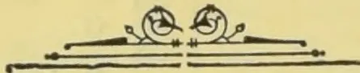

OBSERVER PRINTING WORKS.

1038------------------------------------------------

# TEA, COFFEE, CINCHONA, COCOA, AND CARDAMOM SALES.

NO. 49.

COLOMBO, DECEMBER 21, 1896.

{ PRICE:—12½ cents each 3 copies  
30 cents; 6 copies ½ rupee.

## COLOMBO SALES OF TEA.

### LARGE LOTS.

[MESSRS. A. H. THOMPSON & Co.—82,705 lb.]

<table border="1">
<thead>
<tr>
<th>Lot.</th>
<th>Box.</th>
<th>Pkgs.</th>
<th>Name.</th>
<th>lb.</th>
<th>c.</th>
</tr>
</thead>
<tbody>
<tr>
<td>6 Woodend</td>
<td>6</td>
<td>18 do</td>
<td>bro pek</td>
<td>1800</td>
<td>42 bid</td>
</tr>
<tr>
<td>7</td>
<td>7</td>
<td>22 do</td>
<td>pekoe</td>
<td>2200</td>
<td>30 bid</td>
</tr>
<tr>
<td>8</td>
<td>8</td>
<td>20 do</td>
<td>pek sou</td>
<td>1800</td>
<td>25</td>
</tr>
<tr>
<td>10 St. Leonards on Sea</td>
<td>10</td>
<td>6 ch</td>
<td>bro pek</td>
<td>600</td>
<td>41 bid</td>
</tr>
<tr>
<td>11</td>
<td>11</td>
<td>6 do</td>
<td>pekoe</td>
<td>540</td>
<td>28 bid</td>
</tr>
<tr>
<td>14 B &amp; D</td>
<td>14</td>
<td>9 do</td>
<td>dust</td>
<td>1350</td>
<td>22 bid</td>
</tr>
<tr>
<td>15</td>
<td>15</td>
<td>11 do</td>
<td>bro pek fan</td>
<td>1265</td>
<td>30</td>
</tr>
<tr>
<td>16 Warwick</td>
<td>16</td>
<td>11 do</td>
<td>pekoe</td>
<td>990</td>
<td>44</td>
</tr>
<tr>
<td>18</td>
<td>18</td>
<td>3 do</td>
<td>dust</td>
<td>420</td>
<td>27</td>
</tr>
<tr>
<td>19 Kalkande</td>
<td>19</td>
<td>10 hf-ch</td>
<td>bro pek</td>
<td>1000</td>
<td>45 bid</td>
</tr>
<tr>
<td>20</td>
<td>20</td>
<td>18 do</td>
<td>pekoe</td>
<td>900</td>
<td>34 bid</td>
</tr>
<tr>
<td>21</td>
<td>21</td>
<td>10 do</td>
<td>pek sou</td>
<td>500</td>
<td>30</td>
</tr>
<tr>
<td>23</td>
<td>23</td>
<td>10 do</td>
<td>bro mix</td>
<td>550</td>
<td>14 bid</td>
</tr>
<tr>
<td>25 S</td>
<td>25</td>
<td>9 do</td>
<td>pek dust</td>
<td>690</td>
<td>21</td>
</tr>
<tr>
<td>26 Y N C</td>
<td>26</td>
<td>24 ch</td>
<td>bro pek</td>
<td>2880</td>
<td>25 bid</td>
</tr>
<tr>
<td>27</td>
<td>27</td>
<td>11 do</td>
<td>pekoe</td>
<td>1100</td>
<td>20 bid</td>
</tr>
<tr>
<td>28</td>
<td>28</td>
<td>13 do</td>
<td>pek sou</td>
<td>1300</td>
<td>10 bid</td>
</tr>
<tr>
<td>29 B P C</td>
<td>29</td>
<td>30 hf-ch</td>
<td>bro pek</td>
<td>1500</td>
<td>out</td>
</tr>
<tr>
<td>30</td>
<td>30</td>
<td>20 do</td>
<td>pekoe</td>
<td>1000</td>
<td>out</td>
</tr>
<tr>
<td>31</td>
<td>31</td>
<td>14 do</td>
<td>pek sou</td>
<td>1190</td>
<td>out</td>
</tr>
<tr>
<td>32 C W</td>
<td>32</td>
<td>38 box</td>
<td>pek son</td>
<td>760</td>
<td>out</td>
</tr>
<tr>
<td>33 Ugieside</td>
<td>33</td>
<td>5 ch</td>
<td>bro mix</td>
<td>500</td>
<td>20</td>
</tr>
<tr>
<td>35 Invoice No. 4, Myraganga</td>
<td>35</td>
<td>13 ch</td>
<td>bro or pek</td>
<td>1430</td>
<td>54</td>
</tr>
<tr>
<td>36</td>
<td>36</td>
<td>26 do</td>
<td>bro pek</td>
<td>2600</td>
<td>54</td>
</tr>
<tr>
<td>37</td>
<td>37</td>
<td>17 do</td>
<td>pekoe</td>
<td>1615</td>
<td>45</td>
</tr>
<tr>
<td>39 Invoice No. 5, Myraganga</td>
<td>39</td>
<td>19 ch</td>
<td>bro pek</td>
<td>2090</td>
<td>46</td>
</tr>
<tr>
<td>40</td>
<td>40</td>
<td>6 do</td>
<td>pekoe</td>
<td>570</td>
<td>36</td>
</tr>
<tr>
<td>43 Agra Elbedde</td>
<td>43</td>
<td>18 hf-ch</td>
<td>bro or pek</td>
<td>1080</td>
<td>71</td>
</tr>
<tr>
<td>44</td>
<td>44</td>
<td>19 do</td>
<td>bro pek</td>
<td>1140</td>
<td>56 bid</td>
</tr>
<tr>
<td>45</td>
<td>45</td>
<td>26 do</td>
<td>pekoe</td>
<td>1300</td>
<td>48 bid</td>
</tr>
<tr>
<td>46</td>
<td>46</td>
<td>12 do</td>
<td>pek sou</td>
<td>600</td>
<td>49</td>
</tr>
<tr>
<td>45</td>
<td>47</td>
<td>7 do</td>
<td>dust</td>
<td>525</td>
<td>33</td>
</tr>
<tr>
<td>49 Battalgalla</td>
<td>49</td>
<td>14 ch</td>
<td>pek sou</td>
<td>1400</td>
<td>36</td>
</tr>
<tr>
<td>50</td>
<td>50</td>
<td>5 do</td>
<td>fans</td>
<td>450</td>
<td>17 bid</td>
</tr>
<tr>
<td>51 St. Leonards on Sea</td>
<td>51</td>
<td>17 ch</td>
<td>bro pek</td>
<td>1700</td>
<td>40 bid</td>
</tr>
<tr>
<td>52</td>
<td>52</td>
<td>8 do</td>
<td>pekoe</td>
<td>720</td>
<td>26 bid</td>
</tr>
<tr>
<td>53</td>
<td>53</td>
<td>5 do</td>
<td>pek sou</td>
<td>400</td>
<td>24 bid</td>
</tr>
<tr>
<td>56 Vogan</td>
<td>56</td>
<td>45 do</td>
<td>bro pek</td>
<td>4275</td>
<td>54</td>
</tr>
<tr>
<td>63</td>
<td>60</td>
<td>20 hf-ch</td>
<td>pek fans</td>
<td>1000</td>
<td>34</td>
</tr>
<tr>
<td>61</td>
<td>61</td>
<td>46 ch</td>
<td>sou</td>
<td>3450</td>
<td>28</td>
</tr>
<tr>
<td>63 Mahaousa</td>
<td>63</td>
<td>30 do</td>
<td>pek fans</td>
<td>1950</td>
<td>29</td>
</tr>
<tr>
<td>64 Balgownie</td>
<td>64</td>
<td>9 ch</td>
<td>bro pek</td>
<td>810</td>
<td>36</td>
</tr>
<tr>
<td>65</td>
<td>65</td>
<td>17 do</td>
<td>pekoe</td>
<td>1275</td>
<td>28</td>
</tr>
<tr>
<td>66</td>
<td>66</td>
<td>7 do</td>
<td>pek sou</td>
<td>490</td>
<td>22</td>
</tr>
</tbody>
</table>

[MESSRS. FORBES & WALKER.—537,608 lb.]

<table border="1">
<thead>
<tr>
<th>Lot.</th>
<th>Box.</th>
<th>Pkgs.</th>
<th>Name.</th>
<th>lb.</th>
<th>c.</th>
</tr>
</thead>
<tbody>
<tr>
<td>2 New Peacock</td>
<td>446</td>
<td>14 hf-ch</td>
<td>pek fans</td>
<td>1050</td>
<td>24</td>
</tr>
<tr>
<td>3 W N</td>
<td>448</td>
<td>9 do</td>
<td>fans</td>
<td>738</td>
<td>15</td>
</tr>
<tr>
<td>4</td>
<td>450</td>
<td>12 do</td>
<td>bro tea</td>
<td>600</td>
<td>10</td>
</tr>
<tr>
<td>5 Carberry</td>
<td>452</td>
<td>39 ch</td>
<td>bro pek</td>
<td>3900</td>
<td>54</td>
</tr>
<tr>
<td>6</td>
<td>454</td>
<td>30 do</td>
<td>pekoe</td>
<td>2700</td>
<td>33</td>
</tr>
<tr>
<td>7 Coreen</td>
<td>456</td>
<td>9 do</td>
<td>pek sou</td>
<td>765</td>
<td>38</td>
</tr>
<tr>
<td>8</td>
<td>458</td>
<td>4 do</td>
<td>dust</td>
<td>560</td>
<td>24</td>
</tr>
<tr>
<td>10 Avoca</td>
<td>462</td>
<td>8 do</td>
<td>bro pek</td>
<td>800</td>
<td>49</td>
</tr>
<tr>
<td>11</td>
<td>464</td>
<td>10 do</td>
<td>pekoe</td>
<td>1000</td>
<td>36</td>
</tr>
<tr>
<td>14 Macaldenia</td>
<td>470</td>
<td>36 hf-ch</td>
<td>bro pek</td>
<td>1800</td>
<td>45</td>
</tr>
<tr>
<td>15</td>
<td>472</td>
<td>17 ch</td>
<td>pekoe</td>
<td>1700</td>
<td>40</td>
</tr>
<tr>
<td>16</td>
<td>474</td>
<td>15 do</td>
<td>pekoe No 2</td>
<td>1500</td>
<td>37</td>
</tr>
<tr>
<td>17 H A T, in estate mark</td>
<td>476</td>
<td>7 ch</td>
<td>bro pek</td>
<td>770</td>
<td>12 bid</td>
</tr>
<tr>
<td>19 Helton</td>
<td>480</td>
<td>20 do</td>
<td>bro pek</td>
<td>1900</td>
<td>55</td>
</tr>
<tr>
<td>20</td>
<td>482</td>
<td>6 do</td>
<td>pekoe</td>
<td>570</td>
<td>35</td>
</tr>
<tr>
<td>23 Radella</td>
<td>488</td>
<td>38 do</td>
<td>bro pek</td>
<td>3800</td>
<td>59</td>
</tr>
<tr>
<td>24</td>
<td>490</td>
<td>26 do</td>
<td>pekoe</td>
<td>2340</td>
<td>45</td>
</tr>
<tr>
<td>25</td>
<td>492</td>
<td>12 do</td>
<td>pek sou</td>
<td>180</td>
<td>41</td>
</tr>
<tr>
<td>27 Great Valley</td>
<td>496</td>
<td>18 ch</td>
<td>bro pek</td>
<td>2070</td>
<td>42</td>
</tr>
<tr>
<td>28</td>
<td>498</td>
<td>15 do</td>
<td>or pek</td>
<td>1575</td>
<td>35</td>
</tr>
<tr>
<td>29</td>
<td>500</td>
<td>20 do</td>
<td>pekoe</td>
<td>2000</td>
<td>34</td>
</tr>
<tr>
<td>30</td>
<td>502</td>
<td>8 do</td>
<td>pek sou</td>
<td>720</td>
<td>28</td>
</tr>
<tr>
<td>32 Yatiyama</td>
<td>506</td>
<td>12 ch</td>
<td>bro pek</td>
<td>1320</td>
<td>20 bid</td>
</tr>
<tr>
<td>33</td>
<td>508</td>
<td>8 hf-ch</td>
<td>pekoe</td>
<td>400</td>
<td>22</td>
</tr>
<tr>
<td>34</td>
<td>510</td>
<td>15 ch</td>
<td>pek sou</td>
<td>1450</td>
<td>18</td>
</tr>
<tr>
<td>35</td>
<td>512</td>
<td>3 do</td>
<td>dust</td>
<td>435</td>
<td>out</td>
</tr>
<tr>
<td>36 R, in estate mark</td>
<td>514</td>
<td>5 ch</td>
<td>pek sou</td>
<td>450</td>
<td>20</td>
</tr>
<tr>
<td>37</td>
<td>516</td>
<td>6 do</td>
<td>dust</td>
<td>900</td>
<td>21 bid</td>
</tr>
<tr>
<td>38 R M, in estate mark</td>
<td>518</td>
<td>7 ch</td>
<td>bro pek</td>
<td>749</td>
<td>39</td>
</tr>
</tbody>
</table>

<table border="1">
<thead>
<tr>
<th>Lot.</th>
<th>Box.</th>
<th>Pkgs.</th>
<th>Name.</th>
<th>lb.</th>
<th>c.</th>
</tr>
</thead>
<tbody>
<tr>
<td>39</td>
<td>520</td>
<td>6 ch</td>
<td>pekoe</td>
<td>540</td>
<td>34</td>
</tr>
<tr>
<td>40</td>
<td>522</td>
<td>5 do</td>
<td>pek sou</td>
<td>450</td>
<td>25</td>
</tr>
<tr>
<td>43 Sunnycroft</td>
<td>528</td>
<td>7 do</td>
<td>pek sou</td>
<td>700</td>
<td>25</td>
</tr>
<tr>
<td>45</td>
<td>532</td>
<td>3 do</td>
<td>dust</td>
<td>450</td>
<td>19</td>
</tr>
<tr>
<td>46 Nahalma</td>
<td>534</td>
<td>13 hf-ch</td>
<td>dust</td>
<td>1092</td>
<td>19</td>
</tr>
<tr>
<td>47 T B, in estate mark</td>
<td>536</td>
<td>4 ch</td>
<td>dust</td>
<td>400</td>
<td>20</td>
</tr>
<tr>
<td>48</td>
<td>538</td>
<td>6 do</td>
<td>fans</td>
<td>450</td>
<td>23</td>
</tr>
<tr>
<td>50 P T L</td>
<td>542</td>
<td>3 do</td>
<td>dust</td>
<td>402</td>
<td>19</td>
</tr>
<tr>
<td>56 Pansaletenne</td>
<td>554</td>
<td>30 ch</td>
<td>bro pek</td>
<td>3150</td>
<td>36 bid</td>
</tr>
<tr>
<td>57</td>
<td>556</td>
<td>16 do</td>
<td>pekoe</td>
<td>1600</td>
<td>32 bid</td>
</tr>
<tr>
<td>58</td>
<td>558</td>
<td>19 do</td>
<td>pek sou</td>
<td>1805</td>
<td>27</td>
</tr>
<tr>
<td>59</td>
<td>560</td>
<td>4 do</td>
<td>fans</td>
<td>440</td>
<td>31</td>
</tr>
<tr>
<td>60</td>
<td>562</td>
<td>4 do</td>
<td>congou</td>
<td>400</td>
<td>17</td>
</tr>
<tr>
<td>62 Ookoowatte</td>
<td>566</td>
<td>9 ch</td>
<td>bro pek</td>
<td>900</td>
<td>46 bid</td>
</tr>
<tr>
<td>63</td>
<td>568</td>
<td>6 do</td>
<td>pekoe</td>
<td>540</td>
<td>34</td>
</tr>
<tr>
<td>65</td>
<td>572</td>
<td>26 hf-ch</td>
<td>sou</td>
<td>1300</td>
<td>27</td>
</tr>
<tr>
<td>68</td>
<td>578</td>
<td>12 do</td>
<td>dust</td>
<td>960</td>
<td>19</td>
</tr>
<tr>
<td>69 Errolwood</td>
<td>580</td>
<td>26 ch</td>
<td>bro pek</td>
<td>2860</td>
<td>65 bid</td>
</tr>
<tr>
<td>70</td>
<td>582</td>
<td>38 do</td>
<td>pekoe</td>
<td>3610</td>
<td>47</td>
</tr>
<tr>
<td>71</td>
<td>584</td>
<td>20 do</td>
<td>pek sou</td>
<td>1900</td>
<td>38</td>
</tr>
<tr>
<td>74 Galawatte</td>
<td>590</td>
<td>7 do</td>
<td>bro pek</td>
<td>700</td>
<td>43</td>
</tr>
<tr>
<td>75</td>
<td>592</td>
<td>14 do</td>
<td>or pek</td>
<td>1120</td>
<td>43</td>
</tr>
<tr>
<td>76</td>
<td>594</td>
<td>11 do</td>
<td>pekoe</td>
<td>990</td>
<td>33</td>
</tr>
<tr>
<td>79 Scrubs</td>
<td>600</td>
<td>12 ch</td>
<td>bro or pek</td>
<td>1200</td>
<td>65</td>
</tr>
<tr>
<td>80</td>
<td>602</td>
<td>22 do</td>
<td>or pek</td>
<td>2420</td>
<td>53</td>
</tr>
<tr>
<td>81</td>
<td>604</td>
<td>22 do</td>
<td>pekoe</td>
<td>2090</td>
<td>49</td>
</tr>
<tr>
<td>82</td>
<td>606</td>
<td>7 do</td>
<td>dust</td>
<td>1050</td>
<td>31</td>
</tr>
<tr>
<td>83 Dunedin</td>
<td>608</td>
<td>26 hf-ch</td>
<td>congou</td>
<td>1390</td>
<td>22</td>
</tr>
<tr>
<td>84</td>
<td>610</td>
<td>13 do</td>
<td>red leaf</td>
<td>585</td>
<td>11</td>
</tr>
<tr>
<td>86 Peacock Hill</td>
<td>614</td>
<td>8 do</td>
<td>pek sou</td>
<td>600</td>
<td>26</td>
</tr>
<tr>
<td>90 Waverley</td>
<td>622</td>
<td>11 ch</td>
<td>fans</td>
<td>1375</td>
<td>22</td>
</tr>
<tr>
<td>92 C B</td>
<td>626</td>
<td>9 do</td>
<td>bro pek</td>
<td>900</td>
<td>45</td>
</tr>
<tr>
<td>93</td>
<td>628</td>
<td>9 do</td>
<td>pekoe</td>
<td>900</td>
<td>37</td>
</tr>
<tr>
<td>100 Morlands</td>
<td>642</td>
<td>22 hf-ch</td>
<td>bro pek</td>
<td>1100</td>
<td>57</td>
</tr>
<tr>
<td>101</td>
<td>644</td>
<td>17 ch</td>
<td>pekoe</td>
<td>1700</td>
<td>43</td>
</tr>
<tr>
<td>102</td>
<td>646</td>
<td>7 do</td>
<td>pek sou</td>
<td>700</td>
<td>34</td>
</tr>
<tr>
<td>106 Kirrinmettia</td>
<td>654</td>
<td>8 do</td>
<td>unas</td>
<td>720</td>
<td>23</td>
</tr>
<tr>
<td>107 M R O, in est. mark</td>
<td>656</td>
<td>25 ch</td>
<td>bro mix</td>
<td>2252</td>
<td>11</td>
</tr>
<tr>
<td></td>
<td>658</td>
<td>5 do</td>
<td>sou</td>
<td>450</td>
<td>12</td>
</tr>
<tr>
<td>110 Beausejour</td>
<td>662</td>
<td>13 do</td>
<td>bro pek</td>
<td>1170</td>
<td>41</td>
</tr>
<tr>
<td>111</td>
<td>664</td>
<td>27 do</td>
<td>pekoe</td>
<td>2180</td>
<td>27</td>
</tr>
<tr>
<td>113</td>
<td>668</td>
<td>4 do</td>
<td>dust</td>
<td>560</td>
<td>20</td>
</tr>
<tr>
<td>114</td>
<td>670</td>
<td>6 do</td>
<td>fans</td>
<td>600</td>
<td>23</td>
</tr>
<tr>
<td>114a</td>
<td></td>
<td>4 do</td>
<td>do</td>
<td>400</td>
<td>27</td>
</tr>
<tr>
<td>115 M C</td>
<td>672</td>
<td>5 ch</td>
<td>congou</td>
<td>500</td>
<td>21</td>
</tr>
<tr>
<td>116</td>
<td>674</td>
<td>5 do</td>
<td>red leaf</td>
<td>400</td>
<td>11</td>
</tr>
<tr>
<td>117 Monkswood</td>
<td>676</td>
<td>30 hf-ch</td>
<td>bro pek</td>
<td>1500</td>
<td>87</td>
</tr>
<tr>
<td>118</td>
<td>678</td>
<td>48 do</td>
<td>or pek</td>
<td>2160</td>
<td>80</td>
</tr>
<tr>
<td>119</td>
<td>680</td>
<td>38 do</td>
<td>do</td>
<td>1710</td>
<td>78</td>
</tr>
<tr>
<td>120</td>
<td>682</td>
<td>15 ch</td>
<td>pek sou</td>
<td>1350</td>
<td>52</td>
</tr>
<tr>
<td>121 Anningkande</td>
<td>684</td>
<td>23 ch</td>
<td>bro pek</td>
<td>2530</td>
<td>43</td>
</tr>
<tr>
<td>122</td>
<td>686</td>
<td>13 do</td>
<td>pekoe</td>
<td>1300</td>
<td>37</td>
</tr>
<tr>
<td>123</td>
<td>688</td>
<td>15 do</td>
<td>pek sou</td>
<td>1500</td>
<td>29</td>
</tr>
<tr>
<td>124</td>
<td>690</td>
<td>6 hf-ch</td>
<td>dust</td>
<td>450</td>
<td>20</td>
</tr>
<tr>
<td>129 B D W G</td>
<td>700</td>
<td>9 hf-ch</td>
<td>dust</td>
<td>810</td>
<td>24</td>
</tr>
<tr>
<td>133 Gallawatte</td>
<td>708</td>
<td>9 do</td>
<td>bro pek</td>
<td>900</td>
<td>42</td>
</tr>
<tr>
<td>134</td>
<td>710</td>
<td>20 do</td>
<td>or pek</td>
<td>1600</td>
<td>43</td>
</tr>
<tr>
<td>135</td>
<td>712</td>
<td>8 do</td>
<td>pekoe</td>
<td>729</td>
<td>31</td>
</tr>
<tr>
<td>138 Middleton</td>
<td>718</td>
<td>19 hf-ch</td>
<td>bro pek</td>
<td>1145</td>
<td>70</td>
</tr>
<tr>
<td>139</td>
<td>720</td>
<td>21 do</td>
<td>or pek</td>
<td>1155</td>
<td>56</td>
</tr>
<tr>
<td>140</td>
<td>722</td>
<td>12 ch</td>
<td>pekoe No 1</td>
<td>1140</td>
<td>50</td>
</tr>
<tr>
<td>141</td>
<td>724</td>
<td>6 do</td>
<td>dust</td>
<td>930</td>
<td>25</td>
</tr>
<tr>
<td>142 Walpola</td>
<td>726</td>
<td>37 do</td>
<td>bro pek</td>
<td>3885</td>
<td>41</td>
</tr>
<tr>
<td>143</td>
<td>728</td>
<td>do</td>
<td>pekoe</td>
<td>3515</td>
<td>31</td>
</tr>
<tr>
<td>144</td>
<td>730</td>
<td>18 do</td>
<td>pek sou</td>
<td>1710</td>
<td>27</td>
</tr>
<tr>
<td>147 G</td>
<td>736</td>
<td>8 ch</td>
<td>bro pek</td>
<td>800</td>
<td>31</td>
</tr>
<tr>
<td>148</td>
<td>738</td>
<td>5 do</td>
<td>pekoe</td>
<td>560</td>
<td>21</td>
</tr>
<tr>
<td>149</td>
<td>740</td>
<td>4 do</td>
<td>pek sou</td>
<td>400</td>
<td>19</td>
</tr>
<tr>
<td>156 Galkndua</td>
<td>754</td>
<td>18 ch</td>
<td>bro pek</td>
<td>1800</td>
<td>35 bid</td>
</tr>
<tr>
<td>157</td>
<td>756</td>
<td>15 do</td>
<td>pekoe</td>
<td>1500</td>
<td>24</td>
</tr>
<tr>
<td>158</td>
<td>758</td>
<td>12 do</td>
<td>pek sou</td>
<td>1200</td>
<td>19</td>
</tr>
<tr>
<td>161 Carfax</td>
<td>764</td>
<td>25 hf-ch</td>
<td>bro or pek</td>
<td>1250</td>
<td>57</td>
</tr>
<tr>
<td>162</td>
<td>766</td>
<td>13 ch</td>
<td>or pek</td>
<td>1300</td>
<td>53</td>
</tr>
<tr>
<td>163</td>
<td>768</td>
<td>6 do</td>
<td>bro pek</td>
<td>660</td>
<td>36</td>
</tr>
<tr>
<td>164</td>
<td>770</td>
<td>29 do</td>
<td>pekoe</td>
<td>2755</td>
<td>44</td>
</tr>
<tr>
<td>165</td>
<td>772</td>
<td>3 do</td>
<td>dust</td>
<td>480</td>
<td>21</td>
</tr>
<tr>
<td>166 Killarney</td>
<td>774</td>
<td>65 hf-ch</td>
<td>bro or pek</td>
<td>3900</td>
<td>54 bid</td>
</tr>
<tr>
<td>167 Weoya</td>
<td>776</td>
<td>76 ch</td>
<td>bro pek</td>
<td>6840</td>
<td>37</td>
</tr>
<tr>
<td>168</td>
<td>778</td>
<td>59 do</td>
<td>pekoe</td>
<td>4130</td>
<td>31</td>
</tr>
<tr>
<td>169</td>
<td>780</td>
<td>49 do</td>
<td>pek sou</td>
<td>3430</td>
<td>25</td>
</tr>
<tr>
<td>170</td>
<td>782</td>
<td>34 do</td>
<td>fans</td>
<td>3400</td>
<td>23</td>
</tr>
<tr>
<td>171</td>
<td>784</td>
<td>5 do</td>
<td>dust</td>
<td>700</td>
<td>18</td>
</tr>
<tr>
<td>172 Dunkeld</td>
<td>786</td>
<td>16 ch</td>
<td>bro pek</td>
<td>1760</td>
<td>53</td>
</tr>
<tr>
<td>173</td>
<td>788</td>
<td>16 do</td>
<td>or pek</td>
<td>1280</td>
<td>54</td>
</tr>
<tr>
<td>174</td>
<td>790</td>
<td>12 do</td>
<td>pekoe</td>
<td>1440</td>
<td>40</td>
</tr>
<tr>
<td>175 D K D</td>
<td>792</td>
<td>5 do</td>
<td>bro pek</td>
<td>No. 2 650</td>
<td>34</td>
</tr>
<tr>
<td>176 Maha Uva</td>
<td>994</td>
<td>32 hf-ch</td>
<td>bro or pek</td>
<td>1920</td>
<td>52</td>
</tr>
<tr>
<td>177</td>
<td>796</td>
<td>42 do</td>
<td>or pek</td>
<td>2520</td>
<td>53</td>
</tr>
</tbody>
</table>

1039------------------------------------------------

2

CEYLON PRODUCE SALES LIST.

<table border="1">
<thead>
<tr>
<th>Lot.</th>
<th>Box.</th>
<th>Pkgs.</th>
<th>Name.</th>
<th>lb.</th>
<th>c.</th>
<th>Lot.</th>
<th>Box.</th>
<th>Pkgs.</th>
<th>Name.</th>
<th>lb.</th>
<th>c.</th>
</tr>
</thead>
<tbody>
<tr>
<td>178</td>
<td>793</td>
<td>32 ch</td>
<td>pekoe</td>
<td>3200</td>
<td>48</td>
<td>335</td>
<td>Waitalawa</td>
<td>112 62 hf-ch</td>
<td>bro pek</td>
<td>3100</td>
<td>55</td>
</tr>
<tr>
<td>179</td>
<td>800</td>
<td>18 do</td>
<td>pek sou</td>
<td>1530</td>
<td>43</td>
<td>336</td>
<td></td>
<td>114 76 do</td>
<td>pekoe</td>
<td>3800</td>
<td>35</td>
</tr>
<tr>
<td>181</td>
<td>Kuriana</td>
<td>804 29 hf-ch</td>
<td>bro or pek</td>
<td>1305</td>
<td>35 bid</td>
<td>337</td>
<td></td>
<td>116 18 do</td>
<td>pek sou</td>
<td>900</td>
<td>26</td>
</tr>
<tr>
<td>182</td>
<td></td>
<td>806 28 do</td>
<td>bro pek</td>
<td>1260</td>
<td>40</td>
<td>338</td>
<td></td>
<td>118 5 do</td>
<td>dust</td>
<td>425</td>
<td>23</td>
</tr>
<tr>
<td>183</td>
<td></td>
<td>808 37 ch</td>
<td>pekoe</td>
<td>3145</td>
<td>25</td>
<td>339</td>
<td>Nugagalla</td>
<td>120 33 do</td>
<td>bro pek</td>
<td>1650</td>
<td>53</td>
</tr>
<tr>
<td>184</td>
<td></td>
<td>810 17 do</td>
<td>pek sou</td>
<td>1530</td>
<td>20</td>
<td>340</td>
<td></td>
<td>122 59 do</td>
<td>pekoe</td>
<td>2950</td>
<td>36</td>
</tr>
<tr>
<td>185</td>
<td></td>
<td>812 12 do</td>
<td>bro pek fan</td>
<td>1200</td>
<td>24</td>
<td>341</td>
<td></td>
<td>124 11 do</td>
<td>pek sou</td>
<td>550</td>
<td>25</td>
</tr>
<tr>
<td>186</td>
<td>Erracht</td>
<td>814 18 ch</td>
<td>bro or pek</td>
<td>1530</td>
<td>38</td>
<td>342</td>
<td></td>
<td>126 5 do</td>
<td>dust</td>
<td>425</td>
<td>22</td>
</tr>
<tr>
<td>187</td>
<td></td>
<td>816 25 do</td>
<td>or pek</td>
<td>2125</td>
<td>49</td>
<td>343</td>
<td>Chalmers</td>
<td>128 ch</td>
<td>pek sou</td>
<td>810</td>
<td>55</td>
</tr>
<tr>
<td>188</td>
<td></td>
<td>818 38 do</td>
<td>pekoe</td>
<td>2553</td>
<td>34</td>
<td>344</td>
<td></td>
<td>130 5 do</td>
<td>sou</td>
<td>456</td>
<td>28</td>
</tr>
<tr>
<td>189</td>
<td></td>
<td>820 14 do</td>
<td>pek sou</td>
<td>1050</td>
<td>26</td>
<td>345</td>
<td></td>
<td>132 4 do</td>
<td>dust</td>
<td>460</td>
<td>22</td>
</tr>
<tr>
<td>190</td>
<td>Ruanwella</td>
<td>822 31 ch</td>
<td>bro pek</td>
<td>3100</td>
<td>42</td>
<td>346</td>
<td>Thorndale, in es-</td>
<td></td>
<td></td>
<td></td>
<td></td>
</tr>
<tr>
<td>191</td>
<td></td>
<td>824 52 do</td>
<td>pekoe</td>
<td>4160</td>
<td>33</td>
<td></td>
<td>tate mark</td>
<td>134 29 do</td>
<td>bro pe fans</td>
<td>2900</td>
<td>27 bid</td>
</tr>
<tr>
<td>192</td>
<td></td>
<td>826 10 do</td>
<td>pek sou</td>
<td>900</td>
<td>23</td>
<td>350</td>
<td>Ambalangoda</td>
<td>142 7 do</td>
<td>bro pekoe</td>
<td>770</td>
<td>45</td>
</tr>
<tr>
<td>194</td>
<td></td>
<td>830 6 do</td>
<td>dust</td>
<td>480</td>
<td>16</td>
<td>351</td>
<td></td>
<td>144 11 do</td>
<td>pekoe</td>
<td>980</td>
<td>37</td>
</tr>
<tr>
<td>197</td>
<td>P G A</td>
<td>836 11 do</td>
<td>bro or pek</td>
<td>1100</td>
<td>39</td>
<td>352</td>
<td></td>
<td>146 6 do</td>
<td>pek sou</td>
<td>480</td>
<td>28</td>
</tr>
<tr>
<td>198</td>
<td></td>
<td>838 7 do</td>
<td>bro pek</td>
<td>665</td>
<td>50</td>
<td>362</td>
<td>Geragama</td>
<td>166 30 do</td>
<td>bro pek</td>
<td>3000</td>
<td>49</td>
</tr>
<tr>
<td>199</td>
<td></td>
<td>840 5 do</td>
<td>pekoe</td>
<td>450</td>
<td>30</td>
<td>363</td>
<td></td>
<td>168 18 do</td>
<td>pekoe</td>
<td>1710</td>
<td>32</td>
</tr>
<tr>
<td>200</td>
<td></td>
<td>842 5 do</td>
<td>pek sou</td>
<td>475</td>
<td>24</td>
<td>364</td>
<td></td>
<td>170 10 do</td>
<td>pek sou</td>
<td>900</td>
<td>28</td>
</tr>
<tr>
<td>201</td>
<td>Carandon</td>
<td>844 5 ch</td>
<td>bro pek</td>
<td>500</td>
<td>39</td>
<td>367</td>
<td>C.</td>
<td>176 13 hf-ch</td>
<td>bro mix</td>
<td>624</td>
<td>14</td>
</tr>
<tr>
<td>202</td>
<td></td>
<td>846 5 do</td>
<td>pekoe</td>
<td>500</td>
<td>29</td>
<td>369</td>
<td>Bandara Eliya</td>
<td>180 34 do</td>
<td>bro or pek</td>
<td>1709</td>
<td>53</td>
</tr>
<tr>
<td>203</td>
<td></td>
<td>848 4 do</td>
<td>pek sou</td>
<td>400</td>
<td>25</td>
<td>370</td>
<td></td>
<td>182 11 ch</td>
<td>or pek</td>
<td>902</td>
<td>40 bid</td>
</tr>
<tr>
<td>204</td>
<td></td>
<td>850 8 do</td>
<td>son</td>
<td>809</td>
<td>21</td>
<td>371</td>
<td></td>
<td>184 22 do</td>
<td>pekoe</td>
<td>1760</td>
<td>38 bid</td>
</tr>
<tr>
<td>211</td>
<td>H L</td>
<td>864 35 ch</td>
<td>bro mix</td>
<td>1350</td>
<td>10</td>
<td>372</td>
<td></td>
<td>186 11 do</td>
<td>pek sou</td>
<td>990</td>
<td>30</td>
</tr>
<tr>
<td>212</td>
<td></td>
<td>866 5 hf-ch</td>
<td>dust</td>
<td>400</td>
<td>14</td>
<td>378</td>
<td>Harrington</td>
<td>198 8 ch</td>
<td>or pek</td>
<td>896</td>
<td>52 bid</td>
</tr>
<tr>
<td>217</td>
<td>Munukattie,</td>
<td></td>
<td></td>
<td></td>
<td></td>
<td>379</td>
<td></td>
<td>200 8 do</td>
<td>pekoe</td>
<td>800</td>
<td>47</td>
</tr>
<tr>
<td></td>
<td>Ceylon in est.</td>
<td></td>
<td></td>
<td></td>
<td></td>
<td>382</td>
<td>Clyde</td>
<td>206 34 do</td>
<td>bro pek</td>
<td>3400</td>
<td>46</td>
</tr>
<tr>
<td></td>
<td>mark</td>
<td>876 6 ch</td>
<td>or pek</td>
<td>540</td>
<td>58</td>
<td>383</td>
<td></td>
<td>208 56 do</td>
<td>pekoe</td>
<td>4760</td>
<td>34</td>
</tr>
<tr>
<td>218</td>
<td></td>
<td>873 16 hf-ch</td>
<td>bro pek</td>
<td>880</td>
<td>63</td>
<td>384</td>
<td></td>
<td>210 12 do</td>
<td>pek sou</td>
<td>1200</td>
<td>27</td>
</tr>
<tr>
<td>219</td>
<td></td>
<td>880 11 ch</td>
<td>pekoe</td>
<td>990</td>
<td>45</td>
<td>385</td>
<td></td>
<td>212 4 do</td>
<td>dust</td>
<td>620</td>
<td>21</td>
</tr>
<tr>
<td>220</td>
<td></td>
<td>882 6 do</td>
<td>pek sou</td>
<td>540</td>
<td>35</td>
<td>386</td>
<td>C. O. E. B.</td>
<td>214 9 do</td>
<td>pek sou</td>
<td>900</td>
<td>25</td>
</tr>
<tr>
<td>221</td>
<td>Horagaskelle</td>
<td>884 8 hf-ch</td>
<td>bro pek</td>
<td>468</td>
<td>37</td>
<td>387</td>
<td></td>
<td>216 4 do</td>
<td>bro mix</td>
<td>428</td>
<td>15</td>
</tr>
<tr>
<td>223</td>
<td></td>
<td>888 9 do</td>
<td>pek sou</td>
<td>526</td>
<td>21</td>
<td>388</td>
<td>Bittacy</td>
<td>218 4 do</td>
<td>pek sou</td>
<td>400</td>
<td>43</td>
</tr>
<tr>
<td>225</td>
<td>Kakiri-kande</td>
<td>892 6 ch</td>
<td>bro pek</td>
<td>650</td>
<td>37</td>
<td>390</td>
<td></td>
<td>222 7 hf-ch</td>
<td>dust</td>
<td>595</td>
<td>20</td>
</tr>
<tr>
<td>242</td>
<td>Weyunga-</td>
<td></td>
<td></td>
<td></td>
<td></td>
<td>393</td>
<td>Hopton</td>
<td>234 15 ch</td>
<td>bro pek</td>
<td>1500</td>
<td>48</td>
</tr>
<tr>
<td></td>
<td>watte</td>
<td>926 31 hf-ch</td>
<td>bro or pek</td>
<td>1705</td>
<td>42</td>
<td>394</td>
<td></td>
<td>230 20 do</td>
<td>bro or pek</td>
<td>2000</td>
<td>61</td>
</tr>
<tr>
<td>243</td>
<td></td>
<td>928 31 do</td>
<td>do</td>
<td>1705</td>
<td>42</td>
<td>395</td>
<td></td>
<td>232 18 do</td>
<td>pekoe</td>
<td>1620</td>
<td>43</td>
</tr>
<tr>
<td>244</td>
<td></td>
<td>930 38 ch</td>
<td>or pek</td>
<td>3420</td>
<td>38</td>
<td>396</td>
<td></td>
<td>324 10 do</td>
<td>pek sou</td>
<td>900</td>
<td>30</td>
</tr>
<tr>
<td>245</td>
<td></td>
<td>932 31 do</td>
<td>pekoe</td>
<td>2480</td>
<td>33</td>
<td>399</td>
<td></td>
<td>240 5 do</td>
<td>dust</td>
<td>600</td>
<td>20</td>
</tr>
<tr>
<td>246</td>
<td></td>
<td>934 10 do</td>
<td>pek sou</td>
<td>950</td>
<td>25</td>
<td>401</td>
<td>Ascot</td>
<td>244 20 do</td>
<td>bro pek</td>
<td>1900</td>
<td>40</td>
</tr>
<tr>
<td>254</td>
<td>Choughleigh</td>
<td>950 8 ch</td>
<td>pekoe</td>
<td>760</td>
<td>36</td>
<td>402</td>
<td></td>
<td>246 19 do</td>
<td>pek</td>
<td>1615</td>
<td>32</td>
</tr>
<tr>
<td>255</td>
<td>H. M. S., in es-</td>
<td></td>
<td></td>
<td></td>
<td></td>
<td>403</td>
<td></td>
<td>248 7 do</td>
<td>pek sou</td>
<td>630</td>
<td>24</td>
</tr>
<tr>
<td></td>
<td>tate mark</td>
<td>952 21 ch</td>
<td>pek sou</td>
<td>2100</td>
<td>20</td>
<td>403a</td>
<td></td>
<td>248a 5 ch</td>
<td>pek fan.</td>
<td>550</td>
<td>28</td>
</tr>
<tr>
<td>256</td>
<td>Talgaswela</td>
<td>954 32 do</td>
<td>bro pek</td>
<td>2880</td>
<td>47</td>
<td>404</td>
<td>Glencorse</td>
<td>250 30 do</td>
<td>bro pek</td>
<td>3000</td>
<td>49</td>
</tr>
<tr>
<td>257</td>
<td></td>
<td>956 8 do</td>
<td>br pe No. 2</td>
<td>880</td>
<td>38</td>
<td>405</td>
<td></td>
<td>252 15 do</td>
<td>pekoe</td>
<td>1350</td>
<td>36</td>
</tr>
<tr>
<td>258</td>
<td></td>
<td>958 7 do</td>
<td>pekoe</td>
<td>630</td>
<td>38</td>
<td>406</td>
<td></td>
<td>254 19 do</td>
<td>pek sou</td>
<td>1520</td>
<td>29</td>
</tr>
<tr>
<td>260</td>
<td></td>
<td>962 11 do</td>
<td>dust</td>
<td>1540</td>
<td>20</td>
<td>409</td>
<td>Castlereagh</td>
<td>260 22 do</td>
<td>bro pek</td>
<td>2200</td>
<td>54</td>
</tr>
<tr>
<td>261</td>
<td>Ambalakande</td>
<td>964 9 do</td>
<td>bro pek</td>
<td>810</td>
<td>47</td>
<td>410</td>
<td></td>
<td>262 14 do</td>
<td>or pek</td>
<td>1260</td>
<td>44</td>
</tr>
<tr>
<td>262</td>
<td></td>
<td>966 12 do</td>
<td>pekoe</td>
<td>1080</td>
<td>33</td>
<td>411</td>
<td></td>
<td>264 9 do</td>
<td>pekoe</td>
<td>810</td>
<td>35</td>
</tr>
<tr>
<td>263</td>
<td></td>
<td>968 6 do</td>
<td>pek son</td>
<td>600</td>
<td>29</td>
<td>412</td>
<td></td>
<td>266 4 do</td>
<td>pek sou</td>
<td>400</td>
<td>34</td>
</tr>
<tr>
<td>264</td>
<td>Queensland</td>
<td>970 17 do</td>
<td>or pek</td>
<td>1615</td>
<td>56</td>
<td>416</td>
<td>Springkell</td>
<td>274 7 do</td>
<td>dust</td>
<td>590</td>
<td>19</td>
</tr>
<tr>
<td>265</td>
<td></td>
<td>972 29 do</td>
<td>pekoe</td>
<td>2465</td>
<td>44</td>
<td>430</td>
<td>Dea Ella</td>
<td>302 51 hf-ch</td>
<td>bro pek</td>
<td>2805</td>
<td>39</td>
</tr>
<tr>
<td>267</td>
<td>Patiagama</td>
<td>976 12 do</td>
<td>bro or pek</td>
<td>1260</td>
<td>52</td>
<td>431</td>
<td></td>
<td>304 40 do</td>
<td>pekoe</td>
<td>2000</td>
<td>29</td>
</tr>
<tr>
<td>268</td>
<td></td>
<td>978 7 do</td>
<td>or pek</td>
<td>700</td>
<td>57</td>
<td>432</td>
<td></td>
<td>306 22 do</td>
<td>pek sou</td>
<td>990</td>
<td>26</td>
</tr>
<tr>
<td>269</td>
<td></td>
<td>980 9 do</td>
<td>pekoe</td>
<td>900</td>
<td>45</td>
<td>440</td>
<td>Canapalla</td>
<td>322 145 hf-ch</td>
<td>bro pek</td>
<td>7250</td>
<td>42</td>
</tr>
<tr>
<td>272</td>
<td>Cottaganga</td>
<td>986 6 do</td>
<td>pek sou</td>
<td>540</td>
<td>20</td>
<td>441</td>
<td></td>
<td>324 35 ch</td>
<td>bro pe fans</td>
<td>3500</td>
<td>25</td>
</tr>
<tr>
<td>276</td>
<td>Pantiya</td>
<td>994 4 do</td>
<td>dust</td>
<td>560</td>
<td>20</td>
<td>442</td>
<td></td>
<td>326 6 do</td>
<td>pek fans</td>
<td>600</td>
<td>25</td>
</tr>
<tr>
<td>277</td>
<td>Galphele</td>
<td>996 20 hf-ch</td>
<td>bro pek</td>
<td>1100</td>
<td>55</td>
<td>443</td>
<td></td>
<td>328 4 do</td>
<td>dust</td>
<td>560</td>
<td>18</td>
</tr>
<tr>
<td>278</td>
<td></td>
<td>998 14 do</td>
<td>bro pek</td>
<td>700</td>
<td>55</td>
<td>444</td>
<td></td>
<td>330 74 do</td>
<td>pekoe</td>
<td>5020</td>
<td>24</td>
</tr>
<tr>
<td>279</td>
<td></td>
<td>1000 37 do</td>
<td>pekoe</td>
<td>1850</td>
<td>43</td>
<td>445</td>
<td></td>
<td>332 30 do</td>
<td>pek sou</td>
<td>2400</td>
<td>20</td>
</tr>
<tr>
<td>280</td>
<td></td>
<td>2 32 do</td>
<td>pek sou</td>
<td>1600</td>
<td>38</td>
<td>455</td>
<td>Langdile</td>
<td>352 21 ch</td>
<td>bro pekoe</td>
<td>2520</td>
<td>59</td>
</tr>
<tr>
<td>284</td>
<td>D, in estate</td>
<td></td>
<td></td>
<td></td>
<td></td>
<td>456</td>
<td></td>
<td>334 25 do</td>
<td>pekoe</td>
<td>2500</td>
<td>49</td>
</tr>
<tr>
<td></td>
<td>mark</td>
<td>10 4 ch</td>
<td>pek dus</td>
<td>400</td>
<td>18</td>
<td>457</td>
<td></td>
<td>356 5 do</td>
<td>pek sou</td>
<td>450</td>
<td>41</td>
</tr>
<tr>
<td>285</td>
<td>Polatagama</td>
<td>12 45 do</td>
<td>bro pek</td>
<td>4050</td>
<td>44</td>
<td>458</td>
<td>Elkana</td>
<td>358 15 do</td>
<td>or pekoe</td>
<td>1500</td>
<td>57 bid</td>
</tr>
<tr>
<td>286</td>
<td></td>
<td>14 32 do</td>
<td>pekoe</td>
<td>2880</td>
<td>25</td>
<td>459</td>
<td></td>
<td>360 20 do</td>
<td>bro pek</td>
<td>2100</td>
<td>43 bid</td>
</tr>
<tr>
<td>287</td>
<td></td>
<td>16 26 do</td>
<td>pek sou</td>
<td>2340</td>
<td>22</td>
<td colspan="6">[MESSRS. SOMERVILLE &amp; CO.—330,091 lb.]</td>
</tr>
<tr>
<td>288</td>
<td></td>
<td>18 13 do</td>
<td>fans</td>
<td>1300</td>
<td>36</td>
<td>Lot.</td>
<td>Box.</td>
<td>Pkgs.</td>
<td>Name.</td>
<td>lb.</td>
<td>c.</td>
</tr>
<tr>
<td>289</td>
<td></td>
<td>20 5 do</td>
<td>pek fans</td>
<td>500</td>
<td>20</td>
<td>2</td>
<td>Bogahagoda-</td>
<td>192 4 ch</td>
<td>bro pekoe</td>
<td>400</td>
<td>26</td>
</tr>
<tr>
<td>290</td>
<td></td>
<td>22 3 do</td>
<td>dust</td>
<td>450</td>
<td>19</td>
<td></td>
<td>watte</td>
<td>192 6 do</td>
<td>pekoe</td>
<td>480</td>
<td>22</td>
</tr>
<tr>
<td>295</td>
<td>Kirklees</td>
<td>32 45 hf-ch</td>
<td>bro or pek</td>
<td>2700</td>
<td>63</td>
<td>3</td>
<td></td>
<td>196 50 hf-ch</td>
<td>bro pek</td>
<td>1650</td>
<td>35 bid</td>
</tr>
<tr>
<td>296</td>
<td></td>
<td>31 18 ch</td>
<td>pekoe</td>
<td>1710</td>
<td>50</td>
<td>6</td>
<td>Paradise</td>
<td>197 22 ch</td>
<td>pek</td>
<td>2200</td>
<td>26</td>
</tr>
<tr>
<td>297</td>
<td></td>
<td>36 15 do</td>
<td>pek sou</td>
<td>1276</td>
<td>44</td>
<td>8</td>
<td></td>
<td>198 15 do</td>
<td>pek sou</td>
<td>1440</td>
<td>23</td>
</tr>
<tr>
<td>298</td>
<td></td>
<td>38 4 do</td>
<td>pek fans</td>
<td>480</td>
<td>41</td>
<td>10</td>
<td>Malvern</td>
<td>200 20 do</td>
<td>pekoe</td>
<td>2000</td>
<td>25</td>
</tr>
<tr>
<td>300</td>
<td>I. K. V.</td>
<td>42 4 do</td>
<td>pek fans</td>
<td>480</td>
<td>16</td>
<td>11</td>
<td>Carney</td>
<td>201 31 do</td>
<td>bro pek</td>
<td>1550</td>
<td>47</td>
</tr>
<tr>
<td>301</td>
<td>Naseby</td>
<td>44 44 hf-ch</td>
<td>bro pek</td>
<td>2420</td>
<td>72 bid</td>
<td>12</td>
<td></td>
<td>202 30 hf-ch</td>
<td>pekoe</td>
<td>1500</td>
<td>37</td>
</tr>
<tr>
<td>302</td>
<td></td>
<td>46 44 do</td>
<td>pekoe</td>
<td>1980</td>
<td>58</td>
<td>13</td>
<td></td>
<td>203 28 do</td>
<td>pek sou</td>
<td>1400</td>
<td>30</td>
</tr>
<tr>
<td>303</td>
<td></td>
<td>48 15 do</td>
<td>pek sou</td>
<td>750</td>
<td>50</td>
<td>16</td>
<td>Arslena</td>
<td>206 41 do</td>
<td>bro pek</td>
<td>2050</td>
<td>48</td>
</tr>
<tr>
<td>304</td>
<td></td>
<td>50 7 do</td>
<td>dust</td>
<td>560</td>
<td>33 bid</td>
<td>17</td>
<td></td>
<td>207 49 do</td>
<td>pekoe</td>
<td>2450</td>
<td>39</td>
</tr>
<tr>
<td>305</td>
<td>Bickley</td>
<td>52 53 do</td>
<td>bro pek</td>
<td>2915</td>
<td>50</td>
<td>18</td>
<td></td>
<td>208 36 do</td>
<td>pek sou</td>
<td>1300</td>
<td>32</td>
</tr>
<tr>
<td>306</td>
<td></td>
<td>54 24 do</td>
<td>pekoe</td>
<td>1680</td>
<td>39</td>
<td>19</td>
<td>Minna</td>
<td>209 31 do</td>
<td>bro pek</td>
<td>1860</td>
<td>64</td>
</tr>
<tr>
<td>312</td>
<td>Kelaneiya</td>
<td>66 58 ch</td>
<td>bro pek</td>
<td>4930</td>
<td>51</td>
<td>20</td>
<td></td>
<td>210 24 ch</td>
<td>pekoe</td>
<td>2160</td>
<td>47</td>
</tr>
<tr>
<td>313</td>
<td></td>
<td>63 52 do</td>
<td>pekoe</td>
<td>5200</td>
<td>37</td>
<td>21</td>
<td></td>
<td>211 15 do</td>
<td>pek sou</td>
<td>1350</td>
<td>42</td>
</tr>
<tr>
<td>316</td>
<td>Ekolsund</td>
<td>74 23 ch</td>
<td>bro pek</td>
<td>2530</td>
<td>47</td>
<td>22</td>
<td></td>
<td>212 11 do</td>
<td>bro mixed</td>
<td>1100</td>
<td>23</td>
</tr>
<tr>
<td>317</td>
<td></td>
<td>76 28 do</td>
<td>pek</td>
<td>2800</td>
<td>35</td>
<td>24</td>
<td>Frankland</td>
<td>214 4 do</td>
<td>bro or pek</td>
<td>400</td>
<td>44</td>
</tr>
<tr>
<td>318</td>
<td></td>
<td>78 5 do</td>
<td>son</td>
<td>450</td>
<td>25</td>
<td>25</td>
<td></td>
<td>215 5 do</td>
<td>bro pek</td>
<td>475</td>
<td>38</td>
</tr>
<tr>
<td>320</td>
<td>Freds Ruhe</td>
<td>82 35 do</td>
<td>bro pek</td>
<td>3500</td>
<td>48</td>
<td>26</td>
<td></td>
<td>216 5 do</td>
<td>or pek</td>
<td>400</td>
<td>48</td>
</tr>
<tr>
<td>321</td>
<td></td>
<td>84 28 do</td>
<td>pek</td>
<td>2520</td>
<td>33</td>
<td>27</td>
<td></td>
<td>217 8 do</td>
<td>bro pek No 2</td>
<td>460</td>
<td>32</td>
</tr>
<tr>
<td>322</td>
<td></td>
<td>86 7 do</td>
<td>pek sou</td>
<td>630</td>
<td>26</td>
<td>28</td>
<td></td>
<td>218 12 do</td>
<td>pekoe</td>
<td>960</td>
<td>29</td>
</tr>
<tr>
<td>323</td>
<td>W. A.</td>
<td>88 12 do</td>
<td>pekoe</td>
<td>1320</td>
<td>28</td>
<td>29</td>
<td></td>
<td>219 11 do</td>
<td>pek sou</td>
<td>825</td>
<td>24</td>
</tr>
<tr>
<td>326</td>
<td>New Galway</td>
<td>94 10 hf-ch</td>
<td>pekoe</td>
<td>450</td>
<td>47</td>
<td>33</td>
<td>H J S</td>
<td>223 8 hf-ch</td>
<td>bro pek</td>
<td>400</td>
<td>38</td>
</tr>
<tr>
<td>327</td>
<td>Lochiel</td>
<td>96 18 do</td>
<td>bro pek</td>
<td>1710</td>
<td>53</td>
<td>34</td>
<td></td>
<td>224 10 do</td>
<td>pekoe</td>
<td>500</td>
<td>31</td>
</tr>
<tr>
<td>328</td>
<td></td>
<td>98 11 do</td>
<td>pekoe</td>
<td>880</td>
<td>43</td>
<td>35</td>
<td></td>
<td>225 27 do</td>
<td>pek son</td>
<td>1550</td>
<td>26</td>
</tr>
<tr>
<td>330</td>
<td></td>
<td>102 7 do</td>
<td>dust</td>
<td>980</td>
<td>20</td>
<td colspan="6"></td>
</tr>
<tr>
<td>331</td>
<td>M. A.</td>
<td>104 34 do</td>
<td>bro tea</td>
<td>2040</td>
<td>18</td>
<td colspan="6"></td>
</tr>
<tr>
<td>332</td>
<td></td>
<td>106 14 hf-ch</td>
<td>dust</td>
<td>1120</td>
<td>19</td>
<td colspan="6"></td>
</tr>
<tr>
<td>333</td>
<td>Essex</td>
<td>108 22 ch</td>
<td>pekoe</td>
<td>2310</td>
<td>28</td>
<td colspan="6"></td>
</tr>
<tr>
<td>334</td>
<td></td>
<td>110 4 do</td>
<td>dust</td>
<td>520</td>
<td>20</td>
<td colspan="6"></td>
</tr>
</tbody>
</table>

1040------------------------------------------------

## CEYLON PRODUCE SALES LIST.

3

<table border="1">
<thead>
<tr>
<th>Lot.</th>
<th>Box.</th>
<th>Pkgs.</th>
<th>Name.</th>
<th>lb.</th>
<th>c.</th>
</tr>
</thead>
<tbody>
<tr><td>36</td><td>Hanagama</td><td>226 26</td><td>ch bro pek</td><td>2860</td><td>29</td></tr>
<tr><td>37</td><td></td><td>227 38</td><td>do pekoe</td><td>3300</td><td>32</td></tr>
<tr><td>38</td><td></td><td>228 13</td><td>do pek sou</td><td>1235</td><td>24</td></tr>
<tr><td>39</td><td></td><td>229 20</td><td>do fans</td><td>2000</td><td>28</td></tr>
<tr><td>40</td><td></td><td>230 4</td><td>do dust</td><td>620</td><td>20</td></tr>
<tr><td>41</td><td>Lonach</td><td>231 59</td><td>hf-ch bro pek</td><td>2950</td><td>40</td></tr>
<tr><td>42</td><td></td><td>232 36</td><td>ch pekoe</td><td>3420</td><td>29</td></tr>
<tr><td>43</td><td></td><td>233 24</td><td>do pek sou</td><td>2040</td><td>24</td></tr>
<tr><td>44</td><td>Forest Hill</td><td>234 22</td><td>do bro pek</td><td>2020</td><td>43</td></tr>
<tr><td>45</td><td></td><td>235 35</td><td>do pekoe</td><td>2975</td><td>32</td></tr>
<tr><td>46</td><td></td><td>236 7</td><td>do pek sou</td><td>574</td><td>26</td></tr>
<tr><td>47</td><td></td><td>237 13</td><td>hf-ch fannings</td><td>1040</td><td>24 bid</td></tr>
<tr><td>48</td><td>Mousakande</td><td>238 23</td><td>ch bro pek</td><td>2139</td><td>42</td></tr>
<tr><td>49</td><td></td><td>239 38</td><td>do pekoe</td><td>3230</td><td>32</td></tr>
<tr><td>50</td><td></td><td>240 7</td><td>hf-ch fans</td><td>560</td><td>25 bid</td></tr>
<tr><td>51</td><td>Kelani</td><td>241 42</td><td>ch bro pek</td><td>3990</td><td>42 bid</td></tr>
<tr><td>52</td><td></td><td>242 38</td><td>do pekoe</td><td>3420</td><td>31</td></tr>
<tr><td>53</td><td></td><td>243 8</td><td>do pek sou</td><td>720</td><td>24</td></tr>
<tr><td>54</td><td></td><td>244 5</td><td>do fans</td><td>525</td><td>27</td></tr>
<tr><td>55</td><td></td><td>245 10</td><td>do dust</td><td>850</td><td>16</td></tr>
<tr><td>56</td><td>Kew</td><td>246 11</td><td>hf-ch bro or pek</td><td>616</td><td>34</td></tr>
<tr><td>57</td><td></td><td>247 25</td><td>do or pek</td><td>1250</td><td>63</td></tr>
<tr><td>58</td><td></td><td>248 16</td><td>do bro pek</td><td>960</td><td>42</td></tr>
<tr><td>59</td><td></td><td>249 31</td><td>ch pekoe</td><td>2850</td><td>49</td></tr>
<tr><td>60</td><td></td><td>250 14</td><td>do pek sou</td><td>1330</td><td>44</td></tr>
<tr><td>61</td><td></td><td>251 6</td><td>hf-ch dust</td><td>510</td><td>20</td></tr>
<tr><td>62</td><td>Nebodo</td><td>252 80</td><td>do bro pek</td><td>4000</td><td>48 bid</td></tr>
<tr><td>63</td><td></td><td>253 45</td><td>do pekoe</td><td>2250</td><td>37 bid</td></tr>
<tr><td>64</td><td></td><td>254 40</td><td>do pek sou</td><td>1800</td><td>30</td></tr>
<tr><td>65</td><td></td><td>255 7</td><td>do dust</td><td>1015</td><td>20 bid</td></tr>
<tr><td>66</td><td>Mukulana</td><td>256 7</td><td>ch bro pek</td><td>2700</td><td>47</td></tr>
<tr><td>67</td><td></td><td>257 10</td><td>do or pekoe</td><td>950</td><td>45</td></tr>
<tr><td>68</td><td></td><td>258 28</td><td>do pek</td><td>2800</td><td>34</td></tr>
<tr><td>69</td><td></td><td>259 11</td><td>do pek sou</td><td>1040</td><td>31</td></tr>
<tr><td>70</td><td>Galkolua</td><td>260 32</td><td>do bro pek</td><td>3485</td><td>35</td></tr>
<tr><td>71</td><td></td><td>261 27</td><td>do pekoe</td><td>2295</td><td>28</td></tr>
<tr><td>74</td><td>Inrogalla</td><td>264 24</td><td>do bro pek</td><td>2460</td><td>45</td></tr>
<tr><td>75</td><td></td><td>265 27</td><td>do pekoe</td><td>2565</td><td>36</td></tr>
<tr><td>76</td><td></td><td>266 28</td><td>do pek sou</td><td>2520</td><td>28</td></tr>
<tr><td>77</td><td>ING in estate mark</td><td>267 7</td><td>do dust</td><td>525</td><td>23</td></tr>
<tr><td>78</td><td></td><td>268 7</td><td>do bro pek fan</td><td>700</td><td>35</td></tr>
<tr><td>79</td><td></td><td>269 4</td><td>do red leaf</td><td>400</td><td>10</td></tr>
<tr><td>80</td><td>Nugawella</td><td>270 24</td><td>hf-ch or pek</td><td>1320</td><td>50</td></tr>
<tr><td>81</td><td></td><td>271 24</td><td>do bro or pek</td><td>1440</td><td>42</td></tr>
<tr><td>82</td><td></td><td>272 65</td><td>do pekoe</td><td>3250</td><td>36</td></tr>
<tr><td>83</td><td></td><td>273 10</td><td>ch pek sou</td><td>850</td><td>30</td></tr>
<tr><td>85</td><td>Rrothes</td><td>275 13</td><td>do bro pek</td><td>674</td><td>72</td></tr>
<tr><td>86</td><td></td><td>276 22</td><td>do pekoe</td><td>880</td><td>53</td></tr>
<tr><td>89</td><td>R in est. mark Ceylon</td><td>279 4</td><td>do bro pek No 2</td><td>400</td><td>38</td></tr>
<tr><td>90</td><td></td><td>280 9</td><td>do pekoe No 2</td><td>810</td><td>26</td></tr>
<tr><td>91</td><td></td><td>281 6</td><td>do ne sou No 2</td><td>518</td><td>23</td></tr>
<tr><td>93</td><td>Neuchatel</td><td>283 52</td><td>ch bro pek</td><td>5200</td><td>39 bid</td></tr>
<tr><td>94</td><td></td><td>284 37</td><td>do pekoe</td><td>2775</td><td>31 bid</td></tr>
<tr><td>95</td><td></td><td>285 46</td><td>do pek sou</td><td>2990</td><td>28</td></tr>
<tr><td>96</td><td>Ukuwela</td><td>286 40</td><td>do bro pek</td><td>4000</td><td>37 bid</td></tr>
<tr><td>97</td><td></td><td>287 34</td><td>do pekoe</td><td>3400</td><td>29 bid</td></tr>
<tr><td>98</td><td></td><td>288 15</td><td>do pek sou</td><td>1500</td><td>24</td></tr>
<tr><td>100</td><td>White Cross</td><td>290 21</td><td>do bro pek</td><td>2100</td><td>35 bid</td></tr>
<tr><td>101</td><td></td><td>291 16</td><td>do pekoe</td><td>1710</td><td>29 bid</td></tr>
<tr><td>102</td><td></td><td>292 13</td><td>do pek sou</td><td>1144</td><td>25</td></tr>
<tr><td>103</td><td>T N in estate mark</td><td>293 12</td><td>hf-ch bro pek</td><td>720</td><td>35 bid</td></tr>
<tr><td>104</td><td></td><td>294 13</td><td>do pekoe</td><td>650</td><td>27</td></tr>
<tr><td>105</td><td></td><td>295 19</td><td>do sou</td><td>950</td><td>25</td></tr>
<tr><td>108</td><td>Caleifornia</td><td>298 6</td><td>ch bro pek</td><td>570</td><td>34</td></tr>
<tr><td>112</td><td>Bollagalla</td><td>2 22</td><td>do bro pek</td><td>2090</td><td>42</td></tr>
<tr><td>113</td><td></td><td>3 14</td><td>do pekoe</td><td>1120</td><td>31</td></tr>
<tr><td>114</td><td></td><td>4 5</td><td>do pek sou</td><td>475</td><td>25</td></tr>
<tr><td>117</td><td>Lyndhurst</td><td>7 26</td><td>hf-ch bro pek</td><td>1300</td><td>40</td></tr>
<tr><td>118</td><td></td><td>8 35</td><td>do pekoe</td><td>1575</td><td>32</td></tr>
<tr><td>119</td><td></td><td>9 44</td><td>do pek sou</td><td>1760</td><td>26</td></tr>
<tr><td>121</td><td></td><td>11 5</td><td>do dust</td><td>425</td><td>18</td></tr>
<tr><td>122</td><td></td><td>12 32</td><td>do bro pek</td><td>1600</td><td>41</td></tr>
<tr><td>123</td><td></td><td>13 33</td><td>do pekoe</td><td>1485</td><td>32</td></tr>
<tr><td>124</td><td></td><td>14 47</td><td>do pek sou</td><td>1880</td><td>26</td></tr>
<tr><td>127</td><td>Castlemilk</td><td>17 6</td><td>do fans</td><td>420</td><td>29</td></tr>
<tr><td>128</td><td></td><td>18 5</td><td>do dust</td><td>425</td><td>20</td></tr>
<tr><td>133</td><td>Evalgolla</td><td>23 11</td><td>ch or pek</td><td>1045</td><td>43</td></tr>
<tr><td>134</td><td></td><td>24 9</td><td>do bro pek</td><td>900</td><td>49</td></tr>
<tr><td>135</td><td></td><td>25 15</td><td>do pekoe</td><td>1350</td><td>31 bid</td></tr>
<tr><td>136</td><td></td><td>26 8</td><td>do pek sou</td><td>680</td><td>28</td></tr>
<tr><td>138</td><td>G T E CL in est. mark</td><td>28 35</td><td>do bro pek</td><td>3325</td><td>36 bid</td></tr>
<tr><td>139</td><td></td><td>29 36</td><td>do bro pe No 2</td><td>3600</td><td>36</td></tr>
<tr><td>140</td><td></td><td>30 27</td><td>do pekoe</td><td>2160</td><td>29</td></tr>
<tr><td>141</td><td></td><td>31 7</td><td>ch fans</td><td>810</td><td>32</td></tr>
<tr><td>142</td><td>Alpitikande</td><td>32 11</td><td>do bro pek</td><td>1100</td><td>49</td></tr>
<tr><td>143</td><td></td><td>33 21</td><td>do pekoe</td><td>1680</td><td>37</td></tr>
<tr><td>144</td><td></td><td>34 9</td><td>do pek sou</td><td>675</td><td>26</td></tr>
<tr><td>145</td><td></td><td>35 6</td><td>do or pek fans</td><td>600</td><td>32</td></tr>
<tr><td>146</td><td>Killin in est. mark</td><td>36 18</td><td>hf-ch bro pek</td><td>900</td><td>40</td></tr>
<tr><td>147</td><td></td><td>37 10</td><td>ch pekoe</td><td>950</td><td>27</td></tr>
<tr><td>148</td><td></td><td>38 8</td><td>do pek sou</td><td>680</td><td>24</td></tr>
</tbody>
</table>

<table border="1">
<thead>
<tr>
<th>Lot.</th>
<th>Box.</th>
<th>Pkgs.</th>
<th>Name.</th>
<th>lb.</th>
<th>c.</th>
</tr>
</thead>
<tbody>
<tr><td>151</td><td>Mahattenne</td><td>41 57</td><td>ch bro pek</td><td>5700</td><td>34 bid</td></tr>
<tr><td>152</td><td></td><td>42 14</td><td>do pekoe</td><td>1400</td><td>24 bid</td></tr>
<tr><td>153</td><td></td><td>43 20</td><td>do sou</td><td>2000</td><td>20 bid</td></tr>
<tr><td>154</td><td>Citrus</td><td>44 7</td><td>do bro pek</td><td>700</td><td>37</td></tr>
<tr><td>155</td><td></td><td>45 10</td><td>do pekoe</td><td>875</td><td>28</td></tr>
<tr><td>160</td><td>Roseneath</td><td>50 58</td><td>hf-ch bro pek</td><td>3190</td><td>40</td></tr>
<tr><td>161</td><td></td><td>51 19</td><td>do pekoe</td><td>1710</td><td>31</td></tr>
<tr><td>162</td><td></td><td>52 18</td><td>do pekoe sou</td><td>1620</td><td>26</td></tr>
<tr><td>163</td><td>Woodland</td><td>53 13</td><td>do bro pek</td><td>1300</td><td>47</td></tr>
<tr><td>164</td><td></td><td>54 11</td><td>do pekoe</td><td>1044</td><td>29 bid</td></tr>
<tr><td>165</td><td></td><td>55 5</td><td>do pek sou</td><td>450</td><td>24</td></tr>
<tr><td>168</td><td>Nakettia</td><td>50 29</td><td>ch or pek</td><td>2610</td><td>43</td></tr>
<tr><td>169</td><td>Nahakettia</td><td>58 11</td><td>do or pek</td><td>2610</td><td>43 bid</td></tr>
<tr><td>170</td><td></td><td>59 24</td><td>do bro pek</td><td>1100</td><td>38</td></tr>
<tr><td>171</td><td></td><td>60 15</td><td>do pekoe</td><td>1920</td><td>32</td></tr>
<tr><td>172</td><td></td><td>61 12</td><td>do bro or pek</td><td>1344</td><td>45 bid</td></tr>
<tr><td>173</td><td>Monrovia</td><td>63 21</td><td>hf-ch bro pek</td><td>1050</td><td>34 bid</td></tr>
<tr><td>174</td><td></td><td>64 23</td><td>ch pekoe</td><td>2185</td><td>27 bid</td></tr>
<tr><td>175</td><td></td><td>65 8</td><td>do pek sou</td><td>800</td><td>25</td></tr>
<tr><td>176</td><td></td><td>66 4</td><td>do fan</td><td>400</td><td>out</td></tr>
<tr><td>182</td><td>Hatdowa</td><td>72 19</td><td>do bro pe</td><td>1900</td><td>44</td></tr>
<tr><td>183</td><td></td><td>73 17</td><td>do pekoe</td><td>1530</td><td>30 bid</td></tr>
<tr><td>184</td><td></td><td>75 10</td><td>do pek sou</td><td>850</td><td>25</td></tr>
<tr><td>187</td><td>Harangalla</td><td>77 36</td><td>do bro pek</td><td>3420</td><td>37</td></tr>
<tr><td>188</td><td></td><td>78 9</td><td>do or pek</td><td>450</td><td>39</td></tr>
<tr><td>189</td><td></td><td>79 48</td><td>do pekoe</td><td>4320</td><td>29</td></tr>
<tr><td>190</td><td></td><td>80 8</td><td>do pek sou</td><td>800</td><td>22</td></tr>
<tr><td>194</td><td></td><td>84 9</td><td>do bro pek</td><td>900</td><td>29 bid</td></tr>
<tr><td>195</td><td></td><td>85 15</td><td>do pek</td><td>1500</td><td>21 bid</td></tr>
<tr><td>196</td><td>P</td><td>86 5</td><td>do bro mix</td><td>476</td><td>13</td></tr>
<tr><td>198</td><td></td><td>88 5</td><td>do bro pek</td><td>500</td><td>31</td></tr>
<tr><td>199</td><td></td><td>89 8</td><td>do pekoe</td><td>800</td><td>26</td></tr>
<tr><td>200</td><td></td><td>90 5</td><td>do pek sou</td><td>600</td><td>21</td></tr>
<tr><td>210</td><td>Ovoca A I</td><td>100 24</td><td>do or pek</td><td>1440</td><td>67</td></tr>
<tr><td>211</td><td></td><td>101 24</td><td>do or pek</td><td>1200</td><td>54</td></tr>
<tr><td>212</td><td></td><td>102 18</td><td>ch pekoe</td><td>1800</td><td>41</td></tr>
<tr><td>213</td><td></td><td>103 18</td><td>do pek sou</td><td>1800</td><td>41</td></tr>
<tr><td>214</td><td></td><td>104 18</td><td>do pek fans</td><td>2160</td><td>30</td></tr>
<tr><td>215</td><td>Mousakande</td><td>105 10</td><td>do pek sou</td><td>800</td><td>26</td></tr>
<tr><td>216</td><td>Hapugasmulle</td><td>106 13</td><td>do bro pek</td><td>1365</td><td>37 bid</td></tr>
<tr><td>217</td><td></td><td>107 5</td><td>do pekoe</td><td>450</td><td>27 bid</td></tr>
<tr><td>218</td><td></td><td>108 14</td><td>do pek sou</td><td>1330</td><td>25</td></tr>
<tr><td>222</td><td>Penrith</td><td>112 24</td><td>do bro pek</td><td>2400</td><td>48</td></tr>
<tr><td>223</td><td></td><td>113 20</td><td>do pekoe</td><td>1600</td><td>37</td></tr>
<tr><td>224</td><td></td><td>114 16</td><td>do pek sou</td><td>1360</td><td>30</td></tr>
<tr><td>226</td><td>Hatton</td><td>116 39</td><td>hf-ch bro pek</td><td>2145</td><td>69 bid</td></tr>
<tr><td>227</td><td></td><td>117 41</td><td>ch pekoe</td><td>2390</td><td>41 bid</td></tr>
<tr><td>228</td><td></td><td>118 26</td><td>do pek sou</td><td>2340</td><td>34</td></tr>
<tr><td>232</td><td>Charlie Hill</td><td>122 9</td><td>hf-ch pekoe</td><td>450</td><td>28</td></tr>
<tr><td>233</td><td></td><td>12 11</td><td>do pek sou</td><td>545</td><td>25</td></tr>
<tr><td>239</td><td>Comillah</td><td>129 15</td><td>do bro pek</td><td>750</td><td>42</td></tr>
<tr><td>240</td><td></td><td>130 9</td><td>do pekoe</td><td>450</td><td>28 bid</td></tr>
<tr><td>241</td><td></td><td>131 10</td><td>do pek sou</td><td>500</td><td>25</td></tr>
<tr><td>243</td><td>Romania</td><td>133 8</td><td>do pek fans</td><td>440</td><td>21</td></tr>
<tr><td>250</td><td>Suisanda</td><td>140 28</td><td>hf-ch bro pek</td><td>1400</td><td>45 bid</td></tr>
<tr><td>251</td><td></td><td>141 25</td><td>do pekoe</td><td>1250</td><td>31 bid</td></tr>
<tr><td>252</td><td></td><td>142 20</td><td>do pek sou</td><td>1000</td><td>26 bid</td></tr>
<tr><td>256</td><td>RCTF in est. mark</td><td>146 18</td><td>ch bro pek</td><td>1890</td><td>18 bid</td></tr>
<tr><td>257</td><td></td><td>147 9</td><td>do pekoe</td><td>810</td><td>20</td></tr>
<tr><td>258</td><td></td><td>148 7</td><td>do sou</td><td>630</td><td>16</td></tr>
<tr><td>261</td><td>E</td><td>151 14</td><td>do unas</td><td>1400</td><td>26 bid</td></tr>
<tr><td>264</td><td>CL in estate mark</td><td>154 53</td><td>do pekoe</td><td>5220</td><td>22 bid</td></tr>
<tr><td>265</td><td>Wattegama</td><td>155 25</td><td>do bro pek</td><td>2750</td><td>35 bid</td></tr>
<tr><td>266</td><td></td><td>156 50</td><td>do pekoe</td><td>4500</td><td>24</td></tr>
<tr><td>267</td><td></td><td>157 47</td><td>do pek sou</td><td>4230</td><td>24 bid</td></tr>
<tr><td>268</td><td>Deniyagama</td><td>158 14</td><td>do bro pek</td><td>1610</td><td>40 bid</td></tr>
<tr><td>269</td><td></td><td>159 32</td><td>do pekoe</td><td>3185</td><td>27 bid</td></tr>
</tbody>
</table>

[MR. E. JOHN.—222,445 lb.]

<table border="1">
<thead>
<tr>
<th>Lot.</th>
<th>Box.</th>
<th>Pkgs.</th>
<th>Name.</th>
<th>lb.</th>
<th>c.</th>
</tr>
</thead>
<tbody>
<tr><td>1</td><td>Eadella</td><td>477 15</td><td>ch bro pek</td><td>1500</td><td>36</td></tr>
<tr><td>2</td><td></td><td>479 12</td><td>do pekoe</td><td>1089</td><td>26</td></tr>
<tr><td>3</td><td></td><td>481 6</td><td>do pek sou</td><td>480</td><td>20</td></tr>
<tr><td>4</td><td></td><td>483 6</td><td>do unas</td><td>480</td><td>11</td></tr>
<tr><td>5</td><td>Dartry</td><td>485 30</td><td>do bro pek</td><td>3300</td><td>53</td></tr>
<tr><td>6</td><td></td><td>487 19</td><td>do pekoe</td><td>1995</td><td>43</td></tr>
<tr><td>7</td><td></td><td>489 13</td><td>do pek sou</td><td>1170</td><td>36</td></tr>
<tr><td>9</td><td></td><td>493 8</td><td>hf-ch dust</td><td>680</td><td>24</td></tr>
<tr><td>10</td><td>Alliaddy</td><td>495 28</td><td>ch bro pek</td><td>2800</td><td>49</td></tr>
<tr><td>11</td><td></td><td>497 22</td><td>do pekoe</td><td>1980</td><td>35</td></tr>
<tr><td>12</td><td></td><td>499 5</td><td>do pek sou</td><td>408</td><td>31</td></tr>
<tr><td>13</td><td></td><td>1 4</td><td>do dust</td><td>400</td><td>20</td></tr>
<tr><td>14</td><td>Poilakande</td><td>3 33</td><td>hf-ch bro pek</td><td>1960</td><td>55</td></tr>
<tr><td>15</td><td></td><td>5 19</td><td>ch pekoe</td><td>2595</td><td>35</td></tr>
<tr><td>16</td><td></td><td>7 25</td><td>do 1 hf-ch</td><td>2040</td><td>30</td></tr>
<tr><td>18</td><td></td><td>11 5</td><td>do dust</td><td>425</td><td>23</td></tr>
<tr><td>19</td><td>Homadola</td><td>13 27</td><td>ch bro pek</td><td>2365</td><td>39</td></tr>
<tr><td>20</td><td></td><td>15 39</td><td>ch pekoe</td><td>3250</td><td>26</td></tr>
<tr><td>21</td><td></td><td>17 15</td><td>do pek sou</td><td>1350</td><td>22</td></tr>
<tr><td>22</td><td></td><td>19 13</td><td>do br pe fans</td><td>1414</td><td>23 bid</td></tr>
<tr><td>23</td><td>Lameliere</td><td>21 29</td><td>do bro pek</td><td>3045</td><td>52 bid</td></tr>
</tbody>
</table>

1041------------------------------------------------

4

CEYLON PRODUCE SALES LIST.

<table border="1">
<thead>
<tr>
<th>Lot.</th>
<th>Box.</th>
<th>Pkgs.</th>
<th>Name.</th>
<th>lb.</th>
<th>c.</th>
</tr>
</thead>
<tbody>
<tr><td>24</td><td>23</td><td>26</td><td>ch pekoe</td><td>2340</td><td>43</td></tr>
<tr><td>25</td><td>25</td><td>21</td><td>do pek sou</td><td>1785</td><td>39</td></tr>
<tr><td>27 Templestowe</td><td>29</td><td>36</td><td>do or pek</td><td>3420</td><td>60</td></tr>
<tr><td>28</td><td>31</td><td>48</td><td>do pekoe</td><td>4080</td><td>43</td></tr>
<tr><td>29</td><td>33</td><td>26</td><td>do pek sou</td><td>2080</td><td>38</td></tr>
<tr><td>30</td><td>35</td><td>3</td><td>do dust</td><td>420</td><td>28</td></tr>
<tr><td>32 Broadlands</td><td>39</td><td>40</td><td>hf-ch bro pek</td><td>3200</td><td>40</td></tr>
<tr><td>33</td><td>41</td><td>20</td><td>ch pekoe</td><td>1700</td><td>30</td></tr>
<tr><td>34</td><td>43</td><td>18</td><td>do pek sou</td><td>1260</td><td>26</td></tr>
<tr><td>37 Anchor, in est. mark</td><td>49</td><td>26</td><td>do bro or pek</td><td>2600</td><td>55 bid</td></tr>
<tr><td>38</td><td>51</td><td>16</td><td>do pekoe</td><td>1200</td><td>49</td></tr>
<tr><td>39</td><td>53</td><td>15</td><td>do pek sou</td><td>1350</td><td>46</td></tr>
<tr><td>43 Cleveland</td><td>61</td><td>21</td><td>hf-ch bro pek</td><td>1155</td><td>65</td></tr>
<tr><td>44</td><td>63</td><td>38</td><td>do pekoe</td><td>1900</td><td>50</td></tr>
<tr><td>49 Kanangama</td><td>73</td><td>18</td><td>ch pekoe</td><td>1620</td><td>27</td></tr>
<tr><td>55 Esperanza</td><td>85</td><td>15</td><td>hf-ch bro or pek</td><td>780</td><td>38</td></tr>
<tr><td>56</td><td>87</td><td>33</td><td>do pekoe</td><td>1518</td><td>30</td></tr>
<tr><td>59 Weymouth</td><td>93</td><td>9</td><td>ch pekoe</td><td>720</td><td>24</td></tr>
<tr><td>60</td><td>95</td><td>7</td><td>do pek sou</td><td>560</td><td>22</td></tr>
<tr><td>61 Wishford</td><td>97</td><td>15</td><td>do bro or pek</td><td>1800</td><td>60</td></tr>
<tr><td>62</td><td>99</td><td>20</td><td>do or pek</td><td>2000</td><td>54</td></tr>
<tr><td>63 St. John's</td><td>101</td><td>24</td><td>hf-ch bro or pek</td><td>1320</td><td>R1.04</td></tr>
<tr><td>64</td><td>103</td><td>30</td><td>do or pek</td><td>1320</td><td>R1.01</td></tr>
<tr><td>65</td><td>105</td><td>23</td><td>do pekoe</td><td>1104</td><td>65</td></tr>
<tr><td>66</td><td>107</td><td>18</td><td>do pek fans</td><td>1260</td><td>49</td></tr>
<tr><td>67 Faithlie</td><td>105</td><td>10</td><td>ch sou</td><td>1000</td><td>27</td></tr>
<tr><td>68</td><td>111</td><td>5</td><td>do cr pek fans</td><td>500</td><td>44</td></tr>
<tr><td>69</td><td>113</td><td>3</td><td>do dust</td><td>420</td><td>21</td></tr>
<tr><td>70 Ferndale</td><td>115</td><td>10</td><td>do bro or pek</td><td>1008</td><td>64</td></tr>
<tr><td>71</td><td>117</td><td>10</td><td>do bro pek</td><td>1000</td><td>52</td></tr>
<tr><td>72</td><td>119</td><td>27</td><td>do pekoe</td><td>2700</td><td>45</td></tr>
<tr><td>79 Maddagedera</td><td>133</td><td>51</td><td>ch bro pek</td><td>5100</td><td>40</td></tr>
<tr><td>88</td><td>135</td><td>21</td><td>do pekoe</td><td>2610</td><td>32</td></tr>
<tr><td>81</td><td>137</td><td>19</td><td>do pek sou</td><td>1615</td><td>29</td></tr>
<tr><td>82</td><td>139</td><td>6</td><td>do br pek fans</td><td>690</td><td>30</td></tr>
<tr><td>84 Henegama</td><td>143</td><td>9</td><td>hf-ch dust</td><td>675</td><td>19</td></tr>
<tr><td>85 Elston</td><td>145</td><td>26</td><td>ch pe sou No. 2</td><td>2080</td><td>29</td></tr>
<tr><td>86</td><td>147</td><td>5</td><td>do dust</td><td>725</td><td>21</td></tr>
<tr><td>87</td><td>149</td><td>18</td><td>do congou</td><td>1350</td><td>23</td></tr>
<tr><td>91 N B</td><td>157</td><td>3</td><td>do dust</td><td>450</td><td>32</td></tr>
<tr><td>93 Maskeliya</td><td>161</td><td>30</td><td>do bro or pek</td><td>3000</td><td>51 bid</td></tr>
<tr><td>94</td><td>163</td><td>20</td><td>do or pek</td><td>2000</td><td>47</td></tr>
<tr><td>95</td><td>167</td><td>30</td><td>do pek sou</td><td>2700</td><td>40</td></tr>
<tr><td>96</td><td>167</td><td>7</td><td>hf-ch dust</td><td>490</td><td>22</td></tr>
<tr><td>104 Agra Ouvah</td><td>183</td><td>91</td><td>hf-ch bro or pek</td><td>5915</td><td>69</td></tr>
<tr><td>105</td><td>185</td><td>47</td><td>do or pek</td><td>2350</td><td>55</td></tr>
<tr><td>106</td><td>187</td><td>20</td><td>ch pekoe</td><td>1900</td><td>50</td></tr>
<tr><td>107</td><td>189</td><td>13</td><td>do pek sou</td><td>1235</td><td>42</td></tr>
<tr><td>108</td><td>191</td><td>14</td><td>hf-ch pek fans</td><td>1092</td><td>31</td></tr>
<tr><td>110 Glasgow</td><td>195</td><td>47</td><td>ch bro or pek</td><td>3525</td><td>60 bid</td></tr>
<tr><td>111</td><td>197</td><td>21</td><td>do or pek</td><td>1260</td><td>51 bid</td></tr>
<tr><td>112</td><td>199</td><td>16</td><td>do pekoe</td><td>1440</td><td>44</td></tr>
<tr><td>113 Gonavy</td><td>201</td><td>14</td><td>do bro or pek</td><td>1484</td><td>40</td></tr>
<tr><td>114</td><td>203</td><td>13</td><td>do bro pek</td><td>1836</td><td>39</td></tr>
<tr><td>115</td><td>205</td><td>16</td><td>do pekoe</td><td>1312</td><td>34</td></tr>
<tr><td>116 Claremont</td><td>207</td><td>10</td><td>do pek son</td><td>800</td><td>23</td></tr>
<tr><td>124 Stinsford</td><td>223</td><td>52</td><td>hf-ch bro pek</td><td>2860</td><td>58</td></tr>
<tr><td>125</td><td>225</td><td>43</td><td>do pekoe</td><td>2150</td><td>37</td></tr>
<tr><td>126</td><td>227</td><td>20</td><td>do pek sou</td><td>1000</td><td>30</td></tr>
<tr><td>128 S F D</td><td>231</td><td>5</td><td>do dust</td><td>450</td><td>20</td></tr>
<tr><td>130 Ivies</td><td>235</td><td>26</td><td>do bro pek</td><td>1430</td><td>50 bid</td></tr>
<tr><td>131</td><td>237</td><td>32</td><td>do pekoe</td><td>1600</td><td>33</td></tr>
<tr><td>132</td><td>239</td><td>26</td><td>do pek sou</td><td>1300</td><td>30</td></tr>
<tr><td>136 Suriakande</td><td>247</td><td>27</td><td>ch pek son</td><td>2130</td><td>42</td></tr>
<tr><td>137</td><td>249</td><td>10</td><td>do sou</td><td>850</td><td>41</td></tr>
<tr><td>138</td><td>251</td><td>3</td><td>do dust</td><td>450</td><td>20</td></tr>
<tr><td>140 Callander</td><td>255</td><td>22</td><td>hf-ch bro or pek</td><td>1320</td><td>48 bid</td></tr>
<tr><td>141</td><td>257</td><td>23</td><td>do pekoe</td><td>1196</td><td>47</td></tr>
<tr><td>144 D N N, in est mark</td><td>263</td><td>7</td><td>ch sou</td><td>560</td><td>31</td></tr>
<tr><td>145</td><td>265</td><td>14</td><td>do unas</td><td>1260</td><td>25</td></tr>
<tr><td>146</td><td>267</td><td>6</td><td>hf-ch dust</td><td>510</td><td>20</td></tr>
<tr><td>147</td><td>269</td><td>11</td><td>do fans</td><td>660</td><td>36</td></tr>
<tr><td>154 Eadella</td><td>283</td><td>8</td><td>do bro pek</td><td>890</td><td>32</td></tr>
<tr><td>155</td><td>285</td><td>8</td><td>do pekoe</td><td>720</td><td>22</td></tr>
<tr><td>156</td><td>287</td><td>6</td><td>do unas</td><td>480</td><td>10</td></tr>
<tr><td>157 C O</td><td>289</td><td>20</td><td>do bro tea</td><td>1900</td><td>11 bid</td></tr>
<tr><td>158 Happy Valley</td><td>291</td><td>8</td><td>hf-ch bro or pek</td><td>480</td><td>46</td></tr>
<tr><td>161 Caledonia</td><td>297</td><td>9</td><td>ch bro pek</td><td>900</td><td>59</td></tr>
<tr><td>162</td><td>299</td><td>10</td><td>do pekoe</td><td>900</td><td>29</td></tr>
<tr><td>163</td><td>301</td><td>5</td><td>do pek sou</td><td>450</td><td>24</td></tr>
<tr><td>165 Yahalakela</td><td>305</td><td>10</td><td>do pek fans</td><td>850</td><td>25 bid</td></tr>
<tr><td>168 Tientsin</td><td>311</td><td>21</td><td>hf-ch or pek</td><td>1050</td><td>53 bid</td></tr>
<tr><td>169</td><td>313</td><td>14</td><td>do bro pek</td><td>840</td><td>53</td></tr>
<tr><td>170</td><td>315</td><td>26</td><td>ch pekoe</td><td>2210</td><td>44</td></tr>
<tr><td>171</td><td>317</td><td>5</td><td>do pek sou</td><td>425</td><td>39</td></tr>
<tr><td>173 Ashton</td><td>321</td><td>24</td><td>hf-ch bro pek</td><td>1430</td><td>22</td></tr>
<tr><td>174</td><td>323</td><td>16</td><td>do pekoe</td><td>810</td><td>22 bid</td></tr>
<tr><td>175</td><td>325</td><td>52</td><td>ch pek son</td><td>4420</td><td>18</td></tr>
<tr><td>176 Rambukana</td><td>327</td><td>23</td><td>do bro pek</td><td>2300</td><td>37 bid</td></tr>
<tr><td>177</td><td>329</td><td>41</td><td>hf-ch pekoe</td><td>1845</td><td>24 bid</td></tr>
<tr><td>178</td><td>331</td><td>61</td><td>ch pek sou</td><td>5510</td><td>21</td></tr>
<tr><td>179 Morawakorale</td><td>333</td><td>30</td><td>do bro pek</td><td>3300</td><td>38 bid</td></tr>
<tr><td>D, in est. mark</td><td>335</td><td>51</td><td>do pekoe</td><td>4575</td><td>26 bid</td></tr>
<tr><td>180</td><td>337</td><td>10</td><td>do pek son</td><td>850</td><td>16 bid</td></tr>
<tr><td>181 L B K</td><td>341</td><td>17</td><td>do pekoe</td><td>1450</td><td>15 bid</td></tr>
<tr><td>183 H, in est. mark</td><td>343</td><td>6</td><td>do fans</td><td>530</td><td>13 bid</td></tr>
<tr><td>184</td><td></td><td></td><td></td><td></td><td></td></tr>
</tbody>
</table>

SMALL LOTS.

[MESSRS. A. H. THOMPSON & Co.]

<table border="1">
<thead>
<tr>
<th>Lot.</th>
<th>Pkgs.</th>
<th>Name.</th>
<th>lb.</th>
<th>c.</th>
</tr>
</thead>
<tbody>
<tr><td>9 Woodend</td><td>9</td><td>1 do dust</td><td>150</td><td>19 bid</td></tr>
<tr><td>12 St. Leonards on Sea</td><td>12</td><td>2 ch pek sou</td><td>160</td><td>24</td></tr>
<tr><td>13</td><td>13</td><td>1 do bro mix</td><td>100</td><td>18</td></tr>
<tr><td>17 Warwick</td><td>17</td><td>1 do pekoe</td><td>60</td><td>37</td></tr>
<tr><td>22 Kalkanda</td><td>22</td><td>3 hf-ch bro pek fan</td><td>150</td><td>30</td></tr>
<tr><td>34 Ugieside</td><td>34</td><td>2 ch dust</td><td>230</td><td>18</td></tr>
<tr><td>38 Invoice No. 4</td><td></td><td></td><td></td><td></td></tr>
<tr><td>Myraganga</td><td>38</td><td>3 ch fans</td><td>360</td><td>30</td></tr>
<tr><td>41 S T R</td><td>41</td><td>3 do pek sou</td><td>255</td><td>21</td></tr>
<tr><td>42</td><td>42</td><td>1 hf-ch bro sou</td><td>50</td><td>10</td></tr>
<tr><td>43 Agra Elbedde</td><td>48</td><td>1 do bro mix</td><td>55</td><td>20</td></tr>
<tr><td>54 St. Lenonard on Sea</td><td>54</td><td>2 ch bro mix</td><td>200</td><td>20</td></tr>
<tr><td>55</td><td>55</td><td>1 do fans</td><td>140</td><td>19</td></tr>
<tr><td>67 Bolgownie</td><td>67</td><td>4 ch bro mix</td><td>340</td><td>14</td></tr>
<tr><td>68</td><td>68</td><td>2 do dust</td><td>260</td><td>19</td></tr>
</tbody>
</table>

[MR. E. JOHN.]

<table border="1">
<thead>
<tr>
<th>Lot.</th>
<th>Box.</th>
<th>Pkgs.</th>
<th>Name.</th>
<th>lb.</th>
<th>c.</th>
</tr>
</thead>
<tbody>
<tr><td>8 Dartry</td><td>491</td><td>4 ch</td><td>bro tea</td><td>340</td><td>20</td></tr>
<tr><td>17 Poilakande</td><td>9</td><td>5 hf-ch</td><td>bro pek fans</td><td>320</td><td>27</td></tr>
<tr><td>26 Lameliere</td><td>27</td><td>3 ch</td><td>pek fans</td><td>226</td><td>21</td></tr>
<tr><td>31 Templestowe</td><td>37</td><td>2 do</td><td>bro mix</td><td>200</td><td>15</td></tr>
<tr><td>35 Broadlands</td><td>45</td><td>5 hf-ch</td><td>bro tea</td><td>300</td><td>15</td></tr>
<tr><td>36</td><td>47</td><td>3 do</td><td>dust</td><td>240</td><td>17</td></tr>
<tr><td>40 Allington</td><td>55</td><td>3 do</td><td>bro pek</td><td>165</td><td>38</td></tr>
<tr><td>41</td><td>57</td><td>4 do</td><td>pekoe</td><td>200</td><td>32</td></tr>
<tr><td>42</td><td>59</td><td>3 do</td><td>pek sou</td><td>150</td><td>26</td></tr>
<tr><td>45 Cleveland</td><td>65</td><td>7 do</td><td>pek sou</td><td>350</td><td>44</td></tr>
<tr><td>46</td><td>67</td><td>2 do</td><td>fans</td><td>140</td><td>28</td></tr>
<tr><td>47</td><td>69</td><td>1 do</td><td>dust</td><td>80</td><td>20</td></tr>
<tr><td>48</td><td>71</td><td>1 do</td><td>mix</td><td>22</td><td>35</td></tr>
<tr><td>57 Esperanza</td><td>89</td><td>1 do</td><td>congou</td><td>46</td><td>22</td></tr>
<tr><td>58</td><td>91</td><td>1 do</td><td>dust</td><td>70</td><td>17</td></tr>
<tr><td>73 Ferndale</td><td>121</td><td>3 ch</td><td>dust</td><td>330</td><td>26</td></tr>
<tr><td>78 Farm</td><td>131</td><td>4 hf-ch</td><td>dust</td><td>320</td><td>22</td></tr>
<tr><td>83 Henegama</td><td>141</td><td>2 do</td><td>bro mix</td><td>120</td><td>10</td></tr>
<tr><td>88 Galboda</td><td>151</td><td>3 ch</td><td>dust</td><td>300</td><td>17</td></tr>
<tr><td>89</td><td>153</td><td>1 do</td><td>congou</td><td>100</td><td>20</td></tr>
<tr><td>90 N B</td><td>155</td><td>2 do</td><td>sou</td><td>200</td><td>38</td></tr>
<tr><td>92 Loughton</td><td>159</td><td>4 hf-ch</td><td>pek dust</td><td>200</td><td>24</td></tr>
<tr><td>109 Agra Ouvah</td><td>193</td><td>4 do</td><td>dust</td><td>376</td><td>29</td></tr>
<tr><td>127 S F D</td><td>229</td><td>4 do</td><td>pek fans</td><td>280</td><td>26</td></tr>
<tr><td>129</td><td>233</td><td>5 do</td><td>congou</td><td>225</td><td>18</td></tr>
<tr><td>133 Ivies</td><td>241</td><td>4 do</td><td>fans</td><td>220</td><td>26</td></tr>
<tr><td>134</td><td>243</td><td>3 do</td><td>congou</td><td>135</td><td>23</td></tr>
<tr><td>135</td><td>245</td><td>2 do</td><td>dust</td><td>150</td><td>19</td></tr>
<tr><td>139 Suriakande</td><td>253</td><td>2 ch</td><td>bro mix</td><td>200</td><td>11</td></tr>
<tr><td>142 Callander</td><td>259</td><td>6 hf-ch</td><td>pek sou</td><td>312</td><td>41</td></tr>
<tr><td>143</td><td>261</td><td>2 do</td><td>fans</td><td>112</td><td>27</td></tr>
<tr><td>148 D N N, in st. mark</td><td>271</td><td>3 ch</td><td>bro mix</td><td>300</td><td>10</td></tr>
<tr><td>159 Happy Valley</td><td>293</td><td>1 hf ch</td><td>pekoe</td><td>60</td><td>25</td></tr>
<tr><td>160</td><td>295</td><td>2 do</td><td>pek sou</td><td>120</td><td>39</td></tr>
<tr><td>164 Caledonia</td><td>303</td><td>3 ch</td><td>red leaf</td><td>270</td><td>10</td></tr>
<tr><td>166 Yahalakela</td><td>307</td><td>2 do</td><td>bro tea</td><td>150</td><td>11</td></tr>
<tr><td>167 Yathanside</td><td>309</td><td>4 do</td><td>red leaf</td><td>360</td><td>10</td></tr>
<tr><td>172 Tientsin</td><td>319</td><td>3 hf-ch</td><td>dust</td><td>240</td><td>19</td></tr>
<tr><td>182 L B K</td><td>339</td><td>3 do</td><td>fans</td><td>225</td><td>18 bid</td></tr>
</tbody>
</table>

[MESSRS. FORBES & WALKER.]

<table border="1">
<thead>
<tr>
<th>Lot.</th>
<th>Box.</th>
<th>Pkgs.</th>
<th>Name.</th>
<th>lb.</th>
<th>c.</th>
</tr>
</thead>
<tbody>
<tr><td>1 New Peacock</td><td>444</td><td>3 hf-ch</td><td>bro mix</td><td>135</td><td>10</td></tr>
<tr><td>9 Coreen</td><td>460</td><td>2 ch</td><td>fans</td><td>250</td><td>26</td></tr>
<tr><td>12 Avoca</td><td>466</td><td>1 do</td><td>pek sou</td><td>100</td><td>37</td></tr>
<tr><td>13</td><td>468</td><td>1 hf ch</td><td>bro pek fans</td><td>80</td><td>32</td></tr>
<tr><td>18 H A T, in estate mark</td><td>748</td><td>4 hf-ch</td><td>dust</td><td>320</td><td>19</td></tr>
<tr><td>21 Holton</td><td>484</td><td>2 ch</td><td>pek sou</td><td>190</td><td>34</td></tr>
<tr><td>22</td><td>486</td><td>4 do</td><td>dust</td><td>300</td><td>22</td></tr>
<tr><td>25 Rudella</td><td>494</td><td>3 do</td><td>dust</td><td>390</td><td>32</td></tr>
<tr><td>31 Yatiyana</td><td>504</td><td>5 hf-ch</td><td>bro or pek</td><td>285</td><td>33</td></tr>
<tr><td>41 R M, in estate mark</td><td>524</td><td>1 ch</td><td>sou</td><td>90</td><td>20</td></tr>
<tr><td>42</td><td>526</td><td>1 do</td><td>dust</td><td>140</td><td>21</td></tr>
<tr><td>44 Sunnycroft</td><td>530</td><td>do</td><td>congou</td><td>10</td><td>22</td></tr>
<tr><td>49 T B, in estate mark</td><td>540</td><td>4 ch</td><td>congou</td><td>260</td><td>14</td></tr>
<tr><td>51 M A</td><td>544</td><td>1 do</td><td>pek dust</td><td>93</td><td>24</td></tr>
<tr><td>52 G F</td><td>546</td><td>2 do</td><td>pek dust</td><td>296</td><td>23</td></tr>
<tr><td>53 B T N</td><td>548</td><td>3 hf-ch</td><td>dust</td><td>250</td><td>20</td></tr>
<tr><td>54</td><td>550</td><td>2 do</td><td>red leaf</td><td>100</td><td>11</td></tr>
<tr><td>55</td><td>552</td><td>1 do</td><td>son</td><td>46</td><td>15</td></tr>
<tr><td>61 Pansalatenne</td><td>564</td><td>4 do</td><td>dust</td><td>300</td><td>19</td></tr>
<tr><td>64 Ookoowatte</td><td>570</td><td>3 ch</td><td>pek sou</td><td>270</td><td>30</td></tr>
<tr><td>66</td><td>574</td><td>3 hf-ch</td><td>bro mix</td><td>180</td><td>17</td></tr>
<tr><td>67</td><td>576</td><td>3 do</td><td>red leaf</td><td>150</td><td>10</td></tr>
<tr><td>72 Errolwood</td><td>586</td><td>1 do</td><td>sou</td><td>50</td><td>36</td></tr>
<tr><td>73</td><td>588</td><td>3 do</td><td>dust</td><td>240</td><td>31</td></tr>
</tbody>
</table>

1042------------------------------------------------

CEYLON PRODUCE SALES LIST.

5

<table border="1">
<thead>
<tr>
<th>Lot.</th>
<th>Box.</th>
<th>Pkgs.</th>
<th>Name.</th>
<th>lb.</th>
<th>c.</th>
</tr>
</thead>
<tbody>
<tr><td>77</td><td>Gallawatte</td><td>596</td><td>3 ch pek sou</td><td>300</td><td>29</td></tr>
<tr><td>78</td><td></td><td>598</td><td>3 do pek fans</td><td>300</td><td>23</td></tr>
<tr><td>85</td><td>Peacock Hill</td><td>612</td><td>1 hf-ch bro mix</td><td>45</td><td>11</td></tr>
<tr><td>87</td><td>Waverley</td><td>616</td><td>2 ch bro pek</td><td>212</td><td>46</td></tr>
<tr><td>88</td><td></td><td>618</td><td>1 hf-ch pekoe</td><td>55</td><td>46</td></tr>
<tr><td>89</td><td></td><td>620</td><td>1 ch pek sou</td><td>61</td><td>36</td></tr>
<tr><td>91</td><td>Poonagalla</td><td>624</td><td>1 do red leaf</td><td>90</td><td>13</td></tr>
<tr><td>94</td><td>C B</td><td>630</td><td>1 do pek sou</td><td>160</td><td>33</td></tr>
<tr><td>95</td><td></td><td>632</td><td>1 hf-ch bro pek fans</td><td>85</td><td>26</td></tr>
<tr><td>96</td><td>Lunugalla</td><td>634</td><td>2 ch red leaf</td><td>200</td><td>14</td></tr>
<tr><td>97</td><td>S S S</td><td>636</td><td>3 do or pek</td><td>267</td><td>44</td></tr>
<tr><td>98</td><td></td><td>638</td><td>2 do pekoe</td><td>154</td><td>32</td></tr>
<tr><td>99</td><td>Tangkellie</td><td>640</td><td>2 do red leaf</td><td>182</td><td>12</td></tr>
<tr><td>103</td><td>Morlands</td><td>648</td><td>3 hf-ch dust</td><td>240</td><td>26</td></tr>
<tr><td>104</td><td></td><td>650</td><td>2 do fans</td><td>112</td><td>26</td></tr>
<tr><td>105</td><td></td><td>652</td><td>1 ch red leaf</td><td>90</td><td>10</td></tr>
<tr><td>109</td><td>M R O, in estate mark</td><td>660</td><td>4 hf-ch red dust</td><td>320</td><td>13</td></tr>
<tr><td>112</td><td>Beausejour</td><td>666</td><td>3 ch pek sou</td><td>270</td><td>26</td></tr>
<tr><td>125</td><td>Anningkande</td><td>692</td><td>2 do congou</td><td>209</td><td>22</td></tr>
<tr><td>132</td><td>K W D</td><td>706</td><td>2 hf-ch dust</td><td>157</td><td>17</td></tr>
<tr><td>136</td><td>Gallawatte</td><td>714</td><td>2 ch pek sou</td><td>200</td><td>24</td></tr>
<tr><td>137</td><td></td><td>716</td><td>2 do dust</td><td>200</td><td>20</td></tr>
<tr><td>142</td><td>Walpola</td><td>732</td><td>1 do fans</td><td>100</td><td>28</td></tr>
<tr><td>146</td><td></td><td>734</td><td>2 do dust</td><td>300</td><td>17</td></tr>
<tr><td>150</td><td>G</td><td>742</td><td>3 do pek fans</td><td>300</td><td>16</td></tr>
<tr><td>151</td><td></td><td>744</td><td>1 do bro pek fans</td><td>100</td><td>18</td></tr>
<tr><td>152</td><td></td><td>746</td><td>1 hf-ch dust</td><td>75</td><td>17</td></tr>
<tr><td>153</td><td>A B D</td><td>748</td><td>1 ch pekoe</td><td>86</td><td>42</td></tr>
<tr><td>154</td><td>M F</td><td>750</td><td>4 do unas</td><td>360</td><td>32</td></tr>
<tr><td>155</td><td></td><td>752</td><td>2 do dust</td><td>250</td><td>16</td></tr>
<tr><td>159</td><td>Galkudua</td><td>760</td><td>2 hf-ch dust</td><td>150</td><td>18</td></tr>
<tr><td>160</td><td></td><td>762</td><td>3 ch fans</td><td>300</td><td>18</td></tr>
<tr><td>180</td><td>Mahauva</td><td>802</td><td>2 do dust</td><td>170</td><td>20</td></tr>
<tr><td>193</td><td>Ruanwe'la</td><td>828</td><td>1 ch son No. 2</td><td>90</td><td>18</td></tr>
<tr><td>195</td><td></td><td>832</td><td>3 do fans</td><td>300</td><td>17</td></tr>
<tr><td>196</td><td></td><td>834</td><td>1 do red leaf</td><td>69</td><td>11</td></tr>
<tr><td>205</td><td>Caradon</td><td>852</td><td>3 d fans</td><td>300</td><td>31</td></tr>
<tr><td>206</td><td></td><td>854</td><td>4 do congou</td><td>314</td><td>19</td></tr>
<tr><td>207</td><td></td><td>856</td><td>1 do dust</td><td>124</td><td>21</td></tr>
<tr><td>222</td><td>Horagaskelle</td><td>886</td><td>4 hf-ch pekoe</td><td>223</td><td>27</td></tr>
<tr><td>224</td><td></td><td>890</td><td>4 do sou</td><td>236</td><td>23</td></tr>
<tr><td>226</td><td>Kakiriskande</td><td>894</td><td>4 ch pekoe</td><td>360</td><td>23</td></tr>
<tr><td>227</td><td></td><td>896</td><td>1 do pek sou</td><td>90</td><td>18</td></tr>
<tr><td>228</td><td></td><td>898</td><td>1 hf-ch dust</td><td>60</td><td>19</td></tr>
<tr><td>247</td><td>Weyunga-watte</td><td>936</td><td>4 hf-ch dust</td><td>340</td><td>21</td></tr>
<tr><td>259</td><td>Talgaswela</td><td>690</td><td>4 ch pek sou</td><td>360</td><td>32</td></tr>
<tr><td>266</td><td>Queens and</td><td>974</td><td>1 do dust</td><td>135</td><td>23</td></tr>
<tr><td>270</td><td>Patiagama</td><td>982</td><td>2 do pek sou</td><td>200</td><td>37</td></tr>
<tr><td>271</td><td></td><td>984</td><td>1 do dust</td><td>150</td><td>22</td></tr>
<tr><td>272</td><td>Cottagana</td><td>986</td><td>4 do pek sou</td><td>360</td><td>26</td></tr>
<tr><td>272a</td><td></td><td>986a</td><td>2 do pek sou</td><td>180</td><td>18</td></tr>
<tr><td>273</td><td>Cottaganga</td><td>988</td><td>3 do fan</td><td>390</td><td>33</td></tr>
<tr><td>274</td><td></td><td>990</td><td>2 do dust</td><td>300</td><td>23</td></tr>
<tr><td>275</td><td>Debatgama</td><td>902</td><td>1 do dust</td><td>140</td><td>18</td></tr>
<tr><td>281</td><td>Galphele</td><td>4</td><td>1 hf-ch sou</td><td>50</td><td>20</td></tr>
<tr><td>282</td><td></td><td>6</td><td>2 do dust</td><td>150</td><td>24</td></tr>
<tr><td>283</td><td></td><td>8</td><td>1 do dust</td><td>80</td><td>21</td></tr>
<tr><td>299</td><td>I K V</td><td>40</td><td>3 ch bro mix</td><td>336</td><td>23</td></tr>
<tr><td>314</td><td>Kelaneiya</td><td>70</td><td>3 ch sou</td><td>300</td><td>33</td></tr>
<tr><td>315</td><td></td><td>72</td><td>2 ch dust</td><td>230</td><td>21</td></tr>
<tr><td>319</td><td>Ekolsund</td><td>80</td><td>3 do dust</td><td>240</td><td>18</td></tr>
<tr><td>324</td><td>W A</td><td>90</td><td>1 do bro mix</td><td>100</td><td>17</td></tr>
<tr><td>325</td><td>New Galway</td><td>92</td><td>5 do bro pek</td><td>275</td><td>64</td></tr>
<tr><td>329</td><td>Lochiel</td><td>100</td><td>1 do pek sou</td><td>58</td><td>26</td></tr>
<tr><td>353</td><td>Amblangoda</td><td>148</td><td>1 ch dust</td><td>80</td><td>18</td></tr>
<tr><td>359</td><td>O B E C, in estate mark</td><td></td><td></td><td></td><td></td></tr>
<tr><td></td><td>Wattawella</td><td>160</td><td>2 do pek fans</td><td>240</td><td>36</td></tr>
<tr><td>360</td><td></td><td>162</td><td>2 do bro mix</td><td>150</td><td>12</td></tr>
<tr><td>361</td><td></td><td>164</td><td>3 do dust</td><td>345</td><td>21</td></tr>
<tr><td>365</td><td>Geragama</td><td>172</td><td>2 do sou</td><td>180</td><td>16</td></tr>
<tr><td>366</td><td></td><td>174</td><td>3 do fans</td><td>390</td><td>21</td></tr>
<tr><td>368</td><td>C</td><td>178</td><td>1 do dust</td><td>150</td><td>18</td></tr>
<tr><td>368a</td><td></td><td>1</td><td>do dust</td><td>130</td><td>18</td></tr>
<tr><td>380</td><td>Harrington</td><td>202</td><td>3 ch pek sou</td><td>270</td><td>44</td></tr>
<tr><td>381</td><td></td><td>204</td><td>2 do dust</td><td>230</td><td>30</td></tr>
<tr><td>389</td><td>Bittacy</td><td>220</td><td>2 hf-ch pek fans</td><td>140</td><td>37</td></tr>
<tr><td>391</td><td></td><td>224</td><td>1 ch sou</td><td>80</td><td>37</td></tr>
<tr><td>392</td><td></td><td>226</td><td>1 do</td><td></td><td></td></tr>
<tr><td></td><td></td><td>1</td><td>hf-ch bro mix</td><td>165</td><td>12</td></tr>
<tr><td>397</td><td>Hopton</td><td>236</td><td>1 ch red leaf</td><td>78</td><td>11</td></tr>
<tr><td>398</td><td></td><td>238</td><td>1 do congou</td><td>90</td><td>28</td></tr>
<tr><td>400</td><td></td><td>242</td><td>1 do fans</td><td>100</td><td>28</td></tr>
<tr><td>407</td><td>Glencorse</td><td>256</td><td>2 do pek fans</td><td>250</td><td>25</td></tr>
<tr><td>408</td><td></td><td>258</td><td>2 do dust</td><td>320</td><td>26</td></tr>
<tr><td>413</td><td>Castlereagh</td><td>268</td><td>2 do pe so No. 2</td><td>160</td><td>28</td></tr>
<tr><td>14</td><td></td><td>278</td><td>3 hf-ch dust</td><td>240</td><td>31</td></tr>
<tr><td>415</td><td></td><td>272</td><td>2 do pek fans</td><td>140</td><td>35</td></tr>
<tr><td>417</td><td>Springkell</td><td>276</td><td>4 ch pek fans</td><td>250</td><td>32</td></tr>
<tr><td>433</td><td>Dea Ella</td><td>308</td><td>5 hf-ch bro tea</td><td>250</td><td>17</td></tr>
</tbody>
</table>

[MESSRS. SOMERVILLE & Co.]

<table border="1">
<thead>
<tr>
<th>Lot.</th>
<th>Box.</th>
<th>Pkgs.</th>
<th>Name</th>
<th>lb.</th>
<th>c.</th>
</tr>
</thead>
<tbody>
<tr><td>1</td><td>Bogahagode-watte</td><td>191</td><td>5 hf-ch bro or pek</td><td>350</td><td>36 bid</td></tr>
<tr><td>4</td><td></td><td>194</td><td>3 ch pek fans</td><td>330</td><td>18</td></tr>
<tr><td>5</td><td></td><td>195</td><td>1 hf-ch dust</td><td>79</td><td>20</td></tr>
<tr><td>9</td><td>Paradise</td><td>199</td><td>3 do dust</td><td>225</td><td>20</td></tr>
<tr><td>14</td><td>Carney</td><td>204</td><td>2 do fans</td><td>100</td><td>22</td></tr>
<tr><td>15</td><td></td><td>205</td><td>1 do dust</td><td>50</td><td>16</td></tr>
<tr><td>23</td><td>Minna</td><td>213</td><td>2 do dust</td><td>180</td><td>19</td></tr>
<tr><td>30</td><td>Frankland</td><td>220</td><td>4 ch sou</td><td>300</td><td>13</td></tr>
<tr><td>31</td><td></td><td>221</td><td>1 do dust</td><td>140</td><td>18</td></tr>
<tr><td>32</td><td></td><td>222</td><td>1 do red leaf</td><td>62</td><td>10</td></tr>
<tr><td>72</td><td>Galkolua</td><td>262</td><td>1 do pek sou</td><td>100</td><td>20</td></tr>
<tr><td>73</td><td></td><td>263</td><td>1 do dust</td><td>130</td><td>17</td></tr>
<tr><td>84</td><td>Nugawella</td><td>274</td><td>5 hf-ch dust</td><td>375</td><td>24</td></tr>
<tr><td>87</td><td>R in estate mark</td><td>277</td><td>7 hf-ch pek sou</td><td>280</td><td>33</td></tr>
<tr><td>88</td><td></td><td>278</td><td>4 do sou</td><td>160</td><td>27</td></tr>
<tr><td>92</td><td>R in estate mark, Ceylon</td><td>282</td><td>3 do fans No 2</td><td>189</td><td>32</td></tr>
<tr><td>99</td><td>Ukuwella</td><td>289</td><td>3 do bro pek fans</td><td>210</td><td>27</td></tr>
<tr><td>106</td><td>T N in estate mark</td><td>296</td><td>2 do fans</td><td>100</td><td>15</td></tr>
<tr><td>107</td><td></td><td>297</td><td>2 do dust</td><td>160</td><td>17</td></tr>
<tr><td>109</td><td>Caleifornia</td><td>299</td><td>1 ch pekoe</td><td>150</td><td>24</td></tr>
<tr><td></td><td></td><td></td><td>1 hf-ch</td><td></td><td></td></tr>
<tr><td>110</td><td></td><td>300</td><td>1 ch bro pek dust</td><td>210</td><td>18</td></tr>
<tr><td></td><td></td><td></td><td>1 hf-ch</td><td></td><td></td></tr>
<tr><td>111</td><td></td><td>1</td><td>1 ch bro mix</td><td>100</td><td>11</td></tr>
<tr><td>115</td><td>Bollag Ha</td><td>5</td><td>1 hf-ch bro tea</td><td>75</td><td>20</td></tr>
<tr><td>116</td><td></td><td>6</td><td>1 do dust</td><td>80</td><td>15</td></tr>
<tr><td>120</td><td>Lyndhurst</td><td>10</td><td>7 do sou</td><td>250</td><td>23</td></tr>
<tr><td>125</td><td></td><td>15</td><td>6 do sou</td><td>240</td><td>23</td></tr>
<tr><td>126</td><td></td><td>16</td><td>4 do dust</td><td>340</td><td>20</td></tr>
<tr><td>129</td><td>A</td><td>19</td><td>2 do bro pek</td><td>120</td><td>49</td></tr>
<tr><td>130</td><td></td><td>20</td><td>1 ch pekoe</td><td>154</td><td>38</td></tr>
<tr><td></td><td></td><td></td><td>1 hf-ch</td><td></td><td></td></tr>
<tr><td>131</td><td></td><td>21</td><td>1 ch pek sou</td><td>83</td><td>29</td></tr>
<tr><td>132</td><td></td><td>23</td><td>1 hf-ch dust</td><td>31</td><td>22</td></tr>
<tr><td>137</td><td>Evalgolla</td><td>27</td><td>1 ch fans</td><td>115</td><td>20</td></tr>
<tr><td>149</td><td>K in estate mark</td><td>39</td><td>1 do bro mix</td><td>83</td><td>10</td></tr>
<tr><td>150</td><td></td><td>40</td><td>1 hf-ch dust</td><td>83</td><td>17</td></tr>
<tr><td>156</td><td>Citrus</td><td>46</td><td>3 ch pek sou</td><td>273</td><td>24</td></tr>
<tr><td>157</td><td></td><td>47</td><td>4 do fans</td><td>300</td><td>16</td></tr>
<tr><td>158</td><td></td><td>48</td><td>1 do dust</td><td>155</td><td>16</td></tr>
<tr><td>159</td><td>H A</td><td>49</td><td>1 do bro tea</td><td>92</td><td>10</td></tr>
<tr><td>166</td><td>Woodlands</td><td>56</td><td>1 do dust</td><td>120</td><td>17</td></tr>
<tr><td>167</td><td></td><td>57</td><td>2 do red leaf</td><td>180</td><td>10</td></tr>
<tr><td>177</td><td>Monrovia</td><td>67</td><td>2 do pek dust</td><td>270</td><td>20</td></tr>
<tr><td>178</td><td>Narawala</td><td>68</td><td>4 hf-ch bro pek</td><td>230</td><td>29 bid</td></tr>
<tr><td>179</td><td></td><td>69</td><td>3 do pekoe</td><td>165</td><td>18 bid</td></tr>
<tr><td>180</td><td></td><td>70</td><td>5 do pek sou</td><td>250</td><td>19</td></tr>
<tr><td>181</td><td></td><td>71</td><td>2 do fans</td><td>120</td><td>17</td></tr>
<tr><td>185</td><td>Hatdowa</td><td>75</td><td>2 ch dust</td><td>250</td><td>20</td></tr>
<tr><td>186</td><td></td><td>76</td><td>1 do bro tea</td><td>85</td><td>10</td></tr>
<tr><td>191</td><td>Harangalla</td><td>81</td><td>3 hf-ch bro mix</td><td>180</td><td>28</td></tr>
<tr><td>192</td><td></td><td>82</td><td>2 do pek dust</td><td>210</td><td>24</td></tr>
<tr><td>193</td><td></td><td>83</td><td>3 ch dust</td><td>390</td><td>16</td></tr>
<tr><td>197</td><td>Wilpita</td><td>87</td><td>1 do dust</td><td>120</td><td>16</td></tr>
<tr><td>201</td><td>P</td><td>91</td><td>1 do bro mix</td><td>100</td><td>11</td></tr>
<tr><td>219</td><td>Hapugasmulle</td><td>109</td><td>2 ch sou</td><td>180</td><td>20</td></tr>
<tr><td>222</td><td></td><td>220</td><td>3 do fans</td><td>285</td><td>22</td></tr>
<tr><td>221</td><td></td><td>111</td><td>2 do dust</td><td>290</td><td>20</td></tr>
<tr><td>225</td><td>Penrith</td><td>115</td><td>2 do fans</td><td>240</td><td>21</td></tr>
<tr><td>229</td><td>Hatton</td><td>119</td><td>2 hf-ch dust</td><td>160</td><td>23</td></tr>
<tr><td>230</td><td></td><td>120</td><td>3 do bro tea</td><td>150</td><td>12</td></tr>
<tr><td>231</td><td>Charlie Hill</td><td>121</td><td>7 do bro pek</td><td>350</td><td>39</td></tr>
<tr><td>234</td><td></td><td>124</td><td>3 do sou</td><td>150</td><td>23</td></tr>
<tr><td>235</td><td></td><td>125</td><td>3 do fans</td><td>170</td><td>25</td></tr>
<tr><td>236</td><td>R V K</td><td>126</td><td>1 do bro pek</td><td>72</td><td>23</td></tr>
<tr><td>237</td><td></td><td>127</td><td>1 do pekoe</td><td>48</td><td>17</td></tr>
<tr><td>238</td><td></td><td>1 8</td><td>1 ch pek sou</td><td>142</td><td>12</td></tr>
<tr><td></td><td></td><td></td><td>1 hf-ch</td><td></td><td></td></tr>
<tr><td>242</td><td>Comilla</td><td>132</td><td>1 do dust</td><td>85</td><td>18</td></tr>
<tr><td>249</td><td>Sirisanda</td><td>139</td><td>13 boxes or pek</td><td>143</td><td>98</td></tr>
<tr><td>253</td><td></td><td>143</td><td>2 hf-ch fans</td><td>100</td><td>22</td></tr>
<tr><td>274</td><td></td><td>144</td><td>1 do congou</td><td>57</td><td>18</td></tr>
<tr><td>255</td><td></td><td>145</td><td>4 do dust</td><td>320</td><td>18</td></tr>
<tr><td>259</td><td>RCTF in est. mark</td><td>149</td><td>3 ch dust</td><td>360</td><td>12</td></tr>
<tr><td></td><td></td><td></td><td>1 ch bro mix</td><td></td><td></td></tr>
<tr><td>260</td><td></td><td>150</td><td>2 hf-ch bro mix</td><td>257</td><td>10</td></tr>
<tr><td>262</td><td>E</td><td>152</td><td>2 do sou</td><td>192</td><td>19</td></tr>
<tr><td>263</td><td></td><td>153</td><td>1 do dust</td><td>120</td><td>17</td></tr>
</tbody>
</table>

1043------------------------------------------------

<!-- stage4: ACCEPT r2J/J_002:81 -->

6

CEYLON PRODUCE SALES LIST.

CEYLON COFFEE SALES IN LONDON.

(From Our Commercial Correspondent)

MINCING LANE, Nov. 27, 1896.

Marks and prices of CEYLON COFFEE sold in Mincing Lane up to Nov. 27:—

Ex "Scotia."—Kaigawa, 4c and 1b 84s; 11c 79s; 3c 76s 6d; 4 bags 76s; 1 bag 69s.

CEYLON COCOA SALES IN LONDON.

Ex "Cheshire."—K P G F, 7 bags 25s.

Ex "Orotava."—G C F C O C I, 17 bags (Entrydam) 45s 6d.

Ex "Glenavon."—M A C, 1 bag (s d c 2) 34s.  
Ex "Port Poirie."—Udapolla A, 25 bags 58s.

CEYLON CARDAMOM SALES IN LONDON.

Ex "Diomed."—Duckwari, 1c 4s 7d; 3c 4s 6d; 1c 3s 4d; 1c seed 4s 3d; 1c seed 4s 5d.  
Ex "Scotia."—Vedehette, 2c 4s 7d; 2c 4s 6d, 7c 4s 1d; 1c 4s; 4c 3s 9d; 6c 3s 4d; 2c 3s 5d; 1c 4s 6d.  
Ex "Formosa."—(OBEU) Nillemally No. 2 Mysore, 1c 3s 11d.

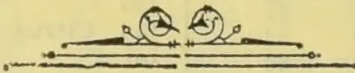

OBSERVER PRINTING WORKS.

1044------------------------------------------------

# TEA, COFFEE, CINCHONA, COCOA, AND CARDAMOM SALES.

NO. 1.

COLOMBO, JANUARY 11, 1897.

} PRICE:—12½ cents each 3 copies  
30 cents; 6 copies ½ rupee.

## COLOMBO SALES OF TEA,

### LARGE LOTS.

[MESSRS. A. H. THOMPSON & Co.—57,032 lb.]

<table border="1">
<thead>
<tr>
<th>Lot.</th>
<th>Box.</th>
<th>Pkgs.</th>
<th>Name.</th>
<th>lb.</th>
<th>c.</th>
</tr>
</thead>
<tbody>
<tr>
<td>6</td>
<td>St. Leonards ou Sea</td>
<td>6 17 ch</td>
<td>bro pek</td>
<td>1700</td>
<td>41</td>
</tr>
<tr>
<td>7</td>
<td></td>
<td>7 8 do</td>
<td>pekoe</td>
<td>720</td>
<td>30</td>
</tr>
<tr>
<td>13</td>
<td>Vogan</td>
<td>13 20 hf-ch</td>
<td>bro or pek</td>
<td>1200</td>
<td>60</td>
</tr>
<tr>
<td>14</td>
<td></td>
<td>14 40 ch</td>
<td>bro pek</td>
<td>3800</td>
<td>55</td>
</tr>
<tr>
<td>15</td>
<td></td>
<td>15 35 do</td>
<td>pekoe</td>
<td>2975</td>
<td>38</td>
</tr>
<tr>
<td>16</td>
<td></td>
<td>16 34 do</td>
<td>do</td>
<td>2890</td>
<td>37</td>
</tr>
<tr>
<td>17</td>
<td></td>
<td>17 22 hf-ch</td>
<td>pek sou</td>
<td>2380</td>
<td>32</td>
</tr>
<tr>
<td>18</td>
<td>Blackwater</td>
<td>18 28 do</td>
<td>dust</td>
<td>2380</td>
<td>31</td>
</tr>
<tr>
<td>19</td>
<td>Kalkande</td>
<td>19 22 hf-ch</td>
<td>dust</td>
<td>1540</td>
<td>21 bid</td>
</tr>
<tr>
<td>20</td>
<td></td>
<td>20 19 ch</td>
<td>dust</td>
<td>2755</td>
<td>18</td>
</tr>
<tr>
<td>21</td>
<td></td>
<td>21 19 hf-ch</td>
<td>bro pek</td>
<td>950</td>
<td>46</td>
</tr>
<tr>
<td>22</td>
<td></td>
<td>22 27 do</td>
<td>pekoe</td>
<td>1350</td>
<td>33</td>
</tr>
<tr>
<td>26</td>
<td>Relugas</td>
<td>21 14 do</td>
<td>sou</td>
<td>760</td>
<td>26</td>
</tr>
<tr>
<td>31</td>
<td>Vogan</td>
<td>22 11 do</td>
<td>dust</td>
<td>770</td>
<td>27</td>
</tr>
<tr>
<td>32</td>
<td></td>
<td>26 5 ch</td>
<td>dust</td>
<td>600</td>
<td>20</td>
</tr>
<tr>
<td>33</td>
<td></td>
<td>31 41 do</td>
<td>bro pek</td>
<td>3895</td>
<td>59</td>
</tr>
<tr>
<td>37</td>
<td>Ossington</td>
<td>32 32 do</td>
<td>pekoe</td>
<td>2720</td>
<td>40</td>
</tr>
<tr>
<td>38</td>
<td></td>
<td>33 24 do</td>
<td>pek sou</td>
<td>2040</td>
<td>32</td>
</tr>
<tr>
<td>39</td>
<td></td>
<td>37 11 do</td>
<td>bro pek</td>
<td>1210</td>
<td>35 bid</td>
</tr>
<tr>
<td>42</td>
<td>Hornsey</td>
<td>38 19 do</td>
<td>pekoe</td>
<td>1900</td>
<td>26 bid</td>
</tr>
<tr>
<td>43</td>
<td></td>
<td>39 14 do</td>
<td>pek sou</td>
<td>1260</td>
<td>23</td>
</tr>
<tr>
<td></td>
<td></td>
<td>42 10 ch</td>
<td>pek sou</td>
<td>1000</td>
<td>38</td>
</tr>
<tr>
<td></td>
<td></td>
<td>43 5 do</td>
<td>fans</td>
<td>450</td>
<td>20</td>
</tr>
</tbody>
</table>

[MESSRS. FORBES & WALKER.—566,715 lb.]

<table border="1">
<thead>
<tr>
<th>Lot.</th>
<th>Box.</th>
<th>Pkgs.</th>
<th>Name.</th>
<th>lb.</th>
<th>c.</th>
</tr>
</thead>
<tbody>
<tr>
<td>4</td>
<td>Dambagalla</td>
<td>368 9 hf-ch</td>
<td>sou</td>
<td>405</td>
<td>24</td>
</tr>
<tr>
<td>6</td>
<td>G O, in estate mark</td>
<td>372 28 do</td>
<td>sou</td>
<td>1120</td>
<td>28</td>
</tr>
<tr>
<td>7</td>
<td></td>
<td>374 12 do</td>
<td>bro mix</td>
<td>500</td>
<td>26</td>
</tr>
<tr>
<td>14</td>
<td>Yatiyana</td>
<td>388 11 hf-ch</td>
<td>pekoe</td>
<td>616</td>
<td>24</td>
</tr>
<tr>
<td>16</td>
<td>Carberry</td>
<td>392 50 ch</td>
<td>pro pek</td>
<td>5000</td>
<td>47</td>
</tr>
<tr>
<td>17</td>
<td></td>
<td>394 44 do</td>
<td>pekoe</td>
<td>3960</td>
<td>31</td>
</tr>
<tr>
<td>18</td>
<td></td>
<td>396 5 do</td>
<td>pek sou</td>
<td>450</td>
<td>25</td>
</tr>
<tr>
<td>19</td>
<td>M V</td>
<td>398 14 ch</td>
<td>fans</td>
<td>1050</td>
<td>18</td>
</tr>
<tr>
<td>20</td>
<td></td>
<td>400 10 do</td>
<td>dust</td>
<td>940</td>
<td>16</td>
</tr>
<tr>
<td>21</td>
<td></td>
<td>402 9 do</td>
<td>bro mix</td>
<td>900</td>
<td>13</td>
</tr>
<tr>
<td>23</td>
<td>Nahaveena</td>
<td>406 64 hf-ch</td>
<td>bro pek</td>
<td>3200</td>
<td>47</td>
</tr>
<tr>
<td>24</td>
<td></td>
<td>408 25 do</td>
<td>pekoe</td>
<td>1250</td>
<td>45</td>
</tr>
<tr>
<td>25</td>
<td></td>
<td>410 67 do</td>
<td>pek No. 2</td>
<td>3350</td>
<td>38</td>
</tr>
<tr>
<td>26</td>
<td></td>
<td>412 20 do</td>
<td>pek sou</td>
<td>1000</td>
<td>36</td>
</tr>
<tr>
<td>30</td>
<td>Ambalawa</td>
<td>420 6 ch</td>
<td>pekoe</td>
<td>456</td>
<td>31</td>
</tr>
<tr>
<td>34</td>
<td>S. Helen</td>
<td>428 20 hf-ch</td>
<td>bro pek</td>
<td>1100</td>
<td>49</td>
</tr>
<tr>
<td>35</td>
<td></td>
<td>430 29 do</td>
<td>or pek</td>
<td>1305</td>
<td>53</td>
</tr>
<tr>
<td>36</td>
<td></td>
<td>432 88 do</td>
<td>pekoe</td>
<td>3960</td>
<td>34</td>
</tr>
<tr>
<td>37</td>
<td></td>
<td>434 85 do</td>
<td>pek sou</td>
<td>3825</td>
<td>24</td>
</tr>
<tr>
<td>39</td>
<td>Tavalamtenne</td>
<td>438 5 ch</td>
<td>bro pek</td>
<td>550</td>
<td>48</td>
</tr>
<tr>
<td>40</td>
<td></td>
<td>440 9 do</td>
<td>pekoe</td>
<td>945</td>
<td>35</td>
</tr>
<tr>
<td>42</td>
<td>Kosgalla</td>
<td>444 28 hf-ch</td>
<td>bro pek</td>
<td>1568</td>
<td>39</td>
</tr>
<tr>
<td>43</td>
<td></td>
<td>446 32 do</td>
<td>pekoe</td>
<td>1600</td>
<td>25</td>
</tr>
<tr>
<td>44</td>
<td></td>
<td>448 27 do</td>
<td>pek sou</td>
<td>1350</td>
<td>25</td>
</tr>
<tr>
<td>45</td>
<td>Old Medegama</td>
<td>450 12 ch</td>
<td>bro pek</td>
<td>1380</td>
<td>34 bid</td>
</tr>
<tr>
<td>46</td>
<td></td>
<td>452 9 do</td>
<td>pekoe</td>
<td>945</td>
<td>26 bid</td>
</tr>
<tr>
<td>47</td>
<td></td>
<td>454 10 do</td>
<td>pek sou</td>
<td>1000</td>
<td>26</td>
</tr>
<tr>
<td>48</td>
<td>Radella</td>
<td>456 32 ch</td>
<td>bro pek</td>
<td>3200</td>
<td>57</td>
</tr>
<tr>
<td>49</td>
<td></td>
<td>458 22 do</td>
<td>pekoe</td>
<td>1950</td>
<td>44</td>
</tr>
<tr>
<td>50</td>
<td></td>
<td>460 14 do</td>
<td>pek sou</td>
<td>1260</td>
<td>37</td>
</tr>
<tr>
<td>52</td>
<td>Holton</td>
<td>464 15 do</td>
<td>bro pek</td>
<td>1425</td>
<td rowspan="2">} with d'n.</td>
</tr>
<tr>
<td>53</td>
<td></td>
<td>466 5 do</td>
<td>pekoe</td>
<td>475</td>
</tr>
<tr>
<td>57</td>
<td>Great Valley</td>
<td>474 16 ch</td>
<td>bro pek</td>
<td>1840</td>
<td>54</td>
</tr>
<tr>
<td>58</td>
<td></td>
<td>476 17 do</td>
<td>or pek</td>
<td>1785</td>
<td>44</td>
</tr>
<tr>
<td>59</td>
<td></td>
<td>478 20 do</td>
<td>pekoe</td>
<td>2000</td>
<td>35</td>
</tr>
<tr>
<td>60</td>
<td></td>
<td>480 9 do</td>
<td>pek sou</td>
<td>810</td>
<td>28</td>
</tr>
<tr>
<td>61</td>
<td>Concygar</td>
<td>482 7 ch</td>
<td>bro pek</td>
<td>700</td>
<td>65</td>
</tr>
<tr>
<td>62</td>
<td></td>
<td>484 7 do</td>
<td>pekoe</td>
<td>630</td>
<td>48</td>
</tr>
<tr>
<td>64</td>
<td>Rockside</td>
<td>488 8 do</td>
<td>bro pek</td>
<td>880</td>
<td>40</td>
</tr>
<tr>
<td>65</td>
<td></td>
<td>490 12 do</td>
<td>pekoe</td>
<td>1200</td>
<td>39</td>
</tr>
<tr>
<td>66</td>
<td></td>
<td>492 10 do</td>
<td>pek sou</td>
<td>1000</td>
<td>26</td>
</tr>
<tr>
<td>67</td>
<td></td>
<td>494 7 do</td>
<td>bro mix</td>
<td>700</td>
<td>18</td>
</tr>
<tr>
<td>68</td>
<td></td>
<td>496 5 do</td>
<td>dust</td>
<td>750</td>
<td>22</td>
</tr>
<tr>
<td>69</td>
<td></td>
<td>498 29 do</td>
<td>pekoe</td>
<td>2900</td>
<td>47</td>
</tr>
<tr>
<td>70</td>
<td></td>
<td>500 26 do</td>
<td>pek sou</td>
<td>2600</td>
<td>37</td>
</tr>
<tr>
<td>71</td>
<td></td>
<td>502 11 do</td>
<td>bro pek fan</td>
<td>1430</td>
<td>43</td>
</tr>
<tr>
<td>73</td>
<td>G</td>
<td>506 3 ch</td>
<td>pek dust</td>
<td>420</td>
<td>17 bid</td>
</tr>
<tr>
<td>80</td>
<td>Meemoraoya</td>
<td>520 13 hf-ch</td>
<td>bro pek</td>
<td>520</td>
<td>34</td>
</tr>
<tr>
<td>81</td>
<td></td>
<td>522 17 do</td>
<td>pekoe</td>
<td>680</td>
<td>24</td>
</tr>
<tr>
<td>89</td>
<td>G P M, in est. mark</td>
<td>538 17 hf-ch</td>
<td>pekoe</td>
<td>935</td>
<td>58</td>
</tr>
<tr>
<td>90</td>
<td></td>
<td>540 22 do</td>
<td>pekoe No 2</td>
<td>1232</td>
<td>44</td>
</tr>
<tr>
<td>91</td>
<td></td>
<td>542 14 do</td>
<td>sou</td>
<td>770</td>
<td>35</td>
</tr>
</tbody>
</table>

<table border="1">
<thead>
<tr>
<th>Lot.</th>
<th>Box.</th>
<th>Pkgs.</th>
<th>Name.</th>
<th>lb.</th>
<th>c.</th>
</tr>
</thead>
<tbody>
<tr>
<td>97</td>
<td>St. Columbkille</td>
<td>554 11 ch</td>
<td>bro pek</td>
<td>1210</td>
<td>48</td>
</tr>
<tr>
<td>98</td>
<td></td>
<td>556 37 do</td>
<td>pekoe</td>
<td>3515</td>
<td>41</td>
</tr>
<tr>
<td>99</td>
<td></td>
<td>558 21 do</td>
<td>pek sou</td>
<td>1890</td>
<td>25</td>
</tr>
<tr>
<td>100</td>
<td>Pallegodde</td>
<td>560 26 ch</td>
<td>bro or pek</td>
<td>2600</td>
<td>41</td>
</tr>
<tr>
<td>101</td>
<td></td>
<td>562 34 do</td>
<td>bro pek</td>
<td>3230</td>
<td>57</td>
</tr>
<tr>
<td>102</td>
<td></td>
<td>564 31 do</td>
<td>pekoe</td>
<td>2790</td>
<td>34</td>
</tr>
<tr>
<td>103</td>
<td></td>
<td>566 22 do</td>
<td>pek sou</td>
<td>2092</td>
<td>27</td>
</tr>
<tr>
<td>104</td>
<td>Bloomfield</td>
<td>568 43 ch</td>
<td>flow pek</td>
<td>4300</td>
<td>55</td>
</tr>
<tr>
<td>105</td>
<td></td>
<td>570 31 do</td>
<td>pekoe</td>
<td>2945</td>
<td>48</td>
</tr>
<tr>
<td>106</td>
<td></td>
<td>572 17 do</td>
<td>pek sou</td>
<td>1615</td>
<td>39</td>
</tr>
<tr>
<td>107</td>
<td></td>
<td>574 16 hf-ch</td>
<td>pek fans</td>
<td>1200</td>
<td>24</td>
</tr>
<tr>
<td>108</td>
<td>Caskieben</td>
<td>576 35 ch</td>
<td>flow pek</td>
<td>3500</td>
<td>48</td>
</tr>
<tr>
<td>109</td>
<td></td>
<td>578 26 do</td>
<td>pekoe</td>
<td>2470</td>
<td>42</td>
</tr>
<tr>
<td>110</td>
<td></td>
<td>580 15 do</td>
<td>pek sou</td>
<td>1425</td>
<td>38</td>
</tr>
<tr>
<td>111</td>
<td></td>
<td>582 7 do</td>
<td>pek fans</td>
<td>525</td>
<td>23</td>
</tr>
<tr>
<td>112</td>
<td>Clunes</td>
<td>584 11 do</td>
<td>pek sou</td>
<td>990</td>
<td>19</td>
</tr>
<tr>
<td>113</td>
<td></td>
<td>586 40 do</td>
<td>bro pek fan</td>
<td>4900</td>
<td>32</td>
</tr>
<tr>
<td>114</td>
<td></td>
<td>588 13 hf-ch</td>
<td>dust</td>
<td>910</td>
<td>16</td>
</tr>
<tr>
<td>115</td>
<td>Weoya</td>
<td>590 19 ch</td>
<td>bro pek</td>
<td>1805</td>
<td>49</td>
</tr>
<tr>
<td>116</td>
<td></td>
<td>592 22 do</td>
<td>pekoe</td>
<td>1760</td>
<td>38</td>
</tr>
<tr>
<td>117</td>
<td></td>
<td>594 24 do</td>
<td>pek son</td>
<td>1800</td>
<td>26</td>
</tr>
<tr>
<td>118</td>
<td></td>
<td>596 19 do</td>
<td>fans</td>
<td>1900</td>
<td>36</td>
</tr>
<tr>
<td>125</td>
<td>Dunkeld</td>
<td>610 18 do</td>
<td>bro pek</td>
<td>1980</td>
<td>52</td>
</tr>
<tr>
<td>126</td>
<td></td>
<td>612 14 do</td>
<td>or pek</td>
<td>1330</td>
<td>48</td>
</tr>
<tr>
<td>127</td>
<td></td>
<td>614 15 do</td>
<td>pekoe</td>
<td>1725</td>
<td>35</td>
</tr>
<tr>
<td>128</td>
<td>D K D</td>
<td>616 7 ch</td>
<td>bro pek</td>
<td>No. 2 575</td>
<td>37</td>
</tr>
<tr>
<td>131</td>
<td></td>
<td>622 5 do</td>
<td>dust</td>
<td>800</td>
<td>22</td>
</tr>
<tr>
<td>132</td>
<td>Clunes</td>
<td>624 30 hf-ch</td>
<td>bro pek</td>
<td>1350</td>
<td>49</td>
</tr>
<tr>
<td>133</td>
<td></td>
<td>626 35 ch</td>
<td>pekoe</td>
<td>3150</td>
<td>28</td>
</tr>
<tr>
<td>134</td>
<td></td>
<td>628 12 do</td>
<td>pek sou</td>
<td>1080</td>
<td>22</td>
</tr>
<tr>
<td>135</td>
<td>Erracht</td>
<td>630 25 ch</td>
<td>bro or pek</td>
<td>2125</td>
<td>37</td>
</tr>
<tr>
<td>136</td>
<td></td>
<td>632 24 do</td>
<td>bro pek</td>
<td>2040</td>
<td>52</td>
</tr>
<tr>
<td>137</td>
<td></td>
<td>634 28 do</td>
<td>pekoe</td>
<td>2100</td>
<td>31</td>
</tr>
<tr>
<td>138</td>
<td>Clunes</td>
<td>636 22 hf-ch</td>
<td>bro pek</td>
<td>1100</td>
<td>41</td>
</tr>
<tr>
<td>139</td>
<td></td>
<td>638 24 ch</td>
<td>pekoe</td>
<td>2160</td>
<td>26</td>
</tr>
<tr>
<td>140</td>
<td></td>
<td>640 33 hf-ch</td>
<td>bro pek fan</td>
<td>1980</td>
<td>35</td>
</tr>
<tr>
<td>141</td>
<td>Polatagama</td>
<td>642 42 ch</td>
<td>bro pek</td>
<td>4200</td>
<td>43</td>
</tr>
<tr>
<td>142</td>
<td></td>
<td>644 36 do</td>
<td>pekoe</td>
<td>3600</td>
<td>25</td>
</tr>
<tr>
<td>143</td>
<td></td>
<td>646 9 do</td>
<td>pek sou</td>
<td>855</td>
<td>20</td>
</tr>
<tr>
<td>144</td>
<td></td>
<td>648 12 do</td>
<td>fans</td>
<td>1200</td>
<td>41</td>
</tr>
<tr>
<td>145</td>
<td></td>
<td>650 4 do</td>
<td>pek fans</td>
<td>400</td>
<td>27</td>
</tr>
<tr>
<td>151</td>
<td>Killarney</td>
<td>662 21 hf-ch</td>
<td>bro or pek</td>
<td>1260</td>
<td>60</td>
</tr>
<tr>
<td>152</td>
<td></td>
<td>664 65 do</td>
<td>do</td>
<td>3900</td>
<td>59</td>
</tr>
<tr>
<td>153</td>
<td></td>
<td>666 13 do</td>
<td>or pek</td>
<td>546</td>
<td>61</td>
</tr>
<tr>
<td>158</td>
<td>Morankaude</td>
<td>676 24 ch</td>
<td>bro pek</td>
<td>2400</td>
<td>40</td>
</tr>
<tr>
<td>159</td>
<td></td>
<td>678 26 do</td>
<td>pekoe</td>
<td>2600</td>
<td>36</td>
</tr>
<tr>
<td>160</td>
<td></td>
<td>680 10 do</td>
<td>pek sou</td>
<td>1000</td>
<td>31</td>
</tr>
<tr>
<td>161</td>
<td>Massena</td>
<td>682 29 hf-ch</td>
<td>or pek</td>
<td>1450</td>
<td>41 bid</td>
</tr>
<tr>
<td>162</td>
<td></td>
<td>684 26 do</td>
<td>pekoe</td>
<td>130</td>
<td>30</td>
</tr>
<tr>
<td>167</td>
<td>North Cove</td>
<td>694 9 hf-ch</td>
<td>dust</td>
<td>720</td>
<td>26</td>
</tr>
<tr>
<td>170</td>
<td>B D W P</td>
<td>700 5 do</td>
<td>dust</td>
<td>450</td>
<td>35</td>
</tr>
<tr>
<td>171</td>
<td>B D W A</td>
<td>702 13 do</td>
<td>bro pe No. 2</td>
<td>650</td>
<td>41</td>
</tr>
<tr>
<td>172</td>
<td></td>
<td>704 11 do</td>
<td>fans</td>
<td>660</td>
<td>40</td>
</tr>
<tr>
<td>173</td>
<td></td>
<td>706 5 do</td>
<td>dust</td>
<td>435</td>
<td>25</td>
</tr>
<tr>
<td>174</td>
<td>Lyegrove</td>
<td>708 9 ch</td>
<td>or pek</td>
<td>828</td>
<td>44</td>
</tr>
<tr>
<td>175</td>
<td></td>
<td>710 12 do</td>
<td>bro pek</td>
<td>1320</td>
<td>41</td>
</tr>
<tr>
<td>176</td>
<td></td>
<td>712 8 do</td>
<td>pekoe</td>
<td>680</td>
<td>37</td>
</tr>
<tr>
<td>177</td>
<td></td>
<td>714 8 do</td>
<td>pek sou</td>
<td>640</td>
<td>32</td>
</tr>
<tr>
<td>179</td>
<td>Nella Oolla</td>
<td>718 10 ch</td>
<td>bro pek</td>
<td>950</td>
<td>34</td>
</tr>
<tr>
<td>180</td>
<td></td>
<td>720 7 do</td>
<td>pekoe</td>
<td>500</td>
<td>25 bid</td>
</tr>
<tr>
<td>181</td>
<td></td>
<td>722 7 do</td>
<td>pek son</td>
<td>630</td>
<td>20</td>
</tr>
<tr>
<td>182</td>
<td>Agra Oya</td>
<td>724 39 hf-ch</td>
<td>bro pek</td>
<td>2145</td>
<td>49</td>
</tr>
<tr>
<td>183</td>
<td></td>
<td>726 23 ch</td>
<td>pekoe</td>
<td>1955</td>
<td>37</td>
</tr>
<tr>
<td>184</td>
<td></td>
<td>728 7 do</td>
<td>pek sou</td>
<td>665</td>
<td>27</td>
</tr>
<tr>
<td>186</td>
<td></td>
<td>732 12 do</td>
<td>or pek</td>
<td>1020</td>
<td>42</td>
</tr>
<tr>
<td>188</td>
<td>Ellery</td>
<td>736 10 do</td>
<td>bro pek</td>
<td>1120</td>
<td>43</td>
</tr>
<tr>
<td>189</td>
<td></td>
<td>738 58 do</td>
<td>or pek</td>
<td>5568</td>
<td>45</td>
</tr>
<tr>
<td>190</td>
<td></td>
<td>740 24 do</td>
<td>pek sou</td>
<td>2160</td>
<td>29</td>
</tr>
<tr>
<td>191</td>
<td></td>
<td>742 9 do</td>
<td>pek fans</td>
<td>1035</td>
<td>24</td>
</tr>
<tr>
<td>192</td>
<td>Gallawatte</td>
<td>744 7 ch</td>
<td>bro pek</td>
<td>700</td>
<td>40</td>
</tr>
<tr>
<td>193</td>
<td></td>
<td>746 11 do</td>
<td>or pek</td>
<td>935</td>
<td>42</td>
</tr>
<tr>
<td>194</td>
<td></td>
<td>748 13 do</td>
<td>pekoe</td>
<td>1170</td>
<td>34</td>
</tr>
<tr>
<td>196</td>
<td>Rowley</td>
<td>752 45 hf-ch</td>
<td>bro pek</td>
<td>2250</td>
<td>55</td>
</tr>
<tr>
<td>197</td>
<td></td>
<td>754 32 do</td>
<td>pekoe</td>
<td>1600</td>
<td>40</td>
</tr>
<tr>
<td>198</td>
<td>Monkswood</td>
<td>756 34 do</td>
<td>bro pek</td>
<td>1630</td>
<td>80</td>
</tr>
<tr>
<td>199</td>
<td></td>
<td>758 47 do</td>
<td>or pek</td>
<td>2115</td>
<td>74</td>
</tr>
<tr>
<td>200</td>
<td>Tymawr</td>
<td>760 32 hf-ch</td>
<td>bro pek</td>
<td>1600</td>
<td>67</td>
</tr>
<tr>
<td>201</td>
<td></td>
<td>762 31 do</td>
<td>pekoe</td>
<td>1395</td>
<td>54</td>
</tr>
<tr>
<td>202</td>
<td></td>
<td>764 27 do</td>
<td>pek sou</td>
<td>1215</td>
<td>46</td>
</tr>
<tr>
<td>204</td>
<td></td>
<td>768 12 do</td>
<td>sou</td>
<td>100</td>
<td>37</td>
</tr>
<tr>
<td>206</td>
<td>Erismere</td>
<td>772 26 ch</td>
<td>or pek</td>
<td>3960</td>
<td>64 bid</td>
</tr>
<tr>
<td>207</td>
<td></td>
<td>774 29 do</td>
<td>pekoe</td>
<td>2725</td>
<td>46</td>
</tr>
<tr>
<td>208</td>
<td></td>
<td>776 26 do</td>
<td>pek son</td>
<td>2418</td>
<td>40</td>
</tr>
<tr>
<td>209</td>
<td></td>
<td>778 8 do</td>
<td>fans</td>
<td>800</td>
<td>30</td>
</tr>
<tr>
<td>210</td>
<td></td>
<td>780 7 do</td>
<td>dust</td>
<td>560</td>
<td>26</td>
</tr>
<tr>
<td>218</td>
<td>Deacula</td>
<td>796 52 do</td>
<td>bro pek</td>
<td>3120</td>
<td>52</td>
</tr>
<tr>
<td>219</td>
<td></td>
<td>798 27 do</td>
<td>pekoe</td>
<td>2025</td>
<td>41</td>
</tr>
<tr>
<td>222</td>
<td>CRD</td>
<td>804 4 do</td>
<td>dust</td>
<td>400</td>
<td>22</td>
</tr>
<tr>
<td>223</td>
<td></td>
<td>806 4 do</td>
<td>red leaf</td>
<td>400</td>
<td>12</td>
</tr>
</tbody>
</table>

1045------------------------------------------------

2CEYLON PRODUCE SALES LIST.

<table border="1">
<thead>
<tr>
<th>Lot.</th>
<th>Box.</th>
<th>Pkgs.</th>
<th>Name.</th>
<th>lb.</th>
<th>c.</th>
</tr>
</thead>
<tbody>
<tr><td>224</td><td>Meddette</td><td>808 36 ch</td><td>bro pek</td><td>1980</td><td>42 bid</td></tr>
<tr><td>225</td><td></td><td>810 19 do</td><td>pekoe</td><td>1900</td><td>32 bid</td></tr>
<tr><td>226</td><td></td><td>812 13 do</td><td>pek sou</td><td>1170</td><td>26</td></tr>
<tr><td>227</td><td></td><td>814 4 do</td><td>bro pek fan</td><td>440</td><td>22</td></tr>
<tr><td>230</td><td>Errollwood</td><td>820 26 ch</td><td>bro pek</td><td>2860</td><td>68</td></tr>
<tr><td>231</td><td></td><td>822 13 do</td><td>do</td><td>1430</td><td>68</td></tr>
<tr><td>232</td><td></td><td>824 21 do</td><td>pekoe</td><td>1785</td><td>51</td></tr>
<tr><td>233</td><td>R F B</td><td>826 10 hf-ch</td><td>dust</td><td>800</td><td>20</td></tr>
<tr><td>235</td><td>Middleton</td><td>830 16 ch</td><td>b o pek</td><td>1600</td><td>74</td></tr>
<tr><td>236</td><td></td><td>832 50 hf-ch</td><td>or pek</td><td>2500</td><td>60</td></tr>
<tr><td>237</td><td></td><td>834 16 ch</td><td>pekoe No. 1</td><td>1600</td><td>52</td></tr>
<tr><td>238</td><td></td><td>836 16 do</td><td>pekoe</td><td>1520</td><td>43</td></tr>
<tr><td>239</td><td></td><td>838 6 do</td><td>pek sou</td><td>570</td><td>47</td></tr>
<tr><td>243</td><td>Udabage</td><td>846 17 hf-ch</td><td>bro pek</td><td>1020</td><td>41</td></tr>
<tr><td>244</td><td></td><td>848 20 do</td><td>pekoe</td><td>1100</td><td>26</td></tr>
<tr><td>245</td><td></td><td>850 10 do</td><td>pek sou</td><td>550</td><td>22</td></tr>
<tr><td>246</td><td></td><td>852 11 do</td><td>fans</td><td>660</td><td>24</td></tr>
<tr><td>249</td><td>Rambodde</td><td>855 29 do</td><td>bro or pek</td><td>1595</td><td>49</td></tr>
<tr><td>250</td><td></td><td>860 20 do</td><td>pekoe</td><td>990</td><td>35</td></tr>
<tr><td>251</td><td></td><td>862 18 do</td><td>or pek</td><td>900</td><td>41</td></tr>
<tr><td>255</td><td>Choughleigh</td><td>870 12 ch</td><td>bro p k</td><td>1296</td><td rowspan="2">}withd'n</td></tr>
<tr><td>256</td><td></td><td>872 6 do</td><td>pekoe</td><td>570</td></tr>
<tr><td>257</td><td></td><td>874 7 do</td><td>pek sou</td><td>630</td><td></td></tr>
<tr><td>261</td><td>Stafford</td><td>882 4 ch</td><td>bro pek</td><td>440</td><td>72</td></tr>
<tr><td>265</td><td>St. Heliers</td><td>890 50 hf-ch</td><td>bro or pek</td><td>2550</td><td>47</td></tr>
<tr><td>266</td><td></td><td>892 30 ch</td><td>pekoe</td><td>2700</td><td>36</td></tr>
<tr><td>267</td><td></td><td>894 8 do</td><td>pek sou</td><td>720</td><td>29</td></tr>
<tr><td>268</td><td>Queensland</td><td>896 12 do</td><td>bro pek</td><td>1200</td><td>76</td></tr>
<tr><td>269</td><td></td><td>898 43 do</td><td>pekoe</td><td>3655</td><td>47</td></tr>
<tr><td>270</td><td></td><td>900 12 do</td><td>pek sou</td><td>960</td><td>42</td></tr>
<tr><td>272</td><td>Patiagama</td><td>904 8 ch</td><td>bro or pek</td><td>840</td><td>50 bid</td></tr>
<tr><td>273</td><td></td><td>906 4 do</td><td>or pek</td><td>400</td><td>47 bid</td></tr>
<tr><td>274</td><td></td><td>908 7 do</td><td>pekoe</td><td>630</td><td>36</td></tr>
<tr><td>277</td><td>Sunnycroft</td><td>914 7 do</td><td>pek sou</td><td>700</td><td>28</td></tr>
<tr><td>279</td><td></td><td>918 3 do</td><td>dust</td><td>510</td><td>15</td></tr>
<tr><td>280</td><td>Pambagama</td><td>920 5 ch</td><td>pekoe (Acme chest)</td><td>500</td><td>25</td></tr>
<tr><td>282</td><td>Midlands</td><td>924 10 ch</td><td>dust</td><td>800</td><td>27</td></tr>
<tr><td>283</td><td>Arapolakande</td><td>926 10 do</td><td>br or pek</td><td>950</td><td>47</td></tr>
<tr><td>284</td><td></td><td>928 20 do</td><td>or pek</td><td>1800</td><td>47</td></tr>
<tr><td>285</td><td></td><td>930 47 do</td><td>pekoe</td><td>3760</td><td>29 bid</td></tr>
<tr><td>288</td><td>Ingoya</td><td>936 15 do</td><td>fans</td><td>1650</td><td>26</td></tr>
<tr><td>291</td><td>Cairn Hill</td><td>942 6 ch</td><td>bro pek</td><td>600</td><td>33</td></tr>
<tr><td>292</td><td></td><td>944 6 do</td><td>pekoe</td><td>540</td><td>23</td></tr>
<tr><td>293</td><td></td><td>946 5 do</td><td>pek sou</td><td>400</td><td>15</td></tr>
<tr><td>297</td><td>Sembawatte</td><td>954 16 do</td><td>fans</td><td>1520</td><td>18</td></tr>
<tr><td>299</td><td></td><td>958 10 do</td><td>bro tea</td><td>700</td><td>10</td></tr>
<tr><td>300</td><td>Torwood</td><td>960 13 ch</td><td>bro pek</td><td>1300</td><td>49</td></tr>
<tr><td>301</td><td></td><td>962 13 do</td><td>or pek</td><td>1092</td><td>46</td></tr>
<tr><td>302</td><td></td><td>964 24 do</td><td>pekoe</td><td>2064</td><td>33</td></tr>
<tr><td>303</td><td></td><td>966 6 do</td><td>pek sou</td><td>570</td><td>24</td></tr>
<tr><td>304</td><td></td><td>968 10 do</td><td>dust</td><td>1200</td><td>25</td></tr>
<tr><td>305</td><td></td><td>970 10 do</td><td>bro pe No 2</td><td>1000</td><td>33 bid</td></tr>
<tr><td>306</td><td></td><td>972 20 do</td><td>pek No. 2</td><td>1900</td><td>28</td></tr>
<tr><td>308</td><td>Wevekelle</td><td>976 7 ch</td><td>or pek</td><td>665</td><td>41</td></tr>
<tr><td>309</td><td></td><td>978 8 do</td><td>pekoe</td><td>640</td><td>27</td></tr>
<tr><td>313</td><td>C, in est mark</td><td>986 4 do</td><td>bro tea</td><td>440</td><td>10</td></tr>
<tr><td>314</td><td>Vellaioya</td><td>988 8 do</td><td>bro tea</td><td>800</td><td>9</td></tr>
<tr><td>319</td><td>Ingurugalla</td><td>998 6 do</td><td>bro tea</td><td>720</td><td>22</td></tr>
<tr><td>321</td><td>Labookellie</td><td>2 7 ch</td><td>pek sou</td><td>637</td><td>41</td></tr>
<tr><td>323</td><td>Weyungawatte</td><td>6 25 hf-ch</td><td>bro or pek</td><td>1375</td><td>39</td></tr>
<tr><td>324</td><td></td><td>8 23 ch</td><td>or pekoe</td><td>2070</td><td>39</td></tr>
<tr><td>325</td><td></td><td>10 18 do</td><td>pekoe</td><td>1440</td><td>33</td></tr>
<tr><td>326</td><td></td><td>12 5 do</td><td>pekoe sou</td><td>475</td><td>25</td></tr>
<tr><td>328</td><td>Lochiel</td><td>16 3 do</td><td>dust</td><td>420</td><td>19</td></tr>
<tr><td>329</td><td>Oxford</td><td>18 35 do</td><td>bro pek</td><td>3500</td><td>38</td></tr>
<tr><td>330</td><td></td><td>20 23 hf-ch</td><td>or pek</td><td>920</td><td>47</td></tr>
<tr><td>331</td><td></td><td>22 27 ch</td><td>pek</td><td>2430</td><td>30</td></tr>
<tr><td>332</td><td></td><td>24 14 do</td><td>pek sou</td><td>120</td><td>23</td></tr>
<tr><td>334</td><td></td><td>28 5 do</td><td>dust</td><td>600</td><td>17</td></tr>
<tr><td>335</td><td>Dromoland</td><td>30 9 do</td><td>pek sou</td><td>765</td><td>28</td></tr>
<tr><td>336</td><td>Doonevale</td><td>32 18 do</td><td>bro pek</td><td>1620</td><td>39</td></tr>
<tr><td>337</td><td></td><td>34 34 do</td><td>pekoe</td><td>2720</td><td>25</td></tr>
<tr><td>338</td><td></td><td>36 14 do</td><td>fannings</td><td>1400</td><td>28</td></tr>
<tr><td>339</td><td></td><td>38 4 do</td><td>dust</td><td>560</td><td>20</td></tr>
<tr><td>343</td><td>Castlereagh</td><td>46 19 do</td><td>bro pek</td><td>1900</td><td>54</td></tr>
<tr><td>344</td><td></td><td>48 15 do</td><td>or pek</td><td>1350</td><td>42</td></tr>
<tr><td>345</td><td></td><td>50 13 do</td><td>pekoe</td><td>1170</td><td>36</td></tr>
<tr><td>350</td><td>Dunbar</td><td>60 26 hf-ch</td><td>or pek</td><td>1170</td><td>59</td></tr>
<tr><td>351</td><td></td><td>62 27 do</td><td>bro pek</td><td>1350</td><td>58</td></tr>
<tr><td>352</td><td></td><td>64 20 ch</td><td>pek</td><td>1700</td><td>44</td></tr>
<tr><td>353</td><td></td><td>66 16 do</td><td>pek sou</td><td>1200</td><td>35</td></tr>
<tr><td>354</td><td>D B R</td><td>68 4 do</td><td>bro mixed</td><td>400</td><td>21</td></tr>
<tr><td>355</td><td></td><td>70 3 do</td><td>dust</td><td>450</td><td>26</td></tr>
<tr><td>356</td><td>Hethersett</td><td>72 22 do</td><td>bro or pek</td><td>2420</td><td>64</td></tr>
<tr><td>358</td><td></td><td>76 17 do</td><td>or pek</td><td>1,360</td><td>66</td></tr>
<tr><td>359</td><td>Hethersett</td><td>78 8 do</td><td>pek</td><td>744</td><td>49</td></tr>
<tr><td>360</td><td></td><td>80 8 do</td><td>pek sou</td><td>656</td><td>46</td></tr>
<tr><td>362</td><td>K K G H</td><td>84 13 hf-ch</td><td>bro pek</td><td>650</td><td>43</td></tr>
<tr><td>363</td><td></td><td>86 8 do</td><td>pek</td><td>400</td><td>24</td></tr>
<tr><td>366</td><td>T B in est. mark</td><td>92 5 ch</td><td>dust</td><td>500</td><td>20</td></tr>
<tr><td>367</td><td></td><td>94 8 do</td><td>fannings</td><td>640</td><td>18</td></tr>
<tr><td>369</td><td>Ambblankande</td><td>98 17 do</td><td>bro pek</td><td>1530</td><td>41</td></tr>
<tr><td>370</td><td></td><td>100 12 do</td><td>pekoe</td><td>1030</td><td>29</td></tr>
<tr><td>371</td><td></td><td>102 8 do</td><td>pek sou</td><td>800</td><td>25</td></tr>
<tr><td>372</td><td>Venture</td><td>104 31 hf-ch</td><td>pek sou</td><td>1240</td><td>23</td></tr>
<tr><td>373</td><td></td><td>106 15 do</td><td>dust</td><td>1125</td><td>15</td></tr>
</tbody>
</table>

<table border="1">
<thead>
<tr>
<th>Lot.</th>
<th>Box.</th>
<th>Pkgs.</th>
<th>Name.</th>
<th>lb.</th>
<th>c.</th>
</tr>
</thead>
<tbody>
<tr><td>376</td><td>Bereily</td><td>112 6</td><td>hf-ch</td><td>pek dust</td><td>450 26</td></tr>
<tr><td>378</td><td>Bloomfield</td><td>116 49</td><td>ch</td><td>flowery pek</td><td>4900 52</td></tr>
<tr><td>379</td><td></td><td>118 37</td><td>do</td><td>pek</td><td>3515 42</td></tr>
<tr><td>380</td><td></td><td>120 18</td><td>do</td><td>pek sou</td><td>1710 38</td></tr>
<tr><td>381</td><td>Knivesmire</td><td>122 30</td><td>do</td><td>bro pek</td><td>3000 40</td></tr>
<tr><td>382</td><td></td><td>124 53</td><td>do</td><td>pek</td><td>3975 27 bid</td></tr>
<tr><td>383</td><td></td><td>126 26</td><td>do</td><td>pek sou</td><td>1820 22 bid</td></tr>
<tr><td>390</td><td>Denmark Hill</td><td>140 11</td><td>do</td><td>bro or pek</td><td>1210 64</td></tr>
<tr><td>392</td><td></td><td>144 9</td><td>do</td><td>or pek</td><td>720 66</td></tr>
<tr><td>394</td><td></td><td>148 5</td><td>do</td><td>pek sou</td><td>410 47</td></tr>
<tr><td>396</td><td>Talgaswela</td><td>152 62</td><td>do</td><td>bro pek</td><td>5589 54</td></tr>
<tr><td>397</td><td></td><td>154 6</td><td>do</td><td>bro pek</td><td>660 35</td></tr>
<tr><td>398</td><td></td><td>156 10</td><td>do</td><td>pekoe</td><td>900 37</td></tr>
<tr><td>399</td><td></td><td>158 7</td><td>do</td><td>pek sou</td><td>630 33</td></tr>
<tr><td>400</td><td>Pansalatten</td><td>160 17</td><td>do</td><td>bro pek</td><td>1785 39</td></tr>
<tr><td>401</td><td></td><td>162 17</td><td>do</td><td>pekoe</td><td>1700 31</td></tr>
<tr><td>402</td><td></td><td>164 10</td><td>do</td><td>pek sou</td><td>950 24</td></tr>
<tr><td>404</td><td></td><td>168 4</td><td>do</td><td>congou</td><td>400 14</td></tr>
<tr><td>406</td><td>Glengariff</td><td>173 33</td><td>hf-ch</td><td>or pek</td><td>1782 45</td></tr>
<tr><td>407</td><td></td><td>174 40</td><td>do</td><td>or pek</td><td>1720 47</td></tr>
<tr><td>408</td><td></td><td>176 24</td><td>ch</td><td>pek</td><td>1560 34</td></tr>
<tr><td>409</td><td></td><td>178 47</td><td>do</td><td>pek sou</td><td>2491 25</td></tr>
<tr><td>410</td><td></td><td>180 6</td><td>hf-ch</td><td>dust</td><td>450 30</td></tr>
<tr><td>411</td><td>Udabage</td><td>182 23</td><td>do</td><td>bro pek</td><td>1380 46</td></tr>
<tr><td>412</td><td></td><td>184 24</td><td>do</td><td>pek</td><td>1320 26</td></tr>
<tr><td>413</td><td></td><td>186 23</td><td>do</td><td>pek sou</td><td>1265 22</td></tr>
<tr><td>414</td><td></td><td>188 14</td><td>do</td><td>sou</td><td>770 15</td></tr>
<tr><td>415</td><td></td><td>190 10</td><td>do</td><td>fans</td><td>600 23</td></tr>
<tr><td>416</td><td></td><td>192 43</td><td>do</td><td>bro pek</td><td>2580 70</td></tr>
<tr><td>417</td><td></td><td>194 10</td><td>ch</td><td>pek</td><td>900 55</td></tr>
<tr><td>418</td><td></td><td>196 7</td><td>do</td><td>pek sou</td><td>630 42</td></tr>
<tr><td>419</td><td>Pambagama</td><td>198 18</td><td>do</td><td>bro tea</td><td>1620 9 bid</td></tr>
<tr><td>420</td><td></td><td>200 9</td><td>do</td><td>fans</td><td>900 14</td></tr>
<tr><td>421</td><td></td><td>202 15</td><td>hf-ch</td><td>dust</td><td>1350 15</td></tr>
<tr><td>428</td><td>Weoya</td><td>216 17</td><td>do</td><td>bro pek</td><td>1650 50</td></tr>
<tr><td>429</td><td></td><td>218 16</td><td>do</td><td>pek</td><td>1280 32</td></tr>
<tr><td>430</td><td></td><td>226 21</td><td>do</td><td>pek sou</td><td>1575 24</td></tr>
<tr><td>431</td><td></td><td>222 26</td><td>do</td><td>fans</td><td>2470 36</td></tr>
<tr><td>433</td><td>Ganapalla</td><td>226 97</td><td>hf-ch</td><td>bro pek</td><td>4850 41</td></tr>
<tr><td>434</td><td></td><td>228 18</td><td>ch</td><td>pek sou</td><td>1440 18</td></tr>
<tr><td>435</td><td></td><td>230 26</td><td>do</td><td>bro pek fans</td><td>2600 28</td></tr>
<tr><td>436</td><td></td><td>232 49</td><td>do</td><td>pekoe</td><td>3920 24</td></tr>
<tr><td>437</td><td></td><td>234 6</td><td>do</td><td>dust</td><td>840 15</td></tr>
<tr><td>438</td><td>Yoxford</td><td>236 8</td><td>do</td><td>bro tea</td><td>800 41</td></tr>
<tr><td>439</td><td></td><td>238 8</td><td>do</td><td>fannings</td><td>920 36</td></tr>
<tr><td>440</td><td></td><td>240 8</td><td>do</td><td>dust</td><td>1120 25</td></tr>
<tr><td>441</td><td>Carberry</td><td>242 31</td><td>do</td><td>bro pek</td><td>3100 44</td></tr>
<tr><td>442</td><td></td><td>244 25</td><td>do</td><td>pekoe</td><td>2250 34</td></tr>
<tr><td>443</td><td>Sunnycroft</td><td>246 7</td><td>do</td><td>pek sou</td><td>665 28</td></tr>
<tr><td>445</td><td></td><td>250 5</td><td>do</td><td>dust</td><td>750 15</td></tr>
<tr><td>447</td><td>G</td><td>254 3</td><td>do</td><td>pek dust</td><td>420 16</td></tr>
<tr><td>448</td><td>Verulupitiya</td><td>256 14</td><td>do</td><td>bro pek</td><td>1470 45 bid</td></tr>
<tr><td>449</td><td></td><td>258 21</td><td>do</td><td>pekoe</td><td>1785 43</td></tr>
<tr><td>450</td><td></td><td>266 17</td><td>do</td><td>pek sou</td><td>198 33</td></tr>
<tr><td>451</td><td></td><td>262 23</td><td>do</td><td>pek sou No. 2</td><td>1955 24</td></tr>
<tr><td>453</td><td>Kelaneiya</td><td>266 39</td><td>do</td><td>bro pek</td><td>2550 52</td></tr>
<tr><td>454</td><td></td><td>268 25</td><td>do</td><td>pekoe</td><td>2500 44</td></tr>
<tr><td>461</td><td>Agraoya</td><td>282 35</td><td>do</td><td>bro pek</td><td>1925 48</td></tr>
<tr><td>462</td><td></td><td>284 10</td><td>do</td><td>or pek</td><td>850 38</td></tr>
<tr><td>463</td><td></td><td>286 19</td><td>do</td><td>pekoe</td><td>1615 35</td></tr>
<tr><td>464</td><td></td><td>288 8</td><td>do</td><td>pek sou</td><td>720 22</td></tr>
<tr><td>473</td><td>NahaIma</td><td>306 8 hf-ch</td><td>dust (Acme chests)</td><td>640</td><td>16</td></tr>
<tr><td>474</td><td>Bandara Eliya</td><td>308 38 hf-ch</td><td>bro pek</td><td>2470</td><td>56 bid</td></tr>
<tr><td>475</td><td></td><td>310 59</td><td>do</td><td>or pek</td><td>3245 53 bid</td></tr>
<tr><td>476</td><td></td><td>312 51</td><td>do</td><td>pekoe</td><td>2550 49 bid</td></tr>
<tr><td>477</td><td></td><td>314 35</td><td>do</td><td>fans</td><td>2800 24</td></tr>
<tr><td>478</td><td>R T, in estate mark</td><td>316 15</td><td>do</td><td>dust</td><td>1200 15 bid</td></tr>
<tr><td>479</td><td>E B</td><td>318 15</td><td>do</td><td>fans</td><td>1200 15 bid</td></tr>
<tr><td>480</td><td>L T, in estate mark</td><td>320 26 hf-ch</td><td>dust</td><td>2080</td><td>14</td></tr>
<tr><td>481</td><td>N, in estate mark</td><td>322 25</td><td>do</td><td>fans</td><td>2000 14</td></tr>
<tr><td>482</td><td>Knivesmire</td><td>324 32</td><td>ch</td><td>bro pek</td><td>3520 39 bid</td></tr>
<tr><td>483</td><td></td><td>326 53</td><td>do</td><td>pekoe</td><td>4505 27 bid</td></tr>
<tr><td>484</td><td></td><td>328 29</td><td>do</td><td>pek sou</td><td>2175 22 bid</td></tr>
<tr><td>485</td><td></td><td>330 9</td><td>do</td><td>sou</td><td>540 12</td></tr>
<tr><td>486</td><td>Erracht</td><td>332 13</td><td>do</td><td>pek sou</td><td>1040 25</td></tr>
<tr><td>487</td><td></td><td>334 20</td><td>do</td><td>fans No. 1</td><td>1700 33</td></tr>
<tr><td>488</td><td></td><td>336 12</td><td>do</td><td>fans , 2</td><td>840 21</td></tr>
<tr><td>489</td><td></td><td>338 11</td><td>do</td><td>dust</td><td>1540 19</td></tr>
<tr><td>491</td><td>Essex</td><td>342 36</td><td>ch</td><td>bro pek</td><td>3360 45</td></tr>
<tr><td>492</td><td>B D W P</td><td>344 17 hf-ch</td><td>bro pek</td><td>850</td><td>30</td></tr>
<tr><td>493</td><td>Ella Oya</td><td>346 9</td><td>ch</td><td>pek fans</td><td>1003 24</td></tr>
<tr><td>494</td><td></td><td>348 3</td><td>do</td><td>dust</td><td>480 18</td></tr>
</tbody>
</table>

[MESSRS. SOMERVILLE & CO.—256,453 lb.]

<table border="1">
<thead>
<tr>
<th>Lot.</th>
<th>Box.</th>
<th>Pkgs.</th>
<th>Name.</th>
<th>lb.</th>
<th>c.</th>
</tr>
</thead>
<tbody>
<tr><td>1</td><td>G W</td><td>1 8</td><td>ch</td><td>sou</td><td>640 24</td></tr>
<tr><td>7</td><td></td><td>7 8</td><td>do</td><td>pek sou</td><td>720 23</td></tr>
<tr><td>19</td><td>H J S</td><td>19 8</td><td>do</td><td>bro pek</td><td>400 41</td></tr>
<tr><td>21</td><td></td><td>21 20</td><td>do</td><td>pek sou</td><td>1000 28</td></tr>
<tr><td>23</td><td>Kennington</td><td>23 7</td><td>ch</td><td>sou</td><td>630 19</td></tr>
<tr><td>26</td><td>Yspa</td><td>26 10</td><td>ch</td><td>bro pek fan</td><td>1300 27</td></tr>
</tbody>
</table>

1046------------------------------------------------

CEYLON PRODUCE SALES LIST.

3

<table border="1">
<thead>
<tr>
<th>Lot.</th>
<th>Box.</th>
<th>Pkgs.</th>
<th>Name.</th>
<th>lb.</th>
<th>c.</th>
</tr>
</thead>
<tbody>
<tr><td>27</td><td>27</td><td>7 ch</td><td>pek dust</td><td>1120</td><td>19</td></tr>
<tr><td>29</td><td>29</td><td>7 do</td><td>dust</td><td>840</td><td>19</td></tr>
<tr><td>30</td><td>30</td><td>6 do</td><td>red leaf</td><td>570</td><td>9</td></tr>
<tr><td>31</td><td>31</td><td>11 do</td><td>pek fans</td><td>1375</td><td>24</td></tr>
<tr><td>33</td><td>33</td><td>12 do</td><td>bro pek</td><td>1344</td><td>37</td></tr>
<tr><td>39</td><td>39</td><td>6 do</td><td>pekoe</td><td>630</td><td>25</td></tr>
<tr><td>40</td><td>40</td><td>13 do</td><td>pek sou</td><td>1235</td><td>24</td></tr>
<tr><td>41</td><td>41</td><td>5 do</td><td>bro tea</td><td>525</td><td>24</td></tr>
<tr><td>43</td><td>43</td><td>5 do</td><td>unas</td><td>475</td><td>22</td></tr>
<tr><td>44</td><td>44</td><td>26 hf-ch</td><td>bro pek</td><td>1430</td><td>37</td></tr>
<tr><td>45</td><td>45</td><td>30 do</td><td>bro pek</td><td></td><td>36</td></tr>
<tr><td>46</td><td>46</td><td>19 ch</td><td>pekoe</td><td>1900</td><td>27</td></tr>
<tr><td>47</td><td>47</td><td>10 do</td><td>pek sou</td><td>1000</td><td>23</td></tr>
<tr><td>49</td><td>49</td><td>28 hf-ch</td><td></td><td></td><td></td></tr>
<tr><td></td><td>4</td><td>ch</td><td>bro pek</td><td>1800</td><td>42</td></tr>
<tr><td>50</td><td>50</td><td>8 do</td><td>pekoe</td><td>800</td><td>20</td></tr>
<tr><td>51</td><td>51</td><td>5 do</td><td>pek sou</td><td>500</td><td>24</td></tr>
<tr><td>53</td><td>53</td><td>17 do</td><td>bro pek</td><td>1700</td><td>39</td></tr>
<tr><td>54</td><td>54</td><td>10 do</td><td>pekoe</td><td>950</td><td>29</td></tr>
<tr><td>55</td><td>55</td><td>12 do</td><td>pek sou</td><td>1200</td><td>23</td></tr>
<tr><td>56</td><td>56</td><td>6 do</td><td>dust</td><td>600</td><td>14</td></tr>
<tr><td>57</td><td>57</td><td>35 do</td><td>bro pek</td><td>3500</td><td>39</td></tr>
<tr><td>58</td><td>58</td><td>29 do</td><td>pekoe</td><td>2900</td><td>28</td></tr>
<tr><td>59</td><td>59</td><td>34 do</td><td>pekoe</td><td>3400</td><td>28</td></tr>
<tr><td>60</td><td>60</td><td>15 do</td><td>pek sou</td><td>1500</td><td>20</td></tr>
<tr><td>63</td><td>63</td><td>12 do</td><td>bro pek</td><td>1,200</td><td>39 bid</td></tr>
<tr><td>64</td><td>64</td><td>8 do</td><td>or pek</td><td>720</td><td>46</td></tr>
<tr><td>65</td><td>65</td><td>14 do</td><td>pekoe</td><td>1260</td><td>30 bid</td></tr>
<tr><td>66</td><td>66</td><td>24 do</td><td>pek sou</td><td>2160</td><td>26 bid</td></tr>
<tr><td>71</td><td>71</td><td>25 hf-ch</td><td>bro pek</td><td>1500</td><td>57</td></tr>
<tr><td>72</td><td>72</td><td>19 ch</td><td>pekoe</td><td>1710</td><td>43</td></tr>
<tr><td>73</td><td>73</td><td>15 do</td><td>pek sou</td><td>1350</td><td>36</td></tr>
<tr><td>74</td><td>74</td><td>6 do</td><td>bro mix</td><td>600</td><td>22</td></tr>
<tr><td>75</td><td>75</td><td>46 do</td><td>bro pek</td><td>4600</td><td>36 bid</td></tr>
<tr><td>76</td><td>76</td><td>33 do</td><td>pekoe</td><td>2970</td><td>28</td></tr>
<tr><td>77</td><td>77</td><td>32 do</td><td>pek sou</td><td>2816</td><td>21</td></tr>
<tr><td>79</td><td>79</td><td>58 hf-ch</td><td>bro pek</td><td>2900</td><td>37 bid</td></tr>
<tr><td>80</td><td>80</td><td>40 ch</td><td>pekoe</td><td>3800</td><td>29</td></tr>
<tr><td>81</td><td>81</td><td>26 do</td><td>pek sou</td><td>2210</td><td>22 bid</td></tr>
<tr><td>82</td><td>82</td><td>115 hf-ch</td><td>bro pek</td><td>5750</td><td>42</td></tr>
<tr><td>83</td><td>83</td><td>84 do</td><td>pekoe</td><td>3780</td><td>35</td></tr>
<tr><td>84</td><td>84</td><td>11 do</td><td>pek sou</td><td>495</td><td>24</td></tr>
<tr><td>85</td><td>85</td><td>10 do</td><td>dust</td><td>700</td><td>20</td></tr>
<tr><td>86</td><td>86</td><td>22 do</td><td>bro pek</td><td>1200</td><td>38 bid</td></tr>
<tr><td>87</td><td>87</td><td>25 do</td><td>pekoe</td><td>1125</td><td>34</td></tr>
<tr><td>90</td><td>90</td><td>29 ch</td><td>bro pek</td><td>3625</td><td>38 bid</td></tr>
<tr><td>91</td><td>91</td><td>25 do</td><td>pekoe</td><td>2600</td><td>35</td></tr>
<tr><td>92</td><td>92</td><td>12 do</td><td>pek sou</td><td>1200</td><td>28</td></tr>
<tr><td>94</td><td>94</td><td>6 hf-ch</td><td>dust</td><td>450</td><td>27</td></tr>
<tr><td>95</td><td>95</td><td>46 do</td><td>bro pek</td><td>2530</td><td>34 bid</td></tr>
<tr><td>96</td><td>96</td><td>31 do</td><td>pekoe</td><td>1550</td><td>36</td></tr>
<tr><td>97</td><td>97</td><td>12 ch</td><td>pek sou</td><td>1200</td><td>23</td></tr>
<tr><td>99</td><td>99</td><td>16 hf-ch</td><td>bro pek</td><td>880</td><td>53</td></tr>
<tr><td>100</td><td>100</td><td>19 ch</td><td>pekoe</td><td>1520</td><td>42</td></tr>
<tr><td>101</td><td>101</td><td>13 do</td><td>pek sou</td><td>1170</td><td>34</td></tr>
<tr><td>102</td><td>102</td><td>30 do</td><td>bro pek</td><td>3000</td><td>46</td></tr>
<tr><td>103</td><td>103</td><td>26 do</td><td>pekoe</td><td>2210</td><td>30</td></tr>
<tr><td>104</td><td>104</td><td>22 do</td><td>pek sou</td><td>1870</td><td>26</td></tr>
<tr><td>105</td><td>105</td><td>10 do</td><td>bro pe fans</td><td>1000</td><td>31</td></tr>
<tr><td>106</td><td>106</td><td>5 do</td><td>dust</td><td>600</td><td>16</td></tr>
<tr><td>107</td><td>107</td><td>29 hf-ch</td><td>bro or pek</td><td>1740</td><td>42</td></tr>
<tr><td>108</td><td>108</td><td>26 do</td><td>or pek</td><td>1456</td><td>51</td></tr>
<tr><td>109</td><td>109</td><td>33 ch</td><td>pekoe</td><td>2640</td><td>38</td></tr>
<tr><td>110</td><td>110</td><td>18 do</td><td>pek sou</td><td>1170</td><td>32</td></tr>
<tr><td>111</td><td>111</td><td>28 do</td><td>bro or pek</td><td>3080</td><td>62</td></tr>
<tr><td>112</td><td>112</td><td>30 do</td><td>or pek</td><td>3000</td><td>54</td></tr>
<tr><td>113</td><td>113</td><td>31 do</td><td>pekoe</td><td>3100</td><td>43</td></tr>
<tr><td>114</td><td>114</td><td>20 do</td><td>pek sou</td><td>1700</td><td>39 bid</td></tr>
<tr><td>115</td><td>115</td><td>6 do</td><td>unas No 1</td><td>540</td><td>20</td></tr>
<tr><td>116</td><td>116</td><td>23 do</td><td>unas No 2</td><td>1955</td><td>12 bid</td></tr>
<tr><td>118</td><td>118</td><td>5 do</td><td>dust</td><td>750</td><td>20</td></tr>
<tr><td>120</td><td>120</td><td>29 do</td><td>dust</td><td>4060</td><td>19</td></tr>
<tr><td>121</td><td>121</td><td>45 do</td><td>pek sou</td><td>3357</td><td>26</td></tr>
<tr><td>122</td><td>122</td><td>15 hf-ch</td><td>dust</td><td>1230</td><td>16</td></tr>
<tr><td>125</td><td>125</td><td>23 ch</td><td>bro pek</td><td>2185</td><td>42</td></tr>
<tr><td>126</td><td>126</td><td>17 do</td><td>pekoe</td><td>1360</td><td>30</td></tr>
<tr><td>127</td><td>127</td><td>17 do</td><td>pek sou</td><td>1445</td><td>26</td></tr>
<tr><td>128</td><td>128</td><td>4 do</td><td>bro pe fans</td><td>400</td><td>20 bid</td></tr>
<tr><td>129</td><td>129</td><td>45 do</td><td>pekoe</td><td>3600</td><td>39</td></tr>
<tr><td>130</td><td>130</td><td>18 do</td><td>pek sou</td><td>1170</td><td>32</td></tr>
<tr><td>131</td><td>131</td><td>16 hf-ch</td><td>bro pek</td><td>1170</td><td>37</td></tr>
<tr><td>132</td><td>132</td><td>17 do</td><td>pekoe</td><td>1020</td><td>26 bid</td></tr>
<tr><td>133</td><td>133</td><td>39 do</td><td>pek sou</td><td>2145</td><td>24</td></tr>
<tr><td>137</td><td>137</td><td>9 ch</td><td>dust</td><td>810</td><td>12</td></tr>
<tr><td>138</td><td>138</td><td>10 hf-ch</td><td>bro pek</td><td>457</td><td>24 bid</td></tr>
<tr><td>139</td><td>139</td><td>17 do</td><td>rek sou</td><td>1550</td><td>11 bid</td></tr>
<tr><td>141</td><td>141</td><td>5 do</td><td>dust</td><td>695</td><td>9</td></tr>
<tr><td>149</td><td>149</td><td>5 do</td><td>bro mix</td><td>500</td><td>9 bid</td></tr>
<tr><td>154</td><td>154</td><td>11 do</td><td>bro pek</td><td>1160</td><td>32</td></tr>
<tr><td>155</td><td>155</td><td>14 do</td><td>pek sou</td><td>1358</td><td>19</td></tr>
<tr><td>160</td><td>160</td><td>4 do</td><td>fannings</td><td>400</td><td>18</td></tr>
<tr><td>61</td><td>161</td><td>38 hf-ch</td><td>or pek</td><td>2432</td><td>34 bid</td></tr>
<tr><td>162</td><td>162</td><td>15 do</td><td>bro pek</td><td>960</td><td>30</td></tr>
</tbody>
</table>

<table border="1">
<thead>
<tr>
<th>Lot.</th>
<th>Box.</th>
<th>Pkgs.</th>
<th>Name.</th>
<th>lb.</th>
<th>c.</th>
</tr>
</thead>
<tbody>
<tr><td>163</td><td>163</td><td>40 hf-ch</td><td>pekoe</td><td>2400</td><td>26</td></tr>
<tr><td>164</td><td>164</td><td>13 do</td><td>pek sou</td><td>728</td><td>17 bid</td></tr>
<tr><td>171</td><td>171</td><td>21 do</td><td>bro pek</td><td>2100</td><td>39</td></tr>
<tr><td>172</td><td>172</td><td>17 do</td><td>pekoe</td><td>1700</td><td>28</td></tr>
<tr><td>173</td><td>173</td><td>12 do</td><td>pek sou</td><td>1200</td><td>17 bid</td></tr>
<tr><td>179</td><td>179</td><td>7 d</td><td>bro pek</td><td>770</td><td>40</td></tr>
<tr><td>180</td><td>180</td><td>8 do</td><td>pekoe</td><td>840</td><td>30</td></tr>
<tr><td>181</td><td>181</td><td>6 do</td><td>pek sou</td><td>540</td><td>21</td></tr>
<tr><td>182</td><td>182</td><td>8 hf-ch</td><td>pek sou</td><td>400</td><td>19</td></tr>
<tr><td>186</td><td>186</td><td>52 ch</td><td>bro pek</td><td>5200</td><td>40</td></tr>
<tr><td>187</td><td>187</td><td>37 do</td><td>pekoe</td><td>2775</td><td>34</td></tr>
<tr><td>188</td><td>188</td><td>11 hf-ch</td><td>bro pek</td><td>550</td><td>39</td></tr>
<tr><td>189</td><td>189</td><td>9 do</td><td>pekoe</td><td>405</td><td>30</td></tr>
<tr><td>192</td><td>192</td><td>46 do</td><td>bro pek</td><td>2576</td><td>47</td></tr>
<tr><td>193</td><td>193</td><td>46 do</td><td>pekoe</td><td>3200</td><td>36</td></tr>
<tr><td>195</td><td>195</td><td>16 do</td><td>dust</td><td>1120</td><td>19</td></tr>
<tr><td>202</td><td>202</td><td>32 do</td><td>bro pek</td><td>1760</td><td>39 bid</td></tr>
<tr><td>203</td><td>203</td><td>47 do</td><td>or pek</td><td>2350</td><td>36</td></tr>
<tr><td>204</td><td>204</td><td>49 do</td><td>pekoe</td><td>2450</td><td>32</td></tr>
<tr><td>205</td><td>205</td><td>16 do</td><td>pek s u</td><td>800</td><td>23</td></tr>
<tr><td>209</td><td>209</td><td>11 ch</td><td>pek sou</td><td>1100</td><td>30</td></tr>
<tr><td>211</td><td>211</td><td>29 do</td><td>bro pek</td><td>2755</td><td>43</td></tr>
<tr><td>212</td><td>212</td><td>26 do</td><td>pekoe</td><td>2340</td><td>36</td></tr>
<tr><td>213</td><td>213</td><td>9 do</td><td>pek No 2</td><td>810</td><td>27</td></tr>
<tr><td>214</td><td>214</td><td>6 do</td><td>pek sou</td><td>570</td><td>23</td></tr>
<tr><td>215</td><td>215</td><td>5 do</td><td>bro fans</td><td>525</td><td>36</td></tr>
<tr><td>217</td><td>217</td><td>5 do</td><td>dust</td><td>650</td><td>19</td></tr>
<tr><td>218</td><td>218</td><td>60 do</td><td>bro pek</td><td>6000</td><td>43</td></tr>
<tr><td>219</td><td>219</td><td>51 do</td><td>pekoe</td><td>4500</td><td>31</td></tr>
<tr><td>220</td><td>220</td><td>14 do</td><td>pek sou</td><td>1260</td><td>22</td></tr>
<tr><td>221</td><td>221</td><td>15 do</td><td>fannings</td><td>1575</td><td>24</td></tr>
<tr><td>222</td><td>222</td><td>8 do</td><td>dust</td><td>686</td><td>15</td></tr>
</tbody>
</table>

[MR. E. JOHN.—288,909 lb.]

<table border="1">
<thead>
<tr>
<th>Lot.</th>
<th>Box.</th>
<th>Pkgs.</th>
<th>Name.</th>
<th>lb.</th>
<th>c.</th>
</tr>
</thead>
<tbody>
<tr><td>3</td><td>358</td><td>4 ch</td><td>dust</td><td>480</td><td>31</td></tr>
<tr><td>6</td><td>364</td><td>7 do</td><td>bro tea</td><td>700</td><td>12</td></tr>
<tr><td>7</td><td>366</td><td>27 do</td><td>bro pek</td><td>2970</td><td>43</td></tr>
<tr><td>8</td><td>368</td><td>18 do</td><td>pekoe</td><td>1800</td><td>34</td></tr>
<tr><td>9</td><td>370</td><td>10 do</td><td>pek sou</td><td>950</td><td>29</td></tr>
<tr><td>10</td><td>372</td><td>29 do</td><td>bro pek</td><td>2900</td><td>60</td></tr>
<tr><td>11</td><td>374</td><td>18 do</td><td>or pek</td><td>1530</td><td>66</td></tr>
<tr><td>12</td><td>376</td><td>62 do</td><td>pekoe</td><td>5580</td><td>43</td></tr>
<tr><td>17</td><td>386</td><td>19 do</td><td>bro pek</td><td>1710</td><td>46</td></tr>
<tr><td>18</td><td>388</td><td>13 do</td><td>pekoe</td><td>1040</td><td>29</td></tr>
<tr><td>19</td><td>390</td><td>7 do</td><td>pek sou</td><td>630</td><td>24</td></tr>
<tr><td>21</td><td>394</td><td>41 hf-ch</td><td>bro pek</td><td>2296</td><td>67</td></tr>
<tr><td>22</td><td>396</td><td>20 ch</td><td>pekoe</td><td>1700</td><td>49</td></tr>
<tr><td>23</td><td>398</td><td>17 do</td><td>pek sou</td><td>1530</td><td>41</td></tr>
<tr><td>25</td><td>402</td><td>8 do</td><td>sou</td><td>600</td><td>29</td></tr>
<tr><td>26</td><td>404</td><td>11 hf-ch</td><td>bro mix</td><td>825</td><td>16</td></tr>
<tr><td>28</td><td>408</td><td>17 do</td><td>fans</td><td>1105</td><td>32</td></tr>
<tr><td>29</td><td>410</td><td>5 do</td><td>dust</td><td>475</td><td>21</td></tr>
<tr><td>30</td><td>412</td><td>10 ch</td><td>congou</td><td>1000</td><td>22 bid</td></tr>
<tr><td>31</td><td>414</td><td>32 do</td><td>bro pek</td><td>3534</td><td>52</td></tr>
<tr><td>32</td><td>416</td><td>38 do</td><td>or pek</td><td>4066</td><td>41 bid</td></tr>
<tr><td>33</td><td>418</td><td>18 do</td><td>pekoe</td><td>1800</td><td>39</td></tr>
<tr><td>34</td><td>420</td><td>12 do</td><td>pek sou</td><td>1140</td><td>31</td></tr>
<tr><td>35</td><td>422</td><td>8 hf-ch</td><td>fans</td><td>528</td><td>31</td></tr>
<tr><td>36</td><td>424</td><td>7 do</td><td>dust</td><td>588</td><td>21</td></tr>
<tr><td>39</td><td>430</td><td>10 do</td><td>dust</td><td>750</td><td>18</td></tr>
<tr><td>43</td><td>438</td><td>62 ch</td><td>bro pek</td><td>6200</td><td>37 bid</td></tr>
<tr><td>44</td><td>440</td><td>33 do</td><td>pekoe</td><td>2970</td><td>28 bid</td></tr>
<tr><td>45</td><td>442</td><td>23 do</td><td>pek sou</td><td>1955</td><td>25</td></tr>
<tr><td>46</td><td>444</td><td>7 do</td><td>bro pe fans</td><td>805</td><td>27</td></tr>
<tr><td>47</td><td>446</td><td>6 do</td><td>bro mix</td><td>552</td><td>12</td></tr>
<tr><td>49</td><td>450</td><td>33 do</td><td>pe sou No. 2</td><td>2640</td><td>27</td></tr>
<tr><td>50</td><td>452</td><td>42 do</td><td>pe sou No. 2</td><td>3486</td><td>27</td></tr>
<tr><td>51</td><td>454</td><td>5 do</td><td>bro pek</td><td>525</td><td>32</td></tr>
<tr><td>52</td><td>456</td><td>11 do</td><td>pekoe</td><td>935</td><td>27</td></tr>
<tr><td>53</td><td>458</td><td>58 hf-ch</td><td>bro pek</td><td>3190</td><td>65</td></tr>
<tr><td>54</td><td>460</td><td>38 ch</td><td>pekoe</td><td>3420</td><td>49</td></tr>
<tr><td>55</td><td>462</td><td>17 do</td><td>pek sou</td><td>1445</td><td>42</td></tr>
<tr><td>56</td><td>464</td><td>8 do</td><td>bro pek</td><td>810</td><td>43</td></tr>
<tr><td>57</td><td>466</td><td>8 do</td><td>or pek</td><td>840</td><td>33</td></tr>
<tr><td>59</td><td>470</td><td>13 do</td><td>fans</td><td>910</td><td>29</td></tr>
<tr><td>60</td><td>472</td><td>9 do</td><td>dust</td><td>720</td><td>20</td></tr>
<tr><td>61</td><td>474</td><td>10 do</td><td>bro mix</td><td>1000</td><td>14</td></tr>
<tr><td>62</td><td>476</td><td>6 hf-ch</td><td>dust</td><td>510</td><td>14</td></tr>
<tr><td>64</td><td>478</td><td>5 ch</td><td>bro pek</td><td>525</td><td>32</td></tr>
<tr><td>65</td><td>480</td><td>5 do</td><td>pekoe</td><td>500</td><td>24</td></tr>
<tr><td>67</td><td>482</td><td>11 do</td><td>sou</td><td>935</td><td>22</td></tr>
<tr><td>69</td><td>486</td><td>9 hf-ch</td><td>dust</td><td>766</td><td>15</td></tr>
<tr><td>70</td><td>490</td><td>64 ch</td><td>bro or pek</td><td>4950</td><td>61</td></tr>
<tr><td>71</td><td>492</td><td>34 do</td><td>or pek</td><td>2040</td><td>53</td></tr>
<tr><td>73</td><td>494</td><td>27 do</td><td>pekoe</td><td>2430</td><td>48</td></tr>
<tr><td>73</td><td>498</td><td>10 do</td><td>bro or pek</td><td>1060</td><td>36 bid</td></tr>
<tr><td>74</td><td>500</td><td>18 do</td><td>bro pek</td><td>1836</td><td>40 bid</td></tr>
<tr><td>75</td><td>2</td><td>13 do</td><td>pekoe</td><td>1066</td><td>36</td></tr>
<tr><td>76</td><td>4</td><td>10 do</td><td>pek sou</td><td>730</td><td>26</td></tr>
<tr><td>79</td><td>10</td><td>72 hf-ch</td><td>bro or pek</td><td>4320</td><td>74</td></tr>
</tbody>
</table>

1047------------------------------------------------

4CEYLON PRODUCE SALES LIST.

<table border="1">
<thead>
<tr>
<th>Lot.</th>
<th>Box.</th>
<th>Pkgs.</th>
<th>Name.</th>
<th>lb.</th>
<th>c.</th>
</tr>
</thead>
<tbody>
<tr><td>80</td><td>12</td><td>35 hf-ch</td><td>or pek</td><td>1750</td><td>55</td></tr>
<tr><td>81</td><td>14</td><td>11 ch</td><td>pekoe</td><td>1045</td><td>48</td></tr>
<tr><td>84 D C</td><td>20</td><td>4 do</td><td>dust</td><td>526</td><td>40</td></tr>
<tr><td>86 Agra Onvah</td><td>24</td><td>60 hf-ch</td><td>bro or pek</td><td>3600</td><td>70</td></tr>
<tr><td>87</td><td>26</td><td>35 do</td><td>or pek</td><td>1750</td><td>55</td></tr>
<tr><td>88</td><td>28</td><td>12 ch</td><td>pekoe</td><td>1140</td><td>48</td></tr>
<tr><td>89 A O</td><td>30</td><td>9 hf-ch</td><td>mas</td><td>450</td><td>39</td></tr>
<tr><td>90</td><td>32</td><td>6 do</td><td>dust</td><td>468</td><td>30</td></tr>
<tr><td>92 Blackburn</td><td>36</td><td>15 ch</td><td>bro pek</td><td>1650</td><td>32</td></tr>
<tr><td>93</td><td>38</td><td>9 do</td><td>pekoe</td><td>900</td><td>25</td></tr>
<tr><td>94 B B</td><td>49</td><td>4 do</td><td>pek sou</td><td>400</td><td>20</td></tr>
<tr><td>96 E T K</td><td>44</td><td>5 do</td><td>pekoe</td><td>450</td><td>31</td></tr>
<tr><td>97</td><td>46</td><td>6 hf-ch</td><td>dust</td><td>480</td><td>20</td></tr>
<tr><td>98 Pati Rajah</td><td>48</td><td>28 ch</td><td>bro pek</td><td>2935</td><td>54</td></tr>
<tr><td>99</td><td>50</td><td>19 do</td><td>pekoe</td><td>1805</td><td>32</td></tr>
<tr><td>100</td><td>52</td><td>7 do</td><td>pek sou</td><td>630</td><td>26</td></tr>
<tr><td>101</td><td>54</td><td>4 do</td><td>fans</td><td>410</td><td>20</td></tr>
<tr><td>103 Y B K</td><td>58</td><td>10 hf-ch</td><td>pekoe</td><td>600</td><td>32</td></tr>
<tr><td>104</td><td>60</td><td>13 do</td><td>pek son</td><td>650</td><td>28</td></tr>
<tr><td>108 Keenagaha Ella</td><td>60</td><td>12 ch</td><td>pek son</td><td>1020</td><td>32</td></tr>
<tr><td>111 Murraythwaite</td><td>74</td><td>13 do</td><td>bro pek</td><td>1200</td><td>35</td></tr>
<tr><td>113</td><td>78</td><td>15 do</td><td>pekoe</td><td>1200</td><td>23 bid</td></tr>
<tr><td>122 Weymouth</td><td>96</td><td>8 do</td><td>pek sou</td><td>640</td><td>13</td></tr>
<tr><td>126 W</td><td>104</td><td>12 do</td><td>pek sou</td><td>960</td><td>9 bid</td></tr>
<tr><td>130 New Tunisgalla</td><td>112</td><td>25 hf-ch</td><td>bro pek</td><td>1375</td><td>44</td></tr>
<tr><td>131</td><td>114</td><td>30 do</td><td>pekoe</td><td>1500</td><td>31 bid</td></tr>
<tr><td>132</td><td>116</td><td>14 do</td><td>pek sou</td><td>1700</td><td>27</td></tr>
<tr><td>135 Ferndale</td><td>122</td><td>6 ch</td><td>bro or pek</td><td>600</td><td>57</td></tr>
<tr><td>136</td><td>124</td><td>5 do</td><td>bro pek</td><td>500</td><td>49 bid</td></tr>
<tr><td>137</td><td>126</td><td>24 do</td><td>pekoe</td><td>2400</td><td>41</td></tr>
<tr><td>138</td><td>128</td><td>5 do</td><td>pek sou</td><td>450</td><td>33</td></tr>
<tr><td>139 Marguerita</td><td>130</td><td>13 hf-ch</td><td>bro pek</td><td>745</td><td>42 bid</td></tr>
<tr><td>140</td><td>132</td><td>13 do</td><td>pekoe</td><td>728</td><td>40</td></tr>
<tr><td>141</td><td>134</td><td>25 do</td><td>pek sou</td><td>1400</td><td>34</td></tr>
<tr><td>145 Gampai</td><td>142</td><td>10 ch</td><td>bro pek</td><td>1030</td><td>45</td></tr>
<tr><td>146</td><td>144</td><td>12 do</td><td>pekoe</td><td>1008</td><td>39</td></tr>
<tr><td>147</td><td>146</td><td>9 do</td><td>pek sou</td><td>720</td><td>34</td></tr>
<tr><td>149 Sina Dua</td><td>150</td><td>12 do</td><td>bro pek</td><td>1236</td><td>37</td></tr>
<tr><td>150</td><td>152</td><td>8 do</td><td>pekoe</td><td>600</td><td>29</td></tr>
<tr><td>152 Alnoor</td><td>157</td><td>30 hf-ch</td><td>bro pek</td><td>1500</td><td>46</td></tr>
<tr><td>153</td><td>159</td><td>20 do</td><td>pekoe</td><td>1000</td><td>30</td></tr>
<tr><td>154</td><td>161</td><td>11 do</td><td>pek son</td><td>550</td><td>24</td></tr>
<tr><td>155</td><td>163</td><td>8 do</td><td>fans</td><td>560</td><td>30</td></tr>
<tr><td>156 Eila</td><td>165</td><td>105 ch</td><td>bro pek</td><td>8925</td><td>39 bid</td></tr>
<tr><td>157</td><td>167</td><td>57 do</td><td>pekoe</td><td>4560</td><td>32 bid</td></tr>
<tr><td>158</td><td>169</td><td>31 do</td><td>pek sou</td><td>2635</td><td>25 bid</td></tr>
<tr><td>159</td><td>171</td><td>16 do</td><td>fans</td><td>1520</td><td>33</td></tr>
<tr><td>160</td><td>173</td><td>11 do</td><td>dust</td><td>1320</td><td>19</td></tr>
<tr><td>161 Mocha</td><td>175</td><td>26 do</td><td>bro pek</td><td>2860</td><td>56 bid</td></tr>
<tr><td>162</td><td>177</td><td>19 do</td><td>pekoe</td><td>1805</td><td>52</td></tr>
<tr><td>163</td><td>179</td><td>18 do</td><td>pek sou</td><td>1440</td><td>44</td></tr>
<tr><td>164</td><td>181</td><td>8 do</td><td>fans</td><td>1110</td><td>28</td></tr>
<tr><td>165 Glentilt</td><td>183</td><td>40 do</td><td>bro pek</td><td>4260</td><td>49 bid</td></tr>
<tr><td>166</td><td>185</td><td>10 do</td><td>bro pek</td><td>1050</td><td>49 bid</td></tr>
<tr><td>167</td><td>187</td><td>28 do</td><td>pekoe</td><td>2500</td><td>44</td></tr>
<tr><td>168 Allington</td><td>189</td><td>9 hf-ch</td><td>bro pek</td><td>495</td><td>28</td></tr>
<tr><td>169</td><td>191</td><td>9 do</td><td>pekoe</td><td>450</td><td>28</td></tr>
<tr><td>173 Rondura</td><td>197</td><td>8 ch</td><td>fans</td><td>880</td><td>33</td></tr>
<tr><td>174</td><td>199</td><td>7 do</td><td>bro tea</td><td>665</td><td>14</td></tr>
<tr><td>175</td><td>201</td><td>9 do</td><td>dust</td><td>725</td><td>16</td></tr>
<tr><td>176 Templestowe</td><td>203</td><td>27 do</td><td>or pek</td><td>2565</td><td>52 bid</td></tr>
<tr><td>177</td><td>205</td><td>36 do</td><td>pekoe</td><td>3060</td><td>42</td></tr>
<tr><td>178</td><td>207</td><td>16 do</td><td>pek sou</td><td>1280</td><td>28</td></tr>
<tr><td>181 Tientsin</td><td>213</td><td>7 do</td><td>pekoe</td><td>560</td><td>37</td></tr>
<tr><td>182</td><td>215</td><td>5 do</td><td>pek son</td><td>400</td><td>27</td></tr>
<tr><td>183 Lameliere</td><td>217</td><td>29 do</td><td>bro pek</td><td>3045</td><td>49</td></tr>
<tr><td>184 Anchor, in est. mark</td><td>219</td><td>26 do</td><td>bro pek</td><td>2600</td><td>59</td></tr>
<tr><td>185 Mocha</td><td>221</td><td>27 do</td><td>bro or pek</td><td>2835</td><td>59 bid</td></tr>
<tr><td>186</td><td>223</td><td>21 do</td><td>or pek</td><td>1890</td><td>52</td></tr>
<tr><td>187</td><td>225</td><td>12 do</td><td>pekoe</td><td>1080</td><td>47</td></tr>
<tr><td>188</td><td>227</td><td>15 do</td><td>pek sou</td><td>1200</td><td>46</td></tr>
<tr><td>189 Ivies</td><td>229</td><td>26 hf-ch</td><td>bro pek</td><td>1300</td><td>55</td></tr>
<tr><td>190</td><td>231</td><td>37 do</td><td>pekoe</td><td>1850</td><td>32</td></tr>
<tr><td>191</td><td>233</td><td>30 do</td><td>pek son</td><td>1500</td><td>25</td></tr>
<tr><td>196 Eila</td><td>243</td><td>35 ch</td><td>bro pek</td><td>3150</td><td>55</td></tr>
<tr><td>197</td><td>245</td><td>19 do</td><td>pekoe</td><td>1520</td><td>35</td></tr>
<tr><td>198</td><td>247</td><td>14 do</td><td>pek sou</td><td>1120</td><td>25</td></tr>
<tr><td>199 Tientsin</td><td>249</td><td>21 hf-ch</td><td>or pek</td><td>1050</td><td>60</td></tr>
<tr><td>200 (Anchor mark)</td><td>251</td><td>19 ch</td><td>bro or pek</td><td>1935</td><td>56</td></tr>
<tr><td>201</td><td>253</td><td>14 do</td><td>or pek</td><td>1288</td><td>47</td></tr>
<tr><td>202</td><td>255</td><td>25 do</td><td>pekoe</td><td>2175</td><td>42</td></tr>
<tr><td>203 Glentilt</td><td>257</td><td>49 do</td><td>bro pek</td><td>5145</td><td>49 bid</td></tr>
<tr><td>204</td><td>259</td><td>25 do</td><td>pekoe</td><td>2500</td><td>41</td></tr>
<tr><td>205 Rondura</td><td>261</td><td>14 do</td><td>bro pek</td><td>1400</td><td>30 bid</td></tr>
<tr><td>206</td><td>263</td><td>27 do</td><td>pekoe</td><td>2295</td><td>24 bid</td></tr>
<tr><td>207</td><td>265</td><td>25 do</td><td>pek sou</td><td>2125</td><td>cut</td></tr>
<tr><td>208 Shannon</td><td>267</td><td>17 do</td><td>bro pek</td><td>1520</td><td>46</td></tr>
<tr><td>209</td><td>269</td><td>36 do</td><td>pekoe</td><td>2520</td><td>30</td></tr>
<tr><td>210</td><td>271</td><td>29 hf-ch</td><td>pek son</td><td>1624</td><td>23</td></tr>
<tr><td>212</td><td>274</td><td>10 ch</td><td>bro pek</td><td>900</td><td>45</td></tr>
<tr><td>213</td><td>276</td><td>26 do</td><td>pekoe</td><td>1820</td><td>30</td></tr>
<tr><td>214</td><td>278</td><td>22 hf-ch</td><td>pek son</td><td>1230</td><td>23</td></tr>
<tr><td>216 M</td><td>281</td><td>12 ch</td><td>bro pek</td><td>1080</td><td>47</td></tr>
<tr><td>217</td><td>283</td><td>31 do</td><td>pekoe</td><td>2170</td><td>30</td></tr>
<tr><td>218</td><td>285</td><td>22 hf-ch</td><td>pek sou</td><td>1232</td><td>21</td></tr>
<tr><td>222 Eadella</td><td>292</td><td>7 ch</td><td>bro pek</td><td>700</td><td>34</td></tr>
</tbody>
</table>

<table border="1">
<thead>
<tr>
<th>Lot.</th>
<th>Box.</th>
<th>Pkgs.</th>
<th>Name.</th>
<th>lb.</th>
<th>c.</th>
</tr>
</thead>
<tbody>
<tr><td>223</td><td>294</td><td>7 ch</td><td>pekoe</td><td>630</td><td>22</td></tr>
<tr><td>224</td><td>296</td><td>6 do</td><td>pek sou</td><td>480</td><td>18</td></tr>
<tr><td>228 Otte y and Stamford Hill</td><td>302</td><td>22 ch</td><td>bro pek</td><td>2200</td><td>55 bid</td></tr>
<tr><td>229</td><td>304</td><td>24 do</td><td>or pek</td><td>2040</td><td>67</td></tr>
<tr><td>230</td><td>306</td><td>60 do</td><td>pekoe</td><td>5400</td><td>43</td></tr>
<tr><td>233 K B, in estate mark</td><td>312</td><td>30 hf-ch</td><td>fans</td><td>1800</td><td>16 bid</td></tr>
<tr><td>234 S N</td><td>314</td><td>12 do</td><td>dust</td><td>1080</td><td>16 bid</td></tr>
<tr><td>242 Uda</td><td>320</td><td>10 hf-ch</td><td>bro pek</td><td>660</td><td>20 bid</td></tr>
<tr><td>243</td><td>332</td><td>11 ch</td><td>pekoe</td><td>1100</td><td>cut</td></tr>
</tbody>
</table>

SMALL LOTS.[MESSRS. A. H. THOMPSON & Co.]

<table border="1">
<thead>
<tr>
<th>Lot.</th>
<th>Pkgs.</th>
<th>Name.</th>
<th>lb.</th>
<th>c.</th>
</tr>
</thead>
<tbody>
<tr><td>8 St. Leonards on Sea</td><td>3 ch</td><td>pek sou</td><td>270</td><td>24</td></tr>
<tr><td>23 P B</td><td>1 do</td><td>pek fans</td><td>130</td><td>16 bid</td></tr>
<tr><td>24 Relugas</td><td>4 do</td><td>sou</td><td>310</td><td>23 bid</td></tr>
<tr><td>25</td><td>1 do</td><td>red leaf</td><td>70</td><td>9 bid</td></tr>
<tr><td>27 Woodend</td><td>1 ch</td><td>pek fan</td><td>80</td><td>out</td></tr>
<tr><td>28</td><td>2 do</td><td>dust</td><td>300</td><td>15 bid</td></tr>
<tr><td>29</td><td>1 do</td><td>congou</td><td>90</td><td>12</td></tr>
<tr><td>30 X</td><td>1 do</td><td>red leaf</td><td>90</td><td>10</td></tr>
<tr><td>40 Ossington</td><td>1 do</td><td>bro tea</td><td>89</td><td>10 bid</td></tr>
<tr><td>41</td><td>1 do</td><td>dust</td><td>140</td><td>16</td></tr>
<tr><td>44 Ovoca A I</td><td>2 hf-ch</td><td>pekoe</td><td>91</td><td>35</td></tr>
</tbody>
</table>

[MR. E. JOHN.]

<table border="1">
<thead>
<tr>
<th>Lot.</th>
<th>Box.</th>
<th>Pkgs.</th>
<th>Name</th>
<th>lb.</th>
<th>c.</th>
</tr>
</thead>
<tbody>
<tr><td>1 K</td><td>354</td><td>6 hf-ch</td><td>pek sou</td><td>240</td><td>12</td></tr>
<tr><td>2 P H P, in estate mark</td><td>356</td><td>2 ch</td><td>bro mix</td><td>180</td><td>15</td></tr>
<tr><td>4 Theresia</td><td>360</td><td>3 do</td><td>pek sou</td><td>270</td><td>44</td></tr>
<tr><td>5</td><td>362</td><td>2 do</td><td>dust</td><td>200</td><td>24</td></tr>
<tr><td>13 Ottery &amp; Stamford Hill</td><td>378</td><td>1 do</td><td>pek son</td><td>102</td><td>22</td></tr>
<tr><td>14</td><td>380</td><td>1 do</td><td>bro mix</td><td>92</td><td>10</td></tr>
<tr><td>15</td><td>382</td><td>1 do</td><td>dust</td><td>153</td><td>24</td></tr>
<tr><td>16</td><td>384</td><td>1 bag</td><td>fluff</td><td>85</td><td>7</td></tr>
<tr><td>20 Digdola</td><td>392</td><td>2 do</td><td>dust</td><td>288</td><td>22</td></tr>
<tr><td>24 Andneven</td><td>400</td><td>3 hf ch</td><td>dust</td><td>270</td><td>18</td></tr>
<tr><td>27 G B</td><td>400</td><td>4 do</td><td>dust</td><td>320</td><td>16</td></tr>
<tr><td>37 W, in est. mark</td><td>426</td><td>3 ch</td><td>bro tea</td><td>330</td><td>13</td></tr>
<tr><td>38 Henegama</td><td>428</td><td>2 hf-ch</td><td>bro mix</td><td>120</td><td>14</td></tr>
<tr><td>40 Westleigh</td><td>432</td><td>1 do</td><td>pekoe</td><td>35</td><td>22</td></tr>
<tr><td>41</td><td>434</td><td>3 do</td><td>pek son</td><td>102</td><td>10</td></tr>
<tr><td>42</td><td>436</td><td>5 do</td><td>red leaf</td><td>275</td><td>8</td></tr>
<tr><td>48 Talawakellie</td><td>448</td><td>1 do</td><td>bro mix dust</td><td>71</td><td>14</td></tr>
<tr><td>58 Tarf</td><td>468</td><td>2 ch</td><td>pek sou</td><td>300</td><td>20</td></tr>
<tr><td>66 H S, in estate mark</td><td>481</td><td>3 bags</td><td>red leaf</td><td>204</td><td>10</td></tr>
<tr><td>68</td><td>488</td><td>1 bag</td><td>fluff</td><td>72</td><td>7</td></tr>
<tr><td>72 Z</td><td>496</td><td>2 ch</td><td>bro tea</td><td>118</td><td>10</td></tr>
<tr><td>77 Gonavy</td><td>6</td><td>1 do</td><td>son</td><td>68</td><td>9</td></tr>
<tr><td>78</td><td>8</td><td>2 do</td><td>pek fans</td><td>296</td><td>19</td></tr>
<tr><td>82 M S</td><td>16</td><td>1 hf-ch</td><td>dust</td><td>55</td><td>15</td></tr>
<tr><td>83 B</td><td>18</td><td>1 ch</td><td>dust</td><td>123</td><td>15</td></tr>
<tr><td>85 G, in est. mark</td><td>22</td><td>1 hf-ch</td><td>dust</td><td>45</td><td>15</td></tr>
<tr><td>91 Tallagalla</td><td>34</td><td>3 ch</td><td>pek sou</td><td>270</td><td>23</td></tr>
<tr><td>95 B B</td><td>42</td><td>1 do</td><td>dust</td><td>140</td><td>17</td></tr>
<tr><td>102 Pati Rajah</td><td>56</td><td>1 do</td><td>dust</td><td>160</td><td>20</td></tr>
<tr><td>105 V B K</td><td>62</td><td>1 hf-ch</td><td>son</td><td>48</td><td>22</td></tr>
<tr><td>106</td><td>64</td><td>1 do</td><td>dust</td><td>90</td><td>18</td></tr>
<tr><td>107 Anamallai</td><td>66</td><td>3 do</td><td>dust</td><td>255</td><td>17</td></tr>
<tr><td>108 Keenagaha Ella</td><td>70</td><td>4 ch</td><td>bro mix</td><td>380</td><td>15</td></tr>
<tr><td>110</td><td>72</td><td>1 do</td><td>dust</td><td>155</td><td>16</td></tr>
<tr><td>112 Murraythwaite</td><td>76</td><td>2 do</td><td>or pek</td><td>170</td><td>34</td></tr>
<tr><td>114</td><td>80</td><td>2 do</td><td>son</td><td>160</td><td>19</td></tr>
<tr><td>115</td><td>82</td><td>1 do</td><td>dust</td><td>150</td><td>17</td></tr>
<tr><td>120 Weymouth</td><td>92</td><td>3 do</td><td>bro pek</td><td>300</td><td>34</td></tr>
<tr><td>121</td><td>94</td><td>4 do</td><td>pekoe</td><td>360</td><td>19</td></tr>
<tr><td>123</td><td>98</td><td>1 hf-ch</td><td>dust</td><td>90</td><td>12</td></tr>
<tr><td>124 W</td><td>100</td><td>2 ch</td><td>bro pek</td><td>200</td><td>11 bid</td></tr>
<tr><td>125</td><td>102</td><td>1 do</td><td>pekoe</td><td>90</td><td>9</td></tr>
<tr><td>127</td><td>106</td><td>2 do</td><td>dust</td><td>180</td><td>8</td></tr>
<tr><td>128</td><td>108</td><td>3 do</td><td>bro mix</td><td>240</td><td>9</td></tr>
<tr><td>129 Yahalakele</td><td>110</td><td>2 do</td><td>dust</td><td>300</td><td>14</td></tr>
<tr><td>133 New Tunisgalla</td><td>118</td><td>4 hf-ch</td><td>son</td><td>180</td><td>21</td></tr>
<tr><td>134</td><td>120</td><td>2 do</td><td>dust</td><td>140</td><td>18</td></tr>
<tr><td>142 Marguerita</td><td>136</td><td>3 do</td><td>fans</td><td>210</td><td>32</td></tr>
<tr><td>143</td><td>138</td><td>2 do</td><td>red leaf</td><td>112</td><td>11</td></tr>
<tr><td>144</td><td>140</td><td>1 do</td><td>dust</td><td>90</td><td>13</td></tr>
<tr><td>148 Gampai</td><td>148</td><td>2 ch</td><td>dust</td><td>300</td><td>21</td></tr>
<tr><td>151 Sina Dua</td><td>154</td><td>1 do</td><td>congou</td><td>150</td><td>18</td></tr>
<tr><td>170 Allington</td><td>193</td><td>5 hf-ch</td><td>pek sou</td><td>250</td><td>23</td></tr>
<tr><td>171</td><td>195</td><td>1 do</td><td>red leaf</td><td>80</td><td>8</td></tr>
<tr><td>172</td><td>195</td><td>1 do</td><td>dust</td><td>50</td><td>18</td></tr>
<tr><td>179 Templestowe</td><td>209</td><td>2 ch</td><td>dust</td><td>230</td><td>22</td></tr>
</tbody>
</table>

1048------------------------------------------------

CEYLON PRODUCE SALES LIST.

5

<table border="1">
<thead>
<tr>
<th>Lot.</th>
<th>Box.</th>
<th>Pkgs.</th>
<th>Name.</th>
<th>lb.</th>
<th>c.</th>
</tr>
</thead>
<tbody>
<tr><td>180</td><td>Tientsin</td><td>211</td><td>5 hf-ch bro pek</td><td>300</td><td>62</td></tr>
<tr><td>192</td><td>Ivies</td><td>235</td><td>3 do fans</td><td>165</td><td>24</td></tr>
<tr><td>193</td><td></td><td>237</td><td>6 do congou</td><td>270</td><td>10</td></tr>
<tr><td>194</td><td></td><td>239</td><td>2 do dust</td><td>150</td><td>12</td></tr>
<tr><td>195</td><td></td><td>241</td><td>6 do bro mix</td><td>270</td><td>9</td></tr>
<tr><td>211</td><td>Shannon</td><td>273</td><td>1 ch red leaf</td><td>90</td><td>8</td></tr>
<tr><td>215</td><td></td><td>270</td><td>1 do red leaf</td><td>75</td><td>8</td></tr>
<tr><td>219</td><td>M</td><td>237</td><td>1 do sou</td><td>70</td><td>8</td></tr>
<tr><td>220</td><td></td><td>238</td><td>2 do dust</td><td>200</td><td>32</td></tr>
<tr><td>221</td><td></td><td>290</td><td>1 do red leaf</td><td>80</td><td>8</td></tr>
<tr><td>225</td><td>Eadella</td><td>298</td><td>4 do umas</td><td>320</td><td>9</td></tr>
<tr><td>226</td><td></td><td>301</td><td>1 do fans</td><td>120</td><td>16</td></tr>
<tr><td>227</td><td></td><td>301</td><td>1 do dust</td><td>140</td><td>13</td></tr>
<tr><td>231</td><td>Ottery &amp; Stamford Hill</td><td>308</td><td>2 do sou</td><td>183</td><td>23</td></tr>
<tr><td>232</td><td></td><td>310</td><td>2 do dust</td><td>288</td><td>22</td></tr>
<tr><td>244</td><td>M R</td><td>334</td><td>1 hf-ch dust</td><td>95</td><td>22</td></tr>
<tr><td>245</td><td></td><td>335</td><td>5 do fans</td><td>375</td><td>30</td></tr>
</tbody>
</table>

[MESSRS. SOMERVILLE & Co.

<table border="1">
<thead>
<tr>
<th>Lot.</th>
<th>Box.</th>
<th>Pkgs.</th>
<th>Name</th>
<th>lb.</th>
<th>c.</th>
</tr>
</thead>
<tbody>
<tr><td>2</td><td>G W</td><td>2</td><td>1 ch red leaf</td><td>70</td><td>10</td></tr>
<tr><td>3</td><td></td><td>3</td><td>5 hf-ch fannings</td><td>300</td><td>21</td></tr>
<tr><td>4</td><td></td><td>4</td><td>4 do dust</td><td>300</td><td>20</td></tr>
<tr><td>5</td><td>D</td><td>5</td><td>3 ch bro pek</td><td>233</td><td>51</td></tr>
<tr><td>6</td><td></td><td>6</td><td>4 do pekoe</td><td>348</td><td>31</td></tr>
<tr><td>8</td><td></td><td>8</td><td>4 do congou</td><td>360</td><td>22</td></tr>
<tr><td>15</td><td>S</td><td>15</td><td>4 do dust</td><td>320</td><td>18</td></tr>
<tr><td>16</td><td></td><td>16</td><td>4 do bro tea</td><td>200</td><td>12</td></tr>
<tr><td>17</td><td></td><td>17</td><td>3 do dust</td><td>240</td><td>18</td></tr>
<tr><td>18</td><td></td><td>18</td><td>3 do bro tea</td><td>150</td><td>12</td></tr>
<tr><td>20</td><td>H J S</td><td>20</td><td>6 do pekoe</td><td>300</td><td>34</td></tr>
<tr><td>22</td><td></td><td>22</td><td>6 do red leaf</td><td>300</td><td>11</td></tr>
<tr><td>24</td><td>Kemington</td><td>24</td><td>4 do dust</td><td>320</td><td>16</td></tr>
<tr><td>25</td><td></td><td>25</td><td>2 do bro tea</td><td>100</td><td>13</td></tr>
<tr><td>23</td><td>R T in estate mark</td><td>28</td><td>4 ch bro mix</td><td>360</td><td>20</td></tr>
<tr><td>32</td><td>Mount Pleasant</td><td>32</td><td>6 hf-ch bro pek</td><td>330</td><td>37</td></tr>
<tr><td>33</td><td></td><td>33</td><td>6 do pekoe</td><td>300</td><td>25</td></tr>
<tr><td>34</td><td></td><td>34</td><td>4 do souchong</td><td>192</td><td>20</td></tr>
<tr><td>35</td><td></td><td>35</td><td>2 do fannings</td><td>112</td><td>25</td></tr>
<tr><td>36</td><td></td><td>36</td><td>1 do dust</td><td>63</td><td>16</td></tr>
<tr><td>37</td><td></td><td>37</td><td>1 do congou</td><td>44</td><td>13</td></tr>
<tr><td>42</td><td>Kudaganga</td><td>42</td><td>1 ch congou</td><td>90</td><td>11</td></tr>
<tr><td>48</td><td></td><td>48</td><td>3 hf-ch dust</td><td>210</td><td>20</td></tr>
<tr><td>52</td><td>Comar</td><td>52</td><td>1 do dust</td><td>100</td><td>15</td></tr>
<tr><td>61</td><td></td><td>61</td><td>2 do bro tea</td><td>190</td><td>11</td></tr>
<tr><td>62</td><td></td><td>62</td><td>3 hf-ch pek fans</td><td>210</td><td>24</td></tr>
<tr><td>67</td><td>Glenalla</td><td>67</td><td>3 ch fannings</td><td>300</td><td>18</td></tr>
<tr><td>68</td><td></td><td>68</td><td>1 do dust</td><td>150</td><td>16</td></tr>
<tr><td>69</td><td></td><td>69</td><td>1 do congou</td><td>80</td><td>13</td></tr>
<tr><td>70</td><td></td><td>70</td><td>1 do red leaf</td><td>90</td><td>9</td></tr>
<tr><td>78</td><td>White Cross</td><td>78</td><td>2 do dust</td><td>320</td><td>16</td></tr>
<tr><td>88</td><td>Gampolawatte</td><td>88</td><td>7 hf-ch pek sou</td><td>315</td><td>23</td></tr>
<tr><td>89</td><td></td><td>89</td><td>2 do dust</td><td>140</td><td>17</td></tr>
<tr><td>93</td><td></td><td>93</td><td>3 do souchong</td><td>330</td><td>21</td></tr>
<tr><td>98</td><td></td><td>98</td><td>3 do bro mixed</td><td>360</td><td>17</td></tr>
<tr><td>117</td><td>F A in estate mark</td><td>117</td><td>3 ch bro tea</td><td>345</td><td>24</td></tr>
<tr><td>119</td><td>G B</td><td>119</td><td>2 do bro tea</td><td>204</td><td>11</td></tr>
<tr><td>123</td><td>R X</td><td>123</td><td>2 hf-ch dust</td><td>200</td><td>17</td></tr>
<tr><td>124</td><td></td><td>124</td><td>3 do souchong</td><td>150</td><td>19</td></tr>
<tr><td>134</td><td>Goonambil</td><td>134</td><td>3 do dust</td><td>280</td><td>14</td></tr>
<tr><td>135</td><td></td><td>135</td><td>5 hf-ch bro mixed</td><td>300</td><td>10</td></tr>
<tr><td>136</td><td>Glentaffee</td><td>136</td><td>1 ch pekoe</td><td>105</td><td>36</td></tr>
<tr><td>150</td><td>Malvery</td><td>150</td><td>7 hf-ch pek sou</td><td>385</td><td>21</td></tr>
<tr><td>151</td><td></td><td>151</td><td>2 do souchong</td><td>110</td><td>15</td></tr>
<tr><td>152</td><td></td><td>152</td><td>4 do dust</td><td>220</td><td>15</td></tr>
<tr><td>153</td><td></td><td>153</td><td>7 do fannings</td><td>385</td><td>24</td></tr>
<tr><td>156</td><td>Maligattenne</td><td>156</td><td>1 ch unassorted</td><td>85</td><td>19</td></tr>
<tr><td>157</td><td></td><td>157</td><td>3 do bro sou</td><td>285</td><td>15</td></tr>
<tr><td>158</td><td></td><td>158</td><td>1 do dust No 1</td><td>132</td><td>19</td></tr>
<tr><td>159</td><td></td><td>159</td><td>1 do dust No 2</td><td>112</td><td>12</td></tr>
<tr><td>165</td><td>K P W</td><td>165</td><td>4 hf-ch dust</td><td>360</td><td>17</td></tr>
<tr><td>174</td><td>Ukuwella</td><td>174</td><td>3 ch bro pe fans</td><td>210</td><td>25</td></tr>
<tr><td>183</td><td>Ketadola</td><td>183</td><td>2 do souchong</td><td>191</td><td>13</td></tr>
<tr><td>184</td><td>Chelankande</td><td>184</td><td>1 do fannings</td><td>115</td><td>18</td></tr>
<tr><td>185</td><td></td><td>185</td><td>1 hf-ch dust</td><td>90</td><td>15</td></tr>
<tr><td>190</td><td>A E T S in estate mark</td><td>190</td><td>1 do pek sou</td><td>45</td><td>23</td></tr>
<tr><td>191</td><td></td><td>191</td><td>1 do dust</td><td>70</td><td>16</td></tr>
<tr><td>194</td><td>Y</td><td>194</td><td>2 hf-ch bro mix</td><td>90</td><td>9</td></tr>
<tr><td>196</td><td>H T</td><td>196</td><td>1 ch bro pek</td><td>100</td><td>38</td></tr>
<tr><td>197</td><td></td><td>197</td><td>1 hf-ch bro pek</td><td>60</td><td>35</td></tr>
<tr><td>198</td><td></td><td>198</td><td>1 ch pekoe</td><td>70</td><td>25</td></tr>
<tr><td>199</td><td></td><td>199</td><td>1 do pek sou</td><td>110</td><td>22</td></tr>
<tr><td>200</td><td></td><td>200</td><td>1 hf-ch dust</td><td>75</td><td>16</td></tr>
<tr><td>201</td><td>Mukulana</td><td>201</td><td>1 ch pekoe</td><td>98</td><td>28</td></tr>
<tr><td>206</td><td>Depedene</td><td>206</td><td>3 hf-ch dust</td><td>240</td><td>16</td></tr>
<tr><td>207</td><td>Nugawela</td><td>207</td><td>1 do bro or pek</td><td>59</td><td>40</td></tr>
<tr><td>208</td><td></td><td>208</td><td>1 do or pek</td><td>54</td><td>40</td></tr>
<tr><td>210</td><td>Chetnole</td><td>210</td><td>2 hf-ch pek sou</td><td>150</td><td>15 bid</td></tr>
<tr><td>216</td><td>Harangalla</td><td>216</td><td>1 ch fannines</td><td>115</td><td>27</td></tr>
</tbody>
</table>

[MESSRS. FORBES & WALKER.

<table border="1">
<thead>
<tr>
<th>Lot.</th>
<th>Box.</th>
<th>Pkgs.</th>
<th>Name.</th>
<th>lb.</th>
<th>c.</th>
</tr>
</thead>
<tbody>
<tr><td>1</td><td>D</td><td>362</td><td>3 ch red leaf</td><td>240</td><td>10</td></tr>
<tr><td>2</td><td>K H L</td><td>364</td><td>2 do bro mix</td><td>190</td><td>10</td></tr>
<tr><td>3</td><td>O O O, in estate mark</td><td>366</td><td>3 ch umas</td><td>268</td><td>18</td></tr>
<tr><td>5</td><td>Dambagalla</td><td>370</td><td>4 hf-ch dust</td><td>340</td><td>23</td></tr>
<tr><td>8</td><td>East End</td><td>376</td><td>4 hf-ch bro pek</td><td>200</td><td>35</td></tr>
<tr><td>9</td><td></td><td>378</td><td>5 do pekoe</td><td>250</td><td>25</td></tr>
<tr><td>10</td><td></td><td>380</td><td>2 do pek sou</td><td>94</td><td>23</td></tr>
<tr><td>11</td><td></td><td>382</td><td>1 do dust</td><td>60</td><td>13</td></tr>
<tr><td>12</td><td></td><td>384</td><td>1 do pek fans</td><td>36</td><td>18</td></tr>
<tr><td>13</td><td>Yatiyana</td><td>386</td><td>4 hf-ch bro pek</td><td>240</td><td>32</td></tr>
<tr><td>15</td><td></td><td>390</td><td>5 do pek sou</td><td>250</td><td>20</td></tr>
<tr><td>22</td><td>M V</td><td>404</td><td>1 ch congou</td><td>90</td><td>12</td></tr>
<tr><td>27</td><td>Nahaveena</td><td>414</td><td>5 hf-ch dust</td><td>375</td><td>16</td></tr>
<tr><td>28</td><td>Ambalawa</td><td>418</td><td>2 ch bro pk No. 1</td><td>184</td><td>39</td></tr>
<tr><td>29</td><td></td><td>420</td><td>3 do do No. 2</td><td>273</td><td>24 bid</td></tr>
<tr><td>31</td><td></td><td>422</td><td>4 hf-ch pek sou</td><td>248</td><td>25</td></tr>
<tr><td>32</td><td></td><td>424</td><td>1 do dust</td><td>88</td><td>19</td></tr>
<tr><td>33</td><td></td><td>426</td><td>1 do bro mix</td><td>64</td><td>12</td></tr>
<tr><td>38</td><td>St. Helen</td><td>436</td><td>2 do dust</td><td>160</td><td>15</td></tr>
<tr><td>41</td><td>Tavalamtenne</td><td>442</td><td>2 ch dust</td><td>300</td><td>19</td></tr>
<tr><td>51</td><td>Radella</td><td>462</td><td>2 do dust</td><td>260</td><td>20</td></tr>
<tr><td>63</td><td>Coneygar</td><td>486</td><td>2 hf-ch fans</td><td>160</td><td>29</td></tr>
<tr><td>72</td><td>G</td><td>504</td><td>2 ch sou</td><td>144</td><td>13</td></tr>
<tr><td>82</td><td>Meemoraoya</td><td>524</td><td>2 do son</td><td>80</td><td>20</td></tr>
<tr><td>83</td><td></td><td>526</td><td>1 do dust</td><td>65</td><td>16</td></tr>
<tr><td>84</td><td>N N</td><td>528</td><td>1 ch bro pek</td><td>100</td><td>33</td></tr>
<tr><td>85</td><td></td><td>530</td><td>2 do pekoe</td><td>200</td><td>26</td></tr>
<tr><td>86</td><td></td><td>532</td><td>2 do pek fans</td><td>200</td><td>32</td></tr>
<tr><td>87</td><td>G P M, in estate mark</td><td>534</td><td>5 hf-ch bro or pek</td><td>300</td><td>79</td></tr>
<tr><td>88</td><td></td><td>536</td><td>7 do cr pek</td><td>350</td><td>79</td></tr>
<tr><td>92</td><td></td><td>544</td><td>2 do pek fans</td><td>170</td><td>29</td></tr>
<tr><td>114a</td><td>Clunes</td><td>588a</td><td>4 do bro pek</td><td>180</td><td>40</td></tr>
<tr><td>129</td><td>D K D</td><td>618</td><td>2 do red leaf</td><td>240</td><td>9</td></tr>
<tr><td>130</td><td></td><td>620</td><td>2 do pek sou</td><td>170</td><td>22</td></tr>
<tr><td>134a</td><td>Clunes</td><td>628a</td><td>4 do dust</td><td>280</td><td>15</td></tr>
<tr><td>154</td><td>Killarney</td><td>668</td><td>6 do pekoe</td><td>300</td><td>45</td></tr>
<tr><td>155</td><td></td><td>670</td><td>3 ch sou</td><td>345</td><td>39</td></tr>
<tr><td>156</td><td></td><td>672</td><td>2 hf-ch dust</td><td>196</td><td>18</td></tr>
<tr><td>157</td><td></td><td>674</td><td>2 do fans</td><td>174</td><td>23</td></tr>
<tr><td>164</td><td>North Cove</td><td>688</td><td>2 ch pekoe</td><td>140</td><td>34</td></tr>
<tr><td>165</td><td></td><td>690</td><td>3 do congou</td><td>240</td><td>31</td></tr>
<tr><td>166</td><td></td><td>692</td><td>4 do sou</td><td>320</td><td>13</td></tr>
<tr><td>168</td><td>K W D, in estate mark</td><td>696</td><td>2 ch dust</td><td>126</td><td>15</td></tr>
<tr><td>169</td><td>M A H</td><td>698</td><td>3 do congou</td><td>300</td><td>16</td></tr>
<tr><td>178</td><td>Lyegrove</td><td>716</td><td>2 do dust</td><td>300</td><td>20</td></tr>
<tr><td>185</td><td>Agra Oya</td><td>730</td><td>3 ch bro mix</td><td>285</td><td>10</td></tr>
<tr><td>187</td><td></td><td>734</td><td>5 hf-ch dust</td><td>375</td><td>17</td></tr>
<tr><td>195</td><td>Gallawatte</td><td>750</td><td>3 ch pek sou</td><td>300</td><td>20</td></tr>
<tr><td>203</td><td>Tymawr</td><td>766</td><td>3 hf-ch dust</td><td>240</td><td>27</td></tr>
<tr><td>205</td><td></td><td>770</td><td>3 do bro pek dust</td><td>210</td><td>33</td></tr>
<tr><td>211</td><td>Erismere</td><td>782</td><td>1 ch congou</td><td>95</td><td>24</td></tr>
<tr><td>220</td><td>Deaculla</td><td>800</td><td>5 do pek sou</td><td>375</td><td>32</td></tr>
<tr><td>221</td><td></td><td>802</td><td>4 do dust</td><td>320</td><td>21</td></tr>
<tr><td>228</td><td>Meddetenne</td><td>816</td><td>1 do dust</td><td>140</td><td>17</td></tr>
<tr><td>229</td><td></td><td>818</td><td>1 do congou</td><td>90</td><td>13</td></tr>
<tr><td>234</td><td>B F B</td><td>828</td><td>2 ch bro mix</td><td>184</td><td>13</td></tr>
<tr><td>247</td><td>Udabage</td><td>854</td><td>4 hf-ch dust</td><td>240</td><td>16</td></tr>
<tr><td>248</td><td></td><td>856</td><td>4 d bro mix</td><td>240</td><td>11</td></tr>
<tr><td>252</td><td>Rambodde</td><td>864</td><td>6 do pek sou</td><td>270</td><td>30</td></tr>
<tr><td>253</td><td></td><td>866</td><td>2 do dust</td><td>180</td><td>22</td></tr>
<tr><td>254</td><td></td><td>868</td><td>2 do bro pek dust</td><td>140</td><td>43</td></tr>
<tr><td>258</td><td>Choughleigh</td><td>876</td><td>4 ch sou</td><td>340</td><td rowspan="2">} with'dn</td></tr>
<tr><td>259</td><td></td><td>878</td><td>2 hf-ch dust</td><td>160</td></tr>
<tr><td>260</td><td>O K</td><td>880</td><td>1 ch red leaf</td><td>84</td><td>9</td></tr>
<tr><td>262</td><td>Stafford</td><td>884</td><td>3 do pekoe</td><td>300</td><td>55</td></tr>
<tr><td>263</td><td></td><td>886</td><td>2 do pek sou</td><td>180</td><td>45</td></tr>
<tr><td>264</td><td></td><td>888</td><td>1 do fans</td><td>120</td><td>36</td></tr>
<tr><td>271</td><td>Queensland</td><td>902</td><td>2 do dust</td><td>270</td><td>23</td></tr>
<tr><td>275</td><td>Patigama</td><td>910</td><td>1 do dust</td><td>150</td><td>20</td></tr>
<tr><td>276</td><td>M, in estate mark</td><td>912</td><td>1 do dust</td><td>109</td><td>15</td></tr>
<tr><td>278</td><td>Sunnycroft</td><td>916</td><td>1 ch congou</td><td>100</td><td>21</td></tr>
<tr><td>281</td><td>Midlands</td><td>922</td><td>4 do bro tea</td><td>320</td><td>10</td></tr>
<tr><td>286</td><td>Arapolakande</td><td>932</td><td>4 do pek sou</td><td>360</td><td>19</td></tr>
<tr><td>287</td><td></td><td>934</td><td>2 do dust</td><td>200</td><td>16</td></tr>
<tr><td>289</td><td>Ingoya</td><td>938</td><td>3 hf-ch dust</td><td>270</td><td>15</td></tr>
<tr><td>290</td><td></td><td>940</td><td>3 ch bro tea</td><td>210</td><td>10</td></tr>
<tr><td>294</td><td>Cairn Hill</td><td>948</td><td>1 do fans</td><td>120</td><td>29</td></tr>
<tr><td>295</td><td></td><td>950</td><td>1 do dust</td><td>140</td><td>14</td></tr>
<tr><td>296</td><td></td><td>952</td><td>4 do umas</td><td>320</td><td>14</td></tr>
<tr><td>298</td><td>Sembawatte</td><td>956</td><td>4 hf-ch dust</td><td>340</td><td>9</td></tr>
<tr><td>307</td><td>Wevekelle</td><td>974</td><td>4 ch bro or pek</td><td>360</td><td>62</td></tr>
<tr><td>310</td><td></td><td>980</td><td>3 do pek sou</td><td>285</td><td>27</td></tr>
<tr><td>311</td><td></td><td>982</td><td>1 do bro tea</td><td>110</td><td>16</td></tr>
<tr><td>312</td><td>Condegalla</td><td>984</td><td>3 hf-ch bro pek fans</td><td>252</td><td>35</td></tr>
<tr><td>315</td><td>A G</td><td>990</td><td>3 ch bro tea</td><td>270</td><td>10</td></tr>
<tr><td>316</td><td>Ingurugalla</td><td>992</td><td>3 do bro pek</td><td>300</td><td>37</td></tr>
<tr><td>317</td><td></td><td>994</td><td>3 do pekoe</td><td>270</td><td>26</td></tr>
<tr><td>318</td><td></td><td>996</td><td>3 do pek sou</td><td>270</td><td>21</td></tr>
<tr><td>320</td><td></td><td>1000</td><td>2 do red leaf</td><td>180</td><td>9</td></tr>
<tr><td>522</td><td>L, in est. mark</td><td>4</td><td>2 ch bro tea</td><td>220</td><td>13</td></tr>
<tr><td>327</td><td>Weyungawatte</td><td>14</td><td>3 hf-ch dust</td><td>255</td><td>18</td></tr>
</tbody>
</table>

1049------------------------------------------------

6CEYLON PRODUCE SALES LIST.

<table border="1">
<thead>
<tr>
<th>Lot.</th>
<th>Box.</th>
<th>Pkgs.</th>
<th>Name.</th>
<th>lb.</th>
<th>c.</th>
</tr>
</thead>
<tbody>
<tr>
<td>333</td>
<td>Oxford</td>
<td>26</td>
<td>1 ch pek dust</td>
<td>120</td>
<td>21</td>
</tr>
<tr>
<td>340</td>
<td>Doomba</td>
<td>40</td>
<td>3 hf-ch fannings</td>
<td>192</td>
<td>38</td>
</tr>
<tr>
<td>341</td>
<td></td>
<td>42</td>
<td>4 do dust</td>
<td>312</td>
<td>25</td>
</tr>
<tr>
<td>342</td>
<td></td>
<td>44</td>
<td>1 ch red leaf</td>
<td>105</td>
<td>11</td>
</tr>
<tr>
<td>346</td>
<td>Castlereagh</td>
<td>52</td>
<td>4 do pek sou</td>
<td>360</td>
<td>30</td>
</tr>
<tr>
<td>347</td>
<td></td>
<td>54</td>
<td>4 do pek sou No. 2</td>
<td>320</td>
<td>26</td>
</tr>
<tr>
<td>348</td>
<td></td>
<td>56</td>
<td>2 do</td>
<td>140</td>
<td>27</td>
</tr>
<tr>
<td>349</td>
<td></td>
<td>58</td>
<td>2 do</td>
<td>160</td>
<td>23</td>
</tr>
<tr>
<td>357</td>
<td>Hethersett</td>
<td>74</td>
<td>1 do bro pek</td>
<td>130</td>
<td>55</td>
</tr>
<tr>
<td>361</td>
<td></td>
<td>82</td>
<td>2 do pek fans</td>
<td>168</td>
<td>32</td>
</tr>
<tr>
<td>364</td>
<td></td>
<td>88</td>
<td>7 hf-ch pek sou</td>
<td>350</td>
<td>23</td>
</tr>
<tr>
<td>365</td>
<td></td>
<td>90</td>
<td>6 do souchong</td>
<td>300</td>
<td>15</td>
</tr>
<tr>
<td>368</td>
<td>T B in est. mark</td>
<td>96</td>
<td>5 ch congou</td>
<td>325</td>
<td>13</td>
</tr>
<tr>
<td>374</td>
<td>Beverly</td>
<td>108</td>
<td>6 hf-ch bro pek</td>
<td>330</td>
<td>32</td>
</tr>
<tr>
<td>375</td>
<td></td>
<td>110</td>
<td>4 do pekoe</td>
<td>200</td>
<td>23</td>
</tr>
<tr>
<td>377</td>
<td></td>
<td>114</td>
<td>2 do red leaf</td>
<td>100</td>
<td>10</td>
</tr>
<tr>
<td>384</td>
<td>Knavesmire</td>
<td>120</td>
<td>1 ch bro pek fans</td>
<td>107</td>
<td>21</td>
</tr>
<tr>
<td>285</td>
<td></td>
<td>130</td>
<td>4 hf-ch dust</td>
<td>340</td>
<td>16</td>
</tr>
<tr>
<td>386</td>
<td></td>
<td>132</td>
<td>1 hf-ch bro mixed</td>
<td>58</td>
<td>9</td>
</tr>
<tr>
<td>387</td>
<td>L in est. mark</td>
<td>134</td>
<td>1 ch bro pek</td>
<td>70</td>
<td>26</td>
</tr>
<tr>
<td>388</td>
<td></td>
<td>136</td>
<td>1 do pek sou</td>
<td>62</td>
<td>14</td>
</tr>
<tr>
<td>389</td>
<td></td>
<td>138</td>
<td>1 hf-ch dust</td>
<td>44</td>
<td>15</td>
</tr>
<tr>
<td>394</td>
<td>Denmark Hill</td>
<td>142</td>
<td>1 ch bro pek</td>
<td>130</td>
<td>50</td>
</tr>
<tr>
<td>393</td>
<td></td>
<td>146</td>
<td>4 do bro pek</td>
<td>372</td>
<td>50</td>
</tr>
<tr>
<td>395</td>
<td></td>
<td>150</td>
<td>2 do pek fans</td>
<td>168</td>
<td>31</td>
</tr>
<tr>
<td>403</td>
<td>Pansalattenne</td>
<td>166</td>
<td>3 do fans</td>
<td>330</td>
<td>22</td>
</tr>
<tr>
<td>405</td>
<td></td>
<td>170</td>
<td>4 do dust</td>
<td>300</td>
<td>16</td>
</tr>
<tr>
<td>422</td>
<td>Lillawatte</td>
<td>204</td>
<td>2 do bro mixed</td>
<td>180</td>
<td>13</td>
</tr>
<tr>
<td>423</td>
<td></td>
<td>206</td>
<td>1 do red leaf</td>
<td>100</td>
<td>9</td>
</tr>
<tr>
<td>424</td>
<td></td>
<td>208</td>
<td>2 do dust</td>
<td>275</td>
<td>17</td>
</tr>
<tr>
<td>432</td>
<td>M F</td>
<td>224</td>
<td>2 do souchong</td>
<td>180</td>
<td>26</td>
</tr>
<tr>
<td>444</td>
<td>Sunnycroft</td>
<td>248</td>
<td>2 do cougou</td>
<td>200</td>
<td>23</td>
</tr>
<tr>
<td>446</td>
<td>G</td>
<td>252</td>
<td>1 do souchong</td>
<td>78</td>
<td>19</td>
</tr>
<tr>
<td>452</td>
<td>Old Madegama</td>
<td>264</td>
<td>1 do bro pek</td>
<td>115</td>
<td>36</td>
</tr>
<tr>
<td>490</td>
<td>Erracht</td>
<td>340</td>
<td>2 do red leaf</td>
<td>160</td>
<td>10</td>
</tr>
<tr>
<td>495</td>
<td>Ella Oya</td>
<td>350</td>
<td>2 do bro mixed</td>
<td>180</td>
<td>11</td>
</tr>
</tbody>
</table>

### CEYLON CINNAMON SALES IN LONDON.

*(From our Commercial Correspondent).*

MINCING LANE, Dec. 4, 1896.

Ex "Glenfarg"—GDC, Ekella, 26b 1s 1d; 25b 1s; 41b 11d; b 9½d; 1 box 8½d; 79 bags 2½d.

Ex "Clan Gordon"—GDC, Ekella, 252 bags 2½d. 17 bags 2½d.

Ex "Nerite"—ASGP in estate mark, Kaderane, 6b 1s 6d; 5b 1s 7d; 25b 1s 5d; 30b 1s 4d; 3b 1s 3d; 3b 1s 2d; 30b 1s; 12b 11½d; 6b 10½d; 6b 10d; 1 box broken 9d; 14 bags quillings 9d. FSWS in estate mark, Kaderane, 7b 1s 4d; 11b 1s 2d; 12b 1s 1d; 6b 1s; 12b 11d; 1b 10½d; 6b 9½d; 1 box broken 9½d. FSK in estate mark, Kaderane, 9b 1s 4d; 15b 1s 2d; 10b 1s 1d; 2b 1s; 6b 11d; 12b 10½d; 7b 9½d; 1 box broken 9d. FWSS in estate mark, Kaderane, 1 bag cts. 9½d; 7 bags quillings 9d. FSK in estate mark, Kaderane, 2 bags broken 11d; 8 bags quillings 10d; 1 bag broken chips 7d. DB Ekelle Plantation, GHI in estate mark, 6b 11½d; 4b 11d; 12b 11d; 25b 10½d; 3b 10d. DB Ekelle Plantation, JKL in estate mark, 6b 11½d; 16b 11d; 25b 10½d; 1b 10d, 2b 9½d. CHdeS, Mattegodde, 1b 11d; 2b 10d. CHdeS, Salawa, 4b 11d; 6b 11d; 2b 10½d; 7b 10d; 7b 9½d. CHdeS, Bagatelle, 1b 11½d; 6b 11d; 6b 10d; 2b 9½d. CHdeS, Kaderane, 1b 1s; 3b 11½d; 2b 11d; 1b 9½d. CHdeS, Morotto, 1b 11½d; 3b 11d; 2b 9½d. HdeS, PKW, 2b 11d; 2b 10½d; 2b 9½d. CHdeS, Kiripittiya, 1b 11½d; 1b 11d; 2b 9½d. MAC in estate mark, 3 parcels 8½d; 1b broken 4½d. A&Co., Ekelle, 50b 1s 1d; 23b 1s; 7b 10d. ASD BD in estate mark, Kaderane Plantation, 14b 1s 1d; 6b 1s; 18b 1s 1d; 12b 1s; 3b 10d.

Ex "Clan McIntyre"—AP&Co. in estate mark, 1b 10d; 12b 9½d; 7b 8d; 23 bags chips etc. 2½d; 1 bag dust 1s.

Ex "Oruba"—MAC, 5b 9d; 9b 8½d; 7b 8d; 5b 7½d; 10 parcels 7½d; 1 parcel 7d.

Ex "Orestes"—CHdeS, Kottariavalle, 12b 11d; 5b 10½d; 5b 10d; 1b 9½d. CHdeS, Kaderane, 3b 11½d; 7b 11d; 2b 10d. DHdeS, PKW, 2b 11½d; 3b 11d; 3b 10½d; 1b 10d. CHdeS, TPW in estate mark, 1b 11½d; 2b 11d; 3b 10½d; 2b 10d.

Ex "Clan Murray"—MAC, 6 parcels 8½d.

Ex "Clan McLeod"—MAC, 8b 8d; 3b 7½d.

Ex "Britannia"—MAC, 3b 8d. CHdeS, Rustoom, 9b 11½d; 18b 11d; 12b 10½d 3b 9½d.

Ex "Clan McClean"—MAC, 1b 7d.

Ex "Clan McLeod"—CHdeS, Kurnwitte 38b 11d; 9b 10½d; 1b 9½d. CHdeS, Kaderane, 4b 1s; 5b 11d; 3b 10½d; 1b 10d. CHdeS, PKW, 1b 11½d; 1b 11d; 1b 10½d; 1b 9½d.

Ex "Clan Fraser"—CHdeS, Kandevalle, 7b 11½d; 15b 11d; 6b 10½d; 10b 10d; 4b 9½d; 5b 11½d; 7b 11d; 8b 10½d. CHdeS, Morotto, 5b 9½d.

Ex "Orestes"—CHdeS, Ratmalane, 4b 11½d; 6b 11d; 7b 10½d; 14b 10d. 6b 9½d. CHdeS, Salawa, 6b 11½d; 12b 11d; 6b 10½d; 5b 9½d.

Ex "Diomed"—CHdeS, Kottariavalle, 6b 11½d; 6b 11d; 5b 10½d; 9b 10d; 1b 9½d. CHdeS, Morotto, 6b 11d; 7b 10d; 5b 9½d.

Ex "Imperialist"—CHdeS, Kuruwitte, 8b 11½d; 20b 11d; 6b 10½d; 12b 10d; 4b 9½d. CHdeS, Rustoom, 6b 11½d; 17b 11d; 12b 10½d; 2b 10d. CHdeS, PKW, in estate mark, 4b 9½d 3b 11½d; 6b 11d; 6b 10½d 2b 9½d.

### POWDERED CINNAMON.

Ex "Nerite"—MPC in estate mark, 4c 1¾d; 1 bag 1¾d 1 bag loose collected 1¾d.

### CEYLON COCOA SALES IN LONDON.

*(From Our Commercial Correspondent).*

MINCING LANE, Dec. 4, 1896.

Dx "Ben Lomond"—WOLF, in estate mark, 1 bag 47s.

MINCING LANE, Dec. 18, 1896.

Ex "Ping Suey"—1 P in estate mark, 15 bags 52s 6d. Yattawatte, 44 bags 61s 6d; 3 bags 35s.

### CEYLON CARDAMOM SALES IN LONDON.

*(From Our Commercial Correspondent.)*

MINCING LANE, Dec. 18, 1896.

Ex "Britannia"—Nella Oolla, B and S, 1c 2s 7d; 2c 3s 5d.

Ex "Tosa Marn"—Delpotonoya, 1c 4s 8d; 1c 4s 3d; 1c 4s 6d; 2c 4s 1d; 3c 4s; 1c 3s 8d; 2c 3s 4d; 1c 3s 3d. HGA in estate mark, 2c 3s 8d; 1c 3s 2d; 1s 3s; 2c 3s 6d; 8c 3s 10d part mildly bulked.

Ex "Diomed"—Hunasgeria, Mysore, total about 123 lb. 2c 3s 5d.

Ex "Orient"—Duckwari A 1, 2c 4s 6d.

### CEYLON COFFEE SALES IN LONDON.

*(From Our Commercial Correspondent.)*

MINCING LANE, Dec. 18, 1896.

Marks and prices of CEYLON COFFEE sold in Mincing Lane up to 15th Dec.:

Ex "Cheshire"—Berragalla, 1t 99s; 1c 2b 94s 6d; 1b 86s; 1b 96s; 1b 60s; 1 bag (s d) 81s.

Ex "Lancashire"—Gonamotava, 1b 1t 96s.

Ex "Staffordshire"—Ragalla, 2t 76s 6d; 1b 77s; 1b 76s; 1c 75s.

OBSERVER PRINTING WORKS.

1050------------------------------------------------

# TEA, COFFEE, CINCHONA, COCOA, AND CARDAMOM SALES.

NO. 2.

COLOMBO, JANUARY 18, 1897.

PRICE:—12½ cents each 3 copies  
30 cents; 6 copies ½ rupee.

## COLOMBO SALES OF TEA,

### LARGE LOTS.

[MESSRS. A. H. THOMPSON & Co.—53,771 lb.]

<table border="1">
<thead>
<tr>
<th>Lot.</th>
<th>Box.</th>
<th>Pkgs.</th>
<th>Name.</th>
<th>lb.</th>
<th>c.</th>
</tr>
</thead>
<tbody>
<tr>
<td>2 F H M, in est. mark</td>
<td>2</td>
<td>4 ch</td>
<td>pek fans</td>
<td>400</td>
<td>16</td>
</tr>
<tr>
<td>5 Ahamud</td>
<td>5</td>
<td>13 hf-ch</td>
<td>bro pek</td>
<td>650</td>
<td>35</td>
</tr>
<tr>
<td>6</td>
<td>6</td>
<td>11 do</td>
<td>pekoe</td>
<td>550</td>
<td>24</td>
</tr>
<tr>
<td>7</td>
<td>7</td>
<td>14 do</td>
<td>pek sou</td>
<td>700</td>
<td>16</td>
</tr>
<tr>
<td>14 Vogan</td>
<td>14</td>
<td>34 ch</td>
<td>bro pek</td>
<td>3230</td>
<td>61</td>
</tr>
<tr>
<td>15</td>
<td>15</td>
<td>27 do</td>
<td>pekoe</td>
<td>2295</td>
<td>37</td>
</tr>
<tr>
<td>16</td>
<td>16</td>
<td>20 do</td>
<td>pek sou</td>
<td>1700</td>
<td>30</td>
</tr>
<tr>
<td>23 Nahaveena</td>
<td>23</td>
<td>9 hf-ch</td>
<td>bro pek</td>
<td>450</td>
<td>45</td>
</tr>
<tr>
<td>26</td>
<td>26</td>
<td>14 do</td>
<td>pekoe No. 2</td>
<td>700</td>
<td>32</td>
</tr>
<tr>
<td>29 B, in estate mark</td>
<td>29</td>
<td>14 hf-ch</td>
<td>pekoe</td>
<td>700</td>
<td>26 bid</td>
</tr>
<tr>
<td>34 Woodend</td>
<td>34</td>
<td>31 ch</td>
<td>pekoe</td>
<td>3100</td>
<td>23 bid</td>
</tr>
<tr>
<td>36 A, in estate mark</td>
<td>36</td>
<td>32 do</td>
<td>bro pek</td>
<td>3810</td>
<td>25</td>
</tr>
<tr>
<td>37</td>
<td>37</td>
<td>16 do</td>
<td>pekoe</td>
<td>1620</td>
<td>20</td>
</tr>
<tr>
<td>38</td>
<td>38</td>
<td>17 do</td>
<td>pek sou</td>
<td>1724</td>
<td>16</td>
</tr>
<tr>
<td>39 R T</td>
<td>39</td>
<td>4 do</td>
<td>bro pek</td>
<td>480</td>
<td>out</td>
</tr>
<tr>
<td>57 K D G</td>
<td>57</td>
<td>8 ch</td>
<td>sou</td>
<td>884</td>
<td>14</td>
</tr>
<tr>
<td>58 M M</td>
<td>58</td>
<td>9 ch</td>
<td>1 hf-ch</td>
<td>bro mix</td>
<td>880 8 bid</td>
</tr>
<tr>
<td>59 Kudawewa</td>
<td>59</td>
<td>10 do</td>
<td>pek fan No. 1</td>
<td>575</td>
<td>out</td>
</tr>
<tr>
<td>62 Balgownie</td>
<td>62</td>
<td>10 ch</td>
<td>bro pek</td>
<td>900</td>
<td>35</td>
</tr>
<tr>
<td>63</td>
<td>63</td>
<td>19 do</td>
<td>pekoe</td>
<td>1425</td>
<td>23</td>
</tr>
<tr>
<td>64</td>
<td>64</td>
<td>9 do</td>
<td>pek sou</td>
<td>630</td>
<td>23</td>
</tr>
<tr>
<td>65</td>
<td>65</td>
<td>7 do</td>
<td>bro mix</td>
<td>595</td>
<td>10 bid</td>
</tr>
</tbody>
</table>

[MR. E. JOHN.—265,004 lb.]

<table border="1">
<thead>
<tr>
<th>Lot.</th>
<th>Box.</th>
<th>Pkgs.</th>
<th>Name.</th>
<th>lb.</th>
<th>c.</th>
</tr>
</thead>
<tbody>
<tr>
<td>4 Eadella</td>
<td>343</td>
<td>15 ch</td>
<td>bro pek</td>
<td>1500</td>
<td>39</td>
</tr>
<tr>
<td>5</td>
<td>345</td>
<td>15 do</td>
<td>pekoe</td>
<td>1350</td>
<td>25</td>
</tr>
<tr>
<td>6</td>
<td>347</td>
<td>15 do</td>
<td>pek sou</td>
<td>1350</td>
<td>21</td>
</tr>
<tr>
<td>7</td>
<td>349</td>
<td>12 do</td>
<td>fans</td>
<td>1440</td>
<td>23</td>
</tr>
<tr>
<td>8</td>
<td>351</td>
<td>6 do</td>
<td>unassorted</td>
<td>480</td>
<td>8</td>
</tr>
<tr>
<td>9</td>
<td>353</td>
<td>12 do</td>
<td>dust</td>
<td>1680</td>
<td>13</td>
</tr>
<tr>
<td>10</td>
<td>355</td>
<td>12 do</td>
<td>red leaf</td>
<td>1090</td>
<td>8</td>
</tr>
<tr>
<td>11 Gonavy</td>
<td>357</td>
<td>12 do</td>
<td>bro or pek</td>
<td>1200</td>
<td>40</td>
</tr>
<tr>
<td>12</td>
<td>359</td>
<td>19 do</td>
<td>bro pek</td>
<td>1900</td>
<td>39</td>
</tr>
<tr>
<td>13</td>
<td>361</td>
<td>15 do</td>
<td>nekoc</td>
<td>1200</td>
<td>33</td>
</tr>
<tr>
<td>14 Poilakande</td>
<td>363</td>
<td>37 hf-ch</td>
<td>bro pek</td>
<td>2220</td>
<td>52</td>
</tr>
<tr>
<td>15</td>
<td>365</td>
<td>1 ch</td>
<td>32 hf-ch</td>
<td>pekoe</td>
<td>2920 33</td>
</tr>
<tr>
<td>16</td>
<td>367</td>
<td>30 ch</td>
<td>pek sou</td>
<td>2400</td>
<td>26</td>
</tr>
<tr>
<td>17</td>
<td>369</td>
<td>10 hf-ch</td>
<td>bro pek fan</td>
<td>720</td>
<td>30</td>
</tr>
<tr>
<td>18 Tientsin</td>
<td>371</td>
<td>42 do</td>
<td>or pek</td>
<td>2100</td>
<td>56</td>
</tr>
<tr>
<td>20</td>
<td>375</td>
<td>31 ch</td>
<td>pekoe</td>
<td>2790</td>
<td>37 bid</td>
</tr>
<tr>
<td>21</td>
<td>377</td>
<td>8 do</td>
<td>nek sou</td>
<td>720</td>
<td>34</td>
</tr>
<tr>
<td>33 Kanangama</td>
<td>401</td>
<td>65 do</td>
<td>bro pek</td>
<td>6175</td>
<td>35</td>
</tr>
<tr>
<td>34</td>
<td>403</td>
<td>32 do</td>
<td>pekoe</td>
<td>2880</td>
<td>27</td>
</tr>
<tr>
<td>35</td>
<td>405</td>
<td>10 do</td>
<td>pek fans</td>
<td>1000</td>
<td>22</td>
</tr>
<tr>
<td>37</td>
<td>409</td>
<td>5 do</td>
<td>dust</td>
<td>700</td>
<td>18</td>
</tr>
<tr>
<td>38 Cleveland</td>
<td>411</td>
<td>26 hf-ch</td>
<td>bro pek</td>
<td>1430</td>
<td>66</td>
</tr>
<tr>
<td>39</td>
<td>413</td>
<td>47 do</td>
<td>pekoe</td>
<td>2350</td>
<td>46 bid</td>
</tr>
<tr>
<td>43 Nartnel</td>
<td>421</td>
<td>10 do</td>
<td>bro pek No. 2</td>
<td>550</td>
<td>19</td>
</tr>
<tr>
<td>44</td>
<td>423</td>
<td>35 do</td>
<td>pek sou</td>
<td>1680</td>
<td>16</td>
</tr>
<tr>
<td>46 Callander</td>
<td>427</td>
<td>22 do</td>
<td>bro pek</td>
<td>1320</td>
<td>45 bid</td>
</tr>
<tr>
<td>47 Claremont</td>
<td>429</td>
<td>34 hf-ch</td>
<td>bro or pek</td>
<td>1870</td>
<td>39</td>
</tr>
<tr>
<td>48</td>
<td>431</td>
<td>10 ch</td>
<td>pekoe</td>
<td>900</td>
<td>28 bid</td>
</tr>
<tr>
<td>49</td>
<td>433</td>
<td>12 do</td>
<td>pek sou</td>
<td>1020</td>
<td>23</td>
</tr>
<tr>
<td>50</td>
<td>435</td>
<td>20 do</td>
<td>bro tea</td>
<td>1800</td>
<td>10</td>
</tr>
<tr>
<td>52 Glasgow</td>
<td>439</td>
<td>45 do</td>
<td>bro or pek</td>
<td>3375</td>
<td>64</td>
</tr>
<tr>
<td>53</td>
<td>441</td>
<td>25 do</td>
<td>or pek</td>
<td>1500</td>
<td>56</td>
</tr>
<tr>
<td>54</td>
<td>443</td>
<td>17 do</td>
<td>pekoe</td>
<td>1530</td>
<td>47</td>
</tr>
<tr>
<td>55</td>
<td>445</td>
<td>20 do</td>
<td>pek sou</td>
<td>2000</td>
<td>45</td>
</tr>
<tr>
<td>56 Agra Ouvah</td>
<td>447</td>
<td>55 hf-ch</td>
<td>bro or pek</td>
<td>3300</td>
<td>67 bid</td>
</tr>
<tr>
<td>57</td>
<td>449</td>
<td>32 do</td>
<td>or pek</td>
<td>1600</td>
<td>57</td>
</tr>
<tr>
<td>58</td>
<td>451</td>
<td>11 ch</td>
<td>pekoe</td>
<td>1045</td>
<td>46</td>
</tr>
<tr>
<td>59 R</td>
<td>453</td>
<td>20 do</td>
<td>bro pek</td>
<td>2100</td>
<td>36</td>
</tr>
<tr>
<td>60</td>
<td>455</td>
<td>27 do</td>
<td>pekoe</td>
<td>2700</td>
<td>32</td>
</tr>
<tr>
<td>61</td>
<td>457</td>
<td>17 do</td>
<td>pek sou</td>
<td>1530</td>
<td>24</td>
</tr>
<tr>
<td>64</td>
<td>463</td>
<td>24 do</td>
<td>unassorted</td>
<td>2160</td>
<td>29 bid</td>
</tr>
<tr>
<td>65 Brownlow</td>
<td>467</td>
<td>26 do</td>
<td>bro pek</td>
<td>2730</td>
<td>49</td>
</tr>
<tr>
<td>66</td>
<td>467</td>
<td>20 do</td>
<td>or pek</td>
<td>2100</td>
<td>41</td>
</tr>
<tr>
<td>67</td>
<td>469</td>
<td>22 do</td>
<td>pek sou</td>
<td>2200</td>
<td>36</td>
</tr>
<tr>
<td>68</td>
<td>471</td>
<td>15 hf-ch</td>
<td>fans</td>
<td>975</td>
<td>32</td>
</tr>
<tr>
<td>70 Elston</td>
<td>475</td>
<td>36 ch</td>
<td>pe sou No. 2</td>
<td>2880</td>
<td>28</td>
</tr>
<tr>
<td>71</td>
<td>477</td>
<td>23 do</td>
<td>congou</td>
<td>1760</td>
<td>24</td>
</tr>
<tr>
<td>72 Blackburn</td>
<td>479</td>
<td>12 do</td>
<td>bro pek</td>
<td>1820</td>
<td>33</td>
</tr>
<tr>
<td>73</td>
<td>481</td>
<td>9 do</td>
<td>pekoe</td>
<td>900</td>
<td>25</td>
</tr>
<tr>
<td>74 B B</td>
<td>483</td>
<td>4 do</td>
<td>1 hf-ch</td>
<td>pek sou</td>
<td>460 21</td>
</tr>
<tr>
<td>76 Brownlow</td>
<td>487</td>
<td>35 ch</td>
<td>bro pek</td>
<td>3920</td>
<td>46</td>
</tr>
<tr>
<td>77</td>
<td>489</td>
<td>35 hf-ch</td>
<td>bro or pek</td>
<td>1925</td>
<td>59 bid</td>
</tr>
<tr>
<td>78 Uda Pusselawa</td>
<td>491</td>
<td>50 do</td>
<td>or pek</td>
<td>2550</td>
<td>57</td>
</tr>
</tbody>
</table>

<table border="1">
<thead>
<tr>
<th>Lot.</th>
<th>Box.</th>
<th>Pkgs.</th>
<th>Name.</th>
<th>lb.</th>
<th>c.</th>
</tr>
</thead>
<tbody>
<tr>
<td>79</td>
<td>493</td>
<td>40 ch</td>
<td>pekoe</td>
<td>4000</td>
<td>30 bid</td>
</tr>
<tr>
<td>80</td>
<td>495</td>
<td>38 hf-ch</td>
<td>fans</td>
<td>3220</td>
<td>19</td>
</tr>
<tr>
<td>81 Digdola</td>
<td>497</td>
<td>9 ch</td>
<td>bro pek</td>
<td>810</td>
<td>45</td>
</tr>
<tr>
<td>82</td>
<td>499</td>
<td>9 do</td>
<td>pekoe</td>
<td>720</td>
<td>25</td>
</tr>
<tr>
<td>85 Ashton</td>
<td>5</td>
<td>36 do</td>
<td>bro pek</td>
<td>3960</td>
<td>30 bid</td>
</tr>
<tr>
<td>86</td>
<td>7</td>
<td>35 do</td>
<td>pekoe</td>
<td>3150</td>
<td>24 bid</td>
</tr>
<tr>
<td>87</td>
<td>9</td>
<td>20 hf-ch</td>
<td>fans</td>
<td>1800</td>
<td>14 bid</td>
</tr>
<tr>
<td>88 S. John's</td>
<td>11</td>
<td>34 do</td>
<td>bro or pek</td>
<td>1870</td>
<td>95</td>
</tr>
<tr>
<td>89</td>
<td>13</td>
<td>51 do</td>
<td>or pek</td>
<td>2244</td>
<td>89</td>
</tr>
<tr>
<td>90</td>
<td>15</td>
<td>27 do</td>
<td>pekoe</td>
<td>1350</td>
<td>62</td>
</tr>
<tr>
<td>91</td>
<td>17</td>
<td>19 do</td>
<td>pek sou</td>
<td>874</td>
<td>60</td>
</tr>
<tr>
<td>92</td>
<td>19</td>
<td>12 do</td>
<td>pe. fans</td>
<td>340</td>
<td>50</td>
</tr>
<tr>
<td>93 Rondura</td>
<td>21</td>
<td>27 do</td>
<td>pekoe</td>
<td>2295</td>
<td>27</td>
</tr>
<tr>
<td>94</td>
<td>23</td>
<td>7 do</td>
<td>bro tea</td>
<td>665</td>
<td>12</td>
</tr>
<tr>
<td>95 Halloween</td>
<td>25</td>
<td>30 ch</td>
<td>1 hf-ch</td>
<td>bro pek</td>
<td>3355 33 bid</td>
</tr>
<tr>
<td>96</td>
<td>27</td>
<td>30 ch</td>
<td>pekoe</td>
<td>2780</td>
<td>24 bid</td>
</tr>
<tr>
<td>97</td>
<td>29</td>
<td>18 hf-ch</td>
<td>fans</td>
<td>1620</td>
<td>21 bid</td>
</tr>
<tr>
<td>98 Glentilt</td>
<td>31</td>
<td>44 ch</td>
<td>bro pek</td>
<td>4620</td>
<td>49</td>
</tr>
<tr>
<td>99</td>
<td>33</td>
<td>26 do</td>
<td>pekoe</td>
<td>2600</td>
<td>41 bid</td>
</tr>
<tr>
<td>100</td>
<td>35</td>
<td>13 do</td>
<td>pek sou</td>
<td>1170</td>
<td>58</td>
</tr>
<tr>
<td>101</td>
<td>37</td>
<td>12 do</td>
<td>fans</td>
<td>1940</td>
<td>32</td>
</tr>
<tr>
<td>102 Uda</td>
<td>39</td>
<td>10 hf-ch</td>
<td>bro pek</td>
<td>660</td>
<td>30</td>
</tr>
<tr>
<td>103</td>
<td>41</td>
<td>11 ch</td>
<td>pekoe</td>
<td>1100</td>
<td>35</td>
</tr>
<tr>
<td>104 Maddagedera</td>
<td>43</td>
<td>53 do</td>
<td>bro pek</td>
<td>6200</td>
<td>39</td>
</tr>
<tr>
<td>105</td>
<td>45</td>
<td>33 do</td>
<td>pekoe</td>
<td>2970</td>
<td>29</td>
</tr>
<tr>
<td>106 Arncliffe</td>
<td>47</td>
<td>35 hf-ch</td>
<td>bro or pek</td>
<td>2100</td>
<td>50 bid</td>
</tr>
<tr>
<td>107</td>
<td>49</td>
<td>22 ch</td>
<td>or pek</td>
<td>2090</td>
<td>41 bid</td>
</tr>
<tr>
<td>108</td>
<td>51</td>
<td>31 do</td>
<td>pekoe</td>
<td>3120</td>
<td>34 bid</td>
</tr>
<tr>
<td>112 T T T T in est. mark</td>
<td>59</td>
<td>56 do</td>
<td>bro pek</td>
<td>5865</td>
<td>31 bid</td>
</tr>
<tr>
<td>113</td>
<td>61</td>
<td>13 do</td>
<td>pek sou</td>
<td>1300</td>
<td>19 bid</td>
</tr>
<tr>
<td>114 Dartry</td>
<td>63</td>
<td>27 do</td>
<td>bro pek</td>
<td>2970</td>
<td>45</td>
</tr>
<tr>
<td>115</td>
<td>65</td>
<td>17 do</td>
<td>pekoe</td>
<td>1700</td>
<td>37</td>
</tr>
<tr>
<td>116</td>
<td>67</td>
<td>10 do</td>
<td>pek sou</td>
<td>900</td>
<td>32</td>
</tr>
<tr>
<td>118</td>
<td>71</td>
<td>7 do</td>
<td>dust</td>
<td>560</td>
<td>20</td>
</tr>
<tr>
<td>119 Fairfield</td>
<td>73</td>
<td>12 do</td>
<td>bro tea</td>
<td>960</td>
<td>21</td>
</tr>
<tr>
<td>127 Uda Pusselawa</td>
<td>89</td>
<td>30 hf-ch</td>
<td>bro or pek</td>
<td>2470</td>
<td>70</td>
</tr>
<tr>
<td>128</td>
<td>91</td>
<td>50 do</td>
<td>or pek</td>
<td>2245</td>
<td>62</td>
</tr>
<tr>
<td>134 Claremont</td>
<td>103</td>
<td>35 hf-ch</td>
<td>bro or pek</td>
<td>1750</td>
<td>42</td>
</tr>
<tr>
<td>135</td>
<td>105</td>
<td>23 ch</td>
<td>pekoe</td>
<td>2185</td>
<td>26 bid</td>
</tr>
<tr>
<td>16</td>
<td>107</td>
<td>19 do</td>
<td>pek sou</td>
<td>1615</td>
<td>23</td>
</tr>
<tr>
<td>137 Pati Rajah</td>
<td>109</td>
<td>13 do</td>
<td>bro pek</td>
<td>1365</td>
<td>58</td>
</tr>
<tr>
<td>138</td>
<td>111</td>
<td>8 do</td>
<td>pekoe</td>
<td>760</td>
<td>39</td>
</tr>
<tr>
<td>141 Razeen</td>
<td>117</td>
<td>19 hf-ch</td>
<td>bro pek</td>
<td>988</td>
<td>57</td>
</tr>
<tr>
<td>142</td>
<td>119</td>
<td>30 do</td>
<td>pekoe</td>
<td>1500</td>
<td>35</td>
</tr>
<tr>
<td>143</td>
<td>121</td>
<td>23 do</td>
<td>pek sou</td>
<td>920</td>
<td>16</td>
</tr>
<tr>
<td>150 Hiralouvah</td>
<td>135</td>
<td>19 ch</td>
<td>pek sou</td>
<td>1520</td>
<td>30 bid</td>
</tr>
<tr>
<td>171 Lameliere</td>
<td>177</td>
<td>33 do</td>
<td>bro pek</td>
<td>3465</td>
<td>60</td>
</tr>
<tr>
<td>172</td>
<td>179</td>
<td>30 do</td>
<td>pekoe</td>
<td>2700</td>
<td>47</td>
</tr>
<tr>
<td>173</td>
<td>181</td>
<td>24 do</td>
<td>pek sou</td>
<td>2040</td>
<td>39</td>
</tr>
<tr>
<td>180 Weymouth</td>
<td>192</td>
<td>9 do</td>
<td>bro pek</td>
<td>900</td>
<td>35</td>
</tr>
<tr>
<td>181</td>
<td>194</td>
<td>6 do</td>
<td>pekoe</td>
<td>540</td>
<td>25</td>
</tr>
<tr>
<td>182</td>
<td>196</td>
<td>8 do</td>
<td>pek sou</td>
<td>640</td>
<td>18</td>
</tr>
<tr>
<td>188</td>
<td>203</td>
<td>24 hf-ch</td>
<td>bro pek</td>
<td>1488</td>
<td>39 bid</td>
</tr>
<tr>
<td>189 Logan</td>
<td>204</td>
<td>32 ch</td>
<td>bro pek</td>
<td>3200</td>
<td>54</td>
</tr>
<tr>
<td>190</td>
<td>206</td>
<td>21 do</td>
<td>pekoe</td>
<td>1890</td>
<td>37</td>
</tr>
<tr>
<td>191</td>
<td>208</td>
<td>29 do</td>
<td>pek sou</td>
<td>2610</td>
<td>33</td>
</tr>
<tr>
<td>197 G in estate mark</td>
<td>215</td>
<td>5 hf-ch</td>
<td>pek dust</td>
<td>625</td>
<td>20</td>
</tr>
</tbody>
</table>

[MESSRS. SOMERVILLE & Co.—264,630 lb.]

<table border="1">
<thead>
<tr>
<th>Lot.</th>
<th>Box.</th>
<th>Pkgs.</th>
<th>Name.</th>
<th>lb.</th>
<th>c.</th>
</tr>
</thead>
<tbody>
<tr>
<td>1 S L G</td>
<td>231</td>
<td>6 hf-ch</td>
<td>dust No 1</td>
<td>570</td>
<td>18</td>
</tr>
<tr>
<td>2</td>
<td>232</td>
<td>10 do</td>
<td>dust No 2</td>
<td>750</td>
<td>19</td>
</tr>
<tr>
<td>4 GA Ceylon</td>
<td>234</td>
<td>8 ch</td>
<td>pekoe</td>
<td>600</td>
<td>26</td>
</tr>
<tr>
<td>5</td>
<td>235</td>
<td>10 do</td>
<td>pek sou</td>
<td>770</td>
<td>20</td>
</tr>
<tr>
<td>6</td>
<td>236</td>
<td>9 do</td>
<td>souchong</td>
<td>630</td>
<td>13</td>
</tr>
<tr>
<td>7</td>
<td>237</td>
<td>10 do</td>
<td>unassorted</td>
<td>700</td>
<td>9</td>
</tr>
<tr>
<td>8 Narangoda</td>
<td>238</td>
<td>13 do</td>
<td>bro pek</td>
<td>1300</td>
<td>58</td>
</tr>
<tr>
<td>9</td>
<td>239</td>
<td>15 do</td>
<td>pekoe</td>
<td>1425</td>
<td>36</td>
</tr>
<tr>
<td>10</td>
<td>240</td>
<td>10 do</td>
<td>pek sou</td>
<td>900</td>
<td>26</td>
</tr>
<tr>
<td>11</td>
<td>241</td>
<td>5 hf-ch</td>
<td>dust</td>
<td>425</td>
<td>20</td>
</tr>
<tr>
<td>14 Lyndhurst</td>
<td>244</td>
<td>35 do</td>
<td>bro pek</td>
<td>1750</td>
<td>38</td>
</tr>
<tr>
<td>15</td>
<td>245</td>
<td>51 do</td>
<td>pekoe</td>
<td>2295</td>
<td>50</td>
</tr>
<tr>
<td>16</td>
<td>246</td>
<td>49 do</td>
<td>pek sou</td>
<td>1960</td>
<td>25</td>
</tr>
<tr>
<td>22 Nugawella</td>
<td>252</td>
<td>15 hf-ch</td>
<td>or pek</td>
<td>825</td>
<td>59</td>
</tr>
<tr>
<td>23</td>
<td>253</td>
<td>19 do</td>
<td>bro or pek</td>
<td>1140</td>
<td>42</td>
</tr>
<tr>
<td>24</td>
<td>254</td>
<td>50 do</td>
<td>pekoe</td>
<td>2500</td>
<td>37</td>
</tr>
<tr>
<td>25</td>
<td>255</td>
<td>9 ch</td>
<td>pek sou</td>
<td>765</td>
<td>26</td>
</tr>
<tr>
<td>28 Kooroolongalla</td>
<td>258</td>
<td>14 do</td>
<td>bro pek</td>
<td>1400</td>
<td>45 bid</td>
</tr>
<tr>
<td>29</td>
<td>259</td>
<td>15 do</td>
<td>pekoe</td>
<td>1350</td>
<td>36</td>
</tr>
<tr>
<td>30</td>
<td>260</td>
<td>6 do</td>
<td>pek sou</td>
<td>540</td>
<td>26</td>
</tr>
<tr>
<td>31 K G</td>
<td>261</td>
<td>5 do</td>
<td>fannings</td>
<td>500</td>
<td>22</td>
</tr>
<tr>
<td>34 Kew</td>
<td>264</td>
<td>13 hf-ch</td>
<td>bro or pek</td>
<td>728</td>
<td>69 bid</td>
</tr>
<tr>
<td>35</td>
<td>265</td>
<td>32 do</td>
<td>or pek</td>
<td>1600</td>
<td>60</td>
</tr>
<tr>
<td>36</td>
<td>266</td>
<td>21 do</td>
<td>bro pek</td>
<td>1260</td>
<td>46</td>
</tr>
<tr>
<td>37</td>
<td>267</td>
<td>42 ch</td>
<td>pekoe</td>
<td>3864</td>
<td>42</td>
</tr>
<tr>
<td>38</td>
<td>268</td>
<td>26 do</td>
<td>pek sou</td>
<td>2470</td>
<td>38</td>
</tr>
<tr>
<td>39 Vincit</td>
<td>269</td>
<td>15 do</td>
<td>bro pek</td>
<td>1500</td>
<td>31 bid</td>
</tr>
</tbody>
</table>

1051------------------------------------------------

2CEYLON PRODUCE SALES LIST.

<table border="1">
<thead>
<tr>
<th>Lot.</th>
<th>Box.</th>
<th>Pkgs.</th>
<th>Name.</th>
<th>lb.</th>
<th>c.</th>
<th>Lot.</th>
<th>Box.</th>
<th>Pkgs.</th>
<th>Name</th>
<th>lb.</th>
<th>c.</th>
</tr>
</thead>
<tbody>
<tr>
<td>40</td>
<td>270</td>
<td>12 ch</td>
<td>pekoe</td>
<td>1200</td>
<td>28</td>
<td>235</td>
<td>164</td>
<td>13 ch</td>
<td>pekoe</td>
<td>1300</td>
<td>24</td>
</tr>
<tr>
<td>41</td>
<td>271</td>
<td>8 do</td>
<td>pek sou</td>
<td>800</td>
<td>24</td>
<td>236</td>
<td>165</td>
<td>14 do</td>
<td>bro mix</td>
<td>1400</td>
<td>15</td>
</tr>
<tr>
<td>48 Comar</td>
<td>278</td>
<td>10 ch</td>
<td>bro pek</td>
<td>1100</td>
<td>37 bid</td>
<td>237</td>
<td>166</td>
<td>9 do</td>
<td>red leaf</td>
<td>900</td>
<td>10</td>
</tr>
<tr>
<td>49</td>
<td>279</td>
<td>6 do</td>
<td>pekoe</td>
<td>600</td>
<td>28</td>
<td>238 G</td>
<td>167</td>
<td>6 do</td>
<td>pekoe</td>
<td>630</td>
<td>25</td>
</tr>
<tr>
<td>53 Beverly</td>
<td>233</td>
<td>8 hf-ch</td>
<td>bro pek</td>
<td>440</td>
<td>23</td>
<td colspan="6" style="text-align: center;">[MESSRS. FORBES &amp; WALKER.—590,958 lb.]</td>
</tr>
<tr>
<td>74 Inchstelly and Wood Thorpe</td>
<td>4</td>
<td>7 ch</td>
<td>or pek</td>
<td>700</td>
<td>53</td>
<td>Lot.</td>
<td>Box.</td>
<td>Pkgs.</td>
<td>Name.</td>
<td>lb.</td>
<td>c.</td>
</tr>
<tr>
<td>76</td>
<td>6</td>
<td>12 do</td>
<td>pekoe</td>
<td>960</td>
<td>36</td>
<td>2</td>
<td>New Peacock</td>
<td>852</td>
<td>16 ch</td>
<td>pek fans</td>
<td>1200</td>
<td>23</td>
</tr>
<tr>
<td>77</td>
<td>7</td>
<td>16 do</td>
<td>pek sou</td>
<td>1200</td>
<td>27</td>
<td>5</td>
<td>P</td>
<td>360</td>
<td>12 do</td>
<td>dust</td>
<td>1440</td>
<td>19</td>
</tr>
<tr>
<td>81 Ivanhoe</td>
<td>11</td>
<td>33 hf-ch</td>
<td>bro pek</td>
<td>1650</td>
<td>52</td>
<td>6</td>
<td>Barkindale</td>
<td>362</td>
<td>14 do</td>
<td>bro pek</td>
<td>1510</td>
<td>59</td>
</tr>
<tr>
<td>82</td>
<td>12</td>
<td>40 ch</td>
<td>pekoe</td>
<td>3600</td>
<td>40 bid</td>
<td>7</td>
<td></td>
<td>364</td>
<td>6 do</td>
<td>pekoe</td>
<td>510</td>
<td>47</td>
</tr>
<tr>
<td>83</td>
<td>13</td>
<td>13 do</td>
<td>pek sou</td>
<td>1170</td>
<td>34</td>
<td>31</td>
<td>Oolapane</td>
<td>412</td>
<td>32 do</td>
<td>bro or pek</td>
<td>1440</td>
<td>58</td>
</tr>
<tr>
<td>84</td>
<td>14</td>
<td>6 hf-ch</td>
<td>dust</td>
<td>540</td>
<td>19</td>
<td>32</td>
<td></td>
<td>414</td>
<td>24 do</td>
<td>bro pek</td>
<td>2160</td>
<td>43</td>
</tr>
<tr>
<td>85</td>
<td>15</td>
<td>13 ch</td>
<td>bro mixed</td>
<td>1170</td>
<td>21</td>
<td>33</td>
<td></td>
<td>416</td>
<td>26 ch</td>
<td>pekoe</td>
<td>2210</td>
<td>40</td>
</tr>
<tr>
<td>86 Penrith</td>
<td>16</td>
<td>35 ch</td>
<td>bro pek</td>
<td>3500</td>
<td>58</td>
<td>34</td>
<td></td>
<td>418</td>
<td>7 do</td>
<td>pek sou</td>
<td>560</td>
<td>26</td>
</tr>
<tr>
<td>87</td>
<td>17</td>
<td>35 do</td>
<td>pekoe</td>
<td>2800</td>
<td>37</td>
<td>36</td>
<td></td>
<td>422</td>
<td>15 hf-ch</td>
<td>dust</td>
<td>900</td>
<td>20</td>
</tr>
<tr>
<td>88</td>
<td>18</td>
<td>17 do</td>
<td>pek sou</td>
<td>1445</td>
<td>29</td>
<td>41</td>
<td>Harrington</td>
<td>432</td>
<td>24 ch</td>
<td></td>
<td></td>
<td></td>
</tr>
<tr>
<td>89 E</td>
<td>19</td>
<td>16 do</td>
<td>unas</td>
<td>1600</td>
<td>27</td>
<td>42</td>
<td></td>
<td>434</td>
<td>21 ch</td>
<td>or pek</td>
<td>2753</td>
<td>55</td>
</tr>
<tr>
<td>92 Stockholm</td>
<td>22</td>
<td>13 do</td>
<td>pek sou</td>
<td>1179</td>
<td>34</td>
<td>43</td>
<td></td>
<td>436</td>
<td>1 hf-ch</td>
<td>pekoe</td>
<td>2155</td>
<td>45</td>
</tr>
<tr>
<td>94</td>
<td>24</td>
<td>8 do</td>
<td>dust</td>
<td>640</td>
<td>20</td>
<td>45</td>
<td>Gonawella</td>
<td>440</td>
<td>17 ch</td>
<td>bro pek</td>
<td>1700</td>
<td>40</td>
</tr>
<tr>
<td>96 Ranasinghapatna</td>
<td>26</td>
<td>24 hf-ch</td>
<td>bro or pek</td>
<td>1560</td>
<td>46 bid</td>
<td>46</td>
<td></td>
<td>442</td>
<td>8 do</td>
<td>pekoe</td>
<td>720</td>
<td>32</td>
</tr>
<tr>
<td>Haputale in est. mark</td>
<td>27</td>
<td>34 ch</td>
<td>or pek</td>
<td>3060</td>
<td>44</td>
<td>51</td>
<td>Kirindi</td>
<td>452</td>
<td>10 do</td>
<td>or pek</td>
<td>1000</td>
<td>52</td>
</tr>
<tr>
<td>97</td>
<td>28</td>
<td>12 do</td>
<td>bro pek</td>
<td>1200</td>
<td>46</td>
<td>53</td>
<td></td>
<td>456</td>
<td>17 do</td>
<td>pekoe</td>
<td>1360</td>
<td>41</td>
</tr>
<tr>
<td>98</td>
<td>29</td>
<td>23 do</td>
<td>pekoe</td>
<td>2268</td>
<td>40</td>
<td>54</td>
<td></td>
<td>458</td>
<td>23 do</td>
<td>pek sou</td>
<td>1725</td>
<td>33</td>
</tr>
<tr>
<td>99</td>
<td>30</td>
<td>20 do</td>
<td>pek sou</td>
<td>1640</td>
<td>31</td>
<td>58</td>
<td>Thedden</td>
<td>466</td>
<td>24 ch</td>
<td>bro pek</td>
<td>2410</td>
<td>40</td>
</tr>
<tr>
<td>100</td>
<td></td>
<td></td>
<td></td>
<td></td>
<td></td>
<td>59</td>
<td></td>
<td>468</td>
<td>6 do</td>
<td>pekoe</td>
<td>540</td>
<td>30</td>
</tr>
<tr>
<td>101 RNPA H in est. mark</td>
<td>31</td>
<td>6 do</td>
<td>pek fans</td>
<td>750</td>
<td>23</td>
<td>61</td>
<td>Thedden X</td>
<td>472</td>
<td>4 do</td>
<td>bro pek</td>
<td>400</td>
<td>32</td>
</tr>
<tr>
<td>102</td>
<td>32</td>
<td>5 do</td>
<td>dust</td>
<td>750</td>
<td>20</td>
<td>64</td>
<td>Ranawella</td>
<td>478</td>
<td>5 do</td>
<td>pekoe</td>
<td>400</td>
<td>38</td>
</tr>
<tr>
<td>103 Sangaly Tope</td>
<td>33</td>
<td>36 do</td>
<td>unas</td>
<td>3600</td>
<td>18</td>
<td>65</td>
<td></td>
<td>480</td>
<td>7 do</td>
<td>pek sou</td>
<td>525</td>
<td>30</td>
</tr>
<tr>
<td>105 AA MC in est. mark</td>
<td>35</td>
<td>78 hf-ch</td>
<td>pekoe</td>
<td>3900</td>
<td>30</td>
<td>68</td>
<td>Maligatenne</td>
<td>486</td>
<td>5 ch</td>
<td>or pek</td>
<td>500</td>
<td>50</td>
</tr>
<tr>
<td>106</td>
<td>36</td>
<td>32 do</td>
<td>sou</td>
<td>1600</td>
<td>19</td>
<td>70</td>
<td></td>
<td>492</td>
<td>9 do</td>
<td>pekoe</td>
<td>720</td>
<td>37</td>
</tr>
<tr>
<td>107 Ovoca AI</td>
<td>37</td>
<td>18 ch</td>
<td>bro or pek</td>
<td>1890</td>
<td>63</td>
<td>71</td>
<td></td>
<td>492</td>
<td>12 do</td>
<td>pek sou</td>
<td>900</td>
<td>32</td>
</tr>
<tr>
<td>108</td>
<td>38</td>
<td>18 do</td>
<td>or pek</td>
<td>1800</td>
<td>55</td>
<td>75</td>
<td>Tonacombe</td>
<td>500</td>
<td>20 do</td>
<td>or pek</td>
<td>1800</td>
<td>60</td>
</tr>
<tr>
<td>109</td>
<td>39</td>
<td>18 do</td>
<td>pekoe</td>
<td>1710</td>
<td>43</td>
<td>76</td>
<td></td>
<td>502</td>
<td>15 do</td>
<td>bro pek</td>
<td>1650</td>
<td>57</td>
</tr>
<tr>
<td>110 Ratwatte Coca Coy., Ltd.</td>
<td>40</td>
<td>19 do</td>
<td>bro pek</td>
<td>1886</td>
<td>34 bid</td>
<td>77</td>
<td></td>
<td>504</td>
<td>30 do</td>
<td>pekoe</td>
<td>2700</td>
<td>52</td>
</tr>
<tr>
<td>111</td>
<td>41</td>
<td>16 do</td>
<td>pekoe</td>
<td>1600</td>
<td>23</td>
<td>81</td>
<td>Damneria</td>
<td>512</td>
<td>32 ch</td>
<td>bro or pek</td>
<td>3520</td>
<td>57</td>
</tr>
<tr>
<td>112</td>
<td>42</td>
<td>13 do</td>
<td>pek sou</td>
<td>1348</td>
<td>18</td>
<td>82</td>
<td></td>
<td>514</td>
<td>55 do</td>
<td>pekoe</td>
<td>5500</td>
<td>52</td>
</tr>
<tr>
<td></td>
<td></td>
<td>1 hf-ch</td>
<td></td>
<td></td>
<td></td>
<td>83</td>
<td></td>
<td>516</td>
<td>6 do</td>
<td>pek sou</td>
<td>600</td>
<td>44</td>
</tr>
<tr>
<td>115 Pussetenne</td>
<td>45</td>
<td>12 ch</td>
<td>bro pek</td>
<td>1368</td>
<td>49</td>
<td>84</td>
<td></td>
<td>518</td>
<td>6 do</td>
<td>dust</td>
<td>600</td>
<td>26</td>
</tr>
<tr>
<td>116</td>
<td>46</td>
<td>10 do</td>
<td>or pek</td>
<td>900</td>
<td>52</td>
<td>85</td>
<td>Battawatte</td>
<td>520</td>
<td>7 ch</td>
<td>bro or pek</td>
<td>700</td>
<td>53</td>
</tr>
<tr>
<td>117</td>
<td>47</td>
<td>12 do</td>
<td>pekoe</td>
<td>1250</td>
<td>37</td>
<td>86</td>
<td></td>
<td>522</td>
<td>47 do</td>
<td>bro pek</td>
<td>4700</td>
<td>56</td>
</tr>
<tr>
<td></td>
<td></td>
<td>1 hf-ch</td>
<td></td>
<td></td>
<td></td>
<td>87</td>
<td></td>
<td>524</td>
<td>26 do</td>
<td>pekoe</td>
<td>2600</td>
<td>45</td>
</tr>
<tr>
<td>118</td>
<td>48</td>
<td>8 ch</td>
<td>pek sou</td>
<td>630</td>
<td>31</td>
<td>88</td>
<td></td>
<td>526</td>
<td>21 do</td>
<td>pek sou</td>
<td>2100</td>
<td>32</td>
</tr>
<tr>
<td>121 Periakandekkettia</td>
<td>51</td>
<td>16 do</td>
<td>bro pek</td>
<td>2000</td>
<td>40</td>
<td>91</td>
<td>Hayes</td>
<td>532</td>
<td>36 hf-ch</td>
<td>bro pek</td>
<td>1800</td>
<td>37 bid</td>
</tr>
<tr>
<td>122</td>
<td>52</td>
<td>15 do</td>
<td>pekoe</td>
<td>1560</td>
<td>32</td>
<td>92</td>
<td></td>
<td>534</td>
<td>82 do</td>
<td>or pek</td>
<td>4100</td>
<td>40</td>
</tr>
<tr>
<td>123</td>
<td>53</td>
<td>5 do</td>
<td>pek sou</td>
<td>500</td>
<td>24</td>
<td>93</td>
<td></td>
<td>536</td>
<td>45 do</td>
<td>pekoe</td>
<td>2025</td>
<td>30</td>
</tr>
<tr>
<td>126 D G</td>
<td>56</td>
<td>5 do</td>
<td>bro tea</td>
<td>425</td>
<td>8</td>
<td>94</td>
<td></td>
<td>538</td>
<td>24 do</td>
<td>pek sou</td>
<td>1080</td>
<td>25</td>
</tr>
<tr>
<td>128 Deniyaya</td>
<td>58</td>
<td>39 do</td>
<td>bro pek</td>
<td>4290</td>
<td>35 bid</td>
<td>95</td>
<td></td>
<td>540</td>
<td>12 do</td>
<td>dust</td>
<td>600</td>
<td>19</td>
</tr>
<tr>
<td>129</td>
<td>59</td>
<td>21 do</td>
<td>pekoe</td>
<td>2108</td>
<td>28 bid</td>
<td>96</td>
<td>C</td>
<td>542</td>
<td>11 ch</td>
<td>sou</td>
<td>1045</td>
<td>23</td>
</tr>
<tr>
<td>130</td>
<td>60</td>
<td>8 do</td>
<td>pek sou</td>
<td>800</td>
<td>24</td>
<td>98</td>
<td>Kelvin</td>
<td>546</td>
<td>7 hf-ch</td>
<td>dust</td>
<td>420</td>
<td>17</td>
</tr>
<tr>
<td>131</td>
<td>61</td>
<td>8 do</td>
<td>unas</td>
<td>800</td>
<td>17 bid</td>
<td>100</td>
<td>Ragalla</td>
<td>550</td>
<td>4 ch</td>
<td>fans</td>
<td>480</td>
<td>32</td>
</tr>
<tr>
<td>132</td>
<td>62</td>
<td>3 do</td>
<td>fannings</td>
<td>520</td>
<td>23</td>
<td>102</td>
<td>Dunkeld</td>
<td>554</td>
<td>27 do</td>
<td>bro pek</td>
<td>2970</td>
<td>49</td>
</tr>
<tr>
<td>153 Walabandua</td>
<td>83</td>
<td>46 do</td>
<td>bro pek</td>
<td>4600</td>
<td>46</td>
<td>103</td>
<td></td>
<td>556</td>
<td>20 do</td>
<td>or pek</td>
<td>1900</td>
<td>47 bid</td>
</tr>
<tr>
<td>154</td>
<td>84</td>
<td>40 do</td>
<td>pekoe</td>
<td>4000</td>
<td>55</td>
<td>104</td>
<td></td>
<td>558</td>
<td>19 do</td>
<td>pekoe</td>
<td>2185</td>
<td>37</td>
</tr>
<tr>
<td>155</td>
<td>85</td>
<td>8 do</td>
<td>pek sou</td>
<td>720</td>
<td>26</td>
<td>105</td>
<td>DKD</td>
<td>560</td>
<td>8 do</td>
<td>bro pek No 2</td>
<td>1040</td>
<td>48</td>
</tr>
<tr>
<td>156 S P A</td>
<td>86</td>
<td>10 do</td>
<td>pek dust</td>
<td>1600</td>
<td>22</td>
<td>108</td>
<td></td>
<td>566</td>
<td>4 do</td>
<td>dust</td>
<td>640</td>
<td>18</td>
</tr>
<tr>
<td>157</td>
<td>87</td>
<td>6 do</td>
<td>bro mixed</td>
<td>570</td>
<td>19</td>
<td>114</td>
<td>Erracht</td>
<td>578</td>
<td>18 ch</td>
<td>bro or pek</td>
<td>1620</td>
<td>42</td>
</tr>
<tr>
<td>158</td>
<td>88</td>
<td>8 do</td>
<td>pek fannings</td>
<td>800</td>
<td>31</td>
<td>115</td>
<td></td>
<td>580</td>
<td>22 do</td>
<td>bro pek</td>
<td>1980</td>
<td>58</td>
</tr>
<tr>
<td>164 California</td>
<td>94</td>
<td>5 do</td>
<td>bro pek</td>
<td>475</td>
<td>38</td>
<td>116</td>
<td></td>
<td>582</td>
<td>46 do</td>
<td>pekoe</td>
<td>3450</td>
<td>34</td>
</tr>
<tr>
<td>165</td>
<td>95</td>
<td>10 do</td>
<td>pekoe</td>
<td>1000</td>
<td>27</td>
<td>117</td>
<td>Kirklees</td>
<td>584</td>
<td>40 hf-ch</td>
<td>bro or pek</td>
<td>2400</td>
<td>5 9</td>
</tr>
<tr>
<td>166</td>
<td>96</td>
<td>5 do</td>
<td>pek sou</td>
<td>500</td>
<td>22</td>
<td>118</td>
<td></td>
<td>586</td>
<td>15 ch</td>
<td>pekoe</td>
<td>1350</td>
<td>48</td>
</tr>
<tr>
<td>168 Romania</td>
<td>98</td>
<td>17 do</td>
<td>bro pek</td>
<td>1700</td>
<td>33 bid</td>
<td>119</td>
<td></td>
<td>588</td>
<td>14 do</td>
<td>pek sou</td>
<td>1260</td>
<td>44</td>
</tr>
<tr>
<td>169</td>
<td>99</td>
<td>26 do</td>
<td>pekoe</td>
<td>2590</td>
<td>25</td>
<td>135</td>
<td>O F, in estate mark</td>
<td>620</td>
<td>6 ch</td>
<td>pekoe</td>
<td>514</td>
<td>23</td>
</tr>
<tr>
<td>170</td>
<td>100</td>
<td>10 do</td>
<td>pek sou</td>
<td>1000</td>
<td>20</td>
<td>138</td>
<td>P Y</td>
<td>626</td>
<td>12 do</td>
<td>bro pek fan</td>
<td>1251</td>
<td>30 bid</td>
</tr>
<tr>
<td>171</td>
<td>101</td>
<td>5 do</td>
<td>bro mixed</td>
<td>489</td>
<td>8</td>
<td>139</td>
<td></td>
<td>628</td>
<td>5 do</td>
<td>pek dust</td>
<td>540</td>
<td>25</td>
</tr>
<tr>
<td>173 Wattegama</td>
<td>103</td>
<td>35 do</td>
<td>bro pek</td>
<td>3500</td>
<td>29 bid</td>
<td>140</td>
<td>E S T</td>
<td>630</td>
<td>7 do</td>
<td>unas</td>
<td>722</td>
<td>25</td>
</tr>
<tr>
<td>174</td>
<td>104</td>
<td>32 do</td>
<td>pekoe</td>
<td>3185</td>
<td>with'd'n</td>
<td>141</td>
<td>F F</td>
<td>632</td>
<td>7 do</td>
<td>dust</td>
<td>900</td>
<td>12</td>
</tr>
<tr>
<td>175</td>
<td>106</td>
<td>45 ch</td>
<td>pek sou</td>
<td>4050</td>
<td>15 bid</td>
<td>142</td>
<td>F S</td>
<td>634</td>
<td>8 do</td>
<td>bro pek fan</td>
<td>790</td>
<td>38 bid</td>
</tr>
<tr>
<td>176</td>
<td>106</td>
<td>11 hf-ch</td>
<td>dust</td>
<td>780</td>
<td>8 bid</td>
<td>143</td>
<td>Torwood</td>
<td>636</td>
<td>13 ch</td>
<td>bro pek</td>
<td>1275</td>
<td>62</td>
</tr>
<tr>
<td>177 Mahattenne</td>
<td>107</td>
<td>32 ch</td>
<td>bro pek</td>
<td>3200</td>
<td>35 bid</td>
<td>144</td>
<td></td>
<td>638</td>
<td>23 do</td>
<td>or pek</td>
<td>2070</td>
<td>47</td>
</tr>
<tr>
<td>178</td>
<td>108</td>
<td>14 do</td>
<td>pekoe</td>
<td>1400</td>
<td>24 bid</td>
<td>145</td>
<td></td>
<td>640</td>
<td>12 do</td>
<td>pek sou</td>
<td>1020</td>
<td>28</td>
</tr>
<tr>
<td>179</td>
<td>109</td>
<td>13 do</td>
<td>pek sou</td>
<td>1300</td>
<td>21</td>
<td>147</td>
<td>Morlands</td>
<td>644</td>
<td>26 hf-ch</td>
<td>bro pek</td>
<td>1300</td>
<td>52</td>
</tr>
<tr>
<td>180 M J</td>
<td>110</td>
<td>15 hf-ch</td>
<td>bro pek</td>
<td>900</td>
<td>out</td>
<td>148</td>
<td></td>
<td>646</td>
<td>22 ch</td>
<td>pekoe</td>
<td>2200</td>
<td>39</td>
</tr>
<tr>
<td>181</td>
<td>111</td>
<td>19 ch</td>
<td>pekoe No. 1</td>
<td>1900</td>
<td>out</td>
<td>149</td>
<td></td>
<td>648</td>
<td>8 do</td>
<td>pek sou</td>
<td>800</td>
<td>32</td>
</tr>
<tr>
<td>182</td>
<td>112</td>
<td>5 do</td>
<td>pekoe No. 2</td>
<td>500</td>
<td>out</td>
<td>153</td>
<td>E H</td>
<td>656</td>
<td>18 do</td>
<td>pek sou</td>
<td>1440</td>
<td>32</td>
</tr>
<tr>
<td>187 Matara</td>
<td>117</td>
<td>34 do</td>
<td>bro pek</td>
<td>3400</td>
<td>28 bid</td>
<td>155</td>
<td></td>
<td>660</td>
<td>22 do</td>
<td>bro tea</td>
<td>2420</td>
<td>23</td>
</tr>
<tr>
<td>188</td>
<td>118</td>
<td>29 do</td>
<td>pekoe</td>
<td>2610</td>
<td>22 bid</td>
<td>156</td>
<td></td>
<td>662</td>
<td>19 hf-ch</td>
<td>dust</td>
<td>1615</td>
<td>19</td>
</tr>
<tr>
<td>189</td>
<td>117</td>
<td>25 do</td>
<td>pek sou</td>
<td>2310</td>
<td>11 bid</td>
<td>157</td>
<td>Dewalakande</td>
<td>664</td>
<td>6 ch</td>
<td>bro tea</td>
<td>450</td>
<td>18</td>
</tr>
<tr>
<td>196</td>
<td>125</td>
<td>14 do</td>
<td>bro pek</td>
<td>1400</td>
<td>59</td>
<td>161</td>
<td>Tanawatte</td>
<td>672</td>
<td>12 do</td>
<td>sou</td>
<td>1080</td>
<td>16</td>
</tr>
<tr>
<td>197</td>
<td>126</td>
<td>8 do</td>
<td>pek</td>
<td>640</td>
<td>36</td>
<td>162</td>
<td></td>
<td>674</td>
<td>9 do</td>
<td>dust</td>
<td>1170</td>
<td>8</td>
</tr>
<tr>
<td>198</td>
<td>127</td>
<td>17 do</td>
<td>pek sou</td>
<td>1445</td>
<td>25</td>
<td>163</td>
<td>Arpolakande</td>
<td>676</td>
<td>12 do</td>
<td>bro or pek</td>
<td>1080</td>
<td>55</td>
</tr>
<tr>
<td>199</td>
<td>128</td>
<td>3 do</td>
<td>dust</td>
<td>495</td>
<td>17</td>
<td>164</td>
<td></td>
<td>678</td>
<td>29 do</td>
<td>or pek</td>
<td>2610</td>
<td>48</td>
</tr>
<tr>
<td>200</td>
<td>129</td>
<td>8 do</td>
<td>pek fans</td>
<td>1000</td>
<td>29</td>
<td>165</td>
<td></td>
<td>680</td>
<td>66 do</td>
<td>pekoe</td>
<td>5280</td>
<td>30</td>
</tr>
<tr>
<td>220 Labugana</td>
<td>149</td>
<td>24 hf-ch</td>
<td>bro pek</td>
<td>1200</td>
<td>58</td>
<td>166</td>
<td></td>
<td>682</td>
<td>9 do</td>
<td>pek sou</td>
<td>810</td>
<td>20</td>
</tr>
<tr>
<td>221</td>
<td>150</td>
<td>15 ch</td>
<td>pekoe</td>
<td>1350</td>
<td>35</td>
<td>167</td>
<td></td>
<td>684</td>
<td>4 do</td>
<td>dust</td>
<td>420</td>
<td>15</td>
</tr>
<tr>
<td>222</td>
<td>151</td>
<td>19 do</td>
<td>pek sou</td>
<td>1520</td>
<td>25</td>
<td>173</td>
<td>W H R</td>
<td>696</td>
<td>6 ch</td>
<td>dust</td>
<td>1960</td>
<td>14</td>
</tr>
<tr>
<td>224 Marankinde</td>
<td>153</td>
<td>19 do</td>
<td>bro pek</td>
<td>1900</td>
<td>57</td>
<td>174</td>
<td>Beaumont</td>
<td>698</td>
<td>9 do</td>
<td>dust</td>
<td>1332</td>
<td>20</td>
</tr>
<tr>
<td>225</td>
<td>154</td>
<td>26 do</td>
<td>pekoe</td>
<td>2340</td>
<td>32</td>
<td>176</td>
<td>Oxford</td>
<td>702</td>
<td>9 hf-ch</td>
<td>bro or pek</td>
<td>450</td>
<td>44</td>
</tr>
<tr>
<td>226</td>
<td>155</td>
<td>23 do</td>
<td>pek sou</td>
<td>2070</td>
<td>26</td>
<td>177</td>
<td></td>
<td>704</td>
<td>40 ch</td>
<td>bro pek</td>
<td>3600</td>
<td>37</td>
</tr>
<tr>
<td>227</td>
<td>156</td>
<td>6 do</td>
<td>pek fans</td>
<td>600</td>
<td>22</td>
<td>178</td>
<td></td>
<td>706</td>
<td>13 do</td>
<td>pekoe</td>
<td>1105</td>
<td>30</td>
</tr>
<tr>
<td>324 Dotel Oya</td>
<td>163</td>
<td>13 do</td>
<td>bro pekoe</td>
<td>1800</td>
<td>32</td>
<td>179</td>
<td></td>
<td>708</td>
<td>14 do</td>
<td>pek sou</td>
<td>1120</td>
<td>26</td>
</tr>
</tbody>
</table>

1052------------------------------------------------

CEYLON PRODUCE SALES LIST.

3

<table border="1">
<thead>
<tr>
<th>Lot.</th>
<th>Box.</th>
<th>Pkgs.</th>
<th>Name.</th>
<th>lb.</th>
<th>c.</th>
</tr>
</thead>
<tbody>
<tr><td>182</td><td>Vella Oya</td><td>714 13 ch</td><td>bro tea</td><td>1300</td><td>8</td></tr>
<tr><td>189</td><td>Essex</td><td>723 28 ch</td><td>bro pek</td><td>3080</td><td>46</td></tr>
<tr><td>190</td><td></td><td>730 15 do</td><td>or pek</td><td>1575</td><td>40</td></tr>
<tr><td>191</td><td></td><td>732 15 do</td><td>pekoe</td><td>1500</td><td>32</td></tr>
<tr><td>192</td><td>Weyungawatte</td><td>734 19 ch</td><td>bro or pek</td><td>1900</td><td>42</td></tr>
<tr><td>193</td><td></td><td>736 34 do</td><td>or pek</td><td>3060</td><td>38</td></tr>
<tr><td>194</td><td></td><td>738 28 do</td><td>pekoe</td><td>2240</td><td>32</td></tr>
<tr><td>195</td><td></td><td>740 9 do</td><td>pek sou</td><td>855</td><td>26</td></tr>
<tr><td>201</td><td>Norwood</td><td>752 5 ch</td><td>bro pek</td><td>516</td><td>42</td></tr>
<tr><td>202</td><td></td><td>754 8 do</td><td>pekoe</td><td>658</td><td>31</td></tr>
<tr><td>205</td><td></td><td>760 6 do</td><td>dust</td><td>904</td><td>24</td></tr>
<tr><td>213</td><td>Hope</td><td>776 7 do</td><td>pekoe</td><td>630</td><td>29</td></tr>
<tr><td>214</td><td>Castlereagh</td><td>778 20 do</td><td>bro pek</td><td>2000</td><td>48</td></tr>
<tr><td>215</td><td></td><td>780 14 do</td><td>or pek</td><td>1260</td><td>40</td></tr>
<tr><td>216</td><td></td><td>782 8 do</td><td>pekoe</td><td>720</td><td>34</td></tr>
<tr><td>221</td><td>Gallawatte</td><td>792 10 do</td><td>bro pek</td><td>1000</td><td>43</td></tr>
<tr><td>222</td><td></td><td>794 17 do</td><td>or pek</td><td>1445</td><td>42</td></tr>
<tr><td>223</td><td></td><td>796 17 do</td><td>pekoe</td><td>1530</td><td>35</td></tr>
<tr><td>226</td><td></td><td>802 8 do</td><td>pek fans</td><td>800</td><td>22</td></tr>
<tr><td>235</td><td>Ascot</td><td>820 40 do</td><td>bro pek</td><td>3600</td><td>45</td></tr>
<tr><td>236</td><td></td><td>822 38 do</td><td>pekoe</td><td>3040</td><td>35</td></tr>
<tr><td>237</td><td></td><td>824 11 do</td><td>pek sou</td><td>935</td><td>28</td></tr>
<tr><td>238</td><td></td><td>826 9 do</td><td>pek fans</td><td>1035</td><td>31</td></tr>
<tr><td>239</td><td></td><td>828 3 do</td><td>dust</td><td>480</td><td>14</td></tr>
<tr><td>247</td><td>Tymawr</td><td>844 46 hf-ch</td><td>bro pek</td><td>2300</td><td>66 bid</td></tr>
<tr><td>248</td><td></td><td>846 42 do</td><td>pekoe</td><td>1890</td><td>51 bid</td></tr>
<tr><td>249</td><td></td><td>848 23 do</td><td>pek sou</td><td>1260</td><td>41</td></tr>
<tr><td>250</td><td>Melrose</td><td>850 20 ch</td><td>bro pek</td><td>2000</td><td>43 bid</td></tr>
<tr><td>251</td><td></td><td>852 14 dc</td><td>pekoe</td><td>1395</td><td>33 bid</td></tr>
<tr><td>252</td><td></td><td>854 9 do</td><td>pek son</td><td>900</td><td>26</td></tr>
<tr><td>255</td><td>Ookoowatte</td><td>860 9 do</td><td>bro pek</td><td>900</td><td>54</td></tr>
<tr><td>256</td><td></td><td>862 6 do</td><td>pekoe</td><td>540</td><td>42</td></tr>
<tr><td>257</td><td></td><td>864 5 do</td><td>pek sou</td><td>450</td><td>33</td></tr>
<tr><td>258</td><td></td><td>866 26 do</td><td>sou</td><td>1300</td><td>26</td></tr>
<tr><td>260</td><td></td><td>870 5 do</td><td>dust</td><td>400</td><td>24</td></tr>
<tr><td>261</td><td>Farnham</td><td>872 27 hf-ch</td><td>bro pek</td><td>1405</td><td>60</td></tr>
<tr><td>262</td><td></td><td>874 21 do</td><td>or pek</td><td>924</td><td>48</td></tr>
<tr><td>264</td><td></td><td>878 28 do</td><td>pek son</td><td>1120</td><td>28</td></tr>
<tr><td>265</td><td></td><td>880 13 do</td><td>fans</td><td>819</td><td>25</td></tr>
<tr><td>266</td><td></td><td>882 6 do</td><td>dnst</td><td>459</td><td>19</td></tr>
<tr><td>269</td><td>Ella Oya</td><td>888 7 ch</td><td>bro pek</td><td>784</td><td>40</td></tr>
<tr><td>270</td><td></td><td>890 25 do</td><td>or pekoe</td><td>2400</td><td>43</td></tr>
<tr><td>271</td><td></td><td>892 19 do</td><td>pek sou</td><td>1710</td><td>30</td></tr>
<tr><td>273</td><td>Middleton</td><td>896 22 hf-ch</td><td>bro or pek</td><td>1210</td><td>99</td></tr>
<tr><td>274</td><td></td><td>898 9 ch</td><td>bro pek</td><td>955</td><td>78</td></tr>
<tr><td>275</td><td></td><td>900 5 do</td><td></td><td></td><td></td></tr>
<tr><td></td><td></td><td>902 8 ch</td><td>or pek</td><td>2310</td><td>66</td></tr>
<tr><td>276</td><td></td><td>904 21 ch</td><td>pekoe No.1</td><td>824</td><td>60</td></tr>
<tr><td>277</td><td></td><td>906 14 do</td><td>pekoe</td><td>1995</td><td>56</td></tr>
<tr><td>278</td><td></td><td>908 6 do</td><td>pek sou</td><td>1310</td><td>47</td></tr>
<tr><td>279</td><td></td><td>914 19 ch</td><td>dust</td><td>900</td><td>29</td></tr>
<tr><td>282</td><td>N</td><td>916 10 do</td><td>bro mix</td><td>2,470</td><td>22</td></tr>
<tr><td>283</td><td></td><td>932 13 hf-ch</td><td>unas</td><td>900</td><td>25</td></tr>
<tr><td>291</td><td>Walpita</td><td>934 17 ch</td><td>bro pek</td><td>780</td><td>40</td></tr>
<tr><td>292</td><td></td><td>936 10 do</td><td>pekoe</td><td>1700</td><td>30</td></tr>
<tr><td>293</td><td></td><td>940 13 do</td><td>pek sou</td><td>1000</td><td>25</td></tr>
<tr><td>295</td><td>Tillyrie</td><td>954 19 do</td><td>pekoe</td><td>1235</td><td>36</td></tr>
<tr><td>302</td><td>C L in est. mark</td><td>956 16 do</td><td>sou</td><td>1900</td><td>21</td></tr>
<tr><td>303</td><td></td><td>974 19 hf-ch</td><td>red leaf</td><td>1440</td><td>11</td></tr>
<tr><td>312</td><td>Udabage</td><td>976 22 do</td><td>bro pek</td><td>1140</td><td>45</td></tr>
<tr><td>313</td><td></td><td>978 13 do</td><td>pek</td><td>1210</td><td>27</td></tr>
<tr><td>314</td><td></td><td>982 25 do</td><td>pek sou</td><td>715</td><td>25</td></tr>
<tr><td>316</td><td>St, Heliers</td><td>984 15 ch</td><td>bro or pek</td><td>1275</td><td>51</td></tr>
<tr><td>317</td><td></td><td>992 15 do</td><td>pekoe</td><td>1350</td><td>38</td></tr>
<tr><td>321</td><td>Dehegalla</td><td>994 16 do</td><td>bro pek</td><td>1650</td><td>49</td></tr>
<tr><td>322</td><td></td><td>996 11 do</td><td>pekoe</td><td>1600</td><td>39</td></tr>
<tr><td>323</td><td></td><td>1000 9 bf-ch</td><td>pek sou</td><td>990</td><td>32</td></tr>
<tr><td>325</td><td>Amblakande</td><td>2 8 ch</td><td>fans</td><td>720</td><td>36</td></tr>
<tr><td>326</td><td></td><td>4 11 do</td><td>bro pek</td><td>720</td><td>42</td></tr>
<tr><td>327</td><td></td><td>6 6 do</td><td>pekoe</td><td>990</td><td>29</td></tr>
<tr><td>328</td><td></td><td></td><td>pek sou</td><td>600</td><td>25</td></tr>
<tr><td>329</td><td>B C C in estate mark</td><td>8 30 hf-ch</td><td>bro pek</td><td>1500</td><td>20 bid</td></tr>
<tr><td>330</td><td></td><td>10 20 do</td><td>pekoe</td><td>1000</td><td>18 bid</td></tr>
<tr><td>331</td><td></td><td>12 14 do</td><td>pek sou</td><td>1190</td><td>10 bid</td></tr>
<tr><td>332</td><td>M C in est. mark</td><td>14 38 boxes</td><td>pek son</td><td>760</td><td>20 bid</td></tr>
<tr><td>333</td><td>Ellawatte</td><td>16 16 ch</td><td>bro pek</td><td>1680</td><td>55</td></tr>
<tr><td>334</td><td></td><td>18 22 do</td><td>pekoe</td><td>2200</td><td>36</td></tr>
<tr><td>335</td><td></td><td>20 5 do</td><td>pek sou</td><td>500</td><td>30</td></tr>
<tr><td>337</td><td>Scrubs</td><td>24 18 do</td><td>bro or pek</td><td>1800</td><td></td></tr>
<tr><td>338</td><td></td><td>26 33 do</td><td>or pekoe</td><td>3630</td><td>52</td></tr>
<tr><td>339</td><td></td><td>28 34 do</td><td>pekoe</td><td>3230</td><td>45</td></tr>
<tr><td>340</td><td></td><td>30 14 do</td><td>pek son</td><td>1530</td><td>41</td></tr>
<tr><td>341</td><td>Arapolakande</td><td>32 47 do</td><td>bro pekoe</td><td>3760</td><td>28 bid</td></tr>
<tr><td>345</td><td>Ireby</td><td>40 38 do</td><td>pekoe</td><td>2280</td><td>60</td></tr>
<tr><td>346</td><td></td><td>42 10 ch</td><td>pekoe</td><td>900</td><td>46</td></tr>
<tr><td>347</td><td></td><td>44 5 do</td><td>pek sou</td><td>450</td><td>39</td></tr>
<tr><td>349</td><td></td><td>48 5 hf-ch</td><td>dust</td><td>400</td><td>27</td></tr>
<tr><td>354</td><td>Old Medegama</td><td>58 9 do</td><td>pekoe</td><td>945</td><td>30</td></tr>
<tr><td>355</td><td>G</td><td>60 3 ch</td><td>pek dust</td><td>420</td><td>17</td></tr>
<tr><td>356</td><td>Pambagama</td><td>62 18 do</td><td>bro tea</td><td>1620</td><td>10</td></tr>
<tr><td>367</td><td>Blairgowrie</td><td>82 40 do</td><td>or pek</td><td>3940</td><td>55</td></tr>
<tr><td>368</td><td></td><td>84 8 do</td><td>bro pek</td><td>512</td><td>32 bid</td></tr>
<tr><td>369</td><td></td><td>86 26 do</td><td>pekoe</td><td>2043</td><td>42</td></tr>
<tr><td>370</td><td></td><td>88 7 do</td><td>pek sou</td><td>630</td><td>33</td></tr>
<tr><td>373</td><td>Doranakande</td><td>94 26 do</td><td>bro pek</td><td>2600</td><td>51</td></tr>
<tr><td>374</td><td></td><td>96 14 do</td><td>pekoe</td><td>1260</td><td>33</td></tr>
</tbody>
</table>

<table border="1">
<thead>
<tr>
<th>Lot.</th>
<th>Box.</th>
<th>Pkgs.</th>
<th>Name.</th>
<th>lb.</th>
<th>c.</th>
</tr>
</thead>
<tbody>
<tr><td>375</td><td></td><td>98 15 ch</td><td>pek sou</td><td>1275</td><td>24</td></tr>
<tr><td>376</td><td>Glencorse</td><td>100 31 do</td><td>bro pek</td><td>3100</td><td>46</td></tr>
<tr><td>377</td><td></td><td>102 18 do</td><td>pekoe</td><td>1620</td><td>42</td></tr>
<tr><td>378</td><td></td><td>104 20 do</td><td>pek sou</td><td>1600</td><td>30</td></tr>
<tr><td>382</td><td>Sorana</td><td>112 32 hf-ch</td><td>bro pek</td><td>4100</td><td>49</td></tr>
<tr><td>383</td><td></td><td>114 63 ch</td><td>pokoe</td><td>6120</td><td>30</td></tr>
<tr><td>384</td><td></td><td>116 20 do</td><td>pek sou</td><td>1700</td><td>25</td></tr>
<tr><td>387</td><td>K K G H</td><td>122 10 hf-ch</td><td>bro pekoe</td><td>495</td><td>38</td></tr>
<tr><td>388</td><td></td><td>124 8 do</td><td>pekoe</td><td>400</td><td>26</td></tr>
<tr><td>390</td><td>Holton</td><td>128 15 do</td><td>bro pekoe</td><td>1425</td><td>51</td></tr>
<tr><td>391</td><td></td><td>130 5 ch</td><td>pekoe</td><td>475</td><td>40</td></tr>
</tbody>
</table>

SMALL LOTS.

[MESSRS. A. H. THOMPSON & Co.]

<table border="1">
<thead>
<tr>
<th>Lot.</th>
<th>Pkgs.</th>
<th>Name.</th>
<th>lb.</th>
<th>c.</th>
</tr>
</thead>
<tbody>
<tr><td>1 F H M, in est. mark</td><td>1 1 ch</td><td>bro pek fans</td><td>100</td><td>20</td></tr>
<tr><td>3</td><td>3 2 do</td><td>dust</td><td>237</td><td>14</td></tr>
<tr><td>4</td><td>4 2 do</td><td>bro tea</td><td>195</td><td>9</td></tr>
<tr><td>8</td><td>8 5 hf-ch</td><td>fans</td><td>300</td><td>13</td></tr>
<tr><td>24</td><td>24 4 hf-ch</td><td>pekoe</td><td>200</td><td>40</td></tr>
<tr><td>25</td><td>25 3 do</td><td>pek sou</td><td>150</td><td>32</td></tr>
<tr><td>27</td><td>27 1 do</td><td>dust</td><td>75</td><td>17</td></tr>
<tr><td>28</td><td>28 7 hf-ch</td><td>bro pek</td><td>385</td><td>36 bid</td></tr>
<tr><td>30</td><td>30 1 do</td><td>sou</td><td>45</td><td>16</td></tr>
<tr><td>31</td><td>31 1 do</td><td>dust</td><td>46</td><td>18</td></tr>
<tr><td>32</td><td>32 2 ch</td><td>dus</td><td>160</td><td>20</td></tr>
<tr><td>33</td><td>33 3 do</td><td>bro mix</td><td>330</td><td>13 bid</td></tr>
<tr><td>35</td><td>35 1 do</td><td>bro pek</td><td>80</td><td>12</td></tr>
<tr><td>40</td><td>40 2 ch</td><td>pekoe</td><td>224</td><td>14 bid</td></tr>
<tr><td>41</td><td>41 2 do</td><td>pek sou</td><td>224</td><td>14 bid</td></tr>
<tr><td>42</td><td>42 3 hf-ch</td><td>bro pek</td><td>144</td><td>45</td></tr>
<tr><td>43</td><td>43 3 do</td><td>or pek</td><td>143</td><td>35</td></tr>
<tr><td>44</td><td>44 4 do</td><td>dnst</td><td>340</td><td>20</td></tr>
<tr><td>52</td><td>52 5 ch</td><td>son</td><td>335</td><td>11 bid</td></tr>
<tr><td>55</td><td>55 6 hf-ch</td><td>dust</td><td>360</td><td>15</td></tr>
<tr><td>56</td><td>56 3 do</td><td>red leaf</td><td>180</td><td>8</td></tr>
<tr><td>61</td><td>61 2 ch</td><td>pekoe</td><td>200</td><td>22</td></tr>
<tr><td>66</td><td>66 1 ch</td><td>dust</td><td>130</td><td>14</td></tr>
</tbody>
</table>

[MR. E. JOHN.]

<table border="1">
<thead>
<tr>
<th>Lot.</th>
<th>Box.</th>
<th>Pkgs.</th>
<th>Name.</th>
<th>lb.</th>
<th>c.</th>
</tr>
</thead>
<tbody>
<tr><td>1</td><td>337</td><td>1 hf-ch</td><td>pekoe</td><td>53</td><td>25</td></tr>
<tr><td>2</td><td>339</td><td>4 do</td><td>dust</td><td>336</td><td>14</td></tr>
<tr><td>3</td><td>341</td><td>2 ch</td><td>bro tea</td><td>226</td><td>8</td></tr>
<tr><td>19</td><td>373</td><td>7 hf-ch</td><td>bro pek</td><td>350</td><td>54</td></tr>
<tr><td>22</td><td>379</td><td>3 do</td><td>dust</td><td>210</td><td>32</td></tr>
<tr><td>23</td><td>381</td><td>1 ch</td><td>sou</td><td>100</td><td>9</td></tr>
<tr><td>36</td><td>407</td><td>4 do</td><td>fans</td><td>320</td><td>12</td></tr>
<tr><td>40</td><td>415</td><td>7 hf-ch</td><td>pek sou</td><td>350</td><td>43</td></tr>
<tr><td>41</td><td>417</td><td>2 do</td><td>dust</td><td>140</td><td>24</td></tr>
<tr><td>42</td><td>419</td><td>1 do</td><td>red leaf</td><td>50</td><td>9</td></tr>
<tr><td>45</td><td>425</td><td>2 do</td><td>fans</td><td>120</td><td>15</td></tr>
<tr><td>51</td><td>437</td><td>3 ch</td><td>dust</td><td>369</td><td>11</td></tr>
<tr><td>62</td><td>459</td><td>4 do</td><td>sou</td><td>320</td><td>19</td></tr>
<tr><td>63</td><td>461</td><td>1 do</td><td>dust</td><td>125</td><td>27</td></tr>
<tr><td>75</td><td>485</td><td>1 do</td><td>dust</td><td>140</td><td>12</td></tr>
<tr><td>83</td><td>1</td><td>4 do</td><td>pek sou</td><td>360</td><td>16</td></tr>
<tr><td>84</td><td>3</td><td>2 do</td><td>dust</td><td>300</td><td>20</td></tr>
<tr><td>117</td><td>69</td><td>4 do</td><td>bro tea</td><td>340</td><td>11</td></tr>
<tr><td>120</td><td>75</td><td>2 ch</td><td>unas</td><td>162</td><td>33</td></tr>
<tr><td>129</td><td>93</td><td>6 hf-ch</td><td>pek No. 2</td><td>360</td><td>38</td></tr>
<tr><td>130</td><td>95</td><td>2 do</td><td>dust</td><td>170</td><td>16</td></tr>
<tr><td>131</td><td>97</td><td>3 ch</td><td>bro mix</td><td>249</td><td>10</td></tr>
<tr><td>132</td><td>99</td><td>1 hf-ch</td><td>dust</td><td>45</td><td>14</td></tr>
<tr><td>133</td><td>101</td><td>1 do</td><td>pekoe</td><td>64</td><td>38</td></tr>
<tr><td>139</td><td>113</td><td>4 ch</td><td>pek sou</td><td>363</td><td>28</td></tr>
<tr><td>140</td><td>115</td><td>2 do</td><td>fans</td><td>220</td><td>22</td></tr>
<tr><td>144</td><td>123</td><td>4 hf-ch</td><td>fans</td><td>252</td><td>25</td></tr>
<tr><td>145</td><td>125</td><td>2 do</td><td>dust</td><td>166</td><td>17</td></tr>
<tr><td>146</td><td>127</td><td>3 do</td><td>bro tea</td><td>132</td><td>10</td></tr>
<tr><td>151</td><td>137</td><td>3 do</td><td>dust</td><td>220</td><td>20</td></tr>
<tr><td>152</td><td>139</td><td>2 ch</td><td>nns</td><td>200</td><td>10</td></tr>
<tr><td>166</td><td>167</td><td>1 ch</td><td>bro pek</td><td>90</td><td>40</td></tr>
<tr><td>167</td><td>169</td><td>5 hf-ch</td><td>pek</td><td>350</td><td>36</td></tr>
<tr><td>168</td><td>171</td><td>5 do</td><td>pek sou</td><td>280</td><td>17</td></tr>
<tr><td>169</td><td>173</td><td>1 ch</td><td>red leaf</td><td>100</td><td>9</td></tr>
<tr><td>170</td><td>175</td><td>1 ch</td><td>dust</td><td>120</td><td>32</td></tr>
<tr><td>174</td><td>183</td><td>3 hf-ch</td><td>pek fans</td><td>255</td><td>28</td></tr>
<tr><td>183</td><td>198</td><td>2 ch</td><td>bro mix</td><td>160</td><td>9</td></tr>
<tr><td>184</td><td>199</td><td>1 hf-ch</td><td>dust</td><td>79</td><td>15</td></tr>
<tr><td>185</td><td>200</td><td>1 ch</td><td>congou</td><td>110</td><td>18</td></tr>
<tr><td>186</td><td>201</td><td>1 hf-ch</td><td>bro mix</td><td>50</td><td>32</td></tr>
<tr><td>187</td><td>202</td><td>2 ch</td><td>red leaf</td><td>220</td><td>10</td></tr>
<tr><td>192</td><td>210</td><td>2 ch</td><td>dust</td><td>300</td><td>16</td></tr>
<tr><td>193</td><td>211</td><td>4 do</td><td>bro tea</td><td>340</td><td>17</td></tr>
<tr><td>194</td><td>212</td><td>1 ch</td><td>bro pek fans</td><td>120</td><td>23</td></tr>
<tr><td>195</td><td>213</td><td>1 do</td><td>bro mix</td><td>100</td><td>21</td></tr>
<tr><td>196</td><td>214</td><td>1 hf-ch</td><td>red leaf</td><td>55</td><td>9</td></tr>
<tr><td>198</td><td>216</td><td>2 ch</td><td>pek sou</td><td>200</td><td></td></tr>
<tr><td></td><td></td><td>1 hf-ch</td><td>pek sou</td><td>45</td><td>17</td></tr>
</tbody>
</table>

1053------------------------------------------------

4

CEYLON PRODUCE SALES LIST.

[MESSRS. SOMERVILLE & Co.]

<table border="1">
<thead>
<tr>
<th>Lot.</th>
<th>Box.</th>
<th>Pkgs.</th>
<th>Name</th>
<th>lb.</th>
<th>c.</th>
</tr>
</thead>
<tbody>
<tr>
<td>3 S L G</td>
<td>233</td>
<td>4 hf-ch</td>
<td>souchong</td>
<td>200</td>
<td>10 bid</td>
</tr>
<tr>
<td>12 O H</td>
<td>242</td>
<td>1 do</td>
<td>congou</td>
<td>55</td>
<td>14</td>
</tr>
<tr>
<td>13</td>
<td>243</td>
<td>1 do</td>
<td>bro tea</td>
<td>60</td>
<td>8</td>
</tr>
<tr>
<td>17 Lyndhurst</td>
<td>247</td>
<td>8 do</td>
<td>sou</td>
<td>320</td>
<td>16</td>
</tr>
<tr>
<td>18</td>
<td>258</td>
<td>4 do</td>
<td>dust</td>
<td>340</td>
<td>16</td>
</tr>
<tr>
<td>26 Nugawella</td>
<td>256</td>
<td>5 do</td>
<td>dust</td>
<td>375</td>
<td>20</td>
</tr>
<tr>
<td>27</td>
<td>257</td>
<td>1 ch</td>
<td>bro mixed</td>
<td>95</td>
<td>9</td>
</tr>
<tr>
<td>32 K G</td>
<td>262</td>
<td>3 do</td>
<td>pek sou</td>
<td>288</td>
<td>17</td>
</tr>
<tr>
<td>33</td>
<td>263</td>
<td>1 do</td>
<td>red leaf</td>
<td>100</td>
<td>9</td>
</tr>
<tr>
<td>42 G O</td>
<td>272</td>
<td>2 do</td>
<td>sou</td>
<td>200</td>
<td>9</td>
</tr>
<tr>
<td>50 Comar</td>
<td>280</td>
<td>1 ch</td>
<td>pek sou</td>
<td>150</td>
<td>2. bid</td>
</tr>
<tr>
<td></td>
<td></td>
<td>1 hf-ch</td>
<td></td>
<td></td>
<td></td>
</tr>
<tr>
<td>51</td>
<td>281</td>
<td>3 ch</td>
<td>bro sou</td>
<td>300</td>
<td>9</td>
</tr>
<tr>
<td>52</td>
<td>282</td>
<td>2 do</td>
<td>dust</td>
<td>220</td>
<td>15</td>
</tr>
<tr>
<td>54 Beverley</td>
<td>284</td>
<td>5 hf-ch</td>
<td>pekoe</td>
<td>70</td>
<td>17</td>
</tr>
<tr>
<td>55</td>
<td>285</td>
<td>3 do</td>
<td>red leaf</td>
<td>150</td>
<td>9</td>
</tr>
<tr>
<td>56</td>
<td>286</td>
<td>4 do</td>
<td>pek dust</td>
<td>300</td>
<td>16</td>
</tr>
<tr>
<td>55</td>
<td>287</td>
<td>2 do</td>
<td>dust</td>
<td>150</td>
<td>14</td>
</tr>
<tr>
<td>75 Inchstelly and Wood Thorpe</td>
<td>5</td>
<td>3 ch</td>
<td>bro pek</td>
<td>198</td>
<td>41</td>
</tr>
<tr>
<td>78</td>
<td>8</td>
<td>3 do</td>
<td>sou</td>
<td>198</td>
<td>19 bid</td>
</tr>
<tr>
<td>79</td>
<td>9</td>
<td>1 do</td>
<td>dust</td>
<td>90</td>
<td>17</td>
</tr>
<tr>
<td>80</td>
<td>10</td>
<td>1 do</td>
<td>red leaf</td>
<td>63</td>
<td>9</td>
</tr>
<tr>
<td>90 E</td>
<td>20</td>
<td>2 do</td>
<td>sou</td>
<td>173</td>
<td>16</td>
</tr>
<tr>
<td>91</td>
<td>21</td>
<td>1 do</td>
<td>dust</td>
<td>59</td>
<td>16</td>
</tr>
<tr>
<td>93 Earslton</td>
<td>23</td>
<td>1 do</td>
<td>congou</td>
<td>90</td>
<td>23</td>
</tr>
<tr>
<td>95</td>
<td>25</td>
<td>5 hf-ch</td>
<td>fannings</td>
<td>300</td>
<td>29</td>
</tr>
<tr>
<td>104 AM MC in est. mark</td>
<td>34</td>
<td>6 do</td>
<td>bro pek</td>
<td>300</td>
<td>48</td>
</tr>
<tr>
<td>113 Ratwatte Cocoa Coy., Ltd.</td>
<td>43</td>
<td>1 do</td>
<td>dust</td>
<td>80</td>
<td>15</td>
</tr>
<tr>
<td>114</td>
<td>44</td>
<td>1 do</td>
<td>red leaf</td>
<td>45</td>
<td>9</td>
</tr>
<tr>
<td>119 Pussetenne</td>
<td>49</td>
<td>1 do</td>
<td>fannings</td>
<td>61</td>
<td>24</td>
</tr>
<tr>
<td>120</td>
<td>50</td>
<td>1 do</td>
<td>dust</td>
<td>75</td>
<td>18</td>
</tr>
<tr>
<td>124 Periakande-kettia</td>
<td>54</td>
<td>2 ch</td>
<td>sou</td>
<td>220</td>
<td>20</td>
</tr>
<tr>
<td>125</td>
<td>55</td>
<td>2 hf-ch</td>
<td>dust</td>
<td>150</td>
<td>20</td>
</tr>
<tr>
<td>127 D G</td>
<td>57</td>
<td>3 ch</td>
<td>dust</td>
<td>270</td>
<td>14</td>
</tr>
<tr>
<td>133 Deniyaya</td>
<td>63</td>
<td>4 do</td>
<td>dust</td>
<td>300</td>
<td>19</td>
</tr>
<tr>
<td>167 California</td>
<td>97</td>
<td>1 do</td>
<td>bro pe dust</td>
<td>135</td>
<td>18</td>
</tr>
<tr>
<td>172 Romania</td>
<td>102</td>
<td>3 do</td>
<td>dust</td>
<td>260</td>
<td>14</td>
</tr>
<tr>
<td>183 M J</td>
<td>113</td>
<td>3 do</td>
<td>sou No. 1</td>
<td>290</td>
<td rowspan="2">out</td>
</tr>
<tr>
<td>184</td>
<td>114</td>
<td>1 do</td>
<td>do No. 2</td>
<td>100</td>
</tr>
<tr>
<td>185</td>
<td>115</td>
<td>3 hf ch</td>
<td>fannings</td>
<td>180</td>
<td rowspan="2">out</td>
</tr>
<tr>
<td>186</td>
<td>116</td>
<td>2 do</td>
<td>bro tea</td>
<td>120</td>
</tr>
<tr>
<td>186A</td>
<td>116A</td>
<td>1 do</td>
<td>dust S7</td>
<td>87</td>
<td></td>
</tr>
<tr>
<td>201 Penrith</td>
<td>120</td>
<td>1 ch</td>
<td>bro tea</td>
<td>80</td>
<td>9</td>
</tr>
<tr>
<td>223 Labugama</td>
<td>152</td>
<td>2 do</td>
<td>fans</td>
<td>220</td>
<td>37</td>
</tr>
<tr>
<td>223 Morankinde</td>
<td>157</td>
<td>1 do</td>
<td>pek dust</td>
<td>142</td>
<td>17</td>
</tr>
<tr>
<td>229 M K</td>
<td>158</td>
<td>2 do</td>
<td>dust</td>
<td>280</td>
<td>15</td>
</tr>
<tr>
<td>230</td>
<td>159</td>
<td>3 do</td>
<td>congou</td>
<td>278</td>
<td>14</td>
</tr>
<tr>
<td>233 TCA inest. mark</td>
<td>162</td>
<td>2 do</td>
<td>red leaf</td>
<td>172</td>
<td>8</td>
</tr>
<tr>
<td>236A Dotel Oya</td>
<td>165A</td>
<td>2 do</td>
<td>pek</td>
<td>200</td>
<td>out</td>
</tr>
<tr>
<td>239 D</td>
<td>168</td>
<td>1 do</td>
<td>dust</td>
<td>126</td>
<td>11</td>
</tr>
<tr>
<td>240</td>
<td>169</td>
<td>1 hf-ch</td>
<td>red leaf</td>
<td>48</td>
<td>8</td>
</tr>
</tbody>
</table>

[MESSRS. FORBES & WALKER.]

<table border="1">
<thead>
<tr>
<th>Lot.</th>
<th>Box.</th>
<th>Pkgs.</th>
<th>Name.</th>
<th>lb.</th>
<th>c.</th>
</tr>
</thead>
<tbody>
<tr>
<td>1 New Peacock</td>
<td>352</td>
<td>3 hf-ch</td>
<td>bro mix</td>
<td>135</td>
<td>9</td>
</tr>
<tr>
<td>4 P</td>
<td>358</td>
<td>1 do</td>
<td>pekoe</td>
<td>75</td>
<td>18 bid</td>
</tr>
<tr>
<td>8 Barkindale</td>
<td>366</td>
<td>1 do</td>
<td>pek sou</td>
<td>85</td>
<td>30</td>
</tr>
<tr>
<td>9 D</td>
<td>368</td>
<td>1 do</td>
<td>dust</td>
<td>114</td>
<td>11</td>
</tr>
<tr>
<td>10</td>
<td>370</td>
<td>3 do</td>
<td>red leaf</td>
<td>201</td>
<td>8</td>
</tr>
<tr>
<td>19 East end</td>
<td>388</td>
<td>3 do</td>
<td>bro pek</td>
<td>170</td>
<td>33</td>
</tr>
<tr>
<td>20</td>
<td>390</td>
<td>4 do</td>
<td>pekoe</td>
<td>206</td>
<td>24</td>
</tr>
<tr>
<td>21</td>
<td>392</td>
<td>2 do</td>
<td>pek sou</td>
<td>85</td>
<td>19</td>
</tr>
<tr>
<td>22</td>
<td>394</td>
<td>1 do</td>
<td>fans</td>
<td>42</td>
<td>17</td>
</tr>
<tr>
<td>23</td>
<td>396</td>
<td>1 do</td>
<td>dust</td>
<td>55</td>
<td>18</td>
</tr>
<tr>
<td>24</td>
<td>398</td>
<td>1 do</td>
<td>red leaf</td>
<td>42</td>
<td>9</td>
</tr>
<tr>
<td>35 Oolapane</td>
<td>420</td>
<td>3 ch</td>
<td>fans</td>
<td>330</td>
<td>23</td>
</tr>
<tr>
<td>44 Harrington</td>
<td>438</td>
<td>2 do</td>
<td>dust</td>
<td>360</td>
<td>21</td>
</tr>
<tr>
<td>47 Gonawella</td>
<td>444</td>
<td>2 ch</td>
<td>pek sou</td>
<td>180</td>
<td>20</td>
</tr>
<tr>
<td>48</td>
<td>446</td>
<td>1 do</td>
<td>sou</td>
<td>90</td>
<td>13</td>
</tr>
<tr>
<td>49</td>
<td>448</td>
<td>2 do</td>
<td>fans</td>
<td>260</td>
<td>28</td>
</tr>
<tr>
<td>50</td>
<td>450</td>
<td>2 do</td>
<td>dust</td>
<td>300</td>
<td>18</td>
</tr>
<tr>
<td>52 Kirindi</td>
<td>454</td>
<td>4 hf-ch</td>
<td>bro pek</td>
<td>264</td>
<td>37</td>
</tr>
<tr>
<td>55</td>
<td>460</td>
<td>4 ch</td>
<td>son</td>
<td>264</td>
<td>20</td>
</tr>
<tr>
<td>56</td>
<td>462</td>
<td>2 do</td>
<td>dust</td>
<td>180</td>
<td>18</td>
</tr>
<tr>
<td>57</td>
<td>464</td>
<td>1 do</td>
<td>red leaf</td>
<td>63</td>
<td>9</td>
</tr>
<tr>
<td>60 Thedden</td>
<td>470</td>
<td>1 do</td>
<td>dust</td>
<td>150</td>
<td>17</td>
</tr>
<tr>
<td>62 Ranawella</td>
<td>474</td>
<td>3 do</td>
<td>or pek</td>
<td>300</td>
<td>49</td>
</tr>
<tr>
<td>63</td>
<td>476</td>
<td>2 do</td>
<td>bro pek</td>
<td>132</td>
<td>40</td>
</tr>
<tr>
<td>66</td>
<td>482</td>
<td>1 do</td>
<td>sou</td>
<td>66</td>
<td>20</td>
</tr>
<tr>
<td>67</td>
<td>484</td>
<td>1 hf-ch</td>
<td>dust</td>
<td>68</td>
<td>18</td>
</tr>
<tr>
<td>69 Maligattenne</td>
<td>488</td>
<td>3 ch</td>
<td>bro pek</td>
<td>138</td>
<td>40</td>
</tr>
<tr>
<td>72</td>
<td>494</td>
<td>1 do</td>
<td>sou</td>
<td>66</td>
<td>19</td>
</tr>
<tr>
<td>73</td>
<td>496</td>
<td>1 do</td>
<td>dust</td>
<td>90</td>
<td>18</td>
</tr>
<tr>
<td>74</td>
<td>498</td>
<td>1 do</td>
<td>red leaf</td>
<td>75</td>
<td>9</td>
</tr>
<tr>
<td>78 Tonacombe</td>
<td>506</td>
<td>4 do</td>
<td>pek sou</td>
<td>360</td>
<td>41</td>
</tr>
<tr>
<td>79</td>
<td>508</td>
<td>3 do</td>
<td>fans</td>
<td>270</td>
<td>29</td>
</tr>
<tr>
<td>80</td>
<td>510</td>
<td>3 hf-ch</td>
<td>dust</td>
<td>270</td>
<td>20</td>
</tr>
<tr>
<td>89 Battawatte</td>
<td>528</td>
<td>3 ch</td>
<td>bro pek fans</td>
<td>300</td>
<td>29</td>
</tr>
<tr>
<td>90</td>
<td>530</td>
<td>2 do</td>
<td>dust</td>
<td>200</td>
<td>20</td>
</tr>
<tr>
<td>97 Kelvin</td>
<td>544</td>
<td>1 hf-ch</td>
<td>dust</td>
<td>70</td>
<td>19</td>
</tr>
<tr>
<td>99 Ragalla</td>
<td>518</td>
<td>2 ch</td>
<td>bro mix</td>
<td>210</td>
<td>21</td>
</tr>
</tbody>
</table>

<table border="1">
<thead>
<tr>
<th>Lot.</th>
<th>Box.</th>
<th>Pkgs.</th>
<th>Name.</th>
<th>lb.</th>
<th>c.</th>
</tr>
</thead>
<tbody>
<tr>
<td>101 Rangwela</td>
<td>552</td>
<td>3 ch</td>
<td>congou</td>
<td>300</td>
<td>15</td>
</tr>
<tr>
<td>101a</td>
<td>552a</td>
<td>1 do</td>
<td>do</td>
<td>100</td>
<td>13</td>
</tr>
<tr>
<td>106 D K D</td>
<td>562</td>
<td>1 do</td>
<td>pek sou</td>
<td>90</td>
<td>29</td>
</tr>
<tr>
<td>107</td>
<td>564</td>
<td>2 do</td>
<td>red leaf</td>
<td>210</td>
<td>12</td>
</tr>
<tr>
<td>120 Kirklees</td>
<td>590</td>
<td>4 do</td>
<td>dust</td>
<td>340</td>
<td>25</td>
</tr>
<tr>
<td>127 M F</td>
<td>604</td>
<td>6 do</td>
<td>sou</td>
<td>360</td>
<td>35</td>
</tr>
<tr>
<td>128</td>
<td>606</td>
<td>2 do</td>
<td>dust</td>
<td>250</td>
<td>19</td>
</tr>
<tr>
<td>131 Rutherford</td>
<td>612</td>
<td>3 do</td>
<td>red leaf</td>
<td>300</td>
<td>9</td>
</tr>
<tr>
<td>132</td>
<td>614</td>
<td>1 hf-ch</td>
<td>bro tea</td>
<td>60</td>
<td>9</td>
</tr>
<tr>
<td>134 O F, est. mark</td>
<td>618</td>
<td>3 ch</td>
<td>bro pek</td>
<td>275</td>
<td>31</td>
</tr>
<tr>
<td>136</td>
<td>622</td>
<td>3 do</td>
<td>bro sou</td>
<td>265</td>
<td>11</td>
</tr>
<tr>
<td>137</td>
<td>624</td>
<td>2 do</td>
<td>pek dust</td>
<td>237</td>
<td>16</td>
</tr>
<tr>
<td>146 Torwood</td>
<td>642</td>
<td>2 do</td>
<td>unas</td>
<td>170</td>
<td>28</td>
</tr>
<tr>
<td>150 Merlands</td>
<td>650</td>
<td>4 hf-ch</td>
<td>dust</td>
<td>320</td>
<td>19</td>
</tr>
<tr>
<td>151</td>
<td>652</td>
<td>2 do</td>
<td>fans</td>
<td>55</td>
<td>19</td>
</tr>
<tr>
<td>152 E H</td>
<td>654</td>
<td>1 do</td>
<td>pek</td>
<td>70</td>
<td>32</td>
</tr>
<tr>
<td>154</td>
<td>658</td>
<td>4 ch</td>
<td>red leaf</td>
<td>316</td>
<td>10</td>
</tr>
<tr>
<td>158 Dewalakande</td>
<td>666</td>
<td>3 do</td>
<td>red leaf</td>
<td>255</td>
<td>10</td>
</tr>
<tr>
<td>159 Peacock Hill</td>
<td>666</td>
<td>1 hf-ch</td>
<td>bro mix</td>
<td>45</td>
<td>8</td>
</tr>
<tr>
<td>160</td>
<td>670</td>
<td>4 do</td>
<td>pek fan</td>
<td>300</td>
<td>20</td>
</tr>
<tr>
<td>172 W H R</td>
<td>694</td>
<td>2 do</td>
<td>bro mix</td>
<td>128</td>
<td>12</td>
</tr>
<tr>
<td>175 Beaumont</td>
<td>700</td>
<td>3 ch</td>
<td>red leaf</td>
<td>333</td>
<td>10</td>
</tr>
<tr>
<td>180 Oxford</td>
<td>710</td>
<td>4 hf-ch</td>
<td>dust</td>
<td>230</td>
<td>26</td>
</tr>
<tr>
<td>181 Levallon</td>
<td>712</td>
<td>1 ch</td>
<td>pek sou</td>
<td>80</td>
<td>31</td>
</tr>
<tr>
<td>196 Weyungawatte</td>
<td>742</td>
<td>4 hf-ch</td>
<td>dust</td>
<td>340</td>
<td>19</td>
</tr>
<tr>
<td>203 Norwood</td>
<td>756</td>
<td>2 do</td>
<td>dust</td>
<td></td>
<td></td>
</tr>
<tr>
<td></td>
<td></td>
<td>1 hf-ch</td>
<td>sou</td>
<td>234</td>
<td>20</td>
</tr>
<tr>
<td>204</td>
<td>758</td>
<td>2 ch</td>
<td>bro tea</td>
<td>214</td>
<td>10 bid</td>
</tr>
<tr>
<td></td>
<td></td>
<td>1 hf-ch</td>
<td>bro pek</td>
<td>200</td>
<td>35</td>
</tr>
<tr>
<td>211 Hope</td>
<td>772</td>
<td>2 do</td>
<td>or pek</td>
<td>300</td>
<td>33</td>
</tr>
<tr>
<td>212</td>
<td>774</td>
<td>3 do</td>
<td>pek sou</td>
<td>360</td>
<td>28</td>
</tr>
<tr>
<td>217 Castlereagh</td>
<td>784</td>
<td>4 ch</td>
<td>do No. 2</td>
<td>240</td>
<td>23</td>
</tr>
<tr>
<td>218</td>
<td>786</td>
<td>3 do</td>
<td>pek fans</td>
<td>70</td>
<td>24</td>
</tr>
<tr>
<td>219</td>
<td>788</td>
<td>1 hf-ch</td>
<td>dust</td>
<td>320</td>
<td>20</td>
</tr>
<tr>
<td>220</td>
<td>790</td>
<td>4 do</td>
<td>pek son</td>
<td>300</td>
<td>22</td>
</tr>
<tr>
<td>224 Gallawatte</td>
<td>798</td>
<td>3 ch</td>
<td>son</td>
<td>340</td>
<td>11</td>
</tr>
<tr>
<td>225</td>
<td>800</td>
<td>4 do</td>
<td>bro mix</td>
<td>170</td>
<td>18</td>
</tr>
<tr>
<td>227</td>
<td>804</td>
<td>2 do</td>
<td>dust</td>
<td>300</td>
<td>19</td>
</tr>
<tr>
<td>228</td>
<td>806</td>
<td>3 do</td>
<td>congou</td>
<td>270</td>
<td>13</td>
</tr>
<tr>
<td>240 Ascot</td>
<td>830</td>
<td>3 do</td>
<td>bro mix</td>
<td>160</td>
<td>8</td>
</tr>
<tr>
<td>241</td>
<td>832</td>
<td>2 do</td>
<td>bro mix</td>
<td>120</td>
<td>12</td>
</tr>
<tr>
<td>259 Ookoowatte</td>
<td>868</td>
<td>2 do</td>
<td>pekoe</td>
<td>250</td>
<td>30</td>
</tr>
<tr>
<td>263 Farnham</td>
<td>876</td>
<td>5 hf-ch</td>
<td>bro tea</td>
<td>176</td>
<td>11</td>
</tr>
<tr>
<td>267</td>
<td>884</td>
<td>4 do</td>
<td>bro mix</td>
<td>40</td>
<td>14</td>
</tr>
<tr>
<td>268</td>
<td>886</td>
<td>1 do</td>
<td></td>
<td></td>
<td></td>
</tr>
<tr>
<td>272 K W D, in est. mark</td>
<td>891</td>
<td>1 ch</td>
<td>bro tea</td>
<td>156</td>
<td>22</td>
</tr>
<tr>
<td></td>
<td></td>
<td>1 hf-ch</td>
<td>bro pek</td>
<td>60</td>
<td>38 bid</td>
</tr>
<tr>
<td>280 M T</td>
<td>910</td>
<td>1 hf-ch</td>
<td>pekoe</td>
<td>56</td>
<td>28 bid</td>
</tr>
<tr>
<td>281</td>
<td>912</td>
<td>1 do</td>
<td>fans</td>
<td>110</td>
<td>22</td>
</tr>
<tr>
<td>294 Walpita</td>
<td>938</td>
<td>1 ch</td>
<td>fans</td>
<td>360</td>
<td>20</td>
</tr>
<tr>
<td>315 Udabage</td>
<td>980</td>
<td>6 hf-ch</td>
<td>pek son</td>
<td>360</td>
<td>28</td>
</tr>
<tr>
<td>318 St. Heliers</td>
<td>986</td>
<td>4 ch</td>
<td>bro tea</td>
<td>88</td>
<td>10</td>
</tr>
<tr>
<td>319</td>
<td>988</td>
<td>1 do</td>
<td>dust</td>
<td>231</td>
<td>19</td>
</tr>
<tr>
<td>320</td>
<td>990</td>
<td>3 hf-ch</td>
<td>son</td>
<td>360</td>
<td>23</td>
</tr>
<tr>
<td>324 Dehegalla</td>
<td>998</td>
<td>4 ch</td>
<td>dust</td>
<td>270</td>
<td>16</td>
</tr>
<tr>
<td>336 E lawatte</td>
<td>22</td>
<td>3 hf-ch</td>
<td>fans</td>
<td>210</td>
<td>35</td>
</tr>
<tr>
<td>348 Ireby</td>
<td>46</td>
<td>3 do</td>
<td>dust</td>
<td>90</td>
<td>22</td>
</tr>
<tr>
<td>353 B D W G</td>
<td>56</td>
<td>1 do</td>
<td>dust</td>
<td>125</td>
<td>19</td>
</tr>
<tr>
<td>371 Blairgowrie</td>
<td>90</td>
<td>1 ch</td>
<td>bro mix</td>
<td>15</td>
<td>13</td>
</tr>
<tr>
<td>372</td>
<td>92</td>
<td>1 box</td>
<td>pek fans</td>
<td>250</td>
<td>31</td>
</tr>
<tr>
<td>379 Glencorse</td>
<td>106</td>
<td>2 ch</td>
<td>dust</td>
<td>340</td>
<td>19</td>
</tr>
<tr>
<td>380</td>
<td>108</td>
<td>2 do</td>
<td>sou</td>
<td>100</td>
<td>12</td>
</tr>
<tr>
<td>381</td>
<td>110</td>
<td>1 do</td>
<td>red leaf</td>
<td>300</td>
<td>10</td>
</tr>
<tr>
<td>385 Sorana</td>
<td>118</td>
<td>4 ch</td>
<td>dust</td>
<td>215</td>
<td>18</td>
</tr>
<tr>
<td>386</td>
<td>120</td>
<td>1 do</td>
<td>pek sou</td>
<td>300</td>
<td>22</td>
</tr>
<tr>
<td></td>
<td></td>
<td>1 hf-ch</td>
<td>pek sou</td>
<td>190</td>
<td>32</td>
</tr>
<tr>
<td>389 K K G H</td>
<td>120</td>
<td>6 do</td>
<td>dust</td>
<td>150</td>
<td>24</td>
</tr>
<tr>
<td>392 Holton</td>
<td>132</td>
<td>2 ch</td>
<td></td>
<td></td>
<td></td>
</tr>
<tr>
<td>393</td>
<td>134</td>
<td>2 do</td>
<td></td>
<td></td>
<td></td>
</tr>
</tbody>
</table>

CEYLON COFFEE SALES IN LONDON.

(From Our Commercial Correspondent).

MINCING LANE, Dec. 25, 1896.

Marks and prices of CEYLON COFFEE sold in Mincing Lane up to 25th Dec. :-

Ex "Dardanus"—Wiharagalla, 1c 1b 123s; 7c 111s 6d; 4c 1b 106s; 1c 1b 130s. WHGT in estate mark, 1c 85s.  
 Ex "Prometheus"—NB, 1c 68s.  
 Ex "Cheshire"—Cabragalla, 1c 1b 112s, 3c 107s; 1t 88s; 1t 121s; 1b 77s; 3 bags 92s.

CEYLON COCOA SALES IN LONDON.

Ex "Ping Suey"—Sudunganga, 13 bags 66s; 1 bag 40s; 6 bags 25s 6d. Wa riapolla, 20 bags 68s 6d; 1 bag (s d) 46s; 12 bags 68s 6d; 1 bag (s d) 46s 4 bags 58s 6d; 12 bags 47s; 4 bags 27s 6d; 4 bags 25s.  
 Ex "Cheshire"—Asgeria, 40 bags 62s 6d; 1 bag (s d) 47s; 7 bags 57s. Ingurugalle, 16 bags 62s 6d; 2 bags 41s.  
 Ex "Tosa Maru"—Asgeria A, 6 bags 60s 6d. Kumaradola A, 4 bags 43s.  
 Ex "Gaekwar"—Cocoawatte, 6 bags 36s 6d.

N.B.—Please note that there will be no more coffee sales until January 1st 1897 owing to Christmas holidays.

OBSERVER PRINTING WORKS.

1054------------------------------------------------

# TEA, COFFEE, CINCHONA, COCOA, AND CARDAMOM SALES.

NO. 3.

COLOMBO, JANUARY 25, 1897.

} PRICE:—12½ cents each 3 copies  
30 cents; 6 copies ½ rupee.

## COLOMBO SALES OF TEA.

### LARGE LOTS.

[MESSRS. SOMERVILLE & CO.—338,941 lb.]

<table border="1">
<thead>
<tr>
<th>Lot.</th>
<th>Box.</th>
<th>Pkgs.</th>
<th>Name.</th>
<th>lb.</th>
<th>c.</th>
</tr>
</thead>
<tbody>
<tr><td>1</td><td>H G L</td><td>171 4 ch</td><td>sou</td><td>440</td><td>14</td></tr>
<tr><td>2</td><td></td><td>172 9 do</td><td>dust</td><td>1305</td><td>16</td></tr>
<tr><td>3</td><td>Hatdowa</td><td>173 16 do</td><td>bro pek</td><td>1600</td><td>39</td></tr>
<tr><td>4</td><td></td><td>174 18 do</td><td>pekoe</td><td>1620</td><td>27</td></tr>
<tr><td>5</td><td></td><td>175 15 do</td><td>pek sou</td><td>1275</td><td>25</td></tr>
<tr><td>8</td><td>Evalgolla</td><td>178 10 do</td><td>or pek</td><td>950</td><td>42 bid</td></tr>
<tr><td>9</td><td></td><td>179 7 do</td><td>bro pek</td><td>700</td><td>42 bid</td></tr>
<tr><td>10</td><td></td><td>180 16 do</td><td>pekoe</td><td>1400</td><td>28 bid</td></tr>
<tr><td>11</td><td></td><td>181 6 do</td><td>pek sou</td><td>540</td><td>24</td></tr>
<tr><td>12</td><td>W. Tenne</td><td>182 5 do</td><td>bro pek</td><td>450</td><td>46</td></tr>
<tr><td>13</td><td></td><td>183 8 do</td><td>pekoe</td><td>710</td><td>28</td></tr>
<tr><td>14</td><td></td><td>184 13 do</td><td>pek sou</td><td>1092</td><td>26</td></tr>
<tr><td>15</td><td>Rothe</td><td>185 14 hf-ch</td><td>bro pek</td><td>672</td><td>67</td></tr>
<tr><td>16</td><td></td><td>186 21 do</td><td>pekoe</td><td>840</td><td>43</td></tr>
<tr><td>17</td><td></td><td>187 10 do</td><td>pek sou</td><td>400</td><td>39</td></tr>
<tr><td>19</td><td>R in estate mark</td><td>189 11 do</td><td>pek sou</td><td>440</td><td>26</td></tr>
<tr><td>25</td><td>R in estate mark Ceylon</td><td>185 7 ch</td><td>pekoe</td><td>644</td><td>32</td></tr>
<tr><td></td><td></td><td>1 hf-ch</td><td></td><td></td><td></td></tr>
<tr><td>27</td><td>Mukulane</td><td>197 20 ch</td><td>bro pek</td><td>2000</td><td>44</td></tr>
<tr><td>28</td><td></td><td>198 9 do</td><td>or pek</td><td>855</td><td>46</td></tr>
<tr><td>29</td><td></td><td>199 31 do</td><td>pekoe</td><td>3145</td><td>29</td></tr>
<tr><td></td><td></td><td>1 hf-ch</td><td></td><td></td><td></td></tr>
<tr><td>30</td><td></td><td>200 9 ch</td><td>pek sou</td><td>895</td><td>26</td></tr>
<tr><td></td><td></td><td>1 hf-ch</td><td></td><td></td><td></td></tr>
<tr><td>32</td><td></td><td>202 7 ch</td><td>dust</td><td>1060</td><td>16 bid</td></tr>
<tr><td></td><td></td><td>1 hf-ch</td><td></td><td></td><td></td></tr>
<tr><td>33</td><td></td><td>203 5 ch</td><td>fannings</td><td>690</td><td>25</td></tr>
<tr><td></td><td></td><td>1 hf-ch</td><td></td><td></td><td></td></tr>
<tr><td>35</td><td>Monrovia</td><td>205 30 do</td><td>bro pek</td><td>1800</td><td>39</td></tr>
<tr><td>36</td><td></td><td>206 35 ch</td><td>pekoe</td><td>3325</td><td>31</td></tr>
<tr><td>37</td><td></td><td>207 10 do</td><td>pek sou</td><td>1000</td><td>21</td></tr>
<tr><td>38</td><td></td><td>208 8 do</td><td>fannings</td><td>800</td><td>24</td></tr>
<tr><td>40</td><td>Minna</td><td>210 32 hf-ch</td><td>bro pek</td><td>1920</td><td>57</td></tr>
<tr><td>41</td><td></td><td>211 10 ch</td><td>pekoe</td><td>2350</td><td>41</td></tr>
<tr><td></td><td></td><td>29 hf-ch</td><td></td><td></td><td></td></tr>
<tr><td>42</td><td></td><td>212 42 do</td><td>pek sou</td><td>1890</td><td>36</td></tr>
<tr><td>43</td><td></td><td>213 13 ch</td><td>bro mixed</td><td>1990</td><td>21</td></tr>
<tr><td></td><td></td><td>19 hf-ch</td><td></td><td></td><td></td></tr>
<tr><td>46</td><td>Atherton</td><td>215 16 hf-ch</td><td>bro pek</td><td>896</td><td>38</td></tr>
<tr><td>50</td><td></td><td>216 23 do</td><td>pekoe</td><td>1150</td><td>36</td></tr>
<tr><td>50A</td><td>Neuchatel</td><td>220 36 ch</td><td>bro pek</td><td>3600</td><td>42</td></tr>
<tr><td>51</td><td></td><td>221 37 do</td><td>do</td><td>3700</td><td>42</td></tr>
<tr><td>52</td><td></td><td>222 51 do</td><td>pekoe</td><td>3825</td><td>36</td></tr>
<tr><td>53</td><td></td><td>223 36 do</td><td>pek sou</td><td>2520</td><td>26</td></tr>
<tr><td>55</td><td></td><td>223 8 do</td><td>dust</td><td>1200</td><td>20</td></tr>
<tr><td></td><td>E A T S in mark</td><td>225 8 hf-ch</td><td>bro pek</td><td>400</td><td>36 bid</td></tr>
<tr><td>58</td><td>Harangalla</td><td>228 17 ch</td><td>bro pek</td><td>1530</td><td>50</td></tr>
<tr><td>59</td><td></td><td>229 22 do</td><td>pekoe A</td><td>1980</td><td>34</td></tr>
<tr><td>59a</td><td></td><td>229a 33 do</td><td>do B</td><td>2970</td><td>29 bid</td></tr>
<tr><td>66</td><td>Hatton</td><td>236 40 hf-ch</td><td>bro pek</td><td>2200</td><td>69</td></tr>
<tr><td>67</td><td></td><td>237 43 ch</td><td>pekoe</td><td>3870</td><td>41</td></tr>
<tr><td>68</td><td></td><td>238 26 do</td><td>pek sou</td><td>2520</td><td>34</td></tr>
<tr><td>71</td><td>Verulapitya</td><td>241 8 do</td><td>bro pek</td><td>840</td><td>44</td></tr>
<tr><td>72</td><td></td><td>242 13 do</td><td>pekoe</td><td>1092</td><td>43</td></tr>
<tr><td>73</td><td></td><td>243 16 do</td><td>pek sou</td><td>1200</td><td>32</td></tr>
<tr><td>74</td><td></td><td>244 22 do</td><td>pek sou No. 2</td><td>1760</td><td>26</td></tr>
<tr><td>78</td><td></td><td>248 24 do</td><td>unassorted</td><td>2280</td><td>22</td></tr>
<tr><td>79</td><td></td><td>249 22 do</td><td>pek sou</td><td>1980</td><td>23</td></tr>
<tr><td>80</td><td></td><td>250 5 do</td><td>dust</td><td>735</td><td>16</td></tr>
<tr><td>82</td><td>Paradise</td><td>252 8 hf-ch</td><td>bro pek</td><td>440</td><td>38</td></tr>
<tr><td>83</td><td></td><td>253 12 ch</td><td>pekoe</td><td>1140</td><td>28</td></tr>
<tr><td>84</td><td></td><td>254 11 do</td><td>pek sou</td><td>1045</td><td>23</td></tr>
<tr><td>88</td><td>Arslena</td><td>258 28 hf-ch</td><td>bro pek</td><td>1400</td><td>47</td></tr>
<tr><td>89</td><td></td><td>259 36 do</td><td>pekoe</td><td>1800</td><td>38</td></tr>
<tr><td>90</td><td></td><td>260 26 do</td><td>pek sou</td><td>1300</td><td>30</td></tr>
<tr><td>91</td><td>White Cross</td><td>261 51 ch</td><td>bro pek</td><td>5100</td><td>37</td></tr>
<tr><td>92</td><td></td><td>262 37 do</td><td>pekoe</td><td>3300</td><td>29</td></tr>
<tr><td>93</td><td></td><td>263 20 do</td><td>pek sou</td><td>1760</td><td>22</td></tr>
<tr><td>95</td><td>Ukuwela</td><td>265 33 ch</td><td>bro pek</td><td>3300</td><td>37</td></tr>
<tr><td>96</td><td></td><td>266 26 do</td><td>pekoe</td><td>2656</td><td>29</td></tr>
<tr><td></td><td></td><td>1 hf-ch</td><td></td><td></td><td></td></tr>
<tr><td>97</td><td></td><td>267 24 do</td><td>pek sou</td><td>2444</td><td>21</td></tr>
<tr><td>97a</td><td></td><td>267a 12 ch</td><td>pek sou</td><td>1200</td><td>20</td></tr>
<tr><td>101</td><td>Galkolua</td><td>271 12 ch</td><td>bro pek</td><td>1280</td><td>38</td></tr>
<tr><td>102</td><td></td><td>272 15 do</td><td>pekoe</td><td>1425</td><td>30</td></tr>
<tr><td>106</td><td>Lonach</td><td>276 74 hf-ch</td><td>bro pek</td><td>3700</td><td>40</td></tr>
<tr><td>107</td><td></td><td>277 41 ch</td><td>pekoe</td><td>2895</td><td>31</td></tr>
<tr><td>108</td><td></td><td>278 42 do</td><td>pek sou</td><td>3570</td><td>27</td></tr>
</tbody>
</table>

<table border="1">
<thead>
<tr>
<th>Lot.</th>
<th>Box.</th>
<th>Pkgs.</th>
<th>Name.</th>
<th>lb.</th>
<th>c.</th>
</tr>
</thead>
<tbody>
<tr><td>109</td><td>K P W</td><td>279 36 hf-ch</td><td>or pek</td><td>2304</td><td>37</td></tr>
<tr><td>110</td><td></td><td>280 12 do</td><td>bro pek</td><td>768</td><td>32</td></tr>
<tr><td>111</td><td></td><td>281 37 do</td><td>pekoe</td><td>2220</td><td>28</td></tr>
<tr><td>112</td><td></td><td>285 23 do</td><td>pek sou</td><td>1288</td><td>21</td></tr>
<tr><td>115</td><td></td><td>288 5 ch</td><td>dust</td><td>490</td><td>17</td></tr>
<tr><td></td><td></td><td>1 hf-ch</td><td></td><td></td><td></td></tr>
<tr><td>116</td><td>Irex</td><td>286 21 ch</td><td>bro pek</td><td>2100</td><td>37</td></tr>
<tr><td>117</td><td></td><td>287 8 do</td><td>pekoe</td><td>760</td><td>27</td></tr>
<tr><td>118</td><td></td><td>288 11 do</td><td>pek sou</td><td>1100</td><td>23</td></tr>
<tr><td>123</td><td>Mahatenne</td><td>293 6 ch</td><td>pek sou</td><td>531</td><td>22</td></tr>
<tr><td>124</td><td></td><td>294 9 do</td><td>dust</td><td>900</td><td>14</td></tr>
<tr><td>126</td><td>Hilukettia</td><td>296 10 do</td><td>bro pek</td><td>1150</td><td>35 bid</td></tr>
<tr><td></td><td></td><td>1 hf-ch</td><td></td><td></td><td></td></tr>
<tr><td>127</td><td></td><td>297 7 ch</td><td>pekoe</td><td>700</td><td>25</td></tr>
<tr><td>128</td><td></td><td>298 6 do</td><td>pek sou</td><td>600</td><td>23</td></tr>
<tr><td>131</td><td>K T B</td><td>1 8 ch</td><td>sou</td><td>775</td><td>18</td></tr>
<tr><td>132</td><td></td><td>2 12 do</td><td>dust</td><td>1680</td><td>19</td></tr>
<tr><td>136</td><td>Orion</td><td>6 40 hf-ch</td><td>bro pek</td><td>2000</td><td>44</td></tr>
<tr><td>137</td><td></td><td>40 do</td><td>bro pek</td><td>2000</td><td>44</td></tr>
<tr><td>138</td><td></td><td>7 58 do</td><td>pekoe</td><td>2610</td><td>34</td></tr>
<tr><td>139</td><td></td><td>8 22 do</td><td>pek sou</td><td>1260</td><td>27</td></tr>
<tr><td>142</td><td>Gampolawatte</td><td>11 28 do</td><td>bro pek</td><td>1400</td><td>36</td></tr>
<tr><td>142</td><td></td><td>12 19 do</td><td>pekoe</td><td>855</td><td>29</td></tr>
<tr><td>147</td><td>Castlemilk</td><td>16 8 do</td><td>fannings</td><td>600</td><td>27</td></tr>
<tr><td>148</td><td></td><td>17 5 do</td><td>dust</td><td>400</td><td>20</td></tr>
<tr><td>150</td><td>New Valley</td><td>19 14 ch</td><td>bro pek</td><td>1525</td><td>69</td></tr>
<tr><td>151</td><td></td><td>20 23 do</td><td>or pek</td><td>2300</td><td>56</td></tr>
<tr><td>152</td><td></td><td>21 25 do</td><td>pekoe</td><td>2300</td><td>43</td></tr>
<tr><td>153</td><td></td><td>22 27 do</td><td>pek sou</td><td>2295</td><td>36</td></tr>
<tr><td>156</td><td>N I T</td><td>25 27 ch</td><td>unas</td><td>2370</td><td>19 bid</td></tr>
<tr><td></td><td></td><td>1 hf-ch</td><td></td><td></td><td></td></tr>
<tr><td>158</td><td>Annaudale</td><td>27 29 do</td><td>bro pek</td><td>1682</td><td>52</td></tr>
<tr><td>159</td><td></td><td>28 27 do</td><td>pekoe</td><td>2052</td><td>42</td></tr>
<tr><td>160</td><td></td><td>29 8 do</td><td>pek sou</td><td>720</td><td>32</td></tr>
<tr><td>162</td><td></td><td>31 10 do</td><td>fannings</td><td>680</td><td>41</td></tr>
<tr><td>163</td><td></td><td>32 5 do</td><td>red leaf</td><td>415</td><td>19</td></tr>
<tr><td>166</td><td>Rayigam</td><td>35 40 ch</td><td>bro pek</td><td>3300</td><td>39</td></tr>
<tr><td>167</td><td></td><td>36 28 do</td><td>pekoe</td><td>2240</td><td>27</td></tr>
<tr><td>168</td><td></td><td>37 49 do</td><td>pek sou</td><td>4410</td><td>25</td></tr>
<tr><td>169</td><td></td><td>38 12 do</td><td>pek fans</td><td>1200</td><td>28</td></tr>
<tr><td>170</td><td></td><td>39 9 do</td><td>dust</td><td>1170</td><td>19</td></tr>
<tr><td>171</td><td>Monte Christo</td><td>40 14 hf-ch</td><td>bro pek</td><td>700</td><td>55</td></tr>
<tr><td>172</td><td></td><td>41 44 do</td><td>dust</td><td>2200</td><td>37</td></tr>
<tr><td>174</td><td></td><td>43 12 do</td><td>fannings</td><td>600</td><td>32</td></tr>
<tr><td>175</td><td></td><td>44 5 do</td><td>dust</td><td>400</td><td>19</td></tr>
<tr><td>176</td><td>Pine Hill</td><td>45 45 ch</td><td>bro or pek</td><td>2700</td><td>42</td></tr>
<tr><td>177</td><td></td><td>46 30 do</td><td>or pek</td><td>1660</td><td>53</td></tr>
<tr><td>178</td><td>Ovoca AI</td><td>47 13 do</td><td>bro or pek</td><td>1365</td><td>60</td></tr>
<tr><td>179</td><td></td><td>48 14 do</td><td>or pek</td><td>1400</td><td>57</td></tr>
<tr><td>180</td><td></td><td>49 15 do</td><td>pekoe</td><td>1500</td><td>42</td></tr>
<tr><td>181</td><td></td><td>50 23 do</td><td>pek sou</td><td>2300</td><td>35</td></tr>
<tr><td>182</td><td></td><td>51 6 do</td><td>unas</td><td>540</td><td>26</td></tr>
<tr><td>183</td><td></td><td>52 10 do</td><td>pek fans</td><td>1200</td><td>33</td></tr>
<tr><td>184</td><td></td><td>53 28 hf-ch</td><td>dust</td><td>2520</td><td>15</td></tr>
<tr><td>185</td><td></td><td>54 10 do</td><td>bro tea</td><td>700</td><td>out</td></tr>
<tr><td>186</td><td>Wilpita</td><td>55 11 do</td><td>bro pek</td><td>1095</td><td>33</td></tr>
<tr><td>187</td><td></td><td>56 14 ch</td><td>pekoe</td><td>1380</td><td>23</td></tr>
<tr><td>189</td><td></td><td>58 7 do</td><td>b o mix</td><td>665</td><td>12</td></tr>
<tr><td>195</td><td>Eilandhu</td><td>64 10 do</td><td>bro pek</td><td>1000</td><td>37</td></tr>
<tr><td>196</td><td></td><td>65 10 do</td><td>pekoe</td><td>950</td><td>25</td></tr>
<tr><td>197</td><td>Harangalla</td><td>63 27 do</td><td>bro pek</td><td>2430</td><td>46</td></tr>
<tr><td>198</td><td></td><td>67 12 do</td><td>pekoe sou</td><td>1140</td><td>26</td></tr>
<tr><td>203</td><td>R T in est. mark</td><td>72 25 do</td><td>pek sou</td><td>2000</td><td>26</td></tr>
<tr><td>205</td><td></td><td>74 4 hf-ch</td><td>dust</td><td>480</td><td>18</td></tr>
<tr><td>206</td><td>Alpitakande</td><td>75 11 ch</td><td>bro pek</td><td>1100</td><td>40</td></tr>
<tr><td>207</td><td></td><td>76 20 do</td><td>pekoe</td><td>1600</td><td>29</td></tr>
<tr><td>210</td><td>Ingeriya</td><td>79 22 hf-ch</td><td>bro pek</td><td>1100</td><td>42</td></tr>
<tr><td>211</td><td></td><td>80 23 do</td><td>pek</td><td>1081</td><td>30</td></tr>
<tr><td>212</td><td></td><td>81 16 do</td><td>pek sou</td><td>720</td><td>26</td></tr>
<tr><td>213</td><td></td><td>82 19 do</td><td>pek fans</td><td>1064</td><td>36</td></tr>
<tr><td>216</td><td>Ingeriya</td><td>85 14 do</td><td>bro pek</td><td>700</td><td>42</td></tr>
<tr><td>217</td><td></td><td>86 17 do</td><td>pekoe</td><td>799</td><td>29</td></tr>
<tr><td>218</td><td></td><td>87 13 do</td><td>pek sou</td><td>585</td><td>26</td></tr>
<tr><td>219</td><td></td><td>88 10 do</td><td>pek fans</td><td>580</td><td>35</td></tr>
<tr><td>220</td><td></td><td>89 11 do</td><td>unas</td><td>572</td><td>27</td></tr>
<tr><td>221</td><td></td><td>90 15 do</td><td>bro mixed</td><td>795</td><td>21</td></tr>
<tr><td>223</td><td>Glenalka</td><td>92 15 ch</td><td>bro or pek</td><td>1500</td><td>41</td></tr>
<tr><td>224</td><td></td><td>93 9 do</td><td>or pek</td><td>810</td><td>45</td></tr>
<tr><td>225</td><td></td><td>94 15 do</td><td>pekoe</td><td>1350</td><td>31</td></tr>
<tr><td>226</td><td></td><td>95 14 do</td><td>pekoe</td><td>1260</td><td>36 bid</td></tr>
<tr><td>227</td><td></td><td>96 28 do</td><td>pek sou</td><td>2520</td><td>28 bid</td></tr>
<tr><td>228</td><td></td><td>97 24 do</td><td>pek sou</td><td>2160</td><td>26 bid</td></tr>
<tr><td>229</td><td>N</td><td>98 12 do</td><td>pek sou</td><td>960</td><td>26 bid</td></tr>
<tr><td>230</td><td></td><td>99 13 hf-ch</td><td>pek fans</td><td>1092</td><td>16 bid</td></tr>
<tr><td>231</td><td>Middleton</td><td>100 5 ch</td><td>fans</td><td>775</td><td>23 bid</td></tr>
<tr><td>233</td><td>RCTF in est. mark</td><td>102 11 ch</td><td>bro pek</td><td>1100</td><td>35</td></tr>
<tr><td>234</td><td></td><td>103 9 do</td><td>pekoe</td><td>810</td><td>24</td></tr>
<tr><td>235</td><td></td><td>104 9 do</td><td>sou</td><td>720</td><td>20</td></tr>
<tr><td>238</td><td>RITNI in est. mark</td><td>107 14 hf-ch</td><td>bro pekoe</td><td>840</td><td>51</td></tr>
</tbody>
</table>

1055------------------------------------------------

2CEYLON PRODUCE SALES LIST.

<table border="1">
<thead>
<tr>
<th>Lot.</th>
<th>Box.</th>
<th>Pkgs.</th>
<th>Name.</th>
<th>lb.</th>
<th>c.</th>
</tr>
</thead>
<tbody>
<tr><td>239</td><td>108</td><td>19 hf-ch</td><td>pekoe</td><td>950</td><td>38</td></tr>
<tr><td>242 R K</td><td>111</td><td>12 do</td><td>bro pek</td><td>660</td><td>34</td></tr>
<tr><td>243</td><td>112</td><td>10 do</td><td>pekoe</td><td>500</td><td>26</td></tr>
<tr><td>248 FF Avisawalla in est. mark</td><td>117</td><td>13 do</td><td>bro pek</td><td>728</td><td>34</td></tr>
<tr><td>251</td><td>120</td><td>7 do</td><td>bro pek fans</td><td>420</td><td>26</td></tr>
<tr><td>253 Marigold</td><td>122</td><td>23 hf-ch</td><td>bro pek</td><td>1426</td><td>60</td></tr>
<tr><td>254</td><td>123</td><td>20 do</td><td>pekoe</td><td>1120</td><td>40</td></tr>
<tr><td>255</td><td>124</td><td>13 do</td><td>pek sou</td><td>806</td><td>36</td></tr>
<tr><td>256</td><td>125</td><td>9 do</td><td>sou</td><td>522</td><td>31</td></tr>
<tr><td>258 Kelani</td><td>127</td><td>57 do</td><td>bro pek</td><td>2850</td><td>45 bid</td></tr>
<tr><td>259</td><td>128</td><td>37 ch</td><td>pekoe</td><td>3300</td><td>29</td></tr>
<tr><td>260</td><td>129</td><td>6 do</td><td>pek sou</td><td>510</td><td>26</td></tr>
<tr><td>261</td><td>130</td><td>15 hf-ch</td><td>fans</td><td>825</td><td>34</td></tr>
<tr><td>264 B in estate mark</td><td>133</td><td>13 do</td><td>bro pek</td><td>715</td><td>37</td></tr>
<tr><td>265</td><td>134</td><td>14 do</td><td>pekoe</td><td>700</td><td>26</td></tr>
<tr><td>269 Morowa Totum</td><td>138</td><td>20 ch</td><td>bro pek</td><td>2255</td><td>31 bid</td></tr>
<tr><td></td><td></td><td>1 hf-ch</td><td></td><td></td><td></td></tr>
<tr><td>270</td><td>139</td><td>24 ch</td><td>pekoe</td><td>2400</td><td>26 bid</td></tr>
<tr><td>271</td><td>140</td><td>14 hf-ch</td><td>pek sou</td><td>700</td><td>18</td></tr>
<tr><td>272</td><td>141</td><td>26 do</td><td>dust</td><td>2100</td><td>with d'n</td></tr>
<tr><td>273 L</td><td>142</td><td>9 do</td><td>dust</td><td>738</td><td>17</td></tr>
<tr><td>274</td><td>143</td><td>20 ch</td><td>bro mix</td><td>2755</td><td>12</td></tr>
<tr><td>276 Bogahagoda- watte</td><td>146</td><td>7 do</td><td>bro pek</td><td>770</td><td>39</td></tr>
<tr><td>277</td><td>147</td><td>12 do</td><td>pekoe</td><td>1200</td><td>26</td></tr>
<tr><td>278</td><td>148</td><td>5 do</td><td>fannings</td><td>500</td><td>24</td></tr>
<tr><td>283 Peniyagama</td><td>152</td><td>46 do</td><td>bro pek</td><td>5060</td><td>33 bid</td></tr>
<tr><td>284</td><td>153</td><td>23 do</td><td>pek</td><td>2070</td><td>27 bid</td></tr>
<tr><td>285</td><td>154</td><td>12 do</td><td>pek sou</td><td>1080</td><td>17 bid</td></tr>
<tr><td>287 NIT</td><td>156</td><td>23 do</td><td>unas</td><td>1955</td><td>16 bid</td></tr>
<tr><td>289 Eranawila</td><td>158</td><td>10 hf-ch</td><td>pekoe</td><td>500</td><td>22</td></tr>
<tr><td>292 Bollagalla</td><td>161</td><td>17 ch</td><td>bro pek</td><td>1615</td><td>40</td></tr>
<tr><td>293</td><td>162</td><td>8 do</td><td>pekoe</td><td>640</td><td>27 bid</td></tr>
<tr><td>301 Uknwela</td><td>170</td><td>28 ch</td><td>bro pek</td><td>2800</td><td>39</td></tr>
<tr><td>302</td><td>301</td><td>26 do</td><td>pek e</td><td>2600</td><td>28</td></tr>
<tr><td>303</td><td>302</td><td>14 do</td><td>pek sou</td><td>1400</td><td>21</td></tr>
<tr><td>311 Sirisanda</td><td>310</td><td>47 boxes</td><td>or pek</td><td>517</td><td>60</td></tr>
<tr><td>312</td><td>311</td><td>27 hf-ch</td><td>bro pek</td><td>1350</td><td>56</td></tr>
<tr><td>313</td><td>312</td><td>35 do</td><td>pekoe</td><td>1750</td><td>31</td></tr>
<tr><td>314</td><td>313</td><td>31 do</td><td>pek sou</td><td>1550</td><td>26</td></tr>
<tr><td>318</td><td>317</td><td>6 do</td><td>dust</td><td>480</td><td>18</td></tr>
<tr><td>319 Peniyaya</td><td>318</td><td>16 ch</td><td>bro pek</td><td>1760</td><td>40</td></tr>
<tr><td>320</td><td>319</td><td>11 do</td><td>pekoe</td><td>1000</td><td>30</td></tr>
<tr><td>321</td><td>320</td><td>5 do</td><td>pek sou</td><td>500</td><td>26</td></tr>
<tr><td>325 Comar</td><td>324</td><td>10 do</td><td>bro pek</td><td>1100</td><td>38</td></tr>
<tr><td>326 Arslena</td><td>325</td><td>29 hf-ch</td><td>bro pek</td><td>1450</td><td>48</td></tr>
<tr><td>327</td><td>326</td><td>37 do</td><td>pekoe</td><td>1850</td><td>37</td></tr>
<tr><td>328</td><td>327</td><td>25 do</td><td>pek sou</td><td>1250</td><td>28</td></tr>
</tbody>
</table>

[MR. E. JOHN.—238,581 lb.]

<table border="1">
<thead>
<tr>
<th>Lot.</th>
<th>Box.</th>
<th>Pkgs.</th>
<th>Name</th>
<th>lb.</th>
<th>c.</th>
</tr>
</thead>
<tbody>
<tr><td>1 Gouavy</td><td>217</td><td>11 ch</td><td>pek sou</td><td>770</td><td>30</td></tr>
<tr><td>4 Wishford</td><td>223</td><td>54 hf-ch</td><td>bro or pek</td><td>3348</td><td>with d'n</td></tr>
<tr><td>5</td><td>225</td><td>37 ch</td><td>or pek</td><td>3700</td><td>53</td></tr>
<tr><td>6</td><td>227</td><td>25 do</td><td>pekoe</td><td>2500</td><td>47</td></tr>
<tr><td>7 A</td><td>229</td><td>20 do</td><td>unas</td><td>2230</td><td>32</td></tr>
<tr><td>11 Maskeliya</td><td>235</td><td>31 ch</td><td>bro or pek</td><td>3100</td><td>57 bid</td></tr>
<tr><td>12</td><td>237</td><td>21 do</td><td>or pek</td><td>2100</td><td>52</td></tr>
<tr><td>13</td><td>239</td><td>26 do</td><td>pekoe</td><td>2600</td><td>43</td></tr>
<tr><td>14</td><td>241</td><td>23 do</td><td>pek sou</td><td>2300</td><td>33</td></tr>
<tr><td>15</td><td>243</td><td>6 hf-ch</td><td>dust</td><td>420</td><td>23</td></tr>
<tr><td>17 Y B K</td><td>247</td><td>7 ch</td><td>pekoe</td><td>443</td><td>38</td></tr>
<tr><td>20 Broadlands</td><td>253</td><td>40 hf-ch</td><td>bro pek</td><td>2200</td><td>42</td></tr>
<tr><td>21</td><td>255</td><td>20 ch</td><td>pekoe</td><td>1700</td><td>30</td></tr>
<tr><td>22</td><td>257</td><td>18 do</td><td>pek sou</td><td>1260</td><td>26</td></tr>
<tr><td>25 Templestowe</td><td>263</td><td>30 do</td><td>or pek</td><td>2850</td><td>54</td></tr>
<tr><td>26</td><td>265</td><td>35 do</td><td>pekoe</td><td>2975</td><td>39</td></tr>
<tr><td>27</td><td>267</td><td>12 do</td><td>pek sou</td><td>960</td><td>28</td></tr>
<tr><td>30 Allington</td><td>273</td><td>18 hf-ch</td><td>bro pek</td><td>990</td><td>36 bid</td></tr>
<tr><td>31</td><td>275</td><td>20 do</td><td>pekoe</td><td>1000</td><td>28</td></tr>
<tr><td>32</td><td>377</td><td>11 do</td><td>pek sou</td><td>550</td><td>23</td></tr>
<tr><td>35 S</td><td>283</td><td>5 ch</td><td>dust</td><td>450</td><td>14</td></tr>
<tr><td>37 Mocha</td><td>287</td><td>17 do</td><td>bro or pek</td><td>1785</td><td>64</td></tr>
<tr><td>38</td><td>289</td><td>14 do</td><td>or pek</td><td>1260</td><td>59</td></tr>
<tr><td>39</td><td>291</td><td>14 do</td><td>bro pek</td><td>1960</td><td>44</td></tr>
<tr><td>40</td><td>293</td><td>11 do</td><td>pekoe</td><td>890</td><td>53</td></tr>
<tr><td>41</td><td>295</td><td>14 do</td><td>pek sou</td><td>1120</td><td>44</td></tr>
<tr><td>42</td><td>297</td><td>8 do</td><td>sou</td><td>760</td><td>29</td></tr>
<tr><td>43 Koslanda</td><td>299</td><td>36 do</td><td>bro pek</td><td>3600</td><td>46 bid</td></tr>
<tr><td>44</td><td>301</td><td>29 do</td><td>pekoe</td><td>2610</td><td>41</td></tr>
<tr><td>45</td><td>303</td><td>20 do</td><td>pek sou</td><td>1800</td><td>36</td></tr>
<tr><td>52 M N</td><td>317</td><td>7 do</td><td>red leaf</td><td>560</td><td>8</td></tr>
<tr><td>53 Ottery &amp; Stam- ford Hill</td><td>319</td><td>33 do</td><td>bro pek</td><td>3300</td><td>65</td></tr>
<tr><td>54</td><td>321</td><td>28 do</td><td>or pek</td><td>2040</td><td>62 bid</td></tr>
<tr><td>55</td><td>323</td><td>66 do</td><td>pekoe</td><td>5940</td><td>46</td></tr>
<tr><td>58 Kolapatna</td><td>329</td><td>6 do</td><td>bro pek</td><td>660</td><td>46 bid</td></tr>
<tr><td>59</td><td>331</td><td>10 do</td><td>pekoe</td><td>900</td><td>38 bid</td></tr>
<tr><td>60</td><td>333</td><td>7 do</td><td>pek sou</td><td>700</td><td>32</td></tr>
<tr><td>75 Glasgow</td><td>361</td><td>50 do</td><td>bro or pek</td><td>3570</td><td>65</td></tr>
<tr><td>76</td><td>363</td><td>30 do</td><td>or pek</td><td>1800</td><td>58</td></tr>
</tbody>
</table>

<table border="1">
<thead>
<tr>
<th>Lot.</th>
<th>Box.</th>
<th>Pkgs.</th>
<th>Name.</th>
<th>lb.</th>
<th>c.</th>
</tr>
</thead>
<tbody>
<tr><td>77</td><td>365</td><td>20 do</td><td>pekoe</td><td>1800</td><td>45</td></tr>
<tr><td>58</td><td>367</td><td>15 do</td><td>pek fans</td><td>1200</td><td>37</td></tr>
<tr><td>79</td><td>369</td><td>13 do</td><td>dust</td><td>1300</td><td>22</td></tr>
<tr><td>80 G T</td><td>371</td><td>5 do</td><td>sou</td><td>500</td><td>29</td></tr>
<tr><td>81 Agra Ouvah</td><td>373</td><td>34 hf-ch</td><td>bro or pek</td><td>2040</td><td>75</td></tr>
<tr><td>83</td><td>377</td><td>5 ch</td><td>pekoe</td><td>575</td><td>46</td></tr>
<tr><td>84</td><td>379</td><td>11 do</td><td>pek sou</td><td>1045</td><td>42</td></tr>
<tr><td>85</td><td>387</td><td>15 hf-ch</td><td>pek fans</td><td>1170</td><td>36</td></tr>
<tr><td>86</td><td>383</td><td>5 do</td><td>dust</td><td>470</td><td>21</td></tr>
<tr><td>87 Aadneven</td><td>385</td><td>42 do</td><td>bro pek</td><td>2520</td><td>69</td></tr>
<tr><td>88</td><td>387</td><td>19 ch</td><td>pekoe</td><td>1710</td><td>51</td></tr>
<tr><td>89</td><td>389</td><td>16 do</td><td>pek sou</td><td>1440</td><td>47</td></tr>
<tr><td>94 Brownlow</td><td>399</td><td>25 hf-ch</td><td>bro pek</td><td>1275</td><td>53 bid</td></tr>
<tr><td>95</td><td>401</td><td>21 ch</td><td>pekoe</td><td>1995</td><td>49</td></tr>
<tr><td>96</td><td>403</td><td>19 do</td><td>pek sou</td><td>1615</td><td>36</td></tr>
<tr><td>100</td><td>411</td><td>25 do</td><td>pek sou</td><td>1750</td><td>35</td></tr>
<tr><td>103 H S, in estate mark</td><td>417</td><td>6 do</td><td>sou</td><td>540</td><td>20</td></tr>
<tr><td></td><td>419</td><td>5 hf-ch</td><td>dust</td><td>425</td><td>12</td></tr>
<tr><td>104</td><td>427</td><td>23 ch</td><td>pekoe</td><td>2185</td><td>26</td></tr>
<tr><td>109 Claremont</td><td>429</td><td>50 hf-ch</td><td>bro pek</td><td>3000</td><td>48 bid</td></tr>
<tr><td>110 Peakside</td><td>431</td><td>20 do</td><td>or pek</td><td>1000</td><td>57</td></tr>
<tr><td>111</td><td>433</td><td>90 do</td><td>pekoe</td><td>4500</td><td>41</td></tr>
<tr><td>112</td><td>435</td><td>35 do</td><td>pek sou</td><td>1750</td><td>28</td></tr>
<tr><td>113</td><td>437</td><td>9 do</td><td>bro pek fans</td><td>540</td><td>25</td></tr>
<tr><td>114</td><td>443</td><td>50 do</td><td>bro pek</td><td>5250</td><td>45 bid</td></tr>
<tr><td>117 Glentilt</td><td>445</td><td>65 hf-ch</td><td>bro pek</td><td>3740</td><td>59</td></tr>
<tr><td>118 Stinsford</td><td>447</td><td>54 do</td><td>pekoe</td><td>2700</td><td>42</td></tr>
<tr><td>119</td><td>449</td><td>53 do</td><td>pek sou</td><td>2650</td><td>32</td></tr>
<tr><td>120 S F D</td><td>452</td><td>5 do</td><td>dust</td><td>450</td><td>20</td></tr>
<tr><td>122 Eila</td><td>457</td><td>105 ch</td><td>bro pek</td><td>8925</td><td>40</td></tr>
<tr><td>129 Ettapolla</td><td>463</td><td>14 hf-ch</td><td>bro pek</td><td>784</td><td>37</td></tr>
<tr><td>130</td><td>465</td><td>25 do</td><td>pekoe</td><td>1568</td><td>24</td></tr>
<tr><td>131 D N N, in est. mark</td><td>467</td><td>5 ch</td><td>unas</td><td>450</td><td>26</td></tr>
<tr><td></td><td>469</td><td>21 do</td><td>sou</td><td>1680</td><td>24</td></tr>
<tr><td>132</td><td>471</td><td>7 do</td><td>fans</td><td>770</td><td>25</td></tr>
<tr><td>133</td><td>473</td><td>7 do</td><td>bro tea</td><td>700</td><td>9</td></tr>
<tr><td>134</td><td>475</td><td>8 hf-ch</td><td>dust</td><td>680</td><td>18</td></tr>
<tr><td>136 F &amp; K</td><td>477</td><td>16 do</td><td>pekoe</td><td>800</td><td>33</td></tr>
<tr><td>137 Eadella</td><td>479</td><td>25 ch</td><td>bro pek</td><td>2500</td><td>44</td></tr>
<tr><td>138</td><td>481</td><td>23 do</td><td>pekoe</td><td>2070</td><td>27</td></tr>
<tr><td>139</td><td>483</td><td>16 do</td><td>pek sou</td><td>1280</td><td>25</td></tr>
<tr><td>140</td><td>485</td><td>4 do</td><td>fans</td><td>480</td><td>25</td></tr>
<tr><td>142 Wewesse</td><td>488</td><td>17 hf-ch</td><td>bro pek</td><td>935</td><td>out</td></tr>
<tr><td>148 Greymount</td><td>496</td><td>8 do</td><td>red leaf</td><td>416</td><td>S</td></tr>
<tr><td>149 Claremont</td><td>497</td><td>61 do</td><td>bro or pek</td><td>3355</td><td>43</td></tr>
<tr><td>150</td><td>499</td><td>21 ch</td><td>pekoe</td><td>1890</td><td>28</td></tr>
<tr><td>151</td><td>1</td><td>9 do</td><td>pek sou</td><td>730</td><td>23</td></tr>
<tr><td>152</td><td>3</td><td>5 do</td><td>bro tea</td><td>432</td><td>10</td></tr>
<tr><td>153</td><td>4</td><td>8 do</td><td>dust</td><td>652</td><td>15</td></tr>
<tr><td>154 Esperanza</td><td>5</td><td>21 hf-ch</td><td>bro or pek</td><td>1092</td><td>42</td></tr>
<tr><td>155</td><td>7</td><td>58 do</td><td>pekoe</td><td>2668</td><td>30</td></tr>
<tr><td>158 Agra Ouvah</td><td>11</td><td>55 do</td><td>bro or pek</td><td>3300</td><td>67</td></tr>
<tr><td>159 Maryland</td><td>13</td><td>6 ch</td><td>bro pek</td><td>660</td><td>32 bid</td></tr>
<tr><td>160</td><td>15</td><td>6 do</td><td>pekoe</td><td>630</td><td>27</td></tr>
<tr><td>161 Ferndale</td><td>17</td><td>12 do</td><td>bro or pek</td><td>1164</td><td>60</td></tr>
<tr><td>162</td><td>19</td><td>11 do</td><td>bro pek</td><td>1023</td><td>45 bid</td></tr>
<tr><td>163</td><td>21</td><td>7 do</td><td>pekoe</td><td>697</td><td>38</td></tr>
<tr><td>164</td><td>23</td><td>19 do</td><td>pek sou</td><td>1674</td><td>27 bid</td></tr>
<tr><td>166 Alnoor</td><td>26</td><td>41 hf-ch</td><td>bro pek</td><td>2350</td><td>out</td></tr>
<tr><td>167</td><td>28</td><td>34 do</td><td>pekoe</td><td>1700</td><td>29</td></tr>
<tr><td>168</td><td>30</td><td>19 do</td><td>pek sou</td><td>950</td><td>26</td></tr>
<tr><td>169</td><td>32</td><td>8 do</td><td>fans</td><td>560</td><td>31</td></tr>
<tr><td>170 Murraythwaite</td><td>34</td><td>28 ch</td><td>bro pek</td><td>2550</td><td>34</td></tr>
<tr><td>171</td><td>36</td><td>22 do</td><td>pekoe</td><td>1760</td><td>24</td></tr>
<tr><td>174 Sima Dua</td><td>40</td><td>10 do</td><td>bro pek</td><td>1030</td><td>37</td></tr>
<tr><td>175</td><td>42</td><td>8 do</td><td>pekoe</td><td>600</td><td>29</td></tr>
<tr><td>176</td><td>44</td><td>5 hf-ch</td><td>dust</td><td>580</td><td>15</td></tr>
<tr><td>177 Maddagedera</td><td>45</td><td>58 ch</td><td>bro pek</td><td>5800</td><td>42</td></tr>
<tr><td>178</td><td>47</td><td>34 do</td><td>pekoe</td><td>3060</td><td>28 bid</td></tr>
<tr><td>179</td><td>49</td><td>25 do</td><td>pek sou</td><td>2087</td><td>26</td></tr>
<tr><td>180</td><td>51</td><td>7 do</td><td>bro pek fans</td><td>895</td><td>34</td></tr>
<tr><td>182 Henegama</td><td>54</td><td>9 hf-ch</td><td>dust</td><td>675</td><td>15</td></tr>
<tr><td>183 Glassaugh</td><td>56</td><td>54 do</td><td>bro pek</td><td>2970</td><td>63</td></tr>
<tr><td>184</td><td>58</td><td>31 ch</td><td>pekoe</td><td>2790</td><td>49</td></tr>
<tr><td>185</td><td>60</td><td>14 do</td><td>pek sou</td><td>1190</td><td>44</td></tr>
<tr><td>187</td><td>63</td><td>6 hf-ch</td><td>dust</td><td>450</td><td>21</td></tr>
</tbody>
</table>

[MESSRS. FORBES & WALKER.—547,886 lb.]

<table border="1">
<thead>
<tr>
<th>Lot.</th>
<th>Box.</th>
<th>Pkgs.</th>
<th>Name.</th>
<th>lb.</th>
<th>c.</th>
</tr>
</thead>
<tbody>
<tr><td>2 C H, in estate mark</td><td>138</td><td>12 hf-ch</td><td>sou</td><td>660</td><td>27</td></tr>
<tr><td>3 C H</td><td>140</td><td>17 do</td><td>dust</td><td>1376</td><td>21</td></tr>
<tr><td>4</td><td>142</td><td>5 ch</td><td>red leaf</td><td>500</td><td>10</td></tr>
<tr><td>5 Andradeniya</td><td>144</td><td>8 do</td><td>bro pek</td><td>800</td><td>43</td></tr>
<tr><td>6</td><td>146</td><td>8 do</td><td>pekoe</td><td>800</td><td>32</td></tr>
<tr><td>13 M P</td><td>160</td><td>19 ch</td><td>sou</td><td>1900</td><td>25</td></tr>
<tr><td>14</td><td>162</td><td>11 do</td><td>dust</td><td>1540</td><td>18</td></tr>
<tr><td>15</td><td>164</td><td>5 do</td><td>do No 2</td><td>850</td><td>15</td></tr>
<tr><td>19 A, in estate mark</td><td>172</td><td>5 ch</td><td>pekoe</td><td>500</td><td>39</td></tr>
<tr><td>22 Lindoola</td><td>178</td><td>4 do</td><td>pek sou</td><td>400</td><td>25</td></tr>
</tbody>
</table>

1056------------------------------------------------

CEYLON PRODUCE SALES LIST.

3

<table border="1">
<thead>
<tr>
<th>Lot.</th>
<th>Box.</th>
<th>Pkgs.</th>
<th>Name.</th>
<th>lb.</th>
<th>c.</th>
<th>Lot.</th>
<th>Box.</th>
<th>Pkgs.</th>
<th>Name.</th>
<th>lb.</th>
<th>c.</th>
</tr>
</thead>
<tbody>
<tr>
<td>30</td>
<td>Great Valley</td>
<td>194</td>
<td>12 ch</td>
<td>bro pek</td>
<td>1380</td>
<td>58</td>
<td>175</td>
<td>Radella</td>
<td>484</td>
<td>51 ch</td>
<td>bro pek</td>
<td>5100</td>
<td>56</td>
</tr>
<tr>
<td>31</td>
<td></td>
<td>196</td>
<td>12 do</td>
<td>or pek</td>
<td>1260</td>
<td>50</td>
<td>176</td>
<td></td>
<td>486</td>
<td>34 do</td>
<td>pekoe</td>
<td>3060</td>
<td>45</td>
</tr>
<tr>
<td>32</td>
<td></td>
<td>198</td>
<td>14 do</td>
<td>pekoe</td>
<td>1400</td>
<td>38</td>
<td>177</td>
<td></td>
<td>488</td>
<td>19 do</td>
<td>pek sou</td>
<td>1710</td>
<td>35</td>
</tr>
<tr>
<td>33</td>
<td></td>
<td>200</td>
<td>5 do</td>
<td>pek sou</td>
<td>450</td>
<td>28</td>
<td>178</td>
<td></td>
<td>490</td>
<td>5 hf-ch</td>
<td>dust</td>
<td>650</td>
<td>20</td>
</tr>
<tr>
<td>34</td>
<td>I K V</td>
<td>202</td>
<td>5 ch</td>
<td>bro mix</td>
<td>543</td>
<td>15</td>
<td>180</td>
<td>C R D</td>
<td>494</td>
<td>4 ch</td>
<td>red leaf</td>
<td>400</td>
<td>11</td>
</tr>
<tr>
<td>35</td>
<td></td>
<td>204</td>
<td>5 do</td>
<td>pek fans</td>
<td>600</td>
<td>14</td>
<td>182</td>
<td>Errolwood</td>
<td>498</td>
<td>26 hf-ch</td>
<td>bro pek</td>
<td>1430</td>
<td>65</td>
</tr>
<tr>
<td>36</td>
<td>Doranakande</td>
<td>203</td>
<td>5 do</td>
<td>bro pek</td>
<td>500</td>
<td>35</td>
<td>183</td>
<td></td>
<td>500</td>
<td>20 ch</td>
<td>pekoe</td>
<td>1800</td>
<td>53</td>
</tr>
<tr>
<td>40</td>
<td></td>
<td>214</td>
<td>4 do</td>
<td>fans</td>
<td>400</td>
<td>32</td>
<td>184</td>
<td></td>
<td>502</td>
<td>21 do</td>
<td>pek sou</td>
<td>1890</td>
<td>44</td>
</tr>
<tr>
<td>41</td>
<td>Brechin</td>
<td>216</td>
<td>19 ch</td>
<td>bro pek</td>
<td>2090</td>
<td>55</td>
<td>187</td>
<td>Erismere</td>
<td>503</td>
<td>9 hf-ch</td>
<td>bro pek fans</td>
<td>612</td>
<td>41</td>
</tr>
<tr>
<td>42</td>
<td></td>
<td>218</td>
<td>19 do</td>
<td>pekoe</td>
<td>1995</td>
<td>41</td>
<td>188</td>
<td></td>
<td>510</td>
<td>18 do</td>
<td>unas</td>
<td>1710</td>
<td>33</td>
</tr>
<tr>
<td>45</td>
<td>Ekolsund</td>
<td>224</td>
<td>21 do</td>
<td>bro pek</td>
<td>2310</td>
<td>45</td>
<td>189</td>
<td></td>
<td>512</td>
<td>14 hf-ch</td>
<td>dust</td>
<td>1155</td>
<td>23</td>
</tr>
<tr>
<td>46</td>
<td></td>
<td>226</td>
<td>32 do</td>
<td>pekoe</td>
<td>3200</td>
<td>39</td>
<td>191</td>
<td>Nella Oolla</td>
<td>516</td>
<td>10 ch</td>
<td>bro pek</td>
<td>950</td>
<td>31</td>
</tr>
<tr>
<td>49</td>
<td>Avoca</td>
<td>232</td>
<td>4 ch</td>
<td>pek sou</td>
<td>400</td>
<td>44</td>
<td>192</td>
<td></td>
<td>518</td>
<td>7 do</td>
<td>pekoe</td>
<td>560</td>
<td>22</td>
</tr>
<tr>
<td>51</td>
<td>Munnattia</td>
<td></td>
<td></td>
<td></td>
<td></td>
<td></td>
<td>193</td>
<td></td>
<td>520</td>
<td>7 do</td>
<td>pekoe</td>
<td>560</td>
<td>22</td>
</tr>
<tr>
<td></td>
<td>Ceylon in est.</td>
<td>236</td>
<td>8 ch</td>
<td>or pek</td>
<td>720</td>
<td>58</td>
<td>194</td>
<td></td>
<td>522</td>
<td>19 do</td>
<td>pek sou</td>
<td>1710</td>
<td>19</td>
</tr>
<tr>
<td></td>
<td>mark</td>
<td>230</td>
<td>20 hf-ch</td>
<td>bro pek</td>
<td>1100</td>
<td>62</td>
<td>195</td>
<td>Meddetenne</td>
<td>524</td>
<td>36 do</td>
<td>bro pek</td>
<td>1930</td>
<td>42</td>
</tr>
<tr>
<td>52</td>
<td></td>
<td>240</td>
<td>18 do</td>
<td>pekoe</td>
<td>1620</td>
<td>46</td>
<td>196</td>
<td>Verulupitiya</td>
<td>526</td>
<td>14 do</td>
<td>bro pek</td>
<td>1470</td>
<td>43</td>
</tr>
<tr>
<td>53</td>
<td></td>
<td>242</td>
<td>10 ch</td>
<td>pek sou</td>
<td>900</td>
<td>36</td>
<td>179</td>
<td>Lyegrove</td>
<td>528</td>
<td>14 ch</td>
<td>bro pek</td>
<td>1540</td>
<td>44</td>
</tr>
<tr>
<td>54</td>
<td>Macaldeniya</td>
<td>248</td>
<td>16 hf-ch</td>
<td>bro pek</td>
<td>830</td>
<td>37</td>
<td>198</td>
<td></td>
<td>530</td>
<td>12 do</td>
<td>or pek</td>
<td>1104</td>
<td>45</td>
</tr>
<tr>
<td>59</td>
<td></td>
<td>252</td>
<td>7 ch</td>
<td>pek No. 2</td>
<td>700</td>
<td>30</td>
<td>199</td>
<td></td>
<td>532</td>
<td>9 do</td>
<td>pekoe</td>
<td>765</td>
<td>36</td>
</tr>
<tr>
<td>60</td>
<td>M R S, in est.</td>
<td></td>
<td></td>
<td></td>
<td></td>
<td></td>
<td>200</td>
<td></td>
<td>534</td>
<td>12 do</td>
<td>pek sou</td>
<td>960</td>
<td>32</td>
</tr>
<tr>
<td></td>
<td>mark</td>
<td>254</td>
<td>6 ch</td>
<td>pek sou</td>
<td>572</td>
<td>23</td>
<td>202</td>
<td>G O, in estate</td>
<td>538</td>
<td>47 hf-ch</td>
<td>sou</td>
<td>1886</td>
<td>31</td>
</tr>
<tr>
<td>61</td>
<td>H A T, in est.</td>
<td></td>
<td></td>
<td></td>
<td></td>
<td></td>
<td></td>
<td>mark</td>
<td>544</td>
<td>11 ch</td>
<td>dust</td>
<td>1540</td>
<td>19</td>
</tr>
<tr>
<td></td>
<td>mark</td>
<td>256</td>
<td>8 ch</td>
<td>bro pek</td>
<td>935</td>
<td>9</td>
<td>205</td>
<td>Norton</td>
<td>546</td>
<td>7 do</td>
<td>red leaf</td>
<td>630</td>
<td>8</td>
</tr>
<tr>
<td>64</td>
<td>Dunbar</td>
<td>262</td>
<td>24 do</td>
<td>or pek</td>
<td>1080</td>
<td>68</td>
<td>206</td>
<td></td>
<td>558</td>
<td>6 do</td>
<td>dust</td>
<td>738</td>
<td>28 bid</td>
</tr>
<tr>
<td>65</td>
<td></td>
<td>264</td>
<td>30 do</td>
<td>bro pek</td>
<td>1500</td>
<td>57</td>
<td>212</td>
<td>B C</td>
<td>564</td>
<td>24 do</td>
<td>bro pek</td>
<td>2556</td>
<td>42 bid</td>
</tr>
<tr>
<td>66</td>
<td></td>
<td>266</td>
<td>23 ch</td>
<td>pekoe</td>
<td>1955</td>
<td>46</td>
<td>215</td>
<td>Choughleigh</td>
<td>566</td>
<td>13 do</td>
<td>pekoe</td>
<td>1214</td>
<td>36 bid</td>
</tr>
<tr>
<td>67</td>
<td></td>
<td>268</td>
<td>18 do</td>
<td>pek sou</td>
<td>1350</td>
<td>37</td>
<td>216</td>
<td></td>
<td>568</td>
<td>15 do</td>
<td>pek sou</td>
<td>1310</td>
<td>31 bid</td>
</tr>
<tr>
<td>72</td>
<td>Langdale</td>
<td>278</td>
<td>10 do</td>
<td>bro or pek</td>
<td>1000</td>
<td>62 bid</td>
<td>217</td>
<td></td>
<td>570</td>
<td>8 do</td>
<td>son</td>
<td>660</td>
<td>24</td>
</tr>
<tr>
<td>73</td>
<td></td>
<td>280</td>
<td>30 do</td>
<td>bro pek</td>
<td>3600</td>
<td>61</td>
<td>218</td>
<td>Freds Rnhe</td>
<td>574</td>
<td>21 ch</td>
<td>bro pek</td>
<td>2100</td>
<td>53</td>
</tr>
<tr>
<td>74</td>
<td></td>
<td>282</td>
<td>45 do</td>
<td>pekoe</td>
<td>4500</td>
<td>49</td>
<td>221</td>
<td></td>
<td>576</td>
<td>19 do</td>
<td>pekoe</td>
<td>1710</td>
<td>40</td>
</tr>
<tr>
<td>75</td>
<td></td>
<td>284</td>
<td>8 do</td>
<td>pek sou</td>
<td>720</td>
<td>37</td>
<td>222</td>
<td></td>
<td>578</td>
<td>10 do</td>
<td>pek sou</td>
<td>900</td>
<td>32</td>
</tr>
<tr>
<td>77</td>
<td></td>
<td>288</td>
<td>3 ch</td>
<td>dust</td>
<td>450</td>
<td>19</td>
<td>223</td>
<td>W A</td>
<td>580</td>
<td>17 do</td>
<td>pekoe</td>
<td>1785</td>
<td>32</td>
</tr>
<tr>
<td>83</td>
<td>Brechin</td>
<td>300</td>
<td>17 do</td>
<td>bro pek</td>
<td>1870</td>
<td>54</td>
<td>225</td>
<td>Geragama</td>
<td>584</td>
<td>32 ch</td>
<td>bro pek</td>
<td>3200</td>
<td>48</td>
</tr>
<tr>
<td>84</td>
<td></td>
<td>302</td>
<td>18 do</td>
<td>pekoe</td>
<td>1890</td>
<td>44</td>
<td>226</td>
<td></td>
<td>586</td>
<td>15 do</td>
<td>pekoe</td>
<td>1500</td>
<td>34</td>
</tr>
<tr>
<td>85</td>
<td></td>
<td>304</td>
<td>6 do</td>
<td>pek sou</td>
<td>570</td>
<td>54</td>
<td>227</td>
<td></td>
<td>588</td>
<td>14 do</td>
<td>pek sou</td>
<td>1260</td>
<td>25</td>
</tr>
<tr>
<td>87</td>
<td>Narangalla</td>
<td>308</td>
<td>28 ch</td>
<td>bro pek</td>
<td>2860</td>
<td>35 bid</td>
<td>230</td>
<td>Melrose</td>
<td>594</td>
<td>20 ch</td>
<td>bro pek</td>
<td>2000</td>
<td>41 bid</td>
</tr>
<tr>
<td>88</td>
<td></td>
<td>310</td>
<td>5 do</td>
<td>pekoe</td>
<td>450</td>
<td>26</td>
<td>231</td>
<td></td>
<td>596</td>
<td>14 do</td>
<td>pekoe</td>
<td>1395</td>
<td>31</td>
</tr>
<tr>
<td>94</td>
<td>Clyde</td>
<td>322</td>
<td>11 do</td>
<td>bro or pek</td>
<td>1100</td>
<td>44</td>
<td>232</td>
<td>Koladenia</td>
<td>598</td>
<td>5 ch</td>
<td>bro tea</td>
<td>582</td>
<td>21</td>
</tr>
<tr>
<td>95</td>
<td></td>
<td>324</td>
<td>73 do</td>
<td>bro pek</td>
<td>6935</td>
<td>50</td>
<td>237</td>
<td>Atgalla</td>
<td>608</td>
<td>30 do</td>
<td>bro pek</td>
<td>2850</td>
<td>35 bid</td>
</tr>
<tr>
<td>96</td>
<td></td>
<td>326</td>
<td>107 do</td>
<td>pekoe</td>
<td>9095</td>
<td>33</td>
<td>238</td>
<td></td>
<td>610</td>
<td>8 do</td>
<td>pekoe sou</td>
<td>640</td>
<td>26</td>
</tr>
<tr>
<td>97</td>
<td></td>
<td>328</td>
<td>22 do</td>
<td>pek sou</td>
<td>1930</td>
<td>27</td>
<td>239</td>
<td></td>
<td>612</td>
<td>5 do</td>
<td>fans</td>
<td>550</td>
<td>22</td>
</tr>
<tr>
<td>98</td>
<td></td>
<td>330</td>
<td>8 do</td>
<td>dust</td>
<td>1120</td>
<td>17</td>
<td>240</td>
<td></td>
<td>614</td>
<td>9 hf-ch</td>
<td>dust</td>
<td>675</td>
<td>16</td>
</tr>
<tr>
<td>99</td>
<td>R M T, in est.</td>
<td></td>
<td></td>
<td></td>
<td></td>
<td></td>
<td>241</td>
<td>B</td>
<td>616</td>
<td>17 ch</td>
<td>bro pek</td>
<td>1700</td>
<td>43</td>
</tr>
<tr>
<td></td>
<td>mark</td>
<td>332</td>
<td>5 ch</td>
<td>bro pek</td>
<td>530</td>
<td>36</td>
<td>242</td>
<td></td>
<td>618</td>
<td>22 do</td>
<td>pekoe</td>
<td>2200</td>
<td>30 bid</td>
</tr>
<tr>
<td>100</td>
<td></td>
<td>334</td>
<td>6 do</td>
<td>pekoe</td>
<td>540</td>
<td>30</td>
<td>245</td>
<td>Doonevale</td>
<td>624</td>
<td>15 do</td>
<td>bro pek</td>
<td>1350</td>
<td>36</td>
</tr>
<tr>
<td>101</td>
<td></td>
<td>336</td>
<td>5 do</td>
<td>pek sou</td>
<td>450</td>
<td>26</td>
<td>246</td>
<td></td>
<td>626</td>
<td>13 do</td>
<td>pekoe</td>
<td>1010</td>
<td>27</td>
</tr>
<tr>
<td>105</td>
<td>B, in estate</td>
<td></td>
<td></td>
<td></td>
<td></td>
<td></td>
<td>247</td>
<td></td>
<td>628</td>
<td>5 do</td>
<td>pek sou</td>
<td>460</td>
<td>22</td>
</tr>
<tr>
<td></td>
<td>mark</td>
<td>344</td>
<td>5 ch</td>
<td>sou</td>
<td>465</td>
<td>23</td>
<td>251</td>
<td>M C</td>
<td>636</td>
<td>7 do</td>
<td>unas</td>
<td>735</td>
<td>23</td>
</tr>
<tr>
<td>106</td>
<td></td>
<td>346</td>
<td>6 do</td>
<td>dust</td>
<td>840</td>
<td>17</td>
<td>255</td>
<td>Arapolakande</td>
<td>644</td>
<td>18 ch</td>
<td>bro pek or</td>
<td>1620</td>
<td>54</td>
</tr>
<tr>
<td>108</td>
<td>Bittacy</td>
<td>350</td>
<td>8 do</td>
<td>pek sou</td>
<td>720</td>
<td>44</td>
<td></td>
<td></td>
<td>646</td>
<td>5 do</td>
<td>do</td>
<td>450</td>
<td>45</td>
</tr>
<tr>
<td>109</td>
<td></td>
<td>352</td>
<td>5 do</td>
<td>dust</td>
<td>425</td>
<td>21</td>
<td>256</td>
<td></td>
<td>648</td>
<td>49 do</td>
<td>pekoe</td>
<td>3920</td>
<td>31</td>
</tr>
<tr>
<td>111</td>
<td>Venture (Travan-</td>
<td></td>
<td></td>
<td></td>
<td></td>
<td></td>
<td>258</td>
<td></td>
<td>650</td>
<td>8 do</td>
<td>pek sou</td>
<td>720</td>
<td>25</td>
</tr>
<tr>
<td></td>
<td>core)</td>
<td>356</td>
<td>23 hf-ch</td>
<td>pek sou</td>
<td>1150</td>
<td>22</td>
<td>261</td>
<td>N B O</td>
<td>656</td>
<td>15 do</td>
<td>bro mix</td>
<td>1300</td>
<td>10</td>
</tr>
<tr>
<td>112</td>
<td>A M B</td>
<td>358</td>
<td>23 ch</td>
<td>red leaf</td>
<td>1932</td>
<td>11</td>
<td>263</td>
<td>Dunedin</td>
<td>660</td>
<td>8 ch</td>
<td>congon</td>
<td>720</td>
<td>19</td>
</tr>
<tr>
<td>113</td>
<td></td>
<td>360</td>
<td>25 do</td>
<td>bro pek sou</td>
<td>2100</td>
<td>16</td>
<td>265</td>
<td>A P K</td>
<td>664</td>
<td>5 do</td>
<td>bro pek</td>
<td>450</td>
<td>34</td>
</tr>
<tr>
<td>114</td>
<td></td>
<td>362</td>
<td>21 do</td>
<td>fans</td>
<td>2352</td>
<td>15</td>
<td>266</td>
<td></td>
<td>666</td>
<td>7 do</td>
<td>pekoe</td>
<td>560</td>
<td>21</td>
</tr>
<tr>
<td>115</td>
<td></td>
<td>364</td>
<td>15 do</td>
<td>bro tea</td>
<td>1110</td>
<td>12</td>
<td>267</td>
<td>C O E B</td>
<td>668</td>
<td>17 do</td>
<td>pek sou</td>
<td>1700</td>
<td>21</td>
</tr>
<tr>
<td>116</td>
<td>Carbery</td>
<td>366</td>
<td>43 do</td>
<td>bro pek</td>
<td>4300</td>
<td>49</td>
<td>268</td>
<td></td>
<td>670</td>
<td>5 do</td>
<td>bro mix</td>
<td>520</td>
<td>12</td>
</tr>
<tr>
<td>117</td>
<td></td>
<td>368</td>
<td>36 do</td>
<td>pekoe</td>
<td>3240</td>
<td>32</td>
<td>269</td>
<td></td>
<td>672</td>
<td>16 hf-ch</td>
<td>dust</td>
<td>1280</td>
<td>21</td>
</tr>
<tr>
<td>119</td>
<td>G K</td>
<td>372</td>
<td>15 ch</td>
<td>bro mix</td>
<td>1350</td>
<td>21</td>
<td>274</td>
<td>Carlabeck</td>
<td>682</td>
<td>8 ch</td>
<td>pek sou</td>
<td>880</td>
<td>48</td>
</tr>
<tr>
<td>120</td>
<td></td>
<td>374</td>
<td>9 do</td>
<td>dust</td>
<td>1260</td>
<td>19</td>
<td>275</td>
<td></td>
<td>684</td>
<td>9 hf-ch</td>
<td>bro pek fan</td>
<td>667</td>
<td>40</td>
</tr>
<tr>
<td>121</td>
<td>Barkindale</td>
<td>376</td>
<td>13 do</td>
<td>bro pek</td>
<td>1430</td>
<td>57</td>
<td>283</td>
<td>L, in estate</td>
<td>700</td>
<td>7 ch</td>
<td>bro tea</td>
<td>735</td>
<td>12</td>
</tr>
<tr>
<td>122</td>
<td></td>
<td>378</td>
<td>9 do</td>
<td>pekoe</td>
<td>765</td>
<td>42</td>
<td></td>
<td>mark</td>
<td>718</td>
<td>6 hf-ch</td>
<td>dust</td>
<td>444</td>
<td>23</td>
</tr>
<tr>
<td>125</td>
<td>Kelaneiya</td>
<td>384</td>
<td>37 do</td>
<td>bro pek</td>
<td>3145</td>
<td>51</td>
<td>292</td>
<td>Doomba</td>
<td>726</td>
<td>4 do</td>
<td>bro tea</td>
<td>400</td>
<td>32</td>
</tr>
<tr>
<td>126</td>
<td></td>
<td>386</td>
<td>36 do</td>
<td>pekoe</td>
<td>3600</td>
<td>37</td>
<td>296</td>
<td>Yoxford</td>
<td>732</td>
<td>5 do</td>
<td>dust</td>
<td>700</td>
<td>19</td>
</tr>
<tr>
<td>127</td>
<td></td>
<td>388</td>
<td>4 do</td>
<td>sou</td>
<td>400</td>
<td>24</td>
<td>299</td>
<td></td>
<td>734</td>
<td>25 do</td>
<td>bro pek</td>
<td>2375</td>
<td>58 bid</td>
</tr>
<tr>
<td>129</td>
<td>Hylton</td>
<td>392</td>
<td>9 ch</td>
<td>bro pek</td>
<td>900</td>
<td>35</td>
<td>301</td>
<td>Lochiel</td>
<td>736</td>
<td>17 do</td>
<td>pekoe</td>
<td>1445</td>
<td>49</td>
</tr>
<tr>
<td>130</td>
<td></td>
<td>394</td>
<td>9 do</td>
<td>pekoe</td>
<td>720</td>
<td>29</td>
<td>303</td>
<td>Castlereagh</td>
<td>740</td>
<td>34 ch</td>
<td>bro pek</td>
<td>3430</td>
<td>46</td>
</tr>
<tr>
<td>133</td>
<td>Matale</td>
<td>400</td>
<td>22 do</td>
<td>bro pek</td>
<td>2200</td>
<td>40</td>
<td>304</td>
<td></td>
<td>742</td>
<td>26 ch</td>
<td>or pek</td>
<td>2340</td>
<td>39</td>
</tr>
<tr>
<td>134</td>
<td></td>
<td>402</td>
<td>23 do</td>
<td>pekoe</td>
<td>1840</td>
<td>34</td>
<td>305</td>
<td></td>
<td>744</td>
<td>17 ch</td>
<td>pek</td>
<td>1530</td>
<td>34</td>
</tr>
<tr>
<td>138</td>
<td>M D C</td>
<td>410</td>
<td>10 do</td>
<td>congon</td>
<td>934</td>
<td>17</td>
<td>306</td>
<td></td>
<td>746</td>
<td>6 ch</td>
<td>pek sou</td>
<td>540</td>
<td>33</td>
</tr>
<tr>
<td>139</td>
<td>S</td>
<td>412</td>
<td>6 ch</td>
<td>bro mix</td>
<td>510</td>
<td>29</td>
<td>307</td>
<td></td>
<td>748</td>
<td>7 ch</td>
<td>pek sou No 2</td>
<td>560</td>
<td>23</td>
</tr>
<tr>
<td>140</td>
<td></td>
<td>414</td>
<td>8 do</td>
<td>fans</td>
<td>1050</td>
<td>40</td>
<td>310</td>
<td>C G</td>
<td>754</td>
<td>14 ch</td>
<td>bro pek</td>
<td>1348</td>
<td>40</td>
</tr>
<tr>
<td>141</td>
<td>Maha Uva</td>
<td>416</td>
<td>30 hf-ch</td>
<td>bro or pek</td>
<td>1950</td>
<td>46</td>
<td>311</td>
<td></td>
<td>756</td>
<td>5 ch</td>
<td>pek</td>
<td>489</td>
<td>37</td>
</tr>
<tr>
<td>142</td>
<td></td>
<td>418</td>
<td>39 do</td>
<td>or pek</td>
<td>2340</td>
<td>59</td>
<td>315</td>
<td>Polatagama</td>
<td>764</td>
<td>62 ch</td>
<td>bro pek</td>
<td>6200</td>
<td>48</td>
</tr>
<tr>
<td>143</td>
<td></td>
<td>420</td>
<td>28 ch</td>
<td>1 hf-ch</td>
<td>pekoe</td>
<td>2350</td>
<td>48</td>
<td>316</td>
<td></td>
<td>766</td>
<td>50 ch</td>
<td>pek</td>
<td>5000</td>
<td>29</td>
</tr>
<tr>
<td>144</td>
<td></td>
<td>422</td>
<td>11 ch</td>
<td>pek son</td>
<td>935</td>
<td>42</td>
<td>317</td>
<td></td>
<td>768</td>
<td>40 ch</td>
<td>pek sou</td>
<td>4000</td>
<td>22</td>
</tr>
<tr>
<td>147</td>
<td>Dea Ella</td>
<td>428</td>
<td>57 hf-ch</td>
<td>bro pek</td>
<td>3155</td>
<td>41</td>
<td>318</td>
<td></td>
<td>770</td>
<td>30 ch</td>
<td>fans</td>
<td>2000</td>
<td>41</td>
</tr>
<tr>
<td>148</td>
<td></td>
<td>430</td>
<td>61 do</td>
<td>pekoe</td>
<td>3050</td>
<td>30</td>
<td>320</td>
<td></td>
<td>774</td>
<td>9 ch</td>
<td>dust</td>
<td>1350</td>
<td>19</td>
</tr>
<tr>
<td>149</td>
<td></td>
<td>432</td>
<td>36 do</td>
<td>pek son</td>
<td>1620</td>
<td>25</td>
<td>321</td>
<td>Bloomfield</td>
<td>776</td>
<td>51 ch</td>
<td>flo pek</td>
<td>5100</td>
<td>55</td>
</tr>
<tr>
<td>150</td>
<td>Monkswood</td>
<td>434</td>
<td>36 do</td>
<td>bro pek</td>
<td>2016</td>
<td>80</td>
<td>322</td>
<td></td>
<td>778</td>
<td>38 ch</td>
<td>pek</td>
<td>3610</td>
<td>42</td>
</tr>
<tr>
<td>151</td>
<td></td>
<td>436</td>
<td>53 do</td>
<td>or pek</td>
<td>2900</td>
<td>71 bid</td>
<td>323</td>
<td></td>
<td>780</td>
<td>20 ch</td>
<td>pek sou</td>
<td>1900</td>
<td>36</td>
</tr>
<tr>
<td>152</td>
<td></td>
<td>438</td>
<td>13 ch</td>
<td>pekoe</td>
<td>1222</td>
<td>47</td>
<td>324</td>
<td></td>
<td>782</td>
<td>9 ch</td>
<td>pek No 1</td>
<td>900</td>
<td>36</td>
</tr>
<tr>
<td>153</td>
<td></td>
<td>440</td>
<td>18 do</td>
<td>pek sou</td>
<td>1476</td>
<td>47</td>
<td>325</td>
<td></td>
<td>784</td>
<td>6 ch</td>
<td>pek No 2</td>
<td>600</td>
<td>29</td>
</tr>
<tr>
<td>154</td>
<td></td>
<td>442</td>
<td>12 hf-ch</td>
<td>fans</td>
<td>732</td>
<td>44</td>
<td>326</td>
<td></td>
<td>786</td>
<td>17 hf-ch</td>
<td>pek fans</td>
<td>1326</td>
<td>24</td>
</tr>
<tr>
<td>155</td>
<td></td>
<td>444</td>
<td>11 do</td>
<td>dust</td>
<td>836</td>
<td>30</td>
<td>327</td>
<td>Caskieben</td>
<td>788</td>
<td>42 ch</td>
<td>1 hf-ch</td>
<td>fio pek</td>
<td>4250</td>
<td>53</td>
</tr>
<tr>
<td>156</td>
<td></td>
<td>446</td>
<td>4 ch</td>
<td>bro tea</td>
<td>400</td>
<td>38</td>
<td></td>
<td></td>
<td>790</td>
<td>30 ch</td>
<td>pek</td>
<td>2850</td>
<td>43</td>
</tr>
<tr>
<td>159</td>
<td>Gallawatte</td>
<td>452</td>
<td>11 do</td>
<td>bro pek</td>
<td>1100</td>
<td>44</td>
<td>329</td>
<td></td>
<td>792</td>
<td>20 ch</td>
<td>pek sou</td>
<td>1900</td>
<td>34</td>
</tr>
<tr>
<td>160</td>
<td></td>
<td>454</td>
<td>18 do</td>
<td>or pek</td>
<td>1530</td>
<td>45</td>
<td>334</td>
<td>Dea Ella</td>
<td>802</td>
<td>20 hf-ch</td>
<td>fans</td>
<td>1200</td>
<td>26</td>
</tr>
<tr>
<td>161</td>
<td></td>
<td>456</td>
<td>12 do</td>
<td>pekoe</td>
<td>1080</td>
<td>36</td>
<td>335</td>
<td></td>
<td>804</td>
<td>6 do</td>
<td>dust</td>
<td>456</td>
<td>17</td>
</tr>
<tr>
<td>169</td>
<td>Ella Oya</td>
<td>470</td>
<td>6 ch</td>
<td>bro pek</td>
<td>672</td>
<td>45</td>
<td>336</td>
<td>Ruanwella</td>
<td>896</td>
<td>30 ch</td>
<td>bro pek</td>
<td>3000</td>
<td>38</td>
</tr>
<tr>
<td>170</td>
<td></td>
<td>472</td>
<td>31 do</td>
<td>or pek</td>
<td>2976</td>
<td>42</td>
<td>337</td>
<td></td>
<td>808</td>
<td>57 ch</td>
<td>pek</td>
<td>4845</td>
<td>29</td>
</tr>
<tr>
<td>171</td>
<td></td>
<td>474</td>
<td>12 do</td>
<td>pek sou</td>
<td>1080</td>
<td>30</td>
<td>338</td>
<td></td>
<td>810</td>
<td>9 ch</td>
<td>ekp sou</td>
<td>810</td>
<td>24</td>
</tr>
</tbody>
</table>

1057------------------------------------------------

4

CEYLON PRODUCE SALES LIST.

<table border="1">
<thead>
<tr>
<th>Lot.</th>
<th>Box.</th>
<th>Pkgs.</th>
<th>Name</th>
<th>lb.</th>
<th>c.</th>
</tr>
</thead>
<tbody>
<tr><td>339</td><td>812</td><td>6 ch</td><td>dust</td><td>480</td><td>14</td></tr>
<tr><td>342</td><td>St. Columbkille</td><td>818 11 ch</td><td>bro or pek</td><td>1210</td><td>42</td></tr>
<tr><td>343</td><td></td><td>820 7 ch</td><td>bro pek</td><td>770</td><td>51</td></tr>
<tr><td>344</td><td></td><td>822 26 ch</td><td>pek</td><td>2470</td><td>39</td></tr>
<tr><td>345</td><td></td><td>824 30 ch</td><td>pek sou</td><td>1800</td><td>28</td></tr>
<tr><td>356</td><td>Killarney</td><td>846 73 do</td><td>bro or pek</td><td>4380</td><td>55</td></tr>
<tr><td>357</td><td></td><td>848 43 do</td><td>or pek</td><td>1506</td><td>64</td></tr>
<tr><td>358</td><td></td><td>850 17 do</td><td>pek</td><td>850</td><td>47</td></tr>
<tr><td>359</td><td></td><td>852 6 do</td><td>pek sou</td><td>576</td><td>36</td></tr>
<tr><td>362</td><td>Walpolla</td><td>858 41 ch</td><td>bro pek</td><td>4305</td><td>39 bid</td></tr>
<tr><td>363</td><td></td><td>860 36 ch</td><td>pek</td><td>3420</td><td>28 bid</td></tr>
<tr><td>364</td><td></td><td>862 15 ch</td><td>pek sou</td><td>1710</td><td>24</td></tr>
<tr><td>366</td><td>Bagdad</td><td>866 5 hf-ch</td><td>bro tea</td><td>475</td><td>19</td></tr>
<tr><td>369</td><td>Horton</td><td>872 32 ch</td><td>bro pek</td><td>3810</td><td>26 bid</td></tr>
<tr><td>370</td><td></td><td>874 16 ch</td><td>pek</td><td>1620</td><td>21 bid</td></tr>
<tr><td>371</td><td></td><td>876 17 ch</td><td>pek sou</td><td>1724</td><td>18</td></tr>
<tr><td>372</td><td></td><td>878 10 ch</td><td>dust</td><td>910</td><td>14</td></tr>
<tr><td>373</td><td>Knavesmire</td><td>889 21 ch</td><td>bro pek</td><td>2100</td><td>42</td></tr>
<tr><td>374</td><td></td><td>882 35 ch</td><td>pek</td><td>2800</td><td>29</td></tr>
<tr><td>375</td><td></td><td>884 33 ch</td><td>pek sou</td><td>2310</td><td>29</td></tr>
<tr><td>377</td><td></td><td>888 5 ch</td><td>dust</td><td>415</td><td>18</td></tr>
<tr><td>380</td><td>Glengariff</td><td>894 24 hf-ch</td><td>bro pek</td><td>1200</td><td>49</td></tr>
<tr><td>381</td><td></td><td>896 24 do</td><td>or pek</td><td>1032</td><td>47</td></tr>
<tr><td>382</td><td></td><td>898 17 do</td><td>pek</td><td>1105</td><td>34</td></tr>
<tr><td>383</td><td></td><td>900 29 do</td><td>pek son</td><td>1479</td><td>26</td></tr>
<tr><td>385</td><td></td><td>904 6 do</td><td>dust</td><td>440</td><td>14</td></tr>
<tr><td>392</td><td>Talgaswela</td><td>918 54 ch</td><td>bro pek</td><td>4860</td><td>48</td></tr>
<tr><td>394</td><td></td><td>922 6 ch</td><td>bro pek No 2</td><td>660</td><td>37</td></tr>
<tr><td>395</td><td></td><td>924 8 ch</td><td>pek</td><td>720</td><td>36</td></tr>
<tr><td>396</td><td></td><td>926 7 ch</td><td>pek sou</td><td>620</td><td>29</td></tr>
<tr><td>397</td><td></td><td>928 5 ch</td><td>dust</td><td>700</td><td>19</td></tr>
<tr><td>398</td><td>M A</td><td>930 4 ch</td><td>bro pek</td><td>440</td><td>19</td></tr>
<tr><td>399</td><td></td><td>932 8 ch</td><td>pek sou</td><td>720</td><td>40</td></tr>
<tr><td>402</td><td></td><td>938 11 ch</td><td>dust</td><td>1650</td><td>20</td></tr>
<tr><td>404</td><td>Opalgalla</td><td>942 7 ch</td><td>con</td><td>629</td><td>15</td></tr>
<tr><td>405</td><td></td><td>944 8 ch</td><td>dust</td><td>920</td><td>15</td></tr>
<tr><td>406</td><td>Panalkande</td><td>947 10 hf-ch</td><td>bro pek</td><td>500</td><td>40</td></tr>
<tr><td>407</td><td></td><td>948 10 do</td><td>pek</td><td>500</td><td>27</td></tr>
<tr><td>408</td><td></td><td>950 9 do</td><td>pek son</td><td>450</td><td>20</td></tr>
<tr><td>409</td><td>Hurstpierpoint</td><td>952 22 do</td><td>bro pek</td><td>1055</td><td>out</td></tr>
<tr><td>410</td><td></td><td>954 19 do</td><td>pek</td><td>875</td><td>26</td></tr>
<tr><td>414</td><td>Kakiriskande</td><td>962 7 ch</td><td>1 hf-ch bro pek</td><td>750</td><td>37</td></tr>
<tr><td>415</td><td></td><td>964 5 ch</td><td>1 hf-ch pek</td><td>500</td><td>24</td></tr>
<tr><td>419</td><td>H F M in est. mark</td><td>972 18 ch</td><td>pek</td><td>1620</td><td>25</td></tr>
<tr><td>420</td><td>E V</td><td>974 16 hf-ch</td><td>bro pek fans</td><td>500</td><td>19</td></tr>
<tr><td>422</td><td>Queensland</td><td>978 15 do</td><td>bro pek</td><td>750</td><td>85</td></tr>
<tr><td>423</td><td></td><td>980 19 ch</td><td>1 hf-ch or pek</td><td>1861</td><td>56</td></tr>
<tr><td>424</td><td></td><td>982 29 ch</td><td>pek</td><td>2465</td><td>45</td></tr>
<tr><td>425</td><td></td><td>984 6 ch</td><td>pek sou</td><td>480</td><td>40</td></tr>
<tr><td>426</td><td></td><td>986 7 hf-ch</td><td>dust</td><td>560</td><td>25</td></tr>
<tr><td>433</td><td>A P in est. mark</td><td>1000 5 ch</td><td>fans</td><td>614</td><td>15</td></tr>
<tr><td>440</td><td>R A W</td><td>1014 5 ch</td><td>fans</td><td>525</td><td>26</td></tr>
<tr><td>444</td><td>Robgil</td><td>1022 5 do</td><td>dust</td><td>400</td><td>25</td></tr>
<tr><td>445</td><td>Galphele</td><td>1024 25 do</td><td>bro pek</td><td>1250</td><td>51</td></tr>
<tr><td>446</td><td></td><td>1026 35 do</td><td>pek</td><td>1400</td><td>43</td></tr>
<tr><td>447</td><td></td><td>1028 25 do</td><td>pek sou</td><td>1000</td><td>34</td></tr>
<tr><td>451</td><td>Glanrhos</td><td>1036 15 hf-ch</td><td>dust</td><td>2100</td><td>16</td></tr>
<tr><td>452</td><td>Ragalla</td><td>1038 16 hf-ch</td><td>dust</td><td>1440</td><td>15</td></tr>
<tr><td>458</td><td>Tavalamtenne</td><td>1050 6 ch</td><td>1 hf-ch bro pek</td><td>725</td><td>51</td></tr>
<tr><td>459</td><td></td><td>1052 10 ch</td><td>dust</td><td>1000</td><td>39</td></tr>
<tr><td>462</td><td>R N</td><td>1058 33 hf-ch</td><td>bro pek fans</td><td>2170</td><td>18 bid</td></tr>
<tr><td>477</td><td>D in est mark</td><td>1088 21 ch</td><td>or pek</td><td>2100</td><td>28 bid</td></tr>
<tr><td>484</td><td>Galkadua</td><td>1092 24 ch</td><td>bro pek</td><td>2400</td><td>37 bid</td></tr>
<tr><td>485</td><td></td><td>1094 19 ch</td><td>pek</td><td>1900</td><td>25</td></tr>
<tr><td>486</td><td></td><td>1096 13 ch</td><td>pek sou</td><td>1300</td><td>20</td></tr>
<tr><td>487</td><td></td><td>1098 11 ch</td><td>fans</td><td>1100</td><td>22</td></tr>
<tr><td>490</td><td>G</td><td>1114 4 ch</td><td>pek sou</td><td>400</td><td>18</td></tr>
<tr><td>491</td><td>A R Ceylon in est. mark</td><td>1116 26 ch</td><td>bro pek</td><td>2715</td><td>30 bid</td></tr>
<tr><td>492</td><td></td><td>1118 9 ch</td><td>pek sou</td><td>900</td><td>10 bid</td></tr>
<tr><td>493</td><td>Sunnycroft</td><td>1120 11 ch</td><td>pek sou</td><td>1045</td><td>27</td></tr>
<tr><td>495</td><td></td><td>1124 3 ch</td><td>dust</td><td>450</td><td>16</td></tr>
<tr><td>499</td><td>Weoya</td><td>1132 24 ch</td><td>pek sou</td><td>1680</td><td>26</td></tr>
<tr><td>500</td><td>Tymawr</td><td>1135 46 ch</td><td>bro pek</td><td>2300</td><td>60 bid</td></tr>
<tr><td>501</td><td>Essex</td><td>1002 16 ch</td><td>pek</td><td>1000</td><td>29</td></tr>
<tr><td>502</td><td></td><td>1004 3 ch</td><td>dust</td><td>420</td><td>20</td></tr>
<tr><td>503</td><td>G A S</td><td>1006 21 ch</td><td>dust</td><td>3150</td><td>13</td></tr>
<tr><td>504</td><td></td><td>1008 40 hf-ch</td><td>bro pek fan</td><td>2,400</td><td>14 bid</td></tr>
<tr><td>505</td><td>Bandara Eliya</td><td>1010 40 do</td><td>bro pek</td><td>2100</td><td>45 bid</td></tr>
<tr><td>506</td><td></td><td>1012 30 do</td><td>or pek</td><td>1800</td><td>53 bid</td></tr>
<tr><td>507</td><td></td><td>1014 12 do</td><td>dust</td><td>1055</td><td>16</td></tr>
<tr><td>508</td><td></td><td>1016 11 ch</td><td>bro pek</td><td>990</td><td>39</td></tr>
<tr><td>509</td><td></td><td>1018 15 ch</td><td>pek</td><td>1350</td><td>28</td></tr>
<tr><td>510</td><td></td><td>1020 5 ch</td><td>pek sou</td><td>500</td><td>25</td></tr>
<tr><td>512</td><td>Amblapitiya</td><td>1021 23 ch</td><td>bro pek</td><td>2553</td><td>31 bid</td></tr>
<tr><td>513</td><td></td><td>1026 32 ch</td><td>or pek</td><td>3200</td><td>35 bid</td></tr>
<tr><td>514</td><td></td><td>1028 10 ch</td><td>dust</td><td>1390</td><td>11 bid</td></tr>
<tr><td>520</td><td>Gonaratte</td><td>1040 22 ch</td><td>bro or pek</td><td>2385</td><td rowspan="3">} out</td></tr>
<tr><td>521</td><td></td><td>1042 30 ch</td><td>or pek</td><td>3000</td></tr>
<tr><td>522</td><td></td><td>1044 32 ch</td><td>pek sou</td><td>3185</td></tr>
<tr><td>523</td><td></td><td>1046 12 ch</td><td>dust</td><td>1254</td><td>11 bid</td></tr>
</tbody>
</table>

<table border="1">
<thead>
<tr>
<th>Lot.</th>
<th>Box.</th>
<th>Pkgs.</th>
<th>Name.</th>
<th>lb.</th>
<th>c.</th>
</tr>
</thead>
<tbody>
<tr><td>524</td><td>G B A</td><td>1048 15 ch</td><td>bro or pek</td><td>1500</td><td>54</td></tr>
<tr><td>525</td><td></td><td>1050 8 ch</td><td>bro pek</td><td>800</td><td>46</td></tr>
<tr><td>526</td><td></td><td>1052 21 ch</td><td>pek</td><td>1890</td><td>35</td></tr>
<tr><td>527</td><td></td><td>1054 5 ch</td><td>pek sou</td><td>450</td><td>27</td></tr>
<tr><td>529</td><td>Edabage</td><td>1058 22 hf-ch</td><td>bro pek</td><td>1320</td><td>42</td></tr>
<tr><td>530</td><td></td><td>1060 15 do</td><td>pek</td><td>825</td><td>30</td></tr>
<tr><td>531</td><td></td><td>1062 38 do</td><td>pek sou</td><td>2090</td><td>25</td></tr>
<tr><td>532</td><td></td><td>1064 18 do</td><td>sou</td><td>990</td><td>15</td></tr>
<tr><td>534</td><td></td><td>1068 9 do</td><td>dust</td><td>540</td><td>10</td></tr>
<tr><td>536</td><td>A</td><td>1072 9 ch</td><td>1 hf er bro or pek</td><td>950</td><td>34</td></tr>
<tr><td>537</td><td></td><td>1074 6 ch</td><td>1 hf-ch bro pek</td><td>665</td><td>out</td></tr>
<tr><td>539</td><td></td><td>1078 7 ch</td><td>pek sou</td><td>630</td><td>14</td></tr>
<tr><td>540</td><td>B</td><td>1080 6 ch</td><td>1 hf-ch bro pek</td><td>655</td><td>40</td></tr>
<tr><td>541</td><td>Clunes</td><td>1082 22 hf-ch</td><td>bro or pek</td><td>1760</td><td>52</td></tr>
<tr><td>542</td><td></td><td>1084 56 do</td><td>bro pek</td><td>2800</td><td>54</td></tr>
<tr><td>543</td><td></td><td>1086 37 do</td><td>pek</td><td>3303</td><td>28</td></tr>
<tr><td>544</td><td></td><td>1088 30 do</td><td>pek sou</td><td>2700</td><td>24</td></tr>
<tr><td>545</td><td></td><td>1090 39 do</td><td>bro pek son</td><td>2145</td><td>37</td></tr>
<tr><td>546</td><td></td><td>1092 14 ch</td><td>dust</td><td>1050</td><td>13</td></tr>
<tr><td>547</td><td></td><td>1094 23 ch</td><td>red leaf</td><td>2070</td><td>8</td></tr>
</tbody>
</table>

[MESSRS. A. H. THOMPSON & Co.—64,557 lb.]

<table border="1">
<thead>
<tr>
<th>Lot.</th>
<th>Box.</th>
<th>Pkgs.</th>
<th>Name.</th>
<th>lb.</th>
<th>c.</th>
</tr>
</thead>
<tbody>
<tr><td>1</td><td>Dehiowita</td><td>1 7 ch</td><td>fans</td><td>945</td><td>14</td></tr>
<tr><td>2</td><td>Dromore</td><td>2 18 do</td><td>bro pek</td><td>1800</td><td>40 bid</td></tr>
<tr><td>3</td><td></td><td>3 20 do</td><td>pekoe</td><td>2000</td><td>40</td></tr>
<tr><td>4</td><td></td><td>4 20 do</td><td>pek sou</td><td>2000</td><td>28 bid</td></tr>
<tr><td>7</td><td>Oolloowatte</td><td>7 20 ch</td><td>bro pek</td><td>2000</td><td>36 bid</td></tr>
<tr><td></td><td></td><td>8 28 do</td><td>pekoe</td><td>2520</td><td>30 bid</td></tr>
<tr><td>9</td><td></td><td>9 7 do</td><td>bro mix</td><td>630</td><td>21</td></tr>
<tr><td>10</td><td></td><td>10 6 do</td><td>dust</td><td>480</td><td>13</td></tr>
<tr><td>11</td><td>B &amp; D</td><td>11 9 ch</td><td>dust</td><td>1350</td><td>13 bid</td></tr>
<tr><td>12</td><td></td><td>12 13 do</td><td>bro pek fans</td><td>1532</td><td>28</td></tr>
<tr><td>13</td><td>Stubton</td><td>13 13 ch</td><td>bro pek</td><td>1300</td><td>35 bid</td></tr>
<tr><td>14</td><td></td><td>14 16 do</td><td>pekoe</td><td>1600</td><td>25 bid</td></tr>
<tr><td>15</td><td></td><td>15 11 do</td><td>pek sou</td><td>1100</td><td>19 bid</td></tr>
<tr><td>16</td><td>Agra Elbedde</td><td>16 36 hf-ch</td><td>bro or pek</td><td>2124</td><td>66 bid</td></tr>
<tr><td>17</td><td></td><td>17 42 do</td><td>pekoe</td><td>2100</td><td>49 bid</td></tr>
<tr><td>18</td><td></td><td>18 21 do</td><td>pek sou</td><td>1050</td><td>44 bid</td></tr>
<tr><td>23</td><td>M G</td><td>23 8 hf-ch</td><td>dust</td><td>680</td><td>17</td></tr>
<tr><td>24</td><td></td><td>24 9 do</td><td>red leaf</td><td>540</td><td>8</td></tr>
<tr><td>25</td><td></td><td>25 11 do</td><td>sou</td><td>550</td><td>21</td></tr>
<tr><td>26</td><td>K</td><td>26 16 do</td><td>bro tea</td><td>905</td><td>12</td></tr>
<tr><td>27</td><td>Dikmukalana</td><td>27 20 do</td><td>or pek</td><td>1000</td><td>41 bid</td></tr>
<tr><td>28</td><td></td><td>28 20 do</td><td>sou</td><td>1000</td><td>20 bid</td></tr>
<tr><td>30</td><td>N</td><td>30 9 ch</td><td>1 hf-ch bro tea</td><td>880</td><td>8 bid</td></tr>
<tr><td>31</td><td>M</td><td>31 35 do</td><td>pek fans</td><td>2275</td><td>28</td></tr>
<tr><td>32</td><td></td><td>32 33 do</td><td>dust</td><td>2305</td><td>14</td></tr>
<tr><td>34</td><td>Warwick</td><td>34 5 do</td><td>dust</td><td>400</td><td>20</td></tr>
<tr><td>35</td><td>Rakwena, in est. mark</td><td>35 30 ch</td><td>bro pek</td><td>3150</td><td>30 bid</td></tr>
<tr><td>36</td><td></td><td>36 21 do</td><td>pekoe</td><td>2100</td><td>25</td></tr>
<tr><td>37</td><td></td><td>37 10 do</td><td>pek sou</td><td>884</td><td>18</td></tr>
<tr><td>43</td><td>D</td><td>43 9 do</td><td>sou</td><td>687</td><td>8 bid</td></tr>
<tr><td>45</td><td>B, in est. mark</td><td>45 14 hf-ch</td><td>pekoe</td><td>700</td><td>25 bid</td></tr>
<tr><td>46</td><td>D</td><td>46 5 ch</td><td>sou</td><td>425</td><td>9 bid</td></tr>
<tr><td>47</td><td>Battalgalla</td><td>47 13 ch</td><td>pek son</td><td>1300</td><td>37</td></tr>
<tr><td>48</td><td></td><td>48 8 do</td><td>fans</td><td>720</td><td>16</td></tr>
<tr><td>49</td><td>Blackwater</td><td>49 37 hf-ch</td><td>dust</td><td>2755</td><td>withd'n.</td></tr>
<tr><td>50</td><td>Vogan</td><td>50 32 do</td><td>dust</td><td>1540</td><td>18 bid</td></tr>
<tr><td>51</td><td>T V</td><td>51 20 do</td><td>pekoe</td><td>990</td><td>20 bid</td></tr>
<tr><td>52</td><td>Vogan</td><td>52 7 ch</td><td>bro or pek</td><td>420</td><td>58</td></tr>
<tr><td>53</td><td></td><td>53 19 do</td><td>bro pek</td><td>1805</td><td>56</td></tr>
<tr><td>54</td><td></td><td>54 15 do</td><td>pekoe</td><td>1350</td><td>40</td></tr>
<tr><td>55</td><td></td><td>55 8 do</td><td>pek sou</td><td>680</td><td>30</td></tr>
<tr><td>56</td><td></td><td>56 18 do</td><td>sou</td><td>1440</td><td>23 bid</td></tr>
<tr><td>57</td><td></td><td>57 23 hf-ch</td><td>dust</td><td>1960</td><td>19</td></tr>
</tbody>
</table>

SMALL LOTS.

[MESSRS. A. H. THOMPSON & Co.]

<table border="1">
<thead>
<tr>
<th>Lot.</th>
<th>Pkgs.</th>
<th>Name.</th>
<th>lb.</th>
<th>c.</th>
</tr>
</thead>
<tbody>
<tr><td>5</td><td>Dromore</td><td>5 1 ch</td><td>dust</td><td>100</td></tr>
<tr><td>6</td><td></td><td>6 1 do</td><td>congou</td><td>100</td></tr>
<tr><td>19</td><td>Agra Elbedde</td><td>19 5 hf-ch</td><td>dust</td><td>374</td></tr>
<tr><td>20</td><td>Y D</td><td>20 1 do</td><td>bro mix</td><td>60</td></tr>
<tr><td>22</td><td>M C</td><td>22 5 do</td><td>fans</td><td>325</td></tr>
<tr><td>29</td><td>Dikmukalana</td><td>29 2 do</td><td>red leaf</td><td>100</td></tr>
<tr><td>33</td><td>Warwick</td><td>33 6 do</td><td>pek sou</td><td>360</td></tr>
<tr><td>42</td><td>Lavant</td><td>42 3 do</td><td>red leaf</td><td>235</td></tr>
<tr><td>44</td><td>B, in est. mark</td><td>44 7 hf-ch</td><td>bro pek</td><td>385</td></tr>
<tr><td>58</td><td>K G K</td><td>58 1 ch</td><td>sou</td><td>80</td></tr>
<tr><td>59</td><td></td><td>59 3 do</td><td>bro mix</td><td>360</td></tr>
</tbody>
</table>

[MESSRS FORBES & WALKER.]

<table border="1">
<thead>
<tr>
<th>Lot.</th>
<th>Box.</th>
<th>Pkgs.</th>
<th>Name.</th>
<th>lb.</th>
<th>c.</th>
</tr>
</thead>
<tbody>
<tr><td>7</td><td>Andradeniya</td><td>148 2 ch</td><td>pek sou</td><td>206</td><td>26</td></tr>
<tr><td>8</td><td></td><td>150 1 hf-ch</td><td>dust</td><td>58</td><td>21</td></tr>
<tr><td>9</td><td>Dambagalla</td><td>152 7 do</td><td>sou</td><td>318</td><td>24</td></tr>
</tbody>
</table>

1058------------------------------------------------

CEYLON PRODUCE SALES LIST.

5

<table border="1">
<thead>
<tr>
<th>Lot.</th>
<th>Box.</th>
<th>Pkgs.</th>
<th>Name.</th>
<th>lb.</th>
<th>c.</th>
</tr>
</thead>
<tbody>
<tr><td>10</td><td>154</td><td>3 ch</td><td>dust</td><td>255</td><td>21</td></tr>
<tr><td>16 D</td><td>166</td><td>2 do</td><td>red leaf</td><td>116</td><td>9</td></tr>
<tr><td>17 CLR</td><td>168</td><td>1 do</td><td>unas</td><td>115</td><td>19</td></tr>
<tr><td>18 A, in est. mark</td><td>170</td><td>3 do</td><td>bro pek</td><td>300</td><td>50</td></tr>
<tr><td>20</td><td>174</td><td>1 do</td><td>pek sou</td><td>100</td><td>33</td></tr>
<tr><td>21</td><td>176</td><td>1 hf-ch</td><td>bro pek fan</td><td>80</td><td>23</td></tr>
<tr><td>22 Lindoola</td><td>180</td><td>1 ch</td><td>pek sou</td><td>80</td><td>27</td></tr>
<tr><td>23 Doranakande</td><td>208</td><td>2 ch</td><td>pekoe</td><td>180</td><td>26</td></tr>
<tr><td>35</td><td>210</td><td>3 do</td><td>pek sou</td><td>255</td><td>23</td></tr>
<tr><td>30</td><td>212</td><td>5 hf-ch</td><td>dust</td><td>375</td><td>16</td></tr>
<tr><td>43 Brechin</td><td>226</td><td>2 ch</td><td>pek sou</td><td>190</td><td>32</td></tr>
<tr><td>44</td><td>222</td><td>2 hf-ch</td><td>dust</td><td>180</td><td>16</td></tr>
<tr><td>47 Ekolsound</td><td>228</td><td>4 ch</td><td>sou</td><td>360</td><td>25</td></tr>
<tr><td>48</td><td>220</td><td>4 hf-ch</td><td>dust</td><td>320</td><td>16</td></tr>
<tr><td>50 Avoca</td><td>234</td><td>5 do</td><td>bro pek fan</td><td>375</td><td>44</td></tr>
<tr><td>55 Munukattia, Ceylon, in est. mark</td><td>244</td><td>4 hf-ch</td><td>dust</td><td>300</td><td>17</td></tr>
<tr><td>56</td><td>246</td><td>3 ch</td><td>son</td><td>270</td><td>23</td></tr>
<tr><td>58 Macaldeniya</td><td>250</td><td>3 do</td><td>pekoe</td><td>275</td><td>35</td></tr>
<tr><td>62 H A T, in est. mark</td><td>258</td><td>2 ch</td><td>pek sou</td><td>220</td><td>22</td></tr>
<tr><td>63</td><td>260</td><td>4 hf-ch</td><td>dust</td><td>280</td><td>14</td></tr>
<tr><td>68 D B R</td><td>270</td><td>3 ch</td><td>bro mix</td><td>300</td><td>22</td></tr>
<tr><td>69</td><td>272</td><td>3 do</td><td>fans</td><td>276</td><td>26</td></tr>
<tr><td>70</td><td>274</td><td>1 do</td><td>dust</td><td>150</td><td>21</td></tr>
<tr><td>71</td><td>276</td><td>1 do</td><td>dust</td><td>75</td><td>21</td></tr>
<tr><td>76 Langdale</td><td>286</td><td>3 do</td><td>fans</td><td>390</td><td>30</td></tr>
<tr><td>86 Brechin</td><td>306</td><td>2 do</td><td>dust</td><td>160</td><td>17</td></tr>
<tr><td>89 Narangalla</td><td>312</td><td>2 ch</td><td>pek sou</td><td>180</td><td>12</td></tr>
<tr><td>99</td><td>314</td><td>2 do</td><td>dust</td><td>160</td><td>15</td></tr>
<tr><td>91 New Galway</td><td>316</td><td>4 hf-ch</td><td>bro pek</td><td>220</td><td>64</td></tr>
<tr><td>92</td><td>318</td><td>6 do</td><td>pekoe</td><td>270</td><td>42</td></tr>
<tr><td>93</td><td>320</td><td>1 do</td><td>pek sou</td><td>45</td><td>36</td></tr>
<tr><td>102 R M T, in est. mark</td><td>338</td><td>2 ch</td><td>dust</td><td>202</td><td>16</td></tr>
<tr><td>103</td><td>340</td><td>1 do</td><td>sou</td><td>76</td><td>16</td></tr>
<tr><td>104</td><td>342</td><td>1 do</td><td>pek sou</td><td>77</td><td>24</td></tr>
<tr><td>107 B, in est. mark</td><td>348</td><td>1 ch</td><td>dust</td><td>73</td><td>16</td></tr>
<tr><td>110 Bittacy</td><td>354</td><td>2 do</td><td>bro mix</td><td>230</td><td>27</td></tr>
<tr><td>118 Carberry</td><td>370</td><td>4 do</td><td>pek sou</td><td>360</td><td>26</td></tr>
<tr><td>123 Burkiddale</td><td>380</td><td>1 ch</td><td>pek sou</td><td>70</td><td>35</td></tr>
<tr><td>124</td><td>382</td><td>1 do</td><td>mixed</td><td>108</td><td>42</td></tr>
<tr><td>128 Kelaneiya</td><td>390</td><td>2 do</td><td>dust</td><td>250</td><td>15</td></tr>
<tr><td>131 Hylton</td><td>396</td><td>1 do</td><td>sou</td><td>80</td><td>16</td></tr>
<tr><td>132</td><td>398</td><td>1 do</td><td>dust</td><td>80</td><td>17</td></tr>
<tr><td>135 Matale</td><td>404</td><td>1 ch</td><td>sou</td><td>80</td><td>19</td></tr>
<tr><td>136</td><td>406</td><td>1 do</td><td>fans</td><td>80</td><td>24</td></tr>
<tr><td>137</td><td>408</td><td>1 do</td><td>dust</td><td>120</td><td>17</td></tr>
<tr><td>145 Maha Uva</td><td>424</td><td>1 hf-ch</td><td>congou</td><td>48</td><td>16</td></tr>
<tr><td>146</td><td>426</td><td>3 ch</td><td>dust</td><td>246</td><td>16</td></tr>
<tr><td>157 Monkswood</td><td>448</td><td>1 hf-ch</td><td>dust</td><td>80</td><td>24</td></tr>
<tr><td>158</td><td>450</td><td>1 do</td><td>red leaf</td><td>58</td><td>12</td></tr>
<tr><td>162 Gallawatte</td><td>458</td><td>2 do</td><td>pek sou</td><td>200</td><td>28</td></tr>
<tr><td>163</td><td>460</td><td>1 do</td><td>sou</td><td>100</td><td>11</td></tr>
<tr><td>164</td><td>462</td><td>2 do</td><td>pek fan</td><td>200</td><td>26</td></tr>
<tr><td>165</td><td>464</td><td>1 do</td><td>bro mix</td><td>85</td><td>16</td></tr>
<tr><td>166</td><td>466</td><td>1 do</td><td>red leaf fans</td><td>54</td><td>23</td></tr>
<tr><td>167</td><td>468</td><td>1 do</td><td>unas</td><td>95</td><td>29</td></tr>
<tr><td>168</td><td>470</td><td>1 ch</td><td>dust</td><td>100</td><td>16</td></tr>
<tr><td>172 Ellaoya</td><td>478</td><td>3 do</td><td>pek fan</td><td>345</td><td>29</td></tr>
<tr><td>173</td><td>480</td><td>1 do</td><td>dust</td><td>160</td><td>16</td></tr>
<tr><td>174</td><td>482</td><td>1 do</td><td>bro mix</td><td>90</td><td>15</td></tr>
<tr><td>179 C R D</td><td>492</td><td>3 do</td><td>dust</td><td>300</td><td>16</td></tr>
<tr><td>181 E</td><td>496</td><td>3 hf-ch</td><td>bro tea</td><td>150</td><td>20</td></tr>
<tr><td>185 Errolwood</td><td>504</td><td>1 ch</td><td>sou</td><td>75</td><td>40</td></tr>
<tr><td>186</td><td>506</td><td>1 hf-ch</td><td>dust</td><td>85</td><td>21</td></tr>
<tr><td>190 Erismere</td><td>514</td><td>2 ch</td><td>congou</td><td>189</td><td>13</td></tr>
<tr><td>201 Lyegrove</td><td>536</td><td>1 do</td><td>dust</td><td>150</td><td>16</td></tr>
<tr><td>203 G O, in est. te mark</td><td>540</td><td>6 hf-ch</td><td>bro mix</td><td>354</td><td>19</td></tr>
<tr><td>204 Norton</td><td>542</td><td>1 ch</td><td>congou</td><td>106</td><td>12</td></tr>
<tr><td>211 R W A</td><td>556</td><td>1 do</td><td>pekoe</td><td>36</td><td>23</td></tr>
<tr><td>213 R</td><td>560</td><td>4 ch</td><td>hyson</td><td>257</td><td>45</td></tr>
<tr><td>214</td><td>562</td><td>2 do</td><td>twankey</td><td>243</td><td>21</td></tr>
<tr><td>217 Choughleigh</td><td>572</td><td>4 hf-ch</td><td>dust</td><td>330</td><td>out</td></tr>
<tr><td>224 W A</td><td>582</td><td>1 ch</td><td>bro mix</td><td>105</td><td>16</td></tr>
<tr><td>228 Geragama</td><td>590</td><td>2 hf-ch</td><td>fans</td><td>140</td><td>18</td></tr>
<tr><td>229</td><td>592</td><td>4 do</td><td>bro mix</td><td>200</td><td>11</td></tr>
<tr><td>233 Koladenia</td><td>600</td><td>3 ch</td><td>red leaf</td><td>300</td><td>9</td></tr>
<tr><td>234</td><td>602</td><td>2 do</td><td>bro or pek</td><td>210</td><td>35</td></tr>
<tr><td>235</td><td>604</td><td>1 do</td><td>bro pek</td><td>94</td><td>32</td></tr>
<tr><td>236</td><td>606</td><td>1 do</td><td>pek</td><td>83</td><td>24</td></tr>
<tr><td>243 C B</td><td>620</td><td>4 hf-ch</td><td>pek sou</td><td>200</td><td>32</td></tr>
<tr><td>244</td><td>622</td><td>4 do</td><td>bro pek fan</td><td>300</td><td>25</td></tr>
<tr><td>248 Doonevale</td><td>630</td><td>3 ch</td><td>fans</td><td>300</td><td>16</td></tr>
<tr><td>249</td><td>632</td><td>1 do</td><td>dust</td><td>140</td><td>16</td></tr>
<tr><td>250 Tangakelle</td><td>634</td><td>2 hf-ch</td><td>unas</td><td>92</td><td>02</td></tr>
<tr><td>252 M C</td><td>638</td><td>1 ch</td><td>dust</td><td>105</td><td>16</td></tr>
<tr><td>253</td><td>640</td><td>3 do</td><td>congou</td><td>240</td><td>12</td></tr>
<tr><td>254</td><td>642</td><td>4 ch</td><td>red leaf</td><td>287</td><td>9</td></tr>
<tr><td>259 Arapolakande</td><td>652</td><td>3 do</td><td>dust</td><td>345</td><td>15</td></tr>
<tr><td>260 M B O</td><td>654</td><td>4 ch</td><td>sou</td><td>360</td><td>10</td></tr>
<tr><td>262</td><td>658</td><td>3 hf-ch</td><td>red dust</td><td>225</td><td>14</td></tr>
<tr><td>264 Dunedin</td><td>662</td><td>1 ch</td><td>red leaf</td><td>75</td><td>9</td></tr>
<tr><td>272 Hope</td><td>678</td><td>3 do</td><td>bro pek sou</td><td>270</td><td>16</td></tr>
<tr><td>273</td><td>680</td><td>3 do</td><td>red leaf</td><td>330</td><td>9</td></tr>
<tr><td>279 Condegalla</td><td>692</td><td>4 do</td><td>pek sou</td><td>336</td><td>34</td></tr>
</tbody>
</table>

<table border="1">
<thead>
<tr>
<th>Lot.</th>
<th>Box.</th>
<th>Pkgs.</th>
<th>Name.</th>
<th>lb.</th>
<th>c.</th>
</tr>
</thead>
<tbody>
<tr><td>280</td><td>694</td><td>1 hf-ch</td><td>bro pek fans</td><td>84</td><td>39</td></tr>
<tr><td>281 C, in est. mark</td><td>696</td><td>2 ch</td><td>bro tea</td><td>210</td><td>15</td></tr>
<tr><td>282 Labookelle</td><td>698</td><td>3 do</td><td>pek sou</td><td>273</td><td>38</td></tr>
<tr><td>284 Ingurugalla</td><td>702</td><td>2 ch</td><td>bro pek</td><td>200</td><td>32</td></tr>
<tr><td>285</td><td>704</td><td>3 do</td><td>pekoe</td><td>270</td><td>26</td></tr>
<tr><td>286</td><td>706</td><td>2 do</td><td>pek sou</td><td>180</td><td>18</td></tr>
<tr><td>287</td><td>708</td><td>3 do</td><td>bro tea</td><td>360</td><td>18</td></tr>
<tr><td>288 A G</td><td>910</td><td>3 ch</td><td>bro tea</td><td>270</td><td>9</td></tr>
<tr><td>289</td><td>712</td><td>2 do</td><td>bro mix</td><td>187</td><td>9</td></tr>
<tr><td>290</td><td>714</td><td>2 do</td><td>dust</td><td>225</td><td>14</td></tr>
<tr><td>291 Doomba</td><td>716</td><td>1 do</td><td>fans</td><td>110</td><td>46</td></tr>
<tr><td>293</td><td>720</td><td>1 do</td><td>red leaf</td><td>109</td><td>8</td></tr>
<tr><td>294</td><td>722</td><td>3 do</td><td>bro pek</td><td>261</td><td>39</td></tr>
<tr><td>295</td><td>724</td><td>2 do</td><td>pekoe No. 2</td><td>176</td><td>24</td></tr>
<tr><td>297 Yoxford</td><td>728</td><td>2 ch</td><td>pek sou</td><td>180</td><td>23</td></tr>
<tr><td>298</td><td>730</td><td>2 do</td><td>fans</td><td>230</td><td>29</td></tr>
<tr><td>302 Lochiel</td><td>738</td><td>1 do</td><td>pek sou</td><td>90</td><td>35</td></tr>
<tr><td>308 Castereagh</td><td>750</td><td>3 hf-ch</td><td>pek fans</td><td>210</td><td>24</td></tr>
<tr><td>309</td><td>752</td><td>4 do</td><td>dust</td><td>320</td><td>15</td></tr>
<tr><td>312 C G</td><td>758</td><td>2 do</td><td>dust</td><td>188</td><td>16</td></tr>
<tr><td>313 I G</td><td>760</td><td>1 do</td><td>bro pek</td><td>99</td><td>46</td></tr>
<tr><td>314</td><td>762</td><td>1 ch</td><td>pek</td><td>93</td><td>40</td></tr>
<tr><td>319 Polatagama</td><td>772</td><td>3 ch</td><td>ek fans</td><td>300</td><td>20</td></tr>
<tr><td>330 Caskieben</td><td>794</td><td>3 ch</td><td>pek No 1</td><td>300</td><td>33</td></tr>
<tr><td>331</td><td>796</td><td>2 ch</td><td>pek No 2</td><td>186</td><td>26</td></tr>
<tr><td>332</td><td>798</td><td>5 hf-ch</td><td>pek fans</td><td>390</td><td>26</td></tr>
<tr><td>333</td><td>800</td><td>5 do</td><td>pek fans</td><td>325</td><td>20</td></tr>
<tr><td>340 Ruanwella</td><td>814</td><td>1 ch</td><td>fans No. 1</td><td>100</td><td>17</td></tr>
<tr><td>341</td><td>816</td><td>1 ch</td><td>fans No 2</td><td>110</td><td>12</td></tr>
<tr><td>346 St Columkille</td><td>826</td><td>3 ch</td><td>sou</td><td>300</td><td>20</td></tr>
<tr><td>347</td><td>828</td><td>5 do</td><td>pek fans</td><td>300</td><td>32</td></tr>
<tr><td>348</td><td>830</td><td>5 do</td><td>dust</td><td>375</td><td>14</td></tr>
<tr><td>369 Killarney</td><td>854</td><td>2 do</td><td>dust</td><td>156</td><td>15</td></tr>
<tr><td>361</td><td>858</td><td>2 do</td><td>fans</td><td>148</td><td>32</td></tr>
<tr><td>365 Walpolha</td><td>864</td><td>2 ch</td><td>dust</td><td>300</td><td>15</td></tr>
<tr><td>376 Knavesmire</td><td>886</td><td>1 ch</td><td>bro pek fans</td><td>103</td><td>25</td></tr>
<tr><td>378 K K K</td><td>890</td><td>2 ch</td><td>bro mix</td><td>123</td><td>9</td></tr>
<tr><td>384 Glengariff</td><td>902</td><td>3 do</td><td>bro pek dust</td><td>225</td><td>20</td></tr>
<tr><td>386</td><td>906</td><td>4 do</td><td>red leaf</td><td>164</td><td>8</td></tr>
<tr><td>391 Udagoda</td><td>916</td><td>1 ch</td><td>bro tea</td><td>95</td><td>10</td></tr>
<tr><td>393 Talgaswela</td><td>920</td><td>1 hf-ch</td><td>bro pek</td><td>47</td><td>42</td></tr>
<tr><td>400 M A</td><td>934</td><td>1 ch</td><td>pek sou</td><td>90</td><td>26</td></tr>
<tr><td>401</td><td>936</td><td>3 ch</td><td>bro tea</td><td>390</td><td>28</td></tr>
<tr><td>403</td><td>940</td><td>1 ch</td><td>red leaf</td><td>80</td><td>9</td></tr>
<tr><td>411 Hurstpierpoint</td><td>956</td><td>2 hf-ch</td><td>congou</td><td>85</td><td>14</td></tr>
<tr><td>412</td><td>958</td><td>1 do</td><td>dust</td><td>50</td><td>16</td></tr>
<tr><td>413</td><td>960</td><td>1 do</td><td>red leaf</td><td>40</td><td>14</td></tr>
<tr><td>416 Kakirskande</td><td>964</td><td>3 ch</td><td>pek sou</td><td>270</td><td>20</td></tr>
<tr><td>417</td><td>968</td><td>1 ch</td><td>red leaf dust</td><td>60</td><td>12</td></tr>
<tr><td>418</td><td>970</td><td>1 ch</td><td>dust</td><td>61</td><td>16</td></tr>
<tr><td>427 Queensland</td><td>988</td><td>2 hf-ch</td><td>red leaf</td><td>140</td><td>8</td></tr>
<tr><td>434 West End</td><td>2</td><td>1 hf-ch</td><td>bro pek</td><td>48</td><td>20</td></tr>
<tr><td>435</td><td>4</td><td>1 do</td><td>pek</td><td>30</td><td>19</td></tr>
<tr><td>436</td><td>6</td><td>1 do</td><td>pek sou</td><td>36</td><td>15</td></tr>
<tr><td>437</td><td>8</td><td>1 do</td><td>dust</td><td>28</td><td>15</td></tr>
<tr><td>438 R</td><td>10</td><td>1 do</td><td>pek sou</td><td>30</td><td>12</td></tr>
<tr><td>439</td><td>12</td><td>1 do</td><td>bro pek</td><td>43</td><td>13</td></tr>
<tr><td>441 R A W</td><td>16</td><td>3 ch</td><td>congou</td><td>240</td><td>19</td></tr>
<tr><td>442</td><td>18</td><td>2 hf-ch</td><td>dust</td><td>140</td><td>13</td></tr>
<tr><td>443 Robgil</td><td>20</td><td>3 hf-ch</td><td>fans</td><td>150</td><td>14</td></tr>
<tr><td>448 Galphele</td><td>30</td><td>1 do</td><td>sou</td><td>40</td><td>16</td></tr>
<tr><td>449</td><td>32</td><td>2 do</td><td>dust</td><td>140</td><td>14</td></tr>
<tr><td>459 Glenrhos</td><td>34</td><td>3 ch</td><td>unsorted</td><td>270</td><td>13</td></tr>
<tr><td>460 Tavalantenne</td><td>54</td><td>1 ch</td><td>dust</td><td>168</td><td>19</td></tr>
<tr><td>461</td><td>56</td><td>2 hf-ch</td><td>congou</td><td>112</td><td>13</td></tr>
<tr><td>470 P</td><td>74</td><td>1 ch</td><td>pek</td><td>75</td><td>25</td></tr>
<tr><td>488 Galkadua</td><td>110</td><td>4 hf-ch</td><td>dust</td><td>285</td><td>14</td></tr>
<tr><td>489 G</td><td>112</td><td>3 ch</td><td>fans</td><td>300</td><td>11</td></tr>
<tr><td>494 Sunnycroft</td><td>122</td><td>2 ch</td><td>congou</td><td>172</td><td>15</td></tr>
<tr><td>496</td><td>126</td><td>2 ch</td><td>pek (Ac ch)</td><td>212</td><td>29</td></tr>
<tr><td>497 Nahalma</td><td>128</td><td>1 ch</td><td>pek (Ac ch)</td><td>96</td><td>29</td></tr>
<tr><td>498</td><td>130</td><td>1 ch</td><td>pek sou</td><td>92</td><td>23</td></tr>
<tr><td>511 Amblakande</td><td>1022</td><td>3 ch</td><td>sou</td><td>285</td><td>16</td></tr>
<tr><td>515 Wolleyfield</td><td>1030</td><td>3 ch</td><td>bro pek</td><td>315</td><td>29</td></tr>
<tr><td>516</td><td>1032</td><td>3 ch</td><td>pek</td><td>285</td><td>25</td></tr>
<tr><td>517</td><td>1034</td><td>3 ch</td><td>pek sou</td><td>300</td><td>16</td></tr>
<tr><td>518</td><td>1036</td><td>3 ch</td><td>sou</td><td>255</td><td>10</td></tr>
<tr><td>519</td><td>1038</td><td>1 ch</td><td>red leaf</td><td>85</td><td>8</td></tr>
<tr><td>528 G B A</td><td>1056</td><td>2 ch</td><td>dust</td><td>240</td><td>18</td></tr>
<tr><td>533 Udabage</td><td>1066</td><td>5 hf-ch</td><td>fans</td><td>300</td><td>13</td></tr>
<tr><td>535</td><td>1070</td><td>4 do</td><td>bro mix</td><td>240</td><td>9</td></tr>
<tr><td>538 A</td><td>1076</td><td>4 ch</td><td>pek</td><td>360</td><td>18</td></tr>
</tbody>
</table>

[MR. E. JOHN.]

<table border="1">
<thead>
<tr>
<th>Lot.</th>
<th>Box.</th>
<th>Pkgs.</th>
<th>Name.</th>
<th>lb.</th>
<th>c.</th>
</tr>
</thead>
<tbody>
<tr><td>2 Gonavy</td><td>219</td><td>1 ch</td><td>pek fans</td><td>140</td><td>13</td></tr>
<tr><td>3</td><td>221</td><td>1 do</td><td>dust</td><td>170</td><td>12</td></tr>
<tr><td>8 A</td><td>231</td><td>2 do</td><td>dust</td><td>228</td><td>25</td></tr>
<tr><td>9</td><td>232</td><td>2 do</td><td>fans</td><td>240</td><td>39</td></tr>
<tr><td>10 Farm</td><td>233</td><td>3 hf-ch</td><td>dust</td><td>237</td><td>18</td></tr>
<tr><td>16 Maskeliya</td><td>245</td><td>1 do</td><td>bro pek fans</td><td>60</td><td>40</td></tr>
<tr><td>18 Y B K</td><td>249</td><td>1 ch</td><td>sou</td><td>40</td><td>31</td></tr>
<tr><td>19</td><td>251</td><td>1 do</td><td>dust</td><td>90</td><td>24</td></tr>
<tr><td>23 Brcadlands</td><td>259</td><td>1 do</td><td>bro tea</td><td>65</td><td>19</td></tr>
<tr><td>24</td><td>261</td><td>1 hf-ch</td><td>dust</td><td>80</td><td>14</td></tr>
<tr><td>28 Templestowe</td><td>269</td><td>1 ch</td><td>dust</td><td>140</td><td>25</td></tr>
<tr><td>29</td><td>271</td><td>2 do</td><td>bro mix</td><td>200</td><td>10</td></tr>
</tbody>
</table>

1059------------------------------------------------

6

CEYLON PRODUCE SALES LIST.

<table border="1">
<thead>
<tr>
<th>Lot.</th>
<th>Box.</th>
<th>Pkgs.</th>
<th>Name.</th>
<th>lb.</th>
<th>c.</th>
</tr>
</thead>
<tbody>
<tr><td>33</td><td>Allington</td><td>279</td><td>1 hf-ch</td><td>red leaf</td><td>50 8</td></tr>
<tr><td>34</td><td></td><td>281</td><td>2 do</td><td>dust</td><td>160 18</td></tr>
<tr><td>36</td><td>S</td><td>285</td><td>1 do</td><td>pek sou</td><td>55 29</td></tr>
<tr><td>46</td><td>Koslanda</td><td>305</td><td>1 ch</td><td>dust</td><td>150 15</td></tr>
<tr><td>47</td><td>M N</td><td>307</td><td>1 do</td><td>bro or pek</td><td>86 47</td></tr>
<tr><td>48</td><td></td><td>309</td><td>1 do</td><td>or pek</td><td>85 50</td></tr>
<tr><td>49</td><td></td><td>311</td><td>1 do</td><td>bro pek</td><td>54 45</td></tr>
<tr><td>50</td><td></td><td>313</td><td>2 do</td><td>pekoe</td><td>156 40</td></tr>
<tr><td>51</td><td></td><td>315</td><td>3 do</td><td>pek sou</td><td>204 35</td></tr>
<tr><td>56</td><td>Ottery &amp; Stamford Hill</td><td>325</td><td>2 do</td><td>pek sou</td><td>190 33</td></tr>
<tr><td>57</td><td></td><td>327</td><td>2 do</td><td>dust</td><td>232 24</td></tr>
<tr><td>82</td><td>Agra Onvah</td><td>375</td><td>7 hf-ch</td><td>or pek</td><td>350 57</td></tr>
<tr><td>90</td><td>Aadnevan</td><td>391</td><td>3 do</td><td>dust</td><td>270 15</td></tr>
<tr><td>91</td><td></td><td>393</td><td>1 do</td><td>red leaf</td><td>50 9</td></tr>
<tr><td>92</td><td>Villa</td><td>395</td><td>1 ch</td><td>pek sou</td><td>64 34</td></tr>
<tr><td>93</td><td></td><td>397</td><td>2 do</td><td>red leaf</td><td>104 8</td></tr>
<tr><td>97</td><td>Brownlow</td><td>405</td><td>2 hf-ch</td><td>dust</td><td>168 22</td></tr>
<tr><td>98</td><td></td><td>407</td><td>1 ch</td><td>congou</td><td>92 19</td></tr>
<tr><td>99</td><td></td><td>409</td><td>6 hf-ch</td><td>fans</td><td>390 45</td></tr>
<tr><td>101</td><td>H S, in estate mark</td><td>413</td><td>3 ch</td><td>bro pek</td><td>330 28</td></tr>
<tr><td>102</td><td></td><td>415</td><td>1 do</td><td>pekoe</td><td>105 26</td></tr>
<tr><td>103</td><td></td><td>421</td><td>3 bags</td><td>red leaf</td><td>174 8</td></tr>
<tr><td>106</td><td></td><td>423</td><td>1 bag</td><td>fluff</td><td>70 6</td></tr>
<tr><td>107</td><td>S H</td><td>425</td><td>1 ch</td><td>bro mix</td><td>75 8</td></tr>
<tr><td>108</td><td>A O</td><td>426</td><td>2 bags</td><td>fluff</td><td>130 11</td></tr>
<tr><td>115</td><td>Peakside</td><td>439</td><td>5 hf-ch</td><td>red leaf</td><td>300 8</td></tr>
<tr><td>116</td><td></td><td>441</td><td>4 do</td><td>dust</td><td>240 23</td></tr>
<tr><td>121</td><td>S F D</td><td>451</td><td>2 do</td><td>pek fans</td><td>130 36</td></tr>
<tr><td>123</td><td></td><td>453</td><td>4 do</td><td>fans</td><td>260 33</td></tr>
<tr><td>124</td><td></td><td>454</td><td>7 do</td><td>congou</td><td>315 22</td></tr>
<tr><td>125</td><td></td><td>459</td><td>4 do</td><td>red leaf</td><td>284 12</td></tr>
<tr><td>127</td><td>K I</td><td>459</td><td>2 ch</td><td>bro tea</td><td>200 7</td></tr>
<tr><td>128</td><td>Warleigh</td><td>461</td><td>1 do</td><td>bro or pek</td><td>100 50</td></tr>
<tr><td>141</td><td>Eadella</td><td>487</td><td>2 do</td><td>dust</td><td>280 16</td></tr>
<tr><td>147</td><td>Greymount</td><td>495</td><td>2 hf-ch</td><td>dust</td><td>180 21</td></tr>
<tr><td>156</td><td>Esperanza</td><td>9</td><td>3 do</td><td>dust</td><td>240 19</td></tr>
<tr><td>157</td><td></td><td>10</td><td>1 do</td><td>congou</td><td>46 17</td></tr>
<tr><td>165</td><td>Ferndale</td><td>25</td><td>3 ch</td><td>dust</td><td>300 24</td></tr>
<tr><td>172</td><td>Murraythwaite</td><td>38</td><td>4 do</td><td>sou</td><td>320 13</td></tr>
<tr><td>173</td><td></td><td>39</td><td>2 do</td><td>dust</td><td>200 13</td></tr>
<tr><td>181</td><td>Henegama</td><td>53</td><td>2 do</td><td>bro mix</td><td>120 12</td></tr>
<tr><td>186</td><td>Glassaugh</td><td>62</td><td>3 do</td><td>bro mix</td><td>270 9</td></tr>
<tr><td>196</td><td>Theresia</td><td>77</td><td>3 do</td><td>pek sou</td><td>270 42</td></tr>
<tr><td>197</td><td></td><td>78</td><td>3 hf-ch</td><td>dust</td><td>270 22</td></tr>
</tbody>
</table>

[MESSRS. SOMERVILLE & Co.

<table border="1">
<thead>
<tr>
<th>Lot.</th>
<th>Box.</th>
<th>Pkgs.</th>
<th>Name.</th>
<th>lb.</th>
<th>c.</th>
</tr>
</thead>
<tbody>
<tr><td>6</td><td>Hatdowa</td><td>176</td><td>3 ch</td><td>dust</td><td>336 27</td></tr>
<tr><td>7</td><td></td><td>177</td><td>2 do</td><td>bro tea</td><td>160 8</td></tr>
<tr><td>18</td><td>Rothes</td><td>188</td><td>2 hf-ch</td><td>dust</td><td>128 25</td></tr>
<tr><td>20</td><td>R in est. mark</td><td>190</td><td>4 do</td><td>sou</td><td>152 22</td></tr>
<tr><td>21</td><td></td><td>191</td><td>1 do</td><td>dust</td><td>58 15</td></tr>
<tr><td>22</td><td></td><td>192</td><td>1 do</td><td>red leaf</td><td>59 8</td></tr>
<tr><td>23</td><td>R in est. mark</td><td>193</td><td>3 ch</td><td>bro pek</td><td>340 41</td></tr>
<tr><td></td><td>Ceylon</td><td></td><td>1 hf-ch</td><td></td><td></td></tr>
<tr><td>24</td><td></td><td>194</td><td>2 do</td><td>bro or pek</td><td>124 38</td></tr>
<tr><td>26</td><td></td><td>195</td><td>2 ch</td><td>pek sou</td><td>246 24</td></tr>
<tr><td></td><td></td><td></td><td>1 hf-ch</td><td></td><td></td></tr>
<tr><td>31</td><td>Mukulaue</td><td>201</td><td>3 do</td><td>sou</td><td>359 17</td></tr>
<tr><td>34</td><td></td><td>204</td><td>1 hf-ch</td><td>red leaf</td><td>55 8</td></tr>
<tr><td>39</td><td>Monrovia</td><td>209</td><td>1 ch</td><td>pek dust</td><td>140 18</td></tr>
<tr><td>44</td><td>Minna</td><td>214</td><td>4 hf-ch</td><td>dust</td><td>360 15</td></tr>
<tr><td>47</td><td>Atherton</td><td>217</td><td>4 do</td><td>pek sou</td><td>192 26</td></tr>
<tr><td>48</td><td></td><td>218</td><td>1 do</td><td>bro mix</td><td>46 10</td></tr>
<tr><td>48</td><td></td><td>219</td><td>3 do</td><td>dust</td><td>210 21</td></tr>
<tr><td>54</td><td>Neuchatel</td><td>224</td><td>1 ch</td><td>bro pe No. 2</td><td>100 35</td></tr>
<tr><td>56</td><td>E A T S in est. mark</td><td>226</td><td>5 hf-ch</td><td>pekoe</td><td>225 30</td></tr>
<tr><td>57</td><td></td><td>227</td><td>2 do</td><td>pek sou</td><td>90 26</td></tr>
<tr><td>60</td><td>Harangalla</td><td>230</td><td>4 ch</td><td>pek sou A</td><td>380 27</td></tr>
<tr><td>61</td><td></td><td>231</td><td>3 do</td><td>dust A</td><td>390 19</td></tr>
<tr><td>61</td><td></td><td>231a</td><td>2 do</td><td>dust B</td><td>260 15 bid</td></tr>
<tr><td>62</td><td>S</td><td>232</td><td>3 hf-ch</td><td>dust</td><td>240 18</td></tr>
<tr><td>63</td><td></td><td>233</td><td>2 do</td><td>bro tea</td><td>100 9</td></tr>
<tr><td>64</td><td>A</td><td>234</td><td>2 do</td><td>dust</td><td>160 18</td></tr>
<tr><td>65</td><td></td><td>235</td><td>1 do</td><td>bro tea</td><td>50 10</td></tr>
<tr><td>69</td><td>H</td><td>239</td><td>2 do</td><td>dust</td><td>160 25</td></tr>
<tr><td>70</td><td></td><td>240</td><td>1 do</td><td>bro tea</td><td>50 10</td></tr>
<tr><td>75</td><td>Verulapitiya</td><td>245</td><td>1 ch</td><td>bro mix</td><td>120 23</td></tr>
<tr><td>76</td><td></td><td>246</td><td>1 do</td><td>dust</td><td>150 15</td></tr>
<tr><td>77</td><td>Salawe</td><td>247</td><td>3 do</td><td>bro pek</td><td>315 30</td></tr>
<tr><td>81</td><td></td><td>251</td><td>3 do</td><td>red leaf</td><td>258 9</td></tr>
<tr><td>85</td><td>Paradise</td><td>255</td><td>3 hf-ch</td><td>dust</td><td>255 15</td></tr>
<tr><td>86</td><td>P in est. mark</td><td>256</td><td>7 do</td><td>ma</td><td>385 26</td></tr>
<tr><td>87</td><td></td><td>257</td><td>3 ch</td><td>bro mix</td><td>370 9</td></tr>
<tr><td></td><td></td><td></td><td>1 hf-ch</td><td></td><td></td></tr>
<tr><td>94</td><td>White Cross</td><td>264</td><td>1 ch</td><td>dust</td><td>160 15</td></tr>
<tr><td>95</td><td>Ukuwela</td><td>268</td><td>1 do</td><td>bro pek fans</td><td>165 36</td></tr>
<tr><td></td><td></td><td></td><td>1 hf-ch</td><td></td><td></td></tr>
<tr><td>99</td><td></td><td>269</td><td>1 hf-ch</td><td>dust</td><td>80 14</td></tr>
<tr><td>100</td><td></td><td>270</td><td>2 ch</td><td>bro tea</td><td>240 8</td></tr>
<tr><td>103</td><td>Galkolua</td><td>273</td><td>1 do</td><td>pek sou</td><td>90 22</td></tr>
<tr><td>104</td><td></td><td>274</td><td>1 ch</td><td>dust</td><td>88 15</td></tr>
<tr><td>105</td><td></td><td>275</td><td>1 do</td><td>red leaf</td><td>100 8</td></tr>
</tbody>
</table>

<table border="1">
<thead>
<tr>
<th>Lot.</th>
<th>Box.</th>
<th>Pkgs.</th>
<th>Name.</th>
<th>lb.</th>
<th>c.</th>
</tr>
</thead>
<tbody>
<tr><td>113</td><td>K P W</td><td>233</td><td>2 hf-ch</td><td>bro pek fans</td><td>148 21</td></tr>
<tr><td>114</td><td></td><td>234</td><td>2 do</td><td>unas</td><td>94 15</td></tr>
<tr><td>119</td><td>Irex</td><td>239</td><td>3 ch</td><td>dust</td><td>300 15</td></tr>
<tr><td>120</td><td></td><td>290</td><td>1 do</td><td>red leaf</td><td>78 8</td></tr>
<tr><td>121</td><td>Mahattenne</td><td>291</td><td>2 do</td><td>bro pek</td><td>200 38</td></tr>
<tr><td>122</td><td></td><td>292</td><td>2 do</td><td>pekoe</td><td>200 27</td></tr>
<tr><td>125</td><td></td><td>295</td><td>3 do</td><td>red leaf</td><td>300 8</td></tr>
<tr><td>129</td><td>Illukettia</td><td>299</td><td>2 do</td><td>bro mix</td><td>200 12</td></tr>
<tr><td>130</td><td></td><td>300</td><td>1 do</td><td>unas</td><td>121 20</td></tr>
<tr><td></td><td></td><td></td><td>1 hf-ch</td><td></td><td></td></tr>
<tr><td>135</td><td>Moolgama</td><td>5</td><td>1 do</td><td>red leaf</td><td>46 8</td></tr>
<tr><td>140</td><td>Orion</td><td>9</td><td>4 do</td><td>pek fans</td><td>240 28</td></tr>
<tr><td>141</td><td></td><td>10</td><td>4 do</td><td>dust</td><td>300 17</td></tr>
<tr><td>144</td><td>Gampolawatte</td><td>13</td><td>7 do</td><td>pek sou</td><td>315 27</td></tr>
<tr><td>145</td><td></td><td>14</td><td>3 do</td><td>dust</td><td>210 17</td></tr>
<tr><td>146</td><td></td><td>15</td><td>2 do</td><td>bro mix</td><td>100 16</td></tr>
<tr><td>149</td><td>Castlemilk</td><td>18</td><td>2 do</td><td>sou</td><td>146 21</td></tr>
<tr><td>154</td><td>New Valley</td><td>23</td><td>4 ch</td><td>dust</td><td>360 17</td></tr>
<tr><td></td><td></td><td></td><td>1 hf-ch</td><td></td><td></td></tr>
<tr><td>155</td><td>NIT</td><td>24</td><td>3 do</td><td>unas No 1</td><td>350 30</td></tr>
<tr><td>157</td><td></td><td>26</td><td>1 do</td><td>red leaf</td><td>120 8</td></tr>
<tr><td></td><td></td><td></td><td>1 hf-ch</td><td></td><td></td></tr>
<tr><td>161</td><td>Anmandale</td><td>36</td><td>3 do</td><td>dust</td><td>240 19</td></tr>
<tr><td>164</td><td>Cholankande</td><td>33</td><td>2 do</td><td>fans</td><td>230 19</td></tr>
<tr><td>165</td><td></td><td>34</td><td>1 do</td><td>dust</td><td>120 15</td></tr>
<tr><td>173</td><td>Monte Christo</td><td>42</td><td>7 do</td><td>sou</td><td>350 27</td></tr>
<tr><td>188</td><td>Wilpita</td><td>57</td><td>3 ch</td><td>pek sou</td><td>230 22</td></tr>
<tr><td>190</td><td></td><td>59</td><td>1 do</td><td>dust</td><td>150 14</td></tr>
<tr><td>199</td><td>Harangalla</td><td>68</td><td>2 do</td><td>congou</td><td>190 14</td></tr>
<tr><td>200</td><td></td><td>69</td><td>3 do</td><td>fannings</td><td>315 35</td></tr>
<tr><td>201</td><td></td><td>70</td><td>1 do</td><td>unas</td><td>90 26</td></tr>
<tr><td>202</td><td></td><td>71</td><td>1 hf-ch</td><td>pek dust</td><td>80 21</td></tr>
<tr><td>204</td><td>R T in estate mark</td><td>73</td><td>2 ch</td><td>bro mix</td><td>130 17</td></tr>
<tr><td>208</td><td>Alpitakande</td><td>77</td><td>4 do</td><td>pek sou</td><td>300 30</td></tr>
<tr><td>209</td><td></td><td>78</td><td>3 do</td><td>fans</td><td>300 30</td></tr>
<tr><td>214</td><td>Ingeriya</td><td>83</td><td>7 hf-ch</td><td>bro mix</td><td>350 20</td></tr>
<tr><td>215</td><td></td><td>84</td><td>2 do</td><td>dust</td><td>168 16</td></tr>
<tr><td>222</td><td>Ingeriya</td><td>91</td><td>2 do</td><td>dust</td><td>128 16</td></tr>
<tr><td>232</td><td>Orion</td><td>101</td><td>4 do</td><td>bro pek</td><td>200 40</td></tr>
<tr><td>236</td><td>R C T F in est. mark</td><td>105</td><td>1 ch</td><td>dust</td><td>130 15</td></tr>
<tr><td>237</td><td></td><td>106</td><td>1 do</td><td>fans</td><td>100 13</td></tr>
<tr><td>240</td><td>RITNI in est. mark</td><td>109</td><td>1 hf-ch</td><td>pek sou</td><td>60 28</td></tr>
<tr><td>241</td><td></td><td>110</td><td>1 do</td><td>dust</td><td>50 16</td></tr>
<tr><td>244</td><td>R K</td><td>113</td><td>4 do</td><td>sou</td><td>200 22</td></tr>
<tr><td>245</td><td></td><td>114</td><td>4 do</td><td>fans</td><td>200 15</td></tr>
<tr><td>246</td><td></td><td>115</td><td>1 do</td><td>dust</td><td>69 14</td></tr>
<tr><td>247</td><td></td><td>116</td><td>1 do</td><td>red leaf dust</td><td>73 9</td></tr>
<tr><td>249</td><td>FF Avisawella in est. mark</td><td>118</td><td>7 do</td><td>pekoe</td><td>378 28</td></tr>
<tr><td>250</td><td></td><td>119</td><td>5 do</td><td>pek sou</td><td>230 26</td></tr>
<tr><td>252</td><td></td><td>152</td><td>2 do</td><td>dust</td><td>180 13</td></tr>
<tr><td>257</td><td>Marigold</td><td>171</td><td>2 do</td><td>bro pek fans</td><td>146 45</td></tr>
<tr><td>262</td><td>Kelani</td><td>131</td><td>2 do</td><td>dust</td><td>231 15</td></tr>
<tr><td>263</td><td></td><td>132</td><td>3 do</td><td>bro mix</td><td>300 10</td></tr>
<tr><td>266</td><td>B in estate mark</td><td>136</td><td>7 do</td><td>pek sou</td><td>370 21</td></tr>
<tr><td>267</td><td></td><td>136</td><td>7 do</td><td>fans</td><td>399 23</td></tr>
<tr><td>268</td><td></td><td>137</td><td>1 do</td><td>dust</td><td>88 14</td></tr>
<tr><td>286</td><td>Deniyagama</td><td>155</td><td>3 ch</td><td>dust</td><td>321 13 bid</td></tr>
<tr><td>288</td><td>Eranawila</td><td>157</td><td>4 hf-ch</td><td>bro pek</td><td>228 34</td></tr>
<tr><td>290</td><td></td><td>159</td><td>1 do</td><td>fans</td><td>50 14</td></tr>
<tr><td>291</td><td></td><td>160</td><td>1 do</td><td>du t</td><td>68 12</td></tr>
<tr><td>294</td><td>C in estate mark</td><td>163</td><td>4 do</td><td>dust</td><td>380 5</td></tr>
<tr><td>295</td><td>R V K</td><td>164</td><td>1 do</td><td>bro pek</td><td>30 50</td></tr>
<tr><td>296</td><td></td><td>165</td><td>1 do</td><td>pekoe</td><td>20 45</td></tr>
<tr><td>297</td><td></td><td>166</td><td>2 hf-ch</td><td>pek sou</td><td>160 13</td></tr>
<tr><td>304</td><td>Ukuwela</td><td>303</td><td>2 do</td><td>bro pek fans</td><td>140 35</td></tr>
<tr><td>315</td><td>Sirisanda</td><td>314</td><td>2 do</td><td>fans</td><td>100 19</td></tr>
<tr><td>316</td><td></td><td>315</td><td>2 do</td><td>congou</td><td>116 15</td></tr>
<tr><td>317</td><td></td><td>316</td><td>1 do</td><td>bro mix</td><td>44 8</td></tr>
<tr><td>322</td><td>D M R</td><td>321</td><td>3 ch</td><td>dust</td><td>390 24</td></tr>
<tr><td>323</td><td></td><td>322</td><td>2 do</td><td>unas</td><td>200 15</td></tr>
<tr><td>324</td><td></td><td>323</td><td>1 do</td><td>fans</td><td>100 18</td></tr>
</tbody>
</table>

CEYLON COFFEE SALES IN LONDON.

(From Our Commercial Correspondent).

MINCING LANE, Jan. 1, 1897.

Marks and prices of CEYLON COFFEE sold in Mincing Lane up to 1st Jan. :—

Ex "Dardanus"—Ravenswood, 1b 112s; 2c 109s; 1c 1t 105s, 1b 90s; 1t 121s. RWT in estate mark, 1b 83s.

CEYLON COCOA SALES IN LONDON.

Ex "Tosa Maru"—Keenakelle, 26 bags (sd) 50s 6d; 2 bags (sd) 37s.

Bx "Cheshire"—Meegama, 13 bags 67s; 13 bags 58s; 2 bags 46s; 2 bags 41s; 2 bags 34s. Mukalana, A 1, 13 bags 56s 6d.

Ex "Glanucus"—Mukalana, 6 bags (sd) 28s 6d; 41 bags 59s; 2 bags 41s; 1 bag 38s 6d.

Ex "Kazoshima Maru"—HGA in estate mark, 11 bags 42s.

OBSERVER PRINTING WORKS.

1060------------------------------------------------

# TEA, COFFEE, CINCHONA, COCOA, AND CARDAMOM SALES.

NO. 4.

COLOMBO, FEBRUARY 1, 1897.

{ PRICE:—12½ cents each 3 copies  
30 cents; 6 copies ½ rupee.

## COLOMBO SALES OF TEA.

### LARGE LOTS.

[MESSRS. A. H. THOMPSON & CO.—33,556 lb.]

<table border="1">
<thead>
<tr>
<th>Lot.</th>
<th>Box.</th>
<th>Pkgs.</th>
<th>Name.</th>
<th>lb.</th>
<th>c.</th>
</tr>
</thead>
<tbody>
<tr>
<td>1 Springwood</td>
<td>1</td>
<td>5 ch</td>
<td>bro mix</td>
<td>525</td>
<td>14</td>
</tr>
<tr>
<td>2 Battalgalla</td>
<td>2</td>
<td>13 do</td>
<td>pek sou</td>
<td>1300</td>
<td>37</td>
</tr>
<tr>
<td>3</td>
<td>3</td>
<td>8 do</td>
<td>fau</td>
<td>720</td>
<td>18</td>
</tr>
<tr>
<td>8 Mandara Newera</td>
<td>8</td>
<td>6 ch</td>
<td>pekoe</td>
<td>540</td>
<td>44</td>
</tr>
<tr>
<td>9</td>
<td>9</td>
<td>6 do</td>
<td>pek sou</td>
<td>540</td>
<td>36</td>
</tr>
<tr>
<td>13 M, in estate mark</td>
<td>13</td>
<td>9 ch</td>
<td>dust</td>
<td>1170</td>
<td>13 bid</td>
</tr>
<tr>
<td>14</td>
<td>14</td>
<td>9 do</td>
<td>bro sou</td>
<td>818</td>
<td>10 bid</td>
</tr>
<tr>
<td>15 Hornsey</td>
<td>15</td>
<td>12 do</td>
<td>pek sou</td>
<td>1200</td>
<td>36</td>
</tr>
<tr>
<td>17 S</td>
<td>17</td>
<td>13 ch</td>
<td>bro pek</td>
<td>1300</td>
<td>32 bid</td>
</tr>
<tr>
<td>18</td>
<td>18</td>
<td>16 do</td>
<td>pekoe</td>
<td>1600</td>
<td>26</td>
</tr>
<tr>
<td>19</td>
<td>19</td>
<td>11 do</td>
<td>pek sou</td>
<td>1100</td>
<td>19</td>
</tr>
<tr>
<td>23 Ratnattenne</td>
<td>23</td>
<td>10 hf-ch</td>
<td>bro or pek</td>
<td>550</td>
<td>26</td>
</tr>
<tr>
<td>24</td>
<td>24</td>
<td>12 do</td>
<td>pekoe</td>
<td>660</td>
<td>24</td>
</tr>
<tr>
<td>25</td>
<td>25</td>
<td>8 do</td>
<td>pek sou</td>
<td>400</td>
<td>16</td>
</tr>
<tr>
<td>26 Dikmukalana</td>
<td>36</td>
<td>20 do</td>
<td>sou</td>
<td>1000</td>
<td>20</td>
</tr>
<tr>
<td>29 Monkton Wyld</td>
<td>29</td>
<td>9 ch</td>
<td>bro pek</td>
<td>810</td>
<td>38 bid</td>
</tr>
<tr>
<td>30</td>
<td>30</td>
<td>6 do</td>
<td>pekoe</td>
<td>510</td>
<td>27 bid</td>
</tr>
<tr>
<td>34 P K</td>
<td>34</td>
<td>13 do</td>
<td>sou</td>
<td>1122</td>
<td>10</td>
</tr>
<tr>
<td>38 Relugas</td>
<td>38</td>
<td>5 ch</td>
<td>dust</td>
<td>600</td>
<td>17</td>
</tr>
<tr>
<td>41 Kalkande</td>
<td>41</td>
<td>18 hf-ch</td>
<td>bro pek</td>
<td>900</td>
<td>40</td>
</tr>
<tr>
<td>42</td>
<td>42</td>
<td>13 do</td>
<td>pekoe</td>
<td>650</td>
<td>32</td>
</tr>
<tr>
<td>47 S</td>
<td>47</td>
<td>7 do</td>
<td>dust</td>
<td>590</td>
<td>17</td>
</tr>
<tr>
<td>49 Farnham</td>
<td>49</td>
<td>27 do</td>
<td>bro pek</td>
<td>1404</td>
<td>54 bid</td>
</tr>
</tbody>
</table>

[MR. E. JOHN.—143,867 lb.]

<table border="1">
<thead>
<tr>
<th>Lot.</th>
<th>Box.</th>
<th>Pkgs.</th>
<th>Name</th>
<th>lb.</th>
<th>c.</th>
</tr>
</thead>
<tbody>
<tr>
<td>1 Keenagaha Ella</td>
<td>79</td>
<td>10 ch</td>
<td>pek sou</td>
<td>815</td>
<td>29</td>
</tr>
<tr>
<td>7 Chapelton</td>
<td>91</td>
<td>5 hf-ch</td>
<td>dust</td>
<td>440</td>
<td>17</td>
</tr>
<tr>
<td>8 Turin</td>
<td>93</td>
<td>4 ch</td>
<td>bro or pek</td>
<td>440</td>
<td>44</td>
</tr>
<tr>
<td>9</td>
<td>95</td>
<td>15 ch</td>
<td>bro pek</td>
<td>1500</td>
<td>48</td>
</tr>
<tr>
<td>10</td>
<td>97</td>
<td>25 do</td>
<td>pekoe</td>
<td>2300</td>
<td>37</td>
</tr>
<tr>
<td>11</td>
<td>99</td>
<td>15 do</td>
<td>pek sou</td>
<td>1500</td>
<td>28</td>
</tr>
<tr>
<td>13 Gonavy</td>
<td>103</td>
<td>13 do</td>
<td>bro or pek</td>
<td>1300</td>
<td>39</td>
</tr>
<tr>
<td>14</td>
<td>105</td>
<td>16 do</td>
<td>bro pek</td>
<td>1300</td>
<td>40</td>
</tr>
<tr>
<td>15</td>
<td>107</td>
<td>16 do</td>
<td>pekoe</td>
<td>1250</td>
<td>34</td>
</tr>
<tr>
<td>16</td>
<td>109</td>
<td>9 do</td>
<td>pek sou</td>
<td>648</td>
<td>28</td>
</tr>
<tr>
<td>17</td>
<td>111</td>
<td>9 do</td>
<td>bro or pek</td>
<td>945</td>
<td>58</td>
</tr>
<tr>
<td>18</td>
<td>113</td>
<td>7 do</td>
<td>or pek</td>
<td>630</td>
<td>49</td>
</tr>
<tr>
<td>19</td>
<td>115</td>
<td>13 do</td>
<td>pekoe</td>
<td>1131</td>
<td>46</td>
</tr>
<tr>
<td>20</td>
<td>117</td>
<td>39 do</td>
<td>pek sou</td>
<td>3510</td>
<td>38</td>
</tr>
<tr>
<td>21</td>
<td>119</td>
<td>13 do</td>
<td>pek fans</td>
<td>1560</td>
<td>31</td>
</tr>
<tr>
<td>22</td>
<td>121</td>
<td>17 hf-ch</td>
<td>dust</td>
<td>1530</td>
<td>21</td>
</tr>
<tr>
<td>24 Whyddon</td>
<td>125</td>
<td>30 ch</td>
<td>bro pek</td>
<td>3300</td>
<td>57</td>
</tr>
<tr>
<td>25</td>
<td>127</td>
<td>22 do</td>
<td>pekoe</td>
<td>2200</td>
<td>47</td>
</tr>
<tr>
<td>26</td>
<td>129</td>
<td>25 do</td>
<td>pek sou</td>
<td>2500</td>
<td>36</td>
</tr>
<tr>
<td>27</td>
<td>131</td>
<td>7 do</td>
<td>dust</td>
<td>910</td>
<td>31</td>
</tr>
<tr>
<td>28</td>
<td>133</td>
<td>7 do</td>
<td>dust</td>
<td>1050</td>
<td>19</td>
</tr>
<tr>
<td>30 Eila</td>
<td>137</td>
<td>49 do</td>
<td>bro pek</td>
<td>4410</td>
<td>44 bid</td>
</tr>
<tr>
<td>31</td>
<td>139</td>
<td>26 do</td>
<td>pekoe</td>
<td>2080</td>
<td>32 bid</td>
</tr>
<tr>
<td>31</td>
<td>141</td>
<td>8 do</td>
<td>pek sou</td>
<td>680</td>
<td>27</td>
</tr>
<tr>
<td>33</td>
<td>143</td>
<td>5 do</td>
<td>sou</td>
<td>460</td>
<td>22</td>
</tr>
<tr>
<td>34</td>
<td>145</td>
<td>14 do</td>
<td>fans</td>
<td>1330</td>
<td>33</td>
</tr>
<tr>
<td>35</td>
<td>147</td>
<td>8 do</td>
<td>dust</td>
<td>960</td>
<td>20</td>
</tr>
<tr>
<td>37 Mocha</td>
<td>151</td>
<td>26 do</td>
<td>bro pek</td>
<td>2860</td>
<td>53 bid</td>
</tr>
<tr>
<td>38 Callander</td>
<td>153</td>
<td>32 hf-ch</td>
<td>bro or pek</td>
<td>1920</td>
<td>50</td>
</tr>
<tr>
<td>39</td>
<td>155</td>
<td>31 do</td>
<td>pekoe</td>
<td>1612</td>
<td>40 bid</td>
</tr>
<tr>
<td>40</td>
<td>157</td>
<td>14 do</td>
<td>pek sou</td>
<td>700</td>
<td>37 bid</td>
</tr>
<tr>
<td>41 Glasgow</td>
<td>159</td>
<td>36 ch</td>
<td>bro or pek</td>
<td>2700</td>
<td>70 bid</td>
</tr>
<tr>
<td>42</td>
<td>161</td>
<td>23 do</td>
<td>or pek</td>
<td>1380</td>
<td>61 bid</td>
</tr>
<tr>
<td>43</td>
<td>163</td>
<td>18 do</td>
<td>pekoe</td>
<td>1710</td>
<td>51 bid</td>
</tr>
<tr>
<td>44 Agra Ouvah</td>
<td>165</td>
<td>45 hf-ch</td>
<td>bro pek</td>
<td>2710</td>
<td>70</td>
</tr>
<tr>
<td>45</td>
<td>167</td>
<td>13 do</td>
<td>or pek</td>
<td>1235</td>
<td>53</td>
</tr>
<tr>
<td>46</td>
<td>169</td>
<td>11 ch</td>
<td>pekoe</td>
<td>1045</td>
<td>47</td>
</tr>
<tr>
<td>47 Elston</td>
<td>171</td>
<td>19 do</td>
<td>pek so No 2</td>
<td>1520</td>
<td>28</td>
</tr>
<tr>
<td>48</td>
<td>173</td>
<td>5 do</td>
<td>bro mix</td>
<td>600</td>
<td>24</td>
</tr>
<tr>
<td>49</td>
<td>175</td>
<td>3 do</td>
<td>dust</td>
<td>450</td>
<td>14</td>
</tr>
<tr>
<td>53 Nahavilla</td>
<td>183</td>
<td>19 do</td>
<td>bro pek</td>
<td>1995</td>
<td>55</td>
</tr>
<tr>
<td>54</td>
<td>185</td>
<td>30 do</td>
<td>pekoe</td>
<td>3000</td>
<td>40</td>
</tr>
<tr>
<td>55</td>
<td>187</td>
<td>6 do</td>
<td>pek sou</td>
<td>600</td>
<td>20</td>
</tr>
<tr>
<td>57 Kotuwagedera</td>
<td>191</td>
<td>56 ch</td>
<td>bro pek</td>
<td>5600</td>
<td>33 bid</td>
</tr>
<tr>
<td>58</td>
<td>193</td>
<td>52 ch</td>
<td>pekoe</td>
<td>5200</td>
<td>27</td>
</tr>
<tr>
<td>59</td>
<td>195</td>
<td>34 ch</td>
<td>pek sou</td>
<td>3400</td>
<td>22</td>
</tr>
<tr>
<td>61 W H R in est. mark</td>
<td>199</td>
<td>6 ch</td>
<td>dust</td>
<td>600</td>
<td>12</td>
</tr>
<tr>
<td>62</td>
<td>201</td>
<td>8 do</td>
<td>red leaf</td>
<td>1000 withdr'n</td>
<td></td>
</tr>
<tr>
<td>64 Kahagalla</td>
<td>205</td>
<td>5 do</td>
<td>sou</td>
<td>470</td>
<td>25 bid</td>
</tr>
<tr>
<td>66 Dickapittia</td>
<td>209</td>
<td>26 do</td>
<td>bro pek</td>
<td>2860</td>
<td>44 bid</td>
</tr>
<tr>
<td>67</td>
<td>211</td>
<td>20 ch</td>
<td>pekoe</td>
<td>2000</td>
<td>35 bid</td>
</tr>
<tr>
<td>71 Acrewatte</td>
<td>219</td>
<td>17 do</td>
<td>bro pek</td>
<td>1870</td>
<td>46 bid</td>
</tr>
<tr>
<td>72</td>
<td>221</td>
<td>17 do</td>
<td>pekoe</td>
<td>1530</td>
<td>35 bid</td>
</tr>
<tr>
<td>73</td>
<td>223</td>
<td>17 do</td>
<td>pek sou</td>
<td>1700</td>
<td>30</td>
</tr>
</tbody>
</table>

<table border="1">
<thead>
<tr>
<th>Lot.</th>
<th>Box.</th>
<th>Pkgs.</th>
<th>Name.</th>
<th>lb.</th>
<th>c.</th>
</tr>
</thead>
<tbody>
<tr>
<td>74 Frome</td>
<td>225</td>
<td>8 ch</td>
<td>bro pek fans</td>
<td>1040</td>
<td>27</td>
</tr>
<tr>
<td>75</td>
<td>227</td>
<td>6 do</td>
<td>pek dust</td>
<td>960</td>
<td>19</td>
</tr>
<tr>
<td>76</td>
<td>229</td>
<td>6 do</td>
<td>oro mix</td>
<td>570</td>
<td>9</td>
</tr>
<tr>
<td>87 Y B K</td>
<td>251</td>
<td>10 hf-ch</td>
<td>bro pek</td>
<td>600</td>
<td>34</td>
</tr>
<tr>
<td>88</td>
<td>253</td>
<td>14 do</td>
<td>pek</td>
<td>672</td>
<td>29</td>
</tr>
<tr>
<td>91 New Tunisgalla</td>
<td>259</td>
<td>22 do</td>
<td>bro pek</td>
<td>1200</td>
<td>45</td>
</tr>
<tr>
<td>92</td>
<td>261</td>
<td>27 do</td>
<td>pekoe</td>
<td>1350</td>
<td>33</td>
</tr>
<tr>
<td>93</td>
<td>263</td>
<td>12 do</td>
<td>pek sou</td>
<td>600</td>
<td>23</td>
</tr>
<tr>
<td>98 Marguerita</td>
<td>273</td>
<td>16 hf-ch</td>
<td>bro pek</td>
<td>1040</td>
<td>38 bid</td>
</tr>
<tr>
<td>99</td>
<td>275</td>
<td>15 do</td>
<td>pekoe</td>
<td>840</td>
<td>34 bid</td>
</tr>
<tr>
<td>100</td>
<td>277</td>
<td>28 do</td>
<td>pek sou</td>
<td>1568</td>
<td>32 bid</td>
</tr>
<tr>
<td>106 Pati Rajah</td>
<td>289</td>
<td>16 do</td>
<td>bro nek</td>
<td>1600</td>
<td>46 bid</td>
</tr>
<tr>
<td>107</td>
<td>291</td>
<td>11 do</td>
<td>pekoe</td>
<td>1045</td>
<td>34 bid</td>
</tr>
<tr>
<td>108</td>
<td>293</td>
<td>6 do</td>
<td>pek sou</td>
<td>540</td>
<td>27</td>
</tr>
<tr>
<td>110 Maskeliya</td>
<td>297</td>
<td>31 ch</td>
<td>bro or pek</td>
<td>3100</td>
<td>56 bid</td>
</tr>
<tr>
<td>113 Ferndale</td>
<td>303</td>
<td>19 ch</td>
<td>pek sou</td>
<td>1674</td>
<td>27</td>
</tr>
<tr>
<td>114 Peria Watte</td>
<td>304</td>
<td>37 ch</td>
<td>bro pek</td>
<td>3845</td>
<td>32 bid</td>
</tr>
<tr>
<td>116 G in est. mark</td>
<td>307</td>
<td>3 do</td>
<td>pek dust</td>
<td>429</td>
<td>9</td>
</tr>
<tr>
<td>117 Faithlie</td>
<td>309</td>
<td>11 ch</td>
<td>sou</td>
<td>1100</td>
<td>10 bid</td>
</tr>
<tr>
<td>120 Shannon</td>
<td>315</td>
<td>5 ch</td>
<td>bro pek</td>
<td>450</td>
<td>44</td>
</tr>
<tr>
<td>121</td>
<td>317</td>
<td>12 ch</td>
<td>pekoe</td>
<td>840</td>
<td>31</td>
</tr>
<tr>
<td>122</td>
<td>319</td>
<td>11 ch</td>
<td>pek sou</td>
<td>616</td>
<td>22</td>
</tr>
<tr>
<td>123 M G O in est mark</td>
<td>321</td>
<td>4 ch</td>
<td>pek dust</td>
<td>520</td>
<td>14</td>
</tr>
<tr>
<td>128 J T</td>
<td>331</td>
<td>6 ch</td>
<td>pek dust</td>
<td>840</td>
<td>9</td>
</tr>
<tr>
<td>129 M T</td>
<td>333</td>
<td>24 hf-ch</td>
<td>bro pek</td>
<td>1483</td>
<td>38 bid</td>
</tr>
</tbody>
</table>

[MESSRS. SOMERVILLE & CO.—159,583 lb.]

<table border="1">
<thead>
<tr>
<th>Lot.</th>
<th>Box.</th>
<th>Pkgs.</th>
<th>Name.</th>
<th>lb.</th>
<th>c.</th>
</tr>
</thead>
<tbody>
<tr>
<td>1 Allakolla</td>
<td>1</td>
<td>4 ch</td>
<td></td>
<td></td>
<td></td>
</tr>
<tr>
<td></td>
<td></td>
<td>1 hf-ch</td>
<td>red leaf</td>
<td>414</td>
<td>9</td>
</tr>
<tr>
<td>2</td>
<td>2</td>
<td>9 hf-ch</td>
<td>dust</td>
<td>675</td>
<td>17</td>
</tr>
<tr>
<td>7 G A, Ceylon</td>
<td>7</td>
<td>7 ch</td>
<td>dust</td>
<td>937</td>
<td>16</td>
</tr>
<tr>
<td>9 Hapugasmulle</td>
<td>9</td>
<td>10 do</td>
<td>bro pek</td>
<td>1050</td>
<td>39</td>
</tr>
<tr>
<td>11</td>
<td>11</td>
<td>11 do</td>
<td>pek sou</td>
<td>1045</td>
<td>26</td>
</tr>
<tr>
<td>13</td>
<td>13</td>
<td>4 do</td>
<td>fau</td>
<td>400</td>
<td>34</td>
</tr>
<tr>
<td>16 Salawe</td>
<td>16</td>
<td>16 do</td>
<td>bro pek</td>
<td>1680</td>
<td>39</td>
</tr>
<tr>
<td>17</td>
<td>17</td>
<td>15 do</td>
<td>pekoe</td>
<td>1425</td>
<td>31</td>
</tr>
<tr>
<td>18</td>
<td>18</td>
<td>22 do</td>
<td>pek sou</td>
<td>1870</td>
<td>27</td>
</tr>
<tr>
<td>23 Franklands</td>
<td>23</td>
<td>9 hf-ch</td>
<td>br pe No. 2</td>
<td>477</td>
<td>31 bid</td>
</tr>
<tr>
<td>24</td>
<td>24</td>
<td>9 ch</td>
<td>pekoe</td>
<td>720</td>
<td>28</td>
</tr>
<tr>
<td>26</td>
<td>26</td>
<td>10 do</td>
<td>pek sou</td>
<td>700</td>
<td>26</td>
</tr>
<tr>
<td>30 Hanagama</td>
<td>30</td>
<td>40 do</td>
<td>bro pek</td>
<td>4400</td>
<td>45</td>
</tr>
<tr>
<td>31</td>
<td>31</td>
<td>57 do</td>
<td>pekoe</td>
<td>5700</td>
<td>32</td>
</tr>
<tr>
<td>32</td>
<td>32</td>
<td>13 do</td>
<td>pek sou</td>
<td>1235</td>
<td>26</td>
</tr>
<tr>
<td>33</td>
<td>33</td>
<td>11 do</td>
<td>fau</td>
<td>1100</td>
<td>36</td>
</tr>
<tr>
<td>35</td>
<td>35</td>
<td>3 do</td>
<td>dust</td>
<td>450</td>
<td>18</td>
</tr>
<tr>
<td>36 Yarrow</td>
<td>36</td>
<td>50 hf-ch</td>
<td>bro pek</td>
<td>2300</td>
<td>48</td>
</tr>
<tr>
<td>37</td>
<td>37</td>
<td>34 do</td>
<td>pekoe</td>
<td>1700</td>
<td>37</td>
</tr>
<tr>
<td>41 Killin</td>
<td>41</td>
<td>17 do</td>
<td>bro pek</td>
<td>850</td>
<td>39</td>
</tr>
<tr>
<td>42</td>
<td>42</td>
<td>9 ch</td>
<td>pekoe</td>
<td>855</td>
<td>27 bid</td>
</tr>
<tr>
<td>43</td>
<td>43</td>
<td>9 do</td>
<td>pek sou</td>
<td>765</td>
<td>32</td>
</tr>
<tr>
<td>50 Morningside</td>
<td>50</td>
<td>12 ch</td>
<td>bro pek</td>
<td>1200</td>
<td>40</td>
</tr>
<tr>
<td>51</td>
<td>51</td>
<td>8 do</td>
<td>pekoe</td>
<td>800</td>
<td>31 bid</td>
</tr>
<tr>
<td>52</td>
<td>52</td>
<td>12 do</td>
<td>pek sou</td>
<td>1200</td>
<td>26</td>
</tr>
<tr>
<td>55 Woodlands</td>
<td>55</td>
<td>9 ch</td>
<td>bro pek</td>
<td>900</td>
<td>41 bid</td>
</tr>
<tr>
<td>56</td>
<td>56</td>
<td>7 do</td>
<td>pekoe</td>
<td>665</td>
<td>27 bid</td>
</tr>
<tr>
<td>57</td>
<td>57</td>
<td>6 do</td>
<td>pek sou</td>
<td>540</td>
<td>22</td>
</tr>
<tr>
<td>60 Arslena</td>
<td>60</td>
<td>25 hf-ch</td>
<td>bro pek</td>
<td>1250</td>
<td>46 bid</td>
</tr>
<tr>
<td>61</td>
<td>61</td>
<td>33 do</td>
<td>pekoe</td>
<td>1650</td>
<td>36</td>
</tr>
<tr>
<td>62</td>
<td>62</td>
<td>25 do</td>
<td>pekoe sou</td>
<td>1250</td>
<td>27</td>
</tr>
<tr>
<td>63</td>
<td>63</td>
<td>8 do</td>
<td>dust</td>
<td>400</td>
<td>18</td>
</tr>
<tr>
<td>64 Kew</td>
<td>64</td>
<td>8 hf-ch</td>
<td>bro or pek</td>
<td>418</td>
<td>53 bid</td>
</tr>
<tr>
<td>65</td>
<td>65</td>
<td>18 do</td>
<td>or pek</td>
<td>900</td>
<td>58</td>
</tr>
<tr>
<td>66</td>
<td>66</td>
<td>12 do</td>
<td>bro or pek</td>
<td>720</td>
<td>40</td>
</tr>
<tr>
<td>67</td>
<td>67</td>
<td>24 ch</td>
<td>pekoe</td>
<td>2208</td>
<td>44</td>
</tr>
<tr>
<td>68</td>
<td>68</td>
<td>10 do</td>
<td>pek sou</td>
<td>950</td>
<td>41</td>
</tr>
<tr>
<td>69</td>
<td>69</td>
<td>6 do</td>
<td>bro tea</td>
<td>600</td>
<td>11</td>
</tr>
<tr>
<td>70 Glencoe</td>
<td>70</td>
<td>65 hf-ch</td>
<td>bro pek</td>
<td>3900</td>
<td>43 bid</td>
</tr>
<tr>
<td>71</td>
<td>71</td>
<td>32 ch</td>
<td>pekoe</td>
<td>2880</td>
<td>34</td>
</tr>
<tr>
<td>72</td>
<td>72</td>
<td>17 do</td>
<td>pek sou</td>
<td>1530</td>
<td>27</td>
</tr>
<tr>
<td>73</td>
<td>73</td>
<td>7 hf-ch</td>
<td>dust</td>
<td>560</td>
<td>23</td>
</tr>
<tr>
<td>74 (S V)</td>
<td>74</td>
<td>17 do</td>
<td>dust</td>
<td>1445</td>
<td>19</td>
</tr>
<tr>
<td>76</td>
<td>76</td>
<td>8 ch</td>
<td>pek fans</td>
<td>900</td>
<td>21 bid</td>
</tr>
<tr>
<td>77</td>
<td>77</td>
<td>7 do</td>
<td>red leaf</td>
<td>770</td>
<td>10</td>
</tr>
<tr>
<td>78 G.</td>
<td>78</td>
<td>11 ch</td>
<td>dust</td>
<td>1595</td>
<td>7</td>
</tr>
<tr>
<td>79 Malvern</td>
<td>79</td>
<td>5 ch</td>
<td>bro pek</td>
<td>500</td>
<td>33</td>
</tr>
<tr>
<td>80</td>
<td>80</td>
<td>10 do</td>
<td>pekoe</td>
<td>983</td>
<td>26</td>
</tr>
<tr>
<td>85 Ukuwela</td>
<td>85</td>
<td>35 ch</td>
<td>bro pek</td>
<td>3500</td>
<td>39</td>
</tr>
<tr>
<td>86</td>
<td>86</td>
<td>31 do</td>
<td>pekoe</td>
<td>3100</td>
<td>29</td>
</tr>
<tr>
<td>87</td>
<td>87</td>
<td>18 do</td>
<td>pek sou</td>
<td>1800</td>
<td>23</td>
</tr>
<tr>
<td>89 White Cross</td>
<td>89</td>
<td>22 ch</td>
<td>bro pek</td>
<td>2310</td>
<td>39</td>
</tr>
<tr>
<td>90</td>
<td>90</td>
<td>26 do</td>
<td>pekoe</td>
<td>2470</td>
<td>29</td>
</tr>
<tr>
<td>91</td>
<td>91</td>
<td>15 do</td>
<td>pek sou</td>
<td>1350</td>
<td>26</td>
</tr>
<tr>
<td>93 F.A. (in estate mark)</td>
<td>98</td>
<td>5 ch</td>
<td>dust</td>
<td>750</td>
<td>19</td>
</tr>
<tr>
<td>99 Sungaly Toppe</td>
<td>99</td>
<td>21 d.</td>
<td>pek sou</td>
<td>2016</td>
<td>28 bid</td>
</tr>
<tr>
<td>101 Hagalla</td>
<td>101</td>
<td>26 hf-ch</td>
<td>bro pek</td>
<td>1560</td>
<td>42</td>
</tr>
<tr>
<td>102</td>
<td>102</td>
<td>17 d.</td>
<td>pekoe</td>
<td>850</td>
<td>30 bid</td>
</tr>
<tr>
<td>103</td>
<td>103</td>
<td>8 do</td>
<td>pek sou</td>
<td>800</td>
<td>23</td>
</tr>
</tbody>
</table>

1061------------------------------------------------

2CEYLON PRODUCE SALES LIST.

<table border="1">
<thead>
<tr>
<th>Lot.</th>
<th>Box.</th>
<th>Pkgs.</th>
<th>Name.</th>
<th>lb.</th>
<th>c.</th>
</tr>
</thead>
<tbody>
<tr><td>104</td><td>Rayigam</td><td>104</td><td>26 hf-ch</td><td>bro pek</td><td>2470 40</td></tr>
<tr><td>105</td><td></td><td>105</td><td>12 do</td><td>pekoe</td><td>960 28</td></tr>
<tr><td>106</td><td></td><td>106</td><td>29 do</td><td>pek sou</td><td>2465 25</td></tr>
<tr><td>107</td><td>Pine Hill</td><td>107</td><td>36 do</td><td>pekoe</td><td>2880 36</td></tr>
<tr><td>108</td><td></td><td>108</td><td>32 do</td><td>pek sou</td><td>2080 29</td></tr>
<tr><td>109</td><td>Kennington</td><td>109</td><td>12 do</td><td>sou</td><td>1050 31</td></tr>
<tr><td>111</td><td></td><td>111</td><td>5 do</td><td>dust</td><td>400 17</td></tr>
<tr><td>116</td><td>Bidbury</td><td>116</td><td>34 do</td><td>bro pek</td><td>2040 49 bid</td></tr>
<tr><td>117</td><td></td><td>117</td><td>48 do</td><td>pekoe</td><td>2400 37 bid</td></tr>
<tr><td>118</td><td></td><td>118</td><td>34 do</td><td>pek sou</td><td>1870 29</td></tr>
<tr><td>120</td><td>Lyndhurst</td><td>120</td><td>36 do</td><td>bro pek</td><td>1800 41 bid</td></tr>
<tr><td>121</td><td></td><td>121</td><td>47 co</td><td>pekoe</td><td>2115 31 bid</td></tr>
<tr><td>122</td><td></td><td>122</td><td>49 do</td><td>pek sou</td><td>1960 25</td></tr>
<tr><td>125</td><td>Depedene</td><td>125</td><td>29 do</td><td>bro pek</td><td>1595 39</td></tr>
<tr><td>126</td><td></td><td>126</td><td>60 do</td><td>pekoe</td><td>2000 29</td></tr>
<tr><td>127</td><td></td><td>127</td><td>21 do</td><td>pek sou</td><td>1059 24</td></tr>
<tr><td>130</td><td></td><td>130</td><td>54 do</td><td>or pek</td><td>2700 23</td></tr>
<tr><td>131</td><td>Moragalla</td><td>131</td><td>20 ch</td><td>bro pek</td><td>2000 40</td></tr>
<tr><td>132</td><td></td><td>132</td><td>16 do</td><td>pekoe</td><td>1600 28</td></tr>
<tr><td>133</td><td></td><td>133</td><td>7 do</td><td>pek son</td><td>700 23</td></tr>
<tr><td>134</td><td></td><td>134</td><td>8 do</td><td>pek fans</td><td>896 24</td></tr>
<tr><td>137</td><td>Neboda</td><td>137</td><td>43 ch</td><td>bro pek</td><td>3870 48</td></tr>
<tr><td>138</td><td></td><td>138</td><td>26 do</td><td>pekoe</td><td>2210 34</td></tr>
<tr><td>139</td><td></td><td>139</td><td>13 do</td><td>pekoe sou</td><td>1040 28</td></tr>
<tr><td>140</td><td>Roseneath</td><td>140</td><td>60 do</td><td>bro pek</td><td>3301 39</td></tr>
<tr><td>141</td><td></td><td>141</td><td>21 do</td><td>pekoe</td><td>1890 31</td></tr>
<tr><td>142</td><td></td><td>142</td><td>18 do</td><td>pek sou</td><td>1620 26</td></tr>
<tr><td>143</td><td>Penrith</td><td>143</td><td>33 do</td><td>bro pek</td><td>3300 52</td></tr>
<tr><td>144</td><td></td><td>144</td><td>27 do</td><td>pekoe</td><td>2160 36 bid</td></tr>
<tr><td>145</td><td></td><td>145</td><td>23 do</td><td>pek sou</td><td>2070 29</td></tr>
<tr><td>148</td><td>DMR (in estate mark)</td><td>148</td><td>42 do</td><td>bro pek</td><td>4620 33 bid</td></tr>
<tr><td>149</td><td></td><td>149</td><td>26 do</td><td>pekoe</td><td>2600 29 bid</td></tr>
<tr><td>150</td><td></td><td>150</td><td>23 do</td><td>pek sou</td><td>3840 22 bid</td></tr>
<tr><td>151</td><td></td><td>151</td><td>7 do</td><td>pek dust</td><td>970 8</td></tr>
<tr><td>160</td><td>H.J.S.</td><td>160</td><td>9 do</td><td>pekoe</td><td>459 31 bid</td></tr>
<tr><td>161</td><td></td><td>161</td><td>24 do</td><td>pek sou</td><td>1200 27</td></tr>
</tbody>
</table>

[MESSRS. FORBES & WALKER.—420,601 lb.]

<table border="1">
<thead>
<tr>
<th>Lot.</th>
<th>Box.</th>
<th>Pkgs.</th>
<th>Name.</th>
<th>lb.</th>
<th>c.</th>
</tr>
</thead>
<tbody>
<tr><td>3</td><td>W F, in estate mark</td><td>140</td><td>7 hf-ch</td><td>bro mix</td><td>630 22</td></tr>
<tr><td>4</td><td></td><td>142</td><td>7 do</td><td>pek fans</td><td>606 31</td></tr>
<tr><td>12</td><td>O L M M T</td><td>158</td><td>4 ch</td><td>bro pek</td><td>400 33</td></tr>
<tr><td>13</td><td></td><td>160</td><td>8 do</td><td>pekoe</td><td>720 26</td></tr>
<tr><td>19</td><td>Springkell</td><td>172</td><td>6 hf-ch</td><td>dust</td><td>530 19</td></tr>
<tr><td>20</td><td></td><td>174</td><td>7 do</td><td>pek fans</td><td>490 24</td></tr>
<tr><td>21</td><td>G, in est. mark</td><td>176</td><td>8 ch</td><td>congan</td><td>800 20</td></tr>
<tr><td>24</td><td>K B</td><td>182</td><td>9 hf-ch</td><td>dust</td><td>459 18</td></tr>
<tr><td>27</td><td>Coneygar</td><td>188</td><td>13 do</td><td>bro pek</td><td>780 65</td></tr>
<tr><td>28</td><td></td><td>190</td><td>9 ch</td><td>pekoe</td><td>765 53</td></tr>
<tr><td>31</td><td>Tonacombe</td><td>196</td><td>44 ch</td><td>or pek</td><td>3960 59</td></tr>
<tr><td>32</td><td></td><td>193</td><td>35 ch</td><td>bro pek</td><td>3850 56</td></tr>
<tr><td>33</td><td></td><td>200</td><td>52 ch</td><td>pek</td><td>4680 47</td></tr>
<tr><td>34</td><td></td><td>202</td><td>8 ch</td><td>pek sou</td><td>720 38</td></tr>
<tr><td>35</td><td></td><td>204</td><td>7 hf-ch</td><td>dust</td><td>630 22</td></tr>
<tr><td>42</td><td>St. Helen</td><td>218</td><td>23 do</td><td>bro pek</td><td>1265 48 bid</td></tr>
<tr><td>43</td><td></td><td>229</td><td>26 do</td><td>or pek</td><td>1170 48 bid</td></tr>
<tr><td>44</td><td></td><td>222</td><td>73 do</td><td>pekoe</td><td>3285 33</td></tr>
<tr><td>45</td><td></td><td>224</td><td>54 do</td><td>pek sou</td><td>2430 26</td></tr>
<tr><td>47</td><td>Thedden</td><td>228</td><td>32 ch</td><td>bro pek</td><td>3200 40 bid</td></tr>
<tr><td>48</td><td></td><td>230</td><td>8 do</td><td>pekoe</td><td>720 29 bid</td></tr>
<tr><td>52</td><td>Macaldenia</td><td>238</td><td>21 hf-ch</td><td>bro pek</td><td>1155 42</td></tr>
<tr><td>53</td><td></td><td>240</td><td>8 ch</td><td>pekoe</td><td>800 36</td></tr>
<tr><td>54</td><td></td><td>242</td><td>6 do</td><td>pek No. 2</td><td>650 30</td></tr>
<tr><td>55</td><td>H A T, in est. mark</td><td>244</td><td>6 ch</td><td>bro pek</td><td>660 10</td></tr>
<tr><td>57</td><td>Walton</td><td>248</td><td>31 ch</td><td>bro pek</td><td>1860 42</td></tr>
<tr><td>58</td><td></td><td>250</td><td>12 hf-ch</td><td>bro pek</td><td>660 40</td></tr>
<tr><td>59</td><td></td><td>252</td><td>12 do</td><td>pekoe</td><td>720 27 bid</td></tr>
<tr><td>63</td><td>Carendon</td><td>260</td><td>8 ch</td><td>bro or pek</td><td>800 39</td></tr>
<tr><td>64</td><td></td><td>262</td><td>9 do</td><td>pekoe</td><td>900 29</td></tr>
<tr><td>65</td><td></td><td>264</td><td>9 do</td><td>pek sou</td><td>900 25</td></tr>
<tr><td>66</td><td></td><td>266</td><td>11 do</td><td>sou</td><td>1100 24</td></tr>
<tr><td>67</td><td></td><td>268</td><td>5 do</td><td>fans</td><td>500 36</td></tr>
<tr><td>69</td><td>Great Valley</td><td>272</td><td>12 ch</td><td>bro pek</td><td>1380 55</td></tr>
<tr><td>70</td><td></td><td>274</td><td>13 do</td><td>or pek</td><td>1300 47</td></tr>
<tr><td>71</td><td></td><td>276</td><td>14 do</td><td>pekoe</td><td>1400 36</td></tr>
<tr><td>72</td><td></td><td>278</td><td>6 do</td><td>pek son</td><td>540 26</td></tr>
<tr><td>73</td><td></td><td>280</td><td>6 do</td><td>sou</td><td>510 20</td></tr>
<tr><td>74</td><td></td><td>282</td><td>8 do</td><td>dust</td><td>680 19</td></tr>
<tr><td>75</td><td>High Forest</td><td>284</td><td>30 hf-ch</td><td>bro or pek</td><td>1680 57</td></tr>
<tr><td>76</td><td></td><td>286</td><td>16 do</td><td>or pek</td><td>800 53</td></tr>
<tr><td>77</td><td></td><td>288</td><td>16 do</td><td>pek</td><td>800 42</td></tr>
<tr><td>78</td><td></td><td>290</td><td>13 do</td><td>pek sou</td><td>510 38</td></tr>
<tr><td>79</td><td>Letchemy</td><td>292</td><td>18 hf-ch</td><td>dust</td><td>1440 22</td></tr>
<tr><td>81</td><td>High Forest</td><td>296</td><td>36 do</td><td>bro pek</td><td>2016 51 bid</td></tr>
<tr><td>82</td><td></td><td>293</td><td>14 do</td><td>pek</td><td>700 43</td></tr>
<tr><td>83</td><td></td><td>300</td><td>8 do</td><td>pek son</td><td>360 37</td></tr>
<tr><td>84</td><td>erragalla</td><td>302</td><td>30 ch</td><td>pek No 2</td><td>2850 19</td></tr>
<tr><td>85</td><td></td><td>304</td><td>9 do</td><td>pek sou No 2</td><td>810 18</td></tr>
<tr><td>86</td><td></td><td>306</td><td>4 do</td><td>fans</td><td>540 20</td></tr>
<tr><td>87</td><td></td><td>308</td><td>6 do</td><td>dust</td><td>900 17</td></tr>
<tr><td>88</td><td>Holton</td><td>310</td><td>10 hf-ch</td><td>bro pek</td><td>950 48</td></tr>
<tr><td>93</td><td>CM in est. mark</td><td>320</td><td>32 do</td><td>bro pek</td><td>1920 52 bid</td></tr>
</tbody>
</table>

<table border="1">
<thead>
<tr>
<th>Lot.</th>
<th>Box.</th>
<th>Pkgs.</th>
<th>Name.</th>
<th>lb.</th>
<th>c.</th>
</tr>
</thead>
<tbody>
<tr><td>94</td><td></td><td>322</td><td>32 hf-ch</td><td>or pek</td><td>1520 41 bid</td></tr>
<tr><td>95</td><td></td><td>324</td><td>30 do</td><td>pekoe</td><td>1500 48</td></tr>
<tr><td>96</td><td></td><td>326</td><td>24 do</td><td>bro pek sou</td><td>1430 38</td></tr>
<tr><td>97</td><td></td><td>328</td><td>7 do</td><td>dust</td><td>560 17</td></tr>
<tr><td>99</td><td>W O P</td><td>332</td><td>8 ch</td><td>mixed</td><td>600 8</td></tr>
<tr><td>101</td><td>Melrose</td><td>336</td><td>15 do</td><td>bro pek</td><td>1500 41</td></tr>
<tr><td>102</td><td></td><td>338</td><td>16 do</td><td>pekoe</td><td>1600 35</td></tr>
<tr><td>103</td><td></td><td>340</td><td>8 do</td><td>pek son</td><td>800 27</td></tr>
<tr><td>105</td><td>Napier</td><td>344</td><td>18 ch</td><td>bro pek</td><td>1800 55 bid</td></tr>
<tr><td>106</td><td></td><td>346</td><td>20 do</td><td>pekoe</td><td>1700 42</td></tr>
<tr><td>107</td><td></td><td>348</td><td>10 do</td><td>pek sou</td><td>800 32</td></tr>
<tr><td>109</td><td>Nella Oolla</td><td>352</td><td>18 do</td><td>pek son</td><td>1620 19 bid</td></tr>
<tr><td>113</td><td>Meddetenne</td><td>360</td><td>34 hf-ch</td><td>bro pek</td><td>2040 42</td></tr>
<tr><td>114</td><td></td><td>362</td><td>20 ch</td><td>pekoe</td><td>1900 34</td></tr>
<tr><td>115</td><td></td><td>364</td><td>13 do</td><td>pek sou</td><td>1105 27</td></tr>
<tr><td>126</td><td>Rowley</td><td>386</td><td>48 hf-ch</td><td>bro pek</td><td>2400 49</td></tr>
<tr><td>127</td><td></td><td>388</td><td>37 do</td><td>pekoe</td><td>1805 36</td></tr>
<tr><td>128</td><td></td><td>390</td><td>9 do</td><td>pek son</td><td>450 28</td></tr>
<tr><td>131</td><td>Daphne</td><td>396</td><td>10 ch</td><td>bro pek</td><td>1000 30</td></tr>
<tr><td>132</td><td></td><td>398</td><td>7 do</td><td>pekoe</td><td>700 26</td></tr>
<tr><td>133</td><td></td><td>400</td><td>6 do</td><td>pekoe</td><td>570 26</td></tr>
<tr><td>134</td><td></td><td>402</td><td>12 do</td><td>pek sou</td><td>1080 23</td></tr>
<tr><td>138</td><td>Waitalawa</td><td>410</td><td>50 hf-ch</td><td>bro pek</td><td>2500 55</td></tr>
<tr><td>139</td><td></td><td>412</td><td>65 do</td><td>pekoe</td><td>3250 39</td></tr>
<tr><td>140</td><td></td><td>414</td><td>17 do</td><td>pek sou</td><td>850 26</td></tr>
<tr><td>141</td><td></td><td>416</td><td>5 do</td><td>dust</td><td>425 22</td></tr>
<tr><td>147</td><td>C R D</td><td>428</td><td>5 ch</td><td>red leaf</td><td>500 10</td></tr>
<tr><td>148</td><td>Ratnatenne</td><td>430</td><td>10 hf-ch</td><td>bro or pek</td><td>550 }</td></tr>
<tr><td>149</td><td></td><td>432</td><td>12 dc</td><td>pekoe</td><td>660 }</td></tr>
<tr><td>150</td><td></td><td>434</td><td>8 do</td><td>pek sou</td><td>400 }</td></tr>
<tr><td>151</td><td>Middleton</td><td>436</td><td>20 ch</td><td>or pek</td><td>2000 66</td></tr>
<tr><td>152</td><td></td><td>438</td><td>15 do</td><td>pekoe</td><td>1500 51</td></tr>
<tr><td>153</td><td>P L</td><td>440</td><td>4 do</td><td>dust</td><td>532 20</td></tr>
<tr><td>156</td><td>Nahaveena</td><td>446</td><td>41 hf-ch</td><td>bro pek</td><td>2050 42</td></tr>
<tr><td>157</td><td></td><td>448</td><td>15 do</td><td>pekoe</td><td>750 31 bid</td></tr>
<tr><td>158</td><td></td><td>450</td><td>35 do</td><td>pek No. 2</td><td>1750 30</td></tr>
<tr><td>159</td><td></td><td>452</td><td>14 do</td><td>pek sou</td><td>700 28</td></tr>
<tr><td>165</td><td>St. Helier</td><td>464</td><td>8 ch</td><td>bro or pek</td><td>2028 51</td></tr>
<tr><td>165</td><td></td><td>466</td><td>24 hf-ch</td><td>pekoe</td><td>2160 40</td></tr>
<tr><td>166</td><td>Patiagama</td><td>470</td><td>8 do</td><td>bro or pek</td><td>800 49</td></tr>
<tr><td>170</td><td></td><td>474</td><td>5 do</td><td>pekoe</td><td>425 32 bid</td></tr>
<tr><td>175</td><td>Rambodde</td><td>484</td><td>14 hf-ch</td><td>or pek</td><td>700 52</td></tr>
<tr><td>176</td><td></td><td>486</td><td>35 do</td><td>bro pek</td><td>1925 51</td></tr>
<tr><td>177</td><td></td><td>488</td><td>14 do</td><td>pekoe</td><td>700 39</td></tr>
<tr><td>179</td><td></td><td>492</td><td>7 do</td><td>bro pe dust</td><td>490 43</td></tr>
<tr><td>184</td><td>N M, in est. mark</td><td>502</td><td>9 hf-ch</td><td>bro pek</td><td>440 21</td></tr>
<tr><td>185</td><td></td><td>504</td><td>7 ch</td><td>pekoe</td><td>660 16</td></tr>
<tr><td>187</td><td>Denmark Hill</td><td>508</td><td>8 do</td><td>bro or pek</td><td>856 55 bid</td></tr>
<tr><td>188</td><td></td><td>510</td><td>7 do</td><td>or pek</td><td>525 69</td></tr>
<tr><td>192</td><td>Torwood</td><td>518</td><td>9 ch</td><td>bro pek</td><td>882 51</td></tr>
<tr><td>193</td><td></td><td>520</td><td>15 do</td><td>or pek</td><td>1350 44 bid</td></tr>
<tr><td>194</td><td></td><td>522</td><td>45 do</td><td>pekoe</td><td>3600 32 bid</td></tr>
<tr><td>195</td><td></td><td>524</td><td>16 do</td><td>pek son</td><td>1434 29</td></tr>
<tr><td>197</td><td></td><td>528</td><td>21 do</td><td>pek No. 2</td><td>1806 26</td></tr>
<tr><td>198</td><td></td><td>530</td><td>14 do</td><td>son</td><td>1092 19</td></tr>
<tr><td>200</td><td>Beansejour</td><td>534</td><td>34 ch</td><td>bro pek</td><td>3060 40</td></tr>
<tr><td>201</td><td></td><td>536</td><td>31 do</td><td>pekoe</td><td>2480 28</td></tr>
<tr><td>203</td><td></td><td>540</td><td>6 do</td><td>fans</td><td>600 21</td></tr>
<tr><td>206</td><td>Scrubs</td><td>546</td><td>6 do</td><td>bro or pek</td><td>600 65</td></tr>
<tr><td>207</td><td></td><td>548</td><td>13 do</td><td>bro or pek</td><td>1430 56</td></tr>
<tr><td>208</td><td></td><td>550</td><td>14 do</td><td>pekoe</td><td>1330 50</td></tr>
<tr><td>209</td><td></td><td>552</td><td>8 do</td><td>pek sou</td><td>760 39</td></tr>
<tr><td>210</td><td></td><td>554</td><td>5 do</td><td>bro tea</td><td>475 26</td></tr>
<tr><td>212</td><td></td><td>556</td><td>5 do</td><td>dust</td><td>750 20</td></tr>
<tr><td>213</td><td>Ingurugalla</td><td>560</td><td>5 ch</td><td>pek sou</td><td>450 23</td></tr>
<tr><td>214</td><td></td><td>562</td><td>9 do</td><td>bro tea</td><td>1080 19</td></tr>
<tr><td>215</td><td></td><td>564</td><td>6 do</td><td>red leaf</td><td>540 13</td></tr>
<tr><td>218</td><td>S S S</td><td>570</td><td>4 ch</td><td>dust</td><td>628 19</td></tr>
<tr><td>224</td><td>Vellaioya</td><td>582</td><td>5 do</td><td>or pek</td><td>440 43</td></tr>
<tr><td>225</td><td></td><td>584</td><td>5 do</td><td>pek sou</td><td>450 25</td></tr>
<tr><td>226</td><td></td><td>586</td><td>5 do</td><td>or pek</td><td>500 43</td></tr>
<tr><td>227</td><td></td><td>588</td><td>7 do</td><td>pekoe</td><td>500 25</td></tr>
<tr><td>228</td><td></td><td>590</td><td>12 do</td><td>dust</td><td>1440 20</td></tr>
<tr><td>229</td><td></td><td>592</td><td>10 do</td><td>bro tea</td><td>1000 10</td></tr>
<tr><td>234</td><td>Weyungawatte</td><td>602</td><td>14 ch</td><td>bro or pek</td><td>1470 43</td></tr>
<tr><td>235</td><td></td><td>604</td><td>28 do</td><td>or pek</td><td>2660 39</td></tr>
<tr><td>236</td><td></td><td>606</td><td>28 do</td><td>pekoe</td><td>2240 33 bid</td></tr>
<tr><td>237</td><td></td><td>608</td><td>9 do</td><td>pek son</td><td>900 28</td></tr>
<tr><td>240</td><td>Y</td><td>614</td><td>5 ch</td><td>red leaf</td><td>575 9</td></tr>
<tr><td>241</td><td>Weoya</td><td>616</td><td>32 do</td><td>bro pek</td><td>2880 48</td></tr>
<tr><td>242</td><td></td><td>618</td><td>25 do</td><td>pekoe</td><td>1875 30</td></tr>
<tr><td>243</td><td></td><td>620</td><td>25 do</td><td>pek son</td><td>1875 27</td></tr>
<tr><td>244</td><td></td><td>622</td><td>26 ch</td><td>fans</td><td>2340 37</td></tr>
<tr><td>245</td><td></td><td>624</td><td>5 do</td><td>dust</td><td>675 19</td></tr>
<tr><td>247</td><td>Weoya</td><td>628</td><td>12 do</td><td>pek son</td><td>900 26</td></tr>
<tr><td>249</td><td></td><td>632</td><td>13 do</td><td>bro mix</td><td>1235 23</td></tr>
<tr><td>250</td><td></td><td>634</td><td>3 do</td><td>pek dust</td><td>435 18</td></tr>
<tr><td>251</td><td>Dammeria</td><td>636</td><td>103 ch</td><td>bro or pek</td><td>11330 50 bid</td></tr>
<tr><td>252</td><td></td><td>638</td><td>98 do</td><td>pekoe</td><td>8820 41 bid</td></tr>
<tr><td>253</td><td></td><td>640</td><td>7 do</td><td>pek son</td><td>700 34</td></tr>
<tr><td>254</td><td></td><td>642</td><td>14 do</td><td>dust</td><td>1260 23</td></tr>
<tr><td>263</td><td>Morankande</td><td>660</td><td>30 ch</td><td>bro pek</td><td>3000 42 bid</td></tr>
<tr><td>264</td><td></td><td>662</td><td>18 do</td><td>pekoe</td><td>1800 32</td></tr>
<tr><td>265</td><td></td><td>664</td><td>6 do</td><td>pekoe sou</td><td>600 26</td></tr>
</tbody>
</table>

1062------------------------------------------------

<!-- stage4: ACCEPT_TABLE vsplitV/V_002:225+226+227+228+229 -->

CEYLON PRODUCE SALES LIST.

3

<table border="1">
<thead>
<tr>
<th>Lot.</th>
<th></th>
<th>Box.</th>
<th>Pkgs.</th>
<th>Name.</th>
<th>lb.</th>
<th>c.</th>
</tr>
</thead>
<tbody>
<tr>
<td>267</td>
<td></td>
<td>668</td>
<td>10 hf-ch</td>
<td>fans</td>
<td>800</td>
<td>20</td>
</tr>
<tr>
<td>269</td>
<td>Massena</td>
<td>672</td>
<td>24 do</td>
<td>or pek</td>
<td>1200</td>
<td>40 bi</td>
</tr>
<tr>
<td>270</td>
<td></td>
<td>674</td>
<td>17 do</td>
<td>pekoe</td>
<td>850</td>
<td>26 bi</td>
</tr>
<tr>
<td>271</td>
<td>Walpola</td>
<td>676</td>
<td>41 ch</td>
<td>bro pek</td>
<td>4305</td>
<td>40</td>
</tr>
<tr>
<td>272</td>
<td></td>
<td>678</td>
<td>36 do</td>
<td>pekoe</td>
<td>3420</td>
<td>29</td>
</tr>
<tr>
<td>273</td>
<td>Ganapalla</td>
<td>680</td>
<td>115 hf-ch</td>
<td>bro pek</td>
<td>5750</td>
<td>42</td>
</tr>
<tr>
<td>274</td>
<td></td>
<td>682</td>
<td>45 ch</td>
<td>pekoe</td>
<td>3600</td>
<td>27</td>
</tr>
<tr>
<td>275</td>
<td></td>
<td>684</td>
<td>43 hf-ch</td>
<td>pek sou</td>
<td>3440</td>
<td>21</td>
</tr>
<tr>
<td>276</td>
<td></td>
<td>686</td>
<td>30 do</td>
<td>bro pek fan</td>
<td>1500</td>
<td>35</td>
</tr>
<tr>
<td>278</td>
<td></td>
<td>690</td>
<td>8 do</td>
<td>pek fans</td>
<td>400</td>
<td>23</td>
</tr>
<tr>
<td>281</td>
<td>K B</td>
<td>696</td>
<td>4 ch</td>
<td>fans</td>
<td>440</td>
<td>31</td>
</tr>
<tr>
<td>284</td>
<td>Midlands</td>
<td>702</td>
<td>10 hf-ch</td>
<td>pek dust</td>
<td>750</td>
<td>20</td>
</tr>
<tr>
<td>287</td>
<td>Ragalla</td>
<td>708</td>
<td>8 ch</td>
<td>fans</td>
<td>960</td>
<td>27</td>
</tr>
<tr>
<td>291</td>
<td>Tymawr</td>
<td>716</td>
<td>54 hf-ch</td>
<td>bro pek</td>
<td>2700</td>
<td>64</td>
</tr>
<tr>
<td>292</td>
<td></td>
<td>718</td>
<td>46 do</td>
<td>do</td>
<td>2300</td>
<td>61</td>
</tr>
<tr>
<td>293</td>
<td></td>
<td>720</td>
<td>43 do</td>
<td>pekoe</td>
<td>1935</td>
<td>48</td>
</tr>
<tr>
<td>294</td>
<td></td>
<td>722</td>
<td>34 do</td>
<td>pek sou</td>
<td>1530</td>
<td>43</td>
</tr>
<tr>
<td>298</td>
<td>Rockside</td>
<td>730</td>
<td>29 ch</td>
<td>pekoe</td>
<td>2900</td>
<td>40</td>
</tr>
<tr>
<td>299</td>
<td></td>
<td>732</td>
<td>30 do</td>
<td>pek sou</td>
<td>3000</td>
<td>32</td>
</tr>
<tr>
<td>300</td>
<td></td>
<td>734</td>
<td>4 do</td>
<td>bro mix</td>
<td>400</td>
<td>10</td>
</tr>
<tr>
<td>302</td>
<td></td>
<td>738</td>
<td>4 do</td>
<td>bro pek fans</td>
<td>520</td>
<td>25</td>
</tr>
<tr>
<td>303</td>
<td>Chalmers</td>
<td>740</td>
<td>6 ch</td>
<td>pek sou</td>
<td>540</td>
<td>32</td>
</tr>
<tr>
<td>306</td>
<td>G P M, in est. mark</td>
<td>746</td>
<td>7 hf-ch</td>
<td>bro or pek</td>
<td>420</td>
<td>91</td>
</tr>
<tr>
<td>307</td>
<td></td>
<td>748</td>
<td>8 do</td>
<td>or pek</td>
<td>400</td>
<td>90</td>
</tr>
<tr>
<td>308</td>
<td></td>
<td>750</td>
<td>19 do</td>
<td>pekoe</td>
<td>1045</td>
<td>61</td>
</tr>
<tr>
<td>309</td>
<td></td>
<td>752</td>
<td>30 do</td>
<td>do No. 2</td>
<td>1680</td>
<td>47</td>
</tr>
<tr>
<td>310</td>
<td></td>
<td>754</td>
<td>32 do</td>
<td>sou</td>
<td>1760</td>
<td>38</td>
</tr>
<tr>
<td>313</td>
<td>N M in estate mark</td>
<td>760</td>
<td>6 ch</td>
<td>pek fan</td>
<td>780</td>
<td>17</td>
</tr>
<tr>
<td>314</td>
<td>K B</td>
<td>752</td>
<td>12 hf-ch</td>
<td>red leaf</td>
<td>540</td>
<td>8</td>
</tr>
<tr>
<td>317</td>
<td>Hurstpierpoint</td>
<td>768</td>
<td>22 do</td>
<td>bro pek</td>
<td>1085</td>
<td>30</td>
</tr>
<tr>
<td>318</td>
<td>Bickley</td>
<td>770</td>
<td>57 do</td>
<td>bro pek</td>
<td>3135</td>
<td>43</td>
</tr>
<tr>
<td>319</td>
<td></td>
<td>772</td>
<td>29 do</td>
<td>pekoe</td>
<td>2030</td>
<td>35 bi</td>
</tr>
<tr>
<td>320</td>
<td></td>
<td>774</td>
<td>11 do</td>
<td>pek sou</td>
<td>660</td>
<td>30</td>
</tr>
<tr>
<td>321</td>
<td></td>
<td>776</td>
<td>7 do</td>
<td>sou</td>
<td>420</td>
<td>24</td>
</tr>
</tbody>
</table>

<table border="1">
<tbody>
<tr><td>322</td><td></td><td>778</td><td>7</td><td>do</td><td>dust</td><td>490</td><td>20</td></tr>
<tr><td>323</td><td>Monkswood</td><td>780</td><td>58</td><td>do</td><td>or pek</td><td>2900</td><td>65</td></tr>
<tr><td>324</td><td>P T</td><td>782</td><td>12</td><td>ch</td><td>bro pek</td><td>1260</td><td>35</td></tr>
<tr><td>325</td><td></td><td>784</td><td>9</td><td>do</td><td>pekoe</td><td>900</td><td>26</td></tr>
<tr><td>326</td><td></td><td>786</td><td>6</td><td>do</td><td>pek sou</td><td>570</td><td>24</td></tr>
<tr><td>327</td><td>Pansalattenne</td><td>788</td><td>14</td><td>do</td><td>bro pek</td><td>1470</td><td>40</td></tr>
<tr><td>328</td><td></td><td>790</td><td>10</td><td>do</td><td>pek sou</td><td>1000</td><td>31</td></tr>
<tr><td>329</td><td></td><td>792</td><td>13</td><td>do</td><td>pek sou</td><td>1235</td><td>26</td></tr>
<tr><td>331</td><td></td><td>796</td><td>6</td><td>do</td><td>congou</td><td>600</td><td>18</td></tr>
<tr><td>333</td><td>Atgalla</td><td>800</td><td>30</td><td>do</td><td>bro pek</td><td>2850</td><td>35</td></tr>
<tr><td>334</td><td>Castlereagh</td><td>802</td><td>25</td><td>do</td><td>bro pek</td><td>2500</td><td>51</td></tr>
<tr><td>335</td><td></td><td>804</td><td>17</td><td>do</td><td>or pek</td><td>1530</td><td>41</td></tr>
<tr><td>336</td><td></td><td>806</td><td>15</td><td>do</td><td>pekoe</td><td>1350</td><td>39</td></tr>
<tr><td>337</td><td></td><td>808</td><td>5</td><td>do</td><td>pek sou</td><td>450</td><td>33</td></tr>
<tr><td>338</td><td></td><td>810</td><td>6</td><td>do</td><td>pek sou No. 2</td><td>480</td><td>26</td></tr>
<tr><td>342</td><td>D in estate mark</td><td>822</td><td>5</td><td>do</td><td>pek dust</td><td>500</td><td>17</td></tr>
<tr><td>345</td><td>Waltrim</td><td>824</td><td>36</td><td>do</td><td>bro pek</td><td>3600</td><td rowspan="10">withdrawn.</td></tr>
<tr><td>346</td><td></td><td>826</td><td>37</td><td>do</td><td>bro pek</td><td>3700</td></tr>
<tr><td>347</td><td></td><td>828</td><td>29</td><td>do</td><td>pekoe</td><td>2755</td></tr>
<tr><td>348</td><td></td><td>830</td><td>29</td><td>do</td><td>pekoe</td><td>2755</td></tr>
<tr><td>349</td><td></td><td>832</td><td>44</td><td>do</td><td>pek sou</td><td>4180</td></tr>
<tr><td>350</td><td></td><td>834</td><td>24</td><td>hf-ch</td><td>pek fans</td><td>1560</td></tr>
<tr><td>351</td><td></td><td>836</td><td>33</td><td>do</td><td>dust</td><td>2805</td></tr>
<tr><td>352</td><td>C B</td><td>838</td><td>22</td><td>ch</td><td>pekoe</td><td>2200</td><td>30</td></tr>
<tr><td>353</td><td>Lochiel</td><td>840</td><td>25</td><td>do</td><td>bro pek</td><td>2375</td><td>52</td></tr>
<tr><td>354</td><td>Y K E</td><td>842</td><td>22</td><td>do</td><td>bro pek</td><td>2376</td><td>40</td></tr>
<tr><td>355</td><td>G</td><td>844</td><td>5</td><td>do</td><td>sou</td><td>415</td><td>17</td></tr>
<tr><td>356</td><td></td><td>846</td><td>3</td><td>do</td><td>pek dust</td><td>435</td><td>15</td></tr>
<tr><td>357</td><td>M A B in es- tate mark</td><td>848</td><td>31</td><td>do</td><td>bro pek</td><td>3370</td><td>30</td></tr>
<tr><td>358</td><td></td><td>850</td><td>28</td><td>do</td><td>pekoe</td><td>2240</td><td>24</td></tr>
<tr><td>359</td><td></td><td>852</td><td>16</td><td>do</td><td>pek sou</td><td>1600</td><td>21</td></tr>
<tr><td>360</td><td></td><td>854</td><td>3</td><td>do</td><td>dust</td><td>420</td><td>6</td></tr>
<tr><td>370</td><td>F M</td><td>874</td><td>15</td><td>do</td><td>pekoe</td><td>1350</td><td>10</td></tr>
<tr><td>372</td><td>Pallagodde</td><td>878</td><td>26</td><td>do</td><td>bro or pek</td><td>2600</td><td rowspan="7">withd'r</td></tr>
<tr><td>373</td><td></td><td>880</td><td>48</td><td>do</td><td>bro pek</td><td>4560</td></tr>
<tr><td>374</td><td></td><td>882</td><td>31</td><td>do</td><td>pekoe</td><td>2790</td></tr>
<tr><td>375</td><td></td><td>884</td><td>23</td><td>do</td><td>pek sou</td><td>2185</td></tr>
<tr><td>376</td><td></td><td>886</td><td>11</td><td>do</td><td>sou</td><td>935</td></tr>
<tr><td>378</td><td></td><td>890</td><td>27</td><td>hf-ch</td><td>bro tea</td><td>2295</td></tr>
<tr><td>379</td><td>M</td><td>890</td><td>5</td><td>ch</td><td>bro pek</td><td>450</td><td>26</td></tr>
<tr><td>382</td><td>A O S</td><td>898</td><td>9</td><td>ch</td><td>pekoe</td><td>855</td><td>24</td></tr>
<tr><td>384</td><td></td><td>902</td><td>5</td><td>do</td><td>fannings</td><td>550</td><td>18</td></tr>
<tr><td>385</td><td></td><td>904</td><td>10</td><td>do</td><td>bro dust</td><td>1500</td><td>18</td></tr>
<tr><td>387</td><td>S</td><td>908</td><td>7</td><td>do</td><td>pekoe</td><td>700</td><td>16</td></tr>
<tr><td>389</td><td></td><td>912</td><td>10</td><td>hf-ch</td><td>dust</td><td>850</td><td>13</td></tr>
<tr><td>391</td><td></td><td>916</td><td>4</td><td>ch</td><td>fannings</td><td>460</td><td>18</td></tr>
<tr><td>392</td><td>Galapitakande</td><td>918</td><td>19</td><td>do</td><td>bro pek</td><td>1995</td><td>52</td></tr>
<tr><td>393</td><td></td><td>920</td><td>28</td><td>do</td><td>pekoe</td><td>2800</td><td>34</td></tr>
<tr><td>394</td><td></td><td>922</td><td>7</td><td>do</td><td>pekoe</td><td>700</td><td>27</td></tr>
<tr><td>396</td><td>Knavesmire</td><td>926</td><td>8</td><td>do</td><td>bro pek</td><td>840</td><td>36</td></tr>
<tr><td>397</td><td></td><td>928</td><td>47</td><td>do</td><td>pekoe</td><td>3995</td><td>31</td></tr>
<tr><td>398</td><td></td><td>930</td><td>24</td><td>do</td><td>pek sou</td><td>1680</td><td>26</td></tr>
<tr><td>401</td><td></td><td>936</td><td>7</td><td>do</td><td>dust</td><td>560</td><td>18</td></tr>
<tr><td>403</td><td>Agra Oys</td><td>940</td><td>6</td><td>do</td><td>or pek</td><td>510</td><td>40</td></tr>
<tr><td>404</td><td></td><td>942</td><td>24</td><td>hf-ch</td><td>bro pek</td><td>1320</td><td>46</td></tr>
<tr><td>405</td><td></td><td>944</td><td>18</td><td>do</td><td>pekoe</td><td>1530</td><td>35</td></tr>
<tr><td>406</td><td></td><td>946</td><td>9</td><td>ch</td><td>pek sou</td><td>810</td><td>26</td></tr>
<tr><td>407</td><td></td><td>948</td><td>5</td><td>do</td><td>bro mix</td><td>450</td><td>8</td></tr>
</tbody>
</table>

<table border="1">
<thead>
<tr>
<th>Lot.</th>
<th></th>
<th>Box.</th>
<th>Pkgs.</th>
<th>Name.</th>
<th>lb.</th>
<th>c.</th>
</tr>
</thead>
<tbody>
<tr>
<td>408</td>
<td></td>
<td>950</td>
<td>7 ch</td>
<td>dust</td>
<td>560</td>
<td>20</td>
</tr>
<tr>
<td>409</td>
<td>Essex</td>
<td>952</td>
<td>19 do</td>
<td>sou</td>
<td>1805</td>
<td>19</td>
</tr>
<tr>
<td>410</td>
<td></td>
<td>954</td>
<td>17 do</td>
<td>red leaf</td>
<td>1445</td>
<td>8</td>
</tr>
<tr>
<td>411</td>
<td></td>
<td>956</td>
<td>9 do</td>
<td>dust No. 1</td>
<td>1350</td>
<td>14</td>
</tr>
<tr>
<td>413</td>
<td>Carberry</td>
<td>960</td>
<td>28 do</td>
<td>bro pek</td>
<td>2800</td>
<td>49</td>
</tr>
<tr>
<td>414</td>
<td></td>
<td>962</td>
<td>33 do</td>
<td>pekoe</td>
<td>2970</td>
<td>30</td>
</tr>
</tbody>
</table>

## SMALL LOTS.

[MESSRS. A. H. THOMPSON & Co.]

<table border="1">
<thead>
<tr>
<th>Lot.</th>
<th></th>
<th>Pkgs.</th>
<th>Name.</th>
<th>lb.</th>
<th>c.</th>
</tr>
</thead>
<tbody>
<tr>
<td>4</td>
<td>R, in estate mark</td>
<td>4</td>
<td>2 hf-ch</td>
<td>unas</td>
<td>19</td>
</tr>
<tr>
<td>5</td>
<td>Agar's Land</td>
<td>5</td>
<td>1 do</td>
<td>bro pek</td>
<td>50</td>
<td>38</td>
</tr>
<tr>
<td>6</td>
<td></td>
<td>6</td>
<td>1 do</td>
<td>unas</td>
<td>49</td>
<td>out</td>
</tr>
<tr>
<td>7</td>
<td></td>
<td>7</td>
<td>4 do</td>
<td>dust</td>
<td>360</td>
<td>14</td>
</tr>
<tr>
<td>10</td>
<td>Mandara Newe- ra</td>
<td>10</td>
<td>2 hf-ch</td>
<td>red leaf</td>
<td>113</td>
<td>9</td>
</tr>
<tr>
<td>11</td>
<td></td>
<td>11</td>
<td>2 do</td>
<td>dust</td>
<td>200</td>
<td>18</td>
</tr>
<tr>
<td>12</td>
<td>M</td>
<td>12</td>
<td>1 ch</td>
<td>pekoe</td>
<td>95</td>
<td>26</td>
</tr>
<tr>
<td>16</td>
<td>Hornsey</td>
<td>16</td>
<td>2 do</td>
<td>pekoe</td>
<td>180</td>
<td>14</td>
</tr>
<tr>
<td>27</td>
<td>Dikmukalana</td>
<td>27</td>
<td>2 hf-ch</td>
<td>red leaf</td>
<td>100</td>
<td>7</td>
</tr>
<tr>
<td>28</td>
<td>Monkton Wyld</td>
<td>28</td>
<td>3 do</td>
<td>bro or pek</td>
<td>135</td>
<td>28 bid</td>
</tr>
<tr>
<td>31</td>
<td></td>
<td>31</td>
<td>3 ch</td>
<td>pek sou</td>
<td>240</td>
<td>17</td>
</tr>
<tr>
<td>32</td>
<td></td>
<td>32</td>
<td>1 do</td>
<td>dust</td>
<td>136</td>
<td>17</td>
</tr>
<tr>
<td>33</td>
<td>Lavant</td>
<td>33</td>
<td>3 do</td>
<td>red leaf</td>
<td>235</td>
<td>7</td>
</tr>
<tr>
<td>35</td>
<td>K G K</td>
<td>35</td>
<td>1 do</td>
<td>sou</td>
<td>80</td>
<td>out</td>
</tr>
<tr>
<td>36</td>
<td></td>
<td>36</td>
<td>3 do</td>
<td>red leaf</td>
<td>300</td>
<td>6 bid</td>
</tr>
<tr>
<td>37</td>
<td>Relugas</td>
<td>37</td>
<td>3 ch</td>
<td>sou</td>
<td>255</td>
<td>out</td>
</tr>
<tr>
<td>39</td>
<td></td>
<td>39</td>
<td>1 hf-ch</td>
<td>red leaf</td>
<td>47</td>
<td>6 bid</td>
</tr>
<tr>
<td>40</td>
<td>S C R</td>
<td>40</td>
<td>4 do</td>
<td>bro mix</td>
<td>220</td>
<td>8</td>
</tr>
<tr>
<td>43</td>
<td>Nahaveena</td>
<td>43</td>
<td>7 do</td>
<td>bro pek</td>
<td>350</td>
<td>42</td>
</tr>
<tr>
<td>44</td>
<td></td>
<td>44</td>
<td>2 do</td>
<td>pekoe</td>
<td>100</td>
<td>32</td>
</tr>
<tr>
<td>45</td>
<td></td>
<td>45</td>
<td>2 do</td>
<td>pek sou</td>
<td>100</td>
<td>26</td>
</tr>
<tr>
<td>46</td>
<td></td>
<td>46</td>
<td>7 do</td>
<td>pek No 2</td>
<td>350</td>
<td>29</td>
</tr>
<tr>
<td>48</td>
<td>S F D</td>
<td>48</td>
<td>4 do</td>
<td>dust</td>
<td>860</td>
<td>18</td>
</tr>
</tbody>
</table>

[MESSRS. FORBES & WALKER.]

<table border="1">
<thead>
<tr>
<th>Lot.</th>
<th>Box.</th>
<th>Pkgs.</th>
<th>Name.</th>
<th>lb.</th>
<th>c.</th>
</tr>
</thead>
<tbody>
<tr>
<td>2 B B B, in estate mark</td>
<td>138</td>
<td>2 hf-ch</td>
<td>dust</td>
<td>150</td>
<td>13</td>
</tr>
<tr>
<td>5 Hopewell</td>
<td>144</td>
<td>2 do</td>
<td>bro pek</td>
<td>105</td>
<td>46</td>
</tr>
<tr>
<td>6</td>
<td>146</td>
<td>1 do</td>
<td>pekoe</td>
<td>54</td>
<td>33</td>
</tr>
<tr>
<td>7</td>
<td>140</td>
<td>1 do</td>
<td>pek No 2</td>
<td>53</td>
<td>26</td>
</tr>
<tr>
<td>8</td>
<td>150</td>
<td>1 do</td>
<td>pek sou</td>
<td>49</td>
<td>23</td>
</tr>
<tr>
<td>9</td>
<td>152</td>
<td>1 do</td>
<td>unas</td>
<td>49</td>
<td>23</td>
</tr>
<tr>
<td>10</td>
<td>154</td>
<td>1 do</td>
<td>do No. 2</td>
<td>45</td>
<td>21</td>
</tr>
<tr>
<td>11</td>
<td>156</td>
<td>1 ch</td>
<td>congou</td>
<td>76</td>
<td>16</td>
</tr>
<tr>
<td>14 O L M M T</td>
<td>162</td>
<td>3 do</td>
<td>b o mix</td>
<td>270</td>
<td>10</td>
</tr>
<tr>
<td>15</td>
<td>164</td>
<td>1 do</td>
<td>pek dust</td>
<td>80</td>
<td>17</td>
</tr>
<tr>
<td>16 C Ceylon</td>
<td>166</td>
<td>2 ch</td>
<td>unas</td>
<td>190</td>
<td>54</td>
</tr>
<tr>
<td>17 Springkeil</td>
<td>168</td>
<td>1 hf-ch</td>
<td>pekoe</td>
<td>50</td>
<td>54</td>
</tr>
<tr>
<td>18</td>
<td>170</td>
<td>3 do</td>
<td>bro mix</td>
<td>165</td>
<td>9</td>
</tr>
<tr>
<td>22 K B</td>
<td>178</td>
<td>7 do</td>
<td>bro or pek</td>
<td>364</td>
<td>27</td>
</tr>
<tr>
<td>23</td>
<td>180</td>
<td>6 do</td>
<td>congou</td>
<td>240</td>
<td>12</td>
</tr>
<tr>
<td>29 Coneygar</td>
<td>192</td>
<td>3 do</td>
<td>pek sou</td>
<td>255</td>
<td>37</td>
</tr>
<tr>
<td>30</td>
<td>194</td>
<td>1 hf-ch</td>
<td>fans</td>
<td>80</td>
<td>29</td>
</tr>
<tr>
<td>36 Tonacombe</td>
<td>206</td>
<td>3 ch</td>
<td>bro mix</td>
<td>270</td>
<td>9</td>
</tr>
<tr>
<td>37 Stafford</td>
<td>208</td>
<td>3 do</td>
<td>bro or pek</td>
<td>300</td>
<td>64</td>
</tr>
<tr>
<td>38</td>
<td>210</td>
<td>3 do</td>
<td>bro pek</td>
<td>300</td>
<td>55</td>
</tr>
<tr>
<td>39</td>
<td>212</td>
<td>4 do</td>
<td>pekoe</td>
<td>380</td>
<td>46</td>
</tr>
<tr>
<td>40</td>
<td>214</td>
<td>1 do</td>
<td>pek sou</td>
<td>90</td>
<td>36</td>
</tr>
<tr>
<td>41</td>
<td>216</td>
<td>1 do</td>
<td>dust</td>
<td>90</td>
<td>17</td>
</tr>
<tr>
<td>46 St. Helen</td>
<td>226</td>
<td>2 hf-ch</td>
<td>dust</td>
<td>120</td>
<td>14</td>
</tr>
<tr>
<td>49 Thedden</td>
<td>232</td>
<td>1 ch</td>
<td>pek sou</td>
<td>95</td>
<td>18</td>
</tr>
<tr>
<td>50</td>
<td>234</td>
<td>1 do</td>
<td>sou</td>
<td>90</td>
<td>8</td>
</tr>
<tr>
<td>51</td>
<td>236</td>
<td>1 do</td>
<td>dust</td>
<td>150</td>
<td>17</td>
</tr>
<tr>
<td>56 H A T, in estate mark</td>
<td>246</td>
<td>4 hf-ch</td>
<td>dust</td>
<td>280</td>
<td>15</td>
</tr>
<tr>
<td>60 Walton</td>
<td>254</td>
<td>6 do</td>
<td>pekoe</td>
<td>330</td>
<td>26</td>
</tr>
<tr>
<td>61</td>
<td>256</td>
<td>7 do</td>
<td>pek sou</td>
<td>350</td>
<td>25</td>
</tr>
<tr>
<td>62</td>
<td>258</td>
<td>2 do</td>
<td>dust</td>
<td>140</td>
<td>19</td>
</tr>
<tr>
<td>68 Carendon</td>
<td>270</td>
<td>4 ch</td>
<td>congou</td>
<td>315</td>
<td>20</td>
</tr>
<tr>
<td>80 Letchmey</td>
<td>294</td>
<td>4 hf ch</td>
<td>bro mix</td>
<td>200</td>
<td>8</td>
</tr>
<tr>
<td>89 Holton</td>
<td>312</td>
<td>3 do</td>
<td>pekoe</td>
<td>285</td>
<td>36</td>
</tr>
<tr>
<td>90</td>
<td>314</td>
<td>1 do</td>
<td>pek sou</td>
<td>95</td>
<td>31</td>
</tr>
<tr>
<td>91</td>
<td>316</td>
<td>2 ch</td>
<td>bro mix</td>
<td>190</td>
<td>26</td>
</tr>
<tr>
<td>92</td>
<td>318</td>
<td>1 hf-ch</td>
<td>dust</td>
<td>75</td>
<td>22</td>
</tr>
<tr>
<td>98 G C</td>
<td>330</td>
<td>2 ch</td>
<td>bro tea</td>
<td>168</td>
<td>16</td>
</tr>
<tr>
<td>100 W O P</td>
<td>334</td>
<td>2 do</td>
<td>red leaf</td>
<td>160</td>
<td>7</td>
</tr>
<tr>
<td>104 Melroe</td>
<td>342</td>
<td>2 ch</td>
<td>sou</td>
<td>100</td>
<td>19</td>
</tr>
<tr>
<td>108 Napier</td>
<td>350</td>
<td>3 hf-ch</td>
<td>dust</td>
<td>240</td>
<td>19</td>
</tr>
<tr>
<td>110 Nella Oolla</td>
<td>354</td>
<td>1 ch</td>
<td>sou</td>
<td>88</td>
<td>12</td>
</tr>
<tr>
<td>111</td>
<td>356</td>
<td>1 do</td>
<td>dust</td>
<td>142</td>
<td>16</td>
</tr>
<tr>
<td>112</td>
<td>358</td>
<td>4 do</td>
<td>red leaf</td>
<td>344</td>
<td>8</td>
</tr>
<tr>
<td>116 Meddetenne</td>
<td>366</td>
<td>3 ch</td>
<td>bro pek fans</td>
<td>325</td>
<td>22</td>
</tr>
<tr>
<td>117</td>
<td>368</td>
<td>1 ch</td>
<td></td>
<td></td>
<td></td>
</tr>
<tr>
<td></td>
<td></td>
<td>1 hf-ch</td>
<td>dust</td>
<td>200</td>
<td>20</td>
</tr>
<tr>
<td>118</td>
<td>370</td>
<td>1 ch</td>
<td></td>
<td></td>
<td></td>
</tr>
<tr>
<td></td>
<td></td>
<td>1 hf-ch</td>
<td>congou</td>
<td>100</td>
<td>9</td>
</tr>
<tr>
<td>119</td>
<td>372</td>
<td>2 ch</td>
<td>red leaf</td>
<td>190</td>
<td>11</td>
</tr>
<tr>
<td>129 Rowley</td>
<td>392</td>
<td>7 hf-ch</td>
<td>dust</td>
<td>350</td>
<td>19</td>
</tr>
<tr>
<td>130</td>
<td>394</td>
<td>2 do</td>
<td>red leaf</td>
<td>100</td>
<td>10</td>
</tr>
</tbody>
</table>

1063------------------------------------------------

4CEYLON PRODUCE SALES LIST.

<table border="1">
<thead>
<tr>
<th>Lot.</th>
<th>Box.</th>
<th>Pkgs.</th>
<th>Name.</th>
<th>lb.</th>
<th>c.</th>
</tr>
</thead>
<tbody>
<tr><td>135</td><td>Daphne</td><td>404</td><td>2 ch dust</td><td>230</td><td>20</td></tr>
<tr><td>136</td><td></td><td>406</td><td>2 do fans</td><td>200</td><td>22</td></tr>
<tr><td>137</td><td></td><td>408</td><td>3 do congou</td><td>254</td><td>9</td></tr>
<tr><td>146</td><td>C R D</td><td>426</td><td>3 ch dust</td><td>300</td><td>19</td></tr>
<tr><td>154</td><td>Moray</td><td>442</td><td>2 ch bro tea</td><td>142</td><td>37</td></tr>
<tr><td>155</td><td>Doomba</td><td>444</td><td>1 hf-ch bro pek</td><td>59</td><td>43</td></tr>
<tr><td>160</td><td>Nahaveena</td><td>454</td><td>4 hf-ch dust</td><td>300</td><td>18</td></tr>
<tr><td>167</td><td>St. Heliers</td><td>468</td><td>3 ch pek son</td><td>360</td><td>30</td></tr>
<tr><td>169</td><td>Patiagana</td><td>472</td><td>3 do or pek</td><td>270</td><td>43</td></tr>
<tr><td>171</td><td></td><td>476</td><td>3 do pek sou</td><td>210</td><td>28</td></tr>
<tr><td>172</td><td></td><td>478</td><td>1 do dust</td><td>120</td><td>17</td></tr>
<tr><td>173</td><td></td><td>480</td><td>1 do bro mix</td><td>88</td><td>9</td></tr>
<tr><td>174</td><td>Vril</td><td>482</td><td>1 ch mixed</td><td>102</td><td>33</td></tr>
<tr><td>178</td><td>Rambodde</td><td>490</td><td>2 hf-ch pek son</td><td>90</td><td>29</td></tr>
<tr><td>180</td><td></td><td>494</td><td>2 do dust</td><td>160</td><td>21</td></tr>
<tr><td>181</td><td>B T N</td><td>496</td><td>1 do sou</td><td>47</td><td>14</td></tr>
<tr><td>182</td><td></td><td>498</td><td>2 do red leaf</td><td>100</td><td>8</td></tr>
<tr><td>183</td><td></td><td>490</td><td>3 do dust</td><td>240</td><td>16</td></tr>
<tr><td>186</td><td>N M, in estate mark</td><td>503</td><td>3 hi-ch pek son</td><td>195</td><td>9</td></tr>
<tr><td>189</td><td>Denmark Hill</td><td>512</td><td>3 ch pek</td><td>255</td><td>44</td></tr>
<tr><td>190</td><td></td><td>514</td><td>3 do pek son</td><td>231</td><td>36</td></tr>
<tr><td>191</td><td></td><td>516</td><td>1 do pek fans</td><td>84</td><td>25</td></tr>
<tr><td>196</td><td>Torwood</td><td>526</td><td>4 ch bro pek No 2</td><td>392</td><td>40</td></tr>
<tr><td>199</td><td>Dewalakande</td><td>532</td><td>3 ch bro tea</td><td>255</td><td>18</td></tr>
<tr><td>202</td><td>Feusejour</td><td>538</td><td>2 ch pek son</td><td>160</td><td>22</td></tr>
<tr><td>212</td><td>Norwood</td><td>558</td><td>2 ch bro tea</td><td>214</td><td>8</td></tr>
<tr><td>216</td><td>Pathragalla</td><td>566</td><td>2 ch fans</td><td>200</td><td>16</td></tr>
<tr><td>217</td><td></td><td>568</td><td>2 do dust</td><td>250</td><td>15</td></tr>
<tr><td>219</td><td>S S S</td><td>572</td><td>4 ch red leaf</td><td>372</td><td>8</td></tr>
<tr><td>220</td><td></td><td>574</td><td>3 do bro tea</td><td>318</td><td>14</td></tr>
<tr><td>221</td><td>Alton</td><td>576</td><td>7 hf-ch sou</td><td>343</td><td>18</td></tr>
<tr><td>222</td><td></td><td>578</td><td>2 do dust</td><td>190</td><td>16</td></tr>
<tr><td>223</td><td></td><td>580</td><td>2 do red leaf</td><td>190</td><td>8</td></tr>
<tr><td>230</td><td>Poonagalla</td><td>594</td><td>1 ch red leaf</td><td>190</td><td>10</td></tr>
<tr><td>235</td><td>Weyungawatte</td><td>610</td><td>3 hf-ch dust</td><td>255</td><td>18</td></tr>
<tr><td>239</td><td>Y</td><td>612</td><td>1 ch bro tea</td><td>140</td><td>9</td></tr>
<tr><td>246</td><td>Weoya</td><td>626</td><td>3 do pek</td><td>225</td><td>27</td></tr>
<tr><td>248</td><td></td><td>630</td><td>1 do fans</td><td>109</td><td>32</td></tr>
<tr><td>260</td><td>W G, in est. mark</td><td>654</td><td>1 ch unas</td><td>166</td><td>25</td></tr>
<tr><td>261</td><td></td><td>656</td><td>1 hf-ch red leaf</td><td>126</td><td>5</td></tr>
<tr><td>162</td><td></td><td>658</td><td>1 do dust</td><td>56</td><td>10</td></tr>
<tr><td>266</td><td>Moranakande</td><td>666</td><td>3 ch red leaf</td><td>300</td><td>8</td></tr>
<tr><td>263</td><td></td><td>670</td><td>4 hf-ch dust</td><td>300</td><td>14</td></tr>
<tr><td>277</td><td>Ganapalla</td><td>688</td><td>7 hf-ch dust</td><td>320</td><td>17</td></tr>
<tr><td>279</td><td>Debatgana</td><td>692</td><td>1 ch dust</td><td>140</td><td>16</td></tr>
<tr><td>280</td><td>K B</td><td>694</td><td>2 do unas</td><td>200</td><td>27</td></tr>
<tr><td>282</td><td></td><td>698</td><td>2 do dust</td><td>260</td><td>17</td></tr>
<tr><td>283</td><td>Midlands</td><td>700</td><td>2 do son</td><td>160</td><td>22</td></tr>
<tr><td>285</td><td>Pingarawa</td><td>704</td><td>4 hf-ch dust</td><td>360</td><td>16</td></tr>
<tr><td>286</td><td>Ragalla</td><td>706</td><td>2 ch bro mix</td><td>240</td><td>24</td></tr>
<tr><td>286a</td><td></td><td>706a</td><td>1 do</td><td>120</td><td>15</td></tr>
<tr><td>288</td><td></td><td>710</td><td>3 hf-ch dust</td><td>270</td><td>14</td></tr>
<tr><td>295</td><td>Tymawr</td><td>724</td><td>7 do sou</td><td>350</td><td>33</td></tr>
<tr><td>296</td><td></td><td>726</td><td>5 do bro pe dust</td><td>350</td><td>23</td></tr>
<tr><td>297</td><td></td><td>728</td><td>4 do dust</td><td>320</td><td>17</td></tr>
<tr><td>301</td><td>Rockside</td><td>736</td><td>2 ch dust</td><td>300</td><td>17</td></tr>
<tr><td>304</td><td>Chalmers</td><td>742</td><td>3 do sou</td><td>270</td><td>23</td></tr>
<tr><td>305</td><td></td><td>744</td><td>3 do dust</td><td>375</td><td>19</td></tr>
<tr><td>311</td><td>G P M, in est. mark</td><td>755</td><td>3 hf-ch red leaf</td><td>162</td><td>8</td></tr>
<tr><td>312</td><td></td><td>758</td><td>4 do fans</td><td>360</td><td>27</td></tr>
<tr><td>315</td><td>N M in estate mark</td><td>764</td><td>2 hf-ch pekoe</td><td>72</td><td>23</td></tr>
<tr><td>316</td><td></td><td>766</td><td>2 do bro pek</td><td>32</td><td>35</td></tr>
<tr><td>339</td><td>Pansalatenue</td><td>794</td><td>3 ch fans</td><td>330</td><td>30</td></tr>
<tr><td>332</td><td></td><td>798</td><td>3 hf-ch dust</td><td>255</td><td>14</td></tr>
<tr><td>339</td><td>Castlereagh</td><td>812</td><td>3 do pek fans</td><td>210</td><td>31</td></tr>
<tr><td>340</td><td></td><td>814</td><td>3 do dust</td><td>240</td><td>16</td></tr>
<tr><td>369</td><td>F M</td><td>872</td><td>1 hf-ch bro pek</td><td>40</td><td>35</td></tr>
<tr><td>371</td><td></td><td>876</td><td>2 ch pek son</td><td>190</td><td>9</td></tr>
<tr><td>380</td><td>M</td><td>894</td><td>1 do pekoe</td><td>91</td><td>22</td></tr>
<tr><td>381</td><td>A O S</td><td>896</td><td>4 do bro pek</td><td>255</td><td>26</td></tr>
<tr><td>383</td><td></td><td>900</td><td>2 do sou</td><td>150</td><td>18</td></tr>
<tr><td>383</td><td>S</td><td>906</td><td>3 do bro pek</td><td>361</td><td>28</td></tr>
<tr><td>383</td><td></td><td>910</td><td>2 ch pek No. 2</td><td>167</td><td>15</td></tr>
<tr><td>390</td><td></td><td>914</td><td>4 do son</td><td>317</td><td>10</td></tr>
<tr><td>396</td><td>Galapitakande</td><td>925</td><td>4 hf-ch dust</td><td>360</td><td>17</td></tr>
<tr><td>399</td><td>Knavesmire</td><td>932</td><td>3 do son</td><td>225</td><td>13</td></tr>
<tr><td>400</td><td></td><td>934</td><td>2 hf-ch bro pek fans</td><td>120</td><td>28</td></tr>
<tr><td>402</td><td>K K K</td><td>938</td><td>2 do pekoe</td><td>170</td><td>25</td></tr>
<tr><td>412</td><td>Essex</td><td>958</td><td>3 ch dust No. 2</td><td>350</td><td>11</td></tr>
<tr><td>415</td><td>Garberry</td><td>964</td><td>2 do pek son</td><td>180</td><td>24</td></tr>
</tbody>
</table>

[MESSRS. SOMERVILLE & CO.]

<table border="1">
<thead>
<tr>
<th>Lot.</th>
<th>Box.</th>
<th>Pkgs.</th>
<th>Name.</th>
<th>lb.</th>
<th>c.</th>
</tr>
</thead>
<tbody>
<tr><td>3</td><td>Allakolla</td><td>3</td><td>4 do fannings</td><td>300</td><td>21</td></tr>
<tr><td>4</td><td>G. A., Ceylon</td><td>4</td><td>4 do pekoe</td><td>172</td><td>26</td></tr>
<tr><td>5</td><td></td><td>5</td><td>5 ch pek son</td><td>350</td><td>20</td></tr>
<tr><td>6</td><td></td><td>6</td><td>1 do souchong</td><td>76</td><td>8</td></tr>
<tr><td>8</td><td></td><td>8</td><td>1 do</td><td></td><td></td></tr>
<tr><td></td><td></td><td>1 hf-ch</td><td>brok mixed</td><td>121</td><td>7</td></tr>
</tbody>
</table>

<table border="1">
<thead>
<tr>
<th>Lot.</th>
<th>Box.</th>
<th>Pkgs.</th>
<th>Name</th>
<th>lb.</th>
<th>c.</th>
</tr>
</thead>
<tbody>
<tr><td>10</td><td>Hapugasmulle</td><td>10</td><td>2 ch pekoe</td><td>180</td><td>28</td></tr>
<tr><td>12</td><td></td><td>12</td><td>2 do souchong</td><td>180</td><td>17</td></tr>
<tr><td>14</td><td></td><td>14</td><td>2 do dust</td><td>270</td><td>19</td></tr>
<tr><td>15</td><td></td><td>15</td><td>2 do u as</td><td>208</td><td>22</td></tr>
<tr><td>19</td><td>Salawe</td><td>19</td><td>2 do unas</td><td>190</td><td>26</td></tr>
<tr><td>20</td><td></td><td>20</td><td>1 do pek dust</td><td>150</td><td>20</td></tr>
<tr><td>21</td><td>Franklands</td><td>21</td><td>3 hf-ch bro or pek</td><td>132</td><td>42</td></tr>
<tr><td>22</td><td></td><td>22</td><td>2 ch br pe No. 1</td><td>160</td><td>38</td></tr>
<tr><td>25</td><td></td><td>25</td><td>3 hf-ch or pek</td><td>126</td><td>42</td></tr>
<tr><td>27</td><td></td><td>27</td><td>1 ch red leaf</td><td>100</td><td>8</td></tr>
<tr><td>28</td><td></td><td>28</td><td>1 ch dust</td><td>135</td><td>16</td></tr>
<tr><td>29</td><td></td><td>29</td><td>2 do bro mixed</td><td>152</td><td>9</td></tr>
<tr><td>34</td><td>Hanagam</td><td>34</td><td>1 do congou</td><td>90</td><td>18</td></tr>
<tr><td>33</td><td>Yarrow</td><td>33</td><td>3 do dust</td><td>210</td><td>20</td></tr>
<tr><td>39</td><td>Ardross</td><td>39</td><td>2 do bro tea</td><td>200</td><td>9</td></tr>
<tr><td>40</td><td></td><td>40</td><td>1 hf-ch dust</td><td>75</td><td>17</td></tr>
<tr><td>44</td><td>K (in est. mark)</td><td>44</td><td>2 ch bro mixed</td><td>170</td><td>11</td></tr>
<tr><td>45</td><td></td><td>45</td><td>1 hf-ch dust</td><td>77</td><td>14</td></tr>
<tr><td>53</td><td>Morningside</td><td>53</td><td>1 ch congou</td><td>100</td><td>11</td></tr>
<tr><td>54</td><td></td><td>54</td><td>1 do dust</td><td>159</td><td>17</td></tr>
<tr><td>58</td><td>Woodlands</td><td>58</td><td>1 do dust</td><td>115</td><td>18</td></tr>
<tr><td>59</td><td></td><td>59</td><td>1 do red leaf</td><td>100</td><td>8</td></tr>
<tr><td>75</td><td>S Y (in est. mark)</td><td>75</td><td>1 hf-ch bro tea</td><td>80</td><td>14</td></tr>
<tr><td>81</td><td>Malvern</td><td>81</td><td>2 do pekoe son</td><td>110</td><td>19</td></tr>
<tr><td>82</td><td></td><td>82</td><td>2 do fannings</td><td>110</td><td>18</td></tr>
<tr><td>83</td><td></td><td>83</td><td>1 do dust</td><td>55</td><td>13</td></tr>
<tr><td>84</td><td></td><td>84</td><td>2 do bro tea</td><td>110</td><td>12</td></tr>
<tr><td>88</td><td>Ukuwela</td><td>88</td><td>2 hf-ch br pek fans</td><td>140</td><td>31</td></tr>
<tr><td>92</td><td>Glenella</td><td>92</td><td>2 ch dust</td><td>300</td><td>18</td></tr>
<tr><td>93</td><td></td><td>93</td><td>2 do red leaf</td><td>160</td><td>7</td></tr>
<tr><td>94</td><td></td><td>94</td><td>1 do congou</td><td>80</td><td>17</td></tr>
<tr><td>95</td><td></td><td>95</td><td>4 do fannings</td><td>360</td><td>22</td></tr>
<tr><td>96</td><td>F A (in est. mark)</td><td>96</td><td>3 do bro tea</td><td>445</td><td>24</td></tr>
<tr><td>96a</td><td></td><td>96a</td><td>1 ch bro tea</td><td>115</td><td>24</td></tr>
<tr><td>97</td><td></td><td>97</td><td>2 do red leaf</td><td>196</td><td>9</td></tr>
<tr><td>100</td><td>Singally Toppe</td><td>100</td><td>2 hf-ch dust</td><td>170</td><td>24</td></tr>
<tr><td>110</td><td>Kennington</td><td>110</td><td>5 do bro tea</td><td>250</td><td>14</td></tr>
<tr><td>112</td><td>D K Estate</td><td>112</td><td>3 do bro pek</td><td>153</td><td>27</td></tr>
<tr><td>113</td><td></td><td>113</td><td>6 do pekoe</td><td>300</td><td>21</td></tr>
<tr><td>114</td><td></td><td>114</td><td>2 do pek son</td><td>83</td><td>12</td></tr>
<tr><td>115</td><td></td><td>115</td><td>1 do dust</td><td>54</td><td>18</td></tr>
<tr><td>119</td><td>Y</td><td>119</td><td>6 do or pek</td><td>322</td><td>40</td></tr>
<tr><td>123</td><td>Lyndhurst</td><td>123</td><td>8 do souchong</td><td>320</td><td>18</td></tr>
<tr><td>124</td><td></td><td>124</td><td>4 do dust</td><td>359</td><td>20</td></tr>
<tr><td>128</td><td>Depedene</td><td>128</td><td>4 do dust</td><td>320</td><td>17</td></tr>
<tr><td>129</td><td></td><td>129</td><td>1 do red leaf</td><td>55</td><td>8</td></tr>
<tr><td>146</td><td>Pernith</td><td>146</td><td>2 ch pek fans</td><td>270</td><td>25</td></tr>
<tr><td>147</td><td></td><td>147</td><td>1 do dust</td><td>160</td><td>18</td></tr>
<tr><td>156</td><td>R. X.</td><td>156</td><td>3 hf-ch souchong</td><td>93</td><td>16 bid</td></tr>
<tr><td>157</td><td></td><td>157</td><td>5 do dust</td><td>314</td><td>16 bid</td></tr>
<tr><td>158</td><td></td><td>158</td><td>1 do unas</td><td>61</td><td>29</td></tr>
<tr><td>159</td><td>H. J. S.</td><td>159</td><td>7 do bro pek</td><td>350</td><td>39 bid</td></tr>
</tbody>
</table>

[MR. E. JOHN.]

<table border="1">
<thead>
<tr>
<th>Lot.</th>
<th>Box.</th>
<th>Pkgs.</th>
<th>Name.</th>
<th>lb.</th>
<th>c.</th>
</tr>
</thead>
<tbody>
<tr><td>2</td><td>Keenagaha Ella</td><td>81</td><td>4 ch bro mix</td><td>335</td><td>14</td></tr>
<tr><td>3</td><td></td><td>83</td><td>1 do dust</td><td>60</td><td>15</td></tr>
<tr><td>4</td><td></td><td>85</td><td>1 do pekoe</td><td>40</td><td>out</td></tr>
<tr><td>5</td><td>W</td><td>87</td><td>1 hf-ch bro pek fans</td><td>84</td><td>32</td></tr>
<tr><td>6</td><td></td><td>89</td><td>1 ch bro tea</td><td>110</td><td>16</td></tr>
<tr><td>12</td><td>Turin</td><td>101</td><td>4 ch dust</td><td>380</td><td>28</td></tr>
<tr><td>23</td><td>Gonavy</td><td>123</td><td>4 ch son</td><td>392</td><td>27</td></tr>
<tr><td>29</td><td>Wlyddon</td><td>135</td><td>1 ch dust No 2</td><td>152</td><td>10</td></tr>
<tr><td>36</td><td>Eila</td><td>149</td><td>3 ch red leaf</td><td>240</td><td>9</td></tr>
<tr><td>50</td><td>Elston</td><td>177</td><td>4 ch congou</td><td>340</td><td>22</td></tr>
<tr><td>51</td><td></td><td>179</td><td>1 do bre pek</td><td>105</td><td>34</td></tr>
<tr><td>52</td><td></td><td>181</td><td>2 do pek</td><td>168</td><td>28</td></tr>
<tr><td>56</td><td>Nahavilla</td><td>189</td><td>3 hf-ch dust</td><td>270</td><td>16</td></tr>
<tr><td>60</td><td>Kotuwagedera</td><td>197</td><td>3 hf-ch dust</td><td>240</td><td>13</td></tr>
<tr><td>63</td><td>W H R in est. mark</td><td>203</td><td>2 ch fluff</td><td>208</td><td>withdr'n</td></tr>
<tr><td>65</td><td>Kahagalla</td><td>207</td><td>2 ch dust</td><td>296</td><td>19</td></tr>
<tr><td>68</td><td>Likapittia</td><td>213</td><td>2 ch pek son</td><td>200</td><td>28</td></tr>
<tr><td>69</td><td></td><td>215</td><td>1 ch sou</td><td>100</td><td>20</td></tr>
<tr><td>70</td><td></td><td>217</td><td>1 ch dust</td><td>160</td><td>19</td></tr>
<tr><td>77</td><td>Suduganga</td><td>231</td><td>2 ch or pek</td><td>180</td><td>35</td></tr>
<tr><td>78</td><td></td><td>233</td><td>6 hf-ch bro or pek</td><td>300</td><td>41</td></tr>
<tr><td>79</td><td></td><td>235</td><td>1 ch pek son</td><td>85</td><td>30</td></tr>
<tr><td>80</td><td></td><td>237</td><td>1 box son</td><td>20</td><td>15</td></tr>
<tr><td>89</td><td>Y B K</td><td>255</td><td>5 hf-ch son</td><td>210</td><td>19</td></tr>
<tr><td>90</td><td></td><td>257</td><td>2 do dust</td><td>180</td><td>17</td></tr>
<tr><td>94</td><td>New Tunisgalla</td><td>265</td><td>2 do sou</td><td>100</td><td>20</td></tr>
<tr><td>95</td><td></td><td>267</td><td>2 do dust</td><td>145</td><td>15</td></tr>
<tr><td>96</td><td></td><td>269</td><td>2 do red leaf</td><td>86</td><td>8</td></tr>
<tr><td>97</td><td>G in est. mark</td><td>271</td><td>1 ch red leaf</td><td>85</td><td>6</td></tr>
<tr><td>101</td><td>Marguerita</td><td>279</td><td>3 hf-ch red leaf</td><td>108</td><td>19</td></tr>
<tr><td>102</td><td></td><td>281</td><td>1 do dust</td><td>90</td><td>15</td></tr>
<tr><td>103</td><td></td><td>283</td><td>4 do fans</td><td>250</td><td>23</td></tr>
<tr><td>109</td><td>Pati Rajah</td><td>295</td><td>3 ch fans</td><td>330</td><td>29</td></tr>
<tr><td>118</td><td>Faithlic</td><td>311</td><td>2 ch dust</td><td>300</td><td>15</td></tr>
<tr><td>119</td><td></td><td>313</td><td>4 ch bro tea</td><td>380</td><td>8</td></tr>
<tr><td>124</td><td>D S</td><td>323</td><td>1 ch pek son</td><td>62</td><td>29</td></tr>
<tr><td>125</td><td>Kotuwagedera</td><td>325</td><td>1 hf-ch bro pek</td><td>54</td><td>30</td></tr>
<tr><td>126</td><td></td><td>327</td><td>1 do pek</td><td>48</td><td>26</td></tr>
<tr><td>127</td><td></td><td>329</td><td>1 do pek son</td><td>62</td><td>18</td></tr>
</tbody>
</table>

OBSERVER PRINTING WORKS.

1064------------------------------------------------

# TEA, COFFEE, CINCHONA, COCOA, AND CARDAMOM SALES.

NO. 5.

COLOMBO, FEBRUARY 8, 1897.

{ PRICE:—12½ cents each 3 copies  
30 cents; 6 copies ½ rupee.

## COLOMBO SALES OF TEA.

### LARGE LOTS.

[MESSRS. A. H. THOMPSON & Co.—40,332 lb.]

<table border="1">
<thead>
<tr>
<th>Lot.</th>
<th>Box.</th>
<th>Pkgs.</th>
<th>Name.</th>
<th>lb.</th>
<th>c.</th>
</tr>
</thead>
<tbody>
<tr>
<td>2 Radaga</td>
<td>2</td>
<td>8 hf-ch</td>
<td>pek</td>
<td>400</td>
<td>23</td>
</tr>
<tr>
<td>9 Battalgalla</td>
<td>9</td>
<td>17 ch</td>
<td>pek sou</td>
<td>1700</td>
<td>35</td>
</tr>
<tr>
<td>11 B</td>
<td>11</td>
<td>7 ch</td>
<td>bro tea</td>
<td>700</td>
<td>8</td>
</tr>
<tr>
<td>13 St. Leonards on sea</td>
<td>13</td>
<td>27 ch</td>
<td>bro pek</td>
<td>2700</td>
<td>37</td>
</tr>
<tr>
<td>14</td>
<td>14</td>
<td>10 do</td>
<td>pek</td>
<td>950</td>
<td>28</td>
</tr>
<tr>
<td>15</td>
<td>15</td>
<td>5 do</td>
<td>pek sou</td>
<td>450</td>
<td>24</td>
</tr>
<tr>
<td>18 Vogan</td>
<td>18</td>
<td>42 ch</td>
<td>bro pek</td>
<td>3990</td>
<td>60</td>
</tr>
<tr>
<td>19</td>
<td>19</td>
<td>35 ch</td>
<td>pek</td>
<td>3150</td>
<td>38 bid</td>
</tr>
<tr>
<td>20</td>
<td>20</td>
<td>25 do</td>
<td>pek sou</td>
<td>2250</td>
<td>29 bid</td>
</tr>
<tr>
<td>31 K D L</td>
<td>31</td>
<td>10 ch</td>
<td>or pek</td>
<td>1048</td>
<td>28</td>
</tr>
<tr>
<td>35 Sapitiyagodde</td>
<td>35</td>
<td>44 hf-ch</td>
<td>bro tea</td>
<td>2200</td>
<td>53 bid</td>
</tr>
<tr>
<td>36</td>
<td>36</td>
<td>30 do</td>
<td>pek</td>
<td>1500</td>
<td>42 bib</td>
</tr>
<tr>
<td>37</td>
<td>37</td>
<td>26 do</td>
<td>pek sou</td>
<td>1170</td>
<td>35 bid</td>
</tr>
<tr>
<td>38</td>
<td>38</td>
<td>8 do</td>
<td>fans</td>
<td>560</td>
<td>25 bid</td>
</tr>
<tr>
<td>39</td>
<td>39</td>
<td>12 do</td>
<td>dust</td>
<td>1020</td>
<td>20 bid</td>
</tr>
<tr>
<td>40 Sapitiyagodde</td>
<td>40</td>
<td>27 ch</td>
<td>bro pek</td>
<td>2970</td>
<td>49 bid</td>
</tr>
<tr>
<td>41</td>
<td>41</td>
<td>29 hf-ch</td>
<td>or pek</td>
<td>1450</td>
<td>44 bid</td>
</tr>
<tr>
<td>42</td>
<td>42</td>
<td>27 do</td>
<td>pek</td>
<td>2326</td>
<td>39 bid</td>
</tr>
<tr>
<td>43</td>
<td>43</td>
<td>14 ch</td>
<td>pek sou</td>
<td>1400</td>
<td>32 bid</td>
</tr>
<tr>
<td>44</td>
<td>44</td>
<td>7 hf ch</td>
<td>fans</td>
<td>490</td>
<td>25 bid</td>
</tr>
<tr>
<td>45</td>
<td>45</td>
<td>10 do</td>
<td>dust</td>
<td>835</td>
<td>20 bid</td>
</tr>
<tr>
<td>51 Detanagala</td>
<td>51</td>
<td>5 hf-ch</td>
<td>pek fans</td>
<td>450</td>
<td>22</td>
</tr>
</tbody>
</table>

[MR. E. JOHN.—115,254 lb.]

<table border="1">
<thead>
<tr>
<th>Lot.</th>
<th>Box.</th>
<th>Pkgs.</th>
<th>Name</th>
<th>lb.</th>
<th>c.</th>
</tr>
</thead>
<tbody>
<tr>
<td>1 K N A</td>
<td>355</td>
<td>8 hf-ch</td>
<td>bro pek</td>
<td>480</td>
<td>39 bid</td>
</tr>
<tr>
<td>2</td>
<td>337</td>
<td>10 ch</td>
<td>pekoe</td>
<td>1000</td>
<td>28 bid</td>
</tr>
<tr>
<td>3</td>
<td>339</td>
<td>5 do</td>
<td>pek sou</td>
<td>450</td>
<td>25 bid</td>
</tr>
<tr>
<td>4 Oonoogaloya</td>
<td>341</td>
<td>24 do</td>
<td>bro pek</td>
<td>2400</td>
<td>46 bid</td>
</tr>
<tr>
<td>5</td>
<td>343</td>
<td>21 do</td>
<td>pekoe</td>
<td>1890</td>
<td>35</td>
</tr>
<tr>
<td>6 Gonavy</td>
<td>345</td>
<td>12 do</td>
<td>bro or pek</td>
<td>1248</td>
<td>43</td>
</tr>
<tr>
<td>7</td>
<td>347</td>
<td>14 do</td>
<td>bro pek</td>
<td>1400</td>
<td>46</td>
</tr>
<tr>
<td>8</td>
<td>349</td>
<td>12 do</td>
<td>pekoe</td>
<td>960</td>
<td>35</td>
</tr>
<tr>
<td>9</td>
<td>351</td>
<td>11 do</td>
<td>pek sou</td>
<td>836</td>
<td>29</td>
</tr>
<tr>
<td>10 Tientsin</td>
<td>353</td>
<td>44 hf-ch</td>
<td>or pek</td>
<td>2200</td>
<td>55</td>
</tr>
<tr>
<td>11</td>
<td>355</td>
<td>9 do</td>
<td>bro pek</td>
<td>540</td>
<td>38</td>
</tr>
<tr>
<td>12</td>
<td>357</td>
<td>25 ch</td>
<td>pekoe</td>
<td>2350</td>
<td>48</td>
</tr>
<tr>
<td>13</td>
<td>359</td>
<td>13 do</td>
<td>pek sou</td>
<td>1170</td>
<td>31 bid</td>
</tr>
<tr>
<td>14</td>
<td>361</td>
<td>6 hf-ch</td>
<td>dust</td>
<td>450</td>
<td>24</td>
</tr>
<tr>
<td>16 Glentilt</td>
<td>365</td>
<td>47 ch</td>
<td>bro pek</td>
<td>4935</td>
<td>45 bid</td>
</tr>
<tr>
<td>17</td>
<td>367</td>
<td>27 do</td>
<td>pekoe</td>
<td>2700</td>
<td>40 bid</td>
</tr>
<tr>
<td>18 G T</td>
<td>369</td>
<td>5 do</td>
<td>pekoe</td>
<td>480</td>
<td>28</td>
</tr>
<tr>
<td>19 Rondura</td>
<td>371</td>
<td>20 do</td>
<td>bro pek</td>
<td>2100</td>
<td>41 bid</td>
</tr>
<tr>
<td>20</td>
<td>373</td>
<td>19 do</td>
<td>pekoe</td>
<td>1615</td>
<td>31</td>
</tr>
<tr>
<td>21</td>
<td>375</td>
<td>14 do</td>
<td>pek sou</td>
<td>1120</td>
<td>25 bid</td>
</tr>
<tr>
<td>24</td>
<td>381</td>
<td>8 do</td>
<td>bro tea</td>
<td>640</td>
<td>17</td>
</tr>
<tr>
<td>25 St. John's</td>
<td>383</td>
<td>25 hf-ch</td>
<td>bro or pek</td>
<td>1400</td>
<td>1/08</td>
</tr>
<tr>
<td>26</td>
<td>385</td>
<td>27 do</td>
<td>or pek</td>
<td>1242</td>
<td>79 bid</td>
</tr>
<tr>
<td>27</td>
<td>387</td>
<td>22 do</td>
<td>pekoe</td>
<td>1100</td>
<td>60</td>
</tr>
<tr>
<td>28</td>
<td>389</td>
<td>9 do</td>
<td>pek sou</td>
<td>630</td>
<td>47</td>
</tr>
<tr>
<td>29 Mocha</td>
<td>391</td>
<td>19 ch</td>
<td>bro or pek</td>
<td>2090</td>
<td>58</td>
</tr>
<tr>
<td>30</td>
<td>393</td>
<td>17 do</td>
<td>or pek</td>
<td>1615</td>
<td>55 bid</td>
</tr>
<tr>
<td>31</td>
<td>395</td>
<td>12 do</td>
<td>pekoe</td>
<td>1080</td>
<td>50</td>
</tr>
<tr>
<td>32</td>
<td>397</td>
<td>14 do</td>
<td>pek sou</td>
<td>1190</td>
<td>44</td>
</tr>
<tr>
<td>33 Ivies</td>
<td>399</td>
<td>24 hf-ch</td>
<td>bro pek</td>
<td>1320</td>
<td>50</td>
</tr>
<tr>
<td>35</td>
<td>403</td>
<td>33 do</td>
<td>pekoe</td>
<td>1650</td>
<td>30</td>
</tr>
<tr>
<td>36</td>
<td>405</td>
<td>13 do</td>
<td>pekoe No. 2</td>
<td>650</td>
<td>28 bid</td>
</tr>
<tr>
<td>37</td>
<td>407</td>
<td>32 do</td>
<td>pek sou</td>
<td>1600</td>
<td>25</td>
</tr>
<tr>
<td>38</td>
<td>409</td>
<td>6 ch</td>
<td>pek sou No. 2</td>
<td>540</td>
<td>21 bid</td>
</tr>
<tr>
<td>52 K N</td>
<td>437</td>
<td>31 ch</td>
<td>pek sou</td>
<td>3100</td>
<td>23 bid</td>
</tr>
<tr>
<td>53</td>
<td>439</td>
<td>26 hf-ch</td>
<td>dust</td>
<td>1820</td>
<td>22</td>
</tr>
<tr>
<td>54 Blackburn</td>
<td>441</td>
<td>15 ch</td>
<td>b o pek</td>
<td>1650</td>
<td>36</td>
</tr>
<tr>
<td>55</td>
<td>443</td>
<td>9 do</td>
<td>pekoe</td>
<td>900</td>
<td>27</td>
</tr>
<tr>
<td>56 B B</td>
<td>445</td>
<td>5 do</td>
<td>pek sou</td>
<td>500</td>
<td>21</td>
</tr>
<tr>
<td>57 W H G</td>
<td>447</td>
<td>8 hf-ch</td>
<td>bro pek</td>
<td>480</td>
<td>36</td>
</tr>
<tr>
<td>58</td>
<td>449</td>
<td>6 ch</td>
<td>pekoe</td>
<td>600</td>
<td>28</td>
</tr>
<tr>
<td>69</td>
<td>453</td>
<td>6 hf-ch</td>
<td>dust</td>
<td>510</td>
<td>20</td>
</tr>
<tr>
<td>62 Agra Ouyah</td>
<td>456</td>
<td>73 do</td>
<td>bro or pek</td>
<td>4380</td>
<td>68 bid</td>
</tr>
<tr>
<td>63</td>
<td>459</td>
<td>19 do</td>
<td>or pek</td>
<td>1805</td>
<td>57</td>
</tr>
<tr>
<td>64</td>
<td>461</td>
<td>16 ch</td>
<td>pekoe</td>
<td>1520</td>
<td>48</td>
</tr>
<tr>
<td>65 Nagur</td>
<td>463</td>
<td>9 do</td>
<td>bro pek</td>
<td>850</td>
<td>22</td>
</tr>
<tr>
<td>66</td>
<td>465</td>
<td>5 do</td>
<td>pek sou</td>
<td>420</td>
<td>10</td>
</tr>
<tr>
<td>69 Hunugalla</td>
<td>471</td>
<td>7 do</td>
<td>fan</td>
<td>455</td>
<td>33</td>
</tr>
<tr>
<td>71 Cattarattenne</td>
<td>475</td>
<td>30 do</td>
<td>bro pek</td>
<td>3000</td>
<td>40 bid</td>
</tr>
<tr>
<td>72</td>
<td>477</td>
<td>21 do</td>
<td>pekoe</td>
<td>2100</td>
<td>30 bid</td>
</tr>
<tr>
<td>73</td>
<td>469</td>
<td>12 do</td>
<td>pek sou</td>
<td>1200</td>
<td>24 bid</td>
</tr>
<tr>
<td>76 Yahalakela</td>
<td>485</td>
<td>6 do</td>
<td>pek fan</td>
<td>540</td>
<td>36</td>
</tr>
<tr>
<td>77</td>
<td>487</td>
<td>4 do</td>
<td>dust</td>
<td>600</td>
<td>20</td>
</tr>
<tr>
<td>81 B K</td>
<td>495</td>
<td>9 hf-ch</td>
<td>dust</td>
<td>755</td>
<td>22</td>
</tr>
<tr>
<td>82 Kotuwagedera</td>
<td>497</td>
<td>30 ch</td>
<td>1 hf-ch</td>
<td>bro pek</td>
<td>3040</td>
<td>40</td>
</tr>
<tr>
<td>83</td>
<td>499</td>
<td>28 ch</td>
<td></td>
<td></td>
<td></td>
</tr>
</tbody>
</table>

<table border="1">
<thead>
<tr>
<th>Lot.</th>
<th>Box.</th>
<th>Pkgs.</th>
<th>Name.</th>
<th>lb.</th>
<th>c.</th>
</tr>
</thead>
<tbody>
<tr>
<td>84</td>
<td>1</td>
<td>16 hf-ch</td>
<td>pekoe</td>
<td>2852</td>
<td>29 bid</td>
</tr>
<tr>
<td>86 Meeriatenne</td>
<td>5</td>
<td>21 hf-ch</td>
<td>pek sou</td>
<td>1600</td>
<td>23 bid</td>
</tr>
<tr>
<td>87</td>
<td>7</td>
<td>22 do</td>
<td>bro pek</td>
<td>1260</td>
<td>45</td>
</tr>
<tr>
<td>88</td>
<td>9</td>
<td>8 do</td>
<td>pekoe</td>
<td>1144</td>
<td>40</td>
</tr>
<tr>
<td>91 Elston</td>
<td>15</td>
<td>30 ch</td>
<td>pek sou</td>
<td>416</td>
<td>34</td>
</tr>
<tr>
<td>92 Templestowe</td>
<td>17</td>
<td>35 hf-ch</td>
<td>pek sou</td>
<td>2778</td>
<td>27</td>
</tr>
<tr>
<td>93</td>
<td>19</td>
<td>43 ch</td>
<td>or pek</td>
<td>3325</td>
<td>50 bid</td>
</tr>
<tr>
<td>94</td>
<td>21</td>
<td>14 do</td>
<td>pekoe</td>
<td>3655</td>
<td>43</td>
</tr>
<tr>
<td>95</td>
<td>23</td>
<td>14 do</td>
<td>pek sou</td>
<td>1120</td>
<td>35</td>
</tr>
<tr>
<td>97 Meeriatenne</td>
<td>37</td>
<td>24 hf-ch</td>
<td>dust</td>
<td>420</td>
<td>26</td>
</tr>
<tr>
<td>98 R I</td>
<td>29</td>
<td>24 hf-ch</td>
<td>bro pek</td>
<td>1488</td>
<td>42</td>
</tr>
<tr>
<td>99</td>
<td>31</td>
<td>23 ch</td>
<td>bro pek</td>
<td>2530</td>
<td>38</td>
</tr>
<tr>
<td></td>
<td>31</td>
<td>9 do</td>
<td>pekoe</td>
<td>900</td>
<td>27 bid</td>
</tr>
</tbody>
</table>

[MESSRS. SOMERVILLE & Co.—97,443 lb.]

<table border="1">
<thead>
<tr>
<th>Lot.</th>
<th>Box.</th>
<th>Pkgs.</th>
<th>Name.</th>
<th>lb.</th>
<th>c.</th>
</tr>
</thead>
<tbody>
<tr>
<td>1 G W</td>
<td>171</td>
<td>9 ch</td>
<td>son</td>
<td>720</td>
<td>26</td>
</tr>
<tr>
<td>4</td>
<td>174</td>
<td>6 hf-ch</td>
<td>dust</td>
<td>450</td>
<td>21</td>
</tr>
<tr>
<td>5 Charlie Hill</td>
<td>175</td>
<td>13 hf-ch</td>
<td>bro pek</td>
<td>650</td>
<td>41</td>
</tr>
<tr>
<td>6</td>
<td>176</td>
<td>18 hf-ch</td>
<td>pek</td>
<td>900</td>
<td>29</td>
</tr>
<tr>
<td>7</td>
<td>177</td>
<td>20 hf-ch</td>
<td>pek sou</td>
<td>1000</td>
<td>25</td>
</tr>
<tr>
<td>10</td>
<td>180</td>
<td>10 do</td>
<td>son</td>
<td>500</td>
<td>21</td>
</tr>
<tr>
<td>13 Ederapolla</td>
<td>183</td>
<td>7 ch</td>
<td>bro mixed</td>
<td>735</td>
<td>11</td>
</tr>
<tr>
<td>14</td>
<td>184</td>
<td>20 hf-ch</td>
<td>dust</td>
<td>1600</td>
<td>21</td>
</tr>
<tr>
<td>15 Kew</td>
<td>185</td>
<td>8 hf-ch</td>
<td>bro or pek</td>
<td>448</td>
<td>61</td>
</tr>
<tr>
<td>17</td>
<td>187</td>
<td>17 do</td>
<td>orange pek</td>
<td>550</td>
<td>56</td>
</tr>
<tr>
<td>18</td>
<td>188</td>
<td>11 do</td>
<td>bro pek</td>
<td>660</td>
<td>39</td>
</tr>
<tr>
<td>19</td>
<td>189</td>
<td>24 ch</td>
<td>pekoe</td>
<td>2208</td>
<td>43</td>
</tr>
<tr>
<td>20</td>
<td>190</td>
<td>12 do</td>
<td>pek son</td>
<td>1140</td>
<td>37</td>
</tr>
<tr>
<td>21</td>
<td>191</td>
<td>9 hf-ch</td>
<td>dust</td>
<td>765</td>
<td>20</td>
</tr>
<tr>
<td>22 St. Catherine</td>
<td>192</td>
<td>14 hf-ch</td>
<td>bro pek</td>
<td>770</td>
<td>43</td>
</tr>
<tr>
<td>Cey on</td>
<td>193</td>
<td>12 hf-ch</td>
<td>or pek</td>
<td>540</td>
<td>76</td>
</tr>
<tr>
<td>23</td>
<td>194</td>
<td>46 hf-ch</td>
<td>pek</td>
<td>2070</td>
<td>30</td>
</tr>
<tr>
<td>24</td>
<td>195</td>
<td>40 do</td>
<td>pek son</td>
<td>1800</td>
<td>24</td>
</tr>
<tr>
<td>25 P T N in estate</td>
<td>197</td>
<td>15 hf-ch</td>
<td>bro pekoe</td>
<td>840</td>
<td>36 bid</td>
</tr>
<tr>
<td>mark</td>
<td>198</td>
<td>14 hf-ch</td>
<td>pekoe</td>
<td>700</td>
<td>25 bid</td>
</tr>
<tr>
<td>28</td>
<td>199</td>
<td>11 do</td>
<td>son</td>
<td>550</td>
<td>20 bid</td>
</tr>
<tr>
<td>29 Comar</td>
<td>201</td>
<td>16 hf-ch</td>
<td>bro or pek</td>
<td>800</td>
<td>43</td>
</tr>
<tr>
<td>31</td>
<td>202</td>
<td>13 hf-ch</td>
<td>or pek</td>
<td>650</td>
<td>36</td>
</tr>
<tr>
<td>32</td>
<td>203</td>
<td>6 ch</td>
<td>pek sou</td>
<td>660</td>
<td>28</td>
</tr>
<tr>
<td>33 Lonach</td>
<td>205</td>
<td>51 hf-ch</td>
<td>bro pek</td>
<td>2550</td>
<td>42</td>
</tr>
<tr>
<td>36</td>
<td>206</td>
<td>25 ch</td>
<td>pek</td>
<td>2470</td>
<td>29 bid</td>
</tr>
<tr>
<td>37</td>
<td>207</td>
<td>20 ch</td>
<td>pek sou</td>
<td>1700</td>
<td>26</td>
</tr>
<tr>
<td>38 K V</td>
<td>208</td>
<td>30 hf-ch</td>
<td>bro pek fans</td>
<td>1500</td>
<td>14 bid</td>
</tr>
<tr>
<td>39 Glencoe</td>
<td>209</td>
<td>65 hf-ch</td>
<td>bro pek</td>
<td>3960</td>
<td>44</td>
</tr>
<tr>
<td>40</td>
<td>210</td>
<td>8 ch</td>
<td>red leaf</td>
<td>720</td>
<td>10</td>
</tr>
<tr>
<td>42 N H L</td>
<td>212</td>
<td>8 ch</td>
<td>pek sou</td>
<td>800</td>
<td>18</td>
</tr>
<tr>
<td>43</td>
<td>213</td>
<td>13 hf-ch</td>
<td>dust</td>
<td>1092</td>
<td>16 bid</td>
</tr>
<tr>
<td>44 Monrovia</td>
<td>214</td>
<td>27 hf-ch</td>
<td>bro pek</td>
<td>1350</td>
<td>39</td>
</tr>
<tr>
<td>45</td>
<td>215</td>
<td>34 ch</td>
<td>pek</td>
<td>3230</td>
<td>29 bid</td>
</tr>
<tr>
<td>46</td>
<td>216</td>
<td>7 ch</td>
<td>pek sou</td>
<td>700</td>
<td>21</td>
</tr>
<tr>
<td>47</td>
<td>217</td>
<td>6 ch</td>
<td>fans</td>
<td>600</td>
<td>25</td>
</tr>
<tr>
<td>49 A K</td>
<td>219</td>
<td>15 ch</td>
<td>pek</td>
<td>1350</td>
<td>26 bid</td>
</tr>
<tr>
<td>50 Lyndhnrist</td>
<td>220</td>
<td>47 hf-ch</td>
<td>pek</td>
<td>2115</td>
<td>32</td>
</tr>
<tr>
<td>51 Inrogalla</td>
<td>221</td>
<td>16 ch</td>
<td>bro bek</td>
<td>1600</td>
<td>45 bid</td>
</tr>
<tr>
<td>52</td>
<td>222</td>
<td>18 ch</td>
<td>pek</td>
<td>1710</td>
<td>35</td>
</tr>
<tr>
<td>53</td>
<td>223</td>
<td>15 ch</td>
<td>pek sou</td>
<td>1350</td>
<td>26</td>
</tr>
<tr>
<td>54 I N G in estate</td>
<td>224</td>
<td>4 ch</td>
<td>bro tea</td>
<td>400</td>
<td>20</td>
</tr>
<tr>
<td>mark</td>
<td>225</td>
<td>6 hf-ch</td>
<td>dust No. 1</td>
<td>450</td>
<td>23</td>
</tr>
<tr>
<td>55</td>
<td>226</td>
<td>7 hf-ch</td>
<td>dust No. 2</td>
<td>525</td>
<td>20</td>
</tr>
<tr>
<td>56</td>
<td>227</td>
<td>6 ch</td>
<td>bro pek fans</td>
<td>600</td>
<td>36 bid</td>
</tr>
<tr>
<td>58 Harangalla</td>
<td>228</td>
<td>33 ch</td>
<td>bro pek</td>
<td>3185</td>
<td>45 bid</td>
</tr>
<tr>
<td>59</td>
<td>229</td>
<td>40 ch</td>
<td>pek</td>
<td>3600</td>
<td>34</td>
</tr>
<tr>
<td>60</td>
<td>230</td>
<td>7 ch</td>
<td>pek sou</td>
<td>630</td>
<td>26</td>
</tr>
<tr>
<td>61</td>
<td>231</td>
<td>4 ch</td>
<td>bro fans</td>
<td>500</td>
<td>32</td>
</tr>
<tr>
<td>62</td>
<td>232</td>
<td>4 ch</td>
<td>dust</td>
<td>520</td>
<td>22</td>
</tr>
<tr>
<td>66 R N</td>
<td>236</td>
<td>23 ch</td>
<td>bro pek</td>
<td>2300</td>
<td>34 bid</td>
</tr>
<tr>
<td>67</td>
<td>237</td>
<td>18 ch</td>
<td>pek son</td>
<td>1620</td>
<td>23 bid</td>
</tr>
<tr>
<td>68 Pine Hill</td>
<td>238</td>
<td>60 hf-ch</td>
<td>dust</td>
<td>4780</td>
<td>23</td>
</tr>
<tr>
<td>69 Wattegama</td>
<td>239</td>
<td>42 ch</td>
<td>bro pek</td>
<td>4410</td>
<td>35 bid</td>
</tr>
<tr>
<td>70</td>
<td>240</td>
<td>33 ch</td>
<td>pek</td>
<td>3300</td>
<td>27</td>
</tr>
<tr>
<td>71</td>
<td>241</td>
<td>56 ch</td>
<td>pek sou</td>
<td>5320</td>
<td>23 bid</td>
</tr>
<tr>
<td>72</td>
<td>242</td>
<td>11 ch</td>
<td>dust</td>
<td>780</td>
<td>8</td>
</tr>
<tr>
<td>73 Waduwa</td>
<td>243</td>
<td>21 ch</td>
<td>bro pek</td>
<td>2060</td>
<td>33 bid</td>
</tr>
<tr>
<td>74</td>
<td>244</td>
<td>16 ch</td>
<td>pek sou</td>
<td>1600</td>
<td>22 bid</td>
</tr>
<tr>
<td>81 Pelawatte</td>
<td>251</td>
<td>9 ch</td>
<td>bro pek</td>
<td>900</td>
<td>35 bid</td>
</tr>
<tr>
<td>82</td>
<td>252</td>
<td>6 ch</td>
<td>pek</td>
<td>630</td>
<td>27 bid</td>
</tr>
<tr>
<td>83</td>
<td>253</td>
<td>4 ch</td>
<td>pek sou</td>
<td>400</td>
<td>25</td>
</tr>
<tr>
<td>89 R F in estate</td>
<td>259</td>
<td>21 ch</td>
<td>bro sou</td>
<td>1995</td>
<td>9</td>
</tr>
<tr>
<td>mark</td>
<td>260</td>
<td>5 ch</td>
<td></td>
<td></td>
<td></td>
</tr>
<tr>
<td>90</td>
<td>261</td>
<td>1 hf-ch</td>
<td>dust</td>
<td>800</td>
<td>15</td>
</tr>
<tr>
<td>92 Killin in estate</td>
<td>262</td>
<td>9 ch</td>
<td>pek</td>
<td>855</td>
<td>57</td>
</tr>
<tr>
<td>mark</td>
<td>263</td>
<td>17 ch</td>
<td>bro pek</td>
<td>1870</td>
<td>37</td>
</tr>
<tr>
<td>93 Pelawatte</td>
<td>264</td>
<td>10 do</td>
<td>pek</td>
<td>1050</td>
<td>27 bid</td>
</tr>
<tr>
<td>94</td>
<td>265</td>
<td>9 do</td>
<td>pek sou</td>
<td>900</td>
<td>24</td>
</tr>
<tr>
<td>95</td>
<td></td>
<td></td>
<td></td>
<td></td>
<td></td>
</tr>
</tbody>
</table>

1065------------------------------------------------

2CEYLON PRODUCE SALES LIST.

[MESSRS. FORBES & WALKER.—253,906 lb.]

<table border="1">
<thead>
<tr>
<th>Lot.</th>
<th>Box.</th>
<th>Pkgs.</th>
<th>Name.</th>
<th>lb.</th>
<th>c.</th>
</tr>
</thead>
<tbody>
<tr><td>3</td><td>W</td><td>970</td><td>5 hf-ch</td><td>pekoe</td><td>236 22</td></tr>
<tr><td>4</td><td>Nugagalla</td><td>972</td><td>22 do</td><td>bro pek</td><td>1100 45 bid</td></tr>
<tr><td>5</td><td></td><td>974</td><td>38 do</td><td>pekoe</td><td>1900 33</td></tr>
<tr><td>6</td><td></td><td>976</td><td>8 do</td><td>pek son</td><td>400 25</td></tr>
<tr><td>8</td><td>Midland</td><td>980</td><td>29 ch</td><td>bro tea</td><td>2755 21</td></tr>
<tr><td>9</td><td></td><td>982</td><td>10 do</td><td>dust</td><td>802 20</td></tr>
<tr><td>10</td><td>Coreen</td><td>984</td><td>12 do</td><td>pek son</td><td>960 31</td></tr>
<tr><td>11</td><td></td><td>986</td><td>3 do</td><td>dust</td><td>450 22</td></tr>
<tr><td>13</td><td>Harrington</td><td>990</td><td>16 do</td><td>or pek</td><td>1650 56</td></tr>
<tr><td>14</td><td></td><td>992</td><td>10 do</td><td>pekoe</td><td>1000 46</td></tr>
<tr><td>18</td><td>Oolapane</td><td>1000</td><td>17 do</td><td>bro pek</td><td>1700 42</td></tr>
<tr><td>19</td><td></td><td>2</td><td>9 do</td><td>pekoe</td><td>810 34</td></tr>
<tr><td>20</td><td></td><td>4</td><td>5 do</td><td>pek son</td><td>425 25</td></tr>
<tr><td>22</td><td>Nahalmra</td><td>8</td><td>6 hf-ch</td><td>dust</td><td>510 12</td></tr>
<tr><td>23</td><td>E. Venture</td><td>10</td><td>28 do</td><td>pek son</td><td>1,400 25</td></tr>
<tr><td>24</td><td>Venture</td><td>12</td><td>14 do</td><td>dust</td><td>1050 17</td></tr>
<tr><td>25</td><td>JD Bonami Es- tate in estate mark</td><td>14</td><td>28 ch</td><td>bro tea</td><td>3248 22</td></tr>
<tr><td>26</td><td></td><td>16</td><td>20 do</td><td>congon</td><td>1,000 22</td></tr>
<tr><td>27</td><td>Pallegodde</td><td>18</td><td>26 do</td><td>bro or pek</td><td>2600 44</td></tr>
<tr><td>28</td><td></td><td>20</td><td>48 do</td><td>bro pek</td><td>4560 55</td></tr>
<tr><td>29</td><td></td><td>22</td><td>31 do</td><td>pek</td><td>2790 55</td></tr>
<tr><td>30</td><td></td><td>24</td><td>23 ch</td><td>pek son</td><td>2155 26</td></tr>
<tr><td>31</td><td></td><td>26</td><td>11 do</td><td>son</td><td>935 21</td></tr>
<tr><td>33</td><td></td><td>30</td><td>27 hf-ch</td><td>dust</td><td>2295 22</td></tr>
<tr><td>39</td><td>Stisted</td><td>42</td><td>50 hf-ch</td><td>bro pek</td><td>3000 47</td></tr>
<tr><td>40</td><td></td><td>44</td><td>20 do</td><td>pekoe</td><td>1200 37</td></tr>
<tr><td>41</td><td></td><td>46</td><td>17 do</td><td>pek son</td><td>850 27</td></tr>
<tr><td>44</td><td>Thebehton</td><td>52</td><td>42 ch</td><td>bro pek</td><td>4200 40</td></tr>
<tr><td>45</td><td></td><td>54</td><td>30 do</td><td>pekoe</td><td>2700 34</td></tr>
<tr><td>46</td><td></td><td>56</td><td>14 do</td><td>pek son</td><td>1260 28</td></tr>
<tr><td>47</td><td></td><td>58</td><td>7 do</td><td>bro mix</td><td>700 17</td></tr>
<tr><td>48</td><td></td><td>60</td><td>5 do</td><td>dust</td><td>500 22</td></tr>
<tr><td>48</td><td>Ella Oya</td><td>62</td><td>7 do</td><td>bro pek</td><td>784 41</td></tr>
<tr><td>50</td><td></td><td>64</td><td>34 do</td><td>or pek</td><td>3264 46</td></tr>
<tr><td>51</td><td></td><td>66</td><td>15 do</td><td>pek son</td><td>1350 33</td></tr>
<tr><td>52</td><td></td><td>68</td><td>6 do</td><td>pek fans</td><td>690 27</td></tr>
<tr><td>53</td><td>M V</td><td>70</td><td>4 do</td><td>bro mix</td><td>490 12</td></tr>
<tr><td>54</td><td></td><td>72</td><td>9 do</td><td>fannings</td><td>990 29</td></tr>
<tr><td>55</td><td></td><td>74</td><td>4 do</td><td>congon</td><td>90 22</td></tr>
<tr><td>57</td><td>Wevagoda</td><td>78</td><td>10 do</td><td>bro pek</td><td>750 36</td></tr>
<tr><td>58</td><td></td><td>80</td><td>9 do</td><td>pekoe</td><td>585 23</td></tr>
<tr><td>58</td><td></td><td>82</td><td>14 do</td><td>pek son</td><td>910 15</td></tr>
<tr><td>65</td><td>Yatiyana</td><td>94</td><td>8 hf-ch</td><td>bro pe No 2</td><td>432 31</td></tr>
<tr><td>66</td><td></td><td>96</td><td>11 do</td><td>pek No 1</td><td>616 27</td></tr>
<tr><td>67</td><td></td><td>98</td><td>11 do</td><td>pekoe No. 2</td><td>550 16</td></tr>
<tr><td>70</td><td>Dugbar</td><td>104</td><td>22 do</td><td>or pek</td><td>990 63 bid</td></tr>
<tr><td>71</td><td></td><td>106</td><td>31 do</td><td>bro pek</td><td>1,550 57 bid</td></tr>
<tr><td>72</td><td></td><td>108</td><td>21 ch</td><td>pekoe</td><td>1785 47</td></tr>
<tr><td>73</td><td></td><td>110</td><td>18 do</td><td>pek son</td><td>1350 37</td></tr>
<tr><td>74</td><td>Hethersett</td><td>112</td><td>20 do</td><td>bro or pek</td><td>2140 48 bid</td></tr>
<tr><td>76</td><td></td><td>116</td><td>18 do</td><td>or pek</td><td>1350 60 bid</td></tr>
<tr><td>77</td><td></td><td>118</td><td>8 do</td><td>pekoe</td><td>680 41</td></tr>
<tr><td>77</td><td></td><td>120</td><td>7 do</td><td>pek son</td><td>539 36</td></tr>
<tr><td>80</td><td>B C</td><td>124</td><td>6 ch</td><td>dust</td><td>738 33</td></tr>
<tr><td>81</td><td>Horagaskelle</td><td>126</td><td>7 hf-ch</td><td>bro pek</td><td>424 40</td></tr>
<tr><td>83</td><td></td><td>130</td><td>12 do</td><td>pek son</td><td>676 26</td></tr>
<tr><td>91</td><td>Ascot</td><td>146</td><td>36 ch</td><td>bro pek</td><td>3420 36</td></tr>
<tr><td>92</td><td></td><td>148</td><td>47 do</td><td>pekoe</td><td>3525 34</td></tr>
<tr><td>93</td><td></td><td>150</td><td>12 do</td><td>pek son</td><td>1080 28 bid</td></tr>
<tr><td>94</td><td></td><td>152</td><td>5 do</td><td>pek fans</td><td>575 34</td></tr>
<tr><td>95</td><td>BDW A</td><td>160</td><td>13 do</td><td>bro pek</td><td>1300 41</td></tr>
<tr><td>100</td><td></td><td>164</td><td>5 lo</td><td>son</td><td>400 23</td></tr>
<tr><td>103</td><td>Bandarawella</td><td>170</td><td>13 do</td><td>bro or pek</td><td>780 69</td></tr>
<tr><td>104</td><td></td><td>172</td><td>8 do</td><td>or pek</td><td>800 51</td></tr>
<tr><td>109</td><td>Eldon Hall</td><td>182</td><td>6 do</td><td>bro tea</td><td>600 29</td></tr>
<tr><td>110</td><td>Kelvin</td><td>184</td><td>7 hf-ch</td><td>dust</td><td>420 19</td></tr>
<tr><td>112</td><td>C</td><td>188</td><td>6 ch</td><td>son</td><td>570 21</td></tr>
<tr><td>120</td><td>T B in estate mark</td><td>204</td><td>5 do</td><td>dust</td><td>500 22</td></tr>
<tr><td>121</td><td></td><td>206</td><td>7 do</td><td>fans</td><td>560 27</td></tr>
<tr><td>123</td><td>Oonoonagalla</td><td>210</td><td>23 do</td><td>bro or pek</td><td>1955 62</td></tr>
<tr><td>124</td><td></td><td>212</td><td>43 do</td><td>bro pek</td><td>3655 54</td></tr>
<tr><td>125</td><td></td><td>214</td><td>54 do</td><td>pekoe</td><td>4050 46</td></tr>
<tr><td>126</td><td></td><td>216</td><td>15 do</td><td>pek son</td><td>1350 36</td></tr>
<tr><td>127</td><td>Galkadue</td><td>218</td><td>24 do</td><td>bro pek</td><td>2400 37</td></tr>
<tr><td>128</td><td>Lunkeld</td><td>220</td><td>17 do</td><td>bro pek</td><td>1955 48 bid</td></tr>
<tr><td>129</td><td></td><td>222</td><td>14 do</td><td>or pek</td><td>1400 49</td></tr>
<tr><td>130</td><td></td><td>224</td><td>22 do</td><td>pekoe</td><td>2530 38</td></tr>
<tr><td>131</td><td></td><td>226</td><td>8 do</td><td>bro pe No 2</td><td>1040 32</td></tr>
<tr><td>141</td><td>Clunes</td><td>246</td><td>14 hf-ch</td><td>bro or pek</td><td>700 43</td></tr>
<tr><td>142</td><td></td><td>248</td><td>34 do</td><td>bro pek</td><td>1700 53</td></tr>
<tr><td>143</td><td></td><td>250</td><td>20 ch</td><td>pekoe</td><td>2610 34</td></tr>
<tr><td>144</td><td>Erracht</td><td>252</td><td>18 do</td><td>bro pek</td><td>1620 52</td></tr>
<tr><td>145</td><td></td><td>254</td><td>10 do</td><td>bro or pek</td><td>1000 42</td></tr>
<tr><td>146</td><td></td><td>256</td><td>33 do</td><td>pekoe</td><td>2475 31</td></tr>
<tr><td>147</td><td></td><td>258</td><td>13 do</td><td>pek son</td><td>1040 26</td></tr>
<tr><td>154</td><td>Castlereagh</td><td>272</td><td>20 do</td><td>bro pek</td><td>2900 50</td></tr>
<tr><td>155</td><td></td><td>274</td><td>16 do</td><td>or pek</td><td>1410 42</td></tr>
<tr><td>156</td><td></td><td>276</td><td>13 do</td><td>pekoe</td><td>1170 39</td></tr>
<tr><td>165</td><td>Lunugalla</td><td>294</td><td>4 do</td><td>red leaf</td><td>400 12</td></tr>
<tr><td>166</td><td>Aropolakande</td><td>296</td><td>38 do</td><td>bro or pek</td><td>3420 41</td></tr>
<tr><td>167</td><td></td><td>298</td><td>21 do</td><td>bro pek</td><td>1890 40</td></tr>
<tr><td>168</td><td></td><td>300</td><td>98 do</td><td>pekoe</td><td>7840 31</td></tr>
</tbody>
</table>

<table border="1">
<thead>
<tr>
<th>Lot.</th>
<th>Box.</th>
<th>Pkgs.</th>
<th>Name.</th>
<th>lb.</th>
<th>c.</th>
</tr>
</thead>
<tbody>
<tr><td>169</td><td>302</td><td>12 ch</td><td>pek son</td><td>1080</td><td>22</td></tr>
<tr><td>170</td><td>303</td><td>4 do</td><td>dust</td><td>440</td><td>19</td></tr>
<tr><td>173</td><td>310</td><td>10 hf-ch</td><td>dust</td><td>700</td><td>29</td></tr>
<tr><td>178</td><td>320</td><td>5 ch</td><td>pek son</td><td>400</td><td>22</td></tr>
<tr><td>181</td><td>326</td><td>19 do</td><td>bro pek</td><td>1882</td><td>61</td></tr>
<tr><td>182</td><td>328</td><td>32 do</td><td>or pek</td><td>2965</td><td>46</td></tr>
<tr><td>183</td><td>330</td><td>18 do</td><td>pekoe</td><td>1584</td><td>34</td></tr>
<tr><td>148</td><td>332</td><td>12 do</td><td>pek son</td><td>1032</td><td>30</td></tr>
<tr><td>185</td><td>334</td><td>28 do</td><td>bro pek</td><td>2837</td><td>41</td></tr>
<tr><td>186</td><td>336</td><td>38 do</td><td>bro pek</td><td>3670</td><td>39 bid</td></tr>
<tr><td>187</td><td>338</td><td>25 do</td><td>pek son</td><td>2278</td><td>22 bid</td></tr>
<tr><td>193</td><td>350</td><td>12 hf-ch</td><td>bro pe No. 2</td><td>2,600</td><td>39</td></tr>
<tr><td>194</td><td>352</td><td>12 do</td><td>fans</td><td>720</td><td>38</td></tr>
<tr><td>197</td><td>358</td><td>13 do</td><td>bro or pek</td><td>650</td><td>75 bid</td></tr>
<tr><td>199</td><td>362</td><td>28 do</td><td>pek</td><td>2,800</td><td>50</td></tr>
<tr><td>200</td><td>364</td><td>18 do</td><td>bro pek</td><td>1,800</td><td>56</td></tr>
<tr><td>204</td><td>372</td><td>6 do</td><td>congon</td><td>600</td><td>19</td></tr>
<tr><td>205</td><td>374</td><td>32 do</td><td>bro pek</td><td>3,200</td><td>38 bid</td></tr>
<tr><td>206</td><td>376</td><td>8 do</td><td>pek</td><td>720</td><td>29</td></tr>
<tr><td>207</td><td>378</td><td>36 do</td><td>bro pek</td><td>3,600</td><td>45</td></tr>
<tr><td>208</td><td>380</td><td>20 do</td><td>pek</td><td>1,800</td><td>39</td></tr>
<tr><td>209</td><td>382</td><td>25 do</td><td>pek son</td><td>1,510</td><td>29</td></tr>
<tr><td>212</td><td>388</td><td>36 hf-ch</td><td>bro pek</td><td>2,016</td><td>51</td></tr>
<tr><td>213</td><td>390</td><td>10 ch</td><td>bro or pek</td><td>11,330</td><td>51</td></tr>
<tr><td>214</td><td>392</td><td>41 do</td><td>pek</td><td>3,690</td><td>40 bid</td></tr>
<tr><td>215</td><td>394</td><td>50 do</td><td>pek</td><td>4,600</td><td>45 bid</td></tr>
<tr><td>216</td><td>396</td><td>25 do</td><td>bro pek son</td><td>2,100</td><td>13</td></tr>
<tr><td>223</td><td>410</td><td>5 do</td><td>bro tea</td><td>582</td><td>24</td></tr>
</tbody>
</table>

SMALL LOTS.

[MR. E. JOHN.]

<table border="1">
<thead>
<tr>
<th>Lot.</th>
<th>Box.</th>
<th>Pkgs.</th>
<th>Name.</th>
<th>lb.</th>
<th>c.</th>
</tr>
</thead>
<tbody>
<tr><td>15</td><td>Tientsin</td><td>363</td><td>1 ch</td><td>son</td><td>95 25</td></tr>
<tr><td>22</td><td>Rondura</td><td>377</td><td>3 do</td><td>fans</td><td>336 29</td></tr>
<tr><td>23</td><td></td><td>379</td><td>2 do</td><td>dust</td><td>160 20</td></tr>
<tr><td>34</td><td>Iries</td><td>401</td><td>5 hf-ch</td><td>bro pek No. 2</td><td>2,250 48</td></tr>
<tr><td>39</td><td></td><td>411</td><td>3 do</td><td>con</td><td>135 14</td></tr>
<tr><td>40</td><td></td><td>413</td><td>2 do</td><td>con No. 2</td><td>70 14</td></tr>
<tr><td>41</td><td></td><td>415</td><td>2 do</td><td>bro mix</td><td>100 10</td></tr>
<tr><td>42</td><td></td><td>417</td><td>1 do</td><td>bro mix No. 2</td><td>49 10</td></tr>
<tr><td>43</td><td></td><td>419</td><td>1 do</td><td>fan</td><td>62 25</td></tr>
<tr><td>44</td><td></td><td>421</td><td>2 do</td><td>dust</td><td>150 18</td></tr>
<tr><td>45</td><td>M M P</td><td>423</td><td>1 do</td><td>bro pek fan</td><td>60 31</td></tr>
<tr><td>46</td><td>K M M P</td><td>425</td><td>1 ch</td><td>bro or pek</td><td>86 42</td></tr>
<tr><td>47</td><td></td><td>427</td><td>1 do</td><td>or pek</td><td>85 42</td></tr>
<tr><td>48</td><td></td><td>429</td><td>1 do</td><td>bro pek</td><td>54 37</td></tr>
<tr><td>49</td><td></td><td>431</td><td>2 do</td><td>pekoe</td><td>186 30</td></tr>
<tr><td>50</td><td></td><td>433</td><td>3 do</td><td>pek son</td><td>204 25</td></tr>
<tr><td>51</td><td>U R Y</td><td>435</td><td>1 do</td><td>peke</td><td>93 28</td></tr>
<tr><td>59</td><td>W H G</td><td>461</td><td>4 do</td><td>son</td><td>360 25</td></tr>
<tr><td>61</td><td>Warleigh</td><td>455</td><td>1 do</td><td>bro or pek</td><td>160 49</td></tr>
<tr><td>67</td><td>Hunugalla</td><td>167</td><td>3 do</td><td>uns</td><td>172 18</td></tr>
<tr><td>68</td><td></td><td>469</td><td>1 do</td><td>son</td><td>50 9</td></tr>
<tr><td>74</td><td>Cattarattenne</td><td>481</td><td>3 ch</td><td>nas</td><td>150 28</td></tr>
<tr><td>75</td><td></td><td>483</td><td>5 hf-ch</td><td>pek dust</td><td>330 18</td></tr>
<tr><td>85</td><td>Kotuvagedera</td><td>2</td><td>1 hf-ch d</td><td>ust</td><td>40 24</td></tr>
<tr><td>89</td><td>Meeriatenne</td><td>11</td><td>3 box</td><td>fans</td><td>90 23</td></tr>
<tr><td>90</td><td></td><td>13</td><td>3 box</td><td>dust</td><td>105 19</td></tr>
<tr><td>96</td><td>Meeriacotta</td><td>25</td><td>1 ch</td><td>red leaf</td><td>100 9</td></tr>
<tr><td>105</td><td>G</td><td>43</td><td>1 do</td><td>red leaf</td><td>46 9</td></tr>
</tbody>
</table>

[MESSRS. A. H. THOMPSON & CO.]

<table border="1">
<thead>
<tr>
<th>Lot.</th>
<th>Pkgs.</th>
<th>Name.</th>
<th>lb.</th>
<th>c.</th>
</tr>
</thead>
<tbody>
<tr><td>1</td><td>Radaga</td><td>1 6 hf-ch</td><td>bro pek</td><td>300 32</td></tr>
<tr><td>3</td><td></td><td>3 4 do</td><td>pek son</td><td>250 15</td></tr>
<tr><td>4</td><td>NA</td><td>4 2 ch</td><td></td><td></td></tr>
<tr><td>5</td><td></td><td>5 1 hf-ch</td><td>bro pek</td><td>245 13</td></tr>
<tr><td>6</td><td></td><td>6 1 ch</td><td></td><td></td></tr>
<tr><td>7</td><td>H in estate mark</td><td>7 1 hf-ch</td><td>pek</td><td>135 8</td></tr>
<tr><td>8</td><td></td><td>8 2 ch</td><td>bro pek</td><td>325 26</td></tr>
<tr><td>10</td><td>Battalgalla</td><td>8 2 ch</td><td>pek</td><td>180 15</td></tr>
<tr><td>12</td><td>H</td><td>10 2 do</td><td>pek son</td><td>172 19</td></tr>
<tr><td>16</td><td>St. Leonards on sea</td><td>12 4 ch</td><td>fans</td><td>360 19</td></tr>
<tr><td>17</td><td></td><td>12 2 ch</td><td>bro tea</td><td>200 9</td></tr>
<tr><td>21</td><td>Agra Elbedde</td><td>16 2 ch</td><td>fans</td><td>260 20</td></tr>
<tr><td>22</td><td></td><td>17 1 do</td><td>bro mixed</td><td>100 14</td></tr>
<tr><td>23</td><td>Belugas</td><td>21 5 hf-ch</td><td>dust</td><td>374 25 bid</td></tr>
<tr><td>23</td><td></td><td>22 3 ch</td><td>son</td><td>255 15</td></tr>
<tr><td>24</td><td>K G K</td><td>28 1 hf-ch</td><td>red leaf</td><td>47 9</td></tr>
<tr><td>26</td><td>Ugieside</td><td>24 3 ch</td><td>red leaf</td><td>300 9</td></tr>
<tr><td>27</td><td>Woodend</td><td>26 2 ch</td><td>bro mixed</td><td>230 13 bid</td></tr>
<tr><td>28</td><td></td><td>27 1 hf-ch</td><td>bro pek</td><td>50 30 bid</td></tr>
<tr><td>29</td><td></td><td>28 1 do</td><td>pek</td><td>50 25 bid</td></tr>
<tr><td>30</td><td></td><td>29 1 do</td><td>pek son</td><td>70 16 bid</td></tr>
<tr><td>32</td><td>D</td><td>30 1 ch</td><td>con</td><td>75 12</td></tr>
<tr><td>33</td><td></td><td>32 1 ch</td><td>uns</td><td>110 20</td></tr>
<tr><td>34</td><td></td><td>33 5 do</td><td>sonchong</td><td>385 19 bid</td></tr>
<tr><td>49</td><td>A</td><td>34 1 do</td><td>dust</td><td>74 16</td></tr>
<tr><td>50</td><td>D R in estate mark</td><td>49 49 ch</td><td>red leaf</td><td>180 8</td></tr>
<tr><td>52</td><td>Monkton Wyld</td><td>50 1 ch</td><td>or pek</td><td>96 34</td></tr>
<tr><td>52</td><td></td><td>3 1 hf-ch</td><td>bro or pek</td><td>135 34 bid</td></tr>
</tbody>
</table>

1066------------------------------------------------

CEYLON PRODUCE SALES LIST.

3

[MESSRS. SOMERVILLE & Co.]

<table border="1">
<thead>
<tr>
<th>Lot.</th>
<th>Box.</th>
<th>Pkgs.</th>
<th>Name.</th>
<th>lb.</th>
<th>c.</th>
</tr>
</thead>
<tbody>
<tr>
<td>2 G W</td>
<td>172</td>
<td>1 ch</td>
<td>red leaf</td>
<td>75</td>
<td>7</td>
</tr>
<tr>
<td>3</td>
<td>173</td>
<td>6 hf-ch</td>
<td>fans</td>
<td>360</td>
<td>22</td>
</tr>
<tr>
<td>8 Charlie Hill</td>
<td>178</td>
<td>1 hf-ch</td>
<td>pek No. 2</td>
<td>50</td>
<td>27</td>
</tr>
<tr>
<td>9</td>
<td>179</td>
<td>1 do</td>
<td>pek son No 2</td>
<td>50</td>
<td>24</td>
</tr>
<tr>
<td>11</td>
<td>181</td>
<td>6 hf-ch</td>
<td>pek fans</td>
<td>360</td>
<td>25</td>
</tr>
<tr>
<td>12</td>
<td>182</td>
<td>1 do</td>
<td>red leaf</td>
<td>50</td>
<td>9</td>
</tr>
<tr>
<td>26 St Catherine, Ceylon</td>
<td>196</td>
<td>1 hf-ch</td>
<td>dust</td>
<td>75</td>
<td>17</td>
</tr>
<tr>
<td>30 P T N in estate mark</td>
<td>200</td>
<td>2 hf-ch</td>
<td>dust</td>
<td>160</td>
<td>19</td>
</tr>
<tr>
<td>34 Comar</td>
<td>204</td>
<td>3 ch</td>
<td>pek son</td>
<td>300</td>
<td>24</td>
</tr>
<tr>
<td>41 Glencoe</td>
<td>211</td>
<td>2 ch</td>
<td>son</td>
<td>180</td>
<td>18</td>
</tr>
<tr>
<td>48 Monrovia</td>
<td>218</td>
<td>1 ch</td>
<td>dust</td>
<td>130</td>
<td>19</td>
</tr>
<tr>
<td>63 R C T F in estate mark</td>
<td>233</td>
<td>1 ch</td>
<td>son</td>
<td>130</td>
<td>16</td>
</tr>
<tr>
<td>64 Roseneath</td>
<td>234</td>
<td>2 do</td>
<td>dust</td>
<td>160</td>
<td>12 bid</td>
</tr>
<tr>
<td>65</td>
<td>235</td>
<td>1 do</td>
<td>son</td>
<td>90</td>
<td>11</td>
</tr>
<tr>
<td>75 H T in estate mark</td>
<td>245</td>
<td>2 hf-ch</td>
<td>bro pek</td>
<td>90</td>
<td>32 bid</td>
</tr>
<tr>
<td>76</td>
<td>246</td>
<td>1 ch</td>
<td>pek</td>
<td>110</td>
<td>27</td>
</tr>
<tr>
<td>77</td>
<td>247</td>
<td>2 do</td>
<td>pek son</td>
<td>200</td>
<td>20</td>
</tr>
<tr>
<td>78</td>
<td>248</td>
<td>2 hf-ch</td>
<td>broken tea</td>
<td>100</td>
<td>11</td>
</tr>
<tr>
<td>79</td>
<td>249</td>
<td>2 do</td>
<td>dust</td>
<td>100</td>
<td>20</td>
</tr>
<tr>
<td>80</td>
<td>250</td>
<td>2 ch</td>
<td>dust</td>
<td>260</td>
<td>22</td>
</tr>
<tr>
<td>84 Pelawatte</td>
<td>254</td>
<td>2 ch</td>
<td>souchong</td>
<td>182</td>
<td>21</td>
</tr>
<tr>
<td>85</td>
<td>255</td>
<td>1 ch</td>
<td>red leaf</td>
<td>100</td>
<td>11</td>
</tr>
<tr>
<td>86</td>
<td>256</td>
<td>5 hf-ch</td>
<td>dust</td>
<td>375</td>
<td>18</td>
</tr>
<tr>
<td>91 Roseneath</td>
<td>261</td>
<td>2 ch</td>
<td>red leaf</td>
<td>173</td>
<td>9</td>
</tr>
</tbody>
</table>

[MESSRS. FORBES & WALKER.]

<table border="1">
<thead>
<tr>
<th>Lot.</th>
<th>Box.</th>
<th>Pkgs.</th>
<th>Name.</th>
<th>lb.</th>
<th>c.</th>
</tr>
</thead>
<tbody>
<tr>
<td>2 W</td>
<td>963</td>
<td>1 hf-ch</td>
<td>bro pek</td>
<td>318</td>
<td>34</td>
</tr>
<tr>
<td>7</td>
<td>978</td>
<td>2 do</td>
<td>dust</td>
<td>170</td>
<td>23</td>
</tr>
<tr>
<td>12 Coreen</td>
<td>988</td>
<td>3 ch</td>
<td>red leaf</td>
<td>270</td>
<td>9</td>
</tr>
<tr>
<td>15 Harrington</td>
<td>994</td>
<td>2 do</td>
<td>pek son</td>
<td>200</td>
<td>35</td>
</tr>
<tr>
<td>16</td>
<td>996</td>
<td>2 do</td>
<td>dust</td>
<td>210</td>
<td>23</td>
</tr>
<tr>
<td>17 Oolapane</td>
<td>998</td>
<td>6 hf-ch</td>
<td>bro or pek</td>
<td>300</td>
<td>45</td>
</tr>
<tr>
<td>21</td>
<td>6</td>
<td>3 do</td>
<td>dust</td>
<td>240</td>
<td>21</td>
</tr>
<tr>
<td>32 Pallegodde</td>
<td>28</td>
<td>2 ch</td>
<td>bro tea</td>
<td>160</td>
<td>10</td>
</tr>
<tr>
<td>42 Stisted</td>
<td>48</td>
<td>2 hf-ch</td>
<td>dust</td>
<td>160</td>
<td>21</td>
</tr>
<tr>
<td>45</td>
<td>50</td>
<td>2 do</td>
<td>unassorted</td>
<td>92</td>
<td>16</td>
</tr>
<tr>
<td>56 M V</td>
<td>76</td>
<td>1 ch</td>
<td>dust</td>
<td>90</td>
<td>10</td>
</tr>
<tr>
<td>60 Wevagoda</td>
<td>84</td>
<td>4 do</td>
<td>pek fans</td>
<td>300</td>
<td>16</td>
</tr>
<tr>
<td>61</td>
<td>86</td>
<td>1 do</td>
<td>pek dust</td>
<td>100</td>
<td>15</td>
</tr>
<tr>
<td>62</td>
<td>88</td>
<td>3 do</td>
<td>son</td>
<td>195</td>
<td>11</td>
</tr>
<tr>
<td>63 Yatiyana</td>
<td>90</td>
<td>3 hf-ch</td>
<td>or pek</td>
<td>180</td>
<td>45</td>
</tr>
<tr>
<td>64</td>
<td>92</td>
<td>5 do</td>
<td>bro pe No. 1</td>
<td>300</td>
<td>39</td>
</tr>
<tr>
<td>68</td>
<td>100</td>
<td>1 do</td>
<td>dust</td>
<td>66</td>
<td>20</td>
</tr>
<tr>
<td>69</td>
<td>102</td>
<td>1 do</td>
<td>congou</td>
<td>50</td>
<td>16</td>
</tr>
<tr>
<td>75 Hethersett</td>
<td>114</td>
<td>2 ch</td>
<td>bro pek</td>
<td>242</td>
<td>38 bid</td>
</tr>
<tr>
<td>79</td>
<td>122</td>
<td>2 do</td>
<td>pek fans</td>
<td>168</td>
<td>33</td>
</tr>
<tr>
<td>82 Horagaskelle</td>
<td>123</td>
<td>7 hf-ch</td>
<td>pek</td>
<td>358</td>
<td>28</td>
</tr>
<tr>
<td>84</td>
<td>132</td>
<td>1 hf-ch</td>
<td>bro mxed</td>
<td>52</td>
<td>10</td>
</tr>
<tr>
<td>99 B D W, A</td>
<td>162</td>
<td>1 do</td>
<td>pek son</td>
<td>90</td>
<td>25</td>
</tr>
<tr>
<td>111 Kelvin</td>
<td>186</td>
<td>1 do</td>
<td>brs mxed</td>
<td>60</td>
<td>26</td>
</tr>
<tr>
<td>113 Jambugaha</td>
<td>190</td>
<td>2 do</td>
<td>bro pek</td>
<td>149</td>
<td>32</td>
</tr>
<tr>
<td>114</td>
<td>192</td>
<td>3 do</td>
<td>pek</td>
<td>165</td>
<td>28</td>
</tr>
<tr>
<td>115</td>
<td>194</td>
<td>6 do</td>
<td>pek son</td>
<td>300</td>
<td>20</td>
</tr>
<tr>
<td>116</td>
<td>193</td>
<td>7 do</td>
<td>son</td>
<td>349</td>
<td>12</td>
</tr>
<tr>
<td>122 T B in estate in mark</td>
<td>208</td>
<td>6 do</td>
<td>congou</td>
<td>390</td>
<td>14</td>
</tr>
<tr>
<td>132 Dunkeld</td>
<td>228</td>
<td>2 ch</td>
<td>pek son</td>
<td>200</td>
<td>28</td>
</tr>
<tr>
<td>133</td>
<td>230</td>
<td>2 do</td>
<td>red leaf</td>
<td>190</td>
<td>10</td>
</tr>
<tr>
<td>134</td>
<td>232</td>
<td>2 do</td>
<td>dust</td>
<td>340</td>
<td>20</td>
</tr>
<tr>
<td>157 Castlereagh</td>
<td>278</td>
<td>4 ch</td>
<td>pek son</td>
<td>360</td>
<td>28</td>
</tr>
<tr>
<td>158</td>
<td>230</td>
<td>4 do</td>
<td>pek son No 2</td>
<td>320</td>
<td>24</td>
</tr>
<tr>
<td>159</td>
<td>282</td>
<td>2 hf-ch</td>
<td>pek fans</td>
<td>140</td>
<td>27</td>
</tr>
<tr>
<td>163</td>
<td>284</td>
<td>2 do</td>
<td>dust</td>
<td>169</td>
<td>21</td>
</tr>
<tr>
<td>161 Wevekelle</td>
<td>286</td>
<td>1 do</td>
<td>bro pek</td>
<td>50</td>
<td>40</td>
</tr>
<tr>
<td>162</td>
<td>288</td>
<td>1 do</td>
<td>or pek</td>
<td>50</td>
<td>30</td>
</tr>
<tr>
<td>163</td>
<td>290</td>
<td>1 do</td>
<td>pekoe</td>
<td>40</td>
<td>24</td>
</tr>
<tr>
<td>164</td>
<td>292</td>
<td>1 do</td>
<td>pek son</td>
<td>49</td>
<td>20</td>
</tr>
<tr>
<td>171 Wevekelle</td>
<td>304</td>
<td>2 ch</td>
<td>red leaf</td>
<td>200</td>
<td>8</td>
</tr>
<tr>
<td>172</td>
<td>308</td>
<td>5 hf-ch</td>
<td>bro tea</td>
<td>225</td>
<td>22</td>
</tr>
<tr>
<td>174</td>
<td>312</td>
<td>2 do</td>
<td>bro or pek</td>
<td>100</td>
<td>43</td>
</tr>
<tr>
<td>175</td>
<td>314</td>
<td>4 do</td>
<td>or pek</td>
<td>200</td>
<td>40</td>
</tr>
<tr>
<td>176</td>
<td>316</td>
<td>2 do</td>
<td>pekoe</td>
<td>100</td>
<td>29</td>
</tr>
<tr>
<td>177</td>
<td>318</td>
<td>2 do</td>
<td>pek son</td>
<td>100</td>
<td>23</td>
</tr>
<tr>
<td>179 Dromoland</td>
<td>322</td>
<td>2 ch</td>
<td>dust</td>
<td>280</td>
<td>20</td>
</tr>
<tr>
<td>180</td>
<td>324</td>
<td>1 do</td>
<td>red leaf dust</td>
<td>150</td>
<td>19</td>
</tr>
<tr>
<td>188 Pannre</td>
<td>340</td>
<td>6 hf-ch</td>
<td>red leaf</td>
<td>342</td>
<td>9</td>
</tr>
<tr>
<td>189</td>
<td>342</td>
<td>4 do</td>
<td>unas</td>
<td>240</td>
<td>26</td>
</tr>
<tr>
<td>195 B D W, P</td>
<td>354</td>
<td>4 hf-ch</td>
<td>dust</td>
<td>348</td>
<td>24</td>
</tr>
<tr>
<td>196</td>
<td>356</td>
<td>2 do</td>
<td>red leaf</td>
<td>285</td>
<td>12</td>
</tr>
<tr>
<td>201 L N S in estate mark</td>
<td>366</td>
<td>1 hf-ch</td>
<td>bro pek</td>
<td>37</td>
<td>33</td>
</tr>
<tr>
<td>202</td>
<td>368</td>
<td>2 do</td>
<td>pek son</td>
<td>126</td>
<td>24</td>
</tr>
<tr>
<td>203</td>
<td>370</td>
<td>1 do</td>
<td>dust</td>
<td>50</td>
<td>20</td>
</tr>
<tr>
<td>210 Glencorse</td>
<td>384</td>
<td>1 ch</td>
<td>pek fans</td>
<td>132</td>
<td>23</td>
</tr>
<tr>
<td>211</td>
<td>386</td>
<td>1 do</td>
<td>dust</td>
<td>170</td>
<td>21</td>
</tr>
<tr>
<td>217 Dambagalla</td>
<td>398</td>
<td>7 hf-ch</td>
<td>son</td>
<td>318</td>
<td>23</td>
</tr>
<tr>
<td>218 Lindoola</td>
<td>400</td>
<td>1 ch</td>
<td>pek son</td>
<td>80</td>
<td>21</td>
</tr>
</tbody>
</table>

<table border="1">
<thead>
<tr>
<th>Lot.</th>
<th>Box.</th>
<th>Pkgs.</th>
<th>Name</th>
<th>lb.</th>
<th>c.</th>
</tr>
</thead>
<tbody>
<tr>
<td>219 H A T in estate mark</td>
<td>402</td>
<td>2 ch</td>
<td>pek son</td>
<td>220</td>
<td>20</td>
</tr>
<tr>
<td>220 D B R</td>
<td>404</td>
<td>1 do</td>
<td>dust</td>
<td>150</td>
<td>20</td>
</tr>
<tr>
<td>221</td>
<td>406</td>
<td>1 do</td>
<td>dust</td>
<td>75</td>
<td>20</td>
</tr>
<tr>
<td>222 Langdale</td>
<td>408</td>
<td>3 do</td>
<td>fans</td>
<td>350</td>
<td>25</td>
</tr>
</tbody>
</table>

CEYLON COFFEE SALES IN LONDON.

(From Our Commercial Correspondent.)

MINCING LANE, Jan. 8, 1897.

Marks and prices of CEYLON COFFEE sold in Mincing Lane up to 8th Jan. :-

Ex "Shropshire"—Kelburne, 3c 113s; 4c 2b 107s; 1b 93s; 1b 103s; 1b 101s 6d; 1 bag 101s.

Ex "Yorkshire"—H London, in estate mark, 3 bags 41s; 1 bag sd 40s.

Ex "Glauens"—Stafford, 5c 101s 6d; 7c 99s 6d.

N.B.—No cocoa sales this week.

MINCING LANE, Jan. 15.

Ex "Manila"—1 GA Ouvah in estate mark, 1 cask 103s; 1 barrel 1 cask 99s, 1 barrel 98s 6d. PB Ouvah in estate mark, 1 barrel 100s. T Ouvah in estate mark, 1 barrel 73s; 1 AG Ouvah in estate mark, 3 bags 70s; 2 bags 65s. PB Ouvah in estate mark, 1 bag 71s. 1 BJ Ouvah in estate mark, 4 bags out. PB Ouvah in estate mark, 1 bag out.

Ex "Sarpedon"—Meeriabedde F in estate mark, 1 tierce 121s; 4 casks 1 tierce 114s. 5 casks 103. Meeriabedde S in estate mark, 1 barrel 92s. Meeriabedde PB in estate mark, 1 cask 129s. MBT in estate mark, 1 cask 56s. Meeriabedde, 2 bags ovtkrs. 107s 6d.

CEYLON COCOA SALES IN LONDON.

Ex "Keemun"—Amba, 27 bags 48s; 2 bags 28s 6d.

Ex "Shrophire"—Hylton, 41 bags 60s; 7 bags (s d) 45s. HYLS in estate mark, 2 bags 40s. Mukalane, 30 bags 60s. 1 bag 38s; 3 bags 38s 6d; 45 bags 61s 6d. Marakona, 82 bags 58s 6d; 3 bags 38s; 4 bags 36s 6d. Arragh, 18 bags 55s 6d; 2 bags (s d) 44s; 1 bag 38s; 1 bag (s d) 36s. Pandappa, 15 bags 56s 6d; 2 bags (s d) 47s 6d; 1 bag 38s. Meeganna, 25 bags 63s 6d; 1 bag 46s; 1 bag 38s; 1 bag 33s. HIGA, 34 bags 48s; 18 bags 46s. HK, 24 or 25 bags 54s. 1 bag 30s; 1 bag 38s. Asgeria, 30 bags 60s 6d; 1 bag 33s. No. 1, Coodulgalla, 8 bags 33s 6d. The Bandarapola Ceylon Co., Ltd., 24 bags 56s 6d.

Ex "Hispania"—Gangwarily, 6 bags 70s 6d; 2 bags 42s.

CEYLON CARDAMOM SALES IN LONDON.

Ex "Glenearn"—MAC, 1c 2s 6d; 1c 2s 8d.

Ex "Glauens"—Nella Oolla, 4c 2s 11d; 2c 2s 7d; 2c 2s 4d; 1c 4s. Nagalla, 2c 3s; 2c 2s 11d; 2c 2s 9d. 1c 3s 11d. Katooloya, 3c 3s 10d; 5c 3s 4d; 4c 3s 1d; 3c 2s 8d; 18c 2s 1d; 3c seeds 4s; 1c seeds 3s 11d. Gallantenne, 5c 3s 1d; 2c 3s 7d; 4c 2s 2d; 2c seeds 3s 10d; 4c seeds 3s 9d. Elkadua, 8c 2s 3d; 4c 3s 4d; 14c 2s 9d; 6c 2s 10d; 1c 2s 8d; 2c 2s 6d 1c 2s 5d; 2c 1s 10d. Knuckles, 1c 3s 10d; 3c 3s 6d; 4c 3s; 1c 2s 7d; 4c 2s 6d; 1c seed 3s 10d.

Ex "Bullioni-t"—AGA in estate mark, 7c 2s 6d.

Ex "Manilla"—Midlands, 2c 3s 11d; 3c 3s 6d; 2c 3s 3d; 2c 3s 1d; 8c 2s 3d; 1c seeds 3s 8d.

ORPHEUS PRINTING WORKS

1067------------------------------------------------

<!-- stage4: FAINT old-images-only -->

[Faint page: no legible print of its own could be verified; text withheld (stage 4 review list)]

This image is a scan of a blank page. The paper has a light beige or cream-colored tint. There are a few very small, faint dark spots scattered across the surface, which appear to be scanning artifacts or minor imperfections in the paper. No text, lines, or other markings are present.

1068------------------------------------------------

# TEA, COFFEE, CINCHONA, COCOA, AND CARDAMOM SALES.

**NO. 6.**

COLOMBO, FEBRUARY 15, 1897.

} PRICE:—12½ cents each 3 copies  
30 cents; 6 copies ½ rupee.

## COLOMBO SALES OF TEA. LARGE LOTS.

[MESSRS. A. H. THOMPSON & CO.—27,882 lb.]

<table border="1">
<thead>
<tr>
<th>Lot.</th>
<th>Box.</th>
<th>Pkgs.</th>
<th>Name.</th>
<th>lb.</th>
<th>c.</th>
</tr>
</thead>
<tbody>
<tr>
<td>7</td>
<td>Hornsey</td>
<td>7 11 ch</td>
<td>pek sou</td>
<td>1100</td>
<td>32</td>
</tr>
<tr>
<td>9</td>
<td>St. Leonards on Sea</td>
<td>9 28 ch</td>
<td>bro pek</td>
<td>2800</td>
<td>40</td>
</tr>
<tr>
<td>10</td>
<td></td>
<td>10 11 do</td>
<td>pekoe</td>
<td>1045</td>
<td>28</td>
</tr>
<tr>
<td>12</td>
<td>Vogan</td>
<td>12 29 do</td>
<td>bro pek</td>
<td>2755</td>
<td>58</td>
</tr>
<tr>
<td>13</td>
<td></td>
<td>13 24 do</td>
<td>pekoe</td>
<td>2160</td>
<td>37</td>
</tr>
<tr>
<td>14</td>
<td></td>
<td>14 22 do</td>
<td>pek sou</td>
<td>1980</td>
<td>33</td>
</tr>
<tr>
<td>17</td>
<td>Wangiya</td>
<td>17 13 hf-ch</td>
<td>bro tea</td>
<td>1300</td>
<td>9</td>
</tr>
<tr>
<td>21</td>
<td>M K</td>
<td>21 5 ch</td>
<td>bro pek fans</td>
<td>519</td>
<td>14 bid</td>
</tr>
<tr>
<td>22</td>
<td></td>
<td>22 6 do</td>
<td>congou</td>
<td>521</td>
<td>out</td>
</tr>
<tr>
<td>23</td>
<td>R T</td>
<td>23 13 ch</td>
<td>bro pek</td>
<td>1560</td>
<td>22 bid</td>
</tr>
<tr>
<td>24</td>
<td></td>
<td>24 5 do</td>
<td>pekoe</td>
<td>560</td>
<td>out</td>
</tr>
<tr>
<td>25</td>
<td></td>
<td>25 6 do</td>
<td>pek sou</td>
<td>672</td>
<td>12 bid</td>
</tr>
<tr>
<td>26</td>
<td>T W</td>
<td>26 7 hf-ch</td>
<td></td>
<td></td>
<td></td>
</tr>
<tr>
<td></td>
<td></td>
<td>1 box</td>
<td>dust</td>
<td>592</td>
<td>14 bid</td>
</tr>
<tr>
<td>23</td>
<td>K D</td>
<td>23 3 ch</td>
<td>dust</td>
<td>425</td>
<td>out</td>
</tr>
<tr>
<td>32</td>
<td>Manickwatte</td>
<td>32 18 ch</td>
<td>bro pek</td>
<td>1965</td>
<td>38 bid</td>
</tr>
<tr>
<td>33</td>
<td>A</td>
<td>33 16 do</td>
<td>or pek</td>
<td>1440</td>
<td>40 bid</td>
</tr>
<tr>
<td>34</td>
<td></td>
<td>34 19 do</td>
<td>pekoe</td>
<td>1674</td>
<td>31</td>
</tr>
</tbody>
</table>

[MESSRS. FORBES & WALKER.—290,007 lb.]

<table border="1">
<thead>
<tr>
<th>Lot.</th>
<th>Box.</th>
<th>Pkgs.</th>
<th>Name.</th>
<th>lb.</th>
<th>c.</th>
</tr>
</thead>
<tbody>
<tr>
<td>7</td>
<td>B W</td>
<td>424 6 do</td>
<td>pek dust</td>
<td>821</td>
<td>22</td>
</tr>
<tr>
<td>8</td>
<td>F S</td>
<td>426 9 ch</td>
<td>dust</td>
<td>1017</td>
<td>14</td>
</tr>
<tr>
<td>9</td>
<td>O G C, in estate mark</td>
<td>428 13 ch</td>
<td>fans</td>
<td>1615</td>
<td>22</td>
</tr>
<tr>
<td>10</td>
<td>Kelaneiya</td>
<td>430 30 do</td>
<td>bro pek</td>
<td>2550</td>
<td>49</td>
</tr>
<tr>
<td>11</td>
<td></td>
<td>432 25 do</td>
<td>pekoe</td>
<td>2500</td>
<td>39</td>
</tr>
<tr>
<td>12</td>
<td>Great Valley</td>
<td>434 14 ch</td>
<td>bro pek</td>
<td>1610</td>
<td>52 bid</td>
</tr>
<tr>
<td>13</td>
<td></td>
<td>436 20 do</td>
<td>or pek</td>
<td>2000</td>
<td>43 bid</td>
</tr>
<tr>
<td>14</td>
<td></td>
<td>438 20 do</td>
<td>pekoe</td>
<td>2000</td>
<td>35</td>
</tr>
<tr>
<td>15</td>
<td></td>
<td>440 10 do</td>
<td>pek sou</td>
<td>900</td>
<td>27</td>
</tr>
<tr>
<td>16</td>
<td>Gampaha</td>
<td>442 29 ch</td>
<td>bro or pek</td>
<td>2900</td>
<td>54</td>
</tr>
<tr>
<td>17</td>
<td></td>
<td>444 43 do</td>
<td>or pek</td>
<td>3570</td>
<td>46</td>
</tr>
<tr>
<td>18</td>
<td></td>
<td>446 18 do</td>
<td>pekoe</td>
<td>1890</td>
<td>42</td>
</tr>
<tr>
<td>19</td>
<td></td>
<td>448 7 do</td>
<td>pek sou</td>
<td>630</td>
<td>37</td>
</tr>
<tr>
<td>20</td>
<td></td>
<td>450 13 do</td>
<td>dust</td>
<td>1170</td>
<td>24</td>
</tr>
<tr>
<td>21</td>
<td>Kirklees</td>
<td>452 63 hf-ch</td>
<td>bro or pek</td>
<td>3780</td>
<td>59</td>
</tr>
<tr>
<td>22</td>
<td></td>
<td>454 17 ch</td>
<td>pekoe</td>
<td>1530</td>
<td>48</td>
</tr>
<tr>
<td>23</td>
<td></td>
<td>456 17 do</td>
<td>pek sou</td>
<td>1530</td>
<td>36 bid</td>
</tr>
<tr>
<td>25</td>
<td></td>
<td>460 4 do</td>
<td>fans</td>
<td>464</td>
<td>29</td>
</tr>
<tr>
<td>27</td>
<td>High Forest</td>
<td>464 53 hf-ch</td>
<td>bro or pek</td>
<td>2968</td>
<td>50</td>
</tr>
<tr>
<td>23</td>
<td></td>
<td>466 29 do</td>
<td>or pek</td>
<td>1450</td>
<td>42</td>
</tr>
<tr>
<td>29</td>
<td></td>
<td>468 22 do</td>
<td>pekoe</td>
<td>1100</td>
<td>38</td>
</tr>
<tr>
<td>30</td>
<td></td>
<td>470 16 do</td>
<td>pek sou</td>
<td>720</td>
<td>32</td>
</tr>
<tr>
<td>31</td>
<td></td>
<td>472 9 ch</td>
<td>pek dust</td>
<td>720</td>
<td>22</td>
</tr>
<tr>
<td>33</td>
<td>Amblakande</td>
<td>476 10 do</td>
<td>bro pek</td>
<td>950</td>
<td>44</td>
</tr>
<tr>
<td>34</td>
<td></td>
<td>478 12 do</td>
<td>pekoe</td>
<td>1020</td>
<td>33</td>
</tr>
<tr>
<td>35</td>
<td></td>
<td>480 5 do</td>
<td>pek sou</td>
<td>500</td>
<td>28</td>
</tr>
<tr>
<td>42</td>
<td>Errollwood</td>
<td>494 28 hf-ch</td>
<td>bro pek</td>
<td>1540</td>
<td>67</td>
</tr>
<tr>
<td>43</td>
<td></td>
<td>496 20 ch</td>
<td>pekoe</td>
<td>1800</td>
<td>54</td>
</tr>
<tr>
<td>44</td>
<td>Agra Oya</td>
<td>498 27 ch</td>
<td>bro pek</td>
<td>1435</td>
<td>49</td>
</tr>
<tr>
<td>45</td>
<td></td>
<td>500 29 do</td>
<td>pekoe</td>
<td>1700</td>
<td>37</td>
</tr>
<tr>
<td>46</td>
<td>Gallawatte</td>
<td>502 15 ch</td>
<td>bro pek</td>
<td>1500</td>
<td>88</td>
</tr>
<tr>
<td>47</td>
<td></td>
<td>504 27 do</td>
<td>or pek</td>
<td>2295</td>
<td>39</td>
</tr>
<tr>
<td>48</td>
<td></td>
<td>506 28 do</td>
<td>pek</td>
<td>2520</td>
<td>33</td>
</tr>
<tr>
<td>49</td>
<td></td>
<td>508 6 do</td>
<td>pek sou</td>
<td>600</td>
<td>25</td>
</tr>
<tr>
<td>50</td>
<td>Clyde</td>
<td>510 34 ch</td>
<td>bro pek</td>
<td>3400</td>
<td>43</td>
</tr>
<tr>
<td>51</td>
<td></td>
<td>512 54 do</td>
<td>pekoe</td>
<td>4860</td>
<td>33</td>
</tr>
<tr>
<td>52</td>
<td></td>
<td>514 12 do</td>
<td>pek sou</td>
<td>1030</td>
<td>29</td>
</tr>
<tr>
<td>54</td>
<td></td>
<td>518 4 do</td>
<td>dust</td>
<td>560</td>
<td>19</td>
</tr>
<tr>
<td>55</td>
<td>Naseby</td>
<td>520 51 hf-ch</td>
<td>bro pek</td>
<td>2805</td>
<td>78</td>
</tr>
<tr>
<td>57</td>
<td></td>
<td>522 33 do</td>
<td>pekoe</td>
<td>1485</td>
<td>62</td>
</tr>
<tr>
<td>58</td>
<td></td>
<td>524 5 do</td>
<td>dust</td>
<td>400</td>
<td>38</td>
</tr>
<tr>
<td>58</td>
<td>Deaculla</td>
<td>526 26 ch</td>
<td>bro pek</td>
<td>1560</td>
<td>51</td>
</tr>
<tr>
<td>59</td>
<td></td>
<td>528 20 do</td>
<td>pekoe</td>
<td>1500</td>
<td>37</td>
</tr>
<tr>
<td>62</td>
<td>Anningkande</td>
<td>534 36 do</td>
<td>bro pek</td>
<td>3960</td>
<td>42</td>
</tr>
<tr>
<td>63</td>
<td></td>
<td>536 29 do</td>
<td>pekoe</td>
<td>2900</td>
<td>33</td>
</tr>
<tr>
<td>64</td>
<td></td>
<td>538 9 do</td>
<td>pek sou</td>
<td>900</td>
<td>28</td>
</tr>
<tr>
<td>65</td>
<td></td>
<td>540 10 hf-ch</td>
<td>dust</td>
<td>750</td>
<td>18</td>
</tr>
<tr>
<td>66</td>
<td></td>
<td>542 5 ch</td>
<td>congou</td>
<td>500</td>
<td>22</td>
</tr>
<tr>
<td>68</td>
<td>Ella Oya</td>
<td>546 21 do</td>
<td>bro pek</td>
<td>2016</td>
<td>39</td>
</tr>
<tr>
<td>69</td>
<td></td>
<td>548 13 do</td>
<td>pekoe</td>
<td>1170</td>
<td>29 bid</td>
</tr>
<tr>
<td>70</td>
<td>B D W P</td>
<td>550 43 hf-ch</td>
<td>bro pek</td>
<td>2150</td>
<td>41</td>
</tr>
<tr>
<td>71</td>
<td>B D W A</td>
<td>552 13 hf-ch</td>
<td>bro pek</td>
<td>715</td>
<td>43</td>
</tr>
<tr>
<td>72</td>
<td></td>
<td>554 20 do</td>
<td>mixed tea</td>
<td>1400</td>
<td>29</td>
</tr>
<tr>
<td>73</td>
<td>Monkswood</td>
<td>556 30 do</td>
<td>bro pek</td>
<td>1500</td>
<td>35</td>
</tr>
<tr>
<td>74</td>
<td></td>
<td>558 50 do</td>
<td>or pek</td>
<td>2250</td>
<td>60</td>
</tr>
<tr>
<td>75</td>
<td>Deaculla</td>
<td>560 46 hf-ch</td>
<td>bro pek</td>
<td>2760</td>
<td>49</td>
</tr>
<tr>
<td>76</td>
<td></td>
<td>562 40 ch</td>
<td>pekoe</td>
<td>3000</td>
<td>37</td>
</tr>
<tr>
<td>77</td>
<td></td>
<td>564 6 hf-ch</td>
<td>pek sou</td>
<td>450</td>
<td>25</td>
</tr>
<tr>
<td>78</td>
<td></td>
<td>566 5 do</td>
<td>dust</td>
<td>400</td>
<td>23</td>
</tr>
<tr>
<td>80</td>
<td>Malvern</td>
<td>570 24 ch</td>
<td>bro pek</td>
<td>1440</td>
<td>48</td>
</tr>
<tr>
<td>81</td>
<td>E</td>
<td>572 4 do</td>
<td>bro pek</td>
<td>400</td>
<td>37</td>
</tr>
<tr>
<td>83</td>
<td></td>
<td>576 9 do</td>
<td>fans</td>
<td>900</td>
<td>18</td>
</tr>
</tbody>
</table>

<table border="1">
<thead>
<tr>
<th>Lot.</th>
<th>Box.</th>
<th>Pkgs.</th>
<th>Name.</th>
<th>lb.</th>
<th>c.</th>
</tr>
</thead>
<tbody>
<tr>
<td>85</td>
<td>Polatagama</td>
<td>580 51 ch</td>
<td>bro pek</td>
<td>5100</td>
<td>45</td>
</tr>
<tr>
<td>86</td>
<td></td>
<td>582 44 do</td>
<td>pekoe</td>
<td>4400</td>
<td>31</td>
</tr>
<tr>
<td>87</td>
<td></td>
<td>584 13 do</td>
<td>pek sou</td>
<td>130</td>
<td>24</td>
</tr>
<tr>
<td>88</td>
<td></td>
<td>586 6 do</td>
<td>do No 2</td>
<td>60</td>
<td>21</td>
</tr>
<tr>
<td>89</td>
<td></td>
<td>588 23 do</td>
<td>fans</td>
<td>2300</td>
<td>38</td>
</tr>
<tr>
<td>94</td>
<td>Clunes</td>
<td>598 23 ch</td>
<td>pekoe</td>
<td>2070</td>
<td>28</td>
</tr>
<tr>
<td>95</td>
<td></td>
<td>600 13 do</td>
<td>pek sou</td>
<td>1170</td>
<td>25</td>
</tr>
<tr>
<td>96</td>
<td></td>
<td>602 45 do</td>
<td>bro pek fan</td>
<td>2475</td>
<td>40</td>
</tr>
<tr>
<td>97</td>
<td>Killarney</td>
<td>604 58 hf-ch</td>
<td>bro or pek</td>
<td>3480</td>
<td>51 bid</td>
</tr>
<tr>
<td>98</td>
<td></td>
<td>606 19 ch</td>
<td>or pek</td>
<td>1520</td>
<td>60</td>
</tr>
<tr>
<td>99</td>
<td></td>
<td>608 15 do</td>
<td>pekoe</td>
<td>750</td>
<td>48</td>
</tr>
<tr>
<td>100</td>
<td></td>
<td>610 5 do</td>
<td>pek sou</td>
<td>50</td>
<td>40</td>
</tr>
<tr>
<td>101</td>
<td>Harrington</td>
<td>612 10 do</td>
<td>or pek</td>
<td>1050</td>
<td>52</td>
</tr>
<tr>
<td>102</td>
<td></td>
<td>614 7 do</td>
<td>pekoe</td>
<td>760</td>
<td>43</td>
</tr>
<tr>
<td>105</td>
<td>Harrington</td>
<td>620 9 do</td>
<td>or pek</td>
<td>945</td>
<td>52</td>
</tr>
<tr>
<td>106</td>
<td></td>
<td>622 6 do</td>
<td>pekoe</td>
<td>600</td>
<td>42</td>
</tr>
<tr>
<td>112</td>
<td>Tavalamtenne</td>
<td>634 6 ch</td>
<td>bro pek</td>
<td>660</td>
<td>53</td>
</tr>
<tr>
<td>113</td>
<td></td>
<td>636 7 do</td>
<td>pekoc</td>
<td>735</td>
<td>40</td>
</tr>
<tr>
<td>115</td>
<td>Sembawatte</td>
<td>640 19 do</td>
<td>bro tea</td>
<td>1425</td>
<td>11</td>
</tr>
<tr>
<td>117</td>
<td>Lochiel</td>
<td>644 35 box</td>
<td>bro or pek</td>
<td>700</td>
<td>64</td>
</tr>
<tr>
<td>118</td>
<td></td>
<td>646 25 ch</td>
<td>bro pek</td>
<td>2375</td>
<td>50 bid</td>
</tr>
<tr>
<td>119</td>
<td></td>
<td>648 20 do</td>
<td>pekoe</td>
<td>1700</td>
<td>47</td>
</tr>
<tr>
<td>121</td>
<td></td>
<td>652 3 do</td>
<td>dust</td>
<td>420</td>
<td>22</td>
</tr>
<tr>
<td>122</td>
<td>Radella</td>
<td>654 28 do</td>
<td>bro pek</td>
<td>2800</td>
<td>55</td>
</tr>
<tr>
<td>123</td>
<td></td>
<td>656 27 do</td>
<td>pekoe</td>
<td>2430</td>
<td>43</td>
</tr>
<tr>
<td>124</td>
<td></td>
<td>658 12 do</td>
<td>pek sou</td>
<td>1030</td>
<td>31</td>
</tr>
<tr>
<td>125</td>
<td>Meemoraoya</td>
<td>660 11 hf-ch</td>
<td>bro pek</td>
<td>440</td>
<td>36</td>
</tr>
<tr>
<td>126</td>
<td></td>
<td>662 16 do</td>
<td>pekoe</td>
<td>640</td>
<td>25</td>
</tr>
<tr>
<td>129</td>
<td>B D W A</td>
<td>668 8 do</td>
<td>dust</td>
<td>720</td>
<td>20</td>
</tr>
<tr>
<td>133</td>
<td>Geragama</td>
<td>676 23 ch</td>
<td>bro pek</td>
<td>2800</td>
<td>45</td>
</tr>
<tr>
<td>134</td>
<td></td>
<td>678 14 do</td>
<td>pekoe</td>
<td>1400</td>
<td>39</td>
</tr>
<tr>
<td>135</td>
<td></td>
<td>680 14 do</td>
<td>pek sou</td>
<td>1260</td>
<td>28</td>
</tr>
<tr>
<td>130</td>
<td>P O</td>
<td>682 4 ch</td>
<td>dust</td>
<td>480</td>
<td>26</td>
</tr>
<tr>
<td>137</td>
<td>B C</td>
<td>684 15 do</td>
<td>bro pek fan</td>
<td>1800</td>
<td>32 bid</td>
</tr>
<tr>
<td>138</td>
<td>Weyungawatte</td>
<td>686 9 ch</td>
<td>bro or pek</td>
<td>900</td>
<td>40</td>
</tr>
<tr>
<td>139</td>
<td></td>
<td>688 20 do</td>
<td>or pek</td>
<td>1800</td>
<td>39</td>
</tr>
<tr>
<td>140</td>
<td></td>
<td>690 28 do</td>
<td>do</td>
<td>2660</td>
<td>38</td>
</tr>
<tr>
<td>141</td>
<td></td>
<td>692 23 do</td>
<td>pekoe</td>
<td>1955</td>
<td>31</td>
</tr>
<tr>
<td>142</td>
<td></td>
<td>694 28 do</td>
<td>do</td>
<td>2240</td>
<td>31</td>
</tr>
<tr>
<td>143</td>
<td></td>
<td>696 5 do</td>
<td>pek sou</td>
<td>500</td>
<td>27</td>
</tr>
<tr>
<td>153</td>
<td>Queensland</td>
<td>716 10 ch</td>
<td>or pek</td>
<td>950</td>
<td>57</td>
</tr>
<tr>
<td>154</td>
<td></td>
<td>718 38 do</td>
<td>pekoe</td>
<td>3230</td>
<td>46</td>
</tr>
<tr>
<td>158</td>
<td>A</td>
<td>726 17 hf-ch</td>
<td>or pek</td>
<td>850</td>
<td>withd'n.</td>
</tr>
<tr>
<td>160</td>
<td>Galatota</td>
<td>730 8 do</td>
<td>pekoe</td>
<td>416</td>
<td>19</td>
</tr>
<tr>
<td>161</td>
<td></td>
<td>730 8 do</td>
<td>pek sou</td>
<td>422</td>
<td>15</td>
</tr>
<tr>
<td>166</td>
<td>Langdale</td>
<td>742 29 do</td>
<td>bro pek</td>
<td>3480</td>
<td>52</td>
</tr>
<tr>
<td>167</td>
<td></td>
<td>744 44 do</td>
<td>pekoe</td>
<td>4400</td>
<td>44</td>
</tr>
<tr>
<td>168</td>
<td></td>
<td>746 9 do</td>
<td>pek sou</td>
<td>810</td>
<td>34</td>
</tr>
<tr>
<td>171</td>
<td>B D W</td>
<td>752 35 ch</td>
<td>pk sou</td>
<td>2975</td>
<td>15</td>
</tr>
<tr>
<td>172</td>
<td>Ascot</td>
<td>754 12 do</td>
<td>pek sou</td>
<td>1080</td>
<td>27</td>
</tr>
<tr>
<td>178</td>
<td>Pansalatenne</td>
<td>766 17 ch</td>
<td>bro pek</td>
<td>1785</td>
<td>40</td>
</tr>
<tr>
<td>179</td>
<td></td>
<td>768 14 do</td>
<td>pekoe</td>
<td>1400</td>
<td>41</td>
</tr>
<tr>
<td>180</td>
<td></td>
<td>770 14 do</td>
<td>pek sou</td>
<td>1330</td>
<td>29</td>
</tr>
<tr>
<td>184</td>
<td>Ireby</td>
<td>778 51 hf-ch</td>
<td>bro pek</td>
<td>3060</td>
<td>58</td>
</tr>
<tr>
<td>185</td>
<td></td>
<td>780 17 ch</td>
<td>pekoe</td>
<td>1530</td>
<td>48</td>
</tr>
<tr>
<td>186</td>
<td></td>
<td>782 7 do</td>
<td>pek sou</td>
<td>630</td>
<td>42</td>
</tr>
<tr>
<td>188</td>
<td>Glengariff</td>
<td>786 33 hf-ch</td>
<td>or pek</td>
<td>1485</td>
<td>41</td>
</tr>
<tr>
<td>189</td>
<td></td>
<td>788 37 do</td>
<td>bro pek</td>
<td>2035</td>
<td>43</td>
</tr>
<tr>
<td>190</td>
<td></td>
<td>790 25 do</td>
<td>pekoe</td>
<td>1750</td>
<td>36</td>
</tr>
<tr>
<td>191</td>
<td></td>
<td>792 26 do</td>
<td>pek sou</td>
<td>1560</td>
<td>28</td>
</tr>
<tr>
<td>193</td>
<td>Talgaswela</td>
<td>796 72 ch</td>
<td>bro pek</td>
<td>6480</td>
<td>43 bid</td>
</tr>
<tr>
<td>194</td>
<td></td>
<td>798 8 do</td>
<td>do No 2</td>
<td>880</td>
<td>33</td>
</tr>
<tr>
<td>195</td>
<td></td>
<td>800 12 do</td>
<td>pekoe</td>
<td>900</td>
<td>36</td>
</tr>
<tr>
<td>196</td>
<td></td>
<td>802 10 do</td>
<td>pek sou</td>
<td>900</td>
<td>29</td>
</tr>
<tr>
<td>197</td>
<td>Blairgowrie</td>
<td>804 18 ch</td>
<td>or pek</td>
<td>1745</td>
<td>55</td>
</tr>
<tr>
<td>199</td>
<td></td>
<td>808 12 do</td>
<td>pek</td>
<td>960</td>
<td>47</td>
</tr>
<tr>
<td>201</td>
<td>Hethersett</td>
<td>812 20 do</td>
<td>bro or pek</td>
<td>2140</td>
<td>46 bid</td>
</tr>
<tr>
<td>203</td>
<td></td>
<td>816 18 do</td>
<td>or pek</td>
<td>1350</td>
<td>55 bid</td>
</tr>
<tr>
<td>204</td>
<td>G B A</td>
<td>818 13 ch</td>
<td>bro pek</td>
<td>1300</td>
<td>47 bid</td>
</tr>
<tr>
<td>205</td>
<td></td>
<td>820 15 do</td>
<td>pekoe</td>
<td>1350</td>
<td>32 bid</td>
</tr>
<tr>
<td>205</td>
<td></td>
<td>822 6 do</td>
<td>pek sou</td>
<td>540</td>
<td>28</td>
</tr>
<tr>
<td>203</td>
<td></td>
<td>826 4 do</td>
<td>or pek</td>
<td>400</td>
<td>47</td>
</tr>
<tr>
<td>211</td>
<td>Hopton</td>
<td>832 36 do</td>
<td>bro pek</td>
<td>3900</td>
<td>43 bid</td>
</tr>
<tr>
<td>212</td>
<td></td>
<td>834 8 do</td>
<td>or pek</td>
<td>800</td>
<td>46</td>
</tr>
<tr>
<td>213</td>
<td></td>
<td>836 31 do</td>
<td>pekoe</td>
<td>2790</td>
<td>30</td>
</tr>
<tr>
<td>214</td>
<td></td>
<td>838 16 do</td>
<td>pek sou</td>
<td>1440</td>
<td>26</td>
</tr>
<tr>
<td>215</td>
<td></td>
<td>840 7 do</td>
<td>sou</td>
<td>630</td>
<td>19</td>
</tr>
<tr>
<td>216</td>
<td></td>
<td>842 5 do</td>
<td>dust</td>
<td>600</td>
<td>18</td>
</tr>
<tr>
<td>218</td>
<td>C M, in estate mark</td>
<td>846 41 box</td>
<td>bro or pek</td>
<td>410</td>
<td>78</td>
</tr>
<tr>
<td>224</td>
<td>Ookooowatte</td>
<td>858 8 ch</td>
<td>bro pek</td>
<td>800</td>
<td>39</td>
</tr>
<tr>
<td>225</td>
<td></td>
<td>860 6 do</td>
<td>pekoe</td>
<td>540</td>
<td>32</td>
</tr>
<tr>
<td>226</td>
<td></td>
<td>862 5 do</td>
<td>pek sou</td>
<td>450</td>
<td>31</td>
</tr>
<tr>
<td>227</td>
<td></td>
<td>864 33 hf-ch</td>
<td>sou</td>
<td>1650</td>
<td>26</td>
</tr>
<tr>
<td>228</td>
<td></td>
<td>866 6 do</td>
<td>dust</td>
<td>480</td>
<td>23</td>
</tr>
<tr>
<td>230</td>
<td>Farnham</td>
<td>870 23 do</td>
<td>bro pek</td>
<td>1242</td>
<td>57</td>
</tr>
<tr>
<td>231</td>
<td></td>
<td>872 23 do</td>
<td>pekoe</td>
<td>1400</td>
<td>40</td>
</tr>
<tr>
<td>232</td>
<td></td>
<td>874 20 do</td>
<td>pek sou</td>
<td>920</td>
<td>31</td>
</tr>
<tr>
<td>238</td>
<td>S K</td>
<td>886 12 ch</td>
<td>bro pek fan</td>
<td>1660</td>
<td>37</td>
</tr>
<tr>
<td>241</td>
<td>Kalupahana</td>
<td>892 13 hf-ch</td>
<td>pekoe</td>
<td>650</td>
<td>23</td>
</tr>
</tbody>
</table>

1069------------------------------------------------

2

CEYLON PRODUCE SALES LIST.

[MR. E. JOHN.—217,263 lb.]

<table border="1">
<thead>
<tr>
<th>Lot.</th>
<th>Box.</th>
<th>Pkgs.</th>
<th>Name</th>
<th>lb.</th>
<th>c.</th>
</tr>
</thead>
<tbody>
<tr><td>1</td><td>A</td><td>45</td><td>7 ch unas</td><td>812</td><td>31 bid</td></tr>
<tr><td>2</td><td>B K</td><td>47</td><td>17 hf-ch dust</td><td>1618</td><td>17</td></tr>
<tr><td>4</td><td>Uda</td><td>51</td><td>12 do bro pek</td><td>792</td><td>24</td></tr>
<tr><td>5</td><td></td><td>53</td><td>10 ch pekoe</td><td>950</td><td>26</td></tr>
<tr><td>6</td><td>G S T</td><td>55</td><td>15 do br pe fans</td><td>1805</td><td>31 bid</td></tr>
<tr><td>7</td><td>Poilakanda</td><td>57</td><td>36 hf-ch bro pek</td><td>1975</td><td>53</td></tr>
<tr><td>8</td><td></td><td>59</td><td>34 ch 1 hf-ch pekoe</td><td>3110</td><td>33</td></tr>
<tr><td>9</td><td></td><td>61</td><td>40 ch pek son</td><td>3200</td><td>27</td></tr>
<tr><td>10</td><td></td><td>63</td><td>11 hf-ch br pe fans</td><td>770</td><td>25</td></tr>
<tr><td>11</td><td>Ottery &amp; Stamford Hill</td><td>65</td><td>28 ch bro pek</td><td>2500</td><td>56 bid</td></tr>
<tr><td>12</td><td></td><td>67</td><td>30 do or pek</td><td>2550</td><td>53 bid</td></tr>
<tr><td>13</td><td></td><td>69</td><td>44 do pekoe</td><td>3960</td><td>43 bid</td></tr>
<tr><td>16</td><td>R B</td><td>75</td><td>22 do pek fans</td><td>2420</td><td>24 bid</td></tr>
<tr><td>17</td><td>Arratenne</td><td>73</td><td>7 do bro pek</td><td>840</td><td>33</td></tr>
<tr><td>18</td><td></td><td>79</td><td>7 do pekoe</td><td>700</td><td>23 bid</td></tr>
<tr><td>20</td><td>Alliady</td><td>83</td><td>26 do bro pek</td><td>2600</td><td>50</td></tr>
<tr><td>21</td><td></td><td>85</td><td>23 do pekoe</td><td>2070</td><td>32 bid</td></tr>
<tr><td>32</td><td></td><td>87</td><td>7 do pek son</td><td>560</td><td>26</td></tr>
<tr><td>26</td><td>C N</td><td>95</td><td>8 do bro tea</td><td>800</td><td>11 bid</td></tr>
<tr><td>27</td><td>E T K</td><td>97</td><td>11 hf-ch pekoe</td><td>550</td><td>32</td></tr>
<tr><td>28</td><td></td><td>99</td><td>6 do dust</td><td>480</td><td>22</td></tr>
<tr><td>29</td><td></td><td>101</td><td>12 ch pek fans</td><td>1560</td><td>26</td></tr>
<tr><td>30</td><td>Glassaugh</td><td>103</td><td>47 hf-ch b o pek</td><td>2585</td><td>57 bid</td></tr>
<tr><td>31</td><td></td><td>105</td><td>34 ch pekoe</td><td>3060</td><td>50</td></tr>
<tr><td>32</td><td></td><td>107</td><td>13 do pek son</td><td>1105</td><td>41</td></tr>
<tr><td>33</td><td>Elston</td><td>109</td><td>41 do pe sou No. 2</td><td>3690</td><td>27</td></tr>
<tr><td>37</td><td>Brownlow</td><td>117</td><td>19 do bro or pek</td><td>2090</td><td>59</td></tr>
<tr><td>38</td><td></td><td>119</td><td>26 do or pek</td><td>2160</td><td>46</td></tr>
<tr><td>39</td><td></td><td>121</td><td>42 do pekoe</td><td>4200</td><td>43</td></tr>
<tr><td>40</td><td></td><td>123</td><td>20 do pek son</td><td>1840</td><td>36</td></tr>
<tr><td>41</td><td></td><td>125</td><td>8 hf-ch br pe fans</td><td>584</td><td>35</td></tr>
<tr><td>42</td><td></td><td>127</td><td>6 do pek fans</td><td>498</td><td>30</td></tr>
<tr><td>43</td><td>Maddagedera</td><td>129</td><td>52 ch bro pek</td><td>5200</td><td>43 bid</td></tr>
<tr><td>44</td><td></td><td>131</td><td>33 do pekoe</td><td>2970</td><td>30 bid</td></tr>
<tr><td>45</td><td></td><td>133</td><td>27 do pek son</td><td>2295</td><td>27</td></tr>
<tr><td>46</td><td></td><td>135</td><td>5 do br pe fans</td><td>575</td><td>27</td></tr>
<tr><td>50</td><td>Eila</td><td>143</td><td>42 do bro pek</td><td>3780</td><td>49</td></tr>
<tr><td>51</td><td></td><td>145</td><td>28 do pekoe</td><td>2240</td><td>33</td></tr>
<tr><td>52</td><td></td><td>147</td><td>14 do pek son</td><td>1190</td><td>27</td></tr>
<tr><td>53</td><td></td><td>149</td><td>10 do fans</td><td>950</td><td>38</td></tr>
<tr><td>54</td><td></td><td>151</td><td>7 do dust</td><td>840</td><td>22</td></tr>
<tr><td>58</td><td>Lameliere</td><td>159</td><td>30 ch bro pek</td><td>3150</td><td>56</td></tr>
<tr><td>59</td><td></td><td>161</td><td>27 do pekoe</td><td>2430</td><td>42 bid</td></tr>
<tr><td>60</td><td></td><td>163</td><td>25 do pek son</td><td>2125</td><td>28 bid</td></tr>
<tr><td>64</td><td>Rondura</td><td>171</td><td>14 do pek son</td><td>1120</td><td>23 bid</td></tr>
<tr><td>70</td><td>Hiraduvah</td><td>183</td><td>8 do pek son</td><td>640</td><td>26 bid</td></tr>
<tr><td>73</td><td>Y B K</td><td>189</td><td>12 hf-ch bro pek</td><td>720</td><td>30</td></tr>
<tr><td>74</td><td></td><td>191</td><td>22 do pekoe</td><td>1012</td><td>24</td></tr>
<tr><td>77</td><td>Claremont</td><td>197</td><td>32 do bro or pek</td><td>1760</td><td>47</td></tr>
<tr><td>78</td><td></td><td>199</td><td>12 ch pekoe</td><td>1080</td><td>32</td></tr>
<tr><td>99</td><td></td><td>201</td><td>5 do pek son</td><td>425</td><td>26</td></tr>
<tr><td>82</td><td>Maskeliya</td><td>207</td><td>22 do bro or pek</td><td>2200</td><td>50 bid</td></tr>
<tr><td>83</td><td></td><td>209</td><td>27 do or pek</td><td>2700</td><td>40 bid</td></tr>
<tr><td>84</td><td></td><td>211</td><td>18 do pekoe</td><td>1800</td><td>34 bid</td></tr>
<tr><td>85</td><td></td><td>213</td><td>19 do pek son</td><td>1900</td><td>32</td></tr>
<tr><td>87</td><td></td><td>217</td><td>7 do br pe fans</td><td>490</td><td>33</td></tr>
<tr><td>89</td><td>Attabagie</td><td>221</td><td>27 hf-ch unas</td><td>1350</td><td>29</td></tr>
<tr><td>90</td><td>A B L</td><td>223</td><td>7 do fans</td><td>420</td><td>8</td></tr>
<tr><td>92</td><td>Murraythwaite</td><td>227</td><td>34 ch bro pek</td><td>3400</td><td>35 bid</td></tr>
<tr><td>93</td><td></td><td>229</td><td>21 do pekoe</td><td>1680</td><td>23 bid</td></tr>
<tr><td>98</td><td>Marylaud</td><td>239</td><td>5 do bro pek</td><td>550</td><td>39</td></tr>
<tr><td>99</td><td></td><td>241</td><td>5 do pekoe</td><td>525</td><td>27</td></tr>
<tr><td>100</td><td>Caledonia</td><td>243</td><td>6 do bro pek</td><td>570</td><td>34</td></tr>
<tr><td>101</td><td></td><td>245</td><td>7 do pekoe</td><td>630</td><td>26</td></tr>
<tr><td>106</td><td>Cattaratenne</td><td>255</td><td>36 do bro pek</td><td>3000</td><td>39</td></tr>
<tr><td>107</td><td></td><td>257</td><td>21 do pekoe</td><td>2100</td><td>29 bid</td></tr>
<tr><td>108</td><td></td><td>259</td><td>12 do pek son</td><td>1200</td><td>26</td></tr>
<tr><td>109</td><td>Glasgow</td><td>261</td><td>60 do bro or pek</td><td>4500</td><td>68 bid</td></tr>
<tr><td>110</td><td></td><td>263</td><td>30 hf-ch or pek</td><td>1800</td><td>51 bid</td></tr>
<tr><td>111</td><td></td><td>265</td><td>30 ch pekoe</td><td>2550</td><td>47 bid</td></tr>
<tr><td>112</td><td>Kotuwagedera</td><td>267</td><td>28 do 1 hf-ch pekoe</td><td>2852</td><td>26 bid</td></tr>
<tr><td>113</td><td></td><td>269</td><td>10 ch pek son</td><td>1600</td><td>20 bid</td></tr>
<tr><td>114</td><td>N K</td><td>271</td><td>57 hf-ch pek fans</td><td>3705</td><td>26</td></tr>
<tr><td>115</td><td>S J. in estate mark</td><td>273</td><td>12 ch or pek fans</td><td>1680</td><td>35</td></tr>
<tr><td>116</td><td>Eadella</td><td>275</td><td>39 do bro pek</td><td>3400</td><td>34 bid</td></tr>
<tr><td>117</td><td></td><td>277</td><td>20 do pekoe</td><td>2700</td><td>28</td></tr>
<tr><td>118</td><td></td><td>279</td><td>20 do pek son</td><td>1600</td><td>24</td></tr>
<tr><td>119</td><td>E D</td><td>281</td><td>11 do dust</td><td>905</td><td>15</td></tr>
<tr><td>120</td><td></td><td>283</td><td>11 do fans</td><td>770</td><td>18</td></tr>
<tr><td>121</td><td>R W</td><td>285</td><td>29 hf-ch bro pek</td><td>1780</td><td>34 bid</td></tr>
<tr><td>122</td><td></td><td>287</td><td>49 ch pek son</td><td>4395</td><td>26 bid</td></tr>
<tr><td>123</td><td></td><td>289</td><td>5 do 1 hf-ch dust</td><td>800</td><td>17</td></tr>
<tr><td>128</td><td>H T N</td><td>299</td><td>29 hf-ch bro pek</td><td>1450</td><td>40 bid</td></tr>
<tr><td>129</td><td></td><td>301</td><td>27 ch pekoe</td><td>2326</td><td>36 bid</td></tr>
<tr><td>130</td><td>D</td><td>303</td><td>17 do unas</td><td>1700</td><td>27</td></tr>
<tr><td>133</td><td>Kotuwagedera</td><td>309</td><td>12 do bro pek</td><td>1260</td><td>39 bid</td></tr>
<tr><td></td><td></td><td>311</td><td>13 do pekoe</td><td>1235</td><td>28 bid</td></tr>
<tr><td></td><td></td><td>313</td><td>7 do pek son</td><td>595</td><td>24</td></tr>
<tr><td>136</td><td></td><td>315</td><td>5 do pek son</td><td>400</td><td>23</td></tr>
<tr><td>138</td><td>Dickapitiya</td><td>319</td><td>28 do bro pek</td><td>3080</td><td>45</td></tr>
<tr><td>139</td><td></td><td>321</td><td>23 do pekoe</td><td>2300</td><td>30 bid</td></tr>
</tbody>
</table>

<table border="1">
<thead>
<tr>
<th>Lot.</th>
<th>Box.</th>
<th>Pkgs.</th>
<th>Name</th>
<th>lb.</th>
<th>c.</th>
</tr>
</thead>
<tbody>
<tr><td>140</td><td></td><td>323</td><td>4 ch pek sou</td><td>400</td><td>26</td></tr>
<tr><td>143</td><td>Westhall</td><td>329</td><td>26 do bro mix</td><td>2210</td><td>13</td></tr>
<tr><td>144</td><td>Logan</td><td>331</td><td>25 do bro pek</td><td>2500</td><td>43 bid</td></tr>
<tr><td>145</td><td></td><td>333</td><td>18 do pekoe</td><td>1620</td><td>34</td></tr>
<tr><td>146</td><td></td><td>335</td><td>21 do pek son</td><td>1890</td><td>23</td></tr>
<tr><td>148</td><td>N B</td><td>339</td><td>9 do sou</td><td>900</td><td>28 bid</td></tr>
<tr><td>149</td><td></td><td>341</td><td>9 do dust</td><td>1332</td><td>25</td></tr>
<tr><td>150</td><td>K N A</td><td>343</td><td>8 hf-ch bro pek</td><td>480</td><td>39</td></tr>
<tr><td>151</td><td></td><td>345</td><td>10 do pekoe</td><td>1000</td><td>26 bid</td></tr>
<tr><td>152</td><td></td><td>347</td><td>5 do pek son</td><td>450</td><td>out</td></tr>
<tr><td>153</td><td>Gampaya</td><td>349</td><td>39 hf-ch fans</td><td>1950</td><td>12 bid</td></tr>
<tr><td>154</td><td>A</td><td>351</td><td>31 do pekoe</td><td>1550</td><td>25 bid</td></tr>
<tr><td>155</td><td></td><td>353</td><td>41 do pek son</td><td>1875</td><td>24 bid</td></tr>
<tr><td>156</td><td></td><td>355</td><td>23 do fans</td><td>1020</td><td>27</td></tr>
<tr><td>157</td><td></td><td>357</td><td>59 do dust</td><td>5310</td><td>17 bid</td></tr>
</tbody>
</table>

[MESSRS. SOMERVILLE & CO.—233475 lb.]

<table border="1">
<thead>
<tr>
<th>Lot.</th>
<th>Box.</th>
<th>Pkgs.</th>
<th>Name</th>
<th>lb.</th>
<th>c.</th>
</tr>
</thead>
<tbody>
<tr><td>1</td><td>G</td><td>271</td><td>4 ch sou</td><td>440</td><td>20</td></tr>
<tr><td>2</td><td>R S in estate mark</td><td>272</td><td>11 hf-ch pekoe</td><td>572</td><td>27</td></tr>
<tr><td>4</td><td>Nugawella</td><td>274</td><td>18 do bro or pek</td><td>1080</td><td>46</td></tr>
<tr><td>5</td><td></td><td>275</td><td>18 do orange pek</td><td>990</td><td>53</td></tr>
<tr><td>6</td><td></td><td>276</td><td>48 do pek</td><td>2400</td><td>40</td></tr>
<tr><td>7</td><td></td><td>277</td><td>7 ch pek son</td><td>595</td><td>28</td></tr>
<tr><td>9</td><td>Ivanhoe</td><td>279</td><td>28 hf-ch bro pek</td><td>1400</td><td>47 bid</td></tr>
<tr><td>10</td><td></td><td>280</td><td>33 ch pekoe</td><td>2970</td><td>36 bid</td></tr>
<tr><td>11</td><td></td><td>281</td><td>13 do pek son</td><td>1170</td><td>34</td></tr>
<tr><td>12</td><td></td><td>282</td><td>6 do sou</td><td>540</td><td>27</td></tr>
<tr><td>13</td><td>V in estate mark</td><td>283</td><td>12 do dust</td><td>1650</td><td>21</td></tr>
<tr><td>16</td><td>Koorooloogalla</td><td>286</td><td>14 do bro pek</td><td>1400</td><td>47</td></tr>
<tr><td>17</td><td></td><td>287</td><td>13 do pek</td><td>1300</td><td>36</td></tr>
<tr><td>19</td><td></td><td>289</td><td>4 do fans</td><td>400</td><td>24</td></tr>
<tr><td>21</td><td>R T E</td><td>291</td><td>6 do pek son</td><td>540</td><td>24</td></tr>
<tr><td>22</td><td></td><td>292</td><td>8 hf-ch fans</td><td>600</td><td>25</td></tr>
<tr><td>23</td><td></td><td>293</td><td>28 do dust</td><td>2520</td><td>18</td></tr>
<tr><td>25</td><td>White Cross</td><td>295</td><td>46 ch bro pekoe</td><td>4725</td><td>39</td></tr>
<tr><td>26</td><td></td><td>296</td><td>36 do pekoe</td><td>3420</td><td>31</td></tr>
<tr><td>27</td><td></td><td>297</td><td>26 do pek son</td><td>2340</td><td>24</td></tr>
<tr><td>30</td><td>C T A in est. mark</td><td>300</td><td>5 hf-ch dust</td><td>400</td><td>20</td></tr>
<tr><td>31</td><td>Mahatenne</td><td>1</td><td>26 ch bro pek</td><td>2600</td><td rowspan="3">} withdn.</td></tr>
<tr><td>32</td><td></td><td>2</td><td>17 do pek</td><td>1700</td></tr>
<tr><td>33</td><td></td><td>3</td><td>17 do pek son</td><td>1700</td></tr>
<tr><td>34</td><td>Ritni in estate mark</td><td>4</td><td>9 hf-ch bro pek</td><td>540</td><td>46</td></tr>
<tr><td>35</td><td></td><td>5</td><td>12 do pek</td><td>600</td><td>33</td></tr>
<tr><td>40</td><td>S L in estate mark</td><td>10</td><td>6 do dust</td><td>480</td><td>21</td></tr>
<tr><td>41</td><td></td><td>11</td><td>29 ch bro mixed</td><td>2755</td><td>12</td></tr>
<tr><td>51</td><td>Malvern</td><td>21</td><td>9 do bro pek</td><td>990</td><td rowspan="3">} withdn.</td></tr>
<tr><td>52</td><td></td><td>22</td><td>15 do pek</td><td>1500</td></tr>
<tr><td>53</td><td></td><td>23</td><td>8 do pek son</td><td>800</td></tr>
<tr><td>57</td><td>Ovoca, A</td><td>27</td><td>26 do bro or pek</td><td>2200</td><td>58</td></tr>
<tr><td>58</td><td></td><td>28</td><td>22 do or pek</td><td>2200</td><td>52</td></tr>
<tr><td>59</td><td></td><td>29</td><td>15 do pekoe</td><td>1800</td><td>40</td></tr>
<tr><td>60</td><td>Maligatenne</td><td>30</td><td>5 do bro pek</td><td>550</td><td>35</td></tr>
<tr><td>61</td><td></td><td>31</td><td>5 do pek</td><td>500</td><td>26</td></tr>
<tr><td>62</td><td></td><td>32</td><td>2 do bro son</td><td>800</td><td>25</td></tr>
<tr><td>68</td><td>Annadale</td><td>38</td><td>16 do pek son</td><td>1712</td><td>49 bid</td></tr>
<tr><td>69</td><td></td><td>39</td><td>33 do pek</td><td>2805</td><td>57</td></tr>
<tr><td>70</td><td>Pussetenne</td><td>40</td><td>10 do bro pek</td><td>1650</td><td>47</td></tr>
<tr><td>71</td><td></td><td>41</td><td>8 do or pek</td><td>720</td><td>48</td></tr>
<tr><td>72</td><td></td><td>42</td><td>11 do pek</td><td>1100</td><td>39</td></tr>
<tr><td>73</td><td></td><td>43</td><td>7 do pek son</td><td>595</td><td>29</td></tr>
<tr><td>76</td><td>Orion</td><td>46</td><td>9 hf-ch bro pek</td><td>4500</td><td>39</td></tr>
<tr><td>77</td><td></td><td>47</td><td>68 do pek</td><td>3060</td><td>35</td></tr>
<tr><td>78</td><td></td><td>48</td><td>25 do pek son</td><td>1125</td><td>26</td></tr>
<tr><td>79</td><td></td><td>49</td><td>6 do dust</td><td>420</td><td>20</td></tr>
<tr><td>80</td><td>G Watte</td><td>50</td><td>29 do bro pek</td><td>1456</td><td>37</td></tr>
<tr><td>81</td><td></td><td>51</td><td>29 do pekoe</td><td>1305</td><td>27 bid</td></tr>
<tr><td>85</td><td>Rayigam</td><td>55</td><td>16 ch bro pek</td><td>1600</td><td>44</td></tr>
<tr><td>86</td><td></td><td>56</td><td>24 do pek</td><td>2040</td><td>31</td></tr>
<tr><td>87</td><td></td><td>57</td><td>22 do pek son</td><td>1870</td><td>26</td></tr>
<tr><td>88</td><td></td><td>58</td><td>11 do bro pe fans</td><td>1100</td><td>30 bid</td></tr>
<tr><td>89</td><td></td><td>59</td><td>3 do dust</td><td>45</td><td>19</td></tr>
<tr><td>90</td><td>R V W</td><td>60</td><td>7 do bro pek</td><td>770</td><td>38</td></tr>
<tr><td>95</td><td>R T in estate mark</td><td>65</td><td>4 do dust</td><td>480</td><td>20</td></tr>
<tr><td>96</td><td>Alutkelle</td><td>66</td><td>14 hf-ch bro pek</td><td>784</td><td>32 bid</td></tr>
<tr><td>97</td><td></td><td>67</td><td>18 do pekoe</td><td>900</td><td>25 bid</td></tr>
<tr><td>104</td><td>California</td><td>74</td><td>5 ch bro pek</td><td>475</td><td>39</td></tr>
<tr><td>105</td><td></td><td>75</td><td>10 do pekoe</td><td>1050</td><td>28</td></tr>
<tr><td>106</td><td></td><td>76</td><td>5 ch 1 hf-ch pek son</td><td>500</td><td>24</td></tr>
<tr><td>108</td><td>Citens</td><td>78</td><td>17 do bro pek</td><td>1700</td><td>38</td></tr>
<tr><td>109</td><td></td><td>79</td><td>25 do pek</td><td>2250</td><td>29</td></tr>
<tr><td>111</td><td></td><td>81</td><td>7 do fans</td><td>686</td><td>32</td></tr>
<tr><td>112</td><td></td><td>82</td><td>3 do dust</td><td>404</td><td>20</td></tr>
<tr><td>119</td><td>I P</td><td>89</td><td>36 ch pek son</td><td>2700</td><td>24</td></tr>
<tr><td>120</td><td></td><td>90</td><td>12 hf-ch dust</td><td>984</td><td>21</td></tr>
<tr><td>121</td><td>D B G</td><td>91</td><td>4 ch bromix</td><td>400</td><td>9</td></tr>
<tr><td>122</td><td></td><td>92</td><td>10 do fans</td><td>1000</td><td>19</td></tr>
<tr><td>123</td><td></td><td>93</td><td>10 hf-ch dust</td><td>800</td><td>19</td></tr>
<tr><td>124</td><td>Penrith</td><td>94</td><td>41 ch bro pek</td><td>4100</td><td>48</td></tr>
</tbody>
</table>

1070------------------------------------------------

CEYLON PRODUCE SALES LIST.

3

<table border="1">
<thead>
<tr>
<th>Lot.</th>
<th>Box.</th>
<th>Pkgs.</th>
<th>Name.</th>
<th>lb.</th>
<th>c.</th>
</tr>
</thead>
<tbody>
<tr><td>125</td><td>95</td><td>34 ch</td><td>pek</td><td>2720</td><td>33 bid</td></tr>
<tr><td>126</td><td>96</td><td>32 do</td><td>pek sou</td><td>2880</td><td>28</td></tr>
<tr><td>127</td><td>97</td><td>4 do</td><td>pek fans</td><td>520</td><td>24</td></tr>
<tr><td>131 Ankanda</td><td>101</td><td>31 do</td><td>bro pek</td><td>2945</td><td>37</td></tr>
<tr><td>132</td><td>102</td><td>28 do</td><td>pek</td><td>2100</td><td>29</td></tr>
<tr><td>134</td><td>104</td><td>8 do</td><td>unas</td><td>640</td><td>27</td></tr>
<tr><td>136 Chetnole</td><td>106</td><td>6 do</td><td>pek sou</td><td>600</td><td>25</td></tr>
<tr><td>138 Galcolua</td><td>108</td><td>15 do</td><td>bro pek</td><td>1600</td><td>41 bid</td></tr>
<tr><td>139</td><td>109</td><td>9 do</td><td>or pek</td><td>765</td><td>43 bid</td></tr>
<tr><td>140</td><td>110</td><td>17 do</td><td>pek</td><td>1525</td><td>32 bid</td></tr>
<tr><td>142 Labugama</td><td>112</td><td>21 hf-ch</td><td>bro pek</td><td>1050</td><td>48 bid</td></tr>
<tr><td>143</td><td>113</td><td>18 ch</td><td>pek</td><td>1620</td><td>34</td></tr>
<tr><td>144</td><td>114</td><td>18 do</td><td>pek sou</td><td>1440</td><td>27</td></tr>
<tr><td>146</td><td>116</td><td>12 do</td><td>fans</td><td>1020</td><td>12 bid</td></tr>
<tr><td>147</td><td>118</td><td>9 do</td><td>red leaf</td><td>1050</td><td>8</td></tr>
<tr><td>148 Patulpana</td><td>118</td><td>15 hf-ch</td><td>bro pek</td><td>825</td><td>32</td></tr>
<tr><td>149</td><td>119</td><td>10 do</td><td>pek</td><td>500</td><td>23</td></tr>
<tr><td>152 Ranasinghapatne</td><td></td><td></td><td></td><td></td><td></td></tr>
<tr><td>Haputale in est.</td><td></td><td></td><td></td><td></td><td></td></tr>
<tr><td>mark</td><td>122</td><td>24 ch</td><td>pek sou</td><td>1968</td><td>30</td></tr>
<tr><td>153</td><td>123</td><td>31 do</td><td>pek</td><td>2573</td><td>38</td></tr>
<tr><td>154</td><td>124</td><td>34 do</td><td>or pek</td><td>3128</td><td>43 bid</td></tr>
<tr><td>155</td><td>125</td><td>23 hf-ch</td><td>bro pek</td><td>1265</td><td>46 bid</td></tr>
<tr><td>156</td><td>126</td><td>23 do</td><td>bro or pek</td><td>1495</td><td>59 bid</td></tr>
<tr><td>157</td><td>127</td><td>43 ch</td><td>bro pek</td><td>4730</td><td>47 bid</td></tr>
<tr><td>158</td><td>128</td><td>41 do</td><td>pekoe</td><td>2690</td><td>37 bid</td></tr>
<tr><td>159</td><td>129</td><td>45 hf-ch</td><td>pek fans</td><td>2700</td><td>23</td></tr>
<tr><td>160 Rothes</td><td>130</td><td>13 do</td><td>bro pek</td><td>624</td><td>70</td></tr>
<tr><td>161</td><td>131</td><td>18 do</td><td>pekoe</td><td>720</td><td>48</td></tr>
<tr><td>170 Ukuwella</td><td>140</td><td>38 do</td><td>bro pek</td><td>3300</td><td>39</td></tr>
<tr><td>171</td><td>141</td><td>36 do</td><td>pek</td><td>3600</td><td>28</td></tr>
<tr><td>172</td><td>142</td><td>25 do</td><td>pek sou</td><td>2500</td><td>21</td></tr>
<tr><td>174 Minna</td><td>144</td><td>74 hf-ch</td><td>bro pek</td><td>4440</td><td>51 bid</td></tr>
<tr><td>175</td><td>145</td><td>80 do</td><td>pekoe</td><td>4000</td><td>39 bid</td></tr>
<tr><td>176</td><td>146</td><td>57 ch</td><td>pek sou</td><td>5130</td><td>30 bid</td></tr>
<tr><td>177 W T</td><td>147</td><td>15 hf-ch</td><td>bro pek</td><td>795</td><td>29 bid</td></tr>
<tr><td>179</td><td>149</td><td>14 do</td><td>unas</td><td>672</td><td>19</td></tr>
<tr><td>181 Sirisanda</td><td>151</td><td>18 do</td><td>bro pek</td><td>900</td><td>59</td></tr>
<tr><td>182</td><td>152</td><td>28 do</td><td>pek</td><td>1400</td><td>32</td></tr>
<tr><td>183</td><td>153</td><td>16 do</td><td>pek sou</td><td>950</td><td>27</td></tr>
<tr><td>186 Lyndhurst</td><td>156</td><td>30 do</td><td>bro pek</td><td>1500</td><td>44</td></tr>
<tr><td>187</td><td>157</td><td>44 do</td><td>pek</td><td>1950</td><td>33 bid</td></tr>
<tr><td>188</td><td>158</td><td>59 do</td><td>pek sou</td><td>2365</td><td>26</td></tr>
<tr><td>192 New Valley</td><td>192</td><td>21 ch</td><td>bro or pek</td><td>2310</td><td>56</td></tr>
<tr><td>193</td><td>193</td><td>24 do</td><td>or pek</td><td>2400</td><td>56</td></tr>
<tr><td>194</td><td>194</td><td>30 do</td><td>pekoe</td><td>3000</td><td>47</td></tr>
<tr><td>195</td><td>195</td><td>12 do</td><td>pek sou</td><td>1200</td><td>39</td></tr>
</tbody>
</table>

SMALL LOTS.

[MESSRS. A. H. THOMPSON & Co.]

<table border="1">
<thead>
<tr>
<th>Lot.</th>
<th>Pkgs.</th>
<th>Name.</th>
<th>lb.</th>
<th>c.</th>
</tr>
</thead>
<tbody>
<tr><td>1 P</td><td>1</td><td>1 ch pekoe</td><td>90</td><td>16</td></tr>
<tr><td>2 M</td><td>2</td><td>2 hf-ch pekoe</td><td>108</td><td>out</td></tr>
<tr><td>3</td><td>3</td><td>2 ch pek sou</td><td>190</td><td>out</td></tr>
<tr><td>4</td><td>4</td><td>1 do dust</td><td>130</td><td>16</td></tr>
<tr><td>5 Agar's Land</td><td>5</td><td>1 do pekoe</td><td>50</td><td>20</td></tr>
<tr><td>6</td><td>6</td><td>1 hf-ch unas</td><td>49</td><td>13</td></tr>
<tr><td>8 Hornsey</td><td>8</td><td>4 ch fans</td><td>360</td><td>22</td></tr>
<tr><td>11 St. Leonards on Sea</td><td>11</td><td>4 ch pek sou</td><td>360</td><td>18 bid</td></tr>
<tr><td>15 Wangiya</td><td>15</td><td>2 hf-ch fans</td><td>120</td><td>16 bid</td></tr>
<tr><td>16</td><td>16</td><td>1 do son</td><td>160</td><td>11 bid</td></tr>
<tr><td>18 Ugieside</td><td>18</td><td>4 ch dust</td><td>320</td><td>22</td></tr>
<tr><td>19</td><td>19</td><td>2 do bro mixed</td><td>230</td><td>14 bid</td></tr>
<tr><td>20 M K</td><td>20</td><td>2 do bro pek</td><td>160</td><td>15 bid</td></tr>
<tr><td>27 D</td><td>27</td><td>4 ch bro tea</td><td>330</td><td>8 bid</td></tr>
</tbody>
</table>

[MR. E. JOHN.]

<table border="1">
<thead>
<tr>
<th>Lot.</th>
<th>Box.</th>
<th>Pkgs.</th>
<th>Name.</th>
<th>lb.</th>
<th>c.</th>
</tr>
</thead>
<tbody>
<tr><td>3 B K</td><td>49</td><td>1 ch</td><td></td><td></td><td></td></tr>
<tr><td></td><td></td><td>1 hf-ch</td><td>bro tea</td><td>142</td><td>9</td></tr>
<tr><td>14 Ottery &amp; Stamford Hill</td><td>71</td><td>1 ch</td><td>sou</td><td>105</td><td>20</td></tr>
<tr><td>15</td><td>73</td><td>1 do</td><td>dust</td><td>164</td><td>23</td></tr>
<tr><td>19 Ar. atenne</td><td>81</td><td>1 ch</td><td>pek sou</td><td>100</td><td>20</td></tr>
<tr><td>23 Alliady</td><td>89</td><td>3 ch</td><td>dust</td><td>300</td><td>21</td></tr>
<tr><td>24 A</td><td>91</td><td>2 ch</td><td>dust</td><td>228</td><td>21</td></tr>
<tr><td>25 Peakside</td><td>93</td><td>4 hf-ch</td><td>dust</td><td>240</td><td>21</td></tr>
<tr><td>34 M R</td><td>111</td><td>3 do</td><td>dust</td><td>270</td><td>20</td></tr>
<tr><td>35</td><td>113</td><td>4 do</td><td>fan</td><td>300</td><td>26</td></tr>
<tr><td>36</td><td>115</td><td>2 ch</td><td>bro mix</td><td>200</td><td>8</td></tr>
<tr><td>47 Henegama</td><td>137</td><td>6 hf-ch</td><td>dust</td><td>450</td><td>20</td></tr>
<tr><td>48</td><td>139</td><td>2 do</td><td>bro mix</td><td>120</td><td>11</td></tr>
<tr><td>49 S</td><td>141</td><td>4 ch</td><td>pek sou</td><td>320</td><td>21</td></tr>
<tr><td>61 Lameliere</td><td>165</td><td>4 hf-ch</td><td>pek fan</td><td>340</td><td>24</td></tr>
<tr><td>62 E M R</td><td>167</td><td>2 ch</td><td>bro pek fan</td><td>183</td><td>25</td></tr>
<tr><td>63 G G</td><td>169</td><td>1 do</td><td>dust</td><td>100</td><td>19</td></tr>
<tr><td>71 Hiralonvah</td><td>185</td><td>3 hf-ch</td><td>dust</td><td>180</td><td>20</td></tr>
<tr><td>72</td><td>187</td><td>2 ch</td><td>bro mix</td><td>200</td><td>9</td></tr>
</tbody>
</table>

<table border="1">
<thead>
<tr>
<th>Lot.</th>
<th>Box.</th>
<th>Pkgs.</th>
<th>Name.</th>
<th>lb.</th>
<th>c.</th>
</tr>
</thead>
<tbody>
<tr><td>75 Y B K</td><td>193</td><td>9 hf-ch</td><td>sou</td><td>342</td><td>22</td></tr>
<tr><td>76</td><td>195</td><td>3 ch</td><td>dust</td><td>270</td><td>21</td></tr>
<tr><td>80 Anamallai</td><td>203</td><td>3 hf-ch</td><td>dust</td><td>255</td><td>19</td></tr>
<tr><td>81 Farm</td><td>205</td><td>4 ch</td><td>dust</td><td>324</td><td>22</td></tr>
<tr><td>86 Maskeliya</td><td>215</td><td>3 hf-ch</td><td>dust</td><td>270</td><td>22</td></tr>
<tr><td>88 Attabagie</td><td>219</td><td>1 do</td><td>bro or pek</td><td>55</td><td>20</td></tr>
<tr><td>91 A B L</td><td>225</td><td>3 do</td><td>dust</td><td>240</td><td>12</td></tr>
<tr><td>94 Murraythwaite</td><td>231</td><td>3 ch</td><td>pek sou</td><td>240</td><td>19</td></tr>
<tr><td>95</td><td>233</td><td>1 do</td><td>sou</td><td>80</td><td>18</td></tr>
<tr><td>96</td><td>235</td><td>2 do</td><td>bro mix</td><td>230</td><td>25</td></tr>
<tr><td>97</td><td>237</td><td>1 do</td><td>dust</td><td>140</td><td>20</td></tr>
<tr><td>102 Caledonia</td><td>247</td><td>3 ch</td><td>pek sou</td><td>270</td><td>21</td></tr>
<tr><td>103</td><td>249</td><td>1 do</td><td>sou</td><td>75</td><td>19</td></tr>
<tr><td>104</td><td>251</td><td>1 do</td><td>dust</td><td>102</td><td>18</td></tr>
<tr><td>105</td><td>253</td><td>2 do</td><td>red leaf</td><td>150</td><td>9</td></tr>
<tr><td>131 D</td><td>305</td><td>2 do</td><td>son</td><td>172</td><td>29</td></tr>
<tr><td>132</td><td>307</td><td>1 hf-ch</td><td>dust</td><td>67</td><td>20</td></tr>
<tr><td>137 Kotuwagedera</td><td>317</td><td>1 ch</td><td>dust</td><td>110</td><td>21</td></tr>
<tr><td>141 Dickapitiya</td><td>325</td><td>2 do</td><td>dust</td><td>320</td><td>20</td></tr>
<tr><td>142 Galloola</td><td>327</td><td>3 do</td><td>dust</td><td>300</td><td>18</td></tr>
<tr><td>147 Logan</td><td>337</td><td>3 hf-ch</td><td>bro pek fan</td><td>168</td><td>25</td></tr>
</tbody>
</table>

[MESSRS. FORBES & WALKER.]

<table border="1">
<thead>
<tr>
<th>Lot.</th>
<th>Box.</th>
<th>Pkgs.</th>
<th>Name.</th>
<th>lb.</th>
<th>c.</th>
</tr>
</thead>
<tbody>
<tr><td>1 Lauriston</td><td>412</td><td>2 hf-ch</td><td>bro tea</td><td>100</td><td>20</td></tr>
<tr><td>2</td><td>414</td><td>4 do</td><td>dust</td><td>360</td><td>17</td></tr>
<tr><td>24 Kirilees</td><td>458</td><td>3 hf-ch</td><td>congou</td><td>165</td><td>15</td></tr>
<tr><td>26</td><td>462</td><td>2 do</td><td>dust</td><td>170</td><td>25</td></tr>
<tr><td>32 High Forest</td><td>474</td><td>1 do</td><td>red leaf</td><td>56</td><td>9</td></tr>
<tr><td>53 Clyde</td><td>516</td><td>3 do</td><td>fans</td><td>300</td><td>36</td></tr>
<tr><td>60 K W D, in estate</td><td></td><td></td><td></td><td></td><td></td></tr>
<tr><td>mark</td><td>530</td><td>2 hf-ch</td><td>bro pek dust</td><td>124</td><td>20</td></tr>
<tr><td>61</td><td>532</td><td>4 do</td><td>dust</td><td>300</td><td>12</td></tr>
<tr><td>67 Anningkande</td><td>544</td><td>1 ch</td><td>red leaf</td><td>100</td><td>10</td></tr>
<tr><td>79 Deaculla</td><td>558</td><td>3 hf-ch</td><td>bro mixed</td><td>240</td><td>25</td></tr>
<tr><td>82 E</td><td>574</td><td>1 do</td><td>pekoe</td><td>54</td><td>20</td></tr>
<tr><td>84 B F B</td><td>578</td><td>1 do</td><td>unas</td><td>63</td><td>15</td></tr>
<tr><td>103 Harrington</td><td>616</td><td>2 ch</td><td>pek ou</td><td>200</td><td>33</td></tr>
<tr><td>104</td><td>618</td><td>1 do</td><td>dust</td><td>120</td><td>22</td></tr>
<tr><td>107 Harrington</td><td>624</td><td>1 do</td><td>pek sou</td><td>100</td><td>33</td></tr>
<tr><td>108</td><td>626</td><td>1 do</td><td>dust</td><td>145</td><td>22</td></tr>
<tr><td>109 M E</td><td>626</td><td>1 ch</td><td>pekoe</td><td>63</td><td>27</td></tr>
<tr><td>110</td><td>630</td><td>2 hf ch</td><td>dust</td><td>175</td><td>20</td></tr>
<tr><td>111 E</td><td>632</td><td>1 do</td><td>bro pek</td><td>50</td><td>40</td></tr>
<tr><td>114 Tavalamtenne</td><td>638</td><td>1 ch</td><td>dust</td><td>147</td><td>23</td></tr>
<tr><td>116 Sembawatte</td><td>642</td><td>1 do</td><td>bro mixed</td><td>90</td><td>11</td></tr>
<tr><td>120 Lochiel</td><td>650</td><td>3 do</td><td>pek sou</td><td>285</td><td>30</td></tr>
<tr><td>127 Meemoraoya</td><td>664</td><td>2 hf-ch</td><td>pek sou</td><td>80</td><td>18</td></tr>
<tr><td>128</td><td>666</td><td>2 do</td><td>dust</td><td>100</td><td>20</td></tr>
<tr><td>130 B D W A</td><td>670</td><td>5 do</td><td>congou</td><td>250</td><td>21</td></tr>
<tr><td>131</td><td>672</td><td>5 do</td><td>fans</td><td>350</td><td>13</td></tr>
<tr><td>132</td><td>674</td><td>4 do</td><td>bro mixed</td><td>220</td><td>10</td></tr>
<tr><td>144 Weynngawatte</td><td>698</td><td>2 ch</td><td>dust</td><td>170</td><td>21</td></tr>
<tr><td>151 Rangwella</td><td>712</td><td>1 do</td><td>congou</td><td>180</td><td>14</td></tr>
<tr><td>152 Valamaly</td><td>714</td><td>1 do</td><td>bro pek sou</td><td>95</td><td>20</td></tr>
<tr><td>155 Queensland</td><td>720</td><td>2 ch</td><td>dust</td><td>160</td><td>23</td></tr>
<tr><td>156 K</td><td>722</td><td>2 do</td><td>dust</td><td>300</td><td>20</td></tr>
<tr><td>157</td><td>724</td><td>1 do</td><td>sou</td><td>100</td><td>21</td></tr>
<tr><td>159 Galatota</td><td>728</td><td>4 hf-ch</td><td>bro pek</td><td>224</td><td>34</td></tr>
<tr><td>162</td><td>734</td><td>1 do</td><td>dust</td><td>55</td><td>12</td></tr>
<tr><td>163</td><td>736</td><td>1 do</td><td>red leaf</td><td>52</td><td>8</td></tr>
<tr><td>169 Langdale</td><td>748</td><td>1 ch</td><td>fans</td><td>130</td><td>25</td></tr>
<tr><td>170</td><td>750</td><td>3 do</td><td>dust</td><td>390</td><td>22</td></tr>
<tr><td>181 Pansalattenne</td><td>772</td><td>3 do</td><td>fans</td><td>330</td><td>36</td></tr>
<tr><td>182</td><td>774</td><td>3 do</td><td>congou</td><td>300</td><td>20</td></tr>
<tr><td>183</td><td>776</td><td>4 hf-ch</td><td>dust</td><td>300</td><td>20</td></tr>
<tr><td>187 Ireby</td><td>784</td><td>3 do</td><td>dust</td><td>240</td><td>24</td></tr>
<tr><td>192 Glengariff</td><td>794</td><td>5 do</td><td>dust</td><td>375</td><td>22</td></tr>
<tr><td>198 Blairgowrie</td><td>806</td><td>5 ch</td><td>bro pek</td><td>310</td><td>39</td></tr>
<tr><td>200</td><td>810</td><td>4 do</td><td>pek sou</td><td>376</td><td>27</td></tr>
<tr><td>202 Hethersett</td><td>814</td><td>2 do</td><td>bro pek</td><td>242</td><td>30</td></tr>
<tr><td>207 G B A</td><td>834</td><td>1 do</td><td>dust</td><td>120</td><td>25</td></tr>
<tr><td>209</td><td>828</td><td>3 do</td><td>sou</td><td>270</td><td>22</td></tr>
<tr><td>210</td><td>830</td><td>1 do</td><td>red leaf</td><td>90</td><td>11</td></tr>
<tr><td>217 Hopton</td><td>844</td><td>1 ch</td><td>fans</td><td>100</td><td>22</td></tr>
<tr><td>229 Ookoowatte</td><td>868</td><td>4 hf-ch</td><td>bro mix</td><td>240</td><td>17</td></tr>
<tr><td>239 Henfold</td><td>888</td><td>1 ch</td><td>pek son</td><td>84</td><td>35</td></tr>
<tr><td>240 Kalupahana</td><td>890</td><td>4 hf-ch</td><td>or pek</td><td>197</td><td>38</td></tr>
<tr><td>240a</td><td>890a</td><td>2 ch</td><td>or pek</td><td>105</td><td>38</td></tr>
<tr><td>242</td><td>894</td><td>1 hf-ch</td><td>pek sou</td><td>100</td><td>19</td></tr>
<tr><td>243</td><td>896</td><td>4 do</td><td>sou</td><td>200</td><td>15</td></tr>
<tr><td>244</td><td>898</td><td>3 do</td><td>pek fans</td><td>150</td><td>24</td></tr>
</tbody>
</table>

[MESSRS. SOMERVILLE & Co.]

<table border="1">
<thead>
<tr>
<th>Lot.</th>
<th>Box.</th>
<th>Pkgs.</th>
<th>Name.</th>
<th>lb.</th>
<th>c.</th>
</tr>
</thead>
<tbody>
<tr><td>3 R S in estate</td><td></td><td></td><td></td><td></td><td></td></tr>
<tr><td>mmrk</td><td>273</td><td>4 hf-ch</td><td>fans</td><td>200</td><td>21</td></tr>
<tr><td>8 Ngawella</td><td>278</td><td>4 do</td><td>dust</td><td>300</td><td>20</td></tr>
<tr><td>14 V in estate</td><td></td><td></td><td></td><td></td><td></td></tr>
<tr><td>mark</td><td>284</td><td>2 do</td><td>dust No 1</td><td>123</td><td>22</td></tr>
<tr><td>15</td><td>285</td><td>1 do</td><td>bro tea</td><td>50</td><td>9</td></tr>
</tbody>
</table>

1071------------------------------------------------

4CEYLON PRODUCE SALES LIST.

<table border="1">
<thead>
<tr>
<th>Lot.</th>
<th>Box.</th>
<th>Pkgs.</th>
<th>Name</th>
<th>lb.</th>
<th>c.</th>
</tr>
</thead>
<tbody>
<tr>
<td>18</td>
<td>Koorooloogalla</td>
<td>288</td>
<td>3 ch pek son</td>
<td>306</td>
<td>24</td>
</tr>
<tr>
<td>20</td>
<td></td>
<td>290</td>
<td>1 do dust</td>
<td>147</td>
<td>20</td>
</tr>
<tr>
<td>24</td>
<td>R T E</td>
<td>294</td>
<td>1 do bro pek fans</td>
<td>165</td>
<td>30</td>
</tr>
<tr>
<td></td>
<td></td>
<td></td>
<td>1 hf-ch</td>
<td></td>
<td></td>
</tr>
<tr>
<td>28</td>
<td>White Cross</td>
<td>298</td>
<td>1 ch dust</td>
<td>150</td>
<td>16</td>
</tr>
<tr>
<td>29</td>
<td>CTA in estate mark</td>
<td>299</td>
<td>7 hf-ch pek sou</td>
<td>350</td>
<td>22</td>
</tr>
<tr>
<td>36</td>
<td>BD in est. mark</td>
<td>6</td>
<td>1 do bro pek</td>
<td>59</td>
<td>23 bid</td>
</tr>
<tr>
<td>37</td>
<td></td>
<td>7</td>
<td>3 do pek</td>
<td>156</td>
<td>18</td>
</tr>
<tr>
<td>38</td>
<td></td>
<td>8</td>
<td>1 do dust</td>
<td>75</td>
<td>15</td>
</tr>
<tr>
<td>39</td>
<td>W B in est. mark</td>
<td>9</td>
<td>1 ch pekoe</td>
<td>73</td>
<td>18</td>
</tr>
<tr>
<td>48</td>
<td>M H A</td>
<td>18</td>
<td>4 hf-ch dust</td>
<td>360</td>
<td>19</td>
</tr>
<tr>
<td>49</td>
<td></td>
<td>19</td>
<td>2 do dust No 1</td>
<td>160</td>
<td>20</td>
</tr>
<tr>
<td>50</td>
<td></td>
<td>20</td>
<td>1 do bro tea</td>
<td>50</td>
<td>9</td>
</tr>
<tr>
<td>54</td>
<td>D G</td>
<td>24</td>
<td>1 ch bro mix</td>
<td>85</td>
<td>8</td>
</tr>
<tr>
<td>55</td>
<td></td>
<td>25</td>
<td>4 do dust</td>
<td>360</td>
<td>20</td>
</tr>
<tr>
<td>56</td>
<td></td>
<td>26</td>
<td>1 do fans</td>
<td>260</td>
<td>18</td>
</tr>
<tr>
<td>63</td>
<td>Maligatenne</td>
<td>33</td>
<td>2 do bro sou</td>
<td>190</td>
<td>13</td>
</tr>
<tr>
<td>64</td>
<td></td>
<td>34</td>
<td>1 do dust</td>
<td>110</td>
<td>22</td>
</tr>
<tr>
<td>65</td>
<td>G H A in estate mark</td>
<td>35</td>
<td>1 do pek</td>
<td>80</td>
<td>19</td>
</tr>
<tr>
<td>66</td>
<td></td>
<td>36</td>
<td>4 do pek sou</td>
<td>380</td>
<td>21 bid</td>
</tr>
<tr>
<td>77</td>
<td></td>
<td>37</td>
<td>1 hf-ch bro mix</td>
<td>46</td>
<td>9</td>
</tr>
<tr>
<td>64</td>
<td>Pussetenne</td>
<td>44</td>
<td>1 do fans</td>
<td>60</td>
<td>28</td>
</tr>
<tr>
<td>75</td>
<td></td>
<td>45</td>
<td>1 do dust</td>
<td>55</td>
<td>20</td>
</tr>
<tr>
<td>82</td>
<td>G Watte</td>
<td>52</td>
<td>8 do pek sou</td>
<td>360</td>
<td>22</td>
</tr>
<tr>
<td>83</td>
<td></td>
<td>53</td>
<td>2 do dust</td>
<td>140</td>
<td>21</td>
</tr>
<tr>
<td>84</td>
<td>Galpelle</td>
<td>54</td>
<td>1 hf-ch dust</td>
<td>70</td>
<td>22</td>
</tr>
<tr>
<td>91</td>
<td>R V W</td>
<td>61</td>
<td>1 ch bro pe No 2</td>
<td>90</td>
<td>out</td>
</tr>
<tr>
<td>92</td>
<td></td>
<td>62</td>
<td>1 do bro tea</td>
<td>115</td>
<td>24</td>
</tr>
<tr>
<td>93</td>
<td></td>
<td>63</td>
<td>2 hf-ch bro pe fans</td>
<td>140</td>
<td>32</td>
</tr>
<tr>
<td>94</td>
<td>R T in est. mark</td>
<td>64</td>
<td>1 ch bro mix</td>
<td>95</td>
<td>18</td>
</tr>
<tr>
<td>98</td>
<td>Alutkelle</td>
<td>68</td>
<td>8 hf-ch sou</td>
<td>384</td>
<td>15 bid</td>
</tr>
<tr>
<td>99</td>
<td></td>
<td>69</td>
<td>4 do dust</td>
<td>200</td>
<td>21</td>
</tr>
<tr>
<td>100</td>
<td></td>
<td>70</td>
<td>1 do dust</td>
<td>77</td>
<td>20</td>
</tr>
<tr>
<td>107</td>
<td>California</td>
<td>77</td>
<td>1 ch bro pe dust</td>
<td>135</td>
<td>20</td>
</tr>
<tr>
<td>110</td>
<td>Citrus</td>
<td>80</td>
<td>2 do pek sou</td>
<td>210</td>
<td>20</td>
</tr>
<tr>
<td>117</td>
<td>Mahawatte</td>
<td>87</td>
<td>4 hf-ch dust</td>
<td>220</td>
<td>10</td>
</tr>
<tr>
<td>128</td>
<td>Penrith</td>
<td>98</td>
<td>1 ch dust</td>
<td>170</td>
<td>19</td>
</tr>
<tr>
<td>133</td>
<td>Ankanda</td>
<td>103</td>
<td>1 do sou</td>
<td>75</td>
<td>15</td>
</tr>
<tr>
<td>134</td>
<td></td>
<td>105</td>
<td>3 hf-ch dust</td>
<td>240</td>
<td>20</td>
</tr>
<tr>
<td>137</td>
<td>Chetnole</td>
<td>107</td>
<td>2 ch dust</td>
<td>225</td>
<td>19</td>
</tr>
<tr>
<td>151</td>
<td>Galcolua</td>
<td>111</td>
<td>1 do pek sou</td>
<td>100</td>
<td>19</td>
</tr>
<tr>
<td>145</td>
<td>Labugama</td>
<td>11</td>
<td>1 do fans</td>
<td>110</td>
<td>40</td>
</tr>
<tr>
<td>150</td>
<td>Patulpana</td>
<td>129</td>
<td>6 hf-ch pek sou</td>
<td>300</td>
<td>20</td>
</tr>
<tr>
<td>151</td>
<td></td>
<td>121</td>
<td>1 do sou</td>
<td>45</td>
<td>15</td>
</tr>
<tr>
<td>173</td>
<td>Ukuwella</td>
<td>142</td>
<td>2 hf-ch bro pe fans</td>
<td>140</td>
<td>37</td>
</tr>
<tr>
<td>178</td>
<td>W T</td>
<td>148</td>
<td>4 do pek</td>
<td>200</td>
<td>19 bid</td>
</tr>
<tr>
<td>180</td>
<td>Sirisanda</td>
<td>150</td>
<td>30 boxes or pek</td>
<td>330</td>
<td>55 bid</td>
</tr>
<tr>
<td>184</td>
<td></td>
<td>154</td>
<td>2 hf-ch fans</td>
<td>100</td>
<td>21</td>
</tr>
<tr>
<td>185</td>
<td></td>
<td>155</td>
<td>4 do dust</td>
<td>320</td>
<td>21</td>
</tr>
<tr>
<td>185</td>
<td>Lyndhurst</td>
<td>159</td>
<td>7 do sou</td>
<td>280</td>
<td>21</td>
</tr>
<tr>
<td>198</td>
<td></td>
<td>160</td>
<td>4 do dust</td>
<td>340</td>
<td>20</td>
</tr>
<tr>
<td>191</td>
<td>D K</td>
<td>161</td>
<td>6 do pek</td>
<td>300</td>
<td>22</td>
</tr>
</tbody>
</table>

CEYLON COCOA SALES IN LONDON.

(From Our Commercial Correspondent.)

MINCING LANE, Jan. 22nd, 1897.

Ex "Sarpedon"—Palli, 165 bags 61s; 2 bags (s d)c2, 47s; 2 bags (s d c 3) 47s; 14 bags 40s. HGA Estate cocoa. 15 bags 50s; 79 bags 48s. NN in estate mark, 33 bags 48s 6d; 8 bags (s d) 42s 6d. Yattawatte, 89 bags 63s 6d; 3 bags (s d) c 3, 50s; 5 bags 39s 6d.

Ex "Clan Mackay"—AA in estate mark, 24 bags 45 6d; 3 bags (s d c 3, 35s 6d.

Ex "Shropshire"—HGAL in estate mark, 5 bags 52s Hylton O, 10 bags 54s 6d. HYLS in estate mark, 2 bags 43s 6d.

Ex "Clan Mackay"—AM in estate mark, 22 bags 49s 6d; 4 bags (s d) 41s 6d.

Ex "Menelaus"—Dotel Oya, 2 bags 40s 6d.

Ex "Glenartney"—DB&Co. 12 bags 46s.

Ex "Sarpedon"—Suduganga, 52 bags 70s 6d; 7 bags (s d) 55s; 2 bags (s d) 34s 6d. Warriapolla, 20 bags 69s 6d; 49 bags 70s. 7 bags (s d) 54s 6d; 40 bags 70s 6d; 10 bags 73s; 13 bags (s d) 52s; 5 bags (s d) 40s 6d. 10 bags 39s 6d; 4 bags (s d) 31s 6d; 3 bags 27s. OBEC in estate mark, 20 bags 61s; 68 bags 61s 6d; 6 bags (s d) 52 6d. Kondesalle, Ceylon, 24 bags 48s; 1 bag (s d) 40s; 37 bags 74s; 3 bags (s d) 54s; 5 bags 50s; 5 bags 51s 6d; 12 bags 30s. KKM in estate mark, 3 bags (s d) 39s.

Ex "Shropshire"—Patheragalla, 18 bags 61s 6d; 14 bags (s d) 50s 6d; 4 bags (s d) 33s 6d. Wiltshire A, 9 bags 63s 6d; 3 bags (s d) 45s.

Ex "Tosa Maru"—KKC in estate mark, 6 bags (s d) 30s.

CEYLON CARDAMOM SALES IN LONDON.

Ex "Bullionist"—Delpotonoya, 4c 3s 8d; 4c 3s 5d; 4c 3s 3d; 1c 2s 8d; 3c 2s 9d; 1c 2s 3d.

Ex "Clan Chisholm"—AL, 3c 3s.

Ex "Sarpedon"—Vicartou, 1c 3s 7d; 1 or 2c 3s 3d 1c 2s; 8d; 1c 2s 4d.

OBSERVER PRINTING WORKS.

1072------------------------------------------------

# TEA, COFFEE, CINCHONA, COCOA, AND CARDAMOM SALES.

NO. 7.

COLOMBO, FEBRUARY 22, 1897.

} PRICE:—12½ cents each 3 copies  
30 cents; 6 copies ½ rupee.

## COLOMBO SALES OF TEA.

### LARGE LOTS.

[MESSRS. A. H. THOMPSON & CO.—30,921 lb.]

<table border="1">
<thead>
<tr>
<th>Lot.</th>
<th>Box.</th>
<th>Pkgs.</th>
<th>Name.</th>
<th>lb.</th>
<th>c.</th>
</tr>
</thead>
<tbody>
<tr><td>5</td><td>Ossington</td><td>5 4 ch</td><td>bro pek</td><td>440</td><td>34</td></tr>
<tr><td>6</td><td></td><td>6 7 do</td><td>pekoe</td><td>700</td><td>29</td></tr>
<tr><td>7</td><td></td><td>7 5 do</td><td>pek sou</td><td>450</td><td>25</td></tr>
<tr><td>9</td><td>Ossington</td><td>9 7 ch</td><td>bro pek</td><td>770</td><td>38</td></tr>
<tr><td>10</td><td></td><td>10 13 do</td><td>pekoe</td><td>1300</td><td>33</td></tr>
<tr><td>11</td><td></td><td>11 12 do</td><td>pek sou</td><td>1080</td><td>27</td></tr>
<tr><td>13</td><td>B &amp; D</td><td>13 6 ch</td><td>dust</td><td>1350</td><td>21</td></tr>
<tr><td>14</td><td></td><td>14 12 do</td><td>bro pek fans</td><td>1380</td><td>30</td></tr>
<tr><td>16</td><td>D A, in estate mark</td><td>16 9 ch</td><td>dust</td><td>810</td><td>10</td></tr>
<tr><td>17</td><td>M</td><td>17 5 hf-ch</td><td>dust</td><td>695</td><td>out</td></tr>
<tr><td>20</td><td>Battagalla</td><td>20 13 ch</td><td>pek sou</td><td>1300</td><td>35</td></tr>
<tr><td>27</td><td>Hoolo Group</td><td>27 14 do</td><td>bro or pek</td><td>1400</td><td>58 bid</td></tr>
<tr><td>28</td><td></td><td>28 24 do</td><td>bro pek</td><td>2400</td><td>45 bid</td></tr>
<tr><td>29</td><td></td><td>29 28 do</td><td>pekoe</td><td>2380</td><td>39 bid</td></tr>
<tr><td>30</td><td>D</td><td>30 5 ch</td><td>sou</td><td>500</td><td>16 bid</td></tr>
<tr><td>31</td><td>St. Leonards on Sea</td><td>31 7 ch</td><td>bro pek</td><td>700</td><td>39</td></tr>
<tr><td>36</td><td>W</td><td>36 13 do</td><td>bro tea</td><td>1300</td><td>10</td></tr>
<tr><td>37</td><td>M P</td><td>37 6 do</td><td>bro pek</td><td>600</td><td>27 bid</td></tr>
<tr><td>39</td><td>Farnham</td><td>39 27 hf-ch</td><td>bro pek</td><td>1404</td><td>withd'n.</td></tr>
<tr><td>40</td><td>Wattebedde</td><td>40 28 ch</td><td>bro pek</td><td>2800</td><td>35 bid</td></tr>
</tbody>
</table>

[MR. E. JOHN.—179,067 lb.]

<table border="1">
<thead>
<tr>
<th>Lot.</th>
<th>Box.</th>
<th>Pkgs.</th>
<th>Name.</th>
<th>lb.</th>
<th>c.</th>
</tr>
</thead>
<tbody>
<tr><td>2</td><td>Digdola</td><td>361 25 ch</td><td>bro pek</td><td>2250</td><td>40 bid</td></tr>
<tr><td>3</td><td></td><td>363 18 do</td><td>pekoe</td><td>1440</td><td>31</td></tr>
<tr><td>4</td><td></td><td>365 10 do</td><td>pek sou</td><td>900</td><td>26</td></tr>
<tr><td>6</td><td>Dartry</td><td>369 15 hf-ch</td><td>bro or pek</td><td>975</td><td>43 bid</td></tr>
<tr><td>7</td><td></td><td>371 38 ch</td><td>bro pek</td><td>4180</td><td>44 bid</td></tr>
<tr><td>8</td><td></td><td>373 28 do</td><td>pekoe</td><td>2940</td><td>39</td></tr>
<tr><td>9</td><td></td><td>375 18 do</td><td>pek sou</td><td>1900</td><td>31</td></tr>
<tr><td>11</td><td></td><td>379 6 hf-ch</td><td>dust</td><td>480</td><td>24</td></tr>
<tr><td>12</td><td>Glentilt</td><td>381 56 ch</td><td>bro pek</td><td>5880</td><td>45 bid</td></tr>
<tr><td>13</td><td></td><td>383 31 do</td><td>pekoe</td><td>3100</td><td>40</td></tr>
<tr><td>14</td><td></td><td>385 7 do</td><td>pek sou</td><td>700</td><td>34</td></tr>
<tr><td>15</td><td></td><td>387 14 do</td><td>fans</td><td>1120</td><td>22</td></tr>
<tr><td>16</td><td>Allington</td><td>389 22 hf-ch</td><td>bro pek</td><td>1210</td><td>32 bid</td></tr>
<tr><td>17</td><td></td><td>391 36 do</td><td>pekoe</td><td>1800</td><td>28</td></tr>
<tr><td>18</td><td></td><td>393 20 do</td><td>pek sou</td><td>1000</td><td>25</td></tr>
<tr><td>20</td><td>Cleveland</td><td>397 14 ch</td><td>bro pek</td><td>1400</td><td>60 bid</td></tr>
<tr><td>21</td><td></td><td>399 8 do</td><td>pekoe</td><td>2520</td><td>46 bid</td></tr>
<tr><td>22</td><td></td><td>401 6 do</td><td>pek sou</td><td>540</td><td>35</td></tr>
<tr><td>25</td><td>Stinsford</td><td>407 46 hf-ch</td><td>bro pek</td><td>2990</td><td>48 bid</td></tr>
<tr><td>26</td><td></td><td>409 54 do</td><td>pekoe</td><td>2970</td><td>37 bid</td></tr>
<tr><td>27</td><td></td><td>411 39 do</td><td>pek sou</td><td>1950</td><td>28 bid</td></tr>
<tr><td>28</td><td>L</td><td>413 38 do</td><td>dust</td><td>3610</td><td>15</td></tr>
<tr><td>36</td><td>Mocha</td><td>429 5 ch</td><td>bro pek</td><td>625</td><td>47</td></tr>
<tr><td>37</td><td></td><td>431 33 do</td><td>bro or pek</td><td>3300</td><td>56 bid</td></tr>
<tr><td>38</td><td></td><td>433 17 do</td><td>or pek</td><td>1615</td><td>55</td></tr>
<tr><td>39</td><td></td><td>435 10 do</td><td>pekoe</td><td>900</td><td>47</td></tr>
<tr><td>40</td><td></td><td>437 17 do</td><td>pek sou</td><td>1360</td><td>40</td></tr>
<tr><td>41</td><td></td><td>439 5 do</td><td>fans</td><td>650</td><td>41</td></tr>
<tr><td>47</td><td>B A T</td><td>451 20 do</td><td>dust</td><td>1800</td><td>16 bid</td></tr>
<tr><td>48</td><td>G B</td><td>455 8 do</td><td>sou</td><td>600</td><td>25 bid</td></tr>
<tr><td>49</td><td></td><td>455 7 do</td><td>bro mix</td><td>525</td><td>9</td></tr>
<tr><td>51</td><td></td><td>459 18 hf-ch</td><td>fans</td><td>1170</td><td>28</td></tr>
<tr><td>52</td><td>Glassaugh</td><td>461 26 do</td><td>bro pek</td><td>1560</td><td>62</td></tr>
<tr><td>53</td><td></td><td>463 18 ch</td><td>pekoe</td><td>1620</td><td>51</td></tr>
<tr><td>54</td><td></td><td>465 14 do</td><td>pek sou</td><td>1260</td><td>39</td></tr>
<tr><td>55</td><td>Chapelton</td><td>467 8 do</td><td>bro mix</td><td>800</td><td>15</td></tr>
<tr><td>56</td><td></td><td>469 6 hf-ch</td><td>dust</td><td>540</td><td>22</td></tr>
<tr><td>57</td><td>I J T</td><td>471 20 ch</td><td>dust</td><td>1800</td><td>14 bid</td></tr>
<tr><td>58</td><td>R</td><td>473 21 hf-ch</td><td>bro pek</td><td>1155</td><td>44</td></tr>
<tr><td>59</td><td></td><td>475 24 ch</td><td>pekoe</td><td>2280</td><td>31</td></tr>
<tr><td>60</td><td></td><td>477 7 do</td><td>pek sou</td><td>665</td><td>26</td></tr>
<tr><td>64</td><td>C N</td><td>485 8 do</td><td>bro tea</td><td>800</td><td>11</td></tr>
<tr><td>65</td><td>Sina Dua</td><td>487 11 do</td><td>bro pek</td><td>1155</td><td>36 bid</td></tr>
<tr><td>66</td><td></td><td>489 9 do</td><td>pekoe</td><td>702</td><td>32</td></tr>
<tr><td>68</td><td>Oakfield</td><td>493 10 do</td><td>bro pek</td><td>1050</td><td>43 bid</td></tr>
<tr><td>69</td><td></td><td>495 15 do</td><td>pekoe</td><td>1260</td><td>41</td></tr>
<tr><td>70</td><td></td><td>497 12 do</td><td>pek sou</td><td>936</td><td>32 bid</td></tr>
<tr><td>71</td><td>Tientsin</td><td>499 45 hf-ch</td><td>or pek</td><td>2475</td><td>51 bid</td></tr>
<tr><td>72</td><td></td><td>1 33 ch</td><td>pekoe</td><td>3300</td><td>38 bid</td></tr>
<tr><td>73</td><td></td><td>3 13 do</td><td>pek sou</td><td>1170</td><td>33 bid</td></tr>
<tr><td>80</td><td>M A B, in est. mark</td><td>17 10 do</td><td>dust</td><td>900</td><td>14 bid</td></tr>
<tr><td>81</td><td></td><td>19 12 do</td><td>pekoe</td><td>1200</td><td>48</td></tr>
<tr><td>82</td><td></td><td>21 6 do</td><td>unas</td><td>696</td><td>37</td></tr>
<tr><td>83</td><td></td><td>23 5 do</td><td>fans</td><td>600</td><td>8</td></tr>
<tr><td>84</td><td></td><td>25 7 hf-ch</td><td>dust</td><td>560</td><td>22</td></tr>
<tr><td>85</td><td>J M R</td><td>27 19 ch</td><td>bro pek</td><td>1900</td><td>33 bid</td></tr>
<tr><td>86</td><td></td><td>29 22 do</td><td>pekoe</td><td>1980</td><td>26</td></tr>
</tbody>
</table>

<table border="1">
<thead>
<tr>
<th>Lot.</th>
<th>Box.</th>
<th>Pkgs.</th>
<th>Name.</th>
<th>lb.</th>
<th>c.</th>
</tr>
</thead>
<tbody>
<tr><td>89</td><td></td><td>35 8 ch</td><td>unas</td><td>720</td><td>18</td></tr>
<tr><td>90</td><td>New Tunisgalla</td><td>37 32 hf-ch</td><td>bro pek</td><td>1760</td><td>42</td></tr>
<tr><td>91</td><td></td><td>39 30 do</td><td>pekoe</td><td>1500</td><td>35</td></tr>
<tr><td>95</td><td>Salem</td><td>47 17 ch</td><td>bro pek</td><td>1700</td><td>45</td></tr>
<tr><td>96</td><td></td><td>49 15 do</td><td>pekoe</td><td>1350</td><td>37</td></tr>
<tr><td>99</td><td>Pati Rajah</td><td>55 13 do</td><td>bro pek</td><td>1365</td><td>45</td></tr>
<tr><td>100</td><td></td><td>57 11 do</td><td>pekoe</td><td>990</td><td>33</td></tr>
<tr><td>101</td><td></td><td>59 5 do</td><td>pek sou</td><td>450</td><td>26</td></tr>
<tr><td>103</td><td>Lenawatte</td><td>63 8 do</td><td>bro pek</td><td>780</td><td>36</td></tr>
<tr><td>104</td><td></td><td>65 8 do</td><td>pekoe</td><td>684</td><td>27</td></tr>
<tr><td>1 9</td><td>Doonhinda</td><td>75 13 do</td><td>bro pek</td><td>1430</td><td>44</td></tr>
<tr><td>110</td><td></td><td>77 16 do</td><td>pekoe</td><td>1600</td><td>37</td></tr>
<tr><td>111</td><td></td><td>79 6 do</td><td>pek sou</td><td>600</td><td>28</td></tr>
<tr><td>113</td><td>G T</td><td>83 5 hf-ch</td><td>dust</td><td>475</td><td>20</td></tr>
<tr><td>114</td><td></td><td>85 10 ch</td><td>congou</td><td>1000</td><td>24</td></tr>
<tr><td>115</td><td>Galloolla</td><td>87 4 do</td><td>bro pek</td><td>400</td><td>44</td></tr>
<tr><td>116</td><td></td><td>89 4 do</td><td>pekoe</td><td>400</td><td>33</td></tr>
<tr><td>119</td><td>Ormidale</td><td>95 15 hf-ch</td><td>or pek</td><td>750</td><td>90 bid</td></tr>
<tr><td>120</td><td></td><td>97 84 boxes</td><td>bro or pek</td><td>1630</td><td>99 bid</td></tr>
<tr><td>121</td><td></td><td>99 33 hf-ch</td><td>pekoe</td><td>1650</td><td>64 bid</td></tr>
<tr><td>122</td><td></td><td>101 26 do</td><td>pek sou</td><td>1300</td><td>51 bid</td></tr>
<tr><td>123</td><td></td><td>103 9 do</td><td>pek fans</td><td>630</td><td>44</td></tr>
<tr><td>126</td><td>P H P, in est. mark</td><td>109 12 ch</td><td>bro or pek</td><td>1200</td><td>42 bid</td></tr>
<tr><td>127</td><td></td><td>111 20 do</td><td>or pek</td><td>1700</td><td>43 bid</td></tr>
<tr><td>128</td><td></td><td>113 31 do</td><td>pekoe</td><td>2480</td><td>39 bid</td></tr>
<tr><td>130</td><td></td><td>117 8 do</td><td>dust</td><td>960</td><td>31 bid</td></tr>
<tr><td>131</td><td>Glasgow</td><td>119 60 do</td><td>bro or pek</td><td>4500</td><td>64 bid</td></tr>
<tr><td>132</td><td></td><td>121 30 hf-ch</td><td>or pek</td><td>18 0</td><td>51</td></tr>
<tr><td>133</td><td>R B</td><td>123 22 ch</td><td>pek fans</td><td>2420</td><td>28 bid</td></tr>
<tr><td>135</td><td>Callander</td><td>127 31 hf-ch</td><td>pekoe</td><td>1612</td><td>40</td></tr>
<tr><td>136</td><td>Birnam</td><td>129 19 ch</td><td>pek sou</td><td>1330</td><td>39</td></tr>
<tr><td>137</td><td>Elston</td><td>131 31 do</td><td>pe sou No2</td><td>2790</td><td>27 bid</td></tr>
<tr><td>138</td><td>Lameliere</td><td>133 27 do</td><td>pekoe</td><td>2340</td><td>45</td></tr>
<tr><td>139</td><td>Alnoor</td><td>135 61 hf-ch</td><td>bro pek</td><td>3050</td><td>43</td></tr>
<tr><td>140</td><td></td><td>137 40 do</td><td>pekoe</td><td>2000</td><td>34</td></tr>
<tr><td>141</td><td></td><td>139 24 do</td><td>pek sou</td><td>1150</td><td>38</td></tr>
<tr><td>142</td><td></td><td>141 8 do</td><td>fans</td><td>560</td><td>26</td></tr>
</tbody>
</table>

[MESSRS. SOMERVILLE & CO.—220,717 lb.]

<table border="1">
<thead>
<tr>
<th>Lot.</th>
<th>Box.</th>
<th>Pkgs.</th>
<th>Name.</th>
<th>lb.</th>
<th>c.</th>
</tr>
</thead>
<tbody>
<tr><td>1</td><td>H J S</td><td>171 8 hf-ch</td><td>bro pek</td><td>400</td><td>39</td></tr>
<tr><td>3</td><td></td><td>173 18 do</td><td>pek sou</td><td>900</td><td>26</td></tr>
<tr><td>4</td><td></td><td>174 8 do</td><td>sou</td><td>400</td><td>22</td></tr>
<tr><td>6</td><td>Bog. hagodawatte</td><td>176 8 ch</td><td>bro pek</td><td>880</td><td>43</td></tr>
<tr><td>7</td><td></td><td>177 13 do</td><td>pek</td><td>1300</td><td>27</td></tr>
<tr><td>8</td><td></td><td>178 4 do</td><td>fans</td><td>440</td><td>24</td></tr>
<tr><td>14</td><td>Arslena</td><td>184 32 hf-ch</td><td>bro pek</td><td>1600</td><td>46</td></tr>
<tr><td>15</td><td></td><td>185 41 do</td><td>pekoe</td><td>2050</td><td>37</td></tr>
<tr><td>16</td><td></td><td>186 30 do</td><td>pek sou</td><td>1500</td><td>27</td></tr>
<tr><td>17</td><td>Yarrow</td><td>187 41 hf-ch</td><td>bro pek</td><td>2296</td><td>50</td></tr>
<tr><td>18</td><td></td><td>188 51 do</td><td>pek</td><td>2550</td><td>37</td></tr>
<tr><td>19</td><td>Kew</td><td>189 8 do</td><td>bro or pek</td><td>448</td><td>60</td></tr>
<tr><td>20</td><td></td><td>190 22 do</td><td>or pek</td><td>1100</td><td>55</td></tr>
<tr><td>21</td><td></td><td>191 14 do</td><td>bro pek</td><td>840</td><td>40</td></tr>
<tr><td>22</td><td></td><td>192 32 ch</td><td>pekoe</td><td>2944</td><td>39 bid</td></tr>
<tr><td>23</td><td></td><td>193 19 do</td><td>pek sou</td><td>1805</td><td>35</td></tr>
<tr><td>24</td><td>Harangalla</td><td>194 21 do</td><td>bro pek</td><td>1995</td><td>43 bid</td></tr>
<tr><td>25</td><td></td><td>195 33 do</td><td>bro pek</td><td>3135</td><td>44 bid</td></tr>
<tr><td>26</td><td></td><td>196 29 do</td><td>pek</td><td>2610</td><td>34</td></tr>
<tr><td>28</td><td></td><td>198 9 do</td><td>fans</td><td>990</td><td>31</td></tr>
<tr><td>30</td><td>Walahanduwa</td><td>199 4 do</td><td>dust</td><td>520</td><td>20</td></tr>
<tr><td>31</td><td></td><td>200 18 do</td><td>bro pek</td><td>2100</td><td>40 bid</td></tr>
<tr><td>32</td><td></td><td>201 18 do</td><td>pekoe</td><td>1800</td><td>35</td></tr>
<tr><td>33</td><td></td><td>202 9 do</td><td>pek sou</td><td>810</td><td>20</td></tr>
<tr><td>35</td><td>Lonach</td><td>205 42 hf-ch</td><td>bro pek</td><td>2310</td><td>42</td></tr>
<tr><td>36</td><td></td><td>206 27 ch</td><td>pek</td><td>2565</td><td>31</td></tr>
<tr><td>37</td><td></td><td>207 22 do</td><td>pek sou</td><td>1870</td><td>28</td></tr>
<tr><td>38</td><td>Neuchatel</td><td>208 27 do</td><td>bro pekoe</td><td>2700</td><td>45</td></tr>
<tr><td>39</td><td></td><td>209 15 do</td><td>bro or pek</td><td>1875</td><td>41</td></tr>
<tr><td>40</td><td></td><td>210 26 do</td><td>pekoe</td><td>2340</td><td>33</td></tr>
<tr><td>41</td><td></td><td>211 28 do</td><td>bro pek</td><td>2800</td><td>46</td></tr>
<tr><td>42</td><td></td><td>212 19 do</td><td>pek</td><td>1710</td><td>33</td></tr>
<tr><td>43</td><td></td><td>213 23 do</td><td>pek sou</td><td>1955</td><td>27</td></tr>
<tr><td>44</td><td></td><td>214 4 do</td><td>dust</td><td>640</td><td>24</td></tr>
<tr><td>46</td><td>Inchstelly and Woodthorpe</td><td>216 10 do</td><td>bro pek</td><td>1000</td><td>47</td></tr>
<tr><td>47</td><td></td><td>217 12 do</td><td>pek</td><td>960</td><td>33</td></tr>
<tr><td>48</td><td></td><td>218 16 do</td><td>pek sou</td><td>1200</td><td>29</td></tr>
<tr><td>56</td><td>Irex</td><td>226 24 do</td><td>bro pek</td><td>2400</td><td>41</td></tr>
<tr><td>57</td><td></td><td>227 12 do</td><td>pek</td><td>1140</td><td>29</td></tr>
<tr><td>58</td><td></td><td>228 15 do</td><td>peksou</td><td>1500</td><td>26</td></tr>
<tr><td>65</td><td>Scarborough</td><td>235 7 ch</td><td>dust</td><td>560</td><td>29</td></tr>
<tr><td>67</td><td>Monte Christo</td><td>237 13 hf-ch</td><td>bro pek</td><td>650</td><td>57</td></tr>
<tr><td>68</td><td></td><td>238 59 do</td><td>pek</td><td>2950</td><td>37</td></tr>
<tr><td>69</td><td></td><td>239 19 do</td><td>sou</td><td>950</td><td>27</td></tr>
<tr><td>71</td><td>Pine Hill</td><td>241 19 do</td><td>dust</td><td>1520</td><td>22</td></tr>
<tr><td>72</td><td></td><td>242 22 do</td><td>pekoe</td><td>1760</td><td>37</td></tr>
<tr><td>73</td><td></td><td>243 30 do</td><td>bro pek</td><td>1800</td><td>41</td></tr>
<tr><td>74</td><td></td><td>244 30 do</td><td>or pek</td><td>1680</td><td>46</td></tr>
</tbody>
</table>

1073------------------------------------------------

2CEYLON PRODUCE SALES LIST.

<table border="1">
<thead>
<tr>
<th>Lot.</th>
<th>Box.</th>
<th>Pkgs.</th>
<th>Name.</th>
<th>lb</th>
<th>c.</th>
</tr>
</thead>
<tbody>
<tr><td>75</td><td>Periakandekettia</td><td>245 17 ch</td><td>bro pek</td><td>2125</td><td>42</td></tr>
<tr><td>76</td><td></td><td>246 13 do</td><td>pek</td><td>1352</td><td>32</td></tr>
<tr><td>77</td><td></td><td>245 4 ilo</td><td>pek sou</td><td>400</td><td>26</td></tr>
<tr><td>80</td><td>Ingrogalla</td><td>250 15 ch</td><td>bro pek</td><td>1500</td><td>46</td></tr>
<tr><td>81</td><td></td><td>251 17 do</td><td>pekoe</td><td>1615</td><td>38</td></tr>
<tr><td>82</td><td></td><td>252 15 do</td><td>pek sou</td><td>1350</td><td>27</td></tr>
<tr><td>83</td><td>ING in estate mark</td><td>253 5 do</td><td>br pe fans</td><td>500</td><td>39</td></tr>
<tr><td>84</td><td>Hagalla</td><td>254 25 hf-ch</td><td>bro pek</td><td>1680</td><td>39</td></tr>
<tr><td>85</td><td></td><td>255 21 do</td><td>pekoe</td><td>1050</td><td>30</td></tr>
<tr><td>86</td><td></td><td>256 8 ch</td><td>pek sou</td><td>800</td><td>27</td></tr>
<tr><td>87</td><td></td><td>257 10 do</td><td>fans</td><td>1000</td><td>28</td></tr>
<tr><td>88</td><td>Glenalla</td><td>258 12 do</td><td>bro or pek</td><td>1200</td><td>43 bid</td></tr>
<tr><td>89</td><td></td><td>259 17 do</td><td>or pek</td><td>1530</td><td>50</td></tr>
<tr><td>90</td><td></td><td>260 25 do</td><td>pek</td><td>2520</td><td>32</td></tr>
<tr><td>91</td><td></td><td>261 17 do</td><td>pek sou</td><td>1530</td><td>27</td></tr>
<tr><td>95</td><td>Ukuwella</td><td>265 25 ilo</td><td>bro pek</td><td>2500</td><td>41</td></tr>
<tr><td>96</td><td></td><td>266 22 do</td><td>pekoe</td><td>2200</td><td>28</td></tr>
<tr><td>97</td><td></td><td>267 16 do</td><td>pek sou</td><td>1600</td><td>24</td></tr>
<tr><td>100</td><td>Killin in estate mark</td><td>270 8 do</td><td>pek</td><td>760</td><td>29</td></tr>
<tr><td>101</td><td></td><td>271 8 do</td><td>pek sou</td><td>680</td><td>26</td></tr>
<tr><td>104</td><td>Veralupitiya</td><td>274 10 do</td><td>bro pek</td><td>1100</td><td>46</td></tr>
<tr><td>105</td><td></td><td>275 18 do</td><td>pekoe</td><td>1620</td><td>39</td></tr>
<tr><td>106</td><td></td><td>276 14 do</td><td>pek sou</td><td>1120</td><td>32</td></tr>
<tr><td>107</td><td></td><td>277 19 do</td><td>pesouNo. 2</td><td>1710</td><td>28</td></tr>
<tr><td>108</td><td>Minna</td><td>278 74 hf-ch</td><td>bro pek</td><td>4440</td><td>50 bid</td></tr>
<tr><td>109</td><td></td><td>279 80 do</td><td>pekoe</td><td>4000</td><td>38 bid</td></tr>
<tr><td>110</td><td></td><td>280 57 ch</td><td>pek sou</td><td>5130</td><td>31</td></tr>
<tr><td>111</td><td>Rayigam</td><td>281 36 ilo</td><td>bro pek</td><td>3600</td><td>41</td></tr>
<tr><td>112</td><td></td><td>282 22 do</td><td>pekoe</td><td>1570</td><td>29</td></tr>
<tr><td>113</td><td></td><td>283 36 do</td><td>pek sou</td><td>3060</td><td>25</td></tr>
<tr><td>120</td><td>Hanagama</td><td>290 24 ch</td><td>bro pek</td><td>2640</td><td>42</td></tr>
<tr><td>121</td><td></td><td>291 23 do</td><td>pekoe</td><td>2300</td><td>31</td></tr>
<tr><td>123</td><td></td><td>293 8 do</td><td>pek sou</td><td>720</td><td>26</td></tr>
<tr><td>125</td><td></td><td>295 4 do</td><td>fans</td><td>400</td><td>27</td></tr>
<tr><td>127</td><td>C S</td><td>297 9 ch</td><td>pekoe</td><td>981</td><td>26</td></tr>
<tr><td>129</td><td>Ivanhoe</td><td>299 28 hf-ch</td><td>bro pek</td><td>1400</td><td>47</td></tr>
<tr><td>134</td><td>W T</td><td>4 15 do</td><td>bro pek</td><td>755</td><td>29</td></tr>
<tr><td>136</td><td></td><td>6 14 do</td><td>unas</td><td>672</td><td>20</td></tr>
<tr><td>137</td><td>Ingeriya</td><td>7 24 do</td><td>bro pek</td><td>1200</td><td>39</td></tr>
<tr><td>138</td><td></td><td>8 27 do</td><td>pekoe</td><td>1296</td><td>30</td></tr>
<tr><td>139</td><td></td><td>9 15 do</td><td>pek sou</td><td>650</td><td>26</td></tr>
<tr><td>149</td><td></td><td>10 9 do</td><td>pek fans</td><td>522</td><td>39</td></tr>
<tr><td>141</td><td></td><td>11 11 do</td><td>bromix</td><td>605</td><td>23</td></tr>
<tr><td>148</td><td>Allakolla</td><td>18 89 hf-ch</td><td>bro pek</td><td>5340</td><td>43</td></tr>
<tr><td>149</td><td></td><td>19 32 ch</td><td>pekoe</td><td>3200</td><td>34</td></tr>
<tr><td>150</td><td></td><td>20 19 do</td><td>pek sou</td><td>1805</td><td>26</td></tr>
<tr><td>152</td><td>Diyanilakella</td><td>22 21 ch</td><td>unal</td><td>2310</td><td>39</td></tr>
<tr><td>152</td><td>Liyanilakelle</td><td>23 10 hf-ch</td><td>dust</td><td>900</td><td>23</td></tr>
<tr><td>156</td><td>Arduthie</td><td>26 20 do</td><td>bro pek</td><td>1000</td><td>48 bid</td></tr>
<tr><td>157</td><td></td><td>27 20 do</td><td>pekoe</td><td>1000</td><td>35 bid</td></tr>
<tr><td>158</td><td></td><td>28 20 do</td><td>pek sou</td><td>1000</td><td>27 bid</td></tr>
<tr><td>159</td><td>Annandale</td><td>29 16 ch</td><td>bro pek</td><td>1712</td><td>48 bid</td></tr>
<tr><td>160</td><td>Kelani</td><td>30 76 hf-ch</td><td>bro pek</td><td>3800</td><td>49</td></tr>
<tr><td>161</td><td></td><td>31 43 ch</td><td>pekoe</td><td>3570</td><td>32</td></tr>
<tr><td>162</td><td></td><td>32 7 do</td><td>pek sou</td><td>630</td><td>26</td></tr>
<tr><td>163</td><td></td><td>33 17 hf-ch</td><td>bro pe fans</td><td>935</td><td>39</td></tr>
<tr><td>168</td><td>Harangalla B</td><td>38 46 ch</td><td>pekoe</td><td>4140</td><td>33</td></tr>
<tr><td>169</td><td></td><td>39 14 do</td><td>sou</td><td>1330</td><td>25</td></tr>
<tr><td>170</td><td></td><td>40 6 do</td><td>idust</td><td>780</td><td>23</td></tr>
<tr><td>171</td><td>Ketadola</td><td>41 8 do</td><td>bro pek</td><td>880</td><td>42</td></tr>
<tr><td>172</td><td></td><td>42 8 do</td><td>pekoe</td><td>840</td><td>32</td></tr>
<tr><td>173</td><td></td><td>43 8 do</td><td>pek sou</td><td>720</td><td>25</td></tr>
<tr><td>177</td><td>F A in estate mark</td><td>47 6 do</td><td>dust</td><td>900</td><td>22</td></tr>
<tr><td>184</td><td>Mahattenne</td><td>54 11 ch</td><td>bro pek</td><td>1100</td><td>40</td></tr>
<tr><td>186</td><td></td><td>56 5 do</td><td>pek sou</td><td>500</td><td>26</td></tr>
<tr><td>187</td><td></td><td>57 2 do</td><td>dust</td><td>200</td><td>25</td></tr>
</tbody>
</table>

[MESSRS. FORBES & WALKER.—302,159 lb.]

<table border="1">
<thead>
<tr>
<th>Lot.</th>
<th>Box.</th>
<th>Pkgs.</th>
<th>Name.</th>
<th>lb.</th>
<th>c.</th>
</tr>
</thead>
<tbody>
<tr><td>3</td><td>New Peacock</td><td>904 16 hf-ch</td><td>pek fans</td><td>1200</td><td>23</td></tr>
<tr><td>5</td><td>W F, in est. mark</td><td>908 7 hf-ch</td><td>bro mix</td><td>630</td><td>21 bid</td></tr>
<tr><td>9</td><td>M A B, in est. mark</td><td>916 3 ch</td><td>dust</td><td>420</td><td>12</td></tr>
<tr><td>11</td><td>G</td><td>920 3 do</td><td>pek dust</td><td>420</td><td>20</td></tr>
<tr><td>12</td><td>Carberry</td><td>922 25 do</td><td>bro pek</td><td>2500</td><td>47</td></tr>
<tr><td>13</td><td></td><td>924 30 do</td><td>pekoe</td><td>2700</td><td>34</td></tr>
<tr><td>14</td><td></td><td>926 17 do</td><td>bro pek fan</td><td>1700</td><td>40</td></tr>
<tr><td>18</td><td>Kelaneiya</td><td>934 34 ch</td><td>bro pek</td><td>2890</td><td>47</td></tr>
<tr><td>19</td><td></td><td>936 37 do</td><td>pekoe</td><td>3700</td><td>39</td></tr>
<tr><td>20</td><td></td><td>938 4 do</td><td>sou</td><td>400</td><td>27</td></tr>
<tr><td>22</td><td>Kirindi</td><td>942 11 ch</td><td>bro pek</td><td>1100</td><td>44</td></tr>
<tr><td>23</td><td></td><td>944 14 ilo</td><td>pekoe</td><td>1120</td><td>38</td></tr>
<tr><td>24</td><td></td><td>946 16 do</td><td>pek sou</td><td>1200</td><td>29</td></tr>
<tr><td>28</td><td>Ranawella</td><td>954 5 ilo</td><td>bro pek</td><td>500</td><td>43</td></tr>
<tr><td>29</td><td></td><td>956 6 do</td><td>pekoe</td><td>480</td><td>37</td></tr>
<tr><td>30</td><td></td><td>958 8 do</td><td>pek sou</td><td>600</td><td>29</td></tr>
<tr><td>33</td><td>Munkettia, Ceylon in est. mark</td><td>964 18 hf-ch</td><td>or pek</td><td>900</td><td>56</td></tr>
<tr><td>34</td><td></td><td>966 22 do</td><td>bro pek</td><td>1210</td><td>63</td></tr>
<tr><td>35</td><td></td><td>968 18 ilo</td><td>pek</td><td>1620</td><td>50</td></tr>
<tr><td>36</td><td></td><td>970 20 do</td><td>pek sou</td><td>1200</td><td>41</td></tr>
</tbody>
</table>

<table border="1">
<thead>
<tr>
<th>Lot.</th>
<th>Box.</th>
<th>Pkgs.</th>
<th>Name.</th>
<th>lb.</th>
<th>c.</th>
</tr>
</thead>
<tbody>
<tr><td>37</td><td>P</td><td>972 16 ch</td><td>bro tea(acme chests)</td><td>1440</td><td>10</td></tr>
<tr><td>38</td><td>Pambagama</td><td>974 6 ch</td><td>fans</td><td>600</td><td>25</td></tr>
<tr><td>39</td><td></td><td>976 5 do</td><td>cougou</td><td>425</td><td>15</td></tr>
<tr><td>40</td><td></td><td>978 21 hf-ch</td><td>dust</td><td>1785</td><td>21</td></tr>
<tr><td>42</td><td>Sunnycroft</td><td>982 15 ch</td><td>pek sou</td><td>1500</td><td>30</td></tr>
<tr><td>4</td><td></td><td>986 4 do</td><td>dust</td><td>600</td><td>22</td></tr>
<tr><td>45</td><td>Middleton</td><td>988 12 hf-ch</td><td>bro or pek</td><td>660</td><td>52 bid</td></tr>
<tr><td>46</td><td></td><td>990 23 do</td><td>bro pek</td><td>1265</td><td>70</td></tr>
<tr><td>47</td><td></td><td>992 11 ch</td><td>or pek</td><td>1155</td><td>57 bid</td></tr>
<tr><td>48</td><td></td><td>994 28 do</td><td>do</td><td>2800</td><td>55 bid</td></tr>
<tr><td>49</td><td></td><td>996 28 d</td><td>pek</td><td>2800</td><td>54</td></tr>
<tr><td>50</td><td></td><td>998 11 do</td><td>pek sou</td><td>1100</td><td>41</td></tr>
<tr><td>51</td><td>Lyegrove</td><td>1000 10 ch</td><td>or pek</td><td>920</td><td>48</td></tr>
<tr><td>52</td><td></td><td>1000 13 do</td><td>bro pek</td><td>1430</td><td>45 bid</td></tr>
<tr><td>53</td><td></td><td>4 9 do</td><td>pekoe</td><td>765</td><td>37</td></tr>
<tr><td>54</td><td></td><td>6 12 do</td><td>pek sou</td><td>960</td><td>32</td></tr>
<tr><td>56</td><td>Monkswood</td><td>10 39 hf-ch</td><td>bro pek</td><td>1950</td><td>76 bid</td></tr>
<tr><td>57</td><td></td><td>12 43 do</td><td>or pek</td><td>1935</td><td>62 bid</td></tr>
<tr><td>58</td><td></td><td>14 14 ch</td><td>pek sou</td><td>1190</td><td>50 bid</td></tr>
<tr><td>59</td><td></td><td>16 8 do</td><td>pekoe</td><td>880</td><td>35 bid</td></tr>
<tr><td>60</td><td>Errollwood</td><td>18 16 do</td><td>bro pek</td><td>1760</td><td>65 bid</td></tr>
<tr><td>61</td><td></td><td>20 21 do</td><td>pekoe</td><td>1890</td><td>50 bid</td></tr>
<tr><td>62</td><td></td><td>22 21 do</td><td>pek sou</td><td>1995</td><td>39</td></tr>
<tr><td>65</td><td>Weoya</td><td>28 20 ch</td><td>bro pek</td><td>1800</td><td>47</td></tr>
<tr><td>66</td><td></td><td>30 20 do</td><td>pek</td><td>1500</td><td>31</td></tr>
<tr><td>67</td><td></td><td>32 18 do</td><td>pek sou</td><td>1350</td><td>27</td></tr>
<tr><td>68</td><td></td><td>34 17 do</td><td>bro pek fan</td><td>1615</td><td>40</td></tr>
<tr><td>70</td><td>Castlereagh</td><td>38 15 ch</td><td>bro pek</td><td>1500</td><td>49</td></tr>
<tr><td>71</td><td></td><td>40 13 do</td><td>or pek</td><td>1170</td><td>38 bid</td></tr>
<tr><td>72</td><td></td><td>42 12 do</td><td>pekoe</td><td>1080</td><td>33</td></tr>
<tr><td>77</td><td>Morland</td><td>52 18 hf-ch</td><td>bro pek</td><td>900</td><td>50</td></tr>
<tr><td>78</td><td></td><td>54 17 ch</td><td>pekoe</td><td>1700</td><td>41</td></tr>
<tr><td>79</td><td></td><td>56 6 do</td><td>pek sou</td><td>600</td><td>33</td></tr>
<tr><td>84</td><td>Kabraealla</td><td>66 28 hf-ch</td><td>bro tea</td><td>1400</td><td>17</td></tr>
<tr><td>85</td><td>Koladenia</td><td>68 8 ch</td><td>bro or pek</td><td>784</td><td>42</td></tr>
<tr><td>86</td><td></td><td>70 8 do</td><td>bro pek</td><td>784</td><td>39</td></tr>
<tr><td>87</td><td></td><td>72 17 do</td><td>pekoe</td><td>1547</td><td>30</td></tr>
<tr><td>91</td><td>Oxford</td><td>80 12 hf-ch</td><td>bro or pek</td><td>600</td><td>41</td></tr>
<tr><td>92</td><td></td><td>82 36 ch</td><td>bro pek</td><td>3420</td><td>38</td></tr>
<tr><td>93</td><td></td><td>84 21 do</td><td>pekoe</td><td>1785</td><td>31</td></tr>
<tr><td>94</td><td></td><td>86 11 do</td><td>pek sou</td><td>880</td><td>26</td></tr>
<tr><td>95</td><td></td><td>88 8 hf-ch</td><td>dust</td><td>560</td><td>23</td></tr>
<tr><td>96</td><td>C O E B</td><td>90 10 ch</td><td>pek sou</td><td>1000</td><td>39</td></tr>
<tr><td>97</td><td>Lillawatte</td><td>92 4 do</td><td>red leaf</td><td>400</td><td>13</td></tr>
<tr><td>98</td><td></td><td>94 4 do</td><td>bro mixed</td><td>400</td><td>13</td></tr>
<tr><td>100</td><td>Matale</td><td>98 33 ch</td><td>bro pek</td><td>3300</td><td>40</td></tr>
<tr><td>101</td><td></td><td>100 37 do</td><td>pekoe</td><td>2775</td><td>31</td></tr>
<tr><td>105</td><td>Patiagama</td><td>108 14 ch</td><td>bro or pek</td><td>1540</td><td>51</td></tr>
<tr><td>106</td><td></td><td>110 10 do</td><td>or pek</td><td>1000</td><td>49</td></tr>
<tr><td>107</td><td></td><td>112 12 do</td><td>pekoe</td><td>1200</td><td>39</td></tr>
<tr><td>110</td><td>Queensland</td><td>118 11 ch</td><td>bro pek</td><td>1100</td><td>76</td></tr>
<tr><td>111</td><td></td><td>120 24 do</td><td>pekoe</td><td>2040</td><td>48</td></tr>
<tr><td>112</td><td></td><td>122 10 do</td><td>pek sou</td><td>800</td><td>41</td></tr>
<tr><td>113</td><td>Dehegalla</td><td>124 38 do</td><td>bro pek</td><td>4180</td><td>43 bid</td></tr>
<tr><td>114</td><td></td><td>126 55 do</td><td>pekoe</td><td>5500</td><td>32 bid</td></tr>
<tr><td>115</td><td></td><td>128 31 do</td><td>pek sou</td><td>2790</td><td>31</td></tr>
<tr><td>117</td><td></td><td>132 14 hf-ch</td><td>fans</td><td>90</td><td>35</td></tr>
<tr><td>118</td><td>St. Heliers</td><td>134 50 do</td><td>bro or pek</td><td>2750</td><td>49</td></tr>
<tr><td>119</td><td></td><td>136 22 ch</td><td>pekoe</td><td>2200</td><td>38</td></tr>
<tr><td>120</td><td></td><td>138 6 do</td><td>pek sou</td><td>600</td><td>27</td></tr>
<tr><td>121</td><td>P</td><td>140 21 hf-ch</td><td>fans</td><td>1055</td><td>38</td></tr>
<tr><td>122</td><td>Ekol Sound</td><td>142 17 ch</td><td>bro pek</td><td>1870</td><td>42 bid</td></tr>
<tr><td>123</td><td></td><td>144 31 do</td><td>pekoe</td><td>3100</td><td>32</td></tr>
<tr><td>124</td><td></td><td>146 8 do</td><td>sou</td><td>720</td><td>26</td></tr>
<tr><td>126</td><td></td><td>150 8 do</td><td>bro or pek</td><td>840</td><td>40</td></tr>
<tr><td>127</td><td></td><td>152 30 do</td><td>bro tea</td><td>2850</td><td>13</td></tr>
<tr><td>128</td><td>C M, in est. mark</td><td>154 24 hf-ch</td><td>bro pek</td><td>1200</td><td>56</td></tr>
<tr><td>129</td><td></td><td>156 43 do</td><td>pekoe</td><td>2150</td><td>44</td></tr>
<tr><td>131</td><td>Ascot</td><td>160 5 ch</td><td>bro or pek</td><td>575</td><td>40</td></tr>
<tr><td>132</td><td></td><td>162 18 do</td><td>bro pek</td><td>1710</td><td>42</td></tr>
<tr><td>133</td><td></td><td>164 29 do</td><td>pekoe</td><td>2320</td><td>32</td></tr>
<tr><td>134</td><td></td><td>166 12 do</td><td>pek sou</td><td>1080</td><td>27</td></tr>
<tr><td>135</td><td></td><td>168 5 do</td><td>pek fans</td><td>575</td><td>26</td></tr>
<tr><td>136</td><td>C</td><td>170 19 ch</td><td>fans</td><td>1875</td><td>38</td></tr>
<tr><td>140</td><td>P, in est mark</td><td>178 9 do</td><td>bro pek</td><td>960</td><td>41</td></tr>
<tr><td>141</td><td>Arapolakande</td><td>180 22 ch</td><td>bro or pek</td><td>1980</td><td>42</td></tr>
<tr><td>142</td><td></td><td>182 20 do</td><td>or pek</td><td>1500</td><td>33</td></tr>
<tr><td>143</td><td></td><td>184 51 do</td><td>pek</td><td>4080</td><td>28</td></tr>
<tr><td>144</td><td></td><td>186 5 do</td><td>pek sou</td><td>450</td><td>22</td></tr>
<tr><td>146</td><td>C B</td><td>190 20 ch</td><td>bro pek</td><td>2000</td><td>43</td></tr>
<tr><td>147</td><td></td><td>192 22 do</td><td>pek</td><td>2200</td><td>36</td></tr>
<tr><td>148</td><td>Stafford</td><td>194 4 do</td><td>bro mix</td><td>440</td><td>37</td></tr>
<tr><td>149</td><td>Galapita-kande</td><td>196 18 ch</td><td>bro pek</td><td>1365</td><td>56</td></tr>
<tr><td>150</td><td></td><td>198 17 do</td><td>pekoe</td><td>1700</td><td>36</td></tr>
<tr><td>153</td><td>Galphele</td><td>204 22 hf-ch</td><td>bro pek</td><td>1320</td><td>48</td></tr>
<tr><td>154</td><td></td><td>206 29 do</td><td>pekoe</td><td>1450</td><td>39</td></tr>
<tr><td>155</td><td></td><td>208 18 do</td><td>pek sou</td><td>900</td><td>34</td></tr>
<tr><td>159</td><td>Pantiya</td><td>216 10 ch</td><td>bro pek sou</td><td>800</td><td>20</td></tr>
<tr><td>160</td><td>B S B</td><td>218 4 do</td><td>pek dust</td><td>470</td><td>22</td></tr>
<tr><td>161</td><td>B N</td><td>220 5 do</td><td>dust</td><td>610</td><td>20</td></tr>
<tr><td>169</td><td>T &amp; Co.</td><td>236 21 ch</td><td>bro pek</td><td>2100</td><td>30</td></tr>
<tr><td>170</td><td></td><td>238 29 do</td><td>bro mix</td><td>3032</td><td>13</td></tr>
</tbody>
</table>

1074------------------------------------------------

CEYLON PRODUCE SALES LIST.

3

<table border="1">
<thead>
<tr>
<th>Lot.</th>
<th>Box.</th>
<th>Pkgs.</th>
<th>Name</th>
<th>lb.</th>
<th>c.</th>
</tr>
</thead>
<tbody>
<tr><td>171</td><td>B D W K</td><td>240</td><td>23 hf-ch bro pek</td><td>1150</td><td>37</td></tr>
<tr><td>172</td><td></td><td>242</td><td>5 do pekoe</td><td>435</td><td>30 bid</td></tr>
<tr><td>173</td><td></td><td>244</td><td>16 do fans</td><td>1250</td><td>24 bid</td></tr>
<tr><td>174</td><td></td><td>246</td><td>35 do bro tea</td><td>3000</td><td>10 bid</td></tr>
<tr><td>182</td><td>C G M, in est. mark</td><td>262</td><td>21 ch bro pek</td><td>2610</td><td>42 bid</td></tr>
<tr><td>183</td><td></td><td>264</td><td>22 do pekoe</td><td>2216</td><td>31</td></tr>
<tr><td>184</td><td></td><td>266</td><td>24 do pek sou</td><td>2352</td><td>26</td></tr>
<tr><td>185</td><td>Freds Ruhe</td><td>268</td><td>36 ch bro pek</td><td>3600</td><td>51</td></tr>
<tr><td>186</td><td></td><td>270</td><td>30 do pekoe</td><td>2700</td><td>35</td></tr>
<tr><td>187</td><td></td><td>272</td><td>11 do pek sou</td><td>990</td><td>30</td></tr>
<tr><td>188</td><td>W H</td><td>274</td><td>6 do pek</td><td>630</td><td>35</td></tr>
<tr><td>193</td><td>Erracht</td><td>284</td><td>26 do bro or pek</td><td>2210</td><td>41</td></tr>
<tr><td>194</td><td>M F</td><td>286</td><td>5 do dust</td><td>600</td><td>23 bid</td></tr>
<tr><td>195</td><td></td><td>288</td><td>7 do sou</td><td>630</td><td>34</td></tr>
<tr><td>196</td><td>Ganapalla</td><td>290</td><td>86 hf-ch bro pek</td><td>4300</td><td>42</td></tr>
<tr><td>197</td><td></td><td>292</td><td>53 ch pekoe</td><td>4240</td><td>29</td></tr>
<tr><td>198</td><td></td><td>294</td><td>25 do pek sou</td><td>2000</td><td>21</td></tr>
<tr><td>199</td><td></td><td>296</td><td>11 hf-ch pek fans</td><td>550</td><td>23</td></tr>
<tr><td>200</td><td></td><td>298</td><td>8 do dust</td><td>640</td><td>20</td></tr>
<tr><td>201</td><td></td><td>300</td><td>14 ch bro pek fan</td><td>1400</td><td>25</td></tr>
<tr><td>202</td><td>Dea Ella</td><td>302</td><td>44 hf-ch bro pek</td><td>2420</td><td>40</td></tr>
<tr><td>203</td><td></td><td>304</td><td>42 do pekoe</td><td>2100</td><td>29 bid</td></tr>
<tr><td>204</td><td></td><td>306</td><td>20 do pek sou</td><td>900</td><td>26</td></tr>
<tr><td>205</td><td>Dammeria</td><td>308</td><td>21 ch bro or pek</td><td>2310</td><td>55</td></tr>
<tr><td>206</td><td></td><td>310</td><td>19 do pekoe</td><td>1805</td><td>43</td></tr>
<tr><td>209</td><td>Clunes</td><td>316</td><td>20 do bro pek</td><td>1700</td><td>52</td></tr>
<tr><td>210</td><td></td><td>318</td><td>14 do pekoe</td><td>1260</td><td>29</td></tr>
<tr><td>211</td><td></td><td>320</td><td>17 do pek sou</td><td>1530</td><td>26</td></tr>
<tr><td>212</td><td></td><td>322</td><td>16 do bro pek fan</td><td>880</td><td>39</td></tr>
<tr><td>213</td><td></td><td>324</td><td>9 do dust</td><td>720</td><td>22</td></tr>
<tr><td>214</td><td>Erismere</td><td>326</td><td>7 ch dust</td><td>602</td><td>22</td></tr>
<tr><td>216</td><td>B E L, in est. mark</td><td>330</td><td>8 ch bro pek</td><td>760</td><td>36</td></tr>
<tr><td>217</td><td></td><td>332</td><td>6 do pekoe</td><td>570</td><td>30</td></tr>
<tr><td>219</td><td>S, in estate mark</td><td>336</td><td>43 ch dust</td><td>4300</td><td>21</td></tr>
<tr><td>220</td><td>G B A</td><td>338</td><td>13 do bro pek</td><td>1300</td><td>51</td></tr>
<tr><td>222</td><td>Nakalma</td><td>342</td><td>17 hf-ch bro pek</td><td>990</td><td>38</td></tr>
<tr><td>223</td><td></td><td>344</td><td>21 do dust</td><td>1890</td><td>12</td></tr>
<tr><td>224</td><td></td><td>346</td><td>22 ch sou</td><td>1930</td><td>22</td></tr>
<tr><td>225</td><td></td><td>348</td><td>16 hf-ch dust</td><td>800</td><td>14</td></tr>
<tr><td>226</td><td>Torwood</td><td>350</td><td>14 ch bro pek</td><td>1400</td><td>56</td></tr>
<tr><td>227</td><td></td><td>352</td><td>22 do or pek</td><td>2024</td><td>40</td></tr>
<tr><td>228</td><td></td><td>354</td><td>29 do pekoe</td><td>2610</td><td>32</td></tr>
<tr><td>229</td><td></td><td>356</td><td>12 do pek sou</td><td>1032</td><td>29</td></tr>
<tr><td>230</td><td>Talgaswela</td><td>358</td><td>28 ch bro pek</td><td>2520</td><td>42</td></tr>
<tr><td>232</td><td></td><td>362</td><td>5 do pekoe</td><td>450</td><td>38</td></tr>
<tr><td>239</td><td>L</td><td>376</td><td>58 do red leaf</td><td>4814</td><td>10 bid</td></tr>
<tr><td>240</td><td>Carfax</td><td>378</td><td>12 do or pek</td><td>1200</td><td>57</td></tr>
<tr><td>241</td><td></td><td>380</td><td>5 do bro pek</td><td>550</td><td>42 bid</td></tr>
<tr><td>242</td><td></td><td>382</td><td>17 do pekoe</td><td>1615</td><td>44</td></tr>
<tr><td>243</td><td></td><td>384</td><td>4 do dust</td><td>620</td><td>24</td></tr>
<tr><td>244</td><td>Mayfair</td><td>386</td><td>4 ch sweeping No. 1</td><td>600</td><td>10</td></tr>
<tr><td>245</td><td></td><td>388</td><td>4 do sweeping No. 2</td><td>400</td><td>9</td></tr>
<tr><td>248</td><td>Knavesmire</td><td>394</td><td>23 do bro dek</td><td>2415</td><td>43 bid</td></tr>
<tr><td>249</td><td></td><td>396</td><td>39 do pekoe</td><td>3510</td><td>30 bid</td></tr>
<tr><td>250</td><td></td><td>398</td><td>11 do do</td><td>1045</td><td>30</td></tr>
<tr><td>251</td><td></td><td>400</td><td>24 do pek sou</td><td>1910</td><td>26</td></tr>
<tr><td>252</td><td></td><td>402</td><td>5 hf-ch dust</td><td>450</td><td>22</td></tr>
</tbody>
</table>

SMALL LOTS.

[MESSRS. A. H. THOMPSON & Co.]

<table border="1">
<thead>
<tr>
<th>Lot.</th>
<th>Pkgs.</th>
<th>Name</th>
<th>lb.</th>
<th>c.</th>
</tr>
</thead>
<tbody>
<tr><td>1</td><td>Ahamud</td><td>1 7 hf-ch bro pek</td><td>350</td><td>32 bid</td></tr>
<tr><td>2</td><td></td><td>6 do pekoe</td><td>300</td><td>27</td></tr>
<tr><td>3</td><td></td><td>6 do pek sou</td><td>300</td><td>18</td></tr>
<tr><td>4</td><td></td><td>1 do fans</td><td>60</td><td>18</td></tr>
<tr><td>8</td><td>Ossington</td><td>8 ch dust</td><td>68</td><td>17</td></tr>
<tr><td>12</td><td></td><td>12 do pekoe</td><td>110</td><td>22</td></tr>
<tr><td>15</td><td>Buta Dua</td><td>15 6 hf-ch bro pek</td><td>300</td><td>30 bid</td></tr>
<tr><td>21</td><td>Battalgalla</td><td>21 2 ch fans</td><td>180</td><td>20</td></tr>
<tr><td>24</td><td>C</td><td>24 2 do unas</td><td>190</td><td>17</td></tr>
<tr><td>25</td><td></td><td>25 2 do bro mixed</td><td>100</td><td>11</td></tr>
<tr><td>26</td><td></td><td>26 1 hf-ch bro pek dust</td><td>60</td><td>out</td></tr>
<tr><td>32</td><td>St. Leonards on Sea</td><td>32 4 ch pekoe</td><td>380</td><td>27</td></tr>
<tr><td>33</td><td></td><td>33 2 do fans</td><td>250</td><td>18</td></tr>
<tr><td>34</td><td>Monkton Wyld</td><td>34 3 hf-ch bro or pek</td><td>135</td><td>45</td></tr>
<tr><td>35</td><td>W</td><td>35 1 ch sou</td><td>100</td><td>14</td></tr>
<tr><td>38</td><td>M P</td><td>38 3 do pekoe</td><td>249</td><td>20</td></tr>
</tbody>
</table>

[MESSRS. SOMERVILLE & Co.]

<table border="1">
<thead>
<tr>
<th>Lot.</th>
<th>Box.</th>
<th>Pkgs.</th>
<th>Name</th>
<th>lb.</th>
<th>c.</th>
</tr>
</thead>
<tbody>
<tr><td>2</td><td>H J S</td><td>172</td><td>4 hf-ch pekoe</td><td>240</td><td>28</td></tr>
<tr><td>5</td><td></td><td>175</td><td>1 do dust</td><td>60</td><td>20</td></tr>
<tr><td>27</td><td>Harangalla</td><td>197</td><td>3 do pek sou</td><td>300</td><td>24</td></tr>
<tr><td>33</td><td>Walahandua</td><td>203</td><td>3 ch unas</td><td>300</td><td>24</td></tr>
<tr><td>34</td><td></td><td>204</td><td>3 do pek fans</td><td>200</td><td>24</td></tr>
</tbody>
</table>

<table border="1">
<thead>
<tr>
<th>Lot.</th>
<th>Box.</th>
<th>Pkgs.</th>
<th>Name</th>
<th>lb.</th>
<th>c.</th>
</tr>
</thead>
<tbody>
<tr><td>45</td><td>Neuchatel</td><td>215</td><td>1 ch or pekoe</td><td>125</td><td>31</td></tr>
<tr><td>49</td><td>Inchstelly and Woodthorpe</td><td>219</td><td>2 do sou</td><td>140</td><td>18</td></tr>
<tr><td>50</td><td></td><td>220</td><td>2 hf-ch dust</td><td>170</td><td>21</td></tr>
<tr><td>51</td><td></td><td>221</td><td>1 do read leaf</td><td>40</td><td>9</td></tr>
<tr><td>52</td><td>Primrose Hill</td><td>222</td><td>3 do bro pek</td><td>180</td><td>44</td></tr>
<tr><td>53</td><td></td><td>223</td><td>4 do pekoe</td><td>180</td><td>31</td></tr>
<tr><td>54</td><td></td><td>224</td><td>5 do pek sou</td><td>200</td><td>26</td></tr>
<tr><td>55</td><td></td><td>225</td><td>1 do dust</td><td>31</td><td>within.</td></tr>
<tr><td>66</td><td>Scarborough</td><td>236</td><td>4 ch red leaf</td><td>332</td><td>19</td></tr>
<tr><td>70</td><td>Monte Christo</td><td>240</td><td>3 hf-ch dust</td><td>240</td><td>21</td></tr>
<tr><td>78</td><td>Periakand-kettia</td><td>248</td><td>1 ch sou</td><td>110</td><td>20</td></tr>
<tr><td>79</td><td></td><td>249</td><td>4 hf-ch dust</td><td>300</td><td>22</td></tr>
<tr><td>92</td><td>Glenalla</td><td>262</td><td>2 ch dust</td><td>300</td><td>21</td></tr>
<tr><td>93</td><td></td><td>263</td><td>2 do fans</td><td>200</td><td>24</td></tr>
<tr><td>94</td><td></td><td>264</td><td>1 do congou</td><td>90</td><td>20</td></tr>
<tr><td>98</td><td>Ukuwella</td><td>268</td><td>1 hf-ch bro pek</td><td>70</td><td>23</td></tr>
<tr><td>99</td><td>Killin in estate mark</td><td>269</td><td>7 do bro pek</td><td>385</td><td>39</td></tr>
<tr><td>102</td><td>K in estate mark</td><td>272</td><td>1 ch bro mix</td><td>70</td><td>8</td></tr>
<tr><td>103</td><td></td><td>273</td><td>3 hf-ch dust</td><td>240</td><td>15</td></tr>
<tr><td>122</td><td>Hanagama</td><td>292</td><td>1 ch pekoe</td><td>100</td><td>27</td></tr>
<tr><td>124</td><td></td><td>294</td><td>2 do sou</td><td>170</td><td>23</td></tr>
<tr><td>126</td><td></td><td>296</td><td>2 do dust</td><td>314</td><td>23</td></tr>
<tr><td>128</td><td>G S</td><td>298</td><td>3 do pek sou</td><td>291</td><td>18</td></tr>
<tr><td>130</td><td>Wilpita</td><td>300</td><td>3 do bro pek</td><td>300</td><td>34</td></tr>
<tr><td>131</td><td></td><td>1</td><td>3 do pekoe</td><td>300</td><td>26</td></tr>
<tr><td>132</td><td></td><td>2</td><td>1 do pek sou</td><td>100</td><td>23</td></tr>
<tr><td>133</td><td></td><td>3</td><td>1 do bro mix</td><td>100</td><td>9</td></tr>
<tr><td>135</td><td>W T</td><td>5</td><td>4 hf-ch pekoe</td><td>200</td><td>19</td></tr>
<tr><td>142</td><td>Inge-iya</td><td>12</td><td>2 do dust</td><td>160</td><td>21</td></tr>
<tr><td>143</td><td>O T N in estate mark</td><td>13</td><td>4 do bro pek</td><td>200</td><td>34</td></tr>
<tr><td>151</td><td>Allakolla</td><td>21</td><td>4 do dust</td><td>300</td><td>16</td></tr>
<tr><td>154</td><td>Diyanilakelle</td><td>24</td><td>1 ch bro tea</td><td>152</td><td>20</td></tr>
<tr><td>155</td><td>A in estate mark</td><td>25</td><td>4 hf-ch dust</td><td>300</td><td>1</td></tr>
<tr><td>164</td><td>Hatdowa</td><td>34</td><td>1 do bro pek</td><td>48</td><td>40</td></tr>
<tr><td>165</td><td></td><td>35</td><td>1 ch pekoe</td><td>79</td><td>28</td></tr>
<tr><td>166</td><td></td><td>36</td><td>1 do pek sou</td><td>85</td><td>26</td></tr>
<tr><td>167</td><td></td><td>36</td><td>1 do dust</td><td>27</td><td>23</td></tr>
<tr><td>174</td><td>Ketadola</td><td>44</td><td>2 ch sou</td><td>170</td><td>14</td></tr>
<tr><td>175</td><td>L S G</td><td>45</td><td>1 do bro pek</td><td>92</td><td>26</td></tr>
<tr><td>176</td><td>F A in estate mark</td><td>46</td><td>2 do bro tea</td><td>230</td><td>24</td></tr>
<tr><td>185</td><td>Mahattenne</td><td>55</td><td>2 ch pekoe</td><td>300</td><td>26</td></tr>
<tr><td>187</td><td></td><td>57</td><td>2 do dust</td><td>200</td><td>15</td></tr>
</tbody>
</table>

[MR. E. JOHN.]

<table border="1">
<thead>
<tr>
<th>Lot.</th>
<th>Box.</th>
<th>Pkgs.</th>
<th>Name</th>
<th>lb.</th>
<th>c.</th>
</tr>
</thead>
<tbody>
<tr><td>1</td><td>K</td><td>359</td><td>5 hf-ch pek sou</td><td>200</td><td>11</td></tr>
<tr><td>5</td><td>Digdola</td><td>367</td><td>2 ch dust</td><td>250</td><td>26</td></tr>
<tr><td>10</td><td>Dartry</td><td>377</td><td>4 hf-ch bro pek fans</td><td>260</td><td>28</td></tr>
<tr><td>19</td><td>Allington</td><td>395</td><td>2 do dust</td><td>160</td><td>22</td></tr>
<tr><td>23</td><td>Cleveland</td><td>403</td><td>2 do dust</td><td>160</td><td>23</td></tr>
<tr><td>24</td><td></td><td>405</td><td>6 do bro pek fans</td><td>360</td><td>40</td></tr>
<tr><td>29</td><td>L</td><td>415</td><td>3 ch red leaf</td><td>270</td><td>8</td></tr>
<tr><td>50</td><td>G B</td><td>457</td><td>4 hf-ch dust</td><td>340</td><td>21</td></tr>
<tr><td>61</td><td>R</td><td>479</td><td>4 do bro pek fans</td><td>220</td><td>28</td></tr>
<tr><td>62</td><td></td><td>481</td><td>3 do lek fans</td><td>270</td><td>24</td></tr>
<tr><td>63</td><td></td><td>483</td><td>2 do dust</td><td>170</td><td>21</td></tr>
<tr><td>67</td><td>Sina Dua</td><td>491</td><td>1 ch dust</td><td>150</td><td>22</td></tr>
<tr><td>74</td><td>Tientsin</td><td>5</td><td>5 hf-ch dust</td><td>350</td><td>32</td></tr>
<tr><td>75</td><td></td><td>7</td><td>1 ch sou</td><td>96</td><td>26</td></tr>
<tr><td>87</td><td>Orangefield</td><td>81</td><td>2 do bro mix</td><td>180</td><td>19</td></tr>
<tr><td>88</td><td></td><td>83</td><td>1 do dust</td><td>130</td><td>22</td></tr>
<tr><td>92</td><td>New Tunisgalla</td><td>41</td><td>6 ht-ch pek sou</td><td>30</td><td>29</td></tr>
<tr><td>93</td><td></td><td>43</td><td>2 do dust</td><td>160</td><td>22</td></tr>
<tr><td>94</td><td></td><td>45</td><td>1 do red leaf</td><td>36</td><td>9</td></tr>
<tr><td>97</td><td>Salem</td><td>51</td><td>4 ch pek sou</td><td>360</td><td>26</td></tr>
<tr><td>98</td><td></td><td>53</td><td>1 do dust</td><td>100</td><td>20</td></tr>
<tr><td>102</td><td>Patij Rajah</td><td>61</td><td>2 do fans</td><td>210</td><td>32</td></tr>
<tr><td>105</td><td>Lenawatte</td><td>67</td><td>4 do pek sou</td><td>311</td><td>23</td></tr>
<tr><td>106</td><td></td><td>69</td><td>4 do unas</td><td>21</td><td>21</td></tr>
<tr><td>107</td><td></td><td>71</td><td>1 do dust</td><td>134</td><td>21</td></tr>
<tr><td>112</td><td>Doonhinda</td><td>81</td><td>4 hf-ch dust</td><td>320</td><td>22</td></tr>
<tr><td>117</td><td>Galloolla</td><td>91</td><td>2 ch pek sou</td><td>200</td><td>26</td></tr>
<tr><td>118</td><td></td><td>93</td><td>2 do dust</td><td>200</td><td>19</td></tr>
<tr><td>124</td><td>Theresia</td><td>105</td><td>3 hf-ch dust</td><td>270</td><td>25</td></tr>
<tr><td>126</td><td></td><td>107</td><td>4 ch pek sou</td><td>538</td><td>38</td></tr>
<tr><td>129</td><td>P H P, in est. mark</td><td>115</td><td>2 do bro mix</td><td>180</td><td>20</td></tr>
</tbody>
</table>

[MESSRS. FORBES & WALKER.]

<table border="1">
<thead>
<tr>
<th>Lot.</th>
<th>Box.</th>
<th>Pkgs.</th>
<th>Name</th>
<th>lb.</th>
<th>c.</th>
</tr>
</thead>
<tbody>
<tr><td>1</td><td>M K</td><td>900</td><td>1 ch red leaf</td><td>75</td><td>8</td></tr>
<tr><td>2</td><td>New Peacock</td><td>902</td><td>2 hf-ch bro mix</td><td>90</td><td>11</td></tr>
<tr><td>4</td><td>C L R</td><td>906</td><td>1 ch unas</td><td>106</td><td>18</td></tr>
<tr><td>10</td><td>G</td><td>918</td><td>4 do sou</td><td>336</td><td>18</td></tr>
<tr><td>15</td><td>Kaduruwan-dola</td><td>928</td><td>1 ch bro pek</td><td>92</td><td>39</td></tr>
<tr><td>16</td><td></td><td>930</td><td>1 do pekoe</td><td>68</td><td>24</td></tr>
<tr><td>17</td><td></td><td>932</td><td>1 do pek sou</td><td>54</td><td>14</td></tr>
</tbody>
</table>

1075------------------------------------------------

4CEYLON PRODUCE SALES LIST.

<table border="1">
<thead>
<tr>
<th>Lot.</th>
<th>Box.</th>
<th>Pkgs.</th>
<th>Name</th>
<th>lb.</th>
<th>c.</th>
<th>Lot.</th>
<th>Box.</th>
<th>Pkgs.</th>
<th>Name.</th>
<th>lb.</th>
<th>c.</th>
</tr>
</thead>
<tbody>
<tr>
<td>21 Kelanciya</td>
<td>940</td>
<td>2 ch</td>
<td>dust</td>
<td>236</td>
<td>22</td>
<td>104</td>
<td>106</td>
<td>2 hf-ch</td>
<td>dust</td>
<td>160</td>
<td>22</td>
</tr>
<tr>
<td>25 Kirindi</td>
<td>948</td>
<td>2 do</td>
<td>sou</td>
<td>140</td>
<td>21</td>
<td>108 Patiagama</td>
<td>114</td>
<td>2 ch</td>
<td>pek sou</td>
<td>210</td>
<td>28</td>
</tr>
<tr>
<td>26</td>
<td>950</td>
<td>2 do</td>
<td>dust</td>
<td>170</td>
<td>23</td>
<td>109</td>
<td>116</td>
<td>1 do</td>
<td>dust</td>
<td>150</td>
<td>22</td>
</tr>
<tr>
<td>27</td>
<td>952</td>
<td>1 do</td>
<td>red leaf</td>
<td>62</td>
<td>15</td>
<td>116 Dehegalla</td>
<td>130</td>
<td>3 do</td>
<td>sou</td>
<td>270</td>
<td>24</td>
</tr>
<tr>
<td>31 Ranawella</td>
<td>960</td>
<td>1 ch</td>
<td>sou</td>
<td>35</td>
<td>22</td>
<td>125 Ekolsund</td>
<td>148</td>
<td>3 hf-ch</td>
<td>dust</td>
<td>255</td>
<td>21</td>
</tr>
<tr>
<td>32</td>
<td>962</td>
<td>1 do</td>
<td>dust</td>
<td>87</td>
<td>22</td>
<td>130 Cyprus</td>
<td>158</td>
<td>1 do</td>
<td>pekoe</td>
<td>50</td>
<td>24</td>
</tr>
<tr>
<td>41 Pambagama</td>
<td>980</td>
<td>1 hf-ch</td>
<td>bro pek</td>
<td>55</td>
<td>28</td>
<td>130a</td>
<td>158a</td>
<td>1 do</td>
<td>pek sou</td>
<td>50</td>
<td>15</td>
</tr>
<tr>
<td>43 Sunnycroft</td>
<td>984</td>
<td>2 ch</td>
<td>congou</td>
<td>200</td>
<td>25</td>
<td>145 Arapolakande</td>
<td>188</td>
<td>2 ch</td>
<td>dust</td>
<td>220</td>
<td>21</td>
</tr>
<tr>
<td>55 Lyegrove</td>
<td>8</td>
<td>2 do</td>
<td>dust</td>
<td>300</td>
<td>23</td>
<td>151 Galapita-</td>
<td></td>
<td></td>
<td></td>
<td></td>
<td></td>
</tr>
<tr>
<td>63 Errollwood</td>
<td>24</td>
<td>1 hf-ch</td>
<td>sou</td>
<td>55</td>
<td>38</td>
<td>kande</td>
<td>200</td>
<td>3 ch</td>
<td>pek sou</td>
<td>300</td>
<td>26</td>
</tr>
<tr>
<td>64</td>
<td>26</td>
<td>2 do</td>
<td>dust</td>
<td>160</td>
<td>24</td>
<td>152</td>
<td>202</td>
<td>1 hf-ch</td>
<td>dust</td>
<td>90</td>
<td>21</td>
</tr>
<tr>
<td>69 Kaduruwan-</td>
<td>36</td>
<td>1 box</td>
<td>dust</td>
<td>7</td>
<td>14</td>
<td>156 Galphele</td>
<td>210</td>
<td>1 do</td>
<td>sou</td>
<td>40</td>
<td>14</td>
</tr>
<tr>
<td>dola</td>
<td>44</td>
<td>4 ch</td>
<td>pek sou</td>
<td>360</td>
<td>30</td>
<td>157</td>
<td>212</td>
<td>1 do</td>
<td>dust</td>
<td>85</td>
<td>20</td>
</tr>
<tr>
<td>73 Castlereagh</td>
<td>46</td>
<td>4 do</td>
<td>do No. 2</td>
<td>320</td>
<td>34</td>
<td>158 Debatgama</td>
<td>214</td>
<td>1 ch</td>
<td>dust</td>
<td>140</td>
<td>17</td>
</tr>
<tr>
<td>74</td>
<td>48</td>
<td>2 hf-ch</td>
<td>pek fans</td>
<td>140</td>
<td>26</td>
<td>189 W A</td>
<td>276</td>
<td>1 ch</td>
<td>bro mix</td>
<td>90</td>
<td>15</td>
</tr>
<tr>
<td>75</td>
<td>50</td>
<td>2 do</td>
<td>dust</td>
<td>160</td>
<td>22</td>
<td>207 Damneria</td>
<td>312</td>
<td>1 ch</td>
<td>pek sou</td>
<td>100</td>
<td>40</td>
</tr>
<tr>
<td>76</td>
<td>58</td>
<td>1 do</td>
<td>fans</td>
<td>60</td>
<td>26</td>
<td>208</td>
<td>314</td>
<td>3 do</td>
<td>dust</td>
<td>270</td>
<td>23</td>
</tr>
<tr>
<td>80 Morland</td>
<td>60</td>
<td>2 do</td>
<td>dust</td>
<td>160</td>
<td>23</td>
<td>215 Erismere</td>
<td>328</td>
<td>1 ch</td>
<td>congou</td>
<td>96</td>
<td>25</td>
</tr>
<tr>
<td>81</td>
<td>62</td>
<td>3 ch</td>
<td>red leaf</td>
<td>300</td>
<td>11</td>
<td>218 A &amp; B</td>
<td>334</td>
<td>6 do</td>
<td>red leaf</td>
<td>320</td>
<td>13</td>
</tr>
<tr>
<td>82 Lunugalla</td>
<td>64</td>
<td>1 do</td>
<td>red leaf</td>
<td>90</td>
<td>14</td>
<td>221 Pambagama</td>
<td>340</td>
<td>1 hf-ch</td>
<td>bro pek</td>
<td>55</td>
<td>32</td>
</tr>
<tr>
<td>83 Poonagalla</td>
<td>74</td>
<td>3 do</td>
<td>bro tea</td>
<td>378</td>
<td>26</td>
<td>231 Talgaswela</td>
<td>360</td>
<td>2 ch</td>
<td>bro pe No.</td>
<td>330</td>
<td>32</td>
</tr>
<tr>
<td>88 Koladenia</td>
<td>76</td>
<td>2 hf-ch</td>
<td>bro mix</td>
<td>90</td>
<td>10</td>
<td>233</td>
<td>364</td>
<td>4 do</td>
<td>pek sou</td>
<td>360</td>
<td>31</td>
</tr>
<tr>
<td>89 Peacock Hill</td>
<td>78</td>
<td>5 do</td>
<td>pek fans</td>
<td>375</td>
<td>22</td>
<td>244 Mayfair</td>
<td>390</td>
<td>2 hf-ch</td>
<td>dust</td>
<td>200</td>
<td>7</td>
</tr>
<tr>
<td>90</td>
<td>96</td>
<td>1 ch</td>
<td>dust</td>
<td>100</td>
<td>20</td>
<td>247</td>
<td>392</td>
<td>2 ch</td>
<td>fluff</td>
<td>170</td>
<td>withd'n.</td>
</tr>
<tr>
<td>99 Lillawatte</td>
<td>102</td>
<td>2 do</td>
<td>sou</td>
<td>160</td>
<td>23</td>
<td>253 K K K</td>
<td>404</td>
<td>2 hf-ch</td>
<td>bro mixed</td>
<td>90</td>
<td>12</td>
</tr>
<tr>
<td>102 Matale</td>
<td>104</td>
<td>2 do</td>
<td>fans</td>
<td>240</td>
<td>27</td>
<td></td>
<td></td>
<td></td>
<td></td>
<td></td>
<td></td>
</tr>
<tr>
<td>103</td>
<td></td>
<td></td>
<td></td>
<td></td>
<td></td>
<td></td>
<td></td>
<td></td>
<td></td>
<td></td>
<td></td>
</tr>
</tbody>
</table>

OBSERVER PRINTING WORKS.

1076------------------------------------------------

# TEA, COFFEE, CINCHONA, COCOA, AND CARDAMOM SALES.

NO. 8.

COLOMBO, MARCH 1, 1897.

} PRICE:—12½ cents each 3 copies  
30 cents; 6 copies ½ rupee.

## COLOMBO SALES OF TEA.

### LARGE LOTS.

[MESSRS. A. H. THOMPSON & Co.—30,761 lb.]

<table border="1">
<thead>
<tr>
<th>Lot.</th>
<th>Box.</th>
<th>Pkgs.</th>
<th>Name.</th>
<th>lb.</th>
<th>c.</th>
</tr>
</thead>
<tbody>
<tr><td>1</td><td>Hornsey</td><td>1 12 ch</td><td>pek sou</td><td>1200</td><td>36</td></tr>
<tr><td>3</td><td>Vogan</td><td>3 32 do</td><td>bro pek</td><td>3040</td><td>54 bid</td></tr>
<tr><td>4</td><td></td><td>4 27 do</td><td>pekoe</td><td>2430</td><td>41</td></tr>
<tr><td>5</td><td></td><td>5 28 do</td><td>pe sou No 2</td><td>2240</td><td>26</td></tr>
<tr><td>6</td><td></td><td>6 20 hf-ch</td><td>dust</td><td>1400</td><td>23</td></tr>
<tr><td>7</td><td>Kalkande</td><td>7 33 hf-ch</td><td>or pek</td><td>1650</td><td>43 bid</td></tr>
<tr><td>8</td><td></td><td>8 29 do</td><td>pekoe</td><td>1000</td><td>32 bid</td></tr>
<tr><td>12</td><td>Agra Elbedde</td><td>12 44 do</td><td>bro or pek</td><td>2640</td><td>62 bid</td></tr>
<tr><td>13</td><td></td><td>13 48 do</td><td>pekoe</td><td>2640</td><td>47 bid</td></tr>
<tr><td>14</td><td></td><td>14 23 do</td><td>pek son</td><td>1150</td><td>40 bid</td></tr>
<tr><td>19</td><td>Battalgalla</td><td>19 13 ch</td><td>pek sou</td><td>1300</td><td>36</td></tr>
<tr><td>21</td><td>B &amp; D</td><td>21 9 do</td><td>dust</td><td>1350</td><td>20</td></tr>
<tr><td>22</td><td>Hornsey</td><td>22 11 do</td><td>pek sou</td><td>1100</td><td>37</td></tr>
<tr><td>24</td><td>D</td><td>24 5 do</td><td>sou</td><td>500</td><td>16</td></tr>
<tr><td>26</td><td>Relugas</td><td>26 4 do</td><td>dust</td><td>468</td><td>21</td></tr>
<tr><td>27</td><td>Agar's Land</td><td>27 12 hf-ch</td><td>sou</td><td>624</td><td>26</td></tr>
<tr><td>31</td><td>Mandara Newe-</td><td></td><td></td><td></td><td></td></tr>
<tr><td></td><td>ra</td><td>31 8 ch</td><td>pek sou</td><td>720</td><td>36</td></tr>
<tr><td>33</td><td>Warwick</td><td>33 9 do</td><td>pek sou</td><td>540</td><td>36</td></tr>
<tr><td>34</td><td></td><td>34 5 hf-ch</td><td>dust</td><td>400</td><td>26</td></tr>
<tr><td>37</td><td>Y N G</td><td>37 8 do</td><td>dust</td><td>592</td><td>16 bid</td></tr>
<tr><td>41</td><td>F H M, in estate</td><td></td><td></td><td></td><td></td></tr>
<tr><td></td><td>mark</td><td>41 4 ch</td><td>pek fans</td><td>400</td><td>22</td></tr>
</tbody>
</table>

[MR. E. JOHN.—157,914 lb.]

<table border="1">
<tbody>
<tr><td>1</td><td>D N D</td><td>143 14 ch</td><td>sou</td><td>1190</td><td>29</td></tr>
<tr><td>2</td><td></td><td>145 6 do</td><td>fans</td><td>660</td><td>28</td></tr>
<tr><td>3</td><td></td><td>147 5 do</td><td>bro mix</td><td>550</td><td>11</td></tr>
<tr><td>4</td><td></td><td>149 5 do</td><td>dust</td><td>750</td><td>22</td></tr>
<tr><td>5</td><td>Gonawella</td><td>151 6 do</td><td></td><td></td><td></td></tr>
<tr><td></td><td></td><td>1 hf-ch</td><td>bro pek</td><td>670</td><td>43</td></tr>
<tr><td>10</td><td>Vincit</td><td>161 10 ch</td><td>bro pek</td><td>1000</td><td>41</td></tr>
<tr><td>11</td><td></td><td>163 4 do</td><td>pekoe</td><td>400</td><td>28</td></tr>
<tr><td>15</td><td>Gonavy</td><td>171 13 do</td><td>bro or pek</td><td>1352</td><td>45</td></tr>
<tr><td>16</td><td></td><td>173 19 do</td><td>bro pek</td><td>1938</td><td>47</td></tr>
<tr><td>17</td><td></td><td>175 16 do</td><td>pekoe</td><td>1344</td><td>39</td></tr>
<tr><td>18</td><td></td><td>177 11 do</td><td>pek sou</td><td>836</td><td>36</td></tr>
<tr><td>21</td><td>Saumarez</td><td>183 11 do</td><td>bro pek</td><td>1100</td><td>33</td></tr>
<tr><td>22</td><td></td><td>185 10 do</td><td>pekoe</td><td>1000</td><td>27</td></tr>
<tr><td>26</td><td>Ottery &amp; Stam-</td><td></td><td></td><td></td><td></td></tr>
<tr><td></td><td>ford Hill</td><td>193 33 do</td><td>bro pek</td><td>3300</td><td>53 bid</td></tr>
<tr><td>27</td><td></td><td>195 33 do</td><td>or pek</td><td>2970</td><td>54 bid</td></tr>
<tr><td>28</td><td></td><td>197 46 do</td><td>pekoe</td><td>4140</td><td>39 bid</td></tr>
<tr><td>32</td><td>Agra Ouvah</td><td>205 101 hf-ch</td><td>bro or pek</td><td>6060</td><td>67 bid</td></tr>
<tr><td>33</td><td></td><td>207 52 do</td><td>or pek</td><td>2600</td><td>54</td></tr>
<tr><td>34</td><td></td><td>209 24 ch</td><td>pekoe</td><td>2280</td><td>47</td></tr>
<tr><td>35</td><td>Agra Ouvah</td><td>211 15 do</td><td>pek sou</td><td>1425</td><td>39</td></tr>
<tr><td>36</td><td></td><td>213 15 do</td><td>pek fans</td><td>1170</td><td>30</td></tr>
<tr><td>38</td><td>Anchor, in est.</td><td></td><td></td><td></td><td></td></tr>
<tr><td></td><td>mark</td><td>217 18 do</td><td>bro or pek</td><td>1890</td><td>59</td></tr>
<tr><td>39</td><td></td><td>219 12 do</td><td>or pek</td><td>1104</td><td>44</td></tr>
<tr><td>40</td><td></td><td>221 12 do</td><td>pekoe</td><td>1200</td><td>39</td></tr>
<tr><td>41</td><td>St. John's</td><td>223 26 hf-ch</td><td>bro or pek</td><td>1456</td><td>98</td></tr>
<tr><td>42</td><td></td><td>225 32 do</td><td>or pek</td><td>1472</td><td>84</td></tr>
<tr><td>44</td><td></td><td>229 14 do</td><td>pek sou</td><td>644</td><td>63</td></tr>
<tr><td>45</td><td>Templestowe</td><td>231 33 ch</td><td>or pek</td><td>3135</td><td>50</td></tr>
<tr><td>46</td><td></td><td>233 40 do</td><td>pekoe</td><td>3400</td><td>38</td></tr>
<tr><td>47</td><td></td><td>235 15 do</td><td>pek sou</td><td>1200</td><td>29</td></tr>
<tr><td>49</td><td>Koslanda</td><td>239 35 do</td><td>bro pek</td><td>3500</td><td>46 bid</td></tr>
<tr><td>50</td><td></td><td>241 37 do</td><td>pekoe</td><td>3330</td><td>43 bid</td></tr>
<tr><td>51</td><td></td><td>243 25 do</td><td>pek sou</td><td>2250</td><td>28</td></tr>
<tr><td>53</td><td></td><td>247 3 do</td><td>dust</td><td>400</td><td>20</td></tr>
<tr><td>54</td><td>Kanangama</td><td>249 54 do</td><td>bro pek</td><td>5130</td><td>37 bid</td></tr>
<tr><td>55</td><td></td><td>251 18 do</td><td>pekoe</td><td>1620</td><td>27 bid</td></tr>
<tr><td>56</td><td></td><td>253 19 do</td><td>pek sou</td><td>1710</td><td>25</td></tr>
<tr><td>57</td><td></td><td>255 4 do</td><td>pek fans</td><td>400</td><td>22</td></tr>
<tr><td>59</td><td></td><td>259 6 do</td><td>dust</td><td>840</td><td>21</td></tr>
<tr><td>61</td><td>Eila</td><td>263 48 ch</td><td>bro pek</td><td>4320</td><td>49</td></tr>
<tr><td>62</td><td></td><td>265 33 do</td><td>pekoe</td><td>2640</td><td>31</td></tr>
<tr><td>63</td><td></td><td>267 8 do</td><td>pek sou</td><td>650</td><td>26</td></tr>
<tr><td>64</td><td></td><td>269 5 do</td><td>sou</td><td>400</td><td>26</td></tr>
<tr><td>65</td><td></td><td>271 5 do</td><td>fans</td><td>450</td><td>39</td></tr>
<tr><td>67</td><td>L, in est.</td><td></td><td></td><td></td><td></td></tr>
<tr><td></td><td>mark</td><td>275 10 hf-ch</td><td>unas</td><td>500</td><td>26</td></tr>
<tr><td>69</td><td>M N</td><td>279 12 ch</td><td></td><td></td><td></td></tr>
<tr><td></td><td></td><td>1 hf-ch</td><td>pek sou</td><td>1005</td><td>38</td></tr>
<tr><td>70</td><td></td><td>281 10 ch</td><td>pek No. 2</td><td>600</td><td>40</td></tr>
<tr><td>71</td><td>B B</td><td>283 14 do</td><td>bro pek</td><td>1540</td><td>40</td></tr>
<tr><td>72</td><td></td><td>285 8 do</td><td>pekoe</td><td>800</td><td>30</td></tr>
<tr><td>73</td><td></td><td>287 6 do</td><td>pek sou</td><td>660</td><td>27</td></tr>
<tr><td>76</td><td>Glassaugh</td><td>293 34 hf-ch</td><td>bro pek</td><td>1870</td><td>69</td></tr>
<tr><td>77</td><td></td><td>295 34 ch</td><td>pekoe</td><td>3060</td><td>51</td></tr>
<tr><td>78</td><td></td><td>297 18 do</td><td>pek sou</td><td>1530</td><td>43</td></tr>
</tbody>
</table>

<table border="1">
<thead>
<tr>
<th>Lot.</th>
<th>Box.</th>
<th>Pkgs.</th>
<th>Name</th>
<th>lb.</th>
<th>c.</th>
</tr>
</thead>
<tbody>
<tr><td>79</td><td></td><td>299 16 hf-ch</td><td>dust</td><td>1200</td><td>29</td></tr>
<tr><td>81</td><td>Suduganga</td><td>303 15 ch</td><td>unas</td><td>1350</td><td>30</td></tr>
<tr><td>83</td><td>Henegama</td><td>307 7 hf-ch</td><td>dust</td><td>525</td><td>22</td></tr>
<tr><td>85</td><td>Maddagedera</td><td>311 52 ch</td><td>bro pek</td><td>5200</td><td>43</td></tr>
<tr><td>86</td><td></td><td>313 52 do</td><td>bro pek</td><td>5200</td><td>42 bid</td></tr>
<tr><td>87</td><td></td><td>315 34 do</td><td>pekoe</td><td>3060</td><td>32</td></tr>
<tr><td>88</td><td></td><td>317 29 do</td><td>pek sou</td><td>2465</td><td>26</td></tr>
<tr><td>89</td><td></td><td>319 6 do</td><td>bro pek fans</td><td>690</td><td>35</td></tr>
<tr><td>90</td><td>Callander</td><td>321 23 hf-ch</td><td>bro or pek</td><td>1680</td><td>43</td></tr>
<tr><td>91</td><td></td><td>323 23 do</td><td>pekoe</td><td>1196</td><td>43</td></tr>
<tr><td>92</td><td></td><td>325 11 do</td><td>pek sou</td><td>528</td><td>37</td></tr>
<tr><td>95</td><td>Ferndale</td><td>331 10 ch</td><td>bro or pek</td><td>1000</td><td>58</td></tr>
<tr><td>96</td><td></td><td>333 10 do</td><td>bro pek</td><td>1000</td><td>48</td></tr>
<tr><td>97</td><td></td><td>335 16 do</td><td>pekoe</td><td>1600</td><td>36</td></tr>
<tr><td>98</td><td>Y B K</td><td>337 12 hf-ch</td><td>bro pek</td><td>744</td><td>37</td></tr>
<tr><td>99</td><td></td><td>339 21 do</td><td>pekoe</td><td>1008</td><td>29</td></tr>
<tr><td>100</td><td></td><td>341 10 do</td><td>pek sou</td><td>400</td><td>26</td></tr>
<tr><td>105</td><td>L</td><td>351 4 ch</td><td>dust</td><td>640</td><td>14</td></tr>
<tr><td>106</td><td>C O E B</td><td>353 13 do</td><td>bro pek</td><td>1300</td><td>15 bid</td></tr>
<tr><td>109</td><td>H S</td><td>359 8 do</td><td>sou</td><td>720</td><td>27</td></tr>
<tr><td>110</td><td></td><td>361 7 bags</td><td>red leaf</td><td>462</td><td>9</td></tr>
<tr><td>111</td><td></td><td>363 8 hf-ch</td><td>dust</td><td>720</td><td>19</td></tr>
<tr><td>114</td><td>O K</td><td>369 15 ch</td><td>pekoe</td><td>1269</td><td>35 bid</td></tr>
<tr><td>115</td><td>Suriakande</td><td>371 34 do</td><td>pek sou</td><td>3060</td><td>38</td></tr>
<tr><td>118</td><td>Shannou</td><td>377 15 do</td><td>bro or pek</td><td>1575</td><td>43 bid</td></tr>
<tr><td>119</td><td></td><td>379 22 do</td><td>pekoe</td><td>1760</td><td>34</td></tr>
<tr><td>123</td><td>O L</td><td>387 10 hf-ch</td><td>dust</td><td>833</td><td>21</td></tr>
<tr><td>124</td><td></td><td>389 3 ch</td><td>dust</td><td>531</td><td>21</td></tr>
<tr><td>125</td><td>Dartry</td><td>391 15 hf-ch</td><td>bro or pek</td><td>975</td><td>43</td></tr>
<tr><td>126</td><td></td><td>393 33 ch</td><td>bro pek</td><td>4180</td><td>46</td></tr>
<tr><td>127</td><td>Kotuwagedera</td><td>395 18 do</td><td>bro pek</td><td>1800</td><td>42</td></tr>
<tr><td>128</td><td></td><td>397 20 do</td><td>pekoe</td><td>1900</td><td>30</td></tr>
<tr><td>132</td><td>Elston</td><td>405 4 do</td><td>bro mix</td><td>480</td><td>29</td></tr>
<tr><td>133</td><td></td><td>407 3 do</td><td>dust</td><td>450</td><td>15</td></tr>
<tr><td>134</td><td></td><td>409 10 do</td><td>congou</td><td>900</td><td>20</td></tr>
<tr><td>135</td><td></td><td>411 47 do</td><td>pe sou No. 2</td><td>4230</td><td>27</td></tr>
<tr><td>136</td><td>O L</td><td>413 11 do</td><td>sou</td><td>1065</td><td>14</td></tr>
<tr><td>137</td><td></td><td>415 10 hf-ch</td><td>sou</td><td>480</td><td>11 bid</td></tr>
</tbody>
</table>

[MESSRS. FORBES & WALKER.—385,176 lb.]

<table border="1">
<thead>
<tr>
<th>Lot.</th>
<th>Box.</th>
<th>Pkgs.</th>
<th>Name.</th>
<th>lb.</th>
<th>c.</th>
</tr>
</thead>
<tbody>
<tr><td>1</td><td>N</td><td>406 8 ch</td><td>bro mix</td><td>1040</td><td>24</td></tr>
<tr><td>2</td><td></td><td>408 8 do</td><td>unas</td><td>720</td><td>31</td></tr>
<tr><td>3</td><td>I K V</td><td>410 5 do</td><td>bro mix</td><td>560</td><td>23</td></tr>
<tr><td>5</td><td>Springkell</td><td>414 15 hf-ch</td><td>pek sou</td><td>745</td><td>42</td></tr>
<tr><td>7</td><td></td><td>418 7 do</td><td>dust</td><td>595</td><td>23</td></tr>
<tr><td>9</td><td>Dambagalla</td><td>422 12 do</td><td>pek sou</td><td>480</td><td>30</td></tr>
<tr><td>12</td><td>G O, in estate</td><td></td><td></td><td></td><td></td></tr>
<tr><td></td><td>mark</td><td>428 27 hf-ch</td><td>pek sou</td><td>1080</td><td>31</td></tr>
<tr><td>13</td><td></td><td>430 30 do</td><td>sou</td><td>1290</td><td>30</td></tr>
<tr><td>14</td><td></td><td>432 10 do</td><td>bro mix</td><td>550</td><td>26</td></tr>
<tr><td>15</td><td>Kosgaalla</td><td>434 30 do</td><td>bro pek</td><td>1680</td><td>40</td></tr>
<tr><td>16</td><td></td><td>436 36 do</td><td>pekoe</td><td>1800</td><td>27</td></tr>
<tr><td>17</td><td></td><td>438 28 do</td><td>pek sou</td><td>1400</td><td>26</td></tr>
<tr><td>19</td><td>Carendon</td><td>442 5 ch</td><td>bro pek</td><td>475</td><td>41</td></tr>
<tr><td>20</td><td></td><td>444 4 do</td><td>pekoe</td><td>400</td><td>32</td></tr>
<tr><td>22</td><td></td><td>448 5 do</td><td>sou</td><td>600</td><td>26</td></tr>
<tr><td>28</td><td>East End</td><td>460 5 ch</td><td>pek sou</td><td>404</td><td>26</td></tr>
<tr><td>37</td><td>Bickley</td><td>478 63 hf-ch</td><td>bro pek</td><td>3780</td><td>50 bid</td></tr>
<tr><td>38</td><td></td><td>480 35 do</td><td>pekoe</td><td>2100</td><td>42</td></tr>
<tr><td>39</td><td>Hethersett</td><td>482 23 ch</td><td>bro or pek</td><td>2996</td><td>59</td></tr>
<tr><td>40</td><td></td><td>484 18 do</td><td>bro or pek</td><td>1926</td><td>52</td></tr>
<tr><td>42</td><td></td><td>488 20 do</td><td>or pek</td><td>1500</td><td>54</td></tr>
<tr><td>43</td><td></td><td>490 11 do</td><td>pekoe</td><td>968</td><td>43</td></tr>
<tr><td>44</td><td></td><td>492 20 do</td><td>pek sou</td><td>1400</td><td>37</td></tr>
<tr><td>47</td><td>Yatiyana</td><td>498 9 hf-ch</td><td>bro pek</td><td>504</td><td>27</td></tr>
<tr><td>50</td><td>Daphne</td><td>504 8 ch</td><td></td><td></td><td></td></tr>
<tr><td></td><td></td><td>1 hf-ch</td><td>bro pek</td><td>807</td><td>44</td></tr>
<tr><td>51</td><td></td><td>506 10 ch</td><td>pekoe</td><td>900</td><td>27</td></tr>
<tr><td>52</td><td></td><td>508 8 do</td><td>pek sou</td><td>680</td><td>25</td></tr>
<tr><td>57</td><td>Rockside</td><td>518 24 ch</td><td>pekoe</td><td>2280</td><td>44</td></tr>
<tr><td>58</td><td></td><td>520 26 do</td><td>pek sou</td><td>2470</td><td>35</td></tr>
<tr><td>59</td><td>Great Valley</td><td>522 17 do</td><td>bro pek</td><td>1955</td><td>49</td></tr>
<tr><td>60</td><td></td><td>524 58 do</td><td>pekoe</td><td>5800</td><td>39</td></tr>
<tr><td>61</td><td></td><td>526 30 do</td><td>pek sou</td><td>2700</td><td>28</td></tr>
<tr><td>62</td><td></td><td>528 6 do</td><td>sou</td><td>510</td><td>24</td></tr>
<tr><td>63</td><td></td><td>530 6 do</td><td>dust</td><td>510</td><td>24</td></tr>
<tr><td>64</td><td>Galleheria</td><td>532 16 hf-ch</td><td>or pek</td><td>800</td><td>55</td></tr>
<tr><td>65</td><td></td><td>534 40 ch</td><td>bro pek</td><td>3600</td><td>48</td></tr>
<tr><td>66</td><td></td><td>536 40 do</td><td>pekoe</td><td>3000</td><td>37</td></tr>
<tr><td>67</td><td></td><td>538 30 do</td><td>pek sou</td><td>2700</td><td>34</td></tr>
<tr><td>68</td><td>Choughleigh</td><td>540 11 do</td><td>bro pek</td><td>1188</td><td>41</td></tr>
<tr><td>69</td><td></td><td>542 8 do</td><td>pekoe</td><td>760</td><td rowspan="2">} withd'n]</td></tr>
<tr><td>70</td><td></td><td>544 8 do</td><td>pek sou</td><td>720</td></tr>
<tr><td>3</td><td>K B R</td><td>550 4 ch</td><td>bro pek fan</td><td>525</td><td>26</td></tr>
<tr><td>78</td><td>Nugagalla</td><td>560 20 do</td><td>bro pek</td><td>1000</td><td>45</td></tr>
<tr><td>79</td><td></td><td>562 39 do</td><td>pekoe</td><td>1950</td><td>38</td></tr>
<tr><td>82</td><td>Dehegalla</td><td>568 5 ch</td><td>bro pek</td><td>550</td><td>43</td></tr>
<tr><td>84</td><td></td><td>572 8 do</td><td>pek sou</td><td>720</td><td>26</td></tr>
<tr><td>92</td><td>Pedro</td><td>588 36 do</td><td>bro or pek</td><td>3960</td><td>79</td></tr>
</tbody>
</table>

1077------------------------------------------------

2CEYLON PRODUCE SALES LIST.

<table border="1">
<thead>
<tr>
<th>Lot.</th>
<th>Box.</th>
<th>Pkgs.</th>
<th>Name.</th>
<th>lb.</th>
<th>c.</th>
<th>Lot.</th>
<th>Box.</th>
<th>Pkgs.</th>
<th>Name.</th>
<th>lb.</th>
<th>c.</th>
</tr>
</thead>
<tbody>
<tr><td>93</td><td>590</td><td>20 ch</td><td>or pek</td><td>1700</td><td>72</td><td>232</td><td>C J J</td><td>868</td><td>6 ch</td><td>bro mix</td><td>570</td><td>11</td></tr>
<tr><td>94</td><td>592</td><td>18 do</td><td>pek sou</td><td>1440</td><td>48</td><td>239</td><td>Amblangoda</td><td>882</td><td>5 ch</td><td>bro pek</td><td>550</td><td>50</td></tr>
<tr><td>95</td><td>594</td><td>10 do</td><td>fans</td><td>1500</td><td>46</td><td>240</td><td></td><td>884</td><td>6 do</td><td>pekoe</td><td>540</td><td>34</td></tr>
<tr><td>96 Holton</td><td>596</td><td>26 ch</td><td>bro pek</td><td>2470</td><td>53</td><td>241</td><td></td><td>886</td><td>6 do</td><td>pek sou</td><td>480</td><td>28 bid</td></tr>
<tr><td>97</td><td>598</td><td>8 do</td><td>pekoe</td><td>760</td><td>35</td><td>243</td><td>Middleton</td><td>890</td><td>10 ch</td><td>bro pek</td><td>1000</td><td>71</td></tr>
<tr><td>100 Ellawatte</td><td>604</td><td>16 do</td><td>bro pek</td><td>1680</td><td>47</td><td>244</td><td></td><td>892</td><td>28 do</td><td>or pek</td><td>2800</td><td>56</td></tr>
<tr><td>101</td><td>606</td><td>23 do</td><td>pekoe</td><td>2400</td><td>41</td><td>245</td><td></td><td>894</td><td>30 hf-ch</td><td>do</td><td>1650</td><td>54</td></tr>
<tr><td>102</td><td>608</td><td>7 do</td><td>pek sou</td><td>700</td><td>26</td><td>246</td><td></td><td>896</td><td>22 ch</td><td>pekoe</td><td>2200</td><td>47</td></tr>
<tr><td>104 Pallawatte</td><td>612</td><td>24 ch</td><td>bro or pek</td><td>2400</td><td>42</td><td>247</td><td></td><td>898</td><td>5 do</td><td>dust</td><td>758</td><td>28</td></tr>
<tr><td>107 Marlborough</td><td>618</td><td>15 hf-ch</td><td>bro or pek</td><td>825</td><td>44 bid</td><td>218</td><td>Rowley</td><td>900</td><td>42 hf-ch</td><td>bro pek</td><td>2100</td><td>43 bid</td></tr>
<tr><td>108</td><td>620</td><td>6 ch</td><td>pek</td><td>600</td><td>39 bid</td><td>249</td><td></td><td>902</td><td>40 do</td><td>pekoe</td><td>2000</td><td>38</td></tr>
<tr><td>111 Dunbar</td><td>626</td><td>29 hf-ch</td><td>or pek</td><td>1305</td><td>57 bid</td><td>252</td><td>Rangalla</td><td>908</td><td>7 ch</td><td>fans</td><td>840</td><td>29</td></tr>
<tr><td>112</td><td>628</td><td>42 do</td><td>bro pek</td><td>2100</td><td>54</td><td>253</td><td></td><td>910</td><td>5 hf-ch</td><td>dust</td><td>450</td><td>23</td></tr>
<tr><td>113</td><td>630</td><td>28 ch</td><td>pekoe</td><td>2100</td><td>42</td><td>254</td><td>Tonacombe</td><td>912</td><td>36 ch</td><td>or pek</td><td>3600</td><td>54</td></tr>
<tr><td>114</td><td>632</td><td>15 do</td><td>pek sou</td><td>1200</td><td>32</td><td>255</td><td></td><td>914</td><td>27 do</td><td>bro pek</td><td>2970</td><td>58</td></tr>
<tr><td>115 Harrington</td><td>634</td><td>16 do</td><td>or pek</td><td>1680</td><td>56</td><td>256</td><td></td><td>916</td><td>68 do</td><td>pekoe</td><td>6800</td><td>43</td></tr>
<tr><td>116</td><td>636</td><td>9 do</td><td>pekoe</td><td>900</td><td>48</td><td>257</td><td></td><td>918</td><td>9 do</td><td>pek sou</td><td>900</td><td>41</td></tr>
<tr><td>121 A, in estate mark</td><td>646</td><td>5 ch</td><td>bro pek</td><td>500</td><td>49</td><td>260</td><td>Harangalla</td><td>924</td><td>12 ch</td><td>dust</td><td>1560</td><td>22 bid</td></tr>
<tr><td>122</td><td>648</td><td>6 do</td><td>pekoe</td><td>600</td><td>42</td><td>261</td><td>Doranakande</td><td>926</td><td>29 do</td><td>bro pek</td><td>2897</td><td>46</td></tr>
<tr><td>125 P</td><td>654</td><td>5 do</td><td>pekoe</td><td>435</td><td>27 bid</td><td>262</td><td></td><td>928</td><td>17 do</td><td>pekoe</td><td>1530</td><td>30</td></tr>
<tr><td>126</td><td>656</td><td>16 do</td><td>fans</td><td>1250</td><td>22 bid</td><td>263</td><td></td><td>930</td><td>19 do</td><td>pek sou</td><td>1615</td><td>27</td></tr>
<tr><td>127 Sunnycroft</td><td>658</td><td>10 ch</td><td>pek sou</td><td>1000</td><td>28</td><td>264</td><td>Dunkeld</td><td>932</td><td>20 ch</td><td>bro pek</td><td>2200</td><td>48</td></tr>
<tr><td>129</td><td>662</td><td>4 do</td><td>dust</td><td>600</td><td>22</td><td>265</td><td></td><td>934</td><td>13 do</td><td>or pek</td><td>1300</td><td>48</td></tr>
<tr><td>130 Polatagama</td><td>664</td><td>45 ch</td><td>bro pek</td><td>4500</td><td>45 bid</td><td>266</td><td></td><td>936</td><td>24 do</td><td>pekoe</td><td>2760</td><td>41</td></tr>
<tr><td>131</td><td>666</td><td>34 do</td><td>pekoe</td><td>3060</td><td>29 bid</td><td>267</td><td>D K D</td><td>938</td><td>8 ch</td><td>bro pe No. 2</td><td>21080</td><td>27</td></tr>
<tr><td>132</td><td>668</td><td>19 ch</td><td>pek sou</td><td>1710</td><td>26</td><td>270</td><td></td><td>944</td><td>3 do</td><td>dust</td><td>510</td><td>50</td></tr>
<tr><td>133</td><td>670</td><td>13 do</td><td>fans</td><td>1300</td><td>40</td><td>271</td><td>D A</td><td>946</td><td>31 do</td><td>pekoe</td><td>2790</td><td>30 bid</td></tr>
<tr><td>134</td><td>672</td><td>8 do</td><td>pek fans</td><td>800</td><td>23</td><td>274</td><td>G</td><td>952</td><td>14 hf-ch</td><td>bro or pek</td><td>700</td><td>41 bid</td></tr>
<tr><td>135 Weoya</td><td>674</td><td>30 do</td><td>bro pek</td><td>2850</td><td>44</td><td>255</td><td></td><td>954</td><td>19 do</td><td>pekoe</td><td>500</td><td>28 bid</td></tr>
<tr><td>136</td><td>676</td><td>30 do</td><td>pekoe</td><td>2400</td><td>29 bid</td><td>276</td><td>D</td><td>956</td><td>15 ch</td><td>pek No. 2</td><td>1350</td><td>15</td></tr>
<tr><td>137</td><td>678</td><td>22 do</td><td>pek sou</td><td>1760</td><td>26</td><td>277</td><td>B W</td><td>958</td><td>7 do</td><td></td><td></td><td></td></tr>
<tr><td>138</td><td>680</td><td>20 do</td><td>fans</td><td>2000</td><td>39</td><td>278</td><td>Amblakande</td><td>960</td><td>1 hf-ch</td><td>bro p k</td><td>750</td><td>41</td></tr>
<tr><td>139 Maha Uva</td><td>682</td><td>24 hf-ch</td><td>bro or pek</td><td>1560</td><td>50</td><td>279</td><td></td><td>962</td><td>8 ch</td><td>bro pek</td><td>600</td><td>42</td></tr>
<tr><td>140</td><td>684</td><td>31 do</td><td>or pek</td><td>1860</td><td>58</td><td>279</td><td></td><td>964</td><td>15 do</td><td>pekoe</td><td>1275</td><td>33</td></tr>
<tr><td>141</td><td>686</td><td>23 ch</td><td>pekoe</td><td>2300</td><td>50</td><td>280</td><td></td><td>966</td><td>8 do</td><td>pek sou</td><td>800</td><td>27</td></tr>
<tr><td>142</td><td>688</td><td>9 do</td><td>pek sou</td><td>765</td><td>43</td><td>281</td><td>B D W</td><td>966</td><td>9 ch</td><td>pek sou</td><td>760</td><td>24</td></tr>
<tr><td>144 Tammeria</td><td>692</td><td>35 do</td><td>bro or pek</td><td>3850</td><td>42</td><td>282</td><td></td><td>968</td><td>9 do</td><td>dust</td><td>1017</td><td>18 bid</td></tr>
<tr><td>145</td><td>694</td><td>26 do</td><td>pekoe</td><td>2470</td><td>45</td><td>283</td><td>R C W, in estate mark</td><td>970</td><td>31 hf-ch</td><td>bro pek fan</td><td>2170</td><td>27</td></tr>
<tr><td>148 Erracht</td><td>700</td><td>18 ch</td><td>bro or pek</td><td>1800</td><td>42</td><td>284</td><td>W'Bedde</td><td>972</td><td>9 ch</td><td>bro pek fan</td><td>900</td><td>27</td></tr>
<tr><td>149</td><td>702</td><td>37 do</td><td>bro pek</td><td>3145</td><td>47</td><td>289</td><td>M, in estate mark</td><td>982</td><td>25 hf-ch</td><td>fans</td><td>1375</td><td>26 bid</td></tr>
<tr><td>150</td><td>704</td><td>63 do</td><td>pekoe</td><td>4725</td><td>31 bid</td><td>290</td><td></td><td>984</td><td>10 ch</td><td>fans</td><td>1100</td><td>26 bid</td></tr>
<tr><td>151</td><td>706</td><td>23 do</td><td>fans</td><td>2070</td><td>37</td><td>291</td><td>H G A</td><td>986</td><td>9 do</td><td>bro tea</td><td>825</td><td>11</td></tr>
<tr><td>152 Clunes</td><td>708</td><td>28 hf-ch</td><td>bro or pek</td><td>1540</td><td>43</td><td>293</td><td></td><td>990</td><td>3 do</td><td>pek dust</td><td>450</td><td>16</td></tr>
<tr><td>153</td><td>710</td><td>25 do</td><td>bro pek</td><td>1250</td><td>51</td><td>305</td><td>A, in estate mark, Kurundu-</td><td></td><td></td><td></td><td></td><td></td></tr>
<tr><td>154</td><td>712</td><td>26 ch</td><td>pekoe</td><td>2340</td><td>32</td><td>watte</td><td>14</td><td>6 ch</td><td>bro pek</td><td>400</td><td>30</td></tr>
<tr><td>155 High Forest</td><td>714</td><td>52 hf-ch</td><td>bro or pek</td><td>2913</td><td>46 bid</td><td>306</td><td></td><td>16</td><td>14 hf-ch</td><td>do</td><td>605</td><td>30</td></tr>
<tr><td>156 Ruanwella</td><td>716</td><td>28 ch</td><td>bro pek</td><td>2800</td><td>41 bid</td><td>309</td><td></td><td>22</td><td>1 do</td><td>pek sou</td><td>535</td><td>20</td></tr>
<tr><td>157</td><td>718</td><td>66 do</td><td>pekoe</td><td>5610</td><td>29 bid</td><td>315</td><td>Clyde</td><td>34</td><td>35 ch</td><td>bro pek</td><td>3600</td><td>44 bid</td></tr>
<tr><td>158</td><td>720</td><td>14 do</td><td>pek sou</td><td>1260</td><td>26</td><td>316</td><td></td><td>36</td><td>54 do</td><td>pekoe</td><td>4860</td><td>31 bid</td></tr>
<tr><td>161</td><td>726</td><td>6 do</td><td>dust</td><td>480</td><td>20</td><td>317</td><td></td><td>38</td><td>13 do</td><td>pek sou</td><td>1170</td><td>26</td></tr>
<tr><td>163 Pallagodde</td><td>730</td><td>26 do</td><td>bro or pek</td><td>2660</td><td>42</td><td>318</td><td></td><td>40</td><td>4 do</td><td>dust</td><td>560</td><td>22</td></tr>
<tr><td>164</td><td>732</td><td>25 do</td><td>bro pek</td><td>2660</td><td>53</td><td>319</td><td>D G M, in est. mark</td><td>42</td><td>26 ch</td><td>bro pek</td><td>2597</td><td>43</td></tr>
<tr><td>165</td><td>734</td><td>32 do</td><td>pekoe</td><td>2850</td><td>34 bid</td><td>320</td><td></td><td>44</td><td>31 do</td><td>pekoe</td><td>2790</td><td>32</td></tr>
<tr><td>166</td><td>736</td><td>28 do</td><td>pek sou</td><td>2660</td><td>28 bid</td><td>321</td><td></td><td>46</td><td>19 do</td><td>pek sou</td><td>1957</td><td>26</td></tr>
<tr><td>167 St. Columbkille</td><td>738</td><td>11 ch</td><td>bro or pek</td><td>660</td><td>42</td><td>322</td><td>Z, in estate mark</td><td>48</td><td>12 ch</td><td>fans</td><td>1320</td><td>33</td></tr>
<tr><td>168</td><td>740</td><td>24 do</td><td>pekoe</td><td>2280</td><td>44</td><td>223</td><td></td><td>50</td><td>6 do</td><td>fans</td><td>660</td><td>33</td></tr>
<tr><td>169</td><td>742</td><td>21 do</td><td>pek sou</td><td>1890</td><td>25 bid</td><td>324</td><td>Erismere</td><td>52</td><td>14 do</td><td>dust</td><td>1155</td><td>23 bid</td></tr>
<tr><td>170</td><td>744</td><td>7 do</td><td>pek fans</td><td>420</td><td>36</td><td>325</td><td>B S T</td><td>54</td><td>10 do</td><td>bro pek fan</td><td>1301</td><td>23</td></tr>
<tr><td>174 A P K</td><td>752</td><td>9 do</td><td>pekoe</td><td>720</td><td>26</td><td>326</td><td>Putupanla</td><td>56</td><td>23 ch</td><td>bro or pek</td><td>1610</td><td>43</td></tr>
<tr><td>177 Castlereagh</td><td>758</td><td>7 do</td><td>bro pek</td><td>700</td><td>48</td><td>327</td><td></td><td>58</td><td>47 do</td><td>bro pek</td><td>4465</td><td>51</td></tr>
<tr><td>178</td><td>760</td><td>5 do</td><td>bro or pek</td><td>800</td><td>53</td><td>328</td><td></td><td>60</td><td>50 do</td><td>pekoe</td><td>250</td><td>34</td></tr>
<tr><td>179</td><td>762</td><td>15 do</td><td>or pek</td><td>1350</td><td>42</td><td>329</td><td></td><td>62</td><td>21 do</td><td>pek sou</td><td>1650</td><td>27</td></tr>
<tr><td>180</td><td>764</td><td>20 do</td><td>pekoe</td><td>1860</td><td>39</td><td>330</td><td></td><td>64</td><td>9 hf-ch</td><td>dust</td><td>720</td><td>24</td></tr>
<tr><td>181</td><td>766</td><td>8 do</td><td>pek sou</td><td>720</td><td>34</td><td colspan="6">[MESSRS. SOMERVILLE &amp; Co.—140,033 lb.]</td></tr>
<tr><td>182</td><td>768</td><td>12 do</td><td>do No 2</td><td>960</td><td>29</td><td>Lot.</td><td>Box.</td><td>Pkgs.</td><td>Name.</td><td>lb.</td><td>c.</td></tr>
<tr><td>185 Scrubs</td><td>774</td><td>12 ch</td><td>bro or pek</td><td>1200</td><td>28 bid</td><td>1</td><td>G W</td><td>61</td><td>12 ch</td><td>sou</td><td>960</td><td>20</td></tr>
<tr><td>186</td><td>776</td><td>30 do</td><td>or pek</td><td>3300</td><td>56</td><td>6</td><td>Marigold</td><td>66</td><td>31 hf-ch</td><td>bro pek</td><td>1922</td><td>58</td></tr>
<tr><td>187</td><td>778</td><td>32 do</td><td>pekoe</td><td>3040</td><td>44</td><td>7</td><td></td><td>67</td><td>23 do</td><td>pek</td><td>1380</td><td>42</td></tr>
<tr><td>188</td><td>780</td><td>6 do</td><td>pek ou</td><td>570</td><td>39</td><td>8</td><td></td><td>68</td><td>16 do</td><td>pek sou</td><td>896</td><td>38</td></tr>
<tr><td>189 Ingurugalla</td><td>782</td><td>5 ch</td><td>pek sou</td><td>450</td><td>22</td><td>9</td><td></td><td>69</td><td>11 do</td><td>sou</td><td>572</td><td>29</td></tr>
<tr><td>190</td><td>784</td><td>4 do</td><td>bro tea</td><td>480</td><td>24</td><td>10</td><td></td><td>70</td><td>6 do</td><td>bro pek</td><td>426</td><td>45</td></tr>
<tr><td>198 Doonevale</td><td>800</td><td>25 do</td><td>bro pek</td><td>2250</td><td>43</td><td>11</td><td>Arslena</td><td>71</td><td>22 do</td><td>bro pek</td><td>1100</td><td>46</td></tr>
<tr><td>199</td><td>802</td><td>19 do</td><td>pekoe</td><td>1615</td><td>27</td><td>12</td><td></td><td>72</td><td>30 do</td><td>pekoe</td><td>1300</td><td>37</td></tr>
<tr><td>200 D N D</td><td>804</td><td>17 ch</td><td>unas</td><td>1530</td><td>26</td><td>13</td><td></td><td>73</td><td>19 do</td><td>pek sou</td><td>950</td><td>27</td></tr>
<tr><td>201 Gallawatte</td><td>812</td><td>11 ch</td><td>bro pek</td><td>1100</td><td>41</td><td>18</td><td>Eriagastemme</td><td>78</td><td>18 do</td><td>bro pek</td><td>1170</td><td>42</td></tr>
<tr><td>205</td><td>814</td><td>15 do</td><td>or pek</td><td>1275</td><td>42</td><td>19</td><td></td><td>79</td><td>32 do</td><td>pekoe</td><td>1920</td><td>38</td></tr>
<tr><td>206</td><td>816</td><td>18 do</td><td>pekoe</td><td>1620</td><td>32</td><td>20</td><td></td><td>80</td><td>52 do</td><td>pek sou</td><td>2850</td><td>26</td></tr>
<tr><td>207</td><td>818</td><td>4 do</td><td>pek sou</td><td>400</td><td>26</td><td>21</td><td>C rney</td><td>81</td><td>10 do</td><td>pek fans</td><td>650</td><td>31</td></tr>
<tr><td>208</td><td>820</td><td>4 do</td><td>pek fans</td><td>400</td><td>24</td><td>22</td><td></td><td>84</td><td>28 do</td><td>bro pek</td><td>1400</td><td>49</td></tr>
<tr><td>210 Shoreham</td><td>824</td><td>50 ch</td><td></td><td></td><td></td><td>25</td><td></td><td>85</td><td>32 do</td><td>pekoe</td><td>1600</td><td>37</td></tr>
<tr><td></td><td></td><td>1 hf-ch</td><td>bro pek</td><td>5050</td><td>40 bid</td><td>26</td><td></td><td>86</td><td>41 do</td><td>pek sou</td><td>2050</td><td>29</td></tr>
<tr><td>211</td><td>826</td><td>46 ch</td><td>pekoe</td><td>3650</td><td>51 bid</td><td>27</td><td></td><td>87</td><td>16 do</td><td>fans</td><td>800</td><td>34</td></tr>
<tr><td>212</td><td>828</td><td>29 do</td><td>pek sou</td><td>2030</td><td>27</td><td>33</td><td>Hangranoya</td><td>93</td><td>25 ch</td><td>bro pek</td><td>2500</td><td>42</td></tr>
<tr><td>214</td><td>832</td><td>11 hf-ch</td><td>dust</td><td>825</td><td>23 bid</td><td>34</td><td></td><td>94</td><td>12 do</td><td>or pek</td><td>1140</td><td>41</td></tr>
<tr><td>216 Amningkande</td><td>836</td><td>24 ch</td><td>bro pek</td><td>2640</td><td>45</td><td>35</td><td></td><td>95</td><td>36 do</td><td>pekoe</td><td>3600</td><td>34</td></tr>
<tr><td>217</td><td>838</td><td>18 do</td><td>pekoe</td><td>1800</td><td>37</td><td>36</td><td></td><td>96</td><td>11 do</td><td>pek sou</td><td>1045</td><td>27</td></tr>
<tr><td>218</td><td>840</td><td>5 do</td><td>pek sou</td><td>500</td><td>29</td><td>37</td><td>Mahawatte</td><td>97</td><td>9 hf-ch</td><td>bro pek</td><td>574</td><td>38</td></tr>
<tr><td>221 Meddetenne</td><td>846</td><td>27 ch</td><td>bro pek</td><td>1620</td><td>42</td><td>38</td><td></td><td>98</td><td>16 do</td><td>pekoe</td><td>960</td><td>26</td></tr>
<tr><td>222</td><td>848</td><td>16 do</td><td>pekoe</td><td>1600</td><td>34</td><td>39</td><td></td><td>99</td><td>10 do</td><td>pek sou</td><td>550</td><td>25</td></tr>
<tr><td>223</td><td>850</td><td>10 do</td><td>pek sou</td><td>950</td><td>27</td><td colspan="6"></td></tr>
<tr><td>224</td><td>852</td><td>4 do</td><td>bro pek fan</td><td>480</td><td>23</td><td colspan="6"></td></tr>
<tr><td>228 M A H</td><td>860</td><td>6 ch</td><td>congou</td><td>600</td><td>52</td><td colspan="6"></td></tr>
<tr><td>229 Tynawr</td><td>862</td><td>40 hf-ch</td><td>bro pek</td><td>2000</td><td>68</td><td colspan="6"></td></tr>
<tr><td>230</td><td>864</td><td>42 do</td><td>pekoe</td><td>1890</td><td>52</td><td colspan="6"></td></tr>
<tr><td>231</td><td>866</td><td>36 do</td><td>pek sou</td><td>1620</td><td>43</td><td colspan="6"></td></tr>
</tbody>
</table>

1078------------------------------------------------

CEYLON PRODUCE SALES LIST.

3

<table border="1">
<thead>
<tr>
<th>Lot.</th>
<th>Box.</th>
<th>Pkgs.</th>
<th>Name</th>
<th>lb.</th>
<th>c.</th>
</tr>
</thead>
<tbody>
<tr><td>42</td><td>Forest Hill</td><td>102 33 ch</td><td>bro pek</td><td>3189</td><td>44 bid</td></tr>
<tr><td>43</td><td></td><td>103 29 do</td><td>pekoe</td><td>2784</td><td>34</td></tr>
<tr><td>44</td><td></td><td>104 8 do</td><td>pek soa</td><td>760</td><td>26</td></tr>
<tr><td>45</td><td></td><td>105 7 hf-ch</td><td>fans</td><td>574</td><td>21</td></tr>
<tr><td>46</td><td>Comar</td><td>106 21 do</td><td>bro or pek</td><td>1050</td><td>43</td></tr>
<tr><td>47</td><td></td><td>107 16 do</td><td>or pek</td><td>800</td><td>39</td></tr>
<tr><td>48</td><td></td><td>108 7 ch</td><td>pekoe</td><td>700</td><td>28</td></tr>
<tr><td>49</td><td></td><td>109 5 do</td><td>pek son</td><td>500</td><td>26</td></tr>
<tr><td>52</td><td>Pine Hill</td><td>112 17 hf-ch</td><td>bro pek</td><td>2220</td><td>42 bid</td></tr>
<tr><td>53</td><td></td><td>113 11 do</td><td>or pek</td><td>660</td><td>47</td></tr>
<tr><td>54</td><td></td><td>114 25 ch</td><td>pek</td><td>2000</td><td>39</td></tr>
<tr><td>55</td><td></td><td>115 33 do</td><td>pek son</td><td>2145</td><td>41</td></tr>
<tr><td>58</td><td>Rayigam</td><td>118 20 do</td><td>pek son</td><td>1700</td><td>36</td></tr>
<tr><td>59</td><td></td><td>119 4 do</td><td>fans</td><td>420</td><td>30</td></tr>
<tr><td>60</td><td></td><td>120 4 do</td><td>dust</td><td>500</td><td>11</td></tr>
<tr><td>61</td><td>Castlemilk</td><td>121 8 hf-ch</td><td>fans</td><td>600</td><td>24</td></tr>
<tr><td>62</td><td></td><td>122 5 do</td><td>dust</td><td>425</td><td>23</td></tr>
<tr><td>64</td><td>Harangalla B</td><td>124 32 ch</td><td>bro pek</td><td>3040</td><td>42</td></tr>
<tr><td>65</td><td></td><td>125 5 do</td><td>pek son</td><td>475</td><td>25</td></tr>
<tr><td>67</td><td>Boll galla</td><td>127 22 do</td><td>bro pek</td><td>2090</td><td>42</td></tr>
<tr><td>68</td><td></td><td>128 9 do</td><td>pekoe</td><td>720</td><td>31</td></tr>
<tr><td>69</td><td></td><td>129 5 do</td><td>pek son</td><td>475</td><td>26</td></tr>
<tr><td>72</td><td>Ukuwela</td><td>132 18 do</td><td>bro pek</td><td>1800</td><td>40</td></tr>
<tr><td>73</td><td></td><td>133 17 do</td><td>nekoe</td><td>1700</td><td>29</td></tr>
<tr><td>74</td><td></td><td>134 14 do</td><td>pek son</td><td>1400</td><td>26</td></tr>
<tr><td>77</td><td>Eilandhu</td><td>137 14 do</td><td>bro pek</td><td>1400</td><td>42</td></tr>
<tr><td>78</td><td></td><td>138 18 do</td><td>pek</td><td>1710</td><td>29</td></tr>
<tr><td>80</td><td>Franklands</td><td>140 7 do</td><td>pekoe</td><td>623</td><td>34</td></tr>
<tr><td>81</td><td></td><td>141 6 do</td><td>pek son</td><td>438</td><td>28</td></tr>
<tr><td>92</td><td>Teligalakande</td><td>152 8 hf-ch</td><td>bro pek</td><td>480</td><td>36</td></tr>
<tr><td>93</td><td></td><td>153 17 do</td><td>pekoe</td><td>1020</td><td>27</td></tr>
<tr><td>96</td><td>G B</td><td>156 11 ch</td><td>dust</td><td>1540</td><td>22</td></tr>
<tr><td>99</td><td>Kudaganga</td><td>159 13 do</td><td>bro pek</td><td>1430</td><td>39</td></tr>
<tr><td>100</td><td></td><td>160 7 do</td><td>pek</td><td>665</td><td>26</td></tr>
<tr><td>101</td><td></td><td>161 20 do</td><td>pek son</td><td>1800</td><td>26</td></tr>
<tr><td>102</td><td></td><td>162 7 do</td><td>bro tea</td><td>735</td><td>21</td></tr>
<tr><td>105</td><td>Depedene</td><td>165 92 hf-ch</td><td>bro pek</td><td>5060</td><td>41</td></tr>
<tr><td>106</td><td></td><td>166 73 do</td><td>pek</td><td>3650</td><td>27 bid</td></tr>
<tr><td>107</td><td></td><td>167 41 do</td><td>pek son</td><td>2050</td><td>26</td></tr>
<tr><td>108</td><td></td><td>168 5 do</td><td>dust</td><td>400</td><td>22</td></tr>
<tr><td>110</td><td>Hatdowa</td><td>170 25 ch</td><td>bro pek</td><td>2500</td><td>40</td></tr>
<tr><td>111</td><td></td><td>171 20 do</td><td>pekoe</td><td>1800</td><td>29</td></tr>
<tr><td>112</td><td></td><td>172 19 do</td><td>pek son</td><td>1615</td><td>36</td></tr>
<tr><td>114</td><td></td><td>174 5 do</td><td>dust</td><td>575</td><td>21</td></tr>
<tr><td>115</td><td>Kew</td><td>175 32 do</td><td>pek</td><td>2944</td><td>41</td></tr>
<tr><td>116</td><td>Penrith</td><td>176 27 do</td><td>bro pek</td><td>2700</td><td>48</td></tr>
<tr><td>117</td><td></td><td>177 25 do</td><td>pekoe</td><td>2060</td><td>35</td></tr>
<tr><td>118</td><td></td><td>178 18 do</td><td>pek son</td><td>1620</td><td>27</td></tr>
<tr><td>121</td><td>Walahanduwa</td><td>181 21 do</td><td>bro pek</td><td>2100</td><td>43 bid</td></tr>
<tr><td>123</td><td>Comillah</td><td>183 20 hf-ch</td><td>bro pek</td><td>1000</td><td>42</td></tr>
<tr><td>124</td><td></td><td>184 10 do</td><td>pekoe</td><td>500</td><td>28</td></tr>
<tr><td>125</td><td></td><td>185 10 do</td><td>pek son</td><td>500</td><td>26</td></tr>
<tr><td>126</td><td>Hatton</td><td>186 35 do</td><td>bro pek</td><td>1925</td><td>63</td></tr>
<tr><td>127</td><td></td><td>187 37 ch</td><td>pekoe</td><td>3330</td><td>41</td></tr>
<tr><td>128</td><td></td><td>188 25 do</td><td>pek son</td><td>2250</td><td>32</td></tr>
<tr><td>134</td><td>Glenalla</td><td>194 12 do</td><td>bro or pek</td><td>1200</td><td>42 bid</td></tr>
<tr><td>141</td><td>Castle</td><td>201 8 hf-ch</td><td>pekoe</td><td>407</td><td>27</td></tr>
<tr><td>144</td><td>Salawe</td><td>204 10 ch</td><td>bro pek</td><td>1100</td><td>43</td></tr>
<tr><td>145</td><td></td><td>205 13 do</td><td>pekoe</td><td>1235</td><td>40</td></tr>
<tr><td>146</td><td></td><td>206 24 do</td><td>pek son</td><td>2160</td><td>29</td></tr>
<tr><td>147</td><td></td><td>207 23 do</td><td>pek son No. 2</td><td>2970</td><td>26</td></tr>
<tr><td>148</td><td></td><td>208 10 do</td><td>unas</td><td>1000</td><td>25</td></tr>
</tbody>
</table>

SMALL LOTS.

[MESSRS. A. H. THOMPSON & Co.]

<table border="1">
<thead>
<tr>
<th>Lot.</th>
<th>Pkgs.</th>
<th>Name.</th>
<th>lb.</th>
<th>c.</th>
</tr>
</thead>
<tbody>
<tr><td>2</td><td>Hornsey</td><td>2 2 ch fans</td><td>1 0</td><td>20</td></tr>
<tr><td>9</td><td>R. in estate mark</td><td>9 1 ch unas</td><td>110</td><td>19</td></tr>
<tr><td>10</td><td></td><td>10 1 hf-ch unas</td><td>55</td><td>17</td></tr>
<tr><td>11</td><td></td><td>11 1 do dust</td><td>60</td><td>19</td></tr>
<tr><td>17</td><td>M C</td><td>17 2 do fans</td><td>225</td><td>25</td></tr>
<tr><td>18</td><td></td><td>18 4 do dust</td><td>360</td><td>20</td></tr>
<tr><td>20</td><td>Battagalla</td><td>20 2 do fans</td><td>180</td><td>20</td></tr>
<tr><td>23</td><td>Hornsey</td><td>23 2 ch fans</td><td>180</td><td>20</td></tr>
<tr><td>25</td><td>Rehugas</td><td>25 2 do sou</td><td>170</td><td>16</td></tr>
<tr><td>28</td><td>Agar's Land</td><td>28 3 hf-ch dust</td><td>255</td><td>20</td></tr>
<tr><td>29</td><td></td><td>29 3 do red leaf</td><td>180</td><td>8</td></tr>
<tr><td>30</td><td>Mandara Newe-ra</td><td>30 4 ch pekoe</td><td>360</td><td>38</td></tr>
<tr><td>32</td><td></td><td>32 1 do dust</td><td>100</td><td>23</td></tr>
<tr><td>35</td><td>M</td><td>35 2 hf-ch pekoe</td><td>108</td><td>18</td></tr>
<tr><td>36</td><td></td><td>36 2 do pek son</td><td>190</td><td>16</td></tr>
<tr><td>38</td><td>H</td><td>38 2 ch 1 hf-ch son</td><td>224</td><td>14</td></tr>
<tr><td>39</td><td></td><td>39 1 ch red leaf</td><td>80</td><td>8</td></tr>
</tbody>
</table>

[MESSRS. SOMERVILLE & Co.]

<table border="1">
<thead>
<tr>
<th>Lot.</th>
<th>Box.</th>
<th>Pkgs.</th>
<th>Name.</th>
<th>lb.</th>
<th>c.</th>
</tr>
</thead>
<tbody>
<tr><td>2</td><td>G W</td><td>62 1 ch</td><td>red leaf</td><td>80</td><td>8</td></tr>
<tr><td>3</td><td></td><td>63 5 hf-ch</td><td>fans</td><td>500</td><td>26</td></tr>
<tr><td>4</td><td></td><td>64 5 do</td><td>dust</td><td>360</td><td>24</td></tr>
</tbody>
</table>

<table border="1">
<thead>
<tr>
<th>Lot.</th>
<th>Box.</th>
<th>Pkgs.</th>
<th>Name.</th>
<th>lb.</th>
<th>c.</th>
</tr>
</thead>
<tbody>
<tr><td>5</td><td>Marigold</td><td>65 3 hf-ch</td><td>bro or pek</td><td>204</td><td>56</td></tr>
<tr><td>14</td><td>Arslena</td><td>74 5 do</td><td>dust</td><td>250</td><td>20</td></tr>
<tr><td>15</td><td>Ginigathena</td><td>75 4 do</td><td>bro pek</td><td>200</td><td>41</td></tr>
<tr><td>16</td><td></td><td>76 6 do</td><td>pekoe</td><td>300</td><td>35</td></tr>
<tr><td>17</td><td></td><td>77 4 do</td><td>pek son</td><td>200</td><td>25</td></tr>
<tr><td>22</td><td>Eriagastenne</td><td>82 2 hf-ch</td><td>dust</td><td>150</td><td>19</td></tr>
<tr><td>23</td><td></td><td>83 5 do</td><td>bro mix</td><td>275</td><td>13</td></tr>
<tr><td>40</td><td>Mahawatte</td><td>100 4 do</td><td>bro mix</td><td>240</td><td>9</td></tr>
<tr><td>41</td><td></td><td>101 4 do</td><td>dust</td><td>220</td><td>19</td></tr>
<tr><td>57</td><td>Rayigam</td><td>117 4 ch</td><td>pek</td><td>340</td><td>31</td></tr>
<tr><td>62</td><td>Castlemilk</td><td>123 6 hf-ch</td><td>unas</td><td>300</td><td>30</td></tr>
<tr><td>66</td><td>Harangalla B</td><td>126 3 ch</td><td>son A</td><td>300</td><td>23</td></tr>
<tr><td>70</td><td>Bollagalla</td><td>130 2 hf-ch</td><td>bro tea</td><td>130</td><td>22</td></tr>
<tr><td>71</td><td></td><td>131 1 do</td><td>dust</td><td>85</td><td>20</td></tr>
<tr><td>75</td><td>Ukuwella</td><td>135 2 ch</td><td>bro tea</td><td>200</td><td>11</td></tr>
<tr><td>76</td><td></td><td>136 2 hf-ch</td><td>bro pek fans</td><td>140</td><td>25</td></tr>
<tr><td>79</td><td>Franklands</td><td>139 3 do</td><td>or pek</td><td>168</td><td>50</td></tr>
<tr><td>82</td><td></td><td>142 4 ch</td><td>sou</td><td>280</td><td>21</td></tr>
<tr><td>83</td><td></td><td>143 4 do</td><td>or pek fans</td><td>392</td><td>29</td></tr>
<tr><td>84</td><td></td><td>144 1 hf-ch</td><td>dust</td><td>63</td><td>25</td></tr>
<tr><td>85</td><td></td><td>145 1 do</td><td>red leaf</td><td>50</td><td>10</td></tr>
<tr><td>86</td><td>Wilpita A</td><td>146 3 ch</td><td>bro pek</td><td>300</td><td>35</td></tr>
<tr><td>87</td><td></td><td>147 4 do</td><td>p-koe</td><td>366</td><td>26</td></tr>
<tr><td>88</td><td></td><td>148 3 do</td><td>pek son</td><td>270</td><td>23</td></tr>
<tr><td>89</td><td></td><td>149 3 do</td><td>bro mix</td><td>300</td><td>15</td></tr>
<tr><td>90</td><td></td><td>150 1 do</td><td>dust</td><td>115</td><td>19</td></tr>
<tr><td>91</td><td></td><td>151 1 hf-ch</td><td>red leaf</td><td>70</td><td>10</td></tr>
<tr><td>94</td><td>Teligalakande</td><td>154 5 do</td><td>pek son</td><td>300</td><td>22</td></tr>
<tr><td>95</td><td>G B</td><td>155 3 ch</td><td>bro tea</td><td>279</td><td>21</td></tr>
<tr><td>97</td><td>R X</td><td>157 2 hf-ch</td><td>dust</td><td>170</td><td>21</td></tr>
<tr><td>98</td><td></td><td>158 2 do</td><td>sou</td><td>86</td><td>16</td></tr>
<tr><td>103</td><td>Kudaganga</td><td>163 1 ch</td><td>congou</td><td>80</td><td>12</td></tr>
<tr><td>104</td><td></td><td>164 1 do</td><td>dust</td><td>155</td><td>19</td></tr>
<tr><td>109</td><td>Depedene</td><td>169 1 hf-ch</td><td>red leaf</td><td>55</td><td>10</td></tr>
<tr><td>119</td><td>Penrith</td><td>179 2 do</td><td>pek fans</td><td>250</td><td>24</td></tr>
<tr><td>120</td><td></td><td>180 1 do</td><td>dust</td><td>165</td><td>19</td></tr>
<tr><td>122</td><td>O T N in estate mark</td><td>182 4 hf-ch</td><td>bro pek</td><td>200</td><td>35 bid</td></tr>
<tr><td>129</td><td>H</td><td>189 3 hf-ch</td><td>dust</td><td>240</td><td>24</td></tr>
<tr><td>130</td><td></td><td>190 1 do</td><td>bro tea</td><td>50</td><td>14</td></tr>
<tr><td>135</td><td>B D in estate mark</td><td>195 1 do</td><td>bro pek</td><td>59</td><td>22</td></tr>
<tr><td>141</td><td>Castle</td><td>200 5 hf-ch</td><td>bro pek</td><td>265</td><td>30</td></tr>
<tr><td>142</td><td></td><td>202 3 do</td><td>pek son</td><td>150</td><td>19</td></tr>
<tr><td>143</td><td></td><td>203 1 do</td><td>fans</td><td>50</td><td>21</td></tr>
</tbody>
</table>

[MR. E. JOHN.]

<table border="1">
<thead>
<tr>
<th>Lot.</th>
<th>Box.</th>
<th>Pkgs.</th>
<th>Name.</th>
<th>lb.</th>
<th>c.</th>
</tr>
</thead>
<tbody>
<tr><td>6</td><td>Gonawella</td><td>153 1 ch</td><td>pekoe</td><td>90</td><td>34</td></tr>
<tr><td>7</td><td></td><td>155 1 do</td><td>pek s u</td><td>90</td><td>23</td></tr>
<tr><td>8</td><td></td><td>157 1 do</td><td>fans</td><td>88</td><td>28</td></tr>
<tr><td>9</td><td></td><td>159 1 do</td><td>dust</td><td>102</td><td>22</td></tr>
<tr><td>12</td><td>Vincit</td><td>165 3 do</td><td>pek son</td><td>300</td><td>26</td></tr>
<tr><td>13</td><td></td><td>167 1 do</td><td>red leaf</td><td>120</td><td>9</td></tr>
<tr><td>14</td><td></td><td>169 3 do</td><td>dust</td><td>348</td><td>20</td></tr>
<tr><td>19</td><td>Gonavy</td><td>179 2 do</td><td>pek fans</td><td>172</td><td>24</td></tr>
<tr><td>20</td><td></td><td>181 1 do</td><td>dust</td><td>100</td><td>19</td></tr>
<tr><td>23</td><td>Sanmarez</td><td>187 3 do</td><td>pek son</td><td>300</td><td>23</td></tr>
<tr><td>24</td><td></td><td>189 3 do</td><td>bro pek fans</td><td>390</td><td>23</td></tr>
<tr><td>25</td><td></td><td>191 1 do</td><td>dust</td><td>160</td><td>20</td></tr>
<tr><td>29</td><td>Ottery &amp; Stamford Hill</td><td>199 2 do</td><td>pek son</td><td>208</td><td>32</td></tr>
<tr><td>30</td><td></td><td>201 1 do</td><td>dust</td><td>140</td><td>7 bid</td></tr>
<tr><td>31</td><td>S H</td><td>203 1 do</td><td>bro mix</td><td>76</td><td>31</td></tr>
<tr><td>37</td><td>Agra Ouyah</td><td>215 4 do</td><td>dust</td><td>376</td><td>24</td></tr>
<tr><td>43</td><td>St. John's</td><td>227 18 hf-ch</td><td>pekoe</td><td>900</td><td>26</td></tr>
<tr><td>48</td><td>Templest we</td><td>237 2 ch</td><td>dust</td><td>280</td><td>26</td></tr>
<tr><td>52</td><td>Koslanda</td><td>245 3 do</td><td>fans</td><td>330</td><td>35</td></tr>
<tr><td>58</td><td>Kanangama</td><td>257 3 do</td><td>fans</td><td>240</td><td>21</td></tr>
<tr><td>66</td><td>Eila</td><td>273 3 ch</td><td>dust</td><td>360</td><td>22</td></tr>
<tr><td>68</td><td>M N</td><td>277 3 hf-ch</td><td>dust</td><td>255</td><td>23</td></tr>
<tr><td>74</td><td>Blackburn</td><td>289 1 do</td><td>bro tea</td><td>60</td><td>10</td></tr>
<tr><td>75</td><td></td><td>291 2 ch</td><td>1 hf-ch dust</td><td>340</td><td>20</td></tr>
<tr><td>80</td><td>Saduganga</td><td>301 1 ch</td><td>dust</td><td>125</td><td>32</td></tr>
<tr><td>82</td><td></td><td>305 3 do</td><td>sou</td><td>240</td><td>25</td></tr>
<tr><td>84</td><td>Henegama</td><td>309 2 hf-ch</td><td>bro mix</td><td>190</td><td>17</td></tr>
<tr><td>93</td><td>Callander</td><td>327 3 boxes</td><td>dust</td><td>105</td><td>23</td></tr>
<tr><td>94</td><td>Anamallai</td><td>339 1 hf-ch</td><td>dust</td><td>85</td><td>21</td></tr>
<tr><td>101</td><td>Y B K</td><td>343 3 do</td><td>dust</td><td>270</td><td>21</td></tr>
<tr><td>102</td><td>Marguerita</td><td>345 3 hf-ch</td><td>red leaf</td><td>168</td><td>17</td></tr>
<tr><td>103</td><td></td><td>347 5 do</td><td>fans</td><td>350</td><td>25</td></tr>
<tr><td>104</td><td></td><td>349 1 do</td><td>dust</td><td>90</td><td>21</td></tr>
<tr><td>107</td><td>H S</td><td>355 2 do</td><td>bro pek</td><td>220</td><td>31</td></tr>
<tr><td>108</td><td></td><td>357 3 do</td><td>pekoe</td><td>315</td><td>23</td></tr>
<tr><td>113</td><td>Yth nsde</td><td>367 4 ch</td><td>red leaf</td><td>360</td><td>12</td></tr>
<tr><td>116</td><td>Suriakanda</td><td>373 1 do</td><td>dust</td><td>150</td><td>15</td></tr>
<tr><td>117</td><td>Koslanda</td><td>375 1 do</td><td>sou</td><td>90</td><td>25</td></tr>
<tr><td>120</td><td>Shannon</td><td>381 4 do</td><td>pek son</td><td>360</td><td>25</td></tr>
<tr><td>121</td><td></td><td>383 1 do</td><td>bro tea</td><td>100</td><td>10</td></tr>
<tr><td>122</td><td></td><td>385 1 do</td><td>dust</td><td>120</td><td>24</td></tr>
<tr><td>129</td><td>Kotuwagedera</td><td>399 1 hf-ch</td><td>dust</td><td>96</td><td>23</td></tr>
<tr><td>130</td><td></td><td>401 2 do</td><td>pek fans</td><td>100</td><td>24</td></tr>
<tr><td>131</td><td>K C</td><td>403 1 ch</td><td>unas</td><td>96</td><td>27</td></tr>
</tbody>
</table>

1079------------------------------------------------

4CEYLON PRODUCE SALES LIST.

<table border="1">
<thead>
<tr>
<th>Lot.</th>
<th>Box.</th>
<th>Pkgs.</th>
<th>Name.</th>
<th>lb.</th>
<th>c.</th>
</tr>
</thead>
<tbody>
<tr>
<td colspan="6" style="text-align: center;">[MESSRS. FORBES &amp; WALKER.]</td>
</tr>
<tr>
<th>Lot.</th>
<th>Box.</th>
<th>Pkgs.</th>
<th>Name.</th>
<th>lb.</th>
<th>c.</th>
</tr>
<tr>
<td>4</td>
<td>I K V</td>
<td>412</td>
<td>3 ch pek fans</td>
<td>360</td>
<td>21</td>
</tr>
<tr>
<td>6</td>
<td>Springkell</td>
<td>416</td>
<td>1 do sou</td>
<td>110</td>
<td>30</td>
</tr>
<tr>
<td>8</td>
<td></td>
<td>420</td>
<td>3 hf-ch pek fans</td>
<td>240</td>
<td>30</td>
</tr>
<tr>
<td>10</td>
<td>Dambagalla</td>
<td>424</td>
<td>6 do sou</td>
<td>330</td>
<td>25</td>
</tr>
<tr>
<td>11</td>
<td></td>
<td>426</td>
<td>3 do dust</td>
<td>255</td>
<td>23</td>
</tr>
<tr>
<td>18</td>
<td>Kosgalla</td>
<td>440</td>
<td>4 do dust</td>
<td>324</td>
<td>20</td>
</tr>
<tr>
<td>21</td>
<td>Carendon</td>
<td>446</td>
<td>3 ch pek sou</td>
<td>300</td>
<td>26</td>
</tr>
<tr>
<td>23</td>
<td></td>
<td>450</td>
<td>2 do fans</td>
<td>200</td>
<td>26</td>
</tr>
<tr>
<td>24</td>
<td></td>
<td>452</td>
<td>3 do congou</td>
<td>259</td>
<td>20</td>
</tr>
<tr>
<td>26</td>
<td>East End</td>
<td>456</td>
<td>4 do bro pek</td>
<td>384</td>
<td>32</td>
</tr>
<tr>
<td>27</td>
<td></td>
<td>458</td>
<td>3 do pekoe</td>
<td>270</td>
<td>26</td>
</tr>
<tr>
<td>41</td>
<td>Hethersett</td>
<td>486</td>
<td>2 ch bro pek</td>
<td>228</td>
<td>41</td>
</tr>
<tr>
<td>45</td>
<td></td>
<td>494</td>
<td>2 do pek fans</td>
<td>302</td>
<td>28</td>
</tr>
<tr>
<td>46</td>
<td>Yatiyana</td>
<td>496</td>
<td>3 hf-ch or pek</td>
<td>180</td>
<td>39</td>
</tr>
<tr>
<td>48</td>
<td></td>
<td>500</td>
<td>3 do pekoe</td>
<td>156</td>
<td>23</td>
</tr>
<tr>
<td>49</td>
<td></td>
<td>502</td>
<td>3 do pek son</td>
<td>150</td>
<td>22</td>
</tr>
<tr>
<td>53</td>
<td>Daphne</td>
<td>510</td>
<td>8 ch</td>
<td></td>
<td></td>
</tr>
<tr>
<td></td>
<td></td>
<td>512</td>
<td>1 hf-ch dust</td>
<td>177</td>
<td>19</td>
</tr>
<tr>
<td>54</td>
<td></td>
<td>512</td>
<td>2 ch</td>
<td></td>
<td></td>
</tr>
<tr>
<td></td>
<td></td>
<td>514</td>
<td>1 hf-ch fans</td>
<td>240</td>
<td>22</td>
</tr>
<tr>
<td>55</td>
<td></td>
<td>514</td>
<td>2 ch congou</td>
<td>208</td>
<td>12</td>
</tr>
<tr>
<td>56</td>
<td></td>
<td>516</td>
<td>1 ch</td>
<td></td>
<td></td>
</tr>
<tr>
<td></td>
<td></td>
<td>516</td>
<td>1 hf-ch red leaf</td>
<td>121</td>
<td>9</td>
</tr>
<tr>
<td>80</td>
<td>Nugagalla</td>
<td>564</td>
<td>4 do pek sou</td>
<td>200</td>
<td>24</td>
</tr>
<tr>
<td>81</td>
<td></td>
<td>566</td>
<td>3 do dust</td>
<td>255</td>
<td>24</td>
</tr>
<tr>
<td>83</td>
<td>Dehegalla</td>
<td>570</td>
<td>2 ch pekoe</td>
<td>200</td>
<td>32</td>
</tr>
<tr>
<td>85</td>
<td></td>
<td>574</td>
<td>3 do sou</td>
<td>270</td>
<td>24</td>
</tr>
<tr>
<td>86</td>
<td>Stafford</td>
<td>576</td>
<td>2 do bro or pek</td>
<td>220</td>
<td>74</td>
</tr>
<tr>
<td>87</td>
<td></td>
<td>578</td>
<td>2 do bro pek</td>
<td>220</td>
<td>58</td>
</tr>
<tr>
<td>88</td>
<td></td>
<td>580</td>
<td>4 do pekoe</td>
<td>380</td>
<td>49</td>
</tr>
<tr>
<td>89</td>
<td></td>
<td>582</td>
<td>2 do pek sou</td>
<td>180</td>
<td>44</td>
</tr>
<tr>
<td>90</td>
<td></td>
<td>584</td>
<td>1 do fans</td>
<td>120</td>
<td>32</td>
</tr>
<tr>
<td>91</td>
<td></td>
<td>586</td>
<td>1 do bro mix</td>
<td>120</td>
<td>21</td>
</tr>
<tr>
<td>98</td>
<td>Holton</td>
<td>600</td>
<td>3 ch pek sou</td>
<td>285</td>
<td>34</td>
</tr>
<tr>
<td>99</td>
<td></td>
<td>602</td>
<td>3 do dust</td>
<td>225</td>
<td>24</td>
</tr>
<tr>
<td>103</td>
<td>Ellawatte</td>
<td>610</td>
<td>3 hf-ch dust</td>
<td>270</td>
<td>21</td>
</tr>
<tr>
<td>105</td>
<td>K B</td>
<td>614</td>
<td>5 do sweeping</td>
<td>271</td>
<td>6</td>
</tr>
<tr>
<td>106</td>
<td></td>
<td>616</td>
<td>5 do</td>
<td>272</td>
<td>6</td>
</tr>
<tr>
<td>109</td>
<td>Marlborough</td>
<td>622</td>
<td>4 ch pek son</td>
<td>380</td>
<td>36</td>
</tr>
<tr>
<td>110</td>
<td></td>
<td>624</td>
<td>1 do pek fans</td>
<td>90</td>
<td>23</td>
</tr>
<tr>
<td>117</td>
<td>Harrington</td>
<td>628</td>
<td>1 do pek son</td>
<td>100</td>
<td>36</td>
</tr>
<tr>
<td>118</td>
<td></td>
<td>640</td>
<td>2 do dust</td>
<td>240</td>
<td>25</td>
</tr>
<tr>
<td>119</td>
<td>Avoca</td>
<td>642</td>
<td>2 ch pek son</td>
<td>220</td>
<td>45</td>
</tr>
<tr>
<td>120</td>
<td></td>
<td>644</td>
<td>3 hf-ch bro pek fans</td>
<td>225</td>
<td>36</td>
</tr>
<tr>
<td>123</td>
<td>A in estate mark</td>
<td>650</td>
<td>1 ch pek son</td>
<td>110</td>
<td>38</td>
</tr>
<tr>
<td>124</td>
<td></td>
<td>652</td>
<td>1 hf ch bro pek fans</td>
<td>75</td>
<td>29</td>
</tr>
<tr>
<td>128</td>
<td>Sunnycroft</td>
<td>660</td>
<td>2 ch congou</td>
<td>200</td>
<td>25</td>
</tr>
<tr>
<td>143</td>
<td>Maha Uva</td>
<td>690</td>
<td>2 ch dust</td>
<td>160</td>
<td>24</td>
</tr>
<tr>
<td>146</td>
<td>Dummeria</td>
<td>696</td>
<td>2 do pek son</td>
<td>200</td>
<td>39</td>
</tr>
<tr>
<td>147</td>
<td></td>
<td>698</td>
<td>4 do dust</td>
<td>360</td>
<td>23</td>
</tr>
<tr>
<td>159</td>
<td>Ruanwella</td>
<td>722</td>
<td>2 ch red leaf No 1</td>
<td>200</td>
<td>10</td>
</tr>
<tr>
<td>160</td>
<td></td>
<td>724</td>
<td>2 do do</td>
<td>180</td>
<td>10</td>
</tr>
<tr>
<td>162</td>
<td></td>
<td>728</td>
<td>2 do fans</td>
<td>240</td>
<td>25</td>
</tr>
<tr>
<td>171</td>
<td>St. Columb-kille</td>
<td>746</td>
<td>4 ch dust</td>
<td>280</td>
<td>23</td>
</tr>
<tr>
<td>173</td>
<td>Daphne</td>
<td>750</td>
<td>1 do</td>
<td></td>
<td></td>
</tr>
<tr>
<td></td>
<td></td>
<td>754</td>
<td>1 hf-ch fans</td>
<td>170</td>
<td>23</td>
</tr>
<tr>
<td>175</td>
<td>B T N</td>
<td>754</td>
<td>1 do red leaf</td>
<td>45</td>
<td>15</td>
</tr>
<tr>
<td>176</td>
<td></td>
<td>756</td>
<td>3 do dust</td>
<td>240</td>
<td>25</td>
</tr>
<tr>
<td>183</td>
<td>Castlereagh</td>
<td>770</td>
<td>5 do pek fans</td>
<td>350</td>
<td>32</td>
</tr>
<tr>
<td>184</td>
<td></td>
<td>772</td>
<td>2 do dust</td>
<td>160</td>
<td>22</td>
</tr>
<tr>
<td>191</td>
<td>A G</td>
<td>786</td>
<td>1 ch bro tea</td>
<td>90</td>
<td>15</td>
</tr>
<tr>
<td>192</td>
<td></td>
<td>788</td>
<td>1 do dust</td>
<td>122</td>
<td>20</td>
</tr>
<tr>
<td>200</td>
<td>Gallawatte</td>
<td>822</td>
<td>3 ch dust</td>
<td>300</td>
<td>21</td>
</tr>
<tr>
<td>13</td>
<td>Shoreham</td>
<td>830</td>
<td>1 do bro tea</td>
<td>100</td>
<td>12</td>
</tr>
<tr>
<td>215</td>
<td></td>
<td>834</td>
<td>1 do unas</td>
<td>115</td>
<td>12</td>
</tr>
<tr>
<td>219</td>
<td>Anningkande</td>
<td>842</td>
<td>3 hf-ch dust</td>
<td>225</td>
<td>22</td>
</tr>
<tr>
<td>220</td>
<td></td>
<td>844</td>
<td>1 ch congou</td>
<td>100</td>
<td>25</td>
</tr>
<tr>
<td>242</td>
<td>Ambalangoda</td>
<td>888</td>
<td>1 hf-ch dust</td>
<td>40</td>
<td>12</td>
</tr>
<tr>
<td>250</td>
<td>Pingarawa</td>
<td>904</td>
<td>4 do dust</td>
<td>360</td>
<td>22</td>
</tr>
<tr>
<td>251</td>
<td>Ragalla</td>
<td>906</td>
<td>2 ch bro mix</td>
<td>240</td>
<td>27</td>
</tr>
<tr>
<td>258</td>
<td>G</td>
<td>920</td>
<td>4 do sou</td>
<td>336</td>
<td>21</td>
</tr>
<tr>
<td>259</td>
<td></td>
<td>922</td>
<td>2 do pek dust</td>
<td>280</td>
<td>17</td>
</tr>
<tr>
<td>268</td>
<td>D K D</td>
<td>940</td>
<td>1 do pek son</td>
<td>120</td>
<td>36</td>
</tr>
<tr>
<td>269</td>
<td></td>
<td>942</td>
<td>1 do red leaf</td>
<td>95</td>
<td>14</td>
</tr>
<tr>
<td>272</td>
<td>New Galway</td>
<td>948</td>
<td>5 hf-ch bro pek</td>
<td>275</td>
<td>59</td>
</tr>
<tr>
<td>273</td>
<td></td>
<td>950</td>
<td>7 do pekoe</td>
<td>350</td>
<td>44</td>
</tr>
<tr>
<td>292</td>
<td>H G A</td>
<td>988</td>
<td>2 ch bro mix</td>
<td>148</td>
<td>8</td>
</tr>
<tr>
<td>307</td>
<td>A, in estate mark, Kurundu-watte</td>
<td>18</td>
<td>2 ch pekoe</td>
<td>190</td>
<td>23</td>
</tr>
<tr>
<td>303</td>
<td></td>
<td>20</td>
<td>2 hf-ch do</td>
<td>100</td>
<td>22</td>
</tr>
<tr>
<td>310</td>
<td></td>
<td>24</td>
<td>1 do pek son</td>
<td>50</td>
<td>20</td>
</tr>
<tr>
<td>311</td>
<td></td>
<td>26</td>
<td>2 ch son</td>
<td>160</td>
<td>12</td>
</tr>
<tr>
<td>312</td>
<td></td>
<td>28</td>
<td>3 do pek fans</td>
<td>225</td>
<td>14</td>
</tr>
<tr>
<td>313</td>
<td></td>
<td>30</td>
<td>1 hf-ch pek dust</td>
<td>75</td>
<td>20</td>
</tr>
<tr>
<td>314</td>
<td>D, in estate mark</td>
<td>32</td>
<td>3 ch pek dust</td>
<td>300</td>
<td>18</td>
</tr>
</tbody>
</table>

CEYLON COFFEE SALES IN LONDON.

(From Our Commercial Correspondent.)

MINCING LANE, Feb. 5, 1897.

Marks and prices of CEYLON COFFEE sold in Mincing Lane up to 5th Feb. :—

Ex "Japan"—Needwood, 1c 120s; 1c 1t 116s 6d; 1b 96s; 1b 121s. NWT, 1b 86s,

Ex "Manila"—BJ Ouval, 1 bag 45s.

Ex "Banffshire"—OO, Roehampton, 1b 123s; 1c 1b 119s; 3c 107s; 1b 93s 6d. PB, 1t 120s. T, 1b 86s; 1b 98s; 1 bag 103s. Delrey, O, 1b 127s; 1c 125s; 1c 111s. PB, 1b 127s. T, 1b 90s. Palli 1, 1t 108s; 1b 97s; 1c 90s; 1b 78s. PB, withdrawn at 100s.

Ex "Barrister"—Sarnia, O, 2c 114s 6d; 3c 103s 6d; 1c 96s. PB, 1b 122s. T, 1t 87s; 1 bag 104s.

CEYLON COCOA SALES IN LONDON.

Ex "Barrister"—Eriagastenne, 57 bags 64s; 7 bags 42s 6d; 43 bags 64s 6d; 7 bags 49s. Maonsava, 11 bags 60s; 19 bags 63s 6d; 1 bag 40s; 6 bags 32s.

Ex "Duke of Buckingham"—OBEC in estate mark, Kondesalle, Ceylon, 95 bags 64s; 23 bags 50s; 3 bags 36s. HGA in estate mark, 52 bags 54s 6d; 114s bags 47s; 2 bags 51s; 4 bags (sd) 46s 6d. NM in estate mark, 20 bags 51s; 42 bags 50s 6d. DMA&Co., in estate mark, 20 bags 46s 6d.

Ex "Sarpedon"—NM in estate mark, 15 bags 49s 6d; 3 bags (sd) 44s.

Ex "Diomed"—Asgeria, No. 1, 13 bags 65s. Kumardola, 18 bags 62s; 4 bags 46s; 6 bags 36s 6d; 1 bag 40s.

Ex "Shropshire"—Dunkawatte, 27 bags 62s 6d; 10 bags (sd) 54s.

Ex "Duke of Buckingham"—Roekhill, 55 bags 63s 6d; 3 bags 49s 6d; 2 bags 42s; 10 bags 36s 6d. Maonsava, 16 bags 60s 6d; 36 bags 62s 6d; 2 bags 42s; 3 bags 30s 6d. Gangwarily, 4 bags (sd c 1) 54s 6d; 5 bags (sd c 1) 50s; 2 bags (sd c 1) 24s. Anniewatte, 73 bags 63s 6d. M 1 Mai in estate mark, 3 bags 47s 6d.

Ex "Japan"—Warriapolla, 97 bags 75s 6d; 12 bags 45s; 4 bags 37s.

Ex "Barrister"—Goonambil, 14 bags 67s 6d; 20 bags 61s; 26 bags 63s; 26 bags 62s 6d; 20 bags 57s; 11 bags 45s 6d.

Ex "Banffshire"—Yattewatte, 64 bags 65s 6d; 5 bags 48s; 29 bags 63s; 3 bags 45s.

Ex "Dilwara"—Eadella 3, 2 bags 39s.

Ex "Senator"—OBEC in estate mark, Kondesalle, Ceylon, 13 bags 61s; 7 bags 53s 6d; 22 bags 70s; 5 bags 56s 6d. OEC in estate mark, Mahaberia, Ceylon, 29 bags 68s; 5 bags 54s; 4 bags 37s 6d.

Ex "Duke of Buckingham"—NN in estate mark London, 60 bags 50s.

Ex "Barrister"—KKM, 33 bags 47s 6d, KMA, 28 bags 49s.

CEYLON CARDAMOM SALES IN LONDON.

Ex "Duke of Buckingham"—A&Co. in estate mark, 2c sli. mouldy 2s 9d; 1c sli. mouldy 1s 5d.

Ex "Barrister"—Lebanon, 1c 3s 3d; 11c 3s 3d; 1c 2s 10d; 2c 2s 8d; 5c 2s 2d; 1c seeds 4s 2d.

Ex "Japan"—Cottaganga, 2c 3s 5d; 5c 3s 1d; 6c 2s 10d; 2c 2s 9d; 4c 2s 2d. Katooloya, 2c 3s 7d; 4c 3s; 3c 3s 1d; 2c 2s 11d; 1c 2s 7d; 8c 2s 3d; 2c seeds 4s 1d. Gallantenne, AB, 4c 3s; 5c 1d.

Ex "Lancashire"—Pitakande Group, 5c 3s 2d; 3c 3s 3d; 4c 2s 8d; 4c 2s 5d; 1c 2s 3d; 1c seed 4s 1d.

Ex "Banffshire"—Warriagalla, 2c 3s 1d; 4c 3s 2d; 7c 2s 10d; 1c 2s 4d.

Ex "Senator"—Gavattenne, 13c 3s.

Ex "Clan Chisholm"—AI, 2c 3s.

OBSERVER PRINTING WORKS.

1080------------------------------------------------

# TEA, COFFEE, CINCHONA, COCOA, AND CARDAMOM SALES.

NO. 9.

COLOMBO, MARCH 8, 1897.

PRICE:—12½ pence each 3 copies  
30 cents; 6 copies ½ rupee

## COLOMBO SALES OF TEA.

### LARGE LOTS.

[MESSRS. A. H. THOMPSON & CO.—12,232 lb.]

<table border="1">
<thead>
<tr>
<th>Lot.</th>
<th>Box.</th>
<th>Pkgs.</th>
<th>Name.</th>
<th>lb.</th>
<th>c.</th>
</tr>
</thead>
<tbody>
<tr>
<td>3</td>
<td>Battalgalla</td>
<td>3 15 ch</td>
<td>pek sou</td>
<td>1500</td>
<td>36</td>
</tr>
<tr>
<td>5</td>
<td>Pannapittiya</td>
<td>5 13 hf-ch</td>
<td>bro pek</td>
<td>650</td>
<td>40</td>
</tr>
<tr>
<td>6</td>
<td></td>
<td>6 41 do</td>
<td>pekoe</td>
<td>700</td>
<td>26</td>
</tr>
<tr>
<td>9</td>
<td>Kalkande</td>
<td>9 33 hf-ch</td>
<td>or pek</td>
<td>1650</td>
<td>42</td>
</tr>
<tr>
<td>10</td>
<td></td>
<td>10 20 do</td>
<td>pekoe</td>
<td>1000</td>
<td>31</td>
</tr>
<tr>
<td>13</td>
<td>Kosgahahena</td>
<td>13 15 do</td>
<td>bro pek</td>
<td>900</td>
<td>25 bid</td>
</tr>
<tr>
<td>14</td>
<td></td>
<td>14 10 ch</td>
<td>pekoe</td>
<td>1000</td>
<td>18 bid</td>
</tr>
<tr>
<td>20</td>
<td>Ratnatenne</td>
<td>20 5 do</td>
<td>bro pek</td>
<td>450</td>
<td>23 bid</td>
</tr>
<tr>
<td>21</td>
<td></td>
<td>21 9 do</td>
<td>pekoe</td>
<td>810</td>
<td>25 bid</td>
</tr>
</tbody>
</table>

[MR. E. JOHN.—134,010 lb.]

<table border="1">
<thead>
<tr>
<th>Lot.</th>
<th>Box.</th>
<th>Pkgs.</th>
<th>Name.</th>
<th>lb.</th>
<th>c.</th>
</tr>
</thead>
<tbody>
<tr>
<td>2</td>
<td>Saumarez</td>
<td>419 7 ch</td>
<td>bro pek</td>
<td>700</td>
<td>34</td>
</tr>
<tr>
<td>3</td>
<td></td>
<td>421 7 do</td>
<td>pekoe</td>
<td>700</td>
<td>25</td>
</tr>
<tr>
<td>5</td>
<td></td>
<td>425 4 do</td>
<td>bro pek fans</td>
<td>400</td>
<td>74</td>
</tr>
<tr>
<td>6</td>
<td>Aliady</td>
<td>427 21 do</td>
<td>bro pek</td>
<td>2 00</td>
<td>48</td>
</tr>
<tr>
<td>7</td>
<td></td>
<td>429 23 do</td>
<td>pekoe</td>
<td>2070</td>
<td>32 bid</td>
</tr>
<tr>
<td>8</td>
<td></td>
<td>431 7 do</td>
<td>pek son</td>
<td>560</td>
<td>27 bid</td>
</tr>
<tr>
<td>9</td>
<td>Keenagaha Ella</td>
<td>433 14 do</td>
<td>pek sou</td>
<td>1190</td>
<td>29 bid</td>
</tr>
<tr>
<td>10</td>
<td></td>
<td>435 7 do</td>
<td>bro mix</td>
<td>665</td>
<td>25</td>
</tr>
<tr>
<td>12</td>
<td>Claremont</td>
<td>439 39 hf-ch</td>
<td>bro pek</td>
<td>2145</td>
<td>47</td>
</tr>
<tr>
<td>13</td>
<td></td>
<td>441 12 ch</td>
<td>pekoe</td>
<td>1080</td>
<td>34</td>
</tr>
<tr>
<td>17</td>
<td>Peakside</td>
<td>449 40 hf-ch</td>
<td>bro pek</td>
<td>2400</td>
<td>48</td>
</tr>
<tr>
<td>18</td>
<td></td>
<td>451 14 do</td>
<td>or pek</td>
<td>700</td>
<td>50</td>
</tr>
<tr>
<td>19</td>
<td></td>
<td>453 66 do</td>
<td>pekoe</td>
<td>3300</td>
<td>37</td>
</tr>
<tr>
<td>20</td>
<td></td>
<td>455 23 do</td>
<td>pek sou</td>
<td>1150</td>
<td>30</td>
</tr>
<tr>
<td>23</td>
<td>Anchor, in est. mark</td>
<td>461 21 ch</td>
<td>bro or pek</td>
<td>2310</td>
<td>49 bid</td>
</tr>
<tr>
<td>24</td>
<td></td>
<td>463 12 do</td>
<td>pek sou</td>
<td>1176</td>
<td>35</td>
</tr>
<tr>
<td>32</td>
<td>Glentilt</td>
<td>479 47 do</td>
<td>bro pek</td>
<td>495</td>
<td>49</td>
</tr>
<tr>
<td>33</td>
<td></td>
<td>481 27 do</td>
<td>pekoe</td>
<td>2700</td>
<td>42</td>
</tr>
<tr>
<td>34</td>
<td>Ivies</td>
<td>483 32 hf-ch</td>
<td>bro pek</td>
<td>1760</td>
<td>46 bid</td>
</tr>
<tr>
<td>35</td>
<td></td>
<td>485 55 do</td>
<td>pekoe</td>
<td>2750</td>
<td>32 bid</td>
</tr>
<tr>
<td>36</td>
<td></td>
<td>487 52 do</td>
<td>pek sou</td>
<td>2600</td>
<td>27 bid</td>
</tr>
<tr>
<td>38</td>
<td>Koslanda</td>
<td>491 30 ch</td>
<td>bro pek</td>
<td>3300</td>
<td>47</td>
</tr>
<tr>
<td>39</td>
<td></td>
<td>493 47 do</td>
<td>pekoe</td>
<td>4230</td>
<td>38 bid</td>
</tr>
<tr>
<td>40</td>
<td></td>
<td>495 18 do</td>
<td>pek sou</td>
<td>1620</td>
<td>31</td>
</tr>
<tr>
<td>42</td>
<td>W</td>
<td>499 19 do</td>
<td>br pek fans</td>
<td>1935</td>
<td>28</td>
</tr>
<tr>
<td>43</td>
<td>Digdola</td>
<td>1 25 do</td>
<td>bro pek</td>
<td>2250</td>
<td>39 bid</td>
</tr>
<tr>
<td>44</td>
<td>H &amp; H</td>
<td>3 12 do</td>
<td>bro mix</td>
<td>1320</td>
<td>23</td>
</tr>
<tr>
<td>48</td>
<td>E T K</td>
<td>11 7 do</td>
<td>pekoe</td>
<td>665</td>
<td>40</td>
</tr>
<tr>
<td>49</td>
<td></td>
<td>13 8 hf-ch</td>
<td>dust</td>
<td>640</td>
<td>26</td>
</tr>
<tr>
<td>50</td>
<td>Brownlow</td>
<td>15 22 ch</td>
<td>bro or pek</td>
<td>2420</td>
<td>57</td>
</tr>
<tr>
<td>51</td>
<td></td>
<td>17 21 do</td>
<td>or pek</td>
<td>2100</td>
<td>54</td>
</tr>
<tr>
<td>52</td>
<td></td>
<td>19 47 do</td>
<td>pekoe</td>
<td>4465</td>
<td>46</td>
</tr>
<tr>
<td>53</td>
<td></td>
<td>21 19 do</td>
<td>pek sou</td>
<td>1653</td>
<td>40</td>
</tr>
<tr>
<td>54</td>
<td></td>
<td>23 4 do</td>
<td>br pek fans</td>
<td>468</td>
<td>35</td>
</tr>
<tr>
<td>55</td>
<td></td>
<td>25 4 do</td>
<td>pek fans</td>
<td>500</td>
<td>30</td>
</tr>
<tr>
<td>56</td>
<td>Kotuwagedera</td>
<td>27 29 do</td>
<td>pekoe</td>
<td>2852</td>
<td>27</td>
</tr>
<tr>
<td>57</td>
<td>Agra Ouvah</td>
<td>29 57 hf-ch</td>
<td>bro or pek</td>
<td>3420</td>
<td>70</td>
</tr>
<tr>
<td>58</td>
<td></td>
<td>31 31 do</td>
<td>or pek</td>
<td>1550</td>
<td>56</td>
</tr>
<tr>
<td>59</td>
<td></td>
<td>33 15 ch</td>
<td>pekoe</td>
<td>1425</td>
<td>47</td>
</tr>
<tr>
<td>60</td>
<td>Glasgow</td>
<td>35 65 hf-ch</td>
<td>bro or pek</td>
<td>4875</td>
<td>64 bid</td>
</tr>
<tr>
<td>61</td>
<td></td>
<td>37 47 do</td>
<td>or pek</td>
<td>2820</td>
<td>58</td>
</tr>
<tr>
<td>62</td>
<td></td>
<td>39 21 ch</td>
<td>pekoe</td>
<td>1995</td>
<td>50</td>
</tr>
<tr>
<td>63</td>
<td></td>
<td>41 17 do</td>
<td>pek sou</td>
<td>1700</td>
<td>42</td>
</tr>
<tr>
<td>64</td>
<td>P H P, in est. mark</td>
<td>43 12 do</td>
<td>bro or pek</td>
<td>1200</td>
<td>49</td>
</tr>
<tr>
<td>65</td>
<td></td>
<td>45 20 do</td>
<td>or pek</td>
<td>1700</td>
<td>47</td>
</tr>
<tr>
<td>66</td>
<td></td>
<td>47 31 do</td>
<td>pekoe</td>
<td>2480</td>
<td>31 bid</td>
</tr>
<tr>
<td>67</td>
<td>Mocha</td>
<td>49 40 do</td>
<td>bro or pek</td>
<td>4000</td>
<td>50 bid</td>
</tr>
<tr>
<td>68</td>
<td></td>
<td>51 33 do</td>
<td>bro or pek</td>
<td>3300</td>
<td>50 bid</td>
</tr>
<tr>
<td>69</td>
<td></td>
<td>53 16 do</td>
<td>pekoe</td>
<td>1440</td>
<td>52</td>
</tr>
<tr>
<td>70</td>
<td></td>
<td>55 22 do</td>
<td>pek sou</td>
<td>1760</td>
<td>44</td>
</tr>
<tr>
<td>74</td>
<td>Turin</td>
<td>63 4 do</td>
<td>bro or pek</td>
<td>440</td>
<td>42</td>
</tr>
<tr>
<td>75</td>
<td></td>
<td>65 16 do</td>
<td>bro pek</td>
<td>1600</td>
<td>45 bid</td>
</tr>
<tr>
<td>76</td>
<td></td>
<td>67 20 do</td>
<td>pekoe</td>
<td>2000</td>
<td>39</td>
</tr>
<tr>
<td>77</td>
<td></td>
<td>69 20 do</td>
<td>pek sou</td>
<td>2000</td>
<td>28 bid</td>
</tr>
<tr>
<td>80</td>
<td>Shannon</td>
<td>75 15 do</td>
<td>bro or pek</td>
<td>1575</td>
<td>44 bid</td>
</tr>
<tr>
<td>82</td>
<td>Weymoth</td>
<td>79 15 do</td>
<td>bro pek</td>
<td>1500</td>
<td>41</td>
</tr>
<tr>
<td>83</td>
<td></td>
<td>81 11 do</td>
<td>pekoe</td>
<td>990</td>
<td>28 bid</td>
</tr>
<tr>
<td>84</td>
<td></td>
<td>83 6 do</td>
<td>pek sou</td>
<td>480</td>
<td>26</td>
</tr>
<tr>
<td>87</td>
<td>Hiralouyah</td>
<td>89 8 do</td>
<td>pek sou</td>
<td>640</td>
<td>26 bid</td>
</tr>
<tr>
<td>88</td>
<td>Agra Ouvah</td>
<td>91 101 hf-ch</td>
<td>bro or pek</td>
<td>6060</td>
<td>61 bid</td>
</tr>
<tr>
<td>93</td>
<td>Kanangama</td>
<td>101 18 ch</td>
<td>pekoe</td>
<td>1620</td>
<td>29</td>
</tr>
</tbody>
</table>

[MESSRS. SOMERVILLE & CO.—103,494 lb.]

<table border="1">
<thead>
<tr>
<th>Lot.</th>
<th>Box.</th>
<th>Pkgs.</th>
<th>Name.</th>
<th>lb.</th>
<th>c.</th>
</tr>
</thead>
<tbody>
<tr>
<td>1</td>
<td>Yspa</td>
<td>211 7 ch</td>
<td>dust</td>
<td>1120</td>
<td>22</td>
</tr>
<tr>
<td>2</td>
<td></td>
<td>212 6 do</td>
<td>bro pe fans</td>
<td>780</td>
<td>24</td>
</tr>
<tr>
<td>6</td>
<td>Irex</td>
<td>216 9 do</td>
<td>bro pek</td>
<td>900</td>
<td>43</td>
</tr>
<tr>
<td>7</td>
<td></td>
<td>217 9 do</td>
<td>pekoe</td>
<td>855</td>
<td>29</td>
</tr>
<tr>
<td>8</td>
<td></td>
<td>218 7 do</td>
<td>pek sou</td>
<td>700</td>
<td>25</td>
</tr>
</tbody>
</table>

<table border="1">
<thead>
<tr>
<th>Lot.</th>
<th>Box.</th>
<th>Pkgs.</th>
<th>Name.</th>
<th>lb.</th>
<th>c.</th>
</tr>
</thead>
<tbody>
<tr>
<td>10</td>
<td>Atherton</td>
<td>220 12 hf ch</td>
<td>bro pek</td>
<td>672</td>
<td>39</td>
</tr>
<tr>
<td>11</td>
<td></td>
<td>221 18 do</td>
<td>pekoe</td>
<td>900</td>
<td>32</td>
</tr>
<tr>
<td>15</td>
<td>R T in estate mark</td>
<td>225 12 ch</td>
<td>pekoe</td>
<td>984</td>
<td>35</td>
</tr>
<tr>
<td>16</td>
<td></td>
<td>226 12 do</td>
<td>pek sou</td>
<td>960</td>
<td>27</td>
</tr>
<tr>
<td>19</td>
<td>Lonach</td>
<td>229 35 hf-ch</td>
<td>bro pek</td>
<td>1925</td>
<td>45</td>
</tr>
<tr>
<td>20</td>
<td></td>
<td>230 19 ch</td>
<td>pekoe</td>
<td>1805</td>
<td>35</td>
</tr>
<tr>
<td>21</td>
<td></td>
<td>231 13 do</td>
<td>pek sou</td>
<td>1105</td>
<td>27</td>
</tr>
<tr>
<td>22</td>
<td>Minna</td>
<td>232 45 hf-ch</td>
<td>bro pek</td>
<td>2700</td>
<td>45 bid</td>
</tr>
<tr>
<td>23</td>
<td></td>
<td>233 42 do</td>
<td>pek</td>
<td>2100</td>
<td>38</td>
</tr>
<tr>
<td>24</td>
<td></td>
<td>234 23 ch</td>
<td>pek sou</td>
<td>2070</td>
<td>28 bid</td>
</tr>
<tr>
<td>23</td>
<td>St. Catherine</td>
<td>238 9 hf-ch</td>
<td>bro pek</td>
<td>540</td>
<td>43 bid</td>
</tr>
<tr>
<td>29</td>
<td></td>
<td>239 13 do</td>
<td>or pek</td>
<td>585</td>
<td>52</td>
</tr>
<tr>
<td>30</td>
<td></td>
<td>240 27 do</td>
<td>pek</td>
<td>1215</td>
<td>31 bid</td>
</tr>
<tr>
<td>31</td>
<td></td>
<td>241 14 do</td>
<td>pek sou</td>
<td>630</td>
<td>25</td>
</tr>
<tr>
<td>37</td>
<td>Pine Hill</td>
<td>247 7 do</td>
<td>or pek</td>
<td>420</td>
<td>50</td>
</tr>
<tr>
<td>38</td>
<td></td>
<td>248 42 do</td>
<td>pekoe</td>
<td>2520</td>
<td>37</td>
</tr>
<tr>
<td>39</td>
<td>Rayigam</td>
<td>249 28 ch</td>
<td>bro pek</td>
<td>2800</td>
<td>43</td>
</tr>
<tr>
<td>40</td>
<td></td>
<td>250 21 do</td>
<td>pek</td>
<td>1848</td>
<td>33</td>
</tr>
<tr>
<td>41</td>
<td></td>
<td>251 8 do</td>
<td>pek sou</td>
<td>680</td>
<td>27</td>
</tr>
<tr>
<td>43</td>
<td>Ovoca AI</td>
<td>253 20 do</td>
<td>bro or pek</td>
<td>2200</td>
<td>55</td>
</tr>
<tr>
<td>44</td>
<td></td>
<td>254 20 do</td>
<td>or pek</td>
<td>2000</td>
<td>50</td>
</tr>
<tr>
<td>45</td>
<td></td>
<td>255 18 do</td>
<td>pek sou</td>
<td>1800</td>
<td>40</td>
</tr>
<tr>
<td>46</td>
<td>Kew</td>
<td>256 10 hf-ch</td>
<td>bro or pek</td>
<td>560</td>
<td>61</td>
</tr>
<tr>
<td>47</td>
<td></td>
<td>257 24 do</td>
<td>or pek</td>
<td>1200</td>
<td>52 bid</td>
</tr>
<tr>
<td>48</td>
<td></td>
<td>258 15 do</td>
<td>bro pek</td>
<td>900</td>
<td>40</td>
</tr>
<tr>
<td>49</td>
<td></td>
<td>259 32 ch</td>
<td>pekoe</td>
<td>2944</td>
<td>44</td>
</tr>
<tr>
<td>50</td>
<td></td>
<td>260 21 do</td>
<td>pek sou</td>
<td>1995</td>
<td>32 bid</td>
</tr>
<tr>
<td>51</td>
<td></td>
<td>261 6 do</td>
<td>sou</td>
<td>600</td>
<td>27</td>
</tr>
<tr>
<td>52</td>
<td>M L C</td>
<td>262 13 do</td>
<td>sou</td>
<td>1170</td>
<td>20</td>
</tr>
<tr>
<td>53</td>
<td></td>
<td>263 4 do</td>
<td>pek fans</td>
<td>440</td>
<td>32</td>
</tr>
<tr>
<td>54</td>
<td></td>
<td>264 5 do</td>
<td>red leaf</td>
<td>450</td>
<td>12</td>
</tr>
<tr>
<td>55</td>
<td>Harangalla</td>
<td>265 34 do</td>
<td>bro pek</td>
<td>3230</td>
<td>43</td>
</tr>
<tr>
<td>56</td>
<td></td>
<td>266 41 do</td>
<td>pekoe</td>
<td>3690</td>
<td>35</td>
</tr>
<tr>
<td>57</td>
<td></td>
<td>267 5 do</td>
<td>pek sou</td>
<td>475</td>
<td>25</td>
</tr>
<tr>
<td>58</td>
<td></td>
<td>268 5 do</td>
<td>bro pe fans</td>
<td>525</td>
<td>23</td>
</tr>
<tr>
<td>59</td>
<td>Monrovia</td>
<td>269 24 hf-ch</td>
<td>bro pek</td>
<td>1200</td>
<td>46</td>
</tr>
<tr>
<td>60</td>
<td></td>
<td>270 31 ch</td>
<td>pekoe</td>
<td>2945</td>
<td>35</td>
</tr>
<tr>
<td>61</td>
<td></td>
<td>271 7 do</td>
<td>pek sou</td>
<td>700</td>
<td>26</td>
</tr>
<tr>
<td>62</td>
<td></td>
<td>272 5 do</td>
<td>fans</td>
<td>500</td>
<td>30</td>
</tr>
<tr>
<td>64</td>
<td>Paradise</td>
<td>274 19 hf-ch</td>
<td>bro pek</td>
<td>1045</td>
<td>42</td>
</tr>
<tr>
<td>65</td>
<td></td>
<td>275 15 ch</td>
<td>pekoe</td>
<td>1500</td>
<td>28</td>
</tr>
<tr>
<td>66</td>
<td></td>
<td>276 13 do</td>
<td>pek sou</td>
<td>1300</td>
<td>27</td>
</tr>
<tr>
<td>68</td>
<td>Glencoe</td>
<td>278 37 hf-ch</td>
<td>bro pek</td>
<td>2220</td>
<td>43</td>
</tr>
<tr>
<td>69</td>
<td></td>
<td>279 35 ch</td>
<td>pekoe</td>
<td>3150</td>
<td>39</td>
</tr>
<tr>
<td>70</td>
<td></td>
<td>280 21 do</td>
<td>pek sou</td>
<td>1890</td>
<td>27</td>
</tr>
<tr>
<td>71</td>
<td></td>
<td>281 9 hf-ch</td>
<td>dust</td>
<td>720</td>
<td>24</td>
</tr>
<tr>
<td>72</td>
<td>Bidbury</td>
<td>282 17 do</td>
<td>bro pek</td>
<td>1020</td>
<td>50</td>
</tr>
<tr>
<td>73</td>
<td></td>
<td>283 26 do</td>
<td>pekoe</td>
<td>1300</td>
<td>37</td>
</tr>
<tr>
<td>74</td>
<td>L B K</td>
<td>284 12 ch</td>
<td>red leaf</td>
<td>1080</td>
<td>19</td>
</tr>
<tr>
<td>75</td>
<td>Ukuwela</td>
<td>285 25 do</td>
<td>bro pek</td>
<td>2000</td>
<td>43</td>
</tr>
<tr>
<td>76</td>
<td></td>
<td>286 18 do</td>
<td>pek</td>
<td>1800</td>
<td>29 bid</td>
</tr>
<tr>
<td>77</td>
<td></td>
<td>287 15 do</td>
<td>pek sou</td>
<td>1500</td>
<td>27</td>
</tr>
<tr>
<td>85</td>
<td>Kennington</td>
<td>295 15 do</td>
<td>sou</td>
<td>1425</td>
<td>26</td>
</tr>
<tr>
<td>86</td>
<td></td>
<td>296 6 hf-ch</td>
<td>dust</td>
<td>480</td>
<td>21</td>
</tr>
<tr>
<td>87</td>
<td></td>
<td>297 4 do</td>
<td>bro tea</td>
<td>400</td>
<td>14</td>
</tr>
<tr>
<td>88</td>
<td>Anmandale</td>
<td>298 14 ch</td>
<td>bro pek</td>
<td>1400</td>
<td>49</td>
</tr>
<tr>
<td>89</td>
<td></td>
<td>299 25 do</td>
<td>pekoe</td>
<td>2125</td>
<td>38</td>
</tr>
<tr>
<td>90</td>
<td></td>
<td>300 16 do</td>
<td>pek sou</td>
<td>1600</td>
<td>31</td>
</tr>
<tr>
<td>92</td>
<td></td>
<td>2 8 do</td>
<td>fans</td>
<td>520</td>
<td>41</td>
</tr>
<tr>
<td>94</td>
<td>M H</td>
<td>4 8 do</td>
<td>bro pek fans</td>
<td>832</td>
<td>28</td>
</tr>
<tr>
<td>95</td>
<td></td>
<td>5 7 do</td>
<td>sou</td>
<td>675</td>
<td>20</td>
</tr>
<tr>
<td>96</td>
<td></td>
<td>6 6 ch</td>
<td>congou</td>
<td>521</td>
<td>20</td>
</tr>
<tr>
<td>97</td>
<td></td>
<td>7 7 do</td>
<td>bro tea</td>
<td>650</td>
<td>12</td>
</tr>
<tr>
<td>99</td>
<td>Deniyaya</td>
<td>9 43 do</td>
<td>bro pek</td>
<td>4730</td>
<td>42</td>
</tr>
<tr>
<td>100</td>
<td></td>
<td>10 22 do</td>
<td>pekoe</td>
<td>2200</td>
<td>35</td>
</tr>
<tr>
<td>101</td>
<td></td>
<td>11 12 do</td>
<td>pek son</td>
<td>1200</td>
<td>27</td>
</tr>
<tr>
<td>102</td>
<td></td>
<td>12 5 do</td>
<td>dust</td>
<td>650</td>
<td>26</td>
</tr>
<tr>
<td>103</td>
<td></td>
<td>13 4 do</td>
<td>mas</td>
<td>400</td>
<td>25</td>
</tr>
<tr>
<td>106</td>
<td>Sirisanda</td>
<td>16 19 hf-ch</td>
<td>bro pek</td>
<td>950</td>
<td>55</td>
</tr>
<tr>
<td>107</td>
<td></td>
<td>17 23 do</td>
<td>pekoe</td>
<td>1150</td>
<td>39</td>
</tr>
<tr>
<td>108</td>
<td></td>
<td>18 27 do</td>
<td>pek son</td>
<td>1350</td>
<td>27</td>
</tr>
<tr>
<td>111</td>
<td>White Cross</td>
<td>21 18 ch</td>
<td>bro pek</td>
<td>1800</td>
<td>39</td>
</tr>
<tr>
<td>112</td>
<td></td>
<td>22 14 do</td>
<td>pek</td>
<td>1400</td>
<td>27 bid</td>
</tr>
<tr>
<td>113</td>
<td></td>
<td>23 14 do</td>
<td>pek sou</td>
<td>1400</td>
<td>27 bid</td>
</tr>
<tr>
<td>120</td>
<td>Morankinda</td>
<td>30 22 do</td>
<td>bro pek</td>
<td>2530</td>
<td>51</td>
</tr>
<tr>
<td>121</td>
<td></td>
<td>31 15 do</td>
<td>pekoe</td>
<td>1500</td>
<td>38</td>
</tr>
<tr>
<td>122</td>
<td></td>
<td>32 9 do</td>
<td>pek sou</td>
<td>900</td>
<td>28</td>
</tr>
</tbody>
</table>

[MESSRS. FORBES & WALKER.—334,426 lb.]

<table border="1">
<thead>
<tr>
<th>Lot.</th>
<th>Box.</th>
<th>Pkgs.</th>
<th>Name.</th>
<th>lb.</th>
<th>c.</th>
</tr>
</thead>
<tbody>
<tr>
<td>1</td>
<td>Havilland</td>
<td>63 5 ch</td>
<td>bro mix</td>
<td>400</td>
<td>11</td>
</tr>
<tr>
<td>3</td>
<td></td>
<td>70 7 do</td>
<td>fans</td>
<td>700</td>
<td>20</td>
</tr>
<tr>
<td>4</td>
<td>Kakiriskande</td>
<td>72 6 ch</td>
<td>bro pek</td>
<td>600</td>
<td>37</td>
</tr>
<tr>
<td>5</td>
<td></td>
<td>74 7 do</td>
<td>pekoe</td>
<td>630</td>
<td>28</td>
</tr>
<tr>
<td>10</td>
<td>Waitalawa</td>
<td>84 43 hf-ch</td>
<td>bro pek</td>
<td>2150</td>
<td>54</td>
</tr>
<tr>
<td>11</td>
<td></td>
<td>86 56 do</td>
<td>pekoe</td>
<td>2800</td>
<td>38</td>
</tr>
<tr>
<td>12</td>
<td></td>
<td>88 14 do</td>
<td>pek sou</td>
<td>700</td>
<td>27</td>
</tr>
<tr>
<td>14</td>
<td>Barkindale</td>
<td>92 14 hf-ch</td>
<td>bro pek</td>
<td>784</td>
<td>56 bid</td>
</tr>
<tr>
<td>15</td>
<td></td>
<td>94 8 do</td>
<td>or pek</td>
<td>400</td>
<td>51</td>
</tr>
</tbody>
</table>

1081------------------------------------------------

2CEYLON PRODUCE SALES LIST.

<table border="1">
<thead>
<tr>
<th>Lot.</th>
<th>Box.</th>
<th>Pkgs.</th>
<th>Name.</th>
<th>lb.</th>
<th>c.</th>
<th>Lot.</th>
<th>Box.</th>
<th>Pkgs.</th>
<th>Name.</th>
<th>lb.</th>
<th>c.</th>
</tr>
</thead>
<tbody>
<tr>
<td>16</td>
<td>96</td>
<td>20 ch</td>
<td>pekoe</td>
<td>1960</td>
<td>41 bid</td>
<td>149</td>
<td>H A T, in est. mark</td>
<td>362 9 ch</td>
<td></td>
<td></td>
<td></td>
</tr>
<tr>
<td>19</td>
<td>St. Helen</td>
<td>102 17 hf-ch</td>
<td>bro pek</td>
<td>1020</td>
<td>42</td>
<td>156</td>
<td>Beausijour</td>
<td>378 27 do</td>
<td>bro pek</td>
<td>1075</td>
<td>21</td>
</tr>
<tr>
<td>20</td>
<td></td>
<td>104 23 do</td>
<td>or pek</td>
<td>1035</td>
<td>50</td>
<td>157</td>
<td></td>
<td>1 hf ch</td>
<td>bro pek</td>
<td>2430</td>
<td>40</td>
</tr>
<tr>
<td>21</td>
<td></td>
<td>106 65 do</td>
<td>pekoe</td>
<td>2925</td>
<td>34</td>
<td>158</td>
<td>Lochiel</td>
<td>33 ch</td>
<td>or pek</td>
<td>1755</td>
<td>26</td>
</tr>
<tr>
<td>22</td>
<td></td>
<td>108 33 do</td>
<td>pek sou</td>
<td>1485</td>
<td>27</td>
<td>159</td>
<td></td>
<td>23 do</td>
<td>pekoe</td>
<td>1300</td>
<td>50</td>
</tr>
<tr>
<td>24</td>
<td>Coneygar</td>
<td>112 12 do</td>
<td>bro pek</td>
<td>720</td>
<td>63 bid</td>
<td>162</td>
<td>Torwood</td>
<td>12 ch</td>
<td>bro pek</td>
<td>1955</td>
<td>47</td>
</tr>
<tr>
<td>25</td>
<td></td>
<td>114 7 ch</td>
<td>pekoe</td>
<td>630</td>
<td>49</td>
<td>163</td>
<td></td>
<td>17 do</td>
<td>or pek</td>
<td>1200</td>
<td>53</td>
</tr>
<tr>
<td>31</td>
<td>Langdale</td>
<td>126 23 do</td>
<td>bro pek</td>
<td>2760</td>
<td>55</td>
<td>164</td>
<td></td>
<td>390 17 do</td>
<td>pekoe</td>
<td>1598</td>
<td>51</td>
</tr>
<tr>
<td>32</td>
<td></td>
<td>128 34 do</td>
<td>pekoe</td>
<td>3400</td>
<td>44</td>
<td>165</td>
<td></td>
<td>392 12 do</td>
<td>pekoe</td>
<td>1530</td>
<td>38</td>
</tr>
<tr>
<td>33</td>
<td></td>
<td>130 6 do</td>
<td>pek sou</td>
<td>540</td>
<td>40</td>
<td>166</td>
<td></td>
<td>394 12 do</td>
<td>pek sou</td>
<td>1032</td>
<td>30</td>
</tr>
<tr>
<td>36</td>
<td>Oonoogaloya</td>
<td>136 24 ch</td>
<td>bro pek</td>
<td>2400</td>
<td>49</td>
<td>166</td>
<td>Arapolakande</td>
<td>396 27 ch</td>
<td>bro or pek</td>
<td>2430</td>
<td>51</td>
</tr>
<tr>
<td>37</td>
<td></td>
<td>138 24 do</td>
<td>pekoe</td>
<td>2160</td>
<td>36</td>
<td>167</td>
<td></td>
<td>398 33 do</td>
<td>or pek</td>
<td>2175</td>
<td>36</td>
</tr>
<tr>
<td>39</td>
<td>G B A</td>
<td>142 13 do</td>
<td>bro pek</td>
<td>1390</td>
<td>52</td>
<td>168</td>
<td></td>
<td>400 95 d</td>
<td>pekoe</td>
<td>7600</td>
<td>32</td>
</tr>
<tr>
<td>41</td>
<td></td>
<td>144 12 do</td>
<td>pekoe</td>
<td>1080</td>
<td>36</td>
<td>169</td>
<td></td>
<td>402 7 lo</td>
<td>pek son</td>
<td>630</td>
<td>25</td>
</tr>
<tr>
<td>48</td>
<td>C</td>
<td>146 6 do</td>
<td>pek sou</td>
<td>540</td>
<td>27</td>
<td>170</td>
<td></td>
<td>404 do</td>
<td>dust</td>
<td>420</td>
<td>92</td>
</tr>
<tr>
<td>49</td>
<td>Weyunga- watte</td>
<td>162 5 ch</td>
<td>fans</td>
<td>2560</td>
<td>26 bid</td>
<td>171</td>
<td>Carfax</td>
<td>5 ch</td>
<td>bro pek</td>
<td>550</td>
<td>35 bid</td>
</tr>
<tr>
<td>52</td>
<td>Oolopane</td>
<td>168 29 do</td>
<td>bro pek</td>
<td>500</td>
<td>29</td>
<td>173</td>
<td>Melrose</td>
<td>12 do</td>
<td>bro or pek</td>
<td>1140</td>
<td>45</td>
</tr>
<tr>
<td>53</td>
<td></td>
<td>170 11 do</td>
<td>pekoe</td>
<td>2960</td>
<td>42</td>
<td>174</td>
<td></td>
<td>412 13 do</td>
<td>bro pek</td>
<td>1170</td>
<td>46</td>
</tr>
<tr>
<td>54</td>
<td></td>
<td>172 5 do</td>
<td>pek sou</td>
<td>990</td>
<td>33</td>
<td>175</td>
<td></td>
<td>414 18 do</td>
<td>pekoe</td>
<td>1470</td>
<td>35</td>
</tr>
<tr>
<td>56</td>
<td>Munkettia, Ceylon in est. mark</td>
<td>176 9 hf-ch</td>
<td>or pek</td>
<td>425</td>
<td>28</td>
<td>176</td>
<td></td>
<td>416 20 do</td>
<td>pek sou</td>
<td>1690</td>
<td>28</td>
</tr>
<tr>
<td>57</td>
<td></td>
<td>173 11 do</td>
<td>bro pek</td>
<td>660</td>
<td>56</td>
<td>179</td>
<td>Ella Oya</td>
<td>422 11 ch</td>
<td>pekoe</td>
<td>1728</td>
<td>39</td>
</tr>
<tr>
<td>58</td>
<td></td>
<td>180 14 ch</td>
<td>pekoe</td>
<td>425</td>
<td>56</td>
<td>180</td>
<td></td>
<td>424 13 do</td>
<td>pek sou</td>
<td>1170</td>
<td>35</td>
</tr>
<tr>
<td>59</td>
<td></td>
<td>182 7 do</td>
<td>pek sou</td>
<td>600</td>
<td>41</td>
<td>181</td>
<td></td>
<td>426 12 do</td>
<td>pek fans</td>
<td>1380</td>
<td>28</td>
</tr>
<tr>
<td>60</td>
<td>Naseby</td>
<td>184 50 hf-ch</td>
<td>bro pek</td>
<td>630</td>
<td>33</td>
<td>182</td>
<td>Dehegalla</td>
<td>428 22 ch</td>
<td>bro pek</td>
<td>2418</td>
<td>47</td>
</tr>
<tr>
<td>61</td>
<td></td>
<td>186 31 do</td>
<td>pek</td>
<td>3000</td>
<td>81 bid</td>
<td>183</td>
<td></td>
<td>430 44 do</td>
<td>pekoe</td>
<td>4394</td>
<td>35</td>
</tr>
<tr>
<td>62</td>
<td></td>
<td>188 11 do</td>
<td>pek sou</td>
<td>1488</td>
<td>66</td>
<td>185</td>
<td>Weoya</td>
<td>437 37 do</td>
<td>bro pek</td>
<td>3515</td>
<td>45</td>
</tr>
<tr>
<td>63</td>
<td></td>
<td>190 6 do</td>
<td>dust</td>
<td>660</td>
<td>48</td>
<td>186</td>
<td></td>
<td>436 33 do</td>
<td>pekoe</td>
<td>2640</td>
<td>30</td>
</tr>
<tr>
<td>64</td>
<td>Carbery</td>
<td>192 30 ch</td>
<td>bro pek</td>
<td>2700</td>
<td>54</td>
<td>187</td>
<td></td>
<td>438 30 do</td>
<td>pekoe</td>
<td>2400</td>
<td>29 bid</td>
</tr>
<tr>
<td>65</td>
<td></td>
<td>194 27 do</td>
<td>pekoe</td>
<td>510</td>
<td>41</td>
<td>188</td>
<td></td>
<td>440 17 do</td>
<td>pek sou</td>
<td>1275</td>
<td>26</td>
</tr>
<tr>
<td>66</td>
<td>Denmark Hill</td>
<td>200 13 do</td>
<td>bro or pek</td>
<td>660</td>
<td>58</td>
<td>189</td>
<td></td>
<td>442 21 do</td>
<td>fans</td>
<td>2100</td>
<td>42</td>
</tr>
<tr>
<td>70</td>
<td></td>
<td>204 9 hf-ch</td>
<td>or pek</td>
<td>2432</td>
<td>36</td>
<td>190</td>
<td>Polatagama</td>
<td>444 8 do</td>
<td>dust</td>
<td>1120</td>
<td>23</td>
</tr>
<tr>
<td>71</td>
<td></td>
<td>206 5 do</td>
<td>pekoe</td>
<td>1321</td>
<td>55</td>
<td>191</td>
<td></td>
<td>446 45 ch</td>
<td>bro pek</td>
<td>4500</td>
<td>49</td>
</tr>
<tr>
<td>72</td>
<td></td>
<td>208 8 do</td>
<td>pek sou</td>
<td>632</td>
<td>58</td>
<td>192</td>
<td></td>
<td>448 34 do</td>
<td>pekoe</td>
<td>3060</td>
<td>30</td>
</tr>
<tr>
<td>74</td>
<td>Talgaswela</td>
<td>212 43 ch</td>
<td>bro pek</td>
<td>427</td>
<td>41</td>
<td>193</td>
<td>Dunkeld</td>
<td>12 do</td>
<td>bro pek</td>
<td>1380</td>
<td>50</td>
</tr>
<tr>
<td>75</td>
<td></td>
<td>214 6 do</td>
<td>pek</td>
<td>554</td>
<td>34</td>
<td>194</td>
<td></td>
<td>452 15 do</td>
<td>or pek</td>
<td>1650</td>
<td>54</td>
</tr>
<tr>
<td>80</td>
<td>Oonoonagalla</td>
<td>224 20 ch</td>
<td>bro or pek</td>
<td>3870</td>
<td>44</td>
<td>195</td>
<td></td>
<td>554 14 do</td>
<td>pekoe</td>
<td>1680</td>
<td>40</td>
</tr>
<tr>
<td>81</td>
<td></td>
<td>226 39 do</td>
<td>bro pek</td>
<td>540</td>
<td>37</td>
<td>196</td>
<td>Kirklees</td>
<td>456 48 hf-ch</td>
<td>bro or pek</td>
<td>2880</td>
<td>55</td>
</tr>
<tr>
<td>82</td>
<td></td>
<td>228 54 do</td>
<td>pekoe</td>
<td>1700</td>
<td>61</td>
<td>197</td>
<td></td>
<td>458 23 ch</td>
<td>pekoe</td>
<td>2070</td>
<td>45</td>
</tr>
<tr>
<td>83</td>
<td></td>
<td>230 21 do</td>
<td>pek sou</td>
<td>3315</td>
<td>56</td>
<td>198</td>
<td></td>
<td>460 23 do</td>
<td>pek sou</td>
<td>2070</td>
<td>36</td>
</tr>
<tr>
<td>84</td>
<td></td>
<td>232 5 do</td>
<td>dust</td>
<td>4050</td>
<td>40 bid</td>
<td>201</td>
<td>Ruanwella</td>
<td>466 66 do</td>
<td>pekoe</td>
<td>5610</td>
<td>28 bid</td>
</tr>
<tr>
<td>85</td>
<td>Queensland</td>
<td>234 14 hf-ch</td>
<td>bro pek</td>
<td>1755</td>
<td>33</td>
<td>202</td>
<td>Clunes</td>
<td>468 30 hf-ch</td>
<td>bro or pek</td>
<td>1500</td>
<td>46</td>
</tr>
<tr>
<td>86</td>
<td></td>
<td>236 14 ch</td>
<td>or pek</td>
<td>700</td>
<td>78</td>
<td>203</td>
<td></td>
<td>470 13 ch</td>
<td>bro pek</td>
<td>1170</td>
<td>54</td>
</tr>
<tr>
<td>87</td>
<td></td>
<td>238 27 do</td>
<td>pekoe</td>
<td>1330</td>
<td>62</td>
<td>204</td>
<td></td>
<td>472 17 do</td>
<td>pek</td>
<td>1530</td>
<td>31</td>
</tr>
<tr>
<td>88</td>
<td></td>
<td>240 5 do</td>
<td>pek sou</td>
<td>295</td>
<td>49</td>
<td>205</td>
<td></td>
<td>474 9 do</td>
<td>pek sou</td>
<td>810</td>
<td>27</td>
</tr>
<tr>
<td>93</td>
<td>St. Heliers</td>
<td>250 39 hf-ch</td>
<td>bro or pek</td>
<td>400</td>
<td>41</td>
<td>206</td>
<td>Erracht</td>
<td>476 13 ch</td>
<td>bro or pek</td>
<td>1300</td>
<td>44</td>
</tr>
<tr>
<td>94</td>
<td></td>
<td>252 15 ch</td>
<td>pekoe</td>
<td>1939</td>
<td>45</td>
<td>207</td>
<td></td>
<td>478 24 do</td>
<td>bro pek</td>
<td>2040</td>
<td>47</td>
</tr>
<tr>
<td>95</td>
<td></td>
<td>254 4 do</td>
<td>pek sou</td>
<td>1500</td>
<td>34</td>
<td>208</td>
<td></td>
<td>480 25 do</td>
<td>pekoe</td>
<td>1875</td>
<td>29</td>
</tr>
<tr>
<td>96</td>
<td>T B, in est. mark</td>
<td>256 7 ch</td>
<td>fau</td>
<td>482</td>
<td>17 do</td>
<td>209</td>
<td></td>
<td>482 17 do</td>
<td>pek sou</td>
<td>1360</td>
<td>27</td>
</tr>
<tr>
<td>97</td>
<td></td>
<td>258 8 do</td>
<td>congou</td>
<td>484</td>
<td>32 ch</td>
<td>210</td>
<td>Pallegodde</td>
<td>484 32 ch</td>
<td>pekoe</td>
<td>2880</td>
<td>34</td>
</tr>
<tr>
<td>98</td>
<td></td>
<td>260 6 do</td>
<td>dust</td>
<td>486</td>
<td>28 do</td>
<td>211</td>
<td></td>
<td>486 28 do</td>
<td>pek sou</td>
<td>2660</td>
<td>28</td>
</tr>
<tr>
<td>99</td>
<td>Lillawatte</td>
<td>262 17 ch</td>
<td>bro pek</td>
<td>483</td>
<td>21 ch</td>
<td>212</td>
<td>St. Columbkille</td>
<td>483 21 ch</td>
<td>pek sou</td>
<td>1890</td>
<td>29</td>
</tr>
<tr>
<td>100</td>
<td></td>
<td>264 25 do</td>
<td>pekoe</td>
<td>2800</td>
<td>41</td>
<td>213</td>
<td>Gampaha</td>
<td>490 23 ch</td>
<td>bro or pek</td>
<td>2800</td>
<td>55</td>
</tr>
<tr>
<td>101</td>
<td></td>
<td>266 5 do</td>
<td>pek sou</td>
<td>350</td>
<td>32</td>
<td>214</td>
<td></td>
<td>492 35 do</td>
<td>or pek</td>
<td>3150</td>
<td>49</td>
</tr>
<tr>
<td>105</td>
<td>Rockside</td>
<td>274 11 ch</td>
<td>pek</td>
<td>600</td>
<td>23</td>
<td>215</td>
<td></td>
<td>494 10 do</td>
<td>pekoe</td>
<td>1100</td>
<td>42</td>
</tr>
<tr>
<td>106</td>
<td></td>
<td>276 11 do</td>
<td>pek sou</td>
<td>1045</td>
<td>37</td>
<td>216</td>
<td></td>
<td>496 26 do</td>
<td>pek sou</td>
<td>2340</td>
<td>34</td>
</tr>
<tr>
<td>107</td>
<td></td>
<td>278 5 do</td>
<td>bro mixed</td>
<td>500</td>
<td>22</td>
<td>217</td>
<td>P K</td>
<td>498 7 ch</td>
<td>nuas</td>
<td>650</td>
<td>12</td>
</tr>
<tr>
<td>109</td>
<td></td>
<td>282 4 do</td>
<td>dust</td>
<td>600</td>
<td>24</td>
<td>218</td>
<td></td>
<td>500 11 do</td>
<td>red leaf</td>
<td>1012</td>
<td>11</td>
</tr>
<tr>
<td>110</td>
<td>Glencorse</td>
<td>284 34 ch</td>
<td>bro pek</td>
<td>2400</td>
<td>54</td>
<td>219</td>
<td>Marlborough</td>
<td>502 15 hf-ch</td>
<td>bro or pek</td>
<td>825</td>
<td>47</td>
</tr>
<tr>
<td>111</td>
<td></td>
<td>286 18 do</td>
<td>pekoe</td>
<td>1045</td>
<td>37</td>
<td>220</td>
<td></td>
<td>504 6 ch</td>
<td>pekoe</td>
<td>600</td>
<td>42</td>
</tr>
<tr>
<td>112</td>
<td></td>
<td>288 22 do</td>
<td>pek sou</td>
<td>1620</td>
<td>41</td>
<td>223</td>
<td>Midlands</td>
<td>510 8 hf-ch</td>
<td>pek dust</td>
<td>600</td>
<td>23</td>
</tr>
<tr>
<td>113</td>
<td></td>
<td>290 3 do</td>
<td>pek fans</td>
<td>1760</td>
<td>31</td>
<td>224</td>
<td>Pautiya</td>
<td>512 8 ch</td>
<td>bro pek sou</td>
<td>720</td>
<td>24</td>
</tr>
<tr>
<td>115</td>
<td>Amblangoda</td>
<td>294 6 ch</td>
<td>bro pek</td>
<td>405</td>
<td>30</td>
<td>225</td>
<td></td>
<td>514 10 do</td>
<td>dust</td>
<td>1400</td>
<td>23</td>
</tr>
<tr>
<td>116</td>
<td></td>
<td>296 8 do</td>
<td>pekoe</td>
<td>660</td>
<td>46</td>
<td>226</td>
<td>High Forest</td>
<td>516 52 hf-ch</td>
<td>bro or pek</td>
<td>2913</td>
<td>52</td>
</tr>
<tr>
<td>117</td>
<td></td>
<td>298 8 do</td>
<td>pek sou</td>
<td>720</td>
<td>34</td>
<td>227</td>
<td>Galkadna</td>
<td>518 17 ch</td>
<td>bro pek</td>
<td>1700</td>
<td>40</td>
</tr>
<tr>
<td>118</td>
<td>C R D</td>
<td>300 4 do</td>
<td>dust</td>
<td>640</td>
<td>28</td>
<td>228</td>
<td></td>
<td>520 17 do</td>
<td>pekoe</td>
<td>1700</td>
<td>28 bid</td>
</tr>
<tr>
<td>119</td>
<td></td>
<td>302 9 do</td>
<td>red leaf</td>
<td>405</td>
<td>30</td>
<td>229</td>
<td></td>
<td>522 7 do</td>
<td>pek sou</td>
<td>700</td>
<td>27</td>
</tr>
<tr>
<td>120</td>
<td>Tymawr</td>
<td>304 45 hf-ch</td>
<td>bro pek</td>
<td>490</td>
<td>36</td>
<td>230</td>
<td></td>
<td>524 9 do</td>
<td>fans</td>
<td>900</td>
<td>33</td>
</tr>
<tr>
<td>121</td>
<td></td>
<td>306 50 do</td>
<td>pekoe</td>
<td>2250</td>
<td>54</td>
<td>232</td>
<td>Carfax</td>
<td>528 31 hf-ch</td>
<td>bro or pek</td>
<td>1705</td>
<td>58</td>
</tr>
<tr>
<td>122</td>
<td></td>
<td>308 50 do</td>
<td>pek sou</td>
<td>2250</td>
<td>42</td>
<td>233</td>
<td></td>
<td>530 16 ch</td>
<td>or pek</td>
<td>1600</td>
<td>56</td>
</tr>
<tr>
<td>125</td>
<td>Monkswood</td>
<td>314 8 do</td>
<td>sou</td>
<td>900</td>
<td>21</td>
<td>234</td>
<td></td>
<td>532 5 do</td>
<td>bro pek</td>
<td>550</td>
<td>40</td>
</tr>
<tr>
<td>126</td>
<td></td>
<td>316 30 do</td>
<td>bro pek</td>
<td>400</td>
<td>36</td>
<td>235</td>
<td></td>
<td>534 20 do</td>
<td>pekoe</td>
<td>1900</td>
<td>44</td>
</tr>
<tr>
<td>127</td>
<td>Ella Oya</td>
<td>318 40 do</td>
<td>or pek</td>
<td>1500</td>
<td>79</td>
<td>236</td>
<td>Killarney</td>
<td>536 62 hf-ch</td>
<td>bro or pek</td>
<td>3720</td>
<td>53</td>
</tr>
<tr>
<td>128</td>
<td></td>
<td>320 8 ch</td>
<td>bro pek</td>
<td>1800</td>
<td>65</td>
<td>237</td>
<td></td>
<td>538 16 ch</td>
<td>or pek</td>
<td>1280</td>
<td>60</td>
</tr>
<tr>
<td>129</td>
<td></td>
<td>322 9 do</td>
<td>or pek</td>
<td>864</td>
<td>44</td>
<td>238</td>
<td></td>
<td>540 12 hf-ch</td>
<td>pekoe</td>
<td>600</td>
<td>43</td>
</tr>
<tr>
<td>130</td>
<td></td>
<td>324 13 do</td>
<td>pekoe</td>
<td>1248</td>
<td>35</td>
<td>239</td>
<td>A D, in e tate mark</td>
<td>542 4 ch</td>
<td>pek sou</td>
<td>440</td>
<td>38</td>
</tr>
<tr>
<td>131</td>
<td>Agra Oya</td>
<td>326 31 hf-ch</td>
<td>bro pek</td>
<td>1705</td>
<td>49</td>
<td>242</td>
<td></td>
<td>548 9 ch</td>
<td>bro sou</td>
<td>720</td>
<td>13</td>
</tr>
<tr>
<td>132</td>
<td></td>
<td>328 14 do</td>
<td>or pek</td>
<td>1190</td>
<td>40</td>
<td>243</td>
<td>Mayfair</td>
<td>550 9 do</td>
<td>sou</td>
<td>900</td>
<td>22</td>
</tr>
<tr>
<td>133</td>
<td></td>
<td>330 19 ch</td>
<td>pekoe</td>
<td>1615</td>
<td>35</td>
<td>244</td>
<td>H L</td>
<td>33 do</td>
<td>bro mix</td>
<td>2970</td>
<td>16</td>
</tr>
<tr>
<td>134</td>
<td></td>
<td>332 11 do</td>
<td>pek sou</td>
<td>990</td>
<td>29</td>
<td>245</td>
<td>A G</td>
<td>8 ch</td>
<td>pek sou</td>
<td>760</td>
<td>26</td>
</tr>
<tr>
<td>137</td>
<td>B D W</td>
<td>338 8 do</td>
<td>bro pek</td>
<td>860</td>
<td>30</td>
<td>247</td>
<td></td>
<td>558 7 hf-ch</td>
<td>dust No. 1</td>
<td>525</td>
<td>18</td>
</tr>
<tr>
<td>138</td>
<td>C M, in est. mark</td>
<td>340 25 hf-ch</td>
<td>bro pek</td>
<td>1375</td>
<td>48</td>
<td>249</td>
<td></td>
<td>562 12 ch</td>
<td>red leaf</td>
<td>1080</td>
<td>12</td>
</tr>
<tr>
<td>139</td>
<td></td>
<td>342 26 do</td>
<td>pek</td>
<td>1500</td>
<td>38</td>
<td>250</td>
<td>A</td>
<td>564 9 hf-ch</td>
<td>pekoe</td>
<td>450</td>
<td>16</td>
</tr>
<tr>
<td>140</td>
<td>Hopton</td>
<td>344 18 ch</td>
<td>bro pek</td>
<td>1800</td>
<td>53</td>
<td>251</td>
<td>Panatola</td>
<td>566 54 do</td>
<td>bro or pek</td>
<td>2700</td>
<td>48 bid</td>
</tr>
<tr>
<td>141</td>
<td></td>
<td>346 17 do</td>
<td>pekoe</td>
<td>1530</td>
<td>37</td>
<td>252</td>
<td></td>
<td>568 26 do</td>
<td>pekoe</td>
<td>1300</td>
<td>32 bid</td>
</tr>
<tr>
<td>142</td>
<td></td>
<td>348 5 do</td>
<td>pek sou</td>
<td>450</td>
<td>27</td>
<td>253</td>
<td></td>
<td>570 20 ch</td>
<td>pek sou</td>
<td>1760</td>
<td>28 bid</td>
</tr>
<tr>
<td>146</td>
<td>Macaldenia</td>
<td>356 20 hf-ch</td>
<td>bro pek</td>
<td>1100</td>
<td>42</td>
<td>254</td>
<td></td>
<td>572 6 do</td>
<td>sou</td>
<td>570</td>
<td>26</td>
</tr>
<tr>
<td>147</td>
<td></td>
<td>358 9 ch</td>
<td>pekoe</td>
<td>950</td>
<td>36</td>
<td>255</td>
<td></td>
<td>574 12 do</td>
<td>dust</td>
<td>1336</td>
<td>24</td>
</tr>
<tr>
<td>148</td>
<td></td>
<td>360 7 ch</td>
<td>pek No. 2</td>
<td>750</td>
<td>31</td>
<td>256</td>
<td>K</td>
<td>576 9 do</td>
<td>or pek</td>
<td>900</td>
<td>34</td>
</tr>
<tr>
<td></td>
<td></td>
<td>1 hf-ch</td>
<td></td>
<td></td>
<td></td>
<td>258</td>
<td>W N</td>
<td>580 7 ch</td>
<td>bro tea</td>
<td>700</td>
<td>13</td>
</tr>
<tr>
<td></td>
<td></td>
<td></td>
<td></td>
<td></td>
<td></td>
<td>261</td>
<td>Smuycroft</td>
<td>586 10 do</td>
<td>pek sou</td>
<td>1000</td>
<td>19</td>
</tr>
<tr>
<td></td>
<td></td>
<td></td>
<td></td>
<td></td>
<td></td>
<td>263</td>
<td></td>
<td>590 3 do</td>
<td>dust</td>
<td>450</td>
<td>22</td>
</tr>
<tr>
<td></td>
<td></td>
<td></td>
<td></td>
<td></td>
<td></td>
<td>264</td>
<td>B D W P</td>
<td>592 41 hf-ch</td>
<td>bro pek</td>
<td>2030</td>
<td>43</td>
</tr>
<tr>
<td></td>
<td></td>
<td></td>
<td></td>
<td></td>
<td></td>
<td>265</td>
<td></td>
<td>594 8 do</td>
<td>bro pe No. 2</td>
<td>400</td>
<td>44</td>
</tr>
<tr>
<td></td>
<td></td>
<td></td>
<td></td>
<td></td>
<td></td>
<td>266</td>
<td></td>
<td>596 8 do</td>
<td>bro pek fan</td>
<td>480</td>
<td>40</td>
</tr>
</tbody>
</table>

1082------------------------------------------------

CEYLON PRODUCE SALES LIST.

3

<table border="1">
<thead>
<tr>
<th>Lot.</th>
<th>Box.</th>
<th>Pkgs.</th>
<th>Name.</th>
<th>lb.</th>
<th>c.</th>
</tr>
</thead>
<tbody>
<tr>
<td>268 B D W G</td>
<td>600</td>
<td>5 hf-ch</td>
<td>dust</td>
<td>450</td>
<td>24</td>
</tr>
<tr>
<td>270 Macaldeniya</td>
<td>604</td>
<td>11 ch</td>
<td>bro pek</td>
<td>605</td>
<td>45</td>
</tr>
<tr>
<td>271</td>
<td>606</td>
<td>5 do</td>
<td>pekoe</td>
<td>550</td>
<td>38</td>
</tr>
<tr>
<td>272</td>
<td>608</td>
<td>7 do</td>
<td>1 hf-ch</td>
<td>745</td>
<td>31</td>
</tr>
<tr>
<td>273 H A T, in estate</td>
<td>610</td>
<td>5 ch</td>
<td>bro pek</td>
<td>550</td>
<td rowspan="2">} 22</td>
</tr>
<tr>
<td>274</td>
<td>612</td>
<td>1 hf-ch</td>
<td>bro pek</td>
<td>67</td>
</tr>
<tr>
<td>277 Wolleyfield</td>
<td>618</td>
<td>6 do</td>
<td>pekoe</td>
<td>600</td>
<td>26</td>
</tr>
<tr>
<td>279 G</td>
<td>622</td>
<td>10 hf-ch</td>
<td>pekoe</td>
<td>500</td>
<td>26 bid</td>
</tr>
<tr>
<td>280 G P M, in est.</td>
<td>624</td>
<td>7 do</td>
<td>bro or pek</td>
<td>420</td>
<td>70 bid</td>
</tr>
<tr>
<td>281</td>
<td>626</td>
<td>12 do</td>
<td>or pek</td>
<td>600</td>
<td>70 bid</td>
</tr>
<tr>
<td>282</td>
<td>628</td>
<td>20 do</td>
<td>pekoe</td>
<td>1100</td>
<td>52 bid</td>
</tr>
<tr>
<td>283</td>
<td>630</td>
<td>28 do</td>
<td>do No.</td>
<td>1568</td>
<td>44 bid</td>
</tr>
<tr>
<td>284</td>
<td>632</td>
<td>16 do</td>
<td>son</td>
<td>800</td>
<td>34 bid</td>
</tr>
<tr>
<td>286 Knavesmire</td>
<td>636</td>
<td>18 ch</td>
<td>bro pek</td>
<td>1800</td>
<td>45</td>
</tr>
<tr>
<td>287</td>
<td>638</td>
<td>44 do</td>
<td>pekoe</td>
<td>3960</td>
<td>30 bid</td>
</tr>
<tr>
<td>288</td>
<td>640</td>
<td>23 do</td>
<td>pek son</td>
<td>1955</td>
<td>27</td>
</tr>
<tr>
<td>289</td>
<td>642</td>
<td>8 do</td>
<td>fans</td>
<td>800</td>
<td>27</td>
</tr>
<tr>
<td>290 Geragama</td>
<td>644</td>
<td>31 ch</td>
<td>bro pek</td>
<td>3100</td>
<td>46</td>
</tr>
<tr>
<td>291</td>
<td>646</td>
<td>16 do</td>
<td>pekoe</td>
<td>1600</td>
<td>32</td>
</tr>
<tr>
<td>292</td>
<td>648</td>
<td>14 do</td>
<td>pek son</td>
<td>1360</td>
<td>27</td>
</tr>
</tbody>
</table>

SMALL LOTS.

[MESSRS. A. H. THOMPSON & Co.]

<table border="1">
<thead>
<tr>
<th>Lot.</th>
<th>Pkgs.</th>
<th>Name.</th>
<th>lb.</th>
<th>c.</th>
</tr>
</thead>
<tbody>
<tr>
<td>1 Airy Hill</td>
<td>1</td>
<td>1 hf-ch</td>
<td>bro pek</td>
<td>50 34</td>
</tr>
<tr>
<td>2</td>
<td>2</td>
<td>4 do</td>
<td>pekoe</td>
<td>200 27</td>
</tr>
<tr>
<td>4 Battalgalla</td>
<td>4</td>
<td>2 ch</td>
<td>fans</td>
<td>18 20</td>
</tr>
<tr>
<td>11 H F, in estate</td>
<td>11</td>
<td>7 hf-ch</td>
<td>red leaf</td>
<td>385 9</td>
</tr>
<tr>
<td>12 Woolend</td>
<td>12</td>
<td>2 ch</td>
<td>dust</td>
<td>309 21</td>
</tr>
<tr>
<td>15 Kosgalahena</td>
<td>15</td>
<td>2 do</td>
<td>son No. 1</td>
<td>199 15</td>
</tr>
<tr>
<td>16</td>
<td>16</td>
<td>2 do</td>
<td>son No 2</td>
<td>200 14</td>
</tr>
<tr>
<td>17</td>
<td>17</td>
<td>2 hf-ch</td>
<td>bro tea</td>
<td>120 3</td>
</tr>
<tr>
<td>18</td>
<td>18</td>
<td>3 do</td>
<td>fans</td>
<td>180 17</td>
</tr>
<tr>
<td>19</td>
<td>19</td>
<td>1 do</td>
<td>dust</td>
<td>87 19</td>
</tr>
</tbody>
</table>

MR. E. JOHN.]

<table border="1">
<thead>
<tr>
<th>Lot.</th>
<th>Box.</th>
<th>Pkgs.</th>
<th>Name.</th>
<th>lb.</th>
<th>c.</th>
</tr>
</thead>
<tbody>
<tr>
<td>1 Laxapana</td>
<td>417</td>
<td>1 hf-ch</td>
<td>pekoe</td>
<td>61</td>
<td>29 bid</td>
</tr>
<tr>
<td>4 Saumarez</td>
<td>423</td>
<td>2 ch</td>
<td>pek son</td>
<td>200</td>
<td>22</td>
</tr>
<tr>
<td>11 Keenagaha Ella</td>
<td>437</td>
<td>1 do</td>
<td>pek No. 2</td>
<td>55</td>
<td>39</td>
</tr>
<tr>
<td>14 Claremont</td>
<td>443</td>
<td>4 do</td>
<td>pek son</td>
<td>340</td>
<td>25</td>
</tr>
<tr>
<td>15 A B L</td>
<td>445</td>
<td>3 do</td>
<td>unas</td>
<td>300</td>
<td>30</td>
</tr>
<tr>
<td>16</td>
<td>447</td>
<td>5 do</td>
<td>fans</td>
<td>340</td>
<td>22</td>
</tr>
<tr>
<td>21 Peakside</td>
<td>457</td>
<td>6 hf-ch</td>
<td>bro fans</td>
<td>260</td>
<td>20</td>
</tr>
<tr>
<td>28</td>
<td>459</td>
<td>3 do</td>
<td>dust</td>
<td>180</td>
<td>22</td>
</tr>
<tr>
<td>25 B K</td>
<td>465</td>
<td>2 ch</td>
<td>unas</td>
<td>190</td>
<td>31</td>
</tr>
<tr>
<td>37 Ivies</td>
<td>489</td>
<td>8 hf-ch</td>
<td>congou</td>
<td>300</td>
<td>22</td>
</tr>
<tr>
<td>41 Koslanda</td>
<td>497</td>
<td>2 ch</td>
<td>dust</td>
<td>300</td>
<td>23</td>
</tr>
<tr>
<td>45 Loughton</td>
<td>5</td>
<td>5 hf-ch</td>
<td>pek dust</td>
<td>250</td>
<td>25</td>
</tr>
<tr>
<td>46 Talawakellie</td>
<td>7</td>
<td>4 ch</td>
<td>son No. 2</td>
<td>380</td>
<td>13</td>
</tr>
<tr>
<td>47 Yapane</td>
<td>9</td>
<td>1 do</td>
<td>bro mix</td>
<td>160</td>
<td>15</td>
</tr>
<tr>
<td>78 Turin</td>
<td>71</td>
<td>2 do</td>
<td>bro mix</td>
<td>210</td>
<td>24</td>
</tr>
<tr>
<td>79</td>
<td>73</td>
<td>4 hf-ch</td>
<td>dust</td>
<td>350</td>
<td>26</td>
</tr>
<tr>
<td>81 A B L</td>
<td>77</td>
<td>2 do</td>
<td>dust</td>
<td>160</td>
<td>13</td>
</tr>
<tr>
<td>85 Weymoth</td>
<td>85</td>
<td>1 ch</td>
<td>bro mix</td>
<td>80</td>
<td>13</td>
</tr>
<tr>
<td>86</td>
<td>87</td>
<td>1 do</td>
<td>dust</td>
<td>160</td>
<td>21</td>
</tr>
<tr>
<td>89 Shannon</td>
<td>93</td>
<td>1 do</td>
<td>bro pek</td>
<td>90</td>
<td>44</td>
</tr>
<tr>
<td>90</td>
<td>95</td>
<td>3 do</td>
<td>1 hf-ch</td>
<td>265</td>
<td>23</td>
</tr>
<tr>
<td>91</td>
<td>97</td>
<td>6 do</td>
<td>pek son</td>
<td>336</td>
<td>25</td>
</tr>
<tr>
<td>92</td>
<td>99</td>
<td>1 ch</td>
<td>red leaf</td>
<td>100</td>
<td>10</td>
</tr>
</tbody>
</table>

[MESSRS. SOMERVILLE & Co.]

<table border="1">
<thead>
<tr>
<th>Lot.</th>
<th>Box.</th>
<th>Pkgs.</th>
<th>Name.</th>
<th>lb.</th>
<th>c.</th>
</tr>
</thead>
<tbody>
<tr>
<td>3 S</td>
<td>213</td>
<td>2 hf-ch</td>
<td>bro tea</td>
<td>100</td>
<td>10</td>
</tr>
<tr>
<td>4 A</td>
<td>214</td>
<td>1 do</td>
<td>bro tea</td>
<td>50</td>
<td>10</td>
</tr>
<tr>
<td>5</td>
<td>215</td>
<td>2 do</td>
<td>dust</td>
<td>160</td>
<td>20</td>
</tr>
<tr>
<td>9 Irex</td>
<td>219</td>
<td>2 ch</td>
<td>dust</td>
<td>200</td>
<td>17</td>
</tr>
<tr>
<td>12 Atherton</td>
<td>222</td>
<td>3 hf-ch</td>
<td>pek son</td>
<td>144</td>
<td>24</td>
</tr>
<tr>
<td>13</td>
<td>223</td>
<td>2 do</td>
<td>bro mix</td>
<td>80</td>
<td>12</td>
</tr>
<tr>
<td>14</td>
<td>224</td>
<td>3 do</td>
<td>dust</td>
<td>185</td>
<td>20</td>
</tr>
<tr>
<td>17 R T in estate</td>
<td>227</td>
<td>1 ch</td>
<td>bro mix</td>
<td>95</td>
<td>18</td>
</tr>
<tr>
<td>18</td>
<td>228</td>
<td>37 do</td>
<td>dust</td>
<td>360</td>
<td>21</td>
</tr>
<tr>
<td>25 J D M</td>
<td>235</td>
<td>2 hf-ch</td>
<td>bro pek</td>
<td>100</td>
<td>35</td>
</tr>
<tr>
<td>26</td>
<td>236</td>
<td>2 do</td>
<td>pek</td>
<td>100</td>
<td></td>
</tr>
<tr>
<td>27</td>
<td>237</td>
<td>1 do</td>
<td>pek son</td>
<td>50</td>
<td>20</td>
</tr>
<tr>
<td>32 St. Catherine</td>
<td>242</td>
<td>1 do</td>
<td>dust</td>
<td>50</td>
<td>21</td>
</tr>
<tr>
<td>33 Hapugahalande</td>
<td>243</td>
<td>1 ch</td>
<td>pek son</td>
<td>91</td>
<td>25</td>
</tr>
<tr>
<td>34 Cholankande</td>
<td>244</td>
<td>2 do</td>
<td>fans</td>
<td>220</td>
<td>28</td>
</tr>
<tr>
<td>35</td>
<td>245</td>
<td>1 hf-ch</td>
<td>dust</td>
<td>80</td>
<td>20</td>
</tr>
<tr>
<td>36</td>
<td>246</td>
<td>1 ch</td>
<td>bro mix</td>
<td>155</td>
<td>17</td>
</tr>
<tr>
<td>42 Rayagam</td>
<td>252</td>
<td>2 do</td>
<td>dust</td>
<td>300</td>
<td>19</td>
</tr>
<tr>
<td>63 Monrovia</td>
<td>273</td>
<td>1 ch</td>
<td>pek dust</td>
<td>140</td>
<td>22</td>
</tr>
<tr>
<td>67 Paradise</td>
<td>277</td>
<td>3 hf-ch</td>
<td>dust</td>
<td>204</td>
<td>23</td>
</tr>
<tr>
<td>78 Ukuwella</td>
<td>288</td>
<td>4 ch</td>
<td>bro tea</td>
<td>380</td>
<td>17</td>
</tr>
<tr>
<td>79</td>
<td>289</td>
<td>2 hf-ch</td>
<td>bro pek fans</td>
<td>140</td>
<td>28</td>
</tr>
<tr>
<td>80 Mount Pleasant</td>
<td>290</td>
<td>3 do</td>
<td>bro pek</td>
<td>165</td>
<td>37</td>
</tr>
<tr>
<td>81</td>
<td>291</td>
<td>3 do</td>
<td>pekoe</td>
<td>150</td>
<td>28</td>
</tr>
</tbody>
</table>

<table border="1">
<thead>
<tr>
<th>Lot.</th>
<th>Box.</th>
<th>Pkgs.</th>
<th>Name.</th>
<th>lb.</th>
<th>c.</th>
</tr>
</thead>
<tbody>
<tr>
<td>82</td>
<td>292</td>
<td>2 hf-ch</td>
<td>son</td>
<td>96</td>
<td>25</td>
</tr>
<tr>
<td>83</td>
<td>293</td>
<td>2 do</td>
<td>fans</td>
<td>128</td>
<td>25</td>
</tr>
<tr>
<td>84</td>
<td>294</td>
<td>1 do</td>
<td>congou</td>
<td>49</td>
<td>20</td>
</tr>
<tr>
<td>91 Annandale</td>
<td>1</td>
<td>4 ch</td>
<td>dust</td>
<td>348</td>
<td>22</td>
</tr>
<tr>
<td>93</td>
<td>3</td>
<td>2 do</td>
<td>red leaf</td>
<td>180</td>
<td>25</td>
</tr>
<tr>
<td>98 M H</td>
<td>8</td>
<td>3 do</td>
<td>dust</td>
<td>350</td>
<td>out</td>
</tr>
<tr>
<td>104 Deniyaya</td>
<td>14</td>
<td>2 do</td>
<td>fans</td>
<td>200</td>
<td>27</td>
</tr>
<tr>
<td>105 Shirisanda</td>
<td>15</td>
<td>29 boxes</td>
<td>or pek</td>
<td>319</td>
<td>56</td>
</tr>
<tr>
<td>109</td>
<td>19</td>
<td>2 hf-ch</td>
<td>congou</td>
<td>108</td>
<td>23</td>
</tr>
<tr>
<td>110</td>
<td>20</td>
<td>1 do</td>
<td>bro tea</td>
<td>55</td>
<td>27</td>
</tr>
<tr>
<td>114 White Cross</td>
<td>24</td>
<td>1 do</td>
<td>bro fans</td>
<td>70</td>
<td>25</td>
</tr>
<tr>
<td>115 HT in est. mark</td>
<td>25</td>
<td>1 hf-ch</td>
<td>bro pek</td>
<td>60</td>
<td>37</td>
</tr>
<tr>
<td>116</td>
<td>26</td>
<td>4 do</td>
<td>bro pek</td>
<td>200</td>
<td>37</td>
</tr>
<tr>
<td>117</td>
<td>27</td>
<td>1 ch</td>
<td>pekoe</td>
<td>70</td>
<td>27</td>
</tr>
<tr>
<td>118</td>
<td>28</td>
<td>2 do</td>
<td>pek son</td>
<td>200</td>
<td>24</td>
</tr>
<tr>
<td>119</td>
<td>29</td>
<td>1 hf-ch</td>
<td>dust</td>
<td>70</td>
<td>22</td>
</tr>
<tr>
<td>123 Morankinda</td>
<td>33</td>
<td>2 ch</td>
<td>bro pek fans</td>
<td>250</td>
<td>29</td>
</tr>
<tr>
<td>124</td>
<td>34</td>
<td>1 do</td>
<td>congou</td>
<td>90</td>
<td>26</td>
</tr>
<tr>
<td>125</td>
<td>35</td>
<td>1 do</td>
<td>dust</td>
<td>160</td>
<td>23</td>
</tr>
</tbody>
</table>

[MESSRS. FORBES & WALKER.]

<table border="1">
<thead>
<tr>
<th>Lot.</th>
<th>Box.</th>
<th>Pkgs.</th>
<th>Name.</th>
<th>lb.</th>
<th>c.</th>
</tr>
</thead>
<tbody>
<tr>
<td>2 Havilland</td>
<td>68</td>
<td>3 ch</td>
<td>dust</td>
<td>240</td>
<td>16</td>
</tr>
<tr>
<td>6 Kakiriskande</td>
<td>76</td>
<td>2 do</td>
<td>pek son</td>
<td>180</td>
<td>27</td>
</tr>
<tr>
<td>7</td>
<td>78</td>
<td>1 hf-ch</td>
<td>bro tea</td>
<td>60</td>
<td>33</td>
</tr>
<tr>
<td>8</td>
<td>80</td>
<td>1 do</td>
<td>dust</td>
<td>60</td>
<td>23</td>
</tr>
<tr>
<td>9</td>
<td>82</td>
<td>1 do</td>
<td>red leaf dust</td>
<td>50</td>
<td>18</td>
</tr>
<tr>
<td>13 Waitakawa</td>
<td>90</td>
<td>4 do</td>
<td>dust</td>
<td>320</td>
<td>27</td>
</tr>
<tr>
<td>17 Barkindale</td>
<td>98</td>
<td>2 ch</td>
<td>son</td>
<td>200</td>
<td>32</td>
</tr>
<tr>
<td>18</td>
<td>190</td>
<td>2 hf-ch</td>
<td>bro mixed</td>
<td>160</td>
<td>18</td>
</tr>
<tr>
<td>23 St. Helen</td>
<td>110</td>
<td>2 hf-ch</td>
<td>dust</td>
<td>150</td>
<td>22</td>
</tr>
<tr>
<td>26 Coneygar</td>
<td>116</td>
<td>3 ch</td>
<td>pek son</td>
<td>270</td>
<td>39</td>
</tr>
<tr>
<td>27 Thedden</td>
<td>118</td>
<td>3 do</td>
<td>pekoe</td>
<td>270</td>
<td>29</td>
</tr>
<tr>
<td>23</td>
<td>120</td>
<td>1 do</td>
<td>pek son</td>
<td>90</td>
<td>26</td>
</tr>
<tr>
<td>29</td>
<td>122</td>
<td>1 do</td>
<td>son</td>
<td>100</td>
<td>9</td>
</tr>
<tr>
<td>30</td>
<td>124</td>
<td>1 do</td>
<td>dust</td>
<td>150</td>
<td>21</td>
</tr>
<tr>
<td>34 Langdale</td>
<td>132</td>
<td>2 ch</td>
<td>pek fans</td>
<td>228</td>
<td>32</td>
</tr>
<tr>
<td>35</td>
<td>134</td>
<td>2 do</td>
<td>dust</td>
<td>270</td>
<td>24</td>
</tr>
<tr>
<td>38 S T</td>
<td>140</td>
<td>2 hf-ch</td>
<td>bro pek</td>
<td>137</td>
<td>46</td>
</tr>
<tr>
<td>42 G B A</td>
<td>148</td>
<td>1 ch</td>
<td>dust</td>
<td>120</td>
<td>24</td>
</tr>
<tr>
<td>43</td>
<td>150</td>
<td>1 do</td>
<td>fans</td>
<td>100</td>
<td>29</td>
</tr>
<tr>
<td>44</td>
<td>152</td>
<td>2 do</td>
<td>son</td>
<td>180</td>
<td>23</td>
</tr>
<tr>
<td>45 Bittacy</td>
<td>154</td>
<td>3 ch</td>
<td>pek son</td>
<td>300</td>
<td>45</td>
</tr>
<tr>
<td>46</td>
<td>156</td>
<td>1 do</td>
<td>son</td>
<td>100</td>
<td>40</td>
</tr>
<tr>
<td>47</td>
<td>158</td>
<td>4 hf-ch</td>
<td>dust</td>
<td>360</td>
<td>24</td>
</tr>
<tr>
<td>51 Oolapane</td>
<td>166</td>
<td>7 hf-ch</td>
<td>bro or pek</td>
<td>350</td>
<td>44</td>
</tr>
<tr>
<td>55</td>
<td>174</td>
<td>5 do</td>
<td>dust</td>
<td>350</td>
<td>28</td>
</tr>
<tr>
<td>66 Carberry</td>
<td>196</td>
<td>3 ch</td>
<td>pek son</td>
<td>270</td>
<td>28</td>
</tr>
<tr>
<td>67</td>
<td>198</td>
<td>2 do</td>
<td>bro pek fans</td>
<td>220</td>
<td>33</td>
</tr>
<tr>
<td>69 Denmark Hill</td>
<td>202</td>
<td>2 hf-ch</td>
<td>bro pek</td>
<td>100</td>
<td>44</td>
</tr>
<tr>
<td>73</td>
<td>210</td>
<td>1 ch</td>
<td>pek fans</td>
<td>112</td>
<td>27</td>
</tr>
<tr>
<td>75 Talgaswela</td>
<td>216</td>
<td>4 do</td>
<td>pek son</td>
<td>360</td>
<td>34</td>
</tr>
<tr>
<td>89 Queensland</td>
<td>242</td>
<td>2 do</td>
<td>dust</td>
<td>160</td>
<td>29</td>
</tr>
<tr>
<td>102 Ellawatte</td>
<td>268</td>
<td>2 hf-ch</td>
<td>dust</td>
<td>180</td>
<td>22</td>
</tr>
<tr>
<td>103 G</td>
<td>270</td>
<td>1 ch</td>
<td>son</td>
<td>80</td>
<td>20</td>
</tr>
<tr>
<td>104</td>
<td>272</td>
<td>2 do</td>
<td>pek dust</td>
<td>280</td>
<td>20</td>
</tr>
<tr>
<td>108 Rockside</td>
<td>280</td>
<td>3 do</td>
<td>bro pek fans</td>
<td>390</td>
<td>29</td>
</tr>
<tr>
<td>114 Glencorse</td>
<td>292</td>
<td>1 ch</td>
<td>dust</td>
<td>160</td>
<td>23</td>
</tr>
<tr>
<td>123 Tymawr</td>
<td>310</td>
<td>5 do</td>
<td>bro pek dust</td>
<td>350</td>
<td>24</td>
</tr>
<tr>
<td>124</td>
<td>312</td>
<td>4 do</td>
<td>dust</td>
<td>300</td>
<td>21</td>
</tr>
<tr>
<td>135 Agra Oya</td>
<td>334</td>
<td>3 do</td>
<td>bro mix</td>
<td>300</td>
<td>12</td>
</tr>
<tr>
<td>136</td>
<td>336</td>
<td>2 hf-ch</td>
<td>dust</td>
<td>160</td>
<td>26</td>
</tr>
<tr>
<td>136a</td>
<td>336a</td>
<td>1 do</td>
<td>dust</td>
<td>80</td>
<td>20</td>
</tr>
<tr>
<td>143 Hopton</td>
<td>350</td>
<td>3 ch</td>
<td>son</td>
<td>270</td>
<td>24</td>
</tr>
<tr>
<td>144</td>
<td>352</td>
<td>3 do</td>
<td>dust</td>
<td>360</td>
<td>22</td>
</tr>
<tr>
<td>145</td>
<td>354</td>
<td>1 do</td>
<td>red leaf</td>
<td>80</td>
<td>16</td>
</tr>
</tbody>
</table>

<table border="1">
<tbody>
<tr>
<td>159 H A T, in estate</td>
<td>364</td>
<td>4 hf-ch</td>
<td>dust</td>
<td>320</td>
<td>18</td>
</tr>
<tr>
<td>mark</td>
<td>384</td>
<td>1 ch</td>
<td>pek son</td>
<td>100</td>
<td>35</td>
</tr>
<tr>
<td>160 Lochiel</td>
<td>386</td>
<td>2 do</td>
<td>dust</td>
<td>300</td>
<td>26</td>
</tr>
<tr>
<td>172 Springkell</td>
<td>408</td>
<td>1 do</td>
<td>pekoe</td>
<td>100</td>
<td>40</td>
</tr>
<tr>
<td>177 Melrose</td>
<td>418</td>
<td>1 do</td>
<td>son</td>
<td>80</td>
<td>25</td>
</tr>
<tr>
<td>178</td>
<td>420</td>
<td>1 do</td>
<td>dust</td>
<td>95</td>
<td>26</td>
</tr>
<tr>
<td>184 Dehegalla</td>
<td>432</td>
<td>5 hf-ch</td>
<td>fans</td>
<td>350</td>
<td>31</td>
</tr>
<tr>
<td>199 Kirklees</td>
<td>462</td>
<td>2 ch</td>
<td>pek fans</td>
<td>250</td>
<td>41</td>
</tr>
<tr>
<td>200</td>
<td>464</td>
<td>4 do</td>
<td>dust</td>
<td>340</td>
<td>23</td>
</tr>
<tr>
<td>271 Midlands</td>
<td>506</td>
<td>1 do</td>
<td>son</td>
<td>80</td>
<td>20</td>
</tr>
<tr>
<td>222</td>
<td>508</td>
<td>1 do</td>
<td>red leaf</td>
<td>80</td>
<td>13</td>
</tr>
<tr>
<td>231 Galkadua</td>
<td>526</td>
<td>2 hf-ch</td>
<td>dust</td>
<td>150</td>
<td>22</td>
</tr>
<tr>
<td>240 Kilkarny</td>
<td>544</td>
<td>3 do</td>
<td>fans</td>
<td>210</td>
<td>38</td>
</tr>
<tr>
<td>241</td>
<td>546</td>
<td>2 ch</td>
<td>dust</td>
<td>200</td>
<td>22</td>
</tr>
<tr>
<td>246 A G</td>
<td>555</td>
<td>7 hf-ch</td>
<td>son</td>
<td>315</td>
<td>20</td>
</tr>
<tr>
<td>248</td>
<td>560</td>
<td>5 do</td>
<td>dust No. 2</td>
<td>295</td>
<td>12</td>
</tr>
<tr>
<td>257 K</td>
<td>578</td>
<td>2 ch</td>
<td>pekoe</td>
<td>190</td>
<td>34</td>
</tr>
<tr>
<td>259 W N</td>
<td>582</td>
<td>3 do</td>
<td>fans</td>
<td>360</td>
<td>17</td>
</tr>
<tr>
<td>260 K H L</td>
<td>584</td>
<td>2 do</td>
<td>bro mix</td>
<td>170</td>
<td>20</td>
</tr>
<tr>
<td>262 Sunycroft</td>
<td>588</td>
<td>1 ch</td>
<td>congou</td>
<td>100</td>
<td>26</td>
</tr>
<tr>
<td>267 B D W P</td>
<td>598</td>
<td>4 hf-ch</td>
<td>dust</td>
<td>348</td>
<td>23</td>
</tr>
<tr>
<td>269 B D W G</td>
<td>602</td>
<td>1 do</td>
<td>red leaf</td>
<td>50</td>
<td>12</td>
</tr>
<tr>
<td>275 H A T, in estate</td>
<td>614</td>
<td>3 do</td>
<td>dust</td>
<td>210</td>
<td>19</td>
</tr>
<tr>
<td>mark</td>
<td>616</td>
<td>2 ch</td>
<td>bro pek</td>
<td>200</td>
<td>40</td>
</tr>
<tr>
<td>276 Wolleyfield</td>
<td>620</td>
<td>3 do</td>
<td>1 hf-ch</td>
<td>300</td>
<td>23</td>
</tr>
<tr>
<td>278</td>
<td></td>
<td></td>
<td></td>
<td></td>
<td></td>
</tr>
<tr>
<td>285 G P M, in est.</td>
<td>634</td>
<td>2 hf-ch</td>
<td>dust</td>
<td>180</td>
<td>28</td>
</tr>
<tr>
<td>mark</td>
<td>650</td>
<td>2 ch</td>
<td>or pek fans</td>
<td>237</td>
<td>25</td>
</tr>
<tr>
<td>293 M D</td>
<td></td>
<td></td>
<td></td>
<td></td>
<td></td>
</tr>
</tbody>
</table>

OBSERVER PRINTING WORKS.

1083------------------------------------------------

<!-- stage4: FAINT old-images-only -->

[Faint page: no legible print of its own could be verified; text withheld (stage 4 review list)]

This image is a scan of a blank page. The paper has a light beige or cream-colored tint. There are some very faint, blurry marks that appear to be scanning artifacts or dust particles, but no legible text or distinct figures are present.

1084------------------------------------------------

# TEA, COFFEE, CINCHONA, COCOA, AND CARDAMOM SALES.

NO. 10.

COLOMBO, MARCH 15, 1897.

{ PRICE:—12½ cents each 3 copies  
30 cents; 6 copies ½ rupee.

## COLOMBO SALES OF TEA.

### LARGE LOTS.

[MESSRS. A. H. THOMPSON & Co.—55,208 lb.]

<table border="1">
<thead>
<tr>
<th>Lot.</th>
<th>Box.</th>
<th>Pkgs.</th>
<th>Name</th>
<th>lb.</th>
<th>c.</th>
</tr>
</thead>
<tbody>
<tr>
<td>2 Battalgalla</td>
<td>2</td>
<td>15 ch</td>
<td>pek sou</td>
<td>1500</td>
<td>34</td>
</tr>
<tr>
<td>10 K K G H</td>
<td>10</td>
<td>10 do</td>
<td>bro pek</td>
<td>500</td>
<td>44</td>
</tr>
<tr>
<td>11</td>
<td>11</td>
<td>11 do</td>
<td>pekoe</td>
<td>550</td>
<td>30</td>
</tr>
<tr>
<td>14 Sapitiyagodde</td>
<td>14</td>
<td>62 do</td>
<td>bro oo pek</td>
<td>4350</td>
<td>30 bid</td>
</tr>
<tr>
<td>15</td>
<td>15</td>
<td>20 do</td>
<td>or pek</td>
<td>1650</td>
<td>56 bid</td>
</tr>
<tr>
<td>16</td>
<td>16</td>
<td>63 do</td>
<td>bro pek</td>
<td>3750</td>
<td>48 bid</td>
</tr>
<tr>
<td>17</td>
<td>17</td>
<td>37 ch</td>
<td>pekoe</td>
<td>3500</td>
<td>40</td>
</tr>
<tr>
<td>18 Myraganga</td>
<td>18</td>
<td>52 do</td>
<td>bro or pek</td>
<td>5685</td>
<td>40 bid</td>
</tr>
<tr>
<td>19</td>
<td>19</td>
<td>37 do</td>
<td>or pek</td>
<td>3330</td>
<td>41 bid</td>
</tr>
<tr>
<td>20</td>
<td>20</td>
<td>33 do</td>
<td>bro pek</td>
<td>3300</td>
<td>44 bid</td>
</tr>
<tr>
<td>21</td>
<td>21</td>
<td>28 do</td>
<td>pekoe</td>
<td>2660</td>
<td>39 bid</td>
</tr>
<tr>
<td>22</td>
<td>22</td>
<td>18 do</td>
<td>pek sou</td>
<td>1720</td>
<td>29 bid</td>
</tr>
<tr>
<td>23 Mandara Newe-</td>
<td>23</td>
<td>10 ch</td>
<td>pekoe</td>
<td>900</td>
<td>41</td>
</tr>
<tr>
<td>26 Wewelwatte</td>
<td>26</td>
<td>27 hf-ch</td>
<td>bro pek</td>
<td>1350</td>
<td>46 bid</td>
</tr>
<tr>
<td>27</td>
<td>27</td>
<td>13 do</td>
<td>pekoe</td>
<td>555</td>
<td>32</td>
</tr>
<tr>
<td>28</td>
<td>28</td>
<td>9 do</td>
<td>pek sou</td>
<td>450</td>
<td>29</td>
</tr>
<tr>
<td>29</td>
<td>29</td>
<td>13 do</td>
<td>sou</td>
<td>650</td>
<td>28</td>
</tr>
<tr>
<td>34 H</td>
<td>34</td>
<td>33 do</td>
<td>pek sou</td>
<td>2970</td>
<td>15 bid</td>
</tr>
<tr>
<td>35 M B</td>
<td>35</td>
<td>15 ch</td>
<td>pek fans</td>
<td>1050</td>
<td>24 bid</td>
</tr>
<tr>
<td>36</td>
<td>36</td>
<td>12 do</td>
<td>pek dust</td>
<td>102½</td>
<td>19 bid</td>
</tr>
<tr>
<td>37 B D</td>
<td>37</td>
<td>10 hf-ch</td>
<td>pek fans</td>
<td>700</td>
<td>24 bid</td>
</tr>
<tr>
<td>38</td>
<td>38</td>
<td>10 do</td>
<td>pek dust</td>
<td>850</td>
<td>20</td>
</tr>
<tr>
<td>42 A W M B</td>
<td>42</td>
<td>5 ch</td>
<td>pekoe</td>
<td>425</td>
<td>25 bid</td>
</tr>
<tr>
<td>43</td>
<td>43</td>
<td>5 do</td>
<td>pek sou</td>
<td>400</td>
<td>18 bid</td>
</tr>
</tbody>
</table>

[MESSRS. SOMERVILLE & Co.—148,271 lb.]

<table border="1">
<thead>
<tr>
<th>Lot.</th>
<th>Box.</th>
<th>Pkgs.</th>
<th>Name</th>
<th>lb.</th>
<th>c.</th>
</tr>
</thead>
<tbody>
<tr>
<td>1 Ravenscraig</td>
<td>41</td>
<td>19 hf-ch</td>
<td>pek sou</td>
<td>600</td>
<td>28</td>
</tr>
<tr>
<td>2 White Cross</td>
<td>42</td>
<td>25 ch</td>
<td>bro pek</td>
<td>2500</td>
<td>41</td>
</tr>
<tr>
<td>3</td>
<td>43</td>
<td>21 do</td>
<td>pekoe</td>
<td>2100</td>
<td>28</td>
</tr>
<tr>
<td>4</td>
<td>44</td>
<td>16 do</td>
<td>pek sou</td>
<td>1600</td>
<td>26</td>
</tr>
<tr>
<td>6 F F, in estate</td>
<td>46</td>
<td>18 hf-ch</td>
<td>bro pek</td>
<td>1008</td>
<td>43</td>
</tr>
<tr>
<td>mark Avisawella</td>
<td>47</td>
<td>7 do</td>
<td>pekoe</td>
<td>486</td>
<td>27</td>
</tr>
<tr>
<td>7 Mahatenne</td>
<td>51</td>
<td>28 ch</td>
<td>bro pek</td>
<td>2800</td>
<td>42</td>
</tr>
<tr>
<td>12</td>
<td>52</td>
<td>11 do</td>
<td>pekoe</td>
<td>1100</td>
<td>29</td>
</tr>
<tr>
<td>13</td>
<td>53</td>
<td>11 do</td>
<td>pek sou</td>
<td>1100</td>
<td>26</td>
</tr>
<tr>
<td>14 W' Tenne</td>
<td>54</td>
<td>6 hf ch</td>
<td>bro pek</td>
<td>500</td>
<td>45</td>
</tr>
<tr>
<td>15</td>
<td>55</td>
<td>9 do</td>
<td>pekoe</td>
<td>720</td>
<td>30</td>
</tr>
<tr>
<td>16</td>
<td>56</td>
<td>13 do</td>
<td>pek sou</td>
<td>1093</td>
<td>26</td>
</tr>
<tr>
<td>17 Ivanhoe</td>
<td>57</td>
<td>22 do</td>
<td>bro pek</td>
<td>1100</td>
<td>51</td>
</tr>
<tr>
<td>18</td>
<td>58</td>
<td>59 do</td>
<td>pekoe</td>
<td>5320</td>
<td>40</td>
</tr>
<tr>
<td>19</td>
<td>59</td>
<td>6 do</td>
<td>dust</td>
<td>450</td>
<td>25</td>
</tr>
<tr>
<td>20</td>
<td>60</td>
<td>12 ch</td>
<td>bro mix</td>
<td>1080</td>
<td>27</td>
</tr>
<tr>
<td>21 Moûsakande</td>
<td>61</td>
<td>10 do</td>
<td>bro pek</td>
<td>990</td>
<td>43 bid</td>
</tr>
<tr>
<td>22</td>
<td>62</td>
<td>20 do</td>
<td>pekoe</td>
<td>1940</td>
<td>34</td>
</tr>
<tr>
<td>24 Yarrow</td>
<td>64</td>
<td>60 hf-ch</td>
<td>bro pek</td>
<td>3360</td>
<td>46</td>
</tr>
<tr>
<td>25</td>
<td>65</td>
<td>70 do</td>
<td>pekoe</td>
<td>3500</td>
<td>38</td>
</tr>
<tr>
<td>26 Y, in estate</td>
<td>66</td>
<td>3 do</td>
<td>dust</td>
<td>630</td>
<td>24</td>
</tr>
<tr>
<td>mark</td>
<td>67</td>
<td>15 do</td>
<td>or pek</td>
<td>825</td>
<td>48</td>
</tr>
<tr>
<td>27 Nugawela</td>
<td>68</td>
<td>13 do</td>
<td>bro or pek</td>
<td>780</td>
<td>42</td>
</tr>
<tr>
<td>28</td>
<td>69</td>
<td>42 do</td>
<td>pekoe</td>
<td>2100</td>
<td>37</td>
</tr>
<tr>
<td>29</td>
<td>70</td>
<td>5 ch</td>
<td>pek sou</td>
<td>425</td>
<td>28</td>
</tr>
<tr>
<td>30 Lyndhurst</td>
<td>72</td>
<td>39 hf-ch</td>
<td>bro pek</td>
<td>1950</td>
<td>44</td>
</tr>
<tr>
<td>33</td>
<td>73</td>
<td>44 do</td>
<td>pekoe</td>
<td>1980</td>
<td>35</td>
</tr>
<tr>
<td>34</td>
<td>74</td>
<td>51 do</td>
<td>pek sou</td>
<td>2040</td>
<td>27</td>
</tr>
<tr>
<td>35</td>
<td>75</td>
<td>14 do</td>
<td>sou</td>
<td>560</td>
<td>26</td>
</tr>
<tr>
<td>37 Salawe</td>
<td>77</td>
<td>10 ch</td>
<td>unas</td>
<td>1000</td>
<td>25</td>
</tr>
<tr>
<td>38 Roseneath</td>
<td>78</td>
<td>55 hf-ch</td>
<td>bro pek</td>
<td>3135</td>
<td>42</td>
</tr>
<tr>
<td>39</td>
<td>79</td>
<td>21 ch</td>
<td>pekoe</td>
<td>1890</td>
<td>34</td>
</tr>
<tr>
<td>40</td>
<td>80</td>
<td>18 do</td>
<td>pek sou</td>
<td>1620</td>
<td>39</td>
</tr>
<tr>
<td>41 Ankanda</td>
<td>81</td>
<td>30 do</td>
<td>bro pek</td>
<td>2850</td>
<td>39</td>
</tr>
<tr>
<td>42</td>
<td>82</td>
<td>30 do</td>
<td>pekoe</td>
<td>2400</td>
<td>33</td>
</tr>
<tr>
<td>46 Pussetenne</td>
<td>86</td>
<td>9 do</td>
<td>bro pek</td>
<td>990</td>
<td>48</td>
</tr>
<tr>
<td>47</td>
<td>87</td>
<td>7 do</td>
<td>or pek</td>
<td>630</td>
<td>49</td>
</tr>
<tr>
<td>48</td>
<td>88</td>
<td>8 do</td>
<td>pekoe</td>
<td>800</td>
<td>36</td>
</tr>
<tr>
<td>49</td>
<td>89</td>
<td>6 do</td>
<td>pek sou</td>
<td>510</td>
<td>32</td>
</tr>
<tr>
<td>52 Rayigam</td>
<td>92</td>
<td>34 do</td>
<td>bro pek</td>
<td>3400</td>
<td>42</td>
</tr>
<tr>
<td>53</td>
<td>93</td>
<td>2 do</td>
<td>pekoe</td>
<td>1760</td>
<td>34</td>
</tr>
<tr>
<td>54</td>
<td>94</td>
<td>6 do</td>
<td>pek sou</td>
<td>510</td>
<td>28</td>
</tr>
<tr>
<td>55</td>
<td>95</td>
<td>3 do</td>
<td>dust</td>
<td>420</td>
<td>18</td>
</tr>
<tr>
<td>56 Pinehill</td>
<td>96</td>
<td>31 do</td>
<td>pekoe</td>
<td>2635</td>
<td>40</td>
</tr>
<tr>
<td>57</td>
<td>97</td>
<td>8 do</td>
<td>pek sou</td>
<td>640</td>
<td>34</td>
</tr>
<tr>
<td>58 L S L, in estate</td>
<td>98</td>
<td>29 do</td>
<td>sou</td>
<td>2755</td>
<td>13 bid</td>
</tr>
<tr>
<td>mark</td>
<td>99</td>
<td>5 do</td>
<td>pek fans</td>
<td>575</td>
<td>28 bid</td>
</tr>
<tr>
<td>59 Ukuwella</td>
<td>100</td>
<td>26 do</td>
<td>bro pek</td>
<td>2600</td>
<td>41 bid</td>
</tr>
<tr>
<td>61</td>
<td>101</td>
<td>21 do</td>
<td>pekoe</td>
<td>2100</td>
<td>31</td>
</tr>
<tr>
<td>62</td>
<td>102</td>
<td>20 do</td>
<td>pek sou</td>
<td>2000</td>
<td>27</td>
</tr>
<tr>
<td>63</td>
<td>103</td>
<td>5 do</td>
<td>bro tea</td>
<td>475</td>
<td>25</td>
</tr>
</tbody>
</table>

<table border="1">
<thead>
<tr>
<th>Lot.</th>
<th>Box.</th>
<th>Pkgs.</th>
<th>Name</th>
<th>lb.</th>
<th>c.</th>
</tr>
</thead>
<tbody>
<tr>
<td>68 Rotheries</td>
<td>108</td>
<td>13 hf-ch</td>
<td>bro pek</td>
<td>624</td>
<td>69</td>
</tr>
<tr>
<td>69</td>
<td>109</td>
<td>25 do</td>
<td>pekoe</td>
<td>1200</td>
<td>49</td>
</tr>
<tr>
<td>72 Woodthorpe &amp; Inchstelly</td>
<td>112</td>
<td>9 ch</td>
<td>bro pek</td>
<td>900</td>
<td>50</td>
</tr>
<tr>
<td>73</td>
<td>113</td>
<td>11 do</td>
<td>pekoe</td>
<td>880</td>
<td>40</td>
</tr>
<tr>
<td>74</td>
<td>114</td>
<td>13 do</td>
<td>pek sou</td>
<td>975</td>
<td>28 bid</td>
</tr>
<tr>
<td>77 Hangranoya</td>
<td>117</td>
<td>17 ch</td>
<td>bro pek</td>
<td>1700</td>
<td>44</td>
</tr>
<tr>
<td>78</td>
<td>118</td>
<td>7 do</td>
<td>or pek</td>
<td>665</td>
<td>42</td>
</tr>
<tr>
<td>79</td>
<td>119</td>
<td>23 do</td>
<td>pekoe</td>
<td>2300</td>
<td>35</td>
</tr>
<tr>
<td>80</td>
<td>120</td>
<td>6 do</td>
<td>pek sou</td>
<td>570</td>
<td>28</td>
</tr>
<tr>
<td>82</td>
<td>122</td>
<td>6 do</td>
<td>dust</td>
<td>840</td>
<td>23</td>
</tr>
<tr>
<td>83</td>
<td>123</td>
<td>5 do</td>
<td>fans</td>
<td>625</td>
<td>27</td>
</tr>
<tr>
<td>85 California</td>
<td>125</td>
<td>8 do</td>
<td>pekoe</td>
<td>850</td>
<td>28</td>
</tr>
<tr>
<td>88 Tallegallekande</td>
<td>128</td>
<td>7 hf-ch</td>
<td>bro pek</td>
<td>420</td>
<td>40</td>
</tr>
<tr>
<td>89</td>
<td>129</td>
<td>19 do</td>
<td>pekoe</td>
<td>1140</td>
<td>26</td>
</tr>
<tr>
<td>91 Illukettia</td>
<td>131</td>
<td>4 ch</td>
<td>bro pek</td>
<td>500</td>
<td>40</td>
</tr>
<tr>
<td>95 Chetnole</td>
<td>135</td>
<td>6 do</td>
<td>pek sou</td>
<td>600</td>
<td>28</td>
</tr>
<tr>
<td>97 R in est. mark</td>
<td>137</td>
<td>45 hf-ch</td>
<td>bro pek</td>
<td>2,700</td>
<td>42 bid</td>
</tr>
<tr>
<td>98</td>
<td>138</td>
<td>29 ch</td>
<td>pekoe</td>
<td>2900</td>
<td>33 bid</td>
</tr>
<tr>
<td>99</td>
<td>139</td>
<td>23 do</td>
<td>pek sou</td>
<td>1955</td>
<td>28</td>
</tr>
<tr>
<td>100 K V</td>
<td>140</td>
<td>30 hf-ch</td>
<td>fans</td>
<td>1500</td>
<td>22</td>
</tr>
<tr>
<td>101 Penrith</td>
<td>141</td>
<td>37 ch</td>
<td>bro pek</td>
<td>3700</td>
<td>49</td>
</tr>
<tr>
<td>102</td>
<td>142</td>
<td>34 do</td>
<td>pekoe</td>
<td>2890</td>
<td>37</td>
</tr>
<tr>
<td>103</td>
<td>143</td>
<td>23 do</td>
<td>pek son</td>
<td>2070</td>
<td>28</td>
</tr>
<tr>
<td>106 Agra Ouvah</td>
<td>146</td>
<td>40 hf-ch</td>
<td>or pek</td>
<td>2000</td>
<td>39 bid</td>
</tr>
<tr>
<td>107 B'Watte</td>
<td>147</td>
<td>8 do</td>
<td>pek fans</td>
<td>590</td>
<td>22 bid</td>
</tr>
<tr>
<td>108</td>
<td>148</td>
<td>17 do</td>
<td>pek dust</td>
<td>1445</td>
<td>19 bid</td>
</tr>
<tr>
<td>111 Bug</td>
<td>151</td>
<td>6 ch</td>
<td>pek son</td>
<td>480</td>
<td>26</td>
</tr>
<tr>
<td>117 Kew</td>
<td>157</td>
<td>24 hf-ch</td>
<td>or pek</td>
<td>1200</td>
<td>54</td>
</tr>
<tr>
<td>118</td>
<td>158</td>
<td>21 ch</td>
<td>pek son</td>
<td>1995</td>
<td>35</td>
</tr>
<tr>
<td>119 L M</td>
<td>159</td>
<td>8 do</td>
<td>pek fans</td>
<td>560</td>
<td>26</td>
</tr>
<tr>
<td>120</td>
<td>160</td>
<td>16 hf-ch</td>
<td>pek sou</td>
<td>1360</td>
<td>19 bid</td>
</tr>
<tr>
<td>121 M D</td>
<td>161</td>
<td>22 do</td>
<td>pek fans</td>
<td>1540</td>
<td>22 bid</td>
</tr>
<tr>
<td>125 White Cross</td>
<td>165</td>
<td>14 do</td>
<td>pekoe</td>
<td>1400</td>
<td>30</td>
</tr>
<tr>
<td>126 Monte Christo</td>
<td>166</td>
<td>24 hf-ch</td>
<td>bro pek</td>
<td>1200</td>
<td>60</td>
</tr>
<tr>
<td>127</td>
<td>167</td>
<td>25 do</td>
<td>pekoe</td>
<td>1250</td>
<td>39</td>
</tr>
<tr>
<td>128</td>
<td>168</td>
<td>15 do</td>
<td>sou</td>
<td>750</td>
<td>29</td>
</tr>
</tbody>
</table>

[MR. E. JOHN.—240,302 lb.]

<table border="1">
<thead>
<tr>
<th>Lot.</th>
<th>Box.</th>
<th>Pkgs.</th>
<th>Name</th>
<th>lb.</th>
<th>c.</th>
</tr>
</thead>
<tbody>
<tr>
<td>2 Arratenne</td>
<td>105</td>
<td>9 ch</td>
<td>bro pek</td>
<td>1050</td>
<td>35</td>
</tr>
<tr>
<td>3</td>
<td>107</td>
<td>7 do</td>
<td>pekoe</td>
<td>700</td>
<td>26 bid</td>
</tr>
<tr>
<td>6 A</td>
<td>113</td>
<td>15 do</td>
<td>pekoe</td>
<td>1650</td>
<td>53</td>
</tr>
<tr>
<td>8 Y B K</td>
<td>117</td>
<td>8 hf-ch</td>
<td>pekoe</td>
<td>496</td>
<td>44</td>
</tr>
<tr>
<td>9</td>
<td>119</td>
<td>12 ch</td>
<td>pek sou</td>
<td>480</td>
<td>36</td>
</tr>
<tr>
<td>11 Pati Rajah</td>
<td>123</td>
<td>18 do</td>
<td>bro pek</td>
<td>1890</td>
<td>44 bid</td>
</tr>
<tr>
<td>12</td>
<td>125</td>
<td>12 do</td>
<td>pekoe</td>
<td>1140</td>
<td>34</td>
</tr>
<tr>
<td>13</td>
<td>127</td>
<td>5 do</td>
<td>pek sou</td>
<td>450</td>
<td>28</td>
</tr>
<tr>
<td>15 Claremont</td>
<td>131</td>
<td>37 hf-ch</td>
<td>bro pek</td>
<td>1850</td>
<td>44</td>
</tr>
<tr>
<td>16</td>
<td>133</td>
<td>9 ch</td>
<td>pekoe</td>
<td>900</td>
<td>35</td>
</tr>
<tr>
<td>18 D</td>
<td>137</td>
<td>15 do</td>
<td>unas</td>
<td>1476</td>
<td>30</td>
</tr>
<tr>
<td>24 P &amp; W</td>
<td>149</td>
<td>20 do</td>
<td>bro pek fans</td>
<td>2060</td>
<td>37 bid</td>
</tr>
<tr>
<td>25 B, in est. mark</td>
<td>151</td>
<td>9 hf-ch</td>
<td>dust</td>
<td>765</td>
<td>19 bid</td>
</tr>
<tr>
<td>26 Ottery &amp; Stamford Hill</td>
<td>153</td>
<td>33 ch</td>
<td>bro pek</td>
<td>3300</td>
<td>53</td>
</tr>
<tr>
<td>27</td>
<td>155</td>
<td>53 do</td>
<td>or pek</td>
<td>2970</td>
<td>45 bid</td>
</tr>
<tr>
<td>28</td>
<td>157</td>
<td>46 do</td>
<td>pekoe</td>
<td>4140</td>
<td>42</td>
</tr>
<tr>
<td>29 Maskeliye</td>
<td>159</td>
<td>20 do</td>
<td>bro or pek</td>
<td>2000</td>
<td>57 bid</td>
</tr>
<tr>
<td>30</td>
<td>161</td>
<td>25 do</td>
<td>or pek</td>
<td>2500</td>
<td>50</td>
</tr>
<tr>
<td>31</td>
<td>163</td>
<td>19 do</td>
<td>pekoe</td>
<td>1900</td>
<td>42</td>
</tr>
<tr>
<td>32</td>
<td>165</td>
<td>19 do</td>
<td>pek sou</td>
<td>1900</td>
<td>38</td>
</tr>
<tr>
<td>34</td>
<td>169</td>
<td>12 do</td>
<td>bro pek fans</td>
<td>840</td>
<td>32</td>
</tr>
<tr>
<td>35 Salem</td>
<td>171</td>
<td>15 do</td>
<td>bro pek</td>
<td>1500</td>
<td>41 bid</td>
</tr>
<tr>
<td>36</td>
<td>173</td>
<td>13 do</td>
<td>pekoe</td>
<td>1170</td>
<td>34</td>
</tr>
<tr>
<td>38 Yahalakela</td>
<td>177</td>
<td>46 do</td>
<td>unas</td>
<td>4140</td>
<td>25 bid</td>
</tr>
<tr>
<td>39</td>
<td>179</td>
<td>29 do</td>
<td>pek fans</td>
<td>2610</td>
<td>29</td>
</tr>
<tr>
<td>42</td>
<td>185</td>
<td>5 do</td>
<td>dust</td>
<td>775</td>
<td>17</td>
</tr>
<tr>
<td>43 S</td>
<td>187</td>
<td>15 hf-ch</td>
<td>pek fans</td>
<td>1020</td>
<td>24</td>
</tr>
<tr>
<td>44 Ottery &amp; Stamford Hill</td>
<td>189</td>
<td>33 ch</td>
<td>bro pek</td>
<td>3300</td>
<td>55</td>
</tr>
<tr>
<td>45</td>
<td>191</td>
<td>26 do</td>
<td>or pek</td>
<td>2340</td>
<td>54</td>
</tr>
<tr>
<td>46</td>
<td>193</td>
<td>38 do</td>
<td>pekoe</td>
<td>3240</td>
<td>44</td>
</tr>
<tr>
<td>49 Tientsin</td>
<td>199</td>
<td>41 hf-ch</td>
<td>or pek</td>
<td>2255</td>
<td>52 bid</td>
</tr>
<tr>
<td>50</td>
<td>201</td>
<td>25 ch</td>
<td>pekoe</td>
<td>2500</td>
<td>45</td>
</tr>
<tr>
<td>51</td>
<td>203</td>
<td>6 do</td>
<td>pek sou</td>
<td>540</td>
<td>36</td>
</tr>
<tr>
<td>53 Broadlands</td>
<td>207</td>
<td>41 hf-ch</td>
<td>bro pek</td>
<td>2255</td>
<td>42 bid</td>
</tr>
<tr>
<td>54</td>
<td>209</td>
<td>23 ch</td>
<td>pekoe</td>
<td>1955</td>
<td>32</td>
</tr>
<tr>
<td>55</td>
<td>211</td>
<td>22 do</td>
<td>pek sou</td>
<td>1540</td>
<td>28</td>
</tr>
<tr>
<td>56</td>
<td>213</td>
<td>20 do</td>
<td>pek fans</td>
<td>1900</td>
<td>34</td>
</tr>
<tr>
<td>58</td>
<td>217</td>
<td>8 do</td>
<td>bro tea</td>
<td>560</td>
<td>27</td>
</tr>
<tr>
<td>59 Whyddon</td>
<td>219</td>
<td>18 do</td>
<td>bro pek</td>
<td>1980</td>
<td>56</td>
</tr>
<tr>
<td>60</td>
<td>221</td>
<td>18 do</td>
<td>pekoe</td>
<td>1800</td>
<td>53</td>
</tr>
<tr>
<td>61</td>
<td>223</td>
<td>18 do</td>
<td>pek sou</td>
<td>1800</td>
<td>37</td>
</tr>
<tr>
<td>62 St. John's</td>
<td>225</td>
<td>29 hf-ch</td>
<td>bro or pek</td>
<td>1624</td>
<td>93</td>
</tr>
<tr>
<td>63</td>
<td>227</td>
<td>30 do</td>
<td>or pek</td>
<td>1350</td>
<td>91</td>
</tr>
<tr>
<td>64</td>
<td>229</td>
<td>22 do</td>
<td>pek fans</td>
<td>1540</td>
<td>44</td>
</tr>
<tr>
<td>65 Kanangama</td>
<td>231</td>
<td>42 ch</td>
<td>bro pek</td>
<td>3990</td>
<td>40</td>
</tr>
<tr>
<td>66</td>
<td>233</td>
<td>30 do</td>
<td>pekoe</td>
<td>2700</td>
<td>30</td>
</tr>
<tr>
<td>67</td>
<td>235</td>
<td>8 do</td>
<td>pek sou</td>
<td>800</td>
<td>34</td>
</tr>
</tbody>
</table>

1085------------------------------------------------

## CEYLON PRODUCE SALES LIST.

<table border="1">
<thead>
<tr>
<th>Lot.</th>
<th>Box.</th>
<th>Pkgs.</th>
<th>Name.</th>
<th>lb.</th>
<th>c.</th>
</tr>
</thead>
<tbody>
<tr><td>68</td><td>237</td><td>5 ch</td><td>dust</td><td>700</td><td>22</td></tr>
<tr><td>69 Eadella</td><td>239</td><td>23 do</td><td>bro pek</td><td>2300</td><td>46</td></tr>
<tr><td>70</td><td>241</td><td>22 do</td><td>pekoe</td><td>1950</td><td>35</td></tr>
<tr><td>71</td><td>243</td><td>14 do</td><td>pek son</td><td>11.0</td><td>28</td></tr>
<tr><td>72 C N</td><td>245</td><td>8 do</td><td>bro tea</td><td>800</td><td>17</td></tr>
<tr><td>73 Glasgow</td><td>247</td><td>54 do</td><td>bro or pek</td><td>4050</td><td>61 bid</td></tr>
<tr><td>74</td><td>249</td><td>30 hf-ch</td><td>or pek</td><td>1800</td><td>52</td></tr>
<tr><td>75</td><td>251</td><td>20 ch</td><td>pekoe</td><td>1900</td><td>51</td></tr>
<tr><td>76 Chapelton</td><td>253</td><td>5 do</td><td>bro mix</td><td>500</td><td>12</td></tr>
<tr><td>77</td><td>255</td><td>8 hf-ch</td><td>dust</td><td>728</td><td>24</td></tr>
<tr><td>78 Dicka, ittia</td><td>257</td><td>32 ch</td><td>bro pek</td><td>3520</td><td>43</td></tr>
<tr><td>79</td><td>259</td><td>27 do</td><td>pekoe</td><td>2700</td><td>26</td></tr>
<tr><td>80</td><td>261</td><td>6 do</td><td>pek son</td><td>600</td><td>31</td></tr>
<tr><td>83 Elston</td><td>267</td><td>8 do</td><td>pekoe</td><td>720</td><td>29</td></tr>
<tr><td>84</td><td>269</td><td>28 do</td><td>pe son No. 2</td><td>2520</td><td>29</td></tr>
<tr><td>85 Glassaugh</td><td>271</td><td>29 hf-ch</td><td>bro pek</td><td>1740</td><td>69</td></tr>
<tr><td>86</td><td>273</td><td>23 ch</td><td>pekoe</td><td>2070</td><td>54</td></tr>
<tr><td>87</td><td>275</td><td>25 do</td><td>pek son</td><td>2070</td><td>47</td></tr>
<tr><td>88</td><td>277</td><td>6 hf-ch</td><td>dust</td><td>480</td><td>29</td></tr>
<tr><td>90 Heneguna</td><td>281</td><td>7 do</td><td>dust</td><td>525</td><td>22</td></tr>
<tr><td>92 Maddagedera</td><td>285</td><td>45 ch</td><td>bro pek</td><td>4500</td><td>44</td></tr>
<tr><td>93</td><td>287</td><td>29 do</td><td>pekoe</td><td>2610</td><td>35</td></tr>
<tr><td>94</td><td>289</td><td>23 do</td><td>pek son</td><td>1955</td><td>29</td></tr>
<tr><td>95</td><td>291</td><td>6 do</td><td>br pek fans</td><td>690</td><td>30</td></tr>
<tr><td>96 Meeriatenne</td><td>293</td><td>19 hf-ch</td><td>bro pek</td><td>1140</td><td>47</td></tr>
<tr><td>97</td><td>295</td><td>1 do</td><td>pekoe</td><td>780</td><td>25</td></tr>
<tr><td>100 Partry</td><td>301</td><td>14 do</td><td>bro or pek</td><td>840</td><td>41</td></tr>
<tr><td>101</td><td>303</td><td>33 ch</td><td>bro pek</td><td>3300</td><td>42 bid</td></tr>
<tr><td>102</td><td>305</td><td>26 do</td><td>pekoe</td><td>2470</td><td>38</td></tr>
<tr><td>103</td><td>307</td><td>17 do</td><td>pek son</td><td>1700</td><td>31</td></tr>
<tr><td>106</td><td>313</td><td>6 hf-ch</td><td>dust</td><td>510</td><td>26</td></tr>
<tr><td>108 Digdola</td><td>317</td><td>24 ch</td><td>bro pek</td><td>2040</td><td>42</td></tr>
<tr><td>109</td><td>319</td><td>25 do</td><td>bro pek</td><td>2250</td><td>42</td></tr>
<tr><td>110</td><td>321</td><td>20 do</td><td>pekoe</td><td>1800</td><td>32</td></tr>
<tr><td>111</td><td>323</td><td>11 do</td><td>pek son</td><td>990</td><td>27</td></tr>
<tr><td>114 Shannon</td><td>329</td><td>31 do</td><td>bro or pek</td><td>3175</td><td>43 bid</td></tr>
<tr><td>115</td><td>331</td><td>21 do</td><td>pekoe</td><td>1650</td><td>28 bid</td></tr>
<tr><td>116</td><td>333</td><td>5 do</td><td>pek son</td><td>470</td><td>27</td></tr>
<tr><td>122 Alnoor</td><td>345</td><td>41 hf-ch</td><td>bro pek</td><td>2050</td><td>48</td></tr>
<tr><td>123</td><td>347</td><td>24 do</td><td>pekoe</td><td>1200</td><td>36</td></tr>
<tr><td>124</td><td>349</td><td>13 do</td><td>pek son</td><td>650</td><td>29</td></tr>
<tr><td>126 Murraythwaite</td><td>353</td><td>25 ch</td><td>bro pek</td><td>2500</td><td>44 bid</td></tr>
<tr><td>127</td><td>355</td><td>21 do</td><td>pekoe</td><td>1650</td><td>33</td></tr>
<tr><td>171 Glentilt</td><td>363</td><td>45 do</td><td>bro pek</td><td>47.5</td><td>48 bid</td></tr>
<tr><td>132</td><td>365</td><td>25 do</td><td>pekoe</td><td>2500</td><td>44</td></tr>
<tr><td>133 Stinsford</td><td>367</td><td>30 hf-ch</td><td>bro pek</td><td>2100</td><td>57</td></tr>
<tr><td>134</td><td>369</td><td>25 do</td><td>pekoe</td><td>2100</td><td>41</td></tr>
<tr><td>135</td><td>371</td><td>31 do</td><td>pek son</td><td>1560</td><td>35</td></tr>
<tr><td>136 Wewesse</td><td>373</td><td>17 do</td><td>bro pek</td><td>9.5</td><td>32 bid</td></tr>
<tr><td>137 Agra Ouvah</td><td>375</td><td>55 do</td><td>bro or pek</td><td>3300</td><td>67</td></tr>
<tr><td>138</td><td>377</td><td>101 do</td><td>bro or pek</td><td>6060</td><td>withd'n</td></tr>
<tr><td>139</td><td>379</td><td>32 do</td><td>or pek</td><td>1600</td><td>58</td></tr>
<tr><td>140</td><td>381</td><td>12 ch</td><td>pekoe</td><td>1140</td><td>47</td></tr>
<tr><td>141 Glassaugh</td><td>383</td><td>50 hf-ch</td><td>bro pek</td><td>2750</td><td>65</td></tr>
<tr><td>142</td><td>385</td><td>42 ch</td><td>pekoe</td><td>3780</td><td>58</td></tr>
<tr><td>143</td><td>387</td><td>18 do</td><td>pek son</td><td>1530</td><td>43</td></tr>
<tr><td>145 Kotuwagedera</td><td>391</td><td>18 do</td><td>bro pek</td><td>1800</td><td>42</td></tr>
<tr><td>146</td><td>393</td><td>25 do</td><td>pekoe</td><td>2375</td><td>32</td></tr>
<tr><td>147</td><td>395</td><td>17 do</td><td>pek son</td><td>1530</td><td>27</td></tr>
<tr><td>150 Blackburn</td><td>401</td><td>11 do</td><td>bro pek</td><td>1210</td><td>39</td></tr>
<tr><td>151</td><td>403</td><td>7 do</td><td>pekoe</td><td>700</td><td>32</td></tr>
<tr><td>152 B B</td><td>405</td><td>4 do</td><td>pek son</td><td>440</td><td>27</td></tr>
<tr><td>157 J K</td><td>415</td><td>9 do</td><td>pek fans</td><td>630</td><td>25</td></tr>
<tr><td>159 Dartry</td><td>419</td><td>15 hf-ch</td><td>bro or pek</td><td>975</td><td>42</td></tr>
<tr><td>160 Peakside</td><td>421</td><td>30 do</td><td>bro or pek</td><td>1800</td><td>44 bid</td></tr>
<tr><td>161 I J T</td><td>423</td><td>7 ch</td><td>pek fans</td><td>490</td><td>16 bid</td></tr>
<tr><td>162</td><td>425</td><td>6 do</td><td>pek dust</td><td>510</td><td>18 bid</td></tr>
<tr><td>167 B A T</td><td>435</td><td>8 ch</td><td>pek fans</td><td>560</td><td>20 bid</td></tr>
<tr><td>168</td><td>437</td><td>11 do</td><td>pek dust</td><td>955</td><td>19 bid</td></tr>
</tbody>
</table>

[MESSRS. FORBES & WALKER.—239,153 lb.]

<table border="1">
<thead>
<tr>
<th>Lot.</th>
<th>Box.</th>
<th>Pkgs.</th>
<th>Name.</th>
<th>lb.</th>
<th>c.</th>
</tr>
</thead>
<tbody>
<tr><td>2 D, in estate mark</td><td>654</td><td>22 ch</td><td>bro mix</td><td>1980</td><td>13 bid</td></tr>
<tr><td>3</td><td>656</td><td>8 do</td><td>sou</td><td>700</td><td>12 bid</td></tr>
<tr><td>4</td><td>658</td><td>6 do</td><td>bro tea</td><td>540</td><td>16</td></tr>
<tr><td>5 R D</td><td>660</td><td>10 ch</td><td>fans</td><td>1193</td><td>23</td></tr>
<tr><td>6 R R</td><td>662</td><td>15 do</td><td>bro pek fan</td><td>1570</td><td>25</td></tr>
<tr><td>7 High Forest</td><td>664</td><td>45 hf-ch</td><td>bro or pek</td><td>2520</td><td>47</td></tr>
<tr><td>8</td><td>666</td><td>37 do</td><td>or pek</td><td>1550</td><td>40 bid</td></tr>
<tr><td>9</td><td>668</td><td>17 do</td><td>pekoe</td><td>850</td><td>37</td></tr>
<tr><td>10</td><td>670</td><td>19 do</td><td>pek son</td><td>855</td><td>35</td></tr>
<tr><td>11 Venture</td><td>672</td><td>27 do</td><td>pek son</td><td>1350</td><td>30</td></tr>
<tr><td>16 Kelanciya</td><td>682</td><td>30 do</td><td>bro pek</td><td>2550</td><td>49</td></tr>
<tr><td>17</td><td>684</td><td>25 do</td><td>pekoe</td><td>2500</td><td>39 bid</td></tr>
<tr><td>18 Tavalantenne</td><td>686</td><td>8 ch</td><td>or pek</td><td>861</td><td>51</td></tr>
<tr><td>20</td><td>690</td><td>8 do</td><td>pekoe</td><td>810</td><td>41</td></tr>
<tr><td>22 Glengariffe</td><td>694</td><td>30 hf-ch</td><td>or pek</td><td>1350</td><td>40</td></tr>
<tr><td>23</td><td>696</td><td>26 do</td><td>bro pek</td><td>1352</td><td>42</td></tr>
<tr><td>24</td><td>698</td><td>22 do</td><td>pekoe</td><td>1540</td><td>34</td></tr>
<tr><td>25</td><td>700</td><td>33 do</td><td>pek son</td><td>1881</td><td>29</td></tr>
<tr><td>26 Deaculla</td><td>702</td><td>22 do</td><td>bro pek</td><td>1320</td><td>50</td></tr>
<tr><td>27</td><td>704</td><td>10 do</td><td>pek son</td><td>750</td><td>31 bid</td></tr>
<tr><td>29</td><td>706</td><td>6 do</td><td>dust</td><td>480</td><td>24</td></tr>
</tbody>
</table>

<table border="1">
<thead>
<tr>
<th>Lot.</th>
<th>Box.</th>
<th>Pkgs.</th>
<th>Name.</th>
<th>lb.</th>
<th>c.</th>
</tr>
</thead>
<tbody>
<tr><td>30 Malvern</td><td>710</td><td>32 hf-ch</td><td>bro pek</td><td>1920</td><td>50</td></tr>
<tr><td>31</td><td>712</td><td>38 do</td><td>pekoe</td><td>28.0</td><td>35</td></tr>
<tr><td>32 Ascot</td><td>714</td><td>4 ch</td><td>bro or pek</td><td>460</td><td>39</td></tr>
<tr><td>33</td><td>716</td><td>20 do</td><td>bro pek</td><td>1900</td><td>43</td></tr>
<tr><td>34</td><td>718</td><td>24 do</td><td>pekoe</td><td>1920</td><td>34</td></tr>
<tr><td>35</td><td>720</td><td>8 do</td><td>pek son</td><td>720</td><td></td></tr>
<tr><td>36</td><td>722</td><td>4 do</td><td>pek fans</td><td>440</td><td>26</td></tr>
<tr><td>39 Nella Oolla</td><td>728</td><td>7 ch</td><td>bro pek</td><td>665</td><td></td></tr>
<tr><td>40</td><td>730</td><td>6 do</td><td>pekoe</td><td>480</td><td>28</td></tr>
<tr><td>41</td><td>732</td><td>17 do</td><td>pek son</td><td>1530</td><td>26</td></tr>
<tr><td>47 Middleton</td><td>744</td><td>20 ch</td><td>or pek</td><td>2000</td><td>62</td></tr>
<tr><td>48</td><td>746</td><td>10 do</td><td>pekoe</td><td>1000</td><td>56</td></tr>
<tr><td>49</td><td>748</td><td>4 do</td><td>pe</td><td></td><td></td></tr>
<tr><td>50 Ella Oya</td><td>750</td><td>10 do</td><td>bro pek</td><td>1120</td><td>45</td></tr>
<tr><td>51</td><td>752</td><td>13 do</td><td>or pek</td><td>1248</td><td>48</td></tr>
<tr><td>52</td><td>754</td><td>14 do</td><td>pekoe</td><td>1344</td><td>38</td></tr>
<tr><td>53 Gallawatte</td><td>756</td><td>11 ch</td><td>bro pek</td><td>1100</td><td>41</td></tr>
<tr><td>54</td><td>758</td><td>16 do</td><td>or pek</td><td>1350</td><td>41</td></tr>
<tr><td>55</td><td>760</td><td>16 do</td><td>pekoe</td><td>1440</td><td>34</td></tr>
<tr><td>59 N</td><td>768</td><td>16 hf-ch</td><td>fans</td><td>11.0</td><td>19 bid</td></tr>
<tr><td>60 W F, in estate mark</td><td>770</td><td>7 ch</td><td>bro mix</td><td>630</td><td>20 bid</td></tr>
<tr><td>62 Kew</td><td>774</td><td>7 do</td><td>bro pek</td><td>420</td><td>40 bid</td></tr>
<tr><td>63 Dehegalla</td><td>776</td><td>31 do</td><td>pek son</td><td>2790</td><td>29 bid</td></tr>
<tr><td>66 Dunbar</td><td>782</td><td>21 hf-ch</td><td>or pek</td><td>945</td><td>57</td></tr>
<tr><td>67</td><td>784</td><td>33 do</td><td>bro pek</td><td>1650</td><td></td></tr>
<tr><td>68</td><td>786</td><td>18 ch</td><td>pekoe</td><td>1440</td><td>45</td></tr>
<tr><td>69</td><td>788</td><td>17 do</td><td>pek son</td><td>1360</td><td>39</td></tr>
<tr><td>70 C P H Galle, in est. mark</td><td>790</td><td>12 hf-ch</td><td>bro pek</td><td></td><td></td></tr>
<tr><td>71</td><td>792</td><td>13 do</td><td>pekoe</td><td>650</td><td></td></tr>
<tr><td>72</td><td>794</td><td>10 do</td><td>pek son</td><td>500</td><td></td></tr>
<tr><td>74 Tonacembe</td><td>798</td><td>20 ch</td><td>or pek</td><td>2000</td><td>54 bid</td></tr>
<tr><td>75</td><td>800</td><td>15 do</td><td>bro pek</td><td>1800</td><td>56 bid</td></tr>
<tr><td>76</td><td>802</td><td>39 do</td><td>pekoe</td><td>3900</td><td>40 bid</td></tr>
<tr><td>79 Clyde</td><td>808</td><td>34 do</td><td>bro pek</td><td>3060</td><td>50</td></tr>
<tr><td>80</td><td>810</td><td>46 do</td><td>pekoe</td><td>4140</td><td>36</td></tr>
<tr><td>81</td><td>812</td><td>9 do</td><td>pek son</td><td>810</td><td>29 bid</td></tr>
<tr><td>82</td><td>814</td><td>3 do</td><td>dust</td><td>420</td><td>22</td></tr>
<tr><td>83 R</td><td>816</td><td>17 hf-ch</td><td>dust</td><td>1275</td><td>15 bid</td></tr>
<tr><td>85 S P A</td><td>820</td><td>5 ch</td><td>bro pek</td><td>500</td><td>37</td></tr>
<tr><td>86</td><td>822</td><td>5 do</td><td>pek son</td><td>425</td><td>26</td></tr>
<tr><td>87</td><td>824</td><td>10 do</td><td>bro tea</td><td>710</td><td>13</td></tr>
<tr><td>88 Theberton</td><td>826</td><td>34 ch</td><td>bro pek</td><td>3400</td><td>43</td></tr>
<tr><td>89</td><td>828</td><td>26 do</td><td>pekoe</td><td>2340</td><td>35</td></tr>
<tr><td>90</td><td>830</td><td>15 do</td><td>pek son</td><td>1350</td><td>31</td></tr>
<tr><td>91</td><td>832</td><td>7 do</td><td>bro mix</td><td>700</td><td>22</td></tr>
<tr><td>92</td><td>834</td><td>6 do</td><td>pek dust</td><td>600</td><td>24</td></tr>
<tr><td>93 N</td><td>836</td><td>7 ch</td><td>pek son</td><td>700</td><td>27</td></tr>
<tr><td>96 Radella</td><td>842</td><td>66 do</td><td>bro pek</td><td>6600</td><td>51 bid</td></tr>
<tr><td>97</td><td>844</td><td>46 do</td><td>pekoe</td><td>4140</td><td>46</td></tr>
<tr><td>98</td><td>846</td><td>41 do</td><td>pek son</td><td>3680</td><td>37</td></tr>
<tr><td>99 Tanawatte</td><td>848</td><td>108 ch</td><td>pek fans</td><td>9180</td><td>11 bid</td></tr>
<tr><td>101 Doomba</td><td>852</td><td>6 do</td><td>pekoe</td><td>528</td><td>27 bid</td></tr>
<tr><td>105 L, in estate mark</td><td>860</td><td>12 ch</td><td>bro tea</td><td>1320</td><td>19 bid</td></tr>
<tr><td>106 M A, in est. mark</td><td>862</td><td>11 ch</td><td>bro tea</td><td>880</td><td>27</td></tr>
<tr><td>107</td><td>864</td><td>5 hf-ch</td><td>dust</td><td>400</td><td>21</td></tr>
<tr><td>116 Polatagama</td><td>882</td><td>15 do</td><td>bro pek</td><td>1500</td><td>53</td></tr>
<tr><td>117</td><td>884</td><td>12 do</td><td>pekoe</td><td>1200</td><td>34</td></tr>
<tr><td>118</td><td>886</td><td>18 do</td><td>pek son</td><td>1620</td><td>30</td></tr>
<tr><td>119</td><td>888</td><td>9 do</td><td>do No. 2</td><td>900</td><td>27</td></tr>
<tr><td>121</td><td>892</td><td>8 do</td><td>fans</td><td>800</td><td>40</td></tr>
<tr><td>122</td><td>894</td><td>7 do</td><td>dust</td><td>1050</td><td>23</td></tr>
<tr><td>123 A</td><td>896</td><td>17 ch</td><td>bro pek</td><td>1820</td><td>34</td></tr>
<tr><td>124</td><td>898</td><td>12 do</td><td></td><td></td><td></td></tr>
<tr><td>125</td><td>900</td><td>32 do</td><td>pek son</td><td>1005</td><td>25</td></tr>
<tr><td>126</td><td>902</td><td>16 ch</td><td>dust</td><td>2425</td><td>21 bid</td></tr>
<tr><td>127 Dea Ella</td><td>904</td><td>33 hf-ch</td><td>red leaf</td><td>1377</td><td>13 bid</td></tr>
<tr><td>128</td><td>906</td><td>23 do</td><td>bro pek</td><td>1815</td><td>42</td></tr>
<tr><td>129</td><td>908</td><td>23 do</td><td>pekoe</td><td>1400</td><td>36</td></tr>
<tr><td>131 Erracht</td><td>912</td><td>15 do</td><td>pek son</td><td>750</td><td>27</td></tr>
<tr><td>133</td><td>914</td><td>12 ch</td><td>fans</td><td>1200</td><td>34</td></tr>
<tr><td>134</td><td>916</td><td>13 do</td><td>dust</td><td>1820</td><td>22</td></tr>
<tr><td>135 Matale</td><td>918</td><td>20 do</td><td>bro pek</td><td>2000</td><td>42</td></tr>
<tr><td>137</td><td>920</td><td>22 do</td><td>pekoe</td><td>1760</td><td>34</td></tr>
<tr><td>139 Hylton</td><td>924</td><td>5 ch</td><td>pekoe</td><td>400</td><td>33</td></tr>
<tr><td>140 Ireby</td><td>928</td><td>50 hf-ch</td><td>bro pek</td><td>3000</td><td>71</td></tr>
<tr><td>141</td><td>930</td><td>29 do</td><td>pekoe</td><td>1450</td><td>57</td></tr>
<tr><td>145 New Peacock</td><td>932</td><td>7 ch</td><td>pek son</td><td>60</td><td>45</td></tr>
<tr><td>149 Z 3 and 4, in est. mark</td><td>948</td><td>15 hf-ch</td><td>pek fans</td><td>1125</td><td>31</td></tr>
<tr><td>150</td><td>950</td><td>11 ch</td><td>fans</td><td>1100</td><td>40</td></tr>
<tr><td>151</td><td>952</td><td>9 do</td><td>bro tea</td><td>810</td><td>23</td></tr>
<tr><td>153 Walpita</td><td>956</td><td>4 ch</td><td>dust</td><td>480</td><td>21</td></tr>
<tr><td>158</td><td>966</td><td>6 do</td><td>pekoe</td><td>400</td><td>28</td></tr>
<tr><td>159 Morankande</td><td>968</td><td>6 do</td><td>bro mix</td><td>600</td><td>28</td></tr>
<tr><td>160</td><td>970</td><td>23 do</td><td>bro pek</td><td>2300</td><td>48</td></tr>
<tr><td>161</td><td>972</td><td>25 do</td><td>pekoe</td><td>2500</td><td>39</td></tr>
<tr><td>162 Carfax</td><td>974</td><td>11 do</td><td>pek son</td><td>1100</td><td>32</td></tr>
<tr><td>163 Kirindi and Ranawella</td><td>976</td><td>5 ch</td><td>bro pek</td><td>550</td><td>35</td></tr>
<tr><td>164</td><td>978</td><td>8 ch</td><td>bro pek</td><td>800</td><td>50</td></tr>
<tr><td>165</td><td>980</td><td>10 do</td><td>pekoe</td><td>800</td><td>41</td></tr>
<tr><td></td><td>982</td><td>12 do</td><td>pek ou</td><td>900</td><td>29</td></tr>
</tbody>
</table>

1086------------------------------------------------

CEYLON PRODUCE SALES LIST.

3

<table border="1">
<thead>
<tr>
<th>Lot.</th>
<th>Box.</th>
<th>Pkgs.</th>
<th>Name.</th>
<th>lb</th>
<th>c.</th>
</tr>
</thead>
<tbody>
<tr>
<td>170 K</td>
<td>990</td>
<td>6 ch</td>
<td>or pek</td>
<td>60</td>
<td>28</td>
</tr>
<tr>
<td>171</td>
<td>992</td>
<td>7 do</td>
<td></td>
<td></td>
<td></td>
</tr>
<tr>
<td>172 L &amp; E</td>
<td>994</td>
<td>1 hf-ch</td>
<td>bro or pek</td>
<td>750</td>
<td>22</td>
</tr>
<tr>
<td>173 Morlands</td>
<td>994</td>
<td>61 ch</td>
<td>pek fans</td>
<td>5185</td>
<td>11 bid</td>
</tr>
<tr>
<td>174</td>
<td>996</td>
<td>19 hf-ch</td>
<td>bro pek</td>
<td>950</td>
<td>51 bid</td>
</tr>
<tr>
<td>175</td>
<td>998</td>
<td>17 ch</td>
<td>pekoe</td>
<td>1700</td>
<td>41</td>
</tr>
<tr>
<td>179 Castlereagh</td>
<td>1000</td>
<td>8 do</td>
<td>pek sou</td>
<td>800</td>
<td>32</td>
</tr>
<tr>
<td>180</td>
<td>8</td>
<td>20 do</td>
<td>bro or pek</td>
<td>2000</td>
<td>51 bid</td>
</tr>
<tr>
<td>181</td>
<td>10</td>
<td>13 do</td>
<td>bro pek</td>
<td>1300</td>
<td>52 bid</td>
</tr>
<tr>
<td>182</td>
<td>12</td>
<td>23 do</td>
<td>pekoe</td>
<td>1980</td>
<td>45</td>
</tr>
<tr>
<td>183</td>
<td>14</td>
<td>8 do</td>
<td>pek sou</td>
<td>720</td>
<td>38</td>
</tr>
<tr>
<td>186 Queensland</td>
<td>16</td>
<td>10 do</td>
<td>do No. 2</td>
<td>300</td>
<td>31</td>
</tr>
<tr>
<td>187</td>
<td>22</td>
<td>13 hf-ch</td>
<td>bro pek</td>
<td>650</td>
<td>80</td>
</tr>
<tr>
<td>188</td>
<td>24</td>
<td>7 do</td>
<td>or pek</td>
<td>665</td>
<td>71</td>
</tr>
<tr>
<td>189</td>
<td>26</td>
<td>27 ch</td>
<td>pekoe</td>
<td>95</td>
<td>49</td>
</tr>
<tr>
<td>191 C M, in estate mark</td>
<td>28</td>
<td>5 do</td>
<td>pek sou</td>
<td>40</td>
<td>41</td>
</tr>
<tr>
<td>192</td>
<td>32</td>
<td>25 hf-ch</td>
<td>bro pek</td>
<td>1250</td>
<td></td>
</tr>
<tr>
<td>193 Barkindale</td>
<td>34</td>
<td>25 do</td>
<td>pekoe.</td>
<td>1250</td>
<td>46</td>
</tr>
<tr>
<td>199 Melrose</td>
<td>36</td>
<td>14 hf-ch</td>
<td>bro p k</td>
<td>781</td>
<td>61</td>
</tr>
<tr>
<td>200</td>
<td>48</td>
<td>12 ch</td>
<td>bro or pek</td>
<td>1140</td>
<td>44</td>
</tr>
<tr>
<td>201 M P</td>
<td>50</td>
<td>20 do</td>
<td>pek sou</td>
<td>1690</td>
<td>30</td>
</tr>
<tr>
<td>204 Kirklees</td>
<td>52</td>
<td>4 do</td>
<td>bro pek</td>
<td>440</td>
<td>30</td>
</tr>
<tr>
<td>205 Erracht</td>
<td>58</td>
<td>30 hf-ch</td>
<td>bro or pek</td>
<td>1500</td>
<td>55</td>
</tr>
<tr>
<td>206 Hurstpier-point</td>
<td>60</td>
<td>25 ch</td>
<td>pekoe</td>
<td>1875</td>
<td>34</td>
</tr>
<tr>
<td>207</td>
<td>62</td>
<td>31 hf-ch</td>
<td>bro pek</td>
<td>1540</td>
<td>36</td>
</tr>
<tr>
<td>210 Sunnycroft</td>
<td>64</td>
<td>18 do</td>
<td>pekoe</td>
<td>895</td>
<td>27</td>
</tr>
<tr>
<td>211 Agra Oya</td>
<td>70</td>
<td>10 ch</td>
<td>pek sou</td>
<td>1000</td>
<td>29 bid</td>
</tr>
<tr>
<td>212 Oonoonagalla</td>
<td>72</td>
<td>31 hf-ch</td>
<td>bro pek</td>
<td>1705</td>
<td>49 bid</td>
</tr>
<tr>
<td>213 Glencorse</td>
<td>74</td>
<td>54 ch</td>
<td>pekoe</td>
<td>4050</td>
<td>40 bid</td>
</tr>
<tr>
<td>214</td>
<td>76</td>
<td>13 do</td>
<td>bro pek</td>
<td>1300</td>
<td>47 bid</td>
</tr>
<tr>
<td>215</td>
<td>78</td>
<td>7 do</td>
<td>pekoe</td>
<td>630</td>
<td>37 bid</td>
</tr>
<tr>
<td>218 Yatioola</td>
<td>80</td>
<td>10 do</td>
<td>pek sou</td>
<td>800</td>
<td>28</td>
</tr>
<tr>
<td>220 U P</td>
<td>86</td>
<td>5 do</td>
<td>bro pek</td>
<td>530</td>
<td>30</td>
</tr>
<tr>
<td>221 M G</td>
<td>90</td>
<td>9 do</td>
<td>sou</td>
<td>684</td>
<td>8</td>
</tr>
<tr>
<td></td>
<td>92</td>
<td>18 hf-ch</td>
<td>red leaf</td>
<td>1030</td>
<td>10</td>
</tr>
</tbody>
</table>

SMALL LOTS.

[MESSRS. A. H. THOMPSON & Co.]

<table border="1">
<thead>
<tr>
<th>Lot.</th>
<th>Pkgs.</th>
<th>Name.</th>
<th>lb.</th>
<th>c.</th>
</tr>
</thead>
<tbody>
<tr>
<td>1 Dehiowita</td>
<td>1</td>
<td>2 ch fans</td>
<td>284</td>
<td>21</td>
</tr>
<tr>
<td>3 Battalgalla</td>
<td>3</td>
<td>2 do fans</td>
<td>180</td>
<td>21</td>
</tr>
<tr>
<td>12 K K G H</td>
<td>12</td>
<td>7 hf-ch pek sou</td>
<td>350</td>
<td>24</td>
</tr>
<tr>
<td>13</td>
<td>13</td>
<td>2 do sou</td>
<td>100</td>
<td>16</td>
</tr>
<tr>
<td>24 Mandara Newe-ra</td>
<td>24</td>
<td>4 ch pek sou</td>
<td>360</td>
<td>32</td>
</tr>
<tr>
<td>25</td>
<td>25</td>
<td>3 do dust</td>
<td>300</td>
<td>34</td>
</tr>
<tr>
<td>30 Wewelwatte</td>
<td>30</td>
<td>1 hf-ch red leaf</td>
<td>60</td>
<td>9</td>
</tr>
<tr>
<td>31</td>
<td>31</td>
<td>1 do dust</td>
<td>105</td>
<td>18</td>
</tr>
<tr>
<td>33 C S</td>
<td>33</td>
<td>4 do pekoe</td>
<td>150</td>
<td>11 bid</td>
</tr>
<tr>
<td>41 A W M B</td>
<td>41</td>
<td>4 do bro pek</td>
<td>360</td>
<td>30 bid</td>
</tr>
<tr>
<td>44</td>
<td>44</td>
<td>2 do bro pek fan</td>
<td>186</td>
<td>out</td>
</tr>
<tr>
<td>45</td>
<td>45</td>
<td>1 do dust</td>
<td>140</td>
<td>out</td>
</tr>
</tbody>
</table>

[MESSRS. SOMERVILLE & Co.]

<table border="1">
<thead>
<tr>
<th>Lot.</th>
<th>Box.</th>
<th>Pkgs.</th>
<th>Name.</th>
<th>lb.</th>
<th>c.</th>
</tr>
</thead>
<tbody>
<tr>
<td>5 White Cross</td>
<td>45</td>
<td>1 ch</td>
<td>bro pek fans</td>
<td>70</td>
<td>26</td>
</tr>
<tr>
<td>8 Avisawella</td>
<td>48</td>
<td>6 hf-ch</td>
<td>pek sou</td>
<td>276</td>
<td>26</td>
</tr>
<tr>
<td>9</td>
<td>49</td>
<td>6 do</td>
<td>bro pek fans</td>
<td>360</td>
<td>27</td>
</tr>
<tr>
<td>10</td>
<td>50</td>
<td>2 do</td>
<td>dust</td>
<td>180</td>
<td>18</td>
</tr>
<tr>
<td>23 Mousakande</td>
<td>63</td>
<td>3 ch</td>
<td>congou</td>
<td>261</td>
<td>27</td>
</tr>
<tr>
<td>31 Nugawela</td>
<td>71</td>
<td>2 hf-ch</td>
<td>dust</td>
<td>150</td>
<td>24</td>
</tr>
<tr>
<td>36 Lyndhurst</td>
<td>76</td>
<td>4 do</td>
<td>dust</td>
<td>340</td>
<td>25</td>
</tr>
<tr>
<td>43 Ankanda</td>
<td>83</td>
<td>2 ch</td>
<td>sou</td>
<td>160</td>
<td>23</td>
</tr>
<tr>
<td>44</td>
<td>84</td>
<td>3 do</td>
<td>unas</td>
<td>240</td>
<td>26</td>
</tr>
<tr>
<td>45</td>
<td>85</td>
<td>3 hf-ch</td>
<td>dust</td>
<td>240</td>
<td>23</td>
</tr>
<tr>
<td>50 Pussetenne</td>
<td>90</td>
<td>1 do</td>
<td>fans</td>
<td>60</td>
<td>26</td>
</tr>
<tr>
<td>51</td>
<td>91</td>
<td>1 do</td>
<td>dust</td>
<td>60</td>
<td>23</td>
</tr>
<tr>
<td>64 Ukuwella</td>
<td>104</td>
<td>2 do</td>
<td>bro pek fans</td>
<td>140</td>
<td>25</td>
</tr>
<tr>
<td>70 Rothes</td>
<td>110</td>
<td>8 do</td>
<td>pek sou</td>
<td>392</td>
<td>41</td>
</tr>
<tr>
<td>71 R, in estate mark</td>
<td>111</td>
<td>2 hf ch</td>
<td>dust</td>
<td>130</td>
<td>24</td>
</tr>
<tr>
<td>75 Woodthorpe &amp; Inchstelly</td>
<td>115</td>
<td>1 ch</td>
<td>sou</td>
<td>70</td>
<td>25</td>
</tr>
<tr>
<td>76</td>
<td>116</td>
<td>2 do</td>
<td>dust</td>
<td>174</td>
<td>22</td>
</tr>
<tr>
<td>81 Hangranoya</td>
<td>121</td>
<td>2 ch</td>
<td>sou</td>
<td>200</td>
<td>20</td>
</tr>
<tr>
<td>84 California</td>
<td>124</td>
<td>4 do</td>
<td>bro pek</td>
<td>380</td>
<td>39</td>
</tr>
<tr>
<td>86</td>
<td>126</td>
<td>3 do</td>
<td>pek sou</td>
<td>300</td>
<td>24</td>
</tr>
<tr>
<td>87</td>
<td>127</td>
<td>1 do</td>
<td>bro pek dust</td>
<td>104</td>
<td>20</td>
</tr>
<tr>
<td>90 Tallegallekande</td>
<td>130</td>
<td>4 hf-ch</td>
<td>pek sou</td>
<td>240</td>
<td>23</td>
</tr>
<tr>
<td>92 Illukettia</td>
<td>132</td>
<td>3 ch</td>
<td>pekoe</td>
<td>330</td>
<td>25</td>
</tr>
<tr>
<td>93</td>
<td>133</td>
<td>3 do</td>
<td>pek sou</td>
<td>306</td>
<td>23</td>
</tr>
<tr>
<td>94</td>
<td>134</td>
<td>1 do</td>
<td>bro mix</td>
<td>100</td>
<td>9</td>
</tr>
<tr>
<td>96 Chetnole</td>
<td>136</td>
<td>4 hf-ch</td>
<td>dust</td>
<td>300</td>
<td>23</td>
</tr>
<tr>
<td>104 Penrith</td>
<td>144</td>
<td>3 ch</td>
<td>pek fans.</td>
<td>375</td>
<td>27</td>
</tr>
<tr>
<td>105</td>
<td>145</td>
<td>2 do</td>
<td>dust</td>
<td>320</td>
<td>22</td>
</tr>
<tr>
<td>109 Bug</td>
<td>149</td>
<td>3 hf-ch</td>
<td>bro pek</td>
<td>150</td>
<td>41</td>
</tr>
<tr>
<td>110</td>
<td>150</td>
<td>2 ch</td>
<td>pekoe</td>
<td>210</td>
<td>29 bid</td>
</tr>
</tbody>
</table>

<table border="1">
<thead>
<tr>
<th>Lot.</th>
<th>Box.</th>
<th>Pkgs.</th>
<th>Name.</th>
<th>lb.</th>
<th>c.</th>
</tr>
</thead>
<tbody>
<tr>
<td>112</td>
<td>152</td>
<td>1 hf ch</td>
<td>fans</td>
<td>60</td>
<td>25</td>
</tr>
<tr>
<td>113 A in est. mark</td>
<td>153</td>
<td>1 do</td>
<td>fans</td>
<td>51</td>
<td>39</td>
</tr>
<tr>
<td>114</td>
<td>154</td>
<td>2 do</td>
<td>bro pek</td>
<td>100</td>
<td>41</td>
</tr>
<tr>
<td>115</td>
<td>155</td>
<td>2 ch</td>
<td>pekoe</td>
<td>180</td>
<td>31</td>
</tr>
<tr>
<td>116</td>
<td>156</td>
<td>3 do</td>
<td>pek sou</td>
<td>240</td>
<td>27</td>
</tr>
<tr>
<td>122 Primrose Hill</td>
<td>162</td>
<td>2 hf-ch</td>
<td>bro pek</td>
<td>108</td>
<td>47</td>
</tr>
<tr>
<td>123</td>
<td>163</td>
<td>3 do</td>
<td>pekoe</td>
<td>120</td>
<td>37</td>
</tr>
<tr>
<td>124</td>
<td>164</td>
<td>4 do</td>
<td>pek sou</td>
<td>148</td>
<td>27</td>
</tr>
<tr>
<td>129 Monte Christo</td>
<td>169</td>
<td>2 do</td>
<td>dust</td>
<td>160</td>
<td>25</td>
</tr>
</tbody>
</table>

MR. E. JOHN.]

<table border="1">
<thead>
<tr>
<th>Lot.</th>
<th>Box.</th>
<th>Pkgs.</th>
<th>Name.</th>
<th>lb.</th>
<th>c.</th>
</tr>
</thead>
<tbody>
<tr>
<td>1 K</td>
<td>103</td>
<td>3 hf ch</td>
<td>pek sou</td>
<td>120</td>
<td>13</td>
</tr>
<tr>
<td>4 Arrattenne</td>
<td>109</td>
<td>2 ch</td>
<td>pek sou</td>
<td>200</td>
<td>21</td>
</tr>
<tr>
<td>5</td>
<td>111</td>
<td>2 do</td>
<td>sou</td>
<td>200</td>
<td>18</td>
</tr>
<tr>
<td>7 A</td>
<td>115</td>
<td>3 do</td>
<td>unas</td>
<td>366</td>
<td>39</td>
</tr>
<tr>
<td>10 Y B K</td>
<td>121</td>
<td>1 do</td>
<td>dust</td>
<td>90</td>
<td>23</td>
</tr>
<tr>
<td>14 Pati Rajah</td>
<td>129</td>
<td>3 do</td>
<td>fans</td>
<td>315</td>
<td>36</td>
</tr>
<tr>
<td>17 Claremont</td>
<td>135</td>
<td>3 do</td>
<td>dust</td>
<td>255</td>
<td>24</td>
</tr>
<tr>
<td>19 D</td>
<td>139</td>
<td>1 do</td>
<td>sou</td>
<td>96</td>
<td>23</td>
</tr>
<tr>
<td>20</td>
<td>141</td>
<td>1 do</td>
<td>dust</td>
<td>100</td>
<td>23</td>
</tr>
<tr>
<td>33 Maskeliya</td>
<td>167</td>
<td>4 do</td>
<td>dust</td>
<td>360</td>
<td>25</td>
</tr>
<tr>
<td>37 Salem</td>
<td>175</td>
<td>3 do</td>
<td>pek sou</td>
<td>270</td>
<td>27</td>
</tr>
<tr>
<td>40 Yahalakela</td>
<td>181</td>
<td>2 do</td>
<td>red leaf</td>
<td>170</td>
<td>9</td>
</tr>
<tr>
<td>41</td>
<td>183</td>
<td>3 do</td>
<td>bro tea</td>
<td>210</td>
<td>10</td>
</tr>
<tr>
<td>47 Ottery &amp; Stam-Hill</td>
<td>195</td>
<td>1 do</td>
<td>sou</td>
<td>100</td>
<td>29</td>
</tr>
<tr>
<td>48</td>
<td>197</td>
<td>1 do</td>
<td>dust</td>
<td>151</td>
<td>24</td>
</tr>
<tr>
<td>52 Tientsin</td>
<td>205</td>
<td>2 hf-ch</td>
<td>dust</td>
<td>169</td>
<td>26</td>
</tr>
<tr>
<td>57 Broadlands</td>
<td>215</td>
<td>4 do</td>
<td>dust</td>
<td>320</td>
<td>23</td>
</tr>
<tr>
<td>81 Dickapittia</td>
<td>264</td>
<td>2 ch</td>
<td>dust</td>
<td>310</td>
<td>22</td>
</tr>
<tr>
<td>82 Elston</td>
<td>265</td>
<td>2 do</td>
<td>bro pek</td>
<td>220</td>
<td>35</td>
</tr>
<tr>
<td>89 Glassaugh</td>
<td>279</td>
<td>2 hf-ch</td>
<td>unas</td>
<td>110</td>
<td>28</td>
</tr>
<tr>
<td>91 Henegama</td>
<td>283</td>
<td>2 do</td>
<td>bro mix</td>
<td>120</td>
<td>24</td>
</tr>
<tr>
<td>93 Meeriatenne</td>
<td>297</td>
<td>7 do</td>
<td>pek sou</td>
<td>350</td>
<td>29</td>
</tr>
<tr>
<td>99</td>
<td>299</td>
<td>2 boxes</td>
<td>dust</td>
<td>70</td>
<td>22</td>
</tr>
<tr>
<td>104 Dartry</td>
<td>309</td>
<td>3 ch</td>
<td>bro tea</td>
<td>300</td>
<td>10</td>
</tr>
<tr>
<td>105</td>
<td>311</td>
<td>6 hf.ch</td>
<td>pek fans</td>
<td>360</td>
<td>37</td>
</tr>
<tr>
<td>112 Digola</td>
<td>325</td>
<td>1 ch</td>
<td>bro pek fans</td>
<td>118</td>
<td>26</td>
</tr>
<tr>
<td>113</td>
<td>327</td>
<td>1 do</td>
<td>dust</td>
<td>170</td>
<td>22</td>
</tr>
<tr>
<td>117 Shannon</td>
<td>335</td>
<td>2 do</td>
<td>dust</td>
<td>240</td>
<td>22</td>
</tr>
<tr>
<td>118</td>
<td>337</td>
<td>1 do</td>
<td>bro tea</td>
<td>100</td>
<td>10</td>
</tr>
<tr>
<td>125 Alnoor</td>
<td>351</td>
<td>5 hf ch</td>
<td>fans</td>
<td>350</td>
<td>31</td>
</tr>
<tr>
<td>128 Murraythwaite</td>
<td>357</td>
<td>4 ch</td>
<td>pek sou</td>
<td>320</td>
<td>28</td>
</tr>
<tr>
<td>129</td>
<td>359</td>
<td>3 do</td>
<td>bro mix</td>
<td>345</td>
<td>37</td>
</tr>
<tr>
<td>144 Glassaugh</td>
<td>389</td>
<td>2 do</td>
<td>bro mix</td>
<td>180</td>
<td>10</td>
</tr>
<tr>
<td>148 Kotuwagedera</td>
<td>397</td>
<td>1 do</td>
<td>dust</td>
<td>100</td>
<td>19</td>
</tr>
<tr>
<td>149</td>
<td>399</td>
<td>2 do</td>
<td>pek fans</td>
<td>192</td>
<td>21</td>
</tr>
<tr>
<td>153 B B</td>
<td>407</td>
<td>1 do</td>
<td>bro pek fans</td>
<td>115</td>
<td>26</td>
</tr>
<tr>
<td>154</td>
<td>409</td>
<td>1 do</td>
<td>dust</td>
<td>140</td>
<td>17</td>
</tr>
<tr>
<td>155 M R</td>
<td>411</td>
<td>4 hf-ch</td>
<td>dust</td>
<td>340</td>
<td>22</td>
</tr>
<tr>
<td>156</td>
<td>413</td>
<td>4 do</td>
<td>fans</td>
<td>280</td>
<td>33</td>
</tr>
<tr>
<td>158 J K</td>
<td>417</td>
<td>4 do</td>
<td>pek dust</td>
<td>340</td>
<td>14 bid</td>
</tr>
</tbody>
</table>

[MESSRS FORBES & WALKER.]

<table border="1">
<thead>
<tr>
<th>Lot.</th>
<th>Box.</th>
<th>Pkgs.</th>
<th>Name.</th>
<th>lb.</th>
<th>c.</th>
</tr>
</thead>
<tbody>
<tr>
<td>1 Devitura</td>
<td>652</td>
<td>3 ch</td>
<td>dust</td>
<td>345</td>
<td>26</td>
</tr>
<tr>
<td>19 Tavalantenne</td>
<td>688</td>
<td>1 ch</td>
<td>bro pek</td>
<td>94</td>
<td>31</td>
</tr>
<tr>
<td>21</td>
<td>692</td>
<td>1 do</td>
<td>dust</td>
<td>98</td>
<td>23</td>
</tr>
<tr>
<td>28 Deaculla</td>
<td>706</td>
<td>1 hf-ch</td>
<td>bro mix</td>
<td>80</td>
<td>23</td>
</tr>
<tr>
<td>37 Ascot</td>
<td>724</td>
<td>3 ch</td>
<td>congou</td>
<td>300</td>
<td>24</td>
</tr>
<tr>
<td>38</td>
<td>726</td>
<td>2 do</td>
<td>dust</td>
<td>312</td>
<td>22</td>
</tr>
<tr>
<td>56 Gallawatte</td>
<td>762</td>
<td>3 ch</td>
<td>pek sou</td>
<td>300</td>
<td>26</td>
</tr>
<tr>
<td>57</td>
<td>764</td>
<td>2 do</td>
<td>pek fans</td>
<td>230</td>
<td>26</td>
</tr>
<tr>
<td>58</td>
<td>766</td>
<td>1 do</td>
<td>dust</td>
<td>100</td>
<td>23</td>
</tr>
<tr>
<td>61 Ivanhoe</td>
<td>772</td>
<td>5 do</td>
<td>pek fans</td>
<td>350</td>
<td>23 bid</td>
</tr>
<tr>
<td>64 L N S, in estate mark</td>
<td>778</td>
<td>1 ch</td>
<td>bro pek</td>
<td>71</td>
<td>35</td>
</tr>
<tr>
<td>65</td>
<td>780</td>
<td>1 do</td>
<td>pek sou</td>
<td>96</td>
<td>20</td>
</tr>
<tr>
<td>73 C P H Galle in est. mark</td>
<td>796</td>
<td>1 hf-ch</td>
<td>congou</td>
<td>50</td>
<td>24</td>
</tr>
<tr>
<td>77 To acone</td>
<td>804</td>
<td>3 ch</td>
<td>pek sou</td>
<td>500</td>
<td>27</td>
</tr>
<tr>
<td>78 Clyde</td>
<td>806</td>
<td>3 ch</td>
<td>bro or pek</td>
<td>300</td>
<td>33</td>
</tr>
<tr>
<td>84 S P A</td>
<td>818</td>
<td>3 do</td>
<td>bro or pek</td>
<td>225</td>
<td>32</td>
</tr>
<tr>
<td>94 N</td>
<td>838</td>
<td>2 do</td>
<td>bro mix</td>
<td>200</td>
<td>26</td>
</tr>
<tr>
<td>95</td>
<td>840</td>
<td>1 do</td>
<td>dust</td>
<td>150</td>
<td>25</td>
</tr>
<tr>
<td>100 Doomba</td>
<td>850</td>
<td>4 ch</td>
<td>bro pek</td>
<td>372</td>
<td>38</td>
</tr>
<tr>
<td>102</td>
<td>854</td>
<td>1 hf-ch</td>
<td>bro or pek</td>
<td>57</td>
<td>out</td>
</tr>
<tr>
<td>103</td>
<td>856</td>
<td>1 do</td>
<td>pek No. 2</td>
<td>47</td>
<td>out</td>
</tr>
<tr>
<td>104</td>
<td>858</td>
<td>5 do</td>
<td>dust</td>
<td>390</td>
<td>23</td>
</tr>
<tr>
<td>108 Y</td>
<td>866</td>
<td>2 ch</td>
<td>bro tea</td>
<td>200</td>
<td>20</td>
</tr>
<tr>
<td>109</td>
<td>868</td>
<td>1 do</td>
<td>red leaf</td>
<td>105</td>
<td>11</td>
</tr>
<tr>
<td>120 Polatagama</td>
<td>890</td>
<td>3 do</td>
<td>pek fans</td>
<td>300</td>
<td>32</td>
</tr>
<tr>
<td>130 Dea Ella</td>
<td>910</td>
<td>4 hf-ch</td>
<td>dust</td>
<td>360</td>
<td>23</td>
</tr>
<tr>
<td>132 Erracht</td>
<td>914</td>
<td>3 ch</td>
<td>fans No. 2</td>
<td>240</td>
<td>21</td>
</tr>
<tr>
<td>136 Hylton</td>
<td>922</td>
<td>4 do</td>
<td>bro pek</td>
<td>380</td>
<td>39</td>
</tr>
<tr>
<td>138</td>
<td>926</td>
<td>1 do</td>
<td>sou</td>
<td>80</td>
<td>21</td>
</tr>
<tr>
<td>142 Ireby</td>
<td>934</td>
<td>4 hf-ch</td>
<td>fans</td>
<td>280</td>
<td>42</td>
</tr>
<tr>
<td>143</td>
<td>936</td>
<td>3 do</td>
<td>dust</td>
<td>240</td>
<td>29</td>
</tr>
<tr>
<td>144 New Peacock</td>
<td>938</td>
<td>2 do</td>
<td>bro mix</td>
<td>90</td>
<td>17</td>
</tr>
<tr>
<td>152 Walpita</td>
<td>951</td>
<td>5 hf-ch</td>
<td>bro pek</td>
<td>300</td>
<td>42</td>
</tr>
</tbody>
</table>

1087------------------------------------------------

4CEYLON PRODUCE SALES LIST.

<table border="1">
<thead>
<tr>
<th>Lot.</th>
<th>Box.</th>
<th>Pkgs.</th>
<th>Name.</th>
<th>lb.</th>
<th>c.</th>
</tr>
</thead>
<tbody>
<tr>
<td>154</td>
<td>958</td>
<td>3 ch</td>
<td>pek sou</td>
<td>300</td>
<td>26</td>
</tr>
<tr>
<td>155</td>
<td>960</td>
<td>1 do</td>
<td>sou</td>
<td>100</td>
<td>21</td>
</tr>
<tr>
<td>156</td>
<td>962</td>
<td>2 do</td>
<td>fans</td>
<td>220</td>
<td>23</td>
</tr>
<tr>
<td>157</td>
<td>964</td>
<td>1 hf-ch</td>
<td>dust</td>
<td>90</td>
<td>22</td>
</tr>
<tr>
<td>166</td>
<td>Kirindi and Ranawella</td>
<td>982</td>
<td>1 ch</td>
<td>sou</td>
<td>70</td>
<td>23</td>
</tr>
<tr>
<td>167</td>
<td></td>
<td>984</td>
<td>1 do</td>
<td>dust</td>
<td>85</td>
<td>23</td>
</tr>
<tr>
<td>168</td>
<td></td>
<td>986</td>
<td>1 hf-ch</td>
<td>red leaf</td>
<td>42</td>
<td>11</td>
</tr>
<tr>
<td>169</td>
<td>G N K, in estate mark</td>
<td>988</td>
<td>8 hf-ch</td>
<td>sou</td>
<td>387</td>
<td>15</td>
</tr>
<tr>
<td>176</td>
<td>Morlands</td>
<td>2</td>
<td>3 do</td>
<td>dust</td>
<td>240</td>
<td>25</td>
</tr>
<tr>
<td>177</td>
<td></td>
<td>4</td>
<td>1 do</td>
<td>fans</td>
<td>60</td>
<td>28</td>
</tr>
<tr>
<td>178</td>
<td></td>
<td>6</td>
<td>1 ch</td>
<td>red leaf</td>
<td>75</td>
<td>10</td>
</tr>
<tr>
<td>184</td>
<td>Castlereagh</td>
<td>18</td>
<td>5 hf-ch</td>
<td>pek fans</td>
<td>350</td>
<td>35</td>
</tr>
<tr>
<td>185</td>
<td></td>
<td>20</td>
<td>3 do</td>
<td>dust</td>
<td>240</td>
<td>29</td>
</tr>
<tr>
<td>190</td>
<td>Queensland</td>
<td>30</td>
<td>1 hf-ch</td>
<td>dust</td>
<td>75</td>
<td>25</td>
</tr>
<tr>
<td>202</td>
<td>M P</td>
<td>54</td>
<td>3 do</td>
<td>pek c</td>
<td>300</td>
<td>24</td>
</tr>
<tr>
<td>203</td>
<td></td>
<td>56</td>
<td>2 do</td>
<td>pek fans</td>
<td>230</td>
<td>20</td>
</tr>
<tr>
<td>205</td>
<td>Hirstpier- point</td>
<td>66</td>
<td>1 hf-ch</td>
<td>congou</td>
<td>50</td>
<td>20</td>
</tr>
<tr>
<td>209</td>
<td></td>
<td>68</td>
<td>1 do</td>
<td>dust</td>
<td>65</td>
<td>23</td>
</tr>
<tr>
<td>216</td>
<td>Glencorse</td>
<td>82</td>
<td>2 ch</td>
<td>pek fans</td>
<td>270</td>
<td>30</td>
</tr>
<tr>
<td>217</td>
<td>N W</td>
<td>84</td>
<td>2 hf ch</td>
<td>dust</td>
<td>184</td>
<td>17</td>
</tr>
<tr>
<td>219</td>
<td>Yatioola</td>
<td>88</td>
<td>2 ch</td>
<td>pekoe</td>
<td>190</td>
<td>21</td>
</tr>
</tbody>
</table>

CEYLON COFFEE SALES IN LONDON.

(From Our Commercial Correspondent.)

MINCING LANE, Feb. 12, 1897.

Marks and prices of CEYLON COFFEE sold in Mincing Lane up to 1.4th Feb. :—

Ex "Banffshire"—Size O, X in estate mark, Arnhall, 1b 113s; size 1, 1c 1b 113s; size 2, 1c 100s. PB, 1b 125s; T, 1b 84s. Size 1, 1c 106s 6d; size 2, 2b 115s 6d; size 3, 1b 94s. Ampittiakande, PB, 1b 124s. TAK in estate mark, 1 bag 88s.

Ex "Goorkha"—2, Forrest Hill, 1 barrel 80s.

CEYLON COCOA SALES IN LONDON.

Ex "Banffshire"—Gangwarily, No. 1, 6 bags 75s; 6 bags (s d c d) 74s; No. 2, 4 bags 55s; No. 3, 1 bag 41s.

Ex "Duke of Buckingham"—Gangwarily No. 1, 13 bags 67s 6d.

Ex "Kaisow"—OBEC in estate mark, Kondesull, Ceylon B, 16 bags 33s 6d.

Ex "Banffshire"—A. Batagolla, 2 bags 59s; 13 bags 59s 6d; B, 17 bags 56s. WAR OEC in estate mark, 18 bags 60s. 1 F, 7 bags 46s 6d. 1 F, 1 bag 45s, 2 bags sea dam. bulked 42s 6d; 2 F, 2 bags 31s 6d; 1c 1 bag 50s.

Ex "Duke of Buckingham"—Alloowiharie, 20 bags 67s.

Ex "Banffshire"—Palli, 1, 311 bags 69s; 5 (sea dam. c 1) 60s 6d; 2, 20 bags 48s; 14 bags 46s. Amba, 2, 1 bag (sea dam. c 1) 38s. Kongallawatte & Cottagalla, 1, 27 bags 64s; ditto mark 2, 15 bags 61s 6d.

Ex "Duke of Buckingham"—Cosmos, 1, 11 bags 57s 6d; 2, 5 bags 57s 6d. Cottagalla & Gnava Hill, 40 bags 63s 6d; 1 (sea dam. & rpkd.) 49s. Kohia, 1, 8 bags 60s 6d; 2, 2 bags 46s. Dumbara, 4 bags 61s. Gangaroowa 1, 48 bags 65s; 3 sea dam. & rpkd 51s 6d; 2, 5 bags 52s; 3, 7 bags 44s.

CEYLON COFFEE SALES IN LONDON.

MINCING LANE, Feb. 19, 1897.

Ex "Clan Ogilvy"—Wiharag lla, F, 1c 117s 6d; ditto 1, 4c 116s; ditto 2, 3c 110s 6d. S, 1b 96. PB, 1c 125s. WKGT in estate mark, 1c 82s; 1 bag ovtkr. 10s.

Ex "Bohemia"—Golconda, O, 2c 1b 117s; 1, 2c 110s; 2, 1b 96s. PB 1b 105s. T, 1b 105s.

Ex "Benlomond"—Udapolla, F, 2 bags sea dam. 45s. PB, 1 bag sea dam. 45s.

Ex "Mer kara"—North Matale, O, 8 bags 70s; 2 bags (sea dam. c 3), 52s 6d; 1 bag (sea dam. g.3) 4cs; 1 bag (sea dam. c 3) 54s; 1 bag (sea dam. c 3) 37s.

Ex "Pyrrhus"—North Matale G, 5 bags 51s; 1, 2 bags 44s 6d PB, 1 bag 57s. T, 1 bag 23s.

Ex "Dictator"—Size O, Cranley, 2c 1b 123s 6d; ditto 1, 3c 11b; 15s; 2 ditto, 1b 105s. Size 1, PB, 1t 129s; size 2, 1b 110s ditto size T, 2b 81s.

Ex "Staffordshire"—St. Andrews OO, 1b 123s; ditto O, 1c 1b 121s; 1c 1b 114s; ditto 2, 1b 105s; ditto PB, 1b 128s; ditto T, 1b 86s. Ferham OO, 1b 121s; ditto O, 1b 121s; ditto 1, 1t 114s; ditto 2, 1b 106s; ditto PB 130s; ditto T, 88s.

Ex "Banffshire"—Size O, FD, 1 barrel 75s 6d; size 1, 1b 7s 6d; size 2, 1c 7s 6d. PB ditto, 1b 75s 6d.

Ex "Dictator"—Delrey, size O, 1b 125s; ditto 1, 3c 119s; ditto 2, 2c 1b 110s 6d; ditto 3, 1c 108s; ditto PB 1 tierce 128s; ditto T 1b 81s. Delrey, 1b 88s.

Ex "Port Melbourne"—Tillicoultry O, 7c 124s 6d; 5c 118s; 6c 1t 118s; ditto 2, 2c 1b 114s 6d; ditto PB, 2c 1t 132s; ditto T, 1c 1t 87s.

CEYLON COCOA SALES IN LONDON.

Ex "Clan Ogilvy"—Warriapolla, 88 bags 72s 6d; 24 bags 82s 6d; 5 bags 60s 6d; 10 bags 70s, Suduganga, 57 bags 81s 6d; 3 bags 55s; 3 bags 45s. NN 72 bags 53s, PF in estate mark, 123 bags 52s; 1 bag (sd crpkd) 44s 6d, Estate Cocoa PF in estate mark, O, 13 bags 49s; 1 bag (sd crpkd) 44s 6d; 2, 2 bags 42s 6d; N, 1 bag 42s 6d, KKM 58 bags 42s 6d, Estate Cocoa WL, HGA in estate mark, 52 bags 51s 6d; FC, 13 bags 58s 6d; Estate Cocoa HGA in estate mark, 46s bags 55s 6d, Estate Cocoa NC 29 bags 53s, HGA in estate mark, 37 bag 58s 6d.

Ex "Duke of Buckingham"—NN in estate mark, 1 bag 45s.

Ex "Clan Ogilvie"—Rajawella Cocoa 24 bags 77s 6d; 5 bags 67s 6d; 2 bags 46s.

Ex "Japan"—Rajawella Cocoa 28 bags 79s; 1 bag (sd bulked) 50s; 3 bags 46s.

Ex "Staffordshire"—Ingurugalle A, 84 bags 77s 6d; B, 24 bags 62s 6d; T, 4 bags 42s; Asgeria A, 75 bags 70s 6d; T 1 bag 43s.

CEYLON CARDAMOM SALES IN LONDON.

Ex "Staffordshire"—Delpotonoya, 5c 3s 9d; 4c 3s 5d; 1c 3s; 1c 3s 1d; 1c 3s 2d; 2c 2s; 2c 2s 1d.

Ex "Clan Chislom"—AL, 1c 2s 9d; 6c 2s 8d.

Ex "Menelaus"—AI, 12c 2s 8d.

Ex "Duke of Buckingham"—W in estate mark, Koba, 2c 3s; 2, 2c 2s 10d; 3, 1c 2s 10d; seeds, 1c seeds 4s 2d.

Ex "Banffshire"—JN, M in estate mark 6c 3s 2d; Esperanza Seeds, 5 in estate mark, 1c 4s 1d.

OBSERVER PRINTING WORKS.

1088------------------------------------------------

# TEA, COFFEE, CINCHONA, COCOA, AND CARDAMOM SALES.

NO. 11.

COLOMBO, MARCH 22, 1897.

{ PRICE:—12½ cents each 3 copies  
30 cents; 6 copies ½ rupee

## COLOMBO SALES OF TEA.

### LARGE LOTS.

[MESSRS. A. H. THOMPSON & CO.—57,887 lb.]

<table border="1">
<thead>
<tr>
<th>Lot.</th>
<th>Box.</th>
<th>Pkgs.</th>
<th>Name</th>
<th>lb.</th>
<th>c.</th>
</tr>
</thead>
<tbody>
<tr><td>1</td><td>Balgownie</td><td>1 16</td><td>ch bro pek</td><td>1360</td><td>38</td></tr>
<tr><td>2</td><td></td><td>2 26</td><td>do pekoe</td><td>2080</td><td>27</td></tr>
<tr><td>3</td><td></td><td>3 16</td><td>do pek sou</td><td>1120</td><td>25</td></tr>
<tr><td>4</td><td></td><td>4 13</td><td>do bro mix</td><td>1105</td><td>15</td></tr>
<tr><td>6</td><td>Kalkande</td><td>6 45</td><td>hf-ch or pek</td><td>2250</td><td>40 bid</td></tr>
<tr><td>7</td><td>Vogan</td><td>7 20</td><td>ch bro or pek</td><td>1200</td><td>43 bid</td></tr>
<tr><td>8</td><td></td><td>8 33</td><td>do bro pek</td><td>3135</td><td>48 bid</td></tr>
<tr><td>9</td><td></td><td>9 33</td><td>do pekoe</td><td>3135</td><td>49 bid</td></tr>
<tr><td>10</td><td></td><td>10 32</td><td>do bro pek</td><td>3040</td><td>49 bid</td></tr>
<tr><td>11</td><td></td><td>11 53</td><td>do pekoe</td><td>4770</td><td>37 bid</td></tr>
<tr><td>12</td><td></td><td>12 55</td><td>do pek sou</td><td>4950</td><td>28 bid</td></tr>
<tr><td>13</td><td>St. Leonards on Sea</td><td>13 24</td><td>ch bro pek</td><td>2400</td><td>43</td></tr>
<tr><td>14</td><td></td><td>14 11</td><td>do pekoe</td><td>1045</td><td>32</td></tr>
<tr><td>15</td><td></td><td>15 5</td><td>do pek sou</td><td>450</td><td>25</td></tr>
<tr><td>16</td><td>B &amp; D</td><td>16 8</td><td>do dust</td><td>1200</td><td>20</td></tr>
<tr><td>17</td><td></td><td>17 9</td><td>do bro pek fan</td><td>1035</td><td>31</td></tr>
<tr><td>18</td><td>Oolloowatte</td><td>18 21</td><td>ch bro pek</td><td>2100</td><td>44 bid</td></tr>
<tr><td>19</td><td></td><td>19 20</td><td>do pekoe</td><td>1800</td><td>31</td></tr>
<tr><td>20</td><td>Y N C</td><td>20 13</td><td>do bro pek</td><td>1560</td><td>30</td></tr>
<tr><td>21</td><td></td><td>21 5</td><td>do pekoe</td><td>560</td><td>25</td></tr>
<tr><td>22</td><td></td><td>22 6</td><td>do pek sou</td><td>672</td><td>20</td></tr>
<tr><td>23</td><td>D</td><td>23 5</td><td>ch sou</td><td>475</td><td>15</td></tr>
<tr><td>26</td><td>MB</td><td>26 15</td><td>do pek fans</td><td>1050</td><td>24</td></tr>
<tr><td>27</td><td>B D</td><td>27 10</td><td>hf-ch pek fans</td><td>700</td><td>23</td></tr>
<tr><td>28</td><td>Kalkande</td><td>28 10</td><td>hf-ch or pek</td><td>500</td><td>41</td></tr>
<tr><td>29</td><td></td><td>29 20</td><td>do pekoe</td><td>1000</td><td>31</td></tr>
<tr><td>30</td><td></td><td>30 10</td><td>do dust</td><td>700</td><td>26</td></tr>
<tr><td>31</td><td>Dromore</td><td>31 10</td><td>ch bro pek</td><td>1100</td><td>51</td></tr>
<tr><td>32</td><td></td><td>32 10</td><td>do pekoe</td><td>1000</td><td>42</td></tr>
<tr><td>33</td><td></td><td>33 8</td><td>do pek sou</td><td>800</td><td>39</td></tr>
<tr><td>36</td><td>Relugas</td><td>36 4</td><td>do dust</td><td>500</td><td>19 bid</td></tr>
<tr><td>37</td><td>Walla Valley</td><td>37 30</td><td>do bro pek</td><td>4095</td><td>60 bid</td></tr>
<tr><td>38</td><td></td><td>38 38</td><td>do pekoe</td><td>3800</td><td>47</td></tr>
</tbody>
</table>

[MR. E. JOHN.—190,042 lb.]

<table border="1">
<thead>
<tr>
<th>Lot.</th>
<th>Box.</th>
<th>Pkgs.</th>
<th>Name</th>
<th>lb.</th>
<th>c.</th>
</tr>
</thead>
<tbody>
<tr><td>5</td><td>Poilakande</td><td>447 32</td><td>hf-ch bro pek</td><td>1935</td><td>50</td></tr>
<tr><td>6</td><td></td><td>449 31</td><td>ch 1 ht-ch pekoe</td><td>2825</td><td>34</td></tr>
<tr><td>7</td><td></td><td>451 36</td><td>ch 1 hf-ch pek sou</td><td>2930</td><td>27</td></tr>
<tr><td></td><td></td><td>453 10</td><td>ch bro pek fan</td><td>735</td><td>32</td></tr>
<tr><td>9</td><td>M, in estate mark</td><td>455 15</td><td>do bro pek</td><td>1500</td><td>35</td></tr>
<tr><td>10</td><td></td><td>457 17</td><td>do pek sou</td><td>1360</td><td>23 bid</td></tr>
<tr><td>11</td><td></td><td>459 21</td><td>do red leaf</td><td>1890</td><td>12 bid</td></tr>
<tr><td>12</td><td></td><td>461 14</td><td>hf-ch dust</td><td>1120</td><td>22 bid</td></tr>
<tr><td>13</td><td>PHP, in estate mark</td><td>463 10</td><td>ch bro or pek</td><td>1000</td><td>53</td></tr>
<tr><td>14</td><td></td><td>465 17</td><td>do or pek</td><td>1445</td><td>43 bid</td></tr>
<tr><td>15</td><td></td><td>467 27</td><td>do pekoe</td><td>2160</td><td>34</td></tr>
<tr><td>16</td><td></td><td>469 31</td><td>do pekoe</td><td>2480</td><td>33</td></tr>
<tr><td>18</td><td></td><td>473 6</td><td>do dust</td><td>720</td><td>36</td></tr>
<tr><td>19</td><td>Logan</td><td>475 33</td><td>do bro pek</td><td>3300</td><td>48</td></tr>
<tr><td>20</td><td></td><td>477 22</td><td>do pekoe</td><td>1930</td><td>34 bid</td></tr>
<tr><td>21</td><td></td><td>479 23</td><td>do pek sou</td><td>2070</td><td>28</td></tr>
<tr><td>22</td><td></td><td>481 3</td><td>do dust</td><td>450</td><td>23</td></tr>
<tr><td>25</td><td>Lynford</td><td>487 6</td><td>hf-ch dust</td><td>432</td><td>24</td></tr>
<tr><td>26</td><td>Ormidale</td><td>489 71</td><td>boxes bro pek</td><td>1420</td><td>R1-17 bid</td></tr>
<tr><td>27</td><td></td><td>491 27</td><td>hf-ch pek</td><td>1350</td><td>80 bid</td></tr>
<tr><td>28</td><td></td><td>493 10</td><td>do pek sou</td><td>500</td><td>60 bid</td></tr>
<tr><td>29</td><td>Agrawatte</td><td>495 16</td><td>ch bro pek</td><td>1760</td><td>46 bid</td></tr>
<tr><td>30</td><td></td><td>497 22</td><td>do pekoe</td><td>1980</td><td>36 bid</td></tr>
<tr><td>31</td><td></td><td>499 13</td><td>do pek sou</td><td>1300</td><td>29 bid</td></tr>
<tr><td>32</td><td>Elston</td><td>1 15</td><td>do pek sou</td><td>1350</td><td>27</td></tr>
<tr><td>34</td><td>Turin</td><td>5 3</td><td>do bro pek</td><td>2000</td><td>48</td></tr>
<tr><td>35</td><td></td><td>7 19</td><td>do pekoe</td><td>1900</td><td>39</td></tr>
<tr><td>36</td><td></td><td>9 20</td><td>do pek sou</td><td>2000</td><td>31</td></tr>
<tr><td>40</td><td>G T</td><td>17 6</td><td>hf-ch congou</td><td>600</td><td>21</td></tr>
<tr><td>41</td><td>H J</td><td>19 30</td><td>do bro pek</td><td>1500</td><td>42 bid</td></tr>
<tr><td>42</td><td></td><td>21 26</td><td>do pekoe</td><td>1300</td><td>34 bid</td></tr>
<tr><td>43</td><td></td><td>23 20</td><td>ch pek sou</td><td>1760</td><td>27</td></tr>
<tr><td>44</td><td>Cleveland</td><td>25 28</td><td>hf-ch bro pek</td><td>1540</td><td>60</td></tr>
<tr><td>45</td><td></td><td>27 26</td><td>ch pekoe</td><td>2470</td><td>44 bid</td></tr>
<tr><td>46</td><td></td><td>29 6</td><td>do pek sou</td><td>570</td><td>39</td></tr>
<tr><td>49</td><td>Lameliere</td><td>35 23</td><td>do bro pek</td><td>2940</td><td>51 bid</td></tr>
<tr><td>50</td><td></td><td>37 26</td><td>do pekoe</td><td>2340</td><td>43 bid</td></tr>
<tr><td>51</td><td></td><td>39 23</td><td>do pek sou</td><td>1955</td><td>38</td></tr>
<tr><td>53</td><td>Koslanda</td><td>43 25</td><td>do pekoe</td><td>2250</td><td>38</td></tr>
<tr><td>54</td><td>Tientsin</td><td>45 30</td><td>hf-ch or pek</td><td>1650</td><td>51</td></tr>
<tr><td>55</td><td></td><td>47 23</td><td>ch pekoe</td><td>2185</td><td>43</td></tr>
<tr><td>56</td><td></td><td>49 7</td><td>do pek sou</td><td>700</td><td>39</td></tr>
</tbody>
</table>

<table border="1">
<thead>
<tr>
<th>Lot.</th>
<th>Box.</th>
<th>Pkgs.</th>
<th>Name.</th>
<th>lb.</th>
<th>c.</th>
</tr>
</thead>
<tbody>
<tr><td>58</td><td>Templestowe</td><td>53 39</td><td>ch or pek</td><td>3705</td><td>51</td></tr>
<tr><td>59</td><td></td><td>55 45</td><td>do pekoe</td><td>3825</td><td>41</td></tr>
<tr><td>60</td><td></td><td>57 20</td><td>do pek sou</td><td>1600</td><td>30</td></tr>
<tr><td>61</td><td></td><td>59 3</td><td>do dust</td><td>420</td><td>27</td></tr>
<tr><td>62</td><td></td><td>61 4</td><td>do bro mix</td><td>400</td><td>13</td></tr>
<tr><td>63</td><td>Ivies</td><td>63 30</td><td>hf-ch pekoe</td><td>1500</td><td>33</td></tr>
<tr><td>64</td><td></td><td>65 52</td><td>do pek sou</td><td>2600</td><td>27</td></tr>
<tr><td>65</td><td>Uda</td><td>67 10</td><td>do bro pek</td><td>620</td><td>22</td></tr>
<tr><td>66</td><td></td><td>69 8</td><td>ch pekoe</td><td>760</td><td>22</td></tr>
<tr><td>67</td><td>Eila</td><td>71 69</td><td>do bro pek</td><td>6210</td><td>54</td></tr>
<tr><td>68</td><td></td><td>73 43</td><td>do pekoe</td><td>3410</td><td>34</td></tr>
<tr><td>69</td><td></td><td>75 19</td><td>do pek sou</td><td>1615</td><td>25</td></tr>
<tr><td>70</td><td></td><td>77 15</td><td>do fans</td><td>1350</td><td>37</td></tr>
<tr><td>71</td><td>Mocha</td><td>79 9</td><td>do bro pek</td><td>1080</td><td>39</td></tr>
<tr><td>72</td><td></td><td>81 41</td><td>do bro or pek</td><td>4100</td><td>54</td></tr>
<tr><td>73</td><td></td><td>83 13</td><td>do pekoe</td><td>1170</td><td>53</td></tr>
<tr><td>74</td><td></td><td>85 22</td><td>do pek sou</td><td>1760</td><td>41</td></tr>
<tr><td>75</td><td></td><td>87 6</td><td>do fans</td><td>870</td><td>31</td></tr>
<tr><td>76</td><td></td><td>89 19</td><td>do bro or pek</td><td>1900</td><td>51</td></tr>
<tr><td>77</td><td></td><td>91 12</td><td>do or pek</td><td>936</td><td>41</td></tr>
<tr><td>78</td><td></td><td>93 14</td><td>do pekoe</td><td>1330</td><td>39</td></tr>
<tr><td>79</td><td>A</td><td>95 16</td><td>hf-ch br pek fans</td><td>800</td><td>26 bid</td></tr>
<tr><td>80</td><td>Agra Ouvah</td><td>97 14</td><td>ch pek sou</td><td>1330</td><td>36</td></tr>
<tr><td>81</td><td></td><td>99 23</td><td>hf-ch pek fans</td><td>1794</td><td>34</td></tr>
<tr><td>82</td><td></td><td>101 7</td><td>do dust</td><td>658</td><td>24</td></tr>
<tr><td>83</td><td></td><td>103 73</td><td>do bro or pek</td><td>4380</td><td>64</td></tr>
<tr><td>84</td><td></td><td>105 30</td><td>do or pek</td><td>1500</td><td>55</td></tr>
<tr><td>85</td><td></td><td>107 14</td><td>ch pekoe</td><td>1330</td><td>50</td></tr>
<tr><td>86</td><td>Glasgow</td><td>109 48</td><td>do bro or pek</td><td>3600</td><td>69</td></tr>
<tr><td>87</td><td></td><td>111 25</td><td>do or pekoe</td><td>1500</td><td>57</td></tr>
<tr><td>88</td><td></td><td>113 20</td><td>do pekoe</td><td>1900</td><td>51</td></tr>
<tr><td>89</td><td></td><td>115 10</td><td>do pek fans</td><td>1000</td><td>out</td></tr>
<tr><td>90</td><td>Gonavy</td><td>117 12</td><td>ch bro or pek</td><td>1248</td><td>49</td></tr>
<tr><td>91</td><td></td><td>119 18</td><td>do bro pek</td><td>1908</td><td>49</td></tr>
<tr><td>92</td><td></td><td>121 18</td><td>do pekoe</td><td>1512</td><td>40</td></tr>
<tr><td>93</td><td></td><td>123 14</td><td>do pek sou</td><td>1064</td><td>33</td></tr>
<tr><td>94</td><td>D H</td><td>125 24</td><td>hf-ch bro pek</td><td>1200</td><td>32 bid</td></tr>
<tr><td>97</td><td>Birnam</td><td>131 10</td><td>ch pek sou</td><td>1330</td><td>45</td></tr>
<tr><td>100</td><td>New Tunisgala</td><td>137 11</td><td>do bro pek</td><td>1255</td><td>45</td></tr>
<tr><td>101</td><td></td><td>139 10</td><td>do pekoe</td><td>900</td><td>33</td></tr>
<tr><td>102</td><td>Ferndale</td><td>141 13</td><td>do bro pek</td><td>1300</td><td>49</td></tr>
<tr><td>103</td><td></td><td>143 13</td><td>do bro or pek</td><td>1300</td><td>53 bid</td></tr>
<tr><td>104</td><td></td><td>145 27</td><td>do pekoe</td><td>2700</td><td>36 bid</td></tr>
<tr><td>105</td><td></td><td>147 4</td><td>do pek sou</td><td>400</td><td>32</td></tr>
<tr><td>107</td><td>Hiralouvah</td><td>151 17</td><td>hf-ch pek sou</td><td>1275</td><td>28</td></tr>
<tr><td>110</td><td>Pati Rajah</td><td>157 18</td><td>ch bro pek</td><td>1890</td><td>46</td></tr>
<tr><td>111</td><td>Claremont</td><td>159 30</td><td>hf-ch bro pek</td><td>1890</td><td>44</td></tr>
<tr><td>112</td><td></td><td>161 9</td><td>ch pekoe</td><td>900</td><td>30</td></tr>
<tr><td>123</td><td>Maryland</td><td>183 4</td><td>do bro pek</td><td>449</td><td>41</td></tr>
<tr><td>124</td><td></td><td>185 4</td><td>do pekoe</td><td>420</td><td>30</td></tr>
<tr><td>125</td><td>Alliady</td><td>187 23</td><td>do pekoe</td><td>2070</td><td>35</td></tr>
<tr><td>134</td><td>Keenagaha Ella</td><td>205 14</td><td>do pek sou</td><td>1190</td><td>36</td></tr>
<tr><td>135</td><td>Ettapolla</td><td>207 12</td><td>hf-ch bro pek</td><td>672</td><td>36</td></tr>
<tr><td>136</td><td></td><td>209 34</td><td>do pekoe</td><td>1904</td><td>27</td></tr>
<tr><td>137</td><td>R</td><td>211 19</td><td>ch bro pek</td><td>1045</td><td>45</td></tr>
<tr><td>138</td><td></td><td>213 20</td><td>do pekoe</td><td>1900</td><td>29</td></tr>
<tr><td>139</td><td></td><td>215 6</td><td>do pek sou</td><td>570</td><td>24</td></tr>
<tr><td>143</td><td>P &amp; W</td><td>223 20</td><td>do bro pek fans</td><td>2060</td><td>28 bid</td></tr>
</tbody>
</table>

[MESSRS. SOMERVILLE & CO.—221,209 lb.]

<table border="1">
<thead>
<tr>
<th>Lot.</th>
<th>Box.</th>
<th>Pkgs.</th>
<th>Name.</th>
<th>lb.</th>
<th>c.</th>
</tr>
</thead>
<tbody>
<tr><td>1</td><td>Mahattenne</td><td>171 14</td><td>ch bro pek</td><td>1400</td><td>41</td></tr>
<tr><td>2</td><td></td><td>172 7</td><td>do pekoe</td><td>700</td><td>29</td></tr>
<tr><td>3</td><td></td><td>173 11</td><td>do pek sou</td><td>1100</td><td>26</td></tr>
<tr><td>5</td><td>White Cross</td><td>175 18</td><td>do bro pek</td><td>1800</td><td>41</td></tr>
<tr><td>6</td><td></td><td>176 16</td><td>do pekoe</td><td>1600</td><td>29</td></tr>
<tr><td>7</td><td></td><td>177 12</td><td>do pek sou</td><td>1200</td><td>25</td></tr>
<tr><td>9</td><td>Citrus</td><td>179 8</td><td>do bro pek</td><td>800</td><td>43</td></tr>
<tr><td>10</td><td></td><td>180 12</td><td>do pekoe</td><td>1064</td><td>33</td></tr>
<tr><td>15</td><td>Koorooloogalla</td><td>185 16</td><td>do bro pek</td><td>1600</td><td>46</td></tr>
<tr><td>16</td><td></td><td>186 15</td><td>do pekoe</td><td>1500</td><td>36</td></tr>
<tr><td>20</td><td>Hanagama</td><td>190 17</td><td>do bro pek</td><td>1870</td><td>45</td></tr>
<tr><td>21</td><td></td><td>191 20</td><td>do pekoe</td><td>2000</td><td>54</td></tr>
<tr><td>22</td><td></td><td>192 5</td><td>do pek sou</td><td>450</td><td>27</td></tr>
<tr><td>23</td><td></td><td>193 5</td><td>do fans</td><td>500</td><td>32</td></tr>
<tr><td>25</td><td>Earlston</td><td>195 23</td><td>do bro pek</td><td>2070</td><td>52</td></tr>
<tr><td>26</td><td></td><td>196 20</td><td>do pekoe</td><td>1700</td><td>42</td></tr>
<tr><td>27</td><td></td><td>197 6</td><td>do pek sou</td><td>510</td><td>33</td></tr>
<tr><td>28</td><td>Comar</td><td>198 47</td><td>hf-ch bro or pek</td><td>2350</td><td>42</td></tr>
<tr><td>29</td><td></td><td>199 10</td><td>ch pekoe</td><td>1000</td><td>33</td></tr>
<tr><td>30</td><td></td><td>200 5</td><td>do pek sou</td><td>500</td><td>27</td></tr>
<tr><td>32</td><td>Lonach</td><td>202 44</td><td>hf-ch bro pek</td><td>2640</td><td>47</td></tr>
<tr><td>33</td><td></td><td>203 28</td><td>ch pekoe</td><td>2660</td><td>37</td></tr>
<tr><td>34</td><td></td><td>204 10</td><td>do pek sou</td><td>850</td><td>28</td></tr>
<tr><td>35</td><td>Glenalla</td><td>205 33</td><td>do bro pek</td><td>2970</td><td>45 bid</td></tr>
<tr><td>36</td><td></td><td>206 26</td><td>do pekoe</td><td>2340</td><td>34</td></tr>
<tr><td>37</td><td></td><td>207 15</td><td>do pek sou</td><td>1350</td><td>26</td></tr>
<tr><td>40</td><td>Forest Hill</td><td>210 12</td><td>do pekoe</td><td>1152</td><td>35</td></tr>
</tbody>
</table>

1089------------------------------------------------

2CEYLON PRODUCE SALES LIST.

<table border="1">
<thead>
<tr>
<th>Lot.</th>
<th>Box.</th>
<th>Pkgs.</th>
<th>Name</th>
<th>lb.</th>
<th>c.</th>
<th>Lot.</th>
<th>Box.</th>
<th>Pkgs.</th>
<th>Name.</th>
<th>lb.</th>
<th>c.</th>
</tr>
</thead>
<tbody>
<tr>
<td>41</td>
<td>Hapugasimulle</td>
<td>211 10</td>
<td>ch bro pek</td>
<td>1050</td>
<td>44</td>
<td>176</td>
<td>46</td>
<td>75</td>
<td>hf-ch pekoe</td>
<td>3750</td>
<td>39</td>
</tr>
<tr>
<td>43</td>
<td></td>
<td>213 16</td>
<td>do pek sou</td>
<td>1520</td>
<td>29</td>
<td>177</td>
<td>47</td>
<td>31</td>
<td>ch pek sou</td>
<td>2390</td>
<td>31</td>
</tr>
<tr>
<td>45</td>
<td></td>
<td>215 4</td>
<td>do 4ans</td>
<td>440</td>
<td>37</td>
<td>178</td>
<td>48</td>
<td>22</td>
<td>do bro pek</td>
<td>2200</td>
<td>51</td>
</tr>
<tr>
<td>47</td>
<td>Galkolua</td>
<td>217 17</td>
<td>do bro pek</td>
<td>1860</td>
<td>42</td>
<td>179</td>
<td>49</td>
<td>21</td>
<td>do pekoe</td>
<td>1785</td>
<td>37</td>
</tr>
<tr>
<td>48</td>
<td></td>
<td>218 10</td>
<td>do or pek</td>
<td>850</td>
<td>43</td>
<td>180</td>
<td>50</td>
<td>18</td>
<td>do pek sou</td>
<td>1710</td>
<td>28</td>
</tr>
<tr>
<td>49</td>
<td></td>
<td>219 21</td>
<td>do pekoe</td>
<td>1890</td>
<td>35</td>
<td>183</td>
<td>53</td>
<td>5</td>
<td>do bro pek</td>
<td>500</td>
<td>39</td>
</tr>
<tr>
<td>52</td>
<td>Pine Hill</td>
<td>222 30</td>
<td>hf-ch bro pek</td>
<td>1800</td>
<td>43</td>
<td>184</td>
<td>54</td>
<td>11</td>
<td>do pekoe</td>
<td>1100</td>
<td>25</td>
</tr>
<tr>
<td>53</td>
<td></td>
<td>223 28</td>
<td>do or pek</td>
<td>1568</td>
<td>48</td>
<td>185</td>
<td>55</td>
<td>7</td>
<td>do</td>
<td></td>
<td></td>
</tr>
<tr>
<td>54</td>
<td></td>
<td>224 14</td>
<td>ch pekoe</td>
<td>1120</td>
<td>39</td>
<td></td>
<td></td>
<td>1</td>
<td>hf-ch pekoe</td>
<td>660</td>
<td>23 bid</td>
</tr>
<tr>
<td>55</td>
<td></td>
<td>225 18</td>
<td>hf-ch dust</td>
<td>1440</td>
<td>23</td>
<td>188</td>
<td>58</td>
<td>9</td>
<td>do dust</td>
<td>720</td>
<td>19</td>
</tr>
<tr>
<td>56</td>
<td>New Valley</td>
<td>226 23</td>
<td>ch bro or pek</td>
<td>2530</td>
<td>61</td>
<td>189</td>
<td>59</td>
<td>8</td>
<td>ch</td>
<td></td>
<td></td>
</tr>
<tr>
<td>57</td>
<td></td>
<td>227 21</td>
<td>do or pek</td>
<td>2100</td>
<td>53</td>
<td></td>
<td></td>
<td>4</td>
<td>hf-ch bro tea</td>
<td>1033</td>
<td>5 bid</td>
</tr>
<tr>
<td>58</td>
<td></td>
<td>228 29</td>
<td>do pekoe</td>
<td>3190</td>
<td>42</td>
<td>195</td>
<td>65</td>
<td>18</td>
<td>do bro pek</td>
<td>954</td>
<td>56</td>
</tr>
<tr>
<td>59</td>
<td></td>
<td>229 13</td>
<td>do pek sou</td>
<td>1300</td>
<td>35</td>
<td>196</td>
<td>66</td>
<td>17</td>
<td>do pekoe</td>
<td>816</td>
<td>42</td>
</tr>
<tr>
<td>60</td>
<td>Inrogalla</td>
<td>230 16</td>
<td>do bro pek</td>
<td>1600</td>
<td>45</td>
<td>197</td>
<td>67</td>
<td>23</td>
<td>do pek sou</td>
<td>1035</td>
<td>38</td>
</tr>
<tr>
<td>61</td>
<td></td>
<td>231 19</td>
<td>do pekoe</td>
<td>1805</td>
<td>35</td>
<td>198</td>
<td>68</td>
<td>20</td>
<td>ch or pek</td>
<td>2200</td>
<td>55</td>
</tr>
<tr>
<td>62</td>
<td></td>
<td>232 18</td>
<td>do pek sou</td>
<td>1620</td>
<td>28</td>
<td>199</td>
<td>69</td>
<td>18</td>
<td>do or pek</td>
<td>1800</td>
<td>51</td>
</tr>
<tr>
<td>63</td>
<td>I N G, in estate mark</td>
<td>233 9</td>
<td>hf-ch dust</td>
<td>675</td>
<td>25</td>
<td>200</td>
<td>70</td>
<td>20</td>
<td>do pekoe</td>
<td>2000</td>
<td>43</td>
</tr>
<tr>
<td>64</td>
<td></td>
<td>234 5</td>
<td>ch bro pek fans</td>
<td>500</td>
<td>38</td>
<td>201</td>
<td>71</td>
<td>8</td>
<td>hf-ch p k fans</td>
<td>590</td>
<td>22 bid</td>
</tr>
<tr>
<td>65</td>
<td>Rayigam</td>
<td>235 46</td>
<td>do bro pek</td>
<td>4600</td>
<td>44 bid</td>
<td>203</td>
<td>73</td>
<td>22</td>
<td>ch pek fans</td>
<td>1540</td>
<td>22 bid</td>
</tr>
<tr>
<td>66</td>
<td></td>
<td>236 28</td>
<td>do pekoe</td>
<td>2460</td>
<td>35</td>
<td colspan="6">[MESSRS. FORBES &amp; WALKER.—377,890 lb.]</td>
</tr>
<tr>
<td>67</td>
<td></td>
<td>237 7</td>
<td>do pek sou</td>
<td>595</td>
<td>26 bid</td>
<td>Lot.</td>
<td>Box.</td>
<td>Pkgs.</td>
<td>Name.</td>
<td>lb.</td>
<td>c.</td>
</tr>
<tr>
<td>68</td>
<td></td>
<td>238 4</td>
<td>do dust</td>
<td>560</td>
<td>26</td>
<td>1</td>
<td>94</td>
<td>4</td>
<td>ch bro tea</td>
<td>400</td>
<td>10</td>
</tr>
<tr>
<td>69</td>
<td>Peria Kande-kettia</td>
<td>239 18</td>
<td>do bro pek</td>
<td>2250</td>
<td>42</td>
<td>2</td>
<td>96</td>
<td>14</td>
<td>do pek sou</td>
<td>1260</td>
<td>35</td>
</tr>
<tr>
<td>70</td>
<td></td>
<td>240 14</td>
<td>do pekoe</td>
<td>1456</td>
<td>34</td>
<td>3</td>
<td>98</td>
<td>4</td>
<td>do dust</td>
<td>640</td>
<td>25</td>
</tr>
<tr>
<td>71</td>
<td></td>
<td>241 6</td>
<td>do pek sou</td>
<td>600</td>
<td>26</td>
<td>6</td>
<td>104</td>
<td>13</td>
<td>do bro mix</td>
<td>1404</td>
<td>20</td>
</tr>
<tr>
<td>73</td>
<td>Hagalla</td>
<td>243 29</td>
<td>hf-ch bro pek</td>
<td>1740</td>
<td>40</td>
<td>7</td>
<td>106</td>
<td>16</td>
<td>do bro tea</td>
<td>1520</td>
<td>12</td>
</tr>
<tr>
<td>74</td>
<td></td>
<td>244 23</td>
<td>do pekoe</td>
<td>1150</td>
<td>35</td>
<td>8</td>
<td>108</td>
<td>17</td>
<td>do fans</td>
<td>1870</td>
<td>24</td>
</tr>
<tr>
<td>75</td>
<td></td>
<td>245 9</td>
<td>ch pek sou</td>
<td>900</td>
<td>26</td>
<td>9</td>
<td>110</td>
<td>13</td>
<td>hf-ch dust</td>
<td>1040</td>
<td>22</td>
</tr>
<tr>
<td>76</td>
<td></td>
<td>246 8</td>
<td>do bro mix</td>
<td>800</td>
<td>23</td>
<td>10</td>
<td>112</td>
<td>21</td>
<td>ch bro pek</td>
<td>2072</td>
<td>43</td>
</tr>
<tr>
<td>77</td>
<td></td>
<td>247 6</td>
<td>do dust</td>
<td>450</td>
<td>22</td>
<td>11</td>
<td>114</td>
<td>26</td>
<td>do pekoe</td>
<td>2529</td>
<td>34</td>
</tr>
<tr>
<td>78</td>
<td>Arslena</td>
<td>248 35</td>
<td>hf-ch bro pek</td>
<td>1750</td>
<td>48</td>
<td>12</td>
<td>116</td>
<td>33</td>
<td>do pek sou</td>
<td>3079</td>
<td>27 bid</td>
</tr>
<tr>
<td>79</td>
<td></td>
<td>249 44</td>
<td>do pekoe</td>
<td>2200</td>
<td>37</td>
<td>13</td>
<td>118</td>
<td>17</td>
<td>ch or pek</td>
<td>1700</td>
<td>59</td>
</tr>
<tr>
<td>80</td>
<td></td>
<td>250 26</td>
<td>do pek sou</td>
<td>1300</td>
<td>29</td>
<td>14</td>
<td>120</td>
<td>7</td>
<td>do pekoe</td>
<td>700</td>
<td>48</td>
</tr>
<tr>
<td>85</td>
<td>Kew</td>
<td>255 9</td>
<td>do bro or pek</td>
<td>504</td>
<td>54 bid</td>
<td>17</td>
<td>126</td>
<td>20</td>
<td>do bro pek</td>
<td>2200</td>
<td>42 bid</td>
</tr>
<tr>
<td>86</td>
<td></td>
<td>256 22</td>
<td>do or pek</td>
<td>1100</td>
<td>55</td>
<td>18</td>
<td>128</td>
<td>29</td>
<td>do pekoe</td>
<td>2900</td>
<td>36 bid</td>
</tr>
<tr>
<td>87</td>
<td></td>
<td>257 15</td>
<td>do bro pek</td>
<td>900</td>
<td>39 bid</td>
<td>19</td>
<td>130</td>
<td>9</td>
<td>do sou</td>
<td>810</td>
<td>26 bid</td>
</tr>
<tr>
<td>88</td>
<td></td>
<td>258 32</td>
<td>ch pekoe</td>
<td>2944</td>
<td>43</td>
<td>21</td>
<td>134</td>
<td>22</td>
<td>ch bro pek</td>
<td>2530</td>
<td>54</td>
</tr>
<tr>
<td>89</td>
<td></td>
<td>259 20</td>
<td>do pek sou</td>
<td>1900</td>
<td>37</td>
<td>22</td>
<td>136</td>
<td>4</td>
<td>do No. 2</td>
<td>460</td>
<td>46</td>
</tr>
<tr>
<td>90</td>
<td></td>
<td>260 12</td>
<td>hf ch dust</td>
<td>1020</td>
<td>22</td>
<td>23</td>
<td>138</td>
<td>7</td>
<td>do or pek</td>
<td>770</td>
<td>57</td>
</tr>
<tr>
<td>91</td>
<td>R, in est. mark</td>
<td>261 9</td>
<td>do pek sou</td>
<td>855</td>
<td>26</td>
<td>24</td>
<td>140</td>
<td>5</td>
<td>do pekoe</td>
<td>6500</td>
<td>38</td>
</tr>
<tr>
<td>94</td>
<td>Hatdowa</td>
<td>264 33</td>
<td>ch bro pek</td>
<td>3300</td>
<td>42</td>
<td>25</td>
<td>142</td>
<td>20</td>
<td>do pek sou</td>
<td>1800</td>
<td>29</td>
</tr>
<tr>
<td>95</td>
<td></td>
<td>265 25</td>
<td>do pekoe</td>
<td>2250</td>
<td>32</td>
<td>26</td>
<td>144</td>
<td>37</td>
<td>ch bro or pek</td>
<td>3885</td>
<td>50 bid</td>
</tr>
<tr>
<td>96</td>
<td></td>
<td>266 20</td>
<td>do pek sou</td>
<td>1700</td>
<td>26</td>
<td>28</td>
<td>148</td>
<td>15</td>
<td>do or pek</td>
<td>1386</td>
<td>61</td>
</tr>
<tr>
<td>97</td>
<td></td>
<td>267 6</td>
<td>do dust</td>
<td>825</td>
<td>29</td>
<td>29</td>
<td>150</td>
<td>12</td>
<td>do pekoe</td>
<td>1068</td>
<td>45</td>
</tr>
<tr>
<td>102</td>
<td>Kelani</td>
<td>272 73</td>
<td>hf-ch bro pek</td>
<td>3650</td>
<td>53</td>
<td>30</td>
<td>152</td>
<td>20</td>
<td>do pek sou</td>
<td>1520</td>
<td>39</td>
</tr>
<tr>
<td>103</td>
<td></td>
<td>273 31</td>
<td>ch pekoe</td>
<td>2790</td>
<td>34</td>
<td>31</td>
<td>154</td>
<td>3</td>
<td>do fans</td>
<td>471</td>
<td>26</td>
</tr>
<tr>
<td>104</td>
<td></td>
<td>274 7</td>
<td>do pek sou</td>
<td>630</td>
<td>26</td>
<td>32</td>
<td>156</td>
<td>20</td>
<td>ch bro tea</td>
<td>2000</td>
<td>12 bid</td>
</tr>
<tr>
<td>105</td>
<td></td>
<td>275 14</td>
<td>hf-ch fans</td>
<td>840</td>
<td>35 bid</td>
<td>33</td>
<td>158</td>
<td>22</td>
<td>hf-ch bro pek</td>
<td>1232</td>
<td>53 bid</td>
</tr>
<tr>
<td>106</td>
<td></td>
<td>276 5</td>
<td>do dust</td>
<td>425</td>
<td>22</td>
<td>34</td>
<td>160</td>
<td>8</td>
<td>do or pek</td>
<td>460</td>
<td>50</td>
</tr>
<tr>
<td>107</td>
<td>Ukuwelle</td>
<td>277 29</td>
<td>ch bro pek</td>
<td>2900</td>
<td>42</td>
<td>35</td>
<td>162</td>
<td>20</td>
<td>ch pekoe</td>
<td>1960</td>
<td>43</td>
</tr>
<tr>
<td>108</td>
<td></td>
<td>278 28</td>
<td>do pekoe</td>
<td>2500</td>
<td>33</td>
<td>38</td>
<td>168</td>
<td>12</td>
<td>ch bro pek</td>
<td>1200</td>
<td>37</td>
</tr>
<tr>
<td>109</td>
<td></td>
<td>279 25</td>
<td>do pek sou</td>
<td>2500</td>
<td>26</td>
<td>39</td>
<td>170</td>
<td>12</td>
<td>do pekoe</td>
<td>1200</td>
<td>25</td>
</tr>
<tr>
<td>112</td>
<td>Ritui</td>
<td>282 13</td>
<td>hf-ch bro pek</td>
<td>780</td>
<td>47</td>
<td>40</td>
<td>172</td>
<td>6</td>
<td>do pek sou</td>
<td>600</td>
<td>21</td>
</tr>
<tr>
<td>113</td>
<td></td>
<td>283 18</td>
<td>do pekoe</td>
<td>900</td>
<td>39</td>
<td>42</td>
<td>176</td>
<td>5</td>
<td>do bro pek fans</td>
<td>500</td>
<td>28</td>
</tr>
<tr>
<td>116</td>
<td>Charlie Hill</td>
<td>286 14</td>
<td>do bro pek</td>
<td>700</td>
<td>43</td>
<td>43</td>
<td>178</td>
<td>12</td>
<td>ch bro pek</td>
<td>1260</td>
<td rowspan="2">} withd'u</td>
</tr>
<tr>
<td>117</td>
<td></td>
<td>287 19</td>
<td>do pekoe</td>
<td>950</td>
<td>36</td>
<td>44</td>
<td>180</td>
<td>6</td>
<td>do pekoe</td>
<td>570</td>
</tr>
<tr>
<td>118</td>
<td></td>
<td>288 23</td>
<td>do pek sou</td>
<td>1150</td>
<td>26</td>
<td>45</td>
<td>182</td>
<td>10</td>
<td>do pek sou</td>
<td>900</td>
<td></td>
</tr>
<tr>
<td>119</td>
<td></td>
<td>289 7</td>
<td>do pek fans</td>
<td>410</td>
<td>36</td>
<td>48</td>
<td>185</td>
<td>59</td>
<td>hf-ch bro pek</td>
<td>2950</td>
<td>75 bid</td>
</tr>
<tr>
<td>127</td>
<td>Bollagalla</td>
<td>297 15</td>
<td>ch bro pek</td>
<td>1425</td>
<td>41 bid</td>
<td>49</td>
<td>190</td>
<td>71</td>
<td>do or pek</td>
<td>3550</td>
<td>65 bid</td>
</tr>
<tr>
<td>128</td>
<td></td>
<td>298 8</td>
<td>do pekoe</td>
<td>640</td>
<td>32</td>
<td>50</td>
<td>192</td>
<td>7</td>
<td>ch pekoe</td>
<td>770</td>
<td>45</td>
</tr>
<tr>
<td>129</td>
<td>Ellatenne</td>
<td>299 11</td>
<td>do bro mix</td>
<td>1100</td>
<td>21 bid</td>
<td>51</td>
<td>194</td>
<td>18</td>
<td>do pek sou</td>
<td>1530</td>
<td>53 bid</td>
</tr>
<tr>
<td>130</td>
<td></td>
<td>300 10</td>
<td>hf-ch pek fans.</td>
<td>750</td>
<td>22</td>
<td>52</td>
<td>196</td>
<td>12</td>
<td>hf-ch dust</td>
<td>936</td>
<td>40 bid</td>
</tr>
<tr>
<td>136</td>
<td>Labugama</td>
<td>6 18</td>
<td>ch pekoe</td>
<td>1620</td>
<td>37</td>
<td>53</td>
<td>198</td>
<td>11</td>
<td>do fans</td>
<td>660</td>
<td>40 bid</td>
</tr>
<tr>
<td>137</td>
<td>T T</td>
<td>7 13</td>
<td>hf ch dust</td>
<td>1092</td>
<td>20</td>
<td>54</td>
<td>200</td>
<td>10</td>
<td>ch dust</td>
<td>1124</td>
<td>22</td>
</tr>
<tr>
<td>138</td>
<td>Walahanduwa</td>
<td>8 24</td>
<td>ch bro pek</td>
<td>2400</td>
<td>45</td>
<td>55</td>
<td>202</td>
<td>11</td>
<td>do red leaf</td>
<td>895</td>
<td>9</td>
</tr>
<tr>
<td>139</td>
<td></td>
<td>9 17</td>
<td>do pekoe</td>
<td>1700</td>
<td>37</td>
<td>56</td>
<td>204</td>
<td>31</td>
<td>do bro pek</td>
<td>3100</td>
<td>42</td>
</tr>
<tr>
<td>140</td>
<td></td>
<td>10 7</td>
<td>do pek sou</td>
<td>665</td>
<td>26</td>
<td>57</td>
<td>206</td>
<td>19</td>
<td>do pekoe</td>
<td>1710</td>
<td>32</td>
</tr>
<tr>
<td>141</td>
<td>F P A</td>
<td>11 3</td>
<td>do pek dust</td>
<td>480</td>
<td>23</td>
<td>58</td>
<td>208</td>
<td>8</td>
<td>do pek sou</td>
<td>640</td>
<td>26</td>
</tr>
<tr>
<td>142</td>
<td></td>
<td>12 4</td>
<td>do pek fans</td>
<td>460</td>
<td>35</td>
<td>60</td>
<td>212</td>
<td>6</td>
<td>do pek dust</td>
<td>450</td>
<td>23</td>
</tr>
<tr>
<td>143</td>
<td>H J S</td>
<td>13 8</td>
<td>hf-ch bro pek</td>
<td>480</td>
<td>39</td>
<td>62</td>
<td>216</td>
<td>5</td>
<td>ch red leaf</td>
<td>500</td>
<td>11</td>
</tr>
<tr>
<td>145</td>
<td></td>
<td>15 15</td>
<td>do pek sou</td>
<td>900</td>
<td>29</td>
<td>63</td>
<td>218</td>
<td>11</td>
<td>ch fan</td>
<td>1100</td>
<td>34 bid</td>
</tr>
<tr>
<td>147</td>
<td>I P</td>
<td>17 50</td>
<td>ch pek sou</td>
<td>3750</td>
<td>25</td>
<td>64</td>
<td>220</td>
<td>10</td>
<td>do</td>
<td></td>
<td></td>
</tr>
<tr>
<td>148</td>
<td>Sirisanda</td>
<td>18 23</td>
<td>hf-ch bro pek</td>
<td>1150</td>
<td>50</td>
<td></td>
<td></td>
<td>2</td>
<td>hf-ch pek sou</td>
<td>892</td>
<td>22 bid</td>
</tr>
<tr>
<td>149</td>
<td></td>
<td>19 24</td>
<td>do pekoe</td>
<td>1200</td>
<td>37</td>
<td>65</td>
<td>222</td>
<td>15</td>
<td>ch</td>
<td></td>
<td></td>
</tr>
<tr>
<td>150</td>
<td></td>
<td>20 9</td>
<td>do pek sou</td>
<td>450</td>
<td>26</td>
<td></td>
<td></td>
<td>1</td>
<td>hf-ch red leaf</td>
<td>1390</td>
<td>11 bid</td>
</tr>
<tr>
<td>154</td>
<td></td>
<td>24 6</td>
<td>do dust</td>
<td>490</td>
<td>22</td>
<td>66</td>
<td>224</td>
<td>14</td>
<td>do dust</td>
<td>1084</td>
<td>23 bid</td>
</tr>
<tr>
<td>155</td>
<td>Malvern</td>
<td>25 15</td>
<td>ch bro pek</td>
<td>1500</td>
<td>39</td>
<td>67</td>
<td>226</td>
<td>10</td>
<td>ch bro pek</td>
<td>960</td>
<td>45</td>
</tr>
<tr>
<td>156</td>
<td></td>
<td>26 15</td>
<td>do pekoe</td>
<td>1500</td>
<td>26 bid</td>
<td>68</td>
<td>228</td>
<td>12</td>
<td>do or pek</td>
<td>1344</td>
<td>46</td>
</tr>
<tr>
<td>157</td>
<td></td>
<td>27 15</td>
<td>do pek sou</td>
<td>1500</td>
<td>24</td>
<td>69</td>
<td>230</td>
<td>8</td>
<td>do pekoe</td>
<td>704</td>
<td>38</td>
</tr>
<tr>
<td>159</td>
<td></td>
<td>29 7</td>
<td>hf-ch red leaf</td>
<td>420</td>
<td>out</td>
<td>70</td>
<td>232</td>
<td>11</td>
<td>do pek sou</td>
<td>902</td>
<td>30</td>
</tr>
<tr>
<td>160</td>
<td>Labugama</td>
<td>30 19</td>
<td>do bro pek</td>
<td>1045</td>
<td>52</td>
<td>72</td>
<td>236</td>
<td>36</td>
<td>hf-ch bro pek</td>
<td>1800</td>
<td>60 bid</td>
</tr>
<tr>
<td>161</td>
<td></td>
<td>31 13</td>
<td>ch pek No. 1</td>
<td>1170</td>
<td>41</td>
<td>73</td>
<td>238</td>
<td>32</td>
<td>do pekoe</td>
<td>1440</td>
<td>50 bid</td>
</tr>
<tr>
<td>162</td>
<td></td>
<td>32 7</td>
<td>do pekoe</td>
<td>630</td>
<td>32</td>
<td>74</td>
<td>240</td>
<td>34</td>
<td>do pek sou</td>
<td>1530</td>
<td>40 bid</td>
</tr>
<tr>
<td>163</td>
<td></td>
<td>33 16</td>
<td>do pek sou</td>
<td>1280</td>
<td>27</td>
<td>75</td>
<td>242</td>
<td>26</td>
<td>do bro pek</td>
<td>1430</td>
<td>44</td>
</tr>
<tr>
<td>164</td>
<td>Ingeriya</td>
<td>34 21</td>
<td>hf ch bro pek</td>
<td>1050</td>
<td>44</td>
<td>76</td>
<td>244</td>
<td>15</td>
<td>ch pekoe</td>
<td>1425</td>
<td>56</td>
</tr>
<tr>
<td>165</td>
<td></td>
<td>25 29</td>
<td>do pekoe</td>
<td>1392</td>
<td>32</td>
<td>77</td>
<td>246</td>
<td>9</td>
<td>do pek sou</td>
<td>810</td>
<td>27</td>
</tr>
<tr>
<td>166</td>
<td></td>
<td>36 19</td>
<td>do pek sou</td>
<td>912</td>
<td>26</td>
<td>80</td>
<td>252</td>
<td>6</td>
<td>ch bro pek</td>
<td>600</td>
<td>48</td>
</tr>
<tr>
<td>167</td>
<td></td>
<td>37 9</td>
<td>do pek fans</td>
<td>495</td>
<td>37</td>
<td>81</td>
<td>254</td>
<td>5</td>
<td>do pekoe</td>
<td>450</td>
<td>41 bid</td>
</tr>
<tr>
<td>171</td>
<td>Bogahagoda-watte</td>
<td>41 17</td>
<td>hf-ch bro pek</td>
<td>1020</td>
<td>39</td>
<td>83</td>
<td>258</td>
<td>20</td>
<td>do sou</td>
<td>1000</td>
<td>28</td>
</tr>
<tr>
<td>172</td>
<td></td>
<td>42 6</td>
<td>ch pekoe</td>
<td>540</td>
<td>26</td>
<td></td>
<td></td>
<td></td>
<td></td>
<td></td>
<td></td>
</tr>
<tr>
<td>173</td>
<td></td>
<td>43 8</td>
<td>do pek sou</td>
<td>720</td>
<td>24</td>
<td></td>
<td></td>
<td></td>
<td></td>
<td></td>
<td></td>
</tr>
<tr>
<td>174</td>
<td></td>
<td>44 5</td>
<td>do fans</td>
<td>500</td>
<td>27</td>
<td></td>
<td></td>
<td></td>
<td></td>
<td></td>
<td></td>
</tr>
<tr>
<td>175</td>
<td>Minna</td>
<td>45 29</td>
<td>hf-ch bro pek</td>
<td>1885</td>
<td>56</td>
<td></td>
<td></td>
<td></td>
<td></td>
<td></td>
<td></td>
</tr>
</tbody>
</table>

1090------------------------------------------------

CEYLON PRODUCE SALES LIST.

3

<table border="1">
<thead>
<tr>
<th>Lot.</th>
<th>Box.</th>
<th>Pkgs.</th>
<th>Name.</th>
<th>lb.</th>
<th>c.</th>
</tr>
</thead>
<tbody>
<tr><td>86</td><td>P</td><td>264 8 ch</td><td>fans</td><td>880</td><td>31 bid</td></tr>
<tr><td>87</td><td>Ella Oya</td><td>266 11 do</td><td>or pek</td><td>1056</td><td>45 bid</td></tr>
<tr><td>88</td><td></td><td>268 14 do</td><td>pek sou</td><td>1260</td><td>33 bid</td></tr>
<tr><td>89</td><td>Stisted</td><td>270 57 hf-ch</td><td>bro pek</td><td>3705</td><td>42</td></tr>
<tr><td>90</td><td></td><td>272 22 do</td><td>pekoe</td><td>1320</td><td>32</td></tr>
<tr><td>91</td><td></td><td>274 20 do</td><td>pek sou</td><td>1000</td><td>26</td></tr>
<tr><td>93</td><td>Middleton</td><td>278 19 do</td><td>bro or pek</td><td>1664</td><td>79 bid</td></tr>
<tr><td>94</td><td></td><td>280 8 do</td><td>do</td><td>440</td><td>81</td></tr>
<tr><td>95</td><td></td><td>282 20 do</td><td>bro pek</td><td>1100</td><td>68 bid</td></tr>
<tr><td>96</td><td></td><td>284 16 ch</td><td>or pek</td><td>1600</td><td>58 bid</td></tr>
<tr><td>97</td><td></td><td>286 23 do</td><td>pekoe</td><td>2185</td><td>53</td></tr>
<tr><td>98</td><td></td><td>288 14 do</td><td>do No. 1</td><td>1400</td><td>51</td></tr>
<tr><td>99</td><td></td><td>290 13 hf-ch</td><td>dust</td><td>1040</td><td>31</td></tr>
<tr><td>100</td><td>DBR</td><td>292 5 ch</td><td>bro mix</td><td>500</td><td>25</td></tr>
<tr><td>101</td><td></td><td>294 4 do</td><td>dust</td><td>600</td><td>25</td></tr>
<tr><td>103</td><td>Sinnapittia</td><td>298 14 do</td><td>bro mix</td><td>924</td><td>19</td></tr>
<tr><td>104</td><td>Gallaheria</td><td>300 33 do</td><td>bro pek</td><td>3135</td><td>51</td></tr>
<tr><td>105</td><td></td><td>302 16 do</td><td>or pek</td><td>1520</td><td>49</td></tr>
<tr><td>106</td><td></td><td>304 27 do</td><td>pek</td><td>2025</td><td>38</td></tr>
<tr><td>107</td><td></td><td>306 24 do</td><td>pek sou</td><td>2280</td><td>28 bid</td></tr>
<tr><td>109</td><td>Amblakande</td><td>310 8 ch</td><td>bro pek</td><td>800</td><td>43</td></tr>
<tr><td>110</td><td></td><td>312 11 do</td><td>pekoe</td><td>1100</td><td>33</td></tr>
<tr><td>111</td><td></td><td>314 5 do</td><td>pek sou</td><td>500</td><td>28</td></tr>
<tr><td>112</td><td>Naseby</td><td>316 58 hf-ch</td><td>bro pek</td><td>3480</td><td>79</td></tr>
<tr><td>113</td><td></td><td>318 35 do</td><td>pkoe</td><td>1750</td><td>66 bid</td></tr>
<tr><td>114</td><td></td><td>320 8 do</td><td>pek sou</td><td>440</td><td>50</td></tr>
<tr><td>115</td><td></td><td>322 8 do</td><td>dust</td><td>680</td><td>38</td></tr>
<tr><td>116</td><td>Holton</td><td>324 28 ch</td><td>bro pek</td><td>2660</td><td>52</td></tr>
<tr><td>117</td><td></td><td>326 8 do</td><td>pekoe</td><td>760</td><td>35</td></tr>
<tr><td>121</td><td>Matale</td><td>334 18 do</td><td>bro pek</td><td>1800</td><td>43</td></tr>
<tr><td>122</td><td></td><td>336 21 do</td><td>pekoe</td><td>1680</td><td>34</td></tr>
<tr><td>130</td><td>Rambodde</td><td>352 62 hf-ch</td><td>bro pek</td><td>3410</td><td>48</td></tr>
<tr><td>131</td><td></td><td>354 26 do</td><td>pekoe</td><td>1300</td><td>40</td></tr>
<tr><td>132</td><td></td><td>356 22 do</td><td>or pek</td><td>1100</td><td>46</td></tr>
<tr><td>136</td><td>Scrubs</td><td>364 5 ch</td><td>bro or pek</td><td>500</td><td>69</td></tr>
<tr><td>137</td><td></td><td>366 11 do</td><td>or pek</td><td>1210</td><td>58</td></tr>
<tr><td>138</td><td></td><td>368 12 do</td><td>pek</td><td>1080</td><td>52</td></tr>
<tr><td>139</td><td></td><td>370 3 do</td><td>dust</td><td>450</td><td>29</td></tr>
<tr><td>140</td><td>L</td><td>372 14 ch</td><td>red leaf</td><td>1190</td><td>10</td></tr>
<tr><td>141</td><td>Forres</td><td>374 42 do</td><td>bro or pek</td><td>4616</td><td>56</td></tr>
<tr><td>142</td><td></td><td>376 46 do</td><td>bro pek</td><td>4140</td><td>50</td></tr>
<tr><td>143</td><td></td><td>378 9 do</td><td></td><td></td><td></td></tr>
<tr><td></td><td></td><td>1 hf-ch</td><td>pkoe</td><td>960</td><td>41</td></tr>
<tr><td>147</td><td>C, in estate mark</td><td>386 20 ch</td><td>bro tea</td><td>2100</td><td>13</td></tr>
<tr><td>148</td><td>Canavarella</td><td>388 31 do</td><td>bro or pek</td><td>3100</td><td>48</td></tr>
<tr><td>149</td><td></td><td>390 19 do</td><td>pkoe</td><td>1710</td><td>44</td></tr>
<tr><td>150</td><td></td><td>392 8 do</td><td>pek sou</td><td>640</td><td>33</td></tr>
<tr><td>153</td><td>Peacock Hill</td><td>398 6 hf-ch</td><td>pek fans</td><td>450</td><td>34</td></tr>
<tr><td>154</td><td>CB</td><td>400 17 ch</td><td>bro pek</td><td>1700</td><td>40</td></tr>
<tr><td>155</td><td></td><td>402 16 do</td><td>pekoe</td><td>1600</td><td>36</td></tr>
<tr><td>156</td><td></td><td>404 6 hf ch</td><td>bro pek fan</td><td>480</td><td>27</td></tr>
<tr><td>157</td><td>Dewalakande</td><td>406 6 ch</td><td>bro tea</td><td>480</td><td>21</td></tr>
<tr><td>158</td><td>Weyunga-watte</td><td>408 23 hf-ch</td><td>bro or pek</td><td>1265</td><td>42</td></tr>
<tr><td>159</td><td></td><td>410 25 ch</td><td>or pek</td><td>2375</td><td>40</td></tr>
<tr><td>160</td><td></td><td>412 24 do</td><td>pekoe</td><td>2040</td><td>34</td></tr>
<tr><td>161</td><td></td><td>414 9 do</td><td>pek sou</td><td>900</td><td>28</td></tr>
<tr><td>163</td><td>COEB</td><td>418 15 do</td><td>pek sou</td><td>1500</td><td>33 bid</td></tr>
<tr><td>165</td><td></td><td>422 10 hf-ch</td><td>dust</td><td>800</td><td>24</td></tr>
<tr><td>166</td><td>Ingurugalla</td><td>424 5 ch</td><td>pek sou</td><td>450</td><td>24</td></tr>
<tr><td>167</td><td></td><td>426 5 do</td><td>bro tea</td><td>600</td><td>24</td></tr>
<tr><td>168</td><td></td><td>428 5 do</td><td>red leaf</td><td>450</td><td>10</td></tr>
<tr><td>169</td><td>Wevekelle</td><td>430 6 hf-ch</td><td>dust</td><td>420</td><td>27</td></tr>
<tr><td>170</td><td>Arapolakande</td><td>432 40 ch</td><td>bro pek</td><td>3600</td><td>51</td></tr>
<tr><td>171</td><td></td><td>434 87 do</td><td>pekoe</td><td>6960</td><td>32</td></tr>
<tr><td>172</td><td></td><td>436 9 do</td><td>pek sou</td><td>810</td><td>26</td></tr>
<tr><td>173</td><td></td><td>438 4 do</td><td>dust</td><td>420</td><td>21</td></tr>
<tr><td>174</td><td>Chalmers</td><td>440 14 do</td><td>pek sou</td><td>1340</td><td>33</td></tr>
<tr><td>175</td><td></td><td>442 8 do</td><td>sou</td><td>760</td><td>27</td></tr>
<tr><td>176</td><td></td><td>444 5 do</td><td>dust</td><td>610</td><td>24</td></tr>
<tr><td>177</td><td>Fred: Ruhe</td><td>446 40 ch</td><td>bro pek</td><td>4000</td><td>52</td></tr>
<tr><td>178</td><td></td><td>448 31 do</td><td>pekoe</td><td>2790</td><td>37</td></tr>
<tr><td>179</td><td></td><td>450 12 do</td><td>pek sou</td><td>1080</td><td>31</td></tr>
<tr><td>180</td><td>WA</td><td>452 4 do</td><td>pekoe</td><td>420</td><td>31</td></tr>
<tr><td>182</td><td>Bickley</td><td>456 38 hf-ch</td><td>bro pek</td><td>2090</td><td>48</td></tr>
<tr><td>183</td><td></td><td>458 27 do</td><td>pek</td><td>1620</td><td>43</td></tr>
<tr><td>184</td><td></td><td>460 13 do</td><td>pek sou</td><td>780</td><td>25</td></tr>
<tr><td>185</td><td></td><td>462 11 do</td><td>sou</td><td>660</td><td>27</td></tr>
<tr><td>186</td><td></td><td>464 7 do</td><td>dust</td><td>700</td><td>22</td></tr>
<tr><td>190</td><td>Ragalla</td><td>472 7 do</td><td>fans</td><td>840</td><td>29</td></tr>
<tr><td>194</td><td>Galphele</td><td>480 18 do</td><td>bro pek</td><td>1080</td><td>47</td></tr>
<tr><td>195</td><td></td><td>482 26 do</td><td>pek e</td><td>1300</td><td>39</td></tr>
<tr><td>196</td><td></td><td>484 17 do</td><td>pek sou</td><td>850</td><td>29</td></tr>
<tr><td>199</td><td>L P x M R</td><td>490 10 ch</td><td>bro pek fans</td><td>1167</td><td>23</td></tr>
<tr><td>200</td><td>A H</td><td>492 8 do</td><td>dust</td><td>1135</td><td>16</td></tr>
<tr><td>201</td><td>PCH Galle, in estate mark</td><td>494 12 hf-ch</td><td>bro pek</td><td>720</td><td>42 bid</td></tr>
<tr><td>202</td><td>Farnham</td><td>496 34 do</td><td>bro pek</td><td>1836</td><td>25</td></tr>
<tr><td>203</td><td></td><td>498 35 do</td><td>pekoe</td><td>1750</td><td>45</td></tr>
<tr><td>204</td><td></td><td>500 32 do</td><td>bro sou</td><td>1440</td><td>34</td></tr>
<tr><td>207</td><td>Carfax</td><td>506 31 hf-ch</td><td>bro or pek</td><td>1705</td><td>52 bid</td></tr>
<tr><td>208</td><td></td><td>508 16 ch</td><td>or pek</td><td>1600</td><td>53</td></tr>
<tr><td>210</td><td></td><td>512 18 do</td><td>pek</td><td>1710</td><td>49</td></tr>
<tr><td>211</td><td></td><td>514 3 do</td><td>dust</td><td>465</td><td>23</td></tr>
<tr><td>2 3</td><td>MF</td><td>518 6 do</td><td>sou</td><td>600</td><td>26</td></tr>
</tbody>
</table>

<table border="1">
<thead>
<tr>
<th>Lot.</th>
<th>Box.</th>
<th>Pkgs.</th>
<th>Name.</th>
<th>lb.</th>
<th>c.</th>
</tr>
</thead>
<tbody>
<tr><td>219</td><td>High Forest</td><td>530 32 hf-ch</td><td>bro or pek</td><td>1792</td><td>45</td></tr>
<tr><td>220</td><td>Hayes</td><td>532 20 do</td><td>bro pek</td><td>1000</td><td>42</td></tr>
<tr><td>2 1</td><td></td><td>534 44 do</td><td>or pek</td><td>2200</td><td>41</td></tr>
<tr><td>222</td><td></td><td>536 27 do</td><td>pek</td><td>1215</td><td>37</td></tr>
<tr><td>223</td><td></td><td>538 28 do</td><td>pek sou</td><td>1260</td><td>27</td></tr>
<tr><td>224</td><td></td><td>540 8 do</td><td>dust</td><td>400</td><td>25</td></tr>
<tr><td>225</td><td>Dunkeld</td><td>542 39 hf-ch</td><td>bro or pek</td><td>2535</td><td>57</td></tr>
<tr><td>22 5</td><td></td><td>544 8 ch</td><td>or pek</td><td>880</td><td>50</td></tr>
<tr><td>227</td><td></td><td>546 12 do</td><td>pekoe</td><td>1262</td><td>48</td></tr>
<tr><td>228</td><td>Maha Uva</td><td>548 32 hf-ch</td><td>bro or pek</td><td>2080</td><td>47</td></tr>
<tr><td>229</td><td></td><td>550 49 do</td><td>or pek</td><td>2940</td><td>51 bid</td></tr>
<tr><td>230</td><td></td><td>552 31 ch</td><td>pekoe</td><td>3100</td><td>48</td></tr>
<tr><td>231</td><td></td><td>554 9 do</td><td>pek sou</td><td>765</td><td>40</td></tr>
<tr><td>233</td><td>Battawatte</td><td>558 50 ch</td><td></td><td></td><td></td></tr>
<tr><td></td><td></td><td>1 hf-ch</td><td>bro pek</td><td>5059</td><td>49 bid</td></tr>
<tr><td>235</td><td></td><td>562 19 ch</td><td>pek</td><td>1900</td><td>35</td></tr>
<tr><td>236</td><td></td><td>564 16 do</td><td></td><td></td><td></td></tr>
<tr><td></td><td></td><td>1 hf-ch</td><td>pek sou</td><td>1650</td><td>28</td></tr>
<tr><td>238</td><td></td><td>568 4 ch</td><td>dust</td><td>400</td><td>22</td></tr>
<tr><td>243</td><td>Clyde</td><td>578 9 ch</td><td>pek sou</td><td>810</td><td>29 bid</td></tr>
<tr><td>249</td><td>Blairgowrie</td><td>590 5 ch</td><td>pek sou</td><td>450</td><td>32</td></tr>
<tr><td>251</td><td>Pedro</td><td>594 36 do</td><td>bro or pek</td><td>3960</td><td>73</td></tr>
<tr><td>252</td><td></td><td>596 24 do</td><td>or pek</td><td>2040</td><td>70</td></tr>
<tr><td>253</td><td></td><td>598 19 do</td><td>pek sou</td><td>1520</td><td>49</td></tr>
<tr><td>254</td><td></td><td>600 11 do</td><td>fans</td><td>1650</td><td>37</td></tr>
<tr><td>255</td><td>Torwood</td><td>602 18 ch</td><td>bro pek</td><td>1870</td><td>55</td></tr>
<tr><td>256</td><td></td><td>604 26 do</td><td>or pek</td><td>2392</td><td>47</td></tr>
<tr><td>257</td><td></td><td>606 21 do</td><td>pekoe</td><td>1890</td><td>38</td></tr>
<tr><td>258</td><td></td><td>608 12 do</td><td>pek sou</td><td>1032</td><td>30</td></tr>
<tr><td>259</td><td>Radella</td><td>610 66 ch</td><td>bro pek</td><td>6600</td><td>50 bid</td></tr>
<tr><td>260</td><td>DP, in estate mark</td><td>612 4 do</td><td>fans</td><td>530</td><td>20 bid</td></tr>
<tr><td>261</td><td>LMB, in est. mark</td><td>614 6 do</td><td>fans</td><td>600</td><td>26</td></tr>
<tr><td>262</td><td>Sunnycroft</td><td>616 11 ch</td><td>pek sou</td><td>1100</td><td>28</td></tr>
<tr><td>264</td><td></td><td>620 3 do</td><td>dust</td><td>480</td><td>22</td></tr>
<tr><td>265</td><td>G, in estate mark</td><td>622 19 hf-ch</td><td>dust</td><td>1415</td><td>22</td></tr>
<tr><td>266</td><td></td><td>624 10 do</td><td>bro tea</td><td>585</td><td>10</td></tr>
<tr><td>267</td><td>Denmark Hill</td><td>626 16 ch</td><td>bro or pek</td><td>1680</td><td>51 bid</td></tr>
<tr><td>268</td><td></td><td>628 8 do</td><td>or pek</td><td>616</td><td>58</td></tr>
<tr><td>269</td><td></td><td>630 5 do</td><td>pekoe</td><td>445</td><td>48</td></tr>
<tr><td>270</td><td></td><td>632 8 do</td><td>pek sou</td><td>608</td><td>37</td></tr>
<tr><td>271</td><td>Roomba</td><td>634 6 ch</td><td>pekoe</td><td>528</td><td>28</td></tr>
<tr><td>274</td><td>Langdale</td><td>640 20 do</td><td>bro pek</td><td>2400</td><td>51 bid</td></tr>
<tr><td>275</td><td></td><td>642 40 do</td><td>pekoe</td><td>4000</td><td>41 bid</td></tr>
<tr><td>276</td><td></td><td>644 8 do</td><td>pek sou</td><td>720</td><td>35</td></tr>
<tr><td>279</td><td>K</td><td>650 11 ch</td><td>or pek</td><td>1100</td><td>38</td></tr>
<tr><td>280</td><td></td><td>652 4 do</td><td></td><td></td><td></td></tr>
<tr><td></td><td></td><td>16 hf-ch</td><td>bro pek</td><td>1200</td><td>29</td></tr>
<tr><td>281</td><td>Touacombe</td><td>654 39 ch</td><td>pekoe</td><td>3900</td><td>40</td></tr>
<tr><td>291</td><td>Oxford</td><td>674 35 ch</td><td>bro pek</td><td>5325</td><td>41</td></tr>
<tr><td>292</td><td></td><td>676 11 do</td><td>pekoe</td><td>880</td><td>32</td></tr>
<tr><td>293</td><td></td><td>678 7 do</td><td>pk sou</td><td>490</td><td>41</td></tr>
<tr><td>296</td><td>Clunes</td><td>684 31 hf-ch</td><td>bro or pek</td><td>1550</td><td>42</td></tr>
<tr><td>297</td><td></td><td>686 33 do</td><td>bro pek</td><td>1485</td><td>50</td></tr>
<tr><td>298</td><td></td><td>688 22 ch</td><td>pekoe</td><td>1870</td><td>31</td></tr>
<tr><td>299</td><td></td><td>690 10 do</td><td>pek sou</td><td>850</td><td>26</td></tr>
<tr><td>300</td><td>Ruanwella</td><td>692 35 do</td><td>bro pek</td><td>3500</td><td>42</td></tr>
<tr><td>301</td><td></td><td>694 74 do</td><td>pekoe</td><td>6290</td><td>31</td></tr>
<tr><td>302</td><td></td><td>696 13 do</td><td>pek sou</td><td>1170</td><td>25</td></tr>
<tr><td>305</td><td></td><td>702 7 hf-ch</td><td>dust</td><td>560</td><td>21</td></tr>
<tr><td>308</td><td>LL, in estate mark</td><td>708 21 ch</td><td>bro mix</td><td>1785</td><td>9</td></tr>
<tr><td>309</td><td>HAY</td><td>710 4 do</td><td></td><td></td><td></td></tr>
<tr><td></td><td></td><td>1 hf-ch</td><td>bro pek</td><td>468</td><td>28</td></tr>
<tr><td>310</td><td></td><td>712 6 do</td><td>dust</td><td>486</td><td>18</td></tr>
</tbody>
</table>

SMALL LOTS.

[MESSRS. A. H. THOMPSON & Co.]

<table border="1">
<thead>
<tr>
<th>Lot.</th>
<th>Pkgs.</th>
<th>Name.</th>
<th>lb.</th>
<th>c.</th>
</tr>
</thead>
<tbody>
<tr><td>5</td><td>Balgownie</td><td>5 2 ch</td><td>dust</td><td>260 18</td></tr>
<tr><td>25</td><td></td><td>25 3 do</td><td>bro mix</td><td>330 29</td></tr>
<tr><td>34</td><td>Dromore</td><td>34 2 ch</td><td>dust</td><td>200 21</td></tr>
<tr><td>35</td><td>Relugas</td><td>35 4 do</td><td>sou</td><td>340 33</td></tr>
</tbody>
</table>

MR. E. JOHN.]

<table border="1">
<thead>
<tr>
<th>Lot.</th>
<th>Box.</th>
<th>Pkgs.</th>
<th>Name.</th>
<th>lb.</th>
<th>c.</th>
</tr>
</thead>
<tbody>
<tr><td>1</td><td>Beverly</td><td>439 7 ch</td><td>souchong</td><td>350</td><td>25</td></tr>
<tr><td>2</td><td></td><td>441 3 do</td><td>pek dust</td><td>220</td><td>26</td></tr>
<tr><td>3</td><td></td><td>443 4 do</td><td>dust</td><td>300</td><td>21</td></tr>
<tr><td>4</td><td></td><td>445 1 hf-ch</td><td>red leaf</td><td>50</td><td>10</td></tr>
<tr><td>17</td><td>PHP, in estate mark</td><td>471 2 ch</td><td>bro mix</td><td>190</td><td>23</td></tr>
<tr><td>23</td><td>Logau</td><td>483 2 do</td><td>bro pek fans</td><td>220</td><td>32</td></tr>
<tr><td>24</td><td>Lynford</td><td>485 3 do</td><td>pek sou</td><td>300</td><td>40</td></tr>
<tr><td>33</td><td>Turin</td><td>3 2 ch</td><td>bro or pek</td><td>220</td><td>43</td></tr>
<tr><td>37</td><td></td><td>11 1 ch</td><td>bro mix</td><td>100</td><td>19</td></tr>
<tr><td>38</td><td></td><td>13 2 hf ch</td><td>dust</td><td>190</td><td>26</td></tr>
<tr><td>39</td><td>GT</td><td>15 3 do</td><td>dust</td><td>285</td><td>20</td></tr>
<tr><td>47</td><td>Cleveland</td><td>31 3 do</td><td>pek fans</td><td>180</td><td>42</td></tr>
<tr><td>48</td><td></td><td>33 3 do</td><td>dust</td><td>24</td><td>27</td></tr>
<tr><td>52</td><td>Lameliere</td><td>41 2 ch</td><td>pek fan</td><td>17</td><td>24</td></tr>
</tbody>
</table>

1091------------------------------------------------

4

CEYLON PRODUCE SALES LIST.

<table border="1">
<thead>
<tr>
<th>Lot.</th>
<th>Box.</th>
<th>Pkgs.</th>
<th>Name</th>
<th>lb.</th>
<th>c.</th>
</tr>
</thead>
<tbody>
<tr><td>57</td><td>Tientsin</td><td>51</td><td>2 hf-ch dust</td><td>160</td><td>24</td></tr>
<tr><td>95</td><td>Beverley</td><td>127</td><td>1 ch bro pek</td><td>75</td><td>37</td></tr>
<tr><td>96</td><td></td><td>129</td><td>2 hf-ch unassorted</td><td>100</td><td>29</td></tr>
<tr><td>98</td><td>Theresia</td><td>133</td><td>4 ch pek sou</td><td>360</td><td>32</td></tr>
<tr><td>99</td><td></td><td>135</td><td>3 hf-ch dust</td><td>240</td><td>23</td></tr>
<tr><td>106</td><td>Ferndale</td><td>149</td><td>3 ch dust</td><td>330</td><td>24</td></tr>
<tr><td>108</td><td>Hiralonvah</td><td>153</td><td>6 hf-ch bro pek fans</td><td>360</td><td>33</td></tr>
<tr><td>109</td><td></td><td>155</td><td>3 do dust</td><td>210</td><td>23</td></tr>
<tr><td>113</td><td>Claremont</td><td>163</td><td>2 ch bro tea</td><td>180</td><td>9</td></tr>
<tr><td>114</td><td></td><td>165</td><td>2 do dust</td><td>180</td><td>21</td></tr>
<tr><td>132</td><td>Farm</td><td>201</td><td>4 hf-ch dust</td><td>280</td><td>20</td></tr>
<tr><td>133</td><td>Anamalla</td><td>203</td><td>2 do dust</td><td>170</td><td>21</td></tr>
<tr><td>140</td><td>R</td><td>217</td><td>3 ch bro pek fans</td><td>165</td><td>35</td></tr>
<tr><td>141</td><td></td><td>219</td><td>1 do dust</td><td>130</td><td>20</td></tr>
<tr><td>142</td><td></td><td>221</td><td>2 do red leaf</td><td>200</td><td>9</td></tr>
</tbody>
</table>

[MESSRS. SOMERVILLE & Co.]

<table border="1">
<thead>
<tr>
<th>Lot.</th>
<th>Box.</th>
<th>Pkgs.</th>
<th>Name.</th>
<th>lb.</th>
<th>c.</th>
</tr>
</thead>
<tbody>
<tr><td>4</td><td>Mahattenne</td><td>174</td><td>3 ch dust</td><td>300</td><td>19</td></tr>
<tr><td>8</td><td>White Cross</td><td>178</td><td>1 hf-ch bro pek fans</td><td>70</td><td>25</td></tr>
<tr><td>11</td><td>Citrus</td><td>181</td><td>1 ch pek son</td><td>91</td><td>24</td></tr>
<tr><td>12</td><td></td><td>182</td><td>3 do fans</td><td>360</td><td>31</td></tr>
<tr><td>13</td><td></td><td>183</td><td>1 do dust</td><td>150</td><td>21</td></tr>
<tr><td>14</td><td>H A</td><td>184</td><td>2 do bro tea</td><td>190</td><td>12 bid</td></tr>
<tr><td>17</td><td>Koorooloogalla</td><td>187</td><td>3 do pek son</td><td>360</td><td>26</td></tr>
<tr><td>18</td><td>K G</td><td>188</td><td>1 do pek dust</td><td>176</td><td>23</td></tr>
<tr><td>19</td><td></td><td>189</td><td>3 do red leaf</td><td>255</td><td>10</td></tr>
<tr><td>24</td><td>Hanagama</td><td>194</td><td>1 do dust</td><td>160</td><td>23</td></tr>
<tr><td>31</td><td>Comar</td><td>201</td><td>2 hf-ch dust</td><td>150</td><td>21</td></tr>
<tr><td>38</td><td>Glenalla</td><td>208</td><td>1 ch dust</td><td>150</td><td>23</td></tr>
<tr><td>39</td><td></td><td>209</td><td>2 do fans</td><td>200</td><td>28</td></tr>
<tr><td>42</td><td>Hapugasmulle</td><td>212</td><td>3 do pekoe</td><td>276</td><td>30</td></tr>
<tr><td>44</td><td></td><td>214</td><td>3 do sou</td><td>270</td><td>26</td></tr>
<tr><td>46</td><td></td><td>216</td><td>1 do dust</td><td>150</td><td>21</td></tr>
<tr><td>50</td><td>Galkolna</td><td>220</td><td>1 do sou</td><td>100</td><td>25</td></tr>
<tr><td>51</td><td></td><td>221</td><td>2 do dust</td><td>210</td><td>19</td></tr>
<tr><td>72</td><td>Peria Kande-kettia</td><td>242</td><td>5 do dust</td><td>375</td><td>26</td></tr>
<tr><td>81</td><td>A'slena</td><td>251</td><td>3 hf-ch dust</td><td>150</td><td>12</td></tr>
<tr><td>82</td><td>Ginigathena</td><td>252</td><td>3 do bro pek</td><td>150</td><td>44</td></tr>
<tr><td>83</td><td></td><td>253</td><td>5 do pekoe</td><td>250</td><td>34</td></tr>
<tr><td>84</td><td></td><td>254</td><td>2 do pek sou</td><td>100</td><td>27</td></tr>
<tr><td>92</td><td>R, in est. mark</td><td>262</td><td>2 ch sou</td><td>166</td><td>24</td></tr>
<tr><td>93</td><td></td><td>263</td><td>2 hf-ch red leaf</td><td>90</td><td>10</td></tr>
<tr><td>110</td><td>Ukuwella</td><td>280</td><td>1 ch bro tea</td><td>160</td><td>22</td></tr>
<tr><td>111</td><td></td><td>281</td><td>1 hf-ch bro pek fans</td><td>70</td><td>26</td></tr>
<tr><td>114</td><td>Ritni</td><td>284</td><td>1 do pek sou</td><td>60</td><td>26</td></tr>
<tr><td>115</td><td></td><td>235</td><td>1 do dust</td><td>80</td><td>26</td></tr>
<tr><td>120</td><td>Charlie Hill</td><td>290</td><td>7 do sou</td><td>350</td><td>24</td></tr>
<tr><td>144</td><td>H J S</td><td>14</td><td>5 do pekoe</td><td>300</td><td>30</td></tr>
<tr><td>146</td><td></td><td>16</td><td>7 do dust</td><td>350</td><td>18</td></tr>
<tr><td>151</td><td>Sirisanda</td><td>21</td><td>2 do fans</td><td>91</td><td>25</td></tr>
<tr><td>152</td><td></td><td>22</td><td>2 do congou</td><td>105</td><td>24</td></tr>
<tr><td>153</td><td></td><td>23</td><td>2 do bro mix</td><td>98</td><td>10</td></tr>
<tr><td>158</td><td>Malvern</td><td>28</td><td>4 do dust</td><td>220</td><td>17</td></tr>
<tr><td>181</td><td>Penrith</td><td>51</td><td>2 ch pek fans</td><td>240</td><td>26</td></tr>
<tr><td>182</td><td></td><td>52</td><td>1 do dust</td><td>160</td><td>20</td></tr>
<tr><td>186</td><td>E F</td><td>56</td><td>5 hf-ch pek son</td><td>225</td><td>24</td></tr>
<tr><td>187</td><td></td><td>57</td><td>4 ch fans</td><td>363</td><td>18</td></tr>
<tr><td>190</td><td>M H</td><td>60</td><td>1 do out</td><td></td><td></td></tr>
<tr><td>191</td><td>Nadunayana</td><td>61</td><td>3 do du</td><td></td><td></td></tr>
<tr><td>192</td><td></td><td>62</td><td>2 do bro pek</td><td>170</td><td>34</td></tr>
<tr><td>193</td><td></td><td>63</td><td>3 do pekoe</td><td>110</td><td>24</td></tr>
<tr><td>194</td><td></td><td>64</td><td>2 do pek son</td><td>150</td><td>20</td></tr>
<tr><td></td><td></td><td></td><td></td><td>90</td><td>16</td></tr>
</tbody>
</table>

[MESSRS. FORBES & WALKER.]

<table border="1">
<thead>
<tr>
<th>Lot.</th>
<th>Box.</th>
<th>Pkgs.</th>
<th>Name.</th>
<th>lb.</th>
<th>c.</th>
</tr>
</thead>
<tbody>
<tr><td>4</td><td>B, in estate mark</td><td>100</td><td>2 ch dust</td><td>160</td><td>18</td></tr>
<tr><td>5</td><td>B</td><td>102</td><td>1 do bro tea</td><td>100</td><td></td></tr>
</tbody>
</table>

<table border="1">
<thead>
<tr>
<th>Lot.</th>
<th>Box.</th>
<th>Pkgs.</th>
<th>Name.</th>
<th>lb.</th>
<th>c.</th>
</tr>
</thead>
<tbody>
<tr><td>15</td><td>Harrington</td><td>122</td><td>1 do pek sou</td><td>100</td><td>38</td></tr>
<tr><td>16</td><td></td><td>124</td><td>1 do dust</td><td>155</td><td>24</td></tr>
<tr><td>20</td><td>Ekolsund</td><td>132</td><td>4 hf-ch dust</td><td>340</td><td>23</td></tr>
<tr><td>27</td><td>Hethersett</td><td>146</td><td>1 ch bro pek</td><td>118</td><td>51</td></tr>
<tr><td>36</td><td>Barkindale</td><td>164</td><td>2 do sou</td><td>196</td><td>32</td></tr>
<tr><td>37</td><td></td><td>166</td><td>2 hf-ch bro mix</td><td>150</td><td>15</td></tr>
<tr><td>41</td><td>1897, in estate mark</td><td>174</td><td>1 ch son</td><td>100</td><td>21</td></tr>
<tr><td>46</td><td>Choughleigh</td><td>184</td><td>4 do sou</td><td>340</td><td rowspan="2">} with'd'n</td></tr>
<tr><td>47</td><td></td><td>186</td><td>2 hf-ch dust</td><td>170</td></tr>
<tr><td>59</td><td>Shoreham</td><td>210</td><td>1 do bro sou</td><td>70</td><td>10</td></tr>
<tr><td>61</td><td>C R D</td><td>214</td><td>3 ch dust</td><td>300</td><td>22</td></tr>
<tr><td>71</td><td>Lyegrove</td><td>234</td><td>1 do dust</td><td>150</td><td>23</td></tr>
<tr><td>78</td><td>Meddetenne</td><td>348</td><td>3 ch bro pek fans</td><td>360</td><td>31</td></tr>
<tr><td>79</td><td></td><td>250</td><td>2 do dust</td><td>360</td><td>23</td></tr>
<tr><td>82</td><td>Ookoowatte</td><td>256</td><td>3 ch pek sou</td><td>270</td><td>33</td></tr>
<tr><td>84</td><td></td><td>260</td><td>4 hf-ch dust</td><td>320</td><td>23</td></tr>
<tr><td>85</td><td></td><td>262</td><td>2 do bro mix</td><td>120</td><td>30</td></tr>
<tr><td>92</td><td>Stisted</td><td>276</td><td>1 do dust</td><td>80</td><td>24</td></tr>
<tr><td>102</td><td>D B R</td><td>296</td><td>3 ch fans</td><td>300</td><td>38</td></tr>
<tr><td>108</td><td>Gallaheria</td><td>308</td><td>2 do dust</td><td>200</td><td>21</td></tr>
<tr><td>118</td><td>Holton</td><td>328</td><td>3 do pek son</td><td>285</td><td>33</td></tr>
<tr><td>119</td><td></td><td>330</td><td>1 do bro mix</td><td>95</td><td>26</td></tr>
<tr><td>120</td><td></td><td>332</td><td>3 do dust</td><td>225</td><td>23</td></tr>
<tr><td>123</td><td>Matale</td><td>338</td><td>2 ch son</td><td>160</td><td>24</td></tr>
<tr><td>124</td><td></td><td>340</td><td>2 do fans</td><td>240</td><td>30</td></tr>
<tr><td>125</td><td></td><td>342</td><td>3 do dust</td><td>240</td><td>24</td></tr>
<tr><td>133</td><td>Rambodde</td><td>358</td><td>3 do bro pek dust</td><td>225</td><td>27</td></tr>
<tr><td>144</td><td>Forres</td><td>380</td><td>2 ch pek sou</td><td>200</td><td>38</td></tr>
<tr><td>145</td><td></td><td>382</td><td>2 do dust</td><td>391</td><td>23</td></tr>
<tr><td>146</td><td></td><td>384</td><td>1 hf-ch fans</td><td>125</td><td>32</td></tr>
<tr><td>151</td><td>Canavarella</td><td>394</td><td>1 ch dust</td><td>200</td><td>23</td></tr>
<tr><td>152</td><td>Peacock Hill</td><td>396</td><td>2 hf-ch bro mix</td><td>90</td><td>15</td></tr>
<tr><td>162</td><td>Weyunga-watte</td><td>416</td><td>3 do dust</td><td>255</td><td>23</td></tr>
<tr><td>164</td><td>C O E B</td><td>420</td><td>3 ch bro mix</td><td>348</td><td>15</td></tr>
<tr><td>181</td><td>W A</td><td>454</td><td>1 do bro mix</td><td>100</td><td>15</td></tr>
<tr><td>189</td><td>Ragalla</td><td>470</td><td>3 do bro mix</td><td>360</td><td>34</td></tr>
<tr><td>191</td><td></td><td>474</td><td>4 hf-ch dust</td><td>360</td><td>21</td></tr>
<tr><td>192</td><td>Rangwela</td><td>476</td><td>3 ch red leaf</td><td>300</td><td>9</td></tr>
<tr><td>193</td><td></td><td>478</td><td>2 do congou</td><td>180</td><td>14</td></tr>
<tr><td>197</td><td>Galphele</td><td>486</td><td>1 hf-ch dust</td><td>80</td><td>23</td></tr>
<tr><td>198</td><td>N, in estate mark</td><td>488</td><td>3 ch dust</td><td>340</td><td>18</td></tr>
<tr><td>205</td><td>Farnham</td><td>502</td><td>4 hf-ch fans</td><td>280</td><td>30</td></tr>
<tr><td>206</td><td></td><td>504</td><td>1 do dust</td><td>85</td><td>22</td></tr>
<tr><td>209</td><td>Carfax</td><td>510</td><td>2 ch bro pek</td><td>220</td><td>42</td></tr>
<tr><td>212</td><td>M F</td><td>516</td><td>3 do dust</td><td>360</td><td>22</td></tr>
<tr><td>214</td><td>P D</td><td>520</td><td>3 do bro pek</td><td>300</td><td>44</td></tr>
<tr><td>215</td><td></td><td>522</td><td>2 do pekoe</td><td>200</td><td>33</td></tr>
<tr><td>216</td><td></td><td>524</td><td>3 do pek sou</td><td>300</td><td>27</td></tr>
<tr><td>217</td><td></td><td>526</td><td>2 do do No. 2</td><td>200</td><td>25</td></tr>
<tr><td>218</td><td>G P H</td><td>528</td><td>1 bag red leaf</td><td>35</td><td>7</td></tr>
<tr><td>232</td><td>Maha Uva</td><td>556</td><td>3 ch dust</td><td>240</td><td>22</td></tr>
<tr><td>234</td><td>Battawatte</td><td>560</td><td>1 ch bro or pek</td><td>100</td><td>47</td></tr>
<tr><td>237</td><td></td><td>566</td><td>2 do bro pek fan</td><td>200</td><td>28</td></tr>
<tr><td>248</td><td>Blairgowrie</td><td>588</td><td>4 do bro pek</td><td>240</td><td>42</td></tr>
<tr><td>250</td><td></td><td>590</td><td>1 ch dust</td><td>146</td><td>23</td></tr>
<tr><td>263</td><td>Sunnycroft</td><td>618</td><td>2 do congou</td><td>220</td><td>26</td></tr>
<tr><td>272</td><td>Doomba</td><td>636</td><td>1 hf-ch bro or pek</td><td>57</td><td>33</td></tr>
<tr><td>273</td><td></td><td>638</td><td>1 do pek No. 2</td><td>47</td><td>25</td></tr>
<tr><td>277</td><td>Langdale</td><td>646</td><td>2 ch dust</td><td>252</td><td>23</td></tr>
<tr><td>278</td><td></td><td>648</td><td>1 do fans</td><td>125</td><td>26</td></tr>
<tr><td>290</td><td>Oxford</td><td>672</td><td>7 hf-ch bro or pek</td><td>350</td><td>45</td></tr>
<tr><td>294</td><td></td><td>680</td><td>6 do pek dust</td><td>330</td><td>26</td></tr>
<tr><td>295</td><td></td><td>682</td><td>1 do dust</td><td>70</td><td>20</td></tr>
<tr><td>303</td><td>Ruanwelle</td><td>698</td><td>2 ch fans No. 1</td><td>240</td><td>27</td></tr>
<tr><td>304</td><td></td><td>700</td><td>1 do do ,, 2</td><td>110</td><td>26</td></tr>
<tr><td>306</td><td>B F B</td><td>704</td><td>1 do dust</td><td>391</td><td>23</td></tr>
<tr><td></td><td></td><td></td><td>1 hf-ch unassorted</td><td>138</td><td>22</td></tr>
<tr><td>307</td><td>R C W</td><td>706</td><td>3 do bro pek</td><td>162</td><td>38</td></tr>
</tbody>
</table>

OBSERVER PRINTING WORKS.

1092------------------------------------------------

# TEA, COFFEE, CINCHONA, COCOA, AND CARDAMOM SALES.

NO. 12.

COLOMBO, MARCH 29, 1897.

{ PRICE:—12½ cents each 3 copies  
30 cents; 6 copies ½ rupee.

## COLOMBO SALES OF TEA.

### LARGE LOTS.

[MESSRS. A. H. THOMPSON & Co.—27,745 lb.]

<table border="1">
<thead>
<tr>
<th>Lot.</th>
<th>Box.</th>
<th>Pkgs.</th>
<th>Name.</th>
<th>lb.</th>
<th>c.</th>
</tr>
</thead>
<tbody>
<tr>
<td>8 S P A</td>
<td>8</td>
<td>4 ch</td>
<td></td>
<td></td>
<td></td>
</tr>
<tr>
<td></td>
<td></td>
<td>1 hf-ch</td>
<td>bro pek</td>
<td>480</td>
<td>34</td>
</tr>
<tr>
<td>9 Hornsey</td>
<td>9</td>
<td>15 ch</td>
<td>pek sou</td>
<td>1500</td>
<td>39</td>
</tr>
<tr>
<td>11 Battalgalla</td>
<td>11</td>
<td>15 do</td>
<td>pek sou</td>
<td>1500</td>
<td>39</td>
</tr>
<tr>
<td>13 Springwood</td>
<td>13</td>
<td>5 do</td>
<td>bro mix</td>
<td>500</td>
<td>20</td>
</tr>
<tr>
<td>14 Kalkande</td>
<td>14</td>
<td>45 hf-ch</td>
<td>or pek</td>
<td>2250</td>
<td>38</td>
</tr>
<tr>
<td>16 Woodend</td>
<td>16</td>
<td>12 ch</td>
<td>dust</td>
<td>1780</td>
<td>22</td>
</tr>
<tr>
<td>17 Vogan</td>
<td>17</td>
<td>36 do</td>
<td>bro pek</td>
<td>3420</td>
<td>54</td>
</tr>
<tr>
<td>18</td>
<td>18</td>
<td>28 do</td>
<td>pekoe</td>
<td>2520</td>
<td>40</td>
</tr>
<tr>
<td>19</td>
<td>19</td>
<td>25 do</td>
<td>pek sou</td>
<td>2250</td>
<td>35</td>
</tr>
<tr>
<td>20</td>
<td>20</td>
<td>22 do</td>
<td>do No. 2</td>
<td>1760</td>
<td>32</td>
</tr>
<tr>
<td>23 Agar's Land</td>
<td>23</td>
<td>21 hf-ch</td>
<td>pek sou</td>
<td>1050</td>
<td>29</td>
</tr>
<tr>
<td>24</td>
<td>24</td>
<td>13 do</td>
<td>sou</td>
<td>650</td>
<td>29</td>
</tr>
<tr>
<td>29 L R</td>
<td>29</td>
<td>7 ch</td>
<td>red leaf</td>
<td>644</td>
<td>8 bid</td>
</tr>
<tr>
<td>31 O E</td>
<td>31</td>
<td>16 do</td>
<td>bro sou</td>
<td>1360</td>
<td>out</td>
</tr>
<tr>
<td>32 E</td>
<td>32</td>
<td>14 hf-ch</td>
<td>bro sou</td>
<td>685</td>
<td>out</td>
</tr>
</tbody>
</table>

[MR. E. JOHN.—136,735 lb.]

<table border="1">
<thead>
<tr>
<th>Lot.</th>
<th>Box.</th>
<th>Pkgs.</th>
<th>Name</th>
<th>lb.</th>
<th>c.</th>
</tr>
</thead>
<tbody>
<tr>
<td>1 D N D, in est. mark</td>
<td>225</td>
<td>19 ch</td>
<td>sou</td>
<td>1615</td>
<td>25</td>
</tr>
<tr>
<td>2</td>
<td>227</td>
<td>8 do</td>
<td>fans</td>
<td>880</td>
<td>30</td>
</tr>
<tr>
<td>3</td>
<td>229</td>
<td>5 do</td>
<td>bro mix</td>
<td>500</td>
<td>9</td>
</tr>
<tr>
<td>4</td>
<td>231</td>
<td>9 hf-ch</td>
<td>dust</td>
<td>720</td>
<td>23</td>
</tr>
<tr>
<td>5 Arratenne</td>
<td>233</td>
<td>9 ch</td>
<td>bro pek</td>
<td>1080</td>
<td>28</td>
</tr>
<tr>
<td>6</td>
<td>235</td>
<td>6 do</td>
<td>pekoe</td>
<td>600</td>
<td>26</td>
</tr>
<tr>
<td>9 A</td>
<td>241</td>
<td>15 do</td>
<td>pekoe</td>
<td>1650</td>
<td>48</td>
</tr>
<tr>
<td>10</td>
<td>243</td>
<td>7 do</td>
<td>fans</td>
<td>840</td>
<td>37</td>
</tr>
<tr>
<td>12 Ottery &amp; Stamford Hill</td>
<td>247</td>
<td>34 do</td>
<td>bro pek</td>
<td>3400</td>
<td>53</td>
</tr>
<tr>
<td>13</td>
<td>249</td>
<td>9 do</td>
<td>or pek</td>
<td>2610</td>
<td>51</td>
</tr>
<tr>
<td>14</td>
<td>251</td>
<td>48 do</td>
<td>pekoe</td>
<td>4320</td>
<td>45</td>
</tr>
<tr>
<td>15 St. John's</td>
<td>259</td>
<td>33 hf-ch</td>
<td>bro or pek</td>
<td>1848</td>
<td>91</td>
</tr>
<tr>
<td>19</td>
<td>261</td>
<td>48 do</td>
<td>or pek</td>
<td>2304</td>
<td>84</td>
</tr>
<tr>
<td>20</td>
<td>263</td>
<td>37 do</td>
<td>pekoe</td>
<td>1850</td>
<td>60</td>
</tr>
<tr>
<td>21</td>
<td>265</td>
<td>17 do</td>
<td>pek sou</td>
<td>782</td>
<td>51</td>
</tr>
<tr>
<td>22 S F D</td>
<td>267</td>
<td>15 do</td>
<td>fans</td>
<td>900</td>
<td>37</td>
</tr>
<tr>
<td>23</td>
<td>269</td>
<td>7 do</td>
<td>dust</td>
<td>525</td>
<td>22</td>
</tr>
<tr>
<td>24</td>
<td>271</td>
<td>9 do</td>
<td>congou</td>
<td>450</td>
<td>25</td>
</tr>
<tr>
<td>25 Ivies</td>
<td>273</td>
<td>23 do</td>
<td>bro pek</td>
<td>1265</td>
<td>45 bid</td>
</tr>
<tr>
<td>26</td>
<td>275</td>
<td>23 do</td>
<td>pekoe</td>
<td>1150</td>
<td>35</td>
</tr>
<tr>
<td>27</td>
<td>277</td>
<td>18 do</td>
<td>pek sou</td>
<td>900</td>
<td>28 bid</td>
</tr>
<tr>
<td>28</td>
<td>279</td>
<td>6 do</td>
<td>fans</td>
<td>420</td>
<td>33</td>
</tr>
<tr>
<td>29 Lameliere</td>
<td>281</td>
<td>28 ch</td>
<td>bro pek</td>
<td>2940</td>
<td>47 bid</td>
</tr>
<tr>
<td>30</td>
<td>283</td>
<td>26 do</td>
<td>pekoe</td>
<td>2340</td>
<td>39 bid</td>
</tr>
<tr>
<td>31 Koslanda</td>
<td>285</td>
<td>28 do</td>
<td>bro pek</td>
<td>3680</td>
<td>49</td>
</tr>
<tr>
<td>32</td>
<td>287</td>
<td>28 do</td>
<td>pekoe</td>
<td>2520</td>
<td>39</td>
</tr>
<tr>
<td>33</td>
<td>289</td>
<td>19 do</td>
<td>pek sou</td>
<td>1710</td>
<td>34</td>
</tr>
<tr>
<td>35 Allington</td>
<td>293</td>
<td>16 hf-ch</td>
<td>bro pek</td>
<td>880</td>
<td>43</td>
</tr>
<tr>
<td>36</td>
<td>295</td>
<td>27 do</td>
<td>pekoe</td>
<td>1334</td>
<td>29</td>
</tr>
<tr>
<td>37</td>
<td>297</td>
<td>16 do</td>
<td>pek sou</td>
<td>800</td>
<td>25</td>
</tr>
<tr>
<td>40 Nahavilla</td>
<td>305</td>
<td>20 ch</td>
<td>bro pek</td>
<td>2100</td>
<td>58</td>
</tr>
<tr>
<td>41</td>
<td>307</td>
<td>31 do</td>
<td>pekoe</td>
<td>3100</td>
<td>42</td>
</tr>
<tr>
<td>42</td>
<td>309</td>
<td>7 do</td>
<td>pek sou</td>
<td>700</td>
<td>36</td>
</tr>
<tr>
<td>44 Brownlow</td>
<td>313</td>
<td>26 do</td>
<td>bro or pek</td>
<td>2600</td>
<td>57 bid</td>
</tr>
<tr>
<td>45</td>
<td>315</td>
<td>20 do</td>
<td>or pek</td>
<td>1840</td>
<td>52</td>
</tr>
<tr>
<td>46</td>
<td>317</td>
<td>40 do</td>
<td>pekoe</td>
<td>3600</td>
<td>50</td>
</tr>
<tr>
<td>47</td>
<td>319</td>
<td>20 do</td>
<td>pek sou</td>
<td>1660</td>
<td>40</td>
</tr>
<tr>
<td>48</td>
<td>321</td>
<td>4 do</td>
<td>bro pek fans</td>
<td>448</td>
<td>41</td>
</tr>
<tr>
<td>49</td>
<td>323</td>
<td>4 do</td>
<td>pek fans</td>
<td>500</td>
<td>25</td>
</tr>
<tr>
<td>50 Elston</td>
<td>325</td>
<td>32 do</td>
<td>pe sou No. 2</td>
<td>3040</td>
<td>27</td>
</tr>
<tr>
<td>51 H S, in est. mark</td>
<td>327</td>
<td>4 do</td>
<td>bro pek</td>
<td>440</td>
<td>39</td>
</tr>
<tr>
<td>53</td>
<td>331</td>
<td>6 do</td>
<td>sou</td>
<td>540</td>
<td>26</td>
</tr>
<tr>
<td>55</td>
<td>335</td>
<td>6 do</td>
<td>dust</td>
<td>540</td>
<td>21</td>
</tr>
<tr>
<td>56 Acrawatte</td>
<td>337</td>
<td>16 do</td>
<td>bro pek</td>
<td>1760</td>
<td>44 bid</td>
</tr>
<tr>
<td>57</td>
<td>339</td>
<td>22 do</td>
<td>pekoe</td>
<td>1980</td>
<td>37</td>
</tr>
<tr>
<td>58 Agra Ouvah</td>
<td>341</td>
<td>65 hf-ch</td>
<td>bro or pek</td>
<td>3900</td>
<td>63 bid</td>
</tr>
<tr>
<td>59</td>
<td>343</td>
<td>31 do</td>
<td>or pek</td>
<td>1550</td>
<td>56</td>
</tr>
<tr>
<td>60</td>
<td>345</td>
<td>16 ch</td>
<td>pekoe</td>
<td>1520</td>
<td>51</td>
</tr>
<tr>
<td>61 Delpotonoya</td>
<td>347</td>
<td>24 hf-ch</td>
<td>dust</td>
<td>1680</td>
<td>24</td>
</tr>
<tr>
<td>67 Orange Field</td>
<td>359</td>
<td>5 ch</td>
<td>bro mix</td>
<td>450</td>
<td>19</td>
</tr>
<tr>
<td>69 Shannon</td>
<td>363</td>
<td>6 do</td>
<td>bro or pek</td>
<td>600</td>
<td>44</td>
</tr>
<tr>
<td>70</td>
<td>365</td>
<td>13 do</td>
<td>pekoe</td>
<td>1040</td>
<td>32</td>
</tr>
<tr>
<td>74 Eadella</td>
<td>373</td>
<td>13 do</td>
<td>bro pek</td>
<td>1300</td>
<td>43 bid</td>
</tr>
<tr>
<td>75</td>
<td>375</td>
<td>14 do</td>
<td>pekoe</td>
<td>1260</td>
<td>32 bid</td>
</tr>
<tr>
<td>76</td>
<td>377</td>
<td>8 do</td>
<td>pek sou</td>
<td>640</td>
<td>25 bid</td>
</tr>
<tr>
<td>86 Caledonia</td>
<td>397</td>
<td>4 do</td>
<td>bro pek</td>
<td>420</td>
<td>37</td>
</tr>
<tr>
<td>89 M N</td>
<td>403</td>
<td>8 do</td>
<td>pek sou</td>
<td>640</td>
<td>28</td>
</tr>
<tr>
<td>90</td>
<td>405</td>
<td>8 hf-ch</td>
<td>pekoe No. 2</td>
<td>400</td>
<td>33</td>
</tr>
<tr>
<td>93 Keenagaha Ella</td>
<td>411</td>
<td>13 ch</td>
<td>pek sou</td>
<td>1105</td>
<td>31</td>
</tr>
<tr>
<td>94</td>
<td>413</td>
<td>7 do</td>
<td>bro mix</td>
<td>665</td>
<td>24</td>
</tr>
<tr>
<td>100 Ferndale</td>
<td>425</td>
<td>13 do</td>
<td>bro or pek</td>
<td>1300</td>
<td>53</td>
</tr>
<tr>
<td>101</td>
<td>427</td>
<td>27 do</td>
<td>pekoe</td>
<td>2700</td>
<td>40</td>
</tr>
<tr>
<td>102 Hiralouvah</td>
<td>429</td>
<td>17 do</td>
<td>pek sou</td>
<td>1275</td>
<td>36</td>
</tr>
</tbody>
</table>

<table border="1">
<thead>
<tr>
<th>Lot.</th>
<th>Box.</th>
<th>Pkgs.</th>
<th>Name.</th>
<th>lb.</th>
<th>c.</th>
</tr>
</thead>
<tbody>
<tr>
<td>106 Y B K</td>
<td>437</td>
<td>12 hf-ch</td>
<td>pek sou</td>
<td>480</td>
<td>32</td>
</tr>
<tr>
<td>111 Alnoor</td>
<td>447</td>
<td>33 hf-ch</td>
<td>br , pek</td>
<td>1650</td>
<td>44</td>
</tr>
<tr>
<td>112</td>
<td>449</td>
<td>16 do</td>
<td>pekoe</td>
<td>800</td>
<td>32</td>
</tr>
<tr>
<td>113</td>
<td>451</td>
<td>9 do</td>
<td>pek sou</td>
<td>450</td>
<td>27</td>
</tr>
<tr>
<td>115 Glassaugh</td>
<td>455</td>
<td>30 do</td>
<td>bro pek</td>
<td>1650</td>
<td>67</td>
</tr>
<tr>
<td>116</td>
<td>457</td>
<td>25 ch</td>
<td>pekoe</td>
<td>2250</td>
<td>51</td>
</tr>
<tr>
<td>117</td>
<td>459</td>
<td>22 do</td>
<td>pek sou</td>
<td>1870</td>
<td>47</td>
</tr>
<tr>
<td>118</td>
<td>461</td>
<td>7 hf-ch</td>
<td>dust</td>
<td>525</td>
<td>33</td>
</tr>
<tr>
<td>119 Kotuwagedera</td>
<td>463</td>
<td>18 ch</td>
<td>bro pek</td>
<td>1800</td>
<td>43</td>
</tr>
<tr>
<td>120</td>
<td>465</td>
<td>19 do</td>
<td>pekoe</td>
<td>1805</td>
<td>32</td>
</tr>
<tr>
<td>121</td>
<td>467</td>
<td>11 do</td>
<td>pek sou</td>
<td>890</td>
<td>25</td>
</tr>
<tr>
<td>131 Sinna Dua</td>
<td>487</td>
<td>12 ch</td>
<td>bro pek</td>
<td>1320</td>
<td>30 bid</td>
</tr>
<tr>
<td>132</td>
<td>489</td>
<td>11 do</td>
<td>pekoe</td>
<td>880</td>
<td>27</td>
</tr>
<tr>
<td>134 Callander</td>
<td>493</td>
<td>29 hf-ch</td>
<td>bro or pek</td>
<td>1740</td>
<td>48</td>
</tr>
<tr>
<td>135</td>
<td>495</td>
<td>26 do</td>
<td>pekoe</td>
<td>1352</td>
<td>47</td>
</tr>
</tbody>
</table>

[MESSRS. FORBES & WALKER.—423,007 lb.]

<table border="1">
<thead>
<tr>
<th>Lot.</th>
<th>Box.</th>
<th>Pkgs.</th>
<th>Name.</th>
<th>lb.</th>
<th>c.</th>
</tr>
</thead>
<tbody>
<tr>
<td>1 N</td>
<td>714</td>
<td>15 ch</td>
<td>bro tea</td>
<td>1950</td>
<td>25</td>
</tr>
<tr>
<td>2</td>
<td>716</td>
<td>11 do</td>
<td>unas</td>
<td>990</td>
<td>31</td>
</tr>
<tr>
<td>3 G O, in estate mark</td>
<td>718</td>
<td>19 hf-ch</td>
<td>sou</td>
<td>763</td>
<td>33</td>
</tr>
<tr>
<td>4</td>
<td>720</td>
<td>9 do</td>
<td>bro mix</td>
<td>405</td>
<td>27</td>
</tr>
<tr>
<td>5 S, in estate mark</td>
<td>722</td>
<td>26 hf-ch</td>
<td>dust</td>
<td>2470</td>
<td>25</td>
</tr>
<tr>
<td>6 P</td>
<td>724</td>
<td>10 ch</td>
<td>fans</td>
<td>1000</td>
<td>27 bid</td>
</tr>
<tr>
<td>7</td>
<td>726</td>
<td>8 do</td>
<td>dust</td>
<td>1040</td>
<td>24</td>
</tr>
<tr>
<td>9 Knuc les Group</td>
<td>730</td>
<td>8 ch</td>
<td>dust</td>
<td>1280</td>
<td>23</td>
</tr>
<tr>
<td>10 Kakiriskande</td>
<td>732</td>
<td>5 do</td>
<td>bro pek</td>
<td>500</td>
<td>39</td>
</tr>
<tr>
<td>11</td>
<td>734</td>
<td>7 do</td>
<td>pekoe</td>
<td>630</td>
<td>27</td>
</tr>
<tr>
<td>15 Thedden</td>
<td>742</td>
<td>7 ch</td>
<td>pekoe</td>
<td>665</td>
<td>36</td>
</tr>
<tr>
<td>19 Kelaneiya</td>
<td>750</td>
<td>15 do</td>
<td>bro pek</td>
<td>1275</td>
<td>50 bid</td>
</tr>
<tr>
<td>20</td>
<td>752</td>
<td>21 do</td>
<td>pekoe</td>
<td>2100</td>
<td>38 bid</td>
</tr>
<tr>
<td>23 Coneygar</td>
<td>758</td>
<td>16 hf-ch</td>
<td>bro pek</td>
<td>1040</td>
<td>64</td>
</tr>
<tr>
<td>24</td>
<td>760</td>
<td>10 ch</td>
<td>pekoe</td>
<td>900</td>
<td>57</td>
</tr>
<tr>
<td>27 St. Helen</td>
<td>766</td>
<td>23 hf-ch</td>
<td>bro pek</td>
<td>1380</td>
<td>43</td>
</tr>
<tr>
<td>28</td>
<td>768</td>
<td>33 do</td>
<td>or pek</td>
<td>1485</td>
<td>47 bid</td>
</tr>
<tr>
<td>29</td>
<td>770</td>
<td>72 do</td>
<td>pekoe</td>
<td>3210</td>
<td>32</td>
</tr>
<tr>
<td>30</td>
<td>772</td>
<td>42 do</td>
<td>pek sou</td>
<td>1890</td>
<td>26</td>
</tr>
<tr>
<td>32 Shrubs Hill</td>
<td>776</td>
<td>34 ch</td>
<td>bro pek</td>
<td>4148</td>
<td>47 bid</td>
</tr>
<tr>
<td>33</td>
<td>778</td>
<td>36 do</td>
<td>pekoe</td>
<td>3334</td>
<td>40</td>
</tr>
<tr>
<td>34</td>
<td>780</td>
<td>41 do</td>
<td>pek sou</td>
<td>3239</td>
<td>30</td>
</tr>
<tr>
<td>37 Galapitakande</td>
<td>786</td>
<td>11 ch</td>
<td>bro pek</td>
<td>1155</td>
<td>59</td>
</tr>
<tr>
<td>38</td>
<td>788</td>
<td>15 do</td>
<td>pek</td>
<td>1500</td>
<td>39</td>
</tr>
<tr>
<td>39</td>
<td>790</td>
<td>4 do</td>
<td>pek sou</td>
<td>400</td>
<td>30</td>
</tr>
<tr>
<td>41 Z 3 and 4, in est. mark</td>
<td>794</td>
<td>7 ch</td>
<td>bro tea</td>
<td>560</td>
<td>22</td>
</tr>
<tr>
<td>42</td>
<td>796</td>
<td>5 do</td>
<td>dust</td>
<td>600</td>
<td>22</td>
</tr>
<tr>
<td>43 St. Heliers</td>
<td>793</td>
<td>59 hf-ch</td>
<td>bro or pek</td>
<td>3009</td>
<td>43 bid</td>
</tr>
<tr>
<td>44</td>
<td>800</td>
<td>30 ch</td>
<td>pekoe</td>
<td>2700</td>
<td>36</td>
</tr>
<tr>
<td>45</td>
<td>802</td>
<td>5 do</td>
<td>pek sou</td>
<td>450</td>
<td>28</td>
</tr>
<tr>
<td>46 Patiagama</td>
<td>804</td>
<td>10 ch</td>
<td>bro or pek</td>
<td>1100</td>
<td>47</td>
</tr>
<tr>
<td>47</td>
<td>806</td>
<td>8 do</td>
<td>or pek</td>
<td>800</td>
<td>48</td>
</tr>
<tr>
<td>48</td>
<td>808</td>
<td>10 do</td>
<td>pekoe</td>
<td>1000</td>
<td>37</td>
</tr>
<tr>
<td>53 B C</td>
<td>818</td>
<td>22 lo</td>
<td>bro pek</td>
<td>1980</td>
<td>37 bid</td>
</tr>
<tr>
<td>54 R B</td>
<td>820</td>
<td>22 do</td>
<td>pek fans</td>
<td>2420</td>
<td>27 bid</td>
</tr>
<tr>
<td>55 K B, in estate mark</td>
<td>822</td>
<td>5 ch</td>
<td>bro fans No. 2</td>
<td>556</td>
<td>27</td>
</tr>
<tr>
<td>56 K L B</td>
<td>824</td>
<td>6 do</td>
<td>bro fans No. 1</td>
<td>745</td>
<td>24</td>
</tr>
<tr>
<td>58 Woodslee</td>
<td>828</td>
<td>15 hf-ch</td>
<td>fans</td>
<td>750</td>
<td>32</td>
</tr>
<tr>
<td>65 Nugagalla</td>
<td>842</td>
<td>27 hf-ch</td>
<td>bro pek</td>
<td>1350</td>
<td>58</td>
</tr>
<tr>
<td>66</td>
<td>844</td>
<td>54 do</td>
<td>pekoe</td>
<td>2700</td>
<td>40</td>
</tr>
<tr>
<td>67</td>
<td>846</td>
<td>8 do</td>
<td>pek sou</td>
<td>400</td>
<td>25</td>
</tr>
<tr>
<td>73 Carendou</td>
<td>858</td>
<td>5 ch</td>
<td>bro pek</td>
<td>500</td>
<td>47</td>
</tr>
<tr>
<td>74</td>
<td>860</td>
<td>5 do</td>
<td>pekoe</td>
<td>500</td>
<td>35</td>
</tr>
<tr>
<td>75</td>
<td>862</td>
<td>5 do</td>
<td>pek sou</td>
<td>500</td>
<td>30</td>
</tr>
<tr>
<td>76</td>
<td>864</td>
<td>7 do</td>
<td>sou</td>
<td>700</td>
<td>26</td>
</tr>
<tr>
<td>79 Wevegoda</td>
<td>870</td>
<td>8 ch</td>
<td>bro pek</td>
<td>600</td>
<td>39</td>
</tr>
<tr>
<td>80</td>
<td>872</td>
<td>6 do</td>
<td>pekoe</td>
<td>420</td>
<td>26</td>
</tr>
<tr>
<td>81</td>
<td>874</td>
<td>10 do</td>
<td>pek sou</td>
<td>650</td>
<td>24</td>
</tr>
<tr>
<td>85 Stafford</td>
<td>882</td>
<td>4 do</td>
<td>bro or pek</td>
<td>440</td>
<td>66</td>
</tr>
<tr>
<td>86</td>
<td>884</td>
<td>5 do</td>
<td>bro pek</td>
<td>550</td>
<td>67</td>
</tr>
<tr>
<td>87</td>
<td>886</td>
<td>7 do</td>
<td>pekoe</td>
<td>665</td>
<td>54</td>
</tr>
<tr>
<td>92 Deagalla</td>
<td>896</td>
<td>34 do</td>
<td>bro pek</td>
<td>3740</td>
<td>48</td>
</tr>
<tr>
<td>93</td>
<td>898</td>
<td>54 do</td>
<td>pek</td>
<td>5100</td>
<td>36</td>
</tr>
<tr>
<td>94</td>
<td>900</td>
<td>15 do</td>
<td>pek sou</td>
<td>1350</td>
<td>33</td>
</tr>
<tr>
<td>96</td>
<td>904</td>
<td>8 do</td>
<td>fans</td>
<td>560</td>
<td>40</td>
</tr>
<tr>
<td>107 Harrington</td>
<td>926</td>
<td>16 do</td>
<td>or pek</td>
<td>1600</td>
<td>61</td>
</tr>
<tr>
<td>108</td>
<td>928</td>
<td>7 do</td>
<td>pekoe</td>
<td>735</td>
<td>51</td>
</tr>
<tr>
<td>113 C L, in estate mark</td>
<td>938</td>
<td>14 ch</td>
<td>sou</td>
<td>1400</td>
<td>27</td>
</tr>
<tr>
<td>114</td>
<td>940</td>
<td>16 do</td>
<td>red leaf</td>
<td>1440</td>
<td>19</td>
</tr>
<tr>
<td>115 Carberry</td>
<td>942</td>
<td>44 do</td>
<td>bro pek</td>
<td>3960</td>
<td>54</td>
</tr>
<tr>
<td>116</td>
<td>944</td>
<td>20 do</td>
<td>pekoe</td>
<td>1800</td>
<td>38</td>
</tr>
<tr>
<td>117</td>
<td>946</td>
<td>9 do</td>
<td>pek sou</td>
<td>810</td>
<td>30</td>
</tr>
<tr>
<td>118</td>
<td>948</td>
<td>9 do</td>
<td>bro pek fan</td>
<td>990</td>
<td>38</td>
</tr>
</tbody>
</table>

1093------------------------------------------------

2CEYLON PRODUCE SALES LIST.

<table border="1">
<thead>
<tr>
<th>Lot.</th>
<th>Box.</th>
<th>Pkgs.</th>
<th>Name.</th>
<th>lb</th>
<th>c.</th>
<th>Lot.</th>
<th>Box.</th>
<th>Pkgs.</th>
<th>Nam</th>
<th>lb.</th>
<th></th>
</tr>
</thead>
<tbody>
<tr><td>124</td><td>Monkswood</td><td>960</td><td>40 hf-ch</td><td>bro pek</td><td>2000</td><td>71 bid</td><td>239</td><td>190</td><td>51 hf-ch</td><td>or pek</td><td>2550</td><td>49</td></tr>
<tr><td>125</td><td></td><td>962</td><td>56 do</td><td>or pek</td><td>2688</td><td>61 bid</td><td>240</td><td>192</td><td>61 do</td><td>pekoe</td><td>3050</td><td>47</td></tr>
<tr><td>126</td><td>A</td><td>964</td><td>3 ch</td><td>dust</td><td>450</td><td>10</td><td>241</td><td>194</td><td>42 do</td><td>pek sou</td><td>1890</td><td>38</td></tr>
<tr><td>127</td><td>Tymawr</td><td>966</td><td>46 hf-ch</td><td>bro pek</td><td>2300</td><td>60 bid</td><td>242</td><td>Pallegodde</td><td>196</td><td>22 ch</td><td>bro or pek</td><td>2310</td><td>42</td></tr>
<tr><td>128</td><td></td><td>968</td><td>45 do</td><td>pekoe</td><td>2025</td><td>51 bid</td><td>243</td><td></td><td>198</td><td>33 do</td><td>bro p.k</td><td>3135</td><td>53</td></tr>
<tr><td>129</td><td></td><td>970</td><td>12 do</td><td>sou</td><td>600</td><td>39</td><td>244</td><td></td><td>200</td><td>28 do</td><td>pekoe</td><td>2520</td><td>34</td></tr>
<tr><td>130</td><td></td><td>972</td><td>8 do</td><td>bro pek fan</td><td>560</td><td>27</td><td>245</td><td></td><td>202</td><td>23 do</td><td>pek sou</td><td>2185</td><td>29</td></tr>
<tr><td>132</td><td>Errollwood</td><td>976</td><td>25 ch</td><td>bro pek</td><td>2875</td><td>62</td><td>246</td><td>Ganupalla</td><td>204</td><td>80 hf-ch</td><td>bro pek</td><td>4000</td><td>42</td></tr>
<tr><td>133</td><td></td><td>978</td><td>41 do</td><td>pekoe</td><td>3690</td><td>48 bid</td><td>247</td><td></td><td>206</td><td>43 ch</td><td>pekoe</td><td>3440</td><td>32</td></tr>
<tr><td>134</td><td></td><td>980</td><td>21 do</td><td>pek sou</td><td>1995</td><td>41</td><td>248</td><td></td><td>208</td><td>29 do</td><td>pk sou</td><td>2320</td><td>26</td></tr>
<tr><td>138</td><td>Northcore</td><td>988</td><td>8 hf-ch</td><td>dust</td><td>640</td><td>23</td><td>250</td><td></td><td>212</td><td>28 hf-ch</td><td>bro pek fan</td><td>1400</td><td>34</td></tr>
<tr><td>139</td><td>W V R A</td><td>990</td><td>19 do</td><td>mix tea</td><td>1330</td><td>32</td><td>251</td><td></td><td>214</td><td>7 do</td><td>dust</td><td>560</td><td>23</td></tr>
<tr><td>140</td><td></td><td>992</td><td>6 do</td><td>dust</td><td>540</td><td>23</td><td>252</td><td>Galkadua</td><td>216</td><td>18 ch</td><td>bro pek</td><td>1800</td><td>40</td></tr>
<tr><td>143</td><td>Agraoya</td><td>998</td><td>39 do</td><td>bro pek</td><td>2145</td><td>48</td><td>253</td><td></td><td>218</td><td>16 do</td><td>pekoe</td><td>1600</td><td>29</td></tr>
<tr><td>144</td><td></td><td>1000</td><td>10 ch</td><td>or pek</td><td>850</td><td>42</td><td>254</td><td></td><td>220</td><td>8 do</td><td>pek sou</td><td>800</td><td>26</td></tr>
<tr><td>145</td><td></td><td>2</td><td>31 do</td><td>pekoe</td><td>2635</td><td>38</td><td>255</td><td></td><td>222</td><td>4 do</td><td>fans</td><td>400</td><td>25</td></tr>
<tr><td>146</td><td></td><td>4</td><td>16 do</td><td>pek sou</td><td>1440</td><td>31</td><td>259</td><td>Carfax</td><td>230</td><td>31 hf-ch</td><td>bro or pek</td><td>1705</td><td>51 bid</td></tr>
<tr><td>148</td><td>Gallawatte</td><td>8</td><td>12 ch</td><td>bro pek</td><td>1200</td><td>41</td><td>265</td><td>Ambakande</td><td>242</td><td>10 ch</td><td>bro pek</td><td>1000</td><td>43</td></tr>
<tr><td>149</td><td></td><td>10</td><td>20 do</td><td>or pek</td><td>1700</td><td>39 bid</td><td>266</td><td></td><td>244</td><td>11 do</td><td>pekoe</td><td>990</td><td>32</td></tr>
<tr><td>150</td><td></td><td>12</td><td>19 do</td><td>pekoe</td><td>1710</td><td>32</td><td>267</td><td></td><td>246</td><td>6 do</td><td>pek sou</td><td>510</td><td>29</td></tr>
<tr><td>151</td><td></td><td>14</td><td>4 do</td><td>pek sou</td><td>400</td><td>28</td><td>269</td><td>Knavesmire</td><td>250</td><td>29 ch</td><td>bro pek</td><td>3045</td><td>45</td></tr>
<tr><td>156</td><td>Opalgalla</td><td>24</td><td>11 ch</td><td>bro pek</td><td>1076</td><td>43 bid</td><td>270</td><td></td><td>252</td><td>39 hf-ch</td><td>pekoe</td><td>3510</td><td>33</td></tr>
<tr><td>157</td><td></td><td>26</td><td>15 do</td><td>pekoe</td><td>1125</td><td>32</td><td>271</td><td></td><td>254</td><td>6 ch</td><td>pek rans</td><td>720</td><td>28</td></tr>
<tr><td>158</td><td></td><td>28</td><td>8 do</td><td>pek sou</td><td>660</td><td>30</td><td>272</td><td></td><td>256</td><td>10 hf-ch</td><td>dust</td><td>900</td><td>24</td></tr>
<tr><td>161</td><td>H</td><td>34</td><td>23 ch</td><td>pek sou</td><td>2314</td><td>25</td><td>273</td><td>Knavesmire</td><td>258</td><td>29 ch</td><td>bro pek</td><td>3045</td><td>46</td></tr>
<tr><td>163</td><td>B D W</td><td>35</td><td>35 do</td><td>bro pek</td><td>3275</td><td>32</td><td>274</td><td></td><td>260</td><td>38 do</td><td>pekoe</td><td>3420</td><td>36</td></tr>
<tr><td>194</td><td>Glengariff</td><td>40</td><td>13 hf-ch</td><td>bro pek</td><td>715</td><td>45</td><td>275</td><td></td><td>262</td><td>24 do</td><td>pek sou</td><td>2040</td><td>30</td></tr>
<tr><td>165</td><td></td><td>42</td><td>32 do</td><td>or pek</td><td>1530</td><td>43</td><td>276</td><td>C M, in estate</td><td>264</td><td>29 hf-ch</td><td>bro pek</td><td>1740</td><td>46 bid</td></tr>
<tr><td>166</td><td></td><td>44</td><td>28 do</td><td>pekoe</td><td>2100</td><td>36</td><td></td><td>mark</td><td>266</td><td>29 do</td><td>pekoe</td><td>1450</td><td>37</td></tr>
<tr><td>167</td><td></td><td>46</td><td>23 do</td><td>pek sou</td><td>1380</td><td>31</td><td>277</td><td></td><td>268</td><td>17 do</td><td>pek sou</td><td>1020</td><td>32</td></tr>
<tr><td>168</td><td></td><td>48</td><td>18 do</td><td>pek fans</td><td>1116</td><td>37</td><td>278</td><td></td><td>270</td><td>10 do</td><td>dust</td><td>800</td><td>23</td></tr>
<tr><td>169</td><td></td><td>50</td><td>10 do</td><td>bro pek dust</td><td>750</td><td>25</td><td>280</td><td>D K</td><td>272</td><td>4 do</td><td>unas</td><td>411</td><td>27</td></tr>
<tr><td>170</td><td></td><td>52</td><td>8 do</td><td>dust</td><td>600</td><td>22</td><td>281</td><td>W A</td><td>274</td><td>5 ch</td><td>sou</td><td>500</td><td>11</td></tr>
<tr><td>171</td><td>G P</td><td>54</td><td>21 do</td><td>hyson</td><td>1050</td><td>50</td><td>282</td><td></td><td>276</td><td>9 do</td><td>bro mix</td><td>765</td><td>10</td></tr>
<tr><td>172</td><td></td><td>56</td><td>9 do</td><td>young hyson</td><td></td><td></td><td>283</td><td>Kandawatte</td><td>278</td><td>5 do</td><td>pekoe</td><td>560</td><td>31</td></tr>
<tr><td></td><td></td><td></td><td></td><td>fans</td><td>585</td><td>42</td><td>284</td><td></td><td>280</td><td>5 do</td><td>dust</td><td>650</td><td>21</td></tr>
<tr><td>173</td><td></td><td>58</td><td>9 do</td><td>twankey</td><td>615</td><td>31</td><td>285</td><td>Nahalma</td><td>282</td><td>17 ch</td><td>dust (Venesta</td><td></td><td></td></tr>
<tr><td>174</td><td>Tonacombe</td><td>60</td><td>22 ch</td><td>or pek</td><td>2200</td><td>57</td><td></td><td></td><td></td><td></td><td>chests)</td><td>1700</td><td>10</td></tr>
<tr><td>175</td><td></td><td>62</td><td>10 do</td><td>bro pek</td><td>1200</td><td>56</td><td>286</td><td>C</td><td>284</td><td>11 ch</td><td>sou</td><td>1045</td><td>20</td></tr>
<tr><td>176</td><td></td><td>64</td><td>30 do</td><td>pekoe</td><td>3000</td><td>44</td><td>290</td><td>Ragalla</td><td>292</td><td>5 do</td><td>fans</td><td>600</td><td>32</td></tr>
<tr><td>177</td><td></td><td>66</td><td>8 do</td><td>pek sou</td><td>720</td><td>38</td><td>292</td><td>Middleton</td><td>296</td><td>18 do</td><td>pekoe</td><td>1711</td><td>50</td></tr>
<tr><td>178</td><td>Castlereagh</td><td>68</td><td>12 ch</td><td>bro pek</td><td>1200</td><td>48</td><td>293</td><td></td><td>298</td><td>6 do</td><td>pek sou</td><td>660</td><td>40</td></tr>
<tr><td>179</td><td></td><td>70</td><td>13 do</td><td>do</td><td>1300</td><td>53</td><td>294</td><td></td><td>300</td><td>4 do</td><td>do</td><td>400</td><td>39</td></tr>
<tr><td>180</td><td></td><td>72</td><td>18 do</td><td>bro or pek</td><td>1800</td><td>50</td><td>299</td><td>Geragama</td><td>310</td><td>28 do</td><td>bro pek</td><td>2800</td><td>43</td></tr>
<tr><td>181</td><td></td><td>74</td><td>27 do</td><td>pekoe</td><td>2430</td><td>42</td><td>300</td><td></td><td>312</td><td>18 do</td><td>pekoe</td><td>1710</td><td>34</td></tr>
<tr><td>182</td><td></td><td>76</td><td>7 do</td><td>pek sou</td><td>630</td><td>35</td><td>301</td><td></td><td>314</td><td>12 do</td><td>pek sou</td><td>1080</td><td>32</td></tr>
<tr><td>183</td><td></td><td>78</td><td>7 do</td><td>do No. 2</td><td>560</td><td>30</td><td>302</td><td>Pntupaula</td><td>316</td><td>5 ch</td><td>bro or pek</td><td>500</td><td>43</td></tr>
<tr><td>184</td><td></td><td>80</td><td>10 hf-ch</td><td>pek fans</td><td>700</td><td>34</td><td>303</td><td></td><td>318</td><td>80 do</td><td>bro pek</td><td>7600</td><td>46 bid</td></tr>
<tr><td>186</td><td>Waverley</td><td>84</td><td>18 ch</td><td>fans</td><td>2250</td><td>27</td><td>304</td><td></td><td>320</td><td>67 do</td><td>pekoe</td><td>5695</td><td>34 bid</td></tr>
<tr><td>189</td><td>Tanawatte</td><td>90</td><td>6 do</td><td>sou</td><td>510</td><td>18</td><td>305</td><td></td><td>322</td><td>27 do</td><td>pek sou</td><td>2160</td><td>31</td></tr>
<tr><td>190</td><td></td><td>92</td><td>12 do</td><td>dust</td><td>1560</td><td>15</td><td>309</td><td>Glencorse</td><td>330</td><td>27 ch</td><td>bro pek</td><td>2700</td><td>47</td></tr>
<tr><td>191</td><td>Essex</td><td>94</td><td>22 ch</td><td>pekoe</td><td>2376</td><td>37</td><td>310</td><td></td><td>332</td><td>12 do</td><td>pekoe</td><td>1080</td><td>38</td></tr>
<tr><td>192</td><td></td><td>96</td><td>3 do</td><td>bro pe dust</td><td>420</td><td>25</td><td>311</td><td></td><td>334</td><td>15 do</td><td>pek sou</td><td>1200</td><td>32</td></tr>
<tr><td>193</td><td>Doonevale</td><td>98</td><td>28 do</td><td>bro pek</td><td>2520</td><td>44</td><td>313</td><td>Burythrope</td><td>338</td><td>30 ch</td><td>bro pek</td><td>2953</td><td>43</td></tr>
<tr><td>194</td><td></td><td>100</td><td>26 do</td><td>pekoe</td><td>2215</td><td>30</td><td>314</td><td></td><td>340</td><td>25 do</td><td>pekoe</td><td>2500</td><td>31 bid</td></tr>
<tr><td>195</td><td></td><td>102</td><td>6 do</td><td>fans</td><td>600</td><td>27</td><td>315</td><td></td><td>342</td><td>17 do</td><td>pek sou</td><td>1619</td><td>28</td></tr>
<tr><td>196</td><td></td><td>104</td><td>4 do</td><td>dust</td><td>560</td><td>22</td><td>316</td><td>Nagahatenne</td><td>344</td><td>10 ch</td><td>dust</td><td>1260</td><td>out</td></tr>
<tr><td>200</td><td>Vellaioya</td><td>112</td><td>23 ch</td><td>bro tea</td><td>2530</td><td>17</td><td>318</td><td>A F</td><td>348</td><td>18 hf-ch</td><td>bro pek</td><td>900</td><td>37</td></tr>
<tr><td>201</td><td></td><td>114</td><td>5 do</td><td>bro or pek</td><td></td><td></td><td>319</td><td></td><td>350</td><td>11 do</td><td>pekoe</td><td>605</td><td>26</td></tr>
<tr><td></td><td></td><td></td><td></td><td>fans</td><td>560</td><td>33</td><td>320</td><td></td><td>352</td><td>36 ch</td><td>pe son No. 1</td><td>2850</td><td>28</td></tr>
<tr><td>202</td><td>Ellawatte</td><td>116</td><td>19 ch</td><td>bro pek</td><td>1995</td><td>56</td><td>321</td><td></td><td>354</td><td>12 do</td><td>do "</td><td>21200</td><td>28</td></tr>
<tr><td>203</td><td></td><td>118</td><td>27 do</td><td>pekoe</td><td>2700</td><td>37</td><td>322</td><td></td><td>356</td><td>16 do</td><td>fans</td><td>1250</td><td>22</td></tr>
<tr><td>204</td><td></td><td>120</td><td>6 do</td><td>pek sou</td><td>600</td><td>31</td><td>323</td><td></td><td>358</td><td>13 do</td><td>dust</td><td>1040</td><td>21 bid</td></tr>
<tr><td>206</td><td>Polatagama</td><td>124</td><td>37 ch</td><td>bro pek</td><td>3700</td><td>46 bid</td><td>324</td><td>L</td><td>360</td><td>26 ch</td><td>bro pek</td><td>2870</td><td>18 bid</td></tr>
<tr><td>207</td><td></td><td>126</td><td>28 do</td><td>pekoe</td><td>2800</td><td>37</td><td colspan="6">[MESSRS. SOMERVILLE &amp; CO.—118,119 lb.]</td></tr>
<tr><td>208</td><td></td><td>128</td><td>31 do</td><td>pek sou</td><td>2790</td><td>33</td><td>Lot.</td><td>Box.</td><td>Pkgs.</td><td>Name.</td><td>lb.</td><td>c.</td></tr>
<tr><td>209</td><td></td><td>130</td><td>32 do</td><td>do No. 2</td><td>2880</td><td>28</td><td>2</td><td>F A</td><td>82</td><td>4 ch</td><td>dust</td><td>600</td><td>22</td></tr>
<tr><td>210</td><td></td><td>132</td><td>10 do</td><td>fans</td><td>1000</td><td>40</td><td>4</td><td>Moragalla</td><td>84</td><td>16 ch</td><td>bro pek</td><td>1600</td><td>42</td></tr>
<tr><td>211</td><td></td><td>134</td><td>9 do</td><td>pek fans</td><td>810</td><td>31</td><td>5</td><td></td><td>85</td><td>11 do</td><td>pekoe</td><td>1100</td><td>30</td></tr>
<tr><td>212</td><td>Dunkeld</td><td>136</td><td>13 hf-ch</td><td>pek fans</td><td>910</td><td>35</td><td>6</td><td></td><td>86</td><td>5 do</td><td>pek sou</td><td>500</td><td>26</td></tr>
<tr><td>213</td><td></td><td>138</td><td>5 do</td><td>dust</td><td>475</td><td>24</td><td>7</td><td></td><td>87</td><td>6 do</td><td>pek fans</td><td>670</td><td>35</td></tr>
<tr><td>214</td><td>Gampaha</td><td>140</td><td>20 ch</td><td>bro or pek</td><td>2000</td><td>48 bid</td><td>9</td><td>Yspa</td><td>89</td><td>9 do</td><td>pek dust</td><td>1350</td><td>23</td></tr>
<tr><td>215</td><td></td><td>142</td><td>30 do</td><td>or pek</td><td>2700</td><td>44</td><td>10</td><td></td><td>90</td><td>6 do</td><td>bro mix</td><td>570</td><td>13 bid</td></tr>
<tr><td>216</td><td></td><td>144</td><td>8 do</td><td>pekoe</td><td>800</td><td>37</td><td>12</td><td>Marigold</td><td>92</td><td>29 hf-ch</td><td>bro pek</td><td>1827</td><td>56</td></tr>
<tr><td>217</td><td></td><td>146</td><td>16 do</td><td>pek sou</td><td>1440</td><td>36</td><td>13</td><td></td><td>93</td><td>27 do</td><td>pekoe</td><td>1674</td><td>48</td></tr>
<tr><td>218</td><td>Hayes</td><td>148</td><td>24 hf-ch</td><td>bro pek</td><td>1200</td><td>42</td><td>14</td><td></td><td>94</td><td>13 do</td><td>pek sou</td><td>728</td><td>41</td></tr>
<tr><td>219</td><td></td><td>150</td><td>56 do</td><td>or pek</td><td>2800</td><td>41</td><td>17</td><td>G W</td><td>97</td><td>13 ch</td><td>sonchong</td><td>1040</td><td>31</td></tr>
<tr><td>220</td><td></td><td>152</td><td>35 do</td><td>pekoe</td><td>1575</td><td>36</td><td>19</td><td></td><td>99</td><td>7 do</td><td>fans</td><td>434</td><td>32</td></tr>
<tr><td>221</td><td>Bloomfield</td><td>154</td><td>49 ch</td><td>flowery pek</td><td>4900</td><td>56</td><td>23</td><td>Kosgahena</td><td>103</td><td>13 do</td><td>pek No. 1</td><td>1300</td><td>20 bid</td></tr>
<tr><td>222</td><td></td><td>156</td><td>37 do</td><td>pekoe</td><td>3700</td><td>41</td><td>25</td><td></td><td>105</td><td>5 do</td><td>sou No. 1</td><td>450</td><td>14 bid</td></tr>
<tr><td>223</td><td></td><td>158</td><td>22 do</td><td>pek sou</td><td>2090</td><td>36</td><td>27</td><td>Neuchatel</td><td>107</td><td>38 do</td><td>bro pek</td><td>3800</td><td>44</td></tr>
<tr><td>224</td><td></td><td>160</td><td>16 do</td><td>pek fans</td><td>1200</td><td>27</td><td>28</td><td></td><td>108</td><td>9 do</td><td>bro or pek</td><td>1080</td><td>38 bid</td></tr>
<tr><td>225</td><td>Erracht</td><td>162</td><td>20 ch</td><td>bro or pek</td><td>1900</td><td>44</td><td>29</td><td></td><td>109</td><td>32 do</td><td>pekoe</td><td>2720</td><td>34</td></tr>
<tr><td>226</td><td></td><td>164</td><td>24 do</td><td>bro pek</td><td>1920</td><td>47</td><td>30</td><td></td><td>119</td><td>27 do</td><td>pek sou</td><td>2160</td><td>30</td></tr>
<tr><td>227</td><td></td><td>166</td><td>55 do</td><td>pekoe</td><td>4125</td><td>33</td><td>31</td><td></td><td>111</td><td>3 do</td><td>dust</td><td>480</td><td>21</td></tr>
<tr><td>228</td><td></td><td>168</td><td>19 do</td><td>fans</td><td>1900</td><td>40</td><td>32</td><td>Atherton</td><td>112</td><td>14 hf-ch</td><td>bro pek</td><td>784</td><td>39</td></tr>
<tr><td>229</td><td>Battawatte</td><td>170</td><td>50 ch</td><td></td><td></td><td></td><td>33</td><td></td><td>113</td><td>15 do</td><td>pekoe</td><td>750</td><td>36</td></tr>
<tr><td></td><td></td><td></td><td>1 hf-ch</td><td>bro pek</td><td>5050</td><td>45 bid</td><td>37</td><td>M. in estate</td><td>117</td><td>18 ch</td><td>pekoe</td><td>1620</td><td>16 bid</td></tr>
<tr><td>230</td><td>Clunes</td><td>172</td><td>28 do</td><td>bro or pek</td><td>1540</td><td>43</td><td>38</td><td>Killin, in estate</td><td>118</td><td>12 hf-ch</td><td>bro pek</td><td>660</td><td>42</td></tr>
<tr><td>231</td><td></td><td>174</td><td>24 ch</td><td>pekoe</td><td>2040</td><td>33</td><td></td><td></td><td>119</td><td>7 ch</td><td>pekoe</td><td>665</td><td>36</td></tr>
<tr><td>232</td><td></td><td>176</td><td>9 do</td><td>pek sou</td><td>765</td><td>28</td><td>43</td><td>L</td><td>123</td><td>8 hf-ch</td><td>dust</td><td>640</td><td>19</td></tr>
<tr><td>233</td><td></td><td>178</td><td>12 do</td><td>dust</td><td>1080</td><td>23</td><td>44</td><td></td><td>124</td><td>4 ch</td><td>bro mix</td><td>380</td><td>10</td></tr>
<tr><td>234</td><td>Kirklees</td><td>180</td><td>51 hf-ch</td><td>bro or pek</td><td>3060</td><td>51 bid</td><td colspan="6"></td></tr>
<tr><td>235</td><td></td><td>182</td><td>28 ch</td><td>or pek</td><td>2800</td><td>57</td><td colspan="6"></td></tr>
<tr><td>236</td><td></td><td>184</td><td>37 do</td><td>pekoe</td><td>3700</td><td>45</td><td colspan="6"></td></tr>
<tr><td>237</td><td></td><td>186</td><td>35 do</td><td>pek sou</td><td>3500</td><td>37</td><td colspan="6"></td></tr>
<tr><td>238</td><td>High Forest</td><td>188</td><td>74 hf-ch</td><td>bro or pek</td><td>4144</td><td>53</td><td colspan="6"></td></tr>
</tbody>
</table>

1094------------------------------------------------

CEYLON PRODUCE SALES LIST.3

<table border="1">
<thead>
<tr>
<th>Lot.</th>
<th>Box.</th>
<th>Pkgs.</th>
<th>Name</th>
<th>lb.</th>
<th>c.</th>
</tr>
</thead>
<tbody>
<tr>
<td>45 R C T F, in estate mark</td>
<td>125</td>
<td>26 ch</td>
<td>bro pek</td>
<td>2600</td>
<td>41</td>
</tr>
<tr>
<td>46</td>
<td>126</td>
<td>29 do</td>
<td>pekoe</td>
<td>2610</td>
<td>32</td>
</tr>
<tr>
<td>47</td>
<td>127</td>
<td>14 do</td>
<td>pek sou</td>
<td>1260</td>
<td>26</td>
</tr>
<tr>
<td>49 Hatton</td>
<td>129</td>
<td>33 hf-ch</td>
<td>bro pek</td>
<td>1815</td>
<td>62</td>
</tr>
<tr>
<td>50</td>
<td>130</td>
<td>35 ch</td>
<td>pekoe</td>
<td>3150</td>
<td>46</td>
</tr>
<tr>
<td>51</td>
<td>131</td>
<td>21 do</td>
<td>pek sou</td>
<td>1890</td>
<td>32</td>
</tr>
<tr>
<td>58 Depedene</td>
<td>133</td>
<td>63 hf-ch</td>
<td>bro pek</td>
<td>3465</td>
<td>42</td>
</tr>
<tr>
<td>59</td>
<td>139</td>
<td>57 do</td>
<td>pekoe</td>
<td>2850</td>
<td>32</td>
</tr>
<tr>
<td>60</td>
<td>140</td>
<td>43 do</td>
<td>pek sou</td>
<td>2150</td>
<td>27</td>
</tr>
<tr>
<td>63 Evalgolla</td>
<td>143</td>
<td>22 ch</td>
<td>or pek</td>
<td>2260</td>
<td>44</td>
</tr>
<tr>
<td>64</td>
<td>144</td>
<td>15 do</td>
<td>bro pek</td>
<td>1540</td>
<td>45</td>
</tr>
<tr>
<td>65</td>
<td>145</td>
<td>34 do</td>
<td>pekoe</td>
<td>3320</td>
<td>34</td>
</tr>
<tr>
<td>66</td>
<td>146</td>
<td>11 do</td>
<td>pek sou</td>
<td>1040</td>
<td>27</td>
</tr>
<tr>
<td>67 Harangalla</td>
<td>147</td>
<td>19 do</td>
<td>bro pek A</td>
<td>1805</td>
<td>54</td>
</tr>
<tr>
<td>68</td>
<td>148</td>
<td>12 do</td>
<td>bro pek B</td>
<td>1140</td>
<td>48</td>
</tr>
<tr>
<td>69</td>
<td>149</td>
<td>22 do</td>
<td>pekoe A</td>
<td>1980</td>
<td>38</td>
</tr>
<tr>
<td>70</td>
<td>150</td>
<td>36 do</td>
<td>pekoe B</td>
<td>3240</td>
<td>37</td>
</tr>
<tr>
<td>71</td>
<td>151</td>
<td>6 do</td>
<td>pekoe No. 2</td>
<td>540</td>
<td>32</td>
</tr>
<tr>
<td>73</td>
<td>153</td>
<td>10 do</td>
<td>pek sou</td>
<td>950</td>
<td>26</td>
</tr>
<tr>
<td>74</td>
<td>154</td>
<td>6 do</td>
<td>bro pek fans</td>
<td>630</td>
<td>33</td>
</tr>
<tr>
<td>76</td>
<td>156</td>
<td>9 do</td>
<td>dust</td>
<td>1170</td>
<td>25</td>
</tr>
<tr>
<td>77 R, in estate mark</td>
<td>157</td>
<td>23 do</td>
<td>pekoe</td>
<td>2070</td>
<td>35</td>
</tr>
<tr>
<td>78</td>
<td>158</td>
<td>50 do</td>
<td>pek sou</td>
<td>3750</td>
<td>23</td>
</tr>
<tr>
<td>79</td>
<td>159</td>
<td>4 do</td>
<td>dust</td>
<td>640</td>
<td>20</td>
</tr>
<tr>
<td>83 R K</td>
<td>168</td>
<td>6 do</td>
<td>bro pek</td>
<td>660</td>
<td>39</td>
</tr>
<tr>
<td>89</td>
<td>169</td>
<td>8 do</td>
<td>pekoe</td>
<td>800</td>
<td>26</td>
</tr>
<tr>
<td>92 Ellatenne</td>
<td>172</td>
<td>11 do</td>
<td>bro mix</td>
<td>1100</td>
<td>23</td>
</tr>
<tr>
<td>93 Salawe</td>
<td>173</td>
<td>9 do</td>
<td>bro pek</td>
<td>990</td>
<td>45</td>
</tr>
<tr>
<td>94</td>
<td>174</td>
<td>10 do</td>
<td>pekoe</td>
<td>950</td>
<td>38</td>
</tr>
<tr>
<td>95</td>
<td>175</td>
<td>27 do</td>
<td>pek sou</td>
<td>2430</td>
<td>28</td>
</tr>
<tr>
<td>96</td>
<td>176</td>
<td>14 do</td>
<td>pek sou No. 2</td>
<td>1260</td>
<td>27</td>
</tr>
<tr>
<td>97</td>
<td>177</td>
<td>4 do</td>
<td>bro mix</td>
<td>540</td>
<td>23</td>
</tr>
<tr>
<td>98 Lyndhurst</td>
<td>178</td>
<td>52 hf-ch</td>
<td>bro pek</td>
<td>2600</td>
<td>46</td>
</tr>
<tr>
<td>99</td>
<td>179</td>
<td>71 do</td>
<td>pekoe</td>
<td>3195</td>
<td>35</td>
</tr>
<tr>
<td>100</td>
<td>180</td>
<td>61 do</td>
<td>pek sou</td>
<td>2440</td>
<td>29</td>
</tr>
<tr>
<td>101</td>
<td>181</td>
<td>12 do</td>
<td>souchong</td>
<td>480</td>
<td>23</td>
</tr>
<tr>
<td>102</td>
<td>182</td>
<td>7 do</td>
<td>dust</td>
<td>595</td>
<td>24</td>
</tr>
<tr>
<td>106 H G L</td>
<td>186</td>
<td>4 ch</td>
<td>souchong</td>
<td>440</td>
<td>24</td>
</tr>
<tr>
<td>107</td>
<td>187</td>
<td>11 do</td>
<td>dust</td>
<td>1540</td>
<td>20</td>
</tr>
<tr>
<td>110</td>
<td>190</td>
<td>8 hf ch</td>
<td>dust</td>
<td>720</td>
<td>21</td>
</tr>
<tr>
<td>111 Ukuwela</td>
<td>191</td>
<td>24 ch</td>
<td>bro kek</td>
<td>2460</td>
<td>42</td>
</tr>
<tr>
<td>112</td>
<td>192</td>
<td>22 do</td>
<td>kekoe</td>
<td>2200</td>
<td>33</td>
</tr>
<tr>
<td>113</td>
<td>193</td>
<td>18 do</td>
<td>pek sou</td>
<td>1800</td>
<td>27</td>
</tr>
</tbody>
</table>

SMALL LOTS.[MESSRS. A. H. THOMPSON & Co.]

<table border="1">
<thead>
<tr>
<th>Lot.</th>
<th>Pkgs.</th>
<th>Name.</th>
<th>lb.</th>
<th>c.</th>
</tr>
</thead>
<tbody>
<tr>
<td>1 Radaga</td>
<td>1</td>
<td>4 hf-ch</td>
<td>bro pek</td>
<td>200 34</td>
</tr>
<tr>
<td>2</td>
<td>2</td>
<td>3 do</td>
<td>pekoe</td>
<td>150 25</td>
</tr>
<tr>
<td>3</td>
<td>3</td>
<td>3 do</td>
<td>pek sou</td>
<td>150 18</td>
</tr>
<tr>
<td>4 N A</td>
<td>4</td>
<td>3 ch</td>
<td>bro pek</td>
<td>285 23</td>
</tr>
<tr>
<td>5</td>
<td>5</td>
<td>1 do</td>
<td>pekoe</td>
<td>85 10</td>
</tr>
<tr>
<td>6</td>
<td>6</td>
<td>1 hf-ch</td>
<td>pek sou</td>
<td>50 9</td>
</tr>
<tr>
<td>7</td>
<td>7</td>
<td>1 do</td>
<td>bro mix</td>
<td>50 9</td>
</tr>
<tr>
<td>10 Hornsey</td>
<td>10</td>
<td>2 ch</td>
<td>fans</td>
<td>180 23</td>
</tr>
<tr>
<td>12 Battalgalla</td>
<td>12</td>
<td>2 do</td>
<td>fans</td>
<td>180 22</td>
</tr>
<tr>
<td>21 Warwick</td>
<td>21</td>
<td>5 hf-ch</td>
<td>pek sou</td>
<td>200 39</td>
</tr>
<tr>
<td>22</td>
<td>22</td>
<td>4 do</td>
<td>dust</td>
<td>360 24</td>
</tr>
<tr>
<td>30 L R</td>
<td>30</td>
<td>1 ch</td>
<td>dust</td>
<td>103 20</td>
</tr>
</tbody>
</table>

[MESSRS. SOMERVILLE & Co.]

<table border="1">
<thead>
<tr>
<th>Lot.</th>
<th>Box.</th>
<th>Pkgs.</th>
<th>Name.</th>
<th>lb.</th>
<th>c.</th>
</tr>
</thead>
<tbody>
<tr>
<td>1 F A</td>
<td>81</td>
<td>2 ch</td>
<td>bro tea</td>
<td>220</td>
<td>31</td>
</tr>
<tr>
<td>3</td>
<td>83</td>
<td>2 do</td>
<td>red leaf</td>
<td>146</td>
<td>10</td>
</tr>
<tr>
<td>8 Moragalla</td>
<td>83</td>
<td>1 do</td>
<td>red leaf</td>
<td>112</td>
<td>10</td>
</tr>
<tr>
<td>11 Marigold</td>
<td>91</td>
<td>3 do</td>
<td>bro or pek</td>
<td>201</td>
<td>47</td>
</tr>
<tr>
<td>15</td>
<td>95</td>
<td>7 hf-ch</td>
<td>souchong</td>
<td>385</td>
<td>38</td>
</tr>
<tr>
<td>16</td>
<td>96</td>
<td>4 do</td>
<td>bro pek fans</td>
<td>288</td>
<td>42</td>
</tr>
<tr>
<td>18 G W</td>
<td>98</td>
<td>1 ch</td>
<td>red leaf</td>
<td>88</td>
<td>10</td>
</tr>
<tr>
<td>20</td>
<td>100</td>
<td>5 do</td>
<td>dust</td>
<td>380</td>
<td>23</td>
</tr>
<tr>
<td>21 Kosgahena</td>
<td>101</td>
<td>6 hf-ch</td>
<td>bro pek</td>
<td>360</td>
<td>41</td>
</tr>
<tr>
<td>22</td>
<td>192</td>
<td>2 do</td>
<td>fans</td>
<td>120</td>
<td>16</td>
</tr>
<tr>
<td>24</td>
<td>104</td>
<td>1 do</td>
<td></td>
<td></td>
<td></td>
</tr>
<tr>
<td></td>
<td></td>
<td>2 hf-ch</td>
<td>pek No. 2</td>
<td>200</td>
<td>21</td>
</tr>
<tr>
<td>34 Atherton</td>
<td>114</td>
<td>2 do</td>
<td>pek sou</td>
<td>96</td>
<td>27</td>
</tr>
<tr>
<td>35</td>
<td>115</td>
<td>1 do</td>
<td>bro mix</td>
<td>46</td>
<td>10</td>
</tr>
<tr>
<td>36</td>
<td>116</td>
<td>2 do</td>
<td>dust</td>
<td>140</td>
<td>22</td>
</tr>
<tr>
<td>40 Killin, in estate mark</td>
<td>120</td>
<td>3 ch</td>
<td>pek sou</td>
<td>240</td>
<td>26</td>
</tr>
<tr>
<td>41 K, in estate</td>
<td></td>
<td>5</td>
<td></td>
<td></td>
<td></td>
</tr>
<tr>
<td></td>
<td>121</td>
<td>1 ht-ch</td>
<td>bro mix</td>
<td>25</td>
<td>10</td>
</tr>
<tr>
<td>42</td>
<td>122</td>
<td>1 do</td>
<td>dust</td>
<td>36</td>
<td>21</td>
</tr>
<tr>
<td>48 R C T F</td>
<td>123</td>
<td>2 ch</td>
<td>dust</td>
<td>255</td>
<td>20</td>
</tr>
<tr>
<td>52 H</td>
<td>132</td>
<td>2 hf-ch</td>
<td>dust</td>
<td>160</td>
<td>21</td>
</tr>
<tr>
<td>53</td>
<td>133</td>
<td>2 do</td>
<td>bro tea</td>
<td>100</td>
<td>13</td>
</tr>
<tr>
<td>54 S</td>
<td>134</td>
<td>3 do</td>
<td>dust</td>
<td>240</td>
<td>20</td>
</tr>
<tr>
<td>55</td>
<td>135</td>
<td>3 do</td>
<td>bro tea</td>
<td>150</td>
<td>11</td>
</tr>
</tbody>
</table>

<table border="1">
<thead>
<tr>
<th>Lot.</th>
<th>Box.</th>
<th>Pkgs.</th>
<th>Name.</th>
<th>lb.</th>
<th>c.</th>
</tr>
</thead>
<tbody>
<tr>
<td>56 A</td>
<td>136</td>
<td>1 hf-ch</td>
<td>dust</td>
<td>80</td>
<td>20</td>
</tr>
<tr>
<td>57</td>
<td>137</td>
<td>1 do</td>
<td>bro tea</td>
<td>50</td>
<td>10</td>
</tr>
<tr>
<td>61 Dependene</td>
<td>141</td>
<td>4 do</td>
<td>dust</td>
<td>320</td>
<td>22</td>
</tr>
<tr>
<td>62</td>
<td>142</td>
<td>1 do</td>
<td>red leaf</td>
<td>55</td>
<td>10</td>
</tr>
<tr>
<td>72 Harangalla</td>
<td>52</td>
<td>4 ch</td>
<td>pek sou</td>
<td>390</td>
<td>25</td>
</tr>
<tr>
<td>75</td>
<td>155</td>
<td>3 do</td>
<td>dust</td>
<td>390</td>
<td>25</td>
</tr>
<tr>
<td>90 R K</td>
<td>170</td>
<td>1 do</td>
<td></td>
<td></td>
<td></td>
</tr>
<tr>
<td></td>
<td></td>
<td>1 hf-ch</td>
<td>pek sou</td>
<td>138</td>
<td>21</td>
</tr>
<tr>
<td>91</td>
<td>171</td>
<td>3 do</td>
<td>fannings</td>
<td>166</td>
<td>23</td>
</tr>
<tr>
<td>103 Panilkande</td>
<td>183</td>
<td>6 hf-ch</td>
<td>bro pek</td>
<td>300</td>
<td>38</td>
</tr>
<tr>
<td>104</td>
<td>184</td>
<td>8 do</td>
<td>pekoe</td>
<td>400</td>
<td>26</td>
</tr>
<tr>
<td>105</td>
<td>185</td>
<td>8 do</td>
<td>pek sou</td>
<td>400</td>
<td>24</td>
</tr>
<tr>
<td>108 S L G</td>
<td>188</td>
<td>3 do</td>
<td>souchong</td>
<td>165</td>
<td>22</td>
</tr>
<tr>
<td>109</td>
<td>189</td>
<td>4 do</td>
<td>pek dust</td>
<td>300</td>
<td>22</td>
</tr>
<tr>
<td>114 Ukuwela</td>
<td>194</td>
<td>1 do</td>
<td>bro pek fans</td>
<td>70</td>
<td>26</td>
</tr>
<tr>
<td>115 Cholankandei</td>
<td>195</td>
<td>2 ch</td>
<td></td>
<td></td>
<td></td>
</tr>
<tr>
<td></td>
<td></td>
<td>1 hf-ch</td>
<td>fannings</td>
<td>245</td>
<td>26</td>
</tr>
<tr>
<td>116</td>
<td>196</td>
<td>1 do</td>
<td>dust</td>
<td>95</td>
<td>19</td>
</tr>
</tbody>
</table>

[MR. E. JOHN.]

<table border="1">
<thead>
<tr>
<th>Lot.</th>
<th>Box.</th>
<th>Pkgs.</th>
<th>Name.</th>
<th>lb.</th>
<th>c.</th>
</tr>
</thead>
<tbody>
<tr>
<td>7 Arratenne</td>
<td>237</td>
<td>2 ch</td>
<td>sou</td>
<td>200</td>
<td>24</td>
</tr>
<tr>
<td>8</td>
<td>239</td>
<td>3 do</td>
<td>dust</td>
<td>300</td>
<td>23</td>
</tr>
<tr>
<td>11 A</td>
<td>245</td>
<td>4 hf-ch</td>
<td>dust</td>
<td>308</td>
<td>23</td>
</tr>
<tr>
<td>15 Ottery &amp; Stamford Hill</td>
<td>253</td>
<td>2 ch</td>
<td>sou</td>
<td>200</td>
<td>32</td>
</tr>
<tr>
<td>16</td>
<td>255</td>
<td>1 do</td>
<td>dust</td>
<td>137</td>
<td>25</td>
</tr>
<tr>
<td>17</td>
<td>257</td>
<td>1 do</td>
<td>fluff</td>
<td>94</td>
<td>6</td>
</tr>
<tr>
<td>34 Koslanda</td>
<td>291</td>
<td>1 do</td>
<td>dust</td>
<td>150</td>
<td>21</td>
</tr>
<tr>
<td>38 Allington</td>
<td>299</td>
<td>2 hf-ch</td>
<td>dust</td>
<td>160</td>
<td>22</td>
</tr>
<tr>
<td>39</td>
<td>301</td>
<td>1 do</td>
<td>sou</td>
<td>50</td>
<td>12</td>
</tr>
<tr>
<td>43 Nahavilla</td>
<td>311</td>
<td>4 do</td>
<td>dust</td>
<td>360</td>
<td>22</td>
</tr>
<tr>
<td>52 H S, in est. mark</td>
<td>329</td>
<td>2 ch</td>
<td>pekoe</td>
<td>210</td>
<td>30</td>
</tr>
<tr>
<td>54</td>
<td>333</td>
<td>3 do</td>
<td>red leaf</td>
<td>180</td>
<td>10</td>
</tr>
<tr>
<td>62 Delpotonoya</td>
<td>349</td>
<td>6 hf-ch</td>
<td>sou</td>
<td>300</td>
<td>24</td>
</tr>
<tr>
<td>68 Orange Field</td>
<td>361</td>
<td>1 ch</td>
<td>pek dust</td>
<td>130</td>
<td>21</td>
</tr>
<tr>
<td>71 Shannon</td>
<td>367</td>
<td>2 do</td>
<td>pek sou</td>
<td>180</td>
<td>25</td>
</tr>
<tr>
<td>72</td>
<td>369</td>
<td>2 do</td>
<td>bro tea</td>
<td>230</td>
<td>13</td>
</tr>
<tr>
<td>73</td>
<td>371</td>
<td>1 do</td>
<td>dust</td>
<td>92</td>
<td>19</td>
</tr>
<tr>
<td>87 Caledonia</td>
<td>399</td>
<td>1 ch</td>
<td>pekoe</td>
<td>85</td>
<td>30</td>
</tr>
<tr>
<td>88</td>
<td>401</td>
<td>4 hf-ch</td>
<td>dust</td>
<td>320</td>
<td>21</td>
</tr>
<tr>
<td>91 M N</td>
<td>407</td>
<td>1 ch</td>
<td>red leaf</td>
<td>65</td>
<td>10</td>
</tr>
<tr>
<td>92 W, in est. mark</td>
<td>409</td>
<td>2 do</td>
<td>bro tea</td>
<td>220</td>
<td>13</td>
</tr>
<tr>
<td>95 Keenagaha Ella</td>
<td>415</td>
<td>1 do</td>
<td>pekoe No. 2</td>
<td>85</td>
<td>25</td>
</tr>
<tr>
<td>96</td>
<td>417</td>
<td>1 do</td>
<td>or pek</td>
<td>100</td>
<td>36</td>
</tr>
<tr>
<td>97</td>
<td>419</td>
<td>2 do</td>
<td>pekoe</td>
<td>150</td>
<td>30</td>
</tr>
<tr>
<td>98</td>
<td>421</td>
<td>1 do</td>
<td>pek sou</td>
<td>54</td>
<td>26</td>
</tr>
<tr>
<td>99</td>
<td>423</td>
<td>1 do</td>
<td>dust</td>
<td>170</td>
<td>16</td>
</tr>
<tr>
<td>103 Hiralouyah</td>
<td>431</td>
<td>5 hf-ch</td>
<td>bro pek fans</td>
<td>300</td>
<td>38</td>
</tr>
<tr>
<td>104</td>
<td>433</td>
<td>2 do</td>
<td>dust</td>
<td>160</td>
<td>23</td>
</tr>
<tr>
<td>105 Y B K</td>
<td>435</td>
<td>6 do</td>
<td>pekoe</td>
<td>372</td>
<td>44</td>
</tr>
<tr>
<td>107</td>
<td>439</td>
<td>1 do</td>
<td>dust</td>
<td>90</td>
<td>23</td>
</tr>
<tr>
<td>114 Murraythwaite</td>
<td>453</td>
<td>1 hf-ch</td>
<td>fans</td>
<td>80</td>
<td>27</td>
</tr>
<tr>
<td>122 Kotuwagedera</td>
<td>469</td>
<td>2 ch</td>
<td>bro pek fans</td>
<td>200</td>
<td>27</td>
</tr>
<tr>
<td>133 Sinna Dua</td>
<td>491</td>
<td>1 ch</td>
<td>dust</td>
<td>150</td>
<td>18</td>
</tr>
<tr>
<td>136 Callander</td>
<td>497</td>
<td>6 hf-ch</td>
<td>pek sou</td>
<td>288</td>
<td>37</td>
</tr>
<tr>
<td>137</td>
<td>499</td>
<td>2 qr ch</td>
<td>fans</td>
<td>64</td>
<td>24</td>
</tr>
<tr>
<td>138</td>
<td>1</td>
<td>3 do</td>
<td>dust</td>
<td>105</td>
<td>22</td>
</tr>
</tbody>
</table>

[MESSRS. FORBES & WALKER.]

<table border="1">
<tbody>
<tr>
<td>8 Knuckles Group</td>
<td>728</td>
<td>4 ch</td>
<td>sou</td>
<td>384</td>
<td>26</td>
</tr>
<tr>
<td>12 Kakiriskande</td>
<td>736</td>
<td>3 do</td>
<td>pek sou</td>
<td>270</td>
<td>25</td>
</tr>
<tr>
<td>13</td>
<td>738</td>
<td>1 do</td>
<td>red leaf</td>
<td>112</td>
<td>20</td>
</tr>
<tr>
<td>14</td>
<td>740</td>
<td>1 hf-ch</td>
<td>pek dust</td>
<td>85</td>
<td>20</td>
</tr>
<tr>
<td>16 Thedden</td>
<td>744</td>
<td>1 ch</td>
<td>pek sou</td>
<td>90</td>
<td>25</td>
</tr>
<tr>
<td>17</td>
<td>746</td>
<td>1 do</td>
<td>sou</td>
<td>90</td>
<td>9</td>
</tr>
<tr>
<td>18</td>
<td>748</td>
<td>2 do</td>
<td>dust</td>
<td>300</td>
<td>22</td>
</tr>
<tr>
<td>21 Kelaneiya</td>
<td>754</td>
<td>2 ch</td>
<td>dust</td>
<td>230</td>
<td>21</td>
</tr>
<tr>
<td>22</td>
<td>756</td>
<td>2 do</td>
<td>sou</td>
<td>200</td>
<td>26</td>
</tr>
<tr>
<td>25 Coneygar</td>
<td>762</td>
<td>4 do</td>
<td>pek sou</td>
<td>360</td>
<td>44</td>
</tr>
<tr>
<td>26</td>
<td>764</td>
<td>2 do</td>
<td>fans</td>
<td>160</td>
<td>32</td>
</tr>
<tr>
<td>31 St. Helen</td>
<td>774</td>
<td>1 hf-ch</td>
<td>dust</td>
<td>80</td>
<td>22</td>
</tr>
<tr>
<td>35 G</td>
<td>782</td>
<td>2 ch</td>
<td>son</td>
<td>168</td>
<td>21</td>
</tr>
<tr>
<td>36</td>
<td>784</td>
<td>2 do</td>
<td>pek dust</td>
<td>280</td>
<td>21</td>
</tr>
<tr>
<td>40 Galapitakande</td>
<td>792</td>
<td>2 hf-ch</td>
<td>dust</td>
<td>180</td>
<td>22</td>
</tr>
<tr>
<td>49 Patiagama</td>
<td>810</td>
<td>1 ch</td>
<td>pek sou</td>
<td>110</td>
<td>22</td>
</tr>
<tr>
<td>50</td>
<td>812</td>
<td>1 do</td>
<td>dust</td>
<td>115</td>
<td>21</td>
</tr>
<tr>
<td>51 I K V</td>
<td>814</td>
<td>3 do</td>
<td>bro mix</td>
<td>336</td>
<td>16</td>
</tr>
<tr>
<td>52</td>
<td>816</td>
<td>2 do</td>
<td>pek fans</td>
<td>240</td>
<td>20</td>
</tr>
<tr>
<td>57 Woodslee</td>
<td>826</td>
<td>6 hf-ch</td>
<td>pek sou</td>
<td>240</td>
<td>24</td>
</tr>
<tr>
<td>59</td>
<td>830</td>
<td>2 do</td>
<td>dust</td>
<td>115</td>
<td>20</td>
</tr>
<tr>
<td>60 R, in estate mark</td>
<td>832</td>
<td>1 ch</td>
<td>fans</td>
<td>130</td>
<td>21</td>
</tr>
<tr>
<td>68 Nugagalla</td>
<td>848</td>
<td>4 do</td>
<td>dust</td>
<td>340</td>
<td>23</td>
</tr>
<tr>
<td>69 Hopewell</td>
<td>850</td>
<td>1 ch</td>
<td>bro pek</td>
<td>99</td>
<td>49</td>
</tr>
<tr>
<td>70</td>
<td>852</td>
<td>1 do</td>
<td>pekoe</td>
<td>101</td>
<td>33</td>
</tr>
<tr>
<td>71</td>
<td>854</td>
<td>1 do</td>
<td>pek sou</td>
<td>98</td>
<td>25</td>
</tr>
<tr>
<td>72</td>
<td>856</td>
<td>1 do</td>
<td>congou</td>
<td>87</td>
<td>24</td>
</tr>
<tr>
<td>77 Carandon</td>
<td>866</td>
<td>2 do</td>
<td>fans</td>
<td>200</td>
<td>37</td>
</tr>
<tr>
<td>78</td>
<td>868</td>
<td>3 do</td>
<td>congou</td>
<td>245</td>
<td>24</td>
</tr>
<tr>
<td>82 Wevegoda</td>
<td>876</td>
<td>1 do</td>
<td>sou</td>
<td>65</td>
<td>22</td>
</tr>
<tr>
<td>83</td>
<td>878</td>
<td>4 do</td>
<td>pek fans</td>
<td>300</td>
<td>24</td>
</tr>
</tbody>
</table>

1095------------------------------------------------

4CEYLON PRODUCE SALES LIST.

<table border="1">
<thead>
<tr>
<th>Lot.</th>
<th>Box.</th>
<th>Pkgs.</th>
<th>Name.</th>
<th>lb.</th>
<th>c.</th>
</tr>
</thead>
<tbody>
<tr>
<td>83 Stafford</td>
<td>883</td>
<td>3 ch</td>
<td>pek sou</td>
<td>270</td>
<td>44</td>
</tr>
<tr>
<td>89</td>
<td>890</td>
<td>1 do</td>
<td>fans</td>
<td>120</td>
<td>39</td>
</tr>
<tr>
<td>90</td>
<td>892</td>
<td>1 do</td>
<td>bro mix</td>
<td>120</td>
<td>33</td>
</tr>
<tr>
<td>91</td>
<td>891</td>
<td>1 do</td>
<td>dust</td>
<td>90</td>
<td>19</td>
</tr>
<tr>
<td>95 Dehegalle</td>
<td>902</td>
<td>3 ch</td>
<td>sou</td>
<td>270</td>
<td>26</td>
</tr>
<tr>
<td>103 New Galway</td>
<td>918</td>
<td>6 hf-ch</td>
<td>bro pek</td>
<td>360</td>
<td>62</td>
</tr>
<tr>
<td>104</td>
<td>920</td>
<td>7 do</td>
<td>pekoe</td>
<td>385</td>
<td>45</td>
</tr>
<tr>
<td>105</td>
<td>922</td>
<td>1 do</td>
<td>pek sou</td>
<td>50</td>
<td>36</td>
</tr>
<tr>
<td>106 Harrington</td>
<td>924</td>
<td>3 hf-ch</td>
<td>bro or pek</td>
<td>180</td>
<td>52</td>
</tr>
<tr>
<td>109</td>
<td>930</td>
<td>1 ch</td>
<td>pek son</td>
<td>100</td>
<td>41</td>
</tr>
<tr>
<td>110</td>
<td>932</td>
<td>1 do</td>
<td>dust</td>
<td>160</td>
<td>27</td>
</tr>
<tr>
<td>111 M P</td>
<td>934</td>
<td>1 do</td>
<td>pek sou</td>
<td>85</td>
<td>25</td>
</tr>
<tr>
<td>112</td>
<td>936</td>
<td>2 do</td>
<td>fans</td>
<td>220</td>
<td>24</td>
</tr>
<tr>
<td>131 Tymawr</td>
<td>974</td>
<td>5 hf-ch</td>
<td>dust</td>
<td>375</td>
<td>22</td>
</tr>
<tr>
<td>115 Errollwood</td>
<td>982</td>
<td>2 do</td>
<td>dnst</td>
<td>170</td>
<td>29</td>
</tr>
<tr>
<td>136 Northcore</td>
<td>984</td>
<td>4 ch</td>
<td>congon</td>
<td>320</td>
<td>27</td>
</tr>
<tr>
<td>137</td>
<td>986</td>
<td>4 do</td>
<td>sou</td>
<td>320</td>
<td>27</td>
</tr>
<tr>
<td>141 W V R A</td>
<td>994</td>
<td>2 hf-ch</td>
<td>fans</td>
<td>140</td>
<td>26</td>
</tr>
<tr>
<td>142</td>
<td>996</td>
<td>2 do</td>
<td>bro mix</td>
<td>110</td>
<td>21</td>
</tr>
<tr>
<td>147 Agra Oya</td>
<td>6</td>
<td>4 do</td>
<td>dust</td>
<td>320</td>
<td>25</td>
</tr>
<tr>
<td>135 Castlereagh</td>
<td>82</td>
<td>4 do</td>
<td>dnst</td>
<td>320</td>
<td>21</td>
</tr>
<tr>
<td>157 Poonagalla</td>
<td>86</td>
<td>1 ch</td>
<td>red leaf</td>
<td>90</td>
<td>12</td>
</tr>
<tr>
<td>138 Linnugalla</td>
<td>88</td>
<td>2 do</td>
<td>red leaf</td>
<td>200</td>
<td>12</td>
</tr>
<tr>
<td>197 Doonevale</td>
<td>106</td>
<td>3 do</td>
<td>bro tea</td>
<td>270</td>
<td>20</td>
</tr>
<tr>
<td>198 A G</td>
<td>108</td>
<td>3 do</td>
<td>bro tea</td>
<td>270</td>
<td>20</td>
</tr>
<tr>
<td>199</td>
<td>110</td>
<td>1 do</td>
<td>dust</td>
<td>113</td>
<td>21</td>
</tr>
<tr>
<td>205 Ellawatte</td>
<td>122</td>
<td>3 hf-ch</td>
<td>dust</td>
<td>270</td>
<td>22</td>
</tr>
<tr>
<td>249 Ganapalla</td>
<td>210</td>
<td>6 do</td>
<td>pek fans</td>
<td>300</td>
<td>26</td>
</tr>
<tr>
<td>256 Galkadua</td>
<td>224</td>
<td>1 do</td>
<td>dust</td>
<td>75</td>
<td>20</td>
</tr>
<tr>
<td>257 G</td>
<td>226</td>
<td>1 ch</td>
<td>bro pek</td>
<td>145</td>
<td>23</td>
</tr>
<tr>
<td>258</td>
<td>228</td>
<td>1 ch</td>
<td>pekoe</td>
<td>90</td>
<td>23</td>
</tr>
<tr>
<td>268 Amblakanda</td>
<td>248</td>
<td>2 ch</td>
<td>unas</td>
<td>200</td>
<td>21</td>
</tr>
<tr>
<td>287 Debatgama</td>
<td>286</td>
<td>1 do</td>
<td>dust</td>
<td>140</td>
<td>18</td>
</tr>
<tr>
<td>288 Pingarawa</td>
<td>288</td>
<td>4 hf-ch</td>
<td>dust</td>
<td>360</td>
<td>22</td>
</tr>
<tr>
<td>259 Ragalla</td>
<td>290</td>
<td>1 ch</td>
<td>bro mix</td>
<td>120</td>
<td>38</td>
</tr>
<tr>
<td>291</td>
<td>294</td>
<td>3 hf-ch</td>
<td>dust</td>
<td>270</td>
<td>20</td>
</tr>
<tr>
<td>295 Galatota</td>
<td>302</td>
<td>2 do</td>
<td>bro pek</td>
<td>120</td>
<td>39</td>
</tr>
<tr>
<td>296</td>
<td>302</td>
<td>6 do</td>
<td>pekoe</td>
<td>300</td>
<td>26</td>
</tr>
<tr>
<td>297</td>
<td>304</td>
<td>6 do</td>
<td>pek sou</td>
<td>300</td>
<td>20</td>
</tr>
<tr>
<td>298</td>
<td>306</td>
<td>1 do</td>
<td>dust</td>
<td>54</td>
<td>10</td>
</tr>
<tr>
<td>306 E</td>
<td>324</td>
<td>1 ch</td>
<td>sou</td>
<td>75</td>
<td>26</td>
</tr>
<tr>
<td>307</td>
<td>326</td>
<td>3 hf-ch</td>
<td>bro tea</td>
<td>150</td>
<td>16</td>
</tr>
<tr>
<td>308</td>
<td>328</td>
<td>1 do</td>
<td>red leaf</td>
<td>58</td>
<td>10</td>
</tr>
<tr>
<td>312 Glencorse</td>
<td>336</td>
<td>2 ch</td>
<td>pek fans</td>
<td>280</td>
<td>27</td>
</tr>
<tr>
<td>317 R, in estate mark</td>
<td>346</td>
<td>1 hf-ch</td>
<td>dust</td>
<td>73</td>
<td>77</td>
</tr>
</tbody>
</table>

## CEYLON COFFEE SALES IN LONDON.

(From Our Commercial Correspondent.)

MINCING LANE, March 5, 1897.

Marks and prices of CEYLON COFFEE sold in Mincing Lane up to 5th March:—

Ex "Clan Ogilvie"—Blackwood, OO, 1b 119s 6d; ditto O, 3c 114s 6d; ditto EF, 1c 108s; ditto PB, 1b 100s; BKWT, 1c 84s.

Ex "City of Venice"—Large size, Gonamotava, 1c 2b 119s; size 1 ditto, 6c 113s 6d; size 2 ditto, 1c 1b 96s 6d; PB ditto, 1b 118s 6d; P ditto, 3b 118s 6d; T ditto, 4b 84s 6d. Gonamotava, 36 overtakers 105s.

Ex "Dictator"—Haputale, O, 2c 1b 118s 6d; ditto 1, 4c 112s; ditto 2, 1b 94s; ditto PB, 1b 122s. Size 1, Thotulagalla, 1c 116s; size 2 ditto, 2c 1b 105s 6d; size 3 ditto, 1b 89s; PB ditto, 1b 110s; T ditto, 1b 80s. Thotulagalla, 1b 88s; 1b overtaker 99s; 1b sweeping 76s.

Ex "Clan Fraser"—Keenakelle, A, 1c 107s; ditto B, 2c 1t 101s; ditto C, 1c 94s; ditto PB, 1b 93s; ditto T, 1 tierce coconut oil dam., bulked, 1 bag ovtkr. coconut oil dam., bulked 67s 6d.

## CEYLON COCOA SALES IN LONDON.

Ex "Port Melbourne"—Delgolla, A, 46 bags 74s 6d; ditto B, 44 bags 66s 6d.

Ex "Clan Maclean"—Good View Estate, HGA 1 in estate mark, 110 bags 65s; 2, 19 bags 62s; 3, 5 bags 47s. HGA in estate mark, 49 bags 59s; ditto BC, 7 bags 47s.

Ex "Clan Ogilvie"—PF in estate mark, 1 bag 51s. Estate Cocoa, HGA in estate mark, 2 bags 51s.

Ex "Port Melbourne"—Eriagastenne No. 1, 25 bags 74s 6d; No. 3, 4 bags 47s. Goenambil 1, 22 bags 77s 6d; 2, 3 bags 47s.

Ex "Staffordshire"—Coodulgalla, A1, No. 1, 40 bags 76s; 20 bags 68s 6d; No. 2, 23 bags 71s; No. 3, 14 bags 48s, 6 bags 46s 6d. Old Haloya, 3 bags 62s; 51 bags 58s 6d; No. 1, A, 19 bags 70s; 2 bags 55s; ditto B, 4 bags 47s; 1 bag 44s. Kepitigalla, No. 1, 13 bags 68s 6d; 11 bags 56s; 20 bags 55s 6d; 11 bags 55s 6d.

Ex "Dictator"—Dynevor, A, 22 bags 67s 6d; B, 18 bags 58s 6d; C, 3 bags 54s 6d; CC, 2 bags 45s 6d. Yattewatte, 1, 133 bags 75s; 2, 10 bags 49s.

Ex "Clan Ogilvie"—Bollagalla, 29 bags 70s; 2 bags 47s 6d.

Ex "Port Melbourne"—Maria, 34 bags 72s; No. 2, 41 bags 51s; No. 3, 8 bags 47s 6d. Morakona, 51 bags 67s 6d; No. 2, 7 bags 48s 6d; No. 3, 5 bags 47s.

Ex "Clan Ogilvie"—Meegama, A1, 1, 13 bags 64s 6d; 2 bags 52s; 3, 5 bags 48s; B, 2 bags 39s. Gangaroowa, 20 bags 72s; 20 bags 73s; 19 bags 73s.

Ex "Port Melbourne"—Beredewelle COC, EX 1, 27 bags 86s 6d; ditto 1, 3 bags 50s; ditto T, 1 bag 38s. Medagodde, I, 10 bags 64s; ditto 2, 10 bags 54s.

## CEYLON CINNAMON SALES IN LONDON.

Ex "Glenearn"—MAC, 6b 9; 22b 8½; 2b (sd) 7½; 1b 7½.

Ex "Waikato"—MAC, 8b 7½; 2b 7.

Ex "Duke of Buckingham"—MAC, 4b 9; 2b 8; 1b 6½; 1b 6. GDC, Ekella, 19b 1s 1d; 48b 1s; 43b 11; 24b 10½; 7b 9½; 1 box 9d; 7 bags 8; 48 bags 3½.

Ex "Benledi"—MAC, 3b 9½; 7b 8; 1b 7.

Ex "Clan Fraser"—MAC, 1b 7½; 3b 7; 1b (sd) 6d; 3b 7 CHdeS, Kurnwitte, 9b 11½; 35b 11; 29b 10½; 3b 10. CHdeS, Kandevalle, 2b 11½; 11b 11; 14b 10½ 5b 10. CHdeS, Ratmalane, 2b 11½; 9b 11; 8b 10½; 7b 10. CHdeS, Rustoom, 2b 11½; 8b 11; 11b 10½; 4b 10. CHdeS, Koottariavalle, 4b 11½; 11b 11; 7b 10½; 1b 10. CHdeS, Morotto, 2b 1s; 7b 11; 7b 10½; 5b 10. CHdeS, PKW, 3b 1s; 6b 11½; 7b 10½d; 5b 9½. CHdeS, Kaderane, 1b 1s; 3b 11½; 2b 11; 2b 10. CHdeS, Innegaltuduwe, 1b 11½; 2b 11; 2b 10½; 2b 10. CHdeS, TPW in estate mark, 1b 11½; 3b 11; 1b 10. CHdeS, Kiripittiya, 1b 11½; 1b 11 CHdeS, B O K in estate mark, 1b 11½; 1b 10½. CHdeS, Randevalle, 5 bags cts. 9½.

Ex "Clan Ogilvie"—MAC, 1b 9; 1b 7½.

Ex "Sarpedon"—V 4 B 4 in estate mark, Ekelle, 1 bag s d 7½.

Ex "Clan Ogilvie"—NN London in estate mark, 2b 8.

Ex "Clan Chisholm"—A1, Ekelle Plantation, 1b 1s 2d; 3b 1s 1d; 5b 1s.

Ex "Bullionist"—V 5 B 4 in estate mark, Ekelle, 16b 10; 3b 9½; 4b 8; 27b 7½. A&S 104 in estate mark, Ekelle, 1896, 6b 1s; 6b 10½; 2b (sd c 2) 9½; 12b 11½; 22b 11; 6b (sd c 2) 10; 4b (sd c 2) 9½ 20b 10½; 6b (sd c 2) 9½; 4b 10.

Ex "Clan Fraser"—F in estate mark, Ekelle, 25b 11; 2b 10½. 2 KMA in estate mark, 1b 7.

Ex "Dardanus"—F in estate mark, Ekelle 4, 41b 10.

Ex "Banffshire"—DDA, 24b 10½.

Ex "Clan McDonald"—MAC, No. 1, 7b 8.

Ex "Clan MacLean"—F in estate mark, Ekelle, 20b 11½; 18b 11; 7b 10½. FSWS in estate mark, Kaderane, 5b 1 parcel 1s 4d; 9b 1s 2d; 5b 1s 1d; 2b 1s; 2b 11; 9b 10; 1b 9½; 1 box broken 9½. A&Co., Ekelle, 14b 1s ds; 49b 1s; 6b 11½; 14b 11. 12b 9½. ASD OO in estate mark, Kaderane Plantation, 21b 1s 1d; 46b 1s; 20b 11; 9b 10. D, Kaderane; 3b 10½; 2b 10; 4b 9. FSK in estate mark, Kaderane, 4b 1 parcel 1s 4d; 13b 1s 2d; 7b 1s 1d; 1b 1s, 1b 11; 4b 10. JDSR in estate mark, Kaderane, 18b 1s 3d; 12b 1s 1d; 1b 1s; 1b 11d; 1b 10. 1 box broken 9½. JRMP in estate mark, 3b 1 parcel 1s 1d; 5b 1s; 7b 11½. 5b 11; 4b 1 parcel 10½. 4b 1 parcel 10; 1 box broken 9½. JDSR in estate mark, 1 bag pieces 8½; 23 bags quillings 9.

Ex "Menelaus"—ASGP in estate mark, Kaderane, 10b 1s 6d; 12b 1s 5d; 21b 1s 4d; 2b 1s 3d; 6b 1s 1d 2b 1s; 6b 11; 10b 11; 6b 10; 1 box broken and 1 box broken quills 10 bags clpgs. 9.

Ex "Clan Alpine"—MAC, 13 parcels 8.

Ex "Clan Chisholm"—MAC, 19 parcels 7½.

OBSERVER PRINTING WORKS.

1096------------------------------------------------

# TEA, COFFEE, CINCHONA, COCOA, AND CARDAMOM SALES.

NO. 13.

COLOMBO, APRIL 5, 1897.

PRICE:—12½ cents each 3 copies  
30 cents; 6 copies ½ rupee.

## COLOMBO SALES OF TEA.

### LARGE LOTS.

[MESSRS. A. H. THOMPSON & Co.—20,472 lb.]

<table border="1">
<thead>
<tr>
<th>Lot.</th>
<th>Box.</th>
<th>Pkgs.</th>
<th>Name.</th>
<th>lb.</th>
<th>c.</th>
</tr>
</thead>
<tbody>
<tr>
<td>1</td>
<td>Nahaveena</td>
<td>1 17</td>
<td>hf.ch bro pek</td>
<td>850</td>
<td>45</td>
</tr>
<tr>
<td>3</td>
<td>Agra Elbedde</td>
<td>3 34</td>
<td>do bro or pek</td>
<td>2040</td>
<td>58</td>
</tr>
<tr>
<td>4</td>
<td></td>
<td>4 40</td>
<td>do pekoe</td>
<td>2200</td>
<td>48</td>
</tr>
<tr>
<td>5</td>
<td></td>
<td>5 17</td>
<td>do pek sou</td>
<td>935</td>
<td>40</td>
</tr>
<tr>
<td>6</td>
<td></td>
<td>6 10</td>
<td>do dust</td>
<td>750</td>
<td>25</td>
</tr>
<tr>
<td>7</td>
<td>Vogan</td>
<td>7 26</td>
<td>ch bro pek</td>
<td>2470</td>
<td>55 bid</td>
</tr>
<tr>
<td>8</td>
<td></td>
<td>8 22</td>
<td>do pekoe</td>
<td>1980</td>
<td>44</td>
</tr>
<tr>
<td>9</td>
<td></td>
<td>9 20</td>
<td>do pek sou</td>
<td>1800</td>
<td>35</td>
</tr>
<tr>
<td>10</td>
<td></td>
<td>10 23</td>
<td>hf-ch dust</td>
<td>1610</td>
<td>24</td>
</tr>
<tr>
<td>11</td>
<td></td>
<td>11 11</td>
<td>do unas</td>
<td>880</td>
<td>28</td>
</tr>
<tr>
<td>14</td>
<td>Pannapitiya</td>
<td>14 8</td>
<td>do bro pek</td>
<td>400</td>
<td>39</td>
</tr>
<tr>
<td>15</td>
<td></td>
<td>15 12</td>
<td>do pekoe</td>
<td>600</td>
<td>27</td>
</tr>
<tr>
<td>16</td>
<td>L R</td>
<td>16 7</td>
<td>ch red leaf</td>
<td>644</td>
<td>out</td>
</tr>
<tr>
<td>23</td>
<td>M, in est. mark</td>
<td>23 10</td>
<td>hf ch dust</td>
<td>750</td>
<td>21</td>
</tr>
</tbody>
</table>

[MR. E. JOHN.—148,188 lb.]

<table border="1">
<thead>
<tr>
<th>Lot.</th>
<th>Box.</th>
<th>Pkgs.</th>
<th>Name</th>
<th>lb.</th>
<th>c.</th>
</tr>
</thead>
<tbody>
<tr>
<td>1</td>
<td>Faithlie</td>
<td>3 11</td>
<td>ch sou</td>
<td>1155</td>
<td>26</td>
</tr>
<tr>
<td>3</td>
<td>S G H, in estate mark</td>
<td>7 11</td>
<td>do bro pek</td>
<td>1100</td>
<td>out</td>
</tr>
<tr>
<td>4</td>
<td></td>
<td>9 7</td>
<td>do pekoe</td>
<td>700</td>
<td>out</td>
</tr>
<tr>
<td>6</td>
<td>Oonoogaloya</td>
<td>13 26</td>
<td>do bro pek</td>
<td>2600</td>
<td>51</td>
</tr>
<tr>
<td>7</td>
<td></td>
<td>15 32</td>
<td>do pekoe</td>
<td>2880</td>
<td>40</td>
</tr>
<tr>
<td>8</td>
<td></td>
<td>17 9</td>
<td>do fans</td>
<td>1080</td>
<td>38</td>
</tr>
<tr>
<td>9</td>
<td></td>
<td>19 4</td>
<td>do dust</td>
<td>560</td>
<td>28</td>
</tr>
<tr>
<td>10</td>
<td>Alliaddy</td>
<td>21 21</td>
<td>do bro pek</td>
<td>2100</td>
<td>42 bid</td>
</tr>
<tr>
<td>11</td>
<td></td>
<td>23 26</td>
<td>do pekoe</td>
<td>2340</td>
<td>35</td>
</tr>
<tr>
<td>12</td>
<td></td>
<td>25 8</td>
<td>ch pek sou</td>
<td>640</td>
<td>26</td>
</tr>
<tr>
<td>13</td>
<td>Gonavy</td>
<td>27 13</td>
<td>do bro or pek</td>
<td>1378</td>
<td>46</td>
</tr>
<tr>
<td>14</td>
<td></td>
<td>29 29</td>
<td>do bro pek</td>
<td>3016</td>
<td>49</td>
</tr>
<tr>
<td>15</td>
<td></td>
<td>31 31</td>
<td>do pekoe</td>
<td>1634</td>
<td>46</td>
</tr>
<tr>
<td>16</td>
<td></td>
<td>33 12</td>
<td>do pek sou</td>
<td>912</td>
<td>38</td>
</tr>
<tr>
<td>18</td>
<td>Peakside</td>
<td>37 24</td>
<td>hf-ch bro pek</td>
<td>1200</td>
<td>57</td>
</tr>
<tr>
<td>19</td>
<td></td>
<td>39 21</td>
<td>do or pek</td>
<td>945</td>
<td>51</td>
</tr>
<tr>
<td>20</td>
<td></td>
<td>41 33</td>
<td>do pekoe</td>
<td>1650</td>
<td>39</td>
</tr>
<tr>
<td>21</td>
<td></td>
<td>43 10</td>
<td>do pek sou</td>
<td>500</td>
<td>37</td>
</tr>
<tr>
<td>23</td>
<td></td>
<td>47 7</td>
<td>do fans</td>
<td>420</td>
<td>38</td>
</tr>
<tr>
<td>35</td>
<td>Glentilt</td>
<td>71 45</td>
<td>ch bro pek</td>
<td>4725</td>
<td>48</td>
</tr>
<tr>
<td>36</td>
<td></td>
<td>73 29</td>
<td>do pekoe</td>
<td>2900</td>
<td>45</td>
</tr>
<tr>
<td>37</td>
<td></td>
<td>75 9</td>
<td>do pek sou</td>
<td>810</td>
<td>38</td>
</tr>
<tr>
<td>38</td>
<td></td>
<td>77 20</td>
<td>hf-ch fans</td>
<td>1600</td>
<td>24</td>
</tr>
<tr>
<td>39</td>
<td>Stinsford</td>
<td>79 24</td>
<td>do bro pek</td>
<td>1520</td>
<td>53 bid</td>
</tr>
<tr>
<td>40</td>
<td></td>
<td>81 29</td>
<td>do pek (Venesta pkgs.)</td>
<td>1595</td>
<td>40</td>
</tr>
<tr>
<td>41</td>
<td></td>
<td>83 28</td>
<td>do pekoe</td>
<td>1400</td>
<td>35</td>
</tr>
<tr>
<td>47</td>
<td>L, in est. mark</td>
<td>95 9</td>
<td>hf-ch unas</td>
<td>477</td>
<td>25</td>
</tr>
<tr>
<td>53</td>
<td>C O E B</td>
<td>107 24</td>
<td>ch bro mix</td>
<td>2160</td>
<td>14</td>
</tr>
<tr>
<td>54</td>
<td>E T K</td>
<td>109 7</td>
<td>do pekoe</td>
<td>665</td>
<td>32</td>
</tr>
<tr>
<td>55</td>
<td></td>
<td>111 8</td>
<td>hf-ch dust</td>
<td>640</td>
<td>26</td>
</tr>
<tr>
<td>56</td>
<td>Henegama</td>
<td>113 9</td>
<td>do dust</td>
<td>675</td>
<td>23</td>
</tr>
<tr>
<td>58</td>
<td>Maddegedera</td>
<td>117 52</td>
<td>ch bro pek</td>
<td>5200</td>
<td>43 bid</td>
</tr>
<tr>
<td>59</td>
<td></td>
<td>119 33</td>
<td>do pekoe</td>
<td>2970</td>
<td>35</td>
</tr>
<tr>
<td>60</td>
<td></td>
<td>121 25</td>
<td>do pek sou</td>
<td>2125</td>
<td>29</td>
</tr>
<tr>
<td>61</td>
<td></td>
<td>123 5</td>
<td>do bro pek fans</td>
<td>575</td>
<td>33</td>
</tr>
<tr>
<td>62</td>
<td>L, in est. mark</td>
<td>125 10</td>
<td>do bro tea</td>
<td>1050</td>
<td>10 bid</td>
</tr>
<tr>
<td>65</td>
<td>Agra Ouvah</td>
<td>131 75</td>
<td>hf-ch bro or pek</td>
<td>450</td>
<td>63</td>
</tr>
<tr>
<td>66</td>
<td></td>
<td>133 37</td>
<td>do or pek</td>
<td>1850</td>
<td>55</td>
</tr>
<tr>
<td>67</td>
<td></td>
<td>135 14</td>
<td>ch pekoe</td>
<td>1330</td>
<td>49</td>
</tr>
<tr>
<td>68</td>
<td>Glasgow</td>
<td>137 56</td>
<td>do bro or pek</td>
<td>4200</td>
<td>62</td>
</tr>
<tr>
<td>69</td>
<td></td>
<td>139 41</td>
<td>hf-ch or pek</td>
<td>2460</td>
<td>57</td>
</tr>
<tr>
<td>70</td>
<td></td>
<td>141 25</td>
<td>ch pekoe</td>
<td>2375</td>
<td>49</td>
</tr>
<tr>
<td>71</td>
<td></td>
<td>143 10</td>
<td>do pek fans</td>
<td>1000</td>
<td>30</td>
</tr>
<tr>
<td>72</td>
<td></td>
<td>145 15</td>
<td>do dust</td>
<td>1500</td>
<td>26</td>
</tr>
<tr>
<td>73</td>
<td>Tanawatte</td>
<td>147 41</td>
<td>do pek fans</td>
<td>3690</td>
<td>13 bid</td>
</tr>
<tr>
<td>74</td>
<td>Tientsin</td>
<td>149 34</td>
<td>hf-ch br pek</td>
<td>1870</td>
<td>46 bid</td>
</tr>
<tr>
<td>75</td>
<td></td>
<td>151 23</td>
<td>ch pekoe</td>
<td>2070</td>
<td>46</td>
</tr>
<tr>
<td>76</td>
<td></td>
<td>153 5</td>
<td>do pek sou</td>
<td>450</td>
<td>37</td>
</tr>
<tr>
<td>78</td>
<td>Claremont</td>
<td>157 35</td>
<td>hf-ch bro or pek</td>
<td>1925</td>
<td>44</td>
</tr>
<tr>
<td>79</td>
<td></td>
<td>159 8</td>
<td>ch pekoe</td>
<td>800</td>
<td>29</td>
</tr>
<tr>
<td>80</td>
<td></td>
<td>161 4</td>
<td>do pek sou</td>
<td>400</td>
<td>25</td>
</tr>
<tr>
<td>81</td>
<td>Esperanza</td>
<td>163 24</td>
<td>hf-ch bro or pek</td>
<td>1248</td>
<td>41 bid</td>
</tr>
<tr>
<td>82</td>
<td></td>
<td>165 59</td>
<td>do pekoe</td>
<td>2714</td>
<td>33</td>
</tr>
<tr>
<td>85</td>
<td>S</td>
<td>171 7</td>
<td>ch dust</td>
<td>1000</td>
<td>20</td>
</tr>
<tr>
<td>86</td>
<td></td>
<td>173 17</td>
<td>do 1 hf-ch red leaf</td>
<td>1495</td>
<td>19</td>
</tr>
<tr>
<td>87</td>
<td>Elston</td>
<td>175 18</td>
<td>do pe sou No. 2</td>
<td>1710</td>
<td>30</td>
</tr>
<tr>
<td>88</td>
<td>P E</td>
<td>177 33</td>
<td>hf-ch bro pek</td>
<td>1995</td>
<td>40 bid</td>
</tr>
<tr>
<td>89</td>
<td></td>
<td>179 19</td>
<td>ch pekoe</td>
<td>1615</td>
<td>23 bid</td>
</tr>
<tr>
<td>90</td>
<td>Wandaremba</td>
<td>181 3</td>
<td>do dust</td>
<td>465</td>
<td>16</td>
</tr>
<tr>
<td>91</td>
<td>Peakside</td>
<td>183 10</td>
<td>hf-ch bro pek</td>
<td>600</td>
<td>43 bid</td>
</tr>
<tr>
<td>92</td>
<td>Lameliere</td>
<td>185 28</td>
<td>ch bro pek</td>
<td>2940</td>
<td>50</td>
</tr>
<tr>
<td>97</td>
<td>Lynford</td>
<td>185 4</td>
<td>do bro mix</td>
<td>400</td>
<td>12</td>
</tr>
<tr>
<td>98</td>
<td>C N</td>
<td>197 5</td>
<td>do bro tea</td>
<td>500</td>
<td>18</td>
</tr>
</tbody>
</table>

## [MESSRS. FORBES & WALKER.—371,476 lb.]

<table border="1">
<thead>
<tr>
<th>Lot.</th>
<th>Box.</th>
<th>Pkgs.</th>
<th>Name.</th>
<th>lb.</th>
<th>c.</th>
</tr>
</thead>
<tbody>
<tr>
<td>2</td>
<td>Springkell</td>
<td>364 7</td>
<td>ch dust</td>
<td>650</td>
<td>23</td>
</tr>
<tr>
<td>4</td>
<td>X Y</td>
<td>368 17</td>
<td>do sou</td>
<td>1530</td>
<td>16</td>
</tr>
<tr>
<td>5</td>
<td>K H L</td>
<td>370 4</td>
<td>do dust</td>
<td>640</td>
<td>21</td>
</tr>
<tr>
<td>9</td>
<td>Yatiyana</td>
<td>378 10</td>
<td>hf-ch bro pek</td>
<td>690</td>
<td>38</td>
</tr>
<tr>
<td>10</td>
<td></td>
<td>380 12</td>
<td>do do No. 2</td>
<td>600</td>
<td>30</td>
</tr>
<tr>
<td>11</td>
<td></td>
<td>382 8</td>
<td>do pekoe</td>
<td>490</td>
<td>25</td>
</tr>
<tr>
<td>15</td>
<td>Macaldeniya</td>
<td>390 20</td>
<td>do bro pek</td>
<td>1100</td>
<td>46 bid</td>
</tr>
<tr>
<td>17</td>
<td></td>
<td>394 9</td>
<td>ch 1 hf-ch pekoe</td>
<td>996</td>
<td>39</td>
</tr>
<tr>
<td>18</td>
<td></td>
<td>396 10</td>
<td>ch 1 hf-ch pek No. 2</td>
<td>1046</td>
<td>31</td>
</tr>
<tr>
<td>20</td>
<td>ONO</td>
<td>400 15</td>
<td>ch bro pek</td>
<td>1500</td>
<td>41 bid</td>
</tr>
<tr>
<td>21</td>
<td></td>
<td>402 16</td>
<td>do pekoe</td>
<td>1440</td>
<td>32 bid</td>
</tr>
<tr>
<td>22</td>
<td></td>
<td>404 14</td>
<td>do pek sou</td>
<td>1260</td>
<td>26 bid</td>
</tr>
<tr>
<td>26</td>
<td>Waitalawa</td>
<td>412 56</td>
<td>hf-ch bro pek</td>
<td>2800</td>
<td>47 bid</td>
</tr>
<tr>
<td>27</td>
<td></td>
<td>414 87</td>
<td>do pekoe</td>
<td>4350</td>
<td>34</td>
</tr>
<tr>
<td>28</td>
<td></td>
<td>416 29</td>
<td>do pek sou</td>
<td>1450</td>
<td>27</td>
</tr>
<tr>
<td>30</td>
<td>G B A</td>
<td>420 15</td>
<td>ch bro pek</td>
<td>1650</td>
<td>53 bid</td>
</tr>
<tr>
<td>31</td>
<td></td>
<td>422 1</td>
<td>do pekoe</td>
<td>1620</td>
<td>35</td>
</tr>
<tr>
<td>36</td>
<td>Great Valley</td>
<td>432 18</td>
<td>ch bro pek</td>
<td>2070</td>
<td>45</td>
</tr>
<tr>
<td>37</td>
<td></td>
<td>434 9</td>
<td>do or pek</td>
<td>990</td>
<td>48</td>
</tr>
<tr>
<td>38</td>
<td></td>
<td>436 51</td>
<td>do pekoe</td>
<td>5100</td>
<td>36</td>
</tr>
<tr>
<td>39</td>
<td></td>
<td>438 15</td>
<td>do pek sou</td>
<td>1350</td>
<td>27</td>
</tr>
<tr>
<td>40</td>
<td>Sunnycroft</td>
<td>440 11</td>
<td>ch pek sou</td>
<td>1100</td>
<td>34</td>
</tr>
<tr>
<td>42</td>
<td></td>
<td>444 4</td>
<td>do dust</td>
<td>640</td>
<td>24</td>
</tr>
<tr>
<td>43</td>
<td>Clyde</td>
<td>446 44</td>
<td>do bro pek</td>
<td>4400</td>
<td>46</td>
</tr>
<tr>
<td>44</td>
<td></td>
<td>448 50</td>
<td>do pekoe</td>
<td>4500</td>
<td>33</td>
</tr>
<tr>
<td>45</td>
<td></td>
<td>450 10</td>
<td>do pek sou</td>
<td>900</td>
<td>28</td>
</tr>
<tr>
<td>46</td>
<td></td>
<td>452 4</td>
<td>do dust</td>
<td>560</td>
<td>24</td>
</tr>
<tr>
<td>47</td>
<td>Rockside</td>
<td>454 10</td>
<td>ch pekoe</td>
<td>1000</td>
<td>47</td>
</tr>
<tr>
<td>49</td>
<td>Dunbar</td>
<td>458 35</td>
<td>hf-ch or pek</td>
<td>1575</td>
<td>59</td>
</tr>
<tr>
<td>50</td>
<td></td>
<td>460 39</td>
<td>do bro pek</td>
<td>1950</td>
<td>52</td>
</tr>
<tr>
<td>51</td>
<td></td>
<td>462 26</td>
<td>ch pekoe</td>
<td>2080</td>
<td>42</td>
</tr>
<tr>
<td>52</td>
<td></td>
<td>464 22</td>
<td>do sou</td>
<td>1760</td>
<td>35</td>
</tr>
<tr>
<td>53</td>
<td>Doranakande</td>
<td>466 20</td>
<td>do bro pek</td>
<td>1800</td>
<td>43</td>
</tr>
<tr>
<td>54</td>
<td></td>
<td>468 15</td>
<td>do pekoe</td>
<td>1275</td>
<td>35</td>
</tr>
<tr>
<td>55</td>
<td></td>
<td>470 14</td>
<td>do pek sou</td>
<td>1120</td>
<td>28</td>
</tr>
<tr>
<td>58</td>
<td>Faske</td>
<td>476 37</td>
<td>ch or pek</td>
<td>3700</td>
<td>46 bid</td>
</tr>
<tr>
<td>59</td>
<td></td>
<td>478 27</td>
<td>do pekoe</td>
<td>2700</td>
<td>39</td>
</tr>
<tr>
<td>60</td>
<td></td>
<td>480 11</td>
<td>do pek sou</td>
<td>1100</td>
<td>29 bid</td>
</tr>
<tr>
<td>67</td>
<td>Ooonoonogalle</td>
<td>494 55</td>
<td>ch bro pek</td>
<td>4675</td>
<td>52</td>
</tr>
<tr>
<td>68</td>
<td></td>
<td>496 18</td>
<td>do bro or pek</td>
<td>1350</td>
<td>62</td>
</tr>
<tr>
<td>69</td>
<td></td>
<td>498 56</td>
<td>do pekoe</td>
<td>4200</td>
<td>41</td>
</tr>
<tr>
<td>70</td>
<td></td>
<td>500 20</td>
<td>do pek sou</td>
<td>1700</td>
<td>32</td>
</tr>
<tr>
<td>71</td>
<td></td>
<td>502 5</td>
<td>do dust</td>
<td>500</td>
<td>24</td>
</tr>
<tr>
<td>73</td>
<td>A, in estate mark</td>
<td>506 9</td>
<td>ch pekoe</td>
<td>876</td>
<td>22</td>
</tr>
<tr>
<td>74</td>
<td>B, in estate mark</td>
<td>508 12</td>
<td>ch fans</td>
<td>773</td>
<td>22</td>
</tr>
<tr>
<td>75</td>
<td>Deaculla</td>
<td>510 43</td>
<td>hf-ch bro pek</td>
<td>2880</td>
<td>46</td>
</tr>
<tr>
<td>76</td>
<td></td>
<td>512 49</td>
<td>do do</td>
<td>2940</td>
<td>46</td>
</tr>
<tr>
<td>77</td>
<td></td>
<td>514 64</td>
<td>do pekoe</td>
<td>4800</td>
<td>35</td>
</tr>
<tr>
<td>78</td>
<td></td>
<td>516 15</td>
<td>do pek sou</td>
<td>1125</td>
<td>29</td>
</tr>
<tr>
<td>82</td>
<td>Tymawr</td>
<td>524 9</td>
<td>do dust</td>
<td>720</td>
<td>24</td>
</tr>
<tr>
<td>83</td>
<td></td>
<td>526 20</td>
<td>hf ch bro pek</td>
<td>1000</td>
<td>61</td>
</tr>
<tr>
<td>84</td>
<td></td>
<td>528 30</td>
<td>do pekoe</td>
<td>1350</td>
<td>49</td>
</tr>
<tr>
<td>85</td>
<td>Anningkande</td>
<td>532 70</td>
<td>do pek sou</td>
<td>3150</td>
<td>41</td>
</tr>
<tr>
<td>86</td>
<td></td>
<td>532 22</td>
<td>ch bro pek</td>
<td>2420</td>
<td>41 bid</td>
</tr>
<tr>
<td>87</td>
<td></td>
<td>532 15</td>
<td>do pekoe</td>
<td>1500</td>
<td>34 bid</td>
</tr>
<tr>
<td>91</td>
<td>Rowley</td>
<td>542 7</td>
<td>do pek sou</td>
<td>700</td>
<td>29</td>
</tr>
<tr>
<td>92</td>
<td></td>
<td>542 58</td>
<td>ch bro pek</td>
<td>2900</td>
<td>47 bid</td>
</tr>
<tr>
<td>93</td>
<td>Ella Oya</td>
<td>544 57</td>
<td>do pekoe</td>
<td>2550</td>
<td>35 bid</td>
</tr>
<tr>
<td>94</td>
<td></td>
<td>546 11</td>
<td>cu or pek</td>
<td>1056</td>
<td>44 bid</td>
</tr>
<tr>
<td>95</td>
<td></td>
<td>548 17</td>
<td>do or pek</td>
<td>1632</td>
<td>42 bid</td>
</tr>
<tr>
<td>96</td>
<td>Gallawatte</td>
<td>550 14</td>
<td>do pek sou</td>
<td>1260</td>
<td>31 bid</td>
</tr>
<tr>
<td>97</td>
<td></td>
<td>552 10</td>
<td>do pek fans</td>
<td>1150</td>
<td>34</td>
</tr>
<tr>
<td>105</td>
<td>M M M</td>
<td>554 7</td>
<td>ch bro pek</td>
<td>700</td>
<td>41 bid</td>
</tr>
<tr>
<td>106</td>
<td>M</td>
<td>556 11</td>
<td>do or pek</td>
<td>935</td>
<td>41</td>
</tr>
<tr>
<td>107</td>
<td>Middeton</td>
<td>558 12</td>
<td>do pekoe</td>
<td>1080</td>
<td>32</td>
</tr>
<tr>
<td>108</td>
<td></td>
<td>570 9</td>
<td>do fans</td>
<td>550</td>
<td>17 bid</td>
</tr>
<tr>
<td>109</td>
<td></td>
<td>572 31</td>
<td>ch sou</td>
<td>2898</td>
<td>22 bid</td>
</tr>
<tr>
<td>110</td>
<td></td>
<td>574 22</td>
<td>hf-ch bro or pek</td>
<td>1210</td>
<td>83</td>
</tr>
<tr>
<td>111</td>
<td></td>
<td>576 25</td>
<td>do bro pek</td>
<td>1400</td>
<td>72</td>
</tr>
<tr>
<td>112</td>
<td>Radella</td>
<td>578 27</td>
<td>do or pek</td>
<td>1350</td>
<td>59</td>
</tr>
<tr>
<td>113</td>
<td></td>
<td>580 21</td>
<td>do pekoe</td>
<td>1890</td>
<td>54</td>
</tr>
<tr>
<td>114</td>
<td></td>
<td>584 43</td>
<td>ch bro pek</td>
<td>4360</td>
<td>53</td>
</tr>
<tr>
<td>115</td>
<td>Scrubs</td>
<td>586 30</td>
<td>do pekoe</td>
<td>2700</td>
<td>45</td>
</tr>
<tr>
<td>116</td>
<td></td>
<td>588 25</td>
<td>do pek sou</td>
<td>2250</td>
<td>37</td>
</tr>
<tr>
<td>117</td>
<td></td>
<td>590 12</td>
<td>ch bro or pek</td>
<td>1200</td>
<td>63</td>
</tr>
<tr>
<td>118</td>
<td></td>
<td>592 26</td>
<td>do or pek</td>
<td>2560</td>
<td>57</td>
</tr>
<tr>
<td>119</td>
<td>Carlabeck</td>
<td>594 31</td>
<td>do pekoe</td>
<td>2790</td>
<td>51</td>
</tr>
<tr>
<td>120</td>
<td></td>
<td>596 9</td>
<td>do pek sou</td>
<td>810</td>
<td>41</td>
</tr>
<tr>
<td>126</td>
<td>Ingurugalla</td>
<td>598 7</td>
<td>ch pek sou</td>
<td>770</td>
<td>47</td>
</tr>
<tr>
<td>127</td>
<td></td>
<td>600 6</td>
<td>hf-ch bro pek fan</td>
<td>480</td>
<td>39</td>
</tr>
<tr>
<td>128</td>
<td>Beausejour</td>
<td>612 7</td>
<td>do pek sou</td>
<td>630</td>
<td>23</td>
</tr>
<tr>
<td>129</td>
<td></td>
<td>614 7</td>
<td>do bro tea</td>
<td>840</td>
<td>26</td>
</tr>
<tr>
<td>130</td>
<td></td>
<td>616 18</td>
<td>do bro pek</td>
<td>1620</td>
<td>42</td>
</tr>
<tr>
<td></td>
<td></td>
<td>618 19</td>
<td>do pekoe</td>
<td>1615</td>
<td>28</td>
</tr>
<tr>
<td></td>
<td></td>
<td>620</td>
<td>do fan</td>
<td>500</td>
<td>30</td>
</tr>
</tbody>
</table>

1097------------------------------------------------

2

CEYLON PRODUCE SALES LIST.

<table border="1">
<thead>
<tr>
<th>Lot.</th>
<th>Box.</th>
<th>Pkgs.</th>
<th>Name</th>
<th>lb.</th>
<th>c.</th>
</tr>
</thead>
<tbody>
<tr><td>132</td><td>Vellaioya</td><td>624 8 ch</td><td>fan</td><td>896</td><td>39</td></tr>
<tr><td>133</td><td></td><td>626 8 do</td><td>bro tea</td><td>880</td><td>14</td></tr>
<tr><td>137</td><td>Hopton</td><td>634 4 ch</td><td>dust</td><td>480</td><td>25</td></tr>
<tr><td>139</td><td>Meemoraoya</td><td>638 18 hf-ch</td><td>bro pek</td><td>720</td><td>40</td></tr>
<tr><td>140</td><td></td><td>640 31 do</td><td>pekoe</td><td>1240</td><td>32</td></tr>
<tr><td>143</td><td>D, in estate mark</td><td>646 4 ch</td><td>pek dust</td><td>400</td><td>21</td></tr>
<tr><td>148</td><td>Dunkeld</td><td>656 40 hf-ch</td><td>bro or pek</td><td>2000</td><td>59</td></tr>
<tr><td>149</td><td></td><td>658 13 ch</td><td>or pek</td><td>1300</td><td>53</td></tr>
<tr><td>150</td><td></td><td>660 19 do</td><td>pekoe</td><td>1900</td><td>44</td></tr>
<tr><td>153</td><td>Maha Uva</td><td>666 23 hf-ch</td><td>bro or pek</td><td>1495</td><td>43</td></tr>
<tr><td>154</td><td></td><td>668 38 do</td><td>or pek</td><td>2280</td><td>52</td></tr>
<tr><td>155</td><td></td><td>670 30 ch</td><td>pekoe</td><td>3000</td><td>46</td></tr>
<tr><td>156</td><td></td><td>672 10 do</td><td>pek sou</td><td>8 0</td><td>40</td></tr>
<tr><td>157</td><td>Battawatte</td><td>674 50 ch</td><td>1 hf-ch</td><td>5059</td><td>withd'n.</td></tr>
<tr><td>158</td><td>Kirklees</td><td>676 51 do</td><td>bro or pek</td><td>3060</td><td>do</td></tr>
<tr><td>159</td><td>Rnanwella</td><td>678 17 ch</td><td>bro pek</td><td>1700</td><td>42</td></tr>
<tr><td>160</td><td></td><td>680 42 do</td><td>pekoe</td><td>3570</td><td>31 bid</td></tr>
<tr><td>161</td><td></td><td>682 7 do</td><td>pek son</td><td>630</td><td>26</td></tr>
<tr><td>165</td><td>Morankande</td><td>690 27 ch</td><td>bro pek</td><td>2700</td><td>44</td></tr>
<tr><td>166</td><td></td><td>692 36 do</td><td>pek</td><td>3600</td><td>36</td></tr>
<tr><td>167</td><td></td><td>694 12 do</td><td>pek son</td><td>1200</td><td>31</td></tr>
<tr><td>170</td><td>Killarney</td><td>700 53 hf-ch</td><td>bro or pek</td><td>3180</td><td>50 bid</td></tr>
<tr><td>171</td><td></td><td>702 14 ch</td><td>or pek</td><td>1120</td><td>57</td></tr>
<tr><td>172</td><td></td><td>704 28 hf-ch</td><td>pekoe</td><td>1400</td><td>45</td></tr>
<tr><td>173</td><td></td><td>706 8 ch</td><td>pek son</td><td>800</td><td>42</td></tr>
<tr><td>175</td><td>G P M, in est. mark</td><td>710 9 hf-ch</td><td>bro or pek</td><td>540</td><td>61 bid</td></tr>
<tr><td>176</td><td></td><td>712 13 do</td><td>or pek</td><td>650</td><td>66</td></tr>
<tr><td>177</td><td></td><td>714 26 do</td><td>pekoe</td><td>1456</td><td>53</td></tr>
<tr><td>178</td><td></td><td>716 42 do</td><td>do No. 2</td><td>2310</td><td>46</td></tr>
<tr><td>179</td><td></td><td>718 29 do</td><td>son</td><td>1624</td><td>42</td></tr>
<tr><td>183</td><td>Erismere</td><td>726 7 hf-ch</td><td>dust</td><td>630</td><td>25 bid</td></tr>
<tr><td>185</td><td>Arapolakan-de</td><td>730 51 ch</td><td>bro pek</td><td>4590</td><td>52</td></tr>
<tr><td>186</td><td></td><td>732 112 do</td><td>pekoe</td><td>8960</td><td>33</td></tr>
<tr><td>187</td><td></td><td>734 12 do</td><td>pek son</td><td>1080</td><td>25</td></tr>
<tr><td>188</td><td></td><td>736 5 do</td><td>dust</td><td>525</td><td>20</td></tr>
<tr><td>190</td><td>L</td><td>740 20 do</td><td>pekoe</td><td>19 0</td><td>20</td></tr>
<tr><td>191</td><td>Talgaswela</td><td>742 80 ch</td><td>bro pek</td><td>7200</td><td>44</td></tr>
<tr><td>192</td><td></td><td>744 12 do</td><td>do No. 2</td><td>1320</td><td>34</td></tr>
<tr><td>193</td><td></td><td>746 12 do</td><td>pekoe</td><td>1080</td><td>38</td></tr>
<tr><td>194</td><td></td><td>748 12 do</td><td>pek son</td><td>1080</td><td>34</td></tr>
<tr><td>195</td><td></td><td>750 12 do</td><td>dust</td><td>1680</td><td>24</td></tr>
<tr><td>196</td><td>A</td><td>752 12 ch</td><td>bro or pek</td><td>1325</td><td>50</td></tr>
<tr><td>198</td><td></td><td>756 16 hf-ch</td><td>pek fans</td><td>1200</td><td>24 bid</td></tr>
<tr><td>199</td><td>D, in estate mark</td><td>758 7 ch</td><td>pek No. 2</td><td>660</td><td>26</td></tr>
<tr><td>200</td><td></td><td>760 8 do</td><td>son</td><td>700</td><td>12</td></tr>
<tr><td>201</td><td>S</td><td>762 22 do</td><td>fans</td><td>1980</td><td>13</td></tr>
<tr><td>202</td><td>T T, in estate mark</td><td>764 16 do</td><td>pek son</td><td>1570</td><td>13</td></tr>
<tr><td>203</td><td>R C W, in est. mark</td><td>766 8 ch</td><td>bro pek fans</td><td>880</td><td>31 bid</td></tr>
<tr><td>204</td><td>Rayigam</td><td>768 16 do</td><td>bro pek</td><td>1650</td><td>37 bid</td></tr>
<tr><td>205</td><td>C, in estate mark</td><td>770 11 ch</td><td>1 hf ch</td><td>1160</td><td>22</td></tr>
<tr><td>209</td><td>Queensland</td><td>778 32 ch</td><td>pekoe</td><td>2720</td><td>53</td></tr>
<tr><td>210</td><td></td><td>780 9 do</td><td>bro pek</td><td>900</td><td>71</td></tr>
<tr><td>211</td><td></td><td>782 11 do</td><td>or pek</td><td>1045</td><td>60</td></tr>
<tr><td>218</td><td>Polatagama</td><td>796 1 ch</td><td>bro pek</td><td>3400</td><td>50</td></tr>
<tr><td>219</td><td></td><td>798 28 do</td><td>pek</td><td>2660</td><td>39</td></tr>
<tr><td>220</td><td></td><td>800 34 do</td><td>pek son</td><td>3230</td><td>34</td></tr>
<tr><td>221</td><td></td><td>802 25 do</td><td>do No. 2</td><td>2250</td><td>31</td></tr>
<tr><td>222</td><td></td><td>804 7 do</td><td>fans</td><td>700</td><td>40</td></tr>
<tr><td>223</td><td></td><td>806 7 do</td><td>pek fans</td><td>665</td><td>36</td></tr>
<tr><td>228</td><td>C</td><td>816 9 ch</td><td>1 hf-ch</td><td>1050</td><td>13</td></tr>
<tr><td>229</td><td>U N, in estate mark</td><td>818 50 do</td><td>dust</td><td>4500</td><td>18</td></tr>
<tr><td>233</td><td>M D</td><td>826 53 do</td><td>pek fans</td><td>3710</td><td>21</td></tr>
<tr><td>234</td><td>R</td><td>828 16 hf-ch</td><td>dust</td><td>1360</td><td>17 bid</td></tr>
<tr><td>238</td><td>Wolleyfield</td><td>836 6 ch</td><td>pekoe</td><td>589</td><td>26</td></tr>
<tr><td>243</td><td>Cabarawatte</td><td>846 54 hf-ch</td><td>bro pek fan</td><td>3780</td><td>27 bid</td></tr>
<tr><td>244</td><td>K P D</td><td>848 121 do</td><td>unas</td><td>5475</td><td>26 bid</td></tr>
<tr><td>245</td><td>N</td><td>850 37 do</td><td>pek son</td><td>2840</td><td>24 bid</td></tr>
<tr><td>246</td><td></td><td>852 16 do</td><td>pek fans</td><td>1110</td><td>15 bid</td></tr>
<tr><td>247</td><td></td><td>854 17 do</td><td>dust</td><td>1275</td><td>18 bid</td></tr>
<tr><td>248</td><td>Ella Oya</td><td>855 12 ch</td><td>bro pek</td><td>1344</td><td>48 bid</td></tr>
<tr><td>249</td><td></td><td>858 14 do</td><td>or pek</td><td>1344</td><td>41</td></tr>
<tr><td>250</td><td></td><td>860 10 do</td><td>bro son</td><td>900</td><td>33</td></tr>
<tr><td>251</td><td></td><td>862 5 do</td><td>dust</td><td>800</td><td>23</td></tr>
<tr><td>252</td><td>Pussellawa</td><td>864 30 hf-ch</td><td>pek fans</td><td>2400</td><td>23 bid</td></tr>
<tr><td>257</td><td>Ookoowatte</td><td>874 10 hf-ch</td><td>son</td><td>500</td><td>28</td></tr>
<tr><td>259</td><td>Q L</td><td>878 23 ch</td><td>bro pek</td><td>1500</td><td>39 bid</td></tr>
<tr><td>260</td><td></td><td>880 75 hf-ch</td><td>pek No. 1</td><td>3765</td><td>25 bid</td></tr>
<tr><td>261</td><td></td><td>882 47 ch</td><td>1 hf-ch</td><td>4515</td><td>24 bid</td></tr>
<tr><td>262</td><td></td><td>884 74 do</td><td>pek son</td><td>3350</td><td>23 bid</td></tr>
<tr><td>273</td><td>Nahaveena</td><td>906 80 hf-ch</td><td>bro pek</td><td>4000</td><td>46</td></tr>
<tr><td>274</td><td></td><td>908 23 do</td><td>pekoe</td><td>1150</td><td>43</td></tr>
<tr><td>276</td><td></td><td>912 10 do</td><td>dust</td><td>750</td><td>24</td></tr>
<tr><td>278</td><td>W F</td><td>916 7 do</td><td>pek fans</td><td>630</td><td>21</td></tr>
</tbody>
</table>

MESSRS. SOMERVILLE & Co.—148,612 lb.]

<table border="1">
<thead>
<tr>
<th>Lot</th>
<th>Box.</th>
<th>Pkgs.</th>
<th>Name</th>
<th>lb.</th>
<th>c.</th>
</tr>
</thead>
<tbody>
<tr><td>1</td><td>Whitecross</td><td>201 29 ch</td><td>bro pek</td><td>1900</td><td>41</td></tr>
<tr><td>2</td><td></td><td>202 28 ch</td><td>pekoe</td><td>2800</td><td>31</td></tr>
<tr><td>3</td><td></td><td>203 20 ch</td><td>pek son</td><td>2000</td><td>24</td></tr>
<tr><td>4</td><td>P T N in estate mark</td><td>204 20 hf-ch</td><td>bro pek</td><td>1120</td><td>38</td></tr>
<tr><td>5</td><td></td><td>205 15 do</td><td>bro pek</td><td>750</td><td>28</td></tr>
<tr><td>6</td><td></td><td>206 14 do</td><td>pek son</td><td>700</td><td>25</td></tr>
<tr><td>8</td><td>Koorooloog Ha</td><td>208 13 ch</td><td>bro pek</td><td>1300</td><td>44</td></tr>
<tr><td>9</td><td></td><td>209 12 do</td><td>pekoe</td><td>1080</td><td>34</td></tr>
<tr><td>13</td><td>Irex</td><td>213 26 do</td><td>bro pek</td><td>2600</td><td>39 bid</td></tr>
<tr><td>14</td><td></td><td>214 15 do</td><td>pekoe</td><td>1425</td><td>27 bid</td></tr>
<tr><td>15</td><td></td><td>215 16 do</td><td>pek son</td><td>1600</td><td>25</td></tr>
<tr><td>17</td><td>St. Catherine</td><td>217 11 hf-ch</td><td>or pek</td><td>495</td><td>52</td></tr>
<tr><td>18</td><td></td><td>218 33 do</td><td>pekoe</td><td>1485</td><td>31</td></tr>
<tr><td>19</td><td></td><td>219 16 do</td><td>pek son</td><td>720</td><td>25</td></tr>
<tr><td>21</td><td>Lonach</td><td>221 44 do</td><td>bro pek</td><td>2640</td><td>46</td></tr>
<tr><td>22</td><td></td><td>222 31 ch</td><td>pekoe</td><td>2945</td><td>39</td></tr>
<tr><td>23</td><td></td><td>223 11 do</td><td>pek son</td><td>935</td><td>33</td></tr>
<tr><td>24</td><td>Kew</td><td>224 9 hf-ch</td><td>bro or pek</td><td>504</td><td>69</td></tr>
<tr><td>25</td><td></td><td>225 22 do</td><td>or pek</td><td>7100</td><td>61</td></tr>
<tr><td>26</td><td></td><td>226 15 do</td><td>bro pek</td><td>900</td><td>46</td></tr>
<tr><td>27</td><td></td><td>227 32 ch</td><td>pekoe</td><td>2944</td><td>44</td></tr>
<tr><td>28</td><td></td><td>228 19 do</td><td>pek son</td><td>1805</td><td>40</td></tr>
<tr><td>29</td><td>Harangalla</td><td>229 42 ch</td><td>bro pek</td><td>2100</td><td>44</td></tr>
<tr><td>30</td><td></td><td>230 32 do</td><td>pekoe</td><td>1980</td><td>36</td></tr>
<tr><td>31</td><td></td><td>231 4 do</td><td>fans</td><td>420</td><td>35</td></tr>
<tr><td>32</td><td></td><td>232 5 do</td><td>dust</td><td>650</td><td>23</td></tr>
<tr><td>34</td><td>Minna</td><td>234 23 hf-ch</td><td>bro pek</td><td>1680</td><td>50 bid</td></tr>
<tr><td>35</td><td></td><td>235 78 do</td><td>pekoe</td><td>3900</td><td>38 bid</td></tr>
<tr><td>36</td><td></td><td>236 33 ch</td><td>pek son</td><td>2970</td><td>32</td></tr>
<tr><td>37</td><td>Woodlands</td><td>237 14 do</td><td>bro pek</td><td>1400</td><td>40 bid</td></tr>
<tr><td>38</td><td></td><td>238 13 do</td><td>pekoe</td><td>1235</td><td>33</td></tr>
<tr><td>39</td><td></td><td>239 11 do</td><td>pek son</td><td>990</td><td>25 bid</td></tr>
<tr><td>40</td><td></td><td>241 5 do</td><td>dust</td><td>5 0</td><td>27 bid</td></tr>
<tr><td>43</td><td>Maria</td><td>243 35 do</td><td>bro pek</td><td>3500</td><td>35 bid</td></tr>
<tr><td>44</td><td></td><td>244 34 do</td><td>pekoe</td><td>3400</td><td>25 bid</td></tr>
<tr><td>45</td><td></td><td>245 17 do</td><td>pek son</td><td>1700</td><td>23 bid</td></tr>
<tr><td>47</td><td>Kelani</td><td>247 51 hf-ch</td><td>bro pek</td><td>2550</td><td>44 bid</td></tr>
<tr><td>48</td><td></td><td>248 30 ch</td><td>pekoe</td><td>2700</td><td>32</td></tr>
<tr><td>50</td><td></td><td>250 12 hf-ch</td><td>bro pek fans</td><td>720</td><td>38</td></tr>
<tr><td>52</td><td>B, in estate mark</td><td>252 10 hf-ch</td><td>bro pek</td><td>500</td><td>45</td></tr>
<tr><td>53</td><td></td><td>253 8 do</td><td>pekoe</td><td>400</td><td>28</td></tr>
<tr><td>56</td><td>Hukketia</td><td>256 5 ch</td><td>bro pek</td><td>550</td><td>38</td></tr>
<tr><td>57</td><td></td><td>257 5 do</td><td>pekoe</td><td>500</td><td>25</td></tr>
<tr><td>63</td><td>H J S</td><td>263 18 hf-ch</td><td>pek son</td><td>1080</td><td>31</td></tr>
<tr><td>64</td><td></td><td>264 14 do</td><td>sonchong</td><td>700</td><td>25</td></tr>
<tr><td>65</td><td>Wevetenne</td><td>265 11 hf-ch</td><td>bro pek</td><td>583</td><td>41</td></tr>
<tr><td>66</td><td></td><td>266 18 do</td><td>unas</td><td>900</td><td>23 bid</td></tr>
<tr><td>69</td><td>Veralupitiya</td><td>269 15 ch</td><td>bro pek</td><td>1650</td><td>42</td></tr>
<tr><td>70</td><td></td><td>270 24 do</td><td>pekoe</td><td>2220</td><td>42</td></tr>
<tr><td>71</td><td></td><td>271 24 do</td><td>pek son</td><td>1920</td><td>35</td></tr>
<tr><td>72</td><td></td><td>272 32 do</td><td>pek son No. 2</td><td>2940</td><td>30</td></tr>
<tr><td>74</td><td>Penrith</td><td>274 33 do</td><td>bro pek</td><td>3300</td><td>44 bid</td></tr>
<tr><td>75</td><td></td><td>275 29 do</td><td>pekoe</td><td>2465</td><td>36</td></tr>
<tr><td>76</td><td></td><td>276 34 do</td><td>pek son</td><td>3060</td><td>29</td></tr>
<tr><td>79</td><td>Forest Hill</td><td>279 22 do</td><td>bro pek</td><td>2222</td><td>42 bid</td></tr>
<tr><td>80</td><td></td><td>280 40 do</td><td>pekoe</td><td>3720</td><td>37 bid</td></tr>
<tr><td>81</td><td></td><td>281 14 do</td><td>pekoe son</td><td>1260</td><td>29</td></tr>
<tr><td>82</td><td></td><td>282 6 do</td><td>fannings</td><td>504</td><td>26</td></tr>
<tr><td>83</td><td>Malgatenne</td><td>283 5 do</td><td>bro pek</td><td>500</td><td>39</td></tr>
<tr><td>84</td><td></td><td>284 6 do</td><td>pekoe</td><td>600</td><td>31</td></tr>
<tr><td>85</td><td></td><td>285 5 do</td><td>pek son</td><td>450</td><td>24</td></tr>
<tr><td>88</td><td>Monrovia</td><td>288 28 hf-ch</td><td>bro pek</td><td>1400</td><td>42</td></tr>
<tr><td>89</td><td></td><td>289 42 ch</td><td>pekoe</td><td>3990</td><td>33</td></tr>
<tr><td>90</td><td></td><td>290 8 do</td><td>pek son</td><td>800</td><td>27</td></tr>
<tr><td>91</td><td></td><td>291 5 do</td><td>fannings</td><td>500</td><td>30</td></tr>
<tr><td>94</td><td>Tallegallekande</td><td>294 10 do</td><td>pekoe</td><td>600</td><td>24</td></tr>
<tr><td>96</td><td>Ukuwella</td><td>296 17 do</td><td>bro pek</td><td>1700</td><td>42</td></tr>
<tr><td>97</td><td></td><td>297 16 do</td><td>pekoe</td><td>1600</td><td>32</td></tr>
<tr><td>98</td><td></td><td>298 12 do</td><td>pek son</td><td>1260</td><td>24</td></tr>
<tr><td>104</td><td>I P</td><td>4 16 hf-ch</td><td>dust</td><td>1360</td><td>20</td></tr>
<tr><td>107</td><td>Ryigam</td><td>7 42 ch</td><td>bro pek</td><td>4200</td><td>44</td></tr>
<tr><td>108</td><td></td><td>8 29 do</td><td>pekoe</td><td>2522</td><td>34 bid</td></tr>
<tr><td>109</td><td></td><td>9 6 do</td><td>pek son</td><td>510</td><td>29</td></tr>
<tr><td>111</td><td></td><td>11 3 do</td><td>dust</td><td>450</td><td>22</td></tr>
<tr><td>112</td><td>Amanandale</td><td>12 20 hf-ch</td><td>bro pek</td><td>1180</td><td>63</td></tr>
<tr><td>113</td><td></td><td>13 11 do</td><td>pekoe</td><td>605</td><td>47</td></tr>
<tr><td>114</td><td></td><td>14 15 do</td><td>pek son</td><td>840</td><td>44</td></tr>
<tr><td>119</td><td>D G</td><td>19 5 do</td><td>dust</td><td>450</td><td>21</td></tr>
<tr><td>120</td><td></td><td>20 10 do</td><td>fannings</td><td>650</td><td>26</td></tr>
<tr><td>121</td><td></td><td>21 5 ch</td><td>bro mix</td><td>425</td><td>12</td></tr>
<tr><td>122</td><td>Chetnole</td><td>22 6 do</td><td>pek son</td><td>600</td><td>32</td></tr>
<tr><td>123</td><td>Yarrow</td><td>23 60 hf-ch</td><td>bro pek</td><td>3360</td><td>45</td></tr>
<tr><td>124</td><td></td><td>24 70 do</td><td>pekoe</td><td>3500</td><td>37</td></tr>
<tr><td>125</td><td>Ketedola</td><td>25 9 ch</td><td>bro pek</td><td>990</td><td>38</td></tr>
<tr><td>126</td><td></td><td>26 1 hf-ch</td><td>pekoe</td><td>1005</td><td>26</td></tr>
<tr><td>127</td><td></td><td>27 8 ch</td><td>pek son</td><td>760</td><td>24</td></tr>
<tr><td>130</td><td>Sirisanda</td><td>30 26 hf-ch</td><td>bro pek</td><td>1300</td><td>49</td></tr>
<tr><td>131</td><td></td><td>31 19 do</td><td>pekoe</td><td>950</td><td>36</td></tr>
<tr><td>134</td><td>Kndaganga</td><td>34 11 ch</td><td>bro pek</td><td>1155</td><td>40</td></tr>
<tr><td>135</td><td></td><td>35 7 do</td><td>pekoe</td><td>665</td><td>28 bid</td></tr>
<tr><td>136</td><td></td><td>36 16 do</td><td>pek son</td><td>1440</td><td>24</td></tr>
</tbody>
</table>

1098------------------------------------------------

CEYLON PRODUCE SALES LIST.

3

SMALL LOTS.

[MESSRS. A. H. THOMPSON & Co.]

<table border="1">
<thead>
<tr>
<th>Lot.</th>
<th>Pkgs.</th>
<th>Name.</th>
<th>lb.</th>
<th>c.</th>
</tr>
</thead>
<tbody>
<tr>
<td>2</td>
<td>2</td>
<td>1 hf-ch dust</td>
<td>75</td>
<td>24</td>
</tr>
<tr>
<td>12</td>
<td>12</td>
<td>2 ch dust</td>
<td>170</td>
<td>22</td>
</tr>
<tr>
<td>13</td>
<td>13</td>
<td>2 hf-ch red leaf</td>
<td>100</td>
<td>10</td>
</tr>
<tr>
<td>19</td>
<td>19</td>
<td>3 hf-ch bro pek</td>
<td>150</td>
<td>42</td>
</tr>
<tr>
<td>20</td>
<td>20</td>
<td>3 do pekoe</td>
<td>150</td>
<td>33</td>
</tr>
<tr>
<td>21</td>
<td>21</td>
<td>7 do pek sou</td>
<td>350</td>
<td>25</td>
</tr>
<tr>
<td>22</td>
<td>22</td>
<td>1 do dust</td>
<td>50</td>
<td>22</td>
</tr>
<tr>
<td>24</td>
<td>M, in est. mark 24</td>
<td>2 do fluff (chemical)</td>
<td>148</td>
<td>6 bid</td>
</tr>
</tbody>
</table>

[MR. E. JOHN.]

<table border="1">
<thead>
<tr>
<th>Lot.</th>
<th>Box.</th>
<th>Pkgs.</th>
<th>Name.</th>
<th>lb.</th>
<th>c.</th>
</tr>
</thead>
<tbody>
<tr>
<td>2</td>
<td>5</td>
<td>4 hf-ch</td>
<td>dust</td>
<td>320</td>
<td>24</td>
</tr>
<tr>
<td>5</td>
<td>11</td>
<td>2 ch</td>
<td>pek sou</td>
<td>200</td>
<td>24</td>
</tr>
<tr>
<td>17</td>
<td>35</td>
<td>3 hf-ch</td>
<td>pek fans</td>
<td>258</td>
<td>24</td>
</tr>
<tr>
<td>22</td>
<td>45</td>
<td>3 do</td>
<td>bro mix</td>
<td>150</td>
<td>26</td>
</tr>
<tr>
<td>24</td>
<td>49</td>
<td>2 do</td>
<td>dust</td>
<td>150</td>
<td>23</td>
</tr>
<tr>
<td>57</td>
<td>115</td>
<td>2 hf-ch</td>
<td>bro mix</td>
<td>150</td>
<td>18</td>
</tr>
<tr>
<td>77</td>
<td>155</td>
<td>2 hf-ch</td>
<td>dust</td>
<td>160</td>
<td>24</td>
</tr>
<tr>
<td>83</td>
<td>167</td>
<td>3 do</td>
<td>dust</td>
<td>240</td>
<td>23</td>
</tr>
<tr>
<td>84</td>
<td>169</td>
<td>1 do</td>
<td>congou</td>
<td>46</td>
<td>21</td>
</tr>
</tbody>
</table>

[MESSRS. SOMERVILLE & Co.]

<table border="1">
<thead>
<tr>
<th>Lot.</th>
<th>Box.</th>
<th>Pkgs.</th>
<th>Name.</th>
<th>lb.</th>
<th>c.</th>
</tr>
</thead>
<tbody>
<tr>
<td>7</td>
<td>207</td>
<td>2 hf-ch</td>
<td>dust</td>
<td>160</td>
<td>23</td>
</tr>
<tr>
<td>10</td>
<td>210</td>
<td>2 ch</td>
<td>pek sou</td>
<td>200</td>
<td>24</td>
</tr>
<tr>
<td>11</td>
<td>211</td>
<td>3 do</td>
<td>fans</td>
<td>307</td>
<td>26</td>
</tr>
<tr>
<td>12</td>
<td>212</td>
<td>1 do</td>
<td>pek dust</td>
<td>144</td>
<td>24</td>
</tr>
<tr>
<td>16</td>
<td>216</td>
<td>6 hf-ch</td>
<td>bro pek</td>
<td>360</td>
<td>37 bid</td>
</tr>
<tr>
<td>20</td>
<td>220</td>
<td>1 hf-ch</td>
<td>dust</td>
<td>80</td>
<td>22</td>
</tr>
<tr>
<td>33</td>
<td>223</td>
<td>3 ch</td>
<td>pekoe</td>
<td>270</td>
<td>29 bid</td>
</tr>
<tr>
<td>41</td>
<td>241</td>
<td>1 hf-ch</td>
<td>pekoe</td>
<td>50</td>
<td>36</td>
</tr>
<tr>
<td>42</td>
<td>242</td>
<td>1 ch</td>
<td>pekoe</td>
<td>90</td>
<td>29</td>
</tr>
<tr>
<td>46</td>
<td>246</td>
<td>3 do</td>
<td>dust</td>
<td>300</td>
<td>20</td>
</tr>
<tr>
<td>49</td>
<td>249</td>
<td>4 ch</td>
<td>pek sou</td>
<td>360</td>
<td>25</td>
</tr>
<tr>
<td>51</td>
<td>251</td>
<td>5 hf-ch</td>
<td>pek fans</td>
<td>275</td>
<td>29</td>
</tr>
<tr>
<td>54</td>
<td>254</td>
<td>3 hf-ch</td>
<td>pek sou</td>
<td>165</td>
<td>25</td>
</tr>
<tr>
<td>55</td>
<td>255</td>
<td>2 do</td>
<td>bro pek fans</td>
<td>120</td>
<td>31</td>
</tr>
<tr>
<td>58</td>
<td>258</td>
<td>3 ch</td>
<td>pek sou</td>
<td>321</td>
<td>23</td>
</tr>
<tr>
<td>59</td>
<td>259</td>
<td>1 do</td>
<td>bro tea</td>
<td>80</td>
<td>17</td>
</tr>
<tr>
<td>61</td>
<td>261</td>
<td>5 hf-ch</td>
<td>bro pek</td>
<td>300</td>
<td>39 bid</td>
</tr>
<tr>
<td>62</td>
<td>262</td>
<td>3 do</td>
<td>pekoe</td>
<td>182</td>
<td>31</td>
</tr>
<tr>
<td>67</td>
<td>267</td>
<td>1 hf-ch</td>
<td>bro mix</td>
<td>45</td>
<td>20</td>
</tr>
<tr>
<td>68</td>
<td>268</td>
<td>1 do</td>
<td>pek fans</td>
<td>64</td>
<td>19</td>
</tr>
<tr>
<td>73</td>
<td>273</td>
<td>1 ch</td>
<td>dust</td>
<td>150</td>
<td>20</td>
</tr>
<tr>
<td>77</td>
<td>277</td>
<td>2 ch</td>
<td>pek fans</td>
<td>240</td>
<td>27</td>
</tr>
<tr>
<td>78</td>
<td>278</td>
<td>1 do</td>
<td>dust</td>
<td>165</td>
<td>23</td>
</tr>
<tr>
<td>80</td>
<td>286</td>
<td>2 ch</td>
<td>bro sou</td>
<td>180</td>
<td>17</td>
</tr>
<tr>
<td>87</td>
<td>287</td>
<td>1 do</td>
<td>dust</td>
<td>136</td>
<td>24</td>
</tr>
<tr>
<td>92</td>
<td>292</td>
<td>1 ch</td>
<td>pek dust</td>
<td>135</td>
<td>23</td>
</tr>
<tr>
<td>93</td>
<td>293</td>
<td>4 hf-ch</td>
<td>bro pek</td>
<td>240</td>
<td>41</td>
</tr>
<tr>
<td>95</td>
<td>295</td>
<td>2 do</td>
<td>pek sou</td>
<td>120</td>
<td>23</td>
</tr>
<tr>
<td>99</td>
<td>299</td>
<td>1 hf-ch</td>
<td>bro pek fans</td>
<td>70</td>
<td>27</td>
</tr>
<tr>
<td>100</td>
<td>300</td>
<td>3 hf-ch</td>
<td>bro pek</td>
<td>156</td>
<td>36</td>
</tr>
<tr>
<td>101</td>
<td>1</td>
<td>2 do</td>
<td>pekoe</td>
<td>100</td>
<td>25</td>
</tr>
<tr>
<td>102</td>
<td>2</td>
<td>4 do</td>
<td>pek sou</td>
<td>186</td>
<td>23</td>
</tr>
<tr>
<td>103</td>
<td>3</td>
<td>5 do</td>
<td>mix</td>
<td>250</td>
<td>20</td>
</tr>
<tr>
<td>105</td>
<td>5</td>
<td>3 hf-ch</td>
<td>dust</td>
<td>270</td>
<td>22</td>
</tr>
<tr>
<td>106</td>
<td>6</td>
<td>2 do</td>
<td>sou</td>
<td>100</td>
<td>20</td>
</tr>
<tr>
<td>110</td>
<td>10</td>
<td>2 ch</td>
<td>bro pek fans</td>
<td>240</td>
<td>33</td>
</tr>
<tr>
<td>115</td>
<td>15</td>
<td>4 hf-ch</td>
<td>sou</td>
<td>204</td>
<td>34</td>
</tr>
<tr>
<td>116</td>
<td>16</td>
<td>4 do</td>
<td>congou</td>
<td>188</td>
<td>25</td>
</tr>
<tr>
<td>117</td>
<td>17</td>
<td>2 do</td>
<td>bro pek fans</td>
<td>138</td>
<td>35</td>
</tr>
<tr>
<td>118</td>
<td>18</td>
<td>1 do</td>
<td>dust</td>
<td>91</td>
<td>22</td>
</tr>
<tr>
<td>128</td>
<td>28</td>
<td>1 ch</td>
<td>sou</td>
<td>90</td>
<td>14</td>
</tr>
<tr>
<td>132</td>
<td>32</td>
<td>5 hf-ch</td>
<td>pek sou</td>
<td>250</td>
<td>26</td>
</tr>
<tr>
<td>133</td>
<td>33</td>
<td>2 hf-ch</td>
<td>dust</td>
<td>170</td>
<td>23</td>
</tr>
<tr>
<td>137</td>
<td>37</td>
<td>3 ch</td>
<td>bro tea</td>
<td>315</td>
<td>22</td>
</tr>
<tr>
<td>138</td>
<td>38</td>
<td>1 do</td>
<td>congou</td>
<td>83</td>
<td>11</td>
</tr>
</tbody>
</table>

[MESSRS. FORBES & WALKER.]

<table border="1">
<thead>
<tr>
<th>Lot.</th>
<th>Box.</th>
<th>Pkgs.</th>
<th>Name.</th>
<th>lb.</th>
<th>c.</th>
</tr>
</thead>
<tbody>
<tr>
<td>1</td>
<td>362</td>
<td>2 ch</td>
<td>sou</td>
<td>120</td>
<td>33</td>
</tr>
<tr>
<td>3</td>
<td>366</td>
<td>3 do</td>
<td>pek fans</td>
<td>40</td>
<td>24</td>
</tr>
<tr>
<td>6</td>
<td>372</td>
<td>4 do</td>
<td>bro mix</td>
<td>360</td>
<td>23</td>
</tr>
<tr>
<td>7</td>
<td>374</td>
<td>2 hf-ch</td>
<td>or pek</td>
<td>104</td>
<td>49</td>
</tr>
<tr>
<td>8</td>
<td>376</td>
<td>2 do</td>
<td>do No. 2</td>
<td>102</td>
<td>30</td>
</tr>
<tr>
<td>12</td>
<td>384</td>
<td>3 do</td>
<td>pek sou</td>
<td>150</td>
<td>25</td>
</tr>
<tr>
<td>13</td>
<td>386</td>
<td>2 do</td>
<td>congou</td>
<td>100</td>
<td>21</td>
</tr>
<tr>
<td>14</td>
<td>388</td>
<td>1 do</td>
<td>dust</td>
<td>70</td>
<td>22</td>
</tr>
</tbody>
</table>

<table border="1">
<thead>
<tr>
<th>Lot.</th>
<th>Box.</th>
<th>Pkgs.</th>
<th>Name</th>
<th>lb.</th>
<th>c.</th>
</tr>
</thead>
<tbody>
<tr>
<td>16</td>
<td>392</td>
<td>6 hf-ch</td>
<td>bro tea</td>
<td>360</td>
<td>39</td>
</tr>
<tr>
<td>19</td>
<td>398</td>
<td>2 do</td>
<td>dust</td>
<td>148</td>
<td>23</td>
</tr>
<tr>
<td>23</td>
<td>406</td>
<td>2 ch</td>
<td>fans</td>
<td>240</td>
<td>26</td>
</tr>
<tr>
<td>24</td>
<td>408</td>
<td>1 do</td>
<td>dust</td>
<td>140</td>
<td>23</td>
</tr>
<tr>
<td>25</td>
<td>410</td>
<td>1 do</td>
<td>red leaf</td>
<td>80</td>
<td>14</td>
</tr>
<tr>
<td>29</td>
<td>418</td>
<td>4 hf-ch</td>
<td>dust</td>
<td>360</td>
<td>24</td>
</tr>
<tr>
<td>32</td>
<td>424</td>
<td>4 do</td>
<td>pek sou</td>
<td>360</td>
<td>29</td>
</tr>
<tr>
<td>33</td>
<td>426</td>
<td>2 ch</td>
<td>dust</td>
<td>240</td>
<td>24</td>
</tr>
<tr>
<td>34</td>
<td>428</td>
<td>3 do</td>
<td>sou</td>
<td>270</td>
<td>25</td>
</tr>
<tr>
<td>35</td>
<td>430</td>
<td>1 do</td>
<td>fans</td>
<td>100</td>
<td>31</td>
</tr>
<tr>
<td>41</td>
<td>442</td>
<td>2 ch</td>
<td>fans</td>
<td>130</td>
<td>27</td>
</tr>
<tr>
<td>43</td>
<td>456</td>
<td>10 box</td>
<td>bro or pek</td>
<td>50</td>
<td>81 bid</td>
</tr>
<tr>
<td>56</td>
<td>472</td>
<td>4 hf-ch</td>
<td>dust</td>
<td>300</td>
<td>23</td>
</tr>
<tr>
<td>57</td>
<td>474</td>
<td>6 do</td>
<td>fans</td>
<td>360</td>
<td>2</td>
</tr>
<tr>
<td>72</td>
<td>504</td>
<td>2 do</td>
<td>bro mix</td>
<td>228</td>
<td>10</td>
</tr>
<tr>
<td>79</td>
<td>518</td>
<td>2 ch</td>
<td>bro mix</td>
<td>160</td>
<td>27</td>
</tr>
<tr>
<td>80</td>
<td>520</td>
<td>1 do</td>
<td>red leaf</td>
<td>112</td>
<td>12</td>
</tr>
<tr>
<td>88</td>
<td>536</td>
<td>2 do</td>
<td>dust</td>
<td>159</td>
<td>24</td>
</tr>
<tr>
<td>89</td>
<td>538</td>
<td>3 do</td>
<td>congou</td>
<td>300</td>
<td>25</td>
</tr>
<tr>
<td>90</td>
<td>540</td>
<td>1 do</td>
<td>red leaf</td>
<td>100</td>
<td>12</td>
</tr>
<tr>
<td>100</td>
<td>560</td>
<td>2 ch</td>
<td>pek sou</td>
<td>200</td>
<td>25</td>
</tr>
<tr>
<td>111</td>
<td>582</td>
<td>2 do</td>
<td>red leaf</td>
<td>180</td>
<td>10</td>
</tr>
<tr>
<td>124</td>
<td>608</td>
<td>2 ch</td>
<td>bro pek</td>
<td>200</td>
<td>39</td>
</tr>
<tr>
<td>125</td>
<td>610</td>
<td>3 do</td>
<td>pekoe</td>
<td>270</td>
<td>29</td>
</tr>
<tr>
<td>131</td>
<td>622</td>
<td>3 do</td>
<td>bro tea</td>
<td>270</td>
<td>23</td>
</tr>
<tr>
<td>134</td>
<td>628</td>
<td>2 ch</td>
<td>bro tea</td>
<td>200</td>
<td>20</td>
</tr>
<tr>
<td>135</td>
<td>630</td>
<td>2 do</td>
<td>red leaf</td>
<td>230</td>
<td>10</td>
</tr>
<tr>
<td>136</td>
<td>632</td>
<td>4 do</td>
<td>sou</td>
<td>360</td>
<td>26</td>
</tr>
<tr>
<td>133</td>
<td>636</td>
<td>2 do</td>
<td>fans</td>
<td>200</td>
<td>26</td>
</tr>
<tr>
<td>141</td>
<td>642</td>
<td>3 hf-ch</td>
<td>sou</td>
<td>120</td>
<td>24</td>
</tr>
<tr>
<td>142</td>
<td>644</td>
<td>1 do</td>
<td>dust</td>
<td>65</td>
<td>23</td>
</tr>
<tr>
<td>144</td>
<td>648</td>
<td>1 ch</td>
<td>red leaf</td>
<td>90</td>
<td>12</td>
</tr>
<tr>
<td>145</td>
<td>650</td>
<td>4 hf-ch</td>
<td>dust</td>
<td>300</td>
<td>20</td>
</tr>
<tr>
<td>116</td>
<td>652</td>
<td>2 ch</td>
<td>congou</td>
<td>180</td>
<td>24</td>
</tr>
<tr>
<td>147</td>
<td>654</td>
<td>3 do</td>
<td>dust</td>
<td>330</td>
<td>25</td>
</tr>
<tr>
<td>162</td>
<td>684</td>
<td>3 do</td>
<td>fans</td>
<td>360</td>
<td>36</td>
</tr>
<tr>
<td>164</td>
<td>686</td>
<td>4 do</td>
<td>dust</td>
<td>320</td>
<td>33</td>
</tr>
<tr>
<td>164</td>
<td>688</td>
<td>1 ch</td>
<td>pekoe</td>
<td>90</td>
<td>30</td>
</tr>
<tr>
<td>168</td>
<td>696</td>
<td>4 hf-ch</td>
<td>fans</td>
<td>320</td>
<td>32</td>
</tr>
<tr>
<td>169</td>
<td>698</td>
<td>3 do</td>
<td>dust</td>
<td>225</td>
<td>23</td>
</tr>
<tr>
<td>174</td>
<td>708</td>
<td>3 do</td>
<td>dust</td>
<td>240</td>
<td>23</td>
</tr>
<tr>
<td>180</td>
<td>720</td>
<td>4 hf-ch</td>
<td>dust</td>
<td>360</td>
<td>26</td>
</tr>
<tr>
<td>181</td>
<td>722</td>
<td>3 ch</td>
<td>sou</td>
<td>246</td>
<td>21</td>
</tr>
<tr>
<td>182</td>
<td>724</td>
<td>2 do</td>
<td>pek dust</td>
<td>280</td>
<td>19</td>
</tr>
<tr>
<td>185</td>
<td>726</td>
<td>1 do</td>
<td>congou</td>
<td>100</td>
<td>26</td>
</tr>
<tr>
<td>189</td>
<td>738</td>
<td>3 do</td>
<td>sou</td>
<td>255</td>
<td>10</td>
</tr>
<tr>
<td>197</td>
<td>754</td>
<td>2 do</td>
<td>pek sou</td>
<td>208</td>
<td>26</td>
</tr>
<tr>
<td>206</td>
<td>772</td>
<td>2 hf-ch</td>
<td>pekoe</td>
<td>112</td>
<td>23</td>
</tr>
<tr>
<td>207</td>
<td>774</td>
<td>5 do</td>
<td>pek sou</td>
<td>250</td>
<td>18</td>
</tr>
<tr>
<td>208</td>
<td>776</td>
<td>1 ch</td>
<td>dust</td>
<td>92</td>
<td>16</td>
</tr>
<tr>
<td>212</td>
<td>784</td>
<td>5 ch</td>
<td>pek sou</td>
<td>400</td>
<td>39</td>
</tr>
<tr>
<td>213</td>
<td>886</td>
<td>2 do</td>
<td>dust</td>
<td>160</td>
<td>26</td>
</tr>
<tr>
<td>224</td>
<td>808</td>
<td>6 hf-ch</td>
<td>bro pe No. 2</td>
<td>390</td>
<td>41</td>
</tr>
<tr>
<td>225</td>
<td>810</td>
<td>3 do</td>
<td>bro pek fans</td>
<td>180</td>
<td>39</td>
</tr>
<tr>
<td>226</td>
<td>812</td>
<td>2 do</td>
<td>dust</td>
<td>174</td>
<td>24</td>
</tr>
<tr>
<td>227</td>
<td>814</td>
<td>4 hf-ch</td>
<td>dust</td>
<td>360</td>
<td>25</td>
</tr>
<tr>
<td>237</td>
<td>834</td>
<td>2 ch</td>
<td>bro pek</td>
<td>194</td>
<td>42</td>
</tr>
<tr>
<td>239</td>
<td>838</td>
<td>2 do</td>
<td>sou</td>
<td>180</td>
<td>22</td>
</tr>
<tr>
<td>240</td>
<td>840</td>
<td>1 do</td>
<td>fans</td>
<td>11</td>
<td>13</td>
</tr>
<tr>
<td>241</td>
<td>842</td>
<td>1 hf-ch</td>
<td>do</td>
<td>50</td>
<td>13</td>
</tr>
<tr>
<td>242</td>
<td>844</td>
<td>2 ch</td>
<td>bro mix</td>
<td>178</td>
<td>22</td>
</tr>
<tr>
<td>253</td>
<td>866</td>
<td>1 hf-ch</td>
<td>sou</td>
<td>38</td>
<td>10</td>
</tr>
<tr>
<td>254</td>
<td>868</td>
<td>1 ch</td>
<td>fans</td>
<td>119</td>
<td>20</td>
</tr>
<tr>
<td>263</td>
<td>886</td>
<td>2 do</td>
<td>dust</td>
<td>144</td>
<td>21</td>
</tr>
<tr>
<td>264</td>
<td>888</td>
<td>1 ch</td>
<td>unas</td>
<td>120</td>
<td>out</td>
</tr>
<tr>
<td>270</td>
<td>900</td>
<td>2 hf-ch</td>
<td>bro pek</td>
<td>100</td>
<td>20</td>
</tr>
<tr>
<td>271</td>
<td>902</td>
<td>5 ch</td>
<td>dust</td>
<td>350</td>
<td>24</td>
</tr>
<tr>
<td>272</td>
<td>904</td>
<td>4 hf-ch</td>
<td>pek sou</td>
<td>224</td>
<td>24</td>
</tr>
<tr>
<td>277</td>
<td>914</td>
<td>6 do</td>
<td>bro pek</td>
<td>360</td>
<td>37</td>
</tr>
<tr>
<td>279</td>
<td>918</td>
<td>3 ch</td>
<td>bro pe dust</td>
<td>225</td>
<td>28</td>
</tr>
</tbody>
</table>

CEYLON COFFEE SALES IN LONDON.

(From Our Commercial Correspondent.)

MINCING LANE, March 13, 1897.

Marks and prices of CEYLON COFFEE sold in Mincing Lane up to 13th March:—

Ex "Dictator"—Elbedde, O, 1 barrel 123s; ditto 1, 2 casks 1 barrel 119s 6d; ditto 2, 2 casks 1 barrel 110s 6d; ditto 3, 1 barrel 98s; ditto PB, 1 barrel 132s; ditto T, 1 barrel 87s.

Ex "City of Vienna"—DCVO in estate mark, 2 casks 1 barrel 115s; ditto 1, 1 cask 1 tierce 107s 6d; ditto 2, 1 barrel 98s; ditto P, 1 barrel 113s; DCT in estate mark, 1 barrel 83s.

Ex "Manila"—I BJ Ouvah in estate mark, 2 bags 32s; 2, ditto, 4 bags 32s.

1099------------------------------------------------

4CEYLON PRODUCE SALES LIST.CEYLON COCOA SALES IN LONDON.

Ex "Duke of Devonshire"—Udapolla, A, 135 bags 66s 6d; B, 6 bags 55s; G, 3 bags 43s; pieces, 1 bag 38s.

Ex "Clan Ross"—Estate Cocoa, KM O in estate mark, 28 bags 58s. Warriapolla, 57 bags 72s; 14 bags 75s; 52 bags 80s 6d; 21 bags 74s; 13 bags 48s; 9 bags 40s.

Ex "Duke of Devonshire"—Alloowiharie, A, 40 bags 72s; 10 bags 75s; 5 bags sd and rpkd. 50s; B, 11 bags 48s; 4 sd, rpkd. bags 41s 6d.

Ex "City of Venice"—Mokalane, 1, 27 bags 69s.

Ex "Duke of Devonshire"—Delgolla, A, 26 bags 75s 6d; 1 bag sd, bulked 50s 6d; B, 24 bags 70s 6d. AA, 31 bags 68s; BB, 25 bags 67s; 2 bags sd, bulked 50s 6d. Estate Cocoa, KKN in estate mark, 27 bags 60s. KKA in estate mark, 83 bags 53s 6d; 1 sd and rpkd. bag 46s. HGA, estate Cocoa, 20 bags 68s; 13 bags 68s. Udpolakanda, 50 bags 64s 6d; No. 1; 18 bags 70s 2d; No. 2, 10 bags 62s. AMM X, EA in estate mark, 1 sd and rpkd. 47s 6d.

Ex "Clan Ross"—Udpolakanda, HGA in estate mark, 1 bag sd and rpkd, 47s 6d; 3 bags 45s 6d.

Ex "Arabia"—D in estate mark, 27 bags 43s 6d.

Ex "Statesman"—OEC in estate mark, Mahabe ia,

Ceylon, O, 79 bags 75s 6d; ditto 1, 11 bags 52s; ditto 2, 14 bags 34s 6d; ditto O F, 5 bags 68s; ditto I F, 2 bags 50s. OBE C in estate mark, Kondesalle, Ceylon, O F, 12 bags 66s 6d; ditto I F, 3 bags 50s; ditto O, 9 bags 74s; ditto 1, 5 bags 53s.

Ex "Clan Ross"—Grove, A, 6 bags 71s. Levelle in estate mark, 9 bags 73s; 1 sd bulked, 49s.

Ex "Duke of Devonshire"—Yattawatte 60 bags 75s 6d; 78 bags 75s; 2, ditto, 10 bags 48s 6d. 1, Ross, 39 bags 67s; 2, ditto, 4 bags 45s.

CEYLON CINNAMON SALES IN LONDON.

Ex Yorkshire"—Wattakelly, Ceylon, 6c 3s; 1c 4s 1d.

Ex "Benledi"—Duckwari, A 1, 4c 4s 1d; do. B 1, 8c 2s 9d; do. C 1, 8c 3s 5d; do. D 1, 2c 2s 11d; do. seed, 5c seeds 4s; 1c seeds 4s 1d.

Ex "Clan McLean"—AL OO, 10c 2s 11d; do. O, 7c 2s 10d; do. 1, 4c 2s 10d. AL seeds, 2c 4s. W, 2c 3s 1d; 2c 2s 11d.

Ex "Diomed"—Duckwari, D 1, 1c 3s.

Ex "Clan Fraser"—N, 2c 2s 6d; 1c 2s 7d.

OBSERVER PRINTING WORKS.

1100------------------------------------------------

<!-- stage4: ACCEPT_TABLE vsplitV/V_002:230+231+232+233+234 -->

TEA, COFFEE, CINCHONA, COCOA, AND CARDAMOM SALES.

NO. 14.

COLOMBO, APRIL

COLOMBO SALES OF TEA.LARGE LOTS.

[MESSRS. A. H. THOMPSON & Co.—33,398 lb.]

<table border="1">
<thead>
<tr>
<th>Lot.</th>
<th>Box.</th>
<th>Pkgs.</th>
<th>Name,</th>
<th>lb.</th>
<th>c.</th>
</tr>
</thead>
<tbody>
<tr>
<td>1</td>
<td>Ratnattenne</td>
<td>1 19</td>
<td>hf-ch bro pek</td>
<td>1045</td>
<td>35 bid</td>
</tr>
<tr>
<td>2</td>
<td></td>
<td>2 15</td>
<td>do pekoe</td>
<td>825</td>
<td>26</td>
</tr>
<tr>
<td>4</td>
<td>Hornsey</td>
<td>4 11</td>
<td>ch pek sou</td>
<td>1100</td>
<td>40</td>
</tr>
<tr>
<td>6</td>
<td>Battalgalla</td>
<td>6 10</td>
<td>do pek sou</td>
<td>1000</td>
<td>40</td>
</tr>
<tr>
<td>7</td>
<td></td>
<td>7 5</td>
<td>do fans</td>
<td>450</td>
<td>22</td>
</tr>
<tr>
<td>12</td>
<td>B &amp; D</td>
<td>12 28</td>
<td>ch red leaf</td>
<td>2881</td>
<td>11 bid</td>
</tr>
<tr>
<td>13</td>
<td>Ahmud</td>
<td>13 8</td>
<td>hf-ch bro pek</td>
<td>420</td>
<td>37 bid</td>
</tr>
<tr>
<td>18</td>
<td>Agar's Land</td>
<td>18 19</td>
<td>do pek sou</td>
<td>950</td>
<td>34</td>
</tr>
<tr>
<td>19</td>
<td></td>
<td>19 17</td>
<td>do pek sou</td>
<td>850</td>
<td>29</td>
</tr>
<tr>
<td>20</td>
<td>Mandara</td>
<td></td>
<td></td>
<td></td>
<td></td>
</tr>
<tr>
<td></td>
<td>Newera</td>
<td>20 13</td>
<td>ch pekoe</td>
<td>1170</td>
<td>44</td>
</tr>
<tr>
<td>23</td>
<td>Dromore</td>
<td>23 15</td>
<td>ch bro pek</td>
<td>1500</td>
<td>50</td>
</tr>
<tr>
<td>24</td>
<td></td>
<td>24 18</td>
<td>do pekoe</td>
<td>1800</td>
<td>43</td>
</tr>
<tr>
<td>25</td>
<td></td>
<td>25 14</td>
<td>do pek sou</td>
<td>1400</td>
<td>33</td>
</tr>
<tr>
<td>28</td>
<td>T C H</td>
<td>28 8</td>
<td>hf-ch bro or pek</td>
<td>433</td>
<td>35</td>
</tr>
<tr>
<td>33</td>
<td>Vogan</td>
<td>33 37</td>
<td>ch bro pek</td>
<td>3700</td>
<td>53 bid</td>
</tr>
<tr>
<td>34</td>
<td></td>
<td>34 37</td>
<td>do pekoe</td>
<td>3330</td>
<td>42 bid</td>
</tr>
<tr>
<td>35</td>
<td></td>
<td>35 21</td>
<td>do pek sou</td>
<td>1890</td>
<td>35</td>
</tr>
<tr>
<td>37</td>
<td>Nahaveena</td>
<td>37 14</td>
<td>hf-ch pek No. 2</td>
<td>700</td>
<td>35</td>
</tr>
</tbody>
</table>

[MR. E. JOHN.—177,417 lb.]

<table border="1">
<thead>
<tr>
<th>Lot.</th>
<th>Box.</th>
<th>Pkg.</th>
<th>Name</th>
<th>lb.</th>
<th>c.</th>
</tr>
</thead>
<tbody>
<tr>
<td>4</td>
<td>Ottery &amp; Stamford Hill</td>
<td>205</td>
<td>26 ch</td>
<td>bro pek</td>
<td>2600 54</td>
</tr>
<tr>
<td>5</td>
<td></td>
<td>207</td>
<td>22 do</td>
<td>or pek</td>
<td>1980 54</td>
</tr>
<tr>
<td>6</td>
<td></td>
<td>209</td>
<td>35 do</td>
<td>pekoe</td>
<td>3150 45</td>
</tr>
<tr>
<td>9</td>
<td>Digdola</td>
<td>215</td>
<td>26 do</td>
<td>bro pek</td>
<td>2340 41 bid</td>
</tr>
<tr>
<td>10</td>
<td></td>
<td>217</td>
<td>9 do</td>
<td>br pek No. 2</td>
<td>765 39 bid</td>
</tr>
<tr>
<td>11</td>
<td></td>
<td>219</td>
<td>34 do</td>
<td>pekoe</td>
<td>3060 30</td>
</tr>
<tr>
<td>12</td>
<td></td>
<td>221</td>
<td>13 do</td>
<td>pek sou</td>
<td>1170 28</td>
</tr>
<tr>
<td>15</td>
<td>Gonavy</td>
<td>227</td>
<td>14 do</td>
<td>bro or pek</td>
<td>1484 44</td>
</tr>
<tr>
<td>16</td>
<td></td>
<td>229</td>
<td>18 do</td>
<td>bro pek</td>
<td>1908 46</td>
</tr>
<tr>
<td>17</td>
<td></td>
<td>231</td>
<td>16 do</td>
<td>pekoe</td>
<td>1376 43</td>
</tr>
<tr>
<td>18</td>
<td></td>
<td>233</td>
<td>13 do</td>
<td>pek sou</td>
<td>962 34</td>
</tr>
<tr>
<td>19</td>
<td>Eila</td>
<td>235</td>
<td>54 do</td>
<td>bro pek</td>
<td>4860 44</td>
</tr>
<tr>
<td>20</td>
<td></td>
<td>237</td>
<td>38 do</td>
<td>pekoe</td>
<td>3230 35</td>
</tr>
<tr>
<td>21</td>
<td></td>
<td>239</td>
<td>10 do</td>
<td>pek sou</td>
<td>850 28</td>
</tr>
<tr>
<td>22</td>
<td></td>
<td>241</td>
<td>6 do</td>
<td>fans</td>
<td>600 34</td>
</tr>
<tr>
<td>23</td>
<td></td>
<td>243</td>
<td>4 do</td>
<td>dust</td>
<td>480 24</td>
</tr>
<tr>
<td>24</td>
<td>Fanangama</td>
<td>245</td>
<td>63 do</td>
<td>bro pek</td>
<td>5985 36</td>
</tr>
<tr>
<td>25</td>
<td></td>
<td>247</td>
<td>26 do</td>
<td>pekoe</td>
<td>2340 29</td>
</tr>
<tr>
<td>26</td>
<td></td>
<td>249</td>
<td>5 do</td>
<td>pek fans</td>
<td>500 30</td>
</tr>
<tr>
<td>27</td>
<td></td>
<td>251</td>
<td>5 do</td>
<td>dust</td>
<td>700 22</td>
</tr>
<tr>
<td>28</td>
<td>Mocha</td>
<td>253</td>
<td>28 do</td>
<td>bro pek</td>
<td>2800 62</td>
</tr>
<tr>
<td>29</td>
<td></td>
<td>255</td>
<td>36 do</td>
<td>pekoe</td>
<td>3240 52</td>
</tr>
<tr>
<td>30</td>
<td></td>
<td>257</td>
<td>26 do</td>
<td>pek sou</td>
<td>2080 41</td>
</tr>
<tr>
<td>31</td>
<td></td>
<td>259</td>
<td>10 do</td>
<td>pek f ns</td>
<td>1100 43</td>
</tr>
<tr>
<td>32</td>
<td>Ivies</td>
<td>261</td>
<td>17 hf-ch</td>
<td>bro pek</td>
<td>935 50</td>
</tr>
<tr>
<td>33</td>
<td></td>
<td>263</td>
<td>25 do</td>
<td>pekoe</td>
<td>1250 31 bid</td>
</tr>
<tr>
<td>34</td>
<td></td>
<td>265</td>
<td>10 do</td>
<td>pek sou</td>
<td>1000 28</td>
</tr>
<tr>
<td>35</td>
<td></td>
<td>267</td>
<td>8 do</td>
<td>dust</td>
<td>600 28</td>
</tr>
<tr>
<td>37</td>
<td>St. John's</td>
<td>271</td>
<td>38 do</td>
<td>bro or pek</td>
<td>2128 97</td>
</tr>
<tr>
<td>38</td>
<td></td>
<td>273</td>
<td>41 do</td>
<td>or pek</td>
<td>1968 88</td>
</tr>
<tr>
<td>39</td>
<td></td>
<td>275</td>
<td>40 do</td>
<td>pekoe</td>
<td>2000 64</td>
</tr>
<tr>
<td>40</td>
<td></td>
<td>277</td>
<td>24 do</td>
<td>pek fans</td>
<td>1680 45</td>
</tr>
<tr>
<td>41</td>
<td>Templestowe</td>
<td>279</td>
<td>37 ch</td>
<td>or pek</td>
<td>3515 46</td>
</tr>
<tr>
<td>42</td>
<td></td>
<td>281</td>
<td>53 do</td>
<td>pekoe</td>
<td>4505 42</td>
</tr>
<tr>
<td>43</td>
<td></td>
<td>283</td>
<td>23 do</td>
<td>pek sou</td>
<td>1840 38</td>
</tr>
<tr>
<td>45</td>
<td>Broadlands</td>
<td>287</td>
<td>30 hf-ch</td>
<td>bro pek</td>
<td>1500 38</td>
</tr>
<tr>
<td>46</td>
<td></td>
<td>289</td>
<td>10 ch</td>
<td>pekoe</td>
<td>850 30</td>
</tr>
<tr>
<td>47</td>
<td></td>
<td>291</td>
<td>12 do</td>
<td>pek sou</td>
<td>770 27</td>
</tr>
<tr>
<td>48</td>
<td></td>
<td>293</td>
<td>11 do</td>
<td>pek fans</td>
<td>1045 29</td>
</tr>
<tr>
<td>50</td>
<td></td>
<td>297</td>
<td>7 do</td>
<td>bro tea</td>
<td>490 35</td>
</tr>
<tr>
<td>52</td>
<td>N</td>
<td>301</td>
<td>12 do</td>
<td>pek sou</td>
<td>1200 29</td>
</tr>
<tr>
<td>55</td>
<td>Glassaugh</td>
<td>307</td>
<td>43 hf-ch</td>
<td>bro pek</td>
<td>2580 71</td>
</tr>
<tr>
<td>56</td>
<td></td>
<td>309</td>
<td>27 ch</td>
<td>pekoe</td>
<td>2430 55</td>
</tr>
<tr>
<td>57</td>
<td></td>
<td>311</td>
<td>14 do</td>
<td>pek sou</td>
<td>1260 46</td>
</tr>
<tr>
<td>58</td>
<td>Glasgow</td>
<td>313</td>
<td>54 do</td>
<td>bro or pek</td>
<td>4050 58</td>
</tr>
<tr>
<td>59</td>
<td></td>
<td>315</td>
<td>28 hf ch</td>
<td>or pek</td>
<td>1680 52</td>
</tr>
<tr>
<td>60</td>
<td></td>
<td>317</td>
<td>20 ch</td>
<td>pekoe</td>
<td>1900 48</td>
</tr>
<tr>
<td>61</td>
<td>Agra Ouvah</td>
<td>319</td>
<td>77 hf-ch</td>
<td>bro or pek</td>
<td>4620 68</td>
</tr>
<tr>
<td>62</td>
<td></td>
<td>321</td>
<td>55 do</td>
<td>or pek</td>
<td>1750 56</td>
</tr>
<tr>
<td>63</td>
<td></td>
<td>323</td>
<td>17 ch</td>
<td>pekoe</td>
<td>1615 52</td>
</tr>
<tr>
<td>64</td>
<td>P H P, in est. mark</td>
<td>325</td>
<td>13 do</td>
<td>bro or pek</td>
<td>1300 44 bid</td>
</tr>
<tr>
<td>65</td>
<td></td>
<td>327</td>
<td>22 do</td>
<td>or pek</td>
<td>1570 44</td>
</tr>
<tr>
<td>66</td>
<td></td>
<td>329</td>
<td>27 do</td>
<td>pekoe</td>
<td>2160 35</td>
</tr>
<tr>
<td>68</td>
<td></td>
<td>333</td>
<td>4 do</td>
<td>dust</td>
<td>840 36</td>
</tr>
<tr>
<td>75</td>
<td>Marguerita</td>
<td>347</td>
<td>6 do</td>
<td>fans</td>
<td>420 31</td>
</tr>
<tr>
<td>77</td>
<td>Y B K</td>
<td>351</td>
<td>18 ht-ch</td>
<td>br pek</td>
<td>1152 40</td>
</tr>
<tr>
<td>78</td>
<td></td>
<td>353</td>
<td>22 do</td>
<td>pekoe</td>
<td>1100 37</td>
</tr>
<tr>
<td>79</td>
<td></td>
<td>355</td>
<td>11 do</td>
<td>pek sou</td>
<td>462 31</td>
</tr>
</tbody>
</table>

12, 1897.

PRICE:—12½ cents each 3 copies  
30 cents; 6 copies ½ rupee.

<table border="1">
<thead>
<tr>
<th>Lot.</th>
<th>Box.</th>
<th>Pkgs.</th>
<th>Name.</th>
<th>lb.</th>
<th>c.</th>
</tr>
</thead>
<tbody>
<tr>
<td>85 Maryland</td>
<td>367</td>
<td>6 ch</td>
<td>bro pek</td>
<td>630</td>
<td>37</td>
</tr>
<tr>
<td>86</td>
<td>369</td>
<td>6 do</td>
<td>pekoe</td>
<td>600</td>
<td>29</td>
</tr>
<tr>
<td>87 Pati Rajah</td>
<td>371</td>
<td>24 do</td>
<td>bro pek</td>
<td>2400</td>
<td>42</td>
</tr>
<tr>
<td>88</td>
<td>373</td>
<td>17 do</td>
<td>pekoe</td>
<td>1615</td>
<td>32</td>
</tr>
<tr>
<td>91 Alnoor</td>
<td>379</td>
<td>38 hf-ch</td>
<td>bro pek</td>
<td>1900</td>
<td>43</td>
</tr>
<tr>
<td>92</td>
<td>381</td>
<td>18 do</td>
<td>pekoe</td>
<td>900</td>
<td>36</td>
</tr>
<tr>
<td>93</td>
<td>383</td>
<td>15 do</td>
<td>pek sou</td>
<td>750</td>
<td>32</td>
</tr>
<tr>
<td>94</td>
<td>385</td>
<td>12 do</td>
<td>fans</td>
<td>720</td>
<td>31</td>
</tr>
<tr>
<td>95 RO</td>
<td>387</td>
<td>22 do</td>
<td>bro pek</td>
<td>1320</td>
<td>41</td>
</tr>
<tr>
<td>96</td>
<td>389</td>
<td>21 ch</td>
<td>pekoe</td>
<td>2100</td>
<td>30</td>
</tr>
<tr>
<td>97</td>
<td>391</td>
<td>6 do</td>
<td>pek sou</td>
<td>600</td>
<td>25</td>
</tr>
<tr>
<td>99 MN</td>
<td>395</td>
<td>10 do</td>
<td>sou</td>
<td>760</td>
<td>27</td>
</tr>
<tr>
<td>100 Chapelton</td>
<td>397</td>
<td>7 hf-ch</td>
<td>dust</td>
<td>665</td>
<td>19</td>
</tr>
<tr>
<td>104 Elston</td>
<td>405</td>
<td>39 ch</td>
<td>pe sou No. 2</td>
<td>3705</td>
<td>30</td>
</tr>
<tr>
<td>105</td>
<td>407</td>
<td>4 do</td>
<td>bro mix</td>
<td>520</td>
<td>30</td>
</tr>
<tr>
<td>106</td>
<td>409</td>
<td>3 do</td>
<td>dust</td>
<td>480</td>
<td>20</td>
</tr>
<tr>
<td>107</td>
<td>411</td>
<td>10 do</td>
<td>congou</td>
<td>900</td>
<td>24</td>
</tr>
<tr>
<td>108 Maddagedera</td>
<td>413</td>
<td>52 do</td>
<td>bro pek</td>
<td>5200</td>
<td>42</td>
</tr>
<tr>
<td>109 Logan</td>
<td>415</td>
<td>29 do</td>
<td>bro pek</td>
<td>2900</td>
<td>42</td>
</tr>
<tr>
<td>110</td>
<td>417</td>
<td>18 do</td>
<td>pekoe</td>
<td>1620</td>
<td>34</td>
</tr>
<tr>
<td>111</td>
<td>419</td>
<td>25 do</td>
<td>pek sou</td>
<td>2250</td>
<td>28</td>
</tr>
<tr>
<td>113 WK</td>
<td>423</td>
<td>6 do</td>
<td>unas</td>
<td>648</td>
<td>18</td>
</tr>
<tr>
<td>114 Nahavilla</td>
<td>425</td>
<td>18 do</td>
<td>bro pek</td>
<td>1890</td>
<td>57</td>
</tr>
<tr>
<td>115</td>
<td>427</td>
<td>24 do</td>
<td>pekoe</td>
<td>2400</td>
<td>38 bid</td>
</tr>
<tr>
<td>116</td>
<td>429</td>
<td>7 do</td>
<td>pek sou</td>
<td>700</td>
<td>33</td>
</tr>
<tr>
<td>120 Glentilt</td>
<td>437</td>
<td>50 do</td>
<td>bro pek</td>
<td>5250</td>
<td>53</td>
</tr>
<tr>
<td>121</td>
<td>439</td>
<td>31 do</td>
<td>pekoe</td>
<td>3100</td>
<td>46</td>
</tr>
<tr>
<td>122 Yahalakela</td>
<td>441</td>
<td>13 do</td>
<td>pek fans</td>
<td>1170</td>
<td>34</td>
</tr>
<tr>
<td>124</td>
<td>445</td>
<td>4 do</td>
<td>dust</td>
<td>640</td>
<td>21</td>
</tr>
</tbody>
</table>

MESSRS. SOMERVILLE & Co.—178,562 lb.]

<table border="1">
<thead>
<tr>
<th>Lot</th>
<th>Box.</th>
<th>Pkgs.</th>
<th>Name.</th>
<th>lb.</th>
<th>c.</th>
</tr>
</thead>
<tbody>
<tr>
<td>1 K T B</td>
<td>41</td>
<td>10 ch</td>
<td>dust</td>
<td>1400</td>
<td>22</td>
</tr>
<tr>
<td>2</td>
<td>42</td>
<td>6 do</td>
<td>sou</td>
<td>600</td>
<td>22</td>
</tr>
<tr>
<td>3 Minna</td>
<td>43</td>
<td>13 hf-ch</td>
<td>dust</td>
<td>1170</td>
<td>22</td>
</tr>
<tr>
<td>4</td>
<td>44</td>
<td>20 ch</td>
<td>bro mix</td>
<td>1800</td>
<td>22</td>
</tr>
<tr>
<td>5 Citrus</td>
<td>45</td>
<td>9 do</td>
<td>bro pek</td>
<td>900</td>
<td>40</td>
</tr>
<tr>
<td>6</td>
<td>46</td>
<td>13 do</td>
<td>pekoe</td>
<td>1170</td>
<td>31</td>
</tr>
<tr>
<td>14 Rothes</td>
<td>54</td>
<td>14 hf-ch</td>
<td>bro pek</td>
<td>784</td>
<td>66</td>
</tr>
<tr>
<td>15</td>
<td>55</td>
<td>23 do</td>
<td>pekoe</td>
<td>920</td>
<td>45</td>
</tr>
<tr>
<td>17 Lonach</td>
<td>57</td>
<td>40 do</td>
<td>bro pek</td>
<td>2400</td>
<td>43</td>
</tr>
<tr>
<td>18</td>
<td>58</td>
<td>25 ch</td>
<td>pekoe</td>
<td>2375</td>
<td>36</td>
</tr>
<tr>
<td>19</td>
<td>59</td>
<td>10 do</td>
<td>pek sou</td>
<td>850</td>
<td>36</td>
</tr>
<tr>
<td>20 Comar</td>
<td>60</td>
<td>33 hf-ch</td>
<td>bro or pek</td>
<td>1980</td>
<td>37</td>
</tr>
<tr>
<td>21</td>
<td>61</td>
<td>8 ch</td>
<td>pekoe</td>
<td>800</td>
<td>31</td>
</tr>
<tr>
<td>24 Hangranoya</td>
<td>64</td>
<td>22 do</td>
<td>bro pek</td>
<td>2200</td>
<td>44</td>
</tr>
<tr>
<td>25</td>
<td>65</td>
<td>8 do</td>
<td>or pek</td>
<td>760</td>
<td>40</td>
</tr>
<tr>
<td>26</td>
<td>66</td>
<td>36 do</td>
<td>pekoe</td>
<td>3600</td>
<td>33</td>
</tr>
<tr>
<td>27</td>
<td>67</td>
<td>7 do</td>
<td>pek sou</td>
<td>665</td>
<td>27</td>
</tr>
<tr>
<td>28</td>
<td>68</td>
<td>6 do</td>
<td>fans</td>
<td>750</td>
<td>33</td>
</tr>
<tr>
<td>29 Neuchatel</td>
<td>69</td>
<td>30 do</td>
<td>bro pek</td>
<td>2700</td>
<td>40</td>
</tr>
<tr>
<td>30</td>
<td>70</td>
<td>11 do</td>
<td>bro or pek</td>
<td>1210</td>
<td>39</td>
</tr>
<tr>
<td>31</td>
<td>71</td>
<td>29 do</td>
<td>pekoe</td>
<td>2465</td>
<td>34</td>
</tr>
<tr>
<td>32</td>
<td>72</td>
<td>39 do</td>
<td>pek sou</td>
<td>3120</td>
<td>28</td>
</tr>
<tr>
<td>33</td>
<td>73</td>
<td>3 do</td>
<td>dust</td>
<td>480</td>
<td>23</td>
</tr>
<tr>
<td>34 Harangalla</td>
<td>74</td>
<td>35 do</td>
<td>bro pek</td>
<td>3325</td>
<td>40 bid</td>
</tr>
<tr>
<td>35</td>
<td>75</td>
<td>46 do</td>
<td>pekoe</td>
<td>4140</td>
<td>35</td>
</tr>
<tr>
<td>36</td>
<td>76</td>
<td>5 do</td>
<td>pekoe No. 2</td>
<td>450</td>
<td>29</td>
</tr>
<tr>
<td>37</td>
<td>77</td>
<td>8 do</td>
<td>pek sou</td>
<td>760</td>
<td>26</td>
</tr>
<tr>
<td>38</td>
<td>78</td>
<td>8 hf-ch</td>
<td>fannings</td>
<td>480</td>
<td>33</td>
</tr>
<tr>
<td>39</td>
<td>79</td>
<td>4 ch</td>
<td>dust</td>
<td>520</td>
<td>23</td>
</tr>
<tr>
<td>41 Deniyaya</td>
<td>81</td>
<td>32 do</td>
<td>bro pek</td>
<td>3520</td>
<td>38</td>
</tr>
<tr>
<td>42</td>
<td>82</td>
<td>19 do</td>
<td>pekoe</td>
<td>1900</td>
<td>29</td>
</tr>
<tr>
<td>43</td>
<td>83</td>
<td>7 do</td>
<td>pek sou</td>
<td>700</td>
<td>25</td>
</tr>
<tr>
<td>45 D M R</td>
<td>85</td>
<td>4 do</td>
<td>dust</td>
<td>520</td>
<td>26</td>
</tr>
<tr>
<td>46 Morankande</td>
<td>86</td>
<td>19 do</td>
<td>bro pek</td>
<td>2185</td>
<td>41</td>
</tr>
<tr>
<td>47</td>
<td>87</td>
<td>12 do</td>
<td>pekoe</td>
<td>1260</td>
<td>32</td>
</tr>
<tr>
<td>48</td>
<td>88</td>
<td>9 do</td>
<td>pek sou</td>
<td>900</td>
<td>29</td>
</tr>
<tr>
<td>51 Ukuwela</td>
<td>91</td>
<td>16 do</td>
<td>bro pek</td>
<td>1600</td>
<td>40</td>
</tr>
<tr>
<td>52</td>
<td>92</td>
<td>14 do</td>
<td>pekoe</td>
<td>1400</td>
<td>31</td>
</tr>
<tr>
<td>53</td>
<td>93</td>
<td>8 do</td>
<td>pek sou</td>
<td>800</td>
<td>24</td>
</tr>
<tr>
<td>61 Kelani</td>
<td>101</td>
<td>51 do</td>
<td>bro pek</td>
<td>2550</td>
<td>45</td>
</tr>
<tr>
<td>62 Kennington</td>
<td>102</td>
<td>9 do</td>
<td>dust</td>
<td>720</td>
<td>21</td>
</tr>
<tr>
<td>63</td>
<td>103</td>
<td>5 ch</td>
<td>bro tea</td>
<td>500</td>
<td>21</td>
</tr>
<tr>
<td>68 Irex</td>
<td>108</td>
<td>26 do</td>
<td>bro pek</td>
<td>2600</td>
<td>40</td>
</tr>
<tr>
<td>69 Ovoca</td>
<td>109</td>
<td>28 do</td>
<td>bro or pek</td>
<td>2200</td>
<td>62</td>
</tr>
<tr>
<td>70</td>
<td>110</td>
<td>18 do</td>
<td>or pek</td>
<td>1800</td>
<td>52</td>
</tr>
<tr>
<td>71</td>
<td>111</td>
<td>18 do</td>
<td>pekoe</td>
<td>1800</td>
<td>45</td>
</tr>
<tr>
<td>72</td>
<td>112</td>
<td>20 do</td>
<td>pek sou</td>
<td>1900</td>
<td>40</td>
</tr>
<tr>
<td>73</td>
<td>113</td>
<td>18 do</td>
<td>pek fans</td>
<td>2160</td>
<td>38</td>
</tr>
<tr>
<td>74 G b</td>
<td>114</td>
<td>9 hf-ch</td>
<td>bro pek</td>
<td>585</td>
<td>41</td>
</tr>
<tr>
<td>75</td>
<td>115</td>
<td>18 do</td>
<td>pekoe</td>
<td>1080</td>
<td>33</td>
</tr>
<tr>
<td>76</td>
<td>116</td>
<td>29 do</td>
<td>pek sou</td>
<td>1595</td>
<td>27</td>
</tr>
<tr>
<td>77</td>
<td>117</td>
<td>7 do</td>
<td>fans</td>
<td>455</td>
<td>35</td>
</tr>
<tr>
<td>80 Maria</td>
<td>120</td>
<td>34 ch</td>
<td>bro pek</td>
<td>3400</td>
<td>38</td>
</tr>
<tr>
<td>81</td>
<td>121</td>
<td>18 do</td>
<td>pekoe sou</td>
<td>1800</td>
<td>25</td>
</tr>
<tr>
<td>82 Penrith</td>
<td>122</td>
<td>24 do</td>
<td>bro pek</td>
<td>2400</td>
<td>43</td>
</tr>
<tr>
<td>83</td>
<td>123</td>
<td>33 do</td>
<td>b.o pek</td>
<td>3300</td>
<td>45</td>
</tr>
</tbody>
</table>

1101------------------------------------------------

2

CEYLON PRODUCE SALES LIST.

<table border="1">
<thead>
<tr>
<th>Lot.</th>
<th>Box.</th>
<th>Pkgs.</th>
<th>Name.</th>
<th>lb.</th>
<th>c.</th>
</tr>
</thead>
<tbody>
<tr><td>84</td><td>124</td><td>19 ch</td><td>pekoe</td><td>1615</td><td>33</td></tr>
<tr><td>85</td><td>125</td><td>21 do</td><td>pek sou</td><td>1890</td><td>23</td></tr>
<tr><td>88 Ellatenne</td><td>123</td><td>7 do</td><td>pek sou</td><td>630</td><td>24 bid</td></tr>
<tr><td>89</td><td>129</td><td>18 do</td><td>bro pek fans</td><td>1620</td><td>19</td></tr>
<tr><td>90 Minna</td><td>130</td><td>23 hf-ch</td><td>bro pek</td><td>1680</td><td>51</td></tr>
<tr><td>93 Wal handuwa</td><td>133</td><td>21 ch</td><td>bro pek</td><td>2100</td><td>49</td></tr>
<tr><td>94</td><td>134</td><td>14 do</td><td>pekoe</td><td>1400</td><td>37</td></tr>
<tr><td>95</td><td>135</td><td>7 do</td><td>pek sou</td><td>630</td><td>31</td></tr>
<tr><td>96 E r A</td><td>136</td><td>3 do</td><td>dust</td><td>450</td><td>24</td></tr>
<tr><td>97</td><td>137</td><td>4 do</td><td>pek fans</td><td>420</td><td>34</td></tr>
<tr><td>98 Wilpita</td><td>138</td><td>4 do</td><td>bro pek</td><td>400</td><td>37</td></tr>
<tr><td>102</td><td>142</td><td>6 do</td><td>bro mix</td><td>555</td><td>15</td></tr>
<tr><td>103 Hanagama</td><td>143</td><td>32 do</td><td>bro pek</td><td>3520</td><td>42</td></tr>
<tr><td>104</td><td>144</td><td>45 do</td><td>pekoe</td><td>4500</td><td>31</td></tr>
<tr><td>105</td><td>145</td><td>8 do</td><td>pek sou</td><td>760</td><td>24</td></tr>
<tr><td>107</td><td>147</td><td>8 do</td><td>fans</td><td>840</td><td>33</td></tr>
<tr><td>108</td><td>148</td><td>3 do</td><td>dust</td><td>450</td><td>23</td></tr>
<tr><td>114 M R</td><td>154</td><td>8 do</td><td>bro pek</td><td>795</td><td>out</td></tr>
<tr><td>115</td><td>155</td><td>7 do</td><td>pekoe</td><td>640</td><td>out</td></tr>
<tr><td>116</td><td>156</td><td>10 hf-ch</td><td>fans</td><td>765</td><td>16</td></tr>
<tr><td>117</td><td>157</td><td>11 do</td><td>dust</td><td>905</td><td>14</td></tr>
<tr><td>118</td><td>158</td><td>8 ch</td><td>bro mix</td><td>755</td><td>8</td></tr>
<tr><td>120 Roseneath</td><td>160</td><td>57 do</td><td>bro pek</td><td>3135</td><td>39</td></tr>
<tr><td>121</td><td>161</td><td>21 do</td><td>pekoe</td><td>1890</td><td>33</td></tr>
<tr><td>122</td><td>162</td><td>21 do</td><td>pek sou</td><td>1890</td><td>29</td></tr>
<tr><td>123 S R</td><td>163</td><td>5 do</td><td>pek sou</td><td>450</td><td>41</td></tr>
<tr><td>124 P tulpana</td><td>164</td><td>10 hf-ch</td><td>bro pek</td><td>550</td><td>36</td></tr>
<tr><td>134 Labugama</td><td>174</td><td>19 hf-ch</td><td>bro pek</td><td>950</td><td>51</td></tr>
<tr><td>135</td><td>175</td><td>12 ch</td><td>pek No. 1</td><td>1080</td><td>35</td></tr>
<tr><td>136</td><td>176</td><td>8 do</td><td>pekoe</td><td>720</td><td>32</td></tr>
<tr><td>137</td><td>177</td><td>14 do</td><td>pek sou</td><td>1190</td><td>28</td></tr>
<tr><td>139 Woodthorpe &amp; Inchstelly</td><td>179</td><td>7 do</td><td>bro pek</td><td>700</td><td>50</td></tr>
<tr><td>140</td><td>180</td><td>9 do</td><td>pekoe</td><td>774</td><td>36</td></tr>
<tr><td>141</td><td>181</td><td>11 do</td><td>pek sou</td><td>825</td><td>30</td></tr>
<tr><td>147 A P in estate mark</td><td>187</td><td>15 do</td><td>pek fans</td><td>2100</td><td>25</td></tr>
<tr><td>152 Monte Christie</td><td>192</td><td>23 hf-ch</td><td>bro pek</td><td>1400</td><td>47</td></tr>
<tr><td>153</td><td>193</td><td>58 do</td><td>pekoe</td><td>2900</td><td>36</td></tr>
<tr><td>154</td><td>194</td><td>18 do</td><td>pek sou</td><td>900</td><td>28</td></tr>
<tr><td>157 New Valley</td><td>197</td><td>24 ch</td><td>bro pek</td><td>2640</td><td>66</td></tr>
<tr><td>158</td><td>198</td><td>21 do</td><td>or pek</td><td>2790</td><td>50</td></tr>
<tr><td>159</td><td>199</td><td>29 do</td><td>pekoe</td><td>3190</td><td>46</td></tr>
<tr><td>160</td><td>200</td><td>13 do</td><td>pek sou</td><td>1300</td><td>41</td></tr>
<tr><td>161 N I T</td><td>201</td><td>16 do</td><td>dust</td><td>1960</td><td>32</td></tr>
<tr><td>164 Kosgahahena</td><td>204</td><td>4 hf-ch</td><td></td><td></td><td></td></tr>
<tr><td></td><td></td><td>7 ch</td><td>pek No. 1</td><td>700</td><td>26</td></tr>
<tr><td></td><td></td><td>1 hf ch</td><td></td><td></td><td></td></tr>
</tbody>
</table>

[MESSRS. FORBES & WALKER.—301,586 lb.]

<table border="1">
<thead>
<tr>
<th>Lot.</th>
<th>Box.</th>
<th>Pkgs.</th>
<th>Name.</th>
<th>lb.</th>
<th>c.</th>
</tr>
</thead>
<tbody>
<tr><td>10 Jambugaha</td><td>938</td><td>9 hf-ch</td><td>pek sou</td><td>450</td><td>26</td></tr>
<tr><td>11</td><td>940</td><td>9 do</td><td>sou</td><td>450</td><td>26</td></tr>
<tr><td>13 Dehiowita</td><td>944</td><td>4 ch</td><td>fans</td><td>540</td><td>22</td></tr>
<tr><td>15 Rambodde</td><td>948</td><td>27 do</td><td>or pek</td><td>1350</td><td>49</td></tr>
<tr><td>16</td><td>950</td><td>20 do</td><td>bro or pek</td><td>1100</td><td>51</td></tr>
<tr><td>17</td><td>952</td><td>12 do</td><td>pekoe</td><td>600</td><td>39</td></tr>
<tr><td>18</td><td>954</td><td>24 do</td><td>pek sou</td><td>1080</td><td>32</td></tr>
<tr><td>19</td><td>956</td><td>8 do</td><td>bro pek dust</td><td>600</td><td>35</td></tr>
<tr><td>27 Kelaneiya</td><td>972</td><td>30 do</td><td>bro pek</td><td>2550</td><td>54</td></tr>
<tr><td>28</td><td>974</td><td>25 do</td><td>pekoe</td><td>2500</td><td>39 bid</td></tr>
<tr><td>29 Hethersett</td><td>976</td><td>46 ch</td><td>bro or pek</td><td>5060</td><td>51 bid</td></tr>
<tr><td>31</td><td>980</td><td>21 do</td><td>or pek</td><td>1680</td><td>54</td></tr>
<tr><td>32</td><td>982</td><td>15 do</td><td>pekoe</td><td>1350</td><td>43</td></tr>
<tr><td>33</td><td>984</td><td>21 do</td><td>pek sou</td><td>1680</td><td>41</td></tr>
<tr><td>34</td><td>986</td><td>4 do</td><td>pek fans</td><td>620</td><td>27</td></tr>
<tr><td>38 Bittacy</td><td>994</td><td>11 do</td><td>pek sou</td><td>550</td><td>43</td></tr>
<tr><td>43 St. Heliers</td><td>4</td><td>56 hf-ch</td><td>bro or pek</td><td>2356</td><td>46</td></tr>
<tr><td>44</td><td>6</td><td>26 ch</td><td>pekoe</td><td>2340</td><td>35</td></tr>
<tr><td>45</td><td>8</td><td>5 do</td><td>pek sou</td><td>450</td><td>28</td></tr>
<tr><td>46</td><td>10</td><td>7 hf-ch</td><td>dust</td><td>525</td><td>24</td></tr>
<tr><td>47 Leangawella</td><td>12</td><td>10 ch</td><td>unas</td><td>1050</td><td>37</td></tr>
<tr><td>49 Shoreham</td><td>16</td><td>34 do</td><td>bro pek</td><td>3400</td><td>36</td></tr>
<tr><td>50</td><td>18</td><td>13 do</td><td>pekoe</td><td>1170</td><td>31</td></tr>
<tr><td>51</td><td>20</td><td>11 do</td><td></td><td></td><td></td></tr>
<tr><td></td><td></td><td>1 hf ch</td><td>pek sou</td><td>930</td><td>25</td></tr>
<tr><td>52</td><td>22</td><td>6 ch</td><td>pek dust</td><td>480</td><td>24</td></tr>
<tr><td>53 Errollwood</td><td>24</td><td>10 do</td><td>bro pek</td><td>1150</td><td>60</td></tr>
<tr><td>54</td><td>26</td><td>16 do</td><td>pekoe</td><td>1440</td><td>51</td></tr>
<tr><td>55 B D W P</td><td>28</td><td>22 hf-ch</td><td>bro pek</td><td>1100</td><td>41 bid</td></tr>
<tr><td>56 Monkswood</td><td>30</td><td>40 do</td><td>bro pek</td><td>2000</td><td>69 bid</td></tr>
<tr><td>57</td><td>32</td><td>57 do</td><td>or pek</td><td>2736</td><td>57 bid</td></tr>
<tr><td>58</td><td>34</td><td>15 do</td><td>pekoe</td><td>1350</td><td>46</td></tr>
<tr><td>59 Ascot</td><td>36</td><td>32 ch</td><td>bro pek</td><td>3040</td><td>41</td></tr>
<tr><td>60</td><td>38</td><td>37 do</td><td>pek</td><td>3145</td><td>33</td></tr>
<tr><td>61</td><td>40</td><td>11 do</td><td>pek sou</td><td>900</td><td>27</td></tr>
<tr><td>62</td><td>42</td><td>5 do</td><td>pek fans</td><td>575</td><td>27</td></tr>
<tr><td>65 Monkswood</td><td>48</td><td>30 hf-ch</td><td>bro pek</td><td>1500</td><td>69 bid</td></tr>
<tr><td>66</td><td>50</td><td>44 do</td><td>or pek</td><td>2112</td><td>57 bid</td></tr>
<tr><td>67 W R V A</td><td>52</td><td>10 ch</td><td>bro pek</td><td>1000</td><td>46</td></tr>
<tr><td>69 Middleton</td><td>56</td><td>38 hf-ch</td><td>or pek</td><td>2128</td><td>62 bid</td></tr>
<tr><td>70</td><td>58</td><td>33 ch</td><td>pekoe</td><td>2805</td><td>50</td></tr>
<tr><td>72 M</td><td>60</td><td>13 do</td><td>bro pek</td><td>1060</td><td>30</td></tr>
</tbody>
</table>

<table border="1">
<thead>
<tr>
<th>Lot.</th>
<th>Box.</th>
<th>Pkgs.</th>
<th>Name</th>
<th>lb.</th>
<th>c.</th>
</tr>
</thead>
<tbody>
<tr><td>72 R C D</td><td>62</td><td>10 ch</td><td>bro pek</td><td>1100</td><td>29</td></tr>
<tr><td>73</td><td>64</td><td>5 do</td><td>pekoe</td><td>435</td><td>24</td></tr>
<tr><td>74 Langdale</td><td>66</td><td>30 ch</td><td>bro pek</td><td>3600</td><td>52 bid</td></tr>
<tr><td>77 Knavesmire</td><td>72</td><td>19 do</td><td>bro pek</td><td>1995</td><td>42</td></tr>
<tr><td>78</td><td>74</td><td>53 do</td><td>pekoe</td><td>4770</td><td>31 bid</td></tr>
<tr><td>79</td><td>76</td><td>19 do</td><td>pek sou</td><td>1615</td><td>27</td></tr>
<tr><td>82 Torwood</td><td>82</td><td>16 do</td><td>bro pek</td><td>1600</td><td>55</td></tr>
<tr><td>83</td><td>84</td><td>21 do</td><td>or pek</td><td>1932</td><td>43 bid</td></tr>
<tr><td>84</td><td>86</td><td>20 do</td><td>pekoe</td><td>1800</td><td>34</td></tr>
<tr><td>85</td><td>88</td><td>12 do</td><td>pek sou</td><td>1032</td><td>29</td></tr>
<tr><td>83 Oxford</td><td>94</td><td>31 ch</td><td>bro pek</td><td>3100</td><td>41</td></tr>
<tr><td>89</td><td>96</td><td>10 do</td><td>pekoe</td><td>850</td><td>33</td></tr>
<tr><td>90</td><td>98</td><td>6 do</td><td>pek sou</td><td>450</td><td>27</td></tr>
<tr><td>92 C O E B</td><td>102</td><td>12 do</td><td>pek sou</td><td>1200</td><td>40</td></tr>
<tr><td>93</td><td>104</td><td>14 hf-ch</td><td>dust</td><td>1120</td><td>25</td></tr>
<tr><td>94 Dromoland</td><td>106</td><td>14 ch</td><td>pek sou</td><td>1190</td><td>27</td></tr>
<tr><td>95</td><td>108</td><td>3 do</td><td>dust</td><td>414</td><td>23</td></tr>
<tr><td>97 Castlereagh</td><td>112</td><td>19 do</td><td>bro or pek</td><td>1900</td><td>42</td></tr>
<tr><td>98</td><td>114</td><td>16 do</td><td>bro pek</td><td>1600</td><td></td></tr>
<tr><td>99</td><td>116</td><td>27 do</td><td>pekoe</td><td>2430</td><td>41</td></tr>
<tr><td>100</td><td>118</td><td>10 do</td><td>pek sou</td><td>900</td><td>36</td></tr>
<tr><td>101</td><td>120</td><td>10 do</td><td>do No. 2</td><td>800</td><td>29</td></tr>
<tr><td>102</td><td>122</td><td>11 hf-ch</td><td>pek fans</td><td>770</td><td>36</td></tr>
<tr><td>103</td><td>124</td><td>6 ch</td><td>dust</td><td>480</td><td>24</td></tr>
<tr><td>104 Ganapalla</td><td>126</td><td>142 hf-ch</td><td>bro pek</td><td>7100</td><td>40</td></tr>
<tr><td>105</td><td>128</td><td>70 ch</td><td>pekoe</td><td>5600</td><td>31</td></tr>
<tr><td>106</td><td>130</td><td>24 do</td><td>pek sou</td><td>1920</td><td>27</td></tr>
<tr><td>107</td><td>132</td><td>22 hf-ch</td><td>bro pek fan</td><td>1320</td><td>36</td></tr>
<tr><td>108</td><td>134</td><td>20 do</td><td>pek fans</td><td>1000</td><td>23</td></tr>
<tr><td>109</td><td>136</td><td>9 do</td><td>dust</td><td>720</td><td>24</td></tr>
<tr><td>112 Weoya</td><td>142</td><td>48 ch</td><td>bro pek fan</td><td>4560</td><td>38</td></tr>
<tr><td>113</td><td>144</td><td>34 do</td><td>pek sou</td><td>2550</td><td>27</td></tr>
<tr><td>114 Bloomfield</td><td>146</td><td>36 ch</td><td>flowery pek</td><td>3600</td><td>52</td></tr>
<tr><td>115</td><td>148</td><td>30 do</td><td>pekoe</td><td>3000</td><td>41</td></tr>
<tr><td>116</td><td>150</td><td>21 do</td><td>pek sou</td><td>1995</td><td>38</td></tr>
<tr><td>117 Gampaha</td><td>152</td><td>27 do</td><td>bro or pek</td><td>2700</td><td>46 bid</td></tr>
<tr><td>118</td><td>154</td><td>34 do</td><td>or pek</td><td>3060</td><td>42</td></tr>
<tr><td>119</td><td>156</td><td>10 do</td><td>pekoe</td><td>1000</td><td>38</td></tr>
<tr><td>120</td><td>158</td><td>22 do</td><td>pek sou</td><td>1980</td><td>35</td></tr>
<tr><td>126 Clunes</td><td>170</td><td>27 do</td><td>bro or pek</td><td>1485</td><td>40</td></tr>
<tr><td>127</td><td>172</td><td>37 do</td><td>bro pek</td><td>1665</td><td>54</td></tr>
<tr><td>128</td><td>174</td><td>25 ch</td><td>pekoe</td><td>2125</td><td>33</td></tr>
<tr><td>129</td><td>176</td><td>8 do</td><td>pek ou</td><td>680</td><td>27</td></tr>
<tr><td>130 Stisted</td><td>178</td><td>66 hf-ch</td><td>bro pek</td><td>4290</td><td>40 bid</td></tr>
<tr><td>131</td><td>180</td><td>23 do</td><td>pekoe</td><td>1380</td><td>34</td></tr>
<tr><td>132</td><td>182</td><td>23 do</td><td>pek sou</td><td>1150</td><td>28</td></tr>
<tr><td>134 Ellawatte</td><td>186</td><td>26 ch</td><td>bro pek</td><td>2730</td><td>58</td></tr>
<tr><td>135</td><td>188</td><td>33 do</td><td>pekoe</td><td>3300</td><td>35</td></tr>
<tr><td>136</td><td>190</td><td>8 do</td><td>pek sou</td><td>800</td><td>31</td></tr>
<tr><td>138 N</td><td>194</td><td>13 ch</td><td>pek sou</td><td>1300</td><td>28</td></tr>
<tr><td>141 Ragalla</td><td>200</td><td>7 do</td><td>fans</td><td>840</td><td>28</td></tr>
<tr><td>143 B D W G</td><td>204</td><td>56 hf-ch</td><td>bro pek</td><td>2800</td><td>42 bid</td></tr>
<tr><td>151 Great Valley</td><td>220</td><td>28 do</td><td>bro pek</td><td>3220</td><td>45 bid</td></tr>
<tr><td>152</td><td>222</td><td>51 do</td><td>pek</td><td>5100</td><td>37</td></tr>
<tr><td>153</td><td>224</td><td>16 do</td><td>pek sou</td><td>1440</td><td>28</td></tr>
<tr><td>157 Nahalma</td><td>232</td><td>13 ch</td><td>dust (Venesta chests)</td><td>1300</td><td>10</td></tr>
<tr><td>158 Weyungawatte</td><td>234</td><td>29 hf-ch</td><td>bro or pek</td><td>1595</td><td>39 bid</td></tr>
<tr><td>159</td><td>236</td><td>31 ch</td><td>or pek</td><td>2945</td><td>41</td></tr>
<tr><td>160</td><td>238</td><td>24 do</td><td>pekoe</td><td>2040</td><td>33</td></tr>
<tr><td>161</td><td>240</td><td>9 do</td><td>pek sou</td><td>900</td><td>27</td></tr>
<tr><td>163 T C B</td><td>244</td><td>10 hf-ch</td><td>fine dust</td><td>603</td><td>33</td></tr>
<tr><td>164 Amblakande</td><td>246</td><td>10 ch</td><td>bro pek</td><td>1000</td><td>46</td></tr>
<tr><td>165</td><td>248</td><td>12 do</td><td>pekoe</td><td>1080</td><td>32</td></tr>
<tr><td>166</td><td>250</td><td>5 do</td><td>pek sou</td><td>405</td><td>27</td></tr>
<tr><td>168 Patiagama</td><td>254</td><td>10 ch</td><td>bro or pek</td><td>1100</td><td>51</td></tr>
<tr><td>169</td><td>256</td><td>10 do</td><td>or pek</td><td>1000</td><td>48</td></tr>
<tr><td>170</td><td>258</td><td>11 do</td><td>pekoe</td><td>1100</td><td>43</td></tr>
<tr><td>173 Glencorse</td><td>264</td><td>27 ch</td><td>bro pek</td><td>2700</td><td>46</td></tr>
<tr><td>174</td><td>266</td><td>19 do</td><td>pekoe</td><td>1710</td><td>36</td></tr>
<tr><td>175</td><td>268</td><td>20 do</td><td>pek sou</td><td>1600</td><td>29</td></tr>
<tr><td>176</td><td>270</td><td>3 do</td><td>pek fans</td><td>411</td><td>27</td></tr>
<tr><td>180 Horagaskelle</td><td>278</td><td>8 hf-ch</td><td>pek sou</td><td>558</td><td>24</td></tr>
<tr><td>182 Freds Ruhe</td><td>282</td><td>33 ch</td><td>bro pek</td><td>3300</td><td>46</td></tr>
<tr><td>183</td><td>284</td><td>30 do</td><td>pekoe</td><td>2700</td><td>38</td></tr>
<tr><td>184</td><td>286</td><td>12 do</td><td>pek sou</td><td>1080</td><td>30</td></tr>
<tr><td>185 Denmark Hill</td><td>288</td><td>20 do</td><td>bro or pek</td><td>2200</td><td>51</td></tr>
<tr><td>186</td><td>290</td><td>9 do</td><td>or pek</td><td>720</td><td>58</td></tr>
<tr><td>187</td><td>292</td><td>6 do</td><td>pekoe</td><td>540</td><td>51</td></tr>
<tr><td>188</td><td>294</td><td>9 do</td><td>pek sou</td><td>720</td><td>47</td></tr>
<tr><td>190 N</td><td>298</td><td>8 hf-ch</td><td>pek fans</td><td>560</td><td>21</td></tr>
<tr><td>191</td><td>300</td><td>9 do</td><td>dust</td><td>675</td><td>18 bid</td></tr>
<tr><td>192 Talagaswela</td><td>302</td><td>32 ch</td><td>bro pek</td><td>2880</td><td>41</td></tr>
<tr><td>195 L</td><td>308</td><td>18 do</td><td>sou</td><td>1600</td><td>13</td></tr>
<tr><td>196</td><td>310</td><td>5 do</td><td>dust</td><td>750</td><td>20</td></tr>
<tr><td>197 N</td><td>312</td><td>8 hf-ch</td><td>pek fan</td><td>550</td><td>20</td></tr>
<tr><td>198</td><td>314</td><td>8 do</td><td>dust</td><td>600</td><td>18 bid</td></tr>
<tr><td>199 Barton</td><td>316</td><td>10 ch</td><td>pek fans</td><td>800</td><td>20</td></tr>
<tr><td>203 Ireby</td><td>324</td><td>53 hf-ch</td><td>bro pek</td><td>3180</td><td>68</td></tr>
<tr><td>204</td><td>326</td><td>24 do</td><td>pekoe</td><td>1200</td><td>56</td></tr>
<tr><td>205</td><td>328</td><td>7 ch</td><td>pek sou</td><td>630</td><td>48</td></tr>
<tr><td>205 Ashdown</td><td>330</td><td>8 do</td><td>pek fans</td><td>640</td><td>20</td></tr>
<tr><td>210 Rathawatte</td><td>338</td><td>8 ch</td><td>pek fans</td><td>640</td><td>20</td></tr>
<tr><td>211 Kirindi and Ranawella</td><td>340</td><td>15 ch</td><td>bro pek</td><td>1500</td><td>50</td></tr>
<tr><td>212</td><td>342</td><td>18 do</td><td>pekoe</td><td>148</td><td>26</td></tr>
<tr><td>213</td><td>344</td><td>22 do</td><td>pek sou</td><td>1650</td><td>30</td></tr>
</tbody>
</table>

1102------------------------------------------------

CEYLON PRODUCE SALES LIST.

3

<table border="1">
<thead>
<tr>
<th>Lot.</th>
<th>Box.</th>
<th>Pkgs.</th>
<th>Name.</th>
<th>lb.</th>
<th>c.</th>
</tr>
</thead>
<tbody>
<tr>
<td>217 L W A</td>
<td>352</td>
<td>30 hf-ch</td>
<td>pek fans</td>
<td>2400</td>
<td>24</td>
</tr>
<tr>
<td>218</td>
<td>354</td>
<td>54 do</td>
<td>bro pek fan</td>
<td>3780</td>
<td>27 bid</td>
</tr>
<tr>
<td>225 Tonacombe</td>
<td>368</td>
<td>24 do</td>
<td>or pek</td>
<td>2400</td>
<td>59</td>
</tr>
<tr>
<td>226</td>
<td>370</td>
<td>18 do</td>
<td>bro pek</td>
<td>2160</td>
<td>59</td>
</tr>
<tr>
<td>227</td>
<td>372</td>
<td>46 do</td>
<td>pekoe</td>
<td>4600</td>
<td>42</td>
</tr>
<tr>
<td>228</td>
<td>374</td>
<td>12 do</td>
<td>pek sou</td>
<td>1080</td>
<td>38</td>
</tr>
<tr>
<td>231 M'Kelle</td>
<td>380</td>
<td>8 ch</td>
<td>pek fans</td>
<td>640</td>
<td>20</td>
</tr>
<tr>
<td>232 Nahaveena</td>
<td>382</td>
<td>23 hf-ch</td>
<td>pekoe</td>
<td>1150</td>
<td>58</td>
</tr>
<tr>
<td>233</td>
<td>384</td>
<td>61 do</td>
<td>pek No. 2</td>
<td>3050</td>
<td>35</td>
</tr>
<tr>
<td>234</td>
<td>386</td>
<td>28 do</td>
<td>pek sou</td>
<td>1400</td>
<td>34</td>
</tr>
<tr>
<td>235 Munukattia Ceylon, in estate mark</td>
<td>388</td>
<td>27 hi-ch</td>
<td>bro pek</td>
<td>1485</td>
<td>53</td>
</tr>
<tr>
<td>236</td>
<td>390</td>
<td>24 do</td>
<td>or pek</td>
<td>1200</td>
<td>54</td>
</tr>
<tr>
<td>237</td>
<td>392</td>
<td>21 ch</td>
<td>pekoe</td>
<td>1590</td>
<td>46</td>
</tr>
<tr>
<td>238</td>
<td>394</td>
<td>29 do</td>
<td>pek sou</td>
<td>1680</td>
<td>34</td>
</tr>
<tr>
<td>240</td>
<td>398</td>
<td>7 hf-ch</td>
<td>dust</td>
<td>560</td>
<td>21</td>
</tr>
</tbody>
</table>

SMALL LOTS.

[MESSRS. A. H. THOMPSON & Co.]

<table border="1">
<thead>
<tr>
<th>Lot.</th>
<th>Box.</th>
<th>Pkgs.</th>
<th>Name.</th>
<th>lb.</th>
<th>c.</th>
</tr>
</thead>
<tbody>
<tr>
<td>3 Ratnatenne</td>
<td>3</td>
<td>4 hf-ch</td>
<td>pek sou</td>
<td>200</td>
<td>24</td>
</tr>
<tr>
<td>5 Hornsey</td>
<td>5</td>
<td>3 ch</td>
<td>fans</td>
<td>270</td>
<td>21</td>
</tr>
<tr>
<td>14 Ahamud</td>
<td>14</td>
<td>7 do</td>
<td>pekoe</td>
<td>380</td>
<td>24</td>
</tr>
<tr>
<td>15</td>
<td>15</td>
<td>8 do</td>
<td>pek sou</td>
<td>390</td>
<td>24</td>
</tr>
<tr>
<td>16</td>
<td>16</td>
<td>2 do</td>
<td>fans</td>
<td>145</td>
<td>10</td>
</tr>
<tr>
<td>17 Agar's Land</td>
<td>17</td>
<td>2 do</td>
<td>bro pe No. 2</td>
<td>114</td>
<td>28 bid</td>
</tr>
<tr>
<td>21 Mandara Newera</td>
<td>21</td>
<td>4 ch</td>
<td>pek sou</td>
<td>360</td>
<td>36</td>
</tr>
<tr>
<td>22</td>
<td>22</td>
<td>3 do</td>
<td>dust</td>
<td>300</td>
<td>24</td>
</tr>
<tr>
<td>26 Dromore</td>
<td>26</td>
<td>3 do</td>
<td>dust</td>
<td>300</td>
<td>23</td>
</tr>
<tr>
<td>29 T C H</td>
<td>29</td>
<td>6 hf-ch</td>
<td>pekoe</td>
<td>330</td>
<td>27</td>
</tr>
<tr>
<td>30</td>
<td>30</td>
<td>5 do</td>
<td>pek sou</td>
<td>240</td>
<td>22</td>
</tr>
<tr>
<td>31</td>
<td>31</td>
<td>1 do</td>
<td>dust</td>
<td>70</td>
<td>22</td>
</tr>
<tr>
<td>32 P R</td>
<td>32</td>
<td>1 do</td>
<td>bro pek</td>
<td>50</td>
<td>22</td>
</tr>
<tr>
<td>36 Nahaveena</td>
<td>36</td>
<td>5 hf-ch</td>
<td>pekoe</td>
<td>250</td>
<td>36</td>
</tr>
<tr>
<td>38</td>
<td>38</td>
<td>7 do</td>
<td>pek sou</td>
<td>350</td>
<td>29 bid</td>
</tr>
<tr>
<td>39</td>
<td>39</td>
<td>1 do</td>
<td>dust</td>
<td>75</td>
<td>23</td>
</tr>
</tbody>
</table>

[MR. E. JOHN.]

<table border="1">
<thead>
<tr>
<th>Lot.</th>
<th>Box.</th>
<th>Pkgs.</th>
<th>Name.</th>
<th>lb.</th>
<th>c.</th>
</tr>
</thead>
<tbody>
<tr>
<td>1 Osborne</td>
<td>199</td>
<td>2 ch</td>
<td>dust</td>
<td>162</td>
<td>15</td>
</tr>
<tr>
<td>2</td>
<td>201</td>
<td>1 do</td>
<td>bro tea</td>
<td>118</td>
<td>9</td>
</tr>
<tr>
<td>3 S H</td>
<td>203</td>
<td>1 do</td>
<td>bro mix</td>
<td>76</td>
<td>9</td>
</tr>
<tr>
<td>7 Ottery &amp; Stam- ford Hill</td>
<td>211</td>
<td>1 do</td>
<td>sou</td>
<td>90</td>
<td>28</td>
</tr>
<tr>
<td>8</td>
<td>213</td>
<td>1 do</td>
<td>dust</td>
<td>143</td>
<td>26</td>
</tr>
<tr>
<td>13 Digdola</td>
<td>223</td>
<td>2 do</td>
<td>br pe fans</td>
<td>214</td>
<td>26</td>
</tr>
<tr>
<td>14</td>
<td>225</td>
<td>1 do</td>
<td>dust</td>
<td>155</td>
<td>23</td>
</tr>
<tr>
<td>35 Ivies</td>
<td>269</td>
<td>7 hf-ch</td>
<td>congou</td>
<td>315</td>
<td>24</td>
</tr>
<tr>
<td>44 Templestowe</td>
<td>285</td>
<td>2 ch</td>
<td>dust</td>
<td>230</td>
<td>24</td>
</tr>
<tr>
<td>49 Broadlands</td>
<td>295</td>
<td>3 hf-ch</td>
<td>dust</td>
<td>240</td>
<td>23</td>
</tr>
<tr>
<td>51 R B</td>
<td>299</td>
<td>1 do</td>
<td>bro pek</td>
<td>56</td>
<td>52</td>
</tr>
<tr>
<td>53 Kahagalla</td>
<td>303</td>
<td>3 ch</td>
<td>sou</td>
<td>185</td>
<td>24</td>
</tr>
<tr>
<td>54</td>
<td>305</td>
<td>3 do</td>
<td>dust</td>
<td>399</td>
<td>24</td>
</tr>
<tr>
<td>67 P H P, in est. mark</td>
<td>331</td>
<td>1 do</td>
<td>bro mix</td>
<td>95</td>
<td>24</td>
</tr>
<tr>
<td>69 K</td>
<td>335</td>
<td>3 hf-ch</td>
<td>pek sou</td>
<td>120</td>
<td>15</td>
</tr>
<tr>
<td>74 Marguerita</td>
<td>345</td>
<td>3 ch</td>
<td>red leaf</td>
<td>168</td>
<td>23</td>
</tr>
<tr>
<td>76</td>
<td>349</td>
<td>1 do</td>
<td>dust</td>
<td>109</td>
<td>23</td>
</tr>
<tr>
<td>80 Y B K</td>
<td>357</td>
<td>3 hf-ch</td>
<td>dust</td>
<td>270</td>
<td>26</td>
</tr>
<tr>
<td>84 Caledonia</td>
<td>365</td>
<td>1 ch</td>
<td>red leaf</td>
<td>90</td>
<td>27</td>
</tr>
<tr>
<td>89 Pati Rajah</td>
<td>375</td>
<td>4 do</td>
<td>pek sou</td>
<td>360</td>
<td>27</td>
</tr>
<tr>
<td>90</td>
<td>377</td>
<td>2 do</td>
<td>fans</td>
<td>200</td>
<td>27</td>
</tr>
<tr>
<td>98 R O</td>
<td>393</td>
<td>2 hf-ch</td>
<td>dust</td>
<td>130</td>
<td>23</td>
</tr>
<tr>
<td>101 Rajawella</td>
<td>399</td>
<td>2 do</td>
<td>bro pek</td>
<td>130</td>
<td>46</td>
</tr>
<tr>
<td>102</td>
<td>401</td>
<td>5 do</td>
<td>pekoe</td>
<td>300</td>
<td>32</td>
</tr>
<tr>
<td>103</td>
<td>403</td>
<td>4 do</td>
<td>pek sou</td>
<td>220</td>
<td>26</td>
</tr>
<tr>
<td>112 Logan</td>
<td>421</td>
<td>3 ch</td>
<td>unas</td>
<td>270</td>
<td>24</td>
</tr>
<tr>
<td>117 Nahavilla</td>
<td>431</td>
<td>3 hf-ch</td>
<td>dust</td>
<td>270</td>
<td>23</td>
</tr>
<tr>
<td>125 Yahalakela</td>
<td>443</td>
<td>2 ch</td>
<td>bro tea</td>
<td>140</td>
<td>20</td>
</tr>
</tbody>
</table>

[MESSRS. SOMERVILLE & Co.]

<table border="1">
<thead>
<tr>
<th>Lot.</th>
<th>Box.</th>
<th>Pkgs.</th>
<th>Name.</th>
<th>lb.</th>
<th>c.</th>
</tr>
</thead>
<tbody>
<tr>
<td>7 Citrus</td>
<td>47</td>
<td>3 ch</td>
<td>fans</td>
<td>300</td>
<td>23</td>
</tr>
<tr>
<td>8</td>
<td>48</td>
<td>1 do</td>
<td>dust</td>
<td>158</td>
<td>23</td>
</tr>
<tr>
<td>9 Halgolla</td>
<td>49</td>
<td>4 hf-ch</td>
<td>bro pek</td>
<td>240</td>
<td>35 bid</td>
</tr>
<tr>
<td>10</td>
<td>50</td>
<td>4 do</td>
<td>or pek</td>
<td>220</td>
<td>30</td>
</tr>
<tr>
<td>11</td>
<td>51</td>
<td>3 do</td>
<td>pekoe</td>
<td>165</td>
<td>27</td>
</tr>
<tr>
<td>12</td>
<td>52</td>
<td>3 do</td>
<td>dust</td>
<td>180</td>
<td>24</td>
</tr>
<tr>
<td>13</td>
<td>53</td>
<td>5 do</td>
<td>sou</td>
<td>300</td>
<td>10</td>
</tr>
<tr>
<td>16 Rothes</td>
<td>56</td>
<td>1 do</td>
<td>dust</td>
<td>143</td>
<td>23</td>
</tr>
<tr>
<td>22 Comar</td>
<td>62</td>
<td>2 ch</td>
<td>pek sou</td>
<td>220</td>
<td>23</td>
</tr>
<tr>
<td>23</td>
<td>63</td>
<td>1 hf-ch</td>
<td>dust</td>
<td>75</td>
<td>23</td>
</tr>
<tr>
<td>44 D M R</td>
<td>84</td>
<td>3 ch</td>
<td>unas</td>
<td>300</td>
<td>24</td>
</tr>
</tbody>
</table>

<table border="1">
<thead>
<tr>
<th>Lot.</th>
<th>Box.</th>
<th>Pkgs.</th>
<th>Name.</th>
<th>lb.</th>
<th>c.</th>
</tr>
</thead>
<tbody>
<tr>
<td>49 Morankande</td>
<td>89</td>
<td>1 ch</td>
<td>fans</td>
<td>130</td>
<td>26</td>
</tr>
<tr>
<td>50</td>
<td>90</td>
<td>1 do</td>
<td>dust</td>
<td>165</td>
<td>23</td>
</tr>
<tr>
<td>54 Ukuwe'a</td>
<td>94</td>
<td>2 hf ch</td>
<td>bro pek fans</td>
<td>140</td>
<td>23</td>
</tr>
<tr>
<td>64 D B in estate mark</td>
<td>104</td>
<td>1 ch</td>
<td>bro pek</td>
<td>75</td>
<td>32</td>
</tr>
<tr>
<td>65</td>
<td>105</td>
<td>2 do</td>
<td>pek sou</td>
<td>180</td>
<td>24</td>
</tr>
<tr>
<td>66</td>
<td>106</td>
<td>1 do</td>
<td>dust</td>
<td>103</td>
<td>20</td>
</tr>
<tr>
<td>67 Thorndale in est. mark</td>
<td>107</td>
<td>3 hf-ch</td>
<td>bro pek fans</td>
<td>167</td>
<td>20</td>
</tr>
<tr>
<td>78 G B</td>
<td>118</td>
<td>1 do</td>
<td>dust</td>
<td>95</td>
<td>22</td>
</tr>
<tr>
<td>79</td>
<td>119</td>
<td>2 do</td>
<td>bro mix</td>
<td>120</td>
<td>10</td>
</tr>
<tr>
<td>86 Penrith</td>
<td>126</td>
<td>2 ch</td>
<td>pek fans</td>
<td>240</td>
<td>28</td>
</tr>
<tr>
<td>87</td>
<td>127</td>
<td>1 do</td>
<td>dust</td>
<td>160</td>
<td>23</td>
</tr>
<tr>
<td>91 Handroo</td>
<td>131</td>
<td>1 hf-ch</td>
<td>bro pek</td>
<td>45</td>
<td>34</td>
</tr>
<tr>
<td>92</td>
<td>132</td>
<td>1 do</td>
<td>pekoe</td>
<td>40</td>
<td>27</td>
</tr>
<tr>
<td>99 Wilpita</td>
<td>139</td>
<td>4 do</td>
<td>pekoe</td>
<td>360</td>
<td>26</td>
</tr>
<tr>
<td>100</td>
<td>140</td>
<td>3 do</td>
<td>pek sou</td>
<td>270</td>
<td>25</td>
</tr>
<tr>
<td>101</td>
<td>141</td>
<td>2 do</td>
<td>fans</td>
<td>200</td>
<td>23</td>
</tr>
<tr>
<td>106 Hanagama</td>
<td>146</td>
<td>1 do</td>
<td>sou</td>
<td>107</td>
<td>19</td>
</tr>
<tr>
<td>109 I lukettia</td>
<td>149</td>
<td>20 boxes</td>
<td>bro pek</td>
<td>100</td>
<td>41 bid</td>
</tr>
<tr>
<td>110</td>
<td>150</td>
<td>14 do</td>
<td>pekoe</td>
<td>70</td>
<td>35</td>
</tr>
<tr>
<td>111</td>
<td>151</td>
<td>4 hf-ch</td>
<td>pekoe</td>
<td>232</td>
<td>29</td>
</tr>
<tr>
<td>112</td>
<td>152</td>
<td>1 ch</td>
<td>pek sou</td>
<td>102</td>
<td>23</td>
</tr>
<tr>
<td>113</td>
<td>153</td>
<td>1 hf-ch</td>
<td>fans</td>
<td>65</td>
<td>24</td>
</tr>
<tr>
<td>119 M R</td>
<td>159</td>
<td>1 ch</td>
<td>sou</td>
<td>135</td>
<td>16</td>
</tr>
<tr>
<td>125 Patulpana</td>
<td>165</td>
<td>7 do</td>
<td>pekoe</td>
<td>350</td>
<td>26</td>
</tr>
<tr>
<td>126</td>
<td>166</td>
<td>5 do</td>
<td>pek sou</td>
<td>250</td>
<td>24</td>
</tr>
<tr>
<td>127 R V K</td>
<td>167</td>
<td>1 do</td>
<td>bro pek</td>
<td>60</td>
<td>31</td>
</tr>
<tr>
<td>128</td>
<td>163</td>
<td>1 do</td>
<td>pekoe</td>
<td>60</td>
<td>22</td>
</tr>
<tr>
<td>129</td>
<td>169</td>
<td>1 do</td>
<td>pek sou</td>
<td>75</td>
<td>16</td>
</tr>
<tr>
<td>138 Labugama</td>
<td>178</td>
<td>1 do</td>
<td>fans</td>
<td>110</td>
<td>36</td>
</tr>
<tr>
<td>142 Woodthorpe and Inchstelly</td>
<td>182</td>
<td>1 do</td>
<td>sou</td>
<td>74</td>
<td>23</td>
</tr>
<tr>
<td>143</td>
<td>183</td>
<td>1 do</td>
<td>dust</td>
<td>85</td>
<td>24</td>
</tr>
<tr>
<td>148 H T</td>
<td>188</td>
<td>1 hf-ch</td>
<td>bro pek</td>
<td>75</td>
<td>34</td>
</tr>
<tr>
<td>149</td>
<td>189</td>
<td>1 do</td>
<td>pekoe</td>
<td>75</td>
<td>26</td>
</tr>
<tr>
<td>150</td>
<td>190</td>
<td>2 ch</td>
<td>pek sou</td>
<td>180</td>
<td>22</td>
</tr>
<tr>
<td>151</td>
<td>191</td>
<td>1 hf-ch</td>
<td>dust</td>
<td>75</td>
<td>22</td>
</tr>
<tr>
<td>155 Monte Christo</td>
<td>195</td>
<td>2 do</td>
<td>dust</td>
<td>160</td>
<td>23</td>
</tr>
<tr>
<td>156 F A in est. mark</td>
<td>196</td>
<td>1 ch</td>
<td>bro tea</td>
<td>115</td>
<td>26</td>
</tr>
<tr>
<td>163 Kosgahahena</td>
<td>203</td>
<td>4 hf-ch</td>
<td>bro pek</td>
<td>240</td>
<td>38</td>
</tr>
<tr>
<td>165</td>
<td>205</td>
<td>1 do</td>
<td>pek No. 2</td>
<td>50</td>
<td>23</td>
</tr>
<tr>
<td>166</td>
<td>206</td>
<td>1 do</td>
<td>sou No. 1</td>
<td>100</td>
<td>20</td>
</tr>
<tr>
<td>167</td>
<td>207</td>
<td>1 do</td>
<td>fans</td>
<td>69</td>
<td>23</td>
</tr>
</tbody>
</table>

[MESSRS. FORBES & WALKER.]

<table border="1">
<thead>
<tr>
<th>Lot.</th>
<th>Box.</th>
<th>Pkgs.</th>
<th>Name.</th>
<th>lb.</th>
<th>c.</th>
</tr>
</thead>
<tbody>
<tr>
<td>1 Downside</td>
<td>920</td>
<td>2 hf ch</td>
<td>sou</td>
<td>100</td>
<td>23</td>
</tr>
<tr>
<td>2</td>
<td>922</td>
<td>2 do</td>
<td>congou</td>
<td>100</td>
<td>25</td>
</tr>
<tr>
<td>3</td>
<td>924</td>
<td>3 do</td>
<td>dust</td>
<td>225</td>
<td>23</td>
</tr>
<tr>
<td>4 C P H Galle, in estate mark</td>
<td>926</td>
<td>4 hf-ch</td>
<td>congou</td>
<td>192</td>
<td>19</td>
</tr>
<tr>
<td>5</td>
<td>928</td>
<td>2 do</td>
<td>do</td>
<td>160</td>
<td>20</td>
</tr>
<tr>
<td>6 Wattawella</td>
<td>930</td>
<td>5 do</td>
<td>dust</td>
<td>375</td>
<td>23</td>
</tr>
<tr>
<td>7</td>
<td>932</td>
<td>2 ch</td>
<td>bro mix</td>
<td>120</td>
<td>10</td>
</tr>
<tr>
<td>8 Jambugaha</td>
<td>934</td>
<td>2 hf-ch</td>
<td>bro p k</td>
<td>120</td>
<td>36</td>
</tr>
<tr>
<td>9</td>
<td>936</td>
<td>3 do</td>
<td>pekoe</td>
<td>155</td>
<td>32</td>
</tr>
<tr>
<td>12</td>
<td>942</td>
<td>2 do</td>
<td>dust</td>
<td>144</td>
<td>22</td>
</tr>
<tr>
<td>14 Dehiowita</td>
<td>946</td>
<td>2 ch</td>
<td>congou</td>
<td>144</td>
<td>13</td>
</tr>
<tr>
<td>20 Rambodde</td>
<td>958</td>
<td>3 hf-ch</td>
<td>dust</td>
<td>270</td>
<td>22</td>
</tr>
<tr>
<td>21 B T N</td>
<td>960</td>
<td>1 do</td>
<td>bro pek</td>
<td>45</td>
<td>40</td>
</tr>
<tr>
<td>22</td>
<td>962</td>
<td>1 do</td>
<td>pekoe</td>
<td>43</td>
<td>31</td>
</tr>
<tr>
<td>23</td>
<td>964</td>
<td>1 do</td>
<td>pek sou</td>
<td>45</td>
<td>25</td>
</tr>
<tr>
<td>24</td>
<td>966</td>
<td>1 do</td>
<td>sou</td>
<td>60</td>
<td>24</td>
</tr>
<tr>
<td>25</td>
<td>968</td>
<td>3 do</td>
<td>red leaf</td>
<td>135</td>
<td>13</td>
</tr>
<tr>
<td>26</td>
<td>970</td>
<td>4 do</td>
<td>dust</td>
<td>320</td>
<td>23</td>
</tr>
<tr>
<td>20 Hathersett</td>
<td>978</td>
<td>2 ch</td>
<td>bro pek</td>
<td>270</td>
<td>45</td>
</tr>
<tr>
<td>39 Bittacy</td>
<td>996</td>
<td>5 hf-ch</td>
<td>pek fans</td>
<td>325</td>
<td>38</td>
</tr>
<tr>
<td>40</td>
<td>998</td>
<td>1 ch</td>
<td>sou</td>
<td>100</td>
<td>33</td>
</tr>
<tr>
<td>41</td>
<td>1000</td>
<td>1 do</td>
<td>bro mix</td>
<td>100</td>
<td>17</td>
</tr>
<tr>
<td>42</td>
<td>2</td>
<td>4 do</td>
<td>dust</td>
<td>360</td>
<td>24</td>
</tr>
<tr>
<td>48 Leangawella</td>
<td>14</td>
<td>5 hf-ch</td>
<td>unas</td>
<td>345</td>
<td>37</td>
</tr>
<tr>
<td>75 Gallawatte</td>
<td>63</td>
<td>1 do</td>
<td>bro pek</td>
<td>75</td>
<td>39</td>
</tr>
<tr>
<td>76 Castlereagh</td>
<td>70</td>
<td>2 hf-ch</td>
<td>pek fans</td>
<td>140</td>
<td>26</td>
</tr>
<tr>
<td>80 Kuavesmire</td>
<td>78</td>
<td>4 do</td>
<td>bro pek fan</td>
<td>280</td>
<td>27</td>
</tr>
<tr>
<td>81</td>
<td>80</td>
<td>3 do</td>
<td>dust</td>
<td>270</td>
<td>23</td>
</tr>
<tr>
<td>87 Oxford</td>
<td>92</td>
<td>6 hf-ch</td>
<td>bro or pek</td>
<td>300</td>
<td>42 bid</td>
</tr>
<tr>
<td>91</td>
<td>100</td>
<td>4 do</td>
<td>dust</td>
<td>300</td>
<td>22</td>
</tr>
<tr>
<td>96 Dromoland</td>
<td>110</td>
<td>1 ch</td>
<td>red leaf</td>
<td>150</td>
<td>7</td>
</tr>
<tr>
<td>110 K</td>
<td>138</td>
<td>1 ch</td>
<td>dust</td>
<td>150</td>
<td>21</td>
</tr>
<tr>
<td>111</td>
<td>140</td>
<td>1 do</td>
<td>sou</td>
<td>100</td>
<td>25</td>
</tr>
<tr>
<td>133 Stisted</td>
<td>184</td>
<td>2 hf-ch</td>
<td>dust</td>
<td>160</td>
<td>24</td>
</tr>
<tr>
<td>137 Ellawatte</td>
<td>192</td>
<td>3 do</td>
<td>dust</td>
<td>270</td>
<td>24</td>
</tr>
<tr>
<td>139 N</td>
<td>196</td>
<td>2 ch</td>
<td>dust</td>
<td>300</td>
<td>23</td>
</tr>
<tr>
<td>140 Ragalla</td>
<td>198</td>
<td>2 do</td>
<td>bro mix</td>
<td>240</td>
<td>34</td>
</tr>
<tr>
<td>142</td>
<td>202</td>
<td>4 do</td>
<td>dust</td>
<td>360</td>
<td>24</td>
</tr>
<tr>
<td>148 Kelaneiya</td>
<td>214</td>
<td>1 ch</td>
<td>pekoe</td>
<td>100</td>
<td>43</td>
</tr>
<tr>
<td>149 Downside</td>
<td>216</td>
<td>1 hf-ch</td>
<td>dust</td>
<td>75</td>
<td>21</td>
</tr>
<tr>
<td>154 Great Valley</td>
<td>226</td>
<td>4 ch</td>
<td>sou</td>
<td>340</td>
<td>25</td>
</tr>
</tbody>
</table>

1103------------------------------------------------

4CEYLON PRODUCE SALES LIST.

<table border="1">
<thead>
<tr>
<th>Lot.</th>
<th>Box.</th>
<th>Pkgs.</th>
<th>Name.</th>
<th>lb.</th>
<th>c.</th>
</tr>
</thead>
<tbody>
<tr>
<td>155 G C</td>
<td>228</td>
<td>1 do</td>
<td>bro tea</td>
<td>100</td>
<td>15</td>
</tr>
<tr>
<td>156</td>
<td>230</td>
<td>1 do</td>
<td>red leaf</td>
<td>100</td>
<td>14</td>
</tr>
<tr>
<td>162 Weyunaga-watte</td>
<td>242</td>
<td>3 hf-ch</td>
<td>dust</td>
<td>255</td>
<td>23</td>
</tr>
<tr>
<td>167 Amblakaude</td>
<td>252</td>
<td>2 ch</td>
<td>fans</td>
<td>220</td>
<td>24</td>
</tr>
<tr>
<td>171 Patiagama</td>
<td>260</td>
<td>2 do</td>
<td>pek son</td>
<td>210</td>
<td>35</td>
</tr>
<tr>
<td>172</td>
<td>262</td>
<td>1 do</td>
<td>dust</td>
<td>150</td>
<td>24</td>
</tr>
<tr>
<td>177 Glencorse</td>
<td>272</td>
<td>2 do</td>
<td>dust</td>
<td>340</td>
<td>23</td>
</tr>
<tr>
<td>178 Horagaselle</td>
<td>274</td>
<td>6 hf-ch</td>
<td>bro pek</td>
<td>366</td>
<td>35</td>
</tr>
<tr>
<td>179</td>
<td>276</td>
<td>7 do</td>
<td>pekoe</td>
<td>370</td>
<td>26</td>
</tr>
<tr>
<td>181</td>
<td>280</td>
<td>2 do</td>
<td>bro mix</td>
<td>116</td>
<td>16</td>
</tr>
<tr>
<td>189 Denmark Hill</td>
<td>296</td>
<td>1 ch</td>
<td>pek fans</td>
<td>155</td>
<td>23</td>
</tr>
<tr>
<td>193 Talgaswella</td>
<td>304</td>
<td>4 do</td>
<td>pekoe</td>
<td>360</td>
<td>32</td>
</tr>
<tr>
<td>194</td>
<td>306</td>
<td>4 do</td>
<td>pek son</td>
<td>360</td>
<td>31</td>
</tr>
<tr>
<td>214 Harrington and Ranawella</td>
<td>346</td>
<td>2 ch</td>
<td>sou</td>
<td>150</td>
<td>24</td>
</tr>
<tr>
<td>215</td>
<td>348</td>
<td>2 do</td>
<td>dust</td>
<td>170</td>
<td>24</td>
</tr>
<tr>
<td>216</td>
<td>350</td>
<td>1 do</td>
<td>red leaf</td>
<td>87</td>
<td>10</td>
</tr>
<tr>
<td>239 Munnakitia Ceylon, in estate mark</td>
<td>396</td>
<td>4 ch</td>
<td>sou</td>
<td>360</td>
<td>24</td>
</tr>
</tbody>
</table>

tate, 132 bags 66s 6d; 2, ditto, 4 bags 55s; 3, ditto, 3 bags 44s 6d.

Ex "Yorkshire"—Asgeria, A, 24 bags 71s; ditto B, 8 bags 47s. The Bandarapola Ceylon Co., Ltd., 37 bags 60s; ditto light, 2 bags 34s. Pitakande Group, No. 1, 27 bags 65s 6d; 9 bags 49s 6d.

Ex "Clau Ross"—Wariagalla, 6 bags 68s 6d; 1 bag 44s.

Ex "Clau Graham"—Warriapolla, 168 bags 76s; 9 bags 63s; 60 bags 84s; 87 bags 85s; 13 bags 68s 6d; 21 bags 47s 6d; 92 bags 46s. Rajawella Cocoa, 69 bags 82s 6d; 20 bags 83s; 6 bags 44s 6d.

Ex "Clau Ross"—Rajawella Cocoa, 32 bags 64s; 2 bags 44s 6d.

Ex "Manora"—OBE in estate mark, Kondesalle, Ceylon, O F, 65 bags 74s; ditto I F, 16 bags 60s; ditto O, 20 bags 79s 6d; 16 bags 79s; ditto 1, 3 bags 60s.

Ex "Statesman"—OBE in estate mark, Kondesalle, Ceylon, I F, 1 bag 47s.

Ex "Clau Graham"—S S HGA in estate mark, 41 bags 46s. HGA in estate mark, Estate Cocoa, 56 bags 63s; 3 bags (sd and rpkd.) 45s; 1 bag oil dam. 39s. Goomambil, No. 1 A, 12 bags 75s 6d; ditto No. 2 A, 2 bags 45s; ditto No. 1 B, 3 bags 60s; ditto No. 2 B, 1 bag 46s; No. W, 3 bags 45s. B, No. 1, 6 bags 65s 6d. B, No. 2, 2 bags 46s. FL in estate mark, No. A1, 23 bags 69s; ditto No. A2, 3 bags 46s; ditto B No. 1, 13 bags 60s; ditto B, No. 2, 2 bags 46s; ditto K, No. 1, 9 bags 63s.

Ex "Manora"—Redbull, KA, 45 bags 67s 6d; ditto C, 1 bag 48s; ditto B, 14 bags 10s. Maensava, Y, 14 bags 65s 6d; ditto AA, 25 bags 68s; ditto C, 1 bag 43s.

Ex "Mer kara"—Koodulgalla, No. 1, 25b 76s; ditto No. 2, 12 bags 63s 6d.

## CEYLON CARDAMOM SALES IN LONDON.

Ex "Clau Graham"—Forest Hill, 2 bags 2s 9d; 1 bag 2s 8d. Monsakanda, S A C in estate mark, 4c 2s 6d; 1c 2s 3d; 2c 2s 2d; 2c 2s 1d; 1c seeds 4s; 1 bag seeds 4s 1d 2c seeds 3s 10d.

Ex "Clau McLean"—M in estate mark, Kobo, Mysore, 1, 4c 2s 9d; ditto B, 2c 2s 9d; 2c 2s 11d; ditto S, 2c 2s 7d; 2c 2s 8d; ditto seeds, 1c seeds 3s 11d.

Ex "Clau Graham"—Kirigalla, 16c 2s 6d; 3c 2s 7d; 1c 2s; 1d; 1c 2s 3d; 2c 3s 8d.

Ex "Clau Graham"—S L C in estate mark, 1 bag 1s 10d.

Ex "Clau Graham"—W S W&S in estate mark, 1c 3d. Altwood, 4c 3s 2d; 2c 2s 9d; 2c 2s 6d.

Ex "Clau McNeil"—Nella Oolla, 1, 3c 2s 2d; ditto 2, 6c 2s 11d; 1c 2s 8d; ditto B&S 1c 2s 2d; ditto seeds, 1c seeds 3s 8d.

Ex "Yorkshire"—Goomera, 6c 2s 3d.

Ex "Clau McNeil"—Katooloya, HA, 6c 2s 11d; 11c 3s; ditto A, 5c 2s 9d; ditto B, 4c 2s 6d; ditto C, 18c 2s 2d; ditto D, 9c seed 3s 10d. Elkadua, O, 1sc 2s; 5c 3s 1d; ditto 1, 27c 2s 8d; ditto 2, 5c 2s 2d; ditto B&S, 2c 2s 10d; 1c 2s; ditto seed, 2c seed 3s 10. Galaha, A, 2c 2s 8d; ditto C, 4c 2s 2d; ditto D, 1c 3s 9d.

Ex "Manora"—Kelvin, A AA, 6c 2s 11d; ditto A, 1c 2s 9d; ditto B, 1c 2s 3d; ditto C, 6c 2s 2d; 1c 2s 1d. OBE in estate mark, Nilloomally, Mysore, 1c 2s 10d; 4c 2s 8d; 6c 2s 9d; ditto B, 2c 2s 7d. ditto C, 1c 2s 3d; 1c 2s 3d; ditto seeds, 1c seed 3s 8d; 1c seed 3s 6d. OBE in estate mark, Dangknede, 1c 2s 5d; 1c 2s 1d; 1 bag seed 3s 4d. Vedehette, A, 4c 2s 9d; ditto B, 3c 2s 7d; 10c 2s 1d; 4c 2s 2d; ditto D, 3c 3s 10d.

## CEYLON COFFEE SALES IN LONDON.

(From Our Commercial Correspondent.)

MINCING LANE, March 19, 1897.

Marks and prices of CEYLON COFFEE sold in Mincing Lane up to 19th March:—

Ex "Yorkshire"—Ferham, OO, 1b 120s; ditto O, 1c 1b 118s 6d; ditto 1, 2c 1b 109s 6d; ditto 2, 1b 105s 6d; ditto PB, 1t 118s. St. Andrews, OO, 1b 116s; ditto O, 1c 116s; ditto 1, 1c 1b 107s; ditto 2, 1b 104s; ditto PB, 1b 128s.

Marks and prices of CEYLON COFFEE sold in Mincing Lane up to 19th March:—

Large size, Kelburne, 1c 1b 110s; ditto size 1, 2c 1t 1b 101s 6d; size 2, 1b 81s; size PB, 2b 102s 6d; ditto P, 1b 102s 6d; ditto T, 1t 70s. Kelburne, 1 bag 93s.

## CEYLON COCOA SALES IN LONDON.

Ex "Staffordshire"—Koodulgalla' 2, 5 bags 55s 6d. Hylton, OO, 48 bags 72s 6d; ditto O, 4 bags 53s 6d; HTLS, 5 bags 53s 6d. Hylton OO, 2 bags s dam. 47s.

Ex "Yorkshire"—Hylton, OO, 47 bags 75s; ditto O, 2 bags 52s 6d. HTLS, 5 bags 52s 6d.

Ex "Clau McNeil"—AM, 40 bags 55s.

Ex "Statesman"—Palli, 1, 43 bags 73s; 9 bags s dam. bulked 53s 6d.

Ex "Yorkshire"—Patheragalla, A, 17 bags 73s. Meegama, A, 20 bags 73s; ditto 1, 14 bags 73s; ditto 1, 5 bags 72s 6d; ditto 2, 3 bags 45s; ditto B, 4 bags 44s. Marakona, 26 bags 68s 6d; ditto 2, 2 bags 50s.

Ex "Capella"—Eadella, 1, 42 bags 51s.

Ex "Algeria"—Maensava, J, 29 bags 48s 6d.

Ex "Yorkshire"—Annewatte, 45 bags 73s 6d, 39 bags 67s. ditto JLD.

Ex "Clau McNeil"—NDPS in estate mark, Woodslee es-

OBSERVER PRINTING WORKS.

1104------------------------------------------------

# TEA, COFFEE, CINCHONA, COCOA, AND CARDAMOM SALES.

NO. 15.

COLOMBO, APRIL 19, 1897.

PRICE:—12½ cents each 3 copies  
30 cents; 6 copies ½ rupees.

## COLOMBO SALES OF TEA.

### LARGE LOTS.

[MESSRS. A. H. THOMPSON & Co.—33,225 lb.]

<table border="1">
<thead>
<tr>
<th>Lot.</th>
<th>Box.</th>
<th>Pkgs.</th>
<th>Name</th>
<th>lb.</th>
<th>c.</th>
</tr>
</thead>
<tbody>
<tr>
<td>1</td>
<td>1</td>
<td>8 ch</td>
<td>bro pek</td>
<td>680</td>
<td>34</td>
</tr>
<tr>
<td>2</td>
<td>2</td>
<td>14 do</td>
<td>pekoe</td>
<td>1120</td>
<td>27</td>
</tr>
<tr>
<td>3</td>
<td>3</td>
<td>10 do</td>
<td>pek sou</td>
<td>700</td>
<td>24</td>
</tr>
<tr>
<td>4</td>
<td>4</td>
<td>12 do</td>
<td>bro mix</td>
<td>1020</td>
<td>16</td>
</tr>
<tr>
<td>7</td>
<td>7</td>
<td>13 ch</td>
<td>pek sou</td>
<td>1300</td>
<td>38</td>
</tr>
<tr>
<td>9</td>
<td>9</td>
<td>15 ch</td>
<td>pek sou</td>
<td>1500</td>
<td>38</td>
</tr>
<tr>
<td>11</td>
<td>11</td>
<td>40 hf-ch</td>
<td>or pek</td>
<td>2000</td>
<td>38 bid</td>
</tr>
<tr>
<td></td>
<td>12</td>
<td>20 do</td>
<td>pekoe</td>
<td>1000</td>
<td>31</td>
</tr>
<tr>
<td>14</td>
<td>14</td>
<td>10 do</td>
<td>bro mix</td>
<td>500</td>
<td>9</td>
</tr>
<tr>
<td>19</td>
<td>19</td>
<td>40 boxes</td>
<td>pek sou</td>
<td>800</td>
<td>22 bid</td>
</tr>
<tr>
<td>20</td>
<td>20</td>
<td>10 ch</td>
<td>sou</td>
<td>1000</td>
<td>12</td>
</tr>
<tr>
<td>23</td>
<td>23</td>
<td>7 hf-ch</td>
<td>dust</td>
<td>500</td>
<td>35</td>
</tr>
<tr>
<td>24</td>
<td>24</td>
<td>32 ch</td>
<td>bro mix</td>
<td>2910</td>
<td>12</td>
</tr>
<tr>
<td>26</td>
<td></td>
<td></td>
<td></td>
<td></td>
<td></td>
</tr>
<tr>
<td></td>
<td>26</td>
<td>5 ch</td>
<td>pekce</td>
<td>512</td>
<td>20</td>
</tr>
<tr>
<td>29</td>
<td>29</td>
<td>32 ch</td>
<td>bro pek</td>
<td>3500</td>
<td>36 bid</td>
</tr>
<tr>
<td>30</td>
<td>30</td>
<td>19 do</td>
<td>pekoe</td>
<td>1900</td>
<td>28 bid</td>
</tr>
<tr>
<td>31</td>
<td>31</td>
<td>49 hf-ch</td>
<td>pek sou</td>
<td>2690</td>
<td>24 bid</td>
</tr>
<tr>
<td>32</td>
<td>32</td>
<td>3 do</td>
<td>bro pek</td>
<td></td>
<td>39</td>
</tr>
<tr>
<td>33</td>
<td>33</td>
<td>3 do</td>
<td>pekoe</td>
<td>150</td>
<td>26</td>
</tr>
<tr>
<td>34</td>
<td>34</td>
<td>1 do</td>
<td>pekoe</td>
<td></td>
<td>18</td>
</tr>
</tbody>
</table>

[MESSRS. SOMERVILLE & Co.—1,412,048 lb.]

<table border="1">
<thead>
<tr>
<th>Lot</th>
<th>Box.</th>
<th>Pkgs.</th>
<th>Name</th>
<th>lb.</th>
<th>c.</th>
</tr>
</thead>
<tbody>
<tr>
<td>1</td>
<td>211</td>
<td>11 ch</td>
<td>sou</td>
<td>880</td>
<td>27</td>
</tr>
<tr>
<td>2</td>
<td>212</td>
<td>5 ch</td>
<td></td>
<td></td>
<td></td>
</tr>
<tr>
<td></td>
<td></td>
<td>1 hf-ch</td>
<td>bro pek</td>
<td>525</td>
<td>36 bid</td>
</tr>
<tr>
<td>3</td>
<td>213</td>
<td>9 ch</td>
<td>pekoe</td>
<td>900</td>
<td>24 bid</td>
</tr>
<tr>
<td>4</td>
<td>214</td>
<td>4 ch</td>
<td>pek sou</td>
<td>400</td>
<td>23</td>
</tr>
<tr>
<td>6</td>
<td>216</td>
<td>11 ch</td>
<td>bro pek</td>
<td>1100</td>
<td>34 bid</td>
</tr>
<tr>
<td>7</td>
<td>217</td>
<td>9 ch</td>
<td>pekoe</td>
<td>855</td>
<td>24 bid</td>
</tr>
<tr>
<td>8</td>
<td>218</td>
<td>10 ch</td>
<td>pek sou</td>
<td>890</td>
<td>23</td>
</tr>
<tr>
<td>10</td>
<td>220</td>
<td>8 ch</td>
<td>bro mix</td>
<td>795</td>
<td>14</td>
</tr>
<tr>
<td>13</td>
<td></td>
<td></td>
<td></td>
<td></td>
<td></td>
</tr>
<tr>
<td></td>
<td>223</td>
<td>5 ch</td>
<td>bro pek</td>
<td>500</td>
<td>40</td>
</tr>
<tr>
<td>14</td>
<td>224</td>
<td>9 ch</td>
<td>pekoe</td>
<td>810</td>
<td>29</td>
</tr>
<tr>
<td>15</td>
<td>225</td>
<td>5 ch</td>
<td>pek sou</td>
<td>450</td>
<td>24</td>
</tr>
<tr>
<td>17</td>
<td>227</td>
<td>34 hf-ch</td>
<td>bro pekoe</td>
<td>2244</td>
<td>52</td>
</tr>
<tr>
<td>18</td>
<td>228</td>
<td>32 hf-ch</td>
<td>pekoe</td>
<td>2018</td>
<td>44</td>
</tr>
<tr>
<td>19</td>
<td>229</td>
<td>24 do</td>
<td>pek sou</td>
<td>1416</td>
<td>39</td>
</tr>
<tr>
<td>20</td>
<td>230</td>
<td>15 do</td>
<td>sou</td>
<td>870</td>
<td>38</td>
</tr>
<tr>
<td>22</td>
<td>232</td>
<td>35 do</td>
<td>bro pek</td>
<td>1750</td>
<td>47</td>
</tr>
<tr>
<td>23</td>
<td>233</td>
<td>49 do</td>
<td>pekoe</td>
<td>2450</td>
<td>38</td>
</tr>
<tr>
<td>24</td>
<td>234</td>
<td>30 do</td>
<td>pek sou</td>
<td>1500</td>
<td>33</td>
</tr>
<tr>
<td>23</td>
<td>238</td>
<td>43 do</td>
<td>bro pek</td>
<td>2150</td>
<td>40</td>
</tr>
<tr>
<td>29</td>
<td>239</td>
<td>59 do</td>
<td>pekoe</td>
<td>2635</td>
<td>32</td>
</tr>
<tr>
<td>30</td>
<td>240</td>
<td>68 do</td>
<td>pek sou</td>
<td>2720</td>
<td>27</td>
</tr>
<tr>
<td>31</td>
<td>241</td>
<td>10 do</td>
<td>sou</td>
<td>400</td>
<td>22</td>
</tr>
<tr>
<td>33</td>
<td>243</td>
<td>19 ch</td>
<td>bro pekoe</td>
<td>1900</td>
<td>34 bid</td>
</tr>
<tr>
<td>34</td>
<td>244</td>
<td>21 ch</td>
<td>pekoe</td>
<td>1680</td>
<td>30</td>
</tr>
<tr>
<td>37</td>
<td>247</td>
<td>33 hf-ch</td>
<td>bro pek</td>
<td>1980</td>
<td>55</td>
</tr>
<tr>
<td>38</td>
<td>248</td>
<td>85 do</td>
<td>pekoe</td>
<td>4250</td>
<td>40</td>
</tr>
<tr>
<td>39</td>
<td>249</td>
<td>14 ch</td>
<td>pek sou</td>
<td>1260</td>
<td>30</td>
</tr>
<tr>
<td>40</td>
<td>250</td>
<td>30 ch</td>
<td>bro pek</td>
<td>3000</td>
<td>36 bid</td>
</tr>
<tr>
<td>41</td>
<td>251</td>
<td>18 ch</td>
<td>pekoe</td>
<td>1800</td>
<td>37 bid</td>
</tr>
<tr>
<td>42</td>
<td>252</td>
<td>12 ch</td>
<td>pek sou</td>
<td>1200</td>
<td>24</td>
</tr>
<tr>
<td>43</td>
<td>253</td>
<td>51 ch</td>
<td>bro pek</td>
<td>5100</td>
<td>38 bid</td>
</tr>
<tr>
<td>44</td>
<td>254</td>
<td>29 ch</td>
<td>pekoe</td>
<td>2552</td>
<td>34</td>
</tr>
<tr>
<td>45</td>
<td>255</td>
<td>6 ch</td>
<td>pek sou</td>
<td>510</td>
<td>28</td>
</tr>
<tr>
<td>46</td>
<td>256</td>
<td>6 ch</td>
<td>bro pek</td>
<td>591</td>
<td>34 bid</td>
</tr>
<tr>
<td>48</td>
<td>258</td>
<td>5 ch</td>
<td>pek sou</td>
<td>450</td>
<td>24</td>
</tr>
<tr>
<td>57</td>
<td>267</td>
<td>7 ch</td>
<td>pek sou</td>
<td>427</td>
<td>20</td>
</tr>
<tr>
<td>58</td>
<td>268</td>
<td>6 ch</td>
<td>red leaf</td>
<td>450</td>
<td>9</td>
</tr>
<tr>
<td>59</td>
<td>269</td>
<td>13 hf-ch</td>
<td>bro pek</td>
<td>650</td>
<td>35 bid</td>
</tr>
<tr>
<td>60</td>
<td>270</td>
<td>16 do</td>
<td>pekoe</td>
<td>800</td>
<td>31</td>
</tr>
<tr>
<td>61</td>
<td>271</td>
<td>15 do</td>
<td>pek sou</td>
<td>750</td>
<td>27</td>
</tr>
<tr>
<td>63</td>
<td>273</td>
<td>11 do</td>
<td>sou</td>
<td>550</td>
<td>23</td>
</tr>
<tr>
<td>64</td>
<td>274</td>
<td>22 do</td>
<td>bro pek</td>
<td>1320</td>
<td>42 bid</td>
</tr>
<tr>
<td>65</td>
<td>275</td>
<td>30 do</td>
<td>pekoe</td>
<td>1500</td>
<td>32 bid</td>
</tr>
<tr>
<td>66</td>
<td>276</td>
<td>29 do</td>
<td>pek sou</td>
<td>1100</td>
<td>30</td>
</tr>
<tr>
<td>67</td>
<td>277</td>
<td>32 ch</td>
<td>bro pek</td>
<td>3200</td>
<td>39 bid</td>
</tr>
<tr>
<td>68</td>
<td>278</td>
<td>27 ch</td>
<td>pekoe</td>
<td>2700</td>
<td>29</td>
</tr>
<tr>
<td>69</td>
<td>279</td>
<td>15 ch</td>
<td>pek sou</td>
<td>1500</td>
<td>24</td>
</tr>
<tr>
<td>74</td>
<td>284</td>
<td>18 ch</td>
<td>bro pek</td>
<td>1980</td>
<td>33 bid</td>
</tr>
<tr>
<td>75</td>
<td>285</td>
<td>11 do</td>
<td>pekoe</td>
<td>1155</td>
<td>26 bid</td>
</tr>
<tr>
<td>76</td>
<td>286</td>
<td>7 do</td>
<td>pek sou</td>
<td>700</td>
<td>25</td>
</tr>
<tr>
<td>78</td>
<td>283</td>
<td>16 ch</td>
<td>unas</td>
<td>1600</td>
<td>25</td>
</tr>
<tr>
<td>79</td>
<td>289</td>
<td>29 do</td>
<td>bro pek</td>
<td>2900</td>
<td>41</td>
</tr>
<tr>
<td>80</td>
<td>290</td>
<td>44 do</td>
<td>pekoe</td>
<td>3960</td>
<td>34</td>
</tr>
<tr>
<td>81</td>
<td>291</td>
<td>17 do</td>
<td>pek sou</td>
<td>1445</td>
<td>27</td>
</tr>
<tr>
<td>82</td>
<td>292</td>
<td>4 do</td>
<td>pek fans</td>
<td>400</td>
<td>31</td>
</tr>
<tr>
<td>83</td>
<td>293</td>
<td>32 ch</td>
<td>bro pek</td>
<td>3400</td>
<td>33 bid</td>
</tr>
</tbody>
</table>

<table border="1">
<thead>
<tr>
<th>Lot.</th>
<th>Box.</th>
<th>Pkgs.</th>
<th>Name</th>
<th>lb.</th>
<th>c.</th>
</tr>
</thead>
<tbody>
<tr>
<td>84</td>
<td>294</td>
<td>23 ch</td>
<td>bro or pek</td>
<td>2770</td>
<td>23 bid</td>
</tr>
<tr>
<td>85</td>
<td>295</td>
<td>13 do</td>
<td>pekoe</td>
<td>1170</td>
<td>25 bid</td>
</tr>
<tr>
<td>86</td>
<td>296</td>
<td>35 do</td>
<td>pek sou</td>
<td>3500</td>
<td>20 bid</td>
</tr>
<tr>
<td>92</td>
<td></td>
<td>2</td>
<td>15 ch</td>
<td>1650</td>
<td>31 bid</td>
</tr>
<tr>
<td>93</td>
<td></td>
<td>3</td>
<td>11 do</td>
<td>1100</td>
<td>26 bid</td>
</tr>
<tr>
<td>94</td>
<td></td>
<td>4</td>
<td>4 do</td>
<td>400</td>
<td>20 bid</td>
</tr>
<tr>
<td>100</td>
<td></td>
<td>10</td>
<td>18 ch</td>
<td>1800</td>
<td>34 bid</td>
</tr>
<tr>
<td>101</td>
<td></td>
<td>11</td>
<td>18 ch</td>
<td>1710</td>
<td>23 bid</td>
</tr>
</tbody>
</table>

[MR. E. JOHN.—276,785 lb.]

<table border="1">
<thead>
<tr>
<th>Lot.</th>
<th>Box.</th>
<th>Pkgs.</th>
<th>Name</th>
<th>lb.</th>
<th>c.</th>
</tr>
</thead>
<tbody>
<tr>
<td>2</td>
<td>449</td>
<td>16 hf-ch</td>
<td>pekoe</td>
<td>896</td>
<td>26</td>
</tr>
<tr>
<td>3</td>
<td>451</td>
<td>31 ch</td>
<td>bro or pek</td>
<td>2170</td>
<td>51 bid</td>
</tr>
<tr>
<td>4</td>
<td>453</td>
<td>17 do</td>
<td>or pek</td>
<td>1615</td>
<td>52 bid</td>
</tr>
<tr>
<td>5</td>
<td>455</td>
<td>45 ch</td>
<td>bro pek</td>
<td>4950</td>
<td>44</td>
</tr>
<tr>
<td>6</td>
<td>457</td>
<td>43 do</td>
<td>pekoe</td>
<td>4085</td>
<td>37</td>
</tr>
<tr>
<td>7</td>
<td>459</td>
<td>29 do</td>
<td>pek sou</td>
<td>2610</td>
<td>30</td>
</tr>
<tr>
<td>9</td>
<td>463</td>
<td>17 ch</td>
<td>bro pek</td>
<td>1700</td>
<td>41 bid</td>
</tr>
<tr>
<td>10</td>
<td>469</td>
<td>13 do</td>
<td>pekoe</td>
<td>1620</td>
<td>36</td>
</tr>
<tr>
<td>11</td>
<td>467</td>
<td>8 do</td>
<td>pek sou</td>
<td>640</td>
<td>23</td>
</tr>
<tr>
<td>13</td>
<td>471</td>
<td>13 ch</td>
<td>bro or pek</td>
<td>1352</td>
<td>46</td>
</tr>
<tr>
<td>14</td>
<td>473</td>
<td>20 do</td>
<td>bro pek</td>
<td>2080</td>
<td>47</td>
</tr>
<tr>
<td>15</td>
<td>475</td>
<td>11 do</td>
<td>pek</td>
<td>202</td>
<td>38</td>
</tr>
<tr>
<td>16</td>
<td>477</td>
<td>10 do</td>
<td>pek sou</td>
<td>720</td>
<td>33</td>
</tr>
<tr>
<td>17</td>
<td></td>
<td></td>
<td></td>
<td></td>
<td></td>
</tr>
<tr>
<td></td>
<td>479</td>
<td>28 ch</td>
<td>bro pek</td>
<td>2800</td>
<td>57</td>
</tr>
<tr>
<td>18</td>
<td>481</td>
<td>38 do</td>
<td>or pek</td>
<td>3220</td>
<td>52</td>
</tr>
<tr>
<td>19</td>
<td>483</td>
<td>51 do</td>
<td>pekoe</td>
<td>4590</td>
<td>42</td>
</tr>
<tr>
<td>26</td>
<td>497</td>
<td>16 ch</td>
<td>unassorted</td>
<td>1590</td>
<td>25</td>
</tr>
<tr>
<td>29</td>
<td>3</td>
<td>36 hf-ch</td>
<td>bro or pek</td>
<td>1930</td>
<td>34 bid</td>
</tr>
<tr>
<td>30</td>
<td>5</td>
<td>9 ch</td>
<td>pek dust</td>
<td>900</td>
<td>27 bid</td>
</tr>
<tr>
<td>32</td>
<td>9</td>
<td>28 ch</td>
<td>bro or pek</td>
<td>3800</td>
<td>57</td>
</tr>
<tr>
<td>33</td>
<td>11</td>
<td>32 do</td>
<td>ci pek</td>
<td>3200</td>
<td>49</td>
</tr>
<tr>
<td>34</td>
<td>13</td>
<td>25 do</td>
<td>pekoe</td>
<td>2500</td>
<td>43</td>
</tr>
<tr>
<td>35</td>
<td>15</td>
<td>20 do</td>
<td>pek sou</td>
<td>2000</td>
<td>37</td>
</tr>
<tr>
<td>37</td>
<td>19</td>
<td>14 do</td>
<td>bro pek fans</td>
<td>840</td>
<td>35</td>
</tr>
<tr>
<td>38</td>
<td>21</td>
<td>19 ch</td>
<td>bro pek</td>
<td>1900</td>
<td>40</td>
</tr>
<tr>
<td>39</td>
<td>23</td>
<td>18 do</td>
<td>pekoe</td>
<td>1620</td>
<td>31</td>
</tr>
<tr>
<td>40</td>
<td>25</td>
<td>5 do</td>
<td>pek sou</td>
<td>450</td>
<td>26</td>
</tr>
<tr>
<td>42</td>
<td>29</td>
<td>12 hf-ch</td>
<td>bro pek</td>
<td>763</td>
<td>38</td>
</tr>
<tr>
<td>43</td>
<td>31</td>
<td>11 do</td>
<td>pekoe</td>
<td>550</td>
<td>36</td>
</tr>
<tr>
<td>46</td>
<td>37</td>
<td>9 ch</td>
<td>bro pek</td>
<td>900</td>
<td>36</td>
</tr>
<tr>
<td>47</td>
<td>39</td>
<td>5 do</td>
<td>pekoe</td>
<td>500</td>
<td>29</td>
</tr>
<tr>
<td>48</td>
<td>41</td>
<td>7 do</td>
<td>pek sou</td>
<td>700</td>
<td>25</td>
</tr>
<tr>
<td>55</td>
<td>55</td>
<td>68 hf-ch</td>
<td>bro pek</td>
<td>4410</td>
<td>39 bid</td>
</tr>
<tr>
<td>56</td>
<td>57</td>
<td>67 ch</td>
<td>pekoe</td>
<td>6085</td>
<td>30</td>
</tr>
<tr>
<td></td>
<td></td>
<td>1 hf-ch</td>
<td></td>
<td></td>
<td></td>
</tr>
<tr>
<td>57</td>
<td>59</td>
<td>70 ch</td>
<td>pek sou</td>
<td>5600</td>
<td>26</td>
</tr>
<tr>
<td>58</td>
<td>61</td>
<td>19 hf-ch</td>
<td>fans</td>
<td>1330</td>
<td>24 bid</td>
</tr>
<tr>
<td>59</td>
<td>63</td>
<td>34 ch</td>
<td>bro pek</td>
<td>3230</td>
<td>34 bid</td>
</tr>
<tr>
<td>60</td>
<td>65</td>
<td>21 do</td>
<td>pekoe</td>
<td>1890</td>
<td>29</td>
</tr>
<tr>
<td>61</td>
<td>67</td>
<td>19 do</td>
<td>pek sou</td>
<td>1710</td>
<td>25 bid</td>
</tr>
<tr>
<td>62</td>
<td>69</td>
<td>6 do</td>
<td>pek fans</td>
<td>600</td>
<td>26</td>
</tr>
<tr>
<td>63</td>
<td>71</td>
<td>4 do</td>
<td>dust</td>
<td>560</td>
<td>21</td>
</tr>
<tr>
<td>64</td>
<td>73</td>
<td>13 hf-ch</td>
<td>bro pek</td>
<td>845</td>
<td>24</td>
</tr>
<tr>
<td>65</td>
<td>75</td>
<td>11 ch</td>
<td>pekoe</td>
<td>1045</td>
<td>24</td>
</tr>
<tr>
<td>66</td>
<td>77</td>
<td>29 hf-ch</td>
<td>bro pek</td>
<td>1595</td>
<td>51</td>
</tr>
<tr>
<td>67</td>
<td>79</td>
<td>29 do</td>
<td>pekoe</td>
<td>1595</td>
<td>38 bid</td>
</tr>
<tr>
<td>68</td>
<td>81</td>
<td>26 do</td>
<td>pek sou</td>
<td>1300</td>
<td>25</td>
</tr>
<tr>
<td>69</td>
<td>83</td>
<td>19 hf-ch</td>
<td>dust</td>
<td>1900</td>
<td>17</td>
</tr>
<tr>
<td>71</td>
<td>87</td>
<td>12 ch</td>
<td>bro pek</td>
<td>1320</td>
<td>36</td>
</tr>
<tr>
<td>72</td>
<td>89</td>
<td>16 do</td>
<td>pekoe</td>
<td>1600</td>
<td>30</td>
</tr>
<tr>
<td>73</td>
<td>91</td>
<td>7 do</td>
<td>pek sou</td>
<td>770</td>
<td>27</td>
</tr>
<tr>
<td>74</td>
<td>93</td>
<td>8 ch</td>
<td>son</td>
<td>600</td>
<td>34</td>
</tr>
<tr>
<td>75</td>
<td>95</td>
<td>9 hf-ch</td>
<td>bro mix</td>
<td>765</td>
<td>12</td>
</tr>
<tr>
<td>76</td>
<td>97</td>
<td>5 do</td>
<td>dust</td>
<td>450</td>
<td>22</td>
</tr>
<tr>
<td>77</td>
<td>99</td>
<td>11 do</td>
<td>fans</td>
<td>715</td>
<td>27 bid</td>
</tr>
<tr>
<td>78</td>
<td></td>
<td></td>
<td></td>
<td></td>
<td></td>
</tr>
<tr>
<td></td>
<td>101</td>
<td>5 ch</td>
<td>bro pek</td>
<td>550</td>
<td>37</td>
</tr>
<tr>
<td>80</td>
<td>105</td>
<td>6 do</td>
<td>sou</td>
<td>540</td>
<td>25</td>
</tr>
<tr>
<td>82</td>
<td>109</td>
<td>8 hf-ch</td>
<td>dust</td>
<td>680</td>
<td>21</td>
</tr>
<tr>
<td>83</td>
<td>111</td>
<td>51 ch</td>
<td>bro pek</td>
<td>5100</td>
<td>39 bid</td>
</tr>
<tr>
<td>84</td>
<td>113</td>
<td>38 do</td>
<td>pekoe</td>
<td>3420</td>
<td>32</td>
</tr>
<tr>
<td>85</td>
<td>115</td>
<td>22 do</td>
<td>pek sou</td>
<td>1870</td>
<td>28</td>
</tr>
<tr>
<td>86</td>
<td>117</td>
<td>6 do</td>
<td>bro pek fans</td>
<td>690</td>
<td>30 bid</td>
</tr>
<tr>
<td>87</td>
<td>119</td>
<td>6 hf-ch</td>
<td>dust</td>
<td>450</td>
<td>23</td>
</tr>
<tr>
<td>89</td>
<td>123</td>
<td>30 ch</td>
<td>bro pek</td>
<td>3300</td>
<td>43</td>
</tr>
<tr>
<td>90</td>
<td>125</td>
<td>24 do</td>
<td>pekoe</td>
<td>2400</td>
<td>35</td>
</tr>
<tr>
<td>91</td>
<td>127</td>
<td>4 do</td>
<td>pek sou</td>
<td>400</td>
<td>25</td>
</tr>
<tr>
<td>93</td>
<td>131</td>
<td>26 ch</td>
<td>bro or pek</td>
<td>2600</td>
<td>58</td>
</tr>
<tr>
<td>94</td>
<td>133</td>
<td>21 do</td>
<td>or pek</td>
<td>1959</td>
<td>52</td>
</tr>
<tr>
<td>95</td>
<td>135</td>
<td>40 do</td>
<td>pekoe</td>
<td>3600</td>
<td>44</td>
</tr>
<tr>
<td>96</td>
<td>137</td>
<td>24 do</td>
<td>pek sou</td>
<td>2040</td>
<td>40</td>
</tr>
<tr>
<td>97</td>
<td>137</td>
<td>8 hf-ch</td>
<td>bro pek fans</td>
<td>520</td>
<td>39</td>
</tr>
<tr>
<td>98</td>
<td>141</td>
<td>8 do</td>
<td>pek fans</td>
<td>640</td>
<td>23</td>
</tr>
<tr>
<td>99</td>
<td>143</td>
<td>8 ch</td>
<td>bro pek</td>
<td>840</td>
<td>36</td>
</tr>
<tr>
<td>101</td>
<td>147</td>
<td>6 hf-ch</td>
<td>dust</td>
<td>640</td>
<td>24</td>
</tr>
<tr>
<td>102</td>
<td>149</td>
<td>20 hf-ch</td>
<td>bro pek</td>
<td>1200</td>
<td>36 bid</td>
</tr>
<tr>
<td>103</td>
<td>151</td>
<td>19 do</td>
<td>pekoe</td>
<td>988</td>
<td>32 bid</td>
</tr>
<tr>
<td>107</td>
<td>159</td>
<td>26 ch</td>
<td>bro pek</td>
<td>2600</td>
<td>38 bid</td>
</tr>
</tbody>
</table>

1105------------------------------------------------

2CEYLON PRODUCE SALES LIST.

<table border="1">
<thead>
<tr>
<th>Lot.</th>
<th>Box.</th>
<th>Pkgs.</th>
<th>Name.</th>
<th>lb.</th>
<th>c.</th>
</tr>
</thead>
<tbody>
<tr><td>108</td><td>161</td><td>24 do</td><td>pekoe</td><td>2160</td><td>28 bid</td></tr>
<tr><td>109</td><td>163</td><td>20 do</td><td>pek sou</td><td>1600</td><td>26</td></tr>
<tr><td>110</td><td>165</td><td>13 do</td><td>fans</td><td>1560</td><td>24 bid</td></tr>
<tr><td>111</td><td>167</td><td>8 do</td><td>dust</td><td>1120</td><td>15</td></tr>
<tr><td>112</td><td colspan="5">Anchor, in estate mark</td></tr>
<tr><td>113</td><td>169</td><td>32 ch</td><td>bro or pek</td><td>3200</td><td>51</td></tr>
<tr><td>114</td><td>171</td><td>16 do</td><td>or pek</td><td>1200</td><td>45</td></tr>
<tr><td>115</td><td>173</td><td>13 do</td><td>pekoe</td><td>1300</td><td>40</td></tr>
<tr><td>115</td><td>175</td><td>16 do</td><td>pek sou</td><td>1308</td><td>38</td></tr>
<tr><td>125</td><td>Cleveland</td><td>195</td><td>29 hf-ch</td><td>bro pek</td><td>1595 65</td></tr>
<tr><td>126</td><td></td><td>197</td><td>65 do</td><td>pekoe</td><td>3250 47</td></tr>
<tr><td>127</td><td></td><td>199</td><td>14 do</td><td>pek sou</td><td>700 40</td></tr>
<tr><td>130</td><td>Lameliere</td><td>205</td><td>31 ch</td><td>bro pek</td><td>3255 50</td></tr>
<tr><td>132</td><td></td><td>207</td><td>28 do</td><td>pekoe</td><td>2520 44</td></tr>
<tr><td>131</td><td></td><td>209</td><td>22 do</td><td>pek sou</td><td>1870 57</td></tr>
<tr><td>134</td><td>Glasgow</td><td>213</td><td>50 do</td><td>bro or pek</td><td>3750 57 bid</td></tr>
<tr><td>135</td><td></td><td>215</td><td>28 ch</td><td>or pek</td><td>1680 52</td></tr>
<tr><td>136</td><td></td><td>217</td><td>18 do</td><td>pekoe</td><td>1710 47</td></tr>
<tr><td>137</td><td></td><td>219</td><td>16 do</td><td>pek sou</td><td>1600 40</td></tr>
<tr><td>138</td><td>Agra Ouvah</td><td>221</td><td>16 do</td><td>pek sou</td><td>1520 40</td></tr>
<tr><td>139</td><td></td><td>223</td><td>24 hf-ch</td><td>pek fans</td><td>1872 35</td></tr>
<tr><td>140</td><td></td><td>225</td><td>7 do</td><td>dust</td><td>658 23</td></tr>
<tr><td>141</td><td>Caledonia</td><td>227</td><td>7 ch</td><td>bro pek</td><td>700 31 bid</td></tr>
<tr><td>142</td><td></td><td>229</td><td>5 do</td><td>pekoe</td><td>475 27</td></tr>
<tr><td>143</td><td></td><td>231</td><td>5 do</td><td>pek sou</td><td>745 24</td></tr>
<tr><td>145</td><td>Ferndale</td><td>235</td><td>22 do</td><td>bro or pek</td><td>2200 52</td></tr>
<tr><td>146</td><td></td><td>237</td><td>10 do</td><td>bro pek</td><td>1000 42 bid</td></tr>
<tr><td>147</td><td></td><td>239</td><td>32 do</td><td>pekoe</td><td>3200 29</td></tr>
<tr><td>148</td><td></td><td>241</td><td>13 do</td><td>pek sou</td><td>1300 35</td></tr>
<tr><td>149</td><td>Blackburn</td><td>243</td><td>13 do</td><td>bro or pek</td><td>1430 36</td></tr>
<tr><td>150</td><td></td><td>245</td><td>8 do</td><td>bro pek</td><td>800 24</td></tr>
<tr><td>151</td><td>B B</td><td>247</td><td>6 do</td><td>pek sou</td><td>660 24</td></tr>
<tr><td>153</td><td>Loughton</td><td>251</td><td>10 hf-ch</td><td>dust</td><td>500 27</td></tr>
<tr><td>154</td><td>Doonhinda</td><td>253</td><td>12 ch</td><td>bro pek</td><td>1320 45</td></tr>
<tr><td>155</td><td></td><td>255</td><td>13 do</td><td>pekoe</td><td>1300 37</td></tr>
<tr><td>158</td><td>Lenawatte</td><td>261</td><td>13 do</td><td>bro pek</td><td>1300 30</td></tr>
<tr><td>159</td><td></td><td>263</td><td>9 do</td><td>pekoe</td><td>810 24</td></tr>
<tr><td>164</td><td>Logan</td><td>273</td><td>39 do</td><td>bro pek</td><td>3900 36 bid</td></tr>
<tr><td>166</td><td colspan="5">G P H T, in estate mark</td></tr>
<tr><td>167</td><td>N</td><td>277</td><td>26 do</td><td>pekoe</td><td>2340 27 bid</td></tr>
<tr><td>175</td><td>Keenagaha Ella</td><td>279</td><td>20 do</td><td>pek sou</td><td>2000 21 bid</td></tr>
<tr><td>176</td><td></td><td>295</td><td>16 do</td><td>pek sou</td><td>1300 38</td></tr>
<tr><td>177</td><td>Weymouth</td><td>297</td><td>7 do</td><td>bro mix</td><td>735 32</td></tr>
<tr><td>178</td><td></td><td>299</td><td>19 do</td><td>bro pek</td><td>1900 36</td></tr>
<tr><td>179</td><td></td><td>301</td><td>15 do</td><td>pekoe</td><td>1350 26 bid</td></tr>
<tr><td>186</td><td>Ivanhoe</td><td>303</td><td>7 do</td><td>pek sou</td><td>595 22</td></tr>
<tr><td>187</td><td></td><td>317</td><td>22 hf ch</td><td>bro pek</td><td>1100 52</td></tr>
<tr><td>188</td><td></td><td>319</td><td>61 ch</td><td>pekoe</td><td>5490 33 bid</td></tr>
<tr><td>189</td><td></td><td>321</td><td>5 do</td><td>sou</td><td>450 30 bid</td></tr>
<tr><td>190</td><td>Kotuwagedera</td><td>323</td><td>9 hf-ch</td><td>dust</td><td>720 24</td></tr>
<tr><td>191</td><td></td><td>325</td><td>20 ch</td><td>bro pek</td><td>2000 34 bid</td></tr>
<tr><td>192</td><td></td><td>327</td><td>20 do</td><td>pekoe</td><td>2000 21 bid</td></tr>
<tr><td>196</td><td>Birnam</td><td>329</td><td>8 do</td><td>pek sou</td><td>720 45</td></tr>
<tr><td>197</td><td>Elston</td><td>337</td><td>19 do</td><td>pek sou</td><td>1330 45</td></tr>
<tr><td></td><td></td><td>339</td><td>19 do</td><td>pek sou No. 2</td><td>1805 30</td></tr>
</tbody>
</table>

[MESSRS. FORBES & WALKER.—474,236 lb.]

<table border="1">
<thead>
<tr>
<th>Lot.</th>
<th>Box.</th>
<th>Pkgs.</th>
<th>Name.</th>
<th>lb.</th>
<th>c.</th>
</tr>
</thead>
<tbody>
<tr><td>3</td><td>M P</td><td>404</td><td>8 ch</td><td>sou</td><td>760 19</td></tr>
<tr><td>7</td><td>Nawella</td><td>412</td><td>15 hf-ch</td><td>pekoe</td><td>750 30</td></tr>
<tr><td>8</td><td>S, in est. mark</td><td>414</td><td>29 do</td><td>dust</td><td>2755 25</td></tr>
<tr><td>14</td><td>Burythorpe</td><td>426</td><td>16 ch</td><td>pekoe</td><td>1578 29 bid</td></tr>
<tr><td>15</td><td>Court Lodge</td><td>428</td><td>13 do</td><td>or pek</td><td>1170 59</td></tr>
<tr><td>16</td><td></td><td>430</td><td>6 do</td><td>pekoe</td><td>540 51</td></tr>
<tr><td>17</td><td></td><td>432</td><td>10 do</td><td>pek sou</td><td>760 44</td></tr>
<tr><td>18</td><td></td><td>434</td><td>8 hf-ch</td><td>pek fans</td><td>576 34</td></tr>
<tr><td>19</td><td>Neseby</td><td>436</td><td>58 do</td><td>bro pek</td><td>3480 81 bid</td></tr>
<tr><td>20</td><td></td><td>438</td><td>30 do</td><td>pekoe</td><td>1500 70</td></tr>
<tr><td>21</td><td></td><td>440</td><td>7 do</td><td>dust</td><td>574 37</td></tr>
<tr><td>22</td><td>Oolapane</td><td>442</td><td>13 do</td><td>bro or pek</td><td>650 47</td></tr>
<tr><td>23</td><td></td><td>444</td><td>59 do</td><td>bro pek</td><td>5900 41</td></tr>
<tr><td>24</td><td></td><td>446</td><td>15 ch</td><td>pekoe</td><td>1350 34</td></tr>
<tr><td>25</td><td></td><td>448</td><td>10 do</td><td>pek sou</td><td>800 28</td></tr>
<tr><td>33</td><td>Halloowella</td><td>464</td><td>8 do</td><td>bro pek</td><td>784 out</td></tr>
<tr><td>34</td><td></td><td>466</td><td>9 do</td><td>pekoe</td><td>675 24</td></tr>
<tr><td>35</td><td></td><td>468</td><td>11 do</td><td>pek sou</td><td>880 23</td></tr>
<tr><td>36</td><td></td><td>470</td><td>6 do</td><td>sou</td><td>480 23</td></tr>
<tr><td>37</td><td></td><td>472</td><td>5 do</td><td>dust</td><td>750 16</td></tr>
<tr><td>38</td><td></td><td>474</td><td>14 do</td><td>fans</td><td>1540 31</td></tr>
<tr><td>39</td><td></td><td>476</td><td>8 do</td><td>red leaf</td><td>680 10</td></tr>
<tr><td>40</td><td>Holton</td><td>478</td><td>36 do</td><td>bro pek</td><td>3420 46</td></tr>
<tr><td>41</td><td></td><td>480</td><td>11 do</td><td>pekoe</td><td>1045 39</td></tr>
<tr><td>42</td><td></td><td>482</td><td>5 do</td><td>pek sou</td><td>475 35</td></tr>
<tr><td>44</td><td>Carberry</td><td>486</td><td>41 do</td><td>bro pek</td><td>3690 44 bid</td></tr>
<tr><td>45</td><td></td><td>488</td><td>38 do</td><td>pekoe</td><td>3420 35</td></tr>
<tr><td>46</td><td></td><td>490</td><td>12 do</td><td>pek sou</td><td>1080 29</td></tr>
<tr><td>47</td><td></td><td>492</td><td>15 do</td><td>bro pek fans</td><td>1650 35</td></tr>
<tr><td>55</td><td>Clyde</td><td>508</td><td>35 do</td><td>bro pek</td><td>3500 44</td></tr>
<tr><td>56</td><td></td><td>510</td><td>39 do</td><td>pekoe</td><td>3510 32</td></tr>
<tr><td>57</td><td></td><td>512</td><td>8 do</td><td>pek sou</td><td>720 28</td></tr>
<tr><td>58</td><td></td><td>514</td><td>3 do</td><td>dust</td><td>420 23</td></tr>
<tr><td>59</td><td>Hayes</td><td>516</td><td>26 hf-ch</td><td>bro pek</td><td>1300 39 bid</td></tr>
</tbody>
</table>

<table border="1">
<thead>
<tr>
<th>Lot.</th>
<th>Box.</th>
<th>Pkgs.</th>
<th>Name.</th>
<th>lb.</th>
<th>c.</th>
</tr>
</thead>
<tbody>
<tr><td>60</td><td>518</td><td>56 ch</td><td>or pek</td><td>2800</td><td>38</td></tr>
<tr><td>61</td><td>520</td><td>34 do</td><td>pekoe</td><td>1530</td><td>32</td></tr>
<tr><td>62</td><td>522</td><td>41 do</td><td>pek sou</td><td>1845</td><td>27</td></tr>
<tr><td>63</td><td>524</td><td>10 do</td><td>dust</td><td>500</td><td>23</td></tr>
<tr><td>64</td><td>Pedro</td><td>526</td><td>54 ch</td><td>bro or pek</td><td>5940 68</td></tr>
<tr><td>65</td><td></td><td>528</td><td>28 do</td><td>or pek</td><td>2380 59</td></tr>
<tr><td>66</td><td></td><td>530</td><td>18 do</td><td>pek sou</td><td>1440 47</td></tr>
<tr><td>67</td><td></td><td>532</td><td>22 do</td><td>fans</td><td>3300 38</td></tr>
<tr><td>71</td><td>Battawatte</td><td>540</td><td>50 do</td><td></td><td></td></tr>
<tr><td></td><td></td><td></td><td>1 hf-ch</td><td>bro pek</td><td>5059 45</td></tr>
<tr><td>72</td><td></td><td>542</td><td>56 ch</td><td>bro or pek</td><td>5600 43 bid</td></tr>
<tr><td>74</td><td></td><td>546</td><td>39 do</td><td>pekoe</td><td>3900 35</td></tr>
<tr><td>76</td><td>Dea Ella</td><td>550</td><td>40 hf-ch</td><td>bro pek</td><td>2200 38 bid</td></tr>
<tr><td>77</td><td></td><td>552</td><td>33 do</td><td>pekoe</td><td>1650 35</td></tr>
<tr><td>78</td><td></td><td>554</td><td>16 do</td><td>pek sou</td><td>800 30</td></tr>
<tr><td>84</td><td>Clunes</td><td>566</td><td>25 do</td><td>bro pek</td><td>1250 52</td></tr>
<tr><td>85</td><td></td><td>568</td><td>25 do</td><td>bro or pek</td><td>1375 41</td></tr>
<tr><td>86</td><td></td><td>570</td><td>25 do</td><td>pekoe</td><td>2125 32</td></tr>
<tr><td>87</td><td></td><td>572</td><td>11 ch</td><td>pek sou</td><td>935 27</td></tr>
<tr><td>88</td><td></td><td>574</td><td>8 hf-ch</td><td>dust</td><td>720 23</td></tr>
<tr><td>89</td><td>Erracht</td><td>576</td><td>16 ch</td><td>bro pek</td><td>1360 47</td></tr>
<tr><td>90</td><td></td><td>578</td><td>14 do</td><td>bro or pek</td><td>1400 44</td></tr>
<tr><td>91</td><td></td><td>580</td><td>46 do</td><td>pekoe</td><td>3450 30</td></tr>
<tr><td>92</td><td>St. Columbkille</td><td>582</td><td>14 do</td><td>bro pek</td><td>1400 47</td></tr>
<tr><td>93</td><td></td><td>584</td><td>14 do</td><td>bro or pek</td><td>1680 40</td></tr>
<tr><td>94</td><td></td><td>586</td><td>41 do</td><td>pekoe</td><td>3895 40</td></tr>
<tr><td>95</td><td></td><td>588</td><td>39 do</td><td>pek sou</td><td>3510 30</td></tr>
<tr><td>97</td><td></td><td>592</td><td>5 do</td><td>dust</td><td>400 21</td></tr>
<tr><td>99</td><td>S</td><td>596</td><td>11 do</td><td>bro mix</td><td>1045 24</td></tr>
<tr><td>100</td><td>Carfax</td><td>598</td><td>33 hf-ch</td><td>bro or pek</td><td>2090 55</td></tr>
<tr><td>101</td><td></td><td>600</td><td>21 ch</td><td>or pek</td><td>2100 55</td></tr>
<tr><td>103</td><td></td><td>604</td><td>21 do</td><td>pekoe</td><td>1995 46</td></tr>
<tr><td>105</td><td>Tavalantenne</td><td>608</td><td>8 do</td><td>bro pek</td><td>880 53</td></tr>
<tr><td>106</td><td></td><td>610</td><td>10 do</td><td>pekoe</td><td>1050 48</td></tr>
<tr><td>108</td><td>A C</td><td>614</td><td>6 do</td><td>pekoe</td><td>570 26</td></tr>
<tr><td>109</td><td>S G</td><td>616</td><td>12 do</td><td>sou</td><td>1080 21</td></tr>
<tr><td>112</td><td>Ekolund</td><td>622</td><td>19 do</td><td>bro pek</td><td>2090 44</td></tr>
<tr><td>113</td><td></td><td>624</td><td>30 do</td><td>pekoe</td><td>3000 39</td></tr>
<tr><td>114</td><td></td><td>626</td><td>9 do</td><td>sou</td><td>810 34</td></tr>
<tr><td>116</td><td>Conoonagalla</td><td>630</td><td>30 do</td><td>bro pek</td><td>1360 55</td></tr>
<tr><td>117</td><td></td><td>630</td><td>90 do</td><td>pekoe</td><td>5025 38 bid</td></tr>
<tr><td>118</td><td></td><td>634</td><td>69 do</td><td>pek sou</td><td>2210 37</td></tr>
<tr><td>120</td><td>Gallaheria</td><td>638</td><td>29 hf-ch</td><td>or pek</td><td>1595 48 bid</td></tr>
<tr><td>121</td><td></td><td>640</td><td>30 ch</td><td>bro pek</td><td>2700 41 bid</td></tr>
<tr><td>122</td><td></td><td>642</td><td>44 do</td><td>pekoe</td><td>3300 36</td></tr>
<tr><td>123</td><td></td><td>644</td><td>23 do</td><td>pek sou</td><td>2185 24</td></tr>
<tr><td>124</td><td>St. Heliers</td><td>646</td><td>35 hf-ch</td><td>bro or pek</td><td>1683 43</td></tr>
<tr><td>125</td><td></td><td>648</td><td>11 ch</td><td>pekoe</td><td>990 34</td></tr>
<tr><td>126</td><td>Ruwanwella</td><td>650</td><td>22 do</td><td>bro pek</td><td>2,200 42 bid</td></tr>
<tr><td>127</td><td></td><td>652</td><td>42 do</td><td>pekoe</td><td>3,570 32 bid</td></tr>
<tr><td>128</td><td></td><td>654</td><td>10 do</td><td>pek sou</td><td>900 26</td></tr>
<tr><td>139</td><td>Peacock Hill</td><td>676</td><td>9 do</td><td>pek fans</td><td>675 28</td></tr>
<tr><td>141</td><td>Lochiel</td><td>680</td><td>25 box</td><td>bro or pek</td><td>500 55 bid</td></tr>
<tr><td>142</td><td></td><td>682</td><td>16 ch</td><td>or pekoe</td><td>1520 50 bid</td></tr>
<tr><td>143</td><td></td><td>684</td><td>11 do</td><td>pekoe</td><td>935 49</td></tr>
<tr><td>150</td><td>Morland</td><td>698</td><td>22 hf-ch</td><td>bro pek</td><td>1100 50</td></tr>
<tr><td>151</td><td></td><td>700</td><td>22 ch</td><td>pekoe</td><td>2200 30</td></tr>
<tr><td>152</td><td></td><td>702</td><td>11 do</td><td>pek sou</td><td>1100 33</td></tr>
<tr><td>155</td><td>E H</td><td>708</td><td>24 do</td><td>bro tea</td><td>2880 36</td></tr>
<tr><td>156</td><td></td><td>710</td><td>16 do</td><td>pek sou</td><td>1440 39</td></tr>
<tr><td>158</td><td></td><td>714</td><td>17 hf-ch</td><td>dust</td><td>1530 23</td></tr>
<tr><td>159</td><td>Y D A</td><td>716</td><td>22 ch</td><td>bro pek</td><td>2244 33</td></tr>
<tr><td>160</td><td></td><td>718</td><td>37 do</td><td>pekoe</td><td>3330 30 bid</td></tr>
<tr><td>161</td><td></td><td>720</td><td>8 do</td><td>pek sou</td><td>720 27 bid</td></tr>
<tr><td>163</td><td>M G</td><td>724</td><td>12 hf-ch</td><td>dust</td><td>1090 30</td></tr>
<tr><td>164</td><td>Farnham</td><td>726</td><td>41 do</td><td>bro pek</td><td>2132 55</td></tr>
<tr><td>165</td><td></td><td>728</td><td>41 do</td><td>pekoe</td><td>2050 38 bid</td></tr>
<tr><td>166</td><td></td><td>730</td><td>44 do</td><td>pek sou</td><td>1930 32</td></tr>
<tr><td>169</td><td>A</td><td>736</td><td>12 ch</td><td>bro pek</td><td>1200 46</td></tr>
<tr><td>171</td><td>Err Ilwood</td><td>740</td><td>10 do</td><td>bro pek</td><td>1100 68 bid</td></tr>
<tr><td>172</td><td></td><td>742</td><td>12 do</td><td>pekoe</td><td>1080 45 bid</td></tr>
<tr><td>173</td><td></td><td>744</td><td>12 do</td><td>pek sou</td><td>1020 41</td></tr>
<tr><td>174</td><td>C R D</td><td>746</td><td>11 do</td><td>red leaf</td><td>1100 57 bid</td></tr>
<tr><td>176</td><td>Tynawr</td><td>750</td><td>26 hf-ch</td><td>bro pek</td><td>1300 57 bid</td></tr>
<tr><td>177</td><td></td><td>752</td><td>27 do</td><td>pekoe</td><td>1215 50</td></tr>
<tr><td>178</td><td></td><td>754</td><td>30 do</td><td>pek sou</td><td>1350 40</td></tr>
<tr><td>179</td><td>Tynawr</td><td>756</td><td>33 do</td><td>bro pek</td><td>1650 57 bid</td></tr>
<tr><td>180</td><td></td><td>758</td><td>36 do</td><td>pekoe</td><td>1620 49 bid</td></tr>
<tr><td>181</td><td></td><td>760</td><td>41 do</td><td>pek sou</td><td>1845 41</td></tr>
<tr><td>182</td><td>Opaigalla</td><td>762</td><td>6 ch</td><td>dust</td><td>696 20</td></tr>
<tr><td>185</td><td>Ella oya</td><td>768</td><td>17 do</td><td>or pekoe</td><td>1632 40</td></tr>
<tr><td>190</td><td>Ookoowatte</td><td>778</td><td>9 do</td><td>bro pek</td><td>900 41</td></tr>
<tr><td>191</td><td></td><td>780</td><td>6 do</td><td>or pek</td><td>540 36</td></tr>
<tr><td>192</td><td></td><td>782</td><td>5 do</td><td>pekoe</td><td>450 31</td></tr>
<tr><td>194</td><td></td><td>786</td><td>11 hf-ch</td><td>dust</td><td>968 21</td></tr>
<tr><td>196</td><td>Kakiriskande</td><td>790</td><td>7 ch</td><td>bro pek</td><td>700 34</td></tr>
<tr><td>197</td><td></td><td>792</td><td>9 do</td><td>pekoe</td><td>860 31</td></tr>
<tr><td></td><td></td><td></td><td>1 hf-ch</td><td>pek sou</td><td>450 27</td></tr>
<tr><td>198</td><td></td><td>794</td><td>5 ch</td><td></td><td></td></tr>
<tr><td>201</td><td>Kurunduwatte, H P in estate mark</td><td>800</td><td>6 ch</td><td>bro pek</td><td>550 34</td></tr>
<tr><td>206</td><td>Langdale</td><td>810</td><td>20 do</td><td>bro pek</td><td>2400 56 bid</td></tr>
<tr><td>207</td><td></td><td>812</td><td>44 do</td><td>pekoe</td><td>4400 44</td></tr>
<tr><td>208</td><td></td><td>814</td><td>8 do</td><td>pek sou</td><td>720 37</td></tr>
<tr><td>220</td><td>Castlereagh</td><td>838</td><td>19 ch</td><td>bro or pek</td><td>1900 45</td></tr>
</tbody>
</table>

1106------------------------------------------------

CEYLON PRODUCE SALES LIST.

3

<table border="1">
<thead>
<tr>
<th>Lot.</th>
<th>Box.</th>
<th>Pkgs.</th>
<th>Name.</th>
<th>lb.</th>
<th>c.</th>
</tr>
</thead>
<tbody>
<tr><td>221</td><td>840</td><td>19 ch</td><td>bro or pek</td><td>1900</td><td>45</td></tr>
<tr><td>222</td><td>842</td><td>16 do</td><td>bro pek</td><td>1600</td><td>41 bid</td></tr>
<tr><td>223</td><td>844</td><td>28 do</td><td>pekoe</td><td>2520</td><td>38</td></tr>
<tr><td>224</td><td>846</td><td>5 do</td><td>pek sou</td><td>450</td><td>32</td></tr>
<tr><td>225</td><td>848</td><td>5 do</td><td>pek sou No. 2</td><td>400</td><td>28</td></tr>
<tr><td>228 M P</td><td>854</td><td>5 ch</td><td>bro pek</td><td>525</td><td>28</td></tr>
<tr><td>232</td><td>862</td><td>8 do</td><td>pek dust</td><td>1120</td><td>17</td></tr>
<tr><td>243 Hethersett</td><td>894</td><td>46 ch</td><td>bro or pek</td><td>5660</td><td>48 bid</td></tr>
<tr><td>249 C L in estate mark</td><td>896</td><td>14 ch</td><td>pek sou</td><td>1400</td><td>29</td></tr>
<tr><td>250 K A</td><td>898</td><td>5 ch</td><td>bro pek</td><td>490</td><td>22 bid</td></tr>
<tr><td>252</td><td>902</td><td>8 do</td><td>pek sou</td><td>640</td><td>24 bid</td></tr>
<tr><td>257 Bamargaarava</td><td>912</td><td>5 ch</td><td>sou</td><td>500</td><td>26</td></tr>
<tr><td>261 R</td><td>920</td><td>27 hf-ch</td><td>dust</td><td>2181</td><td>21 bid</td></tr>
<tr><td>262 B D W</td><td>922</td><td>7 hf-ch</td><td>dust</td><td>539</td><td>19 bid</td></tr>
<tr><td>294 Geragama</td><td>926</td><td>29 ch</td><td>bro pek</td><td>3045</td><td>36</td></tr>
<tr><td>295</td><td>988</td><td>18 ch</td><td>pekoe</td><td>1710</td><td>31 bid</td></tr>
<tr><td>296</td><td>990</td><td>11 ch</td><td>pek sou</td><td>990</td><td>28</td></tr>
<tr><td>297 Erracht</td><td>992</td><td>8 ch</td><td>bro or pek</td><td>7600</td><td>40</td></tr>
<tr><td>298</td><td>994</td><td>13 ch</td><td>bro pek</td><td>1040</td><td>45 bid</td></tr>
<tr><td>299</td><td>996</td><td>25 ch</td><td>pekoe</td><td>1875</td><td>31</td></tr>
<tr><td>300</td><td>998</td><td>39 ch</td><td>pek sou</td><td>2925</td><td>26</td></tr>
<tr><td>301</td><td>1000</td><td>37 ch</td><td>fans</td><td>3330</td><td>33</td></tr>
<tr><td>302</td><td>2</td><td>8 ch</td><td>dust</td><td>1200</td><td>20</td></tr>
<tr><td>318 Doonevale</td><td>34</td><td>16 ch</td><td>bro pek</td><td>1440</td><td>39</td></tr>
<tr><td>319</td><td>36</td><td>15 ch</td><td>pekoe</td><td>1270</td><td>29</td></tr>
<tr><td>323 L</td><td>41</td><td>15 ch</td><td>pek</td><td>1425</td><td>21</td></tr>
<tr><td>324</td><td>46</td><td>8 ch</td><td>sou</td><td>656</td><td>20</td></tr>
<tr><td>327 Soham</td><td>52</td><td>66 hf-ch</td><td>bro pek</td><td>4290</td><td>37 bid</td></tr>
<tr><td>328</td><td>54</td><td>23 ch</td><td>pekoe</td><td>1800</td><td>27 bid</td></tr>
<tr><td>329</td><td>56</td><td>21 ch</td><td>1 hf-ch</td><td>1935</td><td>24</td></tr>
<tr><td>330 Dambagalla</td><td>58</td><td>16 ch</td><td>pek sou</td><td>610</td><td>37</td></tr>
<tr><td>331</td><td>60</td><td>20 ch</td><td>sou</td><td>969</td><td>35</td></tr>
<tr><td>332</td><td>62</td><td>7 ch</td><td>bro mix</td><td>595</td><td>26</td></tr>
<tr><td>333 Springkell</td><td>64</td><td>7 ch</td><td>dust</td><td>665</td><td>26</td></tr>
<tr><td>334</td><td>66</td><td>7 ch</td><td>pek fans</td><td>525</td><td>38</td></tr>
<tr><td>335 I K V</td><td>68</td><td>3 ch</td><td>bro mixed</td><td>336</td><td>18</td></tr>
<tr><td>336</td><td>70</td><td>3 ch</td><td>pek fans</td><td>360</td><td>17</td></tr>
<tr><td>338 New Peacock</td><td>74</td><td>15 hf-ch</td><td>pek fans</td><td>1125</td><td>25</td></tr>
<tr><td>339 Walton</td><td>76</td><td>30 do</td><td>bro pek</td><td>1680</td><td>40</td></tr>
<tr><td>365 P</td><td>128</td><td>6 hf ch</td><td>dust</td><td>445</td><td>14</td></tr>
<tr><td>366 Knavesmire</td><td>130</td><td>12 ch</td><td>bro pek</td><td>1220</td><td>39</td></tr>
<tr><td>367</td><td>132</td><td>53 do</td><td>pekoe</td><td>4770</td><td>33</td></tr>
<tr><td>368</td><td>134</td><td>14 do</td><td>pek sou</td><td>1190</td><td>27</td></tr>
<tr><td>375 Berythorpe</td><td>148</td><td>45 hf-ch</td><td>bro pek</td><td>2500</td><td>30 bid</td></tr>
<tr><td>376</td><td>150</td><td>23 ch</td><td>pekoe</td><td>2245</td><td>26 bid</td></tr>
<tr><td>377</td><td>152</td><td>17 do</td><td>pek sou</td><td>1621</td><td>38 bid</td></tr>
<tr><td>378 Berythorpe</td><td>154</td><td>21 ch</td><td>bro pek</td><td>2177</td><td>38 bid</td></tr>
<tr><td>379</td><td>156</td><td>32 do</td><td>pekoe</td><td>3215</td><td>28 bid</td></tr>
<tr><td>380</td><td>158</td><td>48 hf-ch</td><td>pek sou</td><td>2388</td><td>36 bid</td></tr>
</tbody>
</table>

SMALL LOTS.

[MESSRS. A. H. THOMPSON & Co.]

<table border="1">
<thead>
<tr>
<th>Lot.</th>
<th>Box.</th>
<th>Pkgs.</th>
<th>Name.</th>
<th>lb.</th>
<th>c.</th>
</tr>
</thead>
<tbody>
<tr><td>5</td><td>Balgownie</td><td>5</td><td>2 ch dust</td><td>260</td><td>19</td></tr>
<tr><td>6</td><td></td><td>6</td><td>1 do red leaf</td><td>85</td><td>9</td></tr>
<tr><td>8</td><td>Hornsey</td><td>8</td><td>3 ch fans</td><td>270</td><td>21</td></tr>
<tr><td>13</td><td>Kalkande</td><td>13</td><td>6 hf-ch pek sou</td><td>390</td><td>26</td></tr>
<tr><td>15</td><td>F H M, in estate mark</td><td>15</td><td>3 ch pek fans</td><td>300</td><td>24</td></tr>
<tr><td>21</td><td>D M L</td><td>21</td><td>4 ch red leaf</td><td>340</td><td>9</td></tr>
<tr><td>22</td><td>Kottagalla</td><td>22</td><td>1 ch sou</td><td>100</td><td>28</td></tr>
<tr><td>25</td><td>H L</td><td>25</td><td>1 ch fans</td><td>123</td><td>22</td></tr>
<tr><td>27</td><td>L N, in estate mark</td><td>27</td><td>4 ch pek sou</td><td>360</td><td>10</td></tr>
<tr><td>28</td><td></td><td>28</td><td>4 hf-ch sou</td><td>200</td><td>10</td></tr>
</tbody>
</table>

[MESSRS. SOMERVILLE & Co.]

<table border="1">
<thead>
<tr>
<th>Lot.</th>
<th>Box.</th>
<th>Pkgs.</th>
<th>Name.</th>
<th>lb.</th>
<th>c.</th>
</tr>
</thead>
<tbody>
<tr><td>5</td><td>California</td><td>215</td><td>1 ch pek dust</td><td>108</td><td>22</td></tr>
<tr><td>21</td><td>Marigold</td><td>231</td><td>4 hf-ch bro pek fans</td><td>300</td><td>36</td></tr>
<tr><td>25</td><td>Arslena</td><td>235</td><td>4 hf-ch dust</td><td>200</td><td>24</td></tr>
<tr><td>26</td><td>Ginigathenna</td><td>236</td><td>4 hf-ch bro pek</td><td>200</td><td>44</td></tr>
<tr><td>27</td><td></td><td>237</td><td>6 do pek sou</td><td>300</td><td>29</td></tr>
<tr><td>32</td><td>Lyndhurst</td><td>242</td><td>3 hf-ch dust</td><td>255</td><td>24</td></tr>
<tr><td>47</td><td>D</td><td>257</td><td>4 ch pekoe</td><td>384</td><td>25 bid</td></tr>
<tr><td>49</td><td></td><td>259</td><td>4 ch congou</td><td>340</td><td>23</td></tr>
<tr><td>50</td><td></td><td>260</td><td>1 do dust</td><td>134</td><td>24</td></tr>
<tr><td>56</td><td>G A, Ceylon</td><td>266</td><td>4 ch pek</td><td>336</td><td>24</td></tr>
<tr><td>62</td><td>Charlie Hill</td><td>272</td><td>6 hf-ch pek fans</td><td>360</td><td>27</td></tr>
<tr><td>70</td><td>Ukuwela</td><td>280</td><td>1 hf-ch bro pek fans</td><td>78</td><td>26</td></tr>
<tr><td>72</td><td>W D B B</td><td>282</td><td>4 hf-ch dust</td><td>360</td><td>15 bid</td></tr>
<tr><td>73</td><td>F A</td><td>283</td><td>1 ch bro tea</td><td>115</td><td>9</td></tr>
<tr><td>77</td><td>Pelawatte</td><td>287</td><td>3 hf-ch dust</td><td>225</td><td>29</td></tr>
<tr><td>91</td><td>Nugawela</td><td>1</td><td>3 hf-ch dust</td><td>225</td><td>19</td></tr>
<tr><td>113</td><td>Ilukettia</td><td>23</td><td>20 boxes bro pek</td><td>100</td><td>41</td></tr>
</tbody>
</table>

[MR. E. JOHN.]

<table border="1">
<thead>
<tr>
<th>Lot.</th>
<th>Box.</th>
<th>Pkgs.</th>
<th>Name.</th>
<th>lb.</th>
<th>c.</th>
</tr>
</thead>
<tbody>
<tr><td>1</td><td>Ettapolla</td><td>447</td><td>6 hf-ch bro pek</td><td>336</td><td>32</td></tr>
<tr><td>8</td><td>Dartry</td><td>461</td><td>5 hf-ch fans</td><td>325</td><td>35</td></tr>
</tbody>
</table>

<table border="1">
<thead>
<tr>
<th>Lot.</th>
<th>Box.</th>
<th>Pkgs.</th>
<th>Name.</th>
<th>lb.</th>
<th>c.</th>
</tr>
</thead>
<tbody>
<tr><td>12</td><td>Aliaddy</td><td>469</td><td>3 ch dust</td><td>300</td><td>19</td></tr>
<tr><td>20</td><td>Ottery &amp; Stamford Hill</td><td>485</td><td>2 ch sou</td><td>196</td><td>28</td></tr>
<tr><td>21</td><td></td><td>487</td><td>2 ch dust</td><td>276</td><td>24</td></tr>
<tr><td>27</td><td>D</td><td>499</td><td>1 ch sou</td><td>96</td><td>22</td></tr>
<tr><td>28</td><td></td><td>1</td><td>1 do dust</td><td>120</td><td>26</td></tr>
<tr><td>31</td><td>Claremont</td><td>7</td><td>4 hf-ch pek dust</td><td>360</td><td>23</td></tr>
<tr><td>36</td><td>Maskeliya</td><td>17</td><td>4 hf-ch dust</td><td>360</td><td>22</td></tr>
<tr><td>41</td><td>Salem</td><td>27</td><td>1 ch dust</td><td>100</td><td>19</td></tr>
<tr><td>44</td><td>Y B K</td><td>33</td><td>8 hf-ch pek sou</td><td>320</td><td>31</td></tr>
<tr><td>45</td><td></td><td>35</td><td>2 do dust</td><td>180</td><td>21</td></tr>
<tr><td>49</td><td>Vincit</td><td>43</td><td>2 hf-ch dust</td><td>180</td><td>21</td></tr>
<tr><td>50</td><td></td><td>45</td><td>1 do massorted</td><td>60</td><td>31</td></tr>
<tr><td>51</td><td></td><td>47</td><td>1 do red leaf</td><td>50</td><td>9</td></tr>
<tr><td>52</td><td>G A</td><td>49</td><td>3 ch dust</td><td>375</td><td>21</td></tr>
<tr><td>53</td><td>E R</td><td>51</td><td>3 ch fans</td><td>360</td><td>21</td></tr>
<tr><td>70</td><td>L</td><td>85</td><td>1 ch red leaf</td><td>105</td><td>9</td></tr>
<tr><td>79</td><td>H S, in estate mark</td><td>103</td><td>3 ch pekoe</td><td>315</td><td>31</td></tr>
<tr><td>81</td><td>H S, in circle</td><td>107</td><td>3 ch red leaf</td><td>255</td><td>9</td></tr>
<tr><td>88</td><td>Henegama</td><td>121</td><td>2 hf-ch bro mix</td><td>130</td><td>15</td></tr>
<tr><td>92</td><td>Dickapittiya</td><td>129</td><td>2 ch dust</td><td>310</td><td>24</td></tr>
<tr><td>110</td><td>Suntravalle</td><td>145</td><td>1 ch pekoe</td><td>85</td><td>33</td></tr>
<tr><td>104</td><td>Meeriatenu</td><td>153</td><td>5 hf ch pek sou</td><td>240</td><td>29</td></tr>
<tr><td>105</td><td></td><td>155</td><td>1 do fans</td><td>32</td><td>21</td></tr>
<tr><td>106</td><td></td><td>157</td><td>2 do dust</td><td>70</td><td>20</td></tr>
<tr><td>128</td><td>Cleveland</td><td>201</td><td>4 hf-ch dust</td><td>280</td><td>29</td></tr>
<tr><td>129</td><td></td><td>203</td><td>3 hf-ch red leaf</td><td>159</td><td>10</td></tr>
<tr><td>133</td><td>Lameliere</td><td>211</td><td>3 ch pek fans</td><td>255</td><td>23</td></tr>
<tr><td>144</td><td>Caladonia</td><td>253</td><td>1 ch red leaf</td><td>90</td><td>15</td></tr>
<tr><td>152</td><td>B B</td><td>249</td><td>1 ch bro pek fans</td><td>110</td><td>29</td></tr>
<tr><td>156</td><td>Doonhinda</td><td>257</td><td>3 ch pek sou</td><td>300</td><td>30</td></tr>
<tr><td>157</td><td></td><td>259</td><td>2 hf-ch dust</td><td>160</td><td>21</td></tr>
<tr><td>161</td><td>Lenawatte</td><td>267</td><td>4 ch massorted</td><td>260</td><td>18</td></tr>
<tr><td>162</td><td></td><td>269</td><td>2 do dust</td><td>200</td><td>18</td></tr>
<tr><td>180</td><td>Weymouth</td><td>305</td><td>2 ch dust</td><td>200</td><td>21</td></tr>
<tr><td>195</td><td>K G</td><td>335</td><td>1 ch son</td><td>110</td><td>15</td></tr>
</tbody>
</table>

[MESSRS. FORBES & WALKER.]

<table border="1">
<thead>
<tr>
<th>Lot.</th>
<th>Box.</th>
<th>Pkgs.</th>
<th>Name.</th>
<th>lb.</th>
<th>c.</th>
</tr>
</thead>
<tbody>
<tr><td>1</td><td>M P</td><td>400</td><td>2 ch pekoe</td><td>194</td><td>18</td></tr>
<tr><td>2</td><td></td><td>402</td><td>4 do pek sou</td><td>380</td><td>17</td></tr>
<tr><td>4</td><td></td><td>406</td><td>1 do fans</td><td>115</td><td>22</td></tr>
<tr><td>5</td><td></td><td>408</td><td>2 do pek dust</td><td>240</td><td>18</td></tr>
<tr><td>6</td><td>Nawella</td><td>410</td><td>4 hf-ch bro pek</td><td>208</td><td>26</td></tr>
<tr><td>9</td><td>Avoca</td><td>416</td><td>3 ch pek sou</td><td>200</td><td>44</td></tr>
<tr><td>10</td><td></td><td>418</td><td>5 hf-ch br pek fans</td><td>37</td><td>42</td></tr>
<tr><td>11</td><td>A, in est. mark</td><td>420</td><td>3 ch bro pek</td><td>300</td><td>53</td></tr>
<tr><td>12</td><td></td><td>422</td><td>3 do pekoe</td><td>300</td><td>51</td></tr>
<tr><td>13</td><td></td><td>424</td><td>1 do pek sou</td><td>100</td><td>44</td></tr>
<tr><td>26</td><td>Oolapaue</td><td>450</td><td>1 hf-ch pek dust</td><td>71</td><td>29</td></tr>
<tr><td>27</td><td></td><td>452</td><td>5 do dust</td><td>375</td><td>21</td></tr>
<tr><td>43</td><td>Holton</td><td>484</td><td>3 ch dust</td><td>225</td><td>25</td></tr>
<tr><td>48</td><td>Mount Pleasant</td><td>494</td><td>5 hf-ch bro pek</td><td>281</td><td>42</td></tr>
<tr><td>49</td><td></td><td>496</td><td>5 do pekoe</td><td>261</td><td>28</td></tr>
<tr><td>50</td><td></td><td>498</td><td>4 do sou</td><td>195</td><td>24</td></tr>
<tr><td>51</td><td></td><td>500</td><td>1 do dust</td><td>40</td><td>24</td></tr>
<tr><td>52</td><td></td><td>502</td><td>1 ch fans</td><td>60</td><td>33</td></tr>
<tr><td>53</td><td></td><td>504</td><td>1 do red leaf</td><td>94</td><td>18</td></tr>
<tr><td>54</td><td>Clyde</td><td>506</td><td>3 do bro or pek</td><td>360</td><td>44</td></tr>
<tr><td>63</td><td>L N S, in est. mark</td><td>534</td><td>1 do bro pek</td><td>70</td><td>35</td></tr>
<tr><td>69</td><td></td><td>536</td><td>1 do pek sou</td><td>95</td><td>26</td></tr>
<tr><td>70</td><td></td><td>538</td><td>1 hf-ch dust</td><td>52</td><td>19</td></tr>
<tr><td>73</td><td>Battawatte</td><td>544</td><td>2 ch or pek</td><td>200</td><td>41</td></tr>
<tr><td>75</td><td></td><td>548</td><td>2 do pek sou</td><td>200</td><td>28</td></tr>
<tr><td>79</td><td>De Ella</td><td>556</td><td>4 hf-ch fans</td><td>240</td><td>34</td></tr>
<tr><td>96</td><td>St. Columbkille</td><td>590</td><td>5 ch pek fans</td><td>300</td><td>30</td></tr>
<tr><td>98</td><td></td><td>594</td><td>1 do sou</td><td>95</td><td>25</td></tr>
<tr><td>102</td><td>Carfax</td><td>602</td><td>2 do bro pek</td><td>220</td><td>38</td></tr>
<tr><td>104</td><td></td><td>606</td><td>2 do dust</td><td>310</td><td>26</td></tr>
<tr><td>107</td><td>Tavalantenne</td><td>612</td><td>1 do dust</td><td>70</td><td>25</td></tr>
<tr><td>110</td><td>S G</td><td>618</td><td>4 do bro tea</td><td>328</td><td>17</td></tr>
<tr><td>111</td><td></td><td>620</td><td>1 do 1 hf-ch fans</td><td>140</td><td>22</td></tr>
<tr><td>115</td><td>Ekolsund</td><td>628</td><td>3 ch dust</td><td>255</td><td>24</td></tr>
<tr><td>119</td><td>Oouoonagalla</td><td>636</td><td>3 do dust</td><td>30</td><td>19</td></tr>
<tr><td>129</td><td>Ruanwella</td><td>656</td><td>2 ch fannings</td><td>240</td><td>30</td></tr>
<tr><td>130</td><td></td><td>658</td><td>4 do dust</td><td>320</td><td>24</td></tr>
<tr><td>137</td><td>Dewalakande</td><td>672</td><td>3 ch broken tea</td><td>240</td><td>21</td></tr>
<tr><td>138</td><td>Peacock Hill</td><td>674</td><td>2 hf-ch bro mix</td><td>100</td><td>12</td></tr>
<tr><td>140</td><td>A G</td><td>678</td><td>2 ch bro tea</td><td>180</td><td>23</td></tr>
<tr><td>144</td><td>Lochiel</td><td>686</td><td>1 do pek sou</td><td>95</td><td>36</td></tr>
<tr><td>145</td><td></td><td>688</td><td>2 do dust</td><td>280</td><td>21</td></tr>
<tr><td>153</td><td>Morland</td><td>704</td><td>2 do dust</td><td>160</td><td>23</td></tr>
<tr><td>154</td><td></td><td>706</td><td>1 do fannings</td><td>55</td><td>21</td></tr>
<tr><td>157</td><td>E H</td><td>712</td><td>3 ch red leaf</td><td>276</td><td>26</td></tr>
<tr><td>162</td><td>Y D A</td><td>722</td><td>3 hf-ch bro pek dust</td><td>216</td><td>23</td></tr>
<tr><td>167</td><td>Farnham</td><td>732</td><td>3 do fannings</td><td>216</td><td>29</td></tr>
<tr><td>168</td><td></td><td>734</td><td>2 do dust</td><td>132</td><td>23</td></tr>
<tr><td>170</td><td>M A H</td><td>738</td><td>3 ch congou</td><td>300</td><td>21</td></tr>
<tr><td>175</td><td>C R D</td><td>748</td><td>3 do dust</td><td>300</td><td>50</td></tr>
<tr><td>183</td><td>Opalgalla</td><td>764</td><td>4 do red leaf</td><td>320</td><td>10</td></tr>
<tr><td></td><td></td><td>766</td><td>5 do congou</td><td>390</td><td>20</td></tr>
<tr><td>193</td><td>Ookoowatte</td><td>784</td><td>4 do pek sou</td><td>360</td><td>27</td></tr>
</tbody>
</table>

1107------------------------------------------------

4CEYLON PRODUCE SALES LIST.

<table border="1">
<thead>
<tr>
<th>Lot.</th>
<th>Box.</th>
<th>Pkgs.</th>
<th>Name.</th>
<th>lb.</th>
<th>c.</th>
<th>Lot.</th>
<th>Box.</th>
<th>Pkgs.</th>
<th>Name</th>
<th>lb.</th>
<th>c.</th>
</tr>
</thead>
<tbody>
<tr>
<td>195</td>
<td>788</td>
<td>3 hf-ch</td>
<td>bro mix</td>
<td>180</td>
<td>27</td>
<td>236</td>
<td>870</td>
<td>2 hf-ch</td>
<td>pek sou</td>
<td>100</td>
<td>15</td>
</tr>
<tr>
<td>199</td>
<td>Kakiriskande</td>
<td>796</td>
<td>1 ch</td>
<td>unassorted</td>
<td>73</td>
<td>241</td>
<td>K B</td>
<td>880</td>
<td>3 ch</td>
<td>dust</td>
<td>300</td>
<td>21</td>
</tr>
<tr>
<td>200</td>
<td>798</td>
<td>1 do</td>
<td>dust</td>
<td>120</td>
<td>22</td>
<td>242</td>
<td>Kelvin</td>
<td>882</td>
<td>1 ch</td>
<td>red leaf</td>
<td>65</td>
<td>20</td>
</tr>
<tr>
<td>202</td>
<td>H P Kurundu-</td>
<td></td>
<td></td>
<td></td>
<td></td>
<td>243</td>
<td></td>
<td>884</td>
<td>4 hf-ch</td>
<td>dust</td>
<td>300</td>
<td>20</td>
</tr>
<tr>
<td></td>
<td>watte, in</td>
<td></td>
<td></td>
<td></td>
<td></td>
<td>251</td>
<td>C L in est. mark</td>
<td>900</td>
<td>4 ch</td>
<td>pekoe</td>
<td>380</td>
<td>23</td>
</tr>
<tr>
<td></td>
<td>estate mark</td>
<td>2802</td>
<td>3 do</td>
<td>pekoe</td>
<td>270</td>
<td>253</td>
<td></td>
<td>904</td>
<td>1 ch</td>
<td>dust</td>
<td>89</td>
<td>21</td>
</tr>
<tr>
<td>203</td>
<td></td>
<td>804</td>
<td>4 do</td>
<td>pek sou</td>
<td>315</td>
<td>254</td>
<td></td>
<td>906</td>
<td>1 hf-ch</td>
<td>red leaf</td>
<td>42</td>
<td>9</td>
</tr>
<tr>
<td>204</td>
<td></td>
<td>806</td>
<td>1 do</td>
<td>souchong</td>
<td>100</td>
<td>225</td>
<td>Bamargaarava</td>
<td>908</td>
<td>2 ch</td>
<td>bro pek</td>
<td>200</td>
<td>36</td>
</tr>
<tr>
<td>205</td>
<td></td>
<td>808</td>
<td>2 do</td>
<td>pek fans</td>
<td>160</td>
<td>256</td>
<td></td>
<td>910</td>
<td>3 ch</td>
<td>pek</td>
<td>300</td>
<td>26</td>
</tr>
<tr>
<td>209</td>
<td>Langdale</td>
<td>816</td>
<td>1 do</td>
<td>fannings</td>
<td>118</td>
<td>258</td>
<td></td>
<td>914</td>
<td>2 ch</td>
<td>fannings</td>
<td>267</td>
<td>16</td>
</tr>
<tr>
<td>210</td>
<td></td>
<td>818</td>
<td>2 do</td>
<td>dust</td>
<td>257</td>
<td>259</td>
<td></td>
<td>916</td>
<td>3 ch</td>
<td>congou</td>
<td>275</td>
<td>14</td>
</tr>
<tr>
<td>214</td>
<td>Arapolakande</td>
<td>826</td>
<td>3 do</td>
<td>dust</td>
<td>315</td>
<td>260</td>
<td>A A in estate</td>
<td></td>
<td></td>
<td></td>
<td></td>
<td></td>
</tr>
<tr>
<td></td>
<td></td>
<td>850</td>
<td>4 hf-ch</td>
<td>pek fans</td>
<td>280</td>
<td></td>
<td>mark</td>
<td>918</td>
<td>3 ch</td>
<td>bro pek</td>
<td>330</td>
<td>25</td>
</tr>
<tr>
<td>226</td>
<td>Castiereagh</td>
<td>852</td>
<td>2 do</td>
<td>dust</td>
<td>160</td>
<td>278</td>
<td>B T N</td>
<td>954</td>
<td>1 hf-ch</td>
<td>souchong</td>
<td>60</td>
<td>25</td>
</tr>
<tr>
<td></td>
<td></td>
<td>856</td>
<td>3 ch</td>
<td>pe oe</td>
<td>300</td>
<td>279</td>
<td></td>
<td>956</td>
<td>1 do</td>
<td>red leaf</td>
<td>53</td>
<td>9</td>
</tr>
<tr>
<td>229</td>
<td>M P</td>
<td>858</td>
<td>1 do</td>
<td>pekoe sou</td>
<td>95</td>
<td>280</td>
<td></td>
<td>958</td>
<td>2 do</td>
<td>dust</td>
<td>180</td>
<td>22</td>
</tr>
<tr>
<td>230</td>
<td></td>
<td>860</td>
<td>2 do</td>
<td>pek fans</td>
<td>224</td>
<td>320</td>
<td>Donevale</td>
<td>38</td>
<td>2 ch</td>
<td>fannings</td>
<td>200</td>
<td>26 bid</td>
</tr>
<tr>
<td>231</td>
<td></td>
<td>864</td>
<td>1 do</td>
<td>or pekoe</td>
<td>65</td>
<td>321</td>
<td></td>
<td>40</td>
<td>1 ch</td>
<td>dust</td>
<td>140</td>
<td>20</td>
</tr>
<tr>
<td>233</td>
<td>Yatiyana</td>
<td>866</td>
<td>2 do</td>
<td>bro pek</td>
<td>128</td>
<td>322</td>
<td></td>
<td>42</td>
<td>1 ch</td>
<td>broken tea</td>
<td>90</td>
<td>16</td>
</tr>
<tr>
<td>234</td>
<td></td>
<td>868</td>
<td>5 do</td>
<td>pekoe</td>
<td>270</td>
<td>337</td>
<td>New Peacock</td>
<td>72</td>
<td>2 hf-ch</td>
<td>bro mixed</td>
<td>100</td>
<td>20</td>
</tr>
<tr>
<td>235</td>
<td></td>
<td></td>
<td></td>
<td></td>
<td></td>
<td>364</td>
<td>G W T</td>
<td>126</td>
<td>3 hf-ch</td>
<td>dust</td>
<td>156</td>
<td>27</td>
</tr>
</tbody>
</table>

OBSERVER PRINTING WORKS.

1108------------------------------------------------

# TEA, COFFEE, CINCHONA, COCOA, AND CARDAMOM SALES.

NO. 16.

COLOMBO, MAY 3, 1897

PRICE:—12½ cents each 3 copies  
30 cents; 6 copies ½ rupee.

## COLOMBO SALES OF TEA.

### LARGE LOTS.

[MESSRS. A. H. THOMPSON & Co.—64,715 lb.]

<table border="1">
<thead>
<tr>
<th>Lot.</th>
<th>Box.</th>
<th>Pkgs.</th>
<th>Name.</th>
<th>lb.</th>
<th>c.</th>
</tr>
</thead>
<tbody>
<tr>
<td>1 B &amp; D</td>
<td>1 13</td>
<td>ch</td>
<td>dust</td>
<td>1920</td>
<td>20</td>
</tr>
<tr>
<td>2</td>
<td>2 12</td>
<td>do</td>
<td>bro pek fans</td>
<td>1690</td>
<td>28</td>
</tr>
<tr>
<td>3 Vogan</td>
<td>3 28</td>
<td>do</td>
<td>bro pek</td>
<td>2800</td>
<td>28</td>
</tr>
<tr>
<td>4</td>
<td>4 27</td>
<td>do</td>
<td>pekoe</td>
<td>2130</td>
<td>41</td>
</tr>
<tr>
<td>5</td>
<td>5 21</td>
<td>do</td>
<td>pek sou</td>
<td>1785</td>
<td>33</td>
</tr>
<tr>
<td>10 Kalkande</td>
<td>10 36</td>
<td>hf-ch</td>
<td>or pek</td>
<td>1890</td>
<td>38 bid</td>
</tr>
<tr>
<td>13 Battalgalla</td>
<td>13 10</td>
<td>ch</td>
<td>pk sou</td>
<td>1000</td>
<td>34</td>
</tr>
<tr>
<td>16 Hornsey</td>
<td>16 11</td>
<td>do</td>
<td>pek son</td>
<td>1100</td>
<td>34</td>
</tr>
<tr>
<td>18 Agra Elbedde</td>
<td>18 40</td>
<td>hf-ch</td>
<td>bro or pek</td>
<td>2400</td>
<td>52 bid</td>
</tr>
<tr>
<td>19</td>
<td>19 42</td>
<td>do</td>
<td>pekoe</td>
<td>2310</td>
<td>44 bid</td>
</tr>
<tr>
<td>31 Ratnatenne</td>
<td>31 11</td>
<td>do</td>
<td>pekoe</td>
<td>990</td>
<td>32</td>
</tr>
<tr>
<td>32 Myraganga</td>
<td>32 35</td>
<td>ch</td>
<td>bro pek</td>
<td>3675</td>
<td>40 bid</td>
</tr>
<tr>
<td>33</td>
<td>33 13</td>
<td>do</td>
<td>pekoe</td>
<td>1170</td>
<td>35</td>
</tr>
<tr>
<td>36 Relugas</td>
<td>36 8</td>
<td>do</td>
<td>dust</td>
<td>1000</td>
<td>19</td>
</tr>
<tr>
<td>40 Battalgalla</td>
<td>40 14</td>
<td>ch</td>
<td>pek sou</td>
<td>1400</td>
<td>35</td>
</tr>
<tr>
<td>43 St. Leonards on Sea</td>
<td>43 29</td>
<td>do</td>
<td>bro pek</td>
<td>2900</td>
<td>42</td>
</tr>
<tr>
<td>44</td>
<td>44 19</td>
<td>do</td>
<td>pekoe</td>
<td>1710</td>
<td>32</td>
</tr>
<tr>
<td>47 Ossington</td>
<td>47 14</td>
<td>ch</td>
<td>bro pek</td>
<td>1400</td>
<td>44</td>
</tr>
<tr>
<td>48</td>
<td>48 27</td>
<td>do</td>
<td>pekoe</td>
<td>2700</td>
<td>33</td>
</tr>
<tr>
<td>49</td>
<td>49 26</td>
<td>do</td>
<td>pek sou</td>
<td>1600</td>
<td>28</td>
</tr>
</tbody>
</table>

[MR. E. JOHN.—291,777 lb.]

<table border="1">
<thead>
<tr>
<th>Lot.</th>
<th>Box.</th>
<th>Pkgs.</th>
<th>Name.</th>
<th>lb.</th>
<th>c.</th>
</tr>
</thead>
<tbody>
<tr>
<td>6 Happy Valley</td>
<td>351 15</td>
<td>hf-ch</td>
<td>bro or pek</td>
<td>900</td>
<td>39</td>
</tr>
<tr>
<td>13 Genavy</td>
<td>365 12</td>
<td>ch</td>
<td>bro or pek</td>
<td>1272</td>
<td>42</td>
</tr>
<tr>
<td>14</td>
<td>367 14</td>
<td>do</td>
<td>bro pek</td>
<td>1456</td>
<td>43</td>
</tr>
<tr>
<td>20 Oonoogaloya</td>
<td>379 30</td>
<td>do</td>
<td>bro pek</td>
<td>3000</td>
<td>46</td>
</tr>
<tr>
<td>21</td>
<td>381 23</td>
<td>do</td>
<td>pekoe</td>
<td>2520</td>
<td>35</td>
</tr>
<tr>
<td>23 Dartry</td>
<td>385 13</td>
<td>hf-ch</td>
<td>fans</td>
<td>910</td>
<td>31</td>
</tr>
<tr>
<td>24 A</td>
<td>387 21</td>
<td>do</td>
<td>bro or pek</td>
<td>1428</td>
<td>52</td>
</tr>
<tr>
<td>25</td>
<td>389 32</td>
<td>do</td>
<td>or pek</td>
<td>1600</td>
<td>with'dn</td>
</tr>
<tr>
<td>26</td>
<td>391 25</td>
<td>ch</td>
<td>pekoe</td>
<td>2550</td>
<td>44</td>
</tr>
<tr>
<td>27</td>
<td>393 8</td>
<td>do</td>
<td>unas</td>
<td>928</td>
<td>36</td>
</tr>
<tr>
<td>28</td>
<td>395 8</td>
<td>do</td>
<td>fans</td>
<td>1000</td>
<td>29 bid</td>
</tr>
<tr>
<td>29 Orange Field</td>
<td>397 13</td>
<td>do</td>
<td>bro pek</td>
<td>1260</td>
<td>36</td>
</tr>
<tr>
<td>30</td>
<td>399 26</td>
<td>do</td>
<td>pekoe</td>
<td>2340</td>
<td>27 bid</td>
</tr>
<tr>
<td>34 Arrattenne</td>
<td>407 23</td>
<td>do</td>
<td>bro pek</td>
<td>2310</td>
<td>out</td>
</tr>
<tr>
<td>35</td>
<td>409 14</td>
<td>do</td>
<td>pekoe</td>
<td>1400</td>
<td>26</td>
</tr>
<tr>
<td>43 Kitool Patna</td>
<td>125 12</td>
<td>do</td>
<td>bro pek</td>
<td>1200</td>
<td>29 bid</td>
</tr>
<tr>
<td>46 Oonoogalcya</td>
<td>431 21</td>
<td>do</td>
<td>bro pek</td>
<td>2100</td>
<td>46</td>
</tr>
<tr>
<td>47</td>
<td>433 33</td>
<td>do</td>
<td>pekoe</td>
<td>2970</td>
<td>35</td>
</tr>
<tr>
<td>50 Tientsin</td>
<td>439 49</td>
<td>hf-ch</td>
<td>bro pek</td>
<td>2842</td>
<td>52</td>
</tr>
<tr>
<td>51</td>
<td>441 35</td>
<td>ch</td>
<td>pekoe</td>
<td>3500</td>
<td>41</td>
</tr>
<tr>
<td>54 St. John's</td>
<td>447 41</td>
<td>hf-ch</td>
<td>bro or pek</td>
<td>2214</td>
<td>91</td>
</tr>
<tr>
<td>55</td>
<td>449 50</td>
<td>do</td>
<td>or pek</td>
<td>2300</td>
<td>85</td>
</tr>
<tr>
<td>56</td>
<td>451 50</td>
<td>do</td>
<td>pekoe</td>
<td>2500</td>
<td>61</td>
</tr>
<tr>
<td>57</td>
<td>453 23</td>
<td>do</td>
<td>pek son</td>
<td>1104</td>
<td>54</td>
</tr>
<tr>
<td>58</td>
<td>455 24</td>
<td>do</td>
<td>pek fans</td>
<td>1680</td>
<td>40</td>
</tr>
<tr>
<td>59 Mocha</td>
<td>457 23</td>
<td>ch</td>
<td>bro pek</td>
<td>2530</td>
<td>51</td>
</tr>
<tr>
<td>60</td>
<td>459 28</td>
<td>do</td>
<td>or pek</td>
<td>2660</td>
<td>59</td>
</tr>
<tr>
<td>61</td>
<td>461 40</td>
<td>do</td>
<td>pekoe</td>
<td>3600</td>
<td>45 bid</td>
</tr>
<tr>
<td>62</td>
<td>463 36</td>
<td>do</td>
<td>pek sou</td>
<td>2880</td>
<td>39</td>
</tr>
<tr>
<td>63</td>
<td>465 11</td>
<td>do</td>
<td>fans</td>
<td>1540</td>
<td>34</td>
</tr>
<tr>
<td>64 Gluntit</td>
<td>467 48</td>
<td>do</td>
<td>bro pekoe</td>
<td>5010</td>
<td>47 bid</td>
</tr>
<tr>
<td>65</td>
<td>469 28</td>
<td>do</td>
<td>pekoe</td>
<td>2800</td>
<td>40 bid</td>
</tr>
<tr>
<td>67 B K</td>
<td>473 9</td>
<td>hf-ch</td>
<td>pek dust</td>
<td>711</td>
<td>24</td>
</tr>
<tr>
<td>68</td>
<td>475 16</td>
<td>do</td>
<td>dust</td>
<td>1568</td>
<td>20</td>
</tr>
<tr>
<td>69 Eila</td>
<td>477 53</td>
<td>ch</td>
<td>bro pek</td>
<td>5220</td>
<td>45</td>
</tr>
<tr>
<td>70</td>
<td>479 45</td>
<td>do</td>
<td>pekoe</td>
<td>3825</td>
<td>34</td>
</tr>
<tr>
<td>71</td>
<td>481 17</td>
<td>do</td>
<td>pek sou</td>
<td>1445</td>
<td>22</td>
</tr>
<tr>
<td>72 Allington</td>
<td>483 20</td>
<td>do</td>
<td>bro pek</td>
<td>2000</td>
<td>31 bid</td>
</tr>
<tr>
<td>73</td>
<td>485 25</td>
<td>do</td>
<td>pekoe</td>
<td>2250</td>
<td>26</td>
</tr>
<tr>
<td>74</td>
<td>487 11</td>
<td>do</td>
<td>pekoe son</td>
<td>1160</td>
<td>24</td>
</tr>
<tr>
<td>80 G K W</td>
<td>499 9</td>
<td>do</td>
<td>pekoe</td>
<td>810</td>
<td>33</td>
</tr>
<tr>
<td>83 Elston</td>
<td>5 31</td>
<td>do</td>
<td>pe sou No.2</td>
<td>2790</td>
<td>23</td>
</tr>
<tr>
<td>84 K N</td>
<td>7 22</td>
<td>hf-ch</td>
<td>dust</td>
<td>1540</td>
<td>21</td>
</tr>
<tr>
<td>85 Ormida'e</td>
<td>9 17</td>
<td>do</td>
<td>or pek</td>
<td>850</td>
<td>88</td>
</tr>
<tr>
<td>86</td>
<td>11 113</td>
<td>boxes</td>
<td>bro or pek</td>
<td>2260</td>
<td>R1'1 bid</td>
</tr>
<tr>
<td>87</td>
<td>13 39</td>
<td>hf-ch</td>
<td>pekoe</td>
<td>1950</td>
<td>66 bid</td>
</tr>
<tr>
<td>88</td>
<td>15 17</td>
<td>do</td>
<td>pek son</td>
<td>850</td>
<td>56</td>
</tr>
<tr>
<td>90 N B</td>
<td>19 10</td>
<td>ch</td>
<td>sou</td>
<td>900</td>
<td>32</td>
</tr>
<tr>
<td>91</td>
<td>21 11</td>
<td>do</td>
<td>dust</td>
<td>1650</td>
<td>23</td>
</tr>
<tr>
<td>93 G T</td>
<td>25 10</td>
<td>do</td>
<td>congon</td>
<td>1000</td>
<td>25</td>
</tr>
<tr>
<td>94 E T K</td>
<td>27 11</td>
<td>do</td>
<td>pekoe</td>
<td>1045</td>
<td>36</td>
</tr>
<tr>
<td>95</td>
<td>29 12</td>
<td>hf-ch</td>
<td>dust</td>
<td>1020</td>
<td>25</td>
</tr>
<tr>
<td>96</td>
<td>31 12</td>
<td>ch</td>
<td>pek fans</td>
<td>1560</td>
<td>29</td>
</tr>
<tr>
<td>97 Glassaugh</td>
<td>33 64</td>
<td>hf-ch</td>
<td>bro pek</td>
<td>3520</td>
<td>66</td>
</tr>
<tr>
<td>98</td>
<td>35 40</td>
<td>ch</td>
<td>pekoe</td>
<td>36'0</td>
<td>51</td>
</tr>
<tr>
<td>99</td>
<td>37 18</td>
<td>do</td>
<td>pek sou</td>
<td>1530</td>
<td>43</td>
</tr>
<tr>
<td>100 Acrawate</td>
<td>39 25</td>
<td>do</td>
<td>bro pek</td>
<td>2750</td>
<td>42 bid</td>
</tr>
<tr>
<td>101</td>
<td>41 33</td>
<td>do</td>
<td>pekoe</td>
<td>2970</td>
<td>37</td>
</tr>
<tr>
<td>102</td>
<td>43 13</td>
<td>do</td>
<td>pek son</td>
<td>1300</td>
<td>29</td>
</tr>
<tr>
<td>104 Maddagedera</td>
<td>47 51</td>
<td>do</td>
<td>bro pek</td>
<td>5100</td>
<td>39</td>
</tr>
</tbody>
</table>

<table border="1">
<thead>
<tr>
<th>Lot.</th>
<th>Box.</th>
<th>Pkgs.</th>
<th>Name</th>
<th>lb.</th>
<th>c.</th>
</tr>
</thead>
<tbody>
<tr>
<td>105 Sinna Dua</td>
<td>49 19</td>
<td>ch</td>
<td>bro pek</td>
<td>2090</td>
<td>30 bid</td>
</tr>
<tr>
<td>106</td>
<td>51 30</td>
<td>hf-ch</td>
<td>pekoe</td>
<td>1350</td>
<td>28</td>
</tr>
<tr>
<td>108 Glasgow</td>
<td>55 10</td>
<td>ch</td>
<td>bro or pek</td>
<td>3750</td>
<td>53 bid</td>
</tr>
<tr>
<td>109</td>
<td>57 74</td>
<td>do</td>
<td>bro or pek</td>
<td>5550</td>
<td>54 bid</td>
</tr>
<tr>
<td>110</td>
<td>59 32</td>
<td>hf-ch</td>
<td>or pek</td>
<td>1920</td>
<td>50</td>
</tr>
<tr>
<td>111</td>
<td>61 21</td>
<td>ch</td>
<td>pekoe</td>
<td>1995</td>
<td>46</td>
</tr>
<tr>
<td>112 Agra Ouvah</td>
<td>63 78</td>
<td>hf-ch</td>
<td>bro or pek</td>
<td>4650</td>
<td>58 bid</td>
</tr>
<tr>
<td>113</td>
<td>65 26</td>
<td>do</td>
<td>or pek</td>
<td>1800</td>
<td>50</td>
</tr>
<tr>
<td>114</td>
<td>67 16</td>
<td>ch</td>
<td>pekoe</td>
<td>1520</td>
<td>46</td>
</tr>
<tr>
<td>115 Agra Ouvah</td>
<td>69 79</td>
<td>hf-ch</td>
<td>bro or pek</td>
<td>4740</td>
<td>59 bid</td>
</tr>
<tr>
<td>116</td>
<td>71 37</td>
<td>do</td>
<td>or pek</td>
<td>1850</td>
<td>50</td>
</tr>
<tr>
<td>117</td>
<td>73 13</td>
<td>ch</td>
<td>pekoe</td>
<td>1235</td>
<td>46</td>
</tr>
<tr>
<td>121 Anchor, in est. mark</td>
<td>81 21</td>
<td>ch</td>
<td>bro or pek</td>
<td>2310</td>
<td>53</td>
</tr>
<tr>
<td>122</td>
<td>83 13</td>
<td>do</td>
<td>or pek</td>
<td>1040</td>
<td>40 bid</td>
</tr>
<tr>
<td>123 Brownlow</td>
<td>85 32</td>
<td>do</td>
<td>bro or pek</td>
<td>3200</td>
<td>57</td>
</tr>
<tr>
<td>124</td>
<td>87 26</td>
<td>do</td>
<td>ci pek</td>
<td>2470</td>
<td>47</td>
</tr>
<tr>
<td>125</td>
<td>89 48</td>
<td>do</td>
<td>pekoe</td>
<td>4320</td>
<td>41</td>
</tr>
<tr>
<td>126</td>
<td>91 30</td>
<td>do</td>
<td>pek sou</td>
<td>2550</td>
<td>39</td>
</tr>
<tr>
<td>135 Murraythwaite</td>
<td>109 33</td>
<td>ch</td>
<td>bro pek</td>
<td>2800</td>
<td>38 bid</td>
</tr>
<tr>
<td>136</td>
<td>111 30</td>
<td>do</td>
<td>pekoe</td>
<td>2400</td>
<td>31</td>
</tr>
<tr>
<td>139 Ferndale</td>
<td>117 13</td>
<td>do</td>
<td>bro or pek</td>
<td>1300</td>
<td>49 bid</td>
</tr>
<tr>
<td>140</td>
<td>119 20</td>
<td>do</td>
<td>bro pek</td>
<td>2000</td>
<td>45 bid</td>
</tr>
<tr>
<td>141</td>
<td>121 24</td>
<td>do</td>
<td>pekoe</td>
<td>2400</td>
<td>29</td>
</tr>
<tr>
<td>142</td>
<td>123 7</td>
<td>do</td>
<td>pek sou</td>
<td>700</td>
<td>34</td>
</tr>
<tr>
<td>143 Claremont</td>
<td>125 37</td>
<td>hf-ch</td>
<td>bro or pek</td>
<td>2035</td>
<td>41</td>
</tr>
<tr>
<td>144</td>
<td>127 9</td>
<td>ch</td>
<td>pekoe</td>
<td>900</td>
<td>34</td>
</tr>
<tr>
<td>147 Razeen</td>
<td>133 20</td>
<td>hf-ch</td>
<td>bro pek</td>
<td>1040</td>
<td>36 bid</td>
</tr>
<tr>
<td>148</td>
<td>135 20</td>
<td>do</td>
<td>pekoe</td>
<td>1000</td>
<td>37</td>
</tr>
<tr>
<td>149</td>
<td>137 20</td>
<td>do</td>
<td>pek sou</td>
<td>900</td>
<td>27</td>
</tr>
<tr>
<td>150 L</td>
<td>139 23</td>
<td>ch</td>
<td>bro pek</td>
<td>2530</td>
<td>48</td>
</tr>
<tr>
<td>151</td>
<td>141 20</td>
<td>hf-ch</td>
<td>pekoe</td>
<td>1560</td>
<td>31</td>
</tr>
<tr>
<td>154 Templestowe</td>
<td>147 42</td>
<td>ch</td>
<td>or pek</td>
<td>3990</td>
<td>45 bid</td>
</tr>
<tr>
<td>155</td>
<td>149 59</td>
<td>do</td>
<td>pekoe</td>
<td>5015</td>
<td>39</td>
</tr>
<tr>
<td>156</td>
<td>151 19</td>
<td>do</td>
<td>pek son</td>
<td>1520</td>
<td>32</td>
</tr>
<tr>
<td>159 P H P, in est mark</td>
<td>157 19</td>
<td>do</td>
<td>bro or pek</td>
<td>1900</td>
<td>39 bid</td>
</tr>
<tr>
<td>160</td>
<td>159 50</td>
<td>do</td>
<td>or pek</td>
<td>2550</td>
<td>36 bid</td>
</tr>
<tr>
<td>161</td>
<td>161 34</td>
<td>do</td>
<td>pekoe</td>
<td>2720</td>
<td>31 bid</td>
</tr>
<tr>
<td>162 C N</td>
<td>163 10</td>
<td>do</td>
<td>bro tea</td>
<td>1000</td>
<td>16</td>
</tr>
<tr>
<td>163 Eadella</td>
<td>155 26</td>
<td>do</td>
<td>bro pek</td>
<td>2600</td>
<td>35</td>
</tr>
<tr>
<td>164</td>
<td>167 24</td>
<td>do</td>
<td>pekoe</td>
<td>2160</td>
<td>29</td>
</tr>
<tr>
<td>169 Shannon</td>
<td>177 13</td>
<td>do</td>
<td>pekoe</td>
<td>1131</td>
<td>39</td>
</tr>
<tr>
<td>183 Chapelton</td>
<td>205 8</td>
<td>do</td>
<td>bro mix</td>
<td>800</td>
<td>15</td>
</tr>
<tr>
<td>185 Logan</td>
<td>209 26</td>
<td>do</td>
<td>bro pek</td>
<td>2600</td>
<td>37 bid</td>
</tr>
<tr>
<td>186</td>
<td>211 22</td>
<td>do</td>
<td>pekoe</td>
<td>1980</td>
<td>32</td>
</tr>
<tr>
<td>187</td>
<td>213 21</td>
<td>do</td>
<td>pek son</td>
<td>1890</td>
<td>28</td>
</tr>
<tr>
<td>190 Q E D</td>
<td>219 22</td>
<td>hf-ch</td>
<td>bro pek</td>
<td>1100</td>
<td>37 bid</td>
</tr>
<tr>
<td>192</td>
<td>223 40</td>
<td>do</td>
<td>pekoe</td>
<td>2000</td>
<td>35</td>
</tr>
<tr>
<td>193</td>
<td>225 16</td>
<td>do</td>
<td>pek sou</td>
<td>800</td>
<td>23</td>
</tr>
<tr>
<td>194</td>
<td>227 14</td>
<td>do</td>
<td>fans</td>
<td>840</td>
<td>27</td>
</tr>
<tr>
<td>197 Alnoor</td>
<td>233 53</td>
<td>hf-ch</td>
<td>bro pek</td>
<td>2650</td>
<td>39</td>
</tr>
<tr>
<td>198</td>
<td>235 23</td>
<td>do</td>
<td>pekoe</td>
<td>1150</td>
<td>34</td>
</tr>
</tbody>
</table>

MESSRS. SOMERVILLE & Co.—283,435 lb.]

<table border="1">
<thead>
<tr>
<th>Lot</th>
<th>Box.</th>
<th>Pkgs.</th>
<th>Name.</th>
<th>lb.</th>
<th>c.</th>
</tr>
</thead>
<tbody>
<tr>
<td>2 R C T F in est. mark</td>
<td>2 19</td>
<td>ch</td>
<td>bro pek</td>
<td>1900</td>
<td>37 bid</td>
</tr>
<tr>
<td>3</td>
<td>3 17</td>
<td>do</td>
<td>pekoe</td>
<td>1445</td>
<td>30</td>
</tr>
<tr>
<td>4</td>
<td>4 14</td>
<td>do</td>
<td>pek son</td>
<td>1120</td>
<td>26</td>
</tr>
<tr>
<td>6 Nugawella</td>
<td>6 20</td>
<td>hf-ch</td>
<td>or pekoe</td>
<td>1100</td>
<td>48</td>
</tr>
<tr>
<td>7</td>
<td>7 20</td>
<td>do</td>
<td>bro or pek</td>
<td>1200</td>
<td>44</td>
</tr>
<tr>
<td>8</td>
<td>8 10</td>
<td>do</td>
<td>pekoe</td>
<td>3000</td>
<td>39</td>
</tr>
<tr>
<td>9</td>
<td>9 9</td>
<td>ch</td>
<td>pek sou</td>
<td>765</td>
<td>28</td>
</tr>
<tr>
<td>12 Kew</td>
<td>12 19</td>
<td>hf-ch</td>
<td>or pek</td>
<td>950</td>
<td>64</td>
</tr>
<tr>
<td>14</td>
<td>14 26</td>
<td>ch</td>
<td>pek</td>
<td>2392</td>
<td>47</td>
</tr>
<tr>
<td>15</td>
<td>15 17</td>
<td>do</td>
<td>pek son</td>
<td>1615</td>
<td>40</td>
</tr>
<tr>
<td>16 Gartmore</td>
<td>16 38</td>
<td>hf-ch</td>
<td>pekoe</td>
<td>1900</td>
<td>45</td>
</tr>
<tr>
<td>17</td>
<td>17 12</td>
<td>do</td>
<td>pek son</td>
<td>720</td>
<td>38</td>
</tr>
<tr>
<td>19 Arduther</td>
<td>19 20</td>
<td>do</td>
<td>bro pek</td>
<td>1000</td>
<td>51</td>
</tr>
<tr>
<td>20</td>
<td>20 20</td>
<td>do</td>
<td>or pek</td>
<td>1000</td>
<td>37</td>
</tr>
<tr>
<td>21</td>
<td>21 20</td>
<td>do</td>
<td>pek son</td>
<td>1070</td>
<td>32</td>
</tr>
<tr>
<td>22 Lonach</td>
<td>22 42</td>
<td>do</td>
<td>bro pek</td>
<td>2520</td>
<td>43</td>
</tr>
<tr>
<td>23</td>
<td>23 24</td>
<td>ch</td>
<td>pekoe</td>
<td>2280</td>
<td>37</td>
</tr>
<tr>
<td>24</td>
<td>24 10</td>
<td>do</td>
<td>pek son</td>
<td>850</td>
<td>32</td>
</tr>
<tr>
<td>25 Penrith</td>
<td>25 23</td>
<td>do</td>
<td>bro pek</td>
<td>2800</td>
<td>45</td>
</tr>
<tr>
<td>26</td>
<td>26 24</td>
<td>do</td>
<td>pekoe</td>
<td>2040</td>
<td>36</td>
</tr>
<tr>
<td>27</td>
<td>27 24</td>
<td>hf-ch</td>
<td>pek son</td>
<td>2160</td>
<td>31</td>
</tr>
<tr>
<td>30 Harangalla</td>
<td>30 37</td>
<td>ch</td>
<td>bro pek</td>
<td>3515</td>
<td>39</td>
</tr>
<tr>
<td>31</td>
<td>31 53</td>
<td>do</td>
<td>pek</td>
<td>4770</td>
<td>34</td>
</tr>
<tr>
<td>33</td>
<td>33 19</td>
<td>do</td>
<td>pek son</td>
<td>1805</td>
<td>36</td>
</tr>
<tr>
<td>35</td>
<td>35 8</td>
<td>do</td>
<td>bro pek fans</td>
<td>840</td>
<td>34</td>
</tr>
<tr>
<td>39 Morningside</td>
<td>39 19</td>
<td>ch</td>
<td>bro pek</td>
<td>1900</td>
<td>36 bid</td>
</tr>
<tr>
<td>40</td>
<td>40 10</td>
<td>do</td>
<td>pekoe</td>
<td>1000</td>
<td>30</td>
</tr>
<tr>
<td>41</td>
<td>41 19</td>
<td>do</td>
<td>pek son</td>
<td>1900</td>
<td>28</td>
</tr>
<tr>
<td>44 Hatton</td>
<td>44 40</td>
<td>hf-ch</td>
<td>bro pek</td>
<td>2100</td>
<td>61</td>
</tr>
<tr>
<td>45</td>
<td>45 56</td>
<td>ch</td>
<td>pekoe</td>
<td>5040</td>
<td>33 bid</td>
</tr>
<tr>
<td>46</td>
<td>46 44</td>
<td>do</td>
<td>pek son</td>
<td>3960</td>
<td>35</td>
</tr>
<tr>
<td>49 C mar</td>
<td>49 60</td>
<td>hf-ch</td>
<td>bro or pek</td>
<td>3100</td>
<td>38</td>
</tr>
<tr>
<td>50</td>
<td>50 12</td>
<td>ch</td>
<td>pekoe</td>
<td>1200</td>
<td>32</td>
</tr>
</tbody>
</table>

1109------------------------------------------------

2CEYLON PRODUCE SALES LIST.

<table border="1">
<thead>
<tr>
<th>Lot.</th>
<th>Box.</th>
<th>Pkgs.</th>
<th>Name.</th>
<th>lb.</th>
<th>c.</th>
</tr>
</thead>
<tbody>
<tr><td>52</td><td>Yspa</td><td>52 14 ch</td><td>pek dust</td><td>2100</td><td>23</td></tr>
<tr><td>53</td><td>Neuchatel</td><td>53 19 do</td><td>bro pek</td><td>1805</td><td>44</td></tr>
<tr><td>55</td><td></td><td>55 14 do</td><td>pek</td><td>1190</td><td>34</td></tr>
<tr><td>56</td><td></td><td>56 22 do</td><td>pek son</td><td>1760</td><td>30</td></tr>
<tr><td>59</td><td>Hangranoya</td><td>59 20 do</td><td>bro pek</td><td>2000</td><td>43</td></tr>
<tr><td>60</td><td></td><td>60 8 do</td><td>or pek</td><td>809</td><td>37</td></tr>
<tr><td>61</td><td></td><td>61 32 do</td><td>pekoe</td><td>3200</td><td>34</td></tr>
<tr><td>65</td><td>FF Awisawella</td><td>65 16 hf-ch</td><td>bro pek</td><td>896</td><td>36</td></tr>
<tr><td>68</td><td>Yarrow</td><td>68 70 do</td><td>bro pek</td><td>3920</td><td>43</td></tr>
<tr><td>69</td><td></td><td>69 73 do</td><td>pek</td><td>3650</td><td>38</td></tr>
<tr><td>70</td><td>Y in estate mark</td><td>70 10 do</td><td>dust</td><td>700</td><td>23</td></tr>
<tr><td>71</td><td>Kelani</td><td>71 79 do</td><td>bro pekoe</td><td>3950</td><td>46</td></tr>
<tr><td>72</td><td></td><td>72 40 do</td><td>pekoe</td><td>3600</td><td>33</td></tr>
<tr><td>73</td><td></td><td>73 9 ch</td><td>bro pek son</td><td>810</td><td>26</td></tr>
<tr><td>74</td><td></td><td>74 15 hf ch</td><td>pek fans</td><td>900</td><td>34</td></tr>
<tr><td>76</td><td>Atherton</td><td>76 20 do</td><td>bro pek</td><td>1120</td><td>37</td></tr>
<tr><td>77</td><td></td><td>77 21 do</td><td>pekoe</td><td>1050</td><td>36</td></tr>
<tr><td>81</td><td>Arslena</td><td>81 33 do</td><td>bro pek</td><td>1650</td><td>47</td></tr>
<tr><td>82</td><td></td><td>82 69 do</td><td>pekoe</td><td>3450</td><td>39</td></tr>
<tr><td>83</td><td></td><td>83 38 do</td><td>pekoe son</td><td>1900</td><td>32</td></tr>
<tr><td>84</td><td>Carney</td><td>84 16 do</td><td>bro pek</td><td>800</td><td>43</td></tr>
<tr><td>85</td><td></td><td>85 23 do</td><td>pekoe</td><td>1150</td><td>33</td></tr>
<tr><td>86</td><td></td><td>86 39 do</td><td>pek son</td><td>1950</td><td>30</td></tr>
<tr><td>92</td><td>Penrith</td><td>92 17 ch</td><td>bro pek</td><td>2700</td><td>49</td></tr>
<tr><td>93</td><td></td><td>93 23 hf-ch</td><td>pekoe</td><td>1955</td><td>35</td></tr>
<tr><td>94</td><td></td><td>94 18 do</td><td>pek son</td><td>1620</td><td>29</td></tr>
<tr><td>99</td><td>II J S</td><td>99 21 do</td><td>pek son</td><td>1260</td><td>28</td></tr>
<tr><td>101</td><td>Forest Hill</td><td>101 23 ch</td><td>bro pek</td><td>2185</td><td>39</td></tr>
<tr><td>102</td><td></td><td>102 44 do</td><td>pekoe</td><td>3960</td><td>34</td></tr>
<tr><td>103</td><td></td><td>103 10 do</td><td>pek son</td><td>880</td><td>28</td></tr>
<tr><td>109</td><td>Rothes</td><td>109 16 hf-ch</td><td>bro pek</td><td>896</td><td>63</td></tr>
<tr><td>110</td><td></td><td>110 27 do</td><td>pekoe</td><td>1377</td><td>46</td></tr>
<tr><td>117</td><td>Minna</td><td>117 35 do</td><td>bro pek</td><td>2100</td><td>64</td></tr>
<tr><td>118</td><td></td><td>118 92 do</td><td>pekoe</td><td>4600</td><td>39</td></tr>
<tr><td>119</td><td></td><td>119 36 ch</td><td>pek son</td><td>3240</td><td>32</td></tr>
<tr><td>124</td><td>Hapugasmulle</td><td>124 10 do</td><td>bro pek</td><td>1100</td><td>36 bid</td></tr>
<tr><td>126</td><td></td><td>126 18 do</td><td>pek son</td><td>1710</td><td>28</td></tr>
<tr><td>129</td><td></td><td>129 10 do</td><td>unassorted</td><td>1070</td><td>27</td></tr>
<tr><td>131</td><td>White Cross</td><td>131 41 do</td><td>bro pek</td><td>4100</td><td>37 bid</td></tr>
<tr><td>132</td><td></td><td>132 35 do</td><td>pekoe</td><td>3500</td><td>30</td></tr>
<tr><td>133</td><td></td><td>133 21 hf-ch</td><td>pek son</td><td>2150</td><td>24</td></tr>
<tr><td>139</td><td>Paradise</td><td>139 33 hf-ch</td><td>bro pek</td><td>1815</td><td>35 bid</td></tr>
<tr><td>140</td><td></td><td>140 26 ch</td><td>pekoe</td><td>2470</td><td>31</td></tr>
<tr><td>141</td><td></td><td>141 45 hf ch</td><td>pek son</td><td>2070</td><td>27</td></tr>
<tr><td>143</td><td>Irex</td><td>143 27 ch</td><td>bro pek</td><td>2700</td><td>37 bid</td></tr>
<tr><td>144</td><td></td><td>144 15 do</td><td>pekoe</td><td>1425</td><td>30</td></tr>
<tr><td>145</td><td></td><td>145 12 do</td><td>pek son</td><td>1200</td><td>24</td></tr>
<tr><td>146</td><td>Malgatenne</td><td>146 9 do</td><td>bro pek</td><td>900</td><td>34 bid</td></tr>
<tr><td>148</td><td></td><td>148 10 do</td><td>pek son</td><td>800</td><td>23</td></tr>
<tr><td>153</td><td>Earlston</td><td>153 13 hf-ch</td><td>dust</td><td>1640</td><td>23</td></tr>
<tr><td>155</td><td>Peria Kande-kettia</td><td>155 33 ch</td><td>bro pekoe</td><td>4125</td><td>36 bid</td></tr>
<tr><td>156</td><td></td><td>156 27 do</td><td>pekoe</td><td>2808</td><td>35</td></tr>
<tr><td>157</td><td></td><td>157 10 do</td><td>pek son</td><td>1100</td><td>31</td></tr>
<tr><td>163</td><td>Ingrogalla</td><td>163 32 do</td><td>bro pek</td><td>3200</td><td>38</td></tr>
<tr><td>164</td><td></td><td>164 31 do</td><td>pekoe</td><td>2945</td><td>35</td></tr>
<tr><td>165</td><td></td><td>165 26 do</td><td>pek son</td><td>2340</td><td>27</td></tr>
<tr><td>168</td><td>I N G in est. mark</td><td>168 7 do</td><td>bro pek fans</td><td>700</td><td>35</td></tr>
<tr><td>169</td><td>Annandale</td><td>169 22 hf-ch</td><td>bro pek</td><td>1298</td><td>59</td></tr>
<tr><td>170</td><td></td><td>170 19 do</td><td>pekoe</td><td>1045</td><td>46</td></tr>
<tr><td>171</td><td></td><td>171 13 do</td><td>pek son</td><td>741</td><td>39</td></tr>
<tr><td>180</td><td>Ovoca A1</td><td>180 19 ch</td><td>bro or pek</td><td>2090</td><td>56</td></tr>
<tr><td>181</td><td></td><td>181 21 do</td><td>or pek</td><td>2100</td><td>51</td></tr>
<tr><td>182</td><td></td><td>182 20 do</td><td>pekoe</td><td>2000</td><td>45</td></tr>
<tr><td>183</td><td></td><td>183 16 do</td><td>pek son</td><td>1600</td><td>28</td></tr>
<tr><td>184</td><td>Rayigan</td><td>184 37 ch</td><td>bro pek</td><td>5700</td><td>39</td></tr>
<tr><td>185</td><td></td><td>185 11 hf-ch</td><td>bro pek fans</td><td>770</td><td>24</td></tr>
<tr><td>186</td><td></td><td>186 13 do</td><td>dust</td><td>1105</td><td>21</td></tr>
<tr><td>189</td><td>Alpitikande</td><td>189 6 ch</td><td>dust</td><td>780</td><td>22</td></tr>
<tr><td>191</td><td>I P</td><td>191 45 do</td><td>pek son</td><td>3465</td><td>27</td></tr>
<tr><td>193</td><td>Castlemilk</td><td>193 11 hf-ch</td><td>fans</td><td>825</td><td>25</td></tr>
<tr><td>194</td><td></td><td>194 11 do</td><td>dust</td><td>925</td><td>23</td></tr>
<tr><td>196</td><td>Kew</td><td>196 22 do</td><td>or pek</td><td>1100</td><td>65</td></tr>
<tr><td>197</td><td></td><td>197 12 do</td><td>bro pek</td><td>720</td><td>41 bid</td></tr>
<tr><td>198</td><td></td><td>198 34 ch</td><td>pekoe</td><td>3128</td><td>45</td></tr>
<tr><td>199</td><td></td><td>199 25 do</td><td>pek son</td><td>1615</td><td>40</td></tr>
<tr><td>200</td><td>Ukwela</td><td>200 40 do</td><td>bro pek</td><td>4600</td><td>37 bid</td></tr>
<tr><td>201</td><td></td><td>201 32 do</td><td>pekoe</td><td>3200</td><td>30</td></tr>
<tr><td>202</td><td></td><td>202 25 do</td><td>pek son</td><td>2500</td><td>25</td></tr>
<tr><td>204</td><td>Salaue</td><td>204 11 do</td><td>bro pek</td><td>1155</td><td>40</td></tr>
<tr><td>205</td><td></td><td>205 12 do</td><td>pekoe</td><td>1200</td><td>33</td></tr>
<tr><td>206</td><td></td><td>206 19 do</td><td>pek son</td><td>1805</td><td>36</td></tr>
<tr><td>207</td><td></td><td>207 15 do</td><td>pe son No. 2</td><td>1350</td><td>28</td></tr>
<tr><td>209</td><td>Ingeriya</td><td>209 22 hf-ch</td><td>bro pek</td><td>1100</td><td>37 bid</td></tr>
<tr><td>210</td><td></td><td>210 28 do</td><td>pekoe</td><td>1400</td><td>33</td></tr>
<tr><td>211</td><td></td><td>211 22 do</td><td>pek son</td><td>1056</td><td>28</td></tr>
<tr><td>212</td><td></td><td>212 17 do</td><td>pek fans</td><td>1054</td><td>31</td></tr>
<tr><td>213</td><td></td><td>213 17 do</td><td>bro mixed</td><td>850</td><td>21</td></tr>
<tr><td>215</td><td>Sirisanda</td><td>215 57 do</td><td>bro pek</td><td>2850</td><td>43 bid</td></tr>
<tr><td>216</td><td></td><td>216 40 do</td><td>pekoe</td><td>1600</td><td>34</td></tr>
<tr><td>217</td><td></td><td>217 17 do</td><td>pek son</td><td>850</td><td>31</td></tr>
<tr><td>221</td><td>Bollagalla</td><td>221 30 ch</td><td>bro pek</td><td>2850</td><td>37 bid</td></tr>
<tr><td>222</td><td></td><td>222 16 do</td><td>pekoe</td><td>1280</td><td>33</td></tr>
<tr><td>225</td><td></td><td>225 12 do</td><td>pek son</td><td>1140</td><td>26</td></tr>
<tr><td>229</td><td>Hagalla</td><td>229 44 hf-ch</td><td>bro pek</td><td>2640</td><td>35 b d</td></tr>
<tr><td>230</td><td></td><td>230 35 do</td><td>pekoe</td><td>1750</td><td>32</td></tr>
</tbody>
</table>

<table border="1">
<thead>
<tr>
<th>Lot.</th>
<th>Box.</th>
<th>Pkgs.</th>
<th>Name.</th>
<th>lb.</th>
<th>c.</th>
</tr>
</thead>
<tbody>
<tr><td>231</td><td>231 15 ch</td><td>pek son</td><td>1500</td><td>27</td><td></td></tr>
<tr><td>232</td><td>232 8 do</td><td>pekoe fans</td><td>800</td><td>23 bid</td><td></td></tr>
<tr><td colspan="6" style="text-align: center;">[MESSRS. FORBES &amp; WALKER.—614,721 lb.]</td></tr>
<tr>
<th>Lot.</th>
<th>Box.</th>
<th>Pkgs.</th>
<th>Name.</th>
<th>lb.</th>
<th>c.</th>
</tr>
<tr><td>8</td><td>Bickley 174</td><td>25 hf-ch</td><td>faus</td><td>2000</td><td></td></tr>
<tr><td>9</td><td>Walton, (Invoice No. 2) 176</td><td>31 hf-ch</td><td>bro pek</td><td>1736</td><td>48</td></tr>
<tr><td>15</td><td>Walton (Invoice No. I.) 188</td><td>30 do</td><td>bro pek</td><td>1680</td><td>48</td></tr>
<tr><td>19</td><td>Harrington 196</td><td>24 ch</td><td>or pekoe</td><td>2400</td><td>51 bid</td></tr>
<tr><td>20</td><td></td><td>198 12 do</td><td>pekoe</td><td>1200</td><td>43</td></tr>
<tr><td>23</td><td>Gampaha 204</td><td>19 do</td><td>bro or pek</td><td>1900</td><td>50</td></tr>
<tr><td>24</td><td></td><td>206 23 do</td><td>or pek</td><td>2070</td><td>42</td></tr>
<tr><td>25</td><td></td><td>208 14 do</td><td>pekoe</td><td>1400</td><td>41</td></tr>
<tr><td>26</td><td></td><td>210 10 do</td><td>pek son</td><td>900</td><td>39</td></tr>
<tr><td>27</td><td>Kirklees 212</td><td>61 hf-ch</td><td>bro or pek</td><td>3600</td><td>48 bid</td></tr>
<tr><td>28</td><td></td><td>214 30 ch</td><td>or pek</td><td>3000</td><td>56</td></tr>
<tr><td>29</td><td></td><td>216 37 do</td><td>pek son</td><td>3315</td><td>39</td></tr>
<tr><td>30</td><td></td><td>218 37 do</td><td>pekoe</td><td>3700</td><td>43</td></tr>
<tr><td>31</td><td></td><td>220 7 do</td><td>pek fans</td><td>875</td><td>37</td></tr>
<tr><td>41</td><td>Hayes 240</td><td>62 hf-ch</td><td>or pek</td><td>3100</td><td>38</td></tr>
<tr><td>42</td><td></td><td>242 31 do</td><td>bro pek</td><td>1550</td><td>38</td></tr>
<tr><td>43</td><td></td><td>244 25 do</td><td>pekoe</td><td>1575</td><td>34</td></tr>
<tr><td>44</td><td></td><td>246 24 do</td><td>pek son</td><td>1080</td><td>28</td></tr>
<tr><td>45</td><td>Errollwood 248</td><td>14 ch</td><td>bro pek</td><td>1540</td><td>60</td></tr>
<tr><td>46</td><td></td><td>250 34 do</td><td>pekoe</td><td>2890</td><td>46</td></tr>
<tr><td>47</td><td></td><td>252 20 do</td><td>pek son</td><td>1900</td><td>37</td></tr>
<tr><td>50</td><td>C R D 258</td><td>11 do</td><td>red leaf</td><td>1100</td><td>12</td></tr>
<tr><td>52</td><td>Monkswood 262</td><td>45 hf-ch</td><td>bro pek</td><td>2250</td><td>63 b</td></tr>
<tr><td>53</td><td></td><td>264 55 do</td><td>or pek</td><td>2640</td><td>56 b</td></tr>
<tr><td>54</td><td></td><td>266 12 ch</td><td>pek son</td><td>1950</td><td>46</td></tr>
<tr><td>55</td><td></td><td>268 12 hf-ch</td><td>dust</td><td>900</td><td>25</td></tr>
<tr><td>57</td><td>M W 272</td><td>8 ch</td><td>pekoe</td><td>880</td><td>39</td></tr>
<tr><td>59</td><td>Gallawatte 276</td><td>7 do</td><td>bro pek</td><td>700</td><td>36</td></tr>
<tr><td>60</td><td></td><td>278 12 do</td><td>or pek</td><td>1020</td><td>41</td></tr>
<tr><td>61</td><td></td><td>280 10 do</td><td>pekoe</td><td>900</td><td>32</td></tr>
<tr><td>65</td><td>Agraoya 288</td><td>42 hf-ch</td><td>bro pek</td><td>2310</td><td>49</td></tr>
<tr><td>66</td><td></td><td>290 29 ch</td><td>pekoe</td><td>2465</td><td>37</td></tr>
<tr><td>67</td><td></td><td>292 12 do</td><td>pek son</td><td>1080</td><td>28</td></tr>
<tr><td>68</td><td></td><td>294 13 do</td><td>or pek</td><td>1105</td><td>37</td></tr>
<tr><td>69</td><td>Gallawatte 296</td><td>16 do</td><td>bro pek</td><td>1600</td><td>39</td></tr>
<tr><td>70</td><td></td><td>298 21 do</td><td>or pekoe</td><td>1785</td><td>41</td></tr>
<tr><td>71</td><td></td><td>300 55 do</td><td>pekoe</td><td>2250</td><td>32</td></tr>
<tr><td>74</td><td>Ella Oya 306</td><td>25 do</td><td>or pek</td><td>2400</td><td>40</td></tr>
<tr><td>75</td><td></td><td>308 12 do</td><td>pek son</td><td>1080</td><td>33</td></tr>
<tr><td>76</td><td></td><td>310 7 do</td><td>pek fans</td><td>805</td><td>35</td></tr>
<tr><td>81</td><td>Napier 320</td><td>29 ch</td><td>bro pek</td><td>2000</td><td>52</td></tr>
<tr><td>82</td><td></td><td>322 21 do</td><td>pekoe</td><td>1785</td><td>38</td></tr>
<tr><td>83</td><td></td><td>324 11 do</td><td>pek son</td><td>955</td><td>34</td></tr>
<tr><td>89</td><td>Middleton 336</td><td>29 hf-ch</td><td>bro or pek</td><td>1100</td><td>70</td></tr>
<tr><td>90</td><td></td><td>338 21 hf-ch</td><td>bro pek</td><td>1176</td><td>64</td></tr>
<tr><td>91</td><td></td><td>340 18 ch</td><td>or pek</td><td>1860</td><td>55</td></tr>
<tr><td>92</td><td></td><td>342 18 do</td><td>pekoe</td><td>1530</td><td>50</td></tr>
<tr><td>93</td><td>Erlemere 344</td><td>29 do</td><td>bro pek</td><td>2813</td><td>57 bid</td></tr>
<tr><td>94</td><td></td><td>346 37 do</td><td>pekoe</td><td>307</td><td>43 bid</td></tr>
<tr><td>95</td><td></td><td>348 26 do</td><td>pek son</td><td>2522</td><td>37 bid</td></tr>
<tr><td>96</td><td></td><td>350 27 do</td><td>unas</td><td>2700</td><td>35 bid</td></tr>
<tr><td>98</td><td></td><td>354 14 hf-ch</td><td>faus</td><td>882</td><td>55</td></tr>
<tr><td>100</td><td>Barkindale 358</td><td>31 hf-ch</td><td>bro pek</td><td>1736</td><td>52</td></tr>
<tr><td>101</td><td></td><td>360 22 ch</td><td>pekoe</td><td>2156</td><td>41</td></tr>
<tr><td>104</td><td>Queensland 366</td><td>11 do</td><td>bro or pek</td><td>1045</td><td>57</td></tr>
<tr><td>105</td><td></td><td>368 10 do</td><td>bro pek</td><td>1000</td><td>64</td></tr>
<tr><td>106</td><td></td><td>370 42 do</td><td>pekoe</td><td>3570</td><td>45</td></tr>
<tr><td>115</td><td>Glencorse 388</td><td>42 ch</td><td>bro pek</td><td>4200</td><td>49</td></tr>
<tr><td>116</td><td></td><td>390 19 do</td><td>pekoe</td><td>1716</td><td>37</td></tr>
<tr><td>117</td><td></td><td>392 20 do</td><td>bro pek</td><td>1600</td><td>30</td></tr>
<tr><td>124</td><td>Arapolakande 406</td><td>27 do</td><td>bro pek</td><td>2430</td><td>55</td></tr>
<tr><td>125</td><td></td><td>408 55 do</td><td>pekoe</td><td>4400</td><td>33</td></tr>
<tr><td>131</td><td>Yoxford 420</td><td>6 do</td><td>fans</td><td>720</td><td>23</td></tr>
<tr><td>132</td><td></td><td>422 10 do</td><td>dust</td><td>1300</td><td>22</td></tr>
<tr><td>133</td><td>Torwood 424</td><td>12 ch</td><td>bro pek</td><td>1200</td><td>57</td></tr>
<tr><td>134</td><td></td><td>426 21 do</td><td>or pek</td><td>2208</td><td>41</td></tr>
<tr><td>135</td><td></td><td>428 23 do</td><td>pekoe</td><td>2070</td><td>35</td></tr>
<tr><td>136</td><td></td><td>430 12 do</td><td>pek son</td><td>1032</td><td>28</td></tr>
<tr><td>137</td><td>C B 432</td><td>18 do</td><td>bro pek</td><td>1800</td><td>36 bid</td></tr>
<tr><td>138</td><td></td><td>434 23 do</td><td>pekoe</td><td>2500</td><td>30</td></tr>
<tr><td>140</td><td>Oxford 438</td><td>35 ch</td><td>bro pek</td><td>3500</td><td>35</td></tr>
<tr><td>141</td><td></td><td>440 10 do</td><td>pekoe</td><td>850</td><td>32</td></tr>
<tr><td>144</td><td>C M, in estate mark</td><td>446 56 hf-ch</td><td>bro pek</td><td>3360</td><td>42</td></tr>
<tr><td>145</td><td></td><td>448 46 do</td><td>pekoe</td><td>2300</td><td>38</td></tr>
<tr><td>147</td><td>Anbalawa 452</td><td>37 hf-ch</td><td>pek son</td><td>1480</td><td>26</td></tr>
<tr><td>149</td><td></td><td>456 29 do</td><td>congou</td><td>1160</td><td>25</td></tr>
<tr><td>150</td><td>Naseby 458</td><td>43 do</td><td>bro pek</td><td>2580</td><td>88</td></tr>
<tr><td>151</td><td></td><td>460 25 do</td><td>pekoe</td><td>1344</td><td>63</td></tr>
<tr><td>152</td><td></td><td>462 13 do</td><td>pek son</td><td>715</td><td>63</td></tr>
<tr><td>154</td><td>Dunbar 466</td><td>32 do</td><td>or pek</td><td>1440</td><td>60</td></tr>
<tr><td>155</td><td></td><td>468 49 do</td><td>bro pek</td><td>2450</td><td>46 bid</td></tr>
<tr><td>156</td><td></td><td>470 39 ch</td><td>pekoe</td><td>3120</td><td>42</td></tr>
<tr><td>157</td><td></td><td>472 20 do</td><td>pek son</td><td>1600</td><td>38</td></tr>
<tr><td>166</td><td>Great Valley 490</td><td>30 ch</td><td>bro pek</td><td>3450</td><td>43</td></tr>
<tr><td>167</td><td></td><td>492 61 do</td><td>pekoe</td><td>6100</td><td>37</td></tr>
<tr><td>168</td><td></td><td>494 13 do</td><td>pek son</td><td>1170</td><td>30</td></tr>
<tr><td>169</td><td>Curberry 496</td><td>60 do</td><td>bro pek</td><td>5400</td><td>50</td></tr>
<tr><td>170</td><td></td><td>498 44 do</td><td>pekoe</td><td>3060</td><td>34</td></tr>
</tbody>
</table>

1110------------------------------------------------

CEYLON PRODUCE SALES LIST.

3

<table border="1">
<thead>
<tr>
<th>Lot.</th>
<th>Box.</th>
<th>Pkgs.</th>
<th>Name.</th>
<th>lb.</th>
<th>c.</th>
</tr>
</thead>
<tbody>
<tr><td>171</td><td>500</td><td>17 ch</td><td>pek sou</td><td>1530</td><td>32</td></tr>
<tr><td>172</td><td>502</td><td>7 do</td><td>bro pek</td><td></td><td></td></tr>
<tr><td></td><td></td><td></td><td>fans</td><td>770</td><td>35</td></tr>
<tr><td>173 T U</td><td>504</td><td>36 do</td><td>bro pek</td><td>3240</td><td>46</td></tr>
<tr><td>174</td><td>506</td><td>24 do</td><td>pekoe</td><td>1920</td><td>39</td></tr>
<tr><td>175</td><td>503</td><td>29 do</td><td>pek sou</td><td>2320</td><td>35</td></tr>
<tr><td>176</td><td>510</td><td>24 do</td><td>sou</td><td>1680</td><td>34</td></tr>
<tr><td>175 Harrington</td><td>514</td><td>24 ch</td><td>or pek</td><td>2400</td><td>52</td></tr>
<tr><td>179</td><td>516</td><td>10 do</td><td>pekoe</td><td>1000</td><td>46</td></tr>
<tr><td>187 B, in estate</td><td>532</td><td>6 ch</td><td>dust</td><td>990</td><td>24</td></tr>
<tr><td>mark</td><td>534</td><td>24 do</td><td>bro pek</td><td>2040</td><td>52 bid</td></tr>
<tr><td>188 Kelaneiya</td><td>536</td><td>32 do</td><td>pekoe</td><td>32.0</td><td>40 bid</td></tr>
<tr><td>159</td><td></td><td></td><td></td><td></td><td></td></tr>
<tr><td>192 Galapitakande</td><td>542</td><td>16 ch</td><td>bro pek</td><td>1680</td><td>56</td></tr>
<tr><td>193</td><td>544</td><td>22 do</td><td>pekoe</td><td>2200</td><td>39</td></tr>
<tr><td>198 Tonacombe</td><td>554</td><td>26 ch</td><td>or pek</td><td>2600</td><td>52</td></tr>
<tr><td>199</td><td>556</td><td>14 do</td><td>bro pek</td><td>1680</td><td>56</td></tr>
<tr><td>200</td><td>558</td><td>38 do</td><td>pekoe</td><td>3800</td><td>40</td></tr>
<tr><td>202</td><td>562</td><td>15 hf-ch</td><td>dust</td><td>1350</td><td>24</td></tr>
<tr><td>204 New G-lway</td><td>566</td><td>16 do</td><td>pekoe</td><td>880</td><td>41</td></tr>
<tr><td>207 Glengariiffe</td><td>572</td><td>43 do</td><td>or pek</td><td>1935</td><td>39</td></tr>
<tr><td>208</td><td>574</td><td>32 do</td><td>pekoe</td><td>2240</td><td>35</td></tr>
<tr><td>209</td><td>576</td><td>37 do</td><td>pek sou</td><td>2160</td><td>29</td></tr>
<tr><td>210</td><td>578</td><td>19 do</td><td>bro pek</td><td>950</td><td>27</td></tr>
<tr><td>214 K, in estate</td><td>586</td><td>26 ch</td><td>bromix</td><td>2600</td><td>12</td></tr>
<tr><td>mark</td><td>588</td><td>13 do</td><td>pek sou</td><td>1300</td><td>30</td></tr>
<tr><td>215 Sunnycroft</td><td></td><td></td><td></td><td></td><td></td></tr>
<tr><td>218 Venture, B</td><td>594</td><td>15 hf-ch</td><td>dust</td><td>1125</td><td>21</td></tr>
<tr><td>(Travancore)</td><td></td><td></td><td></td><td></td><td></td></tr>
<tr><td>219 Venture, C</td><td>596</td><td>30 hf-ch</td><td>pek sou</td><td>1500</td><td>27</td></tr>
<tr><td>(Travancore)</td><td></td><td></td><td></td><td></td><td></td></tr>
<tr><td>220 Castlereagh</td><td>598</td><td>25 ch</td><td>bro or pek</td><td>2500</td><td>42</td></tr>
<tr><td>221</td><td>600</td><td>20 do</td><td>bro pek</td><td>2000</td><td>51</td></tr>
<tr><td>222</td><td>602</td><td>23 do</td><td>pekoe</td><td>2520</td><td>37</td></tr>
<tr><td>223</td><td>604</td><td>10 do</td><td>pek sou</td><td>900</td><td>33</td></tr>
<tr><td>224</td><td>606</td><td>10 do</td><td>pe sou No. 2</td><td>800</td><td>28</td></tr>
<tr><td>227 Weyunga-</td><td>612</td><td>20 do</td><td>bro or pek</td><td>1100</td><td>36</td></tr>
<tr><td>watte</td><td>614</td><td>24 ch</td><td>or pek</td><td>2280</td><td>58</td></tr>
<tr><td>228</td><td>616</td><td>20 do</td><td>pekoe</td><td>1700</td><td>33</td></tr>
<tr><td>229</td><td>618</td><td>7 do</td><td>pek sou</td><td>700</td><td>27</td></tr>
<tr><td>230</td><td>624</td><td>19 do</td><td>dust</td><td>1615</td><td>20</td></tr>
<tr><td>233 WHR</td><td></td><td></td><td></td><td></td><td></td></tr>
<tr><td>234 C, in estate</td><td>626</td><td>22 ch</td><td>bro tea</td><td>2200</td><td>11</td></tr>
<tr><td>mark</td><td>628</td><td>31 do</td><td>bro pek</td><td>2790</td><td>39</td></tr>
<tr><td>235 Beausejour</td><td>630</td><td>1 do</td><td>pekoe</td><td>1615</td><td>29</td></tr>
<tr><td>236</td><td>642</td><td>28 ch</td><td>bro pek</td><td>2800</td><td>40 bid</td></tr>
<tr><td>242 Doranakande</td><td>644</td><td>11 do</td><td>pekoe</td><td>939</td><td>34</td></tr>
<tr><td>243</td><td>646</td><td>11 do</td><td>pek sou</td><td>880</td><td>28</td></tr>
<tr><td>244</td><td>650</td><td>12 hf-ch</td><td>bro pek</td><td>720</td><td>36 bid</td></tr>
<tr><td>246 Theberton</td><td>652</td><td>20 do</td><td>or pek</td><td>1000</td><td>41</td></tr>
<tr><td>247</td><td>654</td><td>36 ch</td><td>pekoe</td><td>3240</td><td>37</td></tr>
<tr><td>248</td><td>656</td><td>10 do</td><td>bro mixed</td><td>1000</td><td>29</td></tr>
<tr><td>249</td><td>658</td><td>8 ch</td><td>sou</td><td>720</td><td>26</td></tr>
<tr><td>250 Hopton</td><td>668</td><td>39 hf-ch</td><td>pek sou</td><td>1955</td><td>24</td></tr>
<tr><td>255 S</td><td>670</td><td>10 ch</td><td>br pek fans</td><td>1120</td><td>12 bid</td></tr>
<tr><td>256</td><td>672</td><td>32 do</td><td>bro pek</td><td>3200</td><td>51</td></tr>
<tr><td>257 Polatagama</td><td>674</td><td>19 do</td><td>pek</td><td>1805</td><td>38</td></tr>
<tr><td>258</td><td>676</td><td>23 do</td><td>pek sou</td><td>2185</td><td>33</td></tr>
<tr><td>259</td><td>678</td><td>16 do</td><td>do No. 2</td><td>1440</td><td>27</td></tr>
<tr><td>260</td><td>680</td><td>12 do</td><td>fans</td><td>1200</td><td>35</td></tr>
<tr><td>261</td><td>684</td><td>60 hf ch</td><td>bro or pek</td><td>3600</td><td>60</td></tr>
<tr><td>263 Dunkeld</td><td>686</td><td>14 ch</td><td>or pek</td><td>1400</td><td>57</td></tr>
<tr><td>264</td><td>688</td><td>22 do</td><td>pekoe</td><td>2200</td><td>45</td></tr>
<tr><td>255</td><td>690</td><td>45 ch</td><td>flowery pek</td><td>4500</td><td>51</td></tr>
<tr><td>266 Bloomfield</td><td>692</td><td>36 do</td><td>pekoe</td><td>3600</td><td>41</td></tr>
<tr><td>267</td><td>694</td><td>18 do</td><td>pek sou</td><td>1710</td><td>36</td></tr>
<tr><td>268</td><td>696</td><td>13 do</td><td>pek fans</td><td>975</td><td>24</td></tr>
<tr><td>269</td><td>698</td><td>39 hf-ch</td><td>bro or pek</td><td>2535</td><td>40</td></tr>
<tr><td>270 Maha Uva</td><td>700</td><td>53 do</td><td>or pek</td><td>3180</td><td>45 bid</td></tr>
<tr><td>271</td><td>702</td><td>44 ch</td><td>pekoe</td><td>4400</td><td>43</td></tr>
<tr><td>272</td><td>704</td><td>11 do</td><td>pekoe sou</td><td>935</td><td>39</td></tr>
<tr><td>273</td><td>706</td><td>8 do</td><td>dust</td><td>800</td><td>25</td></tr>
<tr><td>274</td><td>708</td><td>92 hf-ch</td><td>bro or pek</td><td>5152</td><td>47 bid</td></tr>
<tr><td>275 High Forest</td><td>710</td><td>76 do</td><td>or pek</td><td>3800</td><td>45</td></tr>
<tr><td>276</td><td>712</td><td>43 do</td><td>pekoe</td><td>2150</td><td>41</td></tr>
<tr><td>277</td><td>714</td><td>37 do</td><td>pek sou</td><td>1665</td><td>37</td></tr>
<tr><td>278</td><td>716</td><td>9 ch</td><td>sou</td><td>900</td><td>35</td></tr>
<tr><td>279 M T</td><td>720</td><td>55 hf-ch</td><td>bro or pek</td><td>3800</td><td>49 bid</td></tr>
<tr><td>281 Killarney</td><td>722</td><td>12 ch</td><td>or pek</td><td>860</td><td>62</td></tr>
<tr><td>282</td><td>724</td><td>25 hf-ch</td><td>pekoe</td><td>1250</td><td>44</td></tr>
<tr><td>283</td><td>730</td><td>19 do</td><td>bro or pek</td><td>1895</td><td>38 bid</td></tr>
<tr><td>256 Melrose</td><td>732</td><td>9 do</td><td>bro pek</td><td>810</td><td>44</td></tr>
<tr><td>237</td><td>734</td><td>7 ch</td><td>bro or pek</td><td>805</td><td>34 bid</td></tr>
<tr><td>283 Ascot</td><td>736</td><td>26 do</td><td>bro pek</td><td>2170</td><td>40</td></tr>
<tr><td>289</td><td>738</td><td>27 do</td><td>pekoe</td><td>2295</td><td>34</td></tr>
<tr><td>290</td><td>740</td><td>50 hf-ch</td><td>bro pek</td><td>2700</td><td>60 bid</td></tr>
<tr><td>291 Monkswood</td><td>742</td><td>70 do</td><td>or pek</td><td>3860</td><td>53 bid</td></tr>
<tr><td>292</td><td>744</td><td>13 ch</td><td>pek sou</td><td>1105</td><td>47</td></tr>
<tr><td>293</td><td>746</td><td>33 hf-ch</td><td>bro pek</td><td>1650</td><td>50 bid</td></tr>
<tr><td>294 Tymawr</td><td>748</td><td>46 do</td><td>pe sou</td><td>2070</td><td>40</td></tr>
<tr><td>295</td><td>750</td><td>15 do</td><td>sou</td><td>750</td><td>37</td></tr>
<tr><td>296</td><td>752</td><td>6 ch</td><td>dust</td><td>730</td><td>23</td></tr>
<tr><td>297 Opalgalla</td><td>776</td><td>40 ch</td><td>pekoe</td><td>3400</td><td>41</td></tr>
<tr><td>309 Middleton</td><td>778</td><td>16 ch</td><td>pek sou</td><td>1520</td><td>37</td></tr>
<tr><td>310</td><td>788</td><td>52 hf-ch</td><td>bro or pek</td><td>2652</td><td>59 bid</td></tr>
<tr><td>315 St. Heliers</td><td></td><td></td><td></td><td></td><td></td></tr>
</tbody>
</table>

<table border="1">
<thead>
<tr>
<th>Lot.</th>
<th>Box.</th>
<th>Pkgs.</th>
<th>Name.</th>
<th>lb.</th>
<th>c.</th>
</tr>
</thead>
<tbody>
<tr><td>316</td><td>790</td><td>23 ch</td><td>pe' oe</td><td>2520</td><td>35</td></tr>
<tr><td>321 Dehegalla</td><td>800</td><td>63 ch</td><td>bro pek</td><td>6126</td><td>42 bid</td></tr>
<tr><td>322</td><td>802</td><td>94 do</td><td>pekoe</td><td>7780</td><td>35 bid</td></tr>
<tr><td>323</td><td>804</td><td>39 do</td><td>pek sou</td><td>3033</td><td>34</td></tr>
<tr><td>325</td><td>808</td><td>8 do</td><td>fans</td><td>800</td><td>24</td></tr>
<tr><td>326 Macalde iya</td><td>810</td><td>20 hf-ch</td><td>bro pek</td><td>1100</td><td>42</td></tr>
<tr><td>327</td><td>812</td><td>8 ch</td><td></td><td></td><td></td></tr>
<tr><td></td><td></td><td>1 hf-ch</td><td>pekoe</td><td>850</td><td>39</td></tr>
<tr><td></td><td>814</td><td>10 ch</td><td>do No. 2</td><td>1000</td><td>53</td></tr>
<tr><td>328 Ragalla</td><td>826</td><td>9 ch</td><td>fans</td><td>1050</td><td>31</td></tr>
<tr><td>336 Galphele</td><td>830</td><td>15 do</td><td>bro pek</td><td>900</td><td>44</td></tr>
<tr><td>337</td><td>832</td><td>25 do</td><td>pekoe</td><td>1250</td><td>39</td></tr>
<tr><td>338</td><td>834</td><td>14 do</td><td>pek sou</td><td>700</td><td>35</td></tr>
<tr><td>341 Beverley</td><td>840</td><td>25 do</td><td>pek sou</td><td>1250</td><td>27</td></tr>
<tr><td>344</td><td>846</td><td>16 hf-ch</td><td>pek dust</td><td>1200</td><td>24</td></tr>
<tr><td>349 L.</td><td>856</td><td>15 ch</td><td>pek</td><td>1425</td><td>22</td></tr>
<tr><td>350</td><td>858</td><td>15 do</td><td>sou</td><td>1200</td><td>14</td></tr>
<tr><td>356 Meddetteune</td><td>860</td><td>25 hf-ch</td><td>bro pek</td><td>1500</td><td>40</td></tr>
<tr><td>357</td><td>872</td><td>14 ch</td><td>pek</td><td>1400</td><td>36</td></tr>
<tr><td>358</td><td>874</td><td>9 do</td><td>pek sou</td><td>855</td><td>28</td></tr>
<tr><td>363 B. W. D. P.</td><td>884</td><td>18 hf-ch</td><td>bro pek No 2</td><td>900</td><td>40</td></tr>
<tr><td>364</td><td>886</td><td>12 hf-ch</td><td>bro pek fan</td><td>720</td><td>36</td></tr>
<tr><td>365 Lyegrove</td><td>890</td><td>13 ch</td><td>or pek</td><td>1248</td><td>40</td></tr>
<tr><td>367</td><td>892</td><td>17 do</td><td>bro pek</td><td>1904</td><td>41</td></tr>
<tr><td>363</td><td>894</td><td>13 do</td><td>pek</td><td>1105</td><td>36</td></tr>
<tr><td>369</td><td>896</td><td>16 do</td><td>pek sou</td><td>1280</td><td>31</td></tr>
<tr><td>371 Rowley</td><td>900</td><td>58 hf-ch</td><td>bro pek</td><td>2900</td><td>43 bid</td></tr>
<tr><td>372 Ella Oya</td><td>902</td><td>31 ch</td><td>pek sou</td><td>2976</td><td>41</td></tr>
<tr><td>373</td><td>904</td><td>20 do</td><td>pek sou</td><td>1800</td><td>35</td></tr>
<tr><td>376 Agra Oya</td><td>910</td><td>16 hf-ch</td><td>bro pek</td><td>880</td><td>41</td></tr>
<tr><td>377</td><td>912</td><td>21 ch</td><td>pek</td><td>1785</td><td>34</td></tr>
<tr><td>378</td><td>914</td><td>10 ch</td><td>pek sou</td><td>900</td><td>31</td></tr>
<tr><td>381 Middleton</td><td>920</td><td>28 ch</td><td>bro pek</td><td>2800</td><td>60 bid</td></tr>
<tr><td>382</td><td>922</td><td>23 ch</td><td>or pek</td><td>2300</td><td>55</td></tr>
<tr><td>383</td><td>924</td><td>27 ch</td><td>pek</td><td>2295</td><td>45 bid</td></tr>
<tr><td>384 Waitalawa</td><td>926</td><td>95 hf-ch</td><td>bro pek</td><td>4750</td><td>42</td></tr>
<tr><td>385</td><td>928</td><td>137 hf-ch</td><td>pek</td><td>6850</td><td>32</td></tr>
<tr><td>386</td><td>930</td><td>33 hf-ch</td><td>pek sou</td><td>1650</td><td>27</td></tr>
<tr><td>387</td><td>932</td><td>9 hf-ch</td><td>dust</td><td>810</td><td>24</td></tr>
<tr><td>401 G. A.</td><td>960</td><td>33 box</td><td>pek sou</td><td>760</td><td>21 bid</td></tr>
<tr><td>402 Oono-magalla</td><td>962</td><td>30 ch</td><td>bro pek</td><td>2550</td><td>53</td></tr>
<tr><td>403</td><td>964</td><td>63 do</td><td>pek</td><td>4725</td><td>35 bid</td></tr>
<tr><td>404</td><td>966</td><td>19 ch</td><td>pek sou</td><td>1615</td><td>31</td></tr>
<tr><td>407 Carendon</td><td>972</td><td>7 do</td><td>pek</td><td>700</td><td>34</td></tr>
<tr><td>409</td><td>976</td><td>7 do</td><td>souchong</td><td>700</td><td>26</td></tr>
<tr><td>412 Udaway</td><td>982</td><td>10 ch</td><td>bro pek</td><td>1150</td><td>31 bid</td></tr>
<tr><td>417 Scrubs</td><td>992</td><td>10 ch</td><td>bro or pek</td><td>1000</td><td>66</td></tr>
<tr><td>418</td><td>994</td><td>24 ch</td><td>or pek</td><td>2640</td><td>60</td></tr>
<tr><td>419</td><td>996</td><td>27 ch</td><td>pek</td><td>2430</td><td>51</td></tr>
<tr><td>420</td><td>998</td><td>12 ch</td><td>pek sou</td><td>1080</td><td>42</td></tr>
<tr><td>421 N.</td><td>1000</td><td>33 ch</td><td>pek sou</td><td>3300</td><td>29</td></tr>
<tr><td>423 Allagala</td><td>1004</td><td>11 ch</td><td>bro mix</td><td>825</td><td>30</td></tr>
<tr><td>424</td><td>1006</td><td>17 hf-ch</td><td>dust</td><td>1445</td><td>24</td></tr>
<tr><td>426 Clunes</td><td>1010</td><td>24 hf-ch</td><td>bro or pek</td><td></td><td></td></tr>
<tr><td></td><td></td><td></td><td>No 1</td><td>1320</td><td>49</td></tr>
<tr><td>427</td><td>1012</td><td>37 hf-ch</td><td>bro or pek</td><td>2035</td><td>34 bid</td></tr>
<tr><td></td><td></td><td></td><td>No 2</td><td></td><td></td></tr>
<tr><td>428</td><td>1014</td><td>17 hf-ch</td><td></td><td></td><td></td></tr>
<tr><td></td><td></td><td>8 ch</td><td>bro pek</td><td>1445</td><td>50</td></tr>
<tr><td>429</td><td>1016</td><td>26 ch</td><td>pek</td><td>2210</td><td>33</td></tr>
<tr><td>430</td><td>1018</td><td>11 do</td><td>pek sou</td><td>935</td><td>23</td></tr>
<tr><td>434 F. G.</td><td>1026</td><td>7 ch</td><td>dust</td><td>952</td><td>25</td></tr>
<tr><td>435 H. L.</td><td>1028</td><td>7 ch</td><td>fannings</td><td>810</td><td>25</td></tr>
<tr><td>436 Patupaula</td><td>1030</td><td>94 ch</td><td>bro pek</td><td>8930</td><td>45</td></tr>
<tr><td>437</td><td>1032</td><td>76 do</td><td>pek</td><td>6340</td><td>34</td></tr>
<tr><td>438</td><td>1034</td><td>23 do</td><td>pek sou</td><td>1955</td><td>23</td></tr>
<tr><td>439</td><td>1036</td><td>6 do</td><td>dust</td><td>840</td><td>25</td></tr>
<tr><td>441 Ireby</td><td>1040</td><td>16 hf-ch</td><td>bro pek</td><td>3360</td><td>57 bid</td></tr>
<tr><td>442</td><td>1042</td><td>14 ch</td><td>pek</td><td>1269</td><td>47</td></tr>
<tr><td>443</td><td>1044</td><td>9 do</td><td>pek ou</td><td>810</td><td>42</td></tr>
</tbody>
</table>

SMALL LOTS.

[MESSRS. A. H. THOMPSON & Co.]

<table border="1">
<thead>
<tr>
<th>Lot.</th>
<th>Box.</th>
<th>Pkgs.</th>
<th>Name.</th>
<th>lb.</th>
<th>c.</th>
</tr>
</thead>
<tbody>
<tr><td>11 Kalkande</td><td>11</td><td>5 hf-ch</td><td>pekoe</td><td>250</td><td>29</td></tr>
<tr><td>12</td><td>12</td><td>7 do</td><td>dust</td><td>490</td><td>23</td></tr>
<tr><td>14 Battalgalla</td><td>14</td><td>6 do</td><td>fans</td><td>540</td><td>21</td></tr>
<tr><td>15 Springwood</td><td>15</td><td>5 ch</td><td>bro mix</td><td>500</td><td>21</td></tr>
<tr><td>17 Hornsey</td><td>17</td><td>4 ch</td><td>fans</td><td>360</td><td>23</td></tr>
<tr><td>20 Agra Elbedde</td><td>20</td><td>11 do</td><td>pek sou</td><td>605</td><td>35 bid</td></tr>
<tr><td>21 H S, in estate</td><td></td><td></td><td></td><td></td><td></td></tr>
<tr><td>mark</td><td>21</td><td>1 box</td><td>bro pek</td><td>10</td><td>28</td></tr>
<tr><td>23 Warwick</td><td>23</td><td>6 ch</td><td>pek sou</td><td>369</td><td>40</td></tr>
<tr><td>29</td><td>29</td><td>8 do</td><td>dust</td><td>640</td><td>28</td></tr>
<tr><td>30 Ratnitenne</td><td>30</td><td>7 do</td><td>bro pek</td><td>650</td><td>36</td></tr>
<tr><td>34 Relugas</td><td>34</td><td>4 hf-ch</td><td>or pek</td><td>264</td><td>47 bid</td></tr>
<tr><td>35</td><td>35</td><td>2 ch</td><td>sou</td><td>170</td><td>20 bid</td></tr>
<tr><td>37</td><td>37</td><td>1 hf-ch</td><td>red leaf</td><td>66</td><td>8</td></tr>
<tr><td>38 Ugieside</td><td>38</td><td>3 ch</td><td>dust</td><td>255</td><td>21</td></tr>
<tr><td>39</td><td>39</td><td>5 do</td><td>bro mix</td><td>600</td><td>22 bid</td></tr>
<tr><td>41 Battalgalla</td><td>41</td><td>5 do</td><td>fans</td><td>450</td><td>23</td></tr>
</tbody>
</table>

1111------------------------------------------------

4

CEYLON PRODUCE SALES LIST.

<table border="1">
<thead>
<tr>
<th>Lot.</th>
<th>Box.</th>
<th>Pkgs.</th>
<th>Name.</th>
<th>lb.</th>
<th>c.</th>
</tr>
</thead>
<tbody>
<tr>
<td>42</td>
<td>H G, in estate mark</td>
<td>42 4 ch</td>
<td>dust</td>
<td>585</td>
<td>21</td>
</tr>
<tr>
<td>45</td>
<td>St. Leonard's on Sea</td>
<td>45 7 do</td>
<td>pek son</td>
<td>595</td>
<td>25</td>
</tr>
<tr>
<td>46</td>
<td></td>
<td>46 4 do</td>
<td>pek fans</td>
<td>400</td>
<td>25</td>
</tr>
<tr>
<td>50</td>
<td>Ossington</td>
<td>50 2 do</td>
<td>dust</td>
<td>280</td>
<td>20</td>
</tr>
</tbody>
</table>

[MR. E. JOHN.]

<table border="1">
<thead>
<tr>
<th>Lot.</th>
<th>Box.</th>
<th>Pkgs.</th>
<th>Name.</th>
<th>lb.</th>
<th>c.</th>
</tr>
</thead>
<tbody>
<tr>
<td>1</td>
<td>Theresia</td>
<td>341 3 ch</td>
<td>pek sou</td>
<td>300</td>
<td>36</td>
</tr>
<tr>
<td>2</td>
<td></td>
<td>343 5 hf-ch</td>
<td>dust</td>
<td>450</td>
<td>24</td>
</tr>
<tr>
<td>3</td>
<td>H L H S</td>
<td>345 2 ch</td>
<td>pek sou</td>
<td>104</td>
<td>39</td>
</tr>
<tr>
<td>4</td>
<td></td>
<td>347 3 do</td>
<td>son</td>
<td>180</td>
<td>36</td>
</tr>
<tr>
<td>5</td>
<td></td>
<td>349 3 do</td>
<td>pek dust</td>
<td>240</td>
<td>29</td>
</tr>
<tr>
<td>7</td>
<td>Happy Valley</td>
<td>353 2 hf-ch</td>
<td>pekoe</td>
<td>120</td>
<td>28</td>
</tr>
<tr>
<td>8</td>
<td></td>
<td>355 4 do</td>
<td>pek sou</td>
<td>240</td>
<td>25</td>
</tr>
<tr>
<td>9</td>
<td>Digdola</td>
<td>357 6 ch</td>
<td>pekoe</td>
<td>540</td>
<td>29</td>
</tr>
<tr>
<td>10</td>
<td></td>
<td>359 3 do</td>
<td>pek sou</td>
<td>270</td>
<td>25</td>
</tr>
<tr>
<td>11</td>
<td></td>
<td>361 1 do</td>
<td>bro pek fans</td>
<td>116</td>
<td>29</td>
</tr>
<tr>
<td>12</td>
<td></td>
<td>363 1 do</td>
<td>dust</td>
<td>148</td>
<td>22</td>
</tr>
<tr>
<td>15</td>
<td>Gonavy</td>
<td>369 8 do</td>
<td>pekoe</td>
<td>655</td>
<td>37</td>
</tr>
<tr>
<td>16</td>
<td></td>
<td>371 5 do</td>
<td>pek sou</td>
<td>340</td>
<td>32</td>
</tr>
<tr>
<td>17</td>
<td></td>
<td>373 2 do</td>
<td>sou</td>
<td>70</td>
<td>8</td>
</tr>
<tr>
<td>13</td>
<td></td>
<td>375 2 do</td>
<td>pek fans</td>
<td>148</td>
<td>22</td>
</tr>
<tr>
<td>19</td>
<td></td>
<td>377 2 do</td>
<td>dust</td>
<td>192</td>
<td>13</td>
</tr>
<tr>
<td>22</td>
<td>Dartry</td>
<td>383 6 do</td>
<td>bro tea</td>
<td>540</td>
<td>22</td>
</tr>
<tr>
<td>31</td>
<td>Orange Field</td>
<td>401 7 do</td>
<td>bro mix</td>
<td>655</td>
<td>18</td>
</tr>
<tr>
<td>32</td>
<td></td>
<td>403 1 do</td>
<td>pek dust</td>
<td>100</td>
<td>2</td>
</tr>
<tr>
<td>33</td>
<td>Farm</td>
<td>405 4 hf-ch</td>
<td>dust</td>
<td>296</td>
<td>22</td>
</tr>
<tr>
<td>36</td>
<td>Arrattenne</td>
<td>411 3 ch</td>
<td>sou</td>
<td>290</td>
<td>24</td>
</tr>
<tr>
<td>37</td>
<td></td>
<td>413 3 do</td>
<td>dust</td>
<td>270</td>
<td>21</td>
</tr>
<tr>
<td>38</td>
<td></td>
<td>415 1 do</td>
<td>red leaf</td>
<td>120</td>
<td>9</td>
</tr>
<tr>
<td>39</td>
<td>Dartry</td>
<td>417 1 do</td>
<td>bro or pek</td>
<td>110</td>
<td>33</td>
</tr>
<tr>
<td>40</td>
<td></td>
<td>419 3 do</td>
<td>or pek</td>
<td>285</td>
<td>35</td>
</tr>
<tr>
<td>41</td>
<td></td>
<td>421 2 do</td>
<td>pekoe</td>
<td>170</td>
<td>32</td>
</tr>
<tr>
<td>42</td>
<td></td>
<td>423 1 do</td>
<td>pek sou</td>
<td>95</td>
<td>23</td>
</tr>
<tr>
<td>44</td>
<td>Kitool Patna</td>
<td>427 7 do</td>
<td>pekoe</td>
<td>630</td>
<td>31</td>
</tr>
<tr>
<td>45</td>
<td></td>
<td>429 7 do</td>
<td>pek sou</td>
<td>560</td>
<td>26</td>
</tr>
<tr>
<td>48</td>
<td>Oonoogaloya</td>
<td>435 1 do</td>
<td>pek sou</td>
<td>125</td>
<td>27</td>
</tr>
<tr>
<td>49</td>
<td></td>
<td>437 2 do</td>
<td>congou</td>
<td>210</td>
<td>25</td>
</tr>
<tr>
<td>52</td>
<td>Tientsin</td>
<td>443 8 do</td>
<td>pek sou</td>
<td>680</td>
<td>37</td>
</tr>
<tr>
<td>53</td>
<td></td>
<td>445 4 hf-ch</td>
<td>dust</td>
<td>220</td>
<td>31</td>
</tr>
<tr>
<td>63</td>
<td>B K</td>
<td>471 3 ch</td>
<td>bro tea</td>
<td>353</td>
<td>13</td>
</tr>
<tr>
<td>75</td>
<td>Allington</td>
<td>489 1 do</td>
<td>dust</td>
<td>120</td>
<td>21</td>
</tr>
<tr>
<td>76</td>
<td></td>
<td>491 1 do</td>
<td>congou</td>
<td>90</td>
<td>14</td>
</tr>
<tr>
<td>79</td>
<td>G K W</td>
<td>497 11 hf-ch</td>
<td>bro pek</td>
<td>660</td>
<td>59</td>
</tr>
<tr>
<td>81</td>
<td></td>
<td>1 6 ch</td>
<td>pek sou</td>
<td>540</td>
<td>35</td>
</tr>
<tr>
<td>82</td>
<td>Fairfield</td>
<td>3 4 do</td>
<td>pek sou</td>
<td>340</td>
<td>30</td>
</tr>
<tr>
<td>89</td>
<td>Ormidale</td>
<td>17 7 hf ch</td>
<td>pek fans</td>
<td>490</td>
<td>42</td>
</tr>
<tr>
<td>92</td>
<td>G T</td>
<td>23 4 do</td>
<td>dust</td>
<td>380</td>
<td>20</td>
</tr>
<tr>
<td>103</td>
<td>Galloola</td>
<td>45 5 ch</td>
<td>dust</td>
<td>500</td>
<td>23</td>
</tr>
<tr>
<td>107</td>
<td>Sinna Dua</td>
<td>53 2 hf-ch</td>
<td>dust</td>
<td>176</td>
<td>20</td>
</tr>
<tr>
<td>127</td>
<td>Brownlow</td>
<td>93 9 do</td>
<td>br or pe fans</td>
<td>612</td>
<td>42</td>
</tr>
<tr>
<td>128</td>
<td></td>
<td>95 8 do</td>
<td>pek fans</td>
<td>672</td>
<td>27</td>
</tr>
<tr>
<td>129</td>
<td>P T E</td>
<td>97 1 ch</td>
<td>bro pek</td>
<td>119</td>
<td>37</td>
</tr>
<tr>
<td>130</td>
<td>K L</td>
<td>99 1 hf-ch</td>
<td>dust</td>
<td>84</td>
<td>23</td>
</tr>
<tr>
<td>137</td>
<td>Murraythwaite</td>
<td>113 9 ch</td>
<td>pek sou</td>
<td>720</td>
<td>27</td>
</tr>
<tr>
<td>138</td>
<td></td>
<td>115 4 do</td>
<td>bro mix</td>
<td>460</td>
<td>28</td>
</tr>
<tr>
<td>145</td>
<td>Claremont</td>
<td>129 6 do</td>
<td>pek sou</td>
<td>540</td>
<td>27</td>
</tr>
<tr>
<td>146</td>
<td></td>
<td>131 4 do</td>
<td>fans</td>
<td>260</td>
<td>31</td>
</tr>
<tr>
<td>152</td>
<td>R L</td>
<td>143 2 do</td>
<td>dust</td>
<td>300</td>
<td>21</td>
</tr>
<tr>
<td>153</td>
<td>Anamallai</td>
<td>145 4 hf ch</td>
<td>dust</td>
<td>340</td>
<td>21</td>
</tr>
<tr>
<td>157</td>
<td>Templestowe</td>
<td>153 4 ch</td>
<td>dust</td>
<td>560</td>
<td>22</td>
</tr>
<tr>
<td>158</td>
<td></td>
<td>155 3 do</td>
<td>bro mix</td>
<td>300</td>
<td>23</td>
</tr>
<tr>
<td>168</td>
<td>Shannon</td>
<td>475 6 do</td>
<td>bro pek</td>
<td>600</td>
<td>40</td>
</tr>
<tr>
<td>170</td>
<td></td>
<td>179 3 do</td>
<td>pek s n</td>
<td>282</td>
<td>26</td>
</tr>
<tr>
<td>184</td>
<td>Lynford</td>
<td>207 2 do</td>
<td>bro mix</td>
<td>260</td>
<td>9</td>
</tr>
<tr>
<td>188</td>
<td>M N</td>
<td>215 4 do</td>
<td>sou</td>
<td>320</td>
<td>26</td>
</tr>
<tr>
<td>189</td>
<td></td>
<td>217 6 hf-ch</td>
<td>dust</td>
<td>510</td>
<td>21</td>
</tr>
<tr>
<td>191</td>
<td>Q E D</td>
<td>221 15 do</td>
<td>or pek</td>
<td>675</td>
<td>44</td>
</tr>
<tr>
<td>195</td>
<td></td>
<td>229 5 do</td>
<td>bro mix</td>
<td>300</td>
<td>12</td>
</tr>
<tr>
<td>196</td>
<td></td>
<td>231 2 do</td>
<td>dust</td>
<td>140</td>
<td>20</td>
</tr>
<tr>
<td>199</td>
<td>Almoor</td>
<td>237 13 do</td>
<td>pek sou</td>
<td>650</td>
<td>32</td>
</tr>
</tbody>
</table>

[MESSRS. SOMERVILLE & Co.]

<table border="1">
<thead>
<tr>
<th>Lot</th>
<th>Box.</th>
<th>Pkgs.</th>
<th>Name.</th>
<th>lb.</th>
<th>c.</th>
</tr>
</thead>
<tbody>
<tr>
<td>1</td>
<td>R</td>
<td>1 7 ch</td>
<td>pek sou</td>
<td>630</td>
<td>24</td>
</tr>
<tr>
<td>5</td>
<td>R C T F</td>
<td>5 1 ch</td>
<td>dust</td>
<td>160</td>
<td>20</td>
</tr>
<tr>
<td>19</td>
<td>Ningawella</td>
<td>10 3 hf ch</td>
<td>dust</td>
<td>225</td>
<td>23</td>
</tr>
<tr>
<td>11</td>
<td>Kew</td>
<td>11 9 do</td>
<td>bro or pek</td>
<td>504</td>
<td>76</td>
</tr>
<tr>
<td>13</td>
<td></td>
<td>13 9 do</td>
<td>bro pek</td>
<td>540</td>
<td>43</td>
</tr>
<tr>
<td>18</td>
<td>Gartmore</td>
<td>18 6 ch</td>
<td>dust</td>
<td>600</td>
<td>24</td>
</tr>
<tr>
<td>28</td>
<td>Penrith</td>
<td>28 2 do</td>
<td>pek fans</td>
<td>250</td>
<td>24</td>
</tr>
<tr>
<td>29</td>
<td></td>
<td>29 1 do</td>
<td>dust</td>
<td>165</td>
<td>22</td>
</tr>
<tr>
<td>32</td>
<td>Harangalla</td>
<td>32 6 do</td>
<td>pekoe No 2</td>
<td>540</td>
<td>29</td>
</tr>
<tr>
<td>34</td>
<td></td>
<td>34 5 do</td>
<td>dust</td>
<td>650</td>
<td>23</td>
</tr>
<tr>
<td>36</td>
<td>T C A in estate mark</td>
<td>36 1 do</td>
<td>red leaf</td>
<td>88</td>
<td>8</td>
</tr>
<tr>
<td>37</td>
<td>Glencoe</td>
<td>37 4 hf-ch</td>
<td>red leaf</td>
<td>360</td>
<td>11</td>
</tr>
<tr>
<td>33</td>
<td></td>
<td>38 1 do</td>
<td>sou</td>
<td>71</td>
<td>17</td>
</tr>
<tr>
<td>42</td>
<td>Morningside</td>
<td>42 2 ch</td>
<td>fannings</td>
<td>200</td>
<td>23</td>
</tr>
<tr>
<td>43</td>
<td></td>
<td>43 1 do</td>
<td>congou</td>
<td>95</td>
<td>16</td>
</tr>
</tbody>
</table>

<table border="1">
<thead>
<tr>
<th>Lot.</th>
<th>Box.</th>
<th>Pkgs.</th>
<th>Name.</th>
<th>lb.</th>
<th>c.</th>
</tr>
</thead>
<tbody>
<tr>
<td>47</td>
<td>H in est. mark</td>
<td>47 2 hf-ch</td>
<td>broken tea</td>
<td>100</td>
<td>12</td>
</tr>
<tr>
<td>43</td>
<td></td>
<td>48 3 do</td>
<td>dust</td>
<td>240</td>
<td>22</td>
</tr>
<tr>
<td>51</td>
<td>Comar</td>
<td>51 5 ch</td>
<td>son</td>
<td>550</td>
<td>25</td>
</tr>
<tr>
<td>54</td>
<td>Neuchatel</td>
<td>54 6 do</td>
<td>bro or pek</td>
<td>600</td>
<td>37</td>
</tr>
<tr>
<td>57</td>
<td>A N E</td>
<td>57 6 do</td>
<td>pekoe</td>
<td>540</td>
<td>28</td>
</tr>
<tr>
<td>58</td>
<td></td>
<td>58 5 do</td>
<td>bro mix</td>
<td>475</td>
<td>14</td>
</tr>
<tr>
<td>62</td>
<td>Hangranoya</td>
<td>62 7 do</td>
<td>pek son</td>
<td>665</td>
<td>28</td>
</tr>
<tr>
<td>64</td>
<td>P F Awiswella</td>
<td>64 8 hf-ch</td>
<td>pekoe</td>
<td>432</td>
<td>28</td>
</tr>
<tr>
<td>65</td>
<td></td>
<td>65 8 do</td>
<td>pek son</td>
<td>368</td>
<td>26</td>
</tr>
<tr>
<td>66</td>
<td></td>
<td>66 6 do</td>
<td>bro pek fans</td>
<td>360</td>
<td>30</td>
</tr>
<tr>
<td>67</td>
<td></td>
<td>67 2 do</td>
<td>dust</td>
<td>148</td>
<td>20</td>
</tr>
<tr>
<td>75</td>
<td>Kelani</td>
<td>75 5 do</td>
<td>pek fans</td>
<td>275</td>
<td>29</td>
</tr>
<tr>
<td>78</td>
<td>Atterton</td>
<td>78 7 do</td>
<td>pek sou</td>
<td>336</td>
<td>26</td>
</tr>
<tr>
<td>79</td>
<td></td>
<td>79 1 do</td>
<td>bro mix</td>
<td>50</td>
<td>11</td>
</tr>
<tr>
<td>80</td>
<td></td>
<td>80 4 do</td>
<td>dust</td>
<td>284</td>
<td>20</td>
</tr>
<tr>
<td>87</td>
<td>Carney</td>
<td>87 3 do</td>
<td>bro fannings</td>
<td>150</td>
<td>59</td>
</tr>
<tr>
<td>88</td>
<td>Handroo</td>
<td>88 2 ch</td>
<td>bro pek</td>
<td>200</td>
<td>35</td>
</tr>
<tr>
<td>89</td>
<td></td>
<td>89 3 do</td>
<td>pekoe</td>
<td>340</td>
<td>26 bid</td>
</tr>
<tr>
<td>90</td>
<td></td>
<td>90 1 hf-ch</td>
<td></td>
<td></td>
<td></td>
</tr>
<tr>
<td></td>
<td></td>
<td>2 ch</td>
<td>pek sou</td>
<td>210</td>
<td>25</td>
</tr>
<tr>
<td></td>
<td></td>
<td>1 hf-ch</td>
<td></td>
<td></td>
<td></td>
</tr>
<tr>
<td>91</td>
<td></td>
<td>91 1 do</td>
<td>dust</td>
<td>40</td>
<td>20</td>
</tr>
<tr>
<td>95</td>
<td>Penrith</td>
<td>95 2 ch</td>
<td>bro fannings</td>
<td>260</td>
<td>27</td>
</tr>
<tr>
<td>96</td>
<td></td>
<td>96 1 do</td>
<td>dust</td>
<td>170</td>
<td>21</td>
</tr>
<tr>
<td>97</td>
<td>H J S</td>
<td>97 6 hf-ch</td>
<td>bro pek</td>
<td>360</td>
<td>37</td>
</tr>
<tr>
<td>98</td>
<td></td>
<td>98 4 do</td>
<td>pekoe</td>
<td>240</td>
<td>59</td>
</tr>
<tr>
<td>100</td>
<td></td>
<td>100 8 do</td>
<td>red leaf</td>
<td>400</td>
<td>9</td>
</tr>
<tr>
<td>104</td>
<td>Forest Hill</td>
<td>104 7 ch</td>
<td>fans</td>
<td>574</td>
<td>22</td>
</tr>
<tr>
<td>111</td>
<td>Rothes</td>
<td>111 11 do</td>
<td>pek sou</td>
<td>440</td>
<td>36</td>
</tr>
<tr>
<td>112</td>
<td></td>
<td>112 1 ch</td>
<td>dust</td>
<td>143</td>
<td>23</td>
</tr>
<tr>
<td>113</td>
<td>S</td>
<td>113 3 hf-ch</td>
<td>dust</td>
<td>240</td>
<td>20</td>
</tr>
<tr>
<td>114</td>
<td></td>
<td>114 2 do</td>
<td>bro tea</td>
<td>100</td>
<td>10</td>
</tr>
<tr>
<td>115</td>
<td>A</td>
<td>115 1 do</td>
<td>dust</td>
<td>80</td>
<td>20</td>
</tr>
<tr>
<td>116</td>
<td></td>
<td>116 1 do</td>
<td>bro tea</td>
<td>50</td>
<td>10</td>
</tr>
<tr>
<td>125</td>
<td>Hapugasmulle</td>
<td>125 3 do</td>
<td>pekoe</td>
<td>285</td>
<td>30</td>
</tr>
<tr>
<td>127</td>
<td></td>
<td>127 2 do</td>
<td>sou</td>
<td>279</td>
<td>24</td>
</tr>
<tr>
<td>128</td>
<td></td>
<td>128 4 do</td>
<td>fans</td>
<td>440</td>
<td>33</td>
</tr>
<tr>
<td>130</td>
<td></td>
<td>130 2 do</td>
<td>dust</td>
<td>300</td>
<td>20</td>
</tr>
<tr>
<td>134</td>
<td>White Cross</td>
<td>134 1 hf-ch</td>
<td>dust</td>
<td>77</td>
<td>20</td>
</tr>
<tr>
<td>135</td>
<td></td>
<td>135 1 do</td>
<td>bro pek fans</td>
<td>70</td>
<td>27</td>
</tr>
<tr>
<td>142</td>
<td>Paradise</td>
<td>142 3 ch</td>
<td>dust</td>
<td>462</td>
<td>20</td>
</tr>
<tr>
<td>147</td>
<td>Maligatenne</td>
<td>147 7 do</td>
<td>pekoe</td>
<td>665</td>
<td>29</td>
</tr>
<tr>
<td>149</td>
<td></td>
<td>149 2 do</td>
<td>bro sou</td>
<td>200</td>
<td>22</td>
</tr>
<tr>
<td>150</td>
<td></td>
<td>150 1 do</td>
<td>dust No. 1</td>
<td>136</td>
<td>24</td>
</tr>
<tr>
<td>151</td>
<td></td>
<td>151 1 do</td>
<td>do No. 2</td>
<td>110</td>
<td>12</td>
</tr>
<tr>
<td>152</td>
<td>Roseneath</td>
<td>152 2 hf-ch</td>
<td>dust</td>
<td>180</td>
<td>19</td>
</tr>
<tr>
<td>154</td>
<td>Earlston</td>
<td>154 4 ch</td>
<td>congou</td>
<td>360</td>
<td>27</td>
</tr>
<tr>
<td>156</td>
<td>Peria Kande</td>
<td></td>
<td></td>
<td></td>
<td></td>
</tr>
<tr>
<td></td>
<td>kettia</td>
<td>158 3 do</td>
<td>souchong</td>
<td>330</td>
<td>25</td>
</tr>
<tr>
<td>159</td>
<td></td>
<td>159 8 hf-ch</td>
<td>dust</td>
<td>600</td>
<td>24</td>
</tr>
<tr>
<td>160</td>
<td>F A in est. mark</td>
<td>160 2 ch</td>
<td>bro tea</td>
<td>230</td>
<td>30</td>
</tr>
<tr>
<td>161</td>
<td></td>
<td>161 4 do</td>
<td>dust</td>
<td>660</td>
<td>21</td>
</tr>
<tr>
<td>162</td>
<td>K W</td>
<td>162 10 hf-ch</td>
<td>congou</td>
<td>500</td>
<td>25</td>
</tr>
<tr>
<td>166</td>
<td>I N G in est. mark</td>
<td>166 6 ch</td>
<td>bro mix</td>
<td>690</td>
<td>19</td>
</tr>
<tr>
<td>167</td>
<td></td>
<td>167 9 hf-ch</td>
<td>dust</td>
<td>700</td>
<td>24</td>
</tr>
<tr>
<td>172</td>
<td>Annandale</td>
<td>172 2 do</td>
<td>sou</td>
<td>104</td>
<td>35</td>
</tr>
<tr>
<td>173</td>
<td></td>
<td>173 5 do</td>
<td>fans</td>
<td>350</td>
<td>36</td>
</tr>
<tr>
<td>174</td>
<td></td>
<td>174 3 do</td>
<td>congou</td>
<td>144</td>
<td>28</td>
</tr>
<tr>
<td>175</td>
<td></td>
<td>175 2 do</td>
<td>dust</td>
<td>172</td>
<td>21</td>
</tr>
<tr>
<td>176</td>
<td>Batgoda</td>
<td>176 3 ch</td>
<td>dust</td>
<td>270</td>
<td>20</td>
</tr>
<tr>
<td>177</td>
<td></td>
<td>177 2 hf-ch</td>
<td>bro pek</td>
<td>122</td>
<td>46 bid</td>
</tr>
<tr>
<td>178</td>
<td></td>
<td>178 2 ch</td>
<td>pekoe</td>
<td>192</td>
<td>35 bid</td>
</tr>
<tr>
<td>179</td>
<td></td>
<td>179 1 do</td>
<td>pek sou</td>
<td>86</td>
<td>30 bid</td>
</tr>
<tr>
<td>187</td>
<td>Alpitikande</td>
<td>187 8 do</td>
<td>pek sou</td>
<td>640</td>
<td>26</td>
</tr>
<tr>
<td>188</td>
<td></td>
<td>188 5 do</td>
<td>fans</td>
<td>600</td>
<td>26</td>
</tr>
<tr>
<td>190</td>
<td></td>
<td>190 2 hf-ch</td>
<td>congou</td>
<td>90</td>
<td>18</td>
</tr>
<tr>
<td>192</td>
<td>D B G</td>
<td>192 4 ch</td>
<td>bro mix</td>
<td>400</td>
<td>12 bid</td>
</tr>
<tr>
<td>195</td>
<td>Kew</td>
<td>195 9 hf-ch</td>
<td>bro or pek</td>
<td>504</td>
<td>50</td>
</tr>
<tr>
<td>199a</td>
<td></td>
<td>199a 6 do</td>
<td>bro tea</td>
<td>600</td>
<td>ont</td>
</tr>
<tr>
<td>203</td>
<td>Ukuwela</td>
<td>203 2 hf-ch</td>
<td>bro pek fans</td>
<td>140</td>
<td>23</td>
</tr>
<tr>
<td>208</td>
<td>Salawe</td>
<td>208 3 ch</td>
<td>pek fans</td>
<td>390</td>
<td>31</td>
</tr>
<tr>
<td>214</td>
<td>Ingeriya</td>
<td>214 4 do</td>
<td>dust</td>
<td>332</td>
<td>19</td>
</tr>
<tr>
<td>218</td>
<td>Sirisanda</td>
<td>218 4 do</td>
<td>dust</td>
<td>339</td>
<td>23</td>
</tr>
<tr>
<td>219</td>
<td>Raxawa</td>
<td>219 4 do</td>
<td>dust</td>
<td>320</td>
<td>21</td>
</tr>
<tr>
<td>220</td>
<td></td>
<td>220 1 do</td>
<td>sou</td>
<td>50</td>
<td>23</td>
</tr>
<tr>
<td>223</td>
<td>Bollagalla</td>
<td>223 2 do</td>
<td>bro tea</td>
<td>159</td>
<td>17</td>
</tr>
<tr>
<td>224</td>
<td></td>
<td>224 2 do</td>
<td>dust</td>
<td>180</td>
<td>19</td>
</tr>
<tr>
<td>226</td>
<td></td>
<td>226 1 hf-ch</td>
<td>red leaf</td>
<td>100</td>
<td>10</td>
</tr>
<tr>
<td>227</td>
<td>Goor ambil</td>
<td>227 3 do</td>
<td>dust</td>
<td>270</td>
<td>31</td>
</tr>
<tr>
<td>228</td>
<td></td>
<td>228 5 do</td>
<td>bro mix</td>
<td>275</td>
<td>16</td>
</tr>
</tbody>
</table>

[MESSRS. FORBES & WALKER.]

<table border="1">
<thead>
<tr>
<th>Lot.</th>
<th>Box.</th>
<th>Pkgs.</th>
<th>Name.</th>
<th>lb.</th>
<th>c.</th>
</tr>
</thead>
<tbody>
<tr>
<td>1</td>
<td>Devitura</td>
<td>160 2 ch</td>
<td>dust</td>
<td>230</td>
<td>30</td>
</tr>
<tr>
<td>2</td>
<td>Hopewell</td>
<td>162 2 ch</td>
<td>bro pek</td>
<td>264</td>
<td>41</td>
</tr>
<tr>
<td>3</td>
<td></td>
<td>164 1 ch</td>
<td></td>
<td></td>
<td></td>
</tr>
<tr>
<td></td>
<td></td>
<td>1 hf-ch</td>
<td>pekoe</td>
<td>146</td>
<td>29</td>
</tr>
<tr>
<td>4</td>
<td></td>
<td>166 1 ch</td>
<td>pek sou</td>
<td>97</td>
<td>25</td>
</tr>
<tr>
<td>5</td>
<td></td>
<td>168 1 do</td>
<td>congou</td>
<td>86</td>
<td>24</td>
</tr>
<tr>
<td>6</td>
<td>B B B, in est. mark</td>
<td>170 3 ch</td>
<td>dust</td>
<td>255</td>
<td>12</td>
</tr>
</tbody>
</table>

1112------------------------------------------------

CEYLON PRODUCE SALES LIST.

5

<table border="1">
<thead>
<tr>
<th>Lot.</th>
<th>Box.</th>
<th>Pkgs.</th>
<th>Name.</th>
<th>lb.</th>
<th>c.</th>
</tr>
</thead>
<tbody>
<tr>
<td>10 Walton, (Invoice No. 2)</td>
<td>178</td>
<td>8 ch</td>
<td>pekoe</td>
<td>448</td>
<td>34</td>
</tr>
<tr>
<td>11 Walton, (Invoice No. II.)</td>
<td>180</td>
<td>10 hf-ch</td>
<td>bro pek</td>
<td>534</td>
<td>44 bid</td>
</tr>
<tr>
<td>12</td>
<td>182</td>
<td>3 hf-ch</td>
<td>pekoe</td>
<td>150</td>
<td>33</td>
</tr>
<tr>
<td>13</td>
<td>184</td>
<td>1 do</td>
<td>pek sou</td>
<td>50</td>
<td>25</td>
</tr>
<tr>
<td>14</td>
<td>186</td>
<td>2 do</td>
<td>dust</td>
<td>120</td>
<td>19</td>
</tr>
<tr>
<td>16 Walton (Invoice No. I.)</td>
<td>190</td>
<td>11 do</td>
<td>pekoe</td>
<td>550</td>
<td>32</td>
</tr>
<tr>
<td>17</td>
<td>192</td>
<td>4 hf-ch</td>
<td>pek sou</td>
<td>200</td>
<td>25</td>
</tr>
<tr>
<td>18 Harrington</td>
<td>194</td>
<td>5 do</td>
<td>bro or pek</td>
<td>300</td>
<td>53</td>
</tr>
<tr>
<td>21</td>
<td>200</td>
<td>1 ch</td>
<td>pek sou</td>
<td>100</td>
<td>36</td>
</tr>
<tr>
<td>22</td>
<td>202</td>
<td>2 do</td>
<td>dust</td>
<td>250</td>
<td>25</td>
</tr>
<tr>
<td>40 Galkadua</td>
<td>238</td>
<td>1 do</td>
<td>dust</td>
<td>100</td>
<td>22</td>
</tr>
<tr>
<td>48 Errollwood</td>
<td>254</td>
<td>3 hf-ch</td>
<td>sou</td>
<td>120</td>
<td>30</td>
</tr>
<tr>
<td>49</td>
<td>256</td>
<td>3 do</td>
<td>dust</td>
<td>255</td>
<td>24</td>
</tr>
<tr>
<td>51 C R D</td>
<td>260</td>
<td>3 ch</td>
<td>dust</td>
<td>300</td>
<td>25</td>
</tr>
<tr>
<td>56 Monkwood</td>
<td>270</td>
<td>10 hf-ch</td>
<td>fans</td>
<td>600</td>
<td>38</td>
</tr>
<tr>
<td>58 M W</td>
<td>274</td>
<td>2 hf-ch</td>
<td>dust</td>
<td>170</td>
<td>24</td>
</tr>
<tr>
<td>62 Gallawatte</td>
<td>282</td>
<td>2 ch</td>
<td>pek sou</td>
<td>200</td>
<td>24</td>
</tr>
<tr>
<td>63</td>
<td>284</td>
<td>6 ch</td>
<td>pek fans</td>
<td>600</td>
<td>24</td>
</tr>
<tr>
<td>64</td>
<td>286</td>
<td>4 do</td>
<td>dust</td>
<td>400</td>
<td>23</td>
</tr>
<tr>
<td>72 Gallawatte</td>
<td>302</td>
<td>6 ch</td>
<td>pek sou</td>
<td>600</td>
<td>27</td>
</tr>
<tr>
<td>84 Napier</td>
<td>326</td>
<td>4 ch</td>
<td>dust</td>
<td>340</td>
<td>24</td>
</tr>
<tr>
<td>97 Erlsmere</td>
<td>352</td>
<td>1 ch</td>
<td>cougou</td>
<td>100</td>
<td>25</td>
</tr>
<tr>
<td>99</td>
<td>356</td>
<td>5 hf-ch</td>
<td>dust</td>
<td>435</td>
<td>27</td>
</tr>
<tr>
<td>102 Barkindale</td>
<td>362</td>
<td>1 ch</td>
<td>sou</td>
<td>100</td>
<td>29</td>
</tr>
<tr>
<td>103</td>
<td>364</td>
<td>1 hf-ch</td>
<td>bro mix</td>
<td>90</td>
<td>20</td>
</tr>
<tr>
<td>107 Queensland</td>
<td>372</td>
<td>7 hf-ch</td>
<td>pek sou</td>
<td>560</td>
<td>39</td>
</tr>
<tr>
<td>108</td>
<td>374</td>
<td>2 do</td>
<td>dust</td>
<td>160</td>
<td>24</td>
</tr>
<tr>
<td>109</td>
<td>376</td>
<td>1 ch</td>
<td>unass</td>
<td>90</td>
<td>10</td>
</tr>
<tr>
<td>118 Glencorse</td>
<td>394</td>
<td>2 do</td>
<td>pek fans</td>
<td>260</td>
<td>27</td>
</tr>
<tr>
<td>119</td>
<td>396</td>
<td>1 do</td>
<td>dust</td>
<td>170</td>
<td>22</td>
</tr>
<tr>
<td>120 Wevekelle</td>
<td>398</td>
<td>6 hf-ch</td>
<td>bro or pek</td>
<td>300</td>
<td>40</td>
</tr>
<tr>
<td>121</td>
<td>400</td>
<td>7 do</td>
<td>or pekoe</td>
<td>350</td>
<td>42</td>
</tr>
<tr>
<td>122</td>
<td>402</td>
<td>7 do</td>
<td>pekoe</td>
<td>350</td>
<td>31</td>
</tr>
<tr>
<td>123</td>
<td>404</td>
<td>3 do</td>
<td>pek sou</td>
<td>150</td>
<td>26</td>
</tr>
<tr>
<td>126 Arapolakan-de</td>
<td>406</td>
<td>6 ch</td>
<td>pek sou</td>
<td>540</td>
<td>26</td>
</tr>
<tr>
<td>127</td>
<td>412</td>
<td>3 ch</td>
<td>dust</td>
<td>315</td>
<td>22</td>
</tr>
<tr>
<td>128 Voxford</td>
<td>414</td>
<td>3 ch</td>
<td>bro tea No. 1</td>
<td>330</td>
<td>40</td>
</tr>
<tr>
<td>129</td>
<td>416</td>
<td>7 ch</td>
<td>bro tea No. 2</td>
<td>2630</td>
<td>40</td>
</tr>
<tr>
<td>130</td>
<td>418</td>
<td>2 do</td>
<td>pek sou</td>
<td>160</td>
<td>32</td>
</tr>
<tr>
<td>139 Oxford</td>
<td>436</td>
<td>6 hf-ch</td>
<td>bro or pek</td>
<td>300</td>
<td>42</td>
</tr>
<tr>
<td>142</td>
<td>442</td>
<td>6 ch</td>
<td>pek sou</td>
<td>450</td>
<td>28</td>
</tr>
<tr>
<td>143</td>
<td>444</td>
<td>3 hf-ch</td>
<td>fine dust</td>
<td>224</td>
<td>22</td>
</tr>
<tr>
<td>146 Ambalangoda</td>
<td>450</td>
<td>6 ch</td>
<td>pek sou</td>
<td>480</td>
<td>26</td>
</tr>
<tr>
<td>148 Ambalawa</td>
<td>454</td>
<td>9 hf-ch</td>
<td>dust</td>
<td>450</td>
<td>21</td>
</tr>
<tr>
<td>153 Naseby</td>
<td>464</td>
<td>5 do</td>
<td>dust</td>
<td>425</td>
<td>33</td>
</tr>
<tr>
<td>177 Harrington</td>
<td>512</td>
<td>6 hf-ch</td>
<td>bro or pek</td>
<td>360</td>
<td>56</td>
</tr>
<tr>
<td>180</td>
<td>518</td>
<td>1 ch</td>
<td>pek sou</td>
<td>105</td>
<td>35</td>
</tr>
<tr>
<td>181</td>
<td>520</td>
<td>2 do</td>
<td>dust</td>
<td>240</td>
<td></td>
</tr>
<tr>
<td>182 C P H, 1897. in est. mark</td>
<td>522</td>
<td>4 hf-ch</td>
<td>bro pek</td>
<td>100</td>
<td>33</td>
</tr>
<tr>
<td>183</td>
<td>524</td>
<td>4 do</td>
<td>pekoe</td>
<td>200</td>
<td>25</td>
</tr>
<tr>
<td>184</td>
<td>526</td>
<td>2 ch</td>
<td>pek sou</td>
<td>200</td>
<td>20</td>
</tr>
<tr>
<td>185</td>
<td>528</td>
<td>1 hf-ch</td>
<td>sou</td>
<td>32</td>
<td>17</td>
</tr>
<tr>
<td>186 B, in estate mark</td>
<td>530</td>
<td>4 ch</td>
<td>pek sou</td>
<td>384</td>
<td>26</td>
</tr>
<tr>
<td>190 Kelaneiya</td>
<td>538</td>
<td>3 do</td>
<td>sou</td>
<td>300</td>
<td>25</td>
</tr>
<tr>
<td>191</td>
<td>540</td>
<td>2 do</td>
<td>dust</td>
<td>230</td>
<td>22</td>
</tr>
<tr>
<td>194 Galapitakande</td>
<td>546</td>
<td>5 ch</td>
<td>pek sou</td>
<td>500</td>
<td>32</td>
</tr>
<tr>
<td>195</td>
<td>548</td>
<td>2 hf-ch</td>
<td>dust</td>
<td>180</td>
<td>23</td>
</tr>
<tr>
<td>196 G</td>
<td>550</td>
<td>2 ch</td>
<td>sou</td>
<td>174</td>
<td>21</td>
</tr>
<tr>
<td>197</td>
<td>552</td>
<td>2 do</td>
<td>pek dust</td>
<td>293</td>
<td>22</td>
</tr>
<tr>
<td>201 Tonacombe</td>
<td>560</td>
<td>6 do</td>
<td>pek sou</td>
<td>540</td>
<td>36</td>
</tr>
<tr>
<td>203 New Galway</td>
<td>564</td>
<td>7 do</td>
<td>bro pek</td>
<td>420</td>
<td>53</td>
</tr>
<tr>
<td>205</td>
<td>568</td>
<td>5 hf-ch</td>
<td>pek sou</td>
<td>250</td>
<td>36</td>
</tr>
<tr>
<td>206</td>
<td>570</td>
<td>1 do</td>
<td>dust</td>
<td>80</td>
<td>23</td>
</tr>
<tr>
<td>211 Dehiowita</td>
<td>580</td>
<td>1 ch</td>
<td>bro pe fans</td>
<td>142</td>
<td>18</td>
</tr>
<tr>
<td>212</td>
<td>582</td>
<td>3 ch</td>
<td>dust</td>
<td>450</td>
<td>26</td>
</tr>
<tr>
<td>213</td>
<td>584</td>
<td>2 do</td>
<td>cougou</td>
<td>160</td>
<td>8</td>
</tr>
<tr>
<td>216 Sunnycroft</td>
<td>590</td>
<td>2 do</td>
<td>cougou</td>
<td>200</td>
<td>28</td>
</tr>
<tr>
<td>217</td>
<td>592</td>
<td>3 do</td>
<td>dust</td>
<td>480</td>
<td>24</td>
</tr>
<tr>
<td>225 Castlereagh</td>
<td>608</td>
<td>7 hf-ch</td>
<td>pek fans</td>
<td>490</td>
<td>26</td>
</tr>
<tr>
<td>226</td>
<td>610</td>
<td>3 ch</td>
<td>dust</td>
<td>240</td>
<td>21</td>
</tr>
<tr>
<td>231 Weyunga watte</td>
<td>620</td>
<td>4 hf-ch</td>
<td>dust</td>
<td>320</td>
<td>21</td>
</tr>
<tr>
<td>232 W H R</td>
<td>622</td>
<td>7 do</td>
<td>fans</td>
<td>455</td>
<td>27</td>
</tr>
<tr>
<td>237 Beausejour</td>
<td>632</td>
<td>3 ch</td>
<td>fans</td>
<td>300</td>
<td>29</td>
</tr>
<tr>
<td>238 Poonagalla</td>
<td>634</td>
<td>1 do</td>
<td>sou</td>
<td>90</td>
<td>24</td>
</tr>
<tr>
<td>239</td>
<td>636</td>
<td>1 do</td>
<td>red leaf</td>
<td>180</td>
<td>23</td>
</tr>
<tr>
<td>239a</td>
<td>638</td>
<td>1 do</td>
<td>do</td>
<td>90</td>
<td></td>
</tr>
<tr>
<td>240 P G V C C</td>
<td>638</td>
<td>1 ch</td>
<td>bro mix</td>
<td>115</td>
<td>12</td>
</tr>
<tr>
<td>241 Lunugalla</td>
<td>640</td>
<td>1 do</td>
<td>red leaf</td>
<td>100</td>
<td>14</td>
</tr>
<tr>
<td>245 G O, in est. mark</td>
<td>648</td>
<td>8 hf-ch</td>
<td>bro mix</td>
<td>360</td>
<td>25</td>
</tr>
<tr>
<td>251 Hopton</td>
<td>660</td>
<td>4 ch</td>
<td>dust</td>
<td>480</td>
<td>24</td>
</tr>
<tr>
<td>252 Lillawatte</td>
<td>662</td>
<td>5 ch</td>
<td>bro mix</td>
<td>500</td>
<td>14</td>
</tr>
<tr>
<td>253</td>
<td>664</td>
<td>1 ch</td>
<td>red leaf</td>
<td>90</td>
<td>9</td>
</tr>
<tr>
<td>254</td>
<td>666</td>
<td>1 do</td>
<td>dust</td>
<td>170</td>
<td>21</td>
</tr>
<tr>
<td>262 Polatagama</td>
<td>682</td>
<td>5 ch</td>
<td>pek fans</td>
<td>475</td>
<td>28</td>
</tr>
<tr>
<td>260 M T</td>
<td>718</td>
<td>8 hf-ch</td>
<td>dust</td>
<td>180</td>
<td>23</td>
</tr>
<tr>
<td>284 Killarney</td>
<td>726</td>
<td>3 do</td>
<td>pek sou</td>
<td>300</td>
<td>35</td>
</tr>
<tr>
<td>298 Opalgalla</td>
<td>754</td>
<td>2 ch</td>
<td>red leaf</td>
<td>100</td>
<td>9</td>
</tr>
<tr>
<td>299</td>
<td>756</td>
<td>2 do</td>
<td>cougou</td>
<td>100</td>
<td>15</td>
</tr>
</tbody>
</table>

<table border="1">
<thead>
<tr>
<th>Lot.</th>
<th>Box.</th>
<th>Pkgs.</th>
<th>Name.</th>
<th>lb.</th>
<th>c.</th>
</tr>
</thead>
<tbody>
<tr>
<td>300 M</td>
<td>758</td>
<td>2 hf-ch</td>
<td>bro pek sou</td>
<td>74</td>
<td>25</td>
</tr>
<tr>
<td>301 K W D, in est. mark</td>
<td>760</td>
<td>3 hf-ch</td>
<td>dust</td>
<td>225</td>
<td>20</td>
</tr>
<tr>
<td>302</td>
<td>762</td>
<td>1 ch</td>
<td>bro tea</td>
<td>120</td>
<td>22</td>
</tr>
<tr>
<td>311 O-T</td>
<td>780</td>
<td>1 ch</td>
<td>bro pek</td>
<td>97</td>
<td>35</td>
</tr>
<tr>
<td>312</td>
<td>782</td>
<td>1 do</td>
<td>pek sou</td>
<td>57</td>
<td>20</td>
</tr>
<tr>
<td>313</td>
<td>784</td>
<td>2 hf-ch</td>
<td>dust</td>
<td>174</td>
<td>20</td>
</tr>
<tr>
<td>314 Blairgowrie</td>
<td>786</td>
<td>1 ch</td>
<td>dust</td>
<td>122</td>
<td>22</td>
</tr>
<tr>
<td>317 St. Heliers</td>
<td>792</td>
<td>5 do</td>
<td>pek sou</td>
<td>450</td>
<td>23</td>
</tr>
<tr>
<td>324 Dehegalla</td>
<td>806</td>
<td>4 do</td>
<td>sou</td>
<td>360</td>
<td>25</td>
</tr>
<tr>
<td>329 Macaldenia</td>
<td>816</td>
<td>6 hf-ch</td>
<td>fans</td>
<td>390</td>
<td>28</td>
</tr>
<tr>
<td>330</td>
<td>818</td>
<td>2 do</td>
<td>dust</td>
<td>160</td>
<td>22</td>
</tr>
<tr>
<td>331 K B</td>
<td>820</td>
<td>4 ch</td>
<td>fans</td>
<td>480</td>
<td>26</td>
</tr>
<tr>
<td>332</td>
<td>822</td>
<td>1 do</td>
<td>dust</td>
<td>130</td>
<td>22</td>
</tr>
<tr>
<td>333 Ragalla</td>
<td>824</td>
<td>3 do</td>
<td>bro mix</td>
<td>360</td>
<td>37</td>
</tr>
<tr>
<td>335</td>
<td>828</td>
<td>5 hf-ch</td>
<td>dust</td>
<td>450</td>
<td>24</td>
</tr>
<tr>
<td>339 Beverley</td>
<td>836</td>
<td>6 hf-ch</td>
<td>bro pek</td>
<td>330</td>
<td>38</td>
</tr>
<tr>
<td>340</td>
<td>838</td>
<td>3 do</td>
<td>pekoe</td>
<td>150</td>
<td>29</td>
</tr>
<tr>
<td>343</td>
<td>844</td>
<td>2 hf-ch</td>
<td>fannings</td>
<td>160</td>
<td>12</td>
</tr>
<tr>
<td>345 M. P.</td>
<td>848</td>
<td>5 ch</td>
<td>broken mix</td>
<td>450</td>
<td>15</td>
</tr>
<tr>
<td>346</td>
<td>850</td>
<td>1 ch</td>
<td>fannings</td>
<td>110</td>
<td>20</td>
</tr>
<tr>
<td>347</td>
<td>852</td>
<td>2 ch</td>
<td></td>
<td></td>
<td></td>
</tr>
<tr>
<td>348</td>
<td>854</td>
<td>1 hf-ch</td>
<td>pek sou</td>
<td>229</td>
<td>13</td>
</tr>
<tr>
<td></td>
<td></td>
<td>2 ch</td>
<td>dust</td>
<td>457</td>
<td>14</td>
</tr>
<tr>
<td>359 Meddetenne</td>
<td>876</td>
<td>2 ch</td>
<td>bro pek fan</td>
<td>230</td>
<td>33</td>
</tr>
<tr>
<td>360</td>
<td>878</td>
<td>1 ch</td>
<td>dust</td>
<td>150</td>
<td>22</td>
</tr>
<tr>
<td>361</td>
<td>880</td>
<td>2 ch</td>
<td>cougou</td>
<td>190</td>
<td>23</td>
</tr>
<tr>
<td>362</td>
<td>882</td>
<td>1 ch</td>
<td>red leaf</td>
<td>110</td>
<td>11</td>
</tr>
<tr>
<td>365 B. D. W. P.</td>
<td>888</td>
<td>5 hf-ch</td>
<td>dust</td>
<td>435</td>
<td>25</td>
</tr>
<tr>
<td>370 Lyegrove</td>
<td>898</td>
<td>3 hf-ch</td>
<td>dust</td>
<td>270</td>
<td>23</td>
</tr>
<tr>
<td>374 Ella Oya</td>
<td>906</td>
<td>7 ch</td>
<td>bro mixed</td>
<td>560</td>
<td>12</td>
</tr>
<tr>
<td>375 Agra Oya</td>
<td>908</td>
<td>4 ch</td>
<td>or pek</td>
<td>360</td>
<td>39</td>
</tr>
<tr>
<td>379</td>
<td>916</td>
<td>4 ch</td>
<td>bro mix</td>
<td>340</td>
<td>13</td>
</tr>
<tr>
<td>380</td>
<td>918</td>
<td>7 hf-ch</td>
<td>dust</td>
<td>560</td>
<td>23</td>
</tr>
<tr>
<td>392 Rambodde</td>
<td>942</td>
<td>12 hf-ch</td>
<td>bro or pek</td>
<td>660</td>
<td>51</td>
</tr>
<tr>
<td>393</td>
<td>944</td>
<td>7 hf-ch</td>
<td>or pek</td>
<td>350</td>
<td>52</td>
</tr>
<tr>
<td>394</td>
<td>946</td>
<td>10 hf-ch</td>
<td>pek</td>
<td>500</td>
<td>43</td>
</tr>
<tr>
<td>395</td>
<td>948</td>
<td>9 hf-ch</td>
<td>pek sou</td>
<td>405</td>
<td>38</td>
</tr>
<tr>
<td>396</td>
<td>950</td>
<td>2 hf-ch</td>
<td>bro pek dust</td>
<td>150</td>
<td>32</td>
</tr>
<tr>
<td>405 Ooononagalla</td>
<td>968</td>
<td>2 ch</td>
<td>dust</td>
<td>200</td>
<td>23</td>
</tr>
<tr>
<td>406 Carendon</td>
<td>970</td>
<td>6 ch</td>
<td>bro or pek</td>
<td>600</td>
<td>44</td>
</tr>
<tr>
<td>408</td>
<td>974</td>
<td>5 do</td>
<td>pek sou</td>
<td>500</td>
<td>29</td>
</tr>
<tr>
<td>410</td>
<td>978</td>
<td>4 do</td>
<td>cougou</td>
<td>563</td>
<td>25</td>
</tr>
<tr>
<td>411</td>
<td>989</td>
<td>3 do</td>
<td>fannings</td>
<td>300</td>
<td>34</td>
</tr>
<tr>
<td>413 Udaway</td>
<td>984</td>
<td>5 ch</td>
<td>pek sou</td>
<td>475</td>
<td>22</td>
</tr>
<tr>
<td>414 D.</td>
<td>986</td>
<td>7 ch</td>
<td>souchong</td>
<td>648</td>
<td>21</td>
</tr>
<tr>
<td>415</td>
<td>988</td>
<td>6 do</td>
<td>fannings</td>
<td>645</td>
<td>13</td>
</tr>
<tr>
<td>416 Denmark Hill</td>
<td>416</td>
<td>1 ch</td>
<td>bro or pek</td>
<td>103</td>
<td>65</td>
</tr>
<tr>
<td>422 N.</td>
<td>1002</td>
<td>3 ch</td>
<td>dust</td>
<td>450</td>
<td>22</td>
</tr>
<tr>
<td>425 Allagala</td>
<td>1008</td>
<td>5 hf-ch</td>
<td>fannings</td>
<td>350</td>
<td>29</td>
</tr>
<tr>
<td>431 Clunes</td>
<td>1020</td>
<td>5 hf-ch</td>
<td>dust</td>
<td>425</td>
<td>21</td>
</tr>
<tr>
<td>432 K. T.</td>
<td>1022</td>
<td>2 ch</td>
<td>dust</td>
<td>270</td>
<td>20</td>
</tr>
<tr>
<td>433 Z. Z.</td>
<td>1024</td>
<td>2 ch</td>
<td>dust</td>
<td>176</td>
<td>18</td>
</tr>
<tr>
<td>440 Ambalawa</td>
<td>1033</td>
<td>2 hf-ch</td>
<td>pekoe</td>
<td>90</td>
<td>26</td>
</tr>
<tr>
<td>444 Ireby</td>
<td>1046</td>
<td>4 hf-ch</td>
<td>fannings</td>
<td>280</td>
<td>38</td>
</tr>
<tr>
<td>445</td>
<td>1048</td>
<td>3 hf-ch</td>
<td>dust</td>
<td>400</td>
<td>25</td>
</tr>
</tbody>
</table>

CEYLON COFFEE SALES IN LONDON.

(From Our Commercial Correspondent.)

MINCING LANE, April 2, 1897.

Marks and prices of CEYLON COFFEE sold in Mincing Lane up to 2nd April:—

Ex "Orient"—Size 1, P D O, 1 cask 113s; size 2 ditto, 1 cask 105s; PB ditto, 1 barrel 103s; T ditto, 1 barrel 81s.

Ex "Clan Sutherland"—Niabedda 1, 1 cask 106s 6d; ditto 2, 5 casks 1 barrel 102s 6d; ditto PB, 1 cask 113s; NB, 1 barrel 80s. North Punduloya 1, 1 cask 109s; ditto 2, 1 cask 103s; ditto PB, 1 barrel 104s; ditto T, 1 barrel 77s.

Ex "Clan Forbes"—Middleton, O O, 1 barrel 121s; ditto O. 3 tierces 1 barrel 113s; ditto PB, 1 tierce 1 barrel 125s.

Ex "Cheshire"—Leangawella, O, 1 cask 114s; ditto 1, 3 casks 103s 6d; ditto 2, 1 cask 102s 6d; ditto PB, 1 barrel 105s.

Ex "Clan Sutherland"—Meeriabedde, F, 1 barrel 113s; ditto 1, 1 cask 108s; ditto 2, 2 casks 1 barrel 103s; ditto S, 1 barrel 101s; ditto PB, 1 barrel 109s. Haldumulla 1, 1 barrel 111s; ditto 2, 1 barrel 100s; ditto S, 1 barrel 101s; ditto PB, 1 barrel 109, Kahagalla F, 1 barrel 105s; ditto I, 1 cask 1 barrel 102s; ditto 2, 2 casks 1 tierce 99s; ditto S, 1 tierce 98s 6d; ditto PB, 1 cask 104s.

Ex "Cheshire"—Milnathort O, 3 casks 96s, do 1 4 cask 1 barrel 86s 6d, 2 1 barrel 81s do PB, 1 cask 98s, do T, 1c 1b 60s, do 2b overtakers 75s.

Ex "Clan Forbes"—Size O Cranley, 1C 1T 114s, do Size 1 3C 1T 106s, size do 2, 1 barrel 96s, size do PB 1 tierce 125s, size T, 1 barrel 85s, Cranly, 1 bag ovthr 84s.

Ex "Orient"—Tordyce size o, size 1, 1b 1c 70s, do size 2 1c 1b 65s do 3 1b 65s, do PB 1 barrel 70s.

1113------------------------------------------------

6CEYLON PRODUCE SALES LIST.CEYLON COCOA SALES IN LONDON.

Ex "Clan Forbes"—Mark 1, NPDS in estate mark, 29 bags 68s 6d; 1 sea dgd. bulked 48s; 2 ditto, 29 bags 57s; 3 ditto, 8 bags 50s. MH in estate mark, 14 bags 64s.

Ex "Clan Graham"—Warriagalla, 7 bags 66s 6d.

Ex "Duke of Devonshire"—Ross, 1 bag sweepings 45s.

Ex "Merkara"—Hentimalle, T, 7 bags 43s 6d; ditto pieces 16 bags 46s 6d.

Ex "Clan Graham"—Palli 1, 4 s dam, c 2, 50 6d; 1 s dam c 2, 27s; 4 s dam c 2, 50s 6d; ditto 2, 57 bags 45s; 4 sea dam c 2 37s 6d. 4 sea dam c 3 29s; 4 sea dam 42s 6d. HGA in estate mark, 31 bags 62s; AM in estate mark, 1 s dam and rpkd 42s.

Ex "Clan Forbes"—HGA in estate mark, 54 bags 61s; 2 sea dam and rpkd 46s 6d. Ditto Watarantenne, 27 bags 67s 6d; KS in estate mark, 3 sea dam and rpkd 45s 6d.

Ex "Statesmen"—HK, 31 bags 75s 6d.

Ex "Orient"—Marakoba, 41 bags 69s; 2, 4 bags 43s 6d; 3, 6 bags 36s.

Exb "Cheshire"—Mupakane, 20 bags 79s 6d; 24 bags 79s; 2, 9 bags 53s 6d; T, 2 bags 46s 6d. Dumbara, 6 bags 70s.

Ex "Merkara"—Mukalane, 2, 15 bags 55s 6d.

Ex "City of Venice"—Mukalane, 2, 9 bags 54s 6d.

Ex "Cheshire"—Yellangowry, A, 15 bags 56s. Armagh, A, T, 1 bag 39s; Pandappa, A, 20 bags 70s; 10 bags 69s.

Ex "Clan Sutherland"—WLBE, 5 bags 64s; ditto C, 10 bags 55s; ditto F, 3 bags 47s 6d. Battagolla, A, 10 bags 67s 6d; 8 bags 55s; B, 3 bags 44s 6d; 9 bags 45s 6d; c 11 bags 37s 6d.

Ex "Chancellor"—N, HGA, in estate mark, 12 sea dam and rpkd 46s 6d. MAKM, in estate mark, 13 sea dam and rpkd 46s 6d. NN, in estate mark, 10 sea dam and rpkd 46s 6d.

Ex "Clan Forbes"—Dynevor, 1, 27 bags 64s; ditto 2, 2 bags 46s 6d; ditto T, 1 bag 37s.

Ex "Cheshire"—Asgeria, A, 19 bags 60s. Jugurugulle, A, 31 bags 69s 6d; T, 2 bags 37s.

Ex "Clan Sutherland"—Kepitigalla, 43 bags 66s; 3 sea dam bulked 51s; 32 bags 66s; 2 sea dam bulked 51s.

Ex "Orient"—Anniwattle, two guinnies 22 bags 71s. GA, 20 bags 56s; Palli, 1, 12 sea dam c 1, 55s.

Ex "Orestes"—JW&Co. 12 bags 50s; 6 bags 34s (both damaged.)

Ex "Clan Sutherland"—Amba, 1, 8 sea dam c 2 49s 6d.

Ex "Cheshire"—Keenekelle, A, 1 sea dam c 2 47s.

Ex "Clan Sutherland"—KK, in estate mark, 23 sea dam bulked 45s 6d. HGA, in estate mark, 36 bags 64s 6d. CN ditto 18 bags 46s 6d.

CEYLON CARDAMOM SALES IN LONDON.

Ex "Clan Forbes"—Delpotonoya Mark, 4c 3s 3d; 4c 5s; 2c 2s 9d; 1c 2s 5d, 2c Trench, 2s 5d, 1c 12s.

Ex "Clan Sutherland"—Tonacombe, 4c 3s 1d; 3c 3s 1d; 4c 3s; do 2 5e 2s 6d, do 3, 2e 2s 2d, do seeds, 1c 3s. Knuckles Group Madukelle Mysore, 6c 2s 10d, do A, 22c 2s 4d, do B, 22c 2s 3d, do B, 5c 2s 1d, do C, 6 cases 1s 11d, do C2, 3c 1s 5d Trench.

Ex "Clan MacNeil"—Kotaoloya, 2c 3s 2d.

Ex "Clan Sutherland"—Warragalla Mysore A, 2c 3s 11d; 2c 3s; 4c 3s 1d; do B, 7e 2s 7d, do C, 1c 2s 3d, do D, 3c 2s 1d.

Ex "Mississippi"—G, 4c 5s.

Ex "Conch"—Monsukanda, 1c 2s 4d, do 2, 2c 2s, do 1 and 2, 1c 2s 3d, do B and 3 1c 2s 1d, Forest Hill, 3c 2s 10d, do 2 4e 2s 5d, 1c 2s 6d, do seeds, 1 seeds 2s 3d, 1c 2s 10d, do 2 & B & S, 1c 2s.

Ex "Cheshire"—CB GE, 1c 2s 2d, do N 2, 1c 2s 1d, do seed, 1c 3s 3d.

Ex "Clan Forbes"—Girindella, 2, 2c 2s 6d, do 3, 5c 2s.

OBSERVER PRINTING WORKS

1114------------------------------------------------

# TEA, COFFEE, CINCHONA, COCOA, AND CARDAMOM SALES.

NO. 17.

COLOMBO, May 10, 1897

PRICE:—12½ cents each 3 copies  
30 cents; 6 copies ½ rupee.

## COLOMBO SALES OF TEA.

### LARGE LOTS.

[MESSRS. A. H. THOMPSON & Co.—34,172 lb.]

<table border="1">
<thead>
<tr>
<th>Lot.</th>
<th>Box.</th>
<th>Pkgs.</th>
<th>Name.</th>
<th>lb.</th>
<th>c.</th>
</tr>
</thead>
<tbody>
<tr>
<td>5</td>
<td>Vegan</td>
<td>5 32</td>
<td>ch bro pek</td>
<td>3200</td>
<td>56</td>
</tr>
<tr>
<td>6</td>
<td></td>
<td>6 33</td>
<td>do pekoe</td>
<td>2970</td>
<td>39 bid</td>
</tr>
<tr>
<td>7</td>
<td></td>
<td>7 35</td>
<td>do pek sou</td>
<td>3150</td>
<td>32</td>
</tr>
<tr>
<td>8</td>
<td>Manickwatte</td>
<td>8 19</td>
<td>ch bro pek</td>
<td>2090</td>
<td>35</td>
</tr>
<tr>
<td>14</td>
<td>Mapitigama</td>
<td>14 26</td>
<td>hf-ch bro pek</td>
<td>1560</td>
<td>38</td>
</tr>
<tr>
<td>15</td>
<td></td>
<td>15 45</td>
<td>do pekoe</td>
<td>2025</td>
<td>32</td>
</tr>
<tr>
<td>16</td>
<td></td>
<td>16 37</td>
<td>do pek sou</td>
<td>1850</td>
<td>26</td>
</tr>
<tr>
<td>21</td>
<td>Hornsey</td>
<td>21 11</td>
<td>do pek sou</td>
<td>1100</td>
<td>31</td>
</tr>
<tr>
<td>23</td>
<td>Ratnatenne</td>
<td>23 22</td>
<td>hf-ch bro pek</td>
<td>1210</td>
<td>33</td>
</tr>
<tr>
<td>24</td>
<td></td>
<td>24 15</td>
<td>do pekoe</td>
<td>825</td>
<td>25 bid</td>
</tr>
<tr>
<td>30</td>
<td>Kalkande</td>
<td>30 36</td>
<td>hf-ch or pek</td>
<td>1802</td>
<td>34 bid</td>
</tr>
<tr>
<td>31</td>
<td>Unugalla</td>
<td>31 10</td>
<td>ch bro pek</td>
<td>1040</td>
<td>41 bid</td>
</tr>
<tr>
<td>32</td>
<td></td>
<td>32 10</td>
<td>do pekoe</td>
<td>1030</td>
<td>34</td>
</tr>
</tbody>
</table>

MESSRS. SOMERVILLE & Co.—183,994 lb.]

<table border="1">
<thead>
<tr>
<th>Lot</th>
<th>Box.</th>
<th>Pkgs.</th>
<th>Name.</th>
<th>lb.</th>
<th>c.</th>
</tr>
</thead>
<tbody>
<tr>
<td>1</td>
<td>Kemington</td>
<td>241 10</td>
<td>ch sou</td>
<td>950</td>
<td>25</td>
</tr>
<tr>
<td>21</td>
<td>Neboda</td>
<td>261 59</td>
<td>do bro pek</td>
<td>5605</td>
<td>45</td>
</tr>
<tr>
<td>22</td>
<td></td>
<td>262 51</td>
<td>co pekoe</td>
<td>4590</td>
<td>34</td>
</tr>
<tr>
<td>23</td>
<td></td>
<td>263 15</td>
<td>do pek sou</td>
<td>1275</td>
<td>26</td>
</tr>
<tr>
<td>24</td>
<td></td>
<td>264 5</td>
<td>do dust</td>
<td>700</td>
<td>21</td>
</tr>
<tr>
<td>25</td>
<td>Lonach</td>
<td>265 53</td>
<td>hf-ch bro pek</td>
<td>3180</td>
<td>42</td>
</tr>
<tr>
<td>26</td>
<td></td>
<td>266 34</td>
<td>ch pek</td>
<td>3230</td>
<td>34</td>
</tr>
<tr>
<td>27</td>
<td></td>
<td>267 13</td>
<td>do pek sou</td>
<td>1105</td>
<td>30</td>
</tr>
<tr>
<td>28</td>
<td>White Cross</td>
<td>268 39</td>
<td>do bro pek</td>
<td>3900</td>
<td>38</td>
</tr>
<tr>
<td>29</td>
<td></td>
<td>269 35</td>
<td>do pekoe</td>
<td>3325</td>
<td>31</td>
</tr>
<tr>
<td>30</td>
<td></td>
<td>270 23</td>
<td>do pek sou</td>
<td>2070</td>
<td>24</td>
</tr>
<tr>
<td>32</td>
<td>Harangalla</td>
<td>272 50</td>
<td>do pekoe</td>
<td>4500</td>
<td>34</td>
</tr>
<tr>
<td>33</td>
<td></td>
<td>273 6</td>
<td>do dust</td>
<td>780</td>
<td>22</td>
</tr>
<tr>
<td>34</td>
<td></td>
<td>274 7</td>
<td>do bro pek fans</td>
<td>735</td>
<td>29 bid</td>
</tr>
<tr>
<td>35</td>
<td>Mahattenne</td>
<td>275 48</td>
<td>do bro pek</td>
<td>4800</td>
<td>37</td>
</tr>
<tr>
<td>36</td>
<td></td>
<td>276 28</td>
<td>do pek</td>
<td>2800</td>
<td>29</td>
</tr>
<tr>
<td>37</td>
<td></td>
<td>277 34</td>
<td>do pek sou</td>
<td>3400</td>
<td>25</td>
</tr>
<tr>
<td>38</td>
<td>Pendleton</td>
<td>278 26</td>
<td>hf-ch bro pek</td>
<td>1456</td>
<td>36</td>
</tr>
<tr>
<td>39</td>
<td></td>
<td>279 20</td>
<td>do pekoe</td>
<td>1000</td>
<td>28</td>
</tr>
<tr>
<td>41</td>
<td>Deniyaya</td>
<td>281 12</td>
<td>ch bro pek</td>
<td>1320</td>
<td>34</td>
</tr>
<tr>
<td>42</td>
<td></td>
<td>282 7</td>
<td>do pekoe</td>
<td>700</td>
<td>28</td>
</tr>
<tr>
<td>47</td>
<td>Malvern</td>
<td>287 17</td>
<td>do bro pek</td>
<td>1700</td>
<td>32 bid</td>
</tr>
<tr>
<td>48</td>
<td></td>
<td>288 17</td>
<td>do pekoe</td>
<td>1700</td>
<td>25 bid</td>
</tr>
<tr>
<td>49</td>
<td></td>
<td>289 16</td>
<td>do pekoe sou</td>
<td>1600</td>
<td>22 bid</td>
</tr>
<tr>
<td>50</td>
<td>Gartmore</td>
<td>290 19</td>
<td>do bro pek</td>
<td>2280</td>
<td>53 bid</td>
</tr>
<tr>
<td>51</td>
<td></td>
<td>291 41</td>
<td>do pekoe</td>
<td>3690</td>
<td>44 bid</td>
</tr>
<tr>
<td>52</td>
<td></td>
<td>292 13</td>
<td>do pek sou</td>
<td>1300</td>
<td>38</td>
</tr>
<tr>
<td>53</td>
<td>Deniyaya</td>
<td>293 9</td>
<td>do bro pek</td>
<td>990</td>
<td>34</td>
</tr>
<tr>
<td>58</td>
<td>Bidbury</td>
<td>298 32</td>
<td>hf-ch bro pek</td>
<td>1920</td>
<td>46</td>
</tr>
<tr>
<td>59</td>
<td></td>
<td>299 40</td>
<td>do pek</td>
<td>2000</td>
<td>37</td>
</tr>
<tr>
<td>60</td>
<td></td>
<td>300 20</td>
<td>do pek sou</td>
<td>1100</td>
<td>32</td>
</tr>
<tr>
<td>65</td>
<td>Ukuwella</td>
<td>5 37</td>
<td>ch bro pek</td>
<td>3700</td>
<td>39</td>
</tr>
<tr>
<td>66</td>
<td></td>
<td>6 30</td>
<td>do pekoe</td>
<td>3000</td>
<td>30</td>
</tr>
<tr>
<td>67</td>
<td></td>
<td>7 24</td>
<td>do pek sou</td>
<td>2400</td>
<td>24</td>
</tr>
<tr>
<td>69</td>
<td>L</td>
<td>9 19</td>
<td>do pek dust</td>
<td>1900</td>
<td>19 bid</td>
</tr>
<tr>
<td>70</td>
<td>Monrovia</td>
<td>10 25</td>
<td>hf-ch bro pek</td>
<td>1250</td>
<td>43</td>
</tr>
<tr>
<td>71</td>
<td></td>
<td>11 35</td>
<td>ch pek</td>
<td>3325</td>
<td>32</td>
</tr>
<tr>
<td>72</td>
<td></td>
<td>12 7</td>
<td>do pek</td>
<td>700</td>
<td>25</td>
</tr>
<tr>
<td>73</td>
<td></td>
<td>13 7</td>
<td>do fans</td>
<td>700</td>
<td>28</td>
</tr>
<tr>
<td>75</td>
<td>C L</td>
<td>15 26</td>
<td>hf-ch bro or pek</td>
<td>1980</td>
<td>38 bid</td>
</tr>
<tr>
<td>76</td>
<td>Lyndhurst</td>
<td>16 40</td>
<td>do bro pek</td>
<td>2200</td>
<td>45</td>
</tr>
<tr>
<td>77</td>
<td></td>
<td>17 71</td>
<td>do pek</td>
<td>3195</td>
<td>33</td>
</tr>
<tr>
<td>78</td>
<td></td>
<td>18 64</td>
<td>do pek sou</td>
<td>3200</td>
<td>28</td>
</tr>
<tr>
<td>81</td>
<td>I P</td>
<td>21 20</td>
<td>do dust</td>
<td>1620</td>
<td>22</td>
</tr>
<tr>
<td>82</td>
<td>G B</td>
<td>22 20</td>
<td>ch dust</td>
<td>3000</td>
<td>21 bid</td>
</tr>
<tr>
<td>84</td>
<td></td>
<td>24 9</td>
<td>do bro p k</td>
<td>810</td>
<td>37 bid</td>
</tr>
<tr>
<td>85</td>
<td></td>
<td>25 13</td>
<td>do pekoe</td>
<td>1235</td>
<td>35 bid</td>
</tr>
<tr>
<td>86</td>
<td></td>
<td>26 9</td>
<td>do pek sou</td>
<td>810</td>
<td>27 bid</td>
</tr>
<tr>
<td>90</td>
<td>Roseneath</td>
<td>30 63</td>
<td>do bro pek</td>
<td>3465</td>
<td>41</td>
</tr>
<tr>
<td>91</td>
<td></td>
<td>31 21</td>
<td>do pekoe</td>
<td>1890</td>
<td>33</td>
</tr>
<tr>
<td>92</td>
<td></td>
<td>32 18</td>
<td>do pek sou</td>
<td>1620</td>
<td>27</td>
</tr>
<tr>
<td>93</td>
<td>Kelani</td>
<td>33 100</td>
<td>hf-ch bro pek</td>
<td>5000</td>
<td>51</td>
</tr>
<tr>
<td>94</td>
<td></td>
<td>34 38</td>
<td>ch pekoe</td>
<td>3420</td>
<td>32</td>
</tr>
<tr>
<td>95</td>
<td></td>
<td>35 8</td>
<td>do pek sou</td>
<td>720</td>
<td>26</td>
</tr>
<tr>
<td>96</td>
<td></td>
<td>36 15</td>
<td>hf-ch bro pek fans</td>
<td>900</td>
<td>38</td>
</tr>
<tr>
<td>98</td>
<td>Bollagal'a</td>
<td>38 30</td>
<td>ch bro pek</td>
<td>2850</td>
<td>36 bid</td>
</tr>
<tr>
<td>99</td>
<td>Labugaina</td>
<td>39 21</td>
<td>hf-ch bro pek</td>
<td>1050</td>
<td>55</td>
</tr>
<tr>
<td>100</td>
<td></td>
<td>40 19</td>
<td>ch pekoe</td>
<td>1710</td>
<td>35</td>
</tr>
<tr>
<td>101</td>
<td></td>
<td>41 19</td>
<td>do pek sou</td>
<td>1615</td>
<td>28</td>
</tr>
<tr>
<td>110</td>
<td>Morankinde</td>
<td>50 15</td>
<td>do bro pek</td>
<td>1725</td>
<td>44</td>
</tr>
<tr>
<td>111</td>
<td></td>
<td>51 12</td>
<td>do pekoe</td>
<td>1200</td>
<td>35</td>
</tr>
<tr>
<td>112</td>
<td></td>
<td>52 7</td>
<td>do pek sou</td>
<td>700</td>
<td>29</td>
</tr>
<tr>
<td>116</td>
<td>Annandale</td>
<td>56 22</td>
<td>hf-ch bro pek</td>
<td>1320</td>
<td>58</td>
</tr>
<tr>
<td>117</td>
<td></td>
<td>57 13</td>
<td>do pekoe</td>
<td>728</td>
<td>48</td>
</tr>
<tr>
<td>118</td>
<td></td>
<td>58 14</td>
<td>do pek sou</td>
<td>812</td>
<td>38</td>
</tr>
<tr>
<td>119</td>
<td>Ovoca A1</td>
<td>59 24</td>
<td>ch bro or pek</td>
<td>1440</td>
<td>57</td>
</tr>
<tr>
<td>120</td>
<td></td>
<td>60 41</td>
<td>do or pek</td>
<td>2050</td>
<td>55</td>
</tr>
<tr>
<td>121</td>
<td></td>
<td>61 14</td>
<td>do pekoe</td>
<td>1400</td>
<td>46</td>
</tr>
</tbody>
</table>

<table border="1">
<thead>
<tr>
<th>Lot.</th>
<th>Box.</th>
<th>Pkgs.</th>
<th>Name.</th>
<th>lb.</th>
<th>c.</th>
</tr>
</thead>
<tbody>
<tr>
<td>122</td>
<td>M K</td>
<td>62 8</td>
<td>ch bro pek</td>
<td>795</td>
<td>out</td>
</tr>
<tr>
<td>124</td>
<td>New Valley</td>
<td>64 29</td>
<td>do bro or pek</td>
<td>3190</td>
<td>54 bid</td>
</tr>
<tr>
<td>125</td>
<td></td>
<td>65 31</td>
<td>do or pek</td>
<td>3100</td>
<td>50</td>
</tr>
<tr>
<td>126</td>
<td></td>
<td>66 40</td>
<td>do pekoe</td>
<td>4400</td>
<td>41</td>
</tr>
<tr>
<td>127</td>
<td></td>
<td>67 17</td>
<td>do pek sou</td>
<td>1700</td>
<td>37</td>
</tr>
<tr>
<td>128</td>
<td>Yspa</td>
<td>68 8</td>
<td>do pek dust</td>
<td>1200</td>
<td>22</td>
</tr>
<tr>
<td>130</td>
<td>H J S</td>
<td>70 15</td>
<td>hf-ch pekoe</td>
<td>900</td>
<td>27</td>
</tr>
<tr>
<td>131</td>
<td></td>
<td>71 16</td>
<td>do pek sou</td>
<td>800</td>
<td>25</td>
</tr>
</tbody>
</table>

[MR. E. JOHN.—261,516 lb.]

<table border="1">
<thead>
<tr>
<th>Lot.</th>
<th>Box.</th>
<th>Pkgs.</th>
<th>Name.</th>
<th>lb.</th>
<th>c.</th>
</tr>
</thead>
<tbody>
<tr>
<td>2</td>
<td>D N D, in est mark</td>
<td>241 40</td>
<td>ch sou</td>
<td>3200</td>
<td>30</td>
</tr>
<tr>
<td>3</td>
<td></td>
<td>243 16</td>
<td>hf-ch dust</td>
<td>1360</td>
<td>20</td>
</tr>
<tr>
<td>4</td>
<td></td>
<td>245 8</td>
<td>ch bro mix</td>
<td>800</td>
<td>10</td>
</tr>
<tr>
<td>5</td>
<td></td>
<td>247 24</td>
<td>hf-ch fans</td>
<td>1440</td>
<td>23</td>
</tr>
<tr>
<td>6</td>
<td></td>
<td>249 25</td>
<td>ch sou</td>
<td>2125</td>
<td>23</td>
</tr>
<tr>
<td>7</td>
<td>Faithlie</td>
<td>251 10</td>
<td>do sou</td>
<td>1000</td>
<td>26</td>
</tr>
<tr>
<td>9</td>
<td>Eadella</td>
<td>255 25</td>
<td>do bro pek</td>
<td>2500</td>
<td>39</td>
</tr>
<tr>
<td>10</td>
<td></td>
<td>257 24</td>
<td>do pekoe</td>
<td>2160</td>
<td>30</td>
</tr>
<tr>
<td>11</td>
<td></td>
<td>259 16</td>
<td>do pek sou</td>
<td>1520</td>
<td>27</td>
</tr>
<tr>
<td>12</td>
<td>Alliaddy</td>
<td>261 24</td>
<td>do bro pek</td>
<td>2400</td>
<td>42</td>
</tr>
<tr>
<td>13</td>
<td></td>
<td>263 19</td>
<td>do pekoe</td>
<td>1710</td>
<td>37</td>
</tr>
<tr>
<td>15</td>
<td>Gonavy</td>
<td>267 23</td>
<td>do bro pek</td>
<td>2438</td>
<td>43</td>
</tr>
<tr>
<td>16</td>
<td></td>
<td>269 16</td>
<td>do pekoe</td>
<td>1312</td>
<td>37</td>
</tr>
<tr>
<td>17</td>
<td></td>
<td>271 15</td>
<td>do pek sou</td>
<td>1080</td>
<td>31</td>
</tr>
<tr>
<td>18</td>
<td>Dickapitiya</td>
<td>273 30</td>
<td>do bro pek</td>
<td>3300</td>
<td>40</td>
</tr>
<tr>
<td>19</td>
<td></td>
<td>275 24</td>
<td>do pekoe</td>
<td>2400</td>
<td>55</td>
</tr>
<tr>
<td>22</td>
<td>Elston</td>
<td>281 20</td>
<td>do pe sou No. 2</td>
<td>1800</td>
<td>30</td>
</tr>
<tr>
<td>27</td>
<td>Wallhest</td>
<td>291 10</td>
<td>do bro mix</td>
<td>1700</td>
<td>12</td>
</tr>
<tr>
<td>28</td>
<td>Glassaugh</td>
<td>293 33</td>
<td>hf-ch bro pek</td>
<td>2090</td>
<td>62</td>
</tr>
<tr>
<td>29</td>
<td></td>
<td>295 27</td>
<td>ch pekoe</td>
<td>2430</td>
<td>49</td>
</tr>
<tr>
<td>30</td>
<td></td>
<td>297 13</td>
<td>do pek sou</td>
<td>1105</td>
<td>43</td>
</tr>
<tr>
<td>31</td>
<td></td>
<td>299 12</td>
<td>hf-ch dust</td>
<td>900</td>
<td>23</td>
</tr>
<tr>
<td>32</td>
<td>Glassaugh</td>
<td>301 43</td>
<td>do bro pek</td>
<td>2580</td>
<td>61 bid</td>
</tr>
<tr>
<td>33</td>
<td></td>
<td>303 31</td>
<td>ch pekoe</td>
<td>2790</td>
<td>48 bid</td>
</tr>
<tr>
<td>34</td>
<td></td>
<td>305 14</td>
<td>do pek sou</td>
<td>1190</td>
<td>43</td>
</tr>
<tr>
<td>35</td>
<td>Maddagedera</td>
<td>307 51</td>
<td>do bro pek</td>
<td>5100</td>
<td>39</td>
</tr>
<tr>
<td>36</td>
<td></td>
<td>309 37</td>
<td>do pekoe</td>
<td>3330</td>
<td>34</td>
</tr>
<tr>
<td>37</td>
<td></td>
<td>311 22</td>
<td>do pek sou</td>
<td>1870</td>
<td>29</td>
</tr>
<tr>
<td>38</td>
<td></td>
<td>313 7</td>
<td>do br pe fans</td>
<td>805</td>
<td>30</td>
</tr>
<tr>
<td>41</td>
<td>Kotuwagedera</td>
<td>319 20</td>
<td>do bro pek</td>
<td>2000</td>
<td>39</td>
</tr>
<tr>
<td>42</td>
<td></td>
<td>321 16</td>
<td>do pekoe</td>
<td>1520</td>
<td>30</td>
</tr>
<tr>
<td>43</td>
<td>Agra Ouvah</td>
<td>323 70</td>
<td>hf-ch bro or pek</td>
<td>4550</td>
<td>56 bid</td>
</tr>
<tr>
<td>44</td>
<td></td>
<td>325 41</td>
<td>do or pek</td>
<td>2255</td>
<td>47</td>
</tr>
<tr>
<td>45</td>
<td></td>
<td>327 14</td>
<td>do pekoe</td>
<td>1330</td>
<td>43</td>
</tr>
<tr>
<td>46</td>
<td>Tientsin</td>
<td>329 37</td>
<td>do or pek</td>
<td>2035</td>
<td>56</td>
</tr>
<tr>
<td>47</td>
<td></td>
<td>331 34</td>
<td>ch pekoe</td>
<td>3060</td>
<td>42</td>
</tr>
<tr>
<td>48</td>
<td></td>
<td>333 10</td>
<td>do pek sou</td>
<td>900</td>
<td>39</td>
</tr>
<tr>
<td>50</td>
<td>Ivies</td>
<td>337 23</td>
<td>hf-ch bro pek</td>
<td>1150</td>
<td>48</td>
</tr>
<tr>
<td>51</td>
<td></td>
<td>339 41</td>
<td>do pekoe</td>
<td>1845</td>
<td>38</td>
</tr>
<tr>
<td>52</td>
<td></td>
<td>341 30</td>
<td>do pek sou</td>
<td>1350</td>
<td>31</td>
</tr>
<tr>
<td>53</td>
<td>Eila</td>
<td>343 25</td>
<td>ch fans</td>
<td>2500</td>
<td>34</td>
</tr>
<tr>
<td>54</td>
<td></td>
<td>345 9</td>
<td>do dust</td>
<td>1080</td>
<td>22</td>
</tr>
<tr>
<td>55</td>
<td>Whyddon</td>
<td>347 27</td>
<td>do bro pek</td>
<td>2990</td>
<td>44 bid</td>
</tr>
<tr>
<td>56</td>
<td></td>
<td>349 22</td>
<td>do pekoe</td>
<td>3200</td>
<td>40 bid</td>
</tr>
<tr>
<td>57</td>
<td></td>
<td>351 28</td>
<td>ch pek sou</td>
<td>2800</td>
<td>32 bid</td>
</tr>
<tr>
<td>62</td>
<td>Kanangama</td>
<td>361 59</td>
<td>do bro pek</td>
<td>5605</td>
<td>33</td>
</tr>
<tr>
<td>63</td>
<td></td>
<td>363 24</td>
<td>do pekoe</td>
<td>2160</td>
<td>28</td>
</tr>
<tr>
<td>64</td>
<td></td>
<td>365 7</td>
<td>do pek fans</td>
<td>700</td>
<td>24</td>
</tr>
<tr>
<td>66</td>
<td>St. John's</td>
<td>369 30</td>
<td>hf-ch bro or pek</td>
<td>1620</td>
<td>38</td>
</tr>
<tr>
<td>67</td>
<td></td>
<td>371 33</td>
<td>do or pek</td>
<td>1515</td>
<td>79</td>
</tr>
<tr>
<td>68</td>
<td></td>
<td>373 20</td>
<td>do pekoe</td>
<td>1000</td>
<td>60</td>
</tr>
<tr>
<td>69</td>
<td></td>
<td>375 17</td>
<td>do pek fans</td>
<td>1190</td>
<td>43</td>
</tr>
<tr>
<td>70</td>
<td>Stinsford</td>
<td>377 32</td>
<td>do bro pek</td>
<td>1760</td>
<td>54</td>
</tr>
<tr>
<td>71</td>
<td></td>
<td>379 27</td>
<td>do pekoe</td>
<td>1350</td>
<td>39</td>
</tr>
<tr>
<td>72</td>
<td></td>
<td>381 22</td>
<td>do pek sou</td>
<td>1100</td>
<td>35</td>
</tr>
<tr>
<td>76</td>
<td>Koslande</td>
<td>389 24</td>
<td>ch bro or pek</td>
<td>2640</td>
<td>38</td>
</tr>
<tr>
<td>77</td>
<td></td>
<td>391 38</td>
<td>do or pek</td>
<td>3420</td>
<td>40 bid</td>
</tr>
<tr>
<td>78</td>
<td></td>
<td>393 48</td>
<td>do pekoe</td>
<td>4320</td>
<td>34</td>
</tr>
<tr>
<td>79</td>
<td></td>
<td>395 50</td>
<td>do pek sou</td>
<td>4500</td>
<td>29 bid</td>
</tr>
<tr>
<td>82</td>
<td>Q E D</td>
<td>401 22</td>
<td>hf-ch bro pek</td>
<td>1100</td>
<td>47</td>
</tr>
<tr>
<td>85</td>
<td>M R</td>
<td>407 12</td>
<td>do fans</td>
<td>900</td>
<td>33</td>
</tr>
<tr>
<td>86</td>
<td>Glenti't</td>
<td>409 46</td>
<td>ch bro pek</td>
<td>4830</td>
<td>48</td>
</tr>
<tr>
<td>87</td>
<td></td>
<td>411 28</td>
<td>do pekoe</td>
<td>2800</td>
<td>41</td>
</tr>
<tr>
<td>88</td>
<td></td>
<td>413 9</td>
<td>do pek sou</td>
<td>810</td>
<td>39</td>
</tr>
<tr>
<td>89</td>
<td></td>
<td>415 18</td>
<td>do fans</td>
<td>1440</td>
<td>23</td>
</tr>
<tr>
<td>90</td>
<td>Mocha</td>
<td>417 35</td>
<td>do bro or pek</td>
<td>3850</td>
<td>52 bid</td>
</tr>
<tr>
<td>91</td>
<td></td>
<td>419 23</td>
<td>do or pek</td>
<td>2185</td>
<td>49</td>
</tr>
<tr>
<td>92</td>
<td></td>
<td>421 17</td>
<td>do pekoe</td>
<td>1530</td>
<td>42 bid</td>
</tr>
<tr>
<td>93</td>
<td></td>
<td>423 35</td>
<td>do pek sou</td>
<td>2800</td>
<td>39</td>
</tr>
<tr>
<td>94</td>
<td>Blenheim</td>
<td>425 41</td>
<td>hf-ch bro or pek</td>
<td>2255</td>
<td>40 bid</td>
</tr>
<tr>
<td>95</td>
<td></td>
<td>427 20</td>
<td>ch or pek</td>
<td>1900</td>
<td>38 bid</td>
</tr>
<tr>
<td>96</td>
<td></td>
<td>429 18</td>
<td>do pek sou</td>
<td>1710</td>
<td>38</td>
</tr>
<tr>
<td>98</td>
<td>Glasgow</td>
<td>433 62</td>
<td>do bro or pek</td>
<td>4650</td>
<td>56</td>
</tr>
<tr>
<td>99</td>
<td></td>
<td>435 33</td>
<td>do or pek</td>
<td>1980</td>
<td>47</td>
</tr>
<tr>
<td>100</td>
<td></td>
<td>437 19</td>
<td>do pekoe</td>
<td>1805</td>
<td>41</td>
</tr>
<tr>
<td>106</td>
<td>Digdola</td>
<td>449 37</td>
<td>do bro pek</td>
<td>3330</td>
<td>38 bid</td>
</tr>
<tr>
<td>108</td>
<td></td>
<td>453 29</td>
<td>do pekoe</td>
<td>2465</td>
<td>30</td>
</tr>
<tr>
<td>109</td>
<td></td>
<td>455 10</td>
<td>do pek sou</td>
<td>900</td>
<td>27</td>
</tr>
</tbody>
</table>

1115------------------------------------------------

2CEYLON PRODUCE SALES LIST.

<table border="1">
<thead>
<tr>
<th>Lot.</th>
<th>Box.</th>
<th>Pkgs.</th>
<th>Name.</th>
<th>lb.</th>
<th>c.</th>
</tr>
</thead>
<tbody>
<tr>
<td>112</td>
<td>H S, in est. mark</td>
<td>461 8 ch</td>
<td>sou</td>
<td>720</td>
<td>25</td>
</tr>
<tr>
<td>114</td>
<td></td>
<td>465 9 hf-ch</td>
<td>dust</td>
<td>765</td>
<td>19</td>
</tr>
<tr>
<td>115</td>
<td>Y B K</td>
<td>467 12 do</td>
<td>bro pek</td>
<td>768</td>
<td>38</td>
</tr>
<tr>
<td>122</td>
<td>Ferndale</td>
<td>481 20 ch</td>
<td>bro pek</td>
<td>2000</td>
<td>46</td>
</tr>
<tr>
<td>124</td>
<td>Sorana</td>
<td>485 42 do</td>
<td>bro pek</td>
<td>4200</td>
<td>52</td>
</tr>
<tr>
<td>125</td>
<td></td>
<td>487 62 do</td>
<td>pekoe</td>
<td>5580</td>
<td>30 bid</td>
</tr>
<tr>
<td>126</td>
<td></td>
<td>489 21 do</td>
<td>pek sou</td>
<td>1785</td>
<td>25 bid</td>
</tr>
<tr>
<td>136</td>
<td>Murraythwaite</td>
<td>9 25 do</td>
<td>bro pek</td>
<td>2500</td>
<td>38</td>
</tr>
<tr>
<td>137</td>
<td></td>
<td>11 22 do</td>
<td>pekoe</td>
<td>1760</td>
<td>28</td>
</tr>
<tr>
<td>140</td>
<td>N</td>
<td>17 52 hf-ch</td>
<td>dust</td>
<td>3640</td>
<td>23</td>
</tr>
<tr>
<td>141</td>
<td>N B</td>
<td>19 10 ch</td>
<td>sou</td>
<td>950</td>
<td>41</td>
</tr>
<tr>
<td>142</td>
<td></td>
<td>21 10 do</td>
<td>dust</td>
<td>1500</td>
<td>24</td>
</tr>
<tr>
<td>153</td>
<td>Birnam</td>
<td>43 16 d</td>
<td>pek sou</td>
<td>1120</td>
<td>40</td>
</tr>
<tr>
<td>154</td>
<td>Oonoogaloya</td>
<td>45 38 do</td>
<td>pekoe</td>
<td>3420</td>
<td>32</td>
</tr>
<tr>
<td>158</td>
<td>Shannon</td>
<td>53 9 ch</td>
<td>pekoe</td>
<td>810</td>
<td>36</td>
</tr>
</tbody>
</table>

[MESSRS. FORBES & WALKER.—455,181 lb.]

<table border="1">
<thead>
<tr>
<th>Lot.</th>
<th>Box.</th>
<th>Pkgs.</th>
<th>Name.</th>
<th>lb.</th>
<th>c.</th>
</tr>
</thead>
<tbody>
<tr>
<td>2</td>
<td>C M, in estate mark</td>
<td>1062 34 hf-ch</td>
<td>bro pek</td>
<td>2040</td>
<td>45</td>
</tr>
<tr>
<td>3</td>
<td></td>
<td>1064 32 ch</td>
<td>pekoe</td>
<td>1600</td>
<td>39</td>
</tr>
<tr>
<td>4</td>
<td>B N</td>
<td>1066 6 d</td>
<td>dust</td>
<td>710</td>
<td>19</td>
</tr>
<tr>
<td>5</td>
<td>P O</td>
<td>1068 8 ch</td>
<td>pek fans</td>
<td>1018</td>
<td>24</td>
</tr>
<tr>
<td>6</td>
<td>Bittacy</td>
<td>1070 19 hf-ch</td>
<td>pekoe</td>
<td>950</td>
<td>39</td>
</tr>
<tr>
<td>7</td>
<td>C H, in estate mark</td>
<td>1072 22 hf-ch</td>
<td>sou</td>
<td>1210</td>
<td>28</td>
</tr>
<tr>
<td>8</td>
<td>C H</td>
<td>1074 27 do</td>
<td>dust</td>
<td>2160</td>
<td>21</td>
</tr>
<tr>
<td>9</td>
<td>W W</td>
<td>1076 9 ch</td>
<td>unas</td>
<td>765</td>
<td>15</td>
</tr>
<tr>
<td>11</td>
<td>Naseby</td>
<td>1080 35 hf-ch</td>
<td>bro pek</td>
<td>1925</td>
<td>83</td>
</tr>
<tr>
<td>12</td>
<td></td>
<td>1082 24 do</td>
<td>pekoe</td>
<td>1080</td>
<td>63</td>
</tr>
<tr>
<td>13</td>
<td>G B A</td>
<td>1084 21 ch</td>
<td>bro pek</td>
<td>2310</td>
<td>53</td>
</tr>
<tr>
<td>14</td>
<td></td>
<td>1086 30 do</td>
<td>pekoe</td>
<td>2700</td>
<td>34</td>
</tr>
<tr>
<td>23</td>
<td>T B, in est. mark</td>
<td>1104 11 ch</td>
<td>fans</td>
<td>880</td>
<td>18</td>
</tr>
<tr>
<td>24</td>
<td></td>
<td>1106 10 do</td>
<td>congou</td>
<td>750</td>
<td>22</td>
</tr>
<tr>
<td>25</td>
<td></td>
<td>1108 7 ch</td>
<td>dust</td>
<td>700</td>
<td>22</td>
</tr>
<tr>
<td>26</td>
<td>Clyde</td>
<td>1110 43 ch</td>
<td>bro pek</td>
<td>4300</td>
<td>49</td>
</tr>
<tr>
<td>27</td>
<td></td>
<td>1112 53 do</td>
<td>pekoe</td>
<td>4770</td>
<td>32</td>
</tr>
<tr>
<td>30</td>
<td>Matale</td>
<td>1118 31 ch</td>
<td>bro pek</td>
<td>3100</td>
<td>38 bid</td>
</tr>
<tr>
<td>31</td>
<td></td>
<td>1120 40 do</td>
<td>pek</td>
<td>3200</td>
<td>34</td>
</tr>
<tr>
<td>35</td>
<td>Matale</td>
<td>1128 25 ch</td>
<td>bro pek</td>
<td>2500</td>
<td>39 bid</td>
</tr>
<tr>
<td>36</td>
<td></td>
<td>1130 25 do</td>
<td>pekoe</td>
<td>2000</td>
<td>34</td>
</tr>
<tr>
<td>37</td>
<td>Hethersett</td>
<td>1132 27 ch</td>
<td>bro or pek</td>
<td>2970</td>
<td>43 bid</td>
</tr>
<tr>
<td>39</td>
<td></td>
<td>1136 43 do</td>
<td>or pek</td>
<td>3440</td>
<td>53</td>
</tr>
<tr>
<td>40</td>
<td></td>
<td>1138 16 do</td>
<td>pekoe</td>
<td>1440</td>
<td>43</td>
</tr>
<tr>
<td>41</td>
<td></td>
<td>1140 34 do</td>
<td>pek sou</td>
<td>2720</td>
<td>39</td>
</tr>
<tr>
<td>43</td>
<td></td>
<td>1144 48 do</td>
<td>bro or pek</td>
<td>5040</td>
<td>43</td>
</tr>
<tr>
<td>44</td>
<td></td>
<td>1146 14 do</td>
<td>pekoe</td>
<td>1190</td>
<td>39</td>
</tr>
<tr>
<td>45</td>
<td>Kelaneiya</td>
<td>1148 30 ch</td>
<td>bro pek</td>
<td>2550</td>
<td>43 bid</td>
</tr>
<tr>
<td>46</td>
<td></td>
<td>1150 25 do</td>
<td>pekoe</td>
<td>2500</td>
<td>40</td>
</tr>
<tr>
<td>47</td>
<td>St. Helen</td>
<td>1152 31 hf-ch</td>
<td>bro pek</td>
<td>1860</td>
<td>42</td>
</tr>
<tr>
<td>48</td>
<td></td>
<td>1154 44 do</td>
<td>or pek</td>
<td>1980</td>
<td>50</td>
</tr>
<tr>
<td>49</td>
<td></td>
<td>1156 102 do</td>
<td>pekoe</td>
<td>4590</td>
<td>36</td>
</tr>
<tr>
<td>50</td>
<td></td>
<td>1158 45 do</td>
<td>pek sou</td>
<td>2025</td>
<td>27</td>
</tr>
<tr>
<td>52</td>
<td>Nugagalla</td>
<td>1162 52 hf-ch</td>
<td>bro pek</td>
<td>2600</td>
<td>43</td>
</tr>
<tr>
<td>53</td>
<td></td>
<td>1164 91 do</td>
<td>pekoe</td>
<td>4550</td>
<td>35</td>
</tr>
<tr>
<td>54</td>
<td></td>
<td>1166 16 do</td>
<td>pek sou</td>
<td>800</td>
<td>27</td>
</tr>
<tr>
<td>58</td>
<td>Melrose</td>
<td>1174 14 ch</td>
<td>or pek.</td>
<td>1400</td>
<td>36</td>
</tr>
<tr>
<td>59</td>
<td></td>
<td>1176 25 do</td>
<td>pek</td>
<td>2000</td>
<td>33</td>
</tr>
<tr>
<td>60</td>
<td></td>
<td>1178 19 do</td>
<td>pek sou</td>
<td>1520</td>
<td>28</td>
</tr>
<tr>
<td>71</td>
<td>Malvern</td>
<td>1200 60 hf-ch</td>
<td>bro pek</td>
<td>3600</td>
<td>43</td>
</tr>
<tr>
<td>72</td>
<td></td>
<td>1202 30 ch</td>
<td>pekoe</td>
<td>2250</td>
<td>35</td>
</tr>
<tr>
<td>73</td>
<td></td>
<td>1204 12 do</td>
<td>pek sou</td>
<td>900</td>
<td>27</td>
</tr>
<tr>
<td>74</td>
<td>Deaculla</td>
<td>1206 40 ch</td>
<td>pekoe</td>
<td>3000</td>
<td>33</td>
</tr>
<tr>
<td>75</td>
<td>Rowley</td>
<td>1208 72 hf-ch</td>
<td>bro pek</td>
<td>3600</td>
<td>44</td>
</tr>
<tr>
<td>76</td>
<td></td>
<td>1210 70 do</td>
<td>pekoe</td>
<td>3500</td>
<td>35</td>
</tr>
<tr>
<td>81</td>
<td>Stafford</td>
<td>1220 10 ch</td>
<td>or pek</td>
<td>1100</td>
<td>57</td>
</tr>
<tr>
<td>82</td>
<td></td>
<td>1222 14 do</td>
<td>pekoe</td>
<td>1330</td>
<td>45</td>
</tr>
<tr>
<td>86</td>
<td>Patiagama</td>
<td>1230 22 ch</td>
<td>bro or pek</td>
<td>2420</td>
<td>46 bid</td>
</tr>
<tr>
<td>87</td>
<td></td>
<td>1232 18 do</td>
<td>or pek</td>
<td>1800</td>
<td>50</td>
</tr>
<tr>
<td>83</td>
<td></td>
<td>1234 18 do</td>
<td>pekoe</td>
<td>1800</td>
<td>40</td>
</tr>
<tr>
<td>91</td>
<td>St. Heliers</td>
<td>1240 32 hf-ch</td>
<td>bro or pek</td>
<td>1632</td>
<td>42</td>
</tr>
<tr>
<td>92</td>
<td></td>
<td>1242 16 ch</td>
<td>pekoe</td>
<td>1440</td>
<td>34</td>
</tr>
<tr>
<td>96</td>
<td>Queensland</td>
<td>1250 9 ch</td>
<td>bro pek</td>
<td>900</td>
<td>72</td>
</tr>
<tr>
<td>97</td>
<td></td>
<td>1252 11 do</td>
<td>or pek</td>
<td>1045</td>
<td>56</td>
</tr>
<tr>
<td>98</td>
<td></td>
<td>1254 36 do</td>
<td>pekoe</td>
<td>3060</td>
<td>47</td>
</tr>
<tr>
<td>102</td>
<td>Shoreham</td>
<td>1262 31 ch</td>
<td>bro pek</td>
<td>3100</td>
<td>34</td>
</tr>
<tr>
<td>103</td>
<td></td>
<td>1264 16 do</td>
<td>pekoe</td>
<td>1440</td>
<td>28</td>
</tr>
<tr>
<td>104</td>
<td></td>
<td>1260 18 do</td>
<td>pek sou</td>
<td>1490</td>
<td>25</td>
</tr>
<tr>
<td>105</td>
<td></td>
<td>1268 10 hf-ch</td>
<td>pek dust</td>
<td>800</td>
<td>19</td>
</tr>
<tr>
<td>106</td>
<td>Monkswood</td>
<td>1270 33 do</td>
<td>bro pek</td>
<td>1650</td>
<td>66</td>
</tr>
<tr>
<td>107</td>
<td></td>
<td>1272 50 do</td>
<td>or pek</td>
<td>2400</td>
<td>53</td>
</tr>
<tr>
<td>112</td>
<td>M K</td>
<td>1282 7 ch</td>
<td>bro or pek</td>
<td>700</td>
<td>38 bid</td>
</tr>
<tr>
<td>113</td>
<td></td>
<td>1284 13 do</td>
<td>bro pek</td>
<td>1170</td>
<td>38 bid</td>
</tr>
<tr>
<td>114</td>
<td></td>
<td>1286 30 ch</td>
<td>pekoe</td>
<td>2400</td>
<td>30</td>
</tr>
<tr>
<td>115</td>
<td></td>
<td>1288 20 do</td>
<td>pek sou</td>
<td>1600</td>
<td>26</td>
</tr>
<tr>
<td>118</td>
<td>Condia</td>
<td>1294 60 hf-ch</td>
<td>bro or pek</td>
<td>3600</td>
<td>60</td>
</tr>
<tr>
<td>119</td>
<td></td>
<td>1296 62 do</td>
<td>or pek</td>
<td>3100</td>
<td>56</td>
</tr>
<tr>
<td>120</td>
<td></td>
<td>1298 14 do</td>
<td>bro pek</td>
<td>1120</td>
<td>44</td>
</tr>
<tr>
<td>121</td>
<td></td>
<td>1300 59 do</td>
<td>pekoe</td>
<td>3245</td>
<td>50</td>
</tr>
<tr>
<td>124</td>
<td>Weoya</td>
<td>1306 25 ch</td>
<td>bro pek</td>
<td>2250</td>
<td>50</td>
</tr>
<tr>
<td>125</td>
<td></td>
<td>1308 35 do</td>
<td>pekoe</td>
<td>2450</td>
<td>32</td>
</tr>
<tr>
<td>126</td>
<td></td>
<td>1310 30 do</td>
<td>pek sou</td>
<td>2100</td>
<td>26</td>
</tr>
</tbody>
</table>

<table border="1">
<thead>
<tr>
<th>Lot.</th>
<th>Box.</th>
<th>Pkgs.</th>
<th>Name.</th>
<th>lb.</th>
<th>c.</th>
</tr>
</thead>
<tbody>
<tr>
<td>127</td>
<td>1312 22 ch</td>
<td>fans</td>
<td>2200</td>
<td>35</td>
</tr>
<tr>
<td>128</td>
<td>1314 6 do</td>
<td>dust</td>
<td>870</td>
<td>21</td>
</tr>
<tr>
<td>129</td>
<td>Dunkeld 1316 57 do</td>
<td>bro or pek</td>
<td>3420</td>
<td>55</td>
</tr>
<tr>
<td>130</td>
<td>1318 15 do</td>
<td>or pek</td>
<td>150</td>
<td>51</td>
</tr>
<tr>
<td>131</td>
<td>1320 29 do</td>
<td>pekoe</td>
<td>2900</td>
<td>41</td>
</tr>
<tr>
<td>132</td>
<td>Maha Uva 1322 32 hf-ch</td>
<td>bro or pek</td>
<td>2080</td>
<td>46</td>
</tr>
<tr>
<td>133</td>
<td>1324 48 do</td>
<td>or pek</td>
<td>2880</td>
<td>47</td>
</tr>
<tr>
<td>134</td>
<td>1326 38 ch</td>
<td>pekoe</td>
<td>3800</td>
<td>47</td>
</tr>
<tr>
<td>135</td>
<td>1328 11 do</td>
<td>pek sou</td>
<td>955</td>
<td>40</td>
</tr>
<tr>
<td>139</td>
<td>Hayes 1336 51 hf-ch</td>
<td>or pekoe</td>
<td>2550</td>
<td>37</td>
</tr>
<tr>
<td>140</td>
<td>1338 25 do</td>
<td>bro pek</td>
<td>1250</td>
<td>39</td>
</tr>
<tr>
<td>141</td>
<td>1340 30 do</td>
<td>pekoe</td>
<td>1350</td>
<td>32</td>
</tr>
<tr>
<td>142</td>
<td>Erracht 1342 12 ch</td>
<td>bro or pek</td>
<td>1380</td>
<td>43</td>
</tr>
<tr>
<td>143</td>
<td>1344 15 do</td>
<td>bro pek</td>
<td>1200</td>
<td>48</td>
</tr>
<tr>
<td>144</td>
<td>1346 28 do</td>
<td>pekoe</td>
<td>2100</td>
<td>32</td>
</tr>
<tr>
<td>145</td>
<td>1348 10 do</td>
<td>pek sou</td>
<td>800</td>
<td>27</td>
</tr>
<tr>
<td>146</td>
<td>1350 13 do</td>
<td>fans</td>
<td>1170</td>
<td>36</td>
</tr>
<tr>
<td>147</td>
<td>Ruanwella 1352 15 ch</td>
<td>bro pek</td>
<td>1500</td>
<td>52</td>
</tr>
<tr>
<td>148</td>
<td>1354 30 do</td>
<td>pekoe</td>
<td>2550</td>
<td>35</td>
</tr>
<tr>
<td>152</td>
<td>Clydesdale 1362 12 ch</td>
<td>dust</td>
<td>1560</td>
<td>22</td>
</tr>
<tr>
<td>153</td>
<td>Pallegodde 1364 39 hf-ch</td>
<td>bro or pek</td>
<td>4095</td>
<td>39</td>
</tr>
<tr>
<td>154</td>
<td>1366 51 ch</td>
<td>bro pek</td>
<td>4845</td>
<td>53</td>
</tr>
<tr>
<td>155</td>
<td>1368 48 do</td>
<td>pekoe</td>
<td>4320</td>
<td>34</td>
</tr>
<tr>
<td>156</td>
<td>1370 42 do</td>
<td>pek sou</td>
<td>3990</td>
<td>30</td>
</tr>
<tr>
<td>157</td>
<td>1372 28 hf-ch</td>
<td>dust</td>
<td>2380</td>
<td>23</td>
</tr>
<tr>
<td>162</td>
<td>Massena 1382 30 hf-ch</td>
<td>or pek</td>
<td>1500</td>
<td>41</td>
</tr>
<tr>
<td>163</td>
<td>1384 20 do</td>
<td>pekoe</td>
<td>1000</td>
<td>34</td>
</tr>
<tr>
<td>165</td>
<td>Carfax 1388 32 hf-ch</td>
<td>bro or pek</td>
<td>1760</td>
<td>53</td>
</tr>
<tr>
<td>166</td>
<td>1390 19 ch</td>
<td>bro pek</td>
<td>1900</td>
<td>52</td>
</tr>
<tr>
<td>167</td>
<td>1392 22 do</td>
<td>pekoe</td>
<td>2090</td>
<td>43</td>
</tr>
<tr>
<td>169</td>
<td>Ganapalla 1396 50 hf-ch</td>
<td>bro or pek</td>
<td>2500</td>
<td>40</td>
</tr>
<tr>
<td>170</td>
<td>1398 57 do</td>
<td>or pekoe</td>
<td>4350</td>
<td>41</td>
</tr>
<tr>
<td>171</td>
<td>1400 59 ch</td>
<td>pekoe</td>
<td>4720</td>
<td>32</td>
</tr>
<tr>
<td>172</td>
<td>1402 22 do</td>
<td>pek sou</td>
<td>1760</td>
<td>27</td>
</tr>
<tr>
<td>174</td>
<td>1406 22 hf-ch</td>
<td>br pek fans</td>
<td>1320</td>
<td>37</td>
</tr>
<tr>
<td>175</td>
<td>Essex 1408 18 ch</td>
<td>pekoe</td>
<td>1980</td>
<td>34 bid</td>
</tr>
<tr>
<td>179</td>
<td>Arapolakan- de 1416 48 ch</td>
<td>bro pek</td>
<td>4320</td>
<td>51</td>
</tr>
<tr>
<td>180</td>
<td>1418 19 do</td>
<td>or pek</td>
<td>1425</td>
<td>38</td>
</tr>
<tr>
<td>181</td>
<td>1420 77 do</td>
<td>pekoe</td>
<td>6160</td>
<td>32</td>
</tr>
<tr>
<td>182</td>
<td>1422 14 do</td>
<td>pek sou</td>
<td>1400</td>
<td>25</td>
</tr>
<tr>
<td>184</td>
<td>L, in estate mark 1426 16 ch</td>
<td>bro tea</td>
<td>1600</td>
<td>27</td>
</tr>
<tr>
<td>185</td>
<td>Torwood 1428 14 do</td>
<td>bro pek</td>
<td>1400</td>
<td>57</td>
</tr>
<tr>
<td>186</td>
<td>1430 18 do</td>
<td>or pek</td>
<td>1656</td>
<td>42</td>
</tr>
<tr>
<td>187</td>
<td>1432 20 do</td>
<td>pekoe</td>
<td>1800</td>
<td>33</td>
</tr>
<tr>
<td>188</td>
<td>1434 13 do</td>
<td>pek sou</td>
<td>1118</td>
<td>28</td>
</tr>
<tr>
<td>189</td>
<td>1436 16 do</td>
<td>sou</td>
<td>1250</td>
<td>24</td>
</tr>
<tr>
<td>190</td>
<td>Weyungawatte 1438 18 hf-ch</td>
<td>bro or pek</td>
<td>990</td>
<td>40</td>
</tr>
<tr>
<td>191</td>
<td>1440 25 ch</td>
<td>or pek</td>
<td>2375</td>
<td>36</td>
</tr>
<tr>
<td>192</td>
<td>1442 17 do</td>
<td>pekoe</td>
<td>1445</td>
<td>32</td>
</tr>
<tr>
<td>195</td>
<td>Lochiel 1448 40 box</td>
<td>bro or pek</td>
<td>300</td>
<td>44 bid</td>
</tr>
<tr>
<td>196</td>
<td>1450 60 hf-ch</td>
<td>or pek</td>
<td>3300</td>
<td>45 bid</td>
</tr>
<tr>
<td>197</td>
<td>1452 20 ch</td>
<td>pekoe</td>
<td>1700</td>
<td>41</td>
</tr>
<tr>
<td>205</td>
<td>Norwood 1468 10 do</td>
<td>dust</td>
<td>1548</td>
<td>25</td>
</tr>
<tr>
<td>210</td>
<td>C O E B 1478 23 ch</td>
<td>pekoe</td>
<td>2300</td>
<td>38</td>
</tr>
<tr>
<td>218</td>
<td>Ellawatte 1494 25 do</td>
<td>bro pek</td>
<td>2625</td>
<td>58</td>
</tr>
<tr>
<td>219</td>
<td>1496 46 do</td>
<td>pekoe</td>
<td>4600</td>
<td>37</td>
</tr>
<tr>
<td>222</td>
<td>Theberton 2 16 hf-ch</td>
<td>bro pek</td>
<td>960</td>
<td>42</td>
</tr>
<tr>
<td>223</td>
<td>4 28 do</td>
<td>or pek</td>
<td>1400</td>
<td>42</td>
</tr>
<tr>
<td>224</td>
<td>6 24 ch</td>
<td>pekoe</td>
<td>2160</td>
<td>36</td>
</tr>
<tr>
<td>225</td>
<td>Meemora Oya 8 28 hf-ch</td>
<td>bro pek</td>
<td>1120</td>
<td>36</td>
</tr>
<tr>
<td>226</td>
<td>10 46 do</td>
<td>pekoe</td>
<td>1840</td>
<td>27</td>
</tr>
<tr>
<td>229</td>
<td>N 16 31 ch</td>
<td>pek sou</td>
<td>3100</td>
<td>27</td>
</tr>
<tr>
<td>231</td>
<td>Errollwood 20 16 do</td>
<td>bro pek</td>
<td>1680</td>
<td>64</td>
</tr>
<tr>
<td>232</td>
<td>22 24 do</td>
<td>pekoe</td>
<td>2040</td>
<td>45</td>
</tr>
<tr>
<td>233</td>
<td>Elemana 24 20 ch</td>
<td>bro pek</td>
<td>1900</td>
<td>42</td>
</tr>
<tr>
<td>234</td>
<td>26 19 do</td>
<td>pek</td>
<td>1710</td>
<td>34</td>
</tr>
<tr>
<td>237</td>
<td>W V R A 32 12 ch</td>
<td>bro pek</td>
<td>1200</td>
<td>41</td>
</tr>
<tr>
<td>238</td>
<td>34 16 do</td>
<td>bro pek</td>
<td>1600</td>
<td>41</td>
</tr>
<tr>
<td>243</td>
<td>Pedro 44 50 ch</td>
<td>bro or pek</td>
<td>5500</td>
<td>74</td>
</tr>
<tr>
<td>244</td>
<td>46 22 do</td>
<td>or pek</td>
<td>1870</td>
<td>71</td>
</tr>
<tr>
<td>245</td>
<td>48 19 do</td>
<td>pek sou</td>
<td>1520</td>
<td>44</td>
</tr>
<tr>
<td>248</td>
<td>50 20 do</td>
<td>fans</td>
<td>3000</td>
<td>41</td>
</tr>
<tr>
<td>249</td>
<td>K T B 56 8 ch</td>
<td>sou</td>
<td>775</td>
<td>24</td>
</tr>
<tr>
<td>251</td>
<td>Geragama 60 39 do</td>
<td>bro pek</td>
<td>3900</td>
<td>36</td>
</tr>
<tr>
<td>252</td>
<td>62 32 do</td>
<td>pek</td>
<td>2880</td>
<td>27</td>
</tr>
<tr>
<td>253</td>
<td>Maha Hapu- galla 64 14 ch</td>
<td>pekoe</td>
<td>1400</td>
<td>26</td>
</tr>
<tr>
<td>254</td>
<td>Castlereagh 66 23 do</td>
<td>bro or pek</td>
<td>2300</td>
<td>43</td>
</tr>
<tr>
<td>255</td>
<td>68 20 do</td>
<td>bro pek</td>
<td>2000</td>
<td>50</td>
</tr>
<tr>
<td>256</td>
<td>70 30 do</td>
<td>pekoe</td>
<td>2700</td>
<td>36</td>
</tr>
<tr>
<td>257</td>
<td>72 11 do</td>
<td>pek son</td>
<td>990</td>
<td>32</td>
</tr>
<tr>
<td>258</td>
<td>74 10 do</td>
<td>do No. 2</td>
<td>800</td>
<td>27</td>
</tr>
<tr>
<td>267</td>
<td>Killarney 92 55 hf-ch</td>
<td>bro or pek</td>
<td>3300</td>
<td>50</td>
</tr>
<tr>
<td>272</td>
<td>Summycroft 102 16 ch</td>
<td>pekoe sou</td>
<td>1600</td>
<td>34</td>
</tr>
<tr>
<td>274</td>
<td>106 6 do</td>
<td>dust</td>
<td>960</td>
<td>21</td>
</tr>
<tr>
<td>282</td>
<td>Kirklees 122 29 do</td>
<td>bro or pek</td>
<td>1740</td>
<td>50</td>
</tr>
<tr>
<td>283</td>
<td>124 15 ch</td>
<td>pekoe</td>
<td>1500</td>
<td>43</td>
</tr>
<tr>
<td>285</td>
<td>Denmark Hill 128 14 ch</td>
<td>bro or pek</td>
<td>1540</td>
<td>42 bid</td>
</tr>
<tr>
<td>286</td>
<td>130 26 do</td>
<td>do</td>
<td>2780</td>
<td>40 bid</td>
</tr>
<tr>
<td>288</td>
<td>134 23 do</td>
<td>or pek</td>
<td>1840</td>
<td>52</td>
</tr>
<tr>
<td>289</td>
<td>136 17 do</td>
<td>pe oe</td>
<td>1445</td>
<td>41</td>
</tr>
<tr>
<td>290</td>
<td>138 19 do</td>
<td>pek sou</td>
<td>1520</td>
<td>38</td>
</tr>
<tr>
<td>292</td>
<td>Polatagama 142 16 ch</td>
<td>pesou No. 2</td>
<td>1440</td>
<td>26 bid</td>
</tr>
<tr>
<td>293</td>
<td>Thedden 144 68 do</td>
<td>bro pek</td>
<td>6800</td>
<td>32 bid</td>
</tr>
<tr>
<td>294</td>
<td>146 13 do</td>
<td>pekoe</td>
<td>1170</td>
<td>27</td>
</tr>
</tbody>
</table>

1116------------------------------------------------

CEYLON PRODUCE SALES LIST.

3

SMALL LOTS.

[MESSRS. A. H. THOMPSON & Co.]

<table border="1">
<thead>
<tr>
<th>Lot.</th>
<th>Box.</th>
<th>Pkgs.</th>
<th>Name.</th>
<th>lb.</th>
<th>c.</th>
</tr>
</thead>
<tbody>
<tr>
<td>9</td>
<td>H F M, in est. mark</td>
<td>9 3</td>
<td>ch bro pek fan</td>
<td>300</td>
<td>22</td>
</tr>
<tr>
<td>10</td>
<td>P R</td>
<td>10 1</td>
<td>do bro pek</td>
<td>100</td>
<td>out</td>
</tr>
<tr>
<td>11</td>
<td>Sapitiyagodde</td>
<td>11 1</td>
<td>hf-ch bro or pek</td>
<td>65</td>
<td>41</td>
</tr>
<tr>
<td>12</td>
<td></td>
<td>12 1</td>
<td>ch or pek</td>
<td>92</td>
<td>35</td>
</tr>
<tr>
<td>13</td>
<td></td>
<td>13 1</td>
<td>do pek sou</td>
<td>80</td>
<td>27</td>
</tr>
<tr>
<td>17</td>
<td>Mapitigama</td>
<td>17 4</td>
<td>hf-ch sou</td>
<td>180</td>
<td>23</td>
</tr>
<tr>
<td>18</td>
<td></td>
<td>18 2</td>
<td>do dust</td>
<td>180</td>
<td>20</td>
</tr>
<tr>
<td>22</td>
<td>Hornsey</td>
<td>22 5</td>
<td>do fans</td>
<td>450</td>
<td>21</td>
</tr>
<tr>
<td>25</td>
<td>Ratnattenne</td>
<td>25 4</td>
<td>hf-ch pek sou</td>
<td>200</td>
<td>15</td>
</tr>
<tr>
<td>26</td>
<td></td>
<td>26 1</td>
<td>ch dust</td>
<td>80</td>
<td>19</td>
</tr>
<tr>
<td>27</td>
<td>K</td>
<td>27 1</td>
<td>hf-ch pek</td>
<td>50</td>
<td>25</td>
</tr>
<tr>
<td>28</td>
<td>H</td>
<td>28 2</td>
<td>ch pekoe</td>
<td>187</td>
<td>26</td>
</tr>
<tr>
<td>29</td>
<td>S</td>
<td>29 1</td>
<td>do bro pek</td>
<td>86</td>
<td>34</td>
</tr>
<tr>
<td>33</td>
<td>Unugalla</td>
<td>33 5</td>
<td>ch pek sou</td>
<td>500</td>
<td>26</td>
</tr>
<tr>
<td>34</td>
<td></td>
<td>34 1</td>
<td>do dust</td>
<td>95</td>
<td>21</td>
</tr>
<tr>
<td>35</td>
<td>Ugieside</td>
<td>35 5</td>
<td>ch bro mix</td>
<td>600</td>
<td>20 bid</td>
</tr>
<tr>
<td>36</td>
<td>Relugas</td>
<td>36 4</td>
<td>hf-ch or pek</td>
<td>264</td>
<td>38 bid</td>
</tr>
<tr>
<td>37</td>
<td></td>
<td>37 2</td>
<td>ch sou</td>
<td>170</td>
<td>19</td>
</tr>
</tbody>
</table>

[MESSRS. SOMERVILLE & Co.]

<table border="1">
<thead>
<tr>
<th>Lot</th>
<th>Box.</th>
<th>Pkgs.</th>
<th>Name.</th>
<th>lb.</th>
<th>c.</th>
</tr>
</thead>
<tbody>
<tr>
<td>2</td>
<td>Kennington</td>
<td>242 6</td>
<td>hf-ch bro tea</td>
<td>300</td>
<td>23</td>
</tr>
<tr>
<td>3</td>
<td></td>
<td>243 8</td>
<td>do d st</td>
<td>640</td>
<td>19</td>
</tr>
<tr>
<td>4</td>
<td>G W</td>
<td>244 6</td>
<td>ch sou</td>
<td>480</td>
<td>27</td>
</tr>
<tr>
<td>5</td>
<td></td>
<td>245 1</td>
<td>do red leaf</td>
<td>93</td>
<td>11</td>
</tr>
<tr>
<td>6</td>
<td></td>
<td>246 8</td>
<td>hf-ch fans</td>
<td>480</td>
<td>28</td>
</tr>
<tr>
<td>7</td>
<td></td>
<td>247 6</td>
<td>do dust</td>
<td>450</td>
<td>20</td>
</tr>
<tr>
<td>8</td>
<td>G W</td>
<td>248 2</td>
<td>ch bro pek</td>
<td>190</td>
<td>37</td>
</tr>
<tr>
<td>9</td>
<td></td>
<td>249 2</td>
<td>do pekoe</td>
<td>136</td>
<td>29</td>
</tr>
<tr>
<td>10</td>
<td></td>
<td>250 2</td>
<td>do pek sou</td>
<td>130</td>
<td>26</td>
</tr>
<tr>
<td>11</td>
<td></td>
<td>251 6</td>
<td>do sou</td>
<td>480</td>
<td>25</td>
</tr>
<tr>
<td>12</td>
<td>H</td>
<td>252 7</td>
<td>do sou</td>
<td>630</td>
<td>24</td>
</tr>
<tr>
<td>13</td>
<td></td>
<td>253 3</td>
<td>do or pek fans</td>
<td>300</td>
<td>28</td>
</tr>
<tr>
<td>14</td>
<td></td>
<td>254 2</td>
<td>hf-ch dust</td>
<td>160</td>
<td>20</td>
</tr>
<tr>
<td>31</td>
<td>Penrith</td>
<td>271 6</td>
<td>ch bro pekoe</td>
<td>600</td>
<td>40</td>
</tr>
<tr>
<td>40</td>
<td>Pendleton</td>
<td>280 11</td>
<td>hf-ch pekoe sou</td>
<td>550</td>
<td>26</td>
</tr>
<tr>
<td>43</td>
<td>Deniyaya</td>
<td>283 3</td>
<td>ch pek sou</td>
<td>300</td>
<td>25</td>
</tr>
<tr>
<td>44</td>
<td>D M R</td>
<td>284 2</td>
<td>do dust</td>
<td>260</td>
<td>23</td>
</tr>
<tr>
<td>45</td>
<td></td>
<td>285 1</td>
<td>do unas</td>
<td>95</td>
<td>22</td>
</tr>
<tr>
<td>46</td>
<td></td>
<td>286 2</td>
<td>do fans</td>
<td>200</td>
<td>29</td>
</tr>
<tr>
<td>54</td>
<td>Deniyaya</td>
<td>294 5</td>
<td>do pekoe</td>
<td>500</td>
<td>23</td>
</tr>
<tr>
<td>55</td>
<td></td>
<td>295 2</td>
<td>do pek sou</td>
<td>200</td>
<td>25</td>
</tr>
<tr>
<td>56</td>
<td>D M R</td>
<td>296 2</td>
<td>do unas</td>
<td>200</td>
<td>24</td>
</tr>
<tr>
<td>57</td>
<td></td>
<td>297 3</td>
<td>do dust</td>
<td>390</td>
<td>23</td>
</tr>
<tr>
<td>61</td>
<td>H T</td>
<td>1 1</td>
<td>hf-ch bro pekoe</td>
<td>50</td>
<td>35</td>
</tr>
<tr>
<td>62</td>
<td></td>
<td>2 1</td>
<td>do pekoe</td>
<td>55</td>
<td>27</td>
</tr>
<tr>
<td>63</td>
<td></td>
<td>3 1</td>
<td>do pek sou</td>
<td>150</td>
<td>22</td>
</tr>
<tr>
<td></td>
<td></td>
<td>1 1</td>
<td>hf-ch dust</td>
<td>50</td>
<td>22</td>
</tr>
<tr>
<td>64</td>
<td></td>
<td>4 1</td>
<td>do dust</td>
<td>50</td>
<td>22</td>
</tr>
<tr>
<td>68</td>
<td>Ukuwela</td>
<td>8 1</td>
<td>do bro fans</td>
<td>70</td>
<td>26</td>
</tr>
<tr>
<td>74</td>
<td>Monrovia</td>
<td>14 2</td>
<td>do pek dust</td>
<td>280</td>
<td>20</td>
</tr>
<tr>
<td>79</td>
<td>Lyndhurst</td>
<td>19 6</td>
<td>do sou</td>
<td>270</td>
<td>25</td>
</tr>
<tr>
<td>80</td>
<td></td>
<td>20 4</td>
<td>do dust</td>
<td>360</td>
<td>20</td>
</tr>
<tr>
<td>83</td>
<td>G B</td>
<td>23 8</td>
<td>do bro or pek</td>
<td>520</td>
<td>35 bid</td>
</tr>
<tr>
<td>87</td>
<td>Chetnole</td>
<td>27 4</td>
<td>ch pek sou</td>
<td>400</td>
<td>25</td>
</tr>
<tr>
<td>88</td>
<td></td>
<td>28 4</td>
<td>do red leaf</td>
<td>400</td>
<td>22</td>
</tr>
<tr>
<td>89</td>
<td></td>
<td>29 5</td>
<td>hf ch dust</td>
<td>375</td>
<td>20</td>
</tr>
<tr>
<td>97</td>
<td>Kelani</td>
<td>37 5</td>
<td>do dust</td>
<td>400</td>
<td>20</td>
</tr>
<tr>
<td>102</td>
<td>Labugama</td>
<td>42 1</td>
<td>ch fans</td>
<td>110</td>
<td>30</td>
</tr>
<tr>
<td>106</td>
<td>Kew</td>
<td>46 6</td>
<td>do bro tea</td>
<td>600</td>
<td>11</td>
</tr>
<tr>
<td>113</td>
<td>Morankinde</td>
<td>53 1</td>
<td>do fans</td>
<td>130</td>
<td>23</td>
</tr>
<tr>
<td>114</td>
<td></td>
<td>54 1</td>
<td>do congou</td>
<td>100</td>
<td>21</td>
</tr>
<tr>
<td>115</td>
<td></td>
<td>55 1</td>
<td>do dust</td>
<td>160</td>
<td>19</td>
</tr>
<tr>
<td>123</td>
<td>M K</td>
<td>63 7</td>
<td>do pekoe</td>
<td>640</td>
<td>22</td>
</tr>
<tr>
<td>129</td>
<td>H J S</td>
<td>69 5</td>
<td>hf-ch bro pe't</td>
<td>300</td>
<td>36</td>
</tr>
</tbody>
</table>

[MR. E. JOHN.]

<table border="1">
<thead>
<tr>
<th>Lot.</th>
<th>Box.</th>
<th>Pkgs.</th>
<th>Name.</th>
<th>lb.</th>
<th>c.</th>
</tr>
</thead>
<tbody>
<tr>
<td>1</td>
<td>K</td>
<td>239 5</td>
<td>hf-ch pek sou</td>
<td>200</td>
<td>21</td>
</tr>
<tr>
<td>8</td>
<td>Faithlie</td>
<td>253 3</td>
<td>ch dust</td>
<td>420</td>
<td>23</td>
</tr>
<tr>
<td>14</td>
<td>Alliaddy</td>
<td>265 7</td>
<td>do pek sou</td>
<td>560</td>
<td>32</td>
</tr>
<tr>
<td>20</td>
<td>Dickapitiya</td>
<td>277 1</td>
<td>do sou</td>
<td>100</td>
<td>24</td>
</tr>
<tr>
<td>21</td>
<td></td>
<td>279 1</td>
<td>do dust</td>
<td>160</td>
<td>19</td>
</tr>
<tr>
<td>23</td>
<td>Elston</td>
<td>283 4</td>
<td>do bro mix</td>
<td>430</td>
<td>25</td>
</tr>
<tr>
<td>24</td>
<td></td>
<td>285 2</td>
<td>do dust</td>
<td>320</td>
<td>19</td>
</tr>
<tr>
<td>25</td>
<td></td>
<td>287 2</td>
<td>do bro pek</td>
<td>220</td>
<td>31</td>
</tr>
<tr>
<td>26</td>
<td></td>
<td>289 1</td>
<td>do pekoe</td>
<td>95</td>
<td>32</td>
</tr>
<tr>
<td>39</td>
<td>Henegama</td>
<td>315 7</td>
<td>hf-ch dust</td>
<td>525</td>
<td>20</td>
</tr>
<tr>
<td>40</td>
<td></td>
<td>317 2</td>
<td>do bro mix</td>
<td>170</td>
<td>24</td>
</tr>
<tr>
<td>49</td>
<td>Tientsin</td>
<td>335 6</td>
<td>ch bro pek fans</td>
<td>420</td>
<td>37</td>
</tr>
<tr>
<td>58</td>
<td>Whyddon</td>
<td>353 1</td>
<td>do dust</td>
<td>112</td>
<td>23</td>
</tr>
<tr>
<td>59</td>
<td></td>
<td>355 1</td>
<td>ch dust</td>
<td>130</td>
<td>20</td>
</tr>
<tr>
<td>60</td>
<td></td>
<td>357 1</td>
<td>hf-ch dust No. 2</td>
<td>225</td>
<td>17</td>
</tr>
<tr>
<td>61</td>
<td></td>
<td>359 1</td>
<td>ch red leaf</td>
<td>120</td>
<td>12</td>
</tr>
<tr>
<td>65</td>
<td>Kanangama</td>
<td>367 3</td>
<td>do dust</td>
<td>420</td>
<td>19</td>
</tr>
<tr>
<td>80</td>
<td>Koslanda</td>
<td>397 4</td>
<td>ch sou</td>
<td>320</td>
<td>27</td>
</tr>
<tr>
<td>81</td>
<td></td>
<td>399 2</td>
<td>do dust</td>
<td>300</td>
<td>21</td>
</tr>
<tr>
<td>83</td>
<td>M R</td>
<td>403 2</td>
<td>do bro mix</td>
<td>200</td>
<td>12</td>
</tr>
</tbody>
</table>

<table border="1">
<thead>
<tr>
<th>Lot.</th>
<th>Box.</th>
<th>Pkgs.</th>
<th>Name.</th>
<th>lb.</th>
<th>c.</th>
</tr>
</thead>
<tbody>
<tr>
<td>84</td>
<td>Blenheim</td>
<td>405 5</td>
<td>hf-ch dust</td>
<td>450</td>
<td>20</td>
</tr>
<tr>
<td>97</td>
<td></td>
<td>431 8</td>
<td>do pek fans</td>
<td>255</td>
<td>20</td>
</tr>
<tr>
<td>107</td>
<td>Digdola</td>
<td>451 1</td>
<td>ch flowery pek</td>
<td>80</td>
<td>51</td>
</tr>
<tr>
<td>110</td>
<td></td>
<td>457 2</td>
<td>do bro pek fans</td>
<td>240</td>
<td>25</td>
</tr>
<tr>
<td>111</td>
<td></td>
<td>459 1</td>
<td>do dust</td>
<td>155</td>
<td>20</td>
</tr>
<tr>
<td>113</td>
<td>H S, in est. mark</td>
<td>463 1</td>
<td>do bro mix</td>
<td>112</td>
<td>11</td>
</tr>
<tr>
<td>116</td>
<td>Y B K</td>
<td>469 11</td>
<td>hf-ch pekoe</td>
<td>550</td>
<td>44</td>
</tr>
<tr>
<td>117</td>
<td></td>
<td>471 6</td>
<td>do pek sou</td>
<td>240</td>
<td>35</td>
</tr>
<tr>
<td>118</td>
<td></td>
<td>473 2</td>
<td>do dust</td>
<td>180</td>
<td>20</td>
</tr>
<tr>
<td>119</td>
<td>Marguerita</td>
<td>475 6</td>
<td>do fans</td>
<td>420</td>
<td>22</td>
</tr>
<tr>
<td>120</td>
<td></td>
<td>477 4</td>
<td>do red leaf</td>
<td>224</td>
<td>21</td>
</tr>
<tr>
<td>121</td>
<td></td>
<td>479 2</td>
<td>do dust</td>
<td>180</td>
<td>19</td>
</tr>
<tr>
<td>127</td>
<td>Sorana</td>
<td>491 6</td>
<td>ch bro pek fans</td>
<td>545</td>
<td>35</td>
</tr>
<tr>
<td>132</td>
<td>Y B K</td>
<td>1 9</td>
<td>hf-ch bro pek</td>
<td>576</td>
<td>37</td>
</tr>
<tr>
<td>133</td>
<td></td>
<td>3 7</td>
<td>do pekoe</td>
<td>350</td>
<td>43</td>
</tr>
<tr>
<td>134</td>
<td></td>
<td>5 3</td>
<td>do pek sou</td>
<td>126</td>
<td>34</td>
</tr>
<tr>
<td>135</td>
<td></td>
<td>7 2</td>
<td>do dust</td>
<td>180</td>
<td>29</td>
</tr>
<tr>
<td>138</td>
<td>Murraythwaite</td>
<td>13 4</td>
<td>ch pek sou</td>
<td>220</td>
<td>25</td>
</tr>
<tr>
<td>139</td>
<td></td>
<td>15 1</td>
<td>do dust</td>
<td>160</td>
<td>18</td>
</tr>
<tr>
<td>143</td>
<td>Suduganga</td>
<td>23 6</td>
<td>hf-ch bro or pek</td>
<td>300</td>
<td>45</td>
</tr>
<tr>
<td>144</td>
<td></td>
<td>25 2</td>
<td>ch or pek</td>
<td>180</td>
<td>40</td>
</tr>
<tr>
<td>145</td>
<td></td>
<td>27 3</td>
<td>do pek sou</td>
<td>255</td>
<td>28</td>
</tr>
<tr>
<td>146</td>
<td></td>
<td>29 2</td>
<td>do dust</td>
<td>250</td>
<td>23</td>
</tr>
<tr>
<td>147</td>
<td></td>
<td>31 1</td>
<td>do sou</td>
<td>80</td>
<td>27</td>
</tr>
<tr>
<td>148</td>
<td>Warriapolla</td>
<td>33 8</td>
<td>hf-ch bro or pek</td>
<td>400</td>
<td>45</td>
</tr>
<tr>
<td>149</td>
<td></td>
<td>35 3</td>
<td>ch or pek</td>
<td>270</td>
<td>38</td>
</tr>
<tr>
<td>150</td>
<td></td>
<td>37 5</td>
<td>do pek sou</td>
<td>425</td>
<td>28</td>
</tr>
<tr>
<td>151</td>
<td></td>
<td>39 3</td>
<td>do sou</td>
<td>240</td>
<td>26</td>
</tr>
<tr>
<td>152</td>
<td></td>
<td>41 2</td>
<td>do dust</td>
<td>250</td>
<td>27</td>
</tr>
<tr>
<td>157</td>
<td>Shannon</td>
<td>51 4</td>
<td>do bro pek</td>
<td>400</td>
<td>43</td>
</tr>
<tr>
<td>159</td>
<td></td>
<td>55 3</td>
<td>do pek sou</td>
<td>258</td>
<td>28</td>
</tr>
</tbody>
</table>

[MESSRS. FORBES & WALKER.]

<table border="1">
<thead>
<tr>
<th>Lot.</th>
<th>Box.</th>
<th>Pkgs.</th>
<th>Name.</th>
<th>lb.</th>
<th>c.</th>
</tr>
</thead>
<tbody>
<tr>
<td>1</td>
<td>B B B, in estate mark</td>
<td>1060 3</td>
<td>ch dust</td>
<td>255</td>
<td>19</td>
</tr>
<tr>
<td>10</td>
<td>W W</td>
<td>1078 1</td>
<td>do bro mix</td>
<td>140</td>
<td>12</td>
</tr>
<tr>
<td>15</td>
<td>G B A</td>
<td>1083 7</td>
<td>do pek sou</td>
<td>630</td>
<td>26</td>
</tr>
<tr>
<td>16</td>
<td></td>
<td>1090 3</td>
<td>do dust</td>
<td>360</td>
<td>21</td>
</tr>
<tr>
<td>17</td>
<td></td>
<td>1092 5</td>
<td>do sou</td>
<td>450</td>
<td>23</td>
</tr>
<tr>
<td>28</td>
<td>Clyde</td>
<td>1114 7</td>
<td>do pek sou</td>
<td>630</td>
<td>26</td>
</tr>
<tr>
<td>29</td>
<td></td>
<td>1116 4</td>
<td>do dust</td>
<td>560</td>
<td>20</td>
</tr>
<tr>
<td>32</td>
<td>Matale</td>
<td>1122 3</td>
<td>ch sou</td>
<td>240</td>
<td>23</td>
</tr>
<tr>
<td>33</td>
<td></td>
<td>1124 4</td>
<td>do dust</td>
<td>320</td>
<td>22</td>
</tr>
<tr>
<td>34</td>
<td></td>
<td>1126 3</td>
<td>do fans</td>
<td>360</td>
<td>28</td>
</tr>
<tr>
<td>38</td>
<td>Hethersett</td>
<td>1134 2</td>
<td>ch bro pek</td>
<td>250</td>
<td>39</td>
</tr>
<tr>
<td>42</td>
<td></td>
<td>1142 7</td>
<td>do pek fans</td>
<td>595</td>
<td>25</td>
</tr>
<tr>
<td>51</td>
<td>St. Helen</td>
<td>1160 2</td>
<td>hf-ch dust</td>
<td>150</td>
<td>20</td>
</tr>
<tr>
<td>55</td>
<td>Nugagalla</td>
<td>1168 7</td>
<td>do dust</td>
<td>595</td>
<td>21</td>
</tr>
<tr>
<td>56</td>
<td>D V</td>
<td>1170 3</td>
<td>ch fannings</td>
<td>402</td>
<td>27</td>
</tr>
<tr>
<td>57</td>
<td></td>
<td>1172 4</td>
<td>do dust</td>
<td>560</td>
<td>19</td>
</tr>
<tr>
<td>61</td>
<td>Melrose</td>
<td>1180 6</td>
<td>ch souchong</td>
<td>498</td>
<td>25</td>
</tr>
<tr>
<td>62</td>
<td></td>
<td>1182 4</td>
<td>ch bro pek fan</td>
<td>440</td>
<td>33</td>
</tr>
<tr>
<td>77</td>
<td>Rowley</td>
<td>1212 13</td>
<td>hf-ch pek sou</td>
<td>650</td>
<td>27</td>
</tr>
<tr>
<td>78</td>
<td></td>
<td>1214 9</td>
<td>do dust</td>
<td>450</td>
<td>22</td>
</tr>
<tr>
<td>79</td>
<td></td>
<td>1216 2</td>
<td>do red leaf</td>
<td>100</td>
<td>12</td>
</tr>
<tr>
<td>80</td>
<td>Stafford</td>
<td>1218 6</td>
<td>ch bro or pek</td>
<td>660</td>
<td>59</td>
</tr>
<tr>
<td>83</td>
<td></td>
<td>1224 4</td>
<td>do pek sou</td>
<td>360</td>
<td>40</td>
</tr>
<tr>
<td>84</td>
<td></td>
<td>1226 2</td>
<td>do fans</td>
<td>240</td>
<td>33</td>
</tr>
<tr>
<td>85</td>
<td></td>
<td>1228 1</td>
<td>do dust</td>
<td>90</td>
<td>20</td>
</tr>
<tr>
<td>89</td>
<td>Patiagama</td>
<td>1236 4</td>
<td>ch pek sou</td>
<td>420</td>
<td>30</td>
</tr>
<tr>
<td>90</td>
<td></td>
<td>1238 3</td>
<td>do dust</td>
<td>320</td>
<td>21</td>
</tr>
<tr>
<td>99</td>
<td>Queensland</td>
<td>1256 7</td>
<td>ch pek sou</td>
<td>560</td>
<td>35</td>
</tr>
<tr>
<td>100</td>
<td></td>
<td>1258 4</td>
<td>hf-ch dust</td>
<td>320</td>
<td>21</td>
</tr>
<tr>
<td>101</td>
<td></td>
<td>1260 1</td>
<td>do bro pek dust</td>
<td>75</td>
<td>24</td>
</tr>
<tr>
<td>108</td>
<td>Dehiowita</td>
<td>1274 3</td>
<td>ch bro pek fans</td>
<td>450</td>
<td>20</td>
</tr>
<tr>
<td>109</td>
<td></td>
<td>1276 3</td>
<td>do congou</td>
<td>210</td>
<td>12</td>
</tr>
<tr>
<td>110</td>
<td>G</td>
<td>1278 1</td>
<td>ch sou</td>
<td>85</td>
<td>19</td>
</tr>
<tr>
<td>111</td>
<td></td>
<td>1280 2</td>
<td>do pek dust</td>
<td>290</td>
<td>20</td>
</tr>
<tr>
<td>116</td>
<td>M</td>
<td>1290 2</td>
<td>ch pek fans</td>
<td>224</td>
<td>23</td>
</tr>
<tr>
<td>117</td>
<td></td>
<td>1292 1</td>
<td>do dust</td>
<td>83</td>
<td>22</td>
</tr>
<tr>
<td>122</td>
<td>Condia</td>
<td>1302 3</td>
<td>hf-ch pek sou</td>
<td>165</td>
<td>38</td>
</tr>
<tr>
<td>123</td>
<td></td>
<td>1304 5</td>
<td>do fans</td>
<td>369</td>
<td>41</td>
</tr>
<tr>
<td>149</td>
<td>Ruanwella</td>
<td>1356 5</td>
<td>ch pek sou</td>
<td>450</td>
<td>27</td>
</tr>
<tr>
<td>150</td>
<td></td>
<td>1358 4</td>
<td>do fans</td>
<td>480</td>
<td>30</td>
</tr>
<tr>
<td>151</td>
<td></td>
<td>1360 3</td>
<td>do dust</td>
<td>240</td>
<td>22</td>
</tr>
<tr>
<td>164</td>
<td>Massena</td>
<td>1386 10</td>
<td>hf-ch pek sou</td>
<td>500</td>
<td>28</td>
</tr>
<tr>
<td>168</td>
<td>K</td>
<td>1394 1</td>
<td>ch dust</td>
<td>170</td>
<td>20</td>
</tr>
<tr>
<td>173</td>
<td>Ganapalla</td>
<td>1404 7</td>
<td>hf-ch dust</td>
<td>560</td>
<td>21</td>
</tr>
<tr>
<td>176</td>
<td>Essex</td>
<td>1410 2</td>
<td>ch dust</td>
<td>300</td>
<td>21</td>
</tr>
<tr>
<td>183</td>
<td>Arapolakan- de</td>
<td>1424 6</td>
<td>ch dust</td>
<td>630</td>
<td>19</td>
</tr>
<tr>
<td>193</td>
<td>Weyunga- watte</td>
<td>1444 6</td>
<td>ch pek sou</td>
<td>600</td>
<td>26</td>
</tr>
<tr>
<td>194</td>
<td></td>
<td>1446 4</td>
<td>hf-ch dust</td>
<td>320</td>
<td>21</td>
</tr>
<tr>
<td>198</td>
<td>Lochiel</td>
<td>1454 1</td>
<td>ch pek sou</td>
<td>90</td>
<td>37</td>
</tr>
<tr>
<td>199</td>
<td></td>
<td>1456 2</td>
<td>do dust</td>
<td>280</td>
<td>22</td>
</tr>
<tr>
<td>200</td>
<td>Dewalakan- de</td>
<td>1458 3</td>
<td>ch bro tea</td>
<td>225</td>
<td>24</td>
</tr>
<tr>
<td>201</td>
<td>Norwood</td>
<td>1460 3</td>
<td>do bro pek</td>
<td>322</td>
<td>32</td>
</tr>
<tr>
<td>202</td>
<td></td>
<td>1462 5</td>
<td>do pekoe</td>
<td>421</td>
<td>26</td>
</tr>
<tr>
<td>203</td>
<td></td>
<td>1464 5</td>
<td>do sou</td>
<td>496</td>
<td>26</td>
</tr>
<tr>
<td>204</td>
<td></td>
<td>1466 2</td>
<td>do bro tea</td>
<td>176</td>
<td>11</td>
</tr>
</tbody>
</table>

1117------------------------------------------------

4CEYLON PRODUCE SALES LIST.

<table border="1">
<thead>
<tr>
<th>Lot.</th>
<th>Box.</th>
<th>Pkgs.</th>
<th>Name</th>
<th>lb.</th>
<th>c.</th>
</tr>
</thead>
<tbody>
<tr>
<td>206</td>
<td>Ingurugalla</td>
<td>1470</td>
<td>2 ch pek sou</td>
<td>180</td>
<td>25</td>
</tr>
<tr>
<td>207</td>
<td></td>
<td>1472</td>
<td>2 do bro tea</td>
<td>240</td>
<td>26</td>
</tr>
<tr>
<td>208</td>
<td></td>
<td>1474</td>
<td>3 do red leaf</td>
<td>270</td>
<td>11</td>
</tr>
<tr>
<td>209</td>
<td>Doomba</td>
<td>1476</td>
<td>5 hf-ch dust</td>
<td>390</td>
<td>22</td>
</tr>
<tr>
<td>211</td>
<td>Cottaganga</td>
<td>1480</td>
<td>1 hf-ch sou</td>
<td>50</td>
<td>16</td>
</tr>
<tr>
<td>212</td>
<td></td>
<td>1482</td>
<td>3 ch bro mix</td>
<td>270</td>
<td>22</td>
</tr>
<tr>
<td>213</td>
<td></td>
<td>1484</td>
<td>1 do red leaf</td>
<td>90</td>
<td>9</td>
</tr>
<tr>
<td>214</td>
<td></td>
<td>1486</td>
<td>4 do fans</td>
<td>520</td>
<td>22</td>
</tr>
<tr>
<td>215</td>
<td></td>
<td>1 58</td>
<td>4 do dust</td>
<td>600</td>
<td>20</td>
</tr>
<tr>
<td>216</td>
<td>Debatgama</td>
<td>1490</td>
<td>1 ch dust</td>
<td>140</td>
<td>19</td>
</tr>
<tr>
<td>217</td>
<td>Pingarawa</td>
<td>1492</td>
<td>6 hf-ch dust</td>
<td>540</td>
<td>19</td>
</tr>
<tr>
<td>220</td>
<td>Ellawatte</td>
<td>1493</td>
<td>5 ch pek sou</td>
<td>560</td>
<td>18</td>
</tr>
<tr>
<td>221</td>
<td></td>
<td>1500</td>
<td>4 hf-ch dust</td>
<td>360</td>
<td>15</td>
</tr>
<tr>
<td>227</td>
<td>Meemora Oya</td>
<td>12</td>
<td>6 hf-ch pek sou</td>
<td>240</td>
<td>25</td>
</tr>
<tr>
<td>228</td>
<td></td>
<td>14</td>
<td>1 do dust</td>
<td>65</td>
<td>20</td>
</tr>
<tr>
<td>230</td>
<td>N.</td>
<td>18</td>
<td>1 ch dust</td>
<td>150</td>
<td>20</td>
</tr>
<tr>
<td>235</td>
<td>Elemana</td>
<td>28</td>
<td>4 do pek sou</td>
<td>360</td>
<td>27</td>
</tr>
<tr>
<td>236</td>
<td></td>
<td>30</td>
<td>1 do fans</td>
<td>100</td>
<td>20</td>
</tr>
<tr>
<td>239</td>
<td>K. K. G. H.</td>
<td>36</td>
<td>11 hf-ch bro pek</td>
<td>550</td>
<td>36</td>
</tr>
<tr>
<td>240</td>
<td></td>
<td>28</td>
<td>12 do pek</td>
<td>600</td>
<td>27</td>
</tr>
<tr>
<td>241</td>
<td></td>
<td>40</td>
<td>4 do pek sou</td>
<td>200</td>
<td>25</td>
</tr>
<tr>
<td>242</td>
<td></td>
<td>42</td>
<td>3 do sou</td>
<td>150</td>
<td>22</td>
</tr>
<tr>
<td>247</td>
<td>G.</td>
<td>52</td>
<td>6 ch or pek</td>
<td>600</td>
<td>35 bid</td>
</tr>
<tr>
<td>248</td>
<td></td>
<td>54</td>
<td>6 do pek</td>
<td>600</td>
<td>26 bid</td>
</tr>
<tr>
<td>259</td>
<td>Castlereagh</td>
<td>76</td>
<td>6 hf-ch pek fans</td>
<td>420</td>
<td>29</td>
</tr>
<tr>
<td>260</td>
<td></td>
<td>78</td>
<td>2 co dust</td>
<td>160</td>
<td>20</td>
</tr>
<tr>
<td>273</td>
<td>Sunnycroft</td>
<td>104</td>
<td>4 ch congou</td>
<td>400</td>
<td>29</td>
</tr>
<tr>
<td>275</td>
<td>M P</td>
<td>103</td>
<td>5 do bro mix</td>
<td>450</td>
<td>13</td>
</tr>
<tr>
<td>279</td>
<td>East End</td>
<td>116</td>
<td>2 ch bro pek</td>
<td>172</td>
<td>32</td>
</tr>
<tr>
<td>280</td>
<td></td>
<td>118</td>
<td>2 do pekoe</td>
<td>160</td>
<td>26</td>
</tr>
<tr>
<td>281</td>
<td></td>
<td>120</td>
<td>2 do pek sou</td>
<td>118</td>
<td>24</td>
</tr>
<tr>
<td>284</td>
<td>Kirklees</td>
<td>126</td>
<td>7 ch pek sou</td>
<td>630</td>
<td>36</td>
</tr>
<tr>
<td>287</td>
<td>Denmark Hill</td>
<td>132</td>
<td>2 do bro pek</td>
<td>200</td>
<td>40</td>
</tr>
<tr>
<td>291</td>
<td></td>
<td>140</td>
<td>7 do pek fans</td>
<td>595</td>
<td>25</td>
</tr>
<tr>
<td>295</td>
<td>Thedden</td>
<td>148</td>
<td>6 ch pek sou</td>
<td>540</td>
<td>23</td>
</tr>
<tr>
<td>296</td>
<td></td>
<td>150</td>
<td>2 do sou</td>
<td>190</td>
<td>8</td>
</tr>
<tr>
<td>297</td>
<td></td>
<td>152</td>
<td>3 do dust</td>
<td>450</td>
<td>19</td>
</tr>
</tbody>
</table>

CEYLON COFFEE SALES IN LONDON.

(From Our Commercial Correspondent.)

MINCING LANE, April 16, 1897.

Marks and prices of CEYLON COFFEE sold in Mincing Lane up to 16th April:—

Ex "Clan Forbes"—Deyanella, O, 1 cask 104s; ditto EF, 1 tierce 94s; ditto PB, 1 barrel 95s.

CEYLON COCOA SALES IN LONDON.

Ex "Cheshire"—A, Victoria, 37 bags 68s 6d. B, ditto, 2 bags 40s 6d. A, Hunasgeria, 7 bags 60s 6d. B, ditto, 2 bags 40s 6d. Hylton, OO, 20 bags 75s 6d; 11 bags 75s; 2 sea dam. 49s. HYL S, 4 bags 50s.

Ex "Conch"—Kas&Co., 41 bags 63s.

Ex "Clan Graham,"—Medagodda, 1, 8 bags 60s; ditto 2, 12 bags 50s ditto 3, 10 bags 46s 6d.

Ex "Conch"—DB&Co., 166, 22 bags 67s. Crystal Hill, 1A, 38 bags 67s 6d; ditto 2A, 9 bags 53s; ditto 1B, 6 bags 45s 6d; ditto 2B, 1 bag 45s.

OBSERVER PRINTING WORKS.

1118------------------------------------------------

# TEA, COFFEE, CINCHONA, COCOA, AND CARDAMOM SALES.

NO. 18.

COLOMBO, MAY 17, 1897

} PRICE:—12½ cents each 3 copies  
30 cents; 6 copies ½ rupee.

## COLOMBO SALES OF TEA.

### LARGE LOTS.

[MESSRS. A. H. THOMPSON & Co.—31,356 lb.]

<table border="1">
<thead>
<tr>
<th>Lot.</th>
<th>Box.</th>
<th>Pkgs.</th>
<th>Name.</th>
<th>lb.</th>
<th>c.</th>
</tr>
</thead>
<tbody>
<tr><td>1</td><td>Hornsey</td><td>1 11</td><td>ch pek sou</td><td>1100</td><td>28</td></tr>
<tr><td>3</td><td>Dromore</td><td>3 18</td><td>ch bro pek</td><td>1500</td><td>49 bid</td></tr>
<tr><td>4</td><td></td><td>4 22</td><td>do pekoe</td><td>2200</td><td>38 bid</td></tr>
<tr><td>5</td><td></td><td>5 18</td><td>do pek sou</td><td>1800</td><td>33</td></tr>
<tr><td>7</td><td>Vogan</td><td>7 33</td><td>ch bro pek</td><td>3300</td><td>54 bid</td></tr>
<tr><td>8</td><td></td><td>8 31</td><td>do pekoe</td><td>2790</td><td>38 bid</td></tr>
<tr><td>9</td><td></td><td>9 26</td><td>do pek sou</td><td>2340</td><td>32 bid</td></tr>
<tr><td>10</td><td></td><td>10 30</td><td>hf-ch dust</td><td>2100</td><td>22</td></tr>
<tr><td>13</td><td>Kalkande</td><td>13 32</td><td>do bro pek</td><td>1600</td><td>40</td></tr>
<tr><td>14</td><td></td><td>14 61</td><td>do or pek</td><td>5050</td><td>29 bid</td></tr>
<tr><td>15</td><td></td><td>15 24</td><td>do pekoe</td><td>1200</td><td>26 bid</td></tr>
<tr><td>19</td><td>Hornsey</td><td>19 10</td><td>ch pek sou</td><td>1000</td><td>27</td></tr>
<tr><td>22</td><td>Nahaveena</td><td>22 23</td><td>hf-ch bro pek</td><td>1150</td><td>38</td></tr>
</tbody>
</table>

[MR. E. JOHN.—242,746 lb.]

<table border="1">
<thead>
<tr>
<th>Lot.</th>
<th>Box.</th>
<th>Pkgs.</th>
<th>Name.</th>
<th>lb.</th>
<th>c.</th>
</tr>
</thead>
<tbody>
<tr><td>2</td><td>O L</td><td>59 9</td><td>ch son</td><td>846</td><td>27</td></tr>
<tr><td>5</td><td>Hiralouyah</td><td>65 65</td><td>do pek sou</td><td>1750</td><td>23</td></tr>
<tr><td>6</td><td>Esperanza</td><td>67 34</td><td>hf-ch bro or pek</td><td>1768</td><td>35 bid</td></tr>
<tr><td>7</td><td></td><td>69 82</td><td>do pekoe</td><td>3772</td><td>32 bid</td></tr>
<tr><td>10</td><td>Poikakande</td><td>75 21</td><td>do bro pek</td><td>1365</td><td>49 bid</td></tr>
<tr><td>11</td><td></td><td>77 29</td><td>ch pekoe</td><td>2610</td><td>31</td></tr>
<tr><td>12</td><td>Ottery &amp; Stamford Hill</td><td>79 27</td><td>do bro pek</td><td>2700</td><td>53</td></tr>
<tr><td>13</td><td></td><td>81 30</td><td>do or pek</td><td>2700</td><td>51</td></tr>
<tr><td>14</td><td></td><td>83 38</td><td>do pekoe</td><td>3420</td><td>41</td></tr>
<tr><td>17</td><td>Gonavy</td><td>89 39</td><td>do bro pek</td><td>4134</td><td>38 bid</td></tr>
<tr><td>18</td><td></td><td>91 20</td><td>do pekoe</td><td>1640</td><td>26</td></tr>
<tr><td>19</td><td></td><td>93 20</td><td>do pek sou</td><td>1440</td><td>30</td></tr>
<tr><td>20</td><td>Agra Ouvah</td><td>95 76</td><td>hf-ch bro or pek</td><td>4940</td><td>55 bid</td></tr>
<tr><td>21</td><td></td><td>97 32</td><td>do or pek</td><td>1760</td><td>44 bid</td></tr>
<tr><td>22</td><td></td><td>99 15</td><td>ch pekoe</td><td>1425</td><td>43</td></tr>
<tr><td>23</td><td>A</td><td>101 23</td><td>hf-ch bro or pek</td><td>1541</td><td>46 bid</td></tr>
<tr><td>24</td><td></td><td>103 16</td><td>do or pek</td><td>752</td><td>52</td></tr>
<tr><td>25</td><td></td><td>105 19</td><td>ch pekoe</td><td>1938</td><td>43</td></tr>
<tr><td>26</td><td></td><td>107 9</td><td>do unas</td><td>1044</td><td>34</td></tr>
<tr><td>28</td><td>P H P, in est. mark</td><td>111 19</td><td>do bro or pek</td><td>1900</td><td>33 bid</td></tr>
<tr><td>29</td><td></td><td>113 30</td><td>do or pek</td><td>2550</td><td>35 bid</td></tr>
<tr><td>30</td><td>Mocha</td><td>115 40</td><td>do pekoe</td><td>3600</td><td>39 bid</td></tr>
<tr><td>31</td><td>Uda</td><td>117 26</td><td>hf-ch bro pek</td><td>1612</td><td>18</td></tr>
<tr><td>32</td><td></td><td>119 23</td><td>ch pekoe</td><td>2185</td><td>26</td></tr>
<tr><td>23</td><td>St. John's</td><td>121 25</td><td>hf-ch bro or pek</td><td>1350</td><td>88</td></tr>
<tr><td>34</td><td></td><td>123 32</td><td>do or pek</td><td>1472</td><td>76 bid</td></tr>
<tr><td>35</td><td></td><td>125 23</td><td>do pekoe</td><td>1150</td><td>50 bid</td></tr>
<tr><td>36</td><td>Pila</td><td>127 58</td><td>ch bro pek</td><td>5220</td><td>38 bid</td></tr>
<tr><td>37</td><td></td><td>129 37</td><td>co pekoe</td><td>3145</td><td>28 bid</td></tr>
<tr><td>38</td><td></td><td>131 15</td><td>do pek sou</td><td>1275</td><td>27 bid</td></tr>
<tr><td>39</td><td></td><td>133 18</td><td>do fans</td><td>1800</td><td>25 bid</td></tr>
<tr><td>40</td><td></td><td>135 9</td><td>do dust</td><td>1080</td><td>21</td></tr>
<tr><td>43</td><td>Ivanhoe</td><td>141 30</td><td>do pekoe</td><td>2700</td><td>32 bid</td></tr>
<tr><td>44</td><td></td><td>143 8</td><td>do pek sou</td><td>720</td><td>30</td></tr>
<tr><td>46</td><td></td><td>147 21</td><td>do bro mix</td><td>1890</td><td>20 bid</td></tr>
<tr><td>52</td><td>Aliaddy</td><td>159 17</td><td>do pekoe</td><td>1530</td><td>withd'n</td></tr>
<tr><td>53</td><td>H S, in est. mark</td><td>161 8</td><td>do bro pek</td><td>880</td><td>33</td></tr>
<tr><td>58</td><td>Brownlow</td><td>171 27</td><td>do bro or pek</td><td>2700</td><td>56 bid</td></tr>
<tr><td>59</td><td></td><td>173 26</td><td>do or pek</td><td>2470</td><td>47</td></tr>
<tr><td>60</td><td></td><td>175 40</td><td>do pekoe</td><td>3600</td><td>40</td></tr>
<tr><td>61</td><td></td><td>177 15</td><td>do pek sou</td><td>1275</td><td>26</td></tr>
<tr><td>63</td><td></td><td>181 10</td><td>do pek fans</td><td>770</td><td>23</td></tr>
<tr><td>64</td><td>Meeriatenne</td><td>183 19</td><td>hf-ch bro pek</td><td>1740</td><td>37 bid</td></tr>
<tr><td>65</td><td></td><td>185 16</td><td>do pekoe</td><td>800</td><td>35 bid</td></tr>
<tr><td>70</td><td>Thrin</td><td>195 42</td><td>ch bro pek</td><td>400</td><td>28 bid</td></tr>
<tr><td>71</td><td></td><td>197 30</td><td>do pekoe</td><td>3000</td><td>34 bid</td></tr>
<tr><td>72</td><td></td><td>199 11</td><td>do pek sou</td><td>1100</td><td>29</td></tr>
<tr><td>74</td><td>Eadella</td><td>203 26</td><td>do bro pek</td><td>2600</td><td>35 bid</td></tr>
<tr><td>80</td><td>Arncliffe</td><td>215 27</td><td>do bro pek</td><td>2970</td><td>41 bid</td></tr>
<tr><td>81</td><td></td><td>2 7 30</td><td>do pekoe</td><td>2250</td><td>34 bid</td></tr>
<tr><td>84</td><td>Maryland</td><td>223 7</td><td>do bro pek</td><td>770</td><td>34</td></tr>
<tr><td>85</td><td></td><td>225 7</td><td>do pekoe</td><td>700</td><td>28 bid</td></tr>
<tr><td>93</td><td>Salem</td><td>241 21</td><td>do bro pek</td><td>2100</td><td>37 bid</td></tr>
<tr><td>94</td><td></td><td>243 19</td><td>do pekoe</td><td>170</td><td>31 bid</td></tr>
<tr><td>97</td><td>Murraythwaite</td><td>249 38</td><td>do bro pek</td><td>3800</td><td>cont</td></tr>
<tr><td>98</td><td>Y B K</td><td>251 11</td><td>hf-ch bro pek</td><td>704</td><td>45</td></tr>
<tr><td>102</td><td>Claremont</td><td>259 45</td><td>do bro or pek</td><td>2475</td><td>33 bid</td></tr>
<tr><td>103</td><td></td><td>261 9</td><td>ch pekoe</td><td>900</td><td>30</td></tr>
<tr><td>116</td><td>Gampai</td><td>287 22</td><td>do bro pek</td><td>2200</td><td>50 bid</td></tr>
<tr><td>117</td><td></td><td>289 18</td><td>do pekoe</td><td>1620</td><td>35 bid</td></tr>
<tr><td>119</td><td>F H</td><td>293 11</td><td>do bro mix</td><td>930</td><td>13 bid</td></tr>
<tr><td>120</td><td></td><td>295 7</td><td>do fans</td><td>808</td><td>20 bid</td></tr>
<tr><td>124</td><td>Kotuwagedera</td><td>303 25</td><td>do bro pek</td><td>2500</td><td>31 bid</td></tr>
<tr><td>125</td><td></td><td>305 20</td><td>do pekoe</td><td>1900</td><td>31 bid</td></tr>
</tbody>
</table>

<table border="1">
<thead>
<tr>
<th>Lot.</th>
<th>Box.</th>
<th>Pkgs.</th>
<th>Name.</th>
<th>lb.</th>
<th>c.</th>
</tr>
</thead>
<tbody>
<tr><td>126</td><td>Elston</td><td>307 21</td><td>ch pe sou No.2</td><td>1785</td><td>49</td></tr>
<tr><td>127</td><td>Eadella</td><td>309 20</td><td>do bro pek</td><td>2900</td><td>38 bid</td></tr>
<tr><td>128</td><td></td><td>311 26</td><td>do pekoe</td><td>2340</td><td>28 bid</td></tr>
<tr><td>129</td><td></td><td>313 37</td><td>do pek sou</td><td>2960</td><td>25 bid</td></tr>
<tr><td>130</td><td></td><td>315 6</td><td>do fans</td><td>720</td><td>22 bid</td></tr>
<tr><td>144</td><td>Fairfield</td><td>343 31</td><td>hf-ch bro tea</td><td>2418</td><td>24</td></tr>
<tr><td>145</td><td>E T K</td><td>345 15</td><td>ch pekoe</td><td>1320</td><td>39 bid</td></tr>
<tr><td>146</td><td></td><td>347 13</td><td>hf-ch pek fans</td><td>910</td><td>25</td></tr>
<tr><td>148</td><td>Logan</td><td>351 21</td><td>ch bro pek</td><td>2100</td><td>34 bid</td></tr>
<tr><td>149</td><td></td><td>353 14</td><td>do pekoe</td><td>1260</td><td>30 bid</td></tr>
<tr><td>150</td><td></td><td>355 18</td><td>do pek sou</td><td>1620</td><td>26 bid</td></tr>
<tr><td>154</td><td>Maddagedera</td><td>363 51</td><td>do bro pek</td><td>5100</td><td>38 bid</td></tr>
<tr><td>155</td><td></td><td>365 35</td><td>do pekoe</td><td>3150</td><td>34</td></tr>
<tr><td>156</td><td></td><td>367 21</td><td>do pek sou</td><td>1785</td><td>27 bid</td></tr>
<tr><td>157</td><td></td><td>369 7</td><td>do br pe fans</td><td>805</td><td>24 bid</td></tr>
<tr><td>160</td><td>Nahavilla</td><td>375 18</td><td>do bro pek</td><td>1890</td><td>52 bid</td></tr>
<tr><td>161</td><td></td><td>377 22</td><td>do pekoe</td><td>2200</td><td>40</td></tr>
<tr><td>165</td><td>Ettapolla</td><td>387 14</td><td>hf-ch bro pek</td><td>700</td><td>31 bid</td></tr>
<tr><td>167</td><td></td><td>399 18</td><td>do pekoe</td><td>900</td><td>25 bid</td></tr>
</tbody>
</table>

MESSRS. SOMERVILLE & Co.—241,399 lb.]

<table border="1">
<thead>
<tr>
<th>Lot.</th>
<th>Box.</th>
<th>Pkgs.</th>
<th>Name.</th>
<th>lb.</th>
<th>c.</th>
</tr>
</thead>
<tbody>
<tr><td>1</td><td>L</td><td>81 14</td><td>hf-ch dust</td><td>1190</td><td>20</td></tr>
<tr><td>3</td><td>R O</td><td>83 13</td><td>ch bro pek</td><td>1300</td><td>33 bid</td></tr>
<tr><td>4</td><td></td><td>84 18</td><td>do pekoe</td><td>1800</td><td>32</td></tr>
<tr><td>6</td><td>Marigold</td><td>86 21</td><td>hf-ch bro or pek</td><td>1428</td><td>41 bid</td></tr>
<tr><td>7</td><td></td><td>87 37</td><td>do bro pek</td><td>2442</td><td>50 bid</td></tr>
<tr><td>8</td><td></td><td>88 32</td><td>do pek</td><td>2048</td><td>40</td></tr>
<tr><td>9</td><td></td><td>89 23</td><td>do pek sou</td><td>1380</td><td>33</td></tr>
<tr><td>10</td><td></td><td>90 16</td><td>do sou</td><td>836</td><td>29 bid</td></tr>
<tr><td>12</td><td>Koorooloogalla</td><td>92 28</td><td>ch bro pek</td><td>3150</td><td>36 bid</td></tr>
<tr><td>13</td><td></td><td>92 16</td><td>ch pekoe</td><td>2430</td><td>29 bid</td></tr>
<tr><td>14</td><td>Carney</td><td>94 15</td><td>do bro pek</td><td>750</td><td>36 bid</td></tr>
<tr><td>15</td><td></td><td>95 18</td><td>do pek</td><td>900</td><td>33</td></tr>
<tr><td>16</td><td>Monsakande</td><td>96 20</td><td>do pek sou</td><td>1000</td><td>27</td></tr>
<tr><td>19</td><td></td><td>90 26</td><td>ch bro pek</td><td>2470</td><td>37 bid</td></tr>
<tr><td>20</td><td></td><td>100 53</td><td>do pekoe</td><td>4452</td><td>31 bid</td></tr>
<tr><td>21</td><td></td><td>101 18</td><td>do pek sou</td><td>1512</td><td>27</td></tr>
<tr><td>23</td><td>Pekwatte</td><td>103 10</td><td>do bro pek</td><td>1100</td><td>25 bid</td></tr>
<tr><td>24</td><td></td><td>104 7</td><td>do pekoe</td><td>735</td><td>24 bid</td></tr>
<tr><td>26</td><td>Arslena</td><td>106 48</td><td>hf-ch bro pek</td><td>2400</td><td>45</td></tr>
<tr><td>27</td><td></td><td>107 56</td><td>do pek</td><td>2800</td><td>37</td></tr>
<tr><td>28</td><td></td><td>108 37</td><td>do pek sou</td><td>1850</td><td>29</td></tr>
<tr><td>29</td><td>Minna</td><td>110 33</td><td>do bro pek</td><td>1980</td><td>47 bid</td></tr>
<tr><td>30</td><td></td><td>110 82</td><td>do pekoe</td><td>4100</td><td>34 bid</td></tr>
<tr><td>31</td><td></td><td>111 38</td><td>ch pek sou</td><td>3420</td><td>26 bid</td></tr>
<tr><td>33</td><td></td><td>113 9</td><td>hf-ch dust</td><td>780</td><td>20 bid</td></tr>
<tr><td>35</td><td>Kew</td><td>115 20</td><td>do or pek</td><td>1900</td><td>53 bid</td></tr>
<tr><td>36</td><td></td><td>116 12</td><td>do do</td><td>720</td><td>30 bid</td></tr>
<tr><td>37</td><td></td><td>117 31</td><td>ch pekoe</td><td>2852</td><td>42</td></tr>
<tr><td>38</td><td></td><td>118 25</td><td>do pek sou</td><td>2375</td><td>35</td></tr>
<tr><td>39</td><td></td><td>119 9</td><td>hf-ch dust</td><td>765</td><td>18 bid</td></tr>
<tr><td>40</td><td>Comar</td><td>120 17</td><td>ch bro or pek</td><td>1700</td><td>35</td></tr>
<tr><td>41</td><td></td><td>121 9</td><td>do pekoe</td><td>900</td><td>27</td></tr>
<tr><td>44</td><td>Woodlands</td><td>124 12</td><td>do bro pek</td><td>1200</td><td>39 bid</td></tr>
<tr><td>45</td><td></td><td>125 14</td><td>do pekoe</td><td>1330</td><td>51</td></tr>
<tr><td>46</td><td></td><td>126 12</td><td>do pek sou</td><td>1050</td><td>25</td></tr>
<tr><td>49</td><td>Atherton</td><td>129 16</td><td>hf-ch bro pek</td><td>896</td><td>35 bid</td></tr>
<tr><td>50</td><td></td><td>130 22</td><td>do pekoe</td><td>1100</td><td>33</td></tr>
<tr><td>53</td><td>White Cross</td><td>133 20</td><td>ch bro pek</td><td>2000</td><td>33 bid</td></tr>
<tr><td>54</td><td></td><td>134 27</td><td>do pekoe</td><td>2565</td><td>29</td></tr>
<tr><td>55</td><td></td><td>135 21</td><td>do pekoe sou</td><td>1890</td><td>25</td></tr>
<tr><td>59</td><td>St. Catherine</td><td>189 35</td><td>hf-ch pek</td><td>1575</td><td>30 bid</td></tr>
<tr><td>62</td><td>Ceylon</td><td>142 18</td><td>ch or pek</td><td>1980</td><td>39</td></tr>
<tr><td>63</td><td>Verulupitiya</td><td>143 24</td><td>ch bro pek</td><td>2280</td><td>36</td></tr>
<tr><td>64a</td><td></td><td>144a 21</td><td>do pekoe</td><td>1680</td><td>33</td></tr>
<tr><td>64</td><td></td><td>144 10</td><td>do pek</td><td>950</td><td>36</td></tr>
<tr><td>65</td><td></td><td>145 25</td><td>do pek sou</td><td>2180</td><td>30</td></tr>
<tr><td>66</td><td></td><td>146 17</td><td>do pek sou No.2</td><td>1650</td><td>28</td></tr>
<tr><td>67</td><td>Nugawela</td><td>147 21</td><td>hf-ch or pek</td><td>1155</td><td>46</td></tr>
<tr><td>68</td><td></td><td>148 25</td><td>co bro or pek</td><td>1375</td><td>33 bid</td></tr>
<tr><td>69</td><td></td><td>149 70</td><td>do pekoe</td><td>3500</td><td>35</td></tr>
<tr><td>70</td><td></td><td>150 13</td><td>ch pek sou</td><td>1105</td><td>29</td></tr>
<tr><td>72</td><td>Koorooloogalla</td><td>152 9</td><td>do bro pek</td><td>900</td><td>33 bid</td></tr>
<tr><td>75</td><td>Ratwatte Cocoa Co., Ltd.</td><td>155 29</td><td>do bro pek</td><td>2945</td><td>33 bid</td></tr>
<tr><td>76</td><td></td><td>156 25</td><td>ch 1 hf-ch</td><td></td><td></td></tr>
<tr><td>77</td><td></td><td>157 20</td><td>do pek</td><td>2500</td><td>32</td></tr>
<tr><td></td><td></td><td></td><td>1 hf-ch pek sou</td><td>2092</td><td>24 bid</td></tr>
<tr><td>82</td><td>Annandale</td><td>162 20</td><td>do bro pek</td><td>1200</td><td>57 bid</td></tr>
<tr><td>83</td><td></td><td>163 15</td><td>do pekoe</td><td>840</td><td>41 bid</td></tr>
<tr><td>86</td><td>Harangalla</td><td>166 46</td><td>ch bro pek</td><td>4370</td><td>34 bid</td></tr>
<tr><td>87</td><td></td><td>167 10</td><td>do fans</td><td>1050</td><td>31</td></tr>
<tr><td>93</td><td>C L in est. mark</td><td>173 22</td><td>ch bro pek fans</td><td>1540</td><td>22 bid</td></tr>
</tbody>
</table>

1119------------------------------------------------

2CEYLON PRODUCE SALES LIST.

<table border="1">
<thead>
<tr>
<th>Lot.</th>
<th>Box.</th>
<th>Pkgs.</th>
<th>Name.</th>
<th>lb.</th>
<th>c.</th>
<th>Lot.</th>
<th>Box.</th>
<th>Pkgs.</th>
<th>Name.</th>
<th>lb.</th>
<th>c.</th>
</tr>
</thead>
<tbody>
<tr>
<td>94</td>
<td>174</td>
<td>22 ch</td>
<td>bro tea</td>
<td>2300</td>
<td>15</td>
<td>63</td>
<td>278</td>
<td>8 ch</td>
<td>bro pek</td>
<td>850</td>
<td>44</td>
</tr>
<tr>
<td>95</td>
<td>175</td>
<td>17 do</td>
<td>bro pek</td>
<td>1700</td>
<td>32 bid</td>
<td>64</td>
<td>280</td>
<td>11 do</td>
<td>pekoe</td>
<td>950</td>
<td>36</td>
</tr>
<tr>
<td>96</td>
<td>176</td>
<td>14 do</td>
<td>pekoe</td>
<td>1120</td>
<td>30</td>
<td>67</td>
<td>286</td>
<td>11 ch</td>
<td>bro pek</td>
<td>1100</td>
<td>38 bid</td>
</tr>
<tr>
<td>101</td>
<td>181</td>
<td>13 do</td>
<td>pekoe</td>
<td>1300</td>
<td>24 bid</td>
<td>63</td>
<td>288</td>
<td>15 do</td>
<td>or pek</td>
<td>1275</td>
<td>37</td>
</tr>
<tr>
<td>104</td>
<td>184</td>
<td>40 hf-ch</td>
<td>bro pek fans</td>
<td>2600</td>
<td>25</td>
<td>69</td>
<td>290</td>
<td>16 do</td>
<td>pekoe</td>
<td>1440</td>
<td>32</td>
</tr>
<tr>
<td>105</td>
<td>185</td>
<td>20 do</td>
<td>dust</td>
<td>1400</td>
<td>18 bid</td>
<td>71</td>
<td>294</td>
<td>10 ch</td>
<td>bro pek</td>
<td>1000</td>
<td>37 bid</td>
</tr>
<tr>
<td>106</td>
<td>186</td>
<td>32 ch</td>
<td>bro pek</td>
<td>3200</td>
<td>37 bid</td>
<td>72</td>
<td>296</td>
<td>16 do</td>
<td>or pek</td>
<td>1360</td>
<td>38</td>
</tr>
<tr>
<td>108</td>
<td>188</td>
<td>3 do</td>
<td>pek</td>
<td>1300</td>
<td>28</td>
<td>73</td>
<td>298</td>
<td>19 do</td>
<td>pekoe</td>
<td>1710</td>
<td>34</td>
</tr>
<tr>
<td>112</td>
<td>192</td>
<td>8 do</td>
<td>sou</td>
<td>765</td>
<td>23 bid</td>
<td>75</td>
<td>302</td>
<td>10 ch</td>
<td>bro pek</td>
<td>1120</td>
<td>37 bid</td>
</tr>
<tr>
<td>116</td>
<td>193</td>
<td>6 do</td>
<td>pek fans</td>
<td>710</td>
<td>18 bid</td>
<td>76</td>
<td>304</td>
<td>31 do</td>
<td>or pek</td>
<td>2976</td>
<td>39</td>
</tr>
<tr>
<td>117</td>
<td>197</td>
<td>8 do</td>
<td>do No. 2</td>
<td>800</td>
<td>out</td>
<td>77</td>
<td>306</td>
<td>11 do</td>
<td>pek fans</td>
<td>1265</td>
<td>21</td>
</tr>
<tr>
<td>115</td>
<td>198</td>
<td>11 do</td>
<td>pekoe</td>
<td>1045</td>
<td>out</td>
<td>78</td>
<td>308</td>
<td>46 ch</td>
<td>pekoe</td>
<td>3900</td>
<td>42</td>
</tr>
<tr>
<td>119</td>
<td>199</td>
<td>11 do</td>
<td>dust</td>
<td>1320</td>
<td>19 bid</td>
<td>79</td>
<td>310</td>
<td>8 do</td>
<td>pek son</td>
<td>890</td>
<td>39</td>
</tr>
<tr>
<td>121</td>
<td>210</td>
<td>16 do</td>
<td>bro pek</td>
<td>1520</td>
<td>33 bid</td>
<td>80</td>
<td>312</td>
<td>23 hf-ch</td>
<td>dust</td>
<td>1840</td>
<td>24</td>
</tr>
<tr>
<td>122</td>
<td>202</td>
<td>16 do</td>
<td>pekoe</td>
<td>1280</td>
<td>29</td>
<td>81</td>
<td>314</td>
<td>25 ch</td>
<td>bro or pek</td>
<td>2500</td>
<td>47</td>
</tr>
<tr>
<td>130</td>
<td>210</td>
<td>22 hf-ch</td>
<td>bro or pek</td>
<td>2640</td>
<td>36 bid</td>
<td>82</td>
<td>316</td>
<td>27 do</td>
<td>or pek</td>
<td>2430</td>
<td>42</td>
</tr>
<tr>
<td>131</td>
<td>211</td>
<td>64 ch</td>
<td>or pek</td>
<td>5952</td>
<td>43</td>
<td>83</td>
<td>318</td>
<td>12 do</td>
<td>pek son</td>
<td>1080</td>
<td>36</td>
</tr>
<tr>
<td>132</td>
<td>212</td>
<td>51 hf-ch</td>
<td>bro pek</td>
<td>5202</td>
<td>40 bid</td>
<td>84</td>
<td>320</td>
<td>186 do</td>
<td>bro or pek</td>
<td>10416</td>
<td>38 bid</td>
</tr>
<tr>
<td>133</td>
<td>213</td>
<td>48 ch</td>
<td>pekoe</td>
<td>3984</td>
<td>34 bid</td>
<td>85</td>
<td>322</td>
<td>74 do</td>
<td>or pek</td>
<td>3700</td>
<td>34 bid</td>
</tr>
<tr>
<td>134</td>
<td>214</td>
<td>56 do</td>
<td>pek son</td>
<td>4480</td>
<td>23</td>
<td>86</td>
<td>324</td>
<td>40 do</td>
<td>pekoe</td>
<td>2060</td>
<td>33</td>
</tr>
<tr>
<td>135</td>
<td>215</td>
<td>29 hf-ch</td>
<td>fans</td>
<td>2710</td>
<td>26 bid</td>
<td>87</td>
<td>326</td>
<td>37 do</td>
<td>pek son</td>
<td>1665</td>
<td>27</td>
</tr>
<tr>
<td>136</td>
<td>216</td>
<td>24 do</td>
<td>dust</td>
<td>1800</td>
<td>22</td>
<td>89</td>
<td>330</td>
<td>8 ch</td>
<td>pekoe</td>
<td>720</td>
<td>24 bid</td>
</tr>
<tr>
<td>137</td>
<td>217</td>
<td>83 do</td>
<td>bro pek</td>
<td>4648</td>
<td>37 bid</td>
<td>90</td>
<td>332</td>
<td>86 hf-ch</td>
<td>bro or pek</td>
<td>5160</td>
<td>43 bid</td>
</tr>
<tr>
<td>138</td>
<td>218</td>
<td>62 do</td>
<td>pekoe</td>
<td>3100</td>
<td>34 bid</td>
<td>91</td>
<td>334</td>
<td>24 ch</td>
<td>or pek</td>
<td>2400</td>
<td>55</td>
</tr>
<tr>
<td>140</td>
<td>220</td>
<td>9 ch</td>
<td>or pek</td>
<td>900</td>
<td>36 bid</td>
<td>92</td>
<td>336</td>
<td>38 do</td>
<td>pekoe</td>
<td>3500</td>
<td>43</td>
</tr>
<tr>
<td>141</td>
<td>221</td>
<td>11 do</td>
<td>pekoe</td>
<td>1045</td>
<td>30 bid</td>
<td>93</td>
<td>338</td>
<td>34 do</td>
<td>pek son</td>
<td>3160</td>
<td>55</td>
</tr>
<tr>
<td>142</td>
<td>222</td>
<td>11 do</td>
<td>pek son</td>
<td>1045</td>
<td>28</td>
<td>94</td>
<td>340</td>
<td>15 do</td>
<td>fans</td>
<td>1950</td>
<td>23</td>
</tr>
<tr>
<td>143</td>
<td>223</td>
<td>30 hf-ch</td>
<td>bro pekoe</td>
<td>1500</td>
<td>47</td>
<td>95</td>
<td>342</td>
<td>45 ch</td>
<td>bro pek</td>
<td>4800</td>
<td>51</td>
</tr>
<tr>
<td>144</td>
<td>224</td>
<td>25 do</td>
<td>pek</td>
<td>1250</td>
<td>31 bid</td>
<td>96</td>
<td>344</td>
<td>49 do</td>
<td>pekoe</td>
<td>3800</td>
<td>55</td>
</tr>
<tr>
<td>147</td>
<td>227</td>
<td>10 ch</td>
<td>fans</td>
<td>1100</td>
<td>30 bid</td>
<td>97</td>
<td>345</td>
<td>36 do</td>
<td>pek son</td>
<td>3210</td>
<td>33</td>
</tr>
<tr>
<td>149</td>
<td>229</td>
<td>41 do</td>
<td>bro pek</td>
<td>4100</td>
<td>45</td>
<td>98</td>
<td>348</td>
<td>23 do</td>
<td>pe son No 2</td>
<td>2070</td>
<td>26</td>
</tr>
<tr>
<td>150</td>
<td>230</td>
<td>37 do</td>
<td>pekoe</td>
<td>3145</td>
<td>34</td>
<td>99</td>
<td>350</td>
<td>22 do</td>
<td>fans</td>
<td>2200</td>
<td>33</td>
</tr>
<tr>
<td>151</td>
<td>231</td>
<td>24 do</td>
<td>pek son</td>
<td>2560</td>
<td>30</td>
<td>102</td>
<td>356</td>
<td>14 ch</td>
<td>pek fans</td>
<td>1050</td>
<td>23</td>
</tr>
<tr>
<td>154</td>
<td>234</td>
<td>33 hf-ch</td>
<td>bro pekoe</td>
<td>1650</td>
<td>40</td>
<td>103</td>
<td>358</td>
<td>8 do</td>
<td>dust</td>
<td>760</td>
<td>20</td>
</tr>
<tr>
<td>155</td>
<td>235</td>
<td>35 do</td>
<td>pekoe</td>
<td>630</td>
<td>31 bid</td>
<td>104</td>
<td>360</td>
<td>39 ch</td>
<td>flowery pek</td>
<td>4095</td>
<td>44 bid</td>
</tr>
<tr>
<td>156</td>
<td>236</td>
<td>16 do</td>
<td>pek son</td>
<td>736</td>
<td>27</td>
<td>105</td>
<td>362</td>
<td>32 do</td>
<td>pekoe</td>
<td>3200</td>
<td>39</td>
</tr>
<tr>
<td>157</td>
<td>237</td>
<td>15 do</td>
<td>pek fans</td>
<td>825</td>
<td>32 bid</td>
<td>106</td>
<td>364</td>
<td>21 do</td>
<td>pek son</td>
<td>1995</td>
<td>53</td>
</tr>
<tr>
<td>158</td>
<td>238</td>
<td>14 do</td>
<td>bro mix</td>
<td>710</td>
<td>23</td>
<td>116</td>
<td>384</td>
<td>61 hf-ch</td>
<td>bro pek</td>
<td>3355</td>
<td>36 bid</td>
</tr>
<tr>
<td>176</td>
<td>256</td>
<td>12 do</td>
<td>bro pek</td>
<td>1140</td>
<td>30 bid</td>
<td>117</td>
<td>386</td>
<td>51 do</td>
<td>pekoe</td>
<td>2550</td>
<td>28 bid</td>
</tr>
<tr>
<td>177</td>
<td>257</td>
<td>17 do</td>
<td>pekoe</td>
<td>1615</td>
<td>25</td>
<td>118</td>
<td>388</td>
<td>51 do</td>
<td>pek son</td>
<td>1500</td>
<td>24 bid</td>
</tr>
<tr>
<td>157</td>
<td>297</td>
<td>9 do</td>
<td>dust</td>
<td>810</td>
<td>18</td>
<td>120</td>
<td>392</td>
<td>17 ch</td>
<td>or pek</td>
<td>1360</td>
<td>58</td>
</tr>
<tr>
<td>158</td>
<td>268</td>
<td>34 do</td>
<td>bro pek</td>
<td>3570</td>
<td>36 bid</td>
<td>121</td>
<td>394</td>
<td>77 hf-ch</td>
<td>bro or pek</td>
<td>4620</td>
<td>45 bid</td>
</tr>
<tr>
<td>159</td>
<td>269</td>
<td>37 do</td>
<td>pekoe</td>
<td>3700</td>
<td>32</td>
<td>122</td>
<td>396</td>
<td>26 do</td>
<td>pekoe</td>
<td>1300</td>
<td>44</td>
</tr>
<tr>
<td>159</td>
<td>270</td>
<td>26 do</td>
<td>pek son</td>
<td>2295</td>
<td>27</td>
<td>125</td>
<td>402</td>
<td>41 ch</td>
<td>bro pek</td>
<td>4100</td>
<td>37 bid</td>
</tr>
</tbody>
</table>

[MESSRS. FORBES & WALKER.—482,969 lb.]

<table border="1">
<thead>
<tr>
<th>Lot.</th>
<th>Box.</th>
<th>Pkgs.</th>
<th>Name.</th>
<th>lb.</th>
<th>c.</th>
<th>Lot.</th>
<th>Box.</th>
<th>Pkgs.</th>
<th>Name.</th>
<th>lb.</th>
<th>c.</th>
</tr>
</thead>
<tbody>
<tr>
<td>1</td>
<td>154</td>
<td>22 ch</td>
<td>bro tea</td>
<td>2890</td>
<td>21</td>
<td>132</td>
<td>516</td>
<td>27 do</td>
<td>or pek</td>
<td>2160</td>
<td>37</td>
</tr>
<tr>
<td>2</td>
<td>156</td>
<td>45 hf-ch</td>
<td>dust</td>
<td>4050</td>
<td>21</td>
<td>133</td>
<td>518</td>
<td>64 ch</td>
<td>pekoe</td>
<td>5120</td>
<td>30 bid</td>
</tr>
<tr>
<td>7</td>
<td>166</td>
<td>7 ch</td>
<td>pek fans</td>
<td>760</td>
<td>22</td>
<td>134</td>
<td>520</td>
<td>8 do</td>
<td>pek son</td>
<td>760</td>
<td>25</td>
</tr>
<tr>
<td>8</td>
<td>168</td>
<td>12 do</td>
<td>bro or pek</td>
<td>1140</td>
<td>out</td>
<td>136</td>
<td>524</td>
<td>15 do</td>
<td>pek son</td>
<td>1275</td>
<td>26</td>
</tr>
<tr>
<td>9</td>
<td>170</td>
<td>22 ch</td>
<td>pek son</td>
<td>1760</td>
<td>31</td>
<td>138</td>
<td>528</td>
<td>10 ch</td>
<td>pekoe</td>
<td>950</td>
<td>15</td>
</tr>
<tr>
<td>10</td>
<td>172</td>
<td>6 do</td>
<td>dust</td>
<td>840</td>
<td>18</td>
<td>139</td>
<td>530</td>
<td>14 do</td>
<td>son</td>
<td>1148</td>
<td>15</td>
</tr>
<tr>
<td>12</td>
<td>173</td>
<td>7 ch</td>
<td>bro pek</td>
<td>721</td>
<td>23</td>
<td>192</td>
<td>533</td>
<td>9 do</td>
<td>broken tea</td>
<td>900</td>
<td>16</td>
</tr>
<tr>
<td>19</td>
<td>190</td>
<td>22 ch</td>
<td>dekoe</td>
<td>2070</td>
<td>24</td>
<td>193</td>
<td>538</td>
<td>12 ch</td>
<td>bro pek</td>
<td>1080</td>
<td>35 bid</td>
</tr>
<tr>
<td>20</td>
<td>192</td>
<td>16 do</td>
<td>pek son</td>
<td>1440</td>
<td>20</td>
<td>194</td>
<td>540</td>
<td>11 do</td>
<td>pekoe</td>
<td>935</td>
<td>26 bid</td>
</tr>
<tr>
<td>21</td>
<td>194</td>
<td>80 ch</td>
<td>bro pek</td>
<td>7200</td>
<td>36 bid</td>
<td>198</td>
<td>548</td>
<td>40 ch</td>
<td>bro pek</td>
<td>2600</td>
<td>35 bid</td>
</tr>
<tr>
<td>22</td>
<td>196</td>
<td>10 do</td>
<td>do No. 2</td>
<td>1100</td>
<td>24</td>
<td>199</td>
<td>550</td>
<td>10 do</td>
<td>pekoe</td>
<td>765</td>
<td>26 bid</td>
</tr>
<tr>
<td>23</td>
<td>198</td>
<td>12 do</td>
<td>pekoe</td>
<td>1080</td>
<td>34</td>
<td>200</td>
<td>552</td>
<td>10 ch</td>
<td>bro tea</td>
<td>1000</td>
<td>16</td>
</tr>
<tr>
<td>24</td>
<td>200</td>
<td>10 do</td>
<td>pek son</td>
<td>900</td>
<td>30</td>
<td>205</td>
<td>562</td>
<td>8 ch</td>
<td>pek son</td>
<td>800</td>
<td>40 bid</td>
</tr>
<tr>
<td>25</td>
<td>202</td>
<td>15 ch</td>
<td>bro pek</td>
<td>1500</td>
<td>33 bid</td>
<td>211</td>
<td>574</td>
<td>10 do</td>
<td>bro pek</td>
<td>1100</td>
<td>62</td>
</tr>
<tr>
<td>26</td>
<td>204</td>
<td>17 do</td>
<td>pekoe</td>
<td>1530</td>
<td>32</td>
<td>212</td>
<td>576</td>
<td>14 do</td>
<td>pekoe</td>
<td>1190</td>
<td>45</td>
</tr>
<tr>
<td>33</td>
<td>218</td>
<td>14 ch</td>
<td>bro pek</td>
<td>1400</td>
<td>38 bid</td>
<td>213</td>
<td>578</td>
<td>11 do</td>
<td>pek son</td>
<td>990</td>
<td>38</td>
</tr>
<tr>
<td>34</td>
<td>220</td>
<td>63 do</td>
<td>do</td>
<td>6126</td>
<td>36 bid</td>
<td>218</td>
<td>588</td>
<td>13 hf-ch</td>
<td>dust</td>
<td>1170</td>
<td>23</td>
</tr>
<tr>
<td>35</td>
<td>222</td>
<td>24 do</td>
<td>pekoe</td>
<td>2160</td>
<td>26</td>
<td></td>
<td></td>
<td></td>
<td></td>
<td></td>
<td></td>
</tr>
<tr>
<td>36</td>
<td>224</td>
<td>10 do</td>
<td>pek son</td>
<td>810</td>
<td>31</td>
<td></td>
<td></td>
<td></td>
<td></td>
<td></td>
<td></td>
</tr>
<tr>
<td>38</td>
<td>228</td>
<td>13 do</td>
<td>fans</td>
<td>1360</td>
<td>22</td>
<td></td>
<td></td>
<td></td>
<td></td>
<td></td>
<td></td>
</tr>
<tr>
<td>49</td>
<td>232</td>
<td>50 ch</td>
<td>dust</td>
<td>2606</td>
<td>16</td>
<td></td>
<td></td>
<td></td>
<td></td>
<td></td>
<td></td>
</tr>
<tr>
<td>41</td>
<td>234</td>
<td>27 ch</td>
<td>bro or pek</td>
<td>3165</td>
<td>55</td>
<td></td>
<td></td>
<td></td>
<td></td>
<td></td>
<td></td>
</tr>
<tr>
<td>43</td>
<td>238</td>
<td>22 do</td>
<td>or pek</td>
<td>1760</td>
<td>53</td>
<td></td>
<td></td>
<td></td>
<td></td>
<td></td>
<td></td>
</tr>
<tr>
<td>44</td>
<td>240</td>
<td>15 do</td>
<td>pekoe</td>
<td>1350</td>
<td>47</td>
<td></td>
<td></td>
<td></td>
<td></td>
<td></td>
<td></td>
</tr>
<tr>
<td>47</td>
<td>246</td>
<td>29 ch</td>
<td>bro pek</td>
<td>2755</td>
<td>42</td>
<td></td>
<td></td>
<td></td>
<td></td>
<td></td>
<td></td>
</tr>
<tr>
<td>48</td>
<td>248</td>
<td>10 do</td>
<td>pekoe</td>
<td>950</td>
<td>31</td>
<td></td>
<td></td>
<td></td>
<td></td>
<td></td>
<td></td>
</tr>
<tr>
<td>51</td>
<td>254</td>
<td>25 hf-ch</td>
<td>or pek</td>
<td>1250</td>
<td>51</td>
<td></td>
<td></td>
<td></td>
<td></td>
<td></td>
<td></td>
</tr>
<tr>
<td>52</td>
<td>256</td>
<td>35 do</td>
<td>bro pek</td>
<td>1925</td>
<td>50</td>
<td></td>
<td></td>
<td></td>
<td></td>
<td></td>
<td></td>
</tr>
<tr>
<td>53</td>
<td>258</td>
<td>28 ch</td>
<td>pekoe</td>
<td>550</td>
<td>44</td>
<td></td>
<td></td>
<td></td>
<td></td>
<td></td>
<td></td>
</tr>
<tr>
<td>54</td>
<td>260</td>
<td>17 do</td>
<td>pek son</td>
<td>1530</td>
<td>35</td>
<td></td>
<td></td>
<td></td>
<td></td>
<td></td>
<td></td>
</tr>
<tr>
<td>55</td>
<td>262</td>
<td>35 ch</td>
<td>bro pek</td>
<td>4025</td>
<td>43</td>
<td></td>
<td></td>
<td></td>
<td></td>
<td></td>
<td></td>
</tr>
<tr>
<td>56</td>
<td>264</td>
<td>70 do</td>
<td>pekoe</td>
<td>700</td>
<td>29 bid</td>
<td></td>
<td></td>
<td></td>
<td></td>
<td></td>
<td></td>
</tr>
<tr>
<td>57</td>
<td>266</td>
<td>20 do</td>
<td>pek son</td>
<td>1800</td>
<td>26 bid</td>
<td></td>
<td></td>
<td></td>
<td></td>
<td></td>
<td></td>
</tr>
<tr>
<td>58</td>
<td>268</td>
<td>11 do</td>
<td>dust</td>
<td>1045</td>
<td>21</td>
<td></td>
<td></td>
<td></td>
<td></td>
<td></td>
<td></td>
</tr>
</tbody>
</table>

1120------------------------------------------------

CEYLON PRODUCE SALES LIST.

3

<table border="1">
<thead>
<tr>
<th>Lot.</th>
<th>Box.</th>
<th>Pkgs.</th>
<th>Name.</th>
<th>lb.</th>
<th>c.</th>
</tr>
</thead>
<tbody>
<tr><td>219</td><td>Ookoowatte</td><td>590 10 ch</td><td>bro pek</td><td>1000</td><td>41</td></tr>
<tr><td>220</td><td></td><td>592 8 do</td><td>or pek</td><td>720</td><td>35 bid</td></tr>
<tr><td>224</td><td></td><td>609 16 hf-ch</td><td>bro mix</td><td></td><td></td></tr>
<tr><td></td><td></td><td></td><td>No. 2</td><td>800</td><td>9 bid</td></tr>
<tr><td>230</td><td>Deaculla</td><td>612 41 hf-ch</td><td>bro pek</td><td>2460</td><td>41 bid</td></tr>
<tr><td>231</td><td></td><td>614 46 do</td><td>do</td><td>2760</td><td>41 bid</td></tr>
<tr><td>232</td><td></td><td>616 29 ch</td><td>pekoe</td><td>2175</td><td>35</td></tr>
<tr><td>235</td><td>Melrose</td><td>622 8 ch</td><td>bro pek</td><td>720</td><td>out</td></tr>
<tr><td>236</td><td></td><td>624 13 do</td><td>or pek</td><td>1300</td><td>out</td></tr>
<tr><td>237</td><td></td><td>626 16 do</td><td>pekoe</td><td>1280</td><td>32</td></tr>
<tr><td>238</td><td></td><td>628 9 do</td><td>pek sou</td><td>720</td><td>27</td></tr>
<tr><td>240</td><td>Ascot</td><td>631 25 ch</td><td>bro pek</td><td>2375</td><td>40</td></tr>
<tr><td>241</td><td></td><td>634 30 do</td><td>pekoe</td><td>2550</td><td>32</td></tr>
<tr><td>242</td><td></td><td>636 16 do</td><td>pek sou</td><td>1440</td><td>28</td></tr>
<tr><td>244</td><td>Tymawr</td><td>640 38 hf-ch</td><td>bro pek</td><td>1900</td><td>51 bid</td></tr>
<tr><td>245</td><td></td><td>642 35 do</td><td>pekoe</td><td>1620</td><td>47</td></tr>
<tr><td>246</td><td></td><td>644 43 do</td><td>pek sou</td><td>1935</td><td>38 bid</td></tr>
<tr><td>249</td><td>Agra Oya</td><td>650 36 hf-ch</td><td>bro pek</td><td>1980</td><td>39 bid</td></tr>
<tr><td>250</td><td></td><td>652 10 ch</td><td>or pek</td><td>850</td><td>37</td></tr>
<tr><td>251</td><td></td><td>654 26 do</td><td>pekoe</td><td>2210</td><td>31</td></tr>
<tr><td>252</td><td></td><td>656 11 do</td><td>pek sou</td><td>990</td><td>27</td></tr>
<tr><td>253</td><td>Middleton</td><td>658 30 ch</td><td>bro pek</td><td>3000</td><td>59</td></tr>
<tr><td>254</td><td></td><td>660 33 do</td><td>or pek</td><td>3135</td><td>52</td></tr>
<tr><td>255</td><td>Dehnor</td><td>662 7 ch</td><td>bro pek</td><td>755</td><td>42 bid</td></tr>
<tr><td>258</td><td>Geragama</td><td>668 28 ch</td><td>bro pek</td><td>2800</td><td>37</td></tr>
<tr><td>259</td><td></td><td>670 29 do</td><td>pekoe sou</td><td>2610</td><td>25</td></tr>
<tr><td>261</td><td>Walpita</td><td>674 8 ch</td><td>pe oe</td><td>800</td><td>28</td></tr>
<tr><td>265</td><td>Harrington</td><td>682 28 ch</td><td>or pek</td><td>2800</td><td>45 bid</td></tr>
<tr><td>266</td><td></td><td>684 12 do</td><td>pekoe</td><td>1200</td><td>42</td></tr>
<tr><td>269</td><td>Clunes</td><td>690 39 hf-ch</td><td>bro or pek</td><td>1500</td><td>35</td></tr>
<tr><td>270</td><td></td><td>692 22 ch</td><td>pekoe</td><td>1870</td><td>31</td></tr>
<tr><td>273</td><td>Torwood</td><td>693 21 do</td><td>bro pek</td><td>2000</td><td>52</td></tr>
<tr><td>274</td><td></td><td>700 21 do</td><td>or pek</td><td>1680</td><td>42</td></tr>
<tr><td>275</td><td></td><td>702 27 do</td><td>pekoe</td><td>2320</td><td>30 bid</td></tr>
<tr><td>276</td><td></td><td>704 16 do</td><td>pek sou</td><td>1376</td><td>29</td></tr>
<tr><td>277</td><td>Stisted</td><td>706 69 hf-ch</td><td>bro pek</td><td>4485</td><td>39 bid</td></tr>
<tr><td>278</td><td></td><td>708 23 do</td><td>pekoe</td><td>1330</td><td>33</td></tr>
<tr><td>279</td><td></td><td>710 24 do</td><td>pek sou</td><td>1200</td><td>28</td></tr>
<tr><td>281</td><td>Ekolsund</td><td>714 25 ch</td><td>bro pek</td><td>2750</td><td>44 bid</td></tr>
<tr><td>282</td><td></td><td>716 32 do</td><td>pekoe</td><td>3200</td><td>35</td></tr>
<tr><td>285</td><td>Ukuwella</td><td>722 25 ch</td><td>pek sou</td><td>2500</td><td>24 bid</td></tr>
<tr><td>286</td><td>Marshland</td><td>724 32 ch</td><td>bro pek</td><td>3415</td><td>31 bid</td></tr>
<tr><td>287</td><td></td><td>726 10 ch</td><td>1 hf-ch</td><td></td><td></td></tr>
<tr><td></td><td></td><td></td><td>1 hf-ch</td><td>1050</td><td>25 bid</td></tr>
<tr><td>288</td><td>Hawarden</td><td>728 24 ch</td><td>bro pek</td><td>2400</td><td>29 bid</td></tr>
<tr><td>289</td><td></td><td>730 24 hf-ch</td><td>or pek</td><td>1200</td><td>45 bid</td></tr>
<tr><td>290</td><td></td><td>732 28 ch</td><td>pekoe</td><td>2800</td><td>27 bid</td></tr>
<tr><td>291</td><td></td><td>734 15 do</td><td>pek sou</td><td>1350</td><td>23 bid</td></tr>
<tr><td>292</td><td></td><td>736 17 hf-ch</td><td>dust</td><td>1190</td><td>19</td></tr>
<tr><td>293</td><td>Lyndhurst</td><td>738 40 hf-ch</td><td>bro pek</td><td>2200</td><td>42</td></tr>
<tr><td>296</td><td>Glencorse</td><td>744 51 do</td><td>bro pek</td><td>5100</td><td>46</td></tr>
<tr><td>297</td><td></td><td>746 27 do</td><td>pekoe</td><td>2430</td><td>36</td></tr>
<tr><td>298</td><td></td><td>748 32 do</td><td>pek sou</td><td>2360</td><td>30</td></tr>
<tr><td>299</td><td></td><td>750 16 do</td><td>do</td><td>1200</td><td>29</td></tr>
<tr><td>308</td><td>D, in estate mark</td><td>768 7 ch</td><td>pek dust</td><td>700</td><td>16</td></tr>
<tr><td>309</td><td>A, in estate mark</td><td>770 26 ch</td><td>pek sou</td><td>2574</td><td>26 bid</td></tr>
<tr><td>319</td><td>Tavalentenne</td><td>772 10 ch</td><td>or pek</td><td>1100</td><td>45</td></tr>
<tr><td>311</td><td></td><td>774 13 do</td><td>pekoe</td><td>1365</td><td>39</td></tr>
<tr><td>312</td><td>Nahaveena</td><td>776 117 hf-ch</td><td>bro pek</td><td>5850</td><td>38</td></tr>
<tr><td>313</td><td></td><td>778 32 do</td><td>pekoe</td><td>1600</td><td>37</td></tr>
<tr><td>314</td><td></td><td>780 47 do</td><td>pek sou</td><td>2350</td><td>30</td></tr>
<tr><td>315</td><td></td><td>782 10 do</td><td>dust</td><td>750</td><td>21</td></tr>
</tbody>
</table>

SMALL LOTS.

[MESSRS. A. H. THOMPSON & Co.]

<table border="1">
<thead>
<tr>
<th>Lot.</th>
<th>Box.</th>
<th>Pkgs.</th>
<th>Name.</th>
<th>lb.</th>
<th>c.</th>
</tr>
</thead>
<tbody>
<tr><td>2</td><td>Hornsey</td><td>2 5 ch</td><td>fannings</td><td>450</td><td>20</td></tr>
<tr><td>6</td><td>Dromore</td><td>6 2 ch</td><td>dust</td><td>200</td><td>17</td></tr>
<tr><td>11</td><td>H F M, in est. mark</td><td>11 2 ch</td><td>bro pek fans</td><td>120</td><td>21</td></tr>
<tr><td>12</td><td></td><td>12 3 do</td><td>pek fans</td><td>180</td><td>21</td></tr>
<tr><td>20</td><td>Hornsey</td><td>20 5 ch</td><td>fans</td><td>450</td><td>20</td></tr>
<tr><td>23</td><td>Nahaveena</td><td>23 6 hf-ch</td><td>pek</td><td>100</td><td>32</td></tr>
<tr><td>24</td><td></td><td>24 9 do</td><td>pek sou</td><td>450</td><td>28</td></tr>
<tr><td>25</td><td></td><td>25 2 do</td><td>dust</td><td>150</td><td>21</td></tr>
<tr><td>26</td><td>Poialakande</td><td>26 4 ch</td><td>pek sou</td><td>320</td><td>21 bid</td></tr>
<tr><td>27</td><td>H F L, in est. mark</td><td>27 2 ch</td><td>pekoe</td><td>200</td><td>23 bid</td></tr>
<tr><td>28</td><td></td><td>28 4 do</td><td>pek sou</td><td>340</td><td>out</td></tr>
</tbody>
</table>

[MR. E. JOHN.]

<table border="1">
<thead>
<tr>
<th>Lot.</th>
<th>Box.</th>
<th>Pkgs.</th>
<th>Name.</th>
<th>lb.</th>
<th>c.</th>
</tr>
</thead>
<tbody>
<tr><td>1</td><td>O L</td><td>5 1 ch</td><td>bro pek</td><td>89</td><td>44</td></tr>
<tr><td>3</td><td></td><td>61 2 do</td><td>bro tea</td><td>210</td><td>15</td></tr>
<tr><td>4</td><td></td><td>63 1 hf-ch</td><td>dust</td><td>41</td><td>16</td></tr>
<tr><td>8</td><td>Esperanza</td><td>71 4 do</td><td>dust</td><td>320</td><td>18</td></tr>
<tr><td>9</td><td></td><td>73 2 do</td><td>congou</td><td>92</td><td>24</td></tr>
</tbody>
</table>

<table border="1">
<thead>
<tr>
<th>Lot.</th>
<th>Box.</th>
<th>Pkgs.</th>
<th>Name.</th>
<th>lb.</th>
<th>c.</th>
</tr>
</thead>
<tbody>
<tr><td>15</td><td>Ottery &amp; Stamford Hill</td><td>85 1 ch</td><td>son</td><td>111</td><td>27</td></tr>
<tr><td>16</td><td></td><td>87 1 do</td><td>dust</td><td>166</td><td>21</td></tr>
<tr><td>27</td><td>Fairfield</td><td>109 4 do</td><td>pek sou</td><td>300</td><td>25</td></tr>
<tr><td>41</td><td>Eila</td><td>137 6 do</td><td>son</td><td>480</td><td>24</td></tr>
<tr><td>42</td><td>Ivanhoe</td><td>139 10 hf-ch</td><td>bro pek</td><td>500</td><td>41</td></tr>
<tr><td>45</td><td></td><td>145 4 ch</td><td>son</td><td>360</td><td>26</td></tr>
<tr><td>47</td><td></td><td>149 6 hf-ch</td><td>dust</td><td>480</td><td>21</td></tr>
<tr><td>54</td><td>H S, in estate mark</td><td>163 6 ch</td><td>pekoe</td><td>600</td><td>28</td></tr>
<tr><td>55</td><td></td><td>165 5 do</td><td>son</td><td>450</td><td>24</td></tr>
<tr><td>56</td><td></td><td>167 1 do</td><td>bro mix</td><td>125</td><td>12</td></tr>
<tr><td>57</td><td></td><td>169 5 hf-ch</td><td>dust</td><td>425</td><td>20</td></tr>
<tr><td>62</td><td>Brownlow</td><td>179 8 do</td><td>bro pek fans</td><td>504</td><td>39</td></tr>
<tr><td>66</td><td>Meeriatenne</td><td>187 6 do</td><td>pek sou</td><td>288</td><td>30</td></tr>
<tr><td>67</td><td></td><td>189 1 do</td><td>fans</td><td>36</td><td>22</td></tr>
<tr><td>68</td><td></td><td>191 1 do</td><td>dust</td><td>50</td><td>19</td></tr>
<tr><td>69</td><td>Turin</td><td>193 5 ch</td><td>bro or pek</td><td>550</td><td>40</td></tr>
<tr><td>73</td><td></td><td>201 4 hf-ch</td><td>dust</td><td>380</td><td>23</td></tr>
<tr><td>79</td><td>O L</td><td>213 1 ch</td><td>son</td><td>80</td><td>22</td></tr>
<tr><td>82</td><td>Arncliffe</td><td>219 3 hf-ch</td><td>fans</td><td>420</td><td>20</td></tr>
<tr><td>83</td><td></td><td>221 3 do</td><td>dust</td><td>210</td><td>with 1n</td></tr>
<tr><td>95</td><td>Salem</td><td>245 5 ch</td><td>pek sou</td><td>450</td><td>27</td></tr>
<tr><td>99</td><td>Y B K</td><td>253 13 hf-ch</td><td>pekoe</td><td>650</td><td>29</td></tr>
<tr><td>100</td><td></td><td>255 6 do</td><td>pek sou</td><td>240</td><td>28</td></tr>
<tr><td>101</td><td></td><td>257 2 do</td><td>dust</td><td>180</td><td>20</td></tr>
<tr><td>104</td><td>Claremont</td><td>263 3 do</td><td>fans</td><td>165</td><td>21</td></tr>
<tr><td>105</td><td></td><td>265 2 do</td><td>dust</td><td>180</td><td>19</td></tr>
<tr><td>118</td><td>Gampai</td><td>291 4 do</td><td>dust</td><td>230</td><td>19 bid</td></tr>
<tr><td>121</td><td>F H</td><td>297 3 ch</td><td>dust</td><td>422</td><td>18</td></tr>
<tr><td>122</td><td>Orwell</td><td>299 1 do</td><td>congou</td><td>110</td><td>24</td></tr>
<tr><td>123</td><td></td><td>301 1 do</td><td>red leaf</td><td>110</td><td>11</td></tr>
<tr><td>147</td><td>E T K</td><td>349 5 hf-ch</td><td>dust</td><td>400</td><td>20</td></tr>
<tr><td>151</td><td>Logan</td><td>357 2 do</td><td>bro mix</td><td>180</td><td>22</td></tr>
<tr><td>152</td><td></td><td>359 4 hf-ch</td><td>dust</td><td>600</td><td>19</td></tr>
<tr><td>153</td><td></td><td>361 3 ch</td><td>bro pek fans</td><td>300</td><td>23</td></tr>
<tr><td>158</td><td>Henegama</td><td>371 8 hf-ch</td><td>dust</td><td>600</td><td>19</td></tr>
<tr><td>159</td><td></td><td>373 2 do</td><td>bro mix</td><td>110</td><td>14</td></tr>
<tr><td>162</td><td>Nahavilla</td><td>379 3 ch</td><td>pek sou</td><td>300</td><td>26</td></tr>
<tr><td>163</td><td></td><td>381 2 hf-ch</td><td>dust</td><td>180</td><td>20</td></tr>
<tr><td>164</td><td>S C</td><td>383 1 ch</td><td>pekoe</td><td>102</td><td>37 bid</td></tr>
<tr><td>165</td><td>F H</td><td>385 2 ch</td><td>fans</td><td>150</td><td>32</td></tr>
<tr><td>168</td><td>Ettapolla</td><td>391 11 hf-ch</td><td>son</td><td>550</td><td>28</td></tr>
<tr><td>169</td><td></td><td>393 1 do</td><td>dust</td><td>74</td><td>20</td></tr>
</tbody>
</table>

[MESSRS. SOMERVILLE & Co.]

<table border="1">
<thead>
<tr>
<th>Lot.</th>
<th>Box.</th>
<th>Pkgs.</th>
<th>Name.</th>
<th>lb.</th>
<th>c.</th>
</tr>
</thead>
<tbody>
<tr><td>2</td><td>L</td><td>82 6 ch</td><td>bro mix</td><td>570</td><td>10</td></tr>
<tr><td></td><td>R O</td><td>85 5 do</td><td>pek sou</td><td>500</td><td>23</td></tr>
<tr><td>11</td><td>Marigold</td><td>91 4 hf-ch</td><td>bro pek fans</td><td>280</td><td>32</td></tr>
<tr><td>17</td><td>Carney</td><td>97 3 do</td><td>bro pek fans</td><td>150</td><td>30</td></tr>
<tr><td>18</td><td></td><td>98 3 do</td><td>pek fans</td><td>150</td><td>22</td></tr>
<tr><td>22</td><td>Mousakande</td><td>102 8 do</td><td>fans</td><td>624</td><td>22</td></tr>
<tr><td>25</td><td>Peawatte</td><td>105 6 ch</td><td>pek sou</td><td>600</td><td>23</td></tr>
<tr><td>32</td><td>Minna</td><td>112 6 do</td><td>bro mix</td><td>540</td><td>13</td></tr>
<tr><td>34</td><td>Kew</td><td>114 11 hf-ch</td><td>bro or pek</td><td>616</td><td>76</td></tr>
<tr><td>42</td><td>Comar</td><td>122 2 ch</td><td>pek sou</td><td>540</td><td>25</td></tr>
<tr><td>43</td><td></td><td>123 3 hf-ch</td><td>dust</td><td>225</td><td>18</td></tr>
<tr><td>47</td><td>Woodlands</td><td>127 2 ch</td><td>dust</td><td>240</td><td>23 bid</td></tr>
<tr><td>48</td><td></td><td>123 5 do</td><td>red leaf</td><td>500</td><td>10</td></tr>
<tr><td>51</td><td>Atherton</td><td>131 7 hf-ch</td><td>pek sou</td><td>336</td><td>25</td></tr>
<tr><td>52</td><td></td><td>132 3 do</td><td>dust</td><td>180</td><td>21</td></tr>
<tr><td>56</td><td>White Cross</td><td>136 1 ch</td><td>dust</td><td>150</td><td>19</td></tr>
<tr><td>57</td><td>St. Catherine Ceylon</td><td>137 10 hf-ch</td><td>bro pek</td><td>600</td><td>37 bid</td></tr>
<tr><td>53</td><td></td><td>138 14 do</td><td>or pek</td><td>630</td><td>49</td></tr>
<tr><td>60</td><td></td><td>140 15 do</td><td>pek sou</td><td>675</td><td>26</td></tr>
<tr><td>61</td><td></td><td>141 1 do</td><td>dust</td><td>75</td><td>19</td></tr>
<tr><td>71</td><td>Nugawella</td><td>151 6 do</td><td>dust</td><td>450</td><td>20</td></tr>
<tr><td>73</td><td>Kooroologalla</td><td>153 1 ch</td><td>fans</td><td>112</td><td>20</td></tr>
<tr><td>74</td><td></td><td>154 3 hf-ch</td><td>pek dust</td><td>312</td><td>20</td></tr>
<tr><td>78</td><td>Ratwatte Cocoa Co., Ltd.,</td><td>158 1 do</td><td>dust</td><td>80</td><td>18</td></tr>
<tr><td>79</td><td>W V T</td><td>159 8 do</td><td>bro tea</td><td>440</td><td>10</td></tr>
<tr><td>80</td><td></td><td>160 7 do</td><td>dust</td><td>560</td><td>18</td></tr>
<tr><td>81</td><td>Borat</td><td>161 2 ch</td><td>dust</td><td>300</td><td>19</td></tr>
<tr><td>84</td><td>Anaudale</td><td>164 11 hf-ch</td><td>pek sou</td><td>638</td><td>39</td></tr>
<tr><td>85</td><td>H O T</td><td>165 3 do</td><td>pekoe</td><td>340</td><td>25 bid</td></tr>
<tr><td></td><td></td><td>1 hf-ch</td><td></td><td></td><td></td></tr>
<tr><td>88</td><td>Harangalla</td><td>168 4 ch</td><td>pek sou</td><td>380</td><td>24</td></tr>
<tr><td>97</td><td>Ankande</td><td>177 1 do</td><td>son dust</td><td>80</td><td>15</td></tr>
<tr><td>98</td><td></td><td>178 2 do</td><td>dust</td><td>170</td><td>19</td></tr>
<tr><td>99</td><td></td><td>179 4 do</td><td>minis</td><td>380</td><td>22</td></tr>
<tr><td>100</td><td>Mahagoda</td><td>180 6 do</td><td>bro pek</td><td>600</td><td>30 bid</td></tr>
<tr><td>102</td><td></td><td>182 2 do</td><td>pek sou</td><td>200</td><td>11</td></tr>
<tr><td>103</td><td></td><td>183 1 do</td><td>dust</td><td>150</td><td>17</td></tr>
<tr><td>107</td><td>California</td><td>187 7 do</td><td>bro pek</td><td>665</td><td>37</td></tr>
<tr><td>109</td><td></td><td>189 3 hf-ch</td><td>pek sou</td><td>350</td><td>24</td></tr>
<tr><td>110</td><td></td><td>190 1 do</td><td>bro pek dust</td><td>135</td><td>20</td></tr>
<tr><td>111</td><td></td><td>191 1 do</td><td>bro mix</td><td>95</td><td>12</td></tr>
<tr><td>113</td><td>H in estate mark</td><td>193 4 ch</td><td>bro pek fans</td><td>470</td><td>out</td></tr>
<tr><td>114</td><td></td><td>194 5 do</td><td>bro tea</td><td>550</td><td>12 bid</td></tr>
<tr><td>115</td><td>ART</td><td>195 4 hf-ch</td><td>pek sou</td><td>250</td><td>19</td></tr>
</tbody>
</table>

1121------------------------------------------------

4CEYLON PRODUCE SALES LIST.

<table border="1">
<thead>
<tr>
<th>Lot.</th>
<th>Box.</th>
<th>Pkgs.</th>
<th>Name.</th>
<th>lb.</th>
<th>c.</th>
</tr>
</thead>
<tbody>
<tr>
<td>120</td>
<td>R T in est. mark</td>
<td>200 9 ch</td>
<td>bro mix</td>
<td>500</td>
<td>18</td>
</tr>
<tr>
<td>123</td>
<td>Eriacolla</td>
<td>203 5 do</td>
<td>pek son</td>
<td>425</td>
<td>23</td>
</tr>
<tr>
<td>124</td>
<td>M</td>
<td>204 5 hf-ch</td>
<td>bro pek</td>
<td>350</td>
<td>20 bid</td>
</tr>
<tr>
<td>125</td>
<td></td>
<td>205 4 do</td>
<td>pek son</td>
<td>212</td>
<td>17 bid</td>
</tr>
<tr>
<td>126</td>
<td></td>
<td>206 6 do</td>
<td>dust</td>
<td>654</td>
<td>17</td>
</tr>
<tr>
<td>139</td>
<td>Y In estate mark</td>
<td>219 7 hf-ch</td>
<td>dust</td>
<td>499</td>
<td>20</td>
</tr>
<tr>
<td>145</td>
<td>Sirisanda</td>
<td>225 12 do</td>
<td>pek sou</td>
<td>600</td>
<td>26</td>
</tr>
<tr>
<td>146</td>
<td></td>
<td>226 2 do</td>
<td>dust</td>
<td>180</td>
<td>19</td>
</tr>
<tr>
<td>148</td>
<td>N</td>
<td>228 8 ch</td>
<td>bro mix</td>
<td>680</td>
<td>10 bid</td>
</tr>
<tr>
<td>152</td>
<td>Pemith</td>
<td>232 2 do</td>
<td>pek fans</td>
<td>250</td>
<td>25</td>
</tr>
<tr>
<td>153</td>
<td></td>
<td>233 1 do</td>
<td>dust</td>
<td>170</td>
<td>18</td>
</tr>
<tr>
<td>159</td>
<td>Ingeriya</td>
<td>239 2 hf-ch</td>
<td>dust</td>
<td>170</td>
<td>18</td>
</tr>
<tr>
<td>178</td>
<td>V</td>
<td>258 7 ch</td>
<td>pek son</td>
<td>540</td>
<td>out</td>
</tr>
<tr>
<td>179</td>
<td></td>
<td>259 2 do</td>
<td>dust</td>
<td>148</td>
<td>18</td>
</tr>
<tr>
<td>180</td>
<td></td>
<td>260 1 do</td>
<td>red leaf</td>
<td>90</td>
<td>9</td>
</tr>
<tr>
<td>186</td>
<td>H in estate mark</td>
<td>266 7 hf-ch</td>
<td>fans</td>
<td>490</td>
<td>24</td>
</tr>
<tr>
<td>191</td>
<td>Hatdowa</td>
<td>171 2 ch</td>
<td>dust</td>
<td>200</td>
<td>18</td>
</tr>
<tr>
<td>192</td>
<td></td>
<td>272 4 hf-ch</td>
<td>bro pek fans</td>
<td>440</td>
<td>22 bid</td>
</tr>
</tbody>
</table>

[MESSRS. FORBES & WALKER.]

<table border="1">
<thead>
<tr>
<th>Lot.</th>
<th>Box.</th>
<th>Pkgs.</th>
<th>Name.</th>
<th>lb.</th>
<th>c.</th>
</tr>
</thead>
<tbody>
<tr>
<td>3</td>
<td>M P</td>
<td>158 2 ch</td>
<td>bro pek</td>
<td>219</td>
<td>24</td>
</tr>
<tr>
<td>4</td>
<td></td>
<td>160 2 do</td>
<td>pekoe</td>
<td>177</td>
<td>22</td>
</tr>
<tr>
<td>5</td>
<td></td>
<td>162 1 do</td>
<td>pek fans</td>
<td>120</td>
<td>20</td>
</tr>
<tr>
<td>6</td>
<td></td>
<td>164 2 do</td>
<td>red leaf</td>
<td>192</td>
<td>8</td>
</tr>
<tr>
<td>11</td>
<td>Coreen</td>
<td>174 1 ch</td>
<td>red leaf</td>
<td>98</td>
<td>9</td>
</tr>
<tr>
<td>13</td>
<td>M P</td>
<td>178 1 do</td>
<td>bro pe No. 2</td>
<td>100</td>
<td>22</td>
</tr>
<tr>
<td>14</td>
<td></td>
<td>180 2 do</td>
<td>pekoe</td>
<td>200</td>
<td>22</td>
</tr>
<tr>
<td>15</td>
<td></td>
<td>182 2 do</td>
<td>pek fans</td>
<td>230</td>
<td>17</td>
</tr>
<tr>
<td>16</td>
<td></td>
<td>184 1 do</td>
<td>pek son</td>
<td>90</td>
<td>14</td>
</tr>
<tr>
<td>17</td>
<td></td>
<td>186 5 do</td>
<td>dust</td>
<td>650</td>
<td>10</td>
</tr>
<tr>
<td>18</td>
<td></td>
<td>188 1 do</td>
<td>do No. 2</td>
<td>140</td>
<td>8</td>
</tr>
<tr>
<td>27</td>
<td>Amblakande</td>
<td>206 6 ch</td>
<td>pek son</td>
<td>510</td>
<td>24</td>
</tr>
<tr>
<td>28</td>
<td></td>
<td>208 2 do</td>
<td>son</td>
<td>200</td>
<td>23</td>
</tr>
<tr>
<td>29</td>
<td></td>
<td>210 2 do</td>
<td>fannings</td>
<td>220</td>
<td>20</td>
</tr>
<tr>
<td>29a</td>
<td></td>
<td>2 2 do</td>
<td>red leaf</td>
<td>200</td>
<td>9</td>
</tr>
<tr>
<td>37</td>
<td>Dehegalla</td>
<td>226 5 do</td>
<td>sou</td>
<td>450</td>
<td>24</td>
</tr>
<tr>
<td>39</td>
<td>N W</td>
<td>230 5 ch</td>
<td>fans</td>
<td>671</td>
<td>9</td>
</tr>
<tr>
<td>42</td>
<td>Hethersett</td>
<td>236 2 do</td>
<td>bro pek</td>
<td>250</td>
<td>33</td>
</tr>
<tr>
<td>45</td>
<td></td>
<td>242 8 do</td>
<td>pek son</td>
<td>610</td>
<td>37</td>
</tr>
<tr>
<td>46</td>
<td></td>
<td>244 4 do</td>
<td>pek fans</td>
<td>340</td>
<td>24</td>
</tr>
<tr>
<td>49</td>
<td>Holton</td>
<td>250 3 ch</td>
<td>pek son</td>
<td>285</td>
<td>28</td>
</tr>
<tr>
<td>50</td>
<td></td>
<td>252 3 do</td>
<td>dust</td>
<td>225</td>
<td>21</td>
</tr>
<tr>
<td>59</td>
<td>Amblangodda</td>
<td>270 4 ch</td>
<td>bro pek</td>
<td>440</td>
<td>44</td>
</tr>
<tr>
<td>60</td>
<td></td>
<td>272 6 do</td>
<td>pekoe</td>
<td>540</td>
<td>38</td>
</tr>
<tr>
<td>61</td>
<td></td>
<td>274 5 do</td>
<td>pek son</td>
<td>400</td>
<td>24</td>
</tr>
<tr>
<td>62</td>
<td></td>
<td>276 1 hf-ch</td>
<td>dust</td>
<td>60</td>
<td>21</td>
</tr>
<tr>
<td>95</td>
<td>Amblangodda</td>
<td>282 8 ch</td>
<td>pek son</td>
<td>640</td>
<td>27</td>
</tr>
<tr>
<td>66</td>
<td></td>
<td>284 1 hf-ch</td>
<td>dust</td>
<td>65</td>
<td>21</td>
</tr>
<tr>
<td>70</td>
<td>Gallawatte</td>
<td>292 4 ch</td>
<td>pek son</td>
<td>400</td>
<td>25</td>
</tr>
<tr>
<td>74</td>
<td></td>
<td>300 4 ch</td>
<td>pek son</td>
<td>400</td>
<td>25</td>
</tr>
<tr>
<td>88</td>
<td>P, in estate mark</td>
<td>328 6 hf-ch</td>
<td>pek son</td>
<td>288</td>
<td>24</td>
</tr>
<tr>
<td>100</td>
<td>Polatagama</td>
<td>352 6 ch</td>
<td>pek fans</td>
<td>570</td>
<td>20</td>
</tr>
<tr>
<td>101</td>
<td></td>
<td>354 4 do</td>
<td>dust</td>
<td>600</td>
<td>18</td>
</tr>
<tr>
<td>119</td>
<td>Den Ella</td>
<td>390 4 do</td>
<td>dust</td>
<td>300</td>
<td>19</td>
</tr>
<tr>
<td>123</td>
<td>Killarney</td>
<td>398 6 ch</td>
<td>pek son</td>
<td>600</td>
<td>33</td>
</tr>
<tr>
<td>124</td>
<td></td>
<td>400 4 hf ch</td>
<td>dust</td>
<td>320</td>
<td>20</td>
</tr>
<tr>
<td>128</td>
<td>Morankande</td>
<td>408 4 ch</td>
<td>red leaf</td>
<td>426</td>
<td>8</td>
</tr>
<tr>
<td>129</td>
<td></td>
<td>410 5 do</td>
<td>fans</td>
<td>400</td>
<td>21</td>
</tr>
<tr>
<td>130</td>
<td></td>
<td>412 4 do</td>
<td>dust</td>
<td>300</td>
<td>19</td>
</tr>
<tr>
<td>133</td>
<td>Avoca</td>
<td>418 6 ch</td>
<td>bro pe No. 2</td>
<td>540</td>
<td>15</td>
</tr>
<tr>
<td>134</td>
<td></td>
<td>420 4 do</td>
<td>pekoe</td>
<td>320</td>
<td>25</td>
</tr>
<tr>
<td>136</td>
<td></td>
<td>424 5 do</td>
<td>pek dust</td>
<td>615</td>
<td>18</td>
</tr>
<tr>
<td>137</td>
<td>Avoca</td>
<td>426 3 ch</td>
<td>pek son</td>
<td>300</td>
<td>40</td>
</tr>
<tr>
<td>138</td>
<td></td>
<td>428 4 hf ch</td>
<td>bro pek fan</td>
<td>300</td>
<td>27 bid</td>
</tr>
<tr>
<td>144</td>
<td>Onouagalla</td>
<td>440 2 ch</td>
<td>dust</td>
<td>200</td>
<td>21</td>
</tr>
<tr>
<td>145</td>
<td>Gallaheria</td>
<td>448 2 do</td>
<td>dust</td>
<td>200</td>
<td>20</td>
</tr>
<tr>
<td>153</td>
<td>Glangariff</td>
<td>4 8 S hf-ch</td>
<td>bro pek dust</td>
<td>600</td>
<td>22</td>
</tr>
<tr>
<td>154</td>
<td></td>
<td>460 5 do</td>
<td>dust</td>
<td>400</td>
<td>20</td>
</tr>
<tr>
<td>161</td>
<td>W A</td>
<td>474 1 ch</td>
<td>bro mix</td>
<td>105</td>
<td>18</td>
</tr>
<tr>
<td>165</td>
<td>Clyde</td>
<td>482 4 do</td>
<td>bro or pek</td>
<td>480</td>
<td>42</td>
</tr>
<tr>
<td>170</td>
<td>Norwood</td>
<td>492 4 ch</td>
<td>bro pek</td>
<td>424</td>
<td>36</td>
</tr>
<tr>
<td>171</td>
<td></td>
<td>494 7 do</td>
<td>pekoe</td>
<td>588</td>
<td>29</td>
</tr>
<tr>
<td>172</td>
<td></td>
<td>496 3 do</td>
<td>sou</td>
<td>300</td>
<td>25</td>
</tr>
<tr>
<td>173</td>
<td></td>
<td>498 2 do</td>
<td>bro tea</td>
<td>186</td>
<td>9</td>
</tr>
<tr>
<td>174</td>
<td></td>
<td>500 4 do</td>
<td>dust</td>
<td>600</td>
<td>22</td>
</tr>
<tr>
<td>175</td>
<td>A A</td>
<td>502 2 ch</td>
<td>sou</td>
<td>200</td>
<td>11</td>
</tr>
<tr>
<td>185</td>
<td>Arapolakande</td>
<td>522 5 ch</td>
<td>dust</td>
<td>525</td>
<td>18</td>
</tr>
<tr>
<td>187</td>
<td>Dromoland</td>
<td>526 2 do</td>
<td>dust</td>
<td>280</td>
<td>22</td>
</tr>
<tr>
<td>190</td>
<td>L</td>
<td>532 3 do</td>
<td>dust</td>
<td>435</td>
<td>19</td>
</tr>
<tr>
<td>191</td>
<td>Condegalla</td>
<td>534 5 hf-ch</td>
<td>bro pek fans</td>
<td>420</td>
<td>25</td>
</tr>
<tr>
<td>195</td>
<td>Beausijour</td>
<td>542 3 ch</td>
<td>fannings</td>
<td>300</td>
<td>25</td>
</tr>
<tr>
<td>196</td>
<td></td>
<td>544 2 do</td>
<td>dust</td>
<td>280</td>
<td>20</td>
</tr>
<tr>
<td>197</td>
<td></td>
<td>546 2 do</td>
<td>bro tea</td>
<td>180</td>
<td>20</td>
</tr>
<tr>
<td>201</td>
<td>A. G.</td>
<td>554 2 ch</td>
<td>bro tea</td>
<td>180</td>
<td>22</td>
</tr>
<tr>
<td>202</td>
<td></td>
<td>556 1 do</td>
<td>dust</td>
<td>120</td>
<td>19</td>
</tr>
</tbody>
</table>

<table border="1">
<thead>
<tr>
<th>Lot.</th>
<th>Box.</th>
<th>Pkgs.</th>
<th>Name</th>
<th>lb.</th>
<th>c.</th>
</tr>
</thead>
<tbody>
<tr>
<td>203</td>
<td>Ingurugalla</td>
<td>558 5 ch</td>
<td>pek son</td>
<td>450</td>
<td>24</td>
</tr>
<tr>
<td>204</td>
<td></td>
<td>560 5 do</td>
<td>bro tea</td>
<td>600</td>
<td>21</td>
</tr>
<tr>
<td>206</td>
<td>Carlabeck</td>
<td>564 7 hf-ch</td>
<td>bro pek fans</td>
<td>525</td>
<td>35</td>
</tr>
<tr>
<td>207</td>
<td>Ragalla</td>
<td>566 3 ch</td>
<td>bro mix</td>
<td>360</td>
<td>32</td>
</tr>
<tr>
<td>208</td>
<td></td>
<td>568 5 do</td>
<td>fannings</td>
<td>600</td>
<td>27</td>
</tr>
<tr>
<td>209</td>
<td></td>
<td>570 4 hf-ch</td>
<td>dust</td>
<td>360</td>
<td>22</td>
</tr>
<tr>
<td>210</td>
<td>K. B.</td>
<td>572 2 ch</td>
<td>unassorted</td>
<td>200</td>
<td>15</td>
</tr>
<tr>
<td>221</td>
<td>Ookoowatte</td>
<td>594 5 ch</td>
<td>pek</td>
<td>450</td>
<td>24</td>
</tr>
<tr>
<td>222</td>
<td></td>
<td>595 6 do</td>
<td>pek son</td>
<td>540</td>
<td>27</td>
</tr>
<tr>
<td>223</td>
<td></td>
<td>598 9 hf-ch</td>
<td>bro mixed</td>
<td></td>
<td></td>
</tr>
<tr>
<td></td>
<td></td>
<td></td>
<td>No.</td>
<td>540</td>
<td>23</td>
</tr>
<tr>
<td>225</td>
<td></td>
<td>602 4 hf-ch</td>
<td>dust</td>
<td>360</td>
<td>19</td>
</tr>
<tr>
<td>233</td>
<td>Deaculla</td>
<td>618 4 hf-ch</td>
<td>pek</td>
<td>300</td>
<td>32</td>
</tr>
<tr>
<td>234</td>
<td>Malvern</td>
<td>620 5 ch</td>
<td>bro pek</td>
<td>300</td>
<td>41</td>
</tr>
<tr>
<td>239</td>
<td>Melrose</td>
<td>630 2 ch</td>
<td>bro pek fans</td>
<td>200</td>
<td>25</td>
</tr>
<tr>
<td>243</td>
<td>Aseot</td>
<td>638 6 ch</td>
<td>pek fans</td>
<td>672</td>
<td>24</td>
</tr>
<tr>
<td>247</td>
<td>C. R. D.</td>
<td>646 4 ch</td>
<td>dust</td>
<td>400</td>
<td>21</td>
</tr>
<tr>
<td>248</td>
<td></td>
<td>648 3 do</td>
<td>red leaf</td>
<td>300</td>
<td>11</td>
</tr>
<tr>
<td>256</td>
<td>Delmor</td>
<td>664 1 ch</td>
<td>pek</td>
<td>95</td>
<td>42</td>
</tr>
<tr>
<td>257</td>
<td></td>
<td>665 1 do</td>
<td>pek son</td>
<td>95</td>
<td>37</td>
</tr>
<tr>
<td>260</td>
<td>Walpita</td>
<td>672 3 ch</td>
<td>bro pek</td>
<td>300</td>
<td>43</td>
</tr>
<tr>
<td>262</td>
<td></td>
<td>676 5 do</td>
<td>pek s u</td>
<td>500</td>
<td>25</td>
</tr>
<tr>
<td>263</td>
<td></td>
<td>678 6 do</td>
<td>bro mix</td>
<td>600</td>
<td>24</td>
</tr>
<tr>
<td>264</td>
<td>Harrington</td>
<td>680 6 hf-ch</td>
<td>bro or pek</td>
<td>330</td>
<td>49</td>
</tr>
<tr>
<td>267</td>
<td></td>
<td>686 1 ch</td>
<td>pek son</td>
<td>105</td>
<td>32</td>
</tr>
<tr>
<td>268</td>
<td></td>
<td>688 2 do</td>
<td>dust</td>
<td>310</td>
<td>21</td>
</tr>
<tr>
<td>271</td>
<td>Clunes</td>
<td>694 4 ch</td>
<td>pek son</td>
<td>340</td>
<td>25</td>
</tr>
<tr>
<td>272</td>
<td></td>
<td>696 4 hf-ch</td>
<td>dust</td>
<td>340</td>
<td>18</td>
</tr>
<tr>
<td>280</td>
<td>Stisted</td>
<td>712 3 hf-ch</td>
<td>dust</td>
<td>240</td>
<td>20</td>
</tr>
<tr>
<td>283</td>
<td>Ekolsund</td>
<td>718 5 ch</td>
<td>son</td>
<td>450</td>
<td>27</td>
</tr>
<tr>
<td>284</td>
<td></td>
<td>720 2 do</td>
<td>dust</td>
<td>280</td>
<td>20</td>
</tr>
<tr>
<td>294</td>
<td>P.</td>
<td>740 3 ch</td>
<td></td>
<td></td>
<td></td>
</tr>
<tr>
<td></td>
<td></td>
<td>1 hf-ch</td>
<td>dust</td>
<td>457</td>
<td>15</td>
</tr>
<tr>
<td>300</td>
<td>Glencorse</td>
<td>752 3 ch</td>
<td>pek fans</td>
<td>408</td>
<td>21</td>
</tr>
<tr>
<td>301</td>
<td></td>
<td>754 1 do</td>
<td>dust</td>
<td>170</td>
<td>19</td>
</tr>
</tbody>
</table>

CEYLON COFFEE SALES IN LONDON.

(From Our Commercial Correspondent.)

MINCING LANE, April 23, 1897.

Marks and prices of CEYLON COFFEE sold in Mincing Lane up to 23rd April :—

Ex "Wanderer"—Tillicontry, O, 2 casks 1 barrel 112s 6d; ditto 1, 6 casks 103s; ditto 2 casks 100s 6d; ditto PB 1 cask 1 barrel 112s.

Ex "Shropshire"—O, Roehampton, 1 tierce 108s; 1 ditto, 2 casks 100s 6d; 2 ditto, 1 barrel 84s; PB ditto, 1 barrel 107s.

Ex "Jumna"—OBEC in estate mark, Kondesalle, OO, 1 barrel 93s; ditto O, 1 barrel 88s; ditto 1, 1 tierce 87s. ditto PB, 1 barrel 92s.

Ex "Shropshire"—Mausagalla, A, 2 casks 111s; ditto B, 1 cask 1 barrel 104s 6d; ditto C, 1 barrel 102s. East Gowarakelle, B, 1 cask 1 barrel 106s 6d; ditto C, 2 casks 1 barrel 100s 6d; ditto D, 1 barrel 93s. Mausagalla, 2 casks 1 barrel 114s, ditto size 1, 5 casks 106s; ditto size 2, 1 barrel 96s; ditto size 1, PB, 1 barrel 111s; size 2, PB, 1 barrel 105s. Lunugala, A, 1 cask 107s; 2 casks 2 tierce 104s 6d; ditto C, 2 barrels 92s.

CEYLON COCOA SALES IN LONDON.

Ex "Shropshire"—Kondesalle, 2 bags 47s 6d; ditto G, 10 bags 42s; ditto O, 20 bags 84s; ditto 1, 2 bags 47s 6d; ditto B, 22 bags 31s.

OBSERVER PRINTING WORKS.

1122------------------------------------------------

# TEA, COFFEE, CINCHONA, COCOA, AND CARDAMOM SALES.

NO. 19.

COLOMBO, MAY 24, 1897

} PRICE:—12½ cents each 3 copies  
30 cents; 6 copies ½ rupee.

## COLOMBO SALES OF TEA

### LARGE LOTS.

[MESSRS. A. H. THOMPSON & Co.—109,634 lb.]

<table border="1">
<thead>
<tr>
<th>Lot.</th>
<th>Box.</th>
<th>Pkgs.</th>
<th>Name</th>
<th>lb.</th>
<th>c.</th>
</tr>
</thead>
<tbody>
<tr><td>4</td><td>Manickwatte</td><td>4 18</td><td>hf-ch bro pek</td><td>690</td><td>36 bid</td></tr>
<tr><td>5</td><td></td><td>5 26</td><td>do or pek</td><td>1170</td><td>25 bid</td></tr>
<tr><td>6</td><td>Vogan</td><td>6 50</td><td>ch bro pek</td><td>4750</td><td>40</td></tr>
<tr><td>7</td><td></td><td>7 47</td><td>do pekoe</td><td>4230</td><td>34 bid</td></tr>
<tr><td>8</td><td></td><td>8 35</td><td>do pek sou</td><td>2975</td><td>31</td></tr>
<tr><td>9</td><td></td><td>9 21</td><td>do do No. 2</td><td>1785</td><td>27</td></tr>
<tr><td>10</td><td>Walla Valley</td><td>10 26</td><td>ch bro pek</td><td>2860</td><td>51 bid</td></tr>
<tr><td>11</td><td></td><td>11 24</td><td>do or pek</td><td>2250</td><td>53</td></tr>
<tr><td>12</td><td></td><td>12 47</td><td>do pekoe</td><td>4700</td><td>38 bid</td></tr>
<tr><td>13</td><td>B &amp; D</td><td>13 18</td><td>ch dust</td><td>2700</td><td>20</td></tr>
<tr><td>14</td><td></td><td>14 13</td><td>do bro pek fans</td><td>1690</td><td>25 bid</td></tr>
<tr><td>15</td><td>Battalgalla</td><td>15 13</td><td>ch pek sou</td><td>1300</td><td>26</td></tr>
<tr><td>17</td><td>Battalgalla</td><td>17 13</td><td>ch pek sou</td><td>1400</td><td>28</td></tr>
<tr><td>19</td><td>Sapitiyagodde</td><td>19 32</td><td>hf-ch bro or pek</td><td>2680</td><td>41</td></tr>
<tr><td>20</td><td></td><td>20 50</td><td>ch or pek</td><td>4500</td><td>37 bid</td></tr>
<tr><td>21</td><td></td><td>21 38</td><td>do bro pek</td><td>3800</td><td>40</td></tr>
<tr><td>22</td><td></td><td>22 35</td><td>do pekoe</td><td>2870</td><td>32 bid</td></tr>
<tr><td>23</td><td></td><td>23 39</td><td>do pek sou</td><td>3042</td><td>28</td></tr>
<tr><td>24</td><td>S, in estate mark</td><td>24 10</td><td>hf-ch dust</td><td>700</td><td>17 bid</td></tr>
<tr><td>27</td><td>Dromore</td><td>27 18</td><td>ch bro pek</td><td>1800</td><td>47 bid</td></tr>
<tr><td>28</td><td>U</td><td>28 10</td><td>ch bro pek</td><td>1040</td><td>43</td></tr>
<tr><td>29</td><td>A</td><td>29 13</td><td>ch red leaf</td><td>1500</td><td>7</td></tr>
<tr><td>45</td><td>D</td><td>45 9</td><td>do sou</td><td>770</td><td>9</td></tr>
<tr><td>46</td><td>Blackwater</td><td>46 64</td><td>ch bro pek</td><td>6400</td><td>38</td></tr>
<tr><td>47</td><td></td><td>47 21</td><td>hf-ch dust</td><td>1680</td><td>21</td></tr>
<tr><td>51</td><td>Agra Elbedde</td><td>51 40</td><td>do bro or pek</td><td>2400</td><td>45 bid</td></tr>
<tr><td>52</td><td></td><td>52 49</td><td>do pekoe</td><td>2450</td><td>35 bid</td></tr>
<tr><td>53</td><td></td><td>53 17</td><td>do pek sou</td><td>850</td><td>35 bid</td></tr>
<tr><td>55</td><td></td><td>55 10</td><td>do dust</td><td>820</td><td>20 bid</td></tr>
<tr><td>56</td><td>M</td><td>56 11</td><td>hf-ch dust</td><td>972</td><td>15 bid</td></tr>
<tr><td>63</td><td>Hornsey</td><td>63 14</td><td>ch pek sou</td><td>1400</td><td>25</td></tr>
</tbody>
</table>

[MISSRS. SOMERVILLE & Co.—178,981 lb.]

<table border="1">
<thead>
<tr>
<th>Lot</th>
<th>Box.</th>
<th>Pkgs.</th>
<th>Name</th>
<th>lb.</th>
<th>c.</th>
</tr>
</thead>
<tbody>
<tr><td>1</td><td>R in estate mark</td><td>281 9</td><td>ch pek sou</td><td>810</td><td>24</td></tr>
<tr><td>4</td><td>M M</td><td>284 32</td><td>hf-ch dust</td><td>2720</td><td>20</td></tr>
<tr><td>5</td><td></td><td>285 13</td><td>ch bro mix</td><td>1066</td><td>9 bid</td></tr>
<tr><td>6</td><td>Citrns</td><td>286 12</td><td>do bro pek</td><td>1200</td><td>39</td></tr>
<tr><td>7</td><td></td><td>287 18</td><td>do pek</td><td>1620</td><td>28</td></tr>
<tr><td>13</td><td>Neuchatel</td><td>293 35</td><td>do bro pek</td><td>3150</td><td>46</td></tr>
<tr><td>14</td><td></td><td>294 12</td><td>do bro or pek</td><td>1380</td><td>36</td></tr>
<tr><td>15</td><td></td><td>295 25</td><td>do pekoe</td><td>2125</td><td>31</td></tr>
<tr><td>16</td><td></td><td>296 33</td><td>do pek sou</td><td>2640</td><td>30</td></tr>
<tr><td>18</td><td>Lonach</td><td>298 55</td><td>hf-ch bro pek</td><td>3300</td><td>42</td></tr>
<tr><td>19</td><td></td><td>299 33</td><td>ch pek</td><td>3150</td><td>32</td></tr>
<tr><td>20</td><td></td><td>300 14</td><td>do pek sou</td><td>1190</td><td>28</td></tr>
<tr><td>21</td><td>Walahanduwa</td><td>1 28</td><td>ch bro pek</td><td>2800</td><td>40</td></tr>
<tr><td>22</td><td></td><td>2 16</td><td>do pekoe</td><td>1600</td><td>25</td></tr>
<tr><td>24</td><td>Woodthorpe and Inchestely</td><td>4 11</td><td>ch bro pek</td><td>1100</td><td>46</td></tr>
<tr><td>25</td><td></td><td>5 10</td><td>do pekoe</td><td>880</td><td>31 bid</td></tr>
<tr><td>26</td><td></td><td>6 29</td><td>do pek sou</td><td>1440</td><td>28</td></tr>
<tr><td>29</td><td>Ukuwella</td><td>9 31</td><td>do bro pek</td><td>3100</td><td>35 bid</td></tr>
<tr><td>30</td><td></td><td>10 25</td><td>do pekoe</td><td>2500</td><td>28</td></tr>
<tr><td>31</td><td></td><td>11 21</td><td>do pek sou</td><td>2100</td><td>25</td></tr>
<tr><td>33</td><td>Forest Hill</td><td>12 20</td><td>ch bro pek</td><td>1760</td><td>29 bid</td></tr>
<tr><td>34</td><td>Ketadola</td><td>14 8</td><td>do bro pek</td><td>896</td><td>38</td></tr>
<tr><td>35</td><td></td><td>15 7</td><td>do pek</td><td>735</td><td>26</td></tr>
<tr><td>39</td><td>Wilpita</td><td>19 12</td><td>do bro pek</td><td>1260</td><td>32</td></tr>
<tr><td>45</td><td>Malvern</td><td>28 16</td><td>do bro pek</td><td>1600</td><td>33 bid</td></tr>
<tr><td>49</td><td></td><td>29 23</td><td>do pekoe</td><td>2300</td><td>23</td></tr>
<tr><td>50</td><td></td><td>30 25</td><td>do pek sou</td><td>2500</td><td>23</td></tr>
<tr><td>56</td><td>Mahattenne</td><td>36 27</td><td>do bro pek</td><td>2790</td><td>36</td></tr>
<tr><td>57</td><td></td><td>37 11</td><td>do pekoe</td><td>1100</td><td>25 bid</td></tr>
<tr><td>58</td><td></td><td>38 10</td><td>do pek sou</td><td>1000</td><td>25</td></tr>
<tr><td>59</td><td></td><td>39 8</td><td>do dust</td><td>800</td><td>17</td></tr>
<tr><td>61</td><td>Kudaganga</td><td>41 10</td><td>do bro pek</td><td>1050</td><td>37</td></tr>
<tr><td>65</td><td></td><td>43 12</td><td>do pek sou</td><td>1140</td><td>26</td></tr>
<tr><td>67</td><td>W'tenne</td><td>47 8</td><td>do bro pek</td><td>720</td><td>42</td></tr>
<tr><td>68</td><td></td><td>48 15</td><td>do pekoe</td><td>1200</td><td>30</td></tr>
<tr><td>69</td><td></td><td>49 17</td><td>do pek sou</td><td>1496</td><td>26</td></tr>
<tr><td>71</td><td>Yarrow</td><td>51 83</td><td>ch bro pek</td><td>4648</td><td>38 bid</td></tr>
<tr><td>72</td><td>Ingrogalla</td><td>52 33</td><td>ch bro pek</td><td>3300</td><td>37 bid</td></tr>
<tr><td>73</td><td></td><td>53 34</td><td>do pekoe</td><td>3060</td><td>29 bid</td></tr>
<tr><td>74</td><td>Ingrogalla</td><td>54 35</td><td>do pek sou</td><td>3150</td><td>26</td></tr>
<tr><td>76</td><td>I N G in estate mark</td><td>56 10</td><td>hf-ch dust</td><td>750</td><td>21</td></tr>
</tbody>
</table>

<table border="1">
<thead>
<tr>
<th>Lot.</th>
<th>Box.</th>
<th>Pkgs.</th>
<th>Name</th>
<th>lb.</th>
<th>c.</th>
</tr>
</thead>
<tbody>
<tr><td>77</td><td>57</td><td>9 ch</td><td>bro pek fans</td><td>900</td><td>29 bid</td></tr>
<tr><td>78</td><td>Peria Kandekkittia</td><td>58 28</td><td>do bro pek</td><td>3500</td><td>37</td></tr>
<tr><td>79</td><td></td><td>59 28</td><td>do pek e</td><td>2912</td><td>31</td></tr>
<tr><td>80</td><td></td><td>60 8</td><td>do pek sou</td><td>800</td><td>27</td></tr>
<tr><td>85</td><td>F A in estate mark</td><td>65 5</td><td>do dust</td><td>750</td><td>19</td></tr>
<tr><td>86</td><td>Deniyaya</td><td>66 12</td><td>do bro pek</td><td>1300</td><td>34</td></tr>
<tr><td>87</td><td></td><td>67 8</td><td>do pekoe</td><td>810</td><td>30</td></tr>
<tr><td>92</td><td>D M R</td><td>72 6</td><td>do fans No. 2</td><td>710</td><td>21</td></tr>
<tr><td>93</td><td>nr via</td><td>73 25</td><td>hf-ch bro pek</td><td>1250</td><td>38</td></tr>
<tr><td>94</td><td></td><td>74 40</td><td>ch pekoe</td><td>3860</td><td>29</td></tr>
<tr><td>95</td><td></td><td>75 7</td><td>do pek sou</td><td>700</td><td>24</td></tr>
<tr><td>98</td><td>Dartry</td><td>78 9</td><td>do bro tea</td><td>840</td><td>20</td></tr>
<tr><td>99</td><td></td><td>79 15</td><td>hf-ch fans</td><td>1125</td><td>23</td></tr>
<tr><td>109</td><td>Harangalla</td><td>89 47</td><td>ch pekoe</td><td>1230</td><td>33</td></tr>
<tr><td>110</td><td></td><td>90 11</td><td>do pek sou</td><td>990</td><td>25</td></tr>
<tr><td>111</td><td></td><td>91 8</td><td>do dust</td><td>1040</td><td>20</td></tr>
<tr><td>112</td><td>Rayigam</td><td>92 32</td><td>do bro pek</td><td>3200</td><td>33 bid</td></tr>
<tr><td>113</td><td></td><td>93 39</td><td>do pekoe</td><td>3237</td><td>29 bid</td></tr>
<tr><td>114</td><td></td><td>94 94</td><td>do pek sou</td><td>720</td><td>27</td></tr>
<tr><td>115</td><td>Marigold</td><td>95 16</td><td>hf-ch sou</td><td>896</td><td>29</td></tr>
<tr><td>116</td><td>Chetnole</td><td>96 11</td><td>ch pekoe</td><td>1150</td><td>28</td></tr>
<tr><td>119</td><td>St. Catherine</td><td>99 35</td><td>hf-ch pekoe</td><td>1575</td><td>30</td></tr>
<tr><td>124</td><td>Ceylon</td><td>104 10</td><td>ch dust</td><td>1230</td><td>19</td></tr>
<tr><td>132</td><td>R J S</td><td>112 14</td><td>do pek sou</td><td>840</td><td>27</td></tr>
<tr><td>135</td><td>Ankande</td><td>115 17</td><td>ch bro pek</td><td>1700</td><td>34 bid</td></tr>
<tr><td>136</td><td>Wevetenne</td><td>116 16</td><td>hf-ch bro pek</td><td>832</td><td>34</td></tr>
<tr><td>137</td><td></td><td>117 24</td><td>do unats</td><td>1200</td><td>25</td></tr>
<tr><td>138</td><td>Penrith</td><td>118 49</td><td>ch bro pek</td><td>4900</td><td>40 bid</td></tr>
<tr><td>139</td><td></td><td>119 27</td><td>do pek</td><td>2160</td><td>31 bid</td></tr>
<tr><td>140</td><td></td><td>120 25</td><td>do pek sou</td><td>2125</td><td>27 bid</td></tr>
<tr><td>143</td><td>N in estate mark</td><td>123 14</td><td>hf-ch dust</td><td>950</td><td>17 bid</td></tr>
</tbody>
</table>

[MESSRS. FORBES & WALKER.—589,056 lb.]

<table border="1">
<thead>
<tr>
<th>Lot.</th>
<th>Box.</th>
<th>Pkgs.</th>
<th>Name</th>
<th>lb.</th>
<th>c.</th>
</tr>
</thead>
<tbody>
<tr><td>1</td><td>A</td><td>784 37</td><td>ch bro dust</td><td>9330</td><td>17</td></tr>
<tr><td>5</td><td>New Peacock</td><td>792 22</td><td>hf-ch pek fans</td><td>1650</td><td>25</td></tr>
<tr><td>28</td><td>Gallawatte</td><td>838 9</td><td>ch bro pek</td><td>900</td><td>36</td></tr>
<tr><td>29</td><td></td><td>840 13</td><td>do or pek</td><td>1105</td><td>35 bid</td></tr>
<tr><td>30</td><td></td><td>842 12</td><td>do pekoe</td><td>1050</td><td>29 bid</td></tr>
<tr><td>33</td><td>Rockside</td><td>848 15</td><td>ch bro pek</td><td>7650</td><td>36</td></tr>
<tr><td>34</td><td></td><td>850 11</td><td>do pekoe</td><td>1045</td><td>31</td></tr>
<tr><td>35</td><td></td><td>852 14</td><td>do pek sou</td><td>1120</td><td>26</td></tr>
<tr><td>39</td><td>Kelaneiya</td><td>860 31</td><td>ch bro pek</td><td>2635</td><td>45 bid</td></tr>
<tr><td>40</td><td></td><td>862 35</td><td>do pekoe</td><td>3500</td><td>40</td></tr>
<tr><td>43</td><td>Kirindi and Ranawella</td><td>868 19</td><td>ch bro pek</td><td>1900</td><td>48</td></tr>
<tr><td>44</td><td></td><td>870 20</td><td>do pekoe</td><td>1760</td><td>34</td></tr>
<tr><td>45</td><td></td><td>872 33</td><td>do pek sou</td><td>2376</td><td>28</td></tr>
<tr><td>49</td><td>Bickley</td><td>880 21</td><td>hf-ch pek sou</td><td>1260</td><td>39</td></tr>
<tr><td>50</td><td></td><td>882 18</td><td>do sou</td><td>1050</td><td>31</td></tr>
<tr><td>51</td><td></td><td>884 11</td><td>do br pek fans</td><td>880</td><td>32</td></tr>
<tr><td>53</td><td>Barkindale</td><td>888 44</td><td>hf-ch bro pek</td><td>2640</td><td>43 bid</td></tr>
<tr><td>54</td><td></td><td>890 13</td><td>ch pekoe</td><td>1274</td><td>35</td></tr>
<tr><td>57</td><td>Carberry</td><td>891 83</td><td>ch bro pek</td><td>7470</td><td>57</td></tr>
<tr><td>58</td><td></td><td>898 75</td><td>do pekoe</td><td>6750</td><td>32</td></tr>
<tr><td>59</td><td></td><td>901 30</td><td>do pek sou</td><td>2700</td><td>28</td></tr>
<tr><td>60</td><td></td><td>902 10</td><td>do bro pek fan</td><td>1100</td><td>33</td></tr>
<tr><td>61</td><td>Naseby</td><td>904 44</td><td>hf-ch bro pek</td><td>2420</td><td>84</td></tr>
<tr><td>62</td><td></td><td>906 23</td><td>do pekoe</td><td>1035</td><td>60</td></tr>
<tr><td>63</td><td></td><td>908 16</td><td>do pek sou</td><td>800</td><td>50</td></tr>
<tr><td>64</td><td></td><td>910 15</td><td>do dust</td><td>1275</td><td>38</td></tr>
<tr><td>65</td><td>Bittacy</td><td>912 101</td><td>do bro pek</td><td>6060</td><td rowspan="2">} with'd'n.</td></tr>
<tr><td>66</td><td></td><td>914 19</td><td>do pekoe</td><td>910</td></tr>
<tr><td>70</td><td>Galpitakande</td><td>922 16</td><td>ch bro pek</td><td>1680</td><td>55</td></tr>
<tr><td>71</td><td></td><td>924 25</td><td>do pekoe</td><td>2500</td><td>31 bid</td></tr>
<tr><td>77</td><td>M F</td><td>936 7</td><td>ch sou</td><td>700</td><td>29</td></tr>
<tr><td>73</td><td>Dammeria</td><td>938 50</td><td>ch bro or pek</td><td>5500</td><td>42 bid</td></tr>
<tr><td>79</td><td></td><td>940 46</td><td>do pekoe</td><td>4370</td><td>29</td></tr>
<tr><td>82</td><td>Hayes</td><td>948 50</td><td>hf-ch or pek</td><td>2500</td><td>34 bid</td></tr>
<tr><td>83</td><td></td><td>948 24</td><td>do bro pek</td><td>1200</td><td>34 bid</td></tr>
<tr><td>84</td><td></td><td>950 30</td><td>do pekoe</td><td>1350</td><td>30</td></tr>
<tr><td>85</td><td></td><td>951 32</td><td>do pek sou</td><td>1440</td><td>26</td></tr>
<tr><td>86</td><td></td><td>954 16</td><td>do dust</td><td>800</td><td>21</td></tr>
<tr><td>87</td><td>Ambalakande</td><td>956 17</td><td>ch bro pek</td><td>1700</td><td>37</td></tr>
<tr><td>88</td><td></td><td>958 18</td><td>do pekoe</td><td>1620</td><td>30</td></tr>
<tr><td>90</td><td>M V</td><td>962 13</td><td>ch pek sou</td><td>1170</td><td>26</td></tr>
<tr><td>99</td><td>Talgaswela</td><td>980 50</td><td>ch bro pek</td><td>4500</td><td>36 bid</td></tr>
<tr><td>100</td><td></td><td>982 10</td><td>do bro pek</td><td></td><td></td></tr>
<tr><td>101</td><td></td><td>984 10</td><td>do pek</td><td>1100</td><td>25 bid</td></tr>
<tr><td>102</td><td></td><td>986 10</td><td>do pek sou</td><td>900</td><td>30</td></tr>
<tr><td>103</td><td>Great Valley</td><td>988 24</td><td>ch bro pek</td><td>2472</td><td>45</td></tr>
<tr><td>104</td><td></td><td>990 40</td><td>do pekoe</td><td>4600</td><td>33 bid</td></tr>
<tr><td>105</td><td></td><td>992 15</td><td>do pek sou</td><td>1350</td><td>28 bid</td></tr>
</tbody>
</table>

1123------------------------------------------------

## CEYLON PRODUCE SALES LIST.

<table border="1">
<thead>
<tr>
<th>Lot.</th>
<th>Box.</th>
<th>Pkgs.</th>
<th>Name.</th>
<th>lb.</th>
<th>c.</th>
</tr>
</thead>
<tbody>
<tr><td>106</td><td>St. Heliers</td><td>994</td><td>60 hf-ch</td><td>bro or pek</td><td>3060 40</td></tr>
<tr><td>107</td><td></td><td>996</td><td>28 ch</td><td>pekoe</td><td>2520 33</td></tr>
<tr><td>110</td><td>Mousakelle</td><td>1002</td><td>37 ch</td><td>bro pek</td><td>4255 } with'd'n</td></tr>
<tr><td>111</td><td></td><td>1004</td><td>49 do</td><td>pekoe</td><td>4900 }</td></tr>
<tr><td>114</td><td>Dunbar</td><td>1010</td><td>33 hf-ch</td><td>or pek.</td><td>1435 53</td></tr>
<tr><td>115</td><td></td><td>1012</td><td>36 do</td><td>bro pek</td><td>1800 47</td></tr>
<tr><td>116</td><td></td><td>1014</td><td>31 ch</td><td>pekoe</td><td>2635 34 bid</td></tr>
<tr><td>117</td><td></td><td>1016</td><td>21 do</td><td>pek son</td><td>1680 32</td></tr>
<tr><td>118</td><td>D B R</td><td>1018</td><td>8 ch</td><td>fans</td><td>761 31</td></tr>
<tr><td>119</td><td></td><td>1020</td><td>10 do</td><td>bro mix</td><td>1000 20</td></tr>
<tr><td>120</td><td></td><td>1022</td><td>5 dc</td><td>dust</td><td>750 22</td></tr>
<tr><td>131</td><td>Agra Oya</td><td>1050</td><td>45 hf-ch</td><td>bro pek</td><td>2475 43</td></tr>
<tr><td>135</td><td></td><td>1052</td><td>28 ch</td><td>pekoe</td><td>2380 33</td></tr>
<tr><td>136</td><td></td><td>1054</td><td>20 dc</td><td>pek son</td><td>1800 32</td></tr>
<tr><td>137</td><td></td><td>1056</td><td>13 do</td><td>or pek</td><td>1105 34 bid</td></tr>
<tr><td>138</td><td></td><td>1058</td><td>9 dc</td><td>dust</td><td>810 22</td></tr>
<tr><td>139</td><td>Meiddetenne</td><td>1060</td><td>40 hf-ch</td><td>bro pek</td><td>2000 46</td></tr>
<tr><td>140</td><td></td><td>1062</td><td>20 ch</td><td>pekoe</td><td>2000 33</td></tr>
<tr><td>141</td><td></td><td>1064</td><td>1 do</td><td>pek son</td><td>1045 26</td></tr>
<tr><td>144</td><td>Elamana</td><td>1070</td><td>20 ch</td><td>bro pek</td><td>1900 39 bid</td></tr>
<tr><td>145</td><td></td><td>1072</td><td>18 dc</td><td>pekoe</td><td>1620 35</td></tr>
<tr><td>148</td><td>Anningkande</td><td>1078</td><td>31 ch</td><td>bro pek</td><td>3410 40</td></tr>
<tr><td>149</td><td></td><td>1080</td><td>23 do</td><td>pek</td><td>2300 33</td></tr>
<tr><td>150</td><td></td><td>1082</td><td>10 dc</td><td>pek son</td><td>1000 29</td></tr>
<tr><td>152</td><td>Farnham</td><td>1086</td><td>60 hf-ch</td><td>bro pek</td><td>3120 49</td></tr>
<tr><td>153</td><td></td><td>1088</td><td>104 dc</td><td>pekoe</td><td>4945 33 bid</td></tr>
<tr><td>154</td><td></td><td>1090</td><td>87 dc</td><td>pek son</td><td>3140 28</td></tr>
<tr><td>155</td><td>Kalsmere</td><td>1092</td><td>41 ch</td><td>bro or pek</td><td>3895 51 bid</td></tr>
<tr><td>156</td><td></td><td>1094</td><td>35 do</td><td>pekoe</td><td>3040 41 bid</td></tr>
<tr><td>157</td><td></td><td>1096</td><td>5 do</td><td>pek son</td><td>3420 36 bid</td></tr>
<tr><td>158</td><td></td><td>1098</td><td>18 dc</td><td>unus</td><td>1800 25</td></tr>
<tr><td>161</td><td>Middleton</td><td>1101</td><td>53 ch</td><td>pekoe</td><td>4505 37 bid</td></tr>
<tr><td>163</td><td>Rambodde</td><td>1108</td><td>34 hf-ch</td><td>bro or pek</td><td>1870 56</td></tr>
<tr><td>164</td><td></td><td>1110</td><td>32 dc</td><td>pekoe</td><td>1600 46</td></tr>
<tr><td>167</td><td>Pokatagama</td><td>1116</td><td>38 ch</td><td>bro pek</td><td>3800 43</td></tr>
<tr><td>168</td><td></td><td>1118</td><td>23 do</td><td>pekoe</td><td>1955 34</td></tr>
<tr><td>169</td><td></td><td>1120</td><td>23 do</td><td>pek son</td><td>1935 30</td></tr>
<tr><td>170</td><td></td><td>1122</td><td>21 do</td><td>do No. 2</td><td>1735 21</td></tr>
<tr><td>171</td><td></td><td>1124</td><td>12 do</td><td>fans</td><td>1200 32</td></tr>
<tr><td>174</td><td>Weoya</td><td>1130</td><td>45 ch</td><td>bro pek</td><td>4275 36 bid</td></tr>
<tr><td>175</td><td></td><td>1132</td><td>56 dc</td><td>pekoe</td><td>4200 27</td></tr>
<tr><td>176</td><td></td><td>1134</td><td>48 do</td><td>pek son</td><td>3300 23</td></tr>
<tr><td>177</td><td></td><td>1136</td><td>33 do</td><td>fans</td><td>3300 31</td></tr>
<tr><td>178</td><td></td><td>1138</td><td>5 do</td><td>dust</td><td>800 20</td></tr>
<tr><td>183</td><td>Maha Uva</td><td>1148</td><td>36 hf-ch</td><td>bro or pek</td><td>2340 39 bid</td></tr>
<tr><td>184</td><td></td><td>1150</td><td>60 do</td><td>or pek</td><td>3000 42 bid</td></tr>
<tr><td>185</td><td></td><td>1152</td><td>37 ch</td><td>pekoe</td><td>3700 33 bid</td></tr>
<tr><td>186</td><td></td><td>1154</td><td>9 do</td><td>pek son</td><td>765 37</td></tr>
<tr><td>187</td><td></td><td>1156</td><td>9 hf-ch</td><td>dust</td><td>810 20</td></tr>
<tr><td>188</td><td>Clunes</td><td>1158</td><td>45 hf-ch</td><td>bro or pek</td><td>2250 34 bid</td></tr>
<tr><td>189</td><td></td><td>1160</td><td>45 do</td><td>bro pek</td><td>2025 41 bid</td></tr>
<tr><td>190</td><td></td><td>1162</td><td>20 do</td><td>pekoe</td><td>2210 26 bid</td></tr>
<tr><td>193</td><td>Eraacht</td><td>1174</td><td>2 ch</td><td>bro pek</td><td>1630 47</td></tr>
<tr><td>197</td><td></td><td>1176</td><td>10 do</td><td>bro or pek</td><td>900 39</td></tr>
<tr><td>198</td><td></td><td>1178</td><td>38 dc</td><td>pek</td><td>2850 27</td></tr>
<tr><td>199</td><td></td><td>1180</td><td>9 do</td><td>pek son</td><td>720 24</td></tr>
<tr><td>200</td><td></td><td>1182</td><td>16 dc</td><td>fans</td><td>1360 32</td></tr>
<tr><td>201</td><td>Ruanwella</td><td>1184</td><td>23 ch</td><td>bro pek</td><td>2300 40 bid</td></tr>
<tr><td>202</td><td></td><td>1186</td><td>52 do</td><td>pekoe</td><td>4420 29 bid</td></tr>
<tr><td>203</td><td></td><td>1188</td><td>10 do</td><td>pek son</td><td>900 24</td></tr>
<tr><td>206</td><td>Pallegodde</td><td>1194</td><td>28 ch</td><td>bro or pek</td><td>2940 38 bid</td></tr>
<tr><td>207</td><td></td><td>1196</td><td>34 dc</td><td>bro pek</td><td>3230 44</td></tr>
<tr><td>208</td><td></td><td>1198</td><td>29 do</td><td>pekoo</td><td>2610 31</td></tr>
<tr><td>209</td><td></td><td>1200</td><td>31 do</td><td>pek son</td><td>2945 26</td></tr>
<tr><td>216</td><td>Galkadua</td><td>1214</td><td>22 ch</td><td>bro pek</td><td>2200 35 bid</td></tr>
<tr><td>217</td><td></td><td>1216</td><td>27 do</td><td>pekoe</td><td>2700 23 bid</td></tr>
<tr><td>218</td><td></td><td>1218</td><td>14 do</td><td>pek son</td><td>1408 22</td></tr>
<tr><td>221</td><td>Ganapilla</td><td>1224</td><td>51 ch</td><td>bro or pek</td><td>5400 36 bid</td></tr>
<tr><td>222</td><td></td><td>1226</td><td>16 do</td><td>or pek</td><td>1440 33 bid</td></tr>
<tr><td>223</td><td></td><td>1228</td><td>48 dc</td><td>pekoe</td><td>8680 23 bid</td></tr>
<tr><td>224</td><td></td><td>1230</td><td>22 do</td><td>pek son</td><td>1760 22</td></tr>
<tr><td>225</td><td></td><td>1232</td><td>14 do</td><td>bro pek fan</td><td>1540 27</td></tr>
<tr><td>226</td><td></td><td>1234</td><td>14 hf-ch</td><td>dust</td><td>1120 22</td></tr>
<tr><td>238</td><td>Knivesmire</td><td>1255</td><td>13 ch</td><td>bro pek</td><td>1365 35 bid</td></tr>
<tr><td>239</td><td></td><td>1261</td><td>19 do</td><td>pekoe</td><td>1710 29 bid</td></tr>
<tr><td>240</td><td></td><td>1263</td><td>11 do</td><td>pek son</td><td>935 26</td></tr>
<tr><td>249</td><td>Monkswood</td><td>1270</td><td>50 hf-ch</td><td>bro pek</td><td>2950 78</td></tr>
<tr><td>250</td><td></td><td>1282</td><td>98 dc</td><td>or pek</td><td>458 53</td></tr>
<tr><td>251</td><td></td><td>1284</td><td>51 ch</td><td>pek son</td><td>2480 46</td></tr>
<tr><td>252</td><td>M W</td><td>1286</td><td>8 ch</td><td>pekoe</td><td>800 41</td></tr>
<tr><td>253</td><td>Devanford</td><td>1288</td><td>20 hf-ch</td><td>bro or pek</td><td>1450 62</td></tr>
<tr><td>254</td><td></td><td>1290</td><td>28 dc</td><td>or pek</td><td>1400 54</td></tr>
<tr><td>255</td><td></td><td>1292</td><td>20 ch</td><td>pek</td><td>1800 41</td></tr>
<tr><td>257</td><td>T D T</td><td>1296</td><td>18 ch</td><td>bro pek</td><td>1800 43</td></tr>
<tr><td>258</td><td></td><td>1298</td><td>14 dc</td><td>pekoe</td><td>1260 31</td></tr>
<tr><td>259</td><td>Lillawatte</td><td>1300</td><td>7 ch</td><td>bro mix</td><td>700 21</td></tr>
<tr><td>261</td><td>Morkunt</td><td>1304</td><td>33 hf-ch</td><td>bro pek</td><td>1650 45 bid</td></tr>
<tr><td>262</td><td></td><td>1306</td><td>29 ch</td><td>pekoe</td><td>2900 31 bid</td></tr>
<tr><td>263</td><td></td><td>1308</td><td>10 do</td><td>pek son</td><td>1000 26 bid</td></tr>
<tr><td>265</td><td>Weyungawatte</td><td>1312</td><td>57 hf-ch</td><td>bro or pek</td><td>2220 36</td></tr>
<tr><td>266</td><td></td><td>1314</td><td>48 ch</td><td>or pek</td><td>4560 33</td></tr>
<tr><td>267</td><td></td><td>1316</td><td>37 do</td><td>pekoe</td><td>3145 29 bid</td></tr>
<tr><td>268</td><td></td><td>1318</td><td>11 do</td><td>pek son</td><td>990 27</td></tr>
<tr><td>287</td><td>Castlerough</td><td>1326</td><td>17 ch</td><td>bro pek</td><td>1700 41 bid</td></tr>
<tr><td>288</td><td></td><td>1333</td><td>21 do</td><td>bro or pek</td><td>2100 41</td></tr>
</tbody>
</table>

<table border="1">
<thead>
<tr>
<th>Lot.</th>
<th>Box.</th>
<th>Pkgs.</th>
<th>Name.</th>
<th>lb.</th>
<th>c.</th>
</tr>
</thead>
<tbody>
<tr><td>239</td><td>1360</td><td>21 ch</td><td>pekoe</td><td>2340</td><td>33 bid</td></tr>
<tr><td>290</td><td>1362</td><td>9 do</td><td>pek son</td><td>810</td><td>30</td></tr>
<tr><td>291</td><td>1364</td><td>11 do</td><td>do No. 2</td><td>850</td><td>24</td></tr>
<tr><td>300</td><td>Demmark Hill</td><td>1382</td><td>16 ch</td><td>bro or pek</td><td>1810 44 bid</td></tr>
<tr><td>302</td><td></td><td>1386</td><td>12 do</td><td>or pek</td><td>960 50</td></tr>
<tr><td>303</td><td></td><td>1388</td><td>9 do</td><td>pekoe</td><td>810 44</td></tr>
<tr><td>318</td><td>Ella Oya</td><td>1418</td><td>9 ch</td><td>bro pek</td><td>1008 38</td></tr>
<tr><td>319</td><td></td><td>1420</td><td>24 do</td><td>or pek</td><td>2301 36</td></tr>
<tr><td>320</td><td></td><td>1422</td><td>36 do</td><td>pek son</td><td>3240 26</td></tr>
<tr><td>322</td><td>Sunnycroft</td><td>1426</td><td>11 ch</td><td>pek son</td><td>1400 29</td></tr>
<tr><td>325</td><td>C</td><td>1438</td><td>14 ch</td><td>son</td><td>1330 29</td></tr>
<tr><td>339</td><td>Great Valley</td><td>1450</td><td>20 ch</td><td>pek son</td><td>1500 27</td></tr>
<tr><td>340</td><td>Ookoowatte</td><td>1462</td><td>16 hf-ch</td><td>bro mix No. 2</td><td>2800 7 bid</td></tr>
<tr><td>342</td><td>Queensland</td><td>1466</td><td>9 ch</td><td>bro pek</td><td>900 69</td></tr>
<tr><td>343</td><td></td><td>1472</td><td>9 do</td><td>or pek</td><td>855 52</td></tr>
<tr><td>344</td><td></td><td>1476</td><td>37 do</td><td>pekoe</td><td>3145 41</td></tr>
<tr><td>345</td><td>Macaldenia</td><td>1472</td><td>24 hf-ch</td><td>bro pek</td><td>1200 42</td></tr>
<tr><td>346</td><td></td><td>1474</td><td>10 ch</td><td>pekoe</td><td>1050 42</td></tr>
<tr><td>347</td><td></td><td>1476</td><td>12 ch</td><td>pek No. 2</td><td>1350 28</td></tr>
<tr><td>351</td><td>Macaldenia</td><td>1482</td><td>18 hf-ch</td><td>bro pek</td><td>900 41</td></tr>
<tr><td>359</td><td>Ellatenne</td><td>1500</td><td>18 ch</td><td>bro pek fans</td><td>1620 8 bid</td></tr>
<tr><td>361</td><td>B B</td><td>5</td><td>25 ch</td><td>pek son</td><td>2500 21 bid</td></tr>
<tr><td>362</td><td>C M</td><td>6</td><td>21 hf-ch</td><td>pek son</td><td>1260 25</td></tr>
<tr><td>363</td><td></td><td>8</td><td>9 hf-ch</td><td>dust</td><td>720 17</td></tr>
<tr><td>365</td><td>Wolleyfield</td><td>12</td><td>19 ch</td><td>pek</td><td>1000 23</td></tr>
<tr><td>367</td><td>Banaheliya</td><td>16</td><td>59 ch</td><td>bro pek</td><td>3290 46 bid</td></tr>
<tr><td>368</td><td></td><td>18</td><td>59 do</td><td>or pek</td><td>1500 34 bid</td></tr>
<tr><td>369</td><td></td><td>20</td><td>42 do</td><td>pekoe</td><td>3090 36 bid</td></tr>
<tr><td>370</td><td></td><td>22</td><td>12 hf-ch</td><td>pek fans</td><td>960 25 bid</td></tr>
<tr><td>371</td><td></td><td>24</td><td>21 do</td><td>fans No. 2</td><td>1785 22</td></tr>
<tr><td>372</td><td>Ireby</td><td>26</td><td>51 hf-ch</td><td>bro pek</td><td>3060 51 bid</td></tr>
<tr><td>373</td><td></td><td>28</td><td>15 ch</td><td>pekoe</td><td>1600 39 bid</td></tr>
<tr><td>377</td><td>Dea Ella</td><td>30</td><td>21 hf-ch</td><td>bro pek</td><td>3355 35 bid</td></tr>
<tr><td>378</td><td>Melrose</td><td>33</td><td>13 ch</td><td>or pek</td><td>1300 35 bid</td></tr>
<tr><td>379</td><td>Geragama</td><td>40</td><td>69 ch</td><td>pekoe</td><td>4500 26</td></tr>
<tr><td>380</td><td>Dorankanile</td><td>42</td><td>21 ch</td><td>bro or pek</td><td>2100 39 bid</td></tr>
<tr><td>381</td><td></td><td>44</td><td>13 ch</td><td>bro pe No. 1</td><td>1170 34</td></tr>
<tr><td>383</td><td></td><td>48</td><td>12 ch</td><td>pekoe</td><td>1040 25 bid</td></tr>
<tr><td>384</td><td></td><td>50</td><td>13 co</td><td>pek son</td><td>2100 23 bid</td></tr>
</tbody>
</table>

[MR. E. JOHN.—238,044 lb.]

<table border="1">
<thead>
<tr>
<th>Lot.</th>
<th>Box.</th>
<th>Pkgs.</th>
<th>Name.</th>
<th>lb.</th>
<th>c.</th>
</tr>
</thead>
<tbody>
<tr><td>1</td><td>M</td><td>335</td><td>15 ch</td><td>pekoe</td><td>1586 10</td></tr>
<tr><td>3</td><td>Gonavy</td><td>399</td><td>36 do</td><td>bro pek</td><td>3672 39</td></tr>
<tr><td>4</td><td></td><td>40</td><td>15 do</td><td>pekoe</td><td>1230 32 bid</td></tr>
<tr><td>5</td><td>Arratenne</td><td>403</td><td>18 do</td><td>bro pek</td><td>1766 31</td></tr>
<tr><td>6</td><td></td><td>405</td><td>9 do</td><td>pekoe</td><td>869 21 bid</td></tr>
<tr><td>10</td><td>Oonoogaloya</td><td>413</td><td>41 do</td><td>bro pek</td><td>4100 43 bid</td></tr>
<tr><td>11</td><td></td><td>415</td><td>45 do</td><td>pekoe No. 1</td><td>3870 34</td></tr>
<tr><td>12</td><td></td><td>417</td><td>21 do</td><td>pekoe No. 2</td><td>2160 31</td></tr>
<tr><td>13</td><td></td><td>419</td><td>11 do</td><td>fans</td><td>1320 24</td></tr>
<tr><td>14</td><td></td><td>421</td><td>9 do</td><td>dust</td><td>1260 20</td></tr>
<tr><td>18</td><td>Alihaddy</td><td>429</td><td>26 do</td><td>bro pek</td><td>2600 42</td></tr>
<tr><td>19</td><td></td><td>431</td><td>17 do</td><td>pekoe</td><td>1530 30 bid</td></tr>
<tr><td>22</td><td>Vincit</td><td>437</td><td>9 do</td><td>bro pek</td><td>900 35</td></tr>
<tr><td>26</td><td>Ottery &amp; Stamford Hill</td><td>445</td><td>20 do</td><td>bro pek</td><td>2000 49 bid</td></tr>
<tr><td>27</td><td></td><td>447</td><td>25 do</td><td>or pek</td><td>2350 52</td></tr>
<tr><td>28</td><td></td><td>449</td><td>47 do</td><td>pekoe</td><td>1230 35 bid</td></tr>
<tr><td>31</td><td>Agra Ouyah</td><td>455</td><td>16 do</td><td>pek son</td><td>1520 36</td></tr>
<tr><td>32</td><td></td><td>457</td><td>31 hf-ch</td><td>pekoe fans</td><td>2542 37</td></tr>
<tr><td>34</td><td>Agra Ouyah</td><td>461</td><td>65 do</td><td>bro or pek</td><td>3610 55</td></tr>
<tr><td>35</td><td></td><td>463</td><td>32 do</td><td>or pek</td><td>1760 48</td></tr>
<tr><td>36</td><td></td><td>465</td><td>15 ch</td><td>pekoe</td><td>1425 39</td></tr>
<tr><td>37</td><td>Glasgow</td><td>467</td><td>32 do</td><td>bro or pek</td><td>6150 58</td></tr>
<tr><td>38</td><td></td><td>469</td><td>34 do</td><td>or pek</td><td>2040 48</td></tr>
<tr><td>39</td><td></td><td>471</td><td>23 do</td><td>pekoe</td><td>2185 40</td></tr>
<tr><td>49</td><td>Pati Rajah</td><td>473</td><td>29 do</td><td>bro pek</td><td>2900 45</td></tr>
<tr><td>41</td><td></td><td>475</td><td>24 do</td><td>pekoe</td><td>2280 30 bid</td></tr>
<tr><td>44</td><td>Maskeliya</td><td>481</td><td>25 do</td><td>bro or pek</td><td>2500 57</td></tr>
<tr><td>45</td><td></td><td>483</td><td>34 do</td><td>or pek</td><td>3400 45</td></tr>
<tr><td>46</td><td></td><td>485</td><td>24 do</td><td>pekoe</td><td>2400 35 bid</td></tr>
<tr><td>47</td><td></td><td>487</td><td>20 do</td><td>pek son</td><td>2000 33</td></tr>
<tr><td>49</td><td></td><td>491</td><td>17 do</td><td>bro pek fans</td><td>1020 27</td></tr>
<tr><td>58</td><td>Sinna Dura</td><td>9</td><td>18 do</td><td>bro pek</td><td>990 35 bid</td></tr>
<tr><td>59</td><td></td><td>11</td><td>26 do</td><td>or pek</td><td>1170 33 bid</td></tr>
<tr><td>60</td><td>Classanagh</td><td>13</td><td>49 do</td><td>bro pek</td><td>2695 64 bid</td></tr>
<tr><td>61</td><td></td><td>15</td><td>35 ch</td><td>pekoe</td><td>3150 46</td></tr>
<tr><td>62</td><td></td><td>17</td><td>19 do</td><td>pek son</td><td>1615 40</td></tr>
<tr><td>63</td><td>Kotawagadewa</td><td>19</td><td>18 do</td><td>or pek</td><td>1410 34</td></tr>
<tr><td>61</td><td></td><td>21</td><td>8 do</td><td>bro pek</td><td>800 36</td></tr>
<tr><td>65</td><td></td><td>23</td><td>8 do</td><td>pekoe</td><td>760 28</td></tr>
<tr><td>66</td><td></td><td>25</td><td>15 do</td><td>pek son</td><td>1350 out</td></tr>
<tr><td>68</td><td></td><td>29</td><td>18 do</td><td>bro or pek</td><td>1320 35 bid</td></tr>
<tr><td>69</td><td></td><td>31</td><td>12 do</td><td>pekoe</td><td>1260 32</td></tr>
<tr><td>74</td><td></td><td>41</td><td>9 do</td><td>cougou</td><td>864 26</td></tr>
<tr><td>76</td><td>Iros</td><td>46</td><td>24 hf-ch</td><td>bro pek</td><td>1200 50</td></tr>
<tr><td>77</td><td></td><td>47</td><td>29 do</td><td>pekoe</td><td>1305 31 bid</td></tr>
<tr><td>78</td><td></td><td>49</td><td>23 do</td><td>pek son</td><td>1160 28</td></tr>
<tr><td>79</td><td></td><td>51</td><td>18 do</td><td>fans</td><td>845 21</td></tr>
</tbody>
</table>

1124------------------------------------------------

CEYLON PRODUCE SALES LIST.

3

<table border="1">
<thead>
<tr>
<th>Lot.</th>
<th>Box.</th>
<th>Pkgs.</th>
<th>Name.</th>
<th>lb.</th>
<th>c.</th>
</tr>
</thead>
<tbody>
<tr><td>82</td><td>57</td><td>69 ch</td><td>bro pek</td><td>6555</td><td>33 bid</td></tr>
<tr><td>83</td><td>59</td><td>27 do</td><td>pekoe</td><td>2430</td><td>25 bid</td></tr>
<tr><td>84</td><td>61</td><td>18 do</td><td>pek sou</td><td>1620</td><td>22 bid</td></tr>
<tr><td>86</td><td>65</td><td>6 do</td><td>dust</td><td>840</td><td>21</td></tr>
<tr><td>87</td><td>67</td><td>38 hf-ch</td><td>bro pek</td><td>2090</td><td>50 bid</td></tr>
<tr><td>8</td><td>69</td><td>34 do</td><td>pekoe</td><td>1700</td><td>33 bid</td></tr>
<tr><td>89</td><td>71</td><td>32 do</td><td>pek sou</td><td>1600</td><td>31 bid</td></tr>
<tr><td>90</td><td>73</td><td>17 do</td><td>bro or pek</td><td>395</td><td>59 bid</td></tr>
<tr><td>91</td><td>75</td><td>21 do</td><td>or pek</td><td>945</td><td>55</td></tr>
<tr><td>92</td><td>77</td><td>58 do</td><td>pekoe</td><td>2900</td><td>43</td></tr>
<tr><td>93</td><td>79</td><td>17 do</td><td>pek sou</td><td>850</td><td>38</td></tr>
<tr><td>96</td><td>85</td><td>37 ch</td><td>or pek</td><td>3515</td><td>38 bid</td></tr>
<tr><td>97</td><td>87</td><td>58 do</td><td>pekoe</td><td>4930</td><td>30 bid</td></tr>
<tr><td>98</td><td>89</td><td>22 do</td><td>pek sou</td><td>1769</td><td>26 bid</td></tr>
<tr><td>99</td><td>91</td><td>38 hf-ch</td><td>or pek</td><td>1900</td><td>46 bid</td></tr>
<tr><td>100</td><td>93</td><td>37 ch</td><td>pekoe</td><td>3145</td><td>37 bid</td></tr>
<tr><td>103</td><td>99</td><td>39 do</td><td>bro pek</td><td>4095</td><td>40 bid</td></tr>
<tr><td>104</td><td>101</td><td>37 do</td><td>pekoe</td><td>3330</td><td>34 bid</td></tr>
<tr><td>105</td><td>103</td><td>29 do</td><td>pek sou</td><td>2465</td><td>28 bid</td></tr>
<tr><td>107</td><td>107</td><td>24 hf-ch</td><td>bro or pek</td><td>1296</td><td>86</td></tr>
<tr><td>108</td><td>109</td><td>30 do</td><td>or pek</td><td>1350</td><td>73</td></tr>
<tr><td>109</td><td>111</td><td>30 do</td><td>pekoe</td><td>1500</td><td>56</td></tr>
<tr><td>110</td><td>113</td><td>20 do</td><td>pek sou</td><td>921</td><td>48</td></tr>
<tr><td>116</td><td>125</td><td>19 hf-ch</td><td>bro pek</td><td>1140</td><td>37</td></tr>
<tr><td>117</td><td>127</td><td>12 ch</td><td>bro pek</td><td>1320</td><td>38 bid</td></tr>
<tr><td>118</td><td>129</td><td>14 do</td><td>pekoe</td><td>1400</td><td>34 bid</td></tr>
<tr><td>121</td><td>135</td><td>32 do</td><td>bro or pek</td><td>3360</td><td>54</td></tr>
<tr><td>122</td><td>137</td><td>29 do</td><td>or pek</td><td>2610</td><td>47</td></tr>
<tr><td>123</td><td>139</td><td>20 do</td><td>pekoe</td><td>1700</td><td>42</td></tr>
<tr><td>124</td><td>141</td><td>26 do</td><td>pek sou</td><td>2080</td><td>37</td></tr>
<tr><td>125</td><td>143</td><td>18 do</td><td>fans</td><td>2340</td><td>29</td></tr>
<tr><td>126</td><td>145</td><td>43 do</td><td>bro pek</td><td>4515</td><td>45 bid</td></tr>
<tr><td>127</td><td>147</td><td>24 do</td><td>pekoe</td><td>2400</td><td>42</td></tr>
<tr><td>128</td><td></td><td></td><td></td><td></td><td></td></tr>
<tr><td></td><td>149</td><td>23 do</td><td>pek sou</td><td>1955</td><td>27</td></tr>
<tr><td>129</td><td>151</td><td>12 do</td><td>bro mix</td><td>1200</td><td>20</td></tr>
<tr><td>132</td><td>157</td><td>10 do</td><td>bro or pek</td><td>1000</td><td>44 bid</td></tr>
<tr><td>133</td><td>159</td><td>11 do</td><td>bro pek</td><td>1100</td><td>40 bid</td></tr>
<tr><td>134</td><td>161</td><td>20 do</td><td>pekoe</td><td>2000</td><td>36</td></tr>
<tr><td>137</td><td>167</td><td>12 do</td><td>bro pek</td><td>1156</td><td>39</td></tr>
<tr><td>138</td><td>169</td><td>8 do</td><td>pekoe</td><td>720</td><td>32 bid</td></tr>
<tr><td>142</td><td>177</td><td>7 do</td><td>bro mix</td><td>700</td><td>15</td></tr>
<tr><td>143</td><td>171</td><td>70 hf-ch</td><td>bro or pek</td><td>4940</td><td>54 bid</td></tr>
<tr><td>143</td><td>189</td><td>5 ch</td><td>dust</td><td>700</td><td>18</td></tr>
<tr><td>153</td><td>193</td><td>12 hf-ch</td><td>bro pek</td><td>768</td><td>30 bid</td></tr>
<tr><td>157</td><td></td><td></td><td></td><td></td><td></td></tr>
<tr><td></td><td>207</td><td>16 ch</td><td>pek sou</td><td>1376</td><td>25</td></tr>
<tr><td>158</td><td>209</td><td>11 ch</td><td>pek sou</td><td>1045</td><td>27</td></tr>
<tr><td>164</td><td></td><td></td><td></td><td></td><td></td></tr>
<tr><td></td><td>221</td><td>8 ch</td><td>bro pek fans</td><td>955</td><td>15 bid</td></tr>
<tr><td>165</td><td>223</td><td>12 do</td><td>pek sou</td><td>1140</td><td>20 bid</td></tr>
</tbody>
</table>

SMALL LOTS.

[MESSRS. A. H. THOMPSON & Co.]

<table border="1">
<thead>
<tr>
<th>Lot.</th>
<th>Box.</th>
<th>Pkgs.</th>
<th>Name.</th>
<th>lb.</th>
<th>c.</th>
</tr>
</thead>
<tbody>
<tr><td>2</td><td>2</td><td>2 ch</td><td>dust</td><td>170</td><td>19</td></tr>
<tr><td>3</td><td>3</td><td>1 do</td><td>bro mix</td><td>115</td><td>18</td></tr>
<tr><td>16</td><td>13</td><td>5 ch</td><td>fans</td><td>450</td><td>20</td></tr>
<tr><td>18</td><td>18</td><td>5 ch</td><td>fans</td><td>450</td><td>20</td></tr>
<tr><td>25</td><td>25</td><td>7 hf-ch</td><td>pek fans</td><td>420</td><td>21</td></tr>
<tr><td>26</td><td>26</td><td>6 do</td><td>dust</td><td>540</td><td>17</td></tr>
<tr><td>30</td><td>30</td><td>4 ch</td><td>dust</td><td>500</td><td>16</td></tr>
<tr><td>31</td><td>31</td><td>4 do</td><td>pek sou</td><td>320</td><td>22</td></tr>
<tr><td>32</td><td></td><td></td><td></td><td></td><td></td></tr>
<tr><td></td><td>32</td><td>2 ch</td><td>pek</td><td>200</td><td>24</td></tr>
<tr><td>33</td><td>33</td><td>4 do</td><td>pek sou</td><td>385</td><td>20</td></tr>
<tr><td>42</td><td>42</td><td>4 do</td><td>dust</td><td>560</td><td>19</td></tr>
<tr><td>43</td><td>48</td><td>2 do</td><td>bro pek</td><td>100</td><td>30</td></tr>
<tr><td>49</td><td>49</td><td>3 do</td><td>pekoe</td><td>150</td><td>24</td></tr>
<tr><td>50</td><td>50</td><td>3 do</td><td>pek sou</td><td>150</td><td>19</td></tr>
<tr><td>54</td><td>54</td><td>2 hf-ch</td><td>bro mix</td><td>110</td><td>18</td></tr>
<tr><td>64</td><td>64</td><td>1 ch</td><td>fans</td><td>90</td><td>19</td></tr>
</tbody>
</table>

[MESSRS SOMERVILLE & Co.]

<table border="1">
<thead>
<tr>
<th>Lot.</th>
<th>Box.</th>
<th>Pkgs.</th>
<th>Name.</th>
<th>lb.</th>
<th>c.</th>
</tr>
</thead>
<tbody>
<tr><td>2</td><td></td><td></td><td></td><td></td><td></td></tr>
<tr><td></td><td>282</td><td>4 ch</td><td>sou</td><td>352</td><td>22</td></tr>
<tr><td>3</td><td>283</td><td>1 do</td><td>red leaf</td><td>82</td><td>8</td></tr>
<tr><td>8</td><td>288</td><td>2 do</td><td>pek sou</td><td>200</td><td>22</td></tr>
<tr><td>9</td><td>289</td><td>5 do</td><td>fans</td><td>500</td><td>23</td></tr>
<tr><td>10</td><td>290</td><td>2 do</td><td>dust</td><td>300</td><td>20</td></tr>
<tr><td>11</td><td>291</td><td>3 do</td><td>bro tea</td><td>273</td><td>8 bid</td></tr>
<tr><td>17</td><td>297</td><td>3 do</td><td>dust</td><td>480</td><td>21</td></tr>
<tr><td>23</td><td>3</td><td>6 do</td><td>pek sou</td><td>510</td><td>25</td></tr>
<tr><td>27</td><td></td><td></td><td></td><td></td><td></td></tr>
<tr><td></td><td>7</td><td>2 do</td><td>sou</td><td>140</td><td>21</td></tr>
<tr><td>28</td><td>8</td><td>2 do</td><td>dust</td><td>172</td><td>20</td></tr>
<tr><td>32</td><td>12</td><td>3 hf-ch</td><td>bro pek fans</td><td>210</td><td>22</td></tr>
<tr><td>36</td><td>16</td><td>6 ch</td><td>pek sou</td><td>570</td><td>22</td></tr>
<tr><td>37</td><td>17</td><td>1 do</td><td>sou</td><td>88</td><td>14</td></tr>
<tr><td>38</td><td>18</td><td>2 do</td><td>bro pek dust</td><td>216</td><td>21</td></tr>
</tbody>
</table>

<table border="1">
<thead>
<tr>
<th>Lot.</th>
<th>Box.</th>
<th>Pkgs.</th>
<th>Name.</th>
<th>lb.</th>
<th>c.</th>
</tr>
</thead>
<tbody>
<tr><td>40</td><td>20</td><td>6 ch</td><td>pekoe</td><td>570</td><td>24</td></tr>
<tr><td>41</td><td>21</td><td>5 do</td><td>pek sou</td><td>475</td><td>22</td></tr>
<tr><td>42</td><td>22</td><td>5 do</td><td>sou</td><td>420</td><td>17 bid</td></tr>
<tr><td>43</td><td>23</td><td>3 do</td><td>fannings</td><td>300</td><td>18</td></tr>
<tr><td>44</td><td>24</td><td>1 do</td><td>dust</td><td>140</td><td>18</td></tr>
<tr><td>51</td><td>31</td><td>3 hf-ch</td><td>dust</td><td>165</td><td>10 bid</td></tr>
<tr><td>52</td><td>32</td><td>3 ch</td><td>fans</td><td>300</td><td>25</td></tr>
<tr><td>53</td><td>33</td><td>2 do</td><td>dust</td><td>300</td><td>20</td></tr>
<tr><td>54</td><td></td><td></td><td></td><td></td><td></td></tr>
<tr><td></td><td>34</td><td>2 do</td><td>fannings</td><td>220</td><td>17</td></tr>
<tr><td>55</td><td>35</td><td>1 do</td><td>red leaf</td><td>160</td><td>8</td></tr>
<tr><td></td><td></td><td>1 hf-ch</td><td></td><td></td><td></td></tr>
<tr><td>60</td><td>40</td><td>1 ch</td><td>red leaf</td><td>100</td><td>out</td></tr>
<tr><td>62</td><td>42</td><td>4 do</td><td>pekoe</td><td>380</td><td>25 bid</td></tr>
<tr><td>64</td><td>44</td><td>3 do</td><td>bro tea</td><td>330</td><td>16</td></tr>
<tr><td>65</td><td>45</td><td>1 do</td><td>congou</td><td>85</td><td>out</td></tr>
<tr><td>66</td><td>46</td><td>1 do</td><td>dust</td><td>130</td><td>15</td></tr>
<tr><td>70</td><td>50</td><td>4 do</td><td>congou</td><td>281</td><td>15</td></tr>
<tr><td>75</td><td></td><td></td><td></td><td></td><td></td></tr>
<tr><td></td><td>55</td><td>4 do</td><td>bro mix</td><td>400</td><td>21</td></tr>
<tr><td>81</td><td></td><td></td><td></td><td></td><td></td></tr>
<tr><td></td><td>61</td><td>4 do</td><td>sou</td><td>410</td><td>22</td></tr>
<tr><td>82</td><td>62</td><td>7 hf-ch</td><td>dust</td><td>525</td><td>22</td></tr>
<tr><td>83</td><td>63</td><td>3 do</td><td>fannings</td><td>225</td><td>23</td></tr>
<tr><td>84</td><td>64</td><td>3 do</td><td>dust</td><td>255</td><td>21</td></tr>
<tr><td>88</td><td>68</td><td>5 ch</td><td>pek sou</td><td>500</td><td>24</td></tr>
<tr><td>89</td><td>69</td><td>3 do</td><td>unas</td><td>285</td><td>22</td></tr>
<tr><td>90</td><td>70</td><td>3 do</td><td>dust</td><td>290</td><td>21</td></tr>
<tr><td>91</td><td>71</td><td>2 do</td><td>fannings</td><td>200</td><td>23</td></tr>
<tr><td>96</td><td>76</td><td>6 do</td><td>fannings</td><td>600</td><td>18</td></tr>
<tr><td>97</td><td>77</td><td>1 do</td><td>pek dust</td><td>135</td><td>17</td></tr>
<tr><td>104</td><td>84</td><td>12 hf-ch</td><td>bro pek</td><td>672</td><td>33</td></tr>
<tr><td>105</td><td>85</td><td>12 do</td><td>pekoe</td><td>600</td><td>25</td></tr>
<tr><td>106</td><td>86</td><td>11 do</td><td>sou</td><td>550</td><td>22</td></tr>
<tr><td>107</td><td>87</td><td>3 do</td><td>fans</td><td>168</td><td>25</td></tr>
<tr><td>108</td><td>88</td><td>1 hf-ch</td><td>dust</td><td>80</td><td>20</td></tr>
<tr><td>117</td><td>97</td><td>5 ch</td><td>pek sou</td><td>500</td><td>25</td></tr>
<tr><td>118</td><td>98</td><td>5 hf-ch</td><td>dust</td><td>375</td><td>20</td></tr>
<tr><td>130</td><td>110</td><td>4 hf-ch</td><td>bro pek</td><td>248</td><td>36</td></tr>
<tr><td>131</td><td>111</td><td>7 do</td><td>pek</td><td>420</td><td>26</td></tr>
<tr><td>133</td><td>113</td><td>7 do</td><td>congou</td><td>350</td><td>out</td></tr>
<tr><td>134</td><td>114</td><td>2 do</td><td>dust</td><td>150</td><td>18</td></tr>
<tr><td>141</td><td>121</td><td>2 ch</td><td>pek fans</td><td>240</td><td>24</td></tr>
<tr><td>142</td><td>122</td><td>1 do</td><td>dust</td><td>170</td><td>18</td></tr>
</tbody>
</table>

[MESSRS. FORBES & WALKER.]

<table border="1">
<thead>
<tr>
<th>Lot.</th>
<th>Box.</th>
<th>Pkgs.</th>
<th>Name.</th>
<th>lb.</th>
<th>c.</th>
</tr>
</thead>
<tbody>
<tr><td>4</td><td></td><td></td><td></td><td></td><td></td></tr>
<tr><td></td><td>790</td><td>2 hf-ch</td><td>bro mix</td><td>170</td><td>18</td></tr>
<tr><td>6</td><td></td><td></td><td></td><td></td><td></td></tr>
<tr><td></td><td>794</td><td>2 ch</td><td>or pek</td><td>120</td><td>35</td></tr>
<tr><td>7</td><td></td><td></td><td></td><td></td><td></td></tr>
<tr><td></td><td>796</td><td>5 hf-ch</td><td>bro pek</td><td>250</td><td>36</td></tr>
<tr><td>8</td><td></td><td></td><td></td><td></td><td></td></tr>
<tr><td></td><td>798</td><td>3 do</td><td>do No. 2</td><td>150</td><td>23</td></tr>
<tr><td>9</td><td></td><td></td><td></td><td></td><td></td></tr>
<tr><td></td><td>800</td><td>3 do</td><td>pek No. 1</td><td>162</td><td>22</td></tr>
<tr><td>10</td><td></td><td></td><td></td><td></td><td></td></tr>
<tr><td></td><td>802</td><td>3 do</td><td>pekoe</td><td>448</td><td>21</td></tr>
<tr><td>11</td><td></td><td></td><td></td><td></td><td></td></tr>
<tr><td></td><td>804</td><td>7 do</td><td>pek sou</td><td>350</td><td>18</td></tr>
<tr><td>12</td><td></td><td></td><td></td><td></td><td></td></tr>
<tr><td></td><td>806</td><td>1 do</td><td>do No. 2</td><td>44</td><td>13</td></tr>
<tr><td>13</td><td></td><td></td><td></td><td></td><td></td></tr>
<tr><td></td><td>808</td><td>2 do</td><td>congou</td><td>92</td><td>13</td></tr>
<tr><td>14</td><td></td><td></td><td></td><td></td><td></td></tr>
<tr><td></td><td>810</td><td>1 do</td><td>dust</td><td>70</td><td>18</td></tr>
<tr><td>15</td><td></td><td></td><td></td><td></td><td></td></tr>
<tr><td></td><td>812</td><td>6 ch</td><td>bro pek</td><td>601</td><td>37</td></tr>
<tr><td>16</td><td></td><td></td><td></td><td></td><td></td></tr>
<tr><td></td><td>814</td><td>6 do</td><td>pekoe</td><td>600</td><td>25</td></tr>
<tr><td>17</td><td></td><td></td><td></td><td></td><td></td></tr>
<tr><td></td><td>816</td><td>1 do</td><td>sou</td><td>100</td><td>21</td></tr>
<tr><td>18</td><td></td><td></td><td></td><td></td><td></td></tr>
<tr><td></td><td>818</td><td>1 do</td><td>dust</td><td>105</td><td>21</td></tr>
<tr><td>19</td><td></td><td></td><td></td><td></td><td></td></tr>
<tr><td></td><td>820</td><td>1 do</td><td>unas</td><td>67</td><td>14</td></tr>
<tr><td>20</td><td></td><td></td><td></td><td></td><td></td></tr>
<tr><td></td><td>822</td><td>1 do</td><td>dust</td><td>75</td><td>16</td></tr>
<tr><td>21</td><td></td><td></td><td></td><td></td><td></td></tr>
<tr><td></td><td>844</td><td>2 ch</td><td>pesou</td><td>200</td><td>23</td></tr>
<tr><td>32</td><td></td><td></td><td></td><td></td><td></td></tr>
<tr><td></td><td>846</td><td>2 do</td><td>bro mix</td><td>170</td><td>22</td></tr>
<tr><td>36</td><td></td><td></td><td></td><td></td><td></td></tr>
<tr><td></td><td>854</td><td>4 ch</td><td>bro pek fan</td><td>520</td><td>36</td></tr>
<tr><td>37</td><td></td><td></td><td></td><td></td><td></td></tr>
<tr><td></td><td>856</td><td>5 do</td><td>bro mix</td><td>500</td><td>20</td></tr>
<tr><td>38</td><td></td><td></td><td></td><td></td><td></td></tr>
<tr><td></td><td>858</td><td>4 do</td><td>dust</td><td>600</td><td>21</td></tr>
<tr><td>41</td><td></td><td></td><td></td><td></td><td></td></tr>
<tr><td></td><td>864</td><td>3 ch</td><td>sou</td><td>300</td><td>35</td></tr>
<tr><td>42</td><td></td><td></td><td></td><td></td><td></td></tr>
<tr><td></td><td>866</td><td>2 do</td><td>dust</td><td>230</td><td>19</td></tr>
<tr><td>46</td><td></td><td></td><td></td><td></td><td></td></tr>
<tr><td></td><td>874</td><td>5 ch</td><td>sou</td><td>350</td><td>22</td></tr>
<tr><td>47</td><td></td><td></td><td></td><td></td><td></td></tr>
<tr><td></td><td>876</td><td>2 do</td><td>dust</td><td>180</td><td>19</td></tr>
<tr><td>48</td><td></td><td></td><td></td><td></td><td></td></tr>
<tr><td></td><td>878</td><td>1 do</td><td>red leaf</td><td>62</td><td>7</td></tr>
<tr><td>52</td><td></td><td></td><td></td><td></td><td></td></tr>
<tr><td></td><td>886</td><td>5 ch</td><td>dust</td><td>500</td><td>22</td></tr>
<tr><td>55</td><td></td><td></td><td></td><td></td><td></td></tr>
<tr><td></td><td>892</td><td>1 ch</td><td>sou</td><td>58</td><td>24</td></tr>
<tr><td>56</td><td></td><td></td><td></td><td></td><td></td></tr>
<tr><td></td><td>894</td><td>1 do</td><td>bro mix</td><td>85</td><td>14</td></tr>
<tr><td>67</td><td></td><td></td><td></td><td></td><td></td></tr>
<tr><td></td><td>916</td><td>2 hf-ch</td><td>pek sou</td><td>190</td><td>36</td></tr>
<tr><td>68</td><td></td><td></td><td></td><td></td><td></td></tr>
<tr><td></td><td>918</td><td>7 do</td><td>dust</td><td>595</td><td>22</td></tr>
<tr><td>69</td><td></td><td></td><td></td><td></td><td></td></tr>
<tr><td></td><td>920</td><td>2 do</td><td>bro mix</td><td>210</td><td>14</td></tr>
<tr><td>72</td><td></td><td></td><td></td><td></td><td></td></tr>
<tr><td></td><td>928</td><td>5 ch</td><td>pek sou</td><td>500</td><td>23</td></tr>
<tr><td>73</td><td></td><td></td><td></td><td></td><td></td></tr>
<tr><td></td><td>928</td><td>8 hf-ch</td><td>dust</td><td>270</td><td>18</td></tr>
<tr><td>74</td><td></td><td></td><td></td><td></td><td></td></tr>
<tr><td></td><td>930</td><td>1 ch</td><td>dust</td><td>140</td><td>19</td></tr>
<tr><td>75</td><td></td><td></td><td></td><td></td><td></td></tr>
<tr><td></td><td>932</td><td>3 ch</td><td>dust</td><td>328</td><td>19</td></tr>
<tr><td>76</td><td></td><td></td><td></td><td></td><td></td></tr>
<tr><td></td><td>934</td><td>7 do</td><td>dust</td><td>595</td><td>21</td></tr>
<tr><td>80</td><td></td><td></td><td></td><td></td><td></td></tr>
<tr><td></td><td>942</td><td>2 ch</td><td>pek sou</td><td>200</td><td>32</td></tr>
<tr><td>81</td><td></td><td></td><td></td><td></td><td></td></tr>
<tr><td></td><td>944</td><td>6 hf-ch</td><td>dust</td><td>540</td><td>22</td></tr>
<tr><td>89</td><td></td><td></td><td></td><td></td><td></td></tr>
<tr><td></td><td>960</td><td>6 ch</td><td>pek sou</td><td>510</td><td>22</td></tr>
<tr><td>108</td><td></td><td></td><td></td><td></td><td></td></tr>
<tr><td></td><td>998</td><td>5 ch</td><td>pek sou</td><td>450</td><td>26</td></tr>
<tr><td>109</td><td></td><td></td><td></td><td></td><td></td></tr>
<tr><td></td><td>1000</td><td>3 hf-ch</td><td>bro pek fans</td><td>154</td><td>22</td></tr>
<tr><td>112</td><td></td><td></td><td></td><td></td><td></td></tr>
<tr><td></td><td>1006</td><td>6 ch</td><td>sou</td><td>600</td><td>with Pa</td></tr>
<tr><td>113</td><td></td><td></td><td></td><td></td><td></td></tr>
<tr><td></td><td>1008</td><td>4 hf-ch</td><td>dust</td><td>320</td><td></td></tr>
<tr><td>142</td><td></td><td></td><td></td><td></td><td></td></tr>
<tr><td></td><td>1066</td><td>3 ch</td><td>bro pek fans</td><td>345</td><td>23</td></tr>
<tr><td>143</td><td></td><td></td><td></td><td></td><td></td></tr>
<tr><td></td><td>1068</td><td>2 do</td><td>bro pek dust</td><td>280</td><td>21</td></tr>
</tbody>
</table>

1125------------------------------------------------

4CEYLON PRODUCE SALES LIST.

<table border="1">
<thead>
<tr>
<th>Lot.</th>
<th>Box.</th>
<th>Pkgs.</th>
<th>Name.</th>
<th>c.</th>
<th>Lot.</th>
<th>Box.</th>
<th>Pkgs.</th>
<th>Name.</th>
<th>lb.</th>
<th>c.</th>
</tr>
</thead>
<tbody>
<tr>
<td>146</td>
<td>Elemana</td>
<td>1074</td>
<td>4 ch pek sou</td>
<td>360 27</td>
<td>2</td>
<td>M</td>
<td>367</td>
<td>1 ch pek sou</td>
<td>86</td>
<td>12</td>
</tr>
<tr>
<td>147</td>
<td></td>
<td>1076</td>
<td>2 do fannings</td>
<td>200 22</td>
<td>7</td>
<td>Arratenne</td>
<td>407</td>
<td>4 ch pek sou</td>
<td>353</td>
<td>22</td>
</tr>
<tr>
<td>171</td>
<td>Anningkande</td>
<td>1084</td>
<td>6 ch dust</td>
<td>450 22</td>
<td>8</td>
<td></td>
<td>409</td>
<td>2 do dust</td>
<td>190</td>
<td>21</td>
</tr>
<tr>
<td>172</td>
<td>Erismere</td>
<td>1100</td>
<td>1 ch congou</td>
<td>85 23</td>
<td>9</td>
<td></td>
<td>411</td>
<td>1 do red leaf</td>
<td>66</td>
<td>8</td>
</tr>
<tr>
<td>100</td>
<td></td>
<td>1102</td>
<td>5 hf-ch dust</td>
<td>400 23</td>
<td>15</td>
<td>ONO</td>
<td>423</td>
<td>1 ch congou</td>
<td>110</td>
<td>16</td>
</tr>
<tr>
<td>103</td>
<td>Middleton</td>
<td>1106</td>
<td>5 ch pek sou</td>
<td>500 33</td>
<td>16</td>
<td></td>
<td>425</td>
<td>1 do red leaf</td>
<td>72</td>
<td>10</td>
</tr>
<tr>
<td>165</td>
<td>Rambodde</td>
<td>1112</td>
<td>14 hf-ch pek sou</td>
<td>630 38</td>
<td>17</td>
<td></td>
<td>427</td>
<td>1 do dust</td>
<td>97</td>
<td>out</td>
</tr>
<tr>
<td>106</td>
<td></td>
<td>1114</td>
<td>3 do bro pek dust</td>
<td>210 38</td>
<td>20</td>
<td>Alliaddy</td>
<td>483</td>
<td>7 ch pek sou</td>
<td>560</td>
<td>24</td>
</tr>
<tr>
<td>173</td>
<td>Polatagama</td>
<td>1126</td>
<td>5 ch pek fans</td>
<td>475 23</td>
<td>21</td>
<td></td>
<td>435</td>
<td>3 do dust</td>
<td>300</td>
<td>20</td>
</tr>
<tr>
<td>175</td>
<td></td>
<td>1128</td>
<td>4 do dust</td>
<td>600 21</td>
<td>23</td>
<td>Vincit</td>
<td>439</td>
<td>5 ch pekoe</td>
<td>500</td>
<td>25</td>
</tr>
<tr>
<td>214</td>
<td>Ruanwella</td>
<td>1190</td>
<td>4 ch fannings</td>
<td>480 33</td>
<td>24</td>
<td></td>
<td>441</td>
<td>5 do pek sou</td>
<td>500</td>
<td>23</td>
</tr>
<tr>
<td>215</td>
<td></td>
<td>1192</td>
<td>4 do dust</td>
<td>320 22</td>
<td>25</td>
<td></td>
<td>443</td>
<td>1 do dust</td>
<td>69</td>
<td>20</td>
</tr>
<tr>
<td>219</td>
<td>Galkadua</td>
<td>1220</td>
<td>2 ch dust</td>
<td>200 21</td>
<td>29</td>
<td>Ottery &amp; Stamford Hill</td>
<td>451</td>
<td>1 ch souchong</td>
<td>100</td>
<td>25</td>
</tr>
<tr>
<td>217</td>
<td></td>
<td>1222</td>
<td>2 do fans</td>
<td>200 20</td>
<td>30</td>
<td></td>
<td>453</td>
<td>1 do dust</td>
<td>152</td>
<td>25</td>
</tr>
<tr>
<td>220</td>
<td>L O</td>
<td>1242</td>
<td>2 ch bro pek</td>
<td>96 35</td>
<td>33</td>
<td>Agra Ouvah</td>
<td>450</td>
<td>6 hf-ch dust</td>
<td>564</td>
<td>21</td>
</tr>
<tr>
<td>221</td>
<td></td>
<td>1244</td>
<td>2 do pek No. 1</td>
<td>142 26</td>
<td>43</td>
<td>Pati Rajah</td>
<td>477</td>
<td>4 ch fans</td>
<td>440</td>
<td>27</td>
</tr>
<tr>
<td>252</td>
<td></td>
<td>1246</td>
<td>1 do pek sou</td>
<td>58 23</td>
<td>48</td>
<td>Maskeliya</td>
<td>489</td>
<td>5 ch dust</td>
<td>450</td>
<td>21</td>
</tr>
<tr>
<td>241</td>
<td>Knavesmire</td>
<td>1264</td>
<td>4 ch sou</td>
<td>320 23</td>
<td>50</td>
<td></td>
<td>493</td>
<td>4 do red leaf</td>
<td>280</td>
<td>10</td>
</tr>
<tr>
<td>242</td>
<td></td>
<td>1266</td>
<td>1 hf-ch pek fans</td>
<td>85 23</td>
<td>67</td>
<td>Galloola</td>
<td>27</td>
<td>5 ch dust</td>
<td>500</td>
<td>24</td>
</tr>
<tr>
<td>253</td>
<td></td>
<td>1268</td>
<td>1 ch dust</td>
<td>100 21</td>
<td>70</td>
<td>B B</td>
<td>33</td>
<td>5 ch 1 hf-ch pek sou</td>
<td>610</td>
<td>24</td>
</tr>
<tr>
<td>256</td>
<td>Devanford</td>
<td>1294</td>
<td>3 hf-ch dust</td>
<td>240 25</td>
<td>71</td>
<td></td>
<td>25</td>
<td>1 ch bro pek fans</td>
<td>115</td>
<td>24</td>
</tr>
<tr>
<td>269</td>
<td>Lillawatte</td>
<td>1302</td>
<td>1 ch dust</td>
<td>150 18</td>
<td>72</td>
<td></td>
<td>37</td>
<td>3 do dust</td>
<td>450</td>
<td>21</td>
</tr>
<tr>
<td>274</td>
<td>Morland</td>
<td>1310</td>
<td>3 hf-ch dust</td>
<td>210 22</td>
<td>73</td>
<td>G T</td>
<td>39</td>
<td>3 hf-ch dust</td>
<td>285</td>
<td>19</td>
</tr>
<tr>
<td>280</td>
<td>Weyunga-watte</td>
<td>1320</td>
<td>4 hf-ch dust</td>
<td>340 21</td>
<td>75</td>
<td>T K</td>
<td>43</td>
<td>5 ch son No. 2</td>
<td>430</td>
<td>20</td>
</tr>
<tr>
<td>270</td>
<td>Peacock Hill</td>
<td>1322</td>
<td>1 do bro mix</td>
<td>50 11</td>
<td>80</td>
<td>Ivies</td>
<td>53</td>
<td>12 hf-ch congou</td>
<td>480</td>
<td>21</td>
</tr>
<tr>
<td>271</td>
<td></td>
<td>1324</td>
<td>8 do pek fans</td>
<td>600 29</td>
<td>81</td>
<td></td>
<td>55</td>
<td>5 do dust</td>
<td>375</td>
<td>19</td>
</tr>
<tr>
<td>280</td>
<td>M A, in estate mark</td>
<td>1342</td>
<td>1 hf-ch dust</td>
<td>80 18</td>
<td>85</td>
<td>Kanagama</td>
<td>63</td>
<td>6 ch pek fans</td>
<td>600</td>
<td>20</td>
</tr>
<tr>
<td>251</td>
<td>G</td>
<td>1344</td>
<td>2 ch sou</td>
<td>170 21</td>
<td>94</td>
<td>Cleveland</td>
<td>81</td>
<td>3 hf-ch red leaf</td>
<td>150</td>
<td>12</td>
</tr>
<tr>
<td>282</td>
<td></td>
<td>1346</td>
<td>2 do pek dust</td>
<td>290 21</td>
<td>95</td>
<td></td>
<td>83</td>
<td>5 do dust</td>
<td>325</td>
<td>25</td>
</tr>
<tr>
<td>292</td>
<td>Castlereagh</td>
<td>1366</td>
<td>5 hf-ch pek fans</td>
<td>350 25</td>
<td>101</td>
<td>Tientsin</td>
<td>95</td>
<td>6 ch pek sou</td>
<td>510</td>
<td>34</td>
</tr>
<tr>
<td>293</td>
<td></td>
<td>1368</td>
<td>3 do dust</td>
<td>240 22</td>
<td>102</td>
<td></td>
<td>97</td>
<td>3 hf-ch pek fans</td>
<td>210</td>
<td>29</td>
</tr>
<tr>
<td>301</td>
<td>Denmark Hill</td>
<td>1384</td>
<td>1 ch bro pek</td>
<td>125 40</td>
<td>106</td>
<td>Lemeliero</td>
<td>105</td>
<td>4 hf-ch pek fans</td>
<td>340</td>
<td>22</td>
</tr>
<tr>
<td>294</td>
<td></td>
<td>1390</td>
<td>5 do pek sou</td>
<td>400 37</td>
<td>119</td>
<td>Doonhinda</td>
<td>131</td>
<td>5 ch pek sou</td>
<td>600</td>
<td>29</td>
</tr>
<tr>
<td>295</td>
<td></td>
<td>1392</td>
<td>3 hf-ch pek fans</td>
<td>255 26</td>
<td>120</td>
<td></td>
<td>133</td>
<td>3 hf-ch dust</td>
<td>240</td>
<td>22</td>
</tr>
<tr>
<td>296</td>
<td>S</td>
<td>1394</td>
<td>1 ch pekoe</td>
<td>100 32</td>
<td>130</td>
<td>Keenagaha Ella</td>
<td>153</td>
<td>2 ch pek No. 2</td>
<td>190</td>
<td>19</td>
</tr>
<tr>
<td>221</td>
<td>Ella Oya</td>
<td>1424</td>
<td>6 ch pek fans</td>
<td>600 15</td>
<td>131</td>
<td></td>
<td>155</td>
<td>2 do dust</td>
<td>180</td>
<td>17</td>
</tr>
<tr>
<td>223</td>
<td>Sunnycroft</td>
<td>1428</td>
<td>4 ch congou</td>
<td>400 27</td>
<td>135</td>
<td>Ferndale</td>
<td>163</td>
<td>3 ch pek sou</td>
<td>300</td>
<td>32</td>
</tr>
<tr>
<td>324</td>
<td></td>
<td>1430</td>
<td>4 do dust</td>
<td>600 19</td>
<td>136</td>
<td></td>
<td>165</td>
<td>3 do dust</td>
<td>390</td>
<td>22</td>
</tr>
<tr>
<td>325</td>
<td>Ragalla</td>
<td>1432</td>
<td>3 ch bro mix</td>
<td>360 28</td>
<td>139</td>
<td>X</td>
<td>171</td>
<td>4 do pek sou</td>
<td>300</td>
<td>20</td>
</tr>
<tr>
<td>326</td>
<td></td>
<td>1434</td>
<td>4 do fans</td>
<td>420 30</td>
<td>140</td>
<td></td>
<td>173</td>
<td>1 do dust</td>
<td>156</td>
<td>18</td>
</tr>
<tr>
<td>327</td>
<td></td>
<td>1436</td>
<td>3 hf-ch dust</td>
<td>270 20</td>
<td>141</td>
<td></td>
<td>175</td>
<td>1 do fans</td>
<td>190</td>
<td>20</td>
</tr>
<tr>
<td>241</td>
<td>K</td>
<td>1464</td>
<td>2 ch or pek</td>
<td>210 47</td>
<td>149</td>
<td>Eadella</td>
<td>191</td>
<td>2 do fans</td>
<td>240</td>
<td>22</td>
</tr>
<tr>
<td>248</td>
<td>Macaldenia</td>
<td>1478</td>
<td>8 hf-ch fans</td>
<td>450 30</td>
<td>150</td>
<td></td>
<td>193</td>
<td>5 ch red leaf</td>
<td>470</td>
<td>9</td>
</tr>
<tr>
<td>249</td>
<td></td>
<td>1480</td>
<td>2 ch 1 hf-ch souchong</td>
<td>250 23</td>
<td>151</td>
<td>Theresia</td>
<td>195</td>
<td>5 ch pek sou</td>
<td>100</td>
<td>37</td>
</tr>
<tr>
<td>270</td>
<td></td>
<td>1482</td>
<td>3 hf-ch dust</td>
<td>210 20</td>
<td>152</td>
<td></td>
<td>197</td>
<td>6 hf-ch dust</td>
<td>540</td>
<td>22</td>
</tr>
<tr>
<td>252</td>
<td>Macaldenia</td>
<td>1486</td>
<td>6 ch 1 hf-ch pekoe</td>
<td>687 33</td>
<td>154</td>
<td>Y B K</td>
<td>201</td>
<td>8 do pekoe</td>
<td>768</td>
<td>30</td>
</tr>
<tr>
<td>253</td>
<td></td>
<td>1488</td>
<td>6 ch 1 hf-ch pek No. 2</td>
<td>640 26</td>
<td>155</td>
<td></td>
<td>223</td>
<td>5 do pekoe sou</td>
<td>200</td>
<td>25</td>
</tr>
<tr>
<td>274</td>
<td></td>
<td>1490</td>
<td>3 hf-ch fans</td>
<td>180 26</td>
<td>156</td>
<td></td>
<td>205</td>
<td>2 do dust</td>
<td>180</td>
<td>22</td>
</tr>
<tr>
<td>255</td>
<td></td>
<td>1492</td>
<td>1 ch bro tea</td>
<td>60 18</td>
<td>160</td>
<td>M</td>
<td>213</td>
<td>5 ch pek sou</td>
<td>450</td>
<td>24 bid</td>
</tr>
<tr>
<td>276</td>
<td></td>
<td>1494</td>
<td>1 ch souchong</td>
<td>80 23</td>
<td>161</td>
<td>R</td>
<td>215</td>
<td>5 ch pek sou</td>
<td>450</td>
<td>21 bid</td>
</tr>
<tr>
<td>257</td>
<td></td>
<td>1496</td>
<td>1 hf-ch dust</td>
<td>74 21</td>
<td></td>
<td></td>
<td></td>
<td></td>
<td></td>
<td></td>
</tr>
<tr>
<td>258</td>
<td>O P</td>
<td>1498</td>
<td>5 ch fans</td>
<td>580 24 bid</td>
<td></td>
<td></td>
<td></td>
<td></td>
<td></td>
<td></td>
</tr>
<tr>
<td>260</td>
<td>T</td>
<td>2</td>
<td>6 hf-ch fans</td>
<td>415 22</td>
<td></td>
<td></td>
<td></td>
<td></td>
<td></td>
<td></td>
</tr>
<tr>
<td>264</td>
<td>Wolleyfield</td>
<td>10</td>
<td>5 ch bro pek</td>
<td>500 32</td>
<td></td>
<td></td>
<td></td>
<td></td>
<td></td>
<td></td>
</tr>
<tr>
<td>266</td>
<td></td>
<td>14</td>
<td>2 ch souchong</td>
<td>170 14</td>
<td></td>
<td></td>
<td></td>
<td></td>
<td></td>
<td></td>
</tr>
<tr>
<td>274</td>
<td>Ireby</td>
<td>30</td>
<td>7 ch pek sou</td>
<td>630 39</td>
<td></td>
<td></td>
<td></td>
<td></td>
<td></td>
<td></td>
</tr>
<tr>
<td>276</td>
<td></td>
<td>32</td>
<td>2 hf-ch fans</td>
<td>140 34</td>
<td></td>
<td></td>
<td></td>
<td></td>
<td></td>
<td></td>
</tr>
<tr>
<td>276</td>
<td></td>
<td>34</td>
<td>2 do dust</td>
<td>110 22</td>
<td></td>
<td></td>
<td></td>
<td></td>
<td></td>
<td></td>
</tr>
<tr>
<td>282</td>
<td>Doranakande</td>
<td>46</td>
<td>5 ch bro pek No. 2</td>
<td>450 25</td>
<td></td>
<td></td>
<td></td>
<td></td>
<td></td>
<td></td>
</tr>
</tbody>
</table>

OBSERVER PRINTING WORKS.

1126------------------------------------------------

# TEA, COFFEE, CINCHONA, COCOA, AND CARDAMOM SALES.

NO. 20.

COLOMBO, MAY 31, 1897

{ PRICE:—12½ cents each 3 copies  
30 cents ; 6 copies ½ rupee.

## COLOMBO SALES OF TEA.

### LARGE LOTS.

[MESSRS. A. M. GEPP—6,815 lb.]

<table border="1">
<thead>
<tr>
<th>Lot.</th>
<th>Box.</th>
<th>Pkgs.</th>
<th>Name.</th>
<th>lb.</th>
<th>c.</th>
</tr>
</thead>
<tbody>
<tr>
<td>1 Neboda</td>
<td>1</td>
<td>32 ch</td>
<td>bro pek</td>
<td>3040</td>
<td>35 bid</td>
</tr>
<tr>
<td>2</td>
<td>3</td>
<td>23 do</td>
<td>pekoe</td>
<td>2070</td>
<td>25 bid</td>
</tr>
<tr>
<td>3</td>
<td>5</td>
<td>9 do</td>
<td>pek sou</td>
<td>765</td>
<td>20 bid</td>
</tr>
</tbody>
</table>

[MESSRS. A. H. THOMPSON & CO.—77,422 lb.]

<table border="1">
<thead>
<tr>
<th>Lot.</th>
<th>Box.</th>
<th>Pkgs.</th>
<th>Name.</th>
<th>lb.</th>
<th>c.</th>
</tr>
</thead>
<tbody>
<tr>
<td>2 Hoolo Group</td>
<td>2</td>
<td>15 hf-ch</td>
<td>dust</td>
<td>1200</td>
<td>23</td>
</tr>
<tr>
<td>4 Mandara Newera</td>
<td>4</td>
<td>68 ch</td>
<td>bro pek</td>
<td>6800</td>
<td>42 bid</td>
</tr>
<tr>
<td>5</td>
<td>5</td>
<td>37 do</td>
<td>pek</td>
<td>3330</td>
<td>34 bid</td>
</tr>
<tr>
<td>6</td>
<td>6</td>
<td>16 do</td>
<td>pek sou</td>
<td>1440</td>
<td>25 bid</td>
</tr>
<tr>
<td>7</td>
<td>7</td>
<td>7 do</td>
<td>dust</td>
<td>700</td>
<td>22</td>
</tr>
<tr>
<td>8 Warwick</td>
<td>8</td>
<td>98 hf-ch</td>
<td>bro pek</td>
<td>5580</td>
<td rowspan="2">out</td>
</tr>
<tr>
<td>9</td>
<td>9</td>
<td>90 do</td>
<td>pekoe</td>
<td>5400</td>
</tr>
<tr>
<td>12 Hemingford</td>
<td>12</td>
<td>25 do</td>
<td>bro or pek</td>
<td>1375</td>
<td>36 bid</td>
</tr>
<tr>
<td>13</td>
<td>15</td>
<td>58 do</td>
<td>or pek</td>
<td>2900</td>
<td>37 bid</td>
</tr>
<tr>
<td>14</td>
<td>14</td>
<td>66 do</td>
<td>pekoe</td>
<td>3630</td>
<td>30 bid</td>
</tr>
<tr>
<td>15</td>
<td>15</td>
<td>50 do</td>
<td>pek sou</td>
<td>3000</td>
<td>25 bid</td>
</tr>
<tr>
<td>16</td>
<td>16</td>
<td>20 do</td>
<td>sou</td>
<td>1000</td>
<td>22</td>
</tr>
<tr>
<td>17</td>
<td>17</td>
<td>15 do</td>
<td>fans</td>
<td>1125</td>
<td>21</td>
</tr>
<tr>
<td>18 Balgownie</td>
<td>18</td>
<td>16 ch</td>
<td>bro pek</td>
<td>1440</td>
<td>30</td>
</tr>
<tr>
<td>19</td>
<td>19</td>
<td>13 do</td>
<td>pekoe</td>
<td>1105</td>
<td>25</td>
</tr>
<tr>
<td>20</td>
<td>20</td>
<td>11 do</td>
<td>pek sou</td>
<td>880</td>
<td>20</td>
</tr>
<tr>
<td>22 Springwood</td>
<td>22</td>
<td>7 ch</td>
<td>bro mix</td>
<td>700</td>
<td>14</td>
</tr>
<tr>
<td>23 St. Leonard on Sea</td>
<td>23</td>
<td>32 ch</td>
<td>bro pek</td>
<td>3200</td>
<td>37 bid</td>
</tr>
<tr>
<td>29</td>
<td>29</td>
<td>17 do</td>
<td>pekoe</td>
<td>1530</td>
<td>24 bid</td>
</tr>
<tr>
<td>33 Ossington</td>
<td>33</td>
<td>11 ch</td>
<td>bro pek</td>
<td>1100</td>
<td>37</td>
</tr>
<tr>
<td>34</td>
<td>34</td>
<td>17 do</td>
<td>pekoe</td>
<td>1700</td>
<td>24 bid</td>
</tr>
<tr>
<td>35</td>
<td>35</td>
<td>11 do</td>
<td>pek sou</td>
<td>1100</td>
<td>22 bid</td>
</tr>
<tr>
<td>44 Vogan</td>
<td>44</td>
<td>33 ch</td>
<td>bro pek</td>
<td>3300</td>
<td>42 bid</td>
</tr>
<tr>
<td>45</td>
<td>45</td>
<td>31 do</td>
<td>pekoe</td>
<td>2790</td>
<td>35 bid</td>
</tr>
<tr>
<td>46</td>
<td>46</td>
<td>26 do</td>
<td>pek sou</td>
<td>2340</td>
<td>29 bid</td>
</tr>
<tr>
<td>Myraganga</td>
<td>50</td>
<td>6 ch</td>
<td>fans</td>
<td>750</td>
<td>23</td>
</tr>
<tr>
<td>2 M</td>
<td>52</td>
<td>11 hf-ch</td>
<td>dust</td>
<td>972</td>
<td>15</td>
</tr>
</tbody>
</table>

[MESSRS. FORBES & WALKER.—474,400 lb.]

<table border="1">
<thead>
<tr>
<th>Lot.</th>
<th>Box.</th>
<th>Pkgs.</th>
<th>Name.</th>
<th>lb.</th>
<th>c.</th>
</tr>
</thead>
<tbody>
<tr>
<td>1 M W</td>
<td>18</td>
<td>52 ch</td>
<td>fans</td>
<td>1980</td>
<td>24</td>
</tr>
<tr>
<td>5 B. in estate mark</td>
<td>60</td>
<td>7 ch</td>
<td>dust</td>
<td>1120</td>
<td>21</td>
</tr>
<tr>
<td>7 N</td>
<td>64</td>
<td>12 ch</td>
<td>bro tea</td>
<td>1560</td>
<td>18</td>
</tr>
<tr>
<td>8</td>
<td>66</td>
<td>13 do</td>
<td>unas No. 1</td>
<td>1170</td>
<td>25</td>
</tr>
<tr>
<td>9</td>
<td>68</td>
<td>11 do</td>
<td>do ,, 2</td>
<td>990</td>
<td>23</td>
</tr>
<tr>
<td>18 Kakiriskande</td>
<td>86</td>
<td>7 ch</td>
<td>bro pek</td>
<td>700</td>
<td>34</td>
</tr>
<tr>
<td>27 Hurstpierpoint</td>
<td>104</td>
<td>32 hf-ch</td>
<td>bro pek</td>
<td>1600</td>
<td>29</td>
</tr>
<tr>
<td>28</td>
<td>106</td>
<td>18 hf-ch</td>
<td>pekoe</td>
<td>895</td>
<td>23</td>
</tr>
<tr>
<td>32 Shrubs Hill</td>
<td>114</td>
<td>47 ch</td>
<td>bro pek</td>
<td>5405</td>
<td>45 bid</td>
</tr>
<tr>
<td>33</td>
<td>116</td>
<td>31 do</td>
<td>pekoe</td>
<td>2635</td>
<td>40</td>
</tr>
<tr>
<td>34</td>
<td>118</td>
<td>50 do</td>
<td>pek sou</td>
<td>3650</td>
<td>23</td>
</tr>
<tr>
<td>35 Kosgalla</td>
<td>120</td>
<td>32 ch</td>
<td>bro pek</td>
<td>1792</td>
<td>34</td>
</tr>
<tr>
<td>36</td>
<td>122</td>
<td>43 hf-ch</td>
<td>pekoe</td>
<td>2150</td>
<td>25</td>
</tr>
<tr>
<td>37</td>
<td>124</td>
<td>25 do</td>
<td>pek sou</td>
<td>1250</td>
<td>23</td>
</tr>
<tr>
<td>38 M G</td>
<td>126</td>
<td>25 hf-ch</td>
<td>sou</td>
<td>1250</td>
<td>25</td>
</tr>
<tr>
<td>40</td>
<td>130</td>
<td>14 do</td>
<td>dust</td>
<td>1330</td>
<td>20</td>
</tr>
<tr>
<td>44 Waitalawa</td>
<td>138</td>
<td>116 hf-ch</td>
<td>bro pek</td>
<td>5800</td>
<td>37 bid</td>
</tr>
<tr>
<td>45</td>
<td>140</td>
<td>143 do</td>
<td>pekoe</td>
<td>7150</td>
<td>25 bid</td>
</tr>
<tr>
<td>46</td>
<td>142</td>
<td>34 do</td>
<td>pek sou</td>
<td>1700</td>
<td>22 bid</td>
</tr>
<tr>
<td>47</td>
<td>144</td>
<td>10 do</td>
<td>dust</td>
<td>900</td>
<td>21</td>
</tr>
<tr>
<td>48 Nugagalla</td>
<td>146</td>
<td>47 hf-ch</td>
<td>bro pek</td>
<td>2350</td>
<td>38 bid</td>
</tr>
<tr>
<td>49</td>
<td>148</td>
<td>99 do</td>
<td>pekoe</td>
<td>4950</td>
<td>29</td>
</tr>
<tr>
<td>50</td>
<td>150</td>
<td>15 do</td>
<td>pek sou</td>
<td>750</td>
<td>23 bid</td>
</tr>
<tr>
<td>52 Putupaula</td>
<td>154</td>
<td>16 ch</td>
<td>bro or pek</td>
<td>1840</td>
<td rowspan="3">with'd'n</td>
</tr>
<tr>
<td>53</td>
<td>156</td>
<td>66 do</td>
<td>bro pek</td>
<td>6270</td>
</tr>
<tr>
<td>54</td>
<td>158</td>
<td>40 do</td>
<td>pekoe</td>
<td>3600</td>
</tr>
<tr>
<td>55</td>
<td>160</td>
<td>19 do</td>
<td>pek sou</td>
<td>1615</td>
<td></td>
</tr>
<tr>
<td>57 P</td>
<td>164</td>
<td>18 ch</td>
<td>unas</td>
<td>1440</td>
<td>9</td>
</tr>
<tr>
<td>59 Harrington</td>
<td>168</td>
<td>25 ch</td>
<td>or pek</td>
<td>2500</td>
<td>51</td>
</tr>
<tr>
<td>60</td>
<td>170</td>
<td>16 do</td>
<td>pekoe</td>
<td>1000</td>
<td>46</td>
</tr>
<tr>
<td>63 Toi acombe</td>
<td>176</td>
<td>24 ch</td>
<td>or pek</td>
<td>2400</td>
<td>48</td>
</tr>
<tr>
<td>64</td>
<td>178</td>
<td>16 do</td>
<td>bro pek</td>
<td>1920</td>
<td>52</td>
</tr>
<tr>
<td>65</td>
<td>180</td>
<td>40 do</td>
<td>pekoe</td>
<td>4000</td>
<td>37</td>
</tr>
<tr>
<td>66</td>
<td>182</td>
<td>10 do</td>
<td>pek sou</td>
<td>900</td>
<td>27</td>
</tr>
<tr>
<td>67 Matale</td>
<td>184</td>
<td>40 hf-ch</td>
<td>bro pek</td>
<td>2400</td>
<td>38</td>
</tr>
<tr>
<td>68</td>
<td>186</td>
<td>13 ch</td>
<td>pekoe</td>
<td>1170</td>
<td>34</td>
</tr>
<tr>
<td>69</td>
<td>188</td>
<td>9 do</td>
<td>pek sou</td>
<td>810</td>
<td>26</td>
</tr>
<tr>
<td>85 Pallegodde</td>
<td>220</td>
<td>28 ch</td>
<td>bro or pek</td>
<td>2940</td>
<td>38</td>
</tr>
<tr>
<td>86</td>
<td>222</td>
<td>33 do</td>
<td>bro pek</td>
<td>3135</td>
<td>51</td>
</tr>
<tr>
<td>87</td>
<td>224</td>
<td>29 do</td>
<td>pek</td>
<td>2610</td>
<td>32</td>
</tr>
<tr>
<td>88</td>
<td>226</td>
<td>30 do</td>
<td>pek sou</td>
<td>2350</td>
<td>27</td>
</tr>
<tr>
<td>89</td>
<td>228</td>
<td>12 do</td>
<td>sou</td>
<td>1030</td>
<td>23</td>
</tr>
<tr>
<td>90</td>
<td>230</td>
<td>18 do</td>
<td>dust</td>
<td>1530</td>
<td>22</td>
</tr>
</tbody>
</table>

<table border="1">
<thead>
<tr>
<th>Lot.</th>
<th>Box.</th>
<th>Pkgs.</th>
<th>Name.</th>
<th>lb.</th>
<th>c.</th>
</tr>
</thead>
<tbody>
<tr>
<td>91 Condia</td>
<td>232</td>
<td>72 hf-ch</td>
<td>bro or pek</td>
<td>4320</td>
<td>67</td>
</tr>
<tr>
<td>92</td>
<td>234</td>
<td>84 do</td>
<td>or pek</td>
<td>4200</td>
<td>70</td>
</tr>
<tr>
<td>93</td>
<td>236</td>
<td>60 do</td>
<td>pekoe</td>
<td>3300</td>
<td>59</td>
</tr>
<tr>
<td>94</td>
<td>238</td>
<td>21 do</td>
<td>dust</td>
<td>1630</td>
<td>34</td>
</tr>
<tr>
<td>95 Monkwood</td>
<td>240</td>
<td>45 hf-ch</td>
<td>bro pek</td>
<td>2250</td>
<td>65</td>
</tr>
<tr>
<td>96</td>
<td>242</td>
<td>67 do</td>
<td>or pek</td>
<td>3082</td>
<td>48 bid</td>
</tr>
<tr>
<td>97</td>
<td>244</td>
<td>10 ch</td>
<td>pek sou</td>
<td>900</td>
<td>45</td>
</tr>
<tr>
<td>98</td>
<td>246</td>
<td>13 hf-ch</td>
<td>dust</td>
<td>1014</td>
<td>25</td>
</tr>
<tr>
<td>99</td>
<td>248</td>
<td>12 do</td>
<td>fans</td>
<td>720</td>
<td>32</td>
</tr>
<tr>
<td>104 M</td>
<td>258</td>
<td>16 ch</td>
<td>pekoe</td>
<td>1370</td>
<td>25</td>
</tr>
<tr>
<td>105</td>
<td>260</td>
<td>8 do</td>
<td>dust</td>
<td>760</td>
<td>22</td>
</tr>
<tr>
<td>107 Errollwood</td>
<td>264</td>
<td>13 hf-ch</td>
<td>bro pek</td>
<td>900</td>
<td>55 bid</td>
</tr>
<tr>
<td>108</td>
<td>266</td>
<td>29 ch</td>
<td>pekoe</td>
<td>2465</td>
<td>39 bid</td>
</tr>
<tr>
<td>118 Waldemar</td>
<td>286</td>
<td>38 hf-ch</td>
<td>bro pek</td>
<td>2230</td>
<td>59 bid</td>
</tr>
<tr>
<td>119</td>
<td>288</td>
<td>44 do</td>
<td>or pek</td>
<td>2200</td>
<td>51 bid</td>
</tr>
<tr>
<td>120</td>
<td>290</td>
<td>18 ch</td>
<td>pekoe</td>
<td>1440</td>
<td>46 bid</td>
</tr>
<tr>
<td>121</td>
<td>292</td>
<td>18 do</td>
<td>pek sou</td>
<td>1440</td>
<td>42 bid</td>
</tr>
<tr>
<td>122</td>
<td>294</td>
<td>12 hf-ch</td>
<td>fans</td>
<td>960</td>
<td>26 bid</td>
</tr>
<tr>
<td>123 Ambalawa</td>
<td>296</td>
<td>19 hf-ch</td>
<td>coucou</td>
<td>760</td>
<td>18</td>
</tr>
<tr>
<td>124</td>
<td>298</td>
<td>18 do</td>
<td>red leaf</td>
<td>720</td>
<td>9</td>
</tr>
<tr>
<td>125 M P</td>
<td>300</td>
<td>7 ch</td>
<td>bro pek</td>
<td>721</td>
<td>out</td>
</tr>
<tr>
<td>135 Gallawatte</td>
<td>320</td>
<td>9 ch</td>
<td>bro pek</td>
<td>900</td>
<td>36 bid</td>
</tr>
<tr>
<td>136</td>
<td>322</td>
<td>11 do</td>
<td>or pek</td>
<td>935</td>
<td>33 bid</td>
</tr>
<tr>
<td>137</td>
<td>324</td>
<td>9 do</td>
<td>pekoe</td>
<td>810</td>
<td>27 bid</td>
</tr>
<tr>
<td>149 F M E</td>
<td>348</td>
<td>9 ch</td>
<td>dust</td>
<td>1260</td>
<td>out</td>
</tr>
<tr>
<td>150 Dunkeld</td>
<td>350</td>
<td>60 hf-ch</td>
<td>bro or pek</td>
<td>3600</td>
<td>49 bid</td>
</tr>
<tr>
<td>151</td>
<td>352</td>
<td>14 ch</td>
<td>or pek</td>
<td>1330</td>
<td>43</td>
</tr>
<tr>
<td>152</td>
<td>354</td>
<td>30 do</td>
<td>pekoe</td>
<td>2850</td>
<td>34</td>
</tr>
<tr>
<td>153 Bloomfield</td>
<td>356</td>
<td>35 ch</td>
<td>flowery pek</td>
<td>3350</td>
<td>45 bid</td>
</tr>
<tr>
<td>154</td>
<td>358</td>
<td>19 do</td>
<td>do</td>
<td>1995</td>
<td>45 bid</td>
</tr>
<tr>
<td>155</td>
<td>360</td>
<td>29 do</td>
<td>pekoe</td>
<td>2900</td>
<td>38</td>
</tr>
<tr>
<td>156</td>
<td>362</td>
<td>12 do</td>
<td>pek sou</td>
<td>960</td>
<td>22</td>
</tr>
<tr>
<td>157 Hayes</td>
<td>364</td>
<td>32 hf-ch</td>
<td>or pek</td>
<td>1600</td>
<td>34 bid</td>
</tr>
<tr>
<td>158</td>
<td>366</td>
<td>24 do</td>
<td>bro pek</td>
<td>1200</td>
<td>34 bid</td>
</tr>
<tr>
<td>159</td>
<td>368</td>
<td>40 do</td>
<td>pekoe</td>
<td>1800</td>
<td>29</td>
</tr>
<tr>
<td>160</td>
<td>370</td>
<td>27 do</td>
<td>pek sou</td>
<td>1215</td>
<td>24</td>
</tr>
<tr>
<td>186 Providence</td>
<td>422</td>
<td>9 ch</td>
<td>pekoe</td>
<td>810</td>
<td>26</td>
</tr>
<tr>
<td>193 Carfax</td>
<td>436</td>
<td>15 ch</td>
<td>bro or pek</td>
<td>1930</td>
<td>47 bid</td>
</tr>
<tr>
<td>194</td>
<td>438</td>
<td>19 do</td>
<td>or pek</td>
<td>1900</td>
<td>50</td>
</tr>
<tr>
<td>195</td>
<td>440</td>
<td>22 do</td>
<td>pekoe</td>
<td>2090</td>
<td>38</td>
</tr>
<tr>
<td>200 C B</td>
<td>450</td>
<td>34 ch</td>
<td>bro pek</td>
<td>3400</td>
<td>32</td>
</tr>
<tr>
<td>211</td>
<td>452</td>
<td>46 do</td>
<td>pekoe</td>
<td>4140</td>
<td>25</td>
</tr>
<tr>
<td>203</td>
<td>456</td>
<td>11 hf-ch</td>
<td>bro pek fans</td>
<td>880</td>
<td>22 bid</td>
</tr>
<tr>
<td>204 Doonevale</td>
<td>458</td>
<td>42 ch</td>
<td>bro pek</td>
<td>3780</td>
<td>34 bid</td>
</tr>
<tr>
<td>205</td>
<td>460</td>
<td>10 do</td>
<td>pekoe</td>
<td>850</td>
<td>25 bid</td>
</tr>
<tr>
<td>209 Oxford</td>
<td>468</td>
<td>16 hf-ch</td>
<td>bro or pek</td>
<td>800</td>
<td>41</td>
</tr>
<tr>
<td>210</td>
<td>470</td>
<td>73 ch</td>
<td>bro pek</td>
<td>7300</td>
<td>35</td>
</tr>
<tr>
<td>211</td>
<td>472</td>
<td>19 do</td>
<td>pekoe</td>
<td>1520</td>
<td>33</td>
</tr>
<tr>
<td>212</td>
<td>474</td>
<td>15 do</td>
<td>pek sou</td>
<td>1050</td>
<td>24 bid</td>
</tr>
<tr>
<td>214 Torwood</td>
<td>478</td>
<td>15 ch</td>
<td>bro pek</td>
<td>1500</td>
<td>52</td>
</tr>
<tr>
<td>215</td>
<td>480</td>
<td>31 do</td>
<td>or pek</td>
<td>2552</td>
<td>42</td>
</tr>
<tr>
<td>216</td>
<td>482</td>
<td>29 ch</td>
<td>pekoe</td>
<td>2610</td>
<td>31</td>
</tr>
<tr>
<td>217</td>
<td>484</td>
<td>22 do</td>
<td>pek sou</td>
<td>1892</td>
<td>25</td>
</tr>
<tr>
<td>218 Scrubs</td>
<td>48</td>
<td>614 ch</td>
<td>bro pek</td>
<td>1400</td>
<td>69</td>
</tr>
<tr>
<td>219</td>
<td>488</td>
<td>25 do</td>
<td>or pek</td>
<td>2750</td>
<td>57</td>
</tr>
<tr>
<td>220</td>
<td>490</td>
<td>28 do</td>
<td>pekoe</td>
<td>2520</td>
<td>49</td>
</tr>
<tr>
<td>221</td>
<td>492</td>
<td>12 do</td>
<td>pek sou</td>
<td>1050</td>
<td>43</td>
</tr>
<tr>
<td>222</td>
<td>494</td>
<td>11 do</td>
<td>dust</td>
<td>1650</td>
<td>25</td>
</tr>
<tr>
<td>227 Beausejour</td>
<td>504</td>
<td>13 ch</td>
<td>bro pek</td>
<td>1170</td>
<td>33 bid</td>
</tr>
<tr>
<td>223</td>
<td>506</td>
<td>22 do</td>
<td>pekoe</td>
<td>1870</td>
<td>28</td>
</tr>
<tr>
<td>234 N</td>
<td>518</td>
<td>24 ch</td>
<td>pek sou</td>
<td>2400</td>
<td>26</td>
</tr>
<tr>
<td>236 Theberton</td>
<td>522</td>
<td>15 hf-ch</td>
<td>bro pek</td>
<td>900</td>
<td>37</td>
</tr>
<tr>
<td>237</td>
<td>524</td>
<td>17 ch</td>
<td>or pek</td>
<td>1530</td>
<td>42</td>
</tr>
<tr>
<td>238</td>
<td>526</td>
<td>28 do</td>
<td>pekoe</td>
<td>2520</td>
<td>36</td>
</tr>
<tr>
<td>239</td>
<td>528</td>
<td>12 do</td>
<td>bro mix</td>
<td>1200</td>
<td>26</td>
</tr>
<tr>
<td>241 C P M, in estate mark</td>
<td>532</td>
<td>18 hf-ch</td>
<td>bro or pek</td>
<td>1030</td>
<td>52</td>
</tr>
<tr>
<td>242</td>
<td>534</td>
<td>19 do</td>
<td>or pekoe</td>
<td>950</td>
<td>61</td>
</tr>
<tr>
<td>243</td>
<td>536</td>
<td>47 do</td>
<td>pekoe</td>
<td>2385</td>
<td>42</td>
</tr>
<tr>
<td>244</td>
<td>538</td>
<td>63 do</td>
<td>do No. 2</td>
<td>3528</td>
<td>36 bid</td>
</tr>
<tr>
<td>245</td>
<td>540</td>
<td>46 do</td>
<td>sou</td>
<td>2530</td>
<td>30 bid</td>
</tr>
<tr>
<td>246 Ragalla</td>
<td>542</td>
<td>6 ch</td>
<td>fans</td>
<td>720</td>
<td>25</td>
</tr>
<tr>
<td>249 Galphele</td>
<td>548</td>
<td>25 hf-ch</td>
<td>bro pek</td>
<td>1375</td>
<td>42</td>
</tr>
<tr>
<td>250</td>
<td>550</td>
<td>41 do</td>
<td>pekoe</td>
<td>1845</td>
<td>36</td>
</tr>
<tr>
<td>251</td>
<td>552</td>
<td>18 do</td>
<td>pek sou</td>
<td>810</td>
<td>28</td>
</tr>
<tr>
<td>264 Wevagoda</td>
<td>578</td>
<td>12 ch</td>
<td>pek sou</td>
<td>888</td>
<td>16</td>
</tr>
<tr>
<td>272 Clunes</td>
<td>594</td>
<td>32 hf-ch</td>
<td>bro or pek</td>
<td>1760</td>
<td>31 bid</td>
</tr>
<tr>
<td>273</td>
<td>596</td>
<td>45 do</td>
<td>do do</td>
<td>2250</td>
<td>33 bid</td>
</tr>
<tr>
<td>274</td>
<td>598</td>
<td>29 ch</td>
<td>pekoe</td>
<td>2465</td>
<td>27</td>
</tr>
<tr>
<td>275</td>
<td>600</td>
<td>24 do</td>
<td>pek sou</td>
<td>2040</td>
<td>23</td>
</tr>
<tr>
<td>277 Knavesmire</td>
<td>604</td>
<td>16 ch</td>
<td>bro pek</td>
<td>1630</td>
<td>39</td>
</tr>
<tr>
<td>278</td>
<td>606</td>
<td>30 do</td>
<td>pekoe</td>
<td>2700</td>
<td>32</td>
</tr>
<tr>
<td>279</td>
<td>608</td>
<td>20 do</td>
<td>pek sou</td>
<td>1700</td>
<td>26</td>
</tr>
<tr>
<td>284 P</td>
<td>618</td>
<td>10 hf-ch</td>
<td>dust</td>
<td>850</td>
<td>20 bid</td>
</tr>
<tr>
<td>285 W V R A</td>
<td>620</td>
<td>32 hf-ch</td>
<td>mixed tea</td>
<td>2240</td>
<td>26 bid</td>
</tr>
<tr>
<td>286</td>
<td>622</td>
<td>11 do</td>
<td>dust</td>
<td>990</td>
<td>19</td>
</tr>
<tr>
<td>288 Errollwood</td>
<td>626</td>
<td>42 hf-ch</td>
<td>pek sou</td>
<td>1680</td>
<td>33 bid</td>
</tr>
<tr>
<td>291 Ella Oya</td>
<td>632</td>
<td>7 ch</td>
<td>bro pek</td>
<td>784</td>
<td>36 bid</td>
</tr>
<tr>
<td>292</td>
<td>634</td>
<td>37 do</td>
<td>or pek</td>
<td>3552</td>
<td>34 bid</td>
</tr>
<tr>
<td>293</td>
<td>636</td>
<td>30 do</td>
<td>pek sou</td>
<td>2700</td>
<td>25 bid</td>
</tr>
<tr>
<td>294 Middleton</td>
<td>638</td>
<td>48 hf-ch</td>
<td>bro pek</td>
<td>2640</td>
<td>57 bid</td>
</tr>
</tbody>
</table>

1127------------------------------------------------

2CEYLON PRODUCE SALES LIST.

<table border="1">
<thead>
<tr>
<th>Lot.</th>
<th>Box.</th>
<th>Pkgs.</th>
<th>Name</th>
<th>lb.</th>
<th>c.</th>
<th>Lot.</th>
<th>Box.</th>
<th>Pkgs.</th>
<th>Name</th>
<th>lb.</th>
<th>c.</th>
</tr>
</thead>
<tbody>
<tr>
<td>295</td>
<td>640</td>
<td>31 ch</td>
<td>or pek</td>
<td>3100</td>
<td>48 bid</td>
<td>85</td>
<td>393</td>
<td>54 ch</td>
<td></td>
<td></td>
<td></td>
</tr>
<tr>
<td>296</td>
<td>642</td>
<td>53 do</td>
<td>pekoe</td>
<td>4500</td>
<td>36 bid</td>
<td></td>
<td></td>
<td>1 hf-ch</td>
<td>pek sou</td>
<td>5390</td>
<td>25 bid</td>
</tr>
<tr>
<td>297 F F</td>
<td>644</td>
<td>13 hf-ch</td>
<td>dust</td>
<td>1420</td>
<td>18 bid</td>
<td>86</td>
<td>Clontarf</td>
<td>27 do</td>
<td>pek sou</td>
<td>1350</td>
<td>24 bid</td>
</tr>
<tr>
<td>298 C</td>
<td>646</td>
<td>9 ch</td>
<td></td>
<td></td>
<td></td>
<td>88</td>
<td>M. N.</td>
<td>399</td>
<td>souchong</td>
<td>1520</td>
<td>23 bid</td>
</tr>
<tr>
<td></td>
<td></td>
<td>1 hf-ch</td>
<td>fans</td>
<td>1050</td>
<td>out</td>
<td>91</td>
<td>N. L. in estate mark</td>
<td>405</td>
<td>fannings</td>
<td>1684</td>
<td>23 bid</td>
</tr>
<tr>
<td>299 Tymawr</td>
<td>648</td>
<td>47 hf-ch</td>
<td>bro pek</td>
<td>2350</td>
<td>61</td>
<td></td>
<td></td>
<td>407</td>
<td>pek sou</td>
<td>2559</td>
<td>24 bid</td>
</tr>
<tr>
<td>300</td>
<td>650</td>
<td>47 do</td>
<td>pekoe</td>
<td>2115</td>
<td>44 bid</td>
<td>92</td>
<td></td>
<td>409</td>
<td>bro or pek</td>
<td>1375</td>
<td>53</td>
</tr>
<tr>
<td>301</td>
<td>652</td>
<td>30 do</td>
<td>pek sou</td>
<td>1350</td>
<td>41</td>
<td>93</td>
<td>Marlborough</td>
<td>411</td>
<td>or pek</td>
<td>1080</td>
<td>50</td>
</tr>
<tr>
<td>302 Ascot</td>
<td>654</td>
<td>16 ch</td>
<td>bro or pek</td>
<td>1100</td>
<td>35</td>
<td>94</td>
<td></td>
<td>413</td>
<td>pek sou</td>
<td>1020</td>
<td>43</td>
</tr>
<tr>
<td>303</td>
<td>656</td>
<td>37 do</td>
<td>bro pek</td>
<td>3515</td>
<td>39</td>
<td>97</td>
<td>N</td>
<td>417</td>
<td>dust</td>
<td>1240</td>
<td>19</td>
</tr>
<tr>
<td>304</td>
<td>658</td>
<td>38 do</td>
<td>pekoe</td>
<td>3040</td>
<td>29</td>
<td>98</td>
<td></td>
<td>419</td>
<td>fau</td>
<td>4600</td>
<td>21 bid</td>
</tr>
<tr>
<td>305</td>
<td>660</td>
<td>7 do</td>
<td>pek fans</td>
<td>770</td>
<td>24</td>
<td>99</td>
<td></td>
<td>421</td>
<td>dust</td>
<td>1680</td>
<td>19</td>
</tr>
<tr>
<td>306</td>
<td>662</td>
<td>12 do</td>
<td>pek sou</td>
<td>1080</td>
<td>25</td>
<td>100</td>
<td>E D in estate mark</td>
<td>423</td>
<td>unas</td>
<td>1900</td>
<td>24</td>
</tr>
<tr>
<td>312 B A</td>
<td>674</td>
<td>10 hf-ch</td>
<td>dust</td>
<td>850</td>
<td>19</td>
<td>103</td>
<td>Alnoor</td>
<td>429</td>
<td>bro pek</td>
<td>2650</td>
<td>37</td>
</tr>
<tr>
<td>313 Beeshwood</td>
<td>676</td>
<td>23 ch</td>
<td>or pek</td>
<td>2300</td>
<td>34 bid</td>
<td>104</td>
<td></td>
<td>431</td>
<td>pekoe</td>
<td>950</td>
<td>28</td>
</tr>
<tr>
<td>315</td>
<td>680</td>
<td>18 do</td>
<td>pekoe</td>
<td>1620</td>
<td>withd'n.</td>
<td>105</td>
<td></td>
<td>433</td>
<td>pek sou</td>
<td>750</td>
<td>24</td>
</tr>
<tr>
<td>316</td>
<td>682</td>
<td>37 hf-ch</td>
<td>pek sou</td>
<td>1665</td>
<td>24 bid</td>
<td>106</td>
<td></td>
<td>435</td>
<td>fau</td>
<td>910</td>
<td>21</td>
</tr>
<tr>
<td>328 B C</td>
<td>706</td>
<td>11 hf-ch</td>
<td>dust</td>
<td>925</td>
<td>19</td>
<td>107</td>
<td>Ferndale</td>
<td>437</td>
<td>bro or pek</td>
<td>1100</td>
<td>50</td>
</tr>
<tr>
<td>329 G</td>
<td>708</td>
<td>36 ch</td>
<td>bro pek</td>
<td>3600</td>
<td>30</td>
<td>108</td>
<td></td>
<td>439</td>
<td>or pek</td>
<td>1000</td>
<td>47</td>
</tr>
<tr>
<td>330</td>
<td>710</td>
<td>36 do</td>
<td>pek sou</td>
<td>3240</td>
<td>23 bid</td>
<td>109</td>
<td></td>
<td>441</td>
<td>pekoe</td>
<td>1700</td>
<td>36</td>
</tr>
<tr>
<td>331 R A B</td>
<td>712</td>
<td>18 ch</td>
<td></td>
<td></td>
<td></td>
<td>111</td>
<td>Sorana</td>
<td>445</td>
<td>bro or fans</td>
<td>1170</td>
<td>31</td>
</tr>
<tr>
<td></td>
<td></td>
<td>1 hf-ch</td>
<td>pek sou</td>
<td>1860</td>
<td>cut</td>
<td>115</td>
<td>Orange Field</td>
<td>453</td>
<td>bro pek</td>
<td>1000</td>
<td>31</td>
</tr>
<tr>
<td>332 D G M, in estate mark</td>
<td>714</td>
<td>52 hf-ch</td>
<td>pek sou</td>
<td>2585</td>
<td>25 bid</td>
<td>116</td>
<td></td>
<td>455</td>
<td>pekoe</td>
<td>1950</td>
<td>23 bid</td>
</tr>
<tr>
<td>333 Talgaswela</td>
<td>716</td>
<td>10 ch</td>
<td>bro pk No. 2</td>
<td>1100</td>
<td>26</td>
<td>124</td>
<td>Pemberton</td>
<td>471</td>
<td>bro pek</td>
<td>1400</td>
<td>37</td>
</tr>
<tr>
<td></td>
<td></td>
<td></td>
<td></td>
<td></td>
<td></td>
<td>125</td>
<td></td>
<td>473</td>
<td>pek</td>
<td>990</td>
<td>27</td>
</tr>
<tr>
<td colspan="12" style="text-align: center;">[MR. E. JOHN.—258,843 lb.]</td>
</tr>
<tr>
<th>Lot.</th>
<th>Box.</th>
<th>Pkgs.</th>
<th>Name</th>
<th>lb.</th>
<th>c.</th>
<th>Lot.</th>
<th>Box.</th>
<th>Pkgs.</th>
<th>Name</th>
<th>lb.</th>
<th>c.</th>
</tr>
<tr>
<td>3 E. G. B. in estate mark</td>
<td>229</td>
<td>12 ch</td>
<td>bro pek</td>
<td>1080</td>
<td>26 bid</td>
<td>130</td>
<td>Balapitiya</td>
<td>481</td>
<td>bro mix</td>
<td>720</td>
<td>9</td>
</tr>
<tr>
<td>4</td>
<td>231</td>
<td>10 do</td>
<td>pekoe</td>
<td>1000</td>
<td>23 bid</td>
<td>131</td>
<td></td>
<td>483</td>
<td>bro or pek</td>
<td>2510</td>
<td>30 bid</td>
</tr>
<tr>
<td>5 Arratenne</td>
<td>233</td>
<td>16 do</td>
<td>bro pek</td>
<td>1600</td>
<td>35 bid</td>
<td>132</td>
<td></td>
<td>485</td>
<td>bro pek</td>
<td>2730</td>
<td>34 bid</td>
</tr>
<tr>
<td>6</td>
<td>235</td>
<td>21 do</td>
<td>pekoe</td>
<td>1755</td>
<td>27 bid</td>
<td>133</td>
<td></td>
<td>487</td>
<td>pek</td>
<td>1200</td>
<td>27 bid</td>
</tr>
<tr>
<td>7</td>
<td>237</td>
<td>12 do</td>
<td>pek sou</td>
<td>960</td>
<td>24 bid</td>
<td>134</td>
<td></td>
<td>489</td>
<td>pek sou</td>
<td>2060</td>
<td>24 bid</td>
</tr>
<tr>
<td>8 D. N. D. in estate mark</td>
<td>239</td>
<td>21 do</td>
<td>souchong</td>
<td>1680</td>
<td>23 bid</td>
<td>135</td>
<td>N P in estate mark</td>
<td>493</td>
<td>fans</td>
<td>1145</td>
<td>21 bid</td>
</tr>
<tr>
<td>10</td>
<td>243</td>
<td>13 do</td>
<td>fannings</td>
<td>1430</td>
<td>21 bid</td>
<td>140</td>
<td></td>
<td>3</td>
<td>dust</td>
<td>1785</td>
<td>19</td>
</tr>
<tr>
<td>11</td>
<td>245</td>
<td>12 hf-ch</td>
<td>dust</td>
<td>1020</td>
<td>19</td>
<td>141</td>
<td></td>
<td>5</td>
<td>pek fans</td>
<td>2595</td>
<td>20 bid</td>
</tr>
<tr>
<td>12 Warleigh</td>
<td>247</td>
<td>15 ch</td>
<td>bro or pek</td>
<td>1500</td>
<td>39 bid</td>
<td>142</td>
<td>Digdola</td>
<td>7</td>
<td>bro or pek</td>
<td>1950</td>
<td>33 bid</td>
</tr>
<tr>
<td>13</td>
<td>249</td>
<td>23 do</td>
<td>or pek</td>
<td>1955</td>
<td>34 bid</td>
<td>143</td>
<td></td>
<td>8</td>
<td>bro pek</td>
<td>720</td>
<td>36</td>
</tr>
<tr>
<td>14</td>
<td>251</td>
<td>27 do</td>
<td>pekoe</td>
<td>2160</td>
<td>30</td>
<td>144</td>
<td></td>
<td>9</td>
<td>or pek</td>
<td>1170</td>
<td>37</td>
</tr>
<tr>
<td>16</td>
<td>255</td>
<td>9 do</td>
<td>dust</td>
<td>1080</td>
<td>25 bid</td>
<td>144</td>
<td></td>
<td>13</td>
<td>pekoe</td>
<td>2465</td>
<td>23 bid</td>
</tr>
<tr>
<td>17 Gonavy</td>
<td>257</td>
<td>15 do</td>
<td>pek sou</td>
<td>1650</td>
<td>27</td>
<td>150</td>
<td>A in estate mark</td>
<td>11</td>
<td>fans</td>
<td>3625</td>
<td>24 bid</td>
</tr>
<tr>
<td>20 Poilakande</td>
<td>263</td>
<td>51 hf-ch</td>
<td>bro pek</td>
<td>3310</td>
<td>37 bid</td>
<td></td>
<td></td>
<td>29</td>
<td>1 hf-ch</td>
<td></td>
<td></td>
</tr>
<tr>
<td>21</td>
<td>265</td>
<td>48 ch</td>
<td>pekoe</td>
<td>4320</td>
<td>28</td>
<td>151</td>
<td>X in estate mark</td>
<td>23</td>
<td>bro pek</td>
<td>4060</td>
<td>29 bid</td>
</tr>
<tr>
<td>22</td>
<td>267</td>
<td>67 do</td>
<td></td>
<td></td>
<td></td>
<td>157</td>
<td>Koslande</td>
<td>31</td>
<td>bro or pek</td>
<td>2640</td>
<td>36 bid</td>
</tr>
<tr>
<td></td>
<td></td>
<td>1 hf-ch</td>
<td>pek sou</td>
<td>5430</td>
<td>23 bid</td>
<td>158</td>
<td></td>
<td>37</td>
<td>or pek</td>
<td>990</td>
<td>46</td>
</tr>
<tr>
<td>23</td>
<td>269</td>
<td>33 do</td>
<td>bro or pc fan</td>
<td>2300</td>
<td>21 bid</td>
<td>159</td>
<td></td>
<td>4</td>
<td>pekoe</td>
<td>1710</td>
<td>31</td>
</tr>
<tr>
<td>24 Callander</td>
<td>271</td>
<td>41 do</td>
<td>bro or pek</td>
<td>2460</td>
<td>40</td>
<td>160</td>
<td></td>
<td>11</td>
<td>pek sou</td>
<td>1520</td>
<td>24 bid</td>
</tr>
<tr>
<td>25</td>
<td>273</td>
<td>30 do</td>
<td>pekoe</td>
<td>1500</td>
<td>43</td>
<td>165</td>
<td>Eadella</td>
<td>19</td>
<td>bro pek</td>
<td>1900</td>
<td>31 bid</td>
</tr>
<tr>
<td>26</td>
<td>275</td>
<td>15 do</td>
<td>pek sou</td>
<td>720</td>
<td>30</td>
<td>166</td>
<td></td>
<td>19</td>
<td>pekoe</td>
<td>1440</td>
<td>24 bid</td>
</tr>
<tr>
<td>29</td>
<td>281</td>
<td>22 hf-ch</td>
<td>bro or pek</td>
<td>1386</td>
<td>38 bid</td>
<td>167</td>
<td></td>
<td>18</td>
<td>pek sou</td>
<td>1440</td>
<td>23</td>
</tr>
<tr>
<td>30</td>
<td>283</td>
<td>17 do</td>
<td>or pek</td>
<td>850</td>
<td>53</td>
<td>168</td>
<td>Talgaswela</td>
<td>16</td>
<td>bro pek</td>
<td>1080</td>
<td>withd'n</td>
</tr>
<tr>
<td>31</td>
<td>285</td>
<td>12 ch</td>
<td>pekoe</td>
<td>1200</td>
<td>43</td>
<td>169</td>
<td>Yahatakela</td>
<td>12</td>
<td>pek fan</td>
<td>2090</td>
<td>22</td>
</tr>
<tr>
<td>32</td>
<td>287</td>
<td>18 hf-ch</td>
<td>pekoe</td>
<td>972</td>
<td>46</td>
<td>175</td>
<td></td>
<td>22</td>
<td>dust</td>
<td>1190</td>
<td>19</td>
</tr>
<tr>
<td>34 Elston</td>
<td>291</td>
<td>38 ch</td>
<td>pe sou No. 2</td>
<td>3230</td>
<td>26 bid</td>
<td>176</td>
<td>G B</td>
<td>7</td>
<td>sou</td>
<td>750</td>
<td>27</td>
</tr>
<tr>
<td>35 Blackburn</td>
<td>293</td>
<td>12 do</td>
<td>or pek</td>
<td>1320</td>
<td>31 bid</td>
<td>177</td>
<td></td>
<td>10</td>
<td>bro mix</td>
<td>765</td>
<td>15</td>
</tr>
<tr>
<td>36</td>
<td>295</td>
<td>12 do</td>
<td>bro pek</td>
<td>1210</td>
<td>32</td>
<td>181</td>
<td>Chapelton</td>
<td>9</td>
<td>dust</td>
<td>1170</td>
<td>17 bid</td>
</tr>
<tr>
<td>37</td>
<td>297</td>
<td>12 do</td>
<td>pekoe</td>
<td>1200</td>
<td>26 bid</td>
<td>182</td>
<td>Glassaugh</td>
<td>13</td>
<td>bro pek</td>
<td>1983</td>
<td>65</td>
</tr>
<tr>
<td>38 P. H. P.</td>
<td>299</td>
<td>19 do</td>
<td>bro or pek</td>
<td>1900</td>
<td>37</td>
<td>183</td>
<td></td>
<td>36</td>
<td>pekoe</td>
<td>2340</td>
<td>46</td>
</tr>
<tr>
<td>39</td>
<td>301</td>
<td>30 do</td>
<td>or pek</td>
<td>2550</td>
<td>32 bid</td>
<td>184</td>
<td></td>
<td>26 ch</td>
<td>pek sou</td>
<td>1105</td>
<td>42</td>
</tr>
<tr>
<td>40 Marguerita</td>
<td>303</td>
<td>45 hf-ch</td>
<td>bro pek</td>
<td>2925</td>
<td>36</td>
<td>186</td>
<td></td>
<td>10 hf-ch</td>
<td>dust</td>
<td>800</td>
<td>23</td>
</tr>
<tr>
<td>41</td>
<td>305</td>
<td>41 do</td>
<td>pekoe</td>
<td>2296</td>
<td>26 bid</td>
<td>187</td>
<td>Glassaugh</td>
<td>45</td>
<td>bro pek</td>
<td>2475</td>
<td>56 bid</td>
</tr>
<tr>
<td>42</td>
<td>307</td>
<td>61 do</td>
<td>pek sou</td>
<td>3416</td>
<td>25</td>
<td>188</td>
<td></td>
<td>30 ch</td>
<td>pekoe</td>
<td>2700</td>
<td>44</td>
</tr>
<tr>
<td>44</td>
<td>311</td>
<td>13 do</td>
<td>red leaf</td>
<td>728</td>
<td>21</td>
<td>189</td>
<td></td>
<td>15 do</td>
<td>pek sou</td>
<td>1275</td>
<td>42</td>
</tr>
<tr>
<td>45</td>
<td>313</td>
<td>11 do</td>
<td>fannings</td>
<td>770</td>
<td>21</td>
<td>190</td>
<td></td>
<td>11 hf-ch</td>
<td>dust</td>
<td>825</td>
<td>23</td>
</tr>
<tr>
<td>46 Allington</td>
<td>315</td>
<td>18 ch</td>
<td>bro pek</td>
<td>1800</td>
<td>31 bid</td>
<td>199</td>
<td>Arncliffe</td>
<td>35</td>
<td>bro pek</td>
<td>1890</td>
<td>33 bid</td>
</tr>
<tr>
<td>47</td>
<td>317</td>
<td>24 do</td>
<td>pekoe</td>
<td>2160</td>
<td>23 bid</td>
<td>200</td>
<td></td>
<td>42 ch</td>
<td>pek</td>
<td>3990</td>
<td>30 bid</td>
</tr>
<tr>
<td>48</td>
<td>319</td>
<td>10 do</td>
<td>pek sou</td>
<td>1000</td>
<td>22 bid</td>
<td colspan="6" style="text-align: center;">MESSRS. SOMERVILLE &amp; Co.—247,560 lb.]</td>
</tr>
<tr>
<td>55 R. G.</td>
<td>333</td>
<td>21 do</td>
<td>pekoe</td>
<td>1810</td>
<td>23 bid</td>
<th>Lot.</th>
<th>Box.</th>
<th>Pkgs.</th>
<th>Name</th>
<th>lb.</th>
<th>c.</th>
</tr>
<tr>
<td>58</td>
<td>339</td>
<td>8 ch</td>
<td>dust</td>
<td>800</td>
<td>21</td>
<td>1</td>
<td>K T B</td>
<td>131</td>
<td>dust</td>
<td>2100</td>
<td>21</td>
</tr>
<tr>
<td>59 Roudra</td>
<td>341</td>
<td>38 hf-ch</td>
<td>bro pek</td>
<td>2250</td>
<td>45 bid</td>
<td>3</td>
<td>Hangranoya</td>
<td>10</td>
<td>dust</td>
<td>1400</td>
<td>21</td>
</tr>
<tr>
<td>60</td>
<td>343</td>
<td>24 ch</td>
<td>pekoe</td>
<td>2400</td>
<td>33</td>
<td>4</td>
<td></td>
<td>9 do</td>
<td>fannings</td>
<td>1125</td>
<td>23 bid</td>
</tr>
<tr>
<td>61</td>
<td>345</td>
<td>19 do</td>
<td>pek sou</td>
<td>1710</td>
<td>28</td>
<td>5</td>
<td>B in estate mark</td>
<td>15 hf-ch</td>
<td>bro pek</td>
<td>750</td>
<td>23</td>
</tr>
<tr>
<td>63</td>
<td>349</td>
<td>69 hf-ch</td>
<td>bro or pek</td>
<td>4455</td>
<td>56</td>
<td>9</td>
<td>RCTF in est. mark</td>
<td>135</td>
<td>bro pek</td>
<td>2100</td>
<td>34 bid</td>
</tr>
<tr>
<td>64</td>
<td>351</td>
<td>36 do</td>
<td>or pek</td>
<td>1980</td>
<td>45 bid</td>
<td>10</td>
<td></td>
<td>21 ch</td>
<td>pekoe</td>
<td>1955</td>
<td>26</td>
</tr>
<tr>
<td>65</td>
<td>353</td>
<td>17 ch</td>
<td>pekoe</td>
<td>1615</td>
<td>39</td>
<td>11</td>
<td></td>
<td>23 do</td>
<td>pek sou</td>
<td>1600</td>
<td>22</td>
</tr>
<tr>
<td>66</td>
<td>355</td>
<td>62 do</td>
<td>bro pek</td>
<td>5580</td>
<td>37 bid</td>
<td>13</td>
<td>Marigold</td>
<td>23 hf-ch</td>
<td>bro or pek</td>
<td>1564</td>
<td>43</td>
</tr>
<tr>
<td>67</td>
<td>357</td>
<td>45 do</td>
<td>pekoe</td>
<td>3825</td>
<td>26 bid</td>
<td>14</td>
<td></td>
<td>35 do</td>
<td>bro pek</td>
<td>2205</td>
<td>43</td>
</tr>
<tr>
<td>68</td>
<td>359</td>
<td>12 do</td>
<td>pek sou</td>
<td>1020</td>
<td>21 bid</td>
<td>15</td>
<td></td>
<td>29 do</td>
<td>pekoe</td>
<td>1798</td>
<td>36</td>
</tr>
<tr>
<td>69</td>
<td>361</td>
<td>12 do</td>
<td>fannings</td>
<td>1200</td>
<td>31</td>
<td>16</td>
<td></td>
<td>15 do</td>
<td>pek sou</td>
<td>870</td>
<td>29</td>
</tr>
<tr>
<td>70</td>
<td>363</td>
<td>6 do</td>
<td>dust</td>
<td>840</td>
<td>21</td>
<td>17</td>
<td></td>
<td>4 do</td>
<td>sou</td>
<td>784</td>
<td>24</td>
</tr>
<tr>
<td>71 Templestowe</td>
<td>345</td>
<td>28 do</td>
<td>or pek</td>
<td>2660</td>
<td>39 bid</td>
<td>18</td>
<td>Lonach</td>
<td>36 do</td>
<td>bro pek</td>
<td>1980</td>
<td>43</td>
</tr>
<tr>
<td>72</td>
<td>367</td>
<td>42 do</td>
<td>pekoe</td>
<td>3570</td>
<td>29 bid</td>
<td>19</td>
<td></td>
<td>20 ch</td>
<td>pekoe</td>
<td>1900</td>
<td>31 bid</td>
</tr>
<tr>
<td>73</td>
<td>369</td>
<td>16 do</td>
<td>pek sou</td>
<td>1280</td>
<td>27 bid</td>
<td>21</td>
<td>Hanagama</td>
<td>41 do</td>
<td>bro pek</td>
<td>4478</td>
<td>38</td>
</tr>
<tr>
<td>74</td>
<td>371</td>
<td>6 do</td>
<td>dust</td>
<td>840</td>
<td>21</td>
<td>22</td>
<td></td>
<td>54 do</td>
<td>pek</td>
<td>5400</td>
<td>28</td>
</tr>
<tr>
<td>75 Glasgow</td>
<td>373</td>
<td>53 hf-ch</td>
<td>bro or pek</td>
<td>3975</td>
<td>57</td>
<td>23</td>
<td></td>
<td>10 do</td>
<td>pek sou</td>
<td>910</td>
<td>23</td>
</tr>
<tr>
<td>76</td>
<td>375</td>
<td>21 do</td>
<td>or pek</td>
<td>1260</td>
<td>42 bid</td>
<td>24</td>
<td></td>
<td>12 do</td>
<td>fannings</td>
<td>1245</td>
<td>26</td>
</tr>
<tr>
<td>77</td>
<td>377</td>
<td>19 ch</td>
<td>pekoe</td>
<td>1805</td>
<td>41</td>
<td>26</td>
<td>Carney</td>
<td>21 hf-ch</td>
<td>bro pek</td>
<td>1050</td>
<td>42</td>
</tr>
<tr>
<td>78</td>
<td>379</td>
<td>13 do</td>
<td>dust</td>
<td>1300</td>
<td>23</td>
<td>27</td>
<td></td>
<td>24 do</td>
<td>pekoe</td>
<td>1260</td>
<td>31</td>
</tr>
<tr>
<td>79 D. M. L. D.</td>
<td>381</td>
<td>16 do</td>
<td>pek sou</td>
<td>1440</td>
<td>26 bid</td>
<td>28</td>
<td></td>
<td>29 do</td>
<td>pek sou</td>
<td>1450</td>
<td>27</td>
</tr>
<tr>
<td>80 C. N.</td>
<td>383</td>
<td>9 do</td>
<td>bro tea</td>
<td>900</td>
<td>13</td>
<td>31</td>
<td>Irex</td>
<td>36 ch</td>
<td>bro pek</td>
<td>3600</td>
<td>32 bid</td>
</tr>
<tr>
<td>81 Glassaugh</td>
<td>385</td>
<td>22 do</td>
<td>pekoe</td>
<td>1980</td>
<td>34 bid</td>
<td></td>
<td></td>
<td></td>
<td></td>
<td></td>
<td></td>
</tr>
<tr>
<td>82 Cleveland</td>
<td>387</td>
<td>15 hf-ch</td>
<td>pekoe</td>
<td>750</td>
<td>42</td>
<td></td>
<td></td>
<td></td>
<td></td>
<td></td>
<td></td>
</tr>
<tr>
<td>84</td>
<td>391</td>
<td>39 do</td>
<td>pekoe</td>
<td>3900</td>
<td>25 bid</td>
<td></td>
<td></td>
<td></td>
<td></td>
<td></td>
<td></td>
</tr>
</tbody>
</table>

1128------------------------------------------------

CEYLON PRODUCE SALES LIST.

3

<table border="1">
<thead>
<tr>
<th>Lot.</th>
<th>Box.</th>
<th>Pkgs.</th>
<th>Name.</th>
<th>lb.</th>
<th>c.</th>
</tr>
</thead>
<tbody>
<tr><td>32</td><td>162</td><td>15 hf-ch</td><td>pekoe</td><td>1425</td><td>23 bid</td></tr>
<tr><td>33</td><td>163</td><td>16 do</td><td>pek sou</td><td>1600</td><td>21</td></tr>
<tr><td>35</td><td></td><td></td><td>Bogahagoda-watte</td><td></td><td></td></tr>
<tr><td>36</td><td>155</td><td>9 ch</td><td>bro pek</td><td>900</td><td>38</td></tr>
<tr><td>37</td><td>166</td><td>12 do</td><td>pekoe</td><td>1080</td><td>26</td></tr>
<tr><td>39</td><td>167</td><td>10 do</td><td>pek sou</td><td>900</td><td>22</td></tr>
<tr><td>40</td><td>169</td><td>62 hf-ch</td><td>bro pek</td><td>3100</td><td>42</td></tr>
<tr><td>41</td><td>170</td><td>60 do</td><td>pekoe</td><td>3000</td><td>31</td></tr>
<tr><td>43</td><td>171</td><td>31 do</td><td>sou</td><td>1550</td><td>23</td></tr>
<tr><td>44</td><td>173</td><td>15 do</td><td>bro pek</td><td>750</td><td>37</td></tr>
<tr><td>45</td><td>174</td><td>20 ch</td><td>pekoe</td><td>1000</td><td>26 bid</td></tr>
<tr><td>56</td><td>175</td><td>27 do</td><td>peks ou</td><td>1305</td><td>24</td></tr>
<tr><td>57</td><td>186</td><td>25 do</td><td>bro pek</td><td>2500</td><td>33 bid</td></tr>
<tr><td>58</td><td>187</td><td>22 do</td><td>pekoe</td><td>2200</td><td>27</td></tr>
<tr><td>62</td><td>188</td><td>20 do</td><td>pek sou</td><td>2000</td><td>22</td></tr>
<tr><td>65</td><td>192</td><td>9 do</td><td>unas</td><td>747</td><td>20 bid</td></tr>
<tr><td>66</td><td>195</td><td>11 do</td><td>bro pek</td><td>1155</td><td>35 bid</td></tr>
<tr><td>67</td><td>196</td><td>14 do</td><td>pekoe</td><td>1400</td><td>27</td></tr>
<tr><td>68</td><td>197</td><td>21 do</td><td>pek sou</td><td>1995</td><td>24</td></tr>
<tr><td>74</td><td>198</td><td>20 do</td><td>unas</td><td>1800</td><td>23</td></tr>
<tr><td></td><td></td><td></td><td>White Cross No 1</td><td></td><td></td></tr>
<tr><td>75</td><td>204</td><td>19 do</td><td>bro pek</td><td>1900</td><td>34 bid</td></tr>
<tr><td>76</td><td>205</td><td>18 do</td><td>pekoe</td><td>1710</td><td>26</td></tr>
<tr><td>77</td><td>206</td><td>16 do</td><td>pek sou</td><td>1440</td><td>23</td></tr>
<tr><td>78</td><td>207</td><td>23 do</td><td>bro pek</td><td>2300</td><td>34 bid</td></tr>
<tr><td>79</td><td>208</td><td>14 do</td><td>pekoe</td><td>1330</td><td>25 bid</td></tr>
<tr><td>82</td><td>209</td><td>10 do</td><td>pek sou</td><td>1000</td><td>23</td></tr>
<tr><td>83</td><td>212</td><td>25 hf-ch</td><td>fans</td><td>1250</td><td>31</td></tr>
<tr><td>85</td><td>213</td><td>12 ch</td><td>sou</td><td>744</td><td>16</td></tr>
<tr><td></td><td></td><td></td><td>White Cross No. 2</td><td></td><td></td></tr>
<tr><td>86</td><td>215</td><td>15 do</td><td>bro pek</td><td>1500</td><td>34 bid</td></tr>
<tr><td>87</td><td>216</td><td>13 do</td><td>pekoe</td><td>1235</td><td>25 bid</td></tr>
<tr><td>90</td><td>217</td><td>9 do</td><td>pek sou</td><td>810</td><td>20 bid</td></tr>
<tr><td>91</td><td>220</td><td>13 hf-ch</td><td>bro or pek</td><td>728</td><td>73</td></tr>
<tr><td>92</td><td>221</td><td>24 do</td><td>or pek</td><td>1200</td><td>59</td></tr>
<tr><td>93</td><td>222</td><td>13 do</td><td>bro pek</td><td>780</td><td>39</td></tr>
<tr><td>94</td><td>223</td><td>32 ch</td><td>pekoe</td><td>2941</td><td>40</td></tr>
<tr><td>102</td><td>224</td><td>28 do</td><td>pek sou</td><td>2660</td><td>36</td></tr>
<tr><td>103</td><td>232</td><td>149 hf-ch</td><td>bro pek</td><td>8195</td><td>34</td></tr>
<tr><td>104</td><td>233</td><td>125 do</td><td>pekoe</td><td>6250</td><td>26 bid</td></tr>
<tr><td>107</td><td>234</td><td>89 do</td><td>pek sou</td><td>4450</td><td>23</td></tr>
<tr><td>108</td><td>237</td><td>48 do</td><td>bro pek</td><td>2640</td><td>57</td></tr>
<tr><td>109</td><td>238</td><td>68 ch</td><td>pekoe</td><td>6120</td><td>41</td></tr>
<tr><td>112</td><td>239</td><td>45 do</td><td>pek sou</td><td>4050</td><td>26 bid</td></tr>
<tr><td>115</td><td>242</td><td>20 ch</td><td>pekoe</td><td>1760</td><td>28 bid</td></tr>
<tr><td>116</td><td>245</td><td>9 do</td><td>sou</td><td>846</td><td>10</td></tr>
<tr><td>117</td><td>246</td><td>8 do</td><td>dust</td><td>1200</td><td>23</td></tr>
<tr><td>118</td><td>247</td><td>31 do</td><td>bro pek</td><td>3100</td><td>42</td></tr>
<tr><td>119</td><td>248</td><td>22 do</td><td>pek</td><td>1760</td><td>32</td></tr>
<tr><td>123</td><td>249</td><td>19 do</td><td>pek sou</td><td>1615</td><td>25 bid</td></tr>
<tr><td>124</td><td>253</td><td>30 do</td><td>bro pek</td><td>1300</td><td>60</td></tr>
<tr><td>125</td><td>254</td><td>30 do</td><td>or pek</td><td>1500</td><td>58</td></tr>
<tr><td>126</td><td>255</td><td>18 do</td><td>pek sou</td><td>1800</td><td>37</td></tr>
<tr><td>127</td><td>256</td><td>32 do</td><td>bro pek</td><td>3200</td><td>35 bid</td></tr>
<tr><td>128</td><td>257</td><td>38 do</td><td>pek</td><td>3154</td><td>29</td></tr>
<tr><td>129</td><td>258</td><td>9 do</td><td>pek sou</td><td>720</td><td>25</td></tr>
<tr><td>130</td><td>259</td><td>12 hf-ch</td><td>bro pek fans</td><td>816</td><td>25</td></tr>
<tr><td>131</td><td>260</td><td>10 do</td><td>dust</td><td>850</td><td>20</td></tr>
<tr><td></td><td></td><td></td><td>Sangolly Toppe</td><td></td><td></td></tr>
<tr><td>132</td><td>261</td><td>32 ch</td><td>unas</td><td>3200</td><td>20</td></tr>
<tr><td>133</td><td>262</td><td>39 hf-ch</td><td>bro pek</td><td>2060</td><td>32 bid</td></tr>
<tr><td>134</td><td>263</td><td>30 do</td><td>pekoe</td><td>1500</td><td>27 bid</td></tr>
<tr><td>137</td><td>263</td><td>11 do</td><td>pek sou</td><td>1100</td><td>21</td></tr>
<tr><td>138</td><td>264</td><td>55 ch</td><td>pekoe</td><td>4950</td><td>28</td></tr>
<tr><td>139</td><td>268</td><td>6 do</td><td>dust</td><td>780</td><td>21</td></tr>
<tr><td></td><td></td><td></td><td>Ranasinghapatna Haputale</td><td></td><td></td></tr>
<tr><td>140</td><td>269</td><td>36 hf-ch</td><td>bro pek</td><td>1980</td><td>34 bid</td></tr>
<tr><td>141</td><td>270</td><td>52 do</td><td>pekoe</td><td>2340</td><td>30 bid</td></tr>
<tr><td>142</td><td>271</td><td>18 ch</td><td>bro pek</td><td>936</td><td>39</td></tr>
<tr><td>143</td><td>272</td><td>14 do</td><td>pekoe</td><td>1400</td><td>23 bid</td></tr>
<tr><td>146</td><td>273</td><td>7 ch</td><td>pek sou</td><td>700</td><td>20</td></tr>
<tr><td>147</td><td>276</td><td>6 do</td><td>bro pek</td><td>710</td><td>30</td></tr>
<tr><td></td><td></td><td></td><td>Illukettia</td><td></td><td></td></tr>
<tr><td>152</td><td>277</td><td>10 ch</td><td>pekoe</td><td>1050</td><td>25 bid</td></tr>
<tr><td>153</td><td>282</td><td>36 hf-ch</td><td>bro pek</td><td>1980</td><td>30</td></tr>
<tr><td>154</td><td>283</td><td>33 do</td><td>pekoe</td><td>1035</td><td>26 bid</td></tr>
<tr><td>155</td><td>284</td><td>55 do</td><td>pek son</td><td>1880</td><td>20 bid</td></tr>
<tr><td>156</td><td>285</td><td>10 ch</td><td>fans</td><td>1104</td><td>10 bid</td></tr>
<tr><td>157</td><td>286</td><td>10 do</td><td>bro pek</td><td>1165</td><td>28 bid</td></tr>
<tr><td></td><td></td><td></td><td>R K</td><td></td><td></td></tr>
<tr><td>160</td><td>287</td><td>14 do</td><td>pekoe</td><td>800</td><td>21 bid</td></tr>
<tr><td>163</td><td>290</td><td>24 do</td><td>pek sou</td><td>2400</td><td>20 bid</td></tr>
<tr><td>164</td><td>293</td><td>18 do</td><td>bro pek</td><td>1890</td><td>38 bid</td></tr>
<tr><td>165</td><td>294</td><td>9 do</td><td>pekoe</td><td>855</td><td>29 bid</td></tr>
<tr><td>166</td><td>296</td><td>19 do</td><td>bro pek</td><td>2090</td><td>33 bid</td></tr>
<tr><td>167</td><td>297</td><td>16 do</td><td>or pek</td><td>1360</td><td>53</td></tr>
<tr><td>168</td><td>298</td><td>34 do</td><td>pekoe</td><td>3060</td><td>20 bid</td></tr>
<tr><td>169</td><td>299</td><td>30 do</td><td>bro pek</td><td>3090</td><td>24 bid</td></tr>
<tr><td>170</td><td>300</td><td>30 do</td><td>pekoe</td><td>2550</td><td>16 bid</td></tr>
<tr><td>172</td><td>2</td><td>16 do</td><td>bro pek</td><td>1600</td><td>32 bid</td></tr>
<tr><td>179</td><td>9</td><td>25 hf-ch</td><td>bro pek</td><td>1250</td><td>44</td></tr>
<tr><td>180</td><td>10</td><td>14 ch</td><td>pekoe</td><td>1330</td><td>29</td></tr>
<tr><td>183</td><td>13</td><td>32 do</td><td>bro pek</td><td>3040</td><td>34</td></tr>
<tr><td>184</td><td>14</td><td>18 do</td><td>pekoe</td><td>1440</td><td>31</td></tr>
</tbody>
</table>

<table border="1">
<thead>
<tr>
<th>Lot.</th>
<th>Box.</th>
<th>Pkgs.</th>
<th>Name.</th>
<th>lb.</th>
<th>c.</th>
</tr>
</thead>
<tbody>
<tr><td>185</td><td>15</td><td>12 ch</td><td>pek sou</td><td>1140</td><td>25</td></tr>
<tr><td>186</td><td>16</td><td>11 do</td><td>bro pek</td><td>1045</td><td>31 bid</td></tr>
<tr><td>187</td><td>17</td><td>10 do</td><td>pekoe</td><td>800</td><td>25 bid</td></tr>
<tr><td>189</td><td>19</td><td>20 do</td><td>bro pek</td><td>2200</td><td>51</td></tr>
<tr><td>190</td><td>20</td><td>21 do</td><td>or pek</td><td>2100</td><td>49</td></tr>
<tr><td>191</td><td>21</td><td>29 do</td><td>pekoe</td><td>2900</td><td>37</td></tr>
<tr><td>192</td><td>22</td><td>15 do</td><td>pek sou</td><td>1350</td><td>37</td></tr>
<tr><td>194</td><td>24</td><td>17 do</td><td>unas</td><td>1700</td><td>24</td></tr>
</tbody>
</table>

SMALL LOTS.

[MESSRS. A. M. GEPP.]

<table border="1">
<thead>
<tr>
<th>Lot.</th>
<th>Box.</th>
<th>Pkgs.</th>
<th>Name.</th>
<th>lb.</th>
<th>c.</th>
</tr>
</thead>
<tbody>
<tr><td>4</td><td>7</td><td>2 ch</td><td>dust</td><td>300</td><td>18</td></tr>
<tr><td>5</td><td>9</td><td>8 ch</td><td>unas</td><td>640</td><td>9 bid</td></tr>
</tbody>
</table>

[MESSRS. A. H. THOMPSON & Co.]

<table border="1">
<thead>
<tr>
<th>Lot.</th>
<th>Box.</th>
<th>Pkgs.</th>
<th>Name.</th>
<th>lb.</th>
<th>c.</th>
</tr>
</thead>
<tbody>
<tr><td>3</td><td>7</td><td>7 hf-ch</td><td>dust</td><td>560</td><td>20</td></tr>
<tr><td>7a</td><td></td><td></td><td>Hoolo Group Mandara</td><td></td><td></td></tr>
<tr><td>10</td><td>7a</td><td>2 ch</td><td>red leaf</td><td>200</td><td>11</td></tr>
<tr><td>11</td><td>10</td><td>5 hf-ch</td><td>pek sou</td><td>250</td><td>38</td></tr>
<tr><td>21</td><td>11</td><td>7 do</td><td>dust</td><td>560</td><td>22</td></tr>
<tr><td>30</td><td>21</td><td>1 ch</td><td>dust</td><td>122</td><td>19</td></tr>
<tr><td>36</td><td>30</td><td>4 do</td><td>bro fans</td><td>400</td><td>21</td></tr>
<tr><td>47</td><td>36</td><td>1 ch</td><td>dust</td><td>150</td><td>18</td></tr>
<tr><td>48</td><td>47</td><td>4 ch</td><td>bro or pek</td><td>440</td><td>35</td></tr>
<tr><td>49</td><td>48</td><td>3 do</td><td>or pek</td><td>255</td><td>40</td></tr>
<tr><td>51</td><td>49</td><td>1 do</td><td>pek son</td><td>85</td><td>32</td></tr>
<tr><td></td><td>51</td><td>1 do</td><td>red leaf</td><td>80</td><td>9</td></tr>
</tbody>
</table>

[MR. E. JOHN.]

<table border="1">
<thead>
<tr>
<th>Lot.</th>
<th>Box.</th>
<th>Pkgs.</th>
<th>Name</th>
<th>lb.</th>
<th>c.</th>
</tr>
</thead>
<tbody>
<tr><td>1</td><td>225</td><td>1 ch</td><td>G H in estate mark</td><td>113</td><td>20</td></tr>
<tr><td>2</td><td>227</td><td>2 do</td><td>bro pek fans</td><td>197</td><td>14</td></tr>
<tr><td>9</td><td>241</td><td>4 do</td><td>D N D in estate mark</td><td>400</td><td>14</td></tr>
<tr><td>15</td><td>253</td><td>2 do</td><td>bro mix</td><td>290</td><td>19</td></tr>
<tr><td>18</td><td>259</td><td>2 do</td><td>Gonavy</td><td>168</td><td>21</td></tr>
<tr><td>19</td><td>261</td><td>1 do</td><td>dust</td><td>96</td><td>18</td></tr>
<tr><td>27</td><td>277</td><td>1 hf-ch</td><td>fannings</td><td>50</td><td>21</td></tr>
<tr><td>28</td><td>279</td><td>4 qr.-ch</td><td>dust</td><td>140</td><td>21</td></tr>
<tr><td>33</td><td>289</td><td>4 ch</td><td>Fairfield</td><td>300</td><td>23</td></tr>
<tr><td>43</td><td>309</td><td>3 hf-ch</td><td>dust</td><td>270</td><td>19</td></tr>
<tr><td>49</td><td>321</td><td>2 do</td><td>Allington</td><td>240</td><td>20</td></tr>
<tr><td>50</td><td>323</td><td>1 ch</td><td>congou</td><td>90</td><td>12</td></tr>
<tr><td>56</td><td>335</td><td>8 hf-ch</td><td>R G</td><td>604</td><td>25</td></tr>
<tr><td>62</td><td>347</td><td>4 do</td><td>Rondura</td><td>300</td><td>20</td></tr>
<tr><td>87</td><td>397</td><td>7 hf-ch</td><td>Clontarf</td><td>560</td><td>20</td></tr>
<tr><td>89</td><td>401</td><td>3 ch</td><td>M N</td><td>240</td><td>22</td></tr>
<tr><td>90</td><td>403</td><td>3 hf-ch</td><td>dust</td><td>240</td><td>22</td></tr>
<tr><td>91</td><td>415</td><td>8 hf-ch</td><td>M in estate mark</td><td>624</td><td>19</td></tr>
<tr><td>101</td><td>425</td><td>2 ch</td><td>Ela Dua</td><td>192</td><td>20</td></tr>
<tr><td>102</td><td>427</td><td>1 do</td><td>dust</td><td>125</td><td>21</td></tr>
<tr><td>110</td><td>443</td><td>2 do</td><td>Ferndale</td><td>260</td><td>23</td></tr>
<tr><td>112</td><td>447</td><td>6 do</td><td>Sorana</td><td>450</td><td>22</td></tr>
<tr><td>114</td><td>451</td><td>2 do</td><td>M W</td><td>180</td><td>12</td></tr>
<tr><td>126</td><td>475</td><td>7 do</td><td>Pemberton</td><td>595</td><td>20</td></tr>
<tr><td>127</td><td>477</td><td>1 do</td><td>dust</td><td>135</td><td>21</td></tr>
<tr><td>128</td><td>479</td><td>5 do</td><td>bro pek fan</td><td>400</td><td>23</td></tr>
<tr><td>145</td><td>13</td><td>4 do</td><td>Digdola</td><td>340</td><td>23</td></tr>
<tr><td>146</td><td>15</td><td>5 do</td><td>bro pek fans</td><td>440</td><td>23</td></tr>
<tr><td>147</td><td>17</td><td>1 do</td><td>dust</td><td>146</td><td>20</td></tr>
<tr><td>148</td><td>19</td><td>3 hf-ch</td><td>M R</td><td>270</td><td>18</td></tr>
<tr><td>149</td><td>21</td><td>8 do</td><td>dust</td><td>600</td><td>29</td></tr>
<tr><td>152</td><td>27</td><td>1 do</td><td>Salem</td><td>56</td><td>30</td></tr>
<tr><td>153</td><td>29</td><td>1 do</td><td>pekoe</td><td>44</td><td>26</td></tr>
<tr><td>154</td><td>31</td><td>1 ch</td><td>pek sou</td><td>58</td><td>23</td></tr>
<tr><td>155</td><td>33</td><td>1 hf-ch</td><td>dust</td><td>57</td><td>19</td></tr>
<tr><td>156</td><td>35</td><td>5 do</td><td>Farm</td><td>440</td><td>22</td></tr>
<tr><td>161</td><td>45</td><td>2 ch</td><td>Koslande</td><td>300</td><td>21</td></tr>
<tr><td>170</td><td>63</td><td>3 do</td><td>Yahalakela</td><td>360</td><td>25</td></tr>
<tr><td>171</td><td>65</td><td>1 do</td><td>pekoe</td><td>90</td><td>17</td></tr>
<tr><td>172</td><td>67</td><td>5 do</td><td>bro tea</td><td>425</td><td>16</td></tr>
<tr><td>173</td><td>69</td><td>2 do</td><td>unas</td><td>240</td><td>12</td></tr>
<tr><td>174</td><td>71</td><td>2 do</td><td>red leaf</td><td>190</td><td>8</td></tr>
<tr><td>178</td><td>79</td><td>7 hf-ch</td><td>G B</td><td>595</td><td>22</td></tr>
<tr><td>179</td><td>81</td><td>5 ch</td><td>Galloola</td><td>500</td><td>21</td></tr>
<tr><td>180</td><td>83</td><td>2 do</td><td>Lynford</td><td>200</td><td>10</td></tr>
<tr><td>185</td><td>93</td><td>3 do</td><td>Glassaugh</td><td>285</td><td>13</td></tr>
<tr><td>198</td><td>119</td><td>4 do</td><td>Anamallai</td><td>340</td><td>21</td></tr>
</tbody>
</table>

[MESSRS. FORBES & WALKER.]

<table border="1">
<thead>
<tr>
<th>Lot.</th>
<th>Box.</th>
<th>Pkgs.</th>
<th>Name.</th>
<th>lb.</th>
<th>c.</th>
</tr>
</thead>
<tbody>
<tr><td>2</td><td>54</td><td>4 ch</td><td>IK V</td><td>336</td><td>12</td></tr>
<tr><td>3</td><td>56</td><td>2 do</td><td>bro mix</td><td>240</td><td>21</td></tr>
<tr><td></td><td></td><td></td><td>pek fans</td><td></td><td></td></tr>
</tbody>
</table>

1129------------------------------------------------

4

CEYLON PRODUCE SALES LIST.

<table border="1">
<thead>
<tr>
<th>Lot.</th>
<th>Box.</th>
<th>Pkgs.</th>
<th>Name.</th>
<th>lb.</th>
<th>c.</th>
</tr>
</thead>
<tbody>
<tr>
<td>4 B in estate mark</td>
<td>58 4 ch</td>
<td>pek sou</td>
<td>384</td>
<td>23</td>
<td></td>
</tr>
<tr>
<td>14 Woodslee</td>
<td>78 9 hf-ch</td>
<td>unas</td>
<td>505</td>
<td>26</td>
<td></td>
</tr>
<tr>
<td>15</td>
<td>80 11 hf-ch</td>
<td>pekoe</td>
<td>605</td>
<td>30</td>
<td></td>
</tr>
<tr>
<td>16</td>
<td>82 5 do</td>
<td>sou</td>
<td>225</td>
<td>23</td>
<td></td>
</tr>
<tr>
<td>17</td>
<td>84 1 do</td>
<td>red leaf</td>
<td>50</td>
<td>15</td>
<td></td>
</tr>
<tr>
<td>19 Kakiriskande</td>
<td>88 7 hf ch</td>
<td>pekoe</td>
<td>680</td>
<td>26</td>
<td></td>
</tr>
<tr>
<td>20</td>
<td>90 6 hf-ch</td>
<td>pek sou</td>
<td>540</td>
<td>23</td>
<td></td>
</tr>
<tr>
<td>21</td>
<td>92 1 ch</td>
<td>bro pek dust</td>
<td>119</td>
<td>21</td>
<td></td>
</tr>
<tr>
<td>24 Galatota</td>
<td>98 3 hf-ch</td>
<td>bro pek</td>
<td>180</td>
<td>31</td>
<td></td>
</tr>
<tr>
<td>25</td>
<td>100 7 do</td>
<td>pekoe</td>
<td>385</td>
<td>23</td>
<td></td>
</tr>
<tr>
<td>26</td>
<td>102 7 do</td>
<td>sou</td>
<td>385</td>
<td>16</td>
<td></td>
</tr>
<tr>
<td>29 Hurstpierpoint</td>
<td>108 2 hf-ch</td>
<td>dust</td>
<td>95</td>
<td>18</td>
<td></td>
</tr>
<tr>
<td>30</td>
<td>110 1 do</td>
<td>red leaf</td>
<td>55</td>
<td>10</td>
<td></td>
</tr>
<tr>
<td>31</td>
<td>112 1 do</td>
<td>sou</td>
<td>50</td>
<td>19</td>
<td></td>
</tr>
<tr>
<td>39 M G</td>
<td>128 7 do</td>
<td>fans</td>
<td>525</td>
<td>27</td>
<td></td>
</tr>
<tr>
<td>41</td>
<td>132 11 do</td>
<td>bro mix</td>
<td>605</td>
<td>8</td>
<td></td>
</tr>
<tr>
<td>51 Nugagalla</td>
<td>152 6 hf-ch</td>
<td>dust</td>
<td>540</td>
<td>21</td>
<td></td>
</tr>
<tr>
<td>56 Putupaula</td>
<td>162 3 ch</td>
<td>dust</td>
<td>450</td>
<td>withd'n.</td>
<td></td>
</tr>
<tr>
<td>58 Harrington</td>
<td>166 6 hf-ch</td>
<td>bro or pek</td>
<td>360</td>
<td>47</td>
<td></td>
</tr>
<tr>
<td>61</td>
<td>172 1 ch</td>
<td>pek sou</td>
<td>100</td>
<td>30</td>
<td></td>
</tr>
<tr>
<td>62</td>
<td>174 2 do</td>
<td>dust</td>
<td>290</td>
<td>22</td>
<td></td>
</tr>
<tr>
<td>70 Matale</td>
<td>190 2 hf-ch</td>
<td>fans</td>
<td>140</td>
<td>27</td>
<td></td>
</tr>
<tr>
<td>71</td>
<td>192 2 do</td>
<td>dust</td>
<td>160</td>
<td>21</td>
<td></td>
</tr>
<tr>
<td>72 D E</td>
<td>194 2 ch</td>
<td>dust</td>
<td>206</td>
<td>21</td>
<td></td>
</tr>
<tr>
<td>73 W M</td>
<td>196 4 ch</td>
<td>pek dust</td>
<td>488</td>
<td>20</td>
<td></td>
</tr>
<tr>
<td>74 W W</td>
<td>198 1 ch</td>
<td>or pek</td>
<td>100</td>
<td>53</td>
<td></td>
</tr>
<tr>
<td>75</td>
<td>200 1 hf-ch</td>
<td>pek dust</td>
<td>74</td>
<td>20</td>
<td></td>
</tr>
<tr>
<td>100 M W</td>
<td>259 1 ch</td>
<td>dust</td>
<td>80</td>
<td>22</td>
<td></td>
</tr>
<tr>
<td>101 Ookoowatte</td>
<td>252 6 ch</td>
<td>red leaf</td>
<td>540</td>
<td>9</td>
<td></td>
</tr>
<tr>
<td>106 M</td>
<td>262 2 hf-ch</td>
<td>red leaf</td>
<td>100</td>
<td>9</td>
<td></td>
</tr>
<tr>
<td>117 K W D, in est. mark</td>
<td>284 2 ch</td>
<td>dust</td>
<td>152</td>
<td>19</td>
<td></td>
</tr>
<tr>
<td>138 Gallawatte</td>
<td>326 3 ch</td>
<td>pek sou</td>
<td>300</td>
<td>24</td>
<td></td>
</tr>
<tr>
<td>139</td>
<td>328 4 do</td>
<td>sou</td>
<td>360</td>
<td>9</td>
<td></td>
</tr>
<tr>
<td>140</td>
<td>330 6 do</td>
<td>pek fans</td>
<td>600</td>
<td>22</td>
<td></td>
</tr>
<tr>
<td>141</td>
<td>332 4 do</td>
<td>dust</td>
<td>400</td>
<td>21</td>
<td></td>
</tr>
<tr>
<td>171 G</td>
<td>392 3 ch</td>
<td>sou</td>
<td>255</td>
<td>19</td>
<td></td>
</tr>
<tr>
<td>172</td>
<td>394 2 do</td>
<td>pek dust</td>
<td>300</td>
<td>21</td>
<td></td>
</tr>
<tr>
<td>173 Broughton</td>
<td>396 4 hf-ch</td>
<td>or pek</td>
<td>200</td>
<td>45</td>
<td></td>
</tr>
<tr>
<td>174</td>
<td>398 10 do</td>
<td>pek sou</td>
<td>500</td>
<td>32</td>
<td></td>
</tr>
<tr>
<td>175 B T N</td>
<td>400 1 hf-ch</td>
<td>sou</td>
<td>69</td>
<td>23</td>
<td></td>
</tr>
<tr>
<td>176</td>
<td>402 1 do</td>
<td>red leaf</td>
<td>53</td>
<td>9</td>
<td></td>
</tr>
<tr>
<td>177</td>
<td>404 3 do</td>
<td>dust</td>
<td>270</td>
<td>21</td>
<td></td>
</tr>
<tr>
<td>178 A</td>
<td>406 6 ch</td>
<td>bro pek</td>
<td>600</td>
<td>22</td>
<td></td>
</tr>
<tr>
<td>179</td>
<td>408 3 do</td>
<td>pekoe</td>
<td>255</td>
<td>21</td>
<td></td>
</tr>
<tr>
<td>180</td>
<td>410 8 do</td>
<td>sou</td>
<td>584</td>
<td>9</td>
<td></td>
</tr>
<tr>
<td>181</td>
<td>412 6 do</td>
<td>pek sou</td>
<td>480</td>
<td>9</td>
<td></td>
</tr>
<tr>
<td>182</td>
<td>414 1 hf ch</td>
<td>sou</td>
<td>40</td>
<td>8</td>
<td></td>
</tr>
<tr>
<td>183</td>
<td>416 6 ch</td>
<td>pek dust</td>
<td>810</td>
<td>12</td>
<td></td>
</tr>
<tr>
<td>184</td>
<td>418 1 hf ch</td>
<td>dust</td>
<td>80</td>
<td>10</td>
<td></td>
</tr>
<tr>
<td>185 Providence</td>
<td>420 5 ch</td>
<td>bro or pek</td>
<td>500</td>
<td>36</td>
<td></td>
</tr>
<tr>
<td>187</td>
<td>424 6 do</td>
<td>pek sou</td>
<td>540</td>
<td>24</td>
<td></td>
</tr>
<tr>
<td>188 B B A</td>
<td>426 5 ch</td>
<td>dust</td>
<td>530</td>
<td>19</td>
<td></td>
</tr>
<tr>
<td>196 L</td>
<td>442 6 ch</td>
<td>pekoe</td>
<td>540</td>
<td>14</td>
<td></td>
</tr>
<tr>
<td>197</td>
<td>444 6 do</td>
<td>sou</td>
<td>480</td>
<td>10</td>
<td></td>
</tr>
<tr>
<td>198</td>
<td>446 2 do</td>
<td>dust</td>
<td>216</td>
<td>17</td>
<td></td>
</tr>
<tr>
<td>199 Tannawatte</td>
<td>448 5 ch</td>
<td>red leaf</td>
<td>410</td>
<td>8</td>
<td></td>
</tr>
<tr>
<td>202 C B</td>
<td>454 7 ch</td>
<td>pek sou</td>
<td>700</td>
<td>24</td>
<td></td>
</tr>
<tr>
<td>206 Doonevale</td>
<td>462 2 ch</td>
<td>fans</td>
<td>200</td>
<td>22</td>
<td></td>
</tr>
<tr>
<td>207</td>
<td>464 2 do</td>
<td>dust</td>
<td>280</td>
<td>20</td>
<td></td>
</tr>
<tr>
<td>208</td>
<td>466 3 do</td>
<td>bro tea</td>
<td>270</td>
<td>19</td>
<td></td>
</tr>
<tr>
<td>213 Oxford</td>
<td>476 6 hf-ch</td>
<td>fine dust</td>
<td>420</td>
<td>21</td>
<td></td>
</tr>
<tr>
<td>223 Norwood</td>
<td>496 5 ch</td>
<td>bro pek</td>
<td>530</td>
<td>36</td>
<td></td>
</tr>
<tr>
<td>224</td>
<td>498 7 do</td>
<td>pekoe</td>
<td>588</td>
<td>23</td>
<td></td>
</tr>
<tr>
<td>225</td>
<td>500 1 do</td>
<td>sou</td>
<td>100</td>
<td>23</td>
<td></td>
</tr>
<tr>
<td>226</td>
<td>502 2 do</td>
<td>dust</td>
<td>300</td>
<td>21</td>
<td></td>
</tr>
<tr>
<td>229 Ingurugala</td>
<td>508 3 ch</td>
<td>bro pek</td>
<td>300</td>
<td>36</td>
<td></td>
</tr>
<tr>
<td>230</td>
<td>510 3 do</td>
<td>pekoe</td>
<td>270</td>
<td>32</td>
<td></td>
</tr>
<tr>
<td>231</td>
<td>512 6 do</td>
<td>pek sou</td>
<td>540</td>
<td>24</td>
<td></td>
</tr>
<tr>
<td>232</td>
<td>514 5 do</td>
<td>bro tea</td>
<td>600</td>
<td>24</td>
<td></td>
</tr>
<tr>
<td>233</td>
<td>516 2 do</td>
<td>red leaf</td>
<td>180</td>
<td>10</td>
<td></td>
</tr>
<tr>
<td>235 N</td>
<td>520 3 ch</td>
<td>dust</td>
<td>450</td>
<td>20</td>
<td></td>
</tr>
<tr>
<td>240 Theberton</td>
<td>530 5 ch</td>
<td>dust</td>
<td>500</td>
<td>21</td>
<td></td>
</tr>
<tr>
<td>247 Ragalla</td>
<td>544 2 ch</td>
<td>bro mix</td>
<td>240</td>
<td>25</td>
<td></td>
</tr>
<tr>
<td>248</td>
<td>546 4 hf-ch</td>
<td>dust</td>
<td>360</td>
<td>21</td>
<td></td>
</tr>
<tr>
<td>252 Galphele</td>
<td>554 1 hf-ch</td>
<td>sou</td>
<td>50</td>
<td>22</td>
<td></td>
</tr>
<tr>
<td>253</td>
<td>556 7 do</td>
<td>fans</td>
<td>420</td>
<td>30</td>
<td></td>
</tr>
<tr>
<td>254</td>
<td>558 2 do</td>
<td>dust</td>
<td>160</td>
<td>21</td>
<td></td>
</tr>
<tr>
<td>255 Opalgalla</td>
<td>560 2 ch</td>
<td>congou</td>
<td>170</td>
<td>22</td>
<td></td>
</tr>
<tr>
<td>256</td>
<td>562 4 do</td>
<td>dust</td>
<td>500</td>
<td>21</td>
<td></td>
</tr>
<tr>
<td>257 M A H</td>
<td>564 1 ch</td>
<td>congou</td>
<td>100</td>
<td>19</td>
<td></td>
</tr>
<tr>
<td>258 C R D</td>
<td>566 4 ch</td>
<td>dust</td>
<td>400</td>
<td>22</td>
<td></td>
</tr>
<tr>
<td>259</td>
<td>568 3 do</td>
<td>red leaf</td>
<td>300</td>
<td>9</td>
<td></td>
</tr>
<tr>
<td>262 Wevagoda</td>
<td>574 8 do</td>
<td>bro pek</td>
<td>680</td>
<td>32</td>
<td></td>
</tr>
</tbody>
</table>

<table border="1">
<thead>
<tr>
<th>Lot.</th>
<th>Box.</th>
<th>Pkgs.</th>
<th>Name.</th>
<th>lb.</th>
<th>c.</th>
</tr>
</thead>
<tbody>
<tr>
<td>263</td>
<td>576 9 ch</td>
<td>pekoe</td>
<td>684</td>
<td>18</td>
<td></td>
</tr>
<tr>
<td>265</td>
<td>580 4 do</td>
<td>pek fans</td>
<td>321</td>
<td>10</td>
<td></td>
</tr>
<tr>
<td>266</td>
<td>582 1 do</td>
<td>sou</td>
<td>65</td>
<td>12</td>
<td></td>
</tr>
<tr>
<td>276 Clunes</td>
<td>602 7 hf-ch</td>
<td>dust</td>
<td>595</td>
<td>21</td>
<td></td>
</tr>
<tr>
<td>280 Knavesmire</td>
<td>610 2 hf-ch</td>
<td>pek fans</td>
<td>160</td>
<td>26</td>
<td></td>
</tr>
<tr>
<td>281</td>
<td>612 2 do</td>
<td>dust</td>
<td>199</td>
<td>20</td>
<td></td>
</tr>
<tr>
<td>282 Knavesmire</td>
<td>614 4 hf-ch</td>
<td>dust</td>
<td>360</td>
<td>20</td>
<td></td>
</tr>
<tr>
<td>283</td>
<td>616 4 do</td>
<td>pek fans</td>
<td>280</td>
<td>27</td>
<td></td>
</tr>
<tr>
<td>287 W V R A</td>
<td>624 4 hf-ch</td>
<td>fans</td>
<td>280</td>
<td>10</td>
<td></td>
</tr>
<tr>
<td>289 Errollwood</td>
<td>628 2 ch</td>
<td>sou</td>
<td>170</td>
<td>30</td>
<td></td>
</tr>
<tr>
<td>290</td>
<td>630 4 hf-ch</td>
<td>dust</td>
<td>320</td>
<td>21</td>
<td></td>
</tr>
<tr>
<td>307 Ascot</td>
<td>664 4 ch</td>
<td>dust</td>
<td>560</td>
<td>18</td>
<td></td>
</tr>
<tr>
<td>314 Beechwood</td>
<td>678 7 ch</td>
<td>pekoe</td>
<td>560</td>
<td>withd'n</td>
<td></td>
</tr>
</tbody>
</table>

[MESSRS. SOMERVILLE & Co.]

<table border="1">
<thead>
<tr>
<th>Lot.</th>
<th>Box.</th>
<th>Pkgs.</th>
<th>Name.</th>
<th>lb.</th>
<th>c.</th>
</tr>
</thead>
<tbody>
<tr>
<td>2 K T B</td>
<td>132 5 ch</td>
<td>sou</td>
<td>500</td>
<td>16</td>
<td></td>
</tr>
<tr>
<td>6 B in est. mark</td>
<td>136 5 hf-ch</td>
<td>pekoe</td>
<td>450</td>
<td>22</td>
<td></td>
</tr>
<tr>
<td>7</td>
<td>137 2 do</td>
<td>pek sou</td>
<td>100</td>
<td>18</td>
<td></td>
</tr>
<tr>
<td>8</td>
<td>138 3 do</td>
<td>bro pek fans</td>
<td>180</td>
<td>26</td>
<td></td>
</tr>
<tr>
<td>12 RCTF in est. mark</td>
<td>142 2 ch</td>
<td>dust</td>
<td>304</td>
<td>18</td>
<td></td>
</tr>
<tr>
<td>20 Lonach</td>
<td>150 7 do</td>
<td>pek sou</td>
<td>595</td>
<td>25</td>
<td></td>
</tr>
<tr>
<td>25 Hangama</td>
<td>155 3 do</td>
<td>dust</td>
<td>390</td>
<td>14</td>
<td></td>
</tr>
<tr>
<td>29 Carney</td>
<td>159 2 hf-ch</td>
<td>bro pek fans</td>
<td>100</td>
<td>27</td>
<td></td>
</tr>
<tr>
<td>30</td>
<td>160 2 do</td>
<td>pek fans</td>
<td>100</td>
<td>25</td>
<td></td>
</tr>
<tr>
<td>34 Irex</td>
<td>164 5 ch</td>
<td>dust</td>
<td>500</td>
<td>14</td>
<td></td>
</tr>
<tr>
<td>38 Bogahagoda-watte</td>
<td>168 1 do</td>
<td>fans</td>
<td>110</td>
<td>16</td>
<td></td>
</tr>
<tr>
<td>42 Mente Christo</td>
<td>172 6 hf-ch</td>
<td>dust</td>
<td>480</td>
<td>20</td>
<td></td>
</tr>
<tr>
<td>46 Charlie Hill</td>
<td>176 8 ch</td>
<td>sou</td>
<td>400</td>
<td>21</td>
<td></td>
</tr>
<tr>
<td>47</td>
<td>177 8 do</td>
<td>fans</td>
<td>480</td>
<td>27</td>
<td></td>
</tr>
<tr>
<td>48</td>
<td>178 1 do</td>
<td>red leaf</td>
<td>60</td>
<td>8</td>
<td></td>
</tr>
<tr>
<td>49</td>
<td>179 1 do</td>
<td>bro pek No. 2</td>
<td>50</td>
<td>24</td>
<td></td>
</tr>
<tr>
<td>50 Halgolla</td>
<td>180 7 hf-ch</td>
<td>bro pek</td>
<td>420</td>
<td>35</td>
<td></td>
</tr>
<tr>
<td>51</td>
<td>181 9 do</td>
<td>pekoe</td>
<td>504</td>
<td>24</td>
<td></td>
</tr>
<tr>
<td>52</td>
<td>182 4 do</td>
<td>pek sou</td>
<td>220</td>
<td>22</td>
<td></td>
</tr>
<tr>
<td>53</td>
<td>183 1 do</td>
<td>sou</td>
<td>50</td>
<td>14</td>
<td></td>
</tr>
<tr>
<td>54</td>
<td>184 3 do</td>
<td>dust</td>
<td>240</td>
<td>21</td>
<td></td>
</tr>
<tr>
<td>55</td>
<td>185 6 do</td>
<td>red leaf</td>
<td>324</td>
<td>12</td>
<td></td>
</tr>
<tr>
<td>59 Ukuwella</td>
<td>189 1 do</td>
<td>bro pek fans</td>
<td>70</td>
<td>26</td>
<td></td>
</tr>
<tr>
<td>60 K K</td>
<td>190 4 ch</td>
<td>pek sou</td>
<td>316</td>
<td>8</td>
<td></td>
</tr>
<tr>
<td>61 St. Leys</td>
<td>191 1 do</td>
<td>bro mix</td>
<td>80</td>
<td>13</td>
<td></td>
</tr>
<tr>
<td>63 S P</td>
<td>193 3 do</td>
<td>sou</td>
<td>159</td>
<td>12</td>
<td></td>
</tr>
<tr>
<td>64</td>
<td>194 1 hf-ch</td>
<td>dust</td>
<td>54</td>
<td>18</td>
<td></td>
</tr>
<tr>
<td>69 Salawe</td>
<td>199 4 ch</td>
<td>bro mix</td>
<td>460</td>
<td>20</td>
<td></td>
</tr>
<tr>
<td>80 Mahatcnne</td>
<td>210 1 do</td>
<td>dust</td>
<td>100</td>
<td>17</td>
<td></td>
</tr>
<tr>
<td>81 G A Ceylon</td>
<td>211 2 do</td>
<td>pekoe</td>
<td>160</td>
<td>13</td>
<td></td>
</tr>
<tr>
<td>84</td>
<td>214 5 do</td>
<td>bro mix</td>
<td>415</td>
<td>14</td>
<td></td>
</tr>
<tr>
<td>88 White Cross No. 2</td>
<td>218 1 do</td>
<td>dust</td>
<td>150</td>
<td>15</td>
<td></td>
</tr>
<tr>
<td>89 H O T</td>
<td>219 1 do</td>
<td>pekoe</td>
<td>95</td>
<td>22</td>
<td></td>
</tr>
<tr>
<td>95 Kew</td>
<td>225 6 do</td>
<td>sou</td>
<td>600</td>
<td>22</td>
<td></td>
</tr>
<tr>
<td>105 Depedene</td>
<td>235 4 do</td>
<td>dust</td>
<td>320</td>
<td>20</td>
<td></td>
</tr>
<tr>
<td>106</td>
<td>236 1 do</td>
<td>red leaf</td>
<td>55</td>
<td>8</td>
<td></td>
</tr>
<tr>
<td>110 II</td>
<td>240 3 do</td>
<td>dust</td>
<td>240</td>
<td>19</td>
<td></td>
</tr>
<tr>
<td>111</td>
<td>241 1 do</td>
<td>bro tea</td>
<td>50</td>
<td>8</td>
<td></td>
</tr>
<tr>
<td>114 W G</td>
<td>244 5 do</td>
<td>bro mix</td>
<td>500</td>
<td>8 bid</td>
<td></td>
</tr>
<tr>
<td>120 Penrith</td>
<td>250 2 do</td>
<td>pek fans</td>
<td>250</td>
<td>25</td>
<td></td>
</tr>
<tr>
<td>121</td>
<td>251 1 do</td>
<td>dust</td>
<td>165</td>
<td>17</td>
<td></td>
</tr>
<tr>
<td>122 Forest Hill</td>
<td>252 1 do</td>
<td>pek sou</td>
<td>88</td>
<td>24</td>
<td></td>
</tr>
<tr>
<td>135 Hagalla</td>
<td>265 4 ch</td>
<td>bro pek fans</td>
<td>400</td>
<td>23</td>
<td></td>
</tr>
<tr>
<td>136</td>
<td>266 5 do</td>
<td>bro mix</td>
<td>500</td>
<td>16</td>
<td></td>
</tr>
<tr>
<td>144 A</td>
<td>274 2 do</td>
<td>red leaf</td>
<td>200</td>
<td>8</td>
<td></td>
</tr>
<tr>
<td>145</td>
<td>275 1 hf-ch</td>
<td>dust</td>
<td>76</td>
<td>15</td>
<td></td>
</tr>
<tr>
<td>148 Illukettia</td>
<td>278 5 ch</td>
<td>pek sou</td>
<td>523</td>
<td>20</td>
<td></td>
</tr>
<tr>
<td></td>
<td>1 hf-ch</td>
<td></td>
<td></td>
<td></td>
<td></td>
</tr>
<tr>
<td>149 C S</td>
<td>279 3 ch</td>
<td>bro mix</td>
<td>360</td>
<td>10</td>
<td></td>
</tr>
<tr>
<td>150</td>
<td>280 2 do</td>
<td>red leaf</td>
<td>192</td>
<td>8</td>
<td></td>
</tr>
<tr>
<td>158 R K</td>
<td>288 2 do</td>
<td>pek sou</td>
<td>190</td>
<td>out</td>
<td></td>
</tr>
<tr>
<td></td>
<td>2 ch</td>
<td></td>
<td></td>
<td></td>
<td></td>
</tr>
<tr>
<td>159</td>
<td>289 5 hf-ch</td>
<td>fans</td>
<td>450</td>
<td>16</td>
<td></td>
</tr>
<tr>
<td>165 Deniyaya</td>
<td>295 5 ch</td>
<td>pek sou</td>
<td>500</td>
<td>27</td>
<td></td>
</tr>
<tr>
<td>171 Alpitikande</td>
<td>1 5 do</td>
<td>pek sou</td>
<td>400</td>
<td>24</td>
<td></td>
</tr>
<tr>
<td>173 Malvern</td>
<td>3 3 hf-ch</td>
<td>dust</td>
<td>165</td>
<td>17</td>
<td></td>
</tr>
<tr>
<td>174 Patulpana</td>
<td>4 9 do</td>
<td>bro pek</td>
<td>485</td>
<td>30</td>
<td></td>
</tr>
<tr>
<td>175</td>
<td>5 7 do</td>
<td>pekoe</td>
<td>350</td>
<td>23</td>
<td></td>
</tr>
<tr>
<td>176</td>
<td>6 3 do</td>
<td>pek sou</td>
<td>150</td>
<td>20</td>
<td></td>
</tr>
<tr>
<td>177</td>
<td>7 1 do</td>
<td>sou</td>
<td>45</td>
<td>16</td>
<td></td>
</tr>
<tr>
<td>178 Sirisanda</td>
<td>8 40 boxes</td>
<td>or pek</td>
<td>440</td>
<td>57</td>
<td></td>
</tr>
<tr>
<td>181</td>
<td>11 8 ch</td>
<td>pek sou</td>
<td>680</td>
<td>26</td>
<td></td>
</tr>
<tr>
<td>182</td>
<td>12 1 do</td>
<td>dust</td>
<td>152</td>
<td>21</td>
<td></td>
</tr>
<tr>
<td>188 Ankande</td>
<td>18 6 do</td>
<td>unas</td>
<td>600</td>
<td>24</td>
<td></td>
</tr>
<tr>
<td>193 N I T</td>
<td>23 5 do</td>
<td>unas No. 1</td>
<td>500</td>
<td>29</td>
<td></td>
</tr>
</tbody>
</table>

OBSERVER PRINTING WORKS.

1130------------------------------------------------

This image is a scan of a blank page. The background is a uniform light beige or cream color. There are several small, dark specks scattered across the surface, which appear to be dust or scanning artifacts. No text, lines, or other graphical elements are present.

1131------------------------------------------------

This image shows a blank, aged page with a light beige or cream color. The surface has a subtle texture and slight discoloration, characteristic of old paper. There are no markings, text, or illustrations on the page.

1132------------------------------------------------

This image is a scan of a blank page. The paper has a light beige or cream-colored tint. There are a few very small, dark specks scattered across the surface, which appear to be scanning artifacts or dust particles. No text, lines, or other markings are present on the page.

1133------------------------------------------------

